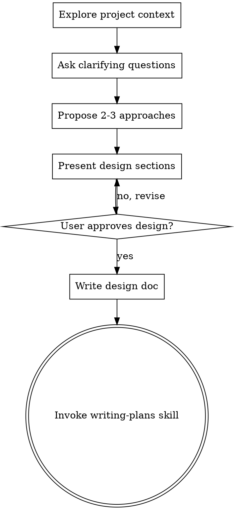

<!-- Generated by SpecStory, Markdown v2.1.0 -->

# 2026-02-25 04:12:16Z

<!-- Claude Code Session f8899954-f0bf-42c3-82d3-72cc1ce077f5 (2026-02-25 04:12:16Z) -->

_**User (2026-02-25 04:12:16Z)**_

migrate this project to vinext

---

_**Agent (claude-opus-4-6 2026-02-25 04:12:19Z)**_

<think><details><summary>Thought Process</summary>
The user wants to migrate this project from Next.js to "vinext". Let me first check if there's a brainstorming skill I should invoke, as this is a significant creative/architectural task.

Let me invoke the brainstorming skill first, as this is a major architectural change.
</details></think>

_**Agent (claude-opus-4-6 2026-02-25 04:12:25Z)**_

此乃重大架构迁移，容吾先探明"vinext"之意，再行规划。

"vinext"非吾所知之框架。君所言者，乃以下何者？

1. **Vinxi** — SolidStart 所用之 Vite-based server framework
2. **Vite + React** — 纯 Vite 构建，弃 Next.js
3. **TanStack Start** — 基于 Vinxi 之 React 全栈框架
4. **Waku** — React Server Components 之轻量框架
5. 其他？请明示框架名称或链接

迁移涉及 App Router, RSC, API routes, middleware 等，须确认目标方可规划。

---

_**User (2026-02-25 04:12:32Z)**_

https://github.com/cloudflare/vinext

---

_**Agent (claude-opus-4-6 2026-02-25 04:12:35Z)**_

<think><details><summary>Thought Process</summary>
The user wants to migrate to "vinext" from Cloudflare. Let me fetch information about this project from GitHub.
</details></think>

_**Agent (claude-opus-4-6 2026-02-25 04:12:35Z)**_

<tool-use data-tool-type="unknown" data-tool-name="ToolSearch"><details>
<summary>Tool use: **ToolSearch**</summary>

**Input:**

- max_results: `2`
- query: `web fetch`

**Result:**

```

```
</details></tool-use>

_**Agent (claude-opus-4-6 2026-02-25 04:12:41Z)**_

<tool-use data-tool-type="shell" data-tool-name="Bash"><details>
<summary>Tool use: **Bash**</summary>
Fetch vinext repo info and README via gh CLI

`gh repo view cloudflare/vinext --json description,name,url 2>/dev/null; echo "---"; gh api repos/cloudflare/vinext/readme --jq '.content' 2>/dev/null | base64 -d 2>/dev/null | head -200`

```text
{"description":"Vite plugin that reimplements the Next.js API surface — deploy anywhere","name":"vinext","url":"https://github.com/cloudflare/vinext"}
---
# vinext

The Next.js API surface, reimplemented on Vite.

> **Read the announcement:** [How we rebuilt Next.js with AI in one week](https://blog.cloudflare.com/vinext/)

> 🚧 **Experimental — under heavy development.** This project is an experiment in AI-driven software development. The vast majority of the code, tests, and documentation were written by AI (Claude Code). Humans direct architecture, priorities, and design decisions, but have not reviewed most of the code line-by-line. Treat this accordingly — there will be bugs, rough edges, and things that don't work. Use at your own risk.

## Quick start

vinext includes an [Agent Skill](https://agentskills.io/home) that handles migration for you. It works with Claude Code, OpenCode, Cursor, Codex, and dozens of other AI coding tools. Install it, open your Next.js project, and tell the AI to migrate:

```sh
npx skills add cloudflare/vinext
```

Then open your Next.js project in any supported tool and say:

```
migrate this project to vinext
```

The skill handles compatibility checking, dependency installation, config generation, and dev server startup. It knows what vinext supports and will flag anything that needs manual attention.

### Or do it manually

```bash
npm install vinext
```

Replace `next` with `vinext` in your scripts:

```json
{
  "scripts": {
    "dev": "vinext dev",
    "build": "vinext build",
    "start": "vinext start"
  }
}
```

```bash
vinext dev          # Development server with HMR
vinext build        # Production build
vinext deploy       # Build and deploy to Cloudflare Workers
```

vinext auto-detects your `app/` or `pages/` directory, loads `next.config.js`, and configures Vite automatically. No `vite.config.ts` required for basic usage.

Your existing `pages/`, `app/`, `next.config.js`, and `public/` directories work as-is. Run `vinext check` first to scan for known compatibility issues, or use `vinext init` to [automate the full migration](#migrating-an-existing-nextjs-project).

### CLI reference

| Command | Description |
|---------|-------------|
| `vinext dev` | Start dev server with HMR |
| `vinext build` | Production build (multi-environment for App Router: RSC + SSR + client) |
| `vinext start` | Start local production server for testing |
| `vinext deploy` | Build and deploy to Cloudflare Workers |
| `vinext init` | Migrate a Next.js project to run under vinext |
| `vinext check` | Scan your Next.js app for compatibility issues before migrating |
| `vinext lint` | Delegate to eslint or oxlint |

Options: `-p / --port <port>`, `-H / --hostname <host>`, `--turbopack` (accepted, no-op).

`vinext deploy` options: `--preview`, `--name <name>`, `--skip-build`, `--dry-run`, `--experimental-tpr`.

`vinext init` options: `--port <port>` (default: 3001), `--skip-check`, `--force`.

### Migrating an existing Next.js project

`vinext init` automates the migration in one command:

```bash
npx vinext init
```

This will:

1. Run `vinext check` to scan for compatibility issues
2. Install `vite` (and `@vitejs/plugin-rsc` for App Router projects) as devDependencies
3. Rename CJS config files (e.g. `postcss.config.js` -> `.cjs`) to avoid ESM conflicts
4. Add `"type": "module"` to `package.json`
5. Add `dev:vinext` and `build:vinext` scripts to `package.json`
6. Generate a minimal `vite.config.ts`

The migration is non-destructive -- your existing Next.js setup continues to work alongside vinext. It does not modify `next.config`, `tsconfig.json`, or any source files, and it does not remove Next.js dependencies.

```bash
npm run dev:vinext    # Start the vinext dev server (port 3001)
npm run dev           # Still runs Next.js as before
```

Use `--force` to overwrite an existing `vite.config.ts`, or `--skip-check` to skip the compatibility report.

## Why

Vite has become the default build tool for modern web frameworks — fast HMR, a clean plugin API, native ESM, and a growing ecosystem. With [`@vitejs/plugin-rsc`](https://github.com/vitejs/vite-plugin-rsc) adding React Server Components support, it's now possible to build a full RSC framework on Vite.

vinext is an experiment: can we reimplement the Next.js API surface on Vite, so that existing Next.js applications can run on a completely different toolchain? The answer, so far, is mostly yes — about 94% of the API surface works.

The current deployment target is Cloudflare Workers — zero cold starts, global by default, integrated platform (KV, R2, D1, AI). The `vinext deploy` command handles the full build-and-deploy pipeline. Expanding to other deployment targets is something we'd like to explore.

**Alternatives worth knowing about:**
- **[OpenNext](https://opennext.js.org/)** — adapts `next build` output for AWS, Cloudflare, and other platforms. More mature and battle-tested than vinext.
- **[Next.js self-hosting](https://nextjs.org/docs/app/building-your-application/deploying#self-hosting)** — Next.js can be deployed to any Node.js server, Docker container, or as a static export.

### Design principles

- **Start with Cloudflare, expand later.** Workers is the current deployment target. Every feature is built and tested for Workers. We're interested in supporting other platforms and welcome contributions.
- **Pragmatic compatibility, not bug-for-bug parity.** Targets 95%+ of real-world Next.js apps. Edge cases that depend on undocumented Vercel behavior are intentionally not supported.
- **Latest Next.js only.** Targets Next.js 16.x. No support for deprecated APIs from older versions.
- **Incremental adoption.** Drop in the plugin, fix what breaks, deploy.

## FAQ

**What is this?**
vinext is a Vite plugin that reimplements the public Next.js API — routing, server rendering, `next/*` module imports, the CLI — so you can run Next.js applications on Vite instead of the Next.js compiler toolchain. Cloudflare Workers is the current deployment target.

**Is this a fork of Next.js?**
No. vinext is an alternative implementation of the Next.js API surface built on Vite. It does import some Next.js types and utilities, but the core is written from scratch. The goal is not to create a competing framework or add features beyond what Next.js offers — it's an experiment in how far AI-driven development and Vite's toolchain can go in replicating an existing, well-defined API surface.

**How is this different from OpenNext?**
[OpenNext](https://opennext.js.org/) adapts the *output* of a standard `next build` to run on various platforms. vinext replaces the build entirely — it reimplements the Next.js APIs on Vite from scratch. OpenNext is a great choice if you need production-ready Next.js on non-Vercel platforms today.

**Can I use this in production?**
You can, with caution. This is experimental software with known bugs. It works well enough for demos and exploration, but it hasn't been battle-tested with real production traffic.

**Can I just self-host Next.js?**
Yes. Next.js supports [self-hosting](https://nextjs.org/docs/app/building-your-application/deploying#self-hosting) on Node.js servers, Docker containers, and static exports. If you're happy with the Next.js toolchain and just want to run it somewhere other than Vercel, self-hosting is the simplest path.

**How are you verifying this works?**
The test suite has over 1,700 Vitest tests and 380 Playwright E2E tests. This includes tests ported directly from the [Next.js test suite](https://github.com/vercel/next.js/tree/canary/test) and [OpenNext's Cloudflare conformance suite](https://github.com/opennextjs/opennextjs-cloudflare), covering routing, SSR, RSC, server actions, caching, metadata, middleware, streaming, and more. Vercel's [App Router Playground](https://github.com/vercel/next-app-router-playground) also runs on vinext as an integration test. See the [Tests](#tests) section and `tests/nextjs-compat/TRACKING.md` for details.

**Who is reviewing this code?**
Mostly nobody. This is an experiment in seeing how far AI-driven development can go. The test suite is the primary quality gate — not human code review. Contributions and code review are welcome.

**Why Vite?**
Vite is an excellent build tool with a rich plugin ecosystem, first-class ESM support, and fast HMR. The [`@vitejs/plugin-rsc`](https://github.com/vitejs/vite-plugin-rsc) plugin adds React Server Components support with multi-environment builds. This project is an experiment to see how much of the Next.js developer experience can be replicated on top of Vite's infrastructure.

**Does this support the Pages Router, App Router, or both?**
Both. File-system routing, SSR, client hydration, and deployment to Cloudflare Workers work for both routers.

**What version of Next.js does this target?**
Next.js 16.x. No support for deprecated APIs from older versions.

**Can I deploy to AWS/Netlify/other platforms?**
Currently only Cloudflare Workers is supported and tested. We're interested in exploring other deployment targets in the future and welcome contributions in that direction.

**What happens when Next.js releases a new feature?**
We track the public Next.js API surface and add support for new stable features. Experimental or unstable Next.js features are lower priority. The plan is to add commit-level tracking of the Next.js repo so we can stay current as new versions are released.

## Deploying to Cloudflare Workers

`vinext deploy` is the simplest path. It auto-generates the necessary configuration files (`vite.config.ts`, `wrangler.jsonc`, `worker/index.ts`) if they don't exist, builds the application, and deploys to Workers.

```bash
vinext deploy
```

The deploy command also auto-detects and fixes common migration issues:
- Adds `"type": "module"` to package.json if missing
- Resolves tsconfig.json path aliases automatically (via `vite-tsconfig-paths`)
- Detects MDX usage and configures `@mdx-js/rollup`
- Renames CJS config files (postcss.config.js, etc.) to `.cjs` when needed
- Detects native Node.js modules (sharp, resvg, satori, lightningcss, @napi-rs/canvas) and auto-stubs them for Workers. If you encounter others that need stubbing, PRs are welcome.

Both App Router and Pages Router work on Workers with full client-side hydration — interactive components, client-side navigation, and React state all work.

### Traffic-aware Pre-Rendering (experimental)

TPR queries Cloudflare zone analytics at deploy time to find which pages actually get traffic, pre-renders only those, and uploads them to KV cache. The result is SSG-level latency for popular pages without pre-rendering your entire site.

```bash
vinext deploy --experimental-tpr                    # Pre-render pages covering 90% of traffic
vinext deploy --experimental-tpr --tpr-coverage 95  # More aggressive coverage
vinext deploy --experimental-tpr --tpr-limit 500    # Cap at 500 pages
vinext deploy --experimental-tpr --tpr-window 48    # Use 48h of analytics
```

Requires a custom domain (zone analytics are unavailable on `*.workers.dev`) and `CLOUDFLARE_API_TOKEN` with Zone.Analytics read permission.

For production caching (ISR), use the built-in Cloudflare KV cache handler:

```ts
import { KVCacheHandler } from "vinext/cloudflare";
import { setCacheHandler } from "next/cache";

setCacheHandler(new KVCacheHandler(env.MY_KV_NAMESPACE));
```

### Custom Vite configuration

If you need to customize the Vite config, create a `vite.config.ts`. vinext will merge its config with yours. This is required for Cloudflare Workers deployment with the App Router (RSC needs explicit plugin configuration):

```ts
import { defineConfig } from "vite";
import vinext from "vinext";
import rsc from "@vitejs/plugin-rsc";
```
</details></tool-use>

_**Agent (claude-opus-4-6 2026-02-25 04:12:49Z)**_

<tool-use data-tool-type="search" data-tool-name="WebSearch"><details>
<summary>Tool use: **WebSearch**</summary>
 `cloudflare vinext framework 2025 2026`

```text
Web search results for query: "cloudflare vinext framework 2025 2026"

Links: [{"title":"How we rebuilt Next.js with AI in one week","url":"https://blog.cloudflare.com/vinext/"},{"title":"Static pre-rendering at build time · Issue #9 · cloudflare/vinext","url":"https://github.com/cloudflare/vinext/issues/9"},{"title":"GitHub - cloudflare/vinext: Vite plugin that reimplements the Next.js API surface — deploy anywhere","url":"https://github.com/cloudflare/vinext"},{"title":"GitHub - cloudflare/vinext-agents-example: vinext ⨉ agents sdk","url":"https://github.com/cloudflare/vinext-agents-example"},{"title":"cloudflare/vinext","url":"https://github.com/cloudflare/vinext/issues"},{"title":"vinext starter","url":"https://vinext.h1n054ur.dev/"},{"title":"Code Mode: give agents an entire API in 1,000 tokens","url":"https://blog.cloudflare.com/code-mode-mcp/"},{"title":"Cloudflare Radar 2025 Year in Review","url":"https://radar.cloudflare.com/year-in-review/2025"},{"title":"Carlo Goncalves on X: \"- @opencode ✅ - @Cloudflare API MCP ✅ - Cloudflare Docs MCP ✅ - Cloudflare Code-Mode MCP ✅ - Cloudflare ViNext skill installed ✅ Loading……\" / X","url":"https://x.com/CarloDotGG/status/2026411110945968463"},{"title":"Your frontend, backend, and database — now in one Cloudflare Worker","url":"https://blog.cloudflare.com/full-stack-development-on-cloudflare-workers/"}]

Based on the web search results, here's what I found about Cloudflare's vinext framework:

## Overview

vinext is a Vite plugin that reimplements the public Next.js API — routing, server rendering, next/* module imports, the CLI — so you can run Next.js applications on Vite instead of the Next.js compiler toolchain. It's 2026, and the cost of building software has completely changed.

## What Makes vinext Different

vinext is an alternative implementation of the Next.js API surface built on Vite. It does import some Next.js types and utilities, but the core is written from scratch. vinext replaces the build entirely — it reimplements the Next.js APIs on Vite from scratch.

## Performance Benefits

vinext builds up to 4x faster, produces 57% smaller bundles, and deploys to Cloudflare Workers with a single command. About 94% of the API surface works.

## Development Approach

They took an API contract, a build tool, and an AI model, and the AI wrote everything in between. No intermediate framework needed. It's not even one week old, and it has not yet been battle-tested with any meaningful traffic at scale.

## Current Status

The current deployment target is Cloudflare Workers — zero cold starts, global by default, integrated platform (KV, R2, D1, AI). Cloudflare is looking to work with other hosting providers about adopting this toolchain for their customers.


REMINDER: You MUST include the sources above in your response to the user using markdown hyperlinks.
```
</details></tool-use>

_**Agent (claude-opus-4-6 2026-02-25 04:13:02Z)**_

<think><details><summary>Thought Process</summary>
Now I understand what vinext is. It's Cloudflare's Vite-based reimplementation of the Next.js API surface. The README mentions there's an Agent Skill for migration. Let me check if this project has that skill installed, and also understand the current project structure better before planning the migration.

The README says:
1. You can use `npx skills add cloudflare/vinext` to install the skill
2. Or do it manually by installing vinext and changing scripts
3. Or use `vinext init` to automate migration

Let me first check the current project state and then plan the migration. This is a complex task - let me invoke the brainstorming skill first as required.


I should check if the vinext skill is already installed by looking at the `.agents/` directory and `skills-lock.json` file. Since this project is on Next.js 16 with the App Router, it's compatible with vinext's target version. Before proceeding with the migration, I need to understand the full project structure and then invoke the brainstorming skill as required.
</details></think>

_**Agent (claude-opus-4-6 2026-02-25 04:13:03Z)**_

明矣。vinext 乃 Cloudflare 以 Vite 重构 Next.js API 之实验框架，目标为 Cloudflare Workers 部署。容吾先探明项目现状，再行规划。

_**Agent (claude-opus-4-6 2026-02-25 04:13:03Z)**_

<tool-use data-tool-type="unknown" data-tool-name="ToolSearch"><details>
<summary>Tool use: **ToolSearch**</summary>

**Input:**

- max_results: `1`
- query: `select:Skill`

**Result:**

```

```
</details></tool-use>

_**Agent (claude-opus-4-6 2026-02-25 04:13:06Z)**_

<tool-use data-tool-type="generic" data-tool-name="Skill"><details>
<summary>Tool use: **Skill**</summary>

**Input:**

- skill: `brainstorming`

</details></tool-use>

---

_**User (2026-02-25 04:13:06Z)**_

Base directory for this skill: <HOME>/.claude/plugins/cache/claude-plugins-official/superpowers/4.3.1/skills/brainstorming

# Brainstorming Ideas Into Designs

## Overview

Help turn ideas into fully formed designs and specs through natural collaborative dialogue.

Start by understanding the current project context, then ask questions one at a time to refine the idea. Once you understand what you're building, present the design and get user approval.

<HARD-GATE>
Do NOT invoke any implementation skill, write any code, scaffold any project, or take any implementation action until you have presented a design and the user has approved it. This applies to EVERY project regardless of perceived simplicity.
</HARD-GATE>

## Anti-Pattern: "This Is Too Simple To Need A Design"

Every project goes through this process. A todo list, a single-function utility, a config change — all of them. "Simple" projects are where unexamined assumptions cause the most wasted work. The design can be short (a few sentences for truly simple projects), but you MUST present it and get approval.

## Checklist

You MUST create a task for each of these items and complete them in order:

1. **Explore project context** — check files, docs, recent commits
2. **Ask clarifying questions** — one at a time, understand purpose/constraints/success criteria
3. **Propose 2-3 approaches** — with trade-offs and your recommendation
4. **Present design** — in sections scaled to their complexity, get user approval after each section
5. **Write design doc** — save to `docs/plans/YYYY-MM-DD-<topic>-design.md` and commit
6. **Transition to implementation** — invoke writing-plans skill to create implementation plan

## Process Flow



**The terminal state is invoking writing-plans.** Do NOT invoke frontend-design, mcp-builder, or any other implementation skill. The ONLY skill you invoke after brainstorming is writing-plans.

## The Process

**Understanding the idea:**
- Check out the current project state first (files, docs, recent commits)
- Ask questions one at a time to refine the idea
- Prefer multiple choice questions when possible, but open-ended is fine too
- Only one question per message - if a topic needs more exploration, break it into multiple questions
- Focus on understanding: purpose, constraints, success criteria

**Exploring approaches:**
- Propose 2-3 different approaches with trade-offs
- Present options conversationally with your recommendation and reasoning
- Lead with your recommended option and explain why

**Presenting the design:**
- Once you believe you understand what you're building, present the design
- Scale each section to its complexity: a few sentences if straightforward, up to 200-300 words if nuanced
- Ask after each section whether it looks right so far
- Cover: architecture, components, data flow, error handling, testing
- Be ready to go back and clarify if something doesn't make sense

## After the Design

**Documentation:**
- Write the validated design to `docs/plans/YYYY-MM-DD-<topic>-design.md`
- Use elements-of-style:writing-clearly-and-concisely skill if available
- Commit the design document to git

**Implementation:**
- Invoke the writing-plans skill to create a detailed implementation plan
- Do NOT invoke any other skill. writing-plans is the next step.

## Key Principles

- **One question at a time** - Don't overwhelm with multiple questions
- **Multiple choice preferred** - Easier to answer than open-ended when possible
- **YAGNI ruthlessly** - Remove unnecessary features from all designs
- **Explore alternatives** - Always propose 2-3 approaches before settling
- **Incremental validation** - Present design, get approval before moving on
- **Be flexible** - Go back and clarify when something doesn't make sense


---

_**Agent (claude-opus-4-6 2026-02-25 04:13:11Z)**_

<think><details><summary>Thought Process</summary>
The user also pointed me to `@.agents/skills/migrate-to-vinext/SKILL.md`. Let me check if there's a vinext migration skill already installed in the project.

Let me first check the .agents directory and the skill file the user referenced.
</details></think>

_**Agent (claude-opus-4-6 2026-02-25 04:13:12Z)**_

容吾先查看项目中已有之 vinext 迁移 skill，再探明项目现状。

_**Agent (claude-opus-4-6 2026-02-25 04:13:17Z)**_

<tool-use data-tool-type="search" data-tool-name="Glob"><details>
<summary>Tool use: **Glob**</summary>
 pattern `.agents/**/*`

```text
<REPO_ROOT>/.agents/skills/migrate-to-vinext/SKILL.md
<REPO_ROOT>/.agents/skills/migrate-to-vinext/references/compatibility.md
<REPO_ROOT>/.agents/skills/migrate-to-vinext/references/troubleshooting.md
<REPO_ROOT>/.agents/skills/migrate-to-vinext/references/config-examples.md
```
</details></tool-use>

_**Agent (claude-opus-4-6 2026-02-25 04:13:14Z)**_

<tool-use data-tool-type="shell" data-tool-name="Bash"><details>
<summary>Tool use: **Bash**</summary>
Check skills-lock.json

`cat <REPO_ROOT>/skills-lock.json 2>/dev/null | head -50`

```text
{
  "version": 1,
  "skills": {
    "migrate-to-vinext": {
      "source": "cloudflare/vinext",
      "sourceType": "github",
      "computedHash": "19853b718a63cde339b1d5fb80ab8051738505b5940111b976888d6ab7351b32"
    }
  }
}
```
</details></tool-use>

_**Agent (claude-opus-4-6 2026-02-25 04:13:20Z)**_

<tool-use data-tool-type="read" data-tool-name="Read"><details>
<summary>Tool use: **Read**</summary>
 `./.agents/skills/migrate-to-vinext/SKILL.md`

```text
     1→---
     2→name: migrate-to-vinext
     3→description: Migrates Next.js projects to vinext (Vite-based Next.js reimplementation for Cloudflare Workers). Load when asked to migrate, convert, or switch from Next.js to vinext. Handles compatibility scanning, package replacement, Vite config generation, ESM conversion, and Cloudflare deployment setup.
     4→---
     5→
     6→# Migrate Next.js to vinext
     7→
     8→vinext reimplements the Next.js API surface on Vite. Existing `app/`, `pages/`, and `next.config.js` work as-is — migration is a package swap, config generation, and ESM conversion. No changes to application code required.
     9→
    10→## FIRST: Verify Next.js Project
    11→
    12→Confirm `next` is in `dependencies` or `devDependencies` in `package.json`. If not found, STOP — this skill does not apply.
    13→
    14→Detect the package manager from the lockfile:
    15→
    16→| Lockfile | Manager | Install | Uninstall |
    17→|----------|---------|---------|-----------|
    18→| `pnpm-lock.yaml` | pnpm | `pnpm add` | `pnpm remove` |
    19→| `yarn.lock` | yarn | `yarn add` | `yarn remove` |
    20→| `bun.lockb` / `bun.lock` | bun | `bun add` | `bun remove` |
    21→| `package-lock.json` or none | npm | `npm install` | `npm uninstall` |
    22→
    23→Detect the router: if an `app/` directory exists at root or under `src/`, it's App Router. If only `pages/` exists, it's Pages Router. Both can coexist.
    24→
    25→## Quick Reference
    26→
    27→| Command | Purpose |
    28→|---------|---------|
    29→| `vinext check` | Scan project for compatibility issues, produce scored report |
    30→| `vinext init` | Automated migration — installs deps, generates config, converts to ESM |
    31→| `vinext dev` | Development server with HMR |
    32→| `vinext build` | Production build (multi-environment for App Router) |
    33→| `vinext start` | Local production server |
    34→| `vinext deploy` | Build and deploy to Cloudflare Workers |
    35→
    36→## Phase 1: Check Compatibility
    37→
    38→Run `vinext check` (install vinext first if needed via `npx vinext check`). Review the scored report. If critical incompatibilities exist, inform the user before proceeding.
    39→
    40→See [references/compatibility.md](references/compatibility.md) for supported/unsupported features and ecosystem library status.
    41→
    42→## Phase 2: Automated Migration (Recommended)
    43→
    44→Run `vinext init`. This command:
    45→
    46→1. Runs `vinext check` for a compatibility report
    47→2. Installs `vite` as a devDependency (and `@vitejs/plugin-rsc` for App Router)
    48→3. Adds `"type": "module"` to package.json
    49→4. Renames CJS config files (e.g., `postcss.config.js` → `.cjs`) to avoid ESM conflicts
    50→5. Adds `dev:vinext` and `build:vinext` scripts to package.json
    51→6. Generates a minimal `vite.config.ts`
    52→
    53→This is non-destructive — the existing Next.js setup continues to work alongside vinext. Use the `dev:vinext` script to test before fully switching over.
    54→
    55→If `vinext init` succeeds, skip to Phase 4 (Verify). If it fails or the user prefers manual control, continue to Phase 3.
    56→
    57→## Phase 3: Manual Migration
    58→
    59→Use this as a fallback when `vinext init` doesn't work or the user wants full control.
    60→
    61→### 3a. Replace packages
    62→
    63→```bash
    64→# Example with npm:
    65→npm uninstall next
    66→npm install vinext
    67→npm install -D vite
    68→# App Router only:
    69→npm install -D @vitejs/plugin-rsc
    70→```
    71→
    72→### 3b. Update scripts
    73→
    74→Replace all `next` commands in `package.json` scripts:
    75→
    76→| Before | After | Notes |
    77→|--------|-------|-------|
    78→| `next dev` | `vinext dev` | Dev server with HMR |
    79→| `next build` | `vinext build` | Production build |
    80→| `next start` | `vinext start` | Local production server |
    81→| `next lint` | `vinext lint` | Delegates to eslint/oxlint |
    82→
    83→Preserve flags: `next dev --port 3001` → `vinext dev --port 3001`.
    84→
    85→### 3c. Convert to ESM
    86→
    87→Add `"type": "module"` to package.json. Rename any CJS config files:
    88→
    89→- `postcss.config.js` → `postcss.config.cjs`
    90→- `tailwind.config.js` → `tailwind.config.cjs`
    91→- Any other `.js` config that uses `module.exports`
    92→
    93→### 3d. Generate vite.config.ts
    94→
    95→See [references/config-examples.md](references/config-examples.md) for config variants per router and deployment target.
    96→
    97→**Pages Router (minimal):**
    98→```ts
    99→import vinext from "vinext";
   100→import { defineConfig } from "vite";
   101→export default defineConfig({ plugins: [vinext()] });
   102→```
   103→
   104→**App Router (minimal):**
   105→```ts
   106→import vinext from "vinext";
   107→import { defineConfig } from "vite";
   108→export default defineConfig({ plugins: [vinext()] });
   109→```
   110→
   111→vinext auto-registers `@vitejs/plugin-rsc` for App Router when the `rsc` option is not explicitly `false`. No manual RSC plugin config needed for local development.
   112→
   113→## Phase 4: Cloudflare Deployment (Optional)
   114→
   115→If the user wants to deploy to Cloudflare Workers, the simplest path is `vinext deploy` — it auto-generates `wrangler.jsonc`, worker entry, and Vite config if missing, installs `@cloudflare/vite-plugin` and `wrangler`, then builds and deploys.
   116→
   117→For manual setup or custom worker entries, see [references/config-examples.md](references/config-examples.md).
   118→
   119→## Phase 5: Verify
   120→
   121→1. Run `vinext dev` to start the development server
   122→2. Confirm the server starts without errors
   123→3. Navigate key routes and check functionality
   124→4. Report the result to the user — if errors occur, share full output
   125→
   126→See [references/troubleshooting.md](references/troubleshooting.md) for common migration errors.
   127→
   128→## Known Limitations
   129→
   130→| Feature | Status |
   131→|---------|--------|
   132→| `next/image` optimization | Remote images via @unpic; no build-time optimization |
   133→| `next/font/google` | CDN-loaded, not self-hosted |
   134→| Domain-based i18n | Not supported; path-prefix i18n works |
   135→| `next/jest` | Not supported; use Vitest |
   136→| Turbopack/webpack config | Ignored; use Vite plugins instead |
   137→| `runtime` / `preferredRegion` | Route segment configs ignored |
   138→| PPR (Partial Prerendering) | Use `"use cache"` directive instead (Next.js 16 approach) |
   139→
   140→## Anti-patterns
   141→
   142→- **Do not modify `app/`, `pages/`, or application code.** vinext shims all `next/*` imports — no import rewrites needed.
   143→- **Do not rewrite `next/*` imports** to `vinext/*` in application code. Imports like `next/image`, `next/link`, `next/server` resolve automatically.
   144→- **Do not copy webpack/Turbopack config** into Vite config. Use Vite-native plugins instead.
   145→- **Do not skip the compatibility check.** Run `vinext check` before migration to surface issues early.
   146→- **Do not remove `next.config.js`** unless replacing it with `next.config.ts` or `.mjs`. vinext reads it for redirects, rewrites, headers, basePath, i18n, images, and env config.
   147→
```
</details></tool-use>

_**Agent (claude-opus-4-6 2026-02-25 04:13:21Z)**_

<tool-use data-tool-type="read" data-tool-name="Read"><details>
<summary>Tool use: **Read**</summary>
 `./.agents/skills/migrate-to-vinext/references/compatibility.md`

```text
     1→# Compatibility Reference
     2→
     3→## Supported next/* Imports
     4→
     5→All of these resolve automatically to vinext shims. Do not rewrite imports in application code.
     6→
     7→| Import | Status | Notes |
     8→|--------|--------|-------|
     9→| `next/link` | Full | |
    10→| `next/image` | Partial | Remote images via @unpic; no build-time optimization |
    11→| `next/head` | Full | |
    12→| `next/router` | Full | Pages Router |
    13→| `next/navigation` | Full | App Router |
    14→| `next/server` | Full | NextRequest, NextResponse, cookies, userAgent, after, connection |
    15→| `next/headers` | Full | |
    16→| `next/dynamic` | Full | |
    17→| `next/script` | Full | |
    18→| `next/font/google` | Partial | CDN-loaded, not self-hosted |
    19→| `next/font/local` | Partial | Runtime injection |
    20→| `next/og` | Full | Via @vercel/og |
    21→| `next/cache` | Full | Pluggable CacheHandler |
    22→| `next/form` | Full | |
    23→| `next/legacy/image` | Full | |
    24→| `next/error` | Full | |
    25→| `next/config` | Full | |
    26→| `next/document` | Full | Pages Router |
    27→| `next/constants` | Full | |
    28→| `next/amp` | Stub | No-op; AMP deprecated since Next.js 13 |
    29→| `next/web-vitals` | Stub | No-op |
    30→| `server-only` | Full | |
    31→| `client-only` | Full | |
    32→
    33→## Routing Features
    34→
    35→| Feature | Supported |
    36→|---------|-----------|
    37→| Pages Router (`pages/`) | Yes |
    38→| App Router (`app/`) | Yes |
    39→| Dynamic routes `[param]` | Yes |
    40→| Catch-all `[...slug]` | Yes |
    41→| Optional catch-all `[[...slug]]` | Yes |
    42→| Route groups `(group)` | Yes |
    43→| Parallel routes `@slot` | Yes |
    44→| Intercepting routes `(.)`, `(..)`, `(...)` | Yes |
    45→| Route handlers (`route.ts`) | Yes |
    46→| Middleware / `proxy.ts` (Next.js 16) | Yes |
    47→| i18n (path prefix) | Yes |
    48→| i18n (domain-based) | No |
    49→| `basePath` | Yes |
    50→| `trailingSlash` | Yes |
    51→
    52→## Server Features
    53→
    54→| Feature | Supported |
    55→|---------|-----------|
    56→| SSR (streaming) | Yes |
    57→| React Server Components | Yes |
    58→| Server Actions (`"use server"`) | Yes |
    59→| `getStaticProps` / `getStaticPaths` | Yes |
    60→| `getServerSideProps` | Yes |
    61→| ISR (stale-while-revalidate) | Yes |
    62→| `"use cache"` / `cacheLife()` / `cacheTag()` | Yes |
    63→| Metadata API (`metadata`, `generateMetadata`) | Yes |
    64→| `generateStaticParams` | Yes |
    65→| Static export (`output: 'export'`) | Yes |
    66→| `instrumentation.ts` | Yes |
    67→| `connection()` | Yes |
    68→| Pluggable CacheHandler | Yes |
    69→| PPR (Partial Prerendering) | No — use `"use cache"` |
    70→
    71→## Route Segment Config
    72→
    73→| Config | Supported |
    74→|--------|-----------|
    75→| `revalidate` | Yes |
    76→| `dynamic` | Yes |
    77→| `dynamicParams` | Yes |
    78→| `runtime` | Ignored |
    79→| `preferredRegion` | Ignored |
    80→
    81→## next.config.js Options
    82→
    83→vinext loads and respects: `redirects`, `rewrites`, `headers`, `basePath`, `trailingSlash`, `i18n` (path prefix), `images`, `env`, `NEXT_PUBLIC_*` env vars, `output`.
    84→
    85→Ignored: `webpack`, `turbopack`, `experimental.turbo`, `serverExternalPackages` (use Vite's `ssr.external`).
    86→
    87→## Ecosystem Libraries
    88→
    89→Tested and working:
    90→
    91→- next-themes
    92→- nuqs
    93→- next-view-transitions
    94→- next-intl
    95→- better-auth
    96→- @vercel/analytics
    97→- tailwindcss
    98→- framer-motion
    99→- shadcn-ui
   100→- lucide-react
   101→- drizzle
   102→- prisma
   103→
   104→## Not Supported
   105→
   106→These features are intentionally excluded:
   107→
   108→- Vercel-specific bindings (@vercel/og edge runtime, Vercel Analytics server bindings)
   109→- AMP (deprecated since Next.js 13)
   110→- `next export` (legacy — use `output: 'export'`)
   111→- Turbopack/webpack configuration
   112→- `next/jest` (use Vitest)
   113→- `create-next-app` scaffolding
   114→- Bug-for-bug parity with undocumented Next.js behavior
   115→- Native Node modules in Workers (sharp, resvg, satori — auto-stubbed in production)
   116→
```
</details></tool-use>

_**Agent (claude-opus-4-6 2026-02-25 04:13:21Z)**_

<tool-use data-tool-type="read" data-tool-name="Read"><details>
<summary>Tool use: **Read**</summary>
 `./.agents/skills/migrate-to-vinext/references/troubleshooting.md`

```text
     1→# Troubleshooting
     2→
     3→## Common Migration Errors
     4→
     5→| Error | Cause | Fix |
     6→|-------|-------|-----|
     7→| `ERR_REQUIRE_ESM` or `require() of ES Module` | Project missing `"type": "module"` | Add `"type": "module"` to package.json |
     8→| `module.exports` syntax error in config file | CJS config loaded as ESM | Rename `.js` config to `.cjs` (e.g., `postcss.config.js` → `postcss.config.cjs`) |
     9→| `Cannot find module '@vitejs/plugin-rsc'` | App Router project missing RSC plugin | `npm install -D @vitejs/plugin-rsc` |
    10→| `Cannot find module 'vite'` | Vite not installed | `npm install -D vite` |
    11→| `vinext: command not found` | vinext not installed or not in PATH | Install vinext: `npm install vinext`, then run via `npx vinext` or package.json scripts |
    12→| RSC environment crash on dev start | Native Node module (sharp, satori) loaded in RSC env | vinext auto-stubs these in production; in dev, ensure these are only imported in server code behind dynamic `import()` |
    13→| `ASSETS binding not found` | wrangler.jsonc missing assets config | Add `"assets": { "not_found_handling": "none" }` to wrangler.jsonc |
    14→
    15→## ESM Conversion Issues
    16→
    17→When adding `"type": "module"`, any `.js` file using `module.exports` or `require()` will break. Common files that need renaming to `.cjs`:
    18→
    19→- `postcss.config.js`
    20→- `tailwind.config.js`
    21→- `.eslintrc.js`
    22→- `jest.config.js` (if kept alongside Vitest)
    23→- `prettier.config.js`
    24→
    25→Alternatively, convert these files to ESM (`export default` syntax) and keep the `.js` extension.
    26→
    27→## App Router vs Pages Router Issues
    28→
    29→**Symptom:** RSC-related errors, "client/server component" boundary violations.
    30→**Cause:** App Router requires `@vitejs/plugin-rsc` for React Server Components.
    31→**Fix:** vinext auto-registers this plugin when it detects `app/`. If auto-registration is disabled (`rsc: false`), enable it or add the plugin manually. See [config-examples.md](config-examples.md).
    32→
    33→**Symptom:** `getServerSideProps` / `getStaticProps` not executing.
    34→**Cause:** These are Pages Router APIs. They only work in `pages/`, not `app/`.
    35→**Fix:** This is expected Next.js behavior, not a vinext issue.
    36→
    37→## Cloudflare Deployment Issues
    38→
    39→**Symptom:** Build succeeds but deploy fails with worker size errors.
    40→**Cause:** Bundle too large for Workers free tier (1 MB) or paid tier (10 MB).
    41→**Fix:** Check for large dependencies. Use `vinext build` + inspect output size. Consider code splitting or moving large deps to external services.
    42→
    43→**Symptom:** Image optimization returns 404 or broken images.
    44→**Cause:** Missing Cloudflare Images binding.
    45→**Fix:** Add `"images": { "binding": "IMAGES" }` and `"assets": { "binding": "ASSETS" }` to wrangler.jsonc.
    46→
    47→**Symptom:** ISR pages not caching across requests.
    48→**Cause:** Default `MemoryCacheHandler` doesn't persist across Worker invocations.
    49→**Fix:** Use `KVCacheHandler` from `vinext/cloudflare` with a KV namespace binding. See [config-examples.md](config-examples.md).
    50→
    51→## Verification Checklist
    52→
    53→After migration, confirm:
    54→
    55→- [ ] `vinext dev` starts without errors
    56→- [ ] Home page renders correctly
    57→- [ ] Dynamic routes resolve (e.g., `/posts/[id]`)
    58→- [ ] API routes respond (Pages Router) or route handlers respond (App Router)
    59→- [ ] Client-side navigation works (Link component)
    60→- [ ] Static assets load (images, fonts, CSS)
    61→- [ ] Environment variables (`NEXT_PUBLIC_*`) are available
    62→- [ ] Middleware or proxy.ts executes on matching routes
    63→
```
</details></tool-use>

_**Agent (claude-opus-4-6 2026-02-25 04:13:22Z)**_

<tool-use data-tool-type="read" data-tool-name="Read"><details>
<summary>Tool use: **Read**</summary>
 `./.agents/skills/migrate-to-vinext/references/config-examples.md`

```text
     1→# Vite Config Examples
     2→
     3→## Pages Router — Local Development
     4→
     5→No Cloudflare, no deployment. Simplest possible config.
     6→
     7→```ts
     8→import vinext from "vinext";
     9→import { defineConfig } from "vite";
    10→
    11→export default defineConfig({
    12→  plugins: [vinext()],
    13→});
    14→```
    15→
    16→## App Router — Local Development
    17→
    18→vinext auto-registers `@vitejs/plugin-rsc` when an `app/` directory is detected and the `rsc` option is not `false`. No extra config needed.
    19→
    20→```ts
    21→import vinext from "vinext";
    22→import { defineConfig } from "vite";
    23→
    24→export default defineConfig({
    25→  plugins: [vinext()],
    26→});
    27→```
    28→
    29→To disable auto-registration (e.g., Pages Router only project with an unused `app/` dir):
    30→
    31→```ts
    32→export default defineConfig({
    33→  plugins: [vinext({ rsc: false })],
    34→});
    35→```
    36→
    37→## Pages Router — Cloudflare Workers
    38→
    39→```ts
    40→import vinext from "vinext";
    41→import { cloudflare } from "@cloudflare/vite-plugin";
    42→import { defineConfig } from "vite";
    43→
    44→export default defineConfig({
    45→  plugins: [vinext(), cloudflare()],
    46→});
    47→```
    48→
    49→## App Router — Cloudflare Workers
    50→
    51→Full manual config with explicit RSC plugin registration and Cloudflare multi-environment setup:
    52→
    53→```ts
    54→import { defineConfig } from "vite";
    55→import vinext from "vinext";
    56→import rsc from "@vitejs/plugin-rsc";
    57→import { cloudflare } from "@cloudflare/vite-plugin";
    58→
    59→export default defineConfig({
    60→  plugins: [
    61→    vinext(),
    62→    rsc({
    63→      entries: {
    64→        rsc: "virtual:vinext-rsc-entry",
    65→        ssr: "virtual:vinext-app-ssr-entry",
    66→        client: "virtual:vinext-app-browser-entry",
    67→      },
    68→    }),
    69→    cloudflare({
    70→      viteEnvironment: { name: "rsc", childEnvironments: ["ssr"] },
    71→    }),
    72→  ],
    73→});
    74→```
    75→
    76→In most cases `vinext deploy` generates this automatically. Only use manual config when customizing the worker entry or adding bindings.
    77→
    78→## wrangler.jsonc — Cloudflare Workers
    79→
    80→Minimal config for deployment:
    81→
    82→```jsonc
    83→{
    84→  "$schema": "node_modules/wrangler/config-schema.json",
    85→  "name": "my-app",
    86→  "compatibility_date": "2026-02-12",
    87→  "compatibility_flags": ["nodejs_compat"],
    88→  "main": "vinext/server/app-router-entry",
    89→  "assets": {
    90→    "not_found_handling": "none"
    91→  }
    92→}
    93→```
    94→
    95→For custom worker entries (e.g., adding KV cache, image optimization bindings):
    96→
    97→```jsonc
    98→{
    99→  "$schema": "node_modules/wrangler/config-schema.json",
   100→  "name": "my-app",
   101→  "compatibility_date": "2026-02-12",
   102→  "compatibility_flags": ["nodejs_compat"],
   103→  "main": "./worker/index.ts",
   104→  "assets": {
   105→    "not_found_handling": "none",
   106→    "binding": "ASSETS"
   107→  },
   108→  "images": { "binding": "IMAGES" }
   109→}
   110→```
   111→
   112→## VinextOptions
   113→
   114→| Option | Type | Default | Description |
   115→|--------|------|---------|-------------|
   116→| `appDir` | `string` | project root | Custom base directory for `app/` and `pages/` |
   117→| `rsc` | `boolean` | `true` | Auto-register `@vitejs/plugin-rsc` for App Router |
   118→
   119→## vinext deploy flags
   120→
   121→| Flag | Description |
   122→|------|-------------|
   123→| `--preview` | Deploy to preview environment |
   124→| `--name <name>` | Override worker name |
   125→| `--skip-build` | Skip build step (deploy existing output) |
   126→| `--dry-run` | Generate config without deploying |
   127→| `--experimental-tpr` | Enable Traffic-aware Pre-Rendering |
   128→
```
</details></tool-use>

_**Agent (claude-opus-4-6 2026-02-25 04:13:27Z)**_

<think><details><summary>Thought Process</summary>
Now I have a comprehensive understanding of vinext and the migration skill. Let me now explore the current project to understand what we're working with before proceeding with the brainstorming process.

The brainstorming skill requires me to:
1. Explore project context
2. Ask clarifying questions
3. Propose approaches
4. Present design
5. Write design doc
6. Transition to implementation

But actually, this is a pretty well-defined migration task. The user wants to migrate from Next.js to vinext. The skill from cloudflare/vinext provides clear migration steps. Let me explore the project context first.

Let me check the key project files to understand what needs to happen.
</details></think>

_**Agent (claude-opus-4-6 2026-02-25 04:13:28Z)**_

已阅 vinext 迁移 skill 全文。容吾探明项目现状。

_**Agent (claude-opus-4-6 2026-02-25 04:13:29Z)**_

<tool-use data-tool-type="read" data-tool-name="Read"><details>
<summary>Tool use: **Read**</summary>
 `./apps/web/package.json`

```text
     1→{
     2→  "name": "@shiro/web",
     3→  "version": "6.6.7",
     4→  "private": true,
     5→  "license": "AGPL-3.0",
     6→  "type": "module",
     7→  "imports": {
     8→    "#fetch": {
     9→      "react-server": "./src/lib/fetch/fetch.server.ts",
    10→      "default": "./src/lib/fetch/fetch.client.ts"
    11→    }
    12→  },
    13→  "scripts": {
    14→    "analyze": "cross-env NODE_ENV=production ANALYZE=true BUNDLE_ANALYZE=browser next build",
    15→    "prebuild": "rimraf .next || exit 0",
    16→    "build": "tsc --noEmit && cross-env NODE_ENV=production NODE_OPTIONS=--max_old_space_size=4096 next build",
    17→    "build:ci": "tsc --noEmit && cross-env NODE_ENV=production NODE_OPTIONS=--max_old_space_size=4096 NEXT_TELEMETRY_DISABLED=1 CI=true next build",
    18→    "dev": "cross-env NODE_ENV=development next dev -p 2323 --turbo",
    19→    "dev:turbo": "cross-env NODE_ENV=development next dev -p 2323 --turbo",
    20→    "lint": "eslint --fix",
    21→    "prod:pm2": "cross-env NODE_ENV=production pm2 restart ecosystem.config.cjs",
    22→    "prod:reload": "pm2 reload ecosystem.config.cjs",
    23→    "prod:stop": "pm2 stop ecosystem.config.cjs",
    24→    "start": "npm run dev"
    25→  },
    26→  "dependencies": {
    27→    "@excalidraw/excalidraw": "0.17.0",
    28→    "@ferrucc-io/emoji-picker": "0.0.48",
    29→    "@floating-ui/react-dom": "2.1.6",
    30→    "@haklex/rich-editor": "0.0.29",
    31→    "@haklex/rich-kit-shiro": "0.0.29",
    32→    "@lexical/code": "^0.40.0",
    33→    "@lexical/link": "^0.40.0",
    34→    "@lexical/list": "^0.40.0",
    35→    "@lexical/markdown": "^0.40.0",
    36→    "@lexical/react": "^0.40.0",
    37→    "@lexical/rich-text": "^0.40.0",
    38→    "@lexical/table": "^0.40.0",
    39→    "@mx-space/api-client": "2.1.1",
    40→    "@openpanel/web": "^1.0.7",
    41→    "@radix-ui/react-avatar": "1.1.11",
    42→    "@radix-ui/react-checkbox": "^1.3.3",
    43→    "@radix-ui/react-dialog": "1.1.15",
    44→    "@radix-ui/react-dropdown-menu": "^2.1.16",
    45→    "@radix-ui/react-label": "2.1.8",
    46→    "@radix-ui/react-scroll-area": "1.2.10",
    47→    "@radix-ui/react-select": "2.2.6",
    48→    "@radix-ui/react-slider": "1.3.6",
    49→    "@radix-ui/react-switch": "1.2.6",
    50→    "@radix-ui/react-tabs": "1.1.13",
    51→    "@shikijs/transformers": "3.21.0",
    52→    "@simplewebauthn/browser": "13.2.2",
    53→    "@simplewebauthn/types": "12.0.0",
    54→    "@tanstack/query-async-storage-persister": "5.90.22",
    55→    "@tanstack/react-query": "5.90.20",
    56→    "@tanstack/react-query-devtools": "5.91.2",
    57→    "@tanstack/react-query-persist-client": "5.90.22",
    58→    "@vercel/functions": "3.3.6",
    59→    "better-auth": "1.4.17",
    60→    "blurhash": "2.0.5",
    61→    "bypass-vue-devtools": "0.0.6",
    62→    "chroma-js": "3.2.0",
    63→    "clsx": "2.1.1",
    64→    "colorjs.io": "^0.6.1",
    65→    "daisyui": "5.5.18",
    66→    "dayjs": "1.11.19",
    67→    "emoji-mart": "5.6.0",
    68→    "es-toolkit": "1.44.0",
    69→    "exif-js": "2.3.0",
    70→    "foxact": "0.2.52",
    71→    "fuse.js": "7.1.0",
    72→    "idb-keyval": "6.2.2",
    73→    "immer": "^11.1.4",
    74→    "jojoo": "0.3.0",
    75→    "jotai": "2.16.2",
    76→    "js-cookie": "3.0.5",
    77→    "js-yaml": "4.1.1",
    78→    "jsondiffpatch": "^0.7.3",
    79→    "katex": "0.16.28",
    80→    "kbar": "0.1.0-beta.48",
    81→    "lexical": "^0.40.0",
    82→    "markdown-escape": "2.0.0",
    83→    "markdown-to-jsx": "npm:@innei/markdown-to-jsx-yet@7.7.7-11",
    84→    "marked": "17.0.1",
    85→    "mdast-util-to-markdown": "2.1.2",
    86→    "medium-zoom": "1.1.0",
    87→    "mermaid": "11.12.2",
    88→    "motion": "12.29.2",
    89→    "nanoid": "^5.1.6",
    90→    "next": "16.1.6",
    91→    "next-intl": "^4.8.3",
    92→    "next-runtime-env": "3.3.0",
    93→    "next-themes": "0.4.6",
    94→    "ofetch": "1.5.1",
    95→    "pngjs": "7.0.0",
    96→    "prop-types": "15.8.1",
    97→    "qrcode.react": "4.2.0",
    98→    "react": "19.2.4",
    99→    "react-blurhash": "0.3.0",
   100→    "react-dom": "19.2.4",
   101→    "react-error-boundary": "6.1.0",
   102→    "react-intersection-observer": "10.0.2",
   103→    "react-photo-view": "1.2.7",
   104→    "react-responsive-masonry": "2.7.1",
   105→    "react-router-dom": "^7.13.1",
   106→    "react-shadow": "20.6.0",
   107→    "react-tweet": "npm:@innei/react-tweet@3.4.2",
   108→    "remove-markdown": "0.6.3",
   109→    "rss": "1.2.2",
   110→    "schema-dts": "1.1.5",
   111→    "server-only": "^0.0.1",
   112→    "socket.io-client": "4.8.3",
   113→    "sonner": "2.0.7",
   114→    "tailwind-merge": "3.4.0",
   115→    "tailwind-variants": "3.2.2",
   116→    "unified": "^11.0.5",
   117→    "uniqolor": "1.1.1",
   118→    "unist-util-visit": "5.1.0",
   119→    "use-context-selector": "2.0.0",
   120→    "use-debounce": "10.1.0",
   121→    "vaul": "1.1.2",
   122→    "xss": "1.0.15"
   123→  },
   124→  "devDependencies": {
   125→    "@egoist/tailwindcss-icons": "1.9.0",
   126→    "@iconify-json/material-symbols": "1.2.53",
   127→    "@iconify-json/mingcute": "1.2.7",
   128→    "@innei/prettier": "1.0.0",
   129→    "@mx-space/webhook": "0.5.0",
   130→    "@next/bundle-analyzer": "16.1.5",
   131→    "@tailwindcss/postcss": "^4.2.1",
   132→    "@tailwindcss/typography": "0.5.19",
   133→    "@types/chroma-js": "3.1.2",
   134→    "@types/js-cookie": "3.0.6",
   135→    "@types/js-yaml": "4.0.9",
   136→    "@types/katex": "0.16.8",
   137→    "@types/markdown-escape": "1.1.3",
   138→    "@types/node": "25.0.10",
   139→    "@types/pngjs": "6.0.5",
   140→    "@types/react": "19.2.9",
   141→    "@types/react-dom": "19.2.3",
   142→    "@types/react-responsive-masonry": "2.7.0",
   143→    "@types/remove-markdown": "0.3.4",
   144→    "@types/rss": "0.0.32",
   145→    "@webgpu/types": "^0.1.69",
   146→    "autoprefixer": "10.4.23",
   147→    "client-only": "0.0.1",
   148→    "code-inspector-plugin": "1.4.1",
   149→    "cross-env": "10.1.0",
   150→    "dotenv": "17.2.3",
   151→    "eslint": "9.39.2",
   152→    "eslint-config-hyoban": "5.0.6",
   153→    "postcss": "8.5.6",
   154→    "postcss-import": "16.1.1",
   155→    "postcss-js": "5.0.3",
   156→    "postcss-nested": "7.0.2",
   157→    "postcss-preset-env": "10.6.1",
   158→    "postcss-prune-var": "1.1.2",
   159→    "prettier": "3.8.1",
   160→    "rimraf": "6.1.2",
   161→    "sharp": "0.34.5",
   162→    "shiki": "3.21.0",
   163→    "tailwindcss": "4.1.18",
   164→    "taze": "19.9.2",
   165→    "tw-animate-css": "^1.4.0",
   166→    "typescript": "5.9.3",
   167→    "zx": "8.8.5"
   168→  },
   169→  "nextBundleAnalysis": {
   170→    "budget": 358400,
   171→    "budgetPercentIncreaseRed": 20,
   172→    "showDetails": true
   173→  }
   174→}
```
</details></tool-use>

_**Agent (claude-opus-4-6 2026-02-25 04:13:30Z)**_

<tool-use data-tool-type="read" data-tool-name="Read"><details>
<summary>Tool use: **Read**</summary>
 `./package.json`

```text
     1→{
     2→  "name": "shiroi",
     3→  "private": true,
     4→  "type": "module",
     5→  "scripts": {
     6→    "build": "turbo build",
     7→    "build:rich": "turbo run build --filter='./packages/rich-*' --filter='!@haklex/rich-editor-demo'",
     8→    "dev": "turbo dev --filter @shiro/web",
     9→    "lint": "turbo lint",
    10→    "prepare": "pnpm exec simple-git-hooks",
    11→    "publish:rich": "pnpm run build:rich && pnpm -r publish --no-git-checks --filter '@haklex/*'",
    12→    "release": "bumpp -r",
    13→    "release:dry": "bumpp -r --no-commit --no-tag --no-push",
    14→    "release:rich": "bumpp -r -x \"sh -c 'pnpm run build:rich && pnpm run publish:rich'\""
    15→  },
    16→  "simple-git-hooks": {
    17→    "pre-commit": "pnpm exec lint-staged"
    18→  },
    19→  "lint-staged": {
    20→    "*.{js,jsx,ts,tsx}": [
    21→      "prettier --ignore-path ./.gitignore --write "
    22→    ],
    23→    "*.{js,ts,cjs,mjs,jsx,tsx,json}": [
    24→      "eslint --fix"
    25→    ]
    26→  },
    27→  "devDependencies": {
    28→    "@types/node": "25.0.10",
    29→    "bumpp": "^10.4.1",
    30→    "lint-staged": "16.2.7",
    31→    "simple-git-hooks": "2.13.1",
    32→    "turbo": "^2.8.10"
    33→  },
    34→  "packageManager": "pnpm@10.27.0",
    35→  "engines": {
    36→    "node": ">=20"
    37→  },
    38→  "pnpm": {
    39→    "onlyBuiltDependencies": [
    40→      "@parcel/watcher",
    41→      "@swc/core",
    42→      "esbuild",
    43→      "sharp",
    44→      "simple-git-hooks"
    45→    ],
    46→    "overrides": {
    47→      "array-includes": "npm:@nolyfill/array-includes@^1.0.44",
    48→      "array.prototype.findlastindex": "npm:@nolyfill/array.prototype.findlastindex@^1.0.44",
    49→      "array.prototype.flat": "npm:@nolyfill/array.prototype.flat@^1.0.44",
    50→      "array.prototype.flatmap": "npm:@nolyfill/array.prototype.flatmap@^1.0.44",
    51→      "array.prototype.tosorted": "npm:@nolyfill/array.prototype.tosorted@^1.0.44",
    52→      "has": "npm:@nolyfill/has@^1.0.44",
    53→      "is-core-module": "npm:@nolyfill/is-core-module@^1.0.39",
    54→      "object.assign": "npm:@nolyfill/object.assign@^1.0.44",
    55→      "object.entries": "npm:@nolyfill/object.entries@^1.0.44",
    56→      "object.fromentries": "npm:@nolyfill/object.fromentries@^1.0.44",
    57→      "object.groupby": "npm:@nolyfill/object.groupby@^1.0.44",
    58→      "object.hasown": "npm:@nolyfill/object.hasown@^1.0.44",
    59→      "object.values": "npm:@nolyfill/object.values@^1.0.44",
    60→      "string.prototype.matchall": "npm:@nolyfill/string.prototype.matchall@^1.0.44"
    61→    }
    62→  }
    63→}
```
</details></tool-use>

_**Agent (claude-opus-4-6 2026-02-25 04:13:30Z)**_

<tool-use data-tool-type="read" data-tool-name="Read"><details>
<summary>Tool use: **Read**</summary>
 `./apps/web/next.config.mjs`

```text
     1→import { execSync } from 'node:child_process'
     2→import { fileURLToPath } from 'node:url'
     3→
     4→import NextBundleAnalyzer from '@next/bundle-analyzer'
     5→import { codeInspectorPlugin } from 'code-inspector-plugin'
     6→import { config } from 'dotenv'
     7→import createNextIntlPlugin from 'next-intl/plugin'
     8→
     9→const withNextIntl = createNextIntlPlugin('./src/i18n/request.ts')
    10→
    11→process.title = 'Shiro (NextJS)'
    12→
    13→const env = config().parsed || {}
    14→const isProd = process.env.NODE_ENV === 'production'
    15→
    16→const __filename = fileURLToPath(import.meta.url)
    17→
    18→let commitHash = ''
    19→let commitUrl = ''
    20→const repoInfo = getRepoInfo()
    21→
    22→if (repoInfo) {
    23→  commitHash = repoInfo.hash
    24→  commitUrl = repoInfo.url
    25→}
    26→
    27→/** @type {import('next').NextConfig} */
    28→
    29→let nextConfig = {
    30→  env: {
    31→    COMMIT_HASH: commitHash,
    32→    COMMIT_URL: commitUrl,
    33→    BUILD_TIME: new Date().toISOString(),
    34→  },
    35→
    36→  reactStrictMode: true,
    37→  productionBrowserSourceMaps: false,
    38→  output: 'standalone',
    39→  assetPrefix: isProd ? env.ASSETPREFIX || undefined : undefined,
    40→  typescript: {
    41→    ignoreBuildErrors: true,
    42→  },
    43→  compiler: {
    44→    // reactRemoveProperties: { properties: ['^data-id$', '^data-(\\w+)-id$'] },
    45→  },
    46→  experimental: {
    47→    serverMinification: true,
    48→    webpackBuildWorker: true,
    49→    globalNotFound: true,
    50→    turbopackImportTypeText: true,
    51→
    52→    // optimizePackageImports: ['dayjs'],
    53→  },
    54→  images: {
    55→    unoptimized:
    56→      // Squoosh has memory leak issue, but it will remove in next.js 14.3.0
    57→      // !process.env.VERCEL && isProd && eval('!process.env.NEXT_SHARP_PATH'),
    58→      process.env.NODE_ENV !== 'production',
    59→    remotePatterns: [
    60→      {
    61→        protocol: 'https',
    62→        hostname: '**',
    63→      },
    64→    ],
    65→    dangerouslyAllowSVG: true,
    66→    contentSecurityPolicy:
    67→      "default-src 'self'; script-src 'none'; sandbox; style-src 'unsafe-inline';",
    68→  },
    69→
    70→  async rewrites() {
    71→    return {
    72→      beforeFiles: [
    73→        { source: '/atom.xml', destination: '/feed' },
    74→        { source: '/feed.xml', destination: '/feed' },
    75→        { source: '/sitemap.xml', destination: '/sitemap' },
    76→      ],
    77→    }
    78→  },
    79→  turbopack: {
    80→    rules: codeInspectorPlugin({ bundler: 'turbopack', hotKeys: ['altKey'] }),
    81→  },
    82→
    83→  webpack: (config) => {
    84→    config.externals.push({
    85→      'utf-8-validate': 'commonjs utf-8-validate',
    86→      bufferutil: 'commonjs bufferutil',
    87→    })
    88→
    89→    config.plugins.push(
    90→      codeInspectorPlugin({ bundler: 'webpack', hotKeys: ['altKey'] }),
    91→    )
    92→
    93→    config.module.rules.push({
    94→      test: /\.svg$/i,
    95→      type: 'asset/source',
    96→    })
    97→
    98→    return config
    99→  },
   100→}
   101→
   102→// if (env.SENTRY === 'true' && isProd) {
   103→//   // @ts-expect-error
   104→//   nextConfig = withSentryConfig(
   105→//     nextConfig,
   106→//     {
   107→//       // For all available options, see:
   108→//       // https://github.com/getsentry/sentry-webpack-plugin#options
   109→//
   110→//       // Suppresses source map uploading logs during build
   111→//       silent: true,
   112→//
   113→//       org: 'inneis-site',
   114→//       project: 'Shiro',
   115→//     },
   116→//     {
   117→//       // For all available options, see:
   118→//       // https://docs.sentry.io/platforms/javascript/guides/nextjs/manual-setup/
   119→//
   120→//       // Upload a larger set of source maps for prettier stack traces (increases build time)
   121→//       widenClientFileUpload: true,
   122→//
   123→//       // Transpiles SDK to be compatible with IE11 (increases bundle size)
   124→//       transpileClientSDK: true,
   125→//
   126→//       // Routes browser requests to Sentry through a Next.js rewrite to circumvent ad-blockers (increases server load)
   127→//       tunnelRoute: '/monitoring',
   128→//
   129→//       // Hides source maps from generated client bundles
   130→//       hideSourceMaps: true,
   131→//
   132→//       // Automatically tree-shake Sentry logger statements to reduce bundle size
   133→//       disableLogger: true,
   134→//     },
   135→//   )
   136→// }
   137→
   138→if (process.env.ANALYZE === 'true') {
   139→  nextConfig = NextBundleAnalyzer({
   140→    enabled: true,
   141→  })(nextConfig)
   142→}
   143→
   144→export default withNextIntl(nextConfig)
   145→
   146→function getRepoInfo() {
   147→  if (process.env.VERCEL) {
   148→    const { VERCEL_GIT_PROVIDER, VERCEL_GIT_REPO_SLUG, VERCEL_GIT_REPO_OWNER } =
   149→      process.env
   150→
   151→    switch (VERCEL_GIT_PROVIDER) {
   152→      case 'github': {
   153→        return {
   154→          hash: process.env.VERCEL_GIT_COMMIT_SHA,
   155→          url: `https://github.com/${VERCEL_GIT_REPO_OWNER}/${VERCEL_GIT_REPO_SLUG}/commit/${process.env.VERCEL_GIT_COMMIT_SHA}`,
   156→        }
   157→      }
   158→    }
   159→  } else {
   160→    return getRepoInfoFromGit()
   161→  }
   162→}
   163→
   164→function getRepoInfoFromGit() {
   165→  try {
   166→    // 获取最新的 commit hash
   167→    // 获取当前分支名称
   168→    const currentBranch = execSync('git rev-parse --abbrev-ref HEAD')
   169→      .toString()
   170→      .trim()
   171→    // 获取当前分支跟踪的远程仓库名称
   172→    const remoteName = execSync(`git config branch.${currentBranch}.remote`)
   173→      .toString()
   174→      .trim()
   175→    // 获取当前分支跟踪的远程仓库的 URL
   176→    let remoteUrl = execSync(`git remote get-url ${remoteName}`)
   177→      .toString()
   178→      .trim()
   179→
   180→    // 获取最新的 commit hash
   181→    const hash = execSync('git rev-parse HEAD').toString().trim()
   182→    // 转换 git@ 格式的 URL 为 https:// 格式
   183→    if (remoteUrl.startsWith('git@')) {
   184→      remoteUrl = remoteUrl
   185→        .replace(':', '/')
   186→        .replace('git@', 'https://')
   187→        .replace('.git', '')
   188→    } else if (remoteUrl.endsWith('.git')) {
   189→      // 对于以 .git 结尾的 https URL，移除 .git
   190→      remoteUrl = remoteUrl.slice(0, -4)
   191→    }
   192→
   193→    // 根据不同的 Git 托管服务自定义 URL 生成规则
   194→    let webUrl
   195→    if (remoteUrl.includes('github.com')) {
   196→      webUrl = `${remoteUrl}/commit/${hash}`
   197→    } else if (remoteUrl.includes('gitlab.com')) {
   198→      webUrl = `${remoteUrl}/-/commit/${hash}`
   199→    } else if (remoteUrl.includes('bitbucket.org')) {
   200→      webUrl = `${remoteUrl}/commits/${hash}`
   201→    } else {
   202→      // 对于未知的托管服务，可以返回 null 或一个默认格式
   203→      webUrl = `${remoteUrl}/commits/${hash}`
   204→    }
   205→
   206→    return { hash, url: webUrl }
   207→  } catch (error) {
   208→    console.error('Error fetching repo info:', error?.stderr?.toString())
   209→    return null
   210→  }
   211→}
   212→
```
</details></tool-use>

_**Agent (claude-opus-4-6 2026-02-25 04:13:44Z)**_

<think><details><summary>Thought Process</summary>
Now I have a good understanding of the project. Let me analyze the key aspects:

1. **Monorepo**: pnpm + Turborepo
2. **Next.js 16.1.6** with App Router
3. **Already has `"type": "module"`** in both root and web package.json
4. **next.config.mjs** uses:
   - `next-intl` plugin
   - `@next/bundle-analyzer`
   - `code-inspector-plugin` (for both webpack and turbopack)
   - `output: 'standalone'`
   - Custom webpack config (externals, SVG loader)
   - Turbopack configuration, image optimization settings, rewrites for feed/sitemap, and dotenv for environment loading

5. **Key dependencies**: next-intl, better-auth, motion (framer-motion), tailwindcss, daisyui, jotai, tanstack query, socket.io-client, various Radix UI components, etc.

I'm noticing some potential friction points when migrating to vinext: the `output: 'standalone'` mode works differently, webpack and turbopack configurations won't carry over, the `code-inspector-plugin` will need a Vite-compatible alternative, and I need to verify how next-intl integrates with the new setup.

Looking at the dependencies more closely, `@next/bundle-analyzer` becomes unnecessary with Vite, `sharp` gets auto-stubbed in Workers environments, `next-runtime-env` might require adjustments, and `@vercel/functions` could be problematic depending on the deployment target.

Before diving into the migration, I should clarify a few things with the user to make sure I'm heading in the right direction.
</details></think>

_**Agent (claude-opus-4-6 2026-02-25 04:13:48Z)**_

项目概况已明。此乃 Next.js 16 App Router monorepo，依赖丰富。迁移前需确认几点。

**第一问：部署目标为何？**

1. **Cloudflare Workers** — vinext 之主要目标，含 `vinext deploy` 一键部署
2. **自托管 (Node.js / Docker)** — 仅用 Vite 替代 Next.js 构建链，仍以 Node 运行
3. **先试行，后决定** — 非破坏性迁移，Next.js 与 vinext 并存，验证后再定

当前 `next.config.mjs` 中有 `output: 'standalone'`，似为自托管部署。请明示。

---

_**User (2026-02-25 04:15:32Z)**_

2

---

_**Agent (claude-opus-4-6 2026-02-25 04:15:39Z)**_


**第二问：迁移范围？**

当前 `next.config.mjs` 中有若干 vinext 不支持之特性：

- **webpack config** — SVG loader, externals, `code-inspector-plugin`
- **turbopack config** — `code-inspector-plugin`
- **`@next/bundle-analyzer`** — Next.js 专用
- **`@vercel/functions`** — Vercel 专用依赖
- **`output: 'standalone'`** — vinext 有自己的输出方式

两种策略：

1. **非破坏性** — 保留 Next.js 配置，新增 `dev:vinext` / `build:vinext` 脚本并存，验证无误后再全面切换
2. **全面替换** — 直接移除 `next`，以 `vinext` 取代之

君意如何？

---

_**User (2026-02-25 04:17:37Z)**_

2

---

_**Agent (claude-opus-4-6 2026-02-25 04:17:57Z)**_

<think><details><summary>Thought Process</summary>
The user wants a full replacement - directly remove `next` and replace with `vinext`. Let me ask one more clarifying question about the `next-intl` setup since it uses a plugin wrapper, and about `@vercel/functions` which is Vercel-specific.

Actually, I think I have enough context now. Let me propose the design/approach rather than asking more questions. The brainstorming skill says to propose 2-3 approaches with trade-offs, then present the design.

Let me think about the approaches:

Given the user wants:
- Self-hosted (Node.js), not Cloudflare Workers
- Full replacement, not non-destructive


- The migration path involves swapping out `next` for `vinext`, installing `vite` and the RSC plugin, updating the build scripts, creating a Vite config, and dealing with incompatibilities like Vercel-specific packages, the `next-intl` plugin wrapper, and SVG imports that need special handling.

Now I'm realizing the core challenge: `next-intl` wraps the Next config through a plugin, but vinext reads the config directly, so that plugin pattern won't translate the same way. I also need to handle removing or replacing `@vercel/functions`, figure out the SVG import strategy with a Vite plugin, and accept that some Next-specific outputs like `standalone` mode won't apply. The key constraint is keeping application code untouched and avoiding rewrites of Next imports—this should stay at the config level.

Given the constraints around full replacement and self-hosting, the different approaches really boil down to execution method rather than fundamentally different strategies. I'll move forward with presenting the migration design.
</details></think>

_**Agent (claude-opus-4-6 2026-02-25 04:18:06Z)**_

善。全面替换，自托管。容吾提出迁移方案。

## 迁移设计

### 核心变更

1. **依赖替换** — `next` → `vinext`，新增 `vite` + `@vitejs/plugin-rsc`
2. **脚本更新** — 所有 `next` 命令 → `vinext`
3. **新增 `vite.config.ts`** — App Router 最小配置
4. **清理 `next.config.mjs`** — 移除 webpack/turbopack/bundle-analyzer，保留 rewrites, images, env

### 需处理之兼容问题

| 项目 | 处理方式 |
|------|---------|
| `next-intl` plugin wrapper | vinext 兼容 next-intl，但 `createNextIntlPlugin` 包装方式需验证 |
| `@vercel/functions` | 移除，Vercel 专用 |
| `@next/bundle-analyzer` | 移除，Vite 有自带分析 |
| `code-inspector-plugin` | 该插件支持 `bundler: 'vite'`，迁至 vite.config.ts |
| webpack SVG loader | 改用 Vite 原生 `?raw` import 或 `vite-plugin-svgr` |
| `output: 'standalone'` | 移除，vinext 有自己的输出模式 |
| `sharp` | 保留，仅开发用 |
| `#fetch` import map (`react-server` condition) | vinext 支持 RSC，应可保留 |

### 不变之处

- `app/` 目录、所有组件代码、`next/*` imports — 无需改动
- `next.config.mjs` 中 rewrites, images, env — vinext 会读取
- Turborepo 流程 — 仅更新 web app 脚本

此方案是否可行？确认后即开始实施。