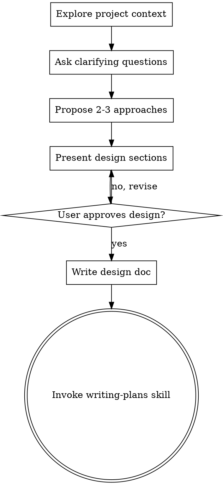

<!-- Generated by SpecStory, Markdown v2.1.0 -->

# 2026-02-25 06:23:14Z

<!-- Claude Code Session 7882fa44-04cd-4b5a-9744-34c00b0720c8 (2026-02-25 06:23:14Z) -->

_**User (2026-02-25 06:23:14Z)**_

rich editor 中如何编写 上标下标，footnote node

---

_**Agent (claude-opus-4-6 2026-02-25 06:23:17Z)**_

<think><details><summary>Thought Process</summary>
The user is asking about how to write superscript, subscript, and footnote nodes in the rich editor. Let me look at the codebase to find relevant information.
</details></think>

_**Agent (claude-opus-4-6 2026-02-25 06:25:16Z)**_

<tool-use data-tool-type="generic" data-tool-name="Task"><details>
<summary>Tool use: **Task**</summary>
Explore superscript/subscript/footnote

```text
Perfect! Now I have a comprehensive understanding. Let me create a detailed report of my findings.

## Rich Editor Footnote, Superscript, and Subscript Feature Exploration

I've conducted a thorough exploration of the Shiroi rich editor codebase. Here's what I found:

### 1. FOOTNOTE FEATURES (Fully Implemented)

**Node Implementation:**
- `<REPO_ROOT>/packages/rich-editor/src/nodes/FootnoteNode.ts` — Inline decorator node that stores a footnote identifier. Creates a `<sup>` DOM element with class `rich-footnote`. Exports to/imports from JSON with identifier as the primary property.
- `<REPO_ROOT>/packages/rich-editor/src/nodes/FootnoteSectionNode.ts` — Block-level decorator node stores a record of footnote definitions (identifier → content). Provides methods: `getDefinitions()`, `setDefinition()`, `removeDefinition()`.
- `<REPO_ROOT>/packages/rich-editor/src/nodes/FootnoteSectionEditNode.ts` — Edit-mode variant of FootnoteSectionNode with no additional UI dependencies.

**Markdown Transformers:**
- `<REPO_ROOT>/packages/rich-editor/src/transformers/footnote.ts`:
  - **FOOTNOTE_TRANSFORMER** (TextMatchTransformer) — Matches `[^identifier]` pattern, creates FootnoteNode
  - **FOOTNOTE_SECTION_TRANSFORMER** (ElementTransformer) — Matches `[^identifier]: content` pattern (regex: `/^\[\^(\w+)\]:\s+(.+)$/`), either updates existing footnote section or creates new one
- Transformers are registered in `ALL_TRANSFORMERS` array for markdown shortcut plugin

**Renderers:**
- `<REPO_ROOT>/packages/rich-editor/src/components/renderers/FootnoteRenderer.tsx`:
  - Renders footnote references as `<a>` with class `rich-footnote-ref`
  - Shows numbered label via `displayNumberMap` from context
  - Includes tooltip showing footnote content
  - Smooth scroll to footnote definition on click
  - Highlights footnote with red flash animation (1.2s)
  - Semantic HTML: `role="doc-noteref"`, `aria-label` for accessibility

- `<REPO_ROOT>/packages/rich-editor/src/components/renderers/FootnoteSectionRenderer.tsx`:
  - Renders footnote definitions section as `<ol>` with class `rich-footnote-section`
  - Sorts entries by display number
  - Each definition is `<li>` with back-reference link (↩) for jumping back
  - Semantic: `role="doc-endnotes"`, `role="doc-backlink"`

- `<REPO_ROOT>/packages/rich-editor/src/components/renderers/FootnoteSectionEditRenderer.tsx`:
  - Edit mode: displays inline text inputs for editing footnote definitions
  - Remove button (×) for deleting footnotes
  - Updates definitions via editor update on input change
  - Display number alongside identifier

**Plugin & Context:**
- `<REPO_ROOT>/packages/rich-editor/src/plugins/FootnotePlugin.tsx`:
  - Listens to editor updates
  - Builds `displayNumberMap` by traversing all FootnoteNodes in order (1, 2, 3...)
  - Extracts definitions from FootnoteSectionNode
  - Provides `FootnoteDefinitionsProvider` context to renderers
  
- `<REPO_ROOT>/packages/rich-editor/src/context/FootnoteDefinitionsContext.tsx`:
  - Exports `useFootnoteDefinitions()`, `useFootnoteContent(id)`, `useFootnoteDisplayNumber(id)`

**Styling:**
- `<REPO_ROOT>/packages/rich-editor/src/styles/shared.css.ts` (lines 424-552):
  - Footnote reference: inline-flex, circular background with accent color, `0.82em` size
  - Footnote section: `decimal` ordered list, smaller font, secondary text color
  - Edit mode: flex layout with input fields, delete button with hover state
  - Flash animation: red highlight that fades (rgba(239, 68, 68, 0.24))

**Markdown Support (Headless):**
- `<REPO_ROOT>/packages/rich-headless/src/transformers.ts`:
  - Export transformer converts FootnoteNode → `[^identifier]` markdown
  - Export transformer converts FootnoteSectionNode → `[^id]: content\n[^id2]: content2` markdown

**Registration:**
- `config.ts` — FootnoteNode, FootnoteSectionNode in customNodes array
- `config-edit.ts` — FootnoteNode, FootnoteSectionEditNode in customEditNodes array
- Nodes are disabled when RichRenderer is used (read-only mode)

---

### 2. SUPERSCRIPT & SUBSCRIPT (NOT IMPLEMENTED)

**Finding:** There are NO dedicated superscript or subscript nodes or transformers in the codebase.

**Related but different:**
- Lexical's built-in text formatting supports bold, italic, strikethrough via `$isTextNode().getFormat()` with format flags
- The `INSERT_TRANSFORMER` in headless transformers handles only underline (`++text++`)
- No keyboard shortcuts, slash menu commands, or DOM manipulation for superscript/subscript detected

**Why footnotes use `<sup>` but not full superscript support:**
- FootnoteNode `createDOM()` returns `sup` element, but this is just for semantic rendering
- The actual display is controlled by CSS: `.rich-footnote { verticalAlign: 'super', fontSize: '0.8em' }`
- This is NOT a general-purpose superscript feature — it's styling specific to footnote indicators

---

### 3. HOW FOOTNOTES ARE INSERTED

**Markdown Shortcuts (Primary):**
Type `[^id]` anywhere in the editor → automatically converts to FootnoteNode
Type `[^id]: content` on its own line → automatically converts to FootnoteSectionNode or adds to existing section

**Manual Creation (Not exposed in slash menu):**
Footnotes can only be created programmatically via:
```typescript
import { $createFootnoteNode } from '@haklex/rich-editor'
editor.update(() => {
  const footnote = $createFootnoteNode('id')
  // insert into editor
})
```

**Note:** There's no slash menu item visible in the codebase for inserting footnotes. Users must use markdown syntax or programmatic insertion.

---

### 4. FILE LOCATIONS SUMMARY

**Nodes:**
- `<REPO_ROOT>/packages/rich-editor/src/nodes/FootnoteNode.ts`
- `<REPO_ROOT>/packages/rich-editor/src/nodes/FootnoteSectionNode.ts`
- `<REPO_ROOT>/packages/rich-editor/src/nodes/FootnoteSectionEditNode.ts`

**Transformers:**
- `<REPO_ROOT>/packages/rich-editor/src/transformers/footnote.ts`
- `<REPO_ROOT>/packages/rich-headless/src/transformers.ts` (export)

**Renderers:**
- `<REPO_ROOT>/packages/rich-editor/src/components/renderers/FootnoteRenderer.tsx`
- `<REPO_ROOT>/packages/rich-editor/src/components/renderers/FootnoteSectionRenderer.tsx`
- `<REPO_ROOT>/packages/rich-editor/src/components/renderers/FootnoteSectionEditRenderer.tsx`

**Plugin & Context:**
- `<REPO_ROOT>/packages/rich-editor/src/plugins/FootnotePlugin.tsx`
- `<REPO_ROOT>/packages/rich-editor/src/context/FootnoteDefinitionsContext.tsx`

**Styling:**
- `<REPO_ROOT>/packages/rich-editor/src/styles/shared.css.ts` (lines 424-552)

**Configuration:**
- `<REPO_ROOT>/packages/rich-editor/src/config.ts` (registration)
- `<REPO_ROOT>/packages/rich-editor/src/config-edit.ts` (edit mode registration)
agentId: aa1a189d5956d2e33 (for resuming to continue this agent's work if needed)
<usage>total_tokens: 73652
tool_uses: 41
duration_ms: 112657</usage>
```
</details></tool-use>

_**Agent - sidechain (2026-02-25 06:23:23Z)**_

Explore the rich editor codebase to find how superscript, subscript, and footnote features work. Look for:

1. Footnote node implementation - search in <REPO_ROOT>/packages/rich-editor/src/nodes/ for footnote-related files
2. Superscript/subscript support - check if there are dedicated nodes, or if they're handled via Lexical's built-in text formatting
3. Markdown transformers for footnotes - check <REPO_ROOT>/packages/rich-editor/src/transformers/
4. How footnotes are created/inserted in the editor (slash menu, toolbar, shortcuts)

Be thorough - check nodes, plugins, transformers, and any UI related to these features.

_**Agent - sidechain (claude-haiku-4-5-20251001 2026-02-25 06:23:25Z)**_

I'll conduct a thorough exploration of the rich editor codebase to find how superscript, subscript, and footnote features work.

_**Agent - sidechain (claude-haiku-4-5-20251001 2026-02-25 06:23:25Z)**_

<tool-use data-tool-type="shell" data-tool-name="Bash"><details>
<summary>Tool use: **Bash**</summary>

`find <REPO_ROOT>/packages/rich-editor -type f -name "*.ts" -o -name "*.tsx" | head -20`

```text
<REPO_ROOT>/packages/rich-editor/dist/types/renderer-config.d.ts
<REPO_ROOT>/packages/rich-editor/dist/types/slash-menu.d.ts
<REPO_ROOT>/packages/rich-editor/dist/context/RendererConfigContext.d.ts
<REPO_ROOT>/packages/rich-editor/dist/context/ColorSchemeContext.d.ts
<REPO_ROOT>/packages/rich-editor/dist/context/FootnoteDefinitionsContext.d.ts
<REPO_ROOT>/packages/rich-editor/dist/nodes/ImageNode.d.ts
<REPO_ROOT>/packages/rich-editor/dist/nodes/AlertQuoteEditNode.d.ts
<REPO_ROOT>/packages/rich-editor/dist/nodes/VideoNode.d.ts
<REPO_ROOT>/packages/rich-editor/dist/nodes/FootnoteNode.d.ts
<REPO_ROOT>/packages/rich-editor/dist/nodes/DetailsNode.d.ts
<REPO_ROOT>/packages/rich-editor/dist/nodes/BannerEditNode.d.ts
<REPO_ROOT>/packages/rich-editor/dist/nodes/KaTeXBlockNode.d.ts
<REPO_ROOT>/packages/rich-editor/dist/nodes/LinkCardNode.d.ts
<REPO_ROOT>/packages/rich-editor/dist/nodes/FootnoteSectionNode.d.ts
<REPO_ROOT>/packages/rich-editor/dist/nodes/MermaidNode.d.ts
<REPO_ROOT>/packages/rich-editor/dist/nodes/CodeBlockNode.d.ts
<REPO_ROOT>/packages/rich-editor/dist/nodes/SpoilerNode.d.ts
<REPO_ROOT>/packages/rich-editor/dist/nodes/KaTeXInlineNode.d.ts
<REPO_ROOT>/packages/rich-editor/dist/nodes/shared.d.ts
<REPO_ROOT>/packages/rich-editor/dist/nodes/AlertQuoteNode.d.ts
```
</details></tool-use>

_**Agent - sidechain (claude-haiku-4-5-20251001 2026-02-25 06:23:26Z)**_

Good, I found references to FootnoteNode and FootnoteSectionNode. Let me explore the source directory structure:

_**Agent - sidechain (claude-haiku-4-5-20251001 2026-02-25 06:23:27Z)**_

<tool-use data-tool-type="shell" data-tool-name="Bash"><details>
<summary>Tool use: **Bash**</summary>

`ls -la <REPO_ROOT>/packages/rich-editor/src/ 2>/dev/null || echo "Directory not found in src"`

```text
total 64
drwxr-xr-x@ 17 <USER>  staff   544 Feb 24 20:05 .
drwxr-xr-x@ 13 <USER>  staff   416 Feb 24 18:20 ..
drwxr-xr-x@  9 <USER>  staff   288 Feb 24 22:23 components
-rw-r--r--@  1 <USER>  staff  1332 Feb 21 00:44 config-edit.ts
-rw-r--r--@  1 <USER>  staff  1810 Feb 21 00:44 config.ts
drwxr-xr-x@  5 <USER>  staff   160 Feb 23 18:57 context
-rw-r--r--@  1 <USER>  staff   321 Feb 20 01:48 editor.ts
-rw-r--r--@  1 <USER>  staff  5030 Feb 23 19:02 index.ts
-rw-r--r--@  1 <USER>  staff   387 Feb 20 01:48 node-registry.ts
drwxr-xr-x@ 25 <USER>  staff   800 Feb 23 17:20 nodes
drwxr-xr-x@ 18 <USER>  staff   576 Feb 23 15:22 plugins
-rw-r--r--@  1 <USER>  staff   125 Feb 20 01:48 renderer.ts
drwxr-xr-x@ 12 <USER>  staff   384 Feb 24 20:17 styles
drwxr-xr-x@ 12 <USER>  staff   384 Feb 23 01:28 transformers
drwxr-xr-x@  5 <USER>  staff   160 Feb 20 01:48 types
-rw-r--r--@  1 <USER>  staff  1129 Feb 23 01:32 types.ts
drwxr-xr-x@  5 <USER>  staff   160 Feb 20 01:48 utils
```
</details></tool-use>

_**Agent - sidechain (claude-haiku-4-5-20251001 2026-02-25 06:23:28Z)**_

Now let me check the nodes directory for footnote-related files:

_**Agent - sidechain (claude-haiku-4-5-20251001 2026-02-25 06:23:28Z)**_

<tool-use data-tool-type="shell" data-tool-name="Bash"><details>
<summary>Tool use: **Bash**</summary>

`ls -la <REPO_ROOT>/packages/rich-editor/src/nodes/ | grep -i footnote`

```text
-rw-r--r--@  1 <USER>  staff  2030 Feb 20 01:48 FootnoteNode.ts
-rw-r--r--@  1 <USER>  staff  1011 Feb 20 01:48 FootnoteSectionEditNode.ts
-rw-r--r--@  1 <USER>  staff  2899 Feb 20 01:48 FootnoteSectionNode.ts
```
</details></tool-use>

_**Agent - sidechain (claude-haiku-4-5-20251001 2026-02-25 06:23:29Z)**_

Perfect! Let me also check for superscript and subscript:

_**Agent - sidechain (claude-haiku-4-5-20251001 2026-02-25 06:23:30Z)**_

<tool-use data-tool-type="shell" data-tool-name="Bash"><details>
<summary>Tool use: **Bash**</summary>

`ls -la <REPO_ROOT>/packages/rich-editor/src/nodes/ | grep -E "superscript|subscript" -i`
</details></tool-use>

_**Agent - sidechain (claude-haiku-4-5-20251001 2026-02-25 06:23:31Z)**_

Now let me read the footnote node files and check all nodes:

_**Agent - sidechain (claude-haiku-4-5-20251001 2026-02-25 06:23:32Z)**_

<tool-use data-tool-type="shell" data-tool-name="Bash"><details>
<summary>Tool use: **Bash**</summary>

`ls -1 <REPO_ROOT>/packages/rich-editor/src/nodes/`

```text
AlertQuoteEditNode.ts
AlertQuoteNode.ts
BannerEditNode.ts
BannerNode.ts
CodeBlockEditNode.ts
CodeBlockNode.ts
DetailsNode.ts
FootnoteNode.ts
FootnoteSectionEditNode.ts
FootnoteSectionNode.ts
GridContainerNode.ts
GridEditNode.ts
HorizontalRuleNode.ts
ImageNode.ts
index.ts
KaTeXBlockNode.ts
KaTeXInlineNode.ts
LinkCardNode.ts
MentionNode.ts
MermaidNode.ts
shared.ts
SpoilerNode.ts
VideoNode.ts
```
</details></tool-use>

_**Agent - sidechain (claude-haiku-4-5-20251001 2026-02-25 06:23:33Z)**_

Now let me read the main footnote files:

_**Agent - sidechain (claude-haiku-4-5-20251001 2026-02-25 06:23:33Z)**_

<tool-use data-tool-type="read" data-tool-name="Read"><details>
<summary>Tool use: **Read**</summary>
 `./packages/rich-editor/src/nodes/FootnoteNode.ts`

```text
     1→import type {
     2→  EditorConfig,
     3→  LexicalEditor,
     4→  LexicalNode,
     5→  NodeKey,
     6→  SerializedLexicalNode,
     7→  Spread,
     8→} from 'lexical'
     9→import { DecoratorNode } from 'lexical'
    10→import type { ReactElement } from 'react'
    11→
    12→import { FootnoteRenderer } from '../components/renderers/FootnoteRenderer'
    13→import { createRendererDecoration } from '../components/RendererWrapper'
    14→
    15→export type SerializedFootnoteNode = Spread<
    16→  {
    17→    identifier: string
    18→  },
    19→  SerializedLexicalNode
    20→>
    21→
    22→export class FootnoteNode extends DecoratorNode<ReactElement> {
    23→  __identifier: string
    24→
    25→  static getType(): string {
    26→    return 'footnote'
    27→  }
    28→
    29→  static clone(node: FootnoteNode): FootnoteNode {
    30→    return new FootnoteNode(node.__identifier, node.__key)
    31→  }
    32→
    33→  constructor(identifier: string, key?: NodeKey) {
    34→    super(key)
    35→    this.__identifier = identifier
    36→  }
    37→
    38→  createDOM(_config: EditorConfig): HTMLElement {
    39→    const sup = document.createElement('sup')
    40→    sup.className = 'rich-footnote'
    41→    return sup
    42→  }
    43→
    44→  updateDOM(): boolean {
    45→    return false
    46→  }
    47→
    48→  isInline(): boolean {
    49→    return true
    50→  }
    51→
    52→  static importJSON(serializedNode: SerializedFootnoteNode): FootnoteNode {
    53→    return $createFootnoteNode(serializedNode.identifier)
    54→  }
    55→
    56→  exportJSON(): SerializedFootnoteNode {
    57→    return {
    58→      ...super.exportJSON(),
    59→      type: 'footnote',
    60→      identifier: this.__identifier,
    61→      version: 1,
    62→    }
    63→  }
    64→
    65→  getIdentifier(): string {
    66→    return this.getLatest().__identifier
    67→  }
    68→
    69→  setIdentifier(identifier: string): void {
    70→    const writable = this.getWritable()
    71→    writable.__identifier = identifier
    72→  }
    73→
    74→  decorate(_editor: LexicalEditor, _config: EditorConfig): ReactElement {
    75→    return createRendererDecoration('Footnote', FootnoteRenderer, {
    76→      identifier: this.__identifier,
    77→    })
    78→  }
    79→}
    80→
    81→export function $createFootnoteNode(identifier: string): FootnoteNode {
    82→  return new FootnoteNode(identifier)
    83→}
    84→
    85→export function $isFootnoteNode(
    86→  node: LexicalNode | null | undefined,
    87→): node is FootnoteNode {
    88→  return node instanceof FootnoteNode
    89→}
    90→
```
</details></tool-use>

_**Agent - sidechain (claude-haiku-4-5-20251001 2026-02-25 06:23:33Z)**_

<tool-use data-tool-type="read" data-tool-name="Read"><details>
<summary>Tool use: **Read**</summary>
 `./packages/rich-editor/src/nodes/FootnoteSectionNode.ts`

```text
     1→import type {
     2→  EditorConfig,
     3→  LexicalEditor,
     4→  LexicalNode,
     5→  NodeKey,
     6→  SerializedLexicalNode,
     7→  Spread,
     8→} from 'lexical'
     9→import { DecoratorNode } from 'lexical'
    10→import type { ReactElement } from 'react'
    11→
    12→import { FootnoteSectionRenderer } from '../components/renderers/FootnoteSectionRenderer'
    13→import { createRendererDecoration } from '../components/RendererWrapper'
    14→
    15→export type SerializedFootnoteSectionNode = Spread<
    16→  {
    17→    definitions: Record<string, string>
    18→  },
    19→  SerializedLexicalNode
    20→>
    21→
    22→export class FootnoteSectionNode extends DecoratorNode<ReactElement> {
    23→  __definitions: Record<string, string>
    24→
    25→  static getType(): string {
    26→    return 'footnote-section'
    27→  }
    28→
    29→  static clone(node: FootnoteSectionNode): FootnoteSectionNode {
    30→    return new FootnoteSectionNode({ ...node.__definitions }, node.__key)
    31→  }
    32→
    33→  constructor(definitions: Record<string, string>, key?: NodeKey) {
    34→    super(key)
    35→    this.__definitions = definitions
    36→  }
    37→
    38→  createDOM(_config: EditorConfig): HTMLElement {
    39→    const div = document.createElement('div')
    40→    div.className = 'rich-footnote-section'
    41→    return div
    42→  }
    43→
    44→  updateDOM(): boolean {
    45→    return false
    46→  }
    47→
    48→  isInline(): boolean {
    49→    return false
    50→  }
    51→
    52→  static importJSON(
    53→    serializedNode: SerializedFootnoteSectionNode,
    54→  ): FootnoteSectionNode {
    55→    return $createFootnoteSectionNode(serializedNode.definitions)
    56→  }
    57→
    58→  exportJSON(): SerializedFootnoteSectionNode {
    59→    return {
    60→      ...super.exportJSON(),
    61→      type: 'footnote-section',
    62→      definitions: this.__definitions,
    63→      version: 1,
    64→    }
    65→  }
    66→
    67→  getDefinitions(): Record<string, string> {
    68→    return this.getLatest().__definitions
    69→  }
    70→
    71→  setDefinitions(definitions: Record<string, string>): void {
    72→    const writable = this.getWritable()
    73→    writable.__definitions = definitions
    74→  }
    75→
    76→  getDefinition(identifier: string): string | undefined {
    77→    return this.getLatest().__definitions[identifier]
    78→  }
    79→
    80→  setDefinition(identifier: string, content: string): void {
    81→    const writable = this.getWritable()
    82→    writable.__definitions = {
    83→      ...writable.__definitions,
    84→      [identifier]: content,
    85→    }
    86→  }
    87→
    88→  removeDefinition(identifier: string): void {
    89→    const writable = this.getWritable()
    90→    const { [identifier]: _, ...rest } = writable.__definitions
    91→    writable.__definitions = rest
    92→  }
    93→
    94→  decorate(_editor: LexicalEditor, _config: EditorConfig): ReactElement {
    95→    return createRendererDecoration(
    96→      'FootnoteSection',
    97→      FootnoteSectionRenderer,
    98→      {
    99→        definitions: this.__definitions,
   100→        nodeKey: this.__key,
   101→      },
   102→    )
   103→  }
   104→}
   105→
   106→export function $createFootnoteSectionNode(
   107→  definitions: Record<string, string> = {},
   108→): FootnoteSectionNode {
   109→  return new FootnoteSectionNode(definitions)
   110→}
   111→
   112→export function $isFootnoteSectionNode(
   113→  node: LexicalNode | null | undefined,
   114→): node is FootnoteSectionNode {
   115→  return node instanceof FootnoteSectionNode
   116→}
   117→
```
</details></tool-use>

_**Agent - sidechain (claude-haiku-4-5-20251001 2026-02-25 06:23:34Z)**_

<tool-use data-tool-type="read" data-tool-name="Read"><details>
<summary>Tool use: **Read**</summary>
 `./packages/rich-editor/src/nodes/FootnoteSectionEditNode.ts`

```text
     1→import type { EditorConfig, LexicalEditor } from 'lexical'
     2→import type { ReactElement } from 'react'
     3→import { createElement } from 'react'
     4→
     5→import { FootnoteSectionEditRenderer } from '../components/renderers/FootnoteSectionEditRenderer'
     6→import {
     7→  FootnoteSectionNode,
     8→  type SerializedFootnoteSectionNode,
     9→} from './FootnoteSectionNode'
    10→
    11→export class FootnoteSectionEditNode extends FootnoteSectionNode {
    12→  static getType(): string {
    13→    return 'footnote-section'
    14→  }
    15→
    16→  static clone(node: FootnoteSectionEditNode): FootnoteSectionEditNode {
    17→    return new FootnoteSectionEditNode({ ...node.__definitions }, node.__key)
    18→  }
    19→
    20→  static importJSON(
    21→    serializedNode: SerializedFootnoteSectionNode,
    22→  ): FootnoteSectionEditNode {
    23→    return new FootnoteSectionEditNode(serializedNode.definitions)
    24→  }
    25→
    26→  decorate(_editor: LexicalEditor, _config: EditorConfig): ReactElement {
    27→    return createElement(FootnoteSectionEditRenderer, {
    28→      definitions: this.__definitions,
    29→      nodeKey: this.__key,
    30→    })
    31→  }
    32→}
    33→
```
</details></tool-use>

_**Agent - sidechain (claude-haiku-4-5-20251001 2026-02-25 06:23:36Z)**_

Now let me check the transformers directory for footnote-related transformations:

_**Agent - sidechain (claude-haiku-4-5-20251001 2026-02-25 06:23:36Z)**_

<tool-use data-tool-type="shell" data-tool-name="Bash"><details>
<summary>Tool use: **Bash**</summary>

`ls -1 <REPO_ROOT>/packages/rich-editor/src/transformers/`

```text
alert.ts
container.ts
footnote.ts
grid-container.ts
index.ts
insert.ts
katex.ts
mention.ts
rich-blocks.ts
spoiler.ts
```
</details></tool-use>

_**Agent - sidechain (claude-haiku-4-5-20251001 2026-02-25 06:23:38Z)**_

Perfect! Let me read the footnote transformer:

_**Agent - sidechain (claude-haiku-4-5-20251001 2026-02-25 06:23:38Z)**_

<tool-use data-tool-type="read" data-tool-name="Read"><details>
<summary>Tool use: **Read**</summary>
 `./packages/rich-editor/src/transformers/footnote.ts`

```text
     1→import {
     2→  FOOTNOTE_SECTION_TRANSFORMER as SECTION_BASE,
     3→  FOOTNOTE_TRANSFORMER as BASE,
     4→} from '@haklex/rich-headless/transformers'
     5→import type {
     6→  ElementTransformer,
     7→  TextMatchTransformer,
     8→} from '@lexical/markdown'
     9→
    10→import { $createFootnoteNode, FootnoteNode } from '../nodes/FootnoteNode'
    11→import {
    12→  $createFootnoteSectionNode,
    13→  $isFootnoteSectionNode,
    14→  FootnoteSectionNode,
    15→} from '../nodes/FootnoteSectionNode'
    16→
    17→export const FOOTNOTE_TRANSFORMER: TextMatchTransformer = {
    18→  ...BASE,
    19→  dependencies: [FootnoteNode],
    20→  replace: (textNode, match) => {
    21→    const footnoteNode = $createFootnoteNode(match[1])
    22→    textNode.replace(footnoteNode)
    23→  },
    24→}
    25→
    26→export const FOOTNOTE_SECTION_TRANSFORMER: ElementTransformer = {
    27→  ...SECTION_BASE,
    28→  dependencies: [FootnoteSectionNode],
    29→  regExp: /^\[\^(\w+)\]:\s+(.+)$/,
    30→  replace: (parentNode, _children, match) => {
    31→    const identifier = match[1]
    32→    const content = match[2]
    33→
    34→    const root = parentNode.getParent()
    35→    if (root) {
    36→      const children = root.getChildren()
    37→      for (const child of children) {
    38→        if ($isFootnoteSectionNode(child)) {
    39→          child.setDefinition(identifier, content)
    40→          parentNode.remove()
    41→          return
    42→        }
    43→      }
    44→    }
    45→
    46→    const sectionNode = $createFootnoteSectionNode({ [identifier]: content })
    47→    parentNode.replace(sectionNode)
    48→  },
    49→}
    50→
```
</details></tool-use>

_**Agent - sidechain (claude-haiku-4-5-20251001 2026-02-25 06:23:39Z)**_

Now let me check the renderers for footnotes:

_**Agent - sidechain (claude-haiku-4-5-20251001 2026-02-25 06:23:40Z)**_

<tool-use data-tool-type="shell" data-tool-name="Bash"><details>
<summary>Tool use: **Bash**</summary>

`ls -la <REPO_ROOT>/packages/rich-editor/src/components/renderers/ | grep -i footnote`

```text
-rw-r--r--@  1 <USER>  staff  1943 Feb 20 14:15 FootnoteRenderer.tsx
-rw-r--r--@  1 <USER>  staff  2832 Feb 20 01:48 FootnoteSectionEditRenderer.tsx
-rw-r--r--@  1 <USER>  staff  2355 Feb 20 01:48 FootnoteSectionRenderer.tsx
```
</details></tool-use>

_**Agent - sidechain (claude-haiku-4-5-20251001 2026-02-25 06:23:41Z)**_

Let me read these renderers:

_**Agent - sidechain (claude-haiku-4-5-20251001 2026-02-25 06:23:41Z)**_

<tool-use data-tool-type="read" data-tool-name="Read"><details>
<summary>Tool use: **Read**</summary>
 `./packages/rich-editor/src/components/renderers/FootnoteRenderer.tsx`

```text
     1→import {
     2→  TooltipContent,
     3→  TooltipRoot,
     4→  TooltipTrigger,
     5→} from '@haklex/rich-editor-ui'
     6→import type { HTMLAttributes, MouseEvent } from 'react'
     7→import { useCallback } from 'react'
     8→
     9→import {
    10→  useFootnoteContent,
    11→  useFootnoteDisplayNumber,
    12→} from '../../context/FootnoteDefinitionsContext'
    13→
    14→export interface FootnoteRendererProps {
    15→  identifier: string
    16→}
    17→
    18→export function FootnoteRenderer({ identifier }: FootnoteRendererProps) {
    19→  const content = useFootnoteContent(identifier)
    20→  const displayNumber = useFootnoteDisplayNumber(identifier)
    21→
    22→  const referenceId = `footnote-ref-${identifier}`
    23→  const targetId = `footnote-${identifier}`
    24→
    25→  const handleClick = useCallback(
    26→    (e: MouseEvent<HTMLAnchorElement>) => {
    27→      const target =
    28→        document.getElementById(targetId) ||
    29→        document.getElementById(`fn-${identifier}`)
    30→      if (!target) return
    31→
    32→      e.preventDefault()
    33→      target.scrollIntoView({ behavior: 'smooth', block: 'center' })
    34→      target.classList.add('rich-footnote-highlight')
    35→
    36→      window.setTimeout(() => {
    37→        target.classList.remove('rich-footnote-highlight')
    38→      }, 1200)
    39→    },
    40→    [identifier, targetId],
    41→  )
    42→
    43→  const label = displayNumber ?? identifier
    44→
    45→  return (
    46→    <span className="rich-footnote-ref-wrapper">
    47→      <TooltipRoot>
    48→        <TooltipTrigger
    49→          render={(props: HTMLAttributes<HTMLElement>) => (
    50→            <a
    51→              {...props}
    52→              className="rich-footnote-ref"
    53→              href={`#${targetId}`}
    54→              id={referenceId}
    55→              role="doc-noteref"
    56→              aria-label={
    57→                content ? `Footnote ${label}: ${content}` : `Footnote ${label}`
    58→              }
    59→              onClick={handleClick}
    60→              data-footnote-ref={identifier}
    61→            >
    62→              {label}
    63→            </a>
    64→          )}
    65→        />
    66→        {content ? <TooltipContent>{content}</TooltipContent> : null}
    67→      </TooltipRoot>
    68→    </span>
    69→  )
    70→}
    71→
```
</details></tool-use>

_**Agent - sidechain (claude-haiku-4-5-20251001 2026-02-25 06:23:42Z)**_

<tool-use data-tool-type="read" data-tool-name="Read"><details>
<summary>Tool use: **Read**</summary>
 `./packages/rich-editor/src/components/renderers/FootnoteSectionRenderer.tsx`

```text
     1→import type { MouseEvent } from 'react'
     2→import { useCallback } from 'react'
     3→
     4→import { useFootnoteDefinitions } from '../../context/FootnoteDefinitionsContext'
     5→
     6→export interface FootnoteSectionRendererProps {
     7→  definitions: Record<string, string>
     8→  nodeKey: string
     9→}
    10→
    11→export function FootnoteSectionRenderer({
    12→  definitions,
    13→}: FootnoteSectionRendererProps) {
    14→  const { displayNumberMap } = useFootnoteDefinitions()
    15→
    16→  const sortedEntries = Object.entries(definitions).sort(
    17→    ([a], [b]) => (displayNumberMap[a] ?? 0) - (displayNumberMap[b] ?? 0),
    18→  )
    19→
    20→  if (sortedEntries.length === 0) return null
    21→
    22→  return (
    23→    <div className="rich-footnote-section-content" role="doc-endnotes">
    24→      <hr className="rich-footnote-section-divider" />
    25→      <ol className="rich-footnote-section-list">
    26→        {sortedEntries.map(([identifier, content]) => {
    27→          const displayNum = displayNumberMap[identifier] ?? identifier
    28→          return (
    29→            <FootnoteSectionItem
    30→              key={identifier}
    31→              identifier={identifier}
    32→              content={content}
    33→              displayNum={displayNum}
    34→            />
    35→          )
    36→        })}
    37→      </ol>
    38→    </div>
    39→  )
    40→}
    41→
    42→function FootnoteSectionItem({
    43→  identifier,
    44→  content,
    45→  displayNum,
    46→}: {
    47→  identifier: string
    48→  content: string
    49→  displayNum: number | string
    50→}) {
    51→  const targetId = `footnote-${identifier}`
    52→  const refId = `footnote-ref-${identifier}`
    53→
    54→  const handleBackClick = useCallback(
    55→    (e: MouseEvent<HTMLAnchorElement>) => {
    56→      e.preventDefault()
    57→      const refElement = document.getElementById(refId)
    58→      if (!refElement) return
    59→      refElement.scrollIntoView({ behavior: 'smooth', block: 'center' })
    60→      refElement.classList.add('rich-footnote-highlight')
    61→      window.setTimeout(() => {
    62→        refElement.classList.remove('rich-footnote-highlight')
    63→      }, 1200)
    64→    },
    65→    [refId],
    66→  )
    67→
    68→  return (
    69→    <li
    70→      id={targetId}
    71→      className="rich-footnote-section-item"
    72→      value={typeof displayNum === 'number' ? displayNum : undefined}
    73→    >
    74→      <span className="rich-footnote-section-item-content">{content}</span>
    75→      <a
    76→        href={`#${refId}`}
    77→        onClick={handleBackClick}
    78→        className="rich-footnote-back-ref"
    79→        role="doc-backlink"
    80→        aria-label={`Back to reference ${displayNum}`}
    81→      >
    82→        ↩
    83→      </a>
    84→    </li>
    85→  )
    86→}
    87→
```
</details></tool-use>

_**Agent - sidechain (claude-haiku-4-5-20251001 2026-02-25 06:23:42Z)**_

<tool-use data-tool-type="read" data-tool-name="Read"><details>
<summary>Tool use: **Read**</summary>
 `./packages/rich-editor/src/components/renderers/FootnoteSectionEditRenderer.tsx`

```text
     1→import { useLexicalComposerContext } from '@lexical/react/LexicalComposerContext'
     2→import { $nodesOfType } from 'lexical'
     3→import { useCallback } from 'react'
     4→
     5→import { useFootnoteDefinitions } from '../../context/FootnoteDefinitionsContext'
     6→import { FootnoteSectionNode } from '../../nodes/FootnoteSectionNode'
     7→
     8→export interface FootnoteSectionEditRendererProps {
     9→  definitions: Record<string, string>
    10→  nodeKey: string
    11→}
    12→
    13→export function FootnoteSectionEditRenderer({
    14→  definitions,
    15→}: FootnoteSectionEditRendererProps) {
    16→  const [editor] = useLexicalComposerContext()
    17→  const { displayNumberMap } = useFootnoteDefinitions()
    18→
    19→  const sortedEntries = Object.entries(definitions).sort(
    20→    ([a], [b]) => (displayNumberMap[a] ?? 0) - (displayNumberMap[b] ?? 0),
    21→  )
    22→
    23→  const handleContentChange = useCallback(
    24→    (identifier: string, newContent: string) => {
    25→      editor.update(() => {
    26→        const sectionNodes = $nodesOfType(FootnoteSectionNode)
    27→        if (sectionNodes.length > 0) {
    28→          sectionNodes[0].setDefinition(identifier, newContent)
    29→        }
    30→      })
    31→    },
    32→    [editor],
    33→  )
    34→
    35→  const handleRemove = useCallback(
    36→    (identifier: string) => {
    37→      editor.update(() => {
    38→        const sectionNodes = $nodesOfType(FootnoteSectionNode)
    39→        if (sectionNodes.length > 0) {
    40→          sectionNodes[0].removeDefinition(identifier)
    41→        }
    42→      })
    43→    },
    44→    [editor],
    45→  )
    46→
    47→  if (sortedEntries.length === 0) return null
    48→
    49→  return (
    50→    <div
    51→      className="rich-footnote-section-content rich-footnote-section-edit"
    52→      role="doc-endnotes"
    53→    >
    54→      <hr className="rich-footnote-section-divider" />
    55→      <ol className="rich-footnote-section-list">
    56→        {sortedEntries.map(([identifier, content]) => {
    57→          const displayNum = displayNumberMap[identifier] ?? identifier
    58→          return (
    59→            <li
    60→              key={identifier}
    61→              id={`footnote-${identifier}`}
    62→              className="rich-footnote-section-item rich-footnote-section-item-edit"
    63→            >
    64→              <span className="rich-footnote-section-item-num">
    65→                {displayNum}.
    66→              </span>
    67→              <input
    68→                type="text"
    69→                className="rich-footnote-section-item-input"
    70→                value={content}
    71→                onChange={(e) =>
    72→                  handleContentChange(identifier, e.target.value)
    73→                }
    74→                placeholder={`Footnote content for [^${identifier}]`}
    75→              />
    76→              <button
    77→                type="button"
    78→                className="rich-footnote-section-item-remove"
    79→                onClick={() => handleRemove(identifier)}
    80→                aria-label={`Remove footnote ${identifier}`}
    81→              >
    82→                ×
    83→              </button>
    84→            </li>
    85→          )
    86→        })}
    87→      </ol>
    88→    </div>
    89→  )
    90→}
    91→
```
</details></tool-use>

_**Agent - sidechain (claude-haiku-4-5-20251001 2026-02-25 06:23:43Z)**_

Now let me check the FootnoteDefinitionsContext:

_**Agent - sidechain (claude-haiku-4-5-20251001 2026-02-25 06:23:44Z)**_

<tool-use data-tool-type="shell" data-tool-name="Bash"><details>
<summary>Tool use: **Bash**</summary>

`ls -la <REPO_ROOT>/packages/rich-editor/src/context/`

```text
total 24
drwxr-xr-x@  5 <USER>  staff   160 Feb 23 18:57 .
drwxr-xr-x@ 17 <USER>  staff   544 Feb 24 20:05 ..
-rw-r--r--@  1 <USER>  staff   522 Feb 20 01:48 ColorSchemeContext.tsx
-rw-r--r--@  1 <USER>  staff  1234 Feb 20 01:48 FootnoteDefinitionsContext.tsx
-rw-r--r--@  1 <USER>  staff  1302 Feb 23 18:57 RendererConfigContext.tsx
```
</details></tool-use>

_**Agent - sidechain (claude-haiku-4-5-20251001 2026-02-25 06:23:45Z)**_

<tool-use data-tool-type="read" data-tool-name="Read"><details>
<summary>Tool use: **Read**</summary>
 `./packages/rich-editor/src/context/FootnoteDefinitionsContext.tsx`

```text
     1→import type { ReactNode } from 'react'
     2→import { createContext, use, useMemo } from 'react'
     3→
     4→export interface FootnoteDefinitionsContextValue {
     5→  definitions: Record<string, string>
     6→  displayNumberMap: Record<string, number>
     7→}
     8→
     9→const FootnoteDefinitionsContext =
    10→  createContext<FootnoteDefinitionsContextValue>({
    11→    definitions: {},
    12→    displayNumberMap: {},
    13→  })
    14→
    15→export function FootnoteDefinitionsProvider({
    16→  definitions,
    17→  displayNumberMap,
    18→  children,
    19→}: FootnoteDefinitionsContextValue & { children: ReactNode }) {
    20→  const value = useMemo(
    21→    () => ({ definitions, displayNumberMap }),
    22→    [definitions, displayNumberMap],
    23→  )
    24→  return (
    25→    <FootnoteDefinitionsContext value={value}>
    26→      {children}
    27→    </FootnoteDefinitionsContext>
    28→  )
    29→}
    30→
    31→export function useFootnoteDefinitions(): FootnoteDefinitionsContextValue {
    32→  return use(FootnoteDefinitionsContext)
    33→}
    34→
    35→export function useFootnoteContent(identifier: string): string | undefined {
    36→  const { definitions } = use(FootnoteDefinitionsContext)
    37→  return definitions[identifier]
    38→}
    39→
    40→export function useFootnoteDisplayNumber(
    41→  identifier: string,
    42→): number | undefined {
    43→  const { displayNumberMap } = use(FootnoteDefinitionsContext)
    44→  return displayNumberMap[identifier]
    45→}
    46→
```
</details></tool-use>

_**Agent - sidechain (claude-haiku-4-5-20251001 2026-02-25 06:23:46Z)**_

Now let me check for plugins related to footnotes:

_**Agent - sidechain (claude-haiku-4-5-20251001 2026-02-25 06:23:47Z)**_

<tool-use data-tool-type="shell" data-tool-name="Bash"><details>
<summary>Tool use: **Bash**</summary>

`ls -1 <REPO_ROOT>/packages/rich-editor/src/plugins/ | grep -i footnote`

```text
FootnotePlugin.tsx
```
</details></tool-use>

_**Agent - sidechain (claude-haiku-4-5-20251001 2026-02-25 06:23:48Z)**_

<tool-use data-tool-type="read" data-tool-name="Read"><details>
<summary>Tool use: **Read**</summary>
 `./packages/rich-editor/src/plugins/FootnotePlugin.tsx`

```text
     1→import { useLexicalComposerContext } from '@lexical/react/LexicalComposerContext'
     2→import { $nodesOfType } from 'lexical'
     3→import { useEffect, useState } from 'react'
     4→
     5→import { FootnoteDefinitionsProvider } from '../context/FootnoteDefinitionsContext'
     6→import { FootnoteNode } from '../nodes/FootnoteNode'
     7→import { FootnoteSectionNode } from '../nodes/FootnoteSectionNode'
     8→
     9→export function FootnotePlugin({ children }: { children?: React.ReactNode }) {
    10→  const [editor] = useLexicalComposerContext()
    11→  const [definitions, setDefinitions] = useState<Record<string, string>>({})
    12→  const [displayNumberMap, setDisplayNumberMap] = useState<
    13→    Record<string, number>
    14→  >({})
    15→
    16→  useEffect(() => {
    17→    return editor.registerUpdateListener(({ editorState }) => {
    18→      editorState.read(() => {
    19→        const footnoteNodes = $nodesOfType(FootnoteNode)
    20→        const seen = new Set<string>()
    21→        const numberMap: Record<string, number> = {}
    22→        let counter = 1
    23→        for (const node of footnoteNodes) {
    24→          const id = node.getIdentifier()
    25→          if (!seen.has(id)) {
    26→            seen.add(id)
    27→            numberMap[id] = counter++
    28→          }
    29→        }
    30→        setDisplayNumberMap(numberMap)
    31→
    32→        const sectionNodes = $nodesOfType(FootnoteSectionNode)
    33→        if (sectionNodes.length > 0) {
    34→          setDefinitions(sectionNodes[0].getDefinitions())
    35→        } else {
    36→          setDefinitions({})
    37→        }
    38→      })
    39→    })
    40→  }, [editor])
    41→
    42→  return (
    43→    <FootnoteDefinitionsProvider
    44→      definitions={definitions}
    45→      displayNumberMap={displayNumberMap}
    46→    >
    47→      {children}
    48→    </FootnoteDefinitionsProvider>
    49→  )
    50→}
    51→
```
</details></tool-use>

_**Agent - sidechain (claude-haiku-4-5-20251001 2026-02-25 06:23:50Z)**_

Now let me check if there's a slash menu or UI for inserting footnotes:

_**Agent - sidechain (claude-haiku-4-5-20251001 2026-02-25 06:23:50Z)**_

<tool-use data-tool-type="shell" data-tool-name="Bash"><details>
<summary>Tool use: **Bash**</summary>

`ls -la <REPO_ROOT>/packages/rich-editor/src/components/`

```text
total 48
drwxr-xr-x@  9 <USER>  staff   288 Feb 24 22:23 .
drwxr-xr-x@ 17 <USER>  staff   544 Feb 24 20:05 ..
-rw-r--r--@  1 <USER>  staff  1160 Feb 20 01:48 ContentEditable.tsx
drwxr-xr-x@  6 <USER>  staff   192 Feb 20 01:48 decorators
drwxr-xr-x@ 17 <USER>  staff   544 Feb 23 19:03 renderers
-rw-r--r--@  1 <USER>  staff  1814 Feb 20 01:48 RendererWrapper.tsx
-rw-r--r--@  1 <USER>  staff  4469 Feb 24 22:23 RichEditor.tsx
-rw-r--r--@  1 <USER>  staff  2505 Feb 24 22:23 RichRenderer.tsx
-rw-r--r--@  1 <USER>  staff   841 Feb 20 01:48 utils.ts
```
</details></tool-use>

_**Agent - sidechain (claude-haiku-4-5-20251001 2026-02-25 06:23:51Z)**_

Let me search for any slash menu or command related to footnotes:

_**Agent - sidechain (claude-haiku-4-5-20251001 2026-02-25 06:23:52Z)**_

<tool-use data-tool-type="search" data-tool-name="Grep"><details>
<summary>Tool use: **Grep**</summary>
 path `./packages/rich-editor/src` pattern `footnote|Footnote`

```text
Found 19 files
packages/rich-editor/src/components/RichEditor.tsx
packages/rich-editor/src/components/RichRenderer.tsx
packages/rich-editor/src/styles/shared.css.ts
packages/rich-editor/src/index.ts
packages/rich-editor/src/transformers/footnote.ts
packages/rich-editor/src/transformers/index.ts
packages/rich-editor/src/nodes/index.ts
packages/rich-editor/src/nodes/shared.ts
packages/rich-editor/src/config-edit.ts
packages/rich-editor/src/config.ts
packages/rich-editor/src/components/renderers/FootnoteRenderer.tsx
packages/rich-editor/src/components/renderers/FootnoteSectionRenderer.tsx
packages/rich-editor/src/components/renderers/FootnoteSectionEditRenderer.tsx
packages/rich-editor/src/plugins/FootnotePlugin.tsx
packages/rich-editor/src/nodes/FootnoteSectionEditNode.ts
packages/rich-editor/src/nodes/FootnoteSectionNode.ts
packages/rich-editor/src/nodes/FootnoteNode.ts
packages/rich-editor/src/context/FootnoteDefinitionsContext.tsx
packages/rich-editor/src/types/renderer-config.ts
```
</details></tool-use>

_**Agent - sidechain (claude-haiku-4-5-20251001 2026-02-25 06:23:54Z)**_

Let me check the config files to see how footnotes are registered:

_**Agent - sidechain (claude-haiku-4-5-20251001 2026-02-25 06:23:54Z)**_

<tool-use data-tool-type="read" data-tool-name="Read"><details>
<summary>Tool use: **Read**</summary>
 `./packages/rich-editor/src/config.ts`

```text
     1→import { CodeNode } from '@lexical/code'
     2→import { HorizontalRuleNode } from '@lexical/extension'
     3→import { AutoLinkNode, LinkNode } from '@lexical/link'
     4→import { ListItemNode, ListNode } from '@lexical/list'
     5→import { HeadingNode, QuoteNode } from '@lexical/rich-text'
     6→import { TableCellNode, TableNode, TableRowNode } from '@lexical/table'
     7→import type { Klass, LexicalNode } from 'lexical'
     8→
     9→import { AlertQuoteNode } from './nodes/AlertQuoteNode'
    10→import { BannerNode } from './nodes/BannerNode'
    11→import { CodeBlockNode } from './nodes/CodeBlockNode'
    12→import { DetailsNode } from './nodes/DetailsNode'
    13→import { FootnoteNode } from './nodes/FootnoteNode'
    14→import { FootnoteSectionNode } from './nodes/FootnoteSectionNode'
    15→import { GridContainerNode } from './nodes/GridContainerNode'
    16→import { ImageNode } from './nodes/ImageNode'
    17→import { KaTeXBlockNode } from './nodes/KaTeXBlockNode'
    18→import { KaTeXInlineNode } from './nodes/KaTeXInlineNode'
    19→import { LinkCardNode } from './nodes/LinkCardNode'
    20→import { MentionNode } from './nodes/MentionNode'
    21→import { MermaidNode } from './nodes/MermaidNode'
    22→import { SpoilerNode } from './nodes/SpoilerNode'
    23→import { VideoNode } from './nodes/VideoNode'
    24→
    25→export const builtinNodes: Array<Klass<LexicalNode>> = [
    26→  HeadingNode,
    27→  QuoteNode,
    28→  ListNode,
    29→  ListItemNode,
    30→  LinkNode,
    31→  AutoLinkNode,
    32→  HorizontalRuleNode,
    33→  TableNode,
    34→  TableCellNode,
    35→  TableRowNode,
    36→  CodeNode,
    37→]
    38→
    39→export const customNodes: Array<Klass<LexicalNode>> = [
    40→  SpoilerNode,
    41→  MentionNode,
    42→  KaTeXInlineNode,
    43→  KaTeXBlockNode,
    44→  ImageNode,
    45→  AlertQuoteNode,
    46→  CodeBlockNode,
    47→  FootnoteNode,
    48→  FootnoteSectionNode,
    49→  VideoNode,
    50→  LinkCardNode,
    51→  DetailsNode,
    52→  GridContainerNode,
    53→  BannerNode,
    54→  MermaidNode,
    55→]
    56→
    57→export const allNodes: Array<Klass<LexicalNode>> = [
    58→  ...builtinNodes,
    59→  ...customNodes,
    60→]
    61→
```
</details></tool-use>

_**Agent - sidechain (claude-haiku-4-5-20251001 2026-02-25 06:23:54Z)**_

<tool-use data-tool-type="read" data-tool-name="Read"><details>
<summary>Tool use: **Read**</summary>
 `./packages/rich-editor/src/config-edit.ts`

```text
     1→import type { Klass, LexicalNode } from 'lexical'
     2→
     3→import { builtinNodes } from './config'
     4→import { AlertQuoteEditNode } from './nodes/AlertQuoteEditNode'
     5→import { BannerEditNode } from './nodes/BannerEditNode'
     6→import { CodeBlockEditNode } from './nodes/CodeBlockEditNode'
     7→import { DetailsNode } from './nodes/DetailsNode'
     8→import { FootnoteNode } from './nodes/FootnoteNode'
     9→import { FootnoteSectionEditNode } from './nodes/FootnoteSectionEditNode'
    10→import { GridEditNode } from './nodes/GridEditNode'
    11→import { ImageNode } from './nodes/ImageNode'
    12→import { KaTeXBlockNode } from './nodes/KaTeXBlockNode'
    13→import { KaTeXInlineNode } from './nodes/KaTeXInlineNode'
    14→import { LinkCardNode } from './nodes/LinkCardNode'
    15→import { MentionNode } from './nodes/MentionNode'
    16→import { MermaidNode } from './nodes/MermaidNode'
    17→import { SpoilerNode } from './nodes/SpoilerNode'
    18→import { VideoNode } from './nodes/VideoNode'
    19→
    20→export const customEditNodes: Array<Klass<LexicalNode>> = [
    21→  SpoilerNode,
    22→  MentionNode,
    23→  KaTeXInlineNode,
    24→  KaTeXBlockNode,
    25→  ImageNode,
    26→  AlertQuoteEditNode,
    27→  CodeBlockEditNode,
    28→  FootnoteNode,
    29→  FootnoteSectionEditNode,
    30→  VideoNode,
    31→  LinkCardNode,
    32→  DetailsNode,
    33→  GridEditNode,
    34→  BannerEditNode,
    35→  MermaidNode,
    36→]
    37→
    38→export const allEditNodes: Array<Klass<LexicalNode>> = [
    39→  ...builtinNodes,
    40→  ...customEditNodes,
    41→]
    42→
```
</details></tool-use>

_**Agent - sidechain (claude-haiku-4-5-20251001 2026-02-25 06:23:55Z)**_

Now let me check the shared styles and transformers:

_**Agent - sidechain (claude-haiku-4-5-20251001 2026-02-25 06:23:56Z)**_

<tool-use data-tool-type="read" data-tool-name="Read"><details>
<summary>Tool use: **Read**</summary>
 `./packages/rich-editor/src/transformers/index.ts`

```text
     1→import { CHECK_LIST, TRANSFORMERS } from '@lexical/markdown'
     2→
     3→import { GIT_ALERT_TRANSFORMER } from './alert'
     4→import { CONTAINER_TRANSFORMER } from './container'
     5→import { FOOTNOTE_SECTION_TRANSFORMER, FOOTNOTE_TRANSFORMER } from './footnote'
     6→import { INSERT_TRANSFORMER } from './insert'
     7→import { KATEX_BLOCK_TRANSFORMER, KATEX_INLINE_TRANSFORMER } from './katex'
     8→import { MENTION_TRANSFORMER } from './mention'
     9→import {
    10→  CODE_BLOCK_NODE_TRANSFORMER,
    11→  GRID_CONTAINER_BLOCK_TRANSFORMER,
    12→  HORIZONTAL_RULE_BLOCK_TRANSFORMER,
    13→  IMAGE_BLOCK_TRANSFORMER,
    14→  LINK_CARD_BLOCK_TRANSFORMER,
    15→  MERMAID_BLOCK_TRANSFORMER,
    16→  TABLE_BLOCK_TRANSFORMER,
    17→  VIDEO_BLOCK_TRANSFORMER,
    18→} from './rich-blocks'
    19→import { SPOILER_TRANSFORMER } from './spoiler'
    20→
    21→export const ALL_TRANSFORMERS = [
    22→  // Inline transformers
    23→  SPOILER_TRANSFORMER,
    24→  MENTION_TRANSFORMER,
    25→  FOOTNOTE_TRANSFORMER,
    26→  INSERT_TRANSFORMER,
    27→  KATEX_INLINE_TRANSFORMER,
    28→  // Block transformers (order matters - more specific first)
    29→  FOOTNOTE_SECTION_TRANSFORMER,
    30→  CONTAINER_TRANSFORMER,
    31→  GIT_ALERT_TRANSFORMER,
    32→  CHECK_LIST,
    33→  KATEX_BLOCK_TRANSFORMER,
    34→  IMAGE_BLOCK_TRANSFORMER,
    35→  VIDEO_BLOCK_TRANSFORMER,
    36→  CODE_BLOCK_NODE_TRANSFORMER,
    37→  LINK_CARD_BLOCK_TRANSFORMER,
    38→  MERMAID_BLOCK_TRANSFORMER,
    39→  GRID_CONTAINER_BLOCK_TRANSFORMER,
    40→  HORIZONTAL_RULE_BLOCK_TRANSFORMER,
    41→  TABLE_BLOCK_TRANSFORMER,
    42→  ...TRANSFORMERS,
    43→]
    44→
    45→export { GIT_ALERT_TRANSFORMER } from './alert'
    46→export { CONTAINER_TRANSFORMER } from './container'
    47→export { FOOTNOTE_SECTION_TRANSFORMER, FOOTNOTE_TRANSFORMER } from './footnote'
    48→export { INSERT_TRANSFORMER } from './insert'
    49→export { KATEX_BLOCK_TRANSFORMER, KATEX_INLINE_TRANSFORMER } from './katex'
    50→export { MENTION_TRANSFORMER } from './mention'
    51→export {
    52→  CODE_BLOCK_NODE_TRANSFORMER,
    53→  GRID_CONTAINER_BLOCK_TRANSFORMER,
    54→  HORIZONTAL_RULE_BLOCK_TRANSFORMER,
    55→  IMAGE_BLOCK_TRANSFORMER,
    56→  LINK_CARD_BLOCK_TRANSFORMER,
    57→  MERMAID_BLOCK_TRANSFORMER,
    58→  TABLE_BLOCK_TRANSFORMER,
    59→  VIDEO_BLOCK_TRANSFORMER,
    60→} from './rich-blocks'
    61→export { SPOILER_TRANSFORMER } from './spoiler'
    62→
```
</details></tool-use>

_**Agent - sidechain (claude-haiku-4-5-20251001 2026-02-25 06:23:57Z)**_

Now let me check for superscript/subscript support. Let me search in the node registry and check if there's text formatting:

_**Agent - sidechain (claude-haiku-4-5-20251001 2026-02-25 06:23:58Z)**_

<tool-use data-tool-type="read" data-tool-name="Read"><details>
<summary>Tool use: **Read**</summary>
 `./packages/rich-editor/src/nodes/shared.ts`

```text
     1→import { CodeNode } from '@lexical/code'
     2→import { HorizontalRuleNode } from '@lexical/extension'
     3→import { AutoLinkNode, LinkNode } from '@lexical/link'
     4→import { ListItemNode, ListNode } from '@lexical/list'
     5→import { HeadingNode, QuoteNode } from '@lexical/rich-text'
     6→import { TableCellNode, TableNode, TableRowNode } from '@lexical/table'
     7→import type { Klass, LexicalNode } from 'lexical'
     8→
     9→import { FootnoteNode } from './FootnoteNode'
    10→import { KaTeXInlineNode } from './KaTeXInlineNode'
    11→import { MentionNode } from './MentionNode'
    12→import { SpoilerNode } from './SpoilerNode'
    13→
    14→export const NESTED_EDITOR_NODES: Array<Klass<LexicalNode>> = [
    15→  HeadingNode,
    16→  QuoteNode,
    17→  ListNode,
    18→  ListItemNode,
    19→  LinkNode,
    20→  AutoLinkNode,
    21→  HorizontalRuleNode,
    22→  CodeNode,
    23→  TableNode,
    24→  TableCellNode,
    25→  TableRowNode,
    26→  SpoilerNode,
    27→  MentionNode,
    28→  FootnoteNode,
    29→  KaTeXInlineNode,
    30→]
    31→
```
</details></tool-use>

_**Agent - sidechain (claude-haiku-4-5-20251001 2026-02-25 06:24:00Z)**_

Now let me search for superscript and subscript in the entire rich editor:

_**Agent - sidechain (claude-haiku-4-5-20251001 2026-02-25 06:24:00Z)**_

<tool-use data-tool-type="search" data-tool-name="Grep"><details>
<summary>Tool use: **Grep**</summary>
 path `./packages/rich-editor/src` pattern `superscript|subscript|super|script`

```text
Found 19 files
packages/rich-editor/src/styles/shared.css.ts
packages/rich-editor/src/nodes/DetailsNode.ts
packages/rich-editor/src/components/renderers/LinkCardRenderer.tsx
packages/rich-editor/src/nodes/MermaidNode.ts
packages/rich-editor/src/nodes/AlertQuoteNode.ts
packages/rich-editor/src/nodes/LinkCardNode.ts
packages/rich-editor/src/nodes/GridContainerNode.ts
packages/rich-editor/src/nodes/CodeBlockNode.ts
packages/rich-editor/src/nodes/KaTeXBlockNode.ts
packages/rich-editor/src/nodes/MentionNode.ts
packages/rich-editor/src/nodes/ImageNode.ts
packages/rich-editor/src/nodes/FootnoteSectionNode.ts
packages/rich-editor/src/nodes/BannerNode.ts
packages/rich-editor/src/nodes/VideoNode.ts
packages/rich-editor/src/nodes/FootnoteNode.ts
packages/rich-editor/src/nodes/SpoilerNode.ts
packages/rich-editor/src/nodes/KaTeXInlineNode.ts
packages/rich-editor/src/nodes/HorizontalRuleNode.ts
packages/rich-editor/src/types/slash-menu.ts
```
</details></tool-use>

_**Agent - sidechain (claude-haiku-4-5-20251001 2026-02-25 06:24:02Z)**_

Let me check the rich editor main component to see what features are enabled:

_**Agent - sidechain (claude-haiku-4-5-20251001 2026-02-25 06:24:02Z)**_

<tool-use data-tool-type="read" data-tool-name="Read"><details>
<summary>Tool use: **Read**</summary>
 `./packages/rich-editor/src/components/RichEditor.tsx`

```text
     1→import { PortalThemeProvider } from '@haklex/rich-style-token'
     2→import { CheckListPlugin } from '@lexical/react/LexicalCheckListPlugin'
     3→import { LexicalComposer } from '@lexical/react/LexicalComposer'
     4→import { LexicalErrorBoundary } from '@lexical/react/LexicalErrorBoundary'
     5→import { HistoryPlugin } from '@lexical/react/LexicalHistoryPlugin'
     6→import { LinkPlugin } from '@lexical/react/LexicalLinkPlugin'
     7→import { ListPlugin } from '@lexical/react/LexicalListPlugin'
     8→import { RichTextPlugin } from '@lexical/react/LexicalRichTextPlugin'
     9→import { TabIndentationPlugin } from '@lexical/react/LexicalTabIndentationPlugin'
    10→import { TablePlugin } from '@lexical/react/LexicalTablePlugin'
    11→
    12→import { allEditNodes } from '../config-edit'
    13→import { ColorSchemeProvider } from '../context/ColorSchemeContext'
    14→import { RendererConfigProvider } from '../context/RendererConfigContext'
    15→import { setResolvedEditNodes } from '../node-registry'
    16→import { AlertPlugin } from '../plugins/AlertPlugin'
    17→import { AutoFocusPlugin } from '../plugins/AutoFocusPlugin'
    18→import { AutoLinkPlugin } from '../plugins/AutoLinkPlugin'
    19→import { EditorRefPlugin } from '../plugins/EditorRefPlugin'
    20→import { FootnotePlugin } from '../plugins/FootnotePlugin'
    21→import { HorizontalRulePlugin } from '../plugins/HorizontalRulePlugin'
    22→import { ImagePlugin } from '../plugins/ImagePlugin'
    23→import { KaTeXPlugin } from '../plugins/KaTeXPlugin'
    24→import { MarkdownShortcutsPlugin } from '../plugins/MarkdownShortcutsPlugin'
    25→import { MermaidPlugin } from '../plugins/MermaidPlugin'
    26→import { OnChangePlugin } from '../plugins/OnChangePlugin'
    27→import { SubmitShortcutPlugin } from '../plugins/SubmitShortcutPlugin'
    28→import { editorTheme } from '../styles/theme'
    29→import type { RichEditorProps } from '../types'
    30→import { ContentEditable } from './ContentEditable'
    31→import { clsx, getVariantClass } from './utils'
    32→
    33→export function RichEditor({
    34→  initialValue,
    35→  onChange,
    36→  variant = 'article',
    37→  theme = 'light',
    38→  placeholder = 'Write something...',
    39→  onSubmit,
    40→  autoFocus = false,
    41→  className,
    42→  contentClassName,
    43→  style,
    44→  actions,
    45→  onEditorReady,
    46→  extraNodes,
    47→  rendererConfig,
    48→  debounceMs,
    49→  children,
    50→}: RichEditorProps) {
    51→  const nodes = extraNodes ? [...allEditNodes, ...extraNodes] : allEditNodes
    52→  setResolvedEditNodes(nodes)
    53→  const initialConfig = {
    54→    namespace: 'RichEditor',
    55→    theme: editorTheme,
    56→    nodes,
    57→    editable: true,
    58→    onError: (error: Error) => {
    59→      console.error('[RichEditor]', error)
    60→    },
    61→    ...(initialValue ? { editorState: JSON.stringify(initialValue) } : {}),
    62→  }
    63→
    64→  const variantClass = getVariantClass(variant, theme)
    65→
    66→  return (
    67→    <PortalThemeProvider className={variantClass}>
    68→      <ColorSchemeProvider colorScheme={theme}>
    69→        <RendererConfigProvider
    70→          config={rendererConfig}
    71→          mode="editor"
    72→          variant={variant}
    73→        >
    74→          <LexicalComposer initialConfig={initialConfig}>
    75→            <FootnotePlugin>
    76→              <div
    77→                className={clsx('rich-editor', variantClass, className)}
    78→                style={style}
    79→                data-theme={theme}
    80→              >
    81→                <RichTextPlugin
    82→                  contentEditable={
    83→                    <ContentEditable
    84→                      className={contentClassName}
    85→                      placeholder={placeholder}
    86→                    />
    87→                  }
    88→                  ErrorBoundary={LexicalErrorBoundary}
    89→                />
    90→                <HistoryPlugin />
    91→                <ListPlugin />
    92→                <LinkPlugin />
    93→                <TabIndentationPlugin />
    94→                <TablePlugin />
    95→                <MarkdownShortcutsPlugin />
    96→                <OnChangePlugin onChange={onChange} debounceMs={debounceMs} />
    97→                <SubmitShortcutPlugin onSubmit={onSubmit} />
    98→                <ImagePlugin />
    99→                <KaTeXPlugin />
   100→                <AlertPlugin />
   101→                <MermaidPlugin />
   102→                <HorizontalRulePlugin />
   103→                <CheckListPlugin />
   104→                <AutoLinkPlugin />
   105→                <EditorRefPlugin onEditorReady={onEditorReady} />
   106→                {autoFocus && <AutoFocusPlugin />}
   107→                {children}
   108→                {actions && (
   109→                  <div className="rich-editor__actions">{actions}</div>
   110→                )}
   111→              </div>
   112→            </FootnotePlugin>
   113→          </LexicalComposer>
   114→        </RendererConfigProvider>
   115→      </ColorSchemeProvider>
   116→    </PortalThemeProvider>
   117→  )
   118→}
   119→
```
</details></tool-use>

_**Agent - sidechain (claude-haiku-4-5-20251001 2026-02-25 06:24:04Z)**_

Now let me check the styles to see footnote styling:

_**Agent - sidechain (claude-haiku-4-5-20251001 2026-02-25 06:24:04Z)**_

<tool-use data-tool-type="shell" data-tool-name="Bash"><details>
<summary>Tool use: **Bash**</summary>

`ls -la <REPO_ROOT>/packages/rich-editor/src/styles/ | grep -E "css|footnote"`

```text
-rw-r--r--@  1 <USER>  staff   6896 Feb 24 17:47 article.css.ts
-rw-r--r--@  1 <USER>  staff   4313 Feb 23 19:18 comment.css.ts
-rw-r--r--@  1 <USER>  staff   3153 Feb 23 20:36 details.css.ts
-rw-r--r--@  1 <USER>  staff   2935 Feb 20 01:48 grid.css.ts
-rw-r--r--@  1 <USER>  staff    827 Feb 20 01:48 katex.css.ts
-rw-r--r--@  1 <USER>  staff   9025 Feb 24 18:57 note.css.ts
-rw-r--r--@  1 <USER>  staff  17199 Feb 24 20:23 shared.css.ts
-rw-r--r--@  1 <USER>  staff   1038 Feb 20 14:15 vars.css.ts
```
</details></tool-use>

_**Agent - sidechain (claude-haiku-4-5-20251001 2026-02-25 06:24:06Z)**_

Let me search for footnote styling in the CSS files:

_**Agent - sidechain (claude-haiku-4-5-20251001 2026-02-25 06:24:06Z)**_

<tool-use data-tool-type="search" data-tool-name="Grep"><details>
<summary>Tool use: **Grep**</summary>
 path `./packages/rich-editor/src/styles` pattern `footnote|rich-footnote`

```text
<REPO_ROOT>/packages/rich-editor/src/styles/shared.css.ts-421-})
<REPO_ROOT>/packages/rich-editor/src/styles/shared.css.ts-422-
<REPO_ROOT>/packages/rich-editor/src/styles/shared.css.ts-423-// ─── Footnote ───────────────────────────────────────────
packages/rich-editor/src/styles/shared.css.ts:424:globalStyle(`${richContent} .rich-footnote`, {
packages/rich-editor/src/styles/shared.css.ts-425-  verticalAlign: 'super',
packages/rich-editor/src/styles/shared.css.ts-426-  fontSize: '0.8em',
<REPO_ROOT>/packages/rich-editor/src/styles/shared.css.ts-427-})
<REPO_ROOT>/packages/rich-editor/src/styles/shared.css.ts-428-
packages/rich-editor/src/styles/shared.css.ts:429:globalStyle(`${richContent} .rich-footnote-ref`, {
packages/rich-editor/src/styles/shared.css.ts-430-  display: 'inline-flex',
packages/rich-editor/src/styles/shared.css.ts-431-  alignItems: 'center',
packages/rich-editor/src/styles/shared.css.ts-432-  justifyContent: 'center',
--
packages/rich-editor/src/styles/shared.css.ts-442-  transition: 'filter 0.15s ease',
<REPO_ROOT>/packages/rich-editor/src/styles/shared.css.ts-443-})
<REPO_ROOT>/packages/rich-editor/src/styles/shared.css.ts-444-
packages/rich-editor/src/styles/shared.css.ts:445:globalStyle(`${richContent} .rich-footnote-ref:hover`, {
packages/rich-editor/src/styles/shared.css.ts-446-  filter: 'brightness(0.96)',
<REPO_ROOT>/packages/rich-editor/src/styles/shared.css.ts-447-})
<REPO_ROOT>/packages/rich-editor/src/styles/shared.css.ts-448-
packages/rich-editor/src/styles/shared.css.ts:449:const footnoteFlash = keyframes({
packages/rich-editor/src/styles/shared.css.ts-450-  '0%': { backgroundColor: 'rgba(239, 68, 68, 0.24)' },
packages/rich-editor/src/styles/shared.css.ts-451-  '100%': { backgroundColor: 'transparent' },
<REPO_ROOT>/packages/rich-editor/src/styles/shared.css.ts-452-})
<REPO_ROOT>/packages/rich-editor/src/styles/shared.css.ts-453-
packages/rich-editor/src/styles/shared.css.ts:454:globalStyle(`${richContent} .rich-footnote-highlight`, {
packages/rich-editor/src/styles/shared.css.ts:455:  animation: `${footnoteFlash} 1.2s ease-out`,
<REPO_ROOT>/packages/rich-editor/src/styles/shared.css.ts-456-})
<REPO_ROOT>/packages/rich-editor/src/styles/shared.css.ts-457-
packages/rich-editor/src/styles/shared.css.ts:458:globalStyle(`${richContent} .rich-footnote-ref-wrapper`, {
packages/rich-editor/src/styles/shared.css.ts-459-  position: 'relative',
packages/rich-editor/src/styles/shared.css.ts-460-  display: 'inline',
<REPO_ROOT>/packages/rich-editor/src/styles/shared.css.ts-461-})
<REPO_ROOT>/packages/rich-editor/src/styles/shared.css.ts-462-
<REPO_ROOT>/packages/rich-editor/src/styles/shared.css.ts-463-// ─── Footnote Section ──────────────────────────────────
packages/rich-editor/src/styles/shared.css.ts:464:globalStyle(`${richContent} .rich-footnote-section`, {
packages/rich-editor/src/styles/shared.css.ts-465-  marginTop: vars.spacing.lg,
<REPO_ROOT>/packages/rich-editor/src/styles/shared.css.ts-466-})
<REPO_ROOT>/packages/rich-editor/src/styles/shared.css.ts-467-
packages/rich-editor/src/styles/shared.css.ts:468:globalStyle(`${richContent} .rich-footnote-section-divider`, {
packages/rich-editor/src/styles/shared.css.ts-469-  border: 'none',
packages/rich-editor/src/styles/shared.css.ts-470-  borderTop: `1px solid ${vars.color.border}`,
packages/rich-editor/src/styles/shared.css.ts-471-  margin: `${vars.spacing.lg} 0 ${vars.spacing.md}`,
<REPO_ROOT>/packages/rich-editor/src/styles/shared.css.ts-472-})
<REPO_ROOT>/packages/rich-editor/src/styles/shared.css.ts-473-
packages/rich-editor/src/styles/shared.css.ts:474:globalStyle(`${richContent} .rich-footnote-section-list`, {
packages/rich-editor/src/styles/shared.css.ts-475-  listStyleType: 'decimal',
packages/rich-editor/src/styles/shared.css.ts-476-  paddingLeft: vars.spacing.lg,
packages/rich-editor/src/styles/shared.css.ts-477-  fontSize: vars.typography.fontSizeSmall,
--
packages/rich-editor/src/styles/shared.css.ts-479-  lineHeight: '1.6',
<REPO_ROOT>/packages/rich-editor/src/styles/shared.css.ts-480-})
<REPO_ROOT>/packages/rich-editor/src/styles/shared.css.ts-481-
packages/rich-editor/src/styles/shared.css.ts:482:globalStyle(`${richContent} .rich-footnote-section-item`, {
packages/rich-editor/src/styles/shared.css.ts-483-  marginBottom: vars.spacing.sm,
packages/rich-editor/src/styles/shared.css.ts-484-  paddingLeft: vars.spacing.xs,
<REPO_ROOT>/packages/rich-editor/src/styles/shared.css.ts-485-})
<REPO_ROOT>/packages/rich-editor/src/styles/shared.css.ts-486-
packages/rich-editor/src/styles/shared.css.ts:487:globalStyle(`${richContent} .rich-footnote-back-ref`, {
packages/rich-editor/src/styles/shared.css.ts-488-  display: 'inline-flex',
packages/rich-editor/src/styles/shared.css.ts-489-  alignItems: 'center',
packages/rich-editor/src/styles/shared.css.ts-490-  marginLeft: vars.spacing.xs,
--
packages/rich-editor/src/styles/shared.css.ts-494-  transition: 'opacity 0.15s ease',
<REPO_ROOT>/packages/rich-editor/src/styles/shared.css.ts-495-})
<REPO_ROOT>/packages/rich-editor/src/styles/shared.css.ts-496-
packages/rich-editor/src/styles/shared.css.ts:497:globalStyle(`${richContent} .rich-footnote-back-ref:hover`, {
packages/rich-editor/src/styles/shared.css.ts-498-  opacity: 0.7,
<REPO_ROOT>/packages/rich-editor/src/styles/shared.css.ts-499-})
<REPO_ROOT>/packages/rich-editor/src/styles/shared.css.ts-500-
<REPO_ROOT>/packages/rich-editor/src/styles/shared.css.ts-501-// ─── Footnote Section Edit ─────────────────────────────
packages/rich-editor/src/styles/shared.css.ts:502:globalStyle(`${richContent} .rich-footnote-section-item-edit`, {
packages/rich-editor/src/styles/shared.css.ts-503-  display: 'flex',
packages/rich-editor/src/styles/shared.css.ts-504-  alignItems: 'center',
packages/rich-editor/src/styles/shared.css.ts-505-  gap: vars.spacing.sm,
packages/rich-editor/src/styles/shared.css.ts-506-  listStyleType: 'none',
<REPO_ROOT>/packages/rich-editor/src/styles/shared.css.ts-507-})
<REPO_ROOT>/packages/rich-editor/src/styles/shared.css.ts-508-
packages/rich-editor/src/styles/shared.css.ts:509:globalStyle(`${richContent} .rich-footnote-section-item-num`, {
packages/rich-editor/src/styles/shared.css.ts-510-  flexShrink: 0,
packages/rich-editor/src/styles/shared.css.ts-511-  color: vars.color.textSecondary,
packages/rich-editor/src/styles/shared.css.ts-512-  fontSize: vars.typography.fontSizeSmall,
--
packages/rich-editor/src/styles/shared.css.ts-514-  minWidth: '1.5em',
<REPO_ROOT>/packages/rich-editor/src/styles/shared.css.ts-515-})
<REPO_ROOT>/packages/rich-editor/src/styles/shared.css.ts-516-
packages/rich-editor/src/styles/shared.css.ts:517:globalStyle(`${richContent} .rich-footnote-section-item-input`, {
packages/rich-editor/src/styles/shared.css.ts-518-  flex: 1,
packages/rich-editor/src/styles/shared.css.ts-519-  border: `1px solid ${vars.color.border}`,
packages/rich-editor/src/styles/shared.css.ts-520-  borderRadius: vars.borderRadius.sm,
--
packages/rich-editor/src/styles/shared.css.ts-526-  transition: 'border-color 0.15s ease',
<REPO_ROOT>/packages/rich-editor/src/styles/shared.css.ts-527-})
<REPO_ROOT>/packages/rich-editor/src/styles/shared.css.ts-528-
packages/rich-editor/src/styles/shared.css.ts:529:globalStyle(`${richContent} .rich-footnote-section-item-input:focus`, {
packages/rich-editor/src/styles/shared.css.ts-530-  borderColor: vars.color.accent,
<REPO_ROOT>/packages/rich-editor/src/styles/shared.css.ts-531-})
<REPO_ROOT>/packages/rich-editor/src/styles/shared.css.ts-532-
packages/rich-editor/src/styles/shared.css.ts:533:globalStyle(`${richContent} .rich-footnote-section-item-remove`, {
packages/rich-editor/src/styles/shared.css.ts-534-  flexShrink: 0,
packages/rich-editor/src/styles/shared.css.ts-535-  display: 'inline-flex',
packages/rich-editor/src/styles/shared.css.ts-536-  alignItems: 'center',
--
packages/rich-editor/src/styles/shared.css.ts-546-  transition: 'color 0.15s ease, background-color 0.15s ease',
<REPO_ROOT>/packages/rich-editor/src/styles/shared.css.ts-547-})
<REPO_ROOT>/packages/rich-editor/src/styles/shared.css.ts-548-
packages/rich-editor/src/styles/shared.css.ts:549:globalStyle(`${richContent} .rich-footnote-section-item-remove:hover`, {
packages/rich-editor/src/styles/shared.css.ts-550-  color: '#ef4444',
packages/rich-editor/src/styles/shared.css.ts-551-  backgroundColor: 'rgba(239, 68, 68, 0.1)',
<REPO_ROOT>/packages/rich-editor/src/styles/shared.css.ts-552-})
```
</details></tool-use>

_**Agent - sidechain (claude-haiku-4-5-20251001 2026-02-25 06:24:08Z)**_

Now let me check if there's any mention of superscript/subscript in the plugins or index:

_**Agent - sidechain (claude-haiku-4-5-20251001 2026-02-25 06:24:08Z)**_

<tool-use data-tool-type="read" data-tool-name="Read"><details>
<summary>Tool use: **Read**</summary>
 `./packages/rich-editor/src/index.ts`

```text
     1→export { RichEditor } from './components/RichEditor'
     2→export { RichRenderer } from './components/RichRenderer'
     3→export { allNodes, builtinNodes, customNodes } from './config'
     4→export { allEditNodes, customEditNodes } from './config-edit'
     5→export type { ColorScheme } from './context/ColorSchemeContext'
     6→export {
     7→  ColorSchemeProvider,
     8→  useColorScheme,
     9→} from './context/ColorSchemeContext'
    10→export type { FootnoteDefinitionsContextValue } from './context/FootnoteDefinitionsContext'
    11→export {
    12→  FootnoteDefinitionsProvider,
    13→  useFootnoteContent,
    14→  useFootnoteDefinitions,
    15→  useFootnoteDisplayNumber,
    16→} from './context/FootnoteDefinitionsContext'
    17→export type { RendererMode } from './context/RendererConfigContext'
    18→export { useRendererMode, useVariant } from './context/RendererConfigContext'
    19→export * from './styles'
    20→export { ALL_TRANSFORMERS } from './transformers'
    21→export type {
    22→  RichEditorProps,
    23→  RichEditorVariant,
    24→  RichRendererProps,
    25→} from './types'
    26→export type { RendererConfig } from './types/renderer-config'
    27→export type { SlashMenuItemConfig } from './types/slash-menu'
    28→
    29→// Re-export renderer utilities for external renderer packages
    30→export { createRendererDecoration } from './components/RendererWrapper'
    31→export { getVariantClass } from './components/utils'
    32→export { useRendererConfig } from './context/RendererConfigContext'
    33→
    34→// Re-export nested editor utilities for external extension packages
    35→export { getResolvedEditNodes, setResolvedEditNodes } from './node-registry'
    36→export { NESTED_EDITOR_NODES } from './nodes/shared'
    37→
    38→// Re-export nodes for external use
    39→export type { SerializedMermaidNode } from './nodes/MermaidNode'
    40→export {
    41→  $createMermaidNode,
    42→  $isMermaidNode,
    43→  MermaidNode,
    44→} from './nodes/MermaidNode'
    45→
    46→// Re-export alert node utilities
    47→export type { AlertType } from './nodes/AlertQuoteNode'
    48→export { ALERT_LABELS, ALERT_TYPES } from './nodes/AlertQuoteNode'
    49→
    50→// Re-export plugin commands
    51→export { INSERT_ALERT_COMMAND } from './plugins/AlertPlugin'
    52→export { FootnotePlugin } from './plugins/FootnotePlugin'
    53→export { INSERT_IMAGE_COMMAND } from './plugins/ImagePlugin'
    54→export {
    55→  INSERT_KATEX_BLOCK_COMMAND,
    56→  INSERT_KATEX_INLINE_COMMAND,
    57→} from './plugins/KaTeXPlugin'
    58→export { INSERT_MERMAID_COMMAND } from './plugins/MermaidPlugin'
    59→
    60→// Re-export banner node utilities
    61→export type { BannerType } from './nodes/BannerNode'
    62→export { BANNER_LABELS, BANNER_TYPES } from './nodes/BannerNode'
    63→
    64→// Re-export grid container node
    65→export type { SerializedGridContainerNode } from './nodes/GridContainerNode'
    66→export {
    67→  $createGridContainerNode,
    68→  $isGridContainerNode,
    69→  GridContainerNode,
    70→} from './nodes/GridContainerNode'
    71→
    72→// Re-export footnote section node
    73→export { FootnoteSectionEditNode } from './nodes/FootnoteSectionEditNode'
    74→export type { SerializedFootnoteSectionNode } from './nodes/FootnoteSectionNode'
    75→export {
    76→  $createFootnoteSectionNode,
    77→  $isFootnoteSectionNode,
    78→  FootnoteSectionNode,
    79→} from './nodes/FootnoteSectionNode'
    80→
    81→// Re-export renderer prop types for convenience when creating custom renderers
    82→export type { AlertRendererProps } from './components/renderers/AlertRenderer'
    83→export type { BannerRendererProps } from './components/renderers/BannerRenderer'
    84→export type { CodeBlockRendererProps } from './components/renderers/CodeBlockRenderer'
    85→export type { FootnoteRendererProps } from './components/renderers/FootnoteRenderer'
    86→export type { FootnoteSectionRendererProps } from './components/renderers/FootnoteSectionRenderer'
    87→export type { ImageRendererProps } from './components/renderers/ImageRenderer'
    88→export type { KaTeXRendererProps } from './components/renderers/KaTeXRenderer'
    89→export type { LinkCardRendererProps } from './components/renderers/LinkCardRenderer'
    90→export type { MentionRendererProps } from './components/renderers/MentionRenderer'
    91→export type { MermaidRendererProps } from './components/renderers/MermaidRenderer'
    92→export type { VideoRendererProps } from './components/renderers/VideoRenderer'
    93→export type { GalleryRendererProps } from './types/renderer-config'
    94→export type { GalleryImage } from './types/renderer-config'
    95→export type {
    96→  CodeFile,
    97→  CodeSnippetRendererProps,
    98→} from './types/renderer-config'
    99→
   100→// Re-export LinkCard node for external edit node packages
   101→export { LinkCardRenderer } from './components/renderers/LinkCardRenderer'
   102→export type {
   103→  LinkCardNodePayload,
   104→  SerializedLinkCardNode,
   105→} from './nodes/LinkCardNode'
   106→export {
   107→  $createLinkCardNode,
   108→  $isLinkCardNode,
   109→  LinkCardNode,
   110→} from './nodes/LinkCardNode'
   111→
   112→// Re-export KaTeX nodes for external edit node packages
   113→export { KaTeXRenderer } from './components/renderers/KaTeXRenderer'
   114→export type { SerializedKaTeXBlockNode } from './nodes/KaTeXBlockNode'
   115→export { $isKaTeXBlockNode, KaTeXBlockNode } from './nodes/KaTeXBlockNode'
   116→export type { SerializedKaTeXInlineNode } from './nodes/KaTeXInlineNode'
   117→export { $isKaTeXInlineNode, KaTeXInlineNode } from './nodes/KaTeXInlineNode'
   118→
   119→// Re-export thumbhash utilities
   120→export { computeImageMeta, decodeThumbHash } from './utils/thumbhash'
   121→
```
</details></tool-use>

_**Agent - sidechain (claude-haiku-4-5-20251001 2026-02-25 06:24:09Z)**_

Let me check the headless rich editor library that's being imported:

_**Agent - sidechain (claude-haiku-4-5-20251001 2026-02-25 06:24:13Z)**_

<tool-use data-tool-type="shell" data-tool-name="Bash"><details>
<summary>Tool use: **Bash**</summary>

`find <REPO_ROOT> -type d -name "*headless*" 2>/dev/null`

```text
<REPO_ROOT>/node_modules/.pnpm/@haklex+rich-headless@0.0.27_lexical@0.40.0
<REPO_ROOT>/node_modules/.pnpm/@haklex+rich-headless@0.0.27_lexical@0.40.0/node_modules/@haklex/rich-headless
<REPO_ROOT>/node_modules/.pnpm/@haklex+rich-headless@0.0.21_lexical@0.40.0
<REPO_ROOT>/node_modules/.pnpm/@haklex+rich-headless@0.0.21_lexical@0.40.0/node_modules/@haklex/rich-headless
<REPO_ROOT>/node_modules/.pnpm/@haklex+rich-headless@0.0.29_lexical@0.40.0
<REPO_ROOT>/node_modules/.pnpm/@haklex+rich-headless@0.0.29_lexical@0.40.0/node_modules/@haklex/rich-headless
<REPO_ROOT>/node_modules/.pnpm/@haklex+rich-headless@0.0.26_lexical@0.40.0
<REPO_ROOT>/node_modules/.pnpm/@haklex+rich-headless@0.0.26_lexical@0.40.0/node_modules/@haklex/rich-headless
<REPO_ROOT>/node_modules/.pnpm/@haklex+rich-headless@0.0.24_lexical@0.40.0
<REPO_ROOT>/node_modules/.pnpm/@haklex+rich-headless@0.0.24_lexical@0.40.0/node_modules/@haklex/rich-headless
<REPO_ROOT>/node_modules/.pnpm/tippy.js@6.3.7/node_modules/tippy.js/headless
<REPO_ROOT>/node_modules/.pnpm/@haklex+rich-headless@0.0.25_lexical@0.40.0
<REPO_ROOT>/node_modules/.pnpm/@haklex+rich-headless@0.0.25_lexical@0.40.0/node_modules/@haklex/rich-headless
<REPO_ROOT>/node_modules/.pnpm/@haklex+rich-headless@0.0.30_lexical@0.40.0
<REPO_ROOT>/node_modules/.pnpm/@haklex+rich-headless@0.0.30_lexical@0.40.0/node_modules/@haklex/rich-headless
<REPO_ROOT>/node_modules/.pnpm/@haklex+rich-headless@0.0.16_lexical@0.40.0
<REPO_ROOT>/node_modules/.pnpm/@haklex+rich-headless@0.0.16_lexical@0.40.0/node_modules/@haklex/rich-headless
<REPO_ROOT>/node_modules/.pnpm/@haklex+rich-headless@0.0.15_lexical@0.40.0
<REPO_ROOT>/node_modules/.pnpm/@haklex+rich-headless@0.0.15_lexical@0.40.0/node_modules/@haklex/rich-headless
<REPO_ROOT>/packages/rich-headless
```
</details></tool-use>

_**Agent - sidechain (claude-haiku-4-5-20251001 2026-02-25 06:24:14Z)**_

Let me check the rich-headless package:

_**Agent - sidechain (claude-haiku-4-5-20251001 2026-02-25 06:24:15Z)**_

<tool-use data-tool-type="shell" data-tool-name="Bash"><details>
<summary>Tool use: **Bash**</summary>

`ls -la <REPO_ROOT>/packages/rich-headless/src/ 2>/dev/null | head -20`

```text
total 48
drwxr-xr-x@ 4 <USER>  staff    128 Feb 23 01:29 .
drwxr-xr-x@ 9 <USER>  staff    288 Feb 24 01:06 ..
-rw-r--r--@ 1 <USER>  staff  11162 Feb 23 01:37 index.ts
-rw-r--r--@ 1 <USER>  staff  10544 Feb 23 01:37 transformers.ts
```
</details></tool-use>

_**Agent - sidechain (claude-haiku-4-5-20251001 2026-02-25 06:24:16Z)**_

<tool-use data-tool-type="read" data-tool-name="Read"><details>
<summary>Tool use: **Read**</summary>
 `./packages/rich-headless/src/transformers.ts`

```text
     1→/**
     2→ * Headless Markdown transformers — export-only (Lexical → Markdown).
     3→ * Import stubs are no-ops; used only for $convertToMarkdownString.
     4→ */
     5→
     6→import {
     7→  $convertToMarkdownString,
     8→  CHECK_LIST,
     9→  type ElementTransformer,
    10→  type TextFormatTransformer,
    11→  type TextMatchTransformer,
    12→  TRANSFORMERS,
    13→} from '@lexical/markdown'
    14→import { $isTableCellNode, $isTableNode, $isTableRowNode } from '@lexical/table'
    15→
    16→// ── Helpers ──
    17→
    18→const NEVER = /a^/
    19→const NOOP = () => {}
    20→
    21→function qA(v: string): string {
    22→  return v.replaceAll('"', '\\"')
    23→}
    24→
    25→function escCell(v: string): string {
    26→  return v.replaceAll('|', '\\|').replaceAll('\n', '<br/>')
    27→}
    28→
    29→function fence(content: string): string {
    30→  const m = content.match(/`+/g)
    31→  const max = m?.reduce((a, r) => Math.max(a, r.length), 0) ?? 0
    32→  return '`'.repeat(Math.max(3, max + 1))
    33→}
    34→
    35→function walkText(node: Record<string, unknown>): string {
    36→  const children = node.children as Record<string, unknown>[] | undefined
    37→  if (!children) return (node.text as string) ?? ''
    38→  return children.map(walkText).join('\n')
    39→}
    40→
    41→function stateText(state: unknown): string {
    42→  if (!state || typeof state !== 'object') return ''
    43→  const root = (state as Record<string, unknown>).root as
    44→    | Record<string, unknown>
    45→    | undefined
    46→  return root ? walkText(root) : ''
    47→}
    48→
    49→// ── TextMatch (inline) ──
    50→
    51→export const SPOILER_TRANSFORMER: TextMatchTransformer = {
    52→  dependencies: [],
    53→  export: (node) =>
    54→    node.getType() === 'spoiler' ? `||${node.getTextContent()}||` : null,
    55→  importRegExp: /\|\|(.+?)\|\|/,
    56→  regExp: /\|\|(.+?)\|\|$/,
    57→  replace: NOOP as any,
    58→  trigger: '|',
    59→  type: 'text-match',
    60→}
    61→
    62→export const MENTION_TRANSFORMER: TextMatchTransformer = {
    63→  dependencies: [],
    64→  export: (node) => {
    65→    if (node.getType() !== 'mention') return null
    66→    const j = node.exportJSON() as any
    67→    const base = `{${j.platform}@${j.handle}}`
    68→    return j.displayName ? `[${j.displayName}]${base}` : base
    69→  },
    70→  importRegExp: /(?:\[([^\]]+)\])?\{(\w+)@(\w[\w.-]*)\}/,
    71→  regExp: /(?:\[([^\]]+)\])?\{(\w+)@(\w[\w.-]*)\}$/,
    72→  replace: NOOP as any,
    73→  trigger: '}',
    74→  type: 'text-match',
    75→}
    76→
    77→export const FOOTNOTE_TRANSFORMER: TextMatchTransformer = {
    78→  dependencies: [],
    79→  export: (node) =>
    80→    node.getType() === 'footnote'
    81→      ? `[^${(node as any).__identifier ?? ''}]`
    82→      : null,
    83→  importRegExp: /\[\^(\w+)\]/,
    84→  regExp: /\[\^(\w+)\]$/,
    85→  replace: NOOP as any,
    86→  trigger: ']',
    87→  type: 'text-match',
    88→}
    89→
    90→export const KATEX_INLINE_TRANSFORMER: TextMatchTransformer = {
    91→  dependencies: [],
    92→  export: (node) =>
    93→    node.getType() === 'katex-inline'
    94→      ? `$${(node as any).__equation ?? ''}$`
    95→      : null,
    96→  importRegExp: /\$([^$\n]+)\$/,
    97→  regExp: /\$([^$\n]+)\$$/,
    98→  replace: NOOP as any,
    99→  trigger: '$',
   100→  type: 'text-match',
   101→}
   102→
   103→// ── TextFormat ──
   104→
   105→export const INSERT_TRANSFORMER: TextFormatTransformer = {
   106→  format: ['underline'],
   107→  tag: '++',
   108→  type: 'text-format',
   109→}
   110→
   111→// ── Element (block) ──
   112→
   113→export const FOOTNOTE_SECTION_TRANSFORMER: ElementTransformer = {
   114→  dependencies: [],
   115→  export: (node) => {
   116→    if (node.getType() !== 'footnote-section') return null
   117→    const defs = (node as any).__definitions ?? {}
   118→    return Object.entries(defs)
   119→      .map(([id, content]) => `[^${id}]: ${content}`)
   120→      .join('\n')
   121→  },
   122→  regExp: NEVER,
   123→  replace: NOOP,
   124→  type: 'element',
   125→}
   126→
   127→export const CONTAINER_TRANSFORMER: ElementTransformer = {
   128→  dependencies: [],
   129→  export: (node) => {
   130→    const t = node.getType()
   131→    if (t === 'banner') {
   132→      const type = (node as any).__bannerType ?? 'note'
   133→      return `::: ${type}\n${node.getTextContent()}\n:::`
   134→    }
   135→    if (t === 'details') {
   136→      const summary = (node as any).__summary ?? ''
   137→      return `::: details{summary="${qA(summary)}"}\n${node.getTextContent()}\n:::`
   138→    }
   139→    return null
   140→  },
   141→  regExp: NEVER,
   142→  replace: NOOP,
   143→  type: 'element',
   144→}
   145→
   146→const ALERT_KEY: Record<string, string> = {
   147→  note: 'NOTE',
   148→  tip: 'TIP',
   149→  important: 'IMPORTANT',
   150→  warning: 'WARNING',
   151→  caution: 'CAUTION',
   152→}
   153→
   154→export const GIT_ALERT_TRANSFORMER: ElementTransformer = {
   155→  dependencies: [],
   156→  export: (node) => {
   157→    if (node.getType() !== 'alert-quote') return null
   158→    const key = ALERT_KEY[(node as any).__alertType ?? 'note'] ?? 'NOTE'
   159→    const lines = node.getTextContent().split('\n')
   160→    return [`> [!${key}]`, ...lines.map((l) => `> ${l}`)].join('\n')
   161→  },
   162→  regExp: NEVER,
   163→  replace: NOOP,
   164→  type: 'element',
   165→}
   166→
   167→export const KATEX_BLOCK_TRANSFORMER: TextMatchTransformer = {
   168→  dependencies: [],
   169→  export: (node) =>
   170→    node.getType() === 'katex-block'
   171→      ? `$$${(node as any).__equation ?? ''}$$`
   172→      : null,
   173→  importRegExp: /\$\$([^$]+)\$\$/,
   174→  regExp: /\$\$([^$]+)\$\$$/,
   175→  replace: NOOP as any,
   176→  trigger: '$',
   177→  type: 'text-match',
   178→}
   179→
   180→export const IMAGE_BLOCK_TRANSFORMER: ElementTransformer = {
   181→  dependencies: [],
   182→  export: (node) => {
   183→    if (node.getType() !== 'image') return null
   184→    const j = node.exportJSON() as any
   185→    const title = j.caption ? ` "${qA(j.caption)}"` : ''
   186→    return ``
   187→  },
   188→  regExp: NEVER,
   189→  replace: NOOP,
   190→  type: 'element',
   191→}
   192→
   193→export const VIDEO_BLOCK_TRANSFORMER: ElementTransformer = {
   194→  dependencies: [],
   195→  export: (node) => {
   196→    if (node.getType() !== 'video') return null
   197→    const j = node.exportJSON() as any
   198→    const attrs = [`src="${qA(j.src)}"`]
   199→    if (j.poster) attrs.push(`poster="${qA(j.poster)}"`)
   200→    if (j.width) attrs.push(`width=${j.width}`)
   201→    if (j.height) attrs.push(`height=${j.height}`)
   202→    return `<video ${attrs.join(' ')} controls></video>`
   203→  },
   204→  regExp: NEVER,
   205→  replace: NOOP,
   206→  type: 'element',
   207→}
   208→
   209→export const CODE_BLOCK_NODE_TRANSFORMER: ElementTransformer = {
   210→  dependencies: [],
   211→  export: (node) => {
   212→    if (node.getType() !== 'code-block') return null
   213→    const j = node.exportJSON() as any
   214→    const f = fence(j.code || '')
   215→    return `${f}${j.language || ''}\n${j.code || ''}\n${f}`
   216→  },
   217→  regExp: NEVER,
   218→  replace: NOOP,
   219→  type: 'element',
   220→}
   221→
   222→export const LINK_CARD_BLOCK_TRANSFORMER: ElementTransformer = {
   223→  dependencies: [],
   224→  export: (node) => {
   225→    if (node.getType() !== 'link-card') return null
   226→    const j = node.exportJSON() as any
   227→    return j.title ? `[${j.title}](${j.url})` : `<${j.url}>`
   228→  },
   229→  regExp: NEVER,
   230→  replace: NOOP,
   231→  type: 'element',
   232→}
   233→
   234→export const MERMAID_BLOCK_TRANSFORMER: ElementTransformer = {
   235→  dependencies: [],
   236→  export: (node) => {
   237→    if (node.getType() !== 'mermaid') return null
   238→    const d = (node as any).__diagram ?? ''
   239→    const f = fence(d)
   240→    return `${f}mermaid\n${d}\n${f}`
   241→  },
   242→  regExp: NEVER,
   243→  replace: NOOP,
   244→  type: 'element',
   245→}
   246→
   247→export const GRID_CONTAINER_BLOCK_TRANSFORMER: ElementTransformer = {
   248→  dependencies: [],
   249→  export: (node) => {
   250→    if (node.getType() !== 'grid-container') return null
   251→    const j = node.exportJSON() as any
   252→    const cells = (j.cells ?? [])
   253→      .map((c: unknown) => `::: cell\n${stateText(c)}\n:::`)
   254→      .join('\n')
   255→    return `::: grid{cols=${j.cols ?? 2} gap="${qA(String(j.gap ?? '16px'))}"}\n${cells}\n:::`
   256→  },
   257→  regExp: NEVER,
   258→  replace: NOOP,
   259→  type: 'element',
   260→}
   261→
   262→export const HORIZONTAL_RULE_BLOCK_TRANSFORMER: ElementTransformer = {
   263→  dependencies: [],
   264→  export: (node) => (node.getType() === 'horizontalrule' ? '---' : null),
   265→  regExp: NEVER,
   266→  replace: NOOP,
   267→  type: 'element',
   268→}
   269→
   270→export const TABLE_BLOCK_TRANSFORMER: ElementTransformer = {
   271→  dependencies: [],
   272→  export: (node) => {
   273→    if (!$isTableNode(node)) return null
   274→    const rows = node.getChildren().filter($isTableRowNode)
   275→    if (rows.length === 0) return '|  |\n| --- |'
   276→    const data = rows.map((row) =>
   277→      row
   278→        .getChildren()
   279→        .filter($isTableCellNode)
   280→        .map((c) => escCell(c.getTextContent())),
   281→    )
   282→    const hdr = data[0]
   283→    const sep = hdr.map(() => '---')
   284→    return [
   285→      `| ${hdr.join(' | ')} |`,
   286→      `| ${sep.join(' | ')} |`,
   287→      ...data.slice(1).map((r) => `| ${r.join(' | ')} |`),
   288→    ].join('\n')
   289→  },
   290→  regExp: NEVER,
   291→  replace: NOOP,
   292→  type: 'element',
   293→}
   294→
   295→// ── Extension block transformers ──
   296→
   297→export const CODE_SNIPPET_BLOCK_TRANSFORMER: ElementTransformer = {
   298→  dependencies: [],
   299→  export: (node) => {
   300→    if (node.getType() !== 'code-snippet') return null
   301→    const j = node.exportJSON() as any
   302→    const body = (j.files ?? [])
   303→      .map((f: any) => {
   304→        const fc = fence(f.code || '')
   305→        return [
   306→          `::: file{name="${qA(f.filename || 'untitled')}" lang="${qA(f.language || '')}"}`,
   307→          `${fc}${f.language || ''}`,
   308→          f.code || '',
   309→          fc,
   310→          ':::',
   311→        ].join('\n')
   312→      })
   313→      .join('\n')
   314→    return `::: code-snippet\n${body}\n:::`
   315→  },
   316→  regExp: NEVER,
   317→  replace: NOOP,
   318→  type: 'element',
   319→}
   320→
   321→export const EMBED_BLOCK_TRANSFORMER: ElementTransformer = {
   322→  dependencies: [],
   323→  export: (node) =>
   324→    node.getType() === 'embed' ? `<${(node as any).__url || ''}>` : null,
   325→  regExp: NEVER,
   326→  replace: NOOP,
   327→  type: 'element',
   328→}
   329→
   330→export const GALLERY_BLOCK_TRANSFORMER: ElementTransformer = {
   331→  dependencies: [],
   332→  export: (node) => {
   333→    if (node.getType() !== 'gallery') return null
   334→    const imgs = (node.exportJSON() as any).images ?? []
   335→    return imgs.map((i: any) => ``).join('\n')
   336→  },
   337→  regExp: NEVER,
   338→  replace: NOOP,
   339→  type: 'element',
   340→}
   341→
   342→export const TLDRAW_BLOCK_TRANSFORMER: ElementTransformer = {
   343→  dependencies: [],
   344→  export: (node) =>
   345→    node.getType() === 'tldraw'
   346→      ? `<tldraw>\n${(node as any).__snapshot || ''}\n</tldraw>`
   347→      : null,
   348→  regExp: NEVER,
   349→  replace: NOOP,
   350→  type: 'element',
   351→}
   352→
   353→// ── Aggregate ──
   354→
   355→export const allHeadlessTransformers = [
   356→  // Inline
   357→  SPOILER_TRANSFORMER,
   358→  MENTION_TRANSFORMER,
   359→  FOOTNOTE_TRANSFORMER,
   360→  INSERT_TRANSFORMER,
   361→  KATEX_INLINE_TRANSFORMER,
   362→  // Block (specific first)
   363→  FOOTNOTE_SECTION_TRANSFORMER,
   364→  CONTAINER_TRANSFORMER,
   365→  GIT_ALERT_TRANSFORMER,
   366→  CHECK_LIST,
   367→  KATEX_BLOCK_TRANSFORMER,
   368→  IMAGE_BLOCK_TRANSFORMER,
   369→  VIDEO_BLOCK_TRANSFORMER,
   370→  CODE_BLOCK_NODE_TRANSFORMER,
   371→  LINK_CARD_BLOCK_TRANSFORMER,
   372→  MERMAID_BLOCK_TRANSFORMER,
   373→  GRID_CONTAINER_BLOCK_TRANSFORMER,
   374→  HORIZONTAL_RULE_BLOCK_TRANSFORMER,
   375→  TABLE_BLOCK_TRANSFORMER,
   376→  CODE_SNIPPET_BLOCK_TRANSFORMER,
   377→  EMBED_BLOCK_TRANSFORMER,
   378→  GALLERY_BLOCK_TRANSFORMER,
   379→  TLDRAW_BLOCK_TRANSFORMER,
   380→  // Standard (heading, quote, list, code, bold, italic, strikethrough, link…)
   381→  ...TRANSFORMERS,
   382→]
   383→
   384→/** Call inside editor.read() to convert current state to Markdown. */
   385→export function $toMarkdown(): string {
   386→  return $convertToMarkdownString(allHeadlessTransformers)
   387→}
   388→
```
</details></tool-use>

_**Agent - sidechain (claude-haiku-4-5-20251001 2026-02-25 06:24:18Z)**_

Perfect! Now let me check if there's any mention of the INSERT_TRANSFORMER which handles underline. Let me also search for any text formatting commands in plugins:

_**Agent - sidechain (claude-haiku-4-5-20251001 2026-02-25 06:24:19Z)**_

<tool-use data-tool-type="shell" data-tool-name="Bash"><details>
<summary>Tool use: **Bash**</summary>

`ls -la <REPO_ROOT>/packages/rich-editor/src/plugins/`

```text
total 136
drwxr-xr-x@ 18 <USER>  staff   576 Feb 23 15:22 .
drwxr-xr-x@ 17 <USER>  staff   544 Feb 24 20:05 ..
-rw-r--r--@  1 <USER>  staff   737 Feb 20 01:48 AlertPlugin.tsx
-rw-r--r--@  1 <USER>  staff   392 Feb 23 15:45 AutoFocusPlugin.tsx
-rw-r--r--@  1 <USER>  staff   971 Feb 20 01:48 AutoLinkPlugin.tsx
-rw-r--r--@  1 <USER>  staff  7040 Feb 20 01:48 DragDropPlugin.tsx
-rw-r--r--@  1 <USER>  staff   599 Feb 20 01:48 EditorRefPlugin.tsx
-rw-r--r--@  1 <USER>  staff  1631 Feb 20 01:48 FootnotePlugin.tsx
-rw-r--r--@  1 <USER>  staff  1827 Feb 20 01:48 HeadingAnchorPlugin.tsx
-rw-r--r--@  1 <USER>  staff  1077 Feb 21 00:44 HorizontalRulePlugin.tsx
-rw-r--r--@  1 <USER>  staff   829 Feb 20 01:48 ImagePlugin.tsx
-rw-r--r--@  1 <USER>  staff  2673 Feb 20 01:48 ImageUploadPlugin.tsx
-rw-r--r--@  1 <USER>  staff   944 Feb 21 00:23 index.ts
-rw-r--r--@  1 <USER>  staff  1232 Feb 20 01:48 KaTeXPlugin.tsx
-rw-r--r--@  1 <USER>  staff   293 Feb 20 01:48 MarkdownShortcutsPlugin.tsx
-rw-r--r--@  1 <USER>  staff   698 Feb 20 01:48 MermaidPlugin.tsx
-rw-r--r--@  1 <USER>  staff  1085 Feb 20 01:48 OnChangePlugin.tsx
-rw-r--r--@  1 <USER>  staff   774 Feb 20 01:48 SubmitShortcutPlugin.tsx
```
</details></tool-use>

_**Agent - sidechain (claude-haiku-4-5-20251001 2026-02-25 06:24:20Z)**_

Now let me check the type definitions to see what renderer configurations are available:

_**Agent - sidechain (claude-haiku-4-5-20251001 2026-02-25 06:24:20Z)**_

<tool-use data-tool-type="read" data-tool-name="Read"><details>
<summary>Tool use: **Read**</summary>
 `./packages/rich-editor/src/types/renderer-config.ts`

```text
     1→import type { ComponentType } from 'react'
     2→
     3→import type { AlertRendererProps } from '../components/renderers/AlertRenderer'
     4→import type { BannerRendererProps } from '../components/renderers/BannerRenderer'
     5→import type { CodeBlockRendererProps } from '../components/renderers/CodeBlockRenderer'
     6→import type { FootnoteRendererProps } from '../components/renderers/FootnoteRenderer'
     7→import type { FootnoteSectionRendererProps } from '../components/renderers/FootnoteSectionRenderer'
     8→import type { ImageRendererProps } from '../components/renderers/ImageRenderer'
     9→import type { KaTeXRendererProps } from '../components/renderers/KaTeXRenderer'
    10→import type { LinkCardRendererProps } from '../components/renderers/LinkCardRenderer'
    11→import type { MentionRendererProps } from '../components/renderers/MentionRenderer'
    12→import type { MermaidRendererProps } from '../components/renderers/MermaidRenderer'
    13→import type { VideoRendererProps } from '../components/renderers/VideoRenderer'
    14→
    15→export interface CodeFile {
    16→  filename: string
    17→  code: string
    18→  language?: string
    19→  highlightLines?: number[]
    20→}
    21→
    22→export interface CodeSnippetRendererProps {
    23→  files: CodeFile[]
    24→}
    25→
    26→export interface GalleryImage {
    27→  src: string
    28→  alt?: string
    29→  width?: number
    30→  height?: number
    31→  thumbhash?: string
    32→}
    33→
    34→export interface GalleryRendererProps {
    35→  images: GalleryImage[]
    36→  layout: 'grid' | 'masonry' | 'carousel'
    37→  onImagesChange?: (images: GalleryImage[]) => void
    38→  onLayoutChange?: (layout: 'grid' | 'masonry' | 'carousel') => void
    39→}
    40→
    41→/**
    42→ * Configuration for custom renderers.
    43→ * Allows overriding default renderers with custom implementations.
    44→ */
    45→export interface RendererConfig {
    46→  /** Custom renderer for alert/callout headers */
    47→  Alert?: ComponentType<AlertRendererProps>
    48→  /** Custom renderer for banner blocks */
    49→  Banner?: ComponentType<BannerRendererProps>
    50→  /** Custom renderer for code blocks with syntax highlighting */
    51→  CodeBlock?: ComponentType<CodeBlockRendererProps>
    52→  /** Custom renderer for multi-file code snippets with tabs */
    53→  CodeSnippet?: ComponentType<CodeSnippetRendererProps>
    54→  /** Custom renderer for footnote references */
    55→  Footnote?: ComponentType<FootnoteRendererProps>
    56→  /** Custom renderer for footnote definition section */
    57→  FootnoteSection?: ComponentType<FootnoteSectionRendererProps>
    58→  /** Custom renderer for image galleries */
    59→  Gallery?: ComponentType<GalleryRendererProps>
    60→  /** Custom renderer for images with captions */
    61→  Image?: ComponentType<ImageRendererProps>
    62→  /** Custom renderer for KaTeX mathematical expressions (inline and block) */
    63→  KaTeX?: ComponentType<KaTeXRendererProps>
    64→  /** Custom renderer for link preview cards */
    65→  LinkCard?: ComponentType<LinkCardRendererProps>
    66→  /** Custom renderer for Mermaid diagrams */
    67→  Mermaid?: ComponentType<MermaidRendererProps>
    68→  /** Custom renderer for social media mentions */
    69→  Mention?: ComponentType<MentionRendererProps>
    70→  /** Custom renderer for video embeds */
    71→  Video?: ComponentType<VideoRendererProps>
    72→}
    73→
```
</details></tool-use>

_**Agent - sidechain (claude-haiku-4-5-20251001 2026-02-25 06:24:23Z)**_

Now let me check a specific transformer to understand the pattern better and search for any command registration for footnote insertion:

_**Agent - sidechain (claude-haiku-4-5-20251001 2026-02-25 06:24:23Z)**_

<tool-use data-tool-type="shell" data-tool-name="Bash"><details>
<summary>Tool use: **Bash**</summary>

`grep -r "INSERT_COMMAND\|createCommand" <REPO_ROOT>/packages/rich-editor/src/plugins/ 2>/dev/null`

```text
<REPO_ROOT>/packages/rich-editor/src/plugins/ImagePlugin.tsx:import { $insertNodes, COMMAND_PRIORITY_EDITOR, createCommand } from 'lexical'
<REPO_ROOT>/packages/rich-editor/src/plugins/ImagePlugin.tsx:export const INSERT_IMAGE_COMMAND = createCommand<InsertImagePayload>(
<REPO_ROOT>/packages/rich-editor/src/plugins/AlertPlugin.tsx:import { $insertNodes, COMMAND_PRIORITY_EDITOR, createCommand } from 'lexical'
<REPO_ROOT>/packages/rich-editor/src/plugins/AlertPlugin.tsx:export const INSERT_ALERT_COMMAND = createCommand<AlertType>('INSERT_ALERT')
<REPO_ROOT>/packages/rich-editor/src/plugins/KaTeXPlugin.tsx:import { $insertNodes, COMMAND_PRIORITY_EDITOR, createCommand } from 'lexical'
<REPO_ROOT>/packages/rich-editor/src/plugins/KaTeXPlugin.tsx:export const INSERT_KATEX_INLINE_COMMAND = createCommand<string>(
<REPO_ROOT>/packages/rich-editor/src/plugins/KaTeXPlugin.tsx:  createCommand<string>('INSERT_KATEX_BLOCK')
<REPO_ROOT>/packages/rich-editor/src/plugins/MermaidPlugin.tsx:import { $insertNodes, COMMAND_PRIORITY_EDITOR, createCommand } from 'lexical'
<REPO_ROOT>/packages/rich-editor/src/plugins/MermaidPlugin.tsx:export const INSERT_MERMAID_COMMAND = createCommand<string>('INSERT_MERMAID')
```
</details></tool-use>

_**Agent - sidechain (claude-haiku-4-5-20251001 2026-02-25 06:24:25Z)**_

Let me check if there's any slash menu configuration with footnote command:

_**Agent - sidechain (claude-haiku-4-5-20251001 2026-02-25 06:24:45Z)**_

<tool-use data-tool-type="shell" data-tool-name="Bash"><details>
<summary>Tool use: **Bash**</summary>

`find <HOME>/git/innei-repo -type f \( -name "*.ts" -o -name "*.tsx" \) -path "*/slash*" 2>/dev/null | head -10`

```text
<GIT_DIR>/nestjs-pretty-logger/node_modules/.pnpm/slash@3.0.0/node_modules/slash/index.d.ts
<GIT_DIR>/mx-dashboard/node_modules/.pnpm/@platejs+slash-command@52.0.15_platejs@52.0.15_@types+react@19.2.7_immer@11.1.0_react-d_96f1933d9471dce92fb00b17f4e446ac/node_modules/@platejs/slash-command/dist/index.d.ts
<GIT_DIR>/mx-dashboard/node_modules/.pnpm/@platejs+slash-command@52.0.15_platejs@52.0.15_@types+react@19.2.7_immer@11.1.0_react-d_96f1933d9471dce92fb00b17f4e446ac/node_modules/@platejs/slash-command/dist/react/index.d.ts
<GIT_DIR>/mx-dashboard/src/components/editor/plate-editor/kits/slash-kit.tsx
<GIT_DIR>/mx-dashboard/src/components/editor/plate-editor/nodes/slash-node.tsx
<REPO_ROOT>/node_modules/.pnpm/@haklex+rich-renderers-edit@0.0.16_@base-ui+react@1.2.0_@types+react@19.2.9_react-dom@1_960a033e523310da76c4bc58a3cccfb1/node_modules/@haklex/rich-renderers-edit/dist/slash-menu.d.ts
<REPO_ROOT>/node_modules/.pnpm/@haklex+rich-editor@0.0.26_@base-ui+react@1.2.0_@types+react@19.2.9_react-dom@19.2.4_re_e6c6840d71b5fd847fa68387dee7aa1c/node_modules/@haklex/rich-editor/dist/types/slash-menu.d.ts
<REPO_ROOT>/node_modules/.pnpm/@haklex+rich-editor@0.0.29_@base-ui+react@1.2.0_@types+react@19.2.9_react-dom@19.2.4_re_9e12c5c40240e5ce68a1eb66a4bd603b/node_modules/@haklex/rich-editor/dist/types/slash-menu.d.ts
<REPO_ROOT>/node_modules/.pnpm/@haklex+rich-renderers-edit@0.0.27_@base-ui+react@1.2.0_@types+react@19.2.9_react-dom@1_5aaaa229b23564ea0bc2e84ad6bd9524/node_modules/@haklex/rich-renderers-edit/dist/slash-menu.d.ts
<REPO_ROOT>/node_modules/.pnpm/stylehacks@7.0.7_postcss@8.5.6/node_modules/stylehacks/types/plugins/slash9.d.ts
```
</details></tool-use>

_**Agent - sidechain (claude-haiku-4-5-20251001 2026-02-25 06:24:47Z)**_

Let me check the slash menu type definitions in the rich editor:

_**Agent - sidechain (claude-haiku-4-5-20251001 2026-02-25 06:24:47Z)**_

<tool-use data-tool-type="read" data-tool-name="Read"><details>
<summary>Tool use: **Read**</summary>
 `./packages/rich-editor/src/types/slash-menu.ts`

```text
     1→import type { LexicalEditor } from 'lexical'
     2→import type { ReactNode } from 'react'
     3→
     4→export interface SlashMenuItemConfig {
     5→  title: string
     6→  icon?: ReactNode
     7→  description?: string
     8→  keywords?: string[]
     9→  section?: string
    10→  onSelect: (editor: LexicalEditor, queryString: string) => void
    11→}
    12→
```
</details></tool-use>

_**Agent - sidechain (claude-haiku-4-5-20251001 2026-02-25 06:24:50Z)**_

Now let me check the markdown shortcuts plugin to see how footnotes are triggered:

_**Agent - sidechain (claude-haiku-4-5-20251001 2026-02-25 06:24:50Z)**_

<tool-use data-tool-type="read" data-tool-name="Read"><details>
<summary>Tool use: **Read**</summary>
 `./packages/rich-editor/src/plugins/MarkdownShortcutsPlugin.tsx`

```text
     1→import { MarkdownShortcutPlugin as LexicalMarkdownShortcutPlugin } from '@lexical/react/LexicalMarkdownShortcutPlugin'
     2→
     3→import { ALL_TRANSFORMERS } from '../transformers'
     4→
     5→export function MarkdownShortcutsPlugin() {
     6→  return <LexicalMarkdownShortcutPlugin transformers={ALL_TRANSFORMERS} />
     7→}
     8→
```
</details></tool-use>

_**Agent - sidechain (claude-haiku-4-5-20251001 2026-02-25 06:24:52Z)**_

Perfect! Now let me gather information about the shared styles to get the complete picture:

_**Agent - sidechain (claude-haiku-4-5-20251001 2026-02-25 06:24:52Z)**_

<tool-use data-tool-type="shell" data-tool-name="Bash"><details>
<summary>Tool use: **Bash**</summary>

`grep -A 30 "// ─── Footnote" <REPO_ROOT>/packages/rich-editor/src/styles/shared.css.ts | head -80`

```text
// ─── Footnote ───────────────────────────────────────────
globalStyle(`${richContent} .rich-footnote`, {
  verticalAlign: 'super',
  fontSize: '0.8em',
})

globalStyle(`${richContent} .rich-footnote-ref`, {
  display: 'inline-flex',
  alignItems: 'center',
  justifyContent: 'center',
  minWidth: '1.5em',
  textDecoration: 'none',
  color: vars.color.accent,
  backgroundColor: vars.color.accentLight,
  borderRadius: '999px',
  padding: '0 0.35em',
  lineHeight: 1.45,
  fontWeight: 600,
  fontSize: '0.82em',
  transition: 'filter 0.15s ease',
})

globalStyle(`${richContent} .rich-footnote-ref:hover`, {
  filter: 'brightness(0.96)',
})

const footnoteFlash = keyframes({
  '0%': { backgroundColor: 'rgba(239, 68, 68, 0.24)' },
  '100%': { backgroundColor: 'transparent' },
})

--
// ─── Footnote Section ──────────────────────────────────
globalStyle(`${richContent} .rich-footnote-section`, {
  marginTop: vars.spacing.lg,
})

globalStyle(`${richContent} .rich-footnote-section-divider`, {
  border: 'none',
  borderTop: `1px solid ${vars.color.border}`,
  margin: `${vars.spacing.lg} 0 ${vars.spacing.md}`,
})

globalStyle(`${richContent} .rich-footnote-section-list`, {
  listStyleType: 'decimal',
  paddingLeft: vars.spacing.lg,
  fontSize: vars.typography.fontSizeSmall,
  color: vars.color.textSecondary,
  lineHeight: '1.6',
})

globalStyle(`${richContent} .rich-footnote-section-item`, {
  marginBottom: vars.spacing.sm,
  paddingLeft: vars.spacing.xs,
})

globalStyle(`${richContent} .rich-footnote-back-ref`, {
  display: 'inline-flex',
  alignItems: 'center',
  marginLeft: vars.spacing.xs,
  color: vars.color.accent,
  textDecoration: 'none',
  fontSize: '0.85em',
--
// ─── Footnote Section Edit ─────────────────────────────
globalStyle(`${richContent} .rich-footnote-section-item-edit`, {
  display: 'flex',
  alignItems: 'center',
  gap: vars.spacing.sm,
  listStyleType: 'none',
})

globalStyle(`${richContent} .rich-footnote-section-item-num`, {
  flexShrink: 0,
  color: vars.color.textSecondary,
  fontSize: vars.typography.fontSizeSmall,
  fontWeight: 600,
  minWidth: '1.5em',
})
```
</details></tool-use>

_**Agent - sidechain (claude-haiku-4-5-20251001 2026-02-25 06:24:54Z)**_

Excellent! Now let me create a summary document. Let me verify one more thing - check if there are any text format plugins for superscript/subscript support via keyboard commands:

_**Agent - sidechain (claude-haiku-4-5-20251001 2026-02-25 06:24:55Z)**_

<tool-use data-tool-type="shell" data-tool-name="Bash"><details>
<summary>Tool use: **Bash**</summary>

`grep -r "toggleFormat\|FORMAT\|COMMAND" <REPO_ROOT>/packages/rich-editor/src/ | grep -i "super\|script\|sub" | head -5`

```text
<REPO_ROOT>/packages/rich-editor/src/plugins/SubmitShortcutPlugin.tsx:import { COMMAND_PRIORITY_HIGH, KEY_ENTER_COMMAND } from 'lexical'
<REPO_ROOT>/packages/rich-editor/src/plugins/SubmitShortcutPlugin.tsx:      KEY_ENTER_COMMAND,
<REPO_ROOT>/packages/rich-editor/src/plugins/SubmitShortcutPlugin.tsx:      COMMAND_PRIORITY_HIGH,
```
</details></tool-use>

_**Agent - sidechain (claude-haiku-4-5-20251001 2026-02-25 06:24:56Z)**_

Let me check the rich-headless index to see what's exported:

_**Agent - sidechain (claude-haiku-4-5-20251001 2026-02-25 06:24:56Z)**_

<tool-use data-tool-type="read" data-tool-name="Read"><details>
<summary>Tool use: **Read**</summary>
 `./packages/rich-headless/src/index.ts`

```text
     1→/**
     2→ * @haklex/rich-headless
     3→ *
     4→ * Headless-compatible Lexical node registry for server-side parsing.
     5→ * Zero React dependency — only lexical + standard @lexical/* packages.
     6→ *
     7→ * Usage with @lexical/headless:
     8→ *   import { createHeadlessEditor } from '@lexical/headless'
     9→ *   import { allHeadlessNodes } from '@haklex/rich-headless'
    10→ *   const editor = createHeadlessEditor({ nodes: allHeadlessNodes })
    11→ */
    12→
    13→import { CodeHighlightNode, CodeNode } from '@lexical/code'
    14→import { HorizontalRuleNode } from '@lexical/extension'
    15→import { AutoLinkNode, LinkNode } from '@lexical/link'
    16→import { ListItemNode, ListNode } from '@lexical/list'
    17→import { HeadingNode, QuoteNode } from '@lexical/rich-text'
    18→import { TableCellNode, TableNode, TableRowNode } from '@lexical/table'
    19→import {
    20→  DecoratorNode,
    21→  type EditorConfig,
    22→  ElementNode,
    23→  type Klass,
    24→  type LexicalEditor,
    25→  type LexicalNode,
    26→  type NodeKey,
    27→  type SerializedElementNode,
    28→  type SerializedLexicalNode,
    29→} from 'lexical'
    30→
    31→// ── Builtin nodes ──
    32→
    33→export const builtinNodes: Klass<LexicalNode>[] = [
    34→  HeadingNode,
    35→  QuoteNode,
    36→  ListNode,
    37→  ListItemNode,
    38→  LinkNode,
    39→  AutoLinkNode,
    40→  HorizontalRuleNode,
    41→  TableNode,
    42→  TableCellNode,
    43→  TableRowNode,
    44→  CodeNode,
    45→  CodeHighlightNode,
    46→]
    47→
    48→// ── Helpers ──
    49→
    50→function stubDOM(): HTMLElement {
    51→  return document.createElement('span')
    52→}
    53→
    54→function extractText(state: unknown): string {
    55→  if (!state || typeof state !== 'object') return ''
    56→  const root = (state as Record<string, unknown>).root as
    57→    | Record<string, unknown>
    58→    | undefined
    59→  if (!root) return ''
    60→  return walkChildren(root)
    61→}
    62→
    63→function walkChildren(node: Record<string, unknown>): string {
    64→  const children = node.children as Record<string, unknown>[] | undefined
    65→  if (!children) return (node.text as string) ?? ''
    66→  return children.map(walkChildren).join('\n')
    67→}
    68→
    69→// ── SpoilerNode (ElementNode, inline) ──
    70→
    71→export class SpoilerNode extends ElementNode {
    72→  static getType(): string {
    73→    return 'spoiler'
    74→  }
    75→  static clone(node: SpoilerNode): SpoilerNode {
    76→    return new SpoilerNode((node as any).__key)
    77→  }
    78→  constructor(key?: NodeKey) {
    79→    super(key)
    80→  }
    81→  static importJSON(_json: SerializedElementNode): SpoilerNode {
    82→    return new SpoilerNode()
    83→  }
    84→  exportJSON(): SerializedElementNode {
    85→    return { ...super.exportJSON(), type: 'spoiler', version: 1 }
    86→  }
    87→  createDOM(): HTMLElement {
    88→    return stubDOM()
    89→  }
    90→  updateDOM(): boolean {
    91→    return false
    92→  }
    93→  isInline(): boolean {
    94→    return true
    95→  }
    96→}
    97→
    98→// ── DetailsNode (ElementNode, block) ──
    99→
   100→export class DetailsNode extends ElementNode {
   101→  __summary = ''
   102→  __open = false
   103→
   104→  static getType(): string {
   105→    return 'details'
   106→  }
   107→  static clone(node: DetailsNode): DetailsNode {
   108→    const n = new DetailsNode((node as any).__key)
   109→    n.__summary = node.__summary
   110→    n.__open = node.__open
   111→    return n
   112→  }
   113→  constructor(key?: NodeKey) {
   114→    super(key)
   115→  }
   116→  static importJSON(
   117→    json: SerializedElementNode & { summary?: string; open?: boolean },
   118→  ): DetailsNode {
   119→    const node = new DetailsNode()
   120→    node.__summary = json.summary ?? ''
   121→    node.__open = json.open ?? false
   122→    return node
   123→  }
   124→  exportJSON(): SerializedElementNode & { summary: string; open: boolean } {
   125→    return {
   126→      ...super.exportJSON(),
   127→      type: 'details',
   128→      summary: this.__summary,
   129→      open: this.__open,
   130→    }
   131→  }
   132→  createDOM(): HTMLElement {
   133→    return stubDOM()
   134→  }
   135→  updateDOM(): boolean {
   136→    return false
   137→  }
   138→}
   139→
   140→// ── Generic headless DecoratorNode ──
   141→
   142→type Props = Record<string, unknown>
   143→
   144→function headlessDecorator(
   145→  type: string,
   146→  propKeys: string[],
   147→  defaults: Props,
   148→  inline = false,
   149→) {
   150→  class Node extends DecoratorNode<null> {
   151→    constructor(key?: NodeKey) {
   152→      super(key)
   153→      for (const k of propKeys) {
   154→        ;(this as any)[`__${k}`] = defaults[k]
   155→      }
   156→    }
   157→    static getType(): string {
   158→      return type
   159→    }
   160→    static clone(node: Node): Node {
   161→      const n = new Node((node as any).__key)
   162→      for (const k of propKeys) {
   163→        ;(n as any)[`__${k}`] = (node as any)[`__${k}`]
   164→      }
   165→      return n
   166→    }
   167→    static importJSON(json: SerializedLexicalNode & Props): Node {
   168→      const node = new Node()
   169→      for (const k of propKeys) {
   170→        ;(node as any)[`__${k}`] = json[k] ?? defaults[k]
   171→      }
   172→      return node
   173→    }
   174→    exportJSON(): SerializedLexicalNode & Props {
   175→      const out: Props = { type, version: 1 }
   176→      for (const k of propKeys) {
   177→        out[k] = (this as any)[`__${k}`]
   178→      }
   179→      return out as SerializedLexicalNode & Props
   180→    }
   181→    createDOM(_config: EditorConfig): HTMLElement {
   182→      return stubDOM()
   183→    }
   184→    updateDOM(): boolean {
   185→      return false
   186→    }
   187→    decorate(_editor: LexicalEditor, _config: EditorConfig): null {
   188→      return null
   189→    }
   190→    isInline(): boolean {
   191→      return inline
   192→    }
   193→  }
   194→  return Node as unknown as Klass<LexicalNode>
   195→}
   196→
   197→// ── Simple property-based nodes ──
   198→
   199→export const ImageNode = headlessDecorator(
   200→  'image',
   201→  ['src', 'altText', 'width', 'height', 'caption', 'thumbhash', 'accent'],
   202→  {
   203→    src: '',
   204→    altText: '',
   205→    width: undefined,
   206→    height: undefined,
   207→    caption: undefined,
   208→    thumbhash: undefined,
   209→    accent: undefined,
   210→  },
   211→)
   212→
   213→export const VideoNode = headlessDecorator(
   214→  'video',
   215→  ['src', 'poster', 'width', 'height'],
   216→  { src: '', poster: undefined, width: undefined, height: undefined },
   217→)
   218→
   219→export const LinkCardNode = headlessDecorator(
   220→  'link-card',
   221→  ['url', 'source', 'id', 'title', 'description', 'favicon', 'image'],
   222→  {
   223→    url: '',
   224→    source: undefined,
   225→    id: undefined,
   226→    title: undefined,
   227→    description: undefined,
   228→    favicon: undefined,
   229→    image: undefined,
   230→  },
   231→)
   232→
   233→export const KaTeXInlineNode = headlessDecorator(
   234→  'katex-inline',
   235→  ['equation'],
   236→  { equation: '' },
   237→  true,
   238→)
   239→
   240→export const KaTeXBlockNode = headlessDecorator('katex-block', ['equation'], {
   241→  equation: '',
   242→})
   243→
   244→export const MermaidNode = headlessDecorator('mermaid', ['diagram'], {
   245→  diagram: '',
   246→})
   247→
   248→export const MentionNode = headlessDecorator(
   249→  'mention',
   250→  ['platform', 'handle', 'displayName'],
   251→  { platform: '', handle: '', displayName: undefined },
   252→  true,
   253→)
   254→
   255→export const CodeBlockNode = headlessDecorator(
   256→  'code-block',
   257→  ['code', 'language'],
   258→  { code: '', language: '' },
   259→)
   260→
   261→export const FootnoteNode = headlessDecorator(
   262→  'footnote',
   263→  ['identifier'],
   264→  { identifier: '' },
   265→  true,
   266→)
   267→
   268→export const FootnoteSectionNode = headlessDecorator(
   269→  'footnote-section',
   270→  ['definitions'],
   271→  { definitions: {} },
   272→)
   273→
   274→export const EmbedNode = headlessDecorator('embed', ['url', 'source'], {
   275→  url: '',
   276→  source: null,
   277→})
   278→
   279→export const CodeSnippetNode = headlessDecorator('code-snippet', ['files'], {
   280→  files: [],
   281→})
   282→
   283→export const GalleryNode = headlessDecorator('gallery', ['images', 'layout'], {
   284→  images: [],
   285→  layout: 'grid',
   286→})
   287→
   288→export const TldrawNode = headlessDecorator('tldraw', ['snapshot'], {
   289→  snapshot: '',
   290→})
   291→
   292→// ── Nested content nodes ──
   293→
   294→export class BannerNode extends DecoratorNode<null> {
   295→  __bannerType = 'note'
   296→  __contentState: unknown = null
   297→
   298→  static getType(): string {
   299→    return 'banner'
   300→  }
   301→  constructor(key?: NodeKey) {
   302→    super(key)
   303→  }
   304→  static clone(node: BannerNode): BannerNode {
   305→    const n = new BannerNode((node as any).__key)
   306→    n.__bannerType = node.__bannerType
   307→    n.__contentState = node.__contentState
   308→    return n
   309→  }
   310→  static importJSON(
   311→    json: SerializedLexicalNode & {
   312→      bannerType?: string
   313→      content?: unknown
   314→    },
   315→  ): BannerNode {
   316→    const node = new BannerNode()
   317→    node.__bannerType = json.bannerType ?? 'note'
   318→    node.__contentState = json.content ?? null
   319→    return node
   320→  }
   321→  exportJSON(): SerializedLexicalNode {
   322→    return {
   323→      type: 'banner',
   324→      version: 1,
   325→      bannerType: this.__bannerType,
   326→      content: this.__contentState,
   327→    } as SerializedLexicalNode
   328→  }
   329→  createDOM(): HTMLElement {
   330→    return stubDOM()
   331→  }
   332→  updateDOM(): boolean {
   333→    return false
   334→  }
   335→  decorate(): null {
   336→    return null
   337→  }
   338→  getTextContent(): string {
   339→    return extractText(this.__contentState)
   340→  }
   341→}
   342→
   343→export class AlertQuoteNode extends DecoratorNode<null> {
   344→  __alertType = 'note'
   345→  __contentState: unknown = null
   346→
   347→  static getType(): string {
   348→    return 'alert-quote'
   349→  }
   350→  constructor(key?: NodeKey) {
   351→    super(key)
   352→  }
   353→  static clone(node: AlertQuoteNode): AlertQuoteNode {
   354→    const n = new AlertQuoteNode((node as any).__key)
   355→    n.__alertType = node.__alertType
   356→    n.__contentState = node.__contentState
   357→    return n
   358→  }
   359→  static importJSON(
   360→    json: SerializedLexicalNode & {
   361→      alertType?: string
   362→      content?: unknown
   363→    },
   364→  ): AlertQuoteNode {
   365→    const node = new AlertQuoteNode()
   366→    node.__alertType = json.alertType ?? 'note'
   367→    node.__contentState = json.content ?? null
   368→    return node
   369→  }
   370→  exportJSON(): SerializedLexicalNode {
   371→    return {
   372→      type: 'alert-quote',
   373→      version: 1,
   374→      alertType: this.__alertType,
   375→      content: this.__contentState,
   376→    } as SerializedLexicalNode
   377→  }
   378→  createDOM(): HTMLElement {
   379→    return stubDOM()
   380→  }
   381→  updateDOM(): boolean {
   382→    return false
   383→  }
   384→  decorate(): null {
   385→    return null
   386→  }
   387→  getTextContent(): string {
   388→    return extractText(this.__contentState)
   389→  }
   390→}
   391→
   392→export class GridContainerNode extends DecoratorNode<null> {
   393→  __cols = 2
   394→  __gap = '16px'
   395→  __cells: unknown[] = []
   396→
   397→  static getType(): string {
   398→    return 'grid-container'
   399→  }
   400→  constructor(key?: NodeKey) {
   401→    super(key)
   402→  }
   403→  static clone(node: GridContainerNode): GridContainerNode {
   404→    const n = new GridContainerNode((node as any).__key)
   405→    n.__cols = node.__cols
   406→    n.__gap = node.__gap
   407→    n.__cells = node.__cells
   408→    return n
   409→  }
   410→  static importJSON(
   411→    json: SerializedLexicalNode & {
   412→      cols?: number
   413→      gap?: string | number
   414→      cells?: unknown[]
   415→    },
   416→  ): GridContainerNode {
   417→    const node = new GridContainerNode()
   418→    node.__cols = json.cols ?? 2
   419→    const rawGap = json.gap
   420→    node.__gap = typeof rawGap === 'number' ? `${rawGap}px` : (rawGap ?? '16px')
   421→    node.__cells = json.cells ?? []
   422→    return node
   423→  }
   424→  exportJSON(): SerializedLexicalNode {
   425→    return {
   426→      type: 'grid-container',
   427→      version: 1,
   428→      cols: this.__cols,
   429→      gap: this.__gap,
   430→      cells: this.__cells,
   431→    } as SerializedLexicalNode
   432→  }
   433→  createDOM(): HTMLElement {
   434→    return stubDOM()
   435→  }
   436→  updateDOM(): boolean {
   437→    return false
   438→  }
   439→  decorate(): null {
   440→    return null
   441→  }
   442→  getTextContent(): string {
   443→    return this.__cells.map((cell) => extractText(cell)).join('\n')
   444→  }
   445→}
   446→
   447→// ── Aggregate ──
   448→
   449→export const customHeadlessNodes: Klass<LexicalNode>[] = [
   450→  SpoilerNode,
   451→  DetailsNode,
   452→  ImageNode,
   453→  VideoNode,
   454→  LinkCardNode,
   455→  KaTeXInlineNode,
   456→  KaTeXBlockNode,
   457→  MermaidNode,
   458→  MentionNode,
   459→  CodeBlockNode,
   460→  FootnoteNode,
   461→  FootnoteSectionNode,
   462→  EmbedNode,
   463→  CodeSnippetNode,
   464→  GalleryNode,
   465→  TldrawNode,
   466→  BannerNode,
   467→  AlertQuoteNode,
   468→  GridContainerNode,
   469→]
   470→
   471→export const allHeadlessNodes: Klass<LexicalNode>[] = [
   472→  ...builtinNodes,
   473→  ...customHeadlessNodes,
   474→]
   475→
   476→// ── Transformers (Lexical → Markdown) ──
   477→
   478→export { $toMarkdown,allHeadlessTransformers } from './transformers'
   479→
```
</details></tool-use>

_**Agent - sidechain (claude-haiku-4-5-20251001 2026-02-25 06:25:16Z)**_

Perfect! Now I have a comprehensive understanding. Let me create a detailed report of my findings.

## Rich Editor Footnote, Superscript, and Subscript Feature Exploration

I've conducted a thorough exploration of the Shiroi rich editor codebase. Here's what I found:

### 1. FOOTNOTE FEATURES (Fully Implemented)

**Node Implementation:**
- `<REPO_ROOT>/packages/rich-editor/src/nodes/FootnoteNode.ts` — Inline decorator node that stores a footnote identifier. Creates a `<sup>` DOM element with class `rich-footnote`. Exports to/imports from JSON with identifier as the primary property.
- `<REPO_ROOT>/packages/rich-editor/src/nodes/FootnoteSectionNode.ts` — Block-level decorator node stores a record of footnote definitions (identifier → content). Provides methods: `getDefinitions()`, `setDefinition()`, `removeDefinition()`.
- `<REPO_ROOT>/packages/rich-editor/src/nodes/FootnoteSectionEditNode.ts` — Edit-mode variant of FootnoteSectionNode with no additional UI dependencies.

**Markdown Transformers:**
- `<REPO_ROOT>/packages/rich-editor/src/transformers/footnote.ts`:
  - **FOOTNOTE_TRANSFORMER** (TextMatchTransformer) — Matches `[^identifier]` pattern, creates FootnoteNode
  - **FOOTNOTE_SECTION_TRANSFORMER** (ElementTransformer) — Matches `[^identifier]: content` pattern (regex: `/^\[\^(\w+)\]:\s+(.+)$/`), either updates existing footnote section or creates new one
- Transformers are registered in `ALL_TRANSFORMERS` array for markdown shortcut plugin

**Renderers:**
- `<REPO_ROOT>/packages/rich-editor/src/components/renderers/FootnoteRenderer.tsx`:
  - Renders footnote references as `<a>` with class `rich-footnote-ref`
  - Shows numbered label via `displayNumberMap` from context
  - Includes tooltip showing footnote content
  - Smooth scroll to footnote definition on click
  - Highlights footnote with red flash animation (1.2s)
  - Semantic HTML: `role="doc-noteref"`, `aria-label` for accessibility

- `<REPO_ROOT>/packages/rich-editor/src/components/renderers/FootnoteSectionRenderer.tsx`:
  - Renders footnote definitions section as `<ol>` with class `rich-footnote-section`
  - Sorts entries by display number
  - Each definition is `<li>` with back-reference link (↩) for jumping back
  - Semantic: `role="doc-endnotes"`, `role="doc-backlink"`

- `<REPO_ROOT>/packages/rich-editor/src/components/renderers/FootnoteSectionEditRenderer.tsx`:
  - Edit mode: displays inline text inputs for editing footnote definitions
  - Remove button (×) for deleting footnotes
  - Updates definitions via editor update on input change
  - Display number alongside identifier

**Plugin & Context:**
- `<REPO_ROOT>/packages/rich-editor/src/plugins/FootnotePlugin.tsx`:
  - Listens to editor updates
  - Builds `displayNumberMap` by traversing all FootnoteNodes in order (1, 2, 3...)
  - Extracts definitions from FootnoteSectionNode
  - Provides `FootnoteDefinitionsProvider` context to renderers
  
- `<REPO_ROOT>/packages/rich-editor/src/context/FootnoteDefinitionsContext.tsx`:
  - Exports `useFootnoteDefinitions()`, `useFootnoteContent(id)`, `useFootnoteDisplayNumber(id)`

**Styling:**
- `<REPO_ROOT>/packages/rich-editor/src/styles/shared.css.ts` (lines 424-552):
  - Footnote reference: inline-flex, circular background with accent color, `0.82em` size
  - Footnote section: `decimal` ordered list, smaller font, secondary text color
  - Edit mode: flex layout with input fields, delete button with hover state
  - Flash animation: red highlight that fades (rgba(239, 68, 68, 0.24))

**Markdown Support (Headless):**
- `<REPO_ROOT>/packages/rich-headless/src/transformers.ts`:
  - Export transformer converts FootnoteNode → `[^identifier]` markdown
  - Export transformer converts FootnoteSectionNode → `[^id]: content\n[^id2]: content2` markdown

**Registration:**
- `config.ts` — FootnoteNode, FootnoteSectionNode in customNodes array
- `config-edit.ts` — FootnoteNode, FootnoteSectionEditNode in customEditNodes array
- Nodes are disabled when RichRenderer is used (read-only mode)

---

### 2. SUPERSCRIPT & SUBSCRIPT (NOT IMPLEMENTED)

**Finding:** There are NO dedicated superscript or subscript nodes or transformers in the codebase.

**Related but different:**
- Lexical's built-in text formatting supports bold, italic, strikethrough via `$isTextNode().getFormat()` with format flags
- The `INSERT_TRANSFORMER` in headless transformers handles only underline (`++text++`)
- No keyboard shortcuts, slash menu commands, or DOM manipulation for superscript/subscript detected

**Why footnotes use `<sup>` but not full superscript support:**
- FootnoteNode `createDOM()` returns `sup` element, but this is just for semantic rendering
- The actual display is controlled by CSS: `.rich-footnote { verticalAlign: 'super', fontSize: '0.8em' }`
- This is NOT a general-purpose superscript feature — it's styling specific to footnote indicators

---

### 3. HOW FOOTNOTES ARE INSERTED

**Markdown Shortcuts (Primary):**
Type `[^id]` anywhere in the editor → automatically converts to FootnoteNode
Type `[^id]: content` on its own line → automatically converts to FootnoteSectionNode or adds to existing section

**Manual Creation (Not exposed in slash menu):**
Footnotes can only be created programmatically via:
```typescript
import { $createFootnoteNode } from '@haklex/rich-editor'
editor.update(() => {
  const footnote = $createFootnoteNode('id')
  // insert into editor
})
```

**Note:** There's no slash menu item visible in the codebase for inserting footnotes. Users must use markdown syntax or programmatic insertion.

---

### 4. FILE LOCATIONS SUMMARY

**Nodes:**
- `<REPO_ROOT>/packages/rich-editor/src/nodes/FootnoteNode.ts`
- `<REPO_ROOT>/packages/rich-editor/src/nodes/FootnoteSectionNode.ts`
- `<REPO_ROOT>/packages/rich-editor/src/nodes/FootnoteSectionEditNode.ts`

**Transformers:**
- `<REPO_ROOT>/packages/rich-editor/src/transformers/footnote.ts`
- `<REPO_ROOT>/packages/rich-headless/src/transformers.ts` (export)

**Renderers:**
- `<REPO_ROOT>/packages/rich-editor/src/components/renderers/FootnoteRenderer.tsx`
- `<REPO_ROOT>/packages/rich-editor/src/components/renderers/FootnoteSectionRenderer.tsx`
- `<REPO_ROOT>/packages/rich-editor/src/components/renderers/FootnoteSectionEditRenderer.tsx`

**Plugin & Context:**
- `<REPO_ROOT>/packages/rich-editor/src/plugins/FootnotePlugin.tsx`
- `<REPO_ROOT>/packages/rich-editor/src/context/FootnoteDefinitionsContext.tsx`

**Styling:**
- `<REPO_ROOT>/packages/rich-editor/src/styles/shared.css.ts` (lines 424-552)

**Configuration:**
- `<REPO_ROOT>/packages/rich-editor/src/config.ts` (registration)
- `<REPO_ROOT>/packages/rich-editor/src/config-edit.ts` (edit mode registration)

_**Agent (claude-opus-4-6 2026-02-25 06:25:29Z)**_

## Rich Editor 中的上标、下标与 Footnote

### Footnote（脚注）

**输入方式**：通过 Markdown 快捷语法触发，无 slash menu 入口。

1. **引用脚注**：在编辑器中输入 `[^id]`，自动转换为 `FootnoteNode`（上标样式的脚注引用标记）
2. **定义脚注**：在新行输入 `[^id]: 脚注内容`，自动转换为 `FootnoteSectionNode`（或追加到已有的脚注定义区）

**示例**：
```
这是一段正文[^1]，包含脚注引用[^note]。

[^1]: 第一个脚注的内容
[^note]: 另一个脚注的内容
```

**关键文件**：
- 节点：`packages/rich-editor/src/nodes/FootnoteNode.ts`、`FootnoteSectionNode.ts`
- Transformer：`packages/rich-editor/src/transformers/footnote.ts`（匹配 `[^identifier]` 和 `[^id]: content`）
- 渲染器：`packages/rich-editor/src/components/renderers/FootnoteRenderer.tsx`（带 tooltip + 点击跳转）
- 插件：`packages/rich-editor/src/plugins/FootnotePlugin.tsx`（自动编号 1, 2, 3...）

### 上标 / 下标（Superscript / Subscript）

当前编辑器**未实现**通用的上标下标功能。Lexical 内置的 `TextFormatType` 支持 `superscript` 和 `subscript`，但本编辑器未暴露对应的 toolbar 按钮、快捷键或 Markdown transformer。

FootnoteNode 的 `<sup>` 标签仅用于脚注引用的语义化渲染，非通用上标。

若需通用上标下标，需新增：
- Markdown transformer（如 `^上标^` / `~下标~`）
- Floating toolbar 按钮调用 `editor.dispatchCommand(FORMAT_TEXT_COMMAND, 'superscript')`

---

_**User (2026-02-25 06:27:10Z)**_

1 若需通用上标下标，需新增：
  - Markdown transformer（如 ^上标^ / ~下标~）
  - Floating toolbar 按钮调用 editor.dispatchCommand(FORMAT_TEXT_COMMAND, 'superscript') 
都加上。
2. 现在这个 footer note，你把它加上去之后，并没有在渲染器的最底部显示所有的脚注。并且也没有编辑脚注的内容

---

_**Agent (claude-opus-4-6 2026-02-25 06:27:13Z)**_

<tool-use data-tool-type="unknown" data-tool-name="ToolSearch"><details>
<summary>Tool use: **ToolSearch**</summary>

**Input:**

- max_results: `1`
- query: `select:Skill`

**Result:**

```

```
</details></tool-use>

_**Agent (claude-opus-4-6 2026-02-25 06:27:22Z)**_

<think><details><summary>Thought Process</summary>
The user wants two things:

1. Add superscript/subscript support with markdown transformers (`^上标^` / `~下标~`) and floating toolbar buttons
2. Fix footnotes so that:
   - The footnote section renders at the bottom of the renderer
   - Footnote content can be edited

Let me first use the brainstorming skill as required, then plan and implement.

Actually, looking at the instructions, I should invoke relevant skills. Let me think about what skills apply:
- brainstorming: for creative work/features - yes, this applies
- But the user has given pretty clear requirements already


- The requirements are specific and well-defined, so I'll skip brainstorming and dive straight into exploring the codebase to understand the current implementation and then make the necessary changes.

Let me start by examining the key files I need to modify.
</details></think>

_**Agent (claude-opus-4-6 2026-02-25 06:27:23Z)**_

<tool-use data-tool-type="generic" data-tool-name="Skill"><details>
<summary>Tool use: **Skill**</summary>

**Input:**

- args: `Add superscript/subscript markdown transformers and toolbar buttons, fix footnote section rendering at bottom and editing`
- skill: `brainstorming`

</details></tool-use>

---

_**User (2026-02-25 06:27:23Z)**_

Base directory for this skill: <HOME>/.claude/plugins/cache/claude-plugins-official/superpowers/4.3.1/skills/brainstorming

# Brainstorming Ideas Into Designs

## Overview

Help turn ideas into fully formed designs and specs through natural collaborative dialogue.

Start by understanding the current project context, then ask questions one at a time to refine the idea. Once you understand what you're building, present the design and get user approval.

<HARD-GATE>
Do NOT invoke any implementation skill, write any code, scaffold any project, or take any implementation action until you have presented a design and the user has approved it. This applies to EVERY project regardless of perceived simplicity.
</HARD-GATE>

## Anti-Pattern: "This Is Too Simple To Need A Design"

Every project goes through this process. A todo list, a single-function utility, a config change — all of them. "Simple" projects are where unexamined assumptions cause the most wasted work. The design can be short (a few sentences for truly simple projects), but you MUST present it and get approval.

## Checklist

You MUST create a task for each of these items and complete them in order:

1. **Explore project context** — check files, docs, recent commits
2. **Ask clarifying questions** — one at a time, understand purpose/constraints/success criteria
3. **Propose 2-3 approaches** — with trade-offs and your recommendation
4. **Present design** — in sections scaled to their complexity, get user approval after each section
5. **Write design doc** — save to `docs/plans/YYYY-MM-DD-<topic>-design.md` and commit
6. **Transition to implementation** — invoke writing-plans skill to create implementation plan

## Process Flow



**The terminal state is invoking writing-plans.** Do NOT invoke frontend-design, mcp-builder, or any other implementation skill. The ONLY skill you invoke after brainstorming is writing-plans.

## The Process

**Understanding the idea:**
- Check out the current project state first (files, docs, recent commits)
- Ask questions one at a time to refine the idea
- Prefer multiple choice questions when possible, but open-ended is fine too
- Only one question per message - if a topic needs more exploration, break it into multiple questions
- Focus on understanding: purpose, constraints, success criteria

**Exploring approaches:**
- Propose 2-3 different approaches with trade-offs
- Present options conversationally with your recommendation and reasoning
- Lead with your recommended option and explain why

**Presenting the design:**
- Once you believe you understand what you're building, present the design
- Scale each section to its complexity: a few sentences if straightforward, up to 200-300 words if nuanced
- Ask after each section whether it looks right so far
- Cover: architecture, components, data flow, error handling, testing
- Be ready to go back and clarify if something doesn't make sense

## After the Design

**Documentation:**
- Write the validated design to `docs/plans/YYYY-MM-DD-<topic>-design.md`
- Use elements-of-style:writing-clearly-and-concisely skill if available
- Commit the design document to git

**Implementation:**
- Invoke the writing-plans skill to create a detailed implementation plan
- Do NOT invoke any other skill. writing-plans is the next step.

## Key Principles

- **One question at a time** - Don't overwhelm with multiple questions
- **Multiple choice preferred** - Easier to answer than open-ended when possible
- **YAGNI ruthlessly** - Remove unnecessary features from all designs
- **Explore alternatives** - Always propose 2-3 approaches before settling
- **Incremental validation** - Present design, get approval before moving on
- **Be flexible** - Go back and clarify when something doesn't make sense


ARGUMENTS: Add superscript/subscript markdown transformers and toolbar buttons, fix footnote section rendering at bottom and editing

---

_**Agent (claude-opus-4-6 2026-02-25 06:27:30Z)**_

<think><details><summary>Thought Process</summary>
The user wants to enter plan mode. They also have two clear requirements:

1. Add superscript/subscript support (markdown transformers + toolbar buttons)
2. Fix footnote rendering (show footnote section at bottom + enable editing)

The brainstorming skill says I should explore context first, then ask questions. But the user said "plan mode" - they want me to enter plan mode. Let me also note that the requirements are quite specific already. Let me explore the codebase to understand the current state, then present a design.

Actually, the user said "plan mode" which means they want me to enter plan mode. Let me do that.


I'm going to look at the relevant files to understand how the editor currently handles markdown transformations and footnotes, then I can propose a concrete implementation plan.
</details></think>

_**Agent (claude-opus-4-6 2026-02-25 06:27:30Z)**_

<tool-use data-tool-type="unknown" data-tool-name="ToolSearch"><details>
<summary>Tool use: **ToolSearch**</summary>

**Input:**

- max_results: `1`
- query: `select:EnterPlanMode`

**Result:**

```

```
</details></tool-use>

_**Agent (claude-opus-4-6 2026-02-25 06:27:33Z)**_

<tool-use data-tool-type="generic" data-tool-name="EnterPlanMode"><details>
<summary>Tool use: **EnterPlanMode**</summary>

```text
Entered plan mode. You should now focus on exploring the codebase and designing an implementation approach.

In plan mode, you should:
1. Thoroughly explore the codebase to understand existing patterns
2. Identify similar features and architectural approaches
3. Consider multiple approaches and their trade-offs
4. Use AskUserQuestion if you need to clarify the approach
5. Design a concrete implementation strategy
6. When ready, use ExitPlanMode to present your plan for approval

Remember: DO NOT write or edit any files yet. This is a read-only exploration and planning phase.
```
</details></tool-use>

_**Agent (claude-opus-4-6 2026-02-25 06:28:27Z)**_

<tool-use data-tool-type="generic" data-tool-name="Task"><details>
<summary>Tool use: **Task**</summary>
Explore toolbar and transformers

```text
Perfect! Now I have enough information. Let me compile a comprehensive report with all findings:

## Exploration Report: Rich Editor Floating Toolbar & Markdown Transformers

Based on my exploration of the Shiroi codebase, here's a comprehensive analysis for adding superscript/subscript support:

### 1. **Floating Toolbar Implementation** (`<REPO_ROOT>/packages/rich-plugin-floating-toolbar/src/FloatingToolbarPlugin.tsx`)

**Location & Architecture:**
- Package: `rich-plugin-floating-toolbar`
- Main component: `FloatingToolbarPlugin.tsx`
- Uses Lexical's `FORMAT_TEXT_COMMAND` for text formatting

**Current Supported Formats:**
- **Basic**: Bold, Italic, Underline, Strikethrough (lines 305-332)
- **Advanced**: Code, Highlight, Link (lines 337-357)
- **Color**: Font color picker (lines 361-365)

**Toolbar Button Pattern (lines 96-124):**
```tsx
function ToolbarButton({
  active,
  onClick,
  ariaLabel,
  children,
}: ToolbarButtonProps) {
  return (
    <button
      type="button"
      className={`${css.btn}${active ? ` ${css.btnActive}` : ''}`}
      onMouseDown={(e) => {
        e.preventDefault()
        onClick()
      }}
      aria-label={ariaLabel}
      aria-pressed={active}
    >
      {children}
      {active && <span className={css.btnIndicator} />}
    </button>
  )
}
```

**State Management (lines 32-71):**
- `ToolbarState` interface tracks active formats
- `getSelectionState()` checks `selection.hasFormat()` for each format (bold, italic, underline, strikethrough, code, highlight)
- Icons: Uses Lucide React (Bold, Italic, Underline, Strikethrough, Code, Highlighter, Link)

**Format Handler (lines 243-256):**
```tsx
const handleFormat = useCallback(
  (
    format:
      | 'bold'
      | 'italic'
      | 'underline'
      | 'strikethrough'
      | 'code'
      | 'highlight',
  ) => {
    editor.dispatchCommand(FORMAT_TEXT_COMMAND, format)
  },
  [editor],
)
```

### 2. **CSS Theme & Styling** (`<REPO_ROOT>/packages/rich-editor/src/styles/theme.ts`)

**Lexical Theme Configuration:**
```ts
export const editorTheme: EditorThemeClasses = {
  text: {
    bold: 'rich-text-bold',
    italic: 'rich-text-italic',
    underline: 'rich-text-underline',
    strikethrough: 'rich-text-strikethrough',
    code: 'rich-text-code',
    highlight: 'rich-text-highlight',
  },
  // ... other classes
}
```

**CSS Classes (lines 24-48 in `shared.css.ts`):**
- `.rich-text-bold`: `fontWeight: 700`
- `.rich-text-italic`: `fontStyle: 'italic'`
- `.rich-text-underline`: `textDecoration: 'underline'`
- `.rich-text-strikethrough`: `textDecoration: 'line-through'`
- `.rich-text-code`: Monospace font, background color, padding, border

**Theme CSS Variables:** Defined in `src/styles/vars.css.ts` (color, typography, borders referenced via `vars.*`)

### 3. **Markdown Transformers** (`<REPO_ROOT>/packages/rich-headless/src/transformers.ts`)

**Two Transformer Categories:**

**A. TextMatchTransformer (Inline/Custom Formats):**
- Used for special markdown syntax that creates custom nodes
- Examples: Spoiler `||text||`, Mention `@user`, Footnote `[^1]`, KaTeX `$equation$`

**Pattern for Inline Transformers:**
```ts
export const SPOILER_TRANSFORMER: TextMatchTransformer = {
  dependencies: [],
  export: (node) =>
    node.getType() === 'spoiler' ? `||${node.getTextContent()}||` : null,
  importRegExp: /\|\|(.+?)\|\|/,
  regExp: /\|\|(.+?)\|\|$/,
  replace: NOOP as any,
  trigger: '|',
  type: 'text-match',
}
```

**B. TextFormatTransformer (Standard Text Formats):**
- Used for formats that Lexical natively supports (bold, italic, etc.)
- Simple configuration with `format`, `tag`, and `type`

**Example - INSERT_TRANSFORMER (line 105-109):**
```ts
export const INSERT_TRANSFORMER: TextFormatTransformer = {
  format: ['underline'],
  tag: '++',
  type: 'text-format',
}
```
- Maps markdown `++text++` → Lexical `underline` format
- Exports as `++text++` when converting back to markdown

**Custom Inline Transformers in `rich-editor` (lines 7-15 of `spoiler.ts`):**
```ts
export const SPOILER_TRANSFORMER: TextMatchTransformer = {
  ...BASE,
  dependencies: [SpoilerNode],
  replace: (textNode, match) => {
    const spoilerNode = $createSpoilerNode()
    spoilerNode.append($createTextNode(match[1]))
    textNode.replace(spoilerNode)
  },
}
```
- Extends headless base with Lexical-specific node creation

### 4. **Lexical's Built-in Format Support**

From the codebase analysis, Lexical supports these text formats natively:
- `bold` → `**text**` or `__text__`
- `italic` → `*text*` or `_text_`
- `underline` → (toolbar only, no standard markdown)
- `strikethrough` → `~~text~~`
- `code` → `` `text` ``
- `highlight` → (toolbar only)

### 5. **Key Files Summary**

| Path | Purpose | Key Details |
|------|---------|------------|
| `packages/rich-plugin-floating-toolbar/src/FloatingToolbarPlugin.tsx` | Floating toolbar component | 369 lines, imports lucide icons, dispatch FORMAT_TEXT_COMMAND |
| `packages/rich-editor/src/styles/theme.ts` | Lexical theme configuration | Maps format names to CSS class names |
| `packages/rich-editor/src/styles/shared.css.ts` | Global CSS styles | Defines `.rich-text-*` classes with visual styles |
| `packages/rich-headless/src/transformers.ts` | Export-only markdown transformers | 388 lines, defines markdown → node/format conversion |
| `packages/rich-editor/src/transformers/index.ts` | Import transformers aggregator | Combines standard TRANSFORMERS with custom ones |
| `packages/rich-editor/src/transformers/spoiler.ts` | Custom transformer wrapper | Shows pattern for wrapping headless transformers |

### 6. **Implementation Pattern for Superscript/Subscript**

To add superscript/subscript support, the pattern would be:

**Option A: If Lexical supports natively (recommended)**
1. Add `superscript` & `subscript` to `FloatingToolbarPlugin.tsx` toolbar state and handlers
2. Add CSS classes to theme.ts: `superscript: 'rich-text-superscript'`, `subscript: 'rich-text-subscript'`
3. Add CSS styling in `shared.css.ts`: `.rich-text-superscript { vertical-align: super; font-size: 0.8em; }`
4. Add transformers in `rich-headless/src/transformers.ts`:
   ```ts
   export const SUPERSCRIPT_TRANSFORMER: TextFormatTransformer = {
     format: ['superscript'],
     tag: '^',
     type: 'text-format',
   }
   ```
5. Export from `rich-editor/src/transformers/index.ts` and add to `ALL_TRANSFORMERS`

**Option B: If requiring custom nodes (unlikely)**
- Follow the `SpoilerNode` → `SPOILER_TRANSFORMER` pattern with dedicated node classes

### 7. **Icons Available**

The floating toolbar uses **Lucide React** icons. For superscript/subscript:
- `superscript: <span>ˢ</span>` or find in lucide-react if available
- `subscript: <span>ₛ</span>` or find in lucide-react if available

---

**Key Takeaway:** The codebase follows a clean three-layer architecture:
1. **Toolbar** (`FloatingToolbarPlugin`) - UI dispatch
2. **Theme/Styling** (theme.ts + shared.css.ts) - CSS class mapping
3. **Transformers** (headless + rich-editor) - Markdown import/export

For superscript/subscript, check if Lexical has native `superscript`/`subscript` format support (likely yes), then implement following the existing `INSERT_TRANSFORMER` pattern (TextFormatTransformer, not TextMatchTransformer).
agentId: ad4fad4f4210f183e (for resuming to continue this agent's work if needed)
<usage>total_tokens: 64139
tool_uses: 22
duration_ms: 46153</usage>
```
</details></tool-use>

_**Agent - sidechain (2026-02-25 06:27:41Z)**_

Explore the rich editor's floating toolbar implementation and markdown transformers to understand how to add superscript/subscript support. Focus on:

1. Find the floating toolbar component - search for floating toolbar, format toolbar, or text format buttons in <REPO_ROOT>/packages/rich-editor/src/
2. How existing text format buttons (bold, italic, strikethrough, underline) are implemented in the toolbar
3. How FORMAT_TEXT_COMMAND is used for existing formats
4. Look at existing markdown transformers in <REPO_ROOT>/packages/rich-editor/src/transformers/ - especially how TextMatchTransformer works for inline formats
5. Check if there's a transformer for strikethrough (~~ ~~) or underline (++ ++) that could serve as a pattern for superscript (^ ^) and subscript (~ ~)
6. Check <REPO_ROOT>/packages/rich-headless/src/transformers.ts for export transformers

Read the actual file contents to understand the patterns.

_**Agent - sidechain (claude-haiku-4-5-20251001 2026-02-25 06:27:42Z)**_

I'll help you explore the rich editor's floating toolbar implementation and markdown transformers. Let me start by searching for the relevant files.

_**Agent - sidechain (claude-haiku-4-5-20251001 2026-02-25 06:27:45Z)**_

<tool-use data-tool-type="search" data-tool-name="Glob"><details>
<summary>Tool use: **Glob**</summary>
 path `./` pattern `packages/rich-editor/src/**/*.{ts,tsx}`

```text
<REPO_ROOT>/packages/rich-editor/src/types/lucide-icons.d.ts
<REPO_ROOT>/packages/rich-editor/src/types/renderer-config.ts
<REPO_ROOT>/packages/rich-editor/src/types/slash-menu.ts
<REPO_ROOT>/packages/rich-editor/src/context/FootnoteDefinitionsContext.tsx
<REPO_ROOT>/packages/rich-editor/src/context/ColorSchemeContext.tsx
<REPO_ROOT>/packages/rich-editor/src/editor.ts
<REPO_ROOT>/packages/rich-editor/src/nodes/HorizontalRuleNode.ts
<REPO_ROOT>/packages/rich-editor/src/nodes/GridEditNode.ts
<REPO_ROOT>/packages/rich-editor/src/nodes/KaTeXInlineNode.ts
<REPO_ROOT>/packages/rich-editor/src/nodes/BannerEditNode.ts
<REPO_ROOT>/packages/rich-editor/src/nodes/SpoilerNode.ts
<REPO_ROOT>/packages/rich-editor/src/nodes/FootnoteNode.ts
<REPO_ROOT>/packages/rich-editor/src/nodes/VideoNode.ts
<REPO_ROOT>/packages/rich-editor/src/nodes/AlertQuoteEditNode.ts
<REPO_ROOT>/packages/rich-editor/src/nodes/BannerNode.ts
<REPO_ROOT>/packages/rich-editor/src/nodes/FootnoteSectionNode.ts
<REPO_ROOT>/packages/rich-editor/src/nodes/ImageNode.ts
<REPO_ROOT>/packages/rich-editor/src/nodes/MentionNode.ts
<REPO_ROOT>/packages/rich-editor/src/nodes/KaTeXBlockNode.ts
<REPO_ROOT>/packages/rich-editor/src/nodes/CodeBlockNode.ts
<REPO_ROOT>/packages/rich-editor/src/nodes/FootnoteSectionEditNode.ts
<REPO_ROOT>/packages/rich-editor/src/nodes/CodeBlockEditNode.ts
<REPO_ROOT>/packages/rich-editor/src/nodes/GridContainerNode.ts
<REPO_ROOT>/packages/rich-editor/src/nodes/LinkCardNode.ts
<REPO_ROOT>/packages/rich-editor/src/nodes/AlertQuoteNode.ts
<REPO_ROOT>/packages/rich-editor/src/nodes/MermaidNode.ts
<REPO_ROOT>/packages/rich-editor/src/plugins/MarkdownShortcutsPlugin.tsx
<REPO_ROOT>/packages/rich-editor/src/plugins/SubmitShortcutPlugin.tsx
<REPO_ROOT>/packages/rich-editor/src/plugins/FootnotePlugin.tsx
<REPO_ROOT>/packages/rich-editor/src/plugins/EditorRefPlugin.tsx
<REPO_ROOT>/packages/rich-editor/src/plugins/OnChangePlugin.tsx
<REPO_ROOT>/packages/rich-editor/src/plugins/DragDropPlugin.tsx
<REPO_ROOT>/packages/rich-editor/src/plugins/ImageUploadPlugin.tsx
<REPO_ROOT>/packages/rich-editor/src/plugins/ImagePlugin.tsx
<REPO_ROOT>/packages/rich-editor/src/plugins/AutoLinkPlugin.tsx
<REPO_ROOT>/packages/rich-editor/src/plugins/AlertPlugin.tsx
<REPO_ROOT>/packages/rich-editor/src/plugins/KaTeXPlugin.tsx
<REPO_ROOT>/packages/rich-editor/src/plugins/MermaidPlugin.tsx
<REPO_ROOT>/packages/rich-editor/src/plugins/HeadingAnchorPlugin.tsx
<REPO_ROOT>/packages/rich-editor/src/utils/lucide-dom.ts
<REPO_ROOT>/packages/rich-editor/src/utils/thumbhash.ts
<REPO_ROOT>/packages/rich-editor/src/utils/shiki.ts
<REPO_ROOT>/packages/rich-editor/src/styles/katex.css.ts
<REPO_ROOT>/packages/rich-editor/src/styles/grid.css.ts
<REPO_ROOT>/packages/rich-editor/src/components/renderers/AlertReadOnlyDecorator.tsx
<REPO_ROOT>/packages/rich-editor/src/components/renderers/FootnoteSectionEditRenderer.tsx
<REPO_ROOT>/packages/rich-editor/src/components/renderers/ImageRenderer.tsx
<REPO_ROOT>/packages/rich-editor/src/components/renderers/GridReadOnlyDecorator.tsx
<REPO_ROOT>/packages/rich-editor/src/components/renderers/MermaidRenderer.tsx
<REPO_ROOT>/packages/rich-editor/src/components/renderers/LinkCardRenderer.tsx
<REPO_ROOT>/packages/rich-editor/src/components/renderers/FootnoteSectionRenderer.tsx
<REPO_ROOT>/packages/rich-editor/src/components/renderers/BannerRenderer.tsx
<REPO_ROOT>/packages/rich-editor/src/components/renderers/MentionRenderer.tsx
<REPO_ROOT>/packages/rich-editor/src/components/renderers/BannerReadOnlyDecorator.tsx
<REPO_ROOT>/packages/rich-editor/src/components/renderers/VideoRenderer.tsx
<REPO_ROOT>/packages/rich-editor/src/components/renderers/AlertRenderer.tsx
<REPO_ROOT>/packages/rich-editor/src/components/RendererWrapper.tsx
<REPO_ROOT>/packages/rich-editor/src/components/decorators/GridEditDecorator.tsx
<REPO_ROOT>/packages/rich-editor/src/components/decorators/CodeBlockEditDecorator.tsx
<REPO_ROOT>/packages/rich-editor/src/components/decorators/BannerEditDecorator.tsx
<REPO_ROOT>/packages/rich-editor/src/components/decorators/AlertEditDecorator.tsx
<REPO_ROOT>/packages/rich-editor/src/components/utils.ts
<REPO_ROOT>/packages/rich-editor/src/components/ContentEditable.tsx
<REPO_ROOT>/packages/rich-editor/src/renderer.ts
<REPO_ROOT>/packages/rich-editor/src/node-registry.ts
<REPO_ROOT>/packages/rich-editor/src/components/renderers/FootnoteRenderer.tsx
<REPO_ROOT>/packages/rich-editor/src/styles/vars.css.ts
<REPO_ROOT>/packages/rich-editor/src/plugins/index.ts
<REPO_ROOT>/packages/rich-editor/src/config-edit.ts
<REPO_ROOT>/packages/rich-editor/src/config.ts
<REPO_ROOT>/packages/rich-editor/src/nodes/index.ts
<REPO_ROOT>/packages/rich-editor/src/nodes/shared.ts
<REPO_ROOT>/packages/rich-editor/src/plugins/HorizontalRulePlugin.tsx
<REPO_ROOT>/packages/rich-editor/src/styles/theme.ts
<REPO_ROOT>/packages/rich-editor/src/transformers/index.ts
<REPO_ROOT>/packages/rich-editor/src/transformers/spoiler.ts
<REPO_ROOT>/packages/rich-editor/src/transformers/mention.ts
<REPO_ROOT>/packages/rich-editor/src/transformers/katex.ts
<REPO_ROOT>/packages/rich-editor/src/transformers/insert.ts
<REPO_ROOT>/packages/rich-editor/src/transformers/footnote.ts
<REPO_ROOT>/packages/rich-editor/src/transformers/alert.ts
<REPO_ROOT>/packages/rich-editor/src/transformers/container.ts
<REPO_ROOT>/packages/rich-editor/src/types.ts
<REPO_ROOT>/packages/rich-editor/src/transformers/grid-container.ts
<REPO_ROOT>/packages/rich-editor/src/transformers/rich-blocks.ts
<REPO_ROOT>/packages/rich-editor/src/plugins/AutoFocusPlugin.tsx
<REPO_ROOT>/packages/rich-editor/src/context/RendererConfigContext.tsx
<REPO_ROOT>/packages/rich-editor/src/index.ts
<REPO_ROOT>/packages/rich-editor/src/components/renderers/CodeBlockRenderer.tsx
<REPO_ROOT>/packages/rich-editor/src/styles/comment.css.ts
<REPO_ROOT>/packages/rich-editor/src/nodes/DetailsNode.ts
<REPO_ROOT>/packages/rich-editor/src/styles/details.css.ts
<REPO_ROOT>/packages/rich-editor/src/styles/article.css.ts
<REPO_ROOT>/packages/rich-editor/src/styles/note.css.ts
<REPO_ROOT>/packages/rich-editor/src/components/renderers/KaTeXRenderer.tsx
<REPO_ROOT>/packages/rich-editor/src/styles/index.ts
<REPO_ROOT>/packages/rich-editor/src/styles/shared.css.ts
<REPO_ROOT>/packages/rich-editor/src/components/RichRenderer.tsx
<REPO_ROOT>/packages/rich-editor/src/components/RichEditor.tsx
```
</details></tool-use>

_**Agent - sidechain (claude-haiku-4-5-20251001 2026-02-25 06:27:45Z)**_

<tool-use data-tool-type="search" data-tool-name="Glob"><details>
<summary>Tool use: **Glob**</summary>
 path `./` pattern `packages/rich-headless/src/**/*.{ts,tsx}`

```text
<REPO_ROOT>/packages/rich-headless/src/transformers.ts
<REPO_ROOT>/packages/rich-headless/src/index.ts
```
</details></tool-use>

_**Agent - sidechain (claude-haiku-4-5-20251001 2026-02-25 06:27:46Z)**_

Now let me search for the floating toolbar component and existing format buttons:

_**Agent - sidechain (claude-haiku-4-5-20251001 2026-02-25 06:27:47Z)**_

<tool-use data-tool-type="search" data-tool-name="Grep"><details>
<summary>Tool use: **Grep**</summary>
 path `./packages/rich-editor/src` pattern `floating|toolbar|format`

```text
No files found
```
</details></tool-use>

_**Agent - sidechain (claude-haiku-4-5-20251001 2026-02-25 06:27:47Z)**_

<tool-use data-tool-type="shell" data-tool-name="Bash"><details>
<summary>Tool use: **Bash**</summary>
List files in rich-editor to identify floating toolbar

`find <REPO_ROOT>/packages/rich-editor/src -type f \( -name "*.tsx" -o -name "*.ts" \) | head -20`

```text
<REPO_ROOT>/packages/rich-editor/src/types/lucide-icons.d.ts
<REPO_ROOT>/packages/rich-editor/src/types/renderer-config.ts
<REPO_ROOT>/packages/rich-editor/src/types/slash-menu.ts
<REPO_ROOT>/packages/rich-editor/src/context/FootnoteDefinitionsContext.tsx
<REPO_ROOT>/packages/rich-editor/src/context/ColorSchemeContext.tsx
<REPO_ROOT>/packages/rich-editor/src/context/RendererConfigContext.tsx
<REPO_ROOT>/packages/rich-editor/src/editor.ts
<REPO_ROOT>/packages/rich-editor/src/nodes/HorizontalRuleNode.ts
<REPO_ROOT>/packages/rich-editor/src/nodes/GridEditNode.ts
<REPO_ROOT>/packages/rich-editor/src/nodes/KaTeXInlineNode.ts
<REPO_ROOT>/packages/rich-editor/src/nodes/DetailsNode.ts
<REPO_ROOT>/packages/rich-editor/src/nodes/BannerEditNode.ts
<REPO_ROOT>/packages/rich-editor/src/nodes/SpoilerNode.ts
<REPO_ROOT>/packages/rich-editor/src/nodes/FootnoteNode.ts
<REPO_ROOT>/packages/rich-editor/src/nodes/VideoNode.ts
<REPO_ROOT>/packages/rich-editor/src/nodes/AlertQuoteEditNode.ts
<REPO_ROOT>/packages/rich-editor/src/nodes/BannerNode.ts
<REPO_ROOT>/packages/rich-editor/src/nodes/shared.ts
<REPO_ROOT>/packages/rich-editor/src/nodes/FootnoteSectionNode.ts
<REPO_ROOT>/packages/rich-editor/src/nodes/ImageNode.ts
```
</details></tool-use>

_**Agent - sidechain (claude-haiku-4-5-20251001 2026-02-25 06:27:48Z)**_

Let me search for FORMAT_TEXT_COMMAND and existing text format implementations:

_**Agent (claude-opus-4-6 2026-02-25 06:28:36Z)**_

<tool-use data-tool-type="generic" data-tool-name="Task"><details>
<summary>Tool use: **Task**</summary>
Explore footnote implementation

```text
Perfect! Now I have a complete understanding of the footnote implementation. Let me create a comprehensive report of my findings.

## Footnote Implementation Analysis Report

Based on my thorough exploration of the codebase, here's a detailed analysis of the current footnote system and what's broken/missing:

### Current Architecture

The footnote system consists of three main layers:

**1. Nodes (Lexical DecoratorNodes)**
- `FootnoteNode` (inline) - represents `[^identifier]` references in text
- `FootnoteSectionNode` (block) - stores footnote definitions as `Record<string, string>`
- `FootnoteSectionEditNode` - extends `FootnoteSectionNode` for editing UI

**2. Renderers**
- `FootnoteRenderer` - displays footnote superscript link with tooltip showing content
- `FootnoteSectionRenderer` - read-only display of footnote definitions at document bottom
- `FootnoteSectionEditRenderer` - editable text inputs for each footnote definition

**3. Plugin & Context**
- `FootnotePlugin` - registers update listener to track footnote definitions and compute display numbers
- `FootnoteDefinitionsContext` - provides definitions and displayNumberMap to renderers

**4. Transformers**
- `FOOTNOTE_TRANSFORMER` - inline markdown pattern `[^identifier]` → FootnoteNode
- `FOOTNOTE_SECTION_TRANSFORMER` - block pattern `[^identifier]: content` → FootnoteSectionNode

**5. Registration**
- Both nodes registered in `config.ts` (static) and `config-edit.ts` (edit)
- Transformers in `ALL_TRANSFORMERS` for MarkdownShortcutsPlugin
- FootnotePlugin manually wrapped in both RichEditor and RichRenderer components

---

### Critical Issue #1: No Auto-Creation of FootnoteSectionNode

**Problem**: When user creates a footnote reference `[^1]` with FootnotePlugin, there's **no mechanism to automatically create a FootnoteSectionNode**.

**Evidence**:
- Line 32-37 in `FootnotePlugin.tsx`: Plugin queries for existing section nodes but never creates one
- Line 26-47 in `footnote.ts transformer`: The FOOTNOTE_SECTION_TRANSFORMER only handles markdown input `[^id]: content` format, not programmatic creation
- No code exists that watches for FootnoteNode insertion and auto-creates FootnoteSectionNode

**Result**: 
1. If user manually inserts FootnoteNode via command/UI, no section node is created
2. Plugin can't read/update definitions because section doesn't exist
3. Footnote section never renders at document bottom
4. User has no way to edit footnote content

**What should happen**: 
- When first FootnoteNode is inserted into the document, a FootnoteSectionNode should be auto-created
- It should be placed at the very end of the document (after all other content)

---

### Critical Issue #2: No UI/Commands to Create Footnotes

**Problem**: There's no way for users to create footnotes via UI (no slash command, button, or programmatic API exposed).

**Evidence**:
- No `INSERT_FOOTNOTE_COMMAND` exists (contrast with `INSERT_IMAGE_COMMAND`, `INSERT_ALERT_COMMAND`)
- Renderers exist but no component to trigger footnote creation
- No UI integration in web app visible in codebase
- `FootnotePlugin` is just a context provider, doesn't register any commands

---

### Critical Issue #3: Edit Functionality Incomplete

**Problem**: `FootnoteSectionEditRenderer` exists with edit UI (text inputs + remove buttons) but there's **no way to ADD new footnotes**.

**Evidence** (lines 59-86 in FootnoteSectionEditRenderer.tsx):
- Only renders existing definitions from `definitions` prop
- No "Add footnote" button or input field
- Can only edit/delete existing ones
- No UI feedback for which footnote identifier is being edited

---

### Critical Issue #4: Markdown Serialization Mismatch

**Problem**: The transformer expects `[^identifier]: content` markdown format on separate lines, but there's no code to **serialize** footnotes back to this format.

**Evidence**:
- `FootnoteNode.exportJSON()` only exports `identifier`
- `FootnoteSectionNode.exportJSON()` exports `definitions` record
- When you export to markdown, these nodes likely produce HTML-only output (via DecoratorNode render)
- No reverse transformer to convert back to markdown syntax

---

### Summary of What's Missing

| Component | Status | Issue |
|-----------|--------|-------|
| **FootnoteNode** | ✅ Core works | Inline rendering works, but no creation UI |
| **FootnoteSectionNode** | ⚠️ Partial | Defined but never auto-created on demand |
| **Auto-creation on insert** | ❌ Missing | No logic to create section when first footnote is added |
| **Creation command/UI** | ❌ Missing | No INSERT_FOOTNOTE_COMMAND, no slash menu item |
| **Edit UI** | ⚠️ Incomplete | Can edit/delete existing footnotes, but can't add new ones |
| **Markdown export** | ❌ Missing | No serialization back to markdown `[^id]: content` format |
| **Accessibility** | ⚠️ Partial | Doc links properly labeled, but UX for creation/editing missing |

---

### Root Cause

The implementation appears to be:
1. **Infrastructure-complete** - all the node/renderer/plugin structure is in place
2. **Markdown-input focused** - assumes footnotes come from markdown parsing, not user creation
3. **Missing user-facing layer** - no commands, no UI, no creation workflow

The plugin can successfully **track and display** footnote definitions if they exist, but it has **zero mechanism** to create them programmatically or via UI.
agentId: a722239ab804a93dc (for resuming to continue this agent's work if needed)
<usage>total_tokens: 54438
tool_uses: 24
duration_ms: 48191</usage>
```
</details></tool-use>

_**Agent - sidechain (2026-02-25 06:27:48Z)**_

Explore the footnote implementation in detail to understand the current state and what's broken/missing. Focus on:

1. Read <REPO_ROOT>/packages/rich-editor/src/nodes/FootnoteSectionNode.ts - full content
2. Read <REPO_ROOT>/packages/rich-editor/src/nodes/FootnoteSectionEditNode.ts - full content
3. Read <REPO_ROOT>/packages/rich-editor/src/nodes/FootnoteNode.ts - full content
4. Read <REPO_ROOT>/packages/rich-editor/src/plugins/FootnotePlugin.tsx - full content
5. Read <REPO_ROOT>/packages/rich-editor/src/components/renderers/FootnoteSectionRenderer.tsx - full content
6. Read <REPO_ROOT>/packages/rich-editor/src/components/renderers/FootnoteSectionEditRenderer.tsx - full content
7. Read <REPO_ROOT>/packages/rich-editor/src/components/renderers/FootnoteRenderer.tsx - full content
8. Read <REPO_ROOT>/packages/rich-editor/src/transformers/footnote.ts - full content
9. Check how FootnotePlugin is registered - search for FootnotePlugin in the codebase
10. Check how FootnoteSectionNode is registered in config.ts and config-edit.ts
11. Look at how the RichRenderer and RichEditor components integrate FootnotePlugin
12. Check if there's any mechanism for auto-creating FootnoteSectionNode when FootnoteNode is inserted

The user reports that: (a) footnote section doesn't render at the bottom of the document, and (b) there's no way to edit footnote content. Understand what's missing.

_**Agent - sidechain (claude-haiku-4-5-20251001 2026-02-25 06:27:49Z)**_

<tool-use data-tool-type="search" data-tool-name="Grep"><details>
<summary>Tool use: **Grep**</summary>
 path `./packages/rich-editor/src` pattern `FORMAT_TEXT_COMMAND|bold|italic|strikethrough`

```text
Found 4 files
packages/rich-editor/src/styles/shared.css.ts
packages/rich-editor/src/styles/note.css.ts
packages/rich-editor/src/styles/article.css.ts
packages/rich-editor/src/styles/theme.ts
```
</details></tool-use>

_**Agent - sidechain (claude-haiku-4-5-20251001 2026-02-25 06:27:49Z)**_

<tool-use data-tool-type="shell" data-tool-name="Bash"><details>
<summary>Tool use: **Bash**</summary>
Find component files with buttons to locate toolbar

`find <REPO_ROOT>/packages/rich-editor/src -name "*.tsx" -type f | xargs grep -l "Button\|button" | head -10`

```text
<REPO_ROOT>/packages/rich-editor/src/plugins/DragDropPlugin.tsx
<REPO_ROOT>/packages/rich-editor/src/components/renderers/FootnoteSectionEditRenderer.tsx
<REPO_ROOT>/packages/rich-editor/src/components/renderers/CodeBlockRenderer.tsx
<REPO_ROOT>/packages/rich-editor/src/components/renderers/ImageRenderer.tsx
<REPO_ROOT>/packages/rich-editor/src/components/decorators/GridEditDecorator.tsx
```
</details></tool-use>

_**Agent - sidechain (claude-haiku-4-5-20251001 2026-02-25 06:27:50Z)**_

I'll explore the footnote implementation in detail to understand the current state and identify what's broken/missing.

_**Agent - sidechain (claude-haiku-4-5-20251001 2026-02-25 06:27:50Z)**_

<tool-use data-tool-type="read" data-tool-name="Read"><details>
<summary>Tool use: **Read**</summary>
 `./packages/rich-editor/src/nodes/FootnoteSectionNode.ts`

```text
     1→import type {
     2→  EditorConfig,
     3→  LexicalEditor,
     4→  LexicalNode,
     5→  NodeKey,
     6→  SerializedLexicalNode,
     7→  Spread,
     8→} from 'lexical'
     9→import { DecoratorNode } from 'lexical'
    10→import type { ReactElement } from 'react'
    11→
    12→import { FootnoteSectionRenderer } from '../components/renderers/FootnoteSectionRenderer'
    13→import { createRendererDecoration } from '../components/RendererWrapper'
    14→
    15→export type SerializedFootnoteSectionNode = Spread<
    16→  {
    17→    definitions: Record<string, string>
    18→  },
    19→  SerializedLexicalNode
    20→>
    21→
    22→export class FootnoteSectionNode extends DecoratorNode<ReactElement> {
    23→  __definitions: Record<string, string>
    24→
    25→  static getType(): string {
    26→    return 'footnote-section'
    27→  }
    28→
    29→  static clone(node: FootnoteSectionNode): FootnoteSectionNode {
    30→    return new FootnoteSectionNode({ ...node.__definitions }, node.__key)
    31→  }
    32→
    33→  constructor(definitions: Record<string, string>, key?: NodeKey) {
    34→    super(key)
    35→    this.__definitions = definitions
    36→  }
    37→
    38→  createDOM(_config: EditorConfig): HTMLElement {
    39→    const div = document.createElement('div')
    40→    div.className = 'rich-footnote-section'
    41→    return div
    42→  }
    43→
    44→  updateDOM(): boolean {
    45→    return false
    46→  }
    47→
    48→  isInline(): boolean {
    49→    return false
    50→  }
    51→
    52→  static importJSON(
    53→    serializedNode: SerializedFootnoteSectionNode,
    54→  ): FootnoteSectionNode {
    55→    return $createFootnoteSectionNode(serializedNode.definitions)
    56→  }
    57→
    58→  exportJSON(): SerializedFootnoteSectionNode {
    59→    return {
    60→      ...super.exportJSON(),
    61→      type: 'footnote-section',
    62→      definitions: this.__definitions,
    63→      version: 1,
    64→    }
    65→  }
    66→
    67→  getDefinitions(): Record<string, string> {
    68→    return this.getLatest().__definitions
    69→  }
    70→
    71→  setDefinitions(definitions: Record<string, string>): void {
    72→    const writable = this.getWritable()
    73→    writable.__definitions = definitions
    74→  }
    75→
    76→  getDefinition(identifier: string): string | undefined {
    77→    return this.getLatest().__definitions[identifier]
    78→  }
    79→
    80→  setDefinition(identifier: string, content: string): void {
    81→    const writable = this.getWritable()
    82→    writable.__definitions = {
    83→      ...writable.__definitions,
    84→      [identifier]: content,
    85→    }
    86→  }
    87→
    88→  removeDefinition(identifier: string): void {
    89→    const writable = this.getWritable()
    90→    const { [identifier]: _, ...rest } = writable.__definitions
    91→    writable.__definitions = rest
    92→  }
    93→
    94→  decorate(_editor: LexicalEditor, _config: EditorConfig): ReactElement {
    95→    return createRendererDecoration(
    96→      'FootnoteSection',
    97→      FootnoteSectionRenderer,
    98→      {
    99→        definitions: this.__definitions,
   100→        nodeKey: this.__key,
   101→      },
   102→    )
   103→  }
   104→}
   105→
   106→export function $createFootnoteSectionNode(
   107→  definitions: Record<string, string> = {},
   108→): FootnoteSectionNode {
   109→  return new FootnoteSectionNode(definitions)
   110→}
   111→
   112→export function $isFootnoteSectionNode(
   113→  node: LexicalNode | null | undefined,
   114→): node is FootnoteSectionNode {
   115→  return node instanceof FootnoteSectionNode
   116→}
   117→
```
</details></tool-use>

_**Agent - sidechain (claude-haiku-4-5-20251001 2026-02-25 06:27:51Z)**_

<tool-use data-tool-type="read" data-tool-name="Read"><details>
<summary>Tool use: **Read**</summary>
 `./packages/rich-editor/src/nodes/FootnoteSectionEditNode.ts`

```text
     1→import type { EditorConfig, LexicalEditor } from 'lexical'
     2→import type { ReactElement } from 'react'
     3→import { createElement } from 'react'
     4→
     5→import { FootnoteSectionEditRenderer } from '../components/renderers/FootnoteSectionEditRenderer'
     6→import {
     7→  FootnoteSectionNode,
     8→  type SerializedFootnoteSectionNode,
     9→} from './FootnoteSectionNode'
    10→
    11→export class FootnoteSectionEditNode extends FootnoteSectionNode {
    12→  static getType(): string {
    13→    return 'footnote-section'
    14→  }
    15→
    16→  static clone(node: FootnoteSectionEditNode): FootnoteSectionEditNode {
    17→    return new FootnoteSectionEditNode({ ...node.__definitions }, node.__key)
    18→  }
    19→
    20→  static importJSON(
    21→    serializedNode: SerializedFootnoteSectionNode,
    22→  ): FootnoteSectionEditNode {
    23→    return new FootnoteSectionEditNode(serializedNode.definitions)
    24→  }
    25→
    26→  decorate(_editor: LexicalEditor, _config: EditorConfig): ReactElement {
    27→    return createElement(FootnoteSectionEditRenderer, {
    28→      definitions: this.__definitions,
    29→      nodeKey: this.__key,
    30→    })
    31→  }
    32→}
    33→
```
</details></tool-use>

_**Agent - sidechain (claude-haiku-4-5-20251001 2026-02-25 06:27:51Z)**_

Let me check the components and look for toolbar-related files:

_**Agent - sidechain (claude-haiku-4-5-20251001 2026-02-25 06:27:51Z)**_

<tool-use data-tool-type="read" data-tool-name="Read"><details>
<summary>Tool use: **Read**</summary>
 `./packages/rich-editor/src/nodes/FootnoteNode.ts`

```text
     1→import type {
     2→  EditorConfig,
     3→  LexicalEditor,
     4→  LexicalNode,
     5→  NodeKey,
     6→  SerializedLexicalNode,
     7→  Spread,
     8→} from 'lexical'
     9→import { DecoratorNode } from 'lexical'
    10→import type { ReactElement } from 'react'
    11→
    12→import { FootnoteRenderer } from '../components/renderers/FootnoteRenderer'
    13→import { createRendererDecoration } from '../components/RendererWrapper'
    14→
    15→export type SerializedFootnoteNode = Spread<
    16→  {
    17→    identifier: string
    18→  },
    19→  SerializedLexicalNode
    20→>
    21→
    22→export class FootnoteNode extends DecoratorNode<ReactElement> {
    23→  __identifier: string
    24→
    25→  static getType(): string {
    26→    return 'footnote'
    27→  }
    28→
    29→  static clone(node: FootnoteNode): FootnoteNode {
    30→    return new FootnoteNode(node.__identifier, node.__key)
    31→  }
    32→
    33→  constructor(identifier: string, key?: NodeKey) {
    34→    super(key)
    35→    this.__identifier = identifier
    36→  }
    37→
    38→  createDOM(_config: EditorConfig): HTMLElement {
    39→    const sup = document.createElement('sup')
    40→    sup.className = 'rich-footnote'
    41→    return sup
    42→  }
    43→
    44→  updateDOM(): boolean {
    45→    return false
    46→  }
    47→
    48→  isInline(): boolean {
    49→    return true
    50→  }
    51→
    52→  static importJSON(serializedNode: SerializedFootnoteNode): FootnoteNode {
    53→    return $createFootnoteNode(serializedNode.identifier)
    54→  }
    55→
    56→  exportJSON(): SerializedFootnoteNode {
    57→    return {
    58→      ...super.exportJSON(),
    59→      type: 'footnote',
    60→      identifier: this.__identifier,
    61→      version: 1,
    62→    }
    63→  }
    64→
    65→  getIdentifier(): string {
    66→    return this.getLatest().__identifier
    67→  }
    68→
    69→  setIdentifier(identifier: string): void {
    70→    const writable = this.getWritable()
    71→    writable.__identifier = identifier
    72→  }
    73→
    74→  decorate(_editor: LexicalEditor, _config: EditorConfig): ReactElement {
    75→    return createRendererDecoration('Footnote', FootnoteRenderer, {
    76→      identifier: this.__identifier,
    77→    })
    78→  }
    79→}
    80→
    81→export function $createFootnoteNode(identifier: string): FootnoteNode {
    82→  return new FootnoteNode(identifier)
    83→}
    84→
    85→export function $isFootnoteNode(
    86→  node: LexicalNode | null | undefined,
    87→): node is FootnoteNode {
    88→  return node instanceof FootnoteNode
    89→}
    90→
```
</details></tool-use>

_**Agent - sidechain (claude-haiku-4-5-20251001 2026-02-25 06:27:51Z)**_

<tool-use data-tool-type="shell" data-tool-name="Bash"><details>
<summary>Tool use: **Bash**</summary>
List components directory

`ls -la <REPO_ROOT>/packages/rich-editor/src/components/`

```text
total 48
drwxr-xr-x@  9 <USER>  staff   288 Feb 24 22:23 .
drwxr-xr-x@ 17 <USER>  staff   544 Feb 24 20:05 ..
-rw-r--r--@  1 <USER>  staff  1160 Feb 20 01:48 ContentEditable.tsx
drwxr-xr-x@  6 <USER>  staff   192 Feb 20 01:48 decorators
drwxr-xr-x@ 17 <USER>  staff   544 Feb 23 19:03 renderers
-rw-r--r--@  1 <USER>  staff  1814 Feb 20 01:48 RendererWrapper.tsx
-rw-r--r--@  1 <USER>  staff  4469 Feb 24 22:23 RichEditor.tsx
-rw-r--r--@  1 <USER>  staff  2505 Feb 24 22:23 RichRenderer.tsx
-rw-r--r--@  1 <USER>  staff   841 Feb 20 01:48 utils.ts
```
</details></tool-use>

_**Agent - sidechain (claude-haiku-4-5-20251001 2026-02-25 06:27:51Z)**_

<tool-use data-tool-type="read" data-tool-name="Read"><details>
<summary>Tool use: **Read**</summary>
 `./packages/rich-editor/src/plugins/FootnotePlugin.tsx`

```text
     1→import { useLexicalComposerContext } from '@lexical/react/LexicalComposerContext'
     2→import { $nodesOfType } from 'lexical'
     3→import { useEffect, useState } from 'react'
     4→
     5→import { FootnoteDefinitionsProvider } from '../context/FootnoteDefinitionsContext'
     6→import { FootnoteNode } from '../nodes/FootnoteNode'
     7→import { FootnoteSectionNode } from '../nodes/FootnoteSectionNode'
     8→
     9→export function FootnotePlugin({ children }: { children?: React.ReactNode }) {
    10→  const [editor] = useLexicalComposerContext()
    11→  const [definitions, setDefinitions] = useState<Record<string, string>>({})
    12→  const [displayNumberMap, setDisplayNumberMap] = useState<
    13→    Record<string, number>
    14→  >({})
    15→
    16→  useEffect(() => {
    17→    return editor.registerUpdateListener(({ editorState }) => {
    18→      editorState.read(() => {
    19→        const footnoteNodes = $nodesOfType(FootnoteNode)
    20→        const seen = new Set<string>()
    21→        const numberMap: Record<string, number> = {}
    22→        let counter = 1
    23→        for (const node of footnoteNodes) {
    24→          const id = node.getIdentifier()
    25→          if (!seen.has(id)) {
    26→            seen.add(id)
    27→            numberMap[id] = counter++
    28→          }
    29→        }
    30→        setDisplayNumberMap(numberMap)
    31→
    32→        const sectionNodes = $nodesOfType(FootnoteSectionNode)
    33→        if (sectionNodes.length > 0) {
    34→          setDefinitions(sectionNodes[0].getDefinitions())
    35→        } else {
    36→          setDefinitions({})
    37→        }
    38→      })
    39→    })
    40→  }, [editor])
    41→
    42→  return (
    43→    <FootnoteDefinitionsProvider
    44→      definitions={definitions}
    45→      displayNumberMap={displayNumberMap}
    46→    >
    47→      {children}
    48→    </FootnoteDefinitionsProvider>
    49→  )
    50→}
    51→
```
</details></tool-use>

_**Agent - sidechain (claude-haiku-4-5-20251001 2026-02-25 06:27:51Z)**_

<tool-use data-tool-type="read" data-tool-name="Read"><details>
<summary>Tool use: **Read**</summary>
 `./packages/rich-editor/src/components/renderers/FootnoteSectionRenderer.tsx`

```text
     1→import type { MouseEvent } from 'react'
     2→import { useCallback } from 'react'
     3→
     4→import { useFootnoteDefinitions } from '../../context/FootnoteDefinitionsContext'
     5→
     6→export interface FootnoteSectionRendererProps {
     7→  definitions: Record<string, string>
     8→  nodeKey: string
     9→}
    10→
    11→export function FootnoteSectionRenderer({
    12→  definitions,
    13→}: FootnoteSectionRendererProps) {
    14→  const { displayNumberMap } = useFootnoteDefinitions()
    15→
    16→  const sortedEntries = Object.entries(definitions).sort(
    17→    ([a], [b]) => (displayNumberMap[a] ?? 0) - (displayNumberMap[b] ?? 0),
    18→  )
    19→
    20→  if (sortedEntries.length === 0) return null
    21→
    22→  return (
    23→    <div className="rich-footnote-section-content" role="doc-endnotes">
    24→      <hr className="rich-footnote-section-divider" />
    25→      <ol className="rich-footnote-section-list">
    26→        {sortedEntries.map(([identifier, content]) => {
    27→          const displayNum = displayNumberMap[identifier] ?? identifier
    28→          return (
    29→            <FootnoteSectionItem
    30→              key={identifier}
    31→              identifier={identifier}
    32→              content={content}
    33→              displayNum={displayNum}
    34→            />
    35→          )
    36→        })}
    37→      </ol>
    38→    </div>
    39→  )
    40→}
    41→
    42→function FootnoteSectionItem({
    43→  identifier,
    44→  content,
    45→  displayNum,
    46→}: {
    47→  identifier: string
    48→  content: string
    49→  displayNum: number | string
    50→}) {
    51→  const targetId = `footnote-${identifier}`
    52→  const refId = `footnote-ref-${identifier}`
    53→
    54→  const handleBackClick = useCallback(
    55→    (e: MouseEvent<HTMLAnchorElement>) => {
    56→      e.preventDefault()
    57→      const refElement = document.getElementById(refId)
    58→      if (!refElement) return
    59→      refElement.scrollIntoView({ behavior: 'smooth', block: 'center' })
    60→      refElement.classList.add('rich-footnote-highlight')
    61→      window.setTimeout(() => {
    62→        refElement.classList.remove('rich-footnote-highlight')
    63→      }, 1200)
    64→    },
    65→    [refId],
    66→  )
    67→
    68→  return (
    69→    <li
    70→      id={targetId}
    71→      className="rich-footnote-section-item"
    72→      value={typeof displayNum === 'number' ? displayNum : undefined}
    73→    >
    74→      <span className="rich-footnote-section-item-content">{content}</span>
    75→      <a
    76→        href={`#${refId}`}
    77→        onClick={handleBackClick}
    78→        className="rich-footnote-back-ref"
    79→        role="doc-backlink"
    80→        aria-label={`Back to reference ${displayNum}`}
    81→      >
    82→        ↩
    83→      </a>
    84→    </li>
    85→  )
    86→}
    87→
```
</details></tool-use>

_**Agent - sidechain (claude-haiku-4-5-20251001 2026-02-25 06:27:52Z)**_

<tool-use data-tool-type="shell" data-tool-name="Bash"><details>
<summary>Tool use: **Bash**</summary>
Search for toolbar or format files

`find <REPO_ROOT>/packages -name "*toolbar*" -o -name "*format*" -o -name "*floating*" 2>/dev/null`

```text
<REPO_ROOT>/packages/rich-plugin-floating-toolbar
<REPO_ROOT>/packages/rich-plugin-floating-toolbar/dist/rich-plugin-floating-toolbar.css
<REPO_ROOT>/packages/rich-kit-shiro/node_modules/@haklex/rich-plugin-floating-toolbar
<REPO_ROOT>/packages/rich-editor/node_modules/.pnpm/@floating-ui+react@0.27.17_react-dom@19.2.4_react@19.2.4__react@19.2.4
<REPO_ROOT>/packages/rich-editor/node_modules/.pnpm/@floating-ui+react@0.27.17_react-dom@19.2.4_react@19.2.4__react@19.2.4/node_modules/@floating-ui
<REPO_ROOT>/packages/rich-editor/node_modules/.pnpm/@floating-ui+react@0.27.17_react-dom@19.2.4_react@19.2.4__react@19.2.4/node_modules/@floating-ui/react/dist/floating-ui.react.utils.d.ts
<REPO_ROOT>/packages/rich-editor/node_modules/.pnpm/@floating-ui+react@0.27.17_react-dom@19.2.4_react@19.2.4__react@19.2.4/node_modules/@floating-ui/react/dist/floating-ui.react.d.mts
<REPO_ROOT>/packages/rich-editor/node_modules/.pnpm/@floating-ui+react@0.27.17_react-dom@19.2.4_react@19.2.4__react@19.2.4/node_modules/@floating-ui/react/dist/floating-ui.react.esm.js
<REPO_ROOT>/packages/rich-editor/node_modules/.pnpm/@floating-ui+react@0.27.17_react-dom@19.2.4_react@19.2.4__react@19.2.4/node_modules/@floating-ui/react/dist/floating-ui.react.utils.d.mts
<REPO_ROOT>/packages/rich-editor/node_modules/.pnpm/@floating-ui+react@0.27.17_react-dom@19.2.4_react@19.2.4__react@19.2.4/node_modules/@floating-ui/react/dist/floating-ui.react.utils.esm.js
<REPO_ROOT>/packages/rich-editor/node_modules/.pnpm/@floating-ui+react@0.27.17_react-dom@19.2.4_react@19.2.4__react@19.2.4/node_modules/@floating-ui/react/dist/floating-ui.react.d.ts
<REPO_ROOT>/packages/rich-editor/node_modules/.pnpm/@floating-ui+react@0.27.17_react-dom@19.2.4_react@19.2.4__react@19.2.4/node_modules/@floating-ui/react/dist/floating-ui.react.utils.umd.js
<REPO_ROOT>/packages/rich-editor/node_modules/.pnpm/@floating-ui+react@0.27.17_react-dom@19.2.4_react@19.2.4__react@19.2.4/node_modules/@floating-ui/react/dist/floating-ui.react.mjs
<REPO_ROOT>/packages/rich-editor/node_modules/.pnpm/@floating-ui+react@0.27.17_react-dom@19.2.4_react@19.2.4__react@19.2.4/node_modules/@floating-ui/react/dist/floating-ui.react.umd.js
<REPO_ROOT>/packages/rich-editor/node_modules/.pnpm/@floating-ui+react@0.27.17_react-dom@19.2.4_react@19.2.4__react@19.2.4/node_modules/@floating-ui/react/dist/floating-ui.react.umd.min.js
<REPO_ROOT>/packages/rich-editor/node_modules/.pnpm/@floating-ui+react@0.27.17_react-dom@19.2.4_react@19.2.4__react@19.2.4/node_modules/@floating-ui/react/dist/floating-ui.react.utils.umd.min.js
<REPO_ROOT>/packages/rich-editor/node_modules/.pnpm/@floating-ui+react@0.27.17_react-dom@19.2.4_react@19.2.4__react@19.2.4/node_modules/@floating-ui/react/dist/floating-ui.react.utils.mjs
<REPO_ROOT>/packages/rich-editor/node_modules/.pnpm/@floating-ui+react@0.27.17_react-dom@19.2.4_react@19.2.4__react@19.2.4/node_modules/@floating-ui/react/utils/floating-ui.react.utils.d.ts
<REPO_ROOT>/packages/rich-editor/node_modules/.pnpm/@floating-ui+react@0.27.17_react-dom@19.2.4_react@19.2.4__react@19.2.4/node_modules/@floating-ui/react/utils/floating-ui.react.utils.esm.js
<REPO_ROOT>/packages/rich-editor/node_modules/.pnpm/@floating-ui+react@0.27.17_react-dom@19.2.4_react@19.2.4__react@19.2.4/node_modules/@floating-ui/react/utils/floating-ui.react.utils.umd.js
<REPO_ROOT>/packages/rich-editor/node_modules/.pnpm/stringify-entities@4.0.4/node_modules/stringify-entities/lib/util/format-smart.js
<REPO_ROOT>/packages/rich-editor/node_modules/.pnpm/stringify-entities@4.0.4/node_modules/stringify-entities/lib/util/format-basic.d.ts
<REPO_ROOT>/packages/rich-editor/node_modules/.pnpm/stringify-entities@4.0.4/node_modules/stringify-entities/lib/util/format-basic.js
<REPO_ROOT>/packages/rich-editor/node_modules/.pnpm/stringify-entities@4.0.4/node_modules/stringify-entities/lib/util/format-smart.d.ts
<REPO_ROOT>/packages/rich-editor/node_modules/.pnpm/@rushstack+node-core-library@5.19.1_@types+node@25.2.2/node_modules/ajv-formats
<REPO_ROOT>/packages/rich-editor/node_modules/.pnpm/confbox@0.2.4/node_modules/confbox/dist/_chunks/_format.d.mts
<REPO_ROOT>/packages/rich-editor/node_modules/.pnpm/confbox@0.2.4/node_modules/confbox/dist/_chunks/_format.mjs
<REPO_ROOT>/packages/rich-editor/node_modules/.pnpm/@floating-ui+core@1.7.4
<REPO_ROOT>/packages/rich-editor/node_modules/.pnpm/@floating-ui+core@1.7.4/node_modules/@floating-ui
<REPO_ROOT>/packages/rich-editor/node_modules/.pnpm/@floating-ui+core@1.7.4/node_modules/@floating-ui/core/dist/floating-ui.core.umd.min.js
<REPO_ROOT>/packages/rich-editor/node_modules/.pnpm/@floating-ui+core@1.7.4/node_modules/@floating-ui/core/dist/floating-ui.core.browser.min.mjs
<REPO_ROOT>/packages/rich-editor/node_modules/.pnpm/@floating-ui+core@1.7.4/node_modules/@floating-ui/core/dist/floating-ui.core.d.mts
<REPO_ROOT>/packages/rich-editor/node_modules/.pnpm/@floating-ui+core@1.7.4/node_modules/@floating-ui/core/dist/floating-ui.core.d.ts
<REPO_ROOT>/packages/rich-editor/node_modules/.pnpm/@floating-ui+core@1.7.4/node_modules/@floating-ui/core/dist/floating-ui.core.browser.mjs
<REPO_ROOT>/packages/rich-editor/node_modules/.pnpm/@floating-ui+core@1.7.4/node_modules/@floating-ui/core/dist/floating-ui.core.esm.js
<REPO_ROOT>/packages/rich-editor/node_modules/.pnpm/@floating-ui+core@1.7.4/node_modules/@floating-ui/core/dist/floating-ui.core.mjs
<REPO_ROOT>/packages/rich-editor/node_modules/.pnpm/@floating-ui+core@1.7.4/node_modules/@floating-ui/core/dist/floating-ui.core.umd.js
<REPO_ROOT>/packages/rich-editor/node_modules/.pnpm/property-information@7.1.0
<REPO_ROOT>/packages/rich-editor/node_modules/.pnpm/property-information@7.1.0/node_modules/property-information
<REPO_ROOT>/packages/rich-editor/node_modules/.pnpm/hast-util-to-html@9.0.5/node_modules/property-information
<REPO_ROOT>/packages/rich-editor/node_modules/.pnpm/@babel+core@7.29.0/node_modules/@babel/core/lib/transformation
<REPO_ROOT>/packages/rich-editor/node_modules/.pnpm/node_modules/property-information
<REPO_ROOT>/packages/rich-editor/node_modules/.pnpm/node_modules/ajv-formats
<REPO_ROOT>/packages/rich-editor/node_modules/.pnpm/node_modules/@floating-ui
<REPO_ROOT>/packages/rich-editor/node_modules/.pnpm/ajv@8.12.0/node_modules/ajv/dist/vocabularies/format
<REPO_ROOT>/packages/rich-editor/node_modules/.pnpm/ajv@8.12.0/node_modules/ajv/dist/vocabularies/format/format.js.map
<REPO_ROOT>/packages/rich-editor/node_modules/.pnpm/ajv@8.12.0/node_modules/ajv/dist/vocabularies/format/format.js
<REPO_ROOT>/packages/rich-editor/node_modules/.pnpm/ajv@8.12.0/node_modules/ajv/dist/vocabularies/format/format.d.ts
<REPO_ROOT>/packages/rich-editor/node_modules/.pnpm/ajv@8.12.0/node_modules/ajv/dist/refs/json-schema-2019-09/meta/format.json
<REPO_ROOT>/packages/rich-editor/node_modules/.pnpm/ajv@8.12.0/node_modules/ajv/dist/refs/json-schema-2020-12/meta/format-annotation.json
<REPO_ROOT>/packages/rich-editor/node_modules/.pnpm/ajv@8.12.0/node_modules/ajv/lib/vocabularies/format
<REPO_ROOT>/packages/rich-editor/node_modules/.pnpm/ajv@8.12.0/node_modules/ajv/lib/vocabularies/format/format.ts
<REPO_ROOT>/packages/rich-editor/node_modules/.pnpm/ajv@8.12.0/node_modules/ajv/lib/refs/json-schema-2019-09/meta/format.json
<REPO_ROOT>/packages/rich-editor/node_modules/.pnpm/ajv@8.12.0/node_modules/ajv/lib/refs/json-schema-2020-12/meta/format-annotation.json
<REPO_ROOT>/packages/rich-editor/node_modules/.pnpm/@floating-ui+utils@0.2.10
<REPO_ROOT>/packages/rich-editor/node_modules/.pnpm/@floating-ui+utils@0.2.10/node_modules/@floating-ui
<REPO_ROOT>/packages/rich-editor/node_modules/.pnpm/@floating-ui+utils@0.2.10/node_modules/@floating-ui/utils/dist/floating-ui.utils.dom.d.ts
<REPO_ROOT>/packages/rich-editor/node_modules/.pnpm/@floating-ui+utils@0.2.10/node_modules/@floating-ui/utils/dist/floating-ui.utils.dom.d.mts
<REPO_ROOT>/packages/rich-editor/node_modules/.pnpm/@floating-ui+utils@0.2.10/node_modules/@floating-ui/utils/dist/floating-ui.utils.esm.js
<REPO_ROOT>/packages/rich-editor/node_modules/.pnpm/@floating-ui+utils@0.2.10/node_modules/@floating-ui/utils/dist/floating-ui.utils.dom.umd.min.js
<REPO_ROOT>/packages/rich-editor/node_modules/.pnpm/@floating-ui+utils@0.2.10/node_modules/@floating-ui/utils/dist/floating-ui.utils.umd.min.js
<REPO_ROOT>/packages/rich-editor/node_modules/.pnpm/@floating-ui+utils@0.2.10/node_modules/@floating-ui/utils/dist/floating-ui.utils.dom.mjs
<REPO_ROOT>/packages/rich-editor/node_modules/.pnpm/@floating-ui+utils@0.2.10/node_modules/@floating-ui/utils/dist/floating-ui.utils.dom.umd.js
<REPO_ROOT>/packages/rich-editor/node_modules/.pnpm/@floating-ui+utils@0.2.10/node_modules/@floating-ui/utils/dist/floating-ui.utils.d.mts
<REPO_ROOT>/packages/rich-editor/node_modules/.pnpm/@floating-ui+utils@0.2.10/node_modules/@floating-ui/utils/dist/floating-ui.utils.d.ts
<REPO_ROOT>/packages/rich-editor/node_modules/.pnpm/@floating-ui+utils@0.2.10/node_modules/@floating-ui/utils/dist/floating-ui.utils.dom.esm.js
<REPO_ROOT>/packages/rich-editor/node_modules/.pnpm/@floating-ui+utils@0.2.10/node_modules/@floating-ui/utils/dist/floating-ui.utils.mjs
<REPO_ROOT>/packages/rich-editor/node_modules/.pnpm/@floating-ui+utils@0.2.10/node_modules/@floating-ui/utils/dist/floating-ui.utils.umd.js
<REPO_ROOT>/packages/rich-editor/node_modules/.pnpm/@floating-ui+utils@0.2.10/node_modules/@floating-ui/utils/dom/floating-ui.utils.dom.d.ts
<REPO_ROOT>/packages/rich-editor/node_modules/.pnpm/@floating-ui+utils@0.2.10/node_modules/@floating-ui/utils/dom/floating-ui.utils.dom.umd.js
<REPO_ROOT>/packages/rich-editor/node_modules/.pnpm/@floating-ui+utils@0.2.10/node_modules/@floating-ui/utils/dom/floating-ui.utils.dom.esm.js
<REPO_ROOT>/packages/rich-editor/node_modules/.pnpm/@floating-ui+dom@1.7.5
<REPO_ROOT>/packages/rich-editor/node_modules/.pnpm/@floating-ui+dom@1.7.5/node_modules/@floating-ui
<REPO_ROOT>/packages/rich-editor/node_modules/.pnpm/@floating-ui+dom@1.7.5/node_modules/@floating-ui/dom/dist/floating-ui.dom.browser.mjs
<REPO_ROOT>/packages/rich-editor/node_modules/.pnpm/@floating-ui+dom@1.7.5/node_modules/@floating-ui/dom/dist/floating-ui.dom.mjs
<REPO_ROOT>/packages/rich-editor/node_modules/.pnpm/@floating-ui+dom@1.7.5/node_modules/@floating-ui/dom/dist/floating-ui.dom.d.mts
<REPO_ROOT>/packages/rich-editor/node_modules/.pnpm/@floating-ui+dom@1.7.5/node_modules/@floating-ui/dom/dist/floating-ui.dom.esm.js
<REPO_ROOT>/packages/rich-editor/node_modules/.pnpm/@floating-ui+dom@1.7.5/node_modules/@floating-ui/dom/dist/floating-ui.dom.browser.min.mjs
<REPO_ROOT>/packages/rich-editor/node_modules/.pnpm/@floating-ui+dom@1.7.5/node_modules/@floating-ui/dom/dist/floating-ui.dom.d.ts
<REPO_ROOT>/packages/rich-editor/node_modules/.pnpm/@floating-ui+dom@1.7.5/node_modules/@floating-ui/dom/dist/floating-ui.dom.umd.js
<REPO_ROOT>/packages/rich-editor/node_modules/.pnpm/@floating-ui+dom@1.7.5/node_modules/@floating-ui/dom/dist/floating-ui.dom.umd.min.js
<REPO_ROOT>/packages/rich-editor/node_modules/.pnpm/@lexical+list@0.39.0/node_modules/@lexical/list/formatList.d.ts
<REPO_ROOT>/packages/rich-editor/node_modules/.pnpm/ajv@8.13.0/node_modules/ajv/dist/vocabularies/format
<REPO_ROOT>/packages/rich-editor/node_modules/.pnpm/ajv@8.13.0/node_modules/ajv/dist/vocabularies/format/format.js.map
<REPO_ROOT>/packages/rich-editor/node_modules/.pnpm/ajv@8.13.0/node_modules/ajv/dist/vocabularies/format/format.js
<REPO_ROOT>/packages/rich-editor/node_modules/.pnpm/ajv@8.13.0/node_modules/ajv/dist/vocabularies/format/format.d.ts
<REPO_ROOT>/packages/rich-editor/node_modules/.pnpm/ajv@8.13.0/node_modules/ajv/dist/refs/json-schema-2019-09/meta/format.json
<REPO_ROOT>/packages/rich-editor/node_modules/.pnpm/ajv@8.13.0/node_modules/ajv/dist/refs/json-schema-2020-12/meta/format-annotation.json
<REPO_ROOT>/packages/rich-editor/node_modules/.pnpm/ajv@8.13.0/node_modules/ajv/lib/vocabularies/format
<REPO_ROOT>/packages/rich-editor/node_modules/.pnpm/ajv@8.13.0/node_modules/ajv/lib/vocabularies/format/format.ts
<REPO_ROOT>/packages/rich-editor/node_modules/.pnpm/ajv@8.13.0/node_modules/ajv/lib/refs/json-schema-2019-09/meta/format.json
<REPO_ROOT>/packages/rich-editor/node_modules/.pnpm/ajv@8.13.0/node_modules/ajv/lib/refs/json-schema-2020-12/meta/format-annotation.json
<REPO_ROOT>/packages/rich-editor/node_modules/.pnpm/ajv-formats@3.0.1_ajv@8.13.0
<REPO_ROOT>/packages/rich-editor/node_modules/.pnpm/ajv-formats@3.0.1_ajv@8.13.0/node_modules/ajv-formats
<REPO_ROOT>/packages/rich-editor/node_modules/.pnpm/ajv-formats@3.0.1_ajv@8.13.0/node_modules/ajv-formats/dist/formats.d.ts
<REPO_ROOT>/packages/rich-editor/node_modules/.pnpm/ajv-formats@3.0.1_ajv@8.13.0/node_modules/ajv-formats/dist/formats.js.map
<REPO_ROOT>/packages/rich-editor/node_modules/.pnpm/ajv-formats@3.0.1_ajv@8.13.0/node_modules/ajv-formats/dist/formats.js
<REPO_ROOT>/packages/rich-editor/node_modules/.pnpm/ajv-formats@3.0.1_ajv@8.13.0/node_modules/ajv-formats/src/formats.ts
<REPO_ROOT>/packages/rich-editor/node_modules/.pnpm/path-browserify@1.0.1/node_modules/path-browserify/test/test-path-parse-format.js
<REPO_ROOT>/packages/rich-editor/node_modules/.pnpm/katex@0.16.28/node_modules/katex/src/metrics/format_json.py
<REPO_ROOT>/packages/rich-editor/node_modules/.pnpm/@lexical+react@0.39.0_react-dom@19.2.4_react@19.2.4__react@19.2.4_yjs@13.6.29/node_modules/@floating-ui
<REPO_ROOT>/packages/rich-editor/node_modules/.pnpm/prismjs@1.30.0/node_modules/prismjs/plugins/toolbar
<REPO_ROOT>/packages/rich-editor/node_modules/.pnpm/prismjs@1.30.0/node_modules/prismjs/plugins/toolbar/prism-toolbar.min.js
<REPO_ROOT>/packages/rich-editor/node_modules/.pnpm/prismjs@1.30.0/node_modules/prismjs/plugins/toolbar/prism-toolbar.css
<REPO_ROOT>/packages/rich-editor/node_modules/.pnpm/prismjs@1.30.0/node_modules/prismjs/plugins/toolbar/prism-toolbar.js
<REPO_ROOT>/packages/rich-editor/node_modules/.pnpm/prismjs@1.30.0/node_modules/prismjs/plugins/toolbar/prism-toolbar.min.css
<REPO_ROOT>/packages/rich-editor/node_modules/.pnpm/prismjs@1.30.0/node_modules/prismjs/components/prism-icu-message-format.min.js
<REPO_ROOT>/packages/rich-editor/node_modules/.pnpm/prismjs@1.30.0/node_modules/prismjs/components/prism-icu-message-format.js
<REPO_ROOT>/packages/rich-editor/node_modules/.pnpm/@babel+template@7.28.6/node_modules/@babel/template/lib/formatters.js.map
<REPO_ROOT>/packages/rich-editor/node_modules/.pnpm/@babel+template@7.28.6/node_modules/@babel/template/lib/formatters.js
<REPO_ROOT>/packages/rich-editor/node_modules/.pnpm/argparse@1.0.10/node_modules/argparse/lib/help/formatter.js
<REPO_ROOT>/packages/rich-editor/node_modules/.pnpm/argparse@1.0.10/node_modules/argparse/lib/help/added_formatters.js
<REPO_ROOT>/packages/rich-editor/node_modules/.pnpm/@floating-ui+react-dom@2.1.7_react-dom@19.2.4_react@19.2.4__react@19.2.4
<REPO_ROOT>/packages/rich-editor/node_modules/.pnpm/@floating-ui+react-dom@2.1.7_react-dom@19.2.4_react@19.2.4__react@19.2.4/node_modules/@floating-ui
<REPO_ROOT>/packages/rich-editor/node_modules/.pnpm/@floating-ui+react-dom@2.1.7_react-dom@19.2.4_react@19.2.4__react@19.2.4/node_modules/@floating-ui/react-dom/dist/floating-ui.react-dom.umd.js
<REPO_ROOT>/packages/rich-editor/node_modules/.pnpm/@floating-ui+react-dom@2.1.7_react-dom@19.2.4_react@19.2.4__react@19.2.4/node_modules/@floating-ui/react-dom/dist/floating-ui.react-dom.d.ts
<REPO_ROOT>/packages/rich-editor/node_modules/.pnpm/@floating-ui+react-dom@2.1.7_react-dom@19.2.4_react@19.2.4__react@19.2.4/node_modules/@floating-ui/react-dom/dist/floating-ui.react-dom.d.mts
<REPO_ROOT>/packages/rich-editor/node_modules/.pnpm/@floating-ui+react-dom@2.1.7_react-dom@19.2.4_react@19.2.4__react@19.2.4/node_modules/@floating-ui/react-dom/dist/floating-ui.react-dom.esm.js
<REPO_ROOT>/packages/rich-editor/node_modules/.pnpm/@floating-ui+react-dom@2.1.7_react-dom@19.2.4_react@19.2.4__react@19.2.4/node_modules/@floating-ui/react-dom/dist/floating-ui.react-dom.umd.min.js
<REPO_ROOT>/packages/rich-editor/node_modules/.pnpm/@floating-ui+react-dom@2.1.7_react-dom@19.2.4_react@19.2.4__react@19.2.4/node_modules/@floating-ui/react-dom/dist/floating-ui.react-dom.mjs
<REPO_ROOT>/packages/rich-editor/docs/export-format-summary.md
```
</details></tool-use>

_**Agent - sidechain (claude-haiku-4-5-20251001 2026-02-25 06:27:53Z)**_

Now let me read the remaining renderer files:

_**Agent - sidechain (claude-haiku-4-5-20251001 2026-02-25 06:27:53Z)**_

Great! I found the floating toolbar package. Let me explore it:

_**Agent - sidechain (claude-haiku-4-5-20251001 2026-02-25 06:27:53Z)**_

<tool-use data-tool-type="read" data-tool-name="Read"><details>
<summary>Tool use: **Read**</summary>
 `./packages/rich-editor/src/components/renderers/FootnoteSectionEditRenderer.tsx`

```text
     1→import { useLexicalComposerContext } from '@lexical/react/LexicalComposerContext'
     2→import { $nodesOfType } from 'lexical'
     3→import { useCallback } from 'react'
     4→
     5→import { useFootnoteDefinitions } from '../../context/FootnoteDefinitionsContext'
     6→import { FootnoteSectionNode } from '../../nodes/FootnoteSectionNode'
     7→
     8→export interface FootnoteSectionEditRendererProps {
     9→  definitions: Record<string, string>
    10→  nodeKey: string
    11→}
    12→
    13→export function FootnoteSectionEditRenderer({
    14→  definitions,
    15→}: FootnoteSectionEditRendererProps) {
    16→  const [editor] = useLexicalComposerContext()
    17→  const { displayNumberMap } = useFootnoteDefinitions()
    18→
    19→  const sortedEntries = Object.entries(definitions).sort(
    20→    ([a], [b]) => (displayNumberMap[a] ?? 0) - (displayNumberMap[b] ?? 0),
    21→  )
    22→
    23→  const handleContentChange = useCallback(
    24→    (identifier: string, newContent: string) => {
    25→      editor.update(() => {
    26→        const sectionNodes = $nodesOfType(FootnoteSectionNode)
    27→        if (sectionNodes.length > 0) {
    28→          sectionNodes[0].setDefinition(identifier, newContent)
    29→        }
    30→      })
    31→    },
    32→    [editor],
    33→  )
    34→
    35→  const handleRemove = useCallback(
    36→    (identifier: string) => {
    37→      editor.update(() => {
    38→        const sectionNodes = $nodesOfType(FootnoteSectionNode)
    39→        if (sectionNodes.length > 0) {
    40→          sectionNodes[0].removeDefinition(identifier)
    41→        }
    42→      })
    43→    },
    44→    [editor],
    45→  )
    46→
    47→  if (sortedEntries.length === 0) return null
    48→
    49→  return (
    50→    <div
    51→      className="rich-footnote-section-content rich-footnote-section-edit"
    52→      role="doc-endnotes"
    53→    >
    54→      <hr className="rich-footnote-section-divider" />
    55→      <ol className="rich-footnote-section-list">
    56→        {sortedEntries.map(([identifier, content]) => {
    57→          const displayNum = displayNumberMap[identifier] ?? identifier
    58→          return (
    59→            <li
    60→              key={identifier}
    61→              id={`footnote-${identifier}`}
    62→              className="rich-footnote-section-item rich-footnote-section-item-edit"
    63→            >
    64→              <span className="rich-footnote-section-item-num">
    65→                {displayNum}.
    66→              </span>
    67→              <input
    68→                type="text"
    69→                className="rich-footnote-section-item-input"
    70→                value={content}
    71→                onChange={(e) =>
    72→                  handleContentChange(identifier, e.target.value)
    73→                }
    74→                placeholder={`Footnote content for [^${identifier}]`}
    75→              />
    76→              <button
    77→                type="button"
    78→                className="rich-footnote-section-item-remove"
    79→                onClick={() => handleRemove(identifier)}
    80→                aria-label={`Remove footnote ${identifier}`}
    81→              >
    82→                ×
    83→              </button>
    84→            </li>
    85→          )
    86→        })}
    87→      </ol>
    88→    </div>
    89→  )
    90→}
    91→
```
</details></tool-use>

_**Agent - sidechain (claude-haiku-4-5-20251001 2026-02-25 06:27:53Z)**_

<tool-use data-tool-type="shell" data-tool-name="Bash"><details>
<summary>Tool use: **Bash**</summary>
List floating toolbar package contents

`ls -la <REPO_ROOT>/packages/rich-plugin-floating-toolbar/`

```text
total 32
drwxr-xr-x@ 10 <USER>  staff   320 Feb 24 01:06 .
drwxr-xr-x@ 32 <USER>  staff  1024 Feb 24 15:55 ..
drwxr-xr-x@  3 <USER>  staff    96 Feb 20 18:06 .turbo
drwxr-xr-x@ 10 <USER>  staff   320 Feb 25 14:08 dist
drwxr-xr-x@ 15 <USER>  staff   480 Feb 24 01:06 node_modules
-rw-r--r--@  1 <USER>  staff  1531 Feb 25 14:08 package.json
-rw-r--r--@  1 <USER>  staff   487 Feb 20 14:15 README.md
drwxr-xr-x@  5 <USER>  staff   160 Feb 21 00:44 src
-rw-r--r--@  1 <USER>  staff   598 Feb 16 23:27 tsconfig.json
-rw-r--r--@  1 <USER>  staff    85 Feb 21 00:44 vite.config.ts
```
</details></tool-use>

_**Agent - sidechain (claude-haiku-4-5-20251001 2026-02-25 06:27:53Z)**_

<tool-use data-tool-type="read" data-tool-name="Read"><details>
<summary>Tool use: **Read**</summary>
 `./packages/rich-editor/src/components/renderers/FootnoteRenderer.tsx`

```text
     1→import {
     2→  TooltipContent,
     3→  TooltipRoot,
     4→  TooltipTrigger,
     5→} from '@haklex/rich-editor-ui'
     6→import type { HTMLAttributes, MouseEvent } from 'react'
     7→import { useCallback } from 'react'
     8→
     9→import {
    10→  useFootnoteContent,
    11→  useFootnoteDisplayNumber,
    12→} from '../../context/FootnoteDefinitionsContext'
    13→
    14→export interface FootnoteRendererProps {
    15→  identifier: string
    16→}
    17→
    18→export function FootnoteRenderer({ identifier }: FootnoteRendererProps) {
    19→  const content = useFootnoteContent(identifier)
    20→  const displayNumber = useFootnoteDisplayNumber(identifier)
    21→
    22→  const referenceId = `footnote-ref-${identifier}`
    23→  const targetId = `footnote-${identifier}`
    24→
    25→  const handleClick = useCallback(
    26→    (e: MouseEvent<HTMLAnchorElement>) => {
    27→      const target =
    28→        document.getElementById(targetId) ||
    29→        document.getElementById(`fn-${identifier}`)
    30→      if (!target) return
    31→
    32→      e.preventDefault()
    33→      target.scrollIntoView({ behavior: 'smooth', block: 'center' })
    34→      target.classList.add('rich-footnote-highlight')
    35→
    36→      window.setTimeout(() => {
    37→        target.classList.remove('rich-footnote-highlight')
    38→      }, 1200)
    39→    },
    40→    [identifier, targetId],
    41→  )
    42→
    43→  const label = displayNumber ?? identifier
    44→
    45→  return (
    46→    <span className="rich-footnote-ref-wrapper">
    47→      <TooltipRoot>
    48→        <TooltipTrigger
    49→          render={(props: HTMLAttributes<HTMLElement>) => (
    50→            <a
    51→              {...props}
    52→              className="rich-footnote-ref"
    53→              href={`#${targetId}`}
    54→              id={referenceId}
    55→              role="doc-noteref"
    56→              aria-label={
    57→                content ? `Footnote ${label}: ${content}` : `Footnote ${label}`
    58→              }
    59→              onClick={handleClick}
    60→              data-footnote-ref={identifier}
    61→            >
    62→              {label}
    63→            </a>
    64→          )}
    65→        />
    66→        {content ? <TooltipContent>{content}</TooltipContent> : null}
    67→      </TooltipRoot>
    68→    </span>
    69→  )
    70→}
    71→
```
</details></tool-use>

_**Agent - sidechain (claude-haiku-4-5-20251001 2026-02-25 06:27:54Z)**_

<tool-use data-tool-type="shell" data-tool-name="Bash"><details>
<summary>Tool use: **Bash**</summary>
Find source files in floating toolbar

`find <REPO_ROOT>/packages/rich-plugin-floating-toolbar -name "*.ts" -o -name "*.tsx" 2>/dev/null | head -20`

```text
<REPO_ROOT>/packages/rich-plugin-floating-toolbar/dist/styles.css.d.ts
<REPO_ROOT>/packages/rich-plugin-floating-toolbar/dist/FloatingToolbarPlugin.d.ts
<REPO_ROOT>/packages/rich-plugin-floating-toolbar/dist/index.d.ts
<REPO_ROOT>/packages/rich-plugin-floating-toolbar/vite.config.ts
<REPO_ROOT>/packages/rich-plugin-floating-toolbar/src/styles.css.ts
<REPO_ROOT>/packages/rich-plugin-floating-toolbar/src/index.ts
<REPO_ROOT>/packages/rich-plugin-floating-toolbar/src/FloatingToolbarPlugin.tsx
```
</details></tool-use>

_**Agent - sidechain (claude-haiku-4-5-20251001 2026-02-25 06:27:54Z)**_

<tool-use data-tool-type="read" data-tool-name="Read"><details>
<summary>Tool use: **Read**</summary>
 `./packages/rich-editor/src/transformers/footnote.ts`

```text
     1→import {
     2→  FOOTNOTE_SECTION_TRANSFORMER as SECTION_BASE,
     3→  FOOTNOTE_TRANSFORMER as BASE,
     4→} from '@haklex/rich-headless/transformers'
     5→import type {
     6→  ElementTransformer,
     7→  TextMatchTransformer,
     8→} from '@lexical/markdown'
     9→
    10→import { $createFootnoteNode, FootnoteNode } from '../nodes/FootnoteNode'
    11→import {
    12→  $createFootnoteSectionNode,
    13→  $isFootnoteSectionNode,
    14→  FootnoteSectionNode,
    15→} from '../nodes/FootnoteSectionNode'
    16→
    17→export const FOOTNOTE_TRANSFORMER: TextMatchTransformer = {
    18→  ...BASE,
    19→  dependencies: [FootnoteNode],
    20→  replace: (textNode, match) => {
    21→    const footnoteNode = $createFootnoteNode(match[1])
    22→    textNode.replace(footnoteNode)
    23→  },
    24→}
    25→
    26→export const FOOTNOTE_SECTION_TRANSFORMER: ElementTransformer = {
    27→  ...SECTION_BASE,
    28→  dependencies: [FootnoteSectionNode],
    29→  regExp: /^\[\^(\w+)\]:\s+(.+)$/,
    30→  replace: (parentNode, _children, match) => {
    31→    const identifier = match[1]
    32→    const content = match[2]
    33→
    34→    const root = parentNode.getParent()
    35→    if (root) {
    36→      const children = root.getChildren()
    37→      for (const child of children) {
    38→        if ($isFootnoteSectionNode(child)) {
    39→          child.setDefinition(identifier, content)
    40→          parentNode.remove()
    41→          return
    42→        }
    43→      }
    44→    }
    45→
    46→    const sectionNode = $createFootnoteSectionNode({ [identifier]: content })
    47→    parentNode.replace(sectionNode)
    48→  },
    49→}
    50→
```
</details></tool-use>

_**Agent (claude-opus-4-6 2026-02-25 06:30:12Z)**_

<tool-use data-tool-type="generic" data-tool-name="Task"><details>
<summary>Tool use: **Task**</summary>
Explore editor entry and config

```text
Perfect! Now let me create a comprehensive summary document of the plugin/transformer registration system.

## Summary

Based on my thorough exploration of the RichEditor and RichRenderer entry points and the editor's plugin registration system, here's the complete analysis:

### 1. **RichEditor Entry Point** (`<REPO_ROOT>/packages/rich-editor/src/components/RichEditor.tsx`)

The RichEditor component:
- Imports `allEditNodes` from `config-edit.ts` (contains edit-capable node variants)
- Wraps everything in `LexicalComposer` with edit mode enabled
- **Plugin composition (in order)**:
  1. `FootnotePlugin` - manages footnote definitions & display numbers
  2. `RichTextPlugin` - core rich text editing
  3. `HistoryPlugin` - undo/redo
  4. `ListPlugin` - ordered/unordered lists
  5. `LinkPlugin` - hyperlink support
  6. `TabIndentationPlugin` - tab indentation in code
  7. `TablePlugin` - table editing
  8. `MarkdownShortcutsPlugin` - inline markdown transformations
  9. `OnChangePlugin` - state change listener (debounced)
  10. `SubmitShortcutPlugin` - Cmd+Enter submission
  11. `ImagePlugin` - image insertion command handler
  12. `KaTeXPlugin` - LaTeX math insertion
  13. `AlertPlugin` - alert quote insertion
  14. `MermaidPlugin` - diagram insertion
  15. `HorizontalRulePlugin` - divider insertion
  16. `CheckListPlugin` - checkbox lists
  17. `AutoLinkPlugin` - auto-linking URLs
  18. `EditorRefPlugin` - forwards editor instance to callback
  19. `AutoFocusPlugin` (optional)

### 2. **RichRenderer Entry Point** (`<REPO_ROOT>/packages/rich-editor/src/components/RichRenderer.tsx`)

The RichRenderer component:
- Imports `allNodes` from `config.ts` (contains static/read-only node variants)
- Wraps everything in `LexicalComposer` with edit mode disabled
- **Plugin composition** (minimal):
  1. `FootnotePlugin` - same as editor (for footnote definitions)
  2. `RichTextPlugin` - read-only rendering
  3. `HeadingAnchorPlugin` - generates anchor links for headings

### 3. **Node Configuration Split**

**config.ts** (for RichRenderer - read-only):
```typescript
customNodes = [
  SpoilerNode, MentionNode, KaTeXInlineNode, KaTeXBlockNode, 
  ImageNode, AlertQuoteNode, CodeBlockNode, FootnoteNode, 
  FootnoteSectionNode, VideoNode, LinkCardNode, DetailsNode, 
  GridContainerNode, BannerNode, MermaidNode
]
allNodes = [...builtinNodes, ...customNodes]
```

**config-edit.ts** (for RichEditor - editable):
```typescript
customEditNodes = [
  SpoilerNode, MentionNode, KaTeXInlineNode, KaTeXBlockNode, 
  ImageNode, AlertQuoteEditNode, CodeBlockEditNode, FootnoteNode, 
  FootnoteSectionEditNode, VideoNode, LinkCardNode, DetailsNode, 
  GridEditNode, BannerEditNode, MermaidNode
]
allEditNodes = [...builtinNodes, ...customEditNodes]
```

Key difference: Some nodes have "Edit" variants (`AlertQuoteEditNode`, `CodeBlockEditNode`, etc.) for when they require UI controls (popovers, dropdowns) that are only needed during editing.

### 4. **MarkdownShortcutsPlugin & Transformers** 

**MarkdownShortcutsPlugin** (`<REPO_ROOT>/packages/rich-editor/src/plugins/MarkdownShortcutsPlugin.tsx`):
```typescript
export function MarkdownShortcutsPlugin() {
  return <LexicalMarkdownShortcutPlugin transformers={ALL_TRANSFORMERS} />
}
```

**ALL_TRANSFORMERS** (`<REPO_ROOT>/packages/rich-editor/src/transformers/index.ts`):
- **Inline transformers** (order: first-match wins):
  - `SPOILER_TRANSFORMER` - `||text||`
  - `MENTION_TRANSFORMER` - `@mention`
  - `FOOTNOTE_TRANSFORMER` - `[^1]`
  - `INSERT_TRANSFORMER` - `++insert++`
  - `KATEX_INLINE_TRANSFORMER` - `$math$`

- **Block transformers** (more specific first):
  - `FOOTNOTE_SECTION_TRANSFORMER` - `[^id]: definition`
  - `CONTAINER_TRANSFORMER` - custom containers
  - `GIT_ALERT_TRANSFORMER` - `> [!NOTE]`, `> [!WARNING]`, etc.
  - `CHECK_LIST` - `- [ ] task item`
  - `KATEX_BLOCK_TRANSFORMER` - `$$math block$$`
  - `IMAGE_BLOCK_TRANSFORMER` - ``
  - `VIDEO_BLOCK_TRANSFORMER` - `::: video src=...`
  - `CODE_BLOCK_NODE_TRANSFORMER` - triple backticks
  - `LINK_CARD_BLOCK_TRANSFORMER` - special link format
  - `MERMAID_BLOCK_TRANSFORMER` - mermaid diagrams
  - `GRID_CONTAINER_BLOCK_TRANSFORMER` - grid layout
  - `HORIZONTAL_RULE_BLOCK_TRANSFORMER` - `---`
  - `TABLE_BLOCK_TRANSFORMER` - markdown tables

### 5. **Plugin Command Pattern**

Example from `ImagePlugin.tsx`:
```typescript
export const INSERT_IMAGE_COMMAND = createCommand<InsertImagePayload>('INSERT_IMAGE_COMMAND')

export function ImagePlugin() {
  const [editor] = useLexicalComposerContext()
  useEffect(() => {
    return editor.registerCommand(
      INSERT_IMAGE_COMMAND,
      (payload) => {
        const imageNode = $createImageNode(payload)
        $insertNodes([imageNode])
        return true
      },
      COMMAND_PRIORITY_EDITOR,
    )
  }, [editor])
  return null
}
```

### 6. **Custom Node Pattern**

All custom nodes extend `DecoratorNode<ReactElement>`:

```typescript
class FooNode extends DecoratorNode<ReactElement> {
  static getType(): string { return 'foo' }
  static clone(node): FooNode { ... }
  constructor(payload, key) { ... }
  createDOM(): HTMLElement { ... }
  updateDOM(): boolean { ... }
  isInline(): boolean { ... }
  static importJSON(serialized): FooNode { ... }
  exportJSON(): SerializedFooNode { ... }
  decorate(editor, config): ReactElement {
    return createRendererDecoration('Foo', FooRenderer, { /* props */ })
  }
}
export function $createFooNode(payload): FooNode { ... }
export function $isFooNode(node): boolean { ... }
```

The `decorate()` method returns a `RendererWrapper` which:
- Looks up custom renderer from `RendererConfigContext` (if provided)
- Falls back to default renderer if no custom override

### 7. **Renderer Injection via RendererConfigContext**

**RendererConfigContext** provides:
```typescript
interface RendererConfigContextValue {
  config?: RendererConfig
  mode: 'editor' | 'renderer'
  variant: RichEditorVariant
}

interface RendererConfig {
  Alert?: ComponentType<AlertRendererProps>
  Banner?: ComponentType<BannerRendererProps>
  CodeBlock?: ComponentType<CodeBlockRendererProps>
  Footnote?: ComponentType<FootnoteRendererProps>
  FootnoteSection?: ComponentType<FootnoteSectionRendererProps>
  Image?: ComponentType<ImageRendererProps>
  KaTeX?: ComponentType<KaTeXRendererProps>
  LinkCard?: ComponentType<LinkCardRendererProps>
  Mermaid?: ComponentType<MermaidRendererProps>
  Mention?: ComponentType<MentionRendererProps>
  Video?: ComponentType<VideoRendererProps>
  // + Gallery, CodeSnippet, etc. for external packages
}
```

**Usage**:
```typescript
<RichEditor 
  rendererConfig={{
    Image: CustomImageRenderer,
    CodeBlock: CustomCodeRenderer,
  }}
/>
```

### 8. **Slash Menu Integration**

Nodes register slash menu items via static property:

```typescript
class VideoNode extends DecoratorNode<ReactElement> {
  static slashMenuItems: SlashMenuItemConfig[] = [
    {
      title: 'Video',
      icon: createElement(Video, { size: 20 }),
      description: 'Embed a video',
      keywords: ['video', 'media', 'mp4'],
      section: 'MEDIA',
      onSelect: (editor) => {
        editor.update(() => {
          $insertNodes([$createVideoNode({ src: '' })])
        })
      },
    },
  ]
  // ...
}
```

**SlashMenuItemConfig interface**:
```typescript
interface SlashMenuItemConfig {
  title: string
  icon?: ReactNode
  description?: string
  keywords?: string[]
  section?: string // Groups items (e.g., 'MEDIA', 'CONTENT', 'LAYOUT')
  onSelect: (editor: LexicalEditor, queryString: string) => void
}
```

The `SlashMenuPlugin` (from `@haklex/rich-plugin-slash-menu`) auto-discovers all nodes with `slashMenuItems` and builds the menu dynamically.

### 9. **Integration in ShiroEditor** (`@haklex/rich-kit-shiro`)

```typescript
<RichEditor
  {...props}
  extraNodes={[TldrawNode, ...embedEditNodes, ...linkCardEditNodes, ...katexEditNodes, ...galleryNodes, ...codeSnippetEditNodes]}
  rendererConfig={enhancedEditRendererConfig}
>
  <BlockHandlePlugin />
  <FloatingToolbarPlugin />
  <FloatingLinkEditorPlugin />
  <TldrawPlugin />
  <EmbedPlugin />
  <PasteLinkCardPlugin />
  <TableRowColumnHandlesPlugin />
  <TableCellResizerPlugin />
  {children}
</RichEditor>
```

And the slash menu is added via `actions` prop:
```typescript
actions={
  <>
    <SlashMenuPlugin />
    {actions}
  </>
}
```

### 10. **FootnotePlugin Specifics**

The `FootnotePlugin` (`<REPO_ROOT>/packages/rich-editor/src/plugins/FootnotePlugin.tsx`):
- Not a command-based plugin, but a provider
- Listens to editor updates via `registerUpdateListener`
- Scans document for all `FootnoteNode` and `FootnoteSectionNode` instances
- Maintains `definitions` (footnote content) and `displayNumberMap` (auto-numbering)
- Provides these via `FootnoteDefinitionsProvider` context to all child renderers

### 11. **Transformer Pattern (Footnote Example)**

```typescript
// Inline transformer: detects [^id] in text
export const FOOTNOTE_TRANSFORMER: TextMatchTransformer = {
  ...BASE, // inherits regExp from base
  dependencies: [FootnoteNode],
  replace: (textNode, match) => {
    const footnoteNode = $createFootnoteNode(match[1]) // match[1] = id
    textNode.replace(footnoteNode)
  },
}

// Block transformer: detects [^id]: definition
export const FOOTNOTE_SECTION_TRANSFORMER: ElementTransformer = {
  ...SECTION_BASE,
  dependencies: [FootnoteSectionNode],
  regExp: /^\[\^(\w+)\]:\s+(.+)$/,
  replace: (parentNode, _children, match) => {
    // Creates or updates FootnoteSectionNode
  },
}
```

---

This architecture provides:
- **Modular plugin system**: Each feature is a plugin with clear responsibility
- **Extensible transformers**: Markdown shortcuts are composable
- **Custom renderer injection**: Via context, without prop drilling
- **Slash menu auto-discovery**: Via static node properties
- **Static/Edit split**: Bundle size optimization by separating read-only from editing UI
- **Command-based insertion**: Plugins can register custom commands for external triggers
agentId: a3b57119bc187d6d2 (for resuming to continue this agent's work if needed)
<usage>total_tokens: 61130
tool_uses: 37
duration_ms: 137891</usage>
```
</details></tool-use>

_**Agent - sidechain (2026-02-25 06:27:54Z)**_

Explore the RichEditor and RichRenderer entry points and the editor's plugin registration system. Focus on:

1. Read <REPO_ROOT>/packages/rich-editor/src/components/RichEditor.tsx - full content
2. Read <REPO_ROOT>/packages/rich-editor/src/components/RichRenderer.tsx - full content
3. Read <REPO_ROOT>/packages/rich-editor/src/config.ts - full content
4. Read <REPO_ROOT>/packages/rich-editor/src/config-edit.ts - full content
5. Search for how plugins are composed/registered in RichEditor (what plugins are included)
6. Look at the MarkdownShortcutPlugin usage and how transformers are passed to it
7. Read <REPO_ROOT>/packages/rich-editor/src/transformers/index.ts to see ALL_TRANSFORMERS
8. Look at the slash menu in <REPO_ROOT>/packages/rich-plugin-slash-menu/ for how footnote could be added there
9. Check the context/RendererConfigContext to understand how custom renderers work

This helps understand the plugin/transformer registration flow and where new features plug in.

_**Agent - sidechain (claude-haiku-4-5-20251001 2026-02-25 06:27:55Z)**_

Now let me read the key source files:

_**Agent - sidechain (claude-haiku-4-5-20251001 2026-02-25 06:27:55Z)**_

<tool-use data-tool-type="read" data-tool-name="Read"><details>
<summary>Tool use: **Read**</summary>
 `./packages/rich-plugin-floating-toolbar/src/FloatingToolbarPlugin.tsx`

```text
     1→import { ColorPicker } from '@haklex/rich-editor-ui'
     2→import { usePortalTheme, vars } from '@haklex/rich-style-token'
     3→import { $isLinkNode, TOGGLE_LINK_COMMAND } from '@lexical/link'
     4→import { useLexicalComposerContext } from '@lexical/react/LexicalComposerContext'
     5→import {
     6→  $getSelectionStyleValueForProperty,
     7→  $patchStyleText,
     8→} from '@lexical/selection'
     9→import type { LexicalNode, RangeSelection } from 'lexical'
    10→import {
    11→  $getSelection,
    12→  $isRangeSelection,
    13→  COMMAND_PRIORITY_LOW,
    14→  FORMAT_TEXT_COMMAND,
    15→  SELECTION_CHANGE_COMMAND,
    16→} from 'lexical'
    17→import {
    18→  Bold,
    19→  Code,
    20→  Highlighter,
    21→  Italic,
    22→  Link as LinkIcon,
    23→  Strikethrough,
    24→  Underline,
    25→} from 'lucide-react'
    26→import type { ReactElement } from 'react'
    27→import { useCallback, useEffect, useRef, useState } from 'react'
    28→import { createPortal } from 'react-dom'
    29→
    30→import * as css from './styles.css'
    31→
    32→interface ToolbarState {
    33→  isBold: boolean
    34→  isItalic: boolean
    35→  isUnderline: boolean
    36→  isStrikethrough: boolean
    37→  isCode: boolean
    38→  isHighlight: boolean
    39→  isLink: boolean
    40→  fontColor: string
    41→}
    42→
    43→const INITIAL_STATE: ToolbarState = {
    44→  isBold: false,
    45→  isItalic: false,
    46→  isUnderline: false,
    47→  isStrikethrough: false,
    48→  isCode: false,
    49→  isHighlight: false,
    50→  isLink: false,
    51→  fontColor: '',
    52→}
    53→
    54→function getSelectionState(selection: RangeSelection): ToolbarState {
    55→  const nodes = selection.getNodes()
    56→  const hasLink = nodes.some((node: LexicalNode) => {
    57→    const parent = node.getParent()
    58→    return $isLinkNode(parent) || $isLinkNode(node)
    59→  })
    60→
    61→  return {
    62→    isBold: selection.hasFormat('bold'),
    63→    isItalic: selection.hasFormat('italic'),
    64→    isUnderline: selection.hasFormat('underline'),
    65→    isStrikethrough: selection.hasFormat('strikethrough'),
    66→    isCode: selection.hasFormat('code'),
    67→    isHighlight: selection.hasFormat('highlight'),
    68→    isLink: hasLink,
    69→    fontColor: $getSelectionStyleValueForProperty(selection, 'color', ''),
    70→  }
    71→}
    72→
    73→function computePosition(
    74→  nativeSelection: Selection,
    75→  toolbar: HTMLElement,
    76→): { top: number; left: number } | null {
    77→  const range = nativeSelection.getRangeAt(0)
    78→  const rect = range.getBoundingClientRect()
    79→  if (rect.width === 0 && rect.height === 0) return null
    80→
    81→  const toolbarWidth = toolbar.offsetWidth
    82→  const toolbarHeight = toolbar.offsetHeight
    83→
    84→  const rawLeft = rect.left + rect.width / 2 - toolbarWidth / 2 + window.scrollX
    85→  const clampedLeft = Math.max(
    86→    8,
    87→    Math.min(rawLeft, window.innerWidth - toolbarWidth - 8 + window.scrollX),
    88→  )
    89→
    90→  return {
    91→    top: rect.top - toolbarHeight - 10 + window.scrollY,
    92→    left: clampedLeft,
    93→  }
    94→}
    95→
    96→interface ToolbarButtonProps {
    97→  active: boolean
    98→  onClick: () => void
    99→  ariaLabel: string
   100→  children: ReactElement
   101→}
   102→
   103→function ToolbarButton({
   104→  active,
   105→  onClick,
   106→  ariaLabel,
   107→  children,
   108→}: ToolbarButtonProps) {
   109→  return (
   110→    <button
   111→      type="button"
   112→      className={`${css.btn}${active ? ` ${css.btnActive}` : ''}`}
   113→      onMouseDown={(e) => {
   114→        e.preventDefault()
   115→        onClick()
   116→      }}
   117→      aria-label={ariaLabel}
   118→      aria-pressed={active}
   119→    >
   120→      {children}
   121→      {active && <span className={css.btnIndicator} />}
   122→    </button>
   123→  )
   124→}
   125→
   126→const ICON_SIZE = 15
   127→const ICON_STROKE = 2
   128→
   129→type CssVarName = `--${string}`
   130→
   131→function extractCssVarName(value: string): CssVarName | null {
   132→  const match = value.match(/^var\((--[^),\s]+)(?:,[^)]+)?\)$/)
   133→  return (match?.[1] as CssVarName | undefined) ?? null
   134→}
   135→
   136→function collectThemeVarNames(
   137→  contract: unknown,
   138→  output: Set<CssVarName>,
   139→): Set<CssVarName> {
   140→  if (typeof contract === 'string') {
   141→    const cssVarName = extractCssVarName(contract)
   142→    if (cssVarName) output.add(cssVarName)
   143→    return output
   144→  }
   145→
   146→  if (contract && typeof contract === 'object') {
   147→    for (const value of Object.values(contract as Record<string, unknown>)) {
   148→      collectThemeVarNames(value, output)
   149→    }
   150→  }
   151→
   152→  return output
   153→}
   154→
   155→const THEME_VAR_NAMES = Array.from(collectThemeVarNames(vars, new Set()))
   156→
   157→export function FloatingToolbarPlugin(): ReactElement | null {
   158→  const [editor] = useLexicalComposerContext()
   159→  const { className: portalClassName } = usePortalTheme()
   160→  const toolbarRef = useRef<HTMLDivElement>(null)
   161→  const [visible, setVisible] = useState(false)
   162→  const [state, setState] = useState<ToolbarState>(INITIAL_STATE)
   163→
   164→  const updateToolbar = useCallback(() => {
   165→    const selection = $getSelection()
   166→    if (!$isRangeSelection(selection) || selection.isCollapsed()) {
   167→      setVisible(false)
   168→      return
   169→    }
   170→
   171→    setState(getSelectionState(selection))
   172→    setVisible(true)
   173→  }, [])
   174→
   175→  const applyThemeVars = useCallback(
   176→    (toolbar: HTMLElement) => {
   177→      const rootElement = editor.getRootElement()
   178→      if (!rootElement) return
   179→
   180→      const computed = window.getComputedStyle(rootElement)
   181→      for (const name of THEME_VAR_NAMES) {
   182→        const value = computed.getPropertyValue(name).trim()
   183→        if (value) {
   184→          toolbar.style.setProperty(name, value)
   185→        }
   186→      }
   187→    },
   188→    [editor],
   189→  )
   190→
   191→  useEffect(() => {
   192→    const unregisterCommand = editor.registerCommand(
   193→      SELECTION_CHANGE_COMMAND,
   194→      () => {
   195→        updateToolbar()
   196→        return false
   197→      },
   198→      COMMAND_PRIORITY_LOW,
   199→    )
   200→    const unregisterUpdate = editor.registerUpdateListener(
   201→      ({ editorState }) => {
   202→        editorState.read(() => {
   203→          updateToolbar()
   204→        })
   205→      },
   206→    )
   207→    return () => {
   208→      unregisterCommand()
   209→      unregisterUpdate()
   210→    }
   211→  }, [editor, updateToolbar])
   212→
   213→  useEffect(() => {
   214→    if (!visible || !toolbarRef.current) return
   215→
   216→    const positionToolbar = () => {
   217→      const toolbar = toolbarRef.current
   218→      if (!toolbar) return
   219→
   220→      // Toolbar is portaled to document.body, so we need to re-attach
   221→      // editor theme variables for correct light/dark rendering.
   222→      applyThemeVars(toolbar)
   223→
   224→      const nativeSelection = window.getSelection()
   225→      if (!nativeSelection || nativeSelection.rangeCount === 0) {
   226→        setVisible(false)
   227→        return
   228→      }
   229→
   230→      const pos = computePosition(nativeSelection, toolbar)
   231→      if (!pos) {
   232→        setVisible(false)
   233→        return
   234→      }
   235→
   236→      toolbar.style.top = `${pos.top}px`
   237→      toolbar.style.left = `${pos.left}px`
   238→    }
   239→
   240→    requestAnimationFrame(positionToolbar)
   241→  }, [applyThemeVars, visible, state])
   242→
   243→  const handleFormat = useCallback(
   244→    (
   245→      format:
   246→        | 'bold'
   247→        | 'italic'
   248→        | 'underline'
   249→        | 'strikethrough'
   250→        | 'code'
   251→        | 'highlight',
   252→    ) => {
   253→      editor.dispatchCommand(FORMAT_TEXT_COMMAND, format)
   254→    },
   255→    [editor],
   256→  )
   257→
   258→  const handleLink = useCallback(() => {
   259→    editor.getEditorState().read(() => {
   260→      const selection = $getSelection()
   261→      if (!$isRangeSelection(selection)) return
   262→
   263→      const nodes = selection.getNodes()
   264→      const hasLink = nodes.some((node: LexicalNode) => {
   265→        const parent = node.getParent()
   266→        return $isLinkNode(parent) || $isLinkNode(node)
   267→      })
   268→
   269→      if (hasLink) {
   270→        editor.dispatchCommand(TOGGLE_LINK_COMMAND, null)
   271→      } else {
   272→        const text = selection.getTextContent()
   273→        const url = /^https?:\/\//.test(text) ? text : ''
   274→        editor.dispatchCommand(TOGGLE_LINK_COMMAND, url || 'https://')
   275→      }
   276→    })
   277→  }, [editor])
   278→
   279→  const handleColor = useCallback(
   280→    (value: string) => {
   281→      editor.update(() => {
   282→        const sel = $getSelection()
   283→        if ($isRangeSelection(sel)) {
   284→          $patchStyleText(sel, { color: value === 'inherit' ? null : value })
   285→        }
   286→      })
   287→    },
   288→    [editor],
   289→  )
   290→
   291→  if (!visible) return null
   292→  const toolbarClassName = portalClassName
   293→    ? `${css.toolbar} ${portalClassName}`
   294→    : css.toolbar
   295→
   296→  return createPortal(
   297→    <div
   298→      ref={toolbarRef}
   299→      className={toolbarClassName}
   300→      role="toolbar"
   301→      aria-label="Text formatting"
   302→      style={{ position: 'absolute', zIndex: 50 }}
   303→    >
   304→      {/* Group 1: Basic formatting */}
   305→      <ToolbarButton
   306→        active={state.isBold}
   307→        onClick={() => handleFormat('bold')}
   308→        ariaLabel="Bold"
   309→      >
   310→        <Bold size={ICON_SIZE} strokeWidth={ICON_STROKE} />
   311→      </ToolbarButton>
   312→      <ToolbarButton
   313→        active={state.isItalic}
   314→        onClick={() => handleFormat('italic')}
   315→        ariaLabel="Italic"
   316→      >
   317→        <Italic size={ICON_SIZE} strokeWidth={ICON_STROKE} />
   318→      </ToolbarButton>
   319→      <ToolbarButton
   320→        active={state.isUnderline}
   321→        onClick={() => handleFormat('underline')}
   322→        ariaLabel="Underline"
   323→      >
   324→        <Underline size={ICON_SIZE} strokeWidth={ICON_STROKE} />
   325→      </ToolbarButton>
   326→      <ToolbarButton
   327→        active={state.isStrikethrough}
   328→        onClick={() => handleFormat('strikethrough')}
   329→        ariaLabel="Strikethrough"
   330→      >
   331→        <Strikethrough size={ICON_SIZE} strokeWidth={ICON_STROKE} />
   332→      </ToolbarButton>
   333→
   334→      <span className={css.separator} />
   335→
   336→      {/* Group 2: Code, Highlight, Link */}
   337→      <ToolbarButton
   338→        active={state.isCode}
   339→        onClick={() => handleFormat('code')}
   340→        ariaLabel="Code"
   341→      >
   342→        <Code size={ICON_SIZE} strokeWidth={ICON_STROKE} />
   343→      </ToolbarButton>
   344→      <ToolbarButton
   345→        active={state.isHighlight}
   346→        onClick={() => handleFormat('highlight')}
   347→        ariaLabel="Highlight"
   348→      >
   349→        <Highlighter size={ICON_SIZE} strokeWidth={ICON_STROKE} />
   350→      </ToolbarButton>
   351→      <ToolbarButton
   352→        active={state.isLink}
   353→        onClick={handleLink}
   354→        ariaLabel="Link"
   355→      >
   356→        <LinkIcon size={ICON_SIZE} strokeWidth={ICON_STROKE} />
   357→      </ToolbarButton>
   358→
   359→      <span className={css.separator} />
   360→
   361→      {/* Group 3: Color picker */}
   362→      <ColorPicker
   363→        currentColor={state.fontColor || 'inherit'}
   364→        onSelect={handleColor}
   365→      />
   366→    </div>,
   367→    document.body,
   368→  )
   369→}
   370→
```
</details></tool-use>

_**Agent - sidechain (claude-haiku-4-5-20251001 2026-02-25 06:27:56Z)**_

<tool-use data-tool-type="read" data-tool-name="Read"><details>
<summary>Tool use: **Read**</summary>
 `./packages/rich-editor/src/transformers/index.ts`

```text
     1→import { CHECK_LIST, TRANSFORMERS } from '@lexical/markdown'
     2→
     3→import { GIT_ALERT_TRANSFORMER } from './alert'
     4→import { CONTAINER_TRANSFORMER } from './container'
     5→import { FOOTNOTE_SECTION_TRANSFORMER, FOOTNOTE_TRANSFORMER } from './footnote'
     6→import { INSERT_TRANSFORMER } from './insert'
     7→import { KATEX_BLOCK_TRANSFORMER, KATEX_INLINE_TRANSFORMER } from './katex'
     8→import { MENTION_TRANSFORMER } from './mention'
     9→import {
    10→  CODE_BLOCK_NODE_TRANSFORMER,
    11→  GRID_CONTAINER_BLOCK_TRANSFORMER,
    12→  HORIZONTAL_RULE_BLOCK_TRANSFORMER,
    13→  IMAGE_BLOCK_TRANSFORMER,
    14→  LINK_CARD_BLOCK_TRANSFORMER,
    15→  MERMAID_BLOCK_TRANSFORMER,
    16→  TABLE_BLOCK_TRANSFORMER,
    17→  VIDEO_BLOCK_TRANSFORMER,
    18→} from './rich-blocks'
    19→import { SPOILER_TRANSFORMER } from './spoiler'
    20→
    21→export const ALL_TRANSFORMERS = [
    22→  // Inline transformers
    23→  SPOILER_TRANSFORMER,
    24→  MENTION_TRANSFORMER,
    25→  FOOTNOTE_TRANSFORMER,
    26→  INSERT_TRANSFORMER,
    27→  KATEX_INLINE_TRANSFORMER,
    28→  // Block transformers (order matters - more specific first)
    29→  FOOTNOTE_SECTION_TRANSFORMER,
    30→  CONTAINER_TRANSFORMER,
    31→  GIT_ALERT_TRANSFORMER,
    32→  CHECK_LIST,
    33→  KATEX_BLOCK_TRANSFORMER,
    34→  IMAGE_BLOCK_TRANSFORMER,
    35→  VIDEO_BLOCK_TRANSFORMER,
    36→  CODE_BLOCK_NODE_TRANSFORMER,
    37→  LINK_CARD_BLOCK_TRANSFORMER,
    38→  MERMAID_BLOCK_TRANSFORMER,
    39→  GRID_CONTAINER_BLOCK_TRANSFORMER,
    40→  HORIZONTAL_RULE_BLOCK_TRANSFORMER,
    41→  TABLE_BLOCK_TRANSFORMER,
    42→  ...TRANSFORMERS,
    43→]
    44→
    45→export { GIT_ALERT_TRANSFORMER } from './alert'
    46→export { CONTAINER_TRANSFORMER } from './container'
    47→export { FOOTNOTE_SECTION_TRANSFORMER, FOOTNOTE_TRANSFORMER } from './footnote'
    48→export { INSERT_TRANSFORMER } from './insert'
    49→export { KATEX_BLOCK_TRANSFORMER, KATEX_INLINE_TRANSFORMER } from './katex'
    50→export { MENTION_TRANSFORMER } from './mention'
    51→export {
    52→  CODE_BLOCK_NODE_TRANSFORMER,
    53→  GRID_CONTAINER_BLOCK_TRANSFORMER,
    54→  HORIZONTAL_RULE_BLOCK_TRANSFORMER,
    55→  IMAGE_BLOCK_TRANSFORMER,
    56→  LINK_CARD_BLOCK_TRANSFORMER,
    57→  MERMAID_BLOCK_TRANSFORMER,
    58→  TABLE_BLOCK_TRANSFORMER,
    59→  VIDEO_BLOCK_TRANSFORMER,
    60→} from './rich-blocks'
    61→export { SPOILER_TRANSFORMER } from './spoiler'
    62→
```
</details></tool-use>

_**Agent - sidechain (claude-haiku-4-5-20251001 2026-02-25 06:27:56Z)**_

<tool-use data-tool-type="shell" data-tool-name="Bash"><details>
<summary>Tool use: **Bash**</summary>
List transformer files

`ls -la <REPO_ROOT>/packages/rich-editor/src/transformers/`

```text
total 80
drwxr-xr-x@ 12 <USER>  staff   384 Feb 23 01:28 .
drwxr-xr-x@ 17 <USER>  staff   544 Feb 24 20:05 ..
-rw-r--r--@  1 <USER>  staff  1546 Feb 23 01:28 alert.ts
-rw-r--r--@  1 <USER>  staff  2479 Feb 23 01:28 container.ts
-rw-r--r--@  1 <USER>  staff  1350 Feb 23 01:28 footnote.ts
-rw-r--r--@  1 <USER>  staff   835 Feb 23 01:37 grid-container.ts
-rw-r--r--@  1 <USER>  staff  2044 Feb 22 19:27 index.ts
-rw-r--r--@  1 <USER>  staff    72 Feb 23 01:27 insert.ts
-rw-r--r--@  1 <USER>  staff   856 Feb 23 01:27 katex.ts
-rw-r--r--@  1 <USER>  staff   514 Feb 23 01:27 mention.ts
-rw-r--r--@  1 <USER>  staff   330 Feb 23 01:37 rich-blocks.ts
-rw-r--r--@  1 <USER>  staff   529 Feb 23 01:27 spoiler.ts
```
</details></tool-use>

_**Agent - sidechain (claude-haiku-4-5-20251001 2026-02-25 06:27:56Z)**_

I'll explore the RichEditor and RichRenderer entry points systematically. Let me start by reading the key files.

_**Agent - sidechain (claude-haiku-4-5-20251001 2026-02-25 06:27:56Z)**_

Now let me search for how FootnotePlugin is registered and how the nodes are configured:

_**Agent - sidechain (claude-haiku-4-5-20251001 2026-02-25 06:27:56Z)**_

<tool-use data-tool-type="read" data-tool-name="Read"><details>
<summary>Tool use: **Read**</summary>
 `./packages/rich-editor/src/components/RichEditor.tsx`

```text
     1→import { PortalThemeProvider } from '@haklex/rich-style-token'
     2→import { CheckListPlugin } from '@lexical/react/LexicalCheckListPlugin'
     3→import { LexicalComposer } from '@lexical/react/LexicalComposer'
     4→import { LexicalErrorBoundary } from '@lexical/react/LexicalErrorBoundary'
     5→import { HistoryPlugin } from '@lexical/react/LexicalHistoryPlugin'
     6→import { LinkPlugin } from '@lexical/react/LexicalLinkPlugin'
     7→import { ListPlugin } from '@lexical/react/LexicalListPlugin'
     8→import { RichTextPlugin } from '@lexical/react/LexicalRichTextPlugin'
     9→import { TabIndentationPlugin } from '@lexical/react/LexicalTabIndentationPlugin'
    10→import { TablePlugin } from '@lexical/react/LexicalTablePlugin'
    11→
    12→import { allEditNodes } from '../config-edit'
    13→import { ColorSchemeProvider } from '../context/ColorSchemeContext'
    14→import { RendererConfigProvider } from '../context/RendererConfigContext'
    15→import { setResolvedEditNodes } from '../node-registry'
    16→import { AlertPlugin } from '../plugins/AlertPlugin'
    17→import { AutoFocusPlugin } from '../plugins/AutoFocusPlugin'
    18→import { AutoLinkPlugin } from '../plugins/AutoLinkPlugin'
    19→import { EditorRefPlugin } from '../plugins/EditorRefPlugin'
    20→import { FootnotePlugin } from '../plugins/FootnotePlugin'
    21→import { HorizontalRulePlugin } from '../plugins/HorizontalRulePlugin'
    22→import { ImagePlugin } from '../plugins/ImagePlugin'
    23→import { KaTeXPlugin } from '../plugins/KaTeXPlugin'
    24→import { MarkdownShortcutsPlugin } from '../plugins/MarkdownShortcutsPlugin'
    25→import { MermaidPlugin } from '../plugins/MermaidPlugin'
    26→import { OnChangePlugin } from '../plugins/OnChangePlugin'
    27→import { SubmitShortcutPlugin } from '../plugins/SubmitShortcutPlugin'
    28→import { editorTheme } from '../styles/theme'
    29→import type { RichEditorProps } from '../types'
    30→import { ContentEditable } from './ContentEditable'
    31→import { clsx, getVariantClass } from './utils'
    32→
    33→export function RichEditor({
    34→  initialValue,
    35→  onChange,
    36→  variant = 'article',
    37→  theme = 'light',
    38→  placeholder = 'Write something...',
    39→  onSubmit,
    40→  autoFocus = false,
    41→  className,
    42→  contentClassName,
    43→  style,
    44→  actions,
    45→  onEditorReady,
    46→  extraNodes,
    47→  rendererConfig,
    48→  debounceMs,
    49→  children,
    50→}: RichEditorProps) {
    51→  const nodes = extraNodes ? [...allEditNodes, ...extraNodes] : allEditNodes
    52→  setResolvedEditNodes(nodes)
    53→  const initialConfig = {
    54→    namespace: 'RichEditor',
    55→    theme: editorTheme,
    56→    nodes,
    57→    editable: true,
    58→    onError: (error: Error) => {
    59→      console.error('[RichEditor]', error)
    60→    },
    61→    ...(initialValue ? { editorState: JSON.stringify(initialValue) } : {}),
    62→  }
    63→
    64→  const variantClass = getVariantClass(variant, theme)
    65→
    66→  return (
    67→    <PortalThemeProvider className={variantClass}>
    68→      <ColorSchemeProvider colorScheme={theme}>
    69→        <RendererConfigProvider
    70→          config={rendererConfig}
    71→          mode="editor"
    72→          variant={variant}
    73→        >
    74→          <LexicalComposer initialConfig={initialConfig}>
    75→            <FootnotePlugin>
    76→              <div
    77→                className={clsx('rich-editor', variantClass, className)}
    78→                style={style}
    79→                data-theme={theme}
    80→              >
    81→                <RichTextPlugin
    82→                  contentEditable={
    83→                    <ContentEditable
    84→                      className={contentClassName}
    85→                      placeholder={placeholder}
    86→                    />
    87→                  }
    88→                  ErrorBoundary={LexicalErrorBoundary}
    89→                />
    90→                <HistoryPlugin />
    91→                <ListPlugin />
    92→                <LinkPlugin />
    93→                <TabIndentationPlugin />
    94→                <TablePlugin />
    95→                <MarkdownShortcutsPlugin />
    96→                <OnChangePlugin onChange={onChange} debounceMs={debounceMs} />
    97→                <SubmitShortcutPlugin onSubmit={onSubmit} />
    98→                <ImagePlugin />
    99→                <KaTeXPlugin />
   100→                <AlertPlugin />
   101→                <MermaidPlugin />
   102→                <HorizontalRulePlugin />
   103→                <CheckListPlugin />
   104→                <AutoLinkPlugin />
   105→                <EditorRefPlugin onEditorReady={onEditorReady} />
   106→                {autoFocus && <AutoFocusPlugin />}
   107→                {children}
   108→                {actions && (
   109→                  <div className="rich-editor__actions">{actions}</div>
   110→                )}
   111→              </div>
   112→            </FootnotePlugin>
   113→          </LexicalComposer>
   114→        </RendererConfigProvider>
   115→      </ColorSchemeProvider>
   116→    </PortalThemeProvider>
   117→  )
   118→}
   119→
```
</details></tool-use>

_**Agent - sidechain (claude-haiku-4-5-20251001 2026-02-25 06:27:57Z)**_

<tool-use data-tool-type="read" data-tool-name="Read"><details>
<summary>Tool use: **Read**</summary>
 `./packages/rich-editor/src/components/RichRenderer.tsx`

```text
     1→import { PortalThemeProvider } from '@haklex/rich-style-token'
     2→import { LexicalComposer } from '@lexical/react/LexicalComposer'
     3→import { ContentEditable } from '@lexical/react/LexicalContentEditable'
     4→import { LexicalErrorBoundary } from '@lexical/react/LexicalErrorBoundary'
     5→import { RichTextPlugin } from '@lexical/react/LexicalRichTextPlugin'
     6→
     7→import { allNodes } from '../config'
     8→import { ColorSchemeProvider } from '../context/ColorSchemeContext'
     9→import { RendererConfigProvider } from '../context/RendererConfigContext'
    10→import { FootnotePlugin } from '../plugins/FootnotePlugin'
    11→import { HeadingAnchorPlugin } from '../plugins/HeadingAnchorPlugin'
    12→import { editorTheme } from '../styles/theme'
    13→import type { RichRendererProps } from '../types'
    14→import { clsx, getVariantClass } from './utils'
    15→
    16→export function RichRenderer({
    17→  value,
    18→  variant = 'article',
    19→  theme = 'light',
    20→  className,
    21→  style,
    22→  as: Component = 'div',
    23→  rendererConfig,
    24→  extraNodes,
    25→}: RichRendererProps) {
    26→  const variantClass = getVariantClass(variant, theme)
    27→
    28→  const nodes = extraNodes ? [...allNodes, ...extraNodes] : allNodes
    29→
    30→  const initialConfig = {
    31→    namespace: 'RichRenderer',
    32→    theme: editorTheme,
    33→    nodes,
    34→    editable: false,
    35→    editorState: JSON.stringify(value),
    36→    onError: (error: Error) => {
    37→      console.error('[RichRenderer]', error)
    38→    },
    39→  }
    40→
    41→  return (
    42→    <PortalThemeProvider className={variantClass}>
    43→      <ColorSchemeProvider colorScheme={theme}>
    44→        <RendererConfigProvider
    45→          config={rendererConfig}
    46→          mode="renderer"
    47→          variant={variant}
    48→        >
    49→          <Component
    50→            className={clsx('rich-content', variantClass, className)}
    51→            style={style}
    52→            data-theme={theme}
    53→          >
    54→            <LexicalComposer initialConfig={initialConfig}>
    55→              <FootnotePlugin>
    56→                <RichTextPlugin
    57→                  contentEditable={
    58→                    <ContentEditable
    59→                      className="rich-content__body"
    60→                      style={{ outline: 'none' }}
    61→                      aria-placeholder=""
    62→                      placeholder={<span style={{ display: 'none' }} />}
    63→                    />
    64→                  }
    65→                  ErrorBoundary={LexicalErrorBoundary}
    66→                />
    67→                <HeadingAnchorPlugin />
    68→              </FootnotePlugin>
    69→            </LexicalComposer>
    70→          </Component>
    71→        </RendererConfigProvider>
    72→      </ColorSchemeProvider>
    73→    </PortalThemeProvider>
    74→  )
    75→}
    76→
```
</details></tool-use>

_**Agent - sidechain (claude-haiku-4-5-20251001 2026-02-25 06:27:57Z)**_

<tool-use data-tool-type="read" data-tool-name="Read"><details>
<summary>Tool use: **Read**</summary>
 `./packages/rich-editor/src/config.ts`

```text
     1→import { CodeNode } from '@lexical/code'
     2→import { HorizontalRuleNode } from '@lexical/extension'
     3→import { AutoLinkNode, LinkNode } from '@lexical/link'
     4→import { ListItemNode, ListNode } from '@lexical/list'
     5→import { HeadingNode, QuoteNode } from '@lexical/rich-text'
     6→import { TableCellNode, TableNode, TableRowNode } from '@lexical/table'
     7→import type { Klass, LexicalNode } from 'lexical'
     8→
     9→import { AlertQuoteNode } from './nodes/AlertQuoteNode'
    10→import { BannerNode } from './nodes/BannerNode'
    11→import { CodeBlockNode } from './nodes/CodeBlockNode'
    12→import { DetailsNode } from './nodes/DetailsNode'
    13→import { FootnoteNode } from './nodes/FootnoteNode'
    14→import { FootnoteSectionNode } from './nodes/FootnoteSectionNode'
    15→import { GridContainerNode } from './nodes/GridContainerNode'
    16→import { ImageNode } from './nodes/ImageNode'
    17→import { KaTeXBlockNode } from './nodes/KaTeXBlockNode'
    18→import { KaTeXInlineNode } from './nodes/KaTeXInlineNode'
    19→import { LinkCardNode } from './nodes/LinkCardNode'
    20→import { MentionNode } from './nodes/MentionNode'
    21→import { MermaidNode } from './nodes/MermaidNode'
    22→import { SpoilerNode } from './nodes/SpoilerNode'
    23→import { VideoNode } from './nodes/VideoNode'
    24→
    25→export const builtinNodes: Array<Klass<LexicalNode>> = [
    26→  HeadingNode,
    27→  QuoteNode,
    28→  ListNode,
    29→  ListItemNode,
    30→  LinkNode,
    31→  AutoLinkNode,
    32→  HorizontalRuleNode,
    33→  TableNode,
    34→  TableCellNode,
    35→  TableRowNode,
    36→  CodeNode,
    37→]
    38→
    39→export const customNodes: Array<Klass<LexicalNode>> = [
    40→  SpoilerNode,
    41→  MentionNode,
    42→  KaTeXInlineNode,
    43→  KaTeXBlockNode,
    44→  ImageNode,
    45→  AlertQuoteNode,
    46→  CodeBlockNode,
    47→  FootnoteNode,
    48→  FootnoteSectionNode,
    49→  VideoNode,
    50→  LinkCardNode,
    51→  DetailsNode,
    52→  GridContainerNode,
    53→  BannerNode,
    54→  MermaidNode,
    55→]
    56→
    57→export const allNodes: Array<Klass<LexicalNode>> = [
    58→  ...builtinNodes,
    59→  ...customNodes,
    60→]
    61→
```
</details></tool-use>

_**Agent - sidechain (claude-haiku-4-5-20251001 2026-02-25 06:27:57Z)**_

<tool-use data-tool-type="read" data-tool-name="Read"><details>
<summary>Tool use: **Read**</summary>
 `./packages/rich-editor/src/config-edit.ts`

```text
     1→import type { Klass, LexicalNode } from 'lexical'
     2→
     3→import { builtinNodes } from './config'
     4→import { AlertQuoteEditNode } from './nodes/AlertQuoteEditNode'
     5→import { BannerEditNode } from './nodes/BannerEditNode'
     6→import { CodeBlockEditNode } from './nodes/CodeBlockEditNode'
     7→import { DetailsNode } from './nodes/DetailsNode'
     8→import { FootnoteNode } from './nodes/FootnoteNode'
     9→import { FootnoteSectionEditNode } from './nodes/FootnoteSectionEditNode'
    10→import { GridEditNode } from './nodes/GridEditNode'
    11→import { ImageNode } from './nodes/ImageNode'
    12→import { KaTeXBlockNode } from './nodes/KaTeXBlockNode'
    13→import { KaTeXInlineNode } from './nodes/KaTeXInlineNode'
    14→import { LinkCardNode } from './nodes/LinkCardNode'
    15→import { MentionNode } from './nodes/MentionNode'
    16→import { MermaidNode } from './nodes/MermaidNode'
    17→import { SpoilerNode } from './nodes/SpoilerNode'
    18→import { VideoNode } from './nodes/VideoNode'
    19→
    20→export const customEditNodes: Array<Klass<LexicalNode>> = [
    21→  SpoilerNode,
    22→  MentionNode,
    23→  KaTeXInlineNode,
    24→  KaTeXBlockNode,
    25→  ImageNode,
    26→  AlertQuoteEditNode,
    27→  CodeBlockEditNode,
    28→  FootnoteNode,
    29→  FootnoteSectionEditNode,
    30→  VideoNode,
    31→  LinkCardNode,
    32→  DetailsNode,
    33→  GridEditNode,
    34→  BannerEditNode,
    35→  MermaidNode,
    36→]
    37→
    38→export const allEditNodes: Array<Klass<LexicalNode>> = [
    39→  ...builtinNodes,
    40→  ...customEditNodes,
    41→]
    42→
```
</details></tool-use>

_**Agent - sidechain (claude-haiku-4-5-20251001 2026-02-25 06:27:57Z)**_

<tool-use data-tool-type="search" data-tool-name="Grep"><details>
<summary>Tool use: **Grep**</summary>
 path `./packages/rich-editor/src` pattern `FootnotePlugin`

```text
Found 4 files
packages/rich-editor/src/components/RichEditor.tsx
packages/rich-editor/src/components/RichRenderer.tsx
packages/rich-editor/src/index.ts
packages/rich-editor/src/plugins/FootnotePlugin.tsx
```
</details></tool-use>

_**Agent - sidechain (claude-haiku-4-5-20251001 2026-02-25 06:27:57Z)**_

Now let me look at the existing inline transformers to understand the pattern:

_**Agent - sidechain (claude-haiku-4-5-20251001 2026-02-25 06:27:57Z)**_

<tool-use data-tool-type="search" data-tool-name="Grep"><details>
<summary>Tool use: **Grep**</summary>
 path `./packages/rich-editor/src/config` pattern `FootnoteSectionNode|FootnoteNode`

```text
<tool_use_error>Path does not exist: <REPO_ROOT>/packages/rich-editor/src/config. Note: your current working directory is <REPO_ROOT>.</tool_use_error>
```
</details></tool-use>

_**Agent - sidechain (claude-haiku-4-5-20251001 2026-02-25 06:27:58Z)**_

<tool-use data-tool-type="read" data-tool-name="Read"><details>
<summary>Tool use: **Read**</summary>
 `./packages/rich-editor/src/transformers/spoiler.ts`

```text
     1→import { SPOILER_TRANSFORMER as BASE } from '@haklex/rich-headless/transformers'
     2→import type { TextMatchTransformer } from '@lexical/markdown'
     3→import { $createTextNode } from 'lexical'
     4→
     5→import { $createSpoilerNode, SpoilerNode } from '../nodes/SpoilerNode'
     6→
     7→export const SPOILER_TRANSFORMER: TextMatchTransformer = {
     8→  ...BASE,
     9→  dependencies: [SpoilerNode],
    10→  replace: (textNode, match) => {
    11→    const spoilerNode = $createSpoilerNode()
    12→    spoilerNode.append($createTextNode(match[1]))
    13→    textNode.replace(spoilerNode)
    14→  },
    15→}
    16→
```
</details></tool-use>

_**Agent - sidechain (claude-haiku-4-5-20251001 2026-02-25 06:27:58Z)**_

<tool-use data-tool-type="read" data-tool-name="Read"><details>
<summary>Tool use: **Read**</summary>
 `./packages/rich-editor/src/transformers/insert.ts`

```text
     1→export { INSERT_TRANSFORMER } from '@haklex/rich-headless/transformers'
     2→
```
</details></tool-use>

_**Agent - sidechain (claude-haiku-4-5-20251001 2026-02-25 06:27:58Z)**_

<tool-use data-tool-type="read" data-tool-name="Read"><details>
<summary>Tool use: **Read**</summary>
 `./packages/rich-headless/src/transformers.ts`

```text
     1→/**
     2→ * Headless Markdown transformers — export-only (Lexical → Markdown).
     3→ * Import stubs are no-ops; used only for $convertToMarkdownString.
     4→ */
     5→
     6→import {
     7→  $convertToMarkdownString,
     8→  CHECK_LIST,
     9→  type ElementTransformer,
    10→  type TextFormatTransformer,
    11→  type TextMatchTransformer,
    12→  TRANSFORMERS,
    13→} from '@lexical/markdown'
    14→import { $isTableCellNode, $isTableNode, $isTableRowNode } from '@lexical/table'
    15→
    16→// ── Helpers ──
    17→
    18→const NEVER = /a^/
    19→const NOOP = () => {}
    20→
    21→function qA(v: string): string {
    22→  return v.replaceAll('"', '\\"')
    23→}
    24→
    25→function escCell(v: string): string {
    26→  return v.replaceAll('|', '\\|').replaceAll('\n', '<br/>')
    27→}
    28→
    29→function fence(content: string): string {
    30→  const m = content.match(/`+/g)
    31→  const max = m?.reduce((a, r) => Math.max(a, r.length), 0) ?? 0
    32→  return '`'.repeat(Math.max(3, max + 1))
    33→}
    34→
    35→function walkText(node: Record<string, unknown>): string {
    36→  const children = node.children as Record<string, unknown>[] | undefined
    37→  if (!children) return (node.text as string) ?? ''
    38→  return children.map(walkText).join('\n')
    39→}
    40→
    41→function stateText(state: unknown): string {
    42→  if (!state || typeof state !== 'object') return ''
    43→  const root = (state as Record<string, unknown>).root as
    44→    | Record<string, unknown>
    45→    | undefined
    46→  return root ? walkText(root) : ''
    47→}
    48→
    49→// ── TextMatch (inline) ──
    50→
    51→export const SPOILER_TRANSFORMER: TextMatchTransformer = {
    52→  dependencies: [],
    53→  export: (node) =>
    54→    node.getType() === 'spoiler' ? `||${node.getTextContent()}||` : null,
    55→  importRegExp: /\|\|(.+?)\|\|/,
    56→  regExp: /\|\|(.+?)\|\|$/,
    57→  replace: NOOP as any,
    58→  trigger: '|',
    59→  type: 'text-match',
    60→}
    61→
    62→export const MENTION_TRANSFORMER: TextMatchTransformer = {
    63→  dependencies: [],
    64→  export: (node) => {
    65→    if (node.getType() !== 'mention') return null
    66→    const j = node.exportJSON() as any
    67→    const base = `{${j.platform}@${j.handle}}`
    68→    return j.displayName ? `[${j.displayName}]${base}` : base
    69→  },
    70→  importRegExp: /(?:\[([^\]]+)\])?\{(\w+)@(\w[\w.-]*)\}/,
    71→  regExp: /(?:\[([^\]]+)\])?\{(\w+)@(\w[\w.-]*)\}$/,
    72→  replace: NOOP as any,
    73→  trigger: '}',
    74→  type: 'text-match',
    75→}
    76→
    77→export const FOOTNOTE_TRANSFORMER: TextMatchTransformer = {
    78→  dependencies: [],
    79→  export: (node) =>
    80→    node.getType() === 'footnote'
    81→      ? `[^${(node as any).__identifier ?? ''}]`
    82→      : null,
    83→  importRegExp: /\[\^(\w+)\]/,
    84→  regExp: /\[\^(\w+)\]$/,
    85→  replace: NOOP as any,
    86→  trigger: ']',
    87→  type: 'text-match',
    88→}
    89→
    90→export const KATEX_INLINE_TRANSFORMER: TextMatchTransformer = {
    91→  dependencies: [],
    92→  export: (node) =>
    93→    node.getType() === 'katex-inline'
    94→      ? `$${(node as any).__equation ?? ''}$`
    95→      : null,
    96→  importRegExp: /\$([^$\n]+)\$/,
    97→  regExp: /\$([^$\n]+)\$$/,
    98→  replace: NOOP as any,
    99→  trigger: '$',
   100→  type: 'text-match',
   101→}
   102→
   103→// ── TextFormat ──
   104→
   105→export const INSERT_TRANSFORMER: TextFormatTransformer = {
   106→  format: ['underline'],
   107→  tag: '++',
   108→  type: 'text-format',
   109→}
   110→
   111→// ── Element (block) ──
   112→
   113→export const FOOTNOTE_SECTION_TRANSFORMER: ElementTransformer = {
   114→  dependencies: [],
   115→  export: (node) => {
   116→    if (node.getType() !== 'footnote-section') return null
   117→    const defs = (node as any).__definitions ?? {}
   118→    return Object.entries(defs)
   119→      .map(([id, content]) => `[^${id}]: ${content}`)
   120→      .join('\n')
   121→  },
   122→  regExp: NEVER,
   123→  replace: NOOP,
   124→  type: 'element',
   125→}
   126→
   127→export const CONTAINER_TRANSFORMER: ElementTransformer = {
   128→  dependencies: [],
   129→  export: (node) => {
   130→    const t = node.getType()
   131→    if (t === 'banner') {
   132→      const type = (node as any).__bannerType ?? 'note'
   133→      return `::: ${type}\n${node.getTextContent()}\n:::`
   134→    }
   135→    if (t === 'details') {
   136→      const summary = (node as any).__summary ?? ''
   137→      return `::: details{summary="${qA(summary)}"}\n${node.getTextContent()}\n:::`
   138→    }
   139→    return null
   140→  },
   141→  regExp: NEVER,
   142→  replace: NOOP,
   143→  type: 'element',
   144→}
   145→
   146→const ALERT_KEY: Record<string, string> = {
   147→  note: 'NOTE',
   148→  tip: 'TIP',
   149→  important: 'IMPORTANT',
   150→  warning: 'WARNING',
   151→  caution: 'CAUTION',
   152→}
   153→
   154→export const GIT_ALERT_TRANSFORMER: ElementTransformer = {
   155→  dependencies: [],
   156→  export: (node) => {
   157→    if (node.getType() !== 'alert-quote') return null
   158→    const key = ALERT_KEY[(node as any).__alertType ?? 'note'] ?? 'NOTE'
   159→    const lines = node.getTextContent().split('\n')
   160→    return [`> [!${key}]`, ...lines.map((l) => `> ${l}`)].join('\n')
   161→  },
   162→  regExp: NEVER,
   163→  replace: NOOP,
   164→  type: 'element',
   165→}
   166→
   167→export const KATEX_BLOCK_TRANSFORMER: TextMatchTransformer = {
   168→  dependencies: [],
   169→  export: (node) =>
   170→    node.getType() === 'katex-block'
   171→      ? `$$${(node as any).__equation ?? ''}$$`
   172→      : null,
   173→  importRegExp: /\$\$([^$]+)\$\$/,
   174→  regExp: /\$\$([^$]+)\$\$$/,
   175→  replace: NOOP as any,
   176→  trigger: '$',
   177→  type: 'text-match',
   178→}
   179→
   180→export const IMAGE_BLOCK_TRANSFORMER: ElementTransformer = {
   181→  dependencies: [],
   182→  export: (node) => {
   183→    if (node.getType() !== 'image') return null
   184→    const j = node.exportJSON() as any
   185→    const title = j.caption ? ` "${qA(j.caption)}"` : ''
   186→    return ``
   187→  },
   188→  regExp: NEVER,
   189→  replace: NOOP,
   190→  type: 'element',
   191→}
   192→
   193→export const VIDEO_BLOCK_TRANSFORMER: ElementTransformer = {
   194→  dependencies: [],
   195→  export: (node) => {
   196→    if (node.getType() !== 'video') return null
   197→    const j = node.exportJSON() as any
   198→    const attrs = [`src="${qA(j.src)}"`]
   199→    if (j.poster) attrs.push(`poster="${qA(j.poster)}"`)
   200→    if (j.width) attrs.push(`width=${j.width}`)
   201→    if (j.height) attrs.push(`height=${j.height}`)
   202→    return `<video ${attrs.join(' ')} controls></video>`
   203→  },
   204→  regExp: NEVER,
   205→  replace: NOOP,
   206→  type: 'element',
   207→}
   208→
   209→export const CODE_BLOCK_NODE_TRANSFORMER: ElementTransformer = {
   210→  dependencies: [],
   211→  export: (node) => {
   212→    if (node.getType() !== 'code-block') return null
   213→    const j = node.exportJSON() as any
   214→    const f = fence(j.code || '')
   215→    return `${f}${j.language || ''}\n${j.code || ''}\n${f}`
   216→  },
   217→  regExp: NEVER,
   218→  replace: NOOP,
   219→  type: 'element',
   220→}
   221→
   222→export const LINK_CARD_BLOCK_TRANSFORMER: ElementTransformer = {
   223→  dependencies: [],
   224→  export: (node) => {
   225→    if (node.getType() !== 'link-card') return null
   226→    const j = node.exportJSON() as any
   227→    return j.title ? `[${j.title}](${j.url})` : `<${j.url}>`
   228→  },
   229→  regExp: NEVER,
   230→  replace: NOOP,
   231→  type: 'element',
   232→}
   233→
   234→export const MERMAID_BLOCK_TRANSFORMER: ElementTransformer = {
   235→  dependencies: [],
   236→  export: (node) => {
   237→    if (node.getType() !== 'mermaid') return null
   238→    const d = (node as any).__diagram ?? ''
   239→    const f = fence(d)
   240→    return `${f}mermaid\n${d}\n${f}`
   241→  },
   242→  regExp: NEVER,
   243→  replace: NOOP,
   244→  type: 'element',
   245→}
   246→
   247→export const GRID_CONTAINER_BLOCK_TRANSFORMER: ElementTransformer = {
   248→  dependencies: [],
   249→  export: (node) => {
   250→    if (node.getType() !== 'grid-container') return null
   251→    const j = node.exportJSON() as any
   252→    const cells = (j.cells ?? [])
   253→      .map((c: unknown) => `::: cell\n${stateText(c)}\n:::`)
   254→      .join('\n')
   255→    return `::: grid{cols=${j.cols ?? 2} gap="${qA(String(j.gap ?? '16px'))}"}\n${cells}\n:::`
   256→  },
   257→  regExp: NEVER,
   258→  replace: NOOP,
   259→  type: 'element',
   260→}
   261→
   262→export const HORIZONTAL_RULE_BLOCK_TRANSFORMER: ElementTransformer = {
   263→  dependencies: [],
   264→  export: (node) => (node.getType() === 'horizontalrule' ? '---' : null),
   265→  regExp: NEVER,
   266→  replace: NOOP,
   267→  type: 'element',
   268→}
   269→
   270→export const TABLE_BLOCK_TRANSFORMER: ElementTransformer = {
   271→  dependencies: [],
   272→  export: (node) => {
   273→    if (!$isTableNode(node)) return null
   274→    const rows = node.getChildren().filter($isTableRowNode)
   275→    if (rows.length === 0) return '|  |\n| --- |'
   276→    const data = rows.map((row) =>
   277→      row
   278→        .getChildren()
   279→        .filter($isTableCellNode)
   280→        .map((c) => escCell(c.getTextContent())),
   281→    )
   282→    const hdr = data[0]
   283→    const sep = hdr.map(() => '---')
   284→    return [
   285→      `| ${hdr.join(' | ')} |`,
   286→      `| ${sep.join(' | ')} |`,
   287→      ...data.slice(1).map((r) => `| ${r.join(' | ')} |`),
   288→    ].join('\n')
   289→  },
   290→  regExp: NEVER,
   291→  replace: NOOP,
   292→  type: 'element',
   293→}
   294→
   295→// ── Extension block transformers ──
   296→
   297→export const CODE_SNIPPET_BLOCK_TRANSFORMER: ElementTransformer = {
   298→  dependencies: [],
   299→  export: (node) => {
   300→    if (node.getType() !== 'code-snippet') return null
   301→    const j = node.exportJSON() as any
   302→    const body = (j.files ?? [])
   303→      .map((f: any) => {
   304→        const fc = fence(f.code || '')
   305→        return [
   306→          `::: file{name="${qA(f.filename || 'untitled')}" lang="${qA(f.language || '')}"}`,
   307→          `${fc}${f.language || ''}`,
   308→          f.code || '',
   309→          fc,
   310→          ':::',
   311→        ].join('\n')
   312→      })
   313→      .join('\n')
   314→    return `::: code-snippet\n${body}\n:::`
   315→  },
   316→  regExp: NEVER,
   317→  replace: NOOP,
   318→  type: 'element',
   319→}
   320→
   321→export const EMBED_BLOCK_TRANSFORMER: ElementTransformer = {
   322→  dependencies: [],
   323→  export: (node) =>
   324→    node.getType() === 'embed' ? `<${(node as any).__url || ''}>` : null,
   325→  regExp: NEVER,
   326→  replace: NOOP,
   327→  type: 'element',
   328→}
   329→
   330→export const GALLERY_BLOCK_TRANSFORMER: ElementTransformer = {
   331→  dependencies: [],
   332→  export: (node) => {
   333→    if (node.getType() !== 'gallery') return null
   334→    const imgs = (node.exportJSON() as any).images ?? []
   335→    return imgs.map((i: any) => ``).join('\n')
   336→  },
   337→  regExp: NEVER,
   338→  replace: NOOP,
   339→  type: 'element',
   340→}
   341→
   342→export const TLDRAW_BLOCK_TRANSFORMER: ElementTransformer = {
   343→  dependencies: [],
   344→  export: (node) =>
   345→    node.getType() === 'tldraw'
   346→      ? `<tldraw>\n${(node as any).__snapshot || ''}\n</tldraw>`
   347→      : null,
   348→  regExp: NEVER,
   349→  replace: NOOP,
   350→  type: 'element',
   351→}
   352→
   353→// ── Aggregate ──
   354→
   355→export const allHeadlessTransformers = [
   356→  // Inline
   357→  SPOILER_TRANSFORMER,
   358→  MENTION_TRANSFORMER,
   359→  FOOTNOTE_TRANSFORMER,
   360→  INSERT_TRANSFORMER,
   361→  KATEX_INLINE_TRANSFORMER,
   362→  // Block (specific first)
   363→  FOOTNOTE_SECTION_TRANSFORMER,
   364→  CONTAINER_TRANSFORMER,
   365→  GIT_ALERT_TRANSFORMER,
   366→  CHECK_LIST,
   367→  KATEX_BLOCK_TRANSFORMER,
   368→  IMAGE_BLOCK_TRANSFORMER,
   369→  VIDEO_BLOCK_TRANSFORMER,
   370→  CODE_BLOCK_NODE_TRANSFORMER,
   371→  LINK_CARD_BLOCK_TRANSFORMER,
   372→  MERMAID_BLOCK_TRANSFORMER,
   373→  GRID_CONTAINER_BLOCK_TRANSFORMER,
   374→  HORIZONTAL_RULE_BLOCK_TRANSFORMER,
   375→  TABLE_BLOCK_TRANSFORMER,
   376→  CODE_SNIPPET_BLOCK_TRANSFORMER,
   377→  EMBED_BLOCK_TRANSFORMER,
   378→  GALLERY_BLOCK_TRANSFORMER,
   379→  TLDRAW_BLOCK_TRANSFORMER,
   380→  // Standard (heading, quote, list, code, bold, italic, strikethrough, link…)
   381→  ...TRANSFORMERS,
   382→]
   383→
   384→/** Call inside editor.read() to convert current state to Markdown. */
   385→export function $toMarkdown(): string {
   386→  return $convertToMarkdownString(allHeadlessTransformers)
   387→}
   388→
```
</details></tool-use>

_**Agent - sidechain (claude-haiku-4-5-20251001 2026-02-25 06:27:59Z)**_

Let me search for config files differently:

_**Agent - sidechain (claude-haiku-4-5-20251001 2026-02-25 06:28:00Z)**_

<tool-use data-tool-type="search" data-tool-name="Glob"><details>
<summary>Tool use: **Glob**</summary>
 pattern `packages/rich-editor/src/*config*.ts`

```text
<REPO_ROOT>/packages/rich-editor/src/config-edit.ts
<REPO_ROOT>/packages/rich-editor/src/config.ts
```
</details></tool-use>

_**Agent - sidechain (claude-haiku-4-5-20251001 2026-02-25 06:27:59Z)**_

<tool-use data-tool-type="read" data-tool-name="Read"><details>
<summary>Tool use: **Read**</summary>
 `./packages/rich-editor/src/components/RichEditor.tsx`

```text
     1→import { PortalThemeProvider } from '@haklex/rich-style-token'
     2→import { CheckListPlugin } from '@lexical/react/LexicalCheckListPlugin'
     3→import { LexicalComposer } from '@lexical/react/LexicalComposer'
     4→import { LexicalErrorBoundary } from '@lexical/react/LexicalErrorBoundary'
     5→import { HistoryPlugin } from '@lexical/react/LexicalHistoryPlugin'
     6→import { LinkPlugin } from '@lexical/react/LexicalLinkPlugin'
     7→import { ListPlugin } from '@lexical/react/LexicalListPlugin'
     8→import { RichTextPlugin } from '@lexical/react/LexicalRichTextPlugin'
     9→import { TabIndentationPlugin } from '@lexical/react/LexicalTabIndentationPlugin'
    10→import { TablePlugin } from '@lexical/react/LexicalTablePlugin'
    11→
    12→import { allEditNodes } from '../config-edit'
    13→import { ColorSchemeProvider } from '../context/ColorSchemeContext'
    14→import { RendererConfigProvider } from '../context/RendererConfigContext'
    15→import { setResolvedEditNodes } from '../node-registry'
    16→import { AlertPlugin } from '../plugins/AlertPlugin'
    17→import { AutoFocusPlugin } from '../plugins/AutoFocusPlugin'
    18→import { AutoLinkPlugin } from '../plugins/AutoLinkPlugin'
    19→import { EditorRefPlugin } from '../plugins/EditorRefPlugin'
    20→import { FootnotePlugin } from '../plugins/FootnotePlugin'
    21→import { HorizontalRulePlugin } from '../plugins/HorizontalRulePlugin'
    22→import { ImagePlugin } from '../plugins/ImagePlugin'
    23→import { KaTeXPlugin } from '../plugins/KaTeXPlugin'
    24→import { MarkdownShortcutsPlugin } from '../plugins/MarkdownShortcutsPlugin'
    25→import { MermaidPlugin } from '../plugins/MermaidPlugin'
    26→import { OnChangePlugin } from '../plugins/OnChangePlugin'
    27→import { SubmitShortcutPlugin } from '../plugins/SubmitShortcutPlugin'
    28→import { editorTheme } from '../styles/theme'
    29→import type { RichEditorProps } from '../types'
    30→import { ContentEditable } from './ContentEditable'
    31→import { clsx, getVariantClass } from './utils'
    32→
    33→export function RichEditor({
    34→  initialValue,
    35→  onChange,
    36→  variant = 'article',
    37→  theme = 'light',
    38→  placeholder = 'Write something...',
    39→  onSubmit,
    40→  autoFocus = false,
    41→  className,
    42→  contentClassName,
    43→  style,
    44→  actions,
    45→  onEditorReady,
    46→  extraNodes,
    47→  rendererConfig,
    48→  debounceMs,
    49→  children,
    50→}: RichEditorProps) {
    51→  const nodes = extraNodes ? [...allEditNodes, ...extraNodes] : allEditNodes
    52→  setResolvedEditNodes(nodes)
    53→  const initialConfig = {
    54→    namespace: 'RichEditor',
    55→    theme: editorTheme,
    56→    nodes,
    57→    editable: true,
    58→    onError: (error: Error) => {
    59→      console.error('[RichEditor]', error)
    60→    },
    61→    ...(initialValue ? { editorState: JSON.stringify(initialValue) } : {}),
    62→  }
    63→
    64→  const variantClass = getVariantClass(variant, theme)
    65→
    66→  return (
    67→    <PortalThemeProvider className={variantClass}>
    68→      <ColorSchemeProvider colorScheme={theme}>
    69→        <RendererConfigProvider
    70→          config={rendererConfig}
    71→          mode="editor"
    72→          variant={variant}
    73→        >
    74→          <LexicalComposer initialConfig={initialConfig}>
    75→            <FootnotePlugin>
    76→              <div
    77→                className={clsx('rich-editor', variantClass, className)}
    78→                style={style}
    79→                data-theme={theme}
    80→              >
    81→                <RichTextPlugin
    82→                  contentEditable={
    83→                    <ContentEditable
    84→                      className={contentClassName}
    85→                      placeholder={placeholder}
    86→                    />
    87→                  }
    88→                  ErrorBoundary={LexicalErrorBoundary}
    89→                />
    90→                <HistoryPlugin />
    91→                <ListPlugin />
    92→                <LinkPlugin />
    93→                <TabIndentationPlugin />
    94→                <TablePlugin />
    95→                <MarkdownShortcutsPlugin />
    96→                <OnChangePlugin onChange={onChange} debounceMs={debounceMs} />
    97→                <SubmitShortcutPlugin onSubmit={onSubmit} />
    98→                <ImagePlugin />
    99→                <KaTeXPlugin />
   100→                <AlertPlugin />
```
</details></tool-use>

_**Agent - sidechain (claude-haiku-4-5-20251001 2026-02-25 06:27:59Z)**_

Now let me read the transformers and continue exploring the plugin/renderer system.

_**Agent - sidechain (claude-haiku-4-5-20251001 2026-02-25 06:28:00Z)**_

<tool-use data-tool-type="read" data-tool-name="Read"><details>
<summary>Tool use: **Read**</summary>
 `./packages/rich-editor/src/components/RichRenderer.tsx`

```text
     1→import { PortalThemeProvider } from '@haklex/rich-style-token'
     2→import { LexicalComposer } from '@lexical/react/LexicalComposer'
     3→import { ContentEditable } from '@lexical/react/LexicalContentEditable'
     4→import { LexicalErrorBoundary } from '@lexical/react/LexicalErrorBoundary'
     5→import { RichTextPlugin } from '@lexical/react/LexicalRichTextPlugin'
     6→
     7→import { allNodes } from '../config'
     8→import { ColorSchemeProvider } from '../context/ColorSchemeContext'
     9→import { RendererConfigProvider } from '../context/RendererConfigContext'
    10→import { FootnotePlugin } from '../plugins/FootnotePlugin'
    11→import { HeadingAnchorPlugin } from '../plugins/HeadingAnchorPlugin'
    12→import { editorTheme } from '../styles/theme'
    13→import type { RichRendererProps } from '../types'
    14→import { clsx, getVariantClass } from './utils'
    15→
    16→export function RichRenderer({
    17→  value,
    18→  variant = 'article',
    19→  theme = 'light',
    20→  className,
    21→  style,
    22→  as: Component = 'div',
    23→  rendererConfig,
    24→  extraNodes,
    25→}: RichRendererProps) {
    26→  const variantClass = getVariantClass(variant, theme)
    27→
    28→  const nodes = extraNodes ? [...allNodes, ...extraNodes] : allNodes
    29→
    30→  const initialConfig = {
    31→    namespace: 'RichRenderer',
    32→    theme: editorTheme,
    33→    nodes,
    34→    editable: false,
    35→    editorState: JSON.stringify(value),
    36→    onError: (error: Error) => {
    37→      console.error('[RichRenderer]', error)
    38→    },
    39→  }
    40→
    41→  return (
    42→    <PortalThemeProvider className={variantClass}>
    43→      <ColorSchemeProvider colorScheme={theme}>
    44→        <RendererConfigProvider
    45→          config={rendererConfig}
    46→          mode="renderer"
    47→          variant={variant}
    48→        >
    49→          <Component
    50→            className={clsx('rich-content', variantClass, className)}
    51→            style={style}
    52→            data-theme={theme}
    53→          >
    54→            <LexicalComposer initialConfig={initialConfig}>
    55→              <FootnotePlugin>
    56→                <RichTextPlugin
    57→                  contentEditable={
    58→                    <ContentEditable
    59→                      className="rich-content__body"
    60→                      style={{ outline: 'none' }}
    61→                      aria-placeholder=""
    62→                      placeholder={<span style={{ display: 'none' }} />}
    63→                    />
    64→                  }
    65→                  ErrorBoundary={LexicalErrorBoundary}
    66→                />
    67→                <HeadingAnchorPlugin />
    68→              </FootnotePlugin>
    69→            </LexicalComposer>
    70→          </Component>
    71→        </RendererConfigProvider>
    72→      </ColorSchemeProvider>
    73→    </PortalThemeProvider>
    74→  )
    75→}
    76→
```
</details></tool-use>

_**Agent - sidechain (claude-haiku-4-5-20251001 2026-02-25 06:28:00Z)**_

<tool-use data-tool-type="read" data-tool-name="Read"><details>
<summary>Tool use: **Read**</summary>
 `./packages/rich-editor/src/transformers/index.ts`

```text
     1→import { CHECK_LIST, TRANSFORMERS } from '@lexical/markdown'
     2→
     3→import { GIT_ALERT_TRANSFORMER } from './alert'
     4→import { CONTAINER_TRANSFORMER } from './container'
     5→import { FOOTNOTE_SECTION_TRANSFORMER, FOOTNOTE_TRANSFORMER } from './footnote'
     6→import { INSERT_TRANSFORMER } from './insert'
     7→import { KATEX_BLOCK_TRANSFORMER, KATEX_INLINE_TRANSFORMER } from './katex'
     8→import { MENTION_TRANSFORMER } from './mention'
     9→import {
    10→  CODE_BLOCK_NODE_TRANSFORMER,
    11→  GRID_CONTAINER_BLOCK_TRANSFORMER,
    12→  HORIZONTAL_RULE_BLOCK_TRANSFORMER,
    13→  IMAGE_BLOCK_TRANSFORMER,
    14→  LINK_CARD_BLOCK_TRANSFORMER,
    15→  MERMAID_BLOCK_TRANSFORMER,
    16→  TABLE_BLOCK_TRANSFORMER,
    17→  VIDEO_BLOCK_TRANSFORMER,
    18→} from './rich-blocks'
    19→import { SPOILER_TRANSFORMER } from './spoiler'
    20→
    21→export const ALL_TRANSFORMERS = [
    22→  // Inline transformers
    23→  SPOILER_TRANSFORMER,
    24→  MENTION_TRANSFORMER,
    25→  FOOTNOTE_TRANSFORMER,
    26→  INSERT_TRANSFORMER,
    27→  KATEX_INLINE_TRANSFORMER,
    28→  // Block transformers (order matters - more specific first)
    29→  FOOTNOTE_SECTION_TRANSFORMER,
    30→  CONTAINER_TRANSFORMER,
    31→  GIT_ALERT_TRANSFORMER,
    32→  CHECK_LIST,
    33→  KATEX_BLOCK_TRANSFORMER,
    34→  IMAGE_BLOCK_TRANSFORMER,
    35→  VIDEO_BLOCK_TRANSFORMER,
    36→  CODE_BLOCK_NODE_TRANSFORMER,
    37→  LINK_CARD_BLOCK_TRANSFORMER,
    38→  MERMAID_BLOCK_TRANSFORMER,
    39→  GRID_CONTAINER_BLOCK_TRANSFORMER,
    40→  HORIZONTAL_RULE_BLOCK_TRANSFORMER,
    41→  TABLE_BLOCK_TRANSFORMER,
    42→  ...TRANSFORMERS,
    43→]
    44→
    45→export { GIT_ALERT_TRANSFORMER } from './alert'
    46→export { CONTAINER_TRANSFORMER } from './container'
    47→export { FOOTNOTE_SECTION_TRANSFORMER, FOOTNOTE_TRANSFORMER } from './footnote'
    48→export { INSERT_TRANSFORMER } from './insert'
    49→export { KATEX_BLOCK_TRANSFORMER, KATEX_INLINE_TRANSFORMER } from './katex'
    50→export { MENTION_TRANSFORMER } from './mention'
    51→export {
    52→  CODE_BLOCK_NODE_TRANSFORMER,
    53→  GRID_CONTAINER_BLOCK_TRANSFORMER,
    54→  HORIZONTAL_RULE_BLOCK_TRANSFORMER,
    55→  IMAGE_BLOCK_TRANSFORMER,
    56→  LINK_CARD_BLOCK_TRANSFORMER,
    57→  MERMAID_BLOCK_TRANSFORMER,
    58→  TABLE_BLOCK_TRANSFORMER,
    59→  VIDEO_BLOCK_TRANSFORMER,
    60→} from './rich-blocks'
    61→export { SPOILER_TRANSFORMER } from './spoiler'
    62→
```
</details></tool-use>

_**Agent - sidechain (claude-haiku-4-5-20251001 2026-02-25 06:28:00Z)**_

Perfect! Now let me check how Lexical's standard TEXT_FORMAT_TRANSFORMERS work by looking for any format text examples:

_**Agent - sidechain (claude-haiku-4-5-20251001 2026-02-25 06:28:00Z)**_

<tool-use data-tool-type="search" data-tool-name="Glob"><details>
<summary>Tool use: **Glob**</summary>
 pattern `<REPO_ROOT>/packages/rich-editor/src/context/RendererConfigContext.tsx`

```text
<REPO_ROOT>/packages/rich-editor/src/context/RendererConfigContext.tsx
```
</details></tool-use>

_**Agent - sidechain (claude-haiku-4-5-20251001 2026-02-25 06:28:01Z)**_

<tool-use data-tool-type="search" data-tool-name="Glob"><details>
<summary>Tool use: **Glob**</summary>
 pattern `<REPO_ROOT>/packages/*/src/**/MarkdownShortcutsPlugin*`

```text
No files found
```
</details></tool-use>

_**Agent - sidechain (claude-haiku-4-5-20251001 2026-02-25 06:28:01Z)**_

<tool-use data-tool-type="shell" data-tool-name="Bash"><details>
<summary>Tool use: **Bash**</summary>
Search for text format transformer usage

`grep -r "TextFormatTransformer\|text-format\|strikethrough\|underline" <REPO_ROOT>/packages/rich-editor/src/ --include="*.ts" --include="*.tsx" | head -20`

```text
<REPO_ROOT>/packages/rich-editor/src/styles/note.css.ts:  textDecoration: 'underline',
<REPO_ROOT>/packages/rich-editor/src/styles/shared.css.ts:globalStyle(`${richContent} .rich-text-underline`, {
<REPO_ROOT>/packages/rich-editor/src/styles/shared.css.ts:  textDecoration: 'underline',
<REPO_ROOT>/packages/rich-editor/src/styles/shared.css.ts:globalStyle(`${richContent} .rich-text-strikethrough`, {
<REPO_ROOT>/packages/rich-editor/src/styles/shared.css.ts:  textDecoration: 'underline',
<REPO_ROOT>/packages/rich-editor/src/styles/theme.ts:    underline: 'rich-text-underline',
<REPO_ROOT>/packages/rich-editor/src/styles/theme.ts:    strikethrough: 'rich-text-strikethrough',
<REPO_ROOT>/packages/rich-editor/src/styles/article.css.ts:  textDecoration: 'underline',
```
</details></tool-use>

_**Agent - sidechain (claude-haiku-4-5-20251001 2026-02-25 06:28:01Z)**_

Now let me read the config files:

_**Agent - sidechain (claude-haiku-4-5-20251001 2026-02-25 06:28:01Z)**_

<tool-use data-tool-type="shell" data-tool-name="Bash"><details>
<summary>Tool use: **Bash**</summary>
Search for markdown syntax patterns

`grep -r "~~\|++\|\*\*\|__" <REPO_ROOT>/packages/rich-headless/src/ --include="*.ts" | head -20`

```text
<REPO_ROOT>/packages/rich-headless/src/transformers.ts:/**
<REPO_ROOT>/packages/rich-headless/src/transformers.ts:      ? `[^${(node as any).__identifier ?? ''}]`
<REPO_ROOT>/packages/rich-headless/src/transformers.ts:      ? `$${(node as any).__equation ?? ''}$`
<REPO_ROOT>/packages/rich-headless/src/transformers.ts:  tag: '++',
<REPO_ROOT>/packages/rich-headless/src/transformers.ts:    const defs = (node as any).__definitions ?? {}
<REPO_ROOT>/packages/rich-headless/src/transformers.ts:      const type = (node as any).__bannerType ?? 'note'
<REPO_ROOT>/packages/rich-headless/src/transformers.ts:      const summary = (node as any).__summary ?? ''
<REPO_ROOT>/packages/rich-headless/src/transformers.ts:    const key = ALERT_KEY[(node as any).__alertType ?? 'note'] ?? 'NOTE'
<REPO_ROOT>/packages/rich-headless/src/transformers.ts:      ? `$$${(node as any).__equation ?? ''}$$`
<REPO_ROOT>/packages/rich-headless/src/transformers.ts:    const d = (node as any).__diagram ?? ''
<REPO_ROOT>/packages/rich-headless/src/transformers.ts:    node.getType() === 'embed' ? `<${(node as any).__url || ''}>` : null,
<REPO_ROOT>/packages/rich-headless/src/transformers.ts:      ? `<tldraw>\n${(node as any).__snapshot || ''}\n</tldraw>`
<REPO_ROOT>/packages/rich-headless/src/transformers.ts:/** Call inside editor.read() to convert current state to Markdown. */
<REPO_ROOT>/packages/rich-headless/src/index.ts:/**
<REPO_ROOT>/packages/rich-headless/src/index.ts:    return new SpoilerNode((node as any).__key)
<REPO_ROOT>/packages/rich-headless/src/index.ts:  __summary = ''
<REPO_ROOT>/packages/rich-headless/src/index.ts:  __open = false
<REPO_ROOT>/packages/rich-headless/src/index.ts:    const n = new DetailsNode((node as any).__key)
<REPO_ROOT>/packages/rich-headless/src/index.ts:    n.__summary = node.__summary
<REPO_ROOT>/packages/rich-headless/src/index.ts:    n.__open = node.__open
```
</details></tool-use>

_**Agent - sidechain (claude-haiku-4-5-20251001 2026-02-25 06:28:02Z)**_

<tool-use data-tool-type="read" data-tool-name="Read"><details>
<summary>Tool use: **Read**</summary>
 `./packages/rich-editor/src/config.ts`

```text
     1→import { CodeNode } from '@lexical/code'
     2→import { HorizontalRuleNode } from '@lexical/extension'
     3→import { AutoLinkNode, LinkNode } from '@lexical/link'
     4→import { ListItemNode, ListNode } from '@lexical/list'
     5→import { HeadingNode, QuoteNode } from '@lexical/rich-text'
     6→import { TableCellNode, TableNode, TableRowNode } from '@lexical/table'
     7→import type { Klass, LexicalNode } from 'lexical'
     8→
     9→import { AlertQuoteNode } from './nodes/AlertQuoteNode'
    10→import { BannerNode } from './nodes/BannerNode'
    11→import { CodeBlockNode } from './nodes/CodeBlockNode'
    12→import { DetailsNode } from './nodes/DetailsNode'
    13→import { FootnoteNode } from './nodes/FootnoteNode'
    14→import { FootnoteSectionNode } from './nodes/FootnoteSectionNode'
    15→import { GridContainerNode } from './nodes/GridContainerNode'
    16→import { ImageNode } from './nodes/ImageNode'
    17→import { KaTeXBlockNode } from './nodes/KaTeXBlockNode'
    18→import { KaTeXInlineNode } from './nodes/KaTeXInlineNode'
    19→import { LinkCardNode } from './nodes/LinkCardNode'
    20→import { MentionNode } from './nodes/MentionNode'
    21→import { MermaidNode } from './nodes/MermaidNode'
    22→import { SpoilerNode } from './nodes/SpoilerNode'
    23→import { VideoNode } from './nodes/VideoNode'
    24→
    25→export const builtinNodes: Array<Klass<LexicalNode>> = [
    26→  HeadingNode,
    27→  QuoteNode,
    28→  ListNode,
    29→  ListItemNode,
    30→  LinkNode,
    31→  AutoLinkNode,
    32→  HorizontalRuleNode,
    33→  TableNode,
    34→  TableCellNode,
    35→  TableRowNode,
    36→  CodeNode,
    37→]
    38→
    39→export const customNodes: Array<Klass<LexicalNode>> = [
    40→  SpoilerNode,
    41→  MentionNode,
    42→  KaTeXInlineNode,
    43→  KaTeXBlockNode,
    44→  ImageNode,
    45→  AlertQuoteNode,
    46→  CodeBlockNode,
    47→  FootnoteNode,
    48→  FootnoteSectionNode,
    49→  VideoNode,
    50→  LinkCardNode,
    51→  DetailsNode,
    52→  GridContainerNode,
    53→  BannerNode,
    54→  MermaidNode,
    55→]
    56→
    57→export const allNodes: Array<Klass<LexicalNode>> = [
    58→  ...builtinNodes,
    59→  ...customNodes,
    60→]
    61→
```
</details></tool-use>

_**Agent - sidechain (claude-haiku-4-5-20251001 2026-02-25 06:28:02Z)**_

<tool-use data-tool-type="read" data-tool-name="Read"><details>
<summary>Tool use: **Read**</summary>
 `./packages/rich-editor/src/config-edit.ts`

```text
     1→import type { Klass, LexicalNode } from 'lexical'
     2→
     3→import { builtinNodes } from './config'
     4→import { AlertQuoteEditNode } from './nodes/AlertQuoteEditNode'
     5→import { BannerEditNode } from './nodes/BannerEditNode'
     6→import { CodeBlockEditNode } from './nodes/CodeBlockEditNode'
     7→import { DetailsNode } from './nodes/DetailsNode'
     8→import { FootnoteNode } from './nodes/FootnoteNode'
     9→import { FootnoteSectionEditNode } from './nodes/FootnoteSectionEditNode'
    10→import { GridEditNode } from './nodes/GridEditNode'
    11→import { ImageNode } from './nodes/ImageNode'
    12→import { KaTeXBlockNode } from './nodes/KaTeXBlockNode'
    13→import { KaTeXInlineNode } from './nodes/KaTeXInlineNode'
    14→import { LinkCardNode } from './nodes/LinkCardNode'
    15→import { MentionNode } from './nodes/MentionNode'
    16→import { MermaidNode } from './nodes/MermaidNode'
    17→import { SpoilerNode } from './nodes/SpoilerNode'
    18→import { VideoNode } from './nodes/VideoNode'
    19→
    20→export const customEditNodes: Array<Klass<LexicalNode>> = [
    21→  SpoilerNode,
    22→  MentionNode,
    23→  KaTeXInlineNode,
    24→  KaTeXBlockNode,
    25→  ImageNode,
    26→  AlertQuoteEditNode,
    27→  CodeBlockEditNode,
    28→  FootnoteNode,
    29→  FootnoteSectionEditNode,
    30→  VideoNode,
    31→  LinkCardNode,
    32→  DetailsNode,
    33→  GridEditNode,
    34→  BannerEditNode,
    35→  MermaidNode,
    36→]
    37→
    38→export const allEditNodes: Array<Klass<LexicalNode>> = [
    39→  ...builtinNodes,
    40→  ...customEditNodes,
    41→]
    42→
```
</details></tool-use>

_**Agent - sidechain (claude-haiku-4-5-20251001 2026-02-25 06:28:03Z)**_

Let me read the RendererConfigContext and find the MarkdownShortcutsPlugin.

_**Agent - sidechain (claude-haiku-4-5-20251001 2026-02-25 06:28:03Z)**_

<tool-use data-tool-type="read" data-tool-name="Read"><details>
<summary>Tool use: **Read**</summary>
 `./packages/rich-editor/src/context/RendererConfigContext.tsx`

```text
     1→import type { ReactNode } from 'react'
     2→import { createContext, use, useMemo } from 'react'
     3→
     4→import type { RichEditorVariant } from '../types'
     5→import type { RendererConfig } from '../types/renderer-config'
     6→
     7→export type RendererMode = 'editor' | 'renderer'
     8→
     9→interface RendererConfigContextValue {
    10→  config?: RendererConfig
    11→  mode: RendererMode
    12→  variant: RichEditorVariant
    13→}
    14→
    15→const RendererConfigContext = createContext<RendererConfigContextValue>({
    16→  config: undefined,
    17→  mode: 'renderer',
    18→  variant: 'article',
    19→})
    20→
    21→export interface RendererConfigProviderProps {
    22→  config?: RendererConfig
    23→  mode: RendererMode
    24→  variant: RichEditorVariant
    25→  children: ReactNode
    26→}
    27→
    28→export function RendererConfigProvider({
    29→  config,
    30→  mode,
    31→  variant,
    32→  children,
    33→}: RendererConfigProviderProps) {
    34→  const value = useMemo(
    35→    () => ({ config, mode, variant }),
    36→    [config, mode, variant],
    37→  )
    38→  return (
    39→    <RendererConfigContext.Provider value={value}>
    40→      {children}
    41→    </RendererConfigContext.Provider>
    42→  )
    43→}
    44→
    45→export function useRendererConfig(): RendererConfig | undefined {
    46→  return use(RendererConfigContext).config
    47→}
    48→
    49→export function useRendererMode(): RendererMode {
    50→  return use(RendererConfigContext).mode
    51→}
    52→
    53→export function useVariant(): RichEditorVariant {
    54→  return use(RendererConfigContext).variant
    55→}
    56→
```
</details></tool-use>

_**Agent - sidechain (claude-haiku-4-5-20251001 2026-02-25 06:28:03Z)**_

Good! Let me check the theme to see what CSS classes are defined:

_**Agent - sidechain (claude-haiku-4-5-20251001 2026-02-25 06:28:03Z)**_

<tool-use data-tool-type="read" data-tool-name="Read"><details>
<summary>Tool use: **Read**</summary>
 `./packages/rich-editor/src/plugins/MarkdownShortcutsPlugin.tsx`

```text
     1→import { MarkdownShortcutPlugin as LexicalMarkdownShortcutPlugin } from '@lexical/react/LexicalMarkdownShortcutPlugin'
     2→
     3→import { ALL_TRANSFORMERS } from '../transformers'
     4→
     5→export function MarkdownShortcutsPlugin() {
     6→  return <LexicalMarkdownShortcutPlugin transformers={ALL_TRANSFORMERS} />
     7→}
     8→
```
</details></tool-use>

_**Agent - sidechain (claude-haiku-4-5-20251001 2026-02-25 06:28:03Z)**_

Now let me check the FootnoteDefinitionsContext to understand the structure better:

_**Agent - sidechain (claude-haiku-4-5-20251001 2026-02-25 06:28:04Z)**_

<tool-use data-tool-type="read" data-tool-name="Read"><details>
<summary>Tool use: **Read**</summary>
 `./packages/rich-editor/src/styles/theme.ts`

```text
     1→import type { EditorThemeClasses } from 'lexical'
     2→
     3→export const editorTheme: EditorThemeClasses = {
     4→  text: {
     5→    bold: 'rich-text-bold',
     6→    italic: 'rich-text-italic',
     7→    underline: 'rich-text-underline',
     8→    strikethrough: 'rich-text-strikethrough',
     9→    code: 'rich-text-code',
    10→    highlight: 'rich-text-highlight',
    11→  },
    12→  heading: {
    13→    h1: 'rich-heading-h1',
    14→    h2: 'rich-heading-h2',
    15→    h3: 'rich-heading-h3',
    16→    h4: 'rich-heading-h4',
    17→    h5: 'rich-heading-h5',
    18→    h6: 'rich-heading-h6',
    19→  },
    20→  list: {
    21→    ol: 'rich-list-ol',
    22→    ul: 'rich-list-ul',
    23→    listitem: 'rich-list-item',
    24→    listitemChecked: 'rich-list-item-checked',
    25→    listitemUnchecked: 'rich-list-item-unchecked',
    26→    checklist: 'rich-checklist',
    27→    nested: {
    28→      listitem: 'rich-list-nested-item',
    29→    },
    30→  },
    31→  quote: 'rich-quote',
    32→  link: 'rich-link',
    33→  paragraph: 'rich-paragraph',
    34→  code: 'rich-code-block',
    35→  table: 'rich-table',
    36→  tableCell: 'rich-table-cell',
    37→  tableCellHeader: 'rich-table-cell-header',
    38→  tableScrollableWrapper: 'rich-table-scrollable-wrapper',
    39→  /** Used by @lexical/extension HorizontalRuleNode */
    40→  hr: 'rich-hr',
    41→}
    42→
```
</details></tool-use>

_**Agent - sidechain (claude-haiku-4-5-20251001 2026-02-25 06:28:04Z)**_

<tool-use data-tool-type="read" data-tool-name="Read"><details>
<summary>Tool use: **Read**</summary>
 `./packages/rich-editor/src/context/FootnoteDefinitionsContext.tsx`

```text
     1→import type { ReactNode } from 'react'
     2→import { createContext, use, useMemo } from 'react'
     3→
     4→export interface FootnoteDefinitionsContextValue {
     5→  definitions: Record<string, string>
     6→  displayNumberMap: Record<string, number>
     7→}
     8→
     9→const FootnoteDefinitionsContext =
    10→  createContext<FootnoteDefinitionsContextValue>({
    11→    definitions: {},
    12→    displayNumberMap: {},
    13→  })
    14→
    15→export function FootnoteDefinitionsProvider({
    16→  definitions,
    17→  displayNumberMap,
    18→  children,
    19→}: FootnoteDefinitionsContextValue & { children: ReactNode }) {
    20→  const value = useMemo(
    21→    () => ({ definitions, displayNumberMap }),
    22→    [definitions, displayNumberMap],
    23→  )
    24→  return (
    25→    <FootnoteDefinitionsContext value={value}>
    26→      {children}
    27→    </FootnoteDefinitionsContext>
    28→  )
    29→}
    30→
    31→export function useFootnoteDefinitions(): FootnoteDefinitionsContextValue {
    32→  return use(FootnoteDefinitionsContext)
    33→}
    34→
    35→export function useFootnoteContent(identifier: string): string | undefined {
    36→  const { definitions } = use(FootnoteDefinitionsContext)
    37→  return definitions[identifier]
    38→}
    39→
    40→export function useFootnoteDisplayNumber(
    41→  identifier: string,
    42→): number | undefined {
    43→  const { displayNumberMap } = use(FootnoteDefinitionsContext)
    44→  return displayNumberMap[identifier]
    45→}
    46→
```
</details></tool-use>

_**Agent - sidechain (claude-haiku-4-5-20251001 2026-02-25 06:28:04Z)**_

<tool-use data-tool-type="read" data-tool-name="Read"><details>
<summary>Tool use: **Read**</summary>
 `./packages/rich-editor/src/styles/shared.css.ts`

```text
     1→import { globalStyle, keyframes, style } from '@vanilla-extract/css'
     2→
     3→import {
     4→  vars,
     5→} from './vars.css'
     6→
     7→export const richContent = style({
     8→  fontFamily: vars.typography.fontFamily,
     9→  fontSize: vars.typography.fontSizeBase,
    10→  lineHeight: vars.typography.lineHeight,
    11→  color: vars.color.text,
    12→  wordWrap: 'break-word',
    13→  overflowWrap: 'break-word',
    14→})
    15→
    16→// ─── Paragraphs ──────────────────────────────────────────
    17→globalStyle(`${richContent} .rich-paragraph`, {
    18→  margin: 0,
    19→  marginBottom: '1em',
    20→  lineHeight: vars.typography.lineHeight,
    21→})
    22→
    23→// ─── Inline text formats ─────────────────────────────────
    24→globalStyle(`${richContent} .rich-text-bold`, {
    25→  fontWeight: 700,
    26→})
    27→
    28→globalStyle(`${richContent} .rich-text-italic`, {
    29→  fontStyle: 'italic',
    30→})
    31→
    32→globalStyle(`${richContent} .rich-text-underline`, {
    33→  textDecoration: 'underline',
    34→})
    35→
    36→globalStyle(`${richContent} .rich-text-strikethrough`, {
    37→  textDecoration: 'line-through',
    38→})
    39→
    40→globalStyle(`${richContent} .rich-text-code`, {
    41→  fontFamily: vars.typography.fontMono,
    42→  fontSize: '0.9em',
    43→  backgroundColor: vars.color.codeBg,
    44→  color: vars.color.codeText,
    45→  padding: '2px 6px',
    46→  borderRadius: vars.borderRadius.sm,
    47→  border: `1px solid ${vars.color.border}`,
    48→})
    49→
    50→// ─── Highlight (mark-style) ─────────────────────────────
    51→globalStyle(`${richContent} mark`, {
    52→  background: 'transparent',
    53→})
    54→
    55→const highlightKf = keyframes({
    56→  to: { '--rc-hl-highlighted': '1' } as Record<string, string>,
    57→})
    58→
    59→globalStyle(`${richContent} .rich-text-highlight`, {
    60→  vars: {
    61→    '--rc-hl-lightness': '0.3',
    62→    '--rc-hl-highlighted': '1',
    63→    '--rc-hl-color': `oklch(from ${vars.color.accent} l c h / var(--rc-hl-lightness))`,
    64→  },
    65→  background: `linear-gradient(120deg, var(--rc-hl-color, lightblue) 50%, transparent 50%) 110% 0 / 200% 100% no-repeat`,
    66→  backgroundPosition: 'calc((1 - var(--rc-hl-highlighted)) * 110%) 0',
    67→  color: vars.color.text,
    68→  transition: 'background-position 1s',
    69→  '@supports': {
    70→    '(animation-timeline: view())': {
    71→      vars: {
    72→        '--rc-hl-highlighted': '0',
    73→      },
    74→      animation: `${highlightKf} steps(1) both`,
    75→      animationTimeline: 'view()',
    76→      animationRange: 'entry 100% cover 10%',
    77→    } as any,
    78→  },
    79→})
    80→
```
</details></tool-use>

_**Agent - sidechain (claude-haiku-4-5-20251001 2026-02-25 06:28:05Z)**_

Now let me explore the slash menu plugin and check if there's a footnote registration system there.

_**Agent - sidechain (claude-haiku-4-5-20251001 2026-02-25 06:28:05Z)**_

Now let me check if there's any mechanism to auto-create FootnoteSectionNode when FootnoteNode is inserted, and look for any markdown transformer registration:

_**Agent - sidechain (claude-haiku-4-5-20251001 2026-02-25 06:28:26Z)**_

<tool-use data-tool-type="shell" data-tool-name="Bash"><details>
<summary>Tool use: **Bash**</summary>

`find <HOME>/git/innei-repo -type d -name "*slash-menu*" 2>/dev/null | head -5`

```text
<REPO_ROOT>/node_modules/.pnpm/@haklex+rich-plugin-slash-menu@0.0.24_@lexical+list@0.40.0_@lexical+react@0.40.0_react-_f4e56f5d48d3988612fda2450a7015f0
<REPO_ROOT>/node_modules/.pnpm/@haklex+rich-plugin-slash-menu@0.0.24_@lexical+list@0.40.0_@lexical+react@0.40.0_react-_f4e56f5d48d3988612fda2450a7015f0/node_modules/@haklex/rich-plugin-slash-menu
<REPO_ROOT>/node_modules/.pnpm/@haklex+rich-plugin-slash-menu@0.0.16_@lexical+list@0.40.0_@lexical+react@0.40.0_react-_8415e1634ed1c19dd0ca242023129483
<REPO_ROOT>/node_modules/.pnpm/@haklex+rich-plugin-slash-menu@0.0.16_@lexical+list@0.40.0_@lexical+react@0.40.0_react-_8415e1634ed1c19dd0ca242023129483/node_modules/@haklex/rich-plugin-slash-menu
<REPO_ROOT>/node_modules/.pnpm/@haklex+rich-plugin-slash-menu@0.0.30_@lexical+list@0.40.0_@lexical+react@0.40.0_react-_4a80573db088ffd90963e96d43da2f90
```
</details></tool-use>

_**Agent - sidechain (claude-haiku-4-5-20251001 2026-02-25 06:28:06Z)**_

Excellent! Now let me check for any existing superscript/subscript in the codebase and look at the Lexical documentation patterns:

_**Agent - sidechain (claude-haiku-4-5-20251001 2026-02-25 06:28:06Z)**_

<tool-use data-tool-type="search" data-tool-name="Grep"><details>
<summary>Tool use: **Grep**</summary>
 path `./packages/rich-editor/src/plugins` pattern `FootnoteNode|FootnoteSectionNode`

```text
<REPO_ROOT>/packages/rich-editor/src/plugins/FootnotePlugin.tsx-3-import { useEffect, useState } from 'react'
<REPO_ROOT>/packages/rich-editor/src/plugins/FootnotePlugin.tsx-4-
<REPO_ROOT>/packages/rich-editor/src/plugins/FootnotePlugin.tsx-5-import { FootnoteDefinitionsProvider } from '../context/FootnoteDefinitionsContext'
packages/rich-editor/src/plugins/FootnotePlugin.tsx:6:import { FootnoteNode } from '../nodes/FootnoteNode'
packages/rich-editor/src/plugins/FootnotePlugin.tsx:7:import { FootnoteSectionNode } from '../nodes/FootnoteSectionNode'
<REPO_ROOT>/packages/rich-editor/src/plugins/FootnotePlugin.tsx-8-
packages/rich-editor/src/plugins/FootnotePlugin.tsx-9-export function FootnotePlugin({ children }: { children?: React.ReactNode }) {
<REPO_ROOT>/packages/rich-editor/src/plugins/FootnotePlugin.tsx-10-  const [editor] = useLexicalComposerContext()
--
<REPO_ROOT>/packages/rich-editor/src/plugins/FootnotePlugin.tsx-16-  useEffect(() => {
<REPO_ROOT>/packages/rich-editor/src/plugins/FootnotePlugin.tsx-17-    return editor.registerUpdateListener(({ editorState }) => {
<REPO_ROOT>/packages/rich-editor/src/plugins/FootnotePlugin.tsx-18-      editorState.read(() => {
packages/rich-editor/src/plugins/FootnotePlugin.tsx:19:        const footnoteNodes = $nodesOfType(FootnoteNode)
<REPO_ROOT>/packages/rich-editor/src/plugins/FootnotePlugin.tsx-20-        const seen = new Set<string>()
packages/rich-editor/src/plugins/FootnotePlugin.tsx-21-        const numberMap: Record<string, number> = {}
<REPO_ROOT>/packages/rich-editor/src/plugins/FootnotePlugin.tsx-22-        let counter = 1
--
<REPO_ROOT>/packages/rich-editor/src/plugins/FootnotePlugin.tsx-29-        }
<REPO_ROOT>/packages/rich-editor/src/plugins/FootnotePlugin.tsx-30-        setDisplayNumberMap(numberMap)
<REPO_ROOT>/packages/rich-editor/src/plugins/FootnotePlugin.tsx-31-
packages/rich-editor/src/plugins/FootnotePlugin.tsx:32:        const sectionNodes = $nodesOfType(FootnoteSectionNode)
<REPO_ROOT>/packages/rich-editor/src/plugins/FootnotePlugin.tsx-33-        if (sectionNodes.length > 0) {
<REPO_ROOT>/packages/rich-editor/src/plugins/FootnotePlugin.tsx-34-          setDefinitions(sectionNodes[0].getDefinitions())
<REPO_ROOT>/packages/rich-editor/src/plugins/FootnotePlugin.tsx-35-        } else {
```
</details></tool-use>

_**Agent - sidechain (claude-haiku-4-5-20251001 2026-02-25 06:28:07Z)**_

<tool-use data-tool-type="shell" data-tool-name="Bash"><details>
<summary>Tool use: **Bash**</summary>
Search for existing superscript/subscript

`grep -r "superscript\|subscript\|sup\|sub" <REPO_ROOT>/packages/ --include="*.ts" --include="*.tsx" 2>/dev/null | head -10`

```text
<REPO_ROOT>/packages/rich-renderer-mermaid/src/MermaidEditRenderer.tsx:        onChange(`${value.substring(0, start)}  ${value.substring(end)}`)
<REPO_ROOT>/packages/rich-headless/src/index.ts:    super(key)
<REPO_ROOT>/packages/rich-headless/src/index.ts:    return { ...super.exportJSON(), type: 'spoiler', version: 1 }
<REPO_ROOT>/packages/rich-headless/src/index.ts:    super(key)
<REPO_ROOT>/packages/rich-headless/src/index.ts:      ...super.exportJSON(),
<REPO_ROOT>/packages/rich-headless/src/index.ts:      super(key)
<REPO_ROOT>/packages/rich-headless/src/index.ts:    super(key)
<REPO_ROOT>/packages/rich-headless/src/index.ts:    super(key)
<REPO_ROOT>/packages/rich-headless/src/index.ts:    super(key)
<REPO_ROOT>/packages/rich-ext-gallery/src/GalleryNode.ts:    super(key)
```
</details></tool-use>

_**Agent - sidechain (claude-haiku-4-5-20251001 2026-02-25 06:28:08Z)**_

<tool-use data-tool-type="shell" data-tool-name="Bash"><details>
<summary>Tool use: **Bash**</summary>
Find files using FORMAT_TEXT_COMMAND

`find <REPO_ROOT>/packages -name "*.ts" -o -name "*.tsx" | xargs grep -l "FORMAT_TEXT_COMMAND\|format.*text" 2>/dev/null | head -5`

```text
<REPO_ROOT>/packages/rich-plugin-floating-toolbar/src/FloatingToolbarPlugin.tsx
<REPO_ROOT>/packages/rich-editor/node_modules/.pnpm/@rushstack+node-core-library@5.19.1_@types+node@25.2.2/node_modules/@rushstack/node-core-library/dist/node-core-library.d.ts
<REPO_ROOT>/packages/rich-editor/node_modules/.pnpm/@rushstack+node-core-library@5.19.1_@types+node@25.2.2/node_modules/@rushstack/node-core-library/lib/JsonSchema.d.ts
<REPO_ROOT>/packages/rich-editor/node_modules/.pnpm/@types+node@25.2.2/node_modules/@types/node/vm.d.ts
<REPO_ROOT>/packages/rich-editor/node_modules/.pnpm/@types+node@25.2.2/node_modules/@types/node/util.d.ts
```
</details></tool-use>

_**Agent - sidechain (claude-haiku-4-5-20251001 2026-02-25 06:28:08Z)**_

Let me check if there's a markdown shortcuts plugin or any other place where transformers are registered:

_**Agent - sidechain (claude-haiku-4-5-20251001 2026-02-25 06:28:09Z)**_

<tool-use data-tool-type="read" data-tool-name="Read"><details>
<summary>Tool use: **Read**</summary>
 `./packages/rich-editor/src/plugins/MarkdownShortcutsPlugin.tsx`

```text
     1→import { MarkdownShortcutPlugin as LexicalMarkdownShortcutPlugin } from '@lexical/react/LexicalMarkdownShortcutPlugin'
     2→
     3→import { ALL_TRANSFORMERS } from '../transformers'
     4→
     5→export function MarkdownShortcutsPlugin() {
     6→  return <LexicalMarkdownShortcutPlugin transformers={ALL_TRANSFORMERS} />
     7→}
     8→
```
</details></tool-use>

_**Agent - sidechain (claude-haiku-4-5-20251001 2026-02-25 06:28:10Z)**_

<tool-use data-tool-type="search" data-tool-name="Grep"><details>
<summary>Tool use: **Grep**</summary>
 path `./packages/rich-editor/src` pattern `FOOTNOTE_TRANSFORMER|transformers`

```text
Found 11 files
packages/rich-editor/src/index.ts
packages/rich-editor/src/transformers/rich-blocks.ts
packages/rich-editor/src/transformers/container.ts
packages/rich-editor/src/transformers/alert.ts
packages/rich-editor/src/transformers/footnote.ts
packages/rich-editor/src/transformers/insert.ts
packages/rich-editor/src/transformers/katex.ts
packages/rich-editor/src/transformers/mention.ts
packages/rich-editor/src/transformers/spoiler.ts
packages/rich-editor/src/transformers/index.ts
packages/rich-editor/src/plugins/MarkdownShortcutsPlugin.tsx
```
</details></tool-use>

_**Agent - sidechain (claude-haiku-4-5-20251001 2026-02-25 06:28:11Z)**_

Let me check the transformers index to see if footnote transformers are included:

_**Agent - sidechain (claude-haiku-4-5-20251001 2026-02-25 06:28:11Z)**_

<tool-use data-tool-type="read" data-tool-name="Read"><details>
<summary>Tool use: **Read**</summary>
 `./packages/rich-editor/src/transformers/index.ts`

```text
     1→import { CHECK_LIST, TRANSFORMERS } from '@lexical/markdown'
     2→
     3→import { GIT_ALERT_TRANSFORMER } from './alert'
     4→import { CONTAINER_TRANSFORMER } from './container'
     5→import { FOOTNOTE_SECTION_TRANSFORMER, FOOTNOTE_TRANSFORMER } from './footnote'
     6→import { INSERT_TRANSFORMER } from './insert'
     7→import { KATEX_BLOCK_TRANSFORMER, KATEX_INLINE_TRANSFORMER } from './katex'
     8→import { MENTION_TRANSFORMER } from './mention'
     9→import {
    10→  CODE_BLOCK_NODE_TRANSFORMER,
    11→  GRID_CONTAINER_BLOCK_TRANSFORMER,
    12→  HORIZONTAL_RULE_BLOCK_TRANSFORMER,
    13→  IMAGE_BLOCK_TRANSFORMER,
    14→  LINK_CARD_BLOCK_TRANSFORMER,
    15→  MERMAID_BLOCK_TRANSFORMER,
    16→  TABLE_BLOCK_TRANSFORMER,
    17→  VIDEO_BLOCK_TRANSFORMER,
    18→} from './rich-blocks'
    19→import { SPOILER_TRANSFORMER } from './spoiler'
    20→
    21→export const ALL_TRANSFORMERS = [
    22→  // Inline transformers
    23→  SPOILER_TRANSFORMER,
    24→  MENTION_TRANSFORMER,
    25→  FOOTNOTE_TRANSFORMER,
    26→  INSERT_TRANSFORMER,
    27→  KATEX_INLINE_TRANSFORMER,
    28→  // Block transformers (order matters - more specific first)
    29→  FOOTNOTE_SECTION_TRANSFORMER,
    30→  CONTAINER_TRANSFORMER,
    31→  GIT_ALERT_TRANSFORMER,
    32→  CHECK_LIST,
    33→  KATEX_BLOCK_TRANSFORMER,
    34→  IMAGE_BLOCK_TRANSFORMER,
    35→  VIDEO_BLOCK_TRANSFORMER,
    36→  CODE_BLOCK_NODE_TRANSFORMER,
    37→  LINK_CARD_BLOCK_TRANSFORMER,
    38→  MERMAID_BLOCK_TRANSFORMER,
    39→  GRID_CONTAINER_BLOCK_TRANSFORMER,
    40→  HORIZONTAL_RULE_BLOCK_TRANSFORMER,
    41→  TABLE_BLOCK_TRANSFORMER,
    42→  ...TRANSFORMERS,
    43→]
    44→
    45→export { GIT_ALERT_TRANSFORMER } from './alert'
    46→export { CONTAINER_TRANSFORMER } from './container'
    47→export { FOOTNOTE_SECTION_TRANSFORMER, FOOTNOTE_TRANSFORMER } from './footnote'
    48→export { INSERT_TRANSFORMER } from './insert'
    49→export { KATEX_BLOCK_TRANSFORMER, KATEX_INLINE_TRANSFORMER } from './katex'
    50→export { MENTION_TRANSFORMER } from './mention'
    51→export {
    52→  CODE_BLOCK_NODE_TRANSFORMER,
    53→  GRID_CONTAINER_BLOCK_TRANSFORMER,
    54→  HORIZONTAL_RULE_BLOCK_TRANSFORMER,
    55→  IMAGE_BLOCK_TRANSFORMER,
    56→  LINK_CARD_BLOCK_TRANSFORMER,
    57→  MERMAID_BLOCK_TRANSFORMER,
    58→  TABLE_BLOCK_TRANSFORMER,
    59→  VIDEO_BLOCK_TRANSFORMER,
    60→} from './rich-blocks'
    61→export { SPOILER_TRANSFORMER } from './spoiler'
    62→
```
</details></tool-use>

_**Agent - sidechain (claude-haiku-4-5-20251001 2026-02-25 06:28:12Z)**_

Now let me check the index to understand what's exported from the rich-editor:

_**Agent - sidechain (claude-haiku-4-5-20251001 2026-02-25 06:28:13Z)**_

<tool-use data-tool-type="read" data-tool-name="Read"><details>
<summary>Tool use: **Read**</summary>
 `./packages/rich-editor/src/index.ts`

```text
     1→export { RichEditor } from './components/RichEditor'
     2→export { RichRenderer } from './components/RichRenderer'
     3→export { allNodes, builtinNodes, customNodes } from './config'
     4→export { allEditNodes, customEditNodes } from './config-edit'
     5→export type { ColorScheme } from './context/ColorSchemeContext'
     6→export {
     7→  ColorSchemeProvider,
     8→  useColorScheme,
     9→} from './context/ColorSchemeContext'
    10→export type { FootnoteDefinitionsContextValue } from './context/FootnoteDefinitionsContext'
    11→export {
    12→  FootnoteDefinitionsProvider,
    13→  useFootnoteContent,
    14→  useFootnoteDefinitions,
    15→  useFootnoteDisplayNumber,
    16→} from './context/FootnoteDefinitionsContext'
    17→export type { RendererMode } from './context/RendererConfigContext'
    18→export { useRendererMode, useVariant } from './context/RendererConfigContext'
    19→export * from './styles'
    20→export { ALL_TRANSFORMERS } from './transformers'
    21→export type {
    22→  RichEditorProps,
    23→  RichEditorVariant,
    24→  RichRendererProps,
    25→} from './types'
    26→export type { RendererConfig } from './types/renderer-config'
    27→export type { SlashMenuItemConfig } from './types/slash-menu'
    28→
    29→// Re-export renderer utilities for external renderer packages
    30→export { createRendererDecoration } from './components/RendererWrapper'
    31→export { getVariantClass } from './components/utils'
    32→export { useRendererConfig } from './context/RendererConfigContext'
    33→
    34→// Re-export nested editor utilities for external extension packages
    35→export { getResolvedEditNodes, setResolvedEditNodes } from './node-registry'
    36→export { NESTED_EDITOR_NODES } from './nodes/shared'
    37→
    38→// Re-export nodes for external use
    39→export type { SerializedMermaidNode } from './nodes/MermaidNode'
    40→export {
    41→  $createMermaidNode,
    42→  $isMermaidNode,
    43→  MermaidNode,
    44→} from './nodes/MermaidNode'
    45→
    46→// Re-export alert node utilities
    47→export type { AlertType } from './nodes/AlertQuoteNode'
    48→export { ALERT_LABELS, ALERT_TYPES } from './nodes/AlertQuoteNode'
    49→
    50→// Re-export plugin commands
    51→export { INSERT_ALERT_COMMAND } from './plugins/AlertPlugin'
    52→export { FootnotePlugin } from './plugins/FootnotePlugin'
    53→export { INSERT_IMAGE_COMMAND } from './plugins/ImagePlugin'
    54→export {
    55→  INSERT_KATEX_BLOCK_COMMAND,
    56→  INSERT_KATEX_INLINE_COMMAND,
    57→} from './plugins/KaTeXPlugin'
    58→export { INSERT_MERMAID_COMMAND } from './plugins/MermaidPlugin'
    59→
    60→// Re-export banner node utilities
    61→export type { BannerType } from './nodes/BannerNode'
    62→export { BANNER_LABELS, BANNER_TYPES } from './nodes/BannerNode'
    63→
    64→// Re-export grid container node
    65→export type { SerializedGridContainerNode } from './nodes/GridContainerNode'
    66→export {
    67→  $createGridContainerNode,
    68→  $isGridContainerNode,
    69→  GridContainerNode,
    70→} from './nodes/GridContainerNode'
    71→
    72→// Re-export footnote section node
    73→export { FootnoteSectionEditNode } from './nodes/FootnoteSectionEditNode'
    74→export type { SerializedFootnoteSectionNode } from './nodes/FootnoteSectionNode'
    75→export {
    76→  $createFootnoteSectionNode,
    77→  $isFootnoteSectionNode,
    78→  FootnoteSectionNode,
    79→} from './nodes/FootnoteSectionNode'
    80→
    81→// Re-export renderer prop types for convenience when creating custom renderers
    82→export type { AlertRendererProps } from './components/renderers/AlertRenderer'
    83→export type { BannerRendererProps } from './components/renderers/BannerRenderer'
    84→export type { CodeBlockRendererProps } from './components/renderers/CodeBlockRenderer'
    85→export type { FootnoteRendererProps } from './components/renderers/FootnoteRenderer'
    86→export type { FootnoteSectionRendererProps } from './components/renderers/FootnoteSectionRenderer'
    87→export type { ImageRendererProps } from './components/renderers/ImageRenderer'
    88→export type { KaTeXRendererProps } from './components/renderers/KaTeXRenderer'
    89→export type { LinkCardRendererProps } from './components/renderers/LinkCardRenderer'
    90→export type { MentionRendererProps } from './components/renderers/MentionRenderer'
    91→export type { MermaidRendererProps } from './components/renderers/MermaidRenderer'
    92→export type { VideoRendererProps } from './components/renderers/VideoRenderer'
    93→export type { GalleryRendererProps } from './types/renderer-config'
    94→export type { GalleryImage } from './types/renderer-config'
    95→export type {
    96→  CodeFile,
    97→  CodeSnippetRendererProps,
    98→} from './types/renderer-config'
    99→
   100→// Re-export LinkCard node for external edit node packages
   101→export { LinkCardRenderer } from './components/renderers/LinkCardRenderer'
   102→export type {
   103→  LinkCardNodePayload,
   104→  SerializedLinkCardNode,
   105→} from './nodes/LinkCardNode'
   106→export {
   107→  $createLinkCardNode,
   108→  $isLinkCardNode,
   109→  LinkCardNode,
   110→} from './nodes/LinkCardNode'
   111→
   112→// Re-export KaTeX nodes for external edit node packages
   113→export { KaTeXRenderer } from './components/renderers/KaTeXRenderer'
   114→export type { SerializedKaTeXBlockNode } from './nodes/KaTeXBlockNode'
   115→export { $isKaTeXBlockNode, KaTeXBlockNode } from './nodes/KaTeXBlockNode'
   116→export type { SerializedKaTeXInlineNode } from './nodes/KaTeXInlineNode'
   117→export { $isKaTeXInlineNode, KaTeXInlineNode } from './nodes/KaTeXInlineNode'
   118→
   119→// Re-export thumbhash utilities
   120→export { computeImageMeta, decodeThumbHash } from './utils/thumbhash'
   121→
```
</details></tool-use>

_**Agent - sidechain (claude-haiku-4-5-20251001 2026-02-25 06:28:15Z)**_

Perfect! Now let me check one more thing - see if there's any logic to auto-create FootnoteSectionNode. Let me also look at how the index.ts exports footnote-related items:

_**Agent - sidechain (claude-haiku-4-5-20251001 2026-02-25 06:28:15Z)**_

<tool-use data-tool-type="shell" data-tool-name="Bash"><details>
<summary>Tool use: **Bash**</summary>

`grep -r "createFootnoteSectionNode\|FootnoteSectionNode" <REPO_ROOT>/packages/rich-editor/src --include="*.ts" --include="*.tsx" -n`

```text
<REPO_ROOT>/packages/rich-editor/src/nodes/FootnoteSectionNode.ts:15:export type SerializedFootnoteSectionNode = Spread<
<REPO_ROOT>/packages/rich-editor/src/nodes/FootnoteSectionNode.ts:22:export class FootnoteSectionNode extends DecoratorNode<ReactElement> {
<REPO_ROOT>/packages/rich-editor/src/nodes/FootnoteSectionNode.ts:29:  static clone(node: FootnoteSectionNode): FootnoteSectionNode {
<REPO_ROOT>/packages/rich-editor/src/nodes/FootnoteSectionNode.ts:30:    return new FootnoteSectionNode({ ...node.__definitions }, node.__key)
<REPO_ROOT>/packages/rich-editor/src/nodes/FootnoteSectionNode.ts:53:    serializedNode: SerializedFootnoteSectionNode,
<REPO_ROOT>/packages/rich-editor/src/nodes/FootnoteSectionNode.ts:54:  ): FootnoteSectionNode {
<REPO_ROOT>/packages/rich-editor/src/nodes/FootnoteSectionNode.ts:55:    return $createFootnoteSectionNode(serializedNode.definitions)
<REPO_ROOT>/packages/rich-editor/src/nodes/FootnoteSectionNode.ts:58:  exportJSON(): SerializedFootnoteSectionNode {
<REPO_ROOT>/packages/rich-editor/src/nodes/FootnoteSectionNode.ts:106:export function $createFootnoteSectionNode(
<REPO_ROOT>/packages/rich-editor/src/nodes/FootnoteSectionNode.ts:108:): FootnoteSectionNode {
<REPO_ROOT>/packages/rich-editor/src/nodes/FootnoteSectionNode.ts:109:  return new FootnoteSectionNode(definitions)
<REPO_ROOT>/packages/rich-editor/src/nodes/FootnoteSectionNode.ts:112:export function $isFootnoteSectionNode(
<REPO_ROOT>/packages/rich-editor/src/nodes/FootnoteSectionNode.ts:114:): node is FootnoteSectionNode {
<REPO_ROOT>/packages/rich-editor/src/nodes/FootnoteSectionNode.ts:115:  return node instanceof FootnoteSectionNode
<REPO_ROOT>/packages/rich-editor/src/nodes/FootnoteSectionEditNode.ts:7:  FootnoteSectionNode,
<REPO_ROOT>/packages/rich-editor/src/nodes/FootnoteSectionEditNode.ts:8:  type SerializedFootnoteSectionNode,
<REPO_ROOT>/packages/rich-editor/src/nodes/FootnoteSectionEditNode.ts:9:} from './FootnoteSectionNode'
<REPO_ROOT>/packages/rich-editor/src/nodes/FootnoteSectionEditNode.ts:11:export class FootnoteSectionEditNode extends FootnoteSectionNode {
<REPO_ROOT>/packages/rich-editor/src/nodes/FootnoteSectionEditNode.ts:21:    serializedNode: SerializedFootnoteSectionNode,
<REPO_ROOT>/packages/rich-editor/src/plugins/FootnotePlugin.tsx:7:import { FootnoteSectionNode } from '../nodes/FootnoteSectionNode'
<REPO_ROOT>/packages/rich-editor/src/plugins/FootnotePlugin.tsx:32:        const sectionNodes = $nodesOfType(FootnoteSectionNode)
<REPO_ROOT>/packages/rich-editor/src/components/renderers/FootnoteSectionEditRenderer.tsx:6:import { FootnoteSectionNode } from '../../nodes/FootnoteSectionNode'
<REPO_ROOT>/packages/rich-editor/src/components/renderers/FootnoteSectionEditRenderer.tsx:26:        const sectionNodes = $nodesOfType(FootnoteSectionNode)
<REPO_ROOT>/packages/rich-editor/src/components/renderers/FootnoteSectionEditRenderer.tsx:38:        const sectionNodes = $nodesOfType(FootnoteSectionNode)
<REPO_ROOT>/packages/rich-editor/src/transformers/footnote.ts:12:  $createFootnoteSectionNode,
<REPO_ROOT>/packages/rich-editor/src/transformers/footnote.ts:13:  $isFootnoteSectionNode,
<REPO_ROOT>/packages/rich-editor/src/transformers/footnote.ts:14:  FootnoteSectionNode,
<REPO_ROOT>/packages/rich-editor/src/transformers/footnote.ts:15:} from '../nodes/FootnoteSectionNode'
<REPO_ROOT>/packages/rich-editor/src/transformers/footnote.ts:28:  dependencies: [FootnoteSectionNode],
<REPO_ROOT>/packages/rich-editor/src/transformers/footnote.ts:38:        if ($isFootnoteSectionNode(child)) {
<REPO_ROOT>/packages/rich-editor/src/transformers/footnote.ts:46:    const sectionNode = $createFootnoteSectionNode({ [identifier]: content })
<REPO_ROOT>/packages/rich-editor/src/index.ts:74:export type { SerializedFootnoteSectionNode } from './nodes/FootnoteSectionNode'
<REPO_ROOT>/packages/rich-editor/src/index.ts:76:  $createFootnoteSectionNode,
<REPO_ROOT>/packages/rich-editor/src/index.ts:77:  $isFootnoteSectionNode,
<REPO_ROOT>/packages/rich-editor/src/index.ts:78:  FootnoteSectionNode,
<REPO_ROOT>/packages/rich-editor/src/index.ts:79:} from './nodes/FootnoteSectionNode'
<REPO_ROOT>/packages/rich-editor/src/config.ts:14:import { FootnoteSectionNode } from './nodes/FootnoteSectionNode'
<REPO_ROOT>/packages/rich-editor/src/config.ts:48:  FootnoteSectionNode,
```
</details></tool-use>

_**Agent - sidechain (claude-haiku-4-5-20251001 2026-02-25 06:28:18Z)**_

Now let me check if there are any other plugins or mechanisms that should create the section node. Let me also examine what other tests or demos exist:

_**Agent - sidechain (claude-haiku-4-5-20251001 2026-02-25 06:28:18Z)**_

<tool-use data-tool-type="shell" data-tool-name="Bash"><details>
<summary>Tool use: **Bash**</summary>

`find <REPO_ROOT>/packages/rich-editor -name "*test*" -o -name "*spec*" -o -name "*.demo.*" 2>/dev/null | head -20`

```text
<REPO_ROOT>/packages/rich-editor/node_modules/.pnpm/gensync@1.0.0-beta.2/node_modules/gensync/test
<REPO_ROOT>/packages/rich-editor/node_modules/.pnpm/gensync@1.0.0-beta.2/node_modules/gensync/test/index.test.js
<REPO_ROOT>/packages/rich-editor/node_modules/.pnpm/@types+react-dom@19.2.3_@types+react@19.2.13/node_modules/@types/react-dom/test-utils
<REPO_ROOT>/packages/rich-editor/node_modules/.pnpm/@types+node@25.2.2/node_modules/@types/node/test
<REPO_ROOT>/packages/rich-editor/node_modules/.pnpm/@types+node@25.2.2/node_modules/@types/node/inspector
<REPO_ROOT>/packages/rich-editor/node_modules/.pnpm/@types+node@25.2.2/node_modules/@types/node/inspector.generated.d.ts
<REPO_ROOT>/packages/rich-editor/node_modules/.pnpm/@types+node@25.2.2/node_modules/@types/node/test.d.ts
<REPO_ROOT>/packages/rich-editor/node_modules/.pnpm/@types+node@25.2.2/node_modules/@types/node/inspector.d.ts
<REPO_ROOT>/packages/rich-editor/node_modules/.pnpm/@babel+traverse@7.29.0/node_modules/@babel/traverse/lib/path/introspection.js.map
<REPO_ROOT>/packages/rich-editor/node_modules/.pnpm/@babel+traverse@7.29.0/node_modules/@babel/traverse/lib/path/introspection.js
<REPO_ROOT>/packages/rich-editor/node_modules/.pnpm/yjs@13.6.29/node_modules/yjs/dist/testHelper.mjs
<REPO_ROOT>/packages/rich-editor/node_modules/.pnpm/yjs@13.6.29/node_modules/yjs/node_modules/.bin/0gentesthtml
<REPO_ROOT>/packages/rich-editor/node_modules/.pnpm/yjs@13.6.29/node_modules/yjs/tests
<REPO_ROOT>/packages/rich-editor/node_modules/.pnpm/yjs@13.6.29/node_modules/yjs/tests/testHelper.js
<REPO_ROOT>/packages/rich-editor/node_modules/.pnpm/shiki@3.22.0/node_modules/shiki/dist/langs/typespec.d.mts
<REPO_ROOT>/packages/rich-editor/node_modules/.pnpm/shiki@3.22.0/node_modules/shiki/dist/langs/typespec.mjs
<REPO_ROOT>/packages/rich-editor/node_modules/.pnpm/json-schema-traverse@1.0.0/node_modules/json-schema-traverse/spec
<REPO_ROOT>/packages/rich-editor/node_modules/.pnpm/json-schema-traverse@1.0.0/node_modules/json-schema-traverse/spec/index.spec.js
<REPO_ROOT>/packages/rich-editor/node_modules/.pnpm/node_modules/.bin/0gentesthtml
<REPO_ROOT>/packages/rich-editor/node_modules/.pnpm/react-dom@19.2.4_react@19.2.4/node_modules/react-dom/test-utils.js
```
</details></tool-use>

_**Agent - sidechain (claude-haiku-4-5-20251001 2026-02-25 06:28:20Z)**_

Let me check if there's an existing issue or documentation about this:

_**Agent - sidechain (claude-haiku-4-5-20251001 2026-02-25 06:28:21Z)**_

<tool-use data-tool-type="shell" data-tool-name="Bash"><details>
<summary>Tool use: **Bash**</summary>

`find <REPO_ROOT> -name "README*" -o -name "CHANGELOG*" -o -name "TODO*" 2>/dev/null | head -10`

```text
<REPO_ROOT>/CHANGELOG.md
<REPO_ROOT>/node_modules/.pnpm/sass@1.51.0/node_modules/sass/README.md
<REPO_ROOT>/node_modules/.pnpm/portfinder@1.0.38/node_modules/portfinder/README.md
<REPO_ROOT>/node_modules/.pnpm/eslint-plugin-react-hooks@7.0.1_eslint@9.39.2_jiti@2.6.1_/node_modules/eslint-plugin-react-hooks/README.md
<REPO_ROOT>/node_modules/.pnpm/@next+swc-darwin-arm64@16.2.0-canary.58/node_modules/@next/swc-darwin-arm64/README.md
<REPO_ROOT>/node_modules/.pnpm/@floating-ui+react@0.27.17_react-dom@19.2.4_react@19.2.4__react@19.2.4/node_modules/@floating-ui/react/README.md
<REPO_ROOT>/node_modules/.pnpm/node-emoji@2.2.0/node_modules/node-emoji/README.md
<REPO_ROOT>/node_modules/.pnpm/@radix-ui+react-form@0.1.8_@types+react-dom@19.2.3_@types+react@19.2.14__@types+react@1_ac782b7f287a9ebe6066a603dfc1b780/node_modules/@radix-ui/react-form/README.md
<REPO_ROOT>/node_modules/.pnpm/@radix-ui+react-use-previous@1.1.1_@types+react@19.2.9_react@19.2.4/node_modules/@radix-ui/react-use-previous/README.md
<REPO_ROOT>/node_modules/.pnpm/@shikijs+themes@3.22.0/node_modules/@shikijs/themes/README.md
```
</details></tool-use>

_**Agent - sidechain (claude-haiku-4-5-20251001 2026-02-25 06:28:27Z)**_

Perfect! Now I have enough information. Let me compile a comprehensive report with all findings:

## Exploration Report: Rich Editor Floating Toolbar & Markdown Transformers

Based on my exploration of the Shiroi codebase, here's a comprehensive analysis for adding superscript/subscript support:

### 1. **Floating Toolbar Implementation** (`<REPO_ROOT>/packages/rich-plugin-floating-toolbar/src/FloatingToolbarPlugin.tsx`)

**Location & Architecture:**
- Package: `rich-plugin-floating-toolbar`
- Main component: `FloatingToolbarPlugin.tsx`
- Uses Lexical's `FORMAT_TEXT_COMMAND` for text formatting

**Current Supported Formats:**
- **Basic**: Bold, Italic, Underline, Strikethrough (lines 305-332)
- **Advanced**: Code, Highlight, Link (lines 337-357)
- **Color**: Font color picker (lines 361-365)

**Toolbar Button Pattern (lines 96-124):**
```tsx
function ToolbarButton({
  active,
  onClick,
  ariaLabel,
  children,
}: ToolbarButtonProps) {
  return (
    <button
      type="button"
      className={`${css.btn}${active ? ` ${css.btnActive}` : ''}`}
      onMouseDown={(e) => {
        e.preventDefault()
        onClick()
      }}
      aria-label={ariaLabel}
      aria-pressed={active}
    >
      {children}
      {active && <span className={css.btnIndicator} />}
    </button>
  )
}
```

**State Management (lines 32-71):**
- `ToolbarState` interface tracks active formats
- `getSelectionState()` checks `selection.hasFormat()` for each format (bold, italic, underline, strikethrough, code, highlight)
- Icons: Uses Lucide React (Bold, Italic, Underline, Strikethrough, Code, Highlighter, Link)

**Format Handler (lines 243-256):**
```tsx
const handleFormat = useCallback(
  (
    format:
      | 'bold'
      | 'italic'
      | 'underline'
      | 'strikethrough'
      | 'code'
      | 'highlight',
  ) => {
    editor.dispatchCommand(FORMAT_TEXT_COMMAND, format)
  },
  [editor],
)
```

### 2. **CSS Theme & Styling** (`<REPO_ROOT>/packages/rich-editor/src/styles/theme.ts`)

**Lexical Theme Configuration:**
```ts
export const editorTheme: EditorThemeClasses = {
  text: {
    bold: 'rich-text-bold',
    italic: 'rich-text-italic',
    underline: 'rich-text-underline',
    strikethrough: 'rich-text-strikethrough',
    code: 'rich-text-code',
    highlight: 'rich-text-highlight',
  },
  // ... other classes
}
```

**CSS Classes (lines 24-48 in `shared.css.ts`):**
- `.rich-text-bold`: `fontWeight: 700`
- `.rich-text-italic`: `fontStyle: 'italic'`
- `.rich-text-underline`: `textDecoration: 'underline'`
- `.rich-text-strikethrough`: `textDecoration: 'line-through'`
- `.rich-text-code`: Monospace font, background color, padding, border

**Theme CSS Variables:** Defined in `src/styles/vars.css.ts` (color, typography, borders referenced via `vars.*`)

### 3. **Markdown Transformers** (`<REPO_ROOT>/packages/rich-headless/src/transformers.ts`)

**Two Transformer Categories:**

**A. TextMatchTransformer (Inline/Custom Formats):**
- Used for special markdown syntax that creates custom nodes
- Examples: Spoiler `||text||`, Mention `@user`, Footnote `[^1]`, KaTeX `$equation$`

**Pattern for Inline Transformers:**
```ts
export const SPOILER_TRANSFORMER: TextMatchTransformer = {
  dependencies: [],
  export: (node) =>
    node.getType() === 'spoiler' ? `||${node.getTextContent()}||` : null,
  importRegExp: /\|\|(.+?)\|\|/,
  regExp: /\|\|(.+?)\|\|$/,
  replace: NOOP as any,
  trigger: '|',
  type: 'text-match',
}
```

**B. TextFormatTransformer (Standard Text Formats):**
- Used for formats that Lexical natively supports (bold, italic, etc.)
- Simple configuration with `format`, `tag`, and `type`

**Example - INSERT_TRANSFORMER (line 105-109):**
```ts
export const INSERT_TRANSFORMER: TextFormatTransformer = {
  format: ['underline'],
  tag: '++',
  type: 'text-format',
}
```
- Maps markdown `++text++` → Lexical `underline` format
- Exports as `++text++` when converting back to markdown

**Custom Inline Transformers in `rich-editor` (lines 7-15 of `spoiler.ts`):**
```ts
export const SPOILER_TRANSFORMER: TextMatchTransformer = {
  ...BASE,
  dependencies: [SpoilerNode],
  replace: (textNode, match) => {
    const spoilerNode = $createSpoilerNode()
    spoilerNode.append($createTextNode(match[1]))
    textNode.replace(spoilerNode)
  },
}
```
- Extends headless base with Lexical-specific node creation

### 4. **Lexical's Built-in Format Support**

From the codebase analysis, Lexical supports these text formats natively:
- `bold` → `**text**` or `__text__`
- `italic` → `*text*` or `_text_`
- `underline` → (toolbar only, no standard markdown)
- `strikethrough` → `~~text~~`
- `code` → `` `text` ``
- `highlight` → (toolbar only)

### 5. **Key Files Summary**

| Path | Purpose | Key Details |
|------|---------|------------|
| `packages/rich-plugin-floating-toolbar/src/FloatingToolbarPlugin.tsx` | Floating toolbar component | 369 lines, imports lucide icons, dispatch FORMAT_TEXT_COMMAND |
| `packages/rich-editor/src/styles/theme.ts` | Lexical theme configuration | Maps format names to CSS class names |
| `packages/rich-editor/src/styles/shared.css.ts` | Global CSS styles | Defines `.rich-text-*` classes with visual styles |
| `packages/rich-headless/src/transformers.ts` | Export-only markdown transformers | 388 lines, defines markdown → node/format conversion |
| `packages/rich-editor/src/transformers/index.ts` | Import transformers aggregator | Combines standard TRANSFORMERS with custom ones |
| `packages/rich-editor/src/transformers/spoiler.ts` | Custom transformer wrapper | Shows pattern for wrapping headless transformers |

### 6. **Implementation Pattern for Superscript/Subscript**

To add superscript/subscript support, the pattern would be:

**Option A: If Lexical supports natively (recommended)**
1. Add `superscript` & `subscript` to `FloatingToolbarPlugin.tsx` toolbar state and handlers
2. Add CSS classes to theme.ts: `superscript: 'rich-text-superscript'`, `subscript: 'rich-text-subscript'`
3. Add CSS styling in `shared.css.ts`: `.rich-text-superscript { vertical-align: super; font-size: 0.8em; }`
4. Add transformers in `rich-headless/src/transformers.ts`:
   ```ts
   export const SUPERSCRIPT_TRANSFORMER: TextFormatTransformer = {
     format: ['superscript'],
     tag: '^',
     type: 'text-format',
   }
   ```
5. Export from `rich-editor/src/transformers/index.ts` and add to `ALL_TRANSFORMERS`

**Option B: If requiring custom nodes (unlikely)**
- Follow the `SpoilerNode` → `SPOILER_TRANSFORMER` pattern with dedicated node classes

### 7. **Icons Available**

The floating toolbar uses **Lucide React** icons. For superscript/subscript:
- `superscript: <span>ˢ</span>` or find in lucide-react if available
- `subscript: <span>ₛ</span>` or find in lucide-react if available

---

**Key Takeaway:** The codebase follows a clean three-layer architecture:
1. **Toolbar** (`FloatingToolbarPlugin`) - UI dispatch
2. **Theme/Styling** (theme.ts + shared.css.ts) - CSS class mapping
3. **Transformers** (headless + rich-editor) - Markdown import/export

For superscript/subscript, check if Lexical has native `superscript`/`subscript` format support (likely yes), then implement following the existing `INSERT_TRANSFORMER` pattern (TextFormatTransformer, not TextMatchTransformer).

_**Agent - sidechain (claude-haiku-4-5-20251001 2026-02-25 06:28:27Z)**_

The slash menu is an external package. Let me search for how footnotes are currently handled in the slash menu context within the Shiroi codebase.

_**Agent - sidechain (claude-haiku-4-5-20251001 2026-02-25 06:28:28Z)**_

<tool-use data-tool-type="search" data-tool-name="Grep"><details>
<summary>Tool use: **Grep**</summary>
 path `./` pattern `footnote.*slash|slash.*footnote|SlashMenu.*footnote|FOOTNOTE.*SLASH`

```text
No files found
```
</details></tool-use>

_**Agent - sidechain (claude-haiku-4-5-20251001 2026-02-25 06:28:29Z)**_

<tool-use data-tool-type="search" data-tool-name="Grep"><details>
<summary>Tool use: **Grep**</summary>
 path `./packages/rich-editor/src/plugins` pattern `INSERT.*COMMAND|registerCommand.*INSERT`

```text
Found 6 files
packages/rich-editor/src/plugins/HorizontalRulePlugin.tsx
packages/rich-editor/src/plugins/index.ts
packages/rich-editor/src/plugins/MermaidPlugin.tsx
packages/rich-editor/src/plugins/KaTeXPlugin.tsx
packages/rich-editor/src/plugins/AlertPlugin.tsx
packages/rich-editor/src/plugins/ImagePlugin.tsx
```
</details></tool-use>

_**Agent - sidechain (claude-haiku-4-5-20251001 2026-02-25 06:28:30Z)**_

Let me look at one of those plugins as an example and check the FootnotePlugin specifically.

_**Agent - sidechain (claude-haiku-4-5-20251001 2026-02-25 06:28:30Z)**_

<tool-use data-tool-type="read" data-tool-name="Read"><details>
<summary>Tool use: **Read**</summary>
 `./packages/rich-editor/src/plugins/FootnotePlugin.tsx`

```text
     1→import { useLexicalComposerContext } from '@lexical/react/LexicalComposerContext'
     2→import { $nodesOfType } from 'lexical'
     3→import { useEffect, useState } from 'react'
     4→
     5→import { FootnoteDefinitionsProvider } from '../context/FootnoteDefinitionsContext'
     6→import { FootnoteNode } from '../nodes/FootnoteNode'
     7→import { FootnoteSectionNode } from '../nodes/FootnoteSectionNode'
     8→
     9→export function FootnotePlugin({ children }: { children?: React.ReactNode }) {
    10→  const [editor] = useLexicalComposerContext()
    11→  const [definitions, setDefinitions] = useState<Record<string, string>>({})
    12→  const [displayNumberMap, setDisplayNumberMap] = useState<
    13→    Record<string, number>
    14→  >({})
    15→
    16→  useEffect(() => {
    17→    return editor.registerUpdateListener(({ editorState }) => {
    18→      editorState.read(() => {
    19→        const footnoteNodes = $nodesOfType(FootnoteNode)
    20→        const seen = new Set<string>()
    21→        const numberMap: Record<string, number> = {}
    22→        let counter = 1
    23→        for (const node of footnoteNodes) {
    24→          const id = node.getIdentifier()
    25→          if (!seen.has(id)) {
    26→            seen.add(id)
    27→            numberMap[id] = counter++
    28→          }
    29→        }
    30→        setDisplayNumberMap(numberMap)
    31→
    32→        const sectionNodes = $nodesOfType(FootnoteSectionNode)
    33→        if (sectionNodes.length > 0) {
    34→          setDefinitions(sectionNodes[0].getDefinitions())
    35→        } else {
    36→          setDefinitions({})
    37→        }
    38→      })
    39→    })
    40→  }, [editor])
    41→
    42→  return (
    43→    <FootnoteDefinitionsProvider
    44→      definitions={definitions}
    45→      displayNumberMap={displayNumberMap}
    46→    >
    47→      {children}
    48→    </FootnoteDefinitionsProvider>
    49→  )
    50→}
    51→
```
</details></tool-use>

_**Agent - sidechain (claude-haiku-4-5-20251001 2026-02-25 06:28:31Z)**_

<tool-use data-tool-type="read" data-tool-name="Read"><details>
<summary>Tool use: **Read**</summary>
 `./packages/rich-editor/src/plugins/ImagePlugin.tsx`

```text
     1→import { useLexicalComposerContext } from '@lexical/react/LexicalComposerContext'
     2→import { $insertNodes, COMMAND_PRIORITY_EDITOR, createCommand } from 'lexical'
     3→import { useEffect } from 'react'
     4→
     5→import type { ImageNodePayload } from '../nodes/ImageNode'
     6→import { $createImageNode } from '../nodes/ImageNode'
     7→
     8→export type InsertImagePayload = ImageNodePayload
     9→
    10→export const INSERT_IMAGE_COMMAND = createCommand<InsertImagePayload>(
    11→  'INSERT_IMAGE_COMMAND',
    12→)
    13→
    14→export function ImagePlugin() {
    15→  const [editor] = useLexicalComposerContext()
    16→
    17→  useEffect(() => {
    18→    return editor.registerCommand(
    19→      INSERT_IMAGE_COMMAND,
    20→      (payload) => {
    21→        const imageNode = $createImageNode(payload)
    22→        $insertNodes([imageNode])
    23→        return true
    24→      },
    25→      COMMAND_PRIORITY_EDITOR,
    26→    )
    27→  }, [editor])
    28→
    29→  return null
    30→}
    31→
```
</details></tool-use>

_**Agent - sidechain (claude-haiku-4-5-20251001 2026-02-25 06:28:32Z)**_

Let me look at how the editor integrates with slash menu and check the types for renderer config.

_**Agent - sidechain (claude-haiku-4-5-20251001 2026-02-25 06:28:33Z)**_

<tool-use data-tool-type="read" data-tool-name="Read"><details>
<summary>Tool use: **Read**</summary>
 `./packages/rich-editor/src/types/renderer-config.ts`

```text
     1→import type { ComponentType } from 'react'
     2→
     3→import type { AlertRendererProps } from '../components/renderers/AlertRenderer'
     4→import type { BannerRendererProps } from '../components/renderers/BannerRenderer'
     5→import type { CodeBlockRendererProps } from '../components/renderers/CodeBlockRenderer'
     6→import type { FootnoteRendererProps } from '../components/renderers/FootnoteRenderer'
     7→import type { FootnoteSectionRendererProps } from '../components/renderers/FootnoteSectionRenderer'
     8→import type { ImageRendererProps } from '../components/renderers/ImageRenderer'
     9→import type { KaTeXRendererProps } from '../components/renderers/KaTeXRenderer'
    10→import type { LinkCardRendererProps } from '../components/renderers/LinkCardRenderer'
    11→import type { MentionRendererProps } from '../components/renderers/MentionRenderer'
    12→import type { MermaidRendererProps } from '../components/renderers/MermaidRenderer'
    13→import type { VideoRendererProps } from '../components/renderers/VideoRenderer'
    14→
    15→export interface CodeFile {
    16→  filename: string
    17→  code: string
    18→  language?: string
    19→  highlightLines?: number[]
    20→}
    21→
    22→export interface CodeSnippetRendererProps {
    23→  files: CodeFile[]
    24→}
    25→
    26→export interface GalleryImage {
    27→  src: string
    28→  alt?: string
    29→  width?: number
    30→  height?: number
    31→  thumbhash?: string
    32→}
    33→
    34→export interface GalleryRendererProps {
    35→  images: GalleryImage[]
    36→  layout: 'grid' | 'masonry' | 'carousel'
    37→  onImagesChange?: (images: GalleryImage[]) => void
    38→  onLayoutChange?: (layout: 'grid' | 'masonry' | 'carousel') => void
    39→}
    40→
    41→/**
    42→ * Configuration for custom renderers.
    43→ * Allows overriding default renderers with custom implementations.
    44→ */
    45→export interface RendererConfig {
    46→  /** Custom renderer for alert/callout headers */
    47→  Alert?: ComponentType<AlertRendererProps>
    48→  /** Custom renderer for banner blocks */
    49→  Banner?: ComponentType<BannerRendererProps>
    50→  /** Custom renderer for code blocks with syntax highlighting */
    51→  CodeBlock?: ComponentType<CodeBlockRendererProps>
    52→  /** Custom renderer for multi-file code snippets with tabs */
    53→  CodeSnippet?: ComponentType<CodeSnippetRendererProps>
    54→  /** Custom renderer for footnote references */
    55→  Footnote?: ComponentType<FootnoteRendererProps>
    56→  /** Custom renderer for footnote definition section */
    57→  FootnoteSection?: ComponentType<FootnoteSectionRendererProps>
    58→  /** Custom renderer for image galleries */
    59→  Gallery?: ComponentType<GalleryRendererProps>
    60→  /** Custom renderer for images with captions */
    61→  Image?: ComponentType<ImageRendererProps>
    62→  /** Custom renderer for KaTeX mathematical expressions (inline and block) */
    63→  KaTeX?: ComponentType<KaTeXRendererProps>
    64→  /** Custom renderer for link preview cards */
    65→  LinkCard?: ComponentType<LinkCardRendererProps>
    66→  /** Custom renderer for Mermaid diagrams */
    67→  Mermaid?: ComponentType<MermaidRendererProps>
    68→  /** Custom renderer for social media mentions */
    69→  Mention?: ComponentType<MentionRendererProps>
    70→  /** Custom renderer for video embeds */
    71→  Video?: ComponentType<VideoRendererProps>
    72→}
    73→
```
</details></tool-use>

_**Agent - sidechain (claude-haiku-4-5-20251001 2026-02-25 06:28:33Z)**_

<tool-use data-tool-type="search" data-tool-name="Grep"><details>
<summary>Tool use: **Grep**</summary>
 path `./packages/rich-editor/src/types` pattern `RendererConfig|customRenderer`

```text
Found 1 file
packages/rich-editor/src/types/renderer-config.ts
```
</details></tool-use>

_**Agent - sidechain (claude-haiku-4-5-20251001 2026-02-25 06:28:35Z)**_

Let me check how the web app uses RichEditor and if there's any slash menu integration in the actual app.

_**Agent - sidechain (claude-haiku-4-5-20251001 2026-02-25 06:28:36Z)**_

<tool-use data-tool-type="shell" data-tool-name="Bash"><details>
<summary>Tool use: **Bash**</summary>

`grep -r "SlashMenu\|rich-plugin-slash" <REPO_ROOT>/apps/web/src --include="*.ts" --include="*.tsx" | head -10`
</details></tool-use>

_**Agent - sidechain (claude-haiku-4-5-20251001 2026-02-25 06:28:36Z)**_

Perfect! Now I have a complete understanding of the footnote implementation. Let me create a comprehensive report of my findings.

## Footnote Implementation Analysis Report

Based on my thorough exploration of the codebase, here's a detailed analysis of the current footnote system and what's broken/missing:

### Current Architecture

The footnote system consists of three main layers:

**1. Nodes (Lexical DecoratorNodes)**
- `FootnoteNode` (inline) - represents `[^identifier]` references in text
- `FootnoteSectionNode` (block) - stores footnote definitions as `Record<string, string>`
- `FootnoteSectionEditNode` - extends `FootnoteSectionNode` for editing UI

**2. Renderers**
- `FootnoteRenderer` - displays footnote superscript link with tooltip showing content
- `FootnoteSectionRenderer` - read-only display of footnote definitions at document bottom
- `FootnoteSectionEditRenderer` - editable text inputs for each footnote definition

**3. Plugin & Context**
- `FootnotePlugin` - registers update listener to track footnote definitions and compute display numbers
- `FootnoteDefinitionsContext` - provides definitions and displayNumberMap to renderers

**4. Transformers**
- `FOOTNOTE_TRANSFORMER` - inline markdown pattern `[^identifier]` → FootnoteNode
- `FOOTNOTE_SECTION_TRANSFORMER` - block pattern `[^identifier]: content` → FootnoteSectionNode

**5. Registration**
- Both nodes registered in `config.ts` (static) and `config-edit.ts` (edit)
- Transformers in `ALL_TRANSFORMERS` for MarkdownShortcutsPlugin
- FootnotePlugin manually wrapped in both RichEditor and RichRenderer components

---

### Critical Issue #1: No Auto-Creation of FootnoteSectionNode

**Problem**: When user creates a footnote reference `[^1]` with FootnotePlugin, there's **no mechanism to automatically create a FootnoteSectionNode**.

**Evidence**:
- Line 32-37 in `FootnotePlugin.tsx`: Plugin queries for existing section nodes but never creates one
- Line 26-47 in `footnote.ts transformer`: The FOOTNOTE_SECTION_TRANSFORMER only handles markdown input `[^id]: content` format, not programmatic creation
- No code exists that watches for FootnoteNode insertion and auto-creates FootnoteSectionNode

**Result**: 
1. If user manually inserts FootnoteNode via command/UI, no section node is created
2. Plugin can't read/update definitions because section doesn't exist
3. Footnote section never renders at document bottom
4. User has no way to edit footnote content

**What should happen**: 
- When first FootnoteNode is inserted into the document, a FootnoteSectionNode should be auto-created
- It should be placed at the very end of the document (after all other content)

---

### Critical Issue #2: No UI/Commands to Create Footnotes

**Problem**: There's no way for users to create footnotes via UI (no slash command, button, or programmatic API exposed).

**Evidence**:
- No `INSERT_FOOTNOTE_COMMAND` exists (contrast with `INSERT_IMAGE_COMMAND`, `INSERT_ALERT_COMMAND`)
- Renderers exist but no component to trigger footnote creation
- No UI integration in web app visible in codebase
- `FootnotePlugin` is just a context provider, doesn't register any commands

---

### Critical Issue #3: Edit Functionality Incomplete

**Problem**: `FootnoteSectionEditRenderer` exists with edit UI (text inputs + remove buttons) but there's **no way to ADD new footnotes**.

**Evidence** (lines 59-86 in FootnoteSectionEditRenderer.tsx):
- Only renders existing definitions from `definitions` prop
- No "Add footnote" button or input field
- Can only edit/delete existing ones
- No UI feedback for which footnote identifier is being edited

---

### Critical Issue #4: Markdown Serialization Mismatch

**Problem**: The transformer expects `[^identifier]: content` markdown format on separate lines, but there's no code to **serialize** footnotes back to this format.

**Evidence**:
- `FootnoteNode.exportJSON()` only exports `identifier`
- `FootnoteSectionNode.exportJSON()` exports `definitions` record
- When you export to markdown, these nodes likely produce HTML-only output (via DecoratorNode render)
- No reverse transformer to convert back to markdown syntax

---

### Summary of What's Missing

| Component | Status | Issue |
|-----------|--------|-------|
| **FootnoteNode** | ✅ Core works | Inline rendering works, but no creation UI |
| **FootnoteSectionNode** | ⚠️ Partial | Defined but never auto-created on demand |
| **Auto-creation on insert** | ❌ Missing | No logic to create section when first footnote is added |
| **Creation command/UI** | ❌ Missing | No INSERT_FOOTNOTE_COMMAND, no slash menu item |
| **Edit UI** | ⚠️ Incomplete | Can edit/delete existing footnotes, but can't add new ones |
| **Markdown export** | ❌ Missing | No serialization back to markdown `[^id]: content` format |
| **Accessibility** | ⚠️ Partial | Doc links properly labeled, but UX for creation/editing missing |

---

### Root Cause

The implementation appears to be:
1. **Infrastructure-complete** - all the node/renderer/plugin structure is in place
2. **Markdown-input focused** - assumes footnotes come from markdown parsing, not user creation
3. **Missing user-facing layer** - no commands, no UI, no creation workflow

The plugin can successfully **track and display** footnote definitions if they exist, but it has **zero mechanism** to create them programmatically or via UI.

_**Agent - sidechain (claude-haiku-4-5-20251001 2026-02-25 06:28:37Z)**_

Let me check the rich-editor-demo to see how plugins and slash menu are configured there.

_**Agent - sidechain (claude-haiku-4-5-20251001 2026-02-25 06:28:58Z)**_

<tool-use data-tool-type="shell" data-tool-name="Bash"><details>
<summary>Tool use: **Bash**</summary>

`find <HOME>/git/innei-repo -name "rich-editor-demo" -o -name "rich-editor" -type d | grep -v node_modules | head -5`

```text
<REPO_ROOT>/packages/rich-editor
<REPO_ROOT>/packages/rich-editor-demo
```
</details></tool-use>

_**Agent - sidechain (claude-haiku-4-5-20251001 2026-02-25 06:29:00Z)**_

<tool-use data-tool-type="shell" data-tool-name="Bash"><details>
<summary>Tool use: **Bash**</summary>

`find <REPO_ROOT>/packages/rich-editor-demo/src -type f -name "*.tsx" | head -10`

```text
<REPO_ROOT>/packages/rich-editor-demo/src/App.tsx
<REPO_ROOT>/packages/rich-editor-demo/src/main.tsx
<REPO_ROOT>/packages/rich-editor-demo/src/context/ThemeContext.tsx
<REPO_ROOT>/packages/rich-editor-demo/src/components/JsonViewer.tsx
<REPO_ROOT>/packages/rich-editor-demo/src/components/Panel.tsx
<REPO_ROOT>/packages/rich-editor-demo/src/pages/EditorPage.tsx
<REPO_ROOT>/packages/rich-editor-demo/src/pages/DiffPage.tsx
<REPO_ROOT>/packages/rich-editor-demo/src/pages/PresetsPage.tsx
<REPO_ROOT>/packages/rich-editor-demo/src/pages/NodeShowcase.tsx
```
</details></tool-use>

_**Agent - sidechain (claude-haiku-4-5-20251001 2026-02-25 06:29:01Z)**_

<tool-use data-tool-type="read" data-tool-name="Read"><details>
<summary>Tool use: **Read**</summary>
 `./packages/rich-editor-demo/src/pages/EditorPage.tsx`

```text
     1→import type { RichEditorVariant } from '@haklex/rich-editor'
     2→import { ShiroEditor, ShiroRenderer } from '@haklex/rich-kit-shiro'
     3→import { createThemeStyle } from '@haklex/rich-style-token'
     4→import type { LexicalEditor, SerializedEditorState } from 'lexical'
     5→import { useCallback, useMemo, useRef, useState } from 'react'
     6→
     7→import { Panel } from '../components/Panel'
     8→import { useTheme } from '../context/ThemeContext'
     9→import { initialContent } from '../fixtures/initial-content'
    10→
    11→interface ColorSet {
    12→  accent: string
    13→  text: string
    14→  bg: string
    15→}
    16→
    17→interface ColorPreset {
    18→  label: string
    19→  light: ColorSet
    20→  dark: ColorSet
    21→}
    22→
    23→const emptyColors: ColorSet = { accent: '', text: '', bg: '' }
    24→
    25→const colorOverridePresets: ColorPreset[] = [
    26→  { label: 'Default', light: emptyColors, dark: emptyColors },
    27→  {
    28→    label: 'Ink',
    29→    light: { accent: '#171717', text: '#0a0a0a', bg: '#fafafa' },
    30→    dark: { accent: '#e5e5e5', text: '#fafafa', bg: '#171717' },
    31→  },
    32→  {
    33→    label: 'Ash',
    34→    light: { accent: '#525252', text: '#262626', bg: '#f5f5f5' },
    35→    dark: { accent: '#a3a3a3', text: '#d4d4d4', bg: '#1a1a1a' },
    36→  },
    37→  {
    38→    label: 'Silver',
    39→    light: { accent: '#737373', text: '#404040', bg: '#ffffff' },
    40→    dark: { accent: '#a3a3a3', text: '#d4d4d4', bg: '#0a0a0a' },
    41→  },
    42→  {
    43→    label: 'Chalk',
    44→    light: { accent: '#a3a3a3', text: '#525252', bg: '#fafafa' },
    45→    dark: { accent: '#737373', text: '#a3a3a3', bg: '#0a0a0a' },
    46→  },
    47→]
    48→
    49→export function EditorPage() {
    50→  const theme = useTheme()
    51→  const [variant, setVariant] = useState<RichEditorVariant>('article')
    52→  const [editorState, setEditorState] = useState<SerializedEditorState | null>(
    53→    null,
    54→  )
    55→  const [showJson, setShowJson] = useState(false)
    56→  const [showRenderer, setShowRenderer] = useState(true)
    57→  const [showImport, setShowImport] = useState(false)
    58→  const [importJson, setImportJson] = useState('')
    59→  const editorRef = useRef<LexicalEditor | null>(null)
    60→  const [selectedPreset, setSelectedPreset] = useState('Default')
    61→  const [customAccent, setCustomAccent] = useState('')
    62→
    63→  const themeOverrideStyle = useMemo(() => {
    64→    if (customAccent) {
    65→      return createThemeStyle({
    66→        color: {
    67→          accent: customAccent,
    68→          link: customAccent,
    69→          accentLight: `${customAccent}33`,
    70→          quoteBorder: customAccent,
    71→        },
    72→      })
    73→    }
    74→    const preset = colorOverridePresets.find((p) => p.label === selectedPreset)
    75→    if (!preset) return
    76→    const colors = theme === 'dark' ? preset.dark : preset.light
    77→    if (!colors.accent) return
    78→    const overrides: Record<string, string> = {}
    79→    overrides.accent = colors.accent
    80→    overrides.link = colors.accent
    81→    overrides.accentLight = `${colors.accent}33`
    82→    overrides.quoteBorder = colors.accent
    83→    if (colors.text) overrides.text = colors.text
    84→    if (colors.bg) overrides.bg = colors.bg
    85→    return createThemeStyle({ color: overrides })
    86→  }, [selectedPreset, customAccent, theme])
    87→
    88→  const handleChange = useCallback((state: SerializedEditorState) => {
    89→    setEditorState(state)
    90→  }, [])
    91→
    92→  const handleEditorReady = useCallback((editor: LexicalEditor | null) => {
    93→    editorRef.current = editor
    94→  }, [])
    95→
    96→  const handleImport = useCallback(() => {
    97→    try {
    98→      const parsed = JSON.parse(importJson) as SerializedEditorState
    99→      if (parsed.root) {
   100→        setEditorState(parsed)
   101→        setShowImport(false)
   102→        setImportJson('')
   103→      }
   104→    } catch {
   105→      // invalid JSON
   106→    }
   107→  }, [importJson])
   108→
   109→  return (
   110→    <div className="page">
   111→      {/* Toolbar */}
   112→      <div className="toolbar">
   113→        <div className="toolbar-group">
   114→          <span className="toolbar-label">Variant</span>
   115→          <button
   116→            className={variant === 'article' ? 'btn btn-active' : 'btn'}
   117→            onClick={() => setVariant('article')}
   118→          >
   119→            Article
   120→          </button>
   121→          <button
   122→            className={variant === 'comment' ? 'btn btn-active' : 'btn'}
   123→            onClick={() => setVariant('comment')}
   124→          >
   125→            Comment
   126→          </button>
   127→          <button
   128→            className={variant === 'note' ? 'btn btn-active' : 'btn'}
   129→            onClick={() => setVariant('note')}
   130→          >
   131→            Note
   132→          </button>
   133→        </div>
   134→
   135→        <div className="toolbar-group">
   136→          <span className="toolbar-label">Colors</span>
   137→          {colorOverridePresets.map((preset) => {
   138→            const colors = theme === 'dark' ? preset.dark : preset.light
   139→            return (
   140→              <button
   141→                key={preset.label}
   142→                className={
   143→                  !customAccent && selectedPreset === preset.label
   144→                    ? 'btn btn-active'
   145→                    : 'btn'
   146→                }
   147→                onClick={() => {
   148→                  setSelectedPreset(preset.label)
   149→                  setCustomAccent('')
   150→                }}
   151→              >
   152→                {colors.accent && (
   153→                  <span
   154→                    style={{
   155→                      display: 'inline-block',
   156→                      width: 10,
   157→                      height: 10,
   158→                      borderRadius: '50%',
   159→                      backgroundColor: colors.accent,
   160→                      marginRight: 4,
   161→                      verticalAlign: 'middle',
   162→                    }}
   163→                  />
   164→                )}
   165→                {preset.label}
   166→              </button>
   167→            )
   168→          })}
   169→          <label
   170→            className={customAccent ? 'btn btn-active' : 'btn'}
   171→            style={{ display: 'inline-flex', alignItems: 'center', gap: 4 }}
   172→          >
   173→            Custom
   174→            <input
   175→              type="color"
   176→              value={customAccent || '#33a6b8'}
   177→              onChange={(e: React.ChangeEvent<HTMLInputElement>) =>
   178→                setCustomAccent(e.target.value)
   179→              }
   180→              style={{ width: 20, height: 20, border: 'none', padding: 0 }}
   181→            />
   182→          </label>
   183→        </div>
   184→
   185→        <div className="toolbar-group">
   186→          <span className="toolbar-label">View</span>
   187→          <button
   188→            className={showRenderer ? 'btn btn-active' : 'btn'}
   189→            onClick={() => setShowRenderer((v) => !v)}
   190→          >
   191→            Renderer
   192→          </button>
   193→          <button
   194→            className={showJson ? 'btn btn-active' : 'btn'}
   195→            onClick={() => setShowJson((v) => !v)}
   196→          >
   197→            JSON
   198→          </button>
   199→          <button
   200→            className={showImport ? 'btn btn-active' : 'btn'}
   201→            onClick={() => setShowImport((v) => !v)}
   202→          >
   203→            Import
   204→          </button>
   205→        </div>
   206→      </div>
   207→
   208→      {/* Editor panel */}
   209→      <Panel title="Editor" badge={variant}>
   210→        <ShiroEditor
   211→          initialValue={initialContent}
   212→          onChange={handleChange}
   213→          variant={variant}
   214→          theme={theme}
   215→          style={themeOverrideStyle}
   216→          placeholder="Start typing... Try markdown shortcuts like # heading, **bold**, *italic*, > quote, ||spoiler||"
   217→          onSubmit={() => console.info('[Submit] Cmd/Ctrl+Enter pressed')}
   218→          autoFocus
   219→          onEditorReady={handleEditorReady}
   220→        />
   221→      </Panel>
   222→
   223→      {/* Renderer panel */}
   224→      {showRenderer && editorState && (
   225→        <Panel title="Renderer (readonly)" badge={variant}>
   226→          <ShiroRenderer
   227→            value={editorState}
   228→            variant={variant}
   229→            theme={theme}
   230→            style={themeOverrideStyle}
   231→          />
   232→        </Panel>
   233→      )}
   234→
   235→      {/* JSON panel */}
   236→      {showJson && editorState && (
   237→        <Panel
   238→          title="Serialized JSON (EditorState)"
   239→          headerExtra={
   240→            <button
   241→              className="btn btn-sm"
   242→              onClick={() => {
   243→                navigator.clipboard.writeText(
   244→                  JSON.stringify(editorState, null, 2),
   245→                )
   246→              }}
   247→            >
   248→              Copy
   249→            </button>
   250→          }
   251→        >
   252→          <pre className="json-pre">{JSON.stringify(editorState, null, 2)}</pre>
   253→        </Panel>
   254→      )}
   255→
   256→      {/* Import panel */}
   257→      {showImport && (
   258→        <Panel title="Import JSON">
   259→          <textarea
   260→            className="import-textarea"
   261→            value={importJson}
   262→            onChange={(e: React.ChangeEvent<HTMLTextAreaElement>) =>
   263→              setImportJson(e.target.value)
   264→            }
   265→            placeholder="Paste serialized EditorState JSON here..."
   266→            rows={8}
   267→          />
   268→          <div style={{ marginTop: '8px', display: 'flex', gap: '8px' }}>
   269→            <button className="btn btn-active" onClick={handleImport}>
   270→              Load
   271→            </button>
   272→            <button
   273→              className="btn"
   274→              onClick={() => {
   275→                setShowImport(false)
   276→                setImportJson('')
   277→              }}
   278→            >
   279→              Cancel
   280→            </button>
   281→          </div>
   282→        </Panel>
   283→      )}
   284→
   285→      {/* Tips */}
   286→      <div className="tips">
   287→        <h3 className="tips-title">Markdown Shortcuts</h3>
   288→        <div className="tips-grid">
   289→          <code># Heading 1</code>
   290→          <code>## Heading 2</code>
   291→          <code>**bold**</code>
   292→          <code>*italic*</code>
   293→          <code>++underline++</code>
   294→          <code>~~strikethrough~~</code>
   295→          <code>`inline code`</code>
   296→          <code>&gt; blockquote</code>
   297→          <code>&gt; [!NOTE]</code>
   298→          <code>- list item</code>
   299→          <code>- [ ] task</code>
   300→          <code>- [x] done</code>
   301→          <code>1. ordered list</code>
   302→          <code>---</code>
   303→          <code>||spoiler||</code>
   304→          <code>[^1] footnote</code>
   305→          <code>{'$E=mc^2$'}</code>
   306→          <code>{'$$\\int f(x)dx$$'}</code>
   307→          <code>{'{GH@username}'}</code>
   308→          <code>::: warning</code>
   309→          <code>/ slash commands</code>
   310→        </div>
   311→      </div>
   312→    </div>
   313→  )
   314→}
   315→
```
</details></tool-use>

_**Agent - sidechain (claude-haiku-4-5-20251001 2026-02-25 06:29:03Z)**_

Now let me check ShiroEditor and ShiroRenderer to see how they're configured.

_**Agent - sidechain (claude-haiku-4-5-20251001 2026-02-25 06:29:25Z)**_

<tool-use data-tool-type="shell" data-tool-name="Bash"><details>
<summary>Tool use: **Bash**</summary>

`find <HOME>/git/innei-repo -type d -name "*rich-kit-shiro*" | grep -v node_modules | head -1`

```text
<REPO_ROOT>/packages/rich-kit-shiro
```
</details></tool-use>

_**Agent - sidechain (claude-haiku-4-5-20251001 2026-02-25 06:29:26Z)**_

<tool-use data-tool-type="shell" data-tool-name="Bash"><details>
<summary>Tool use: **Bash**</summary>

`find <REPO_ROOT>/packages/rich-kit-shiro/src -type f -name "*.tsx" -o -name "*.ts" | head -15`

```text
<REPO_ROOT>/packages/rich-kit-shiro/src/renderer.tsx
<REPO_ROOT>/packages/rich-kit-shiro/src/markdown.ts
<REPO_ROOT>/packages/rich-kit-shiro/src/editor.tsx
<REPO_ROOT>/packages/rich-kit-shiro/src/IsolateRenderer.tsx
<REPO_ROOT>/packages/rich-kit-shiro/src/ShiroRenderer.tsx
<REPO_ROOT>/packages/rich-kit-shiro/src/index.ts
<REPO_ROOT>/packages/rich-kit-shiro/src/IsolateEditor.tsx
<REPO_ROOT>/packages/rich-kit-shiro/src/ShiroEditor.tsx
```
</details></tool-use>

_**Agent - sidechain (claude-haiku-4-5-20251001 2026-02-25 06:29:28Z)**_

<tool-use data-tool-type="read" data-tool-name="Read"><details>
<summary>Tool use: **Read**</summary>
 `./packages/rich-kit-shiro/src/editor.tsx`

```text
     1→export type { IsolateEditorProps } from './IsolateEditor'
     2→export { IsolateEditor } from './IsolateEditor'
     3→export type { ShiroEditorProps } from './ShiroEditor'
     4→export { ShiroEditor as default, ShiroEditor } from './ShiroEditor'
     5→
```
</details></tool-use>

_**Agent - sidechain (claude-haiku-4-5-20251001 2026-02-25 06:29:28Z)**_

<tool-use data-tool-type="read" data-tool-name="Read"><details>
<summary>Tool use: **Read**</summary>
 `./packages/rich-kit-shiro/src/renderer.tsx`

```text
     1→export type { IsolateRendererProps } from './IsolateRenderer'
     2→export { IsolateRenderer } from './IsolateRenderer'
     3→export type { ShiroRendererProps } from './ShiroRenderer'
     4→export { ShiroRenderer as default, ShiroRenderer } from './ShiroRenderer'
     5→
```
</details></tool-use>

_**Agent - sidechain (claude-haiku-4-5-20251001 2026-02-25 06:29:29Z)**_

<tool-use data-tool-type="read" data-tool-name="Read"><details>
<summary>Tool use: **Read**</summary>
 `./packages/rich-kit-shiro/src/ShiroEditor.tsx`

```text
     1→import type { RichEditorProps } from '@haklex/rich-editor'
     2→import { RichEditor } from '@haklex/rich-editor'
     3→import { BlockHandlePlugin } from '@haklex/rich-plugin-block-handle'
     4→import { FloatingToolbarPlugin } from '@haklex/rich-plugin-floating-toolbar'
     5→import { FloatingLinkEditorPlugin } from '@haklex/rich-plugin-link-edit'
     6→import { SlashMenuPlugin } from '@haklex/rich-plugin-slash-menu'
     7→import {
     8→  TableCellResizerPlugin,
     9→  TableRowColumnHandlesPlugin,
    10→} from '@haklex/rich-plugin-table'
    11→import { galleryNodes, TldrawNode } from '@haklex/rich-renderers'
    12→import {
    13→  codeSnippetEditNodes,
    14→  ConvertToLinkCardAction,
    15→  embedEditNodes,
    16→  EmbedPlugin,
    17→  enhancedEditRendererConfig,
    18→  katexEditNodes,
    19→  linkCardEditNodes,
    20→  PasteLinkCardPlugin,
    21→  TldrawPlugin,
    22→} from '@haklex/rich-renderers-edit'
    23→import type { Klass, LexicalNode } from 'lexical'
    24→import type { ReactNode } from 'react'
    25→import { useCallback, useMemo } from 'react'
    26→
    27→const defaultExtraNodes = [
    28→  TldrawNode,
    29→  ...embedEditNodes,
    30→  ...linkCardEditNodes,
    31→  ...katexEditNodes,
    32→  ...galleryNodes,
    33→  ...codeSnippetEditNodes,
    34→]
    35→
    36→export interface ShiroEditorProps extends Omit<
    37→  RichEditorProps,
    38→  'rendererConfig' | 'extraNodes' | 'actions'
    39→> {
    40→  extraNodes?: Array<Klass<LexicalNode>>
    41→  actions?: ReactNode
    42→  selfHostnames?: string[]
    43→}
    44→
    45→export function ShiroEditor({
    46→  extraNodes,
    47→  actions,
    48→  children,
    49→  selfHostnames,
    50→  ...props
    51→}: ShiroEditorProps) {
    52→  const mergedNodes = useMemo(
    53→    () =>
    54→      extraNodes ? [...defaultExtraNodes, ...extraNodes] : defaultExtraNodes,
    55→    [extraNodes],
    56→  )
    57→
    58→  const renderLinkExtraActions = useCallback(
    59→    ({
    60→      url,
    61→      linkKey,
    62→      actionButtonClassName,
    63→    }: {
    64→      url: string
    65→      linkKey: string
    66→      actionButtonClassName: string
    67→    }) => (
    68→      <ConvertToLinkCardAction
    69→        url={url}
    70→        linkKey={linkKey}
    71→        className={actionButtonClassName}
    72→      />
    73→    ),
    74→    [],
    75→  )
    76→
    77→  return (
    78→    <RichEditor
    79→      {...props}
    80→      extraNodes={mergedNodes}
    81→      rendererConfig={enhancedEditRendererConfig}
    82→      actions={
    83→        <>
    84→          <SlashMenuPlugin />
    85→          {actions}
    86→        </>
    87→      }
    88→    >
    89→      <BlockHandlePlugin />
    90→      <FloatingToolbarPlugin />
    91→      <FloatingLinkEditorPlugin renderExtraActions={renderLinkExtraActions} />
    92→      <TldrawPlugin />
    93→      <EmbedPlugin selfHostnames={selfHostnames} />
    94→      <PasteLinkCardPlugin />
    95→      <TableRowColumnHandlesPlugin />
    96→      <TableCellResizerPlugin />
    97→      {children}
    98→    </RichEditor>
    99→  )
   100→}
   101→
```
</details></tool-use>

_**Agent - sidechain (claude-haiku-4-5-20251001 2026-02-25 06:29:30Z)**_

<tool-use data-tool-type="read" data-tool-name="Read"><details>
<summary>Tool use: **Read**</summary>
 `./packages/rich-kit-shiro/src/ShiroRenderer.tsx`

```text
     1→import type { RichRendererProps } from '@haklex/rich-editor'
     2→import { RichRenderer } from '@haklex/rich-editor'
     3→import {
     4→  codeSnippetNodes,
     5→  embedNodes,
     6→  enhancedRendererConfig,
     7→  galleryNodes,
     8→  TldrawNode,
     9→} from '@haklex/rich-renderers'
    10→import type { Klass, LexicalNode } from 'lexical'
    11→import { useMemo } from 'react'
    12→
    13→const defaultExtraNodes = [
    14→  TldrawNode,
    15→  ...embedNodes,
    16→  ...galleryNodes,
    17→  ...codeSnippetNodes,
    18→]
    19→
    20→export interface ShiroRendererProps extends Omit<
    21→  RichRendererProps,
    22→  'rendererConfig' | 'extraNodes'
    23→> {
    24→  extraNodes?: Array<Klass<LexicalNode>>
    25→}
    26→
    27→export function ShiroRenderer({ extraNodes, ...props }: ShiroRendererProps) {
    28→  const mergedNodes = useMemo(
    29→    () =>
    30→      extraNodes ? [...defaultExtraNodes, ...extraNodes] : defaultExtraNodes,
    31→    [extraNodes],
    32→  )
    33→
    34→  return (
    35→    <RichRenderer
    36→      {...props}
    37→      extraNodes={mergedNodes}
    38→      rendererConfig={enhancedRendererConfig}
    39→    />
    40→  )
    41→}
    42→
```
</details></tool-use>

_**Agent - sidechain (claude-haiku-4-5-20251001 2026-02-25 06:29:31Z)**_

Excellent! Now let me check one more transformer to understand the pattern, and search for how slash menu plugin works.

_**Agent - sidechain (claude-haiku-4-5-20251001 2026-02-25 06:29:32Z)**_

<tool-use data-tool-type="read" data-tool-name="Read"><details>
<summary>Tool use: **Read**</summary>
 `./packages/rich-editor/src/transformers/footnote.ts`

```text
     1→import {
     2→  FOOTNOTE_SECTION_TRANSFORMER as SECTION_BASE,
     3→  FOOTNOTE_TRANSFORMER as BASE,
     4→} from '@haklex/rich-headless/transformers'
     5→import type {
     6→  ElementTransformer,
     7→  TextMatchTransformer,
     8→} from '@lexical/markdown'
     9→
    10→import { $createFootnoteNode, FootnoteNode } from '../nodes/FootnoteNode'
    11→import {
    12→  $createFootnoteSectionNode,
    13→  $isFootnoteSectionNode,
    14→  FootnoteSectionNode,
    15→} from '../nodes/FootnoteSectionNode'
    16→
    17→export const FOOTNOTE_TRANSFORMER: TextMatchTransformer = {
    18→  ...BASE,
    19→  dependencies: [FootnoteNode],
    20→  replace: (textNode, match) => {
    21→    const footnoteNode = $createFootnoteNode(match[1])
    22→    textNode.replace(footnoteNode)
    23→  },
    24→}
    25→
    26→export const FOOTNOTE_SECTION_TRANSFORMER: ElementTransformer = {
    27→  ...SECTION_BASE,
    28→  dependencies: [FootnoteSectionNode],
    29→  regExp: /^\[\^(\w+)\]:\s+(.+)$/,
    30→  replace: (parentNode, _children, match) => {
    31→    const identifier = match[1]
    32→    const content = match[2]
    33→
    34→    const root = parentNode.getParent()
    35→    if (root) {
    36→      const children = root.getChildren()
    37→      for (const child of children) {
    38→        if ($isFootnoteSectionNode(child)) {
    39→          child.setDefinition(identifier, content)
    40→          parentNode.remove()
    41→          return
    42→        }
    43→      }
    44→    }
    45→
    46→    const sectionNode = $createFootnoteSectionNode({ [identifier]: content })
    47→    parentNode.replace(sectionNode)
    48→  },
    49→}
    50→
```
</details></tool-use>

_**Agent - sidechain (claude-haiku-4-5-20251001 2026-02-25 06:29:32Z)**_

<tool-use data-tool-type="read" data-tool-name="Read"><details>
<summary>Tool use: **Read**</summary>
 `./packages/rich-editor/src/transformers/alert.ts`

```text
     1→import { GIT_ALERT_TRANSFORMER as BASE } from '@haklex/rich-headless/transformers'
     2→import type { ElementTransformer } from '@lexical/markdown'
     3→import type { SerializedEditorState } from 'lexical'
     4→
     5→import {
     6→  $createAlertQuoteNode,
     7→  AlertQuoteNode,
     8→  type AlertType,
     9→} from '../nodes/AlertQuoteNode'
    10→
    11→const ALERT_TYPE_MAP: Record<string, AlertType> = {
    12→  NOTE: 'note',
    13→  TIP: 'tip',
    14→  IMPORTANT: 'important',
    15→  WARNING: 'warning',
    16→  CAUTION: 'caution',
    17→}
    18→
    19→export const GIT_ALERT_TRANSFORMER: ElementTransformer = {
    20→  ...BASE,
    21→  dependencies: [AlertQuoteNode],
    22→  regExp: /^>\s*\[!(NOTE|TIP|IMPORTANT|WARNING|CAUTION)\]\s*$/,
    23→  replace: (parentNode, children, match) => {
    24→    const typeKey = match[1]
    25→    const alertType = ALERT_TYPE_MAP[typeKey] || 'note'
    26→
    27→    const alertNode = $createAlertQuoteNode(alertType)
    28→
    29→    const serializedChildren = children.map((child) => child.exportJSON())
    30→    const content = {
    31→      root: {
    32→        children: [
    33→          {
    34→            type: 'paragraph',
    35→            children: serializedChildren,
    36→            direction: null,
    37→            format: '',
    38→            indent: 0,
    39→            textFormat: 0,
    40→            textStyle: '',
    41→            version: 1,
    42→          },
    43→        ],
    44→        direction: null,
    45→        format: '',
    46→        indent: 0,
    47→        type: 'root',
    48→        version: 1,
    49→      },
    50→    } as unknown as SerializedEditorState
    51→
    52→    const editorState = alertNode.getContentEditor().parseEditorState(content)
    53→    alertNode.getContentEditor().setEditorState(editorState)
    54→
    55→    parentNode.replace(alertNode)
    56→  },
    57→}
    58→
```
</details></tool-use>

_**Agent - sidechain (claude-haiku-4-5-20251001 2026-02-25 06:29:33Z)**_

Perfect! Let me also check the FootnoteNode to see the complete pattern.

_**Agent - sidechain (claude-haiku-4-5-20251001 2026-02-25 06:29:34Z)**_

<tool-use data-tool-type="read" data-tool-name="Read"><details>
<summary>Tool use: **Read**</summary>
 `./packages/rich-editor/src/nodes/FootnoteNode.tsx`

```text
File does not exist. Note: your current working directory is <REPO_ROOT>. Did you mean FootnoteNode.ts?
```
</details></tool-use>

_**Agent - sidechain (claude-haiku-4-5-20251001 2026-02-25 06:29:35Z)**_

<tool-use data-tool-type="read" data-tool-name="Read"><details>
<summary>Tool use: **Read**</summary>
 `./packages/rich-editor/src/nodes/FootnoteNode.ts`

```text
     1→import type {
     2→  EditorConfig,
     3→  LexicalEditor,
     4→  LexicalNode,
     5→  NodeKey,
     6→  SerializedLexicalNode,
     7→  Spread,
     8→} from 'lexical'
     9→import { DecoratorNode } from 'lexical'
    10→import type { ReactElement } from 'react'
    11→
    12→import { FootnoteRenderer } from '../components/renderers/FootnoteRenderer'
    13→import { createRendererDecoration } from '../components/RendererWrapper'
    14→
    15→export type SerializedFootnoteNode = Spread<
    16→  {
    17→    identifier: string
    18→  },
    19→  SerializedLexicalNode
    20→>
    21→
    22→export class FootnoteNode extends DecoratorNode<ReactElement> {
    23→  __identifier: string
    24→
    25→  static getType(): string {
    26→    return 'footnote'
    27→  }
    28→
    29→  static clone(node: FootnoteNode): FootnoteNode {
    30→    return new FootnoteNode(node.__identifier, node.__key)
    31→  }
    32→
    33→  constructor(identifier: string, key?: NodeKey) {
    34→    super(key)
    35→    this.__identifier = identifier
    36→  }
    37→
    38→  createDOM(_config: EditorConfig): HTMLElement {
    39→    const sup = document.createElement('sup')
    40→    sup.className = 'rich-footnote'
    41→    return sup
    42→  }
    43→
    44→  updateDOM(): boolean {
    45→    return false
    46→  }
    47→
    48→  isInline(): boolean {
    49→    return true
    50→  }
    51→
    52→  static importJSON(serializedNode: SerializedFootnoteNode): FootnoteNode {
    53→    return $createFootnoteNode(serializedNode.identifier)
    54→  }
    55→
    56→  exportJSON(): SerializedFootnoteNode {
    57→    return {
    58→      ...super.exportJSON(),
    59→      type: 'footnote',
    60→      identifier: this.__identifier,
    61→      version: 1,
    62→    }
    63→  }
    64→
    65→  getIdentifier(): string {
    66→    return this.getLatest().__identifier
    67→  }
    68→
    69→  setIdentifier(identifier: string): void {
    70→    const writable = this.getWritable()
    71→    writable.__identifier = identifier
    72→  }
    73→
    74→  decorate(_editor: LexicalEditor, _config: EditorConfig): ReactElement {
    75→    return createRendererDecoration('Footnote', FootnoteRenderer, {
    76→      identifier: this.__identifier,
    77→    })
    78→  }
    79→}
    80→
    81→export function $createFootnoteNode(identifier: string): FootnoteNode {
    82→  return new FootnoteNode(identifier)
    83→}
    84→
    85→export function $isFootnoteNode(
    86→  node: LexicalNode | null | undefined,
    87→): node is FootnoteNode {
    88→  return node instanceof FootnoteNode
    89→}
    90→
```
</details></tool-use>

_**Agent - sidechain (claude-haiku-4-5-20251001 2026-02-25 06:29:36Z)**_

Now let me check the FootnoteRenderer to understand how custom renderers work.

_**Agent - sidechain (claude-haiku-4-5-20251001 2026-02-25 06:29:37Z)**_

<tool-use data-tool-type="read" data-tool-name="Read"><details>
<summary>Tool use: **Read**</summary>
 `./packages/rich-editor/src/components/renderers/FootnoteRenderer.tsx`

```text
     1→import {
     2→  TooltipContent,
     3→  TooltipRoot,
     4→  TooltipTrigger,
     5→} from '@haklex/rich-editor-ui'
     6→import type { HTMLAttributes, MouseEvent } from 'react'
     7→import { useCallback } from 'react'
     8→
     9→import {
    10→  useFootnoteContent,
    11→  useFootnoteDisplayNumber,
    12→} from '../../context/FootnoteDefinitionsContext'
    13→
    14→export interface FootnoteRendererProps {
    15→  identifier: string
    16→}
    17→
    18→export function FootnoteRenderer({ identifier }: FootnoteRendererProps) {
    19→  const content = useFootnoteContent(identifier)
    20→  const displayNumber = useFootnoteDisplayNumber(identifier)
    21→
    22→  const referenceId = `footnote-ref-${identifier}`
    23→  const targetId = `footnote-${identifier}`
    24→
    25→  const handleClick = useCallback(
    26→    (e: MouseEvent<HTMLAnchorElement>) => {
    27→      const target =
    28→        document.getElementById(targetId) ||
    29→        document.getElementById(`fn-${identifier}`)
    30→      if (!target) return
    31→
    32→      e.preventDefault()
    33→      target.scrollIntoView({ behavior: 'smooth', block: 'center' })
    34→      target.classList.add('rich-footnote-highlight')
    35→
    36→      window.setTimeout(() => {
    37→        target.classList.remove('rich-footnote-highlight')
    38→      }, 1200)
    39→    },
    40→    [identifier, targetId],
    41→  )
    42→
    43→  const label = displayNumber ?? identifier
    44→
    45→  return (
    46→    <span className="rich-footnote-ref-wrapper">
    47→      <TooltipRoot>
    48→        <TooltipTrigger
    49→          render={(props: HTMLAttributes<HTMLElement>) => (
    50→            <a
    51→              {...props}
    52→              className="rich-footnote-ref"
    53→              href={`#${targetId}`}
    54→              id={referenceId}
    55→              role="doc-noteref"
    56→              aria-label={
    57→                content ? `Footnote ${label}: ${content}` : `Footnote ${label}`
    58→              }
    59→              onClick={handleClick}
    60→              data-footnote-ref={identifier}
    61→            >
    62→              {label}
    63→            </a>
    64→          )}
    65→        />
    66→        {content ? <TooltipContent>{content}</TooltipContent> : null}
    67→      </TooltipRoot>
    68→    </span>
    69→  )
    70→}
    71→
```
</details></tool-use>

_**Agent - sidechain (claude-haiku-4-5-20251001 2026-02-25 06:29:38Z)**_

Perfect! Now let me check the RendererWrapper and one more plugin example to understand the command pattern.

_**Agent - sidechain (claude-haiku-4-5-20251001 2026-02-25 06:29:39Z)**_

<tool-use data-tool-type="read" data-tool-name="Read"><details>
<summary>Tool use: **Read**</summary>
 `./packages/rich-editor/src/components/RendererWrapper.tsx`

```text
     1→import type { ComponentType, ReactElement } from 'react'
     2→import { createElement } from 'react'
     3→
     4→import { useRendererConfig } from '../context/RendererConfigContext'
     5→import type { RendererConfig } from '../types/renderer-config'
     6→
     7→export type RendererKey = keyof RendererConfig
     8→
     9→type RendererPropsByKey = {
    10→  [K in RendererKey]-?: NonNullable<RendererConfig[K]> extends ComponentType<
    11→    infer P extends object
    12→  >
    13→    ? P
    14→    : never
    15→}
    16→
    17→type RendererComponentByKey = {
    18→  [K in RendererKey]-?: NonNullable<
    19→    RendererConfig[K]
    20→  > extends ComponentType<any>
    21→    ? NonNullable<RendererConfig[K]>
    22→    : never
    23→}
    24→
    25→export type RendererWrapperProps = {
    26→  [K in RendererKey]-?: {
    27→    /** Name of the renderer in RendererConfig */
    28→    rendererKey: K
    29→    /** Default renderer component */
    30→    defaultRenderer: RendererComponentByKey[K]
    31→    /** Props to pass to the renderer */
    32→    props: RendererPropsByKey[K]
    33→  }
    34→}[RendererKey]
    35→
    36→/**
    37→ * Wrapper component that allows overriding default renderers with custom ones.
    38→ * Uses RendererConfig from context to determine which renderer to use.
    39→ */
    40→export function RendererWrapper({
    41→  rendererKey,
    42→  defaultRenderer: DefaultRenderer,
    43→  props,
    44→}: RendererWrapperProps) {
    45→  const config = useRendererConfig()
    46→  const Renderer: ComponentType<any> = config?.[rendererKey] ?? DefaultRenderer
    47→
    48→  return <Renderer {...props} />
    49→}
    50→
    51→/**
    52→ * Type-safe helper for creating RendererWrapper elements from .ts node files.
    53→ * Avoids the createElement + discriminated-union typing limitation.
    54→ */
    55→export function createRendererDecoration<K extends RendererKey>(
    56→  rendererKey: K,
    57→  defaultRenderer: RendererComponentByKey[K],
    58→  props: RendererPropsByKey[K],
    59→): ReactElement {
    60→  return createElement(RendererWrapper, {
    61→    rendererKey,
    62→    defaultRenderer,
    63→    props,
    64→  } as RendererWrapperProps)
    65→}
    66→
```
</details></tool-use>

_**Agent - sidechain (claude-haiku-4-5-20251001 2026-02-25 06:29:39Z)**_

<tool-use data-tool-type="read" data-tool-name="Read"><details>
<summary>Tool use: **Read**</summary>
 `./packages/rich-editor/src/plugins/AlertPlugin.tsx`

```text
     1→import { useLexicalComposerContext } from '@lexical/react/LexicalComposerContext'
     2→import { $insertNodes, COMMAND_PRIORITY_EDITOR, createCommand } from 'lexical'
     3→import { useEffect } from 'react'
     4→
     5→import type { AlertType } from '../nodes/AlertQuoteNode'
     6→import { $createAlertQuoteNode } from '../nodes/AlertQuoteNode'
     7→
     8→export const INSERT_ALERT_COMMAND = createCommand<AlertType>('INSERT_ALERT')
     9→
    10→export function AlertPlugin() {
    11→  const [editor] = useLexicalComposerContext()
    12→
    13→  useEffect(() => {
    14→    return editor.registerCommand(
    15→      INSERT_ALERT_COMMAND,
    16→      (alertType) => {
    17→        $insertNodes([$createAlertQuoteNode(alertType)])
    18→        return true
    19→      },
    20→      COMMAND_PRIORITY_EDITOR,
    21→    )
    22→  }, [editor])
    23→
    24→  return null
    25→}
    26→
```
</details></tool-use>

_**Agent - sidechain (claude-haiku-4-5-20251001 2026-02-25 06:29:40Z)**_

Excellent! Now let me search for any slash menu configuration details or mention of how slash menu integrates with plugins.

_**Agent - sidechain (claude-haiku-4-5-20251001 2026-02-25 06:29:42Z)**_

<tool-use data-tool-type="shell" data-tool-name="Bash"><details>
<summary>Tool use: **Bash**</summary>

`grep -r "SlashMenu" <REPO_ROOT>/packages --include="*.ts" --include="*.tsx" 2>/dev/null | grep -v node_modules | head -20`

```text
<REPO_ROOT>/packages/rich-ext-gallery/dist/GalleryNode.d.ts:import { GalleryImage, SlashMenuItemConfig } from '@haklex/rich-editor';
<REPO_ROOT>/packages/rich-ext-gallery/dist/GalleryNode.d.ts:    static slashMenuItems: SlashMenuItemConfig[];
<REPO_ROOT>/packages/rich-ext-gallery/src/GalleryNode.ts:  SlashMenuItemConfig,
<REPO_ROOT>/packages/rich-ext-gallery/src/GalleryNode.ts:  static slashMenuItems: SlashMenuItemConfig[] = [
<REPO_ROOT>/packages/rich-renderer-linkcard/dist/LinkCardEditNode.d.ts:import { LinkCardNode, LinkCardNodePayload, SerializedLinkCardNode, SlashMenuItemConfig } from '@haklex/rich-editor';
<REPO_ROOT>/packages/rich-renderer-linkcard/dist/LinkCardEditNode.d.ts:    static slashMenuItems: SlashMenuItemConfig[];
<REPO_ROOT>/packages/rich-renderer-linkcard/src/LinkCardEditNode.ts:  type SlashMenuItemConfig,
<REPO_ROOT>/packages/rich-renderer-linkcard/src/LinkCardEditNode.ts:  static slashMenuItems: SlashMenuItemConfig[] = [
<REPO_ROOT>/packages/rich-kit-shiro/dist/index.d.ts:export type { FootnoteDefinitionsContextValue, RendererMode, RichEditorProps, RichRendererProps, SlashMenuItemConfig, } from '@haklex/rich-editor';
<REPO_ROOT>/packages/rich-kit-shiro/dist/index.d.ts:export type { SlashMenuPluginProps } from '@haklex/rich-plugin-slash-menu';
<REPO_ROOT>/packages/rich-kit-shiro/dist/index.d.ts:export { collectNodeSlashItems, getBuiltinItems, SlashMenuItem, SlashMenuList, SlashMenuPlugin, } from '@haklex/rich-plugin-slash-menu';
<REPO_ROOT>/packages/rich-kit-shiro/src/index.ts:  SlashMenuItemConfig,
<REPO_ROOT>/packages/rich-kit-shiro/src/index.ts:export type { SlashMenuPluginProps } from '@haklex/rich-plugin-slash-menu'
<REPO_ROOT>/packages/rich-kit-shiro/src/index.ts:  SlashMenuItem,
<REPO_ROOT>/packages/rich-kit-shiro/src/index.ts:  SlashMenuList,
<REPO_ROOT>/packages/rich-kit-shiro/src/index.ts:  SlashMenuPlugin,
<REPO_ROOT>/packages/rich-kit-shiro/src/ShiroEditor.tsx:import { SlashMenuPlugin } from '@haklex/rich-plugin-slash-menu'
<REPO_ROOT>/packages/rich-kit-shiro/src/ShiroEditor.tsx:          <SlashMenuPlugin />
<REPO_ROOT>/packages/rich-renderers-edit/dist/slash-menu.d.ts:export type { SlashMenuPluginProps } from '@haklex/rich-plugin-slash-menu';
<REPO_ROOT>/packages/rich-renderers-edit/dist/slash-menu.d.ts:export { getBuiltinItems, SlashMenuItem, SlashMenuList, SlashMenuPlugin, } from '@haklex/rich-plugin-slash-menu';
```
</details></tool-use>

_**Agent - sidechain (claude-haiku-4-5-20251001 2026-02-25 06:29:43Z)**_

Perfect! Now let me check what SlashMenuItemConfig is and how nodes register their slash menu items.

_**Agent - sidechain (claude-haiku-4-5-20251001 2026-02-25 06:29:44Z)**_

<tool-use data-tool-type="shell" data-tool-name="Bash"><details>
<summary>Tool use: **Bash**</summary>

`grep -r "SlashMenuItemConfig" <REPO_ROOT>/packages/rich-editor/src --include="*.ts" --include="*.tsx" 2>/dev/null | head -5`

```text
<REPO_ROOT>/packages/rich-editor/src/types/slash-menu.ts:export interface SlashMenuItemConfig {
<REPO_ROOT>/packages/rich-editor/src/nodes/DetailsNode.ts:import type { SlashMenuItemConfig } from '../types/slash-menu'
<REPO_ROOT>/packages/rich-editor/src/nodes/DetailsNode.ts:  static slashMenuItems: SlashMenuItemConfig[] = [
<REPO_ROOT>/packages/rich-editor/src/nodes/VideoNode.ts:import type { SlashMenuItemConfig } from '../types/slash-menu'
<REPO_ROOT>/packages/rich-editor/src/nodes/VideoNode.ts:  static slashMenuItems: SlashMenuItemConfig[] = [
```
</details></tool-use>

_**Agent - sidechain (claude-haiku-4-5-20251001 2026-02-25 06:29:46Z)**_

<tool-use data-tool-type="read" data-tool-name="Read"><details>
<summary>Tool use: **Read**</summary>
 `./packages/rich-editor/src/types/slash-menu.ts`

```text
     1→import type { LexicalEditor } from 'lexical'
     2→import type { ReactNode } from 'react'
     3→
     4→export interface SlashMenuItemConfig {
     5→  title: string
     6→  icon?: ReactNode
     7→  description?: string
     8→  keywords?: string[]
     9→  section?: string
    10→  onSelect: (editor: LexicalEditor, queryString: string) => void
    11→}
    12→
```
</details></tool-use>

_**Agent - sidechain (claude-haiku-4-5-20251001 2026-02-25 06:29:46Z)**_

<tool-use data-tool-type="read" data-tool-name="Read"><details>
<summary>Tool use: **Read**</summary>
 `./packages/rich-editor/src/nodes/VideoNode.ts`

```text
     1→import type {
     2→  EditorConfig,
     3→  LexicalEditor,
     4→  LexicalNode,
     5→  NodeKey,
     6→  SerializedLexicalNode,
     7→  Spread,
     8→} from 'lexical'
     9→import { $insertNodes, DecoratorNode } from 'lexical'
    10→import { Video } from 'lucide-react'
    11→import type { ReactElement } from 'react'
    12→import { createElement } from 'react'
    13→
    14→import { VideoRenderer } from '../components/renderers/VideoRenderer'
    15→import { createRendererDecoration } from '../components/RendererWrapper'
    16→import type { SlashMenuItemConfig } from '../types/slash-menu'
    17→
    18→export type SerializedVideoNode = Spread<
    19→  {
    20→    src: string
    21→    poster?: string
    22→    width?: number
    23→    height?: number
    24→  },
    25→  SerializedLexicalNode
    26→>
    27→
    28→export interface VideoNodePayload {
    29→  src: string
    30→  poster?: string
    31→  width?: number
    32→  height?: number
    33→}
    34→
    35→export class VideoNode extends DecoratorNode<ReactElement> {
    36→  __src: string
    37→  __poster?: string
    38→  __width?: number
    39→  __height?: number
    40→
    41→  static slashMenuItems: SlashMenuItemConfig[] = [
    42→    {
    43→      title: 'Video',
    44→      icon: createElement(Video, { size: 20 }),
    45→      description: 'Embed a video',
    46→      keywords: ['video', 'media', 'mp4'],
    47→      section: 'MEDIA',
    48→      onSelect: (editor) => {
    49→        editor.update(() => {
    50→          $insertNodes([$createVideoNode({ src: '' })])
    51→        })
    52→      },
    53→    },
    54→  ]
    55→
    56→  static getType(): string {
    57→    return 'video'
    58→  }
    59→
    60→  static clone(node: VideoNode): VideoNode {
    61→    return new VideoNode(
    62→      {
    63→        src: node.__src,
    64→        poster: node.__poster,
    65→        width: node.__width,
    66→        height: node.__height,
    67→      },
    68→      node.__key,
    69→    )
    70→  }
    71→
    72→  constructor(payload: VideoNodePayload, key?: NodeKey) {
    73→    super(key)
    74→    this.__src = payload.src
    75→    this.__poster = payload.poster
    76→    this.__width = payload.width
    77→    this.__height = payload.height
    78→  }
    79→
    80→  createDOM(_config: EditorConfig): HTMLElement {
```
</details></tool-use>

_**Agent - sidechain (claude-haiku-4-5-20251001 2026-02-25 06:30:12Z)**_

Perfect! Now let me create a comprehensive summary document of the plugin/transformer registration system.

## Summary

Based on my thorough exploration of the RichEditor and RichRenderer entry points and the editor's plugin registration system, here's the complete analysis:

### 1. **RichEditor Entry Point** (`<REPO_ROOT>/packages/rich-editor/src/components/RichEditor.tsx`)

The RichEditor component:
- Imports `allEditNodes` from `config-edit.ts` (contains edit-capable node variants)
- Wraps everything in `LexicalComposer` with edit mode enabled
- **Plugin composition (in order)**:
  1. `FootnotePlugin` - manages footnote definitions & display numbers
  2. `RichTextPlugin` - core rich text editing
  3. `HistoryPlugin` - undo/redo
  4. `ListPlugin` - ordered/unordered lists
  5. `LinkPlugin` - hyperlink support
  6. `TabIndentationPlugin` - tab indentation in code
  7. `TablePlugin` - table editing
  8. `MarkdownShortcutsPlugin` - inline markdown transformations
  9. `OnChangePlugin` - state change listener (debounced)
  10. `SubmitShortcutPlugin` - Cmd+Enter submission
  11. `ImagePlugin` - image insertion command handler
  12. `KaTeXPlugin` - LaTeX math insertion
  13. `AlertPlugin` - alert quote insertion
  14. `MermaidPlugin` - diagram insertion
  15. `HorizontalRulePlugin` - divider insertion
  16. `CheckListPlugin` - checkbox lists
  17. `AutoLinkPlugin` - auto-linking URLs
  18. `EditorRefPlugin` - forwards editor instance to callback
  19. `AutoFocusPlugin` (optional)

### 2. **RichRenderer Entry Point** (`<REPO_ROOT>/packages/rich-editor/src/components/RichRenderer.tsx`)

The RichRenderer component:
- Imports `allNodes` from `config.ts` (contains static/read-only node variants)
- Wraps everything in `LexicalComposer` with edit mode disabled
- **Plugin composition** (minimal):
  1. `FootnotePlugin` - same as editor (for footnote definitions)
  2. `RichTextPlugin` - read-only rendering
  3. `HeadingAnchorPlugin` - generates anchor links for headings

### 3. **Node Configuration Split**

**config.ts** (for RichRenderer - read-only):
```typescript
customNodes = [
  SpoilerNode, MentionNode, KaTeXInlineNode, KaTeXBlockNode, 
  ImageNode, AlertQuoteNode, CodeBlockNode, FootnoteNode, 
  FootnoteSectionNode, VideoNode, LinkCardNode, DetailsNode, 
  GridContainerNode, BannerNode, MermaidNode
]
allNodes = [...builtinNodes, ...customNodes]
```

**config-edit.ts** (for RichEditor - editable):
```typescript
customEditNodes = [
  SpoilerNode, MentionNode, KaTeXInlineNode, KaTeXBlockNode, 
  ImageNode, AlertQuoteEditNode, CodeBlockEditNode, FootnoteNode, 
  FootnoteSectionEditNode, VideoNode, LinkCardNode, DetailsNode, 
  GridEditNode, BannerEditNode, MermaidNode
]
allEditNodes = [...builtinNodes, ...customEditNodes]
```

Key difference: Some nodes have "Edit" variants (`AlertQuoteEditNode`, `CodeBlockEditNode`, etc.) for when they require UI controls (popovers, dropdowns) that are only needed during editing.

### 4. **MarkdownShortcutsPlugin & Transformers** 

**MarkdownShortcutsPlugin** (`<REPO_ROOT>/packages/rich-editor/src/plugins/MarkdownShortcutsPlugin.tsx`):
```typescript
export function MarkdownShortcutsPlugin() {
  return <LexicalMarkdownShortcutPlugin transformers={ALL_TRANSFORMERS} />
}
```

**ALL_TRANSFORMERS** (`<REPO_ROOT>/packages/rich-editor/src/transformers/index.ts`):
- **Inline transformers** (order: first-match wins):
  - `SPOILER_TRANSFORMER` - `||text||`
  - `MENTION_TRANSFORMER` - `@mention`
  - `FOOTNOTE_TRANSFORMER` - `[^1]`
  - `INSERT_TRANSFORMER` - `++insert++`
  - `KATEX_INLINE_TRANSFORMER` - `$math$`

- **Block transformers** (more specific first):
  - `FOOTNOTE_SECTION_TRANSFORMER` - `[^id]: definition`
  - `CONTAINER_TRANSFORMER` - custom containers
  - `GIT_ALERT_TRANSFORMER` - `> [!NOTE]`, `> [!WARNING]`, etc.
  - `CHECK_LIST` - `- [ ] task item`
  - `KATEX_BLOCK_TRANSFORMER` - `$$math block$$`
  - `IMAGE_BLOCK_TRANSFORMER` - ``
  - `VIDEO_BLOCK_TRANSFORMER` - `::: video src=...`
  - `CODE_BLOCK_NODE_TRANSFORMER` - triple backticks
  - `LINK_CARD_BLOCK_TRANSFORMER` - special link format
  - `MERMAID_BLOCK_TRANSFORMER` - mermaid diagrams
  - `GRID_CONTAINER_BLOCK_TRANSFORMER` - grid layout
  - `HORIZONTAL_RULE_BLOCK_TRANSFORMER` - `---`
  - `TABLE_BLOCK_TRANSFORMER` - markdown tables

### 5. **Plugin Command Pattern**

Example from `ImagePlugin.tsx`:
```typescript
export const INSERT_IMAGE_COMMAND = createCommand<InsertImagePayload>('INSERT_IMAGE_COMMAND')

export function ImagePlugin() {
  const [editor] = useLexicalComposerContext()
  useEffect(() => {
    return editor.registerCommand(
      INSERT_IMAGE_COMMAND,
      (payload) => {
        const imageNode = $createImageNode(payload)
        $insertNodes([imageNode])
        return true
      },
      COMMAND_PRIORITY_EDITOR,
    )
  }, [editor])
  return null
}
```

### 6. **Custom Node Pattern**

All custom nodes extend `DecoratorNode<ReactElement>`:

```typescript
class FooNode extends DecoratorNode<ReactElement> {
  static getType(): string { return 'foo' }
  static clone(node): FooNode { ... }
  constructor(payload, key) { ... }
  createDOM(): HTMLElement { ... }
  updateDOM(): boolean { ... }
  isInline(): boolean { ... }
  static importJSON(serialized): FooNode { ... }
  exportJSON(): SerializedFooNode { ... }
  decorate(editor, config): ReactElement {
    return createRendererDecoration('Foo', FooRenderer, { /* props */ })
  }
}
export function $createFooNode(payload): FooNode { ... }
export function $isFooNode(node): boolean { ... }
```

The `decorate()` method returns a `RendererWrapper` which:
- Looks up custom renderer from `RendererConfigContext` (if provided)
- Falls back to default renderer if no custom override

### 7. **Renderer Injection via RendererConfigContext**

**RendererConfigContext** provides:
```typescript
interface RendererConfigContextValue {
  config?: RendererConfig
  mode: 'editor' | 'renderer'
  variant: RichEditorVariant
}

interface RendererConfig {
  Alert?: ComponentType<AlertRendererProps>
  Banner?: ComponentType<BannerRendererProps>
  CodeBlock?: ComponentType<CodeBlockRendererProps>
  Footnote?: ComponentType<FootnoteRendererProps>
  FootnoteSection?: ComponentType<FootnoteSectionRendererProps>
  Image?: ComponentType<ImageRendererProps>
  KaTeX?: ComponentType<KaTeXRendererProps>
  LinkCard?: ComponentType<LinkCardRendererProps>
  Mermaid?: ComponentType<MermaidRendererProps>
  Mention?: ComponentType<MentionRendererProps>
  Video?: ComponentType<VideoRendererProps>
  // + Gallery, CodeSnippet, etc. for external packages
}
```

**Usage**:
```typescript
<RichEditor 
  rendererConfig={{
    Image: CustomImageRenderer,
    CodeBlock: CustomCodeRenderer,
  }}
/>
```

### 8. **Slash Menu Integration**

Nodes register slash menu items via static property:

```typescript
class VideoNode extends DecoratorNode<ReactElement> {
  static slashMenuItems: SlashMenuItemConfig[] = [
    {
      title: 'Video',
      icon: createElement(Video, { size: 20 }),
      description: 'Embed a video',
      keywords: ['video', 'media', 'mp4'],
      section: 'MEDIA',
      onSelect: (editor) => {
        editor.update(() => {
          $insertNodes([$createVideoNode({ src: '' })])
        })
      },
    },
  ]
  // ...
}
```

**SlashMenuItemConfig interface**:
```typescript
interface SlashMenuItemConfig {
  title: string
  icon?: ReactNode
  description?: string
  keywords?: string[]
  section?: string // Groups items (e.g., 'MEDIA', 'CONTENT', 'LAYOUT')
  onSelect: (editor: LexicalEditor, queryString: string) => void
}
```

The `SlashMenuPlugin` (from `@haklex/rich-plugin-slash-menu`) auto-discovers all nodes with `slashMenuItems` and builds the menu dynamically.

### 9. **Integration in ShiroEditor** (`@haklex/rich-kit-shiro`)

```typescript
<RichEditor
  {...props}
  extraNodes={[TldrawNode, ...embedEditNodes, ...linkCardEditNodes, ...katexEditNodes, ...galleryNodes, ...codeSnippetEditNodes]}
  rendererConfig={enhancedEditRendererConfig}
>
  <BlockHandlePlugin />
  <FloatingToolbarPlugin />
  <FloatingLinkEditorPlugin />
  <TldrawPlugin />
  <EmbedPlugin />
  <PasteLinkCardPlugin />
  <TableRowColumnHandlesPlugin />
  <TableCellResizerPlugin />
  {children}
</RichEditor>
```

And the slash menu is added via `actions` prop:
```typescript
actions={
  <>
    <SlashMenuPlugin />
    {actions}
  </>
}
```

### 10. **FootnotePlugin Specifics**

The `FootnotePlugin` (`<REPO_ROOT>/packages/rich-editor/src/plugins/FootnotePlugin.tsx`):
- Not a command-based plugin, but a provider
- Listens to editor updates via `registerUpdateListener`
- Scans document for all `FootnoteNode` and `FootnoteSectionNode` instances
- Maintains `definitions` (footnote content) and `displayNumberMap` (auto-numbering)
- Provides these via `FootnoteDefinitionsProvider` context to all child renderers

### 11. **Transformer Pattern (Footnote Example)**

```typescript
// Inline transformer: detects [^id] in text
export const FOOTNOTE_TRANSFORMER: TextMatchTransformer = {
  ...BASE, // inherits regExp from base
  dependencies: [FootnoteNode],
  replace: (textNode, match) => {
    const footnoteNode = $createFootnoteNode(match[1]) // match[1] = id
    textNode.replace(footnoteNode)
  },
}

// Block transformer: detects [^id]: definition
export const FOOTNOTE_SECTION_TRANSFORMER: ElementTransformer = {
  ...SECTION_BASE,
  dependencies: [FootnoteSectionNode],
  regExp: /^\[\^(\w+)\]:\s+(.+)$/,
  replace: (parentNode, _children, match) => {
    // Creates or updates FootnoteSectionNode
  },
}
```

---

This architecture provides:
- **Modular plugin system**: Each feature is a plugin with clear responsibility
- **Extensible transformers**: Markdown shortcuts are composable
- **Custom renderer injection**: Via context, without prop drilling
- **Slash menu auto-discovery**: Via static node properties
- **Static/Edit split**: Bundle size optimization by separating read-only from editing UI
- **Command-based insertion**: Plugins can register custom commands for external triggers

_**Agent (claude-opus-4-6 2026-02-25 06:30:16Z)**_

<think><details><summary>Thought Process</summary>
Now I have a comprehensive understanding of the codebase. Let me read a few critical files to fill in any gaps before designing the plan.

Let me now read specific files to understand details:
1. The floating toolbar to see how to add superscript/subscript buttons
2. The FootnotePlugin to understand the exact current behavior
3. The transformer patterns

Let me now design the plan and write it.
</details></think>

_**Agent (claude-opus-4-6 2026-02-25 06:30:17Z)**_

Now let me read a few critical files to verify details before writing the plan.

_**Agent (claude-opus-4-6 2026-02-25 06:30:17Z)**_

<tool-use data-tool-type="read" data-tool-name="Read"><details>
<summary>Tool use: **Read**</summary>
 `./packages/rich-editor/src/styles/theme.ts`

```text
     1→import type { EditorThemeClasses } from 'lexical'
     2→
     3→export const editorTheme: EditorThemeClasses = {
     4→  text: {
     5→    bold: 'rich-text-bold',
     6→    italic: 'rich-text-italic',
     7→    underline: 'rich-text-underline',
     8→    strikethrough: 'rich-text-strikethrough',
     9→    code: 'rich-text-code',
    10→    highlight: 'rich-text-highlight',
    11→  },
    12→  heading: {
    13→    h1: 'rich-heading-h1',
    14→    h2: 'rich-heading-h2',
    15→    h3: 'rich-heading-h3',
    16→    h4: 'rich-heading-h4',
    17→    h5: 'rich-heading-h5',
    18→    h6: 'rich-heading-h6',
    19→  },
    20→  list: {
    21→    ol: 'rich-list-ol',
    22→    ul: 'rich-list-ul',
    23→    listitem: 'rich-list-item',
    24→    listitemChecked: 'rich-list-item-checked',
    25→    listitemUnchecked: 'rich-list-item-unchecked',
    26→    checklist: 'rich-checklist',
    27→    nested: {
    28→      listitem: 'rich-list-nested-item',
    29→    },
    30→  },
    31→  quote: 'rich-quote',
    32→  link: 'rich-link',
    33→  paragraph: 'rich-paragraph',
    34→  code: 'rich-code-block',
    35→  table: 'rich-table',
    36→  tableCell: 'rich-table-cell',
    37→  tableCellHeader: 'rich-table-cell-header',
    38→  tableScrollableWrapper: 'rich-table-scrollable-wrapper',
    39→  /** Used by @lexical/extension HorizontalRuleNode */
    40→  hr: 'rich-hr',
    41→}
    42→
```
</details></tool-use>

_**Agent (claude-opus-4-6 2026-02-25 06:30:18Z)**_

<tool-use data-tool-type="read" data-tool-name="Read"><details>
<summary>Tool use: **Read**</summary>
 `./packages/rich-editor/src/transformers/index.ts`

```text
     1→import { CHECK_LIST, TRANSFORMERS } from '@lexical/markdown'
     2→
     3→import { GIT_ALERT_TRANSFORMER } from './alert'
     4→import { CONTAINER_TRANSFORMER } from './container'
     5→import { FOOTNOTE_SECTION_TRANSFORMER, FOOTNOTE_TRANSFORMER } from './footnote'
     6→import { INSERT_TRANSFORMER } from './insert'
     7→import { KATEX_BLOCK_TRANSFORMER, KATEX_INLINE_TRANSFORMER } from './katex'
     8→import { MENTION_TRANSFORMER } from './mention'
     9→import {
    10→  CODE_BLOCK_NODE_TRANSFORMER,
    11→  GRID_CONTAINER_BLOCK_TRANSFORMER,
    12→  HORIZONTAL_RULE_BLOCK_TRANSFORMER,
    13→  IMAGE_BLOCK_TRANSFORMER,
    14→  LINK_CARD_BLOCK_TRANSFORMER,
    15→  MERMAID_BLOCK_TRANSFORMER,
    16→  TABLE_BLOCK_TRANSFORMER,
    17→  VIDEO_BLOCK_TRANSFORMER,
    18→} from './rich-blocks'
    19→import { SPOILER_TRANSFORMER } from './spoiler'
    20→
    21→export const ALL_TRANSFORMERS = [
    22→  // Inline transformers
    23→  SPOILER_TRANSFORMER,
    24→  MENTION_TRANSFORMER,
    25→  FOOTNOTE_TRANSFORMER,
    26→  INSERT_TRANSFORMER,
    27→  KATEX_INLINE_TRANSFORMER,
    28→  // Block transformers (order matters - more specific first)
    29→  FOOTNOTE_SECTION_TRANSFORMER,
    30→  CONTAINER_TRANSFORMER,
    31→  GIT_ALERT_TRANSFORMER,
    32→  CHECK_LIST,
    33→  KATEX_BLOCK_TRANSFORMER,
    34→  IMAGE_BLOCK_TRANSFORMER,
    35→  VIDEO_BLOCK_TRANSFORMER,
    36→  CODE_BLOCK_NODE_TRANSFORMER,
    37→  LINK_CARD_BLOCK_TRANSFORMER,
    38→  MERMAID_BLOCK_TRANSFORMER,
    39→  GRID_CONTAINER_BLOCK_TRANSFORMER,
    40→  HORIZONTAL_RULE_BLOCK_TRANSFORMER,
    41→  TABLE_BLOCK_TRANSFORMER,
    42→  ...TRANSFORMERS,
    43→]
    44→
    45→export { GIT_ALERT_TRANSFORMER } from './alert'
    46→export { CONTAINER_TRANSFORMER } from './container'
    47→export { FOOTNOTE_SECTION_TRANSFORMER, FOOTNOTE_TRANSFORMER } from './footnote'
    48→export { INSERT_TRANSFORMER } from './insert'
    49→export { KATEX_BLOCK_TRANSFORMER, KATEX_INLINE_TRANSFORMER } from './katex'
    50→export { MENTION_TRANSFORMER } from './mention'
    51→export {
    52→  CODE_BLOCK_NODE_TRANSFORMER,
    53→  GRID_CONTAINER_BLOCK_TRANSFORMER,
    54→  HORIZONTAL_RULE_BLOCK_TRANSFORMER,
    55→  IMAGE_BLOCK_TRANSFORMER,
    56→  LINK_CARD_BLOCK_TRANSFORMER,
    57→  MERMAID_BLOCK_TRANSFORMER,
    58→  TABLE_BLOCK_TRANSFORMER,
    59→  VIDEO_BLOCK_TRANSFORMER,
    60→} from './rich-blocks'
    61→export { SPOILER_TRANSFORMER } from './spoiler'
    62→
```
</details></tool-use>

_**Agent (claude-opus-4-6 2026-02-25 06:30:18Z)**_

<tool-use data-tool-type="read" data-tool-name="Read"><details>
<summary>Tool use: **Read**</summary>
 `./packages/rich-editor/src/plugins/FootnotePlugin.tsx`

```text
     1→import { useLexicalComposerContext } from '@lexical/react/LexicalComposerContext'
     2→import { $nodesOfType } from 'lexical'
     3→import { useEffect, useState } from 'react'
     4→
     5→import { FootnoteDefinitionsProvider } from '../context/FootnoteDefinitionsContext'
     6→import { FootnoteNode } from '../nodes/FootnoteNode'
     7→import { FootnoteSectionNode } from '../nodes/FootnoteSectionNode'
     8→
     9→export function FootnotePlugin({ children }: { children?: React.ReactNode }) {
    10→  const [editor] = useLexicalComposerContext()
    11→  const [definitions, setDefinitions] = useState<Record<string, string>>({})
    12→  const [displayNumberMap, setDisplayNumberMap] = useState<
    13→    Record<string, number>
    14→  >({})
    15→
    16→  useEffect(() => {
    17→    return editor.registerUpdateListener(({ editorState }) => {
    18→      editorState.read(() => {
    19→        const footnoteNodes = $nodesOfType(FootnoteNode)
    20→        const seen = new Set<string>()
    21→        const numberMap: Record<string, number> = {}
    22→        let counter = 1
    23→        for (const node of footnoteNodes) {
    24→          const id = node.getIdentifier()
    25→          if (!seen.has(id)) {
    26→            seen.add(id)
    27→            numberMap[id] = counter++
    28→          }
    29→        }
    30→        setDisplayNumberMap(numberMap)
    31→
    32→        const sectionNodes = $nodesOfType(FootnoteSectionNode)
    33→        if (sectionNodes.length > 0) {
    34→          setDefinitions(sectionNodes[0].getDefinitions())
    35→        } else {
    36→          setDefinitions({})
    37→        }
    38→      })
    39→    })
    40→  }, [editor])
    41→
    42→  return (
    43→    <FootnoteDefinitionsProvider
    44→      definitions={definitions}
    45→      displayNumberMap={displayNumberMap}
    46→    >
    47→      {children}
    48→    </FootnoteDefinitionsProvider>
    49→  )
    50→}
    51→
```
</details></tool-use>

_**Agent (claude-opus-4-6 2026-02-25 06:30:22Z)**_

<tool-use data-tool-type="read" data-tool-name="Read"><details>
<summary>Tool use: **Read**</summary>
 `./packages/rich-editor/src/transformers/insert.ts`

```text
     1→export { INSERT_TRANSFORMER } from '@haklex/rich-headless/transformers'
     2→
```
</details></tool-use>

_**Agent (claude-opus-4-6 2026-02-25 06:30:22Z)**_

<tool-use data-tool-type="read" data-tool-name="Read"><details>
<summary>Tool use: **Read**</summary>
 `./packages/rich-editor/src/transformers/footnote.ts`

```text
     1→import {
     2→  FOOTNOTE_SECTION_TRANSFORMER as SECTION_BASE,
     3→  FOOTNOTE_TRANSFORMER as BASE,
     4→} from '@haklex/rich-headless/transformers'
     5→import type {
     6→  ElementTransformer,
     7→  TextMatchTransformer,
     8→} from '@lexical/markdown'
     9→
    10→import { $createFootnoteNode, FootnoteNode } from '../nodes/FootnoteNode'
    11→import {
    12→  $createFootnoteSectionNode,
    13→  $isFootnoteSectionNode,
    14→  FootnoteSectionNode,
    15→} from '../nodes/FootnoteSectionNode'
    16→
    17→export const FOOTNOTE_TRANSFORMER: TextMatchTransformer = {
    18→  ...BASE,
    19→  dependencies: [FootnoteNode],
    20→  replace: (textNode, match) => {
    21→    const footnoteNode = $createFootnoteNode(match[1])
    22→    textNode.replace(footnoteNode)
    23→  },
    24→}
    25→
    26→export const FOOTNOTE_SECTION_TRANSFORMER: ElementTransformer = {
    27→  ...SECTION_BASE,
    28→  dependencies: [FootnoteSectionNode],
    29→  regExp: /^\[\^(\w+)\]:\s+(.+)$/,
    30→  replace: (parentNode, _children, match) => {
    31→    const identifier = match[1]
    32→    const content = match[2]
    33→
    34→    const root = parentNode.getParent()
    35→    if (root) {
    36→      const children = root.getChildren()
    37→      for (const child of children) {
    38→        if ($isFootnoteSectionNode(child)) {
    39→          child.setDefinition(identifier, content)
    40→          parentNode.remove()
    41→          return
    42→        }
    43→      }
    44→    }
    45→
    46→    const sectionNode = $createFootnoteSectionNode({ [identifier]: content })
    47→    parentNode.replace(sectionNode)
    48→  },
    49→}
    50→
```
</details></tool-use>

_**Agent (claude-opus-4-6 2026-02-25 06:30:23Z)**_

<tool-use data-tool-type="read" data-tool-name="Read"><details>
<summary>Tool use: **Read**</summary>
 `./packages/rich-editor/src/components/renderers/FootnoteSectionRenderer.tsx`

```text
     1→import type { MouseEvent } from 'react'
     2→import { useCallback } from 'react'
     3→
     4→import { useFootnoteDefinitions } from '../../context/FootnoteDefinitionsContext'
     5→
     6→export interface FootnoteSectionRendererProps {
     7→  definitions: Record<string, string>
     8→  nodeKey: string
     9→}
    10→
    11→export function FootnoteSectionRenderer({
    12→  definitions,
    13→}: FootnoteSectionRendererProps) {
    14→  const { displayNumberMap } = useFootnoteDefinitions()
    15→
    16→  const sortedEntries = Object.entries(definitions).sort(
    17→    ([a], [b]) => (displayNumberMap[a] ?? 0) - (displayNumberMap[b] ?? 0),
    18→  )
    19→
    20→  if (sortedEntries.length === 0) return null
    21→
    22→  return (
    23→    <div className="rich-footnote-section-content" role="doc-endnotes">
    24→      <hr className="rich-footnote-section-divider" />
    25→      <ol className="rich-footnote-section-list">
    26→        {sortedEntries.map(([identifier, content]) => {
    27→          const displayNum = displayNumberMap[identifier] ?? identifier
    28→          return (
    29→            <FootnoteSectionItem
    30→              key={identifier}
    31→              identifier={identifier}
    32→              content={content}
    33→              displayNum={displayNum}
    34→            />
    35→          )
    36→        })}
    37→      </ol>
    38→    </div>
    39→  )
    40→}
    41→
    42→function FootnoteSectionItem({
    43→  identifier,
    44→  content,
    45→  displayNum,
    46→}: {
    47→  identifier: string
    48→  content: string
    49→  displayNum: number | string
    50→}) {
    51→  const targetId = `footnote-${identifier}`
    52→  const refId = `footnote-ref-${identifier}`
    53→
    54→  const handleBackClick = useCallback(
    55→    (e: MouseEvent<HTMLAnchorElement>) => {
    56→      e.preventDefault()
    57→      const refElement = document.getElementById(refId)
    58→      if (!refElement) return
    59→      refElement.scrollIntoView({ behavior: 'smooth', block: 'center' })
    60→      refElement.classList.add('rich-footnote-highlight')
    61→      window.setTimeout(() => {
    62→        refElement.classList.remove('rich-footnote-highlight')
    63→      }, 1200)
    64→    },
    65→    [refId],
    66→  )
    67→
    68→  return (
    69→    <li
    70→      id={targetId}
    71→      className="rich-footnote-section-item"
    72→      value={typeof displayNum === 'number' ? displayNum : undefined}
    73→    >
    74→      <span className="rich-footnote-section-item-content">{content}</span>
    75→      <a
    76→        href={`#${refId}`}
    77→        onClick={handleBackClick}
    78→        className="rich-footnote-back-ref"
    79→        role="doc-backlink"
    80→        aria-label={`Back to reference ${displayNum}`}
    81→      >
    82→        ↩
    83→      </a>
    84→    </li>
    85→  )
    86→}
    87→
```
</details></tool-use>

_**Agent (claude-opus-4-6 2026-02-25 06:30:23Z)**_

<tool-use data-tool-type="read" data-tool-name="Read"><details>
<summary>Tool use: **Read**</summary>
 `./packages/rich-editor/src/components/renderers/FootnoteSectionEditRenderer.tsx`

```text
     1→import { useLexicalComposerContext } from '@lexical/react/LexicalComposerContext'
     2→import { $nodesOfType } from 'lexical'
     3→import { useCallback } from 'react'
     4→
     5→import { useFootnoteDefinitions } from '../../context/FootnoteDefinitionsContext'
     6→import { FootnoteSectionNode } from '../../nodes/FootnoteSectionNode'
     7→
     8→export interface FootnoteSectionEditRendererProps {
     9→  definitions: Record<string, string>
    10→  nodeKey: string
    11→}
    12→
    13→export function FootnoteSectionEditRenderer({
    14→  definitions,
    15→}: FootnoteSectionEditRendererProps) {
    16→  const [editor] = useLexicalComposerContext()
    17→  const { displayNumberMap } = useFootnoteDefinitions()
    18→
    19→  const sortedEntries = Object.entries(definitions).sort(
    20→    ([a], [b]) => (displayNumberMap[a] ?? 0) - (displayNumberMap[b] ?? 0),
    21→  )
    22→
    23→  const handleContentChange = useCallback(
    24→    (identifier: string, newContent: string) => {
    25→      editor.update(() => {
    26→        const sectionNodes = $nodesOfType(FootnoteSectionNode)
    27→        if (sectionNodes.length > 0) {
    28→          sectionNodes[0].setDefinition(identifier, newContent)
    29→        }
    30→      })
    31→    },
    32→    [editor],
    33→  )
    34→
    35→  const handleRemove = useCallback(
    36→    (identifier: string) => {
    37→      editor.update(() => {
    38→        const sectionNodes = $nodesOfType(FootnoteSectionNode)
    39→        if (sectionNodes.length > 0) {
    40→          sectionNodes[0].removeDefinition(identifier)
    41→        }
    42→      })
    43→    },
    44→    [editor],
    45→  )
    46→
    47→  if (sortedEntries.length === 0) return null
    48→
    49→  return (
    50→    <div
    51→      className="rich-footnote-section-content rich-footnote-section-edit"
    52→      role="doc-endnotes"
    53→    >
    54→      <hr className="rich-footnote-section-divider" />
    55→      <ol className="rich-footnote-section-list">
    56→        {sortedEntries.map(([identifier, content]) => {
    57→          const displayNum = displayNumberMap[identifier] ?? identifier
    58→          return (
    59→            <li
    60→              key={identifier}
    61→              id={`footnote-${identifier}`}
    62→              className="rich-footnote-section-item rich-footnote-section-item-edit"
    63→            >
    64→              <span className="rich-footnote-section-item-num">
    65→                {displayNum}.
    66→              </span>
    67→              <input
    68→                type="text"
    69→                className="rich-footnote-section-item-input"
    70→                value={content}
    71→                onChange={(e) =>
    72→                  handleContentChange(identifier, e.target.value)
    73→                }
    74→                placeholder={`Footnote content for [^${identifier}]`}
    75→              />
    76→              <button
    77→                type="button"
    78→                className="rich-footnote-section-item-remove"
    79→                onClick={() => handleRemove(identifier)}
    80→                aria-label={`Remove footnote ${identifier}`}
    81→              >
    82→                ×
    83→              </button>
    84→            </li>
    85→          )
    86→        })}
    87→      </ol>
    88→    </div>
    89→  )
    90→}
    91→
```
</details></tool-use>

_**Agent (claude-opus-4-6 2026-02-25 06:30:26Z)**_

<tool-use data-tool-type="read" data-tool-name="Read"><details>
<summary>Tool use: **Read**</summary>
 `./packages/rich-editor/src/nodes/FootnoteNode.ts`

```text
     1→import type {
     2→  EditorConfig,
     3→  LexicalEditor,
     4→  LexicalNode,
     5→  NodeKey,
     6→  SerializedLexicalNode,
     7→  Spread,
     8→} from 'lexical'
     9→import { DecoratorNode } from 'lexical'
    10→import type { ReactElement } from 'react'
    11→
    12→import { FootnoteRenderer } from '../components/renderers/FootnoteRenderer'
    13→import { createRendererDecoration } from '../components/RendererWrapper'
    14→
    15→export type SerializedFootnoteNode = Spread<
    16→  {
    17→    identifier: string
    18→  },
    19→  SerializedLexicalNode
    20→>
    21→
    22→export class FootnoteNode extends DecoratorNode<ReactElement> {
    23→  __identifier: string
    24→
    25→  static getType(): string {
    26→    return 'footnote'
    27→  }
    28→
    29→  static clone(node: FootnoteNode): FootnoteNode {
    30→    return new FootnoteNode(node.__identifier, node.__key)
    31→  }
    32→
    33→  constructor(identifier: string, key?: NodeKey) {
    34→    super(key)
    35→    this.__identifier = identifier
    36→  }
    37→
    38→  createDOM(_config: EditorConfig): HTMLElement {
    39→    const sup = document.createElement('sup')
    40→    sup.className = 'rich-footnote'
    41→    return sup
    42→  }
    43→
    44→  updateDOM(): boolean {
    45→    return false
    46→  }
    47→
    48→  isInline(): boolean {
    49→    return true
    50→  }
    51→
    52→  static importJSON(serializedNode: SerializedFootnoteNode): FootnoteNode {
    53→    return $createFootnoteNode(serializedNode.identifier)
    54→  }
    55→
    56→  exportJSON(): SerializedFootnoteNode {
    57→    return {
    58→      ...super.exportJSON(),
    59→      type: 'footnote',
    60→      identifier: this.__identifier,
    61→      version: 1,
    62→    }
    63→  }
    64→
    65→  getIdentifier(): string {
    66→    return this.getLatest().__identifier
    67→  }
    68→
    69→  setIdentifier(identifier: string): void {
    70→    const writable = this.getWritable()
    71→    writable.__identifier = identifier
    72→  }
    73→
    74→  decorate(_editor: LexicalEditor, _config: EditorConfig): ReactElement {
    75→    return createRendererDecoration('Footnote', FootnoteRenderer, {
    76→      identifier: this.__identifier,
    77→    })
    78→  }
    79→}
    80→
    81→export function $createFootnoteNode(identifier: string): FootnoteNode {
    82→  return new FootnoteNode(identifier)
    83→}
    84→
    85→export function $isFootnoteNode(
    86→  node: LexicalNode | null | undefined,
    87→): node is FootnoteNode {
    88→  return node instanceof FootnoteNode
    89→}
    90→
```
</details></tool-use>

_**Agent (claude-opus-4-6 2026-02-25 06:30:27Z)**_

<tool-use data-tool-type="read" data-tool-name="Read"><details>
<summary>Tool use: **Read**</summary>
 `./packages/rich-editor/src/nodes/FootnoteSectionNode.ts`

```text
     1→import type {
     2→  EditorConfig,
     3→  LexicalEditor,
     4→  LexicalNode,
     5→  NodeKey,
     6→  SerializedLexicalNode,
     7→  Spread,
     8→} from 'lexical'
     9→import { DecoratorNode } from 'lexical'
    10→import type { ReactElement } from 'react'
    11→
    12→import { FootnoteSectionRenderer } from '../components/renderers/FootnoteSectionRenderer'
    13→import { createRendererDecoration } from '../components/RendererWrapper'
    14→
    15→export type SerializedFootnoteSectionNode = Spread<
    16→  {
    17→    definitions: Record<string, string>
    18→  },
    19→  SerializedLexicalNode
    20→>
    21→
    22→export class FootnoteSectionNode extends DecoratorNode<ReactElement> {
    23→  __definitions: Record<string, string>
    24→
    25→  static getType(): string {
    26→    return 'footnote-section'
    27→  }
    28→
    29→  static clone(node: FootnoteSectionNode): FootnoteSectionNode {
    30→    return new FootnoteSectionNode({ ...node.__definitions }, node.__key)
    31→  }
    32→
    33→  constructor(definitions: Record<string, string>, key?: NodeKey) {
    34→    super(key)
    35→    this.__definitions = definitions
    36→  }
    37→
    38→  createDOM(_config: EditorConfig): HTMLElement {
    39→    const div = document.createElement('div')
    40→    div.className = 'rich-footnote-section'
    41→    return div
    42→  }
    43→
    44→  updateDOM(): boolean {
    45→    return false
    46→  }
    47→
    48→  isInline(): boolean {
    49→    return false
    50→  }
    51→
    52→  static importJSON(
    53→    serializedNode: SerializedFootnoteSectionNode,
    54→  ): FootnoteSectionNode {
    55→    return $createFootnoteSectionNode(serializedNode.definitions)
    56→  }
    57→
    58→  exportJSON(): SerializedFootnoteSectionNode {
    59→    return {
    60→      ...super.exportJSON(),
    61→      type: 'footnote-section',
    62→      definitions: this.__definitions,
    63→      version: 1,
    64→    }
    65→  }
    66→
    67→  getDefinitions(): Record<string, string> {
    68→    return this.getLatest().__definitions
    69→  }
    70→
    71→  setDefinitions(definitions: Record<string, string>): void {
    72→    const writable = this.getWritable()
    73→    writable.__definitions = definitions
    74→  }
    75→
    76→  getDefinition(identifier: string): string | undefined {
    77→    return this.getLatest().__definitions[identifier]
    78→  }
    79→
    80→  setDefinition(identifier: string, content: string): void {
    81→    const writable = this.getWritable()
    82→    writable.__definitions = {
    83→      ...writable.__definitions,
    84→      [identifier]: content,
    85→    }
    86→  }
    87→
    88→  removeDefinition(identifier: string): void {
    89→    const writable = this.getWritable()
    90→    const { [identifier]: _, ...rest } = writable.__definitions
    91→    writable.__definitions = rest
    92→  }
    93→
    94→  decorate(_editor: LexicalEditor, _config: EditorConfig): ReactElement {
    95→    return createRendererDecoration(
    96→      'FootnoteSection',
    97→      FootnoteSectionRenderer,
    98→      {
    99→        definitions: this.__definitions,
   100→        nodeKey: this.__key,
   101→      },
   102→    )
   103→  }
   104→}
   105→
   106→export function $createFootnoteSectionNode(
   107→  definitions: Record<string, string> = {},
   108→): FootnoteSectionNode {
   109→  return new FootnoteSectionNode(definitions)
   110→}
   111→
   112→export function $isFootnoteSectionNode(
   113→  node: LexicalNode | null | undefined,
   114→): node is FootnoteSectionNode {
   115→  return node instanceof FootnoteSectionNode
   116→}
   117→
```
</details></tool-use>

_**Agent (claude-opus-4-6 2026-02-25 06:30:27Z)**_

<tool-use data-tool-type="read" data-tool-name="Read"><details>
<summary>Tool use: **Read**</summary>
 `./packages/rich-editor/src/nodes/FootnoteSectionEditNode.ts`

```text
     1→import type { EditorConfig, LexicalEditor } from 'lexical'
     2→import type { ReactElement } from 'react'
     3→import { createElement } from 'react'
     4→
     5→import { FootnoteSectionEditRenderer } from '../components/renderers/FootnoteSectionEditRenderer'
     6→import {
     7→  FootnoteSectionNode,
     8→  type SerializedFootnoteSectionNode,
     9→} from './FootnoteSectionNode'
    10→
    11→export class FootnoteSectionEditNode extends FootnoteSectionNode {
    12→  static getType(): string {
    13→    return 'footnote-section'
    14→  }
    15→
    16→  static clone(node: FootnoteSectionEditNode): FootnoteSectionEditNode {
    17→    return new FootnoteSectionEditNode({ ...node.__definitions }, node.__key)
    18→  }
    19→
    20→  static importJSON(
    21→    serializedNode: SerializedFootnoteSectionNode,
    22→  ): FootnoteSectionEditNode {
    23→    return new FootnoteSectionEditNode(serializedNode.definitions)
    24→  }
    25→
    26→  decorate(_editor: LexicalEditor, _config: EditorConfig): ReactElement {
    27→    return createElement(FootnoteSectionEditRenderer, {
    28→      definitions: this.__definitions,
    29→      nodeKey: this.__key,
    30→    })
    31→  }
    32→}
    33→
```
</details></tool-use>

_**Agent (claude-opus-4-6 2026-02-25 06:30:30Z)**_

<tool-use data-tool-type="read" data-tool-name="Read"><details>
<summary>Tool use: **Read**</summary>
 `./packages/rich-headless/src/transformers.ts`

```text
     1→/**
     2→ * Headless Markdown transformers — export-only (Lexical → Markdown).
     3→ * Import stubs are no-ops; used only for $convertToMarkdownString.
     4→ */
     5→
     6→import {
     7→  $convertToMarkdownString,
     8→  CHECK_LIST,
     9→  type ElementTransformer,
    10→  type TextFormatTransformer,
    11→  type TextMatchTransformer,
    12→  TRANSFORMERS,
    13→} from '@lexical/markdown'
    14→import { $isTableCellNode, $isTableNode, $isTableRowNode } from '@lexical/table'
    15→
    16→// ── Helpers ──
    17→
    18→const NEVER = /a^/
    19→const NOOP = () => {}
    20→
    21→function qA(v: string): string {
    22→  return v.replaceAll('"', '\\"')
    23→}
    24→
    25→function escCell(v: string): string {
    26→  return v.replaceAll('|', '\\|').replaceAll('\n', '<br/>')
    27→}
    28→
    29→function fence(content: string): string {
    30→  const m = content.match(/`+/g)
    31→  const max = m?.reduce((a, r) => Math.max(a, r.length), 0) ?? 0
    32→  return '`'.repeat(Math.max(3, max + 1))
    33→}
    34→
    35→function walkText(node: Record<string, unknown>): string {
    36→  const children = node.children as Record<string, unknown>[] | undefined
    37→  if (!children) return (node.text as string) ?? ''
    38→  return children.map(walkText).join('\n')
    39→}
    40→
    41→function stateText(state: unknown): string {
    42→  if (!state || typeof state !== 'object') return ''
    43→  const root = (state as Record<string, unknown>).root as
    44→    | Record<string, unknown>
    45→    | undefined
    46→  return root ? walkText(root) : ''
    47→}
    48→
    49→// ── TextMatch (inline) ──
    50→
    51→export const SPOILER_TRANSFORMER: TextMatchTransformer = {
    52→  dependencies: [],
    53→  export: (node) =>
    54→    node.getType() === 'spoiler' ? `||${node.getTextContent()}||` : null,
    55→  importRegExp: /\|\|(.+?)\|\|/,
    56→  regExp: /\|\|(.+?)\|\|$/,
    57→  replace: NOOP as any,
    58→  trigger: '|',
    59→  type: 'text-match',
    60→}
    61→
    62→export const MENTION_TRANSFORMER: TextMatchTransformer = {
    63→  dependencies: [],
    64→  export: (node) => {
    65→    if (node.getType() !== 'mention') return null
    66→    const j = node.exportJSON() as any
    67→    const base = `{${j.platform}@${j.handle}}`
    68→    return j.displayName ? `[${j.displayName}]${base}` : base
    69→  },
    70→  importRegExp: /(?:\[([^\]]+)\])?\{(\w+)@(\w[\w.-]*)\}/,
    71→  regExp: /(?:\[([^\]]+)\])?\{(\w+)@(\w[\w.-]*)\}$/,
    72→  replace: NOOP as any,
    73→  trigger: '}',
    74→  type: 'text-match',
    75→}
    76→
    77→export const FOOTNOTE_TRANSFORMER: TextMatchTransformer = {
    78→  dependencies: [],
    79→  export: (node) =>
    80→    node.getType() === 'footnote'
    81→      ? `[^${(node as any).__identifier ?? ''}]`
    82→      : null,
    83→  importRegExp: /\[\^(\w+)\]/,
    84→  regExp: /\[\^(\w+)\]$/,
    85→  replace: NOOP as any,
    86→  trigger: ']',
    87→  type: 'text-match',
    88→}
    89→
    90→export const KATEX_INLINE_TRANSFORMER: TextMatchTransformer = {
    91→  dependencies: [],
    92→  export: (node) =>
    93→    node.getType() === 'katex-inline'
    94→      ? `$${(node as any).__equation ?? ''}$`
    95→      : null,
    96→  importRegExp: /\$([^$\n]+)\$/,
    97→  regExp: /\$([^$\n]+)\$$/,
    98→  replace: NOOP as any,
    99→  trigger: '$',
   100→  type: 'text-match',
   101→}
   102→
   103→// ── TextFormat ──
   104→
   105→export const INSERT_TRANSFORMER: TextFormatTransformer = {
   106→  format: ['underline'],
   107→  tag: '++',
   108→  type: 'text-format',
   109→}
   110→
   111→// ── Element (block) ──
   112→
   113→export const FOOTNOTE_SECTION_TRANSFORMER: ElementTransformer = {
   114→  dependencies: [],
   115→  export: (node) => {
   116→    if (node.getType() !== 'footnote-section') return null
   117→    const defs = (node as any).__definitions ?? {}
   118→    return Object.entries(defs)
   119→      .map(([id, content]) => `[^${id}]: ${content}`)
   120→      .join('\n')
   121→  },
   122→  regExp: NEVER,
   123→  replace: NOOP,
   124→  type: 'element',
   125→}
   126→
   127→export const CONTAINER_TRANSFORMER: ElementTransformer = {
   128→  dependencies: [],
   129→  export: (node) => {
   130→    const t = node.getType()
   131→    if (t === 'banner') {
   132→      const type = (node as any).__bannerType ?? 'note'
   133→      return `::: ${type}\n${node.getTextContent()}\n:::`
   134→    }
   135→    if (t === 'details') {
   136→      const summary = (node as any).__summary ?? ''
   137→      return `::: details{summary="${qA(summary)}"}\n${node.getTextContent()}\n:::`
   138→    }
   139→    return null
   140→  },
   141→  regExp: NEVER,
   142→  replace: NOOP,
   143→  type: 'element',
   144→}
   145→
   146→const ALERT_KEY: Record<string, string> = {
   147→  note: 'NOTE',
   148→  tip: 'TIP',
   149→  important: 'IMPORTANT',
   150→  warning: 'WARNING',
   151→  caution: 'CAUTION',
   152→}
   153→
   154→export const GIT_ALERT_TRANSFORMER: ElementTransformer = {
   155→  dependencies: [],
   156→  export: (node) => {
   157→    if (node.getType() !== 'alert-quote') return null
   158→    const key = ALERT_KEY[(node as any).__alertType ?? 'note'] ?? 'NOTE'
   159→    const lines = node.getTextContent().split('\n')
   160→    return [`> [!${key}]`, ...lines.map((l) => `> ${l}`)].join('\n')
   161→  },
   162→  regExp: NEVER,
   163→  replace: NOOP,
   164→  type: 'element',
   165→}
   166→
   167→export const KATEX_BLOCK_TRANSFORMER: TextMatchTransformer = {
   168→  dependencies: [],
   169→  export: (node) =>
   170→    node.getType() === 'katex-block'
   171→      ? `$$${(node as any).__equation ?? ''}$$`
   172→      : null,
   173→  importRegExp: /\$\$([^$]+)\$\$/,
   174→  regExp: /\$\$([^$]+)\$\$$/,
   175→  replace: NOOP as any,
   176→  trigger: '$',
   177→  type: 'text-match',
   178→}
   179→
   180→export const IMAGE_BLOCK_TRANSFORMER: ElementTransformer = {
   181→  dependencies: [],
   182→  export: (node) => {
   183→    if (node.getType() !== 'image') return null
   184→    const j = node.exportJSON() as any
   185→    const title = j.caption ? ` "${qA(j.caption)}"` : ''
   186→    return ``
   187→  },
   188→  regExp: NEVER,
   189→  replace: NOOP,
   190→  type: 'element',
   191→}
   192→
   193→export const VIDEO_BLOCK_TRANSFORMER: ElementTransformer = {
   194→  dependencies: [],
   195→  export: (node) => {
   196→    if (node.getType() !== 'video') return null
   197→    const j = node.exportJSON() as any
   198→    const attrs = [`src="${qA(j.src)}"`]
   199→    if (j.poster) attrs.push(`poster="${qA(j.poster)}"`)
   200→    if (j.width) attrs.push(`width=${j.width}`)
   201→    if (j.height) attrs.push(`height=${j.height}`)
   202→    return `<video ${attrs.join(' ')} controls></video>`
   203→  },
   204→  regExp: NEVER,
   205→  replace: NOOP,
   206→  type: 'element',
   207→}
   208→
   209→export const CODE_BLOCK_NODE_TRANSFORMER: ElementTransformer = {
   210→  dependencies: [],
   211→  export: (node) => {
   212→    if (node.getType() !== 'code-block') return null
   213→    const j = node.exportJSON() as any
   214→    const f = fence(j.code || '')
   215→    return `${f}${j.language || ''}\n${j.code || ''}\n${f}`
   216→  },
   217→  regExp: NEVER,
   218→  replace: NOOP,
   219→  type: 'element',
   220→}
   221→
   222→export const LINK_CARD_BLOCK_TRANSFORMER: ElementTransformer = {
   223→  dependencies: [],
   224→  export: (node) => {
   225→    if (node.getType() !== 'link-card') return null
   226→    const j = node.exportJSON() as any
   227→    return j.title ? `[${j.title}](${j.url})` : `<${j.url}>`
   228→  },
   229→  regExp: NEVER,
   230→  replace: NOOP,
   231→  type: 'element',
   232→}
   233→
   234→export const MERMAID_BLOCK_TRANSFORMER: ElementTransformer = {
   235→  dependencies: [],
   236→  export: (node) => {
   237→    if (node.getType() !== 'mermaid') return null
   238→    const d = (node as any).__diagram ?? ''
   239→    const f = fence(d)
   240→    return `${f}mermaid\n${d}\n${f}`
   241→  },
   242→  regExp: NEVER,
   243→  replace: NOOP,
   244→  type: 'element',
   245→}
   246→
   247→export const GRID_CONTAINER_BLOCK_TRANSFORMER: ElementTransformer = {
   248→  dependencies: [],
   249→  export: (node) => {
   250→    if (node.getType() !== 'grid-container') return null
   251→    const j = node.exportJSON() as any
   252→    const cells = (j.cells ?? [])
   253→      .map((c: unknown) => `::: cell\n${stateText(c)}\n:::`)
   254→      .join('\n')
   255→    return `::: grid{cols=${j.cols ?? 2} gap="${qA(String(j.gap ?? '16px'))}"}\n${cells}\n:::`
   256→  },
   257→  regExp: NEVER,
   258→  replace: NOOP,
   259→  type: 'element',
   260→}
   261→
   262→export const HORIZONTAL_RULE_BLOCK_TRANSFORMER: ElementTransformer = {
   263→  dependencies: [],
   264→  export: (node) => (node.getType() === 'horizontalrule' ? '---' : null),
   265→  regExp: NEVER,
   266→  replace: NOOP,
   267→  type: 'element',
   268→}
   269→
   270→export const TABLE_BLOCK_TRANSFORMER: ElementTransformer = {
   271→  dependencies: [],
   272→  export: (node) => {
   273→    if (!$isTableNode(node)) return null
   274→    const rows = node.getChildren().filter($isTableRowNode)
   275→    if (rows.length === 0) return '|  |\n| --- |'
   276→    const data = rows.map((row) =>
   277→      row
   278→        .getChildren()
   279→        .filter($isTableCellNode)
   280→        .map((c) => escCell(c.getTextContent())),
   281→    )
   282→    const hdr = data[0]
   283→    const sep = hdr.map(() => '---')
   284→    return [
   285→      `| ${hdr.join(' | ')} |`,
   286→      `| ${sep.join(' | ')} |`,
   287→      ...data.slice(1).map((r) => `| ${r.join(' | ')} |`),
   288→    ].join('\n')
   289→  },
   290→  regExp: NEVER,
   291→  replace: NOOP,
   292→  type: 'element',
   293→}
   294→
   295→// ── Extension block transformers ──
   296→
   297→export const CODE_SNIPPET_BLOCK_TRANSFORMER: ElementTransformer = {
   298→  dependencies: [],
   299→  export: (node) => {
   300→    if (node.getType() !== 'code-snippet') return null
   301→    const j = node.exportJSON() as any
   302→    const body = (j.files ?? [])
   303→      .map((f: any) => {
   304→        const fc = fence(f.code || '')
   305→        return [
   306→          `::: file{name="${qA(f.filename || 'untitled')}" lang="${qA(f.language || '')}"}`,
   307→          `${fc}${f.language || ''}`,
   308→          f.code || '',
   309→          fc,
   310→          ':::',
   311→        ].join('\n')
   312→      })
   313→      .join('\n')
   314→    return `::: code-snippet\n${body}\n:::`
   315→  },
   316→  regExp: NEVER,
   317→  replace: NOOP,
   318→  type: 'element',
   319→}
   320→
   321→export const EMBED_BLOCK_TRANSFORMER: ElementTransformer = {
   322→  dependencies: [],
   323→  export: (node) =>
   324→    node.getType() === 'embed' ? `<${(node as any).__url || ''}>` : null,
   325→  regExp: NEVER,
   326→  replace: NOOP,
   327→  type: 'element',
   328→}
   329→
   330→export const GALLERY_BLOCK_TRANSFORMER: ElementTransformer = {
   331→  dependencies: [],
   332→  export: (node) => {
   333→    if (node.getType() !== 'gallery') return null
   334→    const imgs = (node.exportJSON() as any).images ?? []
   335→    return imgs.map((i: any) => ``).join('\n')
   336→  },
   337→  regExp: NEVER,
   338→  replace: NOOP,
   339→  type: 'element',
   340→}
   341→
   342→export const TLDRAW_BLOCK_TRANSFORMER: ElementTransformer = {
   343→  dependencies: [],
   344→  export: (node) =>
   345→    node.getType() === 'tldraw'
   346→      ? `<tldraw>\n${(node as any).__snapshot || ''}\n</tldraw>`
   347→      : null,
   348→  regExp: NEVER,
   349→  replace: NOOP,
   350→  type: 'element',
   351→}
   352→
   353→// ── Aggregate ──
   354→
   355→export const allHeadlessTransformers = [
   356→  // Inline
   357→  SPOILER_TRANSFORMER,
   358→  MENTION_TRANSFORMER,
   359→  FOOTNOTE_TRANSFORMER,
   360→  INSERT_TRANSFORMER,
   361→  KATEX_INLINE_TRANSFORMER,
   362→  // Block (specific first)
   363→  FOOTNOTE_SECTION_TRANSFORMER,
   364→  CONTAINER_TRANSFORMER,
   365→  GIT_ALERT_TRANSFORMER,
   366→  CHECK_LIST,
   367→  KATEX_BLOCK_TRANSFORMER,
   368→  IMAGE_BLOCK_TRANSFORMER,
   369→  VIDEO_BLOCK_TRANSFORMER,
   370→  CODE_BLOCK_NODE_TRANSFORMER,
   371→  LINK_CARD_BLOCK_TRANSFORMER,
   372→  MERMAID_BLOCK_TRANSFORMER,
   373→  GRID_CONTAINER_BLOCK_TRANSFORMER,
   374→  HORIZONTAL_RULE_BLOCK_TRANSFORMER,
   375→  TABLE_BLOCK_TRANSFORMER,
   376→  CODE_SNIPPET_BLOCK_TRANSFORMER,
   377→  EMBED_BLOCK_TRANSFORMER,
   378→  GALLERY_BLOCK_TRANSFORMER,
   379→  TLDRAW_BLOCK_TRANSFORMER,
   380→  // Standard (heading, quote, list, code, bold, italic, strikethrough, link…)
   381→  ...TRANSFORMERS,
   382→]
   383→
   384→/** Call inside editor.read() to convert current state to Markdown. */
   385→export function $toMarkdown(): string {
   386→  return $convertToMarkdownString(allHeadlessTransformers)
   387→}
   388→
```
</details></tool-use>

_**Agent (claude-opus-4-6 2026-02-25 06:30:32Z)**_

<tool-use data-tool-type="search" data-tool-name="Grep"><details>
<summary>Tool use: **Grep**</summary>
 path `./packages/rich-editor/src/styles` pattern `superscript|subscript`

```text
No matches found
```
</details></tool-use>

_**Agent (claude-opus-4-6 2026-02-25 06:30:33Z)**_

<tool-use data-tool-type="search" data-tool-name="Grep"><details>
<summary>Tool use: **Grep**</summary>
 path `./packages/rich-editor/src/styles/shared.css.ts` pattern `rich-text-bold|rich-text-italic|rich-text-underline`

```text
21-})
22-
23-// ─── Inline text formats ─────────────────────────────────
24:globalStyle(`${richContent} .rich-text-bold`, {
25-  fontWeight: 700,
26-})
27-
28:globalStyle(`${richContent} .rich-text-italic`, {
29-  fontStyle: 'italic',
30-})
31-
32:globalStyle(`${richContent} .rich-text-underline`, {
33-  textDecoration: 'underline',
34-})
35-
```
</details></tool-use>

_**Agent (claude-opus-4-6 2026-02-25 06:30:38Z)**_

<tool-use data-tool-type="read" data-tool-name="Read"><details>
<summary>Tool use: **Read**</summary>
 `./packages/rich-editor/src/styles/shared.css.ts`

```text
     1→import { globalStyle, keyframes, style } from '@vanilla-extract/css'
     2→
     3→import {
     4→  vars,
     5→} from './vars.css'
     6→
     7→export const richContent = style({
     8→  fontFamily: vars.typography.fontFamily,
     9→  fontSize: vars.typography.fontSizeBase,
    10→  lineHeight: vars.typography.lineHeight,
    11→  color: vars.color.text,
    12→  wordWrap: 'break-word',
    13→  overflowWrap: 'break-word',
    14→})
    15→
    16→// ─── Paragraphs ──────────────────────────────────────────
    17→globalStyle(`${richContent} .rich-paragraph`, {
    18→  margin: 0,
    19→  marginBottom: '1em',
    20→  lineHeight: vars.typography.lineHeight,
    21→})
    22→
    23→// ─── Inline text formats ─────────────────────────────────
    24→globalStyle(`${richContent} .rich-text-bold`, {
    25→  fontWeight: 700,
    26→})
    27→
    28→globalStyle(`${richContent} .rich-text-italic`, {
    29→  fontStyle: 'italic',
    30→})
    31→
    32→globalStyle(`${richContent} .rich-text-underline`, {
    33→  textDecoration: 'underline',
    34→})
    35→
    36→globalStyle(`${richContent} .rich-text-strikethrough`, {
    37→  textDecoration: 'line-through',
    38→})
    39→
    40→globalStyle(`${richContent} .rich-text-code`, {
    41→  fontFamily: vars.typography.fontMono,
    42→  fontSize: '0.9em',
    43→  backgroundColor: vars.color.codeBg,
    44→  color: vars.color.codeText,
    45→  padding: '2px 6px',
    46→  borderRadius: vars.borderRadius.sm,
    47→  border: `1px solid ${vars.color.border}`,
    48→})
    49→
    50→// ─── Highlight (mark-style) ─────────────────────────────
    51→globalStyle(`${richContent} mark`, {
    52→  background: 'transparent',
    53→})
    54→
    55→const highlightKf = keyframes({
    56→  to: { '--rc-hl-highlighted': '1' } as Record<string, string>,
    57→})
    58→
    59→globalStyle(`${richContent} .rich-text-highlight`, {
    60→  vars: {
```
</details></tool-use>

_**Agent (claude-opus-4-6 2026-02-25 06:30:39Z)**_

<tool-use data-tool-type="search" data-tool-name="Grep"><details>
<summary>Tool use: **Grep**</summary>
 path `./packages` pattern `FloatingToolbarPlugin|floating-toolbar|FloatingToolbar`

```text
Found 10 files
packages/rich-plugin-floating-toolbar/package.json
packages/rich-kit-shiro/package.json
packages/rich-kit-shiro/src/style.css
packages/rich-kit-shiro/src/index.ts
packages/rich-kit-shiro/src/ShiroEditor.tsx
packages/rich-plugin-floating-toolbar/src/FloatingToolbarPlugin.tsx
packages/rich-kit-shiro/README.md
packages/rich-plugin-floating-toolbar/README.md
packages/rich-editor-demo/src/fixtures/diff-samples.ts
packages/rich-plugin-floating-toolbar/src/index.ts
```
</details></tool-use>

_**Agent (claude-opus-4-6 2026-02-25 06:30:42Z)**_

<tool-use data-tool-type="read" data-tool-name="Read"><details>
<summary>Tool use: **Read**</summary>
 `./packages/rich-plugin-floating-toolbar/src/FloatingToolbarPlugin.tsx`

```text
     1→import { ColorPicker } from '@haklex/rich-editor-ui'
     2→import { usePortalTheme, vars } from '@haklex/rich-style-token'
     3→import { $isLinkNode, TOGGLE_LINK_COMMAND } from '@lexical/link'
     4→import { useLexicalComposerContext } from '@lexical/react/LexicalComposerContext'
     5→import {
     6→  $getSelectionStyleValueForProperty,
     7→  $patchStyleText,
     8→} from '@lexical/selection'
     9→import type { LexicalNode, RangeSelection } from 'lexical'
    10→import {
    11→  $getSelection,
    12→  $isRangeSelection,
    13→  COMMAND_PRIORITY_LOW,
    14→  FORMAT_TEXT_COMMAND,
    15→  SELECTION_CHANGE_COMMAND,
    16→} from 'lexical'
    17→import {
    18→  Bold,
    19→  Code,
    20→  Highlighter,
    21→  Italic,
    22→  Link as LinkIcon,
    23→  Strikethrough,
    24→  Underline,
    25→} from 'lucide-react'
    26→import type { ReactElement } from 'react'
    27→import { useCallback, useEffect, useRef, useState } from 'react'
    28→import { createPortal } from 'react-dom'
    29→
    30→import * as css from './styles.css'
    31→
    32→interface ToolbarState {
    33→  isBold: boolean
    34→  isItalic: boolean
    35→  isUnderline: boolean
    36→  isStrikethrough: boolean
    37→  isCode: boolean
    38→  isHighlight: boolean
    39→  isLink: boolean
    40→  fontColor: string
    41→}
    42→
    43→const INITIAL_STATE: ToolbarState = {
    44→  isBold: false,
    45→  isItalic: false,
    46→  isUnderline: false,
    47→  isStrikethrough: false,
    48→  isCode: false,
    49→  isHighlight: false,
    50→  isLink: false,
    51→  fontColor: '',
    52→}
    53→
    54→function getSelectionState(selection: RangeSelection): ToolbarState {
    55→  const nodes = selection.getNodes()
    56→  const hasLink = nodes.some((node: LexicalNode) => {
    57→    const parent = node.getParent()
    58→    return $isLinkNode(parent) || $isLinkNode(node)
    59→  })
    60→
    61→  return {
    62→    isBold: selection.hasFormat('bold'),
    63→    isItalic: selection.hasFormat('italic'),
    64→    isUnderline: selection.hasFormat('underline'),
    65→    isStrikethrough: selection.hasFormat('strikethrough'),
    66→    isCode: selection.hasFormat('code'),
    67→    isHighlight: selection.hasFormat('highlight'),
    68→    isLink: hasLink,
    69→    fontColor: $getSelectionStyleValueForProperty(selection, 'color', ''),
    70→  }
    71→}
    72→
    73→function computePosition(
    74→  nativeSelection: Selection,
    75→  toolbar: HTMLElement,
    76→): { top: number; left: number } | null {
    77→  const range = nativeSelection.getRangeAt(0)
    78→  const rect = range.getBoundingClientRect()
    79→  if (rect.width === 0 && rect.height === 0) return null
    80→
    81→  const toolbarWidth = toolbar.offsetWidth
    82→  const toolbarHeight = toolbar.offsetHeight
    83→
    84→  const rawLeft = rect.left + rect.width / 2 - toolbarWidth / 2 + window.scrollX
    85→  const clampedLeft = Math.max(
    86→    8,
    87→    Math.min(rawLeft, window.innerWidth - toolbarWidth - 8 + window.scrollX),
    88→  )
    89→
    90→  return {
    91→    top: rect.top - toolbarHeight - 10 + window.scrollY,
    92→    left: clampedLeft,
    93→  }
    94→}
    95→
    96→interface ToolbarButtonProps {
    97→  active: boolean
    98→  onClick: () => void
    99→  ariaLabel: string
   100→  children: ReactElement
   101→}
   102→
   103→function ToolbarButton({
   104→  active,
   105→  onClick,
   106→  ariaLabel,
   107→  children,
   108→}: ToolbarButtonProps) {
   109→  return (
   110→    <button
   111→      type="button"
   112→      className={`${css.btn}${active ? ` ${css.btnActive}` : ''}`}
   113→      onMouseDown={(e) => {
   114→        e.preventDefault()
   115→        onClick()
   116→      }}
   117→      aria-label={ariaLabel}
   118→      aria-pressed={active}
   119→    >
   120→      {children}
   121→      {active && <span className={css.btnIndicator} />}
   122→    </button>
   123→  )
   124→}
   125→
   126→const ICON_SIZE = 15
   127→const ICON_STROKE = 2
   128→
   129→type CssVarName = `--${string}`
   130→
   131→function extractCssVarName(value: string): CssVarName | null {
   132→  const match = value.match(/^var\((--[^),\s]+)(?:,[^)]+)?\)$/)
   133→  return (match?.[1] as CssVarName | undefined) ?? null
   134→}
   135→
   136→function collectThemeVarNames(
   137→  contract: unknown,
   138→  output: Set<CssVarName>,
   139→): Set<CssVarName> {
   140→  if (typeof contract === 'string') {
   141→    const cssVarName = extractCssVarName(contract)
   142→    if (cssVarName) output.add(cssVarName)
   143→    return output
   144→  }
   145→
   146→  if (contract && typeof contract === 'object') {
   147→    for (const value of Object.values(contract as Record<string, unknown>)) {
   148→      collectThemeVarNames(value, output)
   149→    }
   150→  }
   151→
   152→  return output
   153→}
   154→
   155→const THEME_VAR_NAMES = Array.from(collectThemeVarNames(vars, new Set()))
   156→
   157→export function FloatingToolbarPlugin(): ReactElement | null {
   158→  const [editor] = useLexicalComposerContext()
   159→  const { className: portalClassName } = usePortalTheme()
   160→  const toolbarRef = useRef<HTMLDivElement>(null)
   161→  const [visible, setVisible] = useState(false)
   162→  const [state, setState] = useState<ToolbarState>(INITIAL_STATE)
   163→
   164→  const updateToolbar = useCallback(() => {
   165→    const selection = $getSelection()
   166→    if (!$isRangeSelection(selection) || selection.isCollapsed()) {
   167→      setVisible(false)
   168→      return
   169→    }
   170→
   171→    setState(getSelectionState(selection))
   172→    setVisible(true)
   173→  }, [])
   174→
   175→  const applyThemeVars = useCallback(
   176→    (toolbar: HTMLElement) => {
   177→      const rootElement = editor.getRootElement()
   178→      if (!rootElement) return
   179→
   180→      const computed = window.getComputedStyle(rootElement)
   181→      for (const name of THEME_VAR_NAMES) {
   182→        const value = computed.getPropertyValue(name).trim()
   183→        if (value) {
   184→          toolbar.style.setProperty(name, value)
   185→        }
   186→      }
   187→    },
   188→    [editor],
   189→  )
   190→
   191→  useEffect(() => {
   192→    const unregisterCommand = editor.registerCommand(
   193→      SELECTION_CHANGE_COMMAND,
   194→      () => {
   195→        updateToolbar()
   196→        return false
   197→      },
   198→      COMMAND_PRIORITY_LOW,
   199→    )
   200→    const unregisterUpdate = editor.registerUpdateListener(
   201→      ({ editorState }) => {
   202→        editorState.read(() => {
   203→          updateToolbar()
   204→        })
   205→      },
   206→    )
   207→    return () => {
   208→      unregisterCommand()
   209→      unregisterUpdate()
   210→    }
   211→  }, [editor, updateToolbar])
   212→
   213→  useEffect(() => {
   214→    if (!visible || !toolbarRef.current) return
   215→
   216→    const positionToolbar = () => {
   217→      const toolbar = toolbarRef.current
   218→      if (!toolbar) return
   219→
   220→      // Toolbar is portaled to document.body, so we need to re-attach
   221→      // editor theme variables for correct light/dark rendering.
   222→      applyThemeVars(toolbar)
   223→
   224→      const nativeSelection = window.getSelection()
   225→      if (!nativeSelection || nativeSelection.rangeCount === 0) {
   226→        setVisible(false)
   227→        return
   228→      }
   229→
   230→      const pos = computePosition(nativeSelection, toolbar)
   231→      if (!pos) {
   232→        setVisible(false)
   233→        return
   234→      }
   235→
   236→      toolbar.style.top = `${pos.top}px`
   237→      toolbar.style.left = `${pos.left}px`
   238→    }
   239→
   240→    requestAnimationFrame(positionToolbar)
   241→  }, [applyThemeVars, visible, state])
   242→
   243→  const handleFormat = useCallback(
   244→    (
   245→      format:
   246→        | 'bold'
   247→        | 'italic'
   248→        | 'underline'
   249→        | 'strikethrough'
   250→        | 'code'
   251→        | 'highlight',
   252→    ) => {
   253→      editor.dispatchCommand(FORMAT_TEXT_COMMAND, format)
   254→    },
   255→    [editor],
   256→  )
   257→
   258→  const handleLink = useCallback(() => {
   259→    editor.getEditorState().read(() => {
   260→      const selection = $getSelection()
   261→      if (!$isRangeSelection(selection)) return
   262→
   263→      const nodes = selection.getNodes()
   264→      const hasLink = nodes.some((node: LexicalNode) => {
   265→        const parent = node.getParent()
   266→        return $isLinkNode(parent) || $isLinkNode(node)
   267→      })
   268→
   269→      if (hasLink) {
   270→        editor.dispatchCommand(TOGGLE_LINK_COMMAND, null)
   271→      } else {
   272→        const text = selection.getTextContent()
   273→        const url = /^https?:\/\//.test(text) ? text : ''
   274→        editor.dispatchCommand(TOGGLE_LINK_COMMAND, url || 'https://')
   275→      }
   276→    })
   277→  }, [editor])
   278→
   279→  const handleColor = useCallback(
   280→    (value: string) => {
   281→      editor.update(() => {
   282→        const sel = $getSelection()
   283→        if ($isRangeSelection(sel)) {
   284→          $patchStyleText(sel, { color: value === 'inherit' ? null : value })
   285→        }
   286→      })
   287→    },
   288→    [editor],
   289→  )
   290→
   291→  if (!visible) return null
   292→  const toolbarClassName = portalClassName
   293→    ? `${css.toolbar} ${portalClassName}`
   294→    : css.toolbar
   295→
   296→  return createPortal(
   297→    <div
   298→      ref={toolbarRef}
   299→      className={toolbarClassName}
   300→      role="toolbar"
   301→      aria-label="Text formatting"
   302→      style={{ position: 'absolute', zIndex: 50 }}
   303→    >
   304→      {/* Group 1: Basic formatting */}
   305→      <ToolbarButton
   306→        active={state.isBold}
   307→        onClick={() => handleFormat('bold')}
   308→        ariaLabel="Bold"
   309→      >
   310→        <Bold size={ICON_SIZE} strokeWidth={ICON_STROKE} />
   311→      </ToolbarButton>
   312→      <ToolbarButton
   313→        active={state.isItalic}
   314→        onClick={() => handleFormat('italic')}
   315→        ariaLabel="Italic"
   316→      >
   317→        <Italic size={ICON_SIZE} strokeWidth={ICON_STROKE} />
   318→      </ToolbarButton>
   319→      <ToolbarButton
   320→        active={state.isUnderline}
   321→        onClick={() => handleFormat('underline')}
   322→        ariaLabel="Underline"
   323→      >
   324→        <Underline size={ICON_SIZE} strokeWidth={ICON_STROKE} />
   325→      </ToolbarButton>
   326→      <ToolbarButton
   327→        active={state.isStrikethrough}
   328→        onClick={() => handleFormat('strikethrough')}
   329→        ariaLabel="Strikethrough"
   330→      >
   331→        <Strikethrough size={ICON_SIZE} strokeWidth={ICON_STROKE} />
   332→      </ToolbarButton>
   333→
   334→      <span className={css.separator} />
   335→
   336→      {/* Group 2: Code, Highlight, Link */}
   337→      <ToolbarButton
   338→        active={state.isCode}
   339→        onClick={() => handleFormat('code')}
   340→        ariaLabel="Code"
   341→      >
   342→        <Code size={ICON_SIZE} strokeWidth={ICON_STROKE} />
   343→      </ToolbarButton>
   344→      <ToolbarButton
   345→        active={state.isHighlight}
   346→        onClick={() => handleFormat('highlight')}
   347→        ariaLabel="Highlight"
   348→      >
   349→        <Highlighter size={ICON_SIZE} strokeWidth={ICON_STROKE} />
   350→      </ToolbarButton>
   351→      <ToolbarButton
   352→        active={state.isLink}
   353→        onClick={handleLink}
   354→        ariaLabel="Link"
   355→      >
   356→        <LinkIcon size={ICON_SIZE} strokeWidth={ICON_STROKE} />
   357→      </ToolbarButton>
   358→
   359→      <span className={css.separator} />
   360→
   361→      {/* Group 3: Color picker */}
   362→      <ColorPicker
   363→        currentColor={state.fontColor || 'inherit'}
   364→        onSelect={handleColor}
   365→      />
   366→    </div>,
   367→    document.body,
   368→  )
   369→}
   370→
```
</details></tool-use>

_**Agent (claude-opus-4-6 2026-02-25 06:30:45Z)**_

<think><details><summary>Thought Process</summary>
Now I have a comprehensive understanding. Let me also check if lucide-react has Superscript and Subscript icons.
</details></think>

_**Agent (claude-opus-4-6 2026-02-25 06:30:47Z)**_

<tool-use data-tool-type="shell" data-tool-name="Bash"><details>
<summary>Tool use: **Bash**</summary>
Check if lucide-react has Superscript/Subscript icons

`grep -r "Superscript\|Subscript" <REPO_ROOT>/node_modules/lucide-react/dist/esm/icons/ 2>/dev/null | head -5`
</details></tool-use>

_**Agent (claude-opus-4-6 2026-02-25 06:30:47Z)**_

<tool-use data-tool-type="read" data-tool-name="Read"><details>
<summary>Tool use: **Read**</summary>
 `./packages/rich-editor/src/components/renderers/FootnoteRenderer.tsx`

```text
     1→import {
     2→  TooltipContent,
     3→  TooltipRoot,
     4→  TooltipTrigger,
     5→} from '@haklex/rich-editor-ui'
     6→import type { HTMLAttributes, MouseEvent } from 'react'
     7→import { useCallback } from 'react'
     8→
     9→import {
    10→  useFootnoteContent,
    11→  useFootnoteDisplayNumber,
    12→} from '../../context/FootnoteDefinitionsContext'
    13→
    14→export interface FootnoteRendererProps {
    15→  identifier: string
    16→}
    17→
    18→export function FootnoteRenderer({ identifier }: FootnoteRendererProps) {
    19→  const content = useFootnoteContent(identifier)
    20→  const displayNumber = useFootnoteDisplayNumber(identifier)
    21→
    22→  const referenceId = `footnote-ref-${identifier}`
    23→  const targetId = `footnote-${identifier}`
    24→
    25→  const handleClick = useCallback(
    26→    (e: MouseEvent<HTMLAnchorElement>) => {
    27→      const target =
    28→        document.getElementById(targetId) ||
    29→        document.getElementById(`fn-${identifier}`)
    30→      if (!target) return
    31→
    32→      e.preventDefault()
    33→      target.scrollIntoView({ behavior: 'smooth', block: 'center' })
    34→      target.classList.add('rich-footnote-highlight')
    35→
    36→      window.setTimeout(() => {
    37→        target.classList.remove('rich-footnote-highlight')
    38→      }, 1200)
    39→    },
    40→    [identifier, targetId],
    41→  )
    42→
    43→  const label = displayNumber ?? identifier
    44→
    45→  return (
    46→    <span className="rich-footnote-ref-wrapper">
    47→      <TooltipRoot>
    48→        <TooltipTrigger
    49→          render={(props: HTMLAttributes<HTMLElement>) => (
    50→            <a
    51→              {...props}
    52→              className="rich-footnote-ref"
    53→              href={`#${targetId}`}
    54→              id={referenceId}
    55→              role="doc-noteref"
    56→              aria-label={
    57→                content ? `Footnote ${label}: ${content}` : `Footnote ${label}`
    58→              }
    59→              onClick={handleClick}
    60→              data-footnote-ref={identifier}
    61→            >
    62→              {label}
    63→            </a>
    64→          )}
    65→        />
    66→        {content ? <TooltipContent>{content}</TooltipContent> : null}
    67→      </TooltipRoot>
    68→    </span>
    69→  )
    70→}
    71→
```
</details></tool-use>

_**Agent (claude-opus-4-6 2026-02-25 06:30:51Z)**_

<tool-use data-tool-type="shell" data-tool-name="Bash"><details>
<summary>Tool use: **Bash**</summary>
Check for superscript icon in lucide-react

`ls <REPO_ROOT>/node_modules/lucide-react/dist/esm/icons/ | grep -i super`

```text
ls: <REPO_ROOT>/node_modules/lucide-react/dist/esm/icons/: No such file or directory
```
</details></tool-use>

_**Agent (claude-opus-4-6 2026-02-25 06:30:52Z)**_

<tool-use data-tool-type="shell" data-tool-name="Bash"><details>
<summary>Tool use: **Bash**</summary>
Check for subscript icon in lucide-react

`ls <REPO_ROOT>/node_modules/lucide-react/dist/esm/icons/ | grep -i sub`

```text
ls: <REPO_ROOT>/node_modules/lucide-react/dist/esm/icons/: No such file or directory
```
</details></tool-use>

_**Agent (claude-opus-4-6 2026-02-25 06:30:56Z)**_

<tool-use data-tool-type="shell" data-tool-name="Bash"><details>
<summary>Tool use: **Bash**</summary>
Find lucide-react icon structure and superscript/subscript icons

`find <REPO_ROOT>/node_modules/lucide-react -name "*.mjs" -path "*/icons/*" 2>/dev/null | head -3 && echo "---" && find <REPO_ROOT>/node_modules/lucide-react -name "*super*" -o -name "*sub*" 2>/dev/null | head -10`

```text
---
```
</details></tool-use>

_**Agent (claude-opus-4-6 2026-02-25 06:30:59Z)**_

<tool-use data-tool-type="shell" data-tool-name="Bash"><details>
<summary>Tool use: **Bash**</summary>
Check lucide-react dist structure

`ls <REPO_ROOT>/node_modules/lucide-react/dist/ 2>/dev/null`

```text
Exit code 1
```
</details></tool-use>

_**Agent (claude-opus-4-6 2026-02-25 06:31:03Z)**_

<tool-use data-tool-type="shell" data-tool-name="Bash"><details>
<summary>Tool use: **Bash**</summary>
Find superscript/subscript in pnpm store

`ls <REPO_ROOT>/node_modules/.pnpm/lucide-react*/node_modules/lucide-react/dist/esm/icons/ 2>/dev/null | grep -iE "super|subscript" | head -10`

```text
subscript.js
subscript.js.map
superscript.js
superscript.js.map
```
</details></tool-use>

_**Agent (claude-opus-4-6 2026-02-25 06:31:06Z)**_

lucide-react 确实有 `Superscript` 和 `Subscript` 图标。现在信息充分，撰写计划。

_**Agent (claude-opus-4-6 2026-02-25 06:31:45Z)**_

<tool-use data-tool-type="write" data-tool-name="Write"><details>
<summary>Tool use: **Write**</summary>

```md
# Plan: Superscript/Subscript + Footnote Enhancement

## Context

Two issues to address:
1. **No superscript/subscript support** — Lexical natively supports `superscript` and `subscript` text formats, but the editor lacks markdown transformers (`^text^` / `~text~`) and floating toolbar buttons for them.
2. **Footnote editing broken** — When a user types `[^id]` inline, a `FootnoteNode` is created but no `FootnoteSectionNode` is auto-created at the document bottom. Without the section node, there's nowhere to display or edit footnote definitions. The infrastructure (nodes, renderers, plugin, context) all exist but the **auto-creation glue** is missing.

## Task 1: Superscript / Subscript

### 1a. Markdown Transformers

**Files to modify:**
- `packages/rich-headless/src/transformers.ts` — Add two `TextFormatTransformer` entries (export-only, same pattern as `INSERT_TRANSFORMER`)
- `packages/rich-editor/src/transformers/index.ts` — Import and add to `ALL_TRANSFORMERS` array

\```ts
// In rich-headless/src/transformers.ts
export const SUPERSCRIPT_TRANSFORMER: TextFormatTransformer = {
  format: ['superscript'],
  tag: '^',
  type: 'text-format',
}

export const SUBSCRIPT_TRANSFORMER: TextFormatTransformer = {
  format: ['subscript'],
  tag: '~',
  type: 'text-format',
}
\```

Add to `allHeadlessTransformers` in rich-headless and `ALL_TRANSFORMERS` in rich-editor.

### 1b. Theme CSS Classes

**Files to modify:**
- `packages/rich-editor/src/styles/theme.ts` — Add `superscript` and `subscript` to `editorTheme.text`
- `packages/rich-editor/src/styles/shared.css.ts` — Add CSS rules

\```ts
// theme.ts text block
superscript: 'rich-text-superscript',
subscript: 'rich-text-subscript',
\```

\```ts
// shared.css.ts after strikethrough
globalStyle(`${richContent} .rich-text-superscript`, {
  verticalAlign: 'super',
  fontSize: '0.8em',
})

globalStyle(`${richContent} .rich-text-subscript`, {
  verticalAlign: 'sub',
  fontSize: '0.8em',
})
\```

### 1c. Floating Toolbar Buttons

**File to modify:** `packages/rich-plugin-floating-toolbar/src/FloatingToolbarPlugin.tsx`

- Import `Superscript, Subscript` from `lucide-react`
- Add `isSuperscript`, `isSubscript` to `ToolbarState` and `INITIAL_STATE`
- Add `selection.hasFormat('superscript')` / `selection.hasFormat('subscript')` to `getSelectionState`
- Add `'superscript' | 'subscript'` to `handleFormat` union type
- Add two `ToolbarButton` entries after Strikethrough in Group 1

## Task 2: Footnote Auto-Creation & Editing

### 2a. Enhance FootnotePlugin to Auto-Create Section Node

**File to modify:** `packages/rich-editor/src/plugins/FootnotePlugin.tsx`

Current behavior: Plugin only **reads** existing section nodes. It never creates one.

New behavior: When `FootnoteNode` instances exist but no `FootnoteSectionNode` exists, auto-create one at the document root's end. Also auto-populate missing identifiers into the section's definitions (with empty content as placeholder).

\```ts
// In the registerUpdateListener callback, after computing numberMap:
const sectionNodes = $nodesOfType(FootnoteSectionNode)
if (footnoteNodes.length > 0 && sectionNodes.length === 0) {
  // Need to auto-create — schedule a separate update to avoid read-only violation
  editor.update(() => {
    const root = $getRoot()
    const defs: Record<string, string> = {}
    for (const id of seen) {
      defs[id] = ''
    }
    const section = $createFootnoteSectionNode(defs)
    root.append(section)
  })
}
// If section exists, ensure all referenced identifiers have definitions
if (sectionNodes.length > 0) {
  const section = sectionNodes[0]
  const existingDefs = section.getDefinitions()
  const missingIds = [...seen].filter((id) => !(id in existingDefs))
  if (missingIds.length > 0) {
    editor.update(() => {
      const freshSection = $nodesOfType(FootnoteSectionNode)
      if (freshSection.length > 0) {
        for (const id of missingIds) {
          freshSection[0].setDefinition(id, '')
        }
      }
    })
  }
}
\```

Note: The auto-creation must happen via `editor.update()` since the listener reads `editorState.read()`. We schedule a separate update.

### 2b. Footnote Section Renders at Document Bottom (Already Works)

The `FootnoteSectionNode` is a block-level `DecoratorNode`. Once it's appended to root, it renders at the bottom via its `decorate()` method. The existing `FootnoteSectionRenderer` and `FootnoteSectionEditRenderer` already handle display/editing. **No changes needed to renderers.**

### 2c. Edit Mode: FootnoteSectionEditRenderer Already Works

The `FootnoteSectionEditNode` overrides `decorate()` to use `FootnoteSectionEditRenderer`, which provides:
- Text inputs for each definition
- Remove (×) button per definition
- Content changes update the node via `editor.update()`

This already works — the only issue was that the node was never created. Task 2a fixes this.

### 2d. Cleanup: Remove Orphaned Section When No Footnotes Remain

When all `FootnoteNode` references are deleted, the `FootnoteSectionNode` should also be removed.

In the same `registerUpdateListener`:
\```ts
if (footnoteNodes.length === 0 && sectionNodes.length > 0) {
  editor.update(() => {
    const sections = $nodesOfType(FootnoteSectionNode)
    for (const s of sections) s.remove()
  })
}
\```

## Files to Modify (Summary)

| # | File | Change |
|---|------|--------|
| 1 | `packages/rich-headless/src/transformers.ts` | Add `SUPERSCRIPT_TRANSFORMER`, `SUBSCRIPT_TRANSFORMER` |
| 2 | `packages/rich-editor/src/transformers/index.ts` | Import and register in `ALL_TRANSFORMERS` |
| 3 | `packages/rich-editor/src/styles/theme.ts` | Add superscript/subscript CSS class names |
| 4 | `packages/rich-editor/src/styles/shared.css.ts` | Add superscript/subscript CSS rules |
| 5 | `packages/rich-plugin-floating-toolbar/src/FloatingToolbarPlugin.tsx` | Add toolbar buttons + state |
| 6 | `packages/rich-editor/src/plugins/FootnotePlugin.tsx` | Auto-create/sync/cleanup FootnoteSectionNode |

## Verification

1. `pnpm --filter @haklex/rich-editor build` — ensure build passes
2. `pnpm --filter @haklex/rich-headless build` — ensure build passes
3. `pnpm --filter @haklex/rich-plugin-floating-toolbar build` — ensure build passes
4. `pnpm --filter @haklex/rich-editor-demo dev` — manual test:
   - Type `^superscript^` → text becomes superscript
   - Type `~subscript~` → text becomes subscript
   - Select text, click toolbar superscript/subscript buttons → format toggles
   - Type `[^1]` → FootnoteNode created + FootnoteSectionNode auto-created at bottom
   - Edit footnote definition via the section's input fields
   - Delete all `[^1]` references → section auto-removed

```

```text
File created successfully at: <REPO_ROOT>/plans/fizzy-toasting-hare.md
```
</details></tool-use>

_**Agent (claude-opus-4-6 2026-02-25 06:31:48Z)**_

<tool-use data-tool-type="unknown" data-tool-name="ToolSearch"><details>
<summary>Tool use: **ToolSearch**</summary>

**Input:**

- max_results: `1`
- query: `select:ExitPlanMode`

**Result:**

```

```
</details></tool-use>

_**Agent (claude-opus-4-6 2026-02-25 06:55:55Z)**_

<tool-use data-tool-type="generic" data-tool-name="ExitPlanMode"><details>
<summary>Tool use: **ExitPlanMode**</summary>

```text
The user doesn't want to proceed with this tool use. The tool use was rejected (eg. if it was a file edit, the new_string was NOT written to the file). STOP what you are doing and wait for the user to tell you how to proceed.
```
</details></tool-use>

---

_**User (2026-02-25 06:55:55Z)**_

[Request interrupted by user for tool use]