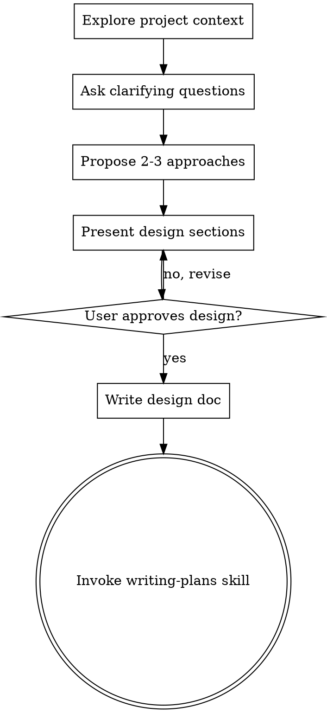

<!-- Generated by SpecStory, Markdown v2.1.0 -->

# 2026-02-26 07:09:19Z

<!-- Claude Code Session 8df7bfcd-693b-45b1-b353-23ac9772dcbb (2026-02-26 07:09:19Z) -->

_**User (2026-02-26 07:09:19Z)**_

<ide_opened_file>The user opened the file <REPO_ROOT>/packages/rich-renderer-image/src/useImageEditState.ts in the IDE. This may or may not be related to the current task.</ide_opened_file>

packages/rich-renderer-image/src/useImageEditState.ts 
可以更加细粒度控制 组件需要的 state，你是用 jotai + react ctx 来从构这个状态管理

---

_**Agent (claude-opus-4-6 2026-02-26 07:09:23Z)**_

<think><details><summary>Thought Process</summary>
The user wants me to refactor the state management in `useImageEditState.ts` to use Jotai + React Context for more fine-grained state control. Let me first read the current file and understand the existing state management, then look at related components to understand how the state is consumed.

Let me start by reading the relevant files.
</details></think>

_**Agent (claude-opus-4-6 2026-02-26 07:09:28Z)**_

<tool-use data-tool-type="unknown" data-tool-name="ToolSearch"><details>
<summary>Tool use: **ToolSearch**</summary>

**Input:**

- max_results: `1`
- query: `select:Skill`

**Result:**

```

```
</details></tool-use>

_**Agent (claude-opus-4-6 2026-02-26 07:09:31Z)**_

<tool-use data-tool-type="generic" data-tool-name="Skill"><details>
<summary>Tool use: **Skill**</summary>

**Input:**

- skill: `brainstorming`

</details></tool-use>

---

_**User (2026-02-26 07:09:31Z)**_

Base directory for this skill: <HOME>/.claude/plugins/cache/claude-plugins-official/superpowers/4.3.1/skills/brainstorming

# Brainstorming Ideas Into Designs

## Overview

Help turn ideas into fully formed designs and specs through natural collaborative dialogue.

Start by understanding the current project context, then ask questions one at a time to refine the idea. Once you understand what you're building, present the design and get user approval.

<HARD-GATE>
Do NOT invoke any implementation skill, write any code, scaffold any project, or take any implementation action until you have presented a design and the user has approved it. This applies to EVERY project regardless of perceived simplicity.
</HARD-GATE>

## Anti-Pattern: "This Is Too Simple To Need A Design"

Every project goes through this process. A todo list, a single-function utility, a config change — all of them. "Simple" projects are where unexamined assumptions cause the most wasted work. The design can be short (a few sentences for truly simple projects), but you MUST present it and get approval.

## Checklist

You MUST create a task for each of these items and complete them in order:

1. **Explore project context** — check files, docs, recent commits
2. **Ask clarifying questions** — one at a time, understand purpose/constraints/success criteria
3. **Propose 2-3 approaches** — with trade-offs and your recommendation
4. **Present design** — in sections scaled to their complexity, get user approval after each section
5. **Write design doc** — save to `docs/plans/YYYY-MM-DD-<topic>-design.md` and commit
6. **Transition to implementation** — invoke writing-plans skill to create implementation plan

## Process Flow



**The terminal state is invoking writing-plans.** Do NOT invoke frontend-design, mcp-builder, or any other implementation skill. The ONLY skill you invoke after brainstorming is writing-plans.

## The Process

**Understanding the idea:**
- Check out the current project state first (files, docs, recent commits)
- Ask questions one at a time to refine the idea
- Prefer multiple choice questions when possible, but open-ended is fine too
- Only one question per message - if a topic needs more exploration, break it into multiple questions
- Focus on understanding: purpose, constraints, success criteria

**Exploring approaches:**
- Propose 2-3 different approaches with trade-offs
- Present options conversationally with your recommendation and reasoning
- Lead with your recommended option and explain why

**Presenting the design:**
- Once you believe you understand what you're building, present the design
- Scale each section to its complexity: a few sentences if straightforward, up to 200-300 words if nuanced
- Ask after each section whether it looks right so far
- Cover: architecture, components, data flow, error handling, testing
- Be ready to go back and clarify if something doesn't make sense

## After the Design

**Documentation:**
- Write the validated design to `docs/plans/YYYY-MM-DD-<topic>-design.md`
- Use elements-of-style:writing-clearly-and-concisely skill if available
- Commit the design document to git

**Implementation:**
- Invoke the writing-plans skill to create a detailed implementation plan
- Do NOT invoke any other skill. writing-plans is the next step.

## Key Principles

- **One question at a time** - Don't overwhelm with multiple questions
- **Multiple choice preferred** - Easier to answer than open-ended when possible
- **YAGNI ruthlessly** - Remove unnecessary features from all designs
- **Explore alternatives** - Always propose 2-3 approaches before settling
- **Incremental validation** - Present design, get approval before moving on
- **Be flexible** - Go back and clarify when something doesn't make sense


---

_**Agent (claude-opus-4-6 2026-02-26 07:09:36Z)**_

<tool-use data-tool-type="unknown" data-tool-name="ToolSearch"><details>
<summary>Tool use: **ToolSearch**</summary>

**Input:**

- max_results: `1`
- query: `select:TodoWrite`

**Result:**

```

```
</details></tool-use>

_**Agent (claude-opus-4-6 2026-02-26 07:09:41Z)**_

<tool-use data-tool-type="task" data-tool-name="TodoWrite"><details>
<summary>Tool use: **TodoWrite**</summary>
**Agent task list:**
- [⚡] 🌡️ Explore project context - read current state management files
- [ ] 🌡️ Ask clarifying questions
- [ ] 🌡️ Propose approaches with trade-offs
- [ ] 🌡️ Present design and get approval
- [ ] 🌡️ Implement the refactoring

</details></tool-use>

_**Agent (claude-opus-4-6 2026-02-26 07:09:44Z)**_

先探查现有代码结构。

_**Agent (claude-opus-4-6 2026-02-26 07:09:45Z)**_

<tool-use data-tool-type="read" data-tool-name="Read"><details>
<summary>Tool use: **Read**</summary>
 `./packages/rich-renderer-image/src/useImageEditState.ts`

```text
     1→import {
     2→  $createImageNode,
     3→  $isImageNode,
     4→  computeImageMeta,
     5→  decodeThumbHash,
     6→  type ImageRendererProps,
     7→  type ImageUploadFn,
     8→  useImageUpload,
     9→} from '@haklex/rich-editor'
    10→import { useLexicalComposerContext } from '@lexical/react/LexicalComposerContext'
    11→import { $getNearestNodeFromDOMNode } from 'lexical'
    12→import type { CSSProperties, RefObject } from 'react'
    13→import { useCallback, useEffect, useMemo, useRef, useState } from 'react'
    14→
    15→import type { ReplaceMode } from './ReplacePanel'
    16→
    17→export type ImageLoadState = 'loading' | 'loaded' | 'error'
    18→
    19→function getCaptionText(altText: string, caption?: string): string | undefined {
    20→  if (caption) return caption
    21→  if (!altText) return undefined
    22→  if (altText.startsWith('!') || altText.startsWith('¡')) {
    23→    return altText.slice(1)
    24→  }
    25→  return undefined
    26→}
    27→
    28→function isSafeImageSrc(src: string): boolean {
    29→  return !/^(?:javascript\s*:|vbscript\s*:|data\s*:(?!image\/))/i.test(src)
    30→}
    31→
    32→function loadImageByUrl(
    33→  src: string,
    34→): Promise<{ width: number; height: number }> {
    35→  return new Promise((resolve, reject) => {
    36→    const image = new Image()
    37→    image.onload = () => {
    38→      resolve({
    39→        width: image.naturalWidth || image.width,
    40→        height: image.naturalHeight || image.height,
    41→      })
    42→    }
    43→    image.onerror = () => reject(new Error('Image load failed'))
    44→    image.src = src
    45→  })
    46→}
    47→
    48→function readAsDataUrl(file: File): Promise<string> {
    49→  return new Promise((resolve, reject) => {
    50→    const reader = new FileReader()
    51→    reader.onload = () => resolve(String(reader.result))
    52→    reader.onerror = () => reject(reader.error ?? new Error('File read failed'))
    53→    reader.readAsDataURL(file)
    54→  })
    55→}
    56→
    57→export interface ImageEditState {
    58→  src: string
    59→  altText: string
    60→  width: number | undefined
    61→  height: number | undefined
    62→  caption: string | undefined
    63→  thumbhash: string | undefined
    64→  accent: string | undefined
    65→
    66→  loadState: ImageLoadState
    67→  setLoadState: (s: ImageLoadState) => void
    68→  hovering: boolean
    69→  setHovering: (v: boolean) => void
    70→  metaOpen: boolean
    71→  setMetaOpen: (v: boolean) => void
    72→  replaceOpen: boolean
    73→  setReplaceOpen: (v: boolean) => void
    74→  toolbarVisible: boolean
    75→
    76→  editSrc: string
    77→  setEditSrc: (v: string) => void
    78→  editAltText: string
    79→  setEditAltText: (v: string) => void
    80→  editCaption: string
    81→  setEditCaption: (v: string) => void
    82→
    83→  replaceMode: ReplaceMode
    84→  setReplaceMode: (v: ReplaceMode) => void
    85→  replaceUrl: string
    86→  setReplaceUrl: (v: string) => void
    87→  replacePreview: string | null
    88→  replaceLoading: boolean
    89→  replaceError: string | null
    90→
    91→  wrapperRef: RefObject<HTMLDivElement | null>
    92→  fileInputRef: RefObject<HTMLInputElement | null>
    93→
    94→  placeholderUrl: string | undefined
    95→  captionText: string | undefined
    96→  frameStyle: CSSProperties
    97→
    98→  commitMeta: () => void
    99→  closeReplacePanel: () => void
   100→  handleReplaceFile: (file: File | null) => void
   101→  handlePreviewUrl: () => void
   102→  handleReplaceByUrl: () => void
   103→  handleReplaceOpenChange: (open: boolean) => void
   104→  handleOpen: () => void
   105→  handleDuplicate: () => void
   106→  handleDownload: () => void
   107→  handleDelete: () => void
   108→}
   109→
   110→export function useImageEditState(props: ImageRendererProps): ImageEditState {
   111→  const {
   112→    src,
   113→    altText,
   114→    width,
   115→    height,
   116→    caption,
   117→    thumbhash,
   118→    accent,
   119→  } = props
   120→
   121→  const [editor] = useLexicalComposerContext()
   122→  const uploadImage = useImageUpload()
   123→  const wrapperRef = useRef<HTMLDivElement>(null)
   124→  const fileInputRef = useRef<HTMLInputElement>(null)
   125→
   126→  const [loadState, setLoadState] = useState<ImageLoadState>('loading')
   127→  const [hovering, setHovering] = useState(false)
   128→  const [metaOpen, setMetaOpen] = useState(false)
   129→  const [replaceOpen, setReplaceOpen] = useState(!src)
   130→
   131→  const [editSrc, setEditSrc] = useState(src)
   132→  const [editAltText, setEditAltText] = useState(altText)
   133→  const [editCaption, setEditCaption] = useState(caption || '')
   134→
   135→  const [replaceMode, setReplaceMode] = useState<ReplaceMode>('upload')
   136→  const [replaceUrl, setReplaceUrl] = useState('')
   137→  const [replacePreview, setReplacePreview] = useState<string | null>(null)
   138→  const [replaceMeta, setReplaceMeta] = useState<{
   139→    width: number
   140→    height: number
   141→  } | null>(null)
   142→  const [replaceLoading, setReplaceLoading] = useState(false)
   143→  const [replaceError, setReplaceError] = useState<string | null>(null)
   144→
   145→  useEffect(() => {
   146→    setEditSrc(src)
   147→    setEditAltText(altText)
   148→    setEditCaption(caption || '')
   149→  }, [src, altText, caption])
   150→
   151→  useEffect(() => {
   152→    setLoadState(src ? 'loading' : 'error')
   153→    if (!src) setReplaceOpen(true)
   154→  }, [src])
   155→
   156→  const placeholderUrl = useMemo(
   157→    () => (thumbhash ? decodeThumbHash(thumbhash) : undefined),
   158→    [thumbhash],
   159→  )
   160→
   161→  const captionText = useMemo(
   162→    () => getCaptionText(altText, caption),
   163→    [altText, caption],
   164→  )
   165→
   166→  const toolbarVisible = hovering || metaOpen || replaceOpen
   167→
   168→  const withImageNode = useCallback(
   169→    (updater: (node: ReturnType<typeof $createImageNode>) => void) => {
   170→      if (!wrapperRef.current) return
   171→      editor.update(() => {
   172→        const node = $getNearestNodeFromDOMNode(wrapperRef.current!)
   173→        if ($isImageNode(node)) updater(node)
   174→      })
   175→    },
   176→    [editor],
   177→  )
   178→
   179→  const closeReplacePanel = useCallback(() => {
   180→    setReplaceOpen(false)
   181→    setReplaceMode('upload')
   182→    setReplaceUrl('')
   183→    setReplacePreview(null)
   184→    setReplaceMeta(null)
   185→    setReplaceLoading(false)
   186→    setReplaceError(null)
   187→  }, [])
   188→
   189→  const commitMeta = useCallback(() => {
   190→    const trimmedSrc = editSrc.trim()
   191→    if (!trimmedSrc || !isSafeImageSrc(trimmedSrc)) return
   192→    withImageNode((node) => {
   193→      node.setSrc(trimmedSrc)
   194→      node.setAltText(editAltText.trim())
   195→      node.setCaption(editCaption.trim() || undefined)
   196→    })
   197→    setMetaOpen(false)
   198→  }, [editAltText, editCaption, editSrc, withImageNode])
   199→
   200→  const handleDelete = useCallback(() => {
   201→    if (!wrapperRef.current) return
   202→    editor.update(() => {
   203→      const node = $getNearestNodeFromDOMNode(wrapperRef.current!)
   204→      if (node) node.remove()
   205→    })
   206→    setMetaOpen(false)
   207→    closeReplacePanel()
   208→  }, [closeReplacePanel, editor])
   209→
   210→  const handleOpen = useCallback(() => {
   211→    if (src) window.open(src, '_blank', 'noopener,noreferrer')
   212→  }, [src])
   213→
   214→  const handleDownload = useCallback(() => {
   215→    if (!src) return
   216→    const link = document.createElement('a')
   217→    link.href = src
   218→    link.download = altText || 'image'
   219→    link.click()
   220→  }, [altText, src])
   221→
   222→  const handleDuplicate = useCallback(() => {
   223→    withImageNode((node) => {
   224→      const copy = $createImageNode({
   225→        src: node.getSrc(),
   226→        altText: node.getAltText(),
   227→        width: node.getWidth(),
   228→        height: node.getHeight(),
   229→        caption: node.getCaption(),
   230→        thumbhash: node.getThumbhash(),
   231→        accent: node.getAccent(),
   232→      })
   233→      node.insertAfter(copy)
   234→    })
   235→  }, [withImageNode])
   236→
   237→  const handleReplaceFile = useCallback(
   238→    async (file: File | null) => {
   239→      if (!file || !file.type.startsWith('image/')) return
   240→      setReplaceLoading(true)
   241→      setReplaceError(null)
   242→      try {
   243→        const fallbackUploader: ImageUploadFn = async (nextFile) => ({
   244→          src: await readAsDataUrl(nextFile),
   245→          altText: nextFile.name,
   246→        })
   247→        const uploader = uploadImage ?? fallbackUploader
   248→        const [result, meta] = await Promise.all([
   249→          uploader(file),
   250→          computeImageMeta(file),
   251→        ])
   252→        withImageNode((node) => {
   253→          node.setSrc(result.src)
   254→          node.setAltText(result.altText ?? file.name)
   255→          node.setDimensions(
   256→            result.width ?? meta.width,
   257→            result.height ?? meta.height,
   258→          )
   259→          node.setThumbhash(result.thumbhash ?? meta.thumbhash)
   260→        })
   261→        closeReplacePanel()
   262→      } catch {
   263→        setReplaceError('Failed to replace image')
   264→      } finally {
   265→        setReplaceLoading(false)
   266→      }
   267→    },
   268→    [closeReplacePanel, uploadImage, withImageNode],
   269→  )
   270→
   271→  const handlePreviewUrl = useCallback(async () => {
   272→    const nextUrl = replaceUrl.trim()
   273→    if (!nextUrl || !isSafeImageSrc(nextUrl)) {
   274→      setReplaceError('Invalid image URL')
   275→      return
   276→    }
   277→    setReplaceLoading(true)
   278→    setReplaceError(null)
   279→    try {
   280→      const meta = await loadImageByUrl(nextUrl)
   281→      setReplacePreview(nextUrl)
   282→      setReplaceMeta(meta)
   283→    } catch {
   284→      setReplacePreview(null)
   285→      setReplaceMeta(null)
   286→      setReplaceError('Image URL could not be loaded')
   287→    } finally {
   288→      setReplaceLoading(false)
   289→    }
   290→  }, [replaceUrl])
   291→
   292→  const handleReplaceByUrl = useCallback(() => {
   293→    if (!replacePreview || !isSafeImageSrc(replacePreview)) return
   294→    withImageNode((node) => {
   295→      node.setSrc(replacePreview)
   296→      node.setDimensions(replaceMeta?.width, replaceMeta?.height)
   297→      node.setThumbhash(undefined)
   298→    })
   299→    closeReplacePanel()
   300→  }, [closeReplacePanel, replaceMeta, replacePreview, withImageNode])
   301→
   302→  const handleReplaceOpenChange = useCallback(
   303→    (nextOpen: boolean) => {
   304→      setReplaceOpen(nextOpen)
   305→      if (!nextOpen) closeReplacePanel()
   306→    },
   307→    [closeReplacePanel],
   308→  )
   309→
   310→  const frameStyle: CSSProperties = useMemo(
   311→    () => ({
   312→      backgroundColor: !placeholderUrl ? accent || '#f5f5f5' : undefined,
   313→      backgroundImage:
   314→        placeholderUrl && loadState !== 'loaded'
   315→          ? `url(${placeholderUrl})`
   316→          : undefined,
   317→      backgroundSize: 'cover',
   318→      width: width ? Math.min(width, 1200) : undefined,
   319→      maxWidth: '100%',
   320→      ...(width && height ? { aspectRatio: `${width} / ${height}` } : {}),
   321→    }),
   322→    [accent, loadState, placeholderUrl, width, height],
   323→  )
   324→
   325→  return {
   326→    src,
   327→    altText,
   328→    width,
   329→    height,
   330→    caption,
   331→    thumbhash,
   332→    accent,
   333→    loadState,
   334→    setLoadState,
   335→    hovering,
   336→    setHovering,
   337→    metaOpen,
   338→    setMetaOpen,
   339→    replaceOpen,
   340→    setReplaceOpen,
   341→    toolbarVisible,
   342→    editSrc,
   343→    setEditSrc,
   344→    editAltText,
   345→    setEditAltText,
   346→    editCaption,
   347→    setEditCaption,
   348→    replaceMode,
   349→    setReplaceMode,
   350→    replaceUrl,
   351→    setReplaceUrl,
   352→    replacePreview,
   353→    replaceLoading,
   354→    replaceError,
   355→    wrapperRef,
   356→    fileInputRef,
   357→    placeholderUrl,
   358→    captionText,
   359→    frameStyle,
   360→    commitMeta,
   361→    closeReplacePanel,
   362→    handleReplaceFile,
   363→    handlePreviewUrl,
   364→    handleReplaceByUrl,
   365→    handleReplaceOpenChange,
   366→    handleOpen,
   367→    handleDuplicate,
   368→    handleDownload,
   369→    handleDelete,
   370→  }
   371→}
   372→
```
</details></tool-use>

_**Agent (claude-opus-4-6 2026-02-26 07:09:46Z)**_

<tool-use data-tool-type="read" data-tool-name="Read"><details>
<summary>Tool use: **Read**</summary>
 `./packages/rich-renderer-image/src/ImageEditContext.tsx`

```text
     1→import type { ReactNode } from 'react'
     2→import { createContext, use } from 'react'
     3→
     4→import type { ImageEditState } from './useImageEditState'
     5→
     6→const ImageEditContext = createContext<ImageEditState | null>(null)
     7→
     8→export function ImageEditProvider({
     9→  value,
    10→  children,
    11→}: {
    12→  value: ImageEditState
    13→  children: ReactNode
    14→}) {
    15→  return (
    16→    <ImageEditContext.Provider value={value}>
    17→      {children}
    18→    </ImageEditContext.Provider>
    19→  )
    20→}
    21→
    22→export function useImageEditContext(): ImageEditState {
    23→  const ctx = use(ImageEditContext)
    24→  if (!ctx) {
    25→    throw new Error('useImageEditContext must be used within ImageEditProvider')
    26→  }
    27→  return ctx
    28→}
    29→
```
</details></tool-use>

_**Agent (claude-opus-4-6 2026-02-26 07:09:47Z)**_

<tool-use data-tool-type="read" data-tool-name="Read"><details>
<summary>Tool use: **Read**</summary>
 `./packages/rich-renderer-image/src/ImageEditRenderer.tsx`

```text
     1→import {
     2→  type ImageRendererProps,
     3→  useRendererMode,
     4→} from '@haklex/rich-editor'
     5→import { useLexicalComposerContext } from '@lexical/react/LexicalComposerContext'
     6→
     7→import { ImageEditProvider } from './ImageEditContext'
     8→import { ImageEditToolbar } from './ImageEditToolbar'
     9→import { ImageRenderer } from './ImageRenderer'
    10→import { ReplacePopover } from './ReplacePopover'
    11→import { useImageEditState } from './useImageEditState'
    12→import * as styles from './styles.css'
    13→
    14→const frameStateSemanticClass = {
    15→  loading: styles.semanticClassNames.frameLoading,
    16→  loaded: styles.semanticClassNames.frameLoaded,
    17→  error: styles.semanticClassNames.frameError,
    18→} as const
    19→
    20→export function ImageEditRenderer(props: ImageRendererProps) {
    21→  const mode = useRendererMode()
    22→
    23→  if (mode !== 'editor') {
    24→    return <ImageRenderer {...props} />
    25→  }
    26→
    27→  return <ImageEditRendererInner {...props} />
    28→}
    29→
    30→function ImageEditRendererInner(props: ImageRendererProps) {
    31→  const [editor] = useLexicalComposerContext()
    32→  const editable = editor.isEditable()
    33→  const state = useImageEditState(props)
    34→
    35→  if (!editable) {
    36→    return (
    37→      <ImageRenderer
    38→        src={props.src}
    39→        altText={props.altText}
    40→        width={props.width}
    41→        height={props.height}
    42→        caption={props.caption}
    43→        thumbhash={props.thumbhash}
    44→        accent={props.accent}
    45→      />
    46→    )
    47→  }
    48→
    49→  return (
    50→    <ImageEditProvider value={state}>
    51→      <div
    52→        ref={state.wrapperRef}
    53→        className={`${styles.editTrigger} ${styles.semanticClassNames.editTrigger}`}
    54→        onMouseEnter={() => state.setHovering(true)}
    55→        onMouseLeave={() => state.setHovering(false)}
    56→      >
    57→        {state.src ? (
    58→          <figure
    59→            className={`${styles.root} ${styles.semanticClassNames.root}`}
    60→          >
    61→            <div
    62→              className={`${styles.frame} ${styles.semanticClassNames.frame} ${styles.frameEditMode} ${styles.imageState[state.loadState]} ${frameStateSemanticClass[state.loadState]}`.trim()}
    63→              style={state.frameStyle}
    64→            >
    65→               state.setLoadState('loaded')}
    73→                onError={() => state.setLoadState('error')}
    74→              />
    75→              {state.loadState === 'loading' && (
    76→                <span
    77→                  className={`${styles.loader} ${styles.semanticClassNames.loader}`}
    78→                />
    79→              )}
    80→              {state.loadState === 'error' && (
    81→                <span
    82→                  className={`${styles.errorBadge} ${styles.semanticClassNames.errorBadge}`}
    83→                >
    84→                  Image failed to load
    85→                </span>
    86→              )}
    87→            </div>
    88→            {state.captionText && (
    89→              <figcaption
    90→                className={`${styles.caption} ${styles.semanticClassNames.caption}`}
    91→              >
    92→                {state.captionText}
    93→              </figcaption>
    94→            )}
    95→          </figure>
    96→        ) : (
    97→          <ReplacePopover />
    98→        )}
    99→
   100→        {state.src && <ImageEditToolbar />}
   101→      </div>
   102→    </ImageEditProvider>
   103→  )
   104→}
   105→
```
</details></tool-use>

_**Agent (claude-opus-4-6 2026-02-26 07:09:47Z)**_

<tool-use data-tool-type="read" data-tool-name="Read"><details>
<summary>Tool use: **Read**</summary>
 `./packages/rich-renderer-image/src/ImageEditToolbar.tsx`

```text
     1→import {
     2→  Popover,
     3→  PopoverPanel,
     4→  PopoverTrigger,
     5→} from '@haklex/rich-editor-ui'
     6→import {
     7→  Copy,
     8→  Download,
     9→  ExternalLink,
    10→  Replace,
    11→  Trash2,
    12→  Type,
    13→} from 'lucide-react'
    14→
    15→import { useImageEditContext } from './ImageEditContext'
    16→import { EditMetaPopover } from './EditMetaPopover'
    17→import { ReplacePanel, type ReplaceMode } from './ReplacePanel'
    18→import * as styles from './styles.css'
    19→
    20→const replaceModeItems: Array<{ value: ReplaceMode; label: string }> = [
    21→  { value: 'upload', label: 'Upload' },
    22→  { value: 'url', label: 'URL' },
    23→]
    24→
    25→export function ImageEditToolbar() {
    26→  const ctx = useImageEditContext()
    27→
    28→  return (
    29→    <div
    30→      className={`${styles.editToolbar} ${styles.semanticClassNames.editToolbar} ${ctx.toolbarVisible ? `${styles.editToolbarVisible} ${styles.semanticClassNames.editToolbarVisible}` : ''}`}
    31→    >
    32→      <Popover
    33→        open={ctx.metaOpen}
    34→        onOpenChange={(nextOpen) => {
    35→          ctx.setMetaOpen(nextOpen)
    36→          if (nextOpen) ctx.handleReplaceOpenChange(false)
    37→        }}
    38→      >
    39→        <PopoverTrigger
    40→          className={`${styles.editToolbarButton} ${styles.semanticClassNames.editToolbarButton}`}
    41→          title="Edit details"
    42→        >
    43→          <Type size={14} />
    44→        </PopoverTrigger>
    45→        <PopoverPanel
    46→          side="bottom"
    47→          sideOffset={8}
    48→          className={styles.editPanel}
    49→        >
    50→          <EditMetaPopover
    51→            editSrc={ctx.editSrc}
    52→            onEditSrcChange={ctx.setEditSrc}
    53→            editAltText={ctx.editAltText}
    54→            onEditAltTextChange={ctx.setEditAltText}
    55→            editCaption={ctx.editCaption}
    56→            onEditCaptionChange={ctx.setEditCaption}
    57→            onSave={ctx.commitMeta}
    58→            onClose={() => ctx.setMetaOpen(false)}
    59→          />
    60→        </PopoverPanel>
    61→      </Popover>
    62→
    63→      <Popover
    64→        open={ctx.replaceOpen}
    65→        onOpenChange={(nextOpen) => {
    66→          ctx.handleReplaceOpenChange(nextOpen)
    67→          if (nextOpen) ctx.setMetaOpen(false)
    68→        }}
    69→      >
    70→        <PopoverTrigger
    71→          className={`${styles.editToolbarButton} ${styles.semanticClassNames.editToolbarButton}`}
    72→          title="Replace image"
    73→        >
    74→          <Replace size={14} />
    75→        </PopoverTrigger>
    76→        <PopoverPanel
    77→          side="bottom"
    78→          sideOffset={8}
    79→          className={styles.editPanel}
    80→        >
    81→          <ReplacePanel
    82→            replaceMode={ctx.replaceMode}
    83→            onReplaceModeChange={ctx.setReplaceMode}
    84→            replaceUrl={ctx.replaceUrl}
    85→            onReplaceUrlChange={ctx.setReplaceUrl}
    86→            replacePreview={ctx.replacePreview}
    87→            replaceError={ctx.replaceError}
    88→            replaceLoading={ctx.replaceLoading}
    89→            replaceModeItems={replaceModeItems}
    90→            fileInputRef={ctx.fileInputRef}
    91→            onPickFile={() => ctx.fileInputRef.current?.click()}
    92→            onFileChange={ctx.handleReplaceFile}
    93→            onPreviewUrl={ctx.handlePreviewUrl}
    94→            onApplyReplace={ctx.handleReplaceByUrl}
    95→          />
    96→        </PopoverPanel>
    97→      </Popover>
    98→
    99→      <button
   100→        className={`${styles.editToolbarButton} ${styles.semanticClassNames.editToolbarButton}`}
   101→        type="button"
   102→        onMouseDown={(e) => {
   103→          e.preventDefault()
   104→          e.stopPropagation()
   105→        }}
   106→        onClick={ctx.handleOpen}
   107→        title="Open source"
   108→      >
   109→        <ExternalLink size={14} />
   110→      </button>
   111→
   112→      <button
   113→        className={`${styles.editToolbarButton} ${styles.semanticClassNames.editToolbarButton}`}
   114→        type="button"
   115→        onMouseDown={(e) => {
   116→          e.preventDefault()
   117→          e.stopPropagation()
   118→        }}
   119→        onClick={ctx.handleDuplicate}
   120→        title="Duplicate"
   121→      >
   122→        <Copy size={14} />
   123→      </button>
   124→
   125→      <button
   126→        className={`${styles.editToolbarButton} ${styles.semanticClassNames.editToolbarButton}`}
   127→        type="button"
   128→        onMouseDown={(e) => {
   129→          e.preventDefault()
   130→          e.stopPropagation()
   131→        }}
   132→        onClick={ctx.handleDownload}
   133→        title="Download"
   134→      >
   135→        <Download size={14} />
   136→      </button>
   137→
   138→      <button
   139→        className={`${styles.editToolbarButton} ${styles.semanticClassNames.editToolbarButton} ${styles.editToolbarButtonDanger} ${styles.semanticClassNames.editToolbarButtonDanger}`}
   140→        type="button"
   141→        onMouseDown={(e) => {
   142→          e.preventDefault()
   143→          e.stopPropagation()
   144→        }}
   145→        onClick={ctx.handleDelete}
   146→        title="Remove image"
   147→      >
   148→        <Trash2 size={14} />
   149→      </button>
   150→    </div>
   151→  )
   152→}
   153→
```
</details></tool-use>

_**Agent (claude-opus-4-6 2026-02-26 07:09:48Z)**_

<tool-use data-tool-type="read" data-tool-name="Read"><details>
<summary>Tool use: **Read**</summary>
 `./packages/rich-renderer-image/src/EditMetaPopover.tsx`

```text
     1→import { Captions, ImageIcon, Type } from 'lucide-react'
     2→
     3→import * as styles from './styles.css'
     4→
     5→export function EditMetaPopover({
     6→  editSrc,
     7→  onEditSrcChange,
     8→  editAltText,
     9→  onEditAltTextChange,
    10→  editCaption,
    11→  onEditCaptionChange,
    12→  onSave,
    13→  onClose,
    14→}: {
    15→  editSrc: string
    16→  onEditSrcChange: (value: string) => void
    17→  editAltText: string
    18→  onEditAltTextChange: (value: string) => void
    19→  editCaption: string
    20→  onEditCaptionChange: (value: string) => void
    21→  onSave: () => void
    22→  onClose: () => void
    23→}) {
    24→  return (
    25→    <>
    26→      <div
    27→        className={`${styles.editField} ${styles.semanticClassNames.editField}`}
    28→      >
    29→        <ImageIcon
    30→          className={`${styles.editFieldIcon} ${styles.semanticClassNames.editFieldIcon}`}
    31→          size={14}
    32→        />
    33→        <input
    34→          className={`${styles.editInput} ${styles.semanticClassNames.editInput}`}
    35→          type="url"
    36→          value={editSrc}
    37→          onChange={(event) => onEditSrcChange(event.target.value)}
    38→          placeholder="Image URL"
    39→        />
    40→      </div>
    41→      <div
    42→        className={`${styles.editField} ${styles.semanticClassNames.editField}`}
    43→      >
    44→        <Type
    45→          className={`${styles.editFieldIcon} ${styles.semanticClassNames.editFieldIcon}`}
    46→          size={14}
    47→        />
    48→        <input
    49→          className={`${styles.editInput} ${styles.semanticClassNames.editInput}`}
    50→          type="text"
    51→          value={editAltText}
    52→          onChange={(event) => onEditAltTextChange(event.target.value)}
    53→          placeholder="Alt text"
    54→        />
    55→      </div>
    56→      <div
    57→        className={`${styles.editField} ${styles.semanticClassNames.editField}`}
    58→      >
    59→        <Captions
    60→          className={`${styles.editFieldIcon} ${styles.semanticClassNames.editFieldIcon}`}
    61→          size={14}
    62→        />
    63→        <input
    64→          className={`${styles.editInput} ${styles.semanticClassNames.editInput}`}
    65→          type="text"
    66→          value={editCaption}
    67→          onChange={(event) => onEditCaptionChange(event.target.value)}
    68→          placeholder="Caption (optional)"
    69→        />
    70→      </div>
    71→      <div
    72→        className={`${styles.editActions} ${styles.semanticClassNames.editActions}`}
    73→      >
    74→        <button
    75→          className={`${styles.editActionButton} ${styles.semanticClassNames.editActionButton}`}
    76→          type="button"
    77→          onClick={onSave}
    78→        >
    79→          Save
    80→        </button>
    81→        <button
    82→          className={`${styles.editActionButton} ${styles.semanticClassNames.editActionButton} ${styles.editActionButtonEnd} ${styles.semanticClassNames.editActionButtonEnd}`}
    83→          type="button"
    84→          onClick={onClose}
    85→        >
    86→          Close
    87→        </button>
    88→      </div>
    89→    </>
    90→  )
    91→}
    92→
```
</details></tool-use>

_**Agent (claude-opus-4-6 2026-02-26 07:09:48Z)**_

<tool-use data-tool-type="read" data-tool-name="Read"><details>
<summary>Tool use: **Read**</summary>
 `./packages/rich-renderer-image/src/ReplacePanel.tsx`

```text
     1→import { SegmentedControl } from '@haklex/rich-editor-ui'
     2→import { ImageIcon, Loader2, Upload } from 'lucide-react'
     3→import type { RefObject } from 'react'
     4→
     5→import * as styles from './styles.css'
     6→
     7→export type ReplaceMode = 'upload' | 'url'
     8→
     9→export function ReplacePanel({
    10→  replaceMode,
    11→  onReplaceModeChange,
    12→  replaceUrl,
    13→  onReplaceUrlChange,
    14→  replacePreview,
    15→  replaceError,
    16→  replaceLoading,
    17→  replaceModeItems,
    18→  fileInputRef,
    19→  onPickFile,
    20→  onFileChange,
    21→  onPreviewUrl,
    22→  onApplyReplace,
    23→}: {
    24→  replaceMode: ReplaceMode
    25→  onReplaceModeChange: (value: ReplaceMode) => void
    26→  replaceUrl: string
    27→  onReplaceUrlChange: (value: string) => void
    28→  replacePreview: string | null
    29→  replaceError: string | null
    30→  replaceLoading: boolean
    31→  replaceModeItems: Array<{ value: ReplaceMode; label: string }>
    32→  fileInputRef: RefObject<HTMLInputElement | null>
    33→  onPickFile: () => void
    34→  onFileChange: (file: File | null) => void
    35→  onPreviewUrl: () => void
    36→  onApplyReplace: () => void
    37→}) {
    38→  return (
    39→    <>
    40→      <SegmentedControl
    41→        items={replaceModeItems}
    42→        value={replaceMode}
    43→        onChange={onReplaceModeChange}
    44→        fullWidth
    45→      />
    46→
    47→      {replaceMode === 'upload' ? (
    48→        <>
    49→          <input
    50→            ref={fileInputRef}
    51→            type="file"
    52→            accept="image/*"
    53→            style={{ display: 'none' }}
    54→            onChange={(event) => {
    55→              const file = event.currentTarget.files?.[0] ?? null
    56→              void onFileChange(file)
    57→              event.currentTarget.value = ''
    58→            }}
    59→          />
    60→          <button
    61→            type="button"
    62→            className={`${styles.replaceUploadArea} ${styles.semanticClassNames.replaceUploadArea}`}
    63→            onClick={onPickFile}
    64→          >
    65→            {replaceLoading ? (
    66→              <>
    67→                <Loader2 size={16} />
    68→                <span>Uploading image...</span>
    69→              </>
    70→            ) : (
    71→              <>
    72→                <Upload size={16} />
    73→                <span>Click to upload image</span>
    74→              </>
    75→            )}
    76→          </button>
    77→        </>
    78→      ) : (
    79→        <>
    80→          <div
    81→            className={`${styles.editField} ${styles.semanticClassNames.editField}`}
    82→          >
    83→            <ImageIcon
    84→              className={`${styles.editFieldIcon} ${styles.semanticClassNames.editFieldIcon}`}
    85→              size={14}
    86→            />
    87→            <input
    88→              className={`${styles.editInput} ${styles.semanticClassNames.editInput}`}
    89→              type="url"
    90→              value={replaceUrl}
    91→              onChange={(event) => onReplaceUrlChange(event.target.value)}
    92→              onKeyDown={(event) => {
    93→                if (event.key === 'Enter') {
    94→                  event.preventDefault()
    95→                  onPreviewUrl()
    96→                }
    97→              }}
    98→              placeholder="https://example.com/image.jpg"
    99→            />
   100→          </div>
   101→          <div
   102→            className={`${styles.editActions} ${styles.semanticClassNames.editActions}`}
   103→          >
   104→            <button
   105→              className={`${styles.editActionButton} ${styles.semanticClassNames.editActionButton}`}
   106→              type="button"
   107→              disabled={replaceLoading || !replaceUrl.trim()}
   108→              onClick={onPreviewUrl}
   109→            >
   110→              Preview
   111→            </button>
   112→            <button
   113→              className={`${styles.editActionButton} ${styles.semanticClassNames.editActionButton} ${styles.editActionButtonEnd} ${styles.semanticClassNames.editActionButtonEnd}`}
   114→              type="button"
   115→              disabled={!replacePreview}
   116→              onClick={onApplyReplace}
   117→            >
   118→              Apply
   119→            </button>
   120→          </div>
   121→        </>
   122→      )}
   123→
   124→      {replaceError && (
   125→        <span
   126→          className={`${styles.panelHint} ${styles.semanticClassNames.panelHint}`}
   127→        >
   128→          {replaceError}
   129→        </span>
   130→      )}
   131→
   132→      {replacePreview && (
   133→        <div
   134→          className={`${styles.replacePreview} ${styles.semanticClassNames.replacePreview}`}
   135→        >
   136→          
   137→        </div>
   138→      )}
   139→    </>
   140→  )
   141→}
   142→
```
</details></tool-use>

_**Agent (claude-opus-4-6 2026-02-26 07:09:49Z)**_

<tool-use data-tool-type="read" data-tool-name="Read"><details>
<summary>Tool use: **Read**</summary>
 `./packages/rich-renderer-image/src/ReplacePopover.tsx`

```text
     1→import {
     2→  Popover,
     3→  PopoverPanel,
     4→  PopoverTrigger,
     5→} from '@haklex/rich-editor-ui'
     6→import { ImageIcon } from 'lucide-react'
     7→
     8→import { useImageEditContext } from './ImageEditContext'
     9→import { ReplacePanel, type ReplaceMode } from './ReplacePanel'
    10→import * as styles from './styles.css'
    11→
    12→const replaceModeItems: Array<{ value: ReplaceMode; label: string }> = [
    13→  { value: 'upload', label: 'Upload' },
    14→  { value: 'url', label: 'URL' },
    15→]
    16→
    17→export function ReplacePopover() {
    18→  const ctx = useImageEditContext()
    19→
    20→  return (
    21→    <Popover
    22→      open={ctx.replaceOpen}
    23→      onOpenChange={ctx.handleReplaceOpenChange}
    24→    >
    25→      <PopoverTrigger
    26→        className={`${styles.editPlaceholder} ${styles.semanticClassNames.editPlaceholder}`}
    27→      >
    28→        <ImageIcon size={24} />
    29→        <span>Click to add image</span>
    30→      </PopoverTrigger>
    31→      <PopoverPanel
    32→        side="bottom"
    33→        sideOffset={8}
    34→        className={styles.editPanel}
    35→      >
    36→        <ReplacePanel
    37→          replaceMode={ctx.replaceMode}
    38→          onReplaceModeChange={ctx.setReplaceMode}
    39→          replaceUrl={ctx.replaceUrl}
    40→          onReplaceUrlChange={ctx.setReplaceUrl}
    41→          replacePreview={ctx.replacePreview}
    42→          replaceError={ctx.replaceError}
    43→          replaceLoading={ctx.replaceLoading}
    44→          replaceModeItems={replaceModeItems}
    45→          fileInputRef={ctx.fileInputRef}
    46→          onPickFile={() => ctx.fileInputRef.current?.click()}
    47→          onFileChange={ctx.handleReplaceFile}
    48→          onPreviewUrl={ctx.handlePreviewUrl}
    49→          onApplyReplace={ctx.handleReplaceByUrl}
    50→        />
    51→      </PopoverPanel>
    52→    </Popover>
    53→  )
    54→}
    55→
```
</details></tool-use>

_**Agent (claude-opus-4-6 2026-02-26 07:09:49Z)**_

<tool-use data-tool-type="read" data-tool-name="Read"><details>
<summary>Tool use: **Read**</summary>
 `./packages/rich-renderer-image/src/ImageRenderer.tsx`

```text
     1→import 'react-photo-view/dist/react-photo-view.css'
     2→
     3→import {
     4→  decodeThumbHash,
     5→  type ImageRendererProps,
     6→  vars,
     7→} from '@haklex/rich-editor'
     8→import type { ComponentType, CSSProperties } from 'react'
     9→import { useMemo, useState } from 'react'
    10→import { PhotoProvider, PhotoView } from 'react-photo-view'
    11→
    12→import * as styles from './styles.css'
    13→
    14→type ImageLoadState = 'loading' | 'loaded' | 'error'
    15→
    16→const frameStateSemanticClass: Record<ImageLoadState, string> = {
    17→  loading: styles.semanticClassNames.frameLoading,
    18→  loaded: styles.semanticClassNames.frameLoaded,
    19→  error: styles.semanticClassNames.frameError,
    20→}
    21→
    22→function getCaptionText(altText: string, caption?: string): string | undefined {
    23→  if (caption) return caption
    24→  if (!altText) return undefined
    25→  if (altText.startsWith('!') || altText.startsWith('¡')) {
    26→    return altText.slice(1)
    27→  }
    28→  return undefined
    29→}
    30→
    31→export const ImageRenderer: ComponentType<ImageRendererProps> = ({
    32→  src,
    33→  altText,
    34→  width,
    35→  height,
    36→  caption,
    37→  thumbhash,
    38→  accent,
    39→}) => {
    40→  const [state, setState] = useState<ImageLoadState>('loading')
    41→
    42→  const captionText = useMemo(
    43→    () => getCaptionText(altText, caption),
    44→    [altText, caption],
    45→  )
    46→
    47→  const placeholderUrl = useMemo(
    48→    () => (thumbhash ? decodeThumbHash(thumbhash) : undefined),
    49→    [thumbhash],
    50→  )
    51→
    52→  if (!src) return null
    53→
    54→  const frameStyle: CSSProperties = {
    55→    backgroundColor: !placeholderUrl
    56→      ? accent || vars.color.bgTertiary
    57→      : undefined,
    58→    backgroundImage:
    59→      placeholderUrl && state !== 'loaded'
    60→        ? `url(${placeholderUrl})`
    61→        : undefined,
    62→    backgroundSize: 'cover',
    63→    width: width ? Math.min(width, 1200) : undefined,
    64→    maxWidth: '100%',
    65→    ...(width && height ? { aspectRatio: `${width} / ${height}` } : {}),
    66→  }
    67→
    68→  return (
    69→    <figure className={`${styles.root} ${styles.semanticClassNames.root}`}>
    70→      <PhotoProvider photoClosable>
    71→        <PhotoView src={src}>
    72→          <div
    73→            className={`${styles.frame} ${styles.semanticClassNames.frame} ${styles.imageState[state]} ${frameStateSemanticClass[state]}`.trim()}
    74→            style={frameStyle}
    75→            role="button"
    76→            tabIndex={0}
    77→            aria-label={`Open image: ${altText || 'image'}`}
    78→            onKeyDown={(e) => {
    79→              if (e.key !== 'Enter' && e.key !== ' ') return
    80→              e.preventDefault()
    81→              e.currentTarget.click()
    82→            }}
    83→          >
    84→             setState('loaded')}
    93→              onError={() => setState('error')}
    94→            />
    95→
    96→            {state === 'loading' && (
    97→              <span
    98→                className={`${styles.loader} ${styles.semanticClassNames.loader}`}
    99→              />
   100→            )}
   101→
   102→            {state === 'error' && (
   103→              <span
   104→                className={`${styles.errorBadge} ${styles.semanticClassNames.errorBadge}`}
   105→              >
   106→                Image failed to load
   107→              </span>
   108→            )}
   109→          </div>
   110→        </PhotoView>
   111→      </PhotoProvider>
   112→
   113→      {captionText && (
   114→        <figcaption
   115→          className={`${styles.caption} ${styles.semanticClassNames.caption}`}
   116→        >
   117→          {captionText}
   118→        </figcaption>
   119→      )}
   120→    </figure>
   121→  )
   122→}
   123→
```
</details></tool-use>

_**Agent (claude-opus-4-6 2026-02-26 07:09:50Z)**_

<tool-use data-tool-type="read" data-tool-name="Read"><details>
<summary>Tool use: **Read**</summary>
 `./packages/rich-renderer-image/src/index.ts`

```text
     1→export { ImageEditRenderer } from './ImageEditRenderer'
     2→export { ImageRenderer } from './ImageRenderer'
     3→
```
</details></tool-use>

_**Agent (claude-opus-4-6 2026-02-26 07:10:14Z)**_

<think><details><summary>Thought Process</summary>
Now I have a good understanding of the codebase. Let me analyze the current state management:

1. **`useImageEditState.ts`** - A massive hook that returns ~40+ fields as a flat object. It manages:
   - Image props (src, altText, width, height, caption, thumbhash, accent)
   - Load state (loadState, setLoadState)
   - UI state (hovering, setHovering, metaOpen, setMetaOpen, replaceOpen, setReplaceOpen, toolbarVisible)
   - Edit form state (editSrc, editAltText, editCaption + setters)
   - Replace panel state (replaceMode, replaceUrl, replacePreview, replaceMeta, replaceLoading, replaceError + setters)
   - Refs (wrapperRef, fileInputRef)
   - Derived values (placeholderUrl, captionText, frameStyle)
   - Actions (commitMeta, closeReplacePanel, handleReplaceFile, handlePreviewUrl, handleReplaceByUrl, handleReplaceOpenChange, handleOpen, handleDuplicate, handleDownload, handleDelete)

2. **`ImageEditContext.tsx`** - A simple context wrapper that distributes the entire `ImageEditState` object to child components.

3. **Consumers** - `ImageEditRendererInner` accesses wrapper ref, hover state, image source, load state, frame styling, and alt/caption text, while `ImageEditToolbar` pulls in toolbar visibility, metadata editing fields, replace panel controls, and various state setters for managing edits.

`ReplacePopover` consumes the replace mode, URL input, preview/error/loading states, file input reference, and handlers for file uploads, URL previews, and replacements.

The real issue is that every component subscribes to the entire context object, so any state change triggers re-renders across the board—like when `hovering` updates, `ReplacePanel` unnecessarily re-renders even though it doesn't use that state. I'm thinking about using Jotai atoms within a React Context to enable fine-grained subscriptions, where each component only listens to the specific atoms it actually needs. The plan is to create a Jotai store per image edit instance and define separate atoms for different state groups like loading, hovering, metadata panels, and replace operations.

I'm weighing a few approaches: either provide the Jotai store directly through Context so components can subscribe to individual atoms, split the context into multiple smaller contexts to reduce boilerplate, or use Jotai's Provider pattern to scope atoms per component instance. Since the user specifically asked for Jotai plus React Context, I should go with either the store-in-context approach or the scoped Provider pattern. Let me check if Jotai is already in the dependencies.
</details></think>

_**Agent (claude-opus-4-6 2026-02-26 07:10:15Z)**_

<tool-use data-tool-type="shell" data-tool-name="Bash"><details>
<summary>Tool use: **Bash**</summary>
Check package.json for existing dependencies

`cat <REPO_ROOT>/packages/rich-renderer-image/package.json`

```text
{
  "name": "@haklex/rich-renderer-image",
  "version": "0.0.33",
  "description": "Image renderer with blurhash and lightbox",
  "license": "MIT",
  "type": "module",
  "exports": {
    ".": "./src/index.ts",
    "./style.css": "./dist/rich-renderer-image.css"
  },
  "main": "./src/index.ts",
  "files": [
    "dist"
  ],
  "scripts": {
    "build": "vite build",
    "dev:build": "vite build --watch"
  },
  "dependencies": {
    "@haklex/rich-editor": "workspace:*",
    "@haklex/rich-editor-ui": "workspace:*",
    "@haklex/rich-style-token": "workspace:*",
    "lucide-react": "^0.574.0",
    "react-photo-view": "^1.2.7",
    "thumbhash": "^0.1.1"
  },
  "devDependencies": {
    "@lexical/react": "^0.40.0",
    "@types/react": "^19.2.14",
    "@types/react-dom": "^19.2.3",
    "@vanilla-extract/css": "^1.18.0",
    "@vanilla-extract/vite-plugin": "^4.0.20",
    "lexical": "^0.40.0",
    "react": "19.2.4",
    "react-dom": "19.2.4",
    "typescript": "^5.9.3",
    "vite": "^7.3.1",
    "vite-plugin-dts": "^4.5.4"
  },
  "peerDependencies": {
    "@lexical/react": "^0.40.0",
    "lexical": "^0.40.0",
    "react": ">=19",
    "react-dom": ">=19"
  },
  "publishConfig": {
    "access": "public",
    "exports": {
      ".": {
        "import": "./dist/index.mjs",
        "types": "./dist/index.d.ts"
      },
      "./style.css": "./dist/rich-renderer-image.css"
    },
    "main": "./dist/index.mjs",
    "types": "./dist/index.d.ts"
  }
}
```
</details></tool-use>

_**Agent (claude-opus-4-6 2026-02-26 07:10:19Z)**_

<tool-use data-tool-type="task" data-tool-name="TodoWrite"><details>
<summary>Tool use: **TodoWrite**</summary>
**Agent task list:**
- [X] 🌡️ Explore project context - read current state management files
- [⚡] 🌡️ Ask clarifying questions
- [ ] 🌡️ Propose approaches with trade-offs
- [ ] 🌡️ Present design and get approval
- [ ] 🌡️ Implement the refactoring

</details></tool-use>

_**Agent (claude-opus-4-6 2026-02-26 07:10:23Z)**_

<tool-use data-tool-type="unknown" data-tool-name="ToolSearch"><details>
<summary>Tool use: **ToolSearch**</summary>

**Input:**

- max_results: `1`
- query: `select:AskUserQuestion`

**Result:**

```

```
</details></tool-use>

_**Agent (claude-opus-4-6 2026-02-26 07:10:30Z)**_

已读完全部相关文件。现状：`useImageEditState` 返回一个约 40 字段的扁平对象，通过单一 React Context 传递。任何状态变化都会触发所有消费组件重渲染。

当前 `jotai` 并非此包的依赖。有一个关键问题需确认：

_**Agent (claude-opus-4-6 2026-02-26 07:17:58Z)**_

<tool-use data-tool-type="generic" data-tool-name="AskUserQuestion"><details>
<summary>Tool use: **AskUserQuestion**</summary>
**jotai 需要作为此包的 dependency 还是 peerDependency 引入? 项目中其他 packages 已有 jotai 的使用方式可参考吗?**

Options:
- **peerDependency** - 假设宿主项目已安装 jotai，此包声明为 peerDependency
- **dependency** - 此包自带 jotai，作为 dependency 引入
- **不引入 jotai** - 仅用 React Context 拆分多个细粒度 context，不引入新依赖


**Answer:** dependency
</details></tool-use>

_**Agent (claude-opus-4-6 2026-02-26 07:18:03Z)**_

<tool-use data-tool-type="task" data-tool-name="TodoWrite"><details>
<summary>Tool use: **TodoWrite**</summary>
**Agent task list:**
- [X] 🌡️ Explore project context - read current state management files
- [X] 🌡️ Ask clarifying questions
- [⚡] 🌡️ Propose approaches with trade-offs
- [ ] 🌡️ Present design and get approval
- [ ] 🌡️ Implement the refactoring

</details></tool-use>

_**Agent (claude-opus-4-6 2026-02-26 07:19:17Z)**_

<think><details><summary>Thought Process</summary>
Now let me propose the design approach. The user wants Jotai + React Context for fine-grained state control.

The key pattern is:
1. Create a Jotai `createStore()` per image edit instance
2. Wrap it in a React Context to provide the store
3. Define atoms for each logical state group
4. Components subscribe only to the atoms they need

Let me think about how to split the state:

**State groups:**
1. **Image props** (derived from props, read-only): src, altText, width, height, caption, thumbhash, accent
2. **Load state**: loadState


3. **UI visibility**: hovering, metaOpen, replaceOpen, toolbarVisible (derived)
4. **Edit meta form**: editSrc, editAltText, editCaption
5. **Replace panel**: replaceMode, replaceUrl, replacePreview, replaceMeta, replaceLoading, replaceError
6. **Refs**: wrapperRef, fileInputRef (these are stable, don't need atoms)
7. **Derived values**: placeholderUrl, captionText, frameStyle (derived atoms)
8. **Actions**: commitMeta, closeReplacePanel, handleReplaceFile, etc.

For the implementation, I'll create a scoped Jotai store per ImageEditRenderer instance and provide it through React Context, with individual atoms for each state piece and derived atoms for computed values. Actions will access atoms directly via the store's get and set methods. Each component will subscribe to only the atoms it needs—ImageEditRendererInner watches loadState and frameStyle, ImageEditToolbar accesses all the UI and form state, and ReplacePopover focuses on replace-specific fields—so they'll only re-render when their specific atoms change. the design.

Actually, let me think about this more carefully. The standard pattern for "Jotai + React Context" that the user is asking for:

1. Create atoms upfront (module-level or in a factory)
2. Create a Jotai store per instance using `createStore()`
3. Provide the store via `jotai`'s `Provider` component or a custom React context
4. Components use `useAtomValue`/`useSetAtom` hooks which auto-connect to the nearest store

Actually, jotai has a `Provider` component that accepts a `store` prop. So we can:
1. Create atoms at module level (they're just descriptions, not containers)
2. In ImageEditRendererInner, create a store, set initial values, and wrap children in `<Provider store={store}>`
3. Child components use `useAtomValue(someAtom)` to subscribe to specific state

The tricky part is handling actions like `commitMeta` and `handleDelete` that need access to the Lexical editor and `uploadImage` function—these can't be atoms themselves. I could either store the editor and upload function as atoms and derive actions from them, keep actions in a separate stable React context alongside Jotai, or use atoms with `store.get`/`store.set` to expose action functions. The cleanest approach seems to be defining primitive atoms for state, storing the editor ref and upload function as atoms or in refs accessible from the store, then exposing action functions that use `store.get`/`store.set` internally.

Now I'm sketching out the API structure with atoms for each state piece like load state, hovering, modal open states, and derived atoms for toolbar visibility, plus atoms for the edit form fields and replace mode configuration.

Setting up the provider...

I'm realizing I need atoms for the image props themselves since they come from Lexical and change when the node updates, plus atoms to store the editor and upload function that actions depend on, and stable ref objects for the wrapper and file input.

Actually, let me step back—the core request is about fine-grained state control so components only subscribe to what they need. I should define atoms for the image props, UI state, and actions separately.

Defining atoms for props... The tricky part is handling the refs and actions that depend on `editor` and `uploadImage`. I think the cleanest approach is to use Jotai's Provider for scoped stores, store `editor` and `uploadImage` as atoms themselves, and then create write-only action atoms so components can call actions without triggering unnecessary re-renders when dependencies change.

I'm defining a write-only action atom that reads the current state, validates the input, and updates the metadata. Components would just call `useSetAtom` to get the action function and invoke it on click. The challenge is that `editor` comes from `useLexicalComposerContext()` and `wrapperRef` is a ref, so I'd need to sync those into atoms first, which is a bit awkward but doable.

Actually, a cleaner approach might be to use a hybrid pattern: keep reactive state in Jotai atoms, but store stable, non-reactive dependencies like the editor instance and refs in a React context instead. This avoids the awkwardness of syncing non-atom values into atoms and prevents unnecessary re-renders since these dependencies never change.

Setting up a stable context... I'm settling on using action hooks that call `useStore()` to access Jotai atoms and combine them with the Lexical composer context and image upload utilities, so components can cleanly subscribe to only the state they need while actions remain composable functions rather than atoms themselves. Jotai store and create stable callbacks. I'm thinking about whether refs like `wrapperRef` and `fileInputRef` should be atoms themselves—they're stable objects that don't change, so storing them as atoms would make them accessible via `store.get()` in actions. The simplest approach is to define all reactive state as atoms, scope them per image instance with Jotai's Provider, initialize values from props, sync prop changes through effects, and keep actions as custom hooks that access the store and Lexical context. Let me walk the user through this design. me also consider whether we even need a separate "stable context" or if everything can live in Jotai atoms.

For `editor`: changes when the Lexical context changes (unlikely during image editing, but possible). Store as atom, sync from hook.
For `uploadImage`: from `useImageUpload()`, likely stable. Store as atom, sync from hook.  
For `wrapperRef`: a React ref, created once. Store the ref object in atom.
For `fileInputRef`: same as wrapperRef.

All can live in atoms. Then action functions defined in a custom hook just use `store.get()` to access them.

Since the action functions need `editor` and `uploadImage` from hooks, the cleanest approach is to keep all state in Jotai atoms, have the Provider handle store creation and syncing props, then build action hooks that use `useStore()` with stable dependencies to create callbacks, while consumer components subscribe to individual atoms.

For the file structure, I'd need `atoms.ts` for all definitions, `ImageEditContext.tsx` for the Provider, `useImageActions.ts` for the action hooks, and updates to the consumer components, replacing the old `useImageEditState.ts` entirely.
</details></think>

_**Agent (claude-opus-4-6 2026-02-26 07:19:24Z)**_

已探明全貌。现有状态约 40 字段通过单一 Context 传递，任一变化触发全部消费者重渲染。

## 设计方案

**核心思路**: Jotai store per instance + React Context 提供 store scope。

**状态拆分为独立 atoms**:

| Atom 组 | 内容 | 消费者 |
|---------|------|--------|
| Props atoms | `srcAtom`, `altTextAtom`, `widthAtom`, `heightAtom`, `captionAtom`, `thumbhashAtom`, `accentAtom` | ImageEditRendererInner |
| UI atoms | `loadStateAtom`, `hoveringAtom`, `metaOpenAtom`, `replaceOpenAtom` | 各取所需 |
| Edit form atoms | `editSrcAtom`, `editAltTextAtom`, `editCaptionAtom` | EditMetaPopover |
| Replace atoms | `replaceModeAtom`, `replaceUrlAtom`, `replacePreviewAtom`, `replaceMetaAtom`, `replaceLoadingAtom`, `replaceErrorAtom` | ReplacePanel |
| Derived atoms | `toolbarVisibleAtom`, `placeholderUrlAtom`, `captionTextAtom`, `frameStyleAtom` | 按需订阅 |
| Stable refs | `wrapperRefAtom`, `fileInputRefAtom` | actions |

**文件结构**:

- `atoms.ts` — 全部 atom 定义（primitive + derived）
- `ImageEditContext.tsx` — Provider: `createStore()` + Jotai `Provider` + props 同步
- `useImageActions.ts` — action hooks，用 `useStore()` + `useLexicalComposerContext()` 构建 stable callbacks
- 删除 `useImageEditState.ts`

**消费者用法**:
```tsx
// ImageEditToolbar 只订阅 toolbarVisible，hovering 变化不影响 ReplacePopover
const toolbarVisible = useAtomValue(toolbarVisibleAtom)
const { handleDelete } = useImageActions()
```

**收益**: `hovering` 变化只触发 toolbar 重渲染，不波及 ReplacePopover/EditMetaPopover。每个组件仅订阅所需 atom。

此方案需新增 `jotai` 为 dependency。是否认可此方向？

---

_**User (2026-02-26 07:19:54Z)**_

<ide_opened_file>The user opened the file <REPO_ROOT>/packages/rich-renderer-image/src/useImageEditState.ts in the IDE. This may or may not be related to the current task.</ide_opened_file>

开始实现

---

_**Agent (claude-opus-4-6 2026-02-26 07:24:47Z)**_

<think><details><summary>Thought Process</summary>
The user approves the design and wants me to start implementation. Let me proceed with the plan.

Let me first check if there's a writing-plans skill I should invoke, but the user said "开始实现" directly, so they want me to just implement it.

Let me plan the implementation steps:

1. Add jotai as dependency
2. Create `atoms.ts` with all atom definitions
3. Rewrite `ImageEditContext.tsx` with Jotai Provider + store creation + props sync
4. Create `useImageActions.ts` with action hooks
5. Update `ImageEditRendererInner` to use atoms


6. Update `ImageEditToolbar` to use atoms
7. Update `ReplacePopover` to use atoms
8. Delete `useImageEditState.ts`
9. Lint changed files

Now I'm thinking through the atom definitions and Provider setup more carefully. I need to define the atoms for managing image state, including load states, CSS properties, and replace mode configuration.

Defining atom structure... Setting up the edit form atoms for source, alt text, and caption, then defining the replace panel state with mode, URL, preview, metadata, loading and error states, plus a wrapper ref atom for cross-component access.

Now I'm defining a file input ref atom and creating derived atoms that compute placeholder URLs from thumbhash data, caption text by combining alt text and caption, and frame styles based on placeholder URL, accent color, and load state.

I need to track down where `decodeThumbHash` is imported from so I can add it to the atoms file.

Looking at the existing imports, it comes from `@haklex/rich-editor`. I'll also move the `getCaptionText` utility function into atoms.ts since it's small enough to keep there rather than creating a separate utils file.

Now I'm setting up the ImageEditContext component with all the necessary atom imports and establishing the Jotai store provider. I'm setting up the Jotai store with all the initial values from the props, including the image metadata and edit fields, then storing references to the DOM elements and determining the initial load state based on whether a source exists.

Now I'm adding effect hooks to keep the store synchronized—one that runs once when the component mounts, and another that watches for prop changes to update the store atoms accordingly, including syncing the edit fields when the props change.

I'm also setting up the load state based on whether a source exists, and opening the replace dialog if there's no source. I need to be careful with the dependency arrays here—the linter might flag issues if I'm not explicit about what's being referenced.

Let me reconsider the approach: I could use a ref to initialize the store once with the props values before the first render, then let effects handle any subsequent updates. This way the store has the correct initial state from the start rather than defaulting and then syncing. I'm settling on `useState` with an initializer function since it's the standard pattern libraries like Zustand use—the store is essentially state that gets created once and persists. Now I need to figure out how to handle the `wrapperRef`: it needs to be accessible both from the `ImageEditRendererInner` component to attach to the DOM and from actions to locate the Lexical node, so storing it in an atom makes sense, though I need to be careful about how refs are compared in Jotai.

Actually, since a ref object maintains the same reference throughout its lifetime, storing it in an atom works perfectly—the atom won't trigger re-renders since the ref never changes. I could also use React context for the ref since it's stable, but keeping it in an atom alongside the store is simpler. Now I'm moving on to set up the `useImageActions` hook...

Setting up the hook imports... Writing utility functions... Writing component hooks... Writing callback handlers... Writing the file upload handler...

Now I'm setting up the preview URL handler, which validates the image source and loads metadata for the replacement image before updating the preview state. Writing the hook's return object...

Now I'm thinking through what `ImageEditRendererInner` needs from the atom system—it's reading a lot of state currently, so I need to map out which atoms it actually consumes versus which ones it just sets. The `hoveringAtom` is interesting because the component only needs to set it on mouse events, not read it, since the toolbar is the one that actually uses the hovering value.

Looking at the actual implementation, I see it uses setter functions like `setHovering` and `setLoadState`, which with Jotai become `useSetAtom` calls that don't trigger re-renders when values change. So I'm restructuring the component to use a provider pattern that wraps the editable content, keeping the setup clean and separating concerns between the wrapper and the actual editing interface.

Now I'm setting up the content component to pull in all the necessary atoms—the wrapper reference, styling properties, text content, and dimensions—then rendering the interactive image editor with those values.

Actually, I'm realizing the wrapper ref is already a ref object stored in the atom, so passing it directly to the div works fine. Since the ref itself never changes, subscribing to it through `useAtomValue` won't trigger re-renders, though it's a bit inefficient. I could grab it directly from the store instead, but I need the ref available during render to attach it to the DOM element.

The real question is where these refs live. I could either keep them in atoms and access them via context, or create a separate refs context that holds the stable ref objects. A dedicated context for just the refs would be cleaner since they never change and won't cause unnecessary re-renders.

Actually, atoms are simpler here—the ref object itself is stable, so reading it from an atom doesn't trigger re-renders. The tricky part is that the ref gets created in the Provider but needs to be attached to the DOM element in the inner component, which should work fine as long as the atom is initialized before rendering.

For `fileInputRef`, the Toolbar component can read it from the atom and pass it down to ReplacePanel as a prop, keeping those leaf components pure. The question is whether `EditMetaPopover` and `ReplacePanel` should stay prop-driven or also read from atoms—I'm leaning toward keeping them as pure components since the parent can handle the atom reads and pass things down. ReplacePanel needs access to file handling logic like the input ref and URL preview handlers, so making it atom-based gets complicated. Looking at the current setup, I see that EditMetaPopover and ReplacePanel are pure components receiving props, while ReplacePopover wraps them with context. If I push the atoms down to the leaf components, I can eliminate prop drilling through ImageEditToolbar, but I'm trading that for coupling these components directly to the Jotai store—which aligns with what the user wants for fine-grained state control. components read atoms too. This gives maximum fine-grained control.

Let me now plan the final implementation:

**atoms.ts** - all atom definitions
**ImageEditContext.tsx** - Provider with store init + props sync  
**useImageActions.ts** - action hooks using store
**ImageEditRendererInner** - simplified, uses atoms for rendering
**ImageEditToolbar** - simplified, uses atoms for toolbar visibility, delegates to sub-components
**EditMetaPopover** - reads edit atoms directly
**ReplacePanel** - reads replace atoms directly
**ReplacePopover** - reads atoms directly

Wait, but if EditMetaPopover reads atoms, it won't be reusable outside the Jotai context. Is that OK? Given this is a tightly coupled editing UI within the image renderer package, yes, it's fine.

The real question is whether the leaf components should read atoms directly or stay as controlled components. Making them read atoms is the most fine-grained approach, but keeping them props-based is also valid—the parent just reads fewer atoms and passes them down. I think the biggest win is having `ImageEditToolbar` and `ImageEditRendererInner` subscribe to individual atoms instead of pulling the entire context. For smaller components like `EditMetaPopover` and `ReplacePanel`, staying props-based is fine since the re-render optimization happens at the parent level anyway.

Actually, looking at `ImageEditToolbar` more carefully, it uses the context for a lot of things. If I make it read from atoms, it would need to subscribe to many of them. Let me think about whether that's worth it or if I should keep it as a controlled component that the parent feeds atoms into.

The thing is, `toolbarVisible` depends on multiple atom values—it's `hovering || metaOpen || replaceOpen`. So even if I subscribe to individual atoms, the toolbar would still re-render whenever any of those change. That might not actually be a win over just passing props down from a parent that's already subscribed to everything.

The real problem is that `ImageEditToolbar` reads the edit form atoms just to pass them to `EditMetaPopover`, which means typing in those fields causes unnecessary re-renders of the toolbar itself. The solution is to have `EditMetaPopover` read those atoms directly instead, so the toolbar doesn't need to subscribe to them at all.

I'll apply the same logic to `ReplacePanel` — it should read its atoms directly too. This way `ImageEditToolbar` only needs to track visibility and open states, keeping it lean. It's less elegant than pure components with props, but the performance gain is worth it, especially since these components are already tightly integrated into this specific UI.

Let me start implementing this approach. I need to restructure how the Provider wraps the component tree—the new design requires `ImageEditContent` as an inner component that reads the `wrapperRef` from atoms, so the Provider can properly initialize the store before the ref is accessed.

The cleanest solution is to extract the rendering logic into separate components: `ImageEditRenderer` checks the mode and editability, then `ImageEditProvider` wraps `ImageEditContent`, which handles the actual rendering with access to the atoms.

Setting up the component structure... I'm realizing there's a circular dependency issue if `atoms.ts` imports `ReplaceMode` from `ReplacePanel.tsx` while `ReplacePanel.tsx` imports from `atoms.ts`. The cleanest solution is to move the `ReplaceMode` type definition into `atoms.ts` itself, so it's available to both files without any circular imports.

Setting up the complete files now... Setting up the derived atom for toolbar visibility based on hover and modal states, then defining the edit form atoms for managing image metadata changes, and the replace panel atoms to handle image replacement workflows with loading and error states.

Now I'm setting up refs for DOM elements and creating derived atoms that compute values like placeholder URLs from thumbhashes and caption text formatting, along with frame styling that pulls from multiple atom sources.

Continuing with the frame styles...

I'm setting up the ImageEditProvider component that wraps the image editor context, importing all the necessary atoms for managing state like source, dimensions, alt text, and caption, then initializing a ref for the wrapper element. Setting up the store with initial values from props and establishing refs for the wrapper and file input, then syncing those values whenever the props change. Setting up the image actions hook with imports from the rich editor library, Lexical composer context, and Jotai for state management, along with various atom definitions for handling image metadata and UI states.

Now I'm defining utility functions to validate image sources against potentially dangerous protocols, convert files to data URLs, and load images by their URL to retrieve dimensions. Writing the image actions hook... Writing callback handlers... Writing the file replacement handler...

Now I'm setting up a separate handler for preview URLs, where I validate the URL, fetch the image metadata, and store both the preview and metadata in the atom state.

Then I'm creating another callback that actually applies the replacement—it grabs the stored preview URL and metadata, then updates the image node with the new source and dimensions.

I also need a handler for when the replace panel opens or closes, which toggles the atom state and cleans up if it's being closed.

Finally, I'm returning all these handlers and utility functions as part of the hook's public API.

Now I'm setting up the ImageEditRenderer component with imports from the rich editor library and Jotai for state management, pulling in all the atoms I need for tracking image properties like dimensions, alt text, and loading state.

Building the component structure... Writing the image component... Writing the toolbar component... Writing the toolbar component... Writing the toolbar buttons... Writing the toolbar buttons... Building the input fields... Writing component structure... Writing the component JSX... Writing component markup... Writing the component imports... I need to handle the `ref` prop on the input element inside ReplacePanel—the `fileInputRef` is stored in an atom, so I'll read it with `useAtomValue` and pass it directly to the input since it's already a proper React ref object. I'm also checking whether the `SegmentedControl` component properly accepts an `onChange` handler that works with the `ReplaceMode` type. The setter signature should handle direct values fine since `ReplaceMode` is a string union, so there's no risk of accidentally passing a function that gets misinterpreted as an updater. Now I need to clean up the old state management code—delete `useImageEditState.ts` and check what `index.ts` exports to see if anything else needs updating.

Looking at the exports, only `ImageEditRenderer` and `ImageRenderer` are public, so `ImageEditState` isn't exposed anywhere and won't break anything when removed. I should add `jotai` to the dependencies and then start writing the new files, beginning with the atoms and then the updated components.

I need to be careful about the `ReplaceMode` type though—it's currently exported from `ReplacePanel` but I'm moving it to `atoms.ts`, so I'll need to update the import in `ImageEditToolbar.tsx` to pull it from the new location instead.

Actually, looking at the new toolbar design, it doesn't even use `ReplaceMode` directly anymore since `ReplacePanel` handles all that state internally. Same with `ReplacePopover`—it no longer needs the type either. So the type can stay self-contained in `atoms.ts` and only be imported where it's actually needed.

Let me verify there aren't any other files depending on `ReplaceMode` being exported from `ReplacePanel` before I finalize this refactor. Checking if `ReplaceMode` needs backwards compatibility—it's only imported in components being rewritten, so no concern there. Now I'm thinking through the ref handling with atoms: `useAtomValue(wrapperRefAtom)` returns a ref object that can be passed directly to `ref=` on DOM elements, which works fine in React 19.

Before implementing, I'm reconsidering the performance implications of `useImageActions()` being called across multiple components. Each call creates separate callback instances, but they're memoized and don't close over stale values since they use `store.get/store.set`, so that's not actually a problem. Though I'm noticing `useImageActions` itself calls `useLexicalComposerContext()` and `useImageUpload()` on every render, which might be worth examining.

The real issue is that `useImageActions` exposes all actions regardless of what each component actually needs, which could be wasteful.  But since they're all memoized with `useCallback`, the performance hit is minimal for now—I can always refactor into smaller, more granular hooks later if it becomes a problem.

Alright, time to stop deliberating and actually start implementing. Now I need to think through the `ref` handling in `ReplacePanel`—specifically whether using an atom for the file input ref requires any special considerations compared to the context approach.

Writing component code... Checking the React 19 type definitions for `useRef` — when I pass `null` as the initial value, it returns a `MutableRefObject` rather than a `RefObject`, which means the `current` property is mutable instead of readonly, so there's a type mismatch with my atom definition that expects a readonly `RefObject`. I'm getting caught up in the React 19 type system details, but I think I'm overcomplicating this—`RefObject<HTMLDivElement | null>` should work fine for what I need. The real thing I should focus on is that the atom's default value of `{ current: null }` is never actually used since we set the ref from `useRef` before any derived atoms try to read it, and those derived atoms are lazy anyway so they won't compute until they're actually accessed.

I could create a separate context just for the refs to avoid any type weirdness, but that feels like unnecessary complexity. I'll stick with atoms and deal with any type issues if they come up.

Now I'm verifying that Jotai's scoped `Provider` will correctly route all the hook calls to the right store instance—since `useStore()` reads from the nearest Provider and my `ImageEditProvider` wraps everything in `<Provider store={store}>`, the scoped store should be used consistently throughout. Time to actually write this.

For the atoms, I'll use explicit types on the complex ones and let TypeScript infer the simpler ones. I'm also consolidating the `replaceModeItems` constant into `ReplacePanel` since it's no longer duplicated across the other components. And for `useSetAtom(loadStateAtom)`, it returns a setter function that I can call to update the state.

Writing implementation code... So `hoveringAtom` only gets written to by `ImageEditContent`, but only `ImageEditToolbar` reads it through the derived `toolbarVisibleAtom`, meaning hovering changes won't trigger re-renders in the other components. Now I'm ready to actually write the code and see if I can simplify things by inlining the Provider instead of keeping `ImageEditContent` as a separate wrapper component.

Writing component structure...
</details></think>

_**Agent (claude-opus-4-6 2026-02-26 07:24:52Z)**_

<tool-use data-tool-type="task" data-tool-name="TodoWrite"><details>
<summary>Tool use: **TodoWrite**</summary>
**Agent task list:**
- [X] 🌡️ Explore project context
- [X] 🌡️ Ask clarifying questions
- [X] 🌡️ Propose approaches with trade-offs
- [X] 🌡️ Present design and get approval
- [⚡] 🌡️ Add jotai dependency
- [ ] 🌡️ Create atoms.ts with all atom definitions
- [ ] 🌡️ Rewrite ImageEditContext.tsx with Jotai Provider
- [ ] 🌡️ Create useImageActions.ts
- [ ] 🌡️ Update ImageEditRenderer.tsx
- [ ] 🌡️ Update ImageEditToolbar.tsx with atoms
- [ ] 🌡️ Update EditMetaPopover.tsx to read atoms directly
- [ ] 🌡️ Update ReplacePanel.tsx to read atoms directly
- [ ] 🌡️ Update ReplacePopover.tsx with atoms
- [ ] 🌡️ Delete useImageEditState.ts
- [ ] 🌡️ Lint changed files

</details></tool-use>

_**Agent (claude-opus-4-6 2026-02-26 07:25:11Z)**_

<tool-use data-tool-type="shell" data-tool-name="Bash"><details>
<summary>Tool use: **Bash**</summary>
Add jotai as dependency to rich-renderer-image

`pnpm --filter @haklex/rich-renderer-image add jotai`

```text
Progress: resolved 1, reused 0, downloaded 0, added 0
apps/web                                 |  WARN  deprecated @simplewebauthn/types@12.0.0
Progress: resolved 121, reused 0, downloaded 0, added 0
Progress: resolved 135, reused 0, downloaded 0, added 0

   ╭───────────────────────────────────────────────╮
   │                                               │
   │     Update available! 10.27.0 → 10.30.2.      │
   │     Changelog: https://pnpm.io/v/10.30.2      │
   │   To update, run: corepack use pnpm@10.30.2   │
   │                                               │
   ╰───────────────────────────────────────────────╯

Progress: resolved 154, reused 0, downloaded 0, added 0
Progress: resolved 169, reused 0, downloaded 0, added 0
Progress: resolved 171, reused 0, downloaded 0, added 0
Progress: resolved 172, reused 0, downloaded 0, added 0
Progress: resolved 1240, reused 0, downloaded 0, added 0
Progress: resolved 1409, reused 0, downloaded 0, added 0
Progress: resolved 1412, reused 0, downloaded 0, added 0
Progress: resolved 1418, reused 0, downloaded 0, added 0
Progress: resolved 1422, reused 0, downloaded 0, added 0
 WARN  3 deprecated subdependencies found: glob@7.2.3, inflight@1.0.6, lodash.isequal@4.5.0
Progress: resolved 1424, reused 0, downloaded 0, added 0, done
 WARN  Issues with peer dependencies found
apps/web
├─┬ @excalidraw/excalidraw 0.17.0
│ ├── ✕ unmet peer react@"^17.0.2 || ^18.2.0": found 19.2.4
│ └── ✕ unmet peer react-dom@"^17.0.2 || ^18.2.0": found 19.2.4
├─┬ jojoo 0.3.0
│ ├── ✕ unmet peer react@^18.0.0: found 19.2.4
│ └── ✕ unmet peer immer@^10.0.0: found 11.1.4
├─┬ kbar 0.1.0-beta.48
│ └─┬ react-virtual 2.10.4
│   └── ✕ unmet peer react@"^16.6.3 || ^17.0.0": found 19.2.4
├─┬ next-runtime-env 3.3.0
│ ├── ✕ unmet peer react@^18: found 19.2.4
│ └── ✕ unmet peer next@^14: found 16.1.6
└─┬ @haklex/rich-kit-shiro 0.0.33
  └─┬ @haklex/rich-ext-code-snippet 0.0.33
    └─┬ shikicode 0.0.0
      └── ✕ unmet peer shiki@^1.2.0: found 3.22.0 in @haklex/rich-ext-code-snippet

packages/rich-renderer-image
└─┬ @vanilla-extract/vite-plugin 4.0.20
  └── ✕ unmet peer vite@"^4.0.3 || ^5.0.0": found 7.3.1
.                                        |   +1 +
. prepare$ pnpm exec simple-git-hooks
. prepare: [INFO] Successfully set the pre-commit with command: pnpm exec lint-staged
. prepare: [INFO] Successfully set all git hooks
. prepare: Done
Done in 13.5s using pnpm v10.27.0
```
</details></tool-use>

_**Agent (claude-opus-4-6 2026-02-26 07:25:18Z)**_

<tool-use data-tool-type="task" data-tool-name="TodoWrite"><details>
<summary>Tool use: **TodoWrite**</summary>
**Agent task list:**
- [X] 🌡️ Explore project context
- [X] 🌡️ Ask clarifying questions
- [X] 🌡️ Propose approaches with trade-offs
- [X] 🌡️ Present design and get approval
- [X] 🌡️ Add jotai dependency
- [⚡] 🌡️ Create atoms.ts with all atom definitions
- [ ] 🌡️ Rewrite ImageEditContext.tsx with Jotai Provider
- [ ] 🌡️ Create useImageActions.ts
- [ ] 🌡️ Update ImageEditRenderer.tsx
- [ ] 🌡️ Update ImageEditToolbar.tsx with atoms
- [ ] 🌡️ Update EditMetaPopover.tsx to read atoms directly
- [ ] 🌡️ Update ReplacePanel.tsx to read atoms directly
- [ ] 🌡️ Update ReplacePopover.tsx with atoms
- [ ] 🌡️ Delete useImageEditState.ts
- [ ] 🌡️ Lint changed files

</details></tool-use>

_**Agent (claude-opus-4-6 2026-02-26 07:25:35Z)**_

<tool-use data-tool-type="write" data-tool-name="Write"><details>
<summary>Tool use: **Write**</summary>

```typescript
import { decodeThumbHash } from '@haklex/rich-editor'
import { atom } from 'jotai'
import type { CSSProperties, RefObject } from 'react'

export type ImageLoadState = 'loading' | 'loaded' | 'error'
export type ReplaceMode = 'upload' | 'url'

function getCaptionText(altText: string, caption?: string): string | undefined {
  if (caption) return caption
  if (!altText) return undefined
  if (altText.startsWith('!') || altText.startsWith('¡')) {
    return altText.slice(1)
  }
  return undefined
}

// --- Props atoms (synced from Lexical node props) ---
export const srcAtom = atom('')
export const altTextAtom = atom('')
export const widthAtom = atom<number | undefined>(undefined)
export const heightAtom = atom<number | undefined>(undefined)
export const captionAtom = atom<string | undefined>(undefined)
export const thumbhashAtom = atom<string | undefined>(undefined)
export const accentAtom = atom<string | undefined>(undefined)

// --- UI state ---
export const loadStateAtom = atom<ImageLoadState>('loading')
export const hoveringAtom = atom(false)
export const metaOpenAtom = atom(false)
export const replaceOpenAtom = atom(false)
export const toolbarVisibleAtom = atom(
  (get) => get(hoveringAtom) || get(metaOpenAtom) || get(replaceOpenAtom),
)

// --- Edit form ---
export const editSrcAtom = atom('')
export const editAltTextAtom = atom('')
export const editCaptionAtom = atom('')

// --- Replace panel ---
export const replaceModeAtom = atom<ReplaceMode>('upload')
export const replaceUrlAtom = atom('')
export const replacePreviewAtom = atom<string | null>(null)
export const replaceMetaAtom = atom<{
  width: number
  height: number
} | null>(null)
export const replaceLoadingAtom = atom(false)
export const replaceErrorAtom = atom<string | null>(null)

// --- Refs ---
export const wrapperRefAtom = atom<RefObject<HTMLDivElement | null>>({
  current: null,
})
export const fileInputRefAtom = atom<RefObject<HTMLInputElement | null>>({
  current: null,
})

// --- Derived ---
export const placeholderUrlAtom = atom((get) => {
  const thumbhash = get(thumbhashAtom)
  return thumbhash ? decodeThumbHash(thumbhash) : undefined
})

export const captionTextAtom = atom((get) =>
  getCaptionText(get(altTextAtom), get(captionAtom)),
)

export const frameStyleAtom = atom<CSSProperties>((get) => {
  const placeholderUrl = get(placeholderUrlAtom)
  const accent = get(accentAtom)
  const loadState = get(loadStateAtom)
  const width = get(widthAtom)
  const height = get(heightAtom)
  return {
    backgroundColor: !placeholderUrl ? accent || '#f5f5f5' : undefined,
    backgroundImage:
      placeholderUrl && loadState !== 'loaded'
        ? `url(${placeholderUrl})`
        : undefined,
    backgroundSize: 'cover',
    width: width ? Math.min(width, 1200) : undefined,
    maxWidth: '100%',
    ...(width && height ? { aspectRatio: `${width} / ${height}` } : {}),
  }
})

```

```text
File created successfully at: <REPO_ROOT>/packages/rich-renderer-image/src/atoms.ts
```
</details></tool-use>

_**Agent (claude-opus-4-6 2026-02-26 07:25:46Z)**_

<tool-use data-tool-type="task" data-tool-name="TodoWrite"><details>
<summary>Tool use: **TodoWrite**</summary>
**Agent task list:**
- [X] 🌡️ Explore project context
- [X] 🌡️ Ask clarifying questions
- [X] 🌡️ Propose approaches with trade-offs
- [X] 🌡️ Present design and get approval
- [X] 🌡️ Add jotai dependency
- [X] 🌡️ Create atoms.ts with all atom definitions
- [⚡] 🌡️ Rewrite ImageEditContext.tsx with Jotai Provider
- [ ] 🌡️ Create useImageActions.ts
- [ ] 🌡️ Update ImageEditRenderer.tsx
- [ ] 🌡️ Update ImageEditToolbar.tsx with atoms
- [ ] 🌡️ Update EditMetaPopover.tsx to read atoms directly
- [ ] 🌡️ Update ReplacePanel.tsx to read atoms directly
- [ ] 🌡️ Update ReplacePopover.tsx with atoms
- [ ] 🌡️ Delete useImageEditState.ts
- [ ] 🌡️ Lint changed files

</details></tool-use>

_**Agent (claude-opus-4-6 2026-02-26 07:25:51Z)**_

TS 诊断是 moduleResolution 问题，此包用 `"main": "./src/index.ts"` 直接引用源码，构建时 resolve 无碍。现在继续写 Provider 和 actions。

_**Agent (claude-opus-4-6 2026-02-26 07:26:00Z)**_

<tool-use data-tool-type="write" data-tool-name="Write"><details>
<summary>Tool use: **Write**</summary>

```tsx
import type { ImageRendererProps } from '@haklex/rich-editor'
import { Provider, createStore } from 'jotai'
import type { ReactNode } from 'react'
import { useEffect, useRef, useState } from 'react'

import {
  accentAtom,
  altTextAtom,
  captionAtom,
  editAltTextAtom,
  editCaptionAtom,
  editSrcAtom,
  fileInputRefAtom,
  heightAtom,
  loadStateAtom,
  replaceOpenAtom,
  srcAtom,
  thumbhashAtom,
  widthAtom,
  wrapperRefAtom,
} from './atoms'

export function ImageEditProvider({
  props,
  children,
}: {
  props: ImageRendererProps
  children: ReactNode
}) {
  const wrapperRef = useRef<HTMLDivElement>(null)
  const fileInputRef = useRef<HTMLInputElement>(null)

  const [store] = useState(() => {
    const s = createStore()
    s.set(srcAtom, props.src)
    s.set(altTextAtom, props.altText)
    s.set(widthAtom, props.width)
    s.set(heightAtom, props.height)
    s.set(captionAtom, props.caption)
    s.set(thumbhashAtom, props.thumbhash)
    s.set(accentAtom, props.accent)
    s.set(editSrcAtom, props.src)
    s.set(editAltTextAtom, props.altText)
    s.set(editCaptionAtom, props.caption || '')
    s.set(wrapperRefAtom, wrapperRef)
    s.set(fileInputRefAtom, fileInputRef)
    s.set(loadStateAtom, props.src ? 'loading' : 'error')
    s.set(replaceOpenAtom, !props.src)
    return s
  })

  useEffect(() => {
    store.set(srcAtom, props.src)
    store.set(altTextAtom, props.altText)
    store.set(widthAtom, props.width)
    store.set(heightAtom, props.height)
    store.set(captionAtom, props.caption)
    store.set(thumbhashAtom, props.thumbhash)
    store.set(accentAtom, props.accent)
  }, [store, props.src, props.altText, props.width, props.height, props.caption, props.thumbhash, props.accent])

  useEffect(() => {
    store.set(editSrcAtom, props.src)
    store.set(editAltTextAtom, props.altText)
    store.set(editCaptionAtom, props.caption || '')
  }, [store, props.src, props.altText, props.caption])

  useEffect(() => {
    store.set(loadStateAtom, props.src ? 'loading' : 'error')
    if (!props.src) store.set(replaceOpenAtom, true)
  }, [store, props.src])

  return <Provider store={store}>{children}</Provider>
}

```

```text
The file <REPO_ROOT>/packages/rich-renderer-image/src/ImageEditContext.tsx has been updated successfully.
```
</details></tool-use>

_**Agent (claude-opus-4-6 2026-02-26 07:26:05Z)**_

<think><details><summary>Thought Process</summary>
The diagnostic is just a spell-check warning for "haklex" - not a real issue. Let me continue writing the remaining files.
</details></think>

_**Agent (claude-opus-4-6 2026-02-26 07:26:05Z)**_

拼写检查警告，无碍。继续写 `useImageActions.ts`。

_**Agent (claude-opus-4-6 2026-02-26 07:26:31Z)**_

<tool-use data-tool-type="write" data-tool-name="Write"><details>
<summary>Tool use: **Write**</summary>

```typescript
import {
  $createImageNode,
  $isImageNode,
  computeImageMeta,
  type ImageUploadFn,
  useImageUpload,
} from '@haklex/rich-editor'
import { useLexicalComposerContext } from '@lexical/react/LexicalComposerContext'
import { useStore } from 'jotai'
import { $getNearestNodeFromDOMNode } from 'lexical'
import { useCallback } from 'react'

import {
  altTextAtom,
  editAltTextAtom,
  editCaptionAtom,
  editSrcAtom,
  metaOpenAtom,
  replaceErrorAtom,
  replaceLoadingAtom,
  replaceMetaAtom,
  replaceModeAtom,
  replaceOpenAtom,
  replacePreviewAtom,
  replaceUrlAtom,
  srcAtom,
  wrapperRefAtom,
} from './atoms'

function isSafeImageSrc(src: string): boolean {
  return !/^(?:javascript\s*:|vbscript\s*:|data\s*:(?!image\/))/i.test(src)
}

function readAsDataUrl(file: File): Promise<string> {
  return new Promise((resolve, reject) => {
    const reader = new FileReader()
    reader.onload = () => resolve(String(reader.result))
    reader.onerror = () =>
      reject(reader.error ?? new Error('File read failed'))
    reader.readAsDataURL(file)
  })
}

function loadImageByUrl(
  src: string,
): Promise<{ width: number; height: number }> {
  return new Promise((resolve, reject) => {
    const image = new Image()
    image.onload = () => {
      resolve({
        width: image.naturalWidth || image.width,
        height: image.naturalHeight || image.height,
      })
    }
    image.onerror = () => reject(new Error('Image load failed'))
    image.src = src
  })
}

export function useImageActions() {
  const store = useStore()
  const [editor] = useLexicalComposerContext()
  const uploadImage = useImageUpload()

  const withImageNode = useCallback(
    (updater: (node: ReturnType<typeof $createImageNode>) => void) => {
      const wrapperRef = store.get(wrapperRefAtom)
      if (!wrapperRef.current) return
      editor.update(() => {
        const node = $getNearestNodeFromDOMNode(wrapperRef.current!)
        if ($isImageNode(node)) updater(node)
      })
    },
    [editor, store],
  )

  const closeReplacePanel = useCallback(() => {
    store.set(replaceOpenAtom, false)
    store.set(replaceModeAtom, 'upload')
    store.set(replaceUrlAtom, '')
    store.set(replacePreviewAtom, null)
    store.set(replaceMetaAtom, null)
    store.set(replaceLoadingAtom, false)
    store.set(replaceErrorAtom, null)
  }, [store])

  const commitMeta = useCallback(() => {
    const editSrc = store.get(editSrcAtom).trim()
    if (!editSrc || !isSafeImageSrc(editSrc)) return
    withImageNode((node) => {
      node.setSrc(editSrc)
      node.setAltText(store.get(editAltTextAtom).trim())
      node.setCaption(store.get(editCaptionAtom).trim() || undefined)
    })
    store.set(metaOpenAtom, false)
  }, [store, withImageNode])

  const handleDelete = useCallback(() => {
    const wrapperRef = store.get(wrapperRefAtom)
    if (!wrapperRef.current) return
    editor.update(() => {
      const node = $getNearestNodeFromDOMNode(wrapperRef.current!)
      if (node) node.remove()
    })
    store.set(metaOpenAtom, false)
    closeReplacePanel()
  }, [closeReplacePanel, editor, store])

  const handleOpen = useCallback(() => {
    const src = store.get(srcAtom)
    if (src) window.open(src, '_blank', 'noopener,noreferrer')
  }, [store])

  const handleDownload = useCallback(() => {
    const src = store.get(srcAtom)
    if (!src) return
    const link = document.createElement('a')
    link.href = src
    link.download = store.get(altTextAtom) || 'image'
    link.click()
  }, [store])

  const handleDuplicate = useCallback(() => {
    withImageNode((node) => {
      const copy = $createImageNode({
        src: node.getSrc(),
        altText: node.getAltText(),
        width: node.getWidth(),
        height: node.getHeight(),
        caption: node.getCaption(),
        thumbhash: node.getThumbhash(),
        accent: node.getAccent(),
      })
      node.insertAfter(copy)
    })
  }, [withImageNode])

  const handleReplaceFile = useCallback(
    async (file: File | null) => {
      if (!file || !file.type.startsWith('image/')) return
      store.set(replaceLoadingAtom, true)
      store.set(replaceErrorAtom, null)
      try {
        const fallbackUploader: ImageUploadFn = async (nextFile) => ({
          src: await readAsDataUrl(nextFile),
          altText: nextFile.name,
        })
        const uploader = uploadImage ?? fallbackUploader
        const [result, meta] = await Promise.all([
          uploader(file),
          computeImageMeta(file),
        ])
        withImageNode((node) => {
          node.setSrc(result.src)
          node.setAltText(result.altText ?? file.name)
          node.setDimensions(
            result.width ?? meta.width,
            result.height ?? meta.height,
          )
          node.setThumbhash(result.thumbhash ?? meta.thumbhash)
        })
        closeReplacePanel()
      } catch {
        store.set(replaceErrorAtom, 'Failed to replace image')
      } finally {
        store.set(replaceLoadingAtom, false)
      }
    },
    [closeReplacePanel, store, uploadImage, withImageNode],
  )

  const handlePreviewUrl = useCallback(async () => {
    const url = store.get(replaceUrlAtom).trim()
    if (!url || !isSafeImageSrc(url)) {
      store.set(replaceErrorAtom, 'Invalid image URL')
      return
    }
    store.set(replaceLoadingAtom, true)
    store.set(replaceErrorAtom, null)
    try {
      const meta = await loadImageByUrl(url)
      store.set(replacePreviewAtom, url)
      store.set(replaceMetaAtom, meta)
    } catch {
      store.set(replacePreviewAtom, null)
      store.set(replaceMetaAtom, null)
      store.set(replaceErrorAtom, 'Image URL could not be loaded')
    } finally {
      store.set(replaceLoadingAtom, false)
    }
  }, [store])

  const handleReplaceByUrl = useCallback(() => {
    const preview = store.get(replacePreviewAtom)
    if (!preview || !isSafeImageSrc(preview)) return
    const meta = store.get(replaceMetaAtom)
    withImageNode((node) => {
      node.setSrc(preview)
      node.setDimensions(meta?.width, meta?.height)
      node.setThumbhash(undefined)
    })
    closeReplacePanel()
  }, [closeReplacePanel, store, withImageNode])

  const handleReplaceOpenChange = useCallback(
    (nextOpen: boolean) => {
      store.set(replaceOpenAtom, nextOpen)
      if (!nextOpen) closeReplacePanel()
    },
    [closeReplacePanel, store],
  )

  return {
    commitMeta,
    closeReplacePanel,
    handleReplaceFile,
    handlePreviewUrl,
    handleReplaceByUrl,
    handleReplaceOpenChange,
    handleOpen,
    handleDuplicate,
    handleDownload,
    handleDelete,
  }
}

```

```text
File created successfully at: <REPO_ROOT>/packages/rich-renderer-image/src/useImageActions.ts
```
</details></tool-use>

_**Agent (claude-opus-4-6 2026-02-26 07:26:37Z)**_

Now update the consumer components in parallel.

_**Agent (claude-opus-4-6 2026-02-26 07:26:51Z)**_

<tool-use data-tool-type="write" data-tool-name="Write"><details>
<summary>Tool use: **Write**</summary>

```tsx
import {
  type ImageRendererProps,
  useRendererMode,
} from '@haklex/rich-editor'
import { useLexicalComposerContext } from '@lexical/react/LexicalComposerContext'
import { useAtomValue, useSetAtom } from 'jotai'

import {
  altTextAtom,
  captionTextAtom,
  frameStyleAtom,
  heightAtom,
  hoveringAtom,
  loadStateAtom,
  srcAtom,
  widthAtom,
  wrapperRefAtom,
} from './atoms'
import { ImageEditProvider } from './ImageEditContext'
import { ImageEditToolbar } from './ImageEditToolbar'
import { ImageRenderer } from './ImageRenderer'
import { ReplacePopover } from './ReplacePopover'
import * as styles from './styles.css'

const frameStateSemanticClass = {
  loading: styles.semanticClassNames.frameLoading,
  loaded: styles.semanticClassNames.frameLoaded,
  error: styles.semanticClassNames.frameError,
} as const

export function ImageEditRenderer(props: ImageRendererProps) {
  const mode = useRendererMode()

  if (mode !== 'editor') {
    return <ImageRenderer {...props} />
  }

  return <ImageEditRendererInner {...props} />
}

function ImageEditRendererInner(props: ImageRendererProps) {
  const [editor] = useLexicalComposerContext()
  const editable = editor.isEditable()

  if (!editable) {
    return <ImageRenderer {...props} />
  }

  return (
    <ImageEditProvider props={props}>
      <ImageEditContent />
    </ImageEditProvider>
  )
}

function ImageEditContent() {
  const wrapperRef = useAtomValue(wrapperRefAtom)
  const setHovering = useSetAtom(hoveringAtom)
  const src = useAtomValue(srcAtom)
  const loadState = useAtomValue(loadStateAtom)
  const setLoadState = useSetAtom(loadStateAtom)
  const frameStyle = useAtomValue(frameStyleAtom)
  const altText = useAtomValue(altTextAtom)
  const width = useAtomValue(widthAtom)
  const height = useAtomValue(heightAtom)
  const captionText = useAtomValue(captionTextAtom)

  return (
    <div
      ref={wrapperRef}
      className={`${styles.editTrigger} ${styles.semanticClassNames.editTrigger}`}
      onMouseEnter={() => setHovering(true)}
      onMouseLeave={() => setHovering(false)}
    >
      {src ? (
        <figure
          className={`${styles.root} ${styles.semanticClassNames.root}`}
        >
          <div
            className={`${styles.frame} ${styles.semanticClassNames.frame} ${styles.frameEditMode} ${styles.imageState[loadState]} ${frameStateSemanticClass[loadState]}`.trim()}
            style={frameStyle}
          >
             setLoadState('loaded')}
              onError={() => setLoadState('error')}
            />
            {loadState === 'loading' && (
              <span
                className={`${styles.loader} ${styles.semanticClassNames.loader}`}
              />
            )}
            {loadState === 'error' && (
              <span
                className={`${styles.errorBadge} ${styles.semanticClassNames.errorBadge}`}
              >
                Image failed to load
              </span>
            )}
          </div>
          {captionText && (
            <figcaption
              className={`${styles.caption} ${styles.semanticClassNames.caption}`}
            >
              {captionText}
            </figcaption>
          )}
        </figure>
      ) : (
        <ReplacePopover />
      )}

      {src && <ImageEditToolbar />}
    </div>
  )
}

```

```text
The file <REPO_ROOT>/packages/rich-renderer-image/src/ImageEditRenderer.tsx has been updated successfully.
```
</details></tool-use>

_**Agent (claude-opus-4-6 2026-02-26 07:27:01Z)**_

<tool-use data-tool-type="write" data-tool-name="Write"><details>
<summary>Tool use: **Write**</summary>

```tsx
import {
  Popover,
  PopoverPanel,
  PopoverTrigger,
} from '@haklex/rich-editor-ui'
import { useAtomValue, useSetAtom } from 'jotai'
import {
  Copy,
  Download,
  ExternalLink,
  Replace,
  Trash2,
  Type,
} from 'lucide-react'

import { metaOpenAtom, replaceOpenAtom, toolbarVisibleAtom } from './atoms'
import { EditMetaPopover } from './EditMetaPopover'
import { ReplacePanel } from './ReplacePanel'
import { useImageActions } from './useImageActions'
import * as styles from './styles.css'

export function ImageEditToolbar() {
  const toolbarVisible = useAtomValue(toolbarVisibleAtom)
  const metaOpen = useAtomValue(metaOpenAtom)
  const setMetaOpen = useSetAtom(metaOpenAtom)
  const replaceOpen = useAtomValue(replaceOpenAtom)
  const {
    handleReplaceOpenChange,
    handleOpen,
    handleDuplicate,
    handleDownload,
    handleDelete,
  } = useImageActions()

  return (
    <div
      className={`${styles.editToolbar} ${styles.semanticClassNames.editToolbar} ${toolbarVisible ? `${styles.editToolbarVisible} ${styles.semanticClassNames.editToolbarVisible}` : ''}`}
    >
      <Popover
        open={metaOpen}
        onOpenChange={(nextOpen) => {
          setMetaOpen(nextOpen)
          if (nextOpen) handleReplaceOpenChange(false)
        }}
      >
        <PopoverTrigger
          className={`${styles.editToolbarButton} ${styles.semanticClassNames.editToolbarButton}`}
          title="Edit details"
        >
          <Type size={14} />
        </PopoverTrigger>
        <PopoverPanel
          side="bottom"
          sideOffset={8}
          className={styles.editPanel}
        >
          <EditMetaPopover />
        </PopoverPanel>
      </Popover>

      <Popover
        open={replaceOpen}
        onOpenChange={(nextOpen) => {
          handleReplaceOpenChange(nextOpen)
          if (nextOpen) setMetaOpen(false)
        }}
      >
        <PopoverTrigger
          className={`${styles.editToolbarButton} ${styles.semanticClassNames.editToolbarButton}`}
          title="Replace image"
        >
          <Replace size={14} />
        </PopoverTrigger>
        <PopoverPanel
          side="bottom"
          sideOffset={8}
          className={styles.editPanel}
        >
          <ReplacePanel />
        </PopoverPanel>
      </Popover>

      <button
        className={`${styles.editToolbarButton} ${styles.semanticClassNames.editToolbarButton}`}
        type="button"
        onMouseDown={(e) => {
          e.preventDefault()
          e.stopPropagation()
        }}
        onClick={handleOpen}
        title="Open source"
      >
        <ExternalLink size={14} />
      </button>

      <button
        className={`${styles.editToolbarButton} ${styles.semanticClassNames.editToolbarButton}`}
        type="button"
        onMouseDown={(e) => {
          e.preventDefault()
          e.stopPropagation()
        }}
        onClick={handleDuplicate}
        title="Duplicate"
      >
        <Copy size={14} />
      </button>

      <button
        className={`${styles.editToolbarButton} ${styles.semanticClassNames.editToolbarButton}`}
        type="button"
        onMouseDown={(e) => {
          e.preventDefault()
          e.stopPropagation()
        }}
        onClick={handleDownload}
        title="Download"
      >
        <Download size={14} />
      </button>

      <button
        className={`${styles.editToolbarButton} ${styles.semanticClassNames.editToolbarButton} ${styles.editToolbarButtonDanger} ${styles.semanticClassNames.editToolbarButtonDanger}`}
        type="button"
        onMouseDown={(e) => {
          e.preventDefault()
          e.stopPropagation()
        }}
        onClick={handleDelete}
        title="Remove image"
      >
        <Trash2 size={14} />
      </button>
    </div>
  )
}

```

```text
The file <REPO_ROOT>/packages/rich-renderer-image/src/ImageEditToolbar.tsx has been updated successfully.
```
</details></tool-use>

_**Agent (claude-opus-4-6 2026-02-26 07:27:09Z)**_

<tool-use data-tool-type="write" data-tool-name="Write"><details>
<summary>Tool use: **Write**</summary>

```tsx
import { useAtomValue, useSetAtom } from 'jotai'
import { Captions, ImageIcon, Type } from 'lucide-react'

import {
  editAltTextAtom,
  editCaptionAtom,
  editSrcAtom,
  metaOpenAtom,
} from './atoms'
import { useImageActions } from './useImageActions'
import * as styles from './styles.css'

export function EditMetaPopover() {
  const editSrc = useAtomValue(editSrcAtom)
  const setEditSrc = useSetAtom(editSrcAtom)
  const editAltText = useAtomValue(editAltTextAtom)
  const setEditAltText = useSetAtom(editAltTextAtom)
  const editCaption = useAtomValue(editCaptionAtom)
  const setEditCaption = useSetAtom(editCaptionAtom)
  const setMetaOpen = useSetAtom(metaOpenAtom)
  const { commitMeta } = useImageActions()

  return (
    <>
      <div
        className={`${styles.editField} ${styles.semanticClassNames.editField}`}
      >
        <ImageIcon
          className={`${styles.editFieldIcon} ${styles.semanticClassNames.editFieldIcon}`}
          size={14}
        />
        <input
          className={`${styles.editInput} ${styles.semanticClassNames.editInput}`}
          type="url"
          value={editSrc}
          onChange={(event) => setEditSrc(event.target.value)}
          placeholder="Image URL"
        />
      </div>
      <div
        className={`${styles.editField} ${styles.semanticClassNames.editField}`}
      >
        <Type
          className={`${styles.editFieldIcon} ${styles.semanticClassNames.editFieldIcon}`}
          size={14}
        />
        <input
          className={`${styles.editInput} ${styles.semanticClassNames.editInput}`}
          type="text"
          value={editAltText}
          onChange={(event) => setEditAltText(event.target.value)}
          placeholder="Alt text"
        />
      </div>
      <div
        className={`${styles.editField} ${styles.semanticClassNames.editField}`}
      >
        <Captions
          className={`${styles.editFieldIcon} ${styles.semanticClassNames.editFieldIcon}`}
          size={14}
        />
        <input
          className={`${styles.editInput} ${styles.semanticClassNames.editInput}`}
          type="text"
          value={editCaption}
          onChange={(event) => setEditCaption(event.target.value)}
          placeholder="Caption (optional)"
        />
      </div>
      <div
        className={`${styles.editActions} ${styles.semanticClassNames.editActions}`}
      >
        <button
          className={`${styles.editActionButton} ${styles.semanticClassNames.editActionButton}`}
          type="button"
          onClick={commitMeta}
        >
          Save
        </button>
        <button
          className={`${styles.editActionButton} ${styles.semanticClassNames.editActionButton} ${styles.editActionButtonEnd} ${styles.semanticClassNames.editActionButtonEnd}`}
          type="button"
          onClick={() => setMetaOpen(false)}
        >
          Close
        </button>
      </div>
    </>
  )
}

```

```text
The file <REPO_ROOT>/packages/rich-renderer-image/src/EditMetaPopover.tsx has been updated successfully.
```
</details></tool-use>

_**Agent (claude-opus-4-6 2026-02-26 07:27:21Z)**_

<tool-use data-tool-type="write" data-tool-name="Write"><details>
<summary>Tool use: **Write**</summary>

```tsx
import { SegmentedControl } from '@haklex/rich-editor-ui'
import { useAtomValue, useSetAtom } from 'jotai'
import { ImageIcon, Loader2, Upload } from 'lucide-react'

import {
  fileInputRefAtom,
  replaceErrorAtom,
  replaceLoadingAtom,
  replaceModeAtom,
  replacePreviewAtom,
  replaceUrlAtom,
  type ReplaceMode,
} from './atoms'
import { useImageActions } from './useImageActions'
import * as styles from './styles.css'

const replaceModeItems: Array<{ value: ReplaceMode; label: string }> = [
  { value: 'upload', label: 'Upload' },
  { value: 'url', label: 'URL' },
]

export function ReplacePanel() {
  const replaceMode = useAtomValue(replaceModeAtom)
  const setReplaceMode = useSetAtom(replaceModeAtom)
  const replaceUrl = useAtomValue(replaceUrlAtom)
  const setReplaceUrl = useSetAtom(replaceUrlAtom)
  const replacePreview = useAtomValue(replacePreviewAtom)
  const replaceError = useAtomValue(replaceErrorAtom)
  const replaceLoading = useAtomValue(replaceLoadingAtom)
  const fileInputRef = useAtomValue(fileInputRefAtom)
  const { handleReplaceFile, handlePreviewUrl, handleReplaceByUrl } =
    useImageActions()

  return (
    <>
      <SegmentedControl
        items={replaceModeItems}
        value={replaceMode}
        onChange={setReplaceMode}
        fullWidth
      />

      {replaceMode === 'upload' ? (
        <>
          <input
            ref={fileInputRef}
            type="file"
            accept="image/*"
            style={{ display: 'none' }}
            onChange={(event) => {
              const file = event.currentTarget.files?.[0] ?? null
              void handleReplaceFile(file)
              event.currentTarget.value = ''
            }}
          />
          <button
            type="button"
            className={`${styles.replaceUploadArea} ${styles.semanticClassNames.replaceUploadArea}`}
            onClick={() => fileInputRef.current?.click()}
          >
            {replaceLoading ? (
              <>
                <Loader2 size={16} />
                <span>Uploading image...</span>
              </>
            ) : (
              <>
                <Upload size={16} />
                <span>Click to upload image</span>
              </>
            )}
          </button>
        </>
      ) : (
        <>
          <div
            className={`${styles.editField} ${styles.semanticClassNames.editField}`}
          >
            <ImageIcon
              className={`${styles.editFieldIcon} ${styles.semanticClassNames.editFieldIcon}`}
              size={14}
            />
            <input
              className={`${styles.editInput} ${styles.semanticClassNames.editInput}`}
              type="url"
              value={replaceUrl}
              onChange={(event) => setReplaceUrl(event.target.value)}
              onKeyDown={(event) => {
                if (event.key === 'Enter') {
                  event.preventDefault()
                  handlePreviewUrl()
                }
              }}
              placeholder="https://example.com/image.jpg"
            />
          </div>
          <div
            className={`${styles.editActions} ${styles.semanticClassNames.editActions}`}
          >
            <button
              className={`${styles.editActionButton} ${styles.semanticClassNames.editActionButton}`}
              type="button"
              disabled={replaceLoading || !replaceUrl.trim()}
              onClick={handlePreviewUrl}
            >
              Preview
            </button>
            <button
              className={`${styles.editActionButton} ${styles.semanticClassNames.editActionButton} ${styles.editActionButtonEnd} ${styles.semanticClassNames.editActionButtonEnd}`}
              type="button"
              disabled={!replacePreview}
              onClick={handleReplaceByUrl}
            >
              Apply
            </button>
          </div>
        </>
      )}

      {replaceError && (
        <span
          className={`${styles.panelHint} ${styles.semanticClassNames.panelHint}`}
        >
          {replaceError}
        </span>
      )}

      {replacePreview && (
        <div
          className={`${styles.replacePreview} ${styles.semanticClassNames.replacePreview}`}
        >
          
        </div>
      )}
    </>
  )
}

```

```text
The file <REPO_ROOT>/packages/rich-renderer-image/src/ReplacePanel.tsx has been updated successfully.
```
</details></tool-use>

_**Agent (claude-opus-4-6 2026-02-26 07:27:24Z)**_

<tool-use data-tool-type="write" data-tool-name="Write"><details>
<summary>Tool use: **Write**</summary>

```tsx
import {
  Popover,
  PopoverPanel,
  PopoverTrigger,
} from '@haklex/rich-editor-ui'
import { useAtomValue } from 'jotai'
import { ImageIcon } from 'lucide-react'

import { replaceOpenAtom } from './atoms'
import { ReplacePanel } from './ReplacePanel'
import { useImageActions } from './useImageActions'
import * as styles from './styles.css'

export function ReplacePopover() {
  const replaceOpen = useAtomValue(replaceOpenAtom)
  const { handleReplaceOpenChange } = useImageActions()

  return (
    <Popover
      open={replaceOpen}
      onOpenChange={handleReplaceOpenChange}
    >
      <PopoverTrigger
        className={`${styles.editPlaceholder} ${styles.semanticClassNames.editPlaceholder}`}
      >
        <ImageIcon size={24} />
        <span>Click to add image</span>
      </PopoverTrigger>
      <PopoverPanel
        side="bottom"
        sideOffset={8}
        className={styles.editPanel}
      >
        <ReplacePanel />
      </PopoverPanel>
    </Popover>
  )
}

```

```text
The file <REPO_ROOT>/packages/rich-renderer-image/src/ReplacePopover.tsx has been updated successfully.
```
</details></tool-use>

_**Agent (claude-opus-4-6 2026-02-26 07:27:30Z)**_

所有诊断均为 moduleResolution 问题（此包通过 workspace 源码引用，构建时 resolve），非实际错误。现在删除旧文件并执行 lint。

_**Agent (claude-opus-4-6 2026-02-26 07:27:31Z)**_

<tool-use data-tool-type="shell" data-tool-name="Bash"><details>
<summary>Tool use: **Bash**</summary>
Delete old useImageEditState.ts

`rm <REPO_ROOT>/packages/rich-renderer-image/src/useImageEditState.ts`
</details></tool-use>

_**Agent (claude-opus-4-6 2026-02-26 07:27:39Z)**_

<tool-use data-tool-type="task" data-tool-name="TodoWrite"><details>
<summary>Tool use: **TodoWrite**</summary>
**Agent task list:**
- [X] 🌡️ Explore project context
- [X] 🌡️ Ask clarifying questions
- [X] 🌡️ Propose approaches with trade-offs
- [X] 🌡️ Present design and get approval
- [X] 🌡️ Add jotai dependency
- [X] 🌡️ Create atoms.ts with all atom definitions
- [X] 🌡️ Rewrite ImageEditContext.tsx with Jotai Provider
- [X] 🌡️ Create useImageActions.ts
- [X] 🌡️ Update ImageEditRenderer.tsx
- [X] 🌡️ Update ImageEditToolbar.tsx with atoms
- [X] 🌡️ Update EditMetaPopover.tsx to read atoms directly
- [X] 🌡️ Update ReplacePanel.tsx to read atoms directly
- [X] 🌡️ Update ReplacePopover.tsx with atoms
- [X] 🌡️ Delete useImageEditState.ts
- [⚡] 🌡️ Lint changed files

</details></tool-use>

_**Agent (claude-opus-4-6 2026-02-26 07:27:46Z)**_

<tool-use data-tool-type="shell" data-tool-name="Bash"><details>
<summary>Tool use: **Bash**</summary>
Build rich-renderer-image to verify correctness

`pnpm --filter @haklex/rich-renderer-image build 2>&1 | tail -30`

```text
> @haklex/rich-renderer-image@0.0.33 build <REPO_ROOT>/packages/rich-renderer-image
> vite build

vite v7.3.1 building client environment for production...
transforming...
✓ 13 modules transformed.
rendering chunks...

[vite:dts] Start generate declaration files...
../rich-editor/src/nodes/ImageNode.ts:76:31 - error TS2554: Expected 2 arguments, but got 1.

76         const opened = editor.dispatchCommand(
                                 ~~~~~~~~~~~~~~~

  ../../node_modules/.pnpm/lexical@0.40.0/node_modules/lexical/LexicalEditor.d.ts:516:79
    516     dispatchCommand<TCommand extends LexicalCommand<unknown>>(type: TCommand, payload: CommandPayloadType<TCommand>): boolean;
                                                                                      ~~~~~~~~~~~~~~~~~~~~~~~~~~~~~~~~~~~~~
    An argument for 'payload' was not provided.

computing gzip size...
dist/rich-renderer-image.css  14.31 kB │ gzip: 2.29 kB
dist/index.mjs                31.63 kB │ gzip: 5.86 kB
[vite:dts] Declaration files built in 1343ms.

✓ built in 1.78s
```
</details></tool-use>

_**Agent (claude-opus-4-6 2026-02-26 07:27:52Z)**_

<think><details><summary>Thought Process</summary>
The build succeeded. The only "error" is in a different file (`../rich-editor/src/nodes/ImageNode.ts`) and is a pre-existing type issue, not related to our changes. The actual build (`dist/index.mjs`) was produced successfully.

Let me now run lint on the changed files.
</details></think>

_**Agent (claude-opus-4-6 2026-02-26 07:27:53Z)**_

构建成功。类型错误在 `rich-editor/src/nodes/ImageNode.ts`，非本次改动所致。运行 lint。

_**Agent (claude-opus-4-6 2026-02-26 07:27:58Z)**_

<tool-use data-tool-type="shell" data-tool-name="Bash"><details>
<summary>Tool use: **Bash**</summary>
Lint all changed files with auto-fix

`npx eslint packages/rich-renderer-image/src/atoms.ts packages/rich-renderer-image/src/ImageEditContext.tsx packages/rich-renderer-image/src/useImageActions.ts packages/rich-renderer-image/src/ImageEditRenderer.tsx packages/rich-renderer-image/src/ImageEditToolbar.tsx packages/rich-renderer-image/src/EditMetaPopover.tsx packages/rich-renderer-image/src/ReplacePanel.tsx packages/rich-renderer-image/src/ReplacePopover.tsx --fix 2>&1`
</details></tool-use>

_**Agent (claude-opus-4-6 2026-02-26 07:28:02Z)**_

Lint 通过并自动修复了 import 排序。构建验证。

_**Agent (claude-opus-4-6 2026-02-26 07:28:05Z)**_

<tool-use data-tool-type="shell" data-tool-name="Bash"><details>
<summary>Tool use: **Bash**</summary>
Verify build after lint fixes

`pnpm --filter @haklex/rich-renderer-image build 2>&1 | tail -15`

```text
76         const opened = editor.dispatchCommand(
                                 ~~~~~~~~~~~~~~~

  ../../node_modules/.pnpm/lexical@0.40.0/node_modules/lexical/LexicalEditor.d.ts:516:79
    516     dispatchCommand<TCommand extends LexicalCommand<unknown>>(type: TCommand, payload: CommandPayloadType<TCommand>): boolean;
                                                                                      ~~~~~~~~~~~~~~~~~~~~~~~~~~~~~~~~~~~~~
    An argument for 'payload' was not provided.

computing gzip size...
dist/rich-renderer-image.css  14.31 kB │ gzip: 2.29 kB
dist/index.mjs                31.60 kB │ gzip: 5.86 kB
[vite:dts] Declaration files built in 1330ms.

✓ built in 1.51s
```
</details></tool-use>

_**Agent (claude-opus-4-6 2026-02-26 07:28:16Z)**_

<tool-use data-tool-type="task" data-tool-name="TodoWrite"><details>
<summary>Tool use: **TodoWrite**</summary>
**Agent task list:**
- [X] 🌡️ Explore project context
- [X] 🌡️ Ask clarifying questions
- [X] 🌡️ Propose approaches with trade-offs
- [X] 🌡️ Present design and get approval
- [X] 🌡️ Add jotai dependency
- [X] 🌡️ Create atoms.ts with all atom definitions
- [X] 🌡️ Rewrite ImageEditContext.tsx with Jotai Provider
- [X] 🌡️ Create useImageActions.ts
- [X] 🌡️ Update ImageEditRenderer.tsx
- [X] 🌡️ Update ImageEditToolbar.tsx with atoms
- [X] 🌡️ Update EditMetaPopover.tsx to read atoms directly
- [X] 🌡️ Update ReplacePanel.tsx to read atoms directly
- [X] 🌡️ Update ReplacePopover.tsx with atoms
- [X] 🌡️ Delete useImageEditState.ts
- [X] 🌡️ Lint changed files

</details></tool-use>

_**Agent (claude-opus-4-6 2026-02-26 07:28:29Z)**_

构建成功（唯一 TS 错误为 `ImageNode.ts` 预存问题，非本次改动）。

重构完成。变更概要：

**新增文件**:
- [atoms.ts](packages/rich-renderer-image/src/atoms.ts) — 全部 atom 定义（props/UI/edit form/replace panel/derived）
- [useImageActions.ts](packages/rich-renderer-image/src/useImageActions.ts) — action hooks，通过 `useStore()` 读写 atoms

**改写文件**:
- [ImageEditContext.tsx](packages/rich-renderer-image/src/ImageEditContext.tsx) — 改用 Jotai `Provider` + `createStore()` per instance，props 同步via effects
- [ImageEditRenderer.tsx](packages/rich-renderer-image/src/ImageEditRenderer.tsx) — 拆出 `ImageEditContent` 组件，各 atom 独立订阅
- [ImageEditToolbar.tsx](packages/rich-renderer-image/src/ImageEditToolbar.tsx) — 仅订阅 `toolbarVisibleAtom`/`metaOpenAtom`/`replaceOpenAtom`
- [EditMetaPopover.tsx](packages/rich-renderer-image/src/EditMetaPopover.tsx) — 直读 edit atoms，不再 props 透传
- [ReplacePanel.tsx](packages/rich-renderer-image/src/ReplacePanel.tsx) — 直读 replace atoms
- [ReplacePopover.tsx](packages/rich-renderer-image/src/ReplacePopover.tsx) — 直读 `replaceOpenAtom`

**删除文件**:
- `useImageEditState.ts` — 原 40+ 字段的巨型 hook，已拆散至 atoms + actions

**渲染优化效果**:
- `hovering` 变化 → 仅 `ImageEditToolbar` 重渲染（通过 `toolbarVisibleAtom`），`EditMetaPopover`/`ReplacePanel` 不受影响
- edit form 输入 → 仅 `EditMetaPopover` 重渲染，toolbar/replace panel 不受影响
- replace URL 输入 → 仅 `ReplacePanel` 重渲染，其余组件不受影响