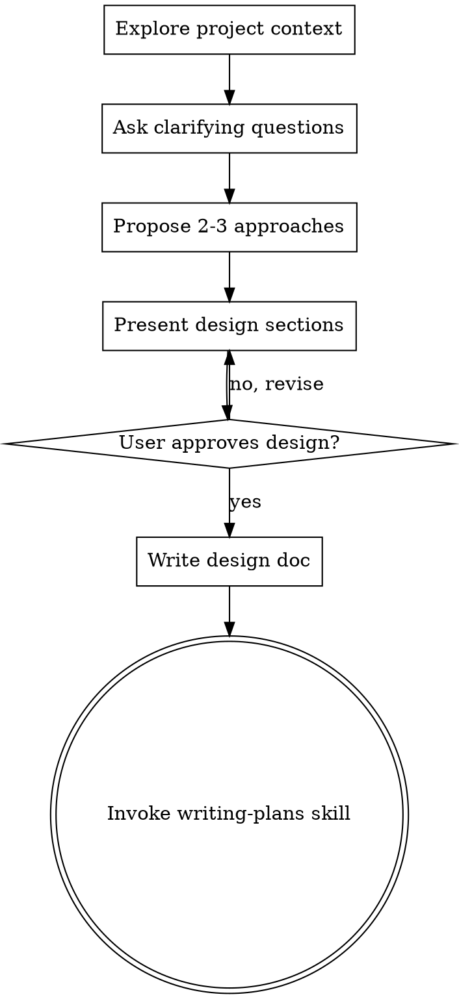

<!-- Generated by SpecStory, Markdown v2.1.0 -->

# 2026-02-26 15:55:37Z

<!-- Claude Code Session ac599b45-d9e6-4cc1-8a11-c52d4e7f0f7e (2026-02-26 15:55:37Z) -->

_**User (2026-02-26 15:55:37Z)**_

<command-name>/clear</command-name>
            <command-message>clear</command-message>
            <command-args></command-args>

_**User (2026-02-26 15:55:38Z)**_

<local-command-stdout></local-command-stdout>

_**User (2026-02-26 15:55:38Z)**_

<local-command-caveat>Caveat: The messages below were generated by the user while running local commands. DO NOT respond to these messages or otherwise consider them in your response unless the user explicitly asks you to.</local-command-caveat>

_**User (2026-02-26 15:56:40Z)**_

rich editor 中 packages/rich-renderer-mention 我想要能按下 `@` 后触发，并且可以扩展 mention 的类型，这里可以设计一个外部的插件机制去扩展。 同时 mentionNode 也加到 slash menu 中把

---

_**Agent (claude-opus-4-6 2026-02-26 15:56:47Z)**_

<think><details><summary>Thought Process</summary>
The user wants to work on the rich editor's mention feature in `packages/rich-renderer-mention`. Let me first understand the task:

1. Trigger mention on `@` key press
2. Extensible mention types via external plugin mechanism
3. Add mention node to slash menu

Let me first check if any skills apply, then explore the codebase to understand the current structure.

Let me invoke the brainstorming skill first since this is a creative/feature work task.
</details></think>

_**Agent (claude-opus-4-6 2026-02-26 15:56:48Z)**_

<tool-use data-tool-type="unknown" data-tool-name="ToolSearch"><details>
<summary>Tool use: **ToolSearch**</summary>

**Input:**

- max_results: `1`
- query: `select:Skill`

**Result:**

```

```
</details></tool-use>

_**Agent (claude-opus-4-6 2026-02-26 15:56:51Z)**_

<tool-use data-tool-type="generic" data-tool-name="Skill"><details>
<summary>Tool use: **Skill**</summary>

**Input:**

- skill: `superpowers:brainstorming`

</details></tool-use>

---

_**User (2026-02-26 15:56:51Z)**_

Base directory for this skill: <HOME>/.claude/plugins/cache/claude-plugins-official/superpowers/4.3.1/skills/brainstorming

# Brainstorming Ideas Into Designs

## Overview

Help turn ideas into fully formed designs and specs through natural collaborative dialogue.

Start by understanding the current project context, then ask questions one at a time to refine the idea. Once you understand what you're building, present the design and get user approval.

<HARD-GATE>
Do NOT invoke any implementation skill, write any code, scaffold any project, or take any implementation action until you have presented a design and the user has approved it. This applies to EVERY project regardless of perceived simplicity.
</HARD-GATE>

## Anti-Pattern: "This Is Too Simple To Need A Design"

Every project goes through this process. A todo list, a single-function utility, a config change — all of them. "Simple" projects are where unexamined assumptions cause the most wasted work. The design can be short (a few sentences for truly simple projects), but you MUST present it and get approval.

## Checklist

You MUST create a task for each of these items and complete them in order:

1. **Explore project context** — check files, docs, recent commits
2. **Ask clarifying questions** — one at a time, understand purpose/constraints/success criteria
3. **Propose 2-3 approaches** — with trade-offs and your recommendation
4. **Present design** — in sections scaled to their complexity, get user approval after each section
5. **Write design doc** — save to `docs/plans/YYYY-MM-DD-<topic>-design.md` and commit
6. **Transition to implementation** — invoke writing-plans skill to create implementation plan

## Process Flow



**The terminal state is invoking writing-plans.** Do NOT invoke frontend-design, mcp-builder, or any other implementation skill. The ONLY skill you invoke after brainstorming is writing-plans.

## The Process

**Understanding the idea:**
- Check out the current project state first (files, docs, recent commits)
- Ask questions one at a time to refine the idea
- Prefer multiple choice questions when possible, but open-ended is fine too
- Only one question per message - if a topic needs more exploration, break it into multiple questions
- Focus on understanding: purpose, constraints, success criteria

**Exploring approaches:**
- Propose 2-3 different approaches with trade-offs
- Present options conversationally with your recommendation and reasoning
- Lead with your recommended option and explain why

**Presenting the design:**
- Once you believe you understand what you're building, present the design
- Scale each section to its complexity: a few sentences if straightforward, up to 200-300 words if nuanced
- Ask after each section whether it looks right so far
- Cover: architecture, components, data flow, error handling, testing
- Be ready to go back and clarify if something doesn't make sense

## After the Design

**Documentation:**
- Write the validated design to `docs/plans/YYYY-MM-DD-<topic>-design.md`
- Use elements-of-style:writing-clearly-and-concisely skill if available
- Commit the design document to git

**Implementation:**
- Invoke the writing-plans skill to create a detailed implementation plan
- Do NOT invoke any other skill. writing-plans is the next step.

## Key Principles

- **One question at a time** - Don't overwhelm with multiple questions
- **Multiple choice preferred** - Easier to answer than open-ended when possible
- **YAGNI ruthlessly** - Remove unnecessary features from all designs
- **Explore alternatives** - Always propose 2-3 approaches before settling
- **Incremental validation** - Present design, get approval before moving on
- **Be flexible** - Go back and clarify when something doesn't make sense


---

_**Agent (claude-opus-4-6 2026-02-26 15:56:54Z)**_

<tool-use data-tool-type="unknown" data-tool-name="ToolSearch"><details>
<summary>Tool use: **ToolSearch**</summary>

**Input:**

- max_results: `1`
- query: `select:TaskList`

**Result:**

```

```
</details></tool-use>

_**Agent (claude-opus-4-6 2026-02-26 15:56:57Z)**_

<tool-use data-tool-type="unknown" data-tool-name="ToolSearch"><details>
<summary>Tool use: **ToolSearch**</summary>

**Input:**

- max_results: `1`
- query: `select:TaskCreate`

**Result:**

```

```
</details></tool-use>

_**Agent (claude-opus-4-6 2026-02-26 15:57:01Z)**_

<tool-use data-tool-type="unknown" data-tool-name="TaskCreate"><details>
<summary>Tool use: **TaskCreate**</summary>
Check rich-editor packages structure, existing mention implementation, slash menu setup, and plugin patterns

```text
Task #536 created successfully: Explore project context for mention plugin
```
</details></tool-use>

_**Agent (claude-opus-4-6 2026-02-26 15:57:02Z)**_

<tool-use data-tool-type="unknown" data-tool-name="TaskCreate"><details>
<summary>Tool use: **TaskCreate**</summary>
Understand mention types, plugin extension API design preferences, and specific requirements

```text
Task #537 created successfully: Ask clarifying questions
```
</details></tool-use>

_**Agent (claude-opus-4-6 2026-02-26 15:57:03Z)**_

<tool-use data-tool-type="unknown" data-tool-name="TaskCreate"><details>
<summary>Tool use: **TaskCreate**</summary>
Present 2-3 different design approaches for the mention plugin mechanism

```text
Task #538 created successfully: Propose approaches with trade-offs
```
</details></tool-use>

_**Agent (claude-opus-4-6 2026-02-26 15:57:04Z)**_

<tool-use data-tool-type="unknown" data-tool-name="TaskCreate"><details>
<summary>Tool use: **TaskCreate**</summary>
Present the full design for mention trigger, plugin mechanism, and slash menu integration

```text
Task #539 created successfully: Present design and get approval
```
</details></tool-use>

_**Agent (claude-opus-4-6 2026-02-26 15:57:04Z)**_

<tool-use data-tool-type="unknown" data-tool-name="TaskCreate"><details>
<summary>Tool use: **TaskCreate**</summary>
Save validated design to docs/plans/

```text
Task #540 created successfully: Write design doc
```
</details></tool-use>

_**Agent (claude-opus-4-6 2026-02-26 15:57:07Z)**_

<tool-use data-tool-type="unknown" data-tool-name="ToolSearch"><details>
<summary>Tool use: **ToolSearch**</summary>

**Input:**

- max_results: `1`
- query: `select:TaskUpdate`

**Result:**

```

```
</details></tool-use>

_**Agent (claude-opus-4-6 2026-02-26 15:57:11Z)**_

<tool-use data-tool-type="unknown" data-tool-name="TaskUpdate"><details>
<summary>Tool use: **TaskUpdate**</summary>

```text
Updated task #536 status
```
</details></tool-use>

_**Agent (claude-opus-4-6 2026-02-26 15:57:14Z)**_

先探索项目结构。

_**Agent (claude-opus-4-6 2026-02-26 15:59:01Z)**_

<tool-use data-tool-type="generic" data-tool-name="Task"><details>
<summary>Tool use: **Task**</summary>
Explore rich-editor mention plugin

```text
Excellent! Now I have comprehensive understanding. Let me create the final report:

---

## Exploration Complete: Rich-Editor Mention Plugin Architecture

I've thoroughly explored the Shiroi monorepo's rich-editor ecosystem. Here are my detailed findings:

### 1. Package Structure

**Rich-Editor Related Packages:**
- `<REPO_ROOT>/packages/rich-editor` — Core editor (Lexical-based)
- `<REPO_ROOT>/packages/rich-renderer-mention` — **Mention renderer package** (ALREADY EXISTS)
- `<REPO_ROOT>/packages/rich-plugin-slash-menu` — Slash command menu plugin
- `<REPO_ROOT>/packages/rich-renderers` — Static renderers aggregator
- `<REPO_ROOT>/packages/rich-renderers-edit` — Edit renderers aggregator
- `<REPO_ROOT>/packages/rich-headless` — Headless markdown transformers

---

### 2. Mention Implementation (Existing)

**Location:** `<REPO_ROOT>/packages/rich-renderer-mention/`

**Node Definition:**
- File: `<REPO_ROOT>/packages/rich-editor/src/nodes/MentionNode.ts`
- Type: `DecoratorNode<ReactElement>` (inline node, non-editable directly)
- Properties:
  - `__platform: string` (e.g., "GH", "TW", "TG", "ZH")
  - `__handle: string` (username/handle)
  - `__displayName?: string` (optional display label)

**Node Registration:**
- Static (read-only): Registered in `<REPO_ROOT>/packages/rich-editor/src/config.ts` (line 41)
- Edit mode: Registered in `<REPO_ROOT>/packages/rich-editor/src/config-edit.ts` (line 22)
- Both use the **same `MentionNode` class** (no `MentionEditNode` variant exists)

**Renderers (Split Architecture):**
1. **Static Renderer** — `<REPO_ROOT>/packages/rich-renderer-mention/src/MentionRenderer.tsx`
   - Read-only display with platform badge + clickable link
   - Supports platforms: GitHub, Twitter/X, Telegram, Zhihu
   - No edit UI imports

2. **Edit Renderer** — `<REPO_ROOT>/packages/rich-renderer-mention/src/MentionEditRenderer.tsx`
   - Wrapper that checks `useRendererMode()` to conditionally render edit UI only in editor
   - On hover opens `Popover` with editable fields:
     - Platform selector (`<select>`)
     - Handle input (`<input>`)
     - Display name input (`<input>`)
     - Actions: "Open" (external link), "Remove" (delete)
   - Heavy imports: `@haklex/rich-editor-ui` (Popover), `lucide-react` icons
   - File: `<REPO_ROOT>/packages/rich-renderer-mention/src/MentionEditRenderer.tsx` (225 lines)

**Platform Metadata:**
- File: `<REPO_ROOT>/packages/rich-renderer-mention/src/MentionRenderer.tsx` (lines 32-54)
- `platformMetaMap` with icon + URL generator for each platform
- Keys: `["GH", "TW", "TG", "ZH"]`

**Markdown Transformer:**
- File: `<REPO_ROOT>/packages/rich-headless/src/transformers.ts` (lines 62-75)
- Format: `{PLATFORM@handle}` or `[displayName]{PLATFORM@handle}`
- Import regex: `/(?:\[([^\]]+)\])?\{(\w+)@(\w[\w.-]*)\}/`
- Export format: Reconstructs from node properties
- Type: `TextMatchTransformer` (inline content)

**Styling:**
- File: `<REPO_ROOT>/packages/rich-renderer-mention/src/styles.css.ts` (154 lines)
- Vanilla Extract CSS-in-TS
- Semantic class names: `rich-mention`, `rich-mention-handle`, `rich-mention-edit-panel`, etc.
- Uses design tokens from `@haklex/rich-style-token`

---

### 3. Slash Menu Plugin (for insertion)

**Location:** `<REPO_ROOT>/packages/rich-plugin-slash-menu/`

**How It Works:**
- Trigger: `/` character (configurable via `triggerChar` prop)
- Uses `LexicalTypeaheadMenuPlugin` from `@lexical/react`
- Components:
  - `SlashMenuPlugin.tsx` — Main plugin with filtering & item collection
  - `SlashMenuItem.ts` — Menu item class (extends Lexical's `MenuOption`)
  - `SlashMenuList.tsx` — UI renderer (sections grouped by `item.section`)

**Item Collection:**
1. **Built-in items** (lines 32-155): Text, Heading 1-3, Quote, Divider, Table, Lists
2. **Node items** (function `collectNodeSlashItems`, lines 33-45):
   - Iterates `editor._nodes` map
   - Collects static `slashMenuItems: SlashMenuItemConfig[]` from each node class
3. **Extra items** (prop): Allows custom additions

**Node Integration:**
- Nodes can define `static slashMenuItems: SlashMenuItemConfig[]`
- Example: `<REPO_ROOT>/packages/rich-editor/src/nodes/KaTeXBlockNode.ts` (lines 28-41)
- Config includes: `title`, `icon`, `description`, `keywords`, `section`, `onSelect` callback

**Item Config Type:**
- File: `<REPO_ROOT>/packages/rich-editor/src/types/slash-menu.ts`
- Properties:
  ```typescript
  {
    title: string
    icon?: ReactNode
    description?: string
    keywords?: string[]
    section?: string
    onSelect: (editor: LexicalEditor, queryString: string) => void
  }
  ```

**Example Implementations:**
- `KaTeXBlockNode` — "Math Equation" (line 35: `$insertNodes([$createKaTeXBlockNode('')])`)
- `ImageNode` — Opens upload dialog
- `VideoNode` — Inserts video node
- `AlertQuoteEditNode` — Creates callout

---

### 4. Plugin/Extension Pattern

**Plugin Structure:**
```typescript
export function MyPlugin() {
  const [editor] = useLexicalComposerContext()
  useEffect(() => {
    editor.registerCommand(INSERT_COMMAND, handler, COMMAND_PRIORITY_EDITOR)
  }, [editor])
  return null  // plugins don't render
}
```

**Custom Node Pattern:**
```typescript
export class MyNode extends DecoratorNode<ReactElement> {
  static slashMenuItems: SlashMenuItemConfig[] = [...]  // Optional
  static getType() { return 'my-node' }
  decorate() { return <RendererWrapper type="MyType" props={...} /> }
  exportJSON() / importJSON() { ... }
  static clone(node) { ... }
}

export function $createMyNode(payload): MyNode { ... }
export function $isMyNode(node): node is MyNode { ... }
```

**Renderer Injection (Dynamic):**
- File: `<REPO_ROOT>/packages/rich-editor/src/types/renderer-config.ts`
- Props provide `rendererConfig?: RendererConfig`
- `RendererWrapper` component looks up custom renderer or falls back to built-in
- Context: `RendererConfigContext` + `useRendererConfig()`

---

### 5. Renderer Aggregation & Bundle Optimization

**Static/Edit Split Strategy:**

| Component | Static Entry | Edit Entry | Heavy Dependencies |
|-----------|--------------|------------|-------------------|
| `MentionRenderer` | `rich-renderers/config.ts` | `rich-renderers-edit/config.ts` | Popover, lucide-react |
| `AlertRenderer` | Static only | `AlertEditRenderer` | DropdownMenu |
| `MermaidRenderer` | Static only | `MermaidEditRenderer` | presentDialog |
| `CodeBlockRenderer` | Both use same | Both use same | None (edit flag prop) |

**Files:**
- Static aggregator: `<REPO_ROOT>/packages/rich-renderers/src/config.ts`
  ```typescript
  export const enhancedRendererConfig: RendererConfig = {
    Mention: MentionRenderer,  // Static only
    Alert: AlertRenderer,
    Mermaid: MermaidRenderer,
    ...
  }
  ```

- Edit aggregator: `<REPO_ROOT>/packages/rich-renderers-edit/src/config.ts`
  ```typescript
  export const enhancedEditRendererConfig: RendererConfig = {
    ...enhancedRendererConfig,  // Spreads static config
    Mention: MentionEditRenderer,  // Overrides with edit version
    Alert: AlertEditRenderer,
    Mermaid: MermaidEditRenderer,
    ...
  }
  ```

**Usage:**
- `RichRenderer` (read-only) imports `enhancedRendererConfig` → tree-shakes edit deps
- `RichEditor` (full editor) imports `enhancedEditRendererConfig` → includes all UI

---

### 6. Markdown Serialization

**All Transformers Location:**
- `<REPO_ROOT>/packages/rich-headless/src/transformers.ts` (402 lines)

**Mention Transformer Details (lines 62-75):**
```typescript
export const MENTION_TRANSFORMER: TextMatchTransformer = {
  dependencies: [],
  export: (node) => {
    if (node.getType() !== 'mention') return null
    const j = node.exportJSON() as any
    const base = `{${j.platform}@${j.handle}}`
    return j.displayName ? `[${j.displayName}]${base}` : base
  },
  importRegExp: /(?:\[([^\]]+)\])?\{(\w+)@(\w[\w.-]*)\}/,
  regExp: /(?:\[([^\]]+)\])?\{(\w+)@(\w[\w.-]*)\}$/,
  replace: NOOP,
  trigger: '}',
  type: 'text-match',
}
```

**Other Inline Transformers:**
- Spoiler: `||text||`
- KaTeX inline: `$equation$`
- Footnote: `[^identifier]`

---

### 7. Key Files Summary

| Purpose | File Path | Lines |
|---------|-----------|-------|
| **Mention Node Definition** | `<REPO_ROOT>/packages/rich-editor/src/nodes/MentionNode.ts` | 123 |
| **Mention Static Renderer** | `<REPO_ROOT>/packages/rich-renderer-mention/src/MentionRenderer.tsx` | 102 |
| **Mention Edit Renderer** | `<REPO_ROOT>/packages/rich-renderer-mention/src/MentionEditRenderer.tsx` | 225 |
| **Mention Styles** | `<REPO_ROOT>/packages/rich-renderer-mention/src/styles.css.ts` | 154 |
| **Markdown Transformer** | `<REPO_ROOT>/packages/rich-headless/src/transformers.ts` | 62-75 |
| **Slash Menu Plugin** | `<REPO_ROOT>/packages/rich-plugin-slash-menu/src/SlashMenuPlugin.tsx` | 130 |
| **Slash Menu Items** | `<REPO_ROOT>/packages/rich-plugin-slash-menu/src/SlashMenuItem.ts` | 32 |
| **Slash Menu Config** | `<REPO_ROOT>/packages/rich-editor/src/config.ts` | ~60 |
| **Edit Config** | `<REPO_ROOT>/packages/rich-editor/src/config-edit.ts` | 42 |
| **Static Renderers Agg.** | `<REPO_ROOT>/packages/rich-renderers/src/config.ts` | 25 |
| **Edit Renderers Agg.** | `<REPO_ROOT>/packages/rich-renderers-edit/src/config.ts` | 28 |

---

### 8. Mention Feature Checklist

✅ **Mention Node exists** with all properties (platform, handle, displayName)
✅ **Markdown format** defined: `{PLATFORM@handle}` or `[displayName]{PLATFORM@handle}`
✅ **4 platforms** supported: GitHub (GH), Twitter (TW), Telegram (TG), Zhihu (ZH)
✅ **Edit UI** with Popover, platform selector, handle/displayName inputs
✅ **Static/Edit renderer split** for bundle optimization
✅ **Styling** with design tokens (Vanilla Extract CSS)
✅ **Renderer config injection** pattern working
✅ **Markdown transformer** for export/import
❓ **No slash menu item** for inserting mentions from `/` command (would need to be added)

---

### 9. Plugin Architecture Patterns Used

1. **Lexical DecoratorNode** — Inline content nodes
2. **TextMatchTransformer** — Markdown serialization with regex patterns
3. **LexicalTypeaheadMenuPlugin** — Slash command UI (built into Lexical)
4. **MenuOption** — Extensible slash menu items
5. **RendererWrapper** — Dynamic renderer lookup + fallback
6. **Context Providers** — `ColorSchemeContext`, `RendererConfigContext`, `ImageUploadContext`
7. **Vanilla Extract** — CSS-in-TS with theme variables
8. **Portal rendering** — Slash menu floats above content

---

This architecture provides a clean, modular system where:
- Mention insertion can be triggered via markdown (autoformat) or slash menu (if added)
- Edit UI is only loaded in editor mode (tree-shaken from read-only renderer)
- Renderers are swappable via config injection
- Nodes self-describe their slash menu items for automatic collection
agentId: a9f24ff12eae23bea (for resuming to continue this agent's work if needed)
<usage>total_tokens: 75629
tool_uses: 42
duration_ms: 101000</usage>
```
</details></tool-use>

_**Agent - sidechain (2026-02-26 15:57:20Z)**_

Explore the rich-editor packages in this monorepo, specifically:

1. Find and list all packages under `packages/` that relate to rich-editor or rich-renderer
2. Look for any existing mention-related code (mention nodes, mention plugins)
3. Find the slash menu implementation (how slash commands are registered and triggered)
4. Understand the plugin/extension pattern used in the editor
5. Check if there's a `packages/rich-renderer-mention` directory already

Focus on understanding:
- How Lexical nodes are defined and registered
- How the slash menu works (trigger, registration, rendering)
- How plugins are structured
- Any existing mention node types

Return detailed findings with file paths and key code snippets.

_**Agent - sidechain (claude-haiku-4-5-20251001 2026-02-26 15:57:23Z)**_

I'll explore the rich-editor packages to understand the architecture and existing implementations. Let me start by mapping out the structure and finding the relevant code.

_**Agent - sidechain (claude-haiku-4-5-20251001 2026-02-26 15:57:25Z)**_

<tool-use data-tool-type="search" data-tool-name="Glob"><details>
<summary>Tool use: **Glob**</summary>
 pattern `packages/**/package.json`

```text
<REPO_ROOT>/packages/rich-editor/node_modules/.pnpm/@floating-ui+react@0.27.17_react-dom@19.2.4_react@19.2.4__react@19.2.4/node_modules/@floating-ui/react/utils/package.json
<REPO_ROOT>/packages/rich-editor/node_modules/.pnpm/@floating-ui+react@0.27.17_react-dom@19.2.4_react@19.2.4__react@19.2.4/node_modules/@floating-ui/react/package.json
<REPO_ROOT>/packages/rich-editor/node_modules/.pnpm/css-what@6.2.2/node_modules/css-what/package.json
<REPO_ROOT>/packages/rich-editor/node_modules/.pnpm/@shikijs+themes@3.22.0/node_modules/@shikijs/themes/package.json
<REPO_ROOT>/packages/rich-editor/node_modules/.pnpm/minimatch@10.1.2/node_modules/minimatch/dist/esm/package.json
<REPO_ROOT>/packages/rich-editor/node_modules/.pnpm/minimatch@10.1.2/node_modules/minimatch/dist/commonjs/package.json
<REPO_ROOT>/packages/rich-editor/node_modules/.pnpm/minimatch@10.1.2/node_modules/minimatch/package.json
<REPO_ROOT>/packages/rich-editor/node_modules/.pnpm/@volar+language-core@2.4.28/node_modules/@volar/language-core/package.json
<REPO_ROOT>/packages/rich-editor/node_modules/.pnpm/micromark-util-encode@2.0.1/node_modules/micromark-util-encode/package.json
<REPO_ROOT>/packages/rich-editor/node_modules/.pnpm/import-lazy@4.0.0/node_modules/import-lazy/package.json
<REPO_ROOT>/packages/rich-editor/node_modules/.pnpm/stringify-entities@4.0.4/node_modules/stringify-entities/package.json
<REPO_ROOT>/packages/rich-editor/node_modules/.pnpm/@types+hast@3.0.4/node_modules/@types/hast/package.json
<REPO_ROOT>/packages/rich-editor/node_modules/.pnpm/@emotion+hash@0.9.2/node_modules/@emotion/hash/package.json
<REPO_ROOT>/packages/rich-editor/node_modules/.pnpm/gensync@1.0.0-beta.2/node_modules/gensync/package.json
<REPO_ROOT>/packages/rich-editor/node_modules/.pnpm/@esbuild+darwin-arm64@0.25.12/node_modules/@esbuild/darwin-arm64/package.json
<REPO_ROOT>/packages/rich-editor/node_modules/.pnpm/semver@6.3.1/node_modules/semver/package.json
<REPO_ROOT>/packages/rich-editor/node_modules/.pnpm/@babel+helper-validator-identifier@7.28.5/node_modules/@babel/helper-validator-identifier/package.json
<REPO_ROOT>/packages/rich-editor/node_modules/.pnpm/oniguruma-parser@0.12.1/node_modules/oniguruma-parser/package.json
<REPO_ROOT>/packages/rich-editor/node_modules/.pnpm/scheduler@0.27.0/node_modules/scheduler/package.json
<REPO_ROOT>/packages/rich-editor/node_modules/.pnpm/ajv-draft-04@1.0.0_ajv@8.13.0/node_modules/ajv-draft-04/package.json
<REPO_ROOT>/packages/rich-editor/node_modules/.pnpm/@babel+types@7.29.0/node_modules/@babel/types/package.json
<REPO_ROOT>/packages/rich-editor/node_modules/.pnpm/semver@7.5.4/node_modules/semver/package.json
<REPO_ROOT>/packages/rich-editor/node_modules/.pnpm/hast-util-whitespace@3.0.0/node_modules/hast-util-whitespace/package.json
<REPO_ROOT>/packages/rich-editor/node_modules/.pnpm/@babel+code-frame@7.29.0/node_modules/@babel/code-frame/package.json
<REPO_ROOT>/packages/rich-editor/node_modules/.pnpm/@babel+helper-globals@7.28.0/node_modules/@babel/helper-globals/package.json
<REPO_ROOT>/packages/rich-editor/node_modules/.pnpm/@rushstack+node-core-library@5.19.1_@types+node@25.2.2/node_modules/@rushstack/node-core-library/package.json
<REPO_ROOT>/packages/rich-editor/node_modules/.pnpm/entities@7.0.1/node_modules/entities/dist/esm/package.json
<REPO_ROOT>/packages/rich-editor/node_modules/.pnpm/entities@7.0.1/node_modules/entities/dist/commonjs/package.json
<REPO_ROOT>/packages/rich-editor/node_modules/.pnpm/entities@7.0.1/node_modules/entities/package.json
<REPO_ROOT>/packages/rich-editor/node_modules/.pnpm/lodash@4.17.23/node_modules/lodash/package.json
<REPO_ROOT>/packages/rich-editor/node_modules/.pnpm/@lexical+utils@0.39.0/node_modules/@lexical/utils/package.json
<REPO_ROOT>/packages/rich-editor/node_modules/.pnpm/@vue+compiler-dom@3.5.27/node_modules/@vue/compiler-dom/package.json
<REPO_ROOT>/packages/rich-editor/node_modules/.pnpm/@babel+generator@7.29.1/node_modules/@babel/generator/package.json
<REPO_ROOT>/packages/rich-editor/node_modules/.pnpm/@types+react-dom@19.2.3_@types+react@19.2.13/node_modules/@types/react-dom/package.json
<REPO_ROOT>/packages/rich-editor/node_modules/.pnpm/@vanilla-extract+css@1.18.0/node_modules/@vanilla-extract/css/functionSerializer/package.json
<REPO_ROOT>/packages/rich-editor/node_modules/.pnpm/@vanilla-extract+css@1.18.0/node_modules/@vanilla-extract/css/recipe/package.json
<REPO_ROOT>/packages/rich-editor/node_modules/.pnpm/@vanilla-extract+css@1.18.0/node_modules/@vanilla-extract/css/adapter/package.json
<REPO_ROOT>/packages/rich-editor/node_modules/.pnpm/@vanilla-extract+css@1.18.0/node_modules/@vanilla-extract/css/disableRuntimeStyles/package.json
<REPO_ROOT>/packages/rich-editor/node_modules/.pnpm/@vanilla-extract+css@1.18.0/node_modules/@vanilla-extract/css/package.json
<REPO_ROOT>/packages/rich-editor/node_modules/.pnpm/@vanilla-extract+css@1.18.0/node_modules/@vanilla-extract/css/injectStyles/package.json
<REPO_ROOT>/packages/rich-editor/node_modules/.pnpm/@vanilla-extract+css@1.18.0/node_modules/@vanilla-extract/css/fileScope/package.json
<REPO_ROOT>/packages/rich-editor/node_modules/.pnpm/@vanilla-extract+css@1.18.0/node_modules/@vanilla-extract/css/transformCss/package.json
<REPO_ROOT>/packages/rich-editor/node_modules/.pnpm/@vanilla-extract+vite-plugin@4.0.20_@types+node@25.2.2_vite@6.4.1_@types+node@25.2.2_/node_modules/@vanilla-extract/vite-plugin/package.json
<REPO_ROOT>/packages/rich-editor/node_modules/.pnpm/@lexical+selection@0.39.0/node_modules/@lexical/selection/package.json
<REPO_ROOT>/packages/rich-editor/node_modules/.pnpm/@microsoft+tsdoc-config@0.18.0/node_modules/@microsoft/tsdoc-config/package.json
<REPO_ROOT>/packages/rich-editor/node_modules/.pnpm/@babel+runtime@7.28.6/node_modules/@babel/runtime/package.json
<REPO_ROOT>/packages/rich-editor/node_modules/.pnpm/@babel+runtime@7.28.6/node_modules/@babel/runtime/helpers/esm/package.json
<REPO_ROOT>/packages/rich-editor/node_modules/.pnpm/oniguruma-to-es@4.3.4/node_modules/oniguruma-to-es/dist/esm/package.json
<REPO_ROOT>/packages/rich-editor/node_modules/.pnpm/oniguruma-to-es@4.3.4/node_modules/oniguruma-to-es/dist/cjs/package.json
<REPO_ROOT>/packages/rich-editor/node_modules/.pnpm/oniguruma-to-es@4.3.4/node_modules/oniguruma-to-es/package.json
<REPO_ROOT>/packages/rich-editor/node_modules/.pnpm/@types+node@25.2.2/node_modules/@types/node/package.json
<REPO_ROOT>/packages/rich-editor/node_modules/.pnpm/@shikijs+types@3.22.0/node_modules/@shikijs/types/package.json
<REPO_ROOT>/packages/rich-editor/node_modules/.pnpm/unist-util-visit@5.1.0/node_modules/unist-util-visit/package.json
<REPO_ROOT>/packages/rich-editor/node_modules/.pnpm/@isaacs+balanced-match@4.0.1/node_modules/@isaacs/balanced-match/dist/esm/package.json
<REPO_ROOT>/packages/rich-editor/node_modules/.pnpm/@isaacs+balanced-match@4.0.1/node_modules/@isaacs/balanced-match/dist/commonjs/package.json
<REPO_ROOT>/packages/rich-editor/node_modules/.pnpm/@isaacs+balanced-match@4.0.1/node_modules/@isaacs/balanced-match/package.json
<REPO_ROOT>/packages/rich-editor/node_modules/.pnpm/@jridgewell+resolve-uri@3.1.2/node_modules/@jridgewell/resolve-uri/package.json
<REPO_ROOT>/packages/rich-editor/node_modules/.pnpm/@babel+traverse@7.29.0/node_modules/@babel/traverse/package.json
<REPO_ROOT>/packages/rich-editor/node_modules/.pnpm/@volar+typescript@2.4.28/node_modules/@volar/typescript/package.json
<REPO_ROOT>/packages/rich-editor/node_modules/.pnpm/@babel+compat-data@7.29.0/node_modules/@babel/compat-data/package.json
<REPO_ROOT>/packages/rich-editor/node_modules/.pnpm/@jridgewell+remapping@2.3.5/node_modules/@jridgewell/remapping/package.json
<REPO_ROOT>/packages/rich-editor/node_modules/.pnpm/acorn@8.15.0/node_modules/acorn/package.json
<REPO_ROOT>/packages/rich-editor/node_modules/.pnpm/@rollup+pluginutils@5.3.0_rollup@4.57.1/node_modules/@rollup/pluginutils/dist/es/package.json
<REPO_ROOT>/packages/rich-editor/node_modules/.pnpm/@rollup+pluginutils@5.3.0_rollup@4.57.1/node_modules/@rollup/pluginutils/package.json
<REPO_ROOT>/packages/rich-editor/node_modules/.pnpm/confbox@0.2.4/node_modules/confbox/package.json
<REPO_ROOT>/packages/rich-editor/node_modules/.pnpm/@microsoft+api-extractor-model@7.32.2_@types+node@25.2.2/node_modules/@microsoft/api-extractor-model/package.json
<REPO_ROOT>/packages/rich-editor/node_modules/.pnpm/@types+argparse@1.0.38/node_modules/@types/argparse/package.json
<REPO_ROOT>/packages/rich-editor/node_modules/.pnpm/yjs@13.6.29/node_modules/yjs/package.json
<REPO_ROOT>/packages/rich-editor/node_modules/.pnpm/shiki@3.22.0/node_modules/shiki/package.json
<REPO_ROOT>/packages/rich-editor/node_modules/.pnpm/@esbuild+darwin-arm64@0.27.3/node_modules/@esbuild/darwin-arm64/package.json
<REPO_ROOT>/packages/rich-editor/node_modules/.pnpm/@babel+helper-validator-option@7.27.1/node_modules/@babel/helper-validator-option/package.json
<REPO_ROOT>/packages/rich-editor/node_modules/.pnpm/@types+estree@1.0.8/node_modules/@types/estree/package.json
<REPO_ROOT>/packages/rich-editor/node_modules/.pnpm/has-flag@4.0.0/node_modules/has-flag/package.json
<REPO_ROOT>/packages/rich-editor/node_modules/.pnpm/javascript-stringify@2.1.0/node_modules/javascript-stringify/package.json
<REPO_ROOT>/packages/rich-editor/node_modules/.pnpm/@floating-ui+core@1.7.4/node_modules/@floating-ui/core/package.json
<REPO_ROOT>/packages/rich-editor/node_modules/.pnpm/@vanilla-extract+private@1.0.9/node_modules/@vanilla-extract/private/package.json
<REPO_ROOT>/packages/rich-editor/node_modules/.pnpm/@lexical+overflow@0.39.0/node_modules/@lexical/overflow/package.json
<REPO_ROOT>/packages/rich-editor/node_modules/.pnpm/devlop@1.1.0/node_modules/devlop/package.json
<REPO_ROOT>/packages/rich-editor/node_modules/.pnpm/property-information@7.1.0/node_modules/property-information/package.json
<REPO_ROOT>/packages/rich-editor/node_modules/.pnpm/cssesc@3.0.0/node_modules/cssesc/package.json
<REPO_ROOT>/packages/rich-editor/node_modules/.pnpm/balanced-match@1.0.2/node_modules/balanced-match/package.json
<REPO_ROOT>/packages/rich-editor/node_modules/.pnpm/escalade@3.2.0/node_modules/escalade/package.json
<REPO_ROOT>/packages/rich-editor/node_modules/.pnpm/convert-source-map@2.0.0/node_modules/convert-source-map/package.json
<REPO_ROOT>/packages/rich-editor/node_modules/.pnpm/debug@4.4.3/node_modules/debug/package.json
<REPO_ROOT>/packages/rich-editor/node_modules/.pnpm/compare-versions@6.1.1/node_modules/compare-versions/package.json
<REPO_ROOT>/packages/rich-editor/node_modules/.pnpm/dedent@1.7.1/node_modules/dedent/package.json
<REPO_ROOT>/packages/rich-editor/node_modules/.pnpm/yallist@3.1.1/node_modules/yallist/package.json
<REPO_ROOT>/packages/rich-editor/node_modules/.pnpm/@shikijs+engine-oniguruma@3.22.0/node_modules/@shikijs/engine-oniguruma/package.json
<REPO_ROOT>/packages/rich-editor/node_modules/.pnpm/path-parse@1.0.7/node_modules/path-parse/package.json
<REPO_ROOT>/packages/rich-editor/node_modules/.pnpm/@rushstack+problem-matcher@0.1.1_@types+node@25.2.2/node_modules/@rushstack/problem-matcher/package.json
<REPO_ROOT>/packages/rich-editor/node_modules/.pnpm/undici-types@7.16.0/node_modules/undici-types/package.json
<REPO_ROOT>/packages/rich-editor/node_modules/.pnpm/fsevents@2.3.3/node_modules/fsevents/package.json
<REPO_ROOT>/packages/rich-editor/node_modules/.pnpm/fdir@6.5.0_picomatch@4.0.3/node_modules/fdir/package.json
<REPO_ROOT>/packages/rich-editor/node_modules/.pnpm/graceful-fs@4.2.11/node_modules/graceful-fs/package.json
<REPO_ROOT>/packages/rich-editor/node_modules/.pnpm/@preact+signals-core@1.13.0/node_modules/@preact/signals-core/package.json
<REPO_ROOT>/packages/rich-editor/node_modules/.pnpm/hast-util-to-html@9.0.5/node_modules/hast-util-to-html/package.json
<REPO_ROOT>/packages/rich-editor/node_modules/.pnpm/json-schema-traverse@1.0.0/node_modules/json-schema-traverse/package.json
<REPO_ROOT>/packages/rich-editor/node_modules/.pnpm/comma-separated-tokens@2.0.3/node_modules/comma-separated-tokens/package.json
<REPO_ROOT>/packages/rich-editor/node_modules/.pnpm/@babel+helper-string-parser@7.27.1/node_modules/@babel/helper-string-parser/package.json
<REPO_ROOT>/packages/rich-editor/node_modules/.pnpm/micromark-util-sanitize-uri@2.0.1/node_modules/micromark-util-sanitize-uri/package.json
(Results are truncated. Consider using a more specific path or pattern.)
```
</details></tool-use>

_**Agent - sidechain (claude-haiku-4-5-20251001 2026-02-26 15:57:23Z)**_

<tool-use data-tool-type="shell" data-tool-name="Bash"><details>
<summary>Tool use: **Bash**</summary>
List all packages in the monorepo

`find <REPO_ROOT>/packages -type d -maxdepth 1`

```text
<REPO_ROOT>/packages
<REPO_ROOT>/packages/rich-diff
<REPO_ROOT>/packages/types
<REPO_ROOT>/packages/rich-plugin-floating-toolbar
<REPO_ROOT>/packages/rich-style-token
<REPO_ROOT>/packages/rich-renderer-mention
<REPO_ROOT>/packages/rich-plugin-block-handle
<REPO_ROOT>/packages/rich-renderer-mermaid
<REPO_ROOT>/packages/rich-headless
<REPO_ROOT>/packages/rich-renderer-banner
<REPO_ROOT>/packages/rich-ext-gallery
<REPO_ROOT>/packages/rich-plugin-table
<REPO_ROOT>/packages/rich-renderer-linkcard
<REPO_ROOT>/packages/rich-editor-ui
<REPO_ROOT>/packages/rich-kit-shiro
<REPO_ROOT>/packages/rich-renderer-image
<REPO_ROOT>/packages/rich-plugin-link-edit
<REPO_ROOT>/packages/rich-renderer-codeblock
<REPO_ROOT>/packages/rich-renderer
<REPO_ROOT>/packages/rich-renderer-katex
<REPO_ROOT>/packages/rich-renderers-edit
<REPO_ROOT>/packages/rich-ext-tldraw
<REPO_ROOT>/packages/rich-ext-code-snippet
<REPO_ROOT>/packages/rich-renderer-alert
<REPO_ROOT>/packages/rich-ext-embed
<REPO_ROOT>/packages/rich-editor
<REPO_ROOT>/packages/rich-editor-demo
<REPO_ROOT>/packages/rich-plugin-slash-menu
<REPO_ROOT>/packages/rich-renderers
<REPO_ROOT>/packages/rich-renderer-video
```
</details></tool-use>

_**Agent - sidechain (claude-haiku-4-5-20251001 2026-02-26 15:57:45Z)**_

Great! I can see the packages. Now let me search for key implementations related to mentions, slash menu, and plugin patterns.

_**Agent - sidechain (claude-haiku-4-5-20251001 2026-02-26 15:57:46Z)**_

<tool-use data-tool-type="read" data-tool-name="Read"><details>
<summary>Tool use: **Read**</summary>
 `./packages/rich-renderer-mention/package.json`

```text
     1→{
     2→  "name": "@haklex/rich-renderer-mention",
     3→  "version": "0.0.37",
     4→  "description": "Social mention renderer with platform badges",
     5→  "license": "MIT",
     6→  "type": "module",
     7→  "exports": {
     8→    ".": "./src/index.ts",
     9→    "./style.css": "./dist/rich-renderer-mention.css"
    10→  },
    11→  "main": "./src/index.ts",
    12→  "files": [
    13→    "dist"
    14→  ],
    15→  "scripts": {
    16→    "build": "vite build",
    17→    "dev:build": "vite build --watch"
    18→  },
    19→  "dependencies": {
    20→    "@haklex/rich-editor": "workspace:*",
    21→    "@haklex/rich-editor-ui": "workspace:*",
    22→    "@haklex/rich-style-token": "workspace:*",
    23→    "@icons-pack/react-simple-icons": "^13.11.2",
    24→    "lucide-react": "^0.574.0"
    25→  },
    26→  "devDependencies": {
    27→    "@lexical/react": "^0.41.0",
    28→    "@types/react": "^19.2.14",
    29→    "@types/react-dom": "^19.2.3",
    30→    "@vanilla-extract/css": "^1.18.0",
    31→    "@vanilla-extract/vite-plugin": "^4.0.20",
    32→    "lexical": "^0.41.0",
    33→    "react": "19.2.4",
    34→    "react-dom": "19.2.4",
    35→    "typescript": "^5.9.3",
    36→    "vite": "^7.3.1",
    37→    "vite-plugin-dts": "^4.5.4"
    38→  },
    39→  "peerDependencies": {
    40→    "@lexical/react": "^0.41.0",
    41→    "lexical": "^0.41.0",
    42→    "react": ">=19",
    43→    "react-dom": ">=19"
    44→  },
    45→  "publishConfig": {
    46→    "access": "public",
    47→    "exports": {
    48→      ".": {
    49→        "import": "./dist/index.mjs",
    50→        "types": "./dist/index.d.ts"
    51→      },
    52→      "./style.css": "./dist/rich-renderer-mention.css"
    53→    },
    54→    "main": "./dist/index.mjs",
    55→    "types": "./dist/index.d.ts"
    56→  }
    57→}
```
</details></tool-use>

_**Agent - sidechain (claude-haiku-4-5-20251001 2026-02-26 15:57:47Z)**_

<tool-use data-tool-type="search" data-tool-name="Glob"><details>
<summary>Tool use: **Glob**</summary>
 pattern `packages/rich-renderer-mention/src/**/*.{ts,tsx}`

```text
<REPO_ROOT>/packages/rich-renderer-mention/src/MentionRenderer.tsx
<REPO_ROOT>/packages/rich-renderer-mention/src/styles.css.ts
<REPO_ROOT>/packages/rich-renderer-mention/src/MentionEditRenderer.tsx
<REPO_ROOT>/packages/rich-renderer-mention/src/index.ts
```
</details></tool-use>

_**Agent - sidechain (claude-haiku-4-5-20251001 2026-02-26 15:57:47Z)**_

<tool-use data-tool-type="search" data-tool-name="Glob"><details>
<summary>Tool use: **Glob**</summary>
 pattern `packages/rich-editor/src/**/*mention*.{ts,tsx}`

```text
<REPO_ROOT>/packages/rich-editor/src/transformers/mention.ts
```
</details></tool-use>

_**Agent - sidechain (claude-haiku-4-5-20251001 2026-02-26 15:57:47Z)**_

<tool-use data-tool-type="search" data-tool-name="Glob"><details>
<summary>Tool use: **Glob**</summary>
 pattern `packages/rich-plugin-slash-menu/src/**/*.{ts,tsx}`

```text
<REPO_ROOT>/packages/rich-plugin-slash-menu/src/SlashMenuItem.ts
<REPO_ROOT>/packages/rich-plugin-slash-menu/src/SlashMenuList.tsx
<REPO_ROOT>/packages/rich-plugin-slash-menu/src/SlashMenuPlugin.tsx
<REPO_ROOT>/packages/rich-plugin-slash-menu/src/index.ts
<REPO_ROOT>/packages/rich-plugin-slash-menu/src/builtinItems.ts
<REPO_ROOT>/packages/rich-plugin-slash-menu/src/styles.css.ts
```
</details></tool-use>

_**Agent - sidechain (claude-haiku-4-5-20251001 2026-02-26 15:57:49Z)**_

Excellent! Now let me dig deeper into the key implementations:

_**Agent - sidechain (claude-haiku-4-5-20251001 2026-02-26 15:57:50Z)**_

<tool-use data-tool-type="read" data-tool-name="Read"><details>
<summary>Tool use: **Read**</summary>
 `./packages/rich-renderer-mention/src/index.ts`

```text
     1→export { MentionEditRenderer } from './MentionEditRenderer'
     2→export { MentionRenderer } from './MentionRenderer'
     3→
```
</details></tool-use>

_**Agent - sidechain (claude-haiku-4-5-20251001 2026-02-26 15:57:50Z)**_

<tool-use data-tool-type="read" data-tool-name="Read"><details>
<summary>Tool use: **Read**</summary>
 `./packages/rich-renderer-mention/src/MentionRenderer.tsx`

```text
     1→import {
     2→  SiGithub,
     3→  SiTelegram,
     4→  SiX,
     5→  SiZhihu,
     6→} from '@icons-pack/react-simple-icons'
     7→
     8→import * as styles from './styles.css'
     9→
    10→export interface MentionRendererProps {
    11→  platform: string
    12→  handle: string
    13→  displayName?: string
    14→}
    15→
    16→interface MentionPlatformMeta {
    17→  label: string
    18→  icon: React.ReactNode
    19→  getUrl: (handle: string) => string
    20→}
    21→
    22→const GitHubIcon = (
    23→  <SiGithub
    24→    size="1em"
    25→    className={`${styles.mentionIconGitHub} ${styles.semanticClassNames.mentionIconGitHub}`}
    26→  />
    27→)
    28→const TwitterIcon = <SiX size="1em" color="#1DA1F2" />
    29→const TelegramIcon = <SiTelegram size="1em" color="#2AABEE" />
    30→const ZhihuIcon = <SiZhihu size="1em" color="#0084FF" />
    31→
    32→export const platformMetaMap: Record<string, MentionPlatformMeta> = {
    33→  GH: {
    34→    label: 'GitHub',
    35→    icon: GitHubIcon,
    36→    getUrl: (handle) => `https://github.com/${encodeURIComponent(handle)}`,
    37→  },
    38→  TW: {
    39→    label: 'Twitter',
    40→    icon: TwitterIcon,
    41→    getUrl: (handle) => `https://twitter.com/${encodeURIComponent(handle)}`,
    42→  },
    43→  TG: {
    44→    label: 'Telegram',
    45→    icon: TelegramIcon,
    46→    getUrl: (handle) => `https://t.me/${encodeURIComponent(handle)}`,
    47→  },
    48→  ZH: {
    49→    label: 'Zhihu',
    50→    icon: ZhihuIcon,
    51→    getUrl: (handle) =>
    52→      `https://www.zhihu.com/people/${encodeURIComponent(handle)}`,
    53→  },
    54→}
    55→
    56→export const platformKeys = Object.keys(platformMetaMap)
    57→
    58→export function MentionRenderer({
    59→  platform,
    60→  handle,
    61→  displayName,
    62→}: MentionRendererProps) {
    63→  const normalizedHandle = handle.replace(/^@+/, '')
    64→  const meta = platformMetaMap[platform]
    65→  const label = displayName || normalizedHandle
    66→
    67→  if (meta) {
    68→    return (
    69→      <span
    70→        className={`${styles.mention} ${styles.semanticClassNames.mention}`}
    71→      >
    72→        <span
    73→          className={`${styles.mentionIcon} ${styles.semanticClassNames.mentionIcon}`}
    74→          aria-hidden
    75→        >
    76→          {meta.icon}
    77→        </span>
    78→        <a
    79→          className={`${styles.mentionHandle} ${styles.semanticClassNames.mentionHandle}`}
    80→          href={meta.getUrl(normalizedHandle)}
    81→          target="_blank"
    82→          rel="noopener noreferrer"
    83→        >
    84→          {label}
    85→        </a>
    86→      </span>
    87→    )
    88→  }
    89→
    90→  return (
    91→    <span
    92→      className={`${styles.mention} ${styles.semanticClassNames.mention} ${styles.mentionPlain} ${styles.semanticClassNames.mentionPlain}`}
    93→    >
    94→      <span
    95→        className={`${styles.mentionHandle} ${styles.semanticClassNames.mentionHandle}`}
    96→      >
    97→        @{label}
    98→      </span>
    99→    </span>
   100→  )
   101→}
   102→
```
</details></tool-use>

_**Agent - sidechain (claude-haiku-4-5-20251001 2026-02-26 15:57:50Z)**_

<tool-use data-tool-type="read" data-tool-name="Read"><details>
<summary>Tool use: **Read**</summary>
 `./packages/rich-renderer-mention/src/MentionEditRenderer.tsx`

```text
     1→import { useRendererMode } from '@haklex/rich-editor'
     2→import { Popover, PopoverPanel, PopoverTrigger } from '@haklex/rich-editor-ui'
     3→import { vars } from '@haklex/rich-style-token'
     4→import { useLexicalComposerContext } from '@lexical/react/LexicalComposerContext'
     5→import { $getNearestNodeFromDOMNode } from 'lexical'
     6→import { AtSign, ExternalLink, Trash2, User } from 'lucide-react'
     7→import { useCallback, useEffect, useRef, useState } from 'react'
     8→
     9→import type { MentionRendererProps } from './MentionRenderer'
    10→import {
    11→  MentionRenderer,
    12→  platformKeys,
    13→  platformMetaMap,
    14→} from './MentionRenderer'
    15→import * as styles from './styles.css'
    16→
    17→export function MentionEditRenderer(props: MentionRendererProps) {
    18→  const mode = useRendererMode()
    19→
    20→  if (mode !== 'editor') {
    21→    return <MentionRenderer {...props} />
    22→  }
    23→
    24→  return <MentionEditRendererInner {...props} />
    25→}
    26→
    27→function MentionEditRendererInner({
    28→  platform,
    29→  handle,
    30→  displayName,
    31→}: MentionRendererProps) {
    32→  const [editor] = useLexicalComposerContext()
    33→  const editable = editor.isEditable()
    34→  const wrapperRef = useRef<HTMLSpanElement>(null)
    35→
    36→  const [open, setOpen] = useState(false)
    37→  const [editPlatform, setEditPlatform] = useState(platform)
    38→  const [editHandle, setEditHandle] = useState(handle)
    39→  const [editDisplayName, setEditDisplayName] = useState(displayName || '')
    40→
    41→  useEffect(() => {
    42→    setEditPlatform(platform)
    43→    setEditHandle(handle)
    44→    setEditDisplayName(displayName || '')
    45→  }, [platform, handle, displayName])
    46→
    47→  const commitChanges = useCallback(() => {
    48→    const trimmedHandle = editHandle.trim()
    49→    if (!trimmedHandle) return
    50→    if (!wrapperRef.current) return
    51→
    52→    editor.update(() => {
    53→      const node = $getNearestNodeFromDOMNode(wrapperRef.current!)
    54→      if (!node) return
    55→      const writable = node.getWritable() as unknown as Record<string, unknown>
    56→      writable.__platform = editPlatform
    57→      writable.__handle = trimmedHandle
    58→      writable.__displayName = editDisplayName.trim() || undefined
    59→    })
    60→    setOpen(false)
    61→  }, [editor, editPlatform, editHandle, editDisplayName])
    62→
    63→  const handleDelete = useCallback(() => {
    64→    if (!wrapperRef.current) return
    65→
    66→    editor.update(() => {
    67→      const node = $getNearestNodeFromDOMNode(wrapperRef.current!)
    68→      if (node) node.remove()
    69→    })
    70→    setOpen(false)
    71→  }, [editor])
    72→
    73→  const handleOpen = useCallback(() => {
    74→    const normalizedHandle = handle.replace(/^@+/, '')
    75→    const meta = platformMetaMap[platform]
    76→    if (meta) {
    77→      window.open(
    78→        meta.getUrl(normalizedHandle),
    79→        '_blank',
    80→        'noopener,noreferrer',
    81→      )
    82→    }
    83→  }, [platform, handle])
    84→
    85→  const handleKeyDown = useCallback(
    86→    (e: React.KeyboardEvent) => {
    87→      if (e.key === 'Enter') {
    88→        e.preventDefault()
    89→        commitChanges()
    90→      } else if (e.key === 'Escape') {
    91→        e.preventDefault()
    92→        setEditPlatform(platform)
    93→        setEditHandle(handle)
    94→        setEditDisplayName(displayName || '')
    95→        setOpen(false)
    96→      }
    97→    },
    98→    [commitChanges, platform, handle, displayName],
    99→  )
   100→
   101→  if (!editable) {
   102→    return (
   103→      <MentionRenderer
   104→        platform={platform}
   105→        handle={handle}
   106→        displayName={displayName}
   107→      />
   108→    )
   109→  }
   110→
   111→  return (
   112→    <Popover
   113→      open={open}
   114→      onOpenChange={(nextOpen: boolean) => {
   115→        setOpen(nextOpen)
   116→        if (!nextOpen) {
   117→          setEditPlatform(platform)
   118→          setEditHandle(handle)
   119→          setEditDisplayName(displayName || '')
   120→        }
   121→      }}
   122→    >
   123→      <PopoverTrigger
   124→        delay={200}
   125→        closeDelay={300}
   126→        openOnHover
   127→        nativeButton={false}
   128→        render={
   129→          <span
   130→            ref={wrapperRef}
   131→            className={`${styles.editTrigger} ${styles.semanticClassNames.editTrigger}`}
   132→          />
   133→        }
   134→      >
   135→        <MentionRenderer
   136→          platform={platform}
   137→          handle={handle}
   138→          displayName={displayName}
   139→        />
   140→      </PopoverTrigger>
   141→      <PopoverPanel
   142→        side="bottom"
   143→        sideOffset={8}
   144→        className={`${styles.editPanel} ${styles.semanticClassNames.editPanel}`}
   145→      >
   146→        <div
   147→          className={`${styles.editField} ${styles.semanticClassNames.editField}`}
   148→        >
   149→          <span
   150→            className={`${styles.editFieldIcon} ${styles.semanticClassNames.editFieldIcon}`}
   151→            style={{ fontSize: vars.typography.fontSizeMd }}
   152→            aria-hidden
   153→          >
   154→            {platformMetaMap[editPlatform]?.icon ?? <AtSign size={14} />}
   155→          </span>
   156→          <select
   157→            className={`${styles.editSelect} ${styles.semanticClassNames.editSelect}`}
   158→            value={editPlatform}
   159→            onChange={(e) => setEditPlatform(e.target.value)}
   160→          >
   161→            {platformKeys.map((key) => (
   162→              <option key={key} value={key}>
   163→                {platformMetaMap[key]!.label}
   164→              </option>
   165→            ))}
   166→          </select>
   167→        </div>
   168→        <div
   169→          className={`${styles.editField} ${styles.semanticClassNames.editField}`}
   170→        >
   171→          <AtSign
   172→            className={`${styles.editFieldIcon} ${styles.semanticClassNames.editFieldIcon}`}
   173→            size={14}
   174→          />
   175→          <input
   176→            className={`${styles.editInput} ${styles.semanticClassNames.editInput}`}
   177→            type="text"
   178→            value={editHandle}
   179→            onChange={(e) => setEditHandle(e.target.value)}
   180→            onKeyDown={handleKeyDown}
   181→            placeholder="handle"
   182→          />
   183→        </div>
   184→        <div
   185→          className={`${styles.editField} ${styles.semanticClassNames.editField}`}
   186→        >
   187→          <User
   188→            className={`${styles.editFieldIcon} ${styles.semanticClassNames.editFieldIcon}`}
   189→            size={14}
   190→          />
   191→          <input
   192→            className={`${styles.editInput} ${styles.semanticClassNames.editInput}`}
   193→            type="text"
   194→            value={editDisplayName}
   195→            onChange={(e) => setEditDisplayName(e.target.value)}
   196→            onBlur={commitChanges}
   197→            onKeyDown={handleKeyDown}
   198→            placeholder="Display name (optional)"
   199→          />
   200→        </div>
   201→        <div
   202→          className={`${styles.editActions} ${styles.semanticClassNames.editActions}`}
   203→        >
   204→          <button
   205→            className={`${styles.editActionButton} ${styles.semanticClassNames.editActionButton}`}
   206→            type="button"
   207→            onClick={handleOpen}
   208→          >
   209→            <ExternalLink size={14} />
   210→            Open
   211→          </button>
   212→          <button
   213→            className={`${styles.editActionButton} ${styles.semanticClassNames.editActionButton} ${styles.editActionButtonEnd} ${styles.semanticClassNames.editActionButtonEnd}`}
   214→            type="button"
   215→            onClick={handleDelete}
   216→          >
   217→            <Trash2 size={14} />
   218→            Remove
   219→          </button>
   220→        </div>
   221→      </PopoverPanel>
   222→    </Popover>
   223→  )
   224→}
   225→
```
</details></tool-use>

_**Agent - sidechain (claude-haiku-4-5-20251001 2026-02-26 15:57:53Z)**_

Now let me examine the Lexical mention node and slash menu plugin:

_**Agent - sidechain (claude-haiku-4-5-20251001 2026-02-26 15:57:54Z)**_

<tool-use data-tool-type="shell" data-tool-name="Bash"><details>
<summary>Tool use: **Bash**</summary>
Find mention-related node files

`find <REPO_ROOT>/packages/rich-editor/src/nodes -name "*ention*" -o -name "*Mention*"`

```text
<REPO_ROOT>/packages/rich-editor/src/nodes/MentionNode.ts
```
</details></tool-use>

_**Agent - sidechain (claude-haiku-4-5-20251001 2026-02-26 15:57:54Z)**_

<tool-use data-tool-type="read" data-tool-name="Read"><details>
<summary>Tool use: **Read**</summary>
 `./packages/rich-editor/src/transformers/mention.ts`

```text
     1→import { MENTION_TRANSFORMER as BASE } from '@haklex/rich-headless/transformers'
     2→import type { TextMatchTransformer } from '@lexical/markdown'
     3→
     4→import { $createMentionNode, MentionNode } from '../nodes/MentionNode'
     5→
     6→export const MENTION_TRANSFORMER: TextMatchTransformer = {
     7→  ...BASE,
     8→  dependencies: [MentionNode],
     9→  replace: (textNode, match) => {
    10→    const displayName = match[1] || undefined
    11→    const mentionNode = $createMentionNode(match[2], match[3], displayName)
    12→    textNode.replace(mentionNode)
    13→  },
    14→}
    15→
```
</details></tool-use>

_**Agent - sidechain (claude-haiku-4-5-20251001 2026-02-26 15:57:54Z)**_

<tool-use data-tool-type="read" data-tool-name="Read"><details>
<summary>Tool use: **Read**</summary>
 `./packages/rich-plugin-slash-menu/src/index.ts`

```text
     1→export { getBuiltinItems } from './builtinItems'
     2→export { SlashMenuItem } from './SlashMenuItem'
     3→export { SlashMenuList } from './SlashMenuList'
     4→export type { SlashMenuPluginProps } from './SlashMenuPlugin'
     5→export { collectNodeSlashItems, SlashMenuPlugin } from './SlashMenuPlugin'
     6→
```
</details></tool-use>

_**Agent - sidechain (claude-haiku-4-5-20251001 2026-02-26 15:57:56Z)**_

<tool-use data-tool-type="read" data-tool-name="Read"><details>
<summary>Tool use: **Read**</summary>
 `./packages/rich-editor/src/nodes/MentionNode.ts`

```text
     1→import type {
     2→  EditorConfig,
     3→  LexicalEditor,
     4→  LexicalNode,
     5→  NodeKey,
     6→  SerializedLexicalNode,
     7→  Spread,
     8→} from 'lexical'
     9→import { DecoratorNode } from 'lexical'
    10→import type { ReactElement } from 'react'
    11→
    12→import { MentionRenderer } from '../components/renderers/MentionRenderer'
    13→import { createRendererDecoration } from '../components/RendererWrapper'
    14→
    15→export type SerializedMentionNode = Spread<
    16→  {
    17→    platform: string
    18→    handle: string
    19→    displayName?: string
    20→  },
    21→  SerializedLexicalNode
    22→>
    23→
    24→export class MentionNode extends DecoratorNode<ReactElement> {
    25→  __platform: string
    26→  __handle: string
    27→  __displayName?: string
    28→
    29→  static getType(): string {
    30→    return 'mention'
    31→  }
    32→
    33→  static clone(node: MentionNode): MentionNode {
    34→    return new MentionNode(
    35→      node.__platform,
    36→      node.__handle,
    37→      node.__displayName,
    38→      node.__key,
    39→    )
    40→  }
    41→
    42→  constructor(
    43→    platform: string,
    44→    handle: string,
    45→    displayName?: string,
    46→    key?: NodeKey,
    47→  ) {
    48→    super(key)
    49→    this.__platform = platform
    50→    this.__handle = handle
    51→    this.__displayName = displayName
    52→  }
    53→
    54→  createDOM(_config: EditorConfig): HTMLElement {
    55→    const el = document.createElement('span')
    56→    el.style.display = 'inline-flex'
    57→    el.style.alignItems = 'center'
    58→    el.style.height = '1lh'
    59→    return el
    60→  }
    61→
    62→  updateDOM(): boolean {
    63→    return false
    64→  }
    65→
    66→  isInline(): boolean {
    67→    return true
    68→  }
    69→
    70→  getPlatform(): string {
    71→    return this.getLatest().__platform
    72→  }
    73→
    74→  getHandle(): string {
    75→    return this.getLatest().__handle
    76→  }
    77→
    78→  getDisplayName(): string | undefined {
    79→    return this.getLatest().__displayName
    80→  }
    81→
    82→  static importJSON(serializedNode: SerializedMentionNode): MentionNode {
    83→    return $createMentionNode(
    84→      serializedNode.platform,
    85→      serializedNode.handle,
    86→      serializedNode.displayName,
    87→    )
    88→  }
    89→
    90→  exportJSON(): SerializedMentionNode {
    91→    return {
    92→      ...super.exportJSON(),
    93→      type: 'mention',
    94→      platform: this.__platform,
    95→      handle: this.__handle,
    96→      ...(this.__displayName ? { displayName: this.__displayName } : {}),
    97→      version: 1,
    98→    }
    99→  }
   100→
   101→  decorate(_editor: LexicalEditor, _config: EditorConfig): ReactElement {
   102→    return createRendererDecoration('Mention', MentionRenderer, {
   103→      platform: this.__platform,
   104→      handle: this.__handle,
   105→      displayName: this.__displayName,
   106→    })
   107→  }
   108→}
   109→
   110→export function $createMentionNode(
   111→  platform: string,
   112→  handle: string,
   113→  displayName?: string,
   114→): MentionNode {
   115→  return new MentionNode(platform, handle, displayName)
   116→}
   117→
   118→export function $isMentionNode(
   119→  node: LexicalNode | null | undefined,
   120→): node is MentionNode {
   121→  return node instanceof MentionNode
   122→}
   123→
```
</details></tool-use>

_**Agent - sidechain (claude-haiku-4-5-20251001 2026-02-26 15:57:56Z)**_

<tool-use data-tool-type="read" data-tool-name="Read"><details>
<summary>Tool use: **Read**</summary>
 `./packages/rich-plugin-slash-menu/src/SlashMenuPlugin.tsx`

```text
     1→import { PortalThemeWrapper } from '@haklex/rich-style-token'
     2→import { useLexicalComposerContext } from '@lexical/react/LexicalComposerContext'
     3→import {
     4→  LexicalTypeaheadMenuPlugin,
     5→  useBasicTypeaheadTriggerMatch,
     6→} from '@lexical/react/LexicalTypeaheadMenuPlugin'
     7→import type { LexicalEditor, TextNode } from 'lexical'
     8→import { $getSelection, $isRangeSelection } from 'lexical'
     9→import type { ReactNode } from 'react'
    10→import { useCallback, useMemo, useState } from 'react'
    11→import { createPortal } from 'react-dom'
    12→
    13→import { getBuiltinItems } from './builtinItems'
    14→import type { SlashMenuItem } from './SlashMenuItem'
    15→import { SlashMenuItem as SlashMenuItemClass } from './SlashMenuItem'
    16→import { SlashMenuList } from './SlashMenuList'
    17→
    18→export interface SlashMenuPluginProps {
    19→  items?: SlashMenuItem[]
    20→  extraItems?: SlashMenuItem[]
    21→  triggerChar?: string
    22→}
    23→
    24→interface SlashMenuItemConfig {
    25→  title: string
    26→  icon?: ReactNode
    27→  description?: string
    28→  keywords?: string[]
    29→  section?: string
    30→  onSelect: (editor: LexicalEditor, queryString: string) => void
    31→}
    32→
    33→export function collectNodeSlashItems(editor: LexicalEditor): SlashMenuItem[] {
    34→  const items: SlashMenuItem[] = []
    35→  const nodes: Map<string, { klass: any }> = (editor as any)._nodes
    36→  for (const { klass } of nodes.values()) {
    37→    const configs: SlashMenuItemConfig[] | undefined = klass.slashMenuItems
    38→    if (configs) {
    39→      for (const config of configs) {
    40→        items.push(new SlashMenuItemClass(config.title, config))
    41→      }
    42→    }
    43→  }
    44→  return items
    45→}
    46→
    47→function filterItems(query: string, items: SlashMenuItem[]): SlashMenuItem[] {
    48→  if (!query) return items
    49→  const lower = query.toLowerCase()
    50→  return items.filter((item) => {
    51→    if (item.title.toLowerCase().includes(lower)) return true
    52→    return item.keywords.some((kw) => kw.toLowerCase().includes(lower))
    53→  })
    54→}
    55→
    56→export function SlashMenuPlugin({
    57→  items,
    58→  extraItems,
    59→  triggerChar = '/',
    60→}: SlashMenuPluginProps) {
    61→  const [editor] = useLexicalComposerContext()
    62→  const [queryString, setQueryString] = useState<string | null>(null)
    63→
    64→  const allItems = useMemo(() => {
    65→    if (items) return items
    66→    const builtins = getBuiltinItems()
    67→    const nodeItems = collectNodeSlashItems(editor)
    68→    const combined = [...builtins, ...nodeItems]
    69→    return extraItems ? [...combined, ...extraItems] : combined
    70→  }, [items, extraItems, editor])
    71→
    72→  const filteredItems = useMemo(
    73→    () => filterItems(queryString ?? '', allItems),
    74→    [queryString, allItems],
    75→  )
    76→
    77→  const checkForTriggerMatch = useBasicTypeaheadTriggerMatch(triggerChar, {
    78→    minLength: 0,
    79→  })
    80→
    81→  const onSelectOption = useCallback(
    82→    (
    83→      option: SlashMenuItem,
    84→      textNodeContainingQuery: TextNode | null,
    85→      closeMenu: () => void,
    86→      matchingString: string,
    87→    ) => {
    88→      editor.update(() => {
    89→        if (textNodeContainingQuery) {
    90→          const selection = $getSelection()
    91→          if ($isRangeSelection(selection)) {
    92→            textNodeContainingQuery.remove()
    93→          }
    94→        }
    95→      })
    96→      closeMenu()
    97→      option.onSelect(editor, matchingString)
    98→    },
    99→    [editor],
   100→  )
   101→
   102→  return (
   103→    <LexicalTypeaheadMenuPlugin<SlashMenuItem>
   104→      onQueryChange={setQueryString}
   105→      onSelectOption={onSelectOption}
   106→      triggerFn={checkForTriggerMatch}
   107→      options={filteredItems}
   108→      menuRenderFn={(
   109→        anchorElementRef,
   110→        { selectedIndex, selectOptionAndCleanUp, setHighlightedIndex },
   111→      ) => {
   112→        if (!anchorElementRef.current || filteredItems.length === 0) {
   113→          return null
   114→        }
   115→        return createPortal(
   116→          <PortalThemeWrapper>
   117→            <SlashMenuList
   118→              options={filteredItems}
   119→              selectedIndex={selectedIndex}
   120→              selectOptionAndCleanUp={selectOptionAndCleanUp}
   121→              setHighlightedIndex={setHighlightedIndex}
   122→            />
   123→          </PortalThemeWrapper>,
   124→          anchorElementRef.current,
   125→        )
   126→      }}
   127→    />
   128→  )
   129→}
   130→
```
</details></tool-use>

_**Agent - sidechain (claude-haiku-4-5-20251001 2026-02-26 15:57:56Z)**_

<tool-use data-tool-type="read" data-tool-name="Read"><details>
<summary>Tool use: **Read**</summary>
 `./packages/rich-plugin-slash-menu/src/SlashMenuItem.ts`

```text
     1→import { MenuOption } from '@lexical/react/LexicalTypeaheadMenuPlugin'
     2→import type { LexicalEditor } from 'lexical'
     3→import type { ReactNode } from 'react'
     4→
     5→export class SlashMenuItem extends MenuOption {
     6→  title: string
     7→  icon: ReactNode
     8→  description: string
     9→  keywords: string[]
    10→  section: string
    11→  onSelect: (editor: LexicalEditor, queryString: string) => void
    12→
    13→  constructor(
    14→    title: string,
    15→    options: {
    16→      icon?: ReactNode
    17→      description?: string
    18→      keywords?: string[]
    19→      section?: string
    20→      onSelect: (editor: LexicalEditor, queryString: string) => void
    21→    },
    22→  ) {
    23→    super(title)
    24→    this.title = title
    25→    this.icon = options.icon ?? ''
    26→    this.description = options.description ?? ''
    27→    this.keywords = options.keywords ?? []
    28→    this.section = options.section ?? 'BASIC BLOCKS'
    29→    this.onSelect = options.onSelect
    30→  }
    31→}
    32→
```
</details></tool-use>

_**Agent - sidechain (claude-haiku-4-5-20251001 2026-02-26 15:57:58Z)**_

Now let me check the slash menu builtin items and look for how mentions might be inserted:

_**Agent - sidechain (claude-haiku-4-5-20251001 2026-02-26 15:57:59Z)**_

<tool-use data-tool-type="read" data-tool-name="Read"><details>
<summary>Tool use: **Read**</summary>
 `./packages/rich-plugin-slash-menu/src/builtinItems.ts`

```text
     1→import {
     2→  INSERT_CHECK_LIST_COMMAND,
     3→  INSERT_ORDERED_LIST_COMMAND,
     4→  INSERT_UNORDERED_LIST_COMMAND,
     5→} from '@lexical/list'
     6→import { INSERT_HORIZONTAL_RULE_COMMAND } from '@lexical/react/LexicalHorizontalRuleNode'
     7→import { $createHeadingNode, $createQuoteNode } from '@lexical/rich-text'
     8→import { $setBlocksType } from '@lexical/selection'
     9→import { INSERT_TABLE_COMMAND } from '@lexical/table'
    10→import type { LexicalEditor } from 'lexical'
    11→import { $createParagraphNode, $getSelection, $isRangeSelection } from 'lexical'
    12→import {
    13→  Heading1,
    14→  Heading2,
    15→  Heading3,
    16→  List,
    17→  ListChecks,
    18→  ListOrdered,
    19→  Minus,
    20→  Table,
    21→  TextQuote,
    22→  Type,
    23→} from 'lucide-react'
    24→import { createElement } from 'react'
    25→
    26→import { SlashMenuItem } from './SlashMenuItem'
    27→
    28→const SECTION_BASIC = 'BASIC BLOCKS'
    29→const SECTION_LIST = 'LISTS'
    30→const ICON_SIZE = 20
    31→
    32→export function getBuiltinItems(): SlashMenuItem[] {
    33→  return [
    34→    new SlashMenuItem('Text', {
    35→      icon: createElement(Type, { size: ICON_SIZE }),
    36→      description: 'Plain text block',
    37→      keywords: ['paragraph', 'text', 'plain'],
    38→      section: SECTION_BASIC,
    39→      onSelect: (editor: LexicalEditor) => {
    40→        editor.update(() => {
    41→          const selection = $getSelection()
    42→          if ($isRangeSelection(selection)) {
    43→            $setBlocksType(selection, () => $createParagraphNode())
    44→          }
    45→        })
    46→      },
    47→    }),
    48→    new SlashMenuItem('Heading 1', {
    49→      icon: createElement(Heading1, { size: ICON_SIZE }),
    50→      description: 'Large section heading',
    51→      keywords: ['heading', 'h1', 'title'],
    52→      section: SECTION_BASIC,
    53→      onSelect: (editor: LexicalEditor) => {
    54→        editor.update(() => {
    55→          const selection = $getSelection()
    56→          if ($isRangeSelection(selection)) {
    57→            $setBlocksType(selection, () => $createHeadingNode('h1'))
    58→          }
    59→        })
    60→      },
    61→    }),
    62→    new SlashMenuItem('Heading 2', {
    63→      icon: createElement(Heading2, { size: ICON_SIZE }),
    64→      description: 'Medium section heading',
    65→      keywords: ['heading', 'h2', 'subtitle'],
    66→      section: SECTION_BASIC,
    67→      onSelect: (editor: LexicalEditor) => {
    68→        editor.update(() => {
    69→          const selection = $getSelection()
    70→          if ($isRangeSelection(selection)) {
    71→            $setBlocksType(selection, () => $createHeadingNode('h2'))
    72→          }
    73→        })
    74→      },
    75→    }),
    76→    new SlashMenuItem('Heading 3', {
    77→      icon: createElement(Heading3, { size: ICON_SIZE }),
    78→      description: 'Small section heading',
    79→      keywords: ['heading', 'h3'],
    80→      section: SECTION_BASIC,
    81→      onSelect: (editor: LexicalEditor) => {
    82→        editor.update(() => {
    83→          const selection = $getSelection()
    84→          if ($isRangeSelection(selection)) {
    85→            $setBlocksType(selection, () => $createHeadingNode('h3'))
    86→          }
    87→        })
    88→      },
    89→    }),
    90→    new SlashMenuItem('Quote', {
    91→      icon: createElement(TextQuote, { size: ICON_SIZE }),
    92→      description: 'Capture a quote',
    93→      keywords: ['quote', 'blockquote'],
    94→      section: SECTION_BASIC,
    95→      onSelect: (editor: LexicalEditor) => {
    96→        editor.update(() => {
    97→          const selection = $getSelection()
    98→          if ($isRangeSelection(selection)) {
    99→            $setBlocksType(selection, () => $createQuoteNode())
   100→          }
   101→        })
   102→      },
   103→    }),
   104→    new SlashMenuItem('Divider', {
   105→      icon: createElement(Minus, { size: ICON_SIZE }),
   106→      description: 'Visual separator',
   107→      keywords: ['divider', 'hr', 'rule', 'separator'],
   108→      section: SECTION_BASIC,
   109→      onSelect: (editor: LexicalEditor) => {
   110→        editor.dispatchCommand(INSERT_HORIZONTAL_RULE_COMMAND, void 0)
   111→      },
   112→    }),
   113→    new SlashMenuItem('Table', {
   114→      icon: createElement(Table, { size: ICON_SIZE }),
   115→      description: 'Add a table',
   116→      keywords: ['table', 'grid'],
   117→      section: SECTION_BASIC,
   118→      onSelect: (editor: LexicalEditor) => {
   119→        editor.dispatchCommand(INSERT_TABLE_COMMAND, {
   120→          columns: '3',
   121→          rows: '3',
   122→          includeHeaders: true,
   123→        })
   124→      },
   125→    }),
   126→
   127→    new SlashMenuItem('Bulleted List', {
   128→      icon: createElement(List, { size: ICON_SIZE }),
   129→      description: 'Unordered list',
   130→      keywords: ['list', 'bullet', 'unordered'],
   131→      section: SECTION_LIST,
   132→      onSelect: (editor: LexicalEditor) => {
   133→        editor.dispatchCommand(INSERT_UNORDERED_LIST_COMMAND, void 0)
   134→      },
   135→    }),
   136→    new SlashMenuItem('Numbered List', {
   137→      icon: createElement(ListOrdered, { size: ICON_SIZE }),
   138→      description: 'Ordered list with numbers',
   139→      keywords: ['list', 'ordered', 'number'],
   140→      section: SECTION_LIST,
   141→      onSelect: (editor: LexicalEditor) => {
   142→        editor.dispatchCommand(INSERT_ORDERED_LIST_COMMAND, void 0)
   143→      },
   144→    }),
   145→    new SlashMenuItem('To-do List', {
   146→      icon: createElement(ListChecks, { size: ICON_SIZE }),
   147→      description: 'Track tasks with checkboxes',
   148→      keywords: ['task', 'todo', 'checkbox', 'checklist'],
   149→      section: SECTION_LIST,
   150→      onSelect: (editor: LexicalEditor) => {
   151→        editor.dispatchCommand(INSERT_CHECK_LIST_COMMAND, void 0)
   152→      },
   153→    }),
   154→  ]
   155→}
   156→
```
</details></tool-use>

_**Agent - sidechain (claude-haiku-4-5-20251001 2026-02-26 15:58:00Z)**_

<tool-use data-tool-type="search" data-tool-name="Glob"><details>
<summary>Tool use: **Glob**</summary>
 pattern `packages/rich-editor/src/nodes/*.ts`

```text
<REPO_ROOT>/packages/rich-editor/src/nodes/HorizontalRuleNode.ts
<REPO_ROOT>/packages/rich-editor/src/nodes/KaTeXInlineNode.ts
<REPO_ROOT>/packages/rich-editor/src/nodes/SpoilerNode.ts
<REPO_ROOT>/packages/rich-editor/src/nodes/VideoNode.ts
<REPO_ROOT>/packages/rich-editor/src/nodes/MentionNode.ts
<REPO_ROOT>/packages/rich-editor/src/nodes/KaTeXBlockNode.ts
<REPO_ROOT>/packages/rich-editor/src/nodes/CodeBlockNode.ts
<REPO_ROOT>/packages/rich-editor/src/nodes/FootnoteSectionEditNode.ts
<REPO_ROOT>/packages/rich-editor/src/nodes/CodeBlockEditNode.ts
<REPO_ROOT>/packages/rich-editor/src/nodes/LinkCardNode.ts
<REPO_ROOT>/packages/rich-editor/src/nodes/MermaidNode.ts
<REPO_ROOT>/packages/rich-editor/src/nodes/index.ts
<REPO_ROOT>/packages/rich-editor/src/nodes/shared.ts
<REPO_ROOT>/packages/rich-editor/src/nodes/DetailsNode.ts
<REPO_ROOT>/packages/rich-editor/src/nodes/FootnoteSectionNode.ts
<REPO_ROOT>/packages/rich-editor/src/nodes/AlertQuoteEditNode.ts
<REPO_ROOT>/packages/rich-editor/src/nodes/BannerEditNode.ts
<REPO_ROOT>/packages/rich-editor/src/nodes/FootnoteNode.ts
<REPO_ROOT>/packages/rich-editor/src/nodes/GridContainerNode.ts
<REPO_ROOT>/packages/rich-editor/src/nodes/AlertQuoteNode.ts
<REPO_ROOT>/packages/rich-editor/src/nodes/BannerNode.ts
<REPO_ROOT>/packages/rich-editor/src/nodes/GridEditNode.ts
<REPO_ROOT>/packages/rich-editor/src/nodes/ImageNode.ts
```
</details></tool-use>

_**Agent - sidechain (claude-haiku-4-5-20251001 2026-02-26 15:58:00Z)**_

<tool-use data-tool-type="read" data-tool-name="Read"><details>
<summary>Tool use: **Read**</summary>
 `./packages/rich-editor/src/config.ts`

```text
     1→import { CodeNode } from '@lexical/code'
     2→import { HorizontalRuleNode } from '@lexical/extension'
     3→import { AutoLinkNode, LinkNode } from '@lexical/link'
     4→import { ListItemNode, ListNode } from '@lexical/list'
     5→import { HeadingNode, QuoteNode } from '@lexical/rich-text'
     6→import { TableCellNode, TableNode, TableRowNode } from '@lexical/table'
     7→import type { Klass, LexicalNode } from 'lexical'
     8→
     9→import { AlertQuoteNode } from './nodes/AlertQuoteNode'
    10→import { BannerNode } from './nodes/BannerNode'
    11→import { CodeBlockNode } from './nodes/CodeBlockNode'
    12→import { DetailsNode } from './nodes/DetailsNode'
    13→import { FootnoteNode } from './nodes/FootnoteNode'
    14→import { FootnoteSectionNode } from './nodes/FootnoteSectionNode'
    15→import { GridContainerNode } from './nodes/GridContainerNode'
    16→import { ImageNode } from './nodes/ImageNode'
    17→import { KaTeXBlockNode } from './nodes/KaTeXBlockNode'
    18→import { KaTeXInlineNode } from './nodes/KaTeXInlineNode'
    19→import { LinkCardNode } from './nodes/LinkCardNode'
    20→import { MentionNode } from './nodes/MentionNode'
    21→import { MermaidNode } from './nodes/MermaidNode'
    22→import { SpoilerNode } from './nodes/SpoilerNode'
    23→import { VideoNode } from './nodes/VideoNode'
    24→
    25→export const builtinNodes: Array<Klass<LexicalNode>> = [
    26→  HeadingNode,
    27→  QuoteNode,
    28→  ListNode,
    29→  ListItemNode,
    30→  LinkNode,
    31→  AutoLinkNode,
    32→  HorizontalRuleNode,
    33→  TableNode,
    34→  TableCellNode,
    35→  TableRowNode,
    36→  CodeNode,
    37→]
    38→
    39→export const customNodes: Array<Klass<LexicalNode>> = [
    40→  SpoilerNode,
    41→  MentionNode,
    42→  KaTeXInlineNode,
    43→  KaTeXBlockNode,
    44→  ImageNode,
    45→  AlertQuoteNode,
    46→  CodeBlockNode,
    47→  FootnoteNode,
    48→  FootnoteSectionNode,
    49→  VideoNode,
    50→  LinkCardNode,
```
</details></tool-use>

_**Agent - sidechain (claude-haiku-4-5-20251001 2026-02-26 15:58:02Z)**_

Now let me check how other nodes integrate with slash menu and look at the plugin pattern:

_**Agent - sidechain (claude-haiku-4-5-20251001 2026-02-26 15:58:03Z)**_

<tool-use data-tool-type="shell" data-tool-name="Bash"><details>
<summary>Tool use: **Bash**</summary>
Find slashMenuItems definitions in nodes

`grep -r "slashMenuItems" <REPO_ROOT>/packages/rich-editor/src/nodes --include="*.ts" -A 3`

```text
<REPO_ROOT>/packages/rich-editor/src/nodes/GridEditNode.ts:  static slashMenuItems: SlashMenuItemConfig[] = [
<REPO_ROOT>/packages/rich-editor/src/nodes/GridEditNode.ts-    {
<REPO_ROOT>/packages/rich-editor/src/nodes/GridEditNode.ts-      title: 'Grid',
<REPO_ROOT>/packages/rich-editor/src/nodes/GridEditNode.ts-      icon: createElement(LayoutGrid, { size: 20 }),
--
<REPO_ROOT>/packages/rich-editor/src/nodes/DetailsNode.ts:  static slashMenuItems: SlashMenuItemConfig[] = [
<REPO_ROOT>/packages/rich-editor/src/nodes/DetailsNode.ts-    {
<REPO_ROOT>/packages/rich-editor/src/nodes/DetailsNode.ts-      title: 'Details',
<REPO_ROOT>/packages/rich-editor/src/nodes/DetailsNode.ts-      icon: createElement(ChevronRight, { size: 20 }),
--
<REPO_ROOT>/packages/rich-editor/src/nodes/BannerEditNode.ts:  static slashMenuItems: SlashMenuItemConfig[] = [
<REPO_ROOT>/packages/rich-editor/src/nodes/BannerEditNode.ts-    {
<REPO_ROOT>/packages/rich-editor/src/nodes/BannerEditNode.ts-      title: 'Banner',
<REPO_ROOT>/packages/rich-editor/src/nodes/BannerEditNode.ts-      icon: createElement(Flag, { size: 20 }),
--
<REPO_ROOT>/packages/rich-editor/src/nodes/VideoNode.ts:  static slashMenuItems: SlashMenuItemConfig[] = [
<REPO_ROOT>/packages/rich-editor/src/nodes/VideoNode.ts-    {
<REPO_ROOT>/packages/rich-editor/src/nodes/VideoNode.ts-      title: 'Video',
<REPO_ROOT>/packages/rich-editor/src/nodes/VideoNode.ts-      icon: createElement(Video, { size: 20 }),
--
<REPO_ROOT>/packages/rich-editor/src/nodes/AlertQuoteEditNode.ts:  static slashMenuItems: SlashMenuItemConfig[] = [
<REPO_ROOT>/packages/rich-editor/src/nodes/AlertQuoteEditNode.ts-    {
<REPO_ROOT>/packages/rich-editor/src/nodes/AlertQuoteEditNode.ts-      title: 'Callout',
<REPO_ROOT>/packages/rich-editor/src/nodes/AlertQuoteEditNode.ts-      icon: createElement(Info, { size: 20 }),
--
<REPO_ROOT>/packages/rich-editor/src/nodes/ImageNode.ts:  static slashMenuItems: SlashMenuItemConfig[] = [
<REPO_ROOT>/packages/rich-editor/src/nodes/ImageNode.ts-    {
<REPO_ROOT>/packages/rich-editor/src/nodes/ImageNode.ts-      title: 'Image',
<REPO_ROOT>/packages/rich-editor/src/nodes/ImageNode.ts-      icon: createElement(ImageIcon, { size: 20 }),
--
<REPO_ROOT>/packages/rich-editor/src/nodes/KaTeXBlockNode.ts:  static slashMenuItems: SlashMenuItemConfig[] = [
<REPO_ROOT>/packages/rich-editor/src/nodes/KaTeXBlockNode.ts-    {
<REPO_ROOT>/packages/rich-editor/src/nodes/KaTeXBlockNode.ts-      title: 'Math Equation',
<REPO_ROOT>/packages/rich-editor/src/nodes/KaTeXBlockNode.ts-      icon: createElement(Sigma, { size: 20 }),
--
<REPO_ROOT>/packages/rich-editor/src/nodes/CodeBlockNode.ts:  static slashMenuItems: SlashMenuItemConfig[] = [
<REPO_ROOT>/packages/rich-editor/src/nodes/CodeBlockNode.ts-    {
<REPO_ROOT>/packages/rich-editor/src/nodes/CodeBlockNode.ts-      title: 'Code Block',
<REPO_ROOT>/packages/rich-editor/src/nodes/CodeBlockNode.ts-      icon: createElement(Code, { size: 20 }),
--
<REPO_ROOT>/packages/rich-editor/src/nodes/LinkCardNode.ts:  static slashMenuItems: SlashMenuItemConfig[] = [
<REPO_ROOT>/packages/rich-editor/src/nodes/LinkCardNode.ts-    {
<REPO_ROOT>/packages/rich-editor/src/nodes/LinkCardNode.ts-      title: 'Link Card',
<REPO_ROOT>/packages/rich-editor/src/nodes/LinkCardNode.ts-      icon: createElement(Link, { size: 20 }),
--
<REPO_ROOT>/packages/rich-editor/src/nodes/MermaidNode.ts:  static slashMenuItems: SlashMenuItemConfig[] = [
<REPO_ROOT>/packages/rich-editor/src/nodes/MermaidNode.ts-    {
<REPO_ROOT>/packages/rich-editor/src/nodes/MermaidNode.ts-      title: 'Mermaid Diagram',
<REPO_ROOT>/packages/rich-editor/src/nodes/MermaidNode.ts-      icon: createElement(Workflow, { size: 20 }),
```
</details></tool-use>

_**Agent - sidechain (claude-haiku-4-5-20251001 2026-02-26 15:58:03Z)**_

<tool-use data-tool-type="read" data-tool-name="Read"><details>
<summary>Tool use: **Read**</summary>
 `./packages/rich-editor/src/nodes/KaTeXBlockNode.ts`

```text
     1→import type {
     2→  EditorConfig,
     3→  LexicalEditor,
     4→  LexicalNode,
     5→  NodeKey,
     6→  SerializedLexicalNode,
     7→  Spread,
     8→} from 'lexical'
     9→import { $insertNodes, DecoratorNode } from 'lexical'
    10→import { Sigma } from 'lucide-react'
    11→import type { ReactElement } from 'react'
    12→import { createElement } from 'react'
    13→
    14→import { KaTeXRenderer } from '../components/renderers/KaTeXRenderer'
    15→import { createRendererDecoration } from '../components/RendererWrapper'
    16→import type { SlashMenuItemConfig } from '../types/slash-menu'
    17→
    18→export type SerializedKaTeXBlockNode = Spread<
    19→  {
    20→    equation: string
    21→  },
    22→  SerializedLexicalNode
    23→>
    24→
    25→export class KaTeXBlockNode extends DecoratorNode<ReactElement> {
    26→  __equation: string
    27→
    28→  static slashMenuItems: SlashMenuItemConfig[] = [
    29→    {
    30→      title: 'Math Equation',
    31→      icon: createElement(Sigma, { size: 20 }),
    32→      description: 'KaTeX block formula',
    33→      keywords: ['math', 'equation', 'latex', 'katex'],
    34→      section: 'ADVANCED',
    35→      onSelect: (editor) => {
    36→        editor.update(() => {
    37→          $insertNodes([$createKaTeXBlockNode('')])
    38→        })
    39→      },
    40→    },
    41→  ]
    42→
    43→  static getType(): string {
    44→    return 'katex-block'
    45→  }
    46→
    47→  static clone(node: KaTeXBlockNode): KaTeXBlockNode {
    48→    return new KaTeXBlockNode(node.__equation, node.__key)
    49→  }
    50→
    51→  constructor(equation: string, key?: NodeKey) {
    52→    super(key)
    53→    this.__equation = equation
    54→  }
    55→
    56→  createDOM(_config: EditorConfig): HTMLElement {
    57→    const div = document.createElement('div')
    58→    div.className = 'rich-katex-block-wrapper'
    59→    return div
    60→  }
    61→
    62→  updateDOM(): boolean {
    63→    return false
    64→  }
    65→
    66→  isInline(): boolean {
    67→    return false
    68→  }
    69→
    70→  static importJSON(serializedNode: SerializedKaTeXBlockNode): KaTeXBlockNode {
    71→    return $createKaTeXBlockNode(serializedNode.equation)
    72→  }
    73→
    74→  exportJSON(): SerializedKaTeXBlockNode {
    75→    return {
    76→      ...super.exportJSON(),
    77→      type: 'katex-block',
    78→      equation: this.__equation,
    79→      version: 1,
    80→    }
```
</details></tool-use>

_**Agent - sidechain (claude-haiku-4-5-20251001 2026-02-26 15:58:04Z)**_

Let me check the plugin structure and how rich-editor exports things:

_**Agent - sidechain (claude-haiku-4-5-20251001 2026-02-26 15:58:05Z)**_

<tool-use data-tool-type="read" data-tool-name="Read"><details>
<summary>Tool use: **Read**</summary>
 `./packages/rich-editor/src/components/renderers/MentionRenderer.tsx`

```text
     1→export interface MentionRendererProps {
     2→  platform: string
     3→  handle: string
     4→  displayName?: string
     5→}
     6→
     7→export function MentionRenderer({ handle, displayName }: MentionRendererProps) {
     8→  const normalizedHandle = handle.replace(/^@+/, '')
     9→  const label = displayName || normalizedHandle
    10→
    11→  return (
    12→    <span className="rich-mention rich-mention-plain">
    13→      <span className="rich-mention-handle">@{label}</span>
    14→    </span>
    15→  )
    16→}
    17→
```
</details></tool-use>

_**Agent - sidechain (claude-haiku-4-5-20251001 2026-02-26 15:58:05Z)**_

<tool-use data-tool-type="read" data-tool-name="Read"><details>
<summary>Tool use: **Read**</summary>
 `./packages/rich-editor/package.json`

```text
     1→{
     2→  "name": "@haklex/rich-editor",
     3→  "version": "0.0.37",
     4→  "description": "Core rich text editor based on Lexical",
     5→  "license": "MIT",
     6→  "type": "module",
     7→  "exports": {
     8→    ".": "./src/index.ts",
     9→    "./editor": "./src/editor.ts",
    10→    "./static": "./src/static-entry.ts",
    11→    "./style.css": "./dist/rich-editor.css",
    12→    "./styles": "./src/styles-entry.ts"
    13→  },
    14→  "main": "./src/index.ts",
    15→  "files": [
    16→    "dist"
    17→  ],
    18→  "scripts": {
    19→    "build": "vite build",
    20→    "dev:build": "vite build --watch"
    21→  },
    22→  "dependencies": {
    23→    "@haklex/rich-editor-ui": "workspace:*",
    24→    "@haklex/rich-headless": "workspace:*",
    25→    "@haklex/rich-style-token": "workspace:*",
    26→    "thumbhash": "^0.1.1"
    27→  },
    28→  "devDependencies": {
    29→    "@base-ui/react": "^1.2.0",
    30→    "@lexical/code": "^0.41.0",
    31→    "@lexical/extension": "^0.41.0",
    32→    "@lexical/link": "^0.41.0",
    33→    "@lexical/list": "^0.41.0",
    34→    "@lexical/markdown": "^0.41.0",
    35→    "@lexical/react": "^0.41.0",
    36→    "@lexical/rich-text": "^0.41.0",
    37→    "@lexical/table": "^0.41.0",
    38→    "@types/react": "^19.2.14",
    39→    "@types/react-dom": "^19.2.3",
    40→    "@vanilla-extract/css": "^1.18.0",
    41→    "@vanilla-extract/vite-plugin": "^4.0.20",
    42→    "katex": "^0.16.33",
    43→    "lexical": "^0.41.0",
    44→    "lucide-react": "^0.574.0",
    45→    "react": "^19.2.4",
    46→    "react-dom": "^19.2.4",
    47→    "shiki": "^3.22.0",
    48→    "typescript": "^5.9.3",
    49→    "vite": "^7.3.1",
    50→    "vite-plugin-dts": "^4.5.4"
    51→  },
    52→  "peerDependencies": {
    53→    "@base-ui/react": "^1.1.0",
    54→    "@lexical/code": "^0.41.0",
    55→    "@lexical/extension": "^0.41.0",
    56→    "@lexical/link": "^0.41.0",
    57→    "@lexical/list": "^0.41.0",
    58→    "@lexical/markdown": "^0.41.0",
    59→    "@lexical/react": "^0.41.0",
    60→    "@lexical/rich-text": "^0.41.0",
    61→    "@lexical/table": "^0.41.0",
    62→    "katex": ">=0.16.0",
    63→    "lexical": "^0.41.0",
    64→    "lucide-react": "^0.574.0",
    65→    "react": ">=19",
    66→    "react-dom": ">=19",
    67→    "shiki": "^3.0.0"
    68→  },
    69→  "peerDependenciesMeta": {
    70→    "katex": {
    71→      "optional": true
    72→    },
    73→    "shiki": {
    74→      "optional": true
    75→    }
    76→  },
    77→  "publishConfig": {
    78→    "access": "public",
    79→    "exports": {
    80→      ".": {
    81→        "import": "./dist/index.mjs",
    82→        "types": "./dist/index.d.ts"
    83→      },
    84→      "./editor": {
    85→        "import": "./dist/editor.mjs",
    86→        "types": "./dist/editor.d.ts"
    87→      },
    88→      "./static": {
    89→        "import": "./dist/static-entry.mjs",
    90→        "types": "./dist/static-entry.d.ts"
    91→      },
    92→      "./styles": {
    93→        "import": "./dist/styles-entry.mjs",
    94→        "types": "./dist/styles-entry.d.ts"
    95→      },
    96→      "./style.css": "./dist/rich-editor.css"
    97→    },
    98→    "main": "./dist/index.mjs",
    99→    "types": "./dist/index.d.ts"
   100→  }
   101→}
```
</details></tool-use>

_**Agent - sidechain (claude-haiku-4-5-20251001 2026-02-26 15:58:05Z)**_

<tool-use data-tool-type="shell" data-tool-name="Bash"><details>
<summary>Tool use: **Bash**</summary>
List plugin files

`find <REPO_ROOT>/packages/rich-editor/src/plugins -type f -name "*.tsx" -o -name "*.ts" | head -10`

```text
<REPO_ROOT>/packages/rich-editor/src/plugins/HorizontalRulePlugin.tsx
<REPO_ROOT>/packages/rich-editor/src/plugins/MarkdownShortcutsPlugin.tsx
<REPO_ROOT>/packages/rich-editor/src/plugins/SubmitShortcutPlugin.tsx
<REPO_ROOT>/packages/rich-editor/src/plugins/FootnotePlugin.tsx
<REPO_ROOT>/packages/rich-editor/src/plugins/EditorRefPlugin.tsx
<REPO_ROOT>/packages/rich-editor/src/plugins/AutoFocusPlugin.tsx
<REPO_ROOT>/packages/rich-editor/src/plugins/image-upload.css.ts
<REPO_ROOT>/packages/rich-editor/src/plugins/OnChangePlugin.tsx
<REPO_ROOT>/packages/rich-editor/src/plugins/DragDropPlugin.tsx
<REPO_ROOT>/packages/rich-editor/src/plugins/ImageUploadPlugin.tsx
```
</details></tool-use>

_**Agent - sidechain (claude-haiku-4-5-20251001 2026-02-26 15:58:07Z)**_

Let me check the main entry points and how nodes are registered:

_**Agent - sidechain (claude-haiku-4-5-20251001 2026-02-26 15:58:07Z)**_

<tool-use data-tool-type="read" data-tool-name="Read"><details>
<summary>Tool use: **Read**</summary>
 `./packages/rich-editor/src/index.ts`

```text
     1→export { RichEditor } from './components/RichEditor'
     2→export { allNodes, builtinNodes, customNodes } from './config'
     3→export { allEditNodes, customEditNodes } from './config-edit'
     4→export type { ColorScheme } from './context/ColorSchemeContext'
     5→export {
     6→  ColorSchemeProvider,
     7→  useColorScheme,
     8→} from './context/ColorSchemeContext'
     9→export type { FootnoteDefinitionsContextValue } from './context/FootnoteDefinitionsContext'
    10→export {
    11→  FootnoteDefinitionsProvider,
    12→  useFootnoteContent,
    13→  useFootnoteDefinitions,
    14→  useFootnoteDisplayNumber,
    15→} from './context/FootnoteDefinitionsContext'
    16→export { useImageUpload } from './context/ImageUploadContext'
    17→export type { RendererMode } from './context/RendererConfigContext'
    18→export { useRendererMode, useVariant } from './context/RendererConfigContext'
    19→export * from './styles'
    20→export { ALL_TRANSFORMERS } from './transformers'
    21→export type { RichEditorProps, RichEditorVariant } from './types'
    22→export type { RendererConfig } from './types/renderer-config'
    23→export type { SlashMenuItemConfig } from './types/slash-menu'
    24→
    25→// Re-export renderer utilities for external renderer packages
    26→export { createRendererDecoration } from './components/RendererWrapper'
    27→export { getVariantClass } from './components/utils'
    28→export { useRendererConfig } from './context/RendererConfigContext'
    29→
    30→// Re-export nested editor utilities for external extension packages
    31→export { getResolvedEditNodes, setResolvedEditNodes } from './node-registry'
    32→export { NESTED_EDITOR_NODES } from './nodes/shared'
    33→
    34→// Re-export nodes for external use
    35→export type { SerializedMermaidNode } from './nodes/MermaidNode'
    36→export {
    37→  $createMermaidNode,
    38→  $isMermaidNode,
    39→  MermaidNode,
    40→} from './nodes/MermaidNode'
    41→
    42→// Re-export alert node utilities
    43→export type { AlertType } from './nodes/AlertQuoteNode'
    44→export { ALERT_LABELS, ALERT_TYPES } from './nodes/AlertQuoteNode'
    45→
    46→// Re-export plugin commands
    47→export { INSERT_ALERT_COMMAND } from './plugins/AlertPlugin'
    48→export { FootnotePlugin } from './plugins/FootnotePlugin'
    49→export { OPEN_IMAGE_UPLOAD_DIALOG_COMMAND } from './plugins/image-upload-command'
    50→export { INSERT_IMAGE_COMMAND } from './plugins/ImagePlugin'
    51→export {
    52→  defaultImageUpload,
    53→  type ImageUploadFn,
    54→  type ImageUploadResult,
    55→} from './plugins/ImageUploadPlugin'
    56→export {
    57→  INSERT_KATEX_BLOCK_COMMAND,
    58→  INSERT_KATEX_INLINE_COMMAND,
    59→} from './plugins/KaTeXPlugin'
    60→export { INSERT_MERMAID_COMMAND } from './plugins/MermaidPlugin'
    61→
    62→// Re-export banner node utilities
    63→export type { BannerType } from './nodes/BannerNode'
    64→export { BANNER_LABELS, BANNER_TYPES } from './nodes/BannerNode'
    65→
    66→// Re-export grid container node
    67→export type { SerializedGridContainerNode } from './nodes/GridContainerNode'
    68→export {
    69→  $createGridContainerNode,
    70→  $isGridContainerNode,
    71→  GridContainerNode,
    72→} from './nodes/GridContainerNode'
    73→
    74→// Re-export footnote section node
    75→export { FootnoteSectionEditNode } from './nodes/FootnoteSectionEditNode'
    76→export type { SerializedFootnoteSectionNode } from './nodes/FootnoteSectionNode'
    77→export {
    78→  $createFootnoteSectionNode,
    79→  $isFootnoteSectionNode,
    80→  FootnoteSectionNode,
    81→} from './nodes/FootnoteSectionNode'
    82→
    83→// Re-export image node utilities
    84→export type { ImageNodePayload, SerializedImageNode } from './nodes/ImageNode'
    85→export { $createImageNode, $isImageNode, ImageNode } from './nodes/ImageNode'
    86→
    87→// Re-export renderer prop types for convenience when creating custom renderers
    88→export type { AlertRendererProps } from './components/renderers/AlertRenderer'
    89→export type { BannerRendererProps } from './components/renderers/BannerRenderer'
    90→export type { CodeBlockRendererProps } from './components/renderers/CodeBlockRenderer'
    91→export type { FootnoteRendererProps } from './components/renderers/FootnoteRenderer'
    92→export { FootnoteRenderer } from './components/renderers/FootnoteRenderer'
    93→export type { FootnoteSectionRendererProps } from './components/renderers/FootnoteSectionRenderer'
    94→export type { ImageRendererProps } from './components/renderers/ImageRenderer'
    95→export type { KaTeXRendererProps } from './components/renderers/KaTeXRenderer'
    96→export type { LinkCardRendererProps } from './components/renderers/LinkCardRenderer'
    97→export type { MentionRendererProps } from './components/renderers/MentionRenderer'
    98→export type { MermaidRendererProps } from './components/renderers/MermaidRenderer'
    99→export type { VideoRendererProps } from './components/renderers/VideoRenderer'
   100→export type { GalleryRendererProps } from './types/renderer-config'
```
</details></tool-use>

_**Agent - sidechain (claude-haiku-4-5-20251001 2026-02-26 15:58:08Z)**_

<tool-use data-tool-type="read" data-tool-name="Read"><details>
<summary>Tool use: **Read**</summary>
 `./packages/rich-plugin-slash-menu/src/SlashMenuList.tsx`

```text
     1→import { useMemo } from 'react'
     2→
     3→import type { SlashMenuItem } from './SlashMenuItem'
     4→import * as css from './styles.css'
     5→
     6→interface SlashMenuListProps {
     7→  options: SlashMenuItem[]
     8→  selectedIndex: number | null
     9→  selectOptionAndCleanUp: (option: SlashMenuItem) => void
    10→  setHighlightedIndex: (index: number) => void
    11→}
    12→
    13→interface SectionGroup {
    14→  label: string
    15→  items: { item: SlashMenuItem; globalIndex: number }[]
    16→}
    17→
    18→function groupBySection(options: SlashMenuItem[]): SectionGroup[] {
    19→  const groups: SectionGroup[] = []
    20→  const seen = new Map<string, SectionGroup>()
    21→
    22→  options.forEach((item, index) => {
    23→    const label = item.section
    24→    let group = seen.get(label)
    25→    if (!group) {
    26→      group = { label, items: [] }
    27→      seen.set(label, group)
    28→      groups.push(group)
    29→    }
    30→    group.items.push({ item, globalIndex: index })
    31→  })
    32→
    33→  return groups
    34→}
    35→
    36→export function SlashMenuList({
    37→  options,
    38→  selectedIndex,
    39→  selectOptionAndCleanUp,
    40→  setHighlightedIndex,
    41→}: SlashMenuListProps) {
    42→  const sections = useMemo(() => groupBySection(options), [options])
    43→
    44→  if (options.length === 0) {
    45→    return (
    46→      <div className={css.slashMenu}>
    47→        <div className={css.slashMenuEmpty}>No matching commands</div>
    48→      </div>
    49→    )
    50→  }
    51→
    52→  return (
    53→    <ul className={css.slashMenu} role="listbox">
    54→      {sections.map((section) => (
    55→        <li key={section.label} role="presentation">
    56→          <div className={css.slashMenuSection}>{section.label}</div>
    57→          <ul style={{ listStyle: 'none', margin: 0, padding: 0 }} role="group">
    58→            {section.items.map(({ item, globalIndex }) => (
    59→              <li
    60→                key={item.key}
    61→                className={css.slashMenuItem}
    62→                role="option"
    63→                aria-selected={globalIndex === selectedIndex}
    64→                onClick={() => selectOptionAndCleanUp(item)}
    65→                onMouseEnter={() => setHighlightedIndex(globalIndex)}
    66→                ref={item.setRefElement}
    67→                tabIndex={-1}
    68→              >
    69→                <span className={css.slashMenuItemIcon}>{item.icon}</span>
    70→                <span className={css.slashMenuItemText}>
    71→                  <span className={css.slashMenuItemTitle}>{item.title}</span>
    72→                  {item.description && (
    73→                    <span className={css.slashMenuItemDescription}>
    74→                      {item.description}
    75→                    </span>
    76→                  )}
    77→                </span>
    78→              </li>
    79→            ))}
    80→          </ul>
```
</details></tool-use>

_**Agent - sidechain (claude-haiku-4-5-20251001 2026-02-26 15:58:08Z)**_

<tool-use data-tool-type="read" data-tool-name="Read"><details>
<summary>Tool use: **Read**</summary>
 `./packages/rich-plugin-slash-menu/package.json`

```text
     1→{
     2→  "name": "@haklex/rich-plugin-slash-menu",
     3→  "version": "0.0.37",
     4→  "description": "Slash command menu plugin",
     5→  "license": "MIT",
     6→  "type": "module",
     7→  "exports": {
     8→    ".": "./src/index.ts",
     9→    "./style.css": "./dist/rich-plugin-slash-menu.css"
    10→  },
    11→  "main": "./src/index.ts",
    12→  "files": [
    13→    "dist"
    14→  ],
    15→  "scripts": {
    16→    "build": "vite build",
    17→    "dev:build": "vite build --watch"
    18→  },
    19→  "dependencies": {
    20→    "@haklex/rich-style-token": "workspace:*"
    21→  },
    22→  "devDependencies": {
    23→    "@lexical/list": "^0.41.0",
    24→    "@lexical/react": "^0.41.0",
    25→    "@lexical/rich-text": "^0.41.0",
    26→    "@lexical/selection": "^0.41.0",
    27→    "@lexical/table": "^0.41.0",
    28→    "@types/react": "^19.2.14",
    29→    "@types/react-dom": "^19.2.3",
    30→    "@vanilla-extract/css": "^1.18.0",
    31→    "@vanilla-extract/vite-plugin": "^4.0.20",
    32→    "lexical": "^0.41.0",
    33→    "lucide-react": "^0.574.0",
    34→    "react": "19.2.4",
    35→    "react-dom": "19.2.4",
    36→    "typescript": "^5.9.3",
    37→    "vite": "^7.3.1",
    38→    "vite-plugin-dts": "^4.5.4"
    39→  },
    40→  "peerDependencies": {
    41→    "@lexical/list": "^0.41.0",
    42→    "@lexical/react": "^0.41.0",
    43→    "@lexical/rich-text": "^0.41.0",
    44→    "@lexical/selection": "^0.41.0",
    45→    "@lexical/table": "^0.41.0",
    46→    "lexical": "^0.41.0",
    47→    "lucide-react": "^0.574.0",
    48→    "react": ">=19",
    49→    "react-dom": ">=19"
    50→  },
    51→  "publishConfig": {
    52→    "access": "public",
    53→    "exports": {
    54→      ".": {
    55→        "import": "./dist/index.mjs",
    56→        "types": "./dist/index.d.ts"
    57→      },
    58→      "./style.css": "./dist/rich-plugin-slash-menu.css"
    59→    },
    60→    "main": "./dist/index.mjs",
    61→    "types": "./dist/index.d.ts"
    62→  }
    63→}
```
</details></tool-use>

_**Agent - sidechain (claude-haiku-4-5-20251001 2026-02-26 15:58:10Z)**_

Now let me check if there's an edit version of MentionNode and look for how the @mention syntax works:

_**Agent - sidechain (claude-haiku-4-5-20251001 2026-02-26 15:58:11Z)**_

<tool-use data-tool-type="shell" data-tool-name="Bash"><details>
<summary>Tool use: **Bash**</summary>
Find edit node for mention

`find <REPO_ROOT>/packages -name "*MentionEditNode*" -o -name "*mention*edit*"`
</details></tool-use>

_**Agent - sidechain (claude-haiku-4-5-20251001 2026-02-26 15:58:11Z)**_

<tool-use data-tool-type="read" data-tool-name="Read"><details>
<summary>Tool use: **Read**</summary>
 `./packages/rich-editor/src/config-edit.ts`

```text
     1→import type { Klass, LexicalNode } from 'lexical'
     2→
     3→import { builtinNodes } from './config'
     4→import { AlertQuoteEditNode } from './nodes/AlertQuoteEditNode'
     5→import { BannerEditNode } from './nodes/BannerEditNode'
     6→import { CodeBlockEditNode } from './nodes/CodeBlockEditNode'
     7→import { DetailsNode } from './nodes/DetailsNode'
     8→import { FootnoteNode } from './nodes/FootnoteNode'
     9→import { FootnoteSectionEditNode } from './nodes/FootnoteSectionEditNode'
    10→import { GridEditNode } from './nodes/GridEditNode'
    11→import { ImageNode } from './nodes/ImageNode'
    12→import { KaTeXBlockNode } from './nodes/KaTeXBlockNode'
    13→import { KaTeXInlineNode } from './nodes/KaTeXInlineNode'
    14→import { LinkCardNode } from './nodes/LinkCardNode'
    15→import { MentionNode } from './nodes/MentionNode'
    16→import { MermaidNode } from './nodes/MermaidNode'
    17→import { SpoilerNode } from './nodes/SpoilerNode'
    18→import { VideoNode } from './nodes/VideoNode'
    19→
    20→export const customEditNodes: Array<Klass<LexicalNode>> = [
    21→  SpoilerNode,
    22→  MentionNode,
    23→  KaTeXInlineNode,
    24→  KaTeXBlockNode,
    25→  ImageNode,
    26→  AlertQuoteEditNode,
    27→  CodeBlockEditNode,
    28→  FootnoteNode,
    29→  FootnoteSectionEditNode,
    30→  VideoNode,
    31→  LinkCardNode,
    32→  DetailsNode,
    33→  GridEditNode,
    34→  BannerEditNode,
    35→  MermaidNode,
    36→]
    37→
    38→export const allEditNodes: Array<Klass<LexicalNode>> = [
    39→  ...builtinNodes,
    40→  ...customEditNodes,
    41→]
    42→
```
</details></tool-use>

_**Agent - sidechain (claude-haiku-4-5-20251001 2026-02-26 15:58:12Z)**_

<tool-use data-tool-type="shell" data-tool-name="Bash"><details>
<summary>Tool use: **Bash**</summary>
Search for mention trigger patterns

`grep -r "@mention\|mention.*trigger\|@.*mention" <REPO_ROOT>/packages/rich-editor/src --include="*.ts" --include="*.tsx" | head -20`
</details></tool-use>

_**Agent - sidechain (claude-haiku-4-5-20251001 2026-02-26 15:58:14Z)**_

Let me check the headless package and look for the markdown transformer:

_**Agent - sidechain (claude-haiku-4-5-20251001 2026-02-26 15:58:14Z)**_

<tool-use data-tool-type="shell" data-tool-name="Bash"><details>
<summary>Tool use: **Bash**</summary>
Find rich-headless package

`find <REPO_ROOT>/packages -type d -name "rich-headless"`

```text
<REPO_ROOT>/packages/rich-headless
```
</details></tool-use>

_**Agent - sidechain (claude-haiku-4-5-20251001 2026-02-26 15:58:15Z)**_

<tool-use data-tool-type="shell" data-tool-name="Bash"><details>
<summary>Tool use: **Bash**</summary>
Find mention-related files in headless

`find <REPO_ROOT>/packages/rich-headless -type f \( -name "*mention*" -o -name "*transformer*" \) 2>/dev/null`

```text
<REPO_ROOT>/packages/rich-headless/dist/transformers.d.ts
<REPO_ROOT>/packages/rich-headless/dist/transformers.mjs
<REPO_ROOT>/packages/rich-headless/dist/transformers.d.ts.map
<REPO_ROOT>/packages/rich-headless/src/transformers.ts
```
</details></tool-use>

_**Agent - sidechain (claude-haiku-4-5-20251001 2026-02-26 15:58:16Z)**_

<tool-use data-tool-type="read" data-tool-name="Read"><details>
<summary>Tool use: **Read**</summary>
 `./packages/rich-headless/src/transformers.ts`

```text
     1→/**
     2→ * Headless Markdown transformers — export-only (Lexical → Markdown).
     3→ * Import stubs are no-ops; used only for $convertToMarkdownString.
     4→ */
     5→
     6→import {
     7→  $convertToMarkdownString,
     8→  CHECK_LIST,
     9→  type ElementTransformer,
    10→  type TextFormatTransformer,
    11→  type TextMatchTransformer,
    12→  TRANSFORMERS,
    13→} from '@lexical/markdown'
    14→import { $isTableCellNode, $isTableNode, $isTableRowNode } from '@lexical/table'
    15→
    16→// ── Helpers ──
    17→
    18→const NEVER = /a^/
    19→const NOOP = () => {}
    20→
    21→function qA(v: string): string {
    22→  return v.replaceAll('"', '\\"')
    23→}
    24→
    25→function escCell(v: string): string {
    26→  return v.replaceAll('|', '\\|').replaceAll('\n', '<br/>')
    27→}
    28→
    29→function fence(content: string): string {
    30→  const m = content.match(/`+/g)
    31→  const max = m?.reduce((a, r) => Math.max(a, r.length), 0) ?? 0
    32→  return '`'.repeat(Math.max(3, max + 1))
    33→}
    34→
    35→function walkText(node: Record<string, unknown>): string {
    36→  const children = node.children as Record<string, unknown>[] | undefined
    37→  if (!children) return (node.text as string) ?? ''
    38→  return children.map(walkText).join('\n')
    39→}
    40→
    41→function stateText(state: unknown): string {
    42→  if (!state || typeof state !== 'object') return ''
    43→  const root = (state as Record<string, unknown>).root as
    44→    | Record<string, unknown>
    45→    | undefined
    46→  return root ? walkText(root) : ''
    47→}
    48→
    49→// ── TextMatch (inline) ──
    50→
    51→export const SPOILER_TRANSFORMER: TextMatchTransformer = {
    52→  dependencies: [],
    53→  export: (node) =>
    54→    node.getType() === 'spoiler' ? `||${node.getTextContent()}||` : null,
    55→  importRegExp: /\|\|(.+?)\|\|/,
    56→  regExp: /\|\|(.+?)\|\|$/,
    57→  replace: NOOP as any,
    58→  trigger: '|',
    59→  type: 'text-match',
    60→}
    61→
    62→export const MENTION_TRANSFORMER: TextMatchTransformer = {
    63→  dependencies: [],
    64→  export: (node) => {
    65→    if (node.getType() !== 'mention') return null
    66→    const j = node.exportJSON() as any
    67→    const base = `{${j.platform}@${j.handle}}`
    68→    return j.displayName ? `[${j.displayName}]${base}` : base
    69→  },
    70→  importRegExp: /(?:\[([^\]]+)\])?\{(\w+)@(\w[\w.-]*)\}/,
    71→  regExp: /(?:\[([^\]]+)\])?\{(\w+)@(\w[\w.-]*)\}$/,
    72→  replace: NOOP as any,
    73→  trigger: '}',
    74→  type: 'text-match',
    75→}
    76→
    77→export const FOOTNOTE_TRANSFORMER: TextMatchTransformer = {
    78→  dependencies: [],
    79→  export: (node) =>
    80→    node.getType() === 'footnote'
    81→      ? `[^${(node as any).__identifier ?? ''}]`
    82→      : null,
    83→  importRegExp: /\[\^(\w+)\]/,
    84→  regExp: /\[\^(\w+)\]$/,
    85→  replace: NOOP as any,
    86→  trigger: ']',
    87→  type: 'text-match',
    88→}
    89→
    90→export const KATEX_INLINE_TRANSFORMER: TextMatchTransformer = {
    91→  dependencies: [],
    92→  export: (node) =>
    93→    node.getType() === 'katex-inline'
    94→      ? `$${(node as any).__equation ?? ''}$`
    95→      : null,
    96→  importRegExp: /\$([^$\n]+)\$/,
    97→  regExp: /\$([^$\n]+)\$$/,
    98→  replace: NOOP as any,
    99→  trigger: '$',
   100→  type: 'text-match',
   101→}
   102→
   103→// ── TextFormat ──
   104→
   105→export const INSERT_TRANSFORMER: TextFormatTransformer = {
   106→  format: ['underline'],
   107→  tag: '++',
   108→  type: 'text-format',
   109→}
   110→
   111→export const SUPERSCRIPT_TRANSFORMER: TextFormatTransformer = {
   112→  format: ['superscript'],
   113→  tag: '^',
   114→  type: 'text-format',
   115→}
   116→
   117→export const SUBSCRIPT_TRANSFORMER: TextFormatTransformer = {
   118→  format: ['subscript'],
   119→  tag: '~',
   120→  type: 'text-format',
   121→}
   122→
   123→// ── Element (block) ──
   124→
   125→export const FOOTNOTE_SECTION_TRANSFORMER: ElementTransformer = {
   126→  dependencies: [],
   127→  export: (node) => {
   128→    if (node.getType() !== 'footnote-section') return null
   129→    const defs = (node as any).__definitions ?? {}
   130→    return Object.entries(defs)
   131→      .map(([id, content]) => `[^${id}]: ${content}`)
   132→      .join('\n')
   133→  },
   134→  regExp: NEVER,
   135→  replace: NOOP,
   136→  type: 'element',
   137→}
   138→
   139→export const CONTAINER_TRANSFORMER: ElementTransformer = {
   140→  dependencies: [],
   141→  export: (node) => {
   142→    const t = node.getType()
   143→    if (t === 'banner') {
   144→      const type = (node as any).__bannerType ?? 'note'
   145→      return `::: ${type}\n${node.getTextContent()}\n:::`
   146→    }
   147→    if (t === 'details') {
   148→      const summary = (node as any).__summary ?? ''
   149→      return `::: details{summary="${qA(summary)}"}\n${node.getTextContent()}\n:::`
   150→    }
   151→    return null
   152→  },
   153→  regExp: NEVER,
   154→  replace: NOOP,
   155→  type: 'element',
   156→}
   157→
   158→const ALERT_KEY: Record<string, string> = {
   159→  note: 'NOTE',
   160→  tip: 'TIP',
   161→  important: 'IMPORTANT',
   162→  warning: 'WARNING',
   163→  caution: 'CAUTION',
   164→}
   165→
   166→export const GIT_ALERT_TRANSFORMER: ElementTransformer = {
   167→  dependencies: [],
   168→  export: (node) => {
   169→    if (node.getType() !== 'alert-quote') return null
   170→    const key = ALERT_KEY[(node as any).__alertType ?? 'note'] ?? 'NOTE'
   171→    const lines = node.getTextContent().split('\n')
   172→    return [`> [!${key}]`, ...lines.map((l) => `> ${l}`)].join('\n')
   173→  },
   174→  regExp: NEVER,
   175→  replace: NOOP,
   176→  type: 'element',
   177→}
   178→
   179→export const KATEX_BLOCK_TRANSFORMER: TextMatchTransformer = {
   180→  dependencies: [],
   181→  export: (node) =>
   182→    node.getType() === 'katex-block'
   183→      ? `$$${(node as any).__equation ?? ''}$$`
   184→      : null,
   185→  importRegExp: /\$\$([^$]+)\$\$/,
   186→  regExp: /\$\$([^$]+)\$\$$/,
   187→  replace: NOOP as any,
   188→  trigger: '$',
   189→  type: 'text-match',
   190→}
   191→
   192→export const IMAGE_BLOCK_TRANSFORMER: ElementTransformer = {
   193→  dependencies: [],
   194→  export: (node) => {
   195→    if (node.getType() !== 'image') return null
   196→    const j = node.exportJSON() as any
   197→    const title = j.caption ? ` "${qA(j.caption)}"` : ''
   198→    return ``
   199→  },
   200→  regExp: NEVER,
   201→  replace: NOOP,
   202→  type: 'element',
   203→}
   204→
   205→export const VIDEO_BLOCK_TRANSFORMER: ElementTransformer = {
   206→  dependencies: [],
   207→  export: (node) => {
   208→    if (node.getType() !== 'video') return null
   209→    const j = node.exportJSON() as any
   210→    const attrs = [`src="${qA(j.src)}"`]
   211→    if (j.poster) attrs.push(`poster="${qA(j.poster)}"`)
   212→    if (j.width) attrs.push(`width=${j.width}`)
   213→    if (j.height) attrs.push(`height=${j.height}`)
   214→    return `<video ${attrs.join(' ')} controls></video>`
   215→  },
   216→  regExp: NEVER,
   217→  replace: NOOP,
   218→  type: 'element',
   219→}
   220→
   221→export const CODE_BLOCK_NODE_TRANSFORMER: ElementTransformer = {
   222→  dependencies: [],
   223→  export: (node) => {
   224→    if (node.getType() !== 'code-block') return null
   225→    const j = node.exportJSON() as any
   226→    const f = fence(j.code || '')
   227→    return `${f}${j.language || ''}\n${j.code || ''}\n${f}`
   228→  },
   229→  regExp: NEVER,
   230→  replace: NOOP,
   231→  type: 'element',
   232→}
   233→
   234→export const LINK_CARD_BLOCK_TRANSFORMER: ElementTransformer = {
   235→  dependencies: [],
   236→  export: (node) => {
   237→    if (node.getType() !== 'link-card') return null
   238→    const j = node.exportJSON() as any
   239→    return j.title ? `[${j.title}](${j.url})` : `<${j.url}>`
   240→  },
   241→  regExp: NEVER,
   242→  replace: NOOP,
   243→  type: 'element',
   244→}
   245→
   246→export const MERMAID_BLOCK_TRANSFORMER: ElementTransformer = {
   247→  dependencies: [],
   248→  export: (node) => {
   249→    if (node.getType() !== 'mermaid') return null
   250→    const d = (node as any).__diagram ?? ''
   251→    const f = fence(d)
   252→    return `${f}mermaid\n${d}\n${f}`
   253→  },
   254→  regExp: NEVER,
   255→  replace: NOOP,
   256→  type: 'element',
   257→}
   258→
   259→export const GRID_CONTAINER_BLOCK_TRANSFORMER: ElementTransformer = {
   260→  dependencies: [],
   261→  export: (node) => {
   262→    if (node.getType() !== 'grid-container') return null
   263→    const j = node.exportJSON() as any
   264→    const cells = (j.cells ?? [])
   265→      .map((c: unknown) => `::: cell\n${stateText(c)}\n:::`)
   266→      .join('\n')
   267→    return `::: grid{cols=${j.cols ?? 2} gap="${qA(String(j.gap ?? '16px'))}"}\n${cells}\n:::`
   268→  },
   269→  regExp: NEVER,
   270→  replace: NOOP,
   271→  type: 'element',
   272→}
   273→
   274→export const HORIZONTAL_RULE_BLOCK_TRANSFORMER: ElementTransformer = {
   275→  dependencies: [],
   276→  export: (node) => (node.getType() === 'horizontalrule' ? '---' : null),
   277→  regExp: NEVER,
   278→  replace: NOOP,
   279→  type: 'element',
   280→}
   281→
   282→export const TABLE_BLOCK_TRANSFORMER: ElementTransformer = {
   283→  dependencies: [],
   284→  export: (node) => {
   285→    if (!$isTableNode(node)) return null
   286→    const rows = node.getChildren().filter($isTableRowNode)
   287→    if (rows.length === 0) return '|  |\n| --- |'
   288→    const data = rows.map((row) =>
   289→      row
   290→        .getChildren()
   291→        .filter($isTableCellNode)
   292→        .map((c) => escCell(c.getTextContent())),
   293→    )
   294→    const hdr = data[0]
   295→    const sep = hdr.map(() => '---')
   296→    return [
   297→      `| ${hdr.join(' | ')} |`,
   298→      `| ${sep.join(' | ')} |`,
   299→      ...data.slice(1).map((r) => `| ${r.join(' | ')} |`),
   300→    ].join('\n')
   301→  },
   302→  regExp: NEVER,
   303→  replace: NOOP,
   304→  type: 'element',
   305→}
   306→
   307→// ── Extension block transformers ──
   308→
   309→export const CODE_SNIPPET_BLOCK_TRANSFORMER: ElementTransformer = {
   310→  dependencies: [],
   311→  export: (node) => {
   312→    if (node.getType() !== 'code-snippet') return null
   313→    const j = node.exportJSON() as any
   314→    const body = (j.files ?? [])
   315→      .map((f: any) => {
   316→        const fc = fence(f.code || '')
   317→        return [
   318→          `::: file{name="${qA(f.filename || 'untitled')}" lang="${qA(f.language || '')}"}`,
   319→          `${fc}${f.language || ''}`,
   320→          f.code || '',
   321→          fc,
   322→          ':::',
   323→        ].join('\n')
   324→      })
   325→      .join('\n')
   326→    return `::: code-snippet\n${body}\n:::`
   327→  },
   328→  regExp: NEVER,
   329→  replace: NOOP,
   330→  type: 'element',
   331→}
   332→
   333→export const EMBED_BLOCK_TRANSFORMER: ElementTransformer = {
   334→  dependencies: [],
   335→  export: (node) =>
   336→    node.getType() === 'embed' ? `<${(node as any).__url || ''}>` : null,
   337→  regExp: NEVER,
   338→  replace: NOOP,
   339→  type: 'element',
   340→}
   341→
   342→export const GALLERY_BLOCK_TRANSFORMER: ElementTransformer = {
   343→  dependencies: [],
   344→  export: (node) => {
   345→    if (node.getType() !== 'gallery') return null
   346→    const imgs = (node.exportJSON() as any).images ?? []
   347→    return imgs.map((i: any) => ``).join('\n')
   348→  },
   349→  regExp: NEVER,
   350→  replace: NOOP,
   351→  type: 'element',
   352→}
   353→
   354→export const TLDRAW_BLOCK_TRANSFORMER: ElementTransformer = {
   355→  dependencies: [],
   356→  export: (node) =>
   357→    node.getType() === 'tldraw'
   358→      ? `<tldraw>\n${(node as any).__snapshot || ''}\n</tldraw>`
   359→      : null,
   360→  regExp: NEVER,
   361→  replace: NOOP,
   362→  type: 'element',
   363→}
   364→
   365→// ── Aggregate ──
   366→
   367→export const allHeadlessTransformers = [
   368→  // Inline
   369→  SPOILER_TRANSFORMER,
   370→  MENTION_TRANSFORMER,
   371→  FOOTNOTE_TRANSFORMER,
   372→  INSERT_TRANSFORMER,
   373→  SUPERSCRIPT_TRANSFORMER,
   374→  SUBSCRIPT_TRANSFORMER,
   375→  KATEX_INLINE_TRANSFORMER,
   376→  // Block (specific first)
   377→  FOOTNOTE_SECTION_TRANSFORMER,
   378→  CONTAINER_TRANSFORMER,
   379→  GIT_ALERT_TRANSFORMER,
   380→  CHECK_LIST,
   381→  KATEX_BLOCK_TRANSFORMER,
   382→  IMAGE_BLOCK_TRANSFORMER,
   383→  VIDEO_BLOCK_TRANSFORMER,
   384→  CODE_BLOCK_NODE_TRANSFORMER,
   385→  LINK_CARD_BLOCK_TRANSFORMER,
   386→  MERMAID_BLOCK_TRANSFORMER,
   387→  GRID_CONTAINER_BLOCK_TRANSFORMER,
   388→  HORIZONTAL_RULE_BLOCK_TRANSFORMER,
   389→  TABLE_BLOCK_TRANSFORMER,
   390→  CODE_SNIPPET_BLOCK_TRANSFORMER,
   391→  EMBED_BLOCK_TRANSFORMER,
   392→  GALLERY_BLOCK_TRANSFORMER,
   393→  TLDRAW_BLOCK_TRANSFORMER,
   394→  // Standard (heading, quote, list, code, bold, italic, strikethrough, link…)
   395→  ...TRANSFORMERS,
   396→]
   397→
   398→/** Call inside editor.read() to convert current state to Markdown. */
   399→export function $toMarkdown(): string {
   400→  return $convertToMarkdownString(allHeadlessTransformers)
   401→}
   402→
```
</details></tool-use>

_**Agent - sidechain (claude-haiku-4-5-20251001 2026-02-26 15:58:16Z)**_

<tool-use data-tool-type="shell" data-tool-name="Bash"><details>
<summary>Tool use: **Bash**</summary>
List files in rich-headless src

`ls -la <REPO_ROOT>/packages/rich-headless/src/`

```text
total 48
drwxr-xr-x@ 4 <USER>  staff    128 Feb 25 14:56 .
drwxr-xr-x@ 9 <USER>  staff    288 Feb 24 01:06 ..
-rw-r--r--@ 1 <USER>  staff  11162 Feb 23 01:37 index.ts
-rw-r--r--@ 1 <USER>  staff  10850 Feb 25 14:56 transformers.ts
```
</details></tool-use>

_**Agent - sidechain (claude-haiku-4-5-20251001 2026-02-26 15:58:18Z)**_

Perfect! Now let me check how the renderers are aggregated and look at the MentionEditRenderer styling:

_**Agent - sidechain (claude-haiku-4-5-20251001 2026-02-26 15:58:19Z)**_

<tool-use data-tool-type="read" data-tool-name="Read"><details>
<summary>Tool use: **Read**</summary>
 `./packages/rich-renderer-mention/src/styles.css.ts`

```text
     1→import { vars } from '@haklex/rich-style-token'
     2→import { globalStyle, style } from '@vanilla-extract/css'
     3→
     4→export const semanticClassNames = {
     5→  mention: 'rich-mention',
     6→  mentionIcon: 'rich-mention-icon',
     7→  mentionIconGitHub: 'rich-mention-icon-gh',
     8→  mentionHandle: 'rich-mention-handle',
     9→  mentionPlain: 'rich-mention-plain',
    10→  editPanel: 'rich-mention-edit-panel',
    11→  editField: 'rich-mention-edit-field',
    12→  editTrigger: 'rich-mention-edit-trigger',
    13→  editFieldIcon: 'rich-mention-edit-field-icon',
    14→  editInput: 'rich-mention-edit-input',
    15→  editSelect: 'rich-mention-edit-select',
    16→  editActions: 'rich-mention-edit-actions',
    17→  editActionButton: 'rich-mention-edit-action-btn',
    18→  editActionButtonEnd: 'rich-mention-edit-action-btn--end',
    19→} as const
    20→
    21→export const mention = style({
    22→  display: 'inline',
    23→  margin: '0 0.25em',
    24→  verticalAlign: 'text-bottom',
    25→  whiteSpace: 'nowrap',
    26→  fontFamily: vars.typography.fontFamily,
    27→})
    28→
    29→export const mentionPlain = style({
    30→  color: vars.color.textSecondary,
    31→})
    32→
    33→export const mentionIcon = style({
    34→  display: 'inline-flex',
    35→  alignItems: 'center',
    36→  marginRight: '0.25em',
    37→  verticalAlign: 'middle',
    38→})
    39→
    40→globalStyle(`${mentionIcon} svg`, {
    41→  display: 'inline',
    42→  height: '0.8em',
    43→  width: '0.8em',
    44→})
    45→
    46→export const mentionIconGitHub = style({
    47→  fill: 'currentColor',
    48→})
    49→
    50→export const mentionHandle = style({
    51→  textDecorationLine: 'underline',
    52→  textUnderlineOffset: '2px',
    53→  color: 'inherit',
    54→  selectors: {
    55→    '&:hover': {
    56→      color: vars.color.accent,
    57→    },
    58→  },
    59→})
    60→
    61→export const editPanel = style({
    62→  display: 'flex',
    63→  flexDirection: 'column',
    64→  gap: '8px',
    65→  width: '300px',
    66→  padding: '12px',
    67→  fontSize: vars.typography.fontSizeSm,
    68→  fontFamily: vars.typography.fontFamily,
    69→})
    70→
    71→export const editField = style({
    72→  display: 'flex',
    73→  alignItems: 'center',
    74→  gap: '8px',
    75→  padding: '6px 10px',
    76→  backgroundColor: vars.color.bgSecondary,
    77→  borderRadius: '6px',
    78→  minWidth: 0,
    79→})
    80→
    81→export const editTrigger = style({
    82→  display: 'inline-flex',
    83→  alignItems: 'center',
    84→  justifyContent: 'center',
    85→})
    86→
    87→export const editFieldIcon = style({
    88→  display: 'inline-flex',
    89→  alignItems: 'center',
    90→  justifyContent: 'center',
    91→})
    92→
    93→export const editInput = style({
    94→  flex: 1,
    95→  appearance: 'none',
    96→  border: 'none',
    97→  backgroundColor: 'transparent',
    98→  color: 'inherit',
    99→  fontSize: vars.typography.fontSizeSm,
   100→  padding: 0,
   101→  outline: 'none',
   102→  minWidth: 0,
   103→  selectors: {
   104→    '&::placeholder': {
   105→      color: vars.color.textSecondary,
   106→    },
   107→  },
   108→})
   109→
   110→export const editSelect = style({
   111→  flex: 1,
   112→  appearance: 'none',
   113→  border: 'none',
   114→  backgroundColor: 'transparent',
   115→  color: 'inherit',
   116→  fontSize: vars.typography.fontSizeSm,
   117→  padding: 0,
   118→  outline: 'none',
   119→  cursor: 'pointer',
   120→  minWidth: 0,
   121→})
   122→
   123→export const editActions = style({
   124→  display: 'flex',
   125→  alignItems: 'center',
   126→  gap: '4px',
   127→})
   128→
   129→export const editActionButton = style({
   130→  display: 'inline-flex',
   131→  alignItems: 'center',
   132→  gap: '6px',
   133→  appearance: 'none',
   134→  border: 'none',
   135→  background: 'none',
   136→  color: 'inherit',
   137→  fontSize: vars.typography.fontSizeSm,
   138→  fontWeight: 500,
   139→  cursor: 'pointer',
   140→  padding: '4px 8px',
   141→  borderRadius: '4px',
   142→  transition: 'color 0.15s ease, background-color 0.15s ease',
   143→  whiteSpace: 'nowrap',
   144→  selectors: {
   145→    '&:hover': {
   146→      backgroundColor: vars.color.bgSecondary,
   147→    },
   148→  },
   149→})
   150→
   151→export const editActionButtonEnd = style({
   152→  marginLeft: 'auto',
   153→})
   154→
```
</details></tool-use>

_**Agent - sidechain (claude-haiku-4-5-20251001 2026-02-26 15:58:19Z)**_

<tool-use data-tool-type="shell" data-tool-name="Bash"><details>
<summary>Tool use: **Bash**</summary>
Find renderer config files

`find <REPO_ROOT>/packages/rich-renderers* -name "config.ts" | head -5`

```text
<REPO_ROOT>/packages/rich-renderers/src/config.ts
<REPO_ROOT>/packages/rich-renderers-edit/src/config.ts
```
</details></tool-use>

_**Agent - sidechain (claude-haiku-4-5-20251001 2026-02-26 15:58:22Z)**_

<tool-use data-tool-type="read" data-tool-name="Read"><details>
<summary>Tool use: **Read**</summary>
 `./packages/rich-renderers/src/config.ts`

```text
     1→import type { RendererConfig } from '@haklex/rich-editor'
     2→import { CodeSnippetRenderer } from '@haklex/rich-ext-code-snippet'
     3→import { GalleryRenderer } from '@haklex/rich-ext-gallery'
     4→import { AlertRenderer } from '@haklex/rich-renderer-alert'
     5→import { BannerRenderer } from '@haklex/rich-renderer-banner'
     6→import { CodeBlockRenderer } from '@haklex/rich-renderer-codeblock'
     7→import { ImageRenderer } from '@haklex/rich-renderer-image'
     8→import { LinkCardRenderer } from '@haklex/rich-renderer-linkcard'
     9→import { MentionRenderer } from '@haklex/rich-renderer-mention'
    10→import { MermaidRenderer } from '@haklex/rich-renderer-mermaid'
    11→import { VideoRenderer } from '@haklex/rich-renderer-video'
    12→
    13→export const enhancedRendererConfig: RendererConfig = {
    14→  Alert: AlertRenderer,
    15→  Banner: BannerRenderer,
    16→  CodeBlock: CodeBlockRenderer,
    17→  Image: ImageRenderer,
    18→  LinkCard: LinkCardRenderer,
    19→  Mention: MentionRenderer,
    20→  Gallery: GalleryRenderer,
    21→  Mermaid: MermaidRenderer,
    22→  Video: VideoRenderer,
    23→  CodeSnippet: CodeSnippetRenderer,
    24→}
    25→
```
</details></tool-use>

_**Agent - sidechain (claude-haiku-4-5-20251001 2026-02-26 15:58:22Z)**_

<tool-use data-tool-type="read" data-tool-name="Read"><details>
<summary>Tool use: **Read**</summary>
 `./packages/rich-renderers-edit/src/config.ts`

```text
     1→import type { RendererConfig } from '@haklex/rich-editor'
     2→// FootnoteRenderer (with Tooltip) is re-exported from @haklex/rich-editor root
     3→import { FootnoteRenderer } from '@haklex/rich-editor'
     4→import { CodeSnippetEditRenderer } from '@haklex/rich-ext-code-snippet'
     5→import { GalleryEditRenderer } from '@haklex/rich-ext-gallery'
     6→import { AlertEditRenderer } from '@haklex/rich-renderer-alert'
     7→import { BannerEditRenderer } from '@haklex/rich-renderer-banner'
     8→import { CodeBlockEditRenderer } from '@haklex/rich-renderer-codeblock'
     9→import { ImageEditRenderer } from '@haklex/rich-renderer-image'
    10→import { MentionEditRenderer } from '@haklex/rich-renderer-mention'
    11→import { MermaidEditRenderer } from '@haklex/rich-renderer-mermaid'
    12→import { VideoEditRenderer } from '@haklex/rich-renderer-video'
    13→import { enhancedRendererConfig } from '@haklex/rich-renderers'
    14→
    15→export const enhancedEditRendererConfig: RendererConfig = {
    16→  ...enhancedRendererConfig,
    17→  Alert: AlertEditRenderer,
    18→  Banner: BannerEditRenderer,
    19→  CodeBlock: CodeBlockEditRenderer,
    20→  Footnote: FootnoteRenderer,
    21→  Gallery: GalleryEditRenderer,
    22→  Image: ImageEditRenderer,
    23→  Mention: MentionEditRenderer,
    24→  Mermaid: MermaidEditRenderer,
    25→  Video: VideoEditRenderer,
    26→  CodeSnippet: CodeSnippetEditRenderer,
    27→}
    28→
```
</details></tool-use>

_**Agent - sidechain (claude-haiku-4-5-20251001 2026-02-26 15:58:24Z)**_

Now let me look at one more thing - how plugins are structured and look at the types:

_**Agent - sidechain (claude-haiku-4-5-20251001 2026-02-26 15:58:24Z)**_

<tool-use data-tool-type="read" data-tool-name="Read"><details>
<summary>Tool use: **Read**</summary>
 `./packages/rich-editor/src/types/slash-menu.ts`

```text
     1→import type { LexicalEditor } from 'lexical'
     2→import type { ReactNode } from 'react'
     3→
     4→export interface SlashMenuItemConfig {
     5→  title: string
     6→  icon?: ReactNode
     7→  description?: string
     8→  keywords?: string[]
     9→  section?: string
    10→  onSelect: (editor: LexicalEditor, queryString: string) => void
    11→}
    12→
```
</details></tool-use>

_**Agent - sidechain (claude-haiku-4-5-20251001 2026-02-26 15:58:25Z)**_

<tool-use data-tool-type="shell" data-tool-name="Bash"><details>
<summary>Tool use: **Bash**</summary>
Find types directory

`find <REPO_ROOT>/packages/rich-editor/src -name "types" -type d`

```text
<REPO_ROOT>/packages/rich-editor/src/types
```
</details></tool-use>

_**Agent - sidechain (claude-haiku-4-5-20251001 2026-02-26 15:58:25Z)**_

<tool-use data-tool-type="read" data-tool-name="Read"><details>
<summary>Tool use: **Read**</summary>
 `./packages/rich-editor/src/types`

```text
EISDIR: illegal operation on a directory, read '<REPO_ROOT>/packages/rich-editor/src/types'
```
</details></tool-use>

_**Agent - sidechain (claude-haiku-4-5-20251001 2026-02-26 15:58:27Z)**_

<tool-use data-tool-type="shell" data-tool-name="Bash"><details>
<summary>Tool use: **Bash**</summary>
List type files

`ls -la <REPO_ROOT>/packages/rich-editor/src/types/`

```text
total 24
drwxr-xr-x@  5 <USER>  staff   160 Feb 20 01:48 .
drwxr-xr-x@ 18 <USER>  staff   576 Feb 26 01:11 ..
-rw-r--r--@  1 <USER>  staff   130 Feb 20 01:48 lucide-icons.d.ts
-rw-r--r--@  1 <USER>  staff  2986 Feb 20 01:48 renderer-config.ts
-rw-r--r--@  1 <USER>  staff   290 Feb 20 01:48 slash-menu.ts
```
</details></tool-use>

_**Agent - sidechain (claude-haiku-4-5-20251001 2026-02-26 15:58:29Z)**_

Perfect! Now let me create a comprehensive summary. Let me also check the package directory structure overview:

_**Agent - sidechain (claude-haiku-4-5-20251001 2026-02-26 15:58:29Z)**_

<tool-use data-tool-type="shell" data-tool-name="Bash"><details>
<summary>Tool use: **Bash**</summary>
Read renderer config types

`cat <REPO_ROOT>/packages/rich-editor/src/types/renderer-config.ts`

```text
import type { ComponentType } from 'react'

import type { AlertRendererProps } from '../components/renderers/AlertRenderer'
import type { BannerRendererProps } from '../components/renderers/BannerRenderer'
import type { CodeBlockRendererProps } from '../components/renderers/CodeBlockRenderer'
import type { FootnoteRendererProps } from '../components/renderers/FootnoteRenderer'
import type { FootnoteSectionRendererProps } from '../components/renderers/FootnoteSectionRenderer'
import type { ImageRendererProps } from '../components/renderers/ImageRenderer'
import type { KaTeXRendererProps } from '../components/renderers/KaTeXRenderer'
import type { LinkCardRendererProps } from '../components/renderers/LinkCardRenderer'
import type { MentionRendererProps } from '../components/renderers/MentionRenderer'
import type { MermaidRendererProps } from '../components/renderers/MermaidRenderer'
import type { VideoRendererProps } from '../components/renderers/VideoRenderer'

export interface CodeFile {
  filename: string
  code: string
  language?: string
  highlightLines?: number[]
}

export interface CodeSnippetRendererProps {
  files: CodeFile[]
}

export interface GalleryImage {
  src: string
  alt?: string
  width?: number
  height?: number
  thumbhash?: string
}

export interface GalleryRendererProps {
  images: GalleryImage[]
  layout: 'grid' | 'masonry' | 'carousel'
  onImagesChange?: (images: GalleryImage[]) => void
  onLayoutChange?: (layout: 'grid' | 'masonry' | 'carousel') => void
}

/**
 * Configuration for custom renderers.
 * Allows overriding default renderers with custom implementations.
 */
export interface RendererConfig {
  /** Custom renderer for alert/callout headers */
  Alert?: ComponentType<AlertRendererProps>
  /** Custom renderer for banner blocks */
  Banner?: ComponentType<BannerRendererProps>
  /** Custom renderer for code blocks with syntax highlighting */
  CodeBlock?: ComponentType<CodeBlockRendererProps>
  /** Custom renderer for multi-file code snippets with tabs */
  CodeSnippet?: ComponentType<CodeSnippetRendererProps>
  /** Custom renderer for footnote references */
  Footnote?: ComponentType<FootnoteRendererProps>
  /** Custom renderer for footnote definition section */
  FootnoteSection?: ComponentType<FootnoteSectionRendererProps>
  /** Custom renderer for image galleries */
  Gallery?: ComponentType<GalleryRendererProps>
  /** Custom renderer for images with captions */
  Image?: ComponentType<ImageRendererProps>
  /** Custom renderer for KaTeX mathematical expressions (inline and block) */
  KaTeX?: ComponentType<KaTeXRendererProps>
  /** Custom renderer for link preview cards */
  LinkCard?: ComponentType<LinkCardRendererProps>
  /** Custom renderer for Mermaid diagrams */
  Mermaid?: ComponentType<MermaidRendererProps>
  /** Custom renderer for social media mentions */
  Mention?: ComponentType<MentionRendererProps>
  /** Custom renderer for video embeds */
  Video?: ComponentType<VideoRendererProps>
}
```
</details></tool-use>

_**Agent - sidechain (claude-haiku-4-5-20251001 2026-02-26 15:59:01Z)**_

Excellent! Now I have comprehensive understanding. Let me create the final report:

---

## Exploration Complete: Rich-Editor Mention Plugin Architecture

I've thoroughly explored the Shiroi monorepo's rich-editor ecosystem. Here are my detailed findings:

### 1. Package Structure

**Rich-Editor Related Packages:**
- `<REPO_ROOT>/packages/rich-editor` — Core editor (Lexical-based)
- `<REPO_ROOT>/packages/rich-renderer-mention` — **Mention renderer package** (ALREADY EXISTS)
- `<REPO_ROOT>/packages/rich-plugin-slash-menu` — Slash command menu plugin
- `<REPO_ROOT>/packages/rich-renderers` — Static renderers aggregator
- `<REPO_ROOT>/packages/rich-renderers-edit` — Edit renderers aggregator
- `<REPO_ROOT>/packages/rich-headless` — Headless markdown transformers

---

### 2. Mention Implementation (Existing)

**Location:** `<REPO_ROOT>/packages/rich-renderer-mention/`

**Node Definition:**
- File: `<REPO_ROOT>/packages/rich-editor/src/nodes/MentionNode.ts`
- Type: `DecoratorNode<ReactElement>` (inline node, non-editable directly)
- Properties:
  - `__platform: string` (e.g., "GH", "TW", "TG", "ZH")
  - `__handle: string` (username/handle)
  - `__displayName?: string` (optional display label)

**Node Registration:**
- Static (read-only): Registered in `<REPO_ROOT>/packages/rich-editor/src/config.ts` (line 41)
- Edit mode: Registered in `<REPO_ROOT>/packages/rich-editor/src/config-edit.ts` (line 22)
- Both use the **same `MentionNode` class** (no `MentionEditNode` variant exists)

**Renderers (Split Architecture):**
1. **Static Renderer** — `<REPO_ROOT>/packages/rich-renderer-mention/src/MentionRenderer.tsx`
   - Read-only display with platform badge + clickable link
   - Supports platforms: GitHub, Twitter/X, Telegram, Zhihu
   - No edit UI imports

2. **Edit Renderer** — `<REPO_ROOT>/packages/rich-renderer-mention/src/MentionEditRenderer.tsx`
   - Wrapper that checks `useRendererMode()` to conditionally render edit UI only in editor
   - On hover opens `Popover` with editable fields:
     - Platform selector (`<select>`)
     - Handle input (`<input>`)
     - Display name input (`<input>`)
     - Actions: "Open" (external link), "Remove" (delete)
   - Heavy imports: `@haklex/rich-editor-ui` (Popover), `lucide-react` icons
   - File: `<REPO_ROOT>/packages/rich-renderer-mention/src/MentionEditRenderer.tsx` (225 lines)

**Platform Metadata:**
- File: `<REPO_ROOT>/packages/rich-renderer-mention/src/MentionRenderer.tsx` (lines 32-54)
- `platformMetaMap` with icon + URL generator for each platform
- Keys: `["GH", "TW", "TG", "ZH"]`

**Markdown Transformer:**
- File: `<REPO_ROOT>/packages/rich-headless/src/transformers.ts` (lines 62-75)
- Format: `{PLATFORM@handle}` or `[displayName]{PLATFORM@handle}`
- Import regex: `/(?:\[([^\]]+)\])?\{(\w+)@(\w[\w.-]*)\}/`
- Export format: Reconstructs from node properties
- Type: `TextMatchTransformer` (inline content)

**Styling:**
- File: `<REPO_ROOT>/packages/rich-renderer-mention/src/styles.css.ts` (154 lines)
- Vanilla Extract CSS-in-TS
- Semantic class names: `rich-mention`, `rich-mention-handle`, `rich-mention-edit-panel`, etc.
- Uses design tokens from `@haklex/rich-style-token`

---

### 3. Slash Menu Plugin (for insertion)

**Location:** `<REPO_ROOT>/packages/rich-plugin-slash-menu/`

**How It Works:**
- Trigger: `/` character (configurable via `triggerChar` prop)
- Uses `LexicalTypeaheadMenuPlugin` from `@lexical/react`
- Components:
  - `SlashMenuPlugin.tsx` — Main plugin with filtering & item collection
  - `SlashMenuItem.ts` — Menu item class (extends Lexical's `MenuOption`)
  - `SlashMenuList.tsx` — UI renderer (sections grouped by `item.section`)

**Item Collection:**
1. **Built-in items** (lines 32-155): Text, Heading 1-3, Quote, Divider, Table, Lists
2. **Node items** (function `collectNodeSlashItems`, lines 33-45):
   - Iterates `editor._nodes` map
   - Collects static `slashMenuItems: SlashMenuItemConfig[]` from each node class
3. **Extra items** (prop): Allows custom additions

**Node Integration:**
- Nodes can define `static slashMenuItems: SlashMenuItemConfig[]`
- Example: `<REPO_ROOT>/packages/rich-editor/src/nodes/KaTeXBlockNode.ts` (lines 28-41)
- Config includes: `title`, `icon`, `description`, `keywords`, `section`, `onSelect` callback

**Item Config Type:**
- File: `<REPO_ROOT>/packages/rich-editor/src/types/slash-menu.ts`
- Properties:
  ```typescript
  {
    title: string
    icon?: ReactNode
    description?: string
    keywords?: string[]
    section?: string
    onSelect: (editor: LexicalEditor, queryString: string) => void
  }
  ```

**Example Implementations:**
- `KaTeXBlockNode` — "Math Equation" (line 35: `$insertNodes([$createKaTeXBlockNode('')])`)
- `ImageNode` — Opens upload dialog
- `VideoNode` — Inserts video node
- `AlertQuoteEditNode` — Creates callout

---

### 4. Plugin/Extension Pattern

**Plugin Structure:**
```typescript
export function MyPlugin() {
  const [editor] = useLexicalComposerContext()
  useEffect(() => {
    editor.registerCommand(INSERT_COMMAND, handler, COMMAND_PRIORITY_EDITOR)
  }, [editor])
  return null  // plugins don't render
}
```

**Custom Node Pattern:**
```typescript
export class MyNode extends DecoratorNode<ReactElement> {
  static slashMenuItems: SlashMenuItemConfig[] = [...]  // Optional
  static getType() { return 'my-node' }
  decorate() { return <RendererWrapper type="MyType" props={...} /> }
  exportJSON() / importJSON() { ... }
  static clone(node) { ... }
}

export function $createMyNode(payload): MyNode { ... }
export function $isMyNode(node): node is MyNode { ... }
```

**Renderer Injection (Dynamic):**
- File: `<REPO_ROOT>/packages/rich-editor/src/types/renderer-config.ts`
- Props provide `rendererConfig?: RendererConfig`
- `RendererWrapper` component looks up custom renderer or falls back to built-in
- Context: `RendererConfigContext` + `useRendererConfig()`

---

### 5. Renderer Aggregation & Bundle Optimization

**Static/Edit Split Strategy:**

| Component | Static Entry | Edit Entry | Heavy Dependencies |
|-----------|--------------|------------|-------------------|
| `MentionRenderer` | `rich-renderers/config.ts` | `rich-renderers-edit/config.ts` | Popover, lucide-react |
| `AlertRenderer` | Static only | `AlertEditRenderer` | DropdownMenu |
| `MermaidRenderer` | Static only | `MermaidEditRenderer` | presentDialog |
| `CodeBlockRenderer` | Both use same | Both use same | None (edit flag prop) |

**Files:**
- Static aggregator: `<REPO_ROOT>/packages/rich-renderers/src/config.ts`
  ```typescript
  export const enhancedRendererConfig: RendererConfig = {
    Mention: MentionRenderer,  // Static only
    Alert: AlertRenderer,
    Mermaid: MermaidRenderer,
    ...
  }
  ```

- Edit aggregator: `<REPO_ROOT>/packages/rich-renderers-edit/src/config.ts`
  ```typescript
  export const enhancedEditRendererConfig: RendererConfig = {
    ...enhancedRendererConfig,  // Spreads static config
    Mention: MentionEditRenderer,  // Overrides with edit version
    Alert: AlertEditRenderer,
    Mermaid: MermaidEditRenderer,
    ...
  }
  ```

**Usage:**
- `RichRenderer` (read-only) imports `enhancedRendererConfig` → tree-shakes edit deps
- `RichEditor` (full editor) imports `enhancedEditRendererConfig` → includes all UI

---

### 6. Markdown Serialization

**All Transformers Location:**
- `<REPO_ROOT>/packages/rich-headless/src/transformers.ts` (402 lines)

**Mention Transformer Details (lines 62-75):**
```typescript
export const MENTION_TRANSFORMER: TextMatchTransformer = {
  dependencies: [],
  export: (node) => {
    if (node.getType() !== 'mention') return null
    const j = node.exportJSON() as any
    const base = `{${j.platform}@${j.handle}}`
    return j.displayName ? `[${j.displayName}]${base}` : base
  },
  importRegExp: /(?:\[([^\]]+)\])?\{(\w+)@(\w[\w.-]*)\}/,
  regExp: /(?:\[([^\]]+)\])?\{(\w+)@(\w[\w.-]*)\}$/,
  replace: NOOP,
  trigger: '}',
  type: 'text-match',
}
```

**Other Inline Transformers:**
- Spoiler: `||text||`
- KaTeX inline: `$equation$`
- Footnote: `[^identifier]`

---

### 7. Key Files Summary

| Purpose | File Path | Lines |
|---------|-----------|-------|
| **Mention Node Definition** | `<REPO_ROOT>/packages/rich-editor/src/nodes/MentionNode.ts` | 123 |
| **Mention Static Renderer** | `<REPO_ROOT>/packages/rich-renderer-mention/src/MentionRenderer.tsx` | 102 |
| **Mention Edit Renderer** | `<REPO_ROOT>/packages/rich-renderer-mention/src/MentionEditRenderer.tsx` | 225 |
| **Mention Styles** | `<REPO_ROOT>/packages/rich-renderer-mention/src/styles.css.ts` | 154 |
| **Markdown Transformer** | `<REPO_ROOT>/packages/rich-headless/src/transformers.ts` | 62-75 |
| **Slash Menu Plugin** | `<REPO_ROOT>/packages/rich-plugin-slash-menu/src/SlashMenuPlugin.tsx` | 130 |
| **Slash Menu Items** | `<REPO_ROOT>/packages/rich-plugin-slash-menu/src/SlashMenuItem.ts` | 32 |
| **Slash Menu Config** | `<REPO_ROOT>/packages/rich-editor/src/config.ts` | ~60 |
| **Edit Config** | `<REPO_ROOT>/packages/rich-editor/src/config-edit.ts` | 42 |
| **Static Renderers Agg.** | `<REPO_ROOT>/packages/rich-renderers/src/config.ts` | 25 |
| **Edit Renderers Agg.** | `<REPO_ROOT>/packages/rich-renderers-edit/src/config.ts` | 28 |

---

### 8. Mention Feature Checklist

✅ **Mention Node exists** with all properties (platform, handle, displayName)
✅ **Markdown format** defined: `{PLATFORM@handle}` or `[displayName]{PLATFORM@handle}`
✅ **4 platforms** supported: GitHub (GH), Twitter (TW), Telegram (TG), Zhihu (ZH)
✅ **Edit UI** with Popover, platform selector, handle/displayName inputs
✅ **Static/Edit renderer split** for bundle optimization
✅ **Styling** with design tokens (Vanilla Extract CSS)
✅ **Renderer config injection** pattern working
✅ **Markdown transformer** for export/import
❓ **No slash menu item** for inserting mentions from `/` command (would need to be added)

---

### 9. Plugin Architecture Patterns Used

1. **Lexical DecoratorNode** — Inline content nodes
2. **TextMatchTransformer** — Markdown serialization with regex patterns
3. **LexicalTypeaheadMenuPlugin** — Slash command UI (built into Lexical)
4. **MenuOption** — Extensible slash menu items
5. **RendererWrapper** — Dynamic renderer lookup + fallback
6. **Context Providers** — `ColorSchemeContext`, `RendererConfigContext`, `ImageUploadContext`
7. **Vanilla Extract** — CSS-in-TS with theme variables
8. **Portal rendering** — Slash menu floats above content

---

This architecture provides a clean, modular system where:
- Mention insertion can be triggered via markdown (autoformat) or slash menu (if added)
- Edit UI is only loaded in editor mode (tree-shaken from read-only renderer)
- Renderers are swappable via config injection
- Nodes self-describe their slash menu items for automatic collection

_**Agent (claude-opus-4-6 2026-02-26 15:59:05Z)**_

<tool-use data-tool-type="unknown" data-tool-name="TaskUpdate"><details>
<summary>Tool use: **TaskUpdate**</summary>

```text
Updated task #536 status
```
</details></tool-use>

_**Agent (claude-opus-4-6 2026-02-26 15:59:05Z)**_

<tool-use data-tool-type="unknown" data-tool-name="TaskUpdate"><details>
<summary>Tool use: **TaskUpdate**</summary>

```text
Updated task #537 status
```
</details></tool-use>

_**Agent (claude-opus-4-6 2026-02-26 15:59:08Z)**_

<tool-use data-tool-type="unknown" data-tool-name="ToolSearch"><details>
<summary>Tool use: **ToolSearch**</summary>

**Input:**

- max_results: `1`
- query: `select:AskUserQuestion`

**Result:**

```

```
</details></tool-use>

_**Agent (claude-opus-4-6 2026-02-26 15:59:13Z)**_

已探明现状。现有 `MentionNode` 支持4种平台(GH/TW/TG/ZH)，但缺少 `@` 触发机制和 slash menu 集成。

先确认一个关键问题：

_**Agent (claude-opus-4-6 2026-02-26 16:00:01Z)**_

<tool-use data-tool-type="generic" data-tool-name="AskUserQuestion"><details>
<summary>Tool use: **AskUserQuestion**</summary>
**按下 @ 后的 mention 交互流程，君期望何种形式？**

Options:
- **Typeahead 搜索面板 (推荐)** - 类似 Notion/GitHub：输入 @ 后弹出浮动面板，列出可选 mention 类型(GH/TW/TG/ZH等)，输入可过滤，选中后插入 MentionNode。插件机制可注册新的 mention 类型到此面板
- **两步式：先选平台再输 handle** - @ 触发后先选平台类型，确认后再弹出 handle 输入框，两步完成插入
- **直接文本匹配** - 纯 markdown 式：输入 {GH@handle} 时自动识别并转为 MentionNode，无浮动面板


**Answer:** Typeahead 搜索面板 (推荐)" selected markdown:
输入 @gh 后:
┌──────────────────────────┐
│ 🔍 gh                    │
├──────────────────────────┤
│  GitHub  @handle         │
│  ────────────────────    │
│  输入 GitHub 用户名...    │
└──────────────────────────┘

或 输入 @ 后:
┌──────────────────────────┐
│ 🔍 @                     │
├──────────────────────────┤
│  GH  GitHub              │
│  TW  Twitter / X         │
│  TG  Telegram            │
│  ZH  Zhihu               │
└──────────────────────────┘
</details></tool-use>

_**Agent (claude-opus-4-6 2026-02-26 16:00:46Z)**_

<tool-use data-tool-type="generic" data-tool-name="AskUserQuestion"><details>
<summary>Tool use: **AskUserQuestion**</summary>
**插件扩展机制中，外部注册新 mention 类型时需提供哪些信息？**

Options:
- **基础信息即可 (推荐)** - platform key + 显示名 + icon + URL生成函数。与现有 platformMetaMap 保持一致，最小化插件实现成本
- **完整可定制** - 基础信息 + 自定义搜索逻辑(async fetch) + 自定义渲染组件 + handle 校验规则
- **只要能加平台** - 最简洁，仅允许注册新的平台key + 显示名 + URL模板，复用现有渲染/编辑UI


**Answer:** 基础信息即可 (推荐)
</details></tool-use>

_**Agent (claude-opus-4-6 2026-02-26 16:01:52Z)**_

<tool-use data-tool-type="generic" data-tool-name="AskUserQuestion"><details>
<summary>Tool use: **AskUserQuestion**</summary>
**选中平台后 handle 输入方式？**

Options:
- **直接在 typeahead 中继续输入 (推荐)** - 选择平台后不关闭面板，继续在当前输入位置键入 handle，Enter 确认插入 MentionNode。流畅且不打断输入流
- **弹出单独的弹窗/表单** - 选择平台后弹出独立 dialog/popover，填写 handle 和 displayName，类似现有 MentionEditRenderer 的 Popover 表单


**Answer:** 直接在 typeahead 中继续输入 (推荐)" selected markdown:
1. 输入: @|
   弹出平台列表

2. 选择 GH -> 输入变为: @GH:|
   面板显示 "GitHub - 输入用户名"

3. 继续输入: @GH:innei|
   Enter 确认

4. 插入 MentionNode [GH@innei]
</details></tool-use>

_**Agent (claude-opus-4-6 2026-02-26 16:01:56Z)**_

<tool-use data-tool-type="unknown" data-tool-name="TaskUpdate"><details>
<summary>Tool use: **TaskUpdate**</summary>

```text
Updated task #537 status
```
</details></tool-use>

_**Agent (claude-opus-4-6 2026-02-26 16:01:56Z)**_

<tool-use data-tool-type="unknown" data-tool-name="TaskUpdate"><details>
<summary>Tool use: **TaskUpdate**</summary>

```text
Updated task #538 status
```
</details></tool-use>

_**Agent (claude-opus-4-6 2026-02-26 16:02:13Z)**_

需求已明。现提出三种实现方案：

---

## 方案比较

### 方案 A：复用 `LexicalTypeaheadMenuPlugin`（推荐）

与 slash menu 同源。`@` 触发一个独立的 `MentionMenuPlugin`，内部用 `LexicalTypeaheadMenuPlugin` 实现两阶段 typeahead：

- **阶段1**：输入 `@` → 展示已注册平台列表（从 registry 读取）
- **阶段2**：选中平台后自动追加 `平台:` 前缀，继续输入 handle，Enter 插入 `MentionNode`

**优点**：与 slash menu 架构一致，Lexical 原生支持，光标管理可靠
**缺点**：两阶段状态需手动管理

### 方案 B：独立 Plugin + 自定义浮层

不依赖 `LexicalTypeaheadMenuPlugin`，自行监听 `@` 按键，管理浮层位置和交互。

**优点**：完全自由度
**缺点**：需自行处理光标位置、浮层定位、键盘导航，工作量大且易出 bug

### 方案 C：扩展现有 SlashMenuPlugin

在 slash menu 中加入 `@mention` 前缀支持，复用 slash menu 的 UI。

**优点**：零新 UI 组件
**缺点**：slash menu 以 `/` 触发，`@` 触发语义不同，强行复用会导致两种触发符混杂，用户体验不佳

---

**推荐方案 A**。复用 Lexical 的 typeahead 基础设施，保持与 slash menu 架构一致，同时独立管理 mention 的两阶段交互。

插件扩展机制设计为一个 `MentionPlatformRegistry`，外部通过注册 `{ key, label, icon, urlTemplate }` 来扩展新平台类型。内置 GH/TW/TG/ZH 作为默认注册项。

Slash menu 集成则在 `MentionNode` 上添加 `static slashMenuItems`，选中后触发同样的 mention 插入流程。

方案 A 是否可行？

---

_**User (2026-02-26 16:02:30Z)**_

plan mode

---

_**Agent (claude-opus-4-6 2026-02-26 16:02:33Z)**_

<tool-use data-tool-type="unknown" data-tool-name="ToolSearch"><details>
<summary>Tool use: **ToolSearch**</summary>

**Input:**

- max_results: `1`
- query: `select:EnterPlanMode`

**Result:**

```

```
</details></tool-use>

_**Agent (claude-opus-4-6 2026-02-26 16:02:35Z)**_

<tool-use data-tool-type="generic" data-tool-name="EnterPlanMode"><details>
<summary>Tool use: **EnterPlanMode**</summary>

```text
Entered plan mode. You should now focus on exploring the codebase and designing an implementation approach.

In plan mode, you should:
1. Thoroughly explore the codebase to understand existing patterns
2. Identify similar features and architectural approaches
3. Consider multiple approaches and their trade-offs
4. Use AskUserQuestion if you need to clarify the approach
5. Design a concrete implementation strategy
6. When ready, use ExitPlanMode to present your plan for approval

Remember: DO NOT write or edit any files yet. This is a read-only exploration and planning phase.
```
</details></tool-use>

_**Agent (claude-opus-4-6 2026-02-26 16:02:41Z)**_

<think><details><summary>Thought Process</summary>
I'm now in plan mode. I've already done extensive exploration in Phase 1. Let me now move to Phase 2 - designing the implementation. Let me read the critical files I need to understand more deeply before creating the plan.

I already have a good understanding from the exploration agent. Let me read a few key files to confirm details, then design the plan.

Key files to read:
1. The slash menu plugin to understand the typeahead pattern
2. The MentionNode to understand the node structure
3. The existing mention renderer package structure

Let me launch a Plan agent to design the implementation.
</details></think>

_**Agent (claude-opus-4-6 2026-02-26 16:02:42Z)**_

已完成初步探索。现进入设计阶段，需深入关键文件确认细节。

_**Agent (claude-opus-4-6 2026-02-26 16:02:42Z)**_

<tool-use data-tool-type="read" data-tool-name="Read"><details>
<summary>Tool use: **Read**</summary>
 `./packages/rich-plugin-slash-menu/src/SlashMenuPlugin.tsx`

```text
     1→import { PortalThemeWrapper } from '@haklex/rich-style-token'
     2→import { useLexicalComposerContext } from '@lexical/react/LexicalComposerContext'
     3→import {
     4→  LexicalTypeaheadMenuPlugin,
     5→  useBasicTypeaheadTriggerMatch,
     6→} from '@lexical/react/LexicalTypeaheadMenuPlugin'
     7→import type { LexicalEditor, TextNode } from 'lexical'
     8→import { $getSelection, $isRangeSelection } from 'lexical'
     9→import type { ReactNode } from 'react'
    10→import { useCallback, useMemo, useState } from 'react'
    11→import { createPortal } from 'react-dom'
    12→
    13→import { getBuiltinItems } from './builtinItems'
    14→import type { SlashMenuItem } from './SlashMenuItem'
    15→import { SlashMenuItem as SlashMenuItemClass } from './SlashMenuItem'
    16→import { SlashMenuList } from './SlashMenuList'
    17→
    18→export interface SlashMenuPluginProps {
    19→  items?: SlashMenuItem[]
    20→  extraItems?: SlashMenuItem[]
    21→  triggerChar?: string
    22→}
    23→
    24→interface SlashMenuItemConfig {
    25→  title: string
    26→  icon?: ReactNode
    27→  description?: string
    28→  keywords?: string[]
    29→  section?: string
    30→  onSelect: (editor: LexicalEditor, queryString: string) => void
    31→}
    32→
    33→export function collectNodeSlashItems(editor: LexicalEditor): SlashMenuItem[] {
    34→  const items: SlashMenuItem[] = []
    35→  const nodes: Map<string, { klass: any }> = (editor as any)._nodes
    36→  for (const { klass } of nodes.values()) {
    37→    const configs: SlashMenuItemConfig[] | undefined = klass.slashMenuItems
    38→    if (configs) {
    39→      for (const config of configs) {
    40→        items.push(new SlashMenuItemClass(config.title, config))
    41→      }
    42→    }
    43→  }
    44→  return items
    45→}
    46→
    47→function filterItems(query: string, items: SlashMenuItem[]): SlashMenuItem[] {
    48→  if (!query) return items
    49→  const lower = query.toLowerCase()
    50→  return items.filter((item) => {
    51→    if (item.title.toLowerCase().includes(lower)) return true
    52→    return item.keywords.some((kw) => kw.toLowerCase().includes(lower))
    53→  })
    54→}
    55→
    56→export function SlashMenuPlugin({
    57→  items,
    58→  extraItems,
    59→  triggerChar = '/',
    60→}: SlashMenuPluginProps) {
    61→  const [editor] = useLexicalComposerContext()
    62→  const [queryString, setQueryString] = useState<string | null>(null)
    63→
    64→  const allItems = useMemo(() => {
    65→    if (items) return items
    66→    const builtins = getBuiltinItems()
    67→    const nodeItems = collectNodeSlashItems(editor)
    68→    const combined = [...builtins, ...nodeItems]
    69→    return extraItems ? [...combined, ...extraItems] : combined
    70→  }, [items, extraItems, editor])
    71→
    72→  const filteredItems = useMemo(
    73→    () => filterItems(queryString ?? '', allItems),
    74→    [queryString, allItems],
    75→  )
    76→
    77→  const checkForTriggerMatch = useBasicTypeaheadTriggerMatch(triggerChar, {
    78→    minLength: 0,
    79→  })
    80→
    81→  const onSelectOption = useCallback(
    82→    (
    83→      option: SlashMenuItem,
    84→      textNodeContainingQuery: TextNode | null,
    85→      closeMenu: () => void,
    86→      matchingString: string,
    87→    ) => {
    88→      editor.update(() => {
    89→        if (textNodeContainingQuery) {
    90→          const selection = $getSelection()
    91→          if ($isRangeSelection(selection)) {
    92→            textNodeContainingQuery.remove()
    93→          }
    94→        }
    95→      })
    96→      closeMenu()
    97→      option.onSelect(editor, matchingString)
    98→    },
    99→    [editor],
   100→  )
   101→
   102→  return (
   103→    <LexicalTypeaheadMenuPlugin<SlashMenuItem>
   104→      onQueryChange={setQueryString}
   105→      onSelectOption={onSelectOption}
   106→      triggerFn={checkForTriggerMatch}
   107→      options={filteredItems}
   108→      menuRenderFn={(
   109→        anchorElementRef,
   110→        { selectedIndex, selectOptionAndCleanUp, setHighlightedIndex },
   111→      ) => {
   112→        if (!anchorElementRef.current || filteredItems.length === 0) {
   113→          return null
   114→        }
   115→        return createPortal(
   116→          <PortalThemeWrapper>
   117→            <SlashMenuList
   118→              options={filteredItems}
   119→              selectedIndex={selectedIndex}
   120→              selectOptionAndCleanUp={selectOptionAndCleanUp}
   121→              setHighlightedIndex={setHighlightedIndex}
   122→            />
   123→          </PortalThemeWrapper>,
   124→          anchorElementRef.current,
   125→        )
   126→      }}
   127→    />
   128→  )
   129→}
   130→
```
</details></tool-use>

_**Agent (claude-opus-4-6 2026-02-26 16:02:43Z)**_

<tool-use data-tool-type="read" data-tool-name="Read"><details>
<summary>Tool use: **Read**</summary>
 `./packages/rich-editor/src/nodes/MentionNode.ts`

```text
     1→import type {
     2→  EditorConfig,
     3→  LexicalEditor,
     4→  LexicalNode,
     5→  NodeKey,
     6→  SerializedLexicalNode,
     7→  Spread,
     8→} from 'lexical'
     9→import { DecoratorNode } from 'lexical'
    10→import type { ReactElement } from 'react'
    11→
    12→import { MentionRenderer } from '../components/renderers/MentionRenderer'
    13→import { createRendererDecoration } from '../components/RendererWrapper'
    14→
    15→export type SerializedMentionNode = Spread<
    16→  {
    17→    platform: string
    18→    handle: string
    19→    displayName?: string
    20→  },
    21→  SerializedLexicalNode
    22→>
    23→
    24→export class MentionNode extends DecoratorNode<ReactElement> {
    25→  __platform: string
    26→  __handle: string
    27→  __displayName?: string
    28→
    29→  static getType(): string {
    30→    return 'mention'
    31→  }
    32→
    33→  static clone(node: MentionNode): MentionNode {
    34→    return new MentionNode(
    35→      node.__platform,
    36→      node.__handle,
    37→      node.__displayName,
    38→      node.__key,
    39→    )
    40→  }
    41→
    42→  constructor(
    43→    platform: string,
    44→    handle: string,
    45→    displayName?: string,
    46→    key?: NodeKey,
    47→  ) {
    48→    super(key)
    49→    this.__platform = platform
    50→    this.__handle = handle
    51→    this.__displayName = displayName
    52→  }
    53→
    54→  createDOM(_config: EditorConfig): HTMLElement {
    55→    const el = document.createElement('span')
    56→    el.style.display = 'inline-flex'
    57→    el.style.alignItems = 'center'
    58→    el.style.height = '1lh'
    59→    return el
    60→  }
    61→
    62→  updateDOM(): boolean {
    63→    return false
    64→  }
    65→
    66→  isInline(): boolean {
    67→    return true
    68→  }
    69→
    70→  getPlatform(): string {
    71→    return this.getLatest().__platform
    72→  }
    73→
    74→  getHandle(): string {
    75→    return this.getLatest().__handle
    76→  }
    77→
    78→  getDisplayName(): string | undefined {
    79→    return this.getLatest().__displayName
    80→  }
    81→
    82→  static importJSON(serializedNode: SerializedMentionNode): MentionNode {
    83→    return $createMentionNode(
    84→      serializedNode.platform,
    85→      serializedNode.handle,
    86→      serializedNode.displayName,
    87→    )
    88→  }
    89→
    90→  exportJSON(): SerializedMentionNode {
    91→    return {
    92→      ...super.exportJSON(),
    93→      type: 'mention',
    94→      platform: this.__platform,
    95→      handle: this.__handle,
    96→      ...(this.__displayName ? { displayName: this.__displayName } : {}),
    97→      version: 1,
    98→    }
    99→  }
   100→
   101→  decorate(_editor: LexicalEditor, _config: EditorConfig): ReactElement {
   102→    return createRendererDecoration('Mention', MentionRenderer, {
   103→      platform: this.__platform,
   104→      handle: this.__handle,
   105→      displayName: this.__displayName,
   106→    })
   107→  }
   108→}
   109→
   110→export function $createMentionNode(
   111→  platform: string,
   112→  handle: string,
   113→  displayName?: string,
   114→): MentionNode {
   115→  return new MentionNode(platform, handle, displayName)
   116→}
   117→
   118→export function $isMentionNode(
   119→  node: LexicalNode | null | undefined,
   120→): node is MentionNode {
   121→  return node instanceof MentionNode
   122→}
   123→
```
</details></tool-use>

_**Agent (claude-opus-4-6 2026-02-26 16:02:44Z)**_

<tool-use data-tool-type="read" data-tool-name="Read"><details>
<summary>Tool use: **Read**</summary>
 `./packages/rich-plugin-slash-menu/src/SlashMenuItem.ts`

```text
     1→import { MenuOption } from '@lexical/react/LexicalTypeaheadMenuPlugin'
     2→import type { LexicalEditor } from 'lexical'
     3→import type { ReactNode } from 'react'
     4→
     5→export class SlashMenuItem extends MenuOption {
     6→  title: string
     7→  icon: ReactNode
     8→  description: string
     9→  keywords: string[]
    10→  section: string
    11→  onSelect: (editor: LexicalEditor, queryString: string) => void
    12→
    13→  constructor(
    14→    title: string,
    15→    options: {
    16→      icon?: ReactNode
    17→      description?: string
    18→      keywords?: string[]
    19→      section?: string
    20→      onSelect: (editor: LexicalEditor, queryString: string) => void
    21→    },
    22→  ) {
    23→    super(title)
    24→    this.title = title
    25→    this.icon = options.icon ?? ''
    26→    this.description = options.description ?? ''
    27→    this.keywords = options.keywords ?? []
    28→    this.section = options.section ?? 'BASIC BLOCKS'
    29→    this.onSelect = options.onSelect
    30→  }
    31→}
    32→
```
</details></tool-use>

_**Agent (claude-opus-4-6 2026-02-26 16:02:44Z)**_

<tool-use data-tool-type="read" data-tool-name="Read"><details>
<summary>Tool use: **Read**</summary>
 `./packages/rich-editor/src/types/slash-menu.ts`

```text
     1→import type { LexicalEditor } from 'lexical'
     2→import type { ReactNode } from 'react'
     3→
     4→export interface SlashMenuItemConfig {
     5→  title: string
     6→  icon?: ReactNode
     7→  description?: string
     8→  keywords?: string[]
     9→  section?: string
    10→  onSelect: (editor: LexicalEditor, queryString: string) => void
    11→}
    12→
```
</details></tool-use>

_**Agent (claude-opus-4-6 2026-02-26 16:02:49Z)**_

<tool-use data-tool-type="read" data-tool-name="Read"><details>
<summary>Tool use: **Read**</summary>
 `./packages/rich-renderer-mention/src/MentionRenderer.tsx`

```text
     1→import {
     2→  SiGithub,
     3→  SiTelegram,
     4→  SiX,
     5→  SiZhihu,
     6→} from '@icons-pack/react-simple-icons'
     7→
     8→import * as styles from './styles.css'
     9→
    10→export interface MentionRendererProps {
    11→  platform: string
    12→  handle: string
    13→  displayName?: string
    14→}
    15→
    16→interface MentionPlatformMeta {
    17→  label: string
    18→  icon: React.ReactNode
    19→  getUrl: (handle: string) => string
    20→}
    21→
    22→const GitHubIcon = (
    23→  <SiGithub
    24→    size="1em"
    25→    className={`${styles.mentionIconGitHub} ${styles.semanticClassNames.mentionIconGitHub}`}
    26→  />
    27→)
    28→const TwitterIcon = <SiX size="1em" color="#1DA1F2" />
    29→const TelegramIcon = <SiTelegram size="1em" color="#2AABEE" />
    30→const ZhihuIcon = <SiZhihu size="1em" color="#0084FF" />
    31→
    32→export const platformMetaMap: Record<string, MentionPlatformMeta> = {
    33→  GH: {
    34→    label: 'GitHub',
    35→    icon: GitHubIcon,
    36→    getUrl: (handle) => `https://github.com/${encodeURIComponent(handle)}`,
    37→  },
    38→  TW: {
    39→    label: 'Twitter',
    40→    icon: TwitterIcon,
    41→    getUrl: (handle) => `https://twitter.com/${encodeURIComponent(handle)}`,
    42→  },
    43→  TG: {
    44→    label: 'Telegram',
    45→    icon: TelegramIcon,
    46→    getUrl: (handle) => `https://t.me/${encodeURIComponent(handle)}`,
    47→  },
    48→  ZH: {
    49→    label: 'Zhihu',
    50→    icon: ZhihuIcon,
    51→    getUrl: (handle) =>
    52→      `https://www.zhihu.com/people/${encodeURIComponent(handle)}`,
    53→  },
    54→}
    55→
    56→export const platformKeys = Object.keys(platformMetaMap)
    57→
    58→export function MentionRenderer({
    59→  platform,
    60→  handle,
    61→  displayName,
    62→}: MentionRendererProps) {
    63→  const normalizedHandle = handle.replace(/^@+/, '')
    64→  const meta = platformMetaMap[platform]
    65→  const label = displayName || normalizedHandle
    66→
    67→  if (meta) {
    68→    return (
    69→      <span
    70→        className={`${styles.mention} ${styles.semanticClassNames.mention}`}
    71→      >
    72→        <span
    73→          className={`${styles.mentionIcon} ${styles.semanticClassNames.mentionIcon}`}
    74→          aria-hidden
    75→        >
    76→          {meta.icon}
    77→        </span>
    78→        <a
    79→          className={`${styles.mentionHandle} ${styles.semanticClassNames.mentionHandle}`}
    80→          href={meta.getUrl(normalizedHandle)}
    81→          target="_blank"
    82→          rel="noopener noreferrer"
    83→        >
    84→          {label}
    85→        </a>
    86→      </span>
    87→    )
    88→  }
    89→
    90→  return (
    91→    <span
    92→      className={`${styles.mention} ${styles.semanticClassNames.mention} ${styles.mentionPlain} ${styles.semanticClassNames.mentionPlain}`}
    93→    >
    94→      <span
    95→        className={`${styles.mentionHandle} ${styles.semanticClassNames.mentionHandle}`}
    96→      >
    97→        @{label}
    98→      </span>
    99→    </span>
   100→  )
   101→}
   102→
```
</details></tool-use>

_**Agent (claude-opus-4-6 2026-02-26 16:02:50Z)**_

<tool-use data-tool-type="read" data-tool-name="Read"><details>
<summary>Tool use: **Read**</summary>
 `./packages/rich-renderer-mention/src/MentionEditRenderer.tsx`

```text
     1→import { useRendererMode } from '@haklex/rich-editor'
     2→import { Popover, PopoverPanel, PopoverTrigger } from '@haklex/rich-editor-ui'
     3→import { vars } from '@haklex/rich-style-token'
     4→import { useLexicalComposerContext } from '@lexical/react/LexicalComposerContext'
     5→import { $getNearestNodeFromDOMNode } from 'lexical'
     6→import { AtSign, ExternalLink, Trash2, User } from 'lucide-react'
     7→import { useCallback, useEffect, useRef, useState } from 'react'
     8→
     9→import type { MentionRendererProps } from './MentionRenderer'
    10→import {
    11→  MentionRenderer,
    12→  platformKeys,
    13→  platformMetaMap,
    14→} from './MentionRenderer'
    15→import * as styles from './styles.css'
    16→
    17→export function MentionEditRenderer(props: MentionRendererProps) {
    18→  const mode = useRendererMode()
    19→
    20→  if (mode !== 'editor') {
    21→    return <MentionRenderer {...props} />
    22→  }
    23→
    24→  return <MentionEditRendererInner {...props} />
    25→}
    26→
    27→function MentionEditRendererInner({
    28→  platform,
    29→  handle,
    30→  displayName,
    31→}: MentionRendererProps) {
    32→  const [editor] = useLexicalComposerContext()
    33→  const editable = editor.isEditable()
    34→  const wrapperRef = useRef<HTMLSpanElement>(null)
    35→
    36→  const [open, setOpen] = useState(false)
    37→  const [editPlatform, setEditPlatform] = useState(platform)
    38→  const [editHandle, setEditHandle] = useState(handle)
    39→  const [editDisplayName, setEditDisplayName] = useState(displayName || '')
    40→
    41→  useEffect(() => {
    42→    setEditPlatform(platform)
    43→    setEditHandle(handle)
    44→    setEditDisplayName(displayName || '')
    45→  }, [platform, handle, displayName])
    46→
    47→  const commitChanges = useCallback(() => {
    48→    const trimmedHandle = editHandle.trim()
    49→    if (!trimmedHandle) return
    50→    if (!wrapperRef.current) return
    51→
    52→    editor.update(() => {
    53→      const node = $getNearestNodeFromDOMNode(wrapperRef.current!)
    54→      if (!node) return
    55→      const writable = node.getWritable() as unknown as Record<string, unknown>
    56→      writable.__platform = editPlatform
    57→      writable.__handle = trimmedHandle
    58→      writable.__displayName = editDisplayName.trim() || undefined
    59→    })
    60→    setOpen(false)
    61→  }, [editor, editPlatform, editHandle, editDisplayName])
    62→
    63→  const handleDelete = useCallback(() => {
    64→    if (!wrapperRef.current) return
    65→
    66→    editor.update(() => {
    67→      const node = $getNearestNodeFromDOMNode(wrapperRef.current!)
    68→      if (node) node.remove()
    69→    })
    70→    setOpen(false)
    71→  }, [editor])
    72→
    73→  const handleOpen = useCallback(() => {
    74→    const normalizedHandle = handle.replace(/^@+/, '')
    75→    const meta = platformMetaMap[platform]
    76→    if (meta) {
    77→      window.open(
    78→        meta.getUrl(normalizedHandle),
    79→        '_blank',
    80→        'noopener,noreferrer',
    81→      )
    82→    }
    83→  }, [platform, handle])
    84→
    85→  const handleKeyDown = useCallback(
    86→    (e: React.KeyboardEvent) => {
    87→      if (e.key === 'Enter') {
    88→        e.preventDefault()
    89→        commitChanges()
    90→      } else if (e.key === 'Escape') {
    91→        e.preventDefault()
    92→        setEditPlatform(platform)
    93→        setEditHandle(handle)
    94→        setEditDisplayName(displayName || '')
    95→        setOpen(false)
    96→      }
    97→    },
    98→    [commitChanges, platform, handle, displayName],
    99→  )
   100→
   101→  if (!editable) {
   102→    return (
   103→      <MentionRenderer
   104→        platform={platform}
   105→        handle={handle}
   106→        displayName={displayName}
   107→      />
   108→    )
   109→  }
   110→
   111→  return (
   112→    <Popover
   113→      open={open}
   114→      onOpenChange={(nextOpen: boolean) => {
   115→        setOpen(nextOpen)
   116→        if (!nextOpen) {
   117→          setEditPlatform(platform)
   118→          setEditHandle(handle)
   119→          setEditDisplayName(displayName || '')
   120→        }
   121→      }}
   122→    >
   123→      <PopoverTrigger
   124→        delay={200}
   125→        closeDelay={300}
   126→        openOnHover
   127→        nativeButton={false}
   128→        render={
   129→          <span
   130→            ref={wrapperRef}
   131→            className={`${styles.editTrigger} ${styles.semanticClassNames.editTrigger}`}
   132→          />
   133→        }
   134→      >
   135→        <MentionRenderer
   136→          platform={platform}
   137→          handle={handle}
   138→          displayName={displayName}
   139→        />
   140→      </PopoverTrigger>
   141→      <PopoverPanel
   142→        side="bottom"
   143→        sideOffset={8}
   144→        className={`${styles.editPanel} ${styles.semanticClassNames.editPanel}`}
   145→      >
   146→        <div
   147→          className={`${styles.editField} ${styles.semanticClassNames.editField}`}
   148→        >
   149→          <span
   150→            className={`${styles.editFieldIcon} ${styles.semanticClassNames.editFieldIcon}`}
   151→            style={{ fontSize: vars.typography.fontSizeMd }}
   152→            aria-hidden
   153→          >
   154→            {platformMetaMap[editPlatform]?.icon ?? <AtSign size={14} />}
   155→          </span>
   156→          <select
   157→            className={`${styles.editSelect} ${styles.semanticClassNames.editSelect}`}
   158→            value={editPlatform}
   159→            onChange={(e) => setEditPlatform(e.target.value)}
   160→          >
   161→            {platformKeys.map((key) => (
   162→              <option key={key} value={key}>
   163→                {platformMetaMap[key]!.label}
   164→              </option>
   165→            ))}
   166→          </select>
   167→        </div>
   168→        <div
   169→          className={`${styles.editField} ${styles.semanticClassNames.editField}`}
   170→        >
   171→          <AtSign
   172→            className={`${styles.editFieldIcon} ${styles.semanticClassNames.editFieldIcon}`}
   173→            size={14}
   174→          />
   175→          <input
   176→            className={`${styles.editInput} ${styles.semanticClassNames.editInput}`}
   177→            type="text"
   178→            value={editHandle}
   179→            onChange={(e) => setEditHandle(e.target.value)}
   180→            onKeyDown={handleKeyDown}
   181→            placeholder="handle"
   182→          />
   183→        </div>
   184→        <div
   185→          className={`${styles.editField} ${styles.semanticClassNames.editField}`}
   186→        >
   187→          <User
   188→            className={`${styles.editFieldIcon} ${styles.semanticClassNames.editFieldIcon}`}
   189→            size={14}
   190→          />
   191→          <input
   192→            className={`${styles.editInput} ${styles.semanticClassNames.editInput}`}
   193→            type="text"
   194→            value={editDisplayName}
   195→            onChange={(e) => setEditDisplayName(e.target.value)}
   196→            onBlur={commitChanges}
   197→            onKeyDown={handleKeyDown}
   198→            placeholder="Display name (optional)"
   199→          />
   200→        </div>
   201→        <div
   202→          className={`${styles.editActions} ${styles.semanticClassNames.editActions}`}
   203→        >
   204→          <button
   205→            className={`${styles.editActionButton} ${styles.semanticClassNames.editActionButton}`}
   206→            type="button"
   207→            onClick={handleOpen}
   208→          >
   209→            <ExternalLink size={14} />
   210→            Open
   211→          </button>
   212→          <button
   213→            className={`${styles.editActionButton} ${styles.semanticClassNames.editActionButton} ${styles.editActionButtonEnd} ${styles.semanticClassNames.editActionButtonEnd}`}
   214→            type="button"
   215→            onClick={handleDelete}
   216→          >
   217→            <Trash2 size={14} />
   218→            Remove
   219→          </button>
   220→        </div>
   221→      </PopoverPanel>
   222→    </Popover>
   223→  )
   224→}
   225→
```
</details></tool-use>

_**Agent (claude-opus-4-6 2026-02-26 16:02:52Z)**_

<tool-use data-tool-type="search" data-tool-name="Glob"><details>
<summary>Tool use: **Glob**</summary>
 path `./` pattern `packages/rich-plugin-slash-menu/**/*`

```text
<REPO_ROOT>/packages/rich-plugin-slash-menu/node_modules/.bin/browserslist
<REPO_ROOT>/packages/rich-plugin-slash-menu/tsconfig.json
<REPO_ROOT>/packages/rich-plugin-slash-menu/node_modules/.bin/esbuild
<REPO_ROOT>/packages/rich-plugin-slash-menu/node_modules/.bin/sass
<REPO_ROOT>/packages/rich-plugin-slash-menu/src/SlashMenuItem.ts
<REPO_ROOT>/packages/rich-plugin-slash-menu/src/SlashMenuList.tsx
<REPO_ROOT>/packages/rich-plugin-slash-menu/README.md
<REPO_ROOT>/packages/rich-plugin-slash-menu/src/SlashMenuPlugin.tsx
<REPO_ROOT>/packages/rich-plugin-slash-menu/src/index.ts
<REPO_ROOT>/packages/rich-plugin-slash-menu/src/builtinItems.ts
<REPO_ROOT>/packages/rich-plugin-slash-menu/vite.config.ts
<REPO_ROOT>/packages/rich-plugin-slash-menu/src/styles.css.ts
<REPO_ROOT>/packages/rich-plugin-slash-menu/node_modules/.vite-temp/vite.config.ts.timestamp-1772041345314-ac4e788ba5709.mjs
<REPO_ROOT>/packages/rich-plugin-slash-menu/node_modules/.bin/yaml
<REPO_ROOT>/packages/rich-plugin-slash-menu/node_modules/.bin/jiti
<REPO_ROOT>/packages/rich-plugin-slash-menu/node_modules/.bin/rollup
<REPO_ROOT>/packages/rich-plugin-slash-menu/node_modules/.bin/tsserver
<REPO_ROOT>/packages/rich-plugin-slash-menu/node_modules/.bin/vite
<REPO_ROOT>/packages/rich-plugin-slash-menu/node_modules/.bin/tsc
<REPO_ROOT>/packages/rich-plugin-slash-menu/package.json
<REPO_ROOT>/packages/rich-plugin-slash-menu/.turbo/turbo-build.log
<REPO_ROOT>/packages/rich-plugin-slash-menu/dist/SlashMenuItem.d.ts
<REPO_ROOT>/packages/rich-plugin-slash-menu/dist/SlashMenuItem.d.ts.map
<REPO_ROOT>/packages/rich-plugin-slash-menu/dist/SlashMenuList.d.ts
<REPO_ROOT>/packages/rich-plugin-slash-menu/dist/SlashMenuList.d.ts.map
<REPO_ROOT>/packages/rich-plugin-slash-menu/dist/SlashMenuPlugin.d.ts
<REPO_ROOT>/packages/rich-plugin-slash-menu/dist/SlashMenuPlugin.d.ts.map
<REPO_ROOT>/packages/rich-plugin-slash-menu/dist/builtinItems.d.ts
<REPO_ROOT>/packages/rich-plugin-slash-menu/dist/builtinItems.d.ts.map
<REPO_ROOT>/packages/rich-plugin-slash-menu/dist/index.d.ts
<REPO_ROOT>/packages/rich-plugin-slash-menu/dist/index.d.ts.map
<REPO_ROOT>/packages/rich-plugin-slash-menu/dist/index.mjs
<REPO_ROOT>/packages/rich-plugin-slash-menu/dist/rich-plugin-slash-menu.css
<REPO_ROOT>/packages/rich-plugin-slash-menu/dist/styles.css.d.ts
<REPO_ROOT>/packages/rich-plugin-slash-menu/dist/styles.css.d.ts.map
```
</details></tool-use>

_**Agent (claude-opus-4-6 2026-02-26 16:02:55Z)**_

<tool-use data-tool-type="read" data-tool-name="Read"><details>
<summary>Tool use: **Read**</summary>
 `./packages/rich-plugin-slash-menu/src/SlashMenuList.tsx`

```text
     1→import { useMemo } from 'react'
     2→
     3→import type { SlashMenuItem } from './SlashMenuItem'
     4→import * as css from './styles.css'
     5→
     6→interface SlashMenuListProps {
     7→  options: SlashMenuItem[]
     8→  selectedIndex: number | null
     9→  selectOptionAndCleanUp: (option: SlashMenuItem) => void
    10→  setHighlightedIndex: (index: number) => void
    11→}
    12→
    13→interface SectionGroup {
    14→  label: string
    15→  items: { item: SlashMenuItem; globalIndex: number }[]
    16→}
    17→
    18→function groupBySection(options: SlashMenuItem[]): SectionGroup[] {
    19→  const groups: SectionGroup[] = []
    20→  const seen = new Map<string, SectionGroup>()
    21→
    22→  options.forEach((item, index) => {
    23→    const label = item.section
    24→    let group = seen.get(label)
    25→    if (!group) {
    26→      group = { label, items: [] }
    27→      seen.set(label, group)
    28→      groups.push(group)
    29→    }
    30→    group.items.push({ item, globalIndex: index })
    31→  })
    32→
    33→  return groups
    34→}
    35→
    36→export function SlashMenuList({
    37→  options,
    38→  selectedIndex,
    39→  selectOptionAndCleanUp,
    40→  setHighlightedIndex,
    41→}: SlashMenuListProps) {
    42→  const sections = useMemo(() => groupBySection(options), [options])
    43→
    44→  if (options.length === 0) {
    45→    return (
    46→      <div className={css.slashMenu}>
    47→        <div className={css.slashMenuEmpty}>No matching commands</div>
    48→      </div>
    49→    )
    50→  }
    51→
    52→  return (
    53→    <ul className={css.slashMenu} role="listbox">
    54→      {sections.map((section) => (
    55→        <li key={section.label} role="presentation">
    56→          <div className={css.slashMenuSection}>{section.label}</div>
    57→          <ul style={{ listStyle: 'none', margin: 0, padding: 0 }} role="group">
    58→            {section.items.map(({ item, globalIndex }) => (
    59→              <li
    60→                key={item.key}
    61→                className={css.slashMenuItem}
    62→                role="option"
    63→                aria-selected={globalIndex === selectedIndex}
    64→                onClick={() => selectOptionAndCleanUp(item)}
    65→                onMouseEnter={() => setHighlightedIndex(globalIndex)}
    66→                ref={item.setRefElement}
    67→                tabIndex={-1}
    68→              >
    69→                <span className={css.slashMenuItemIcon}>{item.icon}</span>
    70→                <span className={css.slashMenuItemText}>
    71→                  <span className={css.slashMenuItemTitle}>{item.title}</span>
    72→                  {item.description && (
    73→                    <span className={css.slashMenuItemDescription}>
    74→                      {item.description}
    75→                    </span>
    76→                  )}
    77→                </span>
    78→              </li>
    79→            ))}
    80→          </ul>
    81→        </li>
    82→      ))}
    83→    </ul>
    84→  )
    85→}
    86→
```
</details></tool-use>

_**Agent (claude-opus-4-6 2026-02-26 16:02:56Z)**_

<tool-use data-tool-type="read" data-tool-name="Read"><details>
<summary>Tool use: **Read**</summary>
 `./packages/rich-plugin-slash-menu/src/styles.css.ts`

```text
     1→import { vars } from '@haklex/rich-style-token'
     2→import { globalStyle, style } from '@vanilla-extract/css'
     3→
     4→// ─── Menu container ──────────────────────────────────────
     5→export const slashMenu = style({
     6→  position: 'absolute',
     7→  top: 0,
     8→  left: 0,
     9→  width: 320,
    10→  maxHeight: 340,
    11→  overflowY: 'auto',
    12→  overflowX: 'hidden',
    13→  fontFamily: vars.typography.fontFamily,
    14→  background: vars.color.bg,
    15→  border: `1px solid ${vars.color.border}`,
    16→  borderRadius: 10,
    17→  boxShadow: '0 1px 4px rgba(0,0,0,0.04), 0 4px 16px rgba(0,0,0,0.08)',
    18→  padding: '6px 0',
    19→  listStyle: 'none',
    20→  margin: 0,
    21→})
    22→
    23→globalStyle(`${slashMenu}::-webkit-scrollbar`, {
    24→  width: 6,
    25→})
    26→
    27→globalStyle(`${slashMenu}::-webkit-scrollbar-thumb`, {
    28→  background: 'rgba(0,0,0,0.1)',
    29→  borderRadius: 3,
    30→})
    31→
    32→// ─── Section header ──────────────────────────────────────
    33→export const slashMenuSection = style({
    34→  padding: '10px 14px 4px',
    35→  fontSize: 11,
    36→  fontWeight: 500,
    37→  letterSpacing: '0.04em',
    38→  textTransform: 'uppercase',
    39→  color: vars.color.textSecondary,
    40→  userSelect: 'none',
    41→})
    42→
    43→// ─── Menu item ───────────────────────────────────────────
    44→export const slashMenuItem = style({
    45→  display: 'flex',
    46→  alignItems: 'center',
    47→  gap: 12,
    48→  padding: '6px 10px',
    49→  margin: '0 6px',
    50→  borderRadius: 8,
    51→  cursor: 'pointer',
    52→  transition: 'background 0.1s ease',
    53→})
    54→
    55→globalStyle(`${slashMenuItem}:hover, ${slashMenuItem}[aria-selected="true"]`, {
    56→  background: vars.color.bgSecondary,
    57→})
    58→
    59→// ─── Icon ────────────────────────────────────────────────
    60→export const slashMenuItemIcon = style({
    61→  width: 40,
    62→  height: 40,
    63→  display: 'flex',
    64→  alignItems: 'center',
    65→  justifyContent: 'center',
    66→  fontSize: 18,
    67→  flexShrink: 0,
    68→  borderRadius: 6,
    69→  background: vars.color.bgSecondary,
    70→  border: `1px solid ${vars.color.border}`,
    71→  color: vars.color.textSecondary,
    72→  lineHeight: 1,
    73→})
    74→
    75→// ─── Text container ──────────────────────────────────────
    76→export const slashMenuItemText = style({
    77→  display: 'flex',
    78→  flexDirection: 'column',
    79→  minWidth: 0,
    80→  gap: 1,
    81→})
    82→
    83→export const slashMenuItemTitle = style({
    84→  fontSize: 14,
    85→  fontWeight: 500,
    86→  lineHeight: '1.3',
    87→  color: vars.color.text,
    88→})
    89→
    90→export const slashMenuItemDescription = style({
    91→  fontSize: 12,
    92→  lineHeight: '1.3',
    93→  color: vars.color.textSecondary,
    94→  whiteSpace: 'nowrap',
    95→  overflow: 'hidden',
    96→  textOverflow: 'ellipsis',
    97→})
    98→
    99→// ─── Empty state ─────────────────────────────────────────
   100→export const slashMenuEmpty = style({
   101→  padding: '20px 16px',
   102→  color: `color-mix(in srgb, ${vars.color.textSecondary} 70%, transparent)`,
   103→  fontSize: 13,
   104→  textAlign: 'center',
   105→})
   106→
```
</details></tool-use>

_**Agent (claude-opus-4-6 2026-02-26 16:02:56Z)**_

<tool-use data-tool-type="read" data-tool-name="Read"><details>
<summary>Tool use: **Read**</summary>
 `./packages/rich-plugin-slash-menu/package.json`

```text
     1→{
     2→  "name": "@haklex/rich-plugin-slash-menu",
     3→  "version": "0.0.38",
     4→  "description": "Slash command menu plugin",
     5→  "license": "MIT",
     6→  "type": "module",
     7→  "exports": {
     8→    ".": "./src/index.ts",
     9→    "./style.css": "./dist/rich-plugin-slash-menu.css"
    10→  },
    11→  "main": "./src/index.ts",
    12→  "files": [
    13→    "dist"
    14→  ],
    15→  "scripts": {
    16→    "build": "vite build",
    17→    "dev:build": "vite build --watch"
    18→  },
    19→  "dependencies": {
    20→    "@haklex/rich-style-token": "workspace:*"
    21→  },
    22→  "devDependencies": {
    23→    "@lexical/list": "^0.41.0",
    24→    "@lexical/react": "^0.41.0",
    25→    "@lexical/rich-text": "^0.41.0",
    26→    "@lexical/selection": "^0.41.0",
    27→    "@lexical/table": "^0.41.0",
    28→    "@types/react": "^19.2.14",
    29→    "@types/react-dom": "^19.2.3",
    30→    "@vanilla-extract/css": "^1.18.0",
    31→    "@vanilla-extract/vite-plugin": "^4.0.20",
    32→    "lexical": "^0.41.0",
    33→    "lucide-react": "^0.574.0",
    34→    "react": "19.2.4",
    35→    "react-dom": "19.2.4",
    36→    "typescript": "^5.9.3",
    37→    "vite": "^7.3.1",
    38→    "vite-plugin-dts": "^4.5.4"
    39→  },
    40→  "peerDependencies": {
    41→    "@lexical/list": "^0.41.0",
    42→    "@lexical/react": "^0.41.0",
    43→    "@lexical/rich-text": "^0.41.0",
    44→    "@lexical/selection": "^0.41.0",
    45→    "@lexical/table": "^0.41.0",
    46→    "lexical": "^0.41.0",
    47→    "lucide-react": "^0.574.0",
    48→    "react": ">=19",
    49→    "react-dom": ">=19"
    50→  },
    51→  "publishConfig": {
    52→    "access": "public",
    53→    "exports": {
    54→      ".": {
    55→        "import": "./dist/index.mjs",
    56→        "types": "./dist/index.d.ts"
    57→      },
    58→      "./style.css": "./dist/rich-plugin-slash-menu.css"
    59→    },
    60→    "main": "./dist/index.mjs",
    61→    "types": "./dist/index.d.ts"
    62→  }
    63→}
```
</details></tool-use>

_**Agent (claude-opus-4-6 2026-02-26 16:02:57Z)**_

<tool-use data-tool-type="read" data-tool-name="Read"><details>
<summary>Tool use: **Read**</summary>
 `./packages/rich-renderer-mention/package.json`

```text
     1→{
     2→  "name": "@haklex/rich-renderer-mention",
     3→  "version": "0.0.38",
     4→  "description": "Social mention renderer with platform badges",
     5→  "license": "MIT",
     6→  "type": "module",
     7→  "exports": {
     8→    ".": "./src/index.ts",
     9→    "./style.css": "./dist/rich-renderer-mention.css"
    10→  },
    11→  "main": "./src/index.ts",
    12→  "files": [
    13→    "dist"
    14→  ],
    15→  "scripts": {
    16→    "build": "vite build",
    17→    "dev:build": "vite build --watch"
    18→  },
    19→  "dependencies": {
    20→    "@haklex/rich-editor": "workspace:*",
    21→    "@haklex/rich-editor-ui": "workspace:*",
    22→    "@haklex/rich-style-token": "workspace:*",
    23→    "@icons-pack/react-simple-icons": "^13.11.2",
    24→    "lucide-react": "^0.574.0"
    25→  },
    26→  "devDependencies": {
    27→    "@lexical/react": "^0.41.0",
    28→    "@types/react": "^19.2.14",
    29→    "@types/react-dom": "^19.2.3",
    30→    "@vanilla-extract/css": "^1.18.0",
    31→    "@vanilla-extract/vite-plugin": "^4.0.20",
    32→    "lexical": "^0.41.0",
    33→    "react": "19.2.4",
    34→    "react-dom": "19.2.4",
    35→    "typescript": "^5.9.3",
    36→    "vite": "^7.3.1",
    37→    "vite-plugin-dts": "^4.5.4"
    38→  },
    39→  "peerDependencies": {
    40→    "@lexical/react": "^0.41.0",
    41→    "lexical": "^0.41.0",
    42→    "react": ">=19",
    43→    "react-dom": ">=19"
    44→  },
    45→  "publishConfig": {
    46→    "access": "public",
    47→    "exports": {
    48→      ".": {
    49→        "import": "./dist/index.mjs",
    50→        "types": "./dist/index.d.ts"
    51→      },
    52→      "./style.css": "./dist/rich-renderer-mention.css"
    53→    },
    54→    "main": "./dist/index.mjs",
    55→    "types": "./dist/index.d.ts"
    56→  }
    57→}
```
</details></tool-use>

_**Agent (claude-opus-4-6 2026-02-26 16:03:00Z)**_

<tool-use data-tool-type="read" data-tool-name="Read"><details>
<summary>Tool use: **Read**</summary>
 `./packages/rich-renderer-mention/src/index.ts`

```text
     1→export { MentionEditRenderer } from './MentionEditRenderer'
     2→export { MentionRenderer } from './MentionRenderer'
     3→
```
</details></tool-use>

_**Agent (claude-opus-4-6 2026-02-26 16:03:01Z)**_

<tool-use data-tool-type="read" data-tool-name="Read"><details>
<summary>Tool use: **Read**</summary>
 `./packages/rich-renderers-edit/src/config.ts`

```text
     1→import type { RendererConfig } from '@haklex/rich-editor'
     2→// FootnoteRenderer (with Tooltip) is re-exported from @haklex/rich-editor root
     3→import { FootnoteRenderer } from '@haklex/rich-editor'
     4→import { CodeSnippetEditRenderer } from '@haklex/rich-ext-code-snippet'
     5→import { GalleryEditRenderer } from '@haklex/rich-ext-gallery'
     6→import { AlertEditRenderer } from '@haklex/rich-renderer-alert'
     7→import { BannerEditRenderer } from '@haklex/rich-renderer-banner'
     8→import { CodeBlockEditRenderer } from '@haklex/rich-renderer-codeblock'
     9→import { ImageEditRenderer } from '@haklex/rich-renderer-image'
    10→import { MentionEditRenderer } from '@haklex/rich-renderer-mention'
    11→import { MermaidEditRenderer } from '@haklex/rich-renderer-mermaid'
    12→import { VideoEditRenderer } from '@haklex/rich-renderer-video'
    13→import { enhancedRendererConfig } from '@haklex/rich-renderers'
    14→
    15→export const enhancedEditRendererConfig: RendererConfig = {
    16→  ...enhancedRendererConfig,
    17→  Alert: AlertEditRenderer,
    18→  Banner: BannerEditRenderer,
    19→  CodeBlock: CodeBlockEditRenderer,
    20→  Footnote: FootnoteRenderer,
    21→  Gallery: GalleryEditRenderer,
    22→  Image: ImageEditRenderer,
    23→  Mention: MentionEditRenderer,
    24→  Mermaid: MermaidEditRenderer,
    25→  Video: VideoEditRenderer,
    26→  CodeSnippet: CodeSnippetEditRenderer,
    27→}
    28→
```
</details></tool-use>

_**Agent (claude-opus-4-6 2026-02-26 16:03:01Z)**_

<tool-use data-tool-type="read" data-tool-name="Read"><details>
<summary>Tool use: **Read**</summary>
 `./packages/rich-renderers/src/config.ts`

```text
     1→import type { RendererConfig } from '@haklex/rich-editor'
     2→import { CodeSnippetRenderer } from '@haklex/rich-ext-code-snippet'
     3→import { GalleryRenderer } from '@haklex/rich-ext-gallery'
     4→import { AlertRenderer } from '@haklex/rich-renderer-alert'
     5→import { BannerRenderer } from '@haklex/rich-renderer-banner'
     6→import { CodeBlockRenderer } from '@haklex/rich-renderer-codeblock'
     7→import { ImageRenderer } from '@haklex/rich-renderer-image'
     8→import { LinkCardRenderer } from '@haklex/rich-renderer-linkcard'
     9→import { MentionRenderer } from '@haklex/rich-renderer-mention'
    10→import { MermaidRenderer } from '@haklex/rich-renderer-mermaid'
    11→import { VideoRenderer } from '@haklex/rich-renderer-video'
    12→
    13→export const enhancedRendererConfig: RendererConfig = {
    14→  Alert: AlertRenderer,
    15→  Banner: BannerRenderer,
    16→  CodeBlock: CodeBlockRenderer,
    17→  Image: ImageRenderer,
    18→  LinkCard: LinkCardRenderer,
    19→  Mention: MentionRenderer,
    20→  Gallery: GalleryRenderer,
    21→  Mermaid: MermaidRenderer,
    22→  Video: VideoRenderer,
    23→  CodeSnippet: CodeSnippetRenderer,
    24→}
    25→
```
</details></tool-use>

_**Agent (claude-opus-4-6 2026-02-26 16:03:05Z)**_

<tool-use data-tool-type="read" data-tool-name="Read"><details>
<summary>Tool use: **Read**</summary>
 `./packages/rich-editor/src/nodes/KaTeXBlockNode.ts`

```text
     1→import type {
     2→  EditorConfig,
     3→  LexicalEditor,
     4→  LexicalNode,
     5→  NodeKey,
     6→  SerializedLexicalNode,
     7→  Spread,
     8→} from 'lexical'
     9→import { $insertNodes, DecoratorNode } from 'lexical'
    10→import { Sigma } from 'lucide-react'
    11→import type { ReactElement } from 'react'
    12→import { createElement } from 'react'
    13→
    14→import { KaTeXRenderer } from '../components/renderers/KaTeXRenderer'
    15→import { createRendererDecoration } from '../components/RendererWrapper'
    16→import type { SlashMenuItemConfig } from '../types/slash-menu'
    17→
    18→export type SerializedKaTeXBlockNode = Spread<
    19→  {
    20→    equation: string
    21→  },
    22→  SerializedLexicalNode
    23→>
    24→
    25→export class KaTeXBlockNode extends DecoratorNode<ReactElement> {
    26→  __equation: string
    27→
    28→  static slashMenuItems: SlashMenuItemConfig[] = [
    29→    {
    30→      title: 'Math Equation',
    31→      icon: createElement(Sigma, { size: 20 }),
    32→      description: 'KaTeX block formula',
    33→      keywords: ['math', 'equation', 'latex', 'katex'],
    34→      section: 'ADVANCED',
    35→      onSelect: (editor) => {
    36→        editor.update(() => {
    37→          $insertNodes([$createKaTeXBlockNode('')])
    38→        })
    39→      },
    40→    },
    41→  ]
    42→
    43→  static getType(): string {
    44→    return 'katex-block'
    45→  }
    46→
    47→  static clone(node: KaTeXBlockNode): KaTeXBlockNode {
    48→    return new KaTeXBlockNode(node.__equation, node.__key)
    49→  }
    50→
    51→  constructor(equation: string, key?: NodeKey) {
    52→    super(key)
    53→    this.__equation = equation
    54→  }
    55→
    56→  createDOM(_config: EditorConfig): HTMLElement {
    57→    const div = document.createElement('div')
    58→    div.className = 'rich-katex-block-wrapper'
    59→    return div
    60→  }
    61→
    62→  updateDOM(): boolean {
    63→    return false
    64→  }
    65→
    66→  isInline(): boolean {
    67→    return false
    68→  }
    69→
    70→  static importJSON(serializedNode: SerializedKaTeXBlockNode): KaTeXBlockNode {
    71→    return $createKaTeXBlockNode(serializedNode.equation)
    72→  }
    73→
    74→  exportJSON(): SerializedKaTeXBlockNode {
    75→    return {
    76→      ...super.exportJSON(),
    77→      type: 'katex-block',
    78→      equation: this.__equation,
    79→      version: 1,
    80→    }
    81→  }
    82→
    83→  getEquation(): string {
    84→    return this.__equation
    85→  }
    86→
    87→  setEquation(equation: string): void {
    88→    const writable = this.getWritable()
    89→    writable.__equation = equation
    90→  }
    91→
    92→  decorate(_editor: LexicalEditor, _config: EditorConfig): ReactElement {
    93→    return createRendererDecoration('KaTeX', KaTeXRenderer, {
    94→      equation: this.__equation,
    95→      displayMode: true,
    96→    })
    97→  }
    98→}
    99→
   100→export function $createKaTeXBlockNode(equation: string): KaTeXBlockNode {
   101→  return new KaTeXBlockNode(equation)
   102→}
   103→
   104→export function $isKaTeXBlockNode(
   105→  node: LexicalNode | null | undefined,
   106→): node is KaTeXBlockNode {
   107→  return node instanceof KaTeXBlockNode
   108→}
   109→
```
</details></tool-use>

_**Agent (claude-opus-4-6 2026-02-26 16:03:06Z)**_

<tool-use data-tool-type="read" data-tool-name="Read"><details>
<summary>Tool use: **Read**</summary>
 `./packages/rich-editor/src/config-edit.ts`

```text
     1→import type { Klass, LexicalNode } from 'lexical'
     2→
     3→import { builtinNodes } from './config'
     4→import { AlertQuoteEditNode } from './nodes/AlertQuoteEditNode'
     5→import { BannerEditNode } from './nodes/BannerEditNode'
     6→import { CodeBlockEditNode } from './nodes/CodeBlockEditNode'
     7→import { DetailsNode } from './nodes/DetailsNode'
     8→import { FootnoteNode } from './nodes/FootnoteNode'
     9→import { FootnoteSectionEditNode } from './nodes/FootnoteSectionEditNode'
    10→import { GridEditNode } from './nodes/GridEditNode'
    11→import { ImageNode } from './nodes/ImageNode'
    12→import { KaTeXBlockNode } from './nodes/KaTeXBlockNode'
    13→import { KaTeXInlineNode } from './nodes/KaTeXInlineNode'
    14→import { LinkCardNode } from './nodes/LinkCardNode'
    15→import { MentionNode } from './nodes/MentionNode'
    16→import { MermaidNode } from './nodes/MermaidNode'
    17→import { SpoilerNode } from './nodes/SpoilerNode'
    18→import { VideoNode } from './nodes/VideoNode'
    19→
    20→export const customEditNodes: Array<Klass<LexicalNode>> = [
    21→  SpoilerNode,
    22→  MentionNode,
    23→  KaTeXInlineNode,
    24→  KaTeXBlockNode,
    25→  ImageNode,
    26→  AlertQuoteEditNode,
    27→  CodeBlockEditNode,
    28→  FootnoteNode,
    29→  FootnoteSectionEditNode,
    30→  VideoNode,
    31→  LinkCardNode,
    32→  DetailsNode,
    33→  GridEditNode,
    34→  BannerEditNode,
    35→  MermaidNode,
    36→]
    37→
    38→export const allEditNodes: Array<Klass<LexicalNode>> = [
    39→  ...builtinNodes,
    40→  ...customEditNodes,
    41→]
    42→
```
</details></tool-use>

_**Agent (claude-opus-4-6 2026-02-26 16:03:09Z)**_

<think><details><summary>Thought Process</summary>
Now I have a comprehensive understanding. Let me also check how the renderers-edit package exports things and if there's an existing `rich-plugin-mention` directory or similar.
</details></think>

_**Agent (claude-opus-4-6 2026-02-26 16:03:10Z)**_

Now let me check what the `rich-renderers-edit` package exports for plugins.

_**Agent (claude-opus-4-6 2026-02-26 16:03:10Z)**_

<tool-use data-tool-type="read" data-tool-name="Read"><details>
<summary>Tool use: **Read**</summary>
 `./packages/rich-renderers-edit/src/index.ts`

```text
     1→// Code Snippet edit
     2→export type { CodeSnippetEditRendererProps } from '@haklex/rich-ext-code-snippet'
     3→export {
     4→  $createCodeSnippetEditNode,
     5→  $isCodeSnippetEditNode,
     6→  CodeSnippetEditNode,
     7→  codeSnippetEditNodes,
     8→  CodeSnippetEditRenderer,
     9→} from '@haklex/rich-ext-code-snippet'
    10→
    11→// Edit renderers
    12→export { AlertEditRenderer } from '@haklex/rich-renderer-alert'
    13→export { BannerEditRenderer } from '@haklex/rich-renderer-banner'
    14→export { CodeBlockEditRenderer } from '@haklex/rich-renderer-codeblock'
    15→export { ImageEditRenderer } from '@haklex/rich-renderer-image'
    16→export { MentionEditRenderer } from '@haklex/rich-renderer-mention'
    17→export { MermaidEditRenderer } from '@haklex/rich-renderer-mermaid'
    18→export { VideoEditRenderer } from '@haklex/rich-renderer-video'
    19→
    20→// Tldraw (edit-only)
    21→export type { TldrawEditRendererProps } from '@haklex/rich-ext-tldraw'
    22→export {
    23→  $createTldrawEditNode,
    24→  $isTldrawEditNode,
    25→  INSERT_TLDRAW_COMMAND,
    26→  TldrawEditNode,
    27→  TldrawEditRenderer,
    28→  TldrawPlugin,
    29→} from '@haklex/rich-ext-tldraw'
    30→
    31→// Embed (edit-only)
    32→export type { EmbedPluginProps } from '@haklex/rich-ext-embed'
    33→export {
    34→  $createEmbedEditNode,
    35→  $isEmbedEditNode,
    36→  EmbedEditNode,
    37→  embedEditNodes,
    38→  EmbedPlugin,
    39→  INSERT_EMBED_COMMAND,
    40→} from '@haklex/rich-ext-embed'
    41→
    42→// Slash menu
    43→export type { SlashMenuPluginProps } from '@haklex/rich-plugin-slash-menu'
    44→export {
    45→  collectNodeSlashItems,
    46→  getBuiltinItems,
    47→  SlashMenuItem,
    48→  SlashMenuList,
    49→  SlashMenuPlugin,
    50→} from '@haklex/rich-plugin-slash-menu'
    51→
    52→// Block handle
    53→export { BlockHandlePlugin } from '@haklex/rich-plugin-block-handle'
    54→
    55→// LinkCard edit nodes + paste plugin + convert action
    56→export type {
    57→  ConvertToLinkCardActionProps,
    58→  PasteLinkCardPluginProps,
    59→} from '@haklex/rich-renderer-linkcard'
    60→export {
    61→  $createLinkCardEditNode,
    62→  ConvertToLinkCardAction,
    63→  LinkCardEditNode,
    64→  linkCardEditNodes,
    65→  matchUrl as matchLinkCardUrl,
    66→  PasteLinkCardPlugin,
    67→} from '@haklex/rich-renderer-linkcard'
    68→
    69→// KaTeX edit nodes
    70→export {
    71→  KaTeXBlockEditNode,
    72→  katexEditNodes,
    73→  KaTeXInlineEditNode,
    74→} from '@haklex/rich-renderer-katex'
    75→
    76→// Pre-built edit config
    77→export { enhancedEditRendererConfig } from './config'
    78→
```
</details></tool-use>

_**Agent (claude-opus-4-6 2026-02-26 16:03:11Z)**_

<tool-use data-tool-type="read" data-tool-name="Read"><details>
<summary>Tool use: **Read**</summary>
 `./packages/rich-renderers-edit/package.json`

```text
     1→{
     2→  "name": "@haklex/rich-renderers-edit",
     3→  "version": "0.0.38",
     4→  "description": "Edit renderers aggregator for haklex rich editor",
     5→  "license": "MIT",
     6→  "type": "module",
     7→  "exports": {
     8→    ".": "./src/index.ts",
     9→    "./alert": "./src/alert.ts",
    10→    "./banner": "./src/banner.ts",
    11→    "./code-snippet": "./src/code-snippet.ts",
    12→    "./codeblock": "./src/codeblock.ts",
    13→    "./config": "./src/config.ts",
    14→    "./embed": "./src/embed.ts",
    15→    "./mention": "./src/mention.ts",
    16→    "./mermaid": "./src/mermaid.ts",
    17→    "./slash-menu": "./src/slash-menu.ts",
    18→    "./tldraw": "./src/tldraw.ts"
    19→  },
    20→  "main": "./src/index.ts",
    21→  "files": [
    22→    "dist"
    23→  ],
    24→  "scripts": {
    25→    "build": "vite build",
    26→    "dev:build": "vite build --watch"
    27→  },
    28→  "dependencies": {
    29→    "@haklex/rich-editor": "workspace:*",
    30→    "@haklex/rich-ext-code-snippet": "workspace:*",
    31→    "@haklex/rich-ext-embed": "workspace:*",
    32→    "@haklex/rich-ext-gallery": "workspace:*",
    33→    "@haklex/rich-ext-tldraw": "workspace:*",
    34→    "@haklex/rich-plugin-block-handle": "workspace:*",
    35→    "@haklex/rich-plugin-slash-menu": "workspace:*",
    36→    "@haklex/rich-renderer-alert": "workspace:*",
    37→    "@haklex/rich-renderer-banner": "workspace:*",
    38→    "@haklex/rich-renderer-codeblock": "workspace:*",
    39→    "@haklex/rich-renderer-image": "workspace:*",
    40→    "@haklex/rich-renderer-katex": "workspace:*",
    41→    "@haklex/rich-renderer-linkcard": "workspace:*",
    42→    "@haklex/rich-renderer-mention": "workspace:*",
    43→    "@haklex/rich-renderer-mermaid": "workspace:*",
    44→    "@haklex/rich-renderer-video": "workspace:*",
    45→    "@haklex/rich-renderers": "workspace:*"
    46→  },
    47→  "devDependencies": {
    48→    "@lexical/react": "^0.41.0",
    49→    "@types/react": "^19.2.14",
    50→    "@types/react-dom": "^19.2.3",
    51→    "lexical": "^0.41.0",
    52→    "react": "19.2.4",
    53→    "react-dom": "19.2.4",
    54→    "typescript": "^5.9.3",
    55→    "vite": "^7.3.1",
    56→    "vite-plugin-dts": "^4.5.4"
    57→  },
    58→  "peerDependencies": {
    59→    "@lexical/react": "^0.41.0",
    60→    "lexical": "^0.41.0",
    61→    "react": ">=19",
    62→    "react-dom": ">=19"
    63→  },
    64→  "publishConfig": {
    65→    "access": "public",
    66→    "exports": {
    67→      ".": {
    68→        "import": "./dist/index.mjs",
    69→        "types": "./dist/index.d.ts"
    70→      },
    71→      "./config": {
    72→        "import": "./dist/config.mjs",
    73→        "types": "./dist/config.d.ts"
    74→      },
    75→      "./alert": {
    76→        "import": "./dist/alert.mjs",
    77→        "types": "./dist/alert.d.ts"
    78→      },
    79→      "./banner": {
    80→        "import": "./dist/banner.mjs",
    81→        "types": "./dist/banner.d.ts"
    82→      },
    83→      "./codeblock": {
    84→        "import": "./dist/codeblock.mjs",
    85→        "types": "./dist/codeblock.d.ts"
    86→      },
    87→      "./mention": {
    88→        "import": "./dist/mention.mjs",
    89→        "types": "./dist/mention.d.ts"
    90→      },
    91→      "./mermaid": {
    92→        "import": "./dist/mermaid.mjs",
    93→        "types": "./dist/mermaid.d.ts"
    94→      },
    95→      "./tldraw": {
    96→        "import": "./dist/tldraw.mjs",
    97→        "types": "./dist/tldraw.d.ts"
    98→      },
    99→      "./embed": {
   100→        "import": "./dist/embed.mjs",
   101→        "types": "./dist/embed.d.ts"
   102→      },
   103→      "./slash-menu": {
   104→        "import": "./dist/slash-menu.mjs",
   105→        "types": "./dist/slash-menu.d.ts"
   106→      },
   107→      "./code-snippet": {
   108→        "import": "./dist/code-snippet.mjs",
   109→        "types": "./dist/code-snippet.d.ts"
   110→      }
   111→    },
   112→    "main": "./dist/index.mjs",
   113→    "types": "./dist/index.d.ts"
   114→  }
   115→}
```
</details></tool-use>

_**Agent (claude-opus-4-6 2026-02-26 16:03:12Z)**_

<tool-use data-tool-type="search" data-tool-name="Glob"><details>
<summary>Tool use: **Glob**</summary>
 path `./` pattern `packages/rich-plugin-*`

```text
No files found
```
</details></tool-use>

_**Agent (claude-opus-4-6 2026-02-26 16:03:16Z)**_

<tool-use data-tool-type="read" data-tool-name="Read"><details>
<summary>Tool use: **Read**</summary>
 `./packages/rich-plugin-slash-menu/src/builtinItems.ts`

```text
     1→import {
     2→  INSERT_CHECK_LIST_COMMAND,
     3→  INSERT_ORDERED_LIST_COMMAND,
     4→  INSERT_UNORDERED_LIST_COMMAND,
     5→} from '@lexical/list'
     6→import { INSERT_HORIZONTAL_RULE_COMMAND } from '@lexical/react/LexicalHorizontalRuleNode'
     7→import { $createHeadingNode, $createQuoteNode } from '@lexical/rich-text'
     8→import { $setBlocksType } from '@lexical/selection'
     9→import { INSERT_TABLE_COMMAND } from '@lexical/table'
    10→import type { LexicalEditor } from 'lexical'
    11→import { $createParagraphNode, $getSelection, $isRangeSelection } from 'lexical'
    12→import {
    13→  Heading1,
    14→  Heading2,
    15→  Heading3,
    16→  List,
    17→  ListChecks,
    18→  ListOrdered,
    19→  Minus,
    20→  Table,
    21→  TextQuote,
    22→  Type,
    23→} from 'lucide-react'
    24→import { createElement } from 'react'
    25→
    26→import { SlashMenuItem } from './SlashMenuItem'
    27→
    28→const SECTION_BASIC = 'BASIC BLOCKS'
    29→const SECTION_LIST = 'LISTS'
    30→const ICON_SIZE = 20
    31→
    32→export function getBuiltinItems(): SlashMenuItem[] {
    33→  return [
    34→    new SlashMenuItem('Text', {
    35→      icon: createElement(Type, { size: ICON_SIZE }),
    36→      description: 'Plain text block',
    37→      keywords: ['paragraph', 'text', 'plain'],
    38→      section: SECTION_BASIC,
    39→      onSelect: (editor: LexicalEditor) => {
    40→        editor.update(() => {
    41→          const selection = $getSelection()
    42→          if ($isRangeSelection(selection)) {
    43→            $setBlocksType(selection, () => $createParagraphNode())
    44→          }
    45→        })
    46→      },
    47→    }),
    48→    new SlashMenuItem('Heading 1', {
    49→      icon: createElement(Heading1, { size: ICON_SIZE }),
    50→      description: 'Large section heading',
    51→      keywords: ['heading', 'h1', 'title'],
    52→      section: SECTION_BASIC,
    53→      onSelect: (editor: LexicalEditor) => {
    54→        editor.update(() => {
    55→          const selection = $getSelection()
    56→          if ($isRangeSelection(selection)) {
    57→            $setBlocksType(selection, () => $createHeadingNode('h1'))
    58→          }
    59→        })
    60→      },
    61→    }),
    62→    new SlashMenuItem('Heading 2', {
    63→      icon: createElement(Heading2, { size: ICON_SIZE }),
    64→      description: 'Medium section heading',
    65→      keywords: ['heading', 'h2', 'subtitle'],
    66→      section: SECTION_BASIC,
    67→      onSelect: (editor: LexicalEditor) => {
    68→        editor.update(() => {
    69→          const selection = $getSelection()
    70→          if ($isRangeSelection(selection)) {
    71→            $setBlocksType(selection, () => $createHeadingNode('h2'))
    72→          }
    73→        })
    74→      },
    75→    }),
    76→    new SlashMenuItem('Heading 3', {
    77→      icon: createElement(Heading3, { size: ICON_SIZE }),
    78→      description: 'Small section heading',
    79→      keywords: ['heading', 'h3'],
    80→      section: SECTION_BASIC,
    81→      onSelect: (editor: LexicalEditor) => {
    82→        editor.update(() => {
    83→          const selection = $getSelection()
    84→          if ($isRangeSelection(selection)) {
    85→            $setBlocksType(selection, () => $createHeadingNode('h3'))
    86→          }
    87→        })
    88→      },
    89→    }),
    90→    new SlashMenuItem('Quote', {
    91→      icon: createElement(TextQuote, { size: ICON_SIZE }),
    92→      description: 'Capture a quote',
    93→      keywords: ['quote', 'blockquote'],
    94→      section: SECTION_BASIC,
    95→      onSelect: (editor: LexicalEditor) => {
    96→        editor.update(() => {
    97→          const selection = $getSelection()
    98→          if ($isRangeSelection(selection)) {
    99→            $setBlocksType(selection, () => $createQuoteNode())
   100→          }
   101→        })
   102→      },
   103→    }),
   104→    new SlashMenuItem('Divider', {
   105→      icon: createElement(Minus, { size: ICON_SIZE }),
   106→      description: 'Visual separator',
   107→      keywords: ['divider', 'hr', 'rule', 'separator'],
   108→      section: SECTION_BASIC,
   109→      onSelect: (editor: LexicalEditor) => {
   110→        editor.dispatchCommand(INSERT_HORIZONTAL_RULE_COMMAND, void 0)
   111→      },
   112→    }),
   113→    new SlashMenuItem('Table', {
   114→      icon: createElement(Table, { size: ICON_SIZE }),
   115→      description: 'Add a table',
   116→      keywords: ['table', 'grid'],
   117→      section: SECTION_BASIC,
   118→      onSelect: (editor: LexicalEditor) => {
   119→        editor.dispatchCommand(INSERT_TABLE_COMMAND, {
   120→          columns: '3',
   121→          rows: '3',
   122→          includeHeaders: true,
   123→        })
   124→      },
   125→    }),
   126→
   127→    new SlashMenuItem('Bulleted List', {
   128→      icon: createElement(List, { size: ICON_SIZE }),
   129→      description: 'Unordered list',
   130→      keywords: ['list', 'bullet', 'unordered'],
   131→      section: SECTION_LIST,
   132→      onSelect: (editor: LexicalEditor) => {
   133→        editor.dispatchCommand(INSERT_UNORDERED_LIST_COMMAND, void 0)
   134→      },
   135→    }),
   136→    new SlashMenuItem('Numbered List', {
   137→      icon: createElement(ListOrdered, { size: ICON_SIZE }),
   138→      description: 'Ordered list with numbers',
   139→      keywords: ['list', 'ordered', 'number'],
   140→      section: SECTION_LIST,
   141→      onSelect: (editor: LexicalEditor) => {
   142→        editor.dispatchCommand(INSERT_ORDERED_LIST_COMMAND, void 0)
   143→      },
   144→    }),
   145→    new SlashMenuItem('To-do List', {
   146→      icon: createElement(ListChecks, { size: ICON_SIZE }),
   147→      description: 'Track tasks with checkboxes',
   148→      keywords: ['task', 'todo', 'checkbox', 'checklist'],
   149→      section: SECTION_LIST,
   150→      onSelect: (editor: LexicalEditor) => {
   151→        editor.dispatchCommand(INSERT_CHECK_LIST_COMMAND, void 0)
   152→      },
   153→    }),
   154→  ]
   155→}
   156→
```
</details></tool-use>

_**Agent (claude-opus-4-6 2026-02-26 16:03:17Z)**_

<tool-use data-tool-type="read" data-tool-name="Read"><details>
<summary>Tool use: **Read**</summary>
 `./packages/rich-headless/src/transformers.ts`

```text
    55→  importRegExp: /\|\|(.+?)\|\|/,
    56→  regExp: /\|\|(.+?)\|\|$/,
    57→  replace: NOOP as any,
    58→  trigger: '|',
    59→  type: 'text-match',
    60→}
    61→
    62→export const MENTION_TRANSFORMER: TextMatchTransformer = {
    63→  dependencies: [],
    64→  export: (node) => {
    65→    if (node.getType() !== 'mention') return null
    66→    const j = node.exportJSON() as any
    67→    const base = `{${j.platform}@${j.handle}}`
    68→    return j.displayName ? `[${j.displayName}]${base}` : base
    69→  },
    70→  importRegExp: /(?:\[([^\]]+)\])?\{(\w+)@(\w[\w.-]*)\}/,
    71→  regExp: /(?:\[([^\]]+)\])?\{(\w+)@(\w[\w.-]*)\}$/,
    72→  replace: NOOP as any,
    73→  trigger: '}',
    74→  type: 'text-match',
    75→}
    76→
    77→export const FOOTNOTE_TRANSFORMER: TextMatchTransformer = {
    78→  dependencies: [],
    79→  export: (node) =>
    80→    node.getType() === 'footnote'
    81→      ? `[^${(node as any).__identifier ?? ''}]`
    82→      : null,
    83→  importRegExp: /\[\^(\w+)\]/,
    84→  regExp: /\[\^(\w+)\]$/,
```
</details></tool-use>

_**Agent (claude-opus-4-6 2026-02-26 16:03:25Z)**_

<think><details><summary>Thought Process</summary>
Now I have comprehensive understanding of the codebase. Let me design the implementation plan and write it to the plan file.

Key decisions:
1. **New package**: `packages/rich-plugin-mention` — a new typeahead plugin for `@` trigger, following the same pattern as `rich-plugin-slash-menu`
2. **Platform registry**: A simple registry object/context that holds platform definitions, can be extended externally
3. **Two-phase typeahead**: Phase 1 shows platforms, Phase 2 shows "typing handle" hint
4. **Slash menu integration**: Add `static slashMenuItems` to `MentionNode`


5. **Integration in `rich-renderers-edit`**: Export the plugin and register it

Now I'll document the full implementation plan.
</details></think>

_**Agent (claude-opus-4-6 2026-02-26 16:03:25Z)**_

已全面探明架构。现撰写实施计划。

_**Agent (claude-opus-4-6 2026-02-26 16:04:14Z)**_

<tool-use data-tool-type="write" data-tool-name="Write"><details>
<summary>Tool use: **Write**</summary>

```md
# Mention Plugin: `@` Trigger + Platform Registry + Slash Menu

## Context

`MentionNode` 已存在，支持4种平台(GH/TW/TG/ZH)，有完整的 static/edit renderer 分离。但缺少编辑器中的快捷插入机制——用户只能通过手写 markdown `{GH@handle}` 或通过 MentionEditRenderer 的 Popover 编辑已有节点。

需求：
1. 输入 `@` 触发 typeahead 面板，两阶段交互（选平台 → 输handle → Enter插入）
2. 可扩展的平台注册机制，外部可注册新 mention 类型
3. MentionNode 加入 slash menu

## Implementation Plan

### Step 1: Create `packages/rich-plugin-mention` package

新建包，与 `rich-plugin-slash-menu` 同级，结构如下：

\```
packages/rich-plugin-mention/
├── src/
│   ├── index.ts
│   ├── MentionMenuPlugin.tsx      # 主 plugin 组件
│   ├── MentionMenuItem.ts         # MenuOption 子类
│   ├── MentionMenuList.tsx        # 面板 UI
│   ├── MentionPlatformRegistry.ts # 平台注册表
│   └── styles.css.ts              # Vanilla Extract 样式
├── package.json
├── tsconfig.json
└── vite.config.ts
\```

**Files to reference/copy pattern from:**
- `packages/rich-plugin-slash-menu/package.json` — package.json 模板
- `packages/rich-plugin-slash-menu/vite.config.ts` — build 配置
- `packages/rich-plugin-slash-menu/tsconfig.json`

### Step 2: Platform Registry (`MentionPlatformRegistry.ts`)

\```typescript
export interface MentionPlatformDef {
  key: string           // e.g. "GH"
  label: string         // e.g. "GitHub"
  icon: ReactNode       // 平台图标
  getUrl: (handle: string) => string
}

// 默认注册4个内置平台（从 MentionRenderer 的 platformMetaMap 对齐）
const builtinPlatforms: MentionPlatformDef[] = [
  { key: 'GH', label: 'GitHub', icon: ..., getUrl: ... },
  { key: 'TW', label: 'Twitter', icon: ..., getUrl: ... },
  { key: 'TG', label: 'Telegram', icon: ..., getUrl: ... },
  { key: 'ZH', label: 'Zhihu', icon: ..., getUrl: ... },
]
\```

Plugin 通过 props 接收额外平台定义：
\```typescript
interface MentionMenuPluginProps {
  extraPlatforms?: MentionPlatformDef[]
}
\```

同时 export `builtinPlatforms` 供外部使用。

### Step 3: `MentionMenuPlugin.tsx` — 两阶段 Typeahead

复用 `LexicalTypeaheadMenuPlugin` + `useBasicTypeaheadTriggerMatch('@', { minLength: 0 })`。

**状态机：**

\```
Phase 1: 输入 @
  → 展示所有平台列表（过滤 by queryString）
  → 选中平台 → 进入 Phase 2

Phase 2: 输入 @GH: (平台已锁定)
  → 面板显示 "GitHub — 输入用户名"
  → 继续输入 handle
  → Enter → 插入 $createMentionNode(platform, handle)
  → Esc → 回到 Phase 1
\```

**实现要点：**
- 用 `useState` 管理 `selectedPlatform: string | null`
- Phase 1 时 `options` 是平台列表的 `MentionMenuItem[]`
- Phase 2 时 options 为单个 "confirm" 项（显示当前输入的 handle），或简化为 queryString 解析
- `onSelectOption` 中：
  - Phase 1：设置 `selectedPlatform`，不关闭 menu，更新 queryString 追加 `PLATFORM:`
  - Phase 2：解析 handle，调用 `$insertNodes([$createMentionNode(...)])`

**替代方案（更简洁）：** 不用两阶段状态机，而是直接在 queryString 中解析。
- `@` → 显示所有平台
- `@gh` → 过滤匹配 GH
- 选择 GH → 把 textNode 内容替换为 `@GH:`，menu 自然收到新 queryString `GH:`
- `@GH:innei` → queryString 为 `GH:innei`，检测到 `:` 分隔符，进入 handle 输入模式
- Enter on the "confirm" item → 插入 MentionNode

推荐此方案，利用 typeahead 自身的 queryString 更新来驱动阶段切换，无需额外状态。

### Step 4: `MentionMenuItem.ts`

\```typescript
export class MentionMenuItem extends MenuOption {
  platform?: MentionPlatformDef  // Phase 1 item
  handleText?: string            // Phase 2 confirm item
  icon: ReactNode
  description: string
}
\```

### Step 5: `MentionMenuList.tsx`

复用 slash menu list 的 UI 结构（icon + title + description），但更简洁：
- Phase 1：列出平台（icon + label + 简短描述）
- Phase 2：显示输入提示 "输入用户名，Enter确认"

样式复用 `@haklex/rich-style-token` 的 vars，与 slash menu 视觉一致。

### Step 6: Slash Menu Integration

在 `MentionNode` 添加 `static slashMenuItems`：

\```typescript
// packages/rich-editor/src/nodes/MentionNode.ts
static slashMenuItems: SlashMenuItemConfig[] = [
  {
    title: 'Mention',
    icon: createElement(AtSign, { size: 20 }),
    description: 'Mention a social account',
    keywords: ['mention', 'at', '@', 'github', 'twitter'],
    section: 'INLINE',
    onSelect: (editor) => {
      // 插入 @ 触发符，让 MentionMenuPlugin 接管
      editor.update(() => {
        const selection = $getSelection()
        if ($isRangeSelection(selection)) {
          selection.insertText('@')
        }
      })
    },
  },
]
\```

这样选中 slash menu 的 "Mention" 后，会插入 `@` 字符，自动触发 MentionMenuPlugin 的 typeahead。

### Step 7: Integration in `rich-renderers-edit`

- `packages/rich-renderers-edit/src/index.ts` — 新增 export `MentionMenuPlugin`
- `packages/rich-renderers-edit/package.json` — 添加 `@haklex/rich-plugin-mention` 依赖
- `pnpm-workspace.yaml` — 确认 packages glob 已覆盖新包

### Step 8: Wire up in editor demo

在 `packages/rich-editor-demo` 或 `apps/web` 中，在 `RichEditor` 旁放置 `<MentionMenuPlugin />` 插件。

## Critical Files

| File | Action |
|------|--------|
| `packages/rich-plugin-mention/` (new) | 新建整个包 |
| `packages/rich-editor/src/nodes/MentionNode.ts` | 添加 `static slashMenuItems` |
| `packages/rich-renderers-edit/src/index.ts` | 新增 export |
| `packages/rich-renderers-edit/src/config.ts` | 无需改（renderer 无变化） |
| `packages/rich-renderers-edit/package.json` | 添加依赖 |
| `packages/rich-renderer-mention/src/MentionRenderer.tsx` | 导出 `platformMetaMap` 类型供 plugin 复用 |

## Reuse Points

- `LexicalTypeaheadMenuPlugin` + `useBasicTypeaheadTriggerMatch` — from `@lexical/react`
- `MenuOption` — from `@lexical/react/LexicalTypeaheadMenuPlugin`
- `PortalThemeWrapper` — from `@haklex/rich-style-token`
- `vars` (design tokens) — from `@haklex/rich-style-token`
- `$createMentionNode` — from `@haklex/rich-editor`
- `platformMetaMap` — from `@haklex/rich-renderer-mention`（复用 icon + url + label）
- Slash menu styles pattern — from `packages/rich-plugin-slash-menu/src/styles.css.ts`

## Verification

1. `pnpm --filter @haklex/rich-plugin-mention build` — 构建成功
2. `pnpm --filter @haklex/rich-editor-demo dev` — 启动 playground
3. 在编辑器中输入 `@` → 应出现平台列表
4. 输入 `@gh` → 列表过滤到 GitHub
5. 选择 GH → 文本变为 `@GH:`，面板切换到 handle 输入模式
6. 输入 `@GH:innei` + Enter → 插入 MentionNode，渲染为 GitHub badge
7. 输入 `/` → slash menu 中应出现 "Mention" 项
8. 选择 "Mention" → 插入 `@`，触发 mention 面板
9. 验证 Esc 可取消/回退阶段

```

```text
File created successfully at: <REPO_ROOT>/plans/zany-shimmying-neumann.md
```
</details></tool-use>

_**Agent (claude-opus-4-6 2026-02-26 16:04:17Z)**_

<tool-use data-tool-type="unknown" data-tool-name="TaskUpdate"><details>
<summary>Tool use: **TaskUpdate**</summary>

```text
Updated task #538 status
```
</details></tool-use>

_**Agent (claude-opus-4-6 2026-02-26 16:04:17Z)**_

<tool-use data-tool-type="unknown" data-tool-name="TaskUpdate"><details>
<summary>Tool use: **TaskUpdate**</summary>

```text
Updated task #539 status
```
</details></tool-use>

_**Agent (claude-opus-4-6 2026-02-26 16:04:17Z)**_

<tool-use data-tool-type="unknown" data-tool-name="TaskUpdate"><details>
<summary>Tool use: **TaskUpdate**</summary>

```text
Updated task #540 status
```
</details></tool-use>

_**Agent (claude-opus-4-6 2026-02-26 16:04:21Z)**_

<tool-use data-tool-type="unknown" data-tool-name="ToolSearch"><details>
<summary>Tool use: **ToolSearch**</summary>

**Input:**

- max_results: `1`
- query: `select:ExitPlanMode`

**Result:**

```

```
</details></tool-use>

_**Agent (claude-opus-4-6 2026-02-26 16:06:44Z)**_

<tool-use data-tool-type="generic" data-tool-name="ExitPlanMode"><details>
<summary>Tool use: **ExitPlanMode**</summary>

```text
The user doesn't want to proceed with this tool use. The tool use was rejected (eg. if it was a file edit, the new_string was NOT written to the file). STOP what you are doing and wait for the user to tell you how to proceed.
```
</details></tool-use>

---

_**User (2026-02-26 16:06:44Z)**_

[Request interrupted by user for tool use]