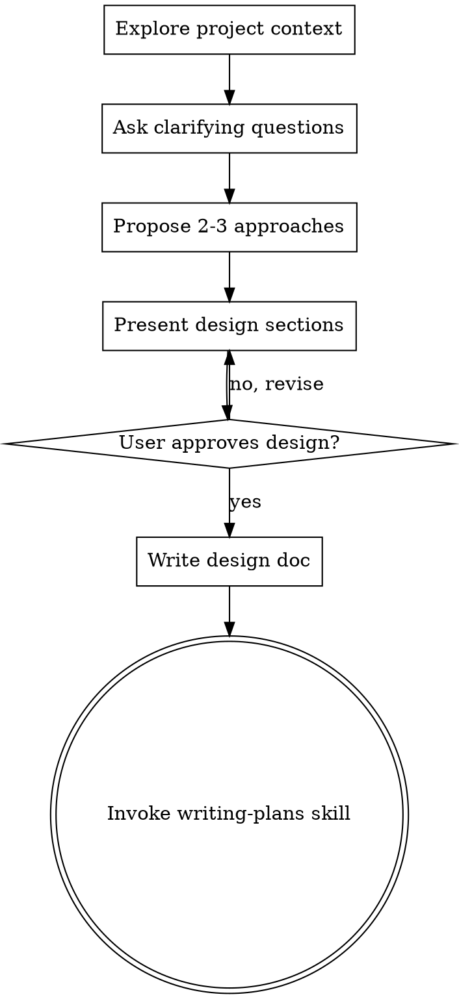

<!-- Generated by SpecStory, Markdown v2.1.0 -->

# 2026-02-27 17:55:21Z

<!-- Claude Code Session 70b69fa9-e33b-413a-9458-783b146af86c (2026-02-27 17:55:21Z) -->

_**User (2026-02-27 17:55:21Z)**_

<command-name>/clear</command-name>
            <command-message>clear</command-message>
            <command-args></command-args>

_**User (2026-02-27 17:55:21Z)**_

<local-command-stdout></local-command-stdout>

_**User (2026-02-27 17:55:21Z)**_

<local-command-caveat>Caveat: The messages below were generated by the user while running local commands. DO NOT respond to these messages or otherwise consider them in your response unless the user explicitly asks you to.</local-command-caveat>

_**User (2026-02-27 17:56:03Z)**_

@apps/web/src/components/common/PageColorGradient.tsx 更换其 UI 设计。

prompt: 我需要做一个文章的详情页面，文章位置在正中间布局。

当进入每一篇文章后，在整个页面的头部会有一个色彩效果。我不知道该怎么去描述，你可以想象成：

给每篇文章的顶部加一些自然界比较柔和的效果
比如像是一束光照进来的那种感觉
我需要为每篇文章都计算出一个色值。这个颜色应该是彩色的，但又是比较柔和的一种颜色，从而形成每篇文章的那种随机感。
code ref:  <TMP_DIR>/b_mZW8xod15jP-1772214893186/components/article-glow.tsx

---

_**Agent (claude-opus-4-6 2026-02-27 17:56:08Z)**_

<think><details><summary>Thought Process</summary>
The user wants to redesign the `PageColorGradient` component with a new UI design. They want a soft, natural light effect at the top of article detail pages. Let me first read the referenced code file and the current component to understand what's needed.

Let me read the reference code and explore the current implementation.
</details></think>

_**Agent (claude-opus-4-6 2026-02-27 17:56:09Z)**_

<tool-use data-tool-type="read" data-tool-name="Read"><details>
<summary>Tool use: **Read**</summary>
 `<TMP_DIR>/b_mZW8xod15jP-1772214893186/components/article-glow.tsx`

```text
     1→"use client"
     2→
     3→import { useMemo } from "react"
     4→import { generateSoftColor, generateRandomGlowOrbs, getShapeBorderRadius } from "@/lib/colors"
     5→
     6→interface ArticleGlowProps {
     7→  articleId: string
     8→}
     9→
    10→export function ArticleGlow({ articleId }: ArticleGlowProps) {
    11→  const colors = useMemo(() => generateSoftColor(articleId), [articleId])
    12→  const orbs = useMemo(() => generateRandomGlowOrbs(articleId), [articleId])
    13→
    14→  return (
    15→    <div className="pointer-events-none absolute inset-x-0 top-0 h-[600px] overflow-hidden">
    16→      {/* 随机生成的光斑 */}
    17→      {orbs.map((orb) => {
    18→        // 计算这个光斑的颜色
    19→        const hue = (colors.hue + orb.hueOffset + 360) % 360
    20→        const sat = Math.max(15, Math.min(50, 30 + orb.satOffset))
    21→        const light = Math.max(80, Math.min(95, 88 + orb.lightOffset))
    22→        const color = `hsl(${hue}, ${sat}%, ${light}%)`
    23→        
    24→        return (
    25→          <div
    26→            key={orb.id}
    27→            className="absolute animate-glow-enter"
    28→            style={{
    29→              left: `${orb.x}%`,
    30→              top: `${orb.y * 6}px`,
    31→              width: `${orb.width}px`,
    32→              height: `${orb.height}px`,
    33→              background: color,
    34→              borderRadius: getShapeBorderRadius(orb.shape),
    35→              "--glow-opacity": orb.opacity,
    36→              "--glow-blur": `${orb.blur}px`,
    37→              "--delay": `${orb.delay}s`,
    38→            } as React.CSSProperties}
    39→          />
    40→        )
    41→      })}
    42→      
    43→      {/* 渐变遮罩 - 让光晕自然过渡到页面背景 */}
    44→      <div 
    45→        className="absolute inset-0 bg-gradient-to-b from-transparent via-transparent to-background"
    46→      />
    47→    </div>
    48→  )
    49→}
    50→
```
</details></tool-use>

_**Agent (claude-opus-4-6 2026-02-27 17:56:09Z)**_

<tool-use data-tool-type="read" data-tool-name="Read"><details>
<summary>Tool use: **Read**</summary>
 `./apps/web/src/components/common/PageColorGradient.tsx`

```text
     1→import 'server-only'
     2→
     3→import type { FC } from 'react'
     4→
     5→import { generateSingleColorStyle } from '~/lib/accent-color'
     6→import { hexToRgbString } from '~/lib/color'
     7→import {
     8→  getBackgroundGradientByBaseColor,
     9→  getBackgroundGradientBySeed,
    10→} from '~/lib/helper.server'
    11→
    12→import { RootPortal } from '../ui/portal'
    13→
    14→export const PageColorGradient: FC<{
    15→  seed?: string
    16→  baseColor?: string
    17→}> = async ({ seed, baseColor }) => {
    18→  const [bgAccent, bgAccentLight] = baseColor
    19→    ? getBackgroundGradientByBaseColor(baseColor)
    20→    : getBackgroundGradientBySeed(seed!)
    21→
    22→  const cssContent = await generateSingleColorStyle(bgAccent, {
    23→    withNoise: true,
    24→    useThemedClass: true,
    25→  })
    26→
    27→  return (
    28→    <>
    29→      <RootPortal>
    30→        <div
    31→          style={
    32→            {
    33→              '--gradient-from': hexToRgbString(bgAccent),
    34→              '--gradient-to': hexToRgbString(bgAccentLight),
    35→            } as any
    36→          }
    37→          className="page-head-gradient"
    38→        />
    39→      </RootPortal>
    40→      <style
    41→        id="accent-color-style"
    42→        dangerouslySetInnerHTML={{
    43→          __html: cssContent,
    44→        }}
    45→      />
    46→    </>
    47→  )
    48→}
    49→
```
</details></tool-use>

_**Agent (claude-opus-4-6 2026-02-27 17:56:13Z)**_

<tool-use data-tool-type="generic" data-tool-name="Skill"><details>
<summary>Tool use: **Skill**</summary>

```text
Launching skill: superpowers:brainstorming
```
</details></tool-use>

---

_**User (2026-02-27 17:56:13Z)**_

Base directory for this skill: <HOME>/.claude/plugins/cache/claude-plugins-official/superpowers/4.3.1/skills/brainstorming

# Brainstorming Ideas Into Designs

## Overview

Help turn ideas into fully formed designs and specs through natural collaborative dialogue.

Start by understanding the current project context, then ask questions one at a time to refine the idea. Once you understand what you're building, present the design and get user approval.

<HARD-GATE>
Do NOT invoke any implementation skill, write any code, scaffold any project, or take any implementation action until you have presented a design and the user has approved it. This applies to EVERY project regardless of perceived simplicity.
</HARD-GATE>

## Anti-Pattern: "This Is Too Simple To Need A Design"

Every project goes through this process. A todo list, a single-function utility, a config change — all of them. "Simple" projects are where unexamined assumptions cause the most wasted work. The design can be short (a few sentences for truly simple projects), but you MUST present it and get approval.

## Checklist

You MUST create a task for each of these items and complete them in order:

1. **Explore project context** — check files, docs, recent commits
2. **Ask clarifying questions** — one at a time, understand purpose/constraints/success criteria
3. **Propose 2-3 approaches** — with trade-offs and your recommendation
4. **Present design** — in sections scaled to their complexity, get user approval after each section
5. **Write design doc** — save to `docs/plans/YYYY-MM-DD-<topic>-design.md` and commit
6. **Transition to implementation** — invoke writing-plans skill to create implementation plan

## Process Flow



**The terminal state is invoking writing-plans.** Do NOT invoke frontend-design, mcp-builder, or any other implementation skill. The ONLY skill you invoke after brainstorming is writing-plans.

## The Process

**Understanding the idea:**
- Check out the current project state first (files, docs, recent commits)
- Ask questions one at a time to refine the idea
- Prefer multiple choice questions when possible, but open-ended is fine too
- Only one question per message - if a topic needs more exploration, break it into multiple questions
- Focus on understanding: purpose, constraints, success criteria

**Exploring approaches:**
- Propose 2-3 different approaches with trade-offs
- Present options conversationally with your recommendation and reasoning
- Lead with your recommended option and explain why

**Presenting the design:**
- Once you believe you understand what you're building, present the design
- Scale each section to its complexity: a few sentences if straightforward, up to 200-300 words if nuanced
- Ask after each section whether it looks right so far
- Cover: architecture, components, data flow, error handling, testing
- Be ready to go back and clarify if something doesn't make sense

## After the Design

**Documentation:**
- Write the validated design to `docs/plans/YYYY-MM-DD-<topic>-design.md`
- Use elements-of-style:writing-clearly-and-concisely skill if available
- Commit the design document to git

**Implementation:**
- Invoke the writing-plans skill to create a detailed implementation plan
- Do NOT invoke any other skill. writing-plans is the next step.

## Key Principles

- **One question at a time** - Don't overwhelm with multiple questions
- **Multiple choice preferred** - Easier to answer than open-ended when possible
- **YAGNI ruthlessly** - Remove unnecessary features from all designs
- **Explore alternatives** - Always propose 2-3 approaches before settling
- **Incremental validation** - Present design, get approval before moving on
- **Be flexible** - Go back and clarify when something doesn't make sense


---

_**Agent (claude-opus-4-6 2026-02-27 17:56:17Z)**_

<tool-use data-tool-type="unknown" data-tool-name="TaskCreate"><details>
<summary>Tool use: **TaskCreate**</summary>
Check current PageColorGradient implementation, related files, CSS styles, and how it's used in article pages

```text
Task #555 created successfully: Explore project context for PageColorGradient redesign
```
</details></tool-use>

_**Agent (claude-opus-4-6 2026-02-27 17:56:20Z)**_

<tool-use data-tool-type="unknown" data-tool-name="TaskUpdate"><details>
<summary>Tool use: **TaskUpdate**</summary>

```text
Updated task #555 status
```
</details></tool-use>

_**Agent (claude-opus-4-6 2026-02-27 17:57:14Z)**_

<tool-use data-tool-type="generic" data-tool-name="Task"><details>
<summary>Tool use: **Task**</summary>
Explore PageColorGradient usage

```text
Perfect! Now let me get a summary of all the files. Let me create a comprehensive report:

## Summary of Files

I've found all the requested files and components. Here's the complete report:

### 1. **PageColorGradient Component** 
**File**: `<REPO_ROOT>/apps/web/src/components/common/PageColorGradient.tsx`

This is a server component that generates dynamic gradient backgrounds. It accepts either a `seed` string or `baseColor` and uses `RootPortal` to render the gradient element.

### 2. **CSS Class "page-head-gradient" Definition**
**File**: `<REPO_ROOT>/apps/web/src/styles/layer.css` (lines 176-282)

The CSS defines an animated gradient effect with:
- Positioned absolutely at the top (500px height)
- Two pseudo-elements (::before and ::after) that create animated blobs
- Animations: `blob-entrance`, `blob-entrance-alt`, `blob-float`, `fade-in`
- Uses CSS variables: `--gradient-from` and `--gradient-to` for colors
- Theme-aware opacity adjustments for light/dark modes

### 3. **Helper Functions**
**File**: `<REPO_ROOT>/apps/web/src/lib/helper.server.ts`

Two gradient generation functions:
- **`getBackgroundGradientBySeed(seed: string)`**: Uses `uniqolor` library to generate three color variations from a seed string
- **`getBackgroundGradientByBaseColor(baseColor: string)`**: Uses `chroma-js` to manipulate a base color into three saturation/lightness variants

### 4. **generateSingleColorStyle Function**
**File**: `<REPO_ROOT>/apps/web/src/lib/accent-color.ts` (lines 121-136)

A wrapper function that calls `generateAccentColorStyle` with `colors.light` and `colors.dark` set to the same color value. It supports:
- Noise background generation
- Themed class selector
- Custom mix ratios for root background

### 5. **RootPortal Component**
**File**: `<REPO_ROOT>/apps/web/src/components/ui/portal/index.tsx`

A client-side portal component using React's `createPortal`. It wraps `RootPortalProvider` context and renders children into a specified DOM element (defaults to `document.body`).

**Provider**: `<REPO_ROOT>/apps/web/src/components/ui/portal/provider.tsx`

### 6. **Article Detail Pages Structure**

**Post Detail**: `<REPO_ROOT>/apps/web/src/app/[locale]/posts/(post-detail)/[category]/[slug]/page.tsx`
- Uses `PageColorGradient` with seed: `data.title + data.category.name`
- Wraps content in `TocHeadingStrategyProvider`
- Provides `CurrentPostDataProvider` and room-based presence tracking
- Renders post content with metadata, action aside, and comments

**Note Detail**: `<REPO_ROOT>/apps/web/src/app/[locale]/notes/[id]/page.tsx`
- Uses `PageColorGradient` with `baseColor` from image metadata if available: `coverImage.accent`
- Falls back to no gradient if no cover image exists
- Similar structure with `CurrentNoteDataProvider` and note-specific components

**Page Detail Layout**: `<REPO_ROOT>/apps/web/src/app/[locale]/(page-detail)/[slug]/layout.tsx`
- Uses `PageColorGradient` with seed: `data.title + data.subtitle`
- Manages layout with `CurrentPageDataProvider`

**Page Detail Page**: `<REPO_ROOT>/apps/web/src/app/[locale]/(page-detail)/[slug]/page.tsx`
- Handles page-specific rendering logic and child content

### 7. **Color Helper Utilities**
**File**: `<REPO_ROOT>/apps/web/src/lib/color.ts`

Key function:
- **`hexToRgbString(hex: string)`**: Converts hex color to RGB string format (e.g., "255 100 50") for use in CSS `rgb()` function

### Integration Pattern

The components work together as follows:

```
PageColorGradient (Server Component)
├─ getBackgroundGradientBySeed/ByBaseColor (generates colors)
├─ generateSingleColorStyle (creates CSS)
├─ hexToRgbString (formats colors)
└─ RootPortal (renders div into document.body)
    └─ page-head-gradient (CSS animated gradient with blobs)
```

The gradient element is positioned absolutely at the top of the page, using CSS custom properties and animations to create a flowing, animated background effect with theme-aware opacity.
agentId: ac35c6a7778e47b2c (for resuming to continue this agent's work if needed)
<usage>total_tokens: 51306
tool_uses: 18
duration_ms: 43415</usage>
```
</details></tool-use>

_**Agent - sidechain (2026-02-27 17:56:31Z)**_

Find all files that import or use PageColorGradient, and also find:
1. The CSS class "page-head-gradient" definition
2. The helper functions getBackgroundGradientBySeed and getBackgroundGradientByBaseColor
3. The generateSingleColorStyle function
4. The RootPortal component
5. How article detail pages are structured (look in apps/web/src/app/ for post/note detail pages)

Return the content of all relevant files.

_**Agent (claude-opus-4-6 2026-02-27 17:56:31Z)**_

<tool-use data-tool-type="read" data-tool-name="Read"><details>
<summary>Tool use: **Read**</summary>
 `<TMP_DIR>/b_mZW8xod15jP-1772214893186/lib/colors.ts`

```text
     1→// 基于字符串生成柔和的自然色彩
     2→// 使用 HSL 色彩空间来确保颜色的柔和性
     3→
     4→// 柔和的自然色调预设 - 模拟自然光线的颜色
     5→const SOFT_HUES = [
     6→  { name: "dawn", hue: 25 },      // 黎明橙
     7→  { name: "sunrise", hue: 35 },   // 日出金
     8→  { name: "morning", hue: 45 },   // 晨光黄
     9→  { name: "spring", hue: 85 },    // 春绿
    10→  { name: "sky", hue: 200 },      // 天空蓝
    11→  { name: "twilight", hue: 220 }, // 暮光蓝
    12→  { name: "lavender", hue: 270 }, // 薰衣草紫
    13→  { name: "rose", hue: 340 },     // 玫瑰粉
    14→  { name: "coral", hue: 15 },     // 珊瑚橙
    15→  { name: "mint", hue: 160 },     // 薄荷绿
    16→  { name: "peach", hue: 20 },     // 蜜桃色
    17→  { name: "sage", hue: 120 },     // 鼠尾草绿
    18→]
    19→
    20→// 简单的字符串哈希函数
    21→function hashString(str: string): number {
    22→  let hash = 0
    23→  for (let i = 0; i < str.length; i++) {
    24→    const char = str.charCodeAt(i)
    25→    hash = ((hash << 5) - hash) + char
    26→    hash = hash & hash // Convert to 32bit integer
    27→  }
    28→  return Math.abs(hash)
    29→}
    30→
    31→// 根据 ID 生成柔和的色彩
    32→export function generateSoftColor(id: string): {
    33→  primary: string
    34→  secondary: string
    35→  gradient: string
    36→  hue: number
    37→} {
    38→  const hash = hashString(id)
    39→  
    40→  // 选择一个基础色调
    41→  const hueIndex = hash % SOFT_HUES.length
    42→  const baseHue = SOFT_HUES[hueIndex].hue
    43→  
    44→  // 根据 hash 的不同位来微调色相（±15度范围内）
    45→  const hueOffset = ((hash >> 8) % 30) - 15
    46→  const hue = (baseHue + hueOffset + 360) % 360
    47→  
    48→  // 保持饱和度在 25-45% 之间（柔和）
    49→  const saturation = 25 + ((hash >> 16) % 20)
    50→  
    51→  // 亮度保持在较高范围 85-92%（光线感）
    52→  const lightness = 85 + ((hash >> 24) % 7)
    53→  
    54→  // 主色
    55→  const primary = `hsl(${hue}, ${saturation}%, ${lightness}%)`
    56→  
    57→  // 次要色（更浅，用于渐变）
    58→  const secondary = `hsl(${hue}, ${saturation - 10}%, ${Math.min(lightness + 5, 97)}%)`
    59→  
    60→  // 渐变（从上到下，模拟光线照射）
    61→  const gradient = `linear-gradient(180deg, ${primary} 0%, ${secondary} 50%, transparent 100%)`
    62→  
    63→  return { primary, secondary, gradient, hue }
    64→}
    65→
    66→// 根据主色生成文字颜色（确保对比度）
    67→export function getTextColorForBackground(hue: number): string {
    68→  // 对于浅色背景，使用深色文字
    69→  return `hsl(${hue}, 15%, 25%)`
    70→}
    71→
    72→// 光斑形状类型
    73→type GlowShape = "circle" | "ellipse-h" | "ellipse-v" | "blob"
    74→
    75→// 单个光斑的配置
    76→export interface GlowOrb {
    77→  id: number
    78→  x: number          // 水平位置百分比 (0-100)
    79→  y: number          // 垂直位置百分比 (0-100)
    80→  width: number      // 宽度 (px)
    81→  height: number     // 高度 (px)
    82→  blur: number       // 模糊度 (px)
    83→  opacity: number    // 透明度 (0-1)
    84→  hueOffset: number  // 色相偏移 (-30 to 30)
    85→  satOffset: number  // 饱和度偏移 (-10 to 10)
    86→  lightOffset: number // 亮度偏移 (-5 to 5)
    87→  shape: GlowShape   // 形状
    88→  delay: number      // 出场动画延迟 (s)
    89→}
    90→
    91→// 基于种子的伪随机数生成器
    92→function seededRandom(seed: number): () => number {
    93→  return function() {
    94→    seed = (seed * 1103515245 + 12345) & 0x7fffffff
    95→    return seed / 0x7fffffff
    96→  }
    97→}
    98→
    99→// 生成随机光斑配置
   100→export function generateRandomGlowOrbs(id: string, count?: number): GlowOrb[] {
   101→  const hash = hashString(id)
   102→  const random = seededRandom(hash)
   103→  
   104→  // 根据 ID 决定光斑数量 (3-7个)
   105→  const orbCount = count ?? 3 + Math.floor(random() * 5)
   106→  
   107→  const shapes: GlowShape[] = ["circle", "ellipse-h", "ellipse-v", "blob"]
   108→  const orbs: GlowOrb[] = []
   109→  
   110→  for (let i = 0; i < orbCount; i++) {
   111→    const isMainOrb = i === 0
   112→    
   113→    // 主光斑较大且居中，其他光斑随机分布
   114→    const x = isMainOrb ? 50 : 10 + random() * 80
   115→    const y = isMainOrb ? 15 : 5 + random() * 50
   116→    
   117→    // 尺寸随机
   118→    const baseSize = isMainOrb ? 400 : 80 + random() * 200
   119→    const width = baseSize * (0.8 + random() * 0.8)
   120→    const height = baseSize * (0.6 + random() * 0.8)
   121→    
   122→    // 模糊度与尺寸相关
   123→    const blur = isMainOrb ? 80 + random() * 40 : 40 + random() * 60
   124→    
   125→    // 透明度
   126→    const opacity = isMainOrb ? 0.5 + random() * 0.25 : 0.2 + random() * 0.35
   127→    
   128→    // 色彩偏移
   129→    const hueOffset = (random() - 0.5) * 60
   130→    const satOffset = (random() - 0.5) * 20
   131→    const lightOffset = (random() - 0.5) * 10
   132→    
   133→    // 形状
   134→    const shape = isMainOrb ? "ellipse-h" : shapes[Math.floor(random() * shapes.length)]
   135→    
   136→    // 出场动画延迟 - 主光斑先出现，其他光斑依次出现
   137→    const delay = isMainOrb ? 0.1 : 0.3 + i * 0.2
   138→    
   139→    orbs.push({
   140→      id: i,
   141→      x,
   142→      y,
   143→      width,
   144→      height,
   145→      blur,
   146→      opacity,
   147→      hueOffset,
   148→      satOffset,
   149→      lightOffset,
   150→      shape,
   151→      delay,
   152→    })
   153→  }
   154→  
   155→  return orbs
   156→}
   157→
   158→// 根据形状返回 border-radius
   159→export function getShapeBorderRadius(shape: GlowShape): string {
   160→  switch (shape) {
   161→    case "circle":
   162→      return "50%"
   163→    case "ellipse-h":
   164→      return "50%"
   165→    case "ellipse-v":
   166→      return "50%"
   167→    case "blob":
   168→      return "60% 40% 30% 70% / 60% 30% 70% 40%"
   169→    default:
   170→      return "50%"
   171→  }
   172→}
   173→
```
</details></tool-use>

_**Agent - sidechain (claude-haiku-4-5-20251001 2026-02-27 17:56:33Z)**_

I'll help you find all these files and components. Let me start by searching for them systematically.

_**Agent - sidechain (claude-haiku-4-5-20251001 2026-02-27 17:56:34Z)**_

<tool-use data-tool-type="search" data-tool-name="Grep"><details>
<summary>Tool use: **Grep**</summary>
 path `./` pattern `PageColorGradient`

```text
Found 5 files
apps/web/src/app/[locale]/notes/[id]/page.tsx
apps/web/src/app/[locale]/(page-detail)/[slug]/layout.tsx
apps/web/src/app/[locale]/posts/(post-detail)/[category]/[slug]/page.tsx
CLAUDE.md
apps/web/src/components/common/PageColorGradient.tsx
```
</details></tool-use>

_**Agent - sidechain (claude-haiku-4-5-20251001 2026-02-27 17:56:34Z)**_

<tool-use data-tool-type="search" data-tool-name="Grep"><details>
<summary>Tool use: **Grep**</summary>
 path `./` pattern `page-head-gradient`

```text
Found 2 files
apps/web/src/styles/layer.css
apps/web/src/components/common/PageColorGradient.tsx
```
</details></tool-use>

_**Agent - sidechain (claude-haiku-4-5-20251001 2026-02-27 17:56:35Z)**_

<tool-use data-tool-type="search" data-tool-name="Grep"><details>
<summary>Tool use: **Grep**</summary>
 path `./` pattern `getBackgroundGradientBySeed|getBackgroundGradientByBaseColor`

```text
Found 2 files
apps/web/src/lib/helper.server.ts
apps/web/src/components/common/PageColorGradient.tsx
```
</details></tool-use>

_**Agent - sidechain (claude-haiku-4-5-20251001 2026-02-27 17:56:36Z)**_

<tool-use data-tool-type="search" data-tool-name="Grep"><details>
<summary>Tool use: **Grep**</summary>
 path `./` pattern `generateSingleColorStyle`

```text
Found 2 files
apps/web/src/lib/accent-color.ts
apps/web/src/components/common/PageColorGradient.tsx
```
</details></tool-use>

_**Agent - sidechain (claude-haiku-4-5-20251001 2026-02-27 17:56:36Z)**_

<tool-use data-tool-type="search" data-tool-name="Grep"><details>
<summary>Tool use: **Grep**</summary>
 path `./` pattern `RootPortal`

```text
Found 15 files
apps/web/src/components/modules/shared/WithArticleSelectionCommentPopover.tsx
apps/web/src/components/modules/activity/Presence.tsx
apps/web/src/app/[locale]/layout.tsx
apps/web/src/components/ui/float-popover/FloatPopover.tsx
apps/web/src/components/ui/fab/FABContainer.tsx
apps/web/src/components/ui/float-panel/FloatPanel.tsx
apps/web/src/components/layout/header/internal/HeaderContent.tsx
apps/web/src/components/modules/dashboard/writing/EditorLayer.tsx
apps/web/src/components/modules/dashboard/layouts/index.tsx
apps/web/src/components/modules/shared/ReadIndicator.tsx
apps/web/src/components/common/PageColorGradient.tsx
apps/web/src/components/ui/modal/stacked/overlay.tsx
apps/web/src/components/ui/portal/provider.tsx
apps/web/src/components/ui/portal/index.tsx
apps/web/src/components/ui/auto-completion/AutoCompletion.tsx
```
</details></tool-use>

_**Agent - sidechain (claude-haiku-4-5-20251001 2026-02-27 17:56:39Z)**_

<tool-use data-tool-type="search" data-tool-name="Glob"><details>
<summary>Tool use: **Glob**</summary>
 pattern `**/apps/web/src/app/**/\[*\]/page.tsx`

```text
<REPO_ROOT>/apps/web/src/app/[locale]/posts/(post-detail)/[category]/page.tsx
<REPO_ROOT>/apps/web/src/app/[locale]/projects/[id]/page.tsx
<REPO_ROOT>/apps/web/src/app/[locale]/(note-topic)/notes/(topic-detail)/topics/[slug]/page.tsx
<REPO_ROOT>/apps/web/src/app/[locale]/thinking/[id]/page.tsx
<REPO_ROOT>/apps/web/src/app/(dashboard)/dashboard/[[...catch_all]]/page.tsx
<REPO_ROOT>/apps/web/src/app/[locale]/categories/[slug]/page.tsx
<REPO_ROOT>/apps/web/src/app/[locale]/posts/tag/[name]/page.tsx
<REPO_ROOT>/apps/web/src/app/[locale]/(page-detail)/[slug]/page.tsx
<REPO_ROOT>/apps/web/src/app/[locale]/posts/(post-detail)/[category]/[slug]/page.tsx
<REPO_ROOT>/apps/web/src/app/[locale]/notes/[id]/page.tsx
```
</details></tool-use>

_**Agent - sidechain (claude-haiku-4-5-20251001 2026-02-27 17:56:41Z)**_

Now let me read the key files I found:

_**Agent - sidechain (claude-haiku-4-5-20251001 2026-02-27 17:56:42Z)**_

<tool-use data-tool-type="read" data-tool-name="Read"><details>
<summary>Tool use: **Read**</summary>
 `./apps/web/src/components/common/PageColorGradient.tsx`

```text
     1→import 'server-only'
     2→
     3→import type { FC } from 'react'
     4→
     5→import { generateSingleColorStyle } from '~/lib/accent-color'
     6→import { hexToRgbString } from '~/lib/color'
     7→import {
     8→  getBackgroundGradientByBaseColor,
     9→  getBackgroundGradientBySeed,
    10→} from '~/lib/helper.server'
    11→
    12→import { RootPortal } from '../ui/portal'
    13→
    14→export const PageColorGradient: FC<{
    15→  seed?: string
    16→  baseColor?: string
    17→}> = async ({ seed, baseColor }) => {
    18→  const [bgAccent, bgAccentLight] = baseColor
    19→    ? getBackgroundGradientByBaseColor(baseColor)
    20→    : getBackgroundGradientBySeed(seed!)
    21→
    22→  const cssContent = await generateSingleColorStyle(bgAccent, {
    23→    withNoise: true,
    24→    useThemedClass: true,
    25→  })
    26→
    27→  return (
    28→    <>
    29→      <RootPortal>
    30→        <div
    31→          style={
    32→            {
    33→              '--gradient-from': hexToRgbString(bgAccent),
    34→              '--gradient-to': hexToRgbString(bgAccentLight),
    35→            } as any
    36→          }
    37→          className="page-head-gradient"
    38→        />
    39→      </RootPortal>
    40→      <style
    41→        id="accent-color-style"
    42→        dangerouslySetInnerHTML={{
    43→          __html: cssContent,
    44→        }}
    45→      />
    46→    </>
    47→  )
    48→}
    49→
```
</details></tool-use>

_**Agent - sidechain (claude-haiku-4-5-20251001 2026-02-27 17:56:42Z)**_

<tool-use data-tool-type="read" data-tool-name="Read"><details>
<summary>Tool use: **Read**</summary>
 `./apps/web/src/styles/layer.css`

```text
     1→@layer components {
     2→  .cover-mask-b {
     3→    mask-image: linear-gradient(180deg, #fff -17.19%, #00000000 92.43%);
     4→  }
     5→}
     6→
     7→@layer components {
     8→  .border-border {
     9→    @apply border-zinc-900/10 dark:border-zinc-700;
    10→  }
    11→}
    12→
    13→@layer utilities {
    14→  .scrollbar-none::-webkit-scrollbar {
    15→    width: 0 !important;
    16→    height: 0 !important;
    17→  }
    18→  .shiro-timeline a {
    19→    @apply no-underline!;
    20→  }
    21→  .shiro-link--underline,
    22→  .shiro-timeline a {
    23→    color: currentColor;
    24→    text-decoration: underline;
    25→    text-underline-offset: 3px;
    26→
    27→    @apply decoration-neutral/20 hover:no-underline;
    28→
    29→    background-image: linear-gradient(var(--color-accent), var(--color-accent));
    30→    background-size: 0% 1.5px;
    31→    background-repeat: no-repeat;
    32→    /* NOTE: this won't work with background images   */
    33→
    34→    transition: all 500ms ease;
    35→
    36→    @apply border-0;
    37→
    38→    background-position: left 1.2em;
    39→
    40→    &:hover {
    41→      background-size: 100% 1.5px;
    42→      text-shadow:
    43→        0.05em 0 var(--color-base-100),
    44→        -0.05em 0 var(--color-base-100);
    45→
    46→      transition: all 250ms ease;
    47→    }
    48→
    49→    &::selection {
    50→      text-shadow: none;
    51→    }
    52→
    53→    &.no-shadow {
    54→      text-shadow: none;
    55→    }
    56→  }
    57→
    58→  .shiro-timeline {
    59→    position: relative;
    60→
    61→    & a {
    62→      line-height: 1.6;
    63→    }
    64→
    65→    @apply min-w-0 flex-1 list-inside justify-between;
    66→
    67→    & > li::before {
    68→      content: '';
    69→      position: absolute;
    70→      left: -17px;
    71→      bottom: 0;
    72→      border-left: 2px solid var(--color-accent);
    73→    }
    74→
    75→    & > li:first-child:last-child::before {
    76→      border-left: 0;
    77→    }
    78→
    79→    & > li:not(:first-child):not(:last-child)::before {
    80→      top: 0;
    81→    }
    82→
    83→    & > li:first-child::before {
    84→      top: 50%;
    85→    }
    86→
    87→    & > li:last-child::before {
    88→      bottom: 50%;
    89→      top: 0;
    90→    }
    91→
    92→    & > li {
    93→      position: relative;
    94→      list-style-type: none;
    95→
    96→      line-height: 1.6;
    97→      padding: 3px 0;
    98→      margin: 0 0 0 1rem;
    99→    }
   100→
   101→    & > li::after {
   102→      content: '';
   103→      left: calc(-1rem - 6px);
   104→      top: 50%;
   105→      transform: translateY(-50%);
   106→      height: 8px;
   107→      width: 8px;
   108→      border-radius: 50%;
   109→      position: absolute;
   110→      background-color: var(--color-accent);
   111→    }
   112→  }
   113→}
   114→
   115→@layer components {
   116→  .mask-cover {
   117→    mask-image: linear-gradient(to right, transparent, rgb(0 0 0 / 100%) 90%);
   118→    opacity: 0.3;
   119→    transition: opacity 0.3s ease-in-out;
   120→  }
   121→
   122→  .group:hover .mask-cover {
   123→    opacity: 0.5;
   124→  }
   125→
   126→  .animation-blink {
   127→    animation: blink 1.2s linear infinite;
   128→  }
   129→
   130→  .mask-top {
   131→    mask-image: linear-gradient(to top, transparent, rgb(0 0 0 / 100%) 90%);
   132→    opacity: 0.3;
   133→    transition: opacity 0.3s ease-in-out;
   134→  }
   135→
   136→  @keyframes blink {
   137→    0% {
   138→      opacity: 0;
   139→    }
   140→    40% {
   141→      opacity: 0;
   142→    }
   143→    40.1% {
   144→      opacity: 1;
   145→    }
   146→    99.9% {
   147→      opacity: 1;
   148→    }
   149→    100% {
   150→      opacity: 0;
   151→    }
   152→  }
   153→
   154→  /* 404 */
   155→  .hit-the-floor {
   156→    font-size: 12em;
   157→    font-weight: bold;
   158→    font-family: Helvetica;
   159→    text-shadow:
   160→      0 1px 0 #ccc,
   161→      0 2px 0 #c9c9c9,
   162→      0 3px 0 #bbb,
   163→      0 4px 0 #b9b9b9,
   164→      0 5px 0 #aaa,
   165→      0 6px 1px rgba(0, 0, 0, 0.1),
   166→      0 0 5px rgba(0, 0, 0, 0.1),
   167→      0 1px 3px rgba(0, 0, 0, 0.3),
   168→      0 3px 5px rgba(0, 0, 0, 0.2),
   169→      0 5px 10px rgba(0, 0, 0, 0.25),
   170→      0 10px 10px rgba(0, 0, 0, 0.2),
   171→      0 20px 20px rgba(0, 0, 0, 0.15);
   172→  }
   173→}
   174→
   175→@layer components {
   176→  .page-head-gradient {
   177→    @apply pointer-events-none absolute inset-x-0 top-0 h-[500px] w-full;
   178→
   179→    overflow: hidden;
   180→    animation: fade-in 0.8s ease 0.2s both;
   181→  }
   182→
   183→  .page-head-gradient::before,
   184→  .page-head-gradient::after {
   185→    content: '';
   186→    position: absolute;
   187→    border-radius: 50%;
   188→    filter: blur(60px);
   189→    animation:
   190→      blob-entrance 2s ease-out 0.5s both,
   191→      blob-float 20s ease-in-out 2.5s infinite;
   192→  }
   193→
   194→  .page-head-gradient::before {
   195→    width: 350px;
   196→    height: 350px;
   197→    background: rgb(var(--gradient-from) / 0.2);
   198→    top: -120px;
   199→    left: 5%;
   200→    animation-delay: 0.5s, 3s;
   201→  }
   202→
   203→  .page-head-gradient::after {
   204→    width: 250px;
   205→    height: 250px;
   206→    background: rgb(var(--gradient-to) / 0.25);
   207→    top: -80px;
   208→    right: 15%;
   209→    animation:
   210→      blob-entrance-alt 2.2s ease-out 1s both,
   211→      blob-float 25s ease-in-out 3.5s infinite;
   212→  }
   213→
   214→  [data-theme='dark'] .page-head-gradient::before {
   215→    background: rgb(var(--gradient-from) / 0.15);
   216→  }
   217→
   218→  [data-theme='dark'] .page-head-gradient::after {
   219→    background: rgb(var(--gradient-to) / 0.18);
   220→  }
   221→
   222→  @keyframes blob-entrance {
   223→    0% {
   224→      opacity: 0;
   225→      transform: translate(-50px, -100px) scale(0.3);
   226→      filter: blur(120px);
   227→    }
   228→    30% {
   229→      opacity: 0.3;
   230→      transform: translate(-20px, -50px) scale(0.6);
   231→      filter: blur(90px);
   232→    }
   233→    70% {
   234→      opacity: 0.8;
   235→      transform: translate(-5px, -10px) scale(0.9);
   236→      filter: blur(70px);
   237→    }
   238→    100% {
   239→      opacity: 1;
   240→      transform: translate(0, 0) scale(1);
   241→      filter: blur(60px);
   242→    }
   243→  }
   244→
   245→  @keyframes blob-entrance-alt {
   246→    0% {
   247→      opacity: 0;
   248→      transform: translate(80px, -120px) scale(0.2) rotate(45deg);
   249→      filter: blur(140px);
   250→    }
   251→    25% {
   252→      opacity: 0.2;
   253→      transform: translate(40px, -80px) scale(0.5) rotate(22deg);
   254→      filter: blur(100px);
   255→    }
   256→    60% {
   257→      opacity: 0.7;
   258→      transform: translate(15px, -25px) scale(0.85) rotate(8deg);
   259→      filter: blur(75px);
   260→    }
   261→    100% {
   262→      opacity: 1;
   263→      transform: translate(0, 0) scale(1) rotate(0deg);
   264→      filter: blur(60px);
   265→    }
   266→  }
   267→
   268→  @keyframes blob-float {
   269→    0%,
   270→    100% {
   271→      transform: translate(0, 0) scale(1) rotate(0deg);
   272→    }
   273→    25% {
   274→      transform: translate(40px, -30px) scale(1.15) rotate(90deg);
   275→    }
   276→    50% {
   277→      transform: translate(-10px, 20px) scale(0.85) rotate(180deg);
   278→    }
   279→    75% {
   280→      transform: translate(-35px, -5px) scale(1.05) rotate(270deg);
   281→    }
   282→  }
   283→
   284→  .signature-animated path {
   285→    stroke-dasharray: 2400;
   286→    stroke-dashoffset: 2400;
   287→    fill: transparent;
   288→    animation: drawSignature 8s linear infinite both;
   289→    stroke-width: 2px;
   290→    stroke: var(--color-base-content);
   291→  }
   292→
   293→  @keyframes drawSignature {
   294→    0% {
   295→      stroke-dashoffset: 2400;
   296→    }
   297→
   298→    15% {
   299→      fill: transparent;
   300→    }
   301→
   302→    35%,
   303→    75% {
   304→      stroke-dashoffset: 0;
   305→      fill: var(--color-base-content);
   306→    }
   307→
   308→    90%,
   309→    100% {
   310→      stroke-dashoffset: 2400;
   311→      fill: transparent;
   312→    }
   313→  }
   314→
   315→  .animation-wave {
   316→    animation: wave 2s infinite;
   317→  }
   318→
   319→  .hover-shake:hover {
   320→    animation: shake 0.4s ease-in-out;
   321→  }
   322→
   323→  @keyframes shake {
   324→    0%,
   325→    100% {
   326→      transform: rotate(0deg);
   327→    }
   328→    25% {
   329→      transform: rotate(-5deg);
   330→    }
   331→    75% {
   332→      transform: rotate(5deg);
   333→    }
   334→  }
   335→
   336→  @keyframes wave {
   337→    0%,
   338→    100% {
   339→      transform: rotate(0deg);
   340→    }
   341→    50% {
   342→      transform: rotate(20deg);
   343→    }
   344→  }
   345→}
   346→
   347→@layer components {
   348→  .content-auto {
   349→    content-visibility: auto;
   350→  }
   351→
   352→  .shadow-out-sm {
   353→    box-shadow:
   354→      0 0 10px rgba(120, 120, 120, 0.1),
   355→      0 5px 20px rgba(120, 120, 120, 0.2);
   356→  }
   357→
   358→  .backface-hidden {
   359→    -webkit-backface-visibility: hidden;
   360→    -moz-backface-visibility: hidden;
   361→    -webkit-transform: translate3d(0, 0, 0);
   362→    -moz-transform: translate3d(0, 0, 0);
   363→  }
   364→
   365→  .center {
   366→    align-items: center;
   367→    justify-content: center;
   368→  }
   369→
   370→  .fill-content {
   371→    min-height: calc(100vh - 17.5rem);
   372→  }
   373→
   374→  .card-shadow {
   375→    box-shadow:
   376→      0 0 0 1px rgba(0, 0, 0, 0.08),
   377→      0 4px 6px rgba(0, 0, 0, 0.04);
   378→  }
   379→
   380→  .card-shadow:hover {
   381→    box-shadow:
   382→      0 0 0 1px rgba(0, 0, 0, 0.08),
   383→      0 6px 14px rgba(0, 0, 0, 0.08);
   384→  }
   385→}
   386→
   387→@layer components {
   388→  .shadow-perfect {
   389→    /* https://codepen.io/jh3y/pen/yLWgjpd */
   390→    --tint: 214;
   391→    --alpha: 3;
   392→    --base: hsl(var(--tint, 214) 80% 27% / calc(var(--alpha, 4) * 1%));
   393→    /**
   394→      * Use relative syntax to get to: hsl(221 25% 22% / 40%)
   395→    */
   396→    --shade: hsl(from var(--base) calc(h + 8) 25 calc(l - 5));
   397→    --perfect-shadow:
   398→      0 0 0 1px var(--base), 0 1px 1px -0.5px var(--shade),
   399→      0 3px 3px -1.5px var(--shade), 0 6px 6px -3px var(--shade),
   400→      0 12px 12px -6px var(--base), 0 24px 24px -12px var(--base);
   401→    box-shadow: var(--perfect-shadow);
   402→  }
   403→
   404→  .perfect-sm {
   405→    --alpha: 1;
   406→  }
   407→
   408→  .perfect-md {
   409→    --alpha: 2;
   410→  }
   411→
   412→  [theme='dark'] .shadow-perfect {
   413→    --tint: 221;
   414→  }
   415→}
   416→
   417→@property --mask-top {
   418→  syntax: '<length>';
   419→  inherits: false;
   420→  initial-value: 0px;
   421→}
   422→
   423→@property --mask-bottom {
   424→  syntax: '<length>';
   425→  inherits: false;
   426→  initial-value: 30px;
   427→}
   428→
   429→@layer components {
   430→  .mask-scroller {
   431→    --mask-top: 0px;
   432→    --mask-bottom: 30px;
   433→    mask: linear-gradient(
   434→      to bottom,
   435→      transparent calc(var(--mask-top) - 30px),
   436→      black var(--mask-top),
   437→      black calc(100% - var(--mask-bottom)),
   438→      transparent calc(100% - var(--mask-bottom) + 30px)
   439→    );
   440→  }
   441→
   442→  @supports (animation-timeline: scroll(self block)) {
   443→    .mask-scroller {
   444→      animation-name: mask-up, mask-down;
   445→      animation-duration: 1s, 1s;
   446→      animation-timing-function: linear, linear;
   447→      animation-fill-mode: both, both;
   448→      animation-timeline:
   449→        scroll(self block),
   450→        scroll(self block);
   451→      animation-range:
   452→        0 50px,
   453→        calc(100% - 50px) 100%;
   454→    }
   455→  }
   456→  @supports (animation-timeline: scroll()) and (not (animation-timeline: scroll(self block))) {
   457→    .mask-scroller {
   458→      animation-name: mask-up, mask-down;
   459→      animation-duration: 1s, 1s;
   460→      animation-timing-function: linear, linear;
   461→      animation-fill-mode: both, both;
   462→      animation-timeline: scroll(), scroll();
   463→      animation-range:
   464→        0 50px,
   465→        calc(100% - 50px) 100%;
   466→    }
   467→  }
   468→  @keyframes mask-up {
   469→    to {
   470→      --mask-top: 30px;
   471→    }
   472→  }
   473→  @keyframes mask-down {
   474→    to {
   475→      --mask-bottom: 0px;
   476→    }
   477→  }
   478→}
   479→
   480→@layer components {
   481→  .shadow-context-menu {
   482→    box-shadow:
   483→      rgba(0, 0, 0, 0.067) 0px 3px 8px,
   484→      rgba(0, 0, 0, 0.067) 0px 2px 5px,
   485→      rgba(0, 0, 0, 0.067) 0px 1px 1px;
   486→  }
   487→}
   488→
   489→/* Tailwind 4 Extensions */
   490→@layer components {
   491→  .field-sizing-content {
   492→    field-sizing: content;
   493→  }
   494→
   495→  .comment-block-active {
   496→    background: color-mix(in srgb, var(--color-accent, #33a6b8) 5%, transparent);
   497→    border-radius: 4px;
   498→    transition: background 0.15s ease;
   499→  }
   500→}
   501→
   502→
```
</details></tool-use>

_**Agent - sidechain (claude-haiku-4-5-20251001 2026-02-27 17:56:42Z)**_

<tool-use data-tool-type="read" data-tool-name="Read"><details>
<summary>Tool use: **Read**</summary>
 `./apps/web/src/lib/helper.server.ts`

```text
     1→import 'server-only'
     2→
     3→import chroma from 'chroma-js'
     4→import { headers } from 'next/headers'
     5→import uniqolor from 'uniqolor'
     6→
     7→import { isDev } from './env'
     8→
     9→export function escapeXml(unsafe: string) {
    10→  return unsafe.replaceAll(/[<>&'"]/g, (c) => {
    11→    switch (c) {
    12→      case '<': {
    13→        return '&lt;'
    14→      }
    15→      case '>': {
    16→        return '&gt;'
    17→      }
    18→      case '&': {
    19→        return '&amp;'
    20→      }
    21→      case "'": {
    22→        return '&apos;'
    23→      }
    24→      case '"': {
    25→        return '&quot;'
    26→      }
    27→    }
    28→    return c
    29→  })
    30→}
    31→
    32→export const getOgUrl = async (
    33→  type: 'post' | 'note' | 'page',
    34→  data: any,
    35→  locale?: string,
    36→) => {
    37→  const host = (await headers())?.get('host')
    38→  const ogUrl = new URL(
    39→    `${isDev ? 'http' : 'https'}://${host}/${locale || 'zh'}/og`,
    40→  )
    41→  ogUrl.searchParams.set(
    42→    'data',
    43→    encodeURIComponent(
    44→      JSON.stringify({
    45→        type,
    46→        ...data,
    47→      }),
    48→    ),
    49→  )
    50→  return ogUrl
    51→}
    52→export const getBackgroundGradientBySeed = (seed: string) => {
    53→  const bgAccent = uniqolor(seed, {
    54→    saturation: [40, 55],
    55→    lightness: [45, 55],
    56→  }).color
    57→
    58→  const bgAccentLight = uniqolor(seed, {
    59→    saturation: [35, 45],
    60→    lightness: [65, 75],
    61→  }).color
    62→
    63→  const bgAccentUltraLight = uniqolor(seed, {
    64→    saturation: [25, 35],
    65→    lightness: [80, 88],
    66→  }).color
    67→
    68→  return [bgAccent, bgAccentLight, bgAccentUltraLight]
    69→}
    70→export const getBackgroundGradientByBaseColor = (baseColor: string) => {
    71→  const bgAccent = chroma(baseColor).set('hsl.s', 0.45).set('hsl.l', 0.5).hex()
    72→  const bgAccentLight = chroma(baseColor)
    73→    .set('hsl.s', 0.4)
    74→    .set('hsl.l', 0.7)
    75→    .hex()
    76→  const bgAccentUltraLight = chroma(baseColor)
    77→    .set('hsl.s', 0.3)
    78→    .set('hsl.l', 0.85)
    79→    .hex()
    80→
    81→  return [bgAccent, bgAccentLight, bgAccentUltraLight]
    82→}
    83→
```
</details></tool-use>

_**Agent - sidechain (claude-haiku-4-5-20251001 2026-02-27 17:56:43Z)**_

<tool-use data-tool-type="read" data-tool-name="Read"><details>
<summary>Tool use: **Read**</summary>
 `./apps/web/src/lib/accent-color.ts`

```text
     1→import 'server-only'
     2→
     3→import chroma from 'chroma-js'
     4→import Color from 'colorjs.io'
     5→
     6→import { createPngNoiseBackground } from './noise'
     7→
     8→/**
     9→ * 将十六进制颜色转换为OKLCH字符串
    10→ */
    11→export const hexToOklchString = (hex: string) => new Color(hex).oklch
    12→
    13→/**
    14→ * 默认背景色
    15→ */
    16→export const DEFAULT_BACKGROUNDS = {
    17→  light: 'rgb(250, 250, 250)',
    18→  dark: 'rgb(0, 2, 18)',
    19→} as const
    20→
    21→/**
    22→ * 颜色样式生成配置
    23→ */
    24→export interface AccentColorStyleConfig {
    25→  /** 主题颜色映射 */
    26→  colors: {
    27→    light: string
    28→    dark: string
    29→  }
    30→  /** 是否生成噪声背景 */
    31→  withNoise?: boolean
    32→  /** 是否使用themed类选择器 */
    33→  useThemedClass?: boolean
    34→  /** 自定义根背景混合比例 */
    35→  mixRatio?: {
    36→    light: number
    37→    dark: number
    38→  }
    39→}
    40→
    41→/**
    42→ * 生成主题色相关的CSS样式
    43→ */
    44→export async function generateAccentColorStyle(
    45→  config: AccentColorStyleConfig,
    46→): Promise<string> {
    47→  const {
    48→    colors,
    49→    withNoise = false,
    50→    useThemedClass = false,
    51→    mixRatio = { light: 0.05, dark: 0.12 },
    52→  } = config
    53→
    54→  const lightOklch = hexToOklchString(colors.light)
    55→  const darkOklch = hexToOklchString(colors.dark)
    56→
    57→  const [hl, sl, ll] = lightOklch
    58→  const [hd, sd, ld] = darkOklch
    59→
    60→  let cssContent = ''
    61→
    62→  // 生成噪声背景
    63→  if (withNoise) {
    64→    const [lightBgImage, darkBgImage] = await Promise.all([
    65→      createPngNoiseBackground(colors.light),
    66→      createPngNoiseBackground(colors.dark),
    67→    ])
    68→
    69→    const selector = useThemedClass ? 'html.themed' : 'html'
    70→    cssContent += `
    71→        ${selector}[data-theme='light'].noise body::before {
    72→          background-image: ${lightBgImage}
    73→        }
    74→        ${selector}[data-theme='dark'].noise body::before {
    75→          background-image: ${darkBgImage}
    76→        }`
    77→  }
    78→
    79→  // 生成主题色变量 (DaisyUI v5 使用 --color-accent，值为完整 oklch)
    80→  const themeSelector = useThemedClass ? 'html.themed' : 'html'
    81→  cssContent += `
    82→        ${themeSelector}[data-theme='light'] {
    83→          --color-accent: oklch(${hl} ${sl} ${ll});
    84→        }
    85→        ${themeSelector}[data-theme='dark'] {
    86→          --color-accent: oklch(${hd} ${sd} ${ld});
    87→        }`
    88→
    89→  // 生成根背景色 (DaisyUI 用 :where() 特异性为 0，我们用更高特异性覆盖)
    90→  const lightRootBg = chroma
    91→    .mix(DEFAULT_BACKGROUNDS.light, colors.light, mixRatio.light, 'rgb')
    92→    .hex()
    93→  const darkRootBg = chroma
    94→    .mix(DEFAULT_BACKGROUNDS.dark, colors.dark, mixRatio.dark, 'rgb')
    95→    .hex()
    96→
    97→  if (useThemedClass) {
    98→    cssContent += `
    99→        html.themed[data-theme='light'] {
   100→          --footer-bg: ${lightRootBg};
   101→        }
   102→        html.themed[data-theme='dark'] {
   103→          --footer-bg: ${darkRootBg};
   104→        }`
   105→  } else {
   106→    cssContent += `
   107→        :root[data-theme='light'] {
   108→          --footer-bg: ${lightRootBg};
   109→        }
   110→        :root[data-theme='dark'] {
   111→          --footer-bg: ${darkRootBg};
   112→        }`
   113→  }
   114→
   115→  return cssContent
   116→}
   117→
   118→/**
   119→ * 单色主题样式生成（用于页面级别的颜色覆盖）
   120→ */
   121→export async function generateSingleColorStyle(
   122→  color: string,
   123→  options: {
   124→    withNoise?: boolean
   125→    useThemedClass?: boolean
   126→    mixRatio?: { light: number; dark: number }
   127→  } = {},
   128→): Promise<string> {
   129→  return generateAccentColorStyle({
   130→    colors: {
   131→      light: color,
   132→      dark: color,
   133→    },
   134→    ...options,
   135→  })
   136→}
   137→
```
</details></tool-use>

_**Agent - sidechain (claude-haiku-4-5-20251001 2026-02-27 17:56:43Z)**_

<tool-use data-tool-type="read" data-tool-name="Read"><details>
<summary>Tool use: **Read**</summary>
 `./apps/web/src/components/ui/portal/index.tsx`

```text
     1→'use client'
     2→
     3→import type { FC, PropsWithChildren } from 'react'
     4→import { createPortal } from 'react-dom'
     5→
     6→import { useIsClient } from '~/hooks/common/use-is-client'
     7→
     8→import { useRootPortal } from './provider'
     9→
    10→export const RootPortal: FC<
    11→  {
    12→    to?: HTMLElement
    13→  } & PropsWithChildren
    14→> = (props) => {
    15→  const isClient = useIsClient()
    16→  const to = useRootPortal()
    17→
    18→  if (!isClient) {
    19→    return null
    20→  }
    21→
    22→  return createPortal(props.children, props.to || to || document.body)
    23→}
    24→
```
</details></tool-use>

_**Agent - sidechain (claude-haiku-4-5-20251001 2026-02-27 17:56:43Z)**_

<tool-use data-tool-type="read" data-tool-name="Read"><details>
<summary>Tool use: **Read**</summary>
 `./apps/web/src/components/ui/portal/provider.tsx`

```text
     1→import { createContext, use } from 'react'
     2→
     3→import { isClientSide } from '~/lib/env'
     4→
     5→export const useRootPortal = () => {
     6→  const ctx = use(RootPortalContext)
     7→  if (!isClientSide) {
     8→    return null
     9→  }
    10→  return ctx.to || document.body
    11→}
    12→
    13→const RootPortalContext = createContext<{
    14→  to?: HTMLElement | undefined
    15→}>({
    16→  to: undefined,
    17→})
    18→
    19→export const RootPortalProvider = RootPortalContext
    20→
```
</details></tool-use>

_**Agent - sidechain (claude-haiku-4-5-20251001 2026-02-27 17:56:51Z)**_

Now let me read the article detail pages:

_**Agent - sidechain (claude-haiku-4-5-20251001 2026-02-27 17:56:52Z)**_

<tool-use data-tool-type="read" data-tool-name="Read"><details>
<summary>Tool use: **Read**</summary>
 `./apps/web/src/app/[locale]/posts/(post-detail)/[category]/[slug]/page.tsx`

```text
     1→import { clsx } from 'clsx'
     2→import type { Metadata } from 'next'
     3→import type { Article, WithContext } from 'schema-dts'
     4→
     5→import { AckRead } from '~/components/common/AckRead'
     6→import { ClientOnly } from '~/components/common/ClientOnly'
     7→import { PageColorGradient } from '~/components/common/PageColorGradient'
     8→import {
     9→  buildRoomName,
    10→  Presence,
    11→  RoomProvider,
    12→} from '~/components/modules/activity'
    13→import { CommentAreaRootLazy } from '~/components/modules/comment'
    14→import {
    15→  PostActionAside,
    16→  PostBottomBarAction,
    17→  PostCopyright,
    18→  PostOutdate,
    19→  PostRelated,
    20→} from '~/components/modules/post'
    21→import { GoToAdminEditingButton } from '~/components/modules/shared/GoToAdminEditingButton'
    22→import { ReadIndicatorForMobile } from '~/components/modules/shared/ReadIndicator'
    23→import { SummarySwitcher } from '~/components/modules/shared/SummarySwitcher'
    24→import { TocFAB } from '~/components/modules/toc/TocFAB'
    25→import { TocHeadingStrategyProvider } from '~/components/modules/toc/TocHeadingStrategy'
    26→import { TranslationBanner } from '~/components/modules/translation/TranslationBanner'
    27→import {
    28→  BottomToUpSoftScaleTransitionView,
    29→  BottomToUpTransitionView,
    30→} from '~/components/ui/transition'
    31→import { OnlyMobile } from '~/components/ui/viewport/OnlyMobile'
    32→import { getOgUrl } from '~/lib/helper.server'
    33→import { getSummaryFromMd } from '~/lib/markdown'
    34→import { definePrerenderPage } from '~/lib/request.server'
    35→import {
    36→  buildLanguageAlternates,
    37→  buildLocalePrefixedPath,
    38→  getSupportedLocalesFromTranslations,
    39→} from '~/lib/seo/hreflang'
    40→import { CurrentPostDataProvider } from '~/providers/post/CurrentPostDataProvider'
    41→import {
    42→  LayoutRightSidePortal,
    43→  LayoutRightSideProvider,
    44→} from '~/providers/shared/LayoutRightSideProvider'
    45→import { WrappedElementProvider } from '~/providers/shared/WrappedElementProvider'
    46→
    47→import type { PageParams, PostDataResult, PostWithTranslation } from './api'
    48→import { getData } from './api'
    49→import {
    50→  FocusReadingEffect,
    51→  LdJsonWithAuthor,
    52→  MarkdownSelection,
    53→  PostDataReValidate,
    54→  PostMarkdownImageRecordProvider,
    55→  PostMetaBarInternal,
    56→  PostTitle,
    57→  SlugReplacer,
    58→} from './pageExtra'
    59→import { PostContent } from './PostContent'
    60→
    61→export const dynamic = 'force-dynamic'
    62→
    63→export const generateMetadata = async (props: {
    64→  params: Promise<PageParams>
    65→  searchParams: Promise<{ lang?: string }>
    66→}): Promise<Metadata> => {
    67→  const params = await props.params
    68→  const searchParams = await props.searchParams
    69→  try {
    70→    const { post: data } = await getData({
    71→      ...params,
    72→      lang: searchParams.lang,
    73→    })
    74→    const {
    75→      category: { slug: categorySlug },
    76→      meta,
    77→    } = data
    78→    const description = getSummaryFromMd(data.text ?? '')
    79→
    80→    const ogImage = await getOgUrl(
    81→      'post',
    82→      {
    83→        category: categorySlug,
    84→        slug: data.slug,
    85→      },
    86→      params.locale,
    87→    )
    88→
    89→    const canonicalPathNoLocale = `/posts/${categorySlug}/${data.slug}`
    90→    const canonicalPath = buildLocalePrefixedPath(
    91→      params.locale as any,
    92→      canonicalPathNoLocale,
    93→    )
    94→    const supportedLocales = getSupportedLocalesFromTranslations({
    95→      sourceLang: data.translationMeta?.sourceLang,
    96→      availableTranslations: (data as any).availableTranslations,
    97→    })
    98→
    99→    return {
   100→      title: data.title,
   101→      description,
   102→      openGraph: {
   103→        title: data.title,
   104→        description,
   105→        images: ogImage,
   106→        type: 'article',
   107→      },
   108→      twitter: {
   109→        images: ogImage,
   110→        title: data.title,
   111→        description,
   112→        card: 'summary_large_image',
   113→      },
   114→      keywords: meta?.keywords,
   115→      category: categorySlug,
   116→      alternates: {
   117→        canonical: canonicalPath,
   118→        languages: {
   119→          ...buildLanguageAlternates(canonicalPathNoLocale, supportedLocales),
   120→          'x-default': canonicalPathNoLocale,
   121→        },
   122→      },
   123→    } satisfies Metadata
   124→  } catch {
   125→    return {}
   126→  }
   127→}
   128→
   129→const Summary = ({ data }: { data: PostWithTranslation }) => {
   130→  const { id } = data
   131→  const summary = data.summary || ''
   132→  return <SummarySwitcher articleId={id!} summary={summary} className="mb-8" />
   133→}
   134→
   135→const PostPage = ({ data }: { data: PostWithTranslation }) => {
   136→  const { id, isTranslated, translationMeta } = data
   137→  return (
   138→    <div className="relative w-full min-w-0">
   139→      <AckRead id={id} type="post" />
   140→      <div>
   141→        <div className="mb-8">
   142→          <PostTitle />
   143→          <GoToAdminEditingButton
   144→            id={id!}
   145→            type="posts"
   146→            className="absolute -top-6 right-0"
   147→          />
   148→
   149→          <PostMetaBarInternal className="mb-8 justify-center" />
   150→
   151→          {isTranslated && translationMeta ? (
   152→            <TranslationBanner translationMeta={translationMeta} />
   153→          ) : (
   154→            <Summary data={data} />
   155→          )}
   156→
   157→          <PostOutdate />
   158→
   159→          <PostRelated type="before" />
   160→        </div>
   161→        <WrappedElementProvider eoaDetect>
   162→          <ReadIndicatorForMobile />
   163→          <Presence />
   164→          <PostMarkdownImageRecordProvider>
   165→            <MarkdownSelection>
   166→              <article
   167→                className={clsx(data.contentFormat !== 'lexical' && 'prose')}
   168→              >
   169→                <div className="sr-only">
   170→                  <PostTitle />
   171→                </div>
   172→                <FocusReadingEffect />
   173→                <PostContent
   174→                  contentFormat={data.contentFormat}
   175→                  content={data.content}
   176→                />
   177→              </article>
   178→            </MarkdownSelection>
   179→          </PostMarkdownImageRecordProvider>
   180→
   181→          <LayoutRightSidePortal>
   182→            <PostActionAside />
   183→          </LayoutRightSidePortal>
   184→        </WrappedElementProvider>
   185→      </div>
   186→      <ClientOnly>
   187→        <PostRelated />
   188→        <PostCopyright />
   189→
   190→        {/* <SubscribeBell defaultType="post_c" /> */}
   191→        <PostBottomBarAction />
   192→      </ClientOnly>
   193→    </div>
   194→  )
   195→}
   196→
   197→export default definePrerenderPage<PageParams>()<PostDataResult>({
   198→  fetcher(params) {
   199→    return getData(params)
   200→  },
   201→
   202→  Component: async (props) => {
   203→    const { data: fetchedData, params, fetchedAt } = props
   204→    const { post: data } = fetchedData
   205→
   206→    const fullPath = `/posts/${data.category.slug}/${data.slug}`
   207→    const currentPath = `/posts/${params.category}/${params.slug}`
   208→
   209→    const jsonLd: WithContext<Article> = {
   210→      '@context': 'https://schema.org',
   211→      '@type': 'BlogPosting',
   212→      headline: data.title,
   213→      image: data.meta?.cover ? [data.meta.cover] : undefined,
   214→      description: data.summary || (data.text ?? '').slice(0, 200),
   215→      datePublished: data.created,
   216→      dateModified: data.modified || undefined,
   217→    }
   218→
   219→    return (
   220→      <TocHeadingStrategyProvider
   221→        contentFormat={data.contentFormat}
   222→        content={data.content}
   223→      >
   224→        {currentPath !== fullPath && <SlugReplacer to={fullPath} />}
   225→        <LdJsonWithAuthor baseLdJson={jsonLd} />
   226→
   227→        <PageColorGradient seed={data.title + data.category.name} />
   228→        <CurrentPostDataProvider data={data} />
   229→        <PostDataReValidate fetchedAt={fetchedAt} />
   230→        <div
   231→          data-server-fetched-at={fetchedAt}
   232→          className="relative flex min-h-[120px] grid-cols-[auto_200px] lg:grid"
   233→        >
   234→          <BottomToUpTransitionView lcpOptimization className="min-w-0">
   235→            <RoomProvider roomName={buildRoomName(data.id)}>
   236→              <PostPage data={data} />
   237→            </RoomProvider>
   238→
   239→            <BottomToUpSoftScaleTransitionView delay={500}>
   240→              <CommentAreaRootLazy
   241→                refId={data.id}
   242→                allowComment={data.allowComment}
   243→              />
   244→            </BottomToUpSoftScaleTransitionView>
   245→          </BottomToUpTransitionView>
   246→
   247→          <LayoutRightSideProvider className="relative hidden lg:block" />
   248→        </div>
   249→
   250→        <OnlyMobile>
   251→          <TocFAB />
   252→        </OnlyMobile>
   253→      </TocHeadingStrategyProvider>
   254→    )
   255→  },
   256→})
   257→
```
</details></tool-use>

_**Agent - sidechain (claude-haiku-4-5-20251001 2026-02-27 17:56:52Z)**_

<tool-use data-tool-type="read" data-tool-name="Read"><details>
<summary>Tool use: **Read**</summary>
 `./apps/web/src/app/[locale]/notes/[id]/page.tsx`

```text
     1→import './page.css'
     2→
     3→import type {
     4→  ModelWithLiked,
     5→  ModelWithTranslation,
     6→  NoteModel,
     7→} from '@mx-space/api-client'
     8→import type { Metadata } from 'next'
     9→import { getTranslations } from 'next-intl/server'
    10→
    11→import { AckRead } from '~/components/common/AckRead'
    12→import { ClientOnly } from '~/components/common/ClientOnly'
    13→import { PageColorGradient } from '~/components/common/PageColorGradient'
    14→import {
    15→  buildRoomName,
    16→  Presence,
    17→  RoomProvider,
    18→} from '~/components/modules/activity'
    19→import { CommentAreaRootLazy } from '~/components/modules/comment'
    20→import {
    21→  NoteActionAside,
    22→  NoteBottomBarAction,
    23→  NoteBottomTopic,
    24→  NoteFooterNavigationBarForMobile,
    25→  NoteMetaBar,
    26→  NoteMetaReadingCount,
    27→  NotePasswordForm,
    28→} from '~/components/modules/note'
    29→import {
    30→  NoteBanner,
    31→  NoteRootBanner,
    32→} from '~/components/modules/note/NoteBanner'
    33→import { NoteFontSettingFab } from '~/components/modules/note/NoteFontFab'
    34→import { NoteMainContainer } from '~/components/modules/note/NoteMainContainer'
    35→import { BanCopyWrapper } from '~/components/modules/shared/BanCopyWrapper'
    36→import { ReadIndicatorForMobile } from '~/components/modules/shared/ReadIndicator'
    37→import { Signature } from '~/components/modules/shared/Signature'
    38→import { SummarySwitcher } from '~/components/modules/shared/SummarySwitcher'
    39→import { TocFAB } from '~/components/modules/toc/TocFAB'
    40→import { TocHeadingStrategyProvider } from '~/components/modules/toc/TocHeadingStrategy'
    41→import { TranslationBanner } from '~/components/modules/translation/TranslationBanner'
    42→import { BottomToUpSoftScaleTransitionView } from '~/components/ui/transition'
    43→import { OnlyMobile } from '~/components/ui/viewport/OnlyMobile'
    44→import { getOgUrl } from '~/lib/helper.server'
    45→import { getSummaryFromMd } from '~/lib/markdown'
    46→import { definePrerenderPage } from '~/lib/request.server'
    47→import {
    48→  buildLanguageAlternates,
    49→  buildLocalePrefixedPath,
    50→  getSupportedLocalesFromTranslations,
    51→} from '~/lib/seo/hreflang'
    52→import {
    53→  CurrentNoteDataProvider,
    54→  SyncNoteDataAfterLoggedIn,
    55→} from '~/providers/note/CurrentNoteDataProvider'
    56→import { CurrentNoteNidProvider } from '~/providers/note/CurrentNoteIdProvider'
    57→import { LayoutRightSidePortal } from '~/providers/shared/LayoutRightSideProvider'
    58→import { WrappedElementProvider } from '~/providers/shared/WrappedElementProvider'
    59→
    60→import { Paper } from '../../../../components/layout/container/Paper'
    61→import { NoteHeadCover } from '../../../../components/modules/note/NoteHeadCover'
    62→import { NoteHideIfSecret } from '../../../../components/modules/note/NoteHideIfSecret'
    63→import type { NoteDataResult } from './api'
    64→import { getData } from './api'
    65→import { NoteContent } from './NoteContent'
    66→import {
    67→  IndentArticleContainer,
    68→  MarkdownSelection,
    69→  NoteDataReValidate,
    70→  NoteHeaderDate,
    71→  NoteMarkdownImageRecordProvider,
    72→  NoteTitle,
    73→} from './pageExtra'
    74→import { Transition } from './Transition'
    75→
    76→type NoteWithTranslation = ModelWithLiked<ModelWithTranslation<NoteModel>>
    77→
    78→export const dynamic = 'force-dynamic'
    79→
    80→const Summary = ({ data }: { data: NoteWithTranslation }) => {
    81→  return <SummarySwitcher articleId={data.id!} className="mb-8" />
    82→}
    83→
    84→function PageInner({
    85→  data,
    86→  privateLoginOnlyMessage,
    87→}: {
    88→  data: NoteWithTranslation
    89→  privateLoginOnlyMessage: string
    90→}) {
    91→  const coverImage = data.images?.find((i) => i.src === data.meta?.cover)
    92→  const { isTranslated, translationMeta } = data
    93→
    94→  return (
    95→    <>
    96→      <AckRead id={data.id} type="note" />
    97→
    98→      <NoteHeadCover image={data.meta?.cover} />
    99→      {!!data.meta?.cover && !!coverImage?.accent && (
   100→        <PageColorGradient baseColor={coverImage.accent} />
   101→      )}
   102→      <div>
   103→        <NoteTitle />
   104→        <span className="flex flex-wrap items-center text-sm text-neutral/60">
   105→          <NoteHeaderDate />
   106→
   107→          <NoteMetaBar />
   108→          <NoteMetaReadingCount />
   109→        </span>
   110→
   111→        <NoteRootBanner />
   112→        {!data.isPublished && (
   113→          <NoteBanner type="warning" message={privateLoginOnlyMessage} />
   114→        )}
   115→      </div>
   116→
   117→      <NoteHideIfSecret>
   118→        {isTranslated && translationMeta ? (
   119→          <div className="mt-4">
   120→            <TranslationBanner translationMeta={translationMeta} />
   121→          </div>
   122→        ) : (
   123→          <Summary data={data} />
   124→        )}
   125→        <WrappedElementProvider eoaDetect>
   126→          <Presence />
   127→          <ReadIndicatorForMobile />
   128→          <NoteMarkdownImageRecordProvider>
   129→            <BanCopyWrapper>
   130→              <MarkdownSelection>
   131→                <IndentArticleContainer
   132→                  prose={data.contentFormat !== 'lexical'}
   133→                >
   134→                  <header className="sr-only">
   135→                    <NoteTitle />
   136→                  </header>
   137→                  <NoteContent
   138→                    contentFormat={data.contentFormat}
   139→                    content={data.content}
   140→                  />
   141→                </IndentArticleContainer>
   142→              </MarkdownSelection>
   143→            </BanCopyWrapper>
   144→          </NoteMarkdownImageRecordProvider>
   145→
   146→          <LayoutRightSidePortal>
   147→            <NoteActionAside />
   148→          </LayoutRightSidePortal>
   149→        </WrappedElementProvider>
   150→      </NoteHideIfSecret>
   151→      <Signature />
   152→      {/* <SubscribeBell defaultType="note_c" /> */}
   153→      <ClientOnly>
   154→        <div className="mt-8" data-hide-print />
   155→        <NoteBottomBarAction />
   156→        <NoteBottomTopic />
   157→        <NoteFooterNavigationBarForMobile />
   158→      </ClientOnly>
   159→    </>
   160→  )
   161→}
   162→
   163→type NoteDetailPageParams = LocaleParams & {
   164→  id: string
   165→  password?: string
   166→}
   167→export const generateMetadata = async (props: {
   168→  params: Promise<NoteDetailPageParams>
   169→  searchParams?: Promise<{
   170→    password?: string | string[]
   171→    lang?: string
   172→  }>
   173→}): Promise<Metadata> => {
   174→  const params = await props.params
   175→  const searchParams = (await props.searchParams) ?? {}
   176→  const password = Array.isArray(searchParams.password)
   177→    ? searchParams.password[0]
   178→    : searchParams.password
   179→  try {
   180→    const { note: res } = await getData({
   181→      ...params,
   182→      password,
   183→      lang: searchParams.lang,
   184→    })
   185→
   186→    const { data } = res
   187→    const description = getSummaryFromMd(data.text ?? '')
   188→
   189→    const ogUrl = await getOgUrl(
   190→      'note',
   191→      {
   192→        nid: params.id,
   193→      },
   194→      params.locale,
   195→    )
   196→
   197→    const canonicalPathNoLocale = `/notes/${params.id}`
   198→    const canonicalPath = buildLocalePrefixedPath(
   199→      params.locale as any,
   200→      canonicalPathNoLocale,
   201→    )
   202→    const supportedLocales = getSupportedLocalesFromTranslations({
   203→      sourceLang: (data as any).translationMeta?.sourceLang,
   204→      availableTranslations: (data as any).availableTranslations,
   205→    })
   206→
   207→    return {
   208→      title: data.title,
   209→      description,
   210→      openGraph: {
   211→        title: data.title,
   212→        description,
   213→        images: ogUrl,
   214→        type: 'article',
   215→      },
   216→      twitter: {
   217→        images: ogUrl,
   218→        title: data.title,
   219→        description,
   220→        card: 'summary_large_image',
   221→      },
   222→      alternates: {
   223→        canonical: canonicalPath,
   224→        languages: {
   225→          ...buildLanguageAlternates(canonicalPathNoLocale, supportedLocales),
   226→          'x-default': canonicalPathNoLocale,
   227→        },
   228→      },
   229→    } satisfies Metadata
   230→  } catch {
   231→    return {}
   232→  }
   233→}
   234→
   235→export default definePrerenderPage<NoteDetailPageParams>()<NoteDataResult>({
   236→  fetcher: getData,
   237→  requestErrorRenderer(_error, parsed, { id }) {
   238→    const { status } = parsed
   239→
   240→    if (status === 403) {
   241→      return (
   242→        <Paper>
   243→          <NotePasswordForm />
   244→          <CurrentNoteNidProvider nid={id} />
   245→        </Paper>
   246→      )
   247→    }
   248→  },
   249→  async Component({
   250→    data: fetchedData,
   251→    params: { id: nid, locale },
   252→    fetchedAt,
   253→  }) {
   254→    const { note: data } = fetchedData
   255→    const t = await getTranslations({
   256→      namespace: 'note',
   257→      locale,
   258→    })
   259→
   260→    return (
   261→      <TocHeadingStrategyProvider
   262→        contentFormat={data.data.contentFormat}
   263→        content={data.data.content}
   264→      >
   265→        <CurrentNoteNidProvider nid={nid} />
   266→        <CurrentNoteDataProvider data={data} />
   267→        <NoteDataReValidate fetchedAt={fetchedAt} />
   268→        <SyncNoteDataAfterLoggedIn />
   269→        <RoomProvider roomName={buildRoomName(data.data.id)}>
   270→          <Transition className="min-w-0" lcpOptimization>
   271→            <Paper key={nid} as={NoteMainContainer}>
   272→              <PageInner
   273→                data={data.data}
   274→                privateLoginOnlyMessage={t('private_login_only')}
   275→              />
   276→            </Paper>
   277→            <BottomToUpSoftScaleTransitionView delay={500}>
   278→              <CommentAreaRootLazy
   279→                refId={data.data.id}
   280→                allowComment={data.data.allowComment}
   281→              />
   282→            </BottomToUpSoftScaleTransitionView>
   283→          </Transition>
   284→        </RoomProvider>
   285→
   286→        <NoteFontSettingFab />
   287→
   288→        <OnlyMobile>
   289→          <TocFAB />
   290→        </OnlyMobile>
   291→      </TocHeadingStrategyProvider>
   292→    )
   293→  },
   294→})
   295→
```
</details></tool-use>

_**Agent - sidechain (claude-haiku-4-5-20251001 2026-02-27 17:56:52Z)**_

<tool-use data-tool-type="read" data-tool-name="Read"><details>
<summary>Tool use: **Read**</summary>
 `./apps/web/src/app/[locale]/(page-detail)/[slug]/layout.tsx`

```text
     1→import { clsx } from 'clsx'
     2→import type { Metadata } from 'next'
     3→
     4→import { PageColorGradient } from '~/components/common/PageColorGradient'
     5→import {
     6→  buildRoomName,
     7→  Presence,
     8→  RoomProvider,
     9→} from '~/components/modules/activity'
    10→import { CommentAreaRootLazy } from '~/components/modules/comment'
    11→import { TocFAB } from '~/components/modules/toc/TocFAB'
    12→import { TocHeadingStrategyProvider } from '~/components/modules/toc/TocHeadingStrategy'
    13→import {
    14→  BottomToUpSoftScaleTransitionView,
    15→  BottomToUpTransitionView,
    16→} from '~/components/ui/transition'
    17→import { OnlyMobile } from '~/components/ui/viewport/OnlyMobile'
    18→import { getOgUrl } from '~/lib/helper.server'
    19→import { getSummaryFromMd } from '~/lib/markdown'
    20→import { definePrerenderPage } from '~/lib/request.server'
    21→import { CurrentPageDataProvider } from '~/providers/page/CurrentPageDataProvider'
    22→import { LayoutRightSideProvider } from '~/providers/shared/LayoutRightSideProvider'
    23→import { WrappedElementProvider } from '~/providers/shared/WrappedElementProvider'
    24→
    25→import type { PageParams } from './api'
    26→import { getData } from './api'
    27→import {
    28→  PageLoading,
    29→  PagePaginator,
    30→  PageSubTitle,
    31→  PageTitle,
    32→} from './pageExtra'
    33→
    34→export const dynamic = 'force-dynamic'
    35→
    36→export const generateMetadata = async (props: {
    37→  params: Promise<PageParams>
    38→}): Promise<Metadata> => {
    39→  const params = await props.params
    40→  const { slug } = params
    41→  try {
    42→    const data = await getData(slug)
    43→
    44→    const { title, text } = data
    45→    const description = getSummaryFromMd(text ?? '')
    46→
    47→    const ogImage = await getOgUrl(
    48→      'page',
    49→      {
    50→        slug,
    51→      },
    52→      params.locale,
    53→    )
    54→
    55→    return {
    56→      title,
    57→      description,
    58→      openGraph: {
    59→        title,
    60→        description,
    61→        images: ogImage,
    62→        type: 'article',
    63→      },
    64→      twitter: {
    65→        images: ogImage,
    66→        title,
    67→        description,
    68→        card: 'summary_large_image',
    69→      },
    70→    } satisfies Metadata
    71→  } catch {
    72→    return {}
    73→  }
    74→}
    75→
    76→export default definePrerenderPage<PageParams>()({
    77→  fetcher(params) {
    78→    return getData(params.slug)
    79→  },
    80→
    81→  Component: ({ data, children }) => (
    82→    <TocHeadingStrategyProvider
    83→      contentFormat={data.contentFormat}
    84→      content={data.content}
    85→    >
    86→      <PageColorGradient seed={data.title + data.subtitle} />
    87→      <CurrentPageDataProvider data={data} />
    88→      <div className="relative flex min-h-[120px] w-full">
    89→        <PageLoading>
    90→          <div className="relative w-full min-w-0">
    91→            <RoomProvider roomName={buildRoomName(data.id)}>
    92→              <WrappedElementProvider eoaDetect>
    93→                <article
    94→                  className={clsx(data.contentFormat !== 'lexical' && 'prose')}
    95→                >
    96→                  <header className="mb-8">
    97→                    <BottomToUpSoftScaleTransitionView
    98→                      lcpOptimization
    99→                      delay={0}
   100→                    >
   101→                      <PageTitle />
   102→                    </BottomToUpSoftScaleTransitionView>
   103→
   104→                    <BottomToUpSoftScaleTransitionView
   105→                      lcpOptimization
   106→                      delay={200}
   107→                    >
   108→                      <PageSubTitle />
   109→                    </BottomToUpSoftScaleTransitionView>
   110→                  </header>
   111→                  <BottomToUpTransitionView lcpOptimization delay={600}>
   112→                    {children}
   113→                  </BottomToUpTransitionView>
   114→
   115→                  <Presence />
   116→                </article>
   117→              </WrappedElementProvider>
   118→            </RoomProvider>
   119→
   120→            <BottomToUpSoftScaleTransitionView delay={1000}>
   121→              <PagePaginator />
   122→            </BottomToUpSoftScaleTransitionView>
   123→          </div>
   124→        </PageLoading>
   125→
   126→        <LayoutRightSideProvider className="absolute inset-y-0 right-0 hidden translate-x-full lg:block" />
   127→      </div>
   128→      <BottomToUpSoftScaleTransitionView delay={1000}>
   129→        <CommentAreaRootLazy refId={data.id} allowComment={data.allowComment} />
   130→      </BottomToUpSoftScaleTransitionView>
   131→
   132→      <OnlyMobile>
   133→        <TocFAB />
   134→      </OnlyMobile>
   135→    </TocHeadingStrategyProvider>
   136→  ),
   137→})
   138→
```
</details></tool-use>

_**Agent - sidechain (claude-haiku-4-5-20251001 2026-02-27 17:56:53Z)**_

<tool-use data-tool-type="read" data-tool-name="Read"><details>
<summary>Tool use: **Read**</summary>
 `./apps/web/src/app/[locale]/(page-detail)/[slug]/page.tsx`

```text
     1→import { PageActionAside } from '~/components/modules/page/PageActionAside'
     2→import { ArticleRightAside } from '~/components/modules/shared/ArticleRightAside'
     3→import { ReadIndicatorForMobile } from '~/components/modules/shared/ReadIndicator'
     4→import { Signature } from '~/components/modules/shared/Signature'
     5→import { LayoutRightSidePortal } from '~/providers/shared/LayoutRightSideProvider'
     6→import { WrappedElementProvider } from '~/providers/shared/WrappedElementProvider'
     7→
     8→import { getData } from './api'
     9→import { EquipmentPage } from './EquipmentPage'
    10→import { PageContent } from './PageContent'
    11→import {
    12→  FocusReadingEffect,
    13→  MarkdownImageRecordProviderInternal,
    14→  MarkdownSelection,
    15→} from './pageExtra'
    16→
    17→export default async function PageDetail({
    18→  params,
    19→}: {
    20→  params: Promise<{ slug: string }>
    21→}) {
    22→  const { slug } = await params
    23→  const data = await getData(slug)
    24→
    25→  return (
    26→    <WrappedElementProvider eoaDetect>
    27→      <ReadIndicatorForMobile />
    28→      <FocusReadingEffect />
    29→      <MarkdownImageRecordProviderInternal>
    30→        <MarkdownSelection>
    31→          {data.meta?.style === 'equipment' ? (
    32→            <EquipmentPage />
    33→          ) : (
    34→            <PageContent
    35→              contentFormat={data.contentFormat}
    36→              content={data.content}
    37→            />
    38→          )}
    39→        </MarkdownSelection>
    40→      </MarkdownImageRecordProviderInternal>
    41→      <Signature />
    42→      <LayoutRightSidePortal>
    43→        <ArticleRightAside>
    44→          <PageActionAside />
    45→        </ArticleRightAside>
    46→      </LayoutRightSidePortal>
    47→    </WrappedElementProvider>
    48→  )
    49→}
    50→
```
</details></tool-use>

_**Agent - sidechain (claude-haiku-4-5-20251001 2026-02-27 17:56:57Z)**_

Now let me check for any other usage patterns and examine the color helper file more closely:

_**Agent - sidechain (claude-haiku-4-5-20251001 2026-02-27 17:56:58Z)**_

<tool-use data-tool-type="read" data-tool-name="Read"><details>
<summary>Tool use: **Read**</summary>
 `./apps/web/src/lib/color.ts`

```text
     1→const getRandomColor = (
     2→  lightness: [number, number],
     3→  saturation: [number, number],
     4→  hue: number,
     5→) => {
     6→  const satAccent = Math.floor(
     7→    Math.random() * (saturation[1] - saturation[0] + 1) + saturation[0],
     8→  )
     9→  const lightAccent = Math.floor(
    10→    Math.random() * (lightness[1] - lightness[0] + 1) + lightness[0],
    11→  )
    12→
    13→  // Generate the background color by increasing the lightness and decreasing the saturation
    14→  const satBackground = satAccent > 30 ? satAccent - 30 : 0
    15→  const lightBackground = lightAccent < 80 ? lightAccent + 20 : 100
    16→
    17→  return {
    18→    accent: `hsl(${hue}, ${satAccent}%, ${lightAccent}%)`,
    19→    background: `hsl(${hue}, ${satBackground}%, ${lightBackground}%)`,
    20→  }
    21→}
    22→
    23→export function stringToHue(str: string) {
    24→  let hash = 0
    25→  for (let i = 0; i < str.length; i++) {
    26→    hash = str.charCodeAt(i) + ((hash << 5) - hash)
    27→  }
    28→  const hue = hash % 360
    29→  return hue < 0 ? hue + 360 : hue
    30→}
    31→
    32→export const getColorScheme = (hue?: number) => {
    33→  const baseHue = hue ?? Math.floor(Math.random() * 361)
    34→  const complementaryHue = (baseHue + 180) % 360
    35→
    36→  // For light theme, we limit the lightness between 40 and 70 to avoid too bright colors for accent
    37→  const lightColors = getRandomColor([40, 70], [70, 90], baseHue)
    38→
    39→  // For dark theme, we limit the lightness between 20 and 50 to avoid too dark colors for accent
    40→  const darkColors = getRandomColor([20, 50], [70, 90], complementaryHue)
    41→
    42→  return {
    43→    light: {
    44→      accent: lightColors.accent,
    45→      background: lightColors.background,
    46→    },
    47→    dark: {
    48→      accent: darkColors.accent,
    49→      background: darkColors.background,
    50→    },
    51→  }
    52→}
    53→export function addAlphaToHex(hex: string, alpha: number): string {
    54→  if (!/^#(?:[A-F0-9]{3}){1,2}$/i.test(hex)) {
    55→    throw new Error('Invalid hex color value')
    56→  }
    57→
    58→  let color = ''
    59→  if (hex.length === 4) {
    60→    color = `#${[1, 2, 3]
    61→      .map(
    62→        (index) =>
    63→          Number.parseInt(hex.charAt(index), 16).toString(16) +
    64→          Number.parseInt(hex.charAt(index), 16).toString(16),
    65→      )
    66→      .join('')}`
    67→  } else {
    68→    color = hex
    69→  }
    70→
    71→  const r = Number.parseInt(color.slice(1, 3), 16)
    72→  const g = Number.parseInt(color.slice(3, 5), 16)
    73→  const b = Number.parseInt(color.slice(5, 7), 16)
    74→
    75→  return `rgba(${r},${g},${b},${alpha})`
    76→}
    77→
    78→export function addAlphaToHSL(hsl: string, alpha: number): string {
    79→  if (!/^hsl\(\d{1,3},\s*[\d.]+%,\s*[\d.]+%\)$/.test(hsl)) {
    80→    throw new Error('Invalid HSL color value')
    81→  }
    82→
    83→  const hsla = `${hsl.slice(0, -1)}, ${alpha})`
    84→  return hsla.replace('hsl', 'hsla')
    85→}
    86→
    87→export function hexToHsl(hex: string) {
    88→  // Remove the '#' symbol from the hex code
    89→  hex = hex.replace('#', '')
    90→
    91→  // Convert hex values to RGB
    92→  const r = Number.parseInt(hex.slice(0, 2), 16) / 255
    93→  const g = Number.parseInt(hex.slice(2, 4), 16) / 255
    94→  const b = Number.parseInt(hex.slice(4, 6), 16) / 255
    95→
    96→  // Find the minimum and maximum values among R, G, and B
    97→  const min = Math.min(r, g, b)
    98→  const max = Math.max(r, g, b)
    99→
   100→  // Calculate the hue
   101→  let h = 0
   102→  switch (max) {
   103→    case min: {
   104→      h = 0 // No hue for achromatic colors
   105→
   106→      break
   107→    }
   108→    case r: {
   109→      h = ((g - b) / (max - min)) % 6
   110→
   111→      break
   112→    }
   113→    case g: {
   114→      h = (2 + (b - r) / (max - min)) % 6
   115→
   116→      break
   117→    }
   118→    default: {
   119→      h = (4 + (r - g) / (max - min)) % 6
   120→    }
   121→  }
   122→  h = Math.round(h * 60)
   123→
   124→  // Calculate the lightness
   125→  const l = (max + min) / 2
   126→
   127→  // Calculate the saturation
   128→  let s = 0
   129→  if (max !== min) {
   130→    s = (max - min) / (1 - Math.abs(2 * l - 1))
   131→  }
   132→  s = Math.round(s * 100)
   133→
   134→  // Return the HSL values as a string
   135→  return [h, s, Math.round(l * 100)]
   136→}
   137→
   138→export function generateTransitionColors(
   139→  startColor: string,
   140→  targetColor: string,
   141→  step: number,
   142→): string[] {
   143→  // Convert startColor and targetColor to RGB values
   144→  const startRed = Number.parseInt(startColor.slice(1, 3), 16)
   145→  const startGreen = Number.parseInt(startColor.slice(3, 5), 16)
   146→  const startBlue = Number.parseInt(startColor.slice(5, 7), 16)
   147→
   148→  const targetRed = Number.parseInt(targetColor.slice(1, 3), 16)
   149→  const targetGreen = Number.parseInt(targetColor.slice(3, 5), 16)
   150→  const targetBlue = Number.parseInt(targetColor.slice(5, 7), 16)
   151→
   152→  // Calculate increments for each color channel
   153→  const redIncrement = (targetRed - startRed) / step
   154→  const greenIncrement = (targetGreen - startGreen) / step
   155→  const blueIncrement = (targetBlue - startBlue) / step
   156→
   157→  const transitionColors: string[] = []
   158→
   159→  // Generate transition colors
   160→  for (let i = 0; i < step; i++) {
   161→    // Calculate transition color values
   162→    const transitionRed = Math.round(startRed + redIncrement * i)
   163→    const transitionGreen = Math.round(startGreen + greenIncrement * i)
   164→    const transitionBlue = Math.round(startBlue + blueIncrement * i)
   165→
   166→    // Convert RGB values to hex format
   167→    const hexColor = `#${(
   168→      (1 << 24) |
   169→      (transitionRed << 16) |
   170→      (transitionGreen << 8) |
   171→      transitionBlue
   172→    )
   173→      .toString(16)
   174→      .slice(1)}`
   175→
   176→    // Add transition color to the result array
   177→    transitionColors.push(hexColor)
   178→  }
   179→
   180→  return Array.from(new Set(transitionColors))
   181→}
   182→
   183→export const hexToRgbString = (hex: string) => {
   184→  const match = hex.replace(/^#/, '').match(/.{1,2}/g)
   185→  if (!match) {
   186→    throw new Error('Invalid hex color')
   187→  }
   188→
   189→  const [r, g, b] = match.map((x) => Number.parseInt(x, 16))
   190→  return `${r} ${g} ${b}`
   191→}
   192→
   193→export const isHexColor = (color: string) => {
   194→  return /^#[0-9a-f]{6}$/i.test(color)
   195→}
   196→
   197→export const isRGBColor = (color: string) => {
   198→  return /^rgb\(\d{1,3},\s*\d{1,3},\s*\d{1,3}\)$/.test(color)
   199→}
   200→export const isRGBAColor = (color: string) => {
   201→  return /^rgba\(\d{1,3},\s*\d{1,3},\s*\d{1,3},\s*(?:0?\.\d+|1(?:\.0+)?)\)$/.test(
   202→    color,
   203→  )
   204→}
   205→
   206→export const withOpacity = (color: string, opacity: number) => {
   207→  switch (true) {
   208→    case isHexColor(color): {
   209→      // Convert decimal opacity to hex (0-255)
   210→      const alpha = Math.round(opacity * 255)
   211→        .toString(16)
   212→        .padStart(2, '0')
   213→      return `${color}${alpha}`
   214→    }
   215→    case isRGBColor(color): {
   216→      const [r, g, b] = color.match(/\d+/g)!.map(Number)
   217→      return `rgba(${r}, ${g}, ${b}, ${opacity})`
   218→    }
   219→    case isRGBAColor(color): {
   220→      const [r, g, b] = color.match(/\d+/g)!.map(Number)
   221→      return `rgba(${r}, ${g}, ${b}, ${opacity})`
   222→    }
   223→    default: {
   224→      return color
   225→    }
   226→  }
   227→}
   228→export const rgbStringToRgb = (hex: string) => {
   229→  const [r, g, b, a] = hex.split(' ').map((s) => Number.parseFloat(s))
   230→  return `rgba(${r}, ${g}, ${b}, ${a || 1})`
   231→}
   232→
   233→export const getLuminance = (hexColor: string) => {
   234→  const rgb = Number.parseInt(hexColor.replace('#', ''), 16)
   235→  const r = (rgb >> 16) & 0xff
   236→  const g = (rgb >> 8) & 0xff
   237→  const b = (rgb >> 0) & 0xff
   238→  return (0.299 * r + 0.587 * g + 0.114 * b) / 255
   239→}
   240→
```
</details></tool-use>

_**Agent - sidechain (claude-haiku-4-5-20251001 2026-02-27 17:56:59Z)**_

<tool-use data-tool-type="search" data-tool-name="Grep"><details>
<summary>Tool use: **Grep**</summary>
 path `./` pattern `hexToRgbString`

```text
Found 2 files
apps/web/src/lib/color.ts
apps/web/src/components/common/PageColorGradient.tsx
```
</details></tool-use>

_**Agent - sidechain (claude-haiku-4-5-20251001 2026-02-27 17:57:14Z)**_

Perfect! Now let me get a summary of all the files. Let me create a comprehensive report:

## Summary of Files

I've found all the requested files and components. Here's the complete report:

### 1. **PageColorGradient Component** 
**File**: `<REPO_ROOT>/apps/web/src/components/common/PageColorGradient.tsx`

This is a server component that generates dynamic gradient backgrounds. It accepts either a `seed` string or `baseColor` and uses `RootPortal` to render the gradient element.

### 2. **CSS Class "page-head-gradient" Definition**
**File**: `<REPO_ROOT>/apps/web/src/styles/layer.css` (lines 176-282)

The CSS defines an animated gradient effect with:
- Positioned absolutely at the top (500px height)
- Two pseudo-elements (::before and ::after) that create animated blobs
- Animations: `blob-entrance`, `blob-entrance-alt`, `blob-float`, `fade-in`
- Uses CSS variables: `--gradient-from` and `--gradient-to` for colors
- Theme-aware opacity adjustments for light/dark modes

### 3. **Helper Functions**
**File**: `<REPO_ROOT>/apps/web/src/lib/helper.server.ts`

Two gradient generation functions:
- **`getBackgroundGradientBySeed(seed: string)`**: Uses `uniqolor` library to generate three color variations from a seed string
- **`getBackgroundGradientByBaseColor(baseColor: string)`**: Uses `chroma-js` to manipulate a base color into three saturation/lightness variants

### 4. **generateSingleColorStyle Function**
**File**: `<REPO_ROOT>/apps/web/src/lib/accent-color.ts` (lines 121-136)

A wrapper function that calls `generateAccentColorStyle` with `colors.light` and `colors.dark` set to the same color value. It supports:
- Noise background generation
- Themed class selector
- Custom mix ratios for root background

### 5. **RootPortal Component**
**File**: `<REPO_ROOT>/apps/web/src/components/ui/portal/index.tsx`

A client-side portal component using React's `createPortal`. It wraps `RootPortalProvider` context and renders children into a specified DOM element (defaults to `document.body`).

**Provider**: `<REPO_ROOT>/apps/web/src/components/ui/portal/provider.tsx`

### 6. **Article Detail Pages Structure**

**Post Detail**: `<REPO_ROOT>/apps/web/src/app/[locale]/posts/(post-detail)/[category]/[slug]/page.tsx`
- Uses `PageColorGradient` with seed: `data.title + data.category.name`
- Wraps content in `TocHeadingStrategyProvider`
- Provides `CurrentPostDataProvider` and room-based presence tracking
- Renders post content with metadata, action aside, and comments

**Note Detail**: `<REPO_ROOT>/apps/web/src/app/[locale]/notes/[id]/page.tsx`
- Uses `PageColorGradient` with `baseColor` from image metadata if available: `coverImage.accent`
- Falls back to no gradient if no cover image exists
- Similar structure with `CurrentNoteDataProvider` and note-specific components

**Page Detail Layout**: `<REPO_ROOT>/apps/web/src/app/[locale]/(page-detail)/[slug]/layout.tsx`
- Uses `PageColorGradient` with seed: `data.title + data.subtitle`
- Manages layout with `CurrentPageDataProvider`

**Page Detail Page**: `<REPO_ROOT>/apps/web/src/app/[locale]/(page-detail)/[slug]/page.tsx`
- Handles page-specific rendering logic and child content

### 7. **Color Helper Utilities**
**File**: `<REPO_ROOT>/apps/web/src/lib/color.ts`

Key function:
- **`hexToRgbString(hex: string)`**: Converts hex color to RGB string format (e.g., "255 100 50") for use in CSS `rgb()` function

### Integration Pattern

The components work together as follows:

```
PageColorGradient (Server Component)
├─ getBackgroundGradientBySeed/ByBaseColor (generates colors)
├─ generateSingleColorStyle (creates CSS)
├─ hexToRgbString (formats colors)
└─ RootPortal (renders div into document.body)
    └─ page-head-gradient (CSS animated gradient with blobs)
```

The gradient element is positioned absolutely at the top of the page, using CSS custom properties and animations to create a flowing, animated background effect with theme-aware opacity.

_**Agent (claude-opus-4-6 2026-02-27 17:57:19Z)**_

<think><details><summary>Thought Process</summary>
Now let me read the current CSS for the page-head-gradient to understand the existing visual effect.
</details></think>

_**Agent (claude-opus-4-6 2026-02-27 17:57:20Z)**_

<tool-use data-tool-type="read" data-tool-name="Read"><details>
<summary>Tool use: **Read**</summary>
 `./apps/web/src/styles/layer.css`

```text
   170→      0 10px 10px rgba(0, 0, 0, 0.2),
   171→      0 20px 20px rgba(0, 0, 0, 0.15);
   172→  }
   173→}
   174→
   175→@layer components {
   176→  .page-head-gradient {
   177→    @apply pointer-events-none absolute inset-x-0 top-0 h-[500px] w-full;
   178→
   179→    overflow: hidden;
   180→    animation: fade-in 0.8s ease 0.2s both;
   181→  }
   182→
   183→  .page-head-gradient::before,
   184→  .page-head-gradient::after {
   185→    content: '';
   186→    position: absolute;
   187→    border-radius: 50%;
   188→    filter: blur(60px);
   189→    animation:
   190→      blob-entrance 2s ease-out 0.5s both,
   191→      blob-float 20s ease-in-out 2.5s infinite;
   192→  }
   193→
   194→  .page-head-gradient::before {
   195→    width: 350px;
   196→    height: 350px;
   197→    background: rgb(var(--gradient-from) / 0.2);
   198→    top: -120px;
   199→    left: 5%;
   200→    animation-delay: 0.5s, 3s;
   201→  }
   202→
   203→  .page-head-gradient::after {
   204→    width: 250px;
   205→    height: 250px;
   206→    background: rgb(var(--gradient-to) / 0.25);
   207→    top: -80px;
   208→    right: 15%;
   209→    animation:
   210→      blob-entrance-alt 2.2s ease-out 1s both,
   211→      blob-float 25s ease-in-out 3.5s infinite;
   212→  }
   213→
   214→  [data-theme='dark'] .page-head-gradient::before {
   215→    background: rgb(var(--gradient-from) / 0.15);
   216→  }
   217→
   218→  [data-theme='dark'] .page-head-gradient::after {
   219→    background: rgb(var(--gradient-to) / 0.18);
   220→  }
   221→
   222→  @keyframes blob-entrance {
   223→    0% {
   224→      opacity: 0;
   225→      transform: translate(-50px, -100px) scale(0.3);
   226→      filter: blur(120px);
   227→    }
   228→    30% {
   229→      opacity: 0.3;
   230→      transform: translate(-20px, -50px) scale(0.6);
   231→      filter: blur(90px);
   232→    }
   233→    70% {
   234→      opacity: 0.8;
   235→      transform: translate(-5px, -10px) scale(0.9);
   236→      filter: blur(70px);
   237→    }
   238→    100% {
   239→      opacity: 1;
   240→      transform: translate(0, 0) scale(1);
   241→      filter: blur(60px);
   242→    }
   243→  }
   244→
   245→  @keyframes blob-entrance-alt {
   246→    0% {
   247→      opacity: 0;
   248→      transform: translate(80px, -120px) scale(0.2) rotate(45deg);
   249→      filter: blur(140px);
   250→    }
   251→    25% {
   252→      opacity: 0.2;
   253→      transform: translate(40px, -80px) scale(0.5) rotate(22deg);
   254→      filter: blur(100px);
   255→    }
   256→    60% {
   257→      opacity: 0.7;
   258→      transform: translate(15px, -25px) scale(0.85) rotate(8deg);
   259→      filter: blur(75px);
   260→    }
   261→    100% {
   262→      opacity: 1;
   263→      transform: translate(0, 0) scale(1) rotate(0deg);
   264→      filter: blur(60px);
   265→    }
   266→  }
   267→
   268→  @keyframes blob-float {
   269→    0%,
   270→    100% {
   271→      transform: translate(0, 0) scale(1) rotate(0deg);
   272→    }
   273→    25% {
   274→      transform: translate(40px, -30px) scale(1.15) rotate(90deg);
   275→    }
   276→    50% {
   277→      transform: translate(-10px, 20px) scale(0.85) rotate(180deg);
   278→    }
   279→    75% {
   280→      transform: translate(-35px, -5px) scale(1.05) rotate(270deg);
   281→    }
   282→  }
   283→
   284→  .signature-animated path {
   285→    stroke-dasharray: 2400;
   286→    stroke-dashoffset: 2400;
   287→    fill: transparent;
   288→    animation: drawSignature 8s linear infinite both;
   289→    stroke-width: 2px;
```
</details></tool-use>

_**Agent (claude-opus-4-6 2026-02-27 17:57:22Z)**_

<tool-use data-tool-type="search" data-tool-name="Grep"><details>
<summary>Tool use: **Grep**</summary>
 path `./apps/web/src` pattern `PageColorGradient`

```text
<REPO_ROOT>/apps/web/src/components/common/PageColorGradient.tsx-12-import { RootPortal } from '../ui/portal'
<REPO_ROOT>/apps/web/src/components/common/PageColorGradient.tsx-13-
apps/web/src/components/common/PageColorGradient.tsx:14:export const PageColorGradient: FC<{
apps/web/src/components/common/PageColorGradient.tsx-15-  seed?: string
apps/web/src/components/common/PageColorGradient.tsx-16-  baseColor?: string
--
<REPO_ROOT>/apps/web/src/app/[locale]/notes/[id]/page.tsx-11-import { AckRead } from '~/components/common/AckRead'
<REPO_ROOT>/apps/web/src/app/[locale]/notes/[id]/page.tsx-12-import { ClientOnly } from '~/components/common/ClientOnly'
apps/web/src/app/[locale]/notes/[id]/page.tsx:13:import { PageColorGradient } from '~/components/common/PageColorGradient'
<REPO_ROOT>/apps/web/src/app/[locale]/notes/[id]/page.tsx-14-import {
<REPO_ROOT>/apps/web/src/app/[locale]/notes/[id]/page.tsx-15-  buildRoomName,
--
<REPO_ROOT>/apps/web/src/app/[locale]/notes/[id]/page.tsx-98-      <NoteHeadCover image={data.meta?.cover} />
<REPO_ROOT>/apps/web/src/app/[locale]/notes/[id]/page.tsx-99-      {!!data.meta?.cover && !!coverImage?.accent && (
apps/web/src/app/[locale]/notes/[id]/page.tsx:100:        <PageColorGradient baseColor={coverImage.accent} />
<REPO_ROOT>/apps/web/src/app/[locale]/notes/[id]/page.tsx-101-      )}
<REPO_ROOT>/apps/web/src/app/[locale]/notes/[id]/page.tsx-102-      <div>
--
<REPO_ROOT>/apps/web/src/app/[locale]/(page-detail)/[slug]/layout.tsx-2-import type { Metadata } from 'next'
<REPO_ROOT>/apps/web/src/app/[locale]/(page-detail)/[slug]/layout.tsx-3-
apps/web/src/app/[locale]/(page-detail)/[slug]/layout.tsx:4:import { PageColorGradient } from '~/components/common/PageColorGradient'
<REPO_ROOT>/apps/web/src/app/[locale]/(page-detail)/[slug]/layout.tsx-5-import {
<REPO_ROOT>/apps/web/src/app/[locale]/(page-detail)/[slug]/layout.tsx-6-  buildRoomName,
--
<REPO_ROOT>/apps/web/src/app/[locale]/(page-detail)/[slug]/layout.tsx-84-      content={data.content}
<REPO_ROOT>/apps/web/src/app/[locale]/(page-detail)/[slug]/layout.tsx-85-    >
apps/web/src/app/[locale]/(page-detail)/[slug]/layout.tsx:86:      <PageColorGradient seed={data.title + data.subtitle} />
<REPO_ROOT>/apps/web/src/app/[locale]/(page-detail)/[slug]/layout.tsx-87-      <CurrentPageDataProvider data={data} />
<REPO_ROOT>/apps/web/src/app/[locale]/(page-detail)/[slug]/layout.tsx-88-      <div className="relative flex min-h-[120px] w-full">
--
<REPO_ROOT>/apps/web/src/app/[locale]/posts/(post-detail)/[category]/[slug]/page.tsx-5-import { AckRead } from '~/components/common/AckRead'
<REPO_ROOT>/apps/web/src/app/[locale]/posts/(post-detail)/[category]/[slug]/page.tsx-6-import { ClientOnly } from '~/components/common/ClientOnly'
apps/web/src/app/[locale]/posts/(post-detail)/[category]/[slug]/page.tsx:7:import { PageColorGradient } from '~/components/common/PageColorGradient'
<REPO_ROOT>/apps/web/src/app/[locale]/posts/(post-detail)/[category]/[slug]/page.tsx-8-import {
<REPO_ROOT>/apps/web/src/app/[locale]/posts/(post-detail)/[category]/[slug]/page.tsx-9-  buildRoomName,
--
<REPO_ROOT>/apps/web/src/app/[locale]/posts/(post-detail)/[category]/[slug]/page.tsx-225-        <LdJsonWithAuthor baseLdJson={jsonLd} />
<REPO_ROOT>/apps/web/src/app/[locale]/posts/(post-detail)/[category]/[slug]/page.tsx-226-
apps/web/src/app/[locale]/posts/(post-detail)/[category]/[slug]/page.tsx:227:        <PageColorGradient seed={data.title + data.category.name} />
<REPO_ROOT>/apps/web/src/app/[locale]/posts/(post-detail)/[category]/[slug]/page.tsx-228-        <CurrentPostDataProvider data={data} />
<REPO_ROOT>/apps/web/src/app/[locale]/posts/(post-detail)/[category]/[slug]/page.tsx-229-        <PostDataReValidate fetchedAt={fetchedAt} />
```
</details></tool-use>

_**Agent (claude-opus-4-6 2026-02-27 17:57:25Z)**_

<tool-use data-tool-type="unknown" data-tool-name="TaskUpdate"><details>
<summary>Tool use: **TaskUpdate**</summary>

```text
Updated task #555 status
```
</details></tool-use>

_**Agent (claude-opus-4-6 2026-02-27 17:57:30Z)**_

已充分了解现有实现。现有方案用两个 blob 伪元素 + blur 做渐变，参考代码则用多个随机光斑。

核心问题：君欲将现有双 blob 渐变替换为多光斑（glow orbs）方案，模拟自然光照射效果。

_**Agent (claude-opus-4-6 2026-02-27 18:02:13Z)**_

<tool-use data-tool-type="generic" data-tool-name="AskUserQuestion"><details>
<summary>Tool use: **AskUserQuestion**</summary>
**现有实现是 Server Component，参考代码是 Client Component。新方案倾向哪种？**

Options:
- **保持 Server Component (推荐)** - 色彩计算和光斑配置在服务端完成，无需客户端 JS，首屏渲染更快。动画仍用 CSS 实现
- **改为 Client Component** - 如参考代码般用 useMemo 在客户端计算，可支持交互式动画（如鼠标跟随），但增加 JS bundle
- **混合模式** - 服务端计算颜色和光斑配置，客户端组件接收 props 负责渲染和动画


**Answer:** 保持 Server Component (推荐)
</details></tool-use>

_**Agent (claude-opus-4-6 2026-02-27 18:02:29Z)**_

<think><details><summary>Thought Process</summary>
The user wants to keep it as a Server Component. Now let me think about the design and propose approaches.

Let me think about what they want:
1. A soft, natural light glow effect at the top of article pages
2. Multiple light orbs/blobs that create a random but cohesive feel per article
3. Each article gets a unique color based on its seed/ID
4. The colors should be colorful but soft/gentle
5. It should feel like light streaming in naturally

The key design decisions:
1. How to generate colors (keep existing seed-based approach vs new approach from reference)
2. How many orbs/blobs


3. Whether to use CSS animations or keep things static with blur effects
4. How the design adapts for dark mode

Now I'm weighing two main approaches: either enhance the existing CSS pseudo-element setup by adding more actual DOM elements with server-generated colors and CSS animations, or generate multiple orb configurations server-side with inline styles similar to the reference implementation.

I'm leaning toward the second approach since it mirrors the reference code more closely while still working as a Server Component. I should present both options clearly before settling on the final design.
</details></think>

_**Agent (claude-opus-4-6 2026-02-27 18:02:36Z)**_

善。保持 Server Component，色彩与光斑配置皆于服务端计算。

现提两方案：

**方案 A：多 div 光斑（推荐）**
- 服务端基于 seed 生成 3-7 个光斑配置（位置、尺寸、色相、模糊度、透明度、形状）
- 渲染为实际 DOM 元素，各自 inline style
- CSS `filter: blur()` + `opacity` 实现柔和光晕
- CSS keyframe 动画做入场渐显 + 缓慢浮动
- 暗色模式降低透明度
- 底部渐变遮罩过渡到页面背景

**方案 B：保留双伪元素，增强渐变层**
- 维持现有 `::before` / `::after` 双 blob 结构
- 增加一层 radial-gradient 背景模拟多光源
- 改进颜色生成算法使其更柔和自然
- 改动最小，但效果变化有限

方案 A 效果更丰富，每篇文章视觉差异更明显，且与参考代码思路一致。

_**Agent (claude-opus-4-6 2026-02-27 18:02:51Z)**_

<tool-use data-tool-type="generic" data-tool-name="AskUserQuestion"><details>
<summary>Tool use: **AskUserQuestion**</summary>
**选择哪个方案？**

Options:
- **方案 A：多光斑 (推荐)** - 多个 div 元素，效果丰富，每篇文章视觉差异大
- **方案 B：增强伪元素** - 改动最小，在现有基础上优化


**Answer:** 方案 A：多光斑 (推荐)
</details></tool-use>

_**Agent (claude-opus-4-6 2026-02-27 18:03:11Z)**_

<think><details><summary>Thought Process</summary>
The user chose Approach A. Now let me present the detailed design.

The design needs to cover:
1. Color generation - server-side, based on seed/baseColor
2. Orb generation - how many, their properties
3. CSS animations
4. Dark mode support
5. Component structure
6. How it integrates with existing accent color system

Let me think about the specifics:

**Color generation:**
- Keep using seed-based approach but generate softer, more natural colors
- Use HSL color space for better control
- Predefined natural hue palette (like reference code's SOFT_HUES)


- Saturation stays in the 20-45% range for that soft feel, while lightness varies between 82-95% in light mode and adjusts lower for dark mode

**Orb generation:**
- I'll generate 3-7 orbs per article using the seed for consistency
- The first orb becomes the main focal point—larger and centered—while the rest are smaller accent pieces scattered throughout
- Each orb gets its own position, size, blur amount, opacity, color variation, shape, and entrance timing, all derived from a seeded random generator

**Component structure:**
- `PageColorGradient` stays as a server component that accepts either a seed or baseColor
- It generates the orb configurations internally and renders them in a container with a bottom gradient mask for a natural fade effect

**CSS:**
- The container sits absolutely positioned at full width with about 600px height and hidden overflow
- Orbs use absolute positioning with blur filters and controlled opacity
- They fade in and scale up with staggered entrance delays, plus an optional subtle floating motion
- Dark mode reduces the opacity further

**Integration:**
- I'm keeping the accent color generation for use elsewhere on the page
- The orb colors pull from the same base color
- The new orb container replaces what was previously the RootPortal div, and I'll preserve the existing `generateSingleColorStyle` call since other elements depend on those accent colors

I need to decide whether to keep the current color utilities or adapt them. Since this is a Server Component, either approach works, but I should probably create a new color generation function that fits the orb design better.

My plan is to build a color utility using HSL space like the reference code, create an orb generation function adapted from that reference, then update the PageColorGradient component and its styles accordingly.
</details></think>

_**Agent (claude-opus-4-6 2026-02-27 18:03:20Z)**_

善。现呈详细设计：

## 设计：多光斑柔光效果

### 组件结构

```
PageColorGradient (Server Component)
├─ 色彩计算: seed/baseColor → HSL 柔和色
├─ 光斑生成: seeded PRNG → 3-7 个 orb 配置
├─ 渲染:
│   ├─ RootPortal 容器 (600px 高, overflow hidden)
│   │   ├─ Orb div × N (absolute, blur, opacity)
│   │   └─ 底部渐变遮罩 (transparent → background)
│   └─ accent-color style 注入 (保留现有功能)
```

### 色彩算法

- 自然色调预设表（黎明橙、晨光黄、天空蓝、薰衣草紫等 12 种）
- seed 哈希选取基础色调，±15° 微调
- 饱和度 25-45%，亮度 83-93%（柔和范围）
- 每个光斑在基础色上再偏移 ±30° 色相，形成同色系层次

### CSS 动画

- 入场：`opacity: 0 → target` + `scale(0.6) → scale(1)`，各光斑延迟递增
- 浮动：缓慢 translate + scale 微变，20-30s 周期
- 暗色模式：透明度降至 60%

### 保留的现有功能

- `generateSingleColorStyle` 注入 accent color（供页面其他元素使用）
- 组件接口不变：`seed?: string, baseColor?: string`

_**Agent (claude-opus-4-6 2026-02-27 18:03:51Z)**_

<tool-use data-tool-type="generic" data-tool-name="AskUserQuestion"><details>
<summary>Tool use: **AskUserQuestion**</summary>
**此设计是否可行？有无要调整之处？**

Options:
- **可以，开始实现** - 按此设计进行实现
- **需要调整** - 有一些细节想修改


**Answer:** 可以，开始实现
</details></tool-use>

_**Agent (claude-opus-4-6 2026-02-27 18:04:24Z)**_

<think><details><summary>Thought Process</summary>
The user approved the design. Now let me implement it. Let me plan the implementation steps:

1. Create the color utility functions (soft color generation + orb generation) - can be in a new file or added to existing lib
2. Update the CSS for the new orb-based rendering
3. Update the PageColorGradient component

Let me think about where to put the code:
- Color utilities: Create a new file `apps/web/src/lib/glow-color.ts` or add to existing `helper.server.ts`
- CSS animations: Update `apps/web/src/styles/layer.css`


- Component: Update `apps/web/src/components/common/PageColorGradient.tsx`

Since this is a Server Component, the color utilities need to be server-compatible without `use client`. I already know `helper.server.ts` has `getBackgroundGradientBySeed` and `getBackgroundGradientByBaseColor`, so I'll add the new functions there rather than creating a separate file.

Creating new server utilities... Still writing CSS animations... I need to keep those helper functions since they might be used elsewhere, but I won't rely on them in the component anymore. The tricky part is that I still need to generate the accent color CSS, which requires a hex value—so I either need to convert my HSL soft color back to hex or find another way to handle the color generation flow.

I think the cleanest approach is to keep using the existing color generation for the accent styles while also adding the new soft color and visual effects on top. That way the accent system keeps working for links and buttons across the page, and I'm just layering in the new visual design. I'm keeping the accent color generation functions as-is and just adding separate orb color derivation from the seed or base color. Let me check the full helper file to see what I'm working with.
</details></think>

_**Agent (claude-opus-4-6 2026-02-27 18:04:24Z)**_

善。开始实现。先查看相关文件完整内容。

_**Agent (claude-opus-4-6 2026-02-27 18:04:25Z)**_

<tool-use data-tool-type="read" data-tool-name="Read"><details>
<summary>Tool use: **Read**</summary>
 `./apps/web/src/lib/helper.server.ts`

```text
     1→import 'server-only'
     2→
     3→import chroma from 'chroma-js'
     4→import { headers } from 'next/headers'
     5→import uniqolor from 'uniqolor'
     6→
     7→import { isDev } from './env'
     8→
     9→export function escapeXml(unsafe: string) {
    10→  return unsafe.replaceAll(/[<>&'"]/g, (c) => {
    11→    switch (c) {
    12→      case '<': {
    13→        return '&lt;'
    14→      }
    15→      case '>': {
    16→        return '&gt;'
    17→      }
    18→      case '&': {
    19→        return '&amp;'
    20→      }
    21→      case "'": {
    22→        return '&apos;'
    23→      }
    24→      case '"': {
    25→        return '&quot;'
    26→      }
    27→    }
    28→    return c
    29→  })
    30→}
    31→
    32→export const getOgUrl = async (
    33→  type: 'post' | 'note' | 'page',
    34→  data: any,
    35→  locale?: string,
    36→) => {
    37→  const host = (await headers())?.get('host')
    38→  const ogUrl = new URL(
    39→    `${isDev ? 'http' : 'https'}://${host}/${locale || 'zh'}/og`,
    40→  )
    41→  ogUrl.searchParams.set(
    42→    'data',
    43→    encodeURIComponent(
    44→      JSON.stringify({
    45→        type,
    46→        ...data,
    47→      }),
    48→    ),
    49→  )
    50→  return ogUrl
    51→}
    52→export const getBackgroundGradientBySeed = (seed: string) => {
    53→  const bgAccent = uniqolor(seed, {
    54→    saturation: [40, 55],
    55→    lightness: [45, 55],
    56→  }).color
    57→
    58→  const bgAccentLight = uniqolor(seed, {
    59→    saturation: [35, 45],
    60→    lightness: [65, 75],
    61→  }).color
    62→
    63→  const bgAccentUltraLight = uniqolor(seed, {
    64→    saturation: [25, 35],
    65→    lightness: [80, 88],
    66→  }).color
    67→
    68→  return [bgAccent, bgAccentLight, bgAccentUltraLight]
    69→}
    70→export const getBackgroundGradientByBaseColor = (baseColor: string) => {
    71→  const bgAccent = chroma(baseColor).set('hsl.s', 0.45).set('hsl.l', 0.5).hex()
    72→  const bgAccentLight = chroma(baseColor)
    73→    .set('hsl.s', 0.4)
    74→    .set('hsl.l', 0.7)
    75→    .hex()
    76→  const bgAccentUltraLight = chroma(baseColor)
    77→    .set('hsl.s', 0.3)
    78→    .set('hsl.l', 0.85)
    79→    .hex()
    80→
    81→  return [bgAccent, bgAccentLight, bgAccentUltraLight]
    82→}
    83→
```
</details></tool-use>

_**Agent (claude-opus-4-6 2026-02-27 18:04:25Z)**_

<tool-use data-tool-type="read" data-tool-name="Read"><details>
<summary>Tool use: **Read**</summary>
 `./apps/web/src/lib/color.ts`

```text
     1→const getRandomColor = (
     2→  lightness: [number, number],
     3→  saturation: [number, number],
     4→  hue: number,
     5→) => {
     6→  const satAccent = Math.floor(
     7→    Math.random() * (saturation[1] - saturation[0] + 1) + saturation[0],
     8→  )
     9→  const lightAccent = Math.floor(
    10→    Math.random() * (lightness[1] - lightness[0] + 1) + lightness[0],
    11→  )
    12→
    13→  // Generate the background color by increasing the lightness and decreasing the saturation
    14→  const satBackground = satAccent > 30 ? satAccent - 30 : 0
    15→  const lightBackground = lightAccent < 80 ? lightAccent + 20 : 100
    16→
    17→  return {
    18→    accent: `hsl(${hue}, ${satAccent}%, ${lightAccent}%)`,
    19→    background: `hsl(${hue}, ${satBackground}%, ${lightBackground}%)`,
    20→  }
    21→}
    22→
    23→export function stringToHue(str: string) {
    24→  let hash = 0
    25→  for (let i = 0; i < str.length; i++) {
    26→    hash = str.charCodeAt(i) + ((hash << 5) - hash)
    27→  }
    28→  const hue = hash % 360
    29→  return hue < 0 ? hue + 360 : hue
    30→}
    31→
    32→export const getColorScheme = (hue?: number) => {
    33→  const baseHue = hue ?? Math.floor(Math.random() * 361)
    34→  const complementaryHue = (baseHue + 180) % 360
    35→
    36→  // For light theme, we limit the lightness between 40 and 70 to avoid too bright colors for accent
    37→  const lightColors = getRandomColor([40, 70], [70, 90], baseHue)
    38→
    39→  // For dark theme, we limit the lightness between 20 and 50 to avoid too dark colors for accent
    40→  const darkColors = getRandomColor([20, 50], [70, 90], complementaryHue)
    41→
    42→  return {
    43→    light: {
    44→      accent: lightColors.accent,
    45→      background: lightColors.background,
    46→    },
    47→    dark: {
    48→      accent: darkColors.accent,
    49→      background: darkColors.background,
    50→    },
    51→  }
    52→}
    53→export function addAlphaToHex(hex: string, alpha: number): string {
    54→  if (!/^#(?:[A-F0-9]{3}){1,2}$/i.test(hex)) {
    55→    throw new Error('Invalid hex color value')
    56→  }
    57→
    58→  let color = ''
    59→  if (hex.length === 4) {
    60→    color = `#${[1, 2, 3]
    61→      .map(
    62→        (index) =>
    63→          Number.parseInt(hex.charAt(index), 16).toString(16) +
    64→          Number.parseInt(hex.charAt(index), 16).toString(16),
    65→      )
    66→      .join('')}`
    67→  } else {
    68→    color = hex
    69→  }
    70→
    71→  const r = Number.parseInt(color.slice(1, 3), 16)
    72→  const g = Number.parseInt(color.slice(3, 5), 16)
    73→  const b = Number.parseInt(color.slice(5, 7), 16)
    74→
    75→  return `rgba(${r},${g},${b},${alpha})`
    76→}
    77→
    78→export function addAlphaToHSL(hsl: string, alpha: number): string {
    79→  if (!/^hsl\(\d{1,3},\s*[\d.]+%,\s*[\d.]+%\)$/.test(hsl)) {
    80→    throw new Error('Invalid HSL color value')
    81→  }
    82→
    83→  const hsla = `${hsl.slice(0, -1)}, ${alpha})`
    84→  return hsla.replace('hsl', 'hsla')
    85→}
    86→
    87→export function hexToHsl(hex: string) {
    88→  // Remove the '#' symbol from the hex code
    89→  hex = hex.replace('#', '')
    90→
    91→  // Convert hex values to RGB
    92→  const r = Number.parseInt(hex.slice(0, 2), 16) / 255
    93→  const g = Number.parseInt(hex.slice(2, 4), 16) / 255
    94→  const b = Number.parseInt(hex.slice(4, 6), 16) / 255
    95→
    96→  // Find the minimum and maximum values among R, G, and B
    97→  const min = Math.min(r, g, b)
    98→  const max = Math.max(r, g, b)
    99→
   100→  // Calculate the hue
   101→  let h = 0
   102→  switch (max) {
   103→    case min: {
   104→      h = 0 // No hue for achromatic colors
   105→
   106→      break
   107→    }
   108→    case r: {
   109→      h = ((g - b) / (max - min)) % 6
   110→
   111→      break
   112→    }
   113→    case g: {
   114→      h = (2 + (b - r) / (max - min)) % 6
   115→
   116→      break
   117→    }
   118→    default: {
   119→      h = (4 + (r - g) / (max - min)) % 6
   120→    }
   121→  }
   122→  h = Math.round(h * 60)
   123→
   124→  // Calculate the lightness
   125→  const l = (max + min) / 2
   126→
   127→  // Calculate the saturation
   128→  let s = 0
   129→  if (max !== min) {
   130→    s = (max - min) / (1 - Math.abs(2 * l - 1))
   131→  }
   132→  s = Math.round(s * 100)
   133→
   134→  // Return the HSL values as a string
   135→  return [h, s, Math.round(l * 100)]
   136→}
   137→
   138→export function generateTransitionColors(
   139→  startColor: string,
   140→  targetColor: string,
   141→  step: number,
   142→): string[] {
   143→  // Convert startColor and targetColor to RGB values
   144→  const startRed = Number.parseInt(startColor.slice(1, 3), 16)
   145→  const startGreen = Number.parseInt(startColor.slice(3, 5), 16)
   146→  const startBlue = Number.parseInt(startColor.slice(5, 7), 16)
   147→
   148→  const targetRed = Number.parseInt(targetColor.slice(1, 3), 16)
   149→  const targetGreen = Number.parseInt(targetColor.slice(3, 5), 16)
   150→  const targetBlue = Number.parseInt(targetColor.slice(5, 7), 16)
   151→
   152→  // Calculate increments for each color channel
   153→  const redIncrement = (targetRed - startRed) / step
   154→  const greenIncrement = (targetGreen - startGreen) / step
   155→  const blueIncrement = (targetBlue - startBlue) / step
   156→
   157→  const transitionColors: string[] = []
   158→
   159→  // Generate transition colors
   160→  for (let i = 0; i < step; i++) {
   161→    // Calculate transition color values
   162→    const transitionRed = Math.round(startRed + redIncrement * i)
   163→    const transitionGreen = Math.round(startGreen + greenIncrement * i)
   164→    const transitionBlue = Math.round(startBlue + blueIncrement * i)
   165→
   166→    // Convert RGB values to hex format
   167→    const hexColor = `#${(
   168→      (1 << 24) |
   169→      (transitionRed << 16) |
   170→      (transitionGreen << 8) |
   171→      transitionBlue
   172→    )
   173→      .toString(16)
   174→      .slice(1)}`
   175→
   176→    // Add transition color to the result array
   177→    transitionColors.push(hexColor)
   178→  }
   179→
   180→  return Array.from(new Set(transitionColors))
   181→}
   182→
   183→export const hexToRgbString = (hex: string) => {
   184→  const match = hex.replace(/^#/, '').match(/.{1,2}/g)
   185→  if (!match) {
   186→    throw new Error('Invalid hex color')
   187→  }
   188→
   189→  const [r, g, b] = match.map((x) => Number.parseInt(x, 16))
   190→  return `${r} ${g} ${b}`
   191→}
   192→
   193→export const isHexColor = (color: string) => {
   194→  return /^#[0-9a-f]{6}$/i.test(color)
   195→}
   196→
   197→export const isRGBColor = (color: string) => {
   198→  return /^rgb\(\d{1,3},\s*\d{1,3},\s*\d{1,3}\)$/.test(color)
   199→}
   200→export const isRGBAColor = (color: string) => {
   201→  return /^rgba\(\d{1,3},\s*\d{1,3},\s*\d{1,3},\s*(?:0?\.\d+|1(?:\.0+)?)\)$/.test(
   202→    color,
   203→  )
   204→}
   205→
   206→export const withOpacity = (color: string, opacity: number) => {
   207→  switch (true) {
   208→    case isHexColor(color): {
   209→      // Convert decimal opacity to hex (0-255)
   210→      const alpha = Math.round(opacity * 255)
   211→        .toString(16)
   212→        .padStart(2, '0')
   213→      return `${color}${alpha}`
   214→    }
   215→    case isRGBColor(color): {
   216→      const [r, g, b] = color.match(/\d+/g)!.map(Number)
   217→      return `rgba(${r}, ${g}, ${b}, ${opacity})`
   218→    }
   219→    case isRGBAColor(color): {
   220→      const [r, g, b] = color.match(/\d+/g)!.map(Number)
   221→      return `rgba(${r}, ${g}, ${b}, ${opacity})`
   222→    }
   223→    default: {
   224→      return color
   225→    }
   226→  }
   227→}
   228→export const rgbStringToRgb = (hex: string) => {
   229→  const [r, g, b, a] = hex.split(' ').map((s) => Number.parseFloat(s))
   230→  return `rgba(${r}, ${g}, ${b}, ${a || 1})`
   231→}
   232→
   233→export const getLuminance = (hexColor: string) => {
   234→  const rgb = Number.parseInt(hexColor.replace('#', ''), 16)
   235→  const r = (rgb >> 16) & 0xff
   236→  const g = (rgb >> 8) & 0xff
   237→  const b = (rgb >> 0) & 0xff
   238→  return (0.299 * r + 0.587 * g + 0.114 * b) / 255
   239→}
   240→
```
</details></tool-use>

_**Agent (claude-opus-4-6 2026-02-27 18:04:31Z)**_

<think><details><summary>Thought Process</summary>
Good, I can see that `hexToHsl` already exists in `color.ts`. Now let me implement:

1. Create `apps/web/src/lib/glow.server.ts` - the glow orb generation utilities
2. Update the CSS in `layer.css` - replace page-head-gradient styles
3. Update `PageColorGradient.tsx` - use new orb rendering

Let me also check what the `generateSingleColorStyle` import looks like to understand the accent color flow better.
</details></think>

_**Agent (claude-opus-4-6 2026-02-27 18:04:33Z)**_

<tool-use data-tool-type="read" data-tool-name="Read"><details>
<summary>Tool use: **Read**</summary>
 `./apps/web/src/lib/accent-color.ts`

```text
   115→  return cssContent
   116→}
   117→
   118→/**
   119→ * 单色主题样式生成（用于页面级别的颜色覆盖）
   120→ */
   121→export async function generateSingleColorStyle(
   122→  color: string,
   123→  options: {
   124→    withNoise?: boolean
   125→    useThemedClass?: boolean
   126→    mixRatio?: { light: number; dark: number }
   127→  } = {},
   128→): Promise<string> {
   129→  return generateAccentColorStyle({
   130→    colors: {
   131→      light: color,
   132→      dark: color,
   133→    },
   134→    ...options,
   135→  })
   136→}
   137→
```
</details></tool-use>

_**Agent (claude-opus-4-6 2026-02-27 18:04:38Z)**_

现在开始实现。依次创建光斑生成工具、更新 CSS、更新组件。

_**Agent (claude-opus-4-6 2026-02-27 18:04:58Z)**_

<tool-use data-tool-type="write" data-tool-name="Write"><details>
<summary>Tool use: **Write**</summary>

```typescript
import 'server-only'

import { hexToHsl } from './color'

const SOFT_HUES = [
  { name: 'dawn', hue: 25 },
  { name: 'sunrise', hue: 35 },
  { name: 'morning', hue: 45 },
  { name: 'spring', hue: 85 },
  { name: 'sky', hue: 200 },
  { name: 'twilight', hue: 220 },
  { name: 'lavender', hue: 270 },
  { name: 'rose', hue: 340 },
  { name: 'coral', hue: 15 },
  { name: 'mint', hue: 160 },
  { name: 'peach', hue: 20 },
  { name: 'sage', hue: 120 },
]

type GlowShape = 'circle' | 'ellipse-h' | 'ellipse-v' | 'blob'

export interface GlowOrb {
  id: number
  x: number
  y: number
  width: number
  height: number
  blur: number
  opacity: number
  hue: number
  saturation: number
  lightness: number
  shape: GlowShape
  delay: number
}

function hashString(str: string): number {
  let hash = 0
  for (let i = 0; i < str.length; i++) {
    const char = str.charCodeAt(i)
    hash = ((hash << 5) - hash) + char
    hash = hash & hash
  }
  return Math.abs(hash)
}

function seededRandom(seed: number): () => number {
  return function () {
    seed = (seed * 1103515245 + 12345) & 0x7fffffff
    return seed / 0x7fffffff
  }
}

function getShapeBorderRadius(shape: GlowShape): string {
  switch (shape) {
    case 'circle':
    case 'ellipse-h':
    case 'ellipse-v':
      return '50%'
    case 'blob':
      return '60% 40% 30% 70% / 60% 30% 70% 40%'
    default:
      return '50%'
  }
}

function resolveBaseHue(seed?: string, baseColor?: string): { hue: number; hash: number } {
  if (baseColor) {
    const [h] = hexToHsl(baseColor)
    return { hue: h, hash: hashString(baseColor) }
  }
  const hash = hashString(seed!)
  const hueIndex = hash % SOFT_HUES.length
  const baseHue = SOFT_HUES[hueIndex].hue
  const hueOffset = ((hash >> 8) % 30) - 15
  return { hue: (baseHue + hueOffset + 360) % 360, hash }
}

export function generateGlowOrbs(options: {
  seed?: string
  baseColor?: string
}): GlowOrb[] {
  const { hue: baseHue, hash } = resolveBaseHue(options.seed, options.baseColor)
  const random = seededRandom(hash)

  const orbCount = 3 + Math.floor(random() * 4)
  const shapes: GlowShape[] = ['circle', 'ellipse-h', 'ellipse-v', 'blob']
  const orbs: GlowOrb[] = []

  for (let i = 0; i < orbCount; i++) {
    const isMain = i === 0

    const x = isMain ? 50 : 10 + random() * 80
    const y = isMain ? 15 : 5 + random() * 50

    const baseSize = isMain ? 400 : 100 + random() * 180
    const width = baseSize * (0.8 + random() * 0.8)
    const height = baseSize * (0.6 + random() * 0.8)

    const blur = isMain ? 80 + random() * 40 : 40 + random() * 60
    const opacity = isMain ? 0.5 + random() * 0.2 : 0.2 + random() * 0.3

    const hueOffset = (random() - 0.5) * 60
    const hue = (baseHue + hueOffset + 360) % 360
    const saturation = Math.max(15, Math.min(50, 30 + (random() - 0.5) * 20))
    const lightness = Math.max(80, Math.min(95, 88 + (random() - 0.5) * 10))

    const shape = isMain ? 'ellipse-h' : shapes[Math.floor(random() * shapes.length)]
    const delay = isMain ? 0.1 : 0.3 + i * 0.15

    orbs.push({
      id: i,
      x,
      y,
      width,
      height,
      blur,
      opacity,
      hue,
      saturation,
      lightness,
      shape,
      delay,
    })
  }

  return orbs
}

export function renderGlowOrbStyle(orb: GlowOrb): React.CSSProperties {
  return {
    position: 'absolute',
    left: `${orb.x}%`,
    top: `${orb.y * 6}px`,
    width: `${orb.width}px`,
    height: `${orb.height}px`,
    background: `hsl(${orb.hue}, ${orb.saturation}%, ${orb.lightness}%)`,
    borderRadius: getShapeBorderRadius(orb.shape),
    filter: `blur(${orb.blur}px)`,
    opacity: 0,
    transform: 'translate(-50%, -50%) scale(0.6)',
    animation: `glow-enter 1.2s ease-out ${orb.delay}s forwards, glow-float ${18 + orb.id * 4}s ease-in-out ${orb.delay + 1.2}s infinite`,
  }
}

```

```text
File created successfully at: <REPO_ROOT>/apps/web/src/lib/glow.server.ts
```
</details></tool-use>

_**Agent (claude-opus-4-6 2026-02-27 18:05:02Z)**_

Now update the CSS - replace the old `.page-head-gradient` styles with new glow animations:

_**Agent (claude-opus-4-6 2026-02-27 18:05:18Z)**_

<tool-use data-tool-type="write" data-tool-name="Edit"><details>
<summary>Tool use: **Edit**</summary>

```text
The file <REPO_ROOT>/apps/web/src/styles/layer.css has been updated successfully.
```
</details></tool-use>

_**Agent (claude-opus-4-6 2026-02-27 18:05:21Z)**_

Now update the `PageColorGradient` component:

_**Agent (claude-opus-4-6 2026-02-27 18:05:27Z)**_

<tool-use data-tool-type="write" data-tool-name="Write"><details>
<summary>Tool use: **Write**</summary>

```tsx
import 'server-only'

import type { FC } from 'react'

import { generateSingleColorStyle } from '~/lib/accent-color'
import {
  getBackgroundGradientByBaseColor,
  getBackgroundGradientBySeed,
} from '~/lib/helper.server'
import { generateGlowOrbs, renderGlowOrbStyle } from '~/lib/glow.server'

import { RootPortal } from '../ui/portal'

export const PageColorGradient: FC<{
  seed?: string
  baseColor?: string
}> = async ({ seed, baseColor }) => {
  const [bgAccent] = baseColor
    ? getBackgroundGradientByBaseColor(baseColor)
    : getBackgroundGradientBySeed(seed!)

  const cssContent = await generateSingleColorStyle(bgAccent, {
    withNoise: true,
    useThemedClass: true,
  })

  const orbs = generateGlowOrbs({ seed, baseColor })

  return (
    <>
      <RootPortal>
        <div className="page-glow-container">
          {orbs.map((orb) => (
            <div
              key={orb.id}
              style={
                {
                  ...renderGlowOrbStyle(orb),
                  '--glow-opacity': orb.opacity,
                } as React.CSSProperties
              }
            />
          ))}
          <div className="page-glow-mask" />
        </div>
      </RootPortal>
      <style
        id="accent-color-style"
        dangerouslySetInnerHTML={{
          __html: cssContent,
        }}
      />
    </>
  )
}

```

```text
The file <REPO_ROOT>/apps/web/src/components/common/PageColorGradient.tsx has been updated successfully.
```
</details></tool-use>

_**Agent (claude-opus-4-6 2026-02-27 18:05:31Z)**_

现对修改的文件做 lint 检查。

_**Agent (claude-opus-4-6 2026-02-27 18:05:33Z)**_

<tool-use data-tool-type="shell" data-tool-name="Bash"><details>
<summary>Tool use: **Bash**</summary>
Lint modified files

`pnpm --filter @shiro/web lint -- --no-warn-ignored apps/web/src/components/common/PageColorGradient.tsx apps/web/src/lib/glow.server.ts 2>&1 | tail -30`

```text
> @shiro/web@6.6.7 lint <REPO_ROOT>/apps/web
> eslint --fix -- --no-warn-ignored apps/web/src/components/common/PageColorGradient.tsx apps/web/src/lib/glow.server.ts


Oops! Something went wrong! :(

ESLint: 9.39.2

No files matching the pattern "--no-warn-ignored" were found.
Please check for typing mistakes in the pattern.

<REPO_ROOT>/apps/web:
 ERR_PNPM_RECURSIVE_RUN_FIRST_FAIL  @shiro/web@6.6.7 lint: `eslint --fix -- --no-warn-ignored apps/web/src/components/common/PageColorGradient.tsx apps/web/src/lib/glow.server.ts`
Exit status 2
```
</details></tool-use>

_**Agent (claude-opus-4-6 2026-02-27 18:05:39Z)**_

<tool-use data-tool-type="shell" data-tool-name="Bash"><details>
<summary>Tool use: **Bash**</summary>
Lint modified files from repo root

`pnpm eslint --fix apps/web/src/components/common/PageColorGradient.tsx apps/web/src/lib/glow.server.ts 2>&1 | tail -20`

```text
<REPO_ROOT>/apps/web/src/lib/glow.server.ts
  40:22  warning  Prefer `String#codePointAt()` over `String#charCodeAt()`  unicorn/prefer-code-point
  49:5   warning  Assignment to function parameter 'seed'                   no-param-reassign

✖ 2 problems (0 errors, 2 warnings)
```
</details></tool-use>

_**Agent (claude-opus-4-6 2026-02-27 18:05:46Z)**_

<tool-use data-tool-type="write" data-tool-name="Edit"><details>
<summary>Tool use: **Edit**</summary>

```text
The file <REPO_ROOT>/apps/web/src/lib/glow.server.ts has been updated successfully.
```
</details></tool-use>

_**Agent (claude-opus-4-6 2026-02-27 18:05:51Z)**_

<tool-use data-tool-type="shell" data-tool-name="Bash"><details>
<summary>Tool use: **Bash**</summary>
Re-lint glow.server.ts

`pnpm eslint --fix apps/web/src/lib/glow.server.ts 2>&1 | tail -10`
</details></tool-use>

_**Agent (claude-opus-4-6 2026-02-27 18:05:55Z)**_

Lint 通过。现调用 Codex 审查 diff。

_**Agent (claude-opus-4-6 2026-02-27 18:05:56Z)**_

<tool-use data-tool-type="shell" data-tool-name="Bash"><details>
<summary>Tool use: **Bash**</summary>
Show current diff for review

`git diff 2>&1`

```text
diff --git a/apps/web/src/components/common/PageColorGradient.tsx b/apps/web/src/components/common/PageColorGradient.tsx
index d803607c..f4b921dc 100644
--- a/apps/web/src/components/common/PageColorGradient.tsx
+++ b/apps/web/src/components/common/PageColorGradient.tsx
@@ -3,7 +3,7 @@ import 'server-only'
 import type { FC } from 'react'
 
 import { generateSingleColorStyle } from '~/lib/accent-color'
-import { hexToRgbString } from '~/lib/color'
+import { generateGlowOrbs, renderGlowOrbStyle } from '~/lib/glow.server'
 import {
   getBackgroundGradientByBaseColor,
   getBackgroundGradientBySeed,
@@ -15,7 +15,7 @@ export const PageColorGradient: FC<{
   seed?: string
   baseColor?: string
 }> = async ({ seed, baseColor }) => {
-  const [bgAccent, bgAccentLight] = baseColor
+  const [bgAccent] = baseColor
     ? getBackgroundGradientByBaseColor(baseColor)
     : getBackgroundGradientBySeed(seed!)
 
@@ -24,18 +24,25 @@ export const PageColorGradient: FC<{
     useThemedClass: true,
   })
 
+  const orbs = generateGlowOrbs({ seed, baseColor })
+
   return (
     <>
       <RootPortal>
-        <div
-          style={
-            {
-              '--gradient-from': hexToRgbString(bgAccent),
-              '--gradient-to': hexToRgbString(bgAccentLight),
-            } as any
-          }
-          className="page-head-gradient"
-        />
+        <div className="page-glow-container">
+          {orbs.map((orb) => (
+            <div
+              key={orb.id}
+              style={
+                {
+                  ...renderGlowOrbStyle(orb),
+                  '--glow-opacity': orb.opacity,
+                } as React.CSSProperties
+              }
+            />
+          ))}
+          <div className="page-glow-mask" />
+        </div>
       </RootPortal>
       <style
         id="accent-color-style"
diff --git a/apps/web/src/styles/layer.css b/apps/web/src/styles/layer.css
index 9360961e..af67c079 100644
--- a/apps/web/src/styles/layer.css
+++ b/apps/web/src/styles/layer.css
@@ -173,111 +173,49 @@
 }
 
 @layer components {
-  .page-head-gradient {
-    @apply pointer-events-none absolute inset-x-0 top-0 h-[500px] w-full;
+  .page-glow-container {
+    @apply pointer-events-none absolute inset-x-0 top-0 h-[600px] w-full;
 
     overflow: hidden;
     animation: fade-in 0.8s ease 0.2s both;
   }
 
-  .page-head-gradient::before,
-  .page-head-gradient::after {
-    content: '';
-    position: absolute;
-    border-radius: 50%;
-    filter: blur(60px);
-    animation:
-      blob-entrance 2s ease-out 0.5s both,
-      blob-float 20s ease-in-out 2.5s infinite;
-  }
-
-  .page-head-gradient::before {
-    width: 350px;
-    height: 350px;
-    background: rgb(var(--gradient-from) / 0.2);
-    top: -120px;
-    left: 5%;
-    animation-delay: 0.5s, 3s;
-  }
-
-  .page-head-gradient::after {
-    width: 250px;
-    height: 250px;
-    background: rgb(var(--gradient-to) / 0.25);
-    top: -80px;
-    right: 15%;
-    animation:
-      blob-entrance-alt 2.2s ease-out 1s both,
-      blob-float 25s ease-in-out 3.5s infinite;
-  }
-
-  [data-theme='dark'] .page-head-gradient::before {
-    background: rgb(var(--gradient-from) / 0.15);
-  }
+  .page-glow-mask {
+    @apply absolute inset-0;
 
-  [data-theme='dark'] .page-head-gradient::after {
-    background: rgb(var(--gradient-to) / 0.18);
+    background: linear-gradient(
+      180deg,
+      transparent 0%,
+      transparent 60%,
+      var(--background, theme(colors.base-100)) 100%
+    );
   }
 
-  @keyframes blob-entrance {
-    0% {
-      opacity: 0;
-      transform: translate(-50px, -100px) scale(0.3);
-      filter: blur(120px);
-    }
-    30% {
-      opacity: 0.3;
-      transform: translate(-20px, -50px) scale(0.6);
-      filter: blur(90px);
-    }
-    70% {
-      opacity: 0.8;
-      transform: translate(-5px, -10px) scale(0.9);
-      filter: blur(70px);
-    }
-    100% {
-      opacity: 1;
-      transform: translate(0, 0) scale(1);
-      filter: blur(60px);
-    }
+  [data-theme='dark'] .page-glow-container {
+    opacity: 0.6;
   }
 
-  @keyframes blob-entrance-alt {
+  @keyframes glow-enter {
     0% {
       opacity: 0;
-      transform: translate(80px, -120px) scale(0.2) rotate(45deg);
-      filter: blur(140px);
-    }
-    25% {
-      opacity: 0.2;
-      transform: translate(40px, -80px) scale(0.5) rotate(22deg);
-      filter: blur(100px);
-    }
-    60% {
-      opacity: 0.7;
-      transform: translate(15px, -25px) scale(0.85) rotate(8deg);
-      filter: blur(75px);
+      transform: translate(-50%, -50%) scale(0.6);
     }
     100% {
-      opacity: 1;
-      transform: translate(0, 0) scale(1) rotate(0deg);
-      filter: blur(60px);
+      opacity: var(--glow-opacity, 0.4);
+      transform: translate(-50%, -50%) scale(1);
     }
   }
 
-  @keyframes blob-float {
+  @keyframes glow-float {
     0%,
     100% {
-      transform: translate(0, 0) scale(1) rotate(0deg);
-    }
-    25% {
-      transform: translate(40px, -30px) scale(1.15) rotate(90deg);
+      transform: translate(-50%, -50%) scale(1);
     }
-    50% {
-      transform: translate(-10px, 20px) scale(0.85) rotate(180deg);
+    33% {
+      transform: translate(calc(-50% + 30px), calc(-50% - 20px)) scale(1.08);
     }
-    75% {
-      transform: translate(-35px, -5px) scale(1.05) rotate(270deg);
+    66% {
+      transform: translate(calc(-50% - 20px), calc(-50% + 15px)) scale(0.94);
     }
   }
```
</details></tool-use>

_**Agent (claude-opus-4-6 2026-02-27 18:06:01Z)**_

<tool-use data-tool-type="unknown" data-tool-name="ToolSearch"><details>
<summary>Tool use: **ToolSearch**</summary>

**Input:**

- max_results: `1`
- query: `select:mcp__codex__codex`

**Result:**

```

```
</details></tool-use>

_**Agent (claude-opus-4-6 2026-02-27 18:08:47Z)**_

<tool-use data-tool-type="unknown" data-tool-name="mcp__codex__codex"><details>
<summary>Tool use: **mcp__codex__codex**</summary>

```text
The user doesn't want to proceed with this tool use. The tool use was rejected (eg. if it was a file edit, the new_string was NOT written to the file). STOP what you are doing and wait for the user to tell you how to proceed.
```
</details></tool-use>

---

_**User (2026-02-27 18:08:47Z)**_

[Request interrupted by user for tool use]

_**User (2026-02-27 18:09:15Z)**_

去掉持续动画。同时你现在在 Dark Mode 下，最好生成一些适用于 Dark Mode 这种暗色色系的预设。

---

_**Agent (claude-opus-4-6 2026-02-27 18:09:19Z)**_

<think><details><summary>Thought Process</summary>
The user wants:
1. Remove the continuous floating animation (glow-float) - only keep the entrance animation
2. Generate dark mode appropriate color presets - darker, more muted colors suitable for dark backgrounds

Let me update the code accordingly.
</details></think>

_**Agent (claude-opus-4-6 2026-02-27 18:09:19Z)**_

明白。去掉浮动动画，暗色模式下用适配的色彩预设。

_**Agent (claude-opus-4-6 2026-02-27 18:09:20Z)**_

<tool-use data-tool-type="read" data-tool-name="Read"><details>
<summary>Tool use: **Read**</summary>
 `./apps/web/src/lib/glow.server.ts`

```text
     1→import 'server-only'
     2→
     3→import { hexToHsl } from './color'
     4→
     5→const SOFT_HUES = [
     6→  { name: 'dawn', hue: 25 },
     7→  { name: 'sunrise', hue: 35 },
     8→  { name: 'morning', hue: 45 },
     9→  { name: 'spring', hue: 85 },
    10→  { name: 'sky', hue: 200 },
    11→  { name: 'twilight', hue: 220 },
    12→  { name: 'lavender', hue: 270 },
    13→  { name: 'rose', hue: 340 },
    14→  { name: 'coral', hue: 15 },
    15→  { name: 'mint', hue: 160 },
    16→  { name: 'peach', hue: 20 },
    17→  { name: 'sage', hue: 120 },
    18→]
    19→
    20→type GlowShape = 'circle' | 'ellipse-h' | 'ellipse-v' | 'blob'
    21→
    22→export interface GlowOrb {
    23→  id: number
    24→  x: number
    25→  y: number
    26→  width: number
    27→  height: number
    28→  blur: number
    29→  opacity: number
    30→  hue: number
    31→  saturation: number
    32→  lightness: number
    33→  shape: GlowShape
    34→  delay: number
    35→}
    36→
    37→function hashString(str: string): number {
    38→  let hash = 0
    39→  for (let i = 0; i < str.length; i++) {
    40→    const char = str.codePointAt(i)!
    41→    hash = ((hash << 5) - hash) + char
    42→    hash = hash & hash
    43→  }
    44→  return Math.abs(hash)
    45→}
    46→
    47→function seededRandom(initialSeed: number): () => number {
    48→  let s = initialSeed
    49→  return function () {
    50→    s = (s * 1103515245 + 12345) & 0x7fffffff
    51→    return s / 0x7fffffff
    52→  }
    53→}
    54→
    55→function getShapeBorderRadius(shape: GlowShape): string {
    56→  switch (shape) {
    57→    case 'circle':
    58→    case 'ellipse-h':
    59→    case 'ellipse-v':
    60→      return '50%'
    61→    case 'blob':
    62→      return '60% 40% 30% 70% / 60% 30% 70% 40%'
    63→    default:
    64→      return '50%'
    65→  }
    66→}
    67→
    68→function resolveBaseHue(seed?: string, baseColor?: string): { hue: number; hash: number } {
    69→  if (baseColor) {
    70→    const [h] = hexToHsl(baseColor)
    71→    return { hue: h, hash: hashString(baseColor) }
    72→  }
    73→  const hash = hashString(seed!)
    74→  const hueIndex = hash % SOFT_HUES.length
    75→  const baseHue = SOFT_HUES[hueIndex].hue
    76→  const hueOffset = ((hash >> 8) % 30) - 15
    77→  return { hue: (baseHue + hueOffset + 360) % 360, hash }
    78→}
    79→
    80→export function generateGlowOrbs(options: {
    81→  seed?: string
    82→  baseColor?: string
    83→}): GlowOrb[] {
    84→  const { hue: baseHue, hash } = resolveBaseHue(options.seed, options.baseColor)
    85→  const random = seededRandom(hash)
    86→
    87→  const orbCount = 3 + Math.floor(random() * 4)
    88→  const shapes: GlowShape[] = ['circle', 'ellipse-h', 'ellipse-v', 'blob']
    89→  const orbs: GlowOrb[] = []
    90→
    91→  for (let i = 0; i < orbCount; i++) {
    92→    const isMain = i === 0
    93→
    94→    const x = isMain ? 50 : 10 + random() * 80
    95→    const y = isMain ? 15 : 5 + random() * 50
    96→
    97→    const baseSize = isMain ? 400 : 100 + random() * 180
    98→    const width = baseSize * (0.8 + random() * 0.8)
    99→    const height = baseSize * (0.6 + random() * 0.8)
   100→
   101→    const blur = isMain ? 80 + random() * 40 : 40 + random() * 60
   102→    const opacity = isMain ? 0.5 + random() * 0.2 : 0.2 + random() * 0.3
   103→
   104→    const hueOffset = (random() - 0.5) * 60
   105→    const hue = (baseHue + hueOffset + 360) % 360
   106→    const saturation = Math.max(15, Math.min(50, 30 + (random() - 0.5) * 20))
   107→    const lightness = Math.max(80, Math.min(95, 88 + (random() - 0.5) * 10))
   108→
   109→    const shape = isMain ? 'ellipse-h' : shapes[Math.floor(random() * shapes.length)]
   110→    const delay = isMain ? 0.1 : 0.3 + i * 0.15
   111→
   112→    orbs.push({
   113→      id: i,
   114→      x,
   115→      y,
   116→      width,
   117→      height,
   118→      blur,
   119→      opacity,
   120→      hue,
   121→      saturation,
   122→      lightness,
   123→      shape,
   124→      delay,
   125→    })
   126→  }
   127→
   128→  return orbs
   129→}
   130→
   131→export function renderGlowOrbStyle(orb: GlowOrb): React.CSSProperties {
   132→  return {
   133→    position: 'absolute',
   134→    left: `${orb.x}%`,
   135→    top: `${orb.y * 6}px`,
   136→    width: `${orb.width}px`,
   137→    height: `${orb.height}px`,
   138→    background: `hsl(${orb.hue}, ${orb.saturation}%, ${orb.lightness}%)`,
   139→    borderRadius: getShapeBorderRadius(orb.shape),
   140→    filter: `blur(${orb.blur}px)`,
   141→    opacity: 0,
   142→    transform: 'translate(-50%, -50%) scale(0.6)',
   143→    animation: `glow-enter 1.2s ease-out ${orb.delay}s forwards, glow-float ${18 + orb.id * 4}s ease-in-out ${orb.delay + 1.2}s infinite`,
   144→  }
   145→}
   146→
```
</details></tool-use>

_**Agent (claude-opus-4-6 2026-02-27 18:09:25Z)**_

<tool-use data-tool-type="write" data-tool-name="Edit"><details>
<summary>Tool use: **Edit**</summary>

```text
The file <REPO_ROOT>/apps/web/src/lib/glow.server.ts has been updated successfully.
```
</details></tool-use>

_**Agent (claude-opus-4-6 2026-02-27 18:09:31Z)**_

<tool-use data-tool-type="write" data-tool-name="Edit"><details>
<summary>Tool use: **Edit**</summary>

```text
The file <REPO_ROOT>/apps/web/src/lib/glow.server.ts has been updated successfully.
```
</details></tool-use>

_**Agent (claude-opus-4-6 2026-02-27 18:09:36Z)**_

<tool-use data-tool-type="write" data-tool-name="Edit"><details>
<summary>Tool use: **Edit**</summary>

```text
The file <REPO_ROOT>/apps/web/src/lib/glow.server.ts has been updated successfully.
```
</details></tool-use>

_**Agent (claude-opus-4-6 2026-02-27 18:09:40Z)**_

Now update `renderGlowOrbStyle` to remove floating animation and use both light/dark color via CSS variable:

_**Agent (claude-opus-4-6 2026-02-27 18:09:45Z)**_

<tool-use data-tool-type="write" data-tool-name="Edit"><details>
<summary>Tool use: **Edit**</summary>

```text
The file <REPO_ROOT>/apps/web/src/lib/glow.server.ts has been updated successfully.
```
</details></tool-use>

_**Agent (claude-opus-4-6 2026-02-27 18:09:49Z)**_

<think><details><summary>Thought Process</summary>
There's still a stale reference. Let me check the file again to find the remaining `lightness` reference.
</details></think>

_**Agent (claude-opus-4-6 2026-02-27 18:09:49Z)**_

Still a stale `lightness` reference. Let me check.

_**Agent (claude-opus-4-6 2026-02-27 18:09:51Z)**_

<tool-use data-tool-type="search" data-tool-name="Grep"><details>
<summary>Tool use: **Grep**</summary>
 path `./apps/web/src/lib/glow.server.ts` pattern `lightness`

```text
32:  lightnessLight: number
33:  lightnessDark: number
108:    const lightnessLight = Math.max(80, Math.min(95, 88 + (random() - 0.5) * 10))
109:    const lightnessDark = Math.max(10, Math.min(30, 20 + (random() - 0.5) * 14))
124:      lightnessLight,
125:      lightnessDark,
141:    background: `light-dark(hsl(${orb.hue}, ${orb.saturation}%, ${orb.lightnessLight}%), hsl(${orb.hue}, ${orb.saturation}%, ${orb.lightnessDark}%))`,
```
</details></tool-use>

_**Agent (claude-opus-4-6 2026-02-27 18:09:57Z)**_

Diagnostics 已清除。现更新 CSS，移除 `glow-float` 动画和暗色模式的整体 opacity 降低（因为暗色已由 `light-dark()` 处理）。

_**Agent (claude-opus-4-6 2026-02-27 18:09:58Z)**_

<tool-use data-tool-type="read" data-tool-name="Read"><details>
<summary>Tool use: **Read**</summary>
 `./apps/web/src/styles/layer.css`

```text
   173→}
   174→
   175→@layer components {
   176→  .page-glow-container {
   177→    @apply pointer-events-none absolute inset-x-0 top-0 h-[600px] w-full;
   178→
   179→    overflow: hidden;
   180→    animation: fade-in 0.8s ease 0.2s both;
   181→  }
   182→
   183→  .page-glow-mask {
   184→    @apply absolute inset-0;
   185→
   186→    background: linear-gradient(
   187→      180deg,
   188→      transparent 0%,
   189→      transparent 60%,
   190→      var(--background, theme(colors.base-100)) 100%
   191→    );
   192→  }
   193→
   194→  [data-theme='dark'] .page-glow-container {
   195→    opacity: 0.6;
   196→  }
   197→
   198→  @keyframes glow-enter {
   199→    0% {
   200→      opacity: 0;
   201→      transform: translate(-50%, -50%) scale(0.6);
   202→    }
   203→    100% {
   204→      opacity: var(--glow-opacity, 0.4);
   205→      transform: translate(-50%, -50%) scale(1);
   206→    }
   207→  }
   208→
   209→  @keyframes glow-float {
   210→    0%,
   211→    100% {
   212→      transform: translate(-50%, -50%) scale(1);
   213→    }
   214→    33% {
   215→      transform: translate(calc(-50% + 30px), calc(-50% - 20px)) scale(1.08);
   216→    }
   217→    66% {
   218→      transform: translate(calc(-50% - 20px), calc(-50% + 15px)) scale(0.94);
   219→    }
   220→  }
   221→
   222→  .signature-animated path {
```
</details></tool-use>

_**Agent (claude-opus-4-6 2026-02-27 18:10:04Z)**_

<tool-use data-tool-type="write" data-tool-name="Edit"><details>
<summary>Tool use: **Edit**</summary>

```text
The file <REPO_ROOT>/apps/web/src/styles/layer.css has been updated successfully.
```
</details></tool-use>

_**Agent (claude-opus-4-6 2026-02-27 18:10:12Z)**_

<tool-use data-tool-type="shell" data-tool-name="Bash"><details>
<summary>Tool use: **Bash**</summary>
Lint modified files

`pnpm eslint --fix apps/web/src/lib/glow.server.ts apps/web/src/components/common/PageColorGradient.tsx 2>&1 | tail -10`
</details></tool-use>

---

_**User (2026-02-27 18:10:15Z)**_

[Request interrupted by user]