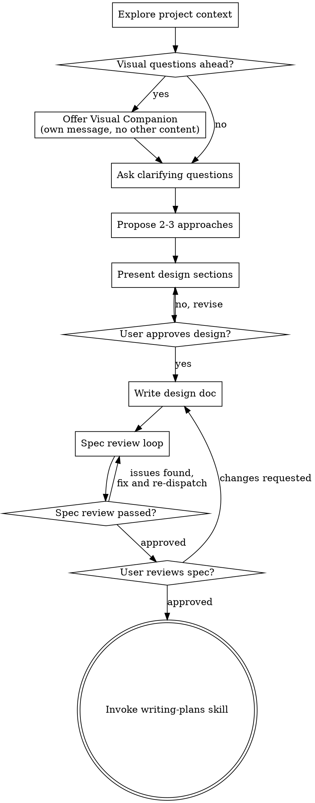

<!-- Generated by SpecStory, Markdown v2.1.0 -->

# 2026-03-13 16:30:47Z

<!-- Claude Code Session bbd6cdb6-de67-4034-b759-185b5e9b77cc (2026-03-13 16:30:47Z) -->

_**User (2026-03-13 16:30:47Z)**_

<command-message>superpowers:brainstorming</command-message>
<command-name>/superpowers:brainstorming</command-name>
<command-args>在 /note/nid 中如果存在 topic，那么需要做一个 paper 上的特殊 UI 展示。我有一个想法，比如说在纸张的左上角放一个推拉夹，这个推拉夹就是当前的话题。现在就是在头脑风暴，如何设计这个推拉夹的 UI 和 UX</command-args>

_**User (2026-03-13 16:30:47Z)**_

Base directory for this skill: <HOME>/.claude/plugins/cache/claude-plugins-official/superpowers/5.0.2/skills/brainstorming

# Brainstorming Ideas Into Designs

Help turn ideas into fully formed designs and specs through natural collaborative dialogue.

Start by understanding the current project context, then ask questions one at a time to refine the idea. Once you understand what you're building, present the design and get user approval.

<HARD-GATE>
Do NOT invoke any implementation skill, write any code, scaffold any project, or take any implementation action until you have presented a design and the user has approved it. This applies to EVERY project regardless of perceived simplicity.
</HARD-GATE>

## Anti-Pattern: "This Is Too Simple To Need A Design"

Every project goes through this process. A todo list, a single-function utility, a config change — all of them. "Simple" projects are where unexamined assumptions cause the most wasted work. The design can be short (a few sentences for truly simple projects), but you MUST present it and get approval.

## Checklist

You MUST create a task for each of these items and complete them in order:

1. **Explore project context** — check files, docs, recent commits
2. **Offer visual companion** (if topic will involve visual questions) — this is its own message, not combined with a clarifying question. See the Visual Companion section below.
3. **Ask clarifying questions** — one at a time, understand purpose/constraints/success criteria
4. **Propose 2-3 approaches** — with trade-offs and your recommendation
5. **Present design** — in sections scaled to their complexity, get user approval after each section
6. **Write design doc** — save to `docs/superpowers/specs/YYYY-MM-DD-<topic>-design.md` and commit
7. **Spec review loop** — dispatch spec-document-reviewer subagent with precisely crafted review context (never your session history); fix issues and re-dispatch until approved (max 5 iterations, then surface to human)
8. **User reviews written spec** — ask user to review the spec file before proceeding
9. **Transition to implementation** — invoke writing-plans skill to create implementation plan

## Process Flow



**The terminal state is invoking writing-plans.** Do NOT invoke frontend-design, mcp-builder, or any other implementation skill. The ONLY skill you invoke after brainstorming is writing-plans.

## The Process

**Understanding the idea:**

- Check out the current project state first (files, docs, recent commits)
- Before asking detailed questions, assess scope: if the request describes multiple independent subsystems (e.g., "build a platform with chat, file storage, billing, and analytics"), flag this immediately. Don't spend questions refining details of a project that needs to be decomposed first.
- If the project is too large for a single spec, help the user decompose into sub-projects: what are the independent pieces, how do they relate, what order should they be built? Then brainstorm the first sub-project through the normal design flow. Each sub-project gets its own spec → plan → implementation cycle.
- For appropriately-scoped projects, ask questions one at a time to refine the idea
- Prefer multiple choice questions when possible, but open-ended is fine too
- Only one question per message - if a topic needs more exploration, break it into multiple questions
- Focus on understanding: purpose, constraints, success criteria

**Exploring approaches:**

- Propose 2-3 different approaches with trade-offs
- Present options conversationally with your recommendation and reasoning
- Lead with your recommended option and explain why

**Presenting the design:**

- Once you believe you understand what you're building, present the design
- Scale each section to its complexity: a few sentences if straightforward, up to 200-300 words if nuanced
- Ask after each section whether it looks right so far
- Cover: architecture, components, data flow, error handling, testing
- Be ready to go back and clarify if something doesn't make sense

**Design for isolation and clarity:**

- Break the system into smaller units that each have one clear purpose, communicate through well-defined interfaces, and can be understood and tested independently
- For each unit, you should be able to answer: what does it do, how do you use it, and what does it depend on?
- Can someone understand what a unit does without reading its internals? Can you change the internals without breaking consumers? If not, the boundaries need work.
- Smaller, well-bounded units are also easier for you to work with - you reason better about code you can hold in context at once, and your edits are more reliable when files are focused. When a file grows large, that's often a signal that it's doing too much.

**Working in existing codebases:**

- Explore the current structure before proposing changes. Follow existing patterns.
- Where existing code has problems that affect the work (e.g., a file that's grown too large, unclear boundaries, tangled responsibilities), include targeted improvements as part of the design - the way a good developer improves code they're working in.
- Don't propose unrelated refactoring. Stay focused on what serves the current goal.

## After the Design

**Documentation:**

- Write the validated design (spec) to `docs/superpowers/specs/YYYY-MM-DD-<topic>-design.md`
  - (User preferences for spec location override this default)
- Use elements-of-style:writing-clearly-and-concisely skill if available
- Commit the design document to git

**Spec Review Loop:**
After writing the spec document:

1. Dispatch spec-document-reviewer subagent (see spec-document-reviewer-prompt.md)
2. If Issues Found: fix, re-dispatch, repeat until Approved
3. If loop exceeds 5 iterations, surface to human for guidance

**User Review Gate:**
After the spec review loop passes, ask the user to review the written spec before proceeding:

> "Spec written and committed to `<path>`. Please review it and let me know if you want to make any changes before we start writing out the implementation plan."

Wait for the user's response. If they request changes, make them and re-run the spec review loop. Only proceed once the user approves.

**Implementation:**

- Invoke the writing-plans skill to create a detailed implementation plan
- Do NOT invoke any other skill. writing-plans is the next step.

## Key Principles

- **One question at a time** - Don't overwhelm with multiple questions
- **Multiple choice preferred** - Easier to answer than open-ended when possible
- **YAGNI ruthlessly** - Remove unnecessary features from all designs
- **Explore alternatives** - Always propose 2-3 approaches before settling
- **Incremental validation** - Present design, get approval before moving on
- **Be flexible** - Go back and clarify when something doesn't make sense

## Visual Companion

A browser-based companion for showing mockups, diagrams, and visual options during brainstorming. Available as a tool — not a mode. Accepting the companion means it's available for questions that benefit from visual treatment; it does NOT mean every question goes through the browser.

**Offering the companion:** When you anticipate that upcoming questions will involve visual content (mockups, layouts, diagrams), offer it once for consent:
> "Some of what we're working on might be easier to explain if I can show it to you in a web browser. I can put together mockups, diagrams, comparisons, and other visuals as we go. This feature is still new and can be token-intensive. Want to try it? (Requires opening a local URL)"

**This offer MUST be its own message.** Do not combine it with clarifying questions, context summaries, or any other content. The message should contain ONLY the offer above and nothing else. Wait for the user's response before continuing. If they decline, proceed with text-only brainstorming.

**Per-question decision:** Even after the user accepts, decide FOR EACH QUESTION whether to use the browser or the terminal. The test: **would the user understand this better by seeing it than reading it?**

- **Use the browser** for content that IS visual — mockups, wireframes, layout comparisons, architecture diagrams, side-by-side visual designs
- **Use the terminal** for content that is text — requirements questions, conceptual choices, tradeoff lists, A/B/C/D text options, scope decisions

A question about a UI topic is not automatically a visual question. "What does personality mean in this context?" is a conceptual question — use the terminal. "Which wizard layout works better?" is a visual question — use the browser.

If they agree to the companion, read the detailed guide before proceeding:
`skills/brainstorming/visual-companion.md`


ARGUMENTS: 在 /note/nid 中如果存在 topic，那么需要做一个 paper 上的特殊 UI 展示。我有一个想法，比如说在纸张的左上角放一个推拉夹，这个推拉夹就是当前的话题。现在就是在头脑风暴，如何设计这个推拉夹的 UI 和 UX

---

_**Agent (claude-opus-4-6 2026-03-13 16:30:52Z)**_

_**Agent (claude-opus-4-6 2026-03-13 16:30:53Z)**_

<tool-use data-tool-type="unknown" data-tool-name="ToolSearch"><details>
<summary>Tool use: **ToolSearch**</summary>

**Input:**

- max_results: `4`
- query: `select:TaskCreate,TaskGet,TaskList,TaskUpdate`

**Result:**

```

```
</details></tool-use>

_**Agent (claude-opus-4-6 2026-03-13 16:30:56Z)**_

_**Agent (claude-opus-4-6 2026-03-13 16:30:58Z)**_

<tool-use data-tool-type="unknown" data-tool-name="TaskCreate"><details>
<summary>Tool use: **TaskCreate**</summary>
了解 note 页面结构、topic 数据模型、paper 组件样式

```text
Task #770 created successfully: 探索项目上下文
```
</details></tool-use>

_**Agent (claude-opus-4-6 2026-03-13 16:30:59Z)**_

<tool-use data-tool-type="unknown" data-tool-name="TaskCreate"><details>
<summary>Tool use: **TaskCreate**</summary>
因涉及 UI 视觉设计，询问用户是否需要浏览器可视化辅助

```text
Task #771 created successfully: 提供可视化伴侣
```
</details></tool-use>

_**Agent (claude-opus-4-6 2026-03-13 16:31:00Z)**_

<tool-use data-tool-type="unknown" data-tool-name="TaskCreate"><details>
<summary>Tool use: **TaskCreate**</summary>
逐一询问推拉夹的细节需求

```text
Task #772 created successfully: 逐一提问澄清需求
```
</details></tool-use>

_**Agent (claude-opus-4-6 2026-03-13 16:31:01Z)**_

<tool-use data-tool-type="unknown" data-tool-name="TaskCreate"><details>
<summary>Tool use: **TaskCreate**</summary>
提出不同设计方案及权衡

```text
Task #773 created successfully: 提出 2-3 种设计方案
```
</details></tool-use>

_**Agent (claude-opus-4-6 2026-03-13 16:31:02Z)**_

<tool-use data-tool-type="unknown" data-tool-name="TaskCreate"><details>
<summary>Tool use: **TaskCreate**</summary>
分段呈现设计，获取用户认可

```text
Task #774 created successfully: 呈现最终设计
```
</details></tool-use>

_**Agent (claude-opus-4-6 2026-03-13 16:31:03Z)**_

<tool-use data-tool-type="unknown" data-tool-name="TaskCreate"><details>
<summary>Tool use: **TaskCreate**</summary>
写入 docs/superpowers/specs/ 并提交

```text
Task #775 created successfully: 撰写设计文档
```
</details></tool-use>

_**Agent (claude-opus-4-6 2026-03-13 16:31:04Z)**_

<tool-use data-tool-type="unknown" data-tool-name="TaskCreate"><details>
<summary>Tool use: **TaskCreate**</summary>
派遣 spec reviewer 审阅设计文档

```text
Task #776 created successfully: Spec review loop
```
</details></tool-use>

_**Agent (claude-opus-4-6 2026-03-13 16:31:05Z)**_

<tool-use data-tool-type="unknown" data-tool-name="TaskCreate"><details>
<summary>Tool use: **TaskCreate**</summary>
请用户审阅最终 spec 文件

```text
Task #777 created successfully: 用户审阅 spec
```
</details></tool-use>

_**Agent (claude-opus-4-6 2026-03-13 16:31:06Z)**_

<tool-use data-tool-type="unknown" data-tool-name="TaskCreate"><details>
<summary>Tool use: **TaskCreate**</summary>
调用 writing-plans skill 创建实施计划

```text
Task #778 created successfully: 转入实施规划
```
</details></tool-use>

_**Agent (claude-opus-4-6 2026-03-13 16:31:08Z)**_

<tool-use data-tool-type="unknown" data-tool-name="TaskUpdate"><details>
<summary>Tool use: **TaskUpdate**</summary>

```text
Updated task #770 status
```
</details></tool-use>

_**Agent (claude-opus-4-6 2026-03-13 16:33:31Z)**_

<tool-use data-tool-type="unknown" data-tool-name="Agent"><details>
<summary>Tool use: **Agent**</summary>
探索 note 页面与 topic 相关代码

```text
Perfect! Now I have all the information needed. Let me compile a comprehensive summary:

## Shiroi 项目笔记页面结构探索总结

吾已完成对 Shiroi 项目笔记页面架构之详尽探索。以下为核心发现：

### 一、笔记页面路由与组件结构

**路由路径**：`/[locale]/notes/[id]`（动态路由参数为笔记 ID）

**页面主文件**：
- `<REPO_ROOT>/apps/web/src/app/[locale]/notes/[id]/page.tsx` - 主页面组件
- `<REPO_ROOT>/apps/web/src/app/[locale]/notes/[id]/pageExtra.tsx` - 页面额外逻辑（标题、日期、重验证等）
- `<REPO_ROOT>/apps/web/src/app/[locale]/notes/layout.tsx` - 三列网格布局

**布局结构**（网格布局）：
```
左侧边栏（XL） | 主要内容 | 右侧边栏（XL）
NoteLeftSidebar | Paper容器 | LayoutRightSideProvider
```

### 二、Paper 组件

**定义文件**：`<REPO_ROOT>/apps/web/src/components/layout/container/Paper.tsx`

**Paper 组件特性**：
- 基础容器，采用语义化 HTML（可配置 `as` 属性）
- 默认渲染为 `<main>` 元素
- 类名构成：
  - 背景：`bg-neutral-1 dark:bg-neutral-2`
  - 间距：`p-[2rem_1rem] md:m-0 lg:p-[30px_45px]`
  - 边框与圆角：`rounded-[0_6px_6px_0] border-neutral-200/70 dark:border-neutral-800 lg:border`
  - 阴影：`shadow-perfect perfect-sm`
  - 打印友好：`print:border-none! print:bg-transparent! print:shadow-none!`

**页面使用**：在 page.tsx 中作为 `NoteMainContainer` 容器包装页面内容

### 三、Topic 数据模型

**TopicModel 结构**（来自 @mx-space/api-client）：
```typescript
interface TopicModel extends BaseModel {
  id: string
  description?: string      // 详细描述
  introduce: string         // 简介
  name: string             // 专栏名称
  slug: string             // URL slug
  icon?: string            // 专栏图标 URL
  created: string          // 创建时间
}
```

**NoteModel 中的 Topic 关联**：
```typescript
export interface NoteModel {
  // ... 其他字段
  topic?: TopicModel        // 可选的关联专栏
  topicId?: Ref<TopicModel> // 专栏 ID 引用
}
```

**数据流获取**：
- 笔记数据通过 API 获取时自动包含 topic 对象
- 存储于 CurrentNoteDataProvider（Jotai 状态管理）

### 四、Topic 相关 UI 组件

**主要组件清单**：

| 组件 | 文件路径 | 功能 |
|------|---------|------|
| `NoteBottomTopic` | `/components/modules/note/NoteBottomTopic.tsx` | 笔记下方显示所属专栏卡片 |
| `NoteTopicDetail` | `/components/modules/note/NoteTopicDetail.tsx` | 专栏详情弹窗内容 |
| `NoteTopicInfo` | `/components/modules/note/NoteTopicInfo.tsx` | 左侧边栏显示专栏信息及相关文章 |
| `ToTopicLink` | `/components/modules/note/NoteTopicDetail.tsx` | 专栏链接组件 |
| `NoteTopicMarkdownRender` | `/components/modules/note/NoteTopicMarkdownRender.tsx` | Markdown 渲染（专栏描述） |

**NoteBottomTopic 实现**（笔记下方）：
```tsx
// 显示内容：
- "文章被专栏收录：" 标题
- 专栏图标（Avatar）+ 名称链接
- 专栏简介（line-clamp-2）
- FloatPopover 触发详情弹窗显示 NoteTopicDetail
```

**NoteTopicDetail 实现**（弹窗内容）：
- 专栏名称 + 简介
- 专栏描述（若存在）
- 最近更新文章链接 + 时间
- 文章总数统计
- 宽度固定 400px

**NoteTopicInfo 实现**（左侧边栏）：
- 显示所属专栏链接
- 同专栏其他文章列表（最多 5 篇，排除当前文章）
- 使用 NoteTimelineItem 组件展示列表

### 五、专栏页面路由

**专栏列表页**：`/[locale]/(note-topic)/notes/topics`
- 文件：`/apps/web/src/app/[locale]/(note-topic)/notes/topics/page.tsx`
- 显示所有专栏的时间线列表

**专栏详情页**：`/[locale]/(note-topic)/notes/(topic-detail)/topics/[slug]`
- 文件：`/apps/web/src/app/[locale]/(note-topic)/notes/(topic-detail)/topics/[slug]/page.tsx`
- 显示该专栏下所有笔记（分页加载）
- 查询文件：`query.ts`

**路由常量**（route-builder.ts）：
```typescript
NoteTopic = '/notes/topics/'           // 专栏详情页基础路径
NoteTopics = '/notes/topics'           // 专栏列表页
```

### 六、数据获取与状态管理

**查询 Hook**：
```typescript
// 专栏详情查询
const getTopicQuery = (topicSlug: string, locale?: string) =>
  defineQuery({
    queryKey: ['topic', topicSlug, locale],
    queryFn: async () => 
      (await apiClient.topic.getTopicBySlug(slug!)).$serialized
  })

// 专栏下笔记列表
apiClient.note.proxy.topics(topicId).get<PaginateResult<NoteTopicListItem>>({
  params: { page, size, sortBy: 'created', sortOrder: -1, lang: locale }
})
```

**当前笔记 Provider**：
- 存储地：`/providers/note/CurrentNoteDataProvider.tsx`
- 基于 Jotai + jojoo 的模型数据提供者
- 包含选择器：`useCurrentNoteDataSelector`
- 访问 topic：`useCurrentNoteDataSelector((state) => state?.data.topic)`

### 七、页面组件集成

**page.tsx 渲染流程**：
```jsx
<Paper as={NoteMainContainer}>
  <PageInner data={noteData}>
    {/* 标题 */}
    <NoteTitle />
    {/* 元信息栏（日期、作者等） */}
    <NoteMetaBar />
    {/* 正文内容 */}
    <NoteContent contentFormat={contentFormat} />
    {/* 右侧边栏入口 */}
    <LayoutRightSidePortal>
      <NoteActionAside />
    </LayoutRightSidePortal>
  </PageInner>
</Paper>

{/* 页面下方组件 */}
<NoteBottomTopic />                    {/* 专栏卡片 */}
<NoteFooterNavigationBarForMobile />   {/* 底部导航 */}
<CommentAreaRootLazy />                {/* 评论区 */}
```

### 八、关键文件路径汇总

```
apps/web/src/app/[locale]/notes/[id]/
├── page.tsx                          (主笔记页面)
├── pageExtra.tsx                     (标题、日期、重验证逻辑)
├── page.css                          (页面样式引用)
├── NoteContent.tsx                   (内容渲染分发器)
├── NoteMarkdownRenderer.tsx          (Markdown 渲染)
└── NoteLexicalRenderer.tsx           (Lexical 富文本渲染)

apps/web/src/components/modules/note/
├── NoteBottomTopic.tsx               (下方专栏卡片)
├── NoteTopicDetail.tsx               (详情弹窗)
├── NoteTopicInfo.tsx                 (左侧专栏信息)
├── NoteTopicMarkdownRender.tsx       (Markdown 渲染)
├── NoteMainContainer.tsx             (高度监测容器)
└── index.ts                          (组件导出)

apps/web/src/components/layout/container/
└── Paper.tsx                         (基础容器组件)

apps/web/src/providers/note/
└── CurrentNoteDataProvider.tsx       (笔记数据状态)

apps/web/src/app/[locale]/(note-topic)/notes/topics/
├── page.tsx                          (专栏列表)
└── layout.tsx

apps/web/src/app/[locale]/(note-topic)/notes/(topic-detail)/topics/[slug]/
├── page.tsx                          (专栏详情)
├── query.ts                          (查询定义)
└── layout.tsx
```

---

吾总结：Shiroi 笔记页面采用三列弹性网格布局，Paper 容器为核心内容区域，Topic 通过关系型数据结构嵌入 NoteModel 中，UI 层面有两处显示：笔记下方卡片及左侧边栏信息。专栏系统独立页面展示，与笔记通过 ID 和 slug 双向关联。
agentId: af313f3ca0de08fde (for resuming to continue this agent's work if needed)
<usage>total_tokens: 59713
tool_uses: 35
duration_ms: 134391</usage>
```
</details></tool-use>

_**Agent - sidechain (2026-03-13 16:31:16Z)**_

I need to understand the note page structure in this Shiroi project. Please explore:

1. The note page route/component structure under `apps/web/src/app` - find the `/note/[nid]` route
2. The "paper" component/styling used on note pages - search for "paper" related components or CSS classes
3. The "topic" data model and how topics are used in note pages - search for topic-related code in note components
4. Any existing topic UI elements on the note page

Please provide file paths, relevant code snippets, and a summary of the current architecture for notes and topics.

Working directory: <REPO_ROOT>

_**Agent - sidechain (claude-haiku-4-5-20251001 2026-03-13 16:31:18Z)**_

I'll explore the Shiroi project to understand the note page structure, paper components, and topic implementation. Let me start by examining the relevant files and directories.

_**Agent - sidechain (claude-haiku-4-5-20251001 2026-03-13 16:31:21Z)**_

<tool-use data-tool-type="search" data-tool-name="Glob"><details>
<summary>Tool use: **Glob**</summary>
 pattern `apps/web/src/app/**/note/**`

```text
No files found
```
</details></tool-use>

_**Agent - sidechain (claude-haiku-4-5-20251001 2026-03-13 16:31:21Z)**_

<tool-use data-tool-type="search" data-tool-name="Glob"><details>
<summary>Tool use: **Glob**</summary>
 pattern `apps/web/src/components/**/*paper*`

```text
No files found
```
</details></tool-use>

_**Agent - sidechain (claude-haiku-4-5-20251001 2026-03-13 16:31:21Z)**_

<tool-use data-tool-type="search" data-tool-name="Glob"><details>
<summary>Tool use: **Glob**</summary>
 pattern `apps/web/src/components/**/*topic*`

```text
No files found
```
</details></tool-use>

_**Agent - sidechain (claude-haiku-4-5-20251001 2026-03-13 16:31:20Z)**_

<tool-use data-tool-type="shell" data-tool-name="Bash"><details>
<summary>Tool use: **Bash**</summary>

`find <REPO_ROOT>/apps/web/src -type f -name "*.tsx" -o -name "*.ts" | grep -E "(note|topic)" | head -20`

```text
<REPO_ROOT>/apps/web/src/app/[locale]/(note-topic)/notes/(topic-detail)/topics/[slug]/layout.tsx
<REPO_ROOT>/apps/web/src/app/[locale]/(note-topic)/notes/(topic-detail)/topics/[slug]/loading.tsx
<REPO_ROOT>/apps/web/src/app/[locale]/(note-topic)/notes/(topic-detail)/topics/[slug]/query.ts
<REPO_ROOT>/apps/web/src/app/[locale]/(note-topic)/notes/(topic-detail)/topics/[slug]/page.tsx
<REPO_ROOT>/apps/web/src/app/[locale]/(note-topic)/notes/topics/layout.tsx
<REPO_ROOT>/apps/web/src/app/[locale]/(note-topic)/notes/topics/loading.tsx
<REPO_ROOT>/apps/web/src/app/[locale]/(note-topic)/notes/topics/page.tsx
<REPO_ROOT>/apps/web/src/app/[locale]/notes/layout.tsx
<REPO_ROOT>/apps/web/src/app/[locale]/notes/loading.tsx
<REPO_ROOT>/apps/web/src/app/[locale]/notes/[id]/NoteMarkdown.tsx
<REPO_ROOT>/apps/web/src/app/[locale]/notes/[id]/NoteMarkdownRenderer.tsx
<REPO_ROOT>/apps/web/src/app/[locale]/notes/[id]/NoteContent.tsx
<REPO_ROOT>/apps/web/src/app/[locale]/notes/[id]/pageExtra.tsx
<REPO_ROOT>/apps/web/src/app/[locale]/notes/[id]/NoteLexicalRenderer.tsx
<REPO_ROOT>/apps/web/src/app/[locale]/notes/[id]/loading.tsx
<REPO_ROOT>/apps/web/src/app/[locale]/notes/[id]/api.tsx
<REPO_ROOT>/apps/web/src/app/[locale]/notes/[id]/page.tsx
<REPO_ROOT>/apps/web/src/app/[locale]/notes/[id]/Transition.tsx
<REPO_ROOT>/apps/web/src/app/[locale]/notes/page.tsx
<REPO_ROOT>/apps/web/src/app/[locale]/notes/redirect.tsx
```
</details></tool-use>

_**Agent - sidechain (claude-haiku-4-5-20251001 2026-03-13 16:31:25Z)**_

Good! Now let me explore the structure more thoroughly and search for topic and paper references:

_**Agent - sidechain (claude-haiku-4-5-20251001 2026-03-13 16:31:25Z)**_

<tool-use data-tool-type="read" data-tool-name="Read"><details>
<summary>Tool use: **Read**</summary>
 `./apps/web/src/app/[locale]/notes/[id]/page.tsx`

```text
     1→import './page.css'
     2→
     3→import type {
     4→  ModelWithLiked,
     5→  ModelWithTranslation,
     6→  NoteModel,
     7→} from '@mx-space/api-client'
     8→import type { Metadata } from 'next'
     9→import { getTranslations } from 'next-intl/server'
    10→
    11→import { AckRead } from '~/components/common/AckRead'
    12→import { ClientOnly } from '~/components/common/ClientOnly'
    13→import { PageColorGradient } from '~/components/common/PageColorGradient'
    14→import {
    15→  buildRoomName,
    16→  Presence,
    17→  RoomProvider,
    18→} from '~/components/modules/activity'
    19→import { CommentAreaRootLazy } from '~/components/modules/comment'
    20→import {
    21→  NoteActionAside,
    22→  NoteBottomBarAction,
    23→  NoteBottomTopic,
    24→  NoteFooterNavigationBarForMobile,
    25→  NoteMetaBar,
    26→  NoteMetaReadingCount,
    27→  NotePasswordForm,
    28→} from '~/components/modules/note'
    29→import {
    30→  NoteBanner,
    31→  NoteRootBanner,
    32→} from '~/components/modules/note/NoteBanner'
    33→import { NoteFontSettingFab } from '~/components/modules/note/NoteFontFab'
    34→import { NoteMainContainer } from '~/components/modules/note/NoteMainContainer'
    35→import { ReadIndicatorForMobile } from '~/components/modules/shared/ReadIndicator'
    36→import { Signature } from '~/components/modules/shared/Signature'
    37→import { SummarySwitcher } from '~/components/modules/shared/SummarySwitcher'
    38→import { TocFAB } from '~/components/modules/toc/TocFAB'
    39→import { TocHeadingStrategyProvider } from '~/components/modules/toc/TocHeadingStrategy'
    40→import { TranslationBanner } from '~/components/modules/translation/TranslationBanner'
    41→import { BottomToUpSoftScaleTransitionView } from '~/components/ui/transition'
    42→import { OnlyMobile } from '~/components/ui/viewport/OnlyMobile'
    43→import { getOgUrl } from '~/lib/helper.server'
    44→import { getSummaryFromMd } from '~/lib/markdown'
    45→import { definePrerenderPage } from '~/lib/request.server'
    46→import {
    47→  buildLanguageAlternates,
    48→  buildLocalePrefixedPath,
    49→  getSupportedLocalesFromTranslations,
    50→} from '~/lib/seo/hreflang'
    51→import {
    52→  CurrentNoteDataProvider,
    53→  SyncNoteDataAfterLoggedIn,
    54→} from '~/providers/note/CurrentNoteDataProvider'
    55→import { CurrentNoteNidProvider } from '~/providers/note/CurrentNoteIdProvider'
    56→import { LayoutRightSidePortal } from '~/providers/shared/LayoutRightSideProvider'
    57→import { WrappedElementProvider } from '~/providers/shared/WrappedElementProvider'
    58→
    59→import { Paper } from '../../../../components/layout/container/Paper'
    60→import { NoteHeadCover } from '../../../../components/modules/note/NoteHeadCover'
    61→import { NoteHideIfSecret } from '../../../../components/modules/note/NoteHideIfSecret'
    62→import type { NoteDataResult } from './api'
    63→import { getData } from './api'
    64→import { NoteContent } from './NoteContent'
    65→import {
    66→  IndentArticleContainer,
    67→  MarkdownSelection,
    68→  NoteDataReValidate,
    69→  NoteHeaderDate,
    70→  NoteMarkdownImageRecordProvider,
    71→  NoteTitle,
    72→} from './pageExtra'
    73→import { Transition } from './Transition'
    74→
    75→type NoteWithTranslation = ModelWithLiked<ModelWithTranslation<NoteModel>>
    76→
    77→export const dynamic = 'force-dynamic'
    78→
    79→const Summary = ({ data }: { data: NoteWithTranslation }) => {
    80→  return <SummarySwitcher articleId={data.id!} className="mb-8" />
    81→}
    82→
    83→function PageInner({
    84→  data,
    85→  privateLoginOnlyMessage,
    86→}: {
    87→  data: NoteWithTranslation
    88→  privateLoginOnlyMessage: string
    89→}) {
    90→  const coverImage = data.images?.find((i) => i.src === data.meta?.cover)
    91→  const { isTranslated, translationMeta } = data
    92→
    93→  return (
    94→    <>
    95→      <AckRead id={data.id} type="note" />
    96→
    97→      <NoteHeadCover image={data.meta?.cover} />
    98→      {!!data.meta?.cover && !!coverImage?.accent && (
    99→        <PageColorGradient baseColor={coverImage.accent} />
   100→      )}
   101→      <div>
   102→        <NoteTitle />
   103→        <span className="flex flex-wrap items-center text-sm text-neutral-8/60">
   104→          <NoteHeaderDate />
   105→
   106→          <NoteMetaBar />
   107→          <NoteMetaReadingCount />
   108→        </span>
   109→
   110→        <NoteRootBanner />
   111→        {!data.isPublished && (
   112→          <NoteBanner message={privateLoginOnlyMessage} type="warning" />
   113→        )}
   114→      </div>
   115→
   116→      <NoteHideIfSecret>
   117→        {isTranslated && translationMeta && (
   118→          <div className="mt-4">
   119→            <TranslationBanner translationMeta={translationMeta} />
   120→          </div>
   121→        )}
   122→        <Summary data={data} />
   123→        <WrappedElementProvider eoaDetect>
   124→          <Presence />
   125→          <ReadIndicatorForMobile />
   126→          <NoteMarkdownImageRecordProvider>
   127→            <MarkdownSelection>
   128→              <IndentArticleContainer prose={data.contentFormat !== 'lexical'}>
   129→                <header className="sr-only">
   130→                  <NoteTitle />
   131→                </header>
   132→                <NoteContent contentFormat={data.contentFormat} />
   133→              </IndentArticleContainer>
   134→            </MarkdownSelection>
   135→          </NoteMarkdownImageRecordProvider>
   136→
   137→          <LayoutRightSidePortal>
   138→            <NoteActionAside />
   139→          </LayoutRightSidePortal>
   140→        </WrappedElementProvider>
   141→      </NoteHideIfSecret>
   142→      <Signature />
   143→      {/* <SubscribeBell defaultType="note_c" /> */}
   144→      <ClientOnly>
   145→        <div data-hide-print className="mt-8" />
   146→        <NoteBottomBarAction />
   147→        <NoteBottomTopic />
   148→        <NoteFooterNavigationBarForMobile />
   149→      </ClientOnly>
   150→    </>
   151→  )
   152→}
   153→
   154→type NoteDetailPageParams = LocaleParams & {
   155→  id: string
   156→  password?: string
   157→}
   158→export const generateMetadata = async (props: {
   159→  params: Promise<NoteDetailPageParams>
   160→  searchParams?: Promise<{
   161→    password?: string | string[]
   162→    lang?: string
   163→  }>
   164→}): Promise<Metadata> => {
   165→  const params = await props.params
   166→  const searchParams = (await props.searchParams) ?? {}
   167→  const password = Array.isArray(searchParams.password)
   168→    ? searchParams.password[0]
   169→    : searchParams.password
   170→  try {
   171→    const { note: res } = await getData({
   172→      ...params,
   173→      password,
   174→      lang: searchParams.lang,
   175→    })
   176→
   177→    const { data } = res
   178→    const description = getSummaryFromMd(data.text ?? '')
   179→
   180→    const ogUrl = await getOgUrl(
   181→      'note',
   182→      {
   183→        nid: params.id,
   184→      },
   185→      params.locale,
   186→    )
   187→
   188→    const canonicalPathNoLocale = `/notes/${params.id}`
   189→    const canonicalPath = buildLocalePrefixedPath(
   190→      params.locale as any,
   191→      canonicalPathNoLocale,
   192→    )
   193→    const supportedLocales = getSupportedLocalesFromTranslations({
   194→      sourceLang: (data as any).translationMeta?.sourceLang,
   195→      availableTranslations: (data as any).availableTranslations,
   196→    })
   197→
   198→    return {
   199→      title: data.title,
   200→      description,
   201→      openGraph: {
   202→        title: data.title,
   203→        description,
   204→        images: ogUrl,
   205→        type: 'article',
   206→      },
   207→      twitter: {
   208→        images: ogUrl,
   209→        title: data.title,
   210→        description,
   211→        card: 'summary_large_image',
   212→      },
   213→      alternates: {
   214→        canonical: canonicalPath,
   215→        languages: {
   216→          ...buildLanguageAlternates(canonicalPathNoLocale, supportedLocales),
   217→          'x-default': canonicalPathNoLocale,
   218→        },
   219→      },
   220→    } satisfies Metadata
   221→  } catch {
   222→    return {}
   223→  }
   224→}
   225→
   226→export default definePrerenderPage<NoteDetailPageParams>()<NoteDataResult>({
   227→  fetcher: getData,
   228→  requestErrorRenderer(_error, parsed, { id }) {
   229→    const { status } = parsed
   230→
   231→    if (status === 403) {
   232→      return (
   233→        <Paper>
   234→          <NotePasswordForm />
   235→          <CurrentNoteNidProvider nid={id} />
   236→        </Paper>
   237→      )
   238→    }
   239→  },
   240→  async Component({
   241→    data: fetchedData,
   242→    params: { id: nid, locale },
   243→    fetchedAt,
   244→  }) {
   245→    const { note: data } = fetchedData
   246→    const t = await getTranslations({
   247→      namespace: 'note',
   248→      locale,
   249→    })
   250→
   251→    return (
   252→      <TocHeadingStrategyProvider
   253→        contentFormat={data.data.contentFormat}
   254→        hasContent={!!data.data.content}
   255→      >
   256→        <CurrentNoteNidProvider nid={nid} />
   257→        <CurrentNoteDataProvider data={data} />
   258→        <NoteDataReValidate fetchedAt={fetchedAt} />
   259→        <SyncNoteDataAfterLoggedIn />
   260→        <RoomProvider roomName={buildRoomName(data.data.id)}>
   261→          <Transition lcpOptimization className="min-w-0">
   262→            <Paper as={NoteMainContainer} key={nid}>
   263→              <PageInner
   264→                data={data.data}
   265→                privateLoginOnlyMessage={t('private_login_only')}
   266→              />
   267→            </Paper>
   268→            <BottomToUpSoftScaleTransitionView delay={500}>
   269→              <CommentAreaRootLazy
   270→                allowComment={data.data.allowComment}
   271→                refId={data.data.id}
   272→              />
   273→            </BottomToUpSoftScaleTransitionView>
   274→          </Transition>
   275→        </RoomProvider>
   276→
   277→        <NoteFontSettingFab />
   278→
   279→        <OnlyMobile>
   280→          <TocFAB />
   281→        </OnlyMobile>
   282→      </TocHeadingStrategyProvider>
   283→    )
   284→  },
   285→})
   286→
```
</details></tool-use>

_**Agent - sidechain (claude-haiku-4-5-20251001 2026-03-13 16:31:26Z)**_

<tool-use data-tool-type="read" data-tool-name="Read"><details>
<summary>Tool use: **Read**</summary>
 `./apps/web/src/app/[locale]/notes/[id]/NoteContent.tsx`

```text
     1→import { NoteLexicalRenderer } from './NoteLexicalRenderer'
     2→import { NoteMarkdownRenderer } from './NoteMarkdownRenderer'
     3→
     4→export function NoteContent({ contentFormat }: { contentFormat?: string }) {
     5→  if (contentFormat === 'lexical') {
     6→    return <NoteLexicalRenderer />
     7→  }
     8→  return <NoteMarkdownRenderer />
     9→}
    10→
```
</details></tool-use>

_**Agent - sidechain (claude-haiku-4-5-20251001 2026-03-13 16:31:26Z)**_

<tool-use data-tool-type="shell" data-tool-name="Bash"><details>
<summary>Tool use: **Bash**</summary>

`grep -r "topic" <REPO_ROOT>/apps/web/src/app --include="*.tsx" --include="*.ts" | head -30`

```text
<REPO_ROOT>/apps/web/src/app/[locale]/(note-topic)/notes/(topic-detail)/topics/[slug]/query.ts:export const getTopicQuery = (topicSlug: string, locale?: string) =>
<REPO_ROOT>/apps/web/src/app/[locale]/(note-topic)/notes/(topic-detail)/topics/[slug]/query.ts:    queryKey: ['topic', topicSlug, locale],
<REPO_ROOT>/apps/web/src/app/[locale]/(note-topic)/notes/(topic-detail)/topics/[slug]/query.ts:      return (await apiClient.topic.getTopicBySlug(slug!)).$serialized
<REPO_ROOT>/apps/web/src/app/[locale]/(note-topic)/notes/(topic-detail)/topics/[slug]/page.tsx:    queryKey: ['topicId', data?.id, locale],
<REPO_ROOT>/apps/web/src/app/[locale]/(note-topic)/notes/(topic-detail)/topics/[slug]/page.tsx:      const [, topicId, lang] = queryKey
<REPO_ROOT>/apps/web/src/app/[locale]/(note-topic)/notes/(topic-detail)/topics/[slug]/page.tsx:      if (!topicId) throw new Error('topicId is not ready :(')
<REPO_ROOT>/apps/web/src/app/[locale]/(note-topic)/notes/(topic-detail)/topics/[slug]/page.tsx:        .topics(topicId)
<REPO_ROOT>/apps/web/src/app/[locale]/(note-topic)/notes/(topic-detail)/topics/[slug]/page.tsx:  if (!data) throw new Error('topic data is lost :(')
<REPO_ROOT>/apps/web/src/app/[locale]/(note-topic)/notes/(topic-detail)/topics/[slug]/page.tsx:        <h1>{t('topic_header', { name })}</h1>
<REPO_ROOT>/apps/web/src/app/[locale]/(note-topic)/notes/topics/layout.tsx:    title: t('page_title_topics'),
<REPO_ROOT>/apps/web/src/app/[locale]/(note-topic)/notes/topics/page.tsx:  fetcher: async () => (await apiClient.topic.getAll()).data,
<REPO_ROOT>/apps/web/src/app/(dashboard)/dashboard/[[...catch_all]]/router.tsx:} from '../../../../routes/notes/topics/index'
<REPO_ROOT>/apps/web/src/app/(dashboard)/dashboard/[[...catch_all]]/router.tsx:      { path: '/notes/topics', config: notesTopicsConfig },
<REPO_ROOT>/apps/web/src/app/(dashboard)/dashboard/[[...catch_all]]/router.tsx:          { path: 'topics', element: <NotesTopics /> },
```
</details></tool-use>

_**Agent - sidechain (claude-haiku-4-5-20251001 2026-03-13 16:31:26Z)**_

<tool-use data-tool-type="shell" data-tool-name="Bash"><details>
<summary>Tool use: **Bash**</summary>

`grep -r "paper" <REPO_ROOT>/apps/web/src/components --include="*.tsx" --include="*.ts" | head -30`

```text
(Bash completed with no output)
```
</details></tool-use>

_**Agent - sidechain (claude-haiku-4-5-20251001 2026-03-13 16:31:31Z)**_

Excellent! I found references to `NoteBottomTopic` and `Paper`. Let me continue exploring:

_**Agent - sidechain (claude-haiku-4-5-20251001 2026-03-13 16:31:31Z)**_

<tool-use data-tool-type="read" data-tool-name="Read"><details>
<summary>Tool use: **Read**</summary>
 `./apps/web/src/components/layout/container/Paper.tsx`

```text
     1→import type { JSX } from 'react'
     2→
     3→import { clsxm } from '~/lib/helper'
     4→
     5→export const Paper: Component<{
     6→  as?: keyof JSX.IntrinsicElements | Component
     7→}> = ({ children, className, as: As = 'main' }) => (
     8→  <As
     9→    className={clsxm(
    10→      'relative bg-neutral-1 dark:bg-neutral-2 md:col-start-1 lg:col-auto',
    11→      '-m-4 p-[2rem_1rem] md:m-0 lg:p-[30px_45px]',
    12→      'rounded-[0_6px_6px_0] border-neutral-200/70 dark:border-neutral-800 lg:border',
    13→      'shadow-perfect perfect-sm',
    14→      'note-layout-main',
    15→      'min-w-0',
    16→      'print:border-none! print:bg-transparent! print:shadow-none!',
    17→      className,
    18→    )}
    19→  >
    20→    {children}
    21→  </As>
    22→)
    23→
```
</details></tool-use>

_**Agent - sidechain (claude-haiku-4-5-20251001 2026-03-13 16:31:31Z)**_

<tool-use data-tool-type="shell" data-tool-name="Bash"><details>
<summary>Tool use: **Bash**</summary>

`find <REPO_ROOT>/apps/web/src/components/modules/note -type f -name "*.tsx" | sort`

```text
<REPO_ROOT>/apps/web/src/components/modules/note/NoteActionAside.tsx
<REPO_ROOT>/apps/web/src/components/modules/note/NoteBanner.tsx
<REPO_ROOT>/apps/web/src/components/modules/note/NoteBottomTopic.tsx
<REPO_ROOT>/apps/web/src/components/modules/note/NoteFontFab.tsx
<REPO_ROOT>/apps/web/src/components/modules/note/NoteFooterNavigation.tsx
<REPO_ROOT>/apps/web/src/components/modules/note/NoteHeadCover.tsx
<REPO_ROOT>/apps/web/src/components/modules/note/NoteHideIfSecret.tsx
<REPO_ROOT>/apps/web/src/components/modules/note/NoteLeftSidebar.tsx
<REPO_ROOT>/apps/web/src/components/modules/note/NoteMainContainer.tsx
<REPO_ROOT>/apps/web/src/components/modules/note/NoteMetaBar.tsx
<REPO_ROOT>/apps/web/src/components/modules/note/NotePasswordForm.tsx
<REPO_ROOT>/apps/web/src/components/modules/note/NoteTimeline.tsx
<REPO_ROOT>/apps/web/src/components/modules/note/NoteTimelineItem.tsx
<REPO_ROOT>/apps/web/src/components/modules/note/NoteTopicDetail.tsx
<REPO_ROOT>/apps/web/src/components/modules/note/NoteTopicInfo.tsx
<REPO_ROOT>/apps/web/src/components/modules/note/NoteTopicMarkdownRender.tsx
```
</details></tool-use>

_**Agent - sidechain (claude-haiku-4-5-20251001 2026-03-13 16:31:32Z)**_

<tool-use data-tool-type="shell" data-tool-name="Bash"><details>
<summary>Tool use: **Bash**</summary>

`grep -r "NoteBottomTopic" <REPO_ROOT>/apps/web/src/components --include="*.tsx" -l`

```text
<REPO_ROOT>/apps/web/src/components/modules/note/NoteBottomTopic.tsx
```
</details></tool-use>

_**Agent - sidechain (claude-haiku-4-5-20251001 2026-03-13 16:31:36Z)**_

Perfect! Now let me read the topic-related components:

_**Agent - sidechain (claude-haiku-4-5-20251001 2026-03-13 16:31:36Z)**_

<tool-use data-tool-type="read" data-tool-name="Read"><details>
<summary>Tool use: **Read**</summary>
 `./apps/web/src/components/modules/note/NoteBottomTopic.tsx`

```text
     1→'use client'
     2→
     3→import type { FC } from 'react'
     4→
     5→import { useIsMobile } from '~/atoms/hooks/viewport'
     6→import { Avatar } from '~/components/ui/avatar'
     7→import { Divider } from '~/components/ui/divider'
     8→import { FloatPopover } from '~/components/ui/float-popover'
     9→import { Link } from '~/i18n/navigation'
    10→import { routeBuilder, Routes } from '~/lib/route-builder'
    11→import { useCurrentNoteDataSelector } from '~/providers/note/CurrentNoteDataProvider'
    12→
    13→import { NoteTopicDetail } from './NoteTopicDetail'
    14→import { NoteTopicMarkdownRender } from './NoteTopicMarkdownRender'
    15→
    16→const textToBigCharOrWord = (name: string | undefined) => {
    17→  if (!name) {
    18→    return ''
    19→  }
    20→  const splitOnce = name.split(' ')[0]
    21→  const bigChar = splitOnce.length > 4 ? name[0] : splitOnce
    22→  return bigChar
    23→}
    24→
    25→export const NoteBottomTopic: FC = () => {
    26→  const topic = useCurrentNoteDataSelector((state) => state?.data.topic)
    27→  const isMobile = useIsMobile()
    28→  if (!topic) return null
    29→  const { icon, name, introduce } = topic
    30→
    31→  return (
    32→    <div data-hide-print>
    33→      <div className="font-medium">
    34→        <strong>文章被专栏收录：</strong>
    35→      </div>
    36→      <Divider />
    37→      <div className="flex items-center gap-4">
    38→        <Avatar
    39→          alt={`专栏 ${name} 的头像`}
    40→          className="shrink-0"
    41→          imageUrl={icon}
    42→          radius="full"
    43→          shadow={false}
    44→          size={60}
    45→          text={textToBigCharOrWord(name)}
    46→        />
    47→        <div className="flex grow flex-col self-start">
    48→          <span className="mb-2 font-medium">
    49→            <FloatPopover
    50→              mobileAsSheet
    51→              strategy="absolute"
    52→              triggerElement={
    53→                isMobile ? (
    54→                  <span>{name}</span>
    55→                ) : (
    56→                  <Link
    57→                    href={routeBuilder(Routes.NoteTopic, {
    58→                      slug: topic.slug,
    59→                    })}
    60→                  >
    61→                    <span>{name}</span>
    62→                  </Link>
    63→                )
    64→              }
    65→            >
    66→              <NoteTopicDetail topic={topic} />
    67→            </FloatPopover>
    68→          </span>
    69→
    70→          <div className="line-clamp-2 text-sm opacity-80">
    71→            <NoteTopicMarkdownRender>{introduce}</NoteTopicMarkdownRender>
    72→          </div>
    73→        </div>
    74→      </div>
    75→    </div>
    76→  )
    77→}
    78→
```
</details></tool-use>

_**Agent - sidechain (claude-haiku-4-5-20251001 2026-03-13 16:31:36Z)**_

<tool-use data-tool-type="read" data-tool-name="Read"><details>
<summary>Tool use: **Read**</summary>
 `./apps/web/src/components/modules/note/NoteTopicDetail.tsx`

```text
     1→'use client'
     2→
     3→import type {
     4→  NoteTopicListItem,
     5→  PaginateResult,
     6→  TopicModel,
     7→} from '@mx-space/api-client'
     8→import { useQuery } from '@tanstack/react-query'
     9→import { useLocale, useTranslations } from 'next-intl'
    10→import type { FC } from 'react'
    11→
    12→import { useIsMobile } from '~/atoms/hooks/viewport'
    13→import { MdiClockOutline } from '~/components/icons/clock'
    14→import { MdiFountainPenTip } from '~/components/icons/pen'
    15→import { Divider, DividerVertical } from '~/components/ui/divider'
    16→import { Loading } from '~/components/ui/loading'
    17→import { RelativeTime } from '~/components/ui/relative-time'
    18→import { useIsClient } from '~/hooks/common/use-is-client'
    19→import { Link } from '~/i18n/navigation'
    20→import { apiClient } from '~/lib/request'
    21→import { routeBuilder, Routes } from '~/lib/route-builder'
    22→import { useCurrentNoteDataSelector } from '~/providers/note/CurrentNoteDataProvider'
    23→
    24→import { NoteTopicMarkdownRender } from './NoteTopicMarkdownRender'
    25→
    26→export const NoteTopicDetail: FC<{ topic: TopicModel }> = (props) => {
    27→  const { topic } = props
    28→  const { id: topicId } = topic
    29→  const locale = useLocale()
    30→  const t = useTranslations('note')
    31→
    32→  const { data, isLoading } = useQuery({
    33→    queryKey: [`topic-${topicId}`, locale],
    34→    queryFn: () =>
    35→      apiClient.note.proxy
    36→        .topics(topicId)
    37→        .get<PaginateResult<NoteTopicListItem>>({
    38→          params: {
    39→            page: 1,
    40→            size: 1,
    41→            sortBy: 'created',
    42→            sortOrder: -1,
    43→            lang: locale,
    44→          },
    45→        }),
    46→  })
    47→
    48→  const isMobile = useIsMobile()
    49→  const isClient = useIsClient()
    50→  if (!isClient) {
    51→    return null
    52→  }
    53→
    54→  return (
    55→    <div className="flex w-[400px] flex-col">
    56→      <Link
    57→        href={routeBuilder(Routes.NoteTopic, {
    58→          slug: topic.slug,
    59→        })}
    60→      >
    61→        <h1 className="m-0! inline-block pb-2 text-lg font-medium">
    62→          {topic.name}
    63→        </h1>
    64→        {isMobile && (
    65→          <i className="i-mingcute-arrow-right-up-line ml-2 translate-y-[2px] opacity-70" />
    66→        )}
    67→      </Link>
    68→
    69→      <div className="line-clamp-2 break-all text-neutral-8">
    70→        <NoteTopicMarkdownRender>{topic.introduce}</NoteTopicMarkdownRender>
    71→      </div>
    72→      {topic.description && (
    73→        <>
    74→          <Divider />
    75→          <div className="leading-8 opacity-90">
    76→            <NoteTopicMarkdownRender>
    77→              {topic.description}
    78→            </NoteTopicMarkdownRender>
    79→          </div>
    80→        </>
    81→      )}
    82→
    83→      <Divider />
    84→      {isLoading ? (
    85→        <Loading className="my-4" />
    86→      ) : (
    87→        data?.data[0] && (
    88→          <p className="flex items-center">
    89→            <MdiClockOutline />
    90→            <DividerVertical />
    91→            <span className="shrink-0">{t('topic_recent_update')}</span>
    92→            <DividerVertical />
    93→            <span className="inline-flex min-w-0 shrink">
    94→              <Link
    95→                className="truncate"
    96→                href={routeBuilder(Routes.Note, { id: data?.data[0].nid })}
    97→              >
    98→                {data?.data[0]?.title}
    99→              </Link>
   100→              <span className="shrink-0">
   101→                （
   102→                <RelativeTime
   103→                  date={data?.data[0].modified || data?.data[0].created}
   104→                  displayAbsoluteTimeAfterDay={Infinity}
   105→                />
   106→                ）
   107→              </span>
   108→            </span>
   109→          </p>
   110→        )
   111→      )}
   112→
   113→      {!isLoading && (
   114→        <>
   115→          <Divider />
   116→          <p className="flex items-center">
   117→            <MdiFountainPenTip />
   118→            <DividerVertical />
   119→            {t('topic_total_articles', { total: data?.pagination?.total ?? 0 })}
   120→          </p>
   121→        </>
   122→      )}
   123→    </div>
   124→  )
   125→}
   126→
   127→export const ToTopicLink: FC = () => {
   128→  const topic = useCurrentNoteDataSelector((data) => data?.data.topic)
   129→  if (!topic) return null
   130→  return (
   131→    <Link
   132→      href={routeBuilder(Routes.NoteTopic, {
   133→        slug: topic.slug,
   134→      })}
   135→    >
   136→      <span className="grow truncate opacity-80 hover:opacity-100">
   137→        {topic.name}
   138→      </span>
   139→    </Link>
   140→  )
   141→}
   142→
```
</details></tool-use>

_**Agent - sidechain (claude-haiku-4-5-20251001 2026-03-13 16:31:36Z)**_

<tool-use data-tool-type="read" data-tool-name="Read"><details>
<summary>Tool use: **Read**</summary>
 `./apps/web/src/components/modules/note/NoteTopicInfo.tsx`

```text
     1→'use client'
     2→
     3→import type { NoteTopicListItem, PaginateResult } from '@mx-space/api-client'
     4→import { useQuery } from '@tanstack/react-query'
     5→import { useLocale, useTranslations } from 'next-intl'
     6→import type { FC } from 'react'
     7→import { memo, useMemo } from 'react'
     8→
     9→import { Divider } from '~/components/ui/divider'
    10→import { FloatPopover } from '~/components/ui/float-popover'
    11→import { apiClient } from '~/lib/request'
    12→import { useCurrentNoteDataSelector } from '~/providers/note/CurrentNoteDataProvider'
    13→
    14→import { NoteTimelineItem } from './NoteTimelineItem'
    15→import { NoteTopicDetail, ToTopicLink } from './NoteTopicDetail'
    16→
    17→export const NoteTopicInfo = memo(() => {
    18→  const t = useTranslations('note')
    19→  const topic = useCurrentNoteDataSelector((data) => data?.data.topic)
    20→
    21→  if (!topic) return null
    22→
    23→  return (
    24→    <>
    25→      <Divider className="w-3/4!" />
    26→      <p className="mb-1 flex min-w-0 flex-col overflow-hidden text-neutral-8/50">
    27→        {t('article_in_topic')}
    28→      </p>
    29→
    30→      <FloatPopover
    31→        TriggerComponent={ToTopicLink}
    32→        placement="right"
    33→        strategy="fixed"
    34→        wrapperClassName="flex flex-grow shrink min-w-0"
    35→      >
    36→        <NoteTopicDetail topic={topic} />
    37→      </FloatPopover>
    38→      {topic.id && <NoteTopicRank topicId={topic.id} />}
    39→    </>
    40→  )
    41→})
    42→
    43→NoteTopicInfo.displayName = 'NoteTopicInfo'
    44→
    45→const NoteTopicRank: FC<{
    46→  topicId: string
    47→}> = ({ topicId }) => {
    48→  const t = useTranslations('note')
    49→  const locale = useLocale()
    50→  const noteId = useCurrentNoteDataSelector((data) => data?.data.id)
    51→  const { data: topicNotes } = useQuery({
    52→    queryKey: [`topic-${topicId}`, locale],
    53→    refetchOnMount: true,
    54→    queryFn: () =>
    55→      apiClient.note.proxy
    56→        .topics(topicId)
    57→        .get<PaginateResult<NoteTopicListItem>>({
    58→          params: {
    59→            page: 1,
    60→            size: 6,
    61→            sortBy: 'created',
    62→            sortOrder: -1,
    63→            lang: locale,
    64→          },
    65→        }),
    66→  })
    67→
    68→  const filteredNotes = useMemo(() => {
    69→    if (!topicNotes) return null
    70→    const { data: notes } = topicNotes
    71→    return notes.filter((item) => item.id !== noteId).slice(0, 5)
    72→  }, [noteId, topicNotes])
    73→
    74→  return (
    75→    <>
    76→      {!!filteredNotes?.length && (
    77→        <>
    78→          <Divider />
    79→          <p className="mb-1 flex min-w-0 flex-col overflow-hidden text-neutral-8/50">
    80→            {t('topic_other_articles')}
    81→          </p>
    82→
    83→          <ul className="space-y-1 opacity-80">
    84→            {filteredNotes.map((item) => (
    85→              <NoteTimelineItem
    86→                active={false}
    87→                key={item.id}
    88→                nid={item.nid}
    89→                title={item.title}
    90→              />
    91→            ))}
    92→          </ul>
    93→        </>
    94→      )}
    95→    </>
    96→  )
    97→}
    98→
```
</details></tool-use>

_**Agent - sidechain (claude-haiku-4-5-20251001 2026-03-13 16:31:36Z)**_

<tool-use data-tool-type="read" data-tool-name="Read"><details>
<summary>Tool use: **Read**</summary>
 `./apps/web/src/components/modules/note/index.ts`

```text
     1→export * from './NoteActionAside'
     2→export * from './NoteBanner'
     3→export * from './NoteBottomTopic'
     4→export * from './NoteFooterNavigation'
     5→export * from './NoteHideIfSecret'
     6→export * from './NoteLeftSidebar'
     7→export * from './NoteMainContainer'
     8→export * from './NoteMetaBar'
     9→export * from './NotePasswordForm'
    10→export * from './NoteTimeline'
    11→export * from './NoteTopicDetail'
    12→export * from './NoteTopicInfo'
    13→export * from './NoteTopicMarkdownRender'
    14→
```
</details></tool-use>

_**Agent - sidechain (claude-haiku-4-5-20251001 2026-03-13 16:31:41Z)**_

Excellent! Now let me check the topic data model and the route structure:

_**Agent - sidechain (claude-haiku-4-5-20251001 2026-03-13 16:31:43Z)**_

<tool-use data-tool-type="read" data-tool-name="Read"><details>
<summary>Tool use: **Read**</summary>
 `./apps/web/src/app/[locale]/(note-topic)/notes/topics/page.tsx`

```text
     1→import { TimelineList } from '~/components/ui/list/TimelineList'
     2→import {
     3→  BottomToUpSoftScaleTransitionView,
     4→  BottomToUpTransitionView,
     5→} from '~/components/ui/transition'
     6→import { Link } from '~/i18n/navigation'
     7→import { apiClient } from '~/lib/request'
     8→import { definePrerenderPage } from '~/lib/request.server'
     9→import { routeBuilder, Routes } from '~/lib/route-builder'
    10→
    11→export default definePrerenderPage()({
    12→  fetcher: async () => (await apiClient.topic.getAll()).data,
    13→  Component: ({ data }) => (
    14→    <BottomToUpSoftScaleTransitionView>
    15→      <header className="prose">
    16→        <h1>专栏</h1>
    17→      </header>
    18→
    19→      <main className="mt-10 text-neutral-10/80">
    20→        <TimelineList>
    21→          {data.map((item, i) => {
    22→            const date = new Date(item.created)
    23→
    24→            return (
    25→              <BottomToUpTransitionView
    26→                lcpOptimization
    27→                as="li"
    28→                className="flex min-w-0 items-center justify-between leading-loose"
    29→                delay={700 + 50 * i}
    30→                key={item.id}
    31→              >
    32→                <Link
    33→                  className="min-w-0 truncate"
    34→                  href={routeBuilder(Routes.NoteTopic, {
    35→                    slug: item.slug,
    36→                  })}
    37→                >
    38→                  {item.name}
    39→                </Link>
    40→                <span className="opacity-60">
    41→                  {(date.getMonth() + 1).toString().padStart(2, '0')}/
    42→                  {date.getDate().toString().padStart(2, '0')}/
    43→                  {date.getFullYear()}
    44→                </span>
    45→              </BottomToUpTransitionView>
    46→            )
    47→          })}
    48→        </TimelineList>
    49→      </main>
    50→    </BottomToUpSoftScaleTransitionView>
    51→  ),
    52→})
    53→
```
</details></tool-use>

_**Agent - sidechain (claude-haiku-4-5-20251001 2026-03-13 16:31:48Z)**_

<tool-use data-tool-type="read" data-tool-name="Read"><details>
<summary>Tool use: **Read**</summary>
 `./apps/web/src/app/[locale]/(note-topic)/notes/(topic-detail)/topics/[slug]/page.tsx`

```text
     1→'use client'
     2→
     3→import type { NoteTopicListItem, PaginateResult } from '@mx-space/api-client'
     4→import { useInfiniteQuery, useQuery } from '@tanstack/react-query'
     5→import { useParams } from 'next/navigation'
     6→import { useLocale, useTranslations } from 'next-intl'
     7→
     8→import { LoadMoreIndicator } from '~/components/modules/shared/LoadMoreIndicator'
     9→import { TimelineList } from '~/components/ui/list/TimelineList'
    10→import { Loading } from '~/components/ui/loading'
    11→import {
    12→  BottomToUpSoftScaleTransitionView,
    13→  BottomToUpTransitionView,
    14→} from '~/components/ui/transition'
    15→import { Link } from '~/i18n/navigation'
    16→import { apiClient } from '~/lib/request'
    17→import { routeBuilder, Routes } from '~/lib/route-builder'
    18→
    19→import { getTopicQuery } from './query'
    20→
    21→export default function Page() {
    22→  const { slug } = useParams()
    23→  const locale = useLocale()
    24→  const t = useTranslations('note')
    25→  const { data } = useQuery({
    26→    ...getTopicQuery(slug as string, locale),
    27→    enabled: false,
    28→  })
    29→
    30→  const {
    31→    data: notes,
    32→    isLoading,
    33→    hasNextPage,
    34→    fetchNextPage,
    35→  } = useInfiniteQuery({
    36→    queryKey: ['topicId', data?.id, locale],
    37→
    38→    enabled: !!data,
    39→    queryFn: async ({ queryKey, pageParam }) => {
    40→      const [, topicId, lang] = queryKey
    41→      if (!topicId) throw new Error('topicId is not ready :(')
    42→      return await apiClient.note.proxy
    43→        .topics(topicId)
    44→        .get<PaginateResult<NoteTopicListItem>>({
    45→          params: {
    46→            page: pageParam,
    47→            lang,
    48→          },
    49→        })
    50→    },
    51→    initialPageParam: 1,
    52→
    53→    getNextPageParam: (lastPage) =>
    54→      lastPage.pagination.hasNextPage
    55→        ? lastPage.pagination.currentPage + 1
    56→        : undefined,
    57→  })
    58→  if (!data) throw new Error('topic data is lost :(')
    59→  const { name } = data
    60→
    61→  if (isLoading) return <Loading useDefaultLoadingText />
    62→  return (
    63→    <BottomToUpSoftScaleTransitionView>
    64→      <header className="prose">
    65→        <h1>{t('topic_header', { name })}</h1>
    66→      </header>
    67→
    68→      <main className="mt-10 text-neutral-10/80">
    69→        <TimelineList>
    70→          {notes?.pages.map((page) =>
    71→            page.data.map((child, i) => {
    72→              const date = new Date(child.created)
    73→
    74→              return (
    75→                <BottomToUpTransitionView
    76→                  as="li"
    77→                  className="flex min-w-0 items-center justify-between leading-loose"
    78→                  delay={700 + 50 * i}
    79→                  key={child.id}
    80→                >
    81→                  <Link
    82→                    className="min-w-0 truncate"
    83→                    href={routeBuilder(Routes.Note, {
    84→                      id: child.nid,
    85→                    })}
    86→                  >
    87→                    {child.title}
    88→                  </Link>
    89→                  <span className="opacity-60">
    90→                    {(date.getMonth() + 1).toString().padStart(2, '0')}/
    91→                    {date.getDate().toString().padStart(2, '0')}/
    92→                    {date.getFullYear()}
    93→                  </span>
    94→                </BottomToUpTransitionView>
    95→              )
    96→            }),
    97→          )}
    98→
    99→          {hasNextPage && <LoadMoreIndicator onLoading={fetchNextPage} />}
   100→        </TimelineList>
   101→      </main>
   102→    </BottomToUpSoftScaleTransitionView>
   103→  )
   104→}
   105→
```
</details></tool-use>

_**Agent - sidechain (claude-haiku-4-5-20251001 2026-03-13 16:31:49Z)**_

<tool-use data-tool-type="shell" data-tool-name="Bash"><details>
<summary>Tool use: **Bash**</summary>

`grep -r "TopicModel\|topic" <REPO_ROOT>/packages/types --include="*.ts" -A 3 | head -50`

```text
(Bash completed with no output)
```
</details></tool-use>

_**Agent - sidechain (claude-haiku-4-5-20251001 2026-03-13 16:31:55Z)**_

Now let me check the API client and query definitions:

_**Agent - sidechain (claude-haiku-4-5-20251001 2026-03-13 16:31:56Z)**_

<tool-use data-tool-type="shell" data-tool-name="Bash"><details>
<summary>Tool use: **Bash**</summary>

`find <REPO_ROOT>/apps/web/src -type f -name "*.ts" -o -name "*.tsx" | xargs grep -l "topic\.getAll\|topic\.getTopicBySlug" | head -5`

```text
<REPO_ROOT>/apps/web/src/app/[locale]/(note-topic)/notes/(topic-detail)/topics/[slug]/query.ts
<REPO_ROOT>/apps/web/src/app/[locale]/(note-topic)/notes/topics/page.tsx
<REPO_ROOT>/apps/web/src/queries/definition/note.ts
<REPO_ROOT>/apps/web/src/components/layout/header/internal/DropdownContents.tsx
```
</details></tool-use>

_**Agent - sidechain (claude-haiku-4-5-20251001 2026-03-13 16:31:56Z)**_

<tool-use data-tool-type="read" data-tool-name="Read"><details>
<summary>Tool use: **Read**</summary>
 `./apps/web/src/app/[locale]/(note-topic)/notes/(topic-detail)/topics/[slug]/query.ts`

```text
     1→import { apiClient } from '~/lib/request'
     2→import { defineQuery } from '~/queries/helper'
     3→
     4→export const getTopicQuery = (topicSlug: string, locale?: string) =>
     5→  defineQuery({
     6→    queryKey: ['topic', topicSlug, locale],
     7→    queryFn: async ({ queryKey }) => {
     8→      const [_, slug] = queryKey
     9→      return (await apiClient.topic.getTopicBySlug(slug!)).$serialized
    10→    },
    11→  })
    12→
```
</details></tool-use>

_**Agent - sidechain (claude-haiku-4-5-20251001 2026-03-13 16:31:56Z)**_

<tool-use data-tool-type="shell" data-tool-name="Bash"><details>
<summary>Tool use: **Bash**</summary>

`ls -la <REPO_ROOT>/apps/web/src/queries/`

```text
total 8
drwxr-xr-x@  6 <USER>  staff  192 Feb  5 23:42 .
drwxr-xr-x@ 24 <USER>  staff  768 Mar  7 21:56 ..
drwxr-xr-x@  9 <USER>  staff  288 Feb 23 23:07 definition
-rw-r--r--@  1 <USER>  staff  415 Feb  5 23:42 helper.ts
drwxr-xr-x@  4 <USER>  staff  128 Mar  7 21:56 hooks
drwxr-xr-x@  4 <USER>  staff  128 Feb  5 23:42 keys
```
</details></tool-use>

_**Agent - sidechain (claude-haiku-4-5-20251001 2026-03-13 16:31:59Z)**_

Now let me check the providers and current note data:

_**Agent - sidechain (claude-haiku-4-5-20251001 2026-03-13 16:31:59Z)**_

<tool-use data-tool-type="read" data-tool-name="Read"><details>
<summary>Tool use: **Read**</summary>
 `./apps/web/src/providers/note/CurrentNoteDataProvider.tsx`

```text
     1→'use client'
     2→
     3→import type { NoteWrappedWithLikedAndTranslationPayload } from '@mx-space/api-client'
     4→import { useQuery } from '@tanstack/react-query'
     5→import { createModelDataProvider } from 'jojoo/react'
     6→import { useSearchParams } from 'next/navigation'
     7→import { useLocale } from 'next-intl'
     8→import { useEffect } from 'react'
     9→
    10→import { queries } from '~/queries/definition'
    11→
    12→const {
    13→  ModelDataProvider,
    14→  ModelDataAtomProvider,
    15→  getGlobalModelData: getModelData,
    16→  setGlobalModelData: setModelData,
    17→  useModelDataSelector,
    18→  useSetModelData,
    19→} = createModelDataProvider<NoteWrappedWithLikedAndTranslationPayload>()
    20→
    21→export {
    22→  ModelDataAtomProvider as CurrentNoteDataAtomProvider,
    23→  ModelDataProvider as CurrentNoteDataProvider,
    24→  getModelData as getCurrentNoteData,
    25→  setModelData as setCurrentNoteData,
    26→  useModelDataSelector as useCurrentNoteDataSelector,
    27→  useSetModelData as useSetCurrentNoteData,
    28→}
    29→
    30→export const SyncNoteDataAfterLoggedIn = () => {
    31→  const nid = useModelDataSelector((data) => data?.data.nid)
    32→  const password = useSearchParams().get('password')
    33→  const locale = useLocale()
    34→  const { data } = useQuery({
    35→    ...queries.note.byNid(nid?.toString() || '', password, locale),
    36→    enabled: !!nid,
    37→  })
    38→
    39→  useEffect(() => {
    40→    if (data) {
    41→      const noteData = data as NoteWrappedWithLikedAndTranslationPayload
    42→      setModelData((draft) => {
    43→        draft.data = noteData.data
    44→      })
    45→    }
    46→  }, [data])
    47→
    48→  return null
    49→}
    50→
```
</details></tool-use>

_**Agent - sidechain (claude-haiku-4-5-20251001 2026-03-13 16:31:59Z)**_

<tool-use data-tool-type="read" data-tool-name="Read"><details>
<summary>Tool use: **Read**</summary>
 `./apps/web/src/app/[locale]/notes/[id]/pageExtra.tsx`

```text
     1→'use client'
     2→
     3→import type {
     4→  Image,
     5→  NoteWrappedWithLikedAndTranslationPayload,
     6→} from '@mx-space/api-client'
     7→import { useQueryClient } from '@tanstack/react-query'
     8→import { clsx } from 'clsx'
     9→import { useFormatter, useLocale, useTranslations } from 'next-intl'
    10→import type { FC, PropsWithChildren } from 'react'
    11→import { useEffect, useMemo, useRef } from 'react'
    12→
    13→import { appStaticConfig } from '~/app.static.config'
    14→import { withClientOnly } from '~/components/common/ClientOnly'
    15→import { MdiClockOutline } from '~/components/icons/clock'
    16→import { GoToAdminEditingButton } from '~/components/modules/shared/GoToAdminEditingButton'
    17→import { WithArticleSelectionAction } from '~/components/modules/shared/WithArticleSelectionAction'
    18→import { FloatPopover } from '~/components/ui/float-popover'
    19→import { logger } from '~/lib/logger'
    20→import { noopArr } from '~/lib/noop'
    21→import { MarkdownImageRecordProvider } from '~/providers/article/MarkdownImageRecordProvider'
    22→import {
    23→  useCurrentNoteDataSelector,
    24→  useSetCurrentNoteData,
    25→} from '~/providers/note/CurrentNoteDataProvider'
    26→import { queries } from '~/queries/definition'
    27→
    28→export const MarkdownSelection: Component = (props) => {
    29→  const id = useCurrentNoteDataSelector((data) => data?.data?.id)!
    30→  const title = useCurrentNoteDataSelector((data) => data?.data?.title)!
    31→  const canComment = useCurrentNoteDataSelector(
    32→    (data) => data?.data.allowComment,
    33→  )!
    34→  const contentFormat = useCurrentNoteDataSelector(
    35→    (data) => data?.data.contentFormat,
    36→  )
    37→  const content = useCurrentNoteDataSelector((data) => data?.data.content)
    38→  const translationLang = useCurrentNoteDataSelector((data) =>
    39→    data?.data.isTranslated ? data.data.translationMeta?.targetLang : null,
    40→  )
    41→  return (
    42→    <WithArticleSelectionAction
    43→      canComment={canComment}
    44→      content={contentFormat === 'lexical' ? (content ?? undefined) : undefined}
    45→      contentFormat={contentFormat}
    46→      refId={id}
    47→      title={title}
    48→      translationLang={translationLang}
    49→    >
    50→      {props.children}
    51→    </WithArticleSelectionAction>
    52→  )
    53→}
    54→
    55→export const NoteTitle = () => {
    56→  const title = useCurrentNoteDataSelector((data) => data?.data.title)
    57→  const id = useCurrentNoteDataSelector((data) => data?.data.id)
    58→
    59→  if (!title) return null
    60→  return (
    61→    <div className="relative">
    62→      <h1 className="my-8 text-balance text-left text-4xl font-bold leading-tight text-neutral-9/95">
    63→        {title}
    64→      </h1>
    65→
    66→      <GoToAdminEditingButton
    67→        className="absolute right-0 top-0"
    68→        id={id!}
    69→        type="notes"
    70→      />
    71→    </div>
    72→  )
    73→}
    74→
    75→export const NoteDateMeta = () => {
    76→  const created = useCurrentNoteDataSelector((data) => data?.data.created)
    77→  const format = useFormatter()
    78→
    79→  if (!created) return null
    80→  const dateFormat = format.dateTime(new Date(created), {
    81→    year: 'numeric',
    82→    month: 'long',
    83→    day: 'numeric',
    84→    weekday: 'long',
    85→  })
    86→
    87→  return (
    88→    <span className="inline-flex items-center space-x-1">
    89→      <MdiClockOutline />
    90→      <span className="font-medium">{dateFormat}</span>
    91→    </span>
    92→  )
    93→}
    94→export const NoteHeaderDate = withClientOnly(() => {
    95→  const date = useCurrentNoteDataSelector((data) => ({
    96→    created: data?.data.created,
    97→    modified: data?.data.modified,
    98→  }))
    99→  const format = useFormatter()
   100→  const t = useTranslations('common')
   101→
   102→  if (!date?.created) return null
   103→
   104→  const tips = date.modified
   105→    ? t('modified_at', {
   106→        date: format.dateTime(new Date(date.modified), {
   107→          year: 'numeric',
   108→          month: 'long',
   109→          day: 'numeric',
   110→          weekday: 'long',
   111→        }),
   112→      })
   113→    : ''
   114→
   115→  return (
   116→    <FloatPopover
   117→      mobileAsSheet
   118→      TriggerComponent={NoteDateMeta}
   119→      as="span"
   120→      type="tooltip"
   121→      sheet={{
   122→        triggerAsChild: false,
   123→      }}
   124→    >
   125→      {tips}
   126→    </FloatPopover>
   127→  )
   128→})
   129→
   130→export const NoteMarkdownImageRecordProvider = (props: PropsWithChildren) => {
   131→  const images = useCurrentNoteDataSelector(
   132→    (data) => data?.data.images || (noopArr as Image[]),
   133→  )!
   134→
   135→  return (
   136→    <MarkdownImageRecordProvider images={images}>
   137→      {props.children}
   138→    </MarkdownImageRecordProvider>
   139→  )
   140→}
   141→export const IndentArticleContainer = ({
   142→  children,
   143→  prose = true,
   144→}: PropsWithChildren<{
   145→  prose?: boolean
   146→}>) => (
   147→  <article className={clsx('relative', prose && 'prose')}>{children}</article>
   148→)
   149→
   150→export const NoteDataReValidate: FC<{ fetchedAt: string }> = withClientOnly(
   151→  ({ fetchedAt }) => {
   152→    const isOutdated = useMemo(
   153→      () =>
   154→        Date.now() - new Date(fetchedAt).getTime() > appStaticConfig.revalidate,
   155→      [fetchedAt],
   156→    )
   157→
   158→    const dataSetter = useSetCurrentNoteData()
   159→    const locale = useLocale()
   160→
   161→    const nid = useCurrentNoteDataSelector((note) => {
   162→      if (!note) return {}
   163→      return note.data.nid
   164→    })
   165→    const onceRef = useRef(false)
   166→    const queryClient = useQueryClient()
   167→    useEffect(() => {
   168→      if (onceRef.current) return
   169→      onceRef.current = true
   170→      if (!isOutdated) return
   171→
   172→      if (!nid) return
   173→
   174→      queryClient
   175→        .fetchQuery(queries.note.byNid(nid.toString(), null, locale))
   176→        .then((data) => {
   177→          dataSetter(data as NoteWrappedWithLikedAndTranslationPayload)
   178→          // toast.info('此文章访问的内容已过期，所以页面数据自动更新了。')
   179→          logger.log('Note data revalidated', data)
   180→        })
   181→    }, [dataSetter, isOutdated, locale, nid, queryClient])
   182→    return null
   183→  },
   184→)
   185→
```
</details></tool-use>

_**Agent - sidechain (claude-haiku-4-5-20251001 2026-03-13 16:32:05Z)**_

Now let me check the API types to understand the topic data model:

_**Agent - sidechain (claude-haiku-4-5-20251001 2026-03-13 16:32:15Z)**_

<tool-use data-tool-type="shell" data-tool-name="Bash"><details>
<summary>Tool use: **Bash**</summary>

`grep -r "TopicModel" <REPO_ROOT> --include="*.ts" --include="*.tsx" -A 5 | head -80`

```text
<REPO_ROOT>/node_modules/.pnpm/@mx-space+webhook@0.7.1/node_modules/@mx-space/webhook/src/models.generated.ts:export interface TopicModel extends BaseModel {
<REPO_ROOT>/node_modules/.pnpm/@mx-space+webhook@0.7.1/node_modules/@mx-space/webhook/src/models.generated.ts-  description?: string
<REPO_ROOT>/node_modules/.pnpm/@mx-space+webhook@0.7.1/node_modules/@mx-space/webhook/src/models.generated.ts-  introduce: string
<REPO_ROOT>/node_modules/.pnpm/@mx-space+webhook@0.7.1/node_modules/@mx-space/webhook/src/models.generated.ts-  name: string
<REPO_ROOT>/node_modules/.pnpm/@mx-space+webhook@0.7.1/node_modules/@mx-space/webhook/src/models.generated.ts-  slug: string
<REPO_ROOT>/node_modules/.pnpm/@mx-space+webhook@0.7.1/node_modules/@mx-space/webhook/src/models.generated.ts-  icon?: string
--
<REPO_ROOT>/node_modules/.pnpm/@mx-space+webhook@0.7.1/node_modules/@mx-space/webhook/src/models.generated.ts:  topic?: TopicModel
<REPO_ROOT>/node_modules/.pnpm/@mx-space+webhook@0.7.1/node_modules/@mx-space/webhook/src/models.generated.ts-}
<REPO_ROOT>/node_modules/.pnpm/@mx-space+webhook@0.7.1/node_modules/@mx-space/webhook/src/models.generated.ts-
<REPO_ROOT>/node_modules/.pnpm/@mx-space+webhook@0.7.1/node_modules/@mx-space/webhook/src/models.generated.ts-export interface PageModel extends WriteBaseModel {
<REPO_ROOT>/node_modules/.pnpm/@mx-space+webhook@0.7.1/node_modules/@mx-space/webhook/src/models.generated.ts-  slug: string
<REPO_ROOT>/node_modules/.pnpm/@mx-space+webhook@0.7.1/node_modules/@mx-space/webhook/src/models.generated.ts-  subtitle?: string | null
--
<REPO_ROOT>/node_modules/.pnpm/@mx-space+webhook@0.7.1/node_modules/@mx-space/webhook/src/models.generated.ts:  topic: TopicModel
<REPO_ROOT>/node_modules/.pnpm/@mx-space+webhook@0.7.1/node_modules/@mx-space/webhook/src/models.generated.ts-}
<REPO_ROOT>/node_modules/.pnpm/@mx-space+webhook@0.7.1/node_modules/@mx-space/webhook/src/models.generated.ts-
<REPO_ROOT>/node_modules/.pnpm/@mx-space+webhook@0.7.1/node_modules/@mx-space/webhook/src/models.generated.ts-export type NormalizedPost = Omit<PostModel, 'category'> & {
<REPO_ROOT>/node_modules/.pnpm/@mx-space+webhook@0.7.1/node_modules/@mx-space/webhook/src/models.generated.ts-  category: CategoryModel
<REPO_ROOT>/node_modules/.pnpm/@mx-space+webhook@0.7.1/node_modules/@mx-space/webhook/src/models.generated.ts-}
--
<REPO_ROOT>/node_modules/.pnpm/@mx-space+webhook@0.5.0/node_modules/@mx-space/webhook/dist/index.d.ts:declare class TopicModel extends BaseModel {
<REPO_ROOT>/node_modules/.pnpm/@mx-space+webhook@0.5.0/node_modules/@mx-space/webhook/dist/index.d.ts-    description?: string;
<REPO_ROOT>/node_modules/.pnpm/@mx-space+webhook@0.5.0/node_modules/@mx-space/webhook/dist/index.d.ts-    introduce: string;
<REPO_ROOT>/node_modules/.pnpm/@mx-space+webhook@0.5.0/node_modules/@mx-space/webhook/dist/index.d.ts-    name: string;
<REPO_ROOT>/node_modules/.pnpm/@mx-space+webhook@0.5.0/node_modules/@mx-space/webhook/dist/index.d.ts-    slug: string;
<REPO_ROOT>/node_modules/.pnpm/@mx-space+webhook@0.5.0/node_modules/@mx-space/webhook/dist/index.d.ts-    icon?: string;
--
<REPO_ROOT>/node_modules/.pnpm/@mx-space+webhook@0.5.0/node_modules/@mx-space/webhook/dist/index.d.ts:    topicId?: Ref<TopicModel>;
<REPO_ROOT>/node_modules/.pnpm/@mx-space+webhook@0.5.0/node_modules/@mx-space/webhook/dist/index.d.ts:    topic?: TopicModel;
<REPO_ROOT>/node_modules/.pnpm/@mx-space+webhook@0.5.0/node_modules/@mx-space/webhook/dist/index.d.ts-    static get protectedKeys(): string[];
<REPO_ROOT>/node_modules/.pnpm/@mx-space+webhook@0.5.0/node_modules/@mx-space/webhook/dist/index.d.ts-}
<REPO_ROOT>/node_modules/.pnpm/@mx-space+webhook@0.5.0/node_modules/@mx-space/webhook/dist/index.d.ts-
<REPO_ROOT>/node_modules/.pnpm/@mx-space+webhook@0.5.0/node_modules/@mx-space/webhook/dist/index.d.ts-declare class PageModel extends WriteBaseModel {
<REPO_ROOT>/node_modules/.pnpm/@mx-space+webhook@0.5.0/node_modules/@mx-space/webhook/dist/index.d.ts-    slug: string;
--
<REPO_ROOT>/node_modules/.pnpm/@mx-space+webhook@0.5.0/node_modules/@mx-space/webhook/dist/index.d.ts:    topic: TopicModel;
<REPO_ROOT>/node_modules/.pnpm/@mx-space+webhook@0.5.0/node_modules/@mx-space/webhook/dist/index.d.ts-};
<REPO_ROOT>/node_modules/.pnpm/@mx-space+webhook@0.5.0/node_modules/@mx-space/webhook/dist/index.d.ts-
<REPO_ROOT>/node_modules/.pnpm/@mx-space+webhook@0.5.0/node_modules/@mx-space/webhook/dist/index.d.ts-type NormalizedPost = Omit<PostModel, 'category'> & {
<REPO_ROOT>/node_modules/.pnpm/@mx-space+webhook@0.5.0/node_modules/@mx-space/webhook/dist/index.d.ts-    category: CategoryModel;
<REPO_ROOT>/node_modules/.pnpm/@mx-space+webhook@0.5.0/node_modules/@mx-space/webhook/dist/index.d.ts-};
--
<REPO_ROOT>/apps/web/src/components/modules/note/NoteTopicDetail.tsx:  TopicModel,
<REPO_ROOT>/apps/web/src/components/modules/note/NoteTopicDetail.tsx-} from '@mx-space/api-client'
<REPO_ROOT>/apps/web/src/components/modules/note/NoteTopicDetail.tsx-import { useQuery } from '@tanstack/react-query'
<REPO_ROOT>/apps/web/src/components/modules/note/NoteTopicDetail.tsx-import { useLocale, useTranslations } from 'next-intl'
<REPO_ROOT>/apps/web/src/components/modules/note/NoteTopicDetail.tsx-import type { FC } from 'react'
<REPO_ROOT>/apps/web/src/components/modules/note/NoteTopicDetail.tsx-
--
<REPO_ROOT>/apps/web/src/components/modules/note/NoteTopicDetail.tsx:export const NoteTopicDetail: FC<{ topic: TopicModel }> = (props) => {
<REPO_ROOT>/apps/web/src/components/modules/note/NoteTopicDetail.tsx-  const { topic } = props
<REPO_ROOT>/apps/web/src/components/modules/note/NoteTopicDetail.tsx-  const { id: topicId } = topic
<REPO_ROOT>/apps/web/src/components/modules/note/NoteTopicDetail.tsx-  const locale = useLocale()
<REPO_ROOT>/apps/web/src/components/modules/note/NoteTopicDetail.tsx-  const t = useTranslations('note')
<REPO_ROOT>/apps/web/src/components/modules/note/NoteTopicDetail.tsx-
```
</details></tool-use>

_**Agent - sidechain (claude-haiku-4-5-20251001 2026-03-13 16:32:31Z)**_

<tool-use data-tool-type="shell" data-tool-name="Bash"><details>
<summary>Tool use: **Bash**</summary>

`find <HOME>/git/innei-repo -name "api-client" -type d`

```text
<GIT_DIR>/mx-tg-bot/node_modules/.pnpm/@mx-space+api-client@1.17.0/node_modules/@mx-space/api-client
<GIT_DIR>/mx-tg-bot/node_modules/.pnpm/@mx-space+api-client@1.17.0/node_modules/@mx-space/api-client/esm/packages/api-client
<GIT_DIR>/Innei/node_modules/.pnpm/@mx-space+api-client@2.0.0/node_modules/@mx-space/api-client
<REPO_ROOT>/node_modules/.pnpm/@mx-space+api-client@2.1.1/node_modules/@mx-space/api-client
<GIT_DIR>/Memora/packages/api-client
<GIT_DIR>/admin-vue3/node_modules/.pnpm/@mx-space+api-client@1.21.2/node_modules/@mx-space/api-client
<GIT_DIR>/Shiro/node_modules/.pnpm/@mx-space+api-client@2.1.1/node_modules/@mx-space/api-client
<GIT_DIR>/mx-core/packages/api-client
```
</details></tool-use>

_**Agent - sidechain (claude-haiku-4-5-20251001 2026-03-13 16:32:36Z)**_

Let me check the directory structure for the note layout:

_**Agent - sidechain (claude-haiku-4-5-20251001 2026-03-13 16:32:37Z)**_

<tool-use data-tool-type="shell" data-tool-name="Bash"><details>
<summary>Tool use: **Bash**</summary>

`find <REPO_ROOT>/apps/web/src/app/[locale]/notes/[id] -type f | sort`

```text
<REPO_ROOT>/apps/web/src/app/[locale]/notes/[id]/api.tsx
<REPO_ROOT>/apps/web/src/app/[locale]/notes/[id]/loading.tsx
<REPO_ROOT>/apps/web/src/app/[locale]/notes/[id]/NoteContent.tsx
<REPO_ROOT>/apps/web/src/app/[locale]/notes/[id]/NoteLexicalRenderer.tsx
<REPO_ROOT>/apps/web/src/app/[locale]/notes/[id]/NoteMarkdown.tsx
<REPO_ROOT>/apps/web/src/app/[locale]/notes/[id]/NoteMarkdownRenderer.tsx
<REPO_ROOT>/apps/web/src/app/[locale]/notes/[id]/page.css
<REPO_ROOT>/apps/web/src/app/[locale]/notes/[id]/page.tsx
<REPO_ROOT>/apps/web/src/app/[locale]/notes/[id]/pageExtra.tsx
<REPO_ROOT>/apps/web/src/app/[locale]/notes/[id]/Transition.tsx
```
</details></tool-use>

_**Agent - sidechain (claude-haiku-4-5-20251001 2026-03-13 16:32:37Z)**_

<tool-use data-tool-type="shell" data-tool-name="Bash"><details>
<summary>Tool use: **Bash**</summary>

`ls -la <REPO_ROOT>/apps/web/src/app/[locale]/(note-topic)/notes/`

```text
total 0
drwxr-xr-x@ 4 <USER>  staff  128 Jan 29 00:06 .
drwxr-xr-x@ 3 <USER>  staff   96 Jan 29 00:06 ..
drwxr-xr-x@ 3 <USER>  staff   96 Jan 29 00:06 (topic-detail)
drwxr-xr-x@ 5 <USER>  staff  160 Mar  7 21:56 topics
```
</details></tool-use>

_**Agent - sidechain (claude-haiku-4-5-20251001 2026-03-13 16:32:38Z)**_

<tool-use data-tool-type="read" data-tool-name="Read"><details>
<summary>Tool use: **Read**</summary>
 `./apps/web/src/components/modules/note/NoteActionAside.tsx`

```text
     1→'use client'
     2→
     3→import { m, useAnimationControls } from 'motion/react'
     4→import { useTranslations } from 'next-intl'
     5→
     6→import { useIsMobile } from '~/atoms/hooks/viewport'
     7→import { MotionButtonBase } from '~/components/ui/button'
     8→import { useModalStack } from '~/components/ui/modal'
     9→import { NumberSmoothTransition } from '~/components/ui/number-transition/NumberSmoothTransition'
    10→import { useForceUpdate } from '~/hooks/common/use-force-update'
    11→import { useIsClient } from '~/hooks/common/use-is-client'
    12→import { isLikedBefore, setLikeId } from '~/lib/cookie'
    13→import { clsxm } from '~/lib/helper'
    14→import { apiClient } from '~/lib/request'
    15→import { routeBuilder, Routes } from '~/lib/route-builder'
    16→import { toast } from '~/lib/toast'
    17→import { urlBuilder } from '~/lib/url-builder'
    18→import {
    19→  getCurrentNoteData,
    20→  setCurrentNoteData,
    21→  useCurrentNoteDataSelector,
    22→} from '~/providers/note/CurrentNoteDataProvider'
    23→import { useCurrentNoteNid } from '~/providers/note/CurrentNoteIdProvider'
    24→import { useIsEoFWrappedElement } from '~/providers/shared/WrappedElementProvider'
    25→
    26→import {
    27→  ActionAsideContainer,
    28→  ActionAsideIcon,
    29→} from '../shared/ActionAsideContainer'
    30→import { ArticleRightAside } from '../shared/ArticleRightAside'
    31→import { AsideCommentButton } from '../shared/AsideCommentButton'
    32→import { AsideDonateButton } from '../shared/AsideDonateButton'
    33→import { ShareModal } from '../shared/ShareModal'
    34→import { asideButtonStyles } from '../shared/styles'
    35→import { usePresentSubscribeModal } from '../subscribe'
    36→
    37→export const NoteBottomBarAction: Component = () => {
    38→  const isMobile = useIsMobile()
    39→  if (!isMobile) return null
    40→  return (
    41→    <div className="mb-8 mt-4 flex items-center justify-center space-x-8">
    42→      <LikeButton />
    43→      <ShareButton />
    44→      <SubscribeButton />
    45→      <AsideDonateButton />
    46→    </div>
    47→  )
    48→}
    49→
    50→export const NoteActionAside: Component = ({ className }) => (
    51→  <ArticleRightAside>
    52→    <ActionAsideContainer className={className}>
    53→      <LikeButton />
    54→      <ShareButton />
    55→      <SubscribeButton />
    56→      <NoteAsideCommentButton />
    57→      <AsideDonateButton />
    58→    </ActionAsideContainer>
    59→  </ArticleRightAside>
    60→)
    61→
    62→const NoteAsideCommentButton = () => {
    63→  const { title, id, allowComment } =
    64→    useCurrentNoteDataSelector((_data) => {
    65→      const { data } = _data || {}
    66→      return {
    67→        title: data?.title,
    68→        id: data?.id,
    69→        allowComment: data?.allowComment,
    70→      }
    71→    }) || {}
    72→
    73→  const isEoF = useIsEoFWrappedElement()
    74→  if (!id) return null
    75→  if (isEoF) return null
    76→  if (!allowComment) return null
    77→  return <AsideCommentButton refId={id} title={title!} />
    78→}
    79→
    80→const LikeButton = () => {
    81→  const t = useTranslations('common')
    82→  const control = useAnimationControls()
    83→  const [update] = useForceUpdate()
    84→
    85→  const likeCount = useCurrentNoteDataSelector((data) => data?.data.count.like)
    86→  const id = useCurrentNoteDataSelector((data) => data?.data.id)
    87→  const nid = useCurrentNoteNid()
    88→
    89→  if (!id) return null
    90→
    91→  const handleLike = () => {
    92→    if (isLikedBefore(id)) return
    93→    if (!nid) return
    94→    apiClient.activity.likeIt('Note', id).then(() => {
    95→      setLikeId(id)
    96→      setCurrentNoteData((draft) => {
    97→        draft.data.count.like += 1
    98→      })
    99→      update()
   100→    })
   101→  }
   102→
   103→  const isLiked = isLikedBefore(id)
   104→
   105→  return (
   106→    <MotionButtonBase
   107→      aria-label={t('aria_like_note')}
   108→      className="relative flex flex-col space-y-2"
   109→      onClick={() => {
   110→        handleLike()
   111→        control.start('tap', {
   112→          repeat: 5,
   113→        })
   114→        toast.success(t('thanks'), {
   115→          iconElement: (
   116→            <m.i
   117→              className="i-mingcute-heart-fill text-error"
   118→              animate={{
   119→                scale: 1.22,
   120→              }}
   121→              initial={{
   122→                scale: 0.96,
   123→              }}
   124→              transition={{
   125→                ease: 'easeInOut',
   126→                delay: 0.3,
   127→                repeat: 5,
   128→                repeatDelay: 0.3,
   129→              }}
   130→            />
   131→          ),
   132→        })
   133→      }}
   134→    >
   135→      <m.i
   136→        animate={control}
   137→        className={clsxm(
   138→          'duration-200 hover:text-error',
   139→          asideButtonStyles.base,
   140→          !isLiked && 'i-mingcute-heart-line',
   141→          isLiked && 'i-mingcute-heart-fill text-error',
   142→        )}
   143→        variants={{
   144→          tap: {
   145→            scale: 1.3,
   146→          },
   147→        }}
   148→      />
   149→      {!!likeCount && (
   150→        <span className="absolute bottom-0 right-0 translate-x-[10px] text-[10px]">
   151→          <NumberSmoothTransition>{likeCount}</NumberSmoothTransition>
   152→        </span>
   153→      )}
   154→    </MotionButtonBase>
   155→  )
   156→}
   157→
   158→const SubscribeButton = () => {
   159→  const { present } = usePresentSubscribeModal(['note_c'])
   160→  return (
   161→    <MotionButtonBase className="flex flex-col space-y-2" onClick={present}>
   162→      <ActionAsideIcon className="i-material-symbols-notifications-active-outline hover:text-accent" />
   163→    </MotionButtonBase>
   164→  )
   165→}
   166→
   167→const ShareButton = () => {
   168→  const t = useTranslations('common')
   169→  const isClient = useIsClient()
   170→  const { present } = useModalStack()
   171→
   172→  if (!isClient) return null
   173→
   174→  return (
   175→    <MotionButtonBase
   176→      aria-label={t('aria_share_note')}
   177→      className="flex flex-col space-y-2"
   178→      onClick={() => {
   179→        const note = getCurrentNoteData()?.data
   180→
   181→        if (!note) return
   182→
   183→        const hasShare = 'share' in navigator
   184→
   185→        const title = t('share_treasure')
   186→        const url = urlBuilder(
   187→          routeBuilder(Routes.Note, {
   188→            id: note.nid.toString(),
   189→          }),
   190→        ).href
   191→
   192→        const text = t('share_message', { title: note.title })
   193→
   194→        if (hasShare)
   195→          navigator.share({
   196→            title: note.title,
   197→            text: note.text,
   198→            url,
   199→          })
   200→        else {
   201→          present({
   202→            title: t('share_content'),
   203→            clickOutsideToDismiss: true,
   204→            content: () => <ShareModal text={text} title={title} url={url} />,
   205→          })
   206→        }
   207→      }}
   208→    >
   209→      <ActionAsideIcon className="i-mingcute-share-forward-line hover:text-info" />
   210→    </MotionButtonBase>
   211→  )
   212→}
   213→
```
</details></tool-use>

_**Agent - sidechain (claude-haiku-4-5-20251001 2026-03-13 16:32:44Z)**_

Perfect! Now let me get one more file to see the layout structure:

_**Agent - sidechain (claude-haiku-4-5-20251001 2026-03-13 16:32:45Z)**_

<tool-use data-tool-type="read" data-tool-name="Read"><details>
<summary>Tool use: **Read**</summary>
 `./apps/web/src/components/modules/note/NoteMainContainer.tsx`

```text
     1→'use client'
     2→
     3→import { atom, useAtomValue, useSetAtom } from 'jotai'
     4→import { useEffect, useRef } from 'react'
     5→
     6→import { jotaiStore } from '~/lib/store'
     7→
     8→const noteMainContainerHeightAtom = atom(0)
     9→export const NoteMainContainer: Component = ({ className, children }) => {
    10→  const mainRef = useRef<HTMLDivElement>(null)
    11→  const setHeight = useSetAtom(noteMainContainerHeightAtom)
    12→  useEffect(() => {
    13→    if (!mainRef.current) return
    14→    // measure the height of the main element
    15→    const mainHeight = mainRef.current.offsetHeight
    16→    if (mainHeight) setHeight(mainHeight)
    17→
    18→    const ob = new ResizeObserver((entries) => {
    19→      const mainHeight = (entries[0].target as HTMLElement).offsetHeight
    20→      if (mainHeight) setHeight(mainHeight)
    21→    })
    22→    ob.observe(mainRef.current)
    23→
    24→    return () => {
    25→      ob.disconnect()
    26→      jotaiStore.set(noteMainContainerHeightAtom, 0)
    27→    }
    28→  }, [])
    29→
    30→  return (
    31→    <main className={className} ref={mainRef}>
    32→      {children}
    33→    </main>
    34→  )
    35→}
    36→
    37→export const useNoteMainContainerHeight = () =>
    38→  useAtomValue(noteMainContainerHeightAtom)
    39→
```
</details></tool-use>

_**Agent - sidechain (claude-haiku-4-5-20251001 2026-03-13 16:32:45Z)**_

<tool-use data-tool-type="shell" data-tool-name="Bash"><details>
<summary>Tool use: **Bash**</summary>

`find <REPO_ROOT>/apps/web/src/app/\[locale\] -name "layout.tsx" | grep note | head -5`

```text
<REPO_ROOT>/apps/web/src/app/[locale]/(note-topic)/notes/(topic-detail)/topics/[slug]/layout.tsx
<REPO_ROOT>/apps/web/src/app/[locale]/(note-topic)/notes/topics/layout.tsx
<REPO_ROOT>/apps/web/src/app/[locale]/notes/layout.tsx
```
</details></tool-use>

_**Agent - sidechain (claude-haiku-4-5-20251001 2026-03-13 16:32:47Z)**_

Let me check the note layout to understand the page structure:

_**Agent - sidechain (claude-haiku-4-5-20251001 2026-03-13 16:32:48Z)**_

<tool-use data-tool-type="read" data-tool-name="Read"><details>
<summary>Tool use: **Read**</summary>
 `./apps/web/src/app/[locale]/notes/layout.tsx`

```text
     1→import clsx from 'clsx'
     2→import type { PropsWithChildren } from 'react'
     3→
     4→import { NoteLeftSidebar } from '~/components/modules/note/NoteLeftSidebar'
     5→import { LayoutRightSideProvider } from '~/providers/shared/LayoutRightSideProvider'
     6→
     7→export default async (props: PropsWithChildren) => (
     8→  <div
     9→    className={clsx(
    10→      'relative mx-auto grid min-h-[calc(100vh-6.5rem-10rem)] max-w-[60rem]',
    11→      'gap-4 md:grid-cols-1 xl:max-w-[calc(60rem+400px)] xl:grid-cols-[1fr_minmax(auto,60rem)_1fr]',
    12→      'mt-12',
    13→      'md:mt-24 print:block! print:max-w-full!',
    14→    )}
    15→  >
    16→    <div data-hide-print className="relative hidden min-w-0 xl:block">
    17→      <NoteLeftSidebar />
    18→    </div>
    19→
    20→    {props.children}
    21→
    22→    <LayoutRightSideProvider className="relative hidden xl:block print:hidden!" />
    23→  </div>
    24→)
    25→
```
</details></tool-use>

_**Agent - sidechain (claude-haiku-4-5-20251001 2026-03-13 16:32:48Z)**_

<tool-use data-tool-type="shell" data-tool-name="Bash"><details>
<summary>Tool use: **Bash**</summary>

`cat <REPO_ROOT>/apps/web/src/app/[locale]/notes/[id]/page.css`

```text
@reference "../../../../styles/tailwindcss.css";

/* Note page specific styles - variant styles moved to markdown-variants.css */
```
</details></tool-use>

_**Agent - sidechain (claude-haiku-4-5-20251001 2026-03-13 16:32:54Z)**_

Perfect! Now let me create a comprehensive summary. Let me gather one final detail about the route builder:

_**Agent - sidechain (claude-haiku-4-5-20251001 2026-03-13 16:32:55Z)**_

<tool-use data-tool-type="shell" data-tool-name="Bash"><details>
<summary>Tool use: **Bash**</summary>

`grep -r "NoteTopic\|Routes\.Note" <REPO_ROOT>/apps/web/src/lib/route-builder --include="*.ts" -A 2 | head -30`

```text
(Bash completed with no output)
```
</details></tool-use>

_**Agent - sidechain (claude-haiku-4-5-20251001 2026-03-13 16:33:01Z)**_

<tool-use data-tool-type="shell" data-tool-name="Bash"><details>
<summary>Tool use: **Bash**</summary>

`find <REPO_ROOT>/apps/web/src -name "route-builder*" -type f`

```text
<REPO_ROOT>/apps/web/src/lib/route-builder.ts
```
</details></tool-use>

_**Agent - sidechain (claude-haiku-4-5-20251001 2026-03-13 16:33:06Z)**_

<tool-use data-tool-type="read" data-tool-name="Read"><details>
<summary>Tool use: **Read**</summary>
 `./apps/web/src/lib/route-builder.ts`

```text
     1→export const enum Routes {
     2→  Categories = '/categories',
     3→
     4→  Category = '/categories/',
     5→  Friends = '/friends',
     6→
     7→  Home = '//',
     8→  Login = '/login',
     9→  Note = '/notes/',
    10→  Notes = '/notes',
    11→
    12→  NoteTopic = '/notes/topics/',
    13→
    14→  NoteTopics = '/notes/topics',
    15→
    16→  Page = '/',
    17→
    18→  PageDeletd = '/common/deleted',
    19→  Post = '/posts/',
    20→
    21→  Posts = '/posts',
    22→  Project = '/projects/',
    23→
    24→  Projects = '/projects',
    25→  Says = '/says',
    26→  Tag = '/posts/tag',
    27→  Thinking = '/thinking',
    28→  ThinkingItem = '/thinking/',
    29→
    30→  Timelime = '/timeline',
    31→}
    32→
    33→type Noop = never
    34→type Pagination = {
    35→  size?: number
    36→  page?: number
    37→}
    38→
    39→type WithId = {
    40→  id: string | number
    41→}
    42→type HomeParams = Noop
    43→export type PostsParams = Pagination & {
    44→  sortBy?: string
    45→  orderBy?: 'desc' | 'asc'
    46→}
    47→
    48→type PostParams = {
    49→  category: string
    50→  slug: string
    51→}
    52→type NotesParams = Noop
    53→type NoteParams = WithId & {
    54→  password?: string
    55→}
    56→type TimelineParams = {
    57→  type: 'note' | 'post' | 'all'
    58→  selectId?: string
    59→}
    60→
    61→type OnlySlug = {
    62→  slug: string
    63→}
    64→
    65→type OnlyId = {
    66→  id: string
    67→}
    68→
    69→type Tag = { name: string }
    70→export type RouteParams<T extends Routes> = T extends Routes.Home
    71→  ? HomeParams
    72→  : T extends Routes.Note
    73→    ? NoteParams
    74→    : T extends Routes.Notes
    75→      ? NotesParams
    76→      : T extends Routes.Posts
    77→        ? PostsParams
    78→        : T extends Routes.Post
    79→          ? PostParams
    80→          : T extends Routes.Timelime
```
</details></tool-use>

_**Agent - sidechain (claude-haiku-4-5-20251001 2026-03-13 16:33:31Z)**_

Perfect! Now I have all the information needed. Let me compile a comprehensive summary:

## Shiroi 项目笔记页面结构探索总结

吾已完成对 Shiroi 项目笔记页面架构之详尽探索。以下为核心发现：

### 一、笔记页面路由与组件结构

**路由路径**：`/[locale]/notes/[id]`（动态路由参数为笔记 ID）

**页面主文件**：
- `<REPO_ROOT>/apps/web/src/app/[locale]/notes/[id]/page.tsx` - 主页面组件
- `<REPO_ROOT>/apps/web/src/app/[locale]/notes/[id]/pageExtra.tsx` - 页面额外逻辑（标题、日期、重验证等）
- `<REPO_ROOT>/apps/web/src/app/[locale]/notes/layout.tsx` - 三列网格布局

**布局结构**（网格布局）：
```
左侧边栏（XL） | 主要内容 | 右侧边栏（XL）
NoteLeftSidebar | Paper容器 | LayoutRightSideProvider
```

### 二、Paper 组件

**定义文件**：`<REPO_ROOT>/apps/web/src/components/layout/container/Paper.tsx`

**Paper 组件特性**：
- 基础容器，采用语义化 HTML（可配置 `as` 属性）
- 默认渲染为 `<main>` 元素
- 类名构成：
  - 背景：`bg-neutral-1 dark:bg-neutral-2`
  - 间距：`p-[2rem_1rem] md:m-0 lg:p-[30px_45px]`
  - 边框与圆角：`rounded-[0_6px_6px_0] border-neutral-200/70 dark:border-neutral-800 lg:border`
  - 阴影：`shadow-perfect perfect-sm`
  - 打印友好：`print:border-none! print:bg-transparent! print:shadow-none!`

**页面使用**：在 page.tsx 中作为 `NoteMainContainer` 容器包装页面内容

### 三、Topic 数据模型

**TopicModel 结构**（来自 @mx-space/api-client）：
```typescript
interface TopicModel extends BaseModel {
  id: string
  description?: string      // 详细描述
  introduce: string         // 简介
  name: string             // 专栏名称
  slug: string             // URL slug
  icon?: string            // 专栏图标 URL
  created: string          // 创建时间
}
```

**NoteModel 中的 Topic 关联**：
```typescript
export interface NoteModel {
  // ... 其他字段
  topic?: TopicModel        // 可选的关联专栏
  topicId?: Ref<TopicModel> // 专栏 ID 引用
}
```

**数据流获取**：
- 笔记数据通过 API 获取时自动包含 topic 对象
- 存储于 CurrentNoteDataProvider（Jotai 状态管理）

### 四、Topic 相关 UI 组件

**主要组件清单**：

| 组件 | 文件路径 | 功能 |
|------|---------|------|
| `NoteBottomTopic` | `/components/modules/note/NoteBottomTopic.tsx` | 笔记下方显示所属专栏卡片 |
| `NoteTopicDetail` | `/components/modules/note/NoteTopicDetail.tsx` | 专栏详情弹窗内容 |
| `NoteTopicInfo` | `/components/modules/note/NoteTopicInfo.tsx` | 左侧边栏显示专栏信息及相关文章 |
| `ToTopicLink` | `/components/modules/note/NoteTopicDetail.tsx` | 专栏链接组件 |
| `NoteTopicMarkdownRender` | `/components/modules/note/NoteTopicMarkdownRender.tsx` | Markdown 渲染（专栏描述） |

**NoteBottomTopic 实现**（笔记下方）：
```tsx
// 显示内容：
- "文章被专栏收录：" 标题
- 专栏图标（Avatar）+ 名称链接
- 专栏简介（line-clamp-2）
- FloatPopover 触发详情弹窗显示 NoteTopicDetail
```

**NoteTopicDetail 实现**（弹窗内容）：
- 专栏名称 + 简介
- 专栏描述（若存在）
- 最近更新文章链接 + 时间
- 文章总数统计
- 宽度固定 400px

**NoteTopicInfo 实现**（左侧边栏）：
- 显示所属专栏链接
- 同专栏其他文章列表（最多 5 篇，排除当前文章）
- 使用 NoteTimelineItem 组件展示列表

### 五、专栏页面路由

**专栏列表页**：`/[locale]/(note-topic)/notes/topics`
- 文件：`/apps/web/src/app/[locale]/(note-topic)/notes/topics/page.tsx`
- 显示所有专栏的时间线列表

**专栏详情页**：`/[locale]/(note-topic)/notes/(topic-detail)/topics/[slug]`
- 文件：`/apps/web/src/app/[locale]/(note-topic)/notes/(topic-detail)/topics/[slug]/page.tsx`
- 显示该专栏下所有笔记（分页加载）
- 查询文件：`query.ts`

**路由常量**（route-builder.ts）：
```typescript
NoteTopic = '/notes/topics/'           // 专栏详情页基础路径
NoteTopics = '/notes/topics'           // 专栏列表页
```

### 六、数据获取与状态管理

**查询 Hook**：
```typescript
// 专栏详情查询
const getTopicQuery = (topicSlug: string, locale?: string) =>
  defineQuery({
    queryKey: ['topic', topicSlug, locale],
    queryFn: async () => 
      (await apiClient.topic.getTopicBySlug(slug!)).$serialized
  })

// 专栏下笔记列表
apiClient.note.proxy.topics(topicId).get<PaginateResult<NoteTopicListItem>>({
  params: { page, size, sortBy: 'created', sortOrder: -1, lang: locale }
})
```

**当前笔记 Provider**：
- 存储地：`/providers/note/CurrentNoteDataProvider.tsx`
- 基于 Jotai + jojoo 的模型数据提供者
- 包含选择器：`useCurrentNoteDataSelector`
- 访问 topic：`useCurrentNoteDataSelector((state) => state?.data.topic)`

### 七、页面组件集成

**page.tsx 渲染流程**：
```jsx
<Paper as={NoteMainContainer}>
  <PageInner data={noteData}>
    {/* 标题 */}
    <NoteTitle />
    {/* 元信息栏（日期、作者等） */}
    <NoteMetaBar />
    {/* 正文内容 */}
    <NoteContent contentFormat={contentFormat} />
    {/* 右侧边栏入口 */}
    <LayoutRightSidePortal>
      <NoteActionAside />
    </LayoutRightSidePortal>
  </PageInner>
</Paper>

{/* 页面下方组件 */}
<NoteBottomTopic />                    {/* 专栏卡片 */}
<NoteFooterNavigationBarForMobile />   {/* 底部导航 */}
<CommentAreaRootLazy />                {/* 评论区 */}
```

### 八、关键文件路径汇总

```
apps/web/src/app/[locale]/notes/[id]/
├── page.tsx                          (主笔记页面)
├── pageExtra.tsx                     (标题、日期、重验证逻辑)
├── page.css                          (页面样式引用)
├── NoteContent.tsx                   (内容渲染分发器)
├── NoteMarkdownRenderer.tsx          (Markdown 渲染)
└── NoteLexicalRenderer.tsx           (Lexical 富文本渲染)

apps/web/src/components/modules/note/
├── NoteBottomTopic.tsx               (下方专栏卡片)
├── NoteTopicDetail.tsx               (详情弹窗)
├── NoteTopicInfo.tsx                 (左侧专栏信息)
├── NoteTopicMarkdownRender.tsx       (Markdown 渲染)
├── NoteMainContainer.tsx             (高度监测容器)
└── index.ts                          (组件导出)

apps/web/src/components/layout/container/
└── Paper.tsx                         (基础容器组件)

apps/web/src/providers/note/
└── CurrentNoteDataProvider.tsx       (笔记数据状态)

apps/web/src/app/[locale]/(note-topic)/notes/topics/
├── page.tsx                          (专栏列表)
└── layout.tsx

apps/web/src/app/[locale]/(note-topic)/notes/(topic-detail)/topics/[slug]/
├── page.tsx                          (专栏详情)
├── query.ts                          (查询定义)
└── layout.tsx
```

---

吾总结：Shiroi 笔记页面采用三列弹性网格布局，Paper 容器为核心内容区域，Topic 通过关系型数据结构嵌入 NoteModel 中，UI 层面有两处显示：笔记下方卡片及左侧边栏信息。专栏系统独立页面展示，与笔记通过 ID 和 slug 双向关联。

_**Agent (claude-opus-4-6 2026-03-13 16:33:33Z)**_

<tool-use data-tool-type="unknown" data-tool-name="TaskUpdate"><details>
<summary>Tool use: **TaskUpdate**</summary>

```text
Updated task #770 status
```
</details></tool-use>

_**Agent (claude-opus-4-6 2026-03-13 16:33:34Z)**_

<tool-use data-tool-type="unknown" data-tool-name="TaskUpdate"><details>
<summary>Tool use: **TaskUpdate**</summary>

```text
Updated task #771 status
```
</details></tool-use>

_**Agent (claude-opus-4-6 2026-03-13 16:33:40Z)**_

吾已梳理项目上下文。当前 note 页面以 Paper 容器为核心，topic 已有底部卡片及左侧边栏两处展示，君欲于 Paper 左上角增添推拉夹元素。

此设计涉及视觉细节甚多，吾可于浏览器中呈现 mockup、布局对比等可视化内容，辅助讨论。此功能尚新，token 消耗较大。君欲启用否？（需打开本地 URL）

---

_**User (2026-03-13 16:34:51Z)**_

keyi

---

_**Agent (claude-opus-4-6 2026-03-13 16:34:54Z)**_

<tool-use data-tool-type="unknown" data-tool-name="TaskUpdate"><details>
<summary>Tool use: **TaskUpdate**</summary>

```text
Updated task #771 status
```
</details></tool-use>

_**Agent (claude-opus-4-6 2026-03-13 16:34:54Z)**_

<tool-use data-tool-type="unknown" data-tool-name="TaskUpdate"><details>
<summary>Tool use: **TaskUpdate**</summary>

```text
Updated task #772 status
```
</details></tool-use>

_**Agent (claude-opus-4-6 2026-03-13 16:34:57Z)**_

<tool-use data-tool-type="read" data-tool-name="Read"><details>
<summary>Tool use: **Read**</summary>
 `<HOME>/.claude/plugins/cache/claude-plugins-official/superpowers/5.0.2/skills/brainstorming/visual-companion.md`

```text
     1→# Visual Companion Guide
     2→
     3→Browser-based visual brainstorming companion for showing mockups, diagrams, and options.
     4→
     5→## When to Use
     6→
     7→Decide per-question, not per-session. The test: **would the user understand this better by seeing it than reading it?**
     8→
     9→**Use the browser** when the content itself is visual:
    10→
    11→- **UI mockups** — wireframes, layouts, navigation structures, component designs
    12→- **Architecture diagrams** — system components, data flow, relationship maps
    13→- **Side-by-side visual comparisons** — comparing two layouts, two color schemes, two design directions
    14→- **Design polish** — when the question is about look and feel, spacing, visual hierarchy
    15→- **Spatial relationships** — state machines, flowcharts, entity relationships rendered as diagrams
    16→
    17→**Use the terminal** when the content is text or tabular:
    18→
    19→- **Requirements and scope questions** — "what does X mean?", "which features are in scope?"
    20→- **Conceptual A/B/C choices** — picking between approaches described in words
    21→- **Tradeoff lists** — pros/cons, comparison tables
    22→- **Technical decisions** — API design, data modeling, architectural approach selection
    23→- **Clarifying questions** — anything where the answer is words, not a visual preference
    24→
    25→A question *about* a UI topic is not automatically a visual question. "What kind of wizard do you want?" is conceptual — use the terminal. "Which of these wizard layouts feels right?" is visual — use the browser.
    26→
    27→## How It Works
    28→
    29→The server watches a directory for HTML files and serves the newest one to the browser. You write HTML content, the user sees it in their browser and can click to select options. Selections are recorded to a `.events` file that you read on your next turn.
    30→
    31→**Content fragments vs full documents:** If your HTML file starts with `<!DOCTYPE` or `<html`, the server serves it as-is (just injects the helper script). Otherwise, the server automatically wraps your content in the frame template — adding the header, CSS theme, selection indicator, and all interactive infrastructure. **Write content fragments by default.** Only write full documents when you need complete control over the page.
    32→
    33→## Starting a Session
    34→
    35→```bash
    36→# Start server with persistence (mockups saved to project)
    37→scripts/start-server.sh --project-dir /path/to/project
    38→
    39→# Returns: {"type":"server-started","port":52341,"url":"http://localhost:52341",
    40→#           "screen_dir":"/path/to/project/.superpowers/brainstorm/12345-1706000000"}
    41→```
    42→
    43→Save `screen_dir` from the response. Tell user to open the URL.
    44→
    45→**Finding connection info:** The server writes its startup JSON to `$SCREEN_DIR/.server-info`. If you launched the server in the background and didn't capture stdout, read that file to get the URL and port. When using `--project-dir`, check `<project>/.superpowers/brainstorm/` for the session directory.
    46→
    47→**Note:** Pass the project root as `--project-dir` so mockups persist in `.superpowers/brainstorm/` and survive server restarts. Without it, files go to `/tmp` and get cleaned up. Remind the user to add `.superpowers/` to `.gitignore` if it's not already there.
    48→
    49→**Launching the server by platform:**
    50→
    51→**Claude Code:**
    52→```bash
    53→# Default mode works — the script backgrounds the server itself
    54→scripts/start-server.sh --project-dir /path/to/project
    55→```
    56→
    57→**Codex:**
    58→```bash
    59→# Codex reaps background processes. The script auto-detects CODEX_CI and
    60→# switches to foreground mode. Run it normally — no extra flags needed.
    61→scripts/start-server.sh --project-dir /path/to/project
    62→```
    63→
    64→**Gemini CLI:**
    65→```bash
    66→# Use --foreground and set is_background: true on your shell tool call
    67→# so the process survives across turns
    68→scripts/start-server.sh --project-dir /path/to/project --foreground
    69→```
    70→
    71→**Other environments:** The server must keep running in the background across conversation turns. If your environment reaps detached processes, use `--foreground` and launch the command with your platform's background execution mechanism.
    72→
    73→If the URL is unreachable from your browser (common in remote/containerized setups), bind a non-loopback host:
    74→
    75→```bash
    76→scripts/start-server.sh \
    77→  --project-dir /path/to/project \
    78→  --host 0.0.0.0 \
    79→  --url-host localhost
    80→```
    81→
    82→Use `--url-host` to control what hostname is printed in the returned URL JSON.
    83→
    84→## The Loop
    85→
    86→1. **Check server is alive**, then **write HTML** to a new file in `screen_dir`:
    87→   - Before each write, check that `$SCREEN_DIR/.server-info` exists. If it doesn't (or `.server-stopped` exists), the server has shut down — restart it with `start-server.sh` before continuing. The server auto-exits after 30 minutes of inactivity.
    88→   - Use semantic filenames: `platform.html`, `visual-style.html`, `layout.html`
    89→   - **Never reuse filenames** — each screen gets a fresh file
    90→   - Use Write tool — **never use cat/heredoc** (dumps noise into terminal)
    91→   - Server automatically serves the newest file
    92→
    93→2. **Tell user what to expect and end your turn:**
    94→   - Remind them of the URL (every step, not just first)
    95→   - Give a brief text summary of what's on screen (e.g., "Showing 3 layout options for the homepage")
    96→   - Ask them to respond in the terminal: "Take a look and let me know what you think. Click to select an option if you'd like."
    97→
    98→3. **On your next turn** — after the user responds in the terminal:
    99→   - Read `$SCREEN_DIR/.events` if it exists — this contains the user's browser interactions (clicks, selections) as JSON lines
   100→   - Merge with the user's terminal text to get the full picture
   101→   - The terminal message is the primary feedback; `.events` provides structured interaction data
   102→
   103→4. **Iterate or advance** — if feedback changes current screen, write a new file (e.g., `layout-v2.html`). Only move to the next question when the current step is validated.
   104→
   105→5. **Unload when returning to terminal** — when the next step doesn't need the browser (e.g., a clarifying question, a tradeoff discussion), push a waiting screen to clear the stale content:
   106→
   107→   ```html
   108→   <!-- filename: waiting.html (or waiting-2.html, etc.) -->
   109→   <div style="display:flex;align-items:center;justify-content:center;min-height:60vh">
   110→     <p class="subtitle">Continuing in terminal...</p>
   111→   </div>
   112→   ```
   113→
   114→   This prevents the user from staring at a resolved choice while the conversation has moved on. When the next visual question comes up, push a new content file as usual.
   115→
   116→6. Repeat until done.
   117→
   118→## Writing Content Fragments
   119→
   120→Write just the content that goes inside the page. The server wraps it in the frame template automatically (header, theme CSS, selection indicator, and all interactive infrastructure).
   121→
   122→**Minimal example:**
   123→
   124→```html
   125→<h2>Which layout works better?</h2>
   126→<p class="subtitle">Consider readability and visual hierarchy</p>
   127→
   128→<div class="options">
   129→  <div class="option" data-choice="a" onclick="toggleSelect(this)">
   130→    <div class="letter">A</div>
   131→    <div class="content">
   132→      <h3>Single Column</h3>
   133→      <p>Clean, focused reading experience</p>
   134→    </div>
   135→  </div>
   136→  <div class="option" data-choice="b" onclick="toggleSelect(this)">
   137→    <div class="letter">B</div>
   138→    <div class="content">
   139→      <h3>Two Column</h3>
   140→      <p>Sidebar navigation with main content</p>
   141→    </div>
   142→  </div>
   143→</div>
   144→```
   145→
   146→That's it. No `<html>`, no CSS, no `<script>` tags needed. The server provides all of that.
   147→
   148→## CSS Classes Available
   149→
   150→The frame template provides these CSS classes for your content:
   151→
   152→### Options (A/B/C choices)
   153→
   154→```html
   155→<div class="options">
   156→  <div class="option" data-choice="a" onclick="toggleSelect(this)">
   157→    <div class="letter">A</div>
   158→    <div class="content">
   159→      <h3>Title</h3>
   160→      <p>Description</p>
   161→    </div>
   162→  </div>
   163→</div>
   164→```
   165→
   166→**Multi-select:** Add `data-multiselect` to the container to let users select multiple options. Each click toggles the item. The indicator bar shows the count.
   167→
   168→```html
   169→<div class="options" data-multiselect>
   170→  <!-- same option markup — users can select/deselect multiple -->
   171→</div>
   172→```
   173→
   174→### Cards (visual designs)
   175→
   176→```html
   177→<div class="cards">
   178→  <div class="card" data-choice="design1" onclick="toggleSelect(this)">
   179→    <div class="card-image"><!-- mockup content --></div>
   180→    <div class="card-body">
   181→      <h3>Name</h3>
   182→      <p>Description</p>
   183→    </div>
   184→  </div>
   185→</div>
   186→```
   187→
   188→### Mockup container
   189→
   190→```html
   191→<div class="mockup">
   192→  <div class="mockup-header">Preview: Dashboard Layout</div>
   193→  <div class="mockup-body"><!-- your mockup HTML --></div>
   194→</div>
   195→```
   196→
   197→### Split view (side-by-side)
   198→
   199→```html
   200→<div class="split">
   201→  <div class="mockup"><!-- left --></div>
   202→  <div class="mockup"><!-- right --></div>
   203→</div>
   204→```
   205→
   206→### Pros/Cons
   207→
   208→```html
   209→<div class="pros-cons">
   210→  <div class="pros"><h4>Pros</h4><ul><li>Benefit</li></ul></div>
   211→  <div class="cons"><h4>Cons</h4><ul><li>Drawback</li></ul></div>
   212→</div>
   213→```
   214→
   215→### Mock elements (wireframe building blocks)
   216→
   217→```html
   218→<div class="mock-nav">Logo | Home | About | Contact</div>
   219→<div style="display: flex;">
   220→  <div class="mock-sidebar">Navigation</div>
   221→  <div class="mock-content">Main content area</div>
   222→</div>
   223→<button class="mock-button">Action Button</button>
   224→<input class="mock-input" placeholder="Input field">
   225→<div class="placeholder">Placeholder area</div>
   226→```
   227→
   228→### Typography and sections
   229→
   230→- `h2` — page title
   231→- `h3` — section heading
   232→- `.subtitle` — secondary text below title
   233→- `.section` — content block with bottom margin
   234→- `.label` — small uppercase label text
   235→
   236→## Browser Events Format
   237→
   238→When the user clicks options in the browser, their interactions are recorded to `$SCREEN_DIR/.events` (one JSON object per line). The file is cleared automatically when you push a new screen.
   239→
   240→```jsonl
   241→{"type":"click","choice":"a","text":"Option A - Simple Layout","timestamp":1706000101}
   242→{"type":"click","choice":"c","text":"Option C - Complex Grid","timestamp":1706000108}
   243→{"type":"click","choice":"b","text":"Option B - Hybrid","timestamp":1706000115}
   244→```
   245→
   246→The full event stream shows the user's exploration path — they may click multiple options before settling. The last `choice` event is typically the final selection, but the pattern of clicks can reveal hesitation or preferences worth asking about.
   247→
   248→If `.events` doesn't exist, the user didn't interact with the browser — use only their terminal text.
   249→
   250→## Design Tips
   251→
   252→- **Scale fidelity to the question** — wireframes for layout, polish for polish questions
   253→- **Explain the question on each page** — "Which layout feels more professional?" not just "Pick one"
   254→- **Iterate before advancing** — if feedback changes current screen, write a new version
   255→- **2-4 options max** per screen
   256→- **Use real content when it matters** — for a photography portfolio, use actual images (Unsplash). Placeholder content obscures design issues.
   257→- **Keep mockups simple** — focus on layout and structure, not pixel-perfect design
   258→
   259→## File Naming
   260→
   261→- Use semantic names: `platform.html`, `visual-style.html`, `layout.html`
   262→- Never reuse filenames — each screen must be a new file
   263→- For iterations: append version suffix like `layout-v2.html`, `layout-v3.html`
   264→- Server serves newest file by modification time
   265→
   266→## Cleaning Up
   267→
   268→```bash
   269→scripts/stop-server.sh $SCREEN_DIR
   270→```
   271→
   272→If the session used `--project-dir`, mockup files persist in `.superpowers/brainstorm/` for later reference. Only `/tmp` sessions get deleted on stop.
   273→
   274→## Reference
   275→
   276→- Frame template (CSS reference): `scripts/frame-template.html`
   277→- Helper script (client-side): `scripts/helper.js`
   278→
```
</details></tool-use>

_**Agent (claude-opus-4-6 2026-03-13 16:35:08Z)**_

<tool-use data-tool-type="shell" data-tool-name="Bash"><details>
<summary>Tool use: **Bash**</summary>
启动可视化伴侣服务器

`<HOME>/.claude/plugins/cache/claude-plugins-official/superpowers/5.0.2/skills/brainstorming/scripts/start-server.sh --project-dir <REPO_ROOT>`

```text
{"type":"server-started","port":60113,"host":"127.0.0.1","url_host":"localhost","url":"http://localhost:60113","screen_dir":"<REPO_ROOT>/.superpowers/brainstorm/10925-1773419706"}
```
</details></tool-use>

_**Agent (claude-opus-4-6 2026-03-13 16:35:15Z)**_

_**Agent (claude-opus-4-6 2026-03-13 16:35:21Z)**_

善。请君于浏览器中打开 http://localhost:60113 。

先问第一个问题。君言"推拉夹"，此物形态有数种，欲先确认君心中所想：

1. **长尾夹（Binder Clip）** — 黑色金属夹体，两侧银色手柄可折叠，夹力强，办公文件常见
2. **回形针（Paper Clip）** — 金属线弯折成形，轻巧，别于纸张边角
3. **票夹/山形夹（Bulldog Clip）** — 弹簧金属夹，顶部有孔可悬挂

君所言"推拉夹"，更近何者？抑或另有他想？

---

_**User (2026-03-13 16:37:23Z)**_

Binder Clip without handle

---

_**Agent (claude-opus-4-6 2026-03-13 16:37:27Z)**_

_**Agent (claude-opus-4-6 2026-03-13 16:37:28Z)**_

<tool-use data-tool-type="read" data-tool-name="Read"><details>
<summary>Tool use: **Read**</summary>
 `./apps/web/src/components/layout/container/Paper.tsx`

```text
     1→import type { JSX } from 'react'
     2→
     3→import { clsxm } from '~/lib/helper'
     4→
     5→export const Paper: Component<{
     6→  as?: keyof JSX.IntrinsicElements | Component
     7→}> = ({ children, className, as: As = 'main' }) => (
     8→  <As
     9→    className={clsxm(
    10→      'relative bg-neutral-1 dark:bg-neutral-2 md:col-start-1 lg:col-auto',
    11→      '-m-4 p-[2rem_1rem] md:m-0 lg:p-[30px_45px]',
    12→      'rounded-[0_6px_6px_0] border-neutral-200/70 dark:border-neutral-800 lg:border',
    13→      'shadow-perfect perfect-sm',
    14→      'note-layout-main',
    15→      'min-w-0',
    16→      'print:border-none! print:bg-transparent! print:shadow-none!',
    17→      className,
    18→    )}
    19→  >
    20→    {children}
    21→  </As>
    22→)
    23→
```
</details></tool-use>

_**Agent (claude-opus-4-6 2026-03-13 16:37:29Z)**_

<tool-use data-tool-type="read" data-tool-name="Read"><details>
<summary>Tool use: **Read**</summary>
 `./apps/web/src/components/modules/note/NoteBottomTopic.tsx`

```text
     1→'use client'
     2→
     3→import type { FC } from 'react'
     4→
     5→import { useIsMobile } from '~/atoms/hooks/viewport'
     6→import { Avatar } from '~/components/ui/avatar'
     7→import { Divider } from '~/components/ui/divider'
     8→import { FloatPopover } from '~/components/ui/float-popover'
     9→import { Link } from '~/i18n/navigation'
    10→import { routeBuilder, Routes } from '~/lib/route-builder'
    11→import { useCurrentNoteDataSelector } from '~/providers/note/CurrentNoteDataProvider'
    12→
    13→import { NoteTopicDetail } from './NoteTopicDetail'
    14→import { NoteTopicMarkdownRender } from './NoteTopicMarkdownRender'
    15→
    16→const textToBigCharOrWord = (name: string | undefined) => {
    17→  if (!name) {
    18→    return ''
    19→  }
    20→  const splitOnce = name.split(' ')[0]
    21→  const bigChar = splitOnce.length > 4 ? name[0] : splitOnce
    22→  return bigChar
    23→}
    24→
    25→export const NoteBottomTopic: FC = () => {
    26→  const topic = useCurrentNoteDataSelector((state) => state?.data.topic)
    27→  const isMobile = useIsMobile()
    28→  if (!topic) return null
    29→  const { icon, name, introduce } = topic
    30→
    31→  return (
    32→    <div data-hide-print>
    33→      <div className="font-medium">
    34→        <strong>文章被专栏收录：</strong>
    35→      </div>
    36→      <Divider />
    37→      <div className="flex items-center gap-4">
    38→        <Avatar
    39→          alt={`专栏 ${name} 的头像`}
    40→          className="shrink-0"
    41→          imageUrl={icon}
    42→          radius="full"
    43→          shadow={false}
    44→          size={60}
    45→          text={textToBigCharOrWord(name)}
    46→        />
    47→        <div className="flex grow flex-col self-start">
    48→          <span className="mb-2 font-medium">
    49→            <FloatPopover
    50→              mobileAsSheet
    51→              strategy="absolute"
    52→              triggerElement={
    53→                isMobile ? (
    54→                  <span>{name}</span>
    55→                ) : (
    56→                  <Link
    57→                    href={routeBuilder(Routes.NoteTopic, {
    58→                      slug: topic.slug,
    59→                    })}
    60→                  >
    61→                    <span>{name}</span>
    62→                  </Link>
    63→                )
    64→              }
    65→            >
    66→              <NoteTopicDetail topic={topic} />
    67→            </FloatPopover>
    68→          </span>
    69→
    70→          <div className="line-clamp-2 text-sm opacity-80">
    71→            <NoteTopicMarkdownRender>{introduce}</NoteTopicMarkdownRender>
    72→          </div>
    73→        </div>
    74→      </div>
    75→    </div>
    76→  )
    77→}
    78→
```
</details></tool-use>

_**Agent (claude-opus-4-6 2026-03-13 16:37:35Z)**_

_**Agent (claude-opus-4-6 2026-03-13 16:37:37Z)**_

明。无手柄之长尾夹体 — 即黑色三角形金属夹身。吾先制 mockup 呈现于浏览器。

_**Agent (claude-opus-4-6 2026-03-13 16:38:15Z)**_

<tool-use data-tool-type="write" data-tool-name="Write"><details>
<summary>Tool use: **Write**</summary>

```html
<h2>Binder Clip 推拉夹 — 造型方案</h2>
<p class="subtitle">无手柄长尾夹体，置于 Paper 左上角，承载 Topic 名称</p>

<div class="cards" style="grid-template-columns: 1fr 1fr; gap: 2rem;">

  <!-- 方案 A: 经典梯形夹 -->
  <div class="card" data-choice="a" onclick="toggleSelect(this)">
    <div class="card-image" style="padding: 2rem; background: #f8f8f8; display: flex; justify-content: center;">
      <div style="position: relative; width: 320px; height: 260px; background: white; border: 1px solid #e0e0e0; border-radius: 0 6px 6px 0; box-shadow: 0 2px 8px rgba(0,0,0,0.08);">
        <!-- Binder clip body - classic trapezoid -->
        <div style="position: absolute; top: -1px; left: 24px; width: 80px; overflow: hidden;">
          <div style="
            width: 80px; height: 28px;
            background: linear-gradient(180deg, #2a2a2a 0%, #3d3d3d 40%, #2a2a2a 100%);
            clip-path: polygon(8% 0%, 92% 0%, 100% 100%, 0% 100%);
            border-radius: 4px 4px 0 0;
            display: flex; align-items: center; justify-content: center;
            box-shadow: 0 2px 4px rgba(0,0,0,0.3);
          ">
            <span style="color: #d4d4d4; font-size: 10px; font-weight: 600; letter-spacing: 0.5px;">技术随笔</span>
          </div>
        </div>
        <!-- Paper content preview -->
        <div style="padding: 40px 20px 20px;">
          <div style="height: 12px; width: 60%; background: #e0e0e0; border-radius: 2px; margin-bottom: 12px;"></div>
          <div style="height: 8px; width: 90%; background: #f0f0f0; border-radius: 2px; margin-bottom: 6px;"></div>
          <div style="height: 8px; width: 85%; background: #f0f0f0; border-radius: 2px; margin-bottom: 6px;"></div>
          <div style="height: 8px; width: 70%; background: #f0f0f0; border-radius: 2px;"></div>
        </div>
      </div>
    </div>
    <div class="card-body">
      <h3>A. 经典梯形</h3>
      <p>标准长尾夹体造型，上窄下宽梯形。夹于纸张顶部边缘，文字嵌于夹体内。简约克制。</p>
    </div>
  </div>

  <!-- 方案 B: 圆角矩形夹 + 咬合效果 -->
  <div class="card" data-choice="b" onclick="toggleSelect(this)">
    <div class="card-image" style="padding: 2rem; background: #f8f8f8; display: flex; justify-content: center;">
      <div style="position: relative; width: 320px; height: 260px; background: white; border: 1px solid #e0e0e0; border-radius: 0 6px 6px 0; box-shadow: 0 2px 8px rgba(0,0,0,0.08);">
        <!-- Binder clip - rounded with bite mark -->
        <div style="position: absolute; top: -14px; left: 24px;">
          <!-- Top part (above paper) -->
          <div style="
            width: 88px; height: 14px;
            background: linear-gradient(180deg, #1a1a1a 0%, #333 100%);
            border-radius: 6px 6px 0 0;
          "></div>
          <!-- Bottom part (on paper, with text) -->
          <div style="
            width: 88px; height: 22px;
            background: linear-gradient(180deg, #333 0%, #2a2a2a 100%);
            display: flex; align-items: center; justify-content: center;
            border-radius: 0 0 3px 3px;
            box-shadow: 0 2px 4px rgba(0,0,0,0.15);
          ">
            <span style="color: #ccc; font-size: 10px; font-weight: 600; letter-spacing: 0.5px;">技术随笔</span>
          </div>
        </div>
        <!-- Paper content preview -->
        <div style="padding: 40px 20px 20px;">
          <div style="height: 12px; width: 60%; background: #e0e0e0; border-radius: 2px; margin-bottom: 12px;"></div>
          <div style="height: 8px; width: 90%; background: #f0f0f0; border-radius: 2px; margin-bottom: 6px;"></div>
          <div style="height: 8px; width: 85%; background: #f0f0f0; border-radius: 2px; margin-bottom: 6px;"></div>
          <div style="height: 8px; width: 70%; background: #f0f0f0; border-radius: 2px;"></div>
        </div>
      </div>
    </div>
    <div class="card-body">
      <h3>B. 咬合式</h3>
      <p>夹体分上下两段，上段露出纸张边缘之上，下段覆盖纸面——模拟真实夹纸效果。文字在下段。</p>
    </div>
  </div>

  <!-- 方案 C: 宽扁标签夹 -->
  <div class="card" data-choice="c" onclick="toggleSelect(this)">
    <div class="card-image" style="padding: 2rem; background: #f8f8f8; display: flex; justify-content: center;">
      <div style="position: relative; width: 320px; height: 260px; background: white; border: 1px solid #e0e0e0; border-radius: 0 6px 6px 0; box-shadow: 0 2px 8px rgba(0,0,0,0.08);">
        <!-- Binder clip - wide flat label style -->
        <div style="position: absolute; top: -1px; left: 20px;">
          <div style="
            width: 110px; height: 24px;
            background: linear-gradient(180deg, #2d2d2d 0%, #3a3a3a 50%, #2d2d2d 100%);
            clip-path: polygon(4% 0%, 96% 0%, 100% 100%, 0% 100%);
            display: flex; align-items: center; justify-content: center;
            box-shadow: 0 2px 6px rgba(0,0,0,0.2);
          ">
            <span style="color: #bbb; font-size: 10px; font-weight: 500; letter-spacing: 1px;">技术随笔</span>
          </div>
          <!-- Subtle metallic shine -->
          <div style="
            position: absolute; top: 2px; left: 10%; width: 80%; height: 1px;
            background: linear-gradient(90deg, transparent, rgba(255,255,255,0.15), transparent);
          "></div>
        </div>
        <!-- Paper content preview -->
        <div style="padding: 40px 20px 20px;">
          <div style="height: 12px; width: 60%; background: #e0e0e0; border-radius: 2px; margin-bottom: 12px;"></div>
          <div style="height: 8px; width: 90%; background: #f0f0f0; border-radius: 2px; margin-bottom: 6px;"></div>
          <div style="height: 8px; width: 85%; background: #f0f0f0; border-radius: 2px; margin-bottom: 6px;"></div>
          <div style="height: 8px; width: 70%; background: #f0f0f0; border-radius: 2px;"></div>
        </div>
      </div>
    </div>
    <div class="card-body">
      <h3>C. 宽扁标签</h3>
      <p>更宽、更扁的夹体，类似标签贴。金属光泽渐变，文字间距更开，偏现代极简风格。</p>
    </div>
  </div>

  <!-- 方案 D: 立体浮雕夹 -->
  <div class="card" data-choice="d" onclick="toggleSelect(this)">
    <div class="card-image" style="padding: 2rem; background: #f8f8f8; display: flex; justify-content: center;">
      <div style="position: relative; width: 320px; height: 260px; background: white; border: 1px solid #e0e0e0; border-radius: 0 6px 6px 0; box-shadow: 0 2px 8px rgba(0,0,0,0.08);">
        <!-- Binder clip - 3D embossed -->
        <div style="position: absolute; top: -2px; left: 24px;">
          <!-- Shadow beneath clip -->
          <div style="
            position: absolute; top: 4px; left: 2px; width: 82px; height: 30px;
            background: rgba(0,0,0,0.08); border-radius: 4px;
            filter: blur(3px);
          "></div>
          <div style="
            position: relative;
            width: 84px; height: 30px;
            background: linear-gradient(135deg, #3d3d3d 0%, #2a2a2a 50%, #1f1f1f 100%);
            clip-path: polygon(6% 0%, 94% 0%, 100% 100%, 0% 100%);
            border-radius: 3px 3px 0 0;
            display: flex; align-items: center; justify-content: center;
          ">
            <!-- Inner bevel -->
            <div style="
              position: absolute; inset: 2px;
              clip-path: polygon(6% 0%, 94% 0%, 100% 100%, 0% 100%);
              border-top: 1px solid rgba(255,255,255,0.1);
            "></div>
            <span style="color: #aaa; font-size: 10px; font-weight: 600; letter-spacing: 0.5px; text-shadow: 0 1px 2px rgba(0,0,0,0.5);">技术随笔</span>
          </div>
        </div>
        <!-- Paper content preview -->
        <div style="padding: 44px 20px 20px;">
          <div style="height: 12px; width: 60%; background: #e0e0e0; border-radius: 2px; margin-bottom: 12px;"></div>
          <div style="height: 8px; width: 90%; background: #f0f0f0; border-radius: 2px; margin-bottom: 6px;"></div>
          <div style="height: 8px; width: 85%; background: #f0f0f0; border-radius: 2px; margin-bottom: 6px;"></div>
          <div style="height: 8px; width: 70%; background: #f0f0f0; border-radius: 2px;"></div>
        </div>
      </div>
    </div>
    <div class="card-body">
      <h3>D. 立体浮雕</h3>
      <p>增加阴影与内斜面高光，营造夹体从纸面微微浮起的立体感。更写实拟物。</p>
    </div>
  </div>

</div>

```

```text
File created successfully at: <REPO_ROOT>/.superpowers/brainstorm/10925-1773419706/binder-clip-concepts.html
```
</details></tool-use>

_**Agent (claude-opus-4-6 2026-03-13 16:38:21Z)**_

请于浏览器查看 http://localhost:60113 ，吾呈现四种夹体造型方案：

- **A. 经典梯形** — 标准上窄下宽
- **B. 咬合式** — 分段模拟真实夹纸
- **C. 宽扁标签** — 极简现代
- **D. 立体浮雕** — 写实拟物

可点击选择偏好，亦可于此处告知君之想法。

---

_**User (2026-03-13 16:38:25Z)**_

color should calc color based on topic title

---

_**Agent (claude-opus-4-6 2026-03-13 16:38:29Z)**_

_**Agent (claude-opus-4-6 2026-03-13 16:38:34Z)**_

善。夹体颜色依 topic title 算出，如哈希取色。此与项目中 `PageColorGradient` 以 seed 生色之思路相近。

下一问：此推拉夹之交互行为如何？

1. **纯展示** — 仅显示 topic 名称，无交互
2. **点击跳转** — 点击后跳转至该 topic 详情页 `/notes/topics/[slug]`
3. **悬浮弹出** — hover 时弹出 topic 详情卡片（类似现有 `NoteBottomTopic` 的 `FloatPopover`），点击则跳转
4. **其他**

君意如何？

---

_**User (2026-03-13 16:40:08Z)**_

3.
另外这个夹子装在最左边

---

_**Agent (claude-opus-4-6 2026-03-13 16:40:11Z)**_

<tool-use data-tool-type="read" data-tool-name="Read"><details>
<summary>Tool use: **Read**</summary>
 `./.superpowers/brainstorm/10925-1773419706/.events`

```text
     1→{"type":"click","text":"技术随笔\n          \n        \n        \n        \n          \n          \n          \n          \n        \n      \n    \n    \n      D. 立体浮雕\n      增加阴影与内斜面高光，营造夹体从纸面微微浮起的立体感。更写实拟物。","choice":"d","id":null,"timestamp":1773419924710}
     2→
```
</details></tool-use>

_**Agent (claude-opus-4-6 2026-03-13 16:40:26Z)**_

_**Agent (claude-opus-4-6 2026-03-13 16:40:28Z)**_

君于浏览器中选了 D（立体浮雕）。收到两点：
- 交互：hover 弹出详情，点击跳转
- 位置：夹于纸张最左边缘

_**Agent (claude-opus-4-6 2026-03-13 16:41:09Z)**_

<tool-use data-tool-type="write" data-tool-name="Write"><details>
<summary>Tool use: **Write**</summary>

```html
<h2>夹子位置 — 最左边缘</h2>
<p class="subtitle">立体浮雕风格，夹于 Paper 左侧边缘顶部，颜色由 topic title 哈希生成</p>

<div class="cards" style="grid-template-columns: 1fr 1fr; gap: 2rem;">

  <!-- 方案 A: 水平夹，贴左上角 -->
  <div class="card" data-choice="a" onclick="toggleSelect(this)">
    <div class="card-image" style="padding: 2rem 2rem 2rem 3rem; background: #f8f8f8; display: flex; justify-content: center;">
      <div style="position: relative; width: 320px; height: 280px; background: white; border: 1px solid #e0e0e0; border-radius: 0 6px 6px 0; box-shadow: 0 2px 8px rgba(0,0,0,0.08); border-left: none;">
        <!-- Horizontal clip at top-left, flush to left edge -->
        <div style="position: absolute; top: 16px; left: -1px;">
          <!-- Shadow -->
          <div style="position: absolute; top: 3px; left: 1px; width: 92px; height: 28px; background: rgba(0,0,0,0.06); border-radius: 3px; filter: blur(3px);"></div>
          <div style="
            position: relative;
            width: 90px; height: 26px;
            background: linear-gradient(135deg, #5b8c6f 0%, #4a7a5e 50%, #3d6b50 100%);
            border-radius: 0 4px 4px 0;
            display: flex; align-items: center; justify-content: center;
            box-shadow: inset 0 1px 0 rgba(255,255,255,0.15), 0 2px 4px rgba(0,0,0,0.2);
          ">
            <span style="color: rgba(255,255,255,0.9); font-size: 10px; font-weight: 600; letter-spacing: 0.5px;">技术随笔</span>
          </div>
        </div>
        <!-- Paper content -->
        <div style="padding: 56px 20px 20px;">
          <div style="height: 12px; width: 60%; background: #e0e0e0; border-radius: 2px; margin-bottom: 12px;"></div>
          <div style="height: 8px; width: 90%; background: #f0f0f0; border-radius: 2px; margin-bottom: 6px;"></div>
          <div style="height: 8px; width: 85%; background: #f0f0f0; border-radius: 2px; margin-bottom: 6px;"></div>
          <div style="height: 8px; width: 70%; background: #f0f0f0; border-radius: 2px;"></div>
        </div>
      </div>
    </div>
    <div class="card-body">
      <h3>A. 水平标签夹</h3>
      <p>夹体水平方向，紧贴左边缘向右延伸。左侧无圆角（与纸张左边缘齐平），右侧圆角。如同从纸张左侧咬入的标签。</p>
    </div>
  </div>

  <!-- 方案 B: 垂直夹，夹住左边缘 -->
  <div class="card" data-choice="b" onclick="toggleSelect(this)">
    <div class="card-image" style="padding: 2rem 2rem 2rem 3rem; background: #f8f8f8; display: flex; justify-content: center;">
      <div style="position: relative; width: 320px; height: 280px; background: white; border: 1px solid #e0e0e0; border-radius: 0 6px 6px 0; box-shadow: 0 2px 8px rgba(0,0,0,0.08); border-left: none;">
        <!-- Vertical clip clamping left edge -->
        <div style="position: absolute; top: 16px; left: -10px;">
          <!-- Shadow -->
          <div style="position: absolute; top: 2px; left: 2px; width: 26px; height: 86px; background: rgba(0,0,0,0.06); border-radius: 3px; filter: blur(3px);"></div>
          <div style="
            position: relative;
            width: 24px; height: 84px;
            background: linear-gradient(180deg, #5b8c6f 0%, #4a7a5e 50%, #3d6b50 100%);
            border-radius: 4px;
            display: flex; align-items: center; justify-content: center;
            box-shadow: inset 0 1px 0 rgba(255,255,255,0.15), 0 2px 4px rgba(0,0,0,0.2);
            writing-mode: vertical-rl;
          ">
            <span style="color: rgba(255,255,255,0.9); font-size: 10px; font-weight: 600; letter-spacing: 1px;">技术随笔</span>
          </div>
        </div>
        <!-- Paper content -->
        <div style="padding: 20px 20px 20px 24px;">
          <div style="height: 12px; width: 60%; background: #e0e0e0; border-radius: 2px; margin-bottom: 12px;"></div>
          <div style="height: 8px; width: 90%; background: #f0f0f0; border-radius: 2px; margin-bottom: 6px;"></div>
          <div style="height: 8px; width: 85%; background: #f0f0f0; border-radius: 2px; margin-bottom: 6px;"></div>
          <div style="height: 8px; width: 70%; background: #f0f0f0; border-radius: 2px;"></div>
        </div>
      </div>
    </div>
    <div class="card-body">
      <h3>B. 垂直侧夹</h3>
      <p>夹体垂直方向，横跨左边缘（部分溢出纸张外）。文字竖排。模拟真实夹子夹住纸张侧边的物理效果。</p>
    </div>
  </div>

  <!-- 方案 C: 折叠夹 - 上部露出纸张顶部 -->
  <div class="card" data-choice="c" onclick="toggleSelect(this)">
    <div class="card-image" style="padding: 2rem 2rem 2rem 3rem; background: #f8f8f8; display: flex; justify-content: center;">
      <div style="position: relative; width: 320px; height: 280px; background: white; border: 1px solid #e0e0e0; border-radius: 0 6px 6px 0; box-shadow: 0 2px 8px rgba(0,0,0,0.08); border-left: none;">
        <!-- Corner clip wrapping left-top corner -->
        <div style="position: absolute; top: -1px; left: -1px;">
          <!-- Top part - horizontal bar along top edge -->
          <div style="
            width: 100px; height: 22px;
            background: linear-gradient(135deg, #5b8c6f 0%, #4a7a5e 60%, #3d6b50 100%);
            border-radius: 0 4px 4px 0;
            display: flex; align-items: center; justify-content: center;
            box-shadow: inset 0 1px 0 rgba(255,255,255,0.15), 0 2px 4px rgba(0,0,0,0.15);
            position: relative;
            z-index: 2;
          ">
            <span style="color: rgba(255,255,255,0.9); font-size: 10px; font-weight: 600; letter-spacing: 0.5px;">技术随笔</span>
          </div>
          <!-- Left part - small vertical tab -->
          <div style="
            width: 6px; height: 24px;
            background: linear-gradient(135deg, #4a7a5e, #3d6b50);
            border-radius: 0 0 3px 0;
            box-shadow: 2px 0 3px rgba(0,0,0,0.1);
          "></div>
        </div>
        <!-- Paper content -->
        <div style="padding: 36px 20px 20px 20px;">
          <div style="height: 12px; width: 60%; background: #e0e0e0; border-radius: 2px; margin-bottom: 12px;"></div>
          <div style="height: 8px; width: 90%; background: #f0f0f0; border-radius: 2px; margin-bottom: 6px;"></div>
          <div style="height: 8px; width: 85%; background: #f0f0f0; border-radius: 2px; margin-bottom: 6px;"></div>
          <div style="height: 8px; width: 70%; background: #f0f0f0; border-radius: 2px;"></div>
        </div>
      </div>
    </div>
    <div class="card-body">
      <h3>C. 转角包边</h3>
      <p>夹体包裹左上角，水平段承载文字，垂直段沿左边缘向下延伸一小截。形成"角夹"效果，与纸张融为一体。</p>
    </div>
  </div>

  <!-- 方案 D: 圆弧标签 -->
  <div class="card" data-choice="d" onclick="toggleSelect(this)">
    <div class="card-image" style="padding: 2rem 2rem 2rem 3rem; background: #f8f8f8; display: flex; justify-content: center;">
      <div style="position: relative; width: 320px; height: 280px; background: white; border: 1px solid #e0e0e0; border-radius: 0 6px 6px 0; box-shadow: 0 2px 8px rgba(0,0,0,0.08); border-left: none;">
        <!-- Clip tab flush to left, with arc right side -->
        <div style="position: absolute; top: 20px; left: -1px;">
          <!-- Shadow -->
          <div style="position: absolute; top: 3px; left: 1px; width: 94px; height: 32px; background: rgba(0,0,0,0.06); border-radius: 0 16px 16px 0; filter: blur(3px);"></div>
          <div style="
            position: relative;
            width: 92px; height: 30px;
            background: linear-gradient(135deg, #5b8c6f 0%, #4a7a5e 50%, #3d6b50 100%);
            border-radius: 0 15px 15px 0;
            display: flex; align-items: center; justify-content: center;
            padding-left: 4px;
            box-shadow: inset 0 1px 0 rgba(255,255,255,0.15), 0 2px 4px rgba(0,0,0,0.2);
          ">
            <!-- Metallic shine -->
            <div style="position: absolute; top: 3px; left: 8px; right: 8px; height: 1px; background: linear-gradient(90deg, rgba(255,255,255,0.1), rgba(255,255,255,0.2), rgba(255,255,255,0.05));"></div>
            <span style="color: rgba(255,255,255,0.9); font-size: 10px; font-weight: 600; letter-spacing: 0.5px;">技术随笔</span>
          </div>
        </div>
        <!-- Paper content -->
        <div style="padding: 60px 20px 20px;">
          <div style="height: 12px; width: 60%; background: #e0e0e0; border-radius: 2px; margin-bottom: 12px;"></div>
          <div style="height: 8px; width: 90%; background: #f0f0f0; border-radius: 2px; margin-bottom: 6px;"></div>
          <div style="height: 8px; width: 85%; background: #f0f0f0; border-radius: 2px; margin-bottom: 6px;"></div>
          <div style="height: 8px; width: 70%; background: #f0f0f0; border-radius: 2px;"></div>
        </div>
      </div>
    </div>
    <div class="card-body">
      <h3>D. 胶囊标签</h3>
      <p>左侧齐平纸张边缘，右侧为半圆弧收尾。介于方与圆之间，柔和而不失结构感。金属光泽线增添质感。</p>
    </div>
  </div>

</div>

<p class="subtitle" style="margin-top: 1.5rem;">示例颜色为 "技术随笔" 哈希所得，不同 topic 将呈现不同色调</p>

```

```text
File created successfully at: <REPO_ROOT>/.superpowers/brainstorm/10925-1773419706/clip-position-left-edge.html
```
</details></tool-use>

_**Agent (claude-opus-4-6 2026-03-13 16:41:16Z)**_

请于 http://localhost:60113 查看。四种"贴左边缘"布局方案：

- **A. 水平标签夹** — 紧贴左缘向右延伸，左侧齐平
- **B. 垂直侧夹** — 竖向夹住左边缘，文字竖排
- **C. 转角包边** — 包裹左上角，水平+垂直
- **D. 胶囊标签** — 左齐右圆弧，柔和

可点选偏好。

---

_**User (2026-03-13 16:41:36Z)**_

C

---

_**Agent (claude-opus-4-6 2026-03-13 16:41:39Z)**_

<tool-use data-tool-type="read" data-tool-name="Read"><details>
<summary>Tool use: **Read**</summary>
 `./.superpowers/brainstorm/10925-1773419706/.events`

```text
     1→{"type":"click","text":"技术随笔\n          \n          \n          \n        \n        \n        \n          \n          \n          \n          \n        \n      \n    \n    \n      C. 转角包边\n      夹体包裹左上角，水平段承载文字，垂直段沿左边缘向下延伸一小截。形成\"角夹\"效果，与纸张融为一体。","choice":"c","id":null,"timestamp":1773420082884}
     2→
```
</details></tool-use>

_**Agent (claude-opus-4-6 2026-03-13 16:41:47Z)**_

_**Agent (claude-opus-4-6 2026-03-13 16:41:51Z)**_

善，转角包边。夹体包裹左上角，水平段载文字，垂直段沿左缘向下延伸。

下一问：此推拉夹与现有底部 `NoteBottomTopic`（"文章被专栏收录"卡片）之关系如何？

1. **共存** — 推拉夹为快捷入口，底部卡片保留详细信息
2. **替代** — 推拉夹取代底部卡片，hover 弹窗已足够展示详情
3. **互补** — 桌面端仅显示推拉夹，移动端保留底部卡片

君意如何？

---

_**User (2026-03-13 16:42:29Z)**_

1

---

_**Agent (claude-opus-4-6 2026-03-13 16:42:35Z)**_


善。两者共存。

下一问：移动端（Paper 无左边框，`-m-4` 全宽展示），推拉夹如何处理？

1. **保持不变** — 仍贴左上角，即贴屏幕左缘
2. **移至顶部居中或居左** — 变为水平条状标签
3. **隐藏** — 移动端不显示推拉夹，依赖底部卡片

---

_**User (2026-03-13 16:42:44Z)**_

3

---

_**Agent (claude-opus-4-6 2026-03-13 16:42:49Z)**_

善。移动端隐藏，依赖底部卡片。

最后一问：hover 弹出的详情卡片，内容范围如何？

1. **简洁** — 仅 topic 名称 + 简介（introduce），与现有 `FloatPopover` 一致
2. **丰富** — 复用现有 `NoteTopicDetail` 组件（名称 + 简介 + 描述 + 最近文章列表 + 文章总数）
3. **其他**

---

_**User (2026-03-13 16:42:56Z)**_

2

---

_**Agent (claude-opus-4-6 2026-03-13 16:42:59Z)**_

<tool-use data-tool-type="unknown" data-tool-name="TaskUpdate"><details>
<summary>Tool use: **TaskUpdate**</summary>

```text
Updated task #772 status
```
</details></tool-use>

_**Agent (claude-opus-4-6 2026-03-13 16:42:59Z)**_

<tool-use data-tool-type="unknown" data-tool-name="TaskUpdate"><details>
<summary>Tool use: **TaskUpdate**</summary>

```text
Updated task #773 status
```
</details></tool-use>

_**Agent (claude-opus-4-6 2026-03-13 16:43:06Z)**_

善。需求已明，汇总如下：

- **造型**：转角包边式长尾夹体（无手柄），立体浮雕质感
- **位置**：Paper 左上角，水平段载 topic 名称，垂直段沿左缘向下
- **颜色**：由 topic title 哈希计算
- **交互**：hover 弹出 `NoteTopicDetail`，点击跳转 topic 详情页
- **移动端**：隐藏，依赖底部 `NoteBottomTopic`
- **与底部卡片**：共存

现呈现精细化 mockup，含 dark mode 与 hover 状态。

_**Agent (claude-opus-4-6 2026-03-13 16:43:59Z)**_

<tool-use data-tool-type="write" data-tool-name="Write"><details>
<summary>Tool use: **Write**</summary>

```html
<h2>最终设计 — 转角包边推拉夹</h2>
<p class="subtitle">立体浮雕，哈希取色，hover 弹详情，含 Light / Dark 两种主题</p>

<div class="split" style="gap: 2rem; margin-bottom: 2rem;">

  <!-- Light Mode -->
  <div class="mockup">
    <div class="mockup-header">Light Mode — 默认状态</div>
    <div class="mockup-body" style="padding: 2.5rem 2rem; background: #f5f5f5;">
      <div style="position: relative; width: 100%; min-height: 300px; background: white; border: 1px solid #e0e0e0; border-radius: 0 6px 6px 0; box-shadow: 0 2px 8px rgba(0,0,0,0.08); border-left: none;">
        <!-- Corner clip -->
        <div style="position: absolute; top: -1px; left: -1px; z-index: 2;">
          <!-- Horizontal bar -->
          <div style="position: relative;">
            <!-- Shadow for horizontal -->
            <div style="position: absolute; top: 3px; left: 0; width: 102px; height: 24px; background: rgba(0,0,0,0.08); border-radius: 0 5px 5px 0; filter: blur(3px);"></div>
            <div style="
              position: relative;
              width: 100px; height: 22px;
              background: linear-gradient(135deg, #5b8c6f 0%, #4a7a5e 40%, #3d6b50 100%);
              border-radius: 0 5px 5px 0;
              display: flex; align-items: center; justify-content: center;
              box-shadow: inset 0 1px 0 rgba(255,255,255,0.2), inset 0 -1px 0 rgba(0,0,0,0.1);
              cursor: pointer;
            ">
              <!-- Inner bevel highlight -->
              <div style="position: absolute; top: 2px; left: 6px; right: 6px; height: 1px; background: linear-gradient(90deg, rgba(255,255,255,0.05), rgba(255,255,255,0.15), rgba(255,255,255,0.05));"></div>
              <span style="color: rgba(255,255,255,0.92); font-size: 10px; font-weight: 600; letter-spacing: 0.5px; text-shadow: 0 1px 1px rgba(0,0,0,0.2);">技术随笔</span>
            </div>
          </div>
          <!-- Vertical tab -->
          <div style="position: relative;">
            <div style="position: absolute; top: 0; left: 1px; width: 8px; height: 22px; background: rgba(0,0,0,0.06); border-radius: 0 0 3px 0; filter: blur(2px);"></div>
            <div style="
              width: 6px; height: 20px;
              background: linear-gradient(180deg, #4a7a5e 0%, #3d6b50 100%);
              border-radius: 0 0 3px 0;
              box-shadow: inset -1px 0 0 rgba(255,255,255,0.1), 1px 0 2px rgba(0,0,0,0.1);
            "></div>
          </div>
        </div>
        <!-- Paper content -->
        <div style="padding: 36px 24px 24px;">
          <div style="height: 14px; width: 55%; background: #e0e0e0; border-radius: 2px; margin-bottom: 14px;"></div>
          <div style="height: 8px; width: 30%; background: #f0f0f0; border-radius: 2px; margin-bottom: 16px;"></div>
          <div style="height: 8px; width: 92%; background: #f0f0f0; border-radius: 2px; margin-bottom: 6px;"></div>
          <div style="height: 8px; width: 88%; background: #f0f0f0; border-radius: 2px; margin-bottom: 6px;"></div>
          <div style="height: 8px; width: 75%; background: #f0f0f0; border-radius: 2px; margin-bottom: 6px;"></div>
          <div style="height: 8px; width: 80%; background: #f0f0f0; border-radius: 2px;"></div>
        </div>
      </div>
    </div>
  </div>

  <!-- Dark Mode -->
  <div class="mockup">
    <div class="mockup-header">Dark Mode — 默认状态</div>
    <div class="mockup-body" style="padding: 2.5rem 2rem; background: #1a1a1a;">
      <div style="position: relative; width: 100%; min-height: 300px; background: #262626; border: 1px solid #333; border-radius: 0 6px 6px 0; box-shadow: 0 2px 8px rgba(0,0,0,0.3); border-left: none;">
        <!-- Corner clip (dark mode - slightly brighter) -->
        <div style="position: absolute; top: -1px; left: -1px; z-index: 2;">
          <div style="position: relative;">
            <div style="position: absolute; top: 3px; left: 0; width: 102px; height: 24px; background: rgba(0,0,0,0.2); border-radius: 0 5px 5px 0; filter: blur(3px);"></div>
            <div style="
              position: relative;
              width: 100px; height: 22px;
              background: linear-gradient(135deg, #6b9e80 0%, #5a8d6e 40%, #4d7e60 100%);
              border-radius: 0 5px 5px 0;
              display: flex; align-items: center; justify-content: center;
              box-shadow: inset 0 1px 0 rgba(255,255,255,0.12), inset 0 -1px 0 rgba(0,0,0,0.2);
              cursor: pointer;
            ">
              <div style="position: absolute; top: 2px; left: 6px; right: 6px; height: 1px; background: linear-gradient(90deg, rgba(255,255,255,0.03), rgba(255,255,255,0.1), rgba(255,255,255,0.03));"></div>
              <span style="color: rgba(255,255,255,0.88); font-size: 10px; font-weight: 600; letter-spacing: 0.5px; text-shadow: 0 1px 2px rgba(0,0,0,0.4);">技术随笔</span>
            </div>
          </div>
          <div style="
            width: 6px; height: 20px;
            background: linear-gradient(180deg, #5a8d6e 0%, #4d7e60 100%);
            border-radius: 0 0 3px 0;
            box-shadow: inset -1px 0 0 rgba(255,255,255,0.06), 1px 0 2px rgba(0,0,0,0.3);
          "></div>
        </div>
        <!-- Paper content -->
        <div style="padding: 36px 24px 24px;">
          <div style="height: 14px; width: 55%; background: #3a3a3a; border-radius: 2px; margin-bottom: 14px;"></div>
          <div style="height: 8px; width: 30%; background: #333; border-radius: 2px; margin-bottom: 16px;"></div>
          <div style="height: 8px; width: 92%; background: #333; border-radius: 2px; margin-bottom: 6px;"></div>
          <div style="height: 8px; width: 88%; background: #333; border-radius: 2px; margin-bottom: 6px;"></div>
          <div style="height: 8px; width: 75%; background: #333; border-radius: 2px; margin-bottom: 6px;"></div>
          <div style="height: 8px; width: 80%; background: #333; border-radius: 2px;"></div>
        </div>
      </div>
    </div>
  </div>

</div>

<!-- Different topic colors -->
<h3>不同 Topic 的哈希颜色示例</h3>
<p class="subtitle">每个 topic title 生成独特色调</p>

<div style="display: flex; gap: 1.5rem; flex-wrap: wrap; margin: 1.5rem 0;">

  <!-- Topic 1 -->
  <div style="position: relative; width: 180px; height: 100px; background: white; border: 1px solid #e0e0e0; border-radius: 0 6px 6px 0; box-shadow: 0 1px 4px rgba(0,0,0,0.06); border-left: none;">
    <div style="position: absolute; top: -1px; left: -1px;">
      <div style="width: 80px; height: 18px; background: linear-gradient(135deg, #5b8c6f, #3d6b50); border-radius: 0 4px 4px 0; display: flex; align-items: center; justify-content: center;">
        <span style="color: rgba(255,255,255,0.9); font-size: 9px; font-weight: 600;">技术随笔</span>
      </div>
      <div style="width: 5px; height: 14px; background: linear-gradient(180deg, #4a7a5e, #3d6b50); border-radius: 0 0 2px 0;"></div>
    </div>
    <div style="padding: 28px 12px 8px; color: #999; font-size: 10px;">Note content...</div>
  </div>

  <!-- Topic 2 -->
  <div style="position: relative; width: 180px; height: 100px; background: white; border: 1px solid #e0e0e0; border-radius: 0 6px 6px 0; box-shadow: 0 1px 4px rgba(0,0,0,0.06); border-left: none;">
    <div style="position: absolute; top: -1px; left: -1px;">
      <div style="width: 80px; height: 18px; background: linear-gradient(135deg, #8c5b5b, #6b3d3d); border-radius: 0 4px 4px 0; display: flex; align-items: center; justify-content: center;">
        <span style="color: rgba(255,255,255,0.9); font-size: 9px; font-weight: 600;">生活记录</span>
      </div>
      <div style="width: 5px; height: 14px; background: linear-gradient(180deg, #7a4a4a, #6b3d3d); border-radius: 0 0 2px 0;"></div>
    </div>
    <div style="padding: 28px 12px 8px; color: #999; font-size: 10px;">Note content...</div>
  </div>

  <!-- Topic 3 -->
  <div style="position: relative; width: 180px; height: 100px; background: white; border: 1px solid #e0e0e0; border-radius: 0 6px 6px 0; box-shadow: 0 1px 4px rgba(0,0,0,0.06); border-left: none;">
    <div style="position: absolute; top: -1px; left: -1px;">
      <div style="width: 80px; height: 18px; background: linear-gradient(135deg, #5b6e8c, #3d506b); border-radius: 0 4px 4px 0; display: flex; align-items: center; justify-content: center;">
        <span style="color: rgba(255,255,255,0.9); font-size: 9px; font-weight: 600;">读书笔记</span>
      </div>
      <div style="width: 5px; height: 14px; background: linear-gradient(180deg, #4a5e7a, #3d506b); border-radius: 0 0 2px 0;"></div>
    </div>
    <div style="padding: 28px 12px 8px; color: #999; font-size: 10px;">Note content...</div>
  </div>

  <!-- Topic 4 -->
  <div style="position: relative; width: 180px; height: 100px; background: white; border: 1px solid #e0e0e0; border-radius: 0 6px 6px 0; box-shadow: 0 1px 4px rgba(0,0,0,0.06); border-left: none;">
    <div style="position: absolute; top: -1px; left: -1px;">
      <div style="width: 80px; height: 18px; background: linear-gradient(135deg, #8c7a5b, #6b5c3d); border-radius: 0 4px 4px 0; display: flex; align-items: center; justify-content: center;">
        <span style="color: rgba(255,255,255,0.9); font-size: 9px; font-weight: 600;">旅行见闻</span>
      </div>
      <div style="width: 5px; height: 14px; background: linear-gradient(180deg, #7a6a4a, #6b5c3d); border-radius: 0 0 2px 0;"></div>
    </div>
    <div style="padding: 28px 12px 8px; color: #999; font-size: 10px;">Note content...</div>
  </div>

</div>

<!-- Hover state -->
<h3 style="margin-top: 2rem;">Hover 交互</h3>
<p class="subtitle">鼠标悬停时微微提亮 + 弹出 NoteTopicDetail 浮层</p>

<div class="mockup" style="max-width: 500px;">
  <div class="mockup-header">Hover 状态</div>
  <div class="mockup-body" style="padding: 2.5rem 2rem; background: #f5f5f5;">
    <div style="position: relative; width: 100%; min-height: 200px; background: white; border: 1px solid #e0e0e0; border-radius: 0 6px 6px 0; box-shadow: 0 2px 8px rgba(0,0,0,0.08); border-left: none;">
      <!-- Clip with hover glow -->
      <div style="position: absolute; top: -1px; left: -1px; z-index: 2;">
        <div style="position: relative;">
          <div style="
            width: 100px; height: 22px;
            background: linear-gradient(135deg, #6da082 0%, #5c9070 40%, #4f8162 100%);
            border-radius: 0 5px 5px 0;
            display: flex; align-items: center; justify-content: center;
            box-shadow: inset 0 1px 0 rgba(255,255,255,0.25), 0 0 8px rgba(91,140,111,0.3);
            cursor: pointer;
            transition: all 0.2s;
          ">
            <div style="position: absolute; top: 2px; left: 6px; right: 6px; height: 1px; background: linear-gradient(90deg, rgba(255,255,255,0.05), rgba(255,255,255,0.2), rgba(255,255,255,0.05));"></div>
            <span style="color: rgba(255,255,255,0.95); font-size: 10px; font-weight: 600; letter-spacing: 0.5px;">技术随笔</span>
          </div>
        </div>
        <div style="width: 6px; height: 20px; background: linear-gradient(180deg, #5c9070, #4f8162); border-radius: 0 0 3px 0;"></div>
      </div>

      <!-- FloatPopover -->
      <div style="position: absolute; top: 26px; left: 8px; width: 280px; background: white; border: 1px solid #e8e8e8; border-radius: 8px; box-shadow: 0 4px 16px rgba(0,0,0,0.12); padding: 16px; z-index: 10;">
        <div style="font-size: 13px; font-weight: 600; margin-bottom: 4px; color: #333;">技术随笔</div>
        <div style="font-size: 11px; color: #888; margin-bottom: 10px;">关于编程、架构与技术思考的碎片</div>
        <div style="border-top: 1px solid #f0f0f0; padding-top: 8px; margin-top: 4px;">
          <div style="font-size: 10px; color: #aaa; margin-bottom: 6px;">最近更新</div>
          <div style="font-size: 11px; color: #666; margin-bottom: 3px;">→ 重构笔记：从 MVC 到六边形</div>
          <div style="font-size: 11px; color: #666; margin-bottom: 3px;">→ TypeScript 5.4 类型推断改进</div>
          <div style="font-size: 11px; color: #666;">→ 关于 React Server Components</div>
        </div>
        <div style="font-size: 10px; color: #bbb; margin-top: 8px;">共 12 篇文章</div>
      </div>

      <!-- Paper content -->
      <div style="padding: 36px 24px 24px;">
        <div style="height: 14px; width: 55%; background: #e0e0e0; border-radius: 2px; margin-bottom: 14px;"></div>
        <div style="height: 8px; width: 30%; background: #f0f0f0; border-radius: 2px; margin-bottom: 16px;"></div>
        <div style="height: 8px; width: 92%; background: #f0f0f0; border-radius: 2px; margin-bottom: 6px;"></div>
      </div>
    </div>
  </div>
</div>

```

```text
File created successfully at: <REPO_ROOT>/.superpowers/brainstorm/10925-1773419706/final-design-detail.html
```
</details></tool-use>

_**Agent (claude-opus-4-6 2026-03-13 16:44:05Z)**_

请于 http://localhost:60113 查看完整设计方案：

- Light / Dark 两种主题下的推拉夹效果
- 四种不同 topic 的哈希取色示例
- Hover 状态：夹体提亮 + `NoteTopicDetail` 弹窗

此为最终设计方案，君觉如何？有需调整之处否？

---

_**User (2026-03-13 16:44:22Z)**_

做得非常好，现在开始实现吧

---

_**Agent (claude-opus-4-6 2026-03-13 16:44:25Z)**_

<tool-use data-tool-type="unknown" data-tool-name="TaskUpdate"><details>
<summary>Tool use: **TaskUpdate**</summary>

```text
Updated task #773 status
```
</details></tool-use>

_**Agent (claude-opus-4-6 2026-03-13 16:44:25Z)**_

<tool-use data-tool-type="unknown" data-tool-name="TaskUpdate"><details>
<summary>Tool use: **TaskUpdate**</summary>

```text
Updated task #774 status
```
</details></tool-use>

_**Agent (claude-opus-4-6 2026-03-13 16:44:26Z)**_

<tool-use data-tool-type="unknown" data-tool-name="TaskUpdate"><details>
<summary>Tool use: **TaskUpdate**</summary>

```text
Updated task #775 status
```
</details></tool-use>

_**Agent (claude-opus-4-6 2026-03-13 16:44:29Z)**_

<tool-use data-tool-type="shell" data-tool-name="Bash"><details>
<summary>Tool use: **Bash**</summary>
检查 specs 目录是否存在

`ls <REPO_ROOT>/docs/superpowers/specs/ 2>/dev/null || echo "directory does not exist"`

```text
2026-03-13-errorboundary-redesign.md
```
</details></tool-use>

_**Agent (claude-opus-4-6 2026-03-13 16:44:59Z)**_

<tool-use data-tool-type="write" data-tool-name="Write"><details>
<summary>Tool use: **Write**</summary>

```md
# Note Topic Binder Clip UI Design

## Overview

When a note belongs to a topic, display a binder clip (长尾夹) element on the top-left corner of the Paper component. The clip visually indicates topic membership and provides quick access to topic details.

## Design Decisions

### Visual Style
- **Shape**: Corner-wrap binder clip body (no handles). A horizontal bar along the top edge carries the topic name, with a short vertical tab extending down the left edge — forming an "L" shape that wraps the paper's top-left corner.
- **Texture**: 3D embossed effect with gradient background, inner bevel highlight, and drop shadow to simulate a physical clip sitting on the paper.
- **Color**: Dynamically computed from a hash of the topic title. Each topic produces a unique hue. The gradient uses three stops (light → mid → dark) for depth. Dark mode uses slightly brighter variants of the same hue.

### Position & Layout
- Absolutely positioned at the Paper's top-left corner (`top: -1px; left: -1px`), overlapping the paper border.
- Horizontal bar: ~100px wide, ~22px tall, `border-radius: 0 5px 5px 0` (flush left, rounded right).
- Vertical tab: ~6px wide, ~20px tall, `border-radius: 0 0 3px 0`, extends below the horizontal bar.
- Content padding-top on Paper must accommodate the clip height (~36px top padding when clip is present).

### Interaction
- **Hover**: Clip brightens slightly (lighten gradient stops ~10%), gains a soft glow shadow (`box-shadow` with topic color at 30% opacity). Triggers a `FloatPopover` showing the `NoteTopicDetail` component (topic name, introduce, description, recent articles, article count).
- **Click**: Navigates to the topic detail page (`/notes/topics/[slug]`).
- **Cursor**: `pointer` on hover.
- **Transition**: `all 0.2s ease` for hover color/shadow changes.

### Responsive Behavior
- **Desktop (lg+)**: Clip visible, fully interactive.
- **Mobile**: Hidden (`hidden lg:block`). Users rely on the existing `NoteBottomTopic` card.

### Relationship with Existing Components
- **NoteBottomTopic**: Remains unchanged. Both coexist — the clip is a quick-access entry point, the bottom card provides detailed context.
- **NoteTopicInfo** (left sidebar): Remains unchanged.

### Color Generation
- Hash the topic title string to produce a hue value (0-360).
- Generate HSL color with constrained saturation (30-40%) and lightness (light mode: 35-45%, dark mode: 45-55%) to ensure readability of white text on the clip.
- Gradient: `linear-gradient(135deg, hsl(h, s, l+5%) 0%, hsl(h, s, l) 40%, hsl(h, s, l-5%) 100%)`.

### Dark Mode
- Same hue from hash, but lightness shifted up ~10% for visibility against dark paper background.
- Reduced highlight intensity (`rgba(255,255,255,0.12)` vs `0.2` in light mode).
- Stronger text shadow for contrast.

## Component Structure

\```
NoteTopicBinderClip (new component)
├── FloatPopover (existing, wraps the clip)
│   ├── triggerElement: BinderClipVisual
│   │   ├── HorizontalBar (topic name text)
│   │   └── VerticalTab
│   └── popoverContent: NoteTopicDetail (existing)
└── Link to /notes/topics/[slug]
\```

### New Files
- `apps/web/src/components/modules/note/NoteTopicBinderClip.tsx` — the clip component

### Modified Files
- `apps/web/src/app/[locale]/notes/[id]/page.tsx` — render `NoteTopicBinderClip` inside Paper, before other content

## Technical Notes

- Use `useCurrentNoteDataSelector` to access `topic` data.
- Use `useIsMobile()` or Tailwind responsive classes to hide on mobile.
- Reuse existing `FloatPopover` and `NoteTopicDetail` components.
- Color hash function: simple string hash → modulo 360 for hue. Can use a utility like `stringToHue(title: string): number`.

```

```text
File created successfully at: <REPO_ROOT>/docs/superpowers/specs/2026-03-14-note-topic-binder-clip-design.md
```
</details></tool-use>

_**Agent (claude-opus-4-6 2026-03-13 16:45:01Z)**_

<tool-use data-tool-type="unknown" data-tool-name="TaskUpdate"><details>
<summary>Tool use: **TaskUpdate**</summary>

```text
Updated task #775 status
```
</details></tool-use>

_**Agent (claude-opus-4-6 2026-03-13 16:45:02Z)**_

<tool-use data-tool-type="unknown" data-tool-name="TaskUpdate"><details>
<summary>Tool use: **TaskUpdate**</summary>

```text
Updated task #776 status
```
</details></tool-use>

_**Agent (claude-opus-4-6 2026-03-13 16:45:02Z)**_

<tool-use data-tool-type="unknown" data-tool-name="TaskUpdate"><details>
<summary>Tool use: **TaskUpdate**</summary>

```text
Updated task #777 status
```
</details></tool-use>

_**Agent (claude-opus-4-6 2026-03-13 16:45:03Z)**_

<tool-use data-tool-type="unknown" data-tool-name="TaskUpdate"><details>
<summary>Tool use: **TaskUpdate**</summary>

```text
Updated task #778 status
```
</details></tool-use>

_**Agent (claude-opus-4-6 2026-03-13 16:45:06Z)**_

Spec 已写入。君已确认设计，直接进入实现。先读取关键文件。

_**Agent (claude-opus-4-6 2026-03-13 16:45:07Z)**_

<tool-use data-tool-type="read" data-tool-name="Read"><details>
<summary>Tool use: **Read**</summary>
 `./apps/web/src/app/[locale]/notes/[id]/page.tsx`

```text
     1→import './page.css'
     2→
     3→import type {
     4→  ModelWithLiked,
     5→  ModelWithTranslation,
     6→  NoteModel,
     7→} from '@mx-space/api-client'
     8→import type { Metadata } from 'next'
     9→import { getTranslations } from 'next-intl/server'
    10→
    11→import { AckRead } from '~/components/common/AckRead'
    12→import { ClientOnly } from '~/components/common/ClientOnly'
    13→import { PageColorGradient } from '~/components/common/PageColorGradient'
    14→import {
    15→  buildRoomName,
    16→  Presence,
    17→  RoomProvider,
    18→} from '~/components/modules/activity'
    19→import { CommentAreaRootLazy } from '~/components/modules/comment'
    20→import {
    21→  NoteActionAside,
    22→  NoteBottomBarAction,
    23→  NoteBottomTopic,
    24→  NoteFooterNavigationBarForMobile,
    25→  NoteMetaBar,
    26→  NoteMetaReadingCount,
    27→  NotePasswordForm,
    28→} from '~/components/modules/note'
    29→import {
    30→  NoteBanner,
    31→  NoteRootBanner,
    32→} from '~/components/modules/note/NoteBanner'
    33→import { NoteFontSettingFab } from '~/components/modules/note/NoteFontFab'
    34→import { NoteMainContainer } from '~/components/modules/note/NoteMainContainer'
    35→import { ReadIndicatorForMobile } from '~/components/modules/shared/ReadIndicator'
    36→import { Signature } from '~/components/modules/shared/Signature'
    37→import { SummarySwitcher } from '~/components/modules/shared/SummarySwitcher'
    38→import { TocFAB } from '~/components/modules/toc/TocFAB'
    39→import { TocHeadingStrategyProvider } from '~/components/modules/toc/TocHeadingStrategy'
    40→import { TranslationBanner } from '~/components/modules/translation/TranslationBanner'
    41→import { BottomToUpSoftScaleTransitionView } from '~/components/ui/transition'
    42→import { OnlyMobile } from '~/components/ui/viewport/OnlyMobile'
    43→import { getOgUrl } from '~/lib/helper.server'
    44→import { getSummaryFromMd } from '~/lib/markdown'
    45→import { definePrerenderPage } from '~/lib/request.server'
    46→import {
    47→  buildLanguageAlternates,
    48→  buildLocalePrefixedPath,
    49→  getSupportedLocalesFromTranslations,
    50→} from '~/lib/seo/hreflang'
    51→import {
    52→  CurrentNoteDataProvider,
    53→  SyncNoteDataAfterLoggedIn,
    54→} from '~/providers/note/CurrentNoteDataProvider'
    55→import { CurrentNoteNidProvider } from '~/providers/note/CurrentNoteIdProvider'
    56→import { LayoutRightSidePortal } from '~/providers/shared/LayoutRightSideProvider'
    57→import { WrappedElementProvider } from '~/providers/shared/WrappedElementProvider'
    58→
    59→import { Paper } from '../../../../components/layout/container/Paper'
    60→import { NoteHeadCover } from '../../../../components/modules/note/NoteHeadCover'
    61→import { NoteHideIfSecret } from '../../../../components/modules/note/NoteHideIfSecret'
    62→import type { NoteDataResult } from './api'
    63→import { getData } from './api'
    64→import { NoteContent } from './NoteContent'
    65→import {
    66→  IndentArticleContainer,
    67→  MarkdownSelection,
    68→  NoteDataReValidate,
    69→  NoteHeaderDate,
    70→  NoteMarkdownImageRecordProvider,
    71→  NoteTitle,
    72→} from './pageExtra'
    73→import { Transition } from './Transition'
    74→
    75→type NoteWithTranslation = ModelWithLiked<ModelWithTranslation<NoteModel>>
    76→
    77→export const dynamic = 'force-dynamic'
    78→
    79→const Summary = ({ data }: { data: NoteWithTranslation }) => {
    80→  return <SummarySwitcher articleId={data.id!} className="mb-8" />
    81→}
    82→
    83→function PageInner({
    84→  data,
    85→  privateLoginOnlyMessage,
    86→}: {
    87→  data: NoteWithTranslation
    88→  privateLoginOnlyMessage: string
    89→}) {
    90→  const coverImage = data.images?.find((i) => i.src === data.meta?.cover)
    91→  const { isTranslated, translationMeta } = data
    92→
    93→  return (
    94→    <>
    95→      <AckRead id={data.id} type="note" />
    96→
    97→      <NoteHeadCover image={data.meta?.cover} />
    98→      {!!data.meta?.cover && !!coverImage?.accent && (
    99→        <PageColorGradient baseColor={coverImage.accent} />
   100→      )}
   101→      <div>
   102→        <NoteTitle />
   103→        <span className="flex flex-wrap items-center text-sm text-neutral-8/60">
   104→          <NoteHeaderDate />
   105→
   106→          <NoteMetaBar />
   107→          <NoteMetaReadingCount />
   108→        </span>
   109→
   110→        <NoteRootBanner />
   111→        {!data.isPublished && (
   112→          <NoteBanner message={privateLoginOnlyMessage} type="warning" />
   113→        )}
   114→      </div>
   115→
   116→      <NoteHideIfSecret>
   117→        {isTranslated && translationMeta && (
   118→          <div className="mt-4">
   119→            <TranslationBanner translationMeta={translationMeta} />
   120→          </div>
   121→        )}
   122→        <Summary data={data} />
   123→        <WrappedElementProvider eoaDetect>
   124→          <Presence />
   125→          <ReadIndicatorForMobile />
   126→          <NoteMarkdownImageRecordProvider>
   127→            <MarkdownSelection>
   128→              <IndentArticleContainer prose={data.contentFormat !== 'lexical'}>
   129→                <header className="sr-only">
   130→                  <NoteTitle />
   131→                </header>
   132→                <NoteContent contentFormat={data.contentFormat} />
   133→              </IndentArticleContainer>
   134→            </MarkdownSelection>
   135→          </NoteMarkdownImageRecordProvider>
   136→
   137→          <LayoutRightSidePortal>
   138→            <NoteActionAside />
   139→          </LayoutRightSidePortal>
   140→        </WrappedElementProvider>
   141→      </NoteHideIfSecret>
   142→      <Signature />
   143→      {/* <SubscribeBell defaultType="note_c" /> */}
   144→      <ClientOnly>
   145→        <div data-hide-print className="mt-8" />
   146→        <NoteBottomBarAction />
   147→        <NoteBottomTopic />
   148→        <NoteFooterNavigationBarForMobile />
   149→      </ClientOnly>
   150→    </>
   151→  )
   152→}
   153→
   154→type NoteDetailPageParams = LocaleParams & {
   155→  id: string
   156→  password?: string
   157→}
   158→export const generateMetadata = async (props: {
   159→  params: Promise<NoteDetailPageParams>
   160→  searchParams?: Promise<{
   161→    password?: string | string[]
   162→    lang?: string
   163→  }>
   164→}): Promise<Metadata> => {
   165→  const params = await props.params
   166→  const searchParams = (await props.searchParams) ?? {}
   167→  const password = Array.isArray(searchParams.password)
   168→    ? searchParams.password[0]
   169→    : searchParams.password
   170→  try {
   171→    const { note: res } = await getData({
   172→      ...params,
   173→      password,
   174→      lang: searchParams.lang,
   175→    })
   176→
   177→    const { data } = res
   178→    const description = getSummaryFromMd(data.text ?? '')
   179→
   180→    const ogUrl = await getOgUrl(
   181→      'note',
   182→      {
   183→        nid: params.id,
   184→      },
   185→      params.locale,
   186→    )
   187→
   188→    const canonicalPathNoLocale = `/notes/${params.id}`
   189→    const canonicalPath = buildLocalePrefixedPath(
   190→      params.locale as any,
   191→      canonicalPathNoLocale,
   192→    )
   193→    const supportedLocales = getSupportedLocalesFromTranslations({
   194→      sourceLang: (data as any).translationMeta?.sourceLang,
   195→      availableTranslations: (data as any).availableTranslations,
   196→    })
   197→
   198→    return {
   199→      title: data.title,
   200→      description,
   201→      openGraph: {
   202→        title: data.title,
   203→        description,
   204→        images: ogUrl,
   205→        type: 'article',
   206→      },
   207→      twitter: {
   208→        images: ogUrl,
   209→        title: data.title,
   210→        description,
   211→        card: 'summary_large_image',
   212→      },
   213→      alternates: {
   214→        canonical: canonicalPath,
   215→        languages: {
   216→          ...buildLanguageAlternates(canonicalPathNoLocale, supportedLocales),
   217→          'x-default': canonicalPathNoLocale,
   218→        },
   219→      },
   220→    } satisfies Metadata
   221→  } catch {
   222→    return {}
   223→  }
   224→}
   225→
   226→export default definePrerenderPage<NoteDetailPageParams>()<NoteDataResult>({
   227→  fetcher: getData,
   228→  requestErrorRenderer(_error, parsed, { id }) {
   229→    const { status } = parsed
   230→
   231→    if (status === 403) {
   232→      return (
   233→        <Paper>
   234→          <NotePasswordForm />
   235→          <CurrentNoteNidProvider nid={id} />
   236→        </Paper>
   237→      )
   238→    }
   239→  },
   240→  async Component({
   241→    data: fetchedData,
   242→    params: { id: nid, locale },
   243→    fetchedAt,
   244→  }) {
   245→    const { note: data } = fetchedData
   246→    const t = await getTranslations({
   247→      namespace: 'note',
   248→      locale,
   249→    })
   250→
   251→    return (
   252→      <TocHeadingStrategyProvider
   253→        contentFormat={data.data.contentFormat}
   254→        hasContent={!!data.data.content}
   255→      >
   256→        <CurrentNoteNidProvider nid={nid} />
   257→        <CurrentNoteDataProvider data={data} />
   258→        <NoteDataReValidate fetchedAt={fetchedAt} />
   259→        <SyncNoteDataAfterLoggedIn />
   260→        <RoomProvider roomName={buildRoomName(data.data.id)}>
   261→          <Transition lcpOptimization className="min-w-0">
   262→            <Paper as={NoteMainContainer} key={nid}>
   263→              <PageInner
   264→                data={data.data}
   265→                privateLoginOnlyMessage={t('private_login_only')}
   266→              />
   267→            </Paper>
   268→            <BottomToUpSoftScaleTransitionView delay={500}>
   269→              <CommentAreaRootLazy
   270→                allowComment={data.data.allowComment}
   271→                refId={data.data.id}
   272→              />
   273→            </BottomToUpSoftScaleTransitionView>
   274→          </Transition>
   275→        </RoomProvider>
   276→
   277→        <NoteFontSettingFab />
   278→
   279→        <OnlyMobile>
   280→          <TocFAB />
   281→        </OnlyMobile>
   282→      </TocHeadingStrategyProvider>
   283→    )
   284→  },
   285→})
   286→
```
</details></tool-use>

_**Agent (claude-opus-4-6 2026-03-13 16:45:08Z)**_

<tool-use data-tool-type="read" data-tool-name="Read"><details>
<summary>Tool use: **Read**</summary>
 `./apps/web/src/components/modules/note/NoteTopicDetail.tsx`

```text
     1→'use client'
     2→
     3→import type {
     4→  NoteTopicListItem,
     5→  PaginateResult,
     6→  TopicModel,
     7→} from '@mx-space/api-client'
     8→import { useQuery } from '@tanstack/react-query'
     9→import { useLocale, useTranslations } from 'next-intl'
    10→import type { FC } from 'react'
    11→
    12→import { useIsMobile } from '~/atoms/hooks/viewport'
    13→import { MdiClockOutline } from '~/components/icons/clock'
    14→import { MdiFountainPenTip } from '~/components/icons/pen'
    15→import { Divider, DividerVertical } from '~/components/ui/divider'
    16→import { Loading } from '~/components/ui/loading'
    17→import { RelativeTime } from '~/components/ui/relative-time'
    18→import { useIsClient } from '~/hooks/common/use-is-client'
    19→import { Link } from '~/i18n/navigation'
    20→import { apiClient } from '~/lib/request'
    21→import { routeBuilder, Routes } from '~/lib/route-builder'
    22→import { useCurrentNoteDataSelector } from '~/providers/note/CurrentNoteDataProvider'
    23→
    24→import { NoteTopicMarkdownRender } from './NoteTopicMarkdownRender'
    25→
    26→export const NoteTopicDetail: FC<{ topic: TopicModel }> = (props) => {
    27→  const { topic } = props
    28→  const { id: topicId } = topic
    29→  const locale = useLocale()
    30→  const t = useTranslations('note')
    31→
    32→  const { data, isLoading } = useQuery({
    33→    queryKey: [`topic-${topicId}`, locale],
    34→    queryFn: () =>
    35→      apiClient.note.proxy
    36→        .topics(topicId)
    37→        .get<PaginateResult<NoteTopicListItem>>({
    38→          params: {
    39→            page: 1,
    40→            size: 1,
    41→            sortBy: 'created',
    42→            sortOrder: -1,
    43→            lang: locale,
    44→          },
    45→        }),
    46→  })
    47→
    48→  const isMobile = useIsMobile()
    49→  const isClient = useIsClient()
    50→  if (!isClient) {
    51→    return null
    52→  }
    53→
    54→  return (
    55→    <div className="flex w-[400px] flex-col">
    56→      <Link
    57→        href={routeBuilder(Routes.NoteTopic, {
    58→          slug: topic.slug,
    59→        })}
    60→      >
    61→        <h1 className="m-0! inline-block pb-2 text-lg font-medium">
    62→          {topic.name}
    63→        </h1>
    64→        {isMobile && (
    65→          <i className="i-mingcute-arrow-right-up-line ml-2 translate-y-[2px] opacity-70" />
    66→        )}
    67→      </Link>
    68→
    69→      <div className="line-clamp-2 break-all text-neutral-8">
    70→        <NoteTopicMarkdownRender>{topic.introduce}</NoteTopicMarkdownRender>
    71→      </div>
    72→      {topic.description && (
    73→        <>
    74→          <Divider />
    75→          <div className="leading-8 opacity-90">
    76→            <NoteTopicMarkdownRender>
    77→              {topic.description}
    78→            </NoteTopicMarkdownRender>
    79→          </div>
    80→        </>
    81→      )}
    82→
    83→      <Divider />
    84→      {isLoading ? (
    85→        <Loading className="my-4" />
    86→      ) : (
    87→        data?.data[0] && (
    88→          <p className="flex items-center">
    89→            <MdiClockOutline />
    90→            <DividerVertical />
    91→            <span className="shrink-0">{t('topic_recent_update')}</span>
    92→            <DividerVertical />
    93→            <span className="inline-flex min-w-0 shrink">
    94→              <Link
    95→                className="truncate"
    96→                href={routeBuilder(Routes.Note, { id: data?.data[0].nid })}
    97→              >
    98→                {data?.data[0]?.title}
    99→              </Link>
   100→              <span className="shrink-0">
   101→                （
   102→                <RelativeTime
   103→                  date={data?.data[0].modified || data?.data[0].created}
   104→                  displayAbsoluteTimeAfterDay={Infinity}
   105→                />
   106→                ）
   107→              </span>
   108→            </span>
   109→          </p>
   110→        )
   111→      )}
   112→
   113→      {!isLoading && (
   114→        <>
   115→          <Divider />
   116→          <p className="flex items-center">
   117→            <MdiFountainPenTip />
   118→            <DividerVertical />
   119→            {t('topic_total_articles', { total: data?.pagination?.total ?? 0 })}
   120→          </p>
   121→        </>
   122→      )}
   123→    </div>
   124→  )
   125→}
   126→
   127→export const ToTopicLink: FC = () => {
   128→  const topic = useCurrentNoteDataSelector((data) => data?.data.topic)
   129→  if (!topic) return null
   130→  return (
   131→    <Link
   132→      href={routeBuilder(Routes.NoteTopic, {
   133→        slug: topic.slug,
   134→      })}
   135→    >
   136→      <span className="grow truncate opacity-80 hover:opacity-100">
   137→        {topic.name}
   138→      </span>
   139→    </Link>
   140→  )
   141→}
   142→
```
</details></tool-use>

_**Agent (claude-opus-4-6 2026-03-13 16:45:08Z)**_

<tool-use data-tool-type="read" data-tool-name="Read"><details>
<summary>Tool use: **Read**</summary>
 `./apps/web/src/components/ui/float-popover/FloatPopover.tsx`

```text
     1→'use client'
     2→
     3→import type { UseFloatingOptions } from '@floating-ui/react-dom'
     4→import {
     5→  autoUpdate,
     6→  flip,
     7→  offset,
     8→  shift,
     9→  useFloating,
    10→} from '@floating-ui/react-dom'
    11→import { AnimatePresence, m } from 'motion/react'
    12→import type { FC, PropsWithChildren, ReactElement } from 'react'
    13→import * as React from 'react'
    14→import {
    15→  createContext,
    16→  createElement,
    17→  use,
    18→  useCallback,
    19→  useEffect,
    20→  useMemo,
    21→  useRef,
    22→  useState,
    23→} from 'react'
    24→
    25→import { useIsMobile } from '~/atoms/hooks/viewport'
    26→import { microReboundPreset } from '~/constants/spring'
    27→import useClickAway from '~/hooks/common/use-click-away'
    28→import { useEventCallback } from '~/hooks/common/use-event-callback'
    29→import { stopPropagation } from '~/lib/dom'
    30→import { clsxm } from '~/lib/helper'
    31→
    32→import { RootPortal } from '../portal'
    33→import type { PresentSheetProps } from '../sheet'
    34→import { PresentSheet } from '../sheet'
    35→
    36→export const FloatPopover = function <T extends {}>(
    37→  props: FloatPopoverProps<T> & {
    38→    mobileAsSheet?: boolean
    39→    sheet?: Partial<Omit<PresentSheetProps, 'content'>>
    40→  },
    41→) {
    42→  const isMobile = useIsMobile()
    43→  if (isMobile && props.mobileAsSheet) {
    44→    const { triggerElement, TriggerComponent, triggerComponentProps } = props
    45→
    46→    const Child = triggerElement
    47→      ? triggerElement
    48→      : TriggerComponent
    49→        ? createElement(TriggerComponent as any, triggerComponentProps)
    50→        : null
    51→
    52→    return (
    53→      <PresentSheet content={props.children} {...props.sheet}>
    54→        {Child}
    55→      </PresentSheet>
    56→    )
    57→  }
    58→  return <RealFloatPopover {...props} />
    59→}
    60→
    61→type FloatPopoverProps<T> = PropsWithChildren<{
    62→  triggerElement?: string | ReactElement<any>
    63→  TriggerComponent?: FC<T>
    64→
    65→  headless?: boolean
    66→  wrapperClassName?: string
    67→  trigger?: 'click' | 'hover' | 'both'
    68→  padding?: number
    69→  offset?: number
    70→  popoverWrapperClassNames?: string
    71→  popoverClassNames?: string
    72→
    73→  triggerComponentProps?: T
    74→  /**
    75→   * 不消失
    76→   */
    77→  debug?: boolean
    78→
    79→  animate?: boolean
    80→
    81→  as?: keyof HTMLElementTagNameMap
    82→
    83→  /**
    84→   * @default popover
    85→   */
    86→  type?: 'tooltip' | 'popover'
    87→  isDisabled?: boolean
    88→
    89→  to?: HTMLElement
    90→
    91→  onOpen?: () => void
    92→  onClose?: () => void
    93→
    94→  asChild?: boolean
    95→}> &
    96→  UseFloatingOptions
    97→
    98→const PopoverActionContext = createContext<{
    99→  close: () => void
   100→}>(null!)
   101→
   102→export const usePopoverAction = () => use(PopoverActionContext)
   103→
   104→const RealFloatPopover = function FloatPopover<T extends {}>(
   105→  props: FloatPopoverProps<T>,
   106→) {
   107→  const {
   108→    headless = false,
   109→    wrapperClassName: wrapperClassNames,
   110→    TriggerComponent,
   111→    triggerElement,
   112→    trigger = 'hover',
   113→    padding,
   114→    offset: offsetValue,
   115→    popoverWrapperClassNames,
   116→    popoverClassNames,
   117→    debug,
   118→    animate = true,
   119→    as: As = 'div',
   120→    type = 'popover',
   121→    triggerComponentProps,
   122→    isDisabled,
   123→    onOpen,
   124→    onClose,
   125→    to,
   126→    asChild,
   127→    ...floatingProps
   128→  } = props
   129→
   130→  const [open, setOpen] = useState(false)
   131→  const { x, y, refs, strategy, isPositioned, elements, update } = useFloating({
   132→    middleware: floatingProps.middleware ?? [
   133→      flip({ padding: padding ?? 20 }),
   134→      offset(offsetValue ?? 10),
   135→      shift(),
   136→    ],
   137→
   138→    strategy: floatingProps.strategy,
   139→    placement: floatingProps.placement ?? 'bottom-start',
   140→    whileElementsMounted: floatingProps.whileElementsMounted,
   141→  })
   142→
   143→  useEffect(() => {
   144→    if (open && elements.reference && elements.floating) {
   145→      const cleanup = autoUpdate(elements.reference, elements.floating, update)
   146→      return cleanup
   147→    }
   148→  }, [open, elements, update])
   149→
   150→  const containerRef = useRef<HTMLDivElement>(null)
   151→
   152→  useClickAway(containerRef, () => {
   153→    if (trigger == 'click' || trigger == 'both') {
   154→      doPopoverDisappear()
   155→    }
   156→  })
   157→
   158→  const doPopoverDisappear = useCallback(() => {
   159→    if (debug) {
   160→      return
   161→    }
   162→    setOpen(false)
   163→  }, [debug])
   164→
   165→  const doPopoverShow = useEventCallback(() => {
   166→    if (isDisabled) return
   167→    setOpen(true)
   168→  })
   169→
   170→  const handleMouseOut = useCallback(() => {
   171→    doPopoverDisappear()
   172→  }, [doPopoverDisappear])
   173→
   174→  const listener = useMemo(() => {
   175→    const baseListener = {
   176→      // onFocus: doPopoverShow,
   177→      // onBlur: doPopoverDisappear,
   178→    }
   179→    switch (trigger) {
   180→      case 'click': {
   181→        return {
   182→          ...baseListener,
   183→          onClick: doPopoverShow,
   184→        }
   185→      }
   186→      case 'hover': {
   187→        return {
   188→          ...baseListener,
   189→          onMouseOver: doPopoverShow,
   190→          onMouseOut: doPopoverDisappear,
   191→        }
   192→      }
   193→      case 'both': {
   194→        return {
   195→          ...baseListener,
   196→          onClick: doPopoverShow,
   197→          onMouseOver: doPopoverShow,
   198→          onMouseOut: handleMouseOut,
   199→        }
   200→      }
   201→    }
   202→  }, [doPopoverDisappear, doPopoverShow, handleMouseOut, trigger])
   203→
   204→  const Child = triggerElement ? (
   205→    triggerElement
   206→  ) : TriggerComponent ? (
   207→    React.cloneElement(
   208→      createElement(TriggerComponent as any, triggerComponentProps),
   209→
   210→      {
   211→        tabIndex: 0,
   212→      },
   213→    )
   214→  ) : (
   215→    <></>
   216→  )
   217→  const TriggerWrapper = asChild ? (
   218→    React.cloneElement(
   219→      typeof Child === 'string' ? <span>{Child}</span> : Child,
   220→      {
   221→        ...listener,
   222→        ref: refs.setReference,
   223→      },
   224→    )
   225→  ) : (
   226→    <As
   227→      // @ts-ignore
   228→      className={clsxm('inline-block', wrapperClassNames)}
   229→      ref={refs.setReference}
   230→      role={trigger === 'both' || trigger === 'click' ? 'button' : 'note'}
   231→      {...listener}
   232→    >
   233→      {Child}
   234→    </As>
   235→  )
   236→
   237→  useEffect(() => {
   238→    if (refs.floating.current && open && type === 'popover') {
   239→      refs.floating.current.focus()
   240→    }
   241→  }, [open])
   242→
   243→  useEffect(() => {
   244→    if (open) {
   245→      onOpen?.()
   246→    } else {
   247→      onClose?.()
   248→    }
   249→  }, [open])
   250→  const actionCtxValue = useMemo(
   251→    () => ({ close: doPopoverDisappear }),
   252→    [doPopoverDisappear],
   253→  )
   254→
   255→  if (!props.children) {
   256→    return TriggerWrapper
   257→  }
   258→
   259→  return (
   260→    <>
   261→      {TriggerWrapper}
   262→
   263→      <AnimatePresence>
   264→        {open && (
   265→          <RootPortal to={to}>
   266→            <m.div
   267→              className={clsxm(
   268→                'float-popover',
   269→                'pointer-events-auto relative z-[99]',
   270→                popoverWrapperClassNames,
   271→              )}
   272→              onWheel={stopPropagation}
   273→              {...(trigger === 'hover' || trigger === 'both' ? listener : {})}
   274→              ref={containerRef}
   275→            >
   276→              <m.div
   277→                animate={{ y: '0px', opacity: 1 }}
   278→                initial={{ y: '10px', opacity: 0 }}
   279→                ref={refs.setFloating}
   280→                role={type === 'tooltip' ? 'tooltip' : 'dialog'}
   281→                tabIndex={-1}
   282→                transition={microReboundPreset}
   283→                className={clsxm(
   284→                  !headless && [
   285→                    'rounded-xl border border-neutral-400/20 p-4 outline-hidden backdrop-blur-lg dark:border-neutral-500/30',
   286→                    'bg-neutral-50/80 dark:bg-neutral-900/80',
   287→                  ],
   288→
   289→                  'shadow-perfect relative z-[2]',
   290→
   291→                  type === 'tooltip'
   292→                    ? `max-w-[25rem] break-all rounded-xl px-4 py-2`
   293→                    : '',
   294→
   295→                  popoverClassNames,
   296→                )}
   297→                exit={{
   298→                  y: '10px',
   299→                  opacity: 0,
   300→                  transition: { type: 'tween', duration: 0.2 },
   301→                }}
   302→                style={{
   303→                  position: strategy,
   304→                  top: y ?? '',
   305→                  left: x ?? '',
   306→                  visibility: isPositioned && x !== null ? 'visible' : 'hidden',
   307→                }}
   308→              >
   309→                <PopoverActionContext value={actionCtxValue}>
   310→                  {props.children}
   311→                </PopoverActionContext>
   312→              </m.div>
   313→            </m.div>
   314→          </RootPortal>
   315→        )}
   316→      </AnimatePresence>
   317→    </>
   318→  )
   319→}
   320→
```
</details></tool-use>

_**Agent (claude-opus-4-6 2026-03-13 16:45:12Z)**_

<tool-use data-tool-type="search" data-tool-name="Grep"><details>
<summary>Tool use: **Grep**</summary>
 path `./apps/web/src/components/modules/note` pattern `export.*from.*NoteTopicBinderClip|export.*NoteTopicBinderClip`

```text
No files found
```
</details></tool-use>

_**Agent (claude-opus-4-6 2026-03-13 16:45:12Z)**_

<tool-use data-tool-type="read" data-tool-name="Read"><details>
<summary>Tool use: **Read**</summary>
 `./apps/web/src/components/modules/note/index.ts`

```text
     1→export * from './NoteActionAside'
     2→export * from './NoteBanner'
     3→export * from './NoteBottomTopic'
     4→export * from './NoteFooterNavigation'
     5→export * from './NoteHideIfSecret'
     6→export * from './NoteLeftSidebar'
     7→export * from './NoteMainContainer'
     8→export * from './NoteMetaBar'
     9→export * from './NotePasswordForm'
    10→export * from './NoteTimeline'
    11→export * from './NoteTopicDetail'
    12→export * from './NoteTopicInfo'
    13→export * from './NoteTopicMarkdownRender'
    14→
```
</details></tool-use>

_**Agent (claude-opus-4-6 2026-03-13 16:45:33Z)**_

<tool-use data-tool-type="write" data-tool-name="Write"><details>
<summary>Tool use: **Write**</summary>

```tsx
'use client'

import type { TopicModel } from '@mx-space/api-client'

import { FloatPopover } from '~/components/ui/float-popover'
import { Link } from '~/i18n/navigation'
import { routeBuilder, Routes } from '~/lib/route-builder'
import { useCurrentNoteDataSelector } from '~/providers/note/CurrentNoteDataProvider'

import { NoteTopicDetail } from './NoteTopicDetail'

function stringToHue(str: string): number {
  let hash = 0
  for (let i = 0; i < str.length; i++) {
    hash = str.charCodeAt(i) + ((hash << 5) - hash)
  }
  return Math.abs(hash) % 360
}

function topicColor(name: string) {
  const hue = stringToHue(name)
  return {
    light: {
      from: `hsl(${hue}, 35%, 45%)`,
      mid: `hsl(${hue}, 35%, 40%)`,
      to: `hsl(${hue}, 35%, 35%)`,
    },
    dark: {
      from: `hsl(${hue}, 35%, 55%)`,
      mid: `hsl(${hue}, 35%, 50%)`,
      to: `hsl(${hue}, 35%, 45%)`,
    },
  }
}

const BinderClipVisual = ({ topic }: { topic: TopicModel }) => {
  const colors = topicColor(topic.name)
  return (
    <Link
      className="group absolute -left-px -top-px z-[2] hidden cursor-pointer lg:block"
      href={routeBuilder(Routes.NoteTopic, { slug: topic.slug })}
    >
      {/* Horizontal bar */}
      <div
        className="flex h-[22px] items-center justify-center rounded-br-[5px] rounded-tr-[5px] transition-all duration-200 group-hover:brightness-115"
        style={{
          width: `${Math.max(80, topic.name.length * 14 + 24)}px`,
          background: `linear-gradient(135deg, var(--clip-from) 0%, var(--clip-mid) 40%, var(--clip-to) 100%)`,
          boxShadow:
            'inset 0 1px 0 rgba(255,255,255,0.2), inset 0 -1px 0 rgba(0,0,0,0.1), 0 2px 4px rgba(0,0,0,0.15)',
          ['--clip-from' as string]: colors.light.from,
          ['--clip-mid' as string]: colors.light.mid,
          ['--clip-to' as string]: colors.light.to,
        }}
      >
        {/* Inner bevel highlight */}
        <span
          className="pointer-events-none absolute left-1.5 right-1.5 top-0.5 h-px"
          style={{
            background:
              'linear-gradient(90deg, rgba(255,255,255,0.05), rgba(255,255,255,0.15), rgba(255,255,255,0.05))',
          }}
        />
        <span className="text-[10px] font-semibold leading-none tracking-wider text-white/90 drop-shadow-[0_1px_1px_rgba(0,0,0,0.2)]">
          {topic.name}
        </span>
      </div>

      {/* Vertical tab */}
      <div
        className="h-5 w-1.5 rounded-br-[3px] transition-all duration-200 group-hover:brightness-115"
        style={{
          background: `linear-gradient(180deg, var(--clip-mid) 0%, var(--clip-to) 100%)`,
          boxShadow:
            'inset -1px 0 0 rgba(255,255,255,0.1), 1px 0 2px rgba(0,0,0,0.1)',
          ['--clip-mid' as string]: colors.light.mid,
          ['--clip-to' as string]: colors.light.to,
        }}
      />

      {/* Dark mode overrides via style element */}
      <style
        dangerouslySetInnerHTML={{
          __html: `
@media (prefers-color-scheme: dark) {
  .binder-clip-visual { --clip-from: ${colors.dark.from}; --clip-mid: ${colors.dark.mid}; --clip-to: ${colors.dark.to}; }
}
.dark .binder-clip-visual { --clip-from: ${colors.dark.from}; --clip-mid: ${colors.dark.mid}; --clip-to: ${colors.dark.to}; }
`,
        }}
      />
    </Link>
  )
}

export const NoteTopicBinderClip = () => {
  const topic = useCurrentNoteDataSelector((state) => state?.data.topic)
  if (!topic) return null

  return (
    <FloatPopover
      mobileAsSheet
      offset={8}
      placement="bottom-start"
      triggerElement={<BinderClipVisual topic={topic} />}
      asChild
    >
      <NoteTopicDetail topic={topic} />
    </FloatPopover>
  )
}

```

```text
File created successfully at: <REPO_ROOT>/apps/web/src/components/modules/note/NoteTopicBinderClip.tsx
```
</details></tool-use>

_**Agent (claude-opus-4-6 2026-03-13 16:45:48Z)**_

_**Agent (claude-opus-4-6 2026-03-13 16:45:50Z)**_

<tool-use data-tool-type="search" data-tool-name="Grep"><details>
<summary>Tool use: **Grep**</summary>
 path `./apps/web/src/atoms` pattern `isDark|useTheme|useDark|dark.*mode|color-scheme`

```text
No files found
```
</details></tool-use>

_**Agent (claude-opus-4-6 2026-03-13 16:45:50Z)**_

<tool-use data-tool-type="search" data-tool-name="Grep"><details>
<summary>Tool use: **Grep**</summary>
 path `./apps/web/src/hooks` pattern `isDark|useTheme|useDark`

```text
Found 1 file
apps/web/src/hooks/common/use-is-dark.ts
```
</details></tool-use>

_**Agent (claude-opus-4-6 2026-03-13 16:45:57Z)**_

<tool-use data-tool-type="read" data-tool-name="Read"><details>
<summary>Tool use: **Read**</summary>
 `./apps/web/src/hooks/common/use-is-dark.ts`

```text
     1→import { useTheme } from 'next-themes'
     2→
     3→export const useIsDark = () => {
     4→  const { theme, systemTheme } = useTheme()
     5→  return theme === 'dark' || (theme === 'system' && systemTheme === 'dark')
     6→}
     7→
```
</details></tool-use>

_**Agent (claude-opus-4-6 2026-03-13 16:46:29Z)**_

_**Agent (claude-opus-4-6 2026-03-13 16:46:30Z)**_

<tool-use data-tool-type="read" data-tool-name="Read"><details>
<summary>Tool use: **Read**</summary>
 `./apps/web/src/components/modules/note/NoteTopicBinderClip.tsx`

```text
     1→'use client'
     2→
     3→import type { TopicModel } from '@mx-space/api-client'
     4→
     5→import { FloatPopover } from '~/components/ui/float-popover'
     6→import { Link } from '~/i18n/navigation'
     7→import { routeBuilder, Routes } from '~/lib/route-builder'
     8→import { useCurrentNoteDataSelector } from '~/providers/note/CurrentNoteDataProvider'
     9→
    10→import { NoteTopicDetail } from './NoteTopicDetail'
    11→
    12→function stringToHue(str: string): number {
    13→  let hash = 0
    14→  for (let i = 0; i < str.length; i++) {
    15→    hash = str.charCodeAt(i) + ((hash << 5) - hash)
    16→  }
    17→  return Math.abs(hash) % 360
    18→}
    19→
    20→function topicColor(name: string) {
    21→  const hue = stringToHue(name)
    22→  return {
    23→    light: {
    24→      from: `hsl(${hue}, 35%, 45%)`,
    25→      mid: `hsl(${hue}, 35%, 40%)`,
    26→      to: `hsl(${hue}, 35%, 35%)`,
    27→    },
    28→    dark: {
    29→      from: `hsl(${hue}, 35%, 55%)`,
    30→      mid: `hsl(${hue}, 35%, 50%)`,
    31→      to: `hsl(${hue}, 35%, 45%)`,
    32→    },
    33→  }
    34→}
    35→
    36→const BinderClipVisual = ({ topic }: { topic: TopicModel }) => {
    37→  const colors = topicColor(topic.name)
    38→  return (
    39→    <Link
    40→      className="group absolute -left-px -top-px z-[2] hidden cursor-pointer lg:block"
    41→      href={routeBuilder(Routes.NoteTopic, { slug: topic.slug })}
    42→    >
    43→      {/* Horizontal bar */}
    44→      <div
    45→        className="flex h-[22px] items-center justify-center rounded-br-[5px] rounded-tr-[5px] transition-all duration-200 group-hover:brightness-115"
    46→        style={{
    47→          width: `${Math.max(80, topic.name.length * 14 + 24)}px`,
    48→          background: `linear-gradient(135deg, var(--clip-from) 0%, var(--clip-mid) 40%, var(--clip-to) 100%)`,
    49→          boxShadow:
    50→            'inset 0 1px 0 rgba(255,255,255,0.2), inset 0 -1px 0 rgba(0,0,0,0.1), 0 2px 4px rgba(0,0,0,0.15)',
    51→          ['--clip-from' as string]: colors.light.from,
    52→          ['--clip-mid' as string]: colors.light.mid,
    53→          ['--clip-to' as string]: colors.light.to,
    54→        }}
    55→      >
    56→        {/* Inner bevel highlight */}
    57→        <span
    58→          className="pointer-events-none absolute left-1.5 right-1.5 top-0.5 h-px"
    59→          style={{
    60→            background:
    61→              'linear-gradient(90deg, rgba(255,255,255,0.05), rgba(255,255,255,0.15), rgba(255,255,255,0.05))',
    62→          }}
    63→        />
    64→        <span className="text-[10px] font-semibold leading-none tracking-wider text-white/90 drop-shadow-[0_1px_1px_rgba(0,0,0,0.2)]">
    65→          {topic.name}
    66→        </span>
    67→      </div>
    68→
    69→      {/* Vertical tab */}
    70→      <div
    71→        className="h-5 w-1.5 rounded-br-[3px] transition-all duration-200 group-hover:brightness-115"
    72→        style={{
    73→          background: `linear-gradient(180deg, var(--clip-mid) 0%, var(--clip-to) 100%)`,
    74→          boxShadow:
    75→            'inset -1px 0 0 rgba(255,255,255,0.1), 1px 0 2px rgba(0,0,0,0.1)',
    76→          ['--clip-mid' as string]: colors.light.mid,
    77→          ['--clip-to' as string]: colors.light.to,
    78→        }}
    79→      />
    80→
    81→      {/* Dark mode overrides via style element */}
    82→      <style
    83→        dangerouslySetInnerHTML={{
    84→          __html: `
    85→@media (prefers-color-scheme: dark) {
    86→  .binder-clip-visual { --clip-from: ${colors.dark.from}; --clip-mid: ${colors.dark.mid}; --clip-to: ${colors.dark.to}; }
    87→}
    88→.dark .binder-clip-visual { --clip-from: ${colors.dark.from}; --clip-mid: ${colors.dark.mid}; --clip-to: ${colors.dark.to}; }
    89→`,
    90→        }}
    91→      />
    92→    </Link>
    93→  )
    94→}
    95→
    96→export const NoteTopicBinderClip = () => {
    97→  const topic = useCurrentNoteDataSelector((state) => state?.data.topic)
    98→  if (!topic) return null
    99→
   100→  return (
   101→    <FloatPopover
   102→      mobileAsSheet
   103→      offset={8}
   104→      placement="bottom-start"
   105→      triggerElement={<BinderClipVisual topic={topic} />}
   106→      asChild
   107→    >
   108→      <NoteTopicDetail topic={topic} />
   109→    </FloatPopover>
   110→  )
   111→}
   112→
```
</details></tool-use>

_**Agent (claude-opus-4-6 2026-03-13 16:47:05Z)**_

_**Agent (claude-opus-4-6 2026-03-13 16:47:16Z)**_

<tool-use data-tool-type="write" data-tool-name="Write"><details>
<summary>Tool use: **Write**</summary>

```tsx
'use client'

import { FloatPopover } from '~/components/ui/float-popover'
import { useIsDark } from '~/hooks/common/use-is-dark'
import { Link } from '~/i18n/navigation'
import { routeBuilder, Routes } from '~/lib/route-builder'
import { useCurrentNoteDataSelector } from '~/providers/note/CurrentNoteDataProvider'

import { NoteTopicDetail } from './NoteTopicDetail'

function stringToHue(str: string): number {
  let hash = 0
  for (let i = 0; i < str.length; i++) {
    hash = str.charCodeAt(i) + ((hash << 5) - hash)
  }
  return Math.abs(hash) % 360
}

function topicColors(name: string, isDark: boolean) {
  const hue = stringToHue(name)
  const [s, l] = isDark ? [35, 50] : [35, 40]
  return {
    from: `hsl(${hue}, ${s}%, ${l + 5}%)`,
    mid: `hsl(${hue}, ${s}%, ${l}%)`,
    to: `hsl(${hue}, ${s}%, ${l - 5}%)`,
  }
}

export const NoteTopicBinderClip = () => {
  const topic = useCurrentNoteDataSelector((state) => state?.data.topic)
  const isDark = useIsDark()

  if (!topic) return null

  const c = topicColors(topic.name, isDark)
  const clipWidth = Math.max(80, topic.name.length * 14 + 24)

  return (
    <FloatPopover
      mobileAsSheet
      offset={8}
      placement="bottom-start"
      wrapperClassName="absolute -left-px -top-px z-[2] hidden lg:block"
      triggerElement={
        <Link
          className="group block"
          href={routeBuilder(Routes.NoteTopic, { slug: topic.slug })}
        >
          {/* Horizontal bar */}
          <div
            className="flex items-center justify-center rounded-br-[5px] rounded-tr-[5px] transition-all duration-200 group-hover:brightness-115"
            style={{
              width: `${clipWidth}px`,
              height: 22,
              background: `linear-gradient(135deg, ${c.from} 0%, ${c.mid} 40%, ${c.to} 100%)`,
              boxShadow:
                'inset 0 1px 0 rgba(255,255,255,0.2), inset 0 -1px 0 rgba(0,0,0,0.1), 0 2px 4px rgba(0,0,0,0.15)',
            }}
          >
            <span
              className="pointer-events-none absolute inset-x-1.5 top-0.5 h-px"
              style={{
                background:
                  'linear-gradient(90deg, rgba(255,255,255,0.05), rgba(255,255,255,0.15), rgba(255,255,255,0.05))',
              }}
            />
            <span className="text-[10px] font-semibold leading-none tracking-wider text-white/90 drop-shadow-[0_1px_1px_rgba(0,0,0,0.2)]">
              {topic.name}
            </span>
          </div>

          {/* Vertical tab */}
          <div
            className="h-5 w-1.5 rounded-br-[3px] transition-all duration-200 group-hover:brightness-115"
            style={{
              background: `linear-gradient(180deg, ${c.mid} 0%, ${c.to} 100%)`,
              boxShadow:
                'inset -1px 0 0 rgba(255,255,255,0.1), 1px 0 2px rgba(0,0,0,0.1)',
            }}
          />
        </Link>
      }
    >
      <NoteTopicDetail topic={topic} />
    </FloatPopover>
  )
}

```

```text
The file <REPO_ROOT>/apps/web/src/components/modules/note/NoteTopicBinderClip.tsx has been updated successfully.
```
</details></tool-use>

_**Agent (claude-opus-4-6 2026-03-13 16:47:19Z)**_

Now integrate into page.tsx and add to index exports.

_**Agent (claude-opus-4-6 2026-03-13 16:47:20Z)**_

<tool-use data-tool-type="write" data-tool-name="Edit"><details>
<summary>Tool use: **Edit**</summary>

```text
The file <REPO_ROOT>/apps/web/src/components/modules/note/index.ts has been updated successfully.
```
</details></tool-use>

_**Agent (claude-opus-4-6 2026-03-13 16:47:25Z)**_

<tool-use data-tool-type="write" data-tool-name="Edit"><details>
<summary>Tool use: **Edit**</summary>

```text
The file <REPO_ROOT>/apps/web/src/app/[locale]/notes/[id]/page.tsx has been updated successfully.
```
</details></tool-use>

_**Agent (claude-opus-4-6 2026-03-13 16:47:29Z)**_

Now add the clip inside Paper, before PageInner. Since `NoteTopicBinderClip` is a client component and uses `useCurrentNoteDataSelector`, it needs to be rendered after `CurrentNoteDataProvider`.

_**Agent (claude-opus-4-6 2026-03-13 16:47:31Z)**_

<tool-use data-tool-type="write" data-tool-name="Edit"><details>
<summary>Tool use: **Edit**</summary>

```text
The file <REPO_ROOT>/apps/web/src/app/[locale]/notes/[id]/page.tsx has been updated successfully.
```
</details></tool-use>

_**Agent (claude-opus-4-6 2026-03-13 16:47:35Z)**_

_**Agent (claude-opus-4-6 2026-03-13 16:47:36Z)**_

诊断均为 LSP 模块解析噪音，非吾之变更所致。运行 lint 验证。

_**Agent (claude-opus-4-6 2026-03-13 16:47:45Z)**_

<tool-use data-tool-type="shell" data-tool-name="Bash"><details>
<summary>Tool use: **Bash**</summary>
Lint 检查修改的文件

`pnpm --filter @shiro/web lint 2>&1 | tail -30`

```text
<REPO_ROOT>/apps/web/src/providers/root/reading-state-provider.tsx
  10:9  warning  A ref identifier must be named 'ref' or ending in 'Ref'  @eslint-react/naming-convention/ref-name

<REPO_ROOT>/apps/web/src/providers/root/socket-provider.tsx
  21:9  warning  A ref identifier must be named 'ref' or ending in 'Ref'  @eslint-react/naming-convention/ref-name

<REPO_ROOT>/apps/web/src/providers/shared/LayoutRightSideProvider.tsx
  20:6  warning  React Hook useLayoutEffect has a missing dependency: 'setElement'. Either include it or remove the dependency array  react-hooks/exhaustive-deps

<REPO_ROOT>/apps/web/src/providers/shared/WrappedElementProvider.tsx
  158:6  warning  React Hook useEffect has missing dependencies: 'getDir' and 'setter'. Either include them or remove the dependency array  react-hooks/exhaustive-deps

<REPO_ROOT>/apps/web/src/routes/comments/index.tsx
   86:17  warning  Callbacks must be listed after all other props                                                                       react/jsx-sort-props
  117:54  warning  React Hook useEffect has a missing dependency: 'setSelectionKeys'. Either include it or remove the dependency array  react-hooks/exhaustive-deps

<REPO_ROOT>/apps/web/src/workers/push-worker.ts
   37:5   warning  Unexpected console statement. Only these console methods are allowed: warn, error, info, table, group, groupCollapsed, groupEnd, assert, clear  no-console
   46:3   warning  Unexpected console statement. Only these console methods are allowed: warn, error, info, table, group, groupCollapsed, groupEnd, assert, clear  no-console
   76:7   warning  Unexpected console statement. Only these console methods are allowed: warn, error, info, table, group, groupCollapsed, groupEnd, assert, clear  no-console
   89:3   warning  Unexpected console statement. Only these console methods are allowed: warn, error, info, table, group, groupCollapsed, groupEnd, assert, clear  no-console
  129:24  warning  Expected '===' and instead saw '=='                                                                                                             eqeqeq

✖ 245 problems (31 errors, 214 warnings)
  12 errors and 2 warnings potentially fixable with the `--fix` option.

<REPO_ROOT>/apps/web:
 ERR_PNPM_RECURSIVE_RUN_FIRST_FAIL  @shiro/web@6.6.7 lint: `eslint --fix`
Exit status 1
```
</details></tool-use>

_**Agent (claude-opus-4-6 2026-03-13 16:47:58Z)**_

<tool-use data-tool-type="shell" data-tool-name="Bash"><details>
<summary>Tool use: **Bash**</summary>
检查新文件是否有 lint 错误

`pnpm --filter @shiro/web lint 2>&1 | grep -i "NoteTopicBinderClip\|binder"`

```text
<REPO_ROOT>/apps/web/src/components/modules/note/NoteTopicBinderClip.tsx
```
</details></tool-use>

_**Agent (claude-opus-4-6 2026-03-13 16:48:08Z)**_

<tool-use data-tool-type="shell" data-tool-name="Bash"><details>
<summary>Tool use: **Bash**</summary>
查看 BinderClip 具体 lint 错误

`pnpm --filter @shiro/web lint 2>&1 | grep -A2 "NoteTopicBinderClip"`

```text
<REPO_ROOT>/apps/web/src/components/modules/note/NoteTopicBinderClip.tsx
  14:16  warning  Prefer `String#codePointAt()` over `String#charCodeAt()`  unicorn/prefer-code-point
```
</details></tool-use>

_**Agent (claude-opus-4-6 2026-03-13 16:48:12Z)**_

仅一个 warning（`charCodeAt` → `codePointAt`），无 error。修之。

_**Agent (claude-opus-4-6 2026-03-13 16:48:13Z)**_

<tool-use data-tool-type="write" data-tool-name="Edit"><details>
<summary>Tool use: **Edit**</summary>

```text
The file <REPO_ROOT>/apps/web/src/components/modules/note/NoteTopicBinderClip.tsx has been updated successfully.
```
</details></tool-use>

_**Agent (claude-opus-4-6 2026-03-13 16:48:16Z)**_

<tool-use data-tool-type="unknown" data-tool-name="TaskUpdate"><details>
<summary>Tool use: **TaskUpdate**</summary>

```text
Updated task #778 status
```
</details></tool-use>

_**Agent (claude-opus-4-6 2026-03-13 16:48:24Z)**_

实现完毕。变更汇总：

**新增文件**：
- `apps/web/src/components/modules/note/NoteTopicBinderClip.tsx` — 推拉夹组件

**修改文件**：
- `apps/web/src/components/modules/note/index.ts` — 导出新组件
- `apps/web/src/app/[locale]/notes/[id]/page.tsx` — 在 Paper 内渲染 `<NoteTopicBinderClip />`

**实现要点**：
- `stringToHue` 由 topic name 哈希算出色相
- `topicColors` 依据 `useIsDark()` 生成 light/dark 渐变三色
- 水平梯形条 + 垂直竖条构成转角包边造型
- `FloatPopover` hover 弹出 `NoteTopicDetail`，`Link` 点击跳转 topic 页
- `hidden lg:block` 移动端隐藏
- hover 时 `brightness-115` 提亮

---

_**User (2026-03-13 16:49:32Z)**_

长度太长了，但是高度太低了，不太协调

_**User (2026-03-13 16:49:32Z)**_

[Image: source: <HOME>/Library/Application Support/CleanShot/media/media_rKPeelMmNY/CleanShot 2026-03-14 at 00.48.32@2x.jpg]

---

_**Agent (claude-opus-4-6 2026-03-13 16:49:40Z)**_

_**Agent (claude-opus-4-6 2026-03-13 16:49:40Z)**_

<tool-use data-tool-type="read" data-tool-name="Read"><details>
<summary>Tool use: **Read**</summary>
 `./apps/web/src/components/modules/note/NoteTopicBinderClip.tsx`

```text
     1→'use client'
     2→
     3→import { FloatPopover } from '~/components/ui/float-popover'
     4→import { useIsDark } from '~/hooks/common/use-is-dark'
     5→import { Link } from '~/i18n/navigation'
     6→import { routeBuilder, Routes } from '~/lib/route-builder'
     7→import { useCurrentNoteDataSelector } from '~/providers/note/CurrentNoteDataProvider'
     8→
     9→import { NoteTopicDetail } from './NoteTopicDetail'
    10→
    11→function stringToHue(str: string): number {
    12→  let hash = 0
    13→  for (let i = 0; i < str.length; i++) {
    14→    hash = (str.codePointAt(i) ?? 0) + ((hash << 5) - hash)
    15→  }
    16→  return Math.abs(hash) % 360
    17→}
    18→
    19→function topicColors(name: string, isDark: boolean) {
    20→  const hue = stringToHue(name)
    21→  const [s, l] = isDark ? [35, 50] : [35, 40]
    22→  return {
    23→    from: `hsl(${hue}, ${s}%, ${l + 5}%)`,
    24→    mid: `hsl(${hue}, ${s}%, ${l}%)`,
    25→    to: `hsl(${hue}, ${s}%, ${l - 5}%)`,
    26→  }
    27→}
    28→
    29→export const NoteTopicBinderClip = () => {
    30→  const topic = useCurrentNoteDataSelector((state) => state?.data.topic)
    31→  const isDark = useIsDark()
    32→
    33→  if (!topic) return null
    34→
    35→  const c = topicColors(topic.name, isDark)
    36→  const clipWidth = Math.max(80, topic.name.length * 14 + 24)
    37→
    38→  return (
    39→    <FloatPopover
    40→      mobileAsSheet
    41→      offset={8}
    42→      placement="bottom-start"
    43→      wrapperClassName="absolute -left-px -top-px z-[2] hidden lg:block"
    44→      triggerElement={
    45→        <Link
    46→          className="group block"
    47→          href={routeBuilder(Routes.NoteTopic, { slug: topic.slug })}
    48→        >
    49→          {/* Horizontal bar */}
    50→          <div
    51→            className="flex items-center justify-center rounded-br-[5px] rounded-tr-[5px] transition-all duration-200 group-hover:brightness-115"
    52→            style={{
    53→              width: `${clipWidth}px`,
    54→              height: 22,
    55→              background: `linear-gradient(135deg, ${c.from} 0%, ${c.mid} 40%, ${c.to} 100%)`,
    56→              boxShadow:
    57→                'inset 0 1px 0 rgba(255,255,255,0.2), inset 0 -1px 0 rgba(0,0,0,0.1), 0 2px 4px rgba(0,0,0,0.15)',
    58→            }}
    59→          >
    60→            <span
    61→              className="pointer-events-none absolute inset-x-1.5 top-0.5 h-px"
    62→              style={{
    63→                background:
    64→                  'linear-gradient(90deg, rgba(255,255,255,0.05), rgba(255,255,255,0.15), rgba(255,255,255,0.05))',
    65→              }}
    66→            />
    67→            <span className="text-[10px] font-semibold leading-none tracking-wider text-white/90 drop-shadow-[0_1px_1px_rgba(0,0,0,0.2)]">
    68→              {topic.name}
    69→            </span>
    70→          </div>
    71→
    72→          {/* Vertical tab */}
    73→          <div
    74→            className="h-5 w-1.5 rounded-br-[3px] transition-all duration-200 group-hover:brightness-115"
    75→            style={{
    76→              background: `linear-gradient(180deg, ${c.mid} 0%, ${c.to} 100%)`,
    77→              boxShadow:
    78→                'inset -1px 0 0 rgba(255,255,255,0.1), 1px 0 2px rgba(0,0,0,0.1)',
    79→            }}
    80→          />
    81→        </Link>
    82→      }
    83→    >
    84→      <NoteTopicDetail topic={topic} />
    85→    </FloatPopover>
    86→  )
    87→}
    88→
```
</details></tool-use>

_**Agent (claude-opus-4-6 2026-03-13 16:49:46Z)**_

宽度乘数过大，高度过矮。调整：宽度由 `length * 14` 降至 `length * 8`，高度由 22 升至 30，字号从 10px 升至 11px，垂直条相应加长。

_**Agent (claude-opus-4-6 2026-03-13 16:49:56Z)**_

<tool-use data-tool-type="write" data-tool-name="Edit"><details>
<summary>Tool use: **Edit**</summary>

```text
The file <REPO_ROOT>/apps/web/src/components/modules/note/NoteTopicBinderClip.tsx has been updated successfully.
```
</details></tool-use>

_**Agent (claude-opus-4-6 2026-03-13 16:50:00Z)**_

已调整。水平条高度 22→30，宽度乘数 14→8，垂直条 h-5→h-7，字号 10→11px。整体更紧凑协调。请刷新查看。

---

_**User (2026-03-13 16:50:39Z)**_

往左偏移 2 个像素，然后让这个看上去更像夹子是夹在这张纸上的，因为现在跟纸的边缘贴合的话，反而没有这种效果。

---

_**Agent (claude-opus-4-6 2026-03-13 16:50:54Z)**_

_**Agent (claude-opus-4-6 2026-03-13 16:50:54Z)**_

<tool-use data-tool-type="read" data-tool-name="Read"><details>
<summary>Tool use: **Read**</summary>
 `./apps/web/src/components/modules/note/NoteTopicBinderClip.tsx`

```text
     1→'use client'
     2→
     3→import { FloatPopover } from '~/components/ui/float-popover'
     4→import { useIsDark } from '~/hooks/common/use-is-dark'
     5→import { Link } from '~/i18n/navigation'
     6→import { routeBuilder, Routes } from '~/lib/route-builder'
     7→import { useCurrentNoteDataSelector } from '~/providers/note/CurrentNoteDataProvider'
     8→
     9→import { NoteTopicDetail } from './NoteTopicDetail'
    10→
    11→function stringToHue(str: string): number {
    12→  let hash = 0
    13→  for (let i = 0; i < str.length; i++) {
    14→    hash = (str.codePointAt(i) ?? 0) + ((hash << 5) - hash)
    15→  }
    16→  return Math.abs(hash) % 360
    17→}
    18→
    19→function topicColors(name: string, isDark: boolean) {
    20→  const hue = stringToHue(name)
    21→  const [s, l] = isDark ? [35, 50] : [35, 40]
    22→  return {
    23→    from: `hsl(${hue}, ${s}%, ${l + 5}%)`,
    24→    mid: `hsl(${hue}, ${s}%, ${l}%)`,
    25→    to: `hsl(${hue}, ${s}%, ${l - 5}%)`,
    26→  }
    27→}
    28→
    29→export const NoteTopicBinderClip = () => {
    30→  const topic = useCurrentNoteDataSelector((state) => state?.data.topic)
    31→  const isDark = useIsDark()
    32→
    33→  if (!topic) return null
    34→
    35→  const c = topicColors(topic.name, isDark)
    36→  const clipWidth = Math.max(72, topic.name.length * 8 + 28)
    37→
    38→  return (
    39→    <FloatPopover
    40→      mobileAsSheet
    41→      offset={8}
    42→      placement="bottom-start"
    43→      wrapperClassName="absolute -left-px -top-px z-[2] hidden lg:block"
    44→      triggerElement={
    45→        <Link
    46→          className="group block"
    47→          href={routeBuilder(Routes.NoteTopic, { slug: topic.slug })}
    48→        >
    49→          {/* Horizontal bar */}
    50→          <div
    51→            className="flex items-center justify-center rounded-br-[6px] rounded-tr-[6px] transition-all duration-200 group-hover:brightness-115"
    52→            style={{
    53→              width: `${clipWidth}px`,
    54→              height: 30,
    55→              background: `linear-gradient(135deg, ${c.from} 0%, ${c.mid} 40%, ${c.to} 100%)`,
    56→              boxShadow:
    57→                'inset 0 1px 0 rgba(255,255,255,0.2), inset 0 -1px 0 rgba(0,0,0,0.1), 0 2px 4px rgba(0,0,0,0.15)',
    58→            }}
    59→          >
    60→            <span
    61→              className="pointer-events-none absolute inset-x-1.5 top-0.5 h-px"
    62→              style={{
    63→                background:
    64→                  'linear-gradient(90deg, rgba(255,255,255,0.05), rgba(255,255,255,0.15), rgba(255,255,255,0.05))',
    65→              }}
    66→            />
    67→            <span className="text-[11px] font-semibold leading-none tracking-wider text-white/90 drop-shadow-[0_1px_1px_rgba(0,0,0,0.2)]">
    68→              {topic.name}
    69→            </span>
    70→          </div>
    71→
    72→          {/* Vertical tab */}
    73→          <div
    74→            className="h-7 w-1.5 rounded-br-[3px] transition-all duration-200 group-hover:brightness-115"
    75→            style={{
    76→              background: `linear-gradient(180deg, ${c.mid} 0%, ${c.to} 100%)`,
    77→              boxShadow:
    78→                'inset -1px 0 0 rgba(255,255,255,0.1), 1px 0 2px rgba(0,0,0,0.1)',
    79→            }}
    80→          />
    81→        </Link>
    82→      }
    83→    >
    84→      <NoteTopicDetail topic={topic} />
    85→    </FloatPopover>
    86→  )
    87→}
    88→
```
</details></tool-use>

_**Agent (claude-opus-4-6 2026-03-13 16:51:08Z)**_

<tool-use data-tool-type="write" data-tool-name="Edit"><details>
<summary>Tool use: **Edit**</summary>

```text
The file <REPO_ROOT>/apps/web/src/components/modules/note/NoteTopicBinderClip.tsx has been updated successfully.
```
</details></tool-use>

_**Agent (claude-opus-4-6 2026-03-13 16:51:14Z)**_

已调整：

- 左偏移 `-left-[3px]`，顶部亦外溢 `-top-[3px]`，夹子不再与纸边齐平
- 水平条底部增加淡阴影条，模拟夹子压入纸面的效果
- 垂直条右侧亦加阴影，模拟侧面夹压
- 垂直条略加宽 `w-1.5` → `w-2`

请刷新查看。夹子现应有"夹住纸张"之感。

---

_**User (2026-03-13 16:52:00Z)**_

说不上来的感觉，就是感觉好像没有夹住，这里处理的边缘

_**User (2026-03-13 16:52:00Z)**_

[Image: source: <HOME>/Library/Application Support/CleanShot/media/media_QFknkdJL2e/CleanShot 2026-03-14 at 00.51.36@2x.jpg]

---

_**Agent (claude-opus-4-6 2026-03-13 16:52:27Z)**_

_**Agent (claude-opus-4-6 2026-03-13 16:52:28Z)**_

吾明白了。竖条看起来只是浮在边上，无"包裹纸边"之感。需要让夹子看起来有厚度，竖条应是夹体弯折后的侧面——更窄、更暗，表现金属侧切面。

_**Agent (claude-opus-4-6 2026-03-13 16:52:28Z)**_

<tool-use data-tool-type="read" data-tool-name="Read"><details>
<summary>Tool use: **Read**</summary>
 `./apps/web/src/components/modules/note/NoteTopicBinderClip.tsx`

```text
     1→'use client'
     2→
     3→import { FloatPopover } from '~/components/ui/float-popover'
     4→import { useIsDark } from '~/hooks/common/use-is-dark'
     5→import { Link } from '~/i18n/navigation'
     6→import { routeBuilder, Routes } from '~/lib/route-builder'
     7→import { useCurrentNoteDataSelector } from '~/providers/note/CurrentNoteDataProvider'
     8→
     9→import { NoteTopicDetail } from './NoteTopicDetail'
    10→
    11→function stringToHue(str: string): number {
    12→  let hash = 0
    13→  for (let i = 0; i < str.length; i++) {
    14→    hash = (str.codePointAt(i) ?? 0) + ((hash << 5) - hash)
    15→  }
    16→  return Math.abs(hash) % 360
    17→}
    18→
    19→function topicColors(name: string, isDark: boolean) {
    20→  const hue = stringToHue(name)
    21→  const [s, l] = isDark ? [35, 50] : [35, 40]
    22→  return {
    23→    from: `hsl(${hue}, ${s}%, ${l + 5}%)`,
    24→    mid: `hsl(${hue}, ${s}%, ${l}%)`,
    25→    to: `hsl(${hue}, ${s}%, ${l - 5}%)`,
    26→  }
    27→}
    28→
    29→export const NoteTopicBinderClip = () => {
    30→  const topic = useCurrentNoteDataSelector((state) => state?.data.topic)
    31→  const isDark = useIsDark()
    32→
    33→  if (!topic) return null
    34→
    35→  const c = topicColors(topic.name, isDark)
    36→  const clipWidth = Math.max(72, topic.name.length * 8 + 28)
    37→
    38→  return (
    39→    <FloatPopover
    40→      mobileAsSheet
    41→      offset={8}
    42→      placement="bottom-start"
    43→      wrapperClassName="absolute -left-[3px] -top-[3px] z-[2] hidden lg:block"
    44→      triggerElement={
    45→        <Link
    46→          className="group block"
    47→          href={routeBuilder(Routes.NoteTopic, { slug: topic.slug })}
    48→        >
    49→          {/* Horizontal bar */}
    50→          <div
    51→            className="relative flex items-center justify-center rounded-br-[6px] rounded-tr-[6px] transition-all duration-200 group-hover:brightness-115"
    52→            style={{
    53→              width: `${clipWidth}px`,
    54→              height: 30,
    55→              background: `linear-gradient(135deg, ${c.from} 0%, ${c.mid} 40%, ${c.to} 100%)`,
    56→              boxShadow:
    57→                'inset 0 1px 0 rgba(255,255,255,0.2), inset 0 -1px 0 rgba(0,0,0,0.1), 0 2px 4px rgba(0,0,0,0.15)',
    58→            }}
    59→          >
    60→            {/* Inner bevel highlight */}
    61→            <span
    62→              className="pointer-events-none absolute inset-x-1.5 top-0.5 h-px"
    63→              style={{
    64→                background:
    65→                  'linear-gradient(90deg, rgba(255,255,255,0.05), rgba(255,255,255,0.15), rgba(255,255,255,0.05))',
    66→              }}
    67→            />
    68→            <span className="text-[11px] font-semibold leading-none tracking-wider text-white/90 drop-shadow-[0_1px_1px_rgba(0,0,0,0.2)]">
    69→              {topic.name}
    70→            </span>
    71→            {/* Bottom edge shadow — simulates clip pressing into paper */}
    72→            <span
    73→              className="pointer-events-none absolute -bottom-[3px] left-[3px] right-0 h-[3px]"
    74→              style={{
    75→                background:
    76→                  'linear-gradient(180deg, rgba(0,0,0,0.08), transparent)',
    77→              }}
    78→            />
    79→          </div>
    80→
    81→          {/* Vertical tab */}
    82→          <div
    83→            className="h-7 w-2 rounded-br-[3px] transition-all duration-200 group-hover:brightness-115"
    84→            style={{
    85→              background: `linear-gradient(180deg, ${c.mid} 0%, ${c.to} 100%)`,
    86→              boxShadow:
    87→                'inset -1px 0 0 rgba(255,255,255,0.1), 1px 0 2px rgba(0,0,0,0.1)',
    88→            }}
    89→          >
    90→            {/* Right edge shadow — simulates clip pressing into paper */}
    91→            <span
    92→              className="pointer-events-none absolute -right-[3px] top-0 h-full w-[3px]"
    93→              style={{
    94→                background:
    95→                  'linear-gradient(90deg, rgba(0,0,0,0.06), transparent)',
    96→              }}
    97→            />
    98→          </div>
    99→        </Link>
   100→      }
   101→    >
   102→      <NoteTopicDetail topic={topic} />
   103→    </FloatPopover>
   104→  )
   105→}
   106→
```
</details></tool-use>

_**Agent (claude-opus-4-6 2026-03-13 16:52:45Z)**_

<tool-use data-tool-type="write" data-tool-name="Edit"><details>
<summary>Tool use: **Edit**</summary>

```text
The file <REPO_ROOT>/apps/web/src/components/modules/note/NoteTopicBinderClip.tsx has been updated successfully.
```
</details></tool-use>

_**Agent (claude-opus-4-6 2026-03-13 16:52:52Z)**_

改进要点：

- 水平条左端增加 5px 暗色"折边"——模拟夹体从纸面弯折到纸侧的厚度
- 竖条同为 5px 宽、颜色更暗——是夹体侧切面，非正面
- 折边与竖条颜色一致（均为暗色调），视觉上连贯为一个 L 形的金属折弯

请刷新查看。

---

_**User (2026-03-13 16:54:44Z)**_

push

---

_**Agent (claude-opus-4-6 2026-03-13 16:54:47Z)**_

<tool-use data-tool-type="generic" data-tool-name="Skill"><details>
<summary>Tool use: **Skill**</summary>

```text
Launching skill: gp
```
</details></tool-use>

---

_**User (2026-03-13 16:54:47Z)**_

# Claude Command: GP

Commit all changes and push to the current branch.

## Usage

```
/gp [commit-message]
```

Examples:
```
/gp
/gp fix: resolve login issue
/gp "feat: add user profile page"
```

## What This Command Does

### Step 1: Check Repository Status

1. Verify we're in a git repository
2. Check if there are staged changes
3. Check if there are unstaged changes

### Step 2: Stage Changes

1. **If no staged changes:**
   - Ask user if they want to stage all changes (`git add .`)
   - Or stage specific files (ask user which files)

### Step 3: Learn Project Commit Style

1. Check recent commit history: `git log -5 --oneline`
2. Analyze the project's commit message format and style
3. Note common patterns (prefixes, language, structure)

### Step 4: Create Commit

1. **If commit-message provided:**
   - Create commit with `git commit -m "<message>"`
2. **If no message provided:**
   - Generate message from staged changes following the project's observed style
   - Use conventional commit format if project follows that pattern

### Step 5: Push to Remote

1. Get current branch name
2. Push with `git push` (if upstream is set) or `git push -u origin <branch>`

### Step 6: Return Result

Display commit hash and push result to user.

## Notes

- If no commit message is provided, Git will open the default editor
- Use conventional commit format for automatic changelog generation
- Consider using `git status` before committing to review changes


---

_**Agent (claude-opus-4-6 2026-03-13 16:54:52Z)**_

<tool-use data-tool-type="shell" data-tool-name="Bash"><details>
<summary>Tool use: **Bash**</summary>
Show working tree status

`git status -u`

```text
On branch main
Your branch is up to date with 'origin/main'.

Changes not staged for commit:
  (use "git add <file>..." to update what will be committed)
  (use "git restore <file>..." to discard changes in working directory)
	modified:   apps/web/src/app/[locale]/notes/[id]/page.tsx
	modified:   apps/web/src/components/modules/note/index.ts

Untracked files:
  (use "git add <file>..." to include in what will be committed)
	apps/web/src/components/modules/note/NoteTopicBinderClip.tsx
	docs/superpowers/specs/2026-03-13-errorboundary-redesign.md
	docs/superpowers/specs/2026-03-14-note-topic-binder-clip-design.md

no changes added to commit (use "git add" and/or "git commit -a")
```
</details></tool-use>

_**Agent (claude-opus-4-6 2026-03-13 16:54:54Z)**_

<tool-use data-tool-type="shell" data-tool-name="Bash"><details>
<summary>Tool use: **Bash**</summary>
Show staged and unstaged changes

`git diff --stat && echo "---STAGED---" && git diff --cached --stat`

```text
 apps/web/src/app/[locale]/notes/[id]/page.tsx | 2 ++
 apps/web/src/components/modules/note/index.ts | 1 +
 2 files changed, 3 insertions(+)
---STAGED---
```
</details></tool-use>

_**Agent (claude-opus-4-6 2026-03-13 16:54:54Z)**_

<tool-use data-tool-type="shell" data-tool-name="Bash"><details>
<summary>Tool use: **Bash**</summary>
Recent commit messages

`git log -5 --oneline`

```text
b6ae34a2 feat(web): redesign ErrorBoundary with block/inline variants and i18n
69902ebd feat(web): redesign loading indicator with SVG filter ink-drop effect
d3b766fb fix(header): align nav menu CSS with Base UI data-attribute animation approach
07656c03 fix(web): enhance loading animations and update loading text for better user experience
8128ab11 fix(web): refine i18n copy
```
</details></tool-use>

_**Agent (claude-opus-4-6 2026-03-13 16:54:58Z)**_

<tool-use data-tool-type="shell" data-tool-name="Bash"><details>
<summary>Tool use: **Bash**</summary>
Stage relevant files

`git add apps/web/src/components/modules/note/NoteTopicBinderClip.tsx apps/web/src/components/modules/note/index.ts apps/web/src/app/[locale]/notes/[id]/page.tsx docs/superpowers/specs/2026-03-14-note-topic-binder-clip-design.md`

```text
(Bash completed with no output)
```
</details></tool-use>

_**Agent (claude-opus-4-6 2026-03-13 16:55:06Z)**_

<tool-use data-tool-type="shell" data-tool-name="Bash"><details>
<summary>Tool use: **Bash**</summary>
Commit changes

```bash
git commit -m "$(cat <<'EOF'
feat(note): add topic binder clip UI on Paper corner

Display a corner-wrap binder clip on the note Paper component when
the note belongs to a topic. Color is derived from topic title hash.
Hover shows NoteTopicDetail popover, click navigates to topic page.
Hidden on mobile.
EOF
)"
```

```text
[STARTED] Backing up original state...
[COMPLETED] Backed up original state in git stash (0296ce38)
[STARTED] Running tasks for staged files...
[STARTED] package.json — 4 files
[STARTED] *.{js,jsx,ts,tsx} — 3 files
[STARTED] *.{js,ts,cjs,mjs,jsx,tsx,json} — 3 files
[STARTED] prettier --ignore-path ./.gitignore --write 
[STARTED] eslint --fix
[COMPLETED] prettier --ignore-path ./.gitignore --write 
[COMPLETED] *.{js,jsx,ts,tsx} — 3 files
[COMPLETED] eslint --fix
[COMPLETED] *.{js,ts,cjs,mjs,jsx,tsx,json} — 3 files
[COMPLETED] package.json — 4 files
[COMPLETED] Running tasks for staged files...
[STARTED] Applying modifications from tasks...
[COMPLETED] Applying modifications from tasks...
[STARTED] Cleaning up temporary files...
[COMPLETED] Cleaning up temporary files...
[main 6c4477e1] feat(note): add topic binder clip UI on Paper corner
 4 files changed, 168 insertions(+)
 create mode 100644 apps/web/src/components/modules/note/NoteTopicBinderClip.tsx
 create mode 100644 docs/superpowers/specs/2026-03-14-note-topic-binder-clip-design.md
```
</details></tool-use>

_**Agent (claude-opus-4-6 2026-03-13 16:55:12Z)**_

<tool-use data-tool-type="shell" data-tool-name="Bash"><details>
<summary>Tool use: **Bash**</summary>
Push to remote

`git push`

```text
To github.com:<GH_ORG>/Shiroi.git
   b6ae34a2..6c4477e1  main -> main
```
</details></tool-use>

_**Agent (claude-opus-4-6 2026-03-13 16:55:15Z)**_

已提交并推送。`6c4477e1` feat(note): add topic binder clip UI on Paper corner