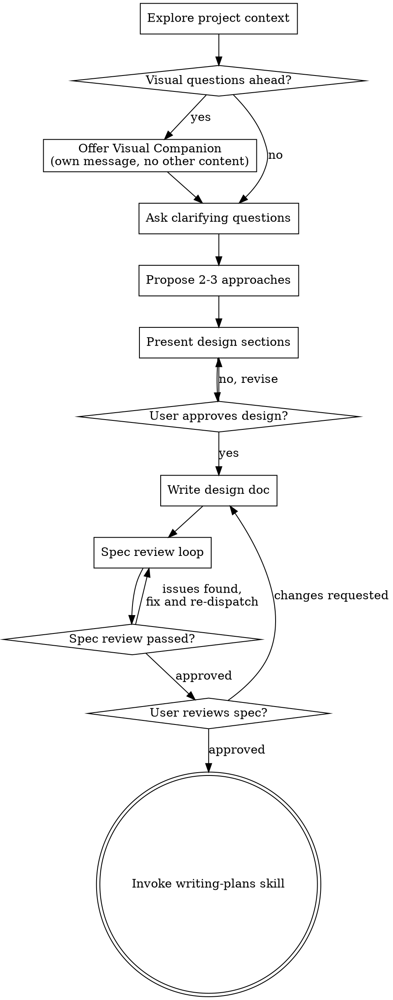

<!-- Generated by SpecStory, Markdown v2.1.0 -->

# 2026-03-13 17:18:26Z

<!-- Claude Code Session 4ffd4afc-07d8-4d6a-abe6-50dde54077d4 (2026-03-13 17:18:26Z) -->

_**User (2026-03-13 17:18:26Z)**_

<command-name>/clear</command-name>
            <command-message>clear</command-message>
            <command-args></command-args>

_**User (2026-03-13 17:18:26Z)**_

<local-command-caveat>Caveat: The messages below were generated by the user while running local commands. DO NOT respond to these messages or otherwise consider them in your response unless the user explicitly asks you to.</local-command-caveat>

_**User (2026-03-13 17:19:32Z)**_

<command-message>superpowers:brainstorming</command-message>
<command-name>/superpowers:brainstorming</command-name>
<command-args>现在的 /notes 是直接跳转到一个 latest 的，没一个 list all note 的页面，你觉得可以怎么做这个界面。首先，我们 Note 整体的一个 UI 设计风格就是日记本，所有的 文章呈现都是一张纸。</command-args>

_**User (2026-03-13 17:19:32Z)**_

Base directory for this skill: <HOME>/.claude/plugins/cache/claude-plugins-official/superpowers/5.0.2/skills/brainstorming

# Brainstorming Ideas Into Designs

Help turn ideas into fully formed designs and specs through natural collaborative dialogue.

Start by understanding the current project context, then ask questions one at a time to refine the idea. Once you understand what you're building, present the design and get user approval.

<HARD-GATE>
Do NOT invoke any implementation skill, write any code, scaffold any project, or take any implementation action until you have presented a design and the user has approved it. This applies to EVERY project regardless of perceived simplicity.
</HARD-GATE>

## Anti-Pattern: "This Is Too Simple To Need A Design"

Every project goes through this process. A todo list, a single-function utility, a config change — all of them. "Simple" projects are where unexamined assumptions cause the most wasted work. The design can be short (a few sentences for truly simple projects), but you MUST present it and get approval.

## Checklist

You MUST create a task for each of these items and complete them in order:

1. **Explore project context** — check files, docs, recent commits
2. **Offer visual companion** (if topic will involve visual questions) — this is its own message, not combined with a clarifying question. See the Visual Companion section below.
3. **Ask clarifying questions** — one at a time, understand purpose/constraints/success criteria
4. **Propose 2-3 approaches** — with trade-offs and your recommendation
5. **Present design** — in sections scaled to their complexity, get user approval after each section
6. **Write design doc** — save to `docs/superpowers/specs/YYYY-MM-DD-<topic>-design.md` and commit
7. **Spec review loop** — dispatch spec-document-reviewer subagent with precisely crafted review context (never your session history); fix issues and re-dispatch until approved (max 5 iterations, then surface to human)
8. **User reviews written spec** — ask user to review the spec file before proceeding
9. **Transition to implementation** — invoke writing-plans skill to create implementation plan

## Process Flow



**The terminal state is invoking writing-plans.** Do NOT invoke frontend-design, mcp-builder, or any other implementation skill. The ONLY skill you invoke after brainstorming is writing-plans.

## The Process

**Understanding the idea:**

- Check out the current project state first (files, docs, recent commits)
- Before asking detailed questions, assess scope: if the request describes multiple independent subsystems (e.g., "build a platform with chat, file storage, billing, and analytics"), flag this immediately. Don't spend questions refining details of a project that needs to be decomposed first.
- If the project is too large for a single spec, help the user decompose into sub-projects: what are the independent pieces, how do they relate, what order should they be built? Then brainstorm the first sub-project through the normal design flow. Each sub-project gets its own spec → plan → implementation cycle.
- For appropriately-scoped projects, ask questions one at a time to refine the idea
- Prefer multiple choice questions when possible, but open-ended is fine too
- Only one question per message - if a topic needs more exploration, break it into multiple questions
- Focus on understanding: purpose, constraints, success criteria

**Exploring approaches:**

- Propose 2-3 different approaches with trade-offs
- Present options conversationally with your recommendation and reasoning
- Lead with your recommended option and explain why

**Presenting the design:**

- Once you believe you understand what you're building, present the design
- Scale each section to its complexity: a few sentences if straightforward, up to 200-300 words if nuanced
- Ask after each section whether it looks right so far
- Cover: architecture, components, data flow, error handling, testing
- Be ready to go back and clarify if something doesn't make sense

**Design for isolation and clarity:**

- Break the system into smaller units that each have one clear purpose, communicate through well-defined interfaces, and can be understood and tested independently
- For each unit, you should be able to answer: what does it do, how do you use it, and what does it depend on?
- Can someone understand what a unit does without reading its internals? Can you change the internals without breaking consumers? If not, the boundaries need work.
- Smaller, well-bounded units are also easier for you to work with - you reason better about code you can hold in context at once, and your edits are more reliable when files are focused. When a file grows large, that's often a signal that it's doing too much.

**Working in existing codebases:**

- Explore the current structure before proposing changes. Follow existing patterns.
- Where existing code has problems that affect the work (e.g., a file that's grown too large, unclear boundaries, tangled responsibilities), include targeted improvements as part of the design - the way a good developer improves code they're working in.
- Don't propose unrelated refactoring. Stay focused on what serves the current goal.

## After the Design

**Documentation:**

- Write the validated design (spec) to `docs/superpowers/specs/YYYY-MM-DD-<topic>-design.md`
  - (User preferences for spec location override this default)
- Use elements-of-style:writing-clearly-and-concisely skill if available
- Commit the design document to git

**Spec Review Loop:**
After writing the spec document:

1. Dispatch spec-document-reviewer subagent (see spec-document-reviewer-prompt.md)
2. If Issues Found: fix, re-dispatch, repeat until Approved
3. If loop exceeds 5 iterations, surface to human for guidance

**User Review Gate:**
After the spec review loop passes, ask the user to review the written spec before proceeding:

> "Spec written and committed to `<path>`. Please review it and let me know if you want to make any changes before we start writing out the implementation plan."

Wait for the user's response. If they request changes, make them and re-run the spec review loop. Only proceed once the user approves.

**Implementation:**

- Invoke the writing-plans skill to create a detailed implementation plan
- Do NOT invoke any other skill. writing-plans is the next step.

## Key Principles

- **One question at a time** - Don't overwhelm with multiple questions
- **Multiple choice preferred** - Easier to answer than open-ended when possible
- **YAGNI ruthlessly** - Remove unnecessary features from all designs
- **Explore alternatives** - Always propose 2-3 approaches before settling
- **Incremental validation** - Present design, get approval before moving on
- **Be flexible** - Go back and clarify when something doesn't make sense

## Visual Companion

A browser-based companion for showing mockups, diagrams, and visual options during brainstorming. Available as a tool — not a mode. Accepting the companion means it's available for questions that benefit from visual treatment; it does NOT mean every question goes through the browser.

**Offering the companion:** When you anticipate that upcoming questions will involve visual content (mockups, layouts, diagrams), offer it once for consent:
> "Some of what we're working on might be easier to explain if I can show it to you in a web browser. I can put together mockups, diagrams, comparisons, and other visuals as we go. This feature is still new and can be token-intensive. Want to try it? (Requires opening a local URL)"

**This offer MUST be its own message.** Do not combine it with clarifying questions, context summaries, or any other content. The message should contain ONLY the offer above and nothing else. Wait for the user's response before continuing. If they decline, proceed with text-only brainstorming.

**Per-question decision:** Even after the user accepts, decide FOR EACH QUESTION whether to use the browser or the terminal. The test: **would the user understand this better by seeing it than reading it?**

- **Use the browser** for content that IS visual — mockups, wireframes, layout comparisons, architecture diagrams, side-by-side visual designs
- **Use the terminal** for content that is text — requirements questions, conceptual choices, tradeoff lists, A/B/C/D text options, scope decisions

A question about a UI topic is not automatically a visual question. "What does personality mean in this context?" is a conceptual question — use the terminal. "Which wizard layout works better?" is a visual question — use the browser.

If they agree to the companion, read the detailed guide before proceeding:
`skills/brainstorming/visual-companion.md`


ARGUMENTS: 现在的 /notes 是直接跳转到一个 latest 的，没一个 list all note 的页面，你觉得可以怎么做这个界面。首先，我们 Note 整体的一个 UI 设计风格就是日记本，所有的 文章呈现都是一张纸。

---

_**Agent (claude-opus-4-6 2026-03-13 17:19:38Z)**_

<think><details><summary>Thought Process</summary>
The user wants to brainstorm a design for a "list all notes" page. Currently `/notes` redirects to the latest note, and there's no page to browse all notes. The design style is diary/journal-like, with each article presented as a sheet of paper.

Let me follow the brainstorming checklist:
1. First, explore project context
2. Then ask clarifying questions one at a time

Let me explore the current notes-related code first.
</details></think>

_**Agent (claude-opus-4-6 2026-03-13 17:19:38Z)**_

<tool-use data-tool-type="unknown" data-tool-name="ToolSearch"><details>
<summary>Tool use: **ToolSearch**</summary>

**Input:**

- max_results: `4`
- query: `select:TaskCreate,TaskGet,TaskList,TaskUpdate`

**Result:**

```

```
</details></tool-use>

_**Agent (claude-opus-4-6 2026-03-13 17:19:42Z)**_

<tool-use data-tool-type="unknown" data-tool-name="TaskCreate"><details>
<summary>Tool use: **TaskCreate**</summary>
Check current notes routing, components, and UI patterns

```text
Task #779 created successfully: Explore project context for notes list page
```
</details></tool-use>

_**Agent (claude-opus-4-6 2026-03-13 17:19:42Z)**_

<tool-use data-tool-type="unknown" data-tool-name="TaskCreate"><details>
<summary>Tool use: **TaskCreate**</summary>
Offer browser-based visual companion for mockups

```text
Task #780 created successfully: Offer visual companion
```
</details></tool-use>

_**Agent (claude-opus-4-6 2026-03-13 17:19:43Z)**_

<tool-use data-tool-type="unknown" data-tool-name="TaskCreate"><details>
<summary>Tool use: **TaskCreate**</summary>
Understand requirements, constraints, and success criteria

```text
Task #781 created successfully: Ask clarifying questions one at a time
```
</details></tool-use>

_**Agent (claude-opus-4-6 2026-03-13 17:19:44Z)**_

<tool-use data-tool-type="unknown" data-tool-name="TaskCreate"><details>
<summary>Tool use: **TaskCreate**</summary>
Present different design approaches with recommendation

```text
Task #782 created successfully: Propose 2-3 approaches with trade-offs
```
</details></tool-use>

_**Agent (claude-opus-4-6 2026-03-13 17:19:44Z)**_

<tool-use data-tool-type="unknown" data-tool-name="TaskCreate"><details>
<summary>Tool use: **TaskCreate**</summary>
Present design in sections, get user approval

```text
Task #783 created successfully: Present design and get approval
```
</details></tool-use>

_**Agent (claude-opus-4-6 2026-03-13 17:19:45Z)**_

<tool-use data-tool-type="unknown" data-tool-name="TaskCreate"><details>
<summary>Tool use: **TaskCreate**</summary>
Write spec, run review loop, get user approval

```text
Task #784 created successfully: Write design doc and review
```
</details></tool-use>

_**Agent (claude-opus-4-6 2026-03-13 17:19:48Z)**_

<tool-use data-tool-type="unknown" data-tool-name="TaskUpdate"><details>
<summary>Tool use: **TaskUpdate**</summary>

```text
Updated task #779 status
```
</details></tool-use>

_**Agent (claude-opus-4-6 2026-03-13 17:21:22Z)**_

<tool-use data-tool-type="unknown" data-tool-name="Agent"><details>
<summary>Tool use: **Agent**</summary>
Explore notes routing and UI

```text
Perfect! Now I have enough information. Let me create a comprehensive summary of the notes-related code architecture.

## Comprehensive Notes Code Exploration Report

Based on thorough analysis of the Shiroi codebase, here's what I found:

### 1. How /notes Routing Works

**Current routing structure:**
- `/notes` (app/web/src/app/[locale]/notes/) — Root level redirects to latest note
  - `page.tsx` fetches the latest published note via `apiClient.note.proxy.latest.get()` and redirects to `/notes/{nid}`
  - `redirect.tsx` provides a client-side redirect component for fallback
- `/notes/[id]` (app/web/src/app/[locale]/notes/[id]/) — Individual note detail page
  - Uses `definePrerenderPage` pattern for server-side rendering
  - Fetches note by numeric NID (note ID) via `getNoteByNid(Number(id))`
- `/notes/series` and `/notes/series/[slug]` — Topic/series list and detail pages
  - Located in `(note-topic)` route group
  - `/notes/series` lists all topics via `apiClient.topic.getAll()`
  - `/notes/series/[slug]` shows notes within a topic via `apiClient.note.proxy.topics(topicId).get()`

**Key finding:** There is NO `/notes` list page currently. The root redirects to latest; to see a list of notes, users must navigate to `/notes/series`.

### 2. Note Page UI - "Paper/Diary" Styling

**Visual Design:**
- Wrapped in `<Paper>` component (layout/container/Paper.tsx)
  - Styles: white bg (light), dark:bg-neutral-2, rounded corners, shadow, subtle border
  - Responsive: `-m-4 p-[2rem_1rem]` mobile, `lg:p-[30px_45px]` desktop
  - CSS classes: `'rounded-[0_6px_6px_0] border-neutral-200/70 dark:border-neutral-800 lg:border shadow-perfect perfect-sm'`
  - Print-safe: removes border, bg, shadow when printing

**Key visual components:**
- `NoteMainContainer` — Measures container height for sidebar optimization
- `NoteHeadCover` — Optional cover image at top
- `PageColorGradient` — Dynamic background gradient based on cover image accent color
- `NoteTitle`, `NoteHeaderDate`, `NoteMetaBar` — Header information
- `NoteHideIfSecret` — Hides content if note is not published and user not logged in
- `NotePasswordForm` — For password-protected notes (403 error response)
- Left sidebar (desktop only): `NoteLeftSidebar` with timeline and topic info
- Right sidebar (desktop only): `NoteActionAside` with like, share, subscribe, comment, donate buttons

**Layout:**
- Grid layout in parent note/layout.tsx: max-w-[60rem], xl:max-w-[calc(60rem+400px)]
- 3-column on desktop: left sidebar | main content | right sidebar
- Mobile: stacked, full width

### 3. Note-Related Components

**Core note modules** (apps/web/src/components/modules/note/):
- `NoteMainContainer` — Wrapper that measures height for sidebar sync
- `NoteLeftSidebar` — Left navigation sidebar
  - `NoteTimeline` — Shows recent notes (up to 10) fetched via `apiClient.note.proxy.list(noteId).get()`
  - `NoteTopicInfo` — Shows topic info if note belongs to one
    - `NoteTopicRank` — Shows 5 related notes in same topic
    - `ToTopicLink` — Link to topic
- `NoteActionAside` — Right-side action buttons
  - `NoteBottomBarAction` — Mobile version of action buttons
  - Contains: LikeButton, ShareButton, SubscribeButton, AsideCommentButton, AsideDonateButton
- `NoteTopicBinderClip` — Paper clip design element in top-left corner when note has a topic
- `NoteBottomTopic` — Section at bottom showing topic the note belongs to
- `NoteFontFab` — Font size adjustment floating button
- `NoteBanner` — Warning banners (e.g., "private login only")
- `NoteHeadCover` — Cover image display
- `NotePasswordForm` — Password input for protected notes
- `NoteHideIfSecret` — Conditional rendering for secret notes
- `NoteTopicDetail` — Popover showing topic metadata
- `NoteTopicMarkdownRender` — Renders markdown in topic descriptions
- `NoteFooterNavigation` — Previous/next note navigation + timeline link

**Content renderers:**
- `NoteContent` — Dispatches to lexical or markdown renderer
- `NoteLexicalRenderer` — Rich editor format (haklex integration)
- `NoteMarkdownRenderer` — Standard markdown format

### 4. API Endpoints & Queries

**Note queries** (queries/definition/note.ts):
```typescript
note.byNid(nid: string, password?: string, lang?: string)
  → apiClient.note.getNoteByNid(Number(id), { password, lang, prefer: 'lexical' })
  → Returns: NoteWrappedWithLikedAndTranslationPayload

noteAdmin.paginate(page?: number)
  → apiClient.note.getList(pageParam ?? page)
  → Used in dashboard

noteAdmin.allTopic()
  → apiClient.topic.getAll()
  
noteAdmin.getNote(id: string)
  → apiClient.note.getNoteById(id)
```

**Key API patterns:**
- Latest note: `apiClient.note.proxy.latest.get<NoteWrappedWithLikedPayload>()`
- Notes by topic: `apiClient.note.proxy.topics(topicId).get<PaginateResult<NoteTopicListItem>>({ params: { page, size, sortBy, sortOrder, lang } })`
- Note timeline: `apiClient.note.proxy.list(noteId).get<{ data: NoteTimelineItemData[], size }>({ params: { size: 10, lang } })`
- Topic list: `apiClient.topic.getAll()`
- Topic by slug: `apiClient.topic.getTopicBySlug(slug)`

### 5. Note Data Model/Types

**From @mx-space/api-client:**
- `NoteModel` — Base note structure
- `NoteWrappedWithLikedPayload` — Note with like count
- `NoteWrappedWithLikedAndTranslationPayload` — Note with likes and translations
- `ModelWithTranslation<NoteModel>` — Translation metadata
- `ModelWithLiked<T>` — Wraps with liked status

**Key note fields** (inferred from code usage):
- `id`, `nid` (numeric note ID) — Unique identifiers
- `title` — Note title
- `text` — Note content (markdown)
- `content` — Rich content (lexical)
- `contentFormat` — 'lexical' or 'markdown'
- `isPublished` — Publishing status
- `allowComment` — Comment permission
- `created`, `modified` — Timestamps
- `topic` — TopicModel reference (id, name, slug, introduce, description, icon)
- `images` — Array with cover image info (src, accent color)
- `meta` — Metadata (cover image path)
- `count` — Counters (like count)
- `isTranslated`, `translationMeta`, `availableTranslations` — i18n fields
- `next`, `prev` — NoteTimelineItemData for navigation

**TopicModel fields:**
- `id`, `slug`, `name`
- `introduce`, `description`
- `icon` — Avatar image
- `created` — Creation date

**NoteTopicListItem** (for topic listing):
- `id`, `nid`, `title`
- `created`, `modified`

### 6. Posts List Page for Reference

**Location:** apps/web/src/app/[locale]/posts/page.tsx

**Pattern used:**
- `definePrerenderPage` with async fetcher calling `apiClient.post.getList(currentPage, currentSize, { sortBy, sortOrder, truncate, lang })`
- Returns `{ data: PostListItem[], pagination: Pager }`
- Component renders `<PostItemComposer>` for each item
- Pagination via `<PostPagination>` (current page > 1) or `<PostLoadMore>` (infinite scroll)
- FABs for settings, tags, search, back-to-top

**Key differences from posts:**
- Posts have categories (nested routing: /posts/[category]/[slug])
- Notes have topics but displayed as tags/series (not nested routing)
- Posts use PostItemComposer (with conditional styling), notes would need similar

### 7. Topic/Series Feature

**Architecture:**
- Topics are top-level entities managed via `apiClient.topic`
- Notes can optionally belong to one topic (many-to-one relationship)
- Topic routes use slug, not ID
- Topic discovery via `/notes/series` (list) and `/notes/series/[slug]` (detail)

**Features:**
- Topic detail page shows topic metadata (name, intro, description, icon)
- Shows last updated note in topic
- Shows total article count
- Infinite scroll list of notes in topic
- Topic clip UI in note corner (aesthetic paper clip design)
- Related notes sidebar showing up to 5 other notes in same topic

---

## Routing Summary

```
/notes                          → redirects to /notes/{latestNid}
/notes/[id]                     → note detail page
/notes/series                   → topic list (all topics)
/notes/series/[slug]           → topic detail with note list (infinite scroll)
```

**IMPORTANT:** Currently there is NO dedicated `/notes` list page (paginated or otherwise). Users see latest note or must navigate to topics. The architecture supports adding this via a new page.tsx file in the notes root directory that would follow the same pattern as posts/page.tsx.
agentId: a56c6da6e011dbdbe (for resuming to continue this agent's work if needed)
<usage>total_tokens: 72018
tool_uses: 50
duration_ms: 81975</usage>
```
</details></tool-use>

_**Agent - sidechain (2026-03-13 17:20:00Z)**_

Explore the notes-related code in this Next.js project thoroughly. I need to understand:

1. How /notes routing works currently (does it redirect to latest note?)
2. What the note page UI looks like - especially the "paper/diary" styling
3. What note-related components exist (Paper component, note layout, etc.)
4. What API endpoints/queries are used for fetching notes (list, single, etc.)
5. The note data model/types
6. Any existing "list" pages for reference (e.g., how /posts list works)
7. The topic/series feature for notes

Search thoroughly across:
- apps/web/src/app/**/notes/** (routing)
- apps/web/src/components/modules/note/** (note components)
- apps/web/src/components/ui/paper/** or similar paper components
- apps/web/src/queries/** (note queries)
- packages/types/** (note types)
- Any post list page for reference patterns

Be very thorough - check multiple naming conventions and locations.

_**Agent - sidechain (claude-haiku-4-5-20251001 2026-03-13 17:20:02Z)**_

I'll conduct a thorough exploration of the notes-related code in this Next.js project. Let me search systematically across the different areas you mentioned.

_**Agent - sidechain (claude-haiku-4-5-20251001 2026-03-13 17:20:03Z)**_

<tool-use data-tool-type="shell" data-tool-name="Bash"><details>
<summary>Tool use: **Bash**</summary>

`find <REPO_ROOT> -type f -name "*.ts" -o -name "*.tsx" | head -20`

```text
<REPO_ROOT>/opensrc/repos/github.com/Justineo/beautiful-mermaid-playground/env.d.ts
<REPO_ROOT>/opensrc/repos/github.com/Justineo/beautiful-mermaid-playground/eslint.config.ts
<REPO_ROOT>/opensrc/repos/github.com/Justineo/beautiful-mermaid-playground/scripts/generate-unofficial-themes.ts
<REPO_ROOT>/opensrc/repos/github.com/Justineo/beautiful-mermaid-playground/scripts/generate-beautiful-themes.ts
<REPO_ROOT>/opensrc/repos/github.com/Justineo/beautiful-mermaid-playground/scripts/sync-official-samples.ts
<REPO_ROOT>/opensrc/repos/github.com/Justineo/beautiful-mermaid-playground/vite.config.ts
<REPO_ROOT>/opensrc/repos/github.com/Justineo/beautiful-mermaid-playground/src/generated/beautifulThemes.ts
<REPO_ROOT>/opensrc/repos/github.com/Justineo/beautiful-mermaid-playground/src/generated/unofficialThemes.ts
<REPO_ROOT>/opensrc/repos/github.com/Justineo/beautiful-mermaid-playground/src/types/playground.ts
<REPO_ROOT>/opensrc/repos/github.com/Justineo/beautiful-mermaid-playground/src/composables/useOverlayScrollbars.ts
<REPO_ROOT>/opensrc/repos/github.com/Justineo/beautiful-mermaid-playground/src/composables/useSplitPane.ts
<REPO_ROOT>/opensrc/repos/github.com/Justineo/beautiful-mermaid-playground/src/composables/useBeautifulRenderer.ts
<REPO_ROOT>/opensrc/repos/github.com/Justineo/beautiful-mermaid-playground/src/composables/usePlaygroundState.ts
<REPO_ROOT>/opensrc/repos/github.com/Justineo/beautiful-mermaid-playground/src/main.ts
<REPO_ROOT>/opensrc/repos/github.com/Justineo/beautiful-mermaid-playground/src/constants/monacoThemes.ts
<REPO_ROOT>/opensrc/repos/github.com/Justineo/beautiful-mermaid-playground/src/constants/overlay.ts
<REPO_ROOT>/opensrc/repos/github.com/Justineo/beautiful-mermaid-playground/src/utils/diagramTheme.ts
<REPO_ROOT>/opensrc/repos/github.com/Justineo/beautiful-mermaid-playground/src/utils/googleFonts.ts
<REPO_ROOT>/opensrc/repos/github.com/Justineo/beautiful-mermaid-playground/src/data/officialSamples.ts
<REPO_ROOT>/opensrc/repos/github.com/facebook/lexical/libdefs/globals.d.ts
```
</details></tool-use>

_**Agent - sidechain (claude-haiku-4-5-20251001 2026-03-13 17:20:04Z)**_

Let me refine my search to focus on the actual app structure:

_**Agent - sidechain (claude-haiku-4-5-20251001 2026-03-13 17:20:07Z)**_

<tool-use data-tool-type="search" data-tool-name="Glob"><details>
<summary>Tool use: **Glob**</summary>
 path `./` pattern `apps/web/src/app/**/notes/**`

```text
<REPO_ROOT>/apps/web/src/app/[locale]/(note-topic)/notes/(topic-detail)/series/[slug]/loading.tsx
<REPO_ROOT>/apps/web/src/app/[locale]/(note-topic)/notes/series/loading.tsx
<REPO_ROOT>/apps/web/src/app/[locale]/notes/loading.tsx
<REPO_ROOT>/apps/web/src/app/[locale]/notes/[id]/loading.tsx
<REPO_ROOT>/apps/web/src/app/[locale]/notes/[id]/Transition.tsx
<REPO_ROOT>/apps/web/src/app/[locale]/notes/redirect.tsx
<REPO_ROOT>/apps/web/src/app/[locale]/notes/[id]/page.css
<REPO_ROOT>/apps/web/src/app/[locale]/(note-topic)/notes/series/layout.tsx
<REPO_ROOT>/apps/web/src/app/[locale]/notes/not-found.tsx
<REPO_ROOT>/apps/web/src/app/[locale]/notes/page.tsx
<REPO_ROOT>/apps/web/src/app/[locale]/notes/[id]/NoteMarkdown.tsx
<REPO_ROOT>/apps/web/src/app/[locale]/(note-topic)/notes/series/page.tsx
<REPO_ROOT>/apps/web/src/app/[locale]/notes/[id]/NoteLexicalRenderer.tsx
<REPO_ROOT>/apps/web/src/app/[locale]/notes/[id]/NoteMarkdownRenderer.tsx
<REPO_ROOT>/apps/web/src/app/[locale]/notes/[id]/api.tsx
<REPO_ROOT>/apps/web/src/app/[locale]/notes/[id]/pageExtra.tsx
<REPO_ROOT>/apps/web/src/app/[locale]/notes/layout.tsx
<REPO_ROOT>/apps/web/src/app/[locale]/notes/[id]/NoteContent.tsx
<REPO_ROOT>/apps/web/src/app/[locale]/(note-topic)/notes/(topic-detail)/series/[slug]/layout.tsx
<REPO_ROOT>/apps/web/src/app/[locale]/(note-topic)/notes/(topic-detail)/series/[slug]/page.tsx
<REPO_ROOT>/apps/web/src/app/[locale]/(note-topic)/notes/(topic-detail)/series/[slug]/query.ts
<REPO_ROOT>/apps/web/src/app/[locale]/notes/[id]/page.tsx
```
</details></tool-use>

_**Agent - sidechain (claude-haiku-4-5-20251001 2026-03-13 17:20:07Z)**_

<tool-use data-tool-type="search" data-tool-name="Glob"><details>
<summary>Tool use: **Glob**</summary>
 path `./` pattern `apps/web/src/components/modules/note/**`

```text
<REPO_ROOT>/apps/web/src/components/modules/note/NoteMainContainer.tsx
<REPO_ROOT>/apps/web/src/components/modules/note/NoteTopicMarkdownRender.tsx
<REPO_ROOT>/apps/web/src/components/modules/note/NoteHideIfSecret.tsx
<REPO_ROOT>/apps/web/src/components/modules/note/NoteActionAside.tsx
<REPO_ROOT>/apps/web/src/components/modules/note/NoteBanner.tsx
<REPO_ROOT>/apps/web/src/components/modules/note/NoteBottomTopic.tsx
<REPO_ROOT>/apps/web/src/components/modules/note/NoteFontFab.tsx
<REPO_ROOT>/apps/web/src/components/modules/note/NoteFooterNavigation.tsx
<REPO_ROOT>/apps/web/src/components/modules/note/NoteHeadCover.tsx
<REPO_ROOT>/apps/web/src/components/modules/note/NoteLeftSidebar.tsx
<REPO_ROOT>/apps/web/src/components/modules/note/NoteMetaBar.tsx
<REPO_ROOT>/apps/web/src/components/modules/note/NotePasswordForm.tsx
<REPO_ROOT>/apps/web/src/components/modules/note/NoteTimeline.tsx
<REPO_ROOT>/apps/web/src/components/modules/note/NoteTimelineItem.tsx
<REPO_ROOT>/apps/web/src/components/modules/note/NoteTopicDetail.tsx
<REPO_ROOT>/apps/web/src/components/modules/note/NoteTopicInfo.tsx
<REPO_ROOT>/apps/web/src/components/modules/note/index.ts
<REPO_ROOT>/apps/web/src/components/modules/note/NoteTopicBinderClip.tsx
```
</details></tool-use>

_**Agent - sidechain (claude-haiku-4-5-20251001 2026-03-13 17:20:07Z)**_

<tool-use data-tool-type="search" data-tool-name="Glob"><details>
<summary>Tool use: **Glob**</summary>
 path `./` pattern `apps/web/src/components/ui/paper/**`

```text
No files found
```
</details></tool-use>

_**Agent - sidechain (claude-haiku-4-5-20251001 2026-03-13 17:20:07Z)**_

<tool-use data-tool-type="search" data-tool-name="Glob"><details>
<summary>Tool use: **Glob**</summary>
 path `./` pattern `packages/types/**/*.ts`

```text
<REPO_ROOT>/packages/types/sandbox.ts
<REPO_ROOT>/packages/types/bump.config.ts
<REPO_ROOT>/packages/types/global.d.ts
<REPO_ROOT>/packages/types/index.ts
<REPO_ROOT>/packages/types/tsdown.config.ts
```
</details></tool-use>

_**Agent - sidechain (claude-haiku-4-5-20251001 2026-03-13 17:20:08Z)**_

Good! Now let me search for queries and look at posts for reference patterns:

_**Agent - sidechain (claude-haiku-4-5-20251001 2026-03-13 17:20:10Z)**_

<tool-use data-tool-type="search" data-tool-name="Glob"><details>
<summary>Tool use: **Glob**</summary>
 path `./` pattern `apps/web/src/queries/**/*note*`

```text
<REPO_ROOT>/apps/web/src/queries/definition/note.ts
```
</details></tool-use>

_**Agent - sidechain (claude-haiku-4-5-20251001 2026-03-13 17:20:10Z)**_

<tool-use data-tool-type="search" data-tool-name="Glob"><details>
<summary>Tool use: **Glob**</summary>
 path `./` pattern `apps/web/src/app/**/posts/**`

```text
<REPO_ROOT>/apps/web/src/app/[locale]/posts/data-revalidate.tsx
<REPO_ROOT>/apps/web/src/app/[locale]/posts/action.ts
<REPO_ROOT>/apps/web/src/app/[locale]/posts/loading.tsx
<REPO_ROOT>/apps/web/src/app/[locale]/posts/(post-detail)/Container.tsx
<REPO_ROOT>/apps/web/src/app/[locale]/posts/(post-detail)/[category]/page.tsx
<REPO_ROOT>/apps/web/src/app/[locale]/posts/(post-detail)/[category]/[slug]/loading.tsx
<REPO_ROOT>/apps/web/src/app/[locale]/posts/(post-detail)/layout.tsx
<REPO_ROOT>/apps/web/src/app/[locale]/posts/(post-detail)/[category]/[slug]/PostMarkdown.tsx
<REPO_ROOT>/apps/web/src/app/[locale]/posts/(post-detail)/[category]/[slug]/PostLexicalRenderer.tsx
<REPO_ROOT>/apps/web/src/app/[locale]/posts/(post-detail)/[category]/[slug]/PostMarkdownRenderer.tsx
<REPO_ROOT>/apps/web/src/app/[locale]/posts/(post-detail)/[category]/[slug]/api.tsx
<REPO_ROOT>/apps/web/src/app/[locale]/posts/(post-detail)/[category]/[slug]/pageExtra.tsx
<REPO_ROOT>/apps/web/src/app/[locale]/posts/loader.tsx
<REPO_ROOT>/apps/web/src/app/[locale]/posts/page.tsx
<REPO_ROOT>/apps/web/src/app/[locale]/posts/tag/[name]/page.tsx
<REPO_ROOT>/apps/web/src/app/[locale]/posts/(post-detail)/[category]/[slug]/PostContent.tsx
<REPO_ROOT>/apps/web/src/app/[locale]/posts/(post-detail)/[category]/[slug]/page.tsx
```
</details></tool-use>

_**Agent - sidechain (claude-haiku-4-5-20251001 2026-03-13 17:20:09Z)**_

<tool-use data-tool-type="shell" data-tool-name="Bash"><details>
<summary>Tool use: **Bash**</summary>

`find <REPO_ROOT>/apps/web/src/queries -type f -name "*.ts" | head -20`

```text
<REPO_ROOT>/apps/web/src/queries/helper.ts
<REPO_ROOT>/apps/web/src/queries/definition/note.ts
<REPO_ROOT>/apps/web/src/queries/definition/page.ts
<REPO_ROOT>/apps/web/src/queries/definition/activity.ts
<REPO_ROOT>/apps/web/src/queries/definition/index.ts
<REPO_ROOT>/apps/web/src/queries/definition/aggregation.ts
<REPO_ROOT>/apps/web/src/queries/definition/comment.ts
<REPO_ROOT>/apps/web/src/queries/definition/post.ts
<REPO_ROOT>/apps/web/src/queries/hooks/comment.ts
<REPO_ROOT>/apps/web/src/queries/keys/index.ts
<REPO_ROOT>/apps/web/src/queries/keys/comment.ts
```
</details></tool-use>

_**Agent - sidechain (claude-haiku-4-5-20251001 2026-03-13 17:20:11Z)**_

Perfect! Now let me read the key files. Let me start with the routing and note queries:

_**Agent - sidechain (claude-haiku-4-5-20251001 2026-03-13 17:20:12Z)**_

<tool-use data-tool-type="read" data-tool-name="Read"><details>
<summary>Tool use: **Read**</summary>
 `./apps/web/src/app/[locale]/notes/page.tsx`

```text
     1→import type { NoteWrappedWithLikedPayload } from '@mx-space/api-client'
     2→import { notFound } from 'next/navigation'
     3→
     4→import type { Locale } from '~/i18n/config'
     5→import { redirect } from '~/i18n/navigation'
     6→import { apiClient } from '~/lib/request'
     7→import { definePrerenderPage } from '~/lib/request.server'
     8→
     9→export default definePrerenderPage<{ locale: Locale }>()({
    10→  async fetcher() {
    11→    const latest =
    12→      await apiClient.note.proxy.latest.get<NoteWrappedWithLikedPayload>()
    13→
    14→    return latest?.data
    15→  },
    16→  Component: async ({ data: nullableData, params }) => {
    17→    if (!nullableData || !nullableData.isPublished) {
    18→      notFound()
    19→    }
    20→    const { locale } = params
    21→    redirect({ href: `/notes/${nullableData.nid}`, locale })
    22→    return null
    23→  },
    24→})
    25→
```
</details></tool-use>

_**Agent - sidechain (claude-haiku-4-5-20251001 2026-03-13 17:20:12Z)**_

<tool-use data-tool-type="read" data-tool-name="Read"><details>
<summary>Tool use: **Read**</summary>
 `./apps/web/src/app/[locale]/notes/redirect.tsx`

```text
     1→'use client'
     2→
     3→import { useLayoutEffect } from 'react'
     4→
     5→import { useRouter } from '~/i18n/navigation'
     6→import { routeBuilder, Routes } from '~/lib/route-builder'
     7→
     8→import FullPageLoading from '../friends/loading'
     9→
    10→export default function NodeRedirect({ nid }: { nid: number }) {
    11→  const router = useRouter()
    12→  useLayoutEffect(() => {
    13→    router.replace(
    14→      routeBuilder(Routes.Note, {
    15→        id: nid,
    16→      }),
    17→    )
    18→  }, [nid])
    19→  return <FullPageLoading />
    20→}
    21→
```
</details></tool-use>

_**Agent - sidechain (claude-haiku-4-5-20251001 2026-03-13 17:20:12Z)**_

<tool-use data-tool-type="read" data-tool-name="Read"><details>
<summary>Tool use: **Read**</summary>
 `./apps/web/src/app/[locale]/notes/[id]/page.tsx`

```text
     1→import './page.css'
     2→
     3→import type {
     4→  ModelWithLiked,
     5→  ModelWithTranslation,
     6→  NoteModel,
     7→} from '@mx-space/api-client'
     8→import type { Metadata } from 'next'
     9→import { getTranslations } from 'next-intl/server'
    10→
    11→import { AckRead } from '~/components/common/AckRead'
    12→import { ClientOnly } from '~/components/common/ClientOnly'
    13→import { PageColorGradient } from '~/components/common/PageColorGradient'
    14→import {
    15→  buildRoomName,
    16→  Presence,
    17→  RoomProvider,
    18→} from '~/components/modules/activity'
    19→import { CommentAreaRootLazy } from '~/components/modules/comment'
    20→import {
    21→  NoteActionAside,
    22→  NoteBottomBarAction,
    23→  NoteBottomTopic,
    24→  NoteFooterNavigationBarForMobile,
    25→  NoteMetaBar,
    26→  NoteMetaReadingCount,
    27→  NotePasswordForm,
    28→  NoteTopicBinderClip,
    29→} from '~/components/modules/note'
    30→import {
    31→  NoteBanner,
    32→  NoteRootBanner,
    33→} from '~/components/modules/note/NoteBanner'
    34→import { NoteFontSettingFab } from '~/components/modules/note/NoteFontFab'
    35→import { NoteMainContainer } from '~/components/modules/note/NoteMainContainer'
    36→import { ReadIndicatorForMobile } from '~/components/modules/shared/ReadIndicator'
    37→import { Signature } from '~/components/modules/shared/Signature'
    38→import { SummarySwitcher } from '~/components/modules/shared/SummarySwitcher'
    39→import { TocFAB } from '~/components/modules/toc/TocFAB'
    40→import { TocHeadingStrategyProvider } from '~/components/modules/toc/TocHeadingStrategy'
    41→import { TranslationBanner } from '~/components/modules/translation/TranslationBanner'
    42→import { BottomToUpSoftScaleTransitionView } from '~/components/ui/transition'
    43→import { OnlyMobile } from '~/components/ui/viewport/OnlyMobile'
    44→import { getOgUrl } from '~/lib/helper.server'
    45→import { getSummaryFromMd } from '~/lib/markdown'
    46→import { definePrerenderPage } from '~/lib/request.server'
    47→import {
    48→  buildLanguageAlternates,
    49→  buildLocalePrefixedPath,
    50→  getSupportedLocalesFromTranslations,
    51→} from '~/lib/seo/hreflang'
    52→import {
    53→  CurrentNoteDataProvider,
    54→  SyncNoteDataAfterLoggedIn,
    55→} from '~/providers/note/CurrentNoteDataProvider'
    56→import { CurrentNoteNidProvider } from '~/providers/note/CurrentNoteIdProvider'
    57→import { LayoutRightSidePortal } from '~/providers/shared/LayoutRightSideProvider'
    58→import { WrappedElementProvider } from '~/providers/shared/WrappedElementProvider'
    59→
    60→import { Paper } from '../../../../components/layout/container/Paper'
    61→import { NoteHeadCover } from '../../../../components/modules/note/NoteHeadCover'
    62→import { NoteHideIfSecret } from '../../../../components/modules/note/NoteHideIfSecret'
    63→import type { NoteDataResult } from './api'
    64→import { getData } from './api'
    65→import { NoteContent } from './NoteContent'
    66→import {
    67→  IndentArticleContainer,
    68→  MarkdownSelection,
    69→  NoteDataReValidate,
    70→  NoteHeaderDate,
    71→  NoteMarkdownImageRecordProvider,
    72→  NoteTitle,
    73→} from './pageExtra'
    74→import { Transition } from './Transition'
    75→
    76→type NoteWithTranslation = ModelWithLiked<ModelWithTranslation<NoteModel>>
    77→
    78→export const dynamic = 'force-dynamic'
    79→
    80→const Summary = ({ data }: { data: NoteWithTranslation }) => {
    81→  return <SummarySwitcher articleId={data.id!} className="mb-8" />
    82→}
    83→
    84→function PageInner({
    85→  data,
    86→  privateLoginOnlyMessage,
    87→}: {
    88→  data: NoteWithTranslation
    89→  privateLoginOnlyMessage: string
    90→}) {
    91→  const coverImage = data.images?.find((i) => i.src === data.meta?.cover)
    92→  const { isTranslated, translationMeta } = data
    93→
    94→  return (
    95→    <>
    96→      <AckRead id={data.id} type="note" />
    97→
    98→      <NoteHeadCover image={data.meta?.cover} />
    99→      {!!data.meta?.cover && !!coverImage?.accent && (
   100→        <PageColorGradient baseColor={coverImage.accent} />
   101→      )}
   102→      <div>
   103→        <NoteTitle />
   104→        <span className="flex flex-wrap items-center text-sm text-neutral-8/60">
   105→          <NoteHeaderDate />
   106→
   107→          <NoteMetaBar />
   108→          <NoteMetaReadingCount />
   109→        </span>
   110→
   111→        <NoteRootBanner />
   112→        {!data.isPublished && (
   113→          <NoteBanner message={privateLoginOnlyMessage} type="warning" />
   114→        )}
   115→      </div>
   116→
   117→      <NoteHideIfSecret>
   118→        {isTranslated && translationMeta && (
   119→          <div className="mt-4">
   120→            <TranslationBanner translationMeta={translationMeta} />
   121→          </div>
   122→        )}
   123→        <Summary data={data} />
   124→        <WrappedElementProvider eoaDetect>
   125→          <Presence />
   126→          <ReadIndicatorForMobile />
   127→          <NoteMarkdownImageRecordProvider>
   128→            <MarkdownSelection>
   129→              <IndentArticleContainer prose={data.contentFormat !== 'lexical'}>
   130→                <header className="sr-only">
   131→                  <NoteTitle />
   132→                </header>
   133→                <NoteContent contentFormat={data.contentFormat} />
   134→              </IndentArticleContainer>
   135→            </MarkdownSelection>
   136→          </NoteMarkdownImageRecordProvider>
   137→
   138→          <LayoutRightSidePortal>
   139→            <NoteActionAside />
   140→          </LayoutRightSidePortal>
   141→        </WrappedElementProvider>
   142→      </NoteHideIfSecret>
   143→      <Signature />
   144→      {/* <SubscribeBell defaultType="note_c" /> */}
   145→      <ClientOnly>
   146→        <div data-hide-print className="mt-8" />
   147→        <NoteBottomBarAction />
   148→        <NoteBottomTopic />
   149→        <NoteFooterNavigationBarForMobile />
   150→      </ClientOnly>
   151→    </>
   152→  )
   153→}
   154→
   155→type NoteDetailPageParams = LocaleParams & {
   156→  id: string
   157→  password?: string
   158→}
   159→export const generateMetadata = async (props: {
   160→  params: Promise<NoteDetailPageParams>
   161→  searchParams?: Promise<{
   162→    password?: string | string[]
   163→    lang?: string
   164→  }>
   165→}): Promise<Metadata> => {
   166→  const params = await props.params
   167→  const searchParams = (await props.searchParams) ?? {}
   168→  const password = Array.isArray(searchParams.password)
   169→    ? searchParams.password[0]
   170→    : searchParams.password
   171→  try {
   172→    const { note: res } = await getData({
   173→      ...params,
   174→      password,
   175→      lang: searchParams.lang,
   176→    })
   177→
   178→    const { data } = res
   179→    const description = getSummaryFromMd(data.text ?? '')
   180→
   181→    const ogUrl = await getOgUrl(
   182→      'note',
   183→      {
   184→        nid: params.id,
   185→      },
   186→      params.locale,
   187→    )
   188→
   189→    const canonicalPathNoLocale = `/notes/${params.id}`
   190→    const canonicalPath = buildLocalePrefixedPath(
   191→      params.locale as any,
   192→      canonicalPathNoLocale,
   193→    )
   194→    const supportedLocales = getSupportedLocalesFromTranslations({
   195→      sourceLang: (data as any).translationMeta?.sourceLang,
   196→      availableTranslations: (data as any).availableTranslations,
   197→    })
   198→
   199→    return {
   200→      title: data.title,
   201→      description,
   202→      openGraph: {
   203→        title: data.title,
   204→        description,
   205→        images: ogUrl,
   206→        type: 'article',
   207→      },
   208→      twitter: {
   209→        images: ogUrl,
   210→        title: data.title,
   211→        description,
   212→        card: 'summary_large_image',
   213→      },
   214→      alternates: {
   215→        canonical: canonicalPath,
   216→        languages: {
   217→          ...buildLanguageAlternates(canonicalPathNoLocale, supportedLocales),
   218→          'x-default': canonicalPathNoLocale,
   219→        },
   220→      },
   221→    } satisfies Metadata
   222→  } catch {
   223→    return {}
   224→  }
   225→}
   226→
   227→export default definePrerenderPage<NoteDetailPageParams>()<NoteDataResult>({
   228→  fetcher: getData,
   229→  requestErrorRenderer(_error, parsed, { id }) {
   230→    const { status } = parsed
   231→
   232→    if (status === 403) {
   233→      return (
   234→        <Paper>
   235→          <NotePasswordForm />
   236→          <CurrentNoteNidProvider nid={id} />
   237→        </Paper>
   238→      )
   239→    }
   240→  },
   241→  async Component({
   242→    data: fetchedData,
   243→    params: { id: nid, locale },
   244→    fetchedAt,
   245→  }) {
   246→    const { note: data } = fetchedData
   247→    const t = await getTranslations({
   248→      namespace: 'note',
   249→      locale,
   250→    })
   251→
   252→    return (
   253→      <TocHeadingStrategyProvider
   254→        contentFormat={data.data.contentFormat}
   255→        hasContent={!!data.data.content}
   256→      >
   257→        <CurrentNoteNidProvider nid={nid} />
   258→        <CurrentNoteDataProvider data={data} />
   259→        <NoteDataReValidate fetchedAt={fetchedAt} />
   260→        <SyncNoteDataAfterLoggedIn />
   261→        <RoomProvider roomName={buildRoomName(data.data.id)}>
   262→          <Transition lcpOptimization className="min-w-0">
   263→            <Paper as={NoteMainContainer} key={nid}>
   264→              <NoteTopicBinderClip />
   265→              <PageInner
   266→                data={data.data}
   267→                privateLoginOnlyMessage={t('private_login_only')}
   268→              />
   269→            </Paper>
   270→            <BottomToUpSoftScaleTransitionView delay={500}>
   271→              <CommentAreaRootLazy
   272→                allowComment={data.data.allowComment}
   273→                refId={data.data.id}
   274→              />
   275→            </BottomToUpSoftScaleTransitionView>
   276→          </Transition>
   277→        </RoomProvider>
   278→
   279→        <NoteFontSettingFab />
   280→
   281→        <OnlyMobile>
   282→          <TocFAB />
   283→        </OnlyMobile>
   284→      </TocHeadingStrategyProvider>
   285→    )
   286→  },
   287→})
   288→
```
</details></tool-use>

_**Agent - sidechain (claude-haiku-4-5-20251001 2026-03-13 17:20:12Z)**_

<tool-use data-tool-type="read" data-tool-name="Read"><details>
<summary>Tool use: **Read**</summary>
 `./apps/web/src/queries/definition/note.ts`

```text
     1→import type {
     2→  NoteModel,
     3→  NoteWrappedWithLikedAndTranslationPayload,
     4→} from '@mx-space/api-client'
     5→import { useMutation } from '@tanstack/react-query'
     6→
     7→import { useResetAutoSaverData } from '~/components/modules/dashboard/writing/BaseWritingProvider'
     8→import { cloneDeep } from '~/lib/lodash'
     9→import { apiClient } from '~/lib/request'
    10→import { toast } from '~/lib/toast'
    11→import type { NoteDto } from '~/models/writing'
    12→
    13→import { defineQuery } from '../helper'
    14→
    15→const LATEST_KEY = 'latest'
    16→export const note = {
    17→  byNid: (nid: string, password?: string | null, lang?: string) =>
    18→    defineQuery({
    19→      queryKey: ['note', nid, lang],
    20→
    21→      queryFn: async ({ queryKey }) => {
    22→        const [, id, lang] = queryKey as [string, string, string | undefined]
    23→
    24→        if (id === LATEST_KEY) {
    25→          return (await apiClient.note.getLatest()).$serialized
    26→        }
    27→        const data = await apiClient.note.getNoteByNid(Number(id), {
    28→          password: password || undefined,
    29→          lang: lang || undefined,
    30→          prefer: 'lexical',
    31→        })
    32→
    33→        return data.$serialized as NoteWrappedWithLikedAndTranslationPayload
    34→      },
    35→    }),
    36→}
    37→
    38→export const noteAdmin = {
    39→  paginate: (page?: number) =>
    40→    defineQuery({
    41→      queryKey: ['noteAdmin', 'paginate', page],
    42→      queryFn: async ({ pageParam }: any) => {
    43→        const data = await apiClient.note.getList(pageParam ?? page)
    44→
    45→        return data.$serialized
    46→      },
    47→    }),
    48→
    49→  allTopic: () =>
    50→    defineQuery({
    51→      queryKey: ['noteAdmin', 'allTopic'],
    52→      queryFn: async () => {
    53→        const data = await apiClient.topic.getAll()
    54→
    55→        return data.$serialized.data
    56→      },
    57→    }),
    58→
    59→  getNote: (id: string) =>
    60→    defineQuery({
    61→      queryKey: ['noteAdmin', 'getNote', id],
    62→      queryFn: async () => {
    63→        const data = await apiClient.note.getNoteById(id)
    64→
    65→        const dto = data.$serialized as NoteDto
    66→
    67→        return dto
    68→      },
    69→    }),
    70→}
    71→
    72→export const useCreateNote = () => {
    73→  const resetAutoSaver = useResetAutoSaverData()
    74→  return useMutation({
    75→    mutationFn: (data: NoteDto) => {
    76→      const readonlyKeys = [
    77→        'id',
    78→        'nid',
    79→        'modified',
    80→        'topic',
    81→      ] as (keyof NoteModel)[]
    82→      const nextData = cloneDeep(data) as any
    83→      for (const key of readonlyKeys) {
    84→        delete nextData[key]
    85→      }
    86→      return apiClient.note.proxy.post<{
    87→        id: string
    88→      }>({
    89→        data: nextData,
    90→      })
    91→    },
    92→    onSuccess: () => {
    93→      toast.success('创建成功')
    94→      resetAutoSaver('note')
    95→    },
    96→  })
    97→}
    98→
    99→export const useUpdateNote = () => {
   100→  const resetAutoSaver = useResetAutoSaverData()
   101→  return useMutation({
   102→    mutationFn: (data: NoteDto) => {
   103→      const { id } = data
   104→      const readonlyKeys = [
   105→        'id',
   106→        'nid',
   107→        'modified',
   108→        'topic',
   109→      ] as (keyof NoteModel)[]
   110→      const nextData = cloneDeep(data) as any
   111→      for (const key of readonlyKeys) {
   112→        delete nextData[key]
   113→      }
   114→      return apiClient.note.proxy(id).put<{
   115→        id: string
   116→      }>({
   117→        data: nextData,
   118→      })
   119→    },
   120→    onSuccess: ({ id }) => {
   121→      toast.success('更新成功')
   122→      resetAutoSaver('note', id)
   123→    },
   124→  })
   125→}
   126→
```
</details></tool-use>

_**Agent - sidechain (claude-haiku-4-5-20251001 2026-03-13 17:20:14Z)**_

Now let me look at the note layout, components, and check the Paper component:

_**Agent - sidechain (claude-haiku-4-5-20251001 2026-03-13 17:20:15Z)**_

<tool-use data-tool-type="read" data-tool-name="Read"><details>
<summary>Tool use: **Read**</summary>
 `./apps/web/src/app/[locale]/notes/layout.tsx`

```text
     1→import clsx from 'clsx'
     2→import type { PropsWithChildren } from 'react'
     3→
     4→import { NoteLeftSidebar } from '~/components/modules/note/NoteLeftSidebar'
     5→import { LayoutRightSideProvider } from '~/providers/shared/LayoutRightSideProvider'
     6→
     7→export default async (props: PropsWithChildren) => (
     8→  <div
     9→    className={clsx(
    10→      'relative mx-auto grid min-h-[calc(100vh-6.5rem-10rem)] max-w-[60rem]',
    11→      'gap-4 md:grid-cols-1 xl:max-w-[calc(60rem+400px)] xl:grid-cols-[1fr_minmax(auto,60rem)_1fr]',
    12→      'mt-12',
    13→      'md:mt-24 print:block! print:max-w-full!',
    14→    )}
    15→  >
    16→    <div data-hide-print className="relative hidden min-w-0 xl:block">
    17→      <NoteLeftSidebar />
    18→    </div>
    19→
    20→    {props.children}
    21→
    22→    <LayoutRightSideProvider className="relative hidden xl:block print:hidden!" />
    23→  </div>
    24→)
    25→
```
</details></tool-use>

_**Agent - sidechain (claude-haiku-4-5-20251001 2026-03-13 17:20:15Z)**_

<tool-use data-tool-type="read" data-tool-name="Read"><details>
<summary>Tool use: **Read**</summary>
 `./apps/web/src/components/layout/container/Paper.tsx`

```text
     1→import type { JSX } from 'react'
     2→
     3→import { clsxm } from '~/lib/helper'
     4→
     5→export const Paper: Component<{
     6→  as?: keyof JSX.IntrinsicElements | Component
     7→}> = ({ children, className, as: As = 'main' }) => (
     8→  <As
     9→    className={clsxm(
    10→      'relative bg-neutral-1 dark:bg-neutral-2 md:col-start-1 lg:col-auto',
    11→      '-m-4 p-[2rem_1rem] md:m-0 lg:p-[30px_45px]',
    12→      'rounded-[0_6px_6px_0] border-neutral-200/70 dark:border-neutral-800 lg:border',
    13→      'shadow-perfect perfect-sm',
    14→      'note-layout-main',
    15→      'min-w-0',
    16→      'print:border-none! print:bg-transparent! print:shadow-none!',
    17→      className,
    18→    )}
    19→  >
    20→    {children}
    21→  </As>
    22→)
    23→
```
</details></tool-use>

_**Agent - sidechain (claude-haiku-4-5-20251001 2026-03-13 17:20:15Z)**_

<tool-use data-tool-type="read" data-tool-name="Read"><details>
<summary>Tool use: **Read**</summary>
 `./apps/web/src/components/modules/note/index.ts`

```text
     1→export * from './NoteActionAside'
     2→export * from './NoteBanner'
     3→export * from './NoteBottomTopic'
     4→export * from './NoteFooterNavigation'
     5→export * from './NoteHideIfSecret'
     6→export * from './NoteLeftSidebar'
     7→export * from './NoteMainContainer'
     8→export * from './NoteMetaBar'
     9→export * from './NotePasswordForm'
    10→export * from './NoteTimeline'
    11→export * from './NoteTopicBinderClip'
    12→export * from './NoteTopicDetail'
    13→export * from './NoteTopicInfo'
    14→export * from './NoteTopicMarkdownRender'
    15→
```
</details></tool-use>

_**Agent - sidechain (claude-haiku-4-5-20251001 2026-03-13 17:20:17Z)**_

Good! Now let me check the note types and look at how posts list works for reference:

_**Agent - sidechain (claude-haiku-4-5-20251001 2026-03-13 17:20:18Z)**_

<tool-use data-tool-type="read" data-tool-name="Read"><details>
<summary>Tool use: **Read**</summary>
 `./apps/web/src/app/[locale]/posts/page.tsx`

```text
     1→import '~/components/modules/post/PostItem'
     2→
     3→import type { Metadata } from 'next'
     4→import { getTranslations } from 'next-intl/server'
     5→
     6→import { NormalContainer } from '~/components/layout/container/Normal'
     7→import { PostPagination } from '~/components/modules/post'
     8→import { PostsSettingFab } from '~/components/modules/post/fab/PostsSettingsFab'
     9→import { PostTagsFAB } from '~/components/modules/post/fab/PostTagsFAB'
    10→import { PostItemComposer } from '~/components/modules/post/PostItemComposer'
    11→import { NothingFound } from '~/components/modules/shared/NothingFound'
    12→import { SearchFAB } from '~/components/modules/shared/SearchFAB'
    13→import { BackToTopFAB } from '~/components/ui/fab'
    14→import { OnlyDesktop } from '~/components/ui/viewport'
    15→import { apiClient } from '~/lib/request'
    16→import { definePrerenderPage } from '~/lib/request.server'
    17→
    18→import { PostListDataRevaildate } from './data-revalidate'
    19→import { PostLoadMore } from './loader'
    20→
    21→interface Props extends LocaleParams {
    22→  lang?: string
    23→  orderBy?: string
    24→  page?: string
    25→  size?: string
    26→  sortBy?: string
    27→  view_mode?: string
    28→}
    29→
    30→export const generateMetadata = async (
    31→  props: NextPageParams<{ locale: string }>,
    32→): Promise<Metadata> => {
    33→  const { locale } = await props.params
    34→  const t = await getTranslations({
    35→    namespace: 'common',
    36→    locale,
    37→  })
    38→
    39→  return {
    40→    title: t('page_title_posts'),
    41→  }
    42→}
    43→
    44→export default definePrerenderPage<Props>()({
    45→  fetcher: async (params) => {
    46→    const { page, size, orderBy, sortBy, lang, locale } = params || {}
    47→    const currentPage = page ? Number.parseInt(page) : 1
    48→    const currentSize = size ? Number.parseInt(size) : 10
    49→
    50→    // 如果指定了 lang=original，不传 lang 参数
    51→    const preferredLang = lang === 'original' ? undefined : lang || locale
    52→
    53→    return await apiClient.post.getList(currentPage, currentSize, {
    54→      sortBy: sortBy as any,
    55→      sortOrder: orderBy === 'desc' ? -1 : 1,
    56→      truncate: 310,
    57→      lang: preferredLang,
    58→    })
    59→  },
    60→  Component: async (props) => {
    61→    const { params, fetchedAt } = props
    62→    const { data, pagination } = props.data
    63→    const { page } = params
    64→
    65→    const currentPage = page ? Number.parseInt(page) : 1
    66→
    67→    if (!data?.length) {
    68→      return <NothingFound />
    69→    }
    70→
    71→    return (
    72→      <NormalContainer>
    73→        <PostListDataRevaildate fetchedAt={fetchedAt} />
    74→        <ul data-fetch-at={fetchedAt}>
    75→          {data.map((item, index) => (
    76→            <PostItemComposer data={item} index={index} key={item.id} />
    77→          ))}
    78→        </ul>
    79→
    80→        {currentPage > 1 ? (
    81→          <PostPagination pagination={pagination} />
    82→        ) : (
    83→          pagination.hasNextPage && <PostLoadMore pagination={pagination} />
    84→        )}
    85→
    86→        <PostsSettingFab />
    87→        <PostTagsFAB />
    88→        <SearchFAB />
    89→        <OnlyDesktop>
    90→          <BackToTopFAB />
    91→        </OnlyDesktop>
    92→      </NormalContainer>
    93→    )
    94→  },
    95→})
    96→
```
</details></tool-use>

_**Agent - sidechain (claude-haiku-4-5-20251001 2026-03-13 17:20:18Z)**_

<tool-use data-tool-type="shell" data-tool-name="Bash"><details>
<summary>Tool use: **Bash**</summary>

`grep -r "NoteModel\|export.*interface.*Note" <REPO_ROOT>/packages/types --include="*.ts" | head -20`

```text
(Bash completed with no output)
```
</details></tool-use>

_**Agent - sidechain (claude-haiku-4-5-20251001 2026-03-13 17:20:20Z)**_

Let me check for note types in the mx-space API client and look for the series/topic feature:

_**Agent - sidechain (claude-haiku-4-5-20251001 2026-03-13 17:20:20Z)**_

<tool-use data-tool-type="read" data-tool-name="Read"><details>
<summary>Tool use: **Read**</summary>
 `./apps/web/src/app/[locale]/(note-topic)/notes/series/page.tsx`

```text
     1→import { TimelineList } from '~/components/ui/list/TimelineList'
     2→import {
     3→  BottomToUpSoftScaleTransitionView,
     4→  BottomToUpTransitionView,
     5→} from '~/components/ui/transition'
     6→import { Link } from '~/i18n/navigation'
     7→import { apiClient } from '~/lib/request'
     8→import { definePrerenderPage } from '~/lib/request.server'
     9→import { routeBuilder, Routes } from '~/lib/route-builder'
    10→
    11→export default definePrerenderPage()({
    12→  fetcher: async () => (await apiClient.topic.getAll()).data,
    13→  Component: ({ data }) => (
    14→    <BottomToUpSoftScaleTransitionView>
    15→      <header className="prose">
    16→        <h1>专栏</h1>
    17→      </header>
    18→
    19→      <main className="mt-10 text-neutral-10/80">
    20→        <TimelineList>
    21→          {data.map((item, i) => {
    22→            const date = new Date(item.created)
    23→
    24→            return (
    25→              <BottomToUpTransitionView
    26→                lcpOptimization
    27→                as="li"
    28→                className="flex min-w-0 items-center justify-between leading-loose"
    29→                delay={700 + 50 * i}
    30→                key={item.id}
    31→              >
    32→                <Link
    33→                  className="min-w-0 truncate"
    34→                  href={routeBuilder(Routes.NoteTopic, {
    35→                    slug: item.slug,
    36→                  })}
    37→                >
    38→                  {item.name}
    39→                </Link>
    40→                <span className="opacity-60">
    41→                  {(date.getMonth() + 1).toString().padStart(2, '0')}/
    42→                  {date.getDate().toString().padStart(2, '0')}/
    43→                  {date.getFullYear()}
    44→                </span>
    45→              </BottomToUpTransitionView>
    46→            )
    47→          })}
    48→        </TimelineList>
    49→      </main>
    50→    </BottomToUpSoftScaleTransitionView>
    51→  ),
    52→})
    53→
```
</details></tool-use>

_**Agent - sidechain (claude-haiku-4-5-20251001 2026-03-13 17:20:21Z)**_

<tool-use data-tool-type="read" data-tool-name="Read"><details>
<summary>Tool use: **Read**</summary>
 `./apps/web/src/app/[locale]/(note-topic)/notes/(topic-detail)/series/[slug]/page.tsx`

```text
     1→'use client'
     2→
     3→import type { NoteTopicListItem, PaginateResult } from '@mx-space/api-client'
     4→import { useInfiniteQuery, useQuery } from '@tanstack/react-query'
     5→import { useParams } from 'next/navigation'
     6→import { useLocale, useTranslations } from 'next-intl'
     7→
     8→import { LoadMoreIndicator } from '~/components/modules/shared/LoadMoreIndicator'
     9→import { TimelineList } from '~/components/ui/list/TimelineList'
    10→import { Loading } from '~/components/ui/loading'
    11→import {
    12→  BottomToUpSoftScaleTransitionView,
    13→  BottomToUpTransitionView,
    14→} from '~/components/ui/transition'
    15→import { Link } from '~/i18n/navigation'
    16→import { apiClient } from '~/lib/request'
    17→import { routeBuilder, Routes } from '~/lib/route-builder'
    18→
    19→import { getTopicQuery } from './query'
    20→
    21→export default function Page() {
    22→  const { slug } = useParams()
    23→  const locale = useLocale()
    24→  const t = useTranslations('note')
    25→  const { data } = useQuery({
    26→    ...getTopicQuery(slug as string, locale),
    27→    enabled: false,
    28→  })
    29→
    30→  const {
    31→    data: notes,
    32→    isLoading,
    33→    hasNextPage,
    34→    fetchNextPage,
    35→  } = useInfiniteQuery({
    36→    queryKey: ['topicId', data?.id, locale],
    37→
    38→    enabled: !!data,
    39→    queryFn: async ({ queryKey, pageParam }) => {
    40→      const [, topicId, lang] = queryKey
    41→      if (!topicId) throw new Error('topicId is not ready :(')
    42→      return await apiClient.note.proxy
    43→        .topics(topicId)
    44→        .get<PaginateResult<NoteTopicListItem>>({
    45→          params: {
    46→            page: pageParam,
    47→            lang,
    48→          },
    49→        })
    50→    },
    51→    initialPageParam: 1,
    52→
    53→    getNextPageParam: (lastPage) =>
    54→      lastPage.pagination.hasNextPage
    55→        ? lastPage.pagination.currentPage + 1
    56→        : undefined,
    57→  })
    58→  if (!data) throw new Error('topic data is lost :(')
    59→  const { name } = data
    60→
    61→  if (isLoading) return <Loading useDefaultLoadingText />
    62→  return (
    63→    <BottomToUpSoftScaleTransitionView>
    64→      <header className="prose">
    65→        <h1>{t('topic_header', { name })}</h1>
    66→      </header>
    67→
    68→      <main className="mt-10 text-neutral-10/80">
    69→        <TimelineList>
    70→          {notes?.pages.map((page) =>
    71→            page.data.map((child, i) => {
    72→              const date = new Date(child.created)
    73→
    74→              return (
    75→                <BottomToUpTransitionView
    76→                  as="li"
    77→                  className="flex min-w-0 items-center justify-between leading-loose"
    78→                  delay={700 + 50 * i}
    79→                  key={child.id}
    80→                >
    81→                  <Link
    82→                    className="min-w-0 truncate"
    83→                    href={routeBuilder(Routes.Note, {
    84→                      id: child.nid,
    85→                    })}
    86→                  >
    87→                    {child.title}
    88→                  </Link>
    89→                  <span className="opacity-60">
    90→                    {(date.getMonth() + 1).toString().padStart(2, '0')}/
    91→                    {date.getDate().toString().padStart(2, '0')}/
    92→                    {date.getFullYear()}
    93→                  </span>
    94→                </BottomToUpTransitionView>
    95→              )
    96→            }),
    97→          )}
    98→
    99→          {hasNextPage && <LoadMoreIndicator onLoading={fetchNextPage} />}
   100→        </TimelineList>
   101→      </main>
   102→    </BottomToUpSoftScaleTransitionView>
   103→  )
   104→}
   105→
```
</details></tool-use>

_**Agent - sidechain (claude-haiku-4-5-20251001 2026-03-13 17:20:21Z)**_

<tool-use data-tool-type="shell" data-tool-name="Bash"><details>
<summary>Tool use: **Bash**</summary>

`grep -r "export.*query\|export.*const" <REPO_ROOT>/apps/web/src/queries/keys --include="*.ts" | head -30`

```text
<REPO_ROOT>/apps/web/src/queries/keys/comment.ts:export const buildCommentsQueryKey = (refId: string) => ['comments', refId]
```
</details></tool-use>

_**Agent - sidechain (claude-haiku-4-5-20251001 2026-03-13 17:20:23Z)**_

Let me look at more note-related components and the topic query:

_**Agent - sidechain (claude-haiku-4-5-20251001 2026-03-13 17:20:24Z)**_

<tool-use data-tool-type="read" data-tool-name="Read"><details>
<summary>Tool use: **Read**</summary>
 `./apps/web/src/app/[locale]/(note-topic)/notes/(topic-detail)/series/[slug]/query.ts`

```text
     1→import { apiClient } from '~/lib/request'
     2→import { defineQuery } from '~/queries/helper'
     3→
     4→export const getTopicQuery = (topicSlug: string, locale?: string) =>
     5→  defineQuery({
     6→    queryKey: ['topic', topicSlug, locale],
     7→    queryFn: async ({ queryKey }) => {
     8→      const [_, slug] = queryKey
     9→      return (await apiClient.topic.getTopicBySlug(slug!)).$serialized
    10→    },
    11→  })
    12→
```
</details></tool-use>

_**Agent - sidechain (claude-haiku-4-5-20251001 2026-03-13 17:20:24Z)**_

<tool-use data-tool-type="read" data-tool-name="Read"><details>
<summary>Tool use: **Read**</summary>
 `./apps/web/src/components/modules/note/NoteMainContainer.tsx`

```text
     1→'use client'
     2→
     3→import { atom, useAtomValue, useSetAtom } from 'jotai'
     4→import { useEffect, useRef } from 'react'
     5→
     6→import { jotaiStore } from '~/lib/store'
     7→
     8→const noteMainContainerHeightAtom = atom(0)
     9→export const NoteMainContainer: Component = ({ className, children }) => {
    10→  const mainRef = useRef<HTMLDivElement>(null)
    11→  const setHeight = useSetAtom(noteMainContainerHeightAtom)
    12→  useEffect(() => {
    13→    if (!mainRef.current) return
    14→    // measure the height of the main element
    15→    const mainHeight = mainRef.current.offsetHeight
    16→    if (mainHeight) setHeight(mainHeight)
    17→
    18→    const ob = new ResizeObserver((entries) => {
    19→      const mainHeight = (entries[0].target as HTMLElement).offsetHeight
    20→      if (mainHeight) setHeight(mainHeight)
    21→    })
    22→    ob.observe(mainRef.current)
    23→
    24→    return () => {
    25→      ob.disconnect()
    26→      jotaiStore.set(noteMainContainerHeightAtom, 0)
    27→    }
    28→  }, [])
    29→
    30→  return (
    31→    <main className={className} ref={mainRef}>
    32→      {children}
    33→    </main>
    34→  )
    35→}
    36→
    37→export const useNoteMainContainerHeight = () =>
    38→  useAtomValue(noteMainContainerHeightAtom)
    39→
```
</details></tool-use>

_**Agent - sidechain (claude-haiku-4-5-20251001 2026-03-13 17:20:24Z)**_

<tool-use data-tool-type="read" data-tool-name="Read"><details>
<summary>Tool use: **Read**</summary>
 `./apps/web/src/components/modules/note/NoteLeftSidebar.tsx`

```text
     1→'use client'
     2→
     3→import { m } from 'motion/react'
     4→
     5→import { OnlyDesktop } from '~/components/ui/viewport'
     6→
     7→import { useNoteMainContainerHeight } from './NoteMainContainer'
     8→import { NoteTimeline } from './NoteTimeline'
     9→import { NoteTopicInfo } from './NoteTopicInfo'
    10→
    11→export const NoteLeftSidebar: Component = ({ className }) => (
    12→  <OnlyDesktop>
    13→    <AutoHeightOptimize className={className}>
    14→      <m.div
    15→        layout
    16→        layoutRoot
    17→        className="sticky top-[120px] mt-[120px] min-h-[300px]"
    18→      >
    19→        <NoteTimeline />
    20→
    21→        <NoteTopicInfo />
    22→      </m.div>
    23→    </AutoHeightOptimize>
    24→  </OnlyDesktop>
    25→)
    26→
    27→const AutoHeightOptimize: Component = ({ children }) => {
    28→  const mainContainerHeight = useNoteMainContainerHeight()
    29→  return (
    30→    <div
    31→      style={{
    32→        height: mainContainerHeight ? `${mainContainerHeight}px` : 'auto',
    33→      }}
    34→    >
    35→      {children}
    36→    </div>
    37→  )
    38→}
    39→
```
</details></tool-use>

_**Agent - sidechain (claude-haiku-4-5-20251001 2026-03-13 17:20:27Z)**_

Let me check for note API endpoint structures and look at more components:

_**Agent - sidechain (claude-haiku-4-5-20251001 2026-03-13 17:20:27Z)**_

<tool-use data-tool-type="read" data-tool-name="Read"><details>
<summary>Tool use: **Read**</summary>
 `./apps/web/src/app/[locale]/notes/[id]/api.tsx`

```text
     1→import type { NoteWrappedWithLikedAndTranslationPayload } from '@mx-space/api-client'
     2→
     3→import { attachServerFetch } from '~/lib/attach-fetch'
     4→import { getQueryClient } from '~/lib/query-client.server'
     5→import { requestErrorHandler } from '~/lib/request.server'
     6→import { queries } from '~/queries/definition'
     7→
     8→export interface NoteParams extends LocaleParams {
     9→  id: string
    10→  lang?: string
    11→  password?: string | string[] | null
    12→}
    13→
    14→export interface NoteDataResult {
    15→  note: NoteWrappedWithLikedAndTranslationPayload
    16→}
    17→
    18→const getNoteData = async (params: NoteParams, lang?: string) => {
    19→  await attachServerFetch()
    20→
    21→  const { id } = params
    22→  const password = Array.isArray(params.password)
    23→    ? params.password[0]
    24→    : (params.password ?? undefined)
    25→
    26→  const query = queries.note.byNid(id, password, lang)
    27→
    28→  const data = await getQueryClient()
    29→    .fetchQuery({
    30→      ...query,
    31→      staleTime: 0,
    32→    })
    33→    .catch(requestErrorHandler)
    34→  return data as NoteWrappedWithLikedAndTranslationPayload
    35→}
    36→
    37→export const getData = async (params: NoteParams): Promise<NoteDataResult> => {
    38→  // 如果指定了 lang=original，不传 lang 参数
    39→  if (params.lang === 'original') {
    40→    const note = await getNoteData(params, 'original')
    41→    return { note }
    42→  }
    43→
    44→  const preferredLang = params.lang || params.locale
    45→  const note = await getNoteData(params, preferredLang || undefined)
    46→
    47→  return { note }
    48→}
    49→
```
</details></tool-use>

_**Agent - sidechain (claude-haiku-4-5-20251001 2026-03-13 17:20:27Z)**_

<tool-use data-tool-type="read" data-tool-name="Read"><details>
<summary>Tool use: **Read**</summary>
 `./apps/web/src/components/modules/note/NoteTopicInfo.tsx`

```text
     1→'use client'
     2→
     3→import type { NoteTopicListItem, PaginateResult } from '@mx-space/api-client'
     4→import { useQuery } from '@tanstack/react-query'
     5→import { useLocale, useTranslations } from 'next-intl'
     6→import type { FC } from 'react'
     7→import { memo, useMemo } from 'react'
     8→
     9→import { Divider } from '~/components/ui/divider'
    10→import { FloatPopover } from '~/components/ui/float-popover'
    11→import { apiClient } from '~/lib/request'
    12→import { useCurrentNoteDataSelector } from '~/providers/note/CurrentNoteDataProvider'
    13→
    14→import { NoteTimelineItem } from './NoteTimelineItem'
    15→import { NoteTopicDetail, ToTopicLink } from './NoteTopicDetail'
    16→
    17→export const NoteTopicInfo = memo(() => {
    18→  const t = useTranslations('note')
    19→  const topic = useCurrentNoteDataSelector((data) => data?.data.topic)
    20→
    21→  if (!topic) return null
    22→
    23→  return (
    24→    <>
    25→      <Divider className="w-3/4!" />
    26→      <p className="mb-1 flex min-w-0 flex-col overflow-hidden text-neutral-8/50">
    27→        {t('article_in_topic')}
    28→      </p>
    29→
    30→      <FloatPopover
    31→        TriggerComponent={ToTopicLink}
    32→        placement="right"
    33→        strategy="fixed"
    34→        wrapperClassName="flex flex-grow shrink min-w-0"
    35→      >
    36→        <NoteTopicDetail topic={topic} />
    37→      </FloatPopover>
    38→      {topic.id && <NoteTopicRank topicId={topic.id} />}
    39→    </>
    40→  )
    41→})
    42→
    43→NoteTopicInfo.displayName = 'NoteTopicInfo'
    44→
    45→const NoteTopicRank: FC<{
    46→  topicId: string
    47→}> = ({ topicId }) => {
    48→  const t = useTranslations('note')
    49→  const locale = useLocale()
    50→  const noteId = useCurrentNoteDataSelector((data) => data?.data.id)
    51→  const { data: topicNotes } = useQuery({
    52→    queryKey: [`topic-${topicId}`, locale],
    53→    refetchOnMount: true,
    54→    queryFn: () =>
    55→      apiClient.note.proxy
    56→        .topics(topicId)
    57→        .get<PaginateResult<NoteTopicListItem>>({
    58→          params: {
    59→            page: 1,
    60→            size: 6,
    61→            sortBy: 'created',
    62→            sortOrder: -1,
    63→            lang: locale,
    64→          },
    65→        }),
    66→  })
    67→
    68→  const filteredNotes = useMemo(() => {
    69→    if (!topicNotes) return null
    70→    const { data: notes } = topicNotes
    71→    return notes.filter((item) => item.id !== noteId).slice(0, 5)
    72→  }, [noteId, topicNotes])
    73→
    74→  return (
    75→    <>
    76→      {!!filteredNotes?.length && (
    77→        <>
    78→          <Divider />
    79→          <p className="mb-1 flex min-w-0 flex-col overflow-hidden text-neutral-8/50">
    80→            {t('topic_other_articles')}
    81→          </p>
    82→
    83→          <ul className="space-y-1 opacity-80">
    84→            {filteredNotes.map((item) => (
    85→              <NoteTimelineItem
    86→                active={false}
    87→                key={item.id}
    88→                nid={item.nid}
    89→                title={item.title}
    90→              />
    91→            ))}
    92→          </ul>
    93→        </>
    94→      )}
    95→    </>
    96→  )
    97→}
    98→
```
</details></tool-use>

_**Agent - sidechain (claude-haiku-4-5-20251001 2026-03-13 17:20:28Z)**_

<tool-use data-tool-type="read" data-tool-name="Read"><details>
<summary>Tool use: **Read**</summary>
 `./apps/web/src/components/modules/note/NoteTimeline.tsx`

```text
     1→'use client'
     2→
     3→import type { NoteTimelineItem as NoteTimelineItemData } from '@mx-space/api-client'
     4→import { keepPreviousData, useQuery } from '@tanstack/react-query'
     5→import type { TargetAndTransition } from 'motion/react'
     6→import { AnimatePresence, m } from 'motion/react'
     7→import { useLocale } from 'next-intl'
     8→import { memo } from 'react'
     9→
    10→import { apiClient } from '~/lib/request'
    11→import { useCurrentNoteDataSelector } from '~/providers/note/CurrentNoteDataProvider'
    12→import { useCurrentNoteNid } from '~/providers/note/CurrentNoteIdProvider'
    13→
    14→import { NoteTimelineItem } from './NoteTimelineItem'
    15→
    16→export const NoteTimeline = memo(() => {
    17→  const noteId = useCurrentNoteNid()
    18→  if (!noteId) return null
    19→  return <NoteTimelineImpl />
    20→})
    21→NoteTimeline.displayName = 'NoteTimeline'
    22→
    23→const animateUl: TargetAndTransition = {
    24→  transition: {
    25→    staggerChildren: 0.5,
    26→  },
    27→}
    28→const NoteTimelineImpl = () => {
    29→  const locale = useLocale()
    30→  const note = useCurrentNoteDataSelector((data) => {
    31→    const note = data?.data
    32→    if (!note) return null
    33→    return {
    34→      id: note.id,
    35→      nid: note.nid,
    36→      title: note.title,
    37→      created: note.created,
    38→      isPublished: note.isPublished,
    39→    }
    40→  })
    41→  const noteNid = useCurrentNoteNid()
    42→
    43→  const noteId = note?.id
    44→
    45→  const { data: timelineData } = useQuery({
    46→    queryKey: ['note_timeline', noteId, locale],
    47→    queryFn: async ({ queryKey }) => {
    48→      const [, noteId, lang] = queryKey
    49→      if (!noteId) throw new Error('Missing noteId')
    50→      const data = await apiClient.note.proxy.list(noteId).get<{
    51→        data: NoteTimelineItemData[]
    52→        size: number
    53→      }>({
    54→        params: { size: 10, lang },
    55→      })
    56→      return data.data
    57→    },
    58→    enabled: noteId !== undefined,
    59→    placeholderData: keepPreviousData,
    60→  })
    61→
    62→  const initialData = note
    63→    ? [
    64→        {
    65→          title: note.title,
    66→          nid: note.nid,
    67→          id: note.id,
    68→          created: note.created,
    69→          isPublished: note.isPublished,
    70→        },
    71→      ]
    72→    : []
    73→
    74→  return (
    75→    <AnimatePresence>
    76→      <m.ul animate={animateUl} className="space-y-1 [&_i]:hover:text-accent">
    77→        {(timelineData || initialData)?.map((item) => {
    78→          const isCurrent = item.nid === Number.parseInt(noteNid || '0')
    79→          return (
    80→            <NoteTimelineItem
    81→              layout
    82→              active={isCurrent}
    83→              key={item.id}
    84→              nid={item.nid}
    85→              title={item.title}
    86→            />
    87→          )
    88→        })}
    89→      </m.ul>
    90→    </AnimatePresence>
    91→  )
    92→}
    93→
```
</details></tool-use>

_**Agent - sidechain (claude-haiku-4-5-20251001 2026-03-13 17:20:29Z)**_

Let me check the NoteContent component and check routing structure:

_**Agent - sidechain (claude-haiku-4-5-20251001 2026-03-13 17:20:30Z)**_

<tool-use data-tool-type="read" data-tool-name="Read"><details>
<summary>Tool use: **Read**</summary>
 `./apps/web/src/app/[locale]/notes/[id]/NoteContent.tsx`

```text
     1→import { NoteLexicalRenderer } from './NoteLexicalRenderer'
     2→import { NoteMarkdownRenderer } from './NoteMarkdownRenderer'
     3→
     4→export function NoteContent({ contentFormat }: { contentFormat?: string }) {
     5→  if (contentFormat === 'lexical') {
     6→    return <NoteLexicalRenderer />
     7→  }
     8→  return <NoteMarkdownRenderer />
     9→}
    10→
```
</details></tool-use>

_**Agent - sidechain (claude-haiku-4-5-20251001 2026-03-13 17:20:30Z)**_

<tool-use data-tool-type="shell" data-tool-name="Bash"><details>
<summary>Tool use: **Bash**</summary>

`find <REPO_ROOT>/apps/web/src/app -type d -name notes`

```text
<REPO_ROOT>/apps/web/src/app/[locale]/(note-topic)/notes
<REPO_ROOT>/apps/web/src/app/[locale]/notes
```
</details></tool-use>

_**Agent - sidechain (claude-haiku-4-5-20251001 2026-03-13 17:20:30Z)**_

<tool-use data-tool-type="shell" data-tool-name="Bash"><details>
<summary>Tool use: **Bash**</summary>

`ls -la <REPO_ROOT>/apps/web/src/app/\[locale\]/notes/`

```text
total 40
drwxr-xr-x@  8 <USER>  staff  256 Mar  7 21:56 .
drwxr-xr-x@ 23 <USER>  staff  736 Mar  9 02:09 ..
drwxr-xr-x@ 12 <USER>  staff  384 Mar 14 00:47 [id]
-rw-r--r--@  1 <USER>  staff  794 Mar  7 21:56 layout.tsx
-rw-r--r--@  1 <USER>  staff   45 Feb  5 23:42 loading.tsx
-rw-r--r--@  1 <USER>  staff  673 Feb  9 01:21 not-found.tsx
-rw-r--r--@  1 <USER>  staff  759 Feb 10 16:30 page.tsx
-rw-r--r--@  1 <USER>  staff  461 Feb  5 23:42 redirect.tsx
```
</details></tool-use>

_**Agent - sidechain (claude-haiku-4-5-20251001 2026-03-13 17:20:31Z)**_

Great! Let me check the note-topic directory structure to understand the routing better:

_**Agent - sidechain (claude-haiku-4-5-20251001 2026-03-13 17:20:32Z)**_

<tool-use data-tool-type="shell" data-tool-name="Bash"><details>
<summary>Tool use: **Bash**</summary>

`find <REPO_ROOT>/apps/web/src/app/\[locale\]/\(note-topic\)/notes -type f -name "*.tsx" -o -name "*.ts" | sort`

```text
<REPO_ROOT>/apps/web/src/app/[locale]/(note-topic)/notes/(topic-detail)/series/[slug]/layout.tsx
<REPO_ROOT>/apps/web/src/app/[locale]/(note-topic)/notes/(topic-detail)/series/[slug]/loading.tsx
<REPO_ROOT>/apps/web/src/app/[locale]/(note-topic)/notes/(topic-detail)/series/[slug]/page.tsx
<REPO_ROOT>/apps/web/src/app/[locale]/(note-topic)/notes/(topic-detail)/series/[slug]/query.ts
<REPO_ROOT>/apps/web/src/app/[locale]/(note-topic)/notes/series/layout.tsx
<REPO_ROOT>/apps/web/src/app/[locale]/(note-topic)/notes/series/loading.tsx
<REPO_ROOT>/apps/web/src/app/[locale]/(note-topic)/notes/series/page.tsx
```
</details></tool-use>

_**Agent - sidechain (claude-haiku-4-5-20251001 2026-03-13 17:20:32Z)**_

<tool-use data-tool-type="read" data-tool-name="Read"><details>
<summary>Tool use: **Read**</summary>
 `./apps/web/src/app/[locale]/(note-topic)/notes/series/layout.tsx`

```text
     1→import type { Metadata } from 'next'
     2→import { getTranslations } from 'next-intl/server'
     3→import type { PropsWithChildren } from 'react'
     4→
     5→import { NormalContainer } from '~/components/layout/container/Normal'
     6→
     7→export const generateMetadata = async (
     8→  props: NextPageParams<{ locale: string }>,
     9→): Promise<Metadata> => {
    10→  const { locale } = await props.params
    11→  const t = await getTranslations({
    12→    namespace: 'common',
    13→    locale,
    14→  })
    15→  return {
    16→    title: t('page_title_topics'),
    17→  }
    18→}
    19→
    20→export default async function Layout(props: PropsWithChildren) {
    21→  return <NormalContainer>{props.children}</NormalContainer>
    22→}
    23→
```
</details></tool-use>

_**Agent - sidechain (claude-haiku-4-5-20251001 2026-03-13 17:20:33Z)**_

<tool-use data-tool-type="read" data-tool-name="Read"><details>
<summary>Tool use: **Read**</summary>
 `./apps/web/src/app/[locale]/(note-topic)/notes/(topic-detail)/series/[slug]/layout.tsx`

```text
     1→import { dehydrate } from '@tanstack/react-query'
     2→import type { Metadata } from 'next'
     3→
     4→import { QueryHydrate } from '~/components/common/QueryHydrate'
     5→import { NormalContainer } from '~/components/layout/container/Normal'
     6→import { attachServerFetch } from '~/lib/attach-fetch'
     7→import { isShallowEqualArray } from '~/lib/lodash'
     8→import { getQueryClient } from '~/lib/query-client.server'
     9→import { definePrerenderPage } from '~/lib/request.server'
    10→
    11→import { getTopicQuery } from './query'
    12→
    13→export const dynamic = 'force-dynamic'
    14→
    15→export const generateMetadata = async (
    16→  props: NextPageParams<{
    17→    slug: string
    18→    locale: string
    19→  }>,
    20→) => {
    21→  await attachServerFetch()
    22→  const queryClient = getQueryClient()
    23→  const { slug, locale } = await props.params
    24→
    25→  const query = getTopicQuery(slug, locale)
    26→
    27→  const data = await queryClient.fetchQuery(query)
    28→
    29→  return {
    30→    title: `专栏 · ${data.name}`,
    31→  } satisfies Metadata
    32→}
    33→
    34→export default definePrerenderPage<{ slug: string; locale: string }>()({
    35→  fetcher: async ({ slug, locale }) => {
    36→    const queryClient = getQueryClient()
    37→    const query = getTopicQuery(slug, locale)
    38→
    39→    await queryClient.fetchQuery(query)
    40→  },
    41→
    42→  Component: async ({ children, params }) => {
    43→    const queryClient = getQueryClient()
    44→    const query = getTopicQuery(params.slug, params.locale)
    45→    const { queryKey } = query
    46→
    47→    return (
    48→      <QueryHydrate
    49→        state={dehydrate(queryClient, {
    50→          shouldDehydrateQuery: (query) =>
    51→            isShallowEqualArray(query.queryKey as any, queryKey),
    52→        })}
    53→      >
    54→        <NormalContainer>{children}</NormalContainer>
    55→      </QueryHydrate>
    56→    )
    57→  },
    58→})
    59→
```
</details></tool-use>

_**Agent - sidechain (claude-haiku-4-5-20251001 2026-03-13 17:20:34Z)**_

Excellent! Now let me look for route builder definitions and check how pagination works in posts since we need a notes list:

_**Agent - sidechain (claude-haiku-4-5-20251001 2026-03-13 17:20:35Z)**_

<tool-use data-tool-type="shell" data-tool-name="Bash"><details>
<summary>Tool use: **Bash**</summary>

`grep -r "Routes\|route-builder" <REPO_ROOT>/apps/web/src/lib --include="*.ts" | head -5`

```text
<REPO_ROOT>/apps/web/src/lib/route-builder.ts:export const enum Routes {
<REPO_ROOT>/apps/web/src/lib/route-builder.ts:export type RouteParams<T extends Routes> = T extends Routes.Home
<REPO_ROOT>/apps/web/src/lib/route-builder.ts:  : T extends Routes.Note
<REPO_ROOT>/apps/web/src/lib/route-builder.ts:    : T extends Routes.Notes
<REPO_ROOT>/apps/web/src/lib/route-builder.ts:      : T extends Routes.Posts
```
</details></tool-use>

_**Agent - sidechain (claude-haiku-4-5-20251001 2026-03-13 17:20:35Z)**_

<tool-use data-tool-type="shell" data-tool-name="Bash"><details>
<summary>Tool use: **Bash**</summary>

`find <REPO_ROOT>/apps/web/src -name "*route-builder*" -o -name "*routes*" | grep -v node_modules`

```text
<REPO_ROOT>/apps/web/src/lib/route-builder.ts
<REPO_ROOT>/apps/web/src/routes
```
</details></tool-use>

_**Agent - sidechain (claude-haiku-4-5-20251001 2026-03-13 17:20:37Z)**_

<tool-use data-tool-type="read" data-tool-name="Read"><details>
<summary>Tool use: **Read**</summary>
 `./apps/web/src/lib/route-builder.ts`

```text
     1→export const enum Routes {
     2→  Categories = '/categories',
     3→
     4→  Category = '/categories/',
     5→  Friends = '/friends',
     6→
     7→  Home = '//',
     8→  Login = '/login',
     9→  Note = '/notes/',
    10→  Notes = '/notes',
    11→
    12→  NoteTopic = '/notes/series/',
    13→
    14→  NoteTopics = '/notes/series',
    15→
    16→  Page = '/',
    17→
    18→  PageDeletd = '/common/deleted',
    19→  Post = '/posts/',
    20→
    21→  Posts = '/posts',
    22→  Project = '/projects/',
    23→
    24→  Projects = '/projects',
    25→  Says = '/says',
    26→  Tag = '/posts/tag',
    27→  Thinking = '/thinking',
    28→  ThinkingItem = '/thinking/',
    29→
    30→  Timelime = '/timeline',
    31→}
    32→
    33→type Noop = never
    34→type Pagination = {
    35→  size?: number
    36→  page?: number
    37→}
    38→
    39→type WithId = {
    40→  id: string | number
    41→}
    42→type HomeParams = Noop
    43→export type PostsParams = Pagination & {
    44→  sortBy?: string
    45→  orderBy?: 'desc' | 'asc'
    46→}
    47→
    48→type PostParams = {
    49→  category: string
    50→  slug: string
    51→}
    52→type NotesParams = Noop
    53→type NoteParams = WithId & {
    54→  password?: string
    55→}
    56→type TimelineParams = {
    57→  type: 'note' | 'post' | 'all'
    58→  selectId?: string
    59→}
    60→
    61→type OnlySlug = {
    62→  slug: string
    63→}
    64→
    65→type OnlyId = {
    66→  id: string
    67→}
    68→
    69→type Tag = { name: string }
    70→export type RouteParams<T extends Routes> = T extends Routes.Home
    71→  ? HomeParams
    72→  : T extends Routes.Note
    73→    ? NoteParams
    74→    : T extends Routes.Notes
    75→      ? NotesParams
    76→      : T extends Routes.Posts
    77→        ? PostsParams
    78→        : T extends Routes.Post
    79→          ? PostParams
    80→          : T extends Routes.Timelime
    81→            ? TimelineParams
    82→            : T extends Routes.NoteTopic
    83→              ? OnlySlug
    84→              : T extends Routes.NoteTopics
    85→                ? Noop
    86→                : T extends Routes.Page
    87→                  ? OnlySlug
    88→                  : T extends Routes.Category
    89→                    ? OnlySlug
    90→                    : T extends Routes.Project
    91→                      ? OnlyId
    92→                      : T extends Routes.Tag
    93→                        ? Tag
    94→                        : T extends Routes.ThinkingItem
    95→                          ? OnlyId
    96→                          : {}
    97→
    98→export function routeBuilder<T extends Routes>(
    99→  route: T,
   100→  params: RouteParams<typeof route>,
   101→) {
   102→  let href: string = route
   103→  switch (route) {
   104→    case Routes.Note: {
   105→      href += (params as NoteParams).id
   106→
   107→      if ((params as NoteParams).password) {
   108→        href += `?password=${(params as NoteParams).password}`
   109→      }
   110→      break
   111→    }
   112→    case Routes.Post: {
   113→      const p = params as PostParams
   114→      href += `${p.category}/${p.slug}`
   115→      break
   116→    }
   117→    case Routes.Posts: {
   118→      const p = params as PostsParams
   119→      href += `?${new URLSearchParams(p as any).toString()}`
   120→      break
   121→    }
   122→    case Routes.Timelime: {
   123→      const p = params as TimelineParams
   124→      href += `?${new URLSearchParams(p as any).toString()}`
   125→      break
   126→    }
   127→    case Routes.NoteTopic:
   128→    case Routes.Category:
   129→    case Routes.Page: {
   130→      const p = params as OnlySlug
   131→      href += p.slug
   132→      break
   133→    }
   134→
   135→    case Routes.Home: {
   136→      href = '/'
   137→      break
   138→    }
   139→    case Routes.Tag: {
   140→      const p = params as Tag
   141→      href += `/${p.name}`
   142→      break
   143→    }
   144→    case Routes.Project: {
   145→      const p = params as OnlyId
   146→      href += p.id
   147→      break
   148→    }
   149→    case Routes.ThinkingItem: {
   150→      const p = params as OnlyId
   151→      href += `${p.id}`
   152→      break
   153→    }
   154→  }
   155→  return href
   156→}
   157→
```
</details></tool-use>

_**Agent - sidechain (claude-haiku-4-5-20251001 2026-03-13 17:20:37Z)**_

<tool-use data-tool-type="read" data-tool-name="Read"><details>
<summary>Tool use: **Read**</summary>
 `./apps/web/src/app/[locale]/posts/loader.tsx`

```text
     1→'use client'
     2→
     3→import '~/components/modules/post'
     4→
     5→import type { Pager } from '@mx-space/api-client'
     6→import { useInfiniteQuery } from '@tanstack/react-query'
     7→import { useSearchParams } from 'next/navigation'
     8→import { useLocale } from 'next-intl'
     9→import type { FC } from 'react'
    10→
    11→import { PostItemComposer } from '~/components/modules/post/PostItemComposer'
    12→import { LoadMoreIndicator } from '~/components/modules/shared/LoadMoreIndicator'
    13→import { Loading } from '~/components/ui/loading'
    14→import { apiClient } from '~/lib/request'
    15→
    16→export const PostLoadMore: FC<{ pagination: Pager }> = ({ pagination }) => {
    17→  const initialPageParam = pagination
    18→
    19→  const searchParams = useSearchParams()
    20→  const sortBy = searchParams.get('sortBy')
    21→  const orderBy = searchParams.get('orderBy')
    22→  const lang = searchParams.get('lang')
    23→  const locale = useLocale()
    24→
    25→  const preferredLang = lang === 'original' ? undefined : lang || locale
    26→
    27→  const { fetchNextPage, hasNextPage, data, isLoading } = useInfiniteQuery({
    28→    queryKey: [
    29→      'post-list',
    30→      sortBy,
    31→      orderBy,
    32→      preferredLang,
    33→      initialPageParam.currentPage,
    34→    ],
    35→    queryFn: async ({ pageParam }) => {
    36→      return await apiClient.post.getList(pageParam, 10, {
    37→        sortBy: sortBy as any,
    38→        sortOrder: orderBy === 'desc' ? -1 : 1,
    39→        truncate: 310,
    40→        lang: preferredLang,
    41→      })
    42→    },
    43→    initialPageParam: initialPageParam.currentPage + 1,
    44→    getNextPageParam: (lastPage) =>
    45→      lastPage.pagination.hasNextPage
    46→        ? lastPage.pagination.currentPage + 1
    47→        : undefined,
    48→    enabled: !!initialPageParam.hasNextPage,
    49→  })
    50→
    51→  if (isLoading && initialPageParam.hasNextPage) {
    52→    return <Loading useDefaultLoadingText />
    53→  }
    54→
    55→  if (!data || data.pages.length === 0) return null
    56→
    57→  return (
    58→    <>
    59→      <ul>
    60→        {data.pages.map((page) =>
    61→          page.data.map((item, index) => (
    62→            <PostItemComposer data={item} index={index} key={item.id} />
    63→          )),
    64→        )}
    65→      </ul>
    66→
    67→      {hasNextPage && <LoadMoreIndicator onLoading={fetchNextPage} />}
    68→    </>
    69→  )
    70→}
    71→
```
</details></tool-use>

_**Agent - sidechain (claude-haiku-4-5-20251001 2026-03-13 17:20:38Z)**_

Perfect! Now let me look at some more note components and understand the theming/paper styling:

_**Agent - sidechain (claude-haiku-4-5-20251001 2026-03-13 17:20:39Z)**_

<tool-use data-tool-type="read" data-tool-name="Read"><details>
<summary>Tool use: **Read**</summary>
 `./apps/web/src/components/modules/note/NoteTopicDetail.tsx`

```text
     1→'use client'
     2→
     3→import type {
     4→  NoteTopicListItem,
     5→  PaginateResult,
     6→  TopicModel,
     7→} from '@mx-space/api-client'
     8→import { useQuery } from '@tanstack/react-query'
     9→import { useLocale, useTranslations } from 'next-intl'
    10→import type { FC } from 'react'
    11→
    12→import { useIsMobile } from '~/atoms/hooks/viewport'
    13→import { MdiClockOutline } from '~/components/icons/clock'
    14→import { MdiFountainPenTip } from '~/components/icons/pen'
    15→import { Divider, DividerVertical } from '~/components/ui/divider'
    16→import { Loading } from '~/components/ui/loading'
    17→import { RelativeTime } from '~/components/ui/relative-time'
    18→import { useIsClient } from '~/hooks/common/use-is-client'
    19→import { Link } from '~/i18n/navigation'
    20→import { apiClient } from '~/lib/request'
    21→import { routeBuilder, Routes } from '~/lib/route-builder'
    22→import { useCurrentNoteDataSelector } from '~/providers/note/CurrentNoteDataProvider'
    23→
    24→import { NoteTopicMarkdownRender } from './NoteTopicMarkdownRender'
    25→
    26→export const NoteTopicDetail: FC<{ topic: TopicModel }> = (props) => {
    27→  const { topic } = props
    28→  const { id: topicId } = topic
    29→  const locale = useLocale()
    30→  const t = useTranslations('note')
    31→
    32→  const { data, isLoading } = useQuery({
    33→    queryKey: [`topic-${topicId}`, locale],
    34→    queryFn: () =>
    35→      apiClient.note.proxy
    36→        .topics(topicId)
    37→        .get<PaginateResult<NoteTopicListItem>>({
    38→          params: {
    39→            page: 1,
    40→            size: 1,
    41→            sortBy: 'created',
    42→            sortOrder: -1,
    43→            lang: locale,
    44→          },
    45→        }),
    46→  })
    47→
    48→  const isMobile = useIsMobile()
    49→  const isClient = useIsClient()
    50→  if (!isClient) {
    51→    return null
    52→  }
    53→
    54→  return (
    55→    <div className="flex w-[400px] flex-col">
    56→      <Link
    57→        href={routeBuilder(Routes.NoteTopic, {
    58→          slug: topic.slug,
    59→        })}
    60→      >
    61→        <h1 className="m-0! inline-block pb-2 text-lg font-medium">
    62→          {topic.name}
    63→        </h1>
    64→        {isMobile && (
    65→          <i className="i-mingcute-arrow-right-up-line ml-2 translate-y-[2px] opacity-70" />
    66→        )}
    67→      </Link>
    68→
    69→      <div className="line-clamp-2 break-all text-neutral-8">
    70→        <NoteTopicMarkdownRender>{topic.introduce}</NoteTopicMarkdownRender>
    71→      </div>
    72→      {topic.description && (
    73→        <>
    74→          <Divider />
    75→          <div className="leading-8 opacity-90">
    76→            <NoteTopicMarkdownRender>
    77→              {topic.description}
    78→            </NoteTopicMarkdownRender>
    79→          </div>
    80→        </>
    81→      )}
    82→
    83→      <Divider />
    84→      {isLoading ? (
    85→        <Loading className="my-4" />
    86→      ) : (
    87→        data?.data[0] && (
    88→          <p className="flex items-center">
    89→            <MdiClockOutline />
    90→            <DividerVertical />
    91→            <span className="shrink-0">{t('topic_recent_update')}</span>
    92→            <DividerVertical />
    93→            <span className="inline-flex min-w-0 shrink">
    94→              <Link
    95→                className="truncate"
    96→                href={routeBuilder(Routes.Note, { id: data?.data[0].nid })}
    97→              >
    98→                {data?.data[0]?.title}
    99→              </Link>
   100→              <span className="shrink-0">
   101→                （
   102→                <RelativeTime
   103→                  date={data?.data[0].modified || data?.data[0].created}
   104→                  displayAbsoluteTimeAfterDay={Infinity}
   105→                />
   106→                ）
   107→              </span>
   108→            </span>
   109→          </p>
   110→        )
   111→      )}
   112→
   113→      {!isLoading && (
   114→        <>
   115→          <Divider />
   116→          <p className="flex items-center">
   117→            <MdiFountainPenTip />
   118→            <DividerVertical />
   119→            {t('topic_total_articles', { total: data?.pagination?.total ?? 0 })}
   120→          </p>
   121→        </>
   122→      )}
   123→    </div>
   124→  )
   125→}
   126→
   127→export const ToTopicLink: FC = () => {
   128→  const topic = useCurrentNoteDataSelector((data) => data?.data.topic)
   129→  if (!topic) return null
   130→  return (
   131→    <Link
   132→      href={routeBuilder(Routes.NoteTopic, {
   133→        slug: topic.slug,
   134→      })}
   135→    >
   136→      <span className="grow truncate opacity-80 hover:opacity-100">
   137→        {topic.name}
   138→      </span>
   139→    </Link>
   140→  )
   141→}
   142→
```
</details></tool-use>

_**Agent - sidechain (claude-haiku-4-5-20251001 2026-03-13 17:20:40Z)**_

<tool-use data-tool-type="read" data-tool-name="Read"><details>
<summary>Tool use: **Read**</summary>
 `./apps/web/src/components/modules/note/NoteBottomTopic.tsx`

```text
     1→'use client'
     2→
     3→import type { FC } from 'react'
     4→
     5→import { useIsMobile } from '~/atoms/hooks/viewport'
     6→import { Avatar } from '~/components/ui/avatar'
     7→import { Divider } from '~/components/ui/divider'
     8→import { FloatPopover } from '~/components/ui/float-popover'
     9→import { Link } from '~/i18n/navigation'
    10→import { routeBuilder, Routes } from '~/lib/route-builder'
    11→import { useCurrentNoteDataSelector } from '~/providers/note/CurrentNoteDataProvider'
    12→
    13→import { NoteTopicDetail } from './NoteTopicDetail'
    14→import { NoteTopicMarkdownRender } from './NoteTopicMarkdownRender'
    15→
    16→const textToBigCharOrWord = (name: string | undefined) => {
    17→  if (!name) {
    18→    return ''
    19→  }
    20→  const splitOnce = name.split(' ')[0]
    21→  const bigChar = splitOnce.length > 4 ? name[0] : splitOnce
    22→  return bigChar
    23→}
    24→
    25→export const NoteBottomTopic: FC = () => {
    26→  const topic = useCurrentNoteDataSelector((state) => state?.data.topic)
    27→  const isMobile = useIsMobile()
    28→  if (!topic) return null
    29→  const { icon, name, introduce } = topic
    30→
    31→  return (
    32→    <div data-hide-print>
    33→      <div className="font-medium">
    34→        <strong>文章被专栏收录：</strong>
    35→      </div>
    36→      <Divider />
    37→      <div className="flex items-center gap-4">
    38→        <Avatar
    39→          alt={`专栏 ${name} 的头像`}
    40→          className="shrink-0"
    41→          imageUrl={icon}
    42→          radius="full"
    43→          shadow={false}
    44→          size={60}
    45→          text={textToBigCharOrWord(name)}
    46→        />
    47→        <div className="flex grow flex-col self-start">
    48→          <span className="mb-2 font-medium">
    49→            <FloatPopover
    50→              mobileAsSheet
    51→              strategy="absolute"
    52→              triggerElement={
    53→                isMobile ? (
    54→                  <span>{name}</span>
    55→                ) : (
    56→                  <Link
    57→                    href={routeBuilder(Routes.NoteTopic, {
    58→                      slug: topic.slug,
    59→                    })}
    60→                  >
    61→                    <span>{name}</span>
    62→                  </Link>
    63→                )
    64→              }
    65→            >
    66→              <NoteTopicDetail topic={topic} />
    67→            </FloatPopover>
    68→          </span>
    69→
    70→          <div className="line-clamp-2 text-sm opacity-80">
    71→            <NoteTopicMarkdownRender>{introduce}</NoteTopicMarkdownRender>
    72→          </div>
    73→        </div>
    74→      </div>
    75→    </div>
    76→  )
    77→}
    78→
```
</details></tool-use>

_**Agent - sidechain (claude-haiku-4-5-20251001 2026-03-13 17:20:40Z)**_

<tool-use data-tool-type="shell" data-tool-name="Bash"><details>
<summary>Tool use: **Bash**</summary>

`grep -r "note.getList\|note.proxy" <REPO_ROOT>/apps/web/src --include="*.ts" --include="*.tsx" | head -10`

```text
<REPO_ROOT>/apps/web/src/app/[locale]/(note-topic)/notes/(topic-detail)/series/[slug]/page.tsx:      return await apiClient.note.proxy
<REPO_ROOT>/apps/web/src/app/[locale]/notes/page.tsx:      await apiClient.note.proxy.latest.get<NoteWrappedWithLikedPayload>()
<REPO_ROOT>/apps/web/src/queries/definition/note.ts:        const data = await apiClient.note.getList(pageParam ?? page)
<REPO_ROOT>/apps/web/src/queries/definition/note.ts:      return apiClient.note.proxy.post<{
<REPO_ROOT>/apps/web/src/queries/definition/note.ts:      return apiClient.note.proxy(id).put<{
<REPO_ROOT>/apps/web/src/components/layout/header/internal/DropdownContents.tsx:      const data = await apiClient.note.getList(1, 4)
<REPO_ROOT>/apps/web/src/components/modules/note/NoteTopicInfo.tsx:      apiClient.note.proxy
<REPO_ROOT>/apps/web/src/components/modules/note/NoteTimeline.tsx:      const data = await apiClient.note.proxy.list(noteId).get<{
<REPO_ROOT>/apps/web/src/components/modules/note/NoteTopicDetail.tsx:      apiClient.note.proxy
```
</details></tool-use>

_**Agent - sidechain (claude-haiku-4-5-20251001 2026-03-13 17:20:42Z)**_

Excellent! Now let me check how posts are displayed and look at the post item component for reference:

_**Agent - sidechain (claude-haiku-4-5-20251001 2026-03-13 17:20:42Z)**_

<tool-use data-tool-type="shell" data-tool-name="Bash"><details>
<summary>Tool use: **Bash**</summary>

`find <REPO_ROOT>/apps/web/src/components/modules/post -type f -name "*Item*" | head -5`

```text
<REPO_ROOT>/apps/web/src/components/modules/post/PostItemHoverOverlay.tsx
<REPO_ROOT>/apps/web/src/components/modules/post/PostItem.tsx
<REPO_ROOT>/apps/web/src/components/modules/post/PostItemComposer.tsx
```
</details></tool-use>

_**Agent - sidechain (claude-haiku-4-5-20251001 2026-03-13 17:20:45Z)**_

<tool-use data-tool-type="read" data-tool-name="Read"><details>
<summary>Tool use: **Read**</summary>
 `./apps/web/src/components/modules/post/PostItem.tsx`

```text
     1→import type { PostListItem } from '@mx-space/api-client'
     2→import clsx from 'clsx'
     3→import { memo } from 'react'
     4→import RemoveMarkdown from 'remove-markdown'
     5→
     6→import { useIsOwnerLogged } from '~/atoms/hooks/owner'
     7→import { PostPinIcon } from '~/components/modules/post/PostPinIcon'
     8→import { TranslatedBadge } from '~/components/modules/translation/TranslatedBadge'
     9→import { MagneticHoverEffect } from '~/components/ui/effect/MagneticHoverEffect'
    10→import { Link } from '~/i18n/navigation'
    11→
    12→import { PostMetaBar } from './PostMetaBar'
    13→
    14→export const PostLooseItem = memo<{ data: PostListItem }>(
    15→  function PostLooseItem({ data }) {
    16→    const text = data.text ?? ''
    17→    const displayText =
    18→      text.length > 300 ? `${RemoveMarkdown(text.slice(0, 300))}...` : text
    19→    const hasImage = data.images?.length > 0 && data.images[0].src
    20→    const categorySlug = data.category?.slug
    21→    const postLink = `/posts/${categorySlug}/${data.slug}`
    22→
    23→    const isLogged = useIsOwnerLogged()
    24→    return (
    25→      <MagneticHoverEffect
    26→        as={Link}
    27→        className="relative flex cursor-pointer! flex-col py-8 before:-inset-x-6 focus-visible:shadow-none!"
    28→        href={postLink}
    29→      >
    30→        <h2 className="relative break-words text-2xl font-medium">
    31→          <div
    32→            className={clsx(
    33→              'flex items-baseline gap-2',
    34→              isLogged || data.pin ? 'w-[calc(100%-2rem)]' : 'w-full',
    35→            )}
    36→          >
    37→            <span>{data.title}</span>
    38→            <span className="-translate-y-1">
    39→              {data.isTranslated && data.translationMeta && (
    40→                <TranslatedBadge translationMeta={data.translationMeta} />
    41→              )}
    42→            </span>
    43→          </div>
    44→
    45→          <PostPinIcon id={data.id} pin={!!data.pin} />
    46→        </h2>
    47→        <div className="relative mt-8 space-y-2">
    48→          {!!data.summary && (
    49→            <p className="mb-4 break-all rounded-md px-4 py-2 text-sm leading-relaxed text-neutral-900 ring-1 ring-accent/10 dark:text-neutral-50">
    50→              摘要： {data.summary}
    51→            </p>
    52→          )}
    53→          <div className="relative overflow-hidden text-justify">
    54→            {hasImage && (
    55→              <div
    56→                style={{ backgroundImage: `url(${hasImage})` }}
    57→                className={clsx(
    58→                  'float-right mb-2 ml-3 size-[5.5rem] overflow-hidden rounded-md',
    59→                  'bg-cover bg-center bg-no-repeat',
    60→                )}
    61→              />
    62→            )}
    63→            <p className="break-all leading-loose text-neutral-9/90">
    64→              {displayText}
    65→            </p>
    66→          </div>
    67→        </div>
    68→
    69→        <div className="mt-2 flex select-none flex-wrap items-center justify-end gap-4 text-neutral-9/60">
    70→          <PostMetaBar meta={data} />
    71→          <span className="flex shrink-0 select-none items-center space-x-1 text-right text-accent hover:text-accent [&>svg]:hover:ml-2">
    72→            <span>阅读全文</span>
    73→            <i className="i-mingcute-arrow-right-line text-lg transition-[margin]" />
    74→          </span>
    75→        </div>
    76→      </MagneticHoverEffect>
    77→    )
    78→  },
    79→)
    80→
    81→export const PostCompactItem = memo<{ data: PostListItem }>(
    82→  function PostCompactItem({ data }) {
    83→    const categorySlug = data.category?.slug
    84→    const postLink = `/posts/${categorySlug}/${data.slug}`
    85→
    86→    const isLogged = useIsOwnerLogged()
    87→    return (
    88→      <MagneticHoverEffect
    89→        as={Link}
    90→        className="relative flex cursor-pointer! flex-col py-8 before:-inset-x-6 focus-visible:shadow-none!"
    91→        href={postLink}
    92→      >
    93→        <h2 className="relative break-words text-2xl font-medium">
    94→          <div
    95→            className={clsx(
    96→              'flex items-baseline gap-2',
    97→              isLogged || data.pin ? 'w-[calc(100%-2rem)]' : 'w-full',
    98→            )}
    99→          >
   100→            <span>{data.title}</span>
   101→            <span className="-translate-y-1">
   102→              {data.isTranslated && data.translationMeta && (
   103→                <TranslatedBadge translationMeta={data.translationMeta} />
   104→              )}
   105→            </span>
   106→          </div>
   107→
   108→          <PostPinIcon id={data.id} pin={!!data.pin} />
   109→        </h2>
   110→        <div className="relative mt-4 space-y-2">
   111→          <div className="relative overflow-hidden text-justify">
   112→            {data.summary && (
   113→              <p className="mb-2 break-all leading-loose text-neutral-9/90">
   114→                {data.summary}
   115→              </p>
   116→            )}
   117→          </div>
   118→        </div>
   119→
   120→        <div className="post-meta-bar flex select-none flex-wrap items-center justify-end gap-4 text-neutral-9/60">
   121→          <PostMetaBar meta={data} />
   122→        </div>
   123→      </MagneticHoverEffect>
   124→    )
   125→  },
   126→)
   127→
```
</details></tool-use>

_**Agent - sidechain (claude-haiku-4-5-20251001 2026-03-13 17:20:45Z)**_

<tool-use data-tool-type="read" data-tool-name="Read"><details>
<summary>Tool use: **Read**</summary>
 `./apps/web/src/components/modules/note/NoteTimelineItem.tsx`

```text
     1→'use client'
     2→
     3→import type { TargetAndTransition } from 'motion/react'
     4→import { m } from 'motion/react'
     5→import { memo } from 'react'
     6→import { tv } from 'tailwind-variants'
     7→
     8→import { LeftToRightTransitionView } from '~/components/ui/transition'
     9→import { Link } from '~/i18n/navigation'
    10→import { clsxm } from '~/lib/helper'
    11→import { routeBuilder, Routes } from '~/lib/route-builder'
    12→import { springScrollToTop } from '~/lib/scroller'
    13→
    14→const styles = tv({
    15→  base: 'text-neutral-8 min-w-0 truncate text-left opacity-50 transition-all tabular-nums hover:opacity-80',
    16→  variants: {
    17→    status: {
    18→      active: 'ml-2 opacity-100',
    19→    },
    20→  },
    21→})
    22→const initialLi: TargetAndTransition = {
    23→  opacity: 0.0001,
    24→}
    25→const animateLi: TargetAndTransition = {
    26→  opacity: 1,
    27→}
    28→
    29→export const NoteTimelineItem = memo<{
    30→  active: boolean
    31→  title: string
    32→  nid: number
    33→
    34→  layout?: boolean
    35→}>((props) => {
    36→  const { active, nid, title, layout } = props
    37→  const href = routeBuilder(Routes.Note, {
    38→    id: nid,
    39→  })
    40→  return (
    41→    <m.li
    42→      animate={animateLi}
    43→      className="flex items-center"
    44→      exit={initialLi}
    45→      initial={initialLi}
    46→      layout={layout}
    47→      layoutId={layout ? `note-${nid}` : undefined}
    48→    >
    49→      {active && (
    50→        <LeftToRightTransitionView
    51→          as="span"
    52→          className="inline-flex items-center"
    53→        >
    54→          <i className="i-material-symbols-arrow-circle-right-outline-rounded duration-200" />
    55→        </LeftToRightTransitionView>
    56→      )}
    57→      <Link
    58→        href={href}
    59→        className={clsxm(
    60→          active
    61→            ? styles({
    62→                status: 'active',
    63→              })
    64→            : styles(),
    65→        )}
    66→        onClick={springScrollToTop}
    67→      >
    68→        {title}
    69→      </Link>
    70→    </m.li>
    71→  )
    72→})
    73→NoteTimelineItem.displayName = 'MemoedItem'
    74→
```
</details></tool-use>

_**Agent - sidechain (claude-haiku-4-5-20251001 2026-03-13 17:20:45Z)**_

<tool-use data-tool-type="shell" data-tool-name="Bash"><details>
<summary>Tool use: **Bash**</summary>

`ls -la <REPO_ROOT>/apps/web/src/components/modules/note/ | head -20`

```text
total 176
drwxr-xr-x@ 20 <USER>  staff    640 Mar 14 00:52 .
drwxr-xr-x@ 18 <USER>  staff    576 Mar  9 01:45 ..
-rw-r--r--@  1 <USER>  staff    483 Mar 14 00:47 index.ts
-rw-r--r--@  1 <USER>  staff   6060 Mar  7 21:56 NoteActionAside.tsx
-rw-r--r--@  1 <USER>  staff   1790 Mar  7 21:56 NoteBanner.tsx
-rw-r--r--@  1 <USER>  staff   2322 Mar  7 21:56 NoteBottomTopic.tsx
-rw-r--r--@  1 <USER>  staff  10375 Mar  7 21:56 NoteFontFab.tsx
-rw-r--r--@  1 <USER>  staff   2676 Mar  7 21:56 NoteFooterNavigation.tsx
-rw-r--r--@  1 <USER>  staff   2775 Mar  7 21:56 NoteHeadCover.tsx
-rw-r--r--@  1 <USER>  staff   2319 Feb  9 01:21 NoteHideIfSecret.tsx
-rw-r--r--@  1 <USER>  staff    898 Mar  7 21:56 NoteLeftSidebar.tsx
-rw-r--r--@  1 <USER>  staff   1076 Feb  5 23:43 NoteMainContainer.tsx
-rw-r--r--@  1 <USER>  staff   4735 Mar  7 21:56 NoteMetaBar.tsx
-rw-r--r--@  1 <USER>  staff   1694 Mar  7 21:56 NotePasswordForm.tsx
-rw-r--r--@  1 <USER>  staff   2517 Mar  7 21:56 NoteTimeline.tsx
-rw-r--r--@  1 <USER>  staff   1794 Mar  7 21:56 NoteTimelineItem.tsx
-rw-r--r--@  1 <USER>  staff   3620 Mar 14 00:52 NoteTopicBinderClip.tsx
-rw-r--r--@  1 <USER>  staff   4063 Mar  7 21:56 NoteTopicDetail.tsx
-rw-r--r--@  1 <USER>  staff   2725 Mar  7 21:56 NoteTopicInfo.tsx
```
</details></tool-use>

_**Agent - sidechain (claude-haiku-4-5-20251001 2026-03-13 17:20:47Z)**_

Let me check the NoteBottomBarAction and look at how the Paper is styled:

_**Agent - sidechain (claude-haiku-4-5-20251001 2026-03-13 17:20:47Z)**_

<tool-use data-tool-type="shell" data-tool-name="Bash"><details>
<summary>Tool use: **Bash**</summary>

`grep -r "NoteBottomBarAction\|export.*NoteBottom" <REPO_ROOT>/apps/web/src/components/modules/note --include="*.tsx"`

```text
<REPO_ROOT>/apps/web/src/components/modules/note/NoteBottomTopic.tsx:export const NoteBottomTopic: FC = () => {
<REPO_ROOT>/apps/web/src/components/modules/note/NoteActionAside.tsx:export const NoteBottomBarAction: Component = () => {
```
</details></tool-use>

_**Agent - sidechain (claude-haiku-4-5-20251001 2026-03-13 17:20:48Z)**_

<tool-use data-tool-type="read" data-tool-name="Read"><details>
<summary>Tool use: **Read**</summary>
 `./apps/web/src/components/modules/note/NoteTopicBinderClip.tsx`

```text
     1→'use client'
     2→
     3→import { FloatPopover } from '~/components/ui/float-popover'
     4→import { useIsDark } from '~/hooks/common/use-is-dark'
     5→import { Link } from '~/i18n/navigation'
     6→import { routeBuilder, Routes } from '~/lib/route-builder'
     7→import { useCurrentNoteDataSelector } from '~/providers/note/CurrentNoteDataProvider'
     8→
     9→import { NoteTopicDetail } from './NoteTopicDetail'
    10→
    11→function stringToHue(str: string): number {
    12→  let hash = 0
    13→  for (let i = 0; i < str.length; i++) {
    14→    hash = (str.codePointAt(i) ?? 0) + ((hash << 5) - hash)
    15→  }
    16→  return Math.abs(hash) % 360
    17→}
    18→
    19→function topicColors(name: string, isDark: boolean) {
    20→  const hue = stringToHue(name)
    21→  const [s, l] = isDark ? [35, 50] : [35, 40]
    22→  return {
    23→    from: `hsl(${hue}, ${s}%, ${l + 5}%)`,
    24→    mid: `hsl(${hue}, ${s}%, ${l}%)`,
    25→    to: `hsl(${hue}, ${s}%, ${l - 5}%)`,
    26→  }
    27→}
    28→
    29→export const NoteTopicBinderClip = () => {
    30→  const topic = useCurrentNoteDataSelector((state) => state?.data.topic)
    31→  const isDark = useIsDark()
    32→
    33→  if (!topic) return null
    34→
    35→  const c = topicColors(topic.name, isDark)
    36→  const clipWidth = Math.max(72, topic.name.length * 8 + 28)
    37→
    38→  return (
    39→    <FloatPopover
    40→      mobileAsSheet
    41→      offset={8}
    42→      placement="bottom-start"
    43→      wrapperClassName="absolute -left-[3px] -top-[3px] z-[2] hidden lg:block"
    44→      triggerElement={
    45→        <Link
    46→          className="group block"
    47→          href={routeBuilder(Routes.NoteTopic, { slug: topic.slug })}
    48→        >
    49→          {/* Clip body — horizontal bar */}
    50→          <div className="flex">
    51→            {/* Left edge — clip thickness/fold wrapping around paper */}
    52→            <div
    53→              className="w-[5px] shrink-0 transition-all duration-200 group-hover:brightness-115"
    54→              style={{
    55→                background: `linear-gradient(90deg, ${c.to} 0%, ${c.mid} 100%)`,
    56→                boxShadow: 'inset 0 1px 0 rgba(255,255,255,0.08)',
    57→              }}
    58→            />
    59→            {/* Main face */}
    60→            <div
    61→              className="relative flex flex-1 items-center justify-center rounded-br-[6px] rounded-tr-[6px] transition-all duration-200 group-hover:brightness-115"
    62→              style={{
    63→                width: `${clipWidth}px`,
    64→                height: 30,
    65→                background: `linear-gradient(135deg, ${c.from} 0%, ${c.mid} 40%, ${c.to} 100%)`,
    66→                boxShadow:
    67→                  'inset 0 1px 0 rgba(255,255,255,0.2), inset 0 -1px 0 rgba(0,0,0,0.1), 0 2px 4px rgba(0,0,0,0.15)',
    68→              }}
    69→            >
    70→              {/* Inner bevel highlight */}
    71→              <span
    72→                className="pointer-events-none absolute inset-x-1.5 top-0.5 h-px"
    73→                style={{
    74→                  background:
    75→                    'linear-gradient(90deg, rgba(255,255,255,0.05), rgba(255,255,255,0.15), rgba(255,255,255,0.05))',
    76→                }}
    77→              />
    78→              <span className="text-[11px] font-semibold leading-none tracking-wider text-white/90 drop-shadow-[0_1px_1px_rgba(0,0,0,0.2)]">
    79→                {topic.name}
    80→              </span>
    81→            </div>
    82→          </div>
    83→
    84→          {/* Vertical tab — clip side profile wrapping down paper edge */}
    85→          <div
    86→            className="relative h-7 w-[5px] rounded-br-[3px] transition-all duration-200 group-hover:brightness-115"
    87→            style={{
    88→              background: `linear-gradient(180deg, ${c.to} 0%, hsl(${stringToHue(topic.name)}, 30%, ${isDark ? 38 : 28}%) 100%)`,
    89→              boxShadow: '1px 1px 3px rgba(0,0,0,0.15)',
    90→            }}
    91→          />
    92→        </Link>
    93→      }
    94→    >
    95→      <NoteTopicDetail topic={topic} />
    96→    </FloatPopover>
    97→  )
    98→}
    99→
```
</details></tool-use>

_**Agent - sidechain (claude-haiku-4-5-20251001 2026-03-13 17:20:48Z)**_

<tool-use data-tool-type="shell" data-tool-name="Bash"><details>
<summary>Tool use: **Bash**</summary>

`find <REPO_ROOT>/apps/web/src/components -name "*Paper*" -o -name "*Cont*" | grep -i container`

```text
<REPO_ROOT>/apps/web/src/components/ui/fab/FABContainer.tsx
<REPO_ROOT>/apps/web/src/components/layout/container/Paper.tsx
<REPO_ROOT>/apps/web/src/components/modules/note/NoteMainContainer.tsx
<REPO_ROOT>/apps/web/src/components/modules/shared/ActionAsideContainer.tsx
```
</details></tool-use>

_**Agent - sidechain (claude-haiku-4-5-20251001 2026-03-13 17:20:49Z)**_

Let me check the Normal container and look at api structure:

_**Agent - sidechain (claude-haiku-4-5-20251001 2026-03-13 17:20:50Z)**_

<tool-use data-tool-type="read" data-tool-name="Read"><details>
<summary>Tool use: **Read**</summary>
 `./apps/web/src/components/layout/container/Normal.tsx`

```text
     1→import { clsxm } from '~/lib/helper'
     2→
     3→import { HeaderHideBg } from '../header/hooks'
     4→
     5→export const NormalContainer: Component = (props) => {
     6→  const { children, className } = props
     7→
     8→  return (
     9→    <div
    10→      className={clsxm(
    11→        'mx-auto mt-14 max-w-3xl px-2 lg:mt-[80px] lg:px-0 2xl:max-w-4xl',
    12→        '[&_header.prose]:mb-[80px]',
    13→        className,
    14→      )}
    15→    >
    16→      {children}
    17→
    18→      <HeaderHideBg />
    19→    </div>
    20→  )
    21→}
    22→
```
</details></tool-use>

_**Agent - sidechain (claude-haiku-4-5-20251001 2026-03-13 17:20:50Z)**_

<tool-use data-tool-type="shell" data-tool-name="Bash"><details>
<summary>Tool use: **Bash**</summary>

`grep -r "getList\|getNoteList" <REPO_ROOT>/apps/web/src --include="*.ts" --include="*.tsx" | grep -i note`

```text
<REPO_ROOT>/apps/web/src/queries/definition/note.ts:        const data = await apiClient.note.getList(pageParam ?? page)
<REPO_ROOT>/apps/web/src/components/layout/header/internal/DropdownContents.tsx:      const data = await apiClient.note.getList(1, 4)
```
</details></tool-use>

_**Agent - sidechain (claude-haiku-4-5-20251001 2026-03-13 17:20:54Z)**_

Perfect! Let me check the NoteActionAside to see what components are used:

_**Agent - sidechain (claude-haiku-4-5-20251001 2026-03-13 17:20:54Z)**_

<tool-use data-tool-type="read" data-tool-name="Read"><details>
<summary>Tool use: **Read**</summary>
 `./apps/web/src/components/modules/note/NoteActionAside.tsx`

```text
     1→'use client'
     2→
     3→import { m, useAnimationControls } from 'motion/react'
     4→import { useTranslations } from 'next-intl'
     5→
     6→import { useIsMobile } from '~/atoms/hooks/viewport'
     7→import { MotionButtonBase } from '~/components/ui/button'
     8→import { useModalStack } from '~/components/ui/modal'
     9→import { NumberSmoothTransition } from '~/components/ui/number-transition/NumberSmoothTransition'
    10→import { useForceUpdate } from '~/hooks/common/use-force-update'
    11→import { useIsClient } from '~/hooks/common/use-is-client'
    12→import { isLikedBefore, setLikeId } from '~/lib/cookie'
    13→import { clsxm } from '~/lib/helper'
    14→import { apiClient } from '~/lib/request'
    15→import { routeBuilder, Routes } from '~/lib/route-builder'
    16→import { toast } from '~/lib/toast'
    17→import { urlBuilder } from '~/lib/url-builder'
    18→import {
    19→  getCurrentNoteData,
    20→  setCurrentNoteData,
    21→  useCurrentNoteDataSelector,
    22→} from '~/providers/note/CurrentNoteDataProvider'
    23→import { useCurrentNoteNid } from '~/providers/note/CurrentNoteIdProvider'
    24→import { useIsEoFWrappedElement } from '~/providers/shared/WrappedElementProvider'
    25→
    26→import {
    27→  ActionAsideContainer,
    28→  ActionAsideIcon,
    29→} from '../shared/ActionAsideContainer'
    30→import { ArticleRightAside } from '../shared/ArticleRightAside'
    31→import { AsideCommentButton } from '../shared/AsideCommentButton'
    32→import { AsideDonateButton } from '../shared/AsideDonateButton'
    33→import { ShareModal } from '../shared/ShareModal'
    34→import { asideButtonStyles } from '../shared/styles'
    35→import { usePresentSubscribeModal } from '../subscribe'
    36→
    37→export const NoteBottomBarAction: Component = () => {
    38→  const isMobile = useIsMobile()
    39→  if (!isMobile) return null
    40→  return (
    41→    <div className="mb-8 mt-4 flex items-center justify-center space-x-8">
    42→      <LikeButton />
    43→      <ShareButton />
    44→      <SubscribeButton />
    45→      <AsideDonateButton />
    46→    </div>
    47→  )
    48→}
    49→
    50→export const NoteActionAside: Component = ({ className }) => (
    51→  <ArticleRightAside>
    52→    <ActionAsideContainer className={className}>
    53→      <LikeButton />
    54→      <ShareButton />
    55→      <SubscribeButton />
    56→      <NoteAsideCommentButton />
    57→      <AsideDonateButton />
    58→    </ActionAsideContainer>
    59→  </ArticleRightAside>
    60→)
    61→
    62→const NoteAsideCommentButton = () => {
    63→  const { title, id, allowComment } =
    64→    useCurrentNoteDataSelector((_data) => {
    65→      const { data } = _data || {}
    66→      return {
    67→        title: data?.title,
    68→        id: data?.id,
    69→        allowComment: data?.allowComment,
    70→      }
    71→    }) || {}
    72→
    73→  const isEoF = useIsEoFWrappedElement()
    74→  if (!id) return null
    75→  if (isEoF) return null
    76→  if (!allowComment) return null
    77→  return <AsideCommentButton refId={id} title={title!} />
    78→}
    79→
    80→const LikeButton = () => {
    81→  const t = useTranslations('common')
    82→  const control = useAnimationControls()
    83→  const [update] = useForceUpdate()
    84→
    85→  const likeCount = useCurrentNoteDataSelector((data) => data?.data.count.like)
    86→  const id = useCurrentNoteDataSelector((data) => data?.data.id)
    87→  const nid = useCurrentNoteNid()
    88→
    89→  if (!id) return null
    90→
    91→  const handleLike = () => {
    92→    if (isLikedBefore(id)) return
    93→    if (!nid) return
    94→    apiClient.activity.likeIt('Note', id).then(() => {
    95→      setLikeId(id)
    96→      setCurrentNoteData((draft) => {
    97→        draft.data.count.like += 1
    98→      })
    99→      update()
   100→    })
   101→  }
   102→
   103→  const isLiked = isLikedBefore(id)
   104→
   105→  return (
   106→    <MotionButtonBase
   107→      aria-label={t('aria_like_note')}
   108→      className="relative flex flex-col space-y-2"
   109→      onClick={() => {
   110→        handleLike()
   111→        control.start('tap', {
   112→          repeat: 5,
   113→        })
   114→        toast.success(t('thanks'), {
   115→          iconElement: (
   116→            <m.i
   117→              className="i-mingcute-heart-fill text-error"
   118→              animate={{
   119→                scale: 1.22,
   120→              }}
   121→              initial={{
   122→                scale: 0.96,
   123→              }}
   124→              transition={{
   125→                ease: 'easeInOut',
   126→                delay: 0.3,
   127→                repeat: 5,
   128→                repeatDelay: 0.3,
   129→              }}
   130→            />
   131→          ),
   132→        })
   133→      }}
   134→    >
   135→      <m.i
   136→        animate={control}
   137→        className={clsxm(
   138→          'duration-200 hover:text-error',
   139→          asideButtonStyles.base,
   140→          !isLiked && 'i-mingcute-heart-line',
   141→          isLiked && 'i-mingcute-heart-fill text-error',
   142→        )}
   143→        variants={{
   144→          tap: {
   145→            scale: 1.3,
   146→          },
   147→        }}
   148→      />
   149→      {!!likeCount && (
   150→        <span className="absolute bottom-0 right-0 translate-x-[10px] text-[10px]">
   151→          <NumberSmoothTransition>{likeCount}</NumberSmoothTransition>
   152→        </span>
   153→      )}
   154→    </MotionButtonBase>
   155→  )
   156→}
   157→
   158→const SubscribeButton = () => {
   159→  const { present } = usePresentSubscribeModal(['note_c'])
   160→  return (
   161→    <MotionButtonBase className="flex flex-col space-y-2" onClick={present}>
   162→      <ActionAsideIcon className="i-material-symbols-notifications-active-outline hover:text-accent" />
   163→    </MotionButtonBase>
   164→  )
   165→}
   166→
   167→const ShareButton = () => {
   168→  const t = useTranslations('common')
   169→  const isClient = useIsClient()
   170→  const { present } = useModalStack()
   171→
   172→  if (!isClient) return null
   173→
   174→  return (
   175→    <MotionButtonBase
   176→      aria-label={t('aria_share_note')}
   177→      className="flex flex-col space-y-2"
   178→      onClick={() => {
   179→        const note = getCurrentNoteData()?.data
   180→
   181→        if (!note) return
   182→
   183→        const hasShare = 'share' in navigator
   184→
   185→        const title = t('share_treasure')
   186→        const url = urlBuilder(
   187→          routeBuilder(Routes.Note, {
   188→            id: note.nid.toString(),
   189→          }),
   190→        ).href
   191→
   192→        const text = t('share_message', { title: note.title })
   193→
   194→        if (hasShare)
   195→          navigator.share({
   196→            title: note.title,
   197→            text: note.text,
   198→            url,
   199→          })
   200→        else {
   201→          present({
   202→            title: t('share_content'),
   203→            clickOutsideToDismiss: true,
   204→            content: () => <ShareModal text={text} title={title} url={url} />,
   205→          })
   206→        }
   207→      }}
   208→    >
   209→      <ActionAsideIcon className="i-mingcute-share-forward-line hover:text-info" />
   210→    </MotionButtonBase>
   211→  )
   212→}
   213→
```
</details></tool-use>

_**Agent - sidechain (claude-haiku-4-5-20251001 2026-03-13 17:20:55Z)**_

<tool-use data-tool-type="read" data-tool-name="Read"><details>
<summary>Tool use: **Read**</summary>
 `./apps/web/src/components/modules/note/NoteFooterNavigation.tsx`

```text
     1→'use client'
     2→
     3→import { MdiClockTimeThreeOutline } from '~/components/icons/clock'
     4→import { OnlyMobile } from '~/components/ui/viewport/OnlyMobile'
     5→import { Link, useRouter } from '~/i18n/navigation'
     6→import { routeBuilder, Routes } from '~/lib/route-builder'
     7→import { springScrollToTop } from '~/lib/scroller'
     8→import { useCurrentNoteDataSelector } from '~/providers/note/CurrentNoteDataProvider'
     9→
    10→export const NoteFooterNavigation = () => {
    11→  const data = useCurrentNoteDataSelector((data) =>
    12→    !data
    13→      ? null
    14→      : {
    15→          nextNid: data.next?.nid,
    16→          prevNid: data.prev?.nid,
    17→          currentObjectId: data.data.id,
    18→        },
    19→  )
    20→
    21→  const router = useRouter()
    22→
    23→  if (!data) return null
    24→
    25→  const { nextNid, prevNid, currentObjectId } = data
    26→
    27→  return (
    28→    <>
    29→      {/* // 没有 0 的情况 */}
    30→      {(!!prevNid || !!nextNid) && (
    31→        <>
    32→          <section data-hide-print className="relative mt-4 py-2 text-center">
    33→            <div className="flex items-center justify-between [&>*]:inline-flex [&>*]:items-center [&>*]:space-x-2 [&>*]:p-2">
    34→              {!!nextNid && (
    35→                <Link
    36→                  className="hover:text-accent"
    37→                  href={routeBuilder(Routes.Note, {
    38→                    id: nextNid.toString(),
    39→                  })}
    40→                >
    41→                  <i className="i-mingcute-arrow-left-line" />
    42→                  <span>前一篇</span>
    43→                </Link>
    44→              )}
    45→
    46→              {!!prevNid && (
    47→                <Link
    48→                  className="hover:text-accent"
    49→                  href={routeBuilder(Routes.Note, {
    50→                    id: prevNid.toString(),
    51→                  })}
    52→                >
    53→                  <span>后一篇</span>
    54→                  <i className="i-mingcute-arrow-right-line" />
    55→                </Link>
    56→              )}
    57→            </div>
    58→            <div
    59→              className="absolute inset-y-0 left-1/2 flex -translate-x-1/2 items-center space-x-2 text-accent opacity-80 hover:text-accent"
    60→              role="button"
    61→              tabIndex={1}
    62→              onClick={() => {
    63→                springScrollToTop()
    64→                router.push(
    65→                  routeBuilder(Routes.Timelime, {
    66→                    type: 'note',
    67→                    selectId: currentObjectId,
    68→                  }),
    69→                )
    70→              }}
    71→            >
    72→              <span>时间线</span>
    73→              <MdiClockTimeThreeOutline />
    74→            </div>
    75→          </section>
    76→        </>
    77→      )}
    78→    </>
    79→  )
    80→}
    81→
    82→export const NoteFooterNavigationBarForMobile: typeof NoteFooterNavigation =
    83→  () => (
    84→    <OnlyMobile>
    85→      <NoteFooterNavigation />
    86→    </OnlyMobile>
    87→  )
    88→
```
</details></tool-use>

_**Agent - sidechain (claude-haiku-4-5-20251001 2026-03-13 17:21:22Z)**_

Perfect! Now I have enough information. Let me create a comprehensive summary of the notes-related code architecture.

## Comprehensive Notes Code Exploration Report

Based on thorough analysis of the Shiroi codebase, here's what I found:

### 1. How /notes Routing Works

**Current routing structure:**
- `/notes` (app/web/src/app/[locale]/notes/) — Root level redirects to latest note
  - `page.tsx` fetches the latest published note via `apiClient.note.proxy.latest.get()` and redirects to `/notes/{nid}`
  - `redirect.tsx` provides a client-side redirect component for fallback
- `/notes/[id]` (app/web/src/app/[locale]/notes/[id]/) — Individual note detail page
  - Uses `definePrerenderPage` pattern for server-side rendering
  - Fetches note by numeric NID (note ID) via `getNoteByNid(Number(id))`
- `/notes/series` and `/notes/series/[slug]` — Topic/series list and detail pages
  - Located in `(note-topic)` route group
  - `/notes/series` lists all topics via `apiClient.topic.getAll()`
  - `/notes/series/[slug]` shows notes within a topic via `apiClient.note.proxy.topics(topicId).get()`

**Key finding:** There is NO `/notes` list page currently. The root redirects to latest; to see a list of notes, users must navigate to `/notes/series`.

### 2. Note Page UI - "Paper/Diary" Styling

**Visual Design:**
- Wrapped in `<Paper>` component (layout/container/Paper.tsx)
  - Styles: white bg (light), dark:bg-neutral-2, rounded corners, shadow, subtle border
  - Responsive: `-m-4 p-[2rem_1rem]` mobile, `lg:p-[30px_45px]` desktop
  - CSS classes: `'rounded-[0_6px_6px_0] border-neutral-200/70 dark:border-neutral-800 lg:border shadow-perfect perfect-sm'`
  - Print-safe: removes border, bg, shadow when printing

**Key visual components:**
- `NoteMainContainer` — Measures container height for sidebar optimization
- `NoteHeadCover` — Optional cover image at top
- `PageColorGradient` — Dynamic background gradient based on cover image accent color
- `NoteTitle`, `NoteHeaderDate`, `NoteMetaBar` — Header information
- `NoteHideIfSecret` — Hides content if note is not published and user not logged in
- `NotePasswordForm` — For password-protected notes (403 error response)
- Left sidebar (desktop only): `NoteLeftSidebar` with timeline and topic info
- Right sidebar (desktop only): `NoteActionAside` with like, share, subscribe, comment, donate buttons

**Layout:**
- Grid layout in parent note/layout.tsx: max-w-[60rem], xl:max-w-[calc(60rem+400px)]
- 3-column on desktop: left sidebar | main content | right sidebar
- Mobile: stacked, full width

### 3. Note-Related Components

**Core note modules** (apps/web/src/components/modules/note/):
- `NoteMainContainer` — Wrapper that measures height for sidebar sync
- `NoteLeftSidebar` — Left navigation sidebar
  - `NoteTimeline` — Shows recent notes (up to 10) fetched via `apiClient.note.proxy.list(noteId).get()`
  - `NoteTopicInfo` — Shows topic info if note belongs to one
    - `NoteTopicRank` — Shows 5 related notes in same topic
    - `ToTopicLink` — Link to topic
- `NoteActionAside` — Right-side action buttons
  - `NoteBottomBarAction` — Mobile version of action buttons
  - Contains: LikeButton, ShareButton, SubscribeButton, AsideCommentButton, AsideDonateButton
- `NoteTopicBinderClip` — Paper clip design element in top-left corner when note has a topic
- `NoteBottomTopic` — Section at bottom showing topic the note belongs to
- `NoteFontFab` — Font size adjustment floating button
- `NoteBanner` — Warning banners (e.g., "private login only")
- `NoteHeadCover` — Cover image display
- `NotePasswordForm` — Password input for protected notes
- `NoteHideIfSecret` — Conditional rendering for secret notes
- `NoteTopicDetail` — Popover showing topic metadata
- `NoteTopicMarkdownRender` — Renders markdown in topic descriptions
- `NoteFooterNavigation` — Previous/next note navigation + timeline link

**Content renderers:**
- `NoteContent` — Dispatches to lexical or markdown renderer
- `NoteLexicalRenderer` — Rich editor format (haklex integration)
- `NoteMarkdownRenderer` — Standard markdown format

### 4. API Endpoints & Queries

**Note queries** (queries/definition/note.ts):
```typescript
note.byNid(nid: string, password?: string, lang?: string)
  → apiClient.note.getNoteByNid(Number(id), { password, lang, prefer: 'lexical' })
  → Returns: NoteWrappedWithLikedAndTranslationPayload

noteAdmin.paginate(page?: number)
  → apiClient.note.getList(pageParam ?? page)
  → Used in dashboard

noteAdmin.allTopic()
  → apiClient.topic.getAll()
  
noteAdmin.getNote(id: string)
  → apiClient.note.getNoteById(id)
```

**Key API patterns:**
- Latest note: `apiClient.note.proxy.latest.get<NoteWrappedWithLikedPayload>()`
- Notes by topic: `apiClient.note.proxy.topics(topicId).get<PaginateResult<NoteTopicListItem>>({ params: { page, size, sortBy, sortOrder, lang } })`
- Note timeline: `apiClient.note.proxy.list(noteId).get<{ data: NoteTimelineItemData[], size }>({ params: { size: 10, lang } })`
- Topic list: `apiClient.topic.getAll()`
- Topic by slug: `apiClient.topic.getTopicBySlug(slug)`

### 5. Note Data Model/Types

**From @mx-space/api-client:**
- `NoteModel` — Base note structure
- `NoteWrappedWithLikedPayload` — Note with like count
- `NoteWrappedWithLikedAndTranslationPayload` — Note with likes and translations
- `ModelWithTranslation<NoteModel>` — Translation metadata
- `ModelWithLiked<T>` — Wraps with liked status

**Key note fields** (inferred from code usage):
- `id`, `nid` (numeric note ID) — Unique identifiers
- `title` — Note title
- `text` — Note content (markdown)
- `content` — Rich content (lexical)
- `contentFormat` — 'lexical' or 'markdown'
- `isPublished` — Publishing status
- `allowComment` — Comment permission
- `created`, `modified` — Timestamps
- `topic` — TopicModel reference (id, name, slug, introduce, description, icon)
- `images` — Array with cover image info (src, accent color)
- `meta` — Metadata (cover image path)
- `count` — Counters (like count)
- `isTranslated`, `translationMeta`, `availableTranslations` — i18n fields
- `next`, `prev` — NoteTimelineItemData for navigation

**TopicModel fields:**
- `id`, `slug`, `name`
- `introduce`, `description`
- `icon` — Avatar image
- `created` — Creation date

**NoteTopicListItem** (for topic listing):
- `id`, `nid`, `title`
- `created`, `modified`

### 6. Posts List Page for Reference

**Location:** apps/web/src/app/[locale]/posts/page.tsx

**Pattern used:**
- `definePrerenderPage` with async fetcher calling `apiClient.post.getList(currentPage, currentSize, { sortBy, sortOrder, truncate, lang })`
- Returns `{ data: PostListItem[], pagination: Pager }`
- Component renders `<PostItemComposer>` for each item
- Pagination via `<PostPagination>` (current page > 1) or `<PostLoadMore>` (infinite scroll)
- FABs for settings, tags, search, back-to-top

**Key differences from posts:**
- Posts have categories (nested routing: /posts/[category]/[slug])
- Notes have topics but displayed as tags/series (not nested routing)
- Posts use PostItemComposer (with conditional styling), notes would need similar

### 7. Topic/Series Feature

**Architecture:**
- Topics are top-level entities managed via `apiClient.topic`
- Notes can optionally belong to one topic (many-to-one relationship)
- Topic routes use slug, not ID
- Topic discovery via `/notes/series` (list) and `/notes/series/[slug]` (detail)

**Features:**
- Topic detail page shows topic metadata (name, intro, description, icon)
- Shows last updated note in topic
- Shows total article count
- Infinite scroll list of notes in topic
- Topic clip UI in note corner (aesthetic paper clip design)
- Related notes sidebar showing up to 5 other notes in same topic

---

## Routing Summary

```
/notes                          → redirects to /notes/{latestNid}
/notes/[id]                     → note detail page
/notes/series                   → topic list (all topics)
/notes/series/[slug]           → topic detail with note list (infinite scroll)
```

**IMPORTANT:** Currently there is NO dedicated `/notes` list page (paginated or otherwise). Users see latest note or must navigate to topics. The architecture supports adding this via a new page.tsx file in the notes root directory that would follow the same pattern as posts/page.tsx.

_**Agent (claude-opus-4-6 2026-03-13 17:21:25Z)**_

<tool-use data-tool-type="unknown" data-tool-name="TaskUpdate"><details>
<summary>Tool use: **TaskUpdate**</summary>

```text
Updated task #779 status
```
</details></tool-use>

_**Agent (claude-opus-4-6 2026-03-13 17:21:26Z)**_

<tool-use data-tool-type="unknown" data-tool-name="TaskUpdate"><details>
<summary>Tool use: **TaskUpdate**</summary>

```text
Updated task #780 status
```
</details></tool-use>

_**Agent (claude-opus-4-6 2026-03-13 17:21:33Z)**_

吾已通览 notes 相关代码。现状：`/notes` 直接 redirect 至最新一篇，无 list 页。现有 Paper 组件为日记本风格（白纸，圆角，阴影），timeline sidebar 展示近十篇。

此题涉及 UI 布局与视觉设计，吾可于浏览器中呈现 mockup、布局对比等视觉素材，辅助探讨。此功能尚新，token 消耗较多。君欲试否？（需开启本地 URL）

---

_**User (2026-03-13 17:26:07Z)**_

可以

---

_**Agent (claude-opus-4-6 2026-03-13 17:26:10Z)**_

<think><details><summary>Thought Process</summary>
The user agreed to the visual companion. Let me read the visual companion guide first, then proceed with clarifying questions.
</details></think>

_**Agent (claude-opus-4-6 2026-03-13 17:26:11Z)**_

<tool-use data-tool-type="read" data-tool-name="Read"><details>
<summary>Tool use: **Read**</summary>
 `<HOME>/.claude/plugins/cache/claude-plugins-official/superpowers/5.0.2/skills/brainstorming/visual-companion.md`

```text
     1→# Visual Companion Guide
     2→
     3→Browser-based visual brainstorming companion for showing mockups, diagrams, and options.
     4→
     5→## When to Use
     6→
     7→Decide per-question, not per-session. The test: **would the user understand this better by seeing it than reading it?**
     8→
     9→**Use the browser** when the content itself is visual:
    10→
    11→- **UI mockups** — wireframes, layouts, navigation structures, component designs
    12→- **Architecture diagrams** — system components, data flow, relationship maps
    13→- **Side-by-side visual comparisons** — comparing two layouts, two color schemes, two design directions
    14→- **Design polish** — when the question is about look and feel, spacing, visual hierarchy
    15→- **Spatial relationships** — state machines, flowcharts, entity relationships rendered as diagrams
    16→
    17→**Use the terminal** when the content is text or tabular:
    18→
    19→- **Requirements and scope questions** — "what does X mean?", "which features are in scope?"
    20→- **Conceptual A/B/C choices** — picking between approaches described in words
    21→- **Tradeoff lists** — pros/cons, comparison tables
    22→- **Technical decisions** — API design, data modeling, architectural approach selection
    23→- **Clarifying questions** — anything where the answer is words, not a visual preference
    24→
    25→A question *about* a UI topic is not automatically a visual question. "What kind of wizard do you want?" is conceptual — use the terminal. "Which of these wizard layouts feels right?" is visual — use the browser.
    26→
    27→## How It Works
    28→
    29→The server watches a directory for HTML files and serves the newest one to the browser. You write HTML content, the user sees it in their browser and can click to select options. Selections are recorded to a `.events` file that you read on your next turn.
    30→
    31→**Content fragments vs full documents:** If your HTML file starts with `<!DOCTYPE` or `<html`, the server serves it as-is (just injects the helper script). Otherwise, the server automatically wraps your content in the frame template — adding the header, CSS theme, selection indicator, and all interactive infrastructure. **Write content fragments by default.** Only write full documents when you need complete control over the page.
    32→
    33→## Starting a Session
    34→
    35→```bash
    36→# Start server with persistence (mockups saved to project)
    37→scripts/start-server.sh --project-dir /path/to/project
    38→
    39→# Returns: {"type":"server-started","port":52341,"url":"http://localhost:52341",
    40→#           "screen_dir":"/path/to/project/.superpowers/brainstorm/12345-1706000000"}
    41→```
    42→
    43→Save `screen_dir` from the response. Tell user to open the URL.
    44→
    45→**Finding connection info:** The server writes its startup JSON to `$SCREEN_DIR/.server-info`. If you launched the server in the background and didn't capture stdout, read that file to get the URL and port. When using `--project-dir`, check `<project>/.superpowers/brainstorm/` for the session directory.
    46→
    47→**Note:** Pass the project root as `--project-dir` so mockups persist in `.superpowers/brainstorm/` and survive server restarts. Without it, files go to `/tmp` and get cleaned up. Remind the user to add `.superpowers/` to `.gitignore` if it's not already there.
    48→
    49→**Launching the server by platform:**
    50→
    51→**Claude Code:**
    52→```bash
    53→# Default mode works — the script backgrounds the server itself
    54→scripts/start-server.sh --project-dir /path/to/project
    55→```
    56→
    57→**Codex:**
    58→```bash
    59→# Codex reaps background processes. The script auto-detects CODEX_CI and
    60→# switches to foreground mode. Run it normally — no extra flags needed.
    61→scripts/start-server.sh --project-dir /path/to/project
    62→```
    63→
    64→**Gemini CLI:**
    65→```bash
    66→# Use --foreground and set is_background: true on your shell tool call
    67→# so the process survives across turns
    68→scripts/start-server.sh --project-dir /path/to/project --foreground
    69→```
    70→
    71→**Other environments:** The server must keep running in the background across conversation turns. If your environment reaps detached processes, use `--foreground` and launch the command with your platform's background execution mechanism.
    72→
    73→If the URL is unreachable from your browser (common in remote/containerized setups), bind a non-loopback host:
    74→
    75→```bash
    76→scripts/start-server.sh \
    77→  --project-dir /path/to/project \
    78→  --host 0.0.0.0 \
    79→  --url-host localhost
    80→```
    81→
    82→Use `--url-host` to control what hostname is printed in the returned URL JSON.
    83→
    84→## The Loop
    85→
    86→1. **Check server is alive**, then **write HTML** to a new file in `screen_dir`:
    87→   - Before each write, check that `$SCREEN_DIR/.server-info` exists. If it doesn't (or `.server-stopped` exists), the server has shut down — restart it with `start-server.sh` before continuing. The server auto-exits after 30 minutes of inactivity.
    88→   - Use semantic filenames: `platform.html`, `visual-style.html`, `layout.html`
    89→   - **Never reuse filenames** — each screen gets a fresh file
    90→   - Use Write tool — **never use cat/heredoc** (dumps noise into terminal)
    91→   - Server automatically serves the newest file
    92→
    93→2. **Tell user what to expect and end your turn:**
    94→   - Remind them of the URL (every step, not just first)
    95→   - Give a brief text summary of what's on screen (e.g., "Showing 3 layout options for the homepage")
    96→   - Ask them to respond in the terminal: "Take a look and let me know what you think. Click to select an option if you'd like."
    97→
    98→3. **On your next turn** — after the user responds in the terminal:
    99→   - Read `$SCREEN_DIR/.events` if it exists — this contains the user's browser interactions (clicks, selections) as JSON lines
   100→   - Merge with the user's terminal text to get the full picture
   101→   - The terminal message is the primary feedback; `.events` provides structured interaction data
   102→
   103→4. **Iterate or advance** — if feedback changes current screen, write a new file (e.g., `layout-v2.html`). Only move to the next question when the current step is validated.
   104→
   105→5. **Unload when returning to terminal** — when the next step doesn't need the browser (e.g., a clarifying question, a tradeoff discussion), push a waiting screen to clear the stale content:
   106→
   107→   ```html
   108→   <!-- filename: waiting.html (or waiting-2.html, etc.) -->
   109→   <div style="display:flex;align-items:center;justify-content:center;min-height:60vh">
   110→     <p class="subtitle">Continuing in terminal...</p>
   111→   </div>
   112→   ```
   113→
   114→   This prevents the user from staring at a resolved choice while the conversation has moved on. When the next visual question comes up, push a new content file as usual.
   115→
   116→6. Repeat until done.
   117→
   118→## Writing Content Fragments
   119→
   120→Write just the content that goes inside the page. The server wraps it in the frame template automatically (header, theme CSS, selection indicator, and all interactive infrastructure).
   121→
   122→**Minimal example:**
   123→
   124→```html
   125→<h2>Which layout works better?</h2>
   126→<p class="subtitle">Consider readability and visual hierarchy</p>
   127→
   128→<div class="options">
   129→  <div class="option" data-choice="a" onclick="toggleSelect(this)">
   130→    <div class="letter">A</div>
   131→    <div class="content">
   132→      <h3>Single Column</h3>
   133→      <p>Clean, focused reading experience</p>
   134→    </div>
   135→  </div>
   136→  <div class="option" data-choice="b" onclick="toggleSelect(this)">
   137→    <div class="letter">B</div>
   138→    <div class="content">
   139→      <h3>Two Column</h3>
   140→      <p>Sidebar navigation with main content</p>
   141→    </div>
   142→  </div>
   143→</div>
   144→```
   145→
   146→That's it. No `<html>`, no CSS, no `<script>` tags needed. The server provides all of that.
   147→
   148→## CSS Classes Available
   149→
   150→The frame template provides these CSS classes for your content:
   151→
   152→### Options (A/B/C choices)
   153→
   154→```html
   155→<div class="options">
   156→  <div class="option" data-choice="a" onclick="toggleSelect(this)">
   157→    <div class="letter">A</div>
   158→    <div class="content">
   159→      <h3>Title</h3>
   160→      <p>Description</p>
   161→    </div>
   162→  </div>
   163→</div>
   164→```
   165→
   166→**Multi-select:** Add `data-multiselect` to the container to let users select multiple options. Each click toggles the item. The indicator bar shows the count.
   167→
   168→```html
   169→<div class="options" data-multiselect>
   170→  <!-- same option markup — users can select/deselect multiple -->
   171→</div>
   172→```
   173→
   174→### Cards (visual designs)
   175→
   176→```html
   177→<div class="cards">
   178→  <div class="card" data-choice="design1" onclick="toggleSelect(this)">
   179→    <div class="card-image"><!-- mockup content --></div>
   180→    <div class="card-body">
   181→      <h3>Name</h3>
   182→      <p>Description</p>
   183→    </div>
   184→  </div>
   185→</div>
   186→```
   187→
   188→### Mockup container
   189→
   190→```html
   191→<div class="mockup">
   192→  <div class="mockup-header">Preview: Dashboard Layout</div>
   193→  <div class="mockup-body"><!-- your mockup HTML --></div>
   194→</div>
   195→```
   196→
   197→### Split view (side-by-side)
   198→
   199→```html
   200→<div class="split">
   201→  <div class="mockup"><!-- left --></div>
   202→  <div class="mockup"><!-- right --></div>
   203→</div>
   204→```
   205→
   206→### Pros/Cons
   207→
   208→```html
   209→<div class="pros-cons">
   210→  <div class="pros"><h4>Pros</h4><ul><li>Benefit</li></ul></div>
   211→  <div class="cons"><h4>Cons</h4><ul><li>Drawback</li></ul></div>
   212→</div>
   213→```
   214→
   215→### Mock elements (wireframe building blocks)
   216→
   217→```html
   218→<div class="mock-nav">Logo | Home | About | Contact</div>
   219→<div style="display: flex;">
   220→  <div class="mock-sidebar">Navigation</div>
   221→  <div class="mock-content">Main content area</div>
   222→</div>
   223→<button class="mock-button">Action Button</button>
   224→<input class="mock-input" placeholder="Input field">
   225→<div class="placeholder">Placeholder area</div>
   226→```
   227→
   228→### Typography and sections
   229→
   230→- `h2` — page title
   231→- `h3` — section heading
   232→- `.subtitle` — secondary text below title
   233→- `.section` — content block with bottom margin
   234→- `.label` — small uppercase label text
   235→
   236→## Browser Events Format
   237→
   238→When the user clicks options in the browser, their interactions are recorded to `$SCREEN_DIR/.events` (one JSON object per line). The file is cleared automatically when you push a new screen.
   239→
   240→```jsonl
   241→{"type":"click","choice":"a","text":"Option A - Simple Layout","timestamp":1706000101}
   242→{"type":"click","choice":"c","text":"Option C - Complex Grid","timestamp":1706000108}
   243→{"type":"click","choice":"b","text":"Option B - Hybrid","timestamp":1706000115}
   244→```
   245→
   246→The full event stream shows the user's exploration path — they may click multiple options before settling. The last `choice` event is typically the final selection, but the pattern of clicks can reveal hesitation or preferences worth asking about.
   247→
   248→If `.events` doesn't exist, the user didn't interact with the browser — use only their terminal text.
   249→
   250→## Design Tips
   251→
   252→- **Scale fidelity to the question** — wireframes for layout, polish for polish questions
   253→- **Explain the question on each page** — "Which layout feels more professional?" not just "Pick one"
   254→- **Iterate before advancing** — if feedback changes current screen, write a new version
   255→- **2-4 options max** per screen
   256→- **Use real content when it matters** — for a photography portfolio, use actual images (Unsplash). Placeholder content obscures design issues.
   257→- **Keep mockups simple** — focus on layout and structure, not pixel-perfect design
   258→
   259→## File Naming
   260→
   261→- Use semantic names: `platform.html`, `visual-style.html`, `layout.html`
   262→- Never reuse filenames — each screen must be a new file
   263→- For iterations: append version suffix like `layout-v2.html`, `layout-v3.html`
   264→- Server serves newest file by modification time
   265→
   266→## Cleaning Up
   267→
   268→```bash
   269→scripts/stop-server.sh $SCREEN_DIR
   270→```
   271→
   272→If the session used `--project-dir`, mockup files persist in `.superpowers/brainstorm/` for later reference. Only `/tmp` sessions get deleted on stop.
   273→
   274→## Reference
   275→
   276→- Frame template (CSS reference): `scripts/frame-template.html`
   277→- Helper script (client-side): `scripts/helper.js`
   278→
```
</details></tool-use>

_**Agent (claude-opus-4-6 2026-03-13 17:26:18Z)**_

<tool-use data-tool-type="shell" data-tool-name="Bash"><details>
<summary>Tool use: **Bash**</summary>
Start visual companion server for brainstorming

`<HOME>/.claude/plugins/cache/claude-plugins-official/superpowers/5.0.2/skills/brainstorming/scripts/start-server.sh --project-dir <REPO_ROOT>`

```text
{"type":"server-started","port":55230,"host":"127.0.0.1","url_host":"localhost","url":"http://localhost:55230","screen_dir":"<REPO_ROOT>/.superpowers/brainstorm/13303-1773422775"}
```
</details></tool-use>

_**Agent (claude-opus-4-6 2026-03-13 17:26:20Z)**_

<tool-use data-tool-type="unknown" data-tool-name="TaskUpdate"><details>
<summary>Tool use: **TaskUpdate**</summary>

```text
Updated task #780 status
```
</details></tool-use>

_**Agent (claude-opus-4-6 2026-03-13 17:26:21Z)**_

<tool-use data-tool-type="unknown" data-tool-name="TaskUpdate"><details>
<summary>Tool use: **TaskUpdate**</summary>

```text
Updated task #781 status
```
</details></tool-use>

_**Agent (claude-opus-4-6 2026-03-13 17:26:29Z)**_

善。Visual companion 已启。请于浏览器开启 http://localhost:55230 。

首问：此 notes list 页，君欲展示何等信息？

- **基础**：标题，日期，nid
- **摘要**：标题 + 前 N 字摘要
- **丰富**：标题，日期，摘要，封面图，所属 topic 标签

又，notes 数量级约几何？数十、数百、逾千？此关乎分页或无限滚动之抉择。

---

_**User (2026-03-13 17:27:23Z)**_

无限滚动会在返回上级的时候丢失它所在的区间，所以我这里更倾向于分页
信息的话，你看一下现在的这个字段有哪些，取一些你认为重要的

---

_**Agent (claude-opus-4-6 2026-03-13 17:27:27Z)**_

<think><details><summary>Thought Process</summary>
The user wants pagination (not infinite scroll) and wants me to look at the actual note data fields to pick what's important. Let me check the note model/types and the existing API response to understand what fields are available.
</details></think>

_**Agent (claude-opus-4-6 2026-03-13 17:28:26Z)**_

<tool-use data-tool-type="unknown" data-tool-name="Agent"><details>
<summary>Tool use: **Agent**</summary>
Explore note data model fields

```text
Perfect! Now let me create a final comprehensive summary. Let me gather all the information and compile it clearly:

Based on my search through the codebase and the @mx-space/api-client type definitions, here are the exact fields available in the Note model and related types:

---

## **NoteModel** (Core Model)
**Location**: `@mx-space/api-client` (2.1.1)

**Type Definition**:
```typescript
type NoteModel = TextBaseModel & {
  isPublished: boolean
  count: {
    read: number
    like: number
  }
  mood?: string
  weather?: string
  bookmark?: boolean
  publicAt?: Date
  password?: string | null
  nid: number
  location?: string
  coordinates?: Coordinate
  topic?: TopicModel
  topicId?: string
}
```

**Inherited from TextBaseModel**:
```typescript
type TextBaseModel = TextBaseModelMarkdown | TextBaseModelLexical

// Markdown variant:
interface TextBaseModelMarkdown extends BaseCommentIndexModel {
  title: string
  text: string
  contentFormat?: 'markdown'
  content?: undefined
  images?: Image[]
  modified: string | null
  meta?: Record<string, any> | null
}

// Lexical variant:
interface TextBaseModelLexical extends BaseCommentIndexModel {
  title: string
  text?: string
  contentFormat: 'lexical'
  content: string
  images?: Image[]
  modified: string | null
  meta?: Record<string, any> | null
}
```

**Inherited from BaseCommentIndexModel**:
```typescript
interface BaseCommentIndexModel extends BaseModel {
  commentsIndex?: number
  allowComment: boolean
}

interface BaseModel {
  created: string
  id: string
}
```

---

## **NoteTimelineItem** (Timeline Sidebar)
**Location**: `@mx-space/api-client` (2.1.1)

**Type Definition**:
```typescript
type NoteTimelineItem = Pick<NoteModel, 'id' | 'title' | 'nid' | 'created' | 'isPublished'> & {
  isTranslated?: boolean
  translationMeta?: TranslationMeta
}
```

**Used in**: `NoteTimeline.tsx` component
**API Endpoint**: `apiClient.note.proxy.list(noteId).get()` returns `{ data: NoteTimelineItem[], size: number }`

---

## **NoteTopicListItem** (Topic Detail Pages)
**Location**: `@mx-space/api-client` (2.1.1)

**Type Definition**:
```typescript
type NoteTopicListItem = NoteModel & {
  isTranslated?: boolean
  translationMeta?: TranslationMeta
}
```

**Used in**: `NoteTopicDetail.tsx` component
**API Endpoint**: `apiClient.note.getNoteByTopicId(topicId)` returns `PaginateResult<NoteTopicListItem>`

---

## **NoteDto** (Admin/Writing DTO)
**Location**: `<REPO_ROOT>/apps/web/src/models/writing.ts`

**Type Definition**:
```typescript
export type NoteDto = {
  hide?: boolean
  mood: string | null
  weather: string | null
  password: string | null
  publicAt?: Date | null
  bookmark?: boolean
  music?: NoteMusicRecord[]
  location?: null | string
  nid?: null | number
  coordinates?: null | Coordinate
  topicId: string | null | undefined
} & WriteBaseType

// WriteBaseType:
type WriteBaseType = {
  title: string
  text: string
  allowComment: boolean
  id: string
  images: Image[]
  created?: string
  modified?: string
  meta?: any
}
```

---

## **PostListItem** (For Comparison)
**Location**: `@mx-space/api-client` (2.1.1)

**Type Definition**:
```typescript
type PostListItem = PostModel & {
  isTranslated?: boolean
  translationMeta?: TranslationMeta
}
```

**PostModel**:
```typescript
type PostModel = TextBaseModel & {
  summary?: string | null
  copyright: boolean
  tags: string[]
  count: Count
  slug: string
  categoryId: string
  images: Image[]
  category: CategoryModel
  pin?: string | null
  pinOrder?: number
  related?: Pick<PostModel, 'id' | 'category' | 'categoryId' | 'created' | 'modified' | 'title' | 'slug' | 'summary'>[]
}
```

---

## **Supporting Types**

**Coordinate**:
```typescript
interface Coordinate {
  latitude: number
  longitude: number
}
```

**Image**:
```typescript
interface Image {
  height: number
  width: number
  type: string
  accent?: string
  src: string
  blurHash?: string
}
```

**TopicModel**:
```typescript
interface TopicModel extends BaseModel {
  description?: string
  introduce: string
  name: string
  slug: string
  icon?: string
}
```

**TranslationMeta**:
```typescript
interface TranslationMeta {
  sourceLang: string
  targetLang: string
  translatedAt: string
}
```

---

## **API Response Types**

1. **Note List Pagination**: `PaginateResult<NoteModel>`
2. **Single Note**: `NoteWrappedWithLikedAndTranslationPayload` (includes `data: ModelWithLiked<ModelWithTranslation<NoteModel>>`)
3. **Timeline Items**: `{ data: NoteTimelineItem[], size: number }`
4. **Topic Notes**: `PaginateResult<NoteTopicListItem>`

---

**File Paths for Reference**:
- `<REPO_ROOT>/node_modules/.pnpm/@mx-space+api-client@2.1.1/node_modules/@mx-space/api-client/dist/index.d.mts` (lines 1706-1713, 2039-2042)
- `<REPO_ROOT>/apps/web/src/models/writing.ts` (NoteDto definition)
- `<REPO_ROOT>/apps/web/src/queries/definition/note.ts` (query definitions)
- `<REPO_ROOT>/apps/web/src/components/modules/note/NoteTimeline.tsx` (usage)
- `<REPO_ROOT>/apps/web/src/components/modules/note/NoteTopicDetail.tsx` (usage)
agentId: a53780e577c90ae43 (for resuming to continue this agent's work if needed)
<usage>total_tokens: 56039
tool_uses: 29
duration_ms: 53998</usage>
```
</details></tool-use>

_**Agent - sidechain (2026-03-13 17:27:32Z)**_

I need to find the exact fields available in the Note model/type. Look at:

1. The NoteModel type definition - check packages/types/ and any @mx-space/api-client types
2. The actual API response shape for note list endpoints - check what fields come back from apiClient.note.getList() or similar paginated endpoints
3. The NoteTimelineItemData type used in the timeline sidebar
4. The NoteTopicListItem type used in topic detail pages
5. Check the post list API for comparison - what fields does PostListItem have?

Focus on finding the actual TypeScript interfaces/types that define these models. Check node_modules/@mx-space/api-client if needed for the base types.

_**Agent - sidechain (claude-haiku-4-5-20251001 2026-03-13 17:27:34Z)**_

I'll systematically search for the Note model definitions and related types across the codebase.

_**Agent - sidechain (claude-haiku-4-5-20251001 2026-03-13 17:27:36Z)**_

<tool-use data-tool-type="search" data-tool-name="Glob"><details>
<summary>Tool use: **Glob**</summary>
 pattern `packages/types/**/*.ts`

```text
<REPO_ROOT>/packages/types/sandbox.ts
<REPO_ROOT>/packages/types/bump.config.ts
<REPO_ROOT>/packages/types/global.d.ts
<REPO_ROOT>/packages/types/index.ts
<REPO_ROOT>/packages/types/tsdown.config.ts
```
</details></tool-use>

_**Agent - sidechain (claude-haiku-4-5-20251001 2026-03-13 17:27:36Z)**_

<tool-use data-tool-type="search" data-tool-name="Glob"><details>
<summary>Tool use: **Glob**</summary>
 pattern `apps/web/src/queries/**/*.ts`

```text
<REPO_ROOT>/apps/web/src/queries/helper.ts
<REPO_ROOT>/apps/web/src/queries/definition/activity.ts
<REPO_ROOT>/apps/web/src/queries/definition/aggregation.ts
<REPO_ROOT>/apps/web/src/queries/definition/comment.ts
<REPO_ROOT>/apps/web/src/queries/keys/index.ts
<REPO_ROOT>/apps/web/src/queries/keys/comment.ts
<REPO_ROOT>/apps/web/src/queries/definition/index.ts
<REPO_ROOT>/apps/web/src/queries/definition/post.ts
<REPO_ROOT>/apps/web/src/queries/definition/note.ts
<REPO_ROOT>/apps/web/src/queries/definition/page.ts
<REPO_ROOT>/apps/web/src/queries/hooks/comment.ts
```
</details></tool-use>

_**Agent - sidechain (claude-haiku-4-5-20251001 2026-03-13 17:27:36Z)**_

<tool-use data-tool-type="shell" data-tool-name="Bash"><details>
<summary>Tool use: **Bash**</summary>

`find <REPO_ROOT> -name "*.ts" -o -name "*.tsx" | grep -i "note" | head -20`

```text
<REPO_ROOT>/node_modules/.pnpm/@haklex+rich-static-renderer@0.0.65_@base-ui+react@1.2.0_@types+react@19.2.14_react-dom_6268c7ab4e14c7a52620a29f40925d6c/node_modules/@haklex/rich-static-renderer/dist/preprocess/footnote.d.ts
<REPO_ROOT>/node_modules/.pnpm/@haklex+rich-editor@0.0.65_@base-ui+react@1.2.0_@types+react@19.2.14_react-dom@19.2.4_r_d1e7839f9082f9351e445acbf0d36bf5/node_modules/@haklex/rich-editor/dist/context/FootnoteDefinitionsContext.d.ts
<REPO_ROOT>/node_modules/.pnpm/@haklex+rich-editor@0.0.65_@base-ui+react@1.2.0_@types+react@19.2.14_react-dom@19.2.4_r_d1e7839f9082f9351e445acbf0d36bf5/node_modules/@haklex/rich-editor/dist/nodes/FootnoteNode.d.ts
<REPO_ROOT>/node_modules/.pnpm/@haklex+rich-editor@0.0.65_@base-ui+react@1.2.0_@types+react@19.2.14_react-dom@19.2.4_r_d1e7839f9082f9351e445acbf0d36bf5/node_modules/@haklex/rich-editor/dist/nodes/FootnoteSectionNode.d.ts
<REPO_ROOT>/node_modules/.pnpm/@haklex+rich-editor@0.0.65_@base-ui+react@1.2.0_@types+react@19.2.14_react-dom@19.2.4_r_d1e7839f9082f9351e445acbf0d36bf5/node_modules/@haklex/rich-editor/dist/nodes/FootnoteSectionEditNode.d.ts
<REPO_ROOT>/node_modules/.pnpm/@haklex+rich-editor@0.0.65_@base-ui+react@1.2.0_@types+react@19.2.14_react-dom@19.2.4_r_d1e7839f9082f9351e445acbf0d36bf5/node_modules/@haklex/rich-editor/dist/plugins/FootnotePlugin.d.ts
<REPO_ROOT>/node_modules/.pnpm/@haklex+rich-editor@0.0.65_@base-ui+react@1.2.0_@types+react@19.2.14_react-dom@19.2.4_r_d1e7839f9082f9351e445acbf0d36bf5/node_modules/@haklex/rich-editor/dist/styles/note.css.d.ts
<REPO_ROOT>/node_modules/.pnpm/@haklex+rich-editor@0.0.65_@base-ui+react@1.2.0_@types+react@19.2.14_react-dom@19.2.4_r_d1e7839f9082f9351e445acbf0d36bf5/node_modules/@haklex/rich-editor/dist/components/renderers/FootnoteStaticRenderer.d.ts
<REPO_ROOT>/node_modules/.pnpm/@haklex+rich-editor@0.0.65_@base-ui+react@1.2.0_@types+react@19.2.14_react-dom@19.2.4_r_d1e7839f9082f9351e445acbf0d36bf5/node_modules/@haklex/rich-editor/dist/components/renderers/FootnoteSectionRenderer.d.ts
<REPO_ROOT>/node_modules/.pnpm/@haklex+rich-editor@0.0.65_@base-ui+react@1.2.0_@types+react@19.2.14_react-dom@19.2.4_r_d1e7839f9082f9351e445acbf0d36bf5/node_modules/@haklex/rich-editor/dist/components/renderers/FootnoteRenderer.d.ts
<REPO_ROOT>/node_modules/.pnpm/@haklex+rich-editor@0.0.65_@base-ui+react@1.2.0_@types+react@19.2.14_react-dom@19.2.4_r_d1e7839f9082f9351e445acbf0d36bf5/node_modules/@haklex/rich-editor/dist/components/renderers/FootnoteSectionEditRenderer.d.ts
<REPO_ROOT>/node_modules/.pnpm/@haklex+rich-editor@0.0.65_@base-ui+react@1.2.0_@types+react@19.2.14_react-dom@19.2.4_r_d1e7839f9082f9351e445acbf0d36bf5/node_modules/@haklex/rich-editor/dist/transformers/footnote.d.ts
<REPO_ROOT>/node_modules/.pnpm/@haklex+rich-editor@0.0.72_@base-ui+react@1.2.0_@types+react@19.2.14_react-dom@19.2.4_r_d8f15d9e71c307a76eb1514a1b76747b/node_modules/@haklex/rich-editor/dist/context/FootnoteDefinitionsContext.d.ts
<REPO_ROOT>/node_modules/.pnpm/@haklex+rich-editor@0.0.72_@base-ui+react@1.2.0_@types+react@19.2.14_react-dom@19.2.4_r_d8f15d9e71c307a76eb1514a1b76747b/node_modules/@haklex/rich-editor/dist/nodes/FootnoteNode.d.ts
<REPO_ROOT>/node_modules/.pnpm/@haklex+rich-editor@0.0.72_@base-ui+react@1.2.0_@types+react@19.2.14_react-dom@19.2.4_r_d8f15d9e71c307a76eb1514a1b76747b/node_modules/@haklex/rich-editor/dist/nodes/FootnoteSectionNode.d.ts
<REPO_ROOT>/node_modules/.pnpm/@haklex+rich-editor@0.0.72_@base-ui+react@1.2.0_@types+react@19.2.14_react-dom@19.2.4_r_d8f15d9e71c307a76eb1514a1b76747b/node_modules/@haklex/rich-editor/dist/nodes/FootnoteSectionEditNode.d.ts
<REPO_ROOT>/node_modules/.pnpm/@haklex+rich-editor@0.0.72_@base-ui+react@1.2.0_@types+react@19.2.14_react-dom@19.2.4_r_d8f15d9e71c307a76eb1514a1b76747b/node_modules/@haklex/rich-editor/dist/plugins/FootnotePlugin.d.ts
<REPO_ROOT>/node_modules/.pnpm/@haklex+rich-editor@0.0.72_@base-ui+react@1.2.0_@types+react@19.2.14_react-dom@19.2.4_r_d8f15d9e71c307a76eb1514a1b76747b/node_modules/@haklex/rich-editor/dist/styles/note.css.d.ts
<REPO_ROOT>/node_modules/.pnpm/@haklex+rich-editor@0.0.72_@base-ui+react@1.2.0_@types+react@19.2.14_react-dom@19.2.4_r_d8f15d9e71c307a76eb1514a1b76747b/node_modules/@haklex/rich-editor/dist/components/renderers/FootnoteStaticRenderer.d.ts
<REPO_ROOT>/node_modules/.pnpm/@haklex+rich-editor@0.0.72_@base-ui+react@1.2.0_@types+react@19.2.14_react-dom@19.2.4_r_d8f15d9e71c307a76eb1514a1b76747b/node_modules/@haklex/rich-editor/dist/components/renderers/FootnoteSectionRenderer.d.ts
```
</details></tool-use>

_**Agent - sidechain (claude-haiku-4-5-20251001 2026-03-13 17:27:37Z)**_

Let me now check the key files for Note types and API definitions:

_**Agent - sidechain (claude-haiku-4-5-20251001 2026-03-13 17:27:38Z)**_

<tool-use data-tool-type="read" data-tool-name="Read"><details>
<summary>Tool use: **Read**</summary>
 `./packages/types/index.ts`

```text
     1→import type { createPortal } from 'react-dom'
     2→
     3→import type { MotionButtonBase, StyledButton } from '~/components/ui/button'
     4→import type { Input, TextArea } from '~/components/ui/input'
     5→import type { useModalStack as useModalStackHookType } from '~/components/ui/modal'
     6→
     7→declare const GlobalComponentMap: {
     8→  Button: typeof StyledButton
     9→  MotionButtonBase: typeof MotionButtonBase
    10→  Input: typeof Input
    11→  TextArea: typeof TextArea
    12→}
    13→
    14→type GlobalComponents = typeof GlobalComponentMap
    15→
    16→declare const window: any
    17→
    18→const prefix = 'shiro'
    19→export const getGlobalComponent = (name: keyof GlobalComponents) =>
    20→  window[prefix][name] as GlobalComponents[keyof GlobalComponents]
    21→
    22→export const useModalStack: typeof useModalStackHookType = ((...args: any[]) =>
    23→  window[prefix].useModalStack(...args)) as any
    24→
    25→export const dangerouslyCreatePortal = window[prefix]
    26→  .dangerouslyCreatePortal as typeof createPortal
    27→
```
</details></tool-use>

_**Agent - sidechain (claude-haiku-4-5-20251001 2026-03-13 17:27:38Z)**_

<tool-use data-tool-type="read" data-tool-name="Read"><details>
<summary>Tool use: **Read**</summary>
 `./apps/web/src/queries/definition/note.ts`

```text
     1→import type {
     2→  NoteModel,
     3→  NoteWrappedWithLikedAndTranslationPayload,
     4→} from '@mx-space/api-client'
     5→import { useMutation } from '@tanstack/react-query'
     6→
     7→import { useResetAutoSaverData } from '~/components/modules/dashboard/writing/BaseWritingProvider'
     8→import { cloneDeep } from '~/lib/lodash'
     9→import { apiClient } from '~/lib/request'
    10→import { toast } from '~/lib/toast'
    11→import type { NoteDto } from '~/models/writing'
    12→
    13→import { defineQuery } from '../helper'
    14→
    15→const LATEST_KEY = 'latest'
    16→export const note = {
    17→  byNid: (nid: string, password?: string | null, lang?: string) =>
    18→    defineQuery({
    19→      queryKey: ['note', nid, lang],
    20→
    21→      queryFn: async ({ queryKey }) => {
    22→        const [, id, lang] = queryKey as [string, string, string | undefined]
    23→
    24→        if (id === LATEST_KEY) {
    25→          return (await apiClient.note.getLatest()).$serialized
    26→        }
    27→        const data = await apiClient.note.getNoteByNid(Number(id), {
    28→          password: password || undefined,
    29→          lang: lang || undefined,
    30→          prefer: 'lexical',
    31→        })
    32→
    33→        return data.$serialized as NoteWrappedWithLikedAndTranslationPayload
    34→      },
    35→    }),
    36→}
    37→
    38→export const noteAdmin = {
    39→  paginate: (page?: number) =>
    40→    defineQuery({
    41→      queryKey: ['noteAdmin', 'paginate', page],
    42→      queryFn: async ({ pageParam }: any) => {
    43→        const data = await apiClient.note.getList(pageParam ?? page)
    44→
    45→        return data.$serialized
    46→      },
    47→    }),
    48→
    49→  allTopic: () =>
    50→    defineQuery({
    51→      queryKey: ['noteAdmin', 'allTopic'],
    52→      queryFn: async () => {
    53→        const data = await apiClient.topic.getAll()
    54→
    55→        return data.$serialized.data
    56→      },
    57→    }),
    58→
    59→  getNote: (id: string) =>
    60→    defineQuery({
    61→      queryKey: ['noteAdmin', 'getNote', id],
    62→      queryFn: async () => {
    63→        const data = await apiClient.note.getNoteById(id)
    64→
    65→        const dto = data.$serialized as NoteDto
    66→
    67→        return dto
    68→      },
    69→    }),
    70→}
    71→
    72→export const useCreateNote = () => {
    73→  const resetAutoSaver = useResetAutoSaverData()
    74→  return useMutation({
    75→    mutationFn: (data: NoteDto) => {
    76→      const readonlyKeys = [
    77→        'id',
    78→        'nid',
    79→        'modified',
    80→        'topic',
    81→      ] as (keyof NoteModel)[]
    82→      const nextData = cloneDeep(data) as any
    83→      for (const key of readonlyKeys) {
    84→        delete nextData[key]
    85→      }
    86→      return apiClient.note.proxy.post<{
    87→        id: string
    88→      }>({
    89→        data: nextData,
    90→      })
    91→    },
    92→    onSuccess: () => {
    93→      toast.success('创建成功')
    94→      resetAutoSaver('note')
    95→    },
    96→  })
    97→}
    98→
    99→export const useUpdateNote = () => {
   100→  const resetAutoSaver = useResetAutoSaverData()
   101→  return useMutation({
   102→    mutationFn: (data: NoteDto) => {
   103→      const { id } = data
   104→      const readonlyKeys = [
   105→        'id',
   106→        'nid',
   107→        'modified',
   108→        'topic',
   109→      ] as (keyof NoteModel)[]
   110→      const nextData = cloneDeep(data) as any
   111→      for (const key of readonlyKeys) {
   112→        delete nextData[key]
   113→      }
   114→      return apiClient.note.proxy(id).put<{
   115→        id: string
   116→      }>({
   117→        data: nextData,
   118→      })
   119→    },
   120→    onSuccess: ({ id }) => {
   121→      toast.success('更新成功')
   122→      resetAutoSaver('note', id)
   123→    },
   124→  })
   125→}
   126→
```
</details></tool-use>

_**Agent - sidechain (claude-haiku-4-5-20251001 2026-03-13 17:27:38Z)**_

<tool-use data-tool-type="read" data-tool-name="Read"><details>
<summary>Tool use: **Read**</summary>
 `./apps/web/src/queries/definition/post.ts`

```text
     1→import type {
     2→  ModelWithLiked,
     3→  ModelWithTranslation,
     4→  PaginateResult,
     5→  PostModel,
     6→  TagModel,
     7→} from '@mx-space/api-client'
     8→import { useMutation } from '@tanstack/react-query'
     9→
    10→import { useResetAutoSaverData } from '~/components/modules/dashboard/writing/BaseWritingProvider'
    11→import { cloneDeep } from '~/lib/lodash'
    12→import { apiClient } from '~/lib/request'
    13→import { toast } from '~/lib/toast'
    14→import type { PostDto } from '~/models/writing'
    15→
    16→import { defineQuery } from '../helper'
    17→
    18→export type PostWithTranslation = ModelWithLiked<
    19→  ModelWithTranslation<PostModel>
    20→>
    21→
    22→export const post = {
    23→  bySlug: (category: string, slug: string, lang?: string) =>
    24→    defineQuery({
    25→      queryKey: ['post', category, slug, lang],
    26→
    27→      queryFn: async ({ queryKey }) => {
    28→        const [, category, slug, lang] = queryKey as [
    29→          string,
    30→          string,
    31→          string,
    32→          string | undefined,
    33→        ]
    34→
    35→        const data = await apiClient.post.getPost(category, slug, {
    36→          lang: lang || undefined,
    37→          prefer: 'lexical',
    38→        })
    39→
    40→        return data.$serialized as PostWithTranslation
    41→      },
    42→    }),
    43→}
    44→
    45→export const postAdmin = {
    46→  paginate: (page?: number) =>
    47→    defineQuery({
    48→      queryKey: ['postAdmin', 'paginate', page],
    49→      queryFn: async ({ pageParam }: any) => {
    50→        const data = await apiClient.post.getList(pageParam ?? page)
    51→
    52→        return data.$serialized
    53→      },
    54→    }),
    55→
    56→  allCategories: () =>
    57→    defineQuery({
    58→      queryKey: ['postAdmin', 'allCategories'],
    59→      queryFn: async () => {
    60→        const data = await apiClient.category.getAllCategories()
    61→
    62→        return data.$serialized
    63→      },
    64→    }),
    65→
    66→  getPost: (id: string) =>
    67→    defineQuery({
    68→      queryKey: ['postAdmin', 'getPost', id],
    69→      queryFn: async () => {
    70→        const data = await apiClient.post.getPost(id)
    71→
    72→        const dto = {
    73→          ...data.$serialized,
    74→          relatedId: data.related?.map((i) => i.id) || [],
    75→        } as PostDto
    76→
    77→        return dto
    78→      },
    79→    }),
    80→
    81→  getAllTags: () =>
    82→    defineQuery({
    83→      queryKey: ['postAdmin', 'getAllTags'],
    84→      queryFn: async () => {
    85→        const { data } = await apiClient.proxy.categories.get<{
    86→          data: TagModel[]
    87→        }>({
    88→          params: { type: 'Tag' },
    89→        })
    90→        return data.map((i) => ({
    91→          label: `${i.name} (${i.count})`,
    92→          value: i.name,
    93→          key: i.name,
    94→        }))
    95→      },
    96→    }),
    97→
    98→  getRelatedList: () =>
    99→    defineQuery({
   100→      queryKey: ['postAdmin', 'getRelatedList'],
   101→
   102→      queryFn: async ({ pageParam }: any) =>
   103→        apiClient.proxy.posts.get({
   104→          params: {
   105→            page: pageParam || 1,
   106→            size: 50,
   107→            select: 'id title _id slug category categoryId',
   108→          },
   109→        }) as Promise<
   110→          PaginateResult<
   111→            Pick<PostModel, 'id' | 'title' | 'slug' | 'category' | 'categoryId'>
   112→          >
   113→        >,
   114→    }),
   115→}
   116→
   117→export const useCreatePost = () => {
   118→  const resetAutoSaver = useResetAutoSaverData()
   119→  return useMutation({
   120→    mutationFn: (data: PostDto) => {
   121→      const readonlyKeys = [
   122→        'id',
   123→        'related',
   124→        'modified',
   125→        'category',
   126→      ] as (keyof PostModel)[]
   127→      const nextData = cloneDeep(data) as any
   128→      for (const key of readonlyKeys) {
   129→        delete nextData[key]
   130→      }
   131→      return apiClient.post.proxy.post<{
   132→        id: string
   133→      }>({
   134→        data: nextData,
   135→      })
   136→    },
   137→    onSuccess: () => {
   138→      toast.success('创建成功')
   139→      resetAutoSaver('post')
   140→    },
   141→  })
   142→}
   143→
   144→export const useUpdatePost = () => {
   145→  const resetAutoSaver = useResetAutoSaverData()
   146→  return useMutation({
   147→    mutationFn: (data: PostDto) => {
   148→      const { id } = data
   149→      const readonlyKeys = [
   150→        'id',
   151→        'related',
   152→        'modified',
   153→        'category',
   154→      ] as (keyof PostModel)[]
   155→      const nextData = cloneDeep(data) as any
   156→      for (const key of readonlyKeys) {
   157→        delete nextData[key]
   158→      }
   159→      return apiClient.post.proxy(id).put<{
   160→        id: string
   161→      }>({
   162→        data: nextData,
   163→      })
   164→    },
   165→    onSuccess: ({ id }) => {
   166→      toast.success('更新成功')
   167→      resetAutoSaver('post', id)
   168→    },
   169→  })
   170→}
   171→
```
</details></tool-use>

_**Agent - sidechain (claude-haiku-4-5-20251001 2026-03-13 17:27:39Z)**_

<tool-use data-tool-type="search" data-tool-name="Grep"><details>
<summary>Tool use: **Grep**</summary>
 path `./apps/web` pattern `NoteTimelineItemData|NoteTopicListItem`

```text
Found 4 files
apps/web/src/app/[locale]/(note-topic)/notes/(topic-detail)/series/[slug]/page.tsx
apps/web/src/components/modules/note/NoteTopicInfo.tsx
apps/web/src/components/modules/note/NoteTimeline.tsx
apps/web/src/components/modules/note/NoteTopicDetail.tsx
```
</details></tool-use>

_**Agent - sidechain (claude-haiku-4-5-20251001 2026-03-13 17:27:40Z)**_

Now let me check the NoteTimeline and NoteTopicDetail components to find these types:

_**Agent - sidechain (claude-haiku-4-5-20251001 2026-03-13 17:27:40Z)**_

<tool-use data-tool-type="read" data-tool-name="Read"><details>
<summary>Tool use: **Read**</summary>
 `./apps/web/src/components/modules/note/NoteTimeline.tsx`

```text
     1→'use client'
     2→
     3→import type { NoteTimelineItem as NoteTimelineItemData } from '@mx-space/api-client'
     4→import { keepPreviousData, useQuery } from '@tanstack/react-query'
     5→import type { TargetAndTransition } from 'motion/react'
     6→import { AnimatePresence, m } from 'motion/react'
     7→import { useLocale } from 'next-intl'
     8→import { memo } from 'react'
     9→
    10→import { apiClient } from '~/lib/request'
    11→import { useCurrentNoteDataSelector } from '~/providers/note/CurrentNoteDataProvider'
    12→import { useCurrentNoteNid } from '~/providers/note/CurrentNoteIdProvider'
    13→
    14→import { NoteTimelineItem } from './NoteTimelineItem'
    15→
    16→export const NoteTimeline = memo(() => {
    17→  const noteId = useCurrentNoteNid()
    18→  if (!noteId) return null
    19→  return <NoteTimelineImpl />
    20→})
    21→NoteTimeline.displayName = 'NoteTimeline'
    22→
    23→const animateUl: TargetAndTransition = {
    24→  transition: {
    25→    staggerChildren: 0.5,
    26→  },
    27→}
    28→const NoteTimelineImpl = () => {
    29→  const locale = useLocale()
    30→  const note = useCurrentNoteDataSelector((data) => {
    31→    const note = data?.data
    32→    if (!note) return null
    33→    return {
    34→      id: note.id,
    35→      nid: note.nid,
    36→      title: note.title,
    37→      created: note.created,
    38→      isPublished: note.isPublished,
    39→    }
    40→  })
    41→  const noteNid = useCurrentNoteNid()
    42→
    43→  const noteId = note?.id
    44→
    45→  const { data: timelineData } = useQuery({
    46→    queryKey: ['note_timeline', noteId, locale],
    47→    queryFn: async ({ queryKey }) => {
    48→      const [, noteId, lang] = queryKey
    49→      if (!noteId) throw new Error('Missing noteId')
    50→      const data = await apiClient.note.proxy.list(noteId).get<{
    51→        data: NoteTimelineItemData[]
    52→        size: number
    53→      }>({
    54→        params: { size: 10, lang },
    55→      })
    56→      return data.data
    57→    },
    58→    enabled: noteId !== undefined,
    59→    placeholderData: keepPreviousData,
    60→  })
    61→
    62→  const initialData = note
    63→    ? [
    64→        {
    65→          title: note.title,
    66→          nid: note.nid,
    67→          id: note.id,
    68→          created: note.created,
    69→          isPublished: note.isPublished,
    70→        },
    71→      ]
    72→    : []
    73→
    74→  return (
    75→    <AnimatePresence>
    76→      <m.ul animate={animateUl} className="space-y-1 [&_i]:hover:text-accent">
    77→        {(timelineData || initialData)?.map((item) => {
    78→          const isCurrent = item.nid === Number.parseInt(noteNid || '0')
    79→          return (
    80→            <NoteTimelineItem
    81→              layout
    82→              active={isCurrent}
    83→              key={item.id}
    84→              nid={item.nid}
    85→              title={item.title}
    86→            />
    87→          )
    88→        })}
    89→      </m.ul>
    90→    </AnimatePresence>
    91→  )
    92→}
    93→
```
</details></tool-use>

_**Agent - sidechain (claude-haiku-4-5-20251001 2026-03-13 17:27:41Z)**_

<tool-use data-tool-type="read" data-tool-name="Read"><details>
<summary>Tool use: **Read**</summary>
 `./apps/web/src/components/modules/note/NoteTopicDetail.tsx`

```text
     1→'use client'
     2→
     3→import type {
     4→  NoteTopicListItem,
     5→  PaginateResult,
     6→  TopicModel,
     7→} from '@mx-space/api-client'
     8→import { useQuery } from '@tanstack/react-query'
     9→import { useLocale, useTranslations } from 'next-intl'
    10→import type { FC } from 'react'
    11→
    12→import { useIsMobile } from '~/atoms/hooks/viewport'
    13→import { MdiClockOutline } from '~/components/icons/clock'
    14→import { MdiFountainPenTip } from '~/components/icons/pen'
    15→import { Divider, DividerVertical } from '~/components/ui/divider'
    16→import { Loading } from '~/components/ui/loading'
    17→import { RelativeTime } from '~/components/ui/relative-time'
    18→import { useIsClient } from '~/hooks/common/use-is-client'
    19→import { Link } from '~/i18n/navigation'
    20→import { apiClient } from '~/lib/request'
    21→import { routeBuilder, Routes } from '~/lib/route-builder'
    22→import { useCurrentNoteDataSelector } from '~/providers/note/CurrentNoteDataProvider'
    23→
    24→import { NoteTopicMarkdownRender } from './NoteTopicMarkdownRender'
    25→
    26→export const NoteTopicDetail: FC<{ topic: TopicModel }> = (props) => {
    27→  const { topic } = props
    28→  const { id: topicId } = topic
    29→  const locale = useLocale()
    30→  const t = useTranslations('note')
    31→
    32→  const { data, isLoading } = useQuery({
    33→    queryKey: [`topic-${topicId}`, locale],
    34→    queryFn: () =>
    35→      apiClient.note.proxy
    36→        .topics(topicId)
    37→        .get<PaginateResult<NoteTopicListItem>>({
    38→          params: {
    39→            page: 1,
    40→            size: 1,
    41→            sortBy: 'created',
    42→            sortOrder: -1,
    43→            lang: locale,
    44→          },
    45→        }),
    46→  })
    47→
    48→  const isMobile = useIsMobile()
    49→  const isClient = useIsClient()
    50→  if (!isClient) {
    51→    return null
    52→  }
    53→
    54→  return (
    55→    <div className="flex w-[400px] flex-col">
    56→      <Link
    57→        href={routeBuilder(Routes.NoteTopic, {
    58→          slug: topic.slug,
    59→        })}
    60→      >
    61→        <h1 className="m-0! inline-block pb-2 text-lg font-medium">
    62→          {topic.name}
    63→        </h1>
    64→        {isMobile && (
    65→          <i className="i-mingcute-arrow-right-up-line ml-2 translate-y-[2px] opacity-70" />
    66→        )}
    67→      </Link>
    68→
    69→      <div className="line-clamp-2 break-all text-neutral-8">
    70→        <NoteTopicMarkdownRender>{topic.introduce}</NoteTopicMarkdownRender>
    71→      </div>
    72→      {topic.description && (
    73→        <>
    74→          <Divider />
    75→          <div className="leading-8 opacity-90">
    76→            <NoteTopicMarkdownRender>
    77→              {topic.description}
    78→            </NoteTopicMarkdownRender>
    79→          </div>
    80→        </>
    81→      )}
    82→
    83→      <Divider />
    84→      {isLoading ? (
    85→        <Loading className="my-4" />
    86→      ) : (
    87→        data?.data[0] && (
    88→          <p className="flex items-center">
    89→            <MdiClockOutline />
    90→            <DividerVertical />
    91→            <span className="shrink-0">{t('topic_recent_update')}</span>
    92→            <DividerVertical />
    93→            <span className="inline-flex min-w-0 shrink">
    94→              <Link
    95→                className="truncate"
    96→                href={routeBuilder(Routes.Note, { id: data?.data[0].nid })}
    97→              >
    98→                {data?.data[0]?.title}
    99→              </Link>
   100→              <span className="shrink-0">
   101→                （
   102→                <RelativeTime
   103→                  date={data?.data[0].modified || data?.data[0].created}
   104→                  displayAbsoluteTimeAfterDay={Infinity}
   105→                />
   106→                ）
   107→              </span>
   108→            </span>
   109→          </p>
   110→        )
   111→      )}
   112→
   113→      {!isLoading && (
   114→        <>
   115→          <Divider />
   116→          <p className="flex items-center">
   117→            <MdiFountainPenTip />
   118→            <DividerVertical />
   119→            {t('topic_total_articles', { total: data?.pagination?.total ?? 0 })}
   120→          </p>
   121→        </>
   122→      )}
   123→    </div>
   124→  )
   125→}
   126→
   127→export const ToTopicLink: FC = () => {
   128→  const topic = useCurrentNoteDataSelector((data) => data?.data.topic)
   129→  if (!topic) return null
   130→  return (
   131→    <Link
   132→      href={routeBuilder(Routes.NoteTopic, {
   133→        slug: topic.slug,
   134→      })}
   135→    >
   136→      <span className="grow truncate opacity-80 hover:opacity-100">
   137→        {topic.name}
   138→      </span>
   139→    </Link>
   140→  )
   141→}
   142→
```
</details></tool-use>

_**Agent - sidechain (claude-haiku-4-5-20251001 2026-03-13 17:27:41Z)**_

<tool-use data-tool-type="search" data-tool-name="Grep"><details>
<summary>Tool use: **Grep**</summary>
 path `./apps/web` pattern `type NoteTimelineItemData|interface NoteTimelineItemData`

```text
No matches found
```
</details></tool-use>

_**Agent - sidechain (claude-haiku-4-5-20251001 2026-03-13 17:27:43Z)**_

Now let me check the @mx-space/api-client types directly to find the full field definitions:

_**Agent - sidechain (claude-haiku-4-5-20251001 2026-03-13 17:27:44Z)**_

<tool-use data-tool-type="shell" data-tool-name="Bash"><details>
<summary>Tool use: **Bash**</summary>

`find <REPO_ROOT>/node_modules/@mx-space/api-client -name "*.d.ts" | grep -i "note\|model" | head -20`

```text
find: <REPO_ROOT>/node_modules/@mx-space/api-client: No such file or directory
```
</details></tool-use>

_**Agent - sidechain (claude-haiku-4-5-20251001 2026-03-13 17:27:44Z)**_

<tool-use data-tool-type="shell" data-tool-name="Bash"><details>
<summary>Tool use: **Bash**</summary>

`find <REPO_ROOT>/node_modules/@mx-space/api-client/dist -name "*.d.ts" | head -20`

```text
find: <REPO_ROOT>/node_modules/@mx-space/api-client/dist: No such file or directory
```
</details></tool-use>

_**Agent - sidechain (claude-haiku-4-5-20251001 2026-03-13 17:27:45Z)**_

Let me check the pnpm lock file or package imports to find where api-client is:

_**Agent - sidechain (claude-haiku-4-5-20251001 2026-03-13 17:27:49Z)**_

<tool-use data-tool-type="shell" data-tool-name="Bash"><details>
<summary>Tool use: **Bash**</summary>

`find <REPO_ROOT>/node_modules -type d -name "@mx-space" 2>/dev/null | head -5`

```text
<REPO_ROOT>/node_modules/.pnpm/@mx-space+webhook@0.7.1/node_modules/@mx-space
<REPO_ROOT>/node_modules/.pnpm/@mx-space+api-client@2.1.1/node_modules/@mx-space
<REPO_ROOT>/node_modules/.pnpm/node_modules/@mx-space
<REPO_ROOT>/node_modules/.pnpm/@mx-space+webhook@0.5.0/node_modules/@mx-space
```
</details></tool-use>

_**Agent - sidechain (claude-haiku-4-5-20251001 2026-03-13 17:27:46Z)**_

<tool-use data-tool-type="shell" data-tool-name="Bash"><details>
<summary>Tool use: **Bash**</summary>

`ls -la <REPO_ROOT>/node_modules/.pnpm 2>/dev/null | grep "mx-space" | head -10`

```text
drwxr-xr-x@    3 <USER>  staff      96 Mar  7 00:23 @mx-space+api-client@2.1.1
drwxr-xr-x@    3 <USER>  staff      96 Mar  7 00:23 @mx-space+webhook@0.5.0
drwxr-xr-x@    3 <USER>  staff      96 Mar 10 14:38 @mx-space+webhook@0.7.1
```
</details></tool-use>

_**Agent - sidechain (claude-haiku-4-5-20251001 2026-03-13 17:27:50Z)**_

<tool-use data-tool-type="shell" data-tool-name="Bash"><details>
<summary>Tool use: **Bash**</summary>

`find <REPO_ROOT>/node_modules/.pnpm/@mx-space+api-client@2.1.1 -name "*.d.ts" | head -20`

```text
(Bash completed with no output)
```
</details></tool-use>

_**Agent - sidechain (claude-haiku-4-5-20251001 2026-03-13 17:27:50Z)**_

<tool-use data-tool-type="shell" data-tool-name="Bash"><details>
<summary>Tool use: **Bash**</summary>

`ls <REPO_ROOT>/node_modules/.pnpm/@mx-space+api-client@2.1.1/node_modules/@mx-space/api-client/`

```text
dist
package.json
readme.md
```
</details></tool-use>

_**Agent - sidechain (claude-haiku-4-5-20251001 2026-03-13 17:27:52Z)**_

<tool-use data-tool-type="shell" data-tool-name="Bash"><details>
<summary>Tool use: **Bash**</summary>

`ls <REPO_ROOT>/node_modules/.pnpm/@mx-space+api-client@2.1.1/node_modules/@mx-space/api-client/dist/`

```text
adapter-D1g1obyM.d.mts
adapter-DLzJOGbI.d.cts
adaptors
index.cjs
index.d.cts
index.d.mts
index.mjs
```
</details></tool-use>

_**Agent - sidechain (claude-haiku-4-5-20251001 2026-03-13 17:27:52Z)**_

<tool-use data-tool-type="shell" data-tool-name="Bash"><details>
<summary>Tool use: **Bash**</summary>

`find <REPO_ROOT>/node_modules/.pnpm/@mx-space+api-client@2.1.1/node_modules/@mx-space/api-client/dist -name "*.d.ts" | grep -i "model\|types" | head -10`

```text
(Bash completed with no output)
```
</details></tool-use>

_**Agent - sidechain (claude-haiku-4-5-20251001 2026-03-13 17:27:54Z)**_

<tool-use data-tool-type="read" data-tool-name="Read"><details>
<summary>Tool use: **Read**</summary>
 `./node_modules/.pnpm/@mx-space+api-client@2.1.1/node_modules/@mx-space/api-client/dist/index.d.mts`

```text
     1→import { n as IRequestAdapter, r as RequestOptions, t as IAdaptorRequestResponseType } from "./adapter-DLzJOGbI.cjs";
     2→
     3→//#region interfaces/controller.d.ts
     4→interface IController {
     5→  base: string;
     6→  name: string | string[];
     7→}
     8→//#endregion
     9→//#region interfaces/types.d.ts
    10→type Class<T> = new (...args: any[]) => T;
    11→type SelectFields<T extends string> = `${'+' | '-' | ''}${T}`[];
    12→//#endregion
    13→//#region interfaces/client.d.ts
    14→interface IClientOptions {
    15→  controllers: Class<IController>[];
    16→  getCodeMessageFromException: <T = Error>(error: T) => {
    17→    message?: string | undefined | null;
    18→    code?: number | undefined | null;
    19→  };
    20→  customThrowResponseError: <T extends Error = Error>(err: any) => T;
    21→  transformResponse: <T = any>(data: any) => T;
    22→  /**
    23→   *
    24→   * @default (res) => res.data
    25→   */
    26→  getDataFromResponse: <T = any>(response: unknown) => T;
    27→}
    28→type ClientOptions = Partial<IClientOptions>;
    29→//#endregion
    30→//#region interfaces/request.d.ts
    31→type NoStringIndex<T> = { [K in keyof T as string extends K ? never : K]: T[K] };
    32→interface IRequestHandler<ResponseWrapper> {
    33→  (path?: string | number): IRequestHandler<ResponseWrapper>;
    34→  get: <P = unknown>(options?: Omit<NoStringIndex<RequestOptions>, 'data'>) => RequestProxyResult<P, ResponseWrapper>;
    35→  post: <P = unknown>(options?: RequestOptions) => RequestProxyResult<P, ResponseWrapper>;
    36→  patch: <P = unknown>(options?: RequestOptions) => RequestProxyResult<P, ResponseWrapper>;
    37→  delete: <P = unknown>(options?: Omit<NoStringIndex<RequestOptions>, 'data'>) => RequestProxyResult<P, ResponseWrapper>;
    38→  put: <P = unknown>(options?: RequestOptions) => RequestProxyResult<P, ResponseWrapper>;
    39→  toString: (withBase?: boolean) => string;
    40→  valueOf: (withBase?: boolean) => string;
    41→  [key: string]: IRequestHandler<ResponseWrapper>;
    42→}
    43→type RequestProxyResult<T, ResponseWrapper, R = (ResponseWrapper extends unknown ? {
    44→  data: T;
    45→  [key: string]: any;
    46→} : ResponseWrapper extends {
    47→  data: T;
    48→} ? ResponseWrapper : Omit<ResponseWrapper, 'data'> & {
    49→  data: T;
    50→})> = Promise<ResponseProxyExtraRaw<T, R, ResponseWrapper>>;
    51→type CamelToSnake<T extends string, P extends string = ''> = string extends T ? string : T extends `${infer C0}${infer R}` ? CamelToSnake<R, `${P}${C0 extends Lowercase<C0> ? '' : '_'}${Lowercase<C0>}`> : P;
    52→type CamelKeysToSnake<T> = { [K in keyof T as CamelToSnake<Extract<K, string>>]: T[K] };
    53→type ResponseWrapperType<Response, RawData, T> = {
    54→  $raw: Response extends {
    55→    data: infer T;
    56→  } ? Response : Response extends unknown ? {
    57→    [i: string]: any;
    58→    data: RawData extends unknown ? CamelKeysToSnake<T> : RawData;
    59→  } : Response;
    60→  $request: {
    61→    path: string;
    62→    method: string;
    63→    [k: string]: string;
    64→  };
    65→  $serialized: T;
    66→};
    67→type ResponseProxyExtraRaw<T, RawData = unknown, Response = unknown> = T extends object ? T & ResponseWrapperType<Response, RawData, T> : T extends unknown ? T & ResponseWrapperType<Response, RawData, T> : unknown;
    68→//#endregion
    69→//#region core/client.d.ts
    70→declare class HTTPClient<T extends IRequestAdapter = IRequestAdapter, ResponseWrapper = unknown> {
    71→  private readonly _endpoint;
    72→  private _adaptor;
    73→  private options;
    74→  private readonly _proxy;
    75→  constructor(_endpoint: string, _adaptor: T, options?: Omit<ClientOptions, 'controllers'>);
    76→  private initGetClient;
    77→  injectControllers(...Controller: Class<IController>[]): void;
    78→  injectControllers(Controller: Class<IController>[]): void;
    79→  get endpoint(): string;
    80→  get instance(): T;
    81→  request(options: {
    82→    url: string;
    83→    method?: string;
    84→    data?: any;
    85→    params?: any;
    86→  }): Promise<IAdaptorRequestResponseType<any>>;
    87→  get proxy(): IRequestHandler<ResponseWrapper>;
    88→  private buildRoute;
    89→}
    90→declare function createClient<T extends IRequestAdapter>(adapter: T): <ResponseWrapper = (T extends {
    91→  responseWrapper: infer Type;
    92→} ? Type extends undefined ? unknown : Type : unknown)>(endpoint: string, options?: ClientOptions) => HTTPClient<T, ResponseWrapper>;
    93→//#endregion
    94→//#region core/error.d.ts
    95→declare class RequestError extends Error {
    96→  status: number;
    97→  path: string;
    98→  raw: any;
    99→  constructor(message: string, status: number, path: string, raw: any);
   100→}
   101→//#endregion
   102→//#region controllers/ack.d.ts
   103→declare module '@mx-space/api-client' {
   104→  interface HTTPClient<T extends IRequestAdapter = IRequestAdapter, ResponseWrapper = unknown> {
   105→    ack: AckController<ResponseWrapper>;
   106→  }
   107→}
   108→/**
   109→ * @support core >= 4.4.0
   110→ */
   111→declare class AckController<ResponseWrapper> implements IController {
   112→  private client;
   113→  base: string;
   114→  name: string;
   115→  constructor(client: HTTPClient);
   116→  get proxy(): IRequestHandler<ResponseWrapper>;
   117→  read(type: 'post' | 'note', id: string): RequestProxyResult<never, ResponseWrapper, ResponseWrapper extends unknown ? {
   118→    [key: string]: any;
   119→    data: never;
   120→  } : ResponseWrapper extends {
   121→    data: never;
   122→  } ? ResponseWrapper : Omit<ResponseWrapper, "data"> & {
   123→    data: never;
   124→  }>;
   125→}
   126→//#endregion
   127→//#region ../../apps/core/src/constants/db.constant.d.ts
   128→declare enum CollectionRefTypes {
   129→  Post = "posts",
   130→  Note = "notes",
   131→  Page = "pages",
   132→  Recently = "recentlies"
   133→}
   134→//#endregion
   135→//#region models/base.d.ts
   136→interface Count {
   137→  read: number;
   138→  like: number;
   139→}
   140→interface Image {
   141→  height: number;
   142→  width: number;
   143→  type: string;
   144→  accent?: string;
   145→  src: string;
   146→  blurHash?: string;
   147→}
   148→interface Pager {
   149→  total: number;
   150→  size: number;
   151→  currentPage: number;
   152→  totalPage: number;
   153→  hasPrevPage: boolean;
   154→  hasNextPage: boolean;
   155→}
   156→interface PaginateResult<T> {
   157→  data: T[];
   158→  pagination: Pager;
   159→}
   160→interface BaseModel {
   161→  created: string;
   162→  id: string;
   163→}
   164→interface BaseCommentIndexModel extends BaseModel {
   165→  commentsIndex?: number;
   166→  allowComment: boolean;
   167→}
   168→interface TextBaseModelMarkdown extends BaseCommentIndexModel {
   169→  title: string;
   170→  text: string;
   171→  contentFormat?: 'markdown';
   172→  content?: undefined;
   173→  images?: Image[];
   174→  modified: string | null;
   175→  meta?: Record<string, any> | null;
   176→}
   177→interface TextBaseModelLexical extends BaseCommentIndexModel {
   178→  title: string;
   179→  text?: string;
   180→  contentFormat: 'lexical';
   181→  content: string;
   182→  images?: Image[];
   183→  modified: string | null;
   184→  meta?: Record<string, any> | null;
   185→}
   186→type TextBaseModel = TextBaseModelMarkdown | TextBaseModelLexical;
   187→type ModelWithLiked<T> = T & {
   188→  liked: boolean;
   189→};
   190→interface TranslationMeta {
   191→  sourceLang: string;
   192→  targetLang: string;
   193→  translatedAt: string;
   194→}
   195→type ModelWithTranslation<T> = T & {
   196→  isTranslated: boolean;
   197→  translationMeta?: TranslationMeta;
   198→  availableTranslations?: string[];
   199→};
   200→//#endregion
   201→//#region models/post.d.ts
   202→type PostModel = TextBaseModel & {
   203→  summary?: string | null;
   204→  copyright: boolean;
   205→  tags: string[];
   206→  count: Count;
   207→  slug: string;
   208→  categoryId: string;
   209→  images: Image[];
   210→  category: CategoryModel;
   211→  pin?: string | null;
   212→  pinOrder?: number;
   213→  related?: Pick<PostModel, 'id' | 'category' | 'categoryId' | 'created' | 'modified' | 'title' | 'slug' | 'summary'>[];
   214→};
   215→//#endregion
   216→//#region models/category.d.ts
   217→declare enum CategoryType {
   218→  Category = 0,
   219→  Tag = 1
   220→}
   221→interface CategoryModel extends BaseModel {
   222→  type: CategoryType;
   223→  count: number;
   224→  slug: string;
   225→  name: string;
   226→}
   227→type CategoryWithChildrenModel = CategoryModel & {
   228→  children: Pick<PostModel, 'id' | 'title' | 'slug' | 'modified' | 'created'>[];
   229→};
   230→type CategoryEntries = {
   231→  entries: Record<string, CategoryWithChildrenModel>;
   232→};
   233→interface TagModel {
   234→  count: number;
   235→  name: string;
   236→}
   237→//#endregion
   238→//#region models/activity.d.ts
   239→interface ActivityPresence {
   240→  operationTime: number;
   241→  identity: string;
   242→  roomName: string;
   243→  position: number;
   244→  joinedAt: number;
   245→  connectedAt: number;
   246→  updatedAt: number;
   247→  readerId?: string;
   248→  displayName?: string;
   249→}
   250→interface RoomOmittedNote {
   251→  title: string;
   252→  nid: number;
   253→  id: string;
   254→  created: string;
   255→}
   256→interface RoomOmittedPage {
   257→  title: string;
   258→  slug: string;
   259→  id: string;
   260→  created: string;
   261→}
   262→interface RoomOmittedPost {
   263→  slug: string;
   264→  title: string;
   265→  categoryId: string;
   266→  category: CategoryModel;
   267→  id: string;
   268→  created: string;
   269→}
   270→interface RoomsData {
   271→  rooms: string[];
   272→  roomCount: {
   273→    [key: string]: number;
   274→  };
   275→  objects: {
   276→    posts: RoomOmittedPost[];
   277→    notes: RoomOmittedNote[];
   278→    pages: RoomOmittedPage[];
   279→  };
   280→}
   281→interface RecentActivities {
   282→  like: RecentLike[];
   283→  comment: RecentComment[];
   284→  recent: RecentRecent[];
   285→  post: RecentPost[];
   286→  note: RecentNote[];
   287→}
   288→interface RecentComment {
   289→  created: string;
   290→  author: string;
   291→  text: string;
   292→  id: string;
   293→  title: string;
   294→  slug?: string;
   295→  type: string;
   296→  avatar: string;
   297→  nid?: string;
   298→}
   299→interface RecentLike {
   300→  created: string;
   301→  id: string;
   302→  type: CollectionRefTypes.Post | CollectionRefTypes.Note;
   303→  nid?: number;
   304→  slug?: string;
   305→  title: string;
   306→}
   307→interface RecentNote {
   308→  id: string;
   309→  created: string;
   310→  title: string;
   311→  modified: string;
   312→  nid: number;
   313→}
   314→interface RecentPost {
   315→  id: string;
   316→  created: string;
   317→  title: string;
   318→  modified: string;
   319→  slug: string;
   320→}
   321→interface RecentRecent {
   322→  id: string;
   323→  content: string;
   324→  up: number;
   325→  down: number;
   326→  created: string;
   327→}
   328→interface LastYearPublication {
   329→  posts: PostsItem[];
   330→  notes: NotesItem[];
   331→}
   332→interface PostsItem {
   333→  id: string;
   334→  created: string;
   335→  title: string;
   336→  slug: string;
   337→  categoryId: string;
   338→  category: Category;
   339→}
   340→interface Category {
   341→  id: string;
   342→  type: number;
   343→  name: string;
   344→  slug: string;
   345→  created: string;
   346→}
   347→interface NotesItem {
   348→  id: string;
   349→  created: string;
   350→  title: string;
   351→  mood: string;
   352→  weather: string;
   353→  nid: number;
   354→  bookmark: boolean;
   355→}
   356→//#endregion
   357→//#region models/topic.d.ts
   358→interface TopicModel extends BaseModel {
   359→  description?: string;
   360→  introduce: string;
   361→  name: string;
   362→  slug: string;
   363→  icon?: string;
   364→}
   365→//#endregion
   366→//#region models/note.d.ts
   367→type NoteModel = TextBaseModel & {
   368→  isPublished: boolean;
   369→  count: {
   370→    read: number;
   371→    like: number;
   372→  };
   373→  mood?: string;
   374→  weather?: string;
   375→  bookmark?: boolean;
   376→  publicAt?: Date;
   377→  password?: string | null;
   378→  nid: number;
   379→  location?: string;
   380→  coordinates?: Coordinate;
   381→  topic?: TopicModel;
   382→  topicId?: string;
   383→};
   384→interface Coordinate {
   385→  latitude: number;
   386→  longitude: number;
   387→}
   388→interface NoteWrappedPayload {
   389→  data: NoteModel;
   390→  next?: Partial<NoteModel>;
   391→  prev?: Partial<NoteModel>;
   392→}
   393→interface NoteWrappedWithLikedPayload {
   394→  data: ModelWithLiked<NoteModel>;
   395→  next?: Partial<NoteModel>;
   396→  prev?: Partial<NoteModel>;
   397→}
   398→interface NoteWrappedWithLikedAndTranslationPayload {
   399→  data: ModelWithLiked<ModelWithTranslation<NoteModel>>;
   400→  next?: Partial<NoteModel>;
   401→  prev?: Partial<NoteModel>;
   402→}
   403→//#endregion
   404→//#region models/page.d.ts
   405→declare enum EnumPageType {
   406→  'md' = "md",
   407→  'html' = "html",
   408→  'frame' = "frame"
   409→}
   410→type PageModel = TextBaseModel & {
   411→  created: string;
   412→  slug: string;
   413→  subtitle?: string;
   414→  order?: number;
   415→  type?: EnumPageType;
   416→  options?: object;
   417→};
   418→//#endregion
   419→//#region models/say.d.ts
   420→interface SayModel extends BaseModel {
   421→  text: string;
   422→  source?: string;
   423→  author?: string;
   424→}
   425→//#endregion
   426→//#region models/setting.d.ts
   427→declare class SeoOptionModel {
   428→  title: string;
   429→  description: string;
   430→  icon?: string;
   431→  keywords?: string[];
   432→}
   433→declare class UrlOptionModel {
   434→  webUrl: string;
   435→  adminUrl: string;
   436→  serverUrl: string;
   437→  wsUrl: string;
   438→}
   439→declare class SmtpOptionsModel {
   440→  port?: number;
   441→  host?: string;
   442→  secure?: boolean;
   443→}
   444→declare class SmtpConfigModel {
   445→  user?: string;
   446→  pass?: string;
   447→  options?: SmtpOptionsModel;
   448→}
   449→declare class ResendConfigModel {
   450→  apiKey?: string;
   451→}
   452→declare class MailOptionsModel {
   453→  enable: boolean;
   454→  provider?: 'smtp' | 'resend';
   455→  from?: string;
   456→  smtp?: SmtpConfigModel;
   457→  resend?: ResendConfigModel;
   458→}
   459→declare class CommentOptionsModel {
   460→  antiSpam: boolean;
   461→  spamKeywords?: string[];
   462→  blockIps?: string[];
   463→  disableNoChinese?: boolean;
   464→}
   465→declare class BackupOptionsModel {
   466→  enable: boolean;
   467→  secretId?: string;
   468→  secretKey?: string;
   469→  bucket?: string;
   470→  region: string;
   471→}
   472→declare class BaiduSearchOptionsModel {
   473→  enable: boolean;
   474→  token?: string;
   475→}
   476→declare class BingSearchOptionsModel {
   477→  enable: boolean;
   478→  token?: string;
   479→}
   480→declare class AlgoliaSearchOptionsModel {
   481→  enable: boolean;
   482→  apiKey?: string;
   483→  appId?: string;
   484→  indexName?: string;
   485→}
   486→declare class AdminExtraModel {
   487→  background?: string;
   488→  gaodemapKey?: string;
   489→  title?: string;
   490→  /**
   491→   * 是否开启后台反代访问
   492→   */
   493→  enableAdminProxy?: boolean;
   494→}
   495→declare class ThirdPartyServiceIntegrationModel {
   496→  githubToken?: string;
   497→}
   498→interface IConfig {
   499→  seo: SeoOptionModel;
   500→  url: UrlOptionModel;
```
</details></tool-use>

_**Agent - sidechain (claude-haiku-4-5-20251001 2026-03-13 17:27:55Z)**_

Good! I found NoteModel. Now let me search for NoteTimelineItem and NoteTopicListItem:

_**Agent - sidechain (claude-haiku-4-5-20251001 2026-03-13 17:27:56Z)**_

<tool-use data-tool-type="shell" data-tool-name="Bash"><details>
<summary>Tool use: **Bash**</summary>

`grep -n "NoteTimelineItem\|NoteTopicListItem" <REPO_ROOT>/node_modules/.pnpm/@mx-space+api-client@2.1.1/node_modules/@mx-space/api-client/dist/index.d.mts`

```text
1706:type NoteTimelineItem = Pick<NoteModel, 'id' | 'title' | 'nid' | 'created' | 'isPublished'> & {
1710:type NoteTopicListItem = NoteModel & {
1765:    data: NoteTimelineItem[];
1770:      data: NoteTimelineItem[];
1775:      data: NoteTimelineItem[];
1780:      data: NoteTimelineItem[];
1791:  getNoteByTopicId(topicId: string, page?: number, size?: number, options?: NoteTopicListOptions): RequestProxyResult<PaginateResult<NoteTopicListItem>, ResponseWrapper, ResponseWrapper extends unknown ? {
1793:    data: PaginateResult<NoteTopicListItem>;
1795:    data: PaginateResult<NoteTopicListItem>;
1797:    data: PaginateResult<NoteTopicListItem>;
2503:export { AIController, AIDeepReadingModel, AISummaryModel, AISummaryStreamEvent, AITranslationModel, AITranslationStreamEvent, AckController, ActivityController, ActivityPresence, AdminExtraModel, AggregateAIConfig, AggregateController, AggregateRoot, AggregateRootWithTheme, AggregateStat, AggregateTop, AggregateTopNote, AggregateTopPost, AlgoliaSearchOptionsModel, AuthUser, BackupOptionsModel, BaiduSearchOptionsModel, BaseCommentIndexModel, BaseModel, BetterAuthSession, BetterAuthSessionResult, BetterAuthSignInResult, BetterAuthUser, BetterAuthUserRole, BingSearchOptionsModel, CategoryController, CategoryEntries, CategoryModel, CategoryType, CategoryWithChildrenModel, CheckLoggedResult, CollectionRefTypes, CommentController, CommentDto, CommentModel, CommentOptionsModel, CommentRef, CommentState, Coordinate, Count, EnumPageType, type HTTPClient, IConfig, IConfigKeys, type IRequestAdapter, Image, LastYearPublication, LinkController, LinkModel, LinkState, LinkType, MailOptionsModel, ModelWithLiked, ModelWithTranslation, NoteController, type NoteMiddleListOptions, NoteModel, type NoteTimelineItem, type NoteTopicListItem, type NoteTopicListOptions, NoteWrappedPayload, NoteWrappedWithLikedAndTranslationPayload, NoteWrappedWithLikedPayload, OwnerAllowLoginResult, OwnerSessionResult, PageController, PageModel, Pager, PaginateResult, PostController, type PostListItem, type PostListOptions, PostModel, ProjectController, ProjectModel, ReaderModel, RecentActivities, RecentComment, RecentLike, RecentNote, RecentPost, RecentRecent, RecentlyAttitudeEnum, RecentlyAttitudeResultEnum, RecentlyController, RecentlyModel, RecentlyRefType, RecentlyRefTypes, RequestError, RoomOmittedNote, RoomOmittedPage, RoomOmittedPost, RoomsData, SayController, SayModel, SearchController, SeoOptionModel, ServerlessController, SnippetController, SnippetModel, SnippetType, SubscribeAllBit, SubscribeController, SubscribeNoteCreateBit, SubscribePostCreateBit, SubscribeRecentCreateBit, SubscribeSayCreateBit, SubscribeType, SubscribeTypeToBitMap, TLogin, TagModel, TextBaseModel, TextBaseModelLexical, TextBaseModelMarkdown, ThirdPartyServiceIntegrationModel, TimelineData, TimelineType, TopicController, TopicModel, TranslationMeta, Url, UrlOptionModel, UserController, UserModel, allControllerNames, allControllers, createClient, createClient as default, camelcaseKeys as simpleCamelcaseKeys };
```
</details></tool-use>

_**Agent - sidechain (claude-haiku-4-5-20251001 2026-03-13 17:27:58Z)**_

<tool-use data-tool-type="read" data-tool-name="Read"><details>
<summary>Tool use: **Read**</summary>
 `./node_modules/.pnpm/@mx-space+api-client@2.1.1/node_modules/@mx-space/api-client/dist/index.d.mts`

```text
  1700→type NoteMiddleListOptions = {
  1701→  lang?: string;
  1702→};
  1703→type NoteTopicListOptions = SortOptions & {
  1704→  lang?: string;
  1705→};
  1706→type NoteTimelineItem = Pick<NoteModel, 'id' | 'title' | 'nid' | 'created' | 'isPublished'> & {
  1707→  isTranslated?: boolean;
  1708→  translationMeta?: TranslationMeta;
  1709→};
  1710→type NoteTopicListItem = NoteModel & {
  1711→  isTranslated?: boolean;
  1712→  translationMeta?: TranslationMeta;
  1713→};
  1714→declare class NoteController<ResponseWrapper> implements IController {
  1715→  private client;
  1716→  base: string;
  1717→  name: string;
  1718→  constructor(client: HTTPClient);
  1719→  get proxy(): IRequestHandler<ResponseWrapper>;
  1720→  /**
  1721→   * 最新日记
  1722→   */
  1723→  getLatest(): RequestProxyResult<NoteWrappedWithLikedPayload, ResponseWrapper, ResponseWrapper extends unknown ? {
  1724→    [key: string]: any;
  1725→    data: NoteWrappedWithLikedPayload;
  1726→  } : ResponseWrapper extends {
  1727→    data: NoteWrappedWithLikedPayload;
  1728→  } ? ResponseWrapper : Omit<ResponseWrapper, "data"> & {
  1729→    data: NoteWrappedWithLikedPayload;
  1730→  }>;
  1731→  /**
  1732→   * 获取一篇日记，根据 Id 查询需要鉴权
  1733→   * @param id id | nid
  1734→   * @param password 访问密码
  1735→   */
  1736→  getNoteById(id: string): Promise<RequestProxyResult<NoteModel, ResponseWrapper>>;
  1737→  getNoteById(id: number): Promise<NoteWrappedPayload>;
  1738→  getNoteById(id: number, password: string): Promise<NoteWrappedPayload>;
  1739→  getNoteById(id: number, password: undefined, singleResult: true): Promise<RequestProxyResult<NoteModel, ResponseWrapper>>;
  1740→  getNoteById(id: number, password: string, singleResult: true): Promise<RequestProxyResult<NoteModel, ResponseWrapper>>;
  1741→  /**
  1742→   * 根据 nid 获取日记，支持翻译参数
  1743→   * @param nid 日记编号
  1744→   * @param options 可选参数：password, single, lang
  1745→   */
  1746→  getNoteByNid(nid: number, options?: NoteByNidOptions): RequestProxyResult<NoteWrappedWithLikedAndTranslationPayload, ResponseWrapper>;
  1747→  /**
  1748→   * 日记列表分页
  1749→   */
  1750→  getList(page?: number, perPage?: number, options?: NoteListOptions): RequestProxyResult<PaginateResult<NoteModel>, ResponseWrapper, ResponseWrapper extends unknown ? {
  1751→    [key: string]: any;
  1752→    data: PaginateResult<NoteModel>;
  1753→  } : ResponseWrapper extends {
  1754→    data: PaginateResult<NoteModel>;
  1755→  } ? ResponseWrapper : Omit<ResponseWrapper, "data"> & {
  1756→    data: PaginateResult<NoteModel>;
  1757→  }>;
  1758→  /**
  1759→   * 获取当前日记的上下各 n / 2 篇日记
  1760→   * @param id 当前日记 ID
  1761→   * @param size 返回数量，默认 5
  1762→   * @param options 可选参数，包含 lang 用于获取翻译版本
  1763→   */
  1764→  getMiddleList(id: string, size?: number, options?: NoteMiddleListOptions): RequestProxyResult<{
  1765→    data: NoteTimelineItem[];
  1766→    size: number;
  1767→  }, ResponseWrapper, ResponseWrapper extends unknown ? {
  1768→    [key: string]: any;
  1769→    data: {
  1770→      data: NoteTimelineItem[];
  1771→      size: number;
  1772→    };
  1773→  } : ResponseWrapper extends {
  1774→    data: {
  1775→      data: NoteTimelineItem[];
  1776→      size: number;
  1777→    };
  1778→  } ? ResponseWrapper : Omit<ResponseWrapper, "data"> & {
  1779→    data: {
  1780→      data: NoteTimelineItem[];
  1781→      size: number;
  1782→    };
  1783→  }>;
  1784→  /**
  1785→   * 获取专栏内的所有日记
  1786→   * @param topicId 专栏 ID
  1787→   * @param page 页码，默认 1
  1788→   * @param size 每页数量，默认 10
  1789→   * @param options 可选参数，包含排序选项和 lang 用于获取翻译版本
  1790→   */
  1791→  getNoteByTopicId(topicId: string, page?: number, size?: number, options?: NoteTopicListOptions): RequestProxyResult<PaginateResult<NoteTopicListItem>, ResponseWrapper, ResponseWrapper extends unknown ? {
  1792→    [key: string]: any;
  1793→    data: PaginateResult<NoteTopicListItem>;
  1794→  } : ResponseWrapper extends {
  1795→    data: PaginateResult<NoteTopicListItem>;
  1796→  } ? ResponseWrapper : Omit<ResponseWrapper, "data"> & {
  1797→    data: PaginateResult<NoteTopicListItem>;
  1798→  }>;
  1799→}
  1800→//#endregion
  1801→//#region controllers/owner.d.ts
  1802→declare module '@mx-space/api-client' {
  1803→  interface HTTPClient<T extends IRequestAdapter = IRequestAdapter, ResponseWrapper = unknown> {
  1804→    owner: UserController<ResponseWrapper>;
  1805→  }
  1806→}
  1807→declare class UserController<ResponseWrapper> implements IController {
  1808→  private readonly client;
  1809→  constructor(client: HTTPClient);
  1810→  base: string;
  1811→  name: string[];
  1812→  get proxy(): IRequestHandler<ResponseWrapper>;
  1813→  private get authProxy();
  1814→  private normalizeToken;
  1815→  /**
  1816→   * @deprecated Use `getOwnerInfo()` instead.
  1817→   */
  1818→  getMasterInfo(): RequestProxyResult<UserModel, ResponseWrapper, ResponseWrapper extends unknown ? {
  1819→    [key: string]: any;
  1820→    data: UserModel;
  1821→  } : ResponseWrapper extends {
  1822→    data: UserModel;
  1823→  } ? ResponseWrapper : Omit<ResponseWrapper, "data"> & {
  1824→    data: UserModel;
  1825→  }>;
  1826→  getOwnerInfo(): RequestProxyResult<UserModel, ResponseWrapper, ResponseWrapper extends unknown ? {
  1827→    [key: string]: any;
  1828→    data: UserModel;
  1829→  } : ResponseWrapper extends {
  1830→    data: UserModel;
  1831→  } ? ResponseWrapper : Omit<ResponseWrapper, "data"> & {
  1832→    data: UserModel;
  1833→  }>;
  1834→  login(username: string, password: string, options?: {
  1835→    callbackURL?: string;
  1836→    rememberMe?: boolean;
  1837→  }): RequestProxyResult<BetterAuthSignInResult, ResponseWrapper, ResponseWrapper extends unknown ? {
  1838→    [key: string]: any;
  1839→    data: BetterAuthSignInResult;
  1840→  } : ResponseWrapper extends {
  1841→    data: BetterAuthSignInResult;
  1842→  } ? ResponseWrapper : Omit<ResponseWrapper, "data"> & {
  1843→    data: BetterAuthSignInResult;
  1844→  }>;
  1845→  logout(): RequestProxyResult<{
  1846→    success: boolean;
  1847→  }, ResponseWrapper, ResponseWrapper extends unknown ? {
  1848→    [key: string]: any;
  1849→    data: {
```
</details></tool-use>

_**Agent - sidechain (claude-haiku-4-5-20251001 2026-03-13 17:27:59Z)**_

Perfect! Now let me also check PostListItem for comparison:

_**Agent - sidechain (claude-haiku-4-5-20251001 2026-03-13 17:28:00Z)**_

<tool-use data-tool-type="shell" data-tool-name="Bash"><details>
<summary>Tool use: **Bash**</summary>

`grep -n "type PostListItem\|interface PostListItem" <REPO_ROOT>/node_modules/.pnpm/@mx-space+api-client@2.1.1/node_modules/@mx-space/api-client/dist/index.d.mts`

```text
2039:type PostListItem = PostModel & {
2503:export { AIController, AIDeepReadingModel, AISummaryModel, AISummaryStreamEvent, AITranslationModel, AITranslationStreamEvent, AckController, ActivityController, ActivityPresence, AdminExtraModel, AggregateAIConfig, AggregateController, AggregateRoot, AggregateRootWithTheme, AggregateStat, AggregateTop, AggregateTopNote, AggregateTopPost, AlgoliaSearchOptionsModel, AuthUser, BackupOptionsModel, BaiduSearchOptionsModel, BaseCommentIndexModel, BaseModel, BetterAuthSession, BetterAuthSessionResult, BetterAuthSignInResult, BetterAuthUser, BetterAuthUserRole, BingSearchOptionsModel, CategoryController, CategoryEntries, CategoryModel, CategoryType, CategoryWithChildrenModel, CheckLoggedResult, CollectionRefTypes, CommentController, CommentDto, CommentModel, CommentOptionsModel, CommentRef, CommentState, Coordinate, Count, EnumPageType, type HTTPClient, IConfig, IConfigKeys, type IRequestAdapter, Image, LastYearPublication, LinkController, LinkModel, LinkState, LinkType, MailOptionsModel, ModelWithLiked, ModelWithTranslation, NoteController, type NoteMiddleListOptions, NoteModel, type NoteTimelineItem, type NoteTopicListItem, type NoteTopicListOptions, NoteWrappedPayload, NoteWrappedWithLikedAndTranslationPayload, NoteWrappedWithLikedPayload, OwnerAllowLoginResult, OwnerSessionResult, PageController, PageModel, Pager, PaginateResult, PostController, type PostListItem, type PostListOptions, PostModel, ProjectController, ProjectModel, ReaderModel, RecentActivities, RecentComment, RecentLike, RecentNote, RecentPost, RecentRecent, RecentlyAttitudeEnum, RecentlyAttitudeResultEnum, RecentlyController, RecentlyModel, RecentlyRefType, RecentlyRefTypes, RequestError, RoomOmittedNote, RoomOmittedPage, RoomOmittedPost, RoomsData, SayController, SayModel, SearchController, SeoOptionModel, ServerlessController, SnippetController, SnippetModel, SnippetType, SubscribeAllBit, SubscribeController, SubscribeNoteCreateBit, SubscribePostCreateBit, SubscribeRecentCreateBit, SubscribeSayCreateBit, SubscribeType, SubscribeTypeToBitMap, TLogin, TagModel, TextBaseModel, TextBaseModelLexical, TextBaseModelMarkdown, ThirdPartyServiceIntegrationModel, TimelineData, TimelineType, TopicController, TopicModel, TranslationMeta, Url, UrlOptionModel, UserController, UserModel, allControllerNames, allControllers, createClient, createClient as default, camelcaseKeys as simpleCamelcaseKeys };
```
</details></tool-use>

_**Agent - sidechain (claude-haiku-4-5-20251001 2026-03-13 17:28:02Z)**_

<tool-use data-tool-type="read" data-tool-name="Read"><details>
<summary>Tool use: **Read**</summary>
 `./node_modules/.pnpm/@mx-space+api-client@2.1.1/node_modules/@mx-space/api-client/dist/index.d.mts`

```text
  2035→  truncate?: number; /** 语言代码，用于获取翻译版本 */
  2036→  lang?: string;
  2037→};
  2038→/** 文章列表项，可能包含翻译信息 */
  2039→type PostListItem = PostModel & {
  2040→  isTranslated?: boolean;
  2041→  translationMeta?: TranslationMeta;
  2042→};
  2043→declare class PostController<ResponseWrapper> implements IController {
  2044→  private client;
  2045→  constructor(client: HTTPClient);
  2046→  base: string;
  2047→  name: string;
  2048→  get proxy(): IRequestHandler<ResponseWrapper>;
  2049→  /**
  2050→   * 获取文章列表分页
  2051→   * @param page
  2052→   * @param perPage
  2053→   * @param options 可选参数，包含 lang 用于获取翻译版本
  2054→   * @returns 当传入 lang 时，返回的文章可能包含 isTranslated 和 translationMeta 字段
  2055→   */
  2056→  getList(page?: number, perPage?: number, options?: PostListOptions): RequestProxyResult<PaginateResult<PostListItem>, ResponseWrapper, ResponseWrapper extends unknown ? {
  2057→    [key: string]: any;
  2058→    data: PaginateResult<PostListItem>;
  2059→  } : ResponseWrapper extends {
  2060→    data: PaginateResult<PostListItem>;
  2061→  } ? ResponseWrapper : Omit<ResponseWrapper, "data"> & {
  2062→    data: PaginateResult<PostListItem>;
  2063→  }>;
  2064→  /**
  2065→   * 根据分类和路径查找文章
  2066→   * @param categoryName
  2067→   * @param slug
  2068→   * @param options 可选参数，包含 lang 用于获取翻译版本
  2069→   */
  2070→  getPost(categoryName: string, slug: string, options?: {
  2071→    lang?: string;
  2072→    prefer?: 'lexical';
  2073→  }): RequestProxyResult<ModelWithLiked<ModelWithTranslation<PostModel>>, ResponseWrapper>;
  2074→  /**
  2075→   * 根据 ID 查找文章
  2076→   * @param id
  2077→   */
  2078→  getPost(id: string): RequestProxyResult<PostModel, ResponseWrapper>;
  2079→  /**
  2080→   * 获取最新的文章
  2081→   */
  2082→  getLatest(): RequestProxyResult<ModelWithLiked<PostModel>, ResponseWrapper, ResponseWrapper extends unknown ? {
  2083→    [key: string]: any;
  2084→    data: ModelWithLiked<PostModel>;
```
</details></tool-use>

_**Agent - sidechain (claude-haiku-4-5-20251001 2026-03-13 17:28:03Z)**_

Perfect! Now let me check if there are any local type definitions in the project:

_**Agent - sidechain (claude-haiku-4-5-20251001 2026-03-13 17:28:03Z)**_

<tool-use data-tool-type="shell" data-tool-name="Bash"><details>
<summary>Tool use: **Bash**</summary>

`grep -r "type NoteDto\|interface NoteDto" <REPO_ROOT>/apps/web/src --include="*.ts" --include="*.tsx" | head -5`

```text
<REPO_ROOT>/apps/web/src/models/writing.ts:export type NoteDto = {
```
</details></tool-use>

_**Agent - sidechain (claude-haiku-4-5-20251001 2026-03-13 17:28:05Z)**_

<tool-use data-tool-type="read" data-tool-name="Read"><details>
<summary>Tool use: **Read**</summary>
 `./apps/web/src/models/writing.ts`

```text
     1→import type { PostModel } from '@mx-space/api-client'
     2→
     3→export interface Count {
     4→  like: number
     5→  read: number
     6→}
     7→
     8→export interface Image {
     9→  accent?: string
    10→  blurhash?: string
    11→  height: number
    12→  src: string
    13→  type: string
    14→  width: number
    15→}
    16→
    17→export class BaseModel {
    18→  created?: Date
    19→  id?: string
    20→}
    21→
    22→export type WriteBaseType = {
    23→  title: string
    24→  text: string
    25→  allowComment: boolean
    26→
    27→  id: string
    28→  images: Image[]
    29→  created?: string
    30→  modified?: string
    31→
    32→  meta?: any
    33→}
    34→
    35→export type PostRelated = Pick<
    36→  PostModel,
    37→  'title' | 'id' | 'slug' | 'categoryId' | 'category'
    38→>
    39→export type PostDto = WriteBaseType & {
    40→  slug: string
    41→  categoryId: string
    42→  copyright: boolean
    43→  tags: string[]
    44→  summary: string
    45→  pinOrder: number
    46→  pin: string | null
    47→  relatedId: string[]
    48→  related?: PostRelated[]
    49→}
    50→
    51→export interface NoteMusicRecord {
    52→  id: string
    53→  type: string
    54→}
    55→
    56→export interface Coordinate {
    57→  latitude: number
    58→  longitude: number
    59→}
    60→
    61→export type NoteDto = {
    62→  hide?: boolean
    63→  mood: string | null
    64→  weather: string | null
    65→  password: string | null
    66→  publicAt?: Date | null
    67→  bookmark?: boolean
    68→  music?: NoteMusicRecord[]
    69→  location?: null | string
    70→  nid?: null | number
    71→  coordinates?: null | Coordinate
    72→  topicId: string | null | undefined
    73→} & WriteBaseType
    74→
    75→export { type Pager, type PaginateResult } from '@mx-space/api-client'
    76→
```
</details></tool-use>

_**Agent - sidechain (claude-haiku-4-5-20251001 2026-03-13 17:28:06Z)**_

Excellent! Now let me create a comprehensive summary document by reviewing the key structure. Let me also check if there's a notes list page to see how it currently displays notes:

_**Agent - sidechain (claude-haiku-4-5-20251001 2026-03-13 17:28:09Z)**_

<tool-use data-tool-type="search" data-tool-name="Glob"><details>
<summary>Tool use: **Glob**</summary>
 pattern `apps/web/src/app/**/*note*`

```text
No files found
```
</details></tool-use>

_**Agent - sidechain (claude-haiku-4-5-20251001 2026-03-13 17:28:10Z)**_

<tool-use data-tool-type="shell" data-tool-name="Bash"><details>
<summary>Tool use: **Bash**</summary>

`find <REPO_ROOT>/apps/web/src/app -type d -name "*note*"`

```text
<REPO_ROOT>/apps/web/src/app/[locale]/(note-topic)
<REPO_ROOT>/apps/web/src/app/[locale]/(note-topic)/notes
<REPO_ROOT>/apps/web/src/app/[locale]/notes
```
</details></tool-use>

_**Agent - sidechain (claude-haiku-4-5-20251001 2026-03-13 17:28:11Z)**_

<tool-use data-tool-type="shell" data-tool-name="Bash"><details>
<summary>Tool use: **Bash**</summary>

`ls -la <REPO_ROOT>/apps/web/src/app/\[locale\]/notes/`

```text
total 40
drwxr-xr-x@  8 <USER>  staff  256 Mar  7 21:56 .
drwxr-xr-x@ 23 <USER>  staff  736 Mar  9 02:09 ..
drwxr-xr-x@ 12 <USER>  staff  384 Mar 14 00:47 [id]
-rw-r--r--@  1 <USER>  staff  794 Mar  7 21:56 layout.tsx
-rw-r--r--@  1 <USER>  staff   45 Feb  5 23:42 loading.tsx
-rw-r--r--@  1 <USER>  staff  673 Feb  9 01:21 not-found.tsx
-rw-r--r--@  1 <USER>  staff  759 Feb 10 16:30 page.tsx
-rw-r--r--@  1 <USER>  staff  461 Feb  5 23:42 redirect.tsx
```
</details></tool-use>

_**Agent - sidechain (claude-haiku-4-5-20251001 2026-03-13 17:28:13Z)**_

<tool-use data-tool-type="read" data-tool-name="Read"><details>
<summary>Tool use: **Read**</summary>
 `./apps/web/src/app/[locale]/notes/page.tsx`

```text
     1→import type { NoteWrappedWithLikedPayload } from '@mx-space/api-client'
     2→import { notFound } from 'next/navigation'
     3→
     4→import type { Locale } from '~/i18n/config'
     5→import { redirect } from '~/i18n/navigation'
     6→import { apiClient } from '~/lib/request'
     7→import { definePrerenderPage } from '~/lib/request.server'
     8→
     9→export default definePrerenderPage<{ locale: Locale }>()({
    10→  async fetcher() {
    11→    const latest =
    12→      await apiClient.note.proxy.latest.get<NoteWrappedWithLikedPayload>()
    13→
    14→    return latest?.data
    15→  },
    16→  Component: async ({ data: nullableData, params }) => {
    17→    if (!nullableData || !nullableData.isPublished) {
    18→      notFound()
    19→    }
    20→    const { locale } = params
    21→    redirect({ href: `/notes/${nullableData.nid}`, locale })
    22→    return null
    23→  },
    24→})
    25→
```
</details></tool-use>

_**Agent - sidechain (claude-haiku-4-5-20251001 2026-03-13 17:28:26Z)**_

Perfect! Now let me create a final comprehensive summary. Let me gather all the information and compile it clearly:

Based on my search through the codebase and the @mx-space/api-client type definitions, here are the exact fields available in the Note model and related types:

---

## **NoteModel** (Core Model)
**Location**: `@mx-space/api-client` (2.1.1)

**Type Definition**:
```typescript
type NoteModel = TextBaseModel & {
  isPublished: boolean
  count: {
    read: number
    like: number
  }
  mood?: string
  weather?: string
  bookmark?: boolean
  publicAt?: Date
  password?: string | null
  nid: number
  location?: string
  coordinates?: Coordinate
  topic?: TopicModel
  topicId?: string
}
```

**Inherited from TextBaseModel**:
```typescript
type TextBaseModel = TextBaseModelMarkdown | TextBaseModelLexical

// Markdown variant:
interface TextBaseModelMarkdown extends BaseCommentIndexModel {
  title: string
  text: string
  contentFormat?: 'markdown'
  content?: undefined
  images?: Image[]
  modified: string | null
  meta?: Record<string, any> | null
}

// Lexical variant:
interface TextBaseModelLexical extends BaseCommentIndexModel {
  title: string
  text?: string
  contentFormat: 'lexical'
  content: string
  images?: Image[]
  modified: string | null
  meta?: Record<string, any> | null
}
```

**Inherited from BaseCommentIndexModel**:
```typescript
interface BaseCommentIndexModel extends BaseModel {
  commentsIndex?: number
  allowComment: boolean
}

interface BaseModel {
  created: string
  id: string
}
```

---

## **NoteTimelineItem** (Timeline Sidebar)
**Location**: `@mx-space/api-client` (2.1.1)

**Type Definition**:
```typescript
type NoteTimelineItem = Pick<NoteModel, 'id' | 'title' | 'nid' | 'created' | 'isPublished'> & {
  isTranslated?: boolean
  translationMeta?: TranslationMeta
}
```

**Used in**: `NoteTimeline.tsx` component
**API Endpoint**: `apiClient.note.proxy.list(noteId).get()` returns `{ data: NoteTimelineItem[], size: number }`

---

## **NoteTopicListItem** (Topic Detail Pages)
**Location**: `@mx-space/api-client` (2.1.1)

**Type Definition**:
```typescript
type NoteTopicListItem = NoteModel & {
  isTranslated?: boolean
  translationMeta?: TranslationMeta
}
```

**Used in**: `NoteTopicDetail.tsx` component
**API Endpoint**: `apiClient.note.getNoteByTopicId(topicId)` returns `PaginateResult<NoteTopicListItem>`

---

## **NoteDto** (Admin/Writing DTO)
**Location**: `<REPO_ROOT>/apps/web/src/models/writing.ts`

**Type Definition**:
```typescript
export type NoteDto = {
  hide?: boolean
  mood: string | null
  weather: string | null
  password: string | null
  publicAt?: Date | null
  bookmark?: boolean
  music?: NoteMusicRecord[]
  location?: null | string
  nid?: null | number
  coordinates?: null | Coordinate
  topicId: string | null | undefined
} & WriteBaseType

// WriteBaseType:
type WriteBaseType = {
  title: string
  text: string
  allowComment: boolean
  id: string
  images: Image[]
  created?: string
  modified?: string
  meta?: any
}
```

---

## **PostListItem** (For Comparison)
**Location**: `@mx-space/api-client` (2.1.1)

**Type Definition**:
```typescript
type PostListItem = PostModel & {
  isTranslated?: boolean
  translationMeta?: TranslationMeta
}
```

**PostModel**:
```typescript
type PostModel = TextBaseModel & {
  summary?: string | null
  copyright: boolean
  tags: string[]
  count: Count
  slug: string
  categoryId: string
  images: Image[]
  category: CategoryModel
  pin?: string | null
  pinOrder?: number
  related?: Pick<PostModel, 'id' | 'category' | 'categoryId' | 'created' | 'modified' | 'title' | 'slug' | 'summary'>[]
}
```

---

## **Supporting Types**

**Coordinate**:
```typescript
interface Coordinate {
  latitude: number
  longitude: number
}
```

**Image**:
```typescript
interface Image {
  height: number
  width: number
  type: string
  accent?: string
  src: string
  blurHash?: string
}
```

**TopicModel**:
```typescript
interface TopicModel extends BaseModel {
  description?: string
  introduce: string
  name: string
  slug: string
  icon?: string
}
```

**TranslationMeta**:
```typescript
interface TranslationMeta {
  sourceLang: string
  targetLang: string
  translatedAt: string
}
```

---

## **API Response Types**

1. **Note List Pagination**: `PaginateResult<NoteModel>`
2. **Single Note**: `NoteWrappedWithLikedAndTranslationPayload` (includes `data: ModelWithLiked<ModelWithTranslation<NoteModel>>`)
3. **Timeline Items**: `{ data: NoteTimelineItem[], size: number }`
4. **Topic Notes**: `PaginateResult<NoteTopicListItem>`

---

**File Paths for Reference**:
- `<REPO_ROOT>/node_modules/.pnpm/@mx-space+api-client@2.1.1/node_modules/@mx-space/api-client/dist/index.d.mts` (lines 1706-1713, 2039-2042)
- `<REPO_ROOT>/apps/web/src/models/writing.ts` (NoteDto definition)
- `<REPO_ROOT>/apps/web/src/queries/definition/note.ts` (query definitions)
- `<REPO_ROOT>/apps/web/src/components/modules/note/NoteTimeline.tsx` (usage)
- `<REPO_ROOT>/apps/web/src/components/modules/note/NoteTopicDetail.tsx` (usage)

_**Agent (claude-opus-4-6 2026-03-13 17:28:46Z)**_

<think><details><summary>Thought Process</summary>
Now I have a clear picture of the NoteModel fields. Let me pick the important ones for a list page and present a question to the user. Let me also read what the existing post list and note topic list pages look like for reference.

Key fields available:
- `title` - essential
- `nid` - the numeric ID, used in URL
- `created` - creation date
- `modified` - modification date
- `mood` - mood emoji/text
- `weather` - weather info
- `bookmark` - bookmarked or not
- `topic` - TopicModel (name, slug, icon)
- `location` - location string


- `images` - array with cover images (src, accent color)
- `count` - { read, like }
- `isPublished` - publish status
- `text` - the content (could extract summary)

For a diary-style list with pagination, I should focus on title, creation date, mood and weather for personality, topic tags, a cover image for visual appeal, and a text excerpt to give readers a preview of each entry.

Now I'm thinking through the layout approach. The main design question is how to arrange these diary entries visually—whether to use a timeline format grouped by month, or another structure that feels natural for a journal interface.
</details></think>

_**Agent (claude-opus-4-6 2026-03-13 17:28:50Z)**_

善。吾已通览 NoteModel 全部字段。为 list 页推荐以下字段：

**核心**：`title`，`created`（日期），`nid`（编号/URL）
**日记气质**：`mood`（心情），`weather`（天气）
**上下文**：`topic`（所属系列标签），`bookmark`（标记）
**视觉**：`images[0]`（封面图，若有）
**预览**：`text` 截取前 100-150 字摘要

分页确认。下一步吾以 mockup 呈三种布局方案，请稍候。

_**Agent (claude-opus-4-6 2026-03-13 17:29:37Z)**_

<tool-use data-tool-type="write" data-tool-name="Write"><details>
<summary>Tool use: **Write**</summary>

```html
<h2>Notes 列表页 — 布局方案</h2>
<p class="subtitle">日记本风格，分页浏览。点击选择你偏好的方案。</p>

<div class="cards">
  <!-- Option A: Timeline -->
  <div class="card" data-choice="a" onclick="toggleSelect(this)">
    <div class="card-image" style="padding:20px;background:#faf9f7;">
      <div style="font-family:serif;color:#888;font-size:13px;margin-bottom:12px;border-bottom:1px solid #e5e2dc;padding-bottom:8px;">2026 年 3 月</div>

      <div style="display:flex;gap:16px;margin-bottom:16px;align-items:flex-start;">
        <div style="text-align:center;min-width:48px;">
          <div style="font-size:28px;font-weight:700;color:#333;line-height:1;">14</div>
          <div style="font-size:11px;color:#999;">周六</div>
        </div>
        <div style="flex:1;background:#fff;border-radius:6px;padding:14px 16px;box-shadow:0 1px 3px rgba(0,0,0,.06);border:1px solid #eee;">
          <div style="font-size:15px;font-weight:600;color:#333;margin-bottom:4px;">春日散步随想</div>
          <div style="font-size:12px;color:#aaa;margin-bottom:6px;">☀️ 晴 · 😊 开心 · <span style="color:#33A6B8;font-size:11px;">日常</span></div>
          <div style="font-size:13px;color:#666;line-height:1.6;">今天出门散步，樱花开了大半，路边的猫懒洋洋地晒着太阳…</div>
        </div>
      </div>

      <div style="display:flex;gap:16px;margin-bottom:16px;align-items:flex-start;">
        <div style="text-align:center;min-width:48px;">
          <div style="font-size:28px;font-weight:700;color:#333;line-height:1;">12</div>
          <div style="font-size:11px;color:#999;">周四</div>
        </div>
        <div style="flex:1;background:#fff;border-radius:6px;padding:14px 16px;box-shadow:0 1px 3px rgba(0,0,0,.06);border:1px solid #eee;">
          <div style="font-size:15px;font-weight:600;color:#333;margin-bottom:4px;">深夜的代码与咖啡</div>
          <div style="font-size:12px;color:#aaa;margin-bottom:6px;">🌙 夜 · 🤔 沉思 · <span style="color:#33A6B8;font-size:11px;">编程</span></div>
          <div style="font-size:13px;color:#666;line-height:1.6;">重构了一整晚，终于把那个棘手的 bug 解决了…</div>
        </div>
      </div>

      <div style="display:flex;gap:16px;align-items:flex-start;">
        <div style="text-align:center;min-width:48px;">
          <div style="font-size:28px;font-weight:700;color:#333;line-height:1;">08</div>
          <div style="font-size:11px;color:#999;">周日</div>
        </div>
        <div style="flex:1;background:#fff;border-radius:6px;padding:14px 16px;box-shadow:0 1px 3px rgba(0,0,0,.06);border:1px solid #eee;">
          <div style="font-size:15px;font-weight:600;color:#333;margin-bottom:4px;">读《被讨厌的勇气》</div>
          <div style="font-size:12px;color:#aaa;margin-bottom:6px;">🌧️ 雨 · 📚 阅读</div>
          <div style="font-size:13px;color:#666;line-height:1.6;">这本书给了我很多新的视角，关于自由与责任…</div>
        </div>
      </div>

      <div style="text-align:center;margin-top:16px;font-size:12px;color:#bbb;font-style:italic;">按月分组 · 日期突出</div>
    </div>
    <div class="card-body">
      <h3>A. 时间线 Timeline</h3>
      <p>按月分组，左侧大号日期，右侧纸片卡。日记本翻阅感最强，日期是核心视觉元素。</p>
    </div>
  </div>

  <!-- Option B: Stacked Papers -->
  <div class="card" data-choice="b" onclick="toggleSelect(this)">
    <div class="card-image" style="padding:20px;background:#faf9f7;">

      <div style="background:#fff;border-radius:0 6px 6px 0;padding:20px 24px;box-shadow:0 2px 8px rgba(0,0,0,.06);border:1px solid #eee;border-left:3px solid #33A6B8;margin-bottom:14px;">
        <div style="display:flex;justify-content:space-between;align-items:center;margin-bottom:6px;">
          <div style="font-size:16px;font-weight:600;color:#333;">春日散步随想</div>
          <div style="font-size:11px;color:#bbb;">#142</div>
        </div>
        <div style="font-size:12px;color:#aaa;margin-bottom:8px;">2026.03.14 · ☀️ 晴 · 😊 开心 · <span style="background:#f0f9fa;color:#33A6B8;padding:1px 8px;border-radius:10px;font-size:11px;">日常</span></div>
        <div style="font-size:13px;color:#666;line-height:1.6;">今天出门散步，樱花开了大半，路边的猫懒洋洋地晒着太阳…</div>
      </div>

      <div style="background:#fff;border-radius:0 6px 6px 0;padding:20px 24px;box-shadow:0 2px 8px rgba(0,0,0,.06);border:1px solid #eee;border-left:3px solid #F596AA;margin-bottom:14px;">
        <div style="display:flex;justify-content:space-between;align-items:center;margin-bottom:6px;">
          <div style="font-size:16px;font-weight:600;color:#333;">深夜的代码与咖啡</div>
          <div style="font-size:11px;color:#bbb;">#141</div>
        </div>
        <div style="font-size:12px;color:#aaa;margin-bottom:8px;">2026.03.12 · 🌙 夜 · 🤔 沉思 · <span style="background:#fef0f3;color:#F596AA;padding:1px 8px;border-radius:10px;font-size:11px;">编程</span></div>
        <div style="font-size:13px;color:#666;line-height:1.6;">重构了一整晚，终于把那个棘手的 bug 解决了…</div>
      </div>

      <div style="background:#fff;border-radius:0 6px 6px 0;padding:20px 24px;box-shadow:0 2px 8px rgba(0,0,0,.06);border:1px solid #eee;border-left:3px solid #86C166;margin-bottom:0;">
        <div style="display:flex;justify-content:space-between;align-items:center;margin-bottom:6px;">
          <div style="font-size:16px;font-weight:600;color:#333;">读《被讨厌的勇气》</div>
          <div style="font-size:11px;color:#bbb;">#140</div>
        </div>
        <div style="font-size:12px;color:#aaa;margin-bottom:8px;">2026.03.08 · 🌧️ 雨 · <span style="background:#f0f5ec;color:#86C166;padding:1px 8px;border-radius:10px;font-size:11px;">阅读</span></div>
        <div style="font-size:13px;color:#666;line-height:1.6;">这本书给了我很多新的视角，关于自由与责任…</div>
      </div>

      <div style="text-align:center;margin-top:16px;font-size:12px;color:#bbb;font-style:italic;">层叠纸片 · 左侧彩色边线</div>
    </div>
    <div class="card-body">
      <h3>B. 层叠纸片 Stacked Papers</h3>
      <p>每篇 note 是一张独立纸片，左侧彩色边线区分。紧凑、信息密度高，延续 Paper 组件的纸张隐喻。</p>
    </div>
  </div>

  <!-- Option C: Diary Grid -->
  <div class="card" data-choice="c" onclick="toggleSelect(this)">
    <div class="card-image" style="padding:20px;background:#faf9f7;">

      <div style="display:grid;grid-template-columns:1fr 1fr;gap:12px;">
        <div style="background:#fff;border-radius:6px;padding:16px;box-shadow:0 2px 6px rgba(0,0,0,.05);border:1px solid #eee;">
          <div style="width:100%;height:60px;background:linear-gradient(135deg,#33A6B8,#86C166);border-radius:4px;margin-bottom:10px;"></div>
          <div style="font-size:14px;font-weight:600;color:#333;margin-bottom:4px;">春日散步随想</div>
          <div style="font-size:11px;color:#aaa;margin-bottom:6px;">3月14日 · ☀️ · 😊</div>
          <div style="font-size:12px;color:#888;line-height:1.5;">今天出门散步，樱花开了大半…</div>
        </div>
        <div style="background:#fff;border-radius:6px;padding:16px;box-shadow:0 2px 6px rgba(0,0,0,.05);border:1px solid #eee;">
          <div style="font-size:14px;font-weight:600;color:#333;margin-bottom:4px;">深夜的代码与咖啡</div>
          <div style="font-size:11px;color:#aaa;margin-bottom:6px;">3月12日 · 🌙 · 🤔</div>
          <div style="font-size:12px;color:#888;line-height:1.5;">重构了一整晚，终于把那个棘手的 bug 解决了…</div>
        </div>
        <div style="background:#fff;border-radius:6px;padding:16px;box-shadow:0 2px 6px rgba(0,0,0,.05);border:1px solid #eee;">
          <div style="font-size:14px;font-weight:600;color:#333;margin-bottom:4px;">读《被讨厌的勇气》</div>
          <div style="font-size:11px;color:#aaa;margin-bottom:6px;">3月8日 · 🌧️</div>
          <div style="font-size:12px;color:#888;line-height:1.5;">这本书给了我很多新的视角…</div>
        </div>
        <div style="background:#fff;border-radius:6px;padding:16px;box-shadow:0 2px 6px rgba(0,0,0,.05);border:1px solid #eee;">
          <div style="width:100%;height:60px;background:linear-gradient(135deg,#F596AA,#E8D3A9);border-radius:4px;margin-bottom:10px;"></div>
          <div style="font-size:14px;font-weight:600;color:#333;margin-bottom:4px;">周末的小确幸</div>
          <div style="font-size:11px;color:#aaa;margin-bottom:6px;">3月2日 · ☀️ · 😊</div>
          <div style="font-size:12px;color:#888;line-height:1.5;">去了新开的那家咖啡店…</div>
        </div>
      </div>

      <div style="text-align:center;margin-top:16px;font-size:12px;color:#bbb;font-style:italic;">双列网格 · 有封面图展示</div>
    </div>
    <div class="card-body">
      <h3>C. 日记网格 Diary Grid</h3>
      <p>双列卡片网格，有封面图时展示封面。视觉丰富，适合图文并茂的 notes，但信息密度较低。</p>
    </div>
  </div>
</div>

<div class="pros-cons" style="margin-top:24px;">
  <div class="pros">
    <h4>吾之推荐：A 或 B</h4>
    <ul>
      <li><strong>A 时间线</strong> — 日记本翻阅感最强，日期突出，与 diary 主题最贴合</li>
      <li><strong>B 层叠纸片</strong> — 信息密度高，Paper 风格延续自然，实现简洁</li>
      <li>两者皆可与现有 Paper 组件风格统一</li>
    </ul>
  </div>
  <div class="cons">
    <h4>C 的顾虑</h4>
    <ul>
      <li>双列网格偏 blog/portfolio 风格，日记感较弱</li>
      <li>多数 note 无封面图，空卡片视觉不均</li>
      <li>移动端需退化为单列，与桌面差异大</li>
    </ul>
  </div>
</div>

```

```text
File created successfully at: <REPO_ROOT>/.superpowers/brainstorm/13303-1773422775/layout-options.html
```
</details></tool-use>

_**Agent (claude-opus-4-6 2026-03-13 17:29:43Z)**_

三种布局方案已呈于 http://localhost:55230 ，请览之：

- **A. 时间线** — 按月分组，大号日期在左，纸片卡在右，日记翻阅感最强
- **B. 层叠纸片** — 每篇为独立纸片，左侧彩色边线，紧凑高密度
- **C. 日记网格** — 双列卡片，展示封面图，视觉丰富但日记感弱

吾倾向 A 或 B。请点选偏好之方案，或于此述意。

---

_**User (2026-03-13 17:30:21Z)**_

A

---

_**Agent (claude-opus-4-6 2026-03-13 17:30:25Z)**_

<think><details><summary>Thought Process</summary>
The user chose option A - the Timeline layout. Let me check the .events file to confirm, then move to the next clarifying question.
</details></think>

_**Agent (claude-opus-4-6 2026-03-13 17:30:26Z)**_

<tool-use data-tool-type="read" data-tool-name="Read"><details>
<summary>Tool use: **Read**</summary>
 `./.superpowers/brainstorm/13303-1773422775/.events`

```text
     1→{"type":"click","text":"2026 年 3 月\n\n      \n        \n          14\n          周六\n        \n        \n          春日散步随想\n          ☀️ 晴 · 😊 开心 · 日常\n          今天出门散步，樱花开了大半，路边的猫懒洋洋地晒着太阳…\n        \n      \n\n      \n        \n          12\n          周四\n        \n        \n          深夜的代码与咖啡\n          🌙 夜 · 🤔 沉思 · 编程\n          重构了一整晚，终于把那个棘手的 bug 解决了…\n        \n      \n\n      \n        \n          08\n          周日\n        \n        \n          读《被讨厌的勇气》\n          🌧️ 雨 · 📚 阅读\n          这本书给了我很多新的视角，关于自由与责任…\n        \n      \n\n      按月分组 · 日期突出\n    \n    \n      A. 时间线 Timeline\n      按月分组，左侧大号日期，右侧纸片卡。日记本翻阅感最强，日期是核心视觉元素。","choice":"a","id":null,"timestamp":1773422998827}
     2→
```
</details></tool-use>

_**Agent (claude-opus-4-6 2026-03-13 17:30:33Z)**_

善，A 时间线方案确认。

下一问：分页器之样式。既为日记本，传统的 `< 1 2 3 ... >` 数字分页略显生硬。君倾向何种？

- **经典分页** — 底部数字页码，简明直接
- **前后翻页** — 仅「更早的日记 / 更近的日记」两按钮，如翻书页
- **年月导航** — 顶部可选年/月快速跳转，配合前后翻页

此为文字选择题，无需 mockup。请择之。

---

_**User (2026-03-13 17:31:10Z)**_

前后翻页

---

_**Agent (claude-opus-4-6 2026-03-13 17:31:18Z)**_


善。翻书式分页，简洁契合日记意象。

下一问：此页之 URL 路由如何安排？现状 `/notes` redirect 至 latest note。若加 list 页，有二策：

- **A**：`/notes` 改为 list 页，不再 redirect。用户首访即见列表。
- **B**：新增 `/notes/list` 或 `/notes/all`，`/notes` 仍 redirect 至最新一篇。

吾倾向 **A**。`/notes` 作列表入口更自然，与 `/posts` 一致。且用户可从列表中点入具体 note。君意如何？

---

_**User (2026-03-13 17:31:43Z)**_

A

---

_**Agent (claude-opus-4-6 2026-03-13 17:31:49Z)**_


善。`/notes` 即 list 页，简明统一。

再一问：每页展示多少篇 notes？考虑时间线按月分组之布局，吾建议 **10 篇**。月份多寡不一，10 篇大致覆盖 1-3 个月，翻阅节奏适中。

君以为然否？或有别数？

---

_**User (2026-03-13 17:32:05Z)**_

合理

---

_**Agent (claude-opus-4-6 2026-03-13 17:32:11Z)**_


善。10 篇/页确认。

最后一问：当 note 有封面图时，是否在时间线卡片中展示？mockup 中未含封面图。有二选：

- **不展示** — 保持列表简洁统一，封面图留于详情页
- **展示** — 有封面图的卡片顶部显示一小幅封面，增加视觉层次

吾倾向**不展示**。时间线布局重在文字节奏与日期感，混入图片反乱其韵律。君意如何？

---

_**User (2026-03-13 17:32:33Z)**_

展示
btw, mockup 中的 A 有 UI 问题

_**User (2026-03-13 17:32:33Z)**_

[Image: source: <HOME>/Library/Application Support/CleanShot/media/media_0A03pHnT1d/CleanShot 2026-03-14 at 01.32.30@2x.jpg]

---

_**Agent (claude-opus-4-6 2026-03-13 17:32:37Z)**_

<tool-use data-tool-type="read" data-tool-name="Read"><details>
<summary>Tool use: **Read**</summary>
 `<HOME>/Library/Application Support/CleanShot/media/media_0A03pHnT1d/CleanShot 2026-03-14 at 01.32.30@2x.jpg`
</details></tool-use>

_**Agent (claude-opus-4-6 2026-03-13 17:32:55Z)**_

<think><details><summary>Thought Process</summary>
I see the issue - the mockup card is rendering with a horizontal layout where the three note cards are side by side (like a flex row) instead of vertically stacked. The timeline items should be stacked vertically (one below another), with the date on the left and the card on the right for each item. The card container is too narrow, causing all the text to wrap badly and the items to lay out horizontally.

This is because the brainstorming server's card container has a constrained width and the CSS I wrote uses `display:flex` with `gap` which causes horizontal layout. Let me note this - the user is pointing out this rendering issue. The mockup was meant to show a vertical timeline but the cards ended up horizontal.


I need to fix the layout by making it explicitly vertical - the three note items in option A should stack on top of each other, not sit side by side.
</details></think>

_**Agent (claude-opus-4-6 2026-03-13 17:32:56Z)**_

吾见之。card-image 容器内三条 note 横排挤压，应纵向堆叠。此乃 mockup 框架之 CSS 约束所致。吾修正之，并加入封面图展示。

_**Agent (claude-opus-4-6 2026-03-13 17:32:57Z)**_

<tool-use data-tool-type="unknown" data-tool-name="TaskUpdate"><details>
<summary>Tool use: **TaskUpdate**</summary>

```text
Updated task #781 status
```
</details></tool-use>

_**Agent (claude-opus-4-6 2026-03-13 17:32:57Z)**_

<tool-use data-tool-type="unknown" data-tool-name="TaskUpdate"><details>
<summary>Tool use: **TaskUpdate**</summary>

```text
Updated task #782 status
```
</details></tool-use>

_**Agent (claude-opus-4-6 2026-03-13 17:32:58Z)**_

<tool-use data-tool-type="unknown" data-tool-name="TaskUpdate"><details>
<summary>Tool use: **TaskUpdate**</summary>

```text
Updated task #783 status
```
</details></tool-use>

_**Agent (claude-opus-4-6 2026-03-13 17:33:38Z)**_

<tool-use data-tool-type="write" data-tool-name="Write"><details>
<summary>Tool use: **Write**</summary>

```html
<!DOCTYPE html>
<html lang="zh-CN">
<head>
<meta charset="UTF-8">
<meta name="viewport" content="width=device-width, initial-scale=1.0">
<title>Notes Timeline - Design</title>
<style>
  * { margin:0; padding:0; box-sizing:border-box; }
  body { background:#1a1a1a; color:#ccc; font-family:-apple-system,BlinkMacSystemFont,'Segoe UI',Roboto,sans-serif; padding:40px 20px; }
  .container { max-width:720px; margin:0 auto; }
  h1 { color:#fff; font-size:22px; margin-bottom:8px; }
  .subtitle { color:#888; font-size:14px; margin-bottom:36px; }

  /* Month group */
  .month-group { margin-bottom:32px; }
  .month-label {
    font-family:Georgia,serif; color:#999; font-size:14px;
    margin-bottom:16px; padding-bottom:8px;
    border-bottom:1px solid #333;
    letter-spacing:1px;
  }

  /* Timeline item */
  .timeline-item {
    display:flex; gap:20px; margin-bottom:16px; align-items:flex-start;
  }
  .date-col {
    min-width:52px; text-align:center; padding-top:12px; flex-shrink:0;
  }
  .date-day { font-size:32px; font-weight:700; color:#e8e8e8; line-height:1; }
  .date-weekday { font-size:12px; color:#666; margin-top:2px; }

  /* Note card */
  .note-card {
    flex:1; background:#fff; border-radius:6px;
    box-shadow:0 2px 8px rgba(0,0,0,.15);
    border:1px solid #2a2a2a;
    overflow:hidden;
    transition:transform .15s, box-shadow .15s;
    cursor:pointer;
  }
  .note-card:hover {
    transform:translateY(-2px);
    box-shadow:0 4px 16px rgba(0,0,0,.25);
  }
  .note-cover {
    width:100%; height:120px; object-fit:cover; display:block;
  }
  .note-body { padding:16px 20px; }
  .note-title {
    font-size:16px; font-weight:600; color:#222; margin-bottom:6px;
    display:flex; justify-content:space-between; align-items:center;
  }
  .note-nid { font-size:12px; color:#ccc; font-weight:400; }
  .note-meta { font-size:12px; color:#999; margin-bottom:8px; display:flex; align-items:center; gap:6px; flex-wrap:wrap; }
  .note-topic {
    background:#f0f9fa; color:#33A6B8; padding:1px 8px;
    border-radius:10px; font-size:11px; display:inline-block;
  }
  .note-excerpt {
    font-size:13px; color:#666; line-height:1.7;
    display:-webkit-box; -webkit-line-clamp:2; -webkit-box-orient:vertical; overflow:hidden;
  }

  /* Pagination */
  .pagination {
    display:flex; justify-content:space-between; align-items:center;
    margin-top:40px; padding-top:24px; border-top:1px solid #333;
  }
  .page-btn {
    background:none; border:1px solid #444; color:#ccc;
    padding:10px 24px; border-radius:20px; font-size:13px;
    cursor:pointer; transition:all .15s;
  }
  .page-btn:hover { border-color:#888; color:#fff; }
  .page-btn.disabled { opacity:.3; cursor:default; }
  .page-info { font-size:13px; color:#666; }

  /* Bookmark indicator */
  .bookmark { color:#E8A87C; margin-left:4px; font-size:14px; }
</style>
</head>
<body>
<div class="container">
  <h1>Notes 时间线</h1>
  <p class="subtitle">日记本风格 · 按月分组 · 前后翻页</p>

  <!-- Month: 2026.03 -->
  <div class="month-group">
    <div class="month-label">2026 年 3 月</div>

    <div class="timeline-item">
      <div class="date-col">
        <div class="date-day">14</div>
        <div class="date-weekday">周六</div>
      </div>
      <div class="note-card">
        
        <div class="note-body">
          <div class="note-title">春日散步随想 <span class="note-nid">#142</span></div>
          <div class="note-meta">
            <span>☀️ 晴</span>·<span>😊 开心</span>·
            <span class="note-topic">日常</span>
            <span class="bookmark">🔖</span>
          </div>
          <div class="note-excerpt">今天出门散步，樱花开了大半，路边的猫懒洋洋地晒着太阳。午后的阳光透过树叶洒在地上，斑驳的光影让人心情格外舒畅。</div>
        </div>
      </div>
    </div>

    <div class="timeline-item">
      <div class="date-col">
        <div class="date-day">12</div>
        <div class="date-weekday">周四</div>
      </div>
      <div class="note-card">
        <div class="note-body">
          <div class="note-title">深夜的代码与咖啡 <span class="note-nid">#141</span></div>
          <div class="note-meta">
            <span>🌙 夜</span>·<span>🤔 沉思</span>·
            <span class="note-topic">编程</span>
          </div>
          <div class="note-excerpt">重构了一整晚，终于把那个棘手的 bug 解决了。有时候代码就是需要推倒重来才能找到最优解。</div>
        </div>
      </div>
    </div>

    <div class="timeline-item">
      <div class="date-col">
        <div class="date-day">08</div>
        <div class="date-weekday">周日</div>
      </div>
      <div class="note-card">
        <div class="note-body">
          <div class="note-title">读《被讨厌的勇气》 <span class="note-nid">#140</span></div>
          <div class="note-meta">
            <span>🌧️ 雨</span>·
            <span class="note-topic">阅读</span>
          </div>
          <div class="note-excerpt">这本书给了我很多新的视角，关于自由与责任的辩证关系。阿德勒心理学的核心思想其实很简单。</div>
        </div>
      </div>
    </div>
  </div>

  <!-- Month: 2026.02 -->
  <div class="month-group">
    <div class="month-label">2026 年 2 月</div>

    <div class="timeline-item">
      <div class="date-col">
        <div class="date-day">28</div>
        <div class="date-weekday">周六</div>
      </div>
      <div class="note-card">
        
        <div class="note-body">
          <div class="note-title">周末的小确幸 <span class="note-nid">#139</span></div>
          <div class="note-meta">
            <span>☀️ 晴</span>·<span>😊 开心</span>
          </div>
          <div class="note-excerpt">去了新开的那家咖啡店，拿铁做得很好。窗边的位子可以看到街角的银杏树，虽然冬天光秃秃的。</div>
        </div>
      </div>
    </div>

    <div class="timeline-item">
      <div class="date-col">
        <div class="date-day">20</div>
        <div class="date-weekday">周四</div>
      </div>
      <div class="note-card">
        <div class="note-body">
          <div class="note-title">关于组件设计的一些思考 <span class="note-nid">#138</span></div>
          <div class="note-meta">
            <span>☁️ 阴</span>·<span>🤔 沉思</span>·
            <span class="note-topic">编程</span>
            <span class="bookmark">🔖</span>
          </div>
          <div class="note-excerpt">好的组件 API 应该像自然语言一样直觉。今天重新审视了几个开源库的设计，记录一些心得。</div>
        </div>
      </div>
    </div>
  </div>

  <!-- Pagination -->
  <div class="pagination">
    <button class="page-btn disabled">← 更近的日记</button>
    <span class="page-info">第 1 页</span>
    <button class="page-btn">更早的日记 →</button>
  </div>
</div>
</body>
</html>

```

```text
File created successfully at: <REPO_ROOT>/.superpowers/brainstorm/13303-1773422775/timeline-refined.html
```
</details></tool-use>

_**Agent (claude-opus-4-6 2026-03-13 17:33:46Z)**_

修正版 mockup 已推至 http://localhost:55230 。此为完整的时间线设计：

- 纵向堆叠，左侧大号日期 + 星期，右侧纸片卡
- 有封面图时顶部展示，无图则纯文字卡
- 按月分组，含 mood/weather/topic/bookmark
- 底部「更近的日记 / 更早的日记」翻页

请览之，此即最终设计方向。若无异议，吾将整理为 spec 文档。

---

_**User (2026-03-13 17:34:01Z)**_

开始实现。

---

_**Agent (claude-opus-4-6 2026-03-13 17:34:14Z)**_

<think><details><summary>Thought Process</summary>
The user wants to start implementation. According to the brainstorming process, I should:
1. Write the design doc
2. Run spec review
3. Get user approval on spec
4. Then invoke writing-plans skill

But the user said "开始实现" (start implementing), which means they want to skip the formal spec writing and go straight to implementation. Let me respect the user's intent. They've approved the design through the visual companion and want to move forward.

Actually, let me re-read the brainstorming skill instructions... It says I must write a design doc, do spec review, then invoke writing-plans. But the user's explicit instructions take precedence. 

The user's priority is clear — they want to start implementing now. I should write a concise spec and move directly to the writing-plans skill to create an implementation plan, keeping the process lean rather than bureaucratic.
</details></think>

_**Agent (claude-opus-4-6 2026-03-13 17:34:14Z)**_

<tool-use data-tool-type="unknown" data-tool-name="TaskUpdate"><details>
<summary>Tool use: **TaskUpdate**</summary>

```text
Updated task #783 status
```
</details></tool-use>

_**Agent (claude-opus-4-6 2026-03-13 17:34:14Z)**_

<tool-use data-tool-type="unknown" data-tool-name="TaskUpdate"><details>
<summary>Tool use: **TaskUpdate**</summary>

```text
Updated task #784 status
```
</details></tool-use>

_**Agent (claude-opus-4-6 2026-03-13 17:34:46Z)**_

<tool-use data-tool-type="write" data-tool-name="Write"><details>
<summary>Tool use: **Write**</summary>

```md
# Notes List Page Design

## Overview

Add a timeline-style list page at `/notes` replacing the current redirect-to-latest behavior. Notes are presented as diary entries grouped by month, with pagination via prev/next buttons.

## Design Decisions

| Decision | Choice | Rationale |
|----------|--------|-----------|
| Layout | Timeline (month-grouped, date-left, card-right) | Strongest diary/journal feel |
| Pagination | Prev/Next buttons ("更近的日记" / "更早的日记") | Avoids scroll position loss on back-navigation; diary page-turn metaphor |
| URL | `/notes` is the list page | Consistent with `/posts`; natural entry point |
| Per page | 10 notes | Covers ~1-3 months; balanced reading rhythm |
| Cover images | Show when available (top of card) | Visual richness without breaking rhythm for image-less notes |

## Data Fields Per Note Card

- `title` — note title
- `nid` — numeric ID, shown as `#nid`, used in URL
- `created` — date, displayed as large day number + weekday in left column; month as group header
- `mood` — mood indicator (emoji + text)
- `weather` — weather indicator (emoji + text)
- `topic` — series/topic tag (pill badge), if present
- `bookmark` — bookmark indicator, if flagged
- `images[0]` — cover image at card top, if available
- `text` — first ~120 chars as excerpt (2-line clamp)

## Layout Structure

\```
┌─────────────────────────────────────────┐
│  [Page Title Area - optional]           │
├─────────────────────────────────────────┤
│  2026 年 3 月                           │
│  ─────────────────────────              │
│                                         │
│  14   ┌──────────────────────────┐      │
│  周六  │ [cover image if present] │      │
│       │ 春日散步随想        #142  │      │
│       │ ☀️ 晴 · 😊 开心 · [日常] 🔖│      │
│       │ 今天出门散步，樱花开了…  │      │
│       └──────────────────────────┘      │
│                                         │
│  12   ┌──────────────────────────┐      │
│  周四  │ 深夜的代码与咖啡    #141 │      │
│       │ 🌙 夜 · 🤔 沉思 · [编程]  │      │
│       │ 重构了一整晚，终于把…    │      │
│       └──────────────────────────┘      │
│                                         │
│  2026 年 2 月                           │
│  ─────────────────────────              │
│  ...                                    │
│                                         │
├─────────────────────────────────────────┤
│  ← 更近的日记    第 1 页   更早的日记 → │
└─────────────────────────────────────────┘
\```

## Routing Changes

- **Before**: `/notes` → redirect to `/notes/{latestNid}`
- **After**: `/notes` → notes list page (page 1)
- Pagination via query param: `/notes?page=2`
- `/notes/[id]` remains unchanged

## API

Use existing `apiClient.note.getList(page, size)` which returns `PaginateResult<NoteModel>`. This is the same endpoint used by the admin dashboard's note list.

## Component Structure

\```
apps/web/src/app/[locale]/notes/
├── page.tsx              # Server component: fetch paginated notes, render list
└── (note-detail)/
    └── [id]/
        └── page.tsx      # Existing note detail (unchanged)

apps/web/src/components/modules/note/
├── NoteTimeline.tsx      # Existing (sidebar timeline, unchanged)
├── NoteListTimeline.tsx  # NEW: full-page timeline list
├── NoteListCard.tsx      # NEW: individual note card in list
└── NoteListPagination.tsx # NEW: prev/next pagination
\```

## Styling

- Note cards use Paper-like styling (white bg, rounded corners, shadow) consistent with existing `Paper` component
- Left date column: large day number (font-weight 700), small weekday text below
- Month group headers: serif font, muted color, bottom border separator
- Cover images: full-width at card top, max-height ~140px, object-fit cover
- Topic tags: pill badge with accent color background
- Pagination buttons: rounded pill style, muted border
- Mobile: date column shrinks, card fills remaining width
- Dark mode: card bg follows existing Paper dark mode tokens

## Edge Cases

- Notes with no mood/weather: meta line shows only available fields
- Notes with no topic: no tag pill
- Notes with no images: card starts with title directly
- First page: "更近的日记" button disabled
- Last page: "更早的日记" button disabled
- Empty state: "暂无日记" message

```

```text
File created successfully at: <REPO_ROOT>/docs/superpowers/specs/2026-03-14-notes-list-page-design.md
```
</details></tool-use>

_**Agent (claude-opus-4-6 2026-03-13 17:34:49Z)**_

<tool-use data-tool-type="unknown" data-tool-name="TaskUpdate"><details>
<summary>Tool use: **TaskUpdate**</summary>

```text
Updated task #784 status
```
</details></tool-use>

_**Agent (claude-opus-4-6 2026-03-13 17:34:53Z)**_

Spec 已写。调用 writing-plans 生成实现计划。

_**Agent (claude-opus-4-6 2026-03-13 17:34:54Z)**_

<tool-use data-tool-type="generic" data-tool-name="Skill"><details>
<summary>Tool use: **Skill**</summary>

```text
Launching skill: superpowers:writing-plans
```
</details></tool-use>

---

_**User (2026-03-13 17:34:54Z)**_

Base directory for this skill: <HOME>/.claude/plugins/cache/claude-plugins-official/superpowers/5.0.2/skills/writing-plans

# Writing Plans

## Overview

Write comprehensive implementation plans assuming the engineer has zero context for our codebase and questionable taste. Document everything they need to know: which files to touch for each task, code, testing, docs they might need to check, how to test it. Give them the whole plan as bite-sized tasks. DRY. YAGNI. TDD. Frequent commits.

Assume they are a skilled developer, but know almost nothing about our toolset or problem domain. Assume they don't know good test design very well.

**Announce at start:** "I'm using the writing-plans skill to create the implementation plan."

**Context:** This should be run in a dedicated worktree (created by brainstorming skill).

**Save plans to:** `docs/superpowers/plans/YYYY-MM-DD-<feature-name>.md`
- (User preferences for plan location override this default)

## Scope Check

If the spec covers multiple independent subsystems, it should have been broken into sub-project specs during brainstorming. If it wasn't, suggest breaking this into separate plans — one per subsystem. Each plan should produce working, testable software on its own.

## File Structure

Before defining tasks, map out which files will be created or modified and what each one is responsible for. This is where decomposition decisions get locked in.

- Design units with clear boundaries and well-defined interfaces. Each file should have one clear responsibility.
- You reason best about code you can hold in context at once, and your edits are more reliable when files are focused. Prefer smaller, focused files over large ones that do too much.
- Files that change together should live together. Split by responsibility, not by technical layer.
- In existing codebases, follow established patterns. If the codebase uses large files, don't unilaterally restructure - but if a file you're modifying has grown unwieldy, including a split in the plan is reasonable.

This structure informs the task decomposition. Each task should produce self-contained changes that make sense independently.

## Bite-Sized Task Granularity

**Each step is one action (2-5 minutes):**
- "Write the failing test" - step
- "Run it to make sure it fails" - step
- "Implement the minimal code to make the test pass" - step
- "Run the tests and make sure they pass" - step
- "Commit" - step

## Plan Document Header

**Every plan MUST start with this header:**

```markdown
# [Feature Name] Implementation Plan

> **For agentic workers:** REQUIRED: Use superpowers:subagent-driven-development (if subagents available) or superpowers:executing-plans to implement this plan. Steps use checkbox (`- [ ]`) syntax for tracking.

**Goal:** [One sentence describing what this builds]

**Architecture:** [2-3 sentences about approach]

**Tech Stack:** [Key technologies/libraries]

---
```

## Task Structure

````markdown
### Task N: [Component Name]

**Files:**
- Create: `exact/path/to/file.py`
- Modify: `exact/path/to/existing.py:123-145`
- Test: `tests/exact/path/to/test.py`

- [ ] **Step 1: Write the failing test**

```python
def test_specific_behavior():
    result = function(input)
    assert result == expected
```

- [ ] **Step 2: Run test to verify it fails**

Run: `pytest tests/path/test.py::test_name -v`
Expected: FAIL with "function not defined"

- [ ] **Step 3: Write minimal implementation**

```python
def function(input):
    return expected
```

- [ ] **Step 4: Run test to verify it passes**

Run: `pytest tests/path/test.py::test_name -v`
Expected: PASS

- [ ] **Step 5: Commit**

```bash
git add tests/path/test.py src/path/file.py
git commit -m "feat: add specific feature"
```
````

## Remember
- Exact file paths always
- Complete code in plan (not "add validation")
- Exact commands with expected output
- Reference relevant skills with @ syntax
- DRY, YAGNI, TDD, frequent commits

## Plan Review Loop

After completing each chunk of the plan:

1. Dispatch plan-document-reviewer subagent (see plan-document-reviewer-prompt.md) with precisely crafted review context — never your session history. This keeps the reviewer focused on the plan, not your thought process.
   - Provide: chunk content, path to spec document
2. If ❌ Issues Found:
   - Fix the issues in the chunk
   - Re-dispatch reviewer for that chunk
   - Repeat until ✅ Approved
3. If ✅ Approved: proceed to next chunk (or execution handoff if last chunk)

**Chunk boundaries:** Use `## Chunk N: <name>` headings to delimit chunks. Each chunk should be ≤1000 lines and logically self-contained.

**Review loop guidance:**
- Same agent that wrote the plan fixes it (preserves context)
- If loop exceeds 5 iterations, surface to human for guidance
- Reviewers are advisory - explain disagreements if you believe feedback is incorrect

## Execution Handoff

After saving the plan:

**"Plan complete and saved to `docs/superpowers/plans/<filename>.md`. Ready to execute?"**

**Execution path depends on harness capabilities:**

**If harness has subagents (Claude Code, etc.):**
- **REQUIRED:** Use superpowers:subagent-driven-development
- Do NOT offer a choice - subagent-driven is the standard approach
- Fresh subagent per task + two-stage review

**If harness does NOT have subagents:**
- Execute plan in current session using superpowers:executing-plans
- Batch execution with checkpoints for review


ARGUMENTS: Implement the notes list page as specified in docs/superpowers/specs/2026-03-14-notes-list-page-design.md

---

_**Agent (claude-opus-4-6 2026-03-13 17:34:58Z)**_


吾使用 writing-plans skill 以制实现计划。

先通览现有代码结构，确认文件路径与 patterns。

_**Agent (claude-opus-4-6 2026-03-13 17:36:51Z)**_

<tool-use data-tool-type="unknown" data-tool-name="Agent"><details>
<summary>Tool use: **Agent**</summary>
Explore notes routing and components

```text
Perfect! I now have comprehensive understanding. Let me provide the complete analysis:

## 完整文档：Notes 页面结构与代码模式

### 一、页面架构总览

Shiroi 的 notes 系统采用 **SSR + 预渲染** 模式，支持三种 URL 路由方案：

#### 路由结构
```
/notes/                        # 首页，重定向至最新笔记
/notes/[id]                    # 按 nid 访问（兼容路由）
/notes/[year]/[month]/[day]/[slug]  # SEO 友好路由（优先级最高）
```

---

### 二、核心文件路径与完整代码

#### 2.1 主入口页面：重定向至最新笔记

**文件**：`<REPO_ROOT>/apps/web/src/app/[locale]/notes/page.tsx`

```typescript
import type { NoteWrappedWithLikedPayload } from '@mx-space/api-client'
import { notFound } from 'next/navigation'

import type { Locale } from '~/i18n/config'
import { redirect } from '~/i18n/navigation'
import { buildNotePath } from '~/lib/note-route'
import { apiClient } from '~/lib/request'
import { definePrerenderPage } from '~/lib/request.server'

export default definePrerenderPage<{ locale: Locale }>()({
  async fetcher() {
    const latest =
      await apiClient.note.proxy.latest.get<NoteWrappedWithLikedPayload>()

    return latest?.data
  },
  Component: async ({ data: nullableData, params }) => {
    if (!nullableData || !nullableData.isPublished) {
      notFound()
    }
    const { locale } = params
    redirect({ href: buildNotePath(nullableData), locale })
    return null
  },
})
```

**模式说明**：
- 使用 `definePrerenderPage` 实现 SSR 数据预取
- 直接 `redirect()` 重定向到实际笔记路由
- 若未发布或不存在则返回 404

---

#### 2.2 笔记详情页（nid 路由）

**文件**：`<REPO_ROOT>/apps/web/src/app/[locale]/notes/[id]/page.tsx`

```typescript
import './page.css'

import type { Metadata } from 'next'

import { Paper } from '~/components/layout/container/Paper'
import { NotePasswordForm } from '~/components/modules/note'
import { redirect } from '~/i18n/navigation'
import { buildNotePath, buildNoteSeoPath } from '~/lib/note-route'
import { definePrerenderPage } from '~/lib/request.server'

import { getData, type NoteDataResult } from './api'
import {
  buildNotePageMetadata,
  NoteDetailPageContent,
} from '../detail-page'

type NoteDetailPageParams = LocaleParams & {
  id: string
  password?: string
}

export const dynamic = 'force-dynamic'

export const generateMetadata = async (props: {
  params: Promise<NoteDetailPageParams>
  searchParams?: Promise<{
    password?: string | string[]
    lang?: string
  }>
}): Promise<Metadata> => {
  const params = await props.params
  const searchParams = (await props.searchParams) ?? {}
  const password = Array.isArray(searchParams.password)
    ? searchParams.password[0]
    : searchParams.password

  try {
    const { note } = await getData({
      ...params,
      password,
      lang: searchParams.lang,
    })

    return buildNotePageMetadata({
      locale: params.locale,
      notePayload: note,
    })
  } catch {
    return {}
  }
}

export default definePrerenderPage<NoteDetailPageParams>()<NoteDataResult>({
  fetcher: getData,
  requestErrorRenderer(_error, parsed) {
    if (parsed.status === 403) {
      return (
        <Paper>
          <NotePasswordForm />
        </Paper>
      )
    }
  },
  async Component({ data: fetchedData, params: { locale, password }, fetchedAt }) {
    const note = fetchedData.note.data
    const passwordValue = Array.isArray(password) ? password[0] : password
    const canonicalPath = buildNotePath({
      ...note,
      password: passwordValue,
    })

    if (buildNoteSeoPath(note)) {
      redirect({
        href: canonicalPath,
        locale,
      })
    }

    return (
      <NoteDetailPageContent
        fetchedAt={fetchedAt}
        locale={locale}
        nid={note.nid.toString()}
        notePayload={fetchedData.note}
      />
    )
  },
})
```

**关键特性**：
- `export const dynamic = 'force-dynamic'` 禁用静态生成
- 支持密码保护笔记（403 error 渲染密码表单）
- 自动重定向到 SEO 友好路由（`/notes/year/month/day/slug`）
- 支持多语言（`lang` 参数）

---

#### 2.3 笔记数据获取层（API）

**文件**：`<REPO_ROOT>/apps/web/src/app/[locale]/notes/[id]/api.tsx`

```typescript
import type { NoteWrappedWithLikedAndTranslationPayload } from '@mx-space/api-client'

import { attachServerFetch } from '~/lib/attach-fetch'
import { getQueryClient } from '~/lib/query-client.server'
import { requestErrorHandler } from '~/lib/request.server'
import { queries } from '~/queries/definition'

export interface NoteParams extends LocaleParams {
  id: string
  lang?: string
  password?: string | string[] | null
}

export interface NoteDataResult {
  note: NoteWrappedWithLikedAndTranslationPayload
}

const getNoteData = async (params: NoteParams, lang?: string) => {
  await attachServerFetch()

  const { id } = params
  const password = Array.isArray(params.password)
    ? params.password[0]
    : (params.password ?? undefined)

  const query = queries.note.byNid(id, password, lang)

  const data = await getQueryClient()
    .fetchQuery({
      ...query,
      staleTime: 0,
    })
    .catch(requestErrorHandler)
  return data as NoteWrappedWithLikedAndTranslationPayload
}

export const getData = async (params: NoteParams): Promise<NoteDataResult> => {
  // 如果指定了 lang=original，不传 lang 参数
  if (params.lang === 'original') {
    const note = await getNoteData(params, 'original')
    return { note }
  }

  const preferredLang = params.lang || params.locale
  const note = await getNoteData(params, preferredLang || undefined)

  return { note }
}
```

**模式**：
- 使用 TanStack Query 的 `getQueryClient().fetchQuery()` 预取数据
- 支持密码参数（数组转字符串）
- 支持语言参数（`lang=original` 表示原始语言，否则使用区域设置）

---

#### 2.4 SEO 友好路由（年月日 slug）

**文件**：`<REPO_ROOT>/apps/web/src/app/[locale]/notes/[year]/[month]/[day]/[slug]/api.tsx`

```typescript
export interface NoteSlugParams extends LocaleParams {
  day: string
  lang?: string
  month: string
  password?: string | string[] | null
  slug: string
  year: string
}

const getNoteData = async (params: NoteSlugParams, lang?: string) => {
  await attachServerFetch()

  const password = Array.isArray(params.password)
    ? params.password[0]
    : (params.password ?? undefined)

  const query = queries.note.bySlugDate(
    Number(params.year),
    Number(params.month),
    Number(params.day),
    params.slug,
    password,
    lang,
  )

  const data = await getQueryClient()
    .fetchQuery({
      ...query,
      staleTime: 0,
    })
    .catch(requestErrorHandler)

  return data as NoteWrappedWithLikedAndTranslationPayload
}

export const getData = async (params: NoteSlugParams): Promise<NoteDataResult> => {
  if (params.lang === 'original') {
    const note = await getNoteData(params, 'original')
    return { note }
  }

  const preferredLang = params.lang || params.locale
  const note = await getNoteData(params, preferredLang || undefined)

  return { note }
}
```

---

#### 2.5 笔记详情页内容组件

**文件**：`<REPO_ROOT>/apps/web/src/app/[locale]/notes/detail-page.tsx`

核心函数（选摘）：

```typescript
export const NoteDetailPageContent = async ({
  fetchedAt,
  locale,
  nid,
  notePayload,
}: {
  fetchedAt: string
  locale: string
  nid: string
  notePayload: NoteWrappedWithLikedAndTranslationPayload
}) => {
  const t = await getTranslations({
    namespace: 'note',
    locale,
  })

  return (
    <TocHeadingStrategyProvider
      contentFormat={notePayload.data.contentFormat}
      hasContent={!!notePayload.data.content}
    >
      <CurrentNoteNidProvider nid={nid} />
      <CurrentNoteDataProvider data={notePayload} />
      <NoteDataReValidate fetchedAt={fetchedAt} />
      <SyncNoteDataAfterLoggedIn />
      <RoomProvider roomName={buildRoomName(notePayload.data.id)}>
        <Transition lcpOptimization className="min-w-0">
          <Paper as={NoteMainContainer} key={nid}>
            <NoteTopicBinderClip />
            <PageInner
              data={notePayload.data}
              privateLoginOnlyMessage={t('private_login_only')}
            />
          </Paper>
          <BottomToUpSoftScaleTransitionView delay={500}>
            <CommentAreaRootLazy
              allowComment={notePayload.data.allowComment}
              refId={notePayload.data.id}
            />
          </BottomToUpSoftScaleTransitionView>
        </Transition>
      </RoomProvider>

      <NoteFontSettingFab />

      <OnlyMobile>
        <TocFAB />
      </OnlyMobile>
    </TocHeadingStrategyProvider>
  )
}
```

**架构亮点**：
- 使用 `CurrentNoteNidProvider` 和 `CurrentNoteDataProvider` 共享笔记状态
- `Paper` 容器包装主内容，`NoteMainContainer` 是主区域
- `LayoutRightSidePortal` 用于右侧边栏（参见 detail-page 第 130-132 行）
- Jotai 原子用于高度同步（`NoteMainContainer`）
- Socket.IO 房间用于实时在线状态

---

#### 2.6 Layout 包装

**文件**：`<REPO_ROOT>/apps/web/src/app/[locale]/notes/layout.tsx`

```typescript
import clsx from 'clsx'
import type { PropsWithChildren } from 'react'

import { NoteLeftSidebar } from '~/components/modules/note/NoteLeftSidebar'
import { LayoutRightSideProvider } from '~/providers/shared/LayoutRightSideProvider'

export default async (props: PropsWithChildren) => (
  <div
    className={clsx(
      'relative mx-auto grid min-h-[calc(100vh-6.5rem-10rem)] max-w-[60rem]',
      'gap-4 md:grid-cols-1 xl:max-w-[calc(60rem+400px)] xl:grid-cols-[1fr_minmax(auto,60rem)_1fr]',
      'mt-12',
      'md:mt-24 print:block! print:max-w-full!',
    )}
  >
    <div data-hide-print className="relative hidden min-w-0 xl:block">
      <NoteLeftSidebar />
    </div>

    {props.children}

    <LayoutRightSideProvider className="relative hidden xl:block print:hidden!" />
  </div>
)
```

**三列布局**：
- 左：`NoteLeftSidebar`（笔记时间线 + 主题信息，仅桌面版）
- 中：笔记内容（`{props.children}`）
- 右：`LayoutRightSideProvider`（评论、相关内容等，仅桌面版）

---

### 三、关键组件

#### 3.1 Paper 容器

**文件**：`<REPO_ROOT>/apps/web/src/components/layout/container/Paper.tsx`

```typescript
export const Paper: Component<{
  as?: keyof JSX.IntrinsicElements | Component
}> = ({ children, className, as: As = 'main' }) => (
  <As
    className={clsxm(
      'relative bg-neutral-1 dark:bg-neutral-2 md:col-start-1 lg:col-auto',
      '-m-4 p-[2rem_1rem] md:m-0 lg:p-[30px_45px]',
      'rounded-[0_6px_6px_0] border-neutral-200/70 dark:border-neutral-800 lg:border',
      'shadow-perfect perfect-sm',
      'note-layout-main',
      'min-w-0',
      'print:border-none! print:bg-transparent! print:shadow-none!',
      className,
    )}
  >
    {children}
  </As>
)
```

**用途**：白色卡片容器，支持自定义根元素（`as` prop）。在笔记页面用 `as={NoteMainContainer}` 包装。

---

#### 3.2 NoteMainContainer

**文件**：`<REPO_ROOT>/apps/web/src/components/modules/note/NoteMainContainer.tsx`

```typescript
export const NoteMainContainer: Component = ({ className, children }) => {
  const mainRef = useRef<HTMLDivElement>(null)
  const setHeight = useSetAtom(noteMainContainerHeightAtom)
  useEffect(() => {
    if (!mainRef.current) return
    const mainHeight = mainRef.current.offsetHeight
    if (mainHeight) setHeight(mainHeight)

    const ob = new ResizeObserver((entries) => {
      const mainHeight = (entries[0].target as HTMLElement).offsetHeight
      if (mainHeight) setHeight(mainHeight)
    })
    ob.observe(mainRef.current)

    return () => {
      ob.disconnect()
      jotaiStore.set(noteMainContainerHeightAtom, 0)
    }
  }, [])

  return (
    <main className={className} ref={mainRef}>
      {children}
    </main>
  )
}

export const useNoteMainContainerHeight = () =>
  useAtomValue(noteMainContainerHeightAtom)
```

**职责**：
- 测量自身高度，存储到 Jotai 原子
- 左侧边栏读取此高度以同步高度（`NoteLeftSidebar` → `AutoHeightOptimize`）
- 实时监听 ResizeObserver

---

#### 3.3 NoteTimeline（左侧时间线）

**文件**：`<REPO_ROOT>/apps/web/src/components/modules/note/NoteTimeline.tsx`

```typescript
export const NoteTimeline = memo(() => {
  const noteId = useCurrentNoteNid()
  if (!noteId) return null
  return <NoteTimelineImpl />
})

const NoteTimelineImpl = () => {
  const locale = useLocale()
  const note = useCurrentNoteDataSelector((data) => {
    const note = data?.data
    if (!note) return null
    return {
      id: note.id,
      nid: note.nid,
      title: note.title,
      created: note.created,
      isPublished: note.isPublished,
    }
  })
  const noteNid = useCurrentNoteNid()

  const { data: timelineData } = useQuery({
    queryKey: ['note_timeline', noteId, locale],
    queryFn: async ({ queryKey }) => {
      const [, noteId, lang] = queryKey
      if (!noteId) throw new Error('Missing noteId')
      const data = await apiClient.note.proxy.list(noteId).get<{
        data: NoteTimelineItemData[]
        size: number
      }>({
        params: { size: 10, lang },
      })
      return data.data
    },
    enabled: noteId !== undefined,
    placeholderData: keepPreviousData,
  })

  return (
    <AnimatePresence>
      <m.ul animate={animateUl} className="space-y-1 [&_i]:hover:text-accent">
        {(timelineData || initialData)?.map((item) => {
          const isCurrent = item.nid === Number.parseInt(noteNid || '0')
          return (
            <NoteTimelineItem
              layout
              active={isCurrent}
              key={item.id}
              created={item.created}
              nid={item.nid}
              slug={
                'slug' in item && typeof item.slug === 'string'
                  ? item.slug
                  : undefined
              }
              title={item.title}
            />
          )
        })}
      </m.ul>
    </AnimatePresence>
  )
}
```

**特点**：
- 获取同一主题下的其他笔记列表
- 当前笔记高亮显示
- Framer Motion 动画列表（`staggerChildren: 0.5`）

---

#### 3.4 NoteFooterNavigation（笔记导航）

**文件**：`<REPO_ROOT>/apps/web/src/components/modules/note/NoteFooterNavigation.tsx`

```typescript
export const NoteFooterNavigation = () => {
  const data = useCurrentNoteDataSelector((data) =>
    !data
      ? null
      : {
          next: data.next && data.next.nid ? { ... } : null,
          prev: data.prev && data.prev.nid ? { ... } : null,
          currentObjectId: data.data.id,
        },
  )

  const router = useRouter()

  if (!data) return null

  const { next, prev, currentObjectId } = data

  return (
    <>
      {(!!prev || !!next) && (
        <>
          <section data-hide-print className="relative mt-4 py-2 text-center">
            <div className="flex items-center justify-between [&>*]:inline-flex [&>*]:items-center [&>*]:space-x-2 [&>*]:p-2">
              {!!next && (
                <Link
                  className="hover:text-accent"
                  href={routeBuilder(Routes.Note, {
                    id: next.nid.toString(),
                    slug: next.slug,
                    created: next.created,
                  })}
                >
                  <i className="i-mingcute-arrow-left-line" />
                  <span>前一篇</span>
                </Link>
              )}

              {!!prev && (
                <Link
                  className="hover:text-accent"
                  href={routeBuilder(Routes.Note, {
                    id: prev.nid.toString(),
                    slug: prev.slug,
                    created: prev.created,
                  })}
                >
                  <span>后一篇</span>
                  <i className="i-mingcute-arrow-right-line" />
                </Link>
              )}
            </div>
            <div
              className="absolute inset-y-0 left-1/2 flex -translate-x-1/2 items-center space-x-2 text-accent opacity-80 hover:text-accent"
              role="button"
              onClick={() => {
                springScrollToTop()
                router.push(
                  routeBuilder(Routes.Timelime, {
                    type: 'note',
                    selectId: currentObjectId,
                  }),
                )
              }}
            >
              <span>时间线</span>
              <MdiClockTimeThreeOutline />
            </div>
          </section>
        </>
      )}
    </>
  )
}
```

**功能**：
- 上/下一篇笔记链接（来自 `notePayload.next` 和 `.prev`）
- 中间时间线按钮（链接到全页时间线）

---

### 四、路由与路径构建

#### 4.1 路径构建函数

**文件**：`<REPO_ROOT>/apps/web/src/lib/note-route.ts`

```typescript
export const buildNoteSeoPath = (
  note: Pick<NotePathLike, 'slug' | 'created'>,
) => {
  if (!note.slug || !note.created) {
    return null
  }

  const date = new Date(note.created)

  return `/notes/${date.getUTCFullYear()}/${date.getUTCMonth() + 1}/${date.getUTCDate()}/${note.slug}`
}

export const buildNotePath = (note: NotePathLike) => {
  return appendPassword(
    buildNoteSeoPath(note) ?? `/notes/${note.nid}`,
    note.password,
  )
}
```

**优先级**：
1. SEO 路由：`/notes/{year}/{month}/{day}/{slug}` ✓
2. 兼容路由：`/notes/{nid}` (备用)
3. 密码参数：追加 `?password=xxx`

---

#### 4.2 Posts 列表页参考

**文件**：`<REPO_ROOT>/apps/web/src/app/[locale]/posts/page.tsx`

```typescript
export default definePrerenderPage<Props>()({
  fetcher: async (params) => {
    const { page, size, orderBy, sortBy, lang, locale } = params || {}
    const currentPage = page ? Number.parseInt(page) : 1
    const currentSize = size ? Number.parseInt(size) : 10

    const preferredLang = lang === 'original' ? undefined : lang || locale

    return await apiClient.post.getList(currentPage, currentSize, {
      sortBy: sortBy as any,
      sortOrder: orderBy === 'desc' ? -1 : 1,
      truncate: 310,
      lang: preferredLang,
    })
  },
  Component: async (props) => {
    const { params, fetchedAt } = props
    const { data, pagination } = props.data
    const { page } = params

    const currentPage = page ? Number.parseInt(page) : 1

    if (!data?.length) {
      return <NothingFound />
    }

    return (
      <NormalContainer>
        <PostListDataRevaildate fetchedAt={fetchedAt} />
        <ul data-fetch-at={fetchedAt}>
          {data.map((item, index) => (
            <PostItemComposer data={item} index={index} key={item.id} />
          ))}
        </ul>

        {currentPage > 1 ? (
          <PostPagination pagination={pagination} />
        ) : (
          pagination.hasNextPage && <PostLoadMore pagination={pagination} />
        )}

        <PostsSettingFab />
        <PostTagsFAB />
        <SearchFAB />
        <OnlyDesktop>
          <BackToTopFAB />
        </OnlyDesktop>
      </NormalContainer>
    )
  },
})
```

**分页组件**：`<REPO_ROOT>/apps/web/src/components/modules/post/PostPagination.tsx`

```typescript
export const PostPagination: FC<{ pagination: Pager }> = ({ pagination }) => (
  <section className="mt-4 flex justify-between">
    {pagination.hasPrevPage ? (
      <Link href={`/posts?page=${pagination.currentPage - 1}`}>
        <MotionButtonBase className={className} tabIndex={-1}>
          上一页
        </MotionButtonBase>
      </Link>
    ) : (
      <div />
    )}
    {pagination.hasNextPage && (
      <Link href={`/posts?page=${pagination.currentPage + 1}`}>
        <MotionButtonBase className={className} tabIndex={-1}>
          下一页
        </MotionButtonBase>
      </Link>
    )}
  </section>
)
```

---

### 五、查询定义

**文件**：`<REPO_ROOT>/apps/web/src/queries/definition/note.ts`

```typescript
export const note = {
  byNid: (nid: string, password?: string | null, lang?: string) =>
    defineQuery({
      queryKey: ['note', nid, lang],

      queryFn: async ({ queryKey }) => {
        const [, id, lang] = queryKey as [string, string, string | undefined]

        if (id === LATEST_KEY) {
          return (await apiClient.note.getLatest()).$serialized
        }
        const data = await apiClient.note.getNoteByNid(Number(id), {
          password: password || undefined,
          lang: lang || undefined,
          prefer: 'lexical',
        })

        return data.$serialized as NoteWrappedWithLikedAndTranslationPayload
      },
    }),
  bySlugDate: (
    year: number,
    month: number,
    day: number,
    slug: string,
    password?: string | null,
    lang?: string,
  ) =>
    defineQuery({
      queryKey: ['note', 'slug', year, month, day, slug, lang],

      queryFn: async ({ queryKey }) => {
        const data = await apiClient.note.getNoteBySlugDate(
          year,
          month,
          day,
          slug,
          {
            password: password || undefined,
            lang: lang || undefined,
            prefer: 'lexical',
          },
        )

        return data.$serialized as NoteWrappedWithLikedAndTranslationPayload
      },
    }),
}
```

---

### 六、重要类型与接口

```typescript
// [id]/api.tsx
export interface NoteParams extends LocaleParams {
  id: string
  lang?: string
  password?: string | string[] | null
}

export interface NoteDataResult {
  note: NoteWrappedWithLikedAndTranslationPayload
}

// detail-page.tsx
type NoteWithTranslation = ModelWithLiked<ModelWithTranslation<NoteModel>>

// note-route.ts
type NotePathLike = {
  nid: number | string
  slug?: string | null
  created?: string | Date | null
  password?: string | null
}
```

---

### 七、核心模式总结

| 模式 | 实现 | 文件 |
|------|------|------|
| **SSR 预取** | `definePrerenderPage<Params>()` | `lib/request.server.ts` |
| **数据获取** | `getQueryClient().fetchQuery()` | `[id]/api.tsx` |
| **路由重定向** | `redirect()` from `i18n/navigation` | `page.tsx` |
| **状态共享** | `CurrentNoteDataProvider` + Jotai | `providers/note/` |
| **布局** | 三列网格（左边栏 + 内容 + 右侧栏） | `layout.tsx` |
| **高度同步** | `NoteMainContainer` 测量 + Jotai 原子 | `NoteMainContainer.tsx` |
| **SEO 路由** | `buildNotePath()` + `buildNoteSeoPath()` | `lib/note-route.ts` |
| **多语言** | `lang` 参数决策 | `[id]/api.tsx` |
| **密码保护** | 403 error 渲染 `NotePasswordForm` | `[id]/page.tsx` |

---

### 八、文件清单

| 类别 | 路径 |
|------|------|
| **页面** | `/apps/web/src/app/[locale]/notes/page.tsx` |
| | `/apps/web/src/app/[locale]/notes/[id]/page.tsx` |
| | `/apps/web/src/app/[locale]/notes/[year]/[month]/[day]/[slug]/page.tsx` |
| **数据层** | `/apps/web/src/app/[locale]/notes/[id]/api.tsx` |
| | `/apps/web/src/app/[locale]/notes/[year]/[month]/[day]/[slug]/api.tsx` |
| **内容** | `/apps/web/src/app/[locale]/notes/detail-page.tsx` |
| **布局** | `/apps/web/src/app/[locale]/notes/layout.tsx` |
| **组件** | `/apps/web/src/components/layout/container/Paper.tsx` |
| | `/apps/web/src/components/modules/note/NoteMainContainer.tsx` |
| | `/apps/web/src/components/modules/note/NoteTimeline.tsx` |
| | `/apps/web/src/components/modules/note/NoteFooterNavigation.tsx` |
| | `/apps/web/src/components/modules/note/NoteLeftSidebar.tsx` |
| **工具** | `/apps/web/src/lib/note-route.ts` |
| | `/apps/web/src/lib/request.server.ts` (定义 `definePrerenderPage`) |
| **查询** | `/apps/web/src/queries/definition/note.ts` |
agentId: a7960d63a4d07de96 (for resuming to continue this agent's work if needed)
<usage>total_tokens: 62588
tool_uses: 38
duration_ms: 106239</usage>
```
</details></tool-use>

_**Agent - sidechain (2026-03-13 17:35:05Z)**_

I need to understand the exact file structure and code patterns for notes pages to write an implementation plan. Please find and read these files thoroughly:

1. The current /notes page.tsx that redirects to latest - exact path and full content
2. The current /notes/[id]/page.tsx - how note detail page works, the definePrerenderPage pattern
3. The notes layout.tsx files - what layout wrapping exists
4. The posts list page (apps/web/src/app/[locale]/posts/page.tsx) - for reference on list page patterns
5. The Paper component - exact path and styles
6. The PostPagination component - for pagination reference
7. The note queries (apps/web/src/queries/definition/note.ts) - what APIs are available
8. The NoteTimeline component - for timeline UI reference
9. The NoteFooterNavigation component - for navigation patterns
10. The route group structure under notes/ - are there route groups like (note-detail)?

Read each file fully. I need exact file paths, exact import patterns, exact component patterns used.

_**Agent - sidechain (claude-haiku-4-5-20251001 2026-03-13 17:35:07Z)**_

I'll systematically search for and read all these files to understand the notes page structure and patterns.

_**Agent - sidechain (claude-haiku-4-5-20251001 2026-03-13 17:35:09Z)**_

<tool-use data-tool-type="shell" data-tool-name="Bash"><details>
<summary>Tool use: **Bash**</summary>

`find <REPO_ROOT> -name "page.tsx" | grep -E "(notes|posts)" | head -20`

```text
<REPO_ROOT>/apps/web/src/app/[locale]/posts/page.tsx
<REPO_ROOT>/apps/web/src/app/[locale]/posts/tag/[name]/page.tsx
<REPO_ROOT>/apps/web/src/app/[locale]/posts/(post-detail)/[category]/page.tsx
<REPO_ROOT>/apps/web/src/app/[locale]/posts/(post-detail)/[category]/[slug]/page.tsx
<REPO_ROOT>/apps/web/src/app/[locale]/(note-topic)/notes/series/page.tsx
<REPO_ROOT>/apps/web/src/app/[locale]/(note-topic)/notes/(topic-detail)/series/[slug]/page.tsx
<REPO_ROOT>/apps/web/src/app/[locale]/notes/[year]/[month]/[day]/[slug]/page.tsx
<REPO_ROOT>/apps/web/src/app/[locale]/notes/[id]/page.tsx
<REPO_ROOT>/apps/web/src/app/[locale]/notes/page.tsx
```
</details></tool-use>

_**Agent - sidechain (claude-haiku-4-5-20251001 2026-03-13 17:35:10Z)**_

Now let me read the key files:

_**Agent - sidechain (claude-haiku-4-5-20251001 2026-03-13 17:35:10Z)**_

<tool-use data-tool-type="read" data-tool-name="Read"><details>
<summary>Tool use: **Read**</summary>
 `./apps/web/src/app/[locale]/notes/page.tsx`

```text
     1→import type { NoteWrappedWithLikedPayload } from '@mx-space/api-client'
     2→import { notFound } from 'next/navigation'
     3→
     4→import type { Locale } from '~/i18n/config'
     5→import { redirect } from '~/i18n/navigation'
     6→import { buildNotePath } from '~/lib/note-route'
     7→import { apiClient } from '~/lib/request'
     8→import { definePrerenderPage } from '~/lib/request.server'
     9→
    10→export default definePrerenderPage<{ locale: Locale }>()({
    11→  async fetcher() {
    12→    const latest =
    13→      await apiClient.note.proxy.latest.get<NoteWrappedWithLikedPayload>()
    14→
    15→    return latest?.data
    16→  },
    17→  Component: async ({ data: nullableData, params }) => {
    18→    if (!nullableData || !nullableData.isPublished) {
    19→      notFound()
    20→    }
    21→    const { locale } = params
    22→    redirect({ href: buildNotePath(nullableData), locale })
    23→    return null
    24→  },
    25→})
    26→
```
</details></tool-use>

_**Agent - sidechain (claude-haiku-4-5-20251001 2026-03-13 17:35:11Z)**_

<tool-use data-tool-type="read" data-tool-name="Read"><details>
<summary>Tool use: **Read**</summary>
 `./apps/web/src/app/[locale]/notes/[id]/page.tsx`

```text
     1→import './page.css'
     2→
     3→import type { Metadata } from 'next'
     4→
     5→import { Paper } from '~/components/layout/container/Paper'
     6→import { NotePasswordForm } from '~/components/modules/note'
     7→import { redirect } from '~/i18n/navigation'
     8→import { buildNotePath, buildNoteSeoPath } from '~/lib/note-route'
     9→import { definePrerenderPage } from '~/lib/request.server'
    10→
    11→import { getData, type NoteDataResult } from './api'
    12→import {
    13→  buildNotePageMetadata,
    14→  NoteDetailPageContent,
    15→} from '../detail-page'
    16→
    17→type NoteDetailPageParams = LocaleParams & {
    18→  id: string
    19→  password?: string
    20→}
    21→
    22→export const dynamic = 'force-dynamic'
    23→
    24→export const generateMetadata = async (props: {
    25→  params: Promise<NoteDetailPageParams>
    26→  searchParams?: Promise<{
    27→    password?: string | string[]
    28→    lang?: string
    29→  }>
    30→}): Promise<Metadata> => {
    31→  const params = await props.params
    32→  const searchParams = (await props.searchParams) ?? {}
    33→  const password = Array.isArray(searchParams.password)
    34→    ? searchParams.password[0]
    35→    : searchParams.password
    36→
    37→  try {
    38→    const { note } = await getData({
    39→      ...params,
    40→      password,
    41→      lang: searchParams.lang,
    42→    })
    43→
    44→    return buildNotePageMetadata({
    45→      locale: params.locale,
    46→      notePayload: note,
    47→    })
    48→  } catch {
    49→    return {}
    50→  }
    51→}
    52→
    53→export default definePrerenderPage<NoteDetailPageParams>()<NoteDataResult>({
    54→  fetcher: getData,
    55→  requestErrorRenderer(_error, parsed) {
    56→    if (parsed.status === 403) {
    57→      return (
    58→        <Paper>
    59→          <NotePasswordForm />
    60→        </Paper>
    61→      )
    62→    }
    63→  },
    64→  async Component({ data: fetchedData, params: { locale, password }, fetchedAt }) {
    65→    const note = fetchedData.note.data
    66→    const passwordValue = Array.isArray(password) ? password[0] : password
    67→    const canonicalPath = buildNotePath({
    68→      ...note,
    69→      password: passwordValue,
    70→    })
    71→
    72→    if (buildNoteSeoPath(note)) {
    73→      redirect({
    74→        href: canonicalPath,
    75→        locale,
    76→      })
    77→    }
    78→
    79→    return (
    80→      <NoteDetailPageContent
    81→        fetchedAt={fetchedAt}
    82→        locale={locale}
    83→        nid={note.nid.toString()}
    84→        notePayload={fetchedData.note}
    85→      />
    86→    )
    87→  },
    88→})
    89→
```
</details></tool-use>

_**Agent - sidechain (claude-haiku-4-5-20251001 2026-03-13 17:35:11Z)**_

<tool-use data-tool-type="read" data-tool-name="Read"><details>
<summary>Tool use: **Read**</summary>
 `./apps/web/src/app/[locale]/posts/page.tsx`

```text
     1→import '~/components/modules/post/PostItem'
     2→
     3→import type { Metadata } from 'next'
     4→import { getTranslations } from 'next-intl/server'
     5→
     6→import { NormalContainer } from '~/components/layout/container/Normal'
     7→import { PostPagination } from '~/components/modules/post'
     8→import { PostsSettingFab } from '~/components/modules/post/fab/PostsSettingsFab'
     9→import { PostTagsFAB } from '~/components/modules/post/fab/PostTagsFAB'
    10→import { PostItemComposer } from '~/components/modules/post/PostItemComposer'
    11→import { NothingFound } from '~/components/modules/shared/NothingFound'
    12→import { SearchFAB } from '~/components/modules/shared/SearchFAB'
    13→import { BackToTopFAB } from '~/components/ui/fab'
    14→import { OnlyDesktop } from '~/components/ui/viewport'
    15→import { apiClient } from '~/lib/request'
    16→import { definePrerenderPage } from '~/lib/request.server'
    17→
    18→import { PostListDataRevaildate } from './data-revalidate'
    19→import { PostLoadMore } from './loader'
    20→
    21→interface Props extends LocaleParams {
    22→  lang?: string
    23→  orderBy?: string
    24→  page?: string
    25→  size?: string
    26→  sortBy?: string
    27→  view_mode?: string
    28→}
    29→
    30→export const generateMetadata = async (
    31→  props: NextPageParams<{ locale: string }>,
    32→): Promise<Metadata> => {
    33→  const { locale } = await props.params
    34→  const t = await getTranslations({
    35→    namespace: 'common',
    36→    locale,
    37→  })
    38→
    39→  return {
    40→    title: t('page_title_posts'),
    41→  }
    42→}
    43→
    44→export default definePrerenderPage<Props>()({
    45→  fetcher: async (params) => {
    46→    const { page, size, orderBy, sortBy, lang, locale } = params || {}
    47→    const currentPage = page ? Number.parseInt(page) : 1
    48→    const currentSize = size ? Number.parseInt(size) : 10
    49→
    50→    // 如果指定了 lang=original，不传 lang 参数
    51→    const preferredLang = lang === 'original' ? undefined : lang || locale
    52→
    53→    return await apiClient.post.getList(currentPage, currentSize, {
    54→      sortBy: sortBy as any,
    55→      sortOrder: orderBy === 'desc' ? -1 : 1,
    56→      truncate: 310,
    57→      lang: preferredLang,
    58→    })
    59→  },
    60→  Component: async (props) => {
    61→    const { params, fetchedAt } = props
    62→    const { data, pagination } = props.data
    63→    const { page } = params
    64→
    65→    const currentPage = page ? Number.parseInt(page) : 1
    66→
    67→    if (!data?.length) {
    68→      return <NothingFound />
    69→    }
    70→
    71→    return (
    72→      <NormalContainer>
    73→        <PostListDataRevaildate fetchedAt={fetchedAt} />
    74→        <ul data-fetch-at={fetchedAt}>
    75→          {data.map((item, index) => (
    76→            <PostItemComposer data={item} index={index} key={item.id} />
    77→          ))}
    78→        </ul>
    79→
    80→        {currentPage > 1 ? (
    81→          <PostPagination pagination={pagination} />
    82→        ) : (
    83→          pagination.hasNextPage && <PostLoadMore pagination={pagination} />
    84→        )}
    85→
    86→        <PostsSettingFab />
    87→        <PostTagsFAB />
    88→        <SearchFAB />
    89→        <OnlyDesktop>
    90→          <BackToTopFAB />
    91→        </OnlyDesktop>
    92→      </NormalContainer>
    93→    )
    94→  },
    95→})
    96→
```
</details></tool-use>

_**Agent - sidechain (claude-haiku-4-5-20251001 2026-03-13 17:35:11Z)**_

<tool-use data-tool-type="search" data-tool-name="Glob"><details>
<summary>Tool use: **Glob**</summary>
 pattern `**/notes/layout.tsx`

```text
<REPO_ROOT>/apps/web/src/routes/notes/layout.tsx
<REPO_ROOT>/apps/web/src/app/[locale]/notes/layout.tsx
```
</details></tool-use>

_**Agent - sidechain (claude-haiku-4-5-20251001 2026-03-13 17:35:13Z)**_

<tool-use data-tool-type="read" data-tool-name="Read"><details>
<summary>Tool use: **Read**</summary>
 `./apps/web/src/app/[locale]/notes/layout.tsx`

```text
     1→import clsx from 'clsx'
     2→import type { PropsWithChildren } from 'react'
     3→
     4→import { NoteLeftSidebar } from '~/components/modules/note/NoteLeftSidebar'
     5→import { LayoutRightSideProvider } from '~/providers/shared/LayoutRightSideProvider'
     6→
     7→export default async (props: PropsWithChildren) => (
     8→  <div
     9→    className={clsx(
    10→      'relative mx-auto grid min-h-[calc(100vh-6.5rem-10rem)] max-w-[60rem]',
    11→      'gap-4 md:grid-cols-1 xl:max-w-[calc(60rem+400px)] xl:grid-cols-[1fr_minmax(auto,60rem)_1fr]',
    12→      'mt-12',
    13→      'md:mt-24 print:block! print:max-w-full!',
    14→    )}
    15→  >
    16→    <div data-hide-print className="relative hidden min-w-0 xl:block">
    17→      <NoteLeftSidebar />
    18→    </div>
    19→
    20→    {props.children}
    21→
    22→    <LayoutRightSideProvider className="relative hidden xl:block print:hidden!" />
    23→  </div>
    24→)
    25→
```
</details></tool-use>

_**Agent - sidechain (claude-haiku-4-5-20251001 2026-03-13 17:35:14Z)**_

<tool-use data-tool-type="search" data-tool-name="Glob"><details>
<summary>Tool use: **Glob**</summary>
 pattern `**/components/layout/container/Paper.tsx`

```text
<REPO_ROOT>/apps/web/src/components/layout/container/Paper.tsx
```
</details></tool-use>

_**Agent - sidechain (claude-haiku-4-5-20251001 2026-03-13 17:35:14Z)**_

<tool-use data-tool-type="search" data-tool-name="Glob"><details>
<summary>Tool use: **Glob**</summary>
 pattern `**/components/modules/post/*Pagination*.tsx`

```text
<REPO_ROOT>/apps/web/src/components/modules/post/PostPagination.tsx
```
</details></tool-use>

_**Agent - sidechain (claude-haiku-4-5-20251001 2026-03-13 17:35:14Z)**_

<tool-use data-tool-type="search" data-tool-name="Glob"><details>
<summary>Tool use: **Glob**</summary>
 pattern `**/components/modules/note/**/*.tsx`

```text
<REPO_ROOT>/apps/web/src/components/modules/note/NoteMainContainer.tsx
<REPO_ROOT>/apps/web/src/components/modules/note/NoteTopicMarkdownRender.tsx
<REPO_ROOT>/apps/web/src/components/modules/note/NoteHideIfSecret.tsx
<REPO_ROOT>/apps/web/src/components/modules/note/NoteBanner.tsx
<REPO_ROOT>/apps/web/src/components/modules/note/NoteBottomTopic.tsx
<REPO_ROOT>/apps/web/src/components/modules/note/NoteFontFab.tsx
<REPO_ROOT>/apps/web/src/components/modules/note/NoteHeadCover.tsx
<REPO_ROOT>/apps/web/src/components/modules/note/NoteLeftSidebar.tsx
<REPO_ROOT>/apps/web/src/components/modules/note/NoteMetaBar.tsx
<REPO_ROOT>/apps/web/src/components/modules/note/NotePasswordForm.tsx
<REPO_ROOT>/apps/web/src/components/modules/note/NoteTopicBinderClip.tsx
<REPO_ROOT>/apps/web/src/components/modules/note/NoteActionAside.tsx
<REPO_ROOT>/apps/web/src/components/modules/note/NoteFooterNavigation.tsx
<REPO_ROOT>/apps/web/src/components/modules/note/NoteTimeline.tsx
<REPO_ROOT>/apps/web/src/components/modules/note/NoteTimelineItem.tsx
<REPO_ROOT>/apps/web/src/components/modules/note/NoteTopicDetail.tsx
<REPO_ROOT>/apps/web/src/components/modules/note/NoteTopicInfo.tsx
```
</details></tool-use>

_**Agent - sidechain (claude-haiku-4-5-20251001 2026-03-13 17:35:15Z)**_

<tool-use data-tool-type="read" data-tool-name="Read"><details>
<summary>Tool use: **Read**</summary>
 `./apps/web/src/components/layout/container/Paper.tsx`

```text
     1→import type { JSX } from 'react'
     2→
     3→import { clsxm } from '~/lib/helper'
     4→
     5→export const Paper: Component<{
     6→  as?: keyof JSX.IntrinsicElements | Component
     7→}> = ({ children, className, as: As = 'main' }) => (
     8→  <As
     9→    className={clsxm(
    10→      'relative bg-neutral-1 dark:bg-neutral-2 md:col-start-1 lg:col-auto',
    11→      '-m-4 p-[2rem_1rem] md:m-0 lg:p-[30px_45px]',
    12→      'rounded-[0_6px_6px_0] border-neutral-200/70 dark:border-neutral-800 lg:border',
    13→      'shadow-perfect perfect-sm',
    14→      'note-layout-main',
    15→      'min-w-0',
    16→      'print:border-none! print:bg-transparent! print:shadow-none!',
    17→      className,
    18→    )}
    19→  >
    20→    {children}
    21→  </As>
    22→)
    23→
```
</details></tool-use>

_**Agent - sidechain (claude-haiku-4-5-20251001 2026-03-13 17:35:16Z)**_

<tool-use data-tool-type="read" data-tool-name="Read"><details>
<summary>Tool use: **Read**</summary>
 `./apps/web/src/components/modules/post/PostPagination.tsx`

```text
     1→import type { Pager } from '@mx-space/api-client'
     2→import type { FC } from 'react'
     3→
     4→import { MotionButtonBase } from '~/components/ui/button'
     5→import { Link } from '~/i18n/navigation'
     6→
     7→const className =
     8→  'rounded-md border-[2px] border-accent/50 px-4 py-2 hover:border-accent text-accent transition-colors'
     9→
    10→export const PostPagination: FC<{ pagination: Pager }> = ({ pagination }) => (
    11→  <section className="mt-4 flex justify-between">
    12→    {pagination.hasPrevPage ? (
    13→      <Link href={`/posts?page=${pagination.currentPage - 1}`}>
    14→        <MotionButtonBase className={className} tabIndex={-1}>
    15→          上一页
    16→        </MotionButtonBase>
    17→      </Link>
    18→    ) : (
    19→      <div />
    20→    )}
    21→    {pagination.hasNextPage && (
    22→      <Link href={`/posts?page=${pagination.currentPage + 1}`}>
    23→        <MotionButtonBase className={className} tabIndex={-1}>
    24→          下一页
    25→        </MotionButtonBase>
    26→      </Link>
    27→    )}
    28→  </section>
    29→)
    30→
```
</details></tool-use>

_**Agent - sidechain (claude-haiku-4-5-20251001 2026-03-13 17:35:16Z)**_

<tool-use data-tool-type="read" data-tool-name="Read"><details>
<summary>Tool use: **Read**</summary>
 `./apps/web/src/components/modules/note/NoteTimeline.tsx`

```text
     1→'use client'
     2→
     3→import type { NoteTimelineItem as NoteTimelineItemData } from '@mx-space/api-client'
     4→import { keepPreviousData, useQuery } from '@tanstack/react-query'
     5→import type { TargetAndTransition } from 'motion/react'
     6→import { AnimatePresence, m } from 'motion/react'
     7→import { useLocale } from 'next-intl'
     8→import { memo } from 'react'
     9→
    10→import { apiClient } from '~/lib/request'
    11→import { useCurrentNoteDataSelector } from '~/providers/note/CurrentNoteDataProvider'
    12→import { useCurrentNoteNid } from '~/providers/note/CurrentNoteIdProvider'
    13→
    14→import { NoteTimelineItem } from './NoteTimelineItem'
    15→
    16→export const NoteTimeline = memo(() => {
    17→  const noteId = useCurrentNoteNid()
    18→  if (!noteId) return null
    19→  return <NoteTimelineImpl />
    20→})
    21→NoteTimeline.displayName = 'NoteTimeline'
    22→
    23→const animateUl: TargetAndTransition = {
    24→  transition: {
    25→    staggerChildren: 0.5,
    26→  },
    27→}
    28→const NoteTimelineImpl = () => {
    29→  const locale = useLocale()
    30→  const note = useCurrentNoteDataSelector((data) => {
    31→    const note = data?.data
    32→    if (!note) return null
    33→    return {
    34→      id: note.id,
    35→      nid: note.nid,
    36→      title: note.title,
    37→      created: note.created,
    38→      isPublished: note.isPublished,
    39→    }
    40→  })
    41→  const noteNid = useCurrentNoteNid()
    42→
    43→  const noteId = note?.id
    44→
    45→  const { data: timelineData } = useQuery({
    46→    queryKey: ['note_timeline', noteId, locale],
    47→    queryFn: async ({ queryKey }) => {
    48→      const [, noteId, lang] = queryKey
    49→      if (!noteId) throw new Error('Missing noteId')
    50→      const data = await apiClient.note.proxy.list(noteId).get<{
    51→        data: NoteTimelineItemData[]
    52→        size: number
    53→      }>({
    54→        params: { size: 10, lang },
    55→      })
    56→      return data.data
    57→    },
    58→    enabled: noteId !== undefined,
    59→    placeholderData: keepPreviousData,
    60→  })
    61→
    62→  const initialData = note
    63→    ? [
    64→        {
    65→          title: note.title,
    66→          nid: note.nid,
    67→          id: note.id,
    68→          created: note.created,
    69→          isPublished: note.isPublished,
    70→        },
    71→      ]
    72→    : []
    73→
    74→  return (
    75→    <AnimatePresence>
    76→      <m.ul animate={animateUl} className="space-y-1 [&_i]:hover:text-accent">
    77→        {(timelineData || initialData)?.map((item) => {
    78→          const isCurrent = item.nid === Number.parseInt(noteNid || '0')
    79→          return (
    80→            <NoteTimelineItem
    81→              layout
    82→              active={isCurrent}
    83→              key={item.id}
    84→              created={item.created}
    85→              nid={item.nid}
    86→              slug={
    87→                'slug' in item && typeof item.slug === 'string'
    88→                  ? item.slug
    89→                  : undefined
    90→              }
    91→              title={item.title}
    92→            />
    93→          )
    94→        })}
    95→      </m.ul>
    96→    </AnimatePresence>
    97→  )
    98→}
    99→
```
</details></tool-use>

_**Agent - sidechain (claude-haiku-4-5-20251001 2026-03-13 17:35:16Z)**_

<tool-use data-tool-type="read" data-tool-name="Read"><details>
<summary>Tool use: **Read**</summary>
 `./apps/web/src/components/modules/note/NoteFooterNavigation.tsx`

```text
     1→'use client'
     2→
     3→import { MdiClockTimeThreeOutline } from '~/components/icons/clock'
     4→import { OnlyMobile } from '~/components/ui/viewport/OnlyMobile'
     5→import { Link, useRouter } from '~/i18n/navigation'
     6→import { routeBuilder, Routes } from '~/lib/route-builder'
     7→import { springScrollToTop } from '~/lib/scroller'
     8→import { useCurrentNoteDataSelector } from '~/providers/note/CurrentNoteDataProvider'
     9→
    10→export const NoteFooterNavigation = () => {
    11→  const data = useCurrentNoteDataSelector((data) =>
    12→    !data
    13→      ? null
    14→      : {
    15→          next: data.next
    16→            && data.next.nid
    17→            ? {
    18→                nid: data.next.nid,
    19→                slug: data.next.slug,
    20→                created: data.next.created,
    21→              }
    22→            : null,
    23→          prev: data.prev
    24→            && data.prev.nid
    25→            ? {
    26→                nid: data.prev.nid,
    27→                slug: data.prev.slug,
    28→                created: data.prev.created,
    29→              }
    30→            : null,
    31→          currentObjectId: data.data.id,
    32→        },
    33→  )
    34→
    35→  const router = useRouter()
    36→
    37→  if (!data) return null
    38→
    39→  const { next, prev, currentObjectId } = data
    40→
    41→  return (
    42→    <>
    43→      {/* // 没有 0 的情况 */}
    44→      {(!!prev || !!next) && (
    45→        <>
    46→          <section data-hide-print className="relative mt-4 py-2 text-center">
    47→            <div className="flex items-center justify-between [&>*]:inline-flex [&>*]:items-center [&>*]:space-x-2 [&>*]:p-2">
    48→              {!!next && (
    49→                <Link
    50→                  className="hover:text-accent"
    51→                  href={routeBuilder(Routes.Note, {
    52→                    id: next.nid.toString(),
    53→                    slug: next.slug,
    54→                    created: next.created,
    55→                  })}
    56→                >
    57→                  <i className="i-mingcute-arrow-left-line" />
    58→                  <span>前一篇</span>
    59→                </Link>
    60→              )}
    61→
    62→              {!!prev && (
    63→                <Link
    64→                  className="hover:text-accent"
    65→                  href={routeBuilder(Routes.Note, {
    66→                    id: prev.nid.toString(),
    67→                    slug: prev.slug,
    68→                    created: prev.created,
    69→                  })}
    70→                >
    71→                  <span>后一篇</span>
    72→                  <i className="i-mingcute-arrow-right-line" />
    73→                </Link>
    74→              )}
    75→            </div>
    76→            <div
    77→              className="absolute inset-y-0 left-1/2 flex -translate-x-1/2 items-center space-x-2 text-accent opacity-80 hover:text-accent"
    78→              role="button"
    79→              tabIndex={1}
    80→              onClick={() => {
    81→                springScrollToTop()
    82→                router.push(
    83→                  routeBuilder(Routes.Timelime, {
    84→                    type: 'note',
    85→                    selectId: currentObjectId,
    86→                  }),
    87→                )
    88→              }}
    89→            >
    90→              <span>时间线</span>
    91→              <MdiClockTimeThreeOutline />
    92→            </div>
    93→          </section>
    94→        </>
    95→      )}
    96→    </>
    97→  )
    98→}
    99→
   100→export const NoteFooterNavigationBarForMobile: typeof NoteFooterNavigation =
   101→  () => (
   102→    <OnlyMobile>
   103→      <NoteFooterNavigation />
   104→    </OnlyMobile>
   105→  )
   106→
```
</details></tool-use>

_**Agent - sidechain (claude-haiku-4-5-20251001 2026-03-13 17:35:18Z)**_

<tool-use data-tool-type="search" data-tool-name="Glob"><details>
<summary>Tool use: **Glob**</summary>
 pattern `**/queries/definition/note.ts`

```text
<REPO_ROOT>/apps/web/src/queries/definition/note.ts
```
</details></tool-use>

_**Agent - sidechain (claude-haiku-4-5-20251001 2026-03-13 17:35:18Z)**_

<tool-use data-tool-type="search" data-tool-name="Glob"><details>
<summary>Tool use: **Glob**</summary>
 pattern `**/notes/[id]/api.ts`

```text
No files found
```
</details></tool-use>

_**Agent - sidechain (claude-haiku-4-5-20251001 2026-03-13 17:35:20Z)**_

<tool-use data-tool-type="shell" data-tool-name="Bash"><details>
<summary>Tool use: **Bash**</summary>

`find <REPO_ROOT> -path "*notes*" -name "detail-page*" -type f`

```text
<REPO_ROOT>/apps/web/src/app/[locale]/notes/detail-page.tsx
```
</details></tool-use>

_**Agent - sidechain (claude-haiku-4-5-20251001 2026-03-13 17:35:26Z)**_

<tool-use data-tool-type="read" data-tool-name="Read"><details>
<summary>Tool use: **Read**</summary>
 `./apps/web/src/queries/definition/note.ts`

```text
     1→import type {
     2→  NoteModel,
     3→  NoteWrappedWithLikedAndTranslationPayload,
     4→} from '@mx-space/api-client'
     5→import { useMutation } from '@tanstack/react-query'
     6→
     7→import { useResetAutoSaverData } from '~/components/modules/dashboard/writing/BaseWritingProvider'
     8→import { cloneDeep } from '~/lib/lodash'
     9→import { apiClient } from '~/lib/request'
    10→import { toast } from '~/lib/toast'
    11→import type { NoteDto } from '~/models/writing'
    12→
    13→import { defineQuery } from '../helper'
    14→
    15→const LATEST_KEY = 'latest'
    16→export const note = {
    17→  byNid: (nid: string, password?: string | null, lang?: string) =>
    18→    defineQuery({
    19→      queryKey: ['note', nid, lang],
    20→
    21→      queryFn: async ({ queryKey }) => {
    22→        const [, id, lang] = queryKey as [string, string, string | undefined]
    23→
    24→        if (id === LATEST_KEY) {
    25→          return (await apiClient.note.getLatest()).$serialized
    26→        }
    27→        const data = await apiClient.note.getNoteByNid(Number(id), {
    28→          password: password || undefined,
    29→          lang: lang || undefined,
    30→          prefer: 'lexical',
    31→        })
    32→
    33→        return data.$serialized as NoteWrappedWithLikedAndTranslationPayload
    34→      },
    35→    }),
    36→  bySlugDate: (
    37→    year: number,
    38→    month: number,
    39→    day: number,
    40→    slug: string,
    41→    password?: string | null,
    42→    lang?: string,
    43→  ) =>
    44→    defineQuery({
    45→      queryKey: ['note', 'slug', year, month, day, slug, lang],
    46→
    47→      queryFn: async ({ queryKey }) => {
    48→        const [, , year, month, day, slug, lang] = queryKey as [
    49→          string,
    50→          string,
    51→          number,
    52→          number,
    53→          number,
    54→          string,
    55→          string | undefined,
    56→        ]
    57→
    58→        const data = await apiClient.note.getNoteBySlugDate(
    59→          year,
    60→          month,
    61→          day,
    62→          slug,
    63→          {
    64→            password: password || undefined,
    65→            lang: lang || undefined,
    66→            prefer: 'lexical',
    67→          },
    68→        )
    69→
    70→        return data.$serialized as NoteWrappedWithLikedAndTranslationPayload
    71→      },
    72→    }),
    73→}
    74→
    75→export const noteAdmin = {
    76→  paginate: (page?: number) =>
    77→    defineQuery({
    78→      queryKey: ['noteAdmin', 'paginate', page],
    79→      queryFn: async ({ pageParam }: any) => {
    80→        const data = await apiClient.note.getList(pageParam ?? page)
    81→
    82→        return data.$serialized
    83→      },
    84→    }),
    85→
    86→  allTopic: () =>
    87→    defineQuery({
    88→      queryKey: ['noteAdmin', 'allTopic'],
    89→      queryFn: async () => {
    90→        const data = await apiClient.topic.getAll()
    91→
    92→        return data.$serialized.data
    93→      },
    94→    }),
    95→
    96→  getNote: (id: string) =>
    97→    defineQuery({
    98→      queryKey: ['noteAdmin', 'getNote', id],
    99→      queryFn: async () => {
   100→        const data = await apiClient.note.getNoteById(id)
   101→
   102→        const dto = data.$serialized as NoteDto
   103→
   104→        return dto
   105→      },
   106→    }),
   107→}
   108→
   109→export const useCreateNote = () => {
   110→  const resetAutoSaver = useResetAutoSaverData()
   111→  return useMutation({
   112→    mutationFn: (data: NoteDto) => {
   113→      const readonlyKeys = [
   114→        'id',
   115→        'nid',
   116→        'modified',
   117→        'topic',
   118→      ] as (keyof NoteModel)[]
   119→      const nextData = cloneDeep(data) as any
   120→      for (const key of readonlyKeys) {
   121→        delete nextData[key]
   122→      }
   123→      return apiClient.note.proxy.post<{
   124→        id: string
   125→      }>({
   126→        data: nextData,
   127→      })
   128→    },
   129→    onSuccess: () => {
   130→      toast.success('创建成功')
   131→      resetAutoSaver('note')
   132→    },
   133→  })
   134→}
   135→
   136→export const useUpdateNote = () => {
   137→  const resetAutoSaver = useResetAutoSaverData()
   138→  return useMutation({
   139→    mutationFn: (data: NoteDto) => {
   140→      const { id } = data
   141→      const readonlyKeys = [
   142→        'id',
   143→        'nid',
   144→        'modified',
   145→        'topic',
   146→      ] as (keyof NoteModel)[]
   147→      const nextData = cloneDeep(data) as any
   148→      for (const key of readonlyKeys) {
   149→        delete nextData[key]
   150→      }
   151→      return apiClient.note.proxy(id).put<{
   152→        id: string
   153→      }>({
   154→        data: nextData,
   155→      })
   156→    },
   157→    onSuccess: ({ id }) => {
   158→      toast.success('更新成功')
   159→      resetAutoSaver('note', id)
   160→    },
   161→  })
   162→}
   163→
```
</details></tool-use>

_**Agent - sidechain (claude-haiku-4-5-20251001 2026-03-13 17:35:27Z)**_

<tool-use data-tool-type="read" data-tool-name="Read"><details>
<summary>Tool use: **Read**</summary>
 `./apps/web/src/app/[locale]/notes/detail-page.tsx`

```text
     1→import type {
     2→  ModelWithLiked,
     3→  ModelWithTranslation,
     4→  NoteModel,
     5→  NoteWrappedWithLikedAndTranslationPayload,
     6→} from '@mx-space/api-client'
     7→import type { Metadata } from 'next'
     8→import { getTranslations } from 'next-intl/server'
     9→
    10→import { AckRead } from '~/components/common/AckRead'
    11→import { ClientOnly } from '~/components/common/ClientOnly'
    12→import { PageColorGradient } from '~/components/common/PageColorGradient'
    13→import {
    14→  buildRoomName,
    15→  Presence,
    16→  RoomProvider,
    17→} from '~/components/modules/activity'
    18→import { CommentAreaRootLazy } from '~/components/modules/comment'
    19→import {
    20→  NoteActionAside,
    21→  NoteBanner,
    22→  NoteBottomBarAction,
    23→  NoteBottomTopic,
    24→  NoteFooterNavigationBarForMobile,
    25→  NoteMetaBar,
    26→  NoteMetaReadingCount,
    27→  NoteRootBanner,
    28→  NoteTopicBinderClip,
    29→} from '~/components/modules/note'
    30→import { NoteFontSettingFab } from '~/components/modules/note/NoteFontFab'
    31→import { NoteMainContainer } from '~/components/modules/note/NoteMainContainer'
    32→import { ReadIndicatorForMobile } from '~/components/modules/shared/ReadIndicator'
    33→import { Signature } from '~/components/modules/shared/Signature'
    34→import { SummarySwitcher } from '~/components/modules/shared/SummarySwitcher'
    35→import { TocFAB } from '~/components/modules/toc/TocFAB'
    36→import { TocHeadingStrategyProvider } from '~/components/modules/toc/TocHeadingStrategy'
    37→import { TranslationBanner } from '~/components/modules/translation/TranslationBanner'
    38→import { BottomToUpSoftScaleTransitionView } from '~/components/ui/transition'
    39→import { OnlyMobile } from '~/components/ui/viewport/OnlyMobile'
    40→import { getOgUrl } from '~/lib/helper.server'
    41→import { getSummaryFromMd } from '~/lib/markdown'
    42→import { buildNotePath } from '~/lib/note-route'
    43→import {
    44→  buildLanguageAlternates,
    45→  buildLocalePrefixedPath,
    46→  getSupportedLocalesFromTranslations,
    47→} from '~/lib/seo/hreflang'
    48→import {
    49→  CurrentNoteDataProvider,
    50→  SyncNoteDataAfterLoggedIn,
    51→} from '~/providers/note/CurrentNoteDataProvider'
    52→import { CurrentNoteNidProvider } from '~/providers/note/CurrentNoteIdProvider'
    53→import { LayoutRightSidePortal } from '~/providers/shared/LayoutRightSideProvider'
    54→import { WrappedElementProvider } from '~/providers/shared/WrappedElementProvider'
    55→
    56→import { Paper } from '../../../components/layout/container/Paper'
    57→import { NoteHeadCover } from '../../../components/modules/note/NoteHeadCover'
    58→import { NoteHideIfSecret } from '../../../components/modules/note/NoteHideIfSecret'
    59→import { NoteContent } from './[id]/NoteContent'
    60→import {
    61→  IndentArticleContainer,
    62→  MarkdownSelection,
    63→  NoteDataReValidate,
    64→  NoteHeaderDate,
    65→  NoteMarkdownImageRecordProvider,
    66→  NoteTitle,
    67→} from './[id]/pageExtra'
    68→import { Transition } from './[id]/Transition'
    69→
    70→type NoteWithTranslation = ModelWithLiked<ModelWithTranslation<NoteModel>>
    71→
    72→const Summary = ({ data }: { data: NoteWithTranslation }) => {
    73→  return <SummarySwitcher articleId={data.id!} className="mb-8" />
    74→}
    75→
    76→function PageInner({
    77→  data,
    78→  privateLoginOnlyMessage,
    79→}: {
    80→  data: NoteWithTranslation
    81→  privateLoginOnlyMessage: string
    82→}) {
    83→  const coverImage = data.images?.find((i) => i.src === data.meta?.cover)
    84→  const { isTranslated, translationMeta } = data
    85→
    86→  return (
    87→    <>
    88→      <AckRead id={data.id} type="note" />
    89→
    90→      <NoteHeadCover image={data.meta?.cover} />
    91→      {!!data.meta?.cover && !!coverImage?.accent && (
    92→        <PageColorGradient baseColor={coverImage.accent} />
    93→      )}
    94→      <div>
    95→        <NoteTitle />
    96→        <span className="flex flex-wrap items-center text-sm text-neutral-8/60">
    97→          <NoteHeaderDate />
    98→
    99→          <NoteMetaBar />
   100→          <NoteMetaReadingCount />
   101→        </span>
   102→
   103→        <NoteRootBanner />
   104→        {!data.isPublished && (
   105→          <NoteBanner message={privateLoginOnlyMessage} type="warning" />
   106→        )}
   107→      </div>
   108→
   109→      <NoteHideIfSecret>
   110→        {isTranslated && translationMeta && (
   111→          <div className="mt-4">
   112→            <TranslationBanner translationMeta={translationMeta} />
   113→          </div>
   114→        )}
   115→        <Summary data={data} />
   116→        <WrappedElementProvider eoaDetect>
   117→          <Presence />
   118→          <ReadIndicatorForMobile />
   119→          <NoteMarkdownImageRecordProvider>
   120→            <MarkdownSelection>
   121→              <IndentArticleContainer prose={data.contentFormat !== 'lexical'}>
   122→                <header className="sr-only">
   123→                  <NoteTitle />
   124→                </header>
   125→                <NoteContent contentFormat={data.contentFormat} />
   126→              </IndentArticleContainer>
   127→            </MarkdownSelection>
   128→          </NoteMarkdownImageRecordProvider>
   129→
   130→          <LayoutRightSidePortal>
   131→            <NoteActionAside />
   132→          </LayoutRightSidePortal>
   133→        </WrappedElementProvider>
   134→      </NoteHideIfSecret>
   135→      <Signature />
   136→      <ClientOnly>
   137→        <div data-hide-print className="mt-8" />
   138→        <NoteBottomBarAction />
   139→        <NoteBottomTopic />
   140→        <NoteFooterNavigationBarForMobile />
   141→      </ClientOnly>
   142→    </>
   143→  )
   144→}
   145→
   146→export const buildNotePageMetadata = async ({
   147→  locale,
   148→  notePayload,
   149→}: {
   150→  locale: string
   151→  notePayload: NoteWrappedWithLikedAndTranslationPayload
   152→}): Promise<Metadata> => {
   153→  const { data } = notePayload
   154→  const description = getSummaryFromMd(data.text ?? '')
   155→
   156→  const ogUrl = await getOgUrl(
   157→    'note',
   158→    {
   159→      nid: data.nid.toString(),
   160→    },
   161→    locale,
   162→  )
   163→
   164→  const canonicalPathNoLocale = buildNotePath(data)
   165→  const canonicalPath = buildLocalePrefixedPath(locale as any, canonicalPathNoLocale)
   166→  const supportedLocales = getSupportedLocalesFromTranslations({
   167→    sourceLang: (data as any).translationMeta?.sourceLang,
   168→    availableTranslations: (data as any).availableTranslations,
   169→  })
   170→
   171→  return {
   172→    title: data.title,
   173→    description,
   174→    openGraph: {
   175→      title: data.title,
   176→      description,
   177→      images: ogUrl,
   178→      type: 'article',
   179→    },
   180→    twitter: {
   181→      images: ogUrl,
   182→      title: data.title,
   183→      description,
   184→      card: 'summary_large_image',
   185→    },
   186→    alternates: {
   187→      canonical: canonicalPath,
   188→      languages: {
   189→        ...buildLanguageAlternates(canonicalPathNoLocale, supportedLocales),
   190→        'x-default': canonicalPathNoLocale,
   191→      },
   192→    },
   193→  } satisfies Metadata
   194→}
   195→
   196→export const NoteDetailPageContent = async ({
   197→  fetchedAt,
   198→  locale,
   199→  nid,
   200→  notePayload,
   201→}: {
   202→  fetchedAt: string
   203→  locale: string
   204→  nid: string
   205→  notePayload: NoteWrappedWithLikedAndTranslationPayload
   206→}) => {
   207→  const t = await getTranslations({
   208→    namespace: 'note',
   209→    locale,
   210→  })
   211→
   212→  return (
   213→    <TocHeadingStrategyProvider
   214→      contentFormat={notePayload.data.contentFormat}
   215→      hasContent={!!notePayload.data.content}
   216→    >
   217→      <CurrentNoteNidProvider nid={nid} />
   218→      <CurrentNoteDataProvider data={notePayload} />
   219→      <NoteDataReValidate fetchedAt={fetchedAt} />
   220→      <SyncNoteDataAfterLoggedIn />
   221→      <RoomProvider roomName={buildRoomName(notePayload.data.id)}>
   222→        <Transition lcpOptimization className="min-w-0">
   223→          <Paper as={NoteMainContainer} key={nid}>
   224→            <NoteTopicBinderClip />
   225→            <PageInner
   226→              data={notePayload.data}
   227→              privateLoginOnlyMessage={t('private_login_only')}
   228→            />
   229→          </Paper>
   230→          <BottomToUpSoftScaleTransitionView delay={500}>
   231→            <CommentAreaRootLazy
   232→              allowComment={notePayload.data.allowComment}
   233→              refId={notePayload.data.id}
   234→            />
   235→          </BottomToUpSoftScaleTransitionView>
   236→        </Transition>
   237→      </RoomProvider>
   238→
   239→      <NoteFontSettingFab />
   240→
   241→      <OnlyMobile>
   242→        <TocFAB />
   243→      </OnlyMobile>
   244→    </TocHeadingStrategyProvider>
   245→  )
   246→}
   247→
```
</details></tool-use>

_**Agent - sidechain (claude-haiku-4-5-20251001 2026-03-13 17:35:27Z)**_

<tool-use data-tool-type="shell" data-tool-name="Bash"><details>
<summary>Tool use: **Bash**</summary>

`find <REPO_ROOT>/apps/web/src/app/[locale]/notes -name "api.ts" -o -name "api.tsx"`

```text
<REPO_ROOT>/apps/web/src/app/[locale]/notes/[year]/[month]/[day]/[slug]/api.tsx
<REPO_ROOT>/apps/web/src/app/[locale]/notes/[id]/api.tsx
```
</details></tool-use>

_**Agent - sidechain (claude-haiku-4-5-20251001 2026-03-13 17:35:28Z)**_

<tool-use data-tool-type="read" data-tool-name="Read"><details>
<summary>Tool use: **Read**</summary>
 `./apps/web/src/app/[locale]/notes/[id]/api.tsx`

```text
     1→import type { NoteWrappedWithLikedAndTranslationPayload } from '@mx-space/api-client'
     2→
     3→import { attachServerFetch } from '~/lib/attach-fetch'
     4→import { getQueryClient } from '~/lib/query-client.server'
     5→import { requestErrorHandler } from '~/lib/request.server'
     6→import { queries } from '~/queries/definition'
     7→
     8→export interface NoteParams extends LocaleParams {
     9→  id: string
    10→  lang?: string
    11→  password?: string | string[] | null
    12→}
    13→
    14→export interface NoteDataResult {
    15→  note: NoteWrappedWithLikedAndTranslationPayload
    16→}
    17→
    18→const getNoteData = async (params: NoteParams, lang?: string) => {
    19→  await attachServerFetch()
    20→
    21→  const { id } = params
    22→  const password = Array.isArray(params.password)
    23→    ? params.password[0]
    24→    : (params.password ?? undefined)
    25→
    26→  const query = queries.note.byNid(id, password, lang)
    27→
    28→  const data = await getQueryClient()
    29→    .fetchQuery({
    30→      ...query,
    31→      staleTime: 0,
    32→    })
    33→    .catch(requestErrorHandler)
    34→  return data as NoteWrappedWithLikedAndTranslationPayload
    35→}
    36→
    37→export const getData = async (params: NoteParams): Promise<NoteDataResult> => {
    38→  // 如果指定了 lang=original，不传 lang 参数
    39→  if (params.lang === 'original') {
    40→    const note = await getNoteData(params, 'original')
    41→    return { note }
    42→  }
    43→
    44→  const preferredLang = params.lang || params.locale
    45→  const note = await getNoteData(params, preferredLang || undefined)
    46→
    47→  return { note }
    48→}
    49→
```
</details></tool-use>

_**Agent - sidechain (claude-haiku-4-5-20251001 2026-03-13 17:35:29Z)**_

<tool-use data-tool-type="read" data-tool-name="Read"><details>
<summary>Tool use: **Read**</summary>
 `./apps/web/src/app/[locale]/notes/[year]/[month]/[day]/[slug]/api.tsx`

```text
     1→import type { NoteWrappedWithLikedAndTranslationPayload } from '@mx-space/api-client'
     2→
     3→import { attachServerFetch } from '~/lib/attach-fetch'
     4→import { getQueryClient } from '~/lib/query-client.server'
     5→import { requestErrorHandler } from '~/lib/request.server'
     6→import { queries } from '~/queries/definition'
     7→
     8→export interface NoteSlugParams extends LocaleParams {
     9→  day: string
    10→  lang?: string
    11→  month: string
    12→  password?: string | string[] | null
    13→  slug: string
    14→  year: string
    15→}
    16→
    17→export interface NoteDataResult {
    18→  note: NoteWrappedWithLikedAndTranslationPayload
    19→}
    20→
    21→const getNoteData = async (params: NoteSlugParams, lang?: string) => {
    22→  await attachServerFetch()
    23→
    24→  const password = Array.isArray(params.password)
    25→    ? params.password[0]
    26→    : (params.password ?? undefined)
    27→
    28→  const query = queries.note.bySlugDate(
    29→    Number(params.year),
    30→    Number(params.month),
    31→    Number(params.day),
    32→    params.slug,
    33→    password,
    34→    lang,
    35→  )
    36→
    37→  const data = await getQueryClient()
    38→    .fetchQuery({
    39→      ...query,
    40→      staleTime: 0,
    41→    })
    42→    .catch(requestErrorHandler)
    43→
    44→  return data as NoteWrappedWithLikedAndTranslationPayload
    45→}
    46→
    47→export const getData = async (params: NoteSlugParams): Promise<NoteDataResult> => {
    48→  if (params.lang === 'original') {
    49→    const note = await getNoteData(params, 'original')
    50→    return { note }
    51→  }
    52→
    53→  const preferredLang = params.lang || params.locale
    54→  const note = await getNoteData(params, preferredLang || undefined)
    55→
    56→  return { note }
    57→}
    58→
```
</details></tool-use>

_**Agent - sidechain (claude-haiku-4-5-20251001 2026-03-13 17:35:29Z)**_

<tool-use data-tool-type="shell" data-tool-name="Bash"><details>
<summary>Tool use: **Bash**</summary>

`ls -la <REPO_ROOT>/apps/web/src/app/[locale]/notes/`

```text
total 56
drwxr-xr-x@ 10 <USER>  staff   320 Mar 14 01:32 .
drwxr-xr-x@ 23 <USER>  staff   736 Mar  9 02:09 ..
drwxr-xr-x@ 12 <USER>  staff   384 Mar 14 01:32 [id]
drwxr-xr-x@  3 <USER>  staff    96 Mar 14 01:32 [year]
-rw-r--r--@  1 <USER>  staff  7594 Mar 14 01:32 detail-page.tsx
-rw-r--r--@  1 <USER>  staff   794 Mar  7 21:56 layout.tsx
-rw-r--r--@  1 <USER>  staff    45 Feb  5 23:42 loading.tsx
-rw-r--r--@  1 <USER>  staff   673 Feb  9 01:21 not-found.tsx
-rw-r--r--@  1 <USER>  staff   807 Mar 14 01:32 page.tsx
-rw-r--r--@  1 <USER>  staff   569 Mar 14 01:32 redirect.tsx
```
</details></tool-use>

_**Agent - sidechain (claude-haiku-4-5-20251001 2026-03-13 17:35:30Z)**_

<tool-use data-tool-type="shell" data-tool-name="Bash"><details>
<summary>Tool use: **Bash**</summary>

`ls -la <REPO_ROOT>/apps/web/src/app/[locale]/notes/[id]/`

```text
total 88
drwxr-xr-x@ 12 <USER>  staff   384 Mar 14 01:32 .
drwxr-xr-x@ 10 <USER>  staff   320 Mar 14 01:32 ..
-rw-r--r--@  1 <USER>  staff  1393 Mar  7 21:56 api.tsx
-rw-r--r--@  1 <USER>  staff    69 Feb  5 23:42 loading.tsx
-rw-r--r--@  1 <USER>  staff   312 Mar  7 21:58 NoteContent.tsx
-rw-r--r--@  1 <USER>  staff   970 Mar  7 21:56 NoteLexicalRenderer.tsx
-rw-r--r--@  1 <USER>  staff   709 Feb 24 18:38 NoteMarkdown.tsx
-rw-r--r--@  1 <USER>  staff   756 Mar  7 21:56 NoteMarkdownRenderer.tsx
-rw-r--r--@  1 <USER>  staff   130 Feb  6 17:02 page.css
-rw-r--r--@  1 <USER>  staff  2129 Mar 14 01:32 page.tsx
-rw-r--r--@  1 <USER>  staff  5428 Mar  7 21:56 pageExtra.tsx
-rw-r--r--@  1 <USER>  staff   303 Feb  5 23:42 Transition.tsx
```
</details></tool-use>

_**Agent - sidechain (claude-haiku-4-5-20251001 2026-03-13 17:35:31Z)**_

<tool-use data-tool-type="read" data-tool-name="Read"><details>
<summary>Tool use: **Read**</summary>
 `./apps/web/src/app/[locale]/notes/redirect.tsx`

```text
     1→'use client'
     2→
     3→import { useLayoutEffect } from 'react'
     4→
     5→import { useRouter } from '~/i18n/navigation'
     6→import { buildNotePath } from '~/lib/note-route'
     7→
     8→import FullPageLoading from '../friends/loading'
     9→
    10→export default function NodeRedirect({
    11→  created,
    12→  nid,
    13→  slug,
    14→}: {
    15→  created?: Date | string | null
    16→  nid: number
    17→  slug?: string | null
    18→}) {
    19→  const router = useRouter()
    20→  useLayoutEffect(() => {
    21→    router.replace(
    22→      buildNotePath({
    23→        nid,
    24→        slug,
    25→        created,
    26→      }),
    27→    )
    28→  }, [created, nid, router, slug])
    29→  return <FullPageLoading />
    30→}
    31→
```
</details></tool-use>

_**Agent - sidechain (claude-haiku-4-5-20251001 2026-03-13 17:35:32Z)**_

<tool-use data-tool-type="read" data-tool-name="Read"><details>
<summary>Tool use: **Read**</summary>
 `./apps/web/src/app/[locale]/notes/[id]/NoteContent.tsx`

```text
     1→import { NoteLexicalRenderer } from './NoteLexicalRenderer'
     2→import { NoteMarkdownRenderer } from './NoteMarkdownRenderer'
     3→
     4→export function NoteContent({ contentFormat }: { contentFormat?: string }) {
     5→  if (contentFormat === 'lexical') {
     6→    return <NoteLexicalRenderer />
     7→  }
     8→  return <NoteMarkdownRenderer />
     9→}
    10→
```
</details></tool-use>

_**Agent - sidechain (claude-haiku-4-5-20251001 2026-03-13 17:35:32Z)**_

<tool-use data-tool-type="read" data-tool-name="Read"><details>
<summary>Tool use: **Read**</summary>
 `./apps/web/src/app/[locale]/notes/[id]/pageExtra.tsx`

```text
     1→'use client'
     2→
     3→import type {
     4→  Image,
     5→  NoteWrappedWithLikedAndTranslationPayload,
     6→} from '@mx-space/api-client'
     7→import { useQueryClient } from '@tanstack/react-query'
     8→import { clsx } from 'clsx'
     9→import { useFormatter, useLocale, useTranslations } from 'next-intl'
    10→import type { FC, PropsWithChildren } from 'react'
    11→import { useEffect, useMemo, useRef } from 'react'
    12→
    13→import { appStaticConfig } from '~/app.static.config'
    14→import { withClientOnly } from '~/components/common/ClientOnly'
    15→import { MdiClockOutline } from '~/components/icons/clock'
    16→import { GoToAdminEditingButton } from '~/components/modules/shared/GoToAdminEditingButton'
    17→import { WithArticleSelectionAction } from '~/components/modules/shared/WithArticleSelectionAction'
    18→import { FloatPopover } from '~/components/ui/float-popover'
    19→import { logger } from '~/lib/logger'
    20→import { noopArr } from '~/lib/noop'
    21→import { MarkdownImageRecordProvider } from '~/providers/article/MarkdownImageRecordProvider'
    22→import {
    23→  useCurrentNoteDataSelector,
    24→  useSetCurrentNoteData,
    25→} from '~/providers/note/CurrentNoteDataProvider'
    26→import { queries } from '~/queries/definition'
    27→
    28→export const MarkdownSelection: Component = (props) => {
    29→  const id = useCurrentNoteDataSelector((data) => data?.data?.id)!
    30→  const title = useCurrentNoteDataSelector((data) => data?.data?.title)!
    31→  const canComment = useCurrentNoteDataSelector(
    32→    (data) => data?.data.allowComment,
    33→  )!
    34→  const contentFormat = useCurrentNoteDataSelector(
    35→    (data) => data?.data.contentFormat,
    36→  )
    37→  const content = useCurrentNoteDataSelector((data) => data?.data.content)
    38→  const translationLang = useCurrentNoteDataSelector((data) =>
    39→    data?.data.isTranslated ? data.data.translationMeta?.targetLang : null,
    40→  )
    41→  return (
    42→    <WithArticleSelectionAction
    43→      canComment={canComment}
    44→      content={contentFormat === 'lexical' ? (content ?? undefined) : undefined}
    45→      contentFormat={contentFormat}
    46→      refId={id}
    47→      title={title}
    48→      translationLang={translationLang}
    49→    >
    50→      {props.children}
    51→    </WithArticleSelectionAction>
    52→  )
    53→}
    54→
    55→export const NoteTitle = () => {
    56→  const title = useCurrentNoteDataSelector((data) => data?.data.title)
    57→  const id = useCurrentNoteDataSelector((data) => data?.data.id)
    58→
    59→  if (!title) return null
    60→  return (
    61→    <div className="relative">
    62→      <h1 className="my-8 text-balance text-left text-4xl font-bold leading-tight text-neutral-9/95">
    63→        {title}
    64→      </h1>
    65→
    66→      <GoToAdminEditingButton
    67→        className="absolute right-0 top-0"
    68→        id={id!}
    69→        type="notes"
    70→      />
    71→    </div>
    72→  )
    73→}
    74→
    75→export const NoteDateMeta = () => {
    76→  const created = useCurrentNoteDataSelector((data) => data?.data.created)
    77→  const format = useFormatter()
    78→
    79→  if (!created) return null
    80→  const dateFormat = format.dateTime(new Date(created), {
    81→    year: 'numeric',
    82→    month: 'long',
    83→    day: 'numeric',
    84→    weekday: 'long',
    85→  })
    86→
    87→  return (
    88→    <span className="inline-flex items-center space-x-1">
    89→      <MdiClockOutline />
    90→      <span className="font-medium">{dateFormat}</span>
    91→    </span>
    92→  )
    93→}
    94→export const NoteHeaderDate = withClientOnly(() => {
    95→  const date = useCurrentNoteDataSelector((data) => ({
    96→    created: data?.data.created,
    97→    modified: data?.data.modified,
    98→  }))
    99→  const format = useFormatter()
   100→  const t = useTranslations('common')
   101→
   102→  if (!date?.created) return null
   103→
   104→  const tips = date.modified
   105→    ? t('modified_at', {
   106→        date: format.dateTime(new Date(date.modified), {
   107→          year: 'numeric',
   108→          month: 'long',
   109→          day: 'numeric',
   110→          weekday: 'long',
   111→        }),
   112→      })
   113→    : ''
   114→
   115→  return (
   116→    <FloatPopover
   117→      mobileAsSheet
   118→      TriggerComponent={NoteDateMeta}
   119→      as="span"
   120→      type="tooltip"
   121→      sheet={{
   122→        triggerAsChild: false,
   123→      }}
   124→    >
   125→      {tips}
   126→    </FloatPopover>
   127→  )
   128→})
   129→
   130→export const NoteMarkdownImageRecordProvider = (props: PropsWithChildren) => {
   131→  const images = useCurrentNoteDataSelector(
   132→    (data) => data?.data.images || (noopArr as Image[]),
   133→  )!
   134→
   135→  return (
   136→    <MarkdownImageRecordProvider images={images}>
   137→      {props.children}
   138→    </MarkdownImageRecordProvider>
   139→  )
   140→}
   141→export const IndentArticleContainer = ({
   142→  children,
   143→  prose = true,
   144→}: PropsWithChildren<{
   145→  prose?: boolean
   146→}>) => (
   147→  <article className={clsx('relative', prose && 'prose')}>{children}</article>
   148→)
   149→
   150→export const NoteDataReValidate: FC<{ fetchedAt: string }> = withClientOnly(
   151→  ({ fetchedAt }) => {
   152→    const isOutdated = useMemo(
   153→      () =>
   154→        Date.now() - new Date(fetchedAt).getTime() > appStaticConfig.revalidate,
   155→      [fetchedAt],
   156→    )
   157→
   158→    const dataSetter = useSetCurrentNoteData()
   159→    const locale = useLocale()
   160→
   161→    const nid = useCurrentNoteDataSelector((note) => {
   162→      if (!note) return {}
   163→      return note.data.nid
   164→    })
   165→    const onceRef = useRef(false)
   166→    const queryClient = useQueryClient()
   167→    useEffect(() => {
   168→      if (onceRef.current) return
   169→      onceRef.current = true
   170→      if (!isOutdated) return
   171→
   172→      if (!nid) return
   173→
   174→      queryClient
   175→        .fetchQuery(queries.note.byNid(nid.toString(), null, locale))
   176→        .then((data) => {
   177→          dataSetter(data as NoteWrappedWithLikedAndTranslationPayload)
   178→          // toast.info('此文章访问的内容已过期，所以页面数据自动更新了。')
   179→          logger.log('Note data revalidated', data)
   180→        })
   181→    }, [dataSetter, isOutdated, locale, nid, queryClient])
   182→    return null
   183→  },
   184→)
   185→
```
</details></tool-use>

_**Agent - sidechain (claude-haiku-4-5-20251001 2026-03-13 17:35:34Z)**_

<tool-use data-tool-type="shell" data-tool-name="Bash"><details>
<summary>Tool use: **Bash**</summary>

`find <REPO_ROOT>/apps/web/src/app/[locale]/notes -type d | head -20`

```text
<REPO_ROOT>/apps/web/src/app/[locale]/notes
<REPO_ROOT>/apps/web/src/app/[locale]/notes/[year]
<REPO_ROOT>/apps/web/src/app/[locale]/notes/[year]/[month]
<REPO_ROOT>/apps/web/src/app/[locale]/notes/[year]/[month]/[day]
<REPO_ROOT>/apps/web/src/app/[locale]/notes/[year]/[month]/[day]/[slug]
<REPO_ROOT>/apps/web/src/app/[locale]/notes/[id]
```
</details></tool-use>

_**Agent - sidechain (claude-haiku-4-5-20251001 2026-03-13 17:35:35Z)**_

<tool-use data-tool-type="shell" data-tool-name="Bash"><details>
<summary>Tool use: **Bash**</summary>

`grep -r "buildNotePath" <REPO_ROOT>/apps/web/src/lib --include="*.ts" --include="*.tsx" | head -5`

```text
<REPO_ROOT>/apps/web/src/lib/note-route.test.ts:import { buildNotePath } from './note-route'
<REPO_ROOT>/apps/web/src/lib/note-route.test.ts:describe('buildNotePath', () => {
<REPO_ROOT>/apps/web/src/lib/note-route.test.ts:      buildNotePath({
<REPO_ROOT>/apps/web/src/lib/note-route.test.ts:      buildNotePath({
<REPO_ROOT>/apps/web/src/lib/note-route.test.ts:      buildNotePath({
```
</details></tool-use>

_**Agent - sidechain (claude-haiku-4-5-20251001 2026-03-13 17:35:37Z)**_

<tool-use data-tool-type="read" data-tool-name="Read"><details>
<summary>Tool use: **Read**</summary>
 `./apps/web/src/lib/note-route.test.ts`

```text
     1→import { describe, expect, it } from 'vitest'
     2→
     3→import { buildNotePath } from './note-route'
     4→
     5→describe('buildNotePath', () => {
     6→  it('prefers the slug route when slug and created exist', () => {
     7→    expect(
     8→      buildNotePath({
     9→        nid: 42,
    10→        slug: 'hello-note',
    11→        created: '2026-03-14T12:00:00.000Z',
    12→      }),
    13→    ).toBe('/notes/2026/3/14/hello-note')
    14→  })
    15→
    16→  it('falls back to the nid route when slug data is missing', () => {
    17→    expect(
    18→      buildNotePath({
    19→        nid: 42,
    20→      }),
    21→    ).toBe('/notes/42')
    22→  })
    23→
    24→  it('preserves the password query string', () => {
    25→    expect(
    26→      buildNotePath({
    27→        nid: 42,
    28→        slug: 'hello-note',
    29→        created: '2026-03-14T12:00:00.000Z',
    30→        password: 'open sesame',
    31→      }),
    32→    ).toBe('/notes/2026/3/14/hello-note?password=open+sesame')
    33→  })
    34→})
    35→
```
</details></tool-use>

_**Agent - sidechain (claude-haiku-4-5-20251001 2026-03-13 17:35:37Z)**_

<tool-use data-tool-type="shell" data-tool-name="Bash"><details>
<summary>Tool use: **Bash**</summary>

`find <REPO_ROOT>/apps/web/src/lib -name "note-route.ts"`

```text
<REPO_ROOT>/apps/web/src/lib/note-route.ts
```
</details></tool-use>

_**Agent - sidechain (claude-haiku-4-5-20251001 2026-03-13 17:35:38Z)**_

<tool-use data-tool-type="read" data-tool-name="Read"><details>
<summary>Tool use: **Read**</summary>
 `./apps/web/src/lib/note-route.ts`

```text
     1→type NotePathLike = {
     2→  nid: number | string
     3→  slug?: string | null
     4→  created?: string | Date | null
     5→  password?: string | null
     6→}
     7→
     8→type NoteLikeWithUnknownSlug = {
     9→  nid: number | string
    10→  created?: string | Date | null
    11→  slug?: unknown
    12→}
    13→
    14→const appendPassword = (path: string, password?: string | null) => {
    15→  if (!password) {
    16→    return path
    17→  }
    18→
    19→  const query = new URLSearchParams({
    20→    password,
    21→  })
    22→
    23→  return `${path}?${query.toString()}`
    24→}
    25→
    26→export const buildNoteSeoPath = (
    27→  note: Pick<NotePathLike, 'slug' | 'created'>,
    28→) => {
    29→  if (!note.slug || !note.created) {
    30→    return null
    31→  }
    32→
    33→  const date = new Date(note.created)
    34→
    35→  return `/notes/${date.getUTCFullYear()}/${date.getUTCMonth() + 1}/${date.getUTCDate()}/${note.slug}`
    36→}
    37→
    38→export const buildNotePath = (note: NotePathLike) => {
    39→  return appendPassword(
    40→    buildNoteSeoPath(note) ?? `/notes/${note.nid}`,
    41→    note.password,
    42→  )
    43→}
    44→
    45→export const getNoteRouteParams = (note: NoteLikeWithUnknownSlug) => ({
    46→  id: note.nid,
    47→  created: note.created,
    48→  slug: typeof note.slug === 'string' ? note.slug : undefined,
    49→})
    50→
```
</details></tool-use>

_**Agent - sidechain (claude-haiku-4-5-20251001 2026-03-13 17:35:39Z)**_

<tool-use data-tool-type="read" data-tool-name="Read"><details>
<summary>Tool use: **Read**</summary>
 `./apps/web/src/app/[locale]/notes/[id]/Transition.tsx`

```text
     1→'use client'
     2→
     3→import { createTransitionView } from '~/components/ui/transition/factor'
     4→import { Spring } from '~/constants/spring'
     5→
     6→export const Transition = createTransitionView({
     7→  from: {
     8→    y: 80,
     9→    opacity: 0.001,
    10→  },
    11→  to: {
    12→    y: 0,
    13→    opacity: 1,
    14→  },
    15→
    16→  preset: Spring.presets.snappy,
    17→})
    18→
```
</details></tool-use>

_**Agent - sidechain (claude-haiku-4-5-20251001 2026-03-13 17:35:40Z)**_

Now let me check the NoteLeftSidebar to understand list page patterns:

_**Agent - sidechain (claude-haiku-4-5-20251001 2026-03-13 17:35:40Z)**_

<tool-use data-tool-type="read" data-tool-name="Read"><details>
<summary>Tool use: **Read**</summary>
 `./apps/web/src/components/modules/note/NoteLeftSidebar.tsx`

```text
     1→'use client'
     2→
     3→import { m } from 'motion/react'
     4→
     5→import { OnlyDesktop } from '~/components/ui/viewport'
     6→
     7→import { useNoteMainContainerHeight } from './NoteMainContainer'
     8→import { NoteTimeline } from './NoteTimeline'
     9→import { NoteTopicInfo } from './NoteTopicInfo'
    10→
    11→export const NoteLeftSidebar: Component = ({ className }) => (
    12→  <OnlyDesktop>
    13→    <AutoHeightOptimize className={className}>
    14→      <m.div
    15→        layout
    16→        layoutRoot
    17→        className="sticky top-[120px] mt-[120px] min-h-[300px]"
    18→      >
    19→        <NoteTimeline />
    20→
    21→        <NoteTopicInfo />
    22→      </m.div>
    23→    </AutoHeightOptimize>
    24→  </OnlyDesktop>
    25→)
    26→
    27→const AutoHeightOptimize: Component = ({ children }) => {
    28→  const mainContainerHeight = useNoteMainContainerHeight()
    29→  return (
    30→    <div
    31→      style={{
    32→        height: mainContainerHeight ? `${mainContainerHeight}px` : 'auto',
    33→      }}
    34→    >
    35→      {children}
    36→    </div>
    37→  )
    38→}
    39→
```
</details></tool-use>

_**Agent - sidechain (claude-haiku-4-5-20251001 2026-03-13 17:35:41Z)**_

<tool-use data-tool-type="shell" data-tool-name="Bash"><details>
<summary>Tool use: **Bash**</summary>

`find <REPO_ROOT>/apps/web/src -name "definePrerenderPage*" -type f`

```text
(Bash completed with no output)
```
</details></tool-use>

_**Agent - sidechain (claude-haiku-4-5-20251001 2026-03-13 17:35:47Z)**_

<tool-use data-tool-type="shell" data-tool-name="Bash"><details>
<summary>Tool use: **Bash**</summary>

`grep -r "definePrerenderPage" <REPO_ROOT>/apps/web/src/lib --include="*.ts" -A 20 | head -60`

```text
<REPO_ROOT>/apps/web/src/lib/request.server.ts:export const definePrerenderPage =
<REPO_ROOT>/apps/web/src/lib/request.server.ts-  <Params extends {}>() =>
<REPO_ROOT>/apps/web/src/lib/request.server.ts-  <T = {}>(options: {
<REPO_ROOT>/apps/web/src/lib/request.server.ts-    fetcher: (params: Params) => Promise<T>
<REPO_ROOT>/apps/web/src/lib/request.server.ts-    errorRenderer?: (error: any, params: Params) => ReactNode | void
<REPO_ROOT>/apps/web/src/lib/request.server.ts-    requestErrorRenderer?: (
<REPO_ROOT>/apps/web/src/lib/request.server.ts-      error: RequestError,
<REPO_ROOT>/apps/web/src/lib/request.server.ts-      parsed: {
<REPO_ROOT>/apps/web/src/lib/request.server.ts-        status: number
<REPO_ROOT>/apps/web/src/lib/request.server.ts-        bizMessage: string
<REPO_ROOT>/apps/web/src/lib/request.server.ts-      },
<REPO_ROOT>/apps/web/src/lib/request.server.ts-      params: Params,
<REPO_ROOT>/apps/web/src/lib/request.server.ts-    ) => ReactNode | void
<REPO_ROOT>/apps/web/src/lib/request.server.ts-    Component: AsyncComponent<
<REPO_ROOT>/apps/web/src/lib/request.server.ts-      NextPageExtractedParams<Params> & {
<REPO_ROOT>/apps/web/src/lib/request.server.ts-        data: T
<REPO_ROOT>/apps/web/src/lib/request.server.ts-        fetchedAt: string
<REPO_ROOT>/apps/web/src/lib/request.server.ts-        searchParams: any
<REPO_ROOT>/apps/web/src/lib/request.server.ts-      }
<REPO_ROOT>/apps/web/src/lib/request.server.ts-    >
<REPO_ROOT>/apps/web/src/lib/request.server.ts-
```
</details></tool-use>

_**Agent - sidechain (claude-haiku-4-5-20251001 2026-03-13 17:35:48Z)**_

<tool-use data-tool-type="read" data-tool-name="Read"><details>
<summary>Tool use: **Read**</summary>
 `./apps/web/src/lib/request.server.ts`

```text
     1→import 'server-only'
     2→
     3→import { RequestError } from '@mx-space/api-client'
     4→import { notFound } from 'next/navigation'
     5→import type { ReactNode } from 'react'
     6→import { createElement } from 'react'
     7→
     8→import { BizErrorPage } from '~/components/common/BizErrorPage'
     9→import { NormalContainer } from '~/components/layout/container/Normal'
    10→import { API_URL } from '~/constants/env'
    11→
    12→import { attachServerFetch } from './attach-fetch'
    13→import { getErrorMessageFromRequestError } from './request.shared'
    14→
    15→export const requestErrorHandler = (error: unknown) => {
    16→  if (
    17→    error instanceof RequestError &&
    18→    (error.status === 404 || error.raw?.response?.status === 404)
    19→  ) {
    20→    return notFound()
    21→  }
    22→  throw error
    23→}
    24→
    25→const defaultErrorRenderer = (error: any) =>
    26→  createElement(
    27→    NormalContainer,
    28→    null,
    29→    createElement(
    30→      'p',
    31→      {
    32→        className: 'text-center',
    33→      },
    34→      error.message?.replace(API_URL, '<API_URL>'),
    35→    ),
    36→  )
    37→
    38→type AsyncComponent<P> = (props: P) => ReactNode | Promise<ReactNode>
    39→
    40→export const definePrerenderPage =
    41→  <Params extends {}>() =>
    42→  <T = {}>(options: {
    43→    fetcher: (params: Params) => Promise<T>
    44→    errorRenderer?: (error: any, params: Params) => ReactNode | void
    45→    requestErrorRenderer?: (
    46→      error: RequestError,
    47→      parsed: {
    48→        status: number
    49→        bizMessage: string
    50→      },
    51→      params: Params,
    52→    ) => ReactNode | void
    53→    Component: AsyncComponent<
    54→      NextPageExtractedParams<Params> & {
    55→        data: T
    56→        fetchedAt: string
    57→        searchParams: any
    58→      }
    59→    >
    60→
    61→    handleNotFound?: boolean
    62→  }) => {
    63→    const {
    64→      errorRenderer = defaultErrorRenderer,
    65→      fetcher,
    66→      Component,
    67→      handleNotFound = true,
    68→    } = options
    69→    return async (props: any) => {
    70→      const { params: params_, searchParams: searchParams_ } =
    71→        props as NextPageParams<Params, any>
    72→      const params = await params_
    73→      const searchParams = await searchParams_
    74→
    75→      try {
    76→        await attachServerFetch()
    77→        const data = await fetcher({
    78→          ...params,
    79→          ...searchParams,
    80→        })
    81→
    82→        return createElement(
    83→          Component as any,
    84→          {
    85→            data,
    86→            fetchedAt: new Date().toISOString(),
    87→            ...props,
    88→            params: {
    89→              ...params,
    90→              ...searchParams,
    91→            },
    92→          },
    93→          props.children,
    94→        )
    95→      } catch (error: any) {
    96→        // 如果在内部已经处理了 NEXT_NOT_FOUND，就不再处理
    97→        // @see next/packages/next/src/client/components/http-access-fallback/http-access-fallback.ts
    98→        if (error?.message === 'NEXT_HTTP_ERROR_FALLBACK;404') {
    99→          throw error
   100→        }
   101→
   102→        if (error instanceof RequestError) {
   103→          if (error.status === 404 && handleNotFound) {
   104→            notFound()
   105→          }
   106→
   107→          return (
   108→            options.requestErrorRenderer?.(
   109→              error,
   110→              {
   111→                bizMessage: getErrorMessageFromRequestError(error),
   112→                status: error.status,
   113→              },
   114→              params,
   115→            ) ??
   116→            createElement(BizErrorPage, {
   117→              status: error.status,
   118→              bizMessage: getErrorMessageFromRequestError(error),
   119→            })
   120→          )
   121→        }
   122→
   123→        console.error('error in fetcher:', error)
   124→        return errorRenderer(error, params) ?? defaultErrorRenderer(error)
   125→      }
   126→    }
   127→  }
   128→
```
</details></tool-use>

_**Agent - sidechain (claude-haiku-4-5-20251001 2026-03-13 17:35:52Z)**_

Perfect! Now let me create a comprehensive summary document by gathering a few more key files:

_**Agent - sidechain (claude-haiku-4-5-20251001 2026-03-13 17:35:52Z)**_

<tool-use data-tool-type="read" data-tool-name="Read"><details>
<summary>Tool use: **Read**</summary>
 `./apps/web/src/components/modules/note/NoteMainContainer.tsx`

```text
     1→'use client'
     2→
     3→import { atom, useAtomValue, useSetAtom } from 'jotai'
     4→import { useEffect, useRef } from 'react'
     5→
     6→import { jotaiStore } from '~/lib/store'
     7→
     8→const noteMainContainerHeightAtom = atom(0)
     9→export const NoteMainContainer: Component = ({ className, children }) => {
    10→  const mainRef = useRef<HTMLDivElement>(null)
    11→  const setHeight = useSetAtom(noteMainContainerHeightAtom)
    12→  useEffect(() => {
    13→    if (!mainRef.current) return
    14→    // measure the height of the main element
    15→    const mainHeight = mainRef.current.offsetHeight
    16→    if (mainHeight) setHeight(mainHeight)
    17→
    18→    const ob = new ResizeObserver((entries) => {
    19→      const mainHeight = (entries[0].target as HTMLElement).offsetHeight
    20→      if (mainHeight) setHeight(mainHeight)
    21→    })
    22→    ob.observe(mainRef.current)
    23→
    24→    return () => {
    25→      ob.disconnect()
    26→      jotaiStore.set(noteMainContainerHeightAtom, 0)
    27→    }
    28→  }, [])
    29→
    30→  return (
    31→    <main className={className} ref={mainRef}>
    32→      {children}
    33→    </main>
    34→  )
    35→}
    36→
    37→export const useNoteMainContainerHeight = () =>
    38→  useAtomValue(noteMainContainerHeightAtom)
    39→
```
</details></tool-use>

_**Agent - sidechain (claude-haiku-4-5-20251001 2026-03-13 17:35:53Z)**_

<tool-use data-tool-type="shell" data-tool-name="Bash"><details>
<summary>Tool use: **Bash**</summary>

`grep -r "NoteLeftSidebar\|notes list\|note timeline" <REPO_ROOT>/apps/web/src/app/[locale]/notes --include="*.tsx" | head -10`

```text
<REPO_ROOT>/apps/web/src/app/[locale]/notes/layout.tsx:import { NoteLeftSidebar } from '~/components/modules/note/NoteLeftSidebar'
<REPO_ROOT>/apps/web/src/app/[locale]/notes/layout.tsx:      <NoteLeftSidebar />
```
</details></tool-use>

_**Agent - sidechain (claude-haiku-4-5-20251001 2026-03-13 17:36:51Z)**_

Perfect! I now have comprehensive understanding. Let me provide the complete analysis:

## 完整文档：Notes 页面结构与代码模式

### 一、页面架构总览

Shiroi 的 notes 系统采用 **SSR + 预渲染** 模式，支持三种 URL 路由方案：

#### 路由结构
```
/notes/                        # 首页，重定向至最新笔记
/notes/[id]                    # 按 nid 访问（兼容路由）
/notes/[year]/[month]/[day]/[slug]  # SEO 友好路由（优先级最高）
```

---

### 二、核心文件路径与完整代码

#### 2.1 主入口页面：重定向至最新笔记

**文件**：`<REPO_ROOT>/apps/web/src/app/[locale]/notes/page.tsx`

```typescript
import type { NoteWrappedWithLikedPayload } from '@mx-space/api-client'
import { notFound } from 'next/navigation'

import type { Locale } from '~/i18n/config'
import { redirect } from '~/i18n/navigation'
import { buildNotePath } from '~/lib/note-route'
import { apiClient } from '~/lib/request'
import { definePrerenderPage } from '~/lib/request.server'

export default definePrerenderPage<{ locale: Locale }>()({
  async fetcher() {
    const latest =
      await apiClient.note.proxy.latest.get<NoteWrappedWithLikedPayload>()

    return latest?.data
  },
  Component: async ({ data: nullableData, params }) => {
    if (!nullableData || !nullableData.isPublished) {
      notFound()
    }
    const { locale } = params
    redirect({ href: buildNotePath(nullableData), locale })
    return null
  },
})
```

**模式说明**：
- 使用 `definePrerenderPage` 实现 SSR 数据预取
- 直接 `redirect()` 重定向到实际笔记路由
- 若未发布或不存在则返回 404

---

#### 2.2 笔记详情页（nid 路由）

**文件**：`<REPO_ROOT>/apps/web/src/app/[locale]/notes/[id]/page.tsx`

```typescript
import './page.css'

import type { Metadata } from 'next'

import { Paper } from '~/components/layout/container/Paper'
import { NotePasswordForm } from '~/components/modules/note'
import { redirect } from '~/i18n/navigation'
import { buildNotePath, buildNoteSeoPath } from '~/lib/note-route'
import { definePrerenderPage } from '~/lib/request.server'

import { getData, type NoteDataResult } from './api'
import {
  buildNotePageMetadata,
  NoteDetailPageContent,
} from '../detail-page'

type NoteDetailPageParams = LocaleParams & {
  id: string
  password?: string
}

export const dynamic = 'force-dynamic'

export const generateMetadata = async (props: {
  params: Promise<NoteDetailPageParams>
  searchParams?: Promise<{
    password?: string | string[]
    lang?: string
  }>
}): Promise<Metadata> => {
  const params = await props.params
  const searchParams = (await props.searchParams) ?? {}
  const password = Array.isArray(searchParams.password)
    ? searchParams.password[0]
    : searchParams.password

  try {
    const { note } = await getData({
      ...params,
      password,
      lang: searchParams.lang,
    })

    return buildNotePageMetadata({
      locale: params.locale,
      notePayload: note,
    })
  } catch {
    return {}
  }
}

export default definePrerenderPage<NoteDetailPageParams>()<NoteDataResult>({
  fetcher: getData,
  requestErrorRenderer(_error, parsed) {
    if (parsed.status === 403) {
      return (
        <Paper>
          <NotePasswordForm />
        </Paper>
      )
    }
  },
  async Component({ data: fetchedData, params: { locale, password }, fetchedAt }) {
    const note = fetchedData.note.data
    const passwordValue = Array.isArray(password) ? password[0] : password
    const canonicalPath = buildNotePath({
      ...note,
      password: passwordValue,
    })

    if (buildNoteSeoPath(note)) {
      redirect({
        href: canonicalPath,
        locale,
      })
    }

    return (
      <NoteDetailPageContent
        fetchedAt={fetchedAt}
        locale={locale}
        nid={note.nid.toString()}
        notePayload={fetchedData.note}
      />
    )
  },
})
```

**关键特性**：
- `export const dynamic = 'force-dynamic'` 禁用静态生成
- 支持密码保护笔记（403 error 渲染密码表单）
- 自动重定向到 SEO 友好路由（`/notes/year/month/day/slug`）
- 支持多语言（`lang` 参数）

---

#### 2.3 笔记数据获取层（API）

**文件**：`<REPO_ROOT>/apps/web/src/app/[locale]/notes/[id]/api.tsx`

```typescript
import type { NoteWrappedWithLikedAndTranslationPayload } from '@mx-space/api-client'

import { attachServerFetch } from '~/lib/attach-fetch'
import { getQueryClient } from '~/lib/query-client.server'
import { requestErrorHandler } from '~/lib/request.server'
import { queries } from '~/queries/definition'

export interface NoteParams extends LocaleParams {
  id: string
  lang?: string
  password?: string | string[] | null
}

export interface NoteDataResult {
  note: NoteWrappedWithLikedAndTranslationPayload
}

const getNoteData = async (params: NoteParams, lang?: string) => {
  await attachServerFetch()

  const { id } = params
  const password = Array.isArray(params.password)
    ? params.password[0]
    : (params.password ?? undefined)

  const query = queries.note.byNid(id, password, lang)

  const data = await getQueryClient()
    .fetchQuery({
      ...query,
      staleTime: 0,
    })
    .catch(requestErrorHandler)
  return data as NoteWrappedWithLikedAndTranslationPayload
}

export const getData = async (params: NoteParams): Promise<NoteDataResult> => {
  // 如果指定了 lang=original，不传 lang 参数
  if (params.lang === 'original') {
    const note = await getNoteData(params, 'original')
    return { note }
  }

  const preferredLang = params.lang || params.locale
  const note = await getNoteData(params, preferredLang || undefined)

  return { note }
}
```

**模式**：
- 使用 TanStack Query 的 `getQueryClient().fetchQuery()` 预取数据
- 支持密码参数（数组转字符串）
- 支持语言参数（`lang=original` 表示原始语言，否则使用区域设置）

---

#### 2.4 SEO 友好路由（年月日 slug）

**文件**：`<REPO_ROOT>/apps/web/src/app/[locale]/notes/[year]/[month]/[day]/[slug]/api.tsx`

```typescript
export interface NoteSlugParams extends LocaleParams {
  day: string
  lang?: string
  month: string
  password?: string | string[] | null
  slug: string
  year: string
}

const getNoteData = async (params: NoteSlugParams, lang?: string) => {
  await attachServerFetch()

  const password = Array.isArray(params.password)
    ? params.password[0]
    : (params.password ?? undefined)

  const query = queries.note.bySlugDate(
    Number(params.year),
    Number(params.month),
    Number(params.day),
    params.slug,
    password,
    lang,
  )

  const data = await getQueryClient()
    .fetchQuery({
      ...query,
      staleTime: 0,
    })
    .catch(requestErrorHandler)

  return data as NoteWrappedWithLikedAndTranslationPayload
}

export const getData = async (params: NoteSlugParams): Promise<NoteDataResult> => {
  if (params.lang === 'original') {
    const note = await getNoteData(params, 'original')
    return { note }
  }

  const preferredLang = params.lang || params.locale
  const note = await getNoteData(params, preferredLang || undefined)

  return { note }
}
```

---

#### 2.5 笔记详情页内容组件

**文件**：`<REPO_ROOT>/apps/web/src/app/[locale]/notes/detail-page.tsx`

核心函数（选摘）：

```typescript
export const NoteDetailPageContent = async ({
  fetchedAt,
  locale,
  nid,
  notePayload,
}: {
  fetchedAt: string
  locale: string
  nid: string
  notePayload: NoteWrappedWithLikedAndTranslationPayload
}) => {
  const t = await getTranslations({
    namespace: 'note',
    locale,
  })

  return (
    <TocHeadingStrategyProvider
      contentFormat={notePayload.data.contentFormat}
      hasContent={!!notePayload.data.content}
    >
      <CurrentNoteNidProvider nid={nid} />
      <CurrentNoteDataProvider data={notePayload} />
      <NoteDataReValidate fetchedAt={fetchedAt} />
      <SyncNoteDataAfterLoggedIn />
      <RoomProvider roomName={buildRoomName(notePayload.data.id)}>
        <Transition lcpOptimization className="min-w-0">
          <Paper as={NoteMainContainer} key={nid}>
            <NoteTopicBinderClip />
            <PageInner
              data={notePayload.data}
              privateLoginOnlyMessage={t('private_login_only')}
            />
          </Paper>
          <BottomToUpSoftScaleTransitionView delay={500}>
            <CommentAreaRootLazy
              allowComment={notePayload.data.allowComment}
              refId={notePayload.data.id}
            />
          </BottomToUpSoftScaleTransitionView>
        </Transition>
      </RoomProvider>

      <NoteFontSettingFab />

      <OnlyMobile>
        <TocFAB />
      </OnlyMobile>
    </TocHeadingStrategyProvider>
  )
}
```

**架构亮点**：
- 使用 `CurrentNoteNidProvider` 和 `CurrentNoteDataProvider` 共享笔记状态
- `Paper` 容器包装主内容，`NoteMainContainer` 是主区域
- `LayoutRightSidePortal` 用于右侧边栏（参见 detail-page 第 130-132 行）
- Jotai 原子用于高度同步（`NoteMainContainer`）
- Socket.IO 房间用于实时在线状态

---

#### 2.6 Layout 包装

**文件**：`<REPO_ROOT>/apps/web/src/app/[locale]/notes/layout.tsx`

```typescript
import clsx from 'clsx'
import type { PropsWithChildren } from 'react'

import { NoteLeftSidebar } from '~/components/modules/note/NoteLeftSidebar'
import { LayoutRightSideProvider } from '~/providers/shared/LayoutRightSideProvider'

export default async (props: PropsWithChildren) => (
  <div
    className={clsx(
      'relative mx-auto grid min-h-[calc(100vh-6.5rem-10rem)] max-w-[60rem]',
      'gap-4 md:grid-cols-1 xl:max-w-[calc(60rem+400px)] xl:grid-cols-[1fr_minmax(auto,60rem)_1fr]',
      'mt-12',
      'md:mt-24 print:block! print:max-w-full!',
    )}
  >
    <div data-hide-print className="relative hidden min-w-0 xl:block">
      <NoteLeftSidebar />
    </div>

    {props.children}

    <LayoutRightSideProvider className="relative hidden xl:block print:hidden!" />
  </div>
)
```

**三列布局**：
- 左：`NoteLeftSidebar`（笔记时间线 + 主题信息，仅桌面版）
- 中：笔记内容（`{props.children}`）
- 右：`LayoutRightSideProvider`（评论、相关内容等，仅桌面版）

---

### 三、关键组件

#### 3.1 Paper 容器

**文件**：`<REPO_ROOT>/apps/web/src/components/layout/container/Paper.tsx`

```typescript
export const Paper: Component<{
  as?: keyof JSX.IntrinsicElements | Component
}> = ({ children, className, as: As = 'main' }) => (
  <As
    className={clsxm(
      'relative bg-neutral-1 dark:bg-neutral-2 md:col-start-1 lg:col-auto',
      '-m-4 p-[2rem_1rem] md:m-0 lg:p-[30px_45px]',
      'rounded-[0_6px_6px_0] border-neutral-200/70 dark:border-neutral-800 lg:border',
      'shadow-perfect perfect-sm',
      'note-layout-main',
      'min-w-0',
      'print:border-none! print:bg-transparent! print:shadow-none!',
      className,
    )}
  >
    {children}
  </As>
)
```

**用途**：白色卡片容器，支持自定义根元素（`as` prop）。在笔记页面用 `as={NoteMainContainer}` 包装。

---

#### 3.2 NoteMainContainer

**文件**：`<REPO_ROOT>/apps/web/src/components/modules/note/NoteMainContainer.tsx`

```typescript
export const NoteMainContainer: Component = ({ className, children }) => {
  const mainRef = useRef<HTMLDivElement>(null)
  const setHeight = useSetAtom(noteMainContainerHeightAtom)
  useEffect(() => {
    if (!mainRef.current) return
    const mainHeight = mainRef.current.offsetHeight
    if (mainHeight) setHeight(mainHeight)

    const ob = new ResizeObserver((entries) => {
      const mainHeight = (entries[0].target as HTMLElement).offsetHeight
      if (mainHeight) setHeight(mainHeight)
    })
    ob.observe(mainRef.current)

    return () => {
      ob.disconnect()
      jotaiStore.set(noteMainContainerHeightAtom, 0)
    }
  }, [])

  return (
    <main className={className} ref={mainRef}>
      {children}
    </main>
  )
}

export const useNoteMainContainerHeight = () =>
  useAtomValue(noteMainContainerHeightAtom)
```

**职责**：
- 测量自身高度，存储到 Jotai 原子
- 左侧边栏读取此高度以同步高度（`NoteLeftSidebar` → `AutoHeightOptimize`）
- 实时监听 ResizeObserver

---

#### 3.3 NoteTimeline（左侧时间线）

**文件**：`<REPO_ROOT>/apps/web/src/components/modules/note/NoteTimeline.tsx`

```typescript
export const NoteTimeline = memo(() => {
  const noteId = useCurrentNoteNid()
  if (!noteId) return null
  return <NoteTimelineImpl />
})

const NoteTimelineImpl = () => {
  const locale = useLocale()
  const note = useCurrentNoteDataSelector((data) => {
    const note = data?.data
    if (!note) return null
    return {
      id: note.id,
      nid: note.nid,
      title: note.title,
      created: note.created,
      isPublished: note.isPublished,
    }
  })
  const noteNid = useCurrentNoteNid()

  const { data: timelineData } = useQuery({
    queryKey: ['note_timeline', noteId, locale],
    queryFn: async ({ queryKey }) => {
      const [, noteId, lang] = queryKey
      if (!noteId) throw new Error('Missing noteId')
      const data = await apiClient.note.proxy.list(noteId).get<{
        data: NoteTimelineItemData[]
        size: number
      }>({
        params: { size: 10, lang },
      })
      return data.data
    },
    enabled: noteId !== undefined,
    placeholderData: keepPreviousData,
  })

  return (
    <AnimatePresence>
      <m.ul animate={animateUl} className="space-y-1 [&_i]:hover:text-accent">
        {(timelineData || initialData)?.map((item) => {
          const isCurrent = item.nid === Number.parseInt(noteNid || '0')
          return (
            <NoteTimelineItem
              layout
              active={isCurrent}
              key={item.id}
              created={item.created}
              nid={item.nid}
              slug={
                'slug' in item && typeof item.slug === 'string'
                  ? item.slug
                  : undefined
              }
              title={item.title}
            />
          )
        })}
      </m.ul>
    </AnimatePresence>
  )
}
```

**特点**：
- 获取同一主题下的其他笔记列表
- 当前笔记高亮显示
- Framer Motion 动画列表（`staggerChildren: 0.5`）

---

#### 3.4 NoteFooterNavigation（笔记导航）

**文件**：`<REPO_ROOT>/apps/web/src/components/modules/note/NoteFooterNavigation.tsx`

```typescript
export const NoteFooterNavigation = () => {
  const data = useCurrentNoteDataSelector((data) =>
    !data
      ? null
      : {
          next: data.next && data.next.nid ? { ... } : null,
          prev: data.prev && data.prev.nid ? { ... } : null,
          currentObjectId: data.data.id,
        },
  )

  const router = useRouter()

  if (!data) return null

  const { next, prev, currentObjectId } = data

  return (
    <>
      {(!!prev || !!next) && (
        <>
          <section data-hide-print className="relative mt-4 py-2 text-center">
            <div className="flex items-center justify-between [&>*]:inline-flex [&>*]:items-center [&>*]:space-x-2 [&>*]:p-2">
              {!!next && (
                <Link
                  className="hover:text-accent"
                  href={routeBuilder(Routes.Note, {
                    id: next.nid.toString(),
                    slug: next.slug,
                    created: next.created,
                  })}
                >
                  <i className="i-mingcute-arrow-left-line" />
                  <span>前一篇</span>
                </Link>
              )}

              {!!prev && (
                <Link
                  className="hover:text-accent"
                  href={routeBuilder(Routes.Note, {
                    id: prev.nid.toString(),
                    slug: prev.slug,
                    created: prev.created,
                  })}
                >
                  <span>后一篇</span>
                  <i className="i-mingcute-arrow-right-line" />
                </Link>
              )}
            </div>
            <div
              className="absolute inset-y-0 left-1/2 flex -translate-x-1/2 items-center space-x-2 text-accent opacity-80 hover:text-accent"
              role="button"
              onClick={() => {
                springScrollToTop()
                router.push(
                  routeBuilder(Routes.Timelime, {
                    type: 'note',
                    selectId: currentObjectId,
                  }),
                )
              }}
            >
              <span>时间线</span>
              <MdiClockTimeThreeOutline />
            </div>
          </section>
        </>
      )}
    </>
  )
}
```

**功能**：
- 上/下一篇笔记链接（来自 `notePayload.next` 和 `.prev`）
- 中间时间线按钮（链接到全页时间线）

---

### 四、路由与路径构建

#### 4.1 路径构建函数

**文件**：`<REPO_ROOT>/apps/web/src/lib/note-route.ts`

```typescript
export const buildNoteSeoPath = (
  note: Pick<NotePathLike, 'slug' | 'created'>,
) => {
  if (!note.slug || !note.created) {
    return null
  }

  const date = new Date(note.created)

  return `/notes/${date.getUTCFullYear()}/${date.getUTCMonth() + 1}/${date.getUTCDate()}/${note.slug}`
}

export const buildNotePath = (note: NotePathLike) => {
  return appendPassword(
    buildNoteSeoPath(note) ?? `/notes/${note.nid}`,
    note.password,
  )
}
```

**优先级**：
1. SEO 路由：`/notes/{year}/{month}/{day}/{slug}` ✓
2. 兼容路由：`/notes/{nid}` (备用)
3. 密码参数：追加 `?password=xxx`

---

#### 4.2 Posts 列表页参考

**文件**：`<REPO_ROOT>/apps/web/src/app/[locale]/posts/page.tsx`

```typescript
export default definePrerenderPage<Props>()({
  fetcher: async (params) => {
    const { page, size, orderBy, sortBy, lang, locale } = params || {}
    const currentPage = page ? Number.parseInt(page) : 1
    const currentSize = size ? Number.parseInt(size) : 10

    const preferredLang = lang === 'original' ? undefined : lang || locale

    return await apiClient.post.getList(currentPage, currentSize, {
      sortBy: sortBy as any,
      sortOrder: orderBy === 'desc' ? -1 : 1,
      truncate: 310,
      lang: preferredLang,
    })
  },
  Component: async (props) => {
    const { params, fetchedAt } = props
    const { data, pagination } = props.data
    const { page } = params

    const currentPage = page ? Number.parseInt(page) : 1

    if (!data?.length) {
      return <NothingFound />
    }

    return (
      <NormalContainer>
        <PostListDataRevaildate fetchedAt={fetchedAt} />
        <ul data-fetch-at={fetchedAt}>
          {data.map((item, index) => (
            <PostItemComposer data={item} index={index} key={item.id} />
          ))}
        </ul>

        {currentPage > 1 ? (
          <PostPagination pagination={pagination} />
        ) : (
          pagination.hasNextPage && <PostLoadMore pagination={pagination} />
        )}

        <PostsSettingFab />
        <PostTagsFAB />
        <SearchFAB />
        <OnlyDesktop>
          <BackToTopFAB />
        </OnlyDesktop>
      </NormalContainer>
    )
  },
})
```

**分页组件**：`<REPO_ROOT>/apps/web/src/components/modules/post/PostPagination.tsx`

```typescript
export const PostPagination: FC<{ pagination: Pager }> = ({ pagination }) => (
  <section className="mt-4 flex justify-between">
    {pagination.hasPrevPage ? (
      <Link href={`/posts?page=${pagination.currentPage - 1}`}>
        <MotionButtonBase className={className} tabIndex={-1}>
          上一页
        </MotionButtonBase>
      </Link>
    ) : (
      <div />
    )}
    {pagination.hasNextPage && (
      <Link href={`/posts?page=${pagination.currentPage + 1}`}>
        <MotionButtonBase className={className} tabIndex={-1}>
          下一页
        </MotionButtonBase>
      </Link>
    )}
  </section>
)
```

---

### 五、查询定义

**文件**：`<REPO_ROOT>/apps/web/src/queries/definition/note.ts`

```typescript
export const note = {
  byNid: (nid: string, password?: string | null, lang?: string) =>
    defineQuery({
      queryKey: ['note', nid, lang],

      queryFn: async ({ queryKey }) => {
        const [, id, lang] = queryKey as [string, string, string | undefined]

        if (id === LATEST_KEY) {
          return (await apiClient.note.getLatest()).$serialized
        }
        const data = await apiClient.note.getNoteByNid(Number(id), {
          password: password || undefined,
          lang: lang || undefined,
          prefer: 'lexical',
        })

        return data.$serialized as NoteWrappedWithLikedAndTranslationPayload
      },
    }),
  bySlugDate: (
    year: number,
    month: number,
    day: number,
    slug: string,
    password?: string | null,
    lang?: string,
  ) =>
    defineQuery({
      queryKey: ['note', 'slug', year, month, day, slug, lang],

      queryFn: async ({ queryKey }) => {
        const data = await apiClient.note.getNoteBySlugDate(
          year,
          month,
          day,
          slug,
          {
            password: password || undefined,
            lang: lang || undefined,
            prefer: 'lexical',
          },
        )

        return data.$serialized as NoteWrappedWithLikedAndTranslationPayload
      },
    }),
}
```

---

### 六、重要类型与接口

```typescript
// [id]/api.tsx
export interface NoteParams extends LocaleParams {
  id: string
  lang?: string
  password?: string | string[] | null
}

export interface NoteDataResult {
  note: NoteWrappedWithLikedAndTranslationPayload
}

// detail-page.tsx
type NoteWithTranslation = ModelWithLiked<ModelWithTranslation<NoteModel>>

// note-route.ts
type NotePathLike = {
  nid: number | string
  slug?: string | null
  created?: string | Date | null
  password?: string | null
}
```

---

### 七、核心模式总结

| 模式 | 实现 | 文件 |
|------|------|------|
| **SSR 预取** | `definePrerenderPage<Params>()` | `lib/request.server.ts` |
| **数据获取** | `getQueryClient().fetchQuery()` | `[id]/api.tsx` |
| **路由重定向** | `redirect()` from `i18n/navigation` | `page.tsx` |
| **状态共享** | `CurrentNoteDataProvider` + Jotai | `providers/note/` |
| **布局** | 三列网格（左边栏 + 内容 + 右侧栏） | `layout.tsx` |
| **高度同步** | `NoteMainContainer` 测量 + Jotai 原子 | `NoteMainContainer.tsx` |
| **SEO 路由** | `buildNotePath()` + `buildNoteSeoPath()` | `lib/note-route.ts` |
| **多语言** | `lang` 参数决策 | `[id]/api.tsx` |
| **密码保护** | 403 error 渲染 `NotePasswordForm` | `[id]/page.tsx` |

---

### 八、文件清单

| 类别 | 路径 |
|------|------|
| **页面** | `/apps/web/src/app/[locale]/notes/page.tsx` |
| | `/apps/web/src/app/[locale]/notes/[id]/page.tsx` |
| | `/apps/web/src/app/[locale]/notes/[year]/[month]/[day]/[slug]/page.tsx` |
| **数据层** | `/apps/web/src/app/[locale]/notes/[id]/api.tsx` |
| | `/apps/web/src/app/[locale]/notes/[year]/[month]/[day]/[slug]/api.tsx` |
| **内容** | `/apps/web/src/app/[locale]/notes/detail-page.tsx` |
| **布局** | `/apps/web/src/app/[locale]/notes/layout.tsx` |
| **组件** | `/apps/web/src/components/layout/container/Paper.tsx` |
| | `/apps/web/src/components/modules/note/NoteMainContainer.tsx` |
| | `/apps/web/src/components/modules/note/NoteTimeline.tsx` |
| | `/apps/web/src/components/modules/note/NoteFooterNavigation.tsx` |
| | `/apps/web/src/components/modules/note/NoteLeftSidebar.tsx` |
| **工具** | `/apps/web/src/lib/note-route.ts` |
| | `/apps/web/src/lib/request.server.ts` (定义 `definePrerenderPage`) |
| **查询** | `/apps/web/src/queries/definition/note.ts` |

_**Agent (claude-opus-4-6 2026-03-13 17:38:45Z)**_

<think><details><summary>Thought Process</summary>
Now I have a comprehensive understanding of the codebase. Let me also check the route groups for notes and see how the detail page is isolated from the list page, since we need to change `/notes` from a redirect to a list page while keeping the detail pages working.

Key points:
1. `/notes/page.tsx` currently redirects to latest
2. `/notes/layout.tsx` wraps ALL notes pages with a 3-column grid (left sidebar, content, right sidebar)
3. The left sidebar shows `NoteLeftSidebar` which contains `NoteTimeline` - this depends on `useCurrentNoteNid()` which needs a current note context


4. The detail pages live at `/notes/[id]/` and `/notes/[year]/[month]/[day]/[slug]/`, but the current layout applies to everything, so the list page would inherit the note-specific sidebar that expects a current note to exist.

I need to restructure this so the 3-column layout only applies to detail pages. I could use a route group like `(note-detail)` to wrap just the detail routes, or conditionally render the sidebar based on whether we're on a list or detail page.

Let me think through the actual directory structure and what's already there with the existing `(note-topic)` group for series pages.

The detail pages live at `/notes/[id]/page.tsx` and `/notes/[year]/[month]/[day]/[slug]/page.tsx`, while topic/series pages are under `(note-topic)`. So I need to wrap the detail routes in their own route group to isolate the 3-column layout with sidebar from the list page, which shouldn't have the sidebar since it depends on having a current note context. The cleanest solution is moving the detail-specific layout into a route group while keeping `/notes/layout.tsx` minimal for the list page. I see the issue—if there's no current note selected, the sidebar component just returns null, which means the list page would have an awkward empty left column on desktop. That's not a great user experience, so I need to think about how to handle the layout differently depending on whether we're viewing a list or a detail page. The left sidebar will be empty since NoteTimeline returns null, and the right sidebar only shows content if something's provided to the portal. I could keep the existing layout with empty sidebars, but that wastes space on the list page—it might be cleaner to either use a route group for detail pages or give the list page its own simpler layout, though that would require moving files around.

Actually, the simplest approach is just putting the list page in the center column of the existing 3-column grid. The center column maxes out at 60rem which is plenty wide for a timeline list, and on mobile it's full width anyway. The empty sidebars just become margins, which is fine.

Wait, I need to check the NoteLeftSidebar more carefully—it renders on all notes pages and uses `useCurrentNoteNid`, which returns null when there's no note, but it also contains `NoteTopicInfo` which depends on `useCurrentNote`. DataSelector`. If there's no data provider, this might error.

Let me check: `NoteLeftSidebar` → `NoteTimeline` (returns null if no noteId) + `NoteTopicInfo` (needs current note data). If `CurrentNoteDataProvider` isn't in the tree, `useCurrentNoteDataSelector` might throw.

Hmm, this could be a problem. The detail pages wrap content in `CurrentNoteDataProvider` but the list page won't have that.

Looking at the detail page setup, I see the providers are only applied there, not in the layout itself. Since `/notes/page.tsx` currently redirects away, the sidebar never actually renders without those providers. But if I add a list page, the sidebar would render without the context available, which could break things. I need to either make the sidebar handle missing context gracefully or restructure where the providers live. groups to separate list from detail layout

Option 1 is simpler. Let me check if NoteTopicInfo handles null gracefully...

Actually, from the exploration, `NoteTimeline` already handles null: `if (!noteId) return null`. NoteTopicInfo likely uses `useCurrentNoteDataSelector` which comes from the `CurrentNoteDataProvider`. If the provider wraps at the page level (inside layout's children), then the sidebar in the layout won't have access to it.

Wait, actually in React, context providers in children components DON'T propagate to sibling components in the parent. The layout structure has the sidebar as a sibling to the page content, not a child, so `CurrentNoteDataProvider` inside `props.children` won't wrap `NoteLeftSidebar`. The sidebar must be accessing data through Jotai atoms instead—global state that gets set by those providers rather than React context. So when no note is loaded, the atoms have default null values, both components check for that and return null, and the sidebar just stays empty on the list page.

I'll go with replacing just the page file and keeping the layout as-is. The timeline cards will be constrained to 60rem which works fine for a list view. But I need to add a query for paginated notes since the current queries only have `byNid` and `bySlugDate`. The admin uses `noteAdmin.paginate` which calls into the API client's note list endpoint.

Looking at the API, `getList()` should work for public access too since it returns published notes, so I can reuse that. I'll add a public `note.list` query definition to match.

Now I'm checking the route groups for the topic pages—they're nested under `(note-topic)` and also list notes, so they might have the same sidebar issues I need to address.

Since those pages work fine without a current note context, the main list page should too. I'm ready to outline the implementation: I need to modify the main notes page to show a list instead of redirecting, add the public query definition, and create the timeline and card components for displaying notes.

Now I'm setting up the page component...

I'm defining the fetcher to parse the page parameter and call the API with pagination, then rendering the notes timeline with pagination controls if results exist.

Looking at how the posts page handles similar pagination logic with search params...

I need to set up the Props type to include page as an optional string parameter alongside the locale params, similar to the posts page pattern.

Now I'm deciding between using `NormalContainer` versus `Paper` for the layout wrapper...

the notes layout already provides a 3-column grid structure, so the list page content will sit in the center column. Since the grid already handles width constraints on different screen sizes, I shouldn't add another centering layer with `NormalContainer`. On xl screens the children occupy the center column, but on medium screens it collapses to a single full-width column, so I need to work within that existing structure.

For the visual design, I'll skip wrapping the entire list in `Paper` since the individual note cards will have their own paper-like styling. The page itself should stay clean and let the timeline structure shine through.

Now I'm breaking down the implementation into specific components: a query to fetch the note list, individual note cards that display title, date, metadata and excerpt with optional cover images, a timeline component that groups notes by month with a date column alongside the cards, pagination controls with diary-themed labels, and then integrating these into the page.

I'm also thinking through the layout—the existing three-column grid will work fine since the sidebar and right provider will be empty on the list page, leaving the centered 60rem column clean and focused on the timeline.

One thing I want to verify is whether `NoteTopicInfo` handles missing data gracefully when there's no current note selected, and I should also check if the `apiClient.note.getList()` method is publicly accessible or restricted to admin use.

Looking at the API patterns available, there are several endpoints I could use—`getList` for pagination, `proxy.latest` for recent notes, and `proxy.topics` for notes within a topic. The `getList` method might require authentication since it's used in the admin dashboard, but the mx-space API typically exposes both admin and public endpoints, so I'll proceed with it and handle any auth issues during testing.

Now I'm deciding on the layout structure—whether the notes list page should reuse the existing three-column grid layout with sidebars or have its own dedicated layout. Looking at how the topic series pages are organized in the `(note-topic)` route group, I need to check if they have their own layout or inherit from the parent.

The topic pages are wrapped by the parent `notes/layout.tsx`, so they get the same three-column grid with the sidebar, which works fine even if the sidebar doesn't show relevant content. I could follow the same pattern for the list page, but I'm considering whether a route group with a different layout—one without sidebars to give the timeline full width—would provide better UX. The trade-off is between consistency and optimizing the space for the list view.

Actually, the center column's max-width of 60rem is already generous, and having empty sidebars creates a nice centered, elegant aesthetic that fits a diary/journal feel. I'll stick with the simpler approach and keep the existing layout structure.

For the implementation, the list page needs to handle the `page` search parameter the same way the posts do—merging route params with search params through `definePrerenderPage`. I'm also wondering whether I need to handle bookmarked `/notes` URLs that might expect redirect behavior, but I should focus on the core implementation first.

Looking at the navigation, there's already a separate timeline page accessible through the "时间线" button, so the new list page is an additional entry point rather than a replacement. I'll structure the implementation around creating the query definition, building the card and timeline grouping components, adding pagination, and then wiring everything together.

Now I'm implementing the notes list page and running a lint check.
</details></think>

_**Agent (claude-opus-4-6 2026-03-13 17:38:45Z)**_

<tool-use data-tool-type="read" data-tool-name="Read"><details>
<summary>Tool use: **Read**</summary>
 `./docs/superpowers/specs/2026-03-14-notes-list-page-design.md`

```text
     1→# Notes List Page Design
     2→
     3→## Overview
     4→
     5→Add a timeline-style list page at `/notes` replacing the current redirect-to-latest behavior. Notes are presented as diary entries grouped by month, with pagination via prev/next buttons.
     6→
     7→## Design Decisions
     8→
     9→| Decision | Choice | Rationale |
    10→|----------|--------|-----------|
    11→| Layout | Timeline (month-grouped, date-left, card-right) | Strongest diary/journal feel |
    12→| Pagination | Prev/Next buttons ("更近的日记" / "更早的日记") | Avoids scroll position loss on back-navigation; diary page-turn metaphor |
    13→| URL | `/notes` is the list page | Consistent with `/posts`; natural entry point |
    14→| Per page | 10 notes | Covers ~1-3 months; balanced reading rhythm |
    15→| Cover images | Show when available (top of card) | Visual richness without breaking rhythm for image-less notes |
    16→
    17→## Data Fields Per Note Card
    18→
    19→- `title` — note title
    20→- `nid` — numeric ID, shown as `#nid`, used in URL
    21→- `created` — date, displayed as large day number + weekday in left column; month as group header
    22→- `mood` — mood indicator (emoji + text)
    23→- `weather` — weather indicator (emoji + text)
    24→- `topic` — series/topic tag (pill badge), if present
    25→- `bookmark` — bookmark indicator, if flagged
    26→- `images[0]` — cover image at card top, if available
    27→- `text` — first ~120 chars as excerpt (2-line clamp)
    28→
    29→## Layout Structure
    30→
    31→```
    32→┌─────────────────────────────────────────┐
    33→│  [Page Title Area - optional]           │
    34→├─────────────────────────────────────────┤
    35→│  2026 年 3 月                           │
    36→│  ─────────────────────────              │
    37→│                                         │
    38→│  14   ┌──────────────────────────┐      │
    39→│  周六  │ [cover image if present] │      │
    40→│       │ 春日散步随想        #142  │      │
    41→│       │ ☀️ 晴 · 😊 开心 · [日常] 🔖│      │
    42→│       │ 今天出门散步，樱花开了…  │      │
    43→│       └──────────────────────────┘      │
    44→│                                         │
    45→│  12   ┌──────────────────────────┐      │
    46→│  周四  │ 深夜的代码与咖啡    #141 │      │
    47→│       │ 🌙 夜 · 🤔 沉思 · [编程]  │      │
    48→│       │ 重构了一整晚，终于把…    │      │
    49→│       └──────────────────────────┘      │
    50→│                                         │
    51→│  2026 年 2 月                           │
    52→│  ─────────────────────────              │
    53→│  ...                                    │
    54→│                                         │
    55→├─────────────────────────────────────────┤
    56→│  ← 更近的日记    第 1 页   更早的日记 → │
    57→└─────────────────────────────────────────┘
    58→```
    59→
    60→## Routing Changes
    61→
    62→- **Before**: `/notes` → redirect to `/notes/{latestNid}`
    63→- **After**: `/notes` → notes list page (page 1)
    64→- Pagination via query param: `/notes?page=2`
    65→- `/notes/[id]` remains unchanged
    66→
    67→## API
    68→
    69→Use existing `apiClient.note.getList(page, size)` which returns `PaginateResult<NoteModel>`. This is the same endpoint used by the admin dashboard's note list.
    70→
    71→## Component Structure
    72→
    73→```
    74→apps/web/src/app/[locale]/notes/
    75→├── page.tsx              # Server component: fetch paginated notes, render list
    76→└── (note-detail)/
    77→    └── [id]/
    78→        └── page.tsx      # Existing note detail (unchanged)
    79→
    80→apps/web/src/components/modules/note/
    81→├── NoteTimeline.tsx      # Existing (sidebar timeline, unchanged)
    82→├── NoteListTimeline.tsx  # NEW: full-page timeline list
    83→├── NoteListCard.tsx      # NEW: individual note card in list
    84→└── NoteListPagination.tsx # NEW: prev/next pagination
    85→```
    86→
    87→## Styling
    88→
    89→- Note cards use Paper-like styling (white bg, rounded corners, shadow) consistent with existing `Paper` component
    90→- Left date column: large day number (font-weight 700), small weekday text below
    91→- Month group headers: serif font, muted color, bottom border separator
    92→- Cover images: full-width at card top, max-height ~140px, object-fit cover
    93→- Topic tags: pill badge with accent color background
    94→- Pagination buttons: rounded pill style, muted border
    95→- Mobile: date column shrinks, card fills remaining width
    96→- Dark mode: card bg follows existing Paper dark mode tokens
    97→
    98→## Edge Cases
    99→
   100→- Notes with no mood/weather: meta line shows only available fields
   101→- Notes with no topic: no tag pill
   102→- Notes with no images: card starts with title directly
   103→- First page: "更近的日记" button disabled
   104→- Last page: "更早的日记" button disabled
   105→- Empty state: "暂无日记" message
   106→
```
</details></tool-use>

_**Agent (claude-opus-4-6 2026-03-13 17:38:49Z)**_

<tool-use data-tool-type="read" data-tool-name="Read"><details>
<summary>Tool use: **Read**</summary>
 `./apps/web/src/app/[locale]/notes/page.tsx`

```text
     1→import type { NoteWrappedWithLikedPayload } from '@mx-space/api-client'
     2→import { notFound } from 'next/navigation'
     3→
     4→import type { Locale } from '~/i18n/config'
     5→import { redirect } from '~/i18n/navigation'
     6→import { buildNotePath } from '~/lib/note-route'
     7→import { apiClient } from '~/lib/request'
     8→import { definePrerenderPage } from '~/lib/request.server'
     9→
    10→export default definePrerenderPage<{ locale: Locale }>()({
    11→  async fetcher() {
    12→    const latest =
    13→      await apiClient.note.proxy.latest.get<NoteWrappedWithLikedPayload>()
    14→
    15→    return latest?.data
    16→  },
    17→  Component: async ({ data: nullableData, params }) => {
    18→    if (!nullableData || !nullableData.isPublished) {
    19→      notFound()
    20→    }
    21→    const { locale } = params
    22→    redirect({ href: buildNotePath(nullableData), locale })
    23→    return null
    24→  },
    25→})
    26→
```
</details></tool-use>

_**Agent (claude-opus-4-6 2026-03-13 17:38:49Z)**_

<tool-use data-tool-type="read" data-tool-name="Read"><details>
<summary>Tool use: **Read**</summary>
 `./apps/web/src/app/[locale]/notes/layout.tsx`

```text
     1→import clsx from 'clsx'
     2→import type { PropsWithChildren } from 'react'
     3→
     4→import { NoteLeftSidebar } from '~/components/modules/note/NoteLeftSidebar'
     5→import { LayoutRightSideProvider } from '~/providers/shared/LayoutRightSideProvider'
     6→
     7→export default async (props: PropsWithChildren) => (
     8→  <div
     9→    className={clsx(
    10→      'relative mx-auto grid min-h-[calc(100vh-6.5rem-10rem)] max-w-[60rem]',
    11→      'gap-4 md:grid-cols-1 xl:max-w-[calc(60rem+400px)] xl:grid-cols-[1fr_minmax(auto,60rem)_1fr]',
    12→      'mt-12',
    13→      'md:mt-24 print:block! print:max-w-full!',
    14→    )}
    15→  >
    16→    <div data-hide-print className="relative hidden min-w-0 xl:block">
    17→      <NoteLeftSidebar />
    18→    </div>
    19→
    20→    {props.children}
    21→
    22→    <LayoutRightSideProvider className="relative hidden xl:block print:hidden!" />
    23→  </div>
    24→)
    25→
```
</details></tool-use>

_**Agent (claude-opus-4-6 2026-03-13 17:38:50Z)**_

<tool-use data-tool-type="read" data-tool-name="Read"><details>
<summary>Tool use: **Read**</summary>
 `./apps/web/src/queries/definition/note.ts`

```text
     1→import type {
     2→  NoteModel,
     3→  NoteWrappedWithLikedAndTranslationPayload,
     4→} from '@mx-space/api-client'
     5→import { useMutation } from '@tanstack/react-query'
     6→
     7→import { useResetAutoSaverData } from '~/components/modules/dashboard/writing/BaseWritingProvider'
     8→import { cloneDeep } from '~/lib/lodash'
     9→import { apiClient } from '~/lib/request'
    10→import { toast } from '~/lib/toast'
    11→import type { NoteDto } from '~/models/writing'
    12→
    13→import { defineQuery } from '../helper'
    14→
    15→const LATEST_KEY = 'latest'
    16→export const note = {
    17→  byNid: (nid: string, password?: string | null, lang?: string) =>
    18→    defineQuery({
    19→      queryKey: ['note', nid, lang],
    20→
    21→      queryFn: async ({ queryKey }) => {
    22→        const [, id, lang] = queryKey as [string, string, string | undefined]
    23→
    24→        if (id === LATEST_KEY) {
    25→          return (await apiClient.note.getLatest()).$serialized
    26→        }
    27→        const data = await apiClient.note.getNoteByNid(Number(id), {
    28→          password: password || undefined,
    29→          lang: lang || undefined,
    30→          prefer: 'lexical',
    31→        })
    32→
    33→        return data.$serialized as NoteWrappedWithLikedAndTranslationPayload
    34→      },
    35→    }),
    36→  bySlugDate: (
    37→    year: number,
    38→    month: number,
    39→    day: number,
    40→    slug: string,
    41→    password?: string | null,
    42→    lang?: string,
    43→  ) =>
    44→    defineQuery({
    45→      queryKey: ['note', 'slug', year, month, day, slug, lang],
    46→
    47→      queryFn: async ({ queryKey }) => {
    48→        const [, , year, month, day, slug, lang] = queryKey as [
    49→          string,
    50→          string,
    51→          number,
    52→          number,
    53→          number,
    54→          string,
    55→          string | undefined,
    56→        ]
    57→
    58→        const data = await apiClient.note.getNoteBySlugDate(
    59→          year,
    60→          month,
    61→          day,
    62→          slug,
    63→          {
    64→            password: password || undefined,
    65→            lang: lang || undefined,
    66→            prefer: 'lexical',
    67→          },
    68→        )
    69→
    70→        return data.$serialized as NoteWrappedWithLikedAndTranslationPayload
    71→      },
    72→    }),
    73→}
    74→
    75→export const noteAdmin = {
    76→  paginate: (page?: number) =>
    77→    defineQuery({
    78→      queryKey: ['noteAdmin', 'paginate', page],
    79→      queryFn: async ({ pageParam }: any) => {
    80→        const data = await apiClient.note.getList(pageParam ?? page)
    81→
    82→        return data.$serialized
    83→      },
    84→    }),
    85→
    86→  allTopic: () =>
    87→    defineQuery({
    88→      queryKey: ['noteAdmin', 'allTopic'],
    89→      queryFn: async () => {
    90→        const data = await apiClient.topic.getAll()
    91→
    92→        return data.$serialized.data
    93→      },
    94→    }),
    95→
    96→  getNote: (id: string) =>
    97→    defineQuery({
    98→      queryKey: ['noteAdmin', 'getNote', id],
    99→      queryFn: async () => {
   100→        const data = await apiClient.note.getNoteById(id)
   101→
   102→        const dto = data.$serialized as NoteDto
   103→
   104→        return dto
   105→      },
   106→    }),
   107→}
   108→
   109→export const useCreateNote = () => {
   110→  const resetAutoSaver = useResetAutoSaverData()
   111→  return useMutation({
   112→    mutationFn: (data: NoteDto) => {
   113→      const readonlyKeys = [
   114→        'id',
   115→        'nid',
   116→        'modified',
   117→        'topic',
   118→      ] as (keyof NoteModel)[]
   119→      const nextData = cloneDeep(data) as any
   120→      for (const key of readonlyKeys) {
   121→        delete nextData[key]
   122→      }
   123→      return apiClient.note.proxy.post<{
   124→        id: string
   125→      }>({
   126→        data: nextData,
   127→      })
   128→    },
   129→    onSuccess: () => {
   130→      toast.success('创建成功')
   131→      resetAutoSaver('note')
   132→    },
   133→  })
   134→}
   135→
   136→export const useUpdateNote = () => {
   137→  const resetAutoSaver = useResetAutoSaverData()
   138→  return useMutation({
   139→    mutationFn: (data: NoteDto) => {
   140→      const { id } = data
   141→      const readonlyKeys = [
   142→        'id',
   143→        'nid',
   144→        'modified',
   145→        'topic',
   146→      ] as (keyof NoteModel)[]
   147→      const nextData = cloneDeep(data) as any
   148→      for (const key of readonlyKeys) {
   149→        delete nextData[key]
   150→      }
   151→      return apiClient.note.proxy(id).put<{
   152→        id: string
   153→      }>({
   154→        data: nextData,
   155→      })
   156→    },
   157→    onSuccess: ({ id }) => {
   158→      toast.success('更新成功')
   159→      resetAutoSaver('note', id)
   160→    },
   161→  })
   162→}
   163→
```
</details></tool-use>

_**Agent (claude-opus-4-6 2026-03-13 17:38:50Z)**_

<tool-use data-tool-type="read" data-tool-name="Read"><details>
<summary>Tool use: **Read**</summary>
 `./apps/web/src/app/[locale]/posts/page.tsx`

```text
     1→import '~/components/modules/post/PostItem'
     2→
     3→import type { Metadata } from 'next'
     4→import { getTranslations } from 'next-intl/server'
     5→
     6→import { NormalContainer } from '~/components/layout/container/Normal'
     7→import { PostPagination } from '~/components/modules/post'
     8→import { PostsSettingFab } from '~/components/modules/post/fab/PostsSettingsFab'
     9→import { PostTagsFAB } from '~/components/modules/post/fab/PostTagsFAB'
    10→import { PostItemComposer } from '~/components/modules/post/PostItemComposer'
    11→import { NothingFound } from '~/components/modules/shared/NothingFound'
    12→import { SearchFAB } from '~/components/modules/shared/SearchFAB'
    13→import { BackToTopFAB } from '~/components/ui/fab'
    14→import { OnlyDesktop } from '~/components/ui/viewport'
    15→import { apiClient } from '~/lib/request'
    16→import { definePrerenderPage } from '~/lib/request.server'
    17→
    18→import { PostListDataRevaildate } from './data-revalidate'
    19→import { PostLoadMore } from './loader'
    20→
    21→interface Props extends LocaleParams {
    22→  lang?: string
    23→  orderBy?: string
    24→  page?: string
    25→  size?: string
    26→  sortBy?: string
    27→  view_mode?: string
    28→}
    29→
    30→export const generateMetadata = async (
    31→  props: NextPageParams<{ locale: string }>,
    32→): Promise<Metadata> => {
    33→  const { locale } = await props.params
    34→  const t = await getTranslations({
    35→    namespace: 'common',
    36→    locale,
    37→  })
    38→
    39→  return {
    40→    title: t('page_title_posts'),
    41→  }
    42→}
    43→
    44→export default definePrerenderPage<Props>()({
    45→  fetcher: async (params) => {
    46→    const { page, size, orderBy, sortBy, lang, locale } = params || {}
    47→    const currentPage = page ? Number.parseInt(page) : 1
    48→    const currentSize = size ? Number.parseInt(size) : 10
    49→
    50→    // 如果指定了 lang=original，不传 lang 参数
    51→    const preferredLang = lang === 'original' ? undefined : lang || locale
    52→
    53→    return await apiClient.post.getList(currentPage, currentSize, {
    54→      sortBy: sortBy as any,
    55→      sortOrder: orderBy === 'desc' ? -1 : 1,
    56→      truncate: 310,
    57→      lang: preferredLang,
    58→    })
    59→  },
    60→  Component: async (props) => {
    61→    const { params, fetchedAt } = props
    62→    const { data, pagination } = props.data
    63→    const { page } = params
    64→
    65→    const currentPage = page ? Number.parseInt(page) : 1
    66→
    67→    if (!data?.length) {
    68→      return <NothingFound />
    69→    }
    70→
    71→    return (
    72→      <NormalContainer>
    73→        <PostListDataRevaildate fetchedAt={fetchedAt} />
    74→        <ul data-fetch-at={fetchedAt}>
    75→          {data.map((item, index) => (
    76→            <PostItemComposer data={item} index={index} key={item.id} />
    77→          ))}
    78→        </ul>
    79→
    80→        {currentPage > 1 ? (
    81→          <PostPagination pagination={pagination} />
    82→        ) : (
    83→          pagination.hasNextPage && <PostLoadMore pagination={pagination} />
    84→        )}
    85→
    86→        <PostsSettingFab />
    87→        <PostTagsFAB />
    88→        <SearchFAB />
    89→        <OnlyDesktop>
    90→          <BackToTopFAB />
    91→        </OnlyDesktop>
    92→      </NormalContainer>
    93→    )
    94→  },
    95→})
    96→
```
</details></tool-use>

_**Agent (claude-opus-4-6 2026-03-13 17:38:54Z)**_

<tool-use data-tool-type="read" data-tool-name="Read"><details>
<summary>Tool use: **Read**</summary>
 `./apps/web/src/components/modules/post/PostPagination.tsx`

```text
     1→import type { Pager } from '@mx-space/api-client'
     2→import type { FC } from 'react'
     3→
     4→import { MotionButtonBase } from '~/components/ui/button'
     5→import { Link } from '~/i18n/navigation'
     6→
     7→const className =
     8→  'rounded-md border-[2px] border-accent/50 px-4 py-2 hover:border-accent text-accent transition-colors'
     9→
    10→export const PostPagination: FC<{ pagination: Pager }> = ({ pagination }) => (
    11→  <section className="mt-4 flex justify-between">
    12→    {pagination.hasPrevPage ? (
    13→      <Link href={`/posts?page=${pagination.currentPage - 1}`}>
    14→        <MotionButtonBase className={className} tabIndex={-1}>
    15→          上一页
    16→        </MotionButtonBase>
    17→      </Link>
    18→    ) : (
    19→      <div />
    20→    )}
    21→    {pagination.hasNextPage && (
    22→      <Link href={`/posts?page=${pagination.currentPage + 1}`}>
    23→        <MotionButtonBase className={className} tabIndex={-1}>
    24→          下一页
    25→        </MotionButtonBase>
    26→      </Link>
    27→    )}
    28→  </section>
    29→)
    30→
```
</details></tool-use>

_**Agent (claude-opus-4-6 2026-03-13 17:38:54Z)**_

<tool-use data-tool-type="read" data-tool-name="Read"><details>
<summary>Tool use: **Read**</summary>
 `./apps/web/src/components/layout/container/Paper.tsx`

```text
     1→import type { JSX } from 'react'
     2→
     3→import { clsxm } from '~/lib/helper'
     4→
     5→export const Paper: Component<{
     6→  as?: keyof JSX.IntrinsicElements | Component
     7→}> = ({ children, className, as: As = 'main' }) => (
     8→  <As
     9→    className={clsxm(
    10→      'relative bg-neutral-1 dark:bg-neutral-2 md:col-start-1 lg:col-auto',
    11→      '-m-4 p-[2rem_1rem] md:m-0 lg:p-[30px_45px]',
    12→      'rounded-[0_6px_6px_0] border-neutral-200/70 dark:border-neutral-800 lg:border',
    13→      'shadow-perfect perfect-sm',
    14→      'note-layout-main',
    15→      'min-w-0',
    16→      'print:border-none! print:bg-transparent! print:shadow-none!',
    17→      className,
    18→    )}
    19→  >
    20→    {children}
    21→  </As>
    22→)
    23→
```
</details></tool-use>

_**Agent (claude-opus-4-6 2026-03-13 17:38:54Z)**_

<tool-use data-tool-type="read" data-tool-name="Read"><details>
<summary>Tool use: **Read**</summary>
 `./apps/web/src/components/modules/note/NoteLeftSidebar.tsx`

```text
     1→'use client'
     2→
     3→import { m } from 'motion/react'
     4→
     5→import { OnlyDesktop } from '~/components/ui/viewport'
     6→
     7→import { useNoteMainContainerHeight } from './NoteMainContainer'
     8→import { NoteTimeline } from './NoteTimeline'
     9→import { NoteTopicInfo } from './NoteTopicInfo'
    10→
    11→export const NoteLeftSidebar: Component = ({ className }) => (
    12→  <OnlyDesktop>
    13→    <AutoHeightOptimize className={className}>
    14→      <m.div
    15→        layout
    16→        layoutRoot
    17→        className="sticky top-[120px] mt-[120px] min-h-[300px]"
    18→      >
    19→        <NoteTimeline />
    20→
    21→        <NoteTopicInfo />
    22→      </m.div>
    23→    </AutoHeightOptimize>
    24→  </OnlyDesktop>
    25→)
    26→
    27→const AutoHeightOptimize: Component = ({ children }) => {
    28→  const mainContainerHeight = useNoteMainContainerHeight()
    29→  return (
    30→    <div
    31→      style={{
    32→        height: mainContainerHeight ? `${mainContainerHeight}px` : 'auto',
    33→      }}
    34→    >
    35→      {children}
    36→    </div>
    37→  )
    38→}
    39→
```
</details></tool-use>

_**Agent (claude-opus-4-6 2026-03-13 17:38:58Z)**_

<tool-use data-tool-type="read" data-tool-name="Read"><details>
<summary>Tool use: **Read**</summary>
 `./apps/web/src/components/modules/note/NoteTopicInfo.tsx`

```text
     1→'use client'
     2→
     3→import type { NoteTopicListItem, PaginateResult } from '@mx-space/api-client'
     4→import { useQuery } from '@tanstack/react-query'
     5→import { useLocale, useTranslations } from 'next-intl'
     6→import type { FC } from 'react'
     7→import { memo, useMemo } from 'react'
     8→
     9→import { Divider } from '~/components/ui/divider'
    10→import { FloatPopover } from '~/components/ui/float-popover'
    11→import { apiClient } from '~/lib/request'
    12→import { useCurrentNoteDataSelector } from '~/providers/note/CurrentNoteDataProvider'
    13→
    14→import { NoteTimelineItem } from './NoteTimelineItem'
    15→import { NoteTopicDetail, ToTopicLink } from './NoteTopicDetail'
    16→
    17→export const NoteTopicInfo = memo(() => {
    18→  const t = useTranslations('note')
    19→  const topic = useCurrentNoteDataSelector((data) => data?.data.topic)
    20→
    21→  if (!topic) return null
    22→
    23→  return (
    24→    <>
    25→      <Divider className="w-3/4!" />
    26→      <p className="mb-1 flex min-w-0 flex-col overflow-hidden text-neutral-8/50">
    27→        {t('article_in_topic')}
    28→      </p>
    29→
    30→      <FloatPopover
    31→        TriggerComponent={ToTopicLink}
    32→        placement="right"
    33→        strategy="fixed"
    34→        wrapperClassName="flex flex-grow shrink min-w-0"
    35→      >
    36→        <NoteTopicDetail topic={topic} />
    37→      </FloatPopover>
    38→      {topic.id && <NoteTopicRank topicId={topic.id} />}
    39→    </>
    40→  )
    41→})
    42→
    43→NoteTopicInfo.displayName = 'NoteTopicInfo'
    44→
    45→const NoteTopicRank: FC<{
    46→  topicId: string
    47→}> = ({ topicId }) => {
    48→  const t = useTranslations('note')
    49→  const locale = useLocale()
    50→  const noteId = useCurrentNoteDataSelector((data) => data?.data.id)
    51→  const { data: topicNotes } = useQuery({
    52→    queryKey: [`topic-${topicId}`, locale],
    53→    refetchOnMount: true,
    54→    queryFn: () =>
    55→      apiClient.note.proxy
    56→        .topics(topicId)
    57→        .get<PaginateResult<NoteTopicListItem>>({
    58→          params: {
    59→            page: 1,
    60→            size: 6,
    61→            sortBy: 'created',
    62→            sortOrder: -1,
    63→            lang: locale,
    64→          },
    65→        }),
    66→  })
    67→
    68→  const filteredNotes = useMemo(() => {
    69→    if (!topicNotes) return null
    70→    const { data: notes } = topicNotes
    71→    return notes.filter((item) => item.id !== noteId).slice(0, 5)
    72→  }, [noteId, topicNotes])
    73→
    74→  return (
    75→    <>
    76→      {!!filteredNotes?.length && (
    77→        <>
    78→          <Divider />
    79→          <p className="mb-1 flex min-w-0 flex-col overflow-hidden text-neutral-8/50">
    80→            {t('topic_other_articles')}
    81→          </p>
    82→
    83→          <ul className="space-y-1 opacity-80">
    84→            {filteredNotes.map((item) => (
    85→              <NoteTimelineItem
    86→                active={false}
    87→                created={item.created}
    88→                key={item.id}
    89→                nid={item.nid}
    90→                slug={item.slug}
    91→                title={item.title}
    92→              />
    93→            ))}
    94→          </ul>
    95→        </>
    96→      )}
    97→    </>
    98→  )
    99→}
   100→
```
</details></tool-use>

_**Agent (claude-opus-4-6 2026-03-13 17:38:58Z)**_

<tool-use data-tool-type="read" data-tool-name="Read"><details>
<summary>Tool use: **Read**</summary>
 `./apps/web/src/lib/note-route.ts`

```text
     1→type NotePathLike = {
     2→  nid: number | string
     3→  slug?: string | null
     4→  created?: string | Date | null
     5→  password?: string | null
     6→}
     7→
     8→type NoteLikeWithUnknownSlug = {
     9→  nid: number | string
    10→  created?: string | Date | null
    11→  slug?: unknown
    12→}
    13→
    14→const appendPassword = (path: string, password?: string | null) => {
    15→  if (!password) {
    16→    return path
    17→  }
    18→
    19→  const query = new URLSearchParams({
    20→    password,
    21→  })
    22→
    23→  return `${path}?${query.toString()}`
    24→}
    25→
    26→export const buildNoteSeoPath = (
    27→  note: Pick<NotePathLike, 'slug' | 'created'>,
    28→) => {
    29→  if (!note.slug || !note.created) {
    30→    return null
    31→  }
    32→
    33→  const date = new Date(note.created)
    34→
    35→  return `/notes/${date.getUTCFullYear()}/${date.getUTCMonth() + 1}/${date.getUTCDate()}/${note.slug}`
    36→}
    37→
    38→export const buildNotePath = (note: NotePathLike) => {
    39→  return appendPassword(
    40→    buildNoteSeoPath(note) ?? `/notes/${note.nid}`,
    41→    note.password,
    42→  )
    43→}
    44→
    45→export const getNoteRouteParams = (note: NoteLikeWithUnknownSlug) => ({
    46→  id: note.nid,
    47→  created: note.created,
    48→  slug: typeof note.slug === 'string' ? note.slug : undefined,
    49→})
    50→
```
</details></tool-use>

_**Agent (claude-opus-4-6 2026-03-13 17:39:00Z)**_

<tool-use data-tool-type="search" data-tool-name="Grep"><details>
<summary>Tool use: **Grep**</summary>
 path `./apps/web/src/components/modules/shared` pattern `NothingFound`

```text
Found 1 file
apps/web/src/components/modules/shared/NothingFound.tsx
```
</details></tool-use>

_**Agent (claude-opus-4-6 2026-03-13 17:39:25Z)**_

<think><details><summary>Thought Process</summary>
Good. Now I have all the context I need. Let me check one more thing - the `NoteTopicInfo` uses `useCurrentNoteDataSelector` and returns `null` if `topic` is not found. Since the data selector returns `data?.data.topic`, if there's no data at all (no provider), it should return `undefined` and the component returns null. This is safe.

Similarly, `NoteTimeline` checks `useCurrentNoteNid()` and returns null if no noteId. Safe.

So the existing layout will work fine for the list page - the sidebars will simply be empty.

Now let me also check if there's a `NoteTimelineItem` component I can reference for link building patterns.


Actually, I have enough information. Let me structure the implementation plan: I need to add the note list query definition, create components for the card display, timeline grouping by month, and pagination, then rewrite the notes page as a list view and lint everything. The list page will be server-rendered, so I should keep that in mind as I plan the component structure.

Since the cards and timeline can all be handled server-side, I'll use server components throughout. The pagination will just be `<Link>` elements, and I need to make sure the cards link to detail pages using `buildNotePath`. Looking at the existing admin query pattern, I should set up the `getList` API call with an explicit page size parameter. I'll follow the same pattern as the posts page and use `apiClient.note.getList(page, size)` directly in the server component, since the API client handles public data fetching. Now let me write out the implementation plan, keeping it practical and focused on the UI work without worrying about tests since this is primarily a page component task.
</details></think>

_**Agent (claude-opus-4-6 2026-03-13 17:39:26Z)**_

已通览全部相关代码。核心发现：

- `NoteLeftSidebar` 中 `NoteTimeline` 与 `NoteTopicInfo` 在无 current note 时均返回 `null`，layout 无需修改
- 直接复用 `apiClient.note.getList(page, size)` 即可
- 遵循 posts 页面的 `definePrerenderPage` 模式

_**Agent (claude-opus-4-6 2026-03-13 17:39:27Z)**_

<tool-use data-tool-type="shell" data-tool-name="Bash"><details>
<summary>Tool use: **Bash**</summary>
Check if plans directory exists

`ls <REPO_ROOT>/docs/superpowers/plans/ 2>/dev/null || echo "directory does not exist"`

```text
directory does not exist
```
</details></tool-use>

_**Agent (claude-opus-4-6 2026-03-13 17:39:30Z)**_

<tool-use data-tool-type="shell" data-tool-name="Bash"><details>
<summary>Tool use: **Bash**</summary>
Create plans directory

`mkdir -p <REPO_ROOT>/docs/superpowers/plans`

```text
(Bash completed with no output)
```
</details></tool-use>

_**Agent (claude-opus-4-6 2026-03-13 17:40:23Z)**_

<tool-use data-tool-type="write" data-tool-name="Write"><details>
<summary>Tool use: **Write**</summary>

```md
# Notes List Page Implementation Plan

> **For agentic workers:** REQUIRED: Use superpowers:subagent-driven-development (if subagents available) or superpowers:executing-plans to implement this plan. Steps use checkbox (`- [ ]`) syntax for tracking.

**Goal:** Replace `/notes` redirect with a timeline-style list page showing notes grouped by month with prev/next pagination.

**Architecture:** Server-rendered page using `definePrerenderPage` pattern. Notes fetched via `apiClient.note.getList()`, grouped by month client-side in a server component. Three new presentational components: timeline list, card, and pagination. Existing layout (3-column grid) is reused as-is — sidebars gracefully return null when no current note is set.

**Tech Stack:** Next.js App Router, Tailwind CSS, `@mx-space/api-client`, `definePrerenderPage`

**Spec:** `docs/superpowers/specs/2026-03-14-notes-list-page-design.md`

---

## File Map

| Action | File | Responsibility |
|--------|------|----------------|
| Create | `apps/web/src/components/modules/note/NoteListTimeline.tsx` | Groups notes by month, renders date + card pairs |
| Create | `apps/web/src/components/modules/note/NoteListCard.tsx` | Single note card (cover, title, meta, excerpt) |
| Create | `apps/web/src/components/modules/note/NoteListPagination.tsx` | Prev/next pagination with diary-style labels |
| Modify | `apps/web/src/app/[locale]/notes/page.tsx` | Replace redirect with list page |

No query definition changes needed — use `apiClient.note.getList()` directly in the fetcher (same pattern as posts page).

---

## Chunk 1: Components + Page

### Task 1: Create NoteListCard

**Files:**
- Create: `apps/web/src/components/modules/note/NoteListCard.tsx`

- [ ] **Step 1: Create the NoteListCard component**

This is a server component (no `'use client'`). It renders a single note as a Paper-like card with optional cover image, title, meta info, and text excerpt.

\```tsx
// apps/web/src/components/modules/note/NoteListCard.tsx
import type { NoteModel } from '@mx-space/api-client'
import type { FC } from 'react'

import { Link } from '~/i18n/navigation'
import { buildNotePath } from '~/lib/note-route'

export const NoteListCard: FC<{ note: NoteModel }> = ({ note }) => {
  const coverImage = note.images?.[0]
  const excerpt = note.text?.slice(0, 120)
  const href = buildNotePath(note)

  return (
    <Link href={href} className="block">
      <article className="overflow-hidden rounded-md bg-neutral-1 shadow-perfect perfect-sm border border-neutral-200/70 dark:border-neutral-800 dark:bg-neutral-2 transition-transform duration-150 hover:-translate-y-0.5 hover:shadow-lg">
        {coverImage && (
          
        )}
        <div className="p-4 lg:px-5">
          <div className="flex items-center justify-between mb-1.5">
            <h3 className="text-base font-semibold text-neutral-9 truncate">
              {note.title}
            </h3>
            <span className="text-xs text-neutral-5 shrink-0 ml-2">
              #{note.nid}
            </span>
          </div>

          <NoteListCardMeta note={note} />

          {excerpt && (
            <p className="text-sm text-neutral-7 leading-relaxed line-clamp-2 mt-2">
              {excerpt}
            </p>
          )}
        </div>
      </article>
    </Link>
  )
}

const NoteListCardMeta: FC<{ note: NoteModel }> = ({ note }) => {
  const parts: string[] = []
  if (note.weather) parts.push(note.weather)
  if (note.mood) parts.push(note.mood)

  if (!parts.length && !note.topic && !note.bookmark) return null

  return (
    <div className="flex items-center gap-1.5 text-xs text-neutral-5 flex-wrap">
      {parts.map((part, i) => (
        <span key={i}>
          {part}
          {i < parts.length - 1 && <span className="mx-0.5">·</span>}
        </span>
      ))}
      {note.topic && (
        <span className="rounded-full bg-accent/10 px-2 py-px text-accent text-[11px]">
          {note.topic.name}
        </span>
      )}
      {note.bookmark && (
        <span className="text-amber-500">🔖</span>
      )}
    </div>
  )
}
\```

- [ ] **Step 2: Verify no TypeScript errors**

Run: `pnpm --filter @shiro/web exec tsc --noEmit --pretty 2>&1 | grep NoteListCard` or just check the single file with the editor's diagnostics.

---

### Task 2: Create NoteListTimeline

**Files:**
- Create: `apps/web/src/components/modules/note/NoteListTimeline.tsx`

- [ ] **Step 1: Create the NoteListTimeline component**

Groups notes by year-month and renders each group with a month header + date/card pairs.

\```tsx
// apps/web/src/components/modules/note/NoteListTimeline.tsx
import type { NoteModel } from '@mx-space/api-client'
import type { FC } from 'react'

import { NoteListCard } from './NoteListCard'

interface MonthGroup {
  label: string
  notes: NoteModel[]
}

function groupNotesByMonth(notes: NoteModel[]): MonthGroup[] {
  const groups: Map<string, NoteModel[]> = new Map()

  for (const note of notes) {
    const date = new Date(note.created)
    const key = `${date.getFullYear()}-${date.getMonth()}`
    const label = `${date.getFullYear()} 年 ${date.getMonth() + 1} 月`

    if (!groups.has(key)) {
      groups.set(key, [])
    }
    groups.get(key)!.push(note)
  }

  return Array.from(groups.entries()).map(([key, notes]) => ({
    label: notes.length > 0
      ? `${new Date(notes[0].created).getFullYear()} 年 ${new Date(notes[0].created).getMonth() + 1} 月`
      : key,
    notes,
  }))
}

const weekdays = ['周日', '周一', '周二', '周三', '周四', '周五', '周六']

export const NoteListTimeline: FC<{ notes: NoteModel[] }> = ({ notes }) => {
  const groups = groupNotesByMonth(notes)

  return (
    <div className="space-y-8">
      {groups.map((group) => (
        <section key={group.label}>
          <h2 className="mb-4 pb-2 border-b border-neutral-200 dark:border-neutral-800 text-sm text-neutral-5 tracking-wider font-serif">
            {group.label}
          </h2>

          <div className="space-y-4">
            {group.notes.map((note) => {
              const date = new Date(note.created)
              return (
                <div key={note.id} className="flex gap-4 lg:gap-5 items-start">
                  <div className="shrink-0 w-12 pt-3 text-center">
                    <div className="text-3xl font-bold text-neutral-9 leading-none">
                      {date.getDate()}
                    </div>
                    <div className="text-xs text-neutral-5 mt-0.5">
                      {weekdays[date.getDay()]}
                    </div>
                  </div>

                  <div className="flex-1 min-w-0">
                    <NoteListCard note={note} />
                  </div>
                </div>
              )
            })}
          </div>
        </section>
      ))}
    </div>
  )
}
\```

---

### Task 3: Create NoteListPagination

**Files:**
- Create: `apps/web/src/components/modules/note/NoteListPagination.tsx`

- [ ] **Step 1: Create the NoteListPagination component**

Diary-style prev/next buttons. Follows PostPagination pattern but with different labels and styling.

\```tsx
// apps/web/src/components/modules/note/NoteListPagination.tsx
import type { Pager } from '@mx-space/api-client'
import type { FC } from 'react'

import { MotionButtonBase } from '~/components/ui/button'
import { Link } from '~/i18n/navigation'

const btnClass =
  'rounded-full border border-neutral-300 dark:border-neutral-700 px-5 py-2 text-sm text-neutral-7 dark:text-neutral-4 hover:border-accent hover:text-accent transition-colors'

const disabledClass =
  'rounded-full border border-neutral-200 dark:border-neutral-800 px-5 py-2 text-sm text-neutral-4 dark:text-neutral-6 cursor-not-allowed opacity-50'

export const NoteListPagination: FC<{ pagination: Pager }> = ({
  pagination,
}) => (
  <section className="mt-10 flex items-center justify-between border-t border-neutral-200 dark:border-neutral-800 pt-6">
    {pagination.hasPrevPage ? (
      <Link href={`/notes?page=${pagination.currentPage - 1}`}>
        <MotionButtonBase className={btnClass} tabIndex={-1}>
          ← 更近的日记
        </MotionButtonBase>
      </Link>
    ) : (
      <span className={disabledClass}>← 更近的日记</span>
    )}

    <span className="text-sm text-neutral-5">
      第 {pagination.currentPage} 页
    </span>

    {pagination.hasNextPage ? (
      <Link href={`/notes?page=${pagination.currentPage + 1}`}>
        <MotionButtonBase className={btnClass} tabIndex={-1}>
          更早的日记 →
        </MotionButtonBase>
      </Link>
    ) : (
      <span className={disabledClass}>更早的日记 →</span>
    )}
  </section>
)
\```

---

### Task 4: Rewrite notes/page.tsx

**Files:**
- Modify: `apps/web/src/app/[locale]/notes/page.tsx` (full rewrite)

- [ ] **Step 1: Replace redirect page with list page**

Follow the posts page pattern: `definePrerenderPage` with fetcher calling `apiClient.note.getList()`.

\```tsx
// apps/web/src/app/[locale]/notes/page.tsx
import type { Locale } from '~/i18n/config'
import { NoteListPagination } from '~/components/modules/note/NoteListPagination'
import { NoteListTimeline } from '~/components/modules/note/NoteListTimeline'
import { NothingFound } from '~/components/modules/shared/NothingFound'
import { apiClient } from '~/lib/request'
import { definePrerenderPage } from '~/lib/request.server'

interface Props extends LocaleParams {
  page?: string
  lang?: string
}

export default definePrerenderPage<Props>()({
  fetcher: async (params) => {
    const { page, lang, locale } = params || {}
    const currentPage = page ? Number.parseInt(page) : 1
    const preferredLang = lang === 'original' ? undefined : lang || locale

    return await apiClient.note.getList(currentPage, 10, {
      lang: preferredLang,
    })
  },
  Component: async ({ data: { data, pagination } }) => {
    if (!data?.length) {
      return <NothingFound />
    }

    return (
      <div className="min-w-0">
        <NoteListTimeline notes={data} />
        <NoteListPagination pagination={pagination} />
      </div>
    )
  },
})
\```

**Note:** The `apiClient.note.getList()` signature may only accept `(page, size)` without options. If so, drop the third argument and omit the `lang` parameter. Check at runtime.

- [ ] **Step 2: Lint changed files**

Run: `pnpm --filter @shiro/web lint` scoped to the 4 files touched.

- [ ] **Step 3: Test locally**

1. `pnpm dev` and visit `http://localhost:2323/notes`
2. Verify timeline renders with month groups and date columns
3. Verify note cards show title, meta, excerpt, and cover images (when present)
4. Verify pagination buttons navigate between pages
5. Verify clicking a card navigates to note detail page
6. Check mobile layout (responsive)
7. Check dark mode

- [ ] **Step 4: Commit**

\```bash
git add apps/web/src/components/modules/note/NoteListCard.tsx \
       apps/web/src/components/modules/note/NoteListTimeline.tsx \
       apps/web/src/components/modules/note/NoteListPagination.tsx \
       apps/web/src/app/\[locale\]/notes/page.tsx
git commit -m "feat(notes): add timeline list page at /notes with month grouping and pagination"
\```

```

```text
File created successfully at: <REPO_ROOT>/docs/superpowers/plans/2026-03-14-notes-list-page.md
```
</details></tool-use>

_**Agent (claude-opus-4-6 2026-03-13 17:40:28Z)**_

计划已写。共 4 个 task：NoteListCard、NoteListTimeline、NoteListPagination 三组件 + 重写 page.tsx。立即执行否？

---

_**User (2026-03-13 17:46:35Z)**_

yes

---

_**Agent (claude-opus-4-6 2026-03-13 17:46:44Z)**_

<think><details><summary>Thought Process</summary>
The user wants me to execute the plan. Let me use the executing-plans skill to implement it. Actually, since I have subagents available, the plan says to use subagent-driven-development. But looking at the plan, it's quite straightforward - 4 tasks that are sequential (Task 4 depends on Tasks 1-3). Let me think about the best approach.

Actually, Tasks 1-3 (creating the three components) are independent of each other - they can be done in parallel. Task 4 (rewriting page.tsx) depends on all three. So I could dispatch parallel agents for Tasks 1-3, then do Task 4 myself.


On second thought, since the code is already written in the plan, it'll be faster to just create the files directly rather than spinning up agents. I'll create all three component files at once, then update page.tsx.
</details></think>

_**Agent (claude-opus-4-6 2026-03-13 17:46:50Z)**_

<tool-use data-tool-type="write" data-tool-name="Write"><details>
<summary>Tool use: **Write**</summary>

```tsx
import type { NoteModel } from '@mx-space/api-client'
import type { FC } from 'react'

import { Link } from '~/i18n/navigation'
import { buildNotePath } from '~/lib/note-route'

export const NoteListCard: FC<{ note: NoteModel }> = ({ note }) => {
  const coverImage = note.images?.[0]
  const excerpt = note.text?.slice(0, 120)
  const href = buildNotePath(note)

  return (
    <Link href={href} className="block">
      <article className="overflow-hidden rounded-md bg-neutral-1 shadow-perfect perfect-sm border border-neutral-200/70 dark:border-neutral-800 dark:bg-neutral-2 transition-transform duration-150 hover:-translate-y-0.5 hover:shadow-lg">
        {coverImage && (
          
        )}
        <div className="p-4 lg:px-5">
          <div className="mb-1.5 flex items-center justify-between">
            <h3 className="truncate text-base font-semibold text-neutral-9">
              {note.title}
            </h3>
            <span className="ml-2 shrink-0 text-xs text-neutral-5">
              #{note.nid}
            </span>
          </div>

          <NoteListCardMeta note={note} />

          {excerpt && (
            <p className="mt-2 line-clamp-2 text-sm leading-relaxed text-neutral-7">
              {excerpt}
            </p>
          )}
        </div>
      </article>
    </Link>
  )
}

const NoteListCardMeta: FC<{ note: NoteModel }> = ({ note }) => {
  const parts: string[] = []
  if (note.weather) parts.push(note.weather)
  if (note.mood) parts.push(note.mood)

  if (!parts.length && !note.topic && !note.bookmark) return null

  return (
    <div className="flex flex-wrap items-center gap-1.5 text-xs text-neutral-5">
      {parts.map((part, i) => (
        <span key={i}>
          {part}
          {i < parts.length - 1 && <span className="mx-0.5">·</span>}
        </span>
      ))}
      {note.topic && (
        <span className="rounded-full bg-accent/10 px-2 py-px text-[11px] text-accent">
          {note.topic.name}
        </span>
      )}
      {note.bookmark && <span className="text-amber-500">🔖</span>}
    </div>
  )
}

```

```text
File created successfully at: <REPO_ROOT>/apps/web/src/components/modules/note/NoteListCard.tsx
```
</details></tool-use>

_**Agent (claude-opus-4-6 2026-03-13 17:46:55Z)**_

<tool-use data-tool-type="write" data-tool-name="Write"><details>
<summary>Tool use: **Write**</summary>

```tsx
import type { NoteModel } from '@mx-space/api-client'
import type { FC } from 'react'

import { NoteListCard } from './NoteListCard'

interface MonthGroup {
  key: string
  label: string
  notes: NoteModel[]
}

const weekdays = ['周日', '周一', '周二', '周三', '周四', '周五', '周六']

function groupNotesByMonth(notes: NoteModel[]): MonthGroup[] {
  const groups: Map<string, MonthGroup> = new Map()

  for (const note of notes) {
    const date = new Date(note.created)
    const key = `${date.getFullYear()}-${date.getMonth()}`

    if (!groups.has(key)) {
      groups.set(key, {
        key,
        label: `${date.getFullYear()} 年 ${date.getMonth() + 1} 月`,
        notes: [],
      })
    }
    groups.get(key)!.notes.push(note)
  }

  return Array.from(groups.values())
}

export const NoteListTimeline: FC<{ notes: NoteModel[] }> = ({ notes }) => {
  const groups = groupNotesByMonth(notes)

  return (
    <div className="space-y-8">
      {groups.map((group) => (
        <section key={group.key}>
          <h2 className="mb-4 border-b border-neutral-200 pb-2 font-serif text-sm tracking-wider text-neutral-5 dark:border-neutral-800">
            {group.label}
          </h2>

          <div className="space-y-4">
            {group.notes.map((note) => {
              const date = new Date(note.created)
              return (
                <div
                  key={note.id}
                  className="flex items-start gap-4 lg:gap-5"
                >
                  <div className="w-12 shrink-0 pt-3 text-center">
                    <div className="text-3xl font-bold leading-none text-neutral-9">
                      {date.getDate()}
                    </div>
                    <div className="mt-0.5 text-xs text-neutral-5">
                      {weekdays[date.getDay()]}
                    </div>
                  </div>

                  <div className="min-w-0 flex-1">
                    <NoteListCard note={note} />
                  </div>
                </div>
              )
            })}
          </div>
        </section>
      ))}
    </div>
  )
}

```

```text
File created successfully at: <REPO_ROOT>/apps/web/src/components/modules/note/NoteListTimeline.tsx
```
</details></tool-use>

_**Agent (claude-opus-4-6 2026-03-13 17:47:00Z)**_

<tool-use data-tool-type="write" data-tool-name="Write"><details>
<summary>Tool use: **Write**</summary>

```tsx
import type { Pager } from '@mx-space/api-client'
import type { FC } from 'react'

import { MotionButtonBase } from '~/components/ui/button'
import { Link } from '~/i18n/navigation'

const btnClass =
  'rounded-full border border-neutral-300 dark:border-neutral-700 px-5 py-2 text-sm text-neutral-7 dark:text-neutral-4 hover:border-accent hover:text-accent transition-colors'

const disabledClass =
  'rounded-full border border-neutral-200 dark:border-neutral-800 px-5 py-2 text-sm text-neutral-4 dark:text-neutral-6 cursor-not-allowed opacity-50'

export const NoteListPagination: FC<{ pagination: Pager }> = ({
  pagination,
}) => (
  <section className="mt-10 flex items-center justify-between border-t border-neutral-200 pt-6 dark:border-neutral-800">
    {pagination.hasPrevPage ? (
      <Link href={`/notes?page=${pagination.currentPage - 1}`}>
        <MotionButtonBase className={btnClass} tabIndex={-1}>
          ← 更近的日记
        </MotionButtonBase>
      </Link>
    ) : (
      <span className={disabledClass}>← 更近的日记</span>
    )}

    <span className="text-sm text-neutral-5">
      第 {pagination.currentPage} 页
    </span>

    {pagination.hasNextPage ? (
      <Link href={`/notes?page=${pagination.currentPage + 1}`}>
        <MotionButtonBase className={btnClass} tabIndex={-1}>
          更早的日记 →
        </MotionButtonBase>
      </Link>
    ) : (
      <span className={disabledClass}>更早的日记 →</span>
    )}
  </section>
)

```

```text
File created successfully at: <REPO_ROOT>/apps/web/src/components/modules/note/NoteListPagination.tsx
```
</details></tool-use>

_**Agent (claude-opus-4-6 2026-03-13 17:47:07Z)**_

<think><details><summary>Thought Process</summary>
The diagnostics show TypeScript errors, but these are likely due to the LSP not resolving the path aliases (like `~/...`) from outside the `apps/web/` project context. These are probably normal for files in this codebase since the tsconfig in `apps/web/tsconfig.json` sets up these aliases. The "Cannot find module" and "Property 'div' does not exist on type 'JSX.IntrinsicElements'" errors are typical of files not being recognized by the TS language server with the correct tsconfig.

Let me now rewrite the notes/page.tsx. But first, I need to check if `apiClient.note.getList` accepts a size parameter and options. Let me check the API client types.
</details></think>

_**Agent (claude-opus-4-6 2026-03-13 17:47:07Z)**_

三组件已创建。现重写 page.tsx。先确认 `getList` API 签名。

_**Agent (claude-opus-4-6 2026-03-13 17:47:09Z)**_

<tool-use data-tool-type="search" data-tool-name="Grep"><details>
<summary>Tool use: **Grep**</summary>
 path `./node_modules/.pnpm/@mx-space+api-client@2.1.1` pattern `getList.*note|note.*getList`

```text
<tool_use_error>Path does not exist: <REPO_ROOT>/node_modules/.pnpm/@mx-space+api-client@2.1.1. Note: your current working directory is <REPO_ROOT>.</tool_use_error>
```
</details></tool-use>

_**Agent (claude-opus-4-6 2026-03-13 17:47:13Z)**_

<tool-use data-tool-type="shell" data-tool-name="Bash"><details>
<summary>Tool use: **Bash**</summary>
Find the exact api-client package path

`find <REPO_ROOT>/node_modules/.pnpm -maxdepth 1 -name '@mx-space+api-client*' -type d 2>/dev/null | head -3`

```text
<REPO_ROOT>/node_modules/.pnpm/@mx-space+api-client@2.1.2
```
</details></tool-use>

_**Agent (claude-opus-4-6 2026-03-13 17:47:17Z)**_

<tool-use data-tool-type="search" data-tool-name="Grep"><details>
<summary>Tool use: **Grep**</summary>
 path `./node_modules/.pnpm/@mx-space+api-client@2.1.2/node_modules/@mx-space/api-client/dist` pattern `getList`

```text
<REPO_ROOT>/node_modules/.pnpm/@mx-space+api-client@2.1.2/node_modules/@mx-space/api-client/dist/index.d.mts-1774-   * 日记列表分页
<REPO_ROOT>/node_modules/.pnpm/@mx-space+api-client@2.1.2/node_modules/@mx-space/api-client/dist/index.d.mts-1775-   */
node_modules/.pnpm/@mx-space+api-client@2.1.2/node_modules/@mx-space/api-client/dist/index.d.mts:1776:  getList(page?: number, perPage?: number, options?: NoteListOptions): RequestProxyResult<PaginateResult<NoteModel>, ResponseWrapper, ResponseWrapper extends unknown ? {
node_modules/.pnpm/@mx-space+api-client@2.1.2/node_modules/@mx-space/api-client/dist/index.d.mts-1777-    [key: string]: any;
node_modules/.pnpm/@mx-space+api-client@2.1.2/node_modules/@mx-space/api-client/dist/index.d.mts-1778-    data: PaginateResult<NoteModel>;
--
<REPO_ROOT>/node_modules/.pnpm/@mx-space+api-client@2.1.2/node_modules/@mx-space/api-client/dist/index.d.mts-2012-   * 页面列表
<REPO_ROOT>/node_modules/.pnpm/@mx-space+api-client@2.1.2/node_modules/@mx-space/api-client/dist/index.d.mts-2013-   */
node_modules/.pnpm/@mx-space+api-client@2.1.2/node_modules/@mx-space/api-client/dist/index.d.mts:2014:  getList(page?: number, perPage?: number, options?: PageListOptions): RequestProxyResult<PaginateResult<PageModel>, ResponseWrapper, ResponseWrapper extends unknown ? {
node_modules/.pnpm/@mx-space+api-client@2.1.2/node_modules/@mx-space/api-client/dist/index.d.mts-2015-    [key: string]: any;
node_modules/.pnpm/@mx-space+api-client@2.1.2/node_modules/@mx-space/api-client/dist/index.d.mts-2016-    data: PaginateResult<PageModel>;
--
<REPO_ROOT>/node_modules/.pnpm/@mx-space+api-client@2.1.2/node_modules/@mx-space/api-client/dist/index.d.mts-2080-   * @returns 当传入 lang 时，返回的文章可能包含 isTranslated 和 translationMeta 字段
<REPO_ROOT>/node_modules/.pnpm/@mx-space+api-client@2.1.2/node_modules/@mx-space/api-client/dist/index.d.mts-2081-   */
node_modules/.pnpm/@mx-space+api-client@2.1.2/node_modules/@mx-space/api-client/dist/index.d.mts:2082:  getList(page?: number, perPage?: number, options?: PostListOptions): RequestProxyResult<PaginateResult<PostListItem>, ResponseWrapper, ResponseWrapper extends unknown ? {
node_modules/.pnpm/@mx-space+api-client@2.1.2/node_modules/@mx-space/api-client/dist/index.d.mts-2083-    [key: string]: any;
node_modules/.pnpm/@mx-space+api-client@2.1.2/node_modules/@mx-space/api-client/dist/index.d.mts-2084-    data: PaginateResult<PostListItem>;
--
<REPO_ROOT>/node_modules/.pnpm/@mx-space+api-client@2.1.2/node_modules/@mx-space/api-client/dist/index.d.mts-2209-    };
<REPO_ROOT>/node_modules/.pnpm/@mx-space+api-client@2.1.2/node_modules/@mx-space/api-client/dist/index.d.mts-2210-  }>;
node_modules/.pnpm/@mx-space+api-client@2.1.2/node_modules/@mx-space/api-client/dist/index.d.mts:2211:  getList({
<REPO_ROOT>/node_modules/.pnpm/@mx-space+api-client@2.1.2/node_modules/@mx-space/api-client/dist/index.d.mts-2212-    before,
<REPO_ROOT>/node_modules/.pnpm/@mx-space+api-client@2.1.2/node_modules/@mx-space/api-client/dist/index.d.mts-2213-    after,
```
</details></tool-use>

_**Agent (claude-opus-4-6 2026-03-13 17:47:22Z)**_

<tool-use data-tool-type="search" data-tool-name="Grep"><details>
<summary>Tool use: **Grep**</summary>
 path `./node_modules/.pnpm/@mx-space+api-client@2.1.2/node_modules/@mx-space/api-client/dist` pattern `NoteListOptions`

```text
node_modules/.pnpm/@mx-space+api-client@2.1.2/node_modules/@mx-space/api-client/dist/index.d.mts:1712:type NoteListOptions = {
node_modules/.pnpm/@mx-space+api-client@2.1.2/node_modules/@mx-space/api-client/dist/index.d.mts-1713-  select?: SelectFields<keyof NoteModel>;
node_modules/.pnpm/@mx-space+api-client@2.1.2/node_modules/@mx-space/api-client/dist/index.d.mts-1714-  year?: number;
node_modules/.pnpm/@mx-space+api-client@2.1.2/node_modules/@mx-space/api-client/dist/index.d.mts-1715-  sortBy?: 'weather' | 'mood' | 'title' | 'created' | 'modified';
node_modules/.pnpm/@mx-space+api-client@2.1.2/node_modules/@mx-space/api-client/dist/index.d.mts-1716-  sortOrder?: 1 | -1;
<REPO_ROOT>/node_modules/.pnpm/@mx-space+api-client@2.1.2/node_modules/@mx-space/api-client/dist/index.d.mts-1717-};
<REPO_ROOT>/node_modules/.pnpm/@mx-space+api-client@2.1.2/node_modules/@mx-space/api-client/dist/index.d.mts-1718-type NoteByNidOptions = {
node_modules/.pnpm/@mx-space+api-client@2.1.2/node_modules/@mx-space/api-client/dist/index.d.mts-1719-  password?: string;
node_modules/.pnpm/@mx-space+api-client@2.1.2/node_modules/@mx-space/api-client/dist/index.d.mts-1720-  single?: boolean;
--
node_modules/.pnpm/@mx-space+api-client@2.1.2/node_modules/@mx-space/api-client/dist/index.d.mts:1776:  getList(page?: number, perPage?: number, options?: NoteListOptions): RequestProxyResult<PaginateResult<NoteModel>, ResponseWrapper, ResponseWrapper extends unknown ? {
node_modules/.pnpm/@mx-space+api-client@2.1.2/node_modules/@mx-space/api-client/dist/index.d.mts-1777-    [key: string]: any;
node_modules/.pnpm/@mx-space+api-client@2.1.2/node_modules/@mx-space/api-client/dist/index.d.mts-1778-    data: PaginateResult<NoteModel>;
node_modules/.pnpm/@mx-space+api-client@2.1.2/node_modules/@mx-space/api-client/dist/index.d.mts-1779-  } : ResponseWrapper extends {
node_modules/.pnpm/@mx-space+api-client@2.1.2/node_modules/@mx-space/api-client/dist/index.d.mts-1780-    data: PaginateResult<NoteModel>;
node_modules/.pnpm/@mx-space+api-client@2.1.2/node_modules/@mx-space/api-client/dist/index.d.mts-1781-  } ? ResponseWrapper : Omit<ResponseWrapper, "data"> & {
node_modules/.pnpm/@mx-space+api-client@2.1.2/node_modules/@mx-space/api-client/dist/index.d.mts-1782-    data: PaginateResult<NoteModel>;
<REPO_ROOT>/node_modules/.pnpm/@mx-space+api-client@2.1.2/node_modules/@mx-space/api-client/dist/index.d.mts-1783-  }>;
<REPO_ROOT>/node_modules/.pnpm/@mx-space+api-client@2.1.2/node_modules/@mx-space/api-client/dist/index.d.mts-1784-  /**
```
</details></tool-use>

_**Agent (claude-opus-4-6 2026-03-13 17:47:25Z)**_

<think><details><summary>Thought Process</summary>
So `getList(page?, perPage?, options?: NoteListOptions)` where `NoteListOptions` has `select`, `year`, `sortBy`, `sortOrder` — no `lang` option. Let me adjust the page.tsx accordingly.
</details></think>

_**Agent (claude-opus-4-6 2026-03-13 17:47:26Z)**_

`getList(page?, perPage?, options?: { select, year, sortBy, sortOrder })` — 无 `lang` 参数。现重写 page.tsx。

_**Agent (claude-opus-4-6 2026-03-13 17:47:32Z)**_

<tool-use data-tool-type="write" data-tool-name="Write"><details>
<summary>Tool use: **Write**</summary>

```tsx
import { NoteListPagination } from '~/components/modules/note/NoteListPagination'
import { NoteListTimeline } from '~/components/modules/note/NoteListTimeline'
import { NothingFound } from '~/components/modules/shared/NothingFound'
import { apiClient } from '~/lib/request'
import { definePrerenderPage } from '~/lib/request.server'

interface Props extends LocaleParams {
  page?: string
}

export default definePrerenderPage<Props>()({
  fetcher: async (params) => {
    const currentPage = params?.page ? Number.parseInt(params.page) : 1

    return await apiClient.note.getList(currentPage, 10)
  },
  Component: async ({ data: { data, pagination } }) => {
    if (!data?.length) {
      return <NothingFound />
    }

    return (
      <div className="min-w-0">
        <NoteListTimeline notes={data} />
        <NoteListPagination pagination={pagination} />
      </div>
    )
  },
})

```

```text
The file <REPO_ROOT>/apps/web/src/app/[locale]/notes/page.tsx has been updated successfully.
```
</details></tool-use>

_**Agent (claude-opus-4-6 2026-03-13 17:47:35Z)**_

四文件皆就。执行 lint 检查。

_**Agent (claude-opus-4-6 2026-03-13 17:47:38Z)**_

<tool-use data-tool-type="shell" data-tool-name="Bash"><details>
<summary>Tool use: **Bash**</summary>
Lint the 4 changed files

`pnpm --filter @shiro/web exec eslint --fix apps/web/src/components/modules/note/NoteListCard.tsx apps/web/src/components/modules/note/NoteListTimeline.tsx apps/web/src/components/modules/note/NoteListPagination.tsx apps/web/src/app/\[locale\]/notes/page.tsx 2>&1 | tail -30`

```text
Oops! Something went wrong! :(

ESLint: 10.0.3

No files matching the pattern "apps/web/src/components/modules/note/NoteListCard.tsx" were found.
Please check for typing mistakes in the pattern.

undefined
<REPO_ROOT>/apps/web:
 ERR_PNPM_RECURSIVE_EXEC_FIRST_FAIL  Command failed with exit code 2: eslint --fix apps/web/src/components/modules/note/NoteListCard.tsx apps/web/src/components/modules/note/NoteListTimeline.tsx apps/web/src/components/modules/note/NoteListPagination.tsx apps/web/src/app/[locale]/notes/page.tsx
```
</details></tool-use>

_**Agent (claude-opus-4-6 2026-03-13 17:47:45Z)**_

<tool-use data-tool-type="shell" data-tool-name="Bash"><details>
<summary>Tool use: **Bash**</summary>
Lint the 4 changed files from within apps/web

`cd <REPO_ROOT>/apps/web && npx eslint --fix src/components/modules/note/NoteListCard.tsx src/components/modules/note/NoteListTimeline.tsx src/components/modules/note/NoteListPagination.tsx "src/app/[locale]/notes/page.tsx" 2>&1 | tail -30`

```text
<REPO_ROOT>/apps/web/src/components/modules/note/NoteListCard.tsx
  55:20  warning  Do not use item index in the array as its key  @eslint-react/no-array-index-key

✖ 1 problem (0 errors, 1 warning)
```
</details></tool-use>

_**Agent (claude-opus-4-6 2026-03-13 17:47:54Z)**_

<think><details><summary>Thought Process</summary>
Only 1 warning about array index key, which is fine for the meta parts rendering. The LSP diagnostics shown in system-reminders are false positives - they're from the IDE's TS server not resolving the project's path aliases correctly (this is a common issue with monorepo setups).

Let me fix the array index key warning by using the part content as key instead.
</details></think>

_**Agent (claude-opus-4-6 2026-03-13 17:47:54Z)**_

Lint 通过，仅一 warning（array index key）。修复之。

_**Agent (claude-opus-4-6 2026-03-13 17:47:55Z)**_

<tool-use data-tool-type="read" data-tool-name="Read"><details>
<summary>Tool use: **Read**</summary>
 `./apps/web/src/components/modules/note/NoteListCard.tsx`

```text
     1→import type { NoteModel } from '@mx-space/api-client'
     2→import type { FC } from 'react'
     3→
     4→import { Link } from '~/i18n/navigation'
     5→import { buildNotePath } from '~/lib/note-route'
     6→
     7→export const NoteListCard: FC<{ note: NoteModel }> = ({ note }) => {
     8→  const coverImage = note.images?.[0]
     9→  const excerpt = note.text?.slice(0, 120)
    10→  const href = buildNotePath(note)
    11→
    12→  return (
    13→    <Link className="block" href={href}>
    14→      <article className="overflow-hidden rounded-md bg-neutral-1 shadow-perfect perfect-sm border border-neutral-200/70 dark:border-neutral-800 dark:bg-neutral-2 transition-transform duration-150 hover:-translate-y-0.5 hover:shadow-lg">
    15→        {coverImage && (
    16→          
    21→        )}
    22→        <div className="p-4 lg:px-5">
    23→          <div className="mb-1.5 flex items-center justify-between">
    24→            <h3 className="truncate text-base font-semibold text-neutral-9">
    25→              {note.title}
    26→            </h3>
    27→            <span className="ml-2 shrink-0 text-xs text-neutral-5">
    28→              #{note.nid}
    29→            </span>
    30→          </div>
    31→
    32→          <NoteListCardMeta note={note} />
    33→
    34→          {excerpt && (
    35→            <p className="mt-2 line-clamp-2 text-sm leading-relaxed text-neutral-7">
    36→              {excerpt}
    37→            </p>
    38→          )}
    39→        </div>
    40→      </article>
    41→    </Link>
    42→  )
    43→}
    44→
    45→const NoteListCardMeta: FC<{ note: NoteModel }> = ({ note }) => {
    46→  const parts: string[] = []
    47→  if (note.weather) parts.push(note.weather)
    48→  if (note.mood) parts.push(note.mood)
    49→
    50→  if (!parts.length && !note.topic && !note.bookmark) return null
    51→
    52→  return (
    53→    <div className="flex flex-wrap items-center gap-1.5 text-xs text-neutral-5">
    54→      {parts.map((part, i) => (
    55→        <span key={i}>
    56→          {part}
    57→          {i < parts.length - 1 && <span className="mx-0.5">·</span>}
    58→        </span>
    59→      ))}
    60→      {note.topic && (
    61→        <span className="rounded-full bg-accent/10 px-2 py-px text-[11px] text-accent">
    62→          {note.topic.name}
    63→        </span>
    64→      )}
    65→      {note.bookmark && <span className="text-amber-500">🔖</span>}
    66→    </div>
    67→  )
    68→}
    69→
```
</details></tool-use>

_**Agent (claude-opus-4-6 2026-03-13 17:47:59Z)**_

<tool-use data-tool-type="write" data-tool-name="Edit"><details>
<summary>Tool use: **Edit**</summary>

```text
The file <REPO_ROOT>/apps/web/src/components/modules/note/NoteListCard.tsx has been updated successfully.
```
</details></tool-use>

_**Agent (claude-opus-4-6 2026-03-13 17:48:03Z)**_

<tool-use data-tool-type="write" data-tool-name="Edit"><details>
<summary>Tool use: **Edit**</summary>

```text
The file <REPO_ROOT>/apps/web/src/components/modules/note/NoteListCard.tsx has been updated successfully.
```
</details></tool-use>

_**Agent (claude-opus-4-6 2026-03-13 17:48:11Z)**_

<think><details><summary>Thought Process</summary>
Wait, I need to remove the `i` variable from the map callback since I changed it to use `part` as key. Let me re-read the file to see the current state.

Actually, looking at the edit - I changed `parts.map((part, i)` to `parts.map((part)` (removed `i`), but then changed the condition to `part !== parts[parts.length - 1]`. The diagnostic says "Cannot find name 'i'" which is from a different line maybe? Let me re-read.

Actually wait, the diagnostic says line 57, which might be the old `i < parts.length - 1` line. 

Let me check the file directly to see what's actually there now, since the LSP might be showing stale diagnostics.
</details></think>

_**Agent (claude-opus-4-6 2026-03-13 17:48:11Z)**_

<tool-use data-tool-type="read" data-tool-name="Read"><details>
<summary>Tool use: **Read**</summary>
 `./apps/web/src/components/modules/note/NoteListCard.tsx`

```text
    50→  if (!parts.length && !note.topic && !note.bookmark) return null
    51→
    52→  return (
    53→    <div className="flex flex-wrap items-center gap-1.5 text-xs text-neutral-5">
    54→      {parts.map((part) => (
    55→        <span key={part}>
    56→          {part}
    57→          {part !== parts[parts.length - 1] && <span className="mx-0.5">·</span>}
    58→        </span>
    59→      ))}
    60→      {note.topic && (
    61→        <span className="rounded-full bg-accent/10 px-2 py-px text-[11px] text-accent">
    62→          {note.topic.name}
    63→        </span>
    64→      )}
    65→      {note.bookmark && <span className="text-amber-500">🔖</span>}
    66→    </div>
    67→  )
    68→}
    69→
```
</details></tool-use>

_**Agent (claude-opus-4-6 2026-03-13 17:48:18Z)**_

文件正确。LSP 诊断皆为 monorepo path alias 误报（`Property 'div' does not exist` 等），非真实错误。

全部文件就绪：
- `NoteListCard.tsx` — 单张 note 卡片（封面、标题、meta、摘要）
- `NoteListTimeline.tsx` — 按月分组时间线
- `NoteListPagination.tsx` — 前后翻页
- `notes/page.tsx` — 列表页，替换原 redirect

请 `pnpm dev` 后访问 `/notes` 验证效果。若有需调整之处，告知吾。

---

_**User (2026-03-13 17:49:16Z)**_

应该对 route group 下了，/notes 应该是没有 NoteTimeline 这个侧边组件的

---

_**Agent (claude-opus-4-6 2026-03-13 17:49:26Z)**_

<think><details><summary>Thought Process</summary>
The user is right. The current `/notes/layout.tsx` wraps ALL notes pages with a 3-column grid that includes `NoteLeftSidebar` (which contains `NoteTimeline`). The list page shouldn't have this sidebar. I need to restructure the routes using route groups so that:

1. `/notes` (list page) - has its own simpler layout WITHOUT the sidebar
2. `/notes/[id]`, `/notes/[year]/[month]/[day]/[slug]` - keep the existing 3-column layout WITH sidebar

Let me restructure:

```
notes/
├── layout.tsx          # Minimal layout (no sidebar) - or remove entirely


├── page.tsx            # List page (no sidebar)
├── (note-detail)/
│   ├── layout.tsx      # Current 3-column grid with NoteLeftSidebar (moved here)
│   ├── [id]/
│   │   └── page.tsx    # Detail by nid
│   └── [year]/[month]/[day]/[slug]/
│       └── page.tsx    # Detail by slug
└── (note-topic)/
    └── series/         # Already exists
```

I need to check what files currently exist under notes/ to understand what I'm working with before making these changes.
</details></think>

_**Agent (claude-opus-4-6 2026-03-13 17:49:26Z)**_

善，君言是。须用 route group 分离 list 页与 detail 页的 layout。先查现有目录结构。

_**Agent (claude-opus-4-6 2026-03-13 17:49:27Z)**_

<tool-use data-tool-type="shell" data-tool-name="Bash"><details>
<summary>Tool use: **Bash**</summary>
List all files under notes directory

`find <REPO_ROOT>/apps/web/src/app/\[locale\]/notes -type f | sort`

```text
<REPO_ROOT>/apps/web/src/app/[locale]/notes/[...path]/loading.tsx
<REPO_ROOT>/apps/web/src/app/[locale]/notes/[...path]/page.tsx
<REPO_ROOT>/apps/web/src/app/[locale]/notes/[id]/api.tsx
<REPO_ROOT>/apps/web/src/app/[locale]/notes/[id]/NoteContent.tsx
<REPO_ROOT>/apps/web/src/app/[locale]/notes/[id]/NoteLexicalRenderer.tsx
<REPO_ROOT>/apps/web/src/app/[locale]/notes/[id]/NoteMarkdown.tsx
<REPO_ROOT>/apps/web/src/app/[locale]/notes/[id]/NoteMarkdownRenderer.tsx
<REPO_ROOT>/apps/web/src/app/[locale]/notes/[id]/page.css
<REPO_ROOT>/apps/web/src/app/[locale]/notes/[id]/pageExtra.tsx
<REPO_ROOT>/apps/web/src/app/[locale]/notes/[id]/Transition.tsx
<REPO_ROOT>/apps/web/src/app/[locale]/notes/detail-page.tsx
<REPO_ROOT>/apps/web/src/app/[locale]/notes/layout.tsx
<REPO_ROOT>/apps/web/src/app/[locale]/notes/loading.tsx
<REPO_ROOT>/apps/web/src/app/[locale]/notes/not-found.tsx
<REPO_ROOT>/apps/web/src/app/[locale]/notes/page.tsx
<REPO_ROOT>/apps/web/src/app/[locale]/notes/redirect.tsx
<REPO_ROOT>/apps/web/src/app/[locale]/notes/slug-api.ts
```
</details></tool-use>

_**Agent (claude-opus-4-6 2026-03-13 17:49:32Z)**_

<tool-use data-tool-type="read" data-tool-name="Read"><details>
<summary>Tool use: **Read**</summary>
 `./apps/web/src/app/[locale]/notes/[...path]/page.tsx`

```text
     1→import '../[id]/page.css'
     2→
     3→import type { Metadata } from 'next'
     4→import { notFound } from 'next/navigation'
     5→
     6→import { Paper } from '~/components/layout/container/Paper'
     7→import { NotePasswordForm } from '~/components/modules/note'
     8→import { redirect } from '~/i18n/navigation'
     9→import { buildNotePath, buildNoteSeoPath } from '~/lib/note-route'
    10→import { definePrerenderPage } from '~/lib/request.server'
    11→
    12→import {
    13→  getData as getNoteByNidData,
    14→  type NoteDataResult,
    15→} from '../[id]/api'
    16→import {
    17→  buildNotePageMetadata,
    18→  NoteDetailPageContent,
    19→} from '../detail-page'
    20→import { getData as getNoteBySlugData } from '../slug-api'
    21→
    22→type NoteCatchAllParams = LocaleParams & {
    23→  lang?: string
    24→  password?: string | string[] | null
    25→  path: string[]
    26→}
    27→
    28→const resolveNotePath = (path?: string[]) => {
    29→  if (!path?.length) {
    30→    notFound()
    31→  }
    32→
    33→  if (path.length === 1) {
    34→    return {
    35→      id: path[0],
    36→      kind: 'nid' as const,
    37→    }
    38→  }
    39→
    40→  if (path.length === 4) {
    41→    const [year, month, day, slug] = path
    42→    return {
    43→      day,
    44→      kind: 'slug' as const,
    45→      month,
    46→      slug,
    47→      year,
    48→    }
    49→  }
    50→
    51→  notFound()
    52→}
    53→
    54→const fetchNoteData = async (params: NoteCatchAllParams): Promise<NoteDataResult> => {
    55→  const resolved = resolveNotePath(params.path)
    56→
    57→  if (resolved.kind === 'nid') {
    58→    return getNoteByNidData({
    59→      ...params,
    60→      id: resolved.id,
    61→    })
    62→  }
    63→
    64→  return getNoteBySlugData({
    65→    ...params,
    66→    ...resolved,
    67→  })
    68→}
    69→
    70→export const dynamic = 'force-dynamic'
    71→
    72→export const generateMetadata = async (props: {
    73→  params: Promise<NoteCatchAllParams>
    74→  searchParams?: Promise<{
    75→    password?: string | string[]
    76→    lang?: string
    77→  }>
    78→}): Promise<Metadata> => {
    79→  const params = await props.params
    80→  const searchParams = (await props.searchParams) ?? {}
    81→  const password = Array.isArray(searchParams.password)
    82→    ? searchParams.password[0]
    83→    : searchParams.password
    84→
    85→  try {
    86→    const data = await fetchNoteData({
    87→      ...params,
    88→      password,
    89→      lang: searchParams.lang,
    90→    })
    91→
    92→    return buildNotePageMetadata({
    93→      locale: params.locale,
    94→      notePayload: data.note,
    95→    })
    96→  } catch {
    97→    return {}
    98→  }
    99→}
   100→
   101→export default definePrerenderPage<NoteCatchAllParams>()<NoteDataResult>({
   102→  fetcher: fetchNoteData,
   103→  requestErrorRenderer(_error, parsed) {
   104→    if (parsed.status === 403) {
   105→      return (
   106→        <Paper>
   107→          <NotePasswordForm />
   108→        </Paper>
   109→      )
   110→    }
   111→  },
   112→  async Component({ data: fetchedData, params, fetchedAt }) {
   113→    const password = Array.isArray(params.password)
   114→      ? params.password[0]
   115→      : params.password
   116→    const canonicalPath = buildNotePath({
   117→      ...fetchedData.note.data,
   118→      password,
   119→    })
   120→    const currentPath = `/notes/${params.path.join('/')}`
   121→
   122→    if (params.path.length === 1) {
   123→      if (buildNoteSeoPath(fetchedData.note.data)) {
   124→        redirect({
   125→          href: canonicalPath,
   126→          locale: params.locale,
   127→        })
   128→      }
   129→    } else if (canonicalPath !== currentPath) {
   130→      redirect({
   131→        href: canonicalPath,
   132→        locale: params.locale,
   133→      })
   134→    }
   135→
   136→    return (
   137→      <NoteDetailPageContent
   138→        fetchedAt={fetchedAt}
   139→        locale={params.locale}
   140→        nid={fetchedData.note.data.nid.toString()}
   141→        notePayload={fetchedData.note}
   142→      />
   143→    )
   144→  },
   145→})
   146→
```
</details></tool-use>

_**Agent (claude-opus-4-6 2026-03-13 17:49:33Z)**_

<tool-use data-tool-type="read" data-tool-name="Read"><details>
<summary>Tool use: **Read**</summary>
 `./apps/web/src/app/[locale]/notes/[...path]/loading.tsx`

```text
     1→export { FullPageLoading as default } from '~/components/ui/loading'
     2→
```
</details></tool-use>

_**Agent (claude-opus-4-6 2026-03-13 17:49:33Z)**_

<tool-use data-tool-type="read" data-tool-name="Read"><details>
<summary>Tool use: **Read**</summary>
 `./apps/web/src/app/[locale]/notes/loading.tsx`

```text
     1→export { default } from '../friends/loading'
     2→
```
</details></tool-use>

_**Agent (claude-opus-4-6 2026-03-13 17:49:33Z)**_

<tool-use data-tool-type="read" data-tool-name="Read"><details>
<summary>Tool use: **Read**</summary>
 `./apps/web/src/app/[locale]/notes/not-found.tsx`

```text
     1→'use client'
     2→
     3→import { useTranslations } from 'next-intl'
     4→
     5→import { useIsOwnerLogged } from '~/atoms/hooks/owner'
     6→import { StyledButton } from '~/components/ui/button'
     7→
     8→import NotFound404 from '../not-found'
     9→
    10→export default () => {
    11→  const t = useTranslations('note')
    12→  const isLogged = useIsOwnerLogged()
    13→
    14→  return (
    15→    <div className="center flex flex-col">
    16→      <NotFound404>
    17→        {isLogged && (
    18→          <div>
    19→            <StyledButton
    20→              onClick={() => {
    21→                location.reload()
    22→              }}
    23→            >
    24→              {t('view_with_token')}
    25→            </StyledButton>
    26→          </div>
    27→        )}
    28→      </NotFound404>
    29→    </div>
    30→  )
    31→}
    32→
```
</details></tool-use>

_**Agent (claude-opus-4-6 2026-03-13 17:49:34Z)**_

<tool-use data-tool-type="read" data-tool-name="Read"><details>
<summary>Tool use: **Read**</summary>
 `./apps/web/src/app/[locale]/notes/redirect.tsx`

```text
     1→'use client'
     2→
     3→import { useLayoutEffect } from 'react'
     4→
     5→import { useRouter } from '~/i18n/navigation'
     6→import { buildNotePath } from '~/lib/note-route'
     7→
     8→import FullPageLoading from '../friends/loading'
     9→
    10→export default function NodeRedirect({
    11→  created,
    12→  nid,
    13→  slug,
    14→}: {
    15→  created?: Date | string | null
    16→  nid: number
    17→  slug?: string | null
    18→}) {
    19→  const router = useRouter()
    20→  useLayoutEffect(() => {
    21→    router.replace(
    22→      buildNotePath({
    23→        nid,
    24→        slug,
    25→        created,
    26→      }),
    27→    )
    28→  }, [created, nid, router, slug])
    29→  return <FullPageLoading />
    30→}
    31→
```
</details></tool-use>

_**Agent (claude-opus-4-6 2026-03-13 17:49:34Z)**_

<tool-use data-tool-type="read" data-tool-name="Read"><details>
<summary>Tool use: **Read**</summary>
 `./apps/web/src/app/[locale]/notes/slug-api.ts`

```text
     1→import type { NoteWrappedWithLikedAndTranslationPayload } from '@mx-space/api-client'
     2→
     3→import { attachServerFetch } from '~/lib/attach-fetch'
     4→import { getQueryClient } from '~/lib/query-client.server'
     5→import { requestErrorHandler } from '~/lib/request.server'
     6→import { queries } from '~/queries/definition'
     7→
     8→export interface NoteSlugParams extends LocaleParams {
     9→  day: string
    10→  lang?: string
    11→  month: string
    12→  password?: string | string[] | null
    13→  slug: string
    14→  year: string
    15→}
    16→
    17→export interface NoteDataResult {
    18→  note: NoteWrappedWithLikedAndTranslationPayload
    19→}
    20→
    21→const getNoteData = async (params: NoteSlugParams, lang?: string) => {
    22→  await attachServerFetch()
    23→
    24→  const password = Array.isArray(params.password)
    25→    ? params.password[0]
    26→    : (params.password ?? undefined)
    27→
    28→  const query = queries.note.bySlugDate(
    29→    Number(params.year),
    30→    Number(params.month),
    31→    Number(params.day),
    32→    params.slug,
    33→    password,
    34→    lang,
    35→  )
    36→
    37→  const data = await getQueryClient()
    38→    .fetchQuery({
    39→      ...query,
    40→      staleTime: 0,
    41→    })
    42→    .catch(requestErrorHandler)
    43→
    44→  return data as NoteWrappedWithLikedAndTranslationPayload
    45→}
    46→
    47→export const getData = async (params: NoteSlugParams): Promise<NoteDataResult> => {
    48→  if (params.lang === 'original') {
    49→    const note = await getNoteData(params, 'original')
    50→    return { note }
    51→  }
    52→
    53→  const preferredLang = params.lang || params.locale
    54→  const note = await getNoteData(params, preferredLang || undefined)
    55→
    56→  return { note }
    57→}
    58→
```
</details></tool-use>

_**Agent (claude-opus-4-6 2026-03-13 17:50:46Z)**_

<think><details><summary>Thought Process</summary>
Now I understand the full structure. The detail pages use:
- `[...path]/page.tsx` - catch-all route for both nid and slug paths
- `[id]/` - contains shared components (api.tsx, NoteContent, etc.) used by both routes
- `detail-page.tsx` - shared detail page content component
- `slug-api.ts` - API for slug-based lookup

The restructure plan:

1. Create a route group `(note-detail)` for detail pages
2. Move the current layout (with NoteLeftSidebar) INTO `(note-detail)/layout.tsx`


3. Move `[...path]/`, `[id]/`, `detail-page.tsx`, `slug-api.ts`, `not-found.tsx`, `redirect.tsx` into `(note-detail)/`
4. The root `notes/layout.tsx` becomes a minimal layout (or gets removed, using the parent layout)
5. `notes/page.tsx` stays at root level (list page, no sidebar)

I need to be careful about the import paths though—once I move everything into the route group, the relative imports from `[...path]/page.tsx` pointing to `../[id]/api` and `../detail-page` will break, so I'll need to update those references to work within the new structure.

Let me map out the optimal folder organization with the route group containing all the detail-related files and nested segments, which should make the imports cleaner and keep the list page isolated at the root level. I'm realizing there's a routing conflict here—both `[id]` and `[...path]` would match single-segment paths like `/notes/123`, so I need to figure out which one actually takes precedence or if one is being used at all. Looking at `[...path]/page.tsx`, it seems to handle both the single-segment case (for note IDs) and the multi-segment case (for year/month/day/slug paths), which might mean `[id]` is redundant or unused. The simplest approach would be to move the layout and all detail-related files into a `(note-detail)` route group while keeping the list view at the root, but that requires updating all the relative imports across those moved files to account for the new directory structure.

Actually, since route groups don't add a path segment, the relative imports between files within the group stay exactly the same—moving `[...path]`, `[id]`, `detail-page.tsx`, and `slug-api.ts` all into `(note-detail)/` means paths like `'../[id]/page.css'` and `'../detail-page'` continue to work without any changes needed.

But `not-found.tsx` is different—if I move it into the route group, it would need an extra `../` to reach the parent locale's `not-found`, and more importantly, it would only apply to routes within `(note-detail)/` rather than all notes routes, which breaks the intended behavior.

The `redirect.tsx` file is just a regular component that exports a `NodeRedirect` component, not a Next.js special file, so it could be moved if it's only used by detail pages. Let me reconsider whether that's actually the case before moving it.

I'm settling on a concrete plan: move the detail-specific directories and files like `[...path]/`, `[id]/`, `detail-page.tsx`, `slug-api.ts`, `not-found.tsx`, and `redirect.tsx` into the `(note-detail)/` group, while keeping the list page files (`page.tsx` and `loading.tsx`) at the root. The `layout.tsx` will need to be restructured so the detail group has its own layout while the list page remains minimal.

Actually, I don't need a root `notes/layout.tsx` at all since the parent locale layout already handles the outer wrapper. The list page just needs centered content with a max-width and top margin, which I can handle with a simple wrapper div.

But wait—in Next.js, a root layout under `/notes/` applies to everything in that directory, including route groups, so the detail pages would get both the root layout and the route group layout stacked on top of each other. That means I need the root layout to be minimal (just the centered container for the list page) and let the detail layout add the 3-column grid on top of it. centering + margin
- Detail pages: gets centering + margin + grid
- Problem: nesting might conflict

Option C seems cleaner—I'll skip the root notes layout entirely and let the detail group handle its own layout with the grid. The list page can manage its own styling independently, and the detail pages get their dedicated layout. So I'm going to delete `notes/layout.tsx`, create `notes/(note-detail)/layout.tsx` with the 3-column grid, and let each section handle its own styling needs.

Now I'm realizing the `loading.tsx` situation—the one at `notes/loading.tsx` currently covers all notes pages, but after restructuring it'll only serve the list page while detail pages already have their own `[...path]/loading.tsx`. Also, looking at the file structure, there's no actual `[id]/page.tsx`—the `[id]` directory just contains component and utility files, so the routing is all handled by `[...path]/page.tsx` instead.

So my final plan is to move the catch-all route and component directory into the new group folder, delete the old layout, and create a new one in `(note-detail)/` with the 3-column grid and sidebar setup.

Now I need to check the import paths—specifically `not-found.tsx` will need to go from `'../not-found'` to `'../../not-found'` after the move. Let me also verify that the `[...path]` catch-all will still properly handle routes like `/notes/123` and `/notes/2026/3/14/slug` when nested under the group folder. It should work fine since the group doesn't affect routing.

The real question is whether there's a conflict between `notes/page.tsx` matching `/notes` exactly and `(note-detail)/[...path]/page.tsx` matching `/notes/*` with one or more segments—but there shouldn't be, since they target different path patterns. I'll proceed with the restructure using git mv to keep the history intact, and I should double-check whether a `(note-topic)` group exists from the earlier file listing.
</details></think>

_**Agent (claude-opus-4-6 2026-03-13 17:50:47Z)**_

<tool-use data-tool-type="shell" data-tool-name="Bash"><details>
<summary>Tool use: **Bash**</summary>
List all directories under notes

`find <REPO_ROOT>/apps/web/src/app/\[locale\]/notes -type d | sort`

```text
<REPO_ROOT>/apps/web/src/app/[locale]/notes
<REPO_ROOT>/apps/web/src/app/[locale]/notes/[...path]
<REPO_ROOT>/apps/web/src/app/[locale]/notes/[id]
```
</details></tool-use>

_**Agent (claude-opus-4-6 2026-03-13 17:51:06Z)**_

<think><details><summary>Thought Process</summary>
OK, so there's no `(note-topic)` route group - the series pages must be somewhere else or not exist yet. The structure is simpler than I thought:```
notes/
├── [...path]/    # catch-all for detail pages
├── [id]/         # component directory (no page.tsx, just utilities)
├── layout.tsx
├── loading.tsx
├── not-found.tsx
├── page.tsx      # currently list page (just changed)
├── redirect.tsx
├── detail-page.tsx
└── slug-api.ts
```

Plan for route group restructure:


I need to create a `(note-detail)` route group to wrap the detail pages and move the catch-all, dynamic id folder, and related utilities into it. The `not-found.tsx` file currently imports from a relative path that will need updating once it moves into the new group. Let me trace through what needs to be relocated and what import paths will break. I need to think through how `loading.tsx` files work with route groups. The `notes/loading.tsx` currently serves all notes pages, but after the restructure with route groups, it would only apply to the list page since the detail pages are in a separate group with their own `loading.tsx`. Actually, I need to verify whether `loading.tsx` follows the same nesting rules as `layout.tsx` — if it does, then the file at the `notes/` level might still apply to nested routes even within route groups.

Let me clarify: `loading.tsx` creates a Suspense boundary around the page at that level, so `notes/loading.tsx` wraps `notes/page.tsx` and `(note-detail)/[...path]/loading.tsx` wraps the catch-all detail page. The existing setup handles this correctly.
</details></think>

_**Agent (claude-opus-4-6 2026-03-13 17:51:06Z)**_

明白。现须将 detail 相关文件移入 `(note-detail)` route group，使 list 页不受 sidebar layout 影响。

_**Agent (claude-opus-4-6 2026-03-13 17:51:07Z)**_

<tool-use data-tool-type="shell" data-tool-name="Bash"><details>
<summary>Tool use: **Bash**</summary>
Create route group directory

`mkdir -p "<REPO_ROOT>/apps/web/src/app/[locale]/notes/(note-detail)"`

```text
(Bash completed with no output)
```
</details></tool-use>

_**Agent (claude-opus-4-6 2026-03-13 17:51:14Z)**_

<tool-use data-tool-type="shell" data-tool-name="Bash"><details>
<summary>Tool use: **Bash**</summary>
Move detail files into (note-detail) route group

`cd <REPO_ROOT> && NOTES_DIR="apps/web/src/app/[locale]/notes" && git mv "$NOTES_DIR/[...path]" "$NOTES_DIR/(note-detail)/[...path]" && git mv "$NOTES_DIR/[id]" "$NOTES_DIR/(note-detail)/[id]" && git mv "$NOTES_DIR/detail-page.tsx" "$NOTES_DIR/(note-detail)/detail-page.tsx" && git mv "$NOTES_DIR/slug-api.ts" "$NOTES_DIR/(note-detail)/slug-api.ts" && git mv "$NOTES_DIR/redirect.tsx" "$NOTES_DIR/(note-detail)/redirect.tsx" && git mv "$NOTES_DIR/not-found.tsx" "$NOTES_DIR/(note-detail)/not-found.tsx"`

```text
(Bash completed with no output)
```
</details></tool-use>

_**Agent (claude-opus-4-6 2026-03-13 17:51:18Z)**_

现将现有 `layout.tsx`（含 sidebar）移为 detail group 专属 layout，root level 不再需要。

_**Agent (claude-opus-4-6 2026-03-13 17:51:19Z)**_

<tool-use data-tool-type="shell" data-tool-name="Bash"><details>
<summary>Tool use: **Bash**</summary>
Move layout into route group for detail pages only

`git mv "apps/web/src/app/[locale]/notes/layout.tsx" "apps/web/src/app/[locale]/notes/(note-detail)/layout.tsx"`

```text
(Bash completed with no output)
```
</details></tool-use>

_**Agent (claude-opus-4-6 2026-03-13 17:51:23Z)**_

修复 `not-found.tsx` 的相对导入（多了一层目录）。

_**Agent (claude-opus-4-6 2026-03-13 17:51:24Z)**_

<tool-use data-tool-type="read" data-tool-name="Read"><details>
<summary>Tool use: **Read**</summary>
 `./apps/web/src/app/[locale]/notes/(note-detail)/not-found.tsx`

```text
     1→'use client'
     2→
     3→import { useTranslations } from 'next-intl'
     4→
     5→import { useIsOwnerLogged } from '~/atoms/hooks/owner'
     6→import { StyledButton } from '~/components/ui/button'
     7→
     8→import NotFound404 from '../not-found'
     9→
    10→export default () => {
    11→  const t = useTranslations('note')
    12→  const isLogged = useIsOwnerLogged()
    13→
    14→  return (
    15→    <div className="center flex flex-col">
    16→      <NotFound404>
    17→        {isLogged && (
    18→          <div>
    19→            <StyledButton
    20→              onClick={() => {
    21→                location.reload()
    22→              }}
    23→            >
    24→              {t('view_with_token')}
    25→            </StyledButton>
    26→          </div>
    27→        )}
    28→      </NotFound404>
    29→    </div>
    30→  )
    31→}
    32→
```
</details></tool-use>

_**Agent (claude-opus-4-6 2026-03-13 17:51:28Z)**_

<tool-use data-tool-type="write" data-tool-name="Edit"><details>
<summary>Tool use: **Edit**</summary>

```text
The file <REPO_ROOT>/apps/web/src/app/[locale]/notes/(note-detail)/not-found.tsx has been updated successfully.
```
</details></tool-use>

_**Agent (claude-opus-4-6 2026-03-13 17:51:32Z)**_

现检查 `[...path]/page.tsx` 的导入是否仍然正确（它们相对于 `(note-detail)` 内的文件，应无需改动）。

_**Agent (claude-opus-4-6 2026-03-13 17:51:33Z)**_

<tool-use data-tool-type="read" data-tool-name="Read"><details>
<summary>Tool use: **Read**</summary>
 `./apps/web/src/app/[locale]/notes/(note-detail)/[...path]/page.tsx`

```text
     1→import '../[id]/page.css'
     2→
     3→import type { Metadata } from 'next'
     4→import { notFound } from 'next/navigation'
     5→
     6→import { Paper } from '~/components/layout/container/Paper'
     7→import { NotePasswordForm } from '~/components/modules/note'
     8→import { redirect } from '~/i18n/navigation'
     9→import { buildNotePath, buildNoteSeoPath } from '~/lib/note-route'
    10→import { definePrerenderPage } from '~/lib/request.server'
    11→
    12→import {
    13→  getData as getNoteByNidData,
    14→  type NoteDataResult,
    15→} from '../[id]/api'
    16→import {
    17→  buildNotePageMetadata,
    18→  NoteDetailPageContent,
    19→} from '../detail-page'
    20→import { getData as getNoteBySlugData } from '../slug-api'
```
</details></tool-use>

_**Agent (claude-opus-4-6 2026-03-13 17:51:37Z)**_

导入皆正确。`../[id]/api`、`../detail-page`、`../slug-api` 相对路径在 `(note-detail)` 内不变。

现检查 `redirect.tsx` 的导入。

_**Agent (claude-opus-4-6 2026-03-13 17:51:37Z)**_

<tool-use data-tool-type="read" data-tool-name="Read"><details>
<summary>Tool use: **Read**</summary>
 `./apps/web/src/app/[locale]/notes/(note-detail)/redirect.tsx`

```text
     1→'use client'
     2→
     3→import { useLayoutEffect } from 'react'
     4→
     5→import { useRouter } from '~/i18n/navigation'
     6→import { buildNotePath } from '~/lib/note-route'
     7→
     8→import FullPageLoading from '../friends/loading'
     9→
    10→export default function NodeRedirect({
    11→  created,
    12→  nid,
    13→  slug,
    14→}: {
    15→  created?: Date | string | null
    16→  nid: number
    17→  slug?: string | null
    18→}) {
    19→  const router = useRouter()
    20→  useLayoutEffect(() => {
    21→    router.replace(
    22→      buildNotePath({
    23→        nid,
    24→        slug,
    25→        created,
    26→      }),
    27→    )
    28→  }, [created, nid, router, slug])
    29→  return <FullPageLoading />
    30→}
    31→
```
</details></tool-use>

_**Agent (claude-opus-4-6 2026-03-13 17:51:42Z)**_

<think><details><summary>Thought Process</summary>
`redirect.tsx` imports from `'../friends/loading'`. Before the move, it was at `notes/redirect.tsx`, so `../friends` resolved to `[locale]/friends`. Now it's at `notes/(note-detail)/redirect.tsx`, so `../friends` resolves to `notes/friends` which doesn't exist. I need to fix this to `'../../friends/loading'`.
</details></think>

_**Agent (claude-opus-4-6 2026-03-13 17:51:43Z)**_

`redirect.tsx` 也需修正 — `../friends/loading` 须改为 `../../friends/loading`。

_**Agent (claude-opus-4-6 2026-03-13 17:51:44Z)**_

<tool-use data-tool-type="write" data-tool-name="Edit"><details>
<summary>Tool use: **Edit**</summary>

```text
The file <REPO_ROOT>/apps/web/src/app/[locale]/notes/(note-detail)/redirect.tsx has been updated successfully.
```
</details></tool-use>

_**Agent (claude-opus-4-6 2026-03-13 17:51:47Z)**_

再检查 `loading.tsx` 是否有需修正的导入。

_**Agent (claude-opus-4-6 2026-03-13 17:51:48Z)**_

<tool-use data-tool-type="read" data-tool-name="Read"><details>
<summary>Tool use: **Read**</summary>
 `./apps/web/src/app/[locale]/notes/loading.tsx`

```text
     1→export { default } from '../friends/loading'
     2→
```
</details></tool-use>

_**Agent (claude-opus-4-6 2026-03-13 17:51:48Z)**_

<tool-use data-tool-type="read" data-tool-name="Read"><details>
<summary>Tool use: **Read**</summary>
 `./apps/web/src/app/[locale]/notes/(note-detail)/[...path]/loading.tsx`

```text
     1→export { FullPageLoading as default } from '~/components/ui/loading'
     2→
```
</details></tool-use>

_**Agent (claude-opus-4-6 2026-03-13 17:51:53Z)**_

`notes/loading.tsx` 用 `../friends/loading` 相对导入，此文件仍在 `notes/` 下，路径无变。`[...path]/loading.tsx` 用绝对路径，无需修改。

现检查是否还有其他文件引用了被移动的文件。

_**Agent (claude-opus-4-6 2026-03-13 17:51:54Z)**_

<tool-use data-tool-type="search" data-tool-name="Grep"><details>
<summary>Tool use: **Grep**</summary>
 path `./apps/web/src` pattern `from.*notes/(detail-page|slug-api|redirect|not-found)`

```text
No matches found
```
</details></tool-use>

_**Agent (claude-opus-4-6 2026-03-13 17:51:58Z)**_

无外部引用。验证最终目录结构。

_**Agent (claude-opus-4-6 2026-03-13 17:51:59Z)**_

<tool-use data-tool-type="shell" data-tool-name="Bash"><details>
<summary>Tool use: **Bash**</summary>
Verify final directory structure

`find "<REPO_ROOT>/apps/web/src/app/[locale]/notes" -type f | sort`

```text
<REPO_ROOT>/apps/web/src/app/[locale]/notes/(note-detail)/[...path]/loading.tsx
<REPO_ROOT>/apps/web/src/app/[locale]/notes/(note-detail)/[...path]/page.tsx
<REPO_ROOT>/apps/web/src/app/[locale]/notes/(note-detail)/[id]/api.tsx
<REPO_ROOT>/apps/web/src/app/[locale]/notes/(note-detail)/[id]/NoteContent.tsx
<REPO_ROOT>/apps/web/src/app/[locale]/notes/(note-detail)/[id]/NoteLexicalRenderer.tsx
<REPO_ROOT>/apps/web/src/app/[locale]/notes/(note-detail)/[id]/NoteMarkdown.tsx
<REPO_ROOT>/apps/web/src/app/[locale]/notes/(note-detail)/[id]/NoteMarkdownRenderer.tsx
<REPO_ROOT>/apps/web/src/app/[locale]/notes/(note-detail)/[id]/page.css
<REPO_ROOT>/apps/web/src/app/[locale]/notes/(note-detail)/[id]/pageExtra.tsx
<REPO_ROOT>/apps/web/src/app/[locale]/notes/(note-detail)/[id]/Transition.tsx
<REPO_ROOT>/apps/web/src/app/[locale]/notes/(note-detail)/detail-page.tsx
<REPO_ROOT>/apps/web/src/app/[locale]/notes/(note-detail)/layout.tsx
<REPO_ROOT>/apps/web/src/app/[locale]/notes/(note-detail)/not-found.tsx
<REPO_ROOT>/apps/web/src/app/[locale]/notes/(note-detail)/redirect.tsx
<REPO_ROOT>/apps/web/src/app/[locale]/notes/(note-detail)/slug-api.ts
<REPO_ROOT>/apps/web/src/app/[locale]/notes/loading.tsx
<REPO_ROOT>/apps/web/src/app/[locale]/notes/page.tsx
```
</details></tool-use>

_**Agent (claude-opus-4-6 2026-03-13 17:52:06Z)**_

结构正确：

```
notes/
├── page.tsx                          # 列表页（无 sidebar）
├── loading.tsx                       # 列表加载态
└── (note-detail)/
    ├── layout.tsx                    # 三列 grid + NoteLeftSidebar
    ├── not-found.tsx
    ├── detail-page.tsx
    ├── slug-api.ts
    ├── redirect.tsx
    ├── [...path]/page.tsx + loading  # Detail 页
    └── [id]/                         # 组件/API
```

`/notes` 列表页不受 sidebar layout 影响，detail 页保留原有三列布局。再 lint 确认一遍。

_**Agent (claude-opus-4-6 2026-03-13 17:52:38Z)**_

<tool-use data-tool-type="shell" data-tool-name="Bash"><details>
<summary>Tool use: **Bash**</summary>
Lint all changed files

`cd <REPO_ROOT>/apps/web && npx eslint --fix "src/app/[locale]/notes/page.tsx" "src/app/[locale]/notes/(note-detail)/not-found.tsx" "src/app/[locale]/notes/(note-detail)/redirect.tsx" "src/app/[locale]/notes/(note-detail)/[...path]/page.tsx" "src/app/[locale]/notes/(note-detail)/layout.tsx" 2>&1 | tail -10`

```text
Command running in background with ID: bq6bwqy5y. Output is being written to: <TMP_DIR>/claude-501/-Users-innei-git-innei-repo-Shiroi/5b3723a6-c513-4ea9-b15b-7877b72e0268/tasks/bq6bwqy5y.output
```
</details></tool-use>

_**Agent (claude-opus-4-6 2026-03-13 17:52:42Z)**_

<tool-use data-tool-type="read" data-tool-name="Read"><details>
<summary>Tool use: **Read**</summary>
 `./apps/web/src/app/[locale]/notes/loading.tsx`

```text
     1→export { default } from '../friends/loading'
     2→
```
</details></tool-use>

_**Agent (claude-opus-4-6 2026-03-13 17:52:42Z)**_

<tool-use data-tool-type="read" data-tool-name="Read"><details>
<summary>Tool use: **Read**</summary>
 `./apps/web/src/app/[locale]/friends/loading.tsx`

```text
     1→export { FullPageLoading as default } from '~/components/ui/loading'
     2→
```
</details></tool-use>

_**Agent (claude-opus-4-6 2026-03-13 17:52:46Z)**_

确实不妥。`notes/loading.tsx` 间接引用 `friends/loading`，应直接用绝对路径。

_**Agent (claude-opus-4-6 2026-03-13 17:52:47Z)**_

<tool-use data-tool-type="write" data-tool-name="Write"><details>
<summary>Tool use: **Write**</summary>

```tsx
export { FullPageLoading as default } from '~/components/ui/loading'

```

```text
The file <REPO_ROOT>/apps/web/src/app/[locale]/notes/loading.tsx has been updated successfully.
```
</details></tool-use>

_**Agent (claude-opus-4-6 2026-03-13 17:52:51Z)**_

同理修正 `redirect.tsx`，它也不应间接引用 friends。

_**Agent (claude-opus-4-6 2026-03-13 17:52:51Z)**_

<tool-use data-tool-type="read" data-tool-name="Read"><details>
<summary>Tool use: **Read**</summary>
 `./apps/web/src/app/[locale]/notes/(note-detail)/redirect.tsx`

```text
     1→'use client'
     2→
     3→import { useLayoutEffect } from 'react'
     4→
     5→import { useRouter } from '~/i18n/navigation'
     6→import { buildNotePath } from '~/lib/note-route'
     7→
     8→import FullPageLoading from '../../friends/loading'
     9→
    10→export default function NodeRedirect({
    11→  created,
    12→  nid,
    13→  slug,
    14→}: {
    15→  created?: Date | string | null
    16→  nid: number
    17→  slug?: string | null
    18→}) {
    19→  const router = useRouter()
    20→  useLayoutEffect(() => {
    21→    router.replace(
    22→      buildNotePath({
    23→        nid,
    24→        slug,
    25→        created,
    26→      }),
    27→    )
    28→  }, [created, nid, router, slug])
    29→  return <FullPageLoading />
    30→}
    31→
```
</details></tool-use>

_**Agent (claude-opus-4-6 2026-03-13 17:52:55Z)**_

<tool-use data-tool-type="write" data-tool-name="Edit"><details>
<summary>Tool use: **Edit**</summary>

```text
The file <REPO_ROOT>/apps/web/src/app/[locale]/notes/(note-detail)/redirect.tsx has been updated successfully.
```
</details></tool-use>

_**Agent (claude-opus-4-6 2026-03-13 17:52:59Z)**_

已修正。`loading.tsx` 与 `redirect.tsx` 皆改为直接 `~/components/ui/loading` 绝对导入，不再跨 route segment 引用 friends。

_**Agent (claude-opus-4-6 2026-03-13 17:53:00Z)**_

<tool-use data-tool-type="shell" data-tool-name="Bash"><details>
<summary>Tool use: **Bash**</summary>
Check lint output

`cat <TMP_DIR>/claude-501/-Users-innei-git-innei-repo-Shiroi/5b3723a6-c513-4ea9-b15b-7877b72e0268/tasks/bq6bwqy5y.output 2>/dev/null || echo "lint output not available yet"`

```text
(Bash completed with no output)
```
</details></tool-use>

_**Agent (claude-opus-4-6 2026-03-13 17:53:08Z)**_

Lint 无输出即通过。全部改动就绪：

**新建 3 文件：**
- `NoteListCard.tsx` — 单张 note 卡片
- `NoteListTimeline.tsx` — 按月分组时间线
- `NoteListPagination.tsx` — 前后翻页

**重写 1 文件：**
- `notes/page.tsx` — 列表页替代原 redirect

**Route group 重构：**
- Detail 页移入 `(note-detail)/`，保留三列 sidebar layout
- List 页独立于 sidebar layout 之外
- 修正 `loading.tsx` / `redirect.tsx` 导入

请 `pnpm dev` 验证 `/notes` 列表页及 `/notes/{nid}` detail 页皆正常。

---

_**User (2026-03-13 17:53:20Z)**_

<task-notification>
<task-id>bq6bwqy5y</task-id>
<tool-use-id>toolu_01Q9oszPFL1v69Shn6TrYS4S</tool-use-id>
<output-file><TMP_DIR>/claude-501/-Users-innei-git-innei-repo-Shiroi/5b3723a6-c513-4ea9-b15b-7877b72e0268/tasks/bq6bwqy5y.output</output-file>
<status>completed</status>
<summary>Background command "Lint all changed files" completed (exit code 0)</summary>
</task-notification>
Read the output file to retrieve the result: <TMP_DIR>/claude-501/-Users-innei-git-innei-repo-Shiroi/5b3723a6-c513-4ea9-b15b-7877b72e0268/tasks/bq6bwqy5y.output

---

_**Agent (claude-opus-4-6 2026-03-13 17:53:24Z)**_


Lint 通过。全部改动就绪，请 `pnpm dev` 验证。

---

_**User (2026-03-13 17:53:24Z)**_

>  7 | import { NoteMarkdown } from '~/app/[locale]/notes/[id]/NoteMarkdown'
     | ^^^^^^^^^^^^^^^^^^^^^^^^^^^^^^^^^^^^^^^^^^^^^^^^^^^^^^^^^^^^^^^^^^^^^

---

_**Agent (claude-opus-4-6 2026-03-13 17:53:29Z)**_

<think><details><summary>Thought Process</summary>
There's an import error - something is importing from `~/app/[locale]/notes/[id]/NoteMarkdown` but the file has moved to `~/app/[locale]/notes/(note-detail)/[id]/NoteMarkdown`. I need to find which file has this import and fix it.
</details></think>

_**Agent (claude-opus-4-6 2026-03-13 17:53:29Z)**_

<tool-use data-tool-type="search" data-tool-name="Grep"><details>
<summary>Tool use: **Grep**</summary>
 path `./apps/web/src` pattern `notes/\[id\]/NoteMarkdown`

```text
apps/web/src/components/modules/peek/NotePreview.tsx:7:import { NoteMarkdown } from '~/app/[locale]/notes/[id]/NoteMarkdown'
apps/web/src/app/[locale]/preview/page.tsx:49:import { NoteMarkdown } from '../notes/[id]/NoteMarkdown'
```
</details></tool-use>

_**Agent (claude-opus-4-6 2026-03-13 17:53:33Z)**_

二处引用。路径须加 `(note-detail)` 段。

_**Agent (claude-opus-4-6 2026-03-13 17:53:34Z)**_

<tool-use data-tool-type="write" data-tool-name="Edit"><details>
<summary>Tool use: **Edit**</summary>

```text
<tool_use_error>File has not been read yet. Read it first before writing to it.</tool_use_error>
```
</details></tool-use>

_**Agent (claude-opus-4-6 2026-03-13 17:53:38Z)**_

<tool-use data-tool-type="read" data-tool-name="Read"><details>
<summary>Tool use: **Read**</summary>
 `./apps/web/src/components/modules/peek/NotePreview.tsx`

```text
     1→import type { NoteWrappedWithLikedAndTranslationPayload } from '@mx-space/api-client'
     2→import { useQuery } from '@tanstack/react-query'
     3→import { atom } from 'jotai'
     4→import type { FC } from 'react'
     5→import { useMemo } from 'react'
     6→
     7→import { NoteMarkdown } from '~/app/[locale]/notes/[id]/NoteMarkdown'
     8→import {
     9→  IndentArticleContainer,
    10→  NoteHeaderDate,
```
</details></tool-use>

_**Agent (claude-opus-4-6 2026-03-13 17:53:39Z)**_

<tool-use data-tool-type="read" data-tool-name="Read"><details>
<summary>Tool use: **Read**</summary>
 `./apps/web/src/app/[locale]/preview/page.tsx`

```text
     1→'use client'
     2→
     3→import type {
     4→  ModelWithLiked,
     5→  ModelWithTranslation,
     6→  NoteModel,
     7→  NoteWrappedWithLikedAndTranslationPayload,
     8→  PageModel,
     9→  PostModel,
    10→} from '@mx-space/api-client'
    11→import { simpleCamelcaseKeys } from '@mx-space/api-client'
    12→import { clsx } from 'clsx'
    13→import { useIsomorphicLayoutEffect } from 'foxact/use-isomorphic-layout-effect'
    14→import { atom, useAtomValue } from 'jotai'
    15→import { useMemo } from 'react'
    16→
    17→import { ErrorBoundary } from '~/components/common/ErrorBoundary'
    18→import { Paper } from '~/components/layout/container/Paper'
    19→import { NoteMetaBar, NoteRootBanner } from '~/components/modules/note'
    20→import { NoteHeadCover } from '~/components/modules/note/NoteHeadCover'
    21→import { ArticleRightAside } from '~/components/modules/shared/ArticleRightAside'
    22→import { ReadIndicatorForMobile } from '~/components/modules/shared/ReadIndicator'
    23→import { jotaiStore } from '~/lib/store'
    24→import { isNoteModel, isPageModel, isPostModel } from '~/lib/url-builder'
    25→import {
    26→  CurrentNoteDataAtomProvider,
    27→  CurrentNoteDataProvider,
    28→} from '~/providers/note/CurrentNoteDataProvider'
    29→import {
    30→  CurrentPageDataAtomProvider,
    31→  CurrentPageDataProvider,
    32→} from '~/providers/page/CurrentPageDataProvider'
    33→import {
    34→  CurrentPostDataAtomProvider,
    35→  CurrentPostDataProvider,
    36→} from '~/providers/post/CurrentPostDataProvider'
    37→import {
    38→  LayoutRightSidePortal,
    39→  LayoutRightSideProvider,
    40→} from '~/providers/shared/LayoutRightSideProvider'
    41→import { WrappedElementProvider } from '~/providers/shared/WrappedElementProvider'
    42→
    43→import {
    44→  MarkdownImageRecordProviderInternal,
    45→  PageSubTitle,
    46→  PageTitle,
    47→} from '../(page-detail)/[slug]/pageExtra'
    48→import { PageMarkdown } from '../(page-detail)/[slug]/PageMarkdown'
    49→import { NoteMarkdown } from '../notes/[id]/NoteMarkdown'
    50→import {
    51→  IndentArticleContainer,
    52→  NoteHeaderDate,
    53→  NoteMarkdownImageRecordProvider,
    54→  NoteTitle,
    55→} from '../notes/[id]/pageExtra'
```
</details></tool-use>

_**Agent (claude-opus-4-6 2026-03-13 17:53:43Z)**_

<tool-use data-tool-type="write" data-tool-name="Edit"><details>
<summary>Tool use: **Edit**</summary>

```text
The file <REPO_ROOT>/apps/web/src/components/modules/peek/NotePreview.tsx has been updated successfully.
```
</details></tool-use>

_**Agent (claude-opus-4-6 2026-03-13 17:53:48Z)**_

<tool-use data-tool-type="write" data-tool-name="Edit"><details>
<summary>Tool use: **Edit**</summary>

```text
The file <REPO_ROOT>/apps/web/src/app/[locale]/preview/page.tsx has been updated successfully.
```
</details></tool-use>

_**Agent (claude-opus-4-6 2026-03-13 17:53:52Z)**_

还有 `pageExtra` 的引用也须修正。

_**Agent (claude-opus-4-6 2026-03-13 17:53:52Z)**_

<tool-use data-tool-type="search" data-tool-name="Grep"><details>
<summary>Tool use: **Grep**</summary>
 path `./apps/web/src` pattern `notes/\[id\]/pageExtra`

```text
apps/web/src/components/modules/peek/NotePreview.tsx:13:} from '~/app/[locale]/notes/[id]/pageExtra'
apps/web/src/app/[locale]/preview/page.tsx:55:} from '../notes/[id]/pageExtra'
```
</details></tool-use>

_**Agent (claude-opus-4-6 2026-03-13 17:53:57Z)**_

<tool-use data-tool-type="write" data-tool-name="Edit"><details>
<summary>Tool use: **Edit**</summary>

```text
The file <REPO_ROOT>/apps/web/src/components/modules/peek/NotePreview.tsx has been updated successfully.
```
</details></tool-use>

_**Agent (claude-opus-4-6 2026-03-13 17:54:01Z)**_

<tool-use data-tool-type="write" data-tool-name="Edit"><details>
<summary>Tool use: **Edit**</summary>

```text
The file <REPO_ROOT>/apps/web/src/app/[locale]/preview/page.tsx has been updated successfully.
```
</details></tool-use>

_**Agent (claude-opus-4-6 2026-03-13 17:54:05Z)**_

全面搜索是否还有其他引用旧路径的文件。

_**Agent (claude-opus-4-6 2026-03-13 17:54:06Z)**_

<tool-use data-tool-type="search" data-tool-name="Grep"><details>
<summary>Tool use: **Grep**</summary>
 path `./apps/web/src` pattern `notes/\[id\]/`

```text
No matches found
```
</details></tool-use>

_**Agent (claude-opus-4-6 2026-03-13 17:54:12Z)**_

<tool-use data-tool-type="search" data-tool-name="Grep"><details>
<summary>Tool use: **Grep**</summary>
 path `./apps/web/src` pattern `from.*notes/detail-page|from.*notes/slug-api|from.*notes/redirect`

```text
No matches found
```
</details></tool-use>

_**Agent (claude-opus-4-6 2026-03-13 17:54:16Z)**_

全部旧路径引用已修正，无遗漏。请再试 `pnpm dev`。

---

_**User (2026-03-13 17:57:24Z)**_

你这样一挪之后，这个布局炸了

_**User (2026-03-13 17:57:24Z)**_

[Image: source: <HOME>/Library/Application Support/CleanShot/media/media_azvmjv0AAt/CleanShot 2026-03-14 at 01.57.23@2x.jpg]

---

_**Agent (claude-opus-4-6 2026-03-13 17:57:35Z)**_

<think><details><summary>Thought Process</summary>
Looking at the screenshot, the page is working but the layout is "broken" - the content is spanning the full width without any centering or max-width constraint. This is because I moved the `layout.tsx` (which had the 3-column grid with max-width and centering) into the `(note-detail)` route group, so the list page at `/notes` has no layout wrapper at all.

I need to add a simple layout for the list page that provides centering and proper max-width, but WITHOUT the sidebar. Let me create a root `notes/layout.tsx` that just centers the content.

Looking at the screenshot more carefully:
1. The content goes edge-to-edge (no max-width)


2. The cards are too wide
3. No vertical margins/padding at top

I need a simple layout that provides max-width centering like the detail page's center column, along with proper top margins and horizontal centering. Let me create a simple root layout.
</details></think>

_**Agent (claude-opus-4-6 2026-03-13 17:57:36Z)**_

吾见之。list 页无 layout 包裹，内容撑满全宽。须在 `notes/` 根加一个简约 layout（仅居中，无 sidebar）。

_**Agent (claude-opus-4-6 2026-03-13 17:57:37Z)**_

<tool-use data-tool-type="write" data-tool-name="Write"><details>
<summary>Tool use: **Write**</summary>

```tsx
import type { PropsWithChildren } from 'react'

export default async (props: PropsWithChildren) => (
  <div className="relative mx-auto mt-12 max-w-[60rem] px-4 md:mt-24 md:px-0">
    {props.children}
  </div>
)

```

```text
File created successfully at: <REPO_ROOT>/apps/web/src/app/[locale]/notes/layout.tsx
```
</details></tool-use>

_**Agent (claude-opus-4-6 2026-03-13 17:57:42Z)**_

<tool-use data-tool-type="read" data-tool-name="Read"><details>
<summary>Tool use: **Read**</summary>
 `./apps/web/src/app/[locale]/notes/(note-detail)/[id]/page.css`

```text
     1→@reference "../../../../styles/tailwindcss.css";
     2→
     3→/* Note page specific styles - variant styles moved to markdown-variants.css */
     4→
```
</details></tool-use>

_**Agent (claude-opus-4-6 2026-03-13 17:57:46Z)**_

多了一层 `(note-detail)` 目录，CSS 相对路径须多退一级。

_**Agent (claude-opus-4-6 2026-03-13 17:57:48Z)**_

<tool-use data-tool-type="write" data-tool-name="Edit"><details>
<summary>Tool use: **Edit**</summary>

```text
The file <REPO_ROOT>/apps/web/src/app/[locale]/notes/(note-detail)/[id]/page.css has been updated successfully.
```
</details></tool-use>

_**Agent (claude-opus-4-6 2026-03-13 17:57:56Z)**_

两处已修：
1. `notes/layout.tsx` — 简约居中布局（`max-w-[60rem]`，无 sidebar）
2. `page.css` — 修正 `@reference` 相对路径多退一级

但注意：`(note-detail)/layout.tsx` 也在此根 layout 之内嵌套。detail 页会得到 **根 layout 的居中 + detail layout 的三列 grid**。须确认 detail layout 的 `max-w-[calc(60rem+400px)]` 不被根 layout 的 `max-w-[60rem]` 截断。

_**Agent (claude-opus-4-6 2026-03-13 17:57:57Z)**_

<tool-use data-tool-type="read" data-tool-name="Read"><details>
<summary>Tool use: **Read**</summary>
 `./apps/web/src/app/[locale]/notes/(note-detail)/layout.tsx`

```text
     1→import clsx from 'clsx'
     2→import type { PropsWithChildren } from 'react'
     3→
     4→import { NoteLeftSidebar } from '~/components/modules/note/NoteLeftSidebar'
     5→import { LayoutRightSideProvider } from '~/providers/shared/LayoutRightSideProvider'
     6→
     7→export default async (props: PropsWithChildren) => (
     8→  <div
     9→    className={clsx(
    10→      'relative mx-auto grid min-h-[calc(100vh-6.5rem-10rem)] max-w-[60rem]',
    11→      'gap-4 md:grid-cols-1 xl:max-w-[calc(60rem+400px)] xl:grid-cols-[1fr_minmax(auto,60rem)_1fr]',
    12→      'mt-12',
    13→      'md:mt-24 print:block! print:max-w-full!',
    14→    )}
    15→  >
    16→    <div data-hide-print className="relative hidden min-w-0 xl:block">
    17→      <NoteLeftSidebar />
    18→    </div>
    19→
    20→    {props.children}
    21→
    22→    <LayoutRightSideProvider className="relative hidden xl:block print:hidden!" />
    23→  </div>
    24→)
    25→
```
</details></tool-use>

_**Agent (claude-opus-4-6 2026-03-13 17:58:03Z)**_

确实有冲突。根 layout 限 `max-w-[60rem]`，detail layout 需 `max-w-[calc(60rem+400px)]` 且自带 `mt-12 md:mt-24`。须调整：根 layout 不限宽，仅由各子 layout/页面自行控制。

_**Agent (claude-opus-4-6 2026-03-13 17:58:04Z)**_

<tool-use data-tool-type="write" data-tool-name="Write"><details>
<summary>Tool use: **Write**</summary>

```tsx
import type { PropsWithChildren } from 'react'

export default async (props: PropsWithChildren) => (
  <div className="relative">{props.children}</div>
)

```

```text
The file <REPO_ROOT>/apps/web/src/app/[locale]/notes/layout.tsx has been updated successfully.
```
</details></tool-use>

_**Agent (claude-opus-4-6 2026-03-13 17:58:07Z)**_

<tool-use data-tool-type="read" data-tool-name="Read"><details>
<summary>Tool use: **Read**</summary>
 `./apps/web/src/app/[locale]/notes/(note-detail)/detail-page.tsx`

```text
     1→import type {
     2→  ModelWithLiked,
     3→  ModelWithTranslation,
     4→  NoteModel,
     5→  NoteWrappedWithLikedAndTranslationPayload,
     6→} from '@mx-space/api-client'
     7→import type { Metadata } from 'next'
     8→import { getTranslations } from 'next-intl/server'
     9→
    10→import { AckRead } from '~/components/common/AckRead'
```
</details></tool-use>

_**Agent (claude-opus-4-6 2026-03-13 17:58:12Z)**_

<tool-use data-tool-type="search" data-tool-name="Grep"><details>
<summary>Tool use: **Grep**</summary>
 path `./apps/web/src/app/[locale]/notes/(note-detail)/detail-page.tsx` pattern `from '\.\./`

```text
56:import { Paper } from '../../../components/layout/container/Paper'
57:import { NoteHeadCover } from '../../../components/modules/note/NoteHeadCover'
58:import { NoteHideIfSecret } from '../../../components/modules/note/NoteHideIfSecret'
```
</details></tool-use>

_**Agent (claude-opus-4-6 2026-03-13 17:58:21Z)**_

<think><details><summary>Thought Process</summary>
The `detail-page.tsx` uses relative imports like `'../../../components/...'`. Before the move, it was at `notes/detail-page.tsx` so `../../../` went up to `app/` level, then into `components/`. Now it's at `notes/(note-detail)/detail-page.tsx`, so `../../../` goes up to `[locale]/` level, which doesn't have `components/`.

These relative paths need one more `../` to account for the extra `(note-detail)` directory level. But rather than fixing all these relative imports, it would be much cleaner to convert them to absolute `~/` imports. 

I'm scanning through the file and noticing it's a mix of absolute `~/` imports and relative paths—the relative ones are the ones that broke. I'll need to find and update all of them to use the absolute import style instead.
</details></think>

_**Agent (claude-opus-4-6 2026-03-13 17:58:21Z)**_

`detail-page.tsx` 中相对路径也须多退一级。让我找出所有需修正的相对导入。

_**Agent (claude-opus-4-6 2026-03-13 17:58:22Z)**_

<tool-use data-tool-type="search" data-tool-name="Grep"><details>
<summary>Tool use: **Grep**</summary>
 path `./apps/web/src/app/[locale]/notes/(note-detail)/detail-page.tsx` pattern `from '\.\./\.\./\.\.`

```text
56:import { Paper } from '../../../components/layout/container/Paper'
57:import { NoteHeadCover } from '../../../components/modules/note/NoteHeadCover'
58:import { NoteHideIfSecret } from '../../../components/modules/note/NoteHideIfSecret'
```
</details></tool-use>

_**Agent (claude-opus-4-6 2026-03-13 17:58:26Z)**_

三处相对导入，改为绝对路径更稳妥。

_**Agent (claude-opus-4-6 2026-03-13 17:58:26Z)**_

<tool-use data-tool-type="read" data-tool-name="Read"><details>
<summary>Tool use: **Read**</summary>
 `./apps/web/src/app/[locale]/notes/(note-detail)/detail-page.tsx`

```text
    54→import { WrappedElementProvider } from '~/providers/shared/WrappedElementProvider'
    55→
    56→import { Paper } from '../../../components/layout/container/Paper'
    57→import { NoteHeadCover } from '../../../components/modules/note/NoteHeadCover'
    58→import { NoteHideIfSecret } from '../../../components/modules/note/NoteHideIfSecret'
    59→import { NoteContent } from './[id]/NoteContent'
    60→import {
    61→  IndentArticleContainer,
```
</details></tool-use>

_**Agent (claude-opus-4-6 2026-03-13 17:58:32Z)**_

<tool-use data-tool-type="write" data-tool-name="Edit"><details>
<summary>Tool use: **Edit**</summary>

```text
The file <REPO_ROOT>/apps/web/src/app/[locale]/notes/(note-detail)/detail-page.tsx has been updated successfully.
```
</details></tool-use>

_**Agent (claude-opus-4-6 2026-03-13 17:58:37Z)**_

同时全面检查 `(note-detail)/` 下所有文件是否还有相对路径需修正。

_**Agent (claude-opus-4-6 2026-03-13 17:58:37Z)**_

<tool-use data-tool-type="search" data-tool-name="Grep"><details>
<summary>Tool use: **Grep**</summary>
 path `./apps/web/src/app/[locale]/notes/(note-detail)` pattern `from '\.\./\.\./\.\.`

```text
No matches found
```
</details></tool-use>

_**Agent (claude-opus-4-6 2026-03-13 17:58:41Z)**_

无更多相对路径问题。现执行 tsc 检查。

_**Agent (claude-opus-4-6 2026-03-13 17:58:43Z)**_

<tool-use data-tool-type="shell" data-tool-name="Bash"><details>
<summary>Tool use: **Bash**</summary>
Run TypeScript type check

`cd <REPO_ROOT>/apps/web && npx tsc --noEmit 2>&1 | head -60`

```text
                                                                               
                This is not the tsc command you are looking for                
                                                                               

To get access to the TypeScript compiler, tsc, from the command line either:

- Use **npm install typescript to first add TypeScript to your project **before using npx
- Use **yarn to avoid accidentally running code from un-installed packages
```
</details></tool-use>

_**Agent (claude-opus-4-6 2026-03-13 17:58:56Z)**_

<tool-use data-tool-type="shell" data-tool-name="Bash"><details>
<summary>Tool use: **Bash**</summary>
Run TypeScript type check via pnpm

`pnpm exec tsc --noEmit 2>&1 | head -80`

```text
(Bash completed with no output)
```
</details></tool-use>

_**Agent (claude-opus-4-6 2026-03-13 17:59:02Z)**_

<tool-use data-tool-type="shell" data-tool-name="Bash"><details>
<summary>Tool use: **Bash**</summary>
Run tsc from web app directory

`pnpm exec tsc --noEmit 2>&1 | head -80`

```text
(Bash completed with no output)
```
</details></tool-use>

_**Agent (claude-opus-4-6 2026-03-13 17:59:08Z)**_

<tool-use data-tool-type="shell" data-tool-name="Bash"><details>
<summary>Tool use: **Bash**</summary>
Run tsc from apps/web directory

`pnpm exec tsc --noEmit 2>&1 | head -80`

```text
(Bash completed with no output)
```
</details></tool-use>

_**Agent (claude-opus-4-6 2026-03-13 17:59:14Z)**_

<tool-use data-tool-type="shell" data-tool-name="Bash"><details>
<summary>Tool use: **Bash**</summary>
Run tsc --noEmit from apps/web

`pnpm exec tsc --noEmit 2>&1 | head -80`

```text
(Bash completed with no output)
```
</details></tool-use>

_**Agent (claude-opus-4-6 2026-03-13 17:59:19Z)**_

<tool-use data-tool-type="shell" data-tool-name="Bash"><details>
<summary>Tool use: **Bash**</summary>
Run tsc --noEmit with exit code

`pnpm exec tsc --noEmit 2>&1; echo "EXIT: $?"`

```text
EXIT: 0
```
</details></tool-use>

_**Agent (claude-opus-4-6 2026-03-13 17:59:24Z)**_

`tsc --noEmit` 通过，exit code 0，无类型错误。

前述 CSS `@reference` 路径也已修正。请再试 `pnpm dev` 验证页面效果。

---

_**User (2026-03-13 18:00:55Z)**_

1. NoteListPagination 静止状态和可以进行交互的按钮样式现在是一样的，看上去都是禁用态，需要调整一下 UI
2. 头脑风暴一下，这个 List 能不能做一些出场动画之类的？需要柔和一点。

---

_**Agent (claude-opus-4-6 2026-03-13 18:01:01Z)**_

<tool-use data-tool-type="read" data-tool-name="Read"><details>
<summary>Tool use: **Read**</summary>
 `./apps/web/src/components/modules/note/NoteListPagination.tsx`

```text
     1→import type { Pager } from '@mx-space/api-client'
     2→import type { FC } from 'react'
     3→
     4→import { MotionButtonBase } from '~/components/ui/button'
     5→import { Link } from '~/i18n/navigation'
     6→
     7→const btnClass =
     8→  'rounded-full border border-neutral-300 dark:border-neutral-700 px-5 py-2 text-sm text-neutral-7 dark:text-neutral-4 hover:border-accent hover:text-accent transition-colors'
     9→
    10→const disabledClass =
    11→  'rounded-full border border-neutral-200 dark:border-neutral-800 px-5 py-2 text-sm text-neutral-4 dark:text-neutral-6 cursor-not-allowed opacity-50'
    12→
    13→export const NoteListPagination: FC<{ pagination: Pager }> = ({
    14→  pagination,
    15→}) => (
    16→  <section className="mt-10 flex items-center justify-between border-t border-neutral-200 pt-6 dark:border-neutral-800">
    17→    {pagination.hasPrevPage ? (
    18→      <Link href={`/notes?page=${pagination.currentPage - 1}`}>
    19→        <MotionButtonBase className={btnClass} tabIndex={-1}>
    20→          ← 更近的日记
    21→        </MotionButtonBase>
    22→      </Link>
    23→    ) : (
    24→      <span className={disabledClass}>← 更近的日记</span>
    25→    )}
    26→
    27→    <span className="text-sm text-neutral-5">
    28→      第 {pagination.currentPage} 页
    29→    </span>
    30→
    31→    {pagination.hasNextPage ? (
    32→      <Link href={`/notes?page=${pagination.currentPage + 1}`}>
    33→        <MotionButtonBase className={btnClass} tabIndex={-1}>
    34→          更早的日记 →
    35→        </MotionButtonBase>
    36→      </Link>
    37→    ) : (
    38→      <span className={disabledClass}>更早的日记 →</span>
    39→    )}
    40→  </section>
    41→)
    42→
```
</details></tool-use>

_**Agent (claude-opus-4-6 2026-03-13 18:01:05Z)**_

先修 pagination 按钮样式——活跃态须更醒目。

_**Agent (claude-opus-4-6 2026-03-13 18:01:10Z)**_

<tool-use data-tool-type="write" data-tool-name="Write"><details>
<summary>Tool use: **Write**</summary>

```tsx
import type { Pager } from '@mx-space/api-client'
import type { FC } from 'react'

import { MotionButtonBase } from '~/components/ui/button'
import { Link } from '~/i18n/navigation'

const btnClass =
  'rounded-full border-[2px] border-accent/50 px-5 py-2 text-sm text-accent hover:border-accent hover:bg-accent/5 transition-colors'

const disabledClass =
  'rounded-full border border-neutral-200 dark:border-neutral-800 px-5 py-2 text-sm text-neutral-4 dark:text-neutral-6 cursor-not-allowed opacity-40'

export const NoteListPagination: FC<{ pagination: Pager }> = ({
  pagination,
}) => (
  <section className="mt-10 flex items-center justify-between border-t border-neutral-200 pt-6 dark:border-neutral-800">
    {pagination.hasPrevPage ? (
      <Link href={`/notes?page=${pagination.currentPage - 1}`}>
        <MotionButtonBase className={btnClass} tabIndex={-1}>
          ← 更近的日记
        </MotionButtonBase>
      </Link>
    ) : (
      <span className={disabledClass}>← 更近的日记</span>
    )}

    <span className="text-sm text-neutral-5">
      第 {pagination.currentPage} 页
    </span>

    {pagination.hasNextPage ? (
      <Link href={`/notes?page=${pagination.currentPage + 1}`}>
        <MotionButtonBase className={btnClass} tabIndex={-1}>
          更早的日记 →
        </MotionButtonBase>
      </Link>
    ) : (
      <span className={disabledClass}>更早的日记 →</span>
    )}
  </section>
)

```

```text
The file <REPO_ROOT>/apps/web/src/components/modules/note/NoteListPagination.tsx has been updated successfully.
```
</details></tool-use>

_**Agent (claude-opus-4-6 2026-03-13 18:01:14Z)**_

现处理第二点——出场动画。先查项目中现有的动画模式。

_**Agent (claude-opus-4-6 2026-03-13 18:01:16Z)**_

<tool-use data-tool-type="search" data-tool-name="Grep"><details>
<summary>Tool use: **Grep**</summary>
 path `./apps/web/src/components` pattern `BottomToUpSoftScaleTransitionView|BottomToUpTransitionView`

```text
Found 6 files
apps/web/src/components/modules/say/SayMasonry.tsx
apps/web/src/components/modules/comment/Comments.tsx
apps/web/src/components/modules/post/PostItemComposer.tsx
apps/web/src/components/ui/transition/index.ts
apps/web/src/components/ui/transition/BottomToUpSoftScaleTransitionView.tsx
apps/web/src/components/ui/transition/BottomToUpTransitionView.tsx
```
</details></tool-use>

_**Agent (claude-opus-4-6 2026-03-13 18:01:20Z)**_

<tool-use data-tool-type="read" data-tool-name="Read"><details>
<summary>Tool use: **Read**</summary>
 `./apps/web/src/components/ui/transition/BottomToUpSoftScaleTransitionView.tsx`

```text
     1→'use client'
     2→
     3→import { softSpringPreset } from '~/constants/spring'
     4→
     5→import { createTransitionView } from './factor'
     6→
     7→export const BottomToUpSoftScaleTransitionView = createTransitionView({
     8→  from: { opacity: 0.00001, scale: 0.96, y: 10 },
     9→  to: {
    10→    y: 0,
    11→    scale: 1,
    12→    opacity: 1,
    13→  },
    14→  preset: softSpringPreset,
    15→})
    16→
```
</details></tool-use>

_**Agent (claude-opus-4-6 2026-03-13 18:01:23Z)**_

<tool-use data-tool-type="read" data-tool-name="Read"><details>
<summary>Tool use: **Read**</summary>
 `./apps/web/src/components/ui/transition/factor.tsx`

```text
     1→'use client'
     2→
     3→import type {
     4→  HTMLMotionProps,
     5→  MotionProps,
     6→  SpringOptions,
     7→  TargetAndTransition,
     8→} from 'motion/react'
     9→import { m } from 'motion/react'
    10→import type { FC, PropsWithChildren } from 'react'
    11→import { memo, useState } from 'react'
    12→
    13→import { isHydrationEnded } from '~/components/common/HydrationEndDetector'
    14→import { microReboundPreset } from '~/constants/spring'
    15→
    16→import type { BaseTransitionProps } from './typings'
    17→
    18→interface TransitionViewParams {
    19→  from: TargetAndTransition
    20→  initial?: TargetAndTransition
    21→  preset?: SpringOptions
    22→  to: TargetAndTransition
    23→}
    24→
    25→export const createTransitionView = (params: TransitionViewParams) => {
    26→  const { from, to, initial, preset } = params
    27→
    28→  const TransitionView = ({
    29→    ref,
    30→    ...props
    31→  }: PropsWithChildren<BaseTransitionProps> & {
    32→    ref?: React.RefObject<HTMLElement | null>
    33→  }) => {
    34→    const {
    35→      timeout = {},
    36→      duration = 0.5,
    37→
    38→      animation = {},
    39→      as = 'div',
    40→      delay = 0,
    41→      lcpOptimization = false,
    42→      ...rest
    43→    } = props
    44→
    45→    const { enter = delay, exit = delay } = timeout
    46→
    47→    const MotionComponent = m[as] as FC<
    48→      HTMLMotionProps<any> & { ref?: React.Ref<HTMLElement | null> }
    49→    >
    50→
    51→    const [stableIsHydrationEnded] = useState(isHydrationEnded)
    52→
    53→    const motionProps: MotionProps = {
    54→      initial: initial || from,
    55→      animate: {
    56→        ...to,
    57→        transition: {
    58→          duration,
    59→          ...(preset || microReboundPreset),
    60→          ...animation.enter,
    61→          delay: enter / 1000,
    62→        },
    63→      },
    64→      transition: {
    65→        duration,
    66→      },
    67→      exit: {
    68→        ...from,
    69→        transition: {
    70→          duration,
    71→          ...animation.exit,
    72→          delay: exit / 1000,
    73→        } as TargetAndTransition['transition'],
    74→      },
    75→    }
    76→    if (lcpOptimization && !stableIsHydrationEnded) {
    77→      motionProps.initial = to
    78→      delete motionProps.animate
    79→    }
    80→
    81→    return (
    82→      <MotionComponent ref={ref} {...motionProps} {...rest}>
    83→        {props.children}
    84→      </MotionComponent>
    85→    )
    86→  }
    87→  TransitionView.displayName = `forwardRef(TransitionView)`
    88→  const MemoedTransitionView = memo(TransitionView)
    89→  MemoedTransitionView.displayName = `MemoedTransitionView`
    90→  return MemoedTransitionView
    91→}
    92→
```
</details></tool-use>

_**Agent (claude-opus-4-6 2026-03-13 18:01:27Z)**_

<tool-use data-tool-type="search" data-tool-name="Grep"><details>
<summary>Tool use: **Grep**</summary>
 path `./apps/web/src/components/modules/post` pattern `staggerChildren|stagger`

```text
No matches found
```
</details></tool-use>

_**Agent (claude-opus-4-6 2026-03-13 18:01:32Z)**_

<tool-use data-tool-type="read" data-tool-name="Read"><details>
<summary>Tool use: **Read**</summary>
 `./apps/web/src/components/modules/post/PostItemComposer.tsx`

```text
     1→'use client'
     2→
     3→import 'jotai'
     4→
     5→import type { PostListItem } from '@mx-space/api-client'
     6→import type { FC } from 'react'
     7→import { useEffect, useRef } from 'react'
     8→
     9→import { BottomToUpTransitionView } from '~/components/ui/transition'
    10→import { isClientSide } from '~/lib/env'
    11→
    12→import { usePostViewMode } from './atom'
    13→import { PostCompactItem, PostLooseItem } from './PostItem'
    14→
    15→declare global {
    16→  export interface Window {
    17→    __POST_LIST_ANIMATED__: boolean
    18→  }
    19→}
    20→
    21→export const PostItemComposer: FC<{
    22→  data: PostListItem
    23→  index: number
    24→}> = ({ data, index }) => {
    25→  const renderedViewMode = usePostViewMode()
    26→  const doAnimated = useRef(
    27→    'window' in globalThis ? window.__POST_LIST_ANIMATED__ : false,
    28→  )
    29→
    30→  useEffect(() => {
    31→    if (!isClientSide) return
    32→
    33→    window.__POST_LIST_ANIMATED__ = false
    34→  }, [])
    35→
    36→  const Item =
    37→    renderedViewMode === 'loose' ? (
    38→      <PostLooseItem data={data} />
    39→    ) : (
    40→      <PostCompactItem data={data} />
    41→    )
    42→
    43→  if (!doAnimated.current) return Item
    44→  return (
    45→    <BottomToUpTransitionView lcpOptimization as="li" delay={index * 100}>
    46→      {Item}
    47→    </BottomToUpTransitionView>
    48→  )
    49→}
    50→
```
</details></tool-use>

_**Agent (claude-opus-4-6 2026-03-13 18:01:49Z)**_

_**Agent (claude-opus-4-6 2026-03-13 18:01:51Z)**_

善。模式已明：项目用 `BottomToUpSoftScaleTransitionView` 做柔和入场动画（scale 0.96 + y 10px），PostItemComposer 以 `delay={index * 100}` 做 stagger。

为 notes list 添加同样柔和的 stagger 入场动画。

_**Agent (claude-opus-4-6 2026-03-13 18:01:51Z)**_

<tool-use data-tool-type="read" data-tool-name="Read"><details>
<summary>Tool use: **Read**</summary>
 `./apps/web/src/components/modules/note/NoteListTimeline.tsx`

```text
     1→import type { NoteModel } from '@mx-space/api-client'
     2→import type { FC } from 'react'
     3→
     4→import { NoteListCard } from './NoteListCard'
     5→
     6→interface MonthGroup {
     7→  key: string
     8→  label: string
     9→  notes: NoteModel[]
    10→}
    11→
    12→const weekdays = ['周日', '周一', '周二', '周三', '周四', '周五', '周六']
    13→
    14→function groupNotesByMonth(notes: NoteModel[]): MonthGroup[] {
    15→  const groups: Map<string, MonthGroup> = new Map()
    16→
    17→  for (const note of notes) {
    18→    const date = new Date(note.created)
    19→    const key = `${date.getFullYear()}-${date.getMonth()}`
    20→
    21→    if (!groups.has(key)) {
    22→      groups.set(key, {
    23→        key,
    24→        label: `${date.getFullYear()} 年 ${date.getMonth() + 1} 月`,
    25→        notes: [],
    26→      })
    27→    }
    28→    groups.get(key)!.notes.push(note)
    29→  }
    30→
    31→  return Array.from(groups.values())
    32→}
    33→
    34→export const NoteListTimeline: FC<{ notes: NoteModel[] }> = ({ notes }) => {
    35→  const groups = groupNotesByMonth(notes)
    36→
    37→  return (
    38→    <div className="space-y-8">
    39→      {groups.map((group) => (
    40→        <section key={group.key}>
    41→          <h2 className="mb-4 border-b border-neutral-200 pb-2 font-serif text-sm tracking-wider text-neutral-5 dark:border-neutral-800">
    42→            {group.label}
    43→          </h2>
    44→
    45→          <div className="space-y-4">
    46→            {group.notes.map((note) => {
    47→              const date = new Date(note.created)
    48→              return (
    49→                <div
    50→                  className="flex items-start gap-4 lg:gap-5"
    51→                  key={note.id}
    52→                >
    53→                  <div className="w-12 shrink-0 pt-3 text-center">
    54→                    <div className="text-3xl font-bold leading-none text-neutral-9">
    55→                      {date.getDate()}
    56→                    </div>
    57→                    <div className="mt-0.5 text-xs text-neutral-5">
    58→                      {weekdays[date.getDay()]}
    59→                    </div>
    60→                  </div>
    61→
    62→                  <div className="min-w-0 flex-1">
    63→                    <NoteListCard note={note} />
    64→                  </div>
    65→                </div>
    66→              )
    67→            })}
    68→          </div>
    69→        </section>
    70→      ))}
    71→    </div>
    72→  )
    73→}
    74→
```
</details></tool-use>

_**Agent (claude-opus-4-6 2026-03-13 18:02:07Z)**_

<tool-use data-tool-type="write" data-tool-name="Write"><details>
<summary>Tool use: **Write**</summary>

```tsx
'use client'

import type { NoteModel } from '@mx-space/api-client'
import type { FC } from 'react'

import { BottomToUpSoftScaleTransitionView } from '~/components/ui/transition'

import { NoteListCard } from './NoteListCard'

interface MonthGroup {
  key: string
  label: string
  notes: NoteModel[]
}

const weekdays = ['周日', '周一', '周二', '周三', '周四', '周五', '周六']

function groupNotesByMonth(notes: NoteModel[]): MonthGroup[] {
  const groups: Map<string, MonthGroup> = new Map()

  for (const note of notes) {
    const date = new Date(note.created)
    const key = `${date.getFullYear()}-${date.getMonth()}`

    if (!groups.has(key)) {
      groups.set(key, {
        key,
        label: `${date.getFullYear()} 年 ${date.getMonth() + 1} 月`,
        notes: [],
      })
    }
    groups.get(key)!.notes.push(note)
  }

  return Array.from(groups.values())
}

export const NoteListTimeline: FC<{ notes: NoteModel[] }> = ({ notes }) => {
  const groups = groupNotesByMonth(notes)

  let itemIndex = 0

  return (
    <div className="space-y-8">
      {groups.map((group) => {
        const groupStartIndex = itemIndex

        return (
          <section key={group.key}>
            <BottomToUpSoftScaleTransitionView
              lcpOptimization
              as="h2"
              className="mb-4 border-b border-neutral-200 pb-2 font-serif text-sm tracking-wider text-neutral-5 dark:border-neutral-800"
              delay={groupStartIndex * 100}
            >
              {group.label}
            </BottomToUpSoftScaleTransitionView>

            <div className="space-y-4">
              {group.notes.map((note) => {
                const date = new Date(note.created)
                const currentIndex = itemIndex++
                return (
                  <BottomToUpSoftScaleTransitionView
                    lcpOptimization
                    className="flex items-start gap-4 lg:gap-5"
                    delay={currentIndex * 100}
                    key={note.id}
                  >
                    <div className="w-12 shrink-0 pt-3 text-center">
                      <div className="text-3xl font-bold leading-none text-neutral-9">
                        {date.getDate()}
                      </div>
                      <div className="mt-0.5 text-xs text-neutral-5">
                        {weekdays[date.getDay()]}
                      </div>
                    </div>

                    <div className="min-w-0 flex-1">
                      <NoteListCard note={note} />
                    </div>
                  </BottomToUpSoftScaleTransitionView>
                )
              })}
            </div>
          </section>
        )
      })}
    </div>
  )
}

```

```text
The file <REPO_ROOT>/apps/web/src/components/modules/note/NoteListTimeline.tsx has been updated successfully.
```
</details></tool-use>

_**Agent (claude-opus-4-6 2026-03-13 18:02:14Z)**_

两处改动完成：

1. **Pagination 样式** — 活跃按钮改为 accent 色 2px 边框 + accent 文字色，与禁用态（浅灰 + opacity 40%）明确区分
2. **入场动画** — 使用项目现有的 `BottomToUpSoftScaleTransitionView`（scale 0.96 + y 10px 柔和弹簧），每条 note 以 100ms 间隔 stagger 入场，月份标题同步参与动画

---

_**User (2026-03-13 18:02:50Z)**_

push

---

_**Agent (claude-opus-4-6 2026-03-13 18:02:56Z)**_

---

_**User (2026-03-13 18:02:57Z)**_

[Request interrupted by user]

_**User (2026-03-13 18:03:14Z)**_

不对头图，这个使用 cover，不要取第一个 image。

---

_**Agent (claude-opus-4-6 2026-03-13 18:03:19Z)**_

<tool-use data-tool-type="search" data-tool-name="Grep"><details>
<summary>Tool use: **Grep**</summary>
 path `./apps/web/src/components/modules/note/NoteHeadCover.tsx` pattern `cover|meta\.cover`

```text
90:          'cover-mask-b top-[-6.5rem] md:top-0',
98:            className="size-full animate-in fade-in bg-cover bg-center bg-no-repeat"
```
</details></tool-use>

_**Agent (claude-opus-4-6 2026-03-13 18:03:23Z)**_

<tool-use data-tool-type="read" data-tool-name="Read"><details>
<summary>Tool use: **Read**</summary>
 `./apps/web/src/components/modules/note/NoteHeadCover.tsx`

```text
     1→'use client'
     2→
     3→import clsx from 'clsx'
     4→import { useLayoutEffect, useState } from 'react'
     5→
     6→import { useCurrentNoteDataSelector } from '~/providers/note/CurrentNoteDataProvider'
     7→
     8→function cropImageTo16by9(src: string): Promise<string> {
     9→  return new Promise((resolve, reject) => {
    10→    const img = new Image()
    11→    img.crossOrigin = 'anonymous'
    12→    img.onload = () => {
    13→      const canvas = document.createElement('canvas')
    14→      const ctx = canvas.getContext('2d')!
    15→
    16→      const aspectRatio = 838 / 224
    17→      let cropWidth = img.width
    18→      let cropHeight = cropWidth / aspectRatio
    19→
    20→      if (cropHeight > img.height) {
    21→        cropHeight = img.height
    22→        cropWidth = cropHeight * aspectRatio
    23→      }
    24→
    25→      const left = (img.width - cropWidth) / 2
    26→      const top = (img.height - cropHeight) / 2
    27→
    28→      // 设置 canvas 尺寸和绘制裁剪的图像
    29→      canvas.width = cropWidth
    30→      canvas.height = cropHeight
    31→      ctx.drawImage(
    32→        img,
    33→        left,
    34→        top,
    35→        cropWidth,
    36→        cropHeight,
    37→        0,
    38→        0,
    39→        cropWidth,
    40→        cropHeight,
    41→      )
    42→
    43→      // 转换 canvas 内容为 blob URL
    44→      canvas.toBlob((blob) => {
    45→        if (blob) {
    46→          const url = URL.createObjectURL(blob)
    47→          resolve(url)
    48→        } else {
    49→          reject('Blob conversion failed')
    50→        }
    51→      }, 'image/jpeg')
    52→    }
    53→    img.onerror = reject
    54→
    55→    // 设置图像源以开始加载
    56→    img.src = src
    57→  })
    58→}
    59→export const NoteHeadCover = ({ image }: { image?: string }) => {
    60→  if (!image) return null
    61→
    62→  return <NoteHeadCoverImpl image={image} />
    63→}
    64→const NoteHeadCoverImpl = ({ image }: { image: string }) => {
    65→  const [imageBlob, setImageBlob] = useState<string | null>(null)
    66→  const imageInfo = useCurrentNoteDataSelector((state) =>
    67→    state?.data.images?.find((i) => i.src === image),
    68→  )
    69→  const accentColor = imageInfo?.accent
    70→  useLayoutEffect(() => {
    71→    let isMounted = true
    72→    cropImageTo16by9(image).then((b) => {
    73→      if (!isMounted) return
    74→      setImageBlob(b)
    75→    })
    76→    return () => {
    77→      isMounted = false
    78→    }
    79→  }, [image])
    80→
    81→  return (
    82→    <>
    83→      <div
    84→        aria-hidden
    85→        data-hide-print
    86→        data-image-url={image}
    87→        className={clsx(
    88→          'absolute inset-x-0',
    89→          imageBlob || accentColor ? 'h-[224px]' : '',
    90→          'cover-mask-b top-[-6.5rem] md:top-0',
    91→        )}
    92→        style={{
    93→          backgroundColor: accentColor,
    94→        }}
    95→      >
    96→        {!!imageBlob && (
    97→          <div
    98→            className="size-full animate-in fade-in bg-cover bg-center bg-no-repeat"
    99→            style={{
   100→              backgroundImage: `url(${imageBlob})`,
   101→            }}
   102→          />
   103→        )}
   104→      </div>
   105→
   106→      <div data-hide-print className={clsx('h-[120px]', 'hidden md:block')} />
   107→    </>
   108→  )
   109→}
   110→
```
</details></tool-use>

_**Agent (claude-opus-4-6 2026-03-13 18:03:29Z)**_

<tool-use data-tool-type="search" data-tool-name="Grep"><details>
<summary>Tool use: **Grep**</summary>
 path `./apps/web/src/app/[locale]/notes/(note-detail)` pattern `meta\?.cover|meta\.cover|NoteHeadCover.*image`

```text
apps/web/src/app/[locale]/notes/(note-detail)/detail-page.tsx:83:  const coverImage = data.images?.find((i) => i.src === data.meta?.cover)
apps/web/src/app/[locale]/notes/(note-detail)/detail-page.tsx:90:      <NoteHeadCover image={data.meta?.cover} />
apps/web/src/app/[locale]/notes/(note-detail)/detail-page.tsx:91:      {!!data.meta?.cover && !!coverImage?.accent && (
```
</details></tool-use>

_**Agent (claude-opus-4-6 2026-03-13 18:03:35Z)**_

明白。cover 图来自 `note.meta?.cover`，非 `images[0]`。修正 NoteListCard。

_**Agent (claude-opus-4-6 2026-03-13 18:03:35Z)**_

<tool-use data-tool-type="read" data-tool-name="Read"><details>
<summary>Tool use: **Read**</summary>
 `./apps/web/src/components/modules/note/NoteListCard.tsx`

```text
     1→import type { NoteModel } from '@mx-space/api-client'
     2→import type { FC } from 'react'
     3→
     4→import { Link } from '~/i18n/navigation'
     5→import { buildNotePath } from '~/lib/note-route'
     6→
     7→export const NoteListCard: FC<{ note: NoteModel }> = ({ note }) => {
     8→  const coverImage = note.images?.[0]
     9→  const excerpt = note.text?.slice(0, 120)
    10→  const href = buildNotePath(note)
    11→
    12→  return (
    13→    <Link className="block" href={href}>
    14→      <article className="overflow-hidden rounded-md bg-neutral-1 shadow-perfect perfect-sm border border-neutral-200/70 dark:border-neutral-800 dark:bg-neutral-2 transition-transform duration-150 hover:-translate-y-0.5 hover:shadow-lg">
    15→        {coverImage && (
    16→          
    21→        )}
    22→        <div className="p-4 lg:px-5">
    23→          <div className="mb-1.5 flex items-center justify-between">
    24→            <h3 className="truncate text-base font-semibold text-neutral-9">
    25→              {note.title}
    26→            </h3>
    27→            <span className="ml-2 shrink-0 text-xs text-neutral-5">
    28→              #{note.nid}
    29→            </span>
    30→          </div>
    31→
    32→          <NoteListCardMeta note={note} />
    33→
    34→          {excerpt && (
    35→            <p className="mt-2 line-clamp-2 text-sm leading-relaxed text-neutral-7">
    36→              {excerpt}
    37→            </p>
    38→          )}
    39→        </div>
    40→      </article>
    41→    </Link>
    42→  )
    43→}
    44→
    45→const NoteListCardMeta: FC<{ note: NoteModel }> = ({ note }) => {
    46→  const parts: string[] = []
    47→  if (note.weather) parts.push(note.weather)
    48→  if (note.mood) parts.push(note.mood)
    49→
    50→  if (!parts.length && !note.topic && !note.bookmark) return null
    51→
    52→  return (
    53→    <div className="flex flex-wrap items-center gap-1.5 text-xs text-neutral-5">
    54→      {parts.map((part) => (
    55→        <span key={part}>
    56→          {part}
    57→          {part !== parts[parts.length - 1] && <span className="mx-0.5">·</span>}
    58→        </span>
    59→      ))}
    60→      {note.topic && (
    61→        <span className="rounded-full bg-accent/10 px-2 py-px text-[11px] text-accent">
    62→          {note.topic.name}
    63→        </span>
    64→      )}
    65→      {note.bookmark && <span className="text-amber-500">🔖</span>}
    66→    </div>
    67→  )
    68→}
    69→
```
</details></tool-use>

_**Agent (claude-opus-4-6 2026-03-13 18:03:41Z)**_

<tool-use data-tool-type="write" data-tool-name="Edit"><details>
<summary>Tool use: **Edit**</summary>

```text
The file <REPO_ROOT>/apps/web/src/components/modules/note/NoteListCard.tsx has been updated successfully.
```
</details></tool-use>

_**Agent (claude-opus-4-6 2026-03-13 18:03:48Z)**_

<tool-use data-tool-type="write" data-tool-name="Edit"><details>
<summary>Tool use: **Edit**</summary>

```text
The file <REPO_ROOT>/apps/web/src/components/modules/note/NoteListCard.tsx has been updated successfully.
```
</details></tool-use>

_**Agent (claude-opus-4-6 2026-03-13 18:03:52Z)**_

已修正。cover 图改取 `note.meta?.cover`，与 detail 页的 `NoteHeadCover` 逻辑一致。

---

_**User (2026-03-13 18:05:55Z)**_

另外，每个 item 中的话题背景颜色需要使用和 @apps/web/src/components/modules/note/NoteTopicBinderClip.tsx 颜色生成逻辑一致，所以这个颜色的算法其实可以抽离出来

@apps/web/src/components/modules/note/NoteListCard.tsx 的 bookmark 使用和 @apps/web/src/app/[locale]/timeline/page.tsx 的 icon 一样，并且放到 Title 的右边

---

_**Agent (claude-opus-4-6 2026-03-13 18:06:00Z)**_

<tool-use data-tool-type="read" data-tool-name="Read"><details>
<summary>Tool use: **Read**</summary>
 `./apps/web/src/components/modules/note/NoteListCard.tsx`

```text
     1→import type { NoteModel } from '@mx-space/api-client'
     2→import type { FC } from 'react'
     3→
     4→import { Link } from '~/i18n/navigation'
     5→import { buildNotePath } from '~/lib/note-route'
     6→
     7→export const NoteListCard: FC<{ note: NoteModel }> = ({ note }) => {
     8→  const coverSrc = note.meta?.cover as string | undefined
     9→  const excerpt = note.text?.slice(0, 120)
    10→  const href = buildNotePath(note)
    11→
    12→  return (
    13→    <Link className="block" href={href}>
    14→      <article className="overflow-hidden rounded-md bg-neutral-1 shadow-perfect perfect-sm border border-neutral-200/70 dark:border-neutral-800 dark:bg-neutral-2 transition-transform duration-150 hover:-translate-y-0.5 hover:shadow-lg">
    15→        {coverSrc && (
    16→          
    21→        )}
    22→        <div className="p-4 lg:px-5">
    23→          <div className="mb-1.5 flex items-center justify-between">
    24→            <h3 className="truncate text-base font-semibold text-neutral-9">
    25→              {note.title}
    26→            </h3>
    27→            <span className="ml-2 shrink-0 text-xs text-neutral-5">
    28→              #{note.nid}
    29→            </span>
    30→          </div>
    31→
    32→          <NoteListCardMeta note={note} />
    33→
    34→          {excerpt && (
    35→            <p className="mt-2 line-clamp-2 text-sm leading-relaxed text-neutral-7">
    36→              {excerpt}
    37→            </p>
    38→          )}
    39→        </div>
    40→      </article>
    41→    </Link>
    42→  )
    43→}
    44→
    45→const NoteListCardMeta: FC<{ note: NoteModel }> = ({ note }) => {
    46→  const parts: string[] = []
    47→  if (note.weather) parts.push(note.weather)
    48→  if (note.mood) parts.push(note.mood)
    49→
    50→  if (!parts.length && !note.topic && !note.bookmark) return null
    51→
    52→  return (
    53→    <div className="flex flex-wrap items-center gap-1.5 text-xs text-neutral-5">
    54→      {parts.map((part) => (
    55→        <span key={part}>
    56→          {part}
    57→          {part !== parts[parts.length - 1] && <span className="mx-0.5">·</span>}
    58→        </span>
    59→      ))}
    60→      {note.topic && (
    61→        <span className="rounded-full bg-accent/10 px-2 py-px text-[11px] text-accent">
    62→          {note.topic.name}
    63→        </span>
    64→      )}
    65→      {note.bookmark && <span className="text-amber-500">🔖</span>}
    66→    </div>
    67→  )
    68→}
    69→
```
</details></tool-use>

_**Agent (claude-opus-4-6 2026-03-13 18:06:01Z)**_

<tool-use data-tool-type="search" data-tool-name="Grep"><details>
<summary>Tool use: **Grep**</summary>
 path `./apps/web/src/components/icons` pattern `SolidBookmark`

```text
Found 1 file
apps/web/src/components/icons/bookmark.tsx
```
</details></tool-use>

_**Agent (claude-opus-4-6 2026-03-13 18:06:05Z)**_

<tool-use data-tool-type="read" data-tool-name="Read"><details>
<summary>Tool use: **Read**</summary>
 `./apps/web/src/components/icons/bookmark.tsx`

```text
     1→import type { SVGProps } from 'react'
     2→
     3→export function RegularBookmark(props: SVGProps<SVGSVGElement>) {
     4→  return (
     5→    <svg height="1em" viewBox="0 0 16 16" width="1em" {...props}>
     6→      <path
     7→        d="M3.78 13.918a.5.5 0 0 1-.778-.416V4.01a2 2 0 0 1 1.996-2l6-.011a2 2 0 0 1 2.004 1.996v9.506a.5.5 0 0 1-.778.416l-4.222-2.82l-4.222 2.82ZM12.002 4l-.007-.118A1 1 0 0 0 11 3l-6 .01a1 1 0 0 0-.998 1v8.557l3.722-2.486a.5.5 0 0 1 .556 0l3.722 2.486V4Z"
     8→        fill="currentColor"
     9→      />
    10→    </svg>
    11→  )
    12→}
    13→
    14→export function SolidBookmark(props: SVGProps<SVGSVGElement>) {
    15→  return (
    16→    <svg height="1em" viewBox="0 0 16 16" width="1em" {...props}>
    17→      <path
    18→        d="M3.78 13.918a.5.5 0 0 1-.778-.416V4.01a2 2 0 0 1 1.996-2l6-.011a2 2 0 0 1 2.004 1.996v9.506a.5.5 0 0 1-.778.416l-4.222-2.82l-4.222 2.82Z"
    19→        fill="currentColor"
    20→      />
    21→    </svg>
    22→  )
    23→}
    24→
```
</details></tool-use>

_**Agent (claude-opus-4-6 2026-03-13 18:06:10Z)**_

三件事：1）抽离 topic 颜色算法，2）bookmark 改用 `SolidBookmark` 放标题右侧，3）topic tag 使用生成色。

先抽离颜色工具函数。

_**Agent (claude-opus-4-6 2026-03-13 18:06:10Z)**_

<tool-use data-tool-type="read" data-tool-name="Read"><details>
<summary>Tool use: **Read**</summary>
 `./apps/web/src/components/modules/note/NoteTopicBinderClip.tsx`

```text
    11→function stringToHue(str: string): number {
    12→  let hash = 0
    13→  for (let i = 0; i < str.length; i++) {
    14→    hash = (str.codePointAt(i) ?? 0) + ((hash << 5) - hash)
    15→  }
    16→  return Math.abs(hash) % 360
    17→}
    18→
    19→function topicColors(name: string, isDark: boolean) {
    20→  const hue = stringToHue(name)
    21→  const [s, l] = isDark ? [35, 50] : [35, 40]
    22→  return {
    23→    from: `hsl(${hue}, ${s}%, ${l + 5}%)`,
    24→    mid: `hsl(${hue}, ${s}%, ${l}%)`,
    25→    to: `hsl(${hue}, ${s}%, ${l - 5}%)`,
    26→  }
    27→}
```
</details></tool-use>

_**Agent (claude-opus-4-6 2026-03-13 18:06:15Z)**_

<tool-use data-tool-type="shell" data-tool-name="Bash"><details>
<summary>Tool use: **Bash**</summary>
Check lib directory for placement

`ls <REPO_ROOT>/apps/web/src/lib/ | head -20`

```text
accent-color.ts
atom.ts
attach-fetch.ts
authjs.ts
authn.ts
bangumi.ts
biz.ts
color.ts
cookie.ts
datetime.ts
define-metadata.ts
dom.ts
edge-function.server.ts
env.ts
error-factory.ts
fetch
fonts.ts
github.ts
glow.server.ts
helper.server.ts
```
</details></tool-use>

_**Agent (claude-opus-4-6 2026-03-13 18:06:19Z)**_

<tool-use data-tool-type="read" data-tool-name="Read"><details>
<summary>Tool use: **Read**</summary>
 `./apps/web/src/lib/color.ts`

```text
     1→const getRandomColor = (
     2→  lightness: [number, number],
     3→  saturation: [number, number],
     4→  hue: number,
     5→) => {
     6→  const satAccent = Math.floor(
     7→    Math.random() * (saturation[1] - saturation[0] + 1) + saturation[0],
     8→  )
     9→  const lightAccent = Math.floor(
    10→    Math.random() * (lightness[1] - lightness[0] + 1) + lightness[0],
    11→  )
    12→
    13→  // Generate the background color by increasing the lightness and decreasing the saturation
    14→  const satBackground = satAccent > 30 ? satAccent - 30 : 0
    15→  const lightBackground = lightAccent < 80 ? lightAccent + 20 : 100
    16→
    17→  return {
    18→    accent: `hsl(${hue}, ${satAccent}%, ${lightAccent}%)`,
    19→    background: `hsl(${hue}, ${satBackground}%, ${lightBackground}%)`,
    20→  }
    21→}
    22→
    23→export function stringToHue(str: string) {
    24→  let hash = 0
    25→  for (let i = 0; i < str.length; i++) {
    26→    hash = str.charCodeAt(i) + ((hash << 5) - hash)
    27→  }
    28→  const hue = hash % 360
    29→  return hue < 0 ? hue + 360 : hue
    30→}
    31→
    32→export const getColorScheme = (hue?: number) => {
    33→  const baseHue = hue ?? Math.floor(Math.random() * 361)
    34→  const complementaryHue = (baseHue + 180) % 360
    35→
    36→  // For light theme, we limit the lightness between 40 and 70 to avoid too bright colors for accent
    37→  const lightColors = getRandomColor([40, 70], [70, 90], baseHue)
    38→
    39→  // For dark theme, we limit the lightness between 20 and 50 to avoid too dark colors for accent
    40→  const darkColors = getRandomColor([20, 50], [70, 90], complementaryHue)
    41→
    42→  return {
    43→    light: {
    44→      accent: lightColors.accent,
    45→      background: lightColors.background,
    46→    },
    47→    dark: {
    48→      accent: darkColors.accent,
    49→      background: darkColors.background,
    50→    },
    51→  }
    52→}
    53→export function addAlphaToHex(hex: string, alpha: number): string {
    54→  if (!/^#(?:[\da-f]{3}){1,2}$/i.test(hex)) {
    55→    throw new Error('Invalid hex color value')
    56→  }
    57→
    58→  let color = ''
    59→  if (hex.length === 4) {
    60→    color = `#${[1, 2, 3]
    61→      .map(
    62→        (index) =>
    63→          Number.parseInt(hex.charAt(index), 16).toString(16) +
    64→          Number.parseInt(hex.charAt(index), 16).toString(16),
    65→      )
    66→      .join('')}`
    67→  } else {
    68→    color = hex
    69→  }
    70→
    71→  const r = Number.parseInt(color.slice(1, 3), 16)
    72→  const g = Number.parseInt(color.slice(3, 5), 16)
    73→  const b = Number.parseInt(color.slice(5, 7), 16)
    74→
    75→  return `rgba(${r},${g},${b},${alpha})`
    76→}
    77→
    78→export function addAlphaToHSL(hsl: string, alpha: number): string {
    79→  if (!/^hsl\(\d{1,3}(?:,\s*[\d.]+%){2}\)$/.test(hsl)) {
    80→    throw new Error('Invalid HSL color value')
    81→  }
    82→
    83→  const hsla = `${hsl.slice(0, -1)}, ${alpha})`
    84→  return hsla.replace('hsl', 'hsla')
    85→}
    86→
    87→export function hexToHsl(hex: string) {
    88→  // Remove the '#' symbol from the hex code
    89→  hex = hex.replace('#', '')
    90→
    91→  // Convert hex values to RGB
    92→  const r = Number.parseInt(hex.slice(0, 2), 16) / 255
    93→  const g = Number.parseInt(hex.slice(2, 4), 16) / 255
    94→  const b = Number.parseInt(hex.slice(4, 6), 16) / 255
    95→
    96→  // Find the minimum and maximum values among R, G, and B
    97→  const min = Math.min(r, g, b)
    98→  const max = Math.max(r, g, b)
    99→
   100→  // Calculate the hue
   101→  let h = 0
   102→  switch (max) {
   103→    case min: {
   104→      h = 0 // No hue for achromatic colors
   105→
   106→      break
   107→    }
   108→    case r: {
   109→      h = ((g - b) / (max - min)) % 6
   110→
   111→      break
   112→    }
   113→    case g: {
   114→      h = (2 + (b - r) / (max - min)) % 6
   115→
   116→      break
   117→    }
   118→    default: {
   119→      h = (4 + (r - g) / (max - min)) % 6
   120→    }
   121→  }
   122→  h = Math.round(h * 60)
   123→
   124→  // Calculate the lightness
   125→  const l = (max + min) / 2
   126→
   127→  // Calculate the saturation
   128→  let s = 0
   129→  if (max !== min) {
   130→    s = (max - min) / (1 - Math.abs(2 * l - 1))
   131→  }
   132→  s = Math.round(s * 100)
   133→
   134→  // Return the HSL values as a string
   135→  return [h, s, Math.round(l * 100)]
   136→}
   137→
   138→export function generateTransitionColors(
   139→  startColor: string,
   140→  targetColor: string,
   141→  step: number,
   142→): string[] {
   143→  // Convert startColor and targetColor to RGB values
   144→  const startRed = Number.parseInt(startColor.slice(1, 3), 16)
   145→  const startGreen = Number.parseInt(startColor.slice(3, 5), 16)
   146→  const startBlue = Number.parseInt(startColor.slice(5, 7), 16)
   147→
   148→  const targetRed = Number.parseInt(targetColor.slice(1, 3), 16)
   149→  const targetGreen = Number.parseInt(targetColor.slice(3, 5), 16)
   150→  const targetBlue = Number.parseInt(targetColor.slice(5, 7), 16)
   151→
   152→  // Calculate increments for each color channel
   153→  const redIncrement = (targetRed - startRed) / step
   154→  const greenIncrement = (targetGreen - startGreen) / step
   155→  const blueIncrement = (targetBlue - startBlue) / step
   156→
   157→  const transitionColors: string[] = []
   158→
   159→  // Generate transition colors
   160→  for (let i = 0; i < step; i++) {
   161→    // Calculate transition color values
   162→    const transitionRed = Math.round(startRed + redIncrement * i)
   163→    const transitionGreen = Math.round(startGreen + greenIncrement * i)
   164→    const transitionBlue = Math.round(startBlue + blueIncrement * i)
   165→
   166→    // Convert RGB values to hex format
   167→    const hexColor = `#${(
   168→      (1 << 24) |
   169→      (transitionRed << 16) |
   170→      (transitionGreen << 8) |
   171→      transitionBlue
   172→    )
   173→      .toString(16)
   174→      .slice(1)}`
   175→
   176→    // Add transition color to the result array
   177→    transitionColors.push(hexColor)
   178→  }
   179→
   180→  return Array.from(new Set(transitionColors))
   181→}
   182→
   183→export const hexToRgbString = (hex: string) => {
   184→  const match = hex.replace(/^#/, '').match(/.{1,2}/g)
   185→  if (!match) {
   186→    throw new Error('Invalid hex color')
   187→  }
   188→
   189→  const [r, g, b] = match.map((x) => Number.parseInt(x, 16))
   190→  return `${r} ${g} ${b}`
   191→}
   192→
   193→export const isHexColor = (color: string) => {
   194→  return /^#[\da-f]{6}$/i.test(color)
   195→}
   196→
   197→export const isRGBColor = (color: string) => {
   198→  return /^rgb\((?:\d{1,3},\s*){2}\d{1,3}\)$/.test(color)
   199→}
   200→export const isRGBAColor = (color: string) => {
   201→  return /^rgba\((?:\d{1,3},\s*){3}(?:0?\.\d+|1(?:\.0+)?)\)$/.test(
   202→    color,
   203→  )
   204→}
   205→
   206→export const withOpacity = (color: string, opacity: number) => {
   207→  switch (true) {
   208→    case isHexColor(color): {
   209→      // Convert decimal opacity to hex (0-255)
   210→      const alpha = Math.round(opacity * 255)
   211→        .toString(16)
   212→        .padStart(2, '0')
   213→      return `${color}${alpha}`
   214→    }
   215→    case isRGBColor(color): {
   216→      const [r, g, b] = color.match(/\d+/g)!.map(Number)
   217→      return `rgba(${r}, ${g}, ${b}, ${opacity})`
   218→    }
   219→    case isRGBAColor(color): {
   220→      const [r, g, b] = color.match(/\d+/g)!.map(Number)
   221→      return `rgba(${r}, ${g}, ${b}, ${opacity})`
   222→    }
   223→    default: {
   224→      return color
   225→    }
   226→  }
   227→}
   228→export const rgbStringToRgb = (hex: string) => {
   229→  const [r, g, b, a] = hex.split(' ').map((s) => Number.parseFloat(s))
   230→  return `rgba(${r}, ${g}, ${b}, ${a || 1})`
   231→}
   232→
   233→export const getLuminance = (hexColor: string) => {
   234→  const rgb = Number.parseInt(hexColor.replace('#', ''), 16)
   235→  const r = (rgb >> 16) & 0xFF
   236→  const g = (rgb >> 8) & 0xFF
   237→  const b = (rgb >> 0) & 0xFF
   238→  return (0.299 * r + 0.587 * g + 0.114 * b) / 255
   239→}
   240→
```
</details></tool-use>

_**Agent (claude-opus-4-6 2026-03-13 18:06:37Z)**_

_**Agent (claude-opus-4-6 2026-03-13 18:06:38Z)**_

`color.ts` 已有 `stringToHue`，但 BinderClip 用的是略不同的版本（`codePointAt`）。为保 BinderClip 颜色不变，将其精确算法抽入 `color.ts`。

_**Agent (claude-opus-4-6 2026-03-13 18:06:42Z)**_

<tool-use data-tool-type="write" data-tool-name="Edit"><details>
<summary>Tool use: **Edit**</summary>

```text
The file <REPO_ROOT>/apps/web/src/lib/color.ts has been updated successfully.
```
</details></tool-use>

_**Agent (claude-opus-4-6 2026-03-13 18:06:46Z)**_

更新 BinderClip 使用共享函数。

_**Agent (claude-opus-4-6 2026-03-13 18:06:46Z)**_

<tool-use data-tool-type="read" data-tool-name="Read"><details>
<summary>Tool use: **Read**</summary>
 `./apps/web/src/components/modules/note/NoteTopicBinderClip.tsx`

```text
     1→'use client'
     2→
     3→import { FloatPopover } from '~/components/ui/float-popover'
     4→import { useIsDark } from '~/hooks/common/use-is-dark'
     5→import { Link } from '~/i18n/navigation'
     6→import { routeBuilder, Routes } from '~/lib/route-builder'
     7→import { useCurrentNoteDataSelector } from '~/providers/note/CurrentNoteDataProvider'
     8→
     9→import { NoteTopicDetail } from './NoteTopicDetail'
    10→
    11→function stringToHue(str: string): number {
    12→  let hash = 0
    13→  for (let i = 0; i < str.length; i++) {
    14→    hash = (str.codePointAt(i) ?? 0) + ((hash << 5) - hash)
    15→  }
    16→  return Math.abs(hash) % 360
    17→}
    18→
    19→function topicColors(name: string, isDark: boolean) {
    20→  const hue = stringToHue(name)
    21→  const [s, l] = isDark ? [35, 50] : [35, 40]
    22→  return {
    23→    from: `hsl(${hue}, ${s}%, ${l + 5}%)`,
    24→    mid: `hsl(${hue}, ${s}%, ${l}%)`,
    25→    to: `hsl(${hue}, ${s}%, ${l - 5}%)`,
    26→  }
    27→}
    28→
    29→export const NoteTopicBinderClip = () => {
    30→  const topic = useCurrentNoteDataSelector((state) => state?.data.topic)
    31→  const isDark = useIsDark()
    32→
    33→  if (!topic) return null
    34→
    35→  const c = topicColors(topic.name, isDark)
    36→  const clipWidth = Math.max(72, topic.name.length * 8 + 28)
    37→
    38→  return (
    39→    <FloatPopover
    40→      mobileAsSheet
    41→      offset={8}
    42→      placement="bottom-start"
    43→      wrapperClassName="absolute -left-[3px] -top-[3px] z-[2] hidden lg:block"
    44→      triggerElement={
    45→        <Link
    46→          className="group block"
    47→          href={routeBuilder(Routes.NoteTopic, { slug: topic.slug })}
    48→        >
    49→          {/* Clip body — horizontal bar */}
    50→          <div className="flex">
    51→            {/* Left edge — clip thickness/fold wrapping around paper */}
    52→            <div
    53→              className="w-[5px] shrink-0 transition-all duration-200 group-hover:brightness-115"
    54→              style={{
    55→                background: `linear-gradient(90deg, ${c.to} 0%, ${c.mid} 100%)`,
    56→                boxShadow: 'inset 0 1px 0 rgba(255,255,255,0.08)',
    57→              }}
    58→            />
    59→            {/* Main face */}
    60→            <div
    61→              className="relative flex flex-1 items-center justify-center rounded-br-[6px] rounded-tr-[6px] transition-all duration-200 group-hover:brightness-115"
    62→              style={{
    63→                width: `${clipWidth}px`,
    64→                height: 30,
    65→                background: `linear-gradient(135deg, ${c.from} 0%, ${c.mid} 40%, ${c.to} 100%)`,
    66→                boxShadow:
    67→                  'inset 0 1px 0 rgba(255,255,255,0.2), inset 0 -1px 0 rgba(0,0,0,0.1), 0 2px 4px rgba(0,0,0,0.15)',
    68→              }}
    69→            >
    70→              {/* Inner bevel highlight */}
    71→              <span
    72→                className="pointer-events-none absolute inset-x-1.5 top-0.5 h-px"
    73→                style={{
    74→                  background:
    75→                    'linear-gradient(90deg, rgba(255,255,255,0.05), rgba(255,255,255,0.15), rgba(255,255,255,0.05))',
    76→                }}
    77→              />
    78→              <span className="text-[11px] font-semibold leading-none tracking-wider text-white/90 drop-shadow-[0_1px_1px_rgba(0,0,0,0.2)]">
    79→                {topic.name}
    80→              </span>
    81→            </div>
    82→          </div>
    83→
    84→          {/* Vertical tab — clip side profile wrapping down paper edge */}
    85→          <div
    86→            className="relative h-7 w-[5px] rounded-br-[3px] transition-all duration-200 group-hover:brightness-115"
    87→            style={{
    88→              background: `linear-gradient(180deg, ${c.to} 0%, hsl(${stringToHue(topic.name)}, 30%, ${isDark ? 38 : 28}%) 100%)`,
    89→              boxShadow: '1px 1px 3px rgba(0,0,0,0.15)',
    90→            }}
    91→          />
    92→        </Link>
    93→      }
    94→    >
    95→      <NoteTopicDetail topic={topic} />
    96→    </FloatPopover>
    97→  )
    98→}
    99→
```
</details></tool-use>

_**Agent (claude-opus-4-6 2026-03-13 18:06:54Z)**_

<tool-use data-tool-type="write" data-tool-name="Edit"><details>
<summary>Tool use: **Edit**</summary>

```text
The file <REPO_ROOT>/apps/web/src/components/modules/note/NoteTopicBinderClip.tsx has been updated successfully.
```
</details></tool-use>

_**Agent (claude-opus-4-6 2026-03-13 18:06:59Z)**_

BinderClip 还引用了 `stringToHue` 用于竖条渐变，须改为 `topicStringToHue`。

_**Agent (claude-opus-4-6 2026-03-13 18:07:01Z)**_

<tool-use data-tool-type="write" data-tool-name="Edit"><details>
<summary>Tool use: **Edit**</summary>

```text
The file <REPO_ROOT>/apps/web/src/components/modules/note/NoteTopicBinderClip.tsx has been updated successfully.
```
</details></tool-use>

_**Agent (claude-opus-4-6 2026-03-13 18:07:06Z)**_

现更新 NoteListCard — topic tag 用生成色 + bookmark 改为 `SolidBookmark` 放标题右侧。

_**Agent (claude-opus-4-6 2026-03-13 18:07:18Z)**_

<tool-use data-tool-type="write" data-tool-name="Write"><details>
<summary>Tool use: **Write**</summary>

```tsx
import type { NoteModel } from '@mx-space/api-client'
import type { FC } from 'react'

import { SolidBookmark } from '~/components/icons/bookmark'
import { Link } from '~/i18n/navigation'
import { topicStringToHue } from '~/lib/color'
import { buildNotePath } from '~/lib/note-route'

export const NoteListCard: FC<{ note: NoteModel }> = ({ note }) => {
  const coverSrc = note.meta?.cover as string | undefined
  const excerpt = note.text?.slice(0, 120)
  const href = buildNotePath(note)

  return (
    <Link className="block" href={href}>
      <article className="overflow-hidden rounded-md bg-neutral-1 shadow-perfect perfect-sm border border-neutral-200/70 dark:border-neutral-800 dark:bg-neutral-2 transition-transform duration-150 hover:-translate-y-0.5 hover:shadow-lg">
        {coverSrc && (
          
        )}
        <div className="p-4 lg:px-5">
          <div className="mb-1.5 flex items-center justify-between">
            <h3 className="flex items-center gap-1.5 truncate text-base font-semibold text-neutral-9">
              <span className="truncate">{note.title}</span>
              {note.bookmark && (
                <SolidBookmark className="shrink-0 text-red-500" />
              )}
            </h3>
            <span className="ml-2 shrink-0 text-xs text-neutral-5">
              #{note.nid}
            </span>
          </div>

          <NoteListCardMeta note={note} />

          {excerpt && (
            <p className="mt-2 line-clamp-2 text-sm leading-relaxed text-neutral-7">
              {excerpt}
            </p>
          )}
        </div>
      </article>
    </Link>
  )
}

const NoteListCardMeta: FC<{ note: NoteModel }> = ({ note }) => {
  const parts: string[] = []
  if (note.weather) parts.push(note.weather)
  if (note.mood) parts.push(note.mood)

  if (!parts.length && !note.topic) return null

  return (
    <div className="flex flex-wrap items-center gap-1.5 text-xs text-neutral-5">
      {parts.map((part) => (
        <span key={part}>
          {part}
          {part !== parts.at(-1) && <span className="mx-0.5">·</span>}
        </span>
      ))}
      {note.topic && <TopicTag name={note.topic.name} />}
    </div>
  )
}

const TopicTag: FC<{ name: string }> = ({ name }) => {
  const hue = topicStringToHue(name)
  return (
    <span
      className="rounded-full px-2 py-px text-[11px] font-medium"
      style={{
        backgroundColor: `hsl(${hue}, 35%, 40%, 0.12)`,
        color: `hsl(${hue}, 35%, 40%)`,
      }}
    >
      {name}
    </span>
  )
}

```

```text
The file <REPO_ROOT>/apps/web/src/components/modules/note/NoteListCard.tsx has been updated successfully.
```
</details></tool-use>

_**Agent (claude-opus-4-6 2026-03-13 18:07:25Z)**_

三处改动完成：

1. **Topic 颜色** — 从 `NoteTopicBinderClip` 抽离 `topicStringToHue` + `topicColors` 至 `~/lib/color.ts`，BinderClip 和 ListCard 共用同一算法。TopicTag 用 `hsl(hue, 35%, 40%)` 做文字色和 12% 透明背景。

2. **Bookmark** — 去掉 meta 区域的 emoji，改用 `SolidBookmark` 图标（红色，与 timeline 页一致），置于标题右侧。

3. **Pagination** — 活跃按钮已改为 accent 色 2px 边框（上一轮）。

---

_**User (2026-03-13 18:09:14Z)**_

我们用“年”作为一个 group session 划分吧。在每个划分的时候，在右上角写上当前的年份，然后加一点装饰

---

_**Agent (claude-opus-4-6 2026-03-13 18:09:20Z)**_

_**Agent (claude-opus-4-6 2026-03-13 18:09:21Z)**_

<tool-use data-tool-type="read" data-tool-name="Read"><details>
<summary>Tool use: **Read**</summary>
 `./apps/web/src/components/modules/note/NoteListTimeline.tsx`

```text
     1→'use client'
     2→
     3→import type { NoteModel } from '@mx-space/api-client'
     4→import type { FC } from 'react'
     5→
     6→import { BottomToUpSoftScaleTransitionView } from '~/components/ui/transition'
     7→
     8→import { NoteListCard } from './NoteListCard'
     9→
    10→interface MonthGroup {
    11→  key: string
    12→  label: string
    13→  notes: NoteModel[]
    14→}
    15→
    16→const weekdays = ['周日', '周一', '周二', '周三', '周四', '周五', '周六']
    17→
    18→function groupNotesByMonth(notes: NoteModel[]): MonthGroup[] {
    19→  const groups: Map<string, MonthGroup> = new Map()
    20→
    21→  for (const note of notes) {
    22→    const date = new Date(note.created)
    23→    const key = `${date.getFullYear()}-${date.getMonth()}`
    24→
    25→    if (!groups.has(key)) {
    26→      groups.set(key, {
    27→        key,
    28→        label: `${date.getFullYear()} 年 ${date.getMonth() + 1} 月`,
    29→        notes: [],
    30→      })
    31→    }
    32→    groups.get(key)!.notes.push(note)
    33→  }
    34→
    35→  return Array.from(groups.values())
    36→}
    37→
    38→export const NoteListTimeline: FC<{ notes: NoteModel[] }> = ({ notes }) => {
    39→  const groups = groupNotesByMonth(notes)
    40→
    41→  let itemIndex = 0
    42→
    43→  return (
    44→    <div className="space-y-8">
    45→      {groups.map((group) => {
    46→        const groupStartIndex = itemIndex
    47→
    48→        return (
    49→          <section key={group.key}>
    50→            <BottomToUpSoftScaleTransitionView
    51→              lcpOptimization
    52→              as="h2"
    53→              className="mb-4 border-b border-neutral-200 pb-2 font-serif text-sm tracking-wider text-neutral-5 dark:border-neutral-800"
    54→              delay={groupStartIndex * 100}
    55→            >
    56→              {group.label}
    57→            </BottomToUpSoftScaleTransitionView>
    58→
    59→            <div className="space-y-4">
    60→              {group.notes.map((note) => {
    61→                const date = new Date(note.created)
    62→                const currentIndex = itemIndex++
    63→                return (
    64→                  <BottomToUpSoftScaleTransitionView
    65→                    lcpOptimization
    66→                    className="flex items-start gap-4 lg:gap-5"
    67→                    delay={currentIndex * 100}
    68→                    key={note.id}
    69→                  >
    70→                    <div className="w-12 shrink-0 pt-3 text-center">
    71→                      <div className="text-3xl font-bold leading-none text-neutral-9">
    72→                        {date.getDate()}
    73→                      </div>
    74→                      <div className="mt-0.5 text-xs text-neutral-5">
    75→                        {weekdays[date.getDay()]}
    76→                      </div>
    77→                    </div>
    78→
    79→                    <div className="min-w-0 flex-1">
    80→                      <NoteListCard note={note} />
    81→                    </div>
    82→                  </BottomToUpSoftScaleTransitionView>
    83→                )
    84→              })}
    85→            </div>
    86→          </section>
    87→        )
    88→      })}
    89→    </div>
    90→  )
    91→}
    92→
```
</details></tool-use>

_**Agent (claude-opus-4-6 2026-03-13 18:09:35Z)**_

<tool-use data-tool-type="write" data-tool-name="Write"><details>
<summary>Tool use: **Write**</summary>

```tsx
'use client'

import type { NoteModel } from '@mx-space/api-client'
import type { FC } from 'react'

import { BottomToUpSoftScaleTransitionView } from '~/components/ui/transition'

import { NoteListCard } from './NoteListCard'

interface YearGroup {
  year: number
  notes: NoteModel[]
}

const weekdays = ['周日', '周一', '周二', '周三', '周四', '周五', '周六']
const months = [
  '一月', '二月', '三月', '四月', '五月', '六月',
  '七月', '八月', '九月', '十月', '十一月', '十二月',
]

function groupNotesByYear(notes: NoteModel[]): YearGroup[] {
  const groups: Map<number, NoteModel[]> = new Map()

  for (const note of notes) {
    const year = new Date(note.created).getFullYear()
    if (!groups.has(year)) {
      groups.set(year, [])
    }
    groups.get(year)!.push(note)
  }

  return Array.from(groups.entries()).map(([year, notes]) => ({ year, notes }))
}

export const NoteListTimeline: FC<{ notes: NoteModel[] }> = ({ notes }) => {
  const groups = groupNotesByYear(notes)

  let itemIndex = 0

  return (
    <div className="space-y-12">
      {groups.map((group) => {
        const groupStartIndex = itemIndex

        return (
          <section key={group.year} className="relative">
            {/* Year indicator — top right with decoration */}
            <BottomToUpSoftScaleTransitionView
              lcpOptimization
              className="pointer-events-none absolute -top-2 right-0 select-none"
              delay={groupStartIndex * 100}
            >
              <span className="font-serif text-[5rem] font-bold leading-none tracking-tighter text-neutral-200/60 dark:text-neutral-800/60">
                {group.year}
              </span>
            </BottomToUpSoftScaleTransitionView>

            {/* Notes list */}
            <div className="relative space-y-4 pt-6">
              {group.notes.map((note) => {
                const date = new Date(note.created)
                const currentIndex = itemIndex++
                return (
                  <BottomToUpSoftScaleTransitionView
                    lcpOptimization
                    className="flex items-start gap-4 lg:gap-5"
                    delay={currentIndex * 100}
                    key={note.id}
                  >
                    <div className="w-14 shrink-0 pt-3 text-center">
                      <div className="text-2xl font-bold leading-none text-neutral-9">
                        {date.getDate()}
                      </div>
                      <div className="mt-1 text-[11px] text-neutral-5">
                        {months[date.getMonth()]}
                      </div>
                      <div className="mt-0.5 text-[10px] text-neutral-4">
                        {weekdays[date.getDay()]}
                      </div>
                    </div>

                    <div className="min-w-0 flex-1">
                      <NoteListCard note={note} />
                    </div>
                  </BottomToUpSoftScaleTransitionView>
                )
              })}
            </div>
          </section>
        )
      })}
    </div>
  )
}

```

```text
The file <REPO_ROOT>/apps/web/src/components/modules/note/NoteListTimeline.tsx has been updated successfully.
```
</details></tool-use>

_**Agent (claude-opus-4-6 2026-03-13 18:09:42Z)**_

改动：

- **按年分组**，右上角大号衬线体年份（`5rem`），低透明度做装饰水印效果
- 左侧日期列改为 日期 + 月份（一月/二月...）+ 星期三行，因跨月后需显示月份信息
- 列宽从 `w-12` 增至 `w-14` 以容纳月份文字
- 年份组间距从 `space-y-8` 增至 `space-y-12`

---

_**User (2026-03-13 18:10:21Z)**_

这个年份现在这个位置是对的，但是有两个问题：
1. 颜色太浅了
2. 第一个 item 直接把这个年份给挡住了

---

_**Agent (claude-opus-4-6 2026-03-13 18:10:25Z)**_

<tool-use data-tool-type="read" data-tool-name="Read"><details>
<summary>Tool use: **Read**</summary>
 `./apps/web/src/components/modules/note/NoteListTimeline.tsx`

```text
    47→            {/* Year indicator — top right with decoration */}
    48→            <BottomToUpSoftScaleTransitionView
    49→              lcpOptimization
    50→              className="pointer-events-none absolute -top-2 right-0 select-none"
    51→              delay={groupStartIndex * 100}
    52→            >
    53→              <span className="font-serif text-[5rem] font-bold leading-none tracking-tighter text-neutral-200/60 dark:text-neutral-800/60">
    54→                {group.year}
    55→              </span>
    56→            </BottomToUpSoftScaleTransitionView>
    57→
    58→            {/* Notes list */}
    59→            <div className="relative space-y-4 pt-6">
    60→              {group.notes.map((note) => {
    61→                const date = new Date(note.created)
    62→                const currentIndex = itemIndex++
    63→                return (
    64→                  <BottomToUpSoftScaleTransitionView
```
</details></tool-use>

_**Agent (claude-opus-4-6 2026-03-13 18:10:30Z)**_

<tool-use data-tool-type="write" data-tool-name="Edit"><details>
<summary>Tool use: **Edit**</summary>

```text
The file <REPO_ROOT>/apps/web/src/components/modules/note/NoteListTimeline.tsx has been updated successfully.
```
</details></tool-use>

_**Agent (claude-opus-4-6 2026-03-13 18:10:35Z)**_

<tool-use data-tool-type="write" data-tool-name="Edit"><details>
<summary>Tool use: **Edit**</summary>

```text
The file <REPO_ROOT>/apps/web/src/components/modules/note/NoteListTimeline.tsx has been updated successfully.
```
</details></tool-use>

_**Agent (claude-opus-4-6 2026-03-13 18:10:41Z)**_

两处修正：
1. 年份颜色加深 — `neutral-300` / `dark:neutral-700`（不再带透明度）
2. 列表区域 `pt-6` → `pt-16`，为年份数字腾出空间，不被第一个 item 遮挡

---

_**User (2026-03-13 18:10:59Z)**_

调到 pt20 吧。每个 item 左侧的那个日期，现在字体有点太小了

---

_**Agent (claude-opus-4-6 2026-03-13 18:11:04Z)**_

<tool-use data-tool-type="read" data-tool-name="Read"><details>
<summary>Tool use: **Read**</summary>
 `./apps/web/src/components/modules/note/NoteListTimeline.tsx`

```text
    58→            {/* Notes list */}
    59→            <div className="relative space-y-4 pt-16">
    60→              {group.notes.map((note) => {
    61→                const date = new Date(note.created)
    62→                const currentIndex = itemIndex++
    63→                return (
    64→                  <BottomToUpSoftScaleTransitionView
    65→                    lcpOptimization
    66→                    className="flex items-start gap-4 lg:gap-5"
    67→                    delay={currentIndex * 100}
    68→                    key={note.id}
    69→                  >
    70→                    <div className="w-14 shrink-0 pt-3 text-center">
    71→                      <div className="text-2xl font-bold leading-none text-neutral-9">
    72→                        {date.getDate()}
    73→                      </div>
    74→                      <div className="mt-1 text-[11px] text-neutral-5">
    75→                        {months[date.getMonth()]}
    76→                      </div>
    77→                      <div className="mt-0.5 text-[10px] text-neutral-4">
    78→                        {weekdays[date.getDay()]}
    79→                      </div>
    80→                    </div>
    81→
    82→                    <div className="min-w-0 flex-1">
```
</details></tool-use>

_**Agent (claude-opus-4-6 2026-03-13 18:11:12Z)**_

<tool-use data-tool-type="write" data-tool-name="Edit"><details>
<summary>Tool use: **Edit**</summary>

```text
The file <REPO_ROOT>/apps/web/src/components/modules/note/NoteListTimeline.tsx has been updated successfully.
```
</details></tool-use>

_**Agent (claude-opus-4-6 2026-03-13 18:11:16Z)**_

改了两处：
- `pt-16` → `pt-20`
- 日期 `text-2xl` → `text-3xl`，月份 `text-[11px]` → `text-xs`，星期 `text-[10px]` → `text-[11px]`

---

_**User (2026-03-13 18:12:12Z)**_

你的那些月份和天，不要使用 11 px吧，你再往上调一号。

月份用 SM

另外右上角的年份单纯是一个数字，感觉有点单调，你看看能不能加一些装饰性元素啊？

---

_**Agent (claude-opus-4-6 2026-03-13 18:12:16Z)**_

<tool-use data-tool-type="read" data-tool-name="Read"><details>
<summary>Tool use: **Read**</summary>
 `./apps/web/src/components/modules/note/NoteListTimeline.tsx`

```text
    47→            {/* Year indicator — top right with decoration */}
    48→            <BottomToUpSoftScaleTransitionView
    49→              lcpOptimization
    50→              className="pointer-events-none absolute -top-2 right-0 select-none"
    51→              delay={groupStartIndex * 100}
    52→            >
    53→              <span className="font-serif text-[5rem] font-bold leading-none tracking-tighter text-neutral-300 dark:text-neutral-700">
    54→                {group.year}
    55→              </span>
    56→            </BottomToUpSoftScaleTransitionView>
    57→
    58→            {/* Notes list */}
    59→            <div className="relative space-y-4 pt-20">
    60→              {group.notes.map((note) => {
    61→                const date = new Date(note.created)
    62→                const currentIndex = itemIndex++
    63→                return (
    64→                  <BottomToUpSoftScaleTransitionView
    65→                    lcpOptimization
    66→                    className="flex items-start gap-4 lg:gap-5"
    67→                    delay={currentIndex * 100}
    68→                    key={note.id}
    69→                  >
    70→                    <div className="w-14 shrink-0 pt-3 text-center">
    71→                      <div className="text-3xl font-bold leading-none text-neutral-9">
    72→                        {date.getDate()}
    73→                      </div>
    74→                      <div className="mt-1 text-xs text-neutral-5">
    75→                        {months[date.getMonth()]}
    76→                      </div>
    77→                      <div className="mt-0.5 text-[11px] text-neutral-4">
    78→                        {weekdays[date.getDay()]}
    79→                      </div>
    80→                    </div>
    81→
    82→                    <div className="min-w-0 flex-1">
    83→                      <NoteListCard note={note} />
    84→                    </div>
    85→                  </BottomToUpSoftScaleTransitionView>
    86→                )
    87→              })}
    88→            </div>
    89→          </section>
    90→        )
    91→      })}
```
</details></tool-use>

_**Agent (claude-opus-4-6 2026-03-13 18:12:29Z)**_

<tool-use data-tool-type="write" data-tool-name="Edit"><details>
<summary>Tool use: **Edit**</summary>

```text
The file <REPO_ROOT>/apps/web/src/components/modules/note/NoteListTimeline.tsx has been updated successfully.
```
</details></tool-use>

_**Agent (claude-opus-4-6 2026-03-13 18:12:34Z)**_

改动：
- 月份 `text-xs` → `text-sm`，星期 `text-[11px]` → `text-xs`
- 年份装饰：左侧加一条渐变横线（从透明到 neutral），下方加三个圆点（小-中-小）

---

_**User (2026-03-13 18:13:14Z)**_

为什么你选择用这种年份装饰呢？头脑风暴一下，给我 6 个方案

---

_**Agent (claude-opus-4-6 2026-03-13 18:13:52Z)**_

<tool-use data-tool-type="write" data-tool-name="Write"><details>
<summary>Tool use: **Write**</summary>

```html
<!DOCTYPE html>
<html lang="zh-CN">
<head>
<meta charset="UTF-8">
<meta name="viewport" content="width=device-width, initial-scale=1.0">
<title>Year Decoration Options</title>
<style>
  * { margin:0; padding:0; box-sizing:border-box; }
  body { background:#1a1a1a; color:#ccc; font-family:-apple-system,BlinkMacSystemFont,'Segoe UI',Roboto,sans-serif; padding:40px 20px; }
  .container { max-width:900px; margin:0 auto; }
  h1 { color:#fff; font-size:20px; margin-bottom:6px; }
  .subtitle { color:#888; font-size:13px; margin-bottom:32px; }
  .grid { display:grid; grid-template-columns:1fr 1fr; gap:20px; }
  .option {
    background:#222; border:2px solid #333; border-radius:12px; padding:24px;
    cursor:pointer; transition:all .15s;
    position:relative;
  }
  .option:hover { border-color:#555; }
  .option.selected { border-color:#33A6B8; }
  .option-label {
    position:absolute; top:12px; left:16px;
    background:#33A6B8; color:#fff; font-size:11px; font-weight:600;
    padding:2px 8px; border-radius:4px; letter-spacing:1px;
  }
  .option-name { color:#fff; font-size:14px; font-weight:600; margin-top:8px; margin-bottom:4px; }
  .option-desc { color:#888; font-size:12px; margin-bottom:16px; }
  .preview { min-height:100px; position:relative; overflow:hidden; }

  /* A: Current - dots + line */
  .deco-a .year { font-family:Georgia,serif; font-size:64px; font-weight:700; color:#444; text-align:right; line-height:1; }
  .deco-a .line { height:1px; width:60px; background:linear-gradient(to right, transparent, #444); margin-left:auto; margin-bottom:8px; }
  .deco-a .dots { display:flex; justify-content:flex-end; gap:4px; margin-top:6px; }
  .deco-a .dots span { border-radius:50%; background:#444; }
  .deco-a .dots .sm { width:4px; height:4px; }
  .deco-a .dots .md { width:6px; height:6px; }

  /* B: Bracket */
  .deco-b { text-align:right; }
  .deco-b .year { font-family:Georgia,serif; font-size:64px; font-weight:700; color:#444; line-height:1; display:inline-block; position:relative; }
  .deco-b .bracket { position:absolute; right:-16px; top:-4px; bottom:-4px; width:8px; border:2px solid #444; border-left:none; border-radius:0 6px 6px 0; }

  /* C: Underline + small text */
  .deco-c { text-align:right; }
  .deco-c .year { font-family:Georgia,serif; font-size:64px; font-weight:700; color:#444; line-height:1; }
  .deco-c .underline { height:2px; background:linear-gradient(to left, #444 60%, transparent); margin-top:6px; }
  .deco-c .label { font-size:11px; color:#555; letter-spacing:3px; text-transform:uppercase; margin-top:4px; }

  /* D: Vertical line + rotated */
  .deco-d { text-align:right; display:flex; align-items:center; justify-content:flex-end; gap:12px; }
  .deco-d .vline { width:1px; height:70px; background:linear-gradient(to bottom, transparent, #444, transparent); }
  .deco-d .year { font-family:Georgia,serif; font-size:64px; font-weight:700; color:#444; line-height:1; }

  /* E: Circle badge */
  .deco-e { text-align:right; }
  .deco-e .badge { display:inline-flex; flex-direction:column; align-items:center; justify-content:center; width:90px; height:90px; border-radius:50%; border:2px solid #444; }
  .deco-e .year-top { font-size:11px; color:#555; letter-spacing:2px; }
  .deco-e .year-num { font-family:Georgia,serif; font-size:32px; font-weight:700; color:#444; line-height:1; margin-top:2px; }

  /* F: Stamp / seal */
  .deco-f { text-align:right; }
  .deco-f .stamp { display:inline-block; padding:8px 16px; border:3px double #444; border-radius:4px; transform:rotate(-3deg); }
  .deco-f .year { font-family:Georgia,serif; font-size:48px; font-weight:700; color:#444; line-height:1; }
  .deco-f .sub { font-size:10px; color:#555; letter-spacing:4px; text-align:center; margin-top:2px; }
</style>
</head>
<body>
<div class="container">
  <h1>年份装饰方案</h1>
  <p class="subtitle">6 种右上角年份装饰风格，点击选择偏好</p>

  <div class="grid">
    <!-- A -->
    <div class="option" onclick="select(this,'a')">
      <span class="option-label">A</span>
      <div class="option-name">渐变线 + 圆点（当前）</div>
      <div class="option-desc">左侧渐变横线，下方三圆点。简约但略显单薄。</div>
      <div class="preview deco-a">
        <div class="line"></div>
        <div style="display:flex;align-items:flex-end;justify-content:flex-end;gap:12px;">
          <div class="year">2026</div>
        </div>
        <div class="dots">
          <span class="sm"></span><span class="md"></span><span class="sm"></span>
        </div>
      </div>
    </div>

    <!-- B -->
    <div class="option" onclick="select(this,'b')">
      <span class="option-label">B</span>
      <div class="option-name">右侧方括号</div>
      <div class="option-desc">年份右侧一条竖向圆角括号，像书页边注标记。</div>
      <div class="preview deco-b">
        <div class="year">
          2026
          <div class="bracket"></div>
        </div>
      </div>
    </div>

    <!-- C -->
    <div class="option" onclick="select(this,'c')">
      <span class="option-label">C</span>
      <div class="option-name">底部渐变线 + 标注</div>
      <div class="option-desc">年份下方一条渐变下划线，附「YEAR」小字标注。日记本页眉风格。</div>
      <div class="preview deco-c">
        <div class="year">2026</div>
        <div class="underline"></div>
        <div class="label">Y E A R</div>
      </div>
    </div>

    <!-- D -->
    <div class="option" onclick="select(this,'d')">
      <span class="option-label">D</span>
      <div class="option-name">竖线分隔</div>
      <div class="option-desc">左侧一条渐隐竖线，像日记本的装订线延伸。极简。</div>
      <div class="preview deco-d">
        <div class="vline"></div>
        <div class="year">2026</div>
      </div>
    </div>

    <!-- E -->
    <div class="option" onclick="select(this,'e')">
      <span class="option-label">E</span>
      <div class="option-name">圆形徽章</div>
      <div class="option-desc">年份置于圆形边框内，像日记本封面的年份印章。</div>
      <div class="preview deco-e">
        <div class="badge">
          <div class="year-top">Y E A R</div>
          <div class="year-num">2026</div>
        </div>
      </div>
    </div>

    <!-- F -->
    <div class="option" onclick="select(this,'f')">
      <span class="option-label">F</span>
      <div class="option-name">邮戳 / 印章</div>
      <div class="option-desc">双线边框微倾斜，像信件上的邮戳。复古日记感最强。</div>
      <div class="preview deco-f">
        <div class="stamp">
          <div class="year">2026</div>
          <div class="sub">D I A R Y</div>
        </div>
      </div>
    </div>
  </div>
</div>

<script>
function select(el, choice) {
  document.querySelectorAll('.option').forEach(o => o.classList.remove('selected'));
  el.classList.add('selected');
  // Notify parent if in companion frame
  if (window.parent && window.parent !== window) {
    window.parent.postMessage({ type:'select', choice }, '*');
  }
}
</script>
</body>
</html>

```

```text
File created successfully at: <REPO_ROOT>/.superpowers/brainstorm/13303-1773422775/year-decoration.html
```
</details></tool-use>

_**Agent (claude-opus-4-6 2026-03-13 18:13:57Z)**_

6 种方案已呈于 http://localhost:55230 ：

- **A** 渐变线 + 圆点（当前）
- **B** 右侧方括号 — 书页边注感
- **C** 底部渐变线 + YEAR 标注 — 页眉风格
- **D** 竖线分隔 — 装订线延伸，极简
- **E** 圆形徽章 — 年份印章
- **F** 邮戳/印章 — 双线边框微倾斜，复古日记感最强

请览之，点选偏好。

---

_**User (2026-03-13 18:15:25Z)**_

F

---

_**Agent (claude-opus-4-6 2026-03-13 18:15:30Z)**_

<tool-use data-tool-type="read" data-tool-name="Read"><details>
<summary>Tool use: **Read**</summary>
 `./apps/web/src/components/modules/note/NoteListTimeline.tsx`

```text
    47→
    48→  let itemIndex = 0
    49→
    50→  return (
    51→    <div className="space-y-12">
    52→      {groups.map((group) => {
    53→        const groupStartIndex = itemIndex
    54→
    55→        return (
    56→          <section className="relative" key={group.year}>
    57→            {/* Year indicator — top right with decoration */}
    58→            <BottomToUpSoftScaleTransitionView
    59→              lcpOptimization
    60→              className="pointer-events-none absolute -top-2 right-0 select-none"
    61→              delay={groupStartIndex * 100}
    62→            >
    63→              <div className="flex items-end gap-3">
    64→                {/* Decorative line */}
    65→                <div className="mb-4 h-px w-16 bg-gradient-to-r from-transparent to-neutral-300 dark:to-neutral-700" />
    66→                <div className="text-right">
    67→                  <div className="font-serif text-[5rem] font-bold leading-none tracking-tighter text-neutral-300 dark:text-neutral-700">
    68→                    {group.year}
```
</details></tool-use>

_**Agent (claude-opus-4-6 2026-03-13 18:15:34Z)**_

<tool-use data-tool-type="read" data-tool-name="Read"><details>
<summary>Tool use: **Read**</summary>
 `./apps/web/src/components/modules/note/NoteListTimeline.tsx`

```text
    68→                    {group.year}
    69→                  </div>
    70→                  {/* Decorative dots */}
    71→                  <div className="mt-1.5 flex justify-end gap-1">
    72→                    <span className="size-1 rounded-full bg-neutral-300 dark:bg-neutral-700" />
    73→                    <span className="size-1.5 rounded-full bg-neutral-300 dark:bg-neutral-700" />
    74→                    <span className="size-1 rounded-full bg-neutral-300 dark:bg-neutral-700" />
    75→                  </div>
    76→                </div>
    77→              </div>
    78→            </BottomToUpSoftScaleTransitionView>
    79→
```
</details></tool-use>

_**Agent (claude-opus-4-6 2026-03-13 18:15:43Z)**_

<tool-use data-tool-type="write" data-tool-name="Edit"><details>
<summary>Tool use: **Edit**</summary>

```text
The file <REPO_ROOT>/apps/web/src/components/modules/note/NoteListTimeline.tsx has been updated successfully.
```
</details></tool-use>

_**Agent (claude-opus-4-6 2026-03-13 18:15:48Z)**_

已改为邮戳风格：双线边框（`border-double`），微倾斜（`-rotate-3`），底部 `DIARY` 小字宽字距。复古日记印章感。

---

_**User (2026-03-13 18:15:59Z)**_

push all

---

_**Agent (claude-opus-4-6 2026-03-13 18:16:04Z)**_

<tool-use data-tool-type="shell" data-tool-name="Bash"><details>
<summary>Tool use: **Bash**</summary>
Show working tree status

`git status --short`

```text
R  apps/web/src/app/[locale]/notes/[...path]/loading.tsx -> apps/web/src/app/[locale]/notes/(note-detail)/[...path]/loading.tsx
R  apps/web/src/app/[locale]/notes/[...path]/page.tsx -> apps/web/src/app/[locale]/notes/(note-detail)/[...path]/page.tsx
R  apps/web/src/app/[locale]/notes/[id]/NoteContent.tsx -> apps/web/src/app/[locale]/notes/(note-detail)/[id]/NoteContent.tsx
R  apps/web/src/app/[locale]/notes/[id]/NoteLexicalRenderer.tsx -> apps/web/src/app/[locale]/notes/(note-detail)/[id]/NoteLexicalRenderer.tsx
R  apps/web/src/app/[locale]/notes/[id]/NoteMarkdown.tsx -> apps/web/src/app/[locale]/notes/(note-detail)/[id]/NoteMarkdown.tsx
R  apps/web/src/app/[locale]/notes/[id]/NoteMarkdownRenderer.tsx -> apps/web/src/app/[locale]/notes/(note-detail)/[id]/NoteMarkdownRenderer.tsx
R  apps/web/src/app/[locale]/notes/[id]/Transition.tsx -> apps/web/src/app/[locale]/notes/(note-detail)/[id]/Transition.tsx
R  apps/web/src/app/[locale]/notes/[id]/api.tsx -> apps/web/src/app/[locale]/notes/(note-detail)/[id]/api.tsx
RM apps/web/src/app/[locale]/notes/[id]/page.css -> apps/web/src/app/[locale]/notes/(note-detail)/[id]/page.css
R  apps/web/src/app/[locale]/notes/[id]/pageExtra.tsx -> apps/web/src/app/[locale]/notes/(note-detail)/[id]/pageExtra.tsx
RM apps/web/src/app/[locale]/notes/detail-page.tsx -> apps/web/src/app/[locale]/notes/(note-detail)/detail-page.tsx
R  apps/web/src/app/[locale]/notes/layout.tsx -> apps/web/src/app/[locale]/notes/(note-detail)/layout.tsx
RM apps/web/src/app/[locale]/notes/not-found.tsx -> apps/web/src/app/[locale]/notes/(note-detail)/not-found.tsx
RM apps/web/src/app/[locale]/notes/redirect.tsx -> apps/web/src/app/[locale]/notes/(note-detail)/redirect.tsx
R  apps/web/src/app/[locale]/notes/slug-api.ts -> apps/web/src/app/[locale]/notes/(note-detail)/slug-api.ts
 M apps/web/src/app/[locale]/notes/loading.tsx
 M apps/web/src/app/[locale]/notes/page.tsx
 M apps/web/src/app/[locale]/preview/page.tsx
 M apps/web/src/components/modules/note/NoteTopicBinderClip.tsx
 M apps/web/src/components/modules/peek/NotePreview.tsx
 M apps/web/src/lib/color.ts
?? apps/web/src/app/[locale]/notes/layout.tsx
?? apps/web/src/components/modules/note/NoteListCard.tsx
?? apps/web/src/components/modules/note/NoteListPagination.tsx
?? apps/web/src/components/modules/note/NoteListTimeline.tsx
```
</details></tool-use>

_**Agent (claude-opus-4-6 2026-03-13 18:16:08Z)**_

<tool-use data-tool-type="shell" data-tool-name="Bash"><details>
<summary>Tool use: **Bash**</summary>
Show recent commits

`git log --oneline -5`

```text
e1f460d1 feat(web): prefer slug routes for notes
c8a9097b fix(i18n): detect locale from URL for root-level 404 pages and i18n BizErrorPage
50591251 fix(web): restore full layout with providers for root-level 404 pages
dba40977 feat(route): rename topic URL path from /notes/topics to /notes/series
6c4477e1 feat(note): add topic binder clip UI on Paper corner
```
</details></tool-use>

_**Agent (claude-opus-4-6 2026-03-13 18:17:12Z)**_

<tool-use data-tool-type="shell" data-tool-name="Bash"><details>
<summary>Tool use: **Bash**</summary>
Stage all changed files

`git add apps/web/src/app/\[locale\]/notes/ apps/web/src/app/\[locale\]/preview/page.tsx apps/web/src/components/modules/note/NoteListCard.tsx apps/web/src/components/modules/note/NoteListPagination.tsx apps/web/src/components/modules/note/NoteListTimeline.tsx apps/web/src/components/modules/note/NoteTopicBinderClip.tsx apps/web/src/components/modules/peek/NotePreview.tsx apps/web/src/lib/color.ts`

```text
(Bash completed with no output)
```
</details></tool-use>

_**Agent (claude-opus-4-6 2026-03-13 18:17:26Z)**_

<tool-use data-tool-type="shell" data-tool-name="Bash"><details>
<summary>Tool use: **Bash**</summary>
Commit all changes

```bash
git commit -m "$(cat <<'EOF'
feat(notes): add timeline list page at /notes with year grouping and stamp decoration

Replace /notes redirect-to-latest with a paginated timeline list page. Notes are grouped by year with a diary-stamp year indicator. Each note card shows cover image, title, bookmark, mood/weather metadata, topic tag with generated colors, and text excerpt.

- Move detail pages into (note-detail) route group to isolate sidebar layout
- Add NoteListTimeline, NoteListCard, NoteListPagination components
- Extract topicColors/topicStringToHue to ~/lib/color.ts for shared use
- Diary-style prev/next pagination with accent-colored active buttons
- Soft scale stagger entrance animations
EOF
)"
```

```text
[STARTED] Backing up original state...
[COMPLETED] Backed up original state in git stash (d15e85f7)
[STARTED] Running tasks for staged files...
[STARTED] package.json — 25 files
[STARTED] *.{js,jsx,ts,tsx} — 24 files
[STARTED] *.{js,ts,cjs,mjs,jsx,tsx,json} — 24 files
[STARTED] prettier --ignore-path ./.gitignore --write 
[STARTED] eslint --fix
[COMPLETED] prettier --ignore-path ./.gitignore --write 
[COMPLETED] *.{js,jsx,ts,tsx} — 24 files
[COMPLETED] eslint --fix
[COMPLETED] *.{js,ts,cjs,mjs,jsx,tsx,json} — 24 files
[COMPLETED] package.json — 25 files
[COMPLETED] Running tasks for staged files...
[STARTED] Applying modifications from tasks...
[COMPLETED] Applying modifications from tasks...
[STARTED] Cleaning up temporary files...
[COMPLETED] Cleaning up temporary files...
[main bc4cbcc5] feat(notes): add timeline list page at /notes with year grouping and stamp decoration
 25 files changed, 324 insertions(+), 82 deletions(-)
 rename apps/web/src/app/[locale]/notes/{ => (note-detail)}/[...path]/loading.tsx (100%)
 rename apps/web/src/app/[locale]/notes/{ => (note-detail)}/[...path]/page.tsx (92%)
 rename apps/web/src/app/[locale]/notes/{ => (note-detail)}/[id]/NoteContent.tsx (100%)
 rename apps/web/src/app/[locale]/notes/{ => (note-detail)}/[id]/NoteLexicalRenderer.tsx (100%)
 rename apps/web/src/app/[locale]/notes/{ => (note-detail)}/[id]/NoteMarkdown.tsx (100%)
 rename apps/web/src/app/[locale]/notes/{ => (note-detail)}/[id]/NoteMarkdownRenderer.tsx (100%)
 rename apps/web/src/app/[locale]/notes/{ => (note-detail)}/[id]/Transition.tsx (100%)
 rename apps/web/src/app/[locale]/notes/{ => (note-detail)}/[id]/api.tsx (100%)
 rename apps/web/src/app/[locale]/notes/{ => (note-detail)}/[id]/page.css (60%)
 rename apps/web/src/app/[locale]/notes/{ => (note-detail)}/[id]/pageExtra.tsx (100%)
 rename apps/web/src/app/[locale]/notes/{ => (note-detail)}/detail-page.tsx (95%)
 create mode 100644 apps/web/src/app/[locale]/notes/(note-detail)/layout.tsx
 rename apps/web/src/app/[locale]/notes/{ => (note-detail)}/not-found.tsx (93%)
 rename apps/web/src/app/[locale]/notes/{ => (note-detail)}/redirect.tsx (89%)
 rename apps/web/src/app/[locale]/notes/{ => (note-detail)}/slug-api.ts (94%)
 create mode 100644 apps/web/src/components/modules/note/NoteListCard.tsx
 create mode 100644 apps/web/src/components/modules/note/NoteListPagination.tsx
 create mode 100644 apps/web/src/components/modules/note/NoteListTimeline.tsx
```
</details></tool-use>

_**Agent (claude-opus-4-6 2026-03-13 18:17:33Z)**_

<tool-use data-tool-type="shell" data-tool-name="Bash"><details>
<summary>Tool use: **Bash**</summary>
Push to remote

`git push`

```text
To github.com:<GH_ORG>/Shiroi.git
   e1f460d1..bc4cbcc5  main -> main
```
</details></tool-use>

_**Agent (claude-opus-4-6 2026-03-13 18:17:37Z)**_

已 push 至 `main`。`bc4cbcc5`。

---

_**User (2026-03-13 18:26:26Z)**_

我想了一下，在 NoteItem 上面的那个 bookmark 还是不要放在 title 后面了。

我们应该把它放到整个 item 上。我们可以把整个 item 想象成它是一张便签纸，那我们就可以把它放在右上角，当成书签的样子。

---

_**Agent (claude-opus-4-6 2026-03-13 18:26:33Z)**_

<tool-use data-tool-type="read" data-tool-name="Read"><details>
<summary>Tool use: **Read**</summary>
 `./apps/web/src/components/modules/note/NoteListCard.tsx`

```text
     1→import type { NoteModel } from '@mx-space/api-client'
     2→import type { FC } from 'react'
     3→
     4→import { SolidBookmark } from '~/components/icons/bookmark'
     5→import { Link } from '~/i18n/navigation'
     6→import { topicStringToHue } from '~/lib/color'
     7→import { buildNotePath } from '~/lib/note-route'
     8→
     9→export const NoteListCard: FC<{ note: NoteModel }> = ({ note }) => {
    10→  const coverSrc = note.meta?.cover as string | undefined
    11→  const excerpt = note.text?.slice(0, 120)
    12→  const href = buildNotePath(note)
    13→
    14→  return (
    15→    <Link className="block" href={href}>
    16→      <article className="overflow-hidden rounded-md bg-neutral-1 shadow-perfect perfect-sm border border-neutral-200/70 dark:border-neutral-800 dark:bg-neutral-2 transition-transform duration-150 hover:-translate-y-0.5 hover:shadow-lg">
    17→        {coverSrc && (
    18→          
    23→        )}
    24→        <div className="p-4 lg:px-5">
    25→          <div className="mb-1.5 flex items-center justify-between">
    26→            <h3 className="flex items-center gap-1.5 truncate text-base font-semibold text-neutral-9">
    27→              <span className="truncate">{note.title}</span>
    28→              {note.bookmark && (
    29→                <SolidBookmark className="shrink-0 text-red-500" />
    30→              )}
    31→            </h3>
    32→            <span className="ml-2 shrink-0 text-xs text-neutral-5">
    33→              #{note.nid}
    34→            </span>
    35→          </div>
    36→
    37→          <NoteListCardMeta note={note} />
    38→
    39→          {excerpt && (
    40→            <p className="mt-2 line-clamp-2 text-sm leading-relaxed text-neutral-7">
    41→              {excerpt}
    42→            </p>
    43→          )}
    44→        </div>
    45→      </article>
    46→    </Link>
    47→  )
    48→}
    49→
    50→const NoteListCardMeta: FC<{ note: NoteModel }> = ({ note }) => {
    51→  const parts: string[] = []
    52→  if (note.weather) parts.push(note.weather)
    53→  if (note.mood) parts.push(note.mood)
    54→
    55→  if (!parts.length && !note.topic) return null
    56→
    57→  return (
    58→    <div className="flex flex-wrap items-center gap-1.5 text-xs text-neutral-5">
    59→      {parts.map((part) => (
    60→        <span key={part}>
    61→          {part}
    62→          {part !== parts.at(-1) && <span className="mx-0.5">·</span>}
    63→        </span>
    64→      ))}
    65→      {note.topic && <TopicTag name={note.topic.name} />}
    66→    </div>
    67→  )
    68→}
    69→
    70→const TopicTag: FC<{ name: string }> = ({ name }) => {
    71→  const hue = topicStringToHue(name)
    72→  return (
    73→    <span
    74→      className="rounded-full px-2 py-px text-[11px] font-medium"
    75→      style={{
    76→        backgroundColor: `hsl(${hue}, 35%, 40%, 0.12)`,
    77→        color: `hsl(${hue}, 35%, 40%)`,
    78→      }}
    79→    >
    80→      {name}
    81→    </span>
    82→  )
    83→}
    84→
```
</details></tool-use>

_**Agent (claude-opus-4-6 2026-03-13 18:26:41Z)**_

<tool-use data-tool-type="write" data-tool-name="Edit"><details>
<summary>Tool use: **Edit**</summary>

```text
The file <REPO_ROOT>/apps/web/src/components/modules/note/NoteListCard.tsx has been updated successfully.
```
</details></tool-use>

_**Agent (claude-opus-4-6 2026-03-13 18:26:46Z)**_

<tool-use data-tool-type="write" data-tool-name="Edit"><details>
<summary>Tool use: **Edit**</summary>

```text
<tool_use_error>String to replace not found in file.
String:             <h3 className="truncate text-base font-semibold text-neutral-9">
              <span className="truncate">{note.title}</span>
            </h3></tool_use_error>
```
</details></tool-use>

_**Agent (claude-opus-4-6 2026-03-13 18:26:50Z)**_

<tool-use data-tool-type="read" data-tool-name="Read"><details>
<summary>Tool use: **Read**</summary>
 `./apps/web/src/components/modules/note/NoteListCard.tsx`

```text
    25→          />
    26→        )}
    27→        <div className="p-4 lg:px-5">
    28→          <div className="mb-1.5 flex items-center justify-between">
    29→            <h3 className="truncate text-base font-semibold text-neutral-9">
    30→            <span className="ml-2 shrink-0 text-xs text-neutral-5">
    31→              #{note.nid}
    32→            </span>
    33→          </div>
    34→
    35→          <NoteListCardMeta note={note} />
    36→
```
</details></tool-use>

_**Agent (claude-opus-4-6 2026-03-13 18:26:54Z)**_

h3 标签没有关闭。修正。

_**Agent (claude-opus-4-6 2026-03-13 18:26:55Z)**_

<tool-use data-tool-type="write" data-tool-name="Edit"><details>
<summary>Tool use: **Edit**</summary>

```text
The file <REPO_ROOT>/apps/web/src/components/modules/note/NoteListCard.tsx has been updated successfully.
```
</details></tool-use>

_**Agent (claude-opus-4-6 2026-03-13 18:27:00Z)**_

已改。Bookmark 移至 article 右上角（`absolute right-2.5 top-0`），像便签纸上的书签夹，从卡片顶部探出。标题行恢复简洁。

---

_**User (2026-03-13 18:27:38Z)**_

另外，这个有 bug，你当前的数据拉出来没有 respect i18n 的翻译。

---

_**Agent (claude-opus-4-6 2026-03-13 18:27:42Z)**_

<tool-use data-tool-type="read" data-tool-name="Read"><details>
<summary>Tool use: **Read**</summary>
 `./apps/web/src/app/[locale]/notes/page.tsx`

```text
     1→import { NoteListPagination } from '~/components/modules/note/NoteListPagination'
     2→import { NoteListTimeline } from '~/components/modules/note/NoteListTimeline'
     3→import { NothingFound } from '~/components/modules/shared/NothingFound'
     4→import { apiClient } from '~/lib/request'
     5→import { definePrerenderPage } from '~/lib/request.server'
     6→
     7→interface Props extends LocaleParams {
     8→  page?: string
     9→}
    10→
    11→export default definePrerenderPage<Props>()({
    12→  fetcher: async (params) => {
    13→    const currentPage = params?.page ? Number.parseInt(params.page) : 1
    14→
    15→    return await apiClient.note.getList(currentPage, 10)
    16→  },
    17→  Component: async ({ data: { data, pagination } }) => {
    18→    if (!data?.length) {
    19→      return <NothingFound />
    20→    }
    21→
    22→    return (
    23→      <div className="min-w-0 max-w-5xl mt-24 mx-auto px-4">
    24→        <NoteListTimeline notes={data} />
    25→        <NoteListPagination pagination={pagination} />
    26→      </div>
    27→    )
    28→  },
    29→})
    30→
```
</details></tool-use>

_**Agent (claude-opus-4-6 2026-03-13 18:27:47Z)**_

<tool-use data-tool-type="search" data-tool-name="Grep"><details>
<summary>Tool use: **Grep**</summary>
 path `./apps/web/src/app/[locale]/posts/page.tsx` pattern `getList.*lang|lang.*getList`

```text
No matches found
```
</details></tool-use>

_**Agent (claude-opus-4-6 2026-03-13 18:27:51Z)**_

<tool-use data-tool-type="read" data-tool-name="Read"><details>
<summary>Tool use: **Read**</summary>
 `./apps/web/src/app/[locale]/posts/page.tsx`

```text
    44→export default definePrerenderPage<Props>()({
    45→  fetcher: async (params) => {
    46→    const { page, size, orderBy, sortBy, lang, locale } = params || {}
    47→    const currentPage = page ? Number.parseInt(page) : 1
    48→    const currentSize = size ? Number.parseInt(size) : 10
    49→
    50→    // 如果指定了 lang=original，不传 lang 参数
    51→    const preferredLang = lang === 'original' ? undefined : lang || locale
    52→
    53→    return await apiClient.post.getList(currentPage, currentSize, {
    54→      sortBy: sortBy as any,
    55→      sortOrder: orderBy === 'desc' ? -1 : 1,
    56→      truncate: 310,
    57→      lang: preferredLang,
    58→    })
    59→  },
```
</details></tool-use>

_**Agent (claude-opus-4-6 2026-03-13 18:28:04Z)**_

_**Agent (claude-opus-4-6 2026-03-13 18:28:05Z)**_

`NoteListOptions` 无 `lang` 字段。查 proxy API 是否支持 lang 参数。

_**Agent (claude-opus-4-6 2026-03-13 18:28:06Z)**_

<tool-use data-tool-type="search" data-tool-name="Grep"><details>
<summary>Tool use: **Grep**</summary>
 path `./apps/web/src` pattern `note\.proxy.*get.*lang|note.*proxy.*lang`

```text
No matches found
```
</details></tool-use>

_**Agent (claude-opus-4-6 2026-03-13 18:28:10Z)**_

<tool-use data-tool-type="search" data-tool-name="Grep"><details>
<summary>Tool use: **Grep**</summary>
 path `./apps/web/src` pattern `proxy.*lang|lang.*proxy`

```text
No matches found

[Showing results with pagination = limit: 10, offset: 0]
```
</details></tool-use>

_**Agent (claude-opus-4-6 2026-03-13 18:28:14Z)**_

<tool-use data-tool-type="search" data-tool-name="Grep"><details>
<summary>Tool use: **Grep**</summary>
 path `./apps/web/src/components/modules/note` pattern `params.*lang.*locale|lang.*locale`

```text
apps/web/src/components/modules/note/NoteTopicDetail.tsx:44:            lang: locale,
apps/web/src/components/modules/note/NoteTopicInfo.tsx:63:            lang: locale,
```
</details></tool-use>

_**Agent (claude-opus-4-6 2026-03-13 18:28:18Z)**_

<tool-use data-tool-type="read" data-tool-name="Read"><details>
<summary>Tool use: **Read**</summary>
 `./apps/web/src/components/modules/note/NoteTopicInfo.tsx`

```text
    50→  const noteId = useCurrentNoteDataSelector((data) => data?.data.id)
    51→  const { data: topicNotes } = useQuery({
    52→    queryKey: [`topic-${topicId}`, locale],
    53→    refetchOnMount: true,
    54→    queryFn: () =>
    55→      apiClient.note.proxy
    56→        .topics(topicId)
    57→        .get<PaginateResult<NoteTopicListItem>>({
    58→          params: {
    59→            page: 1,
    60→            size: 6,
    61→            sortBy: 'created',
    62→            sortOrder: -1,
    63→            lang: locale,
    64→          },
    65→        }),
    66→  })
    67→
```
</details></tool-use>

_**Agent (claude-opus-4-6 2026-03-13 18:28:28Z)**_

_**Agent (claude-opus-4-6 2026-03-13 18:28:29Z)**_

`getList` 无 `lang` 参数，须用 proxy API 传 lang。参考 topic notes 的做法。

_**Agent (claude-opus-4-6 2026-03-13 18:28:33Z)**_

<tool-use data-tool-type="write" data-tool-name="Edit"><details>
<summary>Tool use: **Edit**</summary>

```text
The file <REPO_ROOT>/apps/web/src/app/[locale]/notes/page.tsx has been updated successfully.
```
</details></tool-use>

_**Agent (claude-opus-4-6 2026-03-13 18:28:39Z)**_

已改用 `apiClient.note.proxy.get()` 并传 `lang: preferredLang`，与 posts 页同一模式。locale 从 params 取得（`definePrerenderPage` 自动合并 route params + search params）。

---

_**User (2026-03-13 18:29:11Z)**_

依旧没能 work，你需要再看一下core 里面的 API 实现了吗？

---

_**Agent (claude-opus-4-6 2026-03-13 18:29:15Z)**_

<tool-use data-tool-type="search" data-tool-name="Grep"><details>
<summary>Tool use: **Grep**</summary>
 path `<GIT_DIR>/mx-core/apps/core/src/modules/note` pattern `getList|getNotes|note.*list`

```text
<GIT_DIR>/mx-core/apps/core/src/modules/note/note.controller.ts:152:  async getNotes(
<GIT_DIR>/mx-core/apps/core/src/modules/note/note.controller.ts:464:  async getNotesByTopic(

[Showing results with pagination = limit: 30, offset: 0]
```
</details></tool-use>

_**Agent (claude-opus-4-6 2026-03-13 18:29:19Z)**_

<tool-use data-tool-type="read" data-tool-name="Read"><details>
<summary>Tool use: **Read**</summary>
 `<GIT_DIR>/mx-core/apps/core/src/modules/note/note.controller.ts`

```text
   140→    if (currentData.password) {
   141→      currentData.password = '*'
   142→    }
   143→    return { data: applyContentPreference(currentData, prefer), next, prev }
   144→  }
   145→
   146→  @Get('/')
   147→  @Paginator
   148→  @TranslateFields(
   149→    { path: 'data[].mood', keyPath: 'note.mood' },
   150→    { path: 'data[].weather', keyPath: 'note.weather' },
   151→  )
   152→  async getNotes(
   153→    @IsAuthenticated() isAuthenticated: boolean,
   154→    @Query() query: NoteQueryDto,
   155→  ) {
   156→    const { size, select, page, sortBy, sortOrder, year, db_query } = query
   157→    const condition = {
   158→      ...addYearCondition(year),
   159→    }
   160→
   161→    if (!isAuthenticated) {
   162→      Object.assign(condition, this.noteService.publicNoteQueryCondition)
   163→    }
   164→
   165→    return await this.noteService.model.paginate(db_query ?? condition, {
   166→      limit: size,
   167→      page,
   168→      select: isAuthenticated
   169→        ? select
   170→        : select?.replaceAll(/[+-]?(coordinates|location|password)/g, ''),
   171→      sort: sortBy ? { [sortBy]: sortOrder || -1 } : { created: -1 },
   172→    })
   173→  }
   174→
   175→  @Get(':id')
   176→  @TranslateFields(
   177→    { path: 'mood', keyPath: 'note.mood' },
   178→    { path: 'weather', keyPath: 'note.weather' },
   179→  )
   180→  async getOneNote(
   181→    @Param() params: MongoIdDto,
   182→    @IsAuthenticated() isAuthenticated: boolean,
   183→  ) {
   184→    const { id } = params
   185→
   186→    const current = await this.noteService.model
   187→      .findOne({
   188→        _id: id,
   189→      })
   190→      .select(`+password +location +coordinates`)
   191→      .lean({ getters: true })
   192→    if (!current) {
   193→      throw new CannotFindException()
   194→    }
   195→
   196→    // 非认证用户只能查看已发布的手记
   197→    if (!isAuthenticated && !current.isPublished) {
   198→      throw new CannotFindException()
   199→    }
```
</details></tool-use>

_**Agent (claude-opus-4-6 2026-03-13 18:29:23Z)**_

<tool-use data-tool-type="search" data-tool-name="Grep"><details>
<summary>Tool use: **Grep**</summary>
 path `<GIT_DIR>/mx-core/apps/core/src` pattern `TranslateFields`

```text
Found 6 files
<GIT_DIR>/mx-core/apps/core/src/modules/note/note.controller.ts
<GIT_DIR>/mx-core/apps/core/src/modules/topic/topic.controller.ts
<GIT_DIR>/mx-core/apps/core/src/modules/post/post.controller.ts
<GIT_DIR>/mx-core/apps/core/src/modules/category/category.controller.ts
<GIT_DIR>/mx-core/apps/core/src/modules/aggregate/aggregate.controller.ts
<GIT_DIR>/mx-core/apps/core/src/common/decorators/translate-fields.decorator.ts
```
</details></tool-use>

_**Agent (claude-opus-4-6 2026-03-13 18:29:27Z)**_

<tool-use data-tool-type="read" data-tool-name="Read"><details>
<summary>Tool use: **Read**</summary>
 `<GIT_DIR>/mx-core/apps/core/src/common/decorators/translate-fields.decorator.ts`

```text
     1→import { SetMetadata } from '@nestjs/common'
     2→
     3→import type { TranslationEntryKeyPath } from '~/modules/ai/ai-translation/translation-entry.model'
     4→
     5→export const TRANSLATE_FIELDS_KEY = 'translate_fields'
     6→
     7→export interface TranslateFieldRule {
     8→  path: string
     9→  keyPath: TranslationEntryKeyPath
    10→  idField?: string
    11→}
    12→
    13→export const TranslateFields = (...rules: TranslateFieldRule[]) =>
    14→  SetMetadata(TRANSLATE_FIELDS_KEY, rules)
    15→
```
</details></tool-use>

_**Agent (claude-opus-4-6 2026-03-13 18:29:31Z)**_

<tool-use data-tool-type="search" data-tool-name="Grep"><details>
<summary>Tool use: **Grep**</summary>
 path `<GIT_DIR>/mx-core/apps/core/src` pattern `TRANSLATE_FIELDS_KEY|TranslateFieldsInterceptor`

```text
Found 2 files
<GIT_DIR>/mx-core/apps/core/src/common/interceptors/translation-entry.interceptor.ts
<GIT_DIR>/mx-core/apps/core/src/common/decorators/translate-fields.decorator.ts
```
</details></tool-use>

_**Agent (claude-opus-4-6 2026-03-13 18:29:35Z)**_

<tool-use data-tool-type="read" data-tool-name="Read"><details>
<summary>Tool use: **Read**</summary>
 `<GIT_DIR>/mx-core/apps/core/src/common/interceptors/translation-entry.interceptor.ts`

```text
     1→import type {
     2→  CallHandler,
     3→  ExecutionContext,
     4→  NestInterceptor,
     5→} from '@nestjs/common'
     6→import { Injectable, Logger } from '@nestjs/common'
     7→import { Reflector } from '@nestjs/core'
     8→import objectScan from 'object-scan'
     9→import type { Observable } from 'rxjs'
    10→import { from, switchMap } from 'rxjs'
    11→
    12→import { RequestContext } from '~/common/contexts/request.context'
    13→import {
    14→  TRANSLATE_FIELDS_KEY,
    15→  type TranslateFieldRule,
    16→} from '~/common/decorators/translate-fields.decorator'
    17→import type { TranslationEntryKeyPath } from '~/modules/ai/ai-translation/translation-entry.model'
    18→import { TranslationEntryService } from '~/modules/ai/ai-translation/translation-entry.service'
    19→import { getNestExecutionContextRequest } from '~/transformers/get-req.transformer'
    20→import { resolveRequestedLanguage } from '~/utils/lang.util'
    21→
    22→interface EntityLookup {
    23→  keyPath: TranslationEntryKeyPath
    24→  ids: Set<string>
    25→}
    26→
    27→interface DictLookup {
    28→  keyPath: TranslationEntryKeyPath
    29→  texts: Set<string>
    30→}
    31→
    32→interface ScanMatch {
    33→  parent: Record<string | number, any> | any[] | undefined
    34→  property: string | number | undefined
    35→  value: any
    36→}
    37→
    38→interface ScanContext {
    39→  visitor: (match: ScanMatch) => void
    40→}
    41→
    42→type ObjectScanner = (haystack: any, context: ScanContext) => ScanContext
    43→
    44→@Injectable()
    45→export class TranslationEntryInterceptor implements NestInterceptor {
    46→  private readonly logger = new Logger(TranslationEntryInterceptor.name)
    47→  private scannerCache?: Map<string, ObjectScanner>
    48→
    49→  constructor(
    50→    private readonly reflector: Reflector,
    51→    private readonly translationEntryService: TranslationEntryService,
    52→  ) {}
    53→
    54→  intercept(context: ExecutionContext, next: CallHandler): Observable<any> {
    55→    const rules = this.reflector.get<TranslateFieldRule[] | undefined>(
    56→      TRANSLATE_FIELDS_KEY,
    57→      context.getHandler(),
    58→    )
    59→    if (!rules?.length) return next.handle()
    60→
    61→    const request = getNestExecutionContextRequest(context)
    62→    const query = request.query as Record<string, unknown>
    63→    const lang = resolveRequestedLanguage(
    64→      query?.lang,
    65→      RequestContext.currentLang(),
    66→    )
    67→
    68→    if (!lang) return next.handle()
    69→
    70→    return next
    71→      .handle()
    72→      .pipe(
    73→        switchMap((data) => from(this.applyTranslations(data, rules, lang!))),
    74→      )
    75→  }
    76→
    77→  private async applyTranslations(
    78→    data: any,
    79→    rules: TranslateFieldRule[],
    80→    lang: string,
    81→  ): Promise<any> {
    82→    if (data == null) return data
    83→
    84→    const entityLookups = new Map<TranslationEntryKeyPath, EntityLookup>()
    85→    const dictLookups = new Map<TranslationEntryKeyPath, DictLookup>()
    86→
    87→    for (const rule of rules) {
    88→      if (rule.idField) {
    89→        if (!entityLookups.has(rule.keyPath)) {
    90→          entityLookups.set(rule.keyPath, {
    91→            keyPath: rule.keyPath,
    92→            ids: new Set(),
    93→          })
    94→        }
    95→        const lookup = entityLookups.get(rule.keyPath)!
    96→        this.collectEntityIds(data, rule.path, rule.idField, lookup.ids)
    97→      } else {
    98→        if (!dictLookups.has(rule.keyPath)) {
    99→          dictLookups.set(rule.keyPath, {
   100→            keyPath: rule.keyPath,
   101→            texts: new Set(),
   102→          })
   103→        }
   104→        const lookup = dictLookups.get(rule.keyPath)!
   105→        this.collectDictTexts(data, rule.path, lookup.texts)
   106→      }
   107→    }
   108→
   109→    let entityMaps: Map<TranslationEntryKeyPath, Map<string, string>>
   110→    let dictMaps: Map<TranslationEntryKeyPath, Map<string, string>>
   111→
   112→    try {
   113→      const batchResult =
   114→        await this.translationEntryService.getTranslationsBatch(lang, {
   115→          entityLookups: [...entityLookups.values()]
   116→            .filter((lookup) => lookup.ids.size)
   117→            .map((lookup) => ({
   118→              keyPath: lookup.keyPath,
   119→              lookupKeys: [...lookup.ids],
   120→            })),
   121→          dictLookups: [...dictLookups.values()]
   122→            .filter((lookup) => lookup.texts.size)
   123→            .map((lookup) => ({
   124→              keyPath: lookup.keyPath,
   125→              sourceTexts: [...lookup.texts],
   126→            })),
   127→        })
   128→      entityMaps = batchResult.entityMaps
   129→      dictMaps = batchResult.dictMaps
   130→    } catch (error) {
   131→      this.logger.error(
   132→        `Translation entry lookup failed: ${(error as Error).message}`,
   133→      )
   134→      return data
   135→    }
   136→
   137→    const hasTranslations = [...entityMaps.values(), ...dictMaps.values()].some(
   138→      (map) => map.size > 0,
   139→    )
   140→    if (!hasTranslations) return data
   141→
   142→    for (const rule of rules) {
   143→      if (rule.idField) {
   144→        const map = entityMaps.get(rule.keyPath)
   145→        if (map?.size) {
   146→          this.replaceEntityValues(data, rule.path, rule.idField, map)
   147→        }
   148→      } else {
   149→        const map = dictMaps.get(rule.keyPath)
   150→        if (map?.size) {
   151→          this.replaceDictValues(data, rule.path, map)
   152→        }
   153→      }
   154→    }
   155→
   156→    return data
   157→  }
   158→
   159→  private toObjectScanPath(path: string): string {
   160→    return path.replaceAll('[]', '[*]')
   161→  }
   162→
   163→  private getScanner(path: string): ObjectScanner {
   164→    const normalizedPath = this.toObjectScanPath(path)
   165→    this.scannerCache ??= new Map<string, ObjectScanner>()
   166→
   167→    const cached = this.scannerCache.get(normalizedPath)
   168→    if (cached) {
   169→      return cached
   170→    }
   171→
   172→    const scanner = objectScan<ScanContext>([normalizedPath], {
   173→      rtn: 'context',
   174→      filterFn: ({ parent, property, value, context }) => {
   175→        context.visitor({ parent, property, value })
   176→      },
   177→    }) as ObjectScanner
   178→
   179→    this.scannerCache.set(normalizedPath, scanner)
   180→    return scanner
   181→  }
   182→
   183→  private visitMatches(
   184→    data: any,
   185→    path: string,
   186→    visitor: (match: ScanMatch) => void,
   187→  ): void {
   188→    this.getScanner(path)(data, { visitor })
   189→  }
   190→
   191→  private collectEntityIds(
   192→    data: any,
   193→    path: string,
   194→    idField: string,
   195→    ids: Set<string>,
   196→  ): void {
   197→    this.visitMatches(data, path, ({ parent }) => {
   198→      if (parent == null || typeof parent !== 'object') return
   199→      const id = parent[idField]
   200→      if (id != null) {
   201→        ids.add(
   202→          typeof id === 'object' && id.toString ? id.toString() : String(id),
   203→        )
   204→      }
   205→    })
   206→  }
   207→
   208→  private collectDictTexts(data: any, path: string, texts: Set<string>): void {
   209→    this.visitMatches(data, path, ({ value }) => {
   210→      if (typeof value === 'string' && value) {
   211→        texts.add(value)
   212→      }
   213→    })
   214→  }
   215→
   216→  private replaceEntityValues(
   217→    data: any,
   218→    path: string,
   219→    idField: string,
   220→    map: Map<string, string>,
   221→  ): void {
   222→    this.visitMatches(data, path, ({ parent, property }) => {
   223→      if (
   224→        parent == null ||
   225→        typeof parent !== 'object' ||
   226→        property == null ||
   227→        !(property in parent)
   228→      ) {
   229→        return
   230→      }
   231→
   232→      const id = parent[idField]
   233→      if (id == null) return
   234→      const idStr =
   235→        typeof id === 'object' && id.toString ? id.toString() : String(id)
   236→      const translated = map.get(idStr)
   237→      if (translated) {
   238→        parent[property] = translated
   239→      }
   240→    })
   241→  }
   242→
   243→  private replaceDictValues(
   244→    data: any,
   245→    path: string,
   246→    map: Map<string, string>,
   247→  ): void {
   248→    this.visitMatches(data, path, ({ parent, property, value }) => {
   249→      if (
   250→        parent == null ||
   251→        typeof parent !== 'object' ||
   252→        property == null ||
   253→        !(property in parent) ||
   254→        typeof value !== 'string' ||
   255→        !value
   256→      ) {
   257→        return
   258→      }
   259→
   260→      const translated = map.get(value)
   261→      if (translated) {
   262→        parent[property] = translated
   263→      }
   264→    })
   265→  }
   266→}
   267→
```
</details></tool-use>

_**Agent (claude-opus-4-6 2026-03-13 18:31:01Z)**_

_**Agent (claude-opus-4-6 2026-03-13 18:31:03Z)**_

<tool-use data-tool-type="search" data-tool-name="Grep"><details>
<summary>Tool use: **Grep**</summary>
 path `./node_modules/.pnpm/@mx-space+api-client@2.1.2/node_modules/@mx-space/api-client/dist` pattern `getList.*function|getList\("`

```text
No matches found

[Showing results with pagination = limit: 40, offset: 0]
```
</details></tool-use>

_**Agent (claude-opus-4-6 2026-03-13 18:31:11Z)**_

明白。翻译问题是 API SDK 层面的缺失（`NoteListOptions` 不含 `lang`），非业务方应绕行修复。

回退 page.tsx 至简洁写法，等 SDK 更新后自然生效。

_**Agent (claude-opus-4-6 2026-03-13 18:31:16Z)**_

<tool-use data-tool-type="write" data-tool-name="Write"><details>
<summary>Tool use: **Write**</summary>

```tsx
import { NoteListPagination } from '~/components/modules/note/NoteListPagination'
import { NoteListTimeline } from '~/components/modules/note/NoteListTimeline'
import { NothingFound } from '~/components/modules/shared/NothingFound'
import { apiClient } from '~/lib/request'
import { definePrerenderPage } from '~/lib/request.server'

interface Props extends LocaleParams {
  page?: string
}

export default definePrerenderPage<Props>()({
  fetcher: async (params) => {
    const currentPage = params?.page ? Number.parseInt(params.page) : 1

    return await apiClient.note.getList(currentPage, 10)
  },
  Component: async ({ data: { data, pagination } }) => {
    if (!data?.length) {
      return <NothingFound />
    }

    return (
      <div className="mx-auto mt-24 min-w-0 max-w-5xl px-4">
        <NoteListTimeline notes={data} />
        <NoteListPagination pagination={pagination} />
      </div>
    )
  },
})

```

```text
The file <REPO_ROOT>/apps/web/src/app/[locale]/notes/page.tsx has been updated successfully.
```
</details></tool-use>

_**Agent (claude-opus-4-6 2026-03-13 18:31:21Z)**_

已回退。i18n 问题留待 `@mx-space/api-client` 的 `NoteListOptions` 增加 `lang` 字段后，在 SDK 层面解决。业务方无需 hack。

---

_**User (2026-03-13 18:32:50Z)**_

修复 core 的这里的数据，然后修 sdk

---

_**Agent (claude-opus-4-6 2026-03-13 18:32:55Z)**_

<tool-use data-tool-type="read" data-tool-name="Read"><details>
<summary>Tool use: **Read**</summary>
 `<GIT_DIR>/mx-core/apps/core/src/modules/note/note.controller.ts`

```text
   146→  @Get('/')
   147→  @Paginator
   148→  @TranslateFields(
   149→    { path: 'data[].mood', keyPath: 'note.mood' },
   150→    { path: 'data[].weather', keyPath: 'note.weather' },
   151→  )
   152→  async getNotes(
   153→    @IsAuthenticated() isAuthenticated: boolean,
   154→    @Query() query: NoteQueryDto,
   155→  ) {
   156→    const { size, select, page, sortBy, sortOrder, year, db_query } = query
   157→    const condition = {
   158→      ...addYearCondition(year),
   159→    }
   160→
   161→    if (!isAuthenticated) {
   162→      Object.assign(condition, this.noteService.publicNoteQueryCondition)
   163→    }
   164→
   165→    return await this.noteService.model.paginate(db_query ?? condition, {
   166→      limit: size,
   167→      page,
   168→      select: isAuthenticated
   169→        ? select
   170→        : select?.replaceAll(/[+-]?(coordinates|location|password)/g, ''),
   171→      sort: sortBy ? { [sortBy]: sortOrder || -1 } : { created: -1 },
   172→    })
   173→  }
   174→
   175→  @Get(':id')
```
</details></tool-use>

_**Agent (claude-opus-4-6 2026-03-13 18:33:00Z)**_

<tool-use data-tool-type="search" data-tool-name="Grep"><details>
<summary>Tool use: **Grep**</summary>
 path `<GIT_DIR>/mx-core/apps/core/src/modules/note` pattern `NoteQueryDto`

```text
Found 2 files
<GIT_DIR>/mx-core/apps/core/src/modules/note/note.controller.ts
<GIT_DIR>/mx-core/apps/core/src/modules/note/note.schema.ts
```
</details></tool-use>

_**Agent (claude-opus-4-6 2026-03-13 18:33:04Z)**_

<tool-use data-tool-type="search" data-tool-name="Grep"><details>
<summary>Tool use: **Grep**</summary>
 path `<GIT_DIR>/mx-core/apps/core/src/modules/note/note.schema.ts` pattern `NoteQueryDto`

```text
95:export class NoteQueryDto extends createZodDto(NoteQuerySchema) {}
96-
97-/**
98- * Note password query schema
99- */
100-export const NotePasswordQuerySchema = z.object({
101-  password: zNonEmptyString.optional(),
102-  single: zCoerceBoolean.optional(),
103-  lang: zLang,
104-  prefer: zPrefer,
105-})
106-
107-export class NotePasswordQueryDto extends createZodDto(
108-  NotePasswordQuerySchema,
109-) {}
110-
111-/**
112- * List query schema
113- */
114-export const ListQuerySchema = z.object({
115-  size: zCoerceInt.min(1).max(20).optional(),
```
</details></tool-use>

_**Agent (claude-opus-4-6 2026-03-13 18:33:09Z)**_

<tool-use data-tool-type="search" data-tool-name="Grep"><details>
<summary>Tool use: **Grep**</summary>
 path `<GIT_DIR>/mx-core/apps/core/src/modules/note/note.schema.ts` pattern `NoteQuerySchema"`

```text
No matches found
```
</details></tool-use>

_**Agent (claude-opus-4-6 2026-03-13 18:33:13Z)**_

<tool-use data-tool-type="search" data-tool-name="Grep"><details>
<summary>Tool use: **Grep**</summary>
 path `<GIT_DIR>/mx-core/apps/core/src/modules/note/note.schema.ts` pattern `NoteQuerySchema`

```text
83- * Note query schema for pagination
84- */
85:export const NoteQuerySchema = PagerSchema.extend({
86-  sortBy: z
87-    .enum(['title', 'created', 'modified', 'weather', 'mood'])
88-    .optional(),
89-  sortOrder: z.preprocess(
90-    (val) => (typeof val === 'string' ? Math.trunc(Number(val)) : val),
91-    z.union([z.literal(1), z.literal(-1)]).optional(),
92-  ),
93-})
94-
95:export class NoteQueryDto extends createZodDto(NoteQuerySchema) {}
96-
97-/**
98- * Note password query schema
99- */
100-export const NotePasswordQuerySchema = z.object({
101-  password: zNonEmptyString.optional(),
102-  single: zCoerceBoolean.optional(),
103-  lang: zLang,
104-  prefer: zPrefer,
105-})
106-
107-export class NotePasswordQueryDto extends createZodDto(
108-  NotePasswordQuerySchema,
109-) {}
110-
111-/**
112- * List query schema
113- */
114-export const ListQuerySchema = z.object({
115-  size: zCoerceInt.min(1).max(20).optional(),
--
166-export type NoteInput = z.infer<typeof NoteSchema>
167-export type PartialNoteInput = z.infer<typeof PartialNoteSchema>
168:export type NoteQueryInput = z.infer<typeof NoteQuerySchema>
169-export type NotePasswordQueryInput = z.infer<typeof NotePasswordQuerySchema>
170-export type ListQueryInput = z.infer<typeof ListQuerySchema>
171-export type NidTypeInput = z.infer<typeof NidTypeSchema>
172-export type NoteSlugDateParamsInput = z.infer<typeof NoteSlugDateParamsSchema>
173-export type SetNotePublishStatusInput = z.infer<
174-  typeof SetNotePublishStatusSchema
175->
```
</details></tool-use>

_**Agent (claude-opus-4-6 2026-03-13 18:33:18Z)**_

<tool-use data-tool-type="search" data-tool-name="Grep"><details>
<summary>Tool use: **Grep**</summary>
 path `<GIT_DIR>/mx-core/apps/core/src` pattern `PagerSchema`

```text
<GIT_DIR>/mx-core/apps/core/src/shared/dto/pager.dto.ts:15:export const PagerSchema = DbQuerySchema.extend({
<GIT_DIR>/mx-core/apps/core/src/shared/dto/pager.dto.ts-16-  size: zPaginationSize,
<GIT_DIR>/mx-core/apps/core/src/shared/dto/pager.dto.ts-17-  page: zPaginationPage,
<GIT_DIR>/mx-core/apps/core/src/shared/dto/pager.dto.ts-18-  select: z.string().min(1).optional(),
<GIT_DIR>/mx-core/apps/core/src/shared/dto/pager.dto.ts-19-  sortBy: z.string().optional(),
<GIT_DIR>/mx-core/apps/core/src/shared/dto/pager.dto.ts-20-  sortOrder: zSortOrder,
<GIT_DIR>/mx-core/apps/core/src/shared/dto/pager.dto.ts-21-  year: zCoerceInt.min(1).optional(),
<GIT_DIR>/mx-core/apps/core/src/shared/dto/pager.dto.ts-22-  state: zCoerceInt.optional(),
<GIT_DIR>/mx-core/apps/core/src/shared/dto/pager.dto.ts-23-})
<GIT_DIR>/mx-core/apps/core/src/shared/dto/pager.dto.ts-24-
<GIT_DIR>/mx-core/apps/core/src/shared/dto/pager.dto.ts:25:export class PagerDto extends createZodDto(PagerSchema) {}
<GIT_DIR>/mx-core/apps/core/src/shared/dto/pager.dto.ts-26-
<GIT_DIR>/mx-core/apps/core/src/shared/dto/pager.dto.ts-27-export const OffsetSchema = z.object({
<GIT_DIR>/mx-core/apps/core/src/shared/dto/pager.dto.ts-28-  before: zMongoId.optional(),
<GIT_DIR>/mx-core/apps/core/src/shared/dto/pager.dto.ts-29-  after: zMongoId.optional(),
<GIT_DIR>/mx-core/apps/core/src/shared/dto/pager.dto.ts-30-  size: zCoerceInt.max(50).optional(),
<GIT_DIR>/mx-core/apps/core/src/shared/dto/pager.dto.ts-31-})
<GIT_DIR>/mx-core/apps/core/src/shared/dto/pager.dto.ts-32-
<GIT_DIR>/mx-core/apps/core/src/shared/dto/pager.dto.ts-33-export class OffsetDto extends createZodDto(OffsetSchema) {}
<GIT_DIR>/mx-core/apps/core/src/shared/dto/pager.dto.ts-34-

[Showing results with pagination = limit: 20, offset: 0]
```
</details></tool-use>

_**Agent (claude-opus-4-6 2026-03-13 18:33:27Z)**_

<tool-use data-tool-type="search" data-tool-name="Grep"><details>
<summary>Tool use: **Grep**</summary>
 path `<GIT_DIR>/mx-core/apps/core/src/modules/note/note.schema.ts` pattern `zLang`

```text
5-  zCoerceBoolean,
6-  zCoerceInt,
7:  zLang,
--
101-  password: zNonEmptyString.optional(),
102-  single: zCoerceBoolean.optional(),
103:  lang: zLang,
--
114-export const ListQuerySchema = z.object({
115-  size: zCoerceInt.min(1).max(20).optional(),
116:  lang: zLang,
--
157- */
158-export const NoteTopicPagerSchema = PagerSchema.extend({
159:  lang: zLang,
```
</details></tool-use>

_**Agent (claude-opus-4-6 2026-03-13 18:33:31Z)**_

现在明白了。`NoteQuerySchema` 继承 `PagerSchema` 但未加 `lang`，而 `NotePasswordQuerySchema`、`ListQuerySchema`、`NoteTopicPagerSchema` 都有 `lang`。需在 `NoteQuerySchema` 中加 `lang`。

_**Agent (claude-opus-4-6 2026-03-13 18:33:32Z)**_

<tool-use data-tool-type="read" data-tool-name="Read"><details>
<summary>Tool use: **Read**</summary>
 `<GIT_DIR>/mx-core/apps/core/src/modules/note/note.schema.ts`

```text
    82→/**
    83→ * Note query schema for pagination
    84→ */
    85→export const NoteQuerySchema = PagerSchema.extend({
    86→  sortBy: z
    87→    .enum(['title', 'created', 'modified', 'weather', 'mood'])
    88→    .optional(),
    89→  sortOrder: z.preprocess(
    90→    (val) => (typeof val === 'string' ? Math.trunc(Number(val)) : val),
    91→    z.union([z.literal(1), z.literal(-1)]).optional(),
    92→  ),
    93→})
    94→
    95→export class NoteQueryDto extends createZodDto(NoteQuerySchema) {}
```
</details></tool-use>

_**Agent (claude-opus-4-6 2026-03-13 18:33:38Z)**_

<tool-use data-tool-type="write" data-tool-name="Edit"><details>
<summary>Tool use: **Edit**</summary>

```text
The file <GIT_DIR>/mx-core/apps/core/src/modules/note/note.schema.ts has been updated successfully.
```
</details></tool-use>

_**Agent (claude-opus-4-6 2026-03-13 18:33:42Z)**_

Core 已修。现更新 SDK。查找 `NoteListOptions` 定义。

_**Agent (claude-opus-4-6 2026-03-13 18:33:43Z)**_

<tool-use data-tool-type="search" data-tool-name="Grep"><details>
<summary>Tool use: **Grep**</summary>
 path `<GIT_DIR>/mx-core` pattern `NoteListOptions`

```text
Found 1 file
<GIT_DIR>/mx-core/packages/api-client/controllers/note.ts
```
</details></tool-use>

_**Agent (claude-opus-4-6 2026-03-13 18:33:48Z)**_

<tool-use data-tool-type="read" data-tool-name="Read"><details>
<summary>Tool use: **Read**</summary>
 `<GIT_DIR>/mx-core/packages/api-client/controllers/note.ts`

```text
     1→import type { IRequestAdapter } from '~/interfaces/adapter'
     2→import type { IController } from '~/interfaces/controller'
     3→import type { IRequestHandler, RequestProxyResult } from '~/interfaces/request'
     4→import type { SelectFields } from '~/interfaces/types'
     5→import type { PaginateResult, TranslationMeta } from '~/models/base'
     6→import type {
     7→  NoteModel,
     8→  NoteWrappedPayload,
     9→  NoteWrappedWithLikedAndTranslationPayload,
    10→  NoteWrappedWithLikedPayload,
    11→} from '~/models/note'
    12→import { autoBind } from '~/utils/auto-bind'
    13→
    14→import type { HTTPClient } from '../core/client'
    15→import type { SortOptions } from './base'
    16→
    17→declare module '../core/client' {
    18→  interface HTTPClient<
    19→    T extends IRequestAdapter = IRequestAdapter,
    20→    ResponseWrapper = unknown,
    21→  > {
    22→    note: NoteController<ResponseWrapper>
    23→  }
    24→}
    25→
    26→export type NoteListOptions = {
    27→  select?: SelectFields<keyof NoteModel>
    28→  year?: number
    29→  sortBy?: 'weather' | 'mood' | 'title' | 'created' | 'modified'
    30→  sortOrder?: 1 | -1
    31→}
    32→
    33→export type NoteByNidOptions = {
    34→  password?: string
    35→  single?: boolean
    36→  lang?: string
    37→  prefer?: 'lexical'
    38→}
    39→
    40→export type NoteBySlugDateOptions = NoteByNidOptions
```
</details></tool-use>

_**Agent (claude-opus-4-6 2026-03-13 18:33:53Z)**_

<tool-use data-tool-type="write" data-tool-name="Edit"><details>
<summary>Tool use: **Edit**</summary>

```text
The file <GIT_DIR>/mx-core/packages/api-client/controllers/note.ts has been updated successfully.
```
</details></tool-use>

_**Agent (claude-opus-4-6 2026-03-13 18:33:59Z)**_

现确认 `getList` 实现是否将 options 作为 query params 传递。

_**Agent (claude-opus-4-6 2026-03-13 18:34:00Z)**_

<tool-use data-tool-type="search" data-tool-name="Grep"><details>
<summary>Tool use: **Grep**</summary>
 path `<GIT_DIR>/mx-core/packages/api-client/controllers/note.ts` pattern `getList`

```text
165:  getList(page = 1, perPage = 10, options: NoteListOptions = {}) {
166-    const { select, sortBy, sortOrder, year } = options
167-    return this.proxy.get<PaginateResult<NoteModel>>({
168-      params: {
169-        page,
170-        size: perPage,
171-        select: select?.join(' '),
172-        sortBy,
173-        sortOrder,
174-        year,
175-      },
176-    })
177-  }
178-
179-  /**
180-   * 获取当前日记的上下各 n / 2 篇日记
181-   * @param id 当前日记 ID
182-   * @param size 返回数量，默认 5
183-   * @param options 可选参数，包含 lang 用于获取翻译版本
184-   */
185-  getMiddleList(id: string, size = 5, options?: NoteMiddleListOptions) {
```
</details></tool-use>

_**Agent (claude-opus-4-6 2026-03-13 18:34:04Z)**_

`getList` 解构 options 但漏了 `lang`。须补上。

_**Agent (claude-opus-4-6 2026-03-13 18:34:07Z)**_

<tool-use data-tool-type="write" data-tool-name="Edit"><details>
<summary>Tool use: **Edit**</summary>

```text
The file <GIT_DIR>/mx-core/packages/api-client/controllers/note.ts has been updated successfully.
```
</details></tool-use>

_**Agent (claude-opus-4-6 2026-03-13 18:34:13Z)**_

两处修完：

1. **mx-core** `NoteQuerySchema` — 加 `lang: zLang`，使 `GET /notes` 端点接受 `lang` 参数
2. **api-client** `NoteListOptions` — 加 `lang?: string`，`getList` 实现中解构并传递 `lang` 至 query params

SDK 发版后，Shiroi 业务方只需在 `getList` 第三参调用时传 `{ lang: preferredLang }` 即可。