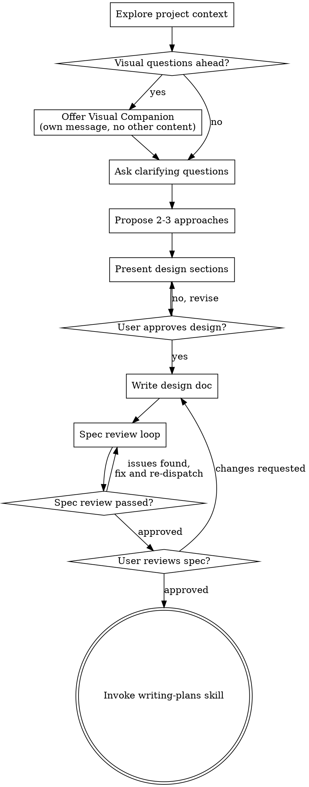

<!-- Generated by SpecStory, Markdown v2.1.0 -->

# 2026-03-14 06:10:06Z

<!-- Claude Code Session 88949dff-6618-47fb-b527-42205c15d63d (2026-03-14 06:10:06Z) -->

_**User (2026-03-14 06:10:06Z)**_

apps/web/src/components/modules/note/NoteListTimeline.tsx:75:13:div 现在这个左侧是 date 右侧 便签纸的设计在 mobile 上的效果并不是很好，头脑风暴下

---

_**Agent (claude-opus-4-6 2026-03-14 06:10:09Z)**_

_**Agent (claude-opus-4-6 2026-03-14 06:10:10Z)**_

<tool-use data-tool-type="generic" data-tool-name="Skill"><details>
<summary>Tool use: **Skill**</summary>

```text
Launching skill: superpowers:brainstorming
```
</details></tool-use>

---

_**User (2026-03-14 06:10:10Z)**_

Base directory for this skill: <HOME>/.claude/plugins/cache/claude-plugins-official/superpowers/5.0.2/skills/brainstorming

# Brainstorming Ideas Into Designs

Help turn ideas into fully formed designs and specs through natural collaborative dialogue.

Start by understanding the current project context, then ask questions one at a time to refine the idea. Once you understand what you're building, present the design and get user approval.

<HARD-GATE>
Do NOT invoke any implementation skill, write any code, scaffold any project, or take any implementation action until you have presented a design and the user has approved it. This applies to EVERY project regardless of perceived simplicity.
</HARD-GATE>

## Anti-Pattern: "This Is Too Simple To Need A Design"

Every project goes through this process. A todo list, a single-function utility, a config change — all of them. "Simple" projects are where unexamined assumptions cause the most wasted work. The design can be short (a few sentences for truly simple projects), but you MUST present it and get approval.

## Checklist

You MUST create a task for each of these items and complete them in order:

1. **Explore project context** — check files, docs, recent commits
2. **Offer visual companion** (if topic will involve visual questions) — this is its own message, not combined with a clarifying question. See the Visual Companion section below.
3. **Ask clarifying questions** — one at a time, understand purpose/constraints/success criteria
4. **Propose 2-3 approaches** — with trade-offs and your recommendation
5. **Present design** — in sections scaled to their complexity, get user approval after each section
6. **Write design doc** — save to `docs/superpowers/specs/YYYY-MM-DD-<topic>-design.md` and commit
7. **Spec review loop** — dispatch spec-document-reviewer subagent with precisely crafted review context (never your session history); fix issues and re-dispatch until approved (max 5 iterations, then surface to human)
8. **User reviews written spec** — ask user to review the spec file before proceeding
9. **Transition to implementation** — invoke writing-plans skill to create implementation plan

## Process Flow



**The terminal state is invoking writing-plans.** Do NOT invoke frontend-design, mcp-builder, or any other implementation skill. The ONLY skill you invoke after brainstorming is writing-plans.

## The Process

**Understanding the idea:**

- Check out the current project state first (files, docs, recent commits)
- Before asking detailed questions, assess scope: if the request describes multiple independent subsystems (e.g., "build a platform with chat, file storage, billing, and analytics"), flag this immediately. Don't spend questions refining details of a project that needs to be decomposed first.
- If the project is too large for a single spec, help the user decompose into sub-projects: what are the independent pieces, how do they relate, what order should they be built? Then brainstorm the first sub-project through the normal design flow. Each sub-project gets its own spec → plan → implementation cycle.
- For appropriately-scoped projects, ask questions one at a time to refine the idea
- Prefer multiple choice questions when possible, but open-ended is fine too
- Only one question per message - if a topic needs more exploration, break it into multiple questions
- Focus on understanding: purpose, constraints, success criteria

**Exploring approaches:**

- Propose 2-3 different approaches with trade-offs
- Present options conversationally with your recommendation and reasoning
- Lead with your recommended option and explain why

**Presenting the design:**

- Once you believe you understand what you're building, present the design
- Scale each section to its complexity: a few sentences if straightforward, up to 200-300 words if nuanced
- Ask after each section whether it looks right so far
- Cover: architecture, components, data flow, error handling, testing
- Be ready to go back and clarify if something doesn't make sense

**Design for isolation and clarity:**

- Break the system into smaller units that each have one clear purpose, communicate through well-defined interfaces, and can be understood and tested independently
- For each unit, you should be able to answer: what does it do, how do you use it, and what does it depend on?
- Can someone understand what a unit does without reading its internals? Can you change the internals without breaking consumers? If not, the boundaries need work.
- Smaller, well-bounded units are also easier for you to work with - you reason better about code you can hold in context at once, and your edits are more reliable when files are focused. When a file grows large, that's often a signal that it's doing too much.

**Working in existing codebases:**

- Explore the current structure before proposing changes. Follow existing patterns.
- Where existing code has problems that affect the work (e.g., a file that's grown too large, unclear boundaries, tangled responsibilities), include targeted improvements as part of the design - the way a good developer improves code they're working in.
- Don't propose unrelated refactoring. Stay focused on what serves the current goal.

## After the Design

**Documentation:**

- Write the validated design (spec) to `docs/superpowers/specs/YYYY-MM-DD-<topic>-design.md`
  - (User preferences for spec location override this default)
- Use elements-of-style:writing-clearly-and-concisely skill if available
- Commit the design document to git

**Spec Review Loop:**
After writing the spec document:

1. Dispatch spec-document-reviewer subagent (see spec-document-reviewer-prompt.md)
2. If Issues Found: fix, re-dispatch, repeat until Approved
3. If loop exceeds 5 iterations, surface to human for guidance

**User Review Gate:**
After the spec review loop passes, ask the user to review the written spec before proceeding:

> "Spec written and committed to `<path>`. Please review it and let me know if you want to make any changes before we start writing out the implementation plan."

Wait for the user's response. If they request changes, make them and re-run the spec review loop. Only proceed once the user approves.

**Implementation:**

- Invoke the writing-plans skill to create a detailed implementation plan
- Do NOT invoke any other skill. writing-plans is the next step.

## Key Principles

- **One question at a time** - Don't overwhelm with multiple questions
- **Multiple choice preferred** - Easier to answer than open-ended when possible
- **YAGNI ruthlessly** - Remove unnecessary features from all designs
- **Explore alternatives** - Always propose 2-3 approaches before settling
- **Incremental validation** - Present design, get approval before moving on
- **Be flexible** - Go back and clarify when something doesn't make sense

## Visual Companion

A browser-based companion for showing mockups, diagrams, and visual options during brainstorming. Available as a tool — not a mode. Accepting the companion means it's available for questions that benefit from visual treatment; it does NOT mean every question goes through the browser.

**Offering the companion:** When you anticipate that upcoming questions will involve visual content (mockups, layouts, diagrams), offer it once for consent:
> "Some of what we're working on might be easier to explain if I can show it to you in a web browser. I can put together mockups, diagrams, comparisons, and other visuals as we go. This feature is still new and can be token-intensive. Want to try it? (Requires opening a local URL)"

**This offer MUST be its own message.** Do not combine it with clarifying questions, context summaries, or any other content. The message should contain ONLY the offer above and nothing else. Wait for the user's response before continuing. If they decline, proceed with text-only brainstorming.

**Per-question decision:** Even after the user accepts, decide FOR EACH QUESTION whether to use the browser or the terminal. The test: **would the user understand this better by seeing it than reading it?**

- **Use the browser** for content that IS visual — mockups, wireframes, layout comparisons, architecture diagrams, side-by-side visual designs
- **Use the terminal** for content that is text — requirements questions, conceptual choices, tradeoff lists, A/B/C/D text options, scope decisions

A question about a UI topic is not automatically a visual question. "What does personality mean in this context?" is a conceptual question — use the terminal. "Which wizard layout works better?" is a visual question — use the browser.

If they agree to the companion, read the detailed guide before proceeding:
`skills/brainstorming/visual-companion.md`


---

_**Agent (claude-opus-4-6 2026-03-14 06:10:13Z)**_

<tool-use data-tool-type="read" data-tool-name="Read"><details>
<summary>Tool use: **Read**</summary>
 `./apps/web/src/components/modules/note/NoteListTimeline.tsx`

```text
     1→'use client'
     2→
     3→import type { NoteModel } from '@mx-space/api-client'
     4→import type { FC } from 'react'
     5→
     6→import { BottomToUpSoftScaleTransitionView } from '~/components/ui/transition'
     7→
     8→import { NoteListCard } from './NoteListCard'
     9→
    10→interface YearGroup {
    11→  notes: NoteModel[]
    12→  year: number
    13→}
    14→
    15→const weekdays = ['周日', '周一', '周二', '周三', '周四', '周五', '周六']
    16→const months = [
    17→  '一月',
    18→  '二月',
    19→  '三月',
    20→  '四月',
    21→  '五月',
    22→  '六月',
    23→  '七月',
    24→  '八月',
    25→  '九月',
    26→  '十月',
    27→  '十一月',
    28→  '十二月',
    29→]
    30→
    31→function groupNotesByYear(notes: NoteModel[]): YearGroup[] {
    32→  const groups: Map<number, NoteModel[]> = new Map()
    33→
    34→  for (const note of notes) {
    35→    const year = new Date(note.created).getFullYear()
    36→    if (!groups.has(year)) {
    37→      groups.set(year, [])
    38→    }
    39→    groups.get(year)!.push(note)
    40→  }
    41→
    42→  return Array.from(groups.entries()).map(([year, notes]) => ({ year, notes }))
    43→}
    44→
    45→export const NoteListTimeline: FC<{ notes: NoteModel[] }> = ({ notes }) => {
    46→  const groups = groupNotesByYear(notes)
    47→
    48→  let itemIndex = 0
    49→
    50→  return (
    51→    <div className="space-y-12">
    52→      {groups.map((group) => {
    53→        const groupStartIndex = itemIndex
    54→
    55→        return (
    56→          <section className="relative" key={group.year}>
    57→            {/* Year indicator — top right with decoration */}
    58→            <BottomToUpSoftScaleTransitionView
    59→              lcpOptimization
    60→              className="pointer-events-none absolute -top-2 right-0 select-none"
    61→              delay={groupStartIndex * 100}
    62→            >
    63→              {/* Stamp / seal style */}
    64→              <div className="-rotate-3 inline-block border-[3px] border-double border-neutral-300 rounded px-4 py-2 dark:border-neutral-700">
    65→                <div className="font-serif text-5xl font-bold leading-none tracking-tighter text-neutral-300 dark:text-neutral-700">
    66→                  {group.year}
    67→                </div>
    68→                <div className="mt-1 text-center text-[10px] tracking-[4px] text-neutral-300 dark:text-neutral-700">
    69→                  DIARY
    70→                </div>
    71→              </div>
    72→            </BottomToUpSoftScaleTransitionView>
    73→
    74→            {/* Notes list */}
    75→            <div className="relative space-y-4 pt-28">
    76→              {group.notes.map((note) => {
    77→                const date = new Date(note.created)
    78→                const currentIndex = itemIndex++
    79→                return (
    80→                  <BottomToUpSoftScaleTransitionView
    81→                    lcpOptimization
    82→                    className="flex items-start gap-4 lg:gap-5"
    83→                    delay={currentIndex * 100}
    84→                    key={note.id}
    85→                  >
    86→                    <div className="w-14 shrink-0 pt-3 text-center">
    87→                      <div className="text-3xl font-bold leading-none text-neutral-9">
    88→                        {date.getDate()}
    89→                      </div>
    90→                      <div className="mt-1 text-sm text-neutral-5">
    91→                        {months[date.getMonth()]}
    92→                      </div>
    93→                      <div className="mt-0.5 text-xs text-neutral-4">
    94→                        {weekdays[date.getDay()]}
    95→                      </div>
    96→                    </div>
    97→
    98→                    <div className="min-w-0 flex-1">
    99→                      <NoteListCard note={note} />
   100→                    </div>
   101→                  </BottomToUpSoftScaleTransitionView>
   102→                )
   103→              })}
   104→            </div>
   105→          </section>
   106→        )
   107→      })}
   108→    </div>
   109→  )
   110→}
   111→
```
</details></tool-use>

_**Agent (claude-opus-4-6 2026-03-14 06:10:14Z)**_

<tool-use data-tool-type="read" data-tool-name="Read"><details>
<summary>Tool use: **Read**</summary>
 `./apps/web/src/components/modules/note/NoteListCard.tsx`

```text
     1→import type { NoteModel } from '@mx-space/api-client'
     2→import type { FC } from 'react'
     3→
     4→import { SolidBookmark } from '~/components/icons/bookmark'
     5→import { Link } from '~/i18n/navigation'
     6→import { topicStringToHue } from '~/lib/color'
     7→import { buildNotePath } from '~/lib/note-route'
     8→
     9→export const NoteListCard: FC<{ note: NoteModel }> = ({ note }) => {
    10→  const coverSrc = note.meta?.cover as string | undefined
    11→  const excerpt = note.text?.slice(0, 120)
    12→  const href = buildNotePath(note)
    13→
    14→  return (
    15→    <Link className="block" href={href}>
    16→      <article className="relative overflow-hidden rounded-md bg-neutral-1 shadow-perfect perfect-sm border border-neutral-200/70 dark:border-neutral-800 dark:bg-neutral-2 transition-transform duration-150 hover:-translate-y-0.5 hover:shadow-lg">
    17→        {note.bookmark && (
    18→          <SolidBookmark className="absolute right-2.5 -top-3 z-[1] text-5xl text-red-500 drop-shadow-sm" />
    19→        )}
    20→        {coverSrc && (
    21→          
    26→        )}
    27→        <div className="p-4 lg:px-5">
    28→          <div className="mb-1.5 flex items-center justify-between">
    29→            <h3 className="truncate text-base font-semibold text-neutral-9">
    30→              {note.title}
    31→            </h3>
    32→            <span className="ml-2 shrink-0 text-xs text-neutral-5">
    33→              #{note.nid}
    34→            </span>
    35→          </div>
    36→
    37→          <NoteListCardMeta note={note} />
    38→
    39→          {excerpt && (
    40→            <p className="mt-2 line-clamp-2 text-sm leading-relaxed text-neutral-7">
    41→              {excerpt}
    42→            </p>
    43→          )}
    44→        </div>
    45→      </article>
    46→    </Link>
    47→  )
    48→}
    49→
    50→const NoteListCardMeta: FC<{ note: NoteModel }> = ({ note }) => {
    51→  const parts: string[] = []
    52→  if (note.weather) parts.push(note.weather)
    53→  if (note.mood) parts.push(note.mood)
    54→
    55→  if (!parts.length && !note.topic) return null
    56→
    57→  return (
    58→    <div className="flex flex-wrap items-center gap-1.5 text-xs text-neutral-5">
    59→      {parts.map((part) => (
    60→        <span key={part}>
    61→          {part}
    62→          {part !== parts.at(-1) && <span className="mx-0.5">·</span>}
    63→        </span>
    64→      ))}
    65→      {note.topic && <TopicTag name={note.topic.name} />}
    66→    </div>
    67→  )
    68→}
    69→
    70→const TopicTag: FC<{ name: string }> = ({ name }) => {
    71→  const hue = topicStringToHue(name)
    72→  return (
    73→    <span
    74→      className="rounded-full px-2 py-px text-[11px] font-medium"
    75→      style={{
    76→        backgroundColor: `hsl(${hue}, 35%, 40%, 0.12)`,
    77→        color: `hsl(${hue}, 35%, 40%)`,
    78→      }}
    79→    >
    80→      {name}
    81→    </span>
    82→  )
    83→}
    84→
```
</details></tool-use>

_**Agent (claude-opus-4-6 2026-03-14 06:10:14Z)**_

<tool-use data-tool-type="read" data-tool-name="Read"><details>
<summary>Tool use: **Read**</summary>
 `./apps/web/src/app/[locale]/notes/page.tsx`

```text
     1→import { NoteListPagination } from '~/components/modules/note/NoteListPagination'
     2→import { NoteListTimeline } from '~/components/modules/note/NoteListTimeline'
     3→import { NothingFound } from '~/components/modules/shared/NothingFound'
     4→import { apiClient } from '~/lib/request'
     5→import { definePrerenderPage } from '~/lib/request.server'
     6→
     7→interface Props extends LocaleParams {
     8→  page?: string
     9→}
    10→
    11→export default definePrerenderPage<Props>()({
    12→  fetcher: async (params) => {
    13→    const currentPage = params?.page ? Number.parseInt(params.page) : 1
    14→
    15→    return await apiClient.note.getList(currentPage, 10)
    16→  },
    17→  Component: async ({ data: { data, pagination } }) => {
    18→    if (!data?.length) {
    19→      return <NothingFound />
    20→    }
    21→
    22→    return (
    23→      <div className="mx-auto mt-24 min-w-0 max-w-5xl px-4">
    24→        <NoteListTimeline notes={data} />
    25→        <NoteListPagination pagination={pagination} />
    26→      </div>
    27→    )
    28→  },
    29→})
    30→
```
</details></tool-use>

_**Agent (claude-opus-4-6 2026-03-14 06:10:24Z)**_

_**Agent (claude-opus-4-6 2026-03-14 06:10:28Z)**_

已阅当前布局。mobile 上左侧 date column（56px）+ 右侧卡片的横向排列确实会压缩卡片宽度，年份 stamp 绝对定位亦可能与内容重叠。

此题涉及布局视觉，吾可于浏览器中呈示 mockup 以助比较方案。此功能尚新，token 消耗较大。君欲试否？（需开启本地 URL）

---

_**User (2026-03-14 06:10:32Z)**_

可以

---

_**Agent (claude-opus-4-6 2026-03-14 06:10:35Z)**_

_**Agent (claude-opus-4-6 2026-03-14 06:10:36Z)**_

<tool-use data-tool-type="read" data-tool-name="Read"><details>
<summary>Tool use: **Read**</summary>
 `<HOME>/.claude/plugins/cache/claude-plugins-official/superpowers/5.0.2/skills/brainstorming/visual-companion.md`

```text
     1→# Visual Companion Guide
     2→
     3→Browser-based visual brainstorming companion for showing mockups, diagrams, and options.
     4→
     5→## When to Use
     6→
     7→Decide per-question, not per-session. The test: **would the user understand this better by seeing it than reading it?**
     8→
     9→**Use the browser** when the content itself is visual:
    10→
    11→- **UI mockups** — wireframes, layouts, navigation structures, component designs
    12→- **Architecture diagrams** — system components, data flow, relationship maps
    13→- **Side-by-side visual comparisons** — comparing two layouts, two color schemes, two design directions
    14→- **Design polish** — when the question is about look and feel, spacing, visual hierarchy
    15→- **Spatial relationships** — state machines, flowcharts, entity relationships rendered as diagrams
    16→
    17→**Use the terminal** when the content is text or tabular:
    18→
    19→- **Requirements and scope questions** — "what does X mean?", "which features are in scope?"
    20→- **Conceptual A/B/C choices** — picking between approaches described in words
    21→- **Tradeoff lists** — pros/cons, comparison tables
    22→- **Technical decisions** — API design, data modeling, architectural approach selection
    23→- **Clarifying questions** — anything where the answer is words, not a visual preference
    24→
    25→A question *about* a UI topic is not automatically a visual question. "What kind of wizard do you want?" is conceptual — use the terminal. "Which of these wizard layouts feels right?" is visual — use the browser.
    26→
    27→## How It Works
    28→
    29→The server watches a directory for HTML files and serves the newest one to the browser. You write HTML content, the user sees it in their browser and can click to select options. Selections are recorded to a `.events` file that you read on your next turn.
    30→
    31→**Content fragments vs full documents:** If your HTML file starts with `<!DOCTYPE` or `<html`, the server serves it as-is (just injects the helper script). Otherwise, the server automatically wraps your content in the frame template — adding the header, CSS theme, selection indicator, and all interactive infrastructure. **Write content fragments by default.** Only write full documents when you need complete control over the page.
    32→
    33→## Starting a Session
    34→
    35→```bash
    36→# Start server with persistence (mockups saved to project)
    37→scripts/start-server.sh --project-dir /path/to/project
    38→
    39→# Returns: {"type":"server-started","port":52341,"url":"http://localhost:52341",
    40→#           "screen_dir":"/path/to/project/.superpowers/brainstorm/12345-1706000000"}
    41→```
    42→
    43→Save `screen_dir` from the response. Tell user to open the URL.
    44→
    45→**Finding connection info:** The server writes its startup JSON to `$SCREEN_DIR/.server-info`. If you launched the server in the background and didn't capture stdout, read that file to get the URL and port. When using `--project-dir`, check `<project>/.superpowers/brainstorm/` for the session directory.
    46→
    47→**Note:** Pass the project root as `--project-dir` so mockups persist in `.superpowers/brainstorm/` and survive server restarts. Without it, files go to `/tmp` and get cleaned up. Remind the user to add `.superpowers/` to `.gitignore` if it's not already there.
    48→
    49→**Launching the server by platform:**
    50→
    51→**Claude Code:**
    52→```bash
    53→# Default mode works — the script backgrounds the server itself
    54→scripts/start-server.sh --project-dir /path/to/project
    55→```
    56→
    57→**Codex:**
    58→```bash
    59→# Codex reaps background processes. The script auto-detects CODEX_CI and
    60→# switches to foreground mode. Run it normally — no extra flags needed.
    61→scripts/start-server.sh --project-dir /path/to/project
    62→```
    63→
    64→**Gemini CLI:**
    65→```bash
    66→# Use --foreground and set is_background: true on your shell tool call
    67→# so the process survives across turns
    68→scripts/start-server.sh --project-dir /path/to/project --foreground
    69→```
    70→
    71→**Other environments:** The server must keep running in the background across conversation turns. If your environment reaps detached processes, use `--foreground` and launch the command with your platform's background execution mechanism.
    72→
    73→If the URL is unreachable from your browser (common in remote/containerized setups), bind a non-loopback host:
    74→
    75→```bash
    76→scripts/start-server.sh \
    77→  --project-dir /path/to/project \
    78→  --host 0.0.0.0 \
    79→  --url-host localhost
    80→```
    81→
    82→Use `--url-host` to control what hostname is printed in the returned URL JSON.
    83→
    84→## The Loop
    85→
    86→1. **Check server is alive**, then **write HTML** to a new file in `screen_dir`:
    87→   - Before each write, check that `$SCREEN_DIR/.server-info` exists. If it doesn't (or `.server-stopped` exists), the server has shut down — restart it with `start-server.sh` before continuing. The server auto-exits after 30 minutes of inactivity.
    88→   - Use semantic filenames: `platform.html`, `visual-style.html`, `layout.html`
    89→   - **Never reuse filenames** — each screen gets a fresh file
    90→   - Use Write tool — **never use cat/heredoc** (dumps noise into terminal)
    91→   - Server automatically serves the newest file
    92→
    93→2. **Tell user what to expect and end your turn:**
    94→   - Remind them of the URL (every step, not just first)
    95→   - Give a brief text summary of what's on screen (e.g., "Showing 3 layout options for the homepage")
    96→   - Ask them to respond in the terminal: "Take a look and let me know what you think. Click to select an option if you'd like."
    97→
    98→3. **On your next turn** — after the user responds in the terminal:
    99→   - Read `$SCREEN_DIR/.events` if it exists — this contains the user's browser interactions (clicks, selections) as JSON lines
   100→   - Merge with the user's terminal text to get the full picture
   101→   - The terminal message is the primary feedback; `.events` provides structured interaction data
   102→
   103→4. **Iterate or advance** — if feedback changes current screen, write a new file (e.g., `layout-v2.html`). Only move to the next question when the current step is validated.
   104→
   105→5. **Unload when returning to terminal** — when the next step doesn't need the browser (e.g., a clarifying question, a tradeoff discussion), push a waiting screen to clear the stale content:
   106→
   107→   ```html
   108→   <!-- filename: waiting.html (or waiting-2.html, etc.) -->
   109→   <div style="display:flex;align-items:center;justify-content:center;min-height:60vh">
   110→     <p class="subtitle">Continuing in terminal...</p>
   111→   </div>
   112→   ```
   113→
   114→   This prevents the user from staring at a resolved choice while the conversation has moved on. When the next visual question comes up, push a new content file as usual.
   115→
   116→6. Repeat until done.
   117→
   118→## Writing Content Fragments
   119→
   120→Write just the content that goes inside the page. The server wraps it in the frame template automatically (header, theme CSS, selection indicator, and all interactive infrastructure).
   121→
   122→**Minimal example:**
   123→
   124→```html
   125→<h2>Which layout works better?</h2>
   126→<p class="subtitle">Consider readability and visual hierarchy</p>
   127→
   128→<div class="options">
   129→  <div class="option" data-choice="a" onclick="toggleSelect(this)">
   130→    <div class="letter">A</div>
   131→    <div class="content">
   132→      <h3>Single Column</h3>
   133→      <p>Clean, focused reading experience</p>
   134→    </div>
   135→  </div>
   136→  <div class="option" data-choice="b" onclick="toggleSelect(this)">
   137→    <div class="letter">B</div>
   138→    <div class="content">
   139→      <h3>Two Column</h3>
   140→      <p>Sidebar navigation with main content</p>
   141→    </div>
   142→  </div>
   143→</div>
   144→```
   145→
   146→That's it. No `<html>`, no CSS, no `<script>` tags needed. The server provides all of that.
   147→
   148→## CSS Classes Available
   149→
   150→The frame template provides these CSS classes for your content:
   151→
   152→### Options (A/B/C choices)
   153→
   154→```html
   155→<div class="options">
   156→  <div class="option" data-choice="a" onclick="toggleSelect(this)">
   157→    <div class="letter">A</div>
   158→    <div class="content">
   159→      <h3>Title</h3>
   160→      <p>Description</p>
   161→    </div>
   162→  </div>
   163→</div>
   164→```
   165→
   166→**Multi-select:** Add `data-multiselect` to the container to let users select multiple options. Each click toggles the item. The indicator bar shows the count.
   167→
   168→```html
   169→<div class="options" data-multiselect>
   170→  <!-- same option markup — users can select/deselect multiple -->
   171→</div>
   172→```
   173→
   174→### Cards (visual designs)
   175→
   176→```html
   177→<div class="cards">
   178→  <div class="card" data-choice="design1" onclick="toggleSelect(this)">
   179→    <div class="card-image"><!-- mockup content --></div>
   180→    <div class="card-body">
   181→      <h3>Name</h3>
   182→      <p>Description</p>
   183→    </div>
   184→  </div>
   185→</div>
   186→```
   187→
   188→### Mockup container
   189→
   190→```html
   191→<div class="mockup">
   192→  <div class="mockup-header">Preview: Dashboard Layout</div>
   193→  <div class="mockup-body"><!-- your mockup HTML --></div>
   194→</div>
   195→```
   196→
   197→### Split view (side-by-side)
   198→
   199→```html
   200→<div class="split">
   201→  <div class="mockup"><!-- left --></div>
   202→  <div class="mockup"><!-- right --></div>
   203→</div>
   204→```
   205→
   206→### Pros/Cons
   207→
   208→```html
   209→<div class="pros-cons">
   210→  <div class="pros"><h4>Pros</h4><ul><li>Benefit</li></ul></div>
   211→  <div class="cons"><h4>Cons</h4><ul><li>Drawback</li></ul></div>
   212→</div>
   213→```
   214→
   215→### Mock elements (wireframe building blocks)
   216→
   217→```html
   218→<div class="mock-nav">Logo | Home | About | Contact</div>
   219→<div style="display: flex;">
   220→  <div class="mock-sidebar">Navigation</div>
   221→  <div class="mock-content">Main content area</div>
   222→</div>
   223→<button class="mock-button">Action Button</button>
   224→<input class="mock-input" placeholder="Input field">
   225→<div class="placeholder">Placeholder area</div>
   226→```
   227→
   228→### Typography and sections
   229→
   230→- `h2` — page title
   231→- `h3` — section heading
   232→- `.subtitle` — secondary text below title
   233→- `.section` — content block with bottom margin
   234→- `.label` — small uppercase label text
   235→
   236→## Browser Events Format
   237→
   238→When the user clicks options in the browser, their interactions are recorded to `$SCREEN_DIR/.events` (one JSON object per line). The file is cleared automatically when you push a new screen.
   239→
   240→```jsonl
   241→{"type":"click","choice":"a","text":"Option A - Simple Layout","timestamp":1706000101}
   242→{"type":"click","choice":"c","text":"Option C - Complex Grid","timestamp":1706000108}
   243→{"type":"click","choice":"b","text":"Option B - Hybrid","timestamp":1706000115}
   244→```
   245→
   246→The full event stream shows the user's exploration path — they may click multiple options before settling. The last `choice` event is typically the final selection, but the pattern of clicks can reveal hesitation or preferences worth asking about.
   247→
   248→If `.events` doesn't exist, the user didn't interact with the browser — use only their terminal text.
   249→
   250→## Design Tips
   251→
   252→- **Scale fidelity to the question** — wireframes for layout, polish for polish questions
   253→- **Explain the question on each page** — "Which layout feels more professional?" not just "Pick one"
   254→- **Iterate before advancing** — if feedback changes current screen, write a new version
   255→- **2-4 options max** per screen
   256→- **Use real content when it matters** — for a photography portfolio, use actual images (Unsplash). Placeholder content obscures design issues.
   257→- **Keep mockups simple** — focus on layout and structure, not pixel-perfect design
   258→
   259→## File Naming
   260→
   261→- Use semantic names: `platform.html`, `visual-style.html`, `layout.html`
   262→- Never reuse filenames — each screen must be a new file
   263→- For iterations: append version suffix like `layout-v2.html`, `layout-v3.html`
   264→- Server serves newest file by modification time
   265→
   266→## Cleaning Up
   267→
   268→```bash
   269→scripts/stop-server.sh $SCREEN_DIR
   270→```
   271→
   272→If the session used `--project-dir`, mockup files persist in `.superpowers/brainstorm/` for later reference. Only `/tmp` sessions get deleted on stop.
   273→
   274→## Reference
   275→
   276→- Frame template (CSS reference): `scripts/frame-template.html`
   277→- Helper script (client-side): `scripts/helper.js`
   278→
```
</details></tool-use>

_**Agent (claude-opus-4-6 2026-03-14 06:10:42Z)**_

<tool-use data-tool-type="shell" data-tool-name="Bash"><details>
<summary>Tool use: **Bash**</summary>
Start visual companion server for brainstorming

`<HOME>/.claude/plugins/cache/claude-plugins-official/superpowers/5.0.2/skills/brainstorming/scripts/start-server.sh --project-dir <REPO_ROOT>`

```text
{"type":"server-started","port":49506,"host":"127.0.0.1","url_host":"localhost","url":"http://localhost:49506","screen_dir":"<REPO_ROOT>/.superpowers/brainstorm/53613-1773468640"}
```
</details></tool-use>

_**Agent (claude-opus-4-6 2026-03-14 06:10:51Z)**_

_**Agent (claude-opus-4-6 2026-03-14 06:10:55Z)**_

Visual companion 已启动。请于浏览器开启: http://localhost:49506

先问一问：君于 mobile 上最不满者何？

- **A)** 左侧 date column 占宽过多，卡片内容被压缩
- **B)** 年份 stamp 装饰与内容重叠
- **C)** 整体布局在窄屏上显得拥挤，信息密度过高
- **D)** 以上皆有，或另有他因

---

_**User (2026-03-14 06:11:10Z)**_

A C

---

_**Agent (claude-opus-4-6 2026-03-14 06:11:18Z)**_

_**Agent (claude-opus-4-6 2026-03-14 06:11:22Z)**_

明白。左侧 date column 占宽 + 整体拥挤，二者相关——56px date 列于 375px 屏上占约 15%，加之 gap，卡片实际可用宽度不足 280px。

吾拟三方案，以 mockup 呈于浏览器。

_**Agent (claude-opus-4-6 2026-03-14 06:12:09Z)**_

<tool-use data-tool-type="write" data-tool-name="Write"><details>
<summary>Tool use: **Write**</summary>

```html
<h2>Notes Timeline — Mobile 布局方案</h2>
<p class="subtitle">当前问题：左侧 date column 占宽过多，卡片内容被压缩，整体拥挤</p>

<div class="cards">
  <!-- Option A -->
  <div class="card" data-choice="a" onclick="toggleSelect(this)">
    <div class="card-image" style="padding:20px;background:#fafafa;">
      <div style="max-width:340px;margin:0 auto;font-family:system-ui;">
        <!-- Year stamp -->
        <div style="text-align:right;margin-bottom:12px;">
          <span style="display:inline-block;border:2px double #d4d4d4;padding:4px 10px;font-size:11px;color:#d4d4d4;transform:rotate(-2deg);font-family:serif;">2025 <span style="font-size:8px;letter-spacing:2px;">DIARY</span></span>
        </div>
        <!-- Card 1 -->
        <div style="background:white;border-radius:8px;border:1px solid #e5e5e5;padding:14px;margin-bottom:10px;box-shadow:0 1px 3px rgba(0,0,0,0.06);">
          <div style="display:flex;align-items:center;gap:8px;margin-bottom:8px;">
            <span style="font-size:12px;color:#999;font-weight:500;">03/14</span>
            <span style="font-size:11px;color:#bbb;">周五</span>
          </div>
          <div style="font-size:14px;font-weight:600;color:#262626;margin-bottom:4px;">春日散步随记</div>
          <div style="font-size:12px;color:#888;line-height:1.5;">阳光正好，沿着河边走了一圈。樱花已经开了七八分…</div>
        </div>
        <!-- Card 2 -->
        <div style="background:white;border-radius:8px;border:1px solid #e5e5e5;padding:14px;margin-bottom:10px;box-shadow:0 1px 3px rgba(0,0,0,0.06);">
          <div style="display:flex;align-items:center;gap:8px;margin-bottom:8px;">
            <span style="font-size:12px;color:#999;font-weight:500;">03/10</span>
            <span style="font-size:11px;color:#bbb;">周一</span>
          </div>
          <div style="font-size:14px;font-weight:600;color:#262626;margin-bottom:4px;">读书笔记：百年孤独</div>
          <div style="font-size:12px;color:#888;line-height:1.5;">马孔多的故事像一面镜子，映射出所有被遗忘的…</div>
        </div>
        <!-- Card 3 -->
        <div style="background:white;border-radius:8px;border:1px solid #e5e5e5;padding:14px;box-shadow:0 1px 3px rgba(0,0,0,0.06);">
          <div style="display:flex;align-items:center;gap:8px;margin-bottom:8px;">
            <span style="font-size:12px;color:#999;font-weight:500;">03/05</span>
            <span style="font-size:11px;color:#bbb;">周三</span>
          </div>
          <div style="font-size:14px;font-weight:600;color:#262626;margin-bottom:4px;">新项目启动</div>
          <div style="font-size:12px;color:#888;line-height:1.5;">终于开始动手了，技术选型纠结了很久最后还是…</div>
        </div>
      </div>
    </div>
    <div class="card-body">
      <h3>A) 日期内嵌卡片顶部</h3>
      <p>移除左侧 date column，日期以小字标签形式嵌入卡片内部顶端。卡片占满全宽。</p>
      <div class="pros-cons">
        <div class="pros"><h4>Pros</h4><ul><li>卡片获得最大宽度</li><li>实现简单，仅需 responsive class</li><li>信息层级清晰</li></ul></div>
        <div class="cons"><h4>Cons</h4><ul><li>日期不再独立突出</li><li>与桌面端视觉差异较大</li></ul></div>
      </div>
    </div>
  </div>

  <!-- Option B -->
  <div class="card" data-choice="b" onclick="toggleSelect(this)">
    <div class="card-image" style="padding:20px;background:#fafafa;">
      <div style="max-width:340px;margin:0 auto;font-family:system-ui;">
        <!-- Year stamp -->
        <div style="text-align:right;margin-bottom:12px;">
          <span style="display:inline-block;border:2px double #d4d4d4;padding:4px 10px;font-size:11px;color:#d4d4d4;transform:rotate(-2deg);font-family:serif;">2025 <span style="font-size:8px;letter-spacing:2px;">DIARY</span></span>
        </div>
        <!-- Timeline -->
        <div style="position:relative;padding-left:36px;">
          <!-- Timeline line -->
          <div style="position:absolute;left:12px;top:0;bottom:0;width:1px;background:#e0e0e0;"></div>
          <!-- Item 1 -->
          <div style="position:relative;margin-bottom:12px;">
            <div style="position:absolute;left:-30px;top:14px;width:10px;height:10px;border-radius:50%;background:#d4d4d4;border:2px solid #fafafa;"></div>
            <div style="font-size:11px;color:#999;margin-bottom:4px;">3月14日 · 周五</div>
            <div style="background:white;border-radius:8px;border:1px solid #e5e5e5;padding:14px;box-shadow:0 1px 3px rgba(0,0,0,0.06);">
              <div style="font-size:14px;font-weight:600;color:#262626;margin-bottom:4px;">春日散步随记</div>
              <div style="font-size:12px;color:#888;line-height:1.5;">阳光正好，沿着河边走了一圈。樱花已经开了七八分…</div>
            </div>
          </div>
          <!-- Item 2 -->
          <div style="position:relative;margin-bottom:12px;">
            <div style="position:absolute;left:-30px;top:14px;width:10px;height:10px;border-radius:50%;background:#d4d4d4;border:2px solid #fafafa;"></div>
            <div style="font-size:11px;color:#999;margin-bottom:4px;">3月10日 · 周一</div>
            <div style="background:white;border-radius:8px;border:1px solid #e5e5e5;padding:14px;box-shadow:0 1px 3px rgba(0,0,0,0.06);">
              <div style="font-size:14px;font-weight:600;color:#262626;margin-bottom:4px;">读书笔记：百年孤独</div>
              <div style="font-size:12px;color:#888;line-height:1.5;">马孔多的故事像一面镜子，映射出所有被遗忘的…</div>
            </div>
          </div>
          <!-- Item 3 -->
          <div style="position:relative;">
            <div style="position:absolute;left:-30px;top:14px;width:10px;height:10px;border-radius:50%;background:#d4d4d4;border:2px solid #fafafa;"></div>
            <div style="font-size:11px;color:#999;margin-bottom:4px;">3月5日 · 周三</div>
            <div style="background:white;border-radius:8px;border:1px solid #e5e5e5;padding:14px;box-shadow:0 1px 3px rgba(0,0,0,0.06);">
              <div style="font-size:14px;font-weight:600;color:#262626;margin-bottom:4px;">新项目启动</div>
              <div style="font-size:12px;color:#888;line-height:1.5;">终于开始动手了，技术选型纠结了很久最后还是…</div>
            </div>
          </div>
        </div>
      </div>
    </div>
    <div class="card-body">
      <h3>B) 极简时间轴 + 日期上浮</h3>
      <p>左侧仅保留细线 + 小圆点（约 36px），日期以单行小字浮于卡片上方。卡片几乎全宽。</p>
      <div class="pros-cons">
        <div class="pros"><h4>Pros</h4><ul><li>保留时间轴的时序感</li><li>卡片宽度充裕</li><li>视觉上有「日记流」的感觉</li></ul></div>
        <div class="cons"><h4>Cons</h4><ul><li>仍占用少量左侧空间</li><li>时间轴线在 mobile 上可能显得多余</li></ul></div>
      </div>
    </div>
  </div>

  <!-- Option C -->
  <div class="card" data-choice="c" onclick="toggleSelect(this)">
    <div class="card-image" style="padding:20px;background:#fafafa;">
      <div style="max-width:340px;margin:0 auto;font-family:system-ui;">
        <!-- Year stamp - smaller, left aligned -->
        <div style="margin-bottom:16px;">
          <span style="display:inline-block;border:2px double #d4d4d4;padding:3px 8px;font-size:10px;color:#d4d4d4;font-family:serif;">2025 <span style="font-size:7px;letter-spacing:2px;">DIARY</span></span>
        </div>
        <!-- Month group label -->
        <div style="font-size:11px;color:#bbb;letter-spacing:2px;margin-bottom:8px;text-transform:uppercase;">三月</div>
        <!-- Card 1 - full width, date as accent stripe -->
        <div style="background:white;border-radius:8px;border:1px solid #e5e5e5;margin-bottom:10px;box-shadow:0 1px 3px rgba(0,0,0,0.06);overflow:hidden;">
          <div style="display:flex;">
            <div style="width:44px;background:linear-gradient(135deg,#f0f0f0,#e8e8e8);display:flex;flex-direction:column;align-items:center;justify-content:center;padding:8px 0;flex-shrink:0;">
              <div style="font-size:18px;font-weight:700;color:#999;line-height:1;">14</div>
              <div style="font-size:9px;color:#bbb;margin-top:2px;">周五</div>
            </div>
            <div style="padding:12px 14px;min-width:0;flex:1;">
              <div style="font-size:14px;font-weight:600;color:#262626;margin-bottom:4px;">春日散步随记</div>
              <div style="font-size:12px;color:#888;line-height:1.5;">阳光正好，沿着河边走了一圈。樱花已经开了七八分…</div>
            </div>
          </div>
        </div>
        <!-- Card 2 -->
        <div style="background:white;border-radius:8px;border:1px solid #e5e5e5;margin-bottom:10px;box-shadow:0 1px 3px rgba(0,0,0,0.06);overflow:hidden;">
          <div style="display:flex;">
            <div style="width:44px;background:linear-gradient(135deg,#f0f0f0,#e8e8e8);display:flex;flex-direction:column;align-items:center;justify-content:center;padding:8px 0;flex-shrink:0;">
              <div style="font-size:18px;font-weight:700;color:#999;line-height:1;">10</div>
              <div style="font-size:9px;color:#bbb;margin-top:2px;">周一</div>
            </div>
            <div style="padding:12px 14px;min-width:0;flex:1;">
              <div style="font-size:14px;font-weight:600;color:#262626;margin-bottom:4px;">读书笔记：百年孤独</div>
              <div style="font-size:12px;color:#888;line-height:1.5;">马孔多的故事像一面镜子，映射出所有被遗忘的…</div>
            </div>
          </div>
        </div>
        <!-- Card 3 -->
        <div style="background:white;border-radius:8px;border:1px solid #e5e5e5;box-shadow:0 1px 3px rgba(0,0,0,0.06);overflow:hidden;">
          <div style="display:flex;">
            <div style="width:44px;background:linear-gradient(135deg,#f0f0f0,#e8e8e8);display:flex;flex-direction:column;align-items:center;justify-content:center;padding:8px 0;flex-shrink:0;">
              <div style="font-size:18px;font-weight:700;color:#999;line-height:1;">05</div>
              <div style="font-size:9px;color:#bbb;margin-top:2px;">周三</div>
            </div>
            <div style="padding:12px 14px;min-width:0;flex:1;">
              <div style="font-size:14px;font-weight:600;color:#262626;margin-bottom:4px;">新项目启动</div>
              <div style="font-size:12px;color:#888;line-height:1.5;">终于开始动手了，技术选型纠结了很久最后还是…</div>
            </div>
          </div>
        </div>
      </div>
    </div>
    <div class="card-body">
      <h3>C) 日期融入卡片左侧条</h3>
      <p>日期作为卡片内部左侧窄条（~44px），与内容一体化。月份以分组标签展示。</p>
      <div class="pros-cons">
        <div class="pros"><h4>Pros</h4><ul><li>日期与内容视觉一体，不割裂</li><li>卡片仍近全宽</li><li>保留日期突出感</li><li>与桌面端气质一致</li></ul></div>
        <div class="cons"><h4>Cons</h4><ul><li>卡片内部结构稍复杂</li><li>NoteListCard 需改动</li></ul></div>
      </div>
    </div>
  </div>
</div>

<p class="subtitle" style="margin-top:20px;">吾推荐 <strong>方案 A</strong>：实现最简，卡片全宽，mobile 上信息密度最适。日期内嵌卡片顶部仅需 responsive class 切换，桌面端保持不变。</p>

```

```text
File created successfully at: <REPO_ROOT>/.superpowers/brainstorm/53613-1773468640/mobile-layout-options.html
```
</details></tool-use>

_**Agent (claude-opus-4-6 2026-03-14 06:12:15Z)**_

三方案已呈于浏览器 http://localhost:49506 ，请览之。

- **A)** 日期内嵌卡片顶部 — 移除左侧列，日期为卡片内小标签，全宽
- **B)** 极简时间轴 + 日期上浮 — 保留细线圆点，日期浮于卡片上方
- **C)** 日期融入卡片左侧条 — 日期为卡片内左侧窄条，一体化

吾推荐 A，实现最简且 mobile 效果最佳。点击选择君所喜方案。

---

_**User (2026-03-14 06:12:41Z)**_

B

---

_**Agent (claude-opus-4-6 2026-03-14 06:12:44Z)**_

_**Agent (claude-opus-4-6 2026-03-14 06:12:45Z)**_

<tool-use data-tool-type="read" data-tool-name="Read"><details>
<summary>Tool use: **Read**</summary>
 `./.superpowers/brainstorm/53613-1773468640/.events`

```text
     1→{"type":"click","text":"2025 DIARY\n        \n        \n        \n          \n          \n          \n          \n            \n            3月14日 · 周五\n            \n              春日散步随记\n              阳光正好，沿着河边走了一圈。樱花已经开了七八分…\n            \n          \n          \n          \n            \n            3月10日 · 周一\n            \n              读书笔记：百年孤独\n              马孔多的故事像一面镜子，映射出所有被遗忘的…\n            \n          \n          \n          \n            \n            3月5日 · 周三\n            \n              新项目启动\n              终于开始动手了，技术选型纠结了很久最后还是…\n            \n          \n        \n      \n    \n    \n      B) 极简时间轴 + 日期上浮\n      左侧仅保留细线 + 小圆点（约 36px），日期以单行小字浮于卡片上方。卡片几乎全宽。\n      \n        Pros保留时间轴的时序感卡片宽度充裕视觉上有「日记流」的感觉\n        Cons仍占用少量左侧空间时间轴线在 mobile 上可能显得多余","choice":"b","id":null,"timestamp":1773468756253}
     2→
```
</details></tool-use>

_**Agent (claude-opus-4-6 2026-03-14 06:12:50Z)**_

好，方案 B 确认。再问一事：

mobile 上年份 stamp（右上角那个双线框「2025 DIARY」）君欲如何处理？

- **A)** 保持不变，仍右上角绝对定位
- **B)** 缩小并左对齐，作为 section 的标题
- **C)** 隐藏年份 stamp，仅以普通文字分隔符显示年份

---

_**User (2026-03-14 06:13:08Z)**_

A

---

_**Agent (claude-opus-4-6 2026-03-14 06:13:13Z)**_


明白，年份 stamp 保持不变。

再一问：方案 B 中时间轴线与圆点，仅 mobile 可见还是桌面端亦采用？即：

- **A)** 仅 mobile 改为时间轴布局，桌面端保持现有左侧 date column 设计
- **B)** 桌面端亦改为时间轴风格，统一视觉

---

_**User (2026-03-14 06:17:30Z)**_

A

---

_**Agent (claude-opus-4-6 2026-03-14 06:17:36Z)**_


好，方案明确。整理设计如下：

**NoteListTimeline Mobile 响应式设计**

- **桌面端**：保持现有布局不变（左侧 date column + 右侧卡片）
- **Mobile 端**（`< lg`）：
  - 移除左侧 date column
  - 添加左侧细竖线（1px）+ 小圆点（~10px）作为时间轴
  - 日期以单行小字（如「3月14日 · 周五」）浮于卡片上方
  - 卡片近全宽，padding-left 约 36px
  - 年份 stamp 保持右上角绝对定位不变

实现仅改动 `NoteListTimeline.tsx`，通过 responsive class 切换两套布局。`NoteListCard.tsx` 无需修改。

君可否？若可，吾即着手实现。

---

_**User (2026-03-14 06:18:59Z)**_

ok

---

_**Agent (claude-opus-4-6 2026-03-14 06:19:01Z)**_

<tool-use data-tool-type="read" data-tool-name="Read"><details>
<summary>Tool use: **Read**</summary>
 `./apps/web/src/components/modules/note/NoteListTimeline.tsx`

```text
     1→'use client'
     2→
     3→import type { NoteModel } from '@mx-space/api-client'
     4→import type { FC } from 'react'
     5→
     6→import { BottomToUpSoftScaleTransitionView } from '~/components/ui/transition'
     7→
     8→import { NoteListCard } from './NoteListCard'
     9→
    10→interface YearGroup {
    11→  notes: NoteModel[]
    12→  year: number
    13→}
    14→
    15→const weekdays = ['周日', '周一', '周二', '周三', '周四', '周五', '周六']
    16→const months = [
    17→  '一月',
    18→  '二月',
    19→  '三月',
    20→  '四月',
    21→  '五月',
    22→  '六月',
    23→  '七月',
    24→  '八月',
    25→  '九月',
    26→  '十月',
    27→  '十一月',
    28→  '十二月',
    29→]
    30→
    31→function groupNotesByYear(notes: NoteModel[]): YearGroup[] {
    32→  const groups: Map<number, NoteModel[]> = new Map()
    33→
    34→  for (const note of notes) {
    35→    const year = new Date(note.created).getFullYear()
    36→    if (!groups.has(year)) {
    37→      groups.set(year, [])
    38→    }
    39→    groups.get(year)!.push(note)
    40→  }
    41→
    42→  return Array.from(groups.entries()).map(([year, notes]) => ({ year, notes }))
    43→}
    44→
    45→export const NoteListTimeline: FC<{ notes: NoteModel[] }> = ({ notes }) => {
    46→  const groups = groupNotesByYear(notes)
    47→
    48→  let itemIndex = 0
    49→
    50→  return (
    51→    <div className="space-y-12">
    52→      {groups.map((group) => {
    53→        const groupStartIndex = itemIndex
    54→
    55→        return (
    56→          <section className="relative" key={group.year}>
    57→            {/* Year indicator — top right with decoration */}
    58→            <BottomToUpSoftScaleTransitionView
    59→              lcpOptimization
    60→              className="pointer-events-none absolute -top-2 right-0 select-none"
    61→              delay={groupStartIndex * 100}
    62→            >
    63→              {/* Stamp / seal style */}
    64→              <div className="-rotate-3 inline-block border-[3px] border-double border-neutral-300 rounded px-4 py-2 dark:border-neutral-700">
    65→                <div className="font-serif text-5xl font-bold leading-none tracking-tighter text-neutral-300 dark:text-neutral-700">
    66→                  {group.year}
    67→                </div>
    68→                <div className="mt-1 text-center text-[10px] tracking-[4px] text-neutral-300 dark:text-neutral-700">
    69→                  DIARY
    70→                </div>
    71→              </div>
    72→            </BottomToUpSoftScaleTransitionView>
    73→
    74→            {/* Notes list */}
    75→            <div className="relative space-y-4 pt-28">
    76→              {group.notes.map((note) => {
    77→                const date = new Date(note.created)
    78→                const currentIndex = itemIndex++
    79→                return (
    80→                  <BottomToUpSoftScaleTransitionView
    81→                    lcpOptimization
    82→                    className="flex items-start gap-4 lg:gap-5"
    83→                    delay={currentIndex * 100}
    84→                    key={note.id}
    85→                  >
    86→                    <div className="w-14 shrink-0 pt-3 text-center">
    87→                      <div className="text-3xl font-bold leading-none text-neutral-9">
    88→                        {date.getDate()}
    89→                      </div>
    90→                      <div className="mt-1 text-sm text-neutral-5">
    91→                        {months[date.getMonth()]}
    92→                      </div>
    93→                      <div className="mt-0.5 text-xs text-neutral-4">
    94→                        {weekdays[date.getDay()]}
    95→                      </div>
    96→                    </div>
    97→
    98→                    <div className="min-w-0 flex-1">
    99→                      <NoteListCard note={note} />
   100→                    </div>
   101→                  </BottomToUpSoftScaleTransitionView>
   102→                )
   103→              })}
   104→            </div>
   105→          </section>
   106→        )
   107→      })}
   108→    </div>
   109→  )
   110→}
   111→
```
</details></tool-use>

_**Agent (claude-opus-4-6 2026-03-14 06:19:13Z)**_

<tool-use data-tool-type="write" data-tool-name="Edit"><details>
<summary>Tool use: **Edit**</summary>

```text
The file <REPO_ROOT>/apps/web/src/components/modules/note/NoteListTimeline.tsx has been updated successfully.
```
</details></tool-use>

_**Agent (claude-opus-4-6 2026-03-14 06:19:19Z)**_

<tool-use data-tool-type="shell" data-tool-name="Bash"><details>
<summary>Tool use: **Bash**</summary>
Lint the modified file

`pnpm --filter @shiro/web lint -- --file src/components/modules/note/NoteListTimeline.tsx 2>&1 | tail -20`

```text
> @shiro/web@6.6.7 lint <REPO_ROOT>/apps/web
> eslint --fix -- --file src/components/modules/note/NoteListTimeline.tsx


Oops! Something went wrong! :(

ESLint: 10.0.3

No files matching the pattern "--file" were found.
Please check for typing mistakes in the pattern.

<REPO_ROOT>/apps/web:
 ERR_PNPM_RECURSIVE_RUN_FIRST_FAIL  @shiro/web@6.6.7 lint: `eslint --fix -- --file src/components/modules/note/NoteListTimeline.tsx`
Exit status 2
```
</details></tool-use>

_**Agent (claude-opus-4-6 2026-03-14 06:19:23Z)**_

<tool-use data-tool-type="shell" data-tool-name="Bash"><details>
<summary>Tool use: **Bash**</summary>
Lint with correct argument format

`pnpm --filter @shiro/web lint src/components/modules/note/NoteListTimeline.tsx 2>&1 | tail -10`

```text
> @shiro/web@6.6.7 lint <REPO_ROOT>/apps/web
> eslint --fix src/components/modules/note/NoteListTimeline.tsx
```
</details></tool-use>

_**Agent (claude-opus-4-6 2026-03-14 06:19:28Z)**_

Lint 通过。已改毕。变更摘要：

- **Mobile**（`< lg`）：左侧细线 + 圆点时间轴，日期以「X月X日 · 周X」单行浮于卡片上方，卡片近全宽（`pl-8`）
- **Desktop**（`lg+`）：保持原有左侧 date column 布局不变
- `NoteListCard.tsx` 未动

---

_**User (2026-03-14 06:21:26Z)**_

圆点的位置对齐的不对

_**User (2026-03-14 06:21:26Z)**_

[Image: source: <HOME>/Library/Application Support/CleanShot/media/media_AFX4JSnDHq/CleanShot 2026-03-14 at 14.21.06@2x.jpg]

---

_**Agent (claude-opus-4-6 2026-03-14 06:22:47Z)**_

_**Agent (claude-opus-4-6 2026-03-14 06:22:48Z)**_

圆点 `top-3`（12px）偏低，应与 date text 垂直居中。text-xs 行高 16px，圆点 9px，需 `top-1`（4px）。

_**Agent (claude-opus-4-6 2026-03-14 06:22:48Z)**_

<tool-use data-tool-type="read" data-tool-name="Read"><details>
<summary>Tool use: **Read**</summary>
 `./apps/web/src/components/modules/note/NoteListTimeline.tsx`

```text
     1→'use client'
     2→
     3→import type { NoteModel } from '@mx-space/api-client'
     4→import type { FC } from 'react'
     5→
     6→import { BottomToUpSoftScaleTransitionView } from '~/components/ui/transition'
     7→
     8→import { NoteListCard } from './NoteListCard'
     9→
    10→interface YearGroup {
    11→  notes: NoteModel[]
    12→  year: number
    13→}
    14→
    15→const weekdays = ['周日', '周一', '周二', '周三', '周四', '周五', '周六']
    16→const months = [
    17→  '一月',
    18→  '二月',
    19→  '三月',
    20→  '四月',
    21→  '五月',
    22→  '六月',
    23→  '七月',
    24→  '八月',
    25→  '九月',
    26→  '十月',
    27→  '十一月',
    28→  '十二月',
    29→]
    30→
    31→function groupNotesByYear(notes: NoteModel[]): YearGroup[] {
    32→  const groups: Map<number, NoteModel[]> = new Map()
    33→
    34→  for (const note of notes) {
    35→    const year = new Date(note.created).getFullYear()
    36→    if (!groups.has(year)) {
    37→      groups.set(year, [])
    38→    }
    39→    groups.get(year)!.push(note)
    40→  }
    41→
    42→  return Array.from(groups.entries()).map(([year, notes]) => ({ year, notes }))
    43→}
    44→
    45→export const NoteListTimeline: FC<{ notes: NoteModel[] }> = ({ notes }) => {
    46→  const groups = groupNotesByYear(notes)
    47→
    48→  let itemIndex = 0
    49→
    50→  return (
    51→    <div className="space-y-12">
    52→      {groups.map((group) => {
    53→        const groupStartIndex = itemIndex
    54→
    55→        return (
    56→          <section className="relative" key={group.year}>
    57→            {/* Year indicator — top right with decoration */}
    58→            <BottomToUpSoftScaleTransitionView
    59→              lcpOptimization
    60→              className="pointer-events-none absolute -top-2 right-0 select-none"
    61→              delay={groupStartIndex * 100}
    62→            >
    63→              {/* Stamp / seal style */}
    64→              <div className="-rotate-3 inline-block border-[3px] border-double border-neutral-300 rounded px-4 py-2 dark:border-neutral-700">
    65→                <div className="font-serif text-5xl font-bold leading-none tracking-tighter text-neutral-300 dark:text-neutral-700">
    66→                  {group.year}
    67→                </div>
    68→                <div className="mt-1 text-center text-[10px] tracking-[4px] text-neutral-300 dark:text-neutral-700">
    69→                  DIARY
    70→                </div>
    71→              </div>
    72→            </BottomToUpSoftScaleTransitionView>
    73→
    74→            {/* Notes list */}
    75→            <div className="relative space-y-4 pt-28">
    76→              {/* Mobile timeline line */}
    77→              <div className="absolute top-28 bottom-0 left-[11px] w-px bg-neutral-200 lg:hidden dark:bg-neutral-800" />
    78→
    79→              {group.notes.map((note) => {
    80→                const date = new Date(note.created)
    81→                const currentIndex = itemIndex++
    82→                return (
    83→                  <BottomToUpSoftScaleTransitionView
    84→                    lcpOptimization
    85→                    className="relative flex items-start gap-4 lg:gap-5"
    86→                    delay={currentIndex * 100}
    87→                    key={note.id}
    88→                  >
    89→                    {/* Desktop: date column */}
    90→                    <div className="hidden w-14 shrink-0 pt-3 text-center lg:block">
    91→                      <div className="text-3xl font-bold leading-none text-neutral-9">
    92→                        {date.getDate()}
    93→                      </div>
    94→                      <div className="mt-1 text-sm text-neutral-5">
    95→                        {months[date.getMonth()]}
    96→                      </div>
    97→                      <div className="mt-0.5 text-xs text-neutral-4">
    98→                        {weekdays[date.getDay()]}
    99→                      </div>
   100→                    </div>
   101→
   102→                    {/* Mobile: timeline dot */}
   103→                    <div className="absolute left-[7px] top-3 size-[9px] shrink-0 rounded-full border-2 border-neutral-1 bg-neutral-300 lg:hidden dark:border-neutral-9 dark:bg-neutral-700" />
   104→
   105→                    <div className="min-w-0 flex-1 pl-8 lg:pl-0">
   106→                      {/* Mobile: inline date */}
   107→                      <div className="mb-1.5 text-xs text-neutral-5 lg:hidden">
   108→                        {date.getMonth() + 1}月{date.getDate()}日 · {weekdays[date.getDay()]}
   109→                      </div>
   110→                      <NoteListCard note={note} />
   111→                    </div>
   112→                  </BottomToUpSoftScaleTransitionView>
   113→                )
   114→              })}
   115→            </div>
   116→          </section>
   117→        )
   118→      })}
   119→    </div>
   120→  )
   121→}
   122→
```
</details></tool-use>

_**Agent (claude-opus-4-6 2026-03-14 06:22:53Z)**_

<tool-use data-tool-type="write" data-tool-name="Edit"><details>
<summary>Tool use: **Edit**</summary>

```text
The file <REPO_ROOT>/apps/web/src/components/modules/note/NoteListTimeline.tsx has been updated successfully.
```
</details></tool-use>

_**Agent (claude-opus-4-6 2026-03-14 06:23:01Z)**_

_**Agent (claude-opus-4-6 2026-03-14 06:23:02Z)**_

圆点已修正为 `top-1`。另，君言 i18n 提取——当前 mobile 日期文字为硬编码中文。容吾查看项目 i18n 用法。

_**Agent (claude-opus-4-6 2026-03-14 06:23:51Z)**_

<tool-use data-tool-type="unknown" data-tool-name="Agent"><details>
<summary>Tool use: **Agent**</summary>
Explore i18n setup and patterns

```text
Perfect! Now I have all the information needed. Let me compile the findings:

## I18n Setup Findings for Shiroi Project

**1. Library Used**
- **next-intl** (version ^4.8.3) — official Next.js internationalization library
- Configured via `createNextIntlPlugin('./src/i18n/request.ts')` in `next.config.mjs`

**2. I18n Configuration Files**
Location: `<REPO_ROOT>/apps/web/src/i18n/`

- **config.ts** — Locale definitions: `['zh', 'en', 'ja']` with `zh` as default
- **routing.ts** — Uses `defineRouting()` from next-intl with `localePrefix: 'as-needed'`
- **request.ts** — Server-side config with `getRequestConfig()`, lazy-loads messages per locale
- **navigation.ts** — Exports navigation utilities (`Link`, `redirect`, `usePathname`, `useRouter`, `getPathname`)

**3. Translation Files Location & Structure**
Location: `<REPO_ROOT>/apps/web/src/messages/`

Structure (per locale):
```
messages/
  ├── en/
  ├── ja/
  └── zh/
      ├── common.json        (UI labels, navigation, actions)
      ├── datetime.json      (date formatting strings)
      ├── error.json
      ├── post.json
      ├── note.json
      ├── comment.json
      ├── dashboard.json
      ├── translation.json
      ├── gateway.json
      ├── thinking.json
      ├── home.json
      ├── activity.json
      ├── feed.json
      ├── says.json
      ├── subscribe.json
      ├── projects.json
      ├── friends.json
      ├── donate.json
      └── ai.json
```

**4. Usage Patterns in Components**

**Client Components:**
```typescript
// Hook usage
const t = useTranslations('common')      // Get translator for namespace
const locale = useLocale()               // Get current locale ('zh'|'en'|'ja')
const format = useFormatter()            // Get date/time formatter
```

**Examples:**
- `/apps/web/src/components/layout/footer/LocaleSwitcher.tsx` — Uses `useTranslations()` and `useLocale()` with router navigation
- `/apps/web/src/components/ui/relative-time/RelativeTime.tsx` — Uses `useFormatter()` for `dateTime()` formatting with options (year, month, day, weekday)
- `/apps/web/src/app/[locale]/layout.tsx` — Server-side with `getMessages()`, `setRequestLocale()`, and `NextIntlClientProvider` wrapper

**5. Date Formatting & I18n Examples**

**Relative Time (custom implementation):**
Location: `<REPO_ROOT>/apps/web/src/hooks/common/use-relative-time.ts`
- Hook uses translation keys from `datetime` namespace: `relative_justNow`, `relative_secondsAgo`, `relative_minutesAgo`, etc.
- Accepts plural parameters via ICU Message Format: `{count, plural, =1 {1 minute ago} other {# minutes ago}}`

**Duration Formatting:**
Location: `<REPO_ROOT>/apps/web/src/hooks/common/use-format-duration.ts`
- Uses `duration_days`, `duration_hours`, `duration_minutes`, `duration_seconds` keys
- Supports parameterized plurals via `{ count }` parameter

**Dayjs Locale Sync:**
Location: `<REPO_ROOT>/apps/web/src/components/common/DayjsLocaleSync.tsx`
- Syncs dayjs library locale with i18n locale change
- Maps locales: `zh` → `zh-cn`, `en` → `en`, `ja` → `ja`
- Dayjs imports locales in `app/init.ts`

**Absolute DateTime Formatting:**
```typescript
// From RelativeTime component
format.dateTime(dateObj, {
  year: 'numeric',
  month: 'long',
  day: 'numeric',
  weekday: 'long',
})
```

**Provider Setup:**
- `/src/providers/root/intl-provider.tsx` — Client-side `NextIntlClientProvider` wrapper
- Root layout uses `NextIntlClientProvider` with messages from `getMessages()`
agentId: a45565aa0bbbc9d0d (for resuming to continue this agent's work if needed)
<usage>total_tokens: 58370
tool_uses: 31
duration_ms: 44948</usage>
```
</details></tool-use>

_**Agent - sidechain (2026-03-14 06:23:07Z)**_

In the project <REPO_ROOT>, explore how i18n/internationalization is set up. Specifically:

1. Find the i18n configuration and what library is used (next-intl, react-intl, etc.)
2. Find examples of how translations are used in components (look for useTranslations, t(), etc.)
3. Check if there are existing translation files/dictionaries and where they're located
4. Look for any date formatting patterns used with i18n

Report the findings concisely - library name, translation file locations, usage patterns in components, and any date-related i18n examples.

_**Agent - sidechain (claude-haiku-4-5-20251001 2026-03-14 06:23:08Z)**_

I'll explore the i18n setup in the Shiroi project systematically.

_**Agent - sidechain (claude-haiku-4-5-20251001 2026-03-14 06:23:10Z)**_

<tool-use data-tool-type="search" data-tool-name="Glob"><details>
<summary>Tool use: **Glob**</summary>
 path `./` pattern `**/package.json`

```text
<REPO_ROOT>/opensrc/repos/github.com/Justineo/beautiful-mermaid-playground/package.json
<REPO_ROOT>/opensrc/repos/github.com/facebook/lexical/examples/extension-react-table/package.json
<REPO_ROOT>/opensrc/repos/github.com/facebook/lexical/examples/extension-sveltekit-ssr-hydration/package.json
<REPO_ROOT>/opensrc/repos/github.com/facebook/lexical/examples/extension-vanilla-react-plugin-host/package.json
<REPO_ROOT>/opensrc/repos/github.com/facebook/lexical/examples/extension-vanilla-tailwind/package.json
<REPO_ROOT>/opensrc/repos/github.com/facebook/lexical/examples/node-replacement/package.json
<REPO_ROOT>/opensrc/repos/github.com/facebook/lexical/examples/node-state-style/package.json
<REPO_ROOT>/opensrc/repos/github.com/facebook/lexical/examples/react-plain-text/package.json
<REPO_ROOT>/opensrc/repos/github.com/facebook/lexical/examples/react-rich-collab/package.json
<REPO_ROOT>/opensrc/repos/github.com/facebook/lexical/examples/react-rich/package.json
<REPO_ROOT>/opensrc/repos/github.com/facebook/lexical/examples/react-table/package.json
<REPO_ROOT>/opensrc/repos/github.com/facebook/lexical/examples/vanilla-js-iframe/package.json
<REPO_ROOT>/opensrc/repos/github.com/facebook/lexical/examples/vanilla-js-plugin/package.json
<REPO_ROOT>/opensrc/repos/github.com/facebook/lexical/examples/vanilla-js/package.json
<REPO_ROOT>/opensrc/repos/github.com/facebook/lexical/package.json
<REPO_ROOT>/opensrc/repos/github.com/facebook/lexical/packages/lexical-clipboard/package.json
<REPO_ROOT>/opensrc/repos/github.com/facebook/lexical/packages/lexical-code-shiki/package.json
<REPO_ROOT>/opensrc/repos/github.com/facebook/lexical/packages/lexical-code/package.json
<REPO_ROOT>/opensrc/repos/github.com/facebook/lexical/packages/lexical-devtools-core/package.json
<REPO_ROOT>/opensrc/repos/github.com/facebook/lexical/packages/lexical-devtools/package.json
<REPO_ROOT>/opensrc/repos/github.com/facebook/lexical/packages/lexical-dragon/package.json
<REPO_ROOT>/opensrc/repos/github.com/facebook/lexical/packages/lexical-eslint-plugin-internal/package.json
<REPO_ROOT>/opensrc/repos/github.com/facebook/lexical/packages/lexical-eslint-plugin/package.json
<REPO_ROOT>/opensrc/repos/github.com/facebook/lexical/packages/lexical-extension/package.json
<REPO_ROOT>/opensrc/repos/github.com/facebook/lexical/packages/lexical-file/package.json
<REPO_ROOT>/opensrc/repos/github.com/facebook/lexical/packages/lexical-hashtag/package.json
<REPO_ROOT>/opensrc/repos/github.com/facebook/lexical/packages/lexical-headless/package.json
<REPO_ROOT>/opensrc/repos/github.com/facebook/lexical/packages/lexical-history/package.json
<REPO_ROOT>/opensrc/repos/github.com/facebook/lexical/packages/lexical-html/package.json
<REPO_ROOT>/opensrc/repos/github.com/facebook/lexical/packages/lexical-link/package.json
<REPO_ROOT>/opensrc/repos/github.com/facebook/lexical/packages/lexical-list/package.json
<REPO_ROOT>/opensrc/repos/github.com/facebook/lexical/packages/lexical-mark/package.json
<REPO_ROOT>/opensrc/repos/github.com/facebook/lexical/packages/lexical-markdown/package.json
<REPO_ROOT>/opensrc/repos/github.com/facebook/lexical/packages/lexical-offset/package.json
<REPO_ROOT>/opensrc/repos/github.com/facebook/lexical/packages/lexical-overflow/package.json
<REPO_ROOT>/opensrc/repos/github.com/facebook/lexical/packages/lexical-plain-text/package.json
<REPO_ROOT>/opensrc/repos/github.com/facebook/lexical/packages/lexical-playground/package.json
<REPO_ROOT>/opensrc/repos/github.com/facebook/lexical/packages/lexical-react/package.json
<REPO_ROOT>/opensrc/repos/github.com/facebook/lexical/packages/lexical-rich-text/package.json
<REPO_ROOT>/opensrc/repos/github.com/facebook/lexical/packages/lexical-selection/package.json
<REPO_ROOT>/opensrc/repos/github.com/facebook/lexical/packages/lexical-table/package.json
<REPO_ROOT>/opensrc/repos/github.com/facebook/lexical/packages/lexical-tailwind/package.json
<REPO_ROOT>/opensrc/repos/github.com/facebook/lexical/packages/lexical-text/package.json
<REPO_ROOT>/opensrc/repos/github.com/facebook/lexical/packages/lexical-utils/package.json
<REPO_ROOT>/opensrc/repos/github.com/facebook/lexical/packages/lexical-website/package.json
<REPO_ROOT>/opensrc/repos/github.com/facebook/lexical/packages/lexical-yjs/package.json
<REPO_ROOT>/opensrc/repos/github.com/facebook/lexical/packages/lexical/package.json
<REPO_ROOT>/opensrc/repos/github.com/facebook/lexical/packages/shared/package.json
<REPO_ROOT>/opensrc/repos/github.com/facebook/lexical/scripts/__tests__/integration/fixtures/lexical-esm-astro-react/package.json
<REPO_ROOT>/opensrc/repos/github.com/facebook/lexical/scripts/__tests__/integration/fixtures/lexical-esm-nextjs/package.json
<REPO_ROOT>/node_modules/.vite/deps/package.json
<REPO_ROOT>/node_modules/.pnpm/client-only@0.0.1/node_modules/client-only/package.json
<REPO_ROOT>/node_modules/.pnpm/next@16.1.6_@babel+core@7.29.0_react-dom@19.2.4_react@19.2.4__react@19.2.4_sass@1.51.0/node_modules/next/dist/compiled/client-only/package.json
<REPO_ROOT>/node_modules/.pnpm/@types+react-dom@19.2.3_@types+react@19.2.14/node_modules/@types/react-dom/package.json
<REPO_ROOT>/node_modules/.pnpm/postcss-js@5.1.0_postcss@8.5.8/node_modules/postcss-js/package.json
<REPO_ROOT>/node_modules/.pnpm/postcss-prune-var@1.1.2/node_modules/postcss-prune-var/package.json
<REPO_ROOT>/node_modules/.pnpm/postcss-import@16.1.1_postcss@8.5.8/node_modules/postcss-import/package.json
<REPO_ROOT>/node_modules/.pnpm/postcss-nested@7.0.2_postcss@8.5.8/node_modules/postcss-nested/package.json
<REPO_ROOT>/node_modules/.pnpm/tw-animate-css@1.4.0/node_modules/tw-animate-css/package.json
<REPO_ROOT>/node_modules/.pnpm/dotenv@17.3.1/node_modules/dotenv/package.json
<REPO_ROOT>/node_modules/.pnpm/entities@7.0.1/node_modules/entities/dist/commonjs/package.json
<REPO_ROOT>/node_modules/.pnpm/balanced-match@4.0.4/node_modules/balanced-match/dist/commonjs/package.json
<REPO_ROOT>/node_modules/.pnpm/jackspeak@3.4.3/node_modules/jackspeak/dist/commonjs/package.json
<REPO_ROOT>/node_modules/.pnpm/path-scurry@2.0.2/node_modules/path-scurry/dist/commonjs/package.json
<REPO_ROOT>/node_modules/.pnpm/npm@11.11.0/node_modules/npm/node_modules/walk-up-path/dist/commonjs/package.json
<REPO_ROOT>/node_modules/.pnpm/npm@11.11.0/node_modules/npm/node_modules/lru-cache/dist/commonjs/package.json
<REPO_ROOT>/node_modules/.pnpm/npm@11.11.0/node_modules/npm/node_modules/chownr/dist/commonjs/package.json
<REPO_ROOT>/node_modules/.pnpm/npm@11.11.0/node_modules/npm/node_modules/balanced-match/dist/commonjs/package.json
<REPO_ROOT>/node_modules/.pnpm/npm@11.11.0/node_modules/npm/node_modules/signal-exit/dist/cjs/package.json
<REPO_ROOT>/node_modules/.pnpm/npm@11.11.0/node_modules/npm/node_modules/read/dist/commonjs/package.json
<REPO_ROOT>/node_modules/.pnpm/npm@11.11.0/node_modules/npm/node_modules/common-ancestor-path/dist/commonjs/package.json
<REPO_ROOT>/node_modules/.pnpm/npm@11.11.0/node_modules/npm/node_modules/minipass-sized/dist/commonjs/package.json
<REPO_ROOT>/node_modules/.pnpm/npm@11.11.0/node_modules/npm/node_modules/@isaacs/fs-minipass/dist/commonjs/package.json
<REPO_ROOT>/node_modules/.pnpm/npm@11.11.0/node_modules/npm/node_modules/brace-expansion/dist/commonjs/package.json
<REPO_ROOT>/node_modules/.pnpm/npm@11.11.0/node_modules/npm/node_modules/minizlib/dist/commonjs/package.json
<REPO_ROOT>/node_modules/.pnpm/npm@11.11.0/node_modules/npm/node_modules/minimatch/dist/commonjs/package.json
<REPO_ROOT>/node_modules/.pnpm/npm@11.11.0/node_modules/npm/node_modules/glob/dist/commonjs/package.json
<REPO_ROOT>/node_modules/.pnpm/npm@11.11.0/node_modules/npm/node_modules/promise-call-limit/dist/commonjs/package.json
<REPO_ROOT>/node_modules/.pnpm/npm@11.11.0/node_modules/npm/node_modules/minipass/dist/commonjs/package.json
<REPO_ROOT>/node_modules/.pnpm/npm@11.11.0/node_modules/npm/node_modules/yallist/dist/commonjs/package.json
<REPO_ROOT>/node_modules/.pnpm/npm@11.11.0/node_modules/npm/node_modules/tar/dist/commonjs/package.json
<REPO_ROOT>/node_modules/.pnpm/npm@11.11.0/node_modules/npm/node_modules/isexe/dist/commonjs/package.json
<REPO_ROOT>/node_modules/.pnpm/npm@11.11.0/node_modules/npm/node_modules/path-scurry/dist/commonjs/package.json
<REPO_ROOT>/node_modules/.pnpm/isexe@3.1.5/node_modules/isexe/dist/commonjs/package.json
<REPO_ROOT>/node_modules/.pnpm/glob@13.0.6/node_modules/glob/dist/commonjs/package.json
<REPO_ROOT>/node_modules/.pnpm/foreground-child@3.3.1/node_modules/foreground-child/dist/commonjs/package.json
<REPO_ROOT>/node_modules/.pnpm/@simplewebauthn+browser@13.3.0/node_modules/@simplewebauthn/browser/script/package.json
<REPO_ROOT>/node_modules/.pnpm/package-json-from-dist@1.0.1/node_modules/package-json-from-dist/dist/commonjs/package.json
<REPO_ROOT>/node_modules/.pnpm/walk-up-path@4.0.0/node_modules/walk-up-path/dist/commonjs/package.json
<REPO_ROOT>/node_modules/.pnpm/brace-expansion@5.0.4/node_modules/brace-expansion/dist/commonjs/package.json
<REPO_ROOT>/node_modules/.pnpm/minimatch@10.2.4/node_modules/minimatch/dist/commonjs/package.json
<REPO_ROOT>/node_modules/.pnpm/string-argv@0.3.2/node_modules/string-argv/commonjs/package.json
<REPO_ROOT>/node_modules/.pnpm/minimatch@9.0.9/node_modules/minimatch/dist/commonjs/package.json
<REPO_ROOT>/node_modules/.pnpm/walk-up-path@3.0.1/node_modules/walk-up-path/dist/cjs/package.json
<REPO_ROOT>/node_modules/.pnpm/hono@4.11.4/node_modules/hono/dist/types/package.json
<REPO_ROOT>/node_modules/.pnpm/hono@4.11.4/node_modules/hono/dist/cjs/package.json
<REPO_ROOT>/node_modules/.pnpm/minipass@7.1.3/node_modules/minipass/dist/commonjs/package.json
<REPO_ROOT>/node_modules/.pnpm/yargs@18.0.0/node_modules/yargs/helpers/package.json
<REPO_ROOT>/node_modules/.pnpm/socket.io-parser@4.2.5/node_modules/socket.io-parser/build/cjs/package.json
<REPO_ROOT>/node_modules/.pnpm/yargs@17.7.2/node_modules/yargs/helpers/package.json
(Results are truncated. Consider using a more specific path or pattern.)
```
</details></tool-use>

_**Agent - sidechain (claude-haiku-4-5-20251001 2026-03-14 06:23:09Z)**_

<tool-use data-tool-type="search" data-tool-name="Grep"><details>
<summary>Tool use: **Grep**</summary>
 path `./` pattern `i18n|intl|translation|locale`

```text
Found 5 files
apps/web/package.json
apps/web/src/messages/ja/common.json
apps/web/src/messages/en/common.json
apps/web/src/messages/zh/common.json
apps/web/src/messages/en/translation.json
```
</details></tool-use>

_**Agent - sidechain (claude-haiku-4-5-20251001 2026-03-14 06:23:10Z)**_

<tool-use data-tool-type="search" data-tool-name="Glob"><details>
<summary>Tool use: **Glob**</summary>
 path `./` pattern `**/i18n* **/*locale* **/translations* **/messages*`

```text
No files found
```
</details></tool-use>

_**Agent - sidechain (claude-haiku-4-5-20251001 2026-03-14 06:23:12Z)**_

Good findings. Let me check the package.json and i18n configuration files.

_**Agent - sidechain (claude-haiku-4-5-20251001 2026-03-14 06:23:12Z)**_

<tool-use data-tool-type="read" data-tool-name="Read"><details>
<summary>Tool use: **Read**</summary>
 `./apps/web/package.json`

```text
     1→{
     2→  "name": "@shiro/web",
     3→  "type": "module",
     4→  "version": "6.6.7",
     5→  "private": true,
     6→  "license": "AGPL-3.0",
     7→  "imports": {
     8→    "#fetch": {
     9→      "react-server": "./src/lib/fetch/fetch.server.ts",
    10→      "default": "./src/lib/fetch/fetch.client.ts"
    11→    }
    12→  },
    13→  "scripts": {
    14→    "analyze": "cross-env NODE_ENV=production ANALYZE=true BUNDLE_ANALYZE=browser next build",
    15→    "prebuild": "rimraf .next || exit 0",
    16→    "build": "tsc --noEmit && cross-env NODE_ENV=production NODE_OPTIONS=--max_old_space_size=4096 next build",
    17→    "build:ci": "tsc --noEmit && cross-env NODE_ENV=production NODE_OPTIONS=--max_old_space_size=4096 NEXT_TELEMETRY_DISABLED=1 CI=true next build",
    18→    "dev": "cross-env NODE_ENV=development next dev -p 2323 --turbo",
    19→    "dev:turbo": "cross-env NODE_ENV=development next dev -p 2323 --turbo",
    20→    "lint": "eslint --fix",
    21→    "prod:pm2": "cross-env NODE_ENV=production pm2 restart ecosystem.config.cjs",
    22→    "prod:reload": "pm2 reload ecosystem.config.cjs",
    23→    "prod:stop": "pm2 stop ecosystem.config.cjs",
    24→    "start": "npm run dev"
    25→  },
    26→  "dependencies": {
    27→    "@base-ui/react": "1.3.0",
    28→    "@excalidraw/excalidraw": "0.17.0",
    29→    "@ferrucc-io/emoji-picker": "0.0.48",
    30→    "@floating-ui/react-dom": "2.1.8",
    31→    "@haklex/rich-editor": "0.0.85",
    32→    "@haklex/rich-kit-shiro": "0.0.85",
    33→    "@haklex/rich-static-renderer": "0.0.85",
    34→    "@lexical/code": "^0.41.0",
    35→    "@lexical/link": "^0.41.0",
    36→    "@lexical/list": "^0.41.0",
    37→    "@lexical/markdown": "^0.41.0",
    38→    "@lexical/react": "^0.41.0",
    39→    "@lexical/rich-text": "^0.41.0",
    40→    "@lexical/table": "^0.41.0",
    41→    "@mx-space/api-client": "2.1.2",
    42→    "@number-flow/react": "^0.6.0",
    43→    "@openpanel/web": "^1.2.0",
    44→    "@shikijs/transformers": "4.0.2",
    45→    "@simplewebauthn/browser": "13.3.0",
    46→    "@simplewebauthn/types": "12.0.0",
    47→    "@tanstack/query-async-storage-persister": "5.90.24",
    48→    "@tanstack/react-query": "5.90.21",
    49→    "@tanstack/react-query-devtools": "5.91.3",
    50→    "@tanstack/react-query-persist-client": "5.90.24",
    51→    "@vercel/functions": "3.4.3",
    52→    "better-auth": "1.5.4",
    53→    "blurhash": "2.0.5",
    54→    "bypass-vue-devtools": "0.0.6",
    55→    "chroma-js": "3.2.0",
    56→    "clsx": "2.1.1",
    57→    "colorjs.io": "^0.6.1",
    58→    "dayjs": "1.11.19",
    59→    "emoji-mart": "5.6.0",
    60→    "es-toolkit": "1.45.1",
    61→    "exif-js": "2.3.0",
    62→    "foxact": "0.2.54",
    63→    "fuse.js": "7.1.0",
    64→    "idb-keyval": "6.2.2",
    65→    "immer": "^11.1.4",
    66→    "jojoo": "0.3.0",
    67→    "jotai": "2.18.1",
    68→    "js-cookie": "3.0.5",
    69→    "js-yaml": "4.1.1",
    70→    "jsondiffpatch": "^0.7.3",
    71→    "katex": "0.16.38",
    72→    "kbar": "0.1.0-beta.48",
    73→    "lexical": "^0.41.0",
    74→    "markdown-escape": "2.0.0",
    75→    "markdown-to-jsx": "npm:@innei/markdown-to-jsx-yet@7.7.7-11",
    76→    "marked": "17.0.4",
    77→    "mdast-util-to-markdown": "2.1.2",
    78→    "medium-zoom": "1.1.0",
    79→    "mermaid": "11.13.0",
    80→    "motion": "12.35.2",
    81→    "nanoid": "^5.1.6",
    82→    "next": "16.1.6",
    83→    "next-intl": "^4.8.3",
    84→    "next-runtime-env": "3.3.0",
    85→    "next-themes": "0.4.6",
    86→    "ofetch": "1.5.1",
    87→    "pngjs": "7.0.0",
    88→    "prop-types": "15.8.1",
    89→    "qrcode.react": "4.2.0",
    90→    "react": "19.2.4",
    91→    "react-blurhash": "0.3.0",
    92→    "react-dom": "19.2.4",
    93→    "react-error-boundary": "6.1.1",
    94→    "react-intersection-observer": "10.0.3",
    95→    "react-photo-view": "1.2.7",
    96→    "react-responsive-masonry": "2.7.1",
    97→    "react-router-dom": "^7.13.1",
    98→    "react-shadow": "20.6.0",
    99→    "react-tweet": "npm:@innei/react-tweet@3.4.2",
   100→    "remove-markdown": "0.6.3",
   101→    "rss": "1.2.2",
   102→    "schema-dts": "1.1.5",
   103→    "server-only": "^0.0.1",
   104→    "socket.io-client": "4.8.3",
   105→    "sonner": "2.0.7",
   106→    "tailwind-merge": "3.5.0",
   107→    "tailwind-variants": "3.2.2",
   108→    "unified": "^11.0.5",
   109→    "uniqolor": "1.1.1",
   110→    "unist-util-visit": "5.1.0",
   111→    "use-context-selector": "2.0.0",
   112→    "use-debounce": "10.1.0",
   113→    "vaul": "1.1.2",
   114→    "xss": "1.0.15"
   115→  },
   116→  "devDependencies": {
   117→    "@egoist/tailwindcss-icons": "1.9.2",
   118→    "@iconify-json/material-symbols": "1.2.61",
   119→    "@iconify-json/mingcute": "1.2.7",
   120→    "@innei/prettier": "1.0.0",
   121→    "@mx-space/webhook": "0.7.1",
   122→    "@next/bundle-analyzer": "16.1.6",
   123→    "@tailwindcss/postcss": "^4.2.1",
   124→    "@tailwindcss/typography": "0.5.19",
   125→    "@types/chroma-js": "3.1.2",
   126→    "@types/js-cookie": "3.0.6",
   127→    "@types/js-yaml": "4.0.9",
   128→    "@types/katex": "0.16.8",
   129→    "@types/markdown-escape": "1.1.3",
   130→    "@types/node": "25.4.0",
   131→    "@types/pngjs": "6.0.5",
   132→    "@types/react": "19.2.14",
   133→    "@types/react-dom": "19.2.3",
   134→    "@types/react-responsive-masonry": "2.7.0",
   135→    "@types/remove-markdown": "0.3.4",
   136→    "@types/rss": "0.0.32",
   137→    "@webgpu/types": "^0.1.69",
   138→    "autoprefixer": "10.4.27",
   139→    "client-only": "0.0.1",
   140→    "code-inspector-plugin": "1.4.4",
   141→    "cross-env": "10.1.0",
   142→    "dotenv": "17.3.1",
   143→    "postcss": "8.5.8",
   144→    "postcss-import": "16.1.1",
   145→    "postcss-js": "5.1.0",
   146→    "postcss-nested": "7.0.2",
   147→    "postcss-preset-env": "11.2.0",
   148→    "postcss-prune-var": "1.1.2",
   149→    "prettier": "3.8.1",
   150→    "rimraf": "6.1.3",
   151→    "sharp": "0.34.5",
   152→    "shiki": "4.0.2",
   153→    "tailwindcss": "4.2.1",
   154→    "taze": "19.10.0",
   155→    "tw-animate-css": "^1.4.0",
   156→    "typescript": "5.9.3",
   157→    "zx": "8.8.5"
   158→  },
   159→  "nextBundleAnalysis": {
   160→    "budget": 358400,
   161→    "budgetPercentIncreaseRed": 20,
   162→    "showDetails": true
   163→  }
   164→}
```
</details></tool-use>

_**Agent - sidechain (claude-haiku-4-5-20251001 2026-03-14 06:23:13Z)**_

<tool-use data-tool-type="search" data-tool-name="Grep"><details>
<summary>Tool use: **Grep**</summary>
 path `./apps/web/src` pattern `next-intl|i18n|locale|language`

```text
Found 182 files
apps/web/src/components/layout/header/internal/recent-notes-query.ts
apps/web/src/components/layout/header/internal/recent-notes-query.test.ts
apps/web/src/components/layout/header/internal/DropdownContents.tsx
apps/web/src/components/modules/note/NoteListCard.tsx
apps/web/src/components/modules/comment/CommentProvider.tsx
apps/web/src/app/[locale]/notes/(note-detail)/detail-page.tsx
apps/web/src/app/[locale]/notes/(note-detail)/slug-api.ts
apps/web/src/app/[locale]/notes/(note-detail)/[...path]/page.tsx
apps/web/src/components/modules/note/NoteTopicBinderClip.tsx
apps/web/src/components/modules/note/NoteListPagination.tsx
apps/web/src/components/modules/peek/NotePreview.tsx
apps/web/src/app/[locale]/notes/(note-detail)/redirect.tsx
apps/web/src/app/[locale]/notes/(note-detail)/not-found.tsx
apps/web/src/components/modules/note/NoteActionAside.tsx
apps/web/src/components/modules/note/NoteFooterNavigation.tsx
apps/web/src/components/modules/note/NoteTimeline.tsx
apps/web/src/components/modules/note/NoteTimelineItem.tsx
apps/web/src/components/modules/note/NoteTopicDetail.tsx
apps/web/src/components/modules/note/NoteTopicInfo.tsx
apps/web/src/components/modules/shared/SearchFAB.tsx
apps/web/src/app/[locale]/timeline/page.tsx
apps/web/src/components/layout/footer/GatewayInfo.tsx
apps/web/src/app/[locale]/(home)/components/ActivityCard.tsx
apps/web/src/app/[locale]/(home)/components/ActivityPostList.tsx
apps/web/src/app/[locale]/(home)/components/HomePageTimeLine.tsx
apps/web/src/app/[locale]/(note-topic)/notes/(topic-detail)/series/[slug]/page.tsx
apps/web/src/app/detect-locale.ts
apps/web/src/components/common/BizErrorPage.tsx
apps/web/src/app/not-found.tsx
apps/web/src/app/global-not-found.tsx
apps/web/src/components/common/ErrorBoundary.tsx
apps/web/src/components/ui/loading/index.tsx
apps/web/src/components/layout/header/internal/UserAuth.tsx
apps/web/src/components/layout/header/internal/HeaderContent.tsx
apps/web/src/components/modules/peek/PeekModal.tsx
apps/web/src/app/feed/route.tsx
apps/web/src/app/[locale]/(page-detail)/[slug]/layout.tsx
apps/web/src/app/[locale]/(page-detail)/[slug]/pageExtra.tsx
apps/web/src/app/[locale]/api.tsx
apps/web/src/lib/fetch/fetch.server.ts
apps/web/src/components/modules/translation/TranslationBanner.tsx
apps/web/src/app/[locale]/(note-topic)/notes/(topic-detail)/series/[slug]/query.ts
apps/web/src/app/[locale]/(home)/layout.tsx
apps/web/src/lib/define-metadata.ts
apps/web/src/app/[locale]/(note-topic)/notes/(topic-detail)/series/[slug]/layout.tsx
apps/web/src/app/[locale]/sitemap/route.tsx
apps/web/src/app/[locale]/(home)/query.ts
apps/web/src/app/[locale]/timeline/layout.tsx
apps/web/src/components/layout/footer/FooterInfo.tsx
apps/web/src/components/layout/root/Root.tsx
apps/web/src/components/layout/footer/Footer.tsx
apps/web/src/app/[locale]/layout.tsx
apps/web/src/providers/root/script-inject-provider.tsx
apps/web/src/components/modules/ai/Summary.tsx
apps/web/src/app/[locale]/posts/(post-detail)/[category]/[slug]/page.tsx
apps/web/src/components/modules/translation/TranslationLanguageSwitcher.tsx
apps/web/src/components/ui/media/VideoPlayer.tsx
apps/web/src/routes/notes/edit/index.tsx
apps/web/src/lib/helper.server.ts
apps/web/src/components/ui/theme-switcher/ThemeSwitcher.tsx
apps/web/src/components/ui/media/VolumeSlider.tsx
apps/web/src/components/ui/markdown/renderers/spoiler.tsx
apps/web/src/components/ui/markdown/renderers/LinkRenderer.tsx
apps/web/src/components/ui/link/MarkdownLink.tsx
apps/web/src/components/ui/language-selector/LanguageSelector.tsx
apps/web/src/components/ui/link-card/LinkCard.tsx
apps/web/src/components/ui/fab/FABContainer.tsx
apps/web/src/components/ui/code-highlighter/shiki/Shiki.tsx
apps/web/src/components/ui/code-highlighter/shiki/ShikiWrapper.tsx
apps/web/src/components/ui/code-editor/CodeEditor.tsx
apps/web/src/components/ui/code-highlighter/CodeHighlighter.tsx
apps/web/src/components/modules/translation/TranslatedBadge.tsx
apps/web/src/components/modules/toc/TocFAB.tsx
apps/web/src/components/modules/shared/WithArticleSelectionCommand.tsx
apps/web/src/components/modules/subscribe/SubscribeModal.tsx
apps/web/src/components/modules/shared/ReadIndicator.tsx
apps/web/src/components/modules/shared/ShareModal.tsx
apps/web/src/components/modules/shared/Hitokoto.tsx
apps/web/src/components/modules/shared/PinIconToggle.tsx
apps/web/src/components/modules/shared/AsideDonateButton.tsx
apps/web/src/components/modules/shared/DeleteConfirmButton.tsx
apps/web/src/components/modules/say/SayMasonry.tsx
apps/web/src/components/modules/say/SayModalForm.tsx
apps/web/src/components/modules/post/fab/PostsSettingsFab.tsx
apps/web/src/components/modules/post/fab/PostTagsFAB.tsx
apps/web/src/components/modules/project/ProjectList.tsx
apps/web/src/components/modules/post/PostPagination.tsx
apps/web/src/components/modules/post/PostRelated.tsx
apps/web/src/components/modules/post/PostActionAside.tsx
apps/web/src/components/modules/post/PostCopyright.tsx
apps/web/src/components/modules/post/PostItem.tsx
apps/web/src/components/modules/post/PostMetaBar.tsx
apps/web/src/components/modules/post/PostOutdate.tsx
apps/web/src/components/modules/peek/PostPreview.tsx
apps/web/src/components/modules/note/NoteMetaBar.tsx
apps/web/src/components/modules/note/NotePasswordForm.tsx
apps/web/src/components/modules/note/NoteBottomTopic.tsx
apps/web/src/components/modules/dashboard/writing/AIGenMetaField.tsx
apps/web/src/components/modules/dashboard/writing/MetaKeyValueEditSection.tsx
apps/web/src/components/modules/comment/CommentBox/SwitchCommentMode.tsx
apps/web/src/components/modules/comment/CommentBox/UniversalTextArea.tsx
apps/web/src/components/modules/comment/CommentBox/CommentBoxLegacyForm.tsx
apps/web/src/components/modules/comment/CommentBlockButton.tsx
apps/web/src/components/modules/comment/CommentBox/ActionBar.tsx
apps/web/src/components/modules/activity/Presence.tsx
apps/web/src/components/modules/ai/AIGenBadge.tsx
apps/web/src/components/modules/comment/Comment.tsx
apps/web/src/components/layout/header/internal/OwnerStatus.tsx
apps/web/src/components/layout/header/internal/SiteOwnerAvatar.tsx
apps/web/src/components/layout/header/internal/HeaderDrawerContent.tsx
apps/web/src/components/layout/header/internal/AnimatedLogo.tsx
apps/web/src/components/layout/header/internal/HeaderActionButton.tsx
apps/web/src/components/layout/footer/LocaleSwitcher.tsx
apps/web/src/components/layout/footer/VercelPoweredBy.tsx
apps/web/src/components/common/404.tsx
apps/web/src/app/[locale]/thinking/page.tsx
apps/web/src/app/[locale]/thinking/[id]/page.tsx
apps/web/src/app/[locale]/thinking/item.tsx
apps/web/src/app/[locale]/posts/tag/[name]/page.tsx
apps/web/src/app/[locale]/projects/page.tsx
apps/web/src/app/[locale]/says/page.tsx
apps/web/src/app/[locale]/posts/(post-detail)/[category]/[slug]/api.tsx
apps/web/src/app/[locale]/posts/(post-detail)/[category]/[slug]/pageExtra.tsx
apps/web/src/app/[locale]/posts/loader.tsx
apps/web/src/app/[locale]/posts/page.tsx
apps/web/src/app/[locale]/notes/(note-detail)/[id]/pageExtra.tsx
apps/web/src/app/[locale]/og/route.tsx
apps/web/src/app/[locale]/friends/page.tsx
apps/web/src/app/[locale]/notes/(note-detail)/[id]/api.tsx
apps/web/src/app/[locale]/categories/[slug]/page.tsx
apps/web/src/app/[locale]/(home)/components/Hero.tsx
apps/web/src/app/[locale]/(home)/components/Windsock.tsx
apps/web/src/app/[locale]/(note-topic)/notes/series/page.tsx
apps/web/src/app/[locale]/(page-detail)/[slug]/EquipmentPage.tsx
apps/web/src/app/[locale]/(home)/components/ActivityRecent.tsx
apps/web/src/components/modules/comment/CommentBox/hooks.tsx
apps/web/src/providers/root/socket-provider.tsx
apps/web/src/providers/root/lang-sync-provider.tsx
apps/web/src/components/modules/note/NoteHideIfSecret.tsx
apps/web/src/components/layout/header/internal/HeaderDrawerButton.tsx
apps/web/src/components/modules/say/hooks.ts
apps/web/src/components/modules/shared/AsideCommentButton.tsx
apps/web/src/app/[locale]/error.tsx
apps/web/src/app/[locale]/thinking/layout.tsx
apps/web/src/app/[locale]/says/layout.tsx
apps/web/src/app/[locale]/projects/[id]/layout.tsx
apps/web/src/app/[locale]/projects/layout.tsx
apps/web/src/app/[locale]/friends/layout.tsx
apps/web/src/app/[locale]/(note-topic)/notes/series/layout.tsx
apps/web/src/components/ui/link-card/plugins/media/tmdb.tsx
apps/web/src/routes/notes/topics/index.tsx
apps/web/src/routes/vue/index.tsx
apps/web/src/routes/posts/category/index.tsx
apps/web/src/i18n/config.ts
apps/web/src/i18n/request.ts
apps/web/src/i18n/routing.ts
apps/web/src/i18n/navigation.ts
apps/web/src/lib/seo/hreflang.ts
apps/web/src/proxy.ts
apps/web/src/hooks/common/use-format-duration.ts
apps/web/src/hooks/common/use-relative-time.ts
apps/web/src/hooks/common/use-set-search-params.ts
apps/web/src/hooks/biz/use-router-query-state.ts
apps/web/src/components/modules/peek/PeekLink.tsx
apps/web/src/components/modules/ai/ai-gen.ts
apps/web/src/components/modules/shared/MetaBar.tsx
apps/web/src/components/common/ScrollTop.tsx
apps/web/src/components/common/DayjsLocaleSync.tsx
apps/web/src/components/common/NotSupport.tsx
apps/web/src/components/ui/code-highlighter/constants.tsx
apps/web/src/components/ui/link-card/plugins/github/repo.tsx
apps/web/src/components/ui/relative-time/RelativeTime.tsx
apps/web/src/providers/root/intl-provider.tsx
apps/web/src/providers/root/reading-state-provider.tsx
apps/web/src/providers/note/CurrentNoteDataProvider.tsx
apps/web/src/constants/system.ts
apps/web/src/app/[locale]/says/feed/route.tsx
apps/web/src/app/[locale]/thinking/feed/route.tsx
apps/web/src/app/[locale]/common/deleted/page.tsx
apps/web/src/app/[locale]/projects/[id]/page.tsx
apps/web/src/app/[locale]/posts/(post-detail)/[category]/page.tsx
apps/web/src/app/init.ts
```
</details></tool-use>

_**Agent - sidechain (claude-haiku-4-5-20251001 2026-03-14 06:23:13Z)**_

<tool-use data-tool-type="search" data-tool-name="Glob"><details>
<summary>Tool use: **Glob**</summary>
 path `./apps/web` pattern `**/next.config* **/middleware* **/.env*`

```text
No files found
```
</details></tool-use>

_**Agent - sidechain (claude-haiku-4-5-20251001 2026-03-14 06:23:15Z)**_

Now let me look at the i18n configuration files:

_**Agent - sidechain (claude-haiku-4-5-20251001 2026-03-14 06:23:15Z)**_

<tool-use data-tool-type="read" data-tool-name="Read"><details>
<summary>Tool use: **Read**</summary>
 `./apps/web/src/i18n/config.ts`

```text
     1→export const locales = ['zh', 'en', 'ja'] as const
     2→export type Locale = (typeof locales)[number]
     3→export const defaultLocale: Locale = 'zh'
     4→
```
</details></tool-use>

_**Agent - sidechain (claude-haiku-4-5-20251001 2026-03-14 06:23:15Z)**_

<tool-use data-tool-type="read" data-tool-name="Read"><details>
<summary>Tool use: **Read**</summary>
 `./apps/web/src/i18n/request.ts`

```text
     1→import { getRequestConfig } from 'next-intl/server'
     2→
     3→import defaultMessages from '../messages/zh'
     4→import { routing } from './routing'
     5→
     6→const defaultLocale = 'zh'
     7→
     8→const messagesMap = {
     9→  en: () => import('../messages/en'),
    10→  ja: () => import('../messages/ja'),
    11→} as const
    12→
    13→export default getRequestConfig(async ({ requestLocale }) => {
    14→  const locale = await requestLocale
    15→
    16→  const defaultReturn = {
    17→    locale: defaultLocale,
    18→    messages: defaultMessages,
    19→  }
    20→  if (!locale || !routing.locales.includes(locale as any)) {
    21→    return defaultReturn
    22→  }
    23→
    24→  const messagesLoader = messagesMap[locale as keyof typeof messagesMap]
    25→  if (!messagesLoader) {
    26→    return defaultReturn
    27→  }
    28→
    29→  const messages = await messagesLoader()
    30→
    31→  return {
    32→    locale,
    33→    messages: messages.default,
    34→  }
    35→})
    36→
```
</details></tool-use>

_**Agent - sidechain (claude-haiku-4-5-20251001 2026-03-14 06:23:16Z)**_

<tool-use data-tool-type="read" data-tool-name="Read"><details>
<summary>Tool use: **Read**</summary>
 `./apps/web/src/i18n/routing.ts`

```text
     1→import { defineRouting } from 'next-intl/routing'
     2→
     3→import { defaultLocale, locales } from './config'
     4→
     5→export const routing = defineRouting({
     6→  locales,
     7→  defaultLocale,
     8→  localePrefix: 'as-needed',
     9→})
    10→
```
</details></tool-use>

_**Agent - sidechain (claude-haiku-4-5-20251001 2026-03-14 06:23:16Z)**_

<tool-use data-tool-type="read" data-tool-name="Read"><details>
<summary>Tool use: **Read**</summary>
 `./apps/web/src/i18n/navigation.ts`

```text
     1→import { createNavigation } from 'next-intl/navigation'
     2→
     3→import { routing } from './routing'
     4→
     5→export const { Link, redirect, usePathname, useRouter, getPathname } =
     6→  createNavigation(routing)
     7→
```
</details></tool-use>

_**Agent - sidechain (claude-haiku-4-5-20251001 2026-03-14 06:23:18Z)**_

Now let me check the translation files and examine how translations are used in components:

_**Agent - sidechain (claude-haiku-4-5-20251001 2026-03-14 06:23:18Z)**_

<tool-use data-tool-type="read" data-tool-name="Read"><details>
<summary>Tool use: **Read**</summary>
 `./apps/web/src/messages/en`

```text
EISDIR: illegal operation on a directory, read '<REPO_ROOT>/apps/web/src/messages/en'
```
</details></tool-use>

_**Agent - sidechain (claude-haiku-4-5-20251001 2026-03-14 06:23:18Z)**_

<tool-use data-tool-type="read" data-tool-name="Read"><details>
<summary>Tool use: **Read**</summary>
 `./apps/web/src/messages/zh`

```text
EISDIR: illegal operation on a directory, read '<REPO_ROOT>/apps/web/src/messages/zh'
```
</details></tool-use>

_**Agent - sidechain (claude-haiku-4-5-20251001 2026-03-14 06:23:18Z)**_

<tool-use data-tool-type="read" data-tool-name="Read"><details>
<summary>Tool use: **Read**</summary>
 `./apps/web/src/messages/ja`

```text
EISDIR: illegal operation on a directory, read '<REPO_ROOT>/apps/web/src/messages/ja'
```
</details></tool-use>

_**Agent - sidechain (claude-haiku-4-5-20251001 2026-03-14 06:23:19Z)**_

<tool-use data-tool-type="shell" data-tool-name="Bash"><details>
<summary>Tool use: **Bash**</summary>

`find <REPO_ROOT>/apps/web/src/messages -name "*.json" -type f`

```text
<REPO_ROOT>/apps/web/src/messages/ja/donate.json
<REPO_ROOT>/apps/web/src/messages/ja/friends.json
<REPO_ROOT>/apps/web/src/messages/ja/error.json
<REPO_ROOT>/apps/web/src/messages/ja/datetime.json
<REPO_ROOT>/apps/web/src/messages/ja/says.json
<REPO_ROOT>/apps/web/src/messages/ja/ai.json
<REPO_ROOT>/apps/web/src/messages/ja/common.json
<REPO_ROOT>/apps/web/src/messages/ja/comment.json
<REPO_ROOT>/apps/web/src/messages/ja/note.json
<REPO_ROOT>/apps/web/src/messages/ja/projects.json
<REPO_ROOT>/apps/web/src/messages/ja/dashboard.json
<REPO_ROOT>/apps/web/src/messages/ja/translation.json
<REPO_ROOT>/apps/web/src/messages/ja/subscribe.json
<REPO_ROOT>/apps/web/src/messages/ja/gateway.json
<REPO_ROOT>/apps/web/src/messages/ja/thinking.json
<REPO_ROOT>/apps/web/src/messages/ja/home.json
<REPO_ROOT>/apps/web/src/messages/ja/activity.json
<REPO_ROOT>/apps/web/src/messages/ja/feed.json
<REPO_ROOT>/apps/web/src/messages/ja/post.json
<REPO_ROOT>/apps/web/src/messages/zh/donate.json
<REPO_ROOT>/apps/web/src/messages/zh/friends.json
<REPO_ROOT>/apps/web/src/messages/zh/error.json
<REPO_ROOT>/apps/web/src/messages/zh/datetime.json
<REPO_ROOT>/apps/web/src/messages/zh/says.json
<REPO_ROOT>/apps/web/src/messages/zh/ai.json
<REPO_ROOT>/apps/web/src/messages/zh/common.json
<REPO_ROOT>/apps/web/src/messages/zh/comment.json
<REPO_ROOT>/apps/web/src/messages/zh/note.json
<REPO_ROOT>/apps/web/src/messages/zh/projects.json
<REPO_ROOT>/apps/web/src/messages/zh/dashboard.json
<REPO_ROOT>/apps/web/src/messages/zh/translation.json
<REPO_ROOT>/apps/web/src/messages/zh/subscribe.json
<REPO_ROOT>/apps/web/src/messages/zh/gateway.json
<REPO_ROOT>/apps/web/src/messages/zh/thinking.json
<REPO_ROOT>/apps/web/src/messages/zh/home.json
<REPO_ROOT>/apps/web/src/messages/zh/activity.json
<REPO_ROOT>/apps/web/src/messages/zh/feed.json
<REPO_ROOT>/apps/web/src/messages/zh/post.json
<REPO_ROOT>/apps/web/src/messages/en/donate.json
<REPO_ROOT>/apps/web/src/messages/en/friends.json
<REPO_ROOT>/apps/web/src/messages/en/error.json
<REPO_ROOT>/apps/web/src/messages/en/datetime.json
<REPO_ROOT>/apps/web/src/messages/en/says.json
<REPO_ROOT>/apps/web/src/messages/en/ai.json
<REPO_ROOT>/apps/web/src/messages/en/common.json
<REPO_ROOT>/apps/web/src/messages/en/comment.json
<REPO_ROOT>/apps/web/src/messages/en/note.json
<REPO_ROOT>/apps/web/src/messages/en/projects.json
<REPO_ROOT>/apps/web/src/messages/en/dashboard.json
<REPO_ROOT>/apps/web/src/messages/en/translation.json
<REPO_ROOT>/apps/web/src/messages/en/subscribe.json
<REPO_ROOT>/apps/web/src/messages/en/gateway.json
<REPO_ROOT>/apps/web/src/messages/en/thinking.json
<REPO_ROOT>/apps/web/src/messages/en/home.json
<REPO_ROOT>/apps/web/src/messages/en/activity.json
<REPO_ROOT>/apps/web/src/messages/en/feed.json
<REPO_ROOT>/apps/web/src/messages/en/post.json
```
</details></tool-use>

_**Agent - sidechain (claude-haiku-4-5-20251001 2026-03-14 06:23:21Z)**_

Let me sample some of the translation files and look for component usage patterns:

_**Agent - sidechain (claude-haiku-4-5-20251001 2026-03-14 06:23:21Z)**_

<tool-use data-tool-type="read" data-tool-name="Read"><details>
<summary>Tool use: **Read**</summary>
 `./apps/web/src/messages/en/common.json`

```text
     1→{
     2→  "nav_home": "Home",
     3→  "nav_posts": "Posts",
     4→  "nav_notes": "Notes",
     5→  "nav_timeline": "Timeline",
     6→  "nav_thinking": "Thinking",
     7→  "nav_more": "More",
     8→  "nav_friends": "Friends",
     9→  "nav_projects": "Projects",
    10→  "nav_says": "Quotes",
    11→  "nav_topics": "Series",
    12→  "nav_memories": "Memories",
    13→  "nav_travel": "Warp",
    14→  "nav_dropdown_using": "Using {name}",
    15→  "nav_dropdown_online": "Online now",
    16→  "nav_dropdown_categories": "Categories",
    17→  "nav_dropdown_recent_suffix": " · Recent",
    18→  "nav_dropdown_view_all_posts": "View all articles",
    19→  "nav_dropdown_posts_count": "{count} articles",
    20→  "nav_dropdown_recent_notes": "Recent Notes",
    21→  "nav_dropdown_view_all_notes": "View all notes",
    22→  "nav_dropdown_view_all_topics": "All series",
    23→  "nav_dropdown_recent_activity": "Recent Activity",
    24→  "nav_friends_desc": "Friends on the internet",
    25→  "nav_projects_desc": "Open-source projects and portfolio",
    26→  "nav_says_desc": "Fragments of words",
    27→  "nav_travel_desc": "A portal for jumping elsewhere",
    28→  "actions_submit": "Submit",
    29→  "actions_cancel": "Cancel",
    30→  "actions_edit": "Edit",
    31→  "actions_delete": "Delete",
    32→  "actions_reply": "Reply",
    33→  "actions_save": "Save",
    34→  "actions_close": "Close",
    35→  "actions_confirm": "Confirm",
    36→  "actions_back": "Back",
    37→  "actions_loadMore": "Load More",
    38→  "actions_refresh": "Refresh",
    39→  "actions_copy": "Copy",
    40→  "actions_share": "Share",
    41→  "actions_view": "View",
    42→  "actions_saving": "Saving...",
    43→  "auth_account": "Account",
    44→  "auth_dashboard": "Quick Admin",
    45→  "auth_console": "Console",
    46→  "auth_logout": "Logout",
    47→  "not_support": "This feature is not available in your region",
    48→  "browser_outdated": "Your browser is outdated, please upgrade",
    49→  "login_secret_entrance": "You found a secret login entrance",
    50→  "login_nothing_here": ", but there's nothing here",
    51→  "login_button": "Login",
    52→  "loading_default": [
    53→    "The page is still waking.",
    54→    "Light reaches the words first.",
    55→    "A hush now. The text will follow.",
    56→    "The lines arrive with the breeze.",
    57→    "Blank space is learning to speak.",
    58→    "The page stirs. Meaning gathers.",
    59→    "Not yet fully lit, but almost.",
    60→    "Stay a moment. The words are near."
    61→  ],
    62→  "loading_video": "Loading video...",
    63→  "loading_bilibili": "Loading Bilibili video...",
    64→  "loading_failed": "Failed to load",
    65→  "empty_nothing": "Nothing here",
    66→  "empty_comeback": "Come back later!",
    67→  "delete_success": "Deleted successfully",
    68→  "delete_confirm_title": "Are you sure you want to delete \"{item}\"?",
    69→  "delete_confirm_default": "Are you sure you want to delete?",
    70→  "edit_success": "Updated successfully",
    71→  "edit_failed": "Update failed",
    72→  "content_empty": "Content cannot be empty",
    73→  "edited": "(edited)",
    74→  "edited_at": "Edited at",
    75→  "published_at": "Published at:",
    76→  "modified_at": "Modified at {date}",
    77→  "last_updated": "Last updated",
    78→  "rss_subscribe": "RSS Feed",
    79→  "like": "Like",
    80→  "dislike": "Dislike",
    81→  "comment": "Comment",
    82→  "thanks": "Thank you!",
    83→  "like_site": "Like this site",
    84→  "subscribe": "Subscribe",
    85→  "share_treasure": "Share a hidden-gem article",
    86→  "share_message": "Hey, I found this hidden-gem article, \"{title}\". Come take a look!",
    87→  "share_content": "Share this content",
    88→  "footnote_return": "Return",
    89→  "spoiler_title": "You know too much",
    90→  "artist_label": "Singer: ",
    91→  "deleted_content": "Deleted content",
    92→  "someone_liked": "Someone liked",
    93→  "reply_to": "Reply to:",
    94→  "in": "in",
    95→  "thought": "a thought",
    96→  "said": "said:",
    97→  "published": "published",
    98→  "windsock_title": "Windsock",
    99→  "windsock_subtitle": "Explore elsewhere?",
   100→  "windsock_posts": "Articles",
   101→  "windsock_notes": "Notes",
   102→  "windsock_timeline": "Moments I've lived through",
   103→  "windsock_friends": "Friends",
   104→  "windsock_thinking": "Write down a thought",
   105→  "windsock_projects": "See what I've been making",
   106→  "windsock_says": "Write down a quote",
   107→  "windsock_travel": "Warp",
   108→  "like_post": "Spotted a legend!",
   109→  "share_to": "Share to...",
   110→  "copy_link": "Copy link",
   111→  "copied": "Copied to clipboard",
   112→  "login_username": "Username",
   113→  "login_password": "Password",
   114→  "search_placeholder": "Search...",
   115→  "emoji_search_placeholder": "Search emoji",
   116→  "aria_like_post": "Like this post",
   117→  "aria_share_post": "Share this post",
   118→  "aria_like_note": "Like this note",
   119→  "aria_share_note": "Share this note",
   120→  "aria_donate": "Donate to author",
   121→  "aria_login": "Reader login",
   122→  "aria_theme_light": "Switch to light theme",
   123→  "aria_theme_system": "Switch to system theme",
   124→  "aria_theme_dark": "Switch to dark theme",
   125→  "aria_volume": "Volume",
   126→  "aria_progress": "Progress",
   127→  "aria_fab": "Floating action button",
   128→  "aria_toc": "Show table of contents",
   129→  "aria_algolia": "Algolia",
   130→  "aria_pin": "Pin this post",
   131→  "aria_comment": "Comment on this post",
   132→  "aria_header_drawer": "Header drawer button",
   133→  "aria_header_action": "Header actions",
   134→  "locale_zh": "简体中文",
   135→  "locale_en": "English",
   136→  "locale_ja": "日本語",
   137→  "language_zh": "中文",
   138→  "language_en": "English",
   139→  "language_ja": "日本語",
   140→  "view_translation": "View Translation",
   141→  "refresh_to_view": "Refresh to view unlocked article",
   142→  "copy_article_link": "Article link copied",
   143→  "no_modification": "Not modified yet",
   144→  "copy_to_clipboard": "Copied to clipboard",
   145→  "search_note": "Note",
   146→  "search_page": "Page",
   147→  "toc_title": "Table of Contents",
   148→  "comment_title": "Comment",
   149→  "video_download": "Download",
   150→  "video_mute": "Mute",
   151→  "video_unmute": "Unmute",
   152→  "search_empty": "No content",
   153→  "search_download_index": "Download search index file to import into Algolia search",
   154→  "search_by": "Search by",
   155→  "video_play": "Play",
   156→  "video_pause": "Pause",
   157→  "video_fullscreen": "Fullscreen",
   158→  "video_exit_fullscreen": "Exit fullscreen",
   159→  "selection_copy": "Copy",
   160→  "selection_copy_success": "Copied to clipboard",
   161→  "selection_comment": "Comment",
   162→  "selection_quote_comment": "Quote comment",
   163→  "hitokoto_no_data": "Failed to fetch sentence information",
   164→  "hitokoto_copy_success": "Copied",
   165→  "powered_by_vercel": "Powered by Vercel",
   166→  "page_title_timeline": "Timeline",
   167→  "page_title_thinking": "Thinking",
   168→  "page_title_says": "Quotes",
   169→  "page_title_posts": "Article List",
   170→  "page_title_friends": "Friends",
   171→  "page_title_projects": "Projects",
   172→  "page_title_project_detail": "Project Details",
   173→  "page_title_topics": "Series",
   174→  "aria_site_owner_avatar": "Site Owner Avatar",
   175→  "aria_view_on_github": "View on GitHub",
   176→
   177→  "weather_sunny": "Sunny",
   178→  "weather_cloudy": "Cloudy",
   179→  "weather_overcast": "Overcast",
   180→  "weather_snow": "Snow",
   181→  "weather_rain": "Rain",
   182→  "weather_thunderstorm": "Thunderstorm",
   183→
   184→  "mood_happy": "Happy",
   185→  "mood_sad": "Sad",
   186→  "mood_crying": "Crying",
   187→  "mood_angry": "Angry",
   188→  "mood_pain": "Pain",
   189→  "mood_sorrow": "Sorrow",
   190→  "mood_unhappy": "Unhappy",
   191→  "mood_excited": "Excited",
   192→  "mood_worried": "Worried",
   193→  "mood_scary": "Scary",
   194→  "mood_hateful": "Hateful",
   195→  "mood_despair": "Despair",
   196→  "mood_anxious": "Anxious",
   197→
   198→  "status_set": "Set status",
   199→  "status_current": "Current status: ",
   200→  "status_until": "Until",
   201→  "status_click_to_set": "Click to set status",
   202→  "status_emoji_required": "Emoji is required",
   203→  "status_desc_placeholder": "Status description *",
   204→  "status_desc_required": "Status description is required",
   205→  "status_duration_placeholder": "Duration",
   206→  "status_duration_number": "Duration must be a number",
   207→  "status_set_success": "Status set successfully",
   208→  "time_minute": "minute",
   209→  "time_second": "second",
   210→  "time_hour": "hour",
   211→  "time_day": "day",
   212→  "emoji_label": "Emoji",
   213→  "kaomoji_label": "Kaomoji",
   214→  "actions_reset": "Reset",
   215→  "back_to_top": "Back to top",
   216→
   217→  "ai_key_insights": "Key Insights",
   218→
   219→  "comment_placeholders": [
   220→    "Say something here.",
   221→    "What would you like to say?",
   222→    "Leave your mark here",
   223→    "Your comment motivates me!",
   224→    "Say something, I'm listening.",
   225→    "Leave a comment, get a star!",
   226→    "Your comment makes me work harder!",
   227→    "Leave your footprint, let me know you were here.",
   228→    "I'm waiting for your comment!",
   229→    "Your comment is my greatest motivation!",
   230→    "Leave a comment, let me know your thoughts!"
   231→  ],
   232→
   233→  "sort_by": "Sort by...",
   234→  "sort_default": "Default",
   235→  "sort_created": "Created time",
   236→  "sort_modified": "Modified time",
   237→  "order_label": "Order",
   238→  "order_desc": "Descending",
   239→  "order_asc": "Ascending",
   240→  "view_mode": "List mode",
   241→  "view_compact": "Compact mode",
   242→  "view_preview": "Preview mode",
   243→
   244→  "sitemap": "Sitemap",
   245→  "shiroi_closed_source": "This is the closed-source version of <link>Shiro</link>.",
   246→  "shiroi_get_via": "Available via <link>Sponsor</link>",
   247→  "version_hash": "Version hash: {hash}",
   248→  "build_time": "Build time: {time}",
   249→
   250→  "error_boundary_block_title": "Something went wrong",
   251→  "error_boundary_block_subtitle": "Please try refreshing the page",
   252→  "error_boundary_inline_text": "Failed to render component"
   253→}
   254→
```
</details></tool-use>

_**Agent - sidechain (claude-haiku-4-5-20251001 2026-03-14 06:23:22Z)**_

<tool-use data-tool-type="read" data-tool-name="Read"><details>
<summary>Tool use: **Read**</summary>
 `./apps/web/src/messages/en/datetime.json`

```text
     1→{
     2→  "relative_justNow": "Just now",
     3→  "relative_secondsAgo": "{count, plural, =1 {1 second ago} other {# seconds ago}}",
     4→  "relative_minutesAgo": "{count, plural, =1 {1 minute ago} other {# minutes ago}}",
     5→  "relative_hoursAgo": "{count, plural, =1 {1 hour ago} other {# hours ago}}",
     6→  "relative_daysAgo": "{count, plural, =1 {1 day ago} other {# days ago}}",
     7→  "relative_monthsAgo": "{count, plural, =1 {1 month ago} other {# months ago}}",
     8→  "relative_yearsAgo": "{count, plural, =1 {1 year ago} other {# years ago}}",
     9→  "duration_days": "{count, plural, =1 {1 day} other {# days}}",
    10→  "duration_hours": "{count, plural, =1 {1 hour} other {# hours}}",
    11→  "duration_minutes": "{count, plural, =1 {1 minute} other {# minutes}}",
    12→  "duration_seconds": "{count, plural, =1 {1 second} other {# seconds}}"
    13→}
    14→
```
</details></tool-use>

_**Agent - sidechain (claude-haiku-4-5-20251001 2026-03-14 06:23:22Z)**_

<tool-use data-tool-type="read" data-tool-name="Read"><details>
<summary>Tool use: **Read**</summary>
 `./apps/web/src/messages/zh/datetime.json`

```text
     1→{
     2→  "relative_justNow": "刚刚",
     3→  "relative_secondsAgo": "{count} 秒前",
     4→  "relative_minutesAgo": "{count} 分钟前",
     5→  "relative_hoursAgo": "{count} 小时前",
     6→  "relative_daysAgo": "{count} 天前",
     7→  "relative_monthsAgo": "{count} 个月前",
     8→  "relative_yearsAgo": "{count} 年前",
     9→  "duration_days": "{count} 天",
    10→  "duration_hours": "{count} 小时",
    11→  "duration_minutes": "{count} 分钟",
    12→  "duration_seconds": "{count} 秒"
    13→}
    14→
```
</details></tool-use>

_**Agent - sidechain (claude-haiku-4-5-20251001 2026-03-14 06:23:24Z)**_

Now let me check how translations are used in component files:

_**Agent - sidechain (claude-haiku-4-5-20251001 2026-03-14 06:23:25Z)**_

<tool-use data-tool-type="search" data-tool-name="Grep"><details>
<summary>Tool use: **Grep**</summary>
 path `./apps/web/src/components` pattern `useTranslations|useFormatter|getTranslations`

```text
No files found
```
</details></tool-use>

_**Agent - sidechain (claude-haiku-4-5-20251001 2026-03-14 06:23:25Z)**_

<tool-use data-tool-type="read" data-tool-name="Read"><details>
<summary>Tool use: **Read**</summary>
 `./apps/web/src/providers/root/intl-provider.tsx`

```text
     1→'use client'
     2→
     3→import { NextIntlClientProvider } from 'next-intl'
     4→import type { PropsWithChildren } from 'react'
     5→
     6→import { defaultLocale } from '~/i18n/config'
     7→import messages from '~/messages/zh'
     8→
     9→export const IntlProvider = ({ children }: PropsWithChildren) => {
    10→  return (
    11→    <NextIntlClientProvider locale={defaultLocale} messages={messages}>
    12→      {children}
    13→    </NextIntlClientProvider>
    14→  )
    15→}
    16→
```
</details></tool-use>

_**Agent - sidechain (claude-haiku-4-5-20251001 2026-03-14 06:23:27Z)**_

Let me find actual component usage examples:

_**Agent - sidechain (claude-haiku-4-5-20251001 2026-03-14 06:23:28Z)**_

<tool-use data-tool-type="shell" data-tool-name="Bash"><details>
<summary>Tool use: **Bash**</summary>

`grep -r "useTranslations\|useFormatter\|from 'next-intl'" <REPO_ROOT>/apps/web/src --include="*.tsx" --include="*.ts" -l | head -10`

```text
<REPO_ROOT>/apps/web/src/app/[locale]/posts/loader.tsx
<REPO_ROOT>/apps/web/src/app/[locale]/posts/(post-detail)/[category]/[slug]/pageExtra.tsx
<REPO_ROOT>/apps/web/src/app/[locale]/(home)/components/Hero.tsx
<REPO_ROOT>/apps/web/src/app/[locale]/(home)/components/HomePageTimeLine.tsx
<REPO_ROOT>/apps/web/src/app/[locale]/(home)/components/ActivityPostList.tsx
<REPO_ROOT>/apps/web/src/app/[locale]/(home)/components/ActivityRecent.tsx
<REPO_ROOT>/apps/web/src/app/[locale]/(home)/components/Windsock.tsx
<REPO_ROOT>/apps/web/src/app/[locale]/(home)/components/ActivityCard.tsx
<REPO_ROOT>/apps/web/src/app/[locale]/(home)/query.ts
<REPO_ROOT>/apps/web/src/app/[locale]/projects/page.tsx
```
</details></tool-use>

_**Agent - sidechain (claude-haiku-4-5-20251001 2026-03-14 06:23:28Z)**_

<tool-use data-tool-type="read" data-tool-name="Read"><details>
<summary>Tool use: **Read**</summary>
 `./apps/web/src/components/layout/footer/LocaleSwitcher.tsx`

```text
     1→'use client'
     2→
     3→import { useLocale, useTranslations } from 'next-intl'
     4→import { useCallback, useMemo } from 'react'
     5→
     6→import type { Locale } from '~/i18n/config'
     7→import { locales } from '~/i18n/config'
     8→import { usePathname, useRouter } from '~/i18n/navigation'
     9→
    10→import { LanguageSelector } from '../../ui/language-selector'
    11→
    12→export const LocaleSwitcher = () => {
    13→  const t = useTranslations('common')
    14→  const locale = useLocale()
    15→  const router = useRouter()
    16→  const pathname = usePathname()
    17→
    18→  const localeLabels: Record<Locale, string> = useMemo(
    19→    () => ({
    20→      zh: t('locale_zh'),
    21→      en: t('locale_en'),
    22→      ja: t('locale_ja'),
    23→    }),
    24→    [t],
    25→  )
    26→
    27→  const languages = useMemo(
    28→    () =>
    29→      locales.map((l) => ({
    30→        code: l,
    31→        label: localeLabels[l],
    32→      })),
    33→    [localeLabels],
    34→  )
    35→
    36→  const handleLocaleChange = useCallback(
    37→    (newLocale: string) => {
    38→      router.push(pathname, { locale: newLocale })
    39→    },
    40→    [pathname, router],
    41→  )
    42→
    43→  return (
    44→    <LanguageSelector
    45→      currentLanguage={locale}
    46→      languages={languages}
    47→      onLanguageChange={handleLocaleChange}
    48→    />
    49→  )
    50→}
    51→
```
</details></tool-use>

_**Agent - sidechain (claude-haiku-4-5-20251001 2026-03-14 06:23:30Z)**_

Let me check a few more component examples and look for date formatting patterns:

_**Agent - sidechain (claude-haiku-4-5-20251001 2026-03-14 06:23:31Z)**_

<tool-use data-tool-type="read" data-tool-name="Read"><details>
<summary>Tool use: **Read**</summary>
 `./apps/web/src/components/common/DayjsLocaleSync.tsx`

```text
     1→'use client'
     2→
     3→import { useLocale } from 'next-intl'
     4→import { useEffect } from 'react'
     5→
     6→import { setDayjsLocale } from '~/app/init'
     7→
     8→export const DayjsLocaleSync = () => {
     9→  const locale = useLocale()
    10→
    11→  useEffect(() => {
    12→    setDayjsLocale(locale)
    13→  }, [locale])
    14→
    15→  return null
    16→}
    17→
```
</details></tool-use>

_**Agent - sidechain (claude-haiku-4-5-20251001 2026-03-14 06:23:31Z)**_

<tool-use data-tool-type="read" data-tool-name="Read"><details>
<summary>Tool use: **Read**</summary>
 `./apps/web/src/hooks/common/use-relative-time.ts`

```text
     1→import { useTranslations } from 'next-intl'
     2→import { useCallback } from 'react'
     3→
     4→export const useRelativeTime = () => {
     5→  const t = useTranslations('datetime')
     6→
     7→  const relativeTimeFromNow = useCallback(
     8→    (time: Date | string, current = new Date()) => {
     9→      if (!time) {
    10→        return ''
    11→      }
    12→      time = new Date(time)
    13→      const msPerMinute = 60 * 1000
    14→      const msPerHour = msPerMinute * 60
    15→      const msPerDay = msPerHour * 24
    16→      const msPerMonth = msPerDay * 30
    17→      const msPerYear = msPerDay * 365
    18→
    19→      const elapsed = +current - +time
    20→
    21→      if (elapsed < msPerMinute) {
    22→        const gap = Math.ceil(elapsed / 1000)
    23→        return gap <= 0
    24→          ? t('relative_justNow')
    25→          : t('relative_secondsAgo', { count: gap })
    26→      } else if (elapsed < msPerHour) {
    27→        return t('relative_minutesAgo', {
    28→          count: Math.round(elapsed / msPerMinute),
    29→        })
    30→      } else if (elapsed < msPerDay) {
    31→        return t('relative_hoursAgo', {
    32→          count: Math.round(elapsed / msPerHour),
    33→        })
    34→      } else if (elapsed < msPerMonth) {
    35→        return t('relative_daysAgo', { count: Math.round(elapsed / msPerDay) })
    36→      } else if (elapsed < msPerYear) {
    37→        return t('relative_monthsAgo', {
    38→          count: Math.round(elapsed / msPerMonth),
    39→        })
    40→      } else {
    41→        return t('relative_yearsAgo', {
    42→          count: Math.round(elapsed / msPerYear),
    43→        })
    44→      }
    45→    },
    46→    [t],
    47→  )
    48→
    49→  return { relativeTimeFromNow }
    50→}
    51→
```
</details></tool-use>

_**Agent - sidechain (claude-haiku-4-5-20251001 2026-03-14 06:23:31Z)**_

<tool-use data-tool-type="read" data-tool-name="Read"><details>
<summary>Tool use: **Read**</summary>
 `./apps/web/src/hooks/common/use-format-duration.ts`

```text
     1→import { useTranslations } from 'next-intl'
     2→import { useCallback } from 'react'
     3→
     4→export const useFormatDuration = () => {
     5→  const t = useTranslations('datetime')
     6→
     7→  const formatDuration = useCallback(
     8→    (seconds: number) => {
     9→      const days = Math.floor(seconds / (3600 * 24))
    10→      seconds -= days * 3600 * 24
    11→      const hrs = Math.floor(seconds / 3600)
    12→      seconds -= hrs * 3600
    13→      const mins = Math.floor(seconds / 60)
    14→      seconds -= mins * 60
    15→
    16→      const parts: string[] = []
    17→      if (days > 0) parts.push(t('duration_days', { count: days }))
    18→      if (hrs > 0) parts.push(t('duration_hours', { count: hrs }))
    19→      if (mins > 0) parts.push(t('duration_minutes', { count: mins }))
    20→      if (seconds > 0)
    21→        parts.push(t('duration_seconds', { count: Math.ceil(seconds) }))
    22→
    23→      return parts.join(' ')
    24→    },
    25→    [t],
    26→  )
    27→
    28→  return { formatDuration }
    29→}
    30→
```
</details></tool-use>

_**Agent - sidechain (claude-haiku-4-5-20251001 2026-03-14 06:23:33Z)**_

Let me check a couple more component examples and the index file:

_**Agent - sidechain (claude-haiku-4-5-20251001 2026-03-14 06:23:34Z)**_

<tool-use data-tool-type="read" data-tool-name="Read"><details>
<summary>Tool use: **Read**</summary>
 `./apps/web/src/app/init.ts`

```text
     1→import 'dayjs/locale/zh-cn'
     2→import 'dayjs/locale/en'
     3→import 'dayjs/locale/ja'
     4→
     5→import dayjs from 'dayjs'
     6→
     7→export const init = () => {
     8→  dayjs.locale('zh-cn')
     9→}
    10→
    11→export const setDayjsLocale = (locale: string) => {
    12→  const localeMap: Record<string, string> = {
    13→    zh: 'zh-cn',
    14→    en: 'en',
    15→    ja: 'ja',
    16→  }
    17→  dayjs.locale(localeMap[locale] || 'zh-cn')
    18→}
    19→
```
</details></tool-use>

_**Agent - sidechain (claude-haiku-4-5-20251001 2026-03-14 06:23:34Z)**_

<tool-use data-tool-type="shell" data-tool-name="Bash"><details>
<summary>Tool use: **Bash**</summary>

`grep -r "from 'next-intl'" <REPO_ROOT>/apps/web/src --include="*.tsx" -A 2 -B 1 | head -40`

```text
<REPO_ROOT>/apps/web/src/app/[locale]/posts/loader.tsx-import { useSearchParams } from 'next/navigation'
<REPO_ROOT>/apps/web/src/app/[locale]/posts/loader.tsx:import { useLocale } from 'next-intl'
<REPO_ROOT>/apps/web/src/app/[locale]/posts/loader.tsx-import type { FC } from 'react'
<REPO_ROOT>/apps/web/src/app/[locale]/posts/loader.tsx-
--
<REPO_ROOT>/apps/web/src/app/[locale]/posts/(post-detail)/[category]/[slug]/pageExtra.tsx-import { useQueryClient } from '@tanstack/react-query'
<REPO_ROOT>/apps/web/src/app/[locale]/posts/(post-detail)/[category]/[slug]/pageExtra.tsx:import { useLocale } from 'next-intl'
<REPO_ROOT>/apps/web/src/app/[locale]/posts/(post-detail)/[category]/[slug]/pageExtra.tsx-import type { FC, PropsWithChildren } from 'react'
<REPO_ROOT>/apps/web/src/app/[locale]/posts/(post-detail)/[category]/[slug]/pageExtra.tsx-import { useEffect, useMemo, useRef } from 'react'
--
<REPO_ROOT>/apps/web/src/app/[locale]/(home)/components/Hero.tsx-import Image from 'next/image'
<REPO_ROOT>/apps/web/src/app/[locale]/(home)/components/Hero.tsx:import { useTranslations } from 'next-intl'
<REPO_ROOT>/apps/web/src/app/[locale]/(home)/components/Hero.tsx-import { createElement, useRef } from 'react'
<REPO_ROOT>/apps/web/src/app/[locale]/(home)/components/Hero.tsx-
--
<REPO_ROOT>/apps/web/src/app/[locale]/(home)/components/HomePageTimeLine.tsx-import { m } from 'motion/react'
<REPO_ROOT>/apps/web/src/app/[locale]/(home)/components/HomePageTimeLine.tsx:import { useTranslations } from 'next-intl'
<REPO_ROOT>/apps/web/src/app/[locale]/(home)/components/HomePageTimeLine.tsx-import { useEffect, useMemo, useRef, useState } from 'react'
<REPO_ROOT>/apps/web/src/app/[locale]/(home)/components/HomePageTimeLine.tsx-import { useInView } from 'react-intersection-observer'
--
<REPO_ROOT>/apps/web/src/app/[locale]/(home)/components/ActivityPostList.tsx-import { m } from 'motion/react'
<REPO_ROOT>/apps/web/src/app/[locale]/(home)/components/ActivityPostList.tsx:import { useTranslations } from 'next-intl'
<REPO_ROOT>/apps/web/src/app/[locale]/(home)/components/ActivityPostList.tsx-
<REPO_ROOT>/apps/web/src/app/[locale]/(home)/components/ActivityPostList.tsx-import { Divider } from '~/components/ui/divider'
--
<REPO_ROOT>/apps/web/src/app/[locale]/(home)/components/ActivityRecent.tsx-import { m } from 'motion/react'
<REPO_ROOT>/apps/web/src/app/[locale]/(home)/components/ActivityRecent.tsx:import { useTranslations } from 'next-intl'
<REPO_ROOT>/apps/web/src/app/[locale]/(home)/components/ActivityRecent.tsx-import { useMemo } from 'react'
<REPO_ROOT>/apps/web/src/app/[locale]/(home)/components/ActivityRecent.tsx-
--
<REPO_ROOT>/apps/web/src/app/[locale]/(home)/components/Windsock.tsx-import { useRouter } from 'next/navigation'
<REPO_ROOT>/apps/web/src/app/[locale]/(home)/components/Windsock.tsx:import { useTranslations } from 'next-intl'
<REPO_ROOT>/apps/web/src/app/[locale]/(home)/components/Windsock.tsx-import { createElement, useMemo } from 'react'
<REPO_ROOT>/apps/web/src/app/[locale]/(home)/components/Windsock.tsx-
--
<REPO_ROOT>/apps/web/src/app/[locale]/(home)/components/ActivityCard.tsx-import clsx from 'clsx'
<REPO_ROOT>/apps/web/src/app/[locale]/(home)/components/ActivityCard.tsx:import { useTranslations } from 'next-intl'
<REPO_ROOT>/apps/web/src/app/[locale]/(home)/components/ActivityCard.tsx-import type { ReactNode } from 'react'
<REPO_ROOT>/apps/web/src/app/[locale]/(home)/components/ActivityCard.tsx-import { useMemo } from 'react'
--
```
</details></tool-use>

_**Agent - sidechain (claude-haiku-4-5-20251001 2026-03-14 06:23:35Z)**_

<tool-use data-tool-type="read" data-tool-name="Read"><details>
<summary>Tool use: **Read**</summary>
 `./apps/web/src/components/ui/relative-time/RelativeTime.tsx`

```text
     1→'use client'
     2→
     3→import { useFormatter } from 'next-intl'
     4→import type { FC } from 'react'
     5→import { Fragment, useCallback, useEffect, useState } from 'react'
     6→
     7→import { useRelativeTime } from '~/hooks/common/use-relative-time'
     8→
     9→export const RelativeTime: FC<{
    10→  date: string | Date
    11→  displayAbsoluteTimeAfterDay?: number
    12→}> = (props) => {
    13→  const { displayAbsoluteTimeAfterDay = 29 } = props
    14→  const { relativeTimeFromNow } = useRelativeTime()
    15→  const format = useFormatter()
    16→
    17→  const formatTime = useCallback(
    18→    (date: string | Date, relativeBeforeDay?: number) => {
    19→      const dateObj = new Date(date)
    20→      const daysDiff = Math.abs(
    21→        Math.floor((dateObj.getTime() - Date.now()) / (1000 * 60 * 60 * 24)),
    22→      )
    23→      if (relativeBeforeDay && daysDiff > relativeBeforeDay) {
    24→        return format.dateTime(dateObj, {
    25→          year: 'numeric',
    26→          month: 'long',
    27→          day: 'numeric',
    28→          weekday: 'long',
    29→        })
    30→      }
    31→      return relativeTimeFromNow(date)
    32→    },
    33→    [format, relativeTimeFromNow],
    34→  )
    35→
    36→  const [relative, setRelative] = useState<string>('')
    37→
    38→  useEffect(() => {
    39→    setRelative(formatTime(props.date, displayAbsoluteTimeAfterDay))
    40→    let timer: any = setInterval(() => {
    41→      setRelative(formatTime(props.date, displayAbsoluteTimeAfterDay))
    42→    }, 1000)
    43→
    44→    return () => {
    45→      timer = clearInterval(timer)
    46→    }
    47→  }, [props.date, displayAbsoluteTimeAfterDay, formatTime])
    48→
    49→  return <Fragment>{relative}</Fragment>
    50→}
    51→
```
</details></tool-use>

_**Agent - sidechain (claude-haiku-4-5-20251001 2026-03-14 06:23:37Z)**_

Perfect! Let me check the layout files to see how the locale is configured at the app level:

_**Agent - sidechain (claude-haiku-4-5-20251001 2026-03-14 06:23:37Z)**_

<tool-use data-tool-type="read" data-tool-name="Read"><details>
<summary>Tool use: **Read**</summary>
 `./apps/web/src/app/[locale]/layout.tsx`

```text
     1→import process from 'node:process'
     2→
     3→import type { Metadata, Viewport } from 'next'
     4→import { cookies } from 'next/headers'
     5→import { notFound } from 'next/navigation'
     6→import { NextIntlClientProvider } from 'next-intl'
     7→import { getMessages, setRequestLocale } from 'next-intl/server'
     8→import { PublicEnvScript } from 'next-runtime-env'
     9→import { fetch } from 'ofetch'
    10→import type { PropsWithChildren } from 'react'
    11→
    12→import PKG from '~/../package.json'
    13→import { DayjsLocaleSync } from '~/components/common/DayjsLocaleSync'
    14→import { ErrorBoundary } from '~/components/common/ErrorBoundary'
    15→import { Global } from '~/components/common/Global'
    16→import { HydrationEndDetector } from '~/components/common/HydrationEndDetector'
    17→import { OpenPanelInit } from '~/components/common/OpenPanelInit'
    18→import { SafariDetector } from '~/components/common/SafariDetector'
    19→import { SyncServerTime } from '~/components/common/SyncServerTime'
    20→import { Root } from '~/components/layout/root/Root'
    21→import { AccentColorStyleInjector } from '~/components/modules/shared/AccentColorStyleInjector'
    22→import { SearchPanelWithHotKey } from '~/components/modules/shared/SearchFAB'
    23→import { TocAutoScroll } from '~/components/modules/toc/TocAutoScroll'
    24→import { BackgroundTexture } from '~/components/ui/background/BackgroundTexture'
    25→import { RootPortal } from '~/components/ui/portal'
    26→import { routing } from '~/i18n/routing'
    27→import { PreRenderError } from '~/lib/error-factory'
    28→import { sansFont, serifFont } from '~/lib/fonts'
    29→import { apiClient } from '~/lib/request'
    30→import { AggregationProvider } from '~/providers/root/aggregation-data-provider'
    31→import { AppFeatureProvider } from '~/providers/root/app-feature-provider'
    32→import { HydrateuserAuthProvider } from '~/providers/root/hydrate-user-auth-provider'
    33→import { ScriptInjectProvider } from '~/providers/root/script-inject-provider'
    34→
    35→import { WebAppProviders } from '../../providers/root'
    36→import { Analyze } from './analyze'
    37→import { fetchAggregationData } from './api'
    38→
    39→const { version } = PKG
    40→
    41→export function generateStaticParams() {
    42→  return routing.locales.map((locale) => ({ locale }))
    43→}
    44→
    45→export function generateViewport(): Viewport {
    46→  return {
    47→    themeColor: [
    48→      { media: '(prefers-color-scheme: dark)', color: '#1c1c1e' },
    49→      { media: '(prefers-color-scheme: light)', color: '#faf7f0' },
    50→    ],
    51→    width: 'device-width',
    52→    initialScale: 1,
    53→    userScalable: false,
    54→    minimumScale: 1,
    55→    maximumScale: 1,
    56→  }
    57→}
    58→
    59→export const generateMetadata = async ({
    60→  params,
```
</details></tool-use>

_**Agent - sidechain (claude-haiku-4-5-20251001 2026-03-14 06:23:37Z)**_

<tool-use data-tool-type="shell" data-tool-name="Bash"><details>
<summary>Tool use: **Bash**</summary>

`ls -la <REPO_ROOT>/apps/web/src/messages/`

```text
total 0
drwxr-xr-x@  5 <USER>  staff  160 Jan 29 00:06 .
drwxr-xr-x@ 24 <USER>  staff  768 Mar  7 21:56 ..
drwxr-xr-x@ 22 <USER>  staff  704 Mar 14 01:07 en
drwxr-xr-x@ 22 <USER>  staff  704 Mar 14 01:07 ja
drwxr-xr-x@ 22 <USER>  staff  704 Mar 14 01:07 zh
```
</details></tool-use>

_**Agent - sidechain (claude-haiku-4-5-20251001 2026-03-14 06:23:39Z)**_

Let me check one more file to see how middleware/routing is handled:

_**Agent - sidechain (claude-haiku-4-5-20251001 2026-03-14 06:23:40Z)**_

<tool-use data-tool-type="shell" data-tool-name="Bash"><details>
<summary>Tool use: **Bash**</summary>

`find <REPO_ROOT>/apps/web -name "middleware*" -o -name "next.config*" | grep -v node_modules`

```text
<REPO_ROOT>/apps/web/next.config.mjs
<REPO_ROOT>/apps/web/.next/dev/server/middleware
<REPO_ROOT>/apps/web/.next/dev/server/middleware/middleware-manifest.json
<REPO_ROOT>/apps/web/.next/dev/server/middleware-manifest.json
<REPO_ROOT>/apps/web/.next/dev/server/middleware.js.map
<REPO_ROOT>/apps/web/.next/dev/server/middleware.js
<REPO_ROOT>/apps/web/.next/dev/server/middleware-build-manifest.js
```
</details></tool-use>

_**Agent - sidechain (claude-haiku-4-5-20251001 2026-03-14 06:23:40Z)**_

<tool-use data-tool-type="read" data-tool-name="Read"><details>
<summary>Tool use: **Read**</summary>
 `./apps/web/next.config.mjs`

```text
     1→import { execSync } from 'node:child_process'
     2→
     3→import NextBundleAnalyzer from '@next/bundle-analyzer'
     4→import { codeInspectorPlugin } from 'code-inspector-plugin'
     5→import { config } from 'dotenv'
     6→import createNextIntlPlugin from 'next-intl/plugin'
     7→
     8→const withNextIntl = createNextIntlPlugin('./src/i18n/request.ts')
     9→
    10→process.title = 'Shiro (NextJS)'
    11→
    12→const env = config().parsed || {}
    13→const isProd = process.env.NODE_ENV === 'production'
    14→
    15→let commitHash = ''
    16→let commitUrl = ''
    17→const repoInfo = getRepoInfo()
    18→
    19→if (repoInfo) {
    20→  commitHash = repoInfo.hash
    21→  commitUrl = repoInfo.url
    22→}
    23→
    24→/** @type {import('next').NextConfig} */
    25→
    26→let nextConfig = {
    27→  env: {
    28→    COMMIT_HASH: commitHash,
    29→    COMMIT_URL: commitUrl,
    30→    BUILD_TIME: new Date().toISOString(),
    31→  },
    32→
    33→  reactStrictMode: true,
    34→  productionBrowserSourceMaps: false,
    35→  output: 'standalone',
    36→  assetPrefix: isProd ? env.ASSETPREFIX || undefined : undefined,
    37→  typescript: {
    38→    ignoreBuildErrors: true,
    39→  },
    40→  compiler: {
```
</details></tool-use>

_**Agent - sidechain (claude-haiku-4-5-20251001 2026-03-14 06:23:51Z)**_

Perfect! Now I have all the information needed. Let me compile the findings:

## I18n Setup Findings for Shiroi Project

**1. Library Used**
- **next-intl** (version ^4.8.3) — official Next.js internationalization library
- Configured via `createNextIntlPlugin('./src/i18n/request.ts')` in `next.config.mjs`

**2. I18n Configuration Files**
Location: `<REPO_ROOT>/apps/web/src/i18n/`

- **config.ts** — Locale definitions: `['zh', 'en', 'ja']` with `zh` as default
- **routing.ts** — Uses `defineRouting()` from next-intl with `localePrefix: 'as-needed'`
- **request.ts** — Server-side config with `getRequestConfig()`, lazy-loads messages per locale
- **navigation.ts** — Exports navigation utilities (`Link`, `redirect`, `usePathname`, `useRouter`, `getPathname`)

**3. Translation Files Location & Structure**
Location: `<REPO_ROOT>/apps/web/src/messages/`

Structure (per locale):
```
messages/
  ├── en/
  ├── ja/
  └── zh/
      ├── common.json        (UI labels, navigation, actions)
      ├── datetime.json      (date formatting strings)
      ├── error.json
      ├── post.json
      ├── note.json
      ├── comment.json
      ├── dashboard.json
      ├── translation.json
      ├── gateway.json
      ├── thinking.json
      ├── home.json
      ├── activity.json
      ├── feed.json
      ├── says.json
      ├── subscribe.json
      ├── projects.json
      ├── friends.json
      ├── donate.json
      └── ai.json
```

**4. Usage Patterns in Components**

**Client Components:**
```typescript
// Hook usage
const t = useTranslations('common')      // Get translator for namespace
const locale = useLocale()               // Get current locale ('zh'|'en'|'ja')
const format = useFormatter()            // Get date/time formatter
```

**Examples:**
- `/apps/web/src/components/layout/footer/LocaleSwitcher.tsx` — Uses `useTranslations()` and `useLocale()` with router navigation
- `/apps/web/src/components/ui/relative-time/RelativeTime.tsx` — Uses `useFormatter()` for `dateTime()` formatting with options (year, month, day, weekday)
- `/apps/web/src/app/[locale]/layout.tsx` — Server-side with `getMessages()`, `setRequestLocale()`, and `NextIntlClientProvider` wrapper

**5. Date Formatting & I18n Examples**

**Relative Time (custom implementation):**
Location: `<REPO_ROOT>/apps/web/src/hooks/common/use-relative-time.ts`
- Hook uses translation keys from `datetime` namespace: `relative_justNow`, `relative_secondsAgo`, `relative_minutesAgo`, etc.
- Accepts plural parameters via ICU Message Format: `{count, plural, =1 {1 minute ago} other {# minutes ago}}`

**Duration Formatting:**
Location: `<REPO_ROOT>/apps/web/src/hooks/common/use-format-duration.ts`
- Uses `duration_days`, `duration_hours`, `duration_minutes`, `duration_seconds` keys
- Supports parameterized plurals via `{ count }` parameter

**Dayjs Locale Sync:**
Location: `<REPO_ROOT>/apps/web/src/components/common/DayjsLocaleSync.tsx`
- Syncs dayjs library locale with i18n locale change
- Maps locales: `zh` → `zh-cn`, `en` → `en`, `ja` → `ja`
- Dayjs imports locales in `app/init.ts`

**Absolute DateTime Formatting:**
```typescript
// From RelativeTime component
format.dateTime(dateObj, {
  year: 'numeric',
  month: 'long',
  day: 'numeric',
  weekday: 'long',
})
```

**Provider Setup:**
- `/src/providers/root/intl-provider.tsx` — Client-side `NextIntlClientProvider` wrapper
- Root layout uses `NextIntlClientProvider` with messages from `getMessages()`

_**Agent (claude-opus-4-6 2026-03-14 06:23:58Z)**_

_**Agent (claude-opus-4-6 2026-03-14 06:23:59Z)**_

<tool-use data-tool-type="read" data-tool-name="Read"><details>
<summary>Tool use: **Read**</summary>
 `./apps/web/src/messages/zh/datetime.json`

```text
     1→{
     2→  "relative_justNow": "刚刚",
     3→  "relative_secondsAgo": "{count} 秒前",
     4→  "relative_minutesAgo": "{count} 分钟前",
     5→  "relative_hoursAgo": "{count} 小时前",
     6→  "relative_daysAgo": "{count} 天前",
     7→  "relative_monthsAgo": "{count} 个月前",
     8→  "relative_yearsAgo": "{count} 年前",
     9→  "duration_days": "{count} 天",
    10→  "duration_hours": "{count} 小时",
    11→  "duration_minutes": "{count} 分钟",
    12→  "duration_seconds": "{count} 秒"
    13→}
    14→
```
</details></tool-use>

_**Agent (claude-opus-4-6 2026-03-14 06:23:59Z)**_

<tool-use data-tool-type="read" data-tool-name="Read"><details>
<summary>Tool use: **Read**</summary>
 `./apps/web/src/messages/en/datetime.json`

```text
     1→{
     2→  "relative_justNow": "Just now",
     3→  "relative_secondsAgo": "{count, plural, =1 {1 second ago} other {# seconds ago}}",
     4→  "relative_minutesAgo": "{count, plural, =1 {1 minute ago} other {# minutes ago}}",
     5→  "relative_hoursAgo": "{count, plural, =1 {1 hour ago} other {# hours ago}}",
     6→  "relative_daysAgo": "{count, plural, =1 {1 day ago} other {# days ago}}",
     7→  "relative_monthsAgo": "{count, plural, =1 {1 month ago} other {# months ago}}",
     8→  "relative_yearsAgo": "{count, plural, =1 {1 year ago} other {# years ago}}",
     9→  "duration_days": "{count, plural, =1 {1 day} other {# days}}",
    10→  "duration_hours": "{count, plural, =1 {1 hour} other {# hours}}",
    11→  "duration_minutes": "{count, plural, =1 {1 minute} other {# minutes}}",
    12→  "duration_seconds": "{count, plural, =1 {1 second} other {# seconds}}"
    13→}
    14→
```
</details></tool-use>

_**Agent (claude-opus-4-6 2026-03-14 06:24:00Z)**_

<tool-use data-tool-type="read" data-tool-name="Read"><details>
<summary>Tool use: **Read**</summary>
 `./apps/web/src/messages/ja/datetime.json`

```text
     1→{
     2→  "relative_justNow": "たった今",
     3→  "relative_secondsAgo": "{count}秒前",
     4→  "relative_minutesAgo": "{count}分前",
     5→  "relative_hoursAgo": "{count}時間前",
     6→  "relative_daysAgo": "{count}日前",
     7→  "relative_monthsAgo": "{count}ヶ月前",
     8→  "relative_yearsAgo": "{count}年前",
     9→  "duration_days": "{count}日",
    10→  "duration_hours": "{count}時間",
    11→  "duration_minutes": "{count}分",
    12→  "duration_seconds": "{count}秒"
    13→}
    14→
```
</details></tool-use>

_**Agent (claude-opus-4-6 2026-03-14 06:24:00Z)**_

<tool-use data-tool-type="read" data-tool-name="Read"><details>
<summary>Tool use: **Read**</summary>
 `./apps/web/src/messages/zh/note.json`

```text
     1→{
     2→  "preview_mode": "现在处于登录状态，预览模式：",
     3→  "secret_prefix": "这篇文章暂时没有公开呢，将会在",
     4→  "secret_suffix": "解锁，再等等哦",
     5→  "private_login_only": "这篇文章是非公开的，仅登录可见",
     6→  "view_with_token": "携带 Token 后查看",
     7→  "password_required": "需要密码才能查看！",
     8→  "password_placeholder": "输入密码以查看",
     9→  "password_error": "密码错误，请重试",
    10→  "password_submit": "快给我康康！",
    11→  "look_back": "回顾一下：",
    12→  "continue_reading": "继续了解：",
    13→  "article_in_topic": "此文章收录于专栏：",
    14→  "topic_other_articles": "此专栏的其他文章：",
    15→  "topic_header": "专栏 - {name}",
    16→  "topic_recent_update": "最近更新",
    17→  "topic_total_articles": "共有文章：{total} 篇"
    18→}
    19→
```
</details></tool-use>

_**Agent (claude-opus-4-6 2026-03-14 06:24:08Z)**_

_**Agent (claude-opus-4-6 2026-03-14 06:24:09Z)**_

项目用 `next-intl` 之 `useFormatter`，可借 Intl API 自动处理日期本地化，无需手动翻译 weekday/month。

_**Agent (claude-opus-4-6 2026-03-14 06:24:14Z)**_

<tool-use data-tool-type="write" data-tool-name="Edit"><details>
<summary>Tool use: **Edit**</summary>

```text
The file <REPO_ROOT>/apps/web/src/components/modules/note/NoteListTimeline.tsx has been updated successfully.
```
</details></tool-use>

_**Agent (claude-opus-4-6 2026-03-14 06:24:18Z)**_

<tool-use data-tool-type="read" data-tool-name="Read"><details>
<summary>Tool use: **Read**</summary>
 `./apps/web/src/components/modules/note/NoteListTimeline.tsx`

```text
     1→'use client'
     2→
     3→import type { NoteModel } from '@mx-space/api-client'
     4→import type { FC } from 'react'
     5→
     6→import { useFormatter } from 'next-intl'
     7→
     8→import { BottomToUpSoftScaleTransitionView } from '~/components/ui/transition'
     9→
    10→import { NoteListCard } from './NoteListCard'
    11→
    12→interface YearGroup {
    13→  notes: NoteModel[]
    14→  year: number
    15→}
    16→
    17→function groupNotesByYear(notes: NoteModel[]): YearGroup[] {
    18→  const groups: Map<number, NoteModel[]> = new Map()
    19→
    20→  for (const note of notes) {
    21→    const year = new Date(note.created).getFullYear()
    22→    if (!groups.has(year)) {
    23→      groups.set(year, [])
    24→    }
    25→    groups.get(year)!.push(note)
    26→  }
    27→
    28→  return Array.from(groups.entries()).map(([year, notes]) => ({ year, notes }))
    29→}
    30→
    31→export const NoteListTimeline: FC<{ notes: NoteModel[] }> = ({ notes }) => {
    32→  const groups = groupNotesByYear(notes)
    33→
    34→  let itemIndex = 0
    35→
    36→  return (
    37→    <div className="space-y-12">
    38→      {groups.map((group) => {
    39→        const groupStartIndex = itemIndex
    40→
    41→        return (
    42→          <section className="relative" key={group.year}>
    43→            {/* Year indicator — top right with decoration */}
    44→            <BottomToUpSoftScaleTransitionView
    45→              lcpOptimization
    46→              className="pointer-events-none absolute -top-2 right-0 select-none"
    47→              delay={groupStartIndex * 100}
    48→            >
    49→              {/* Stamp / seal style */}
    50→              <div className="-rotate-3 inline-block border-[3px] border-double border-neutral-300 rounded px-4 py-2 dark:border-neutral-700">
    51→                <div className="font-serif text-5xl font-bold leading-none tracking-tighter text-neutral-300 dark:text-neutral-700">
    52→                  {group.year}
    53→                </div>
    54→                <div className="mt-1 text-center text-[10px] tracking-[4px] text-neutral-300 dark:text-neutral-700">
    55→                  DIARY
    56→                </div>
    57→              </div>
    58→            </BottomToUpSoftScaleTransitionView>
    59→
    60→            {/* Notes list */}
    61→            <div className="relative space-y-4 pt-28">
    62→              {/* Mobile timeline line */}
    63→              <div className="absolute top-28 bottom-0 left-[11px] w-px bg-neutral-200 lg:hidden dark:bg-neutral-800" />
    64→
    65→              {group.notes.map((note) => {
    66→                const date = new Date(note.created)
    67→                const currentIndex = itemIndex++
    68→                return (
    69→                  <BottomToUpSoftScaleTransitionView
    70→                    lcpOptimization
    71→                    className="relative flex items-start gap-4 lg:gap-5"
    72→                    delay={currentIndex * 100}
    73→                    key={note.id}
    74→                  >
    75→                    {/* Desktop: date column */}
    76→                    <div className="hidden w-14 shrink-0 pt-3 text-center lg:block">
    77→                      <div className="text-3xl font-bold leading-none text-neutral-9">
    78→                        {date.getDate()}
    79→                      </div>
    80→                      <div className="mt-1 text-sm text-neutral-5">
    81→                        {months[date.getMonth()]}
    82→                      </div>
    83→                      <div className="mt-0.5 text-xs text-neutral-4">
    84→                        {weekdays[date.getDay()]}
    85→                      </div>
    86→                    </div>
    87→
    88→                    {/* Mobile: timeline dot */}
    89→                    <div className="absolute left-[7px] top-1 size-[9px] shrink-0 rounded-full border-2 border-neutral-1 bg-neutral-300 lg:hidden dark:border-neutral-9 dark:bg-neutral-700" />
    90→
    91→                    <div className="min-w-0 flex-1 pl-8 lg:pl-0">
    92→                      {/* Mobile: inline date */}
    93→                      <div className="mb-1.5 text-xs text-neutral-5 lg:hidden">
    94→                        {date.getMonth() + 1}月{date.getDate()}日 · {weekdays[date.getDay()]}
    95→                      </div>
    96→                      <NoteListCard note={note} />
    97→                    </div>
    98→                  </BottomToUpSoftScaleTransitionView>
    99→                )
   100→              })}
   101→            </div>
   102→          </section>
   103→        )
   104→      })}
   105→    </div>
   106→  )
   107→}
   108→
```
</details></tool-use>

_**Agent (claude-opus-4-6 2026-03-14 06:24:21Z)**_

已删 hardcoded arrays 但尚有引用。现用 `useFormatter` 替换所有日期文字。

_**Agent (claude-opus-4-6 2026-03-14 06:24:23Z)**_

<tool-use data-tool-type="write" data-tool-name="Edit"><details>
<summary>Tool use: **Edit**</summary>

```text
The file <REPO_ROOT>/apps/web/src/components/modules/note/NoteListTimeline.tsx has been updated successfully.
```
</details></tool-use>

_**Agent (claude-opus-4-6 2026-03-14 06:24:29Z)**_

<tool-use data-tool-type="write" data-tool-name="Edit"><details>
<summary>Tool use: **Edit**</summary>

```text
The file <REPO_ROOT>/apps/web/src/components/modules/note/NoteListTimeline.tsx has been updated successfully.
```
</details></tool-use>

_**Agent (claude-opus-4-6 2026-03-14 06:24:33Z)**_

<tool-use data-tool-type="write" data-tool-name="Edit"><details>
<summary>Tool use: **Edit**</summary>

```text
The file <REPO_ROOT>/apps/web/src/components/modules/note/NoteListTimeline.tsx has been updated successfully.
```
</details></tool-use>

_**Agent (claude-opus-4-6 2026-03-14 06:24:38Z)**_

<tool-use data-tool-type="shell" data-tool-name="Bash"><details>
<summary>Tool use: **Bash**</summary>
Lint the modified file

`pnpm --filter @shiro/web lint src/components/modules/note/NoteListTimeline.tsx 2>&1 | tail -10`

```text
> @shiro/web@6.6.7 lint <REPO_ROOT>/apps/web
> eslint --fix src/components/modules/note/NoteListTimeline.tsx
```
</details></tool-use>

_**Agent (claude-opus-4-6 2026-03-14 06:24:44Z)**_

Lint 通过。已将所有硬编码中文日期替换为 `useFormatter().dateTime()`：

- Desktop 月份：`format.dateTime(date, { month: 'long' })`（如 zh→三月, en→March, ja→3月）
- Desktop 星期：`format.dateTime(date, { weekday: 'short' })`（如 zh→周五, en→Fri, ja→金）
- Mobile 日期行：`format.dateTime(date, { month: 'numeric', day: 'numeric', weekday: 'short' })`

已删除 `weekdays`/`months` 硬编码数组。