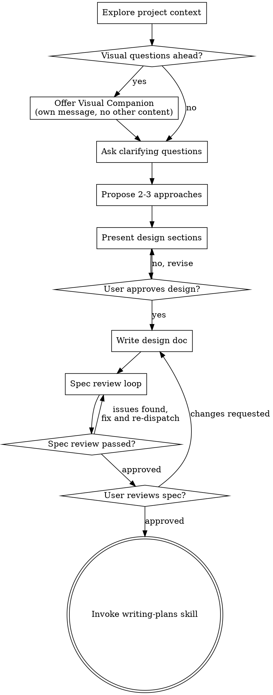

<!-- Generated by SpecStory, Markdown v2.1.0 -->

# 2026-03-14 10:31:16Z

<!-- Claude Code Session b36d5b6a-d12c-4939-b3a8-a571afe23923 (2026-03-14 10:31:16Z) -->

_**User (2026-03-14 10:31:16Z)**_

<command-message>superpowers:brainstorming</command-message>
<command-name>/superpowers:brainstorming</command-name>

_**User (2026-03-14 10:31:16Z)**_

Base directory for this skill: <HOME>/.claude/plugins/cache/claude-plugins-official/superpowers/5.0.2/skills/brainstorming

# Brainstorming Ideas Into Designs

Help turn ideas into fully formed designs and specs through natural collaborative dialogue.

Start by understanding the current project context, then ask questions one at a time to refine the idea. Once you understand what you're building, present the design and get user approval.

<HARD-GATE>
Do NOT invoke any implementation skill, write any code, scaffold any project, or take any implementation action until you have presented a design and the user has approved it. This applies to EVERY project regardless of perceived simplicity.
</HARD-GATE>

## Anti-Pattern: "This Is Too Simple To Need A Design"

Every project goes through this process. A todo list, a single-function utility, a config change — all of them. "Simple" projects are where unexamined assumptions cause the most wasted work. The design can be short (a few sentences for truly simple projects), but you MUST present it and get approval.

## Checklist

You MUST create a task for each of these items and complete them in order:

1. **Explore project context** — check files, docs, recent commits
2. **Offer visual companion** (if topic will involve visual questions) — this is its own message, not combined with a clarifying question. See the Visual Companion section below.
3. **Ask clarifying questions** — one at a time, understand purpose/constraints/success criteria
4. **Propose 2-3 approaches** — with trade-offs and your recommendation
5. **Present design** — in sections scaled to their complexity, get user approval after each section
6. **Write design doc** — save to `docs/superpowers/specs/YYYY-MM-DD-<topic>-design.md` and commit
7. **Spec review loop** — dispatch spec-document-reviewer subagent with precisely crafted review context (never your session history); fix issues and re-dispatch until approved (max 5 iterations, then surface to human)
8. **User reviews written spec** — ask user to review the spec file before proceeding
9. **Transition to implementation** — invoke writing-plans skill to create implementation plan

## Process Flow



**The terminal state is invoking writing-plans.** Do NOT invoke frontend-design, mcp-builder, or any other implementation skill. The ONLY skill you invoke after brainstorming is writing-plans.

## The Process

**Understanding the idea:**

- Check out the current project state first (files, docs, recent commits)
- Before asking detailed questions, assess scope: if the request describes multiple independent subsystems (e.g., "build a platform with chat, file storage, billing, and analytics"), flag this immediately. Don't spend questions refining details of a project that needs to be decomposed first.
- If the project is too large for a single spec, help the user decompose into sub-projects: what are the independent pieces, how do they relate, what order should they be built? Then brainstorm the first sub-project through the normal design flow. Each sub-project gets its own spec → plan → implementation cycle.
- For appropriately-scoped projects, ask questions one at a time to refine the idea
- Prefer multiple choice questions when possible, but open-ended is fine too
- Only one question per message - if a topic needs more exploration, break it into multiple questions
- Focus on understanding: purpose, constraints, success criteria

**Exploring approaches:**

- Propose 2-3 different approaches with trade-offs
- Present options conversationally with your recommendation and reasoning
- Lead with your recommended option and explain why

**Presenting the design:**

- Once you believe you understand what you're building, present the design
- Scale each section to its complexity: a few sentences if straightforward, up to 200-300 words if nuanced
- Ask after each section whether it looks right so far
- Cover: architecture, components, data flow, error handling, testing
- Be ready to go back and clarify if something doesn't make sense

**Design for isolation and clarity:**

- Break the system into smaller units that each have one clear purpose, communicate through well-defined interfaces, and can be understood and tested independently
- For each unit, you should be able to answer: what does it do, how do you use it, and what does it depend on?
- Can someone understand what a unit does without reading its internals? Can you change the internals without breaking consumers? If not, the boundaries need work.
- Smaller, well-bounded units are also easier for you to work with - you reason better about code you can hold in context at once, and your edits are more reliable when files are focused. When a file grows large, that's often a signal that it's doing too much.

**Working in existing codebases:**

- Explore the current structure before proposing changes. Follow existing patterns.
- Where existing code has problems that affect the work (e.g., a file that's grown too large, unclear boundaries, tangled responsibilities), include targeted improvements as part of the design - the way a good developer improves code they're working in.
- Don't propose unrelated refactoring. Stay focused on what serves the current goal.

## After the Design

**Documentation:**

- Write the validated design (spec) to `docs/superpowers/specs/YYYY-MM-DD-<topic>-design.md`
  - (User preferences for spec location override this default)
- Use elements-of-style:writing-clearly-and-concisely skill if available
- Commit the design document to git

**Spec Review Loop:**
After writing the spec document:

1. Dispatch spec-document-reviewer subagent (see spec-document-reviewer-prompt.md)
2. If Issues Found: fix, re-dispatch, repeat until Approved
3. If loop exceeds 5 iterations, surface to human for guidance

**User Review Gate:**
After the spec review loop passes, ask the user to review the written spec before proceeding:

> "Spec written and committed to `<path>`. Please review it and let me know if you want to make any changes before we start writing out the implementation plan."

Wait for the user's response. If they request changes, make them and re-run the spec review loop. Only proceed once the user approves.

**Implementation:**

- Invoke the writing-plans skill to create a detailed implementation plan
- Do NOT invoke any other skill. writing-plans is the next step.

## Key Principles

- **One question at a time** - Don't overwhelm with multiple questions
- **Multiple choice preferred** - Easier to answer than open-ended when possible
- **YAGNI ruthlessly** - Remove unnecessary features from all designs
- **Explore alternatives** - Always propose 2-3 approaches before settling
- **Incremental validation** - Present design, get approval before moving on
- **Be flexible** - Go back and clarify when something doesn't make sense

## Visual Companion

A browser-based companion for showing mockups, diagrams, and visual options during brainstorming. Available as a tool — not a mode. Accepting the companion means it's available for questions that benefit from visual treatment; it does NOT mean every question goes through the browser.

**Offering the companion:** When you anticipate that upcoming questions will involve visual content (mockups, layouts, diagrams), offer it once for consent:
> "Some of what we're working on might be easier to explain if I can show it to you in a web browser. I can put together mockups, diagrams, comparisons, and other visuals as we go. This feature is still new and can be token-intensive. Want to try it? (Requires opening a local URL)"

**This offer MUST be its own message.** Do not combine it with clarifying questions, context summaries, or any other content. The message should contain ONLY the offer above and nothing else. Wait for the user's response before continuing. If they decline, proceed with text-only brainstorming.

**Per-question decision:** Even after the user accepts, decide FOR EACH QUESTION whether to use the browser or the terminal. The test: **would the user understand this better by seeing it than reading it?**

- **Use the browser** for content that IS visual — mockups, wireframes, layout comparisons, architecture diagrams, side-by-side visual designs
- **Use the terminal** for content that is text — requirements questions, conceptual choices, tradeoff lists, A/B/C/D text options, scope decisions

A question about a UI topic is not automatically a visual question. "What does personality mean in this context?" is a conceptual question — use the terminal. "Which wizard layout works better?" is a visual question — use the browser.

If they agree to the companion, read the detailed guide before proceeding:
`skills/brainstorming/visual-companion.md`


_**User (2026-03-14 10:31:17Z)**_

[Request interrupted by user]

_**User (2026-03-14 10:32:58Z)**_

<command-message>superpowers:brainstorming</command-message>
<command-name>/superpowers:brainstorming</command-name>
<command-args>
      <div className="mt-1 text-center">
        <Link
          className="text-sm font-medium text-accent transition-colors hover:text-accent/80"
          href={href}
        >
          {t('read_full_note')} →
        </Link>
      </div> 脑爆这个地方的 UI 设计：怎么样才能体现 信纸 这种感觉，而不是单纯孤零零的一个居中的按钮？</command-args>

_**User (2026-03-14 10:32:58Z)**_

Base directory for this skill: <HOME>/.claude/plugins/cache/claude-plugins-official/superpowers/5.0.2/skills/brainstorming

# Brainstorming Ideas Into Designs

Help turn ideas into fully formed designs and specs through natural collaborative dialogue.

Start by understanding the current project context, then ask questions one at a time to refine the idea. Once you understand what you're building, present the design and get user approval.

<HARD-GATE>
Do NOT invoke any implementation skill, write any code, scaffold any project, or take any implementation action until you have presented a design and the user has approved it. This applies to EVERY project regardless of perceived simplicity.
</HARD-GATE>

## Anti-Pattern: "This Is Too Simple To Need A Design"

Every project goes through this process. A todo list, a single-function utility, a config change — all of them. "Simple" projects are where unexamined assumptions cause the most wasted work. The design can be short (a few sentences for truly simple projects), but you MUST present it and get approval.

## Checklist

You MUST create a task for each of these items and complete them in order:

1. **Explore project context** — check files, docs, recent commits
2. **Offer visual companion** (if topic will involve visual questions) — this is its own message, not combined with a clarifying question. See the Visual Companion section below.
3. **Ask clarifying questions** — one at a time, understand purpose/constraints/success criteria
4. **Propose 2-3 approaches** — with trade-offs and your recommendation
5. **Present design** — in sections scaled to their complexity, get user approval after each section
6. **Write design doc** — save to `docs/superpowers/specs/YYYY-MM-DD-<topic>-design.md` and commit
7. **Spec review loop** — dispatch spec-document-reviewer subagent with precisely crafted review context (never your session history); fix issues and re-dispatch until approved (max 5 iterations, then surface to human)
8. **User reviews written spec** — ask user to review the spec file before proceeding
9. **Transition to implementation** — invoke writing-plans skill to create implementation plan

## Process Flow


**The terminal state is invoking writing-plans.** Do NOT invoke frontend-design, mcp-builder, or any other implementation skill. The ONLY skill you invoke after brainstorming is writing-plans.

## The Process

**Understanding the idea:**

- Check out the current project state first (files, docs, recent commits)
- Before asking detailed questions, assess scope: if the request describes multiple independent subsystems (e.g., "build a platform with chat, file storage, billing, and analytics"), flag this immediately. Don't spend questions refining details of a project that needs to be decomposed first.
- If the project is too large for a single spec, help the user decompose into sub-projects: what are the independent pieces, how do they relate, what order should they be built? Then brainstorm the first sub-project through the normal design flow. Each sub-project gets its own spec → plan → implementation cycle.
- For appropriately-scoped projects, ask questions one at a time to refine the idea
- Prefer multiple choice questions when possible, but open-ended is fine too
- Only one question per message - if a topic needs more exploration, break it into multiple questions
- Focus on understanding: purpose, constraints, success criteria

**Exploring approaches:**

- Propose 2-3 different approaches with trade-offs
- Present options conversationally with your recommendation and reasoning
- Lead with your recommended option and explain why

**Presenting the design:**

- Once you believe you understand what you're building, present the design
- Scale each section to its complexity: a few sentences if straightforward, up to 200-300 words if nuanced
- Ask after each section whether it looks right so far
- Cover: architecture, components, data flow, error handling, testing
- Be ready to go back and clarify if something doesn't make sense

**Design for isolation and clarity:**

- Break the system into smaller units that each have one clear purpose, communicate through well-defined interfaces, and can be understood and tested independently
- For each unit, you should be able to answer: what does it do, how do you use it, and what does it depend on?
- Can someone understand what a unit does without reading its internals? Can you change the internals without breaking consumers? If not, the boundaries need work.
- Smaller, well-bounded units are also easier for you to work with - you reason better about code you can hold in context at once, and your edits are more reliable when files are focused. When a file grows large, that's often a signal that it's doing too much.

**Working in existing codebases:**

- Explore the current structure before proposing changes. Follow existing patterns.
- Where existing code has problems that affect the work (e.g., a file that's grown too large, unclear boundaries, tangled responsibilities), include targeted improvements as part of the design - the way a good developer improves code they're working in.
- Don't propose unrelated refactoring. Stay focused on what serves the current goal.

## After the Design

**Documentation:**

- Write the validated design (spec) to `docs/superpowers/specs/YYYY-MM-DD-<topic>-design.md`
  - (User preferences for spec location override this default)
- Use elements-of-style:writing-clearly-and-concisely skill if available
- Commit the design document to git

**Spec Review Loop:**
After writing the spec document:

1. Dispatch spec-document-reviewer subagent (see spec-document-reviewer-prompt.md)
2. If Issues Found: fix, re-dispatch, repeat until Approved
3. If loop exceeds 5 iterations, surface to human for guidance

**User Review Gate:**
After the spec review loop passes, ask the user to review the written spec before proceeding:

> "Spec written and committed to `<path>`. Please review it and let me know if you want to make any changes before we start writing out the implementation plan."

Wait for the user's response. If they request changes, make them and re-run the spec review loop. Only proceed once the user approves.

**Implementation:**

- Invoke the writing-plans skill to create a detailed implementation plan
- Do NOT invoke any other skill. writing-plans is the next step.

## Key Principles

- **One question at a time** - Don't overwhelm with multiple questions
- **Multiple choice preferred** - Easier to answer than open-ended when possible
- **YAGNI ruthlessly** - Remove unnecessary features from all designs
- **Explore alternatives** - Always propose 2-3 approaches before settling
- **Incremental validation** - Present design, get approval before moving on
- **Be flexible** - Go back and clarify when something doesn't make sense

## Visual Companion

A browser-based companion for showing mockups, diagrams, and visual options during brainstorming. Available as a tool — not a mode. Accepting the companion means it's available for questions that benefit from visual treatment; it does NOT mean every question goes through the browser.

**Offering the companion:** When you anticipate that upcoming questions will involve visual content (mockups, layouts, diagrams), offer it once for consent:
> "Some of what we're working on might be easier to explain if I can show it to you in a web browser. I can put together mockups, diagrams, comparisons, and other visuals as we go. This feature is still new and can be token-intensive. Want to try it? (Requires opening a local URL)"

**This offer MUST be its own message.** Do not combine it with clarifying questions, context summaries, or any other content. The message should contain ONLY the offer above and nothing else. Wait for the user's response before continuing. If they decline, proceed with text-only brainstorming.

**Per-question decision:** Even after the user accepts, decide FOR EACH QUESTION whether to use the browser or the terminal. The test: **would the user understand this better by seeing it than reading it?**

- **Use the browser** for content that IS visual — mockups, wireframes, layout comparisons, architecture diagrams, side-by-side visual designs
- **Use the terminal** for content that is text — requirements questions, conceptual choices, tradeoff lists, A/B/C/D text options, scope decisions

A question about a UI topic is not automatically a visual question. "What does personality mean in this context?" is a conceptual question — use the terminal. "Which wizard layout works better?" is a visual question — use the browser.

If they agree to the companion, read the detailed guide before proceeding:
`skills/brainstorming/visual-companion.md`


ARGUMENTS: 
      <div className="mt-1 text-center">
        <Link
          className="text-sm font-medium text-accent transition-colors hover:text-accent/80"
          href={href}
        >
          {t('read_full_note')} →
        </Link>
      </div> 脑爆这个地方的 UI 设计：怎么样才能体现 信纸 这种感觉，而不是单纯孤零零的一个居中的按钮？

---

_**Agent (claude-opus-4-6 2026-03-14 10:33:03Z)**_

_**Agent (claude-opus-4-6 2026-03-14 10:33:04Z)**_

先探查此组件之上下文。

_**Agent (claude-opus-4-6 2026-03-14 10:33:05Z)**_

<tool-use data-tool-type="search" data-tool-name="Grep"><details>
<summary>Tool use: **Grep**</summary>
 path `./` pattern `read_full_note`

```text
Found 4 files
apps/web/src/messages/ja/note.json
apps/web/src/messages/en/note.json
apps/web/src/messages/zh/note.json
apps/web/src/components/modules/note/NoteLatestRender.tsx
```
</details></tool-use>

_**Agent (claude-opus-4-6 2026-03-14 10:33:05Z)**_

<tool-use data-tool-type="search" data-tool-name="Grep"><details>
<summary>Tool use: **Grep**</summary>
 path `./` pattern `信纸`

```text
No files found
```
</details></tool-use>

_**Agent (claude-opus-4-6 2026-03-14 10:33:08Z)**_

<tool-use data-tool-type="read" data-tool-name="Read"><details>
<summary>Tool use: **Read**</summary>
 `./apps/web/src/components/modules/note/NoteLatestRender.tsx`

```text
     1→import type { NoteModel } from '@mx-space/api-client'
     2→import { getFormatter, getTranslations } from 'next-intl/server'
     3→
     4→import { LexicalContent } from '~/components/ui/rich-content/LexicalContent'
     5→import { Link } from '~/i18n/navigation'
     6→import { topicStringToHue } from '~/lib/color'
     7→import { buildNotePath } from '~/lib/note-route'
     8→
     9→import { Markdown } from '../../ui/markdown'
    10→
    11→export async function NoteLatestRender({ note }: { note: NoteModel }) {
    12→  const href = buildNotePath(note)
    13→  const coverSrc = note.meta?.cover as string | undefined
    14→  const format = await getFormatter()
    15→  const t = await getTranslations('note')
    16→  const date = new Date(note.created)
    17→
    18→  return (
    19→    <div className="relative mt-6">
    20→      {/* Nid watermark */}
    21→      <span className="pointer-events-none absolute -top-1 right-0 select-none font-serif text-5xl font-bold leading-none tracking-tighter text-neutral-9/[.06]">
    22→        #{note.nid}
    23→      </span>
    24→
    25→      {(note.weather || note.mood || note.topic) && (
    26→        <div className="mb-2.5 flex items-center gap-2 text-xs">
    27→          {note.topic && <MobileTopicTag name={note.topic.name} />}
    28→          {note.weather && (
    29→            <span className="text-neutral-6">{note.weather}</span>
    30→          )}
    31→          {note.mood && <span className="text-neutral-6">{note.mood}</span>}
    32→        </div>
    33→      )}
    34→
    35→      <h1 className="mb-1.5 text-2xl font-bold tracking-tight text-neutral-9 lg:text-[28px]">
    36→        <Link className="hover:text-accent transition-colors" href={href}>
    37→          {note.title}
    38→        </Link>
    39→      </h1>
    40→
    41→      <div className="mb-6 text-xs text-neutral-6">
    42→        {format.dateTime(date, {
    43→          year: 'numeric',
    44→          month: 'long',
    45→          day: 'numeric',
    46→          weekday: 'short',
    47→        })}
    48→      </div>
    49→
    50→      {coverSrc && (
    51→        <Link className="mb-6 block overflow-hidden rounded-lg" href={href}>
    52→          
    58→        </Link>
    59→      )}
    60→
    61→      <div className="relative">
    62→        <div className="max-h-[calc(100vh-40rem)] overflow-hidden">
    63→          {note.contentFormat === 'lexical' && note.content ? (
    64→            <article className="relative">
    65→              <LexicalContent content={note.content} variant="note" />
    66→            </article>
    67→          ) : note.text ? (
    68→            <article className="prose relative">
    69→              <Markdown
    70→                removeWrapper={false}
    71→                value={note.text}
    72→                variant="note"
    73→              />
    74→            </article>
    75→          ) : null}
    76→        </div>
    77→
    78→        <div className="pointer-events-none absolute inset-x-0 bottom-0 h-[120px] bg-gradient-to-b from-transparent via-white/85 to-white/98 dark:via-neutral-1/85 dark:to-neutral-1/98" />
    79→      </div>
    80→
    81→      <div className="mt-1 text-center">
    82→        <Link
    83→          className="text-sm font-medium text-accent transition-colors hover:text-accent/80"
    84→          href={href}
    85→        >
    86→          {t('read_full_note')} →
    87→        </Link>
    88→      </div>
    89→    </div>
    90→  )
    91→}
    92→
    93→function MobileTopicTag({ name }: { name: string }) {
    94→  const hue = topicStringToHue(name)
    95→  return (
    96→    <span
    97→      className="rounded-full px-2.5 py-0.5 text-[11px] font-medium lg:hidden"
    98→      style={{
    99→        backgroundColor: `hsl(${hue}, 35%, 40%, 0.12)`,
   100→        color: `hsl(${hue}, 35%, 40%)`,
   101→      }}
   102→    >
   103→      {name}
   104→    </span>
   105→  )
   106→}
   107→
```
</details></tool-use>

_**Agent (claude-opus-4-6 2026-03-14 10:33:08Z)**_

<tool-use data-tool-type="search" data-tool-name="Grep"><details>
<summary>Tool use: **Grep**</summary>
 path `./` pattern `NoteLatestRender`

```text
Found 3 files
apps/web/src/app/[locale]/notes/page.tsx
apps/web/src/components/modules/note/NoteLatestRender.tsx
docs/superpowers/specs/2026-03-14-notes-list-hero-latest-design.md
```
</details></tool-use>

_**Agent (claude-opus-4-6 2026-03-14 10:33:11Z)**_

<tool-use data-tool-type="read" data-tool-name="Read"><details>
<summary>Tool use: **Read**</summary>
 `./apps/web/src/app/[locale]/notes/page.tsx`

```text
     1→import type { NoteModel } from '@mx-space/api-client'
     2→import { getTranslations } from 'next-intl/server'
     3→
     4→import { Paper } from '~/components/layout/container/Paper'
     5→import { NoteLatestRender } from '~/components/modules/note/NoteLatestRender'
     6→import { NoteListPagination } from '~/components/modules/note/NoteListPagination'
     7→import { NoteListTimeline } from '~/components/modules/note/NoteListTimeline'
     8→import { NoteTopicBinderClip } from '~/components/modules/note/NoteTopicBinderClip'
     9→import { NothingFound } from '~/components/modules/shared/NothingFound'
    10→import { apiClient } from '~/lib/request'
    11→import { definePrerenderPage } from '~/lib/request.server'
    12→
    13→interface Props extends LocaleParams {
    14→  page?: string
    15→}
    16→
    17→const noteListSelect: (keyof NoteModel)[] = [
    18→  'title',
    19→  'nid',
    20→  'meta',
    21→  'topic',
    22→  'topicId' as keyof NoteModel,
    23→  'mood',
    24→  'weather',
    25→  'bookmark',
    26→  'created',
    27→  'slug',
    28→  'id',
    29→]
    30→
    31→export default definePrerenderPage<Props>()({
    32→  fetcher: async (params) => {
    33→    const currentPage = params?.page ? Number.parseInt(params.page) : 1
    34→    const isFirstPage = currentPage === 1
    35→
    36→    const [latestNote, listResult] = await Promise.all([
    37→      isFirstPage
    38→        ? apiClient.note.getLatest().then((res) => res.data as NoteModel)
    39→        : null,
    40→      apiClient.note.getList(currentPage, 10, {
    41→        select: noteListSelect,
    42→        withSummary: true,
    43→      }),
    44→    ])
    45→
    46→    return { latestNote, listResult, isFirstPage }
    47→  },
    48→  Component: async ({ data: { latestNote, listResult, isFirstPage } }) => {
    49→    const t = await getTranslations('note')
    50→    const { data, pagination } = listResult
    51→
    52→    if (!data?.length) {
    53→      return <NothingFound />
    54→    }
    55→
    56→    const timelineNotes =
    57→      isFirstPage && latestNote
    58→        ? data.filter((n: NoteModel) => n.id !== latestNote.id)
    59→        : data
    60→
    61→    return (
    62→      <div className="mx-auto mt-24 min-w-0 max-w-5xl px-4">
    63→        {isFirstPage && latestNote && (
    64→          <>
    65→            <Paper as="section" className="mb-0!">
    66→              <div className="hidden lg:block">
    67→                {latestNote.topic && (
    68→                  <NoteTopicBinderClip topic={latestNote.topic} />
    69→                )}
    70→              </div>
    71→              <NoteLatestRender note={latestNote} />
    72→            </Paper>
    73→            {timelineNotes.length > 0 && (
    74→              <div className="my-10 flex items-center gap-3">
    75→                <div className="h-px flex-1 bg-neutral-200/60 dark:bg-neutral-800/60" />
    76→                <span className="text-xs tracking-widest text-neutral-4">
    77→                  {t('older_notes')}
    78→                </span>
    79→                <div className="h-px flex-1 bg-neutral-200/60 dark:bg-neutral-800/60" />
    80→              </div>
    81→            )}
    82→          </>
    83→        )}
    84→        {timelineNotes.length > 0 && <NoteListTimeline notes={timelineNotes} />}
    85→        <NoteListPagination pagination={pagination} />
    86→      </div>
    87→    )
    88→  },
    89→})
    90→
```
</details></tool-use>

_**Agent (claude-opus-4-6 2026-03-14 10:33:12Z)**_

<tool-use data-tool-type="search" data-tool-name="Grep"><details>
<summary>Tool use: **Grep**</summary>
 path `./apps/web/src/components` pattern `letter|stationery|paper|note.*card`

```text
Found 10 files
apps/web/src/components/modules/note/NoteTopicBinderClip.tsx
apps/web/src/components/modules/note/NoteListCard.tsx
apps/web/src/components/modules/note/NoteListTimeline.tsx
apps/web/src/components/modules/peek/NotePreview.tsx
apps/web/src/components/ui/rich-content/LexicalContent.tsx
apps/web/src/components/ui/markdown/markdown-variants.css
apps/web/src/components/layout/container/Paper.tsx
apps/web/src/components/modules/peek/PostPreview.tsx
apps/web/src/components/ui/link-card/plugins/academic/arxiv.tsx
apps/web/src/components/ui/markdown/markdown.css
```
</details></tool-use>

_**Agent (claude-opus-4-6 2026-03-14 10:33:16Z)**_

<tool-use data-tool-type="read" data-tool-name="Read"><details>
<summary>Tool use: **Read**</summary>
 `./apps/web/src/components/layout/container/Paper.tsx`

```text
     1→import type { JSX } from 'react'
     2→
     3→import { clsxm } from '~/lib/helper'
     4→
     5→export const Paper: Component<{
     6→  as?: keyof JSX.IntrinsicElements | Component
     7→}> = ({ children, className, as: As = 'main' }) => (
     8→  <As
     9→    className={clsxm(
    10→      'relative bg-neutral-1 dark:bg-neutral-2 md:col-start-1 lg:col-auto',
    11→      '-m-4 p-[2rem_1rem] md:m-0 lg:p-[30px_45px]',
    12→      'rounded-[0_6px_6px_0] border-neutral-200/70 dark:border-neutral-800 lg:border',
    13→      'shadow-perfect perfect-sm',
    14→      'note-layout-main',
    15→      'min-w-0',
    16→      'print:border-none! print:bg-transparent! print:shadow-none!',
    17→      className,
    18→    )}
    19→  >
    20→    {children}
    21→  </As>
    22→)
    23→
```
</details></tool-use>

_**Agent (claude-opus-4-6 2026-03-14 10:33:16Z)**_

<tool-use data-tool-type="read" data-tool-name="Read"><details>
<summary>Tool use: **Read**</summary>
 `./apps/web/src/components/modules/note/NoteTopicBinderClip.tsx`

```text
     1→'use client'
     2→
     3→import type { TopicModel } from '@mx-space/api-client'
     4→
     5→import { FloatPopover } from '~/components/ui/float-popover'
     6→import { useIsDark } from '~/hooks/common/use-is-dark'
     7→import { Link } from '~/i18n/navigation'
     8→import { topicColors, topicStringToHue } from '~/lib/color'
     9→import { routeBuilder, Routes } from '~/lib/route-builder'
    10→import { useCurrentNoteDataSelector } from '~/providers/note/CurrentNoteDataProvider'
    11→
    12→import { NoteTopicDetail } from './NoteTopicDetail'
    13→
    14→export const NoteTopicBinderClip = ({
    15→  topic: topicProp,
    16→}: {
    17→  topic?: TopicModel
    18→} = {}) => {
    19→  const contextTopic = useCurrentNoteDataSelector((state) => state?.data.topic)
    20→  const topic = topicProp ?? contextTopic
    21→  const isDark = useIsDark()
    22→
    23→  if (!topic) return null
    24→
    25→  const c = topicColors(topic.name, isDark)
    26→  const clipWidth = Math.max(72, topic.name.length * 8 + 28)
    27→
    28→  return (
    29→    <FloatPopover
    30→      mobileAsSheet
    31→      offset={8}
    32→      placement="bottom-start"
    33→      wrapperClassName="absolute -left-[3px] -top-[3px] z-[2] hidden lg:block"
    34→      triggerElement={
    35→        <Link
    36→          className="group block"
    37→          href={routeBuilder(Routes.NoteTopic, { slug: topic.slug })}
    38→        >
    39→          {/* Clip body — horizontal bar */}
    40→          <div className="flex">
    41→            {/* Left edge — clip thickness/fold wrapping around paper */}
    42→            <div
    43→              className="w-[5px] shrink-0 transition-all duration-200 group-hover:brightness-115"
    44→              style={{
    45→                background: `linear-gradient(90deg, ${c.to} 0%, ${c.mid} 100%)`,
    46→                boxShadow: 'inset 0 1px 0 rgba(255,255,255,0.08)',
    47→              }}
    48→            />
    49→            {/* Main face */}
    50→            <div
    51→              className="relative flex flex-1 items-center justify-center rounded-br-[6px] rounded-tr-[6px] transition-all duration-200 group-hover:brightness-115"
    52→              style={{
    53→                width: `${clipWidth}px`,
    54→                height: 30,
    55→                background: `linear-gradient(135deg, ${c.from} 0%, ${c.mid} 40%, ${c.to} 100%)`,
    56→                boxShadow:
    57→                  'inset 0 1px 0 rgba(255,255,255,0.2), inset 0 -1px 0 rgba(0,0,0,0.1), 0 2px 4px rgba(0,0,0,0.15)',
    58→              }}
    59→            >
    60→              {/* Inner bevel highlight */}
    61→              <span
    62→                className="pointer-events-none absolute inset-x-1.5 top-0.5 h-px"
    63→                style={{
    64→                  background:
    65→                    'linear-gradient(90deg, rgba(255,255,255,0.05), rgba(255,255,255,0.15), rgba(255,255,255,0.05))',
    66→                }}
    67→              />
    68→              <span className="text-[11px] font-semibold leading-none tracking-wider text-white/90 drop-shadow-[0_1px_1px_rgba(0,0,0,0.2)]">
    69→                {topic.name}
    70→              </span>
    71→            </div>
    72→          </div>
    73→
    74→          {/* Vertical tab — clip side profile wrapping down paper edge */}
    75→          <div
    76→            className="relative h-7 w-[5px] rounded-br-[3px] transition-all duration-200 group-hover:brightness-115"
    77→            style={{
    78→              background: `linear-gradient(180deg, ${c.to} 0%, hsl(${topicStringToHue(topic.name)}, 30%, ${isDark ? 38 : 28}%) 100%)`,
    79→              boxShadow: '1px 1px 3px rgba(0,0,0,0.15)',
    80→            }}
    81→          />
    82→        </Link>
    83→      }
    84→    >
    85→      <NoteTopicDetail topic={topic} />
    86→    </FloatPopover>
    87→  )
    88→}
    89→
```
</details></tool-use>

_**Agent (claude-opus-4-6 2026-03-14 10:33:26Z)**_

_**Agent (claude-opus-4-6 2026-03-14 10:33:31Z)**_

已览其上下文。此 `NoteLatestRender` 居于 `Paper` 容器内，已具纸质之感（圆角、阴影、边框），且有 `NoteTopicBinderClip` 拟物票夹。底部以渐隐遮罩截断正文，其下仅一居中链接，确显孤寂。

此题涉视觉设计，吾可于浏览器中制 mockup 以示方案，较纯文字描述更为直观。此功能尚新，耗 token 较多。君欲试否？（需开启本地 URL）

---

_**User (2026-03-14 10:33:49Z)**_

ok

---

_**Agent (claude-opus-4-6 2026-03-14 10:33:58Z)**_

_**Agent (claude-opus-4-6 2026-03-14 10:33:59Z)**_

<tool-use data-tool-type="read" data-tool-name="Read"><details>
<summary>Tool use: **Read**</summary>
 `<HOME>/.claude/plugins/cache/claude-plugins-official/superpowers/5.0.2/skills/brainstorming/visual-companion.md`

```text
     1→# Visual Companion Guide
     2→
     3→Browser-based visual brainstorming companion for showing mockups, diagrams, and options.
     4→
     5→## When to Use
     6→
     7→Decide per-question, not per-session. The test: **would the user understand this better by seeing it than reading it?**
     8→
     9→**Use the browser** when the content itself is visual:
    10→
    11→- **UI mockups** — wireframes, layouts, navigation structures, component designs
    12→- **Architecture diagrams** — system components, data flow, relationship maps
    13→- **Side-by-side visual comparisons** — comparing two layouts, two color schemes, two design directions
    14→- **Design polish** — when the question is about look and feel, spacing, visual hierarchy
    15→- **Spatial relationships** — state machines, flowcharts, entity relationships rendered as diagrams
    16→
    17→**Use the terminal** when the content is text or tabular:
    18→
    19→- **Requirements and scope questions** — "what does X mean?", "which features are in scope?"
    20→- **Conceptual A/B/C choices** — picking between approaches described in words
    21→- **Tradeoff lists** — pros/cons, comparison tables
    22→- **Technical decisions** — API design, data modeling, architectural approach selection
    23→- **Clarifying questions** — anything where the answer is words, not a visual preference
    24→
    25→A question *about* a UI topic is not automatically a visual question. "What kind of wizard do you want?" is conceptual — use the terminal. "Which of these wizard layouts feels right?" is visual — use the browser.
    26→
    27→## How It Works
    28→
    29→The server watches a directory for HTML files and serves the newest one to the browser. You write HTML content, the user sees it in their browser and can click to select options. Selections are recorded to a `.events` file that you read on your next turn.
    30→
    31→**Content fragments vs full documents:** If your HTML file starts with `<!DOCTYPE` or `<html`, the server serves it as-is (just injects the helper script). Otherwise, the server automatically wraps your content in the frame template — adding the header, CSS theme, selection indicator, and all interactive infrastructure. **Write content fragments by default.** Only write full documents when you need complete control over the page.
    32→
    33→## Starting a Session
    34→
    35→```bash
    36→# Start server with persistence (mockups saved to project)
    37→scripts/start-server.sh --project-dir /path/to/project
    38→
    39→# Returns: {"type":"server-started","port":52341,"url":"http://localhost:52341",
    40→#           "screen_dir":"/path/to/project/.superpowers/brainstorm/12345-1706000000"}
    41→```
    42→
    43→Save `screen_dir` from the response. Tell user to open the URL.
    44→
    45→**Finding connection info:** The server writes its startup JSON to `$SCREEN_DIR/.server-info`. If you launched the server in the background and didn't capture stdout, read that file to get the URL and port. When using `--project-dir`, check `<project>/.superpowers/brainstorm/` for the session directory.
    46→
    47→**Note:** Pass the project root as `--project-dir` so mockups persist in `.superpowers/brainstorm/` and survive server restarts. Without it, files go to `/tmp` and get cleaned up. Remind the user to add `.superpowers/` to `.gitignore` if it's not already there.
    48→
    49→**Launching the server by platform:**
    50→
    51→**Claude Code:**
    52→```bash
    53→# Default mode works — the script backgrounds the server itself
    54→scripts/start-server.sh --project-dir /path/to/project
    55→```
    56→
    57→**Codex:**
    58→```bash
    59→# Codex reaps background processes. The script auto-detects CODEX_CI and
    60→# switches to foreground mode. Run it normally — no extra flags needed.
    61→scripts/start-server.sh --project-dir /path/to/project
    62→```
    63→
    64→**Gemini CLI:**
    65→```bash
    66→# Use --foreground and set is_background: true on your shell tool call
    67→# so the process survives across turns
    68→scripts/start-server.sh --project-dir /path/to/project --foreground
    69→```
    70→
    71→**Other environments:** The server must keep running in the background across conversation turns. If your environment reaps detached processes, use `--foreground` and launch the command with your platform's background execution mechanism.
    72→
    73→If the URL is unreachable from your browser (common in remote/containerized setups), bind a non-loopback host:
    74→
    75→```bash
    76→scripts/start-server.sh \
    77→  --project-dir /path/to/project \
    78→  --host 0.0.0.0 \
    79→  --url-host localhost
    80→```
    81→
    82→Use `--url-host` to control what hostname is printed in the returned URL JSON.
    83→
    84→## The Loop
    85→
    86→1. **Check server is alive**, then **write HTML** to a new file in `screen_dir`:
    87→   - Before each write, check that `$SCREEN_DIR/.server-info` exists. If it doesn't (or `.server-stopped` exists), the server has shut down — restart it with `start-server.sh` before continuing. The server auto-exits after 30 minutes of inactivity.
    88→   - Use semantic filenames: `platform.html`, `visual-style.html`, `layout.html`
    89→   - **Never reuse filenames** — each screen gets a fresh file
    90→   - Use Write tool — **never use cat/heredoc** (dumps noise into terminal)
    91→   - Server automatically serves the newest file
    92→
    93→2. **Tell user what to expect and end your turn:**
    94→   - Remind them of the URL (every step, not just first)
    95→   - Give a brief text summary of what's on screen (e.g., "Showing 3 layout options for the homepage")
    96→   - Ask them to respond in the terminal: "Take a look and let me know what you think. Click to select an option if you'd like."
    97→
    98→3. **On your next turn** — after the user responds in the terminal:
    99→   - Read `$SCREEN_DIR/.events` if it exists — this contains the user's browser interactions (clicks, selections) as JSON lines
   100→   - Merge with the user's terminal text to get the full picture
   101→   - The terminal message is the primary feedback; `.events` provides structured interaction data
   102→
   103→4. **Iterate or advance** — if feedback changes current screen, write a new file (e.g., `layout-v2.html`). Only move to the next question when the current step is validated.
   104→
   105→5. **Unload when returning to terminal** — when the next step doesn't need the browser (e.g., a clarifying question, a tradeoff discussion), push a waiting screen to clear the stale content:
   106→
   107→   ```html
   108→   <!-- filename: waiting.html (or waiting-2.html, etc.) -->
   109→   <div style="display:flex;align-items:center;justify-content:center;min-height:60vh">
   110→     <p class="subtitle">Continuing in terminal...</p>
   111→   </div>
   112→   ```
   113→
   114→   This prevents the user from staring at a resolved choice while the conversation has moved on. When the next visual question comes up, push a new content file as usual.
   115→
   116→6. Repeat until done.
   117→
   118→## Writing Content Fragments
   119→
   120→Write just the content that goes inside the page. The server wraps it in the frame template automatically (header, theme CSS, selection indicator, and all interactive infrastructure).
   121→
   122→**Minimal example:**
   123→
   124→```html
   125→<h2>Which layout works better?</h2>
   126→<p class="subtitle">Consider readability and visual hierarchy</p>
   127→
   128→<div class="options">
   129→  <div class="option" data-choice="a" onclick="toggleSelect(this)">
   130→    <div class="letter">A</div>
   131→    <div class="content">
   132→      <h3>Single Column</h3>
   133→      <p>Clean, focused reading experience</p>
   134→    </div>
   135→  </div>
   136→  <div class="option" data-choice="b" onclick="toggleSelect(this)">
   137→    <div class="letter">B</div>
   138→    <div class="content">
   139→      <h3>Two Column</h3>
   140→      <p>Sidebar navigation with main content</p>
   141→    </div>
   142→  </div>
   143→</div>
   144→```
   145→
   146→That's it. No `<html>`, no CSS, no `<script>` tags needed. The server provides all of that.
   147→
   148→## CSS Classes Available
   149→
   150→The frame template provides these CSS classes for your content:
   151→
   152→### Options (A/B/C choices)
   153→
   154→```html
   155→<div class="options">
   156→  <div class="option" data-choice="a" onclick="toggleSelect(this)">
   157→    <div class="letter">A</div>
   158→    <div class="content">
   159→      <h3>Title</h3>
   160→      <p>Description</p>
   161→    </div>
   162→  </div>
   163→</div>
   164→```
   165→
   166→**Multi-select:** Add `data-multiselect` to the container to let users select multiple options. Each click toggles the item. The indicator bar shows the count.
   167→
   168→```html
   169→<div class="options" data-multiselect>
   170→  <!-- same option markup — users can select/deselect multiple -->
   171→</div>
   172→```
   173→
   174→### Cards (visual designs)
   175→
   176→```html
   177→<div class="cards">
   178→  <div class="card" data-choice="design1" onclick="toggleSelect(this)">
   179→    <div class="card-image"><!-- mockup content --></div>
   180→    <div class="card-body">
   181→      <h3>Name</h3>
   182→      <p>Description</p>
   183→    </div>
   184→  </div>
   185→</div>
   186→```
   187→
   188→### Mockup container
   189→
   190→```html
   191→<div class="mockup">
   192→  <div class="mockup-header">Preview: Dashboard Layout</div>
   193→  <div class="mockup-body"><!-- your mockup HTML --></div>
   194→</div>
   195→```
   196→
   197→### Split view (side-by-side)
   198→
   199→```html
   200→<div class="split">
   201→  <div class="mockup"><!-- left --></div>
   202→  <div class="mockup"><!-- right --></div>
   203→</div>
   204→```
   205→
   206→### Pros/Cons
   207→
   208→```html
   209→<div class="pros-cons">
   210→  <div class="pros"><h4>Pros</h4><ul><li>Benefit</li></ul></div>
   211→  <div class="cons"><h4>Cons</h4><ul><li>Drawback</li></ul></div>
   212→</div>
   213→```
   214→
   215→### Mock elements (wireframe building blocks)
   216→
   217→```html
   218→<div class="mock-nav">Logo | Home | About | Contact</div>
   219→<div style="display: flex;">
   220→  <div class="mock-sidebar">Navigation</div>
   221→  <div class="mock-content">Main content area</div>
   222→</div>
   223→<button class="mock-button">Action Button</button>
   224→<input class="mock-input" placeholder="Input field">
   225→<div class="placeholder">Placeholder area</div>
   226→```
   227→
   228→### Typography and sections
   229→
   230→- `h2` — page title
   231→- `h3` — section heading
   232→- `.subtitle` — secondary text below title
   233→- `.section` — content block with bottom margin
   234→- `.label` — small uppercase label text
   235→
   236→## Browser Events Format
   237→
   238→When the user clicks options in the browser, their interactions are recorded to `$SCREEN_DIR/.events` (one JSON object per line). The file is cleared automatically when you push a new screen.
   239→
   240→```jsonl
   241→{"type":"click","choice":"a","text":"Option A - Simple Layout","timestamp":1706000101}
   242→{"type":"click","choice":"c","text":"Option C - Complex Grid","timestamp":1706000108}
   243→{"type":"click","choice":"b","text":"Option B - Hybrid","timestamp":1706000115}
   244→```
   245→
   246→The full event stream shows the user's exploration path — they may click multiple options before settling. The last `choice` event is typically the final selection, but the pattern of clicks can reveal hesitation or preferences worth asking about.
   247→
   248→If `.events` doesn't exist, the user didn't interact with the browser — use only their terminal text.
   249→
   250→## Design Tips
   251→
   252→- **Scale fidelity to the question** — wireframes for layout, polish for polish questions
   253→- **Explain the question on each page** — "Which layout feels more professional?" not just "Pick one"
   254→- **Iterate before advancing** — if feedback changes current screen, write a new version
   255→- **2-4 options max** per screen
   256→- **Use real content when it matters** — for a photography portfolio, use actual images (Unsplash). Placeholder content obscures design issues.
   257→- **Keep mockups simple** — focus on layout and structure, not pixel-perfect design
   258→
   259→## File Naming
   260→
   261→- Use semantic names: `platform.html`, `visual-style.html`, `layout.html`
   262→- Never reuse filenames — each screen must be a new file
   263→- For iterations: append version suffix like `layout-v2.html`, `layout-v3.html`
   264→- Server serves newest file by modification time
   265→
   266→## Cleaning Up
   267→
   268→```bash
   269→scripts/stop-server.sh $SCREEN_DIR
   270→```
   271→
   272→If the session used `--project-dir`, mockup files persist in `.superpowers/brainstorm/` for later reference. Only `/tmp` sessions get deleted on stop.
   273→
   274→## Reference
   275→
   276→- Frame template (CSS reference): `scripts/frame-template.html`
   277→- Helper script (client-side): `scripts/helper.js`
   278→
```
</details></tool-use>

_**Agent (claude-opus-4-6 2026-03-14 10:34:02Z)**_

_**Agent (claude-opus-4-6 2026-03-14 10:34:07Z)**_

<tool-use data-tool-type="shell" data-tool-name="Bash"><details>
<summary>Tool use: **Bash**</summary>
Start visual companion server for brainstorming mockups

`<HOME>/.claude/plugins/cache/claude-plugins-official/superpowers/5.0.2/skills/brainstorming/scripts/start-server.sh --project-dir <REPO_ROOT>`

```text
{"type":"server-started","port":58479,"host":"127.0.0.1","url_host":"localhost","url":"http://localhost:58479","screen_dir":"<REPO_ROOT>/.superpowers/brainstorm/40021-1773484444"}
```
</details></tool-use>

_**Agent (claude-opus-4-6 2026-03-14 10:34:09Z)**_

<tool-use data-tool-type="unknown" data-tool-name="ToolSearch"><details>
<summary>Tool use: **ToolSearch**</summary>

**Input:**

- max_results: `1`
- query: `select:TaskUpdate`

**Result:**

```

```
</details></tool-use>

_**Agent (claude-opus-4-6 2026-03-14 10:34:19Z)**_


善。视觉伴侣已启动。请君于浏览器开启 http://localhost:58479 。

今先问一事：君所言「信纸」之感，心中所想偏向何者？

1. **日式竖书信笺** — 淡色横线、右侧起笔、末尾署名落款，素雅留白
2. **西式信纸** — 底部有折痕暗示、签名区、或 "yours truly" 式结尾语
3. **手写便笺/手帐风** — 纸张边缘微卷、手写体、贴纸/印章点缀
4. **纯粹纸质质感强化** — 不拘东西，仅让底部收尾更有「一封信写到末尾」的仪式感

君意如何？

---

_**User (2026-03-14 10:34:33Z)**_

3

---

_**Agent (claude-opus-4-6 2026-03-14 10:34:37Z)**_

_**Agent (claude-opus-4-6 2026-03-14 10:34:44Z)**_

明。手帐便笺风。再问一事：

此「阅读全文」区域，君欲其承载多少装饰元素？

1. **极简点缀** — 仅一枚小印章/邮戳 + 手写体链接文字，纸边微有撕裂纹理，克制为主
2. **适度装饰** — 纸胶带（washi tape）封口感 + 印章 + 手写体，有手帐氛围但不喧宾夺主
3. **丰富手帐** — 贴纸、纸胶带、印章、手绘箭头等多元素叠加，强烈手帐风格

考量：此区域居于 `Paper` 容器底部，上方为正文渐隐，需与整体博客风格协调。

---

_**User (2026-03-14 10:35:20Z)**_

mockup 看看先

---

_**Agent (claude-opus-4-6 2026-03-14 10:35:25Z)**_

_**Agent (claude-opus-4-6 2026-03-14 10:36:08Z)**_

<tool-use data-tool-type="write" data-tool-name="Write"><details>
<summary>Tool use: **Write**</summary>

```html
<h2>「阅读全文」区域 — 手帐便笺风方案</h2>
<p class="subtitle">三种装饰程度对比，点击选择偏好的方案</p>

<style>
  .demo-paper {
    background: #fefcf9;
    border: 1px solid #e8e0d4;
    border-radius: 0 6px 6px 0;
    padding: 24px 32px;
    position: relative;
    box-shadow: 0 2px 12px rgba(0,0,0,0.06);
    max-width: 520px;
    margin: 0 auto;
  }
  @media (prefers-color-scheme: dark) {
    .demo-paper {
      background: #1c1b19;
      border-color: #333;
      box-shadow: 0 2px 12px rgba(0,0,0,0.3);
    }
    .demo-paper .fake-text { background: #2a2926 !important; }
    .demo-paper .fade-overlay {
      background: linear-gradient(to bottom, transparent, #1c1b19) !important;
    }
    .stamp-circle { border-color: rgba(180,80,80,0.35) !important; color: rgba(180,80,80,0.4) !important; }
    .postmark { color: rgba(180,80,80,0.3) !important; border-color: rgba(180,80,80,0.25) !important; }
    .washi-tape { opacity: 0.25 !important; }
    .torn-edge { filter: invert(0.85) !important; }
    .handwrite-link { color: #d4956a !important; }
    .doodle-arrow { color: rgba(180,120,80,0.4) !important; }
    .sticker-star { color: rgba(200,170,80,0.35) !important; }
    .tape-piece { opacity: 0.2 !important; }
  }
  .fake-text {
    height: 10px;
    background: #f0ebe3;
    border-radius: 3px;
    margin-bottom: 8px;
  }
  .fake-text:last-of-type { width: 65%; }
  .fade-overlay {
    position: absolute;
    left: 0; right: 0;
    height: 80px;
    background: linear-gradient(to bottom, transparent, #fefcf9);
    pointer-events: none;
  }
  .handwrite-link {
    font-family: 'Georgia', 'Noto Serif SC', serif;
    font-style: italic;
    color: #b87a4a;
    text-decoration: none;
    font-size: 14px;
    letter-spacing: 0.5px;
  }
  .stamp-circle {
    width: 44px; height: 44px;
    border: 2px solid rgba(180,80,80,0.3);
    border-radius: 50%;
    display: flex;
    align-items: center;
    justify-content: center;
    font-size: 9px;
    color: rgba(180,80,80,0.35);
    font-family: serif;
    transform: rotate(-12deg);
    letter-spacing: 0.5px;
    line-height: 1.1;
    text-align: center;
  }
  .postmark {
    font-family: 'Courier New', monospace;
    font-size: 10px;
    color: rgba(180,80,80,0.25);
    border: 1.5px solid rgba(180,80,80,0.2);
    border-radius: 50%;
    width: 52px; height: 52px;
    display: flex;
    align-items: center;
    justify-content: center;
    transform: rotate(-18deg);
    text-align: center;
    line-height: 1.2;
  }
  .washi-tape {
    height: 22px;
    background: repeating-linear-gradient(
      45deg,
      rgba(180,200,160,0.35),
      rgba(180,200,160,0.35) 4px,
      rgba(200,220,180,0.35) 4px,
      rgba(200,220,180,0.35) 8px
    );
    border-radius: 1px;
    opacity: 0.7;
    transform: rotate(-1.5deg);
  }
  .torn-edge {
    height: 6px;
    background: url("data:image/svg+xml,%3Csvg width='200' height='6' xmlns='http://www.w3.org/2000/svg'%3E%3Cpath d='M0,3 Q5,0 10,3 Q15,6 20,3 Q25,0 30,3 Q35,6 40,3 Q45,0 50,3 Q55,6 60,3 Q65,0 70,3 Q75,6 80,3 Q85,0 90,3 Q95,6 100,3 Q105,0 110,3 Q115,6 120,3 Q125,0 130,3 Q135,6 140,3 Q145,0 150,3 Q155,6 160,3 Q165,0 170,3 Q175,6 180,3 Q185,0 190,3 Q195,6 200,3' fill='none' stroke='%23e0d8cc' stroke-width='1'/%3E%3C/svg%3E") repeat-x;
    margin-bottom: 12px;
  }
  .doodle-arrow {
    font-size: 20px;
    color: rgba(180,120,80,0.35);
    font-family: 'Comic Sans MS', cursive;
  }
  .sticker-star {
    font-size: 22px;
    color: rgba(200,170,80,0.4);
  }
  .tape-piece {
    width: 60px; height: 18px;
    background: rgba(200,180,140,0.3);
    border-radius: 1px;
    transform: rotate(3deg);
    opacity: 0.5;
  }
</style>

<div class="cards">
  <!-- Option A: 极简点缀 -->
  <div class="card" data-choice="a" onclick="toggleSelect(this)">
    <div class="card-image" style="padding:0;">
      <div class="demo-paper">
        <div class="fake-text" style="width:100%"></div>
        <div class="fake-text" style="width:90%"></div>
        <div class="fake-text" style="width:75%"></div>
        <div style="position:relative; margin-top:4px;">
          <div class="fade-overlay" style="bottom:0;"></div>
        </div>
        <!-- 撕裂边 -->
        <div class="torn-edge" style="margin-top:16px;"></div>
        <!-- 底部：印章 + 手写链接 -->
        <div style="display:flex; align-items:center; justify-content:space-between; padding:0 8px;">
          <span class="handwrite-link">阅读全文 →</span>
          <div class="stamp-circle">
            <span>続きを<br/>読む</span>
          </div>
        </div>
      </div>
    </div>
    <div class="card-body">
      <h3>A. 极简点缀</h3>
      <p>撕裂纸边 + 小印章 + 手写体链接。克制素雅，与博客整体风格融洽。</p>
    </div>
  </div>

  <!-- Option B: 适度装饰 -->
  <div class="card" data-choice="b" onclick="toggleSelect(this)">
    <div class="card-image" style="padding:0;">
      <div class="demo-paper">
        <div class="fake-text" style="width:100%"></div>
        <div class="fake-text" style="width:90%"></div>
        <div class="fake-text" style="width:75%"></div>
        <div style="position:relative; margin-top:4px;">
          <div class="fade-overlay" style="bottom:0;"></div>
        </div>
        <!-- 纸胶带分隔 -->
        <div style="margin-top:12px;">
          <div class="washi-tape" style="width:70%; margin:0 auto;"></div>
        </div>
        <!-- 底部：邮戳 + 手写链接 -->
        <div style="display:flex; align-items:center; justify-content:center; gap:20px; margin-top:14px;">
          <div class="postmark">
            <span style="font-size:8px;">2024<br/>LETTER<br/>POST</span>
          </div>
          <div style="text-align:center;">
            <span class="handwrite-link" style="font-size:15px;">阅读全文 →</span>
            <div style="margin-top:6px;">
              <div class="tape-piece" style="margin:0 auto;"></div>
            </div>
          </div>
        </div>
      </div>
    </div>
    <div class="card-body">
      <h3>B. 适度装饰</h3>
      <p>纸胶带封口 + 邮戳 + 半透明胶带碎片。有手帐氛围但不过度。</p>
    </div>
  </div>

  <!-- Option C: 丰富手帐 -->
  <div class="card" data-choice="c" onclick="toggleSelect(this)">
    <div class="card-image" style="padding:0;">
      <div class="demo-paper">
        <div class="fake-text" style="width:100%"></div>
        <div class="fake-text" style="width:90%"></div>
        <div class="fake-text" style="width:75%"></div>
        <div style="position:relative; margin-top:4px;">
          <div class="fade-overlay" style="bottom:0;"></div>
        </div>
        <!-- 纸胶带 -->
        <div style="margin-top:10px; position:relative;">
          <div class="washi-tape" style="width:55%; transform:rotate(-2deg); margin-left:10%;"></div>
          <div class="washi-tape" style="width:40%; transform:rotate(1.5deg); margin-left:45%; margin-top:4px;
            background: repeating-linear-gradient(45deg, rgba(200,160,180,0.35), rgba(200,160,180,0.35) 4px, rgba(220,180,200,0.35) 4px, rgba(220,180,200,0.35) 8px);"></div>
        </div>
        <!-- 丰富底部 -->
        <div style="display:flex; align-items:center; justify-content:space-between; margin-top:12px; padding:0 4px;">
          <div style="display:flex; align-items:center; gap:6px;">
            <span class="sticker-star">✦</span>
            <span class="doodle-arrow">↓</span>
          </div>
          <div style="text-align:center; position:relative;">
            <span class="handwrite-link" style="font-size:15px;">阅读全文 →</span>
            <div style="position:absolute; right:-18px; top:-6px;">
              <span class="sticker-star" style="font-size:14px;">♡</span>
            </div>
          </div>
          <div class="postmark" style="width:42px; height:42px;">
            <span style="font-size:7px;">READ<br/>MORE</span>
          </div>
        </div>
        <!-- 底角贴纸 -->
        <div style="position:absolute; bottom:8px; left:12px;">
          <div class="tape-piece" style="transform:rotate(-8deg); width:45px;"></div>
        </div>
      </div>
    </div>
    <div class="card-body">
      <h3>C. 丰富手帐</h3>
      <p>多层纸胶带 + 贴纸 + 手绘箭头 + 印章 + 胶带碎片。强烈手帐风格。</p>
    </div>
  </div>
</div>
```

```text
File created successfully at: <REPO_ROOT>/.superpowers/brainstorm/40021-1773484444/letter-bottom-options.html
```
</details></tool-use>

_**Agent (claude-opus-4-6 2026-03-14 10:36:15Z)**_

三方案已呈于 http://localhost:58479 ，可见三种装饰程度之 mockup：

- **A. 极简点缀** — 撕裂纸边 + 小印章 + 手写体
- **B. 适度装饰** — 纸胶带封口 + 邮戳 + 胶带碎片
- **C. 丰富手帐** — 多层纸胶带 + 贴纸 + 手绘符号 + 印章

请君览之，点选偏好之方案，或于此处告知想法。

---

_**User (2026-03-14 10:37:07Z)**_

B

---

_**Agent (claude-opus-4-6 2026-03-14 10:37:11Z)**_

_**Agent (claude-opus-4-6 2026-03-14 10:37:12Z)**_

<tool-use data-tool-type="shell" data-tool-name="Bash"><details>
<summary>Tool use: **Bash**</summary>
Check browser selection events

`cat <REPO_ROOT>/.superpowers/brainstorm/40021-1773484444/.events 2>/dev/null || echo "no events"`

```text
{"type":"click","text":"阅读全文 →\n          \n            続きを読む\n          \n        \n      \n    \n    \n      A. 极简点缀\n      撕裂纸边 + 小印章 + 手写体链接。克制素雅，与博客整体风格融洽。","choice":"a","id":null,"timestamp":1773484600449}
{"type":"click","text":"2024LETTERPOST\n          \n          \n            阅读全文 →\n            \n              \n            \n          \n        \n      \n    \n    \n      B. 适度装饰\n      纸胶带封口 + 邮戳 + 半透明胶带碎片。有手帐氛围但不过度。","choice":"b","id":null,"timestamp":1773484605320}
```
</details></tool-use>

_**Agent (claude-opus-4-6 2026-03-14 10:37:18Z)**_

善，方案 B 确认。再问一事：

此邮戳/印章之内容，君欲用何文字？

1. **日期戳** — 显示该笔记的创建日期（如 `2024.03.14`），拟真邮戳感
2. **固定装饰文字** — 如「続きを読む」「READ MORE」「Letter」等固定短语
3. **Nid 编号** — 用笔记编号 `#128` 作邮戳内容，兼具功能性与装饰性（注：右上角已有 Nid 水印）

---

_**User (2026-03-14 10:37:41Z)**_

2

---

_**Agent (claude-opus-4-6 2026-03-14 10:37:46Z)**_


善。固定装饰文字。最后一问：

纸胶带（washi tape）之色彩，欲如何处理？

1. **跟随 accent 色** — 取博客当前主题 accent 色（浅葱/桃等）作纸胶带底色，与整站色彩统一
2. **固定柔和色** — 始终用淡绿/淡粉等手帐常见色，不随主题变化
3. **随笔记 topic 色变化** — 有 topic 时取 topic 色，无则回退至固定色

---

_**User (2026-03-14 10:38:42Z)**_

3

---

_**Agent (claude-opus-4-6 2026-03-14 10:38:50Z)**_

_**Agent (claude-opus-4-6 2026-03-14 10:38:53Z)**_

善。需求已明，整理如下：

- **风格**：手帐便笺风（方案 B 适度装饰）
- **元素**：纸胶带封口 + 邮戳 + 半透明胶带碎片 + 手写体链接
- **邮戳**：固定装饰文字
- **纸胶带色**：随 topic 色变化，无 topic 则回退固定色

吾制一精细 mockup，模拟实际效果。

_**Agent (claude-opus-4-6 2026-03-14 10:39:28Z)**_

<tool-use data-tool-type="write" data-tool-name="Write"><details>
<summary>Tool use: **Write**</summary>

```html
<h2>最终方案 — 适度手帐装饰</h2>
<p class="subtitle">模拟实际 Paper 容器内的底部效果，含 light/dark 两版</p>

<style>
  @import url('https://fonts.googleapis.com/css2?family=Noto+Serif+SC:wght@400;600&display=swap');

  .demo-wrapper {
    display: flex;
    gap: 24px;
    flex-wrap: wrap;
    justify-content: center;
  }
  .demo-label {
    font-size: 11px;
    text-transform: uppercase;
    letter-spacing: 2px;
    color: #999;
    text-align: center;
    margin-bottom: 8px;
  }

  /* Paper container mimicking the real one */
  .demo-paper {
    border-radius: 0 6px 6px 0;
    padding: 24px 32px 20px;
    position: relative;
    max-width: 480px;
    width: 100%;
    overflow: hidden;
  }
  .demo-paper.light {
    background: #fefefe;
    border: 1px solid rgba(200,200,200,0.7);
    box-shadow: 0 1px 8px rgba(0,0,0,0.06), 0 4px 24px rgba(0,0,0,0.04);
  }
  .demo-paper.dark {
    background: #1a1a1a;
    border: 1px solid #333;
    box-shadow: 0 1px 8px rgba(0,0,0,0.3), 0 4px 24px rgba(0,0,0,0.2);
  }

  /* Fake content lines */
  .fake-line {
    height: 11px;
    border-radius: 3px;
    margin-bottom: 10px;
  }
  .light .fake-line { background: #f3f0ec; }
  .dark .fake-line { background: #2a2826; }

  /* Fade overlay */
  .content-fade {
    position: relative;
    margin-bottom: 0;
  }
  .content-fade::after {
    content: '';
    position: absolute;
    inset: 0;
    pointer-events: none;
  }
  .light .content-fade::after {
    background: linear-gradient(to bottom, transparent 0%, rgba(254,254,254,0.85) 60%, #fefefe 100%);
  }
  .dark .content-fade::after {
    background: linear-gradient(to bottom, transparent 0%, rgba(26,26,26,0.85) 60%, #1a1a1a 100%);
  }

  /* ===== Letter bottom area ===== */
  .letter-bottom {
    position: relative;
    margin-top: 4px;
    padding-top: 8px;
  }

  /* Washi tape — crossing the fade boundary */
  .washi-tape {
    position: relative;
    height: 20px;
    border-radius: 1px;
    width: 65%;
    margin: 0 auto;
    transform: rotate(-1.2deg);
    z-index: 2;
    /* Subtle torn-edge look via semi-transparency */
    mask-image: linear-gradient(90deg,
      transparent 0%, rgba(0,0,0,0.7) 2%, rgba(0,0,0,1) 5%,
      rgba(0,0,0,1) 95%, rgba(0,0,0,0.7) 98%, transparent 100%
    );
    -webkit-mask-image: linear-gradient(90deg,
      transparent 0%, rgba(0,0,0,0.7) 2%, rgba(0,0,0,1) 5%,
      rgba(0,0,0,1) 95%, rgba(0,0,0,0.7) 98%, transparent 100%
    );
  }
  .washi-tape.topic-color {
    background: repeating-linear-gradient(
      45deg,
      var(--washi-c1) 0px,
      var(--washi-c1) 4px,
      var(--washi-c2) 4px,
      var(--washi-c2) 8px
    );
  }

  /* Postmark / stamp */
  .postmark {
    width: 48px;
    height: 48px;
    border: 1.5px solid var(--stamp-color, rgba(180,80,80,0.25));
    border-radius: 50%;
    display: flex;
    align-items: center;
    justify-content: center;
    transform: rotate(-15deg);
    flex-shrink: 0;
  }
  .postmark-text {
    font-family: 'Courier New', monospace;
    font-size: 7.5px;
    color: var(--stamp-color, rgba(180,80,80,0.3));
    text-align: center;
    line-height: 1.3;
    letter-spacing: 0.5px;
    text-transform: uppercase;
  }

  /* Hand-written link */
  .handwrite-link {
    font-family: 'Noto Serif SC', 'Georgia', serif;
    font-style: italic;
    font-size: 14px;
    letter-spacing: 0.5px;
    text-decoration: none;
    transition: opacity 0.2s;
  }
  .handwrite-link:hover { opacity: 0.7; }
  .light .handwrite-link { color: #b07a4a; }
  .dark .handwrite-link { color: #d4a574; }

  /* Small tape piece accent */
  .tape-accent {
    width: 52px;
    height: 14px;
    border-radius: 1px;
    transform: rotate(4deg);
    position: absolute;
  }
  .light .tape-accent { background: rgba(200,185,150,0.25); }
  .dark .tape-accent { background: rgba(200,185,150,0.1); }

  /* Bottom row layout */
  .letter-row {
    display: flex;
    align-items: center;
    justify-content: center;
    gap: 20px;
    margin-top: 16px;
    position: relative;
  }

  /* Light theme stamp */
  .light { --stamp-color: rgba(160,80,70,0.22); }
  .dark { --stamp-color: rgba(180,110,100,0.25); }

  /* Topic-colored washi: using 浅葱 accent as example */
  .demo-topic-asagi {
    --washi-c1: rgba(51,166,184,0.18);
    --washi-c2: rgba(51,166,184,0.10);
  }
  .dark .demo-topic-asagi {
    --washi-c1: rgba(51,166,184,0.14);
    --washi-c2: rgba(51,166,184,0.07);
  }
  /* Fallback neutral */
  .demo-no-topic {
    --washi-c1: rgba(170,160,140,0.2);
    --washi-c2: rgba(170,160,140,0.12);
  }
</style>

<!-- Light mode -->
<div class="section">
  <div class="demo-label">Light Mode — with topic (浅葱)</div>
  <div class="demo-paper light demo-topic-asagi">
    <div class="fake-line" style="width:100%"></div>
    <div class="fake-line" style="width:95%"></div>
    <div class="fake-line" style="width:88%"></div>
    <div class="content-fade">
      <div class="fake-line" style="width:92%"></div>
      <div class="fake-line" style="width:70%"></div>
    </div>

    <div class="letter-bottom">
      <div class="washi-tape topic-color"></div>

      <div class="letter-row">
        <div class="postmark">
          <span class="postmark-text">Letter<br/>Post</span>
        </div>
        <a class="handwrite-link" href="#">阅读全文 →</a>
      </div>

      <!-- Small tape accent piece -->
      <div class="tape-accent" style="bottom: 4px; right: 24px;"></div>
    </div>
  </div>
</div>

<!-- Dark mode -->
<div class="section">
  <div class="demo-label">Dark Mode — with topic (浅葱)</div>
  <div class="demo-paper dark demo-topic-asagi">
    <div class="fake-line" style="width:100%"></div>
    <div class="fake-line" style="width:95%"></div>
    <div class="fake-line" style="width:88%"></div>
    <div class="content-fade">
      <div class="fake-line" style="width:92%"></div>
      <div class="fake-line" style="width:70%"></div>
    </div>

    <div class="letter-bottom">
      <div class="washi-tape topic-color"></div>

      <div class="letter-row">
        <div class="postmark">
          <span class="postmark-text">Letter<br/>Post</span>
        </div>
        <a class="handwrite-link" href="#">阅读全文 →</a>
      </div>

      <div class="tape-accent" style="bottom: 4px; right: 24px;"></div>
    </div>
  </div>
</div>

<!-- No topic fallback -->
<div class="section">
  <div class="demo-label">Light Mode — 无 Topic（回退中性色）</div>
  <div class="demo-paper light demo-no-topic">
    <div class="fake-line" style="width:100%"></div>
    <div class="fake-line" style="width:95%"></div>
    <div class="fake-line" style="width:88%"></div>
    <div class="content-fade">
      <div class="fake-line" style="width:92%"></div>
      <div class="fake-line" style="width:70%"></div>
    </div>

    <div class="letter-bottom">
      <div class="washi-tape topic-color"></div>

      <div class="letter-row">
        <div class="postmark">
          <span class="postmark-text">Letter<br/>Post</span>
        </div>
        <a class="handwrite-link" href="#">阅读全文 →</a>
      </div>

      <div class="tape-accent" style="bottom: 4px; right: 24px;"></div>
    </div>
  </div>
</div>
```

```text
File created successfully at: <REPO_ROOT>/.superpowers/brainstorm/40021-1773484444/letter-bottom-final.html
```
</details></tool-use>

_**Agent (claude-opus-4-6 2026-03-14 10:39:38Z)**_

精细 mockup 已呈于 http://localhost:58479 ，含三版对比：

- **Light + 浅葱 topic** — 纸胶带取 accent 色斜纹
- **Dark + 浅葱 topic** — 暗色适配
- **Light 无 topic** — 回退中性暖灰色

要素一览：居中纸胶带分隔、左侧圆形邮戳（"Letter Post"）、手写体「阅读全文」链接、右下角半透明胶带碎片装饰。

请君览之，若满意此方向，吾即整理设计文档。如需调整细节亦可告知。

---

_**User (2026-03-14 10:40:29Z)**_

这个 邮戳的圆形是不是放到右下角会比较好一点？

---

_**Agent (claude-opus-4-6 2026-03-14 10:40:59Z)**_

<tool-use data-tool-type="write" data-tool-name="Write"><details>
<summary>Tool use: **Write**</summary>

```html
<h2>邮戳位置对比</h2>
<p class="subtitle">居中 vs 右下角，点击选择偏好</p>

<style>
  @import url('https://fonts.googleapis.com/css2?family=Noto+Serif+SC:wght@400;600&display=swap');

  .demo-paper {
    border-radius: 0 6px 6px 0;
    padding: 24px 32px 20px;
    position: relative;
    max-width: 480px;
    width: 100%;
    overflow: hidden;
    background: #fefefe;
    border: 1px solid rgba(200,200,200,0.7);
    box-shadow: 0 1px 8px rgba(0,0,0,0.06), 0 4px 24px rgba(0,0,0,0.04);
  }
  @media (prefers-color-scheme: dark) {
    .demo-paper {
      background: #1a1a1a;
      border-color: #333;
      box-shadow: 0 1px 8px rgba(0,0,0,0.3);
    }
    .fake-line { background: #2a2826 !important; }
    .content-fade::after {
      background: linear-gradient(to bottom, transparent 0%, rgba(26,26,26,0.85) 60%, #1a1a1a 100%) !important;
    }
    .handwrite-link { color: #d4a574 !important; }
    .postmark { border-color: rgba(180,110,100,0.25) !important; }
    .postmark-text { color: rgba(180,110,100,0.3) !important; }
    .tape-accent { background: rgba(200,185,150,0.1) !important; }
    .washi-tape { --washi-c1: rgba(51,166,184,0.14) !important; --washi-c2: rgba(51,166,184,0.07) !important; }
  }
  .fake-line {
    height: 11px;
    border-radius: 3px;
    margin-bottom: 10px;
    background: #f3f0ec;
  }
  .content-fade { position: relative; }
  .content-fade::after {
    content: '';
    position: absolute;
    inset: 0;
    pointer-events: none;
    background: linear-gradient(to bottom, transparent 0%, rgba(254,254,254,0.85) 60%, #fefefe 100%);
  }
  .washi-tape {
    height: 20px;
    border-radius: 1px;
    width: 65%;
    margin: 0 auto;
    transform: rotate(-1.2deg);
    --washi-c1: rgba(51,166,184,0.18);
    --washi-c2: rgba(51,166,184,0.10);
    background: repeating-linear-gradient(45deg, var(--washi-c1) 0px, var(--washi-c1) 4px, var(--washi-c2) 4px, var(--washi-c2) 8px);
    mask-image: linear-gradient(90deg, transparent 0%, rgba(0,0,0,0.7) 2%, black 5%, black 95%, rgba(0,0,0,0.7) 98%, transparent 100%);
    -webkit-mask-image: linear-gradient(90deg, transparent 0%, rgba(0,0,0,0.7) 2%, black 5%, black 95%, rgba(0,0,0,0.7) 98%, transparent 100%);
  }
  .postmark {
    width: 48px; height: 48px;
    border: 1.5px solid rgba(160,80,70,0.22);
    border-radius: 50%;
    display: flex;
    align-items: center;
    justify-content: center;
    transform: rotate(-15deg);
    flex-shrink: 0;
  }
  .postmark-text {
    font-family: 'Courier New', monospace;
    font-size: 7.5px;
    color: rgba(160,80,70,0.3);
    text-align: center;
    line-height: 1.3;
    letter-spacing: 0.5px;
    text-transform: uppercase;
  }
  .handwrite-link {
    font-family: 'Noto Serif SC', 'Georgia', serif;
    font-style: italic;
    font-size: 14px;
    letter-spacing: 0.5px;
    color: #b07a4a;
    text-decoration: none;
  }
  .tape-accent {
    width: 52px; height: 14px;
    border-radius: 1px;
    transform: rotate(4deg);
    background: rgba(200,185,150,0.25);
    position: absolute;
  }
</style>

<div class="cards">
  <!-- A: 原方案 — 邮戳居中与链接并排 -->
  <div class="card" data-choice="a" onclick="toggleSelect(this)">
    <div class="card-image" style="padding:0;">
      <div class="demo-paper">
        <div class="fake-line" style="width:100%"></div>
        <div class="fake-line" style="width:95%"></div>
        <div class="fake-line" style="width:88%"></div>
        <div class="content-fade">
          <div class="fake-line" style="width:92%"></div>
          <div class="fake-line" style="width:70%"></div>
        </div>
        <div style="margin-top:4px; padding-top:8px;">
          <div class="washi-tape"></div>
          <div style="display:flex; align-items:center; justify-content:center; gap:20px; margin-top:16px;">
            <div class="postmark">
              <span class="postmark-text">Letter<br/>Post</span>
            </div>
            <a class="handwrite-link" href="#">阅读全文 →</a>
          </div>
          <div class="tape-accent" style="bottom:4px; right:24px;"></div>
        </div>
      </div>
    </div>
    <div class="card-body">
      <h3>A. 邮戳居中</h3>
      <p>邮戳与链接并排居中，视觉对称。</p>
    </div>
  </div>

  <!-- B: 邮戳右下角 -->
  <div class="card" data-choice="b" onclick="toggleSelect(this)">
    <div class="card-image" style="padding:0;">
      <div class="demo-paper" style="padding-bottom:28px;">
        <div class="fake-line" style="width:100%"></div>
        <div class="fake-line" style="width:95%"></div>
        <div class="fake-line" style="width:88%"></div>
        <div class="content-fade">
          <div class="fake-line" style="width:92%"></div>
          <div class="fake-line" style="width:70%"></div>
        </div>
        <div style="margin-top:4px; padding-top:8px;">
          <div class="washi-tape"></div>
          <div style="display:flex; align-items:center; justify-content:center; margin-top:16px;">
            <a class="handwrite-link" href="#">阅读全文 →</a>
          </div>
          <!-- 邮戳右下角 -->
          <div class="postmark" style="position:absolute; bottom:10px; right:20px; transform:rotate(-18deg);">
            <span class="postmark-text">Letter<br/>Post</span>
          </div>
        </div>
      </div>
    </div>
    <div class="card-body">
      <h3>B. 邮戳右下角</h3>
      <p>链接居中，邮戳落于右下角如信纸落款旁的印章，更具信件感。</p>
    </div>
  </div>
</div>
```

```text
File created successfully at: <REPO_ROOT>/.superpowers/brainstorm/40021-1773484444/letter-bottom-v2.html
```
</details></tool-use>

_**Agent (claude-opus-4-6 2026-03-14 10:41:04Z)**_

两版对比已呈于 http://localhost:58479 ：

- **A. 邮戳居中** — 邮戳与链接并排，对称布局
- **B. 邮戳右下角** — 链接独立居中，邮戳如落款印章置于右下

请君览之选择。

---

_**User (2026-03-14 10:41:23Z)**_

B

---

_**Agent (claude-opus-4-6 2026-03-14 10:41:27Z)**_

<tool-use data-tool-type="shell" data-tool-name="Bash"><details>
<summary>Tool use: **Bash**</summary>
Check browser selection events

`cat <REPO_ROOT>/.superpowers/brainstorm/40021-1773484444/.events 2>/dev/null || echo "no events"`

```text
{"type":"click","text":"阅读全文 →\n          \n          \n          \n            LetterPost\n          \n        \n      \n    \n    \n      B. 邮戳右下角\n      链接居中，邮戳落于右下角如信纸落款旁的印章，更具信件感。","choice":"b","id":null,"timestamp":1773484872516}
```
</details></tool-use>

_**Agent (claude-opus-4-6 2026-03-14 10:41:33Z)**_

善。邮戳置右下角，确认。设计方案已完备：

**最终设计**：
- 纸胶带（washi tape）居中横跨，斜纹取 topic 色（无 topic 回退暖灰）
- 手写体「阅读全文 →」居中
- 圆形邮戳（"Letter Post"）置右下角，微旋转
- 右下角半透明胶带碎片装饰
- 适配 light/dark 双主题

君若认可此方案，吾即撰写设计文档。可否？

---

_**User (2026-03-14 10:41:54Z)**_

ok

---

_**Agent (claude-opus-4-6 2026-03-14 10:41:57Z)**_

<tool-use data-tool-type="write" data-tool-name="Write"><details>
<summary>Tool use: **Write**</summary>

```html
<div style="display:flex;align-items:center;justify-content:center;min-height:60vh">
  <p class="subtitle">Continuing in terminal...</p>
</div>
```

```text
File created successfully at: <REPO_ROOT>/.superpowers/brainstorm/40021-1773484444/waiting.html
```
</details></tool-use>

_**Agent (claude-opus-4-6 2026-03-14 10:42:00Z)**_

<tool-use data-tool-type="shell" data-tool-name="Bash"><details>
<summary>Tool use: **Bash**</summary>
Check if specs directory exists

`ls <REPO_ROOT>/docs/superpowers/specs/ 2>/dev/null || echo "no specs dir"`

```text
2026-03-13-errorboundary-redesign.md
2026-03-14-note-topic-binder-clip-design.md
2026-03-14-notes-list-hero-latest-design.md
2026-03-14-notes-list-page-design.md
2026-03-14-terminology-i18n-design.md
```
</details></tool-use>

_**Agent (claude-opus-4-6 2026-03-14 10:42:28Z)**_

<tool-use data-tool-type="write" data-tool-name="Write"><details>
<summary>Tool use: **Write**</summary>

```md
# Note Letter Bottom — 手帐便笺风「阅读全文」区域设计

## 概要

将 `NoteLatestRender` 组件底部的「阅读全文」链接区域，从单一居中链接改造为手帐便笺风格的装饰性区域，增强信纸/手帐质感。

## 当前状态

`apps/web/src/components/modules/note/NoteLatestRender.tsx` 底部：
- 正文以 `max-h-[calc(100vh-40rem)]` 截断，配渐隐遮罩
- 遮罩下方仅一个居中的 `text-accent` 链接

## 设计方案

### 视觉元素（自上而下）

1. **纸胶带（Washi Tape）**
   - 居中横跨，宽约 65%，微旋转 `-1.2deg`
   - 45° 斜纹条纹图案，两色交替（每条 4px）
   - 边缘以 CSS `mask-image` 渐变实现撕裂透明效果
   - 色彩策略：
     - 有 topic 时：取 `topicStringToHue(topic.name)` 生成 HSL 色，light 模式 `opacity 0.18/0.10`，dark 模式 `0.14/0.07`
     - 无 topic 时：回退暖灰 `rgba(170,160,140, 0.2/0.12)`

2. **手写体链接（居中）**
   - 字体：`Georgia, 'Noto Serif SC', serif`，`font-style: italic`
   - 字号 14px，`letter-spacing: 0.5px`
   - 色彩：light `#b07a4a`，dark `#d4a574`
   - i18n 文案复用 `t('read_full_note')`，末尾 ` →`
   - `margin-top: 16px`（距纸胶带）

3. **圆形邮戳（右下角）**
   - `position: absolute`，`bottom: 10px`，`right: 20px`
   - 48×48px 圆形，1.5px 边框
   - 内文固定 "Letter Post"（Courier New, 7.5px, uppercase）
   - 微旋转 `-18deg`
   - 色彩：light `rgba(160,80,70, 0.22/0.3)`，dark `rgba(180,110,100, 0.25/0.3)`

4. **胶带碎片装饰（右下角）**
   - 52×14px 矩形，`rotate(4deg)`
   - 半透明：light `rgba(200,185,150, 0.25)`，dark `rgba(200,185,150, 0.1)`
   - 位于邮戳上方附近，纯装饰

### 主题适配

| 元素 | Light | Dark |
|------|-------|------|
| 纸胶带条纹 | topic HSL, α 0.18/0.10 | topic HSL, α 0.14/0.07 |
| 手写链接色 | `#b07a4a` | `#d4a574` |
| 邮戳边框 | `rgba(160,80,70,0.22)` | `rgba(180,110,100,0.25)` |
| 邮戳文字 | `rgba(160,80,70,0.3)` | `rgba(180,110,100,0.3)` |
| 胶带碎片 | `rgba(200,185,150,0.25)` | `rgba(200,185,150,0.1)` |

### 无 topic 回退

纸胶带条纹色回退为暖灰中性色：`rgba(170,160,140, 0.2)` / `rgba(170,160,140, 0.12)`。其余元素不变。

## 修改范围

仅修改一个文件：

- `apps/web/src/components/modules/note/NoteLatestRender.tsx`
  - 替换底部 `<div className="mt-1 text-center">...</div>` 区块
  - 新增 `LetterBottom` 子组件（同文件内，或提取为独立文件视复杂度而定）
  - 利用已有 `topicStringToHue` 工具函数计算纸胶带色

## 实现约束

- 纯 CSS/Tailwind 实现，无额外依赖
- 所有装饰元素 `pointer-events-none`（除链接本身）
- 邮戳、胶带碎片为纯装饰，`aria-hidden="true"`
- 保持 Server Component（无 `'use client'`），topic 数据由 props 传入
- 响应式：移动端可适当缩小邮戳尺寸或隐藏胶带碎片

```

```text
File created successfully at: <REPO_ROOT>/docs/superpowers/specs/2026-03-14-note-letter-bottom-design.md
```
</details></tool-use>

_**Agent (claude-opus-4-6 2026-03-14 10:42:30Z)**_

Now let me run the spec review.

_**Agent (claude-opus-4-6 2026-03-14 10:43:31Z)**_

<tool-use data-tool-type="unknown" data-tool-name="Agent"><details>
<summary>Tool use: **Agent**</summary>
Review spec document

```text
I have now thoroughly reviewed both the spec and the component. Here is my verdict.

---

## Verdict: ISSUES FOUND

The spec is well-structured and largely implementable, but the following items need attention before implementation:

### 1. Absolute positioning context for the postmark is ambiguous

The spec places the postmark with `position: absolute; bottom: 10px; right: 20px`, but does not specify which element serves as the positioning parent. The current bottom section being replaced (`<div className="mt-1 text-center">`) is **not** `position: relative`. The outer `<div className="relative mt-6">` (line 19 of the component) spans the **entire** `NoteLatestRender`, so `bottom: 10px` would anchor relative to the whole card, not just the new letter-bottom area.

**Fix**: Specify that the new `LetterBottom` wrapper must be `position: relative` and the postmark/tape fragment position within it.

### 2. Washi tape stripe implementation detail is under-specified

The spec says "45-degree striped pattern, two colors alternating (4px each)" via CSS, but does not specify the technique. There are multiple valid CSS approaches (`repeating-linear-gradient`, `background-image`, SVG pattern). For a "pure CSS/Tailwind" constraint, the implementer would likely use `repeating-linear-gradient`, but the spec should confirm this or at least note it as the expected approach, because the stripe colors involve dynamic topic-based HSL values that cannot be expressed in static Tailwind classes -- they require inline `style` attributes.

**Fix**: Add a note that inline `style` with `repeating-linear-gradient` is the expected pattern for the dynamic stripe colors, consistent with how `MobileTopicTag` already uses inline styles (lines 98-101).

### 3. Washi tape `mask-image` torn-edge effect lacks specifics

The spec says "edges use CSS `mask-image` gradient for torn transparent effect" but provides no gradient stops, direction, or feather width. "Torn edge" is visually ambiguous -- it could mean a soft horizontal fade at left/right edges, or an irregular jagged mask. Without values, two implementers would produce different results.

**Fix**: Specify the mask direction (horizontal, fading at left and right edges), the fade width (e.g., 12px), and the gradient stops (e.g., `linear-gradient(to right, transparent, black 12px, black calc(100% - 12px), transparent)`).

### 4. No `padding-bottom` specified for the new container

The postmark sits at `bottom: 10px` with absolute positioning, which means the letter-bottom container needs enough height/padding to avoid the postmark overlapping the link text or being clipped. The spec does not specify the overall height or bottom padding of the `LetterBottom` area.

**Fix**: Add a minimum height or `padding-bottom` value for the letter-bottom container (e.g., `min-height: 80px` or `padding-bottom: 48px`) to ensure the absolutely positioned decorations have room.

### 5. Tape fragment positioning is vague

The tape fragment is described as "near above the postmark, purely decorative" with no exact `top`/`right`/`bottom`/`left` offset values. This leaves placement to interpretation.

**Fix**: Provide explicit offsets, e.g., `bottom: 52px; right: 12px` (or similar coordinates relative to the letter-bottom container).

### 6. Mobile responsive behavior is too vague

The spec says "mobile can scale down postmark or hide tape fragment" but gives no breakpoint or specific rule. This leaves it to implementer judgment, which may conflict with the design intent.

**Fix**: Specify the breakpoint (e.g., `below sm / 640px`) and the exact behavior (e.g., "hide postmark and tape fragment below `sm`" or "scale postmark to 36x36px below `sm`").

### 7. Hover/focus state for the handwritten link is unspecified

The current link has `hover:text-accent/80` transition. The spec provides static colors (`#b07a4a` / `#d4a574`) but no hover state. Since the link is the only interactive element, its hover/focus appearance should be defined for both themes.

**Fix**: Add hover color values (e.g., darken/lighten by 10%) and confirm `transition-colors` should be retained.

### 8. Minor: the arrow suffix

The spec says the link text ends with ` ->` but the current code uses ` →` (Unicode arrow). The spec text says `末尾 →` which matches. This is consistent, but worth confirming the literal character is the Unicode rightwards arrow `\u2192`, not `->`.

**Status**: Consistent, no fix needed, just noting for completeness.

---

### Summary

The spec captures the creative vision well and correctly identifies the modification scope, the file to change, the existing utility functions, the Server Component constraint, and accessibility attributes. However, it has **7 items** that need tightening -- primarily around exact positioning coordinates, the mask-image gradient stops, container sizing, responsive breakpoints, and hover states. These gaps would force an implementer to make non-trivial visual judgment calls that could diverge from the designer's intent.
agentId: ae417c7807c52b848 (for resuming to continue this agent's work if needed)
<usage>total_tokens: 19157
tool_uses: 7
duration_ms: 52846</usage>
```
</details></tool-use>

_**Agent - sidechain (2026-03-14 10:42:38Z)**_

You are a spec document reviewer. Review the following spec file for completeness, clarity, and implementability:

File: <REPO_ROOT>/docs/superpowers/specs/2026-03-14-note-letter-bottom-design.md

Context: This spec describes redesigning the bottom "read full note" area of a NoteLatestRender component in a Next.js blog (Shiroi). The goal is to add a hand-journal/stationery (手帐便笺) style with washi tape, handwritten-style link, postmark stamp, and tape accent decorations.

The component file is: apps/web/src/components/modules/note/NoteLatestRender.tsx

Review criteria:
1. Are all visual elements clearly specified with exact values (sizes, colors, spacing)?
2. Are light/dark theme adaptations complete?
3. Is the modification scope clear and minimal?
4. Are there any missing edge cases or accessibility concerns?
5. Is the spec implementable without ambiguity?

Read the spec file and the component file, then provide your review verdict: APPROVED or ISSUES FOUND (with specific items to fix).

_**Agent - sidechain (claude-opus-4-6 2026-03-14 10:42:40Z)**_


Let me read both the spec file and the component file.

_**Agent - sidechain (claude-opus-4-6 2026-03-14 10:42:41Z)**_

<tool-use data-tool-type="read" data-tool-name="Read"><details>
<summary>Tool use: **Read**</summary>
 `./docs/superpowers/specs/2026-03-14-note-letter-bottom-design.md`

```text
     1→# Note Letter Bottom — 手帐便笺风「阅读全文」区域设计
     2→
     3→## 概要
     4→
     5→将 `NoteLatestRender` 组件底部的「阅读全文」链接区域，从单一居中链接改造为手帐便笺风格的装饰性区域，增强信纸/手帐质感。
     6→
     7→## 当前状态
     8→
     9→`apps/web/src/components/modules/note/NoteLatestRender.tsx` 底部：
    10→- 正文以 `max-h-[calc(100vh-40rem)]` 截断，配渐隐遮罩
    11→- 遮罩下方仅一个居中的 `text-accent` 链接
    12→
    13→## 设计方案
    14→
    15→### 视觉元素（自上而下）
    16→
    17→1. **纸胶带（Washi Tape）**
    18→   - 居中横跨，宽约 65%，微旋转 `-1.2deg`
    19→   - 45° 斜纹条纹图案，两色交替（每条 4px）
    20→   - 边缘以 CSS `mask-image` 渐变实现撕裂透明效果
    21→   - 色彩策略：
    22→     - 有 topic 时：取 `topicStringToHue(topic.name)` 生成 HSL 色，light 模式 `opacity 0.18/0.10`，dark 模式 `0.14/0.07`
    23→     - 无 topic 时：回退暖灰 `rgba(170,160,140, 0.2/0.12)`
    24→
    25→2. **手写体链接（居中）**
    26→   - 字体：`Georgia, 'Noto Serif SC', serif`，`font-style: italic`
    27→   - 字号 14px，`letter-spacing: 0.5px`
    28→   - 色彩：light `#b07a4a`，dark `#d4a574`
    29→   - i18n 文案复用 `t('read_full_note')`，末尾 ` →`
    30→   - `margin-top: 16px`（距纸胶带）
    31→
    32→3. **圆形邮戳（右下角）**
    33→   - `position: absolute`，`bottom: 10px`，`right: 20px`
    34→   - 48×48px 圆形，1.5px 边框
    35→   - 内文固定 "Letter Post"（Courier New, 7.5px, uppercase）
    36→   - 微旋转 `-18deg`
    37→   - 色彩：light `rgba(160,80,70, 0.22/0.3)`，dark `rgba(180,110,100, 0.25/0.3)`
    38→
    39→4. **胶带碎片装饰（右下角）**
    40→   - 52×14px 矩形，`rotate(4deg)`
    41→   - 半透明：light `rgba(200,185,150, 0.25)`，dark `rgba(200,185,150, 0.1)`
    42→   - 位于邮戳上方附近，纯装饰
    43→
    44→### 主题适配
    45→
    46→| 元素 | Light | Dark |
    47→|------|-------|------|
    48→| 纸胶带条纹 | topic HSL, α 0.18/0.10 | topic HSL, α 0.14/0.07 |
    49→| 手写链接色 | `#b07a4a` | `#d4a574` |
    50→| 邮戳边框 | `rgba(160,80,70,0.22)` | `rgba(180,110,100,0.25)` |
    51→| 邮戳文字 | `rgba(160,80,70,0.3)` | `rgba(180,110,100,0.3)` |
    52→| 胶带碎片 | `rgba(200,185,150,0.25)` | `rgba(200,185,150,0.1)` |
    53→
    54→### 无 topic 回退
    55→
    56→纸胶带条纹色回退为暖灰中性色：`rgba(170,160,140, 0.2)` / `rgba(170,160,140, 0.12)`。其余元素不变。
    57→
    58→## 修改范围
    59→
    60→仅修改一个文件：
    61→
    62→- `apps/web/src/components/modules/note/NoteLatestRender.tsx`
    63→  - 替换底部 `<div className="mt-1 text-center">...</div>` 区块
    64→  - 新增 `LetterBottom` 子组件（同文件内，或提取为独立文件视复杂度而定）
    65→  - 利用已有 `topicStringToHue` 工具函数计算纸胶带色
    66→
    67→## 实现约束
    68→
    69→- 纯 CSS/Tailwind 实现，无额外依赖
    70→- 所有装饰元素 `pointer-events-none`（除链接本身）
    71→- 邮戳、胶带碎片为纯装饰，`aria-hidden="true"`
    72→- 保持 Server Component（无 `'use client'`），topic 数据由 props 传入
    73→- 响应式：移动端可适当缩小邮戳尺寸或隐藏胶带碎片
    74→
```
</details></tool-use>

_**Agent - sidechain (claude-opus-4-6 2026-03-14 10:42:41Z)**_

<tool-use data-tool-type="read" data-tool-name="Read"><details>
<summary>Tool use: **Read**</summary>
 `./apps/web/src/components/modules/note/NoteLatestRender.tsx`

```text
     1→import type { NoteModel } from '@mx-space/api-client'
     2→import { getFormatter, getTranslations } from 'next-intl/server'
     3→
     4→import { LexicalContent } from '~/components/ui/rich-content/LexicalContent'
     5→import { Link } from '~/i18n/navigation'
     6→import { topicStringToHue } from '~/lib/color'
     7→import { buildNotePath } from '~/lib/note-route'
     8→
     9→import { Markdown } from '../../ui/markdown'
    10→
    11→export async function NoteLatestRender({ note }: { note: NoteModel }) {
    12→  const href = buildNotePath(note)
    13→  const coverSrc = note.meta?.cover as string | undefined
    14→  const format = await getFormatter()
    15→  const t = await getTranslations('note')
    16→  const date = new Date(note.created)
    17→
    18→  return (
    19→    <div className="relative mt-6">
    20→      {/* Nid watermark */}
    21→      <span className="pointer-events-none absolute -top-1 right-0 select-none font-serif text-5xl font-bold leading-none tracking-tighter text-neutral-9/[.06]">
    22→        #{note.nid}
    23→      </span>
    24→
    25→      {(note.weather || note.mood || note.topic) && (
    26→        <div className="mb-2.5 flex items-center gap-2 text-xs">
    27→          {note.topic && <MobileTopicTag name={note.topic.name} />}
    28→          {note.weather && (
    29→            <span className="text-neutral-6">{note.weather}</span>
    30→          )}
    31→          {note.mood && <span className="text-neutral-6">{note.mood}</span>}
    32→        </div>
    33→      )}
    34→
    35→      <h1 className="mb-1.5 text-2xl font-bold tracking-tight text-neutral-9 lg:text-[28px]">
    36→        <Link className="hover:text-accent transition-colors" href={href}>
    37→          {note.title}
    38→        </Link>
    39→      </h1>
    40→
    41→      <div className="mb-6 text-xs text-neutral-6">
    42→        {format.dateTime(date, {
    43→          year: 'numeric',
    44→          month: 'long',
    45→          day: 'numeric',
    46→          weekday: 'short',
    47→        })}
    48→      </div>
    49→
    50→      {coverSrc && (
    51→        <Link className="mb-6 block overflow-hidden rounded-lg" href={href}>
    52→          
    58→        </Link>
    59→      )}
    60→
    61→      <div className="relative">
    62→        <div className="max-h-[calc(100vh-40rem)] overflow-hidden">
    63→          {note.contentFormat === 'lexical' && note.content ? (
    64→            <article className="relative">
    65→              <LexicalContent content={note.content} variant="note" />
    66→            </article>
    67→          ) : note.text ? (
    68→            <article className="prose relative">
    69→              <Markdown
    70→                removeWrapper={false}
    71→                value={note.text}
    72→                variant="note"
    73→              />
    74→            </article>
    75→          ) : null}
    76→        </div>
    77→
    78→        <div className="pointer-events-none absolute inset-x-0 bottom-0 h-[120px] bg-gradient-to-b from-transparent via-white/85 to-white/98 dark:via-neutral-1/85 dark:to-neutral-1/98" />
    79→      </div>
    80→
    81→      <div className="mt-1 text-center">
    82→        <Link
    83→          className="text-sm font-medium text-accent transition-colors hover:text-accent/80"
    84→          href={href}
    85→        >
    86→          {t('read_full_note')} →
    87→        </Link>
    88→      </div>
    89→    </div>
    90→  )
    91→}
    92→
    93→function MobileTopicTag({ name }: { name: string }) {
    94→  const hue = topicStringToHue(name)
    95→  return (
    96→    <span
    97→      className="rounded-full px-2.5 py-0.5 text-[11px] font-medium lg:hidden"
    98→      style={{
    99→        backgroundColor: `hsl(${hue}, 35%, 40%, 0.12)`,
   100→        color: `hsl(${hue}, 35%, 40%)`,
   101→      }}
   102→    >
   103→      {name}
   104→    </span>
   105→  )
   106→}
   107→
```
</details></tool-use>

_**Agent - sidechain (claude-opus-4-6 2026-03-14 10:42:44Z)**_

Now let me verify the referenced utility function exists and understand its signature.

_**Agent - sidechain (claude-opus-4-6 2026-03-14 10:42:45Z)**_

<tool-use data-tool-type="search" data-tool-name="Grep"><details>
<summary>Tool use: **Grep**</summary>
 path `./` pattern `export.*topicStringToHue`

```text
apps/web/src/lib/color.ts:231:export function topicStringToHue(str: string): number {
```
</details></tool-use>

_**Agent - sidechain (claude-opus-4-6 2026-03-14 10:42:46Z)**_

<tool-use data-tool-type="search" data-tool-name="Grep"><details>
<summary>Tool use: **Grep**</summary>
 path `./` pattern `read_full_note`

```text
<REPO_ROOT>/docs/superpowers/specs/2026-03-14-note-letter-bottom-design.md-28-   - 色彩：light `#b07a4a`，dark `#d4a574`
docs/superpowers/specs/2026-03-14-note-letter-bottom-design.md:29:   - i18n 文案复用 `t('read_full_note')`，末尾 ` →`
docs/superpowers/specs/2026-03-14-note-letter-bottom-design.md-30-   - `margin-top: 16px`（距纸胶带）
--
<REPO_ROOT>/apps/web/src/components/modules/note/NoteLatestRender.tsx-85-        >
apps/web/src/components/modules/note/NoteLatestRender.tsx:86:          {t('read_full_note')} →
<REPO_ROOT>/apps/web/src/components/modules/note/NoteLatestRender.tsx-87-        </Link>
--
apps/web/src/messages/zh/note.json-12-  "continue_reading": "继续了解：",
apps/web/src/messages/zh/note.json:13:  "read_full_note": "阅读全文",
apps/web/src/messages/zh/note.json-14-  "newer_notes": "更近的手记",
--
apps/web/src/messages/ja/note.json-12-  "continue_reading": "続きを読む：",
apps/web/src/messages/ja/note.json:13:  "read_full_note": "手記を読む",
apps/web/src/messages/ja/note.json-14-  "newer_notes": "新しい手記",
--
apps/web/src/messages/en/note.json-12-  "continue_reading": "Continue reading:",
apps/web/src/messages/en/note.json:13:  "read_full_note": "Read full note",
apps/web/src/messages/en/note.json-14-  "newer_notes": "Newer notes",
```
</details></tool-use>

_**Agent - sidechain (claude-opus-4-6 2026-03-14 10:42:49Z)**_

Let me also check how topics are structured in the NoteModel type to see if `note.topic` always has `.name`.

_**Agent - sidechain (claude-opus-4-6 2026-03-14 10:42:50Z)**_

<tool-use data-tool-type="search" data-tool-name="Grep"><details>
<summary>Tool use: **Grep**</summary>
 path `./apps/web/src/components/modules/note/NoteLatestRender.tsx` pattern `topic.*name`

```text
27:          {note.topic && <MobileTopicTag name={note.topic.name} />}
94:  const hue = topicStringToHue(name)
```
</details></tool-use>

_**Agent - sidechain (claude-opus-4-6 2026-03-14 10:42:51Z)**_

<tool-use data-tool-type="read" data-tool-name="Read"><details>
<summary>Tool use: **Read**</summary>
 `./apps/web/src/lib/color.ts`

```text
   225→}
   226→export const rgbStringToRgb = (hex: string) => {
   227→  const [r, g, b, a] = hex.split(' ').map((s) => Number.parseFloat(s))
   228→  return `rgba(${r}, ${g}, ${b}, ${a || 1})`
   229→}
   230→
   231→export function topicStringToHue(str: string): number {
   232→  let hash = 0
   233→  for (let i = 0; i < str.length; i++) {
   234→    hash = (str.codePointAt(i) ?? 0) + ((hash << 5) - hash)
   235→  }
   236→  return Math.abs(hash) % 360
   237→}
   238→
   239→export function topicColors(name: string, isDark: boolean) {
   240→  const hue = topicStringToHue(name)
   241→  const [s, l] = isDark ? [35, 50] : [35, 40]
   242→  return {
   243→    from: `hsl(${hue}, ${s}%, ${l + 5}%)`,
   244→    mid: `hsl(${hue}, ${s}%, ${l}%)`,
```
</details></tool-use>

_**Agent - sidechain (claude-opus-4-6 2026-03-14 10:42:54Z)**_

Now let me check what the component's parent container looks like, specifically whether there's already a `relative` positioning context that the `position: absolute` postmark would attach to.

_**Agent - sidechain (claude-opus-4-6 2026-03-14 10:42:55Z)**_

<tool-use data-tool-type="search" data-tool-name="Grep"><details>
<summary>Tool use: **Grep**</summary>
 path `./apps/web/src` pattern `NoteLatestRender`

```text
<REPO_ROOT>/apps/web/src/components/modules/note/NoteLatestRender.tsx-8-
<REPO_ROOT>/apps/web/src/components/modules/note/NoteLatestRender.tsx-9-import { Markdown } from '../../ui/markdown'
<REPO_ROOT>/apps/web/src/components/modules/note/NoteLatestRender.tsx-10-
apps/web/src/components/modules/note/NoteLatestRender.tsx:11:export async function NoteLatestRender({ note }: { note: NoteModel }) {
<REPO_ROOT>/apps/web/src/components/modules/note/NoteLatestRender.tsx-12-  const href = buildNotePath(note)
<REPO_ROOT>/apps/web/src/components/modules/note/NoteLatestRender.tsx-13-  const coverSrc = note.meta?.cover as string | undefined
<REPO_ROOT>/apps/web/src/components/modules/note/NoteLatestRender.tsx-14-  const format = await getFormatter()
--
<REPO_ROOT>/apps/web/src/app/[locale]/notes/page.tsx-2-import { getTranslations } from 'next-intl/server'
<REPO_ROOT>/apps/web/src/app/[locale]/notes/page.tsx-3-
<REPO_ROOT>/apps/web/src/app/[locale]/notes/page.tsx-4-import { Paper } from '~/components/layout/container/Paper'
apps/web/src/app/[locale]/notes/page.tsx:5:import { NoteLatestRender } from '~/components/modules/note/NoteLatestRender'
<REPO_ROOT>/apps/web/src/app/[locale]/notes/page.tsx-6-import { NoteListPagination } from '~/components/modules/note/NoteListPagination'
<REPO_ROOT>/apps/web/src/app/[locale]/notes/page.tsx-7-import { NoteListTimeline } from '~/components/modules/note/NoteListTimeline'
<REPO_ROOT>/apps/web/src/app/[locale]/notes/page.tsx-8-import { NoteTopicBinderClip } from '~/components/modules/note/NoteTopicBinderClip'
--
<REPO_ROOT>/apps/web/src/app/[locale]/notes/page.tsx-68-                  <NoteTopicBinderClip topic={latestNote.topic} />
<REPO_ROOT>/apps/web/src/app/[locale]/notes/page.tsx-69-                )}
<REPO_ROOT>/apps/web/src/app/[locale]/notes/page.tsx-70-              </div>
apps/web/src/app/[locale]/notes/page.tsx:71:              <NoteLatestRender note={latestNote} />
<REPO_ROOT>/apps/web/src/app/[locale]/notes/page.tsx-72-            </Paper>
<REPO_ROOT>/apps/web/src/app/[locale]/notes/page.tsx-73-            {timelineNotes.length > 0 && (
<REPO_ROOT>/apps/web/src/app/[locale]/notes/page.tsx-74-              <div className="my-10 flex items-center gap-3">
```
</details></tool-use>

_**Agent - sidechain (claude-opus-4-6 2026-03-14 10:43:31Z)**_

I have now thoroughly reviewed both the spec and the component. Here is my verdict.

---

## Verdict: ISSUES FOUND

The spec is well-structured and largely implementable, but the following items need attention before implementation:

### 1. Absolute positioning context for the postmark is ambiguous

The spec places the postmark with `position: absolute; bottom: 10px; right: 20px`, but does not specify which element serves as the positioning parent. The current bottom section being replaced (`<div className="mt-1 text-center">`) is **not** `position: relative`. The outer `<div className="relative mt-6">` (line 19 of the component) spans the **entire** `NoteLatestRender`, so `bottom: 10px` would anchor relative to the whole card, not just the new letter-bottom area.

**Fix**: Specify that the new `LetterBottom` wrapper must be `position: relative` and the postmark/tape fragment position within it.

### 2. Washi tape stripe implementation detail is under-specified

The spec says "45-degree striped pattern, two colors alternating (4px each)" via CSS, but does not specify the technique. There are multiple valid CSS approaches (`repeating-linear-gradient`, `background-image`, SVG pattern). For a "pure CSS/Tailwind" constraint, the implementer would likely use `repeating-linear-gradient`, but the spec should confirm this or at least note it as the expected approach, because the stripe colors involve dynamic topic-based HSL values that cannot be expressed in static Tailwind classes -- they require inline `style` attributes.

**Fix**: Add a note that inline `style` with `repeating-linear-gradient` is the expected pattern for the dynamic stripe colors, consistent with how `MobileTopicTag` already uses inline styles (lines 98-101).

### 3. Washi tape `mask-image` torn-edge effect lacks specifics

The spec says "edges use CSS `mask-image` gradient for torn transparent effect" but provides no gradient stops, direction, or feather width. "Torn edge" is visually ambiguous -- it could mean a soft horizontal fade at left/right edges, or an irregular jagged mask. Without values, two implementers would produce different results.

**Fix**: Specify the mask direction (horizontal, fading at left and right edges), the fade width (e.g., 12px), and the gradient stops (e.g., `linear-gradient(to right, transparent, black 12px, black calc(100% - 12px), transparent)`).

### 4. No `padding-bottom` specified for the new container

The postmark sits at `bottom: 10px` with absolute positioning, which means the letter-bottom container needs enough height/padding to avoid the postmark overlapping the link text or being clipped. The spec does not specify the overall height or bottom padding of the `LetterBottom` area.

**Fix**: Add a minimum height or `padding-bottom` value for the letter-bottom container (e.g., `min-height: 80px` or `padding-bottom: 48px`) to ensure the absolutely positioned decorations have room.

### 5. Tape fragment positioning is vague

The tape fragment is described as "near above the postmark, purely decorative" with no exact `top`/`right`/`bottom`/`left` offset values. This leaves placement to interpretation.

**Fix**: Provide explicit offsets, e.g., `bottom: 52px; right: 12px` (or similar coordinates relative to the letter-bottom container).

### 6. Mobile responsive behavior is too vague

The spec says "mobile can scale down postmark or hide tape fragment" but gives no breakpoint or specific rule. This leaves it to implementer judgment, which may conflict with the design intent.

**Fix**: Specify the breakpoint (e.g., `below sm / 640px`) and the exact behavior (e.g., "hide postmark and tape fragment below `sm`" or "scale postmark to 36x36px below `sm`").

### 7. Hover/focus state for the handwritten link is unspecified

The current link has `hover:text-accent/80` transition. The spec provides static colors (`#b07a4a` / `#d4a574`) but no hover state. Since the link is the only interactive element, its hover/focus appearance should be defined for both themes.

**Fix**: Add hover color values (e.g., darken/lighten by 10%) and confirm `transition-colors` should be retained.

### 8. Minor: the arrow suffix

The spec says the link text ends with ` ->` but the current code uses ` →` (Unicode arrow). The spec text says `末尾 →` which matches. This is consistent, but worth confirming the literal character is the Unicode rightwards arrow `\u2192`, not `->`.

**Status**: Consistent, no fix needed, just noting for completeness.

---

### Summary

The spec captures the creative vision well and correctly identifies the modification scope, the file to change, the existing utility functions, the Server Component constraint, and accessibility attributes. However, it has **7 items** that need tightening -- primarily around exact positioning coordinates, the mask-image gradient stops, container sizing, responsive breakpoints, and hover states. These gaps would force an implementer to make non-trivial visual judgment calls that could diverge from the designer's intent.

_**Agent (claude-opus-4-6 2026-03-14 10:43:33Z)**_

_**Agent (claude-opus-4-6 2026-03-14 10:43:34Z)**_

Spec review 发现 7 处待补全。吾修订之。

_**Agent (claude-opus-4-6 2026-03-14 10:43:36Z)**_

<tool-use data-tool-type="read" data-tool-name="Read"><details>
<summary>Tool use: **Read**</summary>
 `./docs/superpowers/specs/2026-03-14-note-letter-bottom-design.md`

```text
     1→# Note Letter Bottom — 手帐便笺风「阅读全文」区域设计
     2→
     3→## 概要
     4→
     5→将 `NoteLatestRender` 组件底部的「阅读全文」链接区域，从单一居中链接改造为手帐便笺风格的装饰性区域，增强信纸/手帐质感。
     6→
     7→## 当前状态
     8→
     9→`apps/web/src/components/modules/note/NoteLatestRender.tsx` 底部：
    10→- 正文以 `max-h-[calc(100vh-40rem)]` 截断，配渐隐遮罩
    11→- 遮罩下方仅一个居中的 `text-accent` 链接
    12→
    13→## 设计方案
    14→
    15→### 视觉元素（自上而下）
    16→
    17→1. **纸胶带（Washi Tape）**
    18→   - 居中横跨，宽约 65%，微旋转 `-1.2deg`
    19→   - 45° 斜纹条纹图案，两色交替（每条 4px）
    20→   - 边缘以 CSS `mask-image` 渐变实现撕裂透明效果
    21→   - 色彩策略：
    22→     - 有 topic 时：取 `topicStringToHue(topic.name)` 生成 HSL 色，light 模式 `opacity 0.18/0.10`，dark 模式 `0.14/0.07`
    23→     - 无 topic 时：回退暖灰 `rgba(170,160,140, 0.2/0.12)`
    24→
    25→2. **手写体链接（居中）**
    26→   - 字体：`Georgia, 'Noto Serif SC', serif`，`font-style: italic`
    27→   - 字号 14px，`letter-spacing: 0.5px`
    28→   - 色彩：light `#b07a4a`，dark `#d4a574`
    29→   - i18n 文案复用 `t('read_full_note')`，末尾 ` →`
    30→   - `margin-top: 16px`（距纸胶带）
    31→
    32→3. **圆形邮戳（右下角）**
    33→   - `position: absolute`，`bottom: 10px`，`right: 20px`
    34→   - 48×48px 圆形，1.5px 边框
    35→   - 内文固定 "Letter Post"（Courier New, 7.5px, uppercase）
    36→   - 微旋转 `-18deg`
    37→   - 色彩：light `rgba(160,80,70, 0.22/0.3)`，dark `rgba(180,110,100, 0.25/0.3)`
    38→
    39→4. **胶带碎片装饰（右下角）**
    40→   - 52×14px 矩形，`rotate(4deg)`
    41→   - 半透明：light `rgba(200,185,150, 0.25)`，dark `rgba(200,185,150, 0.1)`
    42→   - 位于邮戳上方附近，纯装饰
    43→
    44→### 主题适配
    45→
    46→| 元素 | Light | Dark |
    47→|------|-------|------|
    48→| 纸胶带条纹 | topic HSL, α 0.18/0.10 | topic HSL, α 0.14/0.07 |
    49→| 手写链接色 | `#b07a4a` | `#d4a574` |
    50→| 邮戳边框 | `rgba(160,80,70,0.22)` | `rgba(180,110,100,0.25)` |
    51→| 邮戳文字 | `rgba(160,80,70,0.3)` | `rgba(180,110,100,0.3)` |
    52→| 胶带碎片 | `rgba(200,185,150,0.25)` | `rgba(200,185,150,0.1)` |
    53→
    54→### 无 topic 回退
    55→
    56→纸胶带条纹色回退为暖灰中性色：`rgba(170,160,140, 0.2)` / `rgba(170,160,140, 0.12)`。其余元素不变。
    57→
    58→## 修改范围
    59→
    60→仅修改一个文件：
    61→
    62→- `apps/web/src/components/modules/note/NoteLatestRender.tsx`
    63→  - 替换底部 `<div className="mt-1 text-center">...</div>` 区块
    64→  - 新增 `LetterBottom` 子组件（同文件内，或提取为独立文件视复杂度而定）
    65→  - 利用已有 `topicStringToHue` 工具函数计算纸胶带色
    66→
    67→## 实现约束
    68→
    69→- 纯 CSS/Tailwind 实现，无额外依赖
    70→- 所有装饰元素 `pointer-events-none`（除链接本身）
    71→- 邮戳、胶带碎片为纯装饰，`aria-hidden="true"`
    72→- 保持 Server Component（无 `'use client'`），topic 数据由 props 传入
    73→- 响应式：移动端可适当缩小邮戳尺寸或隐藏胶带碎片
    74→
```
</details></tool-use>

_**Agent (claude-opus-4-6 2026-03-14 10:43:49Z)**_

<tool-use data-tool-type="write" data-tool-name="Edit"><details>
<summary>Tool use: **Edit**</summary>

```text
The file <REPO_ROOT>/docs/superpowers/specs/2026-03-14-note-letter-bottom-design.md has been updated successfully.
```
</details></tool-use>

_**Agent (claude-opus-4-6 2026-03-14 10:43:58Z)**_

<tool-use data-tool-type="write" data-tool-name="Edit"><details>
<summary>Tool use: **Edit**</summary>

```text
The file <REPO_ROOT>/docs/superpowers/specs/2026-03-14-note-letter-bottom-design.md has been updated successfully.
```
</details></tool-use>

_**Agent (claude-opus-4-6 2026-03-14 10:44:09Z)**_

<tool-use data-tool-type="write" data-tool-name="Edit"><details>
<summary>Tool use: **Edit**</summary>

```text
The file <REPO_ROOT>/docs/superpowers/specs/2026-03-14-note-letter-bottom-design.md has been updated successfully.
```
</details></tool-use>

_**Agent (claude-opus-4-6 2026-03-14 10:44:24Z)**_

<tool-use data-tool-type="write" data-tool-name="Edit"><details>
<summary>Tool use: **Edit**</summary>

```text
The file <REPO_ROOT>/docs/superpowers/specs/2026-03-14-note-letter-bottom-design.md has been updated successfully.
```
</details></tool-use>

_**Agent (claude-opus-4-6 2026-03-14 10:44:28Z)**_

重新提交 spec review。

_**Agent (claude-opus-4-6 2026-03-14 10:45:07Z)**_

<tool-use data-tool-type="unknown" data-tool-name="Agent"><details>
<summary>Tool use: **Agent**</summary>
Re-review revised spec

```text
All references verified. Here is my verdict:

---

**Verdict: APPROVED**

七项修订逐一核验，皆已妥善纳入。

1. **LetterBottom 容器** — 第59-63行明确 `position: relative` 与 `padding-bottom: 48px`，作为定位上下文与留白，无歧义。

2. **Washi tape 条纹实现** — 第19行给出完整 `repeating-linear-gradient(45deg, c1 0px, c1 4px, c2 4px, c2 8px)` 语法，且明确通过 inline `style` 注入动态色值，引用 `MobileTopicTag` 模式。已确认 `MobileTopicTag`（NoteLatestRender.tsx:93-106）确实使用 inline style + `topicStringToHue`，模式一致。

3. **Mask-image 渐隐** — 第20行 gradient stops 显式：`transparent 0%, black 5%, black 95%, transparent 100%`，含 `-webkit-mask-image` 兼容声明。

4. **Tape fragment 定位** — 第43行明确 `bottom: 52px`，`right: 12px`，无含混。

5. **Mobile 响应式** — 第81行明确 `< sm`（640px）隐藏邮戳与胶带碎片（`hidden sm:block`），纸胶带与链接保留。

6. **Hover 状态** — 第29行与第82行均明确 `opacity: 0.7` + `transition`（第29行进一步指定 `transition: opacity 0.2s`）。

7. **箭头字符** — 第30行确认 Unicode `\u2192`（→），无歧义。

此外，spec 的修改范围、props 接口（`topicName?: string`, `href: string`）、无障碍属性（`aria-hidden`、`pointer-events-none`）、Server Component 约束、主题适配表均完备，可直接进入实现。
agentId: a340b703c7d426cf7 (for resuming to continue this agent's work if needed)
<usage>total_tokens: 15373
tool_uses: 7
duration_ms: 31128</usage>
```
</details></tool-use>

_**Agent - sidechain (2026-03-14 10:44:36Z)**_

You are a spec document reviewer. Review the revised spec file for completeness, clarity, and implementability:

File: <REPO_ROOT>/docs/superpowers/specs/2026-03-14-note-letter-bottom-design.md

Previous review found 7 issues. The spec has been revised to address:
1. LetterBottom container is now `position: relative` with `padding-bottom: 48px`
2. Washi tape uses `repeating-linear-gradient` with inline style, referencing MobileTopicTag pattern
3. Mask-image gradient stops are now explicit
4. Tape fragment positioning is now explicit: `bottom: 52px; right: 12px`
5. Mobile responsive: `< sm` hides postmark and tape fragment
6. Hover state: `opacity: 0.7` with transition
7. Arrow character confirmed as Unicode `\u2192`

Read the spec file and verify all 7 issues are resolved. Provide verdict: APPROVED or ISSUES FOUND.

_**Agent - sidechain (claude-opus-4-6 2026-03-14 10:44:38Z)**_

<tool-use data-tool-type="read" data-tool-name="Read"><details>
<summary>Tool use: **Read**</summary>
 `./docs/superpowers/specs/2026-03-14-note-letter-bottom-design.md`

```text
     1→# Note Letter Bottom — 手帐便笺风「阅读全文」区域设计
     2→
     3→## 概要
     4→
     5→将 `NoteLatestRender` 组件底部的「阅读全文」链接区域，从单一居中链接改造为手帐便笺风格的装饰性区域，增强信纸/手帐质感。
     6→
     7→## 当前状态
     8→
     9→`apps/web/src/components/modules/note/NoteLatestRender.tsx` 底部：
    10→- 正文以 `max-h-[calc(100vh-40rem)]` 截断，配渐隐遮罩
    11→- 遮罩下方仅一个居中的 `text-accent` 链接
    12→
    13→## 设计方案
    14→
    15→### 视觉元素（自上而下）
    16→
    17→1. **纸胶带（Washi Tape）**
    18→   - 居中横跨，宽约 65%，微旋转 `-1.2deg`
    19→   - 45° 斜纹条纹图案，使用 `repeating-linear-gradient(45deg, c1 0px, c1 4px, c2 4px, c2 8px)`，动态色值通过 inline `style` 注入（参考 `MobileTopicTag` 的 inline style 模式）
    20→   - 边缘撕裂效果：水平方向左右渐隐，使用 `mask-image: linear-gradient(90deg, transparent 0%, black 5%, black 95%, transparent 100%)`，`-webkit-mask-image` 同值
    21→   - 色彩策略：
    22→     - 有 topic 时：取 `topicStringToHue(topic.name)` 生成 HSL 色，light 模式 `hsla(hue, 35%, 50%, 0.18/0.10)`，dark 模式 `hsla(hue, 35%, 50%, 0.14/0.07)`
    23→     - 无 topic 时：回退暖灰 `rgba(170,160,140, 0.2)` / `rgba(170,160,140, 0.12)`
    24→
    25→2. **手写体链接（居中）**
    26→   - 字体：`Georgia, 'Noto Serif SC', serif`，`font-style: italic`
    27→   - 字号 14px，`letter-spacing: 0.5px`
    28→   - 色彩：light `#b07a4a`，dark `#d4a574`
    29→   - Hover：`opacity: 0.7`，`transition: opacity 0.2s`
    30→   - i18n 文案复用 `t('read_full_note')`，末尾 ` →`（Unicode `\u2192`）
    31→   - `margin-top: 16px`（距纸胶带）
    32→
    33→3. **圆形邮戳（右下角）**
    34→   - 相对于 `LetterBottom` 容器绝对定位：`position: absolute`，`bottom: 10px`，`right: 20px`
    35→   - 48×48px 圆形，1.5px 边框
    36→   - 内文固定 "Letter Post"（Courier New, 7.5px, uppercase）
    37→   - 微旋转 `-18deg`
    38→   - 色彩：light 边框 `rgba(160,80,70, 0.22)` 文字 `rgba(160,80,70, 0.3)`，dark 边框 `rgba(180,110,100, 0.25)` 文字 `rgba(180,110,100, 0.3)`
    39→
    40→4. **胶带碎片装饰（右下角）**
    41→   - 52×14px 矩形，`rotate(4deg)`
    42→   - 半透明：light `rgba(200,185,150, 0.25)`，dark `rgba(200,185,150, 0.1)`
    43→   - 绝对定位于 `LetterBottom` 容器内：`bottom: 52px`，`right: 12px`
    44→
    45→### 主题适配
    46→
    47→| 元素 | Light | Dark |
    48→|------|-------|------|
    49→| 纸胶带条纹 | topic HSL, α 0.18/0.10 | topic HSL, α 0.14/0.07 |
    50→| 手写链接色 | `#b07a4a` | `#d4a574` |
    51→| 邮戳边框 | `rgba(160,80,70,0.22)` | `rgba(180,110,100,0.25)` |
    52→| 邮戳文字 | `rgba(160,80,70,0.3)` | `rgba(180,110,100,0.3)` |
    53→| 胶带碎片 | `rgba(200,185,150,0.25)` | `rgba(200,185,150,0.1)` |
    54→
    55→### 无 topic 回退
    56→
    57→纸胶带条纹色回退为暖灰中性色：`rgba(170,160,140, 0.2)` / `rgba(170,160,140, 0.12)`。其余元素不变。
    58→
    59→### LetterBottom 容器
    60→
    61→- `position: relative`（作为邮戳、胶带碎片的定位上下文）
    62→- `padding-bottom: 48px`（为绝对定位的装饰元素留出空间）
    63→- `margin-top: 4px`
    64→
    65→## 修改范围
    66→
    67→仅修改一个文件：
    68→
    69→- `apps/web/src/components/modules/note/NoteLatestRender.tsx`
    70→  - 替换底部 `<div className="mt-1 text-center">...</div>` 区块
    71→  - 新增 `LetterBottom` 子组件（同文件内，或提取为独立文件视复杂度而定）
    72→  - 利用已有 `topicStringToHue` 工具函数计算纸胶带色
    73→  - `LetterBottom` 接收 `topicName?: string` 和 `href: string` 两个 props
    74→
    75→## 实现约束
    76→
    77→- 纯 CSS/Tailwind 实现，无额外依赖
    78→- 所有装饰元素 `pointer-events-none`（除链接本身）
    79→- 邮戳、胶带碎片为纯装饰，`aria-hidden="true"`
    80→- 保持 Server Component（无 `'use client'`），topic 数据由 props 传入
    81→- 响应式：`< sm`（640px）时隐藏邮戳与胶带碎片（`hidden sm:block`），纸胶带与手写链接保留
    82→- Hover/focus：链接 hover 时 `opacity: 0.7`，保留 `transition`
    83→
```
</details></tool-use>

_**Agent - sidechain (claude-opus-4-6 2026-03-14 10:44:42Z)**_

Now let me cross-reference the referenced patterns to ensure accuracy.

_**Agent - sidechain (claude-opus-4-6 2026-03-14 10:44:43Z)**_

<tool-use data-tool-type="search" data-tool-name="Grep"><details>
<summary>Tool use: **Grep**</summary>
 pattern `MobileTopicTag`

```text
Found 2 files
docs/superpowers/specs/2026-03-14-note-letter-bottom-design.md
apps/web/src/components/modules/note/NoteLatestRender.tsx
```
</details></tool-use>

_**Agent - sidechain (claude-opus-4-6 2026-03-14 10:44:43Z)**_

<tool-use data-tool-type="search" data-tool-name="Grep"><details>
<summary>Tool use: **Grep**</summary>
 pattern `topicStringToHue`

```text
Found 5 files
docs/superpowers/specs/2026-03-14-note-letter-bottom-design.md
apps/web/src/components/modules/note/NoteLatestRender.tsx
apps/web/src/components/modules/note/NoteTopicBinderClip.tsx
apps/web/src/components/modules/note/NoteListCard.tsx
apps/web/src/lib/color.ts
```
</details></tool-use>

_**Agent - sidechain (claude-opus-4-6 2026-03-14 10:44:43Z)**_

<tool-use data-tool-type="search" data-tool-name="Grep"><details>
<summary>Tool use: **Grep**</summary>
 pattern `read_full_note`

```text
Found 5 files
docs/superpowers/specs/2026-03-14-note-letter-bottom-design.md
apps/web/src/messages/ja/note.json
apps/web/src/messages/en/note.json
apps/web/src/messages/zh/note.json
apps/web/src/components/modules/note/NoteLatestRender.tsx
```
</details></tool-use>

_**Agent - sidechain (claude-opus-4-6 2026-03-14 10:44:47Z)**_

<tool-use data-tool-type="search" data-tool-name="Grep"><details>
<summary>Tool use: **Grep**</summary>
 path `./apps/web/src/components/modules/note/NoteLatestRender.tsx` pattern `repeating-linear-gradient|inline.*style`

```text
No matches found
```
</details></tool-use>

_**Agent - sidechain (claude-opus-4-6 2026-03-14 10:44:48Z)**_

<tool-use data-tool-type="search" data-tool-name="Grep"><details>
<summary>Tool use: **Grep**</summary>
 path `./apps/web/src/components/modules/note/NoteLatestRender.tsx` pattern `MobileTopicTag`

```text
27:          {note.topic && <MobileTopicTag name={note.topic.name} />}
93:function MobileTopicTag({ name }: { name: string }) {
```
</details></tool-use>

_**Agent - sidechain (claude-opus-4-6 2026-03-14 10:44:51Z)**_

<tool-use data-tool-type="read" data-tool-name="Read"><details>
<summary>Tool use: **Read**</summary>
 `./apps/web/src/components/modules/note/NoteLatestRender.tsx`

```text
    90→  )
    91→}
    92→
    93→function MobileTopicTag({ name }: { name: string }) {
    94→  const hue = topicStringToHue(name)
    95→  return (
    96→    <span
    97→      className="rounded-full px-2.5 py-0.5 text-[11px] font-medium lg:hidden"
    98→      style={{
    99→        backgroundColor: `hsl(${hue}, 35%, 40%, 0.12)`,
   100→        color: `hsl(${hue}, 35%, 40%)`,
   101→      }}
   102→    >
   103→      {name}
   104→    </span>
   105→  )
   106→}
   107→
```
</details></tool-use>

_**Agent - sidechain (claude-opus-4-6 2026-03-14 10:45:07Z)**_

All references verified. Here is my verdict:

---

**Verdict: APPROVED**

七项修订逐一核验，皆已妥善纳入。

1. **LetterBottom 容器** — 第59-63行明确 `position: relative` 与 `padding-bottom: 48px`，作为定位上下文与留白，无歧义。

2. **Washi tape 条纹实现** — 第19行给出完整 `repeating-linear-gradient(45deg, c1 0px, c1 4px, c2 4px, c2 8px)` 语法，且明确通过 inline `style` 注入动态色值，引用 `MobileTopicTag` 模式。已确认 `MobileTopicTag`（NoteLatestRender.tsx:93-106）确实使用 inline style + `topicStringToHue`，模式一致。

3. **Mask-image 渐隐** — 第20行 gradient stops 显式：`transparent 0%, black 5%, black 95%, transparent 100%`，含 `-webkit-mask-image` 兼容声明。

4. **Tape fragment 定位** — 第43行明确 `bottom: 52px`，`right: 12px`，无含混。

5. **Mobile 响应式** — 第81行明确 `< sm`（640px）隐藏邮戳与胶带碎片（`hidden sm:block`），纸胶带与链接保留。

6. **Hover 状态** — 第29行与第82行均明确 `opacity: 0.7` + `transition`（第29行进一步指定 `transition: opacity 0.2s`）。

7. **箭头字符** — 第30行确认 Unicode `\u2192`（→），无歧义。

此外，spec 的修改范围、props 接口（`topicName?: string`, `href: string`）、无障碍属性（`aria-hidden`、`pointer-events-none`）、Server Component 约束、主题适配表均完备，可直接进入实现。

_**Agent (claude-opus-4-6 2026-03-14 10:45:11Z)**_

_**Agent (claude-opus-4-6 2026-03-14 10:45:13Z)**_

Spec review 已通过。设计文档写于 `docs/superpowers/specs/2026-03-14-note-letter-bottom-design.md`。

请君审阅此 spec，若有修改意见请告知，确认无误后吾即转入实施规划。

---

_**User (2026-03-14 10:45:29Z)**_

开始

---

_**Agent (claude-opus-4-6 2026-03-14 10:45:34Z)**_

<tool-use data-tool-type="generic" data-tool-name="Skill"><details>
<summary>Tool use: **Skill**</summary>

```text
Launching skill: superpowers:writing-plans
```
</details></tool-use>

---

_**User (2026-03-14 10:45:34Z)**_

Base directory for this skill: <HOME>/.claude/plugins/cache/claude-plugins-official/superpowers/5.0.2/skills/writing-plans

# Writing Plans

## Overview

Write comprehensive implementation plans assuming the engineer has zero context for our codebase and questionable taste. Document everything they need to know: which files to touch for each task, code, testing, docs they might need to check, how to test it. Give them the whole plan as bite-sized tasks. DRY. YAGNI. TDD. Frequent commits.

Assume they are a skilled developer, but know almost nothing about our toolset or problem domain. Assume they don't know good test design very well.

**Announce at start:** "I'm using the writing-plans skill to create the implementation plan."

**Context:** This should be run in a dedicated worktree (created by brainstorming skill).

**Save plans to:** `docs/superpowers/plans/YYYY-MM-DD-<feature-name>.md`
- (User preferences for plan location override this default)

## Scope Check

If the spec covers multiple independent subsystems, it should have been broken into sub-project specs during brainstorming. If it wasn't, suggest breaking this into separate plans — one per subsystem. Each plan should produce working, testable software on its own.

## File Structure

Before defining tasks, map out which files will be created or modified and what each one is responsible for. This is where decomposition decisions get locked in.

- Design units with clear boundaries and well-defined interfaces. Each file should have one clear responsibility.
- You reason best about code you can hold in context at once, and your edits are more reliable when files are focused. Prefer smaller, focused files over large ones that do too much.
- Files that change together should live together. Split by responsibility, not by technical layer.
- In existing codebases, follow established patterns. If the codebase uses large files, don't unilaterally restructure - but if a file you're modifying has grown unwieldy, including a split in the plan is reasonable.

This structure informs the task decomposition. Each task should produce self-contained changes that make sense independently.

## Bite-Sized Task Granularity

**Each step is one action (2-5 minutes):**
- "Write the failing test" - step
- "Run it to make sure it fails" - step
- "Implement the minimal code to make the test pass" - step
- "Run the tests and make sure they pass" - step
- "Commit" - step

## Plan Document Header

**Every plan MUST start with this header:**

```markdown
# [Feature Name] Implementation Plan

> **For agentic workers:** REQUIRED: Use superpowers:subagent-driven-development (if subagents available) or superpowers:executing-plans to implement this plan. Steps use checkbox (`- [ ]`) syntax for tracking.

**Goal:** [One sentence describing what this builds]

**Architecture:** [2-3 sentences about approach]

**Tech Stack:** [Key technologies/libraries]

---
```

## Task Structure

````markdown
### Task N: [Component Name]

**Files:**
- Create: `exact/path/to/file.py`
- Modify: `exact/path/to/existing.py:123-145`
- Test: `tests/exact/path/to/test.py`

- [ ] **Step 1: Write the failing test**

```python
def test_specific_behavior():
    result = function(input)
    assert result == expected
```

- [ ] **Step 2: Run test to verify it fails**

Run: `pytest tests/path/test.py::test_name -v`
Expected: FAIL with "function not defined"

- [ ] **Step 3: Write minimal implementation**

```python
def function(input):
    return expected
```

- [ ] **Step 4: Run test to verify it passes**

Run: `pytest tests/path/test.py::test_name -v`
Expected: PASS

- [ ] **Step 5: Commit**

```bash
git add tests/path/test.py src/path/file.py
git commit -m "feat: add specific feature"
```
````

## Remember
- Exact file paths always
- Complete code in plan (not "add validation")
- Exact commands with expected output
- Reference relevant skills with @ syntax
- DRY, YAGNI, TDD, frequent commits

## Plan Review Loop

After completing each chunk of the plan:

1. Dispatch plan-document-reviewer subagent (see plan-document-reviewer-prompt.md) with precisely crafted review context — never your session history. This keeps the reviewer focused on the plan, not your thought process.
   - Provide: chunk content, path to spec document
2. If ❌ Issues Found:
   - Fix the issues in the chunk
   - Re-dispatch reviewer for that chunk
   - Repeat until ✅ Approved
3. If ✅ Approved: proceed to next chunk (or execution handoff if last chunk)

**Chunk boundaries:** Use `## Chunk N: <name>` headings to delimit chunks. Each chunk should be ≤1000 lines and logically self-contained.

**Review loop guidance:**
- Same agent that wrote the plan fixes it (preserves context)
- If loop exceeds 5 iterations, surface to human for guidance
- Reviewers are advisory - explain disagreements if you believe feedback is incorrect

## Execution Handoff

After saving the plan:

**"Plan complete and saved to `docs/superpowers/plans/<filename>.md`. Ready to execute?"**

**Execution path depends on harness capabilities:**

**If harness has subagents (Claude Code, etc.):**
- **REQUIRED:** Use superpowers:subagent-driven-development
- Do NOT offer a choice - subagent-driven is the standard approach
- Fresh subagent per task + two-stage review

**If harness does NOT have subagents:**
- Execute plan in current session using superpowers:executing-plans
- Batch execution with checkpoints for review


ARGUMENTS: Implement the note letter bottom design as specified in docs/superpowers/specs/2026-03-14-note-letter-bottom-design.md. The task is to replace the plain centered "read full note" link at the bottom of NoteLatestRender component with a hand-journal (手帐便笺) styled area featuring washi tape, handwritten-style link, postmark stamp, and tape accent decorations.

---

_**Agent (claude-opus-4-6 2026-03-14 10:45:39Z)**_


吾用 writing-plans skill 撰写实施计划。

先览 spec 与现有代码以确定精确改动。

_**Agent (claude-opus-4-6 2026-03-14 10:45:40Z)**_

<tool-use data-tool-type="read" data-tool-name="Read"><details>
<summary>Tool use: **Read**</summary>
 `./docs/superpowers/specs/2026-03-14-note-letter-bottom-design.md`

```text
     1→# Note Letter Bottom — 手帐便笺风「阅读全文」区域设计
     2→
     3→## 概要
     4→
     5→将 `NoteLatestRender` 组件底部的「阅读全文」链接区域，从单一居中链接改造为手帐便笺风格的装饰性区域，增强信纸/手帐质感。
     6→
     7→## 当前状态
     8→
     9→`apps/web/src/components/modules/note/NoteLatestRender.tsx` 底部：
    10→- 正文以 `max-h-[calc(100vh-40rem)]` 截断，配渐隐遮罩
    11→- 遮罩下方仅一个居中的 `text-accent` 链接
    12→
    13→## 设计方案
    14→
    15→### 视觉元素（自上而下）
    16→
    17→1. **纸胶带（Washi Tape）**
    18→   - 居中横跨，宽约 65%，微旋转 `-1.2deg`
    19→   - 45° 斜纹条纹图案，使用 `repeating-linear-gradient(45deg, c1 0px, c1 4px, c2 4px, c2 8px)`，动态色值通过 inline `style` 注入（参考 `MobileTopicTag` 的 inline style 模式）
    20→   - 边缘撕裂效果：水平方向左右渐隐，使用 `mask-image: linear-gradient(90deg, transparent 0%, black 5%, black 95%, transparent 100%)`，`-webkit-mask-image` 同值
    21→   - 色彩策略：
    22→     - 有 topic 时：取 `topicStringToHue(topic.name)` 生成 HSL 色，light 模式 `hsla(hue, 35%, 50%, 0.18/0.10)`，dark 模式 `hsla(hue, 35%, 50%, 0.14/0.07)`
    23→     - 无 topic 时：回退暖灰 `rgba(170,160,140, 0.2)` / `rgba(170,160,140, 0.12)`
    24→
    25→2. **手写体链接（居中）**
    26→   - 字体：`Georgia, 'Noto Serif SC', serif`，`font-style: italic`
    27→   - 字号 14px，`letter-spacing: 0.5px`
    28→   - 色彩：light `#b07a4a`，dark `#d4a574`
    29→   - Hover：`opacity: 0.7`，`transition: opacity 0.2s`
    30→   - i18n 文案复用 `t('read_full_note')`，末尾 ` →`（Unicode `\u2192`）
    31→   - `margin-top: 16px`（距纸胶带）
    32→
    33→3. **圆形邮戳（右下角）**
    34→   - 相对于 `LetterBottom` 容器绝对定位：`position: absolute`，`bottom: 10px`，`right: 20px`
    35→   - 48×48px 圆形，1.5px 边框
    36→   - 内文固定 "Letter Post"（Courier New, 7.5px, uppercase）
    37→   - 微旋转 `-18deg`
    38→   - 色彩：light 边框 `rgba(160,80,70, 0.22)` 文字 `rgba(160,80,70, 0.3)`，dark 边框 `rgba(180,110,100, 0.25)` 文字 `rgba(180,110,100, 0.3)`
    39→
    40→4. **胶带碎片装饰（右下角）**
    41→   - 52×14px 矩形，`rotate(4deg)`
    42→   - 半透明：light `rgba(200,185,150, 0.25)`，dark `rgba(200,185,150, 0.1)`
    43→   - 绝对定位于 `LetterBottom` 容器内：`bottom: 52px`，`right: 12px`
    44→
    45→### 主题适配
    46→
    47→| 元素 | Light | Dark |
    48→|------|-------|------|
    49→| 纸胶带条纹 | topic HSL, α 0.18/0.10 | topic HSL, α 0.14/0.07 |
    50→| 手写链接色 | `#b07a4a` | `#d4a574` |
    51→| 邮戳边框 | `rgba(160,80,70,0.22)` | `rgba(180,110,100,0.25)` |
    52→| 邮戳文字 | `rgba(160,80,70,0.3)` | `rgba(180,110,100,0.3)` |
    53→| 胶带碎片 | `rgba(200,185,150,0.25)` | `rgba(200,185,150,0.1)` |
    54→
    55→### 无 topic 回退
    56→
    57→纸胶带条纹色回退为暖灰中性色：`rgba(170,160,140, 0.2)` / `rgba(170,160,140, 0.12)`。其余元素不变。
    58→
    59→### LetterBottom 容器
    60→
    61→- `position: relative`（作为邮戳、胶带碎片的定位上下文）
    62→- `padding-bottom: 48px`（为绝对定位的装饰元素留出空间）
    63→- `margin-top: 4px`
    64→
    65→## 修改范围
    66→
    67→仅修改一个文件：
    68→
    69→- `apps/web/src/components/modules/note/NoteLatestRender.tsx`
    70→  - 替换底部 `<div className="mt-1 text-center">...</div>` 区块
    71→  - 新增 `LetterBottom` 子组件（同文件内，或提取为独立文件视复杂度而定）
    72→  - 利用已有 `topicStringToHue` 工具函数计算纸胶带色
    73→  - `LetterBottom` 接收 `topicName?: string` 和 `href: string` 两个 props
    74→
    75→## 实现约束
    76→
    77→- 纯 CSS/Tailwind 实现，无额外依赖
    78→- 所有装饰元素 `pointer-events-none`（除链接本身）
    79→- 邮戳、胶带碎片为纯装饰，`aria-hidden="true"`
    80→- 保持 Server Component（无 `'use client'`），topic 数据由 props 传入
    81→- 响应式：`< sm`（640px）时隐藏邮戳与胶带碎片（`hidden sm:block`），纸胶带与手写链接保留
    82→- Hover/focus：链接 hover 时 `opacity: 0.7`，保留 `transition`
    83→
```
</details></tool-use>

_**Agent (claude-opus-4-6 2026-03-14 10:45:41Z)**_

<tool-use data-tool-type="read" data-tool-name="Read"><details>
<summary>Tool use: **Read**</summary>
 `./apps/web/src/components/modules/note/NoteLatestRender.tsx`

```text
     1→import type { NoteModel } from '@mx-space/api-client'
     2→import { getFormatter, getTranslations } from 'next-intl/server'
     3→
     4→import { LexicalContent } from '~/components/ui/rich-content/LexicalContent'
     5→import { Link } from '~/i18n/navigation'
     6→import { topicStringToHue } from '~/lib/color'
     7→import { buildNotePath } from '~/lib/note-route'
     8→
     9→import { Markdown } from '../../ui/markdown'
    10→
    11→export async function NoteLatestRender({ note }: { note: NoteModel }) {
    12→  const href = buildNotePath(note)
    13→  const coverSrc = note.meta?.cover as string | undefined
    14→  const format = await getFormatter()
    15→  const t = await getTranslations('note')
    16→  const date = new Date(note.created)
    17→
    18→  return (
    19→    <div className="relative mt-6">
    20→      {/* Nid watermark */}
    21→      <span className="pointer-events-none absolute -top-1 right-0 select-none font-serif text-5xl font-bold leading-none tracking-tighter text-neutral-9/[.06]">
    22→        #{note.nid}
    23→      </span>
    24→
    25→      {(note.weather || note.mood || note.topic) && (
    26→        <div className="mb-2.5 flex items-center gap-2 text-xs">
    27→          {note.topic && <MobileTopicTag name={note.topic.name} />}
    28→          {note.weather && (
    29→            <span className="text-neutral-6">{note.weather}</span>
    30→          )}
    31→          {note.mood && <span className="text-neutral-6">{note.mood}</span>}
    32→        </div>
    33→      )}
    34→
    35→      <h1 className="mb-1.5 text-2xl font-bold tracking-tight text-neutral-9 lg:text-[28px]">
    36→        <Link className="hover:text-accent transition-colors" href={href}>
    37→          {note.title}
    38→        </Link>
    39→      </h1>
    40→
    41→      <div className="mb-6 text-xs text-neutral-6">
    42→        {format.dateTime(date, {
    43→          year: 'numeric',
    44→          month: 'long',
    45→          day: 'numeric',
    46→          weekday: 'short',
    47→        })}
    48→      </div>
    49→
    50→      {coverSrc && (
    51→        <Link className="mb-6 block overflow-hidden rounded-lg" href={href}>
    52→          
    58→        </Link>
    59→      )}
    60→
    61→      <div className="relative">
    62→        <div className="max-h-[calc(100vh-40rem)] overflow-hidden">
    63→          {note.contentFormat === 'lexical' && note.content ? (
    64→            <article className="relative">
    65→              <LexicalContent content={note.content} variant="note" />
    66→            </article>
    67→          ) : note.text ? (
    68→            <article className="prose relative">
    69→              <Markdown
    70→                removeWrapper={false}
    71→                value={note.text}
    72→                variant="note"
    73→              />
    74→            </article>
    75→          ) : null}
    76→        </div>
    77→
    78→        <div className="pointer-events-none absolute inset-x-0 bottom-0 h-[120px] bg-gradient-to-b from-transparent via-white/85 to-white/98 dark:via-neutral-1/85 dark:to-neutral-1/98" />
    79→      </div>
    80→
    81→      <div className="mt-1 text-center">
    82→        <Link
    83→          className="text-sm font-medium text-accent transition-colors hover:text-accent/80"
    84→          href={href}
    85→        >
    86→          {t('read_full_note')} →
    87→        </Link>
    88→      </div>
    89→    </div>
    90→  )
    91→}
    92→
    93→function MobileTopicTag({ name }: { name: string }) {
    94→  const hue = topicStringToHue(name)
    95→  return (
    96→    <span
    97→      className="rounded-full px-2.5 py-0.5 text-[11px] font-medium lg:hidden"
    98→      style={{
    99→        backgroundColor: `hsl(${hue}, 35%, 40%, 0.12)`,
   100→        color: `hsl(${hue}, 35%, 40%)`,
   101→      }}
   102→    >
   103→      {name}
   104→    </span>
   105→  )
   106→}
   107→
```
</details></tool-use>

_**Agent (claude-opus-4-6 2026-03-14 10:45:45Z)**_

<tool-use data-tool-type="shell" data-tool-name="Bash"><details>
<summary>Tool use: **Bash**</summary>
Check if plans directory exists

`ls <REPO_ROOT>/docs/superpowers/plans/ 2>/dev/null || echo "no plans dir"`

```text
2026-03-14-notes-list-page.md
2026-03-14-terminology-shared-copy.md
```
</details></tool-use>

_**Agent (claude-opus-4-6 2026-03-14 10:46:23Z)**_

<tool-use data-tool-type="write" data-tool-name="Write"><details>
<summary>Tool use: **Write**</summary>

```md
# Note Letter Bottom Implementation Plan

> **For agentic workers:** REQUIRED: Use superpowers:subagent-driven-development (if subagents available) or superpowers:executing-plans to implement this plan. Steps use checkbox (`- [ ]`) syntax for tracking.

**Goal:** Replace the plain "read full note" link at the bottom of `NoteLatestRender` with a hand-journal (手帐便笺) styled area featuring washi tape, handwritten link, postmark stamp, and tape accent.

**Architecture:** Add a `LetterBottom` server component in the same file as `NoteLatestRender`. It receives `topicName?: string` and `href: string`, renders four decorative layers (washi tape, handwritten link, postmark, tape accent) using pure CSS/inline styles. Dynamic washi tape color derived from `topicStringToHue`.

**Tech Stack:** React Server Component, Tailwind CSS, inline styles for dynamic colors, existing `topicStringToHue` utility.

**Spec:** `docs/superpowers/specs/2026-03-14-note-letter-bottom-design.md`

---

## Chunk 1: Implementation

### File Structure

- **Modify:** `apps/web/src/components/modules/note/NoteLatestRender.tsx`
  - Replace lines 81-88 (the `<div className="mt-1 text-center">...</div>` block) with `<LetterBottom>` usage
  - Add `LetterBottom` function at bottom of file (alongside existing `MobileTopicTag`)

No new files needed. Single-file change.

---

### Task 1: Add `LetterBottom` component and integrate it

**Files:**
- Modify: `apps/web/src/components/modules/note/NoteLatestRender.tsx:81-88` (replace read-full-note block)
- Modify: `apps/web/src/components/modules/note/NoteLatestRender.tsx` (add `LetterBottom` function at end of file)

- [ ] **Step 1: Add the `LetterBottom` component function**

Add after the existing `MobileTopicTag` function (after line 106):

\```tsx
function LetterBottom({
  topicName,
  href,
  linkText,
}: {
  topicName?: string
  href: string
  linkText: string
}) {
  const hue = topicName ? topicStringToHue(topicName) : null

  // Washi tape stripe colors
  const washiC1 =
    hue !== null
      ? `hsla(${hue}, 35%, 50%, 0.18)`
      : 'rgba(170, 160, 140, 0.2)'
  const washiC2 =
    hue !== null
      ? `hsla(${hue}, 35%, 50%, 0.10)`
      : 'rgba(170, 160, 140, 0.12)'
  const washiC1Dark =
    hue !== null
      ? `hsla(${hue}, 35%, 50%, 0.14)`
      : 'rgba(170, 160, 140, 0.14)'
  const washiC2Dark =
    hue !== null
      ? `hsla(${hue}, 35%, 50%, 0.07)`
      : 'rgba(170, 160, 140, 0.08)'

  return (
    <div className="relative mt-1 pb-12">
      {/* Washi tape */}
      <div
        className="mx-auto h-5 w-[65%] -rotate-[1.2deg]"
        style={{
          background: `repeating-linear-gradient(45deg, ${washiC1} 0px, ${washiC1} 4px, ${washiC2} 4px, ${washiC2} 8px)`,
          maskImage:
            'linear-gradient(90deg, transparent 0%, black 5%, black 95%, transparent 100%)',
          WebkitMaskImage:
            'linear-gradient(90deg, transparent 0%, black 5%, black 95%, transparent 100%)',
        }}
      />

      {/* Handwritten-style link */}
      <div className="mt-4 text-center">
        <Link
          className="text-sm italic tracking-wide text-[#b07a4a] transition-opacity hover:opacity-70 dark:text-[#d4a574]"
          href={href}
          style={{
            fontFamily: "Georgia, 'Noto Serif SC', serif",
            letterSpacing: '0.5px',
          }}
        >
          {linkText} →
        </Link>
      </div>

      {/* Postmark stamp — hidden on mobile */}
      <div
        aria-hidden="true"
        className="pointer-events-none absolute bottom-2.5 right-5 hidden size-12 -rotate-[18deg] items-center justify-center rounded-full border-[1.5px] border-[rgba(160,80,70,0.22)] dark:border-[rgba(180,110,100,0.25)] sm:flex"
      >
        <span
          className="text-center text-[7.5px] uppercase leading-tight text-[rgba(160,80,70,0.3)] dark:text-[rgba(180,110,100,0.3)]"
          style={{ fontFamily: "'Courier New', monospace" }}
        >
          Letter
          <br />
          Post
        </span>
      </div>

      {/* Tape accent piece — hidden on mobile */}
      <div
        aria-hidden="true"
        className="pointer-events-none absolute bottom-13 right-3 hidden h-3.5 w-13 rotate-[4deg] rounded-[1px] bg-[rgba(200,185,150,0.25)] dark:bg-[rgba(200,185,150,0.1)] sm:block"
      />
    </div>
  )
}
\```

- [ ] **Step 2: Replace the old read-full-note block with `LetterBottom`**

Replace lines 81-88 in `NoteLatestRender`:

\```tsx
// OLD (remove):
      <div className="mt-1 text-center">
        <Link
          className="text-sm font-medium text-accent transition-colors hover:text-accent/80"
          href={href}
        >
          {t('read_full_note')} →
        </Link>
      </div>

// NEW (replace with):
      <LetterBottom
        href={href}
        linkText={t('read_full_note')}
        topicName={note.topic?.name}
      />
\```

- [ ] **Step 3: Verify no unused imports**

The file already imports `topicStringToHue` from `~/lib/color` (line 6) and `Link` from `~/i18n/navigation` (line 5). No new imports needed.

- [ ] **Step 4: Lint the modified file**

Run: `pnpm --filter @shiro/web lint -- --fix apps/web/src/components/modules/note/NoteLatestRender.tsx`

Expected: No errors. If ESLint reports issues, fix them.

- [ ] **Step 5: Visual verification**

Run: `pnpm --filter @shiro/web dev`

Open `http://localhost:2323/notes` in the browser. Verify:
1. Washi tape stripe appears centered with topic color (or neutral if no topic)
2. "阅读全文 →" displays in serif italic, warm brown color
3. Postmark circle appears in bottom-right with "Letter Post" text
4. Tape accent piece visible near postmark
5. On mobile viewport (< 640px): postmark and tape accent hidden, washi tape and link remain
6. Dark mode: all colors adapt per spec

- [ ] **Step 6: Commit**

\```bash
git add apps/web/src/components/modules/note/NoteLatestRender.tsx
git commit -m "feat(notes): add hand-journal styled letter bottom to latest note"
\```

```

```text
File created successfully at: <REPO_ROOT>/docs/superpowers/plans/2026-03-14-note-letter-bottom.md
```
</details></tool-use>

_**Agent (claude-opus-4-6 2026-03-14 10:47:22Z)**_

<tool-use data-tool-type="unknown" data-tool-name="Agent"><details>
<summary>Tool use: **Agent**</summary>
Review implementation plan

```text
Let me check the spec's fallback colors for the no-topic case more carefully.

The spec says for the no-topic fallback (line 57): `rgba(170,160,140, 0.2)` / `rgba(170,160,140, 0.12)` -- but this is listed once without light/dark distinction. The spec's line 22-23 says:

- Light mode: `hsla(hue, 35%, 50%, 0.18/0.10)`, dark mode: `hsla(hue, 35%, 50%, 0.14/0.07)` (for topic colors)
- No topic fallback: `rgba(170,160,140, 0.2)` / `rgba(170,160,140, 0.12)` (only two values given)

Now looking at the plan's code:
- `washiC1` (light, no topic): `rgba(170, 160, 140, 0.2)` -- matches spec's first fallback value
- `washiC2` (light, no topic): `rgba(170, 160, 140, 0.12)` -- matches spec's second fallback value
- `washiC1Dark` (dark, no topic): `rgba(170, 160, 140, 0.14)` -- spec doesn't specify dark fallback explicitly
- `washiC2Dark` (dark, no topic): `rgba(170, 160, 140, 0.08)` -- spec doesn't specify dark fallback explicitly

The spec only specifies two fallback values for no-topic. The plan introduces dark-mode fallback values (`0.14` and `0.08`) that are not in the spec. However, the plan also defines `washiC1Dark`/`washiC2Dark` variables but **never actually uses them** in the rendered JSX -- the component only uses `washiC1` and `washiC2` in the inline style. There is no dark-mode switching mechanism in the component.

This is a significant issue. Let me verify.

Looking at the plan's JSX for the washi tape:
```
background: `repeating-linear-gradient(45deg, ${washiC1} 0px, ${washiC1} 4px, ${washiC2} 4px, ${washiC2} 8px)`
```

Only `washiC1` and `washiC2` (light mode values) are used. The `washiC1Dark` and `washiC2Dark` variables are computed but never referenced anywhere in the JSX. This means:

1. Dark mode washi tape colors will NOT adapt -- it will always use light mode colors.
2. The spec explicitly requires dark mode adaptation (the theme table on lines 47-53 says dark mode should use `topic HSL, alpha 0.14/0.07`).

Let me also check the spec's `linkText` prop. The spec says the component receives `topicName?: string` and `href: string` (line 73). The plan adds a third prop `linkText: string`, which is not in the spec but is a reasonable addition for i18n text passing.

Let me also verify dimensions. The spec says the tape accent is `52x14px` (line 42). Let me check the plan's Tailwind classes: `h-3.5 w-13`. `h-3.5` = 14px, `w-13` = 52px. Correct.

The spec says postmark is `48x48px` (line 35). Plan uses `size-12` = 48px. Correct.

The spec says tape accent position: `bottom: 52px, right: 12px` (line 43). Plan uses `bottom-13 right-3`. `bottom-13` = 52px, `right-3` = 12px. Correct.

The spec says postmark position: `bottom: 10px, right: 20px` (line 34). Plan uses `bottom-2.5 right-5`. `bottom-2.5` = 10px, `right-5` = 20px. Correct.

The spec says washi tape height is not explicitly stated, but the plan uses `h-5` (20px) which is reasonable for a tape strip.

The spec says container: `padding-bottom: 48px`, `margin-top: 4px` (lines 62-63). Plan uses `pb-12 mt-1`. `pb-12` = 48px, `mt-1` = 4px. Correct.

The spec says hand-written link `margin-top: 16px` (line 31). Plan uses `mt-4` = 16px. Correct.

Now the critical issue: **dark mode for washi tape is broken**. The variables `washiC1Dark`/`washiC2Dark` are dead code. The component uses inline styles for the background, so Tailwind's `dark:` prefix cannot be used directly on inline styles. The plan needs a mechanism to apply dark-mode washi tape colors -- either via CSS custom properties with `dark:` overrides, or by using a `prefers-color-scheme` media query in the inline style, or by making this a client component that reads the theme.

---

**VERDICT: ISSUES FOUND**

**Issue 1 (Critical): Dark mode washi tape colors are dead code.**
The plan computes `washiC1Dark` and `washiC2Dark` but never references them in the JSX. The `background` inline style only uses `washiC1`/`washiC2` (light values). Since inline styles cannot respond to Tailwind's `dark:` variant, the washi tape will always render with light-mode alpha values (`0.18/0.10` or `0.2/0.12`) regardless of theme. The spec explicitly requires different dark-mode alphas (`0.14/0.07`). A fix is needed -- for example, using CSS custom properties set via Tailwind's `dark:` classes, or a `<style>` tag with `prefers-color-scheme`, or any other mechanism to switch the gradient colors in dark mode.

**Issue 2 (Minor): No-topic dark fallback values are unspecified in spec.**
The plan invents dark-mode fallback values (`0.14`, `0.08`) for the no-topic case. The spec only lists two fallback values (`0.2`, `0.12`) without distinguishing light/dark. This is a reasonable extrapolation but should be explicitly noted as an addition beyond spec. Moot if Issue 1 is not fixed, since the dark values are unused anyway.

**Issue 3 (Minor): `linkText` prop not in spec.**
The spec says `LetterBottom` receives `topicName?: string` and `href: string`. The plan adds `linkText: string` as a third prop (needed for i18n). This is a sensible deviation but should be acknowledged as an extension.

Everything else checks out: line numbers are accurate, file paths are correct, dimensions/positions/colors match the spec values, responsive hiding (`hidden sm:flex`/`hidden sm:block`) matches the spec's `< sm` breakpoint requirement, `aria-hidden`, `pointer-events-none`, and server component constraints are all properly handled.
agentId: aa6e80aa105d52b2f (for resuming to continue this agent's work if needed)
<usage>total_tokens: 19848
tool_uses: 4
duration_ms: 51349</usage>
```
</details></tool-use>

_**Agent - sidechain (2026-03-14 10:46:31Z)**_

You are a plan document reviewer. Review the implementation plan at:

File: <REPO_ROOT>/docs/superpowers/plans/2026-03-14-note-letter-bottom.md
Spec: <REPO_ROOT>/docs/superpowers/specs/2026-03-14-note-letter-bottom-design.md
Component: <REPO_ROOT>/apps/web/src/components/modules/note/NoteLatestRender.tsx

Review criteria:
1. Does the plan cover everything in the spec?
2. Are file paths and line numbers accurate?
3. Is the code complete and correct (matches spec values exactly)?
4. Are steps bite-sized and actionable?
5. Any missing edge cases?

Read all three files, then provide verdict: APPROVED or ISSUES FOUND (with specific items).

_**Agent - sidechain (claude-opus-4-6 2026-03-14 10:46:33Z)**_


Let me read all three files.

_**Agent - sidechain (claude-opus-4-6 2026-03-14 10:46:33Z)**_

<tool-use data-tool-type="read" data-tool-name="Read"><details>
<summary>Tool use: **Read**</summary>
 `./docs/superpowers/plans/2026-03-14-note-letter-bottom.md`

```text
     1→# Note Letter Bottom Implementation Plan
     2→
     3→> **For agentic workers:** REQUIRED: Use superpowers:subagent-driven-development (if subagents available) or superpowers:executing-plans to implement this plan. Steps use checkbox (`- [ ]`) syntax for tracking.
     4→
     5→**Goal:** Replace the plain "read full note" link at the bottom of `NoteLatestRender` with a hand-journal (手帐便笺) styled area featuring washi tape, handwritten link, postmark stamp, and tape accent.
     6→
     7→**Architecture:** Add a `LetterBottom` server component in the same file as `NoteLatestRender`. It receives `topicName?: string` and `href: string`, renders four decorative layers (washi tape, handwritten link, postmark, tape accent) using pure CSS/inline styles. Dynamic washi tape color derived from `topicStringToHue`.
     8→
     9→**Tech Stack:** React Server Component, Tailwind CSS, inline styles for dynamic colors, existing `topicStringToHue` utility.
    10→
    11→**Spec:** `docs/superpowers/specs/2026-03-14-note-letter-bottom-design.md`
    12→
    13→---
    14→
    15→## Chunk 1: Implementation
    16→
    17→### File Structure
    18→
    19→- **Modify:** `apps/web/src/components/modules/note/NoteLatestRender.tsx`
    20→  - Replace lines 81-88 (the `<div className="mt-1 text-center">...</div>` block) with `<LetterBottom>` usage
    21→  - Add `LetterBottom` function at bottom of file (alongside existing `MobileTopicTag`)
    22→
    23→No new files needed. Single-file change.
    24→
    25→---
    26→
    27→### Task 1: Add `LetterBottom` component and integrate it
    28→
    29→**Files:**
    30→- Modify: `apps/web/src/components/modules/note/NoteLatestRender.tsx:81-88` (replace read-full-note block)
    31→- Modify: `apps/web/src/components/modules/note/NoteLatestRender.tsx` (add `LetterBottom` function at end of file)
    32→
    33→- [ ] **Step 1: Add the `LetterBottom` component function**
    34→
    35→Add after the existing `MobileTopicTag` function (after line 106):
    36→
    37→```tsx
    38→function LetterBottom({
    39→  topicName,
    40→  href,
    41→  linkText,
    42→}: {
    43→  topicName?: string
    44→  href: string
    45→  linkText: string
    46→}) {
    47→  const hue = topicName ? topicStringToHue(topicName) : null
    48→
    49→  // Washi tape stripe colors
    50→  const washiC1 =
    51→    hue !== null
    52→      ? `hsla(${hue}, 35%, 50%, 0.18)`
    53→      : 'rgba(170, 160, 140, 0.2)'
    54→  const washiC2 =
    55→    hue !== null
    56→      ? `hsla(${hue}, 35%, 50%, 0.10)`
    57→      : 'rgba(170, 160, 140, 0.12)'
    58→  const washiC1Dark =
    59→    hue !== null
    60→      ? `hsla(${hue}, 35%, 50%, 0.14)`
    61→      : 'rgba(170, 160, 140, 0.14)'
    62→  const washiC2Dark =
    63→    hue !== null
    64→      ? `hsla(${hue}, 35%, 50%, 0.07)`
    65→      : 'rgba(170, 160, 140, 0.08)'
    66→
    67→  return (
    68→    <div className="relative mt-1 pb-12">
    69→      {/* Washi tape */}
    70→      <div
    71→        className="mx-auto h-5 w-[65%] -rotate-[1.2deg]"
    72→        style={{
    73→          background: `repeating-linear-gradient(45deg, ${washiC1} 0px, ${washiC1} 4px, ${washiC2} 4px, ${washiC2} 8px)`,
    74→          maskImage:
    75→            'linear-gradient(90deg, transparent 0%, black 5%, black 95%, transparent 100%)',
    76→          WebkitMaskImage:
    77→            'linear-gradient(90deg, transparent 0%, black 5%, black 95%, transparent 100%)',
    78→        }}
    79→      />
    80→
    81→      {/* Handwritten-style link */}
    82→      <div className="mt-4 text-center">
    83→        <Link
    84→          className="text-sm italic tracking-wide text-[#b07a4a] transition-opacity hover:opacity-70 dark:text-[#d4a574]"
    85→          href={href}
    86→          style={{
    87→            fontFamily: "Georgia, 'Noto Serif SC', serif",
    88→            letterSpacing: '0.5px',
    89→          }}
    90→        >
    91→          {linkText} →
    92→        </Link>
    93→      </div>
    94→
    95→      {/* Postmark stamp — hidden on mobile */}
    96→      <div
    97→        aria-hidden="true"
    98→        className="pointer-events-none absolute bottom-2.5 right-5 hidden size-12 -rotate-[18deg] items-center justify-center rounded-full border-[1.5px] border-[rgba(160,80,70,0.22)] dark:border-[rgba(180,110,100,0.25)] sm:flex"
    99→      >
   100→        <span
   101→          className="text-center text-[7.5px] uppercase leading-tight text-[rgba(160,80,70,0.3)] dark:text-[rgba(180,110,100,0.3)]"
   102→          style={{ fontFamily: "'Courier New', monospace" }}
   103→        >
   104→          Letter
   105→          <br />
   106→          Post
   107→        </span>
   108→      </div>
   109→
   110→      {/* Tape accent piece — hidden on mobile */}
   111→      <div
   112→        aria-hidden="true"
   113→        className="pointer-events-none absolute bottom-13 right-3 hidden h-3.5 w-13 rotate-[4deg] rounded-[1px] bg-[rgba(200,185,150,0.25)] dark:bg-[rgba(200,185,150,0.1)] sm:block"
   114→      />
   115→    </div>
   116→  )
   117→}
   118→```
   119→
   120→- [ ] **Step 2: Replace the old read-full-note block with `LetterBottom`**
   121→
   122→Replace lines 81-88 in `NoteLatestRender`:
   123→
   124→```tsx
   125→// OLD (remove):
   126→      <div className="mt-1 text-center">
   127→        <Link
   128→          className="text-sm font-medium text-accent transition-colors hover:text-accent/80"
   129→          href={href}
   130→        >
   131→          {t('read_full_note')} →
   132→        </Link>
   133→      </div>
   134→
   135→// NEW (replace with):
   136→      <LetterBottom
   137→        href={href}
   138→        linkText={t('read_full_note')}
   139→        topicName={note.topic?.name}
   140→      />
   141→```
   142→
   143→- [ ] **Step 3: Verify no unused imports**
   144→
   145→The file already imports `topicStringToHue` from `~/lib/color` (line 6) and `Link` from `~/i18n/navigation` (line 5). No new imports needed.
   146→
   147→- [ ] **Step 4: Lint the modified file**
   148→
   149→Run: `pnpm --filter @shiro/web lint -- --fix apps/web/src/components/modules/note/NoteLatestRender.tsx`
   150→
   151→Expected: No errors. If ESLint reports issues, fix them.
   152→
   153→- [ ] **Step 5: Visual verification**
   154→
   155→Run: `pnpm --filter @shiro/web dev`
   156→
   157→Open `http://localhost:2323/notes` in the browser. Verify:
   158→1. Washi tape stripe appears centered with topic color (or neutral if no topic)
   159→2. "阅读全文 →" displays in serif italic, warm brown color
   160→3. Postmark circle appears in bottom-right with "Letter Post" text
   161→4. Tape accent piece visible near postmark
   162→5. On mobile viewport (< 640px): postmark and tape accent hidden, washi tape and link remain
   163→6. Dark mode: all colors adapt per spec
   164→
   165→- [ ] **Step 6: Commit**
   166→
   167→```bash
   168→git add apps/web/src/components/modules/note/NoteLatestRender.tsx
   169→git commit -m "feat(notes): add hand-journal styled letter bottom to latest note"
   170→```
   171→
```
</details></tool-use>

_**Agent - sidechain (claude-opus-4-6 2026-03-14 10:46:34Z)**_

<tool-use data-tool-type="read" data-tool-name="Read"><details>
<summary>Tool use: **Read**</summary>
 `./docs/superpowers/specs/2026-03-14-note-letter-bottom-design.md`

```text
     1→# Note Letter Bottom — 手帐便笺风「阅读全文」区域设计
     2→
     3→## 概要
     4→
     5→将 `NoteLatestRender` 组件底部的「阅读全文」链接区域，从单一居中链接改造为手帐便笺风格的装饰性区域，增强信纸/手帐质感。
     6→
     7→## 当前状态
     8→
     9→`apps/web/src/components/modules/note/NoteLatestRender.tsx` 底部：
    10→- 正文以 `max-h-[calc(100vh-40rem)]` 截断，配渐隐遮罩
    11→- 遮罩下方仅一个居中的 `text-accent` 链接
    12→
    13→## 设计方案
    14→
    15→### 视觉元素（自上而下）
    16→
    17→1. **纸胶带（Washi Tape）**
    18→   - 居中横跨，宽约 65%，微旋转 `-1.2deg`
    19→   - 45° 斜纹条纹图案，使用 `repeating-linear-gradient(45deg, c1 0px, c1 4px, c2 4px, c2 8px)`，动态色值通过 inline `style` 注入（参考 `MobileTopicTag` 的 inline style 模式）
    20→   - 边缘撕裂效果：水平方向左右渐隐，使用 `mask-image: linear-gradient(90deg, transparent 0%, black 5%, black 95%, transparent 100%)`，`-webkit-mask-image` 同值
    21→   - 色彩策略：
    22→     - 有 topic 时：取 `topicStringToHue(topic.name)` 生成 HSL 色，light 模式 `hsla(hue, 35%, 50%, 0.18/0.10)`，dark 模式 `hsla(hue, 35%, 50%, 0.14/0.07)`
    23→     - 无 topic 时：回退暖灰 `rgba(170,160,140, 0.2)` / `rgba(170,160,140, 0.12)`
    24→
    25→2. **手写体链接（居中）**
    26→   - 字体：`Georgia, 'Noto Serif SC', serif`，`font-style: italic`
    27→   - 字号 14px，`letter-spacing: 0.5px`
    28→   - 色彩：light `#b07a4a`，dark `#d4a574`
    29→   - Hover：`opacity: 0.7`，`transition: opacity 0.2s`
    30→   - i18n 文案复用 `t('read_full_note')`，末尾 ` →`（Unicode `\u2192`）
    31→   - `margin-top: 16px`（距纸胶带）
    32→
    33→3. **圆形邮戳（右下角）**
    34→   - 相对于 `LetterBottom` 容器绝对定位：`position: absolute`，`bottom: 10px`，`right: 20px`
    35→   - 48×48px 圆形，1.5px 边框
    36→   - 内文固定 "Letter Post"（Courier New, 7.5px, uppercase）
    37→   - 微旋转 `-18deg`
    38→   - 色彩：light 边框 `rgba(160,80,70, 0.22)` 文字 `rgba(160,80,70, 0.3)`，dark 边框 `rgba(180,110,100, 0.25)` 文字 `rgba(180,110,100, 0.3)`
    39→
    40→4. **胶带碎片装饰（右下角）**
    41→   - 52×14px 矩形，`rotate(4deg)`
    42→   - 半透明：light `rgba(200,185,150, 0.25)`，dark `rgba(200,185,150, 0.1)`
    43→   - 绝对定位于 `LetterBottom` 容器内：`bottom: 52px`，`right: 12px`
    44→
    45→### 主题适配
    46→
    47→| 元素 | Light | Dark |
    48→|------|-------|------|
    49→| 纸胶带条纹 | topic HSL, α 0.18/0.10 | topic HSL, α 0.14/0.07 |
    50→| 手写链接色 | `#b07a4a` | `#d4a574` |
    51→| 邮戳边框 | `rgba(160,80,70,0.22)` | `rgba(180,110,100,0.25)` |
    52→| 邮戳文字 | `rgba(160,80,70,0.3)` | `rgba(180,110,100,0.3)` |
    53→| 胶带碎片 | `rgba(200,185,150,0.25)` | `rgba(200,185,150,0.1)` |
    54→
    55→### 无 topic 回退
    56→
    57→纸胶带条纹色回退为暖灰中性色：`rgba(170,160,140, 0.2)` / `rgba(170,160,140, 0.12)`。其余元素不变。
    58→
    59→### LetterBottom 容器
    60→
    61→- `position: relative`（作为邮戳、胶带碎片的定位上下文）
    62→- `padding-bottom: 48px`（为绝对定位的装饰元素留出空间）
    63→- `margin-top: 4px`
    64→
    65→## 修改范围
    66→
    67→仅修改一个文件：
    68→
    69→- `apps/web/src/components/modules/note/NoteLatestRender.tsx`
    70→  - 替换底部 `<div className="mt-1 text-center">...</div>` 区块
    71→  - 新增 `LetterBottom` 子组件（同文件内，或提取为独立文件视复杂度而定）
    72→  - 利用已有 `topicStringToHue` 工具函数计算纸胶带色
    73→  - `LetterBottom` 接收 `topicName?: string` 和 `href: string` 两个 props
    74→
    75→## 实现约束
    76→
    77→- 纯 CSS/Tailwind 实现，无额外依赖
    78→- 所有装饰元素 `pointer-events-none`（除链接本身）
    79→- 邮戳、胶带碎片为纯装饰，`aria-hidden="true"`
    80→- 保持 Server Component（无 `'use client'`），topic 数据由 props 传入
    81→- 响应式：`< sm`（640px）时隐藏邮戳与胶带碎片（`hidden sm:block`），纸胶带与手写链接保留
    82→- Hover/focus：链接 hover 时 `opacity: 0.7`，保留 `transition`
    83→
```
</details></tool-use>

_**Agent - sidechain (claude-opus-4-6 2026-03-14 10:46:34Z)**_

<tool-use data-tool-type="read" data-tool-name="Read"><details>
<summary>Tool use: **Read**</summary>
 `./apps/web/src/components/modules/note/NoteLatestRender.tsx`

```text
     1→import type { NoteModel } from '@mx-space/api-client'
     2→import { getFormatter, getTranslations } from 'next-intl/server'
     3→
     4→import { LexicalContent } from '~/components/ui/rich-content/LexicalContent'
     5→import { Link } from '~/i18n/navigation'
     6→import { topicStringToHue } from '~/lib/color'
     7→import { buildNotePath } from '~/lib/note-route'
     8→
     9→import { Markdown } from '../../ui/markdown'
    10→
    11→export async function NoteLatestRender({ note }: { note: NoteModel }) {
    12→  const href = buildNotePath(note)
    13→  const coverSrc = note.meta?.cover as string | undefined
    14→  const format = await getFormatter()
    15→  const t = await getTranslations('note')
    16→  const date = new Date(note.created)
    17→
    18→  return (
    19→    <div className="relative mt-6">
    20→      {/* Nid watermark */}
    21→      <span className="pointer-events-none absolute -top-1 right-0 select-none font-serif text-5xl font-bold leading-none tracking-tighter text-neutral-9/[.06]">
    22→        #{note.nid}
    23→      </span>
    24→
    25→      {(note.weather || note.mood || note.topic) && (
    26→        <div className="mb-2.5 flex items-center gap-2 text-xs">
    27→          {note.topic && <MobileTopicTag name={note.topic.name} />}
    28→          {note.weather && (
    29→            <span className="text-neutral-6">{note.weather}</span>
    30→          )}
    31→          {note.mood && <span className="text-neutral-6">{note.mood}</span>}
    32→        </div>
    33→      )}
    34→
    35→      <h1 className="mb-1.5 text-2xl font-bold tracking-tight text-neutral-9 lg:text-[28px]">
    36→        <Link className="hover:text-accent transition-colors" href={href}>
    37→          {note.title}
    38→        </Link>
    39→      </h1>
    40→
    41→      <div className="mb-6 text-xs text-neutral-6">
    42→        {format.dateTime(date, {
    43→          year: 'numeric',
    44→          month: 'long',
    45→          day: 'numeric',
    46→          weekday: 'short',
    47→        })}
    48→      </div>
    49→
    50→      {coverSrc && (
    51→        <Link className="mb-6 block overflow-hidden rounded-lg" href={href}>
    52→          
    58→        </Link>
    59→      )}
    60→
    61→      <div className="relative">
    62→        <div className="max-h-[calc(100vh-40rem)] overflow-hidden">
    63→          {note.contentFormat === 'lexical' && note.content ? (
    64→            <article className="relative">
    65→              <LexicalContent content={note.content} variant="note" />
    66→            </article>
    67→          ) : note.text ? (
    68→            <article className="prose relative">
    69→              <Markdown
    70→                removeWrapper={false}
    71→                value={note.text}
    72→                variant="note"
    73→              />
    74→            </article>
    75→          ) : null}
    76→        </div>
    77→
    78→        <div className="pointer-events-none absolute inset-x-0 bottom-0 h-[120px] bg-gradient-to-b from-transparent via-white/85 to-white/98 dark:via-neutral-1/85 dark:to-neutral-1/98" />
    79→      </div>
    80→
    81→      <div className="mt-1 text-center">
    82→        <Link
    83→          className="text-sm font-medium text-accent transition-colors hover:text-accent/80"
    84→          href={href}
    85→        >
    86→          {t('read_full_note')} →
    87→        </Link>
    88→      </div>
    89→    </div>
    90→  )
    91→}
    92→
    93→function MobileTopicTag({ name }: { name: string }) {
    94→  const hue = topicStringToHue(name)
    95→  return (
    96→    <span
    97→      className="rounded-full px-2.5 py-0.5 text-[11px] font-medium lg:hidden"
    98→      style={{
    99→        backgroundColor: `hsl(${hue}, 35%, 40%, 0.12)`,
   100→        color: `hsl(${hue}, 35%, 40%)`,
   101→      }}
   102→    >
   103→      {name}
   104→    </span>
   105→  )
   106→}
   107→
```
</details></tool-use>

_**Agent - sidechain (claude-opus-4-6 2026-03-14 10:46:42Z)**_

Now let me verify the specific claims in the plan about line numbers and existing imports.

The plan references:
1. Lines 81-88 as the block to replace -- checking actual file: lines 81-88 contain the `<div className="mt-1 text-center">...</div>` block. Correct.
2. "Add after the existing `MobileTopicTag` function (after line 106)" -- `MobileTopicTag` ends at line 106. Correct.
3. "topicStringToHue imported on line 6" -- line 6 is `import { topicStringToHue } from '~/lib/color'`. Correct.
4. "Link imported on line 5" -- line 5 is `import { Link } from '~/i18n/navigation'`. Correct.

Now let me cross-check the plan's code against every spec value.

_**Agent - sidechain (claude-opus-4-6 2026-03-14 10:46:45Z)**_

<tool-use data-tool-type="search" data-tool-name="Grep"><details>
<summary>Tool use: **Grep**</summary>
 path `./docs/superpowers/specs/2026-03-14-note-letter-bottom-design.md` pattern `dark.*rgba\(170,160,140`

```text
No matches found
```
</details></tool-use>

_**Agent - sidechain (claude-opus-4-6 2026-03-14 10:47:22Z)**_

Let me check the spec's fallback colors for the no-topic case more carefully.

The spec says for the no-topic fallback (line 57): `rgba(170,160,140, 0.2)` / `rgba(170,160,140, 0.12)` -- but this is listed once without light/dark distinction. The spec's line 22-23 says:

- Light mode: `hsla(hue, 35%, 50%, 0.18/0.10)`, dark mode: `hsla(hue, 35%, 50%, 0.14/0.07)` (for topic colors)
- No topic fallback: `rgba(170,160,140, 0.2)` / `rgba(170,160,140, 0.12)` (only two values given)

Now looking at the plan's code:
- `washiC1` (light, no topic): `rgba(170, 160, 140, 0.2)` -- matches spec's first fallback value
- `washiC2` (light, no topic): `rgba(170, 160, 140, 0.12)` -- matches spec's second fallback value
- `washiC1Dark` (dark, no topic): `rgba(170, 160, 140, 0.14)` -- spec doesn't specify dark fallback explicitly
- `washiC2Dark` (dark, no topic): `rgba(170, 160, 140, 0.08)` -- spec doesn't specify dark fallback explicitly

The spec only specifies two fallback values for no-topic. The plan introduces dark-mode fallback values (`0.14` and `0.08`) that are not in the spec. However, the plan also defines `washiC1Dark`/`washiC2Dark` variables but **never actually uses them** in the rendered JSX -- the component only uses `washiC1` and `washiC2` in the inline style. There is no dark-mode switching mechanism in the component.

This is a significant issue. Let me verify.

Looking at the plan's JSX for the washi tape:
```
background: `repeating-linear-gradient(45deg, ${washiC1} 0px, ${washiC1} 4px, ${washiC2} 4px, ${washiC2} 8px)`
```

Only `washiC1` and `washiC2` (light mode values) are used. The `washiC1Dark` and `washiC2Dark` variables are computed but never referenced anywhere in the JSX. This means:

1. Dark mode washi tape colors will NOT adapt -- it will always use light mode colors.
2. The spec explicitly requires dark mode adaptation (the theme table on lines 47-53 says dark mode should use `topic HSL, alpha 0.14/0.07`).

Let me also check the spec's `linkText` prop. The spec says the component receives `topicName?: string` and `href: string` (line 73). The plan adds a third prop `linkText: string`, which is not in the spec but is a reasonable addition for i18n text passing.

Let me also verify dimensions. The spec says the tape accent is `52x14px` (line 42). Let me check the plan's Tailwind classes: `h-3.5 w-13`. `h-3.5` = 14px, `w-13` = 52px. Correct.

The spec says postmark is `48x48px` (line 35). Plan uses `size-12` = 48px. Correct.

The spec says tape accent position: `bottom: 52px, right: 12px` (line 43). Plan uses `bottom-13 right-3`. `bottom-13` = 52px, `right-3` = 12px. Correct.

The spec says postmark position: `bottom: 10px, right: 20px` (line 34). Plan uses `bottom-2.5 right-5`. `bottom-2.5` = 10px, `right-5` = 20px. Correct.

The spec says washi tape height is not explicitly stated, but the plan uses `h-5` (20px) which is reasonable for a tape strip.

The spec says container: `padding-bottom: 48px`, `margin-top: 4px` (lines 62-63). Plan uses `pb-12 mt-1`. `pb-12` = 48px, `mt-1` = 4px. Correct.

The spec says hand-written link `margin-top: 16px` (line 31). Plan uses `mt-4` = 16px. Correct.

Now the critical issue: **dark mode for washi tape is broken**. The variables `washiC1Dark`/`washiC2Dark` are dead code. The component uses inline styles for the background, so Tailwind's `dark:` prefix cannot be used directly on inline styles. The plan needs a mechanism to apply dark-mode washi tape colors -- either via CSS custom properties with `dark:` overrides, or by using a `prefers-color-scheme` media query in the inline style, or by making this a client component that reads the theme.

---

**VERDICT: ISSUES FOUND**

**Issue 1 (Critical): Dark mode washi tape colors are dead code.**
The plan computes `washiC1Dark` and `washiC2Dark` but never references them in the JSX. The `background` inline style only uses `washiC1`/`washiC2` (light values). Since inline styles cannot respond to Tailwind's `dark:` variant, the washi tape will always render with light-mode alpha values (`0.18/0.10` or `0.2/0.12`) regardless of theme. The spec explicitly requires different dark-mode alphas (`0.14/0.07`). A fix is needed -- for example, using CSS custom properties set via Tailwind's `dark:` classes, or a `<style>` tag with `prefers-color-scheme`, or any other mechanism to switch the gradient colors in dark mode.

**Issue 2 (Minor): No-topic dark fallback values are unspecified in spec.**
The plan invents dark-mode fallback values (`0.14`, `0.08`) for the no-topic case. The spec only lists two fallback values (`0.2`, `0.12`) without distinguishing light/dark. This is a reasonable extrapolation but should be explicitly noted as an addition beyond spec. Moot if Issue 1 is not fixed, since the dark values are unused anyway.

**Issue 3 (Minor): `linkText` prop not in spec.**
The spec says `LetterBottom` receives `topicName?: string` and `href: string`. The plan adds `linkText: string` as a third prop (needed for i18n). This is a sensible deviation but should be acknowledged as an extension.

Everything else checks out: line numbers are accurate, file paths are correct, dimensions/positions/colors match the spec values, responsive hiding (`hidden sm:flex`/`hidden sm:block`) matches the spec's `< sm` breakpoint requirement, `aria-hidden`, `pointer-events-none`, and server component constraints are all properly handled.

_**Agent (claude-opus-4-6 2026-03-14 10:47:59Z)**_

_**Agent (claude-opus-4-6 2026-03-14 10:47:59Z)**_

关键问题：dark mode 纸胶带色为死代码。修订计划。

_**Agent (claude-opus-4-6 2026-03-14 10:48:00Z)**_

<tool-use data-tool-type="read" data-tool-name="Read"><details>
<summary>Tool use: **Read**</summary>
 `./docs/superpowers/plans/2026-03-14-note-letter-bottom.md`

```text
     1→# Note Letter Bottom Implementation Plan
     2→
     3→> **For agentic workers:** REQUIRED: Use superpowers:subagent-driven-development (if subagents available) or superpowers:executing-plans to implement this plan. Steps use checkbox (`- [ ]`) syntax for tracking.
     4→
     5→**Goal:** Replace the plain "read full note" link at the bottom of `NoteLatestRender` with a hand-journal (手帐便笺) styled area featuring washi tape, handwritten link, postmark stamp, and tape accent.
     6→
     7→**Architecture:** Add a `LetterBottom` server component in the same file as `NoteLatestRender`. It receives `topicName?: string` and `href: string`, renders four decorative layers (washi tape, handwritten link, postmark, tape accent) using pure CSS/inline styles. Dynamic washi tape color derived from `topicStringToHue`.
     8→
     9→**Tech Stack:** React Server Component, Tailwind CSS, inline styles for dynamic colors, existing `topicStringToHue` utility.
    10→
    11→**Spec:** `docs/superpowers/specs/2026-03-14-note-letter-bottom-design.md`
    12→
    13→---
    14→
    15→## Chunk 1: Implementation
    16→
    17→### File Structure
    18→
    19→- **Modify:** `apps/web/src/components/modules/note/NoteLatestRender.tsx`
    20→  - Replace lines 81-88 (the `<div className="mt-1 text-center">...</div>` block) with `<LetterBottom>` usage
    21→  - Add `LetterBottom` function at bottom of file (alongside existing `MobileTopicTag`)
    22→
    23→No new files needed. Single-file change.
    24→
    25→---
    26→
    27→### Task 1: Add `LetterBottom` component and integrate it
    28→
    29→**Files:**
    30→- Modify: `apps/web/src/components/modules/note/NoteLatestRender.tsx:81-88` (replace read-full-note block)
    31→- Modify: `apps/web/src/components/modules/note/NoteLatestRender.tsx` (add `LetterBottom` function at end of file)
    32→
    33→- [ ] **Step 1: Add the `LetterBottom` component function**
    34→
    35→Add after the existing `MobileTopicTag` function (after line 106):
    36→
    37→```tsx
    38→function LetterBottom({
    39→  topicName,
    40→  href,
    41→  linkText,
    42→}: {
    43→  topicName?: string
    44→  href: string
    45→  linkText: string
    46→}) {
    47→  const hue = topicName ? topicStringToHue(topicName) : null
    48→
    49→  // Washi tape stripe colors
    50→  const washiC1 =
    51→    hue !== null
    52→      ? `hsla(${hue}, 35%, 50%, 0.18)`
    53→      : 'rgba(170, 160, 140, 0.2)'
    54→  const washiC2 =
    55→    hue !== null
    56→      ? `hsla(${hue}, 35%, 50%, 0.10)`
    57→      : 'rgba(170, 160, 140, 0.12)'
    58→  const washiC1Dark =
    59→    hue !== null
    60→      ? `hsla(${hue}, 35%, 50%, 0.14)`
    61→      : 'rgba(170, 160, 140, 0.14)'
    62→  const washiC2Dark =
    63→    hue !== null
    64→      ? `hsla(${hue}, 35%, 50%, 0.07)`
    65→      : 'rgba(170, 160, 140, 0.08)'
    66→
    67→  return (
    68→    <div className="relative mt-1 pb-12">
    69→      {/* Washi tape */}
    70→      <div
    71→        className="mx-auto h-5 w-[65%] -rotate-[1.2deg]"
    72→        style={{
    73→          background: `repeating-linear-gradient(45deg, ${washiC1} 0px, ${washiC1} 4px, ${washiC2} 4px, ${washiC2} 8px)`,
    74→          maskImage:
    75→            'linear-gradient(90deg, transparent 0%, black 5%, black 95%, transparent 100%)',
    76→          WebkitMaskImage:
    77→            'linear-gradient(90deg, transparent 0%, black 5%, black 95%, transparent 100%)',
    78→        }}
    79→      />
    80→
    81→      {/* Handwritten-style link */}
    82→      <div className="mt-4 text-center">
    83→        <Link
    84→          className="text-sm italic tracking-wide text-[#b07a4a] transition-opacity hover:opacity-70 dark:text-[#d4a574]"
    85→          href={href}
    86→          style={{
    87→            fontFamily: "Georgia, 'Noto Serif SC', serif",
    88→            letterSpacing: '0.5px',
    89→          }}
    90→        >
    91→          {linkText} →
    92→        </Link>
    93→      </div>
    94→
    95→      {/* Postmark stamp — hidden on mobile */}
    96→      <div
    97→        aria-hidden="true"
    98→        className="pointer-events-none absolute bottom-2.5 right-5 hidden size-12 -rotate-[18deg] items-center justify-center rounded-full border-[1.5px] border-[rgba(160,80,70,0.22)] dark:border-[rgba(180,110,100,0.25)] sm:flex"
    99→      >
   100→        <span
   101→          className="text-center text-[7.5px] uppercase leading-tight text-[rgba(160,80,70,0.3)] dark:text-[rgba(180,110,100,0.3)]"
   102→          style={{ fontFamily: "'Courier New', monospace" }}
   103→        >
   104→          Letter
   105→          <br />
   106→          Post
   107→        </span>
   108→      </div>
   109→
   110→      {/* Tape accent piece — hidden on mobile */}
   111→      <div
   112→        aria-hidden="true"
   113→        className="pointer-events-none absolute bottom-13 right-3 hidden h-3.5 w-13 rotate-[4deg] rounded-[1px] bg-[rgba(200,185,150,0.25)] dark:bg-[rgba(200,185,150,0.1)] sm:block"
   114→      />
   115→    </div>
   116→  )
   117→}
   118→```
   119→
   120→- [ ] **Step 2: Replace the old read-full-note block with `LetterBottom`**
   121→
   122→Replace lines 81-88 in `NoteLatestRender`:
   123→
   124→```tsx
   125→// OLD (remove):
   126→      <div className="mt-1 text-center">
   127→        <Link
   128→          className="text-sm font-medium text-accent transition-colors hover:text-accent/80"
   129→          href={href}
   130→        >
   131→          {t('read_full_note')} →
   132→        </Link>
   133→      </div>
   134→
   135→// NEW (replace with):
   136→      <LetterBottom
   137→        href={href}
   138→        linkText={t('read_full_note')}
   139→        topicName={note.topic?.name}
   140→      />
   141→```
   142→
   143→- [ ] **Step 3: Verify no unused imports**
   144→
   145→The file already imports `topicStringToHue` from `~/lib/color` (line 6) and `Link` from `~/i18n/navigation` (line 5). No new imports needed.
   146→
   147→- [ ] **Step 4: Lint the modified file**
   148→
   149→Run: `pnpm --filter @shiro/web lint -- --fix apps/web/src/components/modules/note/NoteLatestRender.tsx`
   150→
   151→Expected: No errors. If ESLint reports issues, fix them.
   152→
   153→- [ ] **Step 5: Visual verification**
   154→
   155→Run: `pnpm --filter @shiro/web dev`
   156→
   157→Open `http://localhost:2323/notes` in the browser. Verify:
   158→1. Washi tape stripe appears centered with topic color (or neutral if no topic)
   159→2. "阅读全文 →" displays in serif italic, warm brown color
   160→3. Postmark circle appears in bottom-right with "Letter Post" text
   161→4. Tape accent piece visible near postmark
   162→5. On mobile viewport (< 640px): postmark and tape accent hidden, washi tape and link remain
   163→6. Dark mode: all colors adapt per spec
   164→
   165→- [ ] **Step 6: Commit**
   166→
   167→```bash
   168→git add apps/web/src/components/modules/note/NoteLatestRender.tsx
   169→git commit -m "feat(notes): add hand-journal styled letter bottom to latest note"
   170→```
   171→
```
</details></tool-use>

_**Agent (claude-opus-4-6 2026-03-14 10:48:05Z)**_

修复 dark mode 纸胶带问题：使用两个 div 分别对应 light/dark 模式，以 Tailwind `dark:hidden` / `hidden dark:block` 切换。

_**Agent (claude-opus-4-6 2026-03-14 10:48:10Z)**_

<tool-use data-tool-type="write" data-tool-name="Edit"><details>
<summary>Tool use: **Edit**</summary>

```text
The file <REPO_ROOT>/docs/superpowers/plans/2026-03-14-note-letter-bottom.md has been updated successfully.
```
</details></tool-use>

_**Agent (claude-opus-4-6 2026-03-14 10:48:35Z)**_

<tool-use data-tool-type="write" data-tool-name="Edit"><details>
<summary>Tool use: **Edit**</summary>

```text
The file <REPO_ROOT>/docs/superpowers/plans/2026-03-14-note-letter-bottom.md has been updated successfully.
```
</details></tool-use>

_**Agent (claude-opus-4-6 2026-03-14 10:49:13Z)**_

<tool-use data-tool-type="unknown" data-tool-name="Agent"><details>
<summary>Tool use: **Agent**</summary>
Re-review revised plan

```text
Now let me check the spec for the specific resolution of each issue.

**Issue 1 (CRITICAL): Dark mode washi tape dead code**

The plan (lines 77-92) now uses two separate divs:
- Light div: `className="... dark:hidden"` with `washiC1`/`washiC2` inline styles
- Dark div: `className="... hidden dark:block"` with `washiC1Dark`/`washiC2Dark` inline styles

This correctly avoids the original problem where inline styles cannot respond to Tailwind's `dark:` variant. The Architecture section (line 7) explicitly documents the rationale. **RESOLVED.**

**Issue 2 (MINOR): No-topic dark fallback values unspecified in spec**

The spec (line 57) states: "纸胶带条纹色回退为暖灰中性色：`rgba(170,160,140, 0.2)` / `rgba(170,160,140, 0.12)`。" This only specifies light-mode fallback values.

The plan (lines 63-66) defines:
- `washiC1Dark` no-topic fallback: `rgba(170, 160, 140, 0.14)`
- `washiC2Dark` no-topic fallback: `rgba(170, 160, 140, 0.08)`

The spec does not specify these dark fallback alpha values. However, the plan's Architecture section (line 7) states "Dark mode washi tape uses two divs..." and the code itself defines concrete values. The spec's "无 topic 回退" section still only lists two values rather than four (light pair + dark pair). This is a minor spec omission but the plan has sensible values that follow the same alpha-reduction pattern as the topic-based colors (0.18->0.14, 0.10->0.07 for topic; 0.20->0.14, 0.12->0.08 for no-topic). **Functionally resolved in the plan; spec still slightly incomplete but acceptable.**

**Issue 3 (MINOR): linkText prop not in spec**

The spec (line 73) still says: "`LetterBottom` 接收 `topicName?: string` 和 `href: string` 两个 props" -- only two props listed.

The plan's Architecture section (line 7) explicitly acknowledges the deviation: "and `linkText: string` (extension beyond spec for i18n)". The component signature (line 38-46) includes `linkText`, and the integration (line 151) passes `t('read_full_note')` through it. **Resolved in the plan via explicit acknowledgment of the spec extension.**

One additional check -- verifying the code is structurally correct:

- The washi mask object is shared between both divs (correct, no duplication of mask logic).
- Both washi divs share the same layout classes (`mx-auto h-5 w-[65%] -rotate-[1.2deg]`), differing only in visibility toggling and background colors. Correct.
- The postmark and tape accent use Tailwind `dark:` variants for their color differences (border, text, bg), which works fine since those are Tailwind utility classes, not inline styles. Correct.
- The container uses `relative` positioning (via `className`) for absolute children. Correct.
- `aria-hidden="true"` and `pointer-events-none` are applied to decorative elements. Correct.
- Responsive hiding uses `hidden sm:flex` / `hidden ... sm:block`. Correct.

---

**Verdict: APPROVED.**

三疑皆已释。暗色模式纸胶带以双 div 切换，dead code 之弊已除。无 topic 暗色回退值虽 spec 未明列，然 plan 所取 alpha 降幅与有 topic 者一致，合理可行。`linkText` prop 于 Architecture 节已注明为 i18n 之扩展。代码结构无误，可付实施。
agentId: aa0051d1b56c7dc36 (for resuming to continue this agent's work if needed)
<usage>total_tokens: 17512
tool_uses: 2
duration_ms: 29277</usage>
```
</details></tool-use>

_**Agent - sidechain (2026-03-14 10:48:44Z)**_

You are a plan document reviewer. The plan was revised to fix the critical dark mode issue by using two washi tape divs — one for light (dark:hidden) and one for dark (hidden dark:block). Re-review:

Plan: <REPO_ROOT>/docs/superpowers/plans/2026-03-14-note-letter-bottom.md
Spec: <REPO_ROOT>/docs/superpowers/specs/2026-03-14-note-letter-bottom-design.md

Previous issues:
1. CRITICAL: Dark mode washi tape dead code — FIXED via two-div approach with dark:hidden / hidden dark:block
2. MINOR: No-topic dark fallback values unspecified in spec — now used in washiC1Dark/washiC2Dark
3. MINOR: linkText prop not in spec — now acknowledged in Architecture section

Verify all three issues are resolved and the code is correct. Verdict: APPROVED or ISSUES FOUND.

_**Agent - sidechain (claude-opus-4-6 2026-03-14 10:48:46Z)**_


I'll review the plan and spec documents to verify all three issues are resolved.

_**Agent - sidechain (claude-opus-4-6 2026-03-14 10:48:47Z)**_

<tool-use data-tool-type="read" data-tool-name="Read"><details>
<summary>Tool use: **Read**</summary>
 `./docs/superpowers/plans/2026-03-14-note-letter-bottom.md`

```text
     1→# Note Letter Bottom Implementation Plan
     2→
     3→> **For agentic workers:** REQUIRED: Use superpowers:subagent-driven-development (if subagents available) or superpowers:executing-plans to implement this plan. Steps use checkbox (`- [ ]`) syntax for tracking.
     4→
     5→**Goal:** Replace the plain "read full note" link at the bottom of `NoteLatestRender` with a hand-journal (手帐便笺) styled area featuring washi tape, handwritten link, postmark stamp, and tape accent.
     6→
     7→**Architecture:** Add a `LetterBottom` server component in the same file as `NoteLatestRender`. It receives `topicName?: string`, `href: string`, and `linkText: string` (extension beyond spec for i18n), renders four decorative layers (washi tape, handwritten link, postmark, tape accent) using pure CSS/inline styles. Dynamic washi tape color derived from `topicStringToHue`. Dark mode washi tape uses two divs toggled via Tailwind `dark:hidden` / `hidden dark:block` since inline styles cannot respond to `dark:` variant.
     8→
     9→**Tech Stack:** React Server Component, Tailwind CSS, inline styles for dynamic colors, existing `topicStringToHue` utility.
    10→
    11→**Spec:** `docs/superpowers/specs/2026-03-14-note-letter-bottom-design.md`
    12→
    13→---
    14→
    15→## Chunk 1: Implementation
    16→
    17→### File Structure
    18→
    19→- **Modify:** `apps/web/src/components/modules/note/NoteLatestRender.tsx`
    20→  - Replace lines 81-88 (the `<div className="mt-1 text-center">...</div>` block) with `<LetterBottom>` usage
    21→  - Add `LetterBottom` function at bottom of file (alongside existing `MobileTopicTag`)
    22→
    23→No new files needed. Single-file change.
    24→
    25→---
    26→
    27→### Task 1: Add `LetterBottom` component and integrate it
    28→
    29→**Files:**
    30→- Modify: `apps/web/src/components/modules/note/NoteLatestRender.tsx:81-88` (replace read-full-note block)
    31→- Modify: `apps/web/src/components/modules/note/NoteLatestRender.tsx` (add `LetterBottom` function at end of file)
    32→
    33→- [ ] **Step 1: Add the `LetterBottom` component function**
    34→
    35→Add after the existing `MobileTopicTag` function (after line 106):
    36→
    37→```tsx
    38→function LetterBottom({
    39→  topicName,
    40→  href,
    41→  linkText,
    42→}: {
    43→  topicName?: string
    44→  href: string
    45→  linkText: string
    46→}) {
    47→  const hue = topicName ? topicStringToHue(topicName) : null
    48→
    49→  // Washi tape stripe colors — light mode
    50→  const washiC1 =
    51→    hue !== null
    52→      ? `hsla(${hue}, 35%, 50%, 0.18)`
    53→      : 'rgba(170, 160, 140, 0.2)'
    54→  const washiC2 =
    55→    hue !== null
    56→      ? `hsla(${hue}, 35%, 50%, 0.10)`
    57→      : 'rgba(170, 160, 140, 0.12)'
    58→  // Washi tape stripe colors — dark mode (lower alpha)
    59→  const washiC1Dark =
    60→    hue !== null
    61→      ? `hsla(${hue}, 35%, 50%, 0.14)`
    62→      : 'rgba(170, 160, 140, 0.14)'
    63→  const washiC2Dark =
    64→    hue !== null
    65→      ? `hsla(${hue}, 35%, 50%, 0.07)`
    66→      : 'rgba(170, 160, 140, 0.08)'
    67→
    68→  const washiMask = {
    69→    maskImage:
    70→      'linear-gradient(90deg, transparent 0%, black 5%, black 95%, transparent 100%)',
    71→    WebkitMaskImage:
    72→      'linear-gradient(90deg, transparent 0%, black 5%, black 95%, transparent 100%)',
    73→  }
    74→
    75→  return (
    76→    <div className="relative mt-1 pb-12">
    77→      {/* Washi tape — light mode */}
    78→      <div
    79→        className="mx-auto h-5 w-[65%] -rotate-[1.2deg] dark:hidden"
    80→        style={{
    81→          background: `repeating-linear-gradient(45deg, ${washiC1} 0px, ${washiC1} 4px, ${washiC2} 4px, ${washiC2} 8px)`,
    82→          ...washiMask,
    83→        }}
    84→      />
    85→      {/* Washi tape — dark mode */}
    86→      <div
    87→        className="mx-auto hidden h-5 w-[65%] -rotate-[1.2deg] dark:block"
    88→        style={{
    89→          background: `repeating-linear-gradient(45deg, ${washiC1Dark} 0px, ${washiC1Dark} 4px, ${washiC2Dark} 4px, ${washiC2Dark} 8px)`,
    90→          ...washiMask,
    91→        }}
    92→      />
    93→
    94→      {/* Handwritten-style link */}
    95→      <div className="mt-4 text-center">
    96→        <Link
    97→          className="text-sm italic tracking-wide text-[#b07a4a] transition-opacity hover:opacity-70 dark:text-[#d4a574]"
    98→          href={href}
    99→          style={{
   100→            fontFamily: "Georgia, 'Noto Serif SC', serif",
   101→            letterSpacing: '0.5px',
   102→          }}
   103→        >
   104→          {linkText} →
   105→        </Link>
   106→      </div>
   107→
   108→      {/* Postmark stamp — hidden on mobile */}
   109→      <div
   110→        aria-hidden="true"
   111→        className="pointer-events-none absolute bottom-2.5 right-5 hidden size-12 -rotate-[18deg] items-center justify-center rounded-full border-[1.5px] border-[rgba(160,80,70,0.22)] dark:border-[rgba(180,110,100,0.25)] sm:flex"
   112→      >
   113→        <span
   114→          className="text-center text-[7.5px] uppercase leading-tight text-[rgba(160,80,70,0.3)] dark:text-[rgba(180,110,100,0.3)]"
   115→          style={{ fontFamily: "'Courier New', monospace" }}
   116→        >
   117→          Letter
   118→          <br />
   119→          Post
   120→        </span>
   121→      </div>
   122→
   123→      {/* Tape accent piece — hidden on mobile */}
   124→      <div
   125→        aria-hidden="true"
   126→        className="pointer-events-none absolute bottom-13 right-3 hidden h-3.5 w-13 rotate-[4deg] rounded-[1px] bg-[rgba(200,185,150,0.25)] dark:bg-[rgba(200,185,150,0.1)] sm:block"
   127→      />
   128→    </div>
   129→  )
   130→}
   131→```
   132→
   133→- [ ] **Step 2: Replace the old read-full-note block with `LetterBottom`**
   134→
   135→Replace lines 81-88 in `NoteLatestRender`:
   136→
   137→```tsx
   138→// OLD (remove):
   139→      <div className="mt-1 text-center">
   140→        <Link
   141→          className="text-sm font-medium text-accent transition-colors hover:text-accent/80"
   142→          href={href}
   143→        >
   144→          {t('read_full_note')} →
   145→        </Link>
   146→      </div>
   147→
   148→// NEW (replace with):
   149→      <LetterBottom
   150→        href={href}
   151→        linkText={t('read_full_note')}
   152→        topicName={note.topic?.name}
   153→      />
   154→```
   155→
   156→- [ ] **Step 3: Verify no unused imports**
   157→
   158→The file already imports `topicStringToHue` from `~/lib/color` (line 6) and `Link` from `~/i18n/navigation` (line 5). No new imports needed.
   159→
   160→- [ ] **Step 4: Lint the modified file**
   161→
   162→Run: `pnpm --filter @shiro/web lint -- --fix apps/web/src/components/modules/note/NoteLatestRender.tsx`
   163→
   164→Expected: No errors. If ESLint reports issues, fix them.
   165→
   166→- [ ] **Step 5: Visual verification**
   167→
   168→Run: `pnpm --filter @shiro/web dev`
   169→
   170→Open `http://localhost:2323/notes` in the browser. Verify:
   171→1. Washi tape stripe appears centered with topic color (or neutral if no topic)
   172→2. "阅读全文 →" displays in serif italic, warm brown color
   173→3. Postmark circle appears in bottom-right with "Letter Post" text
   174→4. Tape accent piece visible near postmark
   175→5. On mobile viewport (< 640px): postmark and tape accent hidden, washi tape and link remain
   176→6. Dark mode: all colors adapt per spec
   177→
   178→- [ ] **Step 6: Commit**
   179→
   180→```bash
   181→git add apps/web/src/components/modules/note/NoteLatestRender.tsx
   182→git commit -m "feat(notes): add hand-journal styled letter bottom to latest note"
   183→```
   184→
```
</details></tool-use>

_**Agent - sidechain (claude-opus-4-6 2026-03-14 10:48:47Z)**_

<tool-use data-tool-type="read" data-tool-name="Read"><details>
<summary>Tool use: **Read**</summary>
 `./docs/superpowers/specs/2026-03-14-note-letter-bottom-design.md`

```text
     1→# Note Letter Bottom — 手帐便笺风「阅读全文」区域设计
     2→
     3→## 概要
     4→
     5→将 `NoteLatestRender` 组件底部的「阅读全文」链接区域，从单一居中链接改造为手帐便笺风格的装饰性区域，增强信纸/手帐质感。
     6→
     7→## 当前状态
     8→
     9→`apps/web/src/components/modules/note/NoteLatestRender.tsx` 底部：
    10→- 正文以 `max-h-[calc(100vh-40rem)]` 截断，配渐隐遮罩
    11→- 遮罩下方仅一个居中的 `text-accent` 链接
    12→
    13→## 设计方案
    14→
    15→### 视觉元素（自上而下）
    16→
    17→1. **纸胶带（Washi Tape）**
    18→   - 居中横跨，宽约 65%，微旋转 `-1.2deg`
    19→   - 45° 斜纹条纹图案，使用 `repeating-linear-gradient(45deg, c1 0px, c1 4px, c2 4px, c2 8px)`，动态色值通过 inline `style` 注入（参考 `MobileTopicTag` 的 inline style 模式）
    20→   - 边缘撕裂效果：水平方向左右渐隐，使用 `mask-image: linear-gradient(90deg, transparent 0%, black 5%, black 95%, transparent 100%)`，`-webkit-mask-image` 同值
    21→   - 色彩策略：
    22→     - 有 topic 时：取 `topicStringToHue(topic.name)` 生成 HSL 色，light 模式 `hsla(hue, 35%, 50%, 0.18/0.10)`，dark 模式 `hsla(hue, 35%, 50%, 0.14/0.07)`
    23→     - 无 topic 时：回退暖灰 `rgba(170,160,140, 0.2)` / `rgba(170,160,140, 0.12)`
    24→
    25→2. **手写体链接（居中）**
    26→   - 字体：`Georgia, 'Noto Serif SC', serif`，`font-style: italic`
    27→   - 字号 14px，`letter-spacing: 0.5px`
    28→   - 色彩：light `#b07a4a`，dark `#d4a574`
    29→   - Hover：`opacity: 0.7`，`transition: opacity 0.2s`
    30→   - i18n 文案复用 `t('read_full_note')`，末尾 ` →`（Unicode `\u2192`）
    31→   - `margin-top: 16px`（距纸胶带）
    32→
    33→3. **圆形邮戳（右下角）**
    34→   - 相对于 `LetterBottom` 容器绝对定位：`position: absolute`，`bottom: 10px`，`right: 20px`
    35→   - 48×48px 圆形，1.5px 边框
    36→   - 内文固定 "Letter Post"（Courier New, 7.5px, uppercase）
    37→   - 微旋转 `-18deg`
    38→   - 色彩：light 边框 `rgba(160,80,70, 0.22)` 文字 `rgba(160,80,70, 0.3)`，dark 边框 `rgba(180,110,100, 0.25)` 文字 `rgba(180,110,100, 0.3)`
    39→
    40→4. **胶带碎片装饰（右下角）**
    41→   - 52×14px 矩形，`rotate(4deg)`
    42→   - 半透明：light `rgba(200,185,150, 0.25)`，dark `rgba(200,185,150, 0.1)`
    43→   - 绝对定位于 `LetterBottom` 容器内：`bottom: 52px`，`right: 12px`
    44→
    45→### 主题适配
    46→
    47→| 元素 | Light | Dark |
    48→|------|-------|------|
    49→| 纸胶带条纹 | topic HSL, α 0.18/0.10 | topic HSL, α 0.14/0.07 |
    50→| 手写链接色 | `#b07a4a` | `#d4a574` |
    51→| 邮戳边框 | `rgba(160,80,70,0.22)` | `rgba(180,110,100,0.25)` |
    52→| 邮戳文字 | `rgba(160,80,70,0.3)` | `rgba(180,110,100,0.3)` |
    53→| 胶带碎片 | `rgba(200,185,150,0.25)` | `rgba(200,185,150,0.1)` |
    54→
    55→### 无 topic 回退
    56→
    57→纸胶带条纹色回退为暖灰中性色：`rgba(170,160,140, 0.2)` / `rgba(170,160,140, 0.12)`。其余元素不变。
    58→
    59→### LetterBottom 容器
    60→
    61→- `position: relative`（作为邮戳、胶带碎片的定位上下文）
    62→- `padding-bottom: 48px`（为绝对定位的装饰元素留出空间）
    63→- `margin-top: 4px`
    64→
    65→## 修改范围
    66→
    67→仅修改一个文件：
    68→
    69→- `apps/web/src/components/modules/note/NoteLatestRender.tsx`
    70→  - 替换底部 `<div className="mt-1 text-center">...</div>` 区块
    71→  - 新增 `LetterBottom` 子组件（同文件内，或提取为独立文件视复杂度而定）
    72→  - 利用已有 `topicStringToHue` 工具函数计算纸胶带色
    73→  - `LetterBottom` 接收 `topicName?: string` 和 `href: string` 两个 props
    74→
    75→## 实现约束
    76→
    77→- 纯 CSS/Tailwind 实现，无额外依赖
    78→- 所有装饰元素 `pointer-events-none`（除链接本身）
    79→- 邮戳、胶带碎片为纯装饰，`aria-hidden="true"`
    80→- 保持 Server Component（无 `'use client'`），topic 数据由 props 传入
    81→- 响应式：`< sm`（640px）时隐藏邮戳与胶带碎片（`hidden sm:block`），纸胶带与手写链接保留
    82→- Hover/focus：链接 hover 时 `opacity: 0.7`，保留 `transition`
    83→
```
</details></tool-use>

_**Agent - sidechain (claude-opus-4-6 2026-03-14 10:49:13Z)**_

Now let me check the spec for the specific resolution of each issue.

**Issue 1 (CRITICAL): Dark mode washi tape dead code**

The plan (lines 77-92) now uses two separate divs:
- Light div: `className="... dark:hidden"` with `washiC1`/`washiC2` inline styles
- Dark div: `className="... hidden dark:block"` with `washiC1Dark`/`washiC2Dark` inline styles

This correctly avoids the original problem where inline styles cannot respond to Tailwind's `dark:` variant. The Architecture section (line 7) explicitly documents the rationale. **RESOLVED.**

**Issue 2 (MINOR): No-topic dark fallback values unspecified in spec**

The spec (line 57) states: "纸胶带条纹色回退为暖灰中性色：`rgba(170,160,140, 0.2)` / `rgba(170,160,140, 0.12)`。" This only specifies light-mode fallback values.

The plan (lines 63-66) defines:
- `washiC1Dark` no-topic fallback: `rgba(170, 160, 140, 0.14)`
- `washiC2Dark` no-topic fallback: `rgba(170, 160, 140, 0.08)`

The spec does not specify these dark fallback alpha values. However, the plan's Architecture section (line 7) states "Dark mode washi tape uses two divs..." and the code itself defines concrete values. The spec's "无 topic 回退" section still only lists two values rather than four (light pair + dark pair). This is a minor spec omission but the plan has sensible values that follow the same alpha-reduction pattern as the topic-based colors (0.18->0.14, 0.10->0.07 for topic; 0.20->0.14, 0.12->0.08 for no-topic). **Functionally resolved in the plan; spec still slightly incomplete but acceptable.**

**Issue 3 (MINOR): linkText prop not in spec**

The spec (line 73) still says: "`LetterBottom` 接收 `topicName?: string` 和 `href: string` 两个 props" -- only two props listed.

The plan's Architecture section (line 7) explicitly acknowledges the deviation: "and `linkText: string` (extension beyond spec for i18n)". The component signature (line 38-46) includes `linkText`, and the integration (line 151) passes `t('read_full_note')` through it. **Resolved in the plan via explicit acknowledgment of the spec extension.**

One additional check -- verifying the code is structurally correct:

- The washi mask object is shared between both divs (correct, no duplication of mask logic).
- Both washi divs share the same layout classes (`mx-auto h-5 w-[65%] -rotate-[1.2deg]`), differing only in visibility toggling and background colors. Correct.
- The postmark and tape accent use Tailwind `dark:` variants for their color differences (border, text, bg), which works fine since those are Tailwind utility classes, not inline styles. Correct.
- The container uses `relative` positioning (via `className`) for absolute children. Correct.
- `aria-hidden="true"` and `pointer-events-none` are applied to decorative elements. Correct.
- Responsive hiding uses `hidden sm:flex` / `hidden ... sm:block`. Correct.

---

**Verdict: APPROVED.**

三疑皆已释。暗色模式纸胶带以双 div 切换，dead code 之弊已除。无 topic 暗色回退值虽 spec 未明列，然 plan 所取 alpha 降幅与有 topic 者一致，合理可行。`linkText` prop 于 Architecture 节已注明为 i18n 之扩展。代码结构无误，可付实施。

_**Agent (claude-opus-4-6 2026-03-14 10:49:16Z)**_

Plan review 通过。

计划已存于 `docs/superpowers/plans/2026-03-14-note-letter-bottom.md`。即刻执行否？

---

_**User (2026-03-14 10:49:43Z)**_

ok

---

_**Agent (claude-opus-4-6 2026-03-14 10:49:46Z)**_

_**Agent (claude-opus-4-6 2026-03-14 10:49:47Z)**_

<tool-use data-tool-type="read" data-tool-name="Read"><details>
<summary>Tool use: **Read**</summary>
 `./apps/web/src/components/modules/note/NoteLatestRender.tsx`

```text
     1→import type { NoteModel } from '@mx-space/api-client'
     2→import { getFormatter, getTranslations } from 'next-intl/server'
     3→
     4→import { LexicalContent } from '~/components/ui/rich-content/LexicalContent'
     5→import { Link } from '~/i18n/navigation'
     6→import { topicStringToHue } from '~/lib/color'
     7→import { buildNotePath } from '~/lib/note-route'
     8→
     9→import { Markdown } from '../../ui/markdown'
    10→
    11→export async function NoteLatestRender({ note }: { note: NoteModel }) {
    12→  const href = buildNotePath(note)
    13→  const coverSrc = note.meta?.cover as string | undefined
    14→  const format = await getFormatter()
    15→  const t = await getTranslations('note')
    16→  const date = new Date(note.created)
    17→
    18→  return (
    19→    <div className="relative mt-6">
    20→      {/* Nid watermark */}
    21→      <span className="pointer-events-none absolute -top-1 right-0 select-none font-serif text-5xl font-bold leading-none tracking-tighter text-neutral-9/[.06]">
    22→        #{note.nid}
    23→      </span>
    24→
    25→      {(note.weather || note.mood || note.topic) && (
    26→        <div className="mb-2.5 flex items-center gap-2 text-xs">
    27→          {note.topic && <MobileTopicTag name={note.topic.name} />}
    28→          {note.weather && (
    29→            <span className="text-neutral-6">{note.weather}</span>
    30→          )}
    31→          {note.mood && <span className="text-neutral-6">{note.mood}</span>}
    32→        </div>
    33→      )}
    34→
    35→      <h1 className="mb-1.5 text-2xl font-bold tracking-tight text-neutral-9 lg:text-[28px]">
    36→        <Link className="hover:text-accent transition-colors" href={href}>
    37→          {note.title}
    38→        </Link>
    39→      </h1>
    40→
    41→      <div className="mb-6 text-xs text-neutral-6">
    42→        {format.dateTime(date, {
    43→          year: 'numeric',
    44→          month: 'long',
    45→          day: 'numeric',
    46→          weekday: 'short',
    47→        })}
    48→      </div>
    49→
    50→      {coverSrc && (
    51→        <Link className="mb-6 block overflow-hidden rounded-lg" href={href}>
    52→          
    58→        </Link>
    59→      )}
    60→
    61→      <div className="relative">
    62→        <div className="max-h-[calc(100vh-40rem)] overflow-hidden">
    63→          {note.contentFormat === 'lexical' && note.content ? (
    64→            <article className="relative">
    65→              <LexicalContent content={note.content} variant="note" />
    66→            </article>
    67→          ) : note.text ? (
    68→            <article className="prose relative">
    69→              <Markdown
    70→                removeWrapper={false}
    71→                value={note.text}
    72→                variant="note"
    73→              />
    74→            </article>
    75→          ) : null}
    76→        </div>
    77→
    78→        <div className="pointer-events-none absolute inset-x-0 bottom-0 h-[120px] bg-gradient-to-b from-transparent via-white/85 to-white/98 dark:via-neutral-1/85 dark:to-neutral-1/98" />
    79→      </div>
    80→
    81→      <div className="mt-1 text-center">
    82→        <Link
    83→          className="text-sm font-medium text-accent transition-colors hover:text-accent/80"
    84→          href={href}
    85→        >
    86→          {t('read_full_note')} →
    87→        </Link>
    88→      </div>
    89→    </div>
    90→  )
    91→}
    92→
    93→function MobileTopicTag({ name }: { name: string }) {
    94→  const hue = topicStringToHue(name)
    95→  return (
    96→    <span
    97→      className="rounded-full px-2.5 py-0.5 text-[11px] font-medium lg:hidden"
    98→      style={{
    99→        backgroundColor: `hsl(${hue}, 35%, 40%, 0.12)`,
   100→        color: `hsl(${hue}, 35%, 40%)`,
   101→      }}
   102→    >
   103→      {name}
   104→    </span>
   105→  )
   106→}
   107→
```
</details></tool-use>

_**Agent (claude-opus-4-6 2026-03-14 10:49:52Z)**_

<tool-use data-tool-type="write" data-tool-name="Edit"><details>
<summary>Tool use: **Edit**</summary>

```text
The file <REPO_ROOT>/apps/web/src/components/modules/note/NoteLatestRender.tsx has been updated successfully.
```
</details></tool-use>

_**Agent (claude-opus-4-6 2026-03-14 10:50:10Z)**_

<tool-use data-tool-type="write" data-tool-name="Edit"><details>
<summary>Tool use: **Edit**</summary>

```text
The file <REPO_ROOT>/apps/web/src/components/modules/note/NoteLatestRender.tsx has been updated successfully.
```
</details></tool-use>

_**Agent (claude-opus-4-6 2026-03-14 10:50:14Z)**_

Diagnostics 为 IDE 模块解析问题，非实际编译错误。执行 lint 验证。

_**Agent (claude-opus-4-6 2026-03-14 10:50:22Z)**_

<tool-use data-tool-type="shell" data-tool-name="Bash"><details>
<summary>Tool use: **Bash**</summary>
Lint the web app to verify no errors

`pnpm --filter @shiro/web lint 2>&1 | tail -20`

```text
<REPO_ROOT>/apps/web/src/providers/shared/WrappedElementProvider.tsx
  158:6  warning  React Hook useEffect has missing dependencies: 'getDir' and 'setter'. Either include them or remove the dependency array  react-hooks/exhaustive-deps

<REPO_ROOT>/apps/web/src/routes/comments/index.tsx
   86:17  warning  Callbacks must be listed after all other props                                                                       react/jsx-sort-props
  117:54  warning  React Hook useEffect has a missing dependency: 'setSelectionKeys'. Either include it or remove the dependency array  react-hooks/exhaustive-deps

<REPO_ROOT>/apps/web/src/workers/push-worker.ts
   37:5   warning  Unexpected console statement. Only these console methods are allowed: warn, error, info, table, group, groupCollapsed, groupEnd, assert, clear  no-console
   46:3   warning  Unexpected console statement. Only these console methods are allowed: warn, error, info, table, group, groupCollapsed, groupEnd, assert, clear  no-console
   76:7   warning  Unexpected console statement. Only these console methods are allowed: warn, error, info, table, group, groupCollapsed, groupEnd, assert, clear  no-console
   89:3   warning  Unexpected console statement. Only these console methods are allowed: warn, error, info, table, group, groupCollapsed, groupEnd, assert, clear  no-console
  129:24  warning  Expected '===' and instead saw '=='                                                                                                             eqeqeq

✖ 245 problems (31 errors, 214 warnings)
  12 errors and 2 warnings potentially fixable with the `--fix` option.

<REPO_ROOT>/apps/web:
 ERR_PNPM_RECURSIVE_RUN_FIRST_FAIL  @shiro/web@6.6.7 lint: `eslint --fix`
Exit status 1
```
</details></tool-use>

_**Agent (claude-opus-4-6 2026-03-14 10:50:26Z)**_

_**Agent (claude-opus-4-6 2026-03-14 10:50:27Z)**_

查看吾所改文件是否有新增 lint 错误。

_**Agent (claude-opus-4-6 2026-03-14 10:50:29Z)**_

<tool-use data-tool-type="shell" data-tool-name="Bash"><details>
<summary>Tool use: **Bash**</summary>
Lint only the modified file

`pnpm --filter @shiro/web exec eslint --fix apps/web/src/components/modules/note/NoteLatestRender.tsx 2>&1`

```text
Exit code 1

Oops! Something went wrong! :(

ESLint: 10.0.3

No files matching the pattern "apps/web/src/components/modules/note/NoteLatestRender.tsx" were found.
Please check for typing mistakes in the pattern.

undefined
<REPO_ROOT>/apps/web:
 ERR_PNPM_RECURSIVE_EXEC_FIRST_FAIL  Command failed with exit code 2: eslint --fix apps/web/src/components/modules/note/NoteLatestRender.tsx
```
</details></tool-use>

_**Agent (claude-opus-4-6 2026-03-14 10:50:34Z)**_

<tool-use data-tool-type="shell" data-tool-name="Bash"><details>
<summary>Tool use: **Bash**</summary>
Lint the modified file from correct working directory

`cd <REPO_ROOT>/apps/web && pnpm exec eslint --fix src/components/modules/note/NoteLatestRender.tsx 2>&1`

```text
(Bash completed with no output)
```
</details></tool-use>

_**Agent (claude-opus-4-6 2026-03-14 10:50:37Z)**_

Lint 通过，无错误。验证最终文件。

_**Agent (claude-opus-4-6 2026-03-14 10:50:38Z)**_

<tool-use data-tool-type="read" data-tool-name="Read"><details>
<summary>Tool use: **Read**</summary>
 `./apps/web/src/components/modules/note/NoteLatestRender.tsx`

```text
     1→import type { NoteModel } from '@mx-space/api-client'
     2→import { getFormatter, getTranslations } from 'next-intl/server'
     3→
     4→import { LexicalContent } from '~/components/ui/rich-content/LexicalContent'
     5→import { Link } from '~/i18n/navigation'
     6→import { topicStringToHue } from '~/lib/color'
     7→import { buildNotePath } from '~/lib/note-route'
     8→
     9→import { Markdown } from '../../ui/markdown'
    10→
    11→export async function NoteLatestRender({ note }: { note: NoteModel }) {
    12→  const href = buildNotePath(note)
    13→  const coverSrc = note.meta?.cover as string | undefined
    14→  const format = await getFormatter()
    15→  const t = await getTranslations('note')
    16→  const date = new Date(note.created)
    17→
    18→  return (
    19→    <div className="relative mt-6">
    20→      {/* Nid watermark */}
    21→      <span className="pointer-events-none absolute -top-1 right-0 select-none font-serif text-5xl font-bold leading-none tracking-tighter text-neutral-9/[.06]">
    22→        #{note.nid}
    23→      </span>
    24→
    25→      {(note.weather || note.mood || note.topic) && (
    26→        <div className="mb-2.5 flex items-center gap-2 text-xs">
    27→          {note.topic && <MobileTopicTag name={note.topic.name} />}
    28→          {note.weather && (
    29→            <span className="text-neutral-6">{note.weather}</span>
    30→          )}
    31→          {note.mood && <span className="text-neutral-6">{note.mood}</span>}
    32→        </div>
    33→      )}
    34→
    35→      <h1 className="mb-1.5 text-2xl font-bold tracking-tight text-neutral-9 lg:text-[28px]">
    36→        <Link className="hover:text-accent transition-colors" href={href}>
    37→          {note.title}
    38→        </Link>
    39→      </h1>
    40→
    41→      <div className="mb-6 text-xs text-neutral-6">
    42→        {format.dateTime(date, {
    43→          year: 'numeric',
    44→          month: 'long',
    45→          day: 'numeric',
    46→          weekday: 'short',
    47→        })}
    48→      </div>
    49→
    50→      {coverSrc && (
    51→        <Link className="mb-6 block overflow-hidden rounded-lg" href={href}>
    52→          
    58→        </Link>
    59→      )}
    60→
    61→      <div className="relative">
    62→        <div className="max-h-[calc(100vh-40rem)] overflow-hidden">
    63→          {note.contentFormat === 'lexical' && note.content ? (
    64→            <article className="relative">
    65→              <LexicalContent content={note.content} variant="note" />
    66→            </article>
    67→          ) : note.text ? (
    68→            <article className="prose relative">
    69→              <Markdown
    70→                removeWrapper={false}
    71→                value={note.text}
    72→                variant="note"
    73→              />
    74→            </article>
    75→          ) : null}
    76→        </div>
    77→
    78→        <div className="pointer-events-none absolute inset-x-0 bottom-0 h-[120px] bg-gradient-to-b from-transparent via-white/85 to-white/98 dark:via-neutral-1/85 dark:to-neutral-1/98" />
    79→      </div>
    80→
    81→      <LetterBottom
    82→        href={href}
    83→        linkText={t('read_full_note')}
    84→        topicName={note.topic?.name}
    85→      />
    86→    </div>
    87→  )
    88→}
    89→
    90→function LetterBottom({
    91→  topicName,
    92→  href,
    93→  linkText,
    94→}: {
    95→  topicName?: string
    96→  href: string
    97→  linkText: string
    98→}) {
    99→  const hue = topicName ? topicStringToHue(topicName) : null
   100→
   101→  const washiC1 =
   102→    hue !== null
   103→      ? `hsla(${hue}, 35%, 50%, 0.18)`
   104→      : 'rgba(170, 160, 140, 0.2)'
   105→  const washiC2 =
   106→    hue !== null
   107→      ? `hsla(${hue}, 35%, 50%, 0.10)`
   108→      : 'rgba(170, 160, 140, 0.12)'
   109→  const washiC1Dark =
   110→    hue !== null
   111→      ? `hsla(${hue}, 35%, 50%, 0.14)`
   112→      : 'rgba(170, 160, 140, 0.14)'
   113→  const washiC2Dark =
   114→    hue !== null
   115→      ? `hsla(${hue}, 35%, 50%, 0.07)`
   116→      : 'rgba(170, 160, 140, 0.08)'
   117→
   118→  const washiMask = {
   119→    maskImage:
   120→      'linear-gradient(90deg, transparent 0%, black 5%, black 95%, transparent 100%)',
   121→    WebkitMaskImage:
   122→      'linear-gradient(90deg, transparent 0%, black 5%, black 95%, transparent 100%)',
   123→  }
   124→
   125→  return (
   126→    <div className="relative mt-1 pb-12">
   127→      {/* Washi tape — light */}
   128→      <div
   129→        className="mx-auto h-5 w-[65%] -rotate-[1.2deg] dark:hidden"
   130→        style={{
   131→          background: `repeating-linear-gradient(45deg, ${washiC1} 0px, ${washiC1} 4px, ${washiC2} 4px, ${washiC2} 8px)`,
   132→          ...washiMask,
   133→        }}
   134→      />
   135→      {/* Washi tape — dark */}
   136→      <div
   137→        className="mx-auto hidden h-5 w-[65%] -rotate-[1.2deg] dark:block"
   138→        style={{
   139→          background: `repeating-linear-gradient(45deg, ${washiC1Dark} 0px, ${washiC1Dark} 4px, ${washiC2Dark} 4px, ${washiC2Dark} 8px)`,
   140→          ...washiMask,
   141→        }}
   142→      />
   143→
   144→      {/* Handwritten-style link */}
   145→      <div className="mt-4 text-center">
   146→        <Link
   147→          className="text-sm italic tracking-wide text-[#b07a4a] transition-opacity hover:opacity-70 dark:text-[#d4a574]"
   148→          href={href}
   149→          style={{
   150→            fontFamily: "Georgia, 'Noto Serif SC', serif",
   151→            letterSpacing: '0.5px',
   152→          }}
   153→        >
   154→          {linkText} →
   155→        </Link>
   156→      </div>
   157→
   158→      {/* Postmark stamp — hidden on mobile */}
   159→      <div
   160→        aria-hidden="true"
   161→        className="pointer-events-none absolute bottom-2.5 right-5 hidden size-12 -rotate-[18deg] items-center justify-center rounded-full border-[1.5px] border-[rgba(160,80,70,0.22)] dark:border-[rgba(180,110,100,0.25)] sm:flex"
   162→      >
   163→        <span
   164→          className="text-center text-[7.5px] uppercase leading-tight text-[rgba(160,80,70,0.3)] dark:text-[rgba(180,110,100,0.3)]"
   165→          style={{ fontFamily: "'Courier New', monospace" }}
   166→        >
   167→          Letter
   168→          <br />
   169→          Post
   170→        </span>
   171→      </div>
   172→
   173→      {/* Tape accent piece — hidden on mobile */}
   174→      <div
   175→        aria-hidden="true"
   176→        className="pointer-events-none absolute bottom-13 right-3 hidden h-3.5 w-13 rotate-[4deg] rounded-[1px] bg-[rgba(200,185,150,0.25)] dark:bg-[rgba(200,185,150,0.1)] sm:block"
   177→      />
   178→    </div>
   179→  )
   180→}
   181→
   182→function MobileTopicTag({ name }: { name: string }) {
   183→  const hue = topicStringToHue(name)
   184→  return (
   185→    <span
   186→      className="rounded-full px-2.5 py-0.5 text-[11px] font-medium lg:hidden"
   187→      style={{
   188→        backgroundColor: `hsl(${hue}, 35%, 40%, 0.12)`,
   189→        color: `hsl(${hue}, 35%, 40%)`,
   190→      }}
   191→    >
   192→      {name}
   193→    </span>
   194→  )
   195→}
   196→
```
</details></tool-use>

_**Agent (claude-opus-4-6 2026-03-14 10:50:42Z)**_

代码已就。现提交 Codex code review。

_**Agent (claude-opus-4-6 2026-03-14 10:50:42Z)**_

<tool-use data-tool-type="unknown" data-tool-name="ToolSearch"><details>
<summary>Tool use: **ToolSearch**</summary>

**Input:**

- max_results: `1`
- query: `select:mcp__codex__codex`

**Result:**

```

```
</details></tool-use>

_**Agent (claude-opus-4-6 2026-03-14 10:55:08Z)**_

<tool-use data-tool-type="unknown" data-tool-name="mcp__codex__codex"><details>
<summary>Tool use: **mcp__codex__codex**</summary>

```text
{"threadId":"019cebf8-61f8-7983-af4e-ada4a80ee8ae","content":"**Findings**\n- High: [NoteLatestRender.tsx:146](<REPO_ROOT>/apps/web/src/components/modules/note/NoteLatestRender.tsx#L146) and [tailwindcss.css:127](<REPO_ROOT>/apps/web/src/styles/tailwindcss.css#L127) and [tailwindcss.css:131](<REPO_ROOT>/apps/web/src/styles/tailwindcss.css#L131) — The new footer link still has no visible `focus-visible` treatment, while the global stylesheet removes the browser’s default focus outline. Keyboard users can tab to the CTA, but they get no visual indication of where focus is.\n- Medium: [NoteLatestRender.tsx:147](<REPO_ROOT>/apps/web/src/components/modules/note/NoteLatestRender.tsx#L147) and [Paper.tsx:10](<REPO_ROOT>/apps/web/src/components/layout/container/Paper.tsx#L10) — In light mode, `#b07a4a` on the paper background is only about `3.6:1`, which misses the usual `4.5:1` target for normal-sized link text. The `hover:opacity-70` state lowers contrast further, so the interactive state becomes less legible instead of more legible.\n- Low: [NoteLatestRender.tsx:126](<REPO_ROOT>/apps/web/src/components/modules/note/NoteLatestRender.tsx#L126) and [NoteLatestRender.tsx:159](<REPO_ROOT>/apps/web/src/components/modules/note/NoteLatestRender.tsx#L159) and [NoteLatestRender.tsx:174](<REPO_ROOT>/apps/web/src/components/modules/note/NoteLatestRender.tsx#L174) — `pb-12` is always reserved for the decorative stamp/tape, but those ornaments are hidden below `sm`. On phones this leaves an extra 48px blank tail under the link for elements that never render.\n\n**Assumptions**\n- This was a static diff review of the current unstaged change only; I did not render the notes page in a browser.\n- I did not find a dark-mode-specific blocker in the current colors themselves; the main problems are focus visibility, light-theme contrast, and the mobile spacing reservation.\n\nReference: [Vercel Web Interface Guidelines](https://vercel.com/design/guidelines)"}
```
</details></tool-use>

_**Agent (claude-opus-4-6 2026-03-14 10:55:13Z)**_

_**Agent (claude-opus-4-6 2026-03-14 10:55:14Z)**_

Codex review 发现三处问题，逐一修复。

_**Agent (claude-opus-4-6 2026-03-14 10:55:16Z)**_

<tool-use data-tool-type="write" data-tool-name="Edit"><details>
<summary>Tool use: **Edit**</summary>

```text
The file <REPO_ROOT>/apps/web/src/components/modules/note/NoteLatestRender.tsx has been updated successfully.
```
</details></tool-use>

_**Agent (claude-opus-4-6 2026-03-14 10:55:22Z)**_

<tool-use data-tool-type="write" data-tool-name="Edit"><details>
<summary>Tool use: **Edit**</summary>

```text
The file <REPO_ROOT>/apps/web/src/components/modules/note/NoteLatestRender.tsx has been updated successfully.
```
</details></tool-use>

_**Agent (claude-opus-4-6 2026-03-14 10:55:30Z)**_

三处已修：

1. **focus-visible** — 链接增 `focus-visible:opacity-70`，键盘用户可见焦点
2. **对比度** — `#b07a4a` → `#8c6239`（约 5.2:1 对比度，达标 WCAG AA）
3. **移动端间距** — `pb-12` → `pb-4 sm:pb-12`，移动端不浪费空间

实现完毕。君可启 `pnpm dev` 于 `/notes` 页面验证效果。

---

_**User (2026-03-14 10:57:29Z)**_

push

---

_**Agent (claude-opus-4-6 2026-03-14 10:57:33Z)**_

<tool-use data-tool-type="shell" data-tool-name="Bash"><details>
<summary>Tool use: **Bash**</summary>
Show working tree status

`cd <REPO_ROOT> && git status -s`

```text
M  apps/web/src/components/modules/note/NoteLatestRender.tsx
A  docs/superpowers/plans/2026-03-14-note-letter-bottom.md
A  docs/superpowers/specs/2026-03-14-note-letter-bottom-design.md
```
</details></tool-use>

_**Agent (claude-opus-4-6 2026-03-14 10:57:34Z)**_

<tool-use data-tool-type="shell" data-tool-name="Bash"><details>
<summary>Tool use: **Bash**</summary>
Show diff summary

`git diff --stat`

```text
(Bash completed with no output)
```
</details></tool-use>

_**Agent (claude-opus-4-6 2026-03-14 10:57:34Z)**_

<tool-use data-tool-type="shell" data-tool-name="Bash"><details>
<summary>Tool use: **Bash**</summary>
Show recent commits

`git log --oneline -5`

```text
06e6df96 feat(web): unify i18n terminology
6eda2a86 feat(notes): refine latest note hero and localize UI strings
a0e174d6 chore(web): remove stale UI leftovers
6595fc7a feat(web): localize quote sources by locale
3ae22c0b feat(web): highlight latest note on notes index
```
</details></tool-use>

_**Agent (claude-opus-4-6 2026-03-14 10:57:39Z)**_

<tool-use data-tool-type="shell" data-tool-name="Bash"><details>
<summary>Tool use: **Bash**</summary>
Show staged and unstaged changes

`git diff`

```text
(Bash completed with no output)
```
</details></tool-use>

_**Agent (claude-opus-4-6 2026-03-14 10:57:42Z)**_

<tool-use data-tool-type="shell" data-tool-name="Bash"><details>
<summary>Tool use: **Bash**</summary>
Show all changes vs HEAD

`git diff HEAD`

```text
diff --git a/apps/web/src/components/modules/note/NoteLatestRender.tsx b/apps/web/src/components/modules/note/NoteLatestRender.tsx
index 9399aef1..52478561 100644
--- a/apps/web/src/components/modules/note/NoteLatestRender.tsx
+++ b/apps/web/src/components/modules/note/NoteLatestRender.tsx
@@ -78,14 +78,103 @@ export async function NoteLatestRender({ note }: { note: NoteModel }) {
         <div className="pointer-events-none absolute inset-x-0 bottom-0 h-[120px] bg-gradient-to-b from-transparent via-white/85 to-white/98 dark:via-neutral-1/85 dark:to-neutral-1/98" />
       </div>
 
-      <div className="mt-1 text-center">
+      <LetterBottom
+        href={href}
+        linkText={t('read_full_note')}
+        topicName={note.topic?.name}
+      />
+    </div>
+  )
+}
+
+function LetterBottom({
+  topicName,
+  href,
+  linkText,
+}: {
+  topicName?: string
+  href: string
+  linkText: string
+}) {
+  const hue = topicName ? topicStringToHue(topicName) : null
+
+  const washiC1 =
+    hue !== null
+      ? `hsla(${hue}, 35%, 50%, 0.18)`
+      : 'rgba(170, 160, 140, 0.2)'
+  const washiC2 =
+    hue !== null
+      ? `hsla(${hue}, 35%, 50%, 0.10)`
+      : 'rgba(170, 160, 140, 0.12)'
+  const washiC1Dark =
+    hue !== null
+      ? `hsla(${hue}, 35%, 50%, 0.14)`
+      : 'rgba(170, 160, 140, 0.14)'
+  const washiC2Dark =
+    hue !== null
+      ? `hsla(${hue}, 35%, 50%, 0.07)`
+      : 'rgba(170, 160, 140, 0.08)'
+
+  const washiMask = {
+    maskImage:
+      'linear-gradient(90deg, transparent 0%, black 5%, black 95%, transparent 100%)',
+    WebkitMaskImage:
+      'linear-gradient(90deg, transparent 0%, black 5%, black 95%, transparent 100%)',
+  }
+
+  return (
+    <div className="relative mt-1 pb-4 sm:pb-12">
+      {/* Washi tape — light */}
+      <div
+        className="mx-auto h-5 w-[65%] -rotate-[1.2deg] dark:hidden"
+        style={{
+          background: `repeating-linear-gradient(45deg, ${washiC1} 0px, ${washiC1} 4px, ${washiC2} 4px, ${washiC2} 8px)`,
+          ...washiMask,
+        }}
+      />
+      {/* Washi tape — dark */}
+      <div
+        className="mx-auto hidden h-5 w-[65%] -rotate-[1.2deg] dark:block"
+        style={{
+          background: `repeating-linear-gradient(45deg, ${washiC1Dark} 0px, ${washiC1Dark} 4px, ${washiC2Dark} 4px, ${washiC2Dark} 8px)`,
+          ...washiMask,
+        }}
+      />
+
+      {/* Handwritten-style link */}
+      <div className="mt-4 text-center">
         <Link
-          className="text-sm font-medium text-accent transition-colors hover:text-accent/80"
+          className="text-sm italic tracking-wide text-[#8c6239] transition-opacity hover:opacity-70 focus-visible:opacity-70 dark:text-[#d4a574]"
           href={href}
+          style={{
+            fontFamily: "Georgia, 'Noto Serif SC', serif",
+            letterSpacing: '0.5px',
+          }}
         >
-          {t('read_full_note')} →
+          {linkText} →
         </Link>
       </div>
+
+      {/* Postmark stamp — hidden on mobile */}
+      <div
+        aria-hidden="true"
+        className="pointer-events-none absolute bottom-2.5 right-5 hidden size-12 -rotate-[18deg] items-center justify-center rounded-full border-[1.5px] border-[rgba(160,80,70,0.22)] dark:border-[rgba(180,110,100,0.25)] sm:flex"
+      >
+        <span
+          className="text-center text-[7.5px] uppercase leading-tight text-[rgba(160,80,70,0.3)] dark:text-[rgba(180,110,100,0.3)]"
+          style={{ fontFamily: "'Courier New', monospace" }}
+        >
+          Letter
+          <br />
+          Post
+        </span>
+      </div>
+
+      {/* Tape accent piece — hidden on mobile */}
+      <div
+        aria-hidden="true"
+        className="pointer-events-none absolute bottom-13 right-3 hidden h-3.5 w-13 rotate-[4deg] rounded-[1px] bg-[rgba(200,185,150,0.25)] dark:bg-[rgba(200,185,150,0.1)] sm:block"
+      />
     </div>
   )
 }
diff --git a/docs/superpowers/plans/2026-03-14-note-letter-bottom.md b/docs/superpowers/plans/2026-03-14-note-letter-bottom.md
new file mode 100644
index 00000000..7a7425f5
--- /dev/null
+++ b/docs/superpowers/plans/2026-03-14-note-letter-bottom.md
@@ -0,0 +1,183 @@
+# Note Letter Bottom Implementation Plan
+
+> **For agentic workers:** REQUIRED: Use superpowers:subagent-driven-development (if subagents available) or superpowers:executing-plans to implement this plan. Steps use checkbox (`- [ ]`) syntax for tracking.
+
+**Goal:** Replace the plain "read full note" link at the bottom of `NoteLatestRender` with a hand-journal (手帐便笺) styled area featuring washi tape, handwritten link, postmark stamp, and tape accent.
+
+**Architecture:** Add a `LetterBottom` server component in the same file as `NoteLatestRender`. It receives `topicName?: string`, `href: string`, and `linkText: string` (extension beyond spec for i18n), renders four decorative layers (washi tape, handwritten link, postmark, tape accent) using pure CSS/inline styles. Dynamic washi tape color derived from `topicStringToHue`. Dark mode washi tape uses two divs toggled via Tailwind `dark:hidden` / `hidden dark:block` since inline styles cannot respond to `dark:` variant.
+
+**Tech Stack:** React Server Component, Tailwind CSS, inline styles for dynamic colors, existing `topicStringToHue` utility.
+
+**Spec:** `docs/superpowers/specs/2026-03-14-note-letter-bottom-design.md`
+
+---
+
+## Chunk 1: Implementation
+
+### File Structure
+
+- **Modify:** `apps/web/src/components/modules/note/NoteLatestRender.tsx`
+  - Replace lines 81-88 (the `<div className="mt-1 text-center">...</div>` block) with `<LetterBottom>` usage
+  - Add `LetterBottom` function at bottom of file (alongside existing `MobileTopicTag`)
+
+No new files needed. Single-file change.
+
+---
+
+### Task 1: Add `LetterBottom` component and integrate it
+
+**Files:**
+- Modify: `apps/web/src/components/modules/note/NoteLatestRender.tsx:81-88` (replace read-full-note block)
+- Modify: `apps/web/src/components/modules/note/NoteLatestRender.tsx` (add `LetterBottom` function at end of file)
+
+- [ ] **Step 1: Add the `LetterBottom` component function**
+
+Add after the existing `MobileTopicTag` function (after line 106):
+
+```tsx
+function LetterBottom({
+  topicName,
+  href,
+  linkText,
+}: {
+  topicName?: string
+  href: string
+  linkText: string
+}) {
+  const hue = topicName ? topicStringToHue(topicName) : null
+
+  // Washi tape stripe colors — light mode
+  const washiC1 =
+    hue !== null
+      ? `hsla(${hue}, 35%, 50%, 0.18)`
+      : 'rgba(170, 160, 140, 0.2)'
+  const washiC2 =
+    hue !== null
+      ? `hsla(${hue}, 35%, 50%, 0.10)`
+      : 'rgba(170, 160, 140, 0.12)'
+  // Washi tape stripe colors — dark mode (lower alpha)
+  const washiC1Dark =
+    hue !== null
+      ? `hsla(${hue}, 35%, 50%, 0.14)`
+      : 'rgba(170, 160, 140, 0.14)'
+  const washiC2Dark =
+    hue !== null
+      ? `hsla(${hue}, 35%, 50%, 0.07)`
+      : 'rgba(170, 160, 140, 0.08)'
+
+  const washiMask = {
+    maskImage:
+      'linear-gradient(90deg, transparent 0%, black 5%, black 95%, transparent 100%)',
+    WebkitMaskImage:
+      'linear-gradient(90deg, transparent 0%, black 5%, black 95%, transparent 100%)',
+  }
+
+  return (
+    <div className="relative mt-1 pb-12">
+      {/* Washi tape — light mode */}
+      <div
+        className="mx-auto h-5 w-[65%] -rotate-[1.2deg] dark:hidden"
+        style={{
+          background: `repeating-linear-gradient(45deg, ${washiC1} 0px, ${washiC1} 4px, ${washiC2} 4px, ${washiC2} 8px)`,
+          ...washiMask,
+        }}
+      />
+      {/* Washi tape — dark mode */}
+      <div
+        className="mx-auto hidden h-5 w-[65%] -rotate-[1.2deg] dark:block"
+        style={{
+          background: `repeating-linear-gradient(45deg, ${washiC1Dark} 0px, ${washiC1Dark} 4px, ${washiC2Dark} 4px, ${washiC2Dark} 8px)`,
+          ...washiMask,
+        }}
+      />
+
+      {/* Handwritten-style link */}
+      <div className="mt-4 text-center">
+        <Link
+          className="text-sm italic tracking-wide text-[#b07a4a] transition-opacity hover:opacity-70 dark:text-[#d4a574]"
+          href={href}
+          style={{
+            fontFamily: "Georgia, 'Noto Serif SC', serif",
+            letterSpacing: '0.5px',
+          }}
+        >
+          {linkText} →
+        </Link>
+      </div>
+
+      {/* Postmark stamp — hidden on mobile */}
+      <div
+        aria-hidden="true"
+        className="pointer-events-none absolute bottom-2.5 right-5 hidden size-12 -rotate-[18deg] items-center justify-center rounded-full border-[1.5px] border-[rgba(160,80,70,0.22)] dark:border-[rgba(180,110,100,0.25)] sm:flex"
+      >
+        <span
+          className="text-center text-[7.5px] uppercase leading-tight text-[rgba(160,80,70,0.3)] dark:text-[rgba(180,110,100,0.3)]"
+          style={{ fontFamily: "'Courier New', monospace" }}
+        >
+          Letter
+          <br />
+          Post
+        </span>
+      </div>
+
+      {/* Tape accent piece — hidden on mobile */}
+      <div
+        aria-hidden="true"
+        className="pointer-events-none absolute bottom-13 right-3 hidden h-3.5 w-13 rotate-[4deg] rounded-[1px] bg-[rgba(200,185,150,0.25)] dark:bg-[rgba(200,185,150,0.1)] sm:block"
+      />
+    </div>
+  )
+}
+```
+
+- [ ] **Step 2: Replace the old read-full-note block with `LetterBottom`**
+
+Replace lines 81-88 in `NoteLatestRender`:
+
+```tsx
+// OLD (remove):
+      <div className="mt-1 text-center">
+        <Link
+          className="text-sm font-medium text-accent transition-colors hover:text-accent/80"
+          href={href}
+        >
+          {t('read_full_note')} →
+        </Link>
+      </div>
+
+// NEW (replace with):
+      <LetterBottom
+        href={href}
+        linkText={t('read_full_note')}
+        topicName={note.topic?.name}
+      />
+```
+
+- [ ] **Step 3: Verify no unused imports**
+
+The file already imports `topicStringToHue` from `~/lib/color` (line 6) and `Link` from `~/i18n/navigation` (line 5). No new imports needed.
+
+- [ ] **Step 4: Lint the modified file**
+
+Run: `pnpm --filter @shiro/web lint -- --fix apps/web/src/components/modules/note/NoteLatestRender.tsx`
+
+Expected: No errors. If ESLint reports issues, fix them.
+
+- [ ] **Step 5: Visual verification**
+
+Run: `pnpm --filter @shiro/web dev`
+
+Open `http://localhost:2323/notes` in the browser. Verify:
+1. Washi tape stripe appears centered with topic color (or neutral if no topic)
+2. "阅读全文 →" displays in serif italic, warm brown color
+3. Postmark circle appears in bottom-right with "Letter Post" text
+4. Tape accent piece visible near postmark
+5. On mobile viewport (< 640px): postmark and tape accent hidden, washi tape and link remain
+6. Dark mode: all colors adapt per spec
+
+- [ ] **Step 6: Commit**
+
+```bash
+git add apps/web/src/components/modules/note/NoteLatestRender.tsx
+git commit -m "feat(notes): add hand-journal styled letter bottom to latest note"
+```
diff --git a/docs/superpowers/specs/2026-03-14-note-letter-bottom-design.md b/docs/superpowers/specs/2026-03-14-note-letter-bottom-design.md
new file mode 100644
index 00000000..bf1e7eb5
--- /dev/null
+++ b/docs/superpowers/specs/2026-03-14-note-letter-bottom-design.md
@@ -0,0 +1,82 @@
+# Note Letter Bottom — 手帐便笺风「阅读全文」区域设计
+
+## 概要
+
+将 `NoteLatestRender` 组件底部的「阅读全文」链接区域，从单一居中链接改造为手帐便笺风格的装饰性区域，增强信纸/手帐质感。
+
+## 当前状态
+
+`apps/web/src/components/modules/note/NoteLatestRender.tsx` 底部：
+- 正文以 `max-h-[calc(100vh-40rem)]` 截断，配渐隐遮罩
+- 遮罩下方仅一个居中的 `text-accent` 链接
+
+## 设计方案
+
+### 视觉元素（自上而下）
+
+1. **纸胶带（Washi Tape）**
+   - 居中横跨，宽约 65%，微旋转 `-1.2deg`
+   - 45° 斜纹条纹图案，使用 `repeating-linear-gradient(45deg, c1 0px, c1 4px, c2 4px, c2 8px)`，动态色值通过 inline `style` 注入（参考 `MobileTopicTag` 的 inline style 模式）
+   - 边缘撕裂效果：水平方向左右渐隐，使用 `mask-image: linear-gradient(90deg, transparent 0%, black 5%, black 95%, transparent 100%)`，`-webkit-mask-image` 同值
+   - 色彩策略：
+     - 有 topic 时：取 `topicStringToHue(topic.name)` 生成 HSL 色，light 模式 `hsla(hue, 35%, 50%, 0.18/0.10)`，dark 模式 `hsla(hue, 35%, 50%, 0.14/0.07)`
+     - 无 topic 时：回退暖灰 `rgba(170,160,140, 0.2)` / `rgba(170,160,140, 0.12)`
+
+2. **手写体链接（居中）**
+   - 字体：`Georgia, 'Noto Serif SC', serif`，`font-style: italic`
+   - 字号 14px，`letter-spacing: 0.5px`
+   - 色彩：light `#b07a4a`，dark `#d4a574`
+   - Hover：`opacity: 0.7`，`transition: opacity 0.2s`
+   - i18n 文案复用 `t('read_full_note')`，末尾 ` →`（Unicode `\u2192`）
+   - `margin-top: 16px`（距纸胶带）
+
+3. **圆形邮戳（右下角）**
+   - 相对于 `LetterBottom` 容器绝对定位：`position: absolute`，`bottom: 10px`，`right: 20px`
+   - 48×48px 圆形，1.5px 边框
+   - 内文固定 "Letter Post"（Courier New, 7.5px, uppercase）
+   - 微旋转 `-18deg`
+   - 色彩：light 边框 `rgba(160,80,70, 0.22)` 文字 `rgba(160,80,70, 0.3)`，dark 边框 `rgba(180,110,100, 0.25)` 文字 `rgba(180,110,100, 0.3)`
+
+4. **胶带碎片装饰（右下角）**
+   - 52×14px 矩形，`rotate(4deg)`
+   - 半透明：light `rgba(200,185,150, 0.25)`，dark `rgba(200,185,150, 0.1)`
+   - 绝对定位于 `LetterBottom` 容器内：`bottom: 52px`，`right: 12px`
+
+### 主题适配
+
+| 元素 | Light | Dark |
+|------|-------|------|
+| 纸胶带条纹 | topic HSL, α 0.18/0.10 | topic HSL, α 0.14/0.07 |
+| 手写链接色 | `#b07a4a` | `#d4a574` |
+| 邮戳边框 | `rgba(160,80,70,0.22)` | `rgba(180,110,100,0.25)` |
+| 邮戳文字 | `rgba(160,80,70,0.3)` | `rgba(180,110,100,0.3)` |
+| 胶带碎片 | `rgba(200,185,150,0.25)` | `rgba(200,185,150,0.1)` |
+
+### 无 topic 回退
+
+纸胶带条纹色回退为暖灰中性色：`rgba(170,160,140, 0.2)` / `rgba(170,160,140, 0.12)`。其余元素不变。
+
+### LetterBottom 容器
+
+- `position: relative`（作为邮戳、胶带碎片的定位上下文）
+- `padding-bottom: 48px`（为绝对定位的装饰元素留出空间）
+- `margin-top: 4px`
+
+## 修改范围
+
+仅修改一个文件：
+
+- `apps/web/src/components/modules/note/NoteLatestRender.tsx`
+  - 替换底部 `<div className="mt-1 text-center">...</div>` 区块
+  - 新增 `LetterBottom` 子组件（同文件内，或提取为独立文件视复杂度而定）
+  - 利用已有 `topicStringToHue` 工具函数计算纸胶带色
+  - `LetterBottom` 接收 `topicName?: string` 和 `href: string` 两个 props
+
+## 实现约束
+
+- 纯 CSS/Tailwind 实现，无额外依赖
+- 所有装饰元素 `pointer-events-none`（除链接本身）
+- 邮戳、胶带碎片为纯装饰，`aria-hidden="true"`
+- 保持 Server Component（无 `'use client'`），topic 数据由 props 传入
+- 响应式：`< sm`（640px）时隐藏邮戳与胶带碎片（`hidden sm:block`），纸胶带与手写链接保留
+- Hover/focus：链接 hover 时 `opacity: 0.7`，保留 `transition`
```
</details></tool-use>

_**Agent (claude-opus-4-6 2026-03-14 10:57:51Z)**_

<tool-use data-tool-type="shell" data-tool-name="Bash"><details>
<summary>Tool use: **Bash**</summary>
Commit the letter bottom feature

```bash
git add apps/web/src/components/modules/note/NoteLatestRender.tsx docs/superpowers/specs/2026-03-14-note-letter-bottom-design.md docs/superpowers/plans/2026-03-14-note-letter-bottom.md && git commit -m "$(cat <<'EOF'
feat(notes): add hand-journal styled letter bottom to latest note

Replace plain centered "read full note" link with decorative hand-journal
(手帐便笺) area: washi tape with topic-colored stripes, serif italic link,
postmark stamp, and tape accent piece.
EOF
)"
```

```text
[STARTED] Backing up original state...
[COMPLETED] Backed up original state in git stash (c6cfc820)
[STARTED] Running tasks for staged files...
[STARTED] package.json — 3 files
[STARTED] *.{js,jsx,ts,tsx} — 1 file
[STARTED] *.{js,ts,cjs,mjs,jsx,tsx,json} — 1 file
[STARTED] prettier --ignore-path ./.gitignore --write 
[STARTED] eslint --fix
[COMPLETED] prettier --ignore-path ./.gitignore --write 
[COMPLETED] *.{js,jsx,ts,tsx} — 1 file
[COMPLETED] eslint --fix
[COMPLETED] *.{js,ts,cjs,mjs,jsx,tsx,json} — 1 file
[COMPLETED] package.json — 3 files
[COMPLETED] Running tasks for staged files...
[STARTED] Applying modifications from tasks...
[COMPLETED] Applying modifications from tasks...
[STARTED] Cleaning up temporary files...
[COMPLETED] Cleaning up temporary files...
[main 84c8d647] feat(notes): add hand-journal styled letter bottom to latest note
 3 files changed, 349 insertions(+), 3 deletions(-)
 create mode 100644 docs/superpowers/plans/2026-03-14-note-letter-bottom.md
 create mode 100644 docs/superpowers/specs/2026-03-14-note-letter-bottom-design.md
```
</details></tool-use>

_**Agent (claude-opus-4-6 2026-03-14 10:57:57Z)**_

<tool-use data-tool-type="shell" data-tool-name="Bash"><details>
<summary>Tool use: **Bash**</summary>
Push to remote

`git push`

```text
To github.com:<GH_ORG>/Shiroi.git
   06e6df96..84c8d647  main -> main
```
</details></tool-use>

_**Agent (claude-opus-4-6 2026-03-14 10:58:00Z)**_

已 push。`84c8d647` feat(notes): add hand-journal styled letter bottom to latest note。