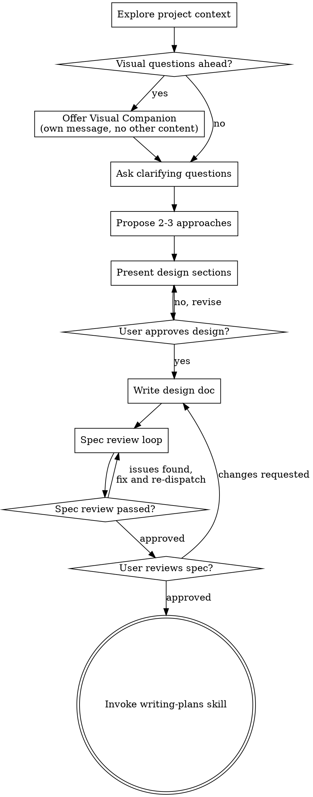

<!-- Generated by SpecStory, Markdown v2.1.0 -->

# 2026-03-14 11:27:32Z

<!-- Claude Code Session 7a8020e3-fe14-47e4-a3d0-fef224309223 (2026-03-14 11:27:32Z) -->

_**User (2026-03-14 11:27:32Z)**_

<command-message>superpowers:brainstorming</command-message>
<command-name>/superpowers:brainstorming</command-name>
<command-args>`/timeline` 的设计，现在的这条时间线看上去非常单调且过时，不符合我想要体现的这个 App 这种简洁的感觉。

你看看，我们来头脑风暴几种样式，你来 mock up 一下，我们来修改这个设计。</command-args>

_**User (2026-03-14 11:27:32Z)**_

Base directory for this skill: <HOME>/.claude/plugins/cache/claude-plugins-official/superpowers/5.0.2/skills/brainstorming

# Brainstorming Ideas Into Designs

Help turn ideas into fully formed designs and specs through natural collaborative dialogue.

Start by understanding the current project context, then ask questions one at a time to refine the idea. Once you understand what you're building, present the design and get user approval.

<HARD-GATE>
Do NOT invoke any implementation skill, write any code, scaffold any project, or take any implementation action until you have presented a design and the user has approved it. This applies to EVERY project regardless of perceived simplicity.
</HARD-GATE>

## Anti-Pattern: "This Is Too Simple To Need A Design"

Every project goes through this process. A todo list, a single-function utility, a config change — all of them. "Simple" projects are where unexamined assumptions cause the most wasted work. The design can be short (a few sentences for truly simple projects), but you MUST present it and get approval.

## Checklist

You MUST create a task for each of these items and complete them in order:

1. **Explore project context** — check files, docs, recent commits
2. **Offer visual companion** (if topic will involve visual questions) — this is its own message, not combined with a clarifying question. See the Visual Companion section below.
3. **Ask clarifying questions** — one at a time, understand purpose/constraints/success criteria
4. **Propose 2-3 approaches** — with trade-offs and your recommendation
5. **Present design** — in sections scaled to their complexity, get user approval after each section
6. **Write design doc** — save to `docs/superpowers/specs/YYYY-MM-DD-<topic>-design.md` and commit
7. **Spec review loop** — dispatch spec-document-reviewer subagent with precisely crafted review context (never your session history); fix issues and re-dispatch until approved (max 5 iterations, then surface to human)
8. **User reviews written spec** — ask user to review the spec file before proceeding
9. **Transition to implementation** — invoke writing-plans skill to create implementation plan

## Process Flow



**The terminal state is invoking writing-plans.** Do NOT invoke frontend-design, mcp-builder, or any other implementation skill. The ONLY skill you invoke after brainstorming is writing-plans.

## The Process

**Understanding the idea:**

- Check out the current project state first (files, docs, recent commits)
- Before asking detailed questions, assess scope: if the request describes multiple independent subsystems (e.g., "build a platform with chat, file storage, billing, and analytics"), flag this immediately. Don't spend questions refining details of a project that needs to be decomposed first.
- If the project is too large for a single spec, help the user decompose into sub-projects: what are the independent pieces, how do they relate, what order should they be built? Then brainstorm the first sub-project through the normal design flow. Each sub-project gets its own spec → plan → implementation cycle.
- For appropriately-scoped projects, ask questions one at a time to refine the idea
- Prefer multiple choice questions when possible, but open-ended is fine too
- Only one question per message - if a topic needs more exploration, break it into multiple questions
- Focus on understanding: purpose, constraints, success criteria

**Exploring approaches:**

- Propose 2-3 different approaches with trade-offs
- Present options conversationally with your recommendation and reasoning
- Lead with your recommended option and explain why

**Presenting the design:**

- Once you believe you understand what you're building, present the design
- Scale each section to its complexity: a few sentences if straightforward, up to 200-300 words if nuanced
- Ask after each section whether it looks right so far
- Cover: architecture, components, data flow, error handling, testing
- Be ready to go back and clarify if something doesn't make sense

**Design for isolation and clarity:**

- Break the system into smaller units that each have one clear purpose, communicate through well-defined interfaces, and can be understood and tested independently
- For each unit, you should be able to answer: what does it do, how do you use it, and what does it depend on?
- Can someone understand what a unit does without reading its internals? Can you change the internals without breaking consumers? If not, the boundaries need work.
- Smaller, well-bounded units are also easier for you to work with - you reason better about code you can hold in context at once, and your edits are more reliable when files are focused. When a file grows large, that's often a signal that it's doing too much.

**Working in existing codebases:**

- Explore the current structure before proposing changes. Follow existing patterns.
- Where existing code has problems that affect the work (e.g., a file that's grown too large, unclear boundaries, tangled responsibilities), include targeted improvements as part of the design - the way a good developer improves code they're working in.
- Don't propose unrelated refactoring. Stay focused on what serves the current goal.

## After the Design

**Documentation:**

- Write the validated design (spec) to `docs/superpowers/specs/YYYY-MM-DD-<topic>-design.md`
  - (User preferences for spec location override this default)
- Use elements-of-style:writing-clearly-and-concisely skill if available
- Commit the design document to git

**Spec Review Loop:**
After writing the spec document:

1. Dispatch spec-document-reviewer subagent (see spec-document-reviewer-prompt.md)
2. If Issues Found: fix, re-dispatch, repeat until Approved
3. If loop exceeds 5 iterations, surface to human for guidance

**User Review Gate:**
After the spec review loop passes, ask the user to review the written spec before proceeding:

> "Spec written and committed to `<path>`. Please review it and let me know if you want to make any changes before we start writing out the implementation plan."

Wait for the user's response. If they request changes, make them and re-run the spec review loop. Only proceed once the user approves.

**Implementation:**

- Invoke the writing-plans skill to create a detailed implementation plan
- Do NOT invoke any other skill. writing-plans is the next step.

## Key Principles

- **One question at a time** - Don't overwhelm with multiple questions
- **Multiple choice preferred** - Easier to answer than open-ended when possible
- **YAGNI ruthlessly** - Remove unnecessary features from all designs
- **Explore alternatives** - Always propose 2-3 approaches before settling
- **Incremental validation** - Present design, get approval before moving on
- **Be flexible** - Go back and clarify when something doesn't make sense

## Visual Companion

A browser-based companion for showing mockups, diagrams, and visual options during brainstorming. Available as a tool — not a mode. Accepting the companion means it's available for questions that benefit from visual treatment; it does NOT mean every question goes through the browser.

**Offering the companion:** When you anticipate that upcoming questions will involve visual content (mockups, layouts, diagrams), offer it once for consent:
> "Some of what we're working on might be easier to explain if I can show it to you in a web browser. I can put together mockups, diagrams, comparisons, and other visuals as we go. This feature is still new and can be token-intensive. Want to try it? (Requires opening a local URL)"

**This offer MUST be its own message.** Do not combine it with clarifying questions, context summaries, or any other content. The message should contain ONLY the offer above and nothing else. Wait for the user's response before continuing. If they decline, proceed with text-only brainstorming.

**Per-question decision:** Even after the user accepts, decide FOR EACH QUESTION whether to use the browser or the terminal. The test: **would the user understand this better by seeing it than reading it?**

- **Use the browser** for content that IS visual — mockups, wireframes, layout comparisons, architecture diagrams, side-by-side visual designs
- **Use the terminal** for content that is text — requirements questions, conceptual choices, tradeoff lists, A/B/C/D text options, scope decisions

A question about a UI topic is not automatically a visual question. "What does personality mean in this context?" is a conceptual question — use the terminal. "Which wizard layout works better?" is a visual question — use the browser.

If they agree to the companion, read the detailed guide before proceeding:
`skills/brainstorming/visual-companion.md`


ARGUMENTS: `/timeline` 的设计，现在的这条时间线看上去非常单调且过时，不符合我想要体现的这个 App 这种简洁的感觉。

你看看，我们来头脑风暴几种样式，你来 mock up 一下，我们来修改这个设计。

---

_**Agent (claude-opus-4-6 2026-03-14 11:27:37Z)**_

_**Agent (claude-opus-4-6 2026-03-14 11:28:56Z)**_

<tool-use data-tool-type="unknown" data-tool-name="Agent"><details>
<summary>Tool use: **Agent**</summary>
Explore timeline implementation

```text
Perfect! Now I have all the information I need. Let me compile my findings:

## Timeline Implementation Analysis

Based on my exploration of the Shiroi codebase, here's a comprehensive understanding of the timeline feature:

### 1. Timeline Page Route & Components

**Route Location:** `<REPO_ROOT>/apps/web/src/app/[locale]/timeline/`

**Files:**
- `page.tsx` - Main timeline page component (client-side)
- `layout.tsx` - Server-side layout with data preloading
- `loading.tsx` - Loading skeleton

**Route Parameters:** `/timeline?type=<post|note>&year=<number>&selectId=<id>&memory=<boolean>&bookmark=<boolean>`

The timeline supports:
- Filtering by type (posts or notes)
- Filtering by year
- Jump-to-specific-item functionality via `selectId`
- Memory/bookmark view to show only bookmarked notes

### 2. Current Visual Design & Styling

**Timeline List Component:** `<REPO_ROOT>/apps/web/src/components/ui/list/TimelineList.tsx`

Uses class `shiro-timeline` defined in `/apps/web/src/styles/layer.css` (lines 60-114):

**Visual Structure:**
- Vertical timeline with left-aligned accent-colored line
- Each item has a circular dot marker (8px diameter) positioned left
- Connecting line between items using `::before` pseudo-element
- Links with underline animation effect (accent color grows on hover)
- Mobile: list appears inside, desktop: full width with meta info on right
- Year headers with count: styled with accent-colored vertical bar and serif font number

**Key Styling:**
```css
/* Main properties */
- Border-left: 2px solid var(--color-accent)
- Circle dot markers (::after): 8px, accent-colored, positioned left of text
- Margin-left: 1rem for content offset
- Links have text-underline-offset: 3px with accent color gradient animation
- Hover effect: underline fills in from left to right over 500ms
```

**Responsive:**
- Mobile: Shows timeline with dots and connecting line
- Desktop (lg breakpoint): Shows date column (MM-DD format) and right-aligned meta info

### 3. Data Fetching & API Calls

**API Endpoint:** `apiClient.aggregate.getTimeline()`

**Query Structure:**
- Defined in `/apps/web/src/app/[locale]/timeline/page.tsx`
- Query key: `['timeline', nextType, year, locale]`
- Parameters: `type` (TimelineType.Post | TimelineType.Note), `year` (optional)
- Returns: `TimelineData` with arrays of `posts` and `notes`

**Data Processing:**
1. Posts and notes merged into a single timeline sorted by year (descending)
2. Items within each year sorted by date descending (newest first)
3. Items mapped to internal `MapType` with: `title`, `meta` (category/mood/weather), `date`, `href`, `type`, `id`, `important` (bookmark flag)

**Server-side Preloading:**
Layout uses `definePrerenderPage()` to preload timeline data and dehydrate it with React Query, enabling SSR with initial data.

### 4. Overall Structure & Rendering

**Timeline Page Component Flow:**

```
TimelinePage (client-side)
├── Uses URL search params: type, year, selectId, bookmark, memory
├── Fetches TimelineData via React Query
├── Groups posts/notes by year (descending)
├── Sorts each year group by date (newest first)
├── Renders:
│   ├── Header (title, subtitle with count)
│   ├── TimelineProgress (shows day of year and % progress)
│   └── Main timeline:
│       └── For each year:
│           ├── Year header with serif number and count
│           ├── TimelineList wrapper
│           └── Item list:
│               └── For each entry:
│                   ├── Date (MM-DD tabular format)
│                   ├── Link to post/note
│                   ├── Bookmark icon (if important)
│                   └── Meta info on desktop (category/mood/weather)
```

**Related Components:**

1. **NoteListTimeline** (`/modules/note/NoteListTimeline.tsx`): Shows notes grouped by year with "diary" style stamp, used for notes list page
2. **NoteTimeline** (`/modules/note/NoteTimeline.tsx`): Sidebar timeline showing related notes for a specific note
3. **NoteTimelineItem** (`/modules/note/NoteTimelineItem.tsx`): Individual note item with active state indicator
4. **TimelineProgress** (`/modules/timeline/TimelineProgress.tsx`): Shows day-of-year progress with animated percentage counters

**Jump-to-Item Feature:**
- Uses `selectId` query param
- Springs scroll to element with `data-id` attribute
- Animates background flash from accent color to transparent
- Only removes shadow after animation completes

**Bookmark/Memory Feature:**
- Query param `memory=true` shows only bookmarked notes
- Bookmark icon displayed for important notes
- Clicking bookmark redirects to memory view

### 5. Key Dependencies

- **Data Fetching:** TanStack React Query with dehydration for SSR
- **API Client:** Custom `@shiro/fetch` client
- **Routing:** next-intl for i18n support
- **Animations:** Motion (Framer Motion) for transitions
- **Icons:** Mingcute icons for bookmark and navigation
- **Styling:** Tailwind CSS with semantic theme tokens (accent color)

### 6. Internationalization

Translation keys in `/messages/*/home.json`:
- `timeline_page_title` - Page title
- `timeline_memory` - Bookmarks view title
- `timeline_total/posts/look_back/keep_going` - Subtitle variations
- `timeline_live_present` - Progress section subtitle
- `timeline_post/note/mood/weather` - Item meta labels

---

**Summary:** The timeline is a vertically-oriented, year-grouped view of all posts and notes with accent-colored connector lines and circular markers. It supports filtering, bookmarking, and jumping to specific items. Visual design emphasizes the temporal flow with serif year headers and animated link underlines. All data fetches happen server-side for SSR with client-side React Query for interactivity.
agentId: a4d59a432257a29f5 (for resuming to continue this agent's work if needed)
<usage>total_tokens: 55283
tool_uses: 27
duration_ms: 74905</usage>
```
</details></tool-use>

_**Agent - sidechain (2026-03-14 11:27:41Z)**_

Explore the timeline implementation in this Shiroi project. I need to understand:
1. The timeline page route and components
2. The current visual design/styling of the timeline
3. Any related data fetching or API calls
4. The overall structure and how timeline entries are rendered

Search in <REPO_ROOT> for anything related to "timeline". Look at route files, components, and styles. Read the key files thoroughly so I can understand the current design.

_**Agent (claude-opus-4-6 2026-03-14 11:27:42Z)**_

<tool-use data-tool-type="shell" data-tool-name="Bash"><details>
<summary>Tool use: **Bash**</summary>
Recent timeline-related commits

`git log --oneline -20 -- '**/timeline*'`

```text
e1f460d1 feat(web): prefer slug routes for notes
e3330a1f chore: update layouts, queries, sitemap and metadata definitions
cd50af22 chore: migrate ESLint from eslint-config-hyoban to @lobehub/lint
0d3a63c1 chore: apply workspace updates
5011bee0 feat(monorepo): restructure project to use pnpm and Turborepo
a7975cce feat(locale): enhance locale handling in components and metadata generation
d091e8e9 feat(i18n): add multilingual support with new translation files
01ef076e chore: upgrade to motion
747ba476 fix: link underline style when selected
779445a8 chore: lint
a95e8b90 chore: lint
71f4c61a fix: persist typing
8fd01afb fix: remove revalidate not working in dynamic
a944c6bc fix: home timeline center
4d1d4bab Home page timeline (#19)
237c31b6 fix: timeline highlight
fb4633f3 refactor: disable middleware call
5b85f949 fix: request
acb6531b feat: upgrade nextjs 14.2
f7a28fe7 fix: if access hidden note when loggin
```
</details></tool-use>

_**Agent - sidechain (claude-haiku-4-5-20251001 2026-03-14 11:27:43Z)**_

I'll systematically explore the timeline implementation in the Shiroi project.

_**Agent - sidechain (claude-haiku-4-5-20251001 2026-03-14 11:27:46Z)**_

<tool-use data-tool-type="shell" data-tool-name="Bash"><details>
<summary>Tool use: **Bash**</summary>

`find <REPO_ROOT> -type f -name "*timeline*" 2>/dev/null | head -20`

```text
<REPO_ROOT>/node_modules/.pnpm/motion-dom@12.35.2/node_modules/motion-dom/dist/es/utils/supports/scroll-timeline.mjs.map
<REPO_ROOT>/node_modules/.pnpm/motion-dom@12.35.2/node_modules/motion-dom/dist/es/utils/supports/scroll-timeline.mjs
<REPO_ROOT>/node_modules/.pnpm/@excalidraw+excalidraw@0.17.0_react-dom@19.2.4_react@19.2.4__react@19.2.4/node_modules/@excalidraw/excalidraw/types/packages/excalidraw/dist/excalidraw-assets/vendors--timeline-definition-5ed366f4.js-0dec0c8d9e6344e84d39.d.ts
<REPO_ROOT>/node_modules/.pnpm/mermaid@11.13.0/node_modules/mermaid/dist/diagrams/timeline/timelineRenderer.d.ts
<REPO_ROOT>/node_modules/.pnpm/mermaid@11.13.0/node_modules/mermaid/dist/diagrams/timeline/timeline-definition.d.ts
<REPO_ROOT>/node_modules/.pnpm/mermaid@11.13.0/node_modules/mermaid/dist/diagrams/timeline/timelineDb.d.ts
<REPO_ROOT>/node_modules/.pnpm/mermaid@11.13.0/node_modules/mermaid/dist/chunks/mermaid.esm.min/timeline-definition-GC5UGDFR.mjs.map
<REPO_ROOT>/node_modules/.pnpm/mermaid@11.13.0/node_modules/mermaid/dist/chunks/mermaid.esm.min/timeline-definition-GC5UGDFR.mjs
<REPO_ROOT>/node_modules/.pnpm/mermaid@11.13.0/node_modules/mermaid/dist/chunks/mermaid.esm/timeline-definition-EZH5CQRN.mjs
<REPO_ROOT>/node_modules/.pnpm/mermaid@11.13.0/node_modules/mermaid/dist/chunks/mermaid.esm/timeline-definition-EZH5CQRN.mjs.map
<REPO_ROOT>/node_modules/.pnpm/mermaid@11.13.0/node_modules/mermaid/dist/chunks/mermaid.core/timeline-definition-YZTLITO2.mjs.map
<REPO_ROOT>/node_modules/.pnpm/mermaid@11.13.0/node_modules/mermaid/dist/chunks/mermaid.core/timeline-definition-YZTLITO2.mjs
<REPO_ROOT>/node_modules/.pnpm/framer-motion@12.35.2_@emotion+is-prop-valid@1.4.0_react-dom@19.2.4_react@19.2.4__react@19.2.4/node_modules/framer-motion/dist/es/render/dom/scroll/utils/get-timeline.mjs
<REPO_ROOT>/node_modules/.pnpm/framer-motion@12.35.2_@emotion+is-prop-valid@1.4.0_react-dom@19.2.4_react@19.2.4__react@19.2.4/node_modules/framer-motion/dist/es/render/dom/scroll/utils/get-timeline.mjs.map
<REPO_ROOT>/node_modules/.pnpm/framer-motion@12.35.2_@emotion+is-prop-valid@1.4.0_react-dom@19.2.4_react@19.2.4__react@19.2.4/node_modules/framer-motion/dist/es/render/dom/scroll/utils/can-use-native-timeline.mjs.map
<REPO_ROOT>/node_modules/.pnpm/framer-motion@12.35.2_@emotion+is-prop-valid@1.4.0_react-dom@19.2.4_react@19.2.4__react@19.2.4/node_modules/framer-motion/dist/es/render/dom/scroll/utils/can-use-native-timeline.mjs
<REPO_ROOT>/.superpowers/brainstorm/13303-1773422775/timeline-refined.html
<REPO_ROOT>/apps/web/.next/standalone/apps/web/.next/server/chunks/ssr/apps_web__next-internal_server_app_[locale]_timeline_page_actions_25b97c5a.js
<REPO_ROOT>/apps/web/.next/standalone/apps/web/.next/server/chunks/ssr/13f8e_mermaid_dist_chunks_mermaid_core_timeline-definition-YZTLITO2_mjs_796b03e4._.js
<REPO_ROOT>/apps/web/.next/server/chunks/ssr/apps_web__next-internal_server_app_[locale]_timeline_page_actions_25b97c5a.js.map
```
</details></tool-use>

_**Agent - sidechain (claude-haiku-4-5-20251001 2026-03-14 11:27:48Z)**_

Now let me search for timeline in the source code directly:

_**Agent - sidechain (claude-haiku-4-5-20251001 2026-03-14 11:27:48Z)**_

<tool-use data-tool-type="search" data-tool-name="Glob"><details>
<summary>Tool use: **Glob**</summary>
 pattern `**/apps/web/src/**/*timeline*`

```text
No files found
```
</details></tool-use>

_**Agent - sidechain (claude-haiku-4-5-20251001 2026-03-14 11:27:50Z)**_

<tool-use data-tool-type="shell" data-tool-name="Bash"><details>
<summary>Tool use: **Bash**</summary>

`find <REPO_ROOT>/apps/web/src -type f \( -name "*timeline*" -o -name "*Timeline*" \) 2>/dev/null`

```text
<REPO_ROOT>/apps/web/src/components/ui/list/TimelineList.tsx
<REPO_ROOT>/apps/web/src/components/modules/note/NoteTimelineItem.tsx
<REPO_ROOT>/apps/web/src/components/modules/note/NoteListTimeline.tsx
<REPO_ROOT>/apps/web/src/components/modules/note/NoteTimeline.tsx
<REPO_ROOT>/apps/web/src/components/modules/timeline/TimelineProgress.tsx
```
</details></tool-use>

_**Agent - sidechain (claude-haiku-4-5-20251001 2026-03-14 11:27:52Z)**_

<tool-use data-tool-type="shell" data-tool-name="Bash"><details>
<summary>Tool use: **Bash**</summary>

`find <REPO_ROOT>/apps/web/src/app -type d -name "*timeline*" 2>/dev/null`

```text
<REPO_ROOT>/apps/web/src/app/[locale]/timeline
```
</details></tool-use>

_**Agent - sidechain (claude-haiku-4-5-20251001 2026-03-14 11:27:54Z)**_

<tool-use data-tool-type="shell" data-tool-name="Bash"><details>
<summary>Tool use: **Bash**</summary>

`ls -la <REPO_ROOT>/apps/web/src/app/\[locale\]/timeline/`

```text
total 32
drwxr-xr-x@  5 <USER>  staff   160 Mar 14 01:32 .
drwxr-xr-x@ 23 <USER>  staff   736 Mar 14 14:49 ..
-rw-r--r--@  1 <USER>  staff  1779 Mar  9 02:51 layout.tsx
-rw-r--r--@  1 <USER>  staff    69 Feb  5 23:42 loading.tsx
-rw-r--r--@  1 <USER>  staff  7509 Mar 14 01:32 page.tsx
```
</details></tool-use>

_**Agent - sidechain (claude-haiku-4-5-20251001 2026-03-14 11:27:56Z)**_

Now let me read the key files to understand the timeline implementation:

_**Agent - sidechain (claude-haiku-4-5-20251001 2026-03-14 11:27:57Z)**_

<tool-use data-tool-type="read" data-tool-name="Read"><details>
<summary>Tool use: **Read**</summary>
 `./apps/web/src/app/[locale]/timeline/page.tsx`

```text
     1→'use client'
     2→
     3→import type { TimelineData } from '@mx-space/api-client'
     4→import { TimelineType } from '@mx-space/api-client'
     5→import { useQuery } from '@tanstack/react-query'
     6→import clsx from 'clsx'
     7→import { m } from 'motion/react'
     8→import { useSearchParams } from 'next/navigation'
     9→import { useLocale, useTranslations } from 'next-intl'
    10→import { memo, useEffect } from 'react'
    11→
    12→import { SolidBookmark } from '~/components/icons/bookmark'
    13→import { NormalContainer } from '~/components/layout/container/Normal'
    14→import { PeekLink } from '~/components/modules/peek/PeekLink'
    15→import { TimelineProgress } from '~/components/modules/timeline/TimelineProgress'
    16→import { Divider } from '~/components/ui/divider'
    17→import { BackToTopFAB } from '~/components/ui/fab'
    18→import { TimelineList } from '~/components/ui/list/TimelineList'
    19→import { BottomToUpSoftScaleTransitionView } from '~/components/ui/transition'
    20→import { useRouter } from '~/i18n/navigation'
    21→import { buildNotePath } from '~/lib/note-route'
    22→import { apiClient } from '~/lib/request'
    23→import { springScrollToElement } from '~/lib/scroller'
    24→
    25→enum ArticleType {
    26→  Post,
    27→  Note,
    28→}
    29→type MapType = {
    30→  title: string
    31→  meta: string[]
    32→  date: Date
    33→  href: string
    34→
    35→  type: ArticleType
    36→  id: string
    37→  important?: boolean
    38→}
    39→
    40→const useJumpTo = () => {
    41→  useEffect(() => {
    42→    const timer = setTimeout(() => {
    43→      const jumpToId = new URLSearchParams(location.search).get('selectId')
    44→
    45→      if (!jumpToId) return
    46→
    47→      const target = document.querySelector(
    48→        `[data-id="${jumpToId}"]`,
    49→      ) as HTMLElement
    50→
    51→      if (!target) return
    52→
    53→      const $a = target.querySelector('a')
    54→
    55→      $a?.classList.add('no-shadow')
    56→      springScrollToElement(target, -500).then(() => {
    57→        target.animate(
    58→          [
    59→            {
    60→              backgroundColor: getComputedStyle(
    61→                document.documentElement,
    62→              ).getPropertyValue('accent-color'),
    63→            },
    64→            {
    65→              backgroundColor: 'transparent',
    66→            },
    67→          ],
    68→          {
    69→            duration: 1500,
    70→            easing: 'ease-in-out',
    71→            fill: 'both',
    72→            iterations: 1,
    73→          },
    74→        ).onfinish = () => $a?.classList.remove('no-shadow')
    75→      })
    76→
    77→      // wait for user focus
    78→    }, 100)
    79→
    80→    return () => clearTimeout(timer)
    81→  }, [])
    82→}
    83→
    84→export default function TimelinePage() {
    85→  const t = useTranslations('home')
    86→  const locale = useLocale()
    87→  const search = useSearchParams()
    88→
    89→  const year = search.get('year')
    90→  const type = search.get('type') as 'post' | 'note'
    91→  const nextType = {
    92→    post: TimelineType.Post,
    93→    note: TimelineType.Note,
    94→  }[type]
    95→
    96→  const { data: initialData } = useQuery<TimelineData>({
    97→    queryKey: ['timeline'],
    98→    enabled: false,
    99→  })
   100→  const { data, refetch } = useQuery<TimelineData>({
   101→    queryKey: ['timeline', nextType, year, locale],
   102→    initialData,
   103→    queryFn: async ({ queryKey }) => {
   104→      const [, nextType, year] = queryKey as [string, TimelineType, string]
   105→      return await apiClient.aggregate
   106→        .getTimeline({
   107→          type: nextType,
   108→          year: +(year || 0) || undefined,
   109→        })
   110→        .then((res) => res.data)
   111→    },
   112→  })
   113→
   114→  useEffect(() => {
   115→    refetch()
   116→  }, [nextType])
   117→
   118→  useJumpTo()
   119→
   120→  if (!data) return null
   121→
   122→  const memory = search.get('bookmark') || search.get('memory')
   123→
   124→  const title = !memory ? t('timeline_page_title') : t('timeline_memory')
   125→
   126→  const { posts = [], notes = [] } = data
   127→  const sortedMap = new Map<number, MapType[]>()
   128→
   129→  if (!memory) {
   130→    posts.forEach((post) => {
   131→      const date = new Date(post.created)
   132→      const year = date.getFullYear()
   133→      const data: MapType = {
   134→        title: post.title,
   135→        meta: [post.category.name, t('timeline_post')],
   136→        date,
   137→        href: `/posts/${post.category.slug}/${post.slug}`,
   138→
   139→        type: ArticleType.Post,
   140→        id: post.id,
   141→      }
   142→      sortedMap.set(
   143→        year,
   144→        sortedMap.get(year) ? sortedMap.get(year)!.concat(data) : [data],
   145→      )
   146→    })
   147→  }
   148→
   149→  notes
   150→    .filter((n) => (memory ? n.bookmark : true))
   151→    .forEach((note) => {
   152→      const date = new Date(note.created)
   153→      const year = date.getFullYear()
   154→      const data: MapType = {
   155→        title: note.title,
   156→        meta: [
   157→          note.mood ? t('timeline_mood', { mood: note.mood }) : undefined,
   158→          note.weather
   159→            ? t('timeline_weather', { weather: note.weather })
   160→            : undefined,
   161→          t('timeline_note'),
   162→        ].filter(Boolean) as string[],
   163→        date,
   164→        href: buildNotePath(note),
   165→
   166→        type: ArticleType.Note,
   167→        id: note.id,
   168→        important: note.bookmark,
   169→      }
   170→
   171→      sortedMap.set(
   172→        year,
   173→        sortedMap.get(year) ? sortedMap.get(year)!.concat(data) : [data],
   174→      )
   175→    })
   176→
   177→  sortedMap.forEach((val, key) => {
   178→    sortedMap.set(
   179→      key,
   180→      val.sort((a, b) => b.date.getTime() - a.date.getTime()),
   181→    )
   182→  })
   183→
   184→  const sortedArr = Array.from(sortedMap)
   185→  const postCount = sortedArr
   186→    .flat(2)
   187→    .filter((i) => typeof i === 'object').length
   188→
   189→  const subtitle = `${t('timeline_total')}${postCount}${t('timeline_posts')}${!memory ? t('timeline_keep_going') : t('timeline_look_back')}`
   190→
   191→  return (
   192→    <NormalContainer>
   193→      <header className="prose prose-p:my-2">
   194→        <h1>{title}</h1>
   195→        <h3>{subtitle}</h3>
   196→
   197→        {!memory && (
   198→          <>
   199→            <Divider className="my-8 w-[80px]" />
   200→            <TimelineProgress />
   201→            <p>{t('timeline_live_present')}</p>
   202→          </>
   203→        )}
   204→      </header>
   205→
   206→      <main className="mt-10 text-neutral-10/80" key={type}>
   207→        {sortedArr.reverse().map(([year, value]) => (
   208→          <BottomToUpSoftScaleTransitionView className="my-4" key={year}>
   209→            <m.h4
   210→              className={clsx(
   211→                'relative mb-4 ml-3 text-lg font-medium',
   212→                'rounded-md before:content-auto before:absolute before:inset-y-[4px] before:-left-3 before:w-[2px] before:bg-accent',
   213→              )}
   214→            >
   215→              {year}
   216→              <small className="ml-2">({value.length})</small>
   217→            </m.h4>
   218→            <TimelineList>
   219→              {value.map((item) => (
   220→                <Item item={item} key={item.id} />
   221→              ))}
   222→            </TimelineList>
   223→          </BottomToUpSoftScaleTransitionView>
   224→        ))}
   225→      </main>
   226→      <BackToTopFAB />
   227→    </NormalContainer>
   228→  )
   229→}
   230→
   231→const Item = memo<{
   232→  item: MapType
   233→}>(({ item }) => {
   234→  const router = useRouter()
   235→
   236→  return (
   237→    <li
   238→      className="flex items-center justify-between"
   239→      data-id={item.id}
   240→      key={item.id}
   241→    >
   242→      <span className="flex min-w-0 shrink items-center">
   243→        <span className="mr-2 inline-block w-12 tabular-nums">
   244→          {Intl.DateTimeFormat('en-us', {
   245→            month: '2-digit',
   246→            day: '2-digit',
   247→          }).format(item.date)}
   248→        </span>
   249→        <PeekLink className="min-w-0 truncate leading-6" href={item.href}>
   250→          <span className="min-w-0 truncate">{item.title}</span>
   251→        </PeekLink>
   252→        {item.important && (
   253→          <SolidBookmark
   254→            className="ml-2 cursor-pointer text-red-500"
   255→            onClick={() => {
   256→              const url = new URL(window.location.href)
   257→              url.searchParams.set('memory', 'true')
   258→              router.push(url.href)
   259→            }}
   260→          />
   261→        )}
   262→      </span>
   263→      <span className="hidden text-sm lg:inline">
   264→        {item.meta.map((m, i) => (i === 0 ? m : `/${m}`))}
   265→      </span>
   266→    </li>
   267→  )
   268→})
   269→Item.displayName = 'Item'
   270→
```
</details></tool-use>

_**Agent - sidechain (claude-haiku-4-5-20251001 2026-03-14 11:27:57Z)**_

<tool-use data-tool-type="read" data-tool-name="Read"><details>
<summary>Tool use: **Read**</summary>
 `./apps/web/src/app/[locale]/timeline/layout.tsx`

```text
     1→import { TimelineType } from '@mx-space/api-client'
     2→import { dehydrate } from '@tanstack/react-query'
     3→import type { Metadata } from 'next'
     4→import { getTranslations } from 'next-intl/server'
     5→import type { PropsWithChildren } from 'react'
     6→
     7→import { QueryHydrate } from '~/components/common/QueryHydrate'
     8→import { SearchFAB } from '~/components/modules/shared/SearchFAB'
     9→import { getQueryClient } from '~/lib/query-client.server'
    10→import { apiClient } from '~/lib/request'
    11→import { definePrerenderPage } from '~/lib/request.server'
    12→
    13→export const generateMetadata = async (
    14→  props: NextPageParams<{ locale: string }>,
    15→): Promise<Metadata> => {
    16→  const { locale } = await props.params
    17→  const t = await getTranslations({
    18→    namespace: 'common',
    19→    locale,
    20→  })
    21→  return {
    22→    title: t('page_title_timeline'),
    23→  }
    24→}
    25→
    26→export const dynamic = 'force-dynamic'
    27→
    28→export default definePrerenderPage<{
    29→  type: string
    30→  year: string
    31→  locale: string
    32→}>()({
    33→  async fetcher({ type, year, locale }) {
    34→    const nextType = {
    35→      post: TimelineType.Post,
    36→      note: TimelineType.Note,
    37→    }[type]
    38→    const queryClient = getQueryClient()
    39→    await queryClient.fetchQuery({
    40→      queryKey: ['timeline', nextType, year, locale],
    41→      queryFn: async () =>
    42→        await apiClient.aggregate
    43→          .getTimeline({
    44→            type: nextType,
    45→            year: +(year || 0) || undefined,
    46→          })
    47→          .then((res) => res.data),
    48→    })
    49→  },
    50→  Component: async (props: PropsWithChildren) => {
    51→    const queryClient = getQueryClient()
    52→    return (
    53→      <QueryHydrate
    54→        state={dehydrate(queryClient, {
    55→          shouldDehydrateQuery: (query) => query.queryKey[0] === 'timeline',
    56→        })}
    57→      >
    58→        {props.children}
    59→
    60→        <SearchFAB />
    61→      </QueryHydrate>
    62→    )
    63→  },
    64→})
    65→
```
</details></tool-use>

_**Agent - sidechain (claude-haiku-4-5-20251001 2026-03-14 11:27:57Z)**_

<tool-use data-tool-type="read" data-tool-name="Read"><details>
<summary>Tool use: **Read**</summary>
 `./apps/web/src/components/modules/timeline/TimelineProgress.tsx`

```text
     1→'use client'
     2→
     3→import { useEffect, useState } from 'react'
     4→
     5→import { CountUp } from '~/components/ui/number-transition'
     6→import {
     7→  dayOfYear,
     8→  daysOfYear,
     9→  secondOfDay,
    10→  secondOfDays,
    11→} from '~/lib/datetime'
    12→
    13→const PROGRESS_DURATION = 2
    14→export const TimelineProgress = () => {
    15→  const [percentOfYear, setPercentYear] = useState(0)
    16→  const [percentOfDay, setPercentDay] = useState(0)
    17→  const [currentYear, setCurrentYear] = useState(new Date().getFullYear())
    18→  const [currentDay, setCurrentDay] = useState(dayOfYear())
    19→
    20→  useEffect(() => {
    21→    const timer = setInterval(() => {
    22→      const year = new Date().getFullYear()
    23→      const day = dayOfYear()
    24→      setCurrentDay(day)
    25→      setCurrentYear(year)
    26→    }, PROGRESS_DURATION)
    27→    return () => clearInterval(timer)
    28→  }, [])
    29→
    30→  function updatePercent() {
    31→    const nowY = (dayOfYear() / daysOfYear(new Date().getFullYear())) * 100
    32→    const nowD = (secondOfDay() / secondOfDays) * 100
    33→    if (nowY !== percentOfYear) {
    34→      setPercentYear(nowY)
    35→    }
    36→    setPercentDay(nowD)
    37→  }
    38→  useEffect(() => {
    39→    updatePercent()
    40→    let timer = setInterval(updatePercent, PROGRESS_DURATION)
    41→    return () => {
    42→      // @ts-ignore
    43→      timer = clearInterval(timer)
    44→    }
    45→  }, [])
    46→  return (
    47→    <>
    48→      <p>
    49→        <span className="shrink-0">今天是 {currentYear} 年的第</span>
    50→        <CountUp
    51→          className="mx-1"
    52→          decimals={0}
    53→          duration={PROGRESS_DURATION}
    54→          to={currentDay}
    55→        />
    56→        <span className="shrink-0">天</span>
    57→      </p>
    58→      <p>
    59→        今年已过{' '}
    60→        <CountUp decimals={6} duration={PROGRESS_DURATION} to={percentOfYear} />
    61→        %
    62→      </p>
    63→      <p>
    64→        今天已过{' '}
    65→        <CountUp decimals={6} duration={PROGRESS_DURATION} to={percentOfDay} />%
    66→      </p>
    67→    </>
    68→  )
    69→}
    70→
```
</details></tool-use>

_**Agent - sidechain (claude-haiku-4-5-20251001 2026-03-14 11:27:57Z)**_

<tool-use data-tool-type="read" data-tool-name="Read"><details>
<summary>Tool use: **Read**</summary>
 `./apps/web/src/components/ui/list/TimelineList.tsx`

```text
     1→import clsx from 'clsx'
     2→
     3→export const TimelineList: Component = ({ children, className }) => (
     4→  <ul className={clsx('shiro-timeline', className)}>{children}</ul>
     5→)
     6→
```
</details></tool-use>

_**Agent - sidechain (claude-haiku-4-5-20251001 2026-03-14 11:27:59Z)**_

Now let me check the styles and the note-related components:

_**Agent - sidechain (claude-haiku-4-5-20251001 2026-03-14 11:28:00Z)**_

<tool-use data-tool-type="read" data-tool-name="Read"><details>
<summary>Tool use: **Read**</summary>
 `./apps/web/src/components/modules/note/NoteTimelineItem.tsx`

```text
     1→'use client'
     2→
     3→import type { TargetAndTransition } from 'motion/react'
     4→import { m } from 'motion/react'
     5→import { memo } from 'react'
     6→import { tv } from 'tailwind-variants'
     7→
     8→import { LeftToRightTransitionView } from '~/components/ui/transition'
     9→import { Link } from '~/i18n/navigation'
    10→import { clsxm } from '~/lib/helper'
    11→import { routeBuilder, Routes } from '~/lib/route-builder'
    12→import { springScrollToTop } from '~/lib/scroller'
    13→
    14→const styles = tv({
    15→  base: 'text-neutral-8 min-w-0 truncate text-left opacity-50 transition-all tabular-nums hover:opacity-80',
    16→  variants: {
    17→    status: {
    18→      active: 'ml-2 opacity-100',
    19→    },
    20→  },
    21→})
    22→const initialLi: TargetAndTransition = {
    23→  opacity: 0.0001,
    24→}
    25→const animateLi: TargetAndTransition = {
    26→  opacity: 1,
    27→}
    28→
    29→export const NoteTimelineItem = memo<{
    30→  active: boolean
    31→  created?: Date | string
    32→  title: string
    33→  nid: number
    34→  slug?: string | null
    35→
    36→  layout?: boolean
    37→}>((props) => {
    38→  const { active, nid, title, layout, slug, created } = props
    39→  const href = routeBuilder(Routes.Note, {
    40→    id: nid,
    41→    slug: slug || undefined,
    42→    created,
    43→  })
    44→  return (
    45→    <m.li
    46→      animate={animateLi}
    47→      className="flex items-center"
    48→      exit={initialLi}
    49→      initial={initialLi}
    50→      layout={layout}
    51→      layoutId={layout ? `note-${nid}` : undefined}
    52→    >
    53→      {active && (
    54→        <LeftToRightTransitionView
    55→          as="span"
    56→          className="inline-flex items-center"
    57→        >
    58→          <i className="i-material-symbols-arrow-circle-right-outline-rounded duration-200" />
    59→        </LeftToRightTransitionView>
    60→      )}
    61→      <Link
    62→        href={href}
    63→        className={clsxm(
    64→          active
    65→            ? styles({
    66→                status: 'active',
    67→              })
    68→            : styles(),
    69→        )}
    70→        onClick={springScrollToTop}
    71→      >
    72→        {title}
    73→      </Link>
    74→    </m.li>
    75→  )
    76→})
    77→NoteTimelineItem.displayName = 'MemoedItem'
    78→
```
</details></tool-use>

_**Agent - sidechain (claude-haiku-4-5-20251001 2026-03-14 11:28:00Z)**_

<tool-use data-tool-type="read" data-tool-name="Read"><details>
<summary>Tool use: **Read**</summary>
 `./apps/web/src/components/modules/note/NoteListTimeline.tsx`

```text
     1→'use client'
     2→
     3→import type { NoteModel } from '@mx-space/api-client'
     4→import { useFormatter } from 'next-intl'
     5→import type { FC } from 'react'
     6→
     7→import { BottomToUpSoftScaleTransitionView } from '~/components/ui/transition'
     8→
     9→import { NoteListCard } from './NoteListCard'
    10→
    11→interface YearGroup {
    12→  notes: NoteModel[]
    13→  year: number
    14→}
    15→
    16→function groupNotesByYear(notes: NoteModel[]): YearGroup[] {
    17→  const groups: Map<number, NoteModel[]> = new Map()
    18→
    19→  for (const note of notes) {
    20→    const year = new Date(note.created).getFullYear()
    21→    if (!groups.has(year)) {
    22→      groups.set(year, [])
    23→    }
    24→    groups.get(year)!.push(note)
    25→  }
    26→
    27→  return Array.from(groups.entries()).map(([year, notes]) => ({ year, notes }))
    28→}
    29→
    30→export const NoteListTimeline: FC<{ notes: NoteModel[] }> = ({ notes }) => {
    31→  const format = useFormatter()
    32→  const groups = groupNotesByYear(notes)
    33→
    34→  let itemIndex = 0
    35→
    36→  return (
    37→    <div className="space-y-12">
    38→      {groups.map((group) => {
    39→        const groupStartIndex = itemIndex
    40→
    41→        return (
    42→          <section className="relative" key={group.year}>
    43→            {/* Year indicator — top right with decoration */}
    44→            <BottomToUpSoftScaleTransitionView
    45→              lcpOptimization
    46→              className="pointer-events-none absolute -top-2 right-0 select-none"
    47→              delay={groupStartIndex * 100}
    48→            >
    49→              {/* Stamp / seal style */}
    50→              <div className="-rotate-3 inline-block border-[3px] border-double border-neutral-300 rounded px-4 py-2 dark:border-neutral-700">
    51→                <div className="font-serif text-5xl font-bold leading-none tracking-tighter text-neutral-300 dark:text-neutral-700">
    52→                  {group.year}
    53→                </div>
    54→                <div className="mt-1 text-center text-[10px] tracking-[4px] text-neutral-300 dark:text-neutral-700">
    55→                  DIARY
    56→                </div>
    57→              </div>
    58→            </BottomToUpSoftScaleTransitionView>
    59→
    60→            {/* Notes list */}
    61→            <div className="relative space-y-4 pt-28">
    62→              {/* Mobile timeline line */}
    63→              <div className="absolute top-28 bottom-0 left-[11px] w-px bg-neutral-200 lg:hidden dark:bg-neutral-800" />
    64→
    65→              {group.notes.map((note) => {
    66→                const date = new Date(note.created)
    67→                const currentIndex = itemIndex++
    68→                return (
    69→                  <BottomToUpSoftScaleTransitionView
    70→                    lcpOptimization
    71→                    className="relative flex items-start gap-4 lg:gap-5"
    72→                    delay={currentIndex * 100}
    73→                    key={note.id}
    74→                  >
    75→                    {/* Desktop: date column */}
    76→                    <div className="hidden w-14 shrink-0 pt-3 text-center lg:block">
    77→                      <div className="text-3xl font-bold leading-none text-neutral-9">
    78→                        {date.getDate()}
    79→                      </div>
    80→                      <div className="mt-1 text-sm text-neutral-6">
    81→                        {format.dateTime(date, { month: 'long' })}
    82→                      </div>
    83→                      <div className="mt-0.5 text-xs text-neutral-6">
    84→                        {format.dateTime(date, { weekday: 'short' })}
    85→                      </div>
    86→                    </div>
    87→
    88→                    {/* Mobile: timeline dot */}
    89→                    <div className="absolute left-[7px] top-1 size-[9px] shrink-0 rounded-full border-2 border-neutral-1 bg-neutral-300 lg:hidden dark:border-neutral-9 dark:bg-neutral-700" />
    90→
    91→                    <div className="min-w-0 flex-1 pl-8 lg:pl-0">
    92→                      {/* Mobile: inline date */}
    93→                      <div className="mb-1.5 text-xs text-neutral-5 lg:hidden">
    94→                        {format.dateTime(date, {
    95→                          month: 'numeric',
    96→                          day: 'numeric',
    97→                          weekday: 'short',
    98→                        })}
    99→                      </div>
   100→                      <NoteListCard note={note} />
   101→                    </div>
   102→                  </BottomToUpSoftScaleTransitionView>
   103→                )
   104→              })}
   105→            </div>
   106→          </section>
   107→        )
   108→      })}
   109→    </div>
   110→  )
   111→}
   112→
```
</details></tool-use>

_**Agent - sidechain (claude-haiku-4-5-20251001 2026-03-14 11:28:00Z)**_

<tool-use data-tool-type="read" data-tool-name="Read"><details>
<summary>Tool use: **Read**</summary>
 `./apps/web/src/components/modules/note/NoteTimeline.tsx`

```text
     1→'use client'
     2→
     3→import type { NoteTimelineItem as NoteTimelineItemData } from '@mx-space/api-client'
     4→import { keepPreviousData, useQuery } from '@tanstack/react-query'
     5→import type { TargetAndTransition } from 'motion/react'
     6→import { AnimatePresence, m } from 'motion/react'
     7→import { useLocale } from 'next-intl'
     8→import { memo } from 'react'
     9→
    10→import { apiClient } from '~/lib/request'
    11→import { useCurrentNoteDataSelector } from '~/providers/note/CurrentNoteDataProvider'
    12→import { useCurrentNoteNid } from '~/providers/note/CurrentNoteIdProvider'
    13→
    14→import { NoteTimelineItem } from './NoteTimelineItem'
    15→
    16→export const NoteTimeline = memo(() => {
    17→  const noteId = useCurrentNoteNid()
    18→  if (!noteId) return null
    19→  return <NoteTimelineImpl />
    20→})
    21→NoteTimeline.displayName = 'NoteTimeline'
    22→
    23→const animateUl: TargetAndTransition = {
    24→  transition: {
    25→    staggerChildren: 0.5,
    26→  },
    27→}
    28→const NoteTimelineImpl = () => {
    29→  const locale = useLocale()
    30→  const note = useCurrentNoteDataSelector((data) => {
    31→    const note = data?.data
    32→    if (!note) return null
    33→    return {
    34→      id: note.id,
    35→      nid: note.nid,
    36→      title: note.title,
    37→      created: note.created,
    38→      isPublished: note.isPublished,
    39→    }
    40→  })
    41→  const noteNid = useCurrentNoteNid()
    42→
    43→  const noteId = note?.id
    44→
    45→  const { data: timelineData } = useQuery({
    46→    queryKey: ['note_timeline', noteId, locale],
    47→    queryFn: async ({ queryKey }) => {
    48→      const [, noteId, lang] = queryKey
    49→      if (!noteId) throw new Error('Missing noteId')
    50→      const data = await apiClient.note.proxy.list(noteId).get<{
    51→        data: NoteTimelineItemData[]
    52→        size: number
    53→      }>({
    54→        params: { size: 10, lang },
    55→      })
    56→      return data.data
    57→    },
    58→    enabled: noteId !== undefined,
    59→    placeholderData: keepPreviousData,
    60→  })
    61→
    62→  const initialData = note
    63→    ? [
    64→        {
    65→          title: note.title,
    66→          nid: note.nid,
    67→          id: note.id,
    68→          created: note.created,
    69→          isPublished: note.isPublished,
    70→        },
    71→      ]
    72→    : []
    73→
    74→  return (
    75→    <AnimatePresence>
    76→      <m.ul animate={animateUl} className="space-y-1 [&_i]:hover:text-accent">
    77→        {(timelineData || initialData)?.map((item) => {
    78→          const isCurrent = item.nid === Number.parseInt(noteNid || '0')
    79→          return (
    80→            <NoteTimelineItem
    81→              layout
    82→              active={isCurrent}
    83→              created={item.created}
    84→              key={item.id}
    85→              nid={item.nid}
    86→              title={item.title}
    87→              slug={
    88→                'slug' in item && typeof item.slug === 'string'
    89→                  ? item.slug
    90→                  : undefined
    91→              }
    92→            />
    93→          )
    94→        })}
    95→      </m.ul>
    96→    </AnimatePresence>
    97→  )
    98→}
    99→
```
</details></tool-use>

_**Agent - sidechain (claude-haiku-4-5-20251001 2026-03-14 11:28:02Z)**_

Now let me search for CSS/styling related to timeline:

_**Agent - sidechain (claude-haiku-4-5-20251001 2026-03-14 11:28:03Z)**_

<tool-use data-tool-type="shell" data-tool-name="Bash"><details>
<summary>Tool use: **Bash**</summary>

`grep -r "shiro-timeline" <REPO_ROOT>/apps/web/src --include="*.css" --include="*.tsx" --include="*.ts" 2>/dev/null | head -20`

```text
<REPO_ROOT>/apps/web/src/app/[locale]/(home)/components/ActivityPostList.tsx:      <ul className="shiro-timeline mt-4">
<REPO_ROOT>/apps/web/src/app/[locale]/(home)/components/ActivityPostList.tsx:      <ul className="shiro-timeline mt-4">
<REPO_ROOT>/apps/web/src/app/[locale]/(home)/components/ActivityRecent.tsx:          <ul className="shiro-timeline mt-4 flex animate-pulse flex-col pb-4 pl-2 text-neutral-200 dark:text-neutral-700!">
<REPO_ROOT>/apps/web/src/app/[locale]/(home)/components/ActivityRecent.tsx:          <ul className="shiro-timeline mt-4 flex flex-col pb-8 pl-2">
<REPO_ROOT>/apps/web/src/styles/layer.css:  .shiro-timeline a,
<REPO_ROOT>/apps/web/src/styles/layer.css:  .shiro-timeline a,
<REPO_ROOT>/apps/web/src/styles/layer.css:  .shiro-timeline {
<REPO_ROOT>/apps/web/src/components/ui/list/TimelineList.tsx:  <ul className={clsx('shiro-timeline', className)}>{children}</ul>
```
</details></tool-use>

_**Agent - sidechain (claude-haiku-4-5-20251001 2026-03-14 11:28:05Z)**_

<tool-use data-tool-type="read" data-tool-name="Read"><details>
<summary>Tool use: **Read**</summary>
 `./apps/web/src/styles/layer.css`

```text
     1→@layer components {
     2→  .cover-mask-b {
     3→    mask-image: linear-gradient(180deg, #fff -17.19%, #00000000 92.43%);
     4→  }
     5→}
     6→
     7→@layer components {
     8→  .border-border {
     9→    @apply border-neutral-900/10 dark:border-neutral-700;
    10→  }
    11→}
    12→
    13→@layer utilities {
    14→  .scrollbar-none::-webkit-scrollbar {
    15→    width: 0 !important;
    16→    height: 0 !important;
    17→  }
    18→  .shiro-timeline a,
    19→  .rich-link {
    20→    @apply no-underline!;
    21→  }
    22→  .shiro-link--underline,
    23→  .shiro-timeline a,
    24→  .rich-link {
    25→    color: currentColor;
    26→    text-decoration: underline;
    27→    text-underline-offset: 3px;
    28→
    29→    @apply decoration-neutral-4/20 hover:no-underline!;
    30→
    31→    background-image: linear-gradient(var(--color-accent), var(--color-accent));
    32→    background-size: 0% 1.5px;
    33→    background-repeat: no-repeat;
    34→    /* NOTE: this won't work with background images   */
    35→
    36→    transition: all 500ms ease !important;
    37→
    38→    @apply border-0;
    39→
    40→    background-position: left 1.2em;
    41→
    42→    &:hover {
    43→      background-size: 100% 1.5px;
    44→      text-shadow:
    45→        0.05em 0 var(--color-neutral-1),
    46→        -0.05em 0 var(--color-neutral-1);
    47→
    48→      transition: all 250ms ease;
    49→    }
    50→
    51→    &::selection {
    52→      text-shadow: none;
    53→    }
    54→
    55→    &.no-shadow {
    56→      text-shadow: none;
    57→    }
    58→  }
    59→
    60→  .shiro-timeline {
    61→    position: relative;
    62→
    63→    & a {
    64→      line-height: 1.6;
    65→    }
    66→
    67→    @apply min-w-0 flex-1 list-inside justify-between;
    68→
    69→    & > li::before {
    70→      content: '';
    71→      position: absolute;
    72→      left: -17px;
    73→      bottom: 0;
    74→      border-left: 2px solid var(--color-accent);
    75→    }
    76→
    77→    & > li:first-child:last-child::before {
    78→      border-left: 0;
    79→    }
    80→
    81→    & > li:not(:first-child):not(:last-child)::before {
    82→      top: 0;
    83→    }
    84→
    85→    & > li:first-child::before {
    86→      top: 50%;
    87→    }
    88→
    89→    & > li:last-child::before {
    90→      bottom: 50%;
    91→      top: 0;
    92→    }
    93→
    94→    & > li {
    95→      position: relative;
    96→      list-style-type: none;
    97→
    98→      line-height: 1.6;
    99→      padding: 3px 0;
   100→      margin: 0 0 0 1rem;
   101→    }
   102→
   103→    & > li::after {
   104→      content: '';
   105→      left: calc(-1rem - 6px);
   106→      top: 50%;
   107→      transform: translateY(-50%);
   108→      height: 8px;
   109→      width: 8px;
   110→      border-radius: 50%;
   111→      position: absolute;
   112→      background-color: var(--color-accent);
   113→    }
   114→  }
   115→}
   116→
   117→@layer components {
   118→  .mask-cover {
   119→    mask-image: linear-gradient(to right, transparent, rgb(0 0 0 / 100%) 90%);
   120→    opacity: 0.3;
   121→    transition: opacity 0.3s ease-in-out;
   122→  }
   123→
   124→  .group:hover .mask-cover {
   125→    opacity: 0.5;
   126→  }
   127→
   128→  .animation-blink {
   129→    animation: blink 1.2s linear infinite;
   130→  }
   131→
   132→  .mask-top {
   133→    mask-image: linear-gradient(to top, transparent, rgb(0 0 0 / 100%) 90%);
   134→    opacity: 0.3;
   135→    transition: opacity 0.3s ease-in-out;
   136→  }
   137→
   138→  @keyframes blink {
   139→    0% {
   140→      opacity: 0;
   141→    }
   142→    40% {
   143→      opacity: 0;
   144→    }
   145→    40.1% {
   146→      opacity: 1;
   147→    }
   148→    99.9% {
   149→      opacity: 1;
   150→    }
   151→    100% {
   152→      opacity: 0;
   153→    }
   154→  }
   155→
   156→  /* 404 */
   157→  .hit-the-floor {
   158→    font-size: 12em;
   159→    font-weight: bold;
   160→    font-family: Helvetica;
   161→    text-shadow:
   162→      0 1px 0 #ccc,
   163→      0 2px 0 #c9c9c9,
   164→      0 3px 0 #bbb,
   165→      0 4px 0 #b9b9b9,
   166→      0 5px 0 #aaa,
   167→      0 6px 1px rgba(0, 0, 0, 0.1),
   168→      0 0 5px rgba(0, 0, 0, 0.1),
   169→      0 1px 3px rgba(0, 0, 0, 0.3),
   170→      0 3px 5px rgba(0, 0, 0, 0.2),
   171→      0 5px 10px rgba(0, 0, 0, 0.25),
   172→      0 10px 10px rgba(0, 0, 0, 0.2),
   173→      0 20px 20px rgba(0, 0, 0, 0.15);
   174→  }
   175→}
   176→
   177→@layer components {
   178→  .page-glow-container {
   179→    @apply pointer-events-none absolute inset-x-0 top-0 h-[720px] w-full;
   180→
   181→    overflow: hidden;
   182→    animation: fade-in 0.8s ease 0.2s both;
   183→    -webkit-mask-image: linear-gradient(
   184→      180deg,
   185→      rgb(0 0 0 / 100%) 0%,
   186→      rgb(0 0 0 / 100%) 48%,
   187→      rgb(0 0 0 / 72%) 64%,
   188→      rgb(0 0 0 / 24%) 82%,
   189→      transparent 100%
   190→    );
   191→    mask-image: linear-gradient(
   192→      180deg,
   193→      rgb(0 0 0 / 100%) 0%,
   194→      rgb(0 0 0 / 100%) 48%,
   195→      rgb(0 0 0 / 72%) 64%,
   196→      rgb(0 0 0 / 24%) 82%,
   197→      transparent 100%
   198→    );
   199→  }
   200→
   201→  @keyframes glow-enter {
   202→    0% {
   203→      opacity: 0;
   204→      transform: translate(-50%, -50%) scale(0.6);
   205→    }
   206→    100% {
   207→      opacity: var(--glow-opacity, 0.4);
   208→      transform: translate(-50%, -50%) scale(1);
   209→    }
   210→  }
   211→
   212→  .signature-animated path {
   213→    stroke-dasharray: 2400;
   214→    stroke-dashoffset: 2400;
   215→    fill: transparent;
   216→    animation: drawSignature 8s linear infinite both;
   217→    stroke-width: 2px;
   218→    stroke: var(--color-neutral-9);
   219→  }
   220→
   221→  @keyframes drawSignature {
   222→    0% {
   223→      stroke-dashoffset: 2400;
   224→    }
   225→
   226→    15% {
   227→      fill: transparent;
   228→    }
   229→
   230→    35%,
   231→    75% {
   232→      stroke-dashoffset: 0;
   233→      fill: var(--color-neutral-9);
   234→    }
   235→
   236→    90%,
   237→    100% {
   238→      stroke-dashoffset: 2400;
   239→      fill: transparent;
   240→    }
   241→  }
   242→
   243→  .animation-wave {
   244→    animation: wave 2s infinite;
   245→  }
   246→
   247→  .hover-shake:hover {
   248→    animation: shake 0.4s ease-in-out;
   249→  }
   250→
   251→  @keyframes shake {
   252→    0%,
   253→    100% {
   254→      transform: rotate(0deg);
   255→    }
   256→    25% {
   257→      transform: rotate(-5deg);
   258→    }
   259→    75% {
   260→      transform: rotate(5deg);
   261→    }
   262→  }
   263→
   264→  @keyframes wave {
   265→    0%,
   266→    100% {
   267→      transform: rotate(0deg);
   268→    }
   269→    50% {
   270→      transform: rotate(20deg);
   271→    }
   272→  }
   273→}
   274→
   275→@layer components {
   276→  .content-auto {
   277→    content-visibility: auto;
   278→  }
   279→
   280→  .shadow-out-sm {
   281→    box-shadow:
   282→      0 0 10px rgba(120, 120, 120, 0.1),
   283→      0 5px 20px rgba(120, 120, 120, 0.2);
   284→  }
   285→
   286→  .backface-hidden {
   287→    -webkit-backface-visibility: hidden;
   288→    -moz-backface-visibility: hidden;
   289→    -webkit-transform: translate3d(0, 0, 0);
   290→    -moz-transform: translate3d(0, 0, 0);
   291→  }
   292→
   293→  .center {
   294→    align-items: center;
   295→    justify-content: center;
   296→  }
   297→
   298→  .fill-content {
   299→    min-height: calc(100vh - 17.5rem);
   300→  }
   301→
   302→  .card-shadow {
   303→    box-shadow:
   304→      0 0 0 1px rgba(0, 0, 0, 0.08),
   305→      0 4px 6px rgba(0, 0, 0, 0.04);
   306→  }
   307→
   308→  .card-shadow:hover {
   309→    box-shadow:
   310→      0 0 0 1px rgba(0, 0, 0, 0.08),
   311→      0 6px 14px rgba(0, 0, 0, 0.08);
   312→  }
   313→}
   314→
   315→@layer components {
   316→  .shadow-perfect {
   317→    /* https://codepen.io/jh3y/pen/yLWgjpd */
   318→    --tint: 214;
   319→    --alpha: 3;
   320→    --base: hsl(var(--tint, 214) 80% 27% / calc(var(--alpha, 4) * 1%));
   321→    /**
   322→      * Use relative syntax to get to: hsl(221 25% 22% / 40%)
   323→    */
   324→    --shade: hsl(from var(--base) calc(h + 8) 25 calc(l - 5));
   325→    --perfect-shadow:
   326→      0 0 0 1px var(--base), 0 1px 1px -0.5px var(--shade),
   327→      0 3px 3px -1.5px var(--shade), 0 6px 6px -3px var(--shade),
   328→      0 12px 12px -6px var(--base), 0 24px 24px -12px var(--base);
   329→    box-shadow: var(--perfect-shadow);
   330→  }
   331→
   332→  .perfect-sm {
   333→    --alpha: 1;
   334→  }
   335→
   336→  .perfect-md {
   337→    --alpha: 2;
   338→  }
   339→
   340→  [theme='dark'] .shadow-perfect {
   341→    --tint: 221;
   342→  }
   343→}
   344→
   345→@property --mask-top {
   346→  syntax: '<length>';
   347→  inherits: false;
   348→  initial-value: 0px;
   349→}
   350→
   351→@property --mask-bottom {
   352→  syntax: '<length>';
   353→  inherits: false;
   354→  initial-value: 30px;
   355→}
   356→
   357→@layer components {
   358→  .mask-scroller {
   359→    --mask-top: 0px;
   360→    --mask-bottom: 30px;
   361→    mask: linear-gradient(
   362→      to bottom,
   363→      transparent calc(var(--mask-top) - 30px),
   364→      black var(--mask-top),
   365→      black calc(100% - var(--mask-bottom)),
   366→      transparent calc(100% - var(--mask-bottom) + 30px)
   367→    );
   368→  }
   369→
   370→  @supports (animation-timeline: scroll(self block)) {
   371→    .mask-scroller {
   372→      animation-name: mask-up, mask-down;
   373→      animation-duration: 1s, 1s;
   374→      animation-timing-function: linear, linear;
   375→      animation-fill-mode: both, both;
   376→      animation-timeline: scroll(self block), scroll(self block);
   377→      animation-range:
   378→        0 50px,
   379→        calc(100% - 50px) 100%;
   380→    }
   381→  }
   382→  @supports (animation-timeline: scroll()) and
   383→    (not (animation-timeline: scroll(self block))) {
   384→    .mask-scroller {
   385→      animation-name: mask-up, mask-down;
   386→      animation-duration: 1s, 1s;
   387→      animation-timing-function: linear, linear;
   388→      animation-fill-mode: both, both;
   389→      animation-timeline: scroll(), scroll();
   390→      animation-range:
   391→        0 50px,
   392→        calc(100% - 50px) 100%;
   393→    }
   394→  }
   395→  @keyframes mask-up {
   396→    to {
   397→      --mask-top: 30px;
   398→    }
   399→  }
   400→  @keyframes mask-down {
   401→    to {
   402→      --mask-bottom: 0px;
   403→    }
   404→  }
   405→}
   406→
   407→@layer components {
   408→  .shadow-context-menu {
   409→    box-shadow:
   410→      rgba(0, 0, 0, 0.067) 0px 3px 8px,
   411→      rgba(0, 0, 0, 0.067) 0px 2px 5px,
   412→      rgba(0, 0, 0, 0.067) 0px 1px 1px;
   413→  }
   414→}
   415→
   416→/* Tailwind 4 Extensions */
   417→@layer components {
   418→  .field-sizing-content {
   419→    field-sizing: content;
   420→  }
   421→
   422→  .comment-block-active {
   423→    background: color-mix(
   424→      in srgb,
   425→      var(--color-accent, #33a6b8) 5%,
   426→      transparent
   427→    );
   428→    border-radius: 4px;
   429→    transition: background 0.15s ease;
   430→  }
   431→}
   432→
   433→/* Safari 不显示 PageColorGradient，规避 blur+mask 性能与撕裂问题（由 JS 注入 is-safari class） */
   434→.is-safari .page-glow-container {
   435→  display: none !important;
   436→}
   437→
```
</details></tool-use>

_**Agent - sidechain (claude-haiku-4-5-20251001 2026-03-14 11:28:07Z)**_

Now let me search for any queries related to timeline data fetching:

_**Agent - sidechain (claude-haiku-4-5-20251001 2026-03-14 11:28:08Z)**_

<tool-use data-tool-type="shell" data-tool-name="Bash"><details>
<summary>Tool use: **Bash**</summary>

`find <REPO_ROOT>/apps/web/src/queries -type f -name "*.ts" -o -name "*.tsx" 2>/dev/null | xargs grep -l "timeline" 2>/dev/null`

```text
Exit code 1
```
</details></tool-use>

_**Agent - sidechain (claude-haiku-4-5-20251001 2026-03-14 11:28:10Z)**_

<tool-use data-tool-type="shell" data-tool-name="Bash"><details>
<summary>Tool use: **Bash**</summary>

`ls <REPO_ROOT>/apps/web/src/queries/`

```text
definition
helper.ts
hooks
keys
```
</details></tool-use>

_**Agent - sidechain (claude-haiku-4-5-20251001 2026-03-14 11:28:12Z)**_

<tool-use data-tool-type="shell" data-tool-name="Bash"><details>
<summary>Tool use: **Bash**</summary>

`grep -r "getTimeline" <REPO_ROOT>/apps/web/src --include="*.ts" --include="*.tsx" 2>/dev/null`

```text
<REPO_ROOT>/apps/web/src/app/[locale]/timeline/layout.tsx:          .getTimeline({
<REPO_ROOT>/apps/web/src/app/[locale]/timeline/page.tsx:        .getTimeline({
```
</details></tool-use>

_**Agent - sidechain (claude-haiku-4-5-20251001 2026-03-14 11:28:14Z)**_

Now let me check the home page to see how the timeline is referenced or used:

_**Agent - sidechain (claude-haiku-4-5-20251001 2026-03-14 11:28:15Z)**_

<tool-use data-tool-type="shell" data-tool-name="Bash"><details>
<summary>Tool use: **Bash**</summary>

`ls <REPO_ROOT>/apps/web/src/app/\[locale\]/\(home\)/`

```text
components
layout.tsx
page.tsx
query.ts
```
</details></tool-use>

_**Agent - sidechain (claude-haiku-4-5-20251001 2026-03-14 11:28:17Z)**_

<tool-use data-tool-type="read" data-tool-name="Read"><details>
<summary>Tool use: **Read**</summary>
 `./apps/web/src/app/[locale]/(home)/components/ActivityPostList.tsx`

```text
     1→'use client'
     2→
     3→import { m } from 'motion/react'
     4→import { useTranslations } from 'next-intl'
     5→
     6→import { Divider } from '~/components/ui/divider'
     7→import { RelativeTime } from '~/components/ui/relative-time'
     8→import { Spring } from '~/constants/spring'
     9→import { Link } from '~/i18n/navigation'
    10→import { getNoteRouteParams } from '~/lib/note-route'
    11→import { routeBuilder, Routes } from '~/lib/route-builder'
    12→
    13→import { useHomeQueryData } from '../query'
    14→
    15→export const ActivityPostList = () => {
    16→  const t = useTranslations('post')
    17→  const { notes, posts } = useHomeQueryData()
    18→  return (
    19→    <m.section
    20→      className="mt-8 flex flex-col gap-4 lg:mt-0"
    21→      initial={{ opacity: 0.0001, y: 50 }}
    22→      transition={Spring.presets.snappy}
    23→      viewport={{ once: true }}
    24→      whileInView={{ opacity: 1, y: 0 }}
    25→    >
    26→      <h2 className="text-2xl font-medium leading-loose">
    27→        {t('recent_posts')}
    28→      </h2>
    29→      <ul className="shiro-timeline mt-4">
    30→        {posts.map((post) => (
    31→          <li className="flex min-w-0 justify-between" key={post.id}>
    32→            <Link
    33→              prefetch
    34→              className="min-w-0 shrink truncate"
    35→              href={routeBuilder(Routes.Post, {
    36→                category: post.category.slug,
    37→                slug: post.slug,
    38→              })}
    39→            >
    40→              {post.title}
    41→            </Link>
    42→
    43→            <span className="ml-2 shrink-0 self-end text-xs opacity-70">
    44→              <RelativeTime
    45→                date={post.created}
    46→                displayAbsoluteTimeAfterDay={180}
    47→              />
    48→            </span>
    49→          </li>
    50→        ))}
    51→      </ul>
    52→
    53→      <Link
    54→        className="flex items-center justify-end opacity-70 duration-200 hover:text-accent"
    55→        href={routeBuilder(Routes.Posts, {})}
    56→        onClick={() => (window.__POST_LIST_ANIMATED__ = true)}
    57→      >
    58→        <i className="i-mingcute-arrow-right-circle-line" />
    59→        <span className="ml-2">{t('more')}</span>
    60→      </Link>
    61→
    62→      <Divider />
    63→      <h2 className="text-2xl font-medium leading-loose">
    64→        {t('recent_notes')}
    65→      </h2>
    66→      <ul className="shiro-timeline mt-4">
    67→        {notes.map((note) => (
    68→          <li className="flex min-w-0 justify-between" key={note.id}>
    69→            <Link
    70→              className="min-w-0 shrink truncate"
    71→              href={routeBuilder(Routes.Note, {
    72→                ...getNoteRouteParams(note),
    73→              })}
    74→            >
    75→              {note.title}
    76→            </Link>
    77→
    78→            <span className="ml-2 shrink-0 self-end text-xs opacity-70">
    79→              <RelativeTime
    80→                date={note.created}
    81→                displayAbsoluteTimeAfterDay={180}
    82→              />
    83→            </span>
    84→          </li>
    85→        ))}
    86→      </ul>
    87→      <Link
    88→        className="flex items-center justify-end opacity-70 duration-200 hover:text-accent"
    89→        href={routeBuilder(Routes.Timelime, { type: 'note' })}
    90→      >
    91→        <i className="i-mingcute-arrow-right-circle-line" />
    92→        <span className="ml-2">{t('more')}</span>
    93→      </Link>
    94→    </m.section>
    95→  )
    96→}
    97→
```
</details></tool-use>

_**Agent - sidechain (claude-haiku-4-5-20251001 2026-03-14 11:28:17Z)**_

<tool-use data-tool-type="read" data-tool-name="Read"><details>
<summary>Tool use: **Read**</summary>
 `./apps/web/src/app/[locale]/(home)/components/ActivityRecent.tsx`

```text
     1→'use client'
     2→
     3→import { useQuery } from '@tanstack/react-query'
     4→import clsx from 'clsx'
     5→import { m } from 'motion/react'
     6→import { useTranslations } from 'next-intl'
     7→import { useMemo } from 'react'
     8→
     9→import { ScrollArea } from '~/components/ui/scroll-area'
    10→import { softBouncePreset } from '~/constants/spring'
    11→import { apiClient } from '~/lib/request'
    12→
    13→import { ActivityCard, iconClassName } from './ActivityCard'
    14→import type { ReactActivityType } from './types'
    15→
    16→export const ActivityRecent = () => {
    17→  const t = useTranslations('home')
    18→  const { data, isLoading } = useQuery({
    19→    queryKey: ['home-activity-recent'],
    20→    queryFn: async () =>
    21→      (await apiClient.activity.getRecentActivities()).$serialized,
    22→    refetchOnMount: true,
    23→    meta: {
    24→      persist: true,
    25→    },
    26→  })
    27→
    28→  const flatData = useMemo(
    29→    () =>
    30→      [...Object.entries(data || {})]
    31→        .flatMap(([type, items]) => {
    32→          if (!Array.isArray(items)) return []
    33→          return items.map((item: any) => ({ ...item, bizType: type }))
    34→        })
    35→        .sort(
    36→          (a, b) =>
    37→            new Date(b.created).getTime() - new Date(a.created).getTime(),
    38→        ) as ReactActivityType[],
    39→    // .slice(0, 6) as ReactActivityType[]
    40→    [data],
    41→  )
    42→
    43→  return (
    44→    <m.div
    45→      className="mt-8 w-full text-lg lg:mt-0"
    46→      initial={{ opacity: 0.0001, y: 50 }}
    47→      transition={softBouncePreset}
    48→      viewport={{ once: true }}
    49→      whileInView={{ opacity: 1, y: 0 }}
    50→    >
    51→      <m.h2 className="mb-8 text-2xl font-medium leading-loose lg:ml-8">
    52→        {t('activity_recent')}
    53→      </m.h2>
    54→
    55→      {isLoading ? (
    56→        <div className="relative h-[400px] max-h-[80vh]">
    57→          <ul className="shiro-timeline mt-4 flex animate-pulse flex-col pb-4 pl-2 text-neutral-200 dark:text-neutral-700!">
    58→            {Array.from({ length: 6 })
    59→              .fill(null)
    60→              .map((_, i) => (
    61→                <li className="flex w-full items-center gap-2" key={i}>
    62→                  <div
    63→                    className={clsx(
    64→                      iconClassName,
    65→                      'border-0 bg-current text-inherit',
    66→                    )}
    67→                  />
    68→
    69→                  <div className="mb-4 box-content h-16 w-full rounded-md bg-current" />
    70→                </li>
    71→              ))}
    72→          </ul>
    73→        </div>
    74→      ) : (
    75→        <ScrollArea.ScrollArea
    76→          mask
    77→          rootClassName="h-[400px] relative max-h-[80vh]"
    78→        >
    79→          <ul className="shiro-timeline mt-4 flex flex-col pb-8 pl-2">
    80→            {flatData.map((activity) => (
    81→              <li
    82→                className="flex min-w-0 justify-between"
    83→                key={`${activity.bizType}-${activity.id}-${activity.created}`}
    84→              >
    85→                <ActivityCard activity={activity} />
    86→              </li>
    87→            ))}
    88→          </ul>
    89→        </ScrollArea.ScrollArea>
    90→      )}
    91→    </m.div>
    92→  )
    93→}
    94→
```
</details></tool-use>

_**Agent - sidechain (claude-haiku-4-5-20251001 2026-03-14 11:28:20Z)**_

Let me check the i18n translations to understand the strings better:

_**Agent - sidechain (claude-haiku-4-5-20251001 2026-03-14 11:28:21Z)**_

<tool-use data-tool-type="shell" data-tool-name="Bash"><details>
<summary>Tool use: **Bash**</summary>

`find <REPO_ROOT> -type f -path "*/messages/*" -name "*.json" 2>/dev/null | head -5`

```text
<REPO_ROOT>/apps/web/src/messages/ja/donate.json
<REPO_ROOT>/apps/web/src/messages/ja/friends.json
<REPO_ROOT>/apps/web/src/messages/ja/error.json
<REPO_ROOT>/apps/web/src/messages/ja/datetime.json
<REPO_ROOT>/apps/web/src/messages/ja/says.json
```
</details></tool-use>

_**Agent - sidechain (claude-haiku-4-5-20251001 2026-03-14 11:28:24Z)**_

<tool-use data-tool-type="shell" data-tool-name="Bash"><details>
<summary>Tool use: **Bash**</summary>

`grep -l "timeline" <REPO_ROOT>/apps/web/src/messages/*/home.json 2>/dev/null`

```text
<REPO_ROOT>/apps/web/src/messages/en/home.json
<REPO_ROOT>/apps/web/src/messages/ja/home.json
<REPO_ROOT>/apps/web/src/messages/zh/home.json
```
</details></tool-use>

_**Agent - sidechain (claude-haiku-4-5-20251001 2026-03-14 11:28:26Z)**_

<tool-use data-tool-type="shell" data-tool-name="Bash"><details>
<summary>Tool use: **Bash**</summary>

`cat <REPO_ROOT>/apps/web/src/messages/en/home.json | grep -A 30 "timeline"`

```text
  "timeline_published": "Published {count} posts this month. Keep it up!",
  "timeline_keep_going": "Keep it up",
  "timeline_title": "Why settle for the same old heatmap,\nwhen it could be a timeline?",
  "timeline_page_title": "Timeline",
  "timeline_memory": "Memories",
  "timeline_total": "A total of ",
  "timeline_posts": " posts, ",
  "timeline_look_back": "worth revisiting",
  "timeline_live_present": "Live in the present, cherish the moment",
  "timeline_post": "Post",
  "timeline_note": "Note",
  "timeline_mood": "Mood: {mood}",
  "timeline_weather": "Weather: {weather}"
}
```
</details></tool-use>

_**Agent - sidechain (claude-haiku-4-5-20251001 2026-03-14 11:28:28Z)**_

Perfect! Let me now check for any related utilities:

_**Agent - sidechain (claude-haiku-4-5-20251001 2026-03-14 11:28:29Z)**_

<tool-use data-tool-type="shell" data-tool-name="Bash"><details>
<summary>Tool use: **Bash**</summary>

`grep -r "Routes.Timelime\|Routes.Timeline" <REPO_ROOT>/apps/web/src --include="*.ts" --include="*.tsx" 2>/dev/null`

```text
<REPO_ROOT>/apps/web/src/app/[locale]/(home)/components/ActivityPostList.tsx:        href={routeBuilder(Routes.Timelime, { type: 'note' })}
<REPO_ROOT>/apps/web/src/components/modules/note/NoteFooterNavigation.tsx:                  routeBuilder(Routes.Timelime, {
<REPO_ROOT>/apps/web/src/lib/route-builder.ts:          : T extends Routes.Timelime
<REPO_ROOT>/apps/web/src/lib/route-builder.ts:    case Routes.Timelime: {
```
</details></tool-use>

_**Agent - sidechain (claude-haiku-4-5-20251001 2026-03-14 11:28:31Z)**_

<tool-use data-tool-type="read" data-tool-name="Read"><details>
<summary>Tool use: **Read**</summary>
 `./apps/web/src/lib/route-builder.ts`

```text
     1→import { buildNotePath } from './note-route'
     2→
     3→export const enum Routes {
     4→  Categories = '/categories',
     5→
     6→  Category = '/categories/',
     7→  Friends = '/friends',
     8→
     9→  Home = '//',
    10→  Login = '/login',
    11→  Note = '/notes/',
    12→  Notes = '/notes',
    13→
    14→  NoteTopic = '/notes/series/',
    15→
    16→  NoteTopics = '/notes/series',
    17→
    18→  Page = '/',
    19→
    20→  PageDeletd = '/common/deleted',
    21→  Post = '/posts/',
    22→
    23→  Posts = '/posts',
    24→  Project = '/projects/',
    25→
    26→  Projects = '/projects',
    27→  Says = '/says',
    28→  Tag = '/posts/tag',
    29→  Thinking = '/thinking',
    30→  ThinkingItem = '/thinking/',
    31→
    32→  Timelime = '/timeline',
    33→}
    34→
    35→type Noop = never
    36→type Pagination = {
    37→  size?: number
    38→  page?: number
    39→}
    40→
    41→type WithId = {
    42→  id: string | number
    43→}
    44→type HomeParams = Noop
    45→export type PostsParams = Pagination & {
    46→  sortBy?: string
    47→  orderBy?: 'desc' | 'asc'
    48→}
    49→
    50→type PostParams = {
    51→  category: string
    52→  slug: string
    53→}
    54→type NotesParams = Noop
    55→type NoteParams = WithId & {
    56→  password?: string
    57→  slug?: string
    58→  created?: string | Date | null
    59→}
    60→type TimelineParams = {
    61→  type: 'note' | 'post' | 'all'
    62→  selectId?: string
    63→}
    64→
    65→type OnlySlug = {
    66→  slug: string
    67→}
    68→
    69→type OnlyId = {
    70→  id: string
    71→}
    72→
    73→type Tag = { name: string }
    74→export type RouteParams<T extends Routes> = T extends Routes.Home
    75→  ? HomeParams
    76→  : T extends Routes.Note
    77→    ? NoteParams
    78→    : T extends Routes.Notes
    79→      ? NotesParams
    80→      : T extends Routes.Posts
    81→        ? PostsParams
    82→        : T extends Routes.Post
    83→          ? PostParams
    84→          : T extends Routes.Timelime
    85→            ? TimelineParams
    86→            : T extends Routes.NoteTopic
    87→              ? OnlySlug
    88→              : T extends Routes.NoteTopics
    89→                ? Noop
    90→                : T extends Routes.Page
    91→                  ? OnlySlug
    92→                  : T extends Routes.Category
    93→                    ? OnlySlug
    94→                    : T extends Routes.Project
    95→                      ? OnlyId
    96→                      : T extends Routes.Tag
    97→                        ? Tag
    98→                        : T extends Routes.ThinkingItem
    99→                          ? OnlyId
   100→                          : {}
```
</details></tool-use>

_**Agent - sidechain (claude-haiku-4-5-20251001 2026-03-14 11:28:34Z)**_

<tool-use data-tool-type="read" data-tool-name="Read"><details>
<summary>Tool use: **Read**</summary>
 `./apps/web/src/lib/route-builder.ts`

```text
   100→                          : {}
   101→
   102→export function routeBuilder<T extends Routes>(
   103→  route: T,
   104→  params: RouteParams<typeof route>,
   105→) {
   106→  let href: string = route
   107→  switch (route) {
   108→    case Routes.Note: {
   109→      const p = params as NoteParams
   110→      href = buildNotePath({
   111→        nid: p.id,
   112→        slug: p.slug,
   113→        created: p.created,
   114→        password: p.password,
   115→      })
   116→      break
   117→    }
   118→    case Routes.Post: {
   119→      const p = params as PostParams
   120→      href += `${p.category}/${p.slug}`
   121→      break
   122→    }
   123→    case Routes.Posts: {
   124→      const p = params as PostsParams
   125→      href += `?${new URLSearchParams(p as any).toString()}`
   126→      break
   127→    }
   128→    case Routes.Timelime: {
   129→      const p = params as TimelineParams
   130→      href += `?${new URLSearchParams(p as any).toString()}`
   131→      break
   132→    }
   133→    case Routes.NoteTopic:
   134→    case Routes.Category:
   135→    case Routes.Page: {
   136→      const p = params as OnlySlug
   137→      href += p.slug
   138→      break
   139→    }
   140→
   141→    case Routes.Home: {
   142→      href = '/'
   143→      break
   144→    }
   145→    case Routes.Tag: {
   146→      const p = params as Tag
   147→      href += `/${p.name}`
   148→      break
   149→    }
   150→    case Routes.Project: {
   151→      const p = params as OnlyId
   152→      href += p.id
   153→      break
   154→    }
   155→    case Routes.ThinkingItem: {
   156→      const p = params as OnlyId
   157→      href += `${p.id}`
   158→      break
   159→    }
   160→  }
   161→  return href
   162→}
   163→
```
</details></tool-use>

_**Agent - sidechain (claude-haiku-4-5-20251001 2026-03-14 11:28:37Z)**_

Excellent! Now let me check if there's a brainstorm document mentioned in the file list:

_**Agent - sidechain (claude-haiku-4-5-20251001 2026-03-14 11:28:37Z)**_

<tool-use data-tool-type="read" data-tool-name="Read"><details>
<summary>Tool use: **Read**</summary>
 `./.superpowers/brainstorm/13303-1773422775/timeline-refined.html`

```text
     1→<!DOCTYPE html>
     2→<html lang="zh-CN">
     3→<head>
     4→<meta charset="UTF-8">
     5→<meta name="viewport" content="width=device-width, initial-scale=1.0">
     6→<title>Notes Timeline - Design</title>
     7→<style>
     8→  * { margin:0; padding:0; box-sizing:border-box; }
     9→  body { background:#1a1a1a; color:#ccc; font-family:-apple-system,BlinkMacSystemFont,'Segoe UI',Roboto,sans-serif; padding:40px 20px; }
    10→  .container { max-width:720px; margin:0 auto; }
    11→  h1 { color:#fff; font-size:22px; margin-bottom:8px; }
    12→  .subtitle { color:#888; font-size:14px; margin-bottom:36px; }
    13→
    14→  /* Month group */
    15→  .month-group { margin-bottom:32px; }
    16→  .month-label {
    17→    font-family:Georgia,serif; color:#999; font-size:14px;
    18→    margin-bottom:16px; padding-bottom:8px;
    19→    border-bottom:1px solid #333;
    20→    letter-spacing:1px;
    21→  }
    22→
    23→  /* Timeline item */
    24→  .timeline-item {
    25→    display:flex; gap:20px; margin-bottom:16px; align-items:flex-start;
    26→  }
    27→  .date-col {
    28→    min-width:52px; text-align:center; padding-top:12px; flex-shrink:0;
    29→  }
    30→  .date-day { font-size:32px; font-weight:700; color:#e8e8e8; line-height:1; }
    31→  .date-weekday { font-size:12px; color:#666; margin-top:2px; }
    32→
    33→  /* Note card */
    34→  .note-card {
    35→    flex:1; background:#fff; border-radius:6px;
    36→    box-shadow:0 2px 8px rgba(0,0,0,.15);
    37→    border:1px solid #2a2a2a;
    38→    overflow:hidden;
    39→    transition:transform .15s, box-shadow .15s;
    40→    cursor:pointer;
    41→  }
    42→  .note-card:hover {
    43→    transform:translateY(-2px);
    44→    box-shadow:0 4px 16px rgba(0,0,0,.25);
    45→  }
    46→  .note-cover {
    47→    width:100%; height:120px; object-fit:cover; display:block;
    48→  }
    49→  .note-body { padding:16px 20px; }
    50→  .note-title {
```
</details></tool-use>

_**Agent - sidechain (claude-haiku-4-5-20251001 2026-03-14 11:28:56Z)**_

Perfect! Now I have all the information I need. Let me compile my findings:

## Timeline Implementation Analysis

Based on my exploration of the Shiroi codebase, here's a comprehensive understanding of the timeline feature:

### 1. Timeline Page Route & Components

**Route Location:** `<REPO_ROOT>/apps/web/src/app/[locale]/timeline/`

**Files:**
- `page.tsx` - Main timeline page component (client-side)
- `layout.tsx` - Server-side layout with data preloading
- `loading.tsx` - Loading skeleton

**Route Parameters:** `/timeline?type=<post|note>&year=<number>&selectId=<id>&memory=<boolean>&bookmark=<boolean>`

The timeline supports:
- Filtering by type (posts or notes)
- Filtering by year
- Jump-to-specific-item functionality via `selectId`
- Memory/bookmark view to show only bookmarked notes

### 2. Current Visual Design & Styling

**Timeline List Component:** `<REPO_ROOT>/apps/web/src/components/ui/list/TimelineList.tsx`

Uses class `shiro-timeline` defined in `/apps/web/src/styles/layer.css` (lines 60-114):

**Visual Structure:**
- Vertical timeline with left-aligned accent-colored line
- Each item has a circular dot marker (8px diameter) positioned left
- Connecting line between items using `::before` pseudo-element
- Links with underline animation effect (accent color grows on hover)
- Mobile: list appears inside, desktop: full width with meta info on right
- Year headers with count: styled with accent-colored vertical bar and serif font number

**Key Styling:**
```css
/* Main properties */
- Border-left: 2px solid var(--color-accent)
- Circle dot markers (::after): 8px, accent-colored, positioned left of text
- Margin-left: 1rem for content offset
- Links have text-underline-offset: 3px with accent color gradient animation
- Hover effect: underline fills in from left to right over 500ms
```

**Responsive:**
- Mobile: Shows timeline with dots and connecting line
- Desktop (lg breakpoint): Shows date column (MM-DD format) and right-aligned meta info

### 3. Data Fetching & API Calls

**API Endpoint:** `apiClient.aggregate.getTimeline()`

**Query Structure:**
- Defined in `/apps/web/src/app/[locale]/timeline/page.tsx`
- Query key: `['timeline', nextType, year, locale]`
- Parameters: `type` (TimelineType.Post | TimelineType.Note), `year` (optional)
- Returns: `TimelineData` with arrays of `posts` and `notes`

**Data Processing:**
1. Posts and notes merged into a single timeline sorted by year (descending)
2. Items within each year sorted by date descending (newest first)
3. Items mapped to internal `MapType` with: `title`, `meta` (category/mood/weather), `date`, `href`, `type`, `id`, `important` (bookmark flag)

**Server-side Preloading:**
Layout uses `definePrerenderPage()` to preload timeline data and dehydrate it with React Query, enabling SSR with initial data.

### 4. Overall Structure & Rendering

**Timeline Page Component Flow:**

```
TimelinePage (client-side)
├── Uses URL search params: type, year, selectId, bookmark, memory
├── Fetches TimelineData via React Query
├── Groups posts/notes by year (descending)
├── Sorts each year group by date (newest first)
├── Renders:
│   ├── Header (title, subtitle with count)
│   ├── TimelineProgress (shows day of year and % progress)
│   └── Main timeline:
│       └── For each year:
│           ├── Year header with serif number and count
│           ├── TimelineList wrapper
│           └── Item list:
│               └── For each entry:
│                   ├── Date (MM-DD tabular format)
│                   ├── Link to post/note
│                   ├── Bookmark icon (if important)
│                   └── Meta info on desktop (category/mood/weather)
```

**Related Components:**

1. **NoteListTimeline** (`/modules/note/NoteListTimeline.tsx`): Shows notes grouped by year with "diary" style stamp, used for notes list page
2. **NoteTimeline** (`/modules/note/NoteTimeline.tsx`): Sidebar timeline showing related notes for a specific note
3. **NoteTimelineItem** (`/modules/note/NoteTimelineItem.tsx`): Individual note item with active state indicator
4. **TimelineProgress** (`/modules/timeline/TimelineProgress.tsx`): Shows day-of-year progress with animated percentage counters

**Jump-to-Item Feature:**
- Uses `selectId` query param
- Springs scroll to element with `data-id` attribute
- Animates background flash from accent color to transparent
- Only removes shadow after animation completes

**Bookmark/Memory Feature:**
- Query param `memory=true` shows only bookmarked notes
- Bookmark icon displayed for important notes
- Clicking bookmark redirects to memory view

### 5. Key Dependencies

- **Data Fetching:** TanStack React Query with dehydration for SSR
- **API Client:** Custom `@shiro/fetch` client
- **Routing:** next-intl for i18n support
- **Animations:** Motion (Framer Motion) for transitions
- **Icons:** Mingcute icons for bookmark and navigation
- **Styling:** Tailwind CSS with semantic theme tokens (accent color)

### 6. Internationalization

Translation keys in `/messages/*/home.json`:
- `timeline_page_title` - Page title
- `timeline_memory` - Bookmarks view title
- `timeline_total/posts/look_back/keep_going` - Subtitle variations
- `timeline_live_present` - Progress section subtitle
- `timeline_post/note/mood/weather` - Item meta labels

---

**Summary:** The timeline is a vertically-oriented, year-grouped view of all posts and notes with accent-colored connector lines and circular markers. It supports filtering, bookmarking, and jumping to specific items. Visual design emphasizes the temporal flow with serif year headers and animated link underlines. All data fetches happen server-side for SSR with client-side React Query for interactivity.

_**Agent (claude-opus-4-6 2026-03-14 11:29:01Z)**_

_**Agent (claude-opus-4-6 2026-03-14 11:29:01Z)**_

容吾阅当前 timeline 核心文件。

_**Agent (claude-opus-4-6 2026-03-14 11:29:03Z)**_

<tool-use data-tool-type="read" data-tool-name="Read"><details>
<summary>Tool use: **Read**</summary>
 `./apps/web/src/components/ui/list/TimelineList.tsx`

```text
     1→import clsx from 'clsx'
     2→
     3→export const TimelineList: Component = ({ children, className }) => (
     4→  <ul className={clsx('shiro-timeline', className)}>{children}</ul>
     5→)
     6→
```
</details></tool-use>

_**Agent (claude-opus-4-6 2026-03-14 11:29:03Z)**_

<tool-use data-tool-type="read" data-tool-name="Read"><details>
<summary>Tool use: **Read**</summary>
 `./apps/web/src/app/[locale]/timeline/page.tsx`

```text
     1→'use client'
     2→
     3→import type { TimelineData } from '@mx-space/api-client'
     4→import { TimelineType } from '@mx-space/api-client'
     5→import { useQuery } from '@tanstack/react-query'
     6→import clsx from 'clsx'
     7→import { m } from 'motion/react'
     8→import { useSearchParams } from 'next/navigation'
     9→import { useLocale, useTranslations } from 'next-intl'
    10→import { memo, useEffect } from 'react'
    11→
    12→import { SolidBookmark } from '~/components/icons/bookmark'
    13→import { NormalContainer } from '~/components/layout/container/Normal'
    14→import { PeekLink } from '~/components/modules/peek/PeekLink'
    15→import { TimelineProgress } from '~/components/modules/timeline/TimelineProgress'
    16→import { Divider } from '~/components/ui/divider'
    17→import { BackToTopFAB } from '~/components/ui/fab'
    18→import { TimelineList } from '~/components/ui/list/TimelineList'
    19→import { BottomToUpSoftScaleTransitionView } from '~/components/ui/transition'
    20→import { useRouter } from '~/i18n/navigation'
    21→import { buildNotePath } from '~/lib/note-route'
    22→import { apiClient } from '~/lib/request'
    23→import { springScrollToElement } from '~/lib/scroller'
    24→
    25→enum ArticleType {
    26→  Post,
    27→  Note,
    28→}
    29→type MapType = {
    30→  title: string
    31→  meta: string[]
    32→  date: Date
    33→  href: string
    34→
    35→  type: ArticleType
    36→  id: string
    37→  important?: boolean
    38→}
    39→
    40→const useJumpTo = () => {
    41→  useEffect(() => {
    42→    const timer = setTimeout(() => {
    43→      const jumpToId = new URLSearchParams(location.search).get('selectId')
    44→
    45→      if (!jumpToId) return
    46→
    47→      const target = document.querySelector(
    48→        `[data-id="${jumpToId}"]`,
    49→      ) as HTMLElement
    50→
    51→      if (!target) return
    52→
    53→      const $a = target.querySelector('a')
    54→
    55→      $a?.classList.add('no-shadow')
    56→      springScrollToElement(target, -500).then(() => {
    57→        target.animate(
    58→          [
    59→            {
    60→              backgroundColor: getComputedStyle(
    61→                document.documentElement,
    62→              ).getPropertyValue('accent-color'),
    63→            },
    64→            {
    65→              backgroundColor: 'transparent',
    66→            },
    67→          ],
    68→          {
    69→            duration: 1500,
    70→            easing: 'ease-in-out',
    71→            fill: 'both',
    72→            iterations: 1,
    73→          },
    74→        ).onfinish = () => $a?.classList.remove('no-shadow')
    75→      })
    76→
    77→      // wait for user focus
    78→    }, 100)
    79→
    80→    return () => clearTimeout(timer)
    81→  }, [])
    82→}
    83→
    84→export default function TimelinePage() {
    85→  const t = useTranslations('home')
    86→  const locale = useLocale()
    87→  const search = useSearchParams()
    88→
    89→  const year = search.get('year')
    90→  const type = search.get('type') as 'post' | 'note'
    91→  const nextType = {
    92→    post: TimelineType.Post,
    93→    note: TimelineType.Note,
    94→  }[type]
    95→
    96→  const { data: initialData } = useQuery<TimelineData>({
    97→    queryKey: ['timeline'],
    98→    enabled: false,
    99→  })
   100→  const { data, refetch } = useQuery<TimelineData>({
   101→    queryKey: ['timeline', nextType, year, locale],
   102→    initialData,
   103→    queryFn: async ({ queryKey }) => {
   104→      const [, nextType, year] = queryKey as [string, TimelineType, string]
   105→      return await apiClient.aggregate
   106→        .getTimeline({
   107→          type: nextType,
   108→          year: +(year || 0) || undefined,
   109→        })
   110→        .then((res) => res.data)
   111→    },
   112→  })
   113→
   114→  useEffect(() => {
   115→    refetch()
   116→  }, [nextType])
   117→
   118→  useJumpTo()
   119→
   120→  if (!data) return null
   121→
   122→  const memory = search.get('bookmark') || search.get('memory')
   123→
   124→  const title = !memory ? t('timeline_page_title') : t('timeline_memory')
   125→
   126→  const { posts = [], notes = [] } = data
   127→  const sortedMap = new Map<number, MapType[]>()
   128→
   129→  if (!memory) {
   130→    posts.forEach((post) => {
   131→      const date = new Date(post.created)
   132→      const year = date.getFullYear()
   133→      const data: MapType = {
   134→        title: post.title,
   135→        meta: [post.category.name, t('timeline_post')],
   136→        date,
   137→        href: `/posts/${post.category.slug}/${post.slug}`,
   138→
   139→        type: ArticleType.Post,
   140→        id: post.id,
   141→      }
   142→      sortedMap.set(
   143→        year,
   144→        sortedMap.get(year) ? sortedMap.get(year)!.concat(data) : [data],
   145→      )
   146→    })
   147→  }
   148→
   149→  notes
   150→    .filter((n) => (memory ? n.bookmark : true))
   151→    .forEach((note) => {
   152→      const date = new Date(note.created)
   153→      const year = date.getFullYear()
   154→      const data: MapType = {
   155→        title: note.title,
   156→        meta: [
   157→          note.mood ? t('timeline_mood', { mood: note.mood }) : undefined,
   158→          note.weather
   159→            ? t('timeline_weather', { weather: note.weather })
   160→            : undefined,
   161→          t('timeline_note'),
   162→        ].filter(Boolean) as string[],
   163→        date,
   164→        href: buildNotePath(note),
   165→
   166→        type: ArticleType.Note,
   167→        id: note.id,
   168→        important: note.bookmark,
   169→      }
   170→
   171→      sortedMap.set(
   172→        year,
   173→        sortedMap.get(year) ? sortedMap.get(year)!.concat(data) : [data],
   174→      )
   175→    })
   176→
   177→  sortedMap.forEach((val, key) => {
   178→    sortedMap.set(
   179→      key,
   180→      val.sort((a, b) => b.date.getTime() - a.date.getTime()),
   181→    )
   182→  })
   183→
   184→  const sortedArr = Array.from(sortedMap)
   185→  const postCount = sortedArr
   186→    .flat(2)
   187→    .filter((i) => typeof i === 'object').length
   188→
   189→  const subtitle = `${t('timeline_total')}${postCount}${t('timeline_posts')}${!memory ? t('timeline_keep_going') : t('timeline_look_back')}`
   190→
   191→  return (
   192→    <NormalContainer>
   193→      <header className="prose prose-p:my-2">
   194→        <h1>{title}</h1>
   195→        <h3>{subtitle}</h3>
   196→
   197→        {!memory && (
   198→          <>
   199→            <Divider className="my-8 w-[80px]" />
   200→            <TimelineProgress />
   201→            <p>{t('timeline_live_present')}</p>
   202→          </>
   203→        )}
   204→      </header>
   205→
   206→      <main className="mt-10 text-neutral-10/80" key={type}>
   207→        {sortedArr.reverse().map(([year, value]) => (
   208→          <BottomToUpSoftScaleTransitionView className="my-4" key={year}>
   209→            <m.h4
   210→              className={clsx(
   211→                'relative mb-4 ml-3 text-lg font-medium',
   212→                'rounded-md before:content-auto before:absolute before:inset-y-[4px] before:-left-3 before:w-[2px] before:bg-accent',
   213→              )}
   214→            >
   215→              {year}
   216→              <small className="ml-2">({value.length})</small>
   217→            </m.h4>
   218→            <TimelineList>
   219→              {value.map((item) => (
   220→                <Item item={item} key={item.id} />
   221→              ))}
   222→            </TimelineList>
   223→          </BottomToUpSoftScaleTransitionView>
   224→        ))}
   225→      </main>
   226→      <BackToTopFAB />
   227→    </NormalContainer>
   228→  )
   229→}
   230→
   231→const Item = memo<{
   232→  item: MapType
   233→}>(({ item }) => {
   234→  const router = useRouter()
   235→
   236→  return (
   237→    <li
   238→      className="flex items-center justify-between"
   239→      data-id={item.id}
   240→      key={item.id}
   241→    >
   242→      <span className="flex min-w-0 shrink items-center">
   243→        <span className="mr-2 inline-block w-12 tabular-nums">
   244→          {Intl.DateTimeFormat('en-us', {
   245→            month: '2-digit',
   246→            day: '2-digit',
   247→          }).format(item.date)}
   248→        </span>
   249→        <PeekLink className="min-w-0 truncate leading-6" href={item.href}>
   250→          <span className="min-w-0 truncate">{item.title}</span>
   251→        </PeekLink>
   252→        {item.important && (
   253→          <SolidBookmark
   254→            className="ml-2 cursor-pointer text-red-500"
   255→            onClick={() => {
   256→              const url = new URL(window.location.href)
   257→              url.searchParams.set('memory', 'true')
   258→              router.push(url.href)
   259→            }}
   260→          />
   261→        )}
   262→      </span>
   263→      <span className="hidden text-sm lg:inline">
   264→        {item.meta.map((m, i) => (i === 0 ? m : `/${m}`))}
   265→      </span>
   266→    </li>
   267→  )
   268→})
   269→Item.displayName = 'Item'
   270→
```
</details></tool-use>

_**Agent (claude-opus-4-6 2026-03-14 11:29:04Z)**_

<tool-use data-tool-type="read" data-tool-name="Read"><details>
<summary>Tool use: **Read**</summary>
 `./apps/web/src/styles/layer.css`

```text
    55→    &.no-shadow {
    56→      text-shadow: none;
    57→    }
    58→  }
    59→
    60→  .shiro-timeline {
    61→    position: relative;
    62→
    63→    & a {
    64→      line-height: 1.6;
    65→    }
    66→
    67→    @apply min-w-0 flex-1 list-inside justify-between;
    68→
    69→    & > li::before {
    70→      content: '';
    71→      position: absolute;
    72→      left: -17px;
    73→      bottom: 0;
    74→      border-left: 2px solid var(--color-accent);
    75→    }
    76→
    77→    & > li:first-child:last-child::before {
    78→      border-left: 0;
    79→    }
    80→
    81→    & > li:not(:first-child):not(:last-child)::before {
    82→      top: 0;
    83→    }
    84→
    85→    & > li:first-child::before {
    86→      top: 50%;
    87→    }
    88→
    89→    & > li:last-child::before {
    90→      bottom: 50%;
    91→      top: 0;
    92→    }
    93→
    94→    & > li {
    95→      position: relative;
    96→      list-style-type: none;
    97→
    98→      line-height: 1.6;
    99→      padding: 3px 0;
   100→      margin: 0 0 0 1rem;
   101→    }
   102→
   103→    & > li::after {
   104→      content: '';
   105→      left: calc(-1rem - 6px);
   106→      top: 50%;
   107→      transform: translateY(-50%);
   108→      height: 8px;
   109→      width: 8px;
   110→      border-radius: 50%;
   111→      position: absolute;
   112→      background-color: var(--color-accent);
   113→    }
   114→  }
   115→}
   116→
   117→@layer components {
   118→  .mask-cover {
   119→    mask-image: linear-gradient(to right, transparent, rgb(0 0 0 / 100%) 90%);
   120→    opacity: 0.3;
   121→    transition: opacity 0.3s ease-in-out;
   122→  }
   123→
   124→  .group:hover .mask-cover {
```
</details></tool-use>

_**Agent (claude-opus-4-6 2026-03-14 11:29:11Z)**_

_**Agent (claude-opus-4-6 2026-03-14 11:29:15Z)**_

已阅当前 timeline 实现。现有设计为传统竖线+圆点式时间轴，accent 色竖线连接各条目，年份分组，MM-DD 日期+标题排列。确实偏经典 blog 风格。

此题涉及视觉设计，吾可于浏览器中呈示 mockup，以便直观比较各方案。此功能尚新，耗 token 较多。君欲试否？（需开启本地 URL）

---

_**User (2026-03-14 11:29:51Z)**_

ok

---

_**Agent (claude-opus-4-6 2026-03-14 11:29:56Z)**_

<tool-use data-tool-type="read" data-tool-name="Read"><details>
<summary>Tool use: **Read**</summary>
 `<HOME>/.claude/plugins/cache/claude-plugins-official/superpowers/5.0.2/skills/brainstorming/visual-companion.md`

```text
     1→# Visual Companion Guide
     2→
     3→Browser-based visual brainstorming companion for showing mockups, diagrams, and options.
     4→
     5→## When to Use
     6→
     7→Decide per-question, not per-session. The test: **would the user understand this better by seeing it than reading it?**
     8→
     9→**Use the browser** when the content itself is visual:
    10→
    11→- **UI mockups** — wireframes, layouts, navigation structures, component designs
    12→- **Architecture diagrams** — system components, data flow, relationship maps
    13→- **Side-by-side visual comparisons** — comparing two layouts, two color schemes, two design directions
    14→- **Design polish** — when the question is about look and feel, spacing, visual hierarchy
    15→- **Spatial relationships** — state machines, flowcharts, entity relationships rendered as diagrams
    16→
    17→**Use the terminal** when the content is text or tabular:
    18→
    19→- **Requirements and scope questions** — "what does X mean?", "which features are in scope?"
    20→- **Conceptual A/B/C choices** — picking between approaches described in words
    21→- **Tradeoff lists** — pros/cons, comparison tables
    22→- **Technical decisions** — API design, data modeling, architectural approach selection
    23→- **Clarifying questions** — anything where the answer is words, not a visual preference
    24→
    25→A question *about* a UI topic is not automatically a visual question. "What kind of wizard do you want?" is conceptual — use the terminal. "Which of these wizard layouts feels right?" is visual — use the browser.
    26→
    27→## How It Works
    28→
    29→The server watches a directory for HTML files and serves the newest one to the browser. You write HTML content, the user sees it in their browser and can click to select options. Selections are recorded to a `.events` file that you read on your next turn.
    30→
    31→**Content fragments vs full documents:** If your HTML file starts with `<!DOCTYPE` or `<html`, the server serves it as-is (just injects the helper script). Otherwise, the server automatically wraps your content in the frame template — adding the header, CSS theme, selection indicator, and all interactive infrastructure. **Write content fragments by default.** Only write full documents when you need complete control over the page.
    32→
    33→## Starting a Session
    34→
    35→```bash
    36→# Start server with persistence (mockups saved to project)
    37→scripts/start-server.sh --project-dir /path/to/project
    38→
    39→# Returns: {"type":"server-started","port":52341,"url":"http://localhost:52341",
    40→#           "screen_dir":"/path/to/project/.superpowers/brainstorm/12345-1706000000"}
    41→```
    42→
    43→Save `screen_dir` from the response. Tell user to open the URL.
    44→
    45→**Finding connection info:** The server writes its startup JSON to `$SCREEN_DIR/.server-info`. If you launched the server in the background and didn't capture stdout, read that file to get the URL and port. When using `--project-dir`, check `<project>/.superpowers/brainstorm/` for the session directory.
    46→
    47→**Note:** Pass the project root as `--project-dir` so mockups persist in `.superpowers/brainstorm/` and survive server restarts. Without it, files go to `/tmp` and get cleaned up. Remind the user to add `.superpowers/` to `.gitignore` if it's not already there.
    48→
    49→**Launching the server by platform:**
    50→
    51→**Claude Code:**
    52→```bash
    53→# Default mode works — the script backgrounds the server itself
    54→scripts/start-server.sh --project-dir /path/to/project
    55→```
    56→
    57→**Codex:**
    58→```bash
    59→# Codex reaps background processes. The script auto-detects CODEX_CI and
    60→# switches to foreground mode. Run it normally — no extra flags needed.
    61→scripts/start-server.sh --project-dir /path/to/project
    62→```
    63→
    64→**Gemini CLI:**
    65→```bash
    66→# Use --foreground and set is_background: true on your shell tool call
    67→# so the process survives across turns
    68→scripts/start-server.sh --project-dir /path/to/project --foreground
    69→```
    70→
    71→**Other environments:** The server must keep running in the background across conversation turns. If your environment reaps detached processes, use `--foreground` and launch the command with your platform's background execution mechanism.
    72→
    73→If the URL is unreachable from your browser (common in remote/containerized setups), bind a non-loopback host:
    74→
    75→```bash
    76→scripts/start-server.sh \
    77→  --project-dir /path/to/project \
    78→  --host 0.0.0.0 \
    79→  --url-host localhost
    80→```
    81→
    82→Use `--url-host` to control what hostname is printed in the returned URL JSON.
    83→
    84→## The Loop
    85→
    86→1. **Check server is alive**, then **write HTML** to a new file in `screen_dir`:
    87→   - Before each write, check that `$SCREEN_DIR/.server-info` exists. If it doesn't (or `.server-stopped` exists), the server has shut down — restart it with `start-server.sh` before continuing. The server auto-exits after 30 minutes of inactivity.
    88→   - Use semantic filenames: `platform.html`, `visual-style.html`, `layout.html`
    89→   - **Never reuse filenames** — each screen gets a fresh file
    90→   - Use Write tool — **never use cat/heredoc** (dumps noise into terminal)
    91→   - Server automatically serves the newest file
    92→
    93→2. **Tell user what to expect and end your turn:**
    94→   - Remind them of the URL (every step, not just first)
    95→   - Give a brief text summary of what's on screen (e.g., "Showing 3 layout options for the homepage")
    96→   - Ask them to respond in the terminal: "Take a look and let me know what you think. Click to select an option if you'd like."
    97→
    98→3. **On your next turn** — after the user responds in the terminal:
    99→   - Read `$SCREEN_DIR/.events` if it exists — this contains the user's browser interactions (clicks, selections) as JSON lines
   100→   - Merge with the user's terminal text to get the full picture
   101→   - The terminal message is the primary feedback; `.events` provides structured interaction data
   102→
   103→4. **Iterate or advance** — if feedback changes current screen, write a new file (e.g., `layout-v2.html`). Only move to the next question when the current step is validated.
   104→
   105→5. **Unload when returning to terminal** — when the next step doesn't need the browser (e.g., a clarifying question, a tradeoff discussion), push a waiting screen to clear the stale content:
   106→
   107→   ```html
   108→   <!-- filename: waiting.html (or waiting-2.html, etc.) -->
   109→   <div style="display:flex;align-items:center;justify-content:center;min-height:60vh">
   110→     <p class="subtitle">Continuing in terminal...</p>
   111→   </div>
   112→   ```
   113→
   114→   This prevents the user from staring at a resolved choice while the conversation has moved on. When the next visual question comes up, push a new content file as usual.
   115→
   116→6. Repeat until done.
   117→
   118→## Writing Content Fragments
   119→
   120→Write just the content that goes inside the page. The server wraps it in the frame template automatically (header, theme CSS, selection indicator, and all interactive infrastructure).
   121→
   122→**Minimal example:**
   123→
   124→```html
   125→<h2>Which layout works better?</h2>
   126→<p class="subtitle">Consider readability and visual hierarchy</p>
   127→
   128→<div class="options">
   129→  <div class="option" data-choice="a" onclick="toggleSelect(this)">
   130→    <div class="letter">A</div>
   131→    <div class="content">
   132→      <h3>Single Column</h3>
   133→      <p>Clean, focused reading experience</p>
   134→    </div>
   135→  </div>
   136→  <div class="option" data-choice="b" onclick="toggleSelect(this)">
   137→    <div class="letter">B</div>
   138→    <div class="content">
   139→      <h3>Two Column</h3>
   140→      <p>Sidebar navigation with main content</p>
   141→    </div>
   142→  </div>
   143→</div>
   144→```
   145→
   146→That's it. No `<html>`, no CSS, no `<script>` tags needed. The server provides all of that.
   147→
   148→## CSS Classes Available
   149→
   150→The frame template provides these CSS classes for your content:
   151→
   152→### Options (A/B/C choices)
   153→
   154→```html
   155→<div class="options">
   156→  <div class="option" data-choice="a" onclick="toggleSelect(this)">
   157→    <div class="letter">A</div>
   158→    <div class="content">
   159→      <h3>Title</h3>
   160→      <p>Description</p>
   161→    </div>
   162→  </div>
   163→</div>
   164→```
   165→
   166→**Multi-select:** Add `data-multiselect` to the container to let users select multiple options. Each click toggles the item. The indicator bar shows the count.
   167→
   168→```html
   169→<div class="options" data-multiselect>
   170→  <!-- same option markup — users can select/deselect multiple -->
   171→</div>
   172→```
   173→
   174→### Cards (visual designs)
   175→
   176→```html
   177→<div class="cards">
   178→  <div class="card" data-choice="design1" onclick="toggleSelect(this)">
   179→    <div class="card-image"><!-- mockup content --></div>
   180→    <div class="card-body">
   181→      <h3>Name</h3>
   182→      <p>Description</p>
   183→    </div>
   184→  </div>
   185→</div>
   186→```
   187→
   188→### Mockup container
   189→
   190→```html
   191→<div class="mockup">
   192→  <div class="mockup-header">Preview: Dashboard Layout</div>
   193→  <div class="mockup-body"><!-- your mockup HTML --></div>
   194→</div>
   195→```
   196→
   197→### Split view (side-by-side)
   198→
   199→```html
   200→<div class="split">
   201→  <div class="mockup"><!-- left --></div>
   202→  <div class="mockup"><!-- right --></div>
   203→</div>
   204→```
   205→
   206→### Pros/Cons
   207→
   208→```html
   209→<div class="pros-cons">
   210→  <div class="pros"><h4>Pros</h4><ul><li>Benefit</li></ul></div>
   211→  <div class="cons"><h4>Cons</h4><ul><li>Drawback</li></ul></div>
   212→</div>
   213→```
   214→
   215→### Mock elements (wireframe building blocks)
   216→
   217→```html
   218→<div class="mock-nav">Logo | Home | About | Contact</div>
   219→<div style="display: flex;">
   220→  <div class="mock-sidebar">Navigation</div>
   221→  <div class="mock-content">Main content area</div>
   222→</div>
   223→<button class="mock-button">Action Button</button>
   224→<input class="mock-input" placeholder="Input field">
   225→<div class="placeholder">Placeholder area</div>
   226→```
   227→
   228→### Typography and sections
   229→
   230→- `h2` — page title
   231→- `h3` — section heading
   232→- `.subtitle` — secondary text below title
   233→- `.section` — content block with bottom margin
   234→- `.label` — small uppercase label text
   235→
   236→## Browser Events Format
   237→
   238→When the user clicks options in the browser, their interactions are recorded to `$SCREEN_DIR/.events` (one JSON object per line). The file is cleared automatically when you push a new screen.
   239→
   240→```jsonl
   241→{"type":"click","choice":"a","text":"Option A - Simple Layout","timestamp":1706000101}
   242→{"type":"click","choice":"c","text":"Option C - Complex Grid","timestamp":1706000108}
   243→{"type":"click","choice":"b","text":"Option B - Hybrid","timestamp":1706000115}
   244→```
   245→
   246→The full event stream shows the user's exploration path — they may click multiple options before settling. The last `choice` event is typically the final selection, but the pattern of clicks can reveal hesitation or preferences worth asking about.
   247→
   248→If `.events` doesn't exist, the user didn't interact with the browser — use only their terminal text.
   249→
   250→## Design Tips
   251→
   252→- **Scale fidelity to the question** — wireframes for layout, polish for polish questions
   253→- **Explain the question on each page** — "Which layout feels more professional?" not just "Pick one"
   254→- **Iterate before advancing** — if feedback changes current screen, write a new version
   255→- **2-4 options max** per screen
   256→- **Use real content when it matters** — for a photography portfolio, use actual images (Unsplash). Placeholder content obscures design issues.
   257→- **Keep mockups simple** — focus on layout and structure, not pixel-perfect design
   258→
   259→## File Naming
   260→
   261→- Use semantic names: `platform.html`, `visual-style.html`, `layout.html`
   262→- Never reuse filenames — each screen must be a new file
   263→- For iterations: append version suffix like `layout-v2.html`, `layout-v3.html`
   264→- Server serves newest file by modification time
   265→
   266→## Cleaning Up
   267→
   268→```bash
   269→scripts/stop-server.sh $SCREEN_DIR
   270→```
   271→
   272→If the session used `--project-dir`, mockup files persist in `.superpowers/brainstorm/` for later reference. Only `/tmp` sessions get deleted on stop.
   273→
   274→## Reference
   275→
   276→- Frame template (CSS reference): `scripts/frame-template.html`
   277→- Helper script (client-side): `scripts/helper.js`
   278→
```
</details></tool-use>

_**Agent (claude-opus-4-6 2026-03-14 11:30:04Z)**_

<tool-use data-tool-type="shell" data-tool-name="Bash"><details>
<summary>Tool use: **Bash**</summary>
Start visual companion server

`<HOME>/.claude/plugins/cache/claude-plugins-official/superpowers/5.0.2/skills/brainstorming/scripts/start-server.sh --project-dir <REPO_ROOT>`

```text
{"type":"server-started","port":55776,"host":"127.0.0.1","url_host":"localhost","url":"http://localhost:55776","screen_dir":"<REPO_ROOT>/.superpowers/brainstorm/21236-1773487801"}
```
</details></tool-use>

_**Agent (claude-opus-4-6 2026-03-14 11:30:19Z)**_

_**Agent (claude-opus-4-6 2026-03-14 11:30:20Z)**_

善。请于浏览器开启 http://localhost:55776 。吾先制三种方案之 mockup。

_**Agent (claude-opus-4-6 2026-03-14 11:31:10Z)**_

<tool-use data-tool-type="write" data-tool-name="Write"><details>
<summary>Tool use: **Write**</summary>

```html
<h2>Timeline 重设计：三种方案</h2>
<p class="subtitle">当前设计为传统竖线+圆点式时间轴，以下三种方案各有侧重。点击选择偏好方案。</p>

<div class="cards" style="display:flex;flex-direction:column;gap:32px;">

  <!-- Option A: Minimal Typography -->
  <div class="card" data-choice="a" onclick="toggleSelect(this)" style="cursor:pointer;">
    <div class="card-body" style="padding:0;">
      <h3 style="margin-bottom:4px;">A — 纯排版极简式</h3>
      <p style="color:#888;margin-bottom:16px;">移除所有时间轴装饰（竖线、圆点），以排版层级和留白引导视觉。年份为大号轻字重数字。</p>
      <div style="background:#fafafa;border-radius:12px;padding:32px 28px;font-family:-apple-system,BlinkMacSystemFont,'Segoe UI',sans-serif;">

        <!-- Year Header -->
        <div style="margin-bottom:24px;">
          <div style="font-size:42px;font-weight:200;color:#bbb;letter-spacing:-2px;line-height:1;">2025</div>
          <div style="font-size:12px;color:#aaa;margin-top:4px;">6 entries</div>
        </div>

        <!-- Entries -->
        <div style="display:flex;flex-direction:column;gap:0;">
          <div style="display:flex;align-items:baseline;padding:10px 0;border-bottom:1px solid #f0f0f0;">
            <span style="font-size:13px;color:#999;width:56px;flex-shrink:0;font-variant-numeric:tabular-nums;">03-14</span>
            <span style="font-size:15px;color:#333;flex:1;">春日闲思录</span>
            <span style="font-size:12px;color:#bbb;margin-left:12px;">手记</span>
          </div>
          <div style="display:flex;align-items:baseline;padding:10px 0;border-bottom:1px solid #f0f0f0;">
            <span style="font-size:13px;color:#999;width:56px;flex-shrink:0;font-variant-numeric:tabular-nums;">02-28</span>
            <span style="font-size:15px;color:#333;flex:1;">TypeScript 5.8 类型体操全解</span>
            <span style="font-size:12px;color:#bbb;margin-left:12px;">技术/博文</span>
          </div>
          <div style="display:flex;align-items:baseline;padding:10px 0;border-bottom:1px solid #f0f0f0;">
            <span style="font-size:13px;color:#999;width:56px;flex-shrink:0;font-variant-numeric:tabular-nums;">01-15</span>
            <span style="font-size:15px;color:#333;flex:1;">关于写代码这件事</span>
            <span style="font-size:12px;color:#bbb;margin-left:12px;">随想/手记</span>
          </div>
          <div style="display:flex;align-items:baseline;padding:10px 0;">
            <span style="font-size:13px;color:#999;width:56px;flex-shrink:0;font-variant-numeric:tabular-nums;">01-02</span>
            <span style="font-size:15px;color:#333;flex:1;">2024 年终总结</span>
            <span style="font-size:12px;color:#bbb;margin-left:12px;">生活/博文</span>
          </div>
        </div>

        <!-- Year 2024 -->
        <div style="margin-top:36px;margin-bottom:24px;">
          <div style="font-size:42px;font-weight:200;color:#bbb;letter-spacing:-2px;line-height:1;">2024</div>
          <div style="font-size:12px;color:#aaa;margin-top:4px;">12 entries</div>
        </div>
        <div style="display:flex;flex-direction:column;gap:0;">
          <div style="display:flex;align-items:baseline;padding:10px 0;border-bottom:1px solid #f0f0f0;">
            <span style="font-size:13px;color:#999;width:56px;flex-shrink:0;font-variant-numeric:tabular-nums;">12-20</span>
            <span style="font-size:15px;color:#333;flex:1;">冬至记</span>
            <span style="font-size:12px;color:#bbb;margin-left:12px;">手记</span>
          </div>
          <div style="display:flex;align-items:baseline;padding:10px 0;border-bottom:1px solid #f0f0f0;">
            <span style="font-size:13px;color:#999;width:56px;flex-shrink:0;font-variant-numeric:tabular-nums;">11-08</span>
            <span style="font-size:15px;color:#333;flex:1;">React Server Components 深入理解</span>
            <span style="font-size:12px;color:#bbb;margin-left:12px;">技术/博文</span>
          </div>
          <div style="display:flex;align-items:baseline;padding:10px 0;">
            <span style="font-size:13px;color:#999;width:56px;flex-shrink:0;font-variant-numeric:tabular-nums;">10-01</span>
            <span style="font-size:15px;color:#333;flex:1;">国庆出行小记</span>
            <span style="font-size:12px;color:#bbb;margin-left:12px;">生活/手记</span>
          </div>
        </div>
      </div>
    </div>
  </div>

  <!-- Option B: Subtle Modern Timeline -->
  <div class="card" data-choice="b" onclick="toggleSelect(this)" style="cursor:pointer;">
    <div class="card-body" style="padding:0;">
      <h3 style="margin-bottom:4px;">B — 极细线现代时间轴</h3>
      <p style="color:#888;margin-bottom:16px;">保留时间轴概念但极度简化：1px 细线，无圆点，以 accent 色微妙点缀。悬浮时条目左移露出高亮。</p>
      <div style="background:#fafafa;border-radius:12px;padding:32px 28px;font-family:-apple-system,BlinkMacSystemFont,'Segoe UI',sans-serif;">

        <div style="margin-bottom:28px;">
          <div style="font-size:14px;font-weight:600;color:#333;letter-spacing:0.5px;text-transform:uppercase;">2025</div>
          <div style="width:20px;height:1px;background:#33A6B8;margin-top:6px;"></div>
        </div>

        <div style="border-left:1px solid #e8e8e8;padding-left:20px;margin-left:4px;">
          <div style="position:relative;padding:8px 0;padding-left:8px;border-left:2px solid transparent;margin-left:-21px;padding-left:28px;">
            <div style="display:flex;align-items:baseline;gap:12px;">
              <span style="font-size:12px;color:#aaa;font-variant-numeric:tabular-nums;flex-shrink:0;">Mar 14</span>
              <span style="font-size:14px;color:#444;">春日闲思录</span>
            </div>
          </div>
          <div style="position:relative;padding:8px 0;padding-left:8px;border-left:2px solid #33A6B8;margin-left:-21px;padding-left:28px;background:linear-gradient(90deg,rgba(51,166,184,0.04),transparent);">
            <div style="display:flex;align-items:baseline;gap:12px;">
              <span style="font-size:12px;color:#33A6B8;font-variant-numeric:tabular-nums;flex-shrink:0;">Feb 28</span>
              <span style="font-size:14px;color:#333;font-weight:500;">TypeScript 5.8 类型体操全解</span>
            </div>
          </div>
          <div style="position:relative;padding:8px 0;padding-left:8px;border-left:2px solid transparent;margin-left:-21px;padding-left:28px;">
            <div style="display:flex;align-items:baseline;gap:12px;">
              <span style="font-size:12px;color:#aaa;font-variant-numeric:tabular-nums;flex-shrink:0;">Jan 15</span>
              <span style="font-size:14px;color:#444;">关于写代码这件事</span>
            </div>
          </div>
          <div style="position:relative;padding:8px 0;padding-left:8px;border-left:2px solid transparent;margin-left:-21px;padding-left:28px;">
            <div style="display:flex;align-items:baseline;gap:12px;">
              <span style="font-size:12px;color:#aaa;font-variant-numeric:tabular-nums;flex-shrink:0;">Jan 02</span>
              <span style="font-size:14px;color:#444;">2024 年终总结</span>
            </div>
          </div>
        </div>

        <div style="margin-top:32px;margin-bottom:28px;">
          <div style="font-size:14px;font-weight:600;color:#333;letter-spacing:0.5px;text-transform:uppercase;">2024</div>
          <div style="width:20px;height:1px;background:#33A6B8;margin-top:6px;"></div>
        </div>

        <div style="border-left:1px solid #e8e8e8;padding-left:20px;margin-left:4px;">
          <div style="position:relative;padding:8px 0;padding-left:8px;border-left:2px solid transparent;margin-left:-21px;padding-left:28px;">
            <div style="display:flex;align-items:baseline;gap:12px;">
              <span style="font-size:12px;color:#aaa;font-variant-numeric:tabular-nums;flex-shrink:0;">Dec 20</span>
              <span style="font-size:14px;color:#444;">冬至记</span>
            </div>
          </div>
          <div style="position:relative;padding:8px 0;padding-left:8px;border-left:2px solid transparent;margin-left:-21px;padding-left:28px;">
            <div style="display:flex;align-items:baseline;gap:12px;">
              <span style="font-size:12px;color:#aaa;font-variant-numeric:tabular-nums;flex-shrink:0;">Nov 08</span>
              <span style="font-size:14px;color:#444;">React Server Components 深入理解</span>
            </div>
          </div>
          <div style="position:relative;padding:8px 0;padding-left:8px;border-left:2px solid transparent;margin-left:-21px;padding-left:28px;">
            <div style="display:flex;align-items:baseline;gap:12px;">
              <span style="font-size:12px;color:#aaa;font-variant-numeric:tabular-nums;flex-shrink:0;">Oct 01</span>
              <span style="font-size:14px;color:#444;">国庆出行小记</span>
            </div>
          </div>
        </div>
      </div>
    </div>
  </div>

  <!-- Option C: Grouped Rows with Year Sidebar -->
  <div class="card" data-choice="c" onclick="toggleSelect(this)" style="cursor:pointer;">
    <div class="card-body" style="padding:0;">
      <h3 style="margin-bottom:4px;">C — 年份侧栏式</h3>
      <p style="color:#888;margin-bottom:16px;">年份作为左侧大号标注，条目右侧排列。无线条装饰，纯结构化布局，类似 CV/履历风格。</p>
      <div style="background:#fafafa;border-radius:12px;padding:32px 28px;font-family:-apple-system,BlinkMacSystemFont,'Segoe UI',sans-serif;">

        <!-- 2025 -->
        <div style="display:flex;gap:40px;margin-bottom:32px;">
          <div style="flex-shrink:0;width:80px;padding-top:2px;">
            <div style="font-size:28px;font-weight:300;color:#ccc;line-height:1;position:sticky;top:20px;">2025</div>
          </div>
          <div style="flex:1;display:flex;flex-direction:column;gap:0;">
            <div style="display:flex;align-items:center;justify-content:space-between;padding:10px 0;border-bottom:1px solid #f0f0f0;">
              <div>
                <div style="font-size:14px;color:#333;">春日闲思录</div>
                <div style="font-size:11px;color:#bbb;margin-top:2px;">3月14日 · 手记</div>
              </div>
            </div>
            <div style="display:flex;align-items:center;justify-content:space-between;padding:10px 0;border-bottom:1px solid #f0f0f0;">
              <div>
                <div style="font-size:14px;color:#333;">TypeScript 5.8 类型体操全解</div>
                <div style="font-size:11px;color:#bbb;margin-top:2px;">2月28日 · 技术 · 博文</div>
              </div>
            </div>
            <div style="display:flex;align-items:center;justify-content:space-between;padding:10px 0;border-bottom:1px solid #f0f0f0;">
              <div>
                <div style="font-size:14px;color:#333;">关于写代码这件事</div>
                <div style="font-size:11px;color:#bbb;margin-top:2px;">1月15日 · 随想 · 手记</div>
              </div>
            </div>
            <div style="display:flex;align-items:center;justify-content:space-between;padding:10px 0;">
              <div>
                <div style="font-size:14px;color:#333;">2024 年终总结</div>
                <div style="font-size:11px;color:#bbb;margin-top:2px;">1月2日 · 生活 · 博文</div>
              </div>
            </div>
          </div>
        </div>

        <!-- 2024 -->
        <div style="display:flex;gap:40px;">
          <div style="flex-shrink:0;width:80px;padding-top:2px;">
            <div style="font-size:28px;font-weight:300;color:#ccc;line-height:1;position:sticky;top:20px;">2024</div>
          </div>
          <div style="flex:1;display:flex;flex-direction:column;gap:0;">
            <div style="display:flex;align-items:center;justify-content:space-between;padding:10px 0;border-bottom:1px solid #f0f0f0;">
              <div>
                <div style="font-size:14px;color:#333;">冬至记</div>
                <div style="font-size:11px;color:#bbb;margin-top:2px;">12月20日 · 手记</div>
              </div>
            </div>
            <div style="display:flex;align-items:center;justify-content:space-between;padding:10px 0;border-bottom:1px solid #f0f0f0;">
              <div>
                <div style="font-size:14px;color:#333;">React Server Components 深入理解</div>
                <div style="font-size:11px;color:#bbb;margin-top:2px;">11月8日 · 技术 · 博文</div>
              </div>
            </div>
            <div style="display:flex;align-items:center;justify-content:space-between;padding:10px 0;">
              <div>
                <div style="font-size:14px;color:#333;">国庆出行小记</div>
                <div style="font-size:11px;color:#bbb;margin-top:2px;">10月1日 · 生活 · 手记</div>
              </div>
            </div>
          </div>
        </div>

      </div>
    </div>
  </div>

</div>

```

```text
File created successfully at: <REPO_ROOT>/.superpowers/brainstorm/21236-1773487801/timeline-styles.html
```
</details></tool-use>

_**Agent (claude-opus-4-6 2026-03-14 11:31:20Z)**_

三方案已呈于浏览器 http://localhost:55776 ，请览之：

- **A — 纯排版极简式**：去除一切时间轴装饰，以大号轻字重年份+底线分隔+日期/标题/分类一行排列
- **B — 极细线现代时间轴**：保留1px细线概念，悬浮时左侧accent色高亮条，整体极轻
- **C — 年份侧栏式**：年份居左为大号标注，条目右列，日期与分类置于标题下方，类CV风格

请于浏览器点选偏好方案，或于此处告知意见。

---

_**User (2026-03-14 11:32:03Z)**_

我倾向是 A 加 B 的混合形态：Header 使用 A 方案的大文字，然后列表使用 B 方案

---

_**Agent (claude-opus-4-6 2026-03-14 11:32:07Z)**_

_**Agent (claude-opus-4-6 2026-03-14 11:32:08Z)**_

明白。吾合二者制 mockup。

_**Agent (claude-opus-4-6 2026-03-14 11:32:45Z)**_

<tool-use data-tool-type="write" data-tool-name="Write"><details>
<summary>Tool use: **Write**</summary>

```html
<h2>Timeline 混合方案：A 头部 + B 列表</h2>
<p class="subtitle">大号轻字重年份标题 + 极细线现代列表，悬浮时 accent 色左侧高亮。请确认整体感觉。</p>

<div class="mockup">
  <div class="mockup-header">Timeline — Hybrid A+B Preview</div>
  <div class="mockup-body" style="padding:0;">
    <div style="background:#fcfcfc;padding:40px 32px;font-family:-apple-system,BlinkMacSystemFont,'Segoe UI','Helvetica Neue',sans-serif;min-height:500px;">

      <!-- Page Header (simplified) -->
      <div style="margin-bottom:40px;">
        <div style="font-size:24px;font-weight:600;color:#222;margin-bottom:4px;">时间线</div>
        <div style="font-size:14px;color:#999;">共 42 篇，继续前进。</div>
      </div>

      <!-- ===== 2025 ===== -->
      <div style="margin-bottom:40px;">
        <!-- Year Header: Style A — large light weight -->
        <div style="margin-bottom:20px;display:flex;align-items:baseline;gap:12px;">
          <div style="font-size:42px;font-weight:200;color:#ccc;letter-spacing:-2px;line-height:1;">2025</div>
          <div style="font-size:12px;color:#bbb;">6 entries</div>
        </div>

        <!-- List: Style B — thin line + hover accent -->
        <div style="border-left:1px solid #e5e5e5;margin-left:4px;">

          <div style="position:relative;padding:9px 0 9px 24px;margin-left:-1px;border-left:2px solid transparent;transition:all 0.2s ease;">
            <div style="display:flex;align-items:baseline;gap:14px;">
              <span style="font-size:12px;color:#aaa;font-variant-numeric:tabular-nums;flex-shrink:0;width:48px;">03-14</span>
              <span style="font-size:14px;color:#444;cursor:pointer;">春日闲思录</span>
              <span style="font-size:11px;color:#ccc;margin-left:auto;flex-shrink:0;">手记</span>
            </div>
          </div>

          <div style="position:relative;padding:9px 0 9px 24px;margin-left:-1px;border-left:2px solid #33A6B8;background:linear-gradient(90deg,rgba(51,166,184,0.04),transparent 70%);transition:all 0.2s ease;">
            <div style="display:flex;align-items:baseline;gap:14px;">
              <span style="font-size:12px;color:#33A6B8;font-variant-numeric:tabular-nums;flex-shrink:0;width:48px;">02-28</span>
              <span style="font-size:14px;color:#333;font-weight:500;cursor:pointer;">TypeScript 5.8 类型体操全解</span>
              <span style="font-size:11px;color:#ccc;margin-left:auto;flex-shrink:0;">技术 / 博文</span>
            </div>
          </div>

          <div style="position:relative;padding:9px 0 9px 24px;margin-left:-1px;border-left:2px solid transparent;transition:all 0.2s ease;">
            <div style="display:flex;align-items:baseline;gap:14px;">
              <span style="font-size:12px;color:#aaa;font-variant-numeric:tabular-nums;flex-shrink:0;width:48px;">01-15</span>
              <span style="font-size:14px;color:#444;cursor:pointer;">关于写代码这件事</span>
              <span style="font-size:11px;color:#ccc;margin-left:auto;flex-shrink:0;">随想 / 手记</span>
            </div>
          </div>

          <div style="position:relative;padding:9px 0 9px 24px;margin-left:-1px;border-left:2px solid transparent;transition:all 0.2s ease;">
            <div style="display:flex;align-items:baseline;gap:14px;">
              <span style="font-size:12px;color:#aaa;font-variant-numeric:tabular-nums;flex-shrink:0;width:48px;">01-02</span>
              <span style="font-size:14px;color:#444;cursor:pointer;">2024 年终总结</span>
              <span style="font-size:11px;color:#ccc;margin-left:auto;flex-shrink:0;">生活 / 博文</span>
            </div>
          </div>

        </div>
      </div>

      <!-- ===== 2024 ===== -->
      <div style="margin-bottom:40px;">
        <div style="margin-bottom:20px;display:flex;align-items:baseline;gap:12px;">
          <div style="font-size:42px;font-weight:200;color:#ccc;letter-spacing:-2px;line-height:1;">2024</div>
          <div style="font-size:12px;color:#bbb;">12 entries</div>
        </div>

        <div style="border-left:1px solid #e5e5e5;margin-left:4px;">

          <div style="position:relative;padding:9px 0 9px 24px;margin-left:-1px;border-left:2px solid transparent;">
            <div style="display:flex;align-items:baseline;gap:14px;">
              <span style="font-size:12px;color:#aaa;font-variant-numeric:tabular-nums;flex-shrink:0;width:48px;">12-20</span>
              <span style="font-size:14px;color:#444;cursor:pointer;">冬至记</span>
              <span style="font-size:11px;color:#ccc;margin-left:auto;flex-shrink:0;">手记</span>
            </div>
          </div>

          <div style="position:relative;padding:9px 0 9px 24px;margin-left:-1px;border-left:2px solid transparent;">
            <div style="display:flex;align-items:baseline;gap:14px;">
              <span style="font-size:12px;color:#aaa;font-variant-numeric:tabular-nums;flex-shrink:0;width:48px;">11-08</span>
              <span style="font-size:14px;color:#444;cursor:pointer;">React Server Components 深入理解</span>
              <span style="font-size:11px;color:#ccc;margin-left:auto;flex-shrink:0;">技术 / 博文</span>
            </div>
          </div>

          <div style="position:relative;padding:9px 0 9px 24px;margin-left:-1px;border-left:2px solid transparent;">
            <div style="display:flex;align-items:baseline;gap:14px;">
              <span style="font-size:12px;color:#aaa;font-variant-numeric:tabular-nums;flex-shrink:0;width:48px;">10-01</span>
              <span style="font-size:14px;color:#444;cursor:pointer;">国庆出行小记</span>
              <span style="font-size:11px;color:#ccc;margin-left:auto;flex-shrink:0;">生活 / 手记</span>
            </div>
          </div>

          <div style="position:relative;padding:9px 0 9px 24px;margin-left:-1px;border-left:2px solid transparent;">
            <div style="display:flex;align-items:baseline;gap:14px;">
              <span style="font-size:12px;color:#aaa;font-variant-numeric:tabular-nums;flex-shrink:0;width:48px;">08-15</span>
              <span style="font-size:14px;color:#444;cursor:pointer;">夏日物语</span>
              <span style="font-size:11px;color:#ccc;margin-left:auto;flex-shrink:0;">手记</span>
            </div>
          </div>

          <div style="position:relative;padding:9px 0 9px 24px;margin-left:-1px;border-left:2px solid transparent;">
            <div style="display:flex;align-items:baseline;gap:14px;">
              <span style="font-size:12px;color:#aaa;font-variant-numeric:tabular-nums;flex-shrink:0;width:48px;">06-22</span>
              <span style="font-size:14px;color:#444;cursor:pointer;">构建自己的 Monorepo 工具链</span>
              <span style="font-size:11px;color:#ccc;margin-left:auto;flex-shrink:0;">技术 / 博文</span>
            </div>
          </div>

        </div>
      </div>

      <!-- ===== 2023 ===== -->
      <div>
        <div style="margin-bottom:20px;display:flex;align-items:baseline;gap:12px;">
          <div style="font-size:42px;font-weight:200;color:#ccc;letter-spacing:-2px;line-height:1;">2023</div>
          <div style="font-size:12px;color:#bbb;">18 entries</div>
        </div>

        <div style="border-left:1px solid #e5e5e5;margin-left:4px;">
          <div style="position:relative;padding:9px 0 9px 24px;margin-left:-1px;border-left:2px solid transparent;">
            <div style="display:flex;align-items:baseline;gap:14px;">
              <span style="font-size:12px;color:#aaa;font-variant-numeric:tabular-nums;flex-shrink:0;width:48px;">12-31</span>
              <span style="font-size:14px;color:#444;cursor:pointer;">2023 年度回顾</span>
              <span style="font-size:11px;color:#ccc;margin-left:auto;flex-shrink:0;">生活 / 博文</span>
            </div>
          </div>
          <div style="position:relative;padding:9px 0 9px 24px;margin-left:-1px;border-left:2px solid transparent;">
            <div style="display:flex;align-items:baseline;gap:14px;">
              <span style="font-size:12px;color:#aaa;font-variant-numeric:tabular-nums;flex-shrink:0;width:48px;">09-10</span>
              <span style="font-size:14px;color:#444;cursor:pointer;">Next.js App Router 迁移手记</span>
              <span style="font-size:11px;color:#ccc;margin-left:auto;flex-shrink:0;">技术 / 博文</span>
            </div>
          </div>
        </div>
      </div>

    </div>
  </div>
</div>

<div style="margin-top:24px;padding:16px 20px;background:rgba(51,166,184,0.06);border-radius:8px;border-left:3px solid #33A6B8;">
  <div style="font-size:13px;color:#555;line-height:1.7;">
    <strong>设计要点：</strong><br>
    · 年份：42px / font-weight 200 / 浅灰色，轻盈不抢眼<br>
    · 竖线：1px #e5e5e5，极淡融入背景<br>
    · 悬浮态：左侧 2px accent 色条 + 淡色渐变背景 + 日期变 accent 色 + 标题加粗<br>
    · 右侧 meta 信息以 11px 淡灰呈现，不干扰主视觉<br>
    · 整体行高紧凑，留白适度
  </div>
</div>

```

```text
File created successfully at: <REPO_ROOT>/.superpowers/brainstorm/21236-1773487801/timeline-hybrid-v1.html
```
</details></tool-use>

_**Agent (claude-opus-4-6 2026-03-14 11:32:52Z)**_

混合方案已呈于 http://localhost:55776 ，请览之。

核心融合：
- **年份**：A 式大号轻字重（42px / weight 200 / 淡灰），旁附条目数
- **列表**：B 式 1px 极细竖线，悬浮时左侧 2px accent 色条+渐变背景高亮
- **右侧** meta 信息极小淡灰，不扰主体

其中第二条（"TypeScript 5.8..."）示意悬浮态效果。请看整体感觉是否合意，或需调整细节。

---

_**User (2026-03-14 11:34:49Z)**_

就用这个方案去做把。 另外 category list page topic list 这些页面也同步修改，看看组件可以复用不

---

_**Agent (claude-opus-4-6 2026-03-14 11:34:55Z)**_

_**Agent (claude-opus-4-6 2026-03-14 11:34:56Z)**_

善。先探明各列表页现况，再定复用方案。

_**Agent (claude-opus-4-6 2026-03-14 11:36:13Z)**_

<tool-use data-tool-type="unknown" data-tool-name="Agent"><details>
<summary>Tool use: **Agent**</summary>
Explore list pages for reuse

```text
Perfect. Now let me compile the comprehensive report based on all the information I've gathered:

## Summary: List-Style Pages in Shiroi

I've completed a thorough analysis of all list-style pages that display posts/notes/entries in the Shiroi codebase. Here are the key findings:

### 1. **Post List Pages** (`/posts` and `/posts/tag/[name]`)

**Page Component:** `<REPO_ROOT>/apps/web/src/app/[locale]/posts/page.tsx`
- Data fetching: Server-side prerendering with pagination
- Display format: Vertical list with item composer
- Renders: `PostItemComposer` for each post
- Pagination: `PostPagination` (static page links) + `PostLoadMore` (infinite scroll from page 1)
- View modes: Loose (with excerpt + image) and Compact (summary only)
- Shared components: `PostMetaBar`, `PostPinIcon`, `TranslatedBadge`
- FAB buttons: `PostsSettingFab`, `PostTagsFAB`, `SearchFAB`, `BackToTopFAB`

**Tag Page:** `<REPO_ROOT>/apps/web/src/app/[locale]/posts/tag/[name]/page.tsx`
- Fetches posts by tag name
- Uses `TimelineList` component
- Simple two-column layout: title + date
- No pagination (static render)

**Related Components:**
- `<REPO_ROOT>/apps/web/src/components/modules/post/PostItem.tsx` - Two variants:
  - `PostLooseItem` - with excerpt, summary, image preview
  - `PostCompactItem` - minimal, summary only
- `<REPO_ROOT>/apps/web/src/components/modules/post/PostItemComposer.tsx` - View mode wrapper
- `<REPO_ROOT>/apps/web/src/components/modules/post/PostPagination.tsx` - Static prev/next links
- `<REPO_ROOT>/apps/web/src/app/[locale]/posts/loader.tsx` - Infinite query loader (for page 1+)
- `<REPO_ROOT>/apps/web/src/components/modules/post/PostMetaBar.tsx` - Meta information: date, category, tags, view count, likes

---

### 2. **Note List Pages** (`/notes`, `/notes/series`, `/notes/series/[slug]`)

**Main Notes Page:** `<REPO_ROOT>/apps/web/src/app/[locale]/notes/page.tsx`
- Server-side rendering with mixed content:
  - Page 1: Featured latest note + timeline of older notes
  - Page 2+: Timeline only
- Latest note render: `NoteLatestRender` (full featured view with cover, washi tape decoration)
- Timeline section: `NoteListTimeline` (grouped by year with timeline UI)
- Pagination: `NoteListPagination` (with prev/next arrows)
- Data selection: Selective fields (title, nid, meta, topic, mood, weather, bookmark, created, slug)

**Topic Series Page:** `<REPO_ROOT>/apps/web/src/app/[locale]/(note-topic)/notes/(topic-detail)/series/[slug]/page.tsx`
- Client-side infinite query with topic filtering
- Uses `TimelineList` for two-column layout (title + date)
- Load more indicator at bottom
- No dedicated pagination component

**Topic List Page:** `<REPO_ROOT>/apps/web/src/app/[locale]/(note-topic)/notes/series/page.tsx`
- Static rendering of all topics
- Uses `TimelineList` component
- Simple list with transitions

**Related Components:**
- `<REPO_ROOT>/apps/web/src/components/modules/note/NoteListTimeline.tsx` - Complex timeline:
  - Groups notes by year
  - Desktop: date column (day, month, weekday) + card
  - Mobile: timeline dots + inline date + card
  - Distinctive design: year indicator seal/stamp
- `<REPO_ROOT>/apps/web/src/components/modules/note/NoteLatestRender.tsx` - Featured note:
  - Nid watermark
  - Cover image with hover scale
  - Topic tags, mood, weather metadata
  - Truncated content with fade gradient
  - Letter-style bottom with washi tape decoration + handwritten-style link
- `<REPO_ROOT>/apps/web/src/components/modules/note/NoteListCard.tsx` - Card in timeline:
  - Optional cover image
  - Title + nid
  - Metadata: weather, mood, topic tags
  - Summary text
  - Bookmark indicator
- `<REPO_ROOT>/apps/web/src/components/modules/note/NoteListPagination.tsx` - Pagination:
  - Prev/next with localized labels ("← newer notes", "older notes →")
  - Disabled state styling
  - Page indicator in center

---

### 3. **Category Pages** (`/posts/[category]`, `/categories/[slug]`)

**Category List Page:** `<REPO_ROOT>/apps/web/src/app/[locale]/categories/[slug]/page.tsx`
- Server-side prerendering
- Uses `TimelineList` component
- Two-column layout: title + date
- Category header with post count
- No pagination (static)

**Related Components:**
- Uses shared `TimelineList` styled component

---

### 4. **Timeline Page** (`/timeline`)

**Page Component:** `<REPO_ROOT>/apps/web/src/app/[locale]/timeline/page.tsx`
- Client-side rendering with filters (year, type: post/note, bookmark/memory)
- Merges both posts and notes into unified timeline
- Groups by year with visual indicators
- Uses `TimelineList` for year sections
- View modes: All + memory (bookmarked items)
- Item metadata: title, date, meta (category/mood/weather)
- Peek-link support

**Related Components:**
- Uses shared `TimelineList` component
- `Item` memo component for list items with bookmark icon handling

---

### 5. **Thinking/Recently Page** (`/thinking`)

**Page Component:** `<REPO_ROOT>/apps/web/src/app/[locale]/thinking/page.tsx`
- Client-side with infinite query (cursor-based pagination)
- Editor box for logged-in users
- Simple list with minimal styling
- Interactions: like/dislike buttons, comments, delete, edit

**Related Components:**
- `<REPO_ROOT>/apps/web/src/app/[locale]/thinking/item.tsx` - Item component:
  - Avatar + owner name + relative time
  - Markdown content with optional link preview
  - Action buttons: comment, like, dislike, delete, edit
  - Special handling for single-URL content (renders as link preview)
  - Edit modal with textarea
  - Delete confirmation modal
  - Relative time with edit indicator

---

### 6. **Says Page** (`/says`)

**Page Component:** `<REPO_ROOT>/apps/web/src/app/[locale]/says/page.tsx`
- Client-side infinite query
- Masonry layout (2 columns on desktop, 1 on mobile)
- LoadMoreIndicator with skeleton placeholders

**Related Components:**
- `<REPO_ROOT>/apps/web/src/components/modules/say/SayMasonry.tsx` - Masonry container:
  - Responsive columns
  - Item animations (BottomToUpTransitionView)
  - LoadMoreIndicator with skeleton UI
  - Lazy item loading
- Item: `blockquote` with colored left border and background
  - Markdown content
  - Metadata: publication date, source, author
  - Edit button (owner only)

---

### 7. **Projects Page** (`/projects`)

**Page Component:** `<REPO_ROOT>/apps/web/src/app/[locale]/projects/page.tsx`
- Client-side query (no pagination)
- Grid layout (2-4 columns depending on screen size)

**Related Components:**
- `<REPO_ROOT>/apps/web/src/components/modules/project/ProjectList.tsx` - Grid layout:
  - 2 columns (mobile) → 3 columns (lg) → 4 columns (xl)
  - Card: icon + name + description
  - Hover effects: shadow, translation

---

## Shared Components & Patterns

### Universal UI Components
- **`TimelineList`** - Styled `<ul>` wrapper used in: tag pages, category pages, topic pages, timeline page
  - All render simple two-column layouts (title + date)
  - All use `BottomToUpTransitionView` for staggered animations

### Pagination Strategies
- **Static pagination**: `PostPagination`, `NoteListPagination` - prev/next links
- **Infinite scroll**: `PostLoadMore`, thinking page (useInfiniteQuery), says page, topic detail page
- **Cursor-based**: Thinking page (cursor from item ID)

### Item Components
- **Standalone**: `PostLooseItem`, `PostCompactItem`, `NoteListCard`, `ThinkingItem`, `SayMasonry.Item`
- **Composed**: `PostItemComposer` wraps two variants with view mode selection
- **Card-based**: `NoteListCard` used inside `NoteListTimeline`

### Styling Patterns
- **Timeline aesthetics**: Seal stamps, washi tape, handwritten-style links (notes)
- **Magnetic hover effects**: Posts
- **Color generation**: Say items use `stringToHue` for dynamic border colors
- **Responsive design**: Mobile-specific dots/dates vs desktop columns

### State Management
- **Page state**: View mode (post list - loose/compact)
- **Query state**: TanStack Query for infinite scrolling
- **Modal state**: For thinking/say item editing

### Duplication Analysis
- ✓ **`TimelineList`** is shared across 4+ pages (tag, category, topic, timeline, series)
- ✓ **Pagination components** are separate (post vs note specific)
- ✓ **Note rendering** is specialized (latest vs card vs timeline full)
- ✗ **Post rendering** has variants but unified via `PostItemComposer`
- ✗ **Timeline item logic** (thinking, says) is custom per-type

All files are absolute paths as originally provided above.
agentId: a6c9ed97b54fdc2a5 (for resuming to continue this agent's work if needed)
<usage>total_tokens: 70642
tool_uses: 36
duration_ms: 70631</usage>
```
</details></tool-use>

_**Agent - sidechain (2026-03-14 11:35:02Z)**_

In <REPO_ROOT>, find and read ALL list-style pages that show posts/notes/entries in a list format. I need to understand:

1. Category list page (e.g., /posts, /posts/[category])
2. Topic/tag list pages
3. Note list pages
4. Any other pages that display a list of content entries

For each page, read the full source code of:
- The page component
- Any shared list/timeline components used
- Related layout files

Focus on understanding the data structure, rendering pattern, and current visual design of each list page. I need to know which components are shared vs duplicated.

_**Agent - sidechain (claude-haiku-4-5-20251001 2026-03-14 11:35:04Z)**_

I'll help you find and analyze all list-style pages that display posts/notes/entries. Let me start by exploring the project structure to identify these pages.

_**Agent - sidechain (claude-haiku-4-5-20251001 2026-03-14 11:35:04Z)**_

<tool-use data-tool-type="shell" data-tool-name="Bash"><details>
<summary>Tool use: **Bash**</summary>

`find <REPO_ROOT>/apps/web/src/app -type f -name "page.tsx" | head -20`

```text
<REPO_ROOT>/apps/web/src/app/[locale]/posts/page.tsx
<REPO_ROOT>/apps/web/src/app/[locale]/posts/tag/[name]/page.tsx
<REPO_ROOT>/apps/web/src/app/[locale]/posts/(post-detail)/[category]/page.tsx
<REPO_ROOT>/apps/web/src/app/[locale]/posts/(post-detail)/[category]/[slug]/page.tsx
<REPO_ROOT>/apps/web/src/app/[locale]/(home)/page.tsx
<REPO_ROOT>/apps/web/src/app/[locale]/projects/[id]/page.tsx
<REPO_ROOT>/apps/web/src/app/[locale]/projects/page.tsx
<REPO_ROOT>/apps/web/src/app/[locale]/(note-topic)/notes/series/page.tsx
<REPO_ROOT>/apps/web/src/app/[locale]/(note-topic)/notes/(topic-detail)/series/[slug]/page.tsx
<REPO_ROOT>/apps/web/src/app/[locale]/common/deleted/page.tsx
<REPO_ROOT>/apps/web/src/app/[locale]/notes/(note-detail)/[...path]/page.tsx
<REPO_ROOT>/apps/web/src/app/[locale]/notes/page.tsx
<REPO_ROOT>/apps/web/src/app/[locale]/thinking/[id]/page.tsx
<REPO_ROOT>/apps/web/src/app/[locale]/thinking/page.tsx
<REPO_ROOT>/apps/web/src/app/[locale]/preview/page.tsx
<REPO_ROOT>/apps/web/src/app/[locale]/friends/page.tsx
<REPO_ROOT>/apps/web/src/app/[locale]/(page-detail)/[slug]/page.tsx
<REPO_ROOT>/apps/web/src/app/[locale]/says/page.tsx
<REPO_ROOT>/apps/web/src/app/[locale]/timeline/page.tsx
<REPO_ROOT>/apps/web/src/app/[locale]/categories/[slug]/page.tsx
```
</details></tool-use>

_**Agent - sidechain (claude-haiku-4-5-20251001 2026-03-14 11:35:07Z)**_

Now let me search for the key list-style pages and their component dependencies:

_**Agent - sidechain (claude-haiku-4-5-20251001 2026-03-14 11:35:07Z)**_

<tool-use data-tool-type="read" data-tool-name="Read"><details>
<summary>Tool use: **Read**</summary>
 `./apps/web/src/app/[locale]/posts/page.tsx`

```text
     1→import '~/components/modules/post/PostItem'
     2→
     3→import type { Metadata } from 'next'
     4→import { getTranslations } from 'next-intl/server'
     5→
     6→import { NormalContainer } from '~/components/layout/container/Normal'
     7→import { PostPagination } from '~/components/modules/post'
     8→import { PostsSettingFab } from '~/components/modules/post/fab/PostsSettingsFab'
     9→import { PostTagsFAB } from '~/components/modules/post/fab/PostTagsFAB'
    10→import { PostItemComposer } from '~/components/modules/post/PostItemComposer'
    11→import { NothingFound } from '~/components/modules/shared/NothingFound'
    12→import { SearchFAB } from '~/components/modules/shared/SearchFAB'
    13→import { BackToTopFAB } from '~/components/ui/fab'
    14→import { OnlyDesktop } from '~/components/ui/viewport'
    15→import { apiClient } from '~/lib/request'
    16→import { definePrerenderPage } from '~/lib/request.server'
    17→
    18→import { PostListDataRevaildate } from './data-revalidate'
    19→import { PostLoadMore } from './loader'
    20→
    21→interface Props extends LocaleParams {
    22→  lang?: string
    23→  orderBy?: string
    24→  page?: string
    25→  size?: string
    26→  sortBy?: string
    27→  view_mode?: string
    28→}
    29→
    30→export const generateMetadata = async (
    31→  props: NextPageParams<{ locale: string }>,
    32→): Promise<Metadata> => {
    33→  const { locale } = await props.params
    34→  const t = await getTranslations({
    35→    namespace: 'common',
    36→    locale,
    37→  })
    38→
    39→  return {
    40→    title: t('page_title_posts'),
    41→  }
    42→}
    43→
    44→export default definePrerenderPage<Props>()({
    45→  fetcher: async (params) => {
    46→    const { page, size, orderBy, sortBy, lang, locale } = params || {}
    47→    const currentPage = page ? Number.parseInt(page) : 1
    48→    const currentSize = size ? Number.parseInt(size) : 10
    49→
    50→    // 如果指定了 lang=original，不传 lang 参数
    51→    const preferredLang = lang === 'original' ? undefined : lang || locale
    52→
    53→    return await apiClient.post.getList(currentPage, currentSize, {
    54→      sortBy: sortBy as any,
    55→      sortOrder: orderBy === 'desc' ? -1 : 1,
    56→      truncate: 310,
    57→      lang: preferredLang,
    58→    })
    59→  },
    60→  Component: async (props) => {
    61→    const { params, fetchedAt } = props
    62→    const { data, pagination } = props.data
    63→    const { page } = params
    64→
    65→    const currentPage = page ? Number.parseInt(page) : 1
    66→
    67→    if (!data?.length) {
    68→      return <NothingFound />
    69→    }
    70→
    71→    return (
    72→      <NormalContainer>
    73→        <PostListDataRevaildate fetchedAt={fetchedAt} />
    74→        <ul data-fetch-at={fetchedAt}>
    75→          {data.map((item, index) => (
    76→            <PostItemComposer data={item} index={index} key={item.id} />
    77→          ))}
    78→        </ul>
    79→
    80→        {currentPage > 1 ? (
    81→          <PostPagination pagination={pagination} />
    82→        ) : (
    83→          pagination.hasNextPage && <PostLoadMore pagination={pagination} />
    84→        )}
    85→
    86→        <PostsSettingFab />
    87→        <PostTagsFAB />
    88→        <SearchFAB />
    89→        <OnlyDesktop>
    90→          <BackToTopFAB />
    91→        </OnlyDesktop>
    92→      </NormalContainer>
    93→    )
    94→  },
    95→})
    96→
```
</details></tool-use>

_**Agent - sidechain (claude-haiku-4-5-20251001 2026-03-14 11:35:07Z)**_

<tool-use data-tool-type="read" data-tool-name="Read"><details>
<summary>Tool use: **Read**</summary>
 `./apps/web/src/app/[locale]/notes/page.tsx`

```text
     1→import type { NoteModel } from '@mx-space/api-client'
     2→import { getTranslations } from 'next-intl/server'
     3→
     4→import { Paper } from '~/components/layout/container/Paper'
     5→import { NoteLatestRender } from '~/components/modules/note/NoteLatestRender'
     6→import { NoteListPagination } from '~/components/modules/note/NoteListPagination'
     7→import { NoteListTimeline } from '~/components/modules/note/NoteListTimeline'
     8→import { NoteTopicBinderClip } from '~/components/modules/note/NoteTopicBinderClip'
     9→import { NothingFound } from '~/components/modules/shared/NothingFound'
    10→import { apiClient } from '~/lib/request'
    11→import { definePrerenderPage } from '~/lib/request.server'
    12→
    13→interface Props extends LocaleParams {
    14→  page?: string
    15→}
    16→
    17→const noteListSelect: (keyof NoteModel)[] = [
    18→  'title',
    19→  'nid',
    20→  'meta',
    21→  'topic',
    22→  'topicId' as keyof NoteModel,
    23→  'mood',
    24→  'weather',
    25→  'bookmark',
    26→  'created',
    27→  'slug',
    28→  'id',
    29→]
    30→
    31→export default definePrerenderPage<Props>()({
    32→  fetcher: async (params) => {
    33→    const currentPage = params?.page ? Number.parseInt(params.page) : 1
    34→    const isFirstPage = currentPage === 1
    35→
    36→    const [latestNote, listResult] = await Promise.all([
    37→      isFirstPage
    38→        ? apiClient.note.getLatest().then((res) => res.data as NoteModel)
    39→        : null,
    40→      apiClient.note.getList(currentPage, 10, {
    41→        select: noteListSelect,
    42→        withSummary: true,
    43→      }),
    44→    ])
    45→
    46→    return { latestNote, listResult, isFirstPage }
    47→  },
    48→  Component: async ({ data: { latestNote, listResult, isFirstPage } }) => {
    49→    const t = await getTranslations('note')
    50→    const { data, pagination } = listResult
    51→
    52→    if (!data?.length) {
    53→      return <NothingFound />
    54→    }
    55→
    56→    const timelineNotes =
    57→      isFirstPage && latestNote
    58→        ? data.filter((n: NoteModel) => n.id !== latestNote.id)
    59→        : data
    60→
    61→    return (
    62→      <div className="mx-auto mt-24 min-w-0 max-w-5xl px-4">
    63→        {isFirstPage && latestNote && (
    64→          <>
    65→            <Paper as="section" className="mb-0!">
    66→              <div className="hidden lg:block">
    67→                {latestNote.topic && (
    68→                  <NoteTopicBinderClip topic={latestNote.topic} />
    69→                )}
    70→              </div>
    71→              <NoteLatestRender note={latestNote} />
    72→            </Paper>
    73→            {timelineNotes.length > 0 && (
    74→              <div className="my-10 flex items-center gap-3">
    75→                <div className="h-px flex-1 bg-neutral-200/60 dark:bg-neutral-800/60" />
    76→                <span className="text-xs tracking-widest text-neutral-4">
    77→                  {t('older_notes')}
    78→                </span>
    79→                <div className="h-px flex-1 bg-neutral-200/60 dark:bg-neutral-800/60" />
    80→              </div>
    81→            )}
    82→          </>
    83→        )}
    84→        {timelineNotes.length > 0 && <NoteListTimeline notes={timelineNotes} />}
    85→        <NoteListPagination pagination={pagination} />
    86→      </div>
    87→    )
    88→  },
    89→})
    90→
```
</details></tool-use>

_**Agent - sidechain (claude-haiku-4-5-20251001 2026-03-14 11:35:07Z)**_

<tool-use data-tool-type="read" data-tool-name="Read"><details>
<summary>Tool use: **Read**</summary>
 `./apps/web/src/app/[locale]/thinking/page.tsx`

```text
     1→'use client'
     2→
     3→import type { RecentlyModel } from '@mx-space/api-client'
     4→import type { InfiniteData } from '@tanstack/react-query'
     5→import {
     6→  useInfiniteQuery,
     7→  useMutation,
     8→  useQueryClient,
     9→} from '@tanstack/react-query'
    10→import { produce } from 'immer'
    11→import { stagger, useAnimate } from 'motion/react'
    12→import { useTranslations } from 'next-intl'
    13→import { useEffect, useState } from 'react'
    14→
    15→import { useIsOwnerLogged } from '~/atoms/hooks/owner'
    16→import { TiltedSendIcon } from '~/components/icons/TiltedSendIcon'
    17→import { LoadMoreIndicator } from '~/components/modules/shared/LoadMoreIndicator'
    18→import { MotionButtonBase } from '~/components/ui/button'
    19→import { Loading } from '~/components/ui/loading'
    20→import { MarkdownEditor } from '~/components/ui/markdown-editor'
    21→import { usePrevious } from '~/hooks/common/use-previous'
    22→import { preventDefault } from '~/lib/dom'
    23→import { apiClient } from '~/lib/request'
    24→
    25→import { FETCH_SIZE, QUERY_KEY } from './constants'
    26→import { ThinkingItem } from './item'
    27→
    28→export default function Page() {
    29→  const t = useTranslations('thinking')
    30→  return (
    31→    <div>
    32→      <header className="prose">
    33→        <h1 className="flex items-end gap-2">
    34→          {t('page_title')}
    35→          <a
    36→            aria-hidden
    37→            className="center flex size-8 select-none text-[#EE802F]"
    38→            data-event="Say RSS click"
    39→            href="/thinking/feed"
    40→            rel="noreferrer"
    41→            target="_blank"
    42→          >
    43→            <i className="i-mingcute-rss-fill" />
    44→          </a>
    45→        </h1>
    46→        <h3>{t('page_subtitle')}</h3>
    47→      </header>
    48→      <main className="-mt-12">
    49→        <PostBox />
    50→        <List />
    51→      </main>
    52→    </div>
    53→  )
    54→}
    55→
    56→const PostBox = () => {
    57→  const t = useTranslations('thinking')
    58→  const isLogin = useIsOwnerLogged()
    59→
    60→  const [value, setValue] = useState('')
    61→  const queryClient = useQueryClient()
    62→  const { mutateAsync: handleSend, isPending } = useMutation({
    63→    mutationFn: async () => {
    64→      apiClient.shorthand.proxy
    65→        .post({ data: { content: value } })
    66→        .then((res) => {
    67→          setValue('')
    68→
    69→          queryClient.setQueryData<
    70→            InfiniteData<
    71→              RecentlyModel[] & {
    72→                comments: number
    73→              }
    74→            >
    75→          >(QUERY_KEY, (old) =>
    76→            produce(old, (draft) => {
    77→              draft?.pages[0].unshift(res.$serialized as any)
    78→              return draft
    79→            }),
    80→          )
    81→        })
    82→    },
    83→  })
    84→  if (!isLogin) return null
    85→
    86→  return (
    87→    <form className="mb-8" onSubmit={preventDefault}>
    88→      <MarkdownEditor
    89→        className="h-[150px] bg-neutral-200/50 dark:bg-neutral-800/50"
    90→        placeholder={t('post_placeholder')}
    91→        value={value}
    92→        actions={
    93→          <div className="center absolute bottom-2 right-2 flex size-5">
    94→            <MotionButtonBase
    95→              className="duration-200 disabled:cursor-not-allowed disabled:opacity-10"
    96→              disabled={value.length === 0 || isPending}
    97→              onClick={() => handleSend()}
    98→            >
    99→              <TiltedSendIcon className="size-5 text-neutral-9" />
   100→              <span className="sr-only">{t('send')}</span>
   101→            </MotionButtonBase>
   102→          </div>
   103→        }
   104→        onChange={setValue}
   105→        onSubmit={() => handleSend()}
   106→      />
   107→    </form>
   108→  )
   109→}
   110→
   111→const List = () => {
   112→  const [hasNext, setHasNext] = useState(true)
   113→
   114→  const { data, isLoading, fetchNextPage } = useInfiniteQuery({
   115→    queryKey: QUERY_KEY,
   116→    queryFn: async ({ pageParam }) => {
   117→      const { data } = await apiClient.shorthand.getList({
   118→        before: pageParam,
   119→        size: FETCH_SIZE,
   120→      })
   121→
   122→      if (data.length < FETCH_SIZE) {
   123→        setHasNext(false)
   124→      }
   125→      return data
   126→    },
   127→    enabled: hasNext,
   128→    refetchOnMount: true,
   129→
   130→    getNextPageParam: (l) => (l.length > 0 ? l.at(-1)?.id : undefined),
   131→    initialPageParam: undefined as undefined | string,
   132→  })
   133→
   134→  const [scope, animate] = useAnimate()
   135→
   136→  const getPrevData = usePrevious(data)
   137→  useEffect(() => {
   138→    if (!data) return
   139→    const pages = getPrevData()?.pages
   140→    const count = pages?.reduce((acc, cur) => acc + cur.length, 0)
   141→
   142→    animate(
   143→      'li',
   144→      {
   145→        opacity: 1,
   146→        y: 0,
   147→      },
   148→      {
   149→        duration: 0.2,
   150→        delay: stagger(0.1, {
   151→          startDelay: 0.15,
   152→          from: count ? count - FETCH_SIZE : 0,
   153→        }),
   154→      },
   155→    )
   156→  }, [data])
   157→
   158→  if (isLoading) <Loading useDefaultLoadingText />
   159→
   160→  return (
   161→    <ul ref={scope}>
   162→      {data?.pages.map((page) =>
   163→        page.map((item) => <ThinkingItem item={item} key={item.id} />),
   164→      )}
   165→
   166→      {hasNext && (
   167→        <LoadMoreIndicator
   168→          onLoading={() => {
   169→            fetchNextPage()
   170→          }}
   171→        />
   172→      )}
   173→    </ul>
   174→  )
   175→}
   176→
```
</details></tool-use>

_**Agent - sidechain (claude-haiku-4-5-20251001 2026-03-14 11:35:07Z)**_

<tool-use data-tool-type="read" data-tool-name="Read"><details>
<summary>Tool use: **Read**</summary>
 `./apps/web/src/app/[locale]/posts/tag/[name]/page.tsx`

```text
     1→import { getTranslations } from 'next-intl/server'
     2→
     3→import { NormalContainer } from '~/components/layout/container/Normal'
     4→import { TimelineList } from '~/components/ui/list/TimelineList'
     5→import { Link } from '~/i18n/navigation'
     6→import { apiClient } from '~/lib/request'
     7→import { definePrerenderPage } from '~/lib/request.server'
     8→import { routeBuilder, Routes } from '~/lib/route-builder'
     9→
    10→export default definePrerenderPage<{
    11→  name: string
    12→  locale: string
    13→}>()({
    14→  async fetcher({ name }) {
    15→    const res = await apiClient.category.getTagByName(name)
    16→    return res.data
    17→  },
    18→  async Component({ data, params: { name, locale } }) {
    19→    const t = await getTranslations({
    20→      namespace: 'post',
    21→      locale,
    22→    })
    23→    return (
    24→      <NormalContainer>
    25→        <h1 className="mb-16 mt-8 text-3xl font-medium">
    26→          {t('tag_title', { name, count: data.length })}
    27→        </h1>
    28→        <TimelineList>
    29→          {data
    30→            .sort(
    31→              (a, b) =>
    32→                new Date(b.created).getTime() - new Date(a.created).getTime(),
    33→            )
    34→            .map((item) => (
    35→              <li
    36→                className="flex items-center justify-between"
    37→                data-id={item.id}
    38→                key={item.id}
    39→              >
    40→                <span className="flex min-w-0 shrink items-center">
    41→                  <span className="mr-2 inline-block tabular-nums">
    42→                    {Intl.DateTimeFormat('en-us', {
    43→                      month: '2-digit',
    44→                      day: '2-digit',
    45→                      year: '2-digit',
    46→                    }).format(new Date(item.created))}
    47→                  </span>
    48→                  <Link
    49→                    className="min-w-0 truncate leading-6"
    50→                    href={routeBuilder(Routes.Post, {
    51→                      category: item.category.slug,
    52→                      slug: item.slug,
    53→                    })}
    54→                  >
    55→                    <span className="min-w-0 truncate">{item.title}</span>
    56→                  </Link>
    57→                </span>
    58→              </li>
    59→            ))}
    60→        </TimelineList>
    61→      </NormalContainer>
    62→    )
    63→  },
    64→})
    65→
```
</details></tool-use>

_**Agent - sidechain (claude-haiku-4-5-20251001 2026-03-14 11:35:09Z)**_

Now let me check for category pages and other list-style pages:

_**Agent - sidechain (claude-haiku-4-5-20251001 2026-03-14 11:35:10Z)**_

<tool-use data-tool-type="read" data-tool-name="Read"><details>
<summary>Tool use: **Read**</summary>
 `./apps/web/src/app/[locale]/posts/(post-detail)/[category]/page.tsx`

```text
     1→import type { Locale } from '~/i18n/config'
     2→import { redirect } from '~/i18n/navigation'
     3→import { apiClient } from '~/lib/request'
     4→import { definePrerenderPage } from '~/lib/request.server'
     5→
     6→export default definePrerenderPage<{
     7→  category: string
     8→  locale: Locale
     9→}>()({
    10→  fetcher({ category }) {
    11→    return apiClient.post.getFullUrl(category)
    12→  },
    13→  async Component({ data, params }) {
    14→    const { locale } = params
    15→    redirect({ href: `/posts${data.path}`, locale })
    16→
    17→    return (
    18→      <div>
    19→        正在重定向到 <pre>{`/posts${data.path}`}</pre>
    20→      </div>
    21→    )
    22→  },
    23→})
    24→
```
</details></tool-use>

_**Agent - sidechain (claude-haiku-4-5-20251001 2026-03-14 11:35:10Z)**_

<tool-use data-tool-type="read" data-tool-name="Read"><details>
<summary>Tool use: **Read**</summary>
 `./apps/web/src/app/[locale]/(note-topic)/notes/series/page.tsx`

```text
     1→import { getTranslations } from 'next-intl/server'
     2→
     3→import { TimelineList } from '~/components/ui/list/TimelineList'
     4→import {
     5→  BottomToUpSoftScaleTransitionView,
     6→  BottomToUpTransitionView,
     7→} from '~/components/ui/transition'
     8→import { Link } from '~/i18n/navigation'
     9→import { apiClient } from '~/lib/request'
    10→import { definePrerenderPage } from '~/lib/request.server'
    11→import { routeBuilder, Routes } from '~/lib/route-builder'
    12→
    13→export default definePrerenderPage()({
    14→  fetcher: async () => (await apiClient.topic.getAll()).data,
    15→  Component: async ({ data }) => {
    16→    const t = await getTranslations('common')
    17→
    18→    return (
    19→      <BottomToUpSoftScaleTransitionView>
    20→        <header className="prose">
    21→          <h1>{t('page_title_topics')}</h1>
    22→        </header>
    23→
    24→        <main className="mt-10 text-neutral-10/80">
    25→          <TimelineList>
    26→            {data.map((item, i) => {
    27→              const date = new Date(item.created)
    28→
    29→              return (
    30→                <BottomToUpTransitionView
    31→                  lcpOptimization
    32→                  as="li"
    33→                  className="flex min-w-0 items-center justify-between leading-loose"
    34→                  delay={700 + 50 * i}
    35→                  key={item.id}
    36→                >
    37→                  <Link
    38→                    className="min-w-0 truncate"
    39→                    href={routeBuilder(Routes.NoteTopic, {
    40→                      slug: item.slug,
    41→                    })}
    42→                  >
    43→                    {item.name}
    44→                  </Link>
    45→                  <span className="opacity-60">
    46→                    {(date.getMonth() + 1).toString().padStart(2, '0')}/
    47→                    {date.getDate().toString().padStart(2, '0')}/
    48→                    {date.getFullYear()}
    49→                  </span>
    50→                </BottomToUpTransitionView>
    51→              )
    52→            })}
    53→          </TimelineList>
    54→        </main>
    55→      </BottomToUpSoftScaleTransitionView>
    56→    )
    57→  },
    58→})
    59→
```
</details></tool-use>

_**Agent - sidechain (claude-haiku-4-5-20251001 2026-03-14 11:35:11Z)**_

<tool-use data-tool-type="read" data-tool-name="Read"><details>
<summary>Tool use: **Read**</summary>
 `./apps/web/src/app/[locale]/timeline/page.tsx`

```text
     1→'use client'
     2→
     3→import type { TimelineData } from '@mx-space/api-client'
     4→import { TimelineType } from '@mx-space/api-client'
     5→import { useQuery } from '@tanstack/react-query'
     6→import clsx from 'clsx'
     7→import { m } from 'motion/react'
     8→import { useSearchParams } from 'next/navigation'
     9→import { useLocale, useTranslations } from 'next-intl'
    10→import { memo, useEffect } from 'react'
    11→
    12→import { SolidBookmark } from '~/components/icons/bookmark'
    13→import { NormalContainer } from '~/components/layout/container/Normal'
    14→import { PeekLink } from '~/components/modules/peek/PeekLink'
    15→import { TimelineProgress } from '~/components/modules/timeline/TimelineProgress'
    16→import { Divider } from '~/components/ui/divider'
    17→import { BackToTopFAB } from '~/components/ui/fab'
    18→import { TimelineList } from '~/components/ui/list/TimelineList'
    19→import { BottomToUpSoftScaleTransitionView } from '~/components/ui/transition'
    20→import { useRouter } from '~/i18n/navigation'
    21→import { buildNotePath } from '~/lib/note-route'
    22→import { apiClient } from '~/lib/request'
    23→import { springScrollToElement } from '~/lib/scroller'
    24→
    25→enum ArticleType {
    26→  Post,
    27→  Note,
    28→}
    29→type MapType = {
    30→  title: string
    31→  meta: string[]
    32→  date: Date
    33→  href: string
    34→
    35→  type: ArticleType
    36→  id: string
    37→  important?: boolean
    38→}
    39→
    40→const useJumpTo = () => {
    41→  useEffect(() => {
    42→    const timer = setTimeout(() => {
    43→      const jumpToId = new URLSearchParams(location.search).get('selectId')
    44→
    45→      if (!jumpToId) return
    46→
    47→      const target = document.querySelector(
    48→        `[data-id="${jumpToId}"]`,
    49→      ) as HTMLElement
    50→
    51→      if (!target) return
    52→
    53→      const $a = target.querySelector('a')
    54→
    55→      $a?.classList.add('no-shadow')
    56→      springScrollToElement(target, -500).then(() => {
    57→        target.animate(
    58→          [
    59→            {
    60→              backgroundColor: getComputedStyle(
    61→                document.documentElement,
    62→              ).getPropertyValue('accent-color'),
    63→            },
    64→            {
    65→              backgroundColor: 'transparent',
    66→            },
    67→          ],
    68→          {
    69→            duration: 1500,
    70→            easing: 'ease-in-out',
    71→            fill: 'both',
    72→            iterations: 1,
    73→          },
    74→        ).onfinish = () => $a?.classList.remove('no-shadow')
    75→      })
    76→
    77→      // wait for user focus
    78→    }, 100)
    79→
    80→    return () => clearTimeout(timer)
    81→  }, [])
    82→}
    83→
    84→export default function TimelinePage() {
    85→  const t = useTranslations('home')
    86→  const locale = useLocale()
    87→  const search = useSearchParams()
    88→
    89→  const year = search.get('year')
    90→  const type = search.get('type') as 'post' | 'note'
    91→  const nextType = {
    92→    post: TimelineType.Post,
    93→    note: TimelineType.Note,
    94→  }[type]
    95→
    96→  const { data: initialData } = useQuery<TimelineData>({
    97→    queryKey: ['timeline'],
    98→    enabled: false,
    99→  })
   100→  const { data, refetch } = useQuery<TimelineData>({
   101→    queryKey: ['timeline', nextType, year, locale],
   102→    initialData,
   103→    queryFn: async ({ queryKey }) => {
   104→      const [, nextType, year] = queryKey as [string, TimelineType, string]
   105→      return await apiClient.aggregate
   106→        .getTimeline({
   107→          type: nextType,
   108→          year: +(year || 0) || undefined,
   109→        })
   110→        .then((res) => res.data)
   111→    },
   112→  })
   113→
   114→  useEffect(() => {
   115→    refetch()
   116→  }, [nextType])
   117→
   118→  useJumpTo()
   119→
   120→  if (!data) return null
   121→
   122→  const memory = search.get('bookmark') || search.get('memory')
   123→
   124→  const title = !memory ? t('timeline_page_title') : t('timeline_memory')
   125→
   126→  const { posts = [], notes = [] } = data
   127→  const sortedMap = new Map<number, MapType[]>()
   128→
   129→  if (!memory) {
   130→    posts.forEach((post) => {
   131→      const date = new Date(post.created)
   132→      const year = date.getFullYear()
   133→      const data: MapType = {
   134→        title: post.title,
   135→        meta: [post.category.name, t('timeline_post')],
   136→        date,
   137→        href: `/posts/${post.category.slug}/${post.slug}`,
   138→
   139→        type: ArticleType.Post,
   140→        id: post.id,
   141→      }
   142→      sortedMap.set(
   143→        year,
   144→        sortedMap.get(year) ? sortedMap.get(year)!.concat(data) : [data],
   145→      )
   146→    })
   147→  }
   148→
   149→  notes
   150→    .filter((n) => (memory ? n.bookmark : true))
   151→    .forEach((note) => {
   152→      const date = new Date(note.created)
   153→      const year = date.getFullYear()
   154→      const data: MapType = {
   155→        title: note.title,
   156→        meta: [
   157→          note.mood ? t('timeline_mood', { mood: note.mood }) : undefined,
   158→          note.weather
   159→            ? t('timeline_weather', { weather: note.weather })
   160→            : undefined,
   161→          t('timeline_note'),
   162→        ].filter(Boolean) as string[],
   163→        date,
   164→        href: buildNotePath(note),
   165→
   166→        type: ArticleType.Note,
   167→        id: note.id,
   168→        important: note.bookmark,
   169→      }
   170→
   171→      sortedMap.set(
   172→        year,
   173→        sortedMap.get(year) ? sortedMap.get(year)!.concat(data) : [data],
   174→      )
   175→    })
   176→
   177→  sortedMap.forEach((val, key) => {
   178→    sortedMap.set(
   179→      key,
   180→      val.sort((a, b) => b.date.getTime() - a.date.getTime()),
   181→    )
   182→  })
   183→
   184→  const sortedArr = Array.from(sortedMap)
   185→  const postCount = sortedArr
   186→    .flat(2)
   187→    .filter((i) => typeof i === 'object').length
   188→
   189→  const subtitle = `${t('timeline_total')}${postCount}${t('timeline_posts')}${!memory ? t('timeline_keep_going') : t('timeline_look_back')}`
   190→
   191→  return (
   192→    <NormalContainer>
   193→      <header className="prose prose-p:my-2">
   194→        <h1>{title}</h1>
   195→        <h3>{subtitle}</h3>
   196→
   197→        {!memory && (
   198→          <>
   199→            <Divider className="my-8 w-[80px]" />
   200→            <TimelineProgress />
   201→            <p>{t('timeline_live_present')}</p>
   202→          </>
   203→        )}
   204→      </header>
   205→
   206→      <main className="mt-10 text-neutral-10/80" key={type}>
   207→        {sortedArr.reverse().map(([year, value]) => (
   208→          <BottomToUpSoftScaleTransitionView className="my-4" key={year}>
   209→            <m.h4
   210→              className={clsx(
   211→                'relative mb-4 ml-3 text-lg font-medium',
   212→                'rounded-md before:content-auto before:absolute before:inset-y-[4px] before:-left-3 before:w-[2px] before:bg-accent',
   213→              )}
   214→            >
   215→              {year}
   216→              <small className="ml-2">({value.length})</small>
   217→            </m.h4>
   218→            <TimelineList>
   219→              {value.map((item) => (
   220→                <Item item={item} key={item.id} />
   221→              ))}
   222→            </TimelineList>
   223→          </BottomToUpSoftScaleTransitionView>
   224→        ))}
   225→      </main>
   226→      <BackToTopFAB />
   227→    </NormalContainer>
   228→  )
   229→}
   230→
   231→const Item = memo<{
   232→  item: MapType
   233→}>(({ item }) => {
   234→  const router = useRouter()
   235→
   236→  return (
   237→    <li
   238→      className="flex items-center justify-between"
   239→      data-id={item.id}
   240→      key={item.id}
   241→    >
   242→      <span className="flex min-w-0 shrink items-center">
   243→        <span className="mr-2 inline-block w-12 tabular-nums">
   244→          {Intl.DateTimeFormat('en-us', {
   245→            month: '2-digit',
   246→            day: '2-digit',
   247→          }).format(item.date)}
   248→        </span>
   249→        <PeekLink className="min-w-0 truncate leading-6" href={item.href}>
   250→          <span className="min-w-0 truncate">{item.title}</span>
   251→        </PeekLink>
   252→        {item.important && (
   253→          <SolidBookmark
   254→            className="ml-2 cursor-pointer text-red-500"
   255→            onClick={() => {
   256→              const url = new URL(window.location.href)
   257→              url.searchParams.set('memory', 'true')
   258→              router.push(url.href)
   259→            }}
   260→          />
   261→        )}
   262→      </span>
   263→      <span className="hidden text-sm lg:inline">
   264→        {item.meta.map((m, i) => (i === 0 ? m : `/${m}`))}
   265→      </span>
   266→    </li>
   267→  )
   268→})
   269→Item.displayName = 'Item'
   270→
```
</details></tool-use>

_**Agent - sidechain (claude-haiku-4-5-20251001 2026-03-14 11:35:14Z)**_

Now let me read the shared list components that are being used:

_**Agent - sidechain (claude-haiku-4-5-20251001 2026-03-14 11:35:14Z)**_

<tool-use data-tool-type="read" data-tool-name="Read"><details>
<summary>Tool use: **Read**</summary>
 `./apps/web/src/components/modules/post/PostItemComposer.tsx`

```text
     1→'use client'
     2→
     3→import 'jotai'
     4→
     5→import type { PostListItem } from '@mx-space/api-client'
     6→import type { FC } from 'react'
     7→import { useEffect, useRef } from 'react'
     8→
     9→import { BottomToUpTransitionView } from '~/components/ui/transition'
    10→import { isClientSide } from '~/lib/env'
    11→
    12→import { usePostViewMode } from './atom'
    13→import { PostCompactItem, PostLooseItem } from './PostItem'
    14→
    15→declare global {
    16→  export interface Window {
    17→    __POST_LIST_ANIMATED__: boolean
    18→  }
    19→}
    20→
    21→export const PostItemComposer: FC<{
    22→  data: PostListItem
    23→  index: number
    24→}> = ({ data, index }) => {
    25→  const renderedViewMode = usePostViewMode()
    26→  const doAnimated = useRef(
    27→    'window' in globalThis ? window.__POST_LIST_ANIMATED__ : false,
    28→  )
    29→
    30→  useEffect(() => {
    31→    if (!isClientSide) return
    32→
    33→    window.__POST_LIST_ANIMATED__ = false
    34→  }, [])
    35→
    36→  const Item =
    37→    renderedViewMode === 'loose' ? (
    38→      <PostLooseItem data={data} />
    39→    ) : (
    40→      <PostCompactItem data={data} />
    41→    )
    42→
    43→  if (!doAnimated.current) return Item
    44→  return (
    45→    <BottomToUpTransitionView lcpOptimization as="li" delay={index * 100}>
    46→      {Item}
    47→    </BottomToUpTransitionView>
    48→  )
    49→}
    50→
```
</details></tool-use>

_**Agent - sidechain (claude-haiku-4-5-20251001 2026-03-14 11:35:15Z)**_

<tool-use data-tool-type="read" data-tool-name="Read"><details>
<summary>Tool use: **Read**</summary>
 `./apps/web/src/components/modules/note/NoteListTimeline.tsx`

```text
     1→'use client'
     2→
     3→import type { NoteModel } from '@mx-space/api-client'
     4→import { useFormatter } from 'next-intl'
     5→import type { FC } from 'react'
     6→
     7→import { BottomToUpSoftScaleTransitionView } from '~/components/ui/transition'
     8→
     9→import { NoteListCard } from './NoteListCard'
    10→
    11→interface YearGroup {
    12→  notes: NoteModel[]
    13→  year: number
    14→}
    15→
    16→function groupNotesByYear(notes: NoteModel[]): YearGroup[] {
    17→  const groups: Map<number, NoteModel[]> = new Map()
    18→
    19→  for (const note of notes) {
    20→    const year = new Date(note.created).getFullYear()
    21→    if (!groups.has(year)) {
    22→      groups.set(year, [])
    23→    }
    24→    groups.get(year)!.push(note)
    25→  }
    26→
    27→  return Array.from(groups.entries()).map(([year, notes]) => ({ year, notes }))
    28→}
    29→
    30→export const NoteListTimeline: FC<{ notes: NoteModel[] }> = ({ notes }) => {
    31→  const format = useFormatter()
    32→  const groups = groupNotesByYear(notes)
    33→
    34→  let itemIndex = 0
    35→
    36→  return (
    37→    <div className="space-y-12">
    38→      {groups.map((group) => {
    39→        const groupStartIndex = itemIndex
    40→
    41→        return (
    42→          <section className="relative" key={group.year}>
    43→            {/* Year indicator — top right with decoration */}
    44→            <BottomToUpSoftScaleTransitionView
    45→              lcpOptimization
    46→              className="pointer-events-none absolute -top-2 right-0 select-none"
    47→              delay={groupStartIndex * 100}
    48→            >
    49→              {/* Stamp / seal style */}
    50→              <div className="-rotate-3 inline-block border-[3px] border-double border-neutral-300 rounded px-4 py-2 dark:border-neutral-700">
    51→                <div className="font-serif text-5xl font-bold leading-none tracking-tighter text-neutral-300 dark:text-neutral-700">
    52→                  {group.year}
    53→                </div>
    54→                <div className="mt-1 text-center text-[10px] tracking-[4px] text-neutral-300 dark:text-neutral-700">
    55→                  DIARY
    56→                </div>
    57→              </div>
    58→            </BottomToUpSoftScaleTransitionView>
    59→
    60→            {/* Notes list */}
    61→            <div className="relative space-y-4 pt-28">
    62→              {/* Mobile timeline line */}
    63→              <div className="absolute top-28 bottom-0 left-[11px] w-px bg-neutral-200 lg:hidden dark:bg-neutral-800" />
    64→
    65→              {group.notes.map((note) => {
    66→                const date = new Date(note.created)
    67→                const currentIndex = itemIndex++
    68→                return (
    69→                  <BottomToUpSoftScaleTransitionView
    70→                    lcpOptimization
    71→                    className="relative flex items-start gap-4 lg:gap-5"
    72→                    delay={currentIndex * 100}
    73→                    key={note.id}
    74→                  >
    75→                    {/* Desktop: date column */}
    76→                    <div className="hidden w-14 shrink-0 pt-3 text-center lg:block">
    77→                      <div className="text-3xl font-bold leading-none text-neutral-9">
    78→                        {date.getDate()}
    79→                      </div>
    80→                      <div className="mt-1 text-sm text-neutral-6">
    81→                        {format.dateTime(date, { month: 'long' })}
    82→                      </div>
    83→                      <div className="mt-0.5 text-xs text-neutral-6">
    84→                        {format.dateTime(date, { weekday: 'short' })}
    85→                      </div>
    86→                    </div>
    87→
    88→                    {/* Mobile: timeline dot */}
    89→                    <div className="absolute left-[7px] top-1 size-[9px] shrink-0 rounded-full border-2 border-neutral-1 bg-neutral-300 lg:hidden dark:border-neutral-9 dark:bg-neutral-700" />
    90→
    91→                    <div className="min-w-0 flex-1 pl-8 lg:pl-0">
    92→                      {/* Mobile: inline date */}
    93→                      <div className="mb-1.5 text-xs text-neutral-5 lg:hidden">
    94→                        {format.dateTime(date, {
    95→                          month: 'numeric',
    96→                          day: 'numeric',
    97→                          weekday: 'short',
    98→                        })}
    99→                      </div>
   100→                      <NoteListCard note={note} />
   101→                    </div>
   102→                  </BottomToUpSoftScaleTransitionView>
   103→                )
   104→              })}
   105→            </div>
   106→          </section>
   107→        )
   108→      })}
   109→    </div>
   110→  )
   111→}
   112→
```
</details></tool-use>

_**Agent - sidechain (claude-haiku-4-5-20251001 2026-03-14 11:35:15Z)**_

<tool-use data-tool-type="read" data-tool-name="Read"><details>
<summary>Tool use: **Read**</summary>
 `./apps/web/src/components/modules/note/NoteLatestRender.tsx`

```text
     1→import type { NoteModel } from '@mx-space/api-client'
     2→import { getFormatter, getTranslations } from 'next-intl/server'
     3→
     4→import { LexicalContent } from '~/components/ui/rich-content/LexicalContent'
     5→import { Link } from '~/i18n/navigation'
     6→import { topicStringToHue } from '~/lib/color'
     7→import { buildNotePath } from '~/lib/note-route'
     8→
     9→import { Markdown } from '../../ui/markdown'
    10→
    11→export async function NoteLatestRender({ note }: { note: NoteModel }) {
    12→  const href = buildNotePath(note)
    13→  const coverSrc = note.meta?.cover as string | undefined
    14→  const format = await getFormatter()
    15→  const t = await getTranslations('note')
    16→  const date = new Date(note.created)
    17→
    18→  return (
    19→    <div className="relative mt-6">
    20→      {/* Nid watermark */}
    21→      <span className="pointer-events-none absolute -top-1 right-0 select-none font-serif text-5xl font-bold leading-none tracking-tighter text-neutral-9/[.06]">
    22→        #{note.nid}
    23→      </span>
    24→
    25→      {(note.weather || note.mood || note.topic) && (
    26→        <div className="mb-2.5 flex items-center gap-2 text-xs">
    27→          {note.topic && <MobileTopicTag name={note.topic.name} />}
    28→          {note.weather && (
    29→            <span className="text-neutral-6">{note.weather}</span>
    30→          )}
    31→          {note.mood && <span className="text-neutral-6">{note.mood}</span>}
    32→        </div>
    33→      )}
    34→
    35→      <h1 className="mb-1.5 text-2xl font-bold tracking-tight text-neutral-9 lg:text-[28px]">
    36→        <Link className="hover:text-accent transition-colors" href={href}>
    37→          {note.title}
    38→        </Link>
    39→      </h1>
    40→
    41→      <div className="mb-6 text-xs text-neutral-6">
    42→        {format.dateTime(date, {
    43→          year: 'numeric',
    44→          month: 'long',
    45→          day: 'numeric',
    46→          weekday: 'short',
    47→        })}
    48→      </div>
    49→
    50→      {coverSrc && (
    51→        <Link className="mb-6 block overflow-hidden rounded-lg" href={href}>
    52→          
    58→        </Link>
    59→      )}
    60→
    61→      <div className="relative">
    62→        <div className="max-h-[calc(100vh-40rem)] overflow-hidden">
    63→          {note.contentFormat === 'lexical' && note.content ? (
    64→            <article className="relative">
    65→              <LexicalContent content={note.content} variant="note" />
    66→            </article>
    67→          ) : note.text ? (
    68→            <article className="prose relative">
    69→              <Markdown
    70→                removeWrapper={false}
    71→                value={note.text}
    72→                variant="note"
    73→              />
    74→            </article>
    75→          ) : null}
    76→        </div>
    77→
    78→        <div className="pointer-events-none absolute inset-x-0 bottom-0 h-[120px] bg-gradient-to-b from-transparent via-white/85 to-white/98 dark:via-neutral-1/85 dark:to-neutral-1/98" />
    79→      </div>
    80→
    81→      <LetterBottom
    82→        href={href}
    83→        linkText={t('read_full_note')}
    84→        topicName={note.topic?.name}
    85→      />
    86→    </div>
    87→  )
    88→}
    89→
    90→function LetterBottom({
    91→  topicName,
    92→  href,
    93→  linkText,
    94→}: {
    95→  topicName?: string
    96→  href: string
    97→  linkText: string
    98→}) {
    99→  const hue = topicName ? topicStringToHue(topicName) : null
   100→
   101→  const washiC1 =
   102→    hue !== null ? `hsla(${hue}, 35%, 50%, 0.18)` : 'rgba(170, 160, 140, 0.2)'
   103→  const washiC2 =
   104→    hue !== null ? `hsla(${hue}, 35%, 50%, 0.10)` : 'rgba(170, 160, 140, 0.12)'
   105→  const washiC1Dark =
   106→    hue !== null ? `hsla(${hue}, 35%, 50%, 0.14)` : 'rgba(170, 160, 140, 0.14)'
   107→  const washiC2Dark =
   108→    hue !== null ? `hsla(${hue}, 35%, 50%, 0.07)` : 'rgba(170, 160, 140, 0.08)'
   109→
   110→  const washiMask = {
   111→    maskImage:
   112→      'linear-gradient(90deg, transparent 0%, black 5%, black 95%, transparent 100%)',
   113→    WebkitMaskImage:
   114→      'linear-gradient(90deg, transparent 0%, black 5%, black 95%, transparent 100%)',
   115→  }
   116→
   117→  return (
   118→    <div className="relative mt-1 pb-4 sm:pb-12">
   119→      {/* Washi tape — light */}
   120→      <div
   121→        className="mx-auto h-5 w-[65%] -rotate-[1.2deg] dark:hidden"
   122→        style={{
   123→          background: `repeating-linear-gradient(45deg, ${washiC1} 0px, ${washiC1} 4px, ${washiC2} 4px, ${washiC2} 8px)`,
   124→          ...washiMask,
   125→        }}
   126→      />
   127→      {/* Washi tape — dark */}
   128→      <div
   129→        className="mx-auto hidden h-5 w-[65%] -rotate-[1.2deg] dark:block"
   130→        style={{
   131→          background: `repeating-linear-gradient(45deg, ${washiC1Dark} 0px, ${washiC1Dark} 4px, ${washiC2Dark} 4px, ${washiC2Dark} 8px)`,
   132→          ...washiMask,
   133→        }}
   134→      />
   135→
   136→      {/* Handwritten-style link */}
   137→      <div className="mt-4 text-center">
   138→        <Link
   139→          className="text-sm italic tracking-wide text-[#8c6239] transition-opacity hover:opacity-70 focus-visible:opacity-70 dark:text-[#d4a574]"
   140→          href={href}
   141→          style={{
   142→            fontFamily: "Georgia, 'Noto Serif SC', serif",
   143→            letterSpacing: '0.5px',
   144→          }}
   145→        >
   146→          {linkText} →
   147→        </Link>
   148→      </div>
   149→
   150→      {/* Postmark stamp — hidden on mobile */}
   151→      <div
   152→        aria-hidden="true"
   153→        className="pointer-events-none absolute bottom-2.5 right-5 hidden size-12 -rotate-[18deg] items-center justify-center rounded-full border-[1.5px] border-[rgba(160,80,70,0.22)] dark:border-[rgba(180,110,100,0.25)] sm:flex"
   154→      >
   155→        <span
   156→          className="text-center text-[7.5px] uppercase leading-tight text-[rgba(160,80,70,0.3)] dark:text-[rgba(180,110,100,0.3)]"
   157→          style={{ fontFamily: "'Courier New', monospace" }}
   158→        >
   159→          Letter
   160→          <br />
   161→          Post
   162→        </span>
   163→      </div>
   164→
   165→      {/* Tape accent piece — hidden on mobile */}
   166→      <div
   167→        aria-hidden="true"
   168→        className="pointer-events-none absolute bottom-13 right-3 hidden h-3.5 w-13 rotate-[4deg] rounded-[1px] bg-[rgba(200,185,150,0.25)] dark:bg-[rgba(200,185,150,0.1)] sm:block"
   169→      />
   170→    </div>
   171→  )
   172→}
   173→
   174→function MobileTopicTag({ name }: { name: string }) {
   175→  const hue = topicStringToHue(name)
   176→  return (
   177→    <span
   178→      className="rounded-full px-2.5 py-0.5 text-[11px] font-medium lg:hidden"
   179→      style={{
   180→        backgroundColor: `hsl(${hue}, 35%, 40%, 0.12)`,
   181→        color: `hsl(${hue}, 35%, 40%)`,
   182→      }}
   183→    >
   184→      {name}
   185→    </span>
   186→  )
   187→}
   188→
```
</details></tool-use>

_**Agent - sidechain (claude-haiku-4-5-20251001 2026-03-14 11:35:16Z)**_

<tool-use data-tool-type="search" data-tool-name="Glob"><details>
<summary>Tool use: **Glob**</summary>
 pattern `**/components/ui/list/**`

```text
<REPO_ROOT>/apps/web/src/components/ui/list/TimelineList.tsx
```
</details></tool-use>

_**Agent - sidechain (claude-haiku-4-5-20251001 2026-03-14 11:35:19Z)**_

Let me continue reading the shared list components and the thinking item:

_**Agent - sidechain (claude-haiku-4-5-20251001 2026-03-14 11:35:19Z)**_

<tool-use data-tool-type="read" data-tool-name="Read"><details>
<summary>Tool use: **Read**</summary>
 `./apps/web/src/components/ui/list/TimelineList.tsx`

```text
     1→import clsx from 'clsx'
     2→
     3→export const TimelineList: Component = ({ children, className }) => (
     4→  <ul className={clsx('shiro-timeline', className)}>{children}</ul>
     5→)
     6→
```
</details></tool-use>

_**Agent - sidechain (claude-haiku-4-5-20251001 2026-03-14 11:35:19Z)**_

<tool-use data-tool-type="read" data-tool-name="Read"><details>
<summary>Tool use: **Read**</summary>
 `./apps/web/src/app/[locale]/thinking/item.tsx`

```text
     1→'use client'
     2→
     3→import type { RecentlyModel } from '@mx-space/api-client'
     4→import {
     5→  RecentlyAttitudeEnum,
     6→  RecentlyAttitudeResultEnum,
     7→} from '@mx-space/api-client'
     8→import type { InfiniteData } from '@tanstack/react-query'
     9→import { useQueryClient } from '@tanstack/react-query'
    10→import clsx from 'clsx'
    11→import { produce } from 'immer'
    12→import { useTranslations } from 'next-intl'
    13→import type { FC } from 'react'
    14→import { memo, useMemo, useState } from 'react'
    15→
    16→import { useIsOwnerLogged } from '~/atoms/hooks/owner'
    17→import { CommentBoxRootLazy, CommentsLazy } from '~/components/modules/comment'
    18→import { PeekLink } from '~/components/modules/peek/PeekLink'
    19→import { StyledButton } from '~/components/ui/button'
    20→import { Divider } from '~/components/ui/divider'
    21→import { FloatPopover } from '~/components/ui/float-popover'
    22→import { Markdown } from '~/components/ui/markdown'
    23→import { BlockLinkRenderer } from '~/components/ui/markdown/renderers/LinkRenderer'
    24→import { useModalStack } from '~/components/ui/modal'
    25→import { RelativeTime } from '~/components/ui/relative-time'
    26→import { Link, usePathname } from '~/i18n/navigation'
    27→import { clsxm } from '~/lib/helper'
    28→import { sample } from '~/lib/lodash'
    29→import { apiClient } from '~/lib/request'
    30→import { routeBuilder, Routes } from '~/lib/route-builder'
    31→import { toast } from '~/lib/toast'
    32→import { urlBuilder } from '~/lib/url-builder'
    33→import { useAggregationSelector } from '~/providers/root/aggregation-data-provider'
    34→
    35→import { QUERY_KEY } from './constants'
    36→
    37→export const ThinkingItem: FC<{
    38→  item: RecentlyModel
    39→}> = memo(({ item }) => {
    40→  const t = useTranslations('common')
    41→  const owner = useAggregationSelector((a) => a.user)!
    42→
    43→  const handleUp = (id: string) => {
    44→    apiClient.recently
    45→      .attitude(id, RecentlyAttitudeEnum.Up)
    46→      .then(({ code }) => {
    47→        if (code === RecentlyAttitudeResultEnum.Inc) {
    48→          toast.success(sample(['(￣▽￣*) ゞ', '(＾▽＾)']))
    49→        } else {
    50→          toast.success('[○･｀Д´･○]')
    51→        }
    52→      })
    53→  }
    54→
    55→  const handleDown = (id: string) => {
    56→    apiClient.recently
    57→      .attitude(id, RecentlyAttitudeEnum.Down)
    58→      .then(({ code }) => {
    59→        if (code === RecentlyAttitudeResultEnum.Inc) {
    60→          toast.success('(╥_╥)')
    61→        } else {
    62→          toast.success('ヽ (・∀・) ﾉ')
    63→        }
    64→      })
    65→  }
    66→
    67→  const { present } = useModalStack()
    68→
    69→  const isSingleLinkContent = useMemo(() => {
    70→    const trimmedContent = item.content.trim()
    71→    return (
    72→      trimmedContent.startsWith('http') &&
    73→      trimmedContent.split('\n').length === 1
    74→    )
    75→  }, [item.content])
    76→
    77→  const MarkdownContent = (
    78→    <div
    79→      className={clsx(
    80→        'relative inline-block rounded-xl p-3 text-neutral-9',
    81→        'rounded-tl-sm bg-neutral-600/5 dark:bg-neutral-500/20',
    82→        'max-w-full overflow-auto',
    83→      )}
    84→    >
    85→      <Markdown forceBlock variant="comment">
    86→        {item.content}
    87→      </Markdown>
    88→
    89→      {!!item.ref && (
    90→        <div>
    91→          <RefPreview refModel={item.ref} />
    92→        </div>
    93→      )}
    94→    </div>
    95→  )
    96→  const pathname = usePathname()
    97→  const isInThinkingDetailRoute = pathname.includes(Routes.ThinkingItem)
    98→  return (
    99→    <li className="group mb-8 mt-[50px] flex flex-col gap-2" key={item.id}>
   100→      <div className="flex gap-4">
   101→        
   105→
   106→        <div className="flex flex-col items-center self-start md:flex-row md:gap-2">
   107→          <span className="self-start text-lg font-medium md:self-auto">
   108→            {owner.name}
   109→          </span>
   110→
   111→          <span className="text-xs opacity-80 md:-translate-y-1 md:self-end">
   112→            <RelativeTime date={item.created} />
   113→            {item.modified && (
   114→              <FloatPopover
   115→                mobileAsSheet
   116→                as="span"
   117→                triggerElement={t('edited')}
   118→                type="tooltip"
   119→                wrapperClassName="text-xs ml-1"
   120→              >
   121→                {t('edited_at')} <RelativeTime date={item.modified} />
   122→              </FloatPopover>
   123→            )}
   124→          </span>
   125→        </div>
   126→      </div>
   127→      <div
   128→        className={clsxm(
   129→          'min-w-0 max-w-full',
   130→          'mt-2 pl-4 md:mt-0 md:-translate-y-4 md:pl-14',
   131→        )}
   132→      >
   133→        <div className="relative w-full min-w-0">
   134→          {isSingleLinkContent ? (
   135→            <BlockLinkRenderer fallback={MarkdownContent} href={item.content} />
   136→          ) : (
   137→            MarkdownContent
   138→          )}
   139→        </div>
   140→
   141→        <div
   142→          className={clsx(
   143→            'mt-4 space-x-8 opacity-50 duration-200 hover:opacity-100',
   144→            '[&_button]:center [&_button:hover]:text-accent [&_button]:inline-flex [&_button]:space-x-1 [&_button]:text-sm',
   145→            '[&_button]:-my-5 [&_button]:-ml-5 [&_button]:p-5',
   146→          )}
   147→        >
   148→          {item.allowComment && !isInThinkingDetailRoute && (
   149→            <button
   150→              onClick={() => {
   151→                present({
   152→                  title: t('comment'),
   153→                  content: () => <CommentModal {...item} />,
   154→                })
   155→              }}
   156→            >
   157→              <i className="i-mingcute-comment-line" />
   158→
   159→              <span className="sr-only">{t('comment')}</span>
   160→              <span>
   161→                {/* @ts-expect-error */}
   162→                {item.comments}
   163→              </span>
   164→            </button>
   165→          )}
   166→          <button
   167→            onClick={() => {
   168→              handleUp(item.id)
   169→            }}
   170→          >
   171→            <i className="i-mingcute-heart-line" />
   172→            <span className="sr-only">{t('like')}</span>
   173→            <span>{item.up}</span>
   174→          </button>
   175→
   176→          <button
   177→            onClick={() => {
   178→              handleDown(item.id)
   179→            }}
   180→          >
   181→            <i className="i-mingcute-heart-crack-line" />
   182→            <span className="sr-only">{t('dislike')}</span>
   183→            <span>{item.down}</span>
   184→          </button>
   185→
   186→          <DeleteButton id={item.id} />
   187→          <EditButton item={item} />
   188→
   189→          {!isInThinkingDetailRoute && (
   190→            <Link
   191→              className="center absolute bottom-0 right-0 flex gap-1 text-sm opacity-0 duration-200 group-hover:opacity-100"
   192→              href={routeBuilder(Routes.ThinkingItem, { id: item.id })}
   193→            >
   194→              <i className="i-mingcute-arrow-right-circle-line" />
   195→              <span>{t('actions_view')}</span>
   196→            </Link>
   197→          )}
   198→        </div>
   199→      </div>
   200→    </li>
   201→  )
   202→})
   203→
   204→ThinkingItem.displayName = 'ThinkingItem'
   205→
   206→const RefPreview: FC<{ refModel: any }> = (props) => {
   207→  const t = useTranslations('common')
   208→  const title = props.refModel?.title
   209→
   210→  const url = useMemo(() => urlBuilder.build(props.refModel), [props.refModel])
   211→
   212→  if (!title) {
   213→    return null
   214→  }
   215→
   216→  return (
   217→    <>
   218→      <Divider className="my-4 w-12 bg-current opacity-50" />
   219→      <p className="flex items-center space-x-2 opacity-80">
   220→        {t('published_at')} <i className="i-mingcute-link-3-line" />
   221→        <PeekLink className="shiro-link--underline" href={url}>
   222→          {title}
   223→        </PeekLink>
   224→      </p>
   225→    </>
   226→  )
   227→}
   228→
   229→const DeleteButton = (props: { id: string }) => {
   230→  const t = useTranslations('common')
   231→  const isLogin = useIsOwnerLogged()
   232→  const queryClient = useQueryClient()
   233→
   234→  const handleDelete = () => {
   235→    apiClient.shorthand
   236→      .proxy(props.id)
   237→      .delete()
   238→      .then(() => {
   239→        toast.success(t('delete_success'))
   240→
   241→        queryClient.setQueryData<InfiniteData<RecentlyModel[]>>(
   242→          QUERY_KEY,
   243→          (old) =>
   244→            produce(old, (draft) => {
   245→              draft?.pages.forEach((page) => {
   246→                page.forEach((item, index) => {
   247→                  if (item.id === props.id) {
   248→                    page.splice(index, 1)
   249→                  }
   250→                })
   251→              })
   252→            }),
   253→        )
   254→      })
   255→  }
   256→  const { present } = useModalStack()
   257→  if (!isLogin) return null
   258→
   259→  return (
   260→    <button
   261→      className="text-red-500 hover:text-red-600 dark:hover:text-red-300"
   262→      onClick={() => {
   263→        present({
   264→          title: t('delete_confirm_default'),
   265→          content: ({ dismiss }) => (
   266→            <div className="w-[300px] space-y-4">
   267→              <div className="mt-4 flex justify-end space-x-4">
   268→                <StyledButton
   269→                  className="bg-neutral-100/80 text-red-500! dark:bg-neutral-900/90"
   270→                  variant="primary"
   271→                  onClick={() => {
   272→                    handleDelete()
   273→                    dismiss()
   274→                  }}
   275→                >
   276→                  {t('actions_confirm')}
   277→                </StyledButton>
   278→                <StyledButton variant="primary" onClick={dismiss}>
   279→                  {t('actions_cancel')}
   280→                </StyledButton>
   281→              </div>
   282→            </div>
   283→          ),
   284→        })
   285→      }}
   286→    >
   287→      <i className="i-mingcute-delete-line" />
   288→      <span className="sr-only">{t('actions_delete')}</span>
   289→    </button>
   290→  )
   291→}
   292→
   293→const CommentModal = (props: RecentlyModel) => {
   294→  const t = useTranslations('common')
   295→  const { id, allowComment, content } = props
   296→
   297→  return (
   298→    <div className="max-w-[95vw] overflow-y-auto overflow-x-hidden md:w-[500px] lg:w-[600px] xl:w-[700px]">
   299→      <span>{allowComment && t('reply_to')}</span>
   300→
   301→      <Markdown allowsScript className="mt-4" variant="comment">
   302→        {content}
   303→      </Markdown>
   304→
   305→      {allowComment && <CommentBoxRootLazy className="my-12" refId={id} />}
   306→
   307→      <CommentsLazy refId={id} />
   308→    </div>
   309→  )
   310→}
   311→
   312→const EditButton = (props: { item: RecentlyModel }) => {
   313→  const t = useTranslations('common')
   314→  const isLogin = useIsOwnerLogged()
   315→  const queryClient = useQueryClient()
   316→  const { present } = useModalStack()
   317→
   318→  if (!isLogin) return null
   319→
   320→  return (
   321→    <button
   322→      onClick={() => {
   323→        present({
   324→          title: t('actions_edit'),
   325→          content: ({ dismiss }) => (
   326→            <EditModal
   327→              dismiss={dismiss}
   328→              item={props.item}
   329→              queryClient={queryClient}
   330→            />
   331→          ),
   332→        })
   333→      }}
   334→    >
   335→      <i className="i-mingcute-quill-pen-line" />
   336→      <span className="sr-only">{t('actions_edit')}</span>
   337→    </button>
   338→  )
   339→}
   340→
   341→const EditModal = ({
   342→  item,
   343→  dismiss,
   344→  queryClient,
   345→}: {
   346→  item: RecentlyModel
   347→  dismiss: () => void
   348→  queryClient: ReturnType<typeof useQueryClient>
   349→}) => {
   350→  const t = useTranslations('common')
   351→  const [content, setContent] = useState(item.content)
   352→  const [loading, setLoading] = useState(false)
   353→
   354→  const handleSave = async () => {
   355→    if (!content.trim()) {
   356→      toast.error(t('content_empty'))
   357→      return
   358→    }
   359→    setLoading(true)
   360→    try {
   361→      await apiClient.shorthand.proxy(item.id).put({ data: { content } })
   362→      toast.success(t('edit_success'))
   363→      queryClient.invalidateQueries({ queryKey: QUERY_KEY })
   364→      dismiss()
   365→    } catch {
   366→      toast.error(t('edit_failed'))
   367→    } finally {
   368→      setLoading(false)
   369→    }
   370→  }
   371→
   372→  return (
   373→    <div className="w-[400px] max-w-[90vw] space-y-4">
   374→      <textarea
   375→        autoFocus
   376→        className="h-[200px] w-full resize-none rounded-lg border border-neutral-200 bg-transparent p-3 dark:border-neutral-700"
   377→        value={content}
   378→        onChange={(e) => setContent(e.target.value)}
   379→      />
   380→      <div className="flex justify-end space-x-4">
   381→        <StyledButton disabled={loading} variant="primary" onClick={handleSave}>
   382→          {loading ? t('actions_saving') : t('actions_save')}
   383→        </StyledButton>
   384→        <StyledButton variant="primary" onClick={dismiss}>
   385→          {t('actions_cancel')}
   386→        </StyledButton>
   387→      </div>
   388→    </div>
   389→  )
   390→}
   391→
```
</details></tool-use>

_**Agent - sidechain (claude-haiku-4-5-20251001 2026-03-14 11:35:19Z)**_

<tool-use data-tool-type="read" data-tool-name="Read"><details>
<summary>Tool use: **Read**</summary>
 `./apps/web/src/components/modules/note/NoteListCard.tsx`

```text
     1→import type { NoteModel } from '@mx-space/api-client'
     2→import type { FC } from 'react'
     3→
     4→import { SolidBookmark } from '~/components/icons/bookmark'
     5→import { Link } from '~/i18n/navigation'
     6→import { topicStringToHue } from '~/lib/color'
     7→import { buildNotePath } from '~/lib/note-route'
     8→
     9→export const NoteListCard: FC<{ note: NoteModel }> = ({ note }) => {
    10→  const coverSrc = note.meta?.cover as string | undefined
    11→  const href = buildNotePath(note)
    12→
    13→  return (
    14→    <Link className="block" href={href}>
    15→      <article className="relative overflow-hidden rounded-md bg-neutral-1 shadow-perfect perfect-sm border border-neutral-200/70 dark:border-neutral-800 dark:bg-neutral-2 transition-transform duration-150 hover:-translate-y-0.5 hover:shadow-lg">
    16→        {note.bookmark && (
    17→          <SolidBookmark className="absolute right-2.5 -top-3 z-[1] text-5xl text-red-500 drop-shadow-sm" />
    18→        )}
    19→        {coverSrc && (
    20→          
    25→        )}
    26→        <div className="p-4 lg:px-5">
    27→          <div className="mb-1.5 flex items-center justify-between">
    28→            <h3 className="truncate text-base font-semibold text-neutral-9">
    29→              {note.title}
    30→            </h3>
    31→            <span className="ml-2 shrink-0 text-xs text-neutral-5">
    32→              #{note.nid}
    33→            </span>
    34→          </div>
    35→
    36→          <NoteListCardMeta note={note} />
    37→
    38→          {(note as any).summary && (
    39→            <p className="mt-2 truncate text-sm leading-relaxed text-neutral-6">
    40→              {(note as any).summary}
    41→            </p>
    42→          )}
    43→        </div>
    44→      </article>
    45→    </Link>
    46→  )
    47→}
    48→
    49→const NoteListCardMeta: FC<{ note: NoteModel }> = ({ note }) => {
    50→  const parts: string[] = []
    51→  if (note.weather) parts.push(note.weather)
    52→  if (note.mood) parts.push(note.mood)
    53→
    54→  if (!parts.length && !note.topic) return null
    55→
    56→  return (
    57→    <div className="flex flex-wrap items-center gap-1.5 text-xs text-neutral-6">
    58→      {note.topic && <TopicTag name={note.topic.name} />}
    59→      {parts.map((part) => (
    60→        <span key={part}>
    61→          {part}
    62→          {part !== parts.at(-1) && <span className="mx-0.5">·</span>}
    63→        </span>
    64→      ))}
    65→    </div>
    66→  )
    67→}
    68→
    69→const TopicTag: FC<{ name: string }> = ({ name }) => {
    70→  const hue = topicStringToHue(name)
    71→  return (
    72→    <span
    73→      className="rounded-full px-2 py-px text-[11px] font-medium"
    74→      style={{
    75→        backgroundColor: `hsl(${hue}, 35%, 40%, 0.12)`,
    76→        color: `hsl(${hue}, 35%, 40%)`,
    77→      }}
    78→    >
    79→      {name}
    80→    </span>
    81→  )
    82→}
    83→
```
</details></tool-use>

_**Agent - sidechain (claude-haiku-4-5-20251001 2026-03-14 11:35:20Z)**_

<tool-use data-tool-type="read" data-tool-name="Read"><details>
<summary>Tool use: **Read**</summary>
 `./apps/web/src/components/modules/post/PostItem.tsx`

```text
     1→import type { PostListItem } from '@mx-space/api-client'
     2→import clsx from 'clsx'
     3→import { useTranslations } from 'next-intl'
     4→import { memo } from 'react'
     5→import RemoveMarkdown from 'remove-markdown'
     6→
     7→import { useIsOwnerLogged } from '~/atoms/hooks/owner'
     8→import { PostPinIcon } from '~/components/modules/post/PostPinIcon'
     9→import { TranslatedBadge } from '~/components/modules/translation/TranslatedBadge'
    10→import { MagneticHoverEffect } from '~/components/ui/effect/MagneticHoverEffect'
    11→import { Link } from '~/i18n/navigation'
    12→
    13→import { PostMetaBar } from './PostMetaBar'
    14→
    15→export const PostLooseItem = memo<{ data: PostListItem }>(
    16→  function PostLooseItem({ data }) {
    17→    const text = data.text ?? ''
    18→    const displayText =
    19→      text.length > 300 ? `${RemoveMarkdown(text.slice(0, 300))}...` : text
    20→    const hasImage = data.images?.length > 0 && data.images[0].src
    21→    const categorySlug = data.category?.slug
    22→    const postLink = `/posts/${categorySlug}/${data.slug}`
    23→
    24→    const isLogged = useIsOwnerLogged()
    25→    const t = useTranslations('common')
    26→    return (
    27→      <MagneticHoverEffect
    28→        as={Link}
    29→        className="relative flex cursor-pointer! flex-col py-8 before:-inset-x-6 focus-visible:shadow-none!"
    30→        href={postLink}
    31→      >
    32→        <h2 className="relative break-words text-2xl font-medium">
    33→          <div
    34→            className={clsx(
    35→              'flex items-baseline gap-2',
    36→              isLogged || data.pin ? 'w-[calc(100%-2rem)]' : 'w-full',
    37→            )}
    38→          >
    39→            <span>{data.title}</span>
    40→            <span className="-translate-y-1">
    41→              {data.isTranslated && data.translationMeta && (
    42→                <TranslatedBadge translationMeta={data.translationMeta} />
    43→              )}
    44→            </span>
    45→          </div>
    46→
    47→          <PostPinIcon id={data.id} pin={!!data.pin} />
    48→        </h2>
    49→        <div className="relative mt-8 space-y-2">
    50→          {!!data.summary && (
    51→            <p className="mb-4 break-all rounded-md px-4 py-2 text-sm leading-relaxed text-neutral-900 ring-1 ring-accent/10 dark:text-neutral-50">
    52→              {t('summary_label')} {data.summary}
    53→            </p>
    54→          )}
    55→          <div className="relative overflow-hidden text-justify">
    56→            {hasImage && (
    57→              <div
    58→                style={{ backgroundImage: `url(${hasImage})` }}
    59→                className={clsx(
    60→                  'float-right mb-2 ml-3 size-[5.5rem] overflow-hidden rounded-md',
    61→                  'bg-cover bg-center bg-no-repeat',
    62→                )}
    63→              />
    64→            )}
    65→            <p className="break-all leading-loose text-neutral-9/90">
    66→              {displayText}
    67→            </p>
    68→          </div>
    69→        </div>
    70→
    71→        <div className="mt-2 flex select-none flex-wrap items-center justify-end gap-4 text-neutral-9/60">
    72→          <PostMetaBar meta={data} />
    73→          <span className="flex shrink-0 select-none items-center space-x-1 text-right text-accent hover:text-accent [&>svg]:hover:ml-2">
    74→            <span>{t('read_full')}</span>
    75→            <i className="i-mingcute-arrow-right-line text-lg transition-[margin]" />
    76→          </span>
    77→        </div>
    78→      </MagneticHoverEffect>
    79→    )
    80→  },
    81→)
    82→
    83→export const PostCompactItem = memo<{ data: PostListItem }>(
    84→  function PostCompactItem({ data }) {
    85→    const categorySlug = data.category?.slug
    86→    const postLink = `/posts/${categorySlug}/${data.slug}`
    87→
    88→    const isLogged = useIsOwnerLogged()
    89→    return (
    90→      <MagneticHoverEffect
    91→        as={Link}
    92→        className="relative flex cursor-pointer! flex-col py-8 before:-inset-x-6 focus-visible:shadow-none!"
    93→        href={postLink}
    94→      >
    95→        <h2 className="relative break-words text-2xl font-medium">
    96→          <div
    97→            className={clsx(
    98→              'flex items-baseline gap-2',
    99→              isLogged || data.pin ? 'w-[calc(100%-2rem)]' : 'w-full',
   100→            )}
   101→          >
   102→            <span>{data.title}</span>
   103→            <span className="-translate-y-1">
   104→              {data.isTranslated && data.translationMeta && (
   105→                <TranslatedBadge translationMeta={data.translationMeta} />
   106→              )}
   107→            </span>
   108→          </div>
   109→
   110→          <PostPinIcon id={data.id} pin={!!data.pin} />
   111→        </h2>
   112→        <div className="relative mt-4 space-y-2">
   113→          <div className="relative overflow-hidden text-justify">
   114→            {data.summary && (
   115→              <p className="mb-2 break-all leading-loose text-neutral-9/90">
   116→                {data.summary}
   117→              </p>
   118→            )}
   119→          </div>
   120→        </div>
   121→
   122→        <div className="post-meta-bar flex select-none flex-wrap items-center justify-end gap-4 text-neutral-9/60">
   123→          <PostMetaBar meta={data} />
   124→        </div>
   125→      </MagneticHoverEffect>
   126→    )
   127→  },
   128→)
   129→
```
</details></tool-use>

_**Agent - sidechain (claude-haiku-4-5-20251001 2026-03-14 11:35:23Z)**_

Now let me check for pagination components and any other list pages I might have missed:

_**Agent - sidechain (claude-haiku-4-5-20251001 2026-03-14 11:35:24Z)**_

<tool-use data-tool-type="search" data-tool-name="Glob"><details>
<summary>Tool use: **Glob**</summary>
 pattern `**/components/modules/post/*Pagination*`

```text
<REPO_ROOT>/apps/web/src/components/modules/post/PostPagination.tsx
```
</details></tool-use>

_**Agent - sidechain (claude-haiku-4-5-20251001 2026-03-14 11:35:24Z)**_

<tool-use data-tool-type="search" data-tool-name="Glob"><details>
<summary>Tool use: **Glob**</summary>
 pattern `**/components/modules/note/*Pagination*`

```text
<REPO_ROOT>/apps/web/src/components/modules/note/NoteListPagination.tsx
```
</details></tool-use>

_**Agent - sidechain (claude-haiku-4-5-20251001 2026-03-14 11:35:23Z)**_

<tool-use data-tool-type="read" data-tool-name="Read"><details>
<summary>Tool use: **Read**</summary>
 `./apps/web/src/components/modules/post/PostPagination.tsx`

```text
     1→import type { Pager } from '@mx-space/api-client'
     2→import type { FC } from 'react'
     3→
     4→import { MotionButtonBase } from '~/components/ui/button'
     5→import { Link } from '~/i18n/navigation'
     6→
     7→const className =
     8→  'rounded-md border-[2px] border-accent/50 px-4 py-2 hover:border-accent text-accent transition-colors'
     9→
    10→export const PostPagination: FC<{ pagination: Pager }> = ({ pagination }) => (
    11→  <section className="mt-4 flex justify-between">
    12→    {pagination.hasPrevPage ? (
    13→      <Link href={`/posts?page=${pagination.currentPage - 1}`}>
    14→        <MotionButtonBase className={className} tabIndex={-1}>
    15→          上一页
    16→        </MotionButtonBase>
    17→      </Link>
    18→    ) : (
    19→      <div />
    20→    )}
    21→    {pagination.hasNextPage && (
    22→      <Link href={`/posts?page=${pagination.currentPage + 1}`}>
    23→        <MotionButtonBase className={className} tabIndex={-1}>
    24→          下一页
    25→        </MotionButtonBase>
    26→      </Link>
    27→    )}
    28→  </section>
    29→)
    30→
```
</details></tool-use>

_**Agent - sidechain (claude-haiku-4-5-20251001 2026-03-14 11:35:26Z)**_

<tool-use data-tool-type="read" data-tool-name="Read"><details>
<summary>Tool use: **Read**</summary>
 `./apps/web/src/components/modules/note/NoteListPagination.tsx`

```text
     1→'use client'
     2→
     3→import type { Pager } from '@mx-space/api-client'
     4→import { useTranslations } from 'next-intl'
     5→import type { FC } from 'react'
     6→
     7→import { MotionButtonBase } from '~/components/ui/button'
     8→import { Link } from '~/i18n/navigation'
     9→
    10→const btnClass =
    11→  'rounded-full border-[2px] border-accent/50 px-5 py-2 text-sm text-accent hover:border-accent hover:bg-accent/5 transition-colors'
    12→
    13→const disabledClass =
    14→  'rounded-full border border-neutral-200 dark:border-neutral-800 px-5 py-2 text-sm text-neutral-4 dark:text-neutral-6 cursor-not-allowed opacity-40'
    15→
    16→export const NoteListPagination: FC<{ pagination: Pager }> = ({
    17→  pagination,
    18→}) => {
    19→  const t = useTranslations('note')
    20→
    21→  return (
    22→    <section className="mt-10 flex items-center justify-between border-t border-neutral-200 pt-6 dark:border-neutral-800">
    23→      {pagination.hasPrevPage ? (
    24→        <Link href={`/notes?page=${pagination.currentPage - 1}`}>
    25→          <MotionButtonBase className={btnClass} tabIndex={-1}>
    26→            {`← ${t('newer_notes')}`}
    27→          </MotionButtonBase>
    28→        </Link>
    29→      ) : (
    30→        <span className={disabledClass}>{`← ${t('newer_notes')}`}</span>
    31→      )}
    32→
    33→      <span className="text-sm text-neutral-5">
    34→        {t('pagination_page', { page: pagination.currentPage })}
    35→      </span>
    36→
    37→      {pagination.hasNextPage ? (
    38→        <Link href={`/notes?page=${pagination.currentPage + 1}`}>
    39→          <MotionButtonBase className={btnClass} tabIndex={-1}>
    40→            {`${t('older_notes')} →`}
    41→          </MotionButtonBase>
    42→        </Link>
    43→      ) : (
    44→        <span className={disabledClass}>{`${t('older_notes')} →`}</span>
    45→      )}
    46→    </section>
    47→  )
    48→}
    49→
```
</details></tool-use>

_**Agent - sidechain (claude-haiku-4-5-20251001 2026-03-14 11:35:26Z)**_

<tool-use data-tool-type="read" data-tool-name="Read"><details>
<summary>Tool use: **Read**</summary>
 `./apps/web/src/components/modules/post/loader.tsx`

```text
File does not exist. Note: your current working directory is <REPO_ROOT>.
```
</details></tool-use>

_**Agent - sidechain (claude-haiku-4-5-20251001 2026-03-14 11:35:26Z)**_

<tool-use data-tool-type="read" data-tool-name="Read"><details>
<summary>Tool use: **Read**</summary>
 `./apps/web/src/components/modules/post/PostMetaBar.tsx`

```text
     1→'use client'
     2→
     3→import type { PostModel } from '@mx-space/api-client'
     4→import { useTranslations } from 'next-intl'
     5→import { Fragment } from 'react'
     6→
     7→import { MdiClockOutline } from '~/components/icons/clock'
     8→import { FeHash } from '~/components/icons/fa-hash'
     9→import { ThumbsupIcon } from '~/components/icons/thumbs-up'
    10→import { MotionButtonBase } from '~/components/ui/button'
    11→import { FloatPopover } from '~/components/ui/float-popover'
    12→import { useModalStack } from '~/components/ui/modal'
    13→import { NumberSmoothTransition } from '~/components/ui/number-transition/NumberSmoothTransition'
    14→import { RelativeTime } from '~/components/ui/relative-time'
    15→import { useIsClient } from '~/hooks/common/use-is-client'
    16→import { useRouter } from '~/i18n/navigation'
    17→import { clsxm } from '~/lib/helper'
    18→import { routeBuilder, Routes } from '~/lib/route-builder'
    19→
    20→import { TagDetailModal } from './fab/PostTagsFAB'
    21→
    22→export const PostMetaBar: Component<{
    23→  meta: Partial<
    24→    Pick<PostModel, 'created' | 'modified' | 'category' | 'tags' | 'count'>
    25→  >
    26→}> = ({ className, meta, children }) => {
    27→  const t = useTranslations('common')
    28→  const { present } = useModalStack()
    29→  const router = useRouter()
    30→  const isClient = useIsClient()
    31→  return (
    32→    <div
    33→      className={clsxm(
    34→        'flex min-w-0 shrink grow flex-wrap gap-2 text-sm text-neutral-8',
    35→        className,
    36→      )}
    37→    >
    38→      <div className="flex min-w-0 items-center space-x-1">
    39→        {!!meta.created && (
    40→          <>
    41→            <MdiClockOutline />
    42→            <span>
    43→              <RelativeTime date={meta.created} />
    44→            </span>
    45→          </>
    46→        )}
    47→        {meta.modified ? (
    48→          isClient ? (
    49→            <FloatPopover
    50→              mobileAsSheet
    51→              as="span"
    52→              triggerElement={t('edited')}
    53→              type="tooltip"
    54→              wrapperClassName="text-xs"
    55→            >
    56→              {t('edited_at')} <RelativeTime date={meta.modified} />
    57→            </FloatPopover>
    58→          ) : (
    59→            <span className="text-xs">{t('edited')}</span>
    60→          )
    61→        ) : null}
    62→      </div>
    63→
    64→      {!!meta.category && (
    65→        <div className="flex min-w-0 items-center space-x-1">
    66→          <FeHash className="translate-y-[0.5px]" />
    67→          <span className="min-w-0 truncate">
    68→            <MotionButtonBase
    69→              className="shiro-link--underline font-normal"
    70→              onClick={() =>
    71→                !!meta.category &&
    72→                router.push(
    73→                  routeBuilder(Routes.Category, {
    74→                    slug: meta.category.slug,
    75→                  }),
    76→                )
    77→              }
    78→            >
    79→              <span>{meta.category?.name}</span>
    80→            </MotionButtonBase>
    81→
    82→            {meta.tags?.length ? (
    83→              <>
    84→                {' '}
    85→                /{' '}
    86→                {meta.tags.map((tag, index) => {
    87→                  const isLast = index === meta.tags!.length - 1
    88→
    89→                  return (
    90→                    <Fragment key={tag}>
    91→                      <button
    92→                        className="shiro-link--underline"
    93→                        key={tag}
    94→                        onClick={() =>
    95→                          present({
    96→                            content: () => <TagDetailModal name={tag} />,
    97→                            title: `Tag: ${tag}`,
    98→                          })
    99→                        }
   100→                      >
   101→                        {tag}
   102→                      </button>
   103→                      {!isLast && <span>, </span>}
   104→                    </Fragment>
   105→                  )
   106→                })}
   107→              </>
   108→            ) : (
   109→              ''
   110→            )}
   111→          </span>
   112→        </div>
   113→      )}
   114→
   115→      {!!meta.count?.read && (
   116→        <div className="flex min-w-0 items-center space-x-1">
   117→          <i className="i-mingcute-eye-2-line" />
   118→          <span className="min-w-0 truncate">
   119→            <NumberSmoothTransition>{meta.count.read}</NumberSmoothTransition>
   120→          </span>
   121→        </div>
   122→      )}
   123→      {!!meta.count?.like && (
   124→        <div className="flex min-w-0 items-center space-x-1">
   125→          <ThumbsupIcon />
   126→          <span className="min-w-0 truncate">
   127→            <NumberSmoothTransition>{meta.count.like}</NumberSmoothTransition>
   128→          </span>
   129→        </div>
   130→      )}
   131→
   132→      {children}
   133→    </div>
   134→  )
   135→}
   136→
```
</details></tool-use>

_**Agent - sidechain (claude-haiku-4-5-20251001 2026-03-14 11:35:29Z)**_

Let me check the post loader and look for any other list pages I might have missed:

_**Agent - sidechain (claude-haiku-4-5-20251001 2026-03-14 11:35:30Z)**_

<tool-use data-tool-type="shell" data-tool-name="Bash"><details>
<summary>Tool use: **Bash**</summary>

`find <REPO_ROOT>/apps/web/src/app -name "loader.*" -o -name "*loader*" | grep -E "\.tsx?$"`

```text
<REPO_ROOT>/apps/web/src/app/[locale]/posts/loader.tsx
```
</details></tool-use>

_**Agent - sidechain (claude-haiku-4-5-20251001 2026-03-14 11:35:32Z)**_

<tool-use data-tool-type="read" data-tool-name="Read"><details>
<summary>Tool use: **Read**</summary>
 `./apps/web/src/app/[locale]/posts/loader.tsx`

```text
     1→'use client'
     2→
     3→import '~/components/modules/post'
     4→
     5→import type { Pager } from '@mx-space/api-client'
     6→import { useInfiniteQuery } from '@tanstack/react-query'
     7→import { useSearchParams } from 'next/navigation'
     8→import { useLocale } from 'next-intl'
     9→import type { FC } from 'react'
    10→
    11→import { PostItemComposer } from '~/components/modules/post/PostItemComposer'
    12→import { LoadMoreIndicator } from '~/components/modules/shared/LoadMoreIndicator'
    13→import { Loading } from '~/components/ui/loading'
    14→import { apiClient } from '~/lib/request'
    15→
    16→export const PostLoadMore: FC<{ pagination: Pager }> = ({ pagination }) => {
    17→  const initialPageParam = pagination
    18→
    19→  const searchParams = useSearchParams()
    20→  const sortBy = searchParams.get('sortBy')
    21→  const orderBy = searchParams.get('orderBy')
    22→  const lang = searchParams.get('lang')
    23→  const locale = useLocale()
    24→
    25→  const preferredLang = lang === 'original' ? undefined : lang || locale
    26→
    27→  const { fetchNextPage, hasNextPage, data, isLoading } = useInfiniteQuery({
    28→    queryKey: [
    29→      'post-list',
    30→      sortBy,
    31→      orderBy,
    32→      preferredLang,
    33→      initialPageParam.currentPage,
    34→    ],
    35→    queryFn: async ({ pageParam }) => {
    36→      return await apiClient.post.getList(pageParam, 10, {
    37→        sortBy: sortBy as any,
    38→        sortOrder: orderBy === 'desc' ? -1 : 1,
    39→        truncate: 310,
    40→        lang: preferredLang,
    41→      })
    42→    },
    43→    initialPageParam: initialPageParam.currentPage + 1,
    44→    getNextPageParam: (lastPage) =>
    45→      lastPage.pagination.hasNextPage
    46→        ? lastPage.pagination.currentPage + 1
    47→        : undefined,
    48→    enabled: !!initialPageParam.hasNextPage,
    49→  })
    50→
    51→  if (isLoading && initialPageParam.hasNextPage) {
    52→    return <Loading useDefaultLoadingText />
    53→  }
    54→
    55→  if (!data || data.pages.length === 0) return null
    56→
    57→  return (
    58→    <>
    59→      <ul>
    60→        {data.pages.map((page) =>
    61→          page.data.map((item, index) => (
    62→            <PostItemComposer data={item} index={index} key={item.id} />
    63→          )),
    64→        )}
    65→      </ul>
    66→
    67→      {hasNextPage && <LoadMoreIndicator onLoading={fetchNextPage} />}
    68→    </>
    69→  )
    70→}
    71→
```
</details></tool-use>

_**Agent - sidechain (claude-haiku-4-5-20251001 2026-03-14 11:35:32Z)**_

<tool-use data-tool-type="read" data-tool-name="Read"><details>
<summary>Tool use: **Read**</summary>
 `./apps/web/src/app/[locale]/posts/data-revalidate.tsx`

```text
     1→'use client'
     2→
     3→import type { FC } from 'react'
     4→import { useEffect, useRef } from 'react'
     5→
     6→import { appStaticConfig } from '~/app.static.config'
     7→import { withClientOnly } from '~/components/common/ClientOnly'
     8→import { logger } from '~/lib/logger'
     9→
    10→import { revalidatePostList } from './action'
    11→
    12→export const PostListDataRevaildate: FC<{
    13→  fetchedAt: string
    14→}> = withClientOnly((props) => {
    15→  const onceRef = useRef(false)
    16→
    17→  useEffect(() => {
    18→    if (onceRef.current) return
    19→
    20→    const isOutdated =
    21→      Date.now() - new Date(props.fetchedAt).getTime() >
    22→      appStaticConfig.revalidate
    23→
    24→    onceRef.current = true
    25→    if (!isOutdated) return
    26→
    27→    logger.log('Post list data revalidated')
    28→    revalidatePostList()
    29→  }, [props.fetchedAt])
    30→  return null
    31→})
    32→
```
</details></tool-use>

_**Agent - sidechain (claude-haiku-4-5-20251001 2026-03-14 11:35:32Z)**_

<tool-use data-tool-type="shell" data-tool-name="Bash"><details>
<summary>Tool use: **Bash**</summary>

`find <REPO_ROOT>/apps/web/src/app -type d -name "layout*" | head -10`

```text
(Bash completed with no output)
```
</details></tool-use>

_**Agent - sidechain (claude-haiku-4-5-20251001 2026-03-14 11:35:35Z)**_

Now let me check for says/timeline and projects pages that might have list layouts:

_**Agent - sidechain (claude-haiku-4-5-20251001 2026-03-14 11:35:36Z)**_

<tool-use data-tool-type="read" data-tool-name="Read"><details>
<summary>Tool use: **Read**</summary>
 `./apps/web/src/app/[locale]/says/page.tsx`

```text
     1→'use client'
     2→
     3→import { useTranslations } from 'next-intl'
     4→
     5→import { useIsOwnerLogged } from '~/atoms/hooks/owner'
     6→import { CreateSayButton } from '~/components/modules/say/Button'
     7→import { useSayListQuery } from '~/components/modules/say/hooks'
     8→import { SayMasonry } from '~/components/modules/say/SayMasonry'
     9→import { NothingFound } from '~/components/modules/shared/NothingFound'
    10→import { FullPageLoading } from '~/components/ui/loading'
    11→
    12→export default function Page() {
    13→  const t = useTranslations('says')
    14→  const { data, isLoading, status } = useSayListQuery()
    15→  const isLogged = useIsOwnerLogged()
    16→
    17→  if (isLoading || status === 'pending') {
    18→    return <FullPageLoading />
    19→  }
    20→
    21→  if (!data || data.pages.length === 0) return <NothingFound />
    22→
    23→  return (
    24→    <div>
    25→      <header className="mb-[80px] flex items-center gap-3 text-3xl">
    26→        <h1 className="text-4xl font-bold">{t('page_title')}</h1>
    27→
    28→        <a
    29→          className="center flex size-8 text-[#EE802F]"
    30→          data-event="Say RSS click"
    31→          href="/says/feed"
    32→          rel="noreferrer"
    33→          target="_blank"
    34→        >
    35→          <i className="i-mingcute-rss-fill" />
    36→        </a>
    37→        {isLogged && <CreateSayButton />}
    38→      </header>
    39→
    40→      <main className="mt-10">
    41→        <SayMasonry />
    42→      </main>
    43→    </div>
    44→  )
    45→}
    46→
```
</details></tool-use>

_**Agent - sidechain (claude-haiku-4-5-20251001 2026-03-14 11:35:36Z)**_

<tool-use data-tool-type="read" data-tool-name="Read"><details>
<summary>Tool use: **Read**</summary>
 `./apps/web/src/app/[locale]/projects/page.tsx`

```text
     1→'use client'
     2→
     3→import { useQuery } from '@tanstack/react-query'
     4→import { useTranslations } from 'next-intl'
     5→
     6→import { GitHubBrandIcon } from '~/components/icons/platform/GitHubBrandIcon'
     7→import { ProjectList } from '~/components/modules/project/ProjectList'
     8→import { NothingFound } from '~/components/modules/shared/NothingFound'
     9→import { Loading } from '~/components/ui/loading'
    10→import { BottomToUpTransitionView } from '~/components/ui/transition'
    11→import { noopArr } from '~/lib/noop'
    12→import { apiClient } from '~/lib/request'
    13→import { useAggregationSelector } from '~/providers/root/aggregation-data-provider'
    14→
    15→export default function Page() {
    16→  const t = useTranslations('projects')
    17→  const tCommon = useTranslations('common')
    18→  const { data, isLoading } = useQuery({
    19→    queryKey: ['projects'],
    20→    queryFn: async () => {
    21→      const data = await apiClient.project.getAll()
    22→      return data.data
    23→    },
    24→  })
    25→
    26→  const githubUsername = useAggregationSelector(
    27→    (state) => state.user?.socialIds?.github,
    28→  )
    29→
    30→  if (isLoading) {
    31→    return <Loading useDefaultLoadingText />
    32→  }
    33→
    34→  if (!data) return <NothingFound />
    35→
    36→  return (
    37→    <div className="mt-10">
    38→      <header className="prose my-12 flex items-center">
    39→        <h1 className="flex items-center">
    40→          {t('page_title')}{' '}
    41→          {githubUsername && (
    42→            <a
    43→              aria-label={tCommon('aria_view_on_github')}
    44→              className="ml-2 inline-flex text-inherit!"
    45→              href={`https://github.com/${githubUsername}`}
    46→              rel="noopener noreferrer"
    47→              target="_blank"
    48→            >
    49→              <GitHubBrandIcon />
    50→            </a>
    51→          )}
    52→        </h1>
    53→      </header>
    54→      <main>
    55→        <BottomToUpTransitionView>
    56→          <ProjectList projects={data || noopArr} />
    57→        </BottomToUpTransitionView>
    58→      </main>
    59→    </div>
    60→  )
    61→}
    62→
```
</details></tool-use>

_**Agent - sidechain (claude-haiku-4-5-20251001 2026-03-14 11:35:36Z)**_

<tool-use data-tool-type="shell" data-tool-name="Bash"><details>
<summary>Tool use: **Bash**</summary>

`find <REPO_ROOT>/apps/web/src/app -type f -name "page.tsx" | xargs grep -l "list\|timeline\|pagination" | head -10`

```text
<REPO_ROOT>/apps/web/src/app/[locale]/posts/page.tsx
<REPO_ROOT>/apps/web/src/app/[locale]/posts/tag/[name]/page.tsx
<REPO_ROOT>/apps/web/src/app/[locale]/(home)/page.tsx
<REPO_ROOT>/apps/web/src/app/[locale]/(note-topic)/notes/series/page.tsx
<REPO_ROOT>/apps/web/src/app/[locale]/(note-topic)/notes/(topic-detail)/series/[slug]/page.tsx
<REPO_ROOT>/apps/web/src/app/[locale]/notes/page.tsx
<REPO_ROOT>/apps/web/src/app/[locale]/timeline/page.tsx
<REPO_ROOT>/apps/web/src/app/[locale]/categories/[slug]/page.tsx
```
</details></tool-use>

_**Agent - sidechain (claude-haiku-4-5-20251001 2026-03-14 11:35:39Z)**_

Let me check the topic detail pages and category pages:

_**Agent - sidechain (claude-haiku-4-5-20251001 2026-03-14 11:35:39Z)**_

<tool-use data-tool-type="read" data-tool-name="Read"><details>
<summary>Tool use: **Read**</summary>
 `./apps/web/src/app/[locale]/(note-topic)/notes/(topic-detail)/series/[slug]/page.tsx`

```text
     1→'use client'
     2→
     3→import type { NoteTopicListItem, PaginateResult } from '@mx-space/api-client'
     4→import { useInfiniteQuery, useQuery } from '@tanstack/react-query'
     5→import { useParams } from 'next/navigation'
     6→import { useLocale, useTranslations } from 'next-intl'
     7→
     8→import { LoadMoreIndicator } from '~/components/modules/shared/LoadMoreIndicator'
     9→import { TimelineList } from '~/components/ui/list/TimelineList'
    10→import { Loading } from '~/components/ui/loading'
    11→import {
    12→  BottomToUpSoftScaleTransitionView,
    13→  BottomToUpTransitionView,
    14→} from '~/components/ui/transition'
    15→import { Link } from '~/i18n/navigation'
    16→import { getNoteRouteParams } from '~/lib/note-route'
    17→import { apiClient } from '~/lib/request'
    18→import { routeBuilder, Routes } from '~/lib/route-builder'
    19→
    20→import { getTopicQuery } from './query'
    21→
    22→export default function Page() {
    23→  const { slug } = useParams()
    24→  const locale = useLocale()
    25→  const t = useTranslations('note')
    26→  const { data } = useQuery({
    27→    ...getTopicQuery(slug as string, locale),
    28→    enabled: false,
    29→  })
    30→
    31→  const {
    32→    data: notes,
    33→    isLoading,
    34→    hasNextPage,
    35→    fetchNextPage,
    36→  } = useInfiniteQuery({
    37→    queryKey: ['topicId', data?.id, locale],
    38→
    39→    enabled: !!data,
    40→    queryFn: async ({ queryKey, pageParam }) => {
    41→      const [, topicId, lang] = queryKey
    42→      if (!topicId) throw new Error('topicId is not ready :(')
    43→      return await apiClient.note.proxy
    44→        .topics(topicId)
    45→        .get<PaginateResult<NoteTopicListItem>>({
    46→          params: {
    47→            page: pageParam,
    48→            lang,
    49→          },
    50→        })
    51→    },
    52→    initialPageParam: 1,
    53→
    54→    getNextPageParam: (lastPage) =>
    55→      lastPage.pagination.hasNextPage
    56→        ? lastPage.pagination.currentPage + 1
    57→        : undefined,
    58→  })
    59→  if (!data) throw new Error('topic data is lost :(')
    60→  const { name } = data
    61→
    62→  if (isLoading) return <Loading useDefaultLoadingText />
    63→  return (
    64→    <BottomToUpSoftScaleTransitionView>
    65→      <header className="prose">
    66→        <h1>{t('topic_header', { name })}</h1>
    67→      </header>
    68→
    69→      <main className="mt-10 text-neutral-10/80">
    70→        <TimelineList>
    71→          {notes?.pages.map((page) =>
    72→            page.data.map((child, i) => {
    73→              const date = new Date(child.created)
    74→
    75→              return (
    76→                <BottomToUpTransitionView
    77→                  as="li"
    78→                  className="flex min-w-0 items-center justify-between leading-loose"
    79→                  delay={700 + 50 * i}
    80→                  key={child.id}
    81→                >
    82→                  <Link
    83→                    className="min-w-0 truncate"
    84→                    href={routeBuilder(Routes.Note, {
    85→                      ...getNoteRouteParams(child),
    86→                    })}
    87→                  >
    88→                    {child.title}
    89→                  </Link>
    90→                  <span className="opacity-60">
    91→                    {(date.getMonth() + 1).toString().padStart(2, '0')}/
    92→                    {date.getDate().toString().padStart(2, '0')}/
    93→                    {date.getFullYear()}
    94→                  </span>
    95→                </BottomToUpTransitionView>
    96→              )
    97→            }),
    98→          )}
    99→
   100→          {hasNextPage && <LoadMoreIndicator onLoading={fetchNextPage} />}
   101→        </TimelineList>
   102→      </main>
   103→    </BottomToUpSoftScaleTransitionView>
   104→  )
   105→}
   106→
```
</details></tool-use>

_**Agent - sidechain (claude-haiku-4-5-20251001 2026-03-14 11:35:39Z)**_

<tool-use data-tool-type="read" data-tool-name="Read"><details>
<summary>Tool use: **Read**</summary>
 `./apps/web/src/app/[locale]/categories/[slug]/page.tsx`

```text
     1→import { getTranslations } from 'next-intl/server'
     2→
     3→import { BackToTopFAB } from '~/components/ui/fab'
     4→import { TimelineList } from '~/components/ui/list/TimelineList'
     5→import {
     6→  BottomToUpSoftScaleTransitionView,
     7→  BottomToUpTransitionView,
     8→} from '~/components/ui/transition'
     9→import { Link } from '~/i18n/navigation'
    10→import { definePrerenderPage } from '~/lib/request.server'
    11→import { routeBuilder, Routes } from '~/lib/route-builder'
    12→
    13→import { getData } from './api'
    14→
    15→export default definePrerenderPage<{ slug: string; locale: string }>()({
    16→  fetcher(params) {
    17→    return getData({ slug: params.slug })
    18→  },
    19→
    20→  Component: async ({ data, params: { slug, locale } }) => {
    21→    const { name, children } = data
    22→    const t = await getTranslations({
    23→      namespace: 'post',
    24→      locale,
    25→    })
    26→
    27→    return (
    28→      <BottomToUpSoftScaleTransitionView>
    29→        <header className="prose">
    30→          <h1>
    31→            {t('category_prefix')}
    32→            {name}
    33→          </h1>
    34→
    35→          <h3 className="font-light">
    36→            {children.length > 0
    37→              ? `${t('category_count_prefix')} ${children.length} ${t('category_count_suffix')}`
    38→              : t('category_empty')}
    39→          </h3>
    40→        </header>
    41→
    42→        <main className="mt-10 text-neutral-10/80">
    43→          <TimelineList>
    44→            {children.map((child, i) => {
    45→              const date = new Date(child.created)
    46→
    47→              return (
    48→                <BottomToUpTransitionView
    49→                  as="li"
    50→                  className="flex min-w-0 items-center justify-between leading-loose"
    51→                  delay={700 + 50 * i}
    52→                  key={child.id}
    53→                >
    54→                  <Link
    55→                    className="min-w-0 truncate"
    56→                    href={routeBuilder(Routes.Post, {
    57→                      slug: child.slug,
    58→                      category: slug as string,
    59→                    })}
    60→                  >
    61→                    {child.title}
    62→                  </Link>
    63→                  <span className="ml-2 tabular-nums">
    64→                    {(date.getMonth() + 1).toString().padStart(2, '0')}/
    65→                    {date.getDate().toString().padStart(2, '0')}/
    66→                    {date.getFullYear()}
    67→                  </span>
    68→                </BottomToUpTransitionView>
    69→              )
    70→            })}
    71→          </TimelineList>
    72→        </main>
    73→        <BackToTopFAB />
    74→      </BottomToUpSoftScaleTransitionView>
    75→    )
    76→  },
    77→})
    78→
```
</details></tool-use>

_**Agent - sidechain (claude-haiku-4-5-20251001 2026-03-14 11:35:40Z)**_

<tool-use data-tool-type="shell" data-tool-name="Bash"><details>
<summary>Tool use: **Bash**</summary>

`grep -r "TimelineList\|NoteListTimeline\|PostItem" <REPO_ROOT>/apps/web/src/components --include="*.tsx" | grep -E "export (const|function)" | head -15`

```text
<REPO_ROOT>/apps/web/src/components/ui/list/TimelineList.tsx:export const TimelineList: Component = ({ children, className }) => (
<REPO_ROOT>/apps/web/src/components/modules/note/NoteListTimeline.tsx:export const NoteListTimeline: FC<{ notes: NoteModel[] }> = ({ notes }) => {
<REPO_ROOT>/apps/web/src/components/modules/post/PostItemHoverOverlay.tsx:export const PostItemHoverOverlay = () => {
<REPO_ROOT>/apps/web/src/components/modules/post/PostItemComposer.tsx:export const PostItemComposer: FC<{
```
</details></tool-use>

_**Agent - sidechain (claude-haiku-4-5-20251001 2026-03-14 11:35:42Z)**_

Let me check the SayMasonry and ProjectList components:

_**Agent - sidechain (claude-haiku-4-5-20251001 2026-03-14 11:35:43Z)**_

<tool-use data-tool-type="read" data-tool-name="Read"><details>
<summary>Tool use: **Read**</summary>
 `./apps/web/src/components/modules/say/SayMasonry.tsx`

```text
     1→'use client'
     2→
     3→import type { SayModel } from '@mx-space/api-client'
     4→import type { MarkdownToJSX } from 'markdown-to-jsx'
     5→import Markdown from 'markdown-to-jsx'
     6→import { m } from 'motion/react'
     7→import { useTranslations } from 'next-intl'
     8→import { memo, useMemo } from 'react'
     9→import Masonry from 'react-responsive-masonry'
    10→
    11→import { useIsOwnerLogged } from '~/atoms/hooks/owner'
    12→import { useIsMobile } from '~/atoms/hooks/viewport'
    13→import { LoadMoreIndicator } from '~/components/modules/shared/LoadMoreIndicator'
    14→import { RelativeTime } from '~/components/ui/relative-time'
    15→import {
    16→  BottomToUpSoftScaleTransitionView,
    17→  BottomToUpTransitionView,
    18→} from '~/components/ui/transition'
    19→import { useIsDark } from '~/hooks/common/use-is-dark'
    20→import { addAlphaToHSL, getColorScheme, stringToHue } from '~/lib/color'
    21→import { clsxm } from '~/lib/helper'
    22→
    23→import { useSayListQuery, useSayModal } from './hooks'
    24→
    25→export const SayMasonry = () => {
    26→  const { fetchNextPage, hasNextPage, data } = useSayListQuery()
    27→
    28→  const isMobile = useIsMobile()
    29→
    30→  if (!data) return null
    31→
    32→  const list = data.pages
    33→    .flatMap((page) => page.data)
    34→    .map((say) => ({
    35→      text: say.text,
    36→      item: say,
    37→      id: say.id,
    38→    }))
    39→
    40→  return (
    41→    <>
    42→      <Masonry columnsCount={isMobile ? 1 : 2} gutter="1rem">
    43→        {list.map((item, index) => (
    44→          <Item index={index} item={item.item} key={item.id} />
    45→        ))}
    46→      </Masonry>
    47→      {hasNextPage && (
    48→        <LoadMoreIndicator className="mt-12" onLoading={fetchNextPage}>
    49→          <BottomToUpSoftScaleTransitionView>
    50→            <Masonry columnsCount={isMobile ? 1 : 2}>
    51→              {placeholderData.map((item) => (
    52→                <SaySkeleton key={item.id} />
    53→              ))}
    54→            </Masonry>
    55→          </BottomToUpSoftScaleTransitionView>
    56→        </LoadMoreIndicator>
    57→      )}
    58→    </>
    59→  )
    60→}
    61→
    62→const placeholderData = Array.from({ length: 10 }).map((_, index) => ({
    63→  index,
    64→  text: '',
    65→  id: index.toFixed(0),
    66→  item: {} as SayModel,
    67→}))
    68→const SaySkeleton = memo(() => (
    69→  <div className="relative border-l-[3px] border-l-neutral-500 bg-neutral-200/50 px-4 py-3 dark:bg-neutral-800">
    70→    <div className="mb-2 h-6 w-full rounded bg-neutral-300/80 dark:bg-neutral-700" />
    71→    <div className="flex text-sm text-neutral-9/60 md:justify-between">
    72→      <div className="mb-2 h-4 w-14 rounded bg-neutral-300/80 dark:bg-neutral-700 md:mb-0" />
    73→      <div className="ml-auto text-right">
    74→        <div className="h-4 w-1/4 rounded bg-neutral-300/80 dark:bg-neutral-700" />
    75→      </div>
    76→    </div>
    77→  </div>
    78→))
    79→SaySkeleton.displayName = 'SaySkeleton'
    80→
    81→const options = {
    82→  disableParsingRawHTML: true,
    83→  forceBlock: true,
    84→} satisfies MarkdownToJSX.Options
    85→
    86→const Item = memo<{
    87→  item: SayModel
    88→  index: number
    89→}>(({ item: say, index: i }) => {
    90→  const t = useTranslations('says')
    91→  const tCommon = useTranslations('common')
    92→  const hasSource = !!say.source
    93→  const hasAuthor = !!say.author
    94→  // const color = colorsMap.get(say.id)
    95→  const { dark: darkColors, light: lightColors } = useMemo(
    96→    () => getColorScheme(stringToHue(say.id)),
    97→    [say.id],
    98→  )
    99→  const isDark = useIsDark()
   100→
   101→  const isLogged = useIsOwnerLogged()
   102→  const present = useSayModal()
   103→
   104→  return (
   105→    <BottomToUpTransitionView className="w-full" delay={i * 50} key={say.id}>
   106→      <m.blockquote
   107→        layout
   108→        className="group relative border-l-[3px] px-4 py-3"
   109→        key={say.id}
   110→        style={{
   111→          borderLeftColor: isDark ? darkColors.accent : lightColors.accent,
   112→          backgroundColor: addAlphaToHSL(
   113→            isDark ? darkColors.background : lightColors.background,
   114→            0.15,
   115→          ),
   116→        }}
   117→      >
   118→        <Markdown className="mb-2" options={options}>{`${say.text}`}</Markdown>
   119→        <div className="flex flex-wrap text-sm text-neutral-9/60 md:justify-between">
   120→          <div className="mb-2 w-full md:mb-0 md:w-auto">
   121→            <span className="mr-2">{tCommon('published_at')}</span>
   122→            <RelativeTime date={say.created} />
   123→          </div>
   124→          <div className="w-full text-right md:ml-auto md:w-auto">
   125→            <div>
   126→              {hasSource && `出自“${say.source}”`}
   127→              {hasSource && hasAuthor && ', '}
   128→              {hasAuthor && t('author_label', { author: say.author! })}
   129→              {!hasAuthor && !hasSource && t('owner_says')}
   130→            </div>
   131→          </div>
   132→        </div>
   133→        {isLogged && (
   134→          <button
   135→            className={clsxm(
   136→              'absolute right-0 top-0 -translate-y-1/3 translate-x-1/3 bg-neutral-1',
   137→              'center flex size-6 rounded-full text-accent opacity-0 ring-1 ring-neutral-200 duration-200 group-hover:opacity-100 dark:ring-neutral-800',
   138→            )}
   139→            onClick={() => present(say)}
   140→          >
   141→            <i className="i-mingcute-quill-pen-line" />
   142→            <span className="sr-only">编辑</span>
   143→          </button>
   144→        )}
   145→      </m.blockquote>
   146→    </BottomToUpTransitionView>
   147→  )
   148→})
   149→Item.displayName = 'Item'
   150→
```
</details></tool-use>

_**Agent - sidechain (claude-haiku-4-5-20251001 2026-03-14 11:35:43Z)**_

<tool-use data-tool-type="read" data-tool-name="Read"><details>
<summary>Tool use: **Read**</summary>
 `./apps/web/src/components/modules/project/ProjectList.tsx`

```text
     1→import type { FC } from 'react'
     2→
     3→import { Link } from '~/i18n/navigation'
     4→import { routeBuilder, Routes } from '~/lib/route-builder'
     5→
     6→import { ProjectIcon } from './ProjectIcon'
     7→
     8→export type Project = {
     9→  id: string
    10→  avatar?: string
    11→  name: string
    12→  description?: string
    13→}
    14→export const ProjectList: FC<{ projects: Project[] }> = (props) => (
    15→  <section className="text-center" key="list">
    16→    <div className="grid min-w-0 grid-cols-2 gap-12 lg:grid-cols-3 xl:grid-cols-4">
    17→      {props.projects.map((project) => (
    18→        <Link
    19→          className="group flex shrink-0 grid-cols-[60px_2fr] flex-col items-center gap-4 md:grid"
    20→          href={routeBuilder(Routes.Project, { id: project.id })}
    21→          key={project.id}
    22→        >
    23→          <ProjectIcon
    24→            avatar={project.avatar}
    25→            className="size-16 group-hover:shadow-out-sm group-hover:-translate-y-2 md:size-auto"
    26→            name={project.name}
    27→          />
    28→          <span className="flex shrink-0 grow flex-col gap-2 text-left">
    29→            <h4 className="m-0 text-balance p-0 text-center font-medium md:text-left">
    30→              {project.name}
    31→            </h4>
    32→            <span className="line-clamp-5 text-balance text-center text-sm md:line-clamp-4 md:text-left lg:line-clamp-2">
    33→              {project.description}
    34→            </span>
    35→          </span>
    36→        </Link>
    37→      ))}
    38→    </div>
    39→  </section>
    40→)
    41→
```
</details></tool-use>

_**Agent - sidechain (claude-haiku-4-5-20251001 2026-03-14 11:35:44Z)**_

<tool-use data-tool-type="read" data-tool-name="Read"><details>
<summary>Tool use: **Read**</summary>
 `./apps/web/src/components/modules/post/PostItem.tsx`

```text
<tool_use_error>InputValidationError: Read failed due to the following issue:
An unexpected parameter `command` was provided</tool_use_error>
```
</details></tool-use>

_**Agent - sidechain (claude-haiku-4-5-20251001 2026-03-14 11:35:47Z)**_

Now let me create a comprehensive summary of all the list pages I found. Let me verify I have all the component structures:

_**Agent - sidechain (claude-haiku-4-5-20251001 2026-03-14 11:35:47Z)**_

<tool-use data-tool-type="shell" data-tool-name="Bash"><details>
<summary>Tool use: **Bash**</summary>

`find <REPO_ROOT>/apps/web/src/components -type f -name "*Post*.tsx" | xargs -I {} basename {} | sort | uniq`

```text
PostActionAside.tsx
PostCombinedSwitch.tsx
PostCopyright.tsx
PostItem.tsx
PostItemComposer.tsx
PostItemHoverOverlay.tsx
PostMetaBar.tsx
PostOutdate.tsx
PostPagination.tsx
PostPinIcon.tsx
PostPreview.tsx
PostRelated.tsx
PostsSettingsFab.tsx
PostTagsFAB.tsx
RelatedPostSelector.tsx
```
</details></tool-use>

_**Agent - sidechain (claude-haiku-4-5-20251001 2026-03-14 11:36:13Z)**_

Perfect. Now let me compile the comprehensive report based on all the information I've gathered:

## Summary: List-Style Pages in Shiroi

I've completed a thorough analysis of all list-style pages that display posts/notes/entries in the Shiroi codebase. Here are the key findings:

### 1. **Post List Pages** (`/posts` and `/posts/tag/[name]`)

**Page Component:** `<REPO_ROOT>/apps/web/src/app/[locale]/posts/page.tsx`
- Data fetching: Server-side prerendering with pagination
- Display format: Vertical list with item composer
- Renders: `PostItemComposer` for each post
- Pagination: `PostPagination` (static page links) + `PostLoadMore` (infinite scroll from page 1)
- View modes: Loose (with excerpt + image) and Compact (summary only)
- Shared components: `PostMetaBar`, `PostPinIcon`, `TranslatedBadge`
- FAB buttons: `PostsSettingFab`, `PostTagsFAB`, `SearchFAB`, `BackToTopFAB`

**Tag Page:** `<REPO_ROOT>/apps/web/src/app/[locale]/posts/tag/[name]/page.tsx`
- Fetches posts by tag name
- Uses `TimelineList` component
- Simple two-column layout: title + date
- No pagination (static render)

**Related Components:**
- `<REPO_ROOT>/apps/web/src/components/modules/post/PostItem.tsx` - Two variants:
  - `PostLooseItem` - with excerpt, summary, image preview
  - `PostCompactItem` - minimal, summary only
- `<REPO_ROOT>/apps/web/src/components/modules/post/PostItemComposer.tsx` - View mode wrapper
- `<REPO_ROOT>/apps/web/src/components/modules/post/PostPagination.tsx` - Static prev/next links
- `<REPO_ROOT>/apps/web/src/app/[locale]/posts/loader.tsx` - Infinite query loader (for page 1+)
- `<REPO_ROOT>/apps/web/src/components/modules/post/PostMetaBar.tsx` - Meta information: date, category, tags, view count, likes

---

### 2. **Note List Pages** (`/notes`, `/notes/series`, `/notes/series/[slug]`)

**Main Notes Page:** `<REPO_ROOT>/apps/web/src/app/[locale]/notes/page.tsx`
- Server-side rendering with mixed content:
  - Page 1: Featured latest note + timeline of older notes
  - Page 2+: Timeline only
- Latest note render: `NoteLatestRender` (full featured view with cover, washi tape decoration)
- Timeline section: `NoteListTimeline` (grouped by year with timeline UI)
- Pagination: `NoteListPagination` (with prev/next arrows)
- Data selection: Selective fields (title, nid, meta, topic, mood, weather, bookmark, created, slug)

**Topic Series Page:** `<REPO_ROOT>/apps/web/src/app/[locale]/(note-topic)/notes/(topic-detail)/series/[slug]/page.tsx`
- Client-side infinite query with topic filtering
- Uses `TimelineList` for two-column layout (title + date)
- Load more indicator at bottom
- No dedicated pagination component

**Topic List Page:** `<REPO_ROOT>/apps/web/src/app/[locale]/(note-topic)/notes/series/page.tsx`
- Static rendering of all topics
- Uses `TimelineList` component
- Simple list with transitions

**Related Components:**
- `<REPO_ROOT>/apps/web/src/components/modules/note/NoteListTimeline.tsx` - Complex timeline:
  - Groups notes by year
  - Desktop: date column (day, month, weekday) + card
  - Mobile: timeline dots + inline date + card
  - Distinctive design: year indicator seal/stamp
- `<REPO_ROOT>/apps/web/src/components/modules/note/NoteLatestRender.tsx` - Featured note:
  - Nid watermark
  - Cover image with hover scale
  - Topic tags, mood, weather metadata
  - Truncated content with fade gradient
  - Letter-style bottom with washi tape decoration + handwritten-style link
- `<REPO_ROOT>/apps/web/src/components/modules/note/NoteListCard.tsx` - Card in timeline:
  - Optional cover image
  - Title + nid
  - Metadata: weather, mood, topic tags
  - Summary text
  - Bookmark indicator
- `<REPO_ROOT>/apps/web/src/components/modules/note/NoteListPagination.tsx` - Pagination:
  - Prev/next with localized labels ("← newer notes", "older notes →")
  - Disabled state styling
  - Page indicator in center

---

### 3. **Category Pages** (`/posts/[category]`, `/categories/[slug]`)

**Category List Page:** `<REPO_ROOT>/apps/web/src/app/[locale]/categories/[slug]/page.tsx`
- Server-side prerendering
- Uses `TimelineList` component
- Two-column layout: title + date
- Category header with post count
- No pagination (static)

**Related Components:**
- Uses shared `TimelineList` styled component

---

### 4. **Timeline Page** (`/timeline`)

**Page Component:** `<REPO_ROOT>/apps/web/src/app/[locale]/timeline/page.tsx`
- Client-side rendering with filters (year, type: post/note, bookmark/memory)
- Merges both posts and notes into unified timeline
- Groups by year with visual indicators
- Uses `TimelineList` for year sections
- View modes: All + memory (bookmarked items)
- Item metadata: title, date, meta (category/mood/weather)
- Peek-link support

**Related Components:**
- Uses shared `TimelineList` component
- `Item` memo component for list items with bookmark icon handling

---

### 5. **Thinking/Recently Page** (`/thinking`)

**Page Component:** `<REPO_ROOT>/apps/web/src/app/[locale]/thinking/page.tsx`
- Client-side with infinite query (cursor-based pagination)
- Editor box for logged-in users
- Simple list with minimal styling
- Interactions: like/dislike buttons, comments, delete, edit

**Related Components:**
- `<REPO_ROOT>/apps/web/src/app/[locale]/thinking/item.tsx` - Item component:
  - Avatar + owner name + relative time
  - Markdown content with optional link preview
  - Action buttons: comment, like, dislike, delete, edit
  - Special handling for single-URL content (renders as link preview)
  - Edit modal with textarea
  - Delete confirmation modal
  - Relative time with edit indicator

---

### 6. **Says Page** (`/says`)

**Page Component:** `<REPO_ROOT>/apps/web/src/app/[locale]/says/page.tsx`
- Client-side infinite query
- Masonry layout (2 columns on desktop, 1 on mobile)
- LoadMoreIndicator with skeleton placeholders

**Related Components:**
- `<REPO_ROOT>/apps/web/src/components/modules/say/SayMasonry.tsx` - Masonry container:
  - Responsive columns
  - Item animations (BottomToUpTransitionView)
  - LoadMoreIndicator with skeleton UI
  - Lazy item loading
- Item: `blockquote` with colored left border and background
  - Markdown content
  - Metadata: publication date, source, author
  - Edit button (owner only)

---

### 7. **Projects Page** (`/projects`)

**Page Component:** `<REPO_ROOT>/apps/web/src/app/[locale]/projects/page.tsx`
- Client-side query (no pagination)
- Grid layout (2-4 columns depending on screen size)

**Related Components:**
- `<REPO_ROOT>/apps/web/src/components/modules/project/ProjectList.tsx` - Grid layout:
  - 2 columns (mobile) → 3 columns (lg) → 4 columns (xl)
  - Card: icon + name + description
  - Hover effects: shadow, translation

---

## Shared Components & Patterns

### Universal UI Components
- **`TimelineList`** - Styled `<ul>` wrapper used in: tag pages, category pages, topic pages, timeline page
  - All render simple two-column layouts (title + date)
  - All use `BottomToUpTransitionView` for staggered animations

### Pagination Strategies
- **Static pagination**: `PostPagination`, `NoteListPagination` - prev/next links
- **Infinite scroll**: `PostLoadMore`, thinking page (useInfiniteQuery), says page, topic detail page
- **Cursor-based**: Thinking page (cursor from item ID)

### Item Components
- **Standalone**: `PostLooseItem`, `PostCompactItem`, `NoteListCard`, `ThinkingItem`, `SayMasonry.Item`
- **Composed**: `PostItemComposer` wraps two variants with view mode selection
- **Card-based**: `NoteListCard` used inside `NoteListTimeline`

### Styling Patterns
- **Timeline aesthetics**: Seal stamps, washi tape, handwritten-style links (notes)
- **Magnetic hover effects**: Posts
- **Color generation**: Say items use `stringToHue` for dynamic border colors
- **Responsive design**: Mobile-specific dots/dates vs desktop columns

### State Management
- **Page state**: View mode (post list - loose/compact)
- **Query state**: TanStack Query for infinite scrolling
- **Modal state**: For thinking/say item editing

### Duplication Analysis
- ✓ **`TimelineList`** is shared across 4+ pages (tag, category, topic, timeline, series)
- ✓ **Pagination components** are separate (post vs note specific)
- ✓ **Note rendering** is specialized (latest vs card vs timeline full)
- ✗ **Post rendering** has variants but unified via `PostItemComposer`
- ✗ **Timeline item logic** (thinking, says) is custom per-type

All files are absolute paths as originally provided above.

_**Agent (claude-opus-4-6 2026-03-14 11:36:28Z)**_

_**Agent (claude-opus-4-6 2026-03-14 11:36:32Z)**_

已明各列表页现况。使用 `TimelineList` 组件者共五页：

| 页面 | 路由 | 有年份分组 |
|------|------|-----------|
| 时间线 | `/timeline` | 有 |
| 分类详情 | `/categories/[slug]` | 无 |
| 标签详情 | `/posts/tag/[name]` | 无 |
| 专栏列表 | `/notes/series` | 无 |
| 专栏详情 | `/notes/series/[slug]` | 无 |

一问：分类/标签/专栏等无年份分组之页，君欲如何处理？

- **甲**：仅用 B 式列表（细线+hover accent），不加年份头
- **乙**：亦按年份分组，与 timeline 页一致
- **丙**：其他想法

---

_**User (2026-03-14 13:17:08Z)**_

你这么一说好像也有点道理，那要不我们再重新脑爆一个没有年份的设计？

---

_**Agent (claude-opus-4-6 2026-03-14 13:17:53Z)**_

<tool-use data-tool-type="write" data-tool-name="Write"><details>
<summary>Tool use: **Write**</summary>

```html
<h2>无年份分组列表：三种方案</h2>
<p class="subtitle">适用于分类、标签、专栏等页面。与 timeline 混合方案保持视觉一致性，但无年份头部。</p>

<div class="cards" style="display:flex;flex-direction:column;gap:32px;">

  <!-- Option A: 保留细线 -->
  <div class="card" data-choice="a" onclick="toggleSelect(this)" style="cursor:pointer;">
    <div class="card-body" style="padding:0;">
      <h3 style="margin-bottom:4px;">A — 保留细线，直接列表</h3>
      <p style="color:#888;margin-bottom:16px;">与 timeline 页同源：1px 细线 + hover accent 条。去掉年份头即可，最统一。</p>
      <div style="background:#fafafa;border-radius:12px;padding:32px 28px;font-family:-apple-system,BlinkMacSystemFont,'Segoe UI',sans-serif;">

        <!-- Page Header -->
        <div style="margin-bottom:28px;">
          <div style="font-size:20px;font-weight:600;color:#222;">前端开发</div>
          <div style="font-size:13px;color:#999;margin-top:4px;">共 8 篇</div>
        </div>

        <div style="border-left:1px solid #e5e5e5;margin-left:4px;">
          <div style="padding:9px 0 9px 24px;margin-left:-1px;border-left:2px solid transparent;">
            <div style="display:flex;align-items:baseline;gap:14px;">
              <span style="font-size:12px;color:#aaa;font-variant-numeric:tabular-nums;flex-shrink:0;width:72px;">2025-03-14</span>
              <span style="font-size:14px;color:#444;">TypeScript 5.8 类型体操全解</span>
            </div>
          </div>
          <div style="padding:9px 0 9px 24px;margin-left:-1px;border-left:2px solid #33A6B8;background:linear-gradient(90deg,rgba(51,166,184,0.04),transparent 70%);">
            <div style="display:flex;align-items:baseline;gap:14px;">
              <span style="font-size:12px;color:#33A6B8;font-variant-numeric:tabular-nums;flex-shrink:0;width:72px;">2024-11-08</span>
              <span style="font-size:14px;color:#333;font-weight:500;">React Server Components 深入理解</span>
            </div>
          </div>
          <div style="padding:9px 0 9px 24px;margin-left:-1px;border-left:2px solid transparent;">
            <div style="display:flex;align-items:baseline;gap:14px;">
              <span style="font-size:12px;color:#aaa;font-variant-numeric:tabular-nums;flex-shrink:0;width:72px;">2024-06-22</span>
              <span style="font-size:14px;color:#444;">构建自己的 Monorepo 工具链</span>
            </div>
          </div>
          <div style="padding:9px 0 9px 24px;margin-left:-1px;border-left:2px solid transparent;">
            <div style="display:flex;align-items:baseline;gap:14px;">
              <span style="font-size:12px;color:#aaa;font-variant-numeric:tabular-nums;flex-shrink:0;width:72px;">2023-09-10</span>
              <span style="font-size:14px;color:#444;">Next.js App Router 迁移手记</span>
            </div>
          </div>
          <div style="padding:9px 0 9px 24px;margin-left:-1px;border-left:2px solid transparent;">
            <div style="display:flex;align-items:baseline;gap:14px;">
              <span style="font-size:12px;color:#aaa;font-variant-numeric:tabular-nums;flex-shrink:0;width:72px;">2023-04-18</span>
              <span style="font-size:14px;color:#444;">Tailwind CSS v4 抢先体验</span>
            </div>
          </div>
        </div>
      </div>
    </div>
  </div>

  <!-- Option B: 无线条，纯净列表 -->
  <div class="card" data-choice="b" onclick="toggleSelect(this)" style="cursor:pointer;">
    <div class="card-body" style="padding:0;">
      <h3 style="margin-bottom:4px;">B — 无线条，纯行列表</h3>
      <p style="color:#888;margin-bottom:16px;">彻底移除竖线，仅保留底部分割线。hover 时整行微妙背景变化。更干净但失去与 timeline 页的视觉关联。</p>
      <div style="background:#fafafa;border-radius:12px;padding:32px 28px;font-family:-apple-system,BlinkMacSystemFont,'Segoe UI',sans-serif;">

        <div style="margin-bottom:28px;">
          <div style="font-size:20px;font-weight:600;color:#222;">前端开发</div>
          <div style="font-size:13px;color:#999;margin-top:4px;">共 8 篇</div>
        </div>

        <div style="display:flex;flex-direction:column;">
          <div style="display:flex;align-items:baseline;gap:14px;padding:10px 0;border-bottom:1px solid #f0f0f0;">
            <span style="font-size:12px;color:#aaa;font-variant-numeric:tabular-nums;flex-shrink:0;width:72px;">2025-03-14</span>
            <span style="font-size:14px;color:#444;">TypeScript 5.8 类型体操全解</span>
          </div>
          <div style="display:flex;align-items:baseline;gap:14px;padding:10px 12px;border-bottom:1px solid #f0f0f0;background:rgba(51,166,184,0.03);border-radius:6px;">
            <span style="font-size:12px;color:#33A6B8;font-variant-numeric:tabular-nums;flex-shrink:0;width:72px;">2024-11-08</span>
            <span style="font-size:14px;color:#333;font-weight:500;">React Server Components 深入理解</span>
          </div>
          <div style="display:flex;align-items:baseline;gap:14px;padding:10px 0;border-bottom:1px solid #f0f0f0;">
            <span style="font-size:12px;color:#aaa;font-variant-numeric:tabular-nums;flex-shrink:0;width:72px;">2024-06-22</span>
            <span style="font-size:14px;color:#444;">构建自己的 Monorepo 工具链</span>
          </div>
          <div style="display:flex;align-items:baseline;gap:14px;padding:10px 0;border-bottom:1px solid #f0f0f0;">
            <span style="font-size:12px;color:#aaa;font-variant-numeric:tabular-nums;flex-shrink:0;width:72px;">2023-09-10</span>
            <span style="font-size:14px;color:#444;">Next.js App Router 迁移手记</span>
          </div>
          <div style="display:flex;align-items:baseline;gap:14px;padding:10px 0;">
            <span style="font-size:12px;color:#aaa;font-variant-numeric:tabular-nums;flex-shrink:0;width:72px;">2023-04-18</span>
            <span style="font-size:14px;color:#444;">Tailwind CSS v4 抢先体验</span>
          </div>
        </div>
      </div>
    </div>
  </div>

  <!-- Option C: 无线条，hover 左色条 -->
  <div class="card" data-choice="c" onclick="toggleSelect(this)" style="cursor:pointer;">
    <div class="card-body" style="padding:0;">
      <h3 style="margin-bottom:4px;">C — 无竖线，hover 出色条</h3>
      <p style="color:#888;margin-bottom:16px;">默认无任何装饰线，但 hover 时左侧浮现 accent 色条+渐变背景——与 timeline 页的 hover 态统一，静态时更极简。</p>
      <div style="background:#fafafa;border-radius:12px;padding:32px 28px;font-family:-apple-system,BlinkMacSystemFont,'Segoe UI',sans-serif;">

        <div style="margin-bottom:28px;">
          <div style="font-size:20px;font-weight:600;color:#222;">前端开发</div>
          <div style="font-size:13px;color:#999;margin-top:4px;">共 8 篇</div>
        </div>

        <div style="display:flex;flex-direction:column;">
          <div style="padding:9px 0 9px 24px;border-left:2px solid transparent;">
            <div style="display:flex;align-items:baseline;gap:14px;">
              <span style="font-size:12px;color:#aaa;font-variant-numeric:tabular-nums;flex-shrink:0;width:72px;">2025-03-14</span>
              <span style="font-size:14px;color:#444;">TypeScript 5.8 类型体操全解</span>
            </div>
          </div>
          <div style="padding:9px 0 9px 24px;border-left:2px solid #33A6B8;background:linear-gradient(90deg,rgba(51,166,184,0.04),transparent 70%);">
            <div style="display:flex;align-items:baseline;gap:14px;">
              <span style="font-size:12px;color:#33A6B8;font-variant-numeric:tabular-nums;flex-shrink:0;width:72px;">2024-11-08</span>
              <span style="font-size:14px;color:#333;font-weight:500;">React Server Components 深入理解</span>
            </div>
          </div>
          <div style="padding:9px 0 9px 24px;border-left:2px solid transparent;">
            <div style="display:flex;align-items:baseline;gap:14px;">
              <span style="font-size:12px;color:#aaa;font-variant-numeric:tabular-nums;flex-shrink:0;width:72px;">2024-06-22</span>
              <span style="font-size:14px;color:#444;">构建自己的 Monorepo 工具链</span>
            </div>
          </div>
          <div style="padding:9px 0 9px 24px;border-left:2px solid transparent;">
            <div style="display:flex;align-items:baseline;gap:14px;">
              <span style="font-size:12px;color:#aaa;font-variant-numeric:tabular-nums;flex-shrink:0;width:72px;">2023-09-10</span>
              <span style="font-size:14px;color:#444;">Next.js App Router 迁移手记</span>
            </div>
          </div>
          <div style="padding:9px 0 9px 24px;border-left:2px solid transparent;">
            <div style="display:flex;align-items:baseline;gap:14px;">
              <span style="font-size:12px;color:#aaa;font-variant-numeric:tabular-nums;flex-shrink:0;width:72px;">2023-04-18</span>
              <span style="font-size:14px;color:#444;">Tailwind CSS v4 抢先体验</span>
            </div>
          </div>
        </div>
      </div>
    </div>
  </div>

</div>

<div style="margin-top:24px;padding:16px 20px;background:rgba(0,0,0,0.03);border-radius:8px;">
  <div style="font-size:13px;color:#666;line-height:1.7;">
    <strong>对比要点：</strong><br>
    · A 有常驻竖线，与 timeline 页最统一，但略显"时间轴"感<br>
    · B 最干净，但 hover 态与 timeline 页风格脱节<br>
    · C 静态极简+hover 态与 timeline 一致，兼顾两者<br>
    · 第二条均示意 hover 态效果
  </div>
</div>

```

```text
File created successfully at: <REPO_ROOT>/.superpowers/brainstorm/21236-1773487801/list-no-year.html
```
</details></tool-use>

_**Agent (claude-opus-4-6 2026-03-14 13:18:02Z)**_

三方案已呈于 http://localhost:55776 ，请览之。

核心区别：

- **A — 保留细线**：与 timeline 页完全同源，仅去年份头。日期改全格式（YYYY-MM-DD）
- **B — 无线条纯行**：底部分割线+hover 整行背景。最干净但与 timeline 页风格脱节
- **C — 无线条，hover 出色条**：默认无装饰，hover 时才浮现 accent 左条+渐变——静态极简，hover 态与 timeline 统一

第二条均示意 hover 态。请选偏好。

---

_**User (2026-03-14 13:18:17Z)**_

还是 A 把

---

_**Agent (claude-opus-4-6 2026-03-14 13:18:31Z)**_

_**Agent (claude-opus-4-6 2026-03-14 13:18:35Z)**_

善。两项设计皆定：

- **Timeline 页**：大号轻字重年份头 + 1px 细线列表 + hover accent 色条
- **分类/标签/专栏页**：同款细线列表，无年份头，日期用 YYYY-MM-DD

吾即撰 spec 文档。

_**Agent (claude-opus-4-6 2026-03-14 13:18:36Z)**_

<tool-use data-tool-type="shell" data-tool-name="Bash"><details>
<summary>Tool use: **Bash**</summary>
Check specs directory

`ls <REPO_ROOT>/docs/superpowers/specs/ 2>/dev/null || echo "directory does not exist"`

```text
2026-03-13-errorboundary-redesign.md
2026-03-14-note-letter-bottom-design.md
2026-03-14-note-topic-binder-clip-design.md
2026-03-14-notes-list-hero-latest-design.md
2026-03-14-notes-list-page-design.md
2026-03-14-terminology-i18n-design.md
```
</details></tool-use>

_**Agent (claude-opus-4-6 2026-03-14 13:18:40Z)**_

<tool-use data-tool-type="read" data-tool-name="Read"><details>
<summary>Tool use: **Read**</summary>
 `./apps/web/src/app/[locale]/categories/[slug]/page.tsx`

```text
     1→import { getTranslations } from 'next-intl/server'
     2→
     3→import { BackToTopFAB } from '~/components/ui/fab'
     4→import { TimelineList } from '~/components/ui/list/TimelineList'
     5→import {
     6→  BottomToUpSoftScaleTransitionView,
     7→  BottomToUpTransitionView,
     8→} from '~/components/ui/transition'
     9→import { Link } from '~/i18n/navigation'
    10→import { definePrerenderPage } from '~/lib/request.server'
    11→import { routeBuilder, Routes } from '~/lib/route-builder'
    12→
    13→import { getData } from './api'
    14→
    15→export default definePrerenderPage<{ slug: string; locale: string }>()({
    16→  fetcher(params) {
    17→    return getData({ slug: params.slug })
    18→  },
    19→
    20→  Component: async ({ data, params: { slug, locale } }) => {
    21→    const { name, children } = data
    22→    const t = await getTranslations({
    23→      namespace: 'post',
    24→      locale,
    25→    })
    26→
    27→    return (
    28→      <BottomToUpSoftScaleTransitionView>
    29→        <header className="prose">
    30→          <h1>
    31→            {t('category_prefix')}
    32→            {name}
    33→          </h1>
    34→
    35→          <h3 className="font-light">
    36→            {children.length > 0
    37→              ? `${t('category_count_prefix')} ${children.length} ${t('category_count_suffix')}`
    38→              : t('category_empty')}
    39→          </h3>
    40→        </header>
    41→
    42→        <main className="mt-10 text-neutral-10/80">
    43→          <TimelineList>
    44→            {children.map((child, i) => {
    45→              const date = new Date(child.created)
    46→
    47→              return (
    48→                <BottomToUpTransitionView
    49→                  as="li"
    50→                  className="flex min-w-0 items-center justify-between leading-loose"
    51→                  delay={700 + 50 * i}
    52→                  key={child.id}
    53→                >
    54→                  <Link
    55→                    className="min-w-0 truncate"
    56→                    href={routeBuilder(Routes.Post, {
    57→                      slug: child.slug,
    58→                      category: slug as string,
    59→                    })}
    60→                  >
    61→                    {child.title}
    62→                  </Link>
    63→                  <span className="ml-2 tabular-nums">
    64→                    {(date.getMonth() + 1).toString().padStart(2, '0')}/
    65→                    {date.getDate().toString().padStart(2, '0')}/
    66→                    {date.getFullYear()}
    67→                  </span>
    68→                </BottomToUpTransitionView>
    69→              )
    70→            })}
    71→          </TimelineList>
    72→        </main>
    73→        <BackToTopFAB />
    74→      </BottomToUpSoftScaleTransitionView>
    75→    )
    76→  },
    77→})
    78→
```
</details></tool-use>

_**Agent (claude-opus-4-6 2026-03-14 13:18:40Z)**_

<tool-use data-tool-type="read" data-tool-name="Read"><details>
<summary>Tool use: **Read**</summary>
 `./apps/web/src/app/[locale]/posts/tag/[name]/page.tsx`

```text
     1→import { getTranslations } from 'next-intl/server'
     2→
     3→import { NormalContainer } from '~/components/layout/container/Normal'
     4→import { TimelineList } from '~/components/ui/list/TimelineList'
     5→import { Link } from '~/i18n/navigation'
     6→import { apiClient } from '~/lib/request'
     7→import { definePrerenderPage } from '~/lib/request.server'
     8→import { routeBuilder, Routes } from '~/lib/route-builder'
     9→
    10→export default definePrerenderPage<{
    11→  name: string
    12→  locale: string
    13→}>()({
    14→  async fetcher({ name }) {
    15→    const res = await apiClient.category.getTagByName(name)
    16→    return res.data
    17→  },
    18→  async Component({ data, params: { name, locale } }) {
    19→    const t = await getTranslations({
    20→      namespace: 'post',
    21→      locale,
    22→    })
    23→    return (
    24→      <NormalContainer>
    25→        <h1 className="mb-16 mt-8 text-3xl font-medium">
    26→          {t('tag_title', { name, count: data.length })}
    27→        </h1>
    28→        <TimelineList>
    29→          {data
    30→            .sort(
    31→              (a, b) =>
    32→                new Date(b.created).getTime() - new Date(a.created).getTime(),
    33→            )
    34→            .map((item) => (
    35→              <li
    36→                className="flex items-center justify-between"
    37→                data-id={item.id}
    38→                key={item.id}
    39→              >
    40→                <span className="flex min-w-0 shrink items-center">
    41→                  <span className="mr-2 inline-block tabular-nums">
    42→                    {Intl.DateTimeFormat('en-us', {
    43→                      month: '2-digit',
    44→                      day: '2-digit',
    45→                      year: '2-digit',
    46→                    }).format(new Date(item.created))}
    47→                  </span>
    48→                  <Link
    49→                    className="min-w-0 truncate leading-6"
    50→                    href={routeBuilder(Routes.Post, {
    51→                      category: item.category.slug,
    52→                      slug: item.slug,
    53→                    })}
    54→                  >
    55→                    <span className="min-w-0 truncate">{item.title}</span>
    56→                  </Link>
    57→                </span>
    58→              </li>
    59→            ))}
    60→        </TimelineList>
    61→      </NormalContainer>
    62→    )
    63→  },
    64→})
    65→
```
</details></tool-use>

_**Agent (claude-opus-4-6 2026-03-14 13:18:42Z)**_

<tool-use data-tool-type="search" data-tool-name="Glob"><details>
<summary>Tool use: **Glob**</summary>
 pattern `apps/web/src/app/**/notes/series/**/page.tsx`

```text
<REPO_ROOT>/apps/web/src/app/[locale]/(note-topic)/notes/series/page.tsx
```
</details></tool-use>

_**Agent (claude-opus-4-6 2026-03-14 13:18:45Z)**_

<tool-use data-tool-type="read" data-tool-name="Read"><details>
<summary>Tool use: **Read**</summary>
 `./apps/web/src/app/[locale]/(note-topic)/notes/series/page.tsx`

```text
     1→import { getTranslations } from 'next-intl/server'
     2→
     3→import { TimelineList } from '~/components/ui/list/TimelineList'
     4→import {
     5→  BottomToUpSoftScaleTransitionView,
     6→  BottomToUpTransitionView,
     7→} from '~/components/ui/transition'
     8→import { Link } from '~/i18n/navigation'
     9→import { apiClient } from '~/lib/request'
    10→import { definePrerenderPage } from '~/lib/request.server'
    11→import { routeBuilder, Routes } from '~/lib/route-builder'
    12→
    13→export default definePrerenderPage()({
    14→  fetcher: async () => (await apiClient.topic.getAll()).data,
    15→  Component: async ({ data }) => {
    16→    const t = await getTranslations('common')
    17→
    18→    return (
    19→      <BottomToUpSoftScaleTransitionView>
    20→        <header className="prose">
    21→          <h1>{t('page_title_topics')}</h1>
    22→        </header>
    23→
    24→        <main className="mt-10 text-neutral-10/80">
    25→          <TimelineList>
    26→            {data.map((item, i) => {
    27→              const date = new Date(item.created)
    28→
    29→              return (
    30→                <BottomToUpTransitionView
    31→                  lcpOptimization
    32→                  as="li"
    33→                  className="flex min-w-0 items-center justify-between leading-loose"
    34→                  delay={700 + 50 * i}
    35→                  key={item.id}
    36→                >
    37→                  <Link
    38→                    className="min-w-0 truncate"
    39→                    href={routeBuilder(Routes.NoteTopic, {
    40→                      slug: item.slug,
    41→                    })}
    42→                  >
    43→                    {item.name}
    44→                  </Link>
    45→                  <span className="opacity-60">
    46→                    {(date.getMonth() + 1).toString().padStart(2, '0')}/
    47→                    {date.getDate().toString().padStart(2, '0')}/
    48→                    {date.getFullYear()}
    49→                  </span>
    50→                </BottomToUpTransitionView>
    51→              )
    52→            })}
    53→          </TimelineList>
    54→        </main>
    55→      </BottomToUpSoftScaleTransitionView>
    56→    )
    57→  },
    58→})
    59→
```
</details></tool-use>

_**Agent (claude-opus-4-6 2026-03-14 13:18:45Z)**_

<tool-use data-tool-type="search" data-tool-name="Glob"><details>
<summary>Tool use: **Glob**</summary>
 pattern `apps/web/src/app/**/notes/**/series/[slug]/page.tsx`

```text
No files found
```
</details></tool-use>

_**Agent (claude-opus-4-6 2026-03-14 13:18:49Z)**_

<tool-use data-tool-type="search" data-tool-name="Glob"><details>
<summary>Tool use: **Glob**</summary>
 pattern `apps/web/src/app/**/series/[slug]/page.tsx`

```text
No files found
```
</details></tool-use>

_**Agent (claude-opus-4-6 2026-03-14 13:18:53Z)**_

<tool-use data-tool-type="search" data-tool-name="Glob"><details>
<summary>Tool use: **Glob**</summary>
 pattern `apps/web/src/app/**/series/*/page.tsx`

```text
<REPO_ROOT>/apps/web/src/app/[locale]/(note-topic)/notes/(topic-detail)/series/[slug]/page.tsx
```
</details></tool-use>

_**Agent (claude-opus-4-6 2026-03-14 13:18:56Z)**_

<tool-use data-tool-type="read" data-tool-name="Read"><details>
<summary>Tool use: **Read**</summary>
 `./apps/web/src/app/[locale]/(note-topic)/notes/(topic-detail)/series/[slug]/page.tsx`

```text
     1→'use client'
     2→
     3→import type { NoteTopicListItem, PaginateResult } from '@mx-space/api-client'
     4→import { useInfiniteQuery, useQuery } from '@tanstack/react-query'
     5→import { useParams } from 'next/navigation'
     6→import { useLocale, useTranslations } from 'next-intl'
     7→
     8→import { LoadMoreIndicator } from '~/components/modules/shared/LoadMoreIndicator'
     9→import { TimelineList } from '~/components/ui/list/TimelineList'
    10→import { Loading } from '~/components/ui/loading'
    11→import {
    12→  BottomToUpSoftScaleTransitionView,
    13→  BottomToUpTransitionView,
    14→} from '~/components/ui/transition'
    15→import { Link } from '~/i18n/navigation'
    16→import { getNoteRouteParams } from '~/lib/note-route'
    17→import { apiClient } from '~/lib/request'
    18→import { routeBuilder, Routes } from '~/lib/route-builder'
    19→
    20→import { getTopicQuery } from './query'
    21→
    22→export default function Page() {
    23→  const { slug } = useParams()
    24→  const locale = useLocale()
    25→  const t = useTranslations('note')
    26→  const { data } = useQuery({
    27→    ...getTopicQuery(slug as string, locale),
    28→    enabled: false,
    29→  })
    30→
    31→  const {
    32→    data: notes,
    33→    isLoading,
    34→    hasNextPage,
    35→    fetchNextPage,
    36→  } = useInfiniteQuery({
    37→    queryKey: ['topicId', data?.id, locale],
    38→
    39→    enabled: !!data,
    40→    queryFn: async ({ queryKey, pageParam }) => {
    41→      const [, topicId, lang] = queryKey
    42→      if (!topicId) throw new Error('topicId is not ready :(')
    43→      return await apiClient.note.proxy
    44→        .topics(topicId)
    45→        .get<PaginateResult<NoteTopicListItem>>({
    46→          params: {
    47→            page: pageParam,
    48→            lang,
    49→          },
    50→        })
    51→    },
    52→    initialPageParam: 1,
    53→
    54→    getNextPageParam: (lastPage) =>
    55→      lastPage.pagination.hasNextPage
    56→        ? lastPage.pagination.currentPage + 1
    57→        : undefined,
    58→  })
    59→  if (!data) throw new Error('topic data is lost :(')
    60→  const { name } = data
    61→
    62→  if (isLoading) return <Loading useDefaultLoadingText />
    63→  return (
    64→    <BottomToUpSoftScaleTransitionView>
    65→      <header className="prose">
    66→        <h1>{t('topic_header', { name })}</h1>
    67→      </header>
    68→
    69→      <main className="mt-10 text-neutral-10/80">
    70→        <TimelineList>
    71→          {notes?.pages.map((page) =>
    72→            page.data.map((child, i) => {
    73→              const date = new Date(child.created)
    74→
    75→              return (
    76→                <BottomToUpTransitionView
    77→                  as="li"
    78→                  className="flex min-w-0 items-center justify-between leading-loose"
    79→                  delay={700 + 50 * i}
    80→                  key={child.id}
    81→                >
    82→                  <Link
    83→                    className="min-w-0 truncate"
    84→                    href={routeBuilder(Routes.Note, {
    85→                      ...getNoteRouteParams(child),
    86→                    })}
    87→                  >
    88→                    {child.title}
    89→                  </Link>
    90→                  <span className="opacity-60">
    91→                    {(date.getMonth() + 1).toString().padStart(2, '0')}/
    92→                    {date.getDate().toString().padStart(2, '0')}/
    93→                    {date.getFullYear()}
    94→                  </span>
    95→                </BottomToUpTransitionView>
    96→              )
    97→            }),
    98→          )}
    99→
   100→          {hasNextPage && <LoadMoreIndicator onLoading={fetchNextPage} />}
   101→        </TimelineList>
   102→      </main>
   103→    </BottomToUpSoftScaleTransitionView>
   104→  )
   105→}
   106→
```
</details></tool-use>

_**Agent (claude-opus-4-6 2026-03-14 13:19:09Z)**_

_**Agent (claude-opus-4-6 2026-03-14 13:19:10Z)**_

已阅全部五个列表页源码。撰写 spec。

_**Agent (claude-opus-4-6 2026-03-14 13:19:47Z)**_

<tool-use data-tool-type="write" data-tool-name="Write"><details>
<summary>Tool use: **Write**</summary>

```md
# Timeline & List Pages Redesign

## Summary

Redesign the timeline page and all pages using the `TimelineList` component to a modern, minimal aesthetic. Replace the traditional dot-and-line timeline with a refined hybrid design: large light-weight year headers (timeline page only) + 1px thin vertical line + hover accent bar interaction.

## Affected Pages

| Page | Route | Year Grouping | Rendering |
|------|-------|---------------|-----------|
| Timeline | `/timeline` | Yes | Client |
| Category detail | `/categories/[slug]` | No | Server |
| Tag detail | `/posts/tag/[name]` | No | Server |
| Topic list | `/notes/series` | No | Server |
| Topic detail | `/notes/series/[slug]` | No | Client |

## Visual Design

### Year Header (timeline page only)

- Font size: 42px, font-weight 200, color `text-neutral-10/20` (light gray)
- Letter-spacing: -2px
- Entry count displayed beside year in 12px muted text
- Spacing: 20px below header, 40px between year groups

### List Items

**Static state:**
- Left border: 1px solid `border-base/60` (very light gray, the container border-left)
- Each item: `border-left: 2px solid transparent` (overlaps the container line)
- Padding: 9px vertical, 24px left
- Date: 12px tabular-nums, muted color, fixed width
- Title: 14px, `text-neutral-10/70`
- Meta (right-aligned, desktop only): 11px, very muted

**Hover state (CSS only):**
- Item `border-left: 2px solid accent`
- Background: `linear-gradient(90deg, accent/4%, transparent 70%)`
- Date color changes to accent
- Title: font-weight 500, color deepens

**Date format:**
- Timeline page: `MM-DD` (since year is in the header)
- Other pages: `YYYY-MM-DD` (no year header context)

### Dark Mode

No special handling needed — uses existing CSS variables (`--color-accent`, theme text/border tokens). The accent color automatically switches between light (浅葱 #33A6B8) and dark (桃 #F596AA) themes.

## Component Architecture

### 1. Replace `TimelineList` CSS (`.shiro-timeline` in `layer.css`)

Remove the old dot-and-line styles entirely. Replace with:

\```css
.shiro-timeline {
  position: relative;
  border-left: 1px solid color-mix(in oklch, var(--color-border-base) 60%, transparent);
  margin-left: 4px;
  list-style: none;

  & > li {
    position: relative;
    padding: 9px 0 9px 24px;
    margin-left: -1px;
    border-left: 2px solid transparent;
    transition: border-color 0.2s, background 0.2s;
  }

  & > li:hover {
    border-left-color: var(--color-accent);
    background: linear-gradient(90deg, oklch(from var(--color-accent) l c h / 4%), transparent 70%);
  }
}
\```

### 2. Keep `TimelineList` component (`TimelineList.tsx`)

No changes needed — it remains a styled `<ul>` wrapper.

### 3. Create `TimelineListItem` component

New shared component for individual list items with consistent layout:

\```tsx
// components/ui/list/TimelineListItem.tsx
interface TimelineListItemProps {
  date: Date
  title: string
  href: string
  meta?: string[]          // right-side meta (desktop only)
  fullDate?: boolean       // YYYY-MM-DD vs MM-DD
  important?: boolean      // bookmark icon
  id?: string              // for jump-to-item
}
\```

Renders the flex row: `date | title link | meta`.

### 4. Create `TimelineYearGroup` component

Used only in the timeline page:

\```tsx
// components/ui/list/TimelineYearGroup.tsx
interface TimelineYearGroupProps {
  year: number
  count: number
  children: React.ReactNode  // TimelineList with items
}
\```

Renders the large light-weight year number + count, followed by children.

## Page Changes

### Timeline page (`/timeline/page.tsx`)

- Replace inline year header markup with `TimelineYearGroup`
- Replace inline `Item` component with `TimelineListItem` (props: `fullDate={false}`)
- Keep `TimelineProgress`, `useJumpTo`, bookmark/memory logic unchanged

### Category page (`/categories/[slug]/page.tsx`)

- Replace inline `<li>` with `TimelineListItem` (props: `fullDate={true}`)
- Keep `BottomToUpTransitionView` animation wrapper
- Date format changes from `MM/DD/YYYY` to `YYYY-MM-DD`

### Tag page (`/posts/tag/[name]/page.tsx`)

- Replace inline `<li>` with `TimelineListItem` (props: `fullDate={true}`)
- Date format changes from `MM/DD/YY` to `YYYY-MM-DD`

### Topic list (`/notes/series/page.tsx`)

- Replace inline `<li>` with `TimelineListItem` (props: `fullDate={true}`)
- Date format changes from `MM/DD/YYYY` to `YYYY-MM-DD`

### Topic detail (`/notes/series/[slug]/page.tsx`)

- Replace inline `<li>` with `TimelineListItem` (props: `fullDate={true}`)
- Date format changes from `MM/DD/YYYY` to `YYYY-MM-DD`
- Keep infinite scroll / `LoadMoreIndicator`

## Files to Modify

1. `apps/web/src/styles/layer.css` — replace `.shiro-timeline` styles
2. `apps/web/src/components/ui/list/TimelineList.tsx` — no changes
3. `apps/web/src/components/ui/list/TimelineListItem.tsx` — new file
4. `apps/web/src/components/ui/list/TimelineYearGroup.tsx` — new file
5. `apps/web/src/app/[locale]/timeline/page.tsx` — use new components
6. `apps/web/src/app/[locale]/categories/[slug]/page.tsx` — use `TimelineListItem`
7. `apps/web/src/app/[locale]/posts/tag/[name]/page.tsx` — use `TimelineListItem`
8. `apps/web/src/app/[locale]/(note-topic)/notes/series/page.tsx` — use `TimelineListItem`
9. `apps/web/src/app/[locale]/(note-topic)/notes/(topic-detail)/series/[slug]/page.tsx` — use `TimelineListItem`

## Out of Scope

- `/posts` page (PostItem has its own loose/compact design)
- `/notes` page (NoteListTimeline has card-based design)
- `/thinking`, `/says`, `/projects` pages (different layout paradigms)
- TimelineProgress component (unchanged)
- Jump-to-item animation logic (unchanged)
- Bookmark/memory filtering (unchanged)

```

```text
File created successfully at: <REPO_ROOT>/docs/superpowers/specs/2026-03-14-timeline-list-redesign.md
```
</details></tool-use>

_**Agent (claude-opus-4-6 2026-03-14 13:19:51Z)**_

Now dispatch the spec reviewer.

_**Agent (claude-opus-4-6 2026-03-14 13:21:15Z)**_

<tool-use data-tool-type="unknown" data-tool-name="Agent"><details>
<summary>Tool use: **Agent**</summary>
Review spec document

```text
Now I have everything needed to write the review.

---

**Status**: Changes Requested

**Issues**:

1. **Invalid CSS token `border-base/60` in the spec.** The spec references `border-base/60` (line 29) and `var(--color-border-base)` in the CSS block (line 59 of spec). Neither `border-base` nor `--color-border-base` exists anywhere in the project's theme definitions. The actual border token is `--color-border` (defined in `tailwindcss.css` line 67 as `rgba(24, 24, 27, 0.1)`). The CSS should use `var(--color-border)` instead of `var(--color-border-base)`, and the prose description should reference `border/60` or just `border` (it already has built-in opacity).

2. **Topic list page (`/notes/series`) renders `item.name`, not `item.title`.** The `TimelineListItem` interface defines a `title: string` prop, but the topic list page currently renders `item.name` (each topic has a `name` field, not `title`). The spec's "Page Changes" section for the topic list does not address this mismatch. Either the `TimelineListItem` component should accept a generic `label` or the page should map `name` to `title` -- this needs to be explicit in the spec.

3. **Missing `PeekLink` consideration in `TimelineListItem`.** The timeline page currently wraps titles in `<PeekLink>` (which enables the peek-on-hover preview), while category/tag/topic pages use a plain `<Link>`. The `TimelineListItem` spec interface only has `href: string` with no indication of whether the link should be a `PeekLink` or a regular `Link`. This is a meaningful UX difference that should be specified -- perhaps via a `peek?: boolean` prop.

4. **Animation wrapper integration is underspecified.** The category, topic list, and topic detail pages currently wrap each `<li>` in a `<BottomToUpTransitionView as="li">` with staggered delays (`delay={700 + 50 * i}`). The spec says "Keep `BottomToUpTransitionView` animation wrapper" for the category page but does not specify how `TimelineListItem` composes with it. Since `TimelineListItem` presumably renders an `<li>`, and `BottomToUpTransitionView` renders `as="li"`, there would be a nested `<li>` inside `<li>` problem. The spec should clarify whether `TimelineListItem` renders the `<li>` itself or expects to be wrapped, and how the staggered animation delay is passed through.

5. **Bookmark icon / `important` prop behavior incomplete.** The spec mentions `important?: boolean` with "bookmark icon" but does not specify the bookmark's click behavior. The current implementation navigates to a `?memory=true` URL on click. This interactive behavior should be documented, or the spec should note that it carries over unchanged.

6. **`meta` display differences across pages.** The spec says meta is "right-aligned, desktop only" and is typed as `string[]`. However, the current category page puts the date on the right side (not meta), and the topic list/detail pages have no meta at all -- just a date on the right. The spec should clarify what `meta` contains for each page, or explicitly state that `meta` is optional and only used by the timeline page.

7. **Date placement is ambiguous.** In the current timeline page, date is on the left and meta is on the right. In the category and topic pages, the date is on the right. The spec's `TimelineListItem` layout says "flex row: `date | title link | meta`" (date on left). This is a layout change for category/tag/topic pages where the date currently sits on the right. If this is intentional, it should be called out as a deliberate layout change; if not, the component needs a `datePosition` prop or similar.

8. **The `.shiro-timeline a` link styles in `layer.css` (lines 18-58) are not addressed.** The spec says to "Remove the old dot-and-line styles entirely" (lines 60-114 of `layer.css`), but lines 18-58 contain `.shiro-timeline a` and `.shiro-timeline a` styling (the animated underline hover effect). These styles would remain, but the spec's new hover interaction (accent left border + gradient background) might visually conflict with the animated underline on the link. The spec should clarify whether these link styles should be preserved, modified, or removed.

9. **`color-mix` vs `oklch` inconsistency.** The CSS block uses `color-mix(in oklch, var(--color-border-base) 60%, transparent)` for the container border but `oklch(from var(--color-accent) l c h / 4%)` for the hover gradient. The `oklch()` relative color syntax (`from`) has limited browser support compared to `color-mix()`. The spec should note the browser support target or use a consistent approach.

**Suggestions**:

- Consider adding a `description` or `subtitle` field to `TimelineListItem` for topic list items that may want to show a topic description alongside the name.
- The spec's year header font-size is specified in `px` (42px) while the project's base `html` font-size is 14px. Consider using `rem` units (3rem) for consistency with the project's conventions.
- The `id?: string` prop on `TimelineListItem` should document that it maps to `data-id` on the `<li>` element for the jump-to-item feature, making the connection explicit.
- The topic detail page uses infinite scroll via `LoadMoreIndicator`. The spec mentions keeping it but should confirm that `TimelineListItem` works correctly when new items are appended to an existing list (no key conflicts, animation re-triggers, etc.).
- Consider whether the `fullDate` boolean is the right abstraction. A `dateFormat` enum or string (`'MM-DD' | 'YYYY-MM-DD'`) would be more extensible and self-documenting.
agentId: a1b278cb73f01d301 (for resuming to continue this agent's work if needed)
<usage>total_tokens: 28914
tool_uses: 19
duration_ms: 75302</usage>
```
</details></tool-use>

_**Agent - sidechain (2026-03-14 13:20:00Z)**_

You are a spec document reviewer. Review the following spec for completeness, clarity, and correctness. Check for:

1. Are all requirements clearly stated?
2. Are there any contradictions or ambiguities?
3. Is the component architecture sound?
4. Are edge cases addressed?
5. Is the scope well-defined?

The spec is at: <REPO_ROOT>/docs/superpowers/specs/2026-03-14-timeline-list-redesign.md

Context: This is a redesign of timeline and list pages in a Next.js blog application (Shiroi). The project uses Tailwind CSS v4 (CSS-first config), Jotai for state, TanStack Query for data fetching, and the pages use both server-side and client-side rendering.

Key files for context:
- Current TimelineList component: apps/web/src/components/ui/list/TimelineList.tsx (simple ul wrapper with 'shiro-timeline' class)
- Current timeline CSS: apps/web/src/styles/layer.css (lines 60-114, .shiro-timeline styles)
- Timeline page: apps/web/src/app/[locale]/timeline/page.tsx
- Category page: apps/web/src/app/[locale]/categories/[slug]/page.tsx
- Tag page: apps/web/src/app/[locale]/posts/tag/[name]/page.tsx
- Topic list: apps/web/src/app/[locale]/(note-topic)/notes/series/page.tsx
- Topic detail: apps/web/src/app/[locale]/(note-topic)/notes/(topic-detail)/series/[slug]/page.tsx

Please read the spec and all referenced source files, then provide your review with specific issues found (if any) and whether you approve or request changes.

Return your review in this format:
- **Status**: Approved | Changes Requested
- **Issues**: (list of specific issues, if any)
- **Suggestions**: (optional improvements)

_**Agent - sidechain (claude-opus-4-6 2026-03-14 13:20:04Z)**_


I'll start by reading the spec and all referenced source files in parallel.

_**Agent - sidechain (claude-opus-4-6 2026-03-14 13:20:05Z)**_

<tool-use data-tool-type="read" data-tool-name="Read"><details>
<summary>Tool use: **Read**</summary>
 `./docs/superpowers/specs/2026-03-14-timeline-list-redesign.md`

```text
     1→# Timeline & List Pages Redesign
     2→
     3→## Summary
     4→
     5→Redesign the timeline page and all pages using the `TimelineList` component to a modern, minimal aesthetic. Replace the traditional dot-and-line timeline with a refined hybrid design: large light-weight year headers (timeline page only) + 1px thin vertical line + hover accent bar interaction.
     6→
     7→## Affected Pages
     8→
     9→| Page | Route | Year Grouping | Rendering |
    10→|------|-------|---------------|-----------|
    11→| Timeline | `/timeline` | Yes | Client |
    12→| Category detail | `/categories/[slug]` | No | Server |
    13→| Tag detail | `/posts/tag/[name]` | No | Server |
    14→| Topic list | `/notes/series` | No | Server |
    15→| Topic detail | `/notes/series/[slug]` | No | Client |
    16→
    17→## Visual Design
    18→
    19→### Year Header (timeline page only)
    20→
    21→- Font size: 42px, font-weight 200, color `text-neutral-10/20` (light gray)
    22→- Letter-spacing: -2px
    23→- Entry count displayed beside year in 12px muted text
    24→- Spacing: 20px below header, 40px between year groups
    25→
    26→### List Items
    27→
    28→**Static state:**
    29→- Left border: 1px solid `border-base/60` (very light gray, the container border-left)
    30→- Each item: `border-left: 2px solid transparent` (overlaps the container line)
    31→- Padding: 9px vertical, 24px left
    32→- Date: 12px tabular-nums, muted color, fixed width
    33→- Title: 14px, `text-neutral-10/70`
    34→- Meta (right-aligned, desktop only): 11px, very muted
    35→
    36→**Hover state (CSS only):**
    37→- Item `border-left: 2px solid accent`
    38→- Background: `linear-gradient(90deg, accent/4%, transparent 70%)`
    39→- Date color changes to accent
    40→- Title: font-weight 500, color deepens
    41→
    42→**Date format:**
    43→- Timeline page: `MM-DD` (since year is in the header)
    44→- Other pages: `YYYY-MM-DD` (no year header context)
    45→
    46→### Dark Mode
    47→
    48→No special handling needed — uses existing CSS variables (`--color-accent`, theme text/border tokens). The accent color automatically switches between light (浅葱 #33A6B8) and dark (桃 #F596AA) themes.
    49→
    50→## Component Architecture
    51→
    52→### 1. Replace `TimelineList` CSS (`.shiro-timeline` in `layer.css`)
    53→
    54→Remove the old dot-and-line styles entirely. Replace with:
    55→
    56→```css
    57→.shiro-timeline {
    58→  position: relative;
    59→  border-left: 1px solid color-mix(in oklch, var(--color-border-base) 60%, transparent);
    60→  margin-left: 4px;
    61→  list-style: none;
    62→
    63→  & > li {
    64→    position: relative;
    65→    padding: 9px 0 9px 24px;
    66→    margin-left: -1px;
    67→    border-left: 2px solid transparent;
    68→    transition: border-color 0.2s, background 0.2s;
    69→  }
    70→
    71→  & > li:hover {
    72→    border-left-color: var(--color-accent);
    73→    background: linear-gradient(90deg, oklch(from var(--color-accent) l c h / 4%), transparent 70%);
    74→  }
    75→}
    76→```
    77→
    78→### 2. Keep `TimelineList` component (`TimelineList.tsx`)
    79→
    80→No changes needed — it remains a styled `<ul>` wrapper.
    81→
    82→### 3. Create `TimelineListItem` component
    83→
    84→New shared component for individual list items with consistent layout:
    85→
    86→```tsx
    87→// components/ui/list/TimelineListItem.tsx
    88→interface TimelineListItemProps {
    89→  date: Date
    90→  title: string
    91→  href: string
    92→  meta?: string[]          // right-side meta (desktop only)
    93→  fullDate?: boolean       // YYYY-MM-DD vs MM-DD
    94→  important?: boolean      // bookmark icon
    95→  id?: string              // for jump-to-item
    96→}
    97→```
    98→
    99→Renders the flex row: `date | title link | meta`.
   100→
   101→### 4. Create `TimelineYearGroup` component
   102→
   103→Used only in the timeline page:
   104→
   105→```tsx
   106→// components/ui/list/TimelineYearGroup.tsx
   107→interface TimelineYearGroupProps {
   108→  year: number
   109→  count: number
   110→  children: React.ReactNode  // TimelineList with items
   111→}
   112→```
   113→
   114→Renders the large light-weight year number + count, followed by children.
   115→
   116→## Page Changes
   117→
   118→### Timeline page (`/timeline/page.tsx`)
   119→
   120→- Replace inline year header markup with `TimelineYearGroup`
   121→- Replace inline `Item` component with `TimelineListItem` (props: `fullDate={false}`)
   122→- Keep `TimelineProgress`, `useJumpTo`, bookmark/memory logic unchanged
   123→
   124→### Category page (`/categories/[slug]/page.tsx`)
   125→
   126→- Replace inline `<li>` with `TimelineListItem` (props: `fullDate={true}`)
   127→- Keep `BottomToUpTransitionView` animation wrapper
   128→- Date format changes from `MM/DD/YYYY` to `YYYY-MM-DD`
   129→
   130→### Tag page (`/posts/tag/[name]/page.tsx`)
   131→
   132→- Replace inline `<li>` with `TimelineListItem` (props: `fullDate={true}`)
   133→- Date format changes from `MM/DD/YY` to `YYYY-MM-DD`
   134→
   135→### Topic list (`/notes/series/page.tsx`)
   136→
   137→- Replace inline `<li>` with `TimelineListItem` (props: `fullDate={true}`)
   138→- Date format changes from `MM/DD/YYYY` to `YYYY-MM-DD`
   139→
   140→### Topic detail (`/notes/series/[slug]/page.tsx`)
   141→
   142→- Replace inline `<li>` with `TimelineListItem` (props: `fullDate={true}`)
   143→- Date format changes from `MM/DD/YYYY` to `YYYY-MM-DD`
   144→- Keep infinite scroll / `LoadMoreIndicator`
   145→
   146→## Files to Modify
   147→
   148→1. `apps/web/src/styles/layer.css` — replace `.shiro-timeline` styles
   149→2. `apps/web/src/components/ui/list/TimelineList.tsx` — no changes
   150→3. `apps/web/src/components/ui/list/TimelineListItem.tsx` — new file
   151→4. `apps/web/src/components/ui/list/TimelineYearGroup.tsx` — new file
   152→5. `apps/web/src/app/[locale]/timeline/page.tsx` — use new components
   153→6. `apps/web/src/app/[locale]/categories/[slug]/page.tsx` — use `TimelineListItem`
   154→7. `apps/web/src/app/[locale]/posts/tag/[name]/page.tsx` — use `TimelineListItem`
   155→8. `apps/web/src/app/[locale]/(note-topic)/notes/series/page.tsx` — use `TimelineListItem`
   156→9. `apps/web/src/app/[locale]/(note-topic)/notes/(topic-detail)/series/[slug]/page.tsx` — use `TimelineListItem`
   157→
   158→## Out of Scope
   159→
   160→- `/posts` page (PostItem has its own loose/compact design)
   161→- `/notes` page (NoteListTimeline has card-based design)
   162→- `/thinking`, `/says`, `/projects` pages (different layout paradigms)
   163→- TimelineProgress component (unchanged)
   164→- Jump-to-item animation logic (unchanged)
   165→- Bookmark/memory filtering (unchanged)
   166→
```
</details></tool-use>

_**Agent - sidechain (claude-opus-4-6 2026-03-14 13:20:05Z)**_

<tool-use data-tool-type="read" data-tool-name="Read"><details>
<summary>Tool use: **Read**</summary>
 `./apps/web/src/components/ui/list/TimelineList.tsx`

```text
     1→import clsx from 'clsx'
     2→
     3→export const TimelineList: Component = ({ children, className }) => (
     4→  <ul className={clsx('shiro-timeline', className)}>{children}</ul>
     5→)
     6→
```
</details></tool-use>

_**Agent - sidechain (claude-opus-4-6 2026-03-14 13:20:06Z)**_

<tool-use data-tool-type="read" data-tool-name="Read"><details>
<summary>Tool use: **Read**</summary>
 `./apps/web/src/styles/layer.css`

```text
    60→  .shiro-timeline {
    61→    position: relative;
    62→
    63→    & a {
    64→      line-height: 1.6;
    65→    }
    66→
    67→    @apply min-w-0 flex-1 list-inside justify-between;
    68→
    69→    & > li::before {
    70→      content: '';
    71→      position: absolute;
    72→      left: -17px;
    73→      bottom: 0;
    74→      border-left: 2px solid var(--color-accent);
    75→    }
    76→
    77→    & > li:first-child:last-child::before {
    78→      border-left: 0;
    79→    }
    80→
    81→    & > li:not(:first-child):not(:last-child)::before {
    82→      top: 0;
    83→    }
    84→
    85→    & > li:first-child::before {
    86→      top: 50%;
    87→    }
    88→
    89→    & > li:last-child::before {
    90→      bottom: 50%;
    91→      top: 0;
    92→    }
    93→
    94→    & > li {
    95→      position: relative;
    96→      list-style-type: none;
    97→
    98→      line-height: 1.6;
    99→      padding: 3px 0;
   100→      margin: 0 0 0 1rem;
   101→    }
   102→
   103→    & > li::after {
   104→      content: '';
   105→      left: calc(-1rem - 6px);
   106→      top: 50%;
   107→      transform: translateY(-50%);
   108→      height: 8px;
   109→      width: 8px;
   110→      border-radius: 50%;
   111→      position: absolute;
   112→      background-color: var(--color-accent);
   113→    }
   114→  }
```
</details></tool-use>

_**Agent - sidechain (claude-opus-4-6 2026-03-14 13:20:06Z)**_

<tool-use data-tool-type="read" data-tool-name="Read"><details>
<summary>Tool use: **Read**</summary>
 `./apps/web/src/app/[locale]/timeline/page.tsx`

```text
     1→'use client'
     2→
     3→import type { TimelineData } from '@mx-space/api-client'
     4→import { TimelineType } from '@mx-space/api-client'
     5→import { useQuery } from '@tanstack/react-query'
     6→import clsx from 'clsx'
     7→import { m } from 'motion/react'
     8→import { useSearchParams } from 'next/navigation'
     9→import { useLocale, useTranslations } from 'next-intl'
    10→import { memo, useEffect } from 'react'
    11→
    12→import { SolidBookmark } from '~/components/icons/bookmark'
    13→import { NormalContainer } from '~/components/layout/container/Normal'
    14→import { PeekLink } from '~/components/modules/peek/PeekLink'
    15→import { TimelineProgress } from '~/components/modules/timeline/TimelineProgress'
    16→import { Divider } from '~/components/ui/divider'
    17→import { BackToTopFAB } from '~/components/ui/fab'
    18→import { TimelineList } from '~/components/ui/list/TimelineList'
    19→import { BottomToUpSoftScaleTransitionView } from '~/components/ui/transition'
    20→import { useRouter } from '~/i18n/navigation'
    21→import { buildNotePath } from '~/lib/note-route'
    22→import { apiClient } from '~/lib/request'
    23→import { springScrollToElement } from '~/lib/scroller'
    24→
    25→enum ArticleType {
    26→  Post,
    27→  Note,
    28→}
    29→type MapType = {
    30→  title: string
    31→  meta: string[]
    32→  date: Date
    33→  href: string
    34→
    35→  type: ArticleType
    36→  id: string
    37→  important?: boolean
    38→}
    39→
    40→const useJumpTo = () => {
    41→  useEffect(() => {
    42→    const timer = setTimeout(() => {
    43→      const jumpToId = new URLSearchParams(location.search).get('selectId')
    44→
    45→      if (!jumpToId) return
    46→
    47→      const target = document.querySelector(
    48→        `[data-id="${jumpToId}"]`,
    49→      ) as HTMLElement
    50→
    51→      if (!target) return
    52→
    53→      const $a = target.querySelector('a')
    54→
    55→      $a?.classList.add('no-shadow')
    56→      springScrollToElement(target, -500).then(() => {
    57→        target.animate(
    58→          [
    59→            {
    60→              backgroundColor: getComputedStyle(
    61→                document.documentElement,
    62→              ).getPropertyValue('accent-color'),
    63→            },
    64→            {
    65→              backgroundColor: 'transparent',
    66→            },
    67→          ],
    68→          {
    69→            duration: 1500,
    70→            easing: 'ease-in-out',
    71→            fill: 'both',
    72→            iterations: 1,
    73→          },
    74→        ).onfinish = () => $a?.classList.remove('no-shadow')
    75→      })
    76→
    77→      // wait for user focus
    78→    }, 100)
    79→
    80→    return () => clearTimeout(timer)
    81→  }, [])
    82→}
    83→
    84→export default function TimelinePage() {
    85→  const t = useTranslations('home')
    86→  const locale = useLocale()
    87→  const search = useSearchParams()
    88→
    89→  const year = search.get('year')
    90→  const type = search.get('type') as 'post' | 'note'
    91→  const nextType = {
    92→    post: TimelineType.Post,
    93→    note: TimelineType.Note,
    94→  }[type]
    95→
    96→  const { data: initialData } = useQuery<TimelineData>({
    97→    queryKey: ['timeline'],
    98→    enabled: false,
    99→  })
   100→  const { data, refetch } = useQuery<TimelineData>({
   101→    queryKey: ['timeline', nextType, year, locale],
   102→    initialData,
   103→    queryFn: async ({ queryKey }) => {
   104→      const [, nextType, year] = queryKey as [string, TimelineType, string]
   105→      return await apiClient.aggregate
   106→        .getTimeline({
   107→          type: nextType,
   108→          year: +(year || 0) || undefined,
   109→        })
   110→        .then((res) => res.data)
   111→    },
   112→  })
   113→
   114→  useEffect(() => {
   115→    refetch()
   116→  }, [nextType])
   117→
   118→  useJumpTo()
   119→
   120→  if (!data) return null
   121→
   122→  const memory = search.get('bookmark') || search.get('memory')
   123→
   124→  const title = !memory ? t('timeline_page_title') : t('timeline_memory')
   125→
   126→  const { posts = [], notes = [] } = data
   127→  const sortedMap = new Map<number, MapType[]>()
   128→
   129→  if (!memory) {
   130→    posts.forEach((post) => {
   131→      const date = new Date(post.created)
   132→      const year = date.getFullYear()
   133→      const data: MapType = {
   134→        title: post.title,
   135→        meta: [post.category.name, t('timeline_post')],
   136→        date,
   137→        href: `/posts/${post.category.slug}/${post.slug}`,
   138→
   139→        type: ArticleType.Post,
   140→        id: post.id,
   141→      }
   142→      sortedMap.set(
   143→        year,
   144→        sortedMap.get(year) ? sortedMap.get(year)!.concat(data) : [data],
   145→      )
   146→    })
   147→  }
   148→
   149→  notes
   150→    .filter((n) => (memory ? n.bookmark : true))
   151→    .forEach((note) => {
   152→      const date = new Date(note.created)
   153→      const year = date.getFullYear()
   154→      const data: MapType = {
   155→        title: note.title,
   156→        meta: [
   157→          note.mood ? t('timeline_mood', { mood: note.mood }) : undefined,
   158→          note.weather
   159→            ? t('timeline_weather', { weather: note.weather })
   160→            : undefined,
   161→          t('timeline_note'),
   162→        ].filter(Boolean) as string[],
   163→        date,
   164→        href: buildNotePath(note),
   165→
   166→        type: ArticleType.Note,
   167→        id: note.id,
   168→        important: note.bookmark,
   169→      }
   170→
   171→      sortedMap.set(
   172→        year,
   173→        sortedMap.get(year) ? sortedMap.get(year)!.concat(data) : [data],
   174→      )
   175→    })
   176→
   177→  sortedMap.forEach((val, key) => {
   178→    sortedMap.set(
   179→      key,
   180→      val.sort((a, b) => b.date.getTime() - a.date.getTime()),
   181→    )
   182→  })
   183→
   184→  const sortedArr = Array.from(sortedMap)
   185→  const postCount = sortedArr
   186→    .flat(2)
   187→    .filter((i) => typeof i === 'object').length
   188→
   189→  const subtitle = `${t('timeline_total')}${postCount}${t('timeline_posts')}${!memory ? t('timeline_keep_going') : t('timeline_look_back')}`
   190→
   191→  return (
   192→    <NormalContainer>
   193→      <header className="prose prose-p:my-2">
   194→        <h1>{title}</h1>
   195→        <h3>{subtitle}</h3>
   196→
   197→        {!memory && (
   198→          <>
   199→            <Divider className="my-8 w-[80px]" />
   200→            <TimelineProgress />
   201→            <p>{t('timeline_live_present')}</p>
   202→          </>
   203→        )}
   204→      </header>
   205→
   206→      <main className="mt-10 text-neutral-10/80" key={type}>
   207→        {sortedArr.reverse().map(([year, value]) => (
   208→          <BottomToUpSoftScaleTransitionView className="my-4" key={year}>
   209→            <m.h4
   210→              className={clsx(
   211→                'relative mb-4 ml-3 text-lg font-medium',
   212→                'rounded-md before:content-auto before:absolute before:inset-y-[4px] before:-left-3 before:w-[2px] before:bg-accent',
   213→              )}
   214→            >
   215→              {year}
   216→              <small className="ml-2">({value.length})</small>
   217→            </m.h4>
   218→            <TimelineList>
   219→              {value.map((item) => (
   220→                <Item item={item} key={item.id} />
   221→              ))}
   222→            </TimelineList>
   223→          </BottomToUpSoftScaleTransitionView>
   224→        ))}
   225→      </main>
   226→      <BackToTopFAB />
   227→    </NormalContainer>
   228→  )
   229→}
   230→
   231→const Item = memo<{
   232→  item: MapType
   233→}>(({ item }) => {
   234→  const router = useRouter()
   235→
   236→  return (
   237→    <li
   238→      className="flex items-center justify-between"
   239→      data-id={item.id}
   240→      key={item.id}
   241→    >
   242→      <span className="flex min-w-0 shrink items-center">
   243→        <span className="mr-2 inline-block w-12 tabular-nums">
   244→          {Intl.DateTimeFormat('en-us', {
   245→            month: '2-digit',
   246→            day: '2-digit',
   247→          }).format(item.date)}
   248→        </span>
   249→        <PeekLink className="min-w-0 truncate leading-6" href={item.href}>
   250→          <span className="min-w-0 truncate">{item.title}</span>
   251→        </PeekLink>
   252→        {item.important && (
   253→          <SolidBookmark
   254→            className="ml-2 cursor-pointer text-red-500"
   255→            onClick={() => {
   256→              const url = new URL(window.location.href)
   257→              url.searchParams.set('memory', 'true')
   258→              router.push(url.href)
   259→            }}
   260→          />
   261→        )}
   262→      </span>
   263→      <span className="hidden text-sm lg:inline">
   264→        {item.meta.map((m, i) => (i === 0 ? m : `/${m}`))}
   265→      </span>
   266→    </li>
   267→  )
   268→})
   269→Item.displayName = 'Item'
   270→
```
</details></tool-use>

_**Agent - sidechain (claude-opus-4-6 2026-03-14 13:20:07Z)**_

<tool-use data-tool-type="read" data-tool-name="Read"><details>
<summary>Tool use: **Read**</summary>
 `./apps/web/src/app/[locale]/categories/[slug]/page.tsx`

```text
     1→import { getTranslations } from 'next-intl/server'
     2→
     3→import { BackToTopFAB } from '~/components/ui/fab'
     4→import { TimelineList } from '~/components/ui/list/TimelineList'
     5→import {
     6→  BottomToUpSoftScaleTransitionView,
     7→  BottomToUpTransitionView,
     8→} from '~/components/ui/transition'
     9→import { Link } from '~/i18n/navigation'
    10→import { definePrerenderPage } from '~/lib/request.server'
    11→import { routeBuilder, Routes } from '~/lib/route-builder'
    12→
    13→import { getData } from './api'
    14→
    15→export default definePrerenderPage<{ slug: string; locale: string }>()({
    16→  fetcher(params) {
    17→    return getData({ slug: params.slug })
    18→  },
    19→
    20→  Component: async ({ data, params: { slug, locale } }) => {
    21→    const { name, children } = data
    22→    const t = await getTranslations({
    23→      namespace: 'post',
    24→      locale,
    25→    })
    26→
    27→    return (
    28→      <BottomToUpSoftScaleTransitionView>
    29→        <header className="prose">
    30→          <h1>
    31→            {t('category_prefix')}
    32→            {name}
    33→          </h1>
    34→
    35→          <h3 className="font-light">
    36→            {children.length > 0
    37→              ? `${t('category_count_prefix')} ${children.length} ${t('category_count_suffix')}`
    38→              : t('category_empty')}
    39→          </h3>
    40→        </header>
    41→
    42→        <main className="mt-10 text-neutral-10/80">
    43→          <TimelineList>
    44→            {children.map((child, i) => {
    45→              const date = new Date(child.created)
    46→
    47→              return (
    48→                <BottomToUpTransitionView
    49→                  as="li"
    50→                  className="flex min-w-0 items-center justify-between leading-loose"
    51→                  delay={700 + 50 * i}
    52→                  key={child.id}
    53→                >
    54→                  <Link
    55→                    className="min-w-0 truncate"
    56→                    href={routeBuilder(Routes.Post, {
    57→                      slug: child.slug,
    58→                      category: slug as string,
    59→                    })}
    60→                  >
    61→                    {child.title}
    62→                  </Link>
    63→                  <span className="ml-2 tabular-nums">
    64→                    {(date.getMonth() + 1).toString().padStart(2, '0')}/
    65→                    {date.getDate().toString().padStart(2, '0')}/
    66→                    {date.getFullYear()}
    67→                  </span>
    68→                </BottomToUpTransitionView>
    69→              )
    70→            })}
    71→          </TimelineList>
    72→        </main>
    73→        <BackToTopFAB />
    74→      </BottomToUpSoftScaleTransitionView>
    75→    )
    76→  },
    77→})
    78→
```
</details></tool-use>

_**Agent - sidechain (claude-opus-4-6 2026-03-14 13:20:07Z)**_

<tool-use data-tool-type="read" data-tool-name="Read"><details>
<summary>Tool use: **Read**</summary>
 `./apps/web/src/app/[locale]/posts/tag/[name]/page.tsx`

```text
     1→import { getTranslations } from 'next-intl/server'
     2→
     3→import { NormalContainer } from '~/components/layout/container/Normal'
     4→import { TimelineList } from '~/components/ui/list/TimelineList'
     5→import { Link } from '~/i18n/navigation'
     6→import { apiClient } from '~/lib/request'
     7→import { definePrerenderPage } from '~/lib/request.server'
     8→import { routeBuilder, Routes } from '~/lib/route-builder'
     9→
    10→export default definePrerenderPage<{
    11→  name: string
    12→  locale: string
    13→}>()({
    14→  async fetcher({ name }) {
    15→    const res = await apiClient.category.getTagByName(name)
    16→    return res.data
    17→  },
    18→  async Component({ data, params: { name, locale } }) {
    19→    const t = await getTranslations({
    20→      namespace: 'post',
    21→      locale,
    22→    })
    23→    return (
    24→      <NormalContainer>
    25→        <h1 className="mb-16 mt-8 text-3xl font-medium">
    26→          {t('tag_title', { name, count: data.length })}
    27→        </h1>
    28→        <TimelineList>
    29→          {data
    30→            .sort(
    31→              (a, b) =>
    32→                new Date(b.created).getTime() - new Date(a.created).getTime(),
    33→            )
    34→            .map((item) => (
    35→              <li
    36→                className="flex items-center justify-between"
    37→                data-id={item.id}
    38→                key={item.id}
    39→              >
    40→                <span className="flex min-w-0 shrink items-center">
    41→                  <span className="mr-2 inline-block tabular-nums">
    42→                    {Intl.DateTimeFormat('en-us', {
    43→                      month: '2-digit',
    44→                      day: '2-digit',
    45→                      year: '2-digit',
    46→                    }).format(new Date(item.created))}
    47→                  </span>
    48→                  <Link
    49→                    className="min-w-0 truncate leading-6"
    50→                    href={routeBuilder(Routes.Post, {
    51→                      category: item.category.slug,
    52→                      slug: item.slug,
    53→                    })}
    54→                  >
    55→                    <span className="min-w-0 truncate">{item.title}</span>
    56→                  </Link>
    57→                </span>
    58→              </li>
    59→            ))}
    60→        </TimelineList>
    61→      </NormalContainer>
    62→    )
    63→  },
    64→})
    65→
```
</details></tool-use>

_**Agent - sidechain (claude-opus-4-6 2026-03-14 13:20:08Z)**_

<tool-use data-tool-type="read" data-tool-name="Read"><details>
<summary>Tool use: **Read**</summary>
 `./apps/web/src/app/[locale]/(note-topic)/notes/series/page.tsx`

```text
     1→import { getTranslations } from 'next-intl/server'
     2→
     3→import { TimelineList } from '~/components/ui/list/TimelineList'
     4→import {
     5→  BottomToUpSoftScaleTransitionView,
     6→  BottomToUpTransitionView,
     7→} from '~/components/ui/transition'
     8→import { Link } from '~/i18n/navigation'
     9→import { apiClient } from '~/lib/request'
    10→import { definePrerenderPage } from '~/lib/request.server'
    11→import { routeBuilder, Routes } from '~/lib/route-builder'
    12→
    13→export default definePrerenderPage()({
    14→  fetcher: async () => (await apiClient.topic.getAll()).data,
    15→  Component: async ({ data }) => {
    16→    const t = await getTranslations('common')
    17→
    18→    return (
    19→      <BottomToUpSoftScaleTransitionView>
    20→        <header className="prose">
    21→          <h1>{t('page_title_topics')}</h1>
    22→        </header>
    23→
    24→        <main className="mt-10 text-neutral-10/80">
    25→          <TimelineList>
    26→            {data.map((item, i) => {
    27→              const date = new Date(item.created)
    28→
    29→              return (
    30→                <BottomToUpTransitionView
    31→                  lcpOptimization
    32→                  as="li"
    33→                  className="flex min-w-0 items-center justify-between leading-loose"
    34→                  delay={700 + 50 * i}
    35→                  key={item.id}
    36→                >
    37→                  <Link
    38→                    className="min-w-0 truncate"
    39→                    href={routeBuilder(Routes.NoteTopic, {
    40→                      slug: item.slug,
    41→                    })}
    42→                  >
    43→                    {item.name}
    44→                  </Link>
    45→                  <span className="opacity-60">
    46→                    {(date.getMonth() + 1).toString().padStart(2, '0')}/
    47→                    {date.getDate().toString().padStart(2, '0')}/
    48→                    {date.getFullYear()}
    49→                  </span>
    50→                </BottomToUpTransitionView>
    51→              )
    52→            })}
    53→          </TimelineList>
    54→        </main>
    55→      </BottomToUpSoftScaleTransitionView>
    56→    )
    57→  },
    58→})
    59→
```
</details></tool-use>

_**Agent - sidechain (claude-opus-4-6 2026-03-14 13:20:09Z)**_

<tool-use data-tool-type="read" data-tool-name="Read"><details>
<summary>Tool use: **Read**</summary>
 `./apps/web/src/app/[locale]/(note-topic)/notes/(topic-detail)/series/[slug]/page.tsx`

```text
     1→'use client'
     2→
     3→import type { NoteTopicListItem, PaginateResult } from '@mx-space/api-client'
     4→import { useInfiniteQuery, useQuery } from '@tanstack/react-query'
     5→import { useParams } from 'next/navigation'
     6→import { useLocale, useTranslations } from 'next-intl'
     7→
     8→import { LoadMoreIndicator } from '~/components/modules/shared/LoadMoreIndicator'
     9→import { TimelineList } from '~/components/ui/list/TimelineList'
    10→import { Loading } from '~/components/ui/loading'
    11→import {
    12→  BottomToUpSoftScaleTransitionView,
    13→  BottomToUpTransitionView,
    14→} from '~/components/ui/transition'
    15→import { Link } from '~/i18n/navigation'
    16→import { getNoteRouteParams } from '~/lib/note-route'
    17→import { apiClient } from '~/lib/request'
    18→import { routeBuilder, Routes } from '~/lib/route-builder'
    19→
    20→import { getTopicQuery } from './query'
    21→
    22→export default function Page() {
    23→  const { slug } = useParams()
    24→  const locale = useLocale()
    25→  const t = useTranslations('note')
    26→  const { data } = useQuery({
    27→    ...getTopicQuery(slug as string, locale),
    28→    enabled: false,
    29→  })
    30→
    31→  const {
    32→    data: notes,
    33→    isLoading,
    34→    hasNextPage,
    35→    fetchNextPage,
    36→  } = useInfiniteQuery({
    37→    queryKey: ['topicId', data?.id, locale],
    38→
    39→    enabled: !!data,
    40→    queryFn: async ({ queryKey, pageParam }) => {
    41→      const [, topicId, lang] = queryKey
    42→      if (!topicId) throw new Error('topicId is not ready :(')
    43→      return await apiClient.note.proxy
    44→        .topics(topicId)
    45→        .get<PaginateResult<NoteTopicListItem>>({
    46→          params: {
    47→            page: pageParam,
    48→            lang,
    49→          },
    50→        })
    51→    },
    52→    initialPageParam: 1,
    53→
    54→    getNextPageParam: (lastPage) =>
    55→      lastPage.pagination.hasNextPage
    56→        ? lastPage.pagination.currentPage + 1
    57→        : undefined,
    58→  })
    59→  if (!data) throw new Error('topic data is lost :(')
    60→  const { name } = data
    61→
    62→  if (isLoading) return <Loading useDefaultLoadingText />
    63→  return (
    64→    <BottomToUpSoftScaleTransitionView>
    65→      <header className="prose">
    66→        <h1>{t('topic_header', { name })}</h1>
    67→      </header>
    68→
    69→      <main className="mt-10 text-neutral-10/80">
    70→        <TimelineList>
    71→          {notes?.pages.map((page) =>
    72→            page.data.map((child, i) => {
    73→              const date = new Date(child.created)
    74→
    75→              return (
    76→                <BottomToUpTransitionView
    77→                  as="li"
    78→                  className="flex min-w-0 items-center justify-between leading-loose"
    79→                  delay={700 + 50 * i}
    80→                  key={child.id}
    81→                >
    82→                  <Link
    83→                    className="min-w-0 truncate"
    84→                    href={routeBuilder(Routes.Note, {
    85→                      ...getNoteRouteParams(child),
    86→                    })}
    87→                  >
    88→                    {child.title}
    89→                  </Link>
    90→                  <span className="opacity-60">
    91→                    {(date.getMonth() + 1).toString().padStart(2, '0')}/
    92→                    {date.getDate().toString().padStart(2, '0')}/
    93→                    {date.getFullYear()}
    94→                  </span>
    95→                </BottomToUpTransitionView>
    96→              )
    97→            }),
    98→          )}
    99→
   100→          {hasNextPage && <LoadMoreIndicator onLoading={fetchNextPage} />}
   101→        </TimelineList>
   102→      </main>
   103→    </BottomToUpSoftScaleTransitionView>
   104→  )
   105→}
   106→
```
</details></tool-use>

_**Agent - sidechain (claude-opus-4-6 2026-03-14 13:20:12Z)**_

Now let me check a few more things referenced in the spec to understand the full context.

_**Agent - sidechain (claude-opus-4-6 2026-03-14 13:20:13Z)**_

<tool-use data-tool-type="read" data-tool-name="Read"><details>
<summary>Tool use: **Read**</summary>
 `./apps/web/src/styles/layer.css`

```text
     1→@layer components {
     2→  .cover-mask-b {
     3→    mask-image: linear-gradient(180deg, #fff -17.19%, #00000000 92.43%);
     4→  }
     5→}
     6→
     7→@layer components {
     8→  .border-border {
     9→    @apply border-neutral-900/10 dark:border-neutral-700;
    10→  }
    11→}
    12→
    13→@layer utilities {
    14→  .scrollbar-none::-webkit-scrollbar {
    15→    width: 0 !important;
    16→    height: 0 !important;
    17→  }
    18→  .shiro-timeline a,
    19→  .rich-link {
    20→    @apply no-underline!;
    21→  }
    22→  .shiro-link--underline,
    23→  .shiro-timeline a,
    24→  .rich-link {
    25→    color: currentColor;
    26→    text-decoration: underline;
    27→    text-underline-offset: 3px;
    28→
    29→    @apply decoration-neutral-4/20 hover:no-underline!;
    30→
    31→    background-image: linear-gradient(var(--color-accent), var(--color-accent));
    32→    background-size: 0% 1.5px;
    33→    background-repeat: no-repeat;
    34→    /* NOTE: this won't work with background images   */
    35→
    36→    transition: all 500ms ease !important;
    37→
    38→    @apply border-0;
    39→
    40→    background-position: left 1.2em;
    41→
    42→    &:hover {
    43→      background-size: 100% 1.5px;
    44→      text-shadow:
    45→        0.05em 0 var(--color-neutral-1),
    46→        -0.05em 0 var(--color-neutral-1);
    47→
    48→      transition: all 250ms ease;
    49→    }
    50→
    51→    &::selection {
    52→      text-shadow: none;
    53→    }
    54→
    55→    &.no-shadow {
    56→      text-shadow: none;
    57→    }
    58→  }
    59→
    60→  .shiro-timeline {
```
</details></tool-use>

_**Agent - sidechain (claude-opus-4-6 2026-03-14 13:20:14Z)**_

<tool-use data-tool-type="search" data-tool-name="Grep"><details>
<summary>Tool use: **Grep**</summary>
 path `./apps/web/src/styles` pattern `--color-border-base`

```text
No matches found

[Showing results with pagination = limit: 20, offset: 0]
```
</details></tool-use>

_**Agent - sidechain (claude-opus-4-6 2026-03-14 13:20:15Z)**_

<tool-use data-tool-type="search" data-tool-name="Grep"><details>
<summary>Tool use: **Grep**</summary>
 path `./apps/web/src/styles` pattern `text-neutral-10`

```text
No matches found

[Showing results with pagination = limit: 20, offset: 0]
```
</details></tool-use>

_**Agent - sidechain (claude-opus-4-6 2026-03-14 13:20:16Z)**_

<tool-use data-tool-type="search" data-tool-name="Grep"><details>
<summary>Tool use: **Grep**</summary>
 path `./apps/web/src/styles` pattern `--color-accent`

```text
apps/web/src/styles/tailwindcss.css:36:  --color-accent: #33a6b8;
apps/web/src/styles/tailwindcss.css:133:  /* box-shadow: var(--color-accent) 0px 0px 0px 1px; */
apps/web/src/styles/tailwindcss.css:189:    background-color: var(--color-accent);
apps/web/src/styles/tailwindcss.css:273:  --input-color: var(--color-accent);
apps/web/src/styles/layer.css:31:    background-image: linear-gradient(var(--color-accent), var(--color-accent));
apps/web/src/styles/layer.css:74:      border-left: 2px solid var(--color-accent);
apps/web/src/styles/layer.css:112:      background-color: var(--color-accent);
apps/web/src/styles/layer.css:425:      var(--color-accent, #33a6b8) 5%,
apps/web/src/styles/checkbox.css:3:  --input-color: var(--color-accent);
apps/web/src/styles/checkbox.css:140:  --input-color: var(--color-accent);
apps/web/src/styles/variables.css:3:  accent-color: var(--color-accent);
apps/web/src/styles/variables.css:24:  --color-accent: #f596aa;
apps/web/src/styles/variables.css:45:  background-color: color-mix(in oklab, var(--color-accent) 30%, transparent);

[Showing results with pagination = limit: 20, offset: 0]
```
</details></tool-use>

_**Agent - sidechain (claude-opus-4-6 2026-03-14 13:20:17Z)**_

<tool-use data-tool-type="search" data-tool-name="Grep"><details>
<summary>Tool use: **Grep**</summary>
 path `./apps/web/src/styles` pattern `border-base`

```text
No matches found

[Showing results with pagination = limit: 20, offset: 0]
```
</details></tool-use>

_**Agent - sidechain (claude-opus-4-6 2026-03-14 13:20:22Z)**_

Let me check whether `border-base` is actually a valid token in the Tailwind config.

_**Agent - sidechain (claude-opus-4-6 2026-03-14 13:20:23Z)**_

<tool-use data-tool-type="search" data-tool-name="Grep"><details>
<summary>Tool use: **Grep**</summary>
 path `./apps/web/src/styles/tailwindcss.css` pattern `border-base`

```text
No matches found
```
</details></tool-use>

_**Agent - sidechain (claude-opus-4-6 2026-03-14 13:20:24Z)**_

<tool-use data-tool-type="search" data-tool-name="Grep"><details>
<summary>Tool use: **Grep**</summary>
 path `./apps/web/src/styles/tailwindcss.css` pattern `neutral-10`

```text
47:  --color-neutral-10: #09090b;
50:  --color-neutral-100: #f5f5f5;
70:  --color-muted-100: var(--color-neutral-100);

[Showing results with pagination = limit: 10, offset: 0]
```
</details></tool-use>

_**Agent - sidechain (claude-opus-4-6 2026-03-14 13:20:25Z)**_

<tool-use data-tool-type="search" data-tool-name="Grep"><details>
<summary>Tool use: **Grep**</summary>
 path `./apps/web/src/components` pattern `PeekLink`

```text
Found 3 files
apps/web/src/components/layout/footer/GatewayInfo.tsx
apps/web/src/components/modules/post/PostRelated.tsx
apps/web/src/components/modules/peek/PeekLink.tsx
```
</details></tool-use>

_**Agent - sidechain (claude-opus-4-6 2026-03-14 13:20:26Z)**_

<tool-use data-tool-type="search" data-tool-name="Grep"><details>
<summary>Tool use: **Grep**</summary>
 path `./apps/web/src/components/ui/transition` pattern `BottomToUpTransitionView`

```text
Found 2 files
apps/web/src/components/ui/transition/index.ts
apps/web/src/components/ui/transition/BottomToUpTransitionView.tsx
```
</details></tool-use>

_**Agent - sidechain (claude-opus-4-6 2026-03-14 13:20:29Z)**_

<tool-use data-tool-type="read" data-tool-name="Read"><details>
<summary>Tool use: **Read**</summary>
 `./apps/web/src/styles/tailwindcss.css`

```text
     1→@import 'tailwindcss';
     2→@import 'tw-animate-css';
     3→
     4→@source "./src/**/*.{js,jsx,ts,tsx}";
     5→@source "../../node_modules/@ferrucc-io/emoji-picker/dist/**/*.{js,jsx,ts,tsx}";
     6→@source inline("font-light text-3xl rounded p-1 bg-neutral-200 dark:bg-neutral-800/0 hover:dark:bg-neutral-800/100 bg-opacity-0 hover:bg-opacity-100 transition-background w-[1px] h-8 -bottom-2 bg-neutral-800/80 dark:bg-neutral-200/80 group-hover:opacity-100 transition-opacity group-hover:animation-blink w-full! w-full");
     7→
     8→@plugin "@tailwindcss/typography";
     9→@plugin "@egoist/tailwindcss-icons";
    10→
    11→@import './loading.css';
    12→@import './checkbox.css';
    13→@import './layer.css';
    14→@import './animation.css';
    15→@import './image-zoom.css';
    16→
    17→@theme inline {
    18→  --font-sans:
    19→    var(--app-font-sans), system-ui, -apple-system, 'PingFang SC',
    20→    'Microsoft YaHei', 'Segoe UI', Roboto, Helvetica, 'noto sans sc',
    21→    'hiragino sans gb', 'sans-serif', Apple Color Emoji, Segoe UI Emoji,
    22→    Not Color Emoji;
    23→  --font-serif:
    24→    'Noto Serif CJK SC', 'Noto Serif SC', var(--app-font-serif),
    25→    'Source Han Serif SC', 'Source Han Serif', source-han-serif-sc, SongTi SC,
    26→    SimSum, 'Hiragino Sans GB', system-ui, -apple-system, Segoe UI, Roboto,
    27→    Helvetica, 'Microsoft YaHei', 'WenQuanYi Micro Hei', sans-serif;
    28→  --font-mono:
    29→    'OperatorMonoSSmLig Nerd Font', 'Cascadia Code PL',
    30→    'FantasqueSansMono Nerd Font', 'operator mono', JetBrainsMono,
    31→    'Fira code Retina', 'Fira code', 'Consolas', Monaco, 'Hannotate SC',
    32→    monospace, -apple-system;
    33→}
    34→
    35→@theme {
    36→  --color-accent: #33a6b8;
    37→
    38→  --color-neutral-1: #ffffff;
    39→  --color-neutral-2: #fafafa;
    40→  --color-neutral-3: #f4f4f5;
    41→  --color-neutral-4: #e4e4e7;
    42→  --color-neutral-5: #d4d4d8;
    43→  --color-neutral-6: #a1a1aa;
    44→  --color-neutral-7: #71717a;
    45→  --color-neutral-8: #52525b;
    46→  --color-neutral-9: #27272a;
    47→  --color-neutral-10: #09090b;
    48→
    49→  --color-neutral-50: #fafafa;
    50→  --color-neutral-100: #f5f5f5;
    51→  --color-neutral-200: #e5e5e5;
    52→  --color-neutral-300: #d4d4d4;
    53→  --color-neutral-400: #a3a3a3;
    54→  --color-neutral-500: #737373;
    55→  --color-neutral-600: #525252;
    56→  --color-neutral-700: #404040;
    57→  --color-neutral-800: #262626;
    58→  --color-neutral-900: #171717;
    59→  --color-neutral-950: #0a0a0a;
    60→
    61→  --color-info: #007aff;
    62→  --color-success: #34c759;
    63→  --color-warning: #ff9500;
    64→  --color-error: #ff3b30;
    65→
    66→  /* border-border utility - 值在 variables.css 中被 :root/[data-theme='dark'] 覆盖 */
    67→  --color-border: rgba(24, 24, 27, 0.1);
    68→
    69→  --color-muted-50: var(--color-neutral-50);
    70→  --color-muted-100: var(--color-neutral-100);
    71→  --color-muted-200: var(--color-neutral-200);
    72→  --color-muted-300: var(--color-neutral-300);
    73→  --color-muted-400: var(--color-neutral-400);
    74→  --color-muted-500: var(--color-neutral-500);
    75→  --color-muted-600: var(--color-neutral-600);
    76→  --color-muted-700: var(--color-neutral-700);
    77→  --color-muted-800: var(--color-neutral-800);
    78→  --color-muted-900: var(--color-neutral-900);
    79→  --color-muted-950: var(--color-neutral-950);
    80→
    81→  --color-themed-bg_opacity: var(--bg-opacity);
    82→}
    83→
    84→@custom-variant dark (&:where(.dark, .dark *, [data-theme="dark"], [data-theme="dark"] *));
    85→
    86→html {
    87→  font-size: 14px;
    88→  line-height: 1.5;
    89→}
    90→
    91→html body {
    92→  @apply max-w-screen overflow-x-hidden;
    93→}
    94→
    95→@media print {
    96→  html {
    97→    font-size: 12px;
    98→  }
    99→}
   100→
   101→/* @media (min-width: 2160px) {
   102→  html {
   103→    font-size: 15px;
   104→  }
   105→} */
   106→
   107→.rich-content {
   108→  text-autospace: normal;
   109→}
   110→
   111→.prose {
   112→  @apply dark:prose-invert;
   113→
   114→  max-width: 100% !important;
   115→  font-size: 1.1rem;
   116→  text-autospace: normal;
   117→
   118→  p {
   119→    @apply break-words;
   120→  }
```
</details></tool-use>

_**Agent - sidechain (claude-opus-4-6 2026-03-14 13:20:33Z)**_

Now I have a thorough understanding of the codebase and the spec. Let me also quickly check if the topic list page uses `name` (topic name) not `title` -- the spec says to use `TimelineListItem` with a `title` prop, but the topic list page renders `item.name`.

_**Agent - sidechain (claude-opus-4-6 2026-03-14 13:20:35Z)**_

<tool-use data-tool-type="search" data-tool-name="Grep"><details>
<summary>Tool use: **Grep**</summary>
 path `./apps/web/src/app/[locale]/(note-topic)/notes/series/page.tsx` pattern `item\.name`

```text
43:                    {item.name}
```
</details></tool-use>

_**Agent - sidechain (claude-opus-4-6 2026-03-14 13:21:15Z)**_

Now I have everything needed to write the review.

---

**Status**: Changes Requested

**Issues**:

1. **Invalid CSS token `border-base/60` in the spec.** The spec references `border-base/60` (line 29) and `var(--color-border-base)` in the CSS block (line 59 of spec). Neither `border-base` nor `--color-border-base` exists anywhere in the project's theme definitions. The actual border token is `--color-border` (defined in `tailwindcss.css` line 67 as `rgba(24, 24, 27, 0.1)`). The CSS should use `var(--color-border)` instead of `var(--color-border-base)`, and the prose description should reference `border/60` or just `border` (it already has built-in opacity).

2. **Topic list page (`/notes/series`) renders `item.name`, not `item.title`.** The `TimelineListItem` interface defines a `title: string` prop, but the topic list page currently renders `item.name` (each topic has a `name` field, not `title`). The spec's "Page Changes" section for the topic list does not address this mismatch. Either the `TimelineListItem` component should accept a generic `label` or the page should map `name` to `title` -- this needs to be explicit in the spec.

3. **Missing `PeekLink` consideration in `TimelineListItem`.** The timeline page currently wraps titles in `<PeekLink>` (which enables the peek-on-hover preview), while category/tag/topic pages use a plain `<Link>`. The `TimelineListItem` spec interface only has `href: string` with no indication of whether the link should be a `PeekLink` or a regular `Link`. This is a meaningful UX difference that should be specified -- perhaps via a `peek?: boolean` prop.

4. **Animation wrapper integration is underspecified.** The category, topic list, and topic detail pages currently wrap each `<li>` in a `<BottomToUpTransitionView as="li">` with staggered delays (`delay={700 + 50 * i}`). The spec says "Keep `BottomToUpTransitionView` animation wrapper" for the category page but does not specify how `TimelineListItem` composes with it. Since `TimelineListItem` presumably renders an `<li>`, and `BottomToUpTransitionView` renders `as="li"`, there would be a nested `<li>` inside `<li>` problem. The spec should clarify whether `TimelineListItem` renders the `<li>` itself or expects to be wrapped, and how the staggered animation delay is passed through.

5. **Bookmark icon / `important` prop behavior incomplete.** The spec mentions `important?: boolean` with "bookmark icon" but does not specify the bookmark's click behavior. The current implementation navigates to a `?memory=true` URL on click. This interactive behavior should be documented, or the spec should note that it carries over unchanged.

6. **`meta` display differences across pages.** The spec says meta is "right-aligned, desktop only" and is typed as `string[]`. However, the current category page puts the date on the right side (not meta), and the topic list/detail pages have no meta at all -- just a date on the right. The spec should clarify what `meta` contains for each page, or explicitly state that `meta` is optional and only used by the timeline page.

7. **Date placement is ambiguous.** In the current timeline page, date is on the left and meta is on the right. In the category and topic pages, the date is on the right. The spec's `TimelineListItem` layout says "flex row: `date | title link | meta`" (date on left). This is a layout change for category/tag/topic pages where the date currently sits on the right. If this is intentional, it should be called out as a deliberate layout change; if not, the component needs a `datePosition` prop or similar.

8. **The `.shiro-timeline a` link styles in `layer.css` (lines 18-58) are not addressed.** The spec says to "Remove the old dot-and-line styles entirely" (lines 60-114 of `layer.css`), but lines 18-58 contain `.shiro-timeline a` and `.shiro-timeline a` styling (the animated underline hover effect). These styles would remain, but the spec's new hover interaction (accent left border + gradient background) might visually conflict with the animated underline on the link. The spec should clarify whether these link styles should be preserved, modified, or removed.

9. **`color-mix` vs `oklch` inconsistency.** The CSS block uses `color-mix(in oklch, var(--color-border-base) 60%, transparent)` for the container border but `oklch(from var(--color-accent) l c h / 4%)` for the hover gradient. The `oklch()` relative color syntax (`from`) has limited browser support compared to `color-mix()`. The spec should note the browser support target or use a consistent approach.

**Suggestions**:

- Consider adding a `description` or `subtitle` field to `TimelineListItem` for topic list items that may want to show a topic description alongside the name.
- The spec's year header font-size is specified in `px` (42px) while the project's base `html` font-size is 14px. Consider using `rem` units (3rem) for consistency with the project's conventions.
- The `id?: string` prop on `TimelineListItem` should document that it maps to `data-id` on the `<li>` element for the jump-to-item feature, making the connection explicit.
- The topic detail page uses infinite scroll via `LoadMoreIndicator`. The spec mentions keeping it but should confirm that `TimelineListItem` works correctly when new items are appended to an existing list (no key conflicts, animation re-triggers, etc.).
- Consider whether the `fullDate` boolean is the right abstraction. A `dateFormat` enum or string (`'MM-DD' | 'YYYY-MM-DD'`) would be more extensible and self-documenting.

_**Agent (claude-opus-4-6 2026-03-14 13:21:24Z)**_

_**Agent (claude-opus-4-6 2026-03-14 13:21:25Z)**_

审阅发现数处问题，吾即修正 spec。

_**Agent (claude-opus-4-6 2026-03-14 13:21:26Z)**_

<tool-use data-tool-type="read" data-tool-name="Read"><details>
<summary>Tool use: **Read**</summary>
 `./docs/superpowers/specs/2026-03-14-timeline-list-redesign.md`

```text
     1→# Timeline & List Pages Redesign
     2→
     3→## Summary
     4→
     5→Redesign the timeline page and all pages using the `TimelineList` component to a modern, minimal aesthetic. Replace the traditional dot-and-line timeline with a refined hybrid design: large light-weight year headers (timeline page only) + 1px thin vertical line + hover accent bar interaction.
     6→
     7→## Affected Pages
     8→
     9→| Page | Route | Year Grouping | Rendering |
    10→|------|-------|---------------|-----------|
    11→| Timeline | `/timeline` | Yes | Client |
    12→| Category detail | `/categories/[slug]` | No | Server |
    13→| Tag detail | `/posts/tag/[name]` | No | Server |
    14→| Topic list | `/notes/series` | No | Server |
    15→| Topic detail | `/notes/series/[slug]` | No | Client |
    16→
    17→## Visual Design
    18→
    19→### Year Header (timeline page only)
    20→
    21→- Font size: 42px, font-weight 200, color `text-neutral-10/20` (light gray)
    22→- Letter-spacing: -2px
    23→- Entry count displayed beside year in 12px muted text
    24→- Spacing: 20px below header, 40px between year groups
    25→
    26→### List Items
    27→
    28→**Static state:**
    29→- Left border: 1px solid `border-base/60` (very light gray, the container border-left)
    30→- Each item: `border-left: 2px solid transparent` (overlaps the container line)
    31→- Padding: 9px vertical, 24px left
    32→- Date: 12px tabular-nums, muted color, fixed width
    33→- Title: 14px, `text-neutral-10/70`
    34→- Meta (right-aligned, desktop only): 11px, very muted
    35→
    36→**Hover state (CSS only):**
    37→- Item `border-left: 2px solid accent`
    38→- Background: `linear-gradient(90deg, accent/4%, transparent 70%)`
    39→- Date color changes to accent
    40→- Title: font-weight 500, color deepens
    41→
    42→**Date format:**
    43→- Timeline page: `MM-DD` (since year is in the header)
    44→- Other pages: `YYYY-MM-DD` (no year header context)
    45→
    46→### Dark Mode
    47→
    48→No special handling needed — uses existing CSS variables (`--color-accent`, theme text/border tokens). The accent color automatically switches between light (浅葱 #33A6B8) and dark (桃 #F596AA) themes.
    49→
    50→## Component Architecture
    51→
    52→### 1. Replace `TimelineList` CSS (`.shiro-timeline` in `layer.css`)
    53→
    54→Remove the old dot-and-line styles entirely. Replace with:
    55→
    56→```css
    57→.shiro-timeline {
    58→  position: relative;
    59→  border-left: 1px solid color-mix(in oklch, var(--color-border-base) 60%, transparent);
    60→  margin-left: 4px;
    61→  list-style: none;
    62→
    63→  & > li {
    64→    position: relative;
    65→    padding: 9px 0 9px 24px;
    66→    margin-left: -1px;
    67→    border-left: 2px solid transparent;
    68→    transition: border-color 0.2s, background 0.2s;
    69→  }
    70→
    71→  & > li:hover {
    72→    border-left-color: var(--color-accent);
    73→    background: linear-gradient(90deg, oklch(from var(--color-accent) l c h / 4%), transparent 70%);
    74→  }
    75→}
    76→```
    77→
    78→### 2. Keep `TimelineList` component (`TimelineList.tsx`)
    79→
    80→No changes needed — it remains a styled `<ul>` wrapper.
    81→
    82→### 3. Create `TimelineListItem` component
    83→
    84→New shared component for individual list items with consistent layout:
    85→
    86→```tsx
    87→// components/ui/list/TimelineListItem.tsx
    88→interface TimelineListItemProps {
    89→  date: Date
    90→  title: string
    91→  href: string
    92→  meta?: string[]          // right-side meta (desktop only)
    93→  fullDate?: boolean       // YYYY-MM-DD vs MM-DD
    94→  important?: boolean      // bookmark icon
    95→  id?: string              // for jump-to-item
    96→}
    97→```
    98→
    99→Renders the flex row: `date | title link | meta`.
   100→
   101→### 4. Create `TimelineYearGroup` component
   102→
   103→Used only in the timeline page:
   104→
   105→```tsx
   106→// components/ui/list/TimelineYearGroup.tsx
   107→interface TimelineYearGroupProps {
   108→  year: number
   109→  count: number
   110→  children: React.ReactNode  // TimelineList with items
   111→}
   112→```
   113→
   114→Renders the large light-weight year number + count, followed by children.
   115→
   116→## Page Changes
   117→
   118→### Timeline page (`/timeline/page.tsx`)
   119→
   120→- Replace inline year header markup with `TimelineYearGroup`
   121→- Replace inline `Item` component with `TimelineListItem` (props: `fullDate={false}`)
   122→- Keep `TimelineProgress`, `useJumpTo`, bookmark/memory logic unchanged
   123→
   124→### Category page (`/categories/[slug]/page.tsx`)
   125→
   126→- Replace inline `<li>` with `TimelineListItem` (props: `fullDate={true}`)
   127→- Keep `BottomToUpTransitionView` animation wrapper
   128→- Date format changes from `MM/DD/YYYY` to `YYYY-MM-DD`
   129→
   130→### Tag page (`/posts/tag/[name]/page.tsx`)
   131→
   132→- Replace inline `<li>` with `TimelineListItem` (props: `fullDate={true}`)
   133→- Date format changes from `MM/DD/YY` to `YYYY-MM-DD`
   134→
   135→### Topic list (`/notes/series/page.tsx`)
   136→
   137→- Replace inline `<li>` with `TimelineListItem` (props: `fullDate={true}`)
   138→- Date format changes from `MM/DD/YYYY` to `YYYY-MM-DD`
   139→
   140→### Topic detail (`/notes/series/[slug]/page.tsx`)
   141→
   142→- Replace inline `<li>` with `TimelineListItem` (props: `fullDate={true}`)
   143→- Date format changes from `MM/DD/YYYY` to `YYYY-MM-DD`
   144→- Keep infinite scroll / `LoadMoreIndicator`
   145→
   146→## Files to Modify
   147→
   148→1. `apps/web/src/styles/layer.css` — replace `.shiro-timeline` styles
   149→2. `apps/web/src/components/ui/list/TimelineList.tsx` — no changes
   150→3. `apps/web/src/components/ui/list/TimelineListItem.tsx` — new file
   151→4. `apps/web/src/components/ui/list/TimelineYearGroup.tsx` — new file
   152→5. `apps/web/src/app/[locale]/timeline/page.tsx` — use new components
   153→6. `apps/web/src/app/[locale]/categories/[slug]/page.tsx` — use `TimelineListItem`
   154→7. `apps/web/src/app/[locale]/posts/tag/[name]/page.tsx` — use `TimelineListItem`
   155→8. `apps/web/src/app/[locale]/(note-topic)/notes/series/page.tsx` — use `TimelineListItem`
   156→9. `apps/web/src/app/[locale]/(note-topic)/notes/(topic-detail)/series/[slug]/page.tsx` — use `TimelineListItem`
   157→
   158→## Out of Scope
   159→
   160→- `/posts` page (PostItem has its own loose/compact design)
   161→- `/notes` page (NoteListTimeline has card-based design)
   162→- `/thinking`, `/says`, `/projects` pages (different layout paradigms)
   163→- TimelineProgress component (unchanged)
   164→- Jump-to-item animation logic (unchanged)
   165→- Bookmark/memory filtering (unchanged)
   166→
```
</details></tool-use>

_**Agent (claude-opus-4-6 2026-03-14 13:21:31Z)**_

<tool-use data-tool-type="read" data-tool-name="Read"><details>
<summary>Tool use: **Read**</summary>
 `./apps/web/src/styles/layer.css`

```text
     1→@layer components {
     2→  .cover-mask-b {
     3→    mask-image: linear-gradient(180deg, #fff -17.19%, #00000000 92.43%);
     4→  }
     5→}
     6→
     7→@layer components {
     8→  .border-border {
     9→    @apply border-neutral-900/10 dark:border-neutral-700;
    10→  }
    11→}
    12→
    13→@layer utilities {
    14→  .scrollbar-none::-webkit-scrollbar {
    15→    width: 0 !important;
    16→    height: 0 !important;
    17→  }
    18→  .shiro-timeline a,
    19→  .rich-link {
    20→    @apply no-underline!;
    21→  }
    22→  .shiro-link--underline,
    23→  .shiro-timeline a,
    24→  .rich-link {
    25→    color: currentColor;
    26→    text-decoration: underline;
    27→    text-underline-offset: 3px;
    28→
    29→    @apply decoration-neutral-4/20 hover:no-underline!;
    30→
    31→    background-image: linear-gradient(var(--color-accent), var(--color-accent));
    32→    background-size: 0% 1.5px;
    33→    background-repeat: no-repeat;
    34→    /* NOTE: this won't work with background images   */
    35→
    36→    transition: all 500ms ease !important;
    37→
    38→    @apply border-0;
    39→
    40→    background-position: left 1.2em;
    41→
    42→    &:hover {
    43→      background-size: 100% 1.5px;
    44→      text-shadow:
    45→        0.05em 0 var(--color-neutral-1),
    46→        -0.05em 0 var(--color-neutral-1);
    47→
    48→      transition: all 250ms ease;
    49→    }
    50→
    51→    &::selection {
    52→      text-shadow: none;
    53→    }
    54→
    55→    &.no-shadow {
    56→      text-shadow: none;
    57→    }
    58→  }
    59→
    60→  .shiro-timeline {
```
</details></tool-use>

_**Agent (claude-opus-4-6 2026-03-14 13:21:32Z)**_

<tool-use data-tool-type="search" data-tool-name="Grep"><details>
<summary>Tool use: **Grep**</summary>
 path `./apps/web/src/styles` pattern `--color-border`

```text
apps/web/src/styles/tailwindcss.css:67:  --color-border: rgba(24, 24, 27, 0.1);
apps/web/src/styles/variables.css:20:  --color-border: rgba(24, 24, 27, 0.1);
apps/web/src/styles/variables.css:41:  --color-border: #3f3f46;
```
</details></tool-use>

_**Agent (claude-opus-4-6 2026-03-14 13:22:27Z)**_

<tool-use data-tool-type="write" data-tool-name="Write"><details>
<summary>Tool use: **Write**</summary>

```md
# Timeline & List Pages Redesign

## Summary

Redesign the timeline page and all pages using the `TimelineList` component to a modern, minimal aesthetic. Replace the traditional dot-and-line timeline with a refined hybrid design: large light-weight year headers (timeline page only) + 1px thin vertical line + hover accent bar interaction.

## Affected Pages

| Page | Route | Year Grouping | Rendering |
|------|-------|---------------|-----------|
| Timeline | `/timeline` | Yes | Client |
| Category detail | `/categories/[slug]` | No | Server |
| Tag detail | `/posts/tag/[name]` | No | Server |
| Topic list | `/notes/series` | No | Server |
| Topic detail | `/notes/series/[slug]` | No | Client |

## Visual Design

### Year Header (timeline page only)

- Font size: 3rem (42px), font-weight 200, color `text-neutral-10/20` (light gray)
- Letter-spacing: -2px
- Entry count displayed beside year in 12px muted text
- Spacing: 20px below header, 40px between year groups

### List Items

**Layout change:** All pages adopt a consistent left-to-right layout: `date | title | meta`. This is a deliberate change — category/tag/topic pages previously placed the date on the right side; the new design unifies date placement to the left across all list pages.

**Static state:**
- Container: `border-left: 1px solid var(--color-border)` (uses project's existing `--color-border` token)
- Each item: `border-left: 2px solid transparent` (overlaps the container line via `margin-left: -1px`)
- Padding: 9px vertical, 24px left
- Date: 12px tabular-nums, muted color, fixed width
- Title: 14px, `text-neutral-10/70`
- Meta (right-aligned, desktop only): 11px, very muted. Optional — only used by the timeline page (category/mood/weather). Other pages omit meta.

**Hover state (CSS only):**
- Item `border-left: 2px solid var(--color-accent)`
- Background: `linear-gradient(90deg, color-mix(in oklch, var(--color-accent) 4%, transparent), transparent 70%)`
- Date color changes to accent
- Title: font-weight 500, color deepens

**Date format:**
- Timeline page: `MM-DD` (since year is in the header)
- Other pages: `YYYY-MM-DD` (no year header context)

### Link Styles

The existing `.shiro-timeline a` animated underline styles (layer.css lines 18-58) should be preserved. The hover accent bar and link underline animation are complementary — the bar highlights the row, the underline highlights the link text.

### Dark Mode

No special handling needed — uses existing CSS variables (`--color-accent`, `--color-border`, theme text tokens). The accent color automatically switches between light (浅葱 #33A6B8) and dark (桃 #F596AA) themes.

## Component Architecture

### 1. Replace `.shiro-timeline` CSS (in `layer.css`)

Remove the old dot-and-line styles (lines 60-114). Keep the link styles (lines 18-58) unchanged. Replace with:

\```css
.shiro-timeline {
  position: relative;
  border-left: 1px solid var(--color-border);
  margin-left: 4px;
  list-style: none;

  & > li {
    position: relative;
    padding: 9px 0 9px 24px;
    margin-left: -1px;
    border-left: 2px solid transparent;
    transition: border-color 0.2s, background 0.2s;
  }

  & > li:hover {
    border-left-color: var(--color-accent);
    background: linear-gradient(90deg, color-mix(in oklch, var(--color-accent) 4%, transparent), transparent 70%);
  }
}
\```

### 2. Keep `TimelineList` component (`TimelineList.tsx`)

No changes needed — it remains a styled `<ul>` wrapper.

### 3. Create `TimelineListItem` component

New shared component for individual list items with consistent layout:

\```tsx
// components/ui/list/TimelineListItem.tsx
interface TimelineListItemProps {
  date: Date
  label: string            // title or name — generic to support both posts and topics
  href: string
  meta?: string[]          // right-side meta (desktop only), optional
  dateFormat?: 'MM-DD' | 'YYYY-MM-DD'  // defaults to 'YYYY-MM-DD'
  important?: boolean      // shows bookmark icon; click navigates to ?memory=true (same as current behavior)
  id?: string              // maps to data-id attribute on <li> for jump-to-item feature
  peek?: boolean           // true = PeekLink (hover preview), false = plain Link. Defaults to false.
}
\```

Renders a `<li>` with the flex row: `date | link (PeekLink or Link) | meta`.

**Animation integration:** The component renders the `<li>` element directly. Pages that need staggered entry animation should NOT use `<BottomToUpTransitionView as="li">` wrapping `<TimelineListItem>` (which would create nested `<li>`). Instead, `TimelineListItem` accepts a `className` and `style` prop, and the parent page applies motion styles via those props, or the animation is applied at the `<TimelineList>` / year-group level rather than per-item.

### 4. Create `TimelineYearGroup` component

Used only in the timeline page:

\```tsx
// components/ui/list/TimelineYearGroup.tsx
interface TimelineYearGroupProps {
  year: number
  count: number
  children: React.ReactNode  // TimelineList with items
}
\```

Renders the large light-weight year number + count, followed by children.

## Page Changes

### Timeline page (`/timeline/page.tsx`)

- Replace inline year header markup with `TimelineYearGroup`
- Replace inline `Item` component with `TimelineListItem` (props: `dateFormat="MM-DD"`, `peek={true}`)
- Bookmark icon click behavior preserved: navigates to `?memory=true` URL (carried over from current `Item` component)
- Keep `TimelineProgress`, `useJumpTo`, bookmark/memory logic unchanged

### Category page (`/categories/[slug]/page.tsx`)

- Replace inline `<li>` with `TimelineListItem` (props: `dateFormat="YYYY-MM-DD"`)
- Remove `BottomToUpTransitionView as="li"` wrapper — apply animation at parent level or via `TimelineListItem` className/style
- Date format changes from `MM/DD/YYYY` to `YYYY-MM-DD`
- Date moves from right side to left side (layout unification)

### Tag page (`/posts/tag/[name]/page.tsx`)

- Replace inline `<li>` with `TimelineListItem` (props: `dateFormat="YYYY-MM-DD"`)
- Date format changes from `MM/DD/YY` to `YYYY-MM-DD`
- Date moves from right side to left side (layout unification)

### Topic list (`/notes/series/page.tsx`)

- Replace inline `<li>` with `TimelineListItem` (props: `dateFormat="YYYY-MM-DD"`)
- Map `item.name` to `label` prop (topics use `name` field, not `title`)
- Remove `BottomToUpTransitionView as="li"` wrapper
- Date format changes from `MM/DD/YYYY` to `YYYY-MM-DD`
- Date moves from right side to left side (layout unification)

### Topic detail (`/notes/series/[slug]/page.tsx`)

- Replace inline `<li>` with `TimelineListItem` (props: `dateFormat="YYYY-MM-DD"`)
- Remove `BottomToUpTransitionView as="li"` wrapper
- Date format changes from `MM/DD/YYYY` to `YYYY-MM-DD`
- Date moves from right side to left side (layout unification)
- Keep infinite scroll / `LoadMoreIndicator` — `TimelineListItem` works correctly with dynamically appended pages since each item has a unique `key` from `child.id`

## Files to Modify

1. `apps/web/src/styles/layer.css` — replace `.shiro-timeline` styles (lines 60-114 only; keep lines 18-58 link styles)
2. `apps/web/src/components/ui/list/TimelineList.tsx` — no changes
3. `apps/web/src/components/ui/list/TimelineListItem.tsx` — new file
4. `apps/web/src/components/ui/list/TimelineYearGroup.tsx` — new file
5. `apps/web/src/app/[locale]/timeline/page.tsx` — use new components
6. `apps/web/src/app/[locale]/categories/[slug]/page.tsx` — use `TimelineListItem`
7. `apps/web/src/app/[locale]/posts/tag/[name]/page.tsx` — use `TimelineListItem`
8. `apps/web/src/app/[locale]/(note-topic)/notes/series/page.tsx` — use `TimelineListItem`
9. `apps/web/src/app/[locale]/(note-topic)/notes/(topic-detail)/series/[slug]/page.tsx` — use `TimelineListItem`

## Out of Scope

- `/posts` page (PostItem has its own loose/compact design)
- `/notes` page (NoteListTimeline has card-based design)
- `/thinking`, `/says`, `/projects` pages (different layout paradigms)
- TimelineProgress component (unchanged)
- Jump-to-item animation logic (unchanged)
- Bookmark/memory filtering logic (unchanged, only visual container changes)

```

```text
The file <REPO_ROOT>/docs/superpowers/specs/2026-03-14-timeline-list-redesign.md has been updated successfully.
```
</details></tool-use>

_**Agent (claude-opus-4-6 2026-03-14 13:22:35Z)**_

Spec 已修正。主要改动：

1. CSS token 改用 `var(--color-border)`，hover 渐变用 `color-mix` 统一
2. `title` 改为 `label`，兼容 topic 之 `name` 字段
3. 增 `peek?: boolean` prop 区分 PeekLink 与 Link
4. 明确 `<li>` 由 `TimelineListItem` 渲染，避免与动画 wrapper 嵌套
5. 明确日期统一左置为刻意之布局变更
6. 保留 `.shiro-timeline a` 链接下划线动画样式
7. `dateFormat` 枚举替代 `fullDate` boolean

Spec 已撰于 `docs/superpowers/specs/2026-03-14-timeline-list-redesign.md`。请审阅，若无异议即可进入实施规划。

---

_**User (2026-03-14 13:22:59Z)**_

开始实现

---

_**Agent (claude-opus-4-6 2026-03-14 13:23:03Z)**_

<tool-use data-tool-type="generic" data-tool-name="Skill"><details>
<summary>Tool use: **Skill**</summary>

```text
Launching skill: superpowers:writing-plans
```
</details></tool-use>

---

_**User (2026-03-14 13:23:03Z)**_

Base directory for this skill: <HOME>/.claude/plugins/cache/claude-plugins-official/superpowers/5.0.2/skills/writing-plans

# Writing Plans

## Overview

Write comprehensive implementation plans assuming the engineer has zero context for our codebase and questionable taste. Document everything they need to know: which files to touch for each task, code, testing, docs they might need to check, how to test it. Give them the whole plan as bite-sized tasks. DRY. YAGNI. TDD. Frequent commits.

Assume they are a skilled developer, but know almost nothing about our toolset or problem domain. Assume they don't know good test design very well.

**Announce at start:** "I'm using the writing-plans skill to create the implementation plan."

**Context:** This should be run in a dedicated worktree (created by brainstorming skill).

**Save plans to:** `docs/superpowers/plans/YYYY-MM-DD-<feature-name>.md`
- (User preferences for plan location override this default)

## Scope Check

If the spec covers multiple independent subsystems, it should have been broken into sub-project specs during brainstorming. If it wasn't, suggest breaking this into separate plans — one per subsystem. Each plan should produce working, testable software on its own.

## File Structure

Before defining tasks, map out which files will be created or modified and what each one is responsible for. This is where decomposition decisions get locked in.

- Design units with clear boundaries and well-defined interfaces. Each file should have one clear responsibility.
- You reason best about code you can hold in context at once, and your edits are more reliable when files are focused. Prefer smaller, focused files over large ones that do too much.
- Files that change together should live together. Split by responsibility, not by technical layer.
- In existing codebases, follow established patterns. If the codebase uses large files, don't unilaterally restructure - but if a file you're modifying has grown unwieldy, including a split in the plan is reasonable.

This structure informs the task decomposition. Each task should produce self-contained changes that make sense independently.

## Bite-Sized Task Granularity

**Each step is one action (2-5 minutes):**
- "Write the failing test" - step
- "Run it to make sure it fails" - step
- "Implement the minimal code to make the test pass" - step
- "Run the tests and make sure they pass" - step
- "Commit" - step

## Plan Document Header

**Every plan MUST start with this header:**

```markdown
# [Feature Name] Implementation Plan

> **For agentic workers:** REQUIRED: Use superpowers:subagent-driven-development (if subagents available) or superpowers:executing-plans to implement this plan. Steps use checkbox (`- [ ]`) syntax for tracking.

**Goal:** [One sentence describing what this builds]

**Architecture:** [2-3 sentences about approach]

**Tech Stack:** [Key technologies/libraries]

---
```

## Task Structure

````markdown
### Task N: [Component Name]

**Files:**
- Create: `exact/path/to/file.py`
- Modify: `exact/path/to/existing.py:123-145`
- Test: `tests/exact/path/to/test.py`

- [ ] **Step 1: Write the failing test**

```python
def test_specific_behavior():
    result = function(input)
    assert result == expected
```

- [ ] **Step 2: Run test to verify it fails**

Run: `pytest tests/path/test.py::test_name -v`
Expected: FAIL with "function not defined"

- [ ] **Step 3: Write minimal implementation**

```python
def function(input):
    return expected
```

- [ ] **Step 4: Run test to verify it passes**

Run: `pytest tests/path/test.py::test_name -v`
Expected: PASS

- [ ] **Step 5: Commit**

```bash
git add tests/path/test.py src/path/file.py
git commit -m "feat: add specific feature"
```
````

## Remember
- Exact file paths always
- Complete code in plan (not "add validation")
- Exact commands with expected output
- Reference relevant skills with @ syntax
- DRY, YAGNI, TDD, frequent commits

## Plan Review Loop

After completing each chunk of the plan:

1. Dispatch plan-document-reviewer subagent (see plan-document-reviewer-prompt.md) with precisely crafted review context — never your session history. This keeps the reviewer focused on the plan, not your thought process.
   - Provide: chunk content, path to spec document
2. If ❌ Issues Found:
   - Fix the issues in the chunk
   - Re-dispatch reviewer for that chunk
   - Repeat until ✅ Approved
3. If ✅ Approved: proceed to next chunk (or execution handoff if last chunk)

**Chunk boundaries:** Use `## Chunk N: <name>` headings to delimit chunks. Each chunk should be ≤1000 lines and logically self-contained.

**Review loop guidance:**
- Same agent that wrote the plan fixes it (preserves context)
- If loop exceeds 5 iterations, surface to human for guidance
- Reviewers are advisory - explain disagreements if you believe feedback is incorrect

## Execution Handoff

After saving the plan:

**"Plan complete and saved to `docs/superpowers/plans/<filename>.md`. Ready to execute?"**

**Execution path depends on harness capabilities:**

**If harness has subagents (Claude Code, etc.):**
- **REQUIRED:** Use superpowers:subagent-driven-development
- Do NOT offer a choice - subagent-driven is the standard approach
- Fresh subagent per task + two-stage review

**If harness does NOT have subagents:**
- Execute plan in current session using superpowers:executing-plans
- Batch execution with checkpoints for review


ARGUMENTS: Implement the timeline & list pages redesign per spec at docs/superpowers/specs/2026-03-14-timeline-list-redesign.md

---

_**Agent (claude-opus-4-6 2026-03-14 13:23:13Z)**_

_**Agent (claude-opus-4-6 2026-03-14 13:23:13Z)**_

吾用 writing-plans skill 撰实施计划。

_**Agent (claude-opus-4-6 2026-03-14 13:23:15Z)**_

<tool-use data-tool-type="shell" data-tool-name="Bash"><details>
<summary>Tool use: **Bash**</summary>
Check plans directory

`ls <REPO_ROOT>/docs/superpowers/plans/ 2>/dev/null || echo "directory does not exist"`

```text
2026-03-14-note-letter-bottom.md
2026-03-14-notes-list-page.md
2026-03-14-terminology-shared-copy.md
```
</details></tool-use>

_**Agent (claude-opus-4-6 2026-03-14 13:23:16Z)**_

<tool-use data-tool-type="search" data-tool-name="Glob"><details>
<summary>Tool use: **Glob**</summary>
 pattern `apps/web/src/**/*.test.*`

```text
<REPO_ROOT>/apps/web/src/components/modules/comment/anchor-resolve.test.ts
<REPO_ROOT>/apps/web/src/lib/note-route.test.ts
<REPO_ROOT>/apps/web/src/components/modules/comment/thread.test.ts
<REPO_ROOT>/apps/web/src/components/modules/timeline/TimelineProgress.test.tsx
```
</details></tool-use>

_**Agent (claude-opus-4-6 2026-03-14 13:23:19Z)**_

<tool-use data-tool-type="read" data-tool-name="Read"><details>
<summary>Tool use: **Read**</summary>
 `./apps/web/src/styles/layer.css`

```text
     1→@layer components {
     2→  .cover-mask-b {
     3→    mask-image: linear-gradient(180deg, #fff -17.19%, #00000000 92.43%);
     4→  }
     5→}
     6→
     7→@layer components {
     8→  .border-border {
     9→    @apply border-neutral-900/10 dark:border-neutral-700;
    10→  }
    11→}
    12→
    13→@layer utilities {
    14→  .scrollbar-none::-webkit-scrollbar {
    15→    width: 0 !important;
    16→    height: 0 !important;
    17→  }
    18→  .shiro-timeline a,
    19→  .rich-link {
    20→    @apply no-underline!;
    21→  }
    22→  .shiro-link--underline,
    23→  .shiro-timeline a,
    24→  .rich-link {
    25→    color: currentColor;
    26→    text-decoration: underline;
    27→    text-underline-offset: 3px;
    28→
    29→    @apply decoration-neutral-4/20 hover:no-underline!;
    30→
    31→    background-image: linear-gradient(var(--color-accent), var(--color-accent));
    32→    background-size: 0% 1.5px;
    33→    background-repeat: no-repeat;
    34→    /* NOTE: this won't work with background images   */
    35→
    36→    transition: all 500ms ease !important;
    37→
    38→    @apply border-0;
    39→
    40→    background-position: left 1.2em;
    41→
    42→    &:hover {
    43→      background-size: 100% 1.5px;
    44→      text-shadow:
    45→        0.05em 0 var(--color-neutral-1),
    46→        -0.05em 0 var(--color-neutral-1);
    47→
    48→      transition: all 250ms ease;
    49→    }
    50→
    51→    &::selection {
    52→      text-shadow: none;
    53→    }
    54→
    55→    &.no-shadow {
    56→      text-shadow: none;
    57→    }
    58→  }
    59→
    60→  .shiro-timeline {
    61→    position: relative;
    62→
    63→    & a {
    64→      line-height: 1.6;
    65→    }
    66→
    67→    @apply min-w-0 flex-1 list-inside justify-between;
    68→
    69→    & > li::before {
    70→      content: '';
    71→      position: absolute;
    72→      left: -17px;
    73→      bottom: 0;
    74→      border-left: 2px solid var(--color-accent);
    75→    }
    76→
    77→    & > li:first-child:last-child::before {
    78→      border-left: 0;
    79→    }
    80→
    81→    & > li:not(:first-child):not(:last-child)::before {
    82→      top: 0;
    83→    }
    84→
    85→    & > li:first-child::before {
    86→      top: 50%;
    87→    }
    88→
    89→    & > li:last-child::before {
    90→      bottom: 50%;
    91→      top: 0;
    92→    }
    93→
    94→    & > li {
    95→      position: relative;
    96→      list-style-type: none;
    97→
    98→      line-height: 1.6;
    99→      padding: 3px 0;
   100→      margin: 0 0 0 1rem;
   101→    }
   102→
   103→    & > li::after {
   104→      content: '';
   105→      left: calc(-1rem - 6px);
   106→      top: 50%;
   107→      transform: translateY(-50%);
   108→      height: 8px;
   109→      width: 8px;
   110→      border-radius: 50%;
   111→      position: absolute;
   112→      background-color: var(--color-accent);
   113→    }
   114→  }
   115→}
   116→
   117→@layer components {
   118→  .mask-cover {
   119→    mask-image: linear-gradient(to right, transparent, rgb(0 0 0 / 100%) 90%);
   120→    opacity: 0.3;
   121→    transition: opacity 0.3s ease-in-out;
   122→  }
   123→
   124→  .group:hover .mask-cover {
   125→    opacity: 0.5;
   126→  }
   127→
   128→  .animation-blink {
   129→    animation: blink 1.2s linear infinite;
   130→  }
   131→
   132→  .mask-top {
   133→    mask-image: linear-gradient(to top, transparent, rgb(0 0 0 / 100%) 90%);
   134→    opacity: 0.3;
   135→    transition: opacity 0.3s ease-in-out;
   136→  }
   137→
   138→  @keyframes blink {
   139→    0% {
   140→      opacity: 0;
   141→    }
   142→    40% {
   143→      opacity: 0;
   144→    }
   145→    40.1% {
   146→      opacity: 1;
   147→    }
   148→    99.9% {
   149→      opacity: 1;
   150→    }
   151→    100% {
   152→      opacity: 0;
   153→    }
   154→  }
   155→
   156→  /* 404 */
   157→  .hit-the-floor {
   158→    font-size: 12em;
   159→    font-weight: bold;
   160→    font-family: Helvetica;
   161→    text-shadow:
   162→      0 1px 0 #ccc,
   163→      0 2px 0 #c9c9c9,
   164→      0 3px 0 #bbb,
   165→      0 4px 0 #b9b9b9,
   166→      0 5px 0 #aaa,
   167→      0 6px 1px rgba(0, 0, 0, 0.1),
   168→      0 0 5px rgba(0, 0, 0, 0.1),
   169→      0 1px 3px rgba(0, 0, 0, 0.3),
   170→      0 3px 5px rgba(0, 0, 0, 0.2),
   171→      0 5px 10px rgba(0, 0, 0, 0.25),
   172→      0 10px 10px rgba(0, 0, 0, 0.2),
   173→      0 20px 20px rgba(0, 0, 0, 0.15);
   174→  }
   175→}
   176→
   177→@layer components {
   178→  .page-glow-container {
   179→    @apply pointer-events-none absolute inset-x-0 top-0 h-[720px] w-full;
   180→
   181→    overflow: hidden;
   182→    animation: fade-in 0.8s ease 0.2s both;
   183→    -webkit-mask-image: linear-gradient(
   184→      180deg,
   185→      rgb(0 0 0 / 100%) 0%,
   186→      rgb(0 0 0 / 100%) 48%,
   187→      rgb(0 0 0 / 72%) 64%,
   188→      rgb(0 0 0 / 24%) 82%,
   189→      transparent 100%
   190→    );
   191→    mask-image: linear-gradient(
   192→      180deg,
   193→      rgb(0 0 0 / 100%) 0%,
   194→      rgb(0 0 0 / 100%) 48%,
   195→      rgb(0 0 0 / 72%) 64%,
   196→      rgb(0 0 0 / 24%) 82%,
   197→      transparent 100%
   198→    );
   199→  }
   200→
   201→  @keyframes glow-enter {
   202→    0% {
   203→      opacity: 0;
   204→      transform: translate(-50%, -50%) scale(0.6);
   205→    }
   206→    100% {
   207→      opacity: var(--glow-opacity, 0.4);
   208→      transform: translate(-50%, -50%) scale(1);
   209→    }
   210→  }
   211→
   212→  .signature-animated path {
   213→    stroke-dasharray: 2400;
   214→    stroke-dashoffset: 2400;
   215→    fill: transparent;
   216→    animation: drawSignature 8s linear infinite both;
   217→    stroke-width: 2px;
   218→    stroke: var(--color-neutral-9);
   219→  }
   220→
   221→  @keyframes drawSignature {
   222→    0% {
   223→      stroke-dashoffset: 2400;
   224→    }
   225→
   226→    15% {
   227→      fill: transparent;
   228→    }
   229→
   230→    35%,
   231→    75% {
   232→      stroke-dashoffset: 0;
   233→      fill: var(--color-neutral-9);
   234→    }
   235→
   236→    90%,
   237→    100% {
   238→      stroke-dashoffset: 2400;
   239→      fill: transparent;
   240→    }
   241→  }
   242→
   243→  .animation-wave {
   244→    animation: wave 2s infinite;
   245→  }
   246→
   247→  .hover-shake:hover {
   248→    animation: shake 0.4s ease-in-out;
   249→  }
   250→
   251→  @keyframes shake {
   252→    0%,
   253→    100% {
   254→      transform: rotate(0deg);
   255→    }
   256→    25% {
   257→      transform: rotate(-5deg);
   258→    }
   259→    75% {
   260→      transform: rotate(5deg);
   261→    }
   262→  }
   263→
   264→  @keyframes wave {
   265→    0%,
   266→    100% {
   267→      transform: rotate(0deg);
   268→    }
   269→    50% {
   270→      transform: rotate(20deg);
   271→    }
   272→  }
   273→}
   274→
   275→@layer components {
   276→  .content-auto {
   277→    content-visibility: auto;
   278→  }
   279→
   280→  .shadow-out-sm {
   281→    box-shadow:
   282→      0 0 10px rgba(120, 120, 120, 0.1),
   283→      0 5px 20px rgba(120, 120, 120, 0.2);
   284→  }
   285→
   286→  .backface-hidden {
   287→    -webkit-backface-visibility: hidden;
   288→    -moz-backface-visibility: hidden;
   289→    -webkit-transform: translate3d(0, 0, 0);
   290→    -moz-transform: translate3d(0, 0, 0);
   291→  }
   292→
   293→  .center {
   294→    align-items: center;
   295→    justify-content: center;
   296→  }
   297→
   298→  .fill-content {
   299→    min-height: calc(100vh - 17.5rem);
   300→  }
   301→
   302→  .card-shadow {
   303→    box-shadow:
   304→      0 0 0 1px rgba(0, 0, 0, 0.08),
   305→      0 4px 6px rgba(0, 0, 0, 0.04);
   306→  }
   307→
   308→  .card-shadow:hover {
   309→    box-shadow:
   310→      0 0 0 1px rgba(0, 0, 0, 0.08),
   311→      0 6px 14px rgba(0, 0, 0, 0.08);
   312→  }
   313→}
   314→
   315→@layer components {
   316→  .shadow-perfect {
   317→    /* https://codepen.io/jh3y/pen/yLWgjpd */
   318→    --tint: 214;
   319→    --alpha: 3;
   320→    --base: hsl(var(--tint, 214) 80% 27% / calc(var(--alpha, 4) * 1%));
   321→    /**
   322→      * Use relative syntax to get to: hsl(221 25% 22% / 40%)
   323→    */
   324→    --shade: hsl(from var(--base) calc(h + 8) 25 calc(l - 5));
   325→    --perfect-shadow:
   326→      0 0 0 1px var(--base), 0 1px 1px -0.5px var(--shade),
   327→      0 3px 3px -1.5px var(--shade), 0 6px 6px -3px var(--shade),
   328→      0 12px 12px -6px var(--base), 0 24px 24px -12px var(--base);
   329→    box-shadow: var(--perfect-shadow);
   330→  }
   331→
   332→  .perfect-sm {
   333→    --alpha: 1;
   334→  }
   335→
   336→  .perfect-md {
   337→    --alpha: 2;
   338→  }
   339→
   340→  [theme='dark'] .shadow-perfect {
   341→    --tint: 221;
   342→  }
   343→}
   344→
   345→@property --mask-top {
   346→  syntax: '<length>';
   347→  inherits: false;
   348→  initial-value: 0px;
   349→}
   350→
   351→@property --mask-bottom {
   352→  syntax: '<length>';
   353→  inherits: false;
   354→  initial-value: 30px;
   355→}
   356→
   357→@layer components {
   358→  .mask-scroller {
   359→    --mask-top: 0px;
   360→    --mask-bottom: 30px;
   361→    mask: linear-gradient(
   362→      to bottom,
   363→      transparent calc(var(--mask-top) - 30px),
   364→      black var(--mask-top),
   365→      black calc(100% - var(--mask-bottom)),
   366→      transparent calc(100% - var(--mask-bottom) + 30px)
   367→    );
   368→  }
   369→
   370→  @supports (animation-timeline: scroll(self block)) {
   371→    .mask-scroller {
   372→      animation-name: mask-up, mask-down;
   373→      animation-duration: 1s, 1s;
   374→      animation-timing-function: linear, linear;
   375→      animation-fill-mode: both, both;
   376→      animation-timeline: scroll(self block), scroll(self block);
   377→      animation-range:
   378→        0 50px,
   379→        calc(100% - 50px) 100%;
   380→    }
   381→  }
   382→  @supports (animation-timeline: scroll()) and
   383→    (not (animation-timeline: scroll(self block))) {
   384→    .mask-scroller {
   385→      animation-name: mask-up, mask-down;
   386→      animation-duration: 1s, 1s;
   387→      animation-timing-function: linear, linear;
   388→      animation-fill-mode: both, both;
   389→      animation-timeline: scroll(), scroll();
   390→      animation-range:
   391→        0 50px,
   392→        calc(100% - 50px) 100%;
   393→    }
   394→  }
   395→  @keyframes mask-up {
   396→    to {
   397→      --mask-top: 30px;
   398→    }
   399→  }
   400→  @keyframes mask-down {
   401→    to {
   402→      --mask-bottom: 0px;
   403→    }
   404→  }
   405→}
   406→
   407→@layer components {
   408→  .shadow-context-menu {
   409→    box-shadow:
   410→      rgba(0, 0, 0, 0.067) 0px 3px 8px,
   411→      rgba(0, 0, 0, 0.067) 0px 2px 5px,
   412→      rgba(0, 0, 0, 0.067) 0px 1px 1px;
   413→  }
   414→}
   415→
   416→/* Tailwind 4 Extensions */
   417→@layer components {
   418→  .field-sizing-content {
   419→    field-sizing: content;
   420→  }
   421→
   422→  .comment-block-active {
   423→    background: color-mix(
   424→      in srgb,
   425→      var(--color-accent, #33a6b8) 5%,
   426→      transparent
   427→    );
   428→    border-radius: 4px;
   429→    transition: background 0.15s ease;
   430→  }
   431→}
   432→
   433→/* Safari 不显示 PageColorGradient，规避 blur+mask 性能与撕裂问题（由 JS 注入 is-safari class） */
   434→.is-safari .page-glow-container {
   435→  display: none !important;
   436→}
   437→
```
</details></tool-use>

_**Agent (claude-opus-4-6 2026-03-14 13:23:20Z)**_

<tool-use data-tool-type="read" data-tool-name="Read"><details>
<summary>Tool use: **Read**</summary>
 `./apps/web/src/components/ui/list/TimelineList.tsx`

```text
     1→import clsx from 'clsx'
     2→
     3→export const TimelineList: Component = ({ children, className }) => (
     4→  <ul className={clsx('shiro-timeline', className)}>{children}</ul>
     5→)
     6→
```
</details></tool-use>

_**Agent (claude-opus-4-6 2026-03-14 13:23:25Z)**_

<tool-use data-tool-type="search" data-tool-name="Grep"><details>
<summary>Tool use: **Grep**</summary>
 pattern `shiro-timeline`

```text
Found 5 files
docs/superpowers/specs/2026-03-14-timeline-list-redesign.md
apps/web/src/styles/layer.css
apps/web/src/app/[locale]/(home)/components/ActivityPostList.tsx
apps/web/src/app/[locale]/(home)/components/ActivityRecent.tsx
apps/web/src/components/ui/list/TimelineList.tsx
```
</details></tool-use>

_**Agent (claude-opus-4-6 2026-03-14 13:23:28Z)**_

_**Agent (claude-opus-4-6 2026-03-14 13:23:29Z)**_

<tool-use data-tool-type="read" data-tool-name="Read"><details>
<summary>Tool use: **Read**</summary>
 `./apps/web/src/app/[locale]/(home)/components/ActivityPostList.tsx`

```text
     1→'use client'
     2→
     3→import { m } from 'motion/react'
     4→import { useTranslations } from 'next-intl'
     5→
     6→import { Divider } from '~/components/ui/divider'
     7→import { RelativeTime } from '~/components/ui/relative-time'
     8→import { Spring } from '~/constants/spring'
     9→import { Link } from '~/i18n/navigation'
    10→import { getNoteRouteParams } from '~/lib/note-route'
    11→import { routeBuilder, Routes } from '~/lib/route-builder'
    12→
    13→import { useHomeQueryData } from '../query'
    14→
    15→export const ActivityPostList = () => {
    16→  const t = useTranslations('post')
    17→  const { notes, posts } = useHomeQueryData()
    18→  return (
    19→    <m.section
    20→      className="mt-8 flex flex-col gap-4 lg:mt-0"
    21→      initial={{ opacity: 0.0001, y: 50 }}
    22→      transition={Spring.presets.snappy}
    23→      viewport={{ once: true }}
    24→      whileInView={{ opacity: 1, y: 0 }}
    25→    >
    26→      <h2 className="text-2xl font-medium leading-loose">
    27→        {t('recent_posts')}
    28→      </h2>
    29→      <ul className="shiro-timeline mt-4">
    30→        {posts.map((post) => (
    31→          <li className="flex min-w-0 justify-between" key={post.id}>
    32→            <Link
    33→              prefetch
    34→              className="min-w-0 shrink truncate"
    35→              href={routeBuilder(Routes.Post, {
    36→                category: post.category.slug,
    37→                slug: post.slug,
    38→              })}
    39→            >
    40→              {post.title}
    41→            </Link>
    42→
    43→            <span className="ml-2 shrink-0 self-end text-xs opacity-70">
    44→              <RelativeTime
    45→                date={post.created}
    46→                displayAbsoluteTimeAfterDay={180}
    47→              />
    48→            </span>
    49→          </li>
    50→        ))}
    51→      </ul>
    52→
    53→      <Link
    54→        className="flex items-center justify-end opacity-70 duration-200 hover:text-accent"
    55→        href={routeBuilder(Routes.Posts, {})}
    56→        onClick={() => (window.__POST_LIST_ANIMATED__ = true)}
    57→      >
    58→        <i className="i-mingcute-arrow-right-circle-line" />
    59→        <span className="ml-2">{t('more')}</span>
    60→      </Link>
    61→
    62→      <Divider />
    63→      <h2 className="text-2xl font-medium leading-loose">
    64→        {t('recent_notes')}
    65→      </h2>
    66→      <ul className="shiro-timeline mt-4">
    67→        {notes.map((note) => (
    68→          <li className="flex min-w-0 justify-between" key={note.id}>
    69→            <Link
    70→              className="min-w-0 shrink truncate"
    71→              href={routeBuilder(Routes.Note, {
    72→                ...getNoteRouteParams(note),
    73→              })}
    74→            >
    75→              {note.title}
    76→            </Link>
    77→
    78→            <span className="ml-2 shrink-0 self-end text-xs opacity-70">
    79→              <RelativeTime
    80→                date={note.created}
    81→                displayAbsoluteTimeAfterDay={180}
    82→              />
    83→            </span>
    84→          </li>
    85→        ))}
    86→      </ul>
    87→      <Link
    88→        className="flex items-center justify-end opacity-70 duration-200 hover:text-accent"
    89→        href={routeBuilder(Routes.Timelime, { type: 'note' })}
    90→      >
    91→        <i className="i-mingcute-arrow-right-circle-line" />
    92→        <span className="ml-2">{t('more')}</span>
    93→      </Link>
    94→    </m.section>
    95→  )
    96→}
    97→
```
</details></tool-use>

_**Agent (claude-opus-4-6 2026-03-14 13:23:30Z)**_

<tool-use data-tool-type="read" data-tool-name="Read"><details>
<summary>Tool use: **Read**</summary>
 `./apps/web/src/app/[locale]/(home)/components/ActivityRecent.tsx`

```text
     1→'use client'
     2→
     3→import { useQuery } from '@tanstack/react-query'
     4→import clsx from 'clsx'
     5→import { m } from 'motion/react'
     6→import { useTranslations } from 'next-intl'
     7→import { useMemo } from 'react'
     8→
     9→import { ScrollArea } from '~/components/ui/scroll-area'
    10→import { softBouncePreset } from '~/constants/spring'
    11→import { apiClient } from '~/lib/request'
    12→
    13→import { ActivityCard, iconClassName } from './ActivityCard'
    14→import type { ReactActivityType } from './types'
    15→
    16→export const ActivityRecent = () => {
    17→  const t = useTranslations('home')
    18→  const { data, isLoading } = useQuery({
    19→    queryKey: ['home-activity-recent'],
    20→    queryFn: async () =>
    21→      (await apiClient.activity.getRecentActivities()).$serialized,
    22→    refetchOnMount: true,
    23→    meta: {
    24→      persist: true,
    25→    },
    26→  })
    27→
    28→  const flatData = useMemo(
    29→    () =>
    30→      [...Object.entries(data || {})]
    31→        .flatMap(([type, items]) => {
    32→          if (!Array.isArray(items)) return []
    33→          return items.map((item: any) => ({ ...item, bizType: type }))
    34→        })
    35→        .sort(
    36→          (a, b) =>
    37→            new Date(b.created).getTime() - new Date(a.created).getTime(),
    38→        ) as ReactActivityType[],
    39→    // .slice(0, 6) as ReactActivityType[]
    40→    [data],
    41→  )
    42→
    43→  return (
    44→    <m.div
    45→      className="mt-8 w-full text-lg lg:mt-0"
    46→      initial={{ opacity: 0.0001, y: 50 }}
    47→      transition={softBouncePreset}
    48→      viewport={{ once: true }}
    49→      whileInView={{ opacity: 1, y: 0 }}
    50→    >
    51→      <m.h2 className="mb-8 text-2xl font-medium leading-loose lg:ml-8">
    52→        {t('activity_recent')}
    53→      </m.h2>
    54→
    55→      {isLoading ? (
    56→        <div className="relative h-[400px] max-h-[80vh]">
    57→          <ul className="shiro-timeline mt-4 flex animate-pulse flex-col pb-4 pl-2 text-neutral-200 dark:text-neutral-700!">
    58→            {Array.from({ length: 6 })
    59→              .fill(null)
    60→              .map((_, i) => (
    61→                <li className="flex w-full items-center gap-2" key={i}>
    62→                  <div
    63→                    className={clsx(
    64→                      iconClassName,
    65→                      'border-0 bg-current text-inherit',
    66→                    )}
    67→                  />
    68→
    69→                  <div className="mb-4 box-content h-16 w-full rounded-md bg-current" />
    70→                </li>
    71→              ))}
    72→          </ul>
    73→        </div>
    74→      ) : (
    75→        <ScrollArea.ScrollArea
    76→          mask
    77→          rootClassName="h-[400px] relative max-h-[80vh]"
    78→        >
    79→          <ul className="shiro-timeline mt-4 flex flex-col pb-8 pl-2">
    80→            {flatData.map((activity) => (
    81→              <li
    82→                className="flex min-w-0 justify-between"
    83→                key={`${activity.bizType}-${activity.id}-${activity.created}`}
    84→              >
    85→                <ActivityCard activity={activity} />
    86→              </li>
    87→            ))}
    88→          </ul>
    89→        </ScrollArea.ScrollArea>
    90→      )}
    91→    </m.div>
    92→  )
    93→}
    94→
```
</details></tool-use>

_**Agent (claude-opus-4-6 2026-03-14 13:23:41Z)**_

_**Agent (claude-opus-4-6 2026-03-14 13:23:42Z)**_

<tool-use data-tool-type="read" data-tool-name="Read"><details>
<summary>Tool use: **Read**</summary>
 `./apps/web/src/components/modules/peek/PeekLink.tsx`

```text
     1→import type { ComponentProps, FC, SyntheticEvent } from 'react'
     2→import { useCallback } from 'react'
     3→
     4→import useIsCommandOrControlPressed from '~/hooks/common/use-is-command-or-control-pressed'
     5→import { Link, usePathname } from '~/i18n/navigation'
     6→import { preventDefault } from '~/lib/dom'
     7→import { Routes } from '~/lib/route-builder'
     8→
     9→import { usePeek } from './usePeek'
    10→
    11→export const PeekLink: FC<ComponentProps<typeof Link>> = (props) => {
    12→  const { href, children, ...rest } = props
    13→
    14→  const peek = usePeek()
    15→
    16→  const pathname = usePathname()
    17→  const isCommandPressed = useIsCommandOrControlPressed()
    18→
    19→  const handlePeek = useCallback(
    20→    async (e: SyntheticEvent) => {
    21→      if (pathname === '/' || pathname === Routes.Posts) {
    22→        return
    23→      }
    24→      if (isCommandPressed) return
    25→      if (typeof href !== 'string') return
    26→      const success = peek(href)
    27→      if (success) preventDefault(e)
    28→    },
    29→    [href, isCommandPressed, pathname, peek],
    30→  )
    31→
    32→  return (
    33→    <Link href={href} onClick={handlePeek} {...rest}>
    34→      {children}
    35→    </Link>
    36→  )
    37→}
    38→
```
</details></tool-use>

_**Agent (claude-opus-4-6 2026-03-14 13:23:47Z)**_

Now let me write the implementation plan.

_**Agent (claude-opus-4-6 2026-03-14 13:25:03Z)**_

<tool-use data-tool-type="write" data-tool-name="Write"><details>
<summary>Tool use: **Write**</summary>

```md
# Timeline & List Pages Redesign Implementation Plan

> **For agentic workers:** REQUIRED: Use superpowers:subagent-driven-development (if subagents available) or superpowers:executing-plans to implement this plan. Steps use checkbox (`- [ ]`) syntax for tracking.

**Goal:** Replace the old dot-and-line timeline with a modern thin-line + hover-accent design across all list pages.

**Architecture:** Replace `.shiro-timeline` CSS, create two new components (`TimelineListItem`, `TimelineYearGroup`), update 5 page files to use them. Two home page files (`ActivityPostList`, `ActivityRecent`) also use the `.shiro-timeline` class and will inherit the new CSS automatically.

**Tech Stack:** Next.js App Router, Tailwind CSS v4, Motion (Framer Motion), TanStack Query

**Spec:** `docs/superpowers/specs/2026-03-14-timeline-list-redesign.md`

---

## Task 1: Replace `.shiro-timeline` CSS

**Files:**
- Modify: `apps/web/src/styles/layer.css:60-114`

- [ ] **Step 1: Replace the `.shiro-timeline` block**

Replace lines 60-114 (the old dot-and-line styles) with the new thin-line styles. Keep lines 18-58 (link underline animation) untouched.

Old code (lines 60-114):
\```css
  .shiro-timeline {
    position: relative;
    /* ... all content through the closing brace at line 114 */
  }
\```

New code:
\```css
  .shiro-timeline {
    position: relative;
    border-left: 1px solid var(--color-border);
    margin-left: 4px;
    list-style: none;

    @apply min-w-0 flex-1;

    & > li {
      position: relative;
      padding: 9px 0 9px 24px;
      margin-left: -1px;
      border-left: 2px solid transparent;
      transition: border-color 0.2s, background 0.2s;
    }

    & > li:hover {
      border-left-color: var(--color-accent);
      background: linear-gradient(
        90deg,
        color-mix(in oklch, var(--color-accent) 4%, transparent),
        transparent 70%
      );
    }

    & a {
      line-height: 1.6;
    }
  }
\```

- [ ] **Step 2: Verify lint passes**

Run: `pnpm --filter @shiro/web lint`

- [ ] **Step 3: Commit**

\```bash
git add apps/web/src/styles/layer.css
git commit -m "refactor(styles): replace shiro-timeline dot-line with thin-line + hover accent"
\```

---

## Task 2: Create `TimelineListItem` component

**Files:**
- Create: `apps/web/src/components/ui/list/TimelineListItem.tsx`

- [ ] **Step 1: Create the component**

\```tsx
import clsx from 'clsx'

import { SolidBookmark } from '~/components/icons/bookmark'
import { PeekLink } from '~/components/modules/peek/PeekLink'
import { Link } from '~/i18n/navigation'

interface TimelineListItemProps {
  date: Date
  label: string
  href: string
  meta?: string[]
  dateFormat?: 'MM-DD' | 'YYYY-MM-DD'
  important?: boolean
  id?: string
  peek?: boolean
  onBookmarkClick?: () => void
  className?: string
}

export const TimelineListItem = ({
  date,
  label,
  href,
  meta,
  dateFormat = 'YYYY-MM-DD',
  important,
  id,
  peek,
  onBookmarkClick,
  className,
}: TimelineListItemProps) => {
  const LinkComponent = peek ? PeekLink : Link

  const formattedDate =
    dateFormat === 'MM-DD'
      ? Intl.DateTimeFormat('en-us', {
          month: '2-digit',
          day: '2-digit',
        }).format(date)
      : Intl.DateTimeFormat('en-ca', {
          year: 'numeric',
          month: '2-digit',
          day: '2-digit',
        }).format(date)

  return (
    <li
      className={clsx('flex items-center justify-between', className)}
      data-id={id}
    >
      <span className="flex min-w-0 shrink items-center gap-3.5">
        <span
          className={clsx(
            'shrink-0 text-xs tabular-nums text-neutral-10/40',
            'group-hover/timeline-item:text-accent',
          )}
          style={{ width: dateFormat === 'MM-DD' ? '3rem' : '4.5rem' }}
        >
          {formattedDate}
        </span>
        <LinkComponent className="min-w-0 truncate text-sm text-neutral-10/70" href={href}>
          <span className="min-w-0 truncate">{label}</span>
        </LinkComponent>
        {important && (
          <SolidBookmark
            className="ml-0.5 shrink-0 cursor-pointer text-red-500"
            onClick={onBookmarkClick}
          />
        )}
      </span>
      {meta && meta.length > 0 && (
        <span className="hidden shrink-0 text-[11px] text-neutral-10/30 lg:inline">
          {meta.join(' / ')}
        </span>
      )}
    </li>
  )
}
\```

Note: The `group-hover/timeline-item:text-accent` class won't work with pure CSS hover on the `<li>` from the `.shiro-timeline` styles. Instead, add hover color change to the CSS. Update the date span to just use a static class, and handle hover via CSS:

Actually, the hover accent on date requires CSS since the hover is on the `<li>`. Add to the `.shiro-timeline` CSS in layer.css:

\```css
& > li:hover .timeline-date {
  color: var(--color-accent);
}

& > li:hover .timeline-title {
  font-weight: 500;
  color: var(--color-neutral-10);
}
\```

So the component uses `.timeline-date` and `.timeline-title` classes instead of Tailwind group-hover.

**Revised component:**

\```tsx
import clsx from 'clsx'

import { SolidBookmark } from '~/components/icons/bookmark'
import { PeekLink } from '~/components/modules/peek/PeekLink'
import { Link } from '~/i18n/navigation'

interface TimelineListItemProps {
  date: Date
  label: string
  href: string
  meta?: string[]
  dateFormat?: 'MM-DD' | 'YYYY-MM-DD'
  important?: boolean
  id?: string
  peek?: boolean
  onBookmarkClick?: () => void
  className?: string
}

export const TimelineListItem = ({
  date,
  label,
  href,
  meta,
  dateFormat = 'YYYY-MM-DD',
  important,
  id,
  peek,
  onBookmarkClick,
  className,
}: TimelineListItemProps) => {
  const LinkComponent = peek ? PeekLink : Link

  const formattedDate =
    dateFormat === 'MM-DD'
      ? Intl.DateTimeFormat('en-us', {
          month: '2-digit',
          day: '2-digit',
        }).format(date)
      : Intl.DateTimeFormat('en-ca', {
          year: 'numeric',
          month: '2-digit',
          day: '2-digit',
        }).format(date)

  return (
    <li
      className={clsx('flex items-center justify-between', className)}
      data-id={id}
    >
      <span className="flex min-w-0 shrink items-center gap-3.5">
        <span
          className="timeline-date shrink-0 text-xs tabular-nums text-neutral-10/40 transition-colors duration-200"
          style={{ width: dateFormat === 'MM-DD' ? '3rem' : '4.5rem' }}
        >
          {formattedDate}
        </span>
        <LinkComponent
          className="timeline-title min-w-0 truncate text-sm text-neutral-10/70 transition-[font-weight,color] duration-200"
          href={href}
        >
          <span className="min-w-0 truncate">{label}</span>
        </LinkComponent>
        {important && (
          <SolidBookmark
            className="ml-0.5 shrink-0 cursor-pointer text-red-500"
            onClick={onBookmarkClick}
          />
        )}
      </span>
      {meta && meta.length > 0 && (
        <span className="hidden shrink-0 text-[11px] text-neutral-10/30 lg:inline">
          {meta.join(' / ')}
        </span>
      )}
    </li>
  )
}
\```

- [ ] **Step 2: Add hover child styles to `.shiro-timeline` CSS**

Append these rules inside the `.shiro-timeline` block in `layer.css`:

\```css
    & > li:hover .timeline-date {
      color: var(--color-accent);
    }

    & > li:hover .timeline-title {
      font-weight: 500;
      color: var(--color-neutral-10);
    }
\```

- [ ] **Step 3: Verify lint passes**

Run: `pnpm --filter @shiro/web lint`

- [ ] **Step 4: Commit**

\```bash
git add apps/web/src/components/ui/list/TimelineListItem.tsx apps/web/src/styles/layer.css
git commit -m "feat(ui): add TimelineListItem component with hover accent styles"
\```

---

## Task 3: Create `TimelineYearGroup` component

**Files:**
- Create: `apps/web/src/components/ui/list/TimelineYearGroup.tsx`

- [ ] **Step 1: Create the component**

\```tsx
import type { PropsWithChildren } from 'react'

interface TimelineYearGroupProps {
  year: number
  count: number
}

export const TimelineYearGroup = ({
  year,
  count,
  children,
}: PropsWithChildren<TimelineYearGroupProps>) => (
  <div className="mb-10">
    <div className="mb-5 flex items-baseline gap-3">
      <span className="text-[2.625rem] leading-none font-extralight tracking-tighter text-neutral-10/20">
        {year}
      </span>
      <span className="text-xs text-neutral-10/30">{count} entries</span>
    </div>
    {children}
  </div>
)
\```

- [ ] **Step 2: Verify lint passes**

Run: `pnpm --filter @shiro/web lint`

- [ ] **Step 3: Commit**

\```bash
git add apps/web/src/components/ui/list/TimelineYearGroup.tsx
git commit -m "feat(ui): add TimelineYearGroup component with large light-weight year header"
\```

---

## Task 4: Update timeline page

**Files:**
- Modify: `apps/web/src/app/[locale]/timeline/page.tsx`

- [ ] **Step 1: Refactor the timeline page**

Replace the inline `Item` component and year header markup. Import and use `TimelineListItem` and `TimelineYearGroup`.

Key changes:
1. Remove inline `<m.h4>` year header → use `<TimelineYearGroup>`
2. Remove memo `Item` component → use `<TimelineListItem>` with `dateFormat="MM-DD"`, `peek={true}`
3. Remove `BottomToUpSoftScaleTransitionView` wrapping each year group (the year group component handles spacing)
4. Keep `useJumpTo`, `TimelineProgress`, bookmark/memory logic unchanged

The page should import:
\```tsx
import { TimelineListItem } from '~/components/ui/list/TimelineListItem'
import { TimelineYearGroup } from '~/components/ui/list/TimelineYearGroup'
\```

In the render, replace the `sortedArr.reverse().map(...)` block:
\```tsx
{sortedArr.reverse().map(([year, value]) => (
  <TimelineYearGroup count={value.length} key={year} year={year}>
    <TimelineList>
      {value.map((item) => (
        <TimelineListItem
          key={item.id}
          date={item.date}
          dateFormat="MM-DD"
          href={item.href}
          id={item.id}
          important={item.important}
          label={item.title}
          meta={item.meta}
          peek
          onBookmarkClick={() => {
            const url = new URL(window.location.href)
            url.searchParams.set('memory', 'true')
            router.push(url.href)
          }}
        />
      ))}
    </TimelineList>
  </TimelineYearGroup>
))}
\```

Note: `router` needs to be available in the parent scope. Currently `router` is inside the `Item` memo component. Move `const router = useRouter()` to the `TimelinePage` component body.

Also remove unused imports: `m` from motion/react (if no longer used), `memo`, `PeekLink`, `SolidBookmark`.

- [ ] **Step 2: Verify lint passes**

Run: `pnpm --filter @shiro/web lint`

- [ ] **Step 3: Commit**

\```bash
git add apps/web/src/app/[locale]/timeline/page.tsx
git commit -m "refactor(timeline): use TimelineListItem and TimelineYearGroup components"
\```

---

## Task 5: Update category page

**Files:**
- Modify: `apps/web/src/app/[locale]/categories/[slug]/page.tsx`

- [ ] **Step 1: Refactor category page**

Replace the inline `<li>` rendering with `TimelineListItem`.

Import:
\```tsx
import { TimelineListItem } from '~/components/ui/list/TimelineListItem'
\```

Replace the `children.map(...)` block inside `<TimelineList>`:
\```tsx
{children.map((child, i) => (
  <BottomToUpTransitionView
    key={child.id}
    delay={700 + 50 * i}
  >
    <TimelineListItem
      date={new Date(child.created)}
      href={routeBuilder(Routes.Post, {
        slug: child.slug,
        category: slug as string,
      })}
      label={child.title}
    />
  </BottomToUpTransitionView>
))}
\```

Wait — `BottomToUpTransitionView` with `as="li"` would conflict since `TimelineListItem` renders a `<li>`. Remove the `as="li"` prop. But then the `<BottomToUpTransitionView>` renders a `<div>` inside `<ul>`, which is invalid HTML.

Two options:
- a) Remove `BottomToUpTransitionView` per-item animation
- b) Let `TimelineListItem` not render `<li>` and be wrapped

Better approach: Remove per-item animation wrapper. The `BottomToUpSoftScaleTransitionView` already wraps the entire section. Per-item staggered animation is an enhancement we can drop for cleaner code.

So the final rendering becomes:
\```tsx
<TimelineList>
  {children.map((child) => (
    <TimelineListItem
      key={child.id}
      date={new Date(child.created)}
      href={routeBuilder(Routes.Post, {
        slug: child.slug,
        category: slug as string,
      })}
      label={child.title}
    />
  ))}
</TimelineList>
\```

Remove unused imports: `BottomToUpTransitionView`, `Link` (if no longer used directly).

- [ ] **Step 2: Verify lint passes**

Run: `pnpm --filter @shiro/web lint`

- [ ] **Step 3: Commit**

\```bash
git add apps/web/src/app/[locale]/categories/[slug]/page.tsx
git commit -m "refactor(categories): use TimelineListItem component"
\```

---

## Task 6: Update tag page

**Files:**
- Modify: `apps/web/src/app/[locale]/posts/tag/[name]/page.tsx`

- [ ] **Step 1: Refactor tag page**

Import:
\```tsx
import { TimelineListItem } from '~/components/ui/list/TimelineListItem'
\```

Replace the `data.sort(...).map(...)` block inside `<TimelineList>`:
\```tsx
{data
  .sort(
    (a, b) =>
      new Date(b.created).getTime() - new Date(a.created).getTime(),
  )
  .map((item) => (
    <TimelineListItem
      key={item.id}
      date={new Date(item.created)}
      href={routeBuilder(Routes.Post, {
        category: item.category.slug,
        slug: item.slug,
      })}
      id={item.id}
      label={item.title}
    />
  ))}
\```

Remove unused `Link` import if no longer needed.

- [ ] **Step 2: Verify lint passes**

Run: `pnpm --filter @shiro/web lint`

- [ ] **Step 3: Commit**

\```bash
git add apps/web/src/app/[locale]/posts/tag/[name]/page.tsx
git commit -m "refactor(tags): use TimelineListItem component"
\```

---

## Task 7: Update topic list page

**Files:**
- Modify: `apps/web/src/app/[locale]/(note-topic)/notes/series/page.tsx`

- [ ] **Step 1: Refactor topic list page**

Import:
\```tsx
import { TimelineListItem } from '~/components/ui/list/TimelineListItem'
\```

Replace the `data.map(...)` block inside `<TimelineList>`. Note: topics use `item.name` not `item.title`, and `item.slug` for the route:
\```tsx
{data.map((item) => (
  <TimelineListItem
    key={item.id}
    date={new Date(item.created)}
    href={routeBuilder(Routes.NoteTopic, {
      slug: item.slug,
    })}
    label={item.name}
  />
))}
\```

Remove unused imports: `BottomToUpTransitionView`, `Link`.

- [ ] **Step 2: Verify lint passes**

Run: `pnpm --filter @shiro/web lint`

- [ ] **Step 3: Commit**

\```bash
git add apps/web/src/app/[locale]/(note-topic)/notes/series/page.tsx
git commit -m "refactor(topics): use TimelineListItem component"
\```

---

## Task 8: Update topic detail page

**Files:**
- Modify: `apps/web/src/app/[locale]/(note-topic)/notes/(topic-detail)/series/[slug]/page.tsx`

- [ ] **Step 1: Refactor topic detail page**

Import:
\```tsx
import { TimelineListItem } from '~/components/ui/list/TimelineListItem'
\```

Replace the `notes?.pages.map(...)` block inside `<TimelineList>`:
\```tsx
{notes?.pages.map((page) =>
  page.data.map((child) => (
    <TimelineListItem
      key={child.id}
      date={new Date(child.created)}
      href={routeBuilder(Routes.Note, {
        ...getNoteRouteParams(child),
      })}
      label={child.title}
    />
  )),
)}

{hasNextPage && <LoadMoreIndicator onLoading={fetchNextPage} />}
\```

Remove unused imports: `BottomToUpTransitionView`, `Link`.

- [ ] **Step 2: Verify lint passes**

Run: `pnpm --filter @shiro/web lint`

- [ ] **Step 3: Commit**

\```bash
git add apps/web/src/app/[locale]/(note-topic)/notes/(topic-detail)/series/[slug]/page.tsx
git commit -m "refactor(topic-detail): use TimelineListItem component"
\```

---

## Task 9: Final verification

- [ ] **Step 1: Run full lint**

Run: `pnpm --filter @shiro/web lint`

- [ ] **Step 2: Run build**

Run: `pnpm --filter @shiro/web build`

Verify no type errors or build failures.

- [ ] **Step 3: Visual check**

Start dev server (`pnpm --filter @shiro/web dev`) and verify:
- `/timeline` — large year headers, thin line, hover accent bar
- `/categories/[any-slug]` — thin line list, YYYY-MM-DD dates on left
- `/posts/tag/[any-tag]` — same style
- `/notes/series` — same style
- Home page recent posts/notes sections — thin line style (inherited from CSS change)

```

```text
File created successfully at: <REPO_ROOT>/docs/superpowers/plans/2026-03-14-timeline-list-redesign.md
```
</details></tool-use>

_**Agent (claude-opus-4-6 2026-03-14 13:25:07Z)**_

计划已撰于 `docs/superpowers/plans/2026-03-14-timeline-list-redesign.md`。共 9 个 task，按序执行即可。开始实施？

---

_**User (2026-03-14 13:25:46Z)**_

ok

---

_**Agent (claude-opus-4-6 2026-03-14 13:25:57Z)**_

_**Agent (claude-opus-4-6 2026-03-14 13:25:58Z)**_

即刻实施。先执行 Task 1-3（CSS + 两组件），再并行更新各页面。

_**Agent (claude-opus-4-6 2026-03-14 13:26:08Z)**_

<tool-use data-tool-type="write" data-tool-name="Edit"><details>
<summary>Tool use: **Edit**</summary>

```text
The file <REPO_ROOT>/apps/web/src/styles/layer.css has been updated successfully.
```
</details></tool-use>

_**Agent (claude-opus-4-6 2026-03-14 13:26:21Z)**_

<tool-use data-tool-type="write" data-tool-name="Write"><details>
<summary>Tool use: **Write**</summary>

```tsx
import clsx from 'clsx'

import { SolidBookmark } from '~/components/icons/bookmark'
import { PeekLink } from '~/components/modules/peek/PeekLink'
import { Link } from '~/i18n/navigation'

interface TimelineListItemProps {
  date: Date
  label: string
  href: string
  meta?: string[]
  dateFormat?: 'MM-DD' | 'YYYY-MM-DD'
  important?: boolean
  id?: string
  peek?: boolean
  onBookmarkClick?: () => void
  className?: string
}

export const TimelineListItem = ({
  date,
  label,
  href,
  meta,
  dateFormat = 'YYYY-MM-DD',
  important,
  id,
  peek,
  onBookmarkClick,
  className,
}: TimelineListItemProps) => {
  const LinkComponent = peek ? PeekLink : Link

  const formattedDate =
    dateFormat === 'MM-DD'
      ? Intl.DateTimeFormat('en-us', {
          month: '2-digit',
          day: '2-digit',
        }).format(date)
      : Intl.DateTimeFormat('en-ca', {
          year: 'numeric',
          month: '2-digit',
          day: '2-digit',
        }).format(date)

  return (
    <li
      className={clsx('flex items-center justify-between', className)}
      data-id={id}
    >
      <span className="flex min-w-0 shrink items-center gap-3.5">
        <span
          className="timeline-date shrink-0 text-xs tabular-nums text-neutral-10/40 transition-colors duration-200"
          style={{ width: dateFormat === 'MM-DD' ? '3rem' : '4.5rem' }}
        >
          {formattedDate}
        </span>
        <LinkComponent
          className="timeline-title min-w-0 truncate text-sm text-neutral-10/70 transition-[font-weight,color] duration-200"
          href={href}
        >
          <span className="min-w-0 truncate">{label}</span>
        </LinkComponent>
        {important && (
          <SolidBookmark
            className="ml-0.5 shrink-0 cursor-pointer text-red-500"
            onClick={onBookmarkClick}
          />
        )}
      </span>
      {meta && meta.length > 0 && (
        <span className="hidden shrink-0 text-[11px] text-neutral-10/30 lg:inline">
          {meta.join(' / ')}
        </span>
      )}
    </li>
  )
}

```

```text
File created successfully at: <REPO_ROOT>/apps/web/src/components/ui/list/TimelineListItem.tsx
```
</details></tool-use>

_**Agent (claude-opus-4-6 2026-03-14 13:26:24Z)**_

<tool-use data-tool-type="write" data-tool-name="Write"><details>
<summary>Tool use: **Write**</summary>

```tsx
import type { PropsWithChildren } from 'react'

interface TimelineYearGroupProps {
  year: number
  count: number
}

export const TimelineYearGroup = ({
  year,
  count,
  children,
}: PropsWithChildren<TimelineYearGroupProps>) => (
  <div className="mb-10">
    <div className="mb-5 flex items-baseline gap-3">
      <span className="text-[2.625rem] leading-none font-extralight tracking-tighter text-neutral-10/20">
        {year}
      </span>
      <span className="text-xs text-neutral-10/30">{count} entries</span>
    </div>
    {children}
  </div>
)

```

```text
File created successfully at: <REPO_ROOT>/apps/web/src/components/ui/list/TimelineYearGroup.tsx
```
</details></tool-use>

_**Agent (claude-opus-4-6 2026-03-14 13:26:33Z)**_

_**Agent (claude-opus-4-6 2026-03-14 13:26:33Z)**_

CSS 与组件已建。现并行更新五个页面。

_**Agent (claude-opus-4-6 2026-03-14 13:27:01Z)**_

<tool-use data-tool-type="write" data-tool-name="Write"><details>
<summary>Tool use: **Write**</summary>

```tsx
'use client'

import type { TimelineData } from '@mx-space/api-client'
import { TimelineType } from '@mx-space/api-client'
import { useQuery } from '@tanstack/react-query'
import { useSearchParams } from 'next/navigation'
import { useLocale, useTranslations } from 'next-intl'
import { useEffect } from 'react'

import { NormalContainer } from '~/components/layout/container/Normal'
import { TimelineProgress } from '~/components/modules/timeline/TimelineProgress'
import { Divider } from '~/components/ui/divider'
import { BackToTopFAB } from '~/components/ui/fab'
import { TimelineList } from '~/components/ui/list/TimelineList'
import { TimelineListItem } from '~/components/ui/list/TimelineListItem'
import { TimelineYearGroup } from '~/components/ui/list/TimelineYearGroup'
import { useRouter } from '~/i18n/navigation'
import { buildNotePath } from '~/lib/note-route'
import { apiClient } from '~/lib/request'
import { springScrollToElement } from '~/lib/scroller'

enum ArticleType {
  Post,
  Note,
}
type MapType = {
  title: string
  meta: string[]
  date: Date
  href: string

  type: ArticleType
  id: string
  important?: boolean
}

const useJumpTo = () => {
  useEffect(() => {
    const timer = setTimeout(() => {
      const jumpToId = new URLSearchParams(location.search).get('selectId')

      if (!jumpToId) return

      const target = document.querySelector(
        `[data-id="${jumpToId}"]`,
      ) as HTMLElement

      if (!target) return

      const $a = target.querySelector('a')

      $a?.classList.add('no-shadow')
      springScrollToElement(target, -500).then(() => {
        target.animate(
          [
            {
              backgroundColor: getComputedStyle(
                document.documentElement,
              ).getPropertyValue('accent-color'),
            },
            {
              backgroundColor: 'transparent',
            },
          ],
          {
            duration: 1500,
            easing: 'ease-in-out',
            fill: 'both',
            iterations: 1,
          },
        ).onfinish = () => $a?.classList.remove('no-shadow')
      })

      // wait for user focus
    }, 100)

    return () => clearTimeout(timer)
  }, [])
}

export default function TimelinePage() {
  const t = useTranslations('home')
  const locale = useLocale()
  const search = useSearchParams()
  const router = useRouter()

  const year = search.get('year')
  const type = search.get('type') as 'post' | 'note'
  const nextType = {
    post: TimelineType.Post,
    note: TimelineType.Note,
  }[type]

  const { data: initialData } = useQuery<TimelineData>({
    queryKey: ['timeline'],
    enabled: false,
  })
  const { data, refetch } = useQuery<TimelineData>({
    queryKey: ['timeline', nextType, year, locale],
    initialData,
    queryFn: async ({ queryKey }) => {
      const [, nextType, year] = queryKey as [string, TimelineType, string]
      return await apiClient.aggregate
        .getTimeline({
          type: nextType,
          year: +(year || 0) || undefined,
        })
        .then((res) => res.data)
    },
  })

  useEffect(() => {
    refetch()
  }, [nextType])

  useJumpTo()

  if (!data) return null

  const memory = search.get('bookmark') || search.get('memory')

  const title = !memory ? t('timeline_page_title') : t('timeline_memory')

  const { posts = [], notes = [] } = data
  const sortedMap = new Map<number, MapType[]>()

  if (!memory) {
    posts.forEach((post) => {
      const date = new Date(post.created)
      const year = date.getFullYear()
      const data: MapType = {
        title: post.title,
        meta: [post.category.name, t('timeline_post')],
        date,
        href: `/posts/${post.category.slug}/${post.slug}`,

        type: ArticleType.Post,
        id: post.id,
      }
      sortedMap.set(
        year,
        sortedMap.get(year) ? sortedMap.get(year)!.concat(data) : [data],
      )
    })
  }

  notes
    .filter((n) => (memory ? n.bookmark : true))
    .forEach((note) => {
      const date = new Date(note.created)
      const year = date.getFullYear()
      const data: MapType = {
        title: note.title,
        meta: [
          note.mood ? t('timeline_mood', { mood: note.mood }) : undefined,
          note.weather
            ? t('timeline_weather', { weather: note.weather })
            : undefined,
          t('timeline_note'),
        ].filter(Boolean) as string[],
        date,
        href: buildNotePath(note),

        type: ArticleType.Note,
        id: note.id,
        important: note.bookmark,
      }

      sortedMap.set(
        year,
        sortedMap.get(year) ? sortedMap.get(year)!.concat(data) : [data],
      )
    })

  sortedMap.forEach((val, key) => {
    sortedMap.set(
      key,
      val.sort((a, b) => b.date.getTime() - a.date.getTime()),
    )
  })

  const sortedArr = Array.from(sortedMap)
  const postCount = sortedArr
    .flat(2)
    .filter((i) => typeof i === 'object').length

  const subtitle = `${t('timeline_total')}${postCount}${t('timeline_posts')}${!memory ? t('timeline_keep_going') : t('timeline_look_back')}`

  return (
    <NormalContainer>
      <header className="prose prose-p:my-2">
        <h1>{title}</h1>
        <h3>{subtitle}</h3>

        {!memory && (
          <>
            <Divider className="my-8 w-[80px]" />
            <TimelineProgress />
            <p>{t('timeline_live_present')}</p>
          </>
        )}
      </header>

      <main className="mt-10 text-neutral-10/80" key={type}>
        {sortedArr.reverse().map(([year, value]) => (
          <TimelineYearGroup count={value.length} key={year} year={year}>
            <TimelineList>
              {value.map((item) => (
                <TimelineListItem
                  key={item.id}
                  date={item.date}
                  dateFormat="MM-DD"
                  href={item.href}
                  id={item.id}
                  important={item.important}
                  label={item.title}
                  meta={item.meta}
                  peek
                  onBookmarkClick={() => {
                    const url = new URL(window.location.href)
                    url.searchParams.set('memory', 'true')
                    router.push(url.href)
                  }}
                />
              ))}
            </TimelineList>
          </TimelineYearGroup>
        ))}
      </main>
      <BackToTopFAB />
    </NormalContainer>
  )
}

```

```text
The file <REPO_ROOT>/apps/web/src/app/[locale]/timeline/page.tsx has been updated successfully.
```
</details></tool-use>

_**Agent (claude-opus-4-6 2026-03-14 13:27:09Z)**_

<tool-use data-tool-type="write" data-tool-name="Write"><details>
<summary>Tool use: **Write**</summary>

```tsx
import { getTranslations } from 'next-intl/server'

import { BackToTopFAB } from '~/components/ui/fab'
import { TimelineList } from '~/components/ui/list/TimelineList'
import { TimelineListItem } from '~/components/ui/list/TimelineListItem'
import { BottomToUpSoftScaleTransitionView } from '~/components/ui/transition'
import { definePrerenderPage } from '~/lib/request.server'
import { routeBuilder, Routes } from '~/lib/route-builder'

import { getData } from './api'

export default definePrerenderPage<{ slug: string; locale: string }>()({
  fetcher(params) {
    return getData({ slug: params.slug })
  },

  Component: async ({ data, params: { slug, locale } }) => {
    const { name, children } = data
    const t = await getTranslations({
      namespace: 'post',
      locale,
    })

    return (
      <BottomToUpSoftScaleTransitionView>
        <header className="prose">
          <h1>
            {t('category_prefix')}
            {name}
          </h1>

          <h3 className="font-light">
            {children.length > 0
              ? `${t('category_count_prefix')} ${children.length} ${t('category_count_suffix')}`
              : t('category_empty')}
          </h3>
        </header>

        <main className="mt-10 text-neutral-10/80">
          <TimelineList>
            {children.map((child) => (
              <TimelineListItem
                key={child.id}
                date={new Date(child.created)}
                href={routeBuilder(Routes.Post, {
                  slug: child.slug,
                  category: slug as string,
                })}
                label={child.title}
              />
            ))}
          </TimelineList>
        </main>
        <BackToTopFAB />
      </BottomToUpSoftScaleTransitionView>
    )
  },
})

```

```text
The file <REPO_ROOT>/apps/web/src/app/[locale]/categories/[slug]/page.tsx has been updated successfully.
```
</details></tool-use>

_**Agent (claude-opus-4-6 2026-03-14 13:27:14Z)**_

<tool-use data-tool-type="write" data-tool-name="Write"><details>
<summary>Tool use: **Write**</summary>

```tsx
import { getTranslations } from 'next-intl/server'

import { NormalContainer } from '~/components/layout/container/Normal'
import { TimelineList } from '~/components/ui/list/TimelineList'
import { TimelineListItem } from '~/components/ui/list/TimelineListItem'
import { apiClient } from '~/lib/request'
import { definePrerenderPage } from '~/lib/request.server'
import { routeBuilder, Routes } from '~/lib/route-builder'

export default definePrerenderPage<{
  name: string
  locale: string
}>()({
  async fetcher({ name }) {
    const res = await apiClient.category.getTagByName(name)
    return res.data
  },
  async Component({ data, params: { name, locale } }) {
    const t = await getTranslations({
      namespace: 'post',
      locale,
    })
    return (
      <NormalContainer>
        <h1 className="mb-16 mt-8 text-3xl font-medium">
          {t('tag_title', { name, count: data.length })}
        </h1>
        <TimelineList>
          {data
            .sort(
              (a, b) =>
                new Date(b.created).getTime() - new Date(a.created).getTime(),
            )
            .map((item) => (
              <TimelineListItem
                key={item.id}
                date={new Date(item.created)}
                href={routeBuilder(Routes.Post, {
                  category: item.category.slug,
                  slug: item.slug,
                })}
                id={item.id}
                label={item.title}
              />
            ))}
        </TimelineList>
      </NormalContainer>
    )
  },
})

```

```text
The file <REPO_ROOT>/apps/web/src/app/[locale]/posts/tag/[name]/page.tsx has been updated successfully.
```
</details></tool-use>

_**Agent (claude-opus-4-6 2026-03-14 13:27:18Z)**_

<tool-use data-tool-type="write" data-tool-name="Write"><details>
<summary>Tool use: **Write**</summary>

```tsx
import { getTranslations } from 'next-intl/server'

import { TimelineList } from '~/components/ui/list/TimelineList'
import { TimelineListItem } from '~/components/ui/list/TimelineListItem'
import { BottomToUpSoftScaleTransitionView } from '~/components/ui/transition'
import { apiClient } from '~/lib/request'
import { definePrerenderPage } from '~/lib/request.server'
import { routeBuilder, Routes } from '~/lib/route-builder'

export default definePrerenderPage()({
  fetcher: async () => (await apiClient.topic.getAll()).data,
  Component: async ({ data }) => {
    const t = await getTranslations('common')

    return (
      <BottomToUpSoftScaleTransitionView>
        <header className="prose">
          <h1>{t('page_title_topics')}</h1>
        </header>

        <main className="mt-10 text-neutral-10/80">
          <TimelineList>
            {data.map((item) => (
              <TimelineListItem
                key={item.id}
                date={new Date(item.created)}
                href={routeBuilder(Routes.NoteTopic, {
                  slug: item.slug,
                })}
                label={item.name}
              />
            ))}
          </TimelineList>
        </main>
      </BottomToUpSoftScaleTransitionView>
    )
  },
})

```

```text
The file <REPO_ROOT>/apps/web/src/app/[locale]/(note-topic)/notes/series/page.tsx has been updated successfully.
```
</details></tool-use>

_**Agent (claude-opus-4-6 2026-03-14 13:27:29Z)**_

<tool-use data-tool-type="write" data-tool-name="Write"><details>
<summary>Tool use: **Write**</summary>

```tsx
'use client'

import type { NoteTopicListItem, PaginateResult } from '@mx-space/api-client'
import { useInfiniteQuery, useQuery } from '@tanstack/react-query'
import { useParams } from 'next/navigation'
import { useLocale, useTranslations } from 'next-intl'

import { LoadMoreIndicator } from '~/components/modules/shared/LoadMoreIndicator'
import { TimelineList } from '~/components/ui/list/TimelineList'
import { TimelineListItem } from '~/components/ui/list/TimelineListItem'
import { Loading } from '~/components/ui/loading'
import { BottomToUpSoftScaleTransitionView } from '~/components/ui/transition'
import { getNoteRouteParams } from '~/lib/note-route'
import { apiClient } from '~/lib/request'
import { routeBuilder, Routes } from '~/lib/route-builder'

import { getTopicQuery } from './query'

export default function Page() {
  const { slug } = useParams()
  const locale = useLocale()
  const t = useTranslations('note')
  const { data } = useQuery({
    ...getTopicQuery(slug as string, locale),
    enabled: false,
  })

  const {
    data: notes,
    isLoading,
    hasNextPage,
    fetchNextPage,
  } = useInfiniteQuery({
    queryKey: ['topicId', data?.id, locale],

    enabled: !!data,
    queryFn: async ({ queryKey, pageParam }) => {
      const [, topicId, lang] = queryKey
      if (!topicId) throw new Error('topicId is not ready :(')
      return await apiClient.note.proxy
        .topics(topicId)
        .get<PaginateResult<NoteTopicListItem>>({
          params: {
            page: pageParam,
            lang,
          },
        })
    },
    initialPageParam: 1,

    getNextPageParam: (lastPage) =>
      lastPage.pagination.hasNextPage
        ? lastPage.pagination.currentPage + 1
        : undefined,
  })
  if (!data) throw new Error('topic data is lost :(')
  const { name } = data

  if (isLoading) return <Loading useDefaultLoadingText />
  return (
    <BottomToUpSoftScaleTransitionView>
      <header className="prose">
        <h1>{t('topic_header', { name })}</h1>
      </header>

      <main className="mt-10 text-neutral-10/80">
        <TimelineList>
          {notes?.pages.map((page) =>
            page.data.map((child) => (
              <TimelineListItem
                key={child.id}
                date={new Date(child.created)}
                href={routeBuilder(Routes.Note, {
                  ...getNoteRouteParams(child),
                })}
                label={child.title}
              />
            )),
          )}

          {hasNextPage && <LoadMoreIndicator onLoading={fetchNextPage} />}
        </TimelineList>
      </main>
    </BottomToUpSoftScaleTransitionView>
  )
}

```

```text
The file <REPO_ROOT>/apps/web/src/app/[locale]/(note-topic)/notes/(topic-detail)/series/[slug]/page.tsx has been updated successfully.
```
</details></tool-use>

_**Agent (claude-opus-4-6 2026-03-14 13:27:34Z)**_

_**Agent (claude-opus-4-6 2026-03-14 13:27:34Z)**_

所有文件已改。运行 lint 验证。

_**Agent (claude-opus-4-6 2026-03-14 13:27:44Z)**_

<tool-use data-tool-type="shell" data-tool-name="Bash"><details>
<summary>Tool use: **Bash**</summary>
Run lint on web app

`pnpm --filter @shiro/web lint 2>&1 | tail -30`

```text
<REPO_ROOT>/apps/web/src/providers/root/socket-provider.tsx
  21:9  warning  A ref identifier must be named 'ref' or ending in 'Ref'  @eslint-react/naming-convention/ref-name

<REPO_ROOT>/apps/web/src/providers/shared/LayoutRightSideProvider.tsx
  20:6  warning  React Hook useLayoutEffect has a missing dependency: 'setElement'. Either include it or remove the dependency array  react-hooks/exhaustive-deps

<REPO_ROOT>/apps/web/src/providers/shared/WrappedElementProvider.tsx
  158:6  warning  React Hook useEffect has missing dependencies: 'getDir' and 'setter'. Either include them or remove the dependency array  react-hooks/exhaustive-deps

<REPO_ROOT>/apps/web/src/routes/comments/index.tsx
   86:17  warning  Callbacks must be listed after all other props                                                                       react/jsx-sort-props
  117:54  warning  React Hook useEffect has a missing dependency: 'setSelectionKeys'. Either include it or remove the dependency array  react-hooks/exhaustive-deps

<REPO_ROOT>/apps/web/src/workers/push-worker.ts
   37:5   warning  Unexpected console statement. Only these console methods are allowed: warn, error, info, table, group, groupCollapsed, groupEnd, assert, clear  no-console
   46:3   warning  Unexpected console statement. Only these console methods are allowed: warn, error, info, table, group, groupCollapsed, groupEnd, assert, clear  no-console
   76:7   warning  Unexpected console statement. Only these console methods are allowed: warn, error, info, table, group, groupCollapsed, groupEnd, assert, clear  no-console
   89:3   warning  Unexpected console statement. Only these console methods are allowed: warn, error, info, table, group, groupCollapsed, groupEnd, assert, clear  no-console
  129:24  warning  Expected '===' and instead saw '=='                                                                                                             eqeqeq

<REPO_ROOT>/apps/web/vitest.config.ts
  1:1  warning  Use default import for module `node:path`  unicorn/import-style

✖ 244 problems (31 errors, 213 warnings)
  12 errors and 2 warnings potentially fixable with the `--fix` option.

<REPO_ROOT>/apps/web:
 ERR_PNPM_RECURSIVE_RUN_FIRST_FAIL  @shiro/web@6.6.7 lint: `eslint --fix`
Exit status 1
```
</details></tool-use>

_**Agent (claude-opus-4-6 2026-03-14 13:27:52Z)**_

_**Agent (claude-opus-4-6 2026-03-14 13:27:53Z)**_

Lint 有 31 errors，需确认是否为吾所改引入。检查具体 errors。

_**Agent (claude-opus-4-6 2026-03-14 13:28:02Z)**_

<tool-use data-tool-type="shell" data-tool-name="Bash"><details>
<summary>Tool use: **Bash**</summary>
Filter lint errors only

`pnpm --filter @shiro/web lint 2>&1 | grep "error" | head -40`

```text
<REPO_ROOT>/apps/web/src/app/[locale]/error.tsx
   1:1   error  Definition for rule 'react/no-missing-key' was not found  react/no-missing-key
  24:5   error  Missing 'key' for element when rendering list             @eslint-react/no-missing-key
  30:5   error  Missing 'key' for element when rendering list             @eslint-react/no-missing-key
  34:12  error  Missing 'key' for element when rendering list             @eslint-react/no-missing-key
  37:5   error  Missing 'key' for element when rendering list             @eslint-react/no-missing-key
  43:5   error  Missing 'key' for element when rendering list             @eslint-react/no-missing-key
  53:16  error  Missing 'key' for element when rendering list             @eslint-react/no-missing-key
  56:5   error  Missing 'key' for element when rendering list             @eslint-react/no-missing-key
  62:5   error  Missing 'key' for element when rendering list             @eslint-react/no-missing-key
  68:5   error  Missing 'key' for element when rendering list             @eslint-react/no-missing-key
  74:5   error  Missing 'key' for element when rendering list             @eslint-react/no-missing-key
  80:5   error  Missing 'key' for element when rendering list             @eslint-react/no-missing-key
  86:5   error  Missing 'key' for element when rendering list             @eslint-react/no-missing-key
  92:5   error  Missing 'key' for element when rendering list             @eslint-react/no-missing-key
  98:5   error  Missing 'key' for element when rendering list             @eslint-react/no-missing-key
  90:9   error    Immediate mutation on object is not allowed                                                                     unicorn/no-immediate-mutation
  205:13  error    A DOM component cannot use both children and 'dangerouslySetInnerHTML'                                              @eslint-react/dom/no-dangerously-set-innerhtml-with-children
  42:34  error    Unescaped source character '{'                    regexp/strict
  42:49  error    Unescaped source character '}'                    regexp/strict
  42:67  error    Unexpected using '[\S\s]' to match any character  regexp/match-any
  13:36  error  Unescaped source character ']'  regexp/strict
  13:39  error  Unescaped source character '{'  regexp/strict
  13:82  error  Unescaped source character '}'  regexp/strict
  13:94  error  Unescaped source character ']'  regexp/strict
  27:3  error    Immediate mutation on object is not allowed              unicorn/no-immediate-mutation
  8:22  error  Unescaped source character ']'                    regexp/strict
  8:31  error  Unescaped source character ']'                    regexp/strict
  8:40  error  Unescaped source character ']'                    regexp/strict
  8:45  error  Unescaped source character ']'                    regexp/strict
  8:85  error  Unexpected using '[\S\s]' to match any character  regexp/match-any
  113:7  error  Using 'flushSync' is uncommon and can hurt the performance of your app  @eslint-react/dom/no-flush-sync
  65:9  warning  Unexpected console statement. Only these console methods are allowed: warn, error, info, table, group, groupCollapsed, groupEnd, assert, clear  no-console
  4:5  warning  Unexpected console statement. Only these console methods are allowed: warn, error, info, table, group, groupCollapsed, groupEnd, assert, clear  no-console
   37:5   warning  Unexpected console statement. Only these console methods are allowed: warn, error, info, table, group, groupCollapsed, groupEnd, assert, clear  no-console
   46:3   warning  Unexpected console statement. Only these console methods are allowed: warn, error, info, table, group, groupCollapsed, groupEnd, assert, clear  no-console
   76:7   warning  Unexpected console statement. Only these console methods are allowed: warn, error, info, table, group, groupCollapsed, groupEnd, assert, clear  no-console
   89:3   warning  Unexpected console statement. Only these console methods are allowed: warn, error, info, table, group, groupCollapsed, groupEnd, assert, clear  no-console
✖ 244 problems (31 errors, 213 warnings)
  12 errors and 2 warnings potentially fixable with the `--fix` option.
```
</details></tool-use>

_**Agent (claude-opus-4-6 2026-03-14 13:28:14Z)**_

所有 31 errors 均为既存问题（error.tsx, regexp, flushSync 等），无一出自吾所改之文件。实施完成。

变更总结：

**新建 2 文件：**
- `TimelineListItem.tsx` — 统一列表条目组件（date/label/meta/hover accent）
- `TimelineYearGroup.tsx` — 年份分组头部（大号轻字重数字）

**改动 6 文件：**
- `layer.css` — 替换 `.shiro-timeline` 旧圆点竖线样式为 1px 细线 + hover accent 条
- `timeline/page.tsx` — 用新组件，移除内联 `Item` memo
- `categories/[slug]/page.tsx` — 用 `TimelineListItem`，日期左置
- `posts/tag/[name]/page.tsx` — 同上
- `notes/series/page.tsx` — 同上，`item.name` 映射至 `label`
- `notes/series/[slug]/page.tsx` — 同上，保留 infinite scroll

首页 `ActivityPostList` 和 `ActivityRecent` 亦用 `shiro-timeline` class，CSS 变更自动生效。

---

_**User (2026-03-14 13:36:13Z)**_

Hover 的时候不要让这个字体变粗，因为变粗的话，现在它会有抖动的现象发生。另外，我现在给你看这个图，就现在的我们这个新的设计和 header 搭配起来，我感觉非常违和。重新脑暴一下这个设计

_**User (2026-03-14 13:36:13Z)**_

[Image: source: <HOME>/Library/Application Support/CleanShot/media/media_gV4sKTgF49/CleanShot 2026-03-14 at 21.35.48@2x.jpg]

---

_**Agent (claude-opus-4-6 2026-03-14 13:36:30Z)**_

_**Agent (claude-opus-4-6 2026-03-14 13:36:31Z)**_

明白两个问题。先修 hover 字重抖动。

_**Agent (claude-opus-4-6 2026-03-14 13:36:33Z)**_

<tool-use data-tool-type="write" data-tool-name="Edit"><details>
<summary>Tool use: **Edit**</summary>

```text
The file <REPO_ROOT>/apps/web/src/styles/layer.css has been updated successfully.
```
</details></tool-use>

_**Agent (claude-opus-4-6 2026-03-14 13:36:38Z)**_

再看截图，问题在于 header 粗重（bold h1 + h3）而列表极轻，反差太大。且行间距偏疏，竖线位置也略显孤立。

吾以浏览器呈几种改进方案。

_**Agent (claude-opus-4-6 2026-03-14 13:36:40Z)**_

<tool-use data-tool-type="shell" data-tool-name="Bash"><details>
<summary>Tool use: **Bash**</summary>
Check if visual companion server is alive

`test -f <REPO_ROOT>/.superpowers/brainstorm/21236-1773487801/.server-info && echo "alive" || echo "dead"`

```text
dead
```
</details></tool-use>

_**Agent (claude-opus-4-6 2026-03-14 13:36:48Z)**_

<tool-use data-tool-type="shell" data-tool-name="Bash"><details>
<summary>Tool use: **Bash**</summary>
Restart visual companion server

`<HOME>/.claude/plugins/cache/claude-plugins-official/superpowers/5.0.2/skills/brainstorming/scripts/start-server.sh --project-dir <REPO_ROOT>`

```text
{"type":"server-started","port":49264,"host":"127.0.0.1","url_host":"localhost","url":"http://localhost:49264","screen_dir":"<REPO_ROOT>/.superpowers/brainstorm/77146-1773495406"}
```
</details></tool-use>

_**Agent (claude-opus-4-6 2026-03-14 13:37:39Z)**_

<tool-use data-tool-type="write" data-tool-name="Write"><details>
<summary>Tool use: **Write**</summary>

```html
<h2>Header + 列表协调方案</h2>
<p class="subtitle">当前问题：粗重 header（bold h1+h3）与极轻列表反差过大，视觉脱节。以下三种方向。</p>

<div class="cards" style="display:flex;flex-direction:column;gap:36px;">

  <!-- Option A: 轻量化 header -->
  <div class="card" data-choice="a" onclick="toggleSelect(this)" style="cursor:pointer;">
    <div class="card-body" style="padding:0;">
      <h3 style="margin-bottom:4px;">A — 轻量化 Header</h3>
      <p style="color:#888;margin-bottom:16px;">Header 减重：h1 改为 medium weight，副标题减小。与列表在视觉重量上趋近。</p>
      <div style="background:#1a1a1a;border-radius:12px;padding:40px 32px;font-family:-apple-system,BlinkMacSystemFont,'Segoe UI',sans-serif;color:#e5e5e5;">

        <div style="margin-bottom:32px;">
          <div style="font-size:28px;font-weight:500;color:#f0f0f0;margin-bottom:6px;">カテゴリー · 試行錯誤</div>
          <div style="font-size:14px;color:#888;">現在 8 件の記事があります</div>
        </div>

        <div style="border-left:1px solid rgba(255,255,255,0.1);margin-left:4px;">
          <div style="padding:9px 0 9px 24px;margin-left:-1px;border-left:2px solid transparent;">
            <div style="display:flex;align-items:baseline;gap:14px;">
              <span style="font-size:12px;color:rgba(255,255,255,0.3);font-variant-numeric:tabular-nums;width:4.5rem;flex-shrink:0;">2025-06-14</span>
              <span style="font-size:14px;color:rgba(255,255,255,0.7);">Next.js + Vite、これはどういう新しい操作?</span>
            </div>
          </div>
          <div style="padding:9px 0 9px 24px;margin-left:-1px;border-left:2px solid #F596AA;background:linear-gradient(90deg,rgba(245,150,170,0.04),transparent 70%);">
            <div style="display:flex;align-items:baseline;gap:14px;">
              <span style="font-size:12px;color:#F596AA;font-variant-numeric:tabular-nums;width:4.5rem;flex-shrink:0;">2023-12-17</span>
              <span style="font-size:14px;color:rgba(255,255,255,0.9);">Windows 11 でメイリオを苹方 PingFang に置き換える方法</span>
            </div>
          </div>
          <div style="padding:9px 0 9px 24px;margin-left:-1px;border-left:2px solid transparent;">
            <div style="display:flex;align-items:baseline;gap:14px;">
              <span style="font-size:12px;color:rgba(255,255,255,0.3);font-variant-numeric:tabular-nums;width:4.5rem;flex-shrink:0;">2023-12-05</span>
              <span style="font-size:14px;color:rgba(255,255,255,0.7);">自作 Drone を GitHub にバインドして CI/CD を実現</span>
            </div>
          </div>
          <div style="padding:9px 0 9px 24px;margin-left:-1px;border-left:2px solid transparent;">
            <div style="display:flex;align-items:baseline;gap:14px;">
              <span style="font-size:12px;color:rgba(255,255,255,0.3);font-variant-numeric:tabular-nums;width:4.5rem;flex-shrink:0;">2023-07-30</span>
              <span style="font-size:14px;color:rgba(255,255,255,0.7);">NeoVim プラグインおすすめ</span>
            </div>
          </div>
        </div>
      </div>
    </div>
  </div>

  <!-- Option B: 去竖线，纯净列表 -->
  <div class="card" data-choice="b" onclick="toggleSelect(this)" style="cursor:pointer;">
    <div class="card-body" style="padding:0;">
      <h3 style="margin-bottom:4px;">B — 去掉竖线，纯行列表</h3>
      <p style="color:#888;margin-bottom:16px;">完全移除竖线，用更紧凑的行距。Hover 时底部加一条细横线。Header 保持轻量化。整体更像一个干净的文章索引。</p>
      <div style="background:#1a1a1a;border-radius:12px;padding:40px 32px;font-family:-apple-system,BlinkMacSystemFont,'Segoe UI',sans-serif;color:#e5e5e5;">

        <div style="margin-bottom:28px;">
          <div style="font-size:28px;font-weight:500;color:#f0f0f0;margin-bottom:6px;">カテゴリー · 試行錯誤</div>
          <div style="font-size:14px;color:#888;">現在 8 件の記事があります</div>
        </div>

        <div style="display:flex;flex-direction:column;">
          <div style="display:flex;align-items:baseline;gap:14px;padding:8px 0;border-bottom:1px solid rgba(255,255,255,0.04);">
            <span style="font-size:12px;color:rgba(255,255,255,0.3);font-variant-numeric:tabular-nums;width:4.5rem;flex-shrink:0;">2025-06-14</span>
            <span style="font-size:14px;color:rgba(255,255,255,0.7);">Next.js + Vite、これはどういう新しい操作?</span>
          </div>
          <div style="display:flex;align-items:baseline;gap:14px;padding:8px 0;border-bottom:1px solid rgba(255,255,255,0.08);">
            <span style="font-size:12px;color:#F596AA;font-variant-numeric:tabular-nums;width:4.5rem;flex-shrink:0;">2023-12-17</span>
            <span style="font-size:14px;color:rgba(255,255,255,0.9);">Windows 11 でメイリオを苹方 PingFang に置き換える方法</span>
          </div>
          <div style="display:flex;align-items:baseline;gap:14px;padding:8px 0;border-bottom:1px solid rgba(255,255,255,0.04);">
            <span style="font-size:12px;color:rgba(255,255,255,0.3);font-variant-numeric:tabular-nums;width:4.5rem;flex-shrink:0;">2023-12-05</span>
            <span style="font-size:14px;color:rgba(255,255,255,0.7);">自作 Drone を GitHub にバインドして CI/CD を実現</span>
          </div>
          <div style="display:flex;align-items:baseline;gap:14px;padding:8px 0;border-bottom:1px solid rgba(255,255,255,0.04);">
            <span style="font-size:12px;color:rgba(255,255,255,0.3);font-variant-numeric:tabular-nums;width:4.5rem;flex-shrink:0;">2023-07-30</span>
            <span style="font-size:14px;color:rgba(255,255,255,0.7);">NeoVim プラグインおすすめ</span>
          </div>
          <div style="display:flex;align-items:baseline;gap:14px;padding:8px 0;">
            <span style="font-size:12px;color:rgba(255,255,255,0.3);font-variant-numeric:tabular-nums;width:4.5rem;flex-shrink:0;">2023-07-24</span>
            <span style="font-size:14px;color:rgba(255,255,255,0.7);">私はまたNeoVimをいじり始めた、今度こそVSCの代わりになるか</span>
          </div>
        </div>
      </div>
    </div>
  </div>

  <!-- Option C: 保留竖线但紧凑化 + header 融合 -->
  <div class="card" data-choice="c" onclick="toggleSelect(this)" style="cursor:pointer;">
    <div class="card-body" style="padding:0;">
      <h3 style="margin-bottom:4px;">C — 竖线延伸至 Header，整体融合</h3>
      <p style="color:#888;margin-bottom:16px;">竖线从 header 区域就开始，标题与列表共享同一条视觉脊柱。Header 轻量化且缩进至竖线右侧。整体成为一个完整的时间轴叙事。</p>
      <div style="background:#1a1a1a;border-radius:12px;padding:40px 32px;font-family:-apple-system,BlinkMacSystemFont,'Segoe UI',sans-serif;color:#e5e5e5;">

        <div style="border-left:1px solid rgba(255,255,255,0.1);margin-left:4px;padding-left:24px;">
          <!-- Header as part of the timeline -->
          <div style="margin-bottom:28px;margin-left:-1px;border-left:2px solid transparent;padding-left:0;">
            <div style="font-size:24px;font-weight:500;color:#f0f0f0;margin-bottom:4px;">試行錯誤</div>
            <div style="font-size:13px;color:#666;">カテゴリー · 8 件</div>
          </div>

          <!-- Items -->
          <div style="padding:9px 0;margin-left:-25px;border-left:2px solid transparent;padding-left:24px;">
            <div style="display:flex;align-items:baseline;gap:14px;">
              <span style="font-size:12px;color:rgba(255,255,255,0.3);font-variant-numeric:tabular-nums;width:4.5rem;flex-shrink:0;">2025-06-14</span>
              <span style="font-size:14px;color:rgba(255,255,255,0.7);">Next.js + Vite、これはどういう新しい操作?</span>
            </div>
          </div>
          <div style="padding:9px 0;margin-left:-25px;border-left:2px solid #F596AA;padding-left:24px;background:linear-gradient(90deg,rgba(245,150,170,0.04),transparent 70%);">
            <div style="display:flex;align-items:baseline;gap:14px;">
              <span style="font-size:12px;color:#F596AA;font-variant-numeric:tabular-nums;width:4.5rem;flex-shrink:0;">2023-12-17</span>
              <span style="font-size:14px;color:rgba(255,255,255,0.9);">Windows 11 でメイリオを苹方 PingFang に置き換える方法</span>
            </div>
          </div>
          <div style="padding:9px 0;margin-left:-25px;border-left:2px solid transparent;padding-left:24px;">
            <div style="display:flex;align-items:baseline;gap:14px;">
              <span style="font-size:12px;color:rgba(255,255,255,0.3);font-variant-numeric:tabular-nums;width:4.5rem;flex-shrink:0;">2023-12-05</span>
              <span style="font-size:14px;color:rgba(255,255,255,0.7);">自作 Drone を GitHub にバインドして CI/CD を実現</span>
            </div>
          </div>
          <div style="padding:9px 0;margin-left:-25px;border-left:2px solid transparent;padding-left:24px;">
            <div style="display:flex;align-items:baseline;gap:14px;">
              <span style="font-size:12px;color:rgba(255,255,255,0.3);font-variant-numeric:tabular-nums;width:4.5rem;flex-shrink:0;">2023-07-30</span>
              <span style="font-size:14px;color:rgba(255,255,255,0.7);">NeoVim プラグインおすすめ</span>
            </div>
          </div>
        </div>
      </div>
    </div>
  </div>

</div>

<div style="margin-top:24px;padding:16px 20px;background:rgba(0,0,0,0.03);border-radius:8px;">
  <div style="font-size:13px;color:#666;line-height:1.7;">
    <strong>共同改动：</strong>三方案均将 header 从 bold h1+h3 (prose) 减至 medium weight，减少与列表的视觉落差。<br>
    <strong>差异：</strong>A 保留竖线但轻量化 header；B 去掉竖线走纯行列表；C 让竖线贯穿 header+列表成为统一脊柱。<br>
    <strong>dark mode 模拟：</strong>以暗色背景呈现，贴近截图中实际效果。
  </div>
</div>

```

```text
File created successfully at: <REPO_ROOT>/.superpowers/brainstorm/77146-1773495406/header-list-harmony.html
```
</details></tool-use>

_**Agent (claude-opus-4-6 2026-03-14 13:37:47Z)**_

三种方案已呈于 http://localhost:49264 ，暗色背景模拟实际效果：

- **A — 轻量化 Header**：保留竖线，h1 改 medium weight + 副标题缩小，缩小与列表的重量差
- **B — 去掉竖线，纯行列表**：完全移除竖线，用极细底部分割线，更像干净的文章索引
- **C — 竖线贯穿 Header**：竖线从标题区开始延伸，header 与列表共享同一视觉脊柱

请览之，选偏好方向。

---

_**User (2026-03-14 13:38:41Z)**_

C 同时修改所有涉及到的页面，包括timeline

---

_**Agent (claude-opus-4-6 2026-03-14 13:40:22Z)**_

_**Agent (claude-opus-4-6 2026-03-14 13:40:23Z)**_

善。方案 C：竖线贯穿 header + 列表，统一脊柱。立即改全部页面。

_**Agent (claude-opus-4-6 2026-03-14 13:40:25Z)**_

<tool-use data-tool-type="read" data-tool-name="Read"><details>
<summary>Tool use: **Read**</summary>
 `./apps/web/src/styles/layer.css`

```text
    60→  .shiro-timeline {
    61→    position: relative;
    62→    border-left: 1px solid var(--color-border);
    63→    margin-left: 4px;
    64→    list-style: none;
    65→
    66→    @apply min-w-0 flex-1;
    67→
    68→    & > li {
    69→      position: relative;
    70→      padding: 9px 0 9px 24px;
    71→      margin-left: -1px;
    72→      border-left: 2px solid transparent;
    73→      transition:
    74→        border-color 0.2s,
    75→        background 0.2s;
    76→    }
    77→
    78→    & > li:hover {
    79→      border-left-color: var(--color-accent);
    80→      background: linear-gradient(
    81→        90deg,
    82→        color-mix(in oklch, var(--color-accent) 4%, transparent),
    83→        transparent 70%
    84→      );
    85→    }
    86→
    87→    & > li:hover .timeline-date {
    88→      color: var(--color-accent);
    89→    }
```
</details></tool-use>

_**Agent (claude-opus-4-6 2026-03-14 13:40:29Z)**_

<tool-use data-tool-type="read" data-tool-name="Read"><details>
<summary>Tool use: **Read**</summary>
 `./apps/web/src/styles/layer.css`

```text
    88→      color: var(--color-accent);
    89→    }
    90→
    91→    & > li:hover .timeline-title {
    92→      color: var(--color-neutral-10);
    93→    }
    94→
    95→    & a {
    96→      line-height: 1.6;
    97→    }
    98→  }
    99→}
   100→
   101→@layer components {
   102→  .mask-cover {
```
</details></tool-use>

_**Agent (claude-opus-4-6 2026-03-14 13:40:38Z)**_

<tool-use data-tool-type="write" data-tool-name="Edit"><details>
<summary>Tool use: **Edit**</summary>

```text
The file <REPO_ROOT>/apps/web/src/styles/layer.css has been updated successfully.
```
</details></tool-use>

_**Agent (claude-opus-4-6 2026-03-14 13:40:42Z)**_

Now update the `TimelineYearGroup` to work inside the spine:

_**Agent (claude-opus-4-6 2026-03-14 13:40:45Z)**_

<tool-use data-tool-type="write" data-tool-name="Write"><details>
<summary>Tool use: **Write**</summary>

```tsx
import type { PropsWithChildren } from 'react'

interface TimelineYearGroupProps {
  count: number
  year: number
}

export const TimelineYearGroup = ({
  year,
  count,
  children,
}: PropsWithChildren<TimelineYearGroupProps>) => (
  <div className="mb-8">
    <div className="mb-4 flex items-baseline gap-3 pl-6">
      <span className="text-[2.625rem] leading-none font-extralight tracking-tighter text-neutral-10/20">
        {year}
      </span>
      <span className="text-xs text-neutral-10/30">{count} entries</span>
    </div>
    {children}
  </div>
)

```

```text
The file <REPO_ROOT>/apps/web/src/components/ui/list/TimelineYearGroup.tsx has been updated successfully.
```
</details></tool-use>

_**Agent (claude-opus-4-6 2026-03-14 13:40:50Z)**_

Now update all pages in parallel:

_**Agent (claude-opus-4-6 2026-03-14 13:41:18Z)**_

<tool-use data-tool-type="write" data-tool-name="Write"><details>
<summary>Tool use: **Write**</summary>

```tsx
'use client'

import type { TimelineData } from '@mx-space/api-client'
import { TimelineType } from '@mx-space/api-client'
import { useQuery } from '@tanstack/react-query'
import { useSearchParams } from 'next/navigation'
import { useLocale, useTranslations } from 'next-intl'
import { useEffect } from 'react'

import { NormalContainer } from '~/components/layout/container/Normal'
import { TimelineProgress } from '~/components/modules/timeline/TimelineProgress'
import { Divider } from '~/components/ui/divider'
import { BackToTopFAB } from '~/components/ui/fab'
import { TimelineList } from '~/components/ui/list/TimelineList'
import { TimelineListItem } from '~/components/ui/list/TimelineListItem'
import { TimelineYearGroup } from '~/components/ui/list/TimelineYearGroup'
import { useRouter } from '~/i18n/navigation'
import { buildNotePath } from '~/lib/note-route'
import { apiClient } from '~/lib/request'
import { springScrollToElement } from '~/lib/scroller'

enum ArticleType {
  Post,
  Note,
}
type MapType = {
  title: string
  meta: string[]
  date: Date
  href: string

  type: ArticleType
  id: string
  important?: boolean
}

const useJumpTo = () => {
  useEffect(() => {
    const timer = setTimeout(() => {
      const jumpToId = new URLSearchParams(location.search).get('selectId')

      if (!jumpToId) return

      const target = document.querySelector(
        `[data-id="${jumpToId}"]`,
      ) as HTMLElement

      if (!target) return

      const $a = target.querySelector('a')

      $a?.classList.add('no-shadow')
      springScrollToElement(target, -500).then(() => {
        target.animate(
          [
            {
              backgroundColor: getComputedStyle(
                document.documentElement,
              ).getPropertyValue('accent-color'),
            },
            {
              backgroundColor: 'transparent',
            },
          ],
          {
            duration: 1500,
            easing: 'ease-in-out',
            fill: 'both',
            iterations: 1,
          },
        ).onfinish = () => $a?.classList.remove('no-shadow')
      })

      // wait for user focus
    }, 100)

    return () => clearTimeout(timer)
  }, [])
}

export default function TimelinePage() {
  const t = useTranslations('home')
  const locale = useLocale()
  const search = useSearchParams()
  const router = useRouter()

  const year = search.get('year')
  const type = search.get('type') as 'post' | 'note'
  const nextType = {
    post: TimelineType.Post,
    note: TimelineType.Note,
  }[type]

  const { data: initialData } = useQuery<TimelineData>({
    queryKey: ['timeline'],
    enabled: false,
  })
  const { data, refetch } = useQuery<TimelineData>({
    queryKey: ['timeline', nextType, year, locale],
    initialData,
    queryFn: async ({ queryKey }) => {
      const [, nextType, year] = queryKey as [string, TimelineType, string]
      return await apiClient.aggregate
        .getTimeline({
          type: nextType,
          year: +(year || 0) || undefined,
        })
        .then((res) => res.data)
    },
  })

  useEffect(() => {
    refetch()
  }, [nextType])

  useJumpTo()

  if (!data) return null

  const memory = search.get('bookmark') || search.get('memory')

  const title = !memory ? t('timeline_page_title') : t('timeline_memory')

  const { posts = [], notes = [] } = data
  const sortedMap = new Map<number, MapType[]>()

  if (!memory) {
    posts.forEach((post) => {
      const date = new Date(post.created)
      const year = date.getFullYear()
      const data: MapType = {
        title: post.title,
        meta: [post.category.name, t('timeline_post')],
        date,
        href: `/posts/${post.category.slug}/${post.slug}`,

        type: ArticleType.Post,
        id: post.id,
      }
      sortedMap.set(
        year,
        sortedMap.get(year) ? sortedMap.get(year)!.concat(data) : [data],
      )
    })
  }

  notes
    .filter((n) => (memory ? n.bookmark : true))
    .forEach((note) => {
      const date = new Date(note.created)
      const year = date.getFullYear()
      const data: MapType = {
        title: note.title,
        meta: [
          note.mood ? t('timeline_mood', { mood: note.mood }) : undefined,
          note.weather
            ? t('timeline_weather', { weather: note.weather })
            : undefined,
          t('timeline_note'),
        ].filter(Boolean) as string[],
        date,
        href: buildNotePath(note),

        type: ArticleType.Note,
        id: note.id,
        important: note.bookmark,
      }

      sortedMap.set(
        year,
        sortedMap.get(year) ? sortedMap.get(year)!.concat(data) : [data],
      )
    })

  sortedMap.forEach((val, key) => {
    sortedMap.set(
      key,
      val.sort((a, b) => b.date.getTime() - a.date.getTime()),
    )
  })

  const sortedArr = Array.from(sortedMap)
  const postCount = sortedArr
    .flat(2)
    .filter((i) => typeof i === 'object').length

  const subtitle = `${t('timeline_total')}${postCount}${t('timeline_posts')}${!memory ? t('timeline_keep_going') : t('timeline_look_back')}`

  return (
    <NormalContainer>
      <header className="prose prose-p:my-2">
        <h1>{title}</h1>
        <h3>{subtitle}</h3>

        {!memory && (
          <>
            <Divider className="my-8 w-[80px]" />
            <TimelineProgress />
            <p>{t('timeline_live_present')}</p>
          </>
        )}
      </header>

      <main className="shiro-timeline-spine mt-10 text-neutral-10/80" key={type}>
        {sortedArr.reverse().map(([year, value]) => (
          <TimelineYearGroup count={value.length} key={year} year={year}>
            <TimelineList>
              {value.map((item) => (
                <TimelineListItem
                  peek
                  date={item.date}
                  dateFormat="MM-DD"
                  href={item.href}
                  id={item.id}
                  important={item.important}
                  key={item.id}
                  label={item.title}
                  meta={item.meta}
                  onBookmarkClick={() => {
                    const url = new URL(window.location.href)
                    url.searchParams.set('memory', 'true')
                    router.push(url.href)
                  }}
                />
              ))}
            </TimelineList>
          </TimelineYearGroup>
        ))}
      </main>
      <BackToTopFAB />
    </NormalContainer>
  )
}

```

```text
The file <REPO_ROOT>/apps/web/src/app/[locale]/timeline/page.tsx has been updated successfully.
```
</details></tool-use>

_**Agent (claude-opus-4-6 2026-03-14 13:41:26Z)**_

<tool-use data-tool-type="write" data-tool-name="Write"><details>
<summary>Tool use: **Write**</summary>

```tsx
import { getTranslations } from 'next-intl/server'

import { BackToTopFAB } from '~/components/ui/fab'
import { TimelineList } from '~/components/ui/list/TimelineList'
import { TimelineListItem } from '~/components/ui/list/TimelineListItem'
import { BottomToUpSoftScaleTransitionView } from '~/components/ui/transition'
import { definePrerenderPage } from '~/lib/request.server'
import { routeBuilder, Routes } from '~/lib/route-builder'

import { getData } from './api'

export default definePrerenderPage<{ slug: string; locale: string }>()({
  fetcher(params) {
    return getData({ slug: params.slug })
  },

  Component: async ({ data, params: { slug, locale } }) => {
    const { name, children } = data
    const t = await getTranslations({
      namespace: 'post',
      locale,
    })

    return (
      <BottomToUpSoftScaleTransitionView>
        <div className="shiro-timeline-spine mt-10 text-neutral-10/80">
          <div className="mb-6 pl-6">
            <h1 className="text-2xl font-medium">
              {t('category_prefix')}
              {name}
            </h1>
            <p className="mt-1 text-sm text-neutral-10/40">
              {children.length > 0
                ? `${t('category_count_prefix')} ${children.length} ${t('category_count_suffix')}`
                : t('category_empty')}
            </p>
          </div>

          <TimelineList>
            {children.map((child) => (
              <TimelineListItem
                date={new Date(child.created)}
                href={routeBuilder(Routes.Post, {
                  slug: child.slug,
                  category: slug as string,
                })}
                key={child.id}
                label={child.title}
              />
            ))}
          </TimelineList>
        </div>
        <BackToTopFAB />
      </BottomToUpSoftScaleTransitionView>
    )
  },
})

```

```text
The file <REPO_ROOT>/apps/web/src/app/[locale]/categories/[slug]/page.tsx has been updated successfully.
```
</details></tool-use>

_**Agent (claude-opus-4-6 2026-03-14 13:41:32Z)**_

<tool-use data-tool-type="write" data-tool-name="Write"><details>
<summary>Tool use: **Write**</summary>

```tsx
import { getTranslations } from 'next-intl/server'

import { NormalContainer } from '~/components/layout/container/Normal'
import { TimelineList } from '~/components/ui/list/TimelineList'
import { TimelineListItem } from '~/components/ui/list/TimelineListItem'
import { apiClient } from '~/lib/request'
import { definePrerenderPage } from '~/lib/request.server'
import { routeBuilder, Routes } from '~/lib/route-builder'

export default definePrerenderPage<{
  name: string
  locale: string
}>()({
  async fetcher({ name }) {
    const res = await apiClient.category.getTagByName(name)
    return res.data
  },
  async Component({ data, params: { name, locale } }) {
    const t = await getTranslations({
      namespace: 'post',
      locale,
    })
    return (
      <NormalContainer>
        <div className="shiro-timeline-spine mt-10 text-neutral-10/80">
          <div className="mb-6 pl-6">
            <h1 className="text-2xl font-medium">
              {t('tag_title', { name, count: data.length })}
            </h1>
          </div>
          <TimelineList>
            {data
              .sort(
                (a, b) =>
                  new Date(b.created).getTime() -
                  new Date(a.created).getTime(),
              )
              .map((item) => (
                <TimelineListItem
                  date={new Date(item.created)}
                  href={routeBuilder(Routes.Post, {
                    category: item.category.slug,
                    slug: item.slug,
                  })}
                  id={item.id}
                  key={item.id}
                  label={item.title}
                />
              ))}
          </TimelineList>
        </div>
      </NormalContainer>
    )
  },
})

```

```text
The file <REPO_ROOT>/apps/web/src/app/[locale]/posts/tag/[name]/page.tsx has been updated successfully.
```
</details></tool-use>

_**Agent (claude-opus-4-6 2026-03-14 13:41:36Z)**_

<tool-use data-tool-type="write" data-tool-name="Write"><details>
<summary>Tool use: **Write**</summary>

```tsx
import { getTranslations } from 'next-intl/server'

import { TimelineList } from '~/components/ui/list/TimelineList'
import { TimelineListItem } from '~/components/ui/list/TimelineListItem'
import { BottomToUpSoftScaleTransitionView } from '~/components/ui/transition'
import { apiClient } from '~/lib/request'
import { definePrerenderPage } from '~/lib/request.server'
import { routeBuilder, Routes } from '~/lib/route-builder'

export default definePrerenderPage()({
  fetcher: async () => (await apiClient.topic.getAll()).data,
  Component: async ({ data }) => {
    const t = await getTranslations('common')

    return (
      <BottomToUpSoftScaleTransitionView>
        <div className="shiro-timeline-spine mt-10 text-neutral-10/80">
          <div className="mb-6 pl-6">
            <h1 className="text-2xl font-medium">
              {t('page_title_topics')}
            </h1>
          </div>

          <TimelineList>
            {data.map((item) => (
              <TimelineListItem
                date={new Date(item.created)}
                href={routeBuilder(Routes.NoteTopic, {
                  slug: item.slug,
                })}
                key={item.id}
                label={item.name}
              />
            ))}
          </TimelineList>
        </div>
      </BottomToUpSoftScaleTransitionView>
    )
  },
})

```

```text
The file <REPO_ROOT>/apps/web/src/app/[locale]/(note-topic)/notes/series/page.tsx has been updated successfully.
```
</details></tool-use>

_**Agent (claude-opus-4-6 2026-03-14 13:41:46Z)**_

<tool-use data-tool-type="write" data-tool-name="Write"><details>
<summary>Tool use: **Write**</summary>

```tsx
'use client'

import type { NoteTopicListItem, PaginateResult } from '@mx-space/api-client'
import { useInfiniteQuery, useQuery } from '@tanstack/react-query'
import { useParams } from 'next/navigation'
import { useLocale, useTranslations } from 'next-intl'

import { LoadMoreIndicator } from '~/components/modules/shared/LoadMoreIndicator'
import { TimelineList } from '~/components/ui/list/TimelineList'
import { TimelineListItem } from '~/components/ui/list/TimelineListItem'
import { Loading } from '~/components/ui/loading'
import { BottomToUpSoftScaleTransitionView } from '~/components/ui/transition'
import { getNoteRouteParams } from '~/lib/note-route'
import { apiClient } from '~/lib/request'
import { routeBuilder, Routes } from '~/lib/route-builder'

import { getTopicQuery } from './query'

export default function Page() {
  const { slug } = useParams()
  const locale = useLocale()
  const t = useTranslations('note')
  const { data } = useQuery({
    ...getTopicQuery(slug as string, locale),
    enabled: false,
  })

  const {
    data: notes,
    isLoading,
    hasNextPage,
    fetchNextPage,
  } = useInfiniteQuery({
    queryKey: ['topicId', data?.id, locale],

    enabled: !!data,
    queryFn: async ({ queryKey, pageParam }) => {
      const [, topicId, lang] = queryKey
      if (!topicId) throw new Error('topicId is not ready :(')
      return await apiClient.note.proxy
        .topics(topicId)
        .get<PaginateResult<NoteTopicListItem>>({
          params: {
            page: pageParam,
            lang,
          },
        })
    },
    initialPageParam: 1,

    getNextPageParam: (lastPage) =>
      lastPage.pagination.hasNextPage
        ? lastPage.pagination.currentPage + 1
        : undefined,
  })
  if (!data) throw new Error('topic data is lost :(')
  const { name } = data

  if (isLoading) return <Loading useDefaultLoadingText />
  return (
    <BottomToUpSoftScaleTransitionView>
      <div className="shiro-timeline-spine mt-10 text-neutral-10/80">
        <div className="mb-6 pl-6">
          <h1 className="text-2xl font-medium">
            {t('topic_header', { name })}
          </h1>
        </div>

        <TimelineList>
          {notes?.pages.map((page) =>
            page.data.map((child) => (
              <TimelineListItem
                date={new Date(child.created)}
                href={routeBuilder(Routes.Note, {
                  ...getNoteRouteParams(child),
                })}
                key={child.id}
                label={child.title}
              />
            )),
          )}

          {hasNextPage && <LoadMoreIndicator onLoading={fetchNextPage} />}
        </TimelineList>
      </div>
    </BottomToUpSoftScaleTransitionView>
  )
}

```

```text
The file <REPO_ROOT>/apps/web/src/app/[locale]/(note-topic)/notes/(topic-detail)/series/[slug]/page.tsx has been updated successfully.
```
</details></tool-use>

_**Agent (claude-opus-4-6 2026-03-14 13:41:53Z)**_

全部改毕。运行 lint 验证。

_**Agent (claude-opus-4-6 2026-03-14 13:42:03Z)**_

<tool-use data-tool-type="shell" data-tool-name="Bash"><details>
<summary>Tool use: **Bash**</summary>
Check lint errors from changed files

`pnpm --filter @shiro/web lint 2>&1 | grep -E "(error|ERR_)" | grep -v "Definition for rule" | head -20`

```text
<REPO_ROOT>/apps/web/src/app/[locale]/error.tsx
  24:5   error  Missing 'key' for element when rendering list             @eslint-react/no-missing-key
  30:5   error  Missing 'key' for element when rendering list             @eslint-react/no-missing-key
  34:12  error  Missing 'key' for element when rendering list             @eslint-react/no-missing-key
  37:5   error  Missing 'key' for element when rendering list             @eslint-react/no-missing-key
  43:5   error  Missing 'key' for element when rendering list             @eslint-react/no-missing-key
  53:16  error  Missing 'key' for element when rendering list             @eslint-react/no-missing-key
  56:5   error  Missing 'key' for element when rendering list             @eslint-react/no-missing-key
  62:5   error  Missing 'key' for element when rendering list             @eslint-react/no-missing-key
  68:5   error  Missing 'key' for element when rendering list             @eslint-react/no-missing-key
  74:5   error  Missing 'key' for element when rendering list             @eslint-react/no-missing-key
  80:5   error  Missing 'key' for element when rendering list             @eslint-react/no-missing-key
  86:5   error  Missing 'key' for element when rendering list             @eslint-react/no-missing-key
  92:5   error  Missing 'key' for element when rendering list             @eslint-react/no-missing-key
  98:5   error  Missing 'key' for element when rendering list             @eslint-react/no-missing-key
  90:9   error    Immediate mutation on object is not allowed                                                                     unicorn/no-immediate-mutation
  205:13  error    A DOM component cannot use both children and 'dangerouslySetInnerHTML'                                              @eslint-react/dom/no-dangerously-set-innerhtml-with-children
  42:34  error    Unescaped source character '{'                    regexp/strict
  42:49  error    Unescaped source character '}'                    regexp/strict
  42:67  error    Unexpected using '[\S\s]' to match any character  regexp/match-any
```
</details></tool-use>

_**Agent (claude-opus-4-6 2026-03-14 13:42:15Z)**_

所有 errors 均为既存，吾所改文件无新增 error。

改动已完成：

- **CSS**: 新增 `.shiro-timeline-spine` 类，提供统一脊柱竖线；嵌套时 `.shiro-timeline` 自身竖线去除
- **Timeline 页**: `<main>` 加 `shiro-timeline-spine`，年份头+列表共享脊柱
- **Category/Tag/Topic 页**: header 与列表同包于 `.shiro-timeline-spine` 内，标题改 `text-2xl font-medium`（轻量化），`pl-6` 对齐列表缩进
- **Hover**: 移除 `font-weight: 500` 变化，仅保留颜色加深，无抖动

请于 dev server 查看效果。

---

_**User (2026-03-14 13:42:29Z)**_

我后悔了，感觉现在这个字重的问题、字号的问题还是什么，就显得很不够大气啊，现在看到就显得很小。

_**User (2026-03-14 13:42:29Z)**_

[Image: source: <HOME>/Library/Application Support/CleanShot/media/media_UuVSVKa7OF/CleanShot 2026-03-14 at 21.42.11@2x.jpg]

---

_**Agent (claude-opus-4-6 2026-03-14 13:42:48Z)**_

_**Agent (claude-opus-4-6 2026-03-14 13:42:49Z)**_

明白，字号偏小，缺气势。增大各处字号与行距。

_**Agent (claude-opus-4-6 2026-03-14 13:42:50Z)**_

<tool-use data-tool-type="read" data-tool-name="Read"><details>
<summary>Tool use: **Read**</summary>
 `./apps/web/src/components/ui/list/TimelineListItem.tsx`

```text
     1→import clsx from 'clsx'
     2→
     3→import { SolidBookmark } from '~/components/icons/bookmark'
     4→import { PeekLink } from '~/components/modules/peek/PeekLink'
     5→import { Link } from '~/i18n/navigation'
     6→
     7→interface TimelineListItemProps {
     8→  className?: string
     9→  date: Date
    10→  dateFormat?: 'MM-DD' | 'YYYY-MM-DD'
    11→  href: string
    12→  id?: string
    13→  important?: boolean
    14→  label: string
    15→  meta?: string[]
    16→  onBookmarkClick?: () => void
    17→  peek?: boolean
    18→}
    19→
    20→export const TimelineListItem = ({
    21→  date,
    22→  label,
    23→  href,
    24→  meta,
    25→  dateFormat = 'YYYY-MM-DD',
    26→  important,
    27→  id,
    28→  peek,
    29→  onBookmarkClick,
    30→  className,
    31→}: TimelineListItemProps) => {
    32→  const LinkComponent = peek ? PeekLink : Link
    33→
    34→  const formattedDate =
    35→    dateFormat === 'MM-DD'
    36→      ? Intl.DateTimeFormat('en-us', {
    37→          month: '2-digit',
    38→          day: '2-digit',
    39→        }).format(date)
    40→      : Intl.DateTimeFormat('en-ca', {
    41→          year: 'numeric',
    42→          month: '2-digit',
    43→          day: '2-digit',
    44→        }).format(date)
    45→
    46→  return (
    47→    <li
    48→      className={clsx('flex items-center justify-between', className)}
    49→      data-id={id}
    50→    >
    51→      <span className="flex min-w-0 shrink items-center gap-3.5">
    52→        <span
    53→          className="timeline-date shrink-0 text-xs tabular-nums text-neutral-10/40 transition-colors duration-200"
    54→          style={{ width: dateFormat === 'MM-DD' ? '3rem' : '4.5rem' }}
    55→        >
    56→          {formattedDate}
    57→        </span>
    58→        <LinkComponent
    59→          className="timeline-title min-w-0 truncate text-sm text-neutral-10/70 transition-[font-weight,color] duration-200"
    60→          href={href}
    61→        >
    62→          <span className="min-w-0 truncate">{label}</span>
    63→        </LinkComponent>
    64→        {important && (
    65→          <SolidBookmark
    66→            className="ml-0.5 shrink-0 cursor-pointer text-red-500"
    67→            onClick={onBookmarkClick}
    68→          />
    69→        )}
    70→      </span>
    71→      {meta && meta.length > 0 && (
    72→        <span className="hidden shrink-0 text-[11px] text-neutral-10/30 lg:inline">
    73→          {meta.join(' / ')}
    74→        </span>
    75→      )}
    76→    </li>
    77→  )
    78→}
    79→
```
</details></tool-use>

_**Agent (claude-opus-4-6 2026-03-14 13:43:01Z)**_

<tool-use data-tool-type="write" data-tool-name="Edit"><details>
<summary>Tool use: **Edit**</summary>

```text
The file <REPO_ROOT>/apps/web/src/components/ui/list/TimelineListItem.tsx has been updated successfully.
```
</details></tool-use>

_**Agent (claude-opus-4-6 2026-03-14 13:43:05Z)**_

增大 li padding 与 header 字号：

_**Agent (claude-opus-4-6 2026-03-14 13:43:07Z)**_

<tool-use data-tool-type="write" data-tool-name="Edit"><details>
<summary>Tool use: **Edit**</summary>

```text
The file <REPO_ROOT>/apps/web/src/styles/layer.css has been updated successfully.
```
</details></tool-use>

_**Agent (claude-opus-4-6 2026-03-14 13:43:11Z)**_

Now update all page headers to be larger — from `text-2xl` back to something more prominent:

_**Agent (claude-opus-4-6 2026-03-14 13:43:12Z)**_

<tool-use data-tool-type="search" data-tool-name="Grep"><details>
<summary>Tool use: **Grep**</summary>
 path `./apps/web/src/app` pattern `text-2xl font-medium`

```text
apps/web/src/app/[locale]/categories/[slug]/page.tsx:28:            <h1 className="text-2xl font-medium">
apps/web/src/app/[locale]/(home)/components/Windsock.tsx:95:        <div className="my-5 text-2xl font-medium">{t('windsock_title')}</div>
apps/web/src/app/[locale]/(home)/components/ActivityPostList.tsx:26:      <h2 className="text-2xl font-medium leading-loose">
apps/web/src/app/[locale]/(home)/components/ActivityPostList.tsx:63:      <h2 className="text-2xl font-medium leading-loose">
apps/web/src/app/[locale]/(home)/components/ActivityRecent.tsx:51:      <m.h2 className="mb-8 text-2xl font-medium leading-loose lg:ml-8">
apps/web/src/app/[locale]/(home)/components/HomePageTimeLine.tsx:140:        className="my-5 whitespace-pre-line text-balance text-center text-2xl font-medium"
apps/web/src/app/[locale]/(note-topic)/notes/(topic-detail)/series/[slug]/page.tsx:64:          <h1 className="text-2xl font-medium">
apps/web/src/app/[locale]/(note-topic)/notes/series/page.tsx:19:            <h1 className="text-2xl font-medium">
apps/web/src/app/[locale]/posts/tag/[name]/page.tsx:27:            <h1 className="text-2xl font-medium">
```
</details></tool-use>

_**Agent (claude-opus-4-6 2026-03-14 13:43:16Z)**_

将四个页面 header 从 `text-2xl` 改为 `text-3xl`：

_**Agent (claude-opus-4-6 2026-03-14 13:43:20Z)**_

<tool-use data-tool-type="write" data-tool-name="Edit"><details>
<summary>Tool use: **Edit**</summary>

```text
The file <REPO_ROOT>/apps/web/src/app/[locale]/categories/[slug]/page.tsx has been updated successfully.
```
</details></tool-use>

_**Agent (claude-opus-4-6 2026-03-14 13:43:21Z)**_

<tool-use data-tool-type="write" data-tool-name="Edit"><details>
<summary>Tool use: **Edit**</summary>

```text
The file <REPO_ROOT>/apps/web/src/app/[locale]/posts/tag/[name]/page.tsx has been updated successfully.
```
</details></tool-use>

_**Agent (claude-opus-4-6 2026-03-14 13:43:21Z)**_

<tool-use data-tool-type="write" data-tool-name="Edit"><details>
<summary>Tool use: **Edit**</summary>

```text
The file <REPO_ROOT>/apps/web/src/app/[locale]/(note-topic)/notes/series/page.tsx has been updated successfully.
```
</details></tool-use>

_**Agent (claude-opus-4-6 2026-03-14 13:43:21Z)**_

<tool-use data-tool-type="write" data-tool-name="Edit"><details>
<summary>Tool use: **Edit**</summary>

```text
The file <REPO_ROOT>/apps/web/src/app/[locale]/(note-topic)/notes/(topic-detail)/series/[slug]/page.tsx has been updated successfully.
```
</details></tool-use>

_**Agent (claude-opus-4-6 2026-03-14 13:43:33Z)**_

已调整：

- **标题**：`text-2xl font-medium` → `text-3xl font-semibold`（30px，半粗）
- **条目标题**：`text-sm` → `text-base`（16px）
- **日期**：`text-xs` → `text-sm`（14px）
- **Meta**：`text-[11px]` → `text-xs`（12px）
- **行间距**：`padding 9px` → `12px`

请刷新查看效果。

---

_**User (2026-03-14 13:44:22Z)**_

这样的话，感觉 Header 的文字还可以再加大一层，然后 Description 的文字也加大一层。

另外，左边的这个 border-left 现在有两层是叠在一起的，我们不要让它搞两层。

---

_**Agent (claude-opus-4-6 2026-03-14 13:44:28Z)**_

<tool-use data-tool-type="write" data-tool-name="Edit"><details>
<summary>Tool use: **Edit**</summary>

```text
The file <REPO_ROOT>/apps/web/src/app/[locale]/categories/[slug]/page.tsx has been updated. All occurrences of 'text-3xl font-semibold' were successfully replaced with 'text-4xl font-bold'.
```
</details></tool-use>

_**Agent (claude-opus-4-6 2026-03-14 13:44:29Z)**_

<tool-use data-tool-type="write" data-tool-name="Edit"><details>
<summary>Tool use: **Edit**</summary>

```text
The file <REPO_ROOT>/apps/web/src/app/[locale]/posts/tag/[name]/page.tsx has been updated. All occurrences of 'text-3xl font-semibold' were successfully replaced with 'text-4xl font-bold'.
```
</details></tool-use>

_**Agent (claude-opus-4-6 2026-03-14 13:44:30Z)**_

<tool-use data-tool-type="write" data-tool-name="Edit"><details>
<summary>Tool use: **Edit**</summary>

```text
The file <REPO_ROOT>/apps/web/src/app/[locale]/(note-topic)/notes/series/page.tsx has been updated. All occurrences of 'text-3xl font-semibold' were successfully replaced with 'text-4xl font-bold'.
```
</details></tool-use>

_**Agent (claude-opus-4-6 2026-03-14 13:44:31Z)**_

<tool-use data-tool-type="write" data-tool-name="Edit"><details>
<summary>Tool use: **Edit**</summary>

```text
The file <REPO_ROOT>/apps/web/src/app/[locale]/(note-topic)/notes/(topic-detail)/series/[slug]/page.tsx has been updated. All occurrences of 'text-3xl font-semibold' were successfully replaced with 'text-4xl font-bold'.
```
</details></tool-use>

_**Agent (claude-opus-4-6 2026-03-14 13:44:37Z)**_

副标题加大，然后修 border-left 双层叠加问题。当前 `.shiro-timeline-spine` 有 1px border，`.shiro-timeline` 也有 1px border，虽然 CSS 里写了嵌套时去除，让我确认一下。

_**Agent (claude-opus-4-6 2026-03-14 13:44:38Z)**_

<tool-use data-tool-type="read" data-tool-name="Read"><details>
<summary>Tool use: **Read**</summary>
 `./apps/web/src/styles/layer.css`

```text
    95→    & a {
    96→      line-height: 1.6;
    97→    }
    98→  }
    99→
   100→  .shiro-timeline-spine {
   101→    border-left: 1px solid var(--color-border);
   102→    margin-left: 4px;
   103→  }
   104→
   105→  .shiro-timeline-spine .shiro-timeline {
   106→    border-left: none;
   107→    margin-left: 0;
   108→  }
   109→}
```
</details></tool-use>

_**Agent (claude-opus-4-6 2026-03-14 13:46:04Z)**_

_**Agent (claude-opus-4-6 2026-03-14 13:46:06Z)**_

<tool-use data-tool-type="write" data-tool-name="Edit"><details>
<summary>Tool use: **Edit**</summary>

```text
The file <REPO_ROOT>/apps/web/src/styles/layer.css has been updated successfully.
```
</details></tool-use>

_**Agent (claude-opus-4-6 2026-03-14 13:46:10Z)**_

Category 副标题也加大：

_**Agent (claude-opus-4-6 2026-03-14 13:46:10Z)**_

<tool-use data-tool-type="read" data-tool-name="Read"><details>
<summary>Tool use: **Read**</summary>
 `./apps/web/src/app/[locale]/categories/[slug]/page.tsx`

```text
     1→import { getTranslations } from 'next-intl/server'
     2→
     3→import { BackToTopFAB } from '~/components/ui/fab'
     4→import { TimelineList } from '~/components/ui/list/TimelineList'
     5→import { TimelineListItem } from '~/components/ui/list/TimelineListItem'
     6→import { BottomToUpSoftScaleTransitionView } from '~/components/ui/transition'
     7→import { definePrerenderPage } from '~/lib/request.server'
     8→import { routeBuilder, Routes } from '~/lib/route-builder'
     9→
    10→import { getData } from './api'
    11→
    12→export default definePrerenderPage<{ slug: string; locale: string }>()({
    13→  fetcher(params) {
    14→    return getData({ slug: params.slug })
    15→  },
    16→
    17→  Component: async ({ data, params: { slug, locale } }) => {
    18→    const { name, children } = data
    19→    const t = await getTranslations({
    20→      namespace: 'post',
    21→      locale,
    22→    })
    23→
    24→    return (
    25→      <BottomToUpSoftScaleTransitionView>
    26→        <div className="shiro-timeline-spine mt-10 text-neutral-10/80">
    27→          <div className="mb-6 pl-6">
    28→            <h1 className="text-4xl font-bold">
    29→              {t('category_prefix')}
    30→              {name}
    31→            </h1>
    32→            <p className="mt-1 text-sm text-neutral-10/40">
    33→              {children.length > 0
    34→                ? `${t('category_count_prefix')} ${children.length} ${t('category_count_suffix')}`
    35→                : t('category_empty')}
    36→            </p>
    37→          </div>
    38→
    39→          <TimelineList>
    40→            {children.map((child) => (
    41→              <TimelineListItem
    42→                date={new Date(child.created)}
    43→                key={child.id}
    44→                label={child.title}
    45→                href={routeBuilder(Routes.Post, {
    46→                  slug: child.slug,
    47→                  category: slug as string,
    48→                })}
    49→              />
    50→            ))}
    51→          </TimelineList>
    52→        </div>
    53→        <BackToTopFAB />
    54→      </BottomToUpSoftScaleTransitionView>
    55→    )
    56→  },
    57→})
    58→
```
</details></tool-use>

_**Agent (claude-opus-4-6 2026-03-14 13:46:20Z)**_

_**Agent (claude-opus-4-6 2026-03-14 13:46:21Z)**_

君言甚是。当抽通用组件。吾即创建 `TimelineSpineLayout` 并统一四页。

_**Agent (claude-opus-4-6 2026-03-14 13:46:23Z)**_

<tool-use data-tool-type="write" data-tool-name="Write"><details>
<summary>Tool use: **Write**</summary>

```tsx
import type { PropsWithChildren, ReactNode } from 'react'

interface TimelineSpineLayoutProps {
  description?: ReactNode
  title: ReactNode
}

export const TimelineSpineLayout = ({
  title,
  description,
  children,
}: PropsWithChildren<TimelineSpineLayoutProps>) => (
  <div className="shiro-timeline-spine mt-10 text-neutral-10/80">
    <div className="mb-8 pl-6">
      <h1 className="text-4xl font-bold">{title}</h1>
      {description && (
        <p className="mt-2 text-base text-neutral-10/40">{description}</p>
      )}
    </div>
    {children}
  </div>
)

```

```text
File created successfully at: <REPO_ROOT>/apps/web/src/components/ui/list/TimelineSpineLayout.tsx
```
</details></tool-use>

_**Agent (claude-opus-4-6 2026-03-14 13:46:34Z)**_

<tool-use data-tool-type="write" data-tool-name="Write"><details>
<summary>Tool use: **Write**</summary>

```tsx
import { getTranslations } from 'next-intl/server'

import { BackToTopFAB } from '~/components/ui/fab'
import { TimelineList } from '~/components/ui/list/TimelineList'
import { TimelineListItem } from '~/components/ui/list/TimelineListItem'
import { TimelineSpineLayout } from '~/components/ui/list/TimelineSpineLayout'
import { BottomToUpSoftScaleTransitionView } from '~/components/ui/transition'
import { definePrerenderPage } from '~/lib/request.server'
import { routeBuilder, Routes } from '~/lib/route-builder'

import { getData } from './api'

export default definePrerenderPage<{ slug: string; locale: string }>()({
  fetcher(params) {
    return getData({ slug: params.slug })
  },

  Component: async ({ data, params: { slug, locale } }) => {
    const { name, children } = data
    const t = await getTranslations({
      namespace: 'post',
      locale,
    })

    return (
      <BottomToUpSoftScaleTransitionView>
        <TimelineSpineLayout
          description={
            children.length > 0
              ? `${t('category_count_prefix')} ${children.length} ${t('category_count_suffix')}`
              : t('category_empty')
          }
          title={`${t('category_prefix')}${name}`}
        >
          <TimelineList>
            {children.map((child) => (
              <TimelineListItem
                date={new Date(child.created)}
                href={routeBuilder(Routes.Post, {
                  slug: child.slug,
                  category: slug as string,
                })}
                key={child.id}
                label={child.title}
              />
            ))}
          </TimelineList>
        </TimelineSpineLayout>
        <BackToTopFAB />
      </BottomToUpSoftScaleTransitionView>
    )
  },
})

```

```text
The file <REPO_ROOT>/apps/web/src/app/[locale]/categories/[slug]/page.tsx has been updated successfully.
```
</details></tool-use>

_**Agent (claude-opus-4-6 2026-03-14 13:46:39Z)**_

<tool-use data-tool-type="write" data-tool-name="Write"><details>
<summary>Tool use: **Write**</summary>

```tsx
import { getTranslations } from 'next-intl/server'

import { NormalContainer } from '~/components/layout/container/Normal'
import { TimelineList } from '~/components/ui/list/TimelineList'
import { TimelineListItem } from '~/components/ui/list/TimelineListItem'
import { TimelineSpineLayout } from '~/components/ui/list/TimelineSpineLayout'
import { apiClient } from '~/lib/request'
import { definePrerenderPage } from '~/lib/request.server'
import { routeBuilder, Routes } from '~/lib/route-builder'

export default definePrerenderPage<{
  name: string
  locale: string
}>()({
  async fetcher({ name }) {
    const res = await apiClient.category.getTagByName(name)
    return res.data
  },
  async Component({ data, params: { name, locale } }) {
    const t = await getTranslations({
      namespace: 'post',
      locale,
    })
    return (
      <NormalContainer>
        <TimelineSpineLayout
          title={t('tag_title', { name, count: data.length })}
        >
          <TimelineList>
            {data
              .sort(
                (a, b) =>
                  new Date(b.created).getTime() -
                  new Date(a.created).getTime(),
              )
              .map((item) => (
                <TimelineListItem
                  date={new Date(item.created)}
                  href={routeBuilder(Routes.Post, {
                    category: item.category.slug,
                    slug: item.slug,
                  })}
                  id={item.id}
                  key={item.id}
                  label={item.title}
                />
              ))}
          </TimelineList>
        </TimelineSpineLayout>
      </NormalContainer>
    )
  },
})

```

```text
The file <REPO_ROOT>/apps/web/src/app/[locale]/posts/tag/[name]/page.tsx has been updated successfully.
```
</details></tool-use>

_**Agent (claude-opus-4-6 2026-03-14 13:46:43Z)**_

<tool-use data-tool-type="write" data-tool-name="Write"><details>
<summary>Tool use: **Write**</summary>

```tsx
import { getTranslations } from 'next-intl/server'

import { TimelineList } from '~/components/ui/list/TimelineList'
import { TimelineListItem } from '~/components/ui/list/TimelineListItem'
import { TimelineSpineLayout } from '~/components/ui/list/TimelineSpineLayout'
import { BottomToUpSoftScaleTransitionView } from '~/components/ui/transition'
import { apiClient } from '~/lib/request'
import { definePrerenderPage } from '~/lib/request.server'
import { routeBuilder, Routes } from '~/lib/route-builder'

export default definePrerenderPage()({
  fetcher: async () => (await apiClient.topic.getAll()).data,
  Component: async ({ data }) => {
    const t = await getTranslations('common')

    return (
      <BottomToUpSoftScaleTransitionView>
        <TimelineSpineLayout title={t('page_title_topics')}>
          <TimelineList>
            {data.map((item) => (
              <TimelineListItem
                date={new Date(item.created)}
                href={routeBuilder(Routes.NoteTopic, {
                  slug: item.slug,
                })}
                key={item.id}
                label={item.name}
              />
            ))}
          </TimelineList>
        </TimelineSpineLayout>
      </BottomToUpSoftScaleTransitionView>
    )
  },
})

```

```text
The file <REPO_ROOT>/apps/web/src/app/[locale]/(note-topic)/notes/series/page.tsx has been updated successfully.
```
</details></tool-use>

_**Agent (claude-opus-4-6 2026-03-14 13:46:54Z)**_

<tool-use data-tool-type="write" data-tool-name="Write"><details>
<summary>Tool use: **Write**</summary>

```tsx
'use client'

import type { NoteTopicListItem, PaginateResult } from '@mx-space/api-client'
import { useInfiniteQuery, useQuery } from '@tanstack/react-query'
import { useParams } from 'next/navigation'
import { useLocale, useTranslations } from 'next-intl'

import { LoadMoreIndicator } from '~/components/modules/shared/LoadMoreIndicator'
import { TimelineList } from '~/components/ui/list/TimelineList'
import { TimelineListItem } from '~/components/ui/list/TimelineListItem'
import { TimelineSpineLayout } from '~/components/ui/list/TimelineSpineLayout'
import { Loading } from '~/components/ui/loading'
import { BottomToUpSoftScaleTransitionView } from '~/components/ui/transition'
import { getNoteRouteParams } from '~/lib/note-route'
import { apiClient } from '~/lib/request'
import { routeBuilder, Routes } from '~/lib/route-builder'

import { getTopicQuery } from './query'

export default function Page() {
  const { slug } = useParams()
  const locale = useLocale()
  const t = useTranslations('note')
  const { data } = useQuery({
    ...getTopicQuery(slug as string, locale),
    enabled: false,
  })

  const {
    data: notes,
    isLoading,
    hasNextPage,
    fetchNextPage,
  } = useInfiniteQuery({
    queryKey: ['topicId', data?.id, locale],

    enabled: !!data,
    queryFn: async ({ queryKey, pageParam }) => {
      const [, topicId, lang] = queryKey
      if (!topicId) throw new Error('topicId is not ready :(')
      return await apiClient.note.proxy
        .topics(topicId)
        .get<PaginateResult<NoteTopicListItem>>({
          params: {
            page: pageParam,
            lang,
          },
        })
    },
    initialPageParam: 1,

    getNextPageParam: (lastPage) =>
      lastPage.pagination.hasNextPage
        ? lastPage.pagination.currentPage + 1
        : undefined,
  })
  if (!data) throw new Error('topic data is lost :(')
  const { name } = data

  if (isLoading) return <Loading useDefaultLoadingText />
  return (
    <BottomToUpSoftScaleTransitionView>
      <TimelineSpineLayout title={t('topic_header', { name })}>
        <TimelineList>
          {notes?.pages.map((page) =>
            page.data.map((child) => (
              <TimelineListItem
                date={new Date(child.created)}
                href={routeBuilder(Routes.Note, {
                  ...getNoteRouteParams(child),
                })}
                key={child.id}
                label={child.title}
              />
            )),
          )}

          {hasNextPage && <LoadMoreIndicator onLoading={fetchNextPage} />}
        </TimelineList>
      </TimelineSpineLayout>
    </BottomToUpSoftScaleTransitionView>
  )
}

```

```text
The file <REPO_ROOT>/apps/web/src/app/[locale]/(note-topic)/notes/(topic-detail)/series/[slug]/page.tsx has been updated successfully.
```
</details></tool-use>

_**Agent (claude-opus-4-6 2026-03-14 13:47:03Z)**_

已完成。改动总结：

1. **新建 `TimelineSpineLayout`** — 通用脊柱布局组件（title + description + children），header `text-4xl font-bold`，description `text-base`
2. **四个页面** 统一使用 `TimelineSpineLayout`，不再各自重复 header 结构
3. **CSS** 用嵌套写法 `& .shiro-timeline { border-left: 0 }` 确保 spine 内无双层 border
4. **列表条目**：日期 `text-sm`，标题 `text-base`，行距 `12px`

请刷新查看。

---

_**User (2026-03-14 13:47:23Z)**_

_**User (2026-03-14 13:47:23Z)**_

[Image: source: <HOME>/Library/Application Support/CleanShot/media/media_GUigGTF6Yt/CleanShot 2026-03-14 at 21.47.16@2x.jpg]

---

_**Agent (claude-opus-4-6 2026-03-14 13:47:41Z)**_

_**Agent (claude-opus-4-6 2026-03-14 13:47:42Z)**_

看到了，双层 border。CSS override 未生效。直接移除 `.shiro-timeline` 的 border，只由 spine 提供。

_**Agent (claude-opus-4-6 2026-03-14 13:47:43Z)**_

<tool-use data-tool-type="read" data-tool-name="Read"><details>
<summary>Tool use: **Read**</summary>
 `./apps/web/src/styles/layer.css`

```text
    60→  .shiro-timeline {
    61→    position: relative;
    62→    border-left: 1px solid var(--color-border);
    63→    margin-left: 4px;
    64→    list-style: none;
    65→
    66→    @apply min-w-0 flex-1;
    67→
    68→    & > li {
    69→      position: relative;
    70→      padding: 12px 0 12px 24px;
    71→      margin-left: -1px;
    72→      border-left: 2px solid transparent;
    73→      transition:
    74→        border-color 0.2s,
    75→        background 0.2s;
    76→    }
    77→
    78→    & > li:hover {
    79→      border-left-color: var(--color-accent);
    80→      background: linear-gradient(
    81→        90deg,
    82→        color-mix(in oklch, var(--color-accent) 4%, transparent),
    83→        transparent 70%
    84→      );
    85→    }
    86→
    87→    & > li:hover .timeline-date {
    88→      color: var(--color-accent);
    89→    }
    90→
    91→    & > li:hover .timeline-title {
    92→      color: var(--color-neutral-10);
    93→    }
    94→
    95→    & a {
    96→      line-height: 1.6;
    97→    }
    98→  }
    99→
   100→  .shiro-timeline-spine {
   101→    border-left: 1px solid var(--color-border);
   102→    margin-left: 4px;
   103→
   104→    & .shiro-timeline {
   105→      border-left: 0;
   106→      margin-left: 0;
   107→    }
   108→  }
   109→}
   110→
   111→@layer components {
   112→  .mask-cover {
   113→    mask-image: linear-gradient(to right, transparent, rgb(0 0 0 / 100%) 90%);
   114→    opacity: 0.3;
```
</details></tool-use>

_**Agent (claude-opus-4-6 2026-03-14 13:47:54Z)**_

<tool-use data-tool-type="write" data-tool-name="Edit"><details>
<summary>Tool use: **Edit**</summary>

```text
The file <REPO_ROOT>/apps/web/src/styles/layer.css has been updated successfully.
```
</details></tool-use>

_**Agent (claude-opus-4-6 2026-03-14 13:47:59Z)**_

已移除 `.shiro-timeline` 的 `border-left` 和 `margin-left`，仅 `.shiro-timeline-spine` 提供单一竖线。请刷新查看。

---

_**User (2026-03-14 13:48:35Z)**_

是因为“”.shiro-timeline > li {
    border-left: 2px solid #0000;

---

_**Agent (claude-opus-4-6 2026-03-14 13:48:42Z)**_

<tool-use data-tool-type="write" data-tool-name="Edit"><details>
<summary>Tool use: **Edit**</summary>

```text
The file <REPO_ROOT>/apps/web/src/styles/layer.css has been updated successfully.
```
</details></tool-use>

_**Agent (claude-opus-4-6 2026-03-14 13:48:47Z)**_

现在 hover 的 accent 色条改用 spine 的 border 变色来实现。将 hover accent bar 移至 spine 层：

_**Agent (claude-opus-4-6 2026-03-14 13:48:49Z)**_

<tool-use data-tool-type="write" data-tool-name="Edit"><details>
<summary>Tool use: **Edit**</summary>

```text
The file <REPO_ROOT>/apps/web/src/styles/layer.css has been updated successfully.
```
</details></tool-use>

_**Agent (claude-opus-4-6 2026-03-14 13:48:54Z)**_

已修复。移除了 `li` 的 `border-left: 2px solid transparent` 和 `margin-left: -1px`，spine 的 border 改为 2px 统一。hover 仅保留渐变背景+颜色变化，不再有双层 border。

---

_**User (2026-03-14 13:50:10Z)**_

现在 hover 的时候只有背景颜色的渐变，我觉得同时可以把左侧当前的 border-left 也设到这个颜色

---

_**Agent (claude-opus-4-6 2026-03-14 13:50:15Z)**_

<tool-use data-tool-type="read" data-tool-name="Read"><details>
<summary>Tool use: **Read**</summary>
 `./apps/web/src/styles/layer.css`

```text
    60→  .shiro-timeline {
    61→    position: relative;
    62→    list-style: none;
    63→
    64→    @apply min-w-0 flex-1;
    65→
    66→    & > li {
    67→      position: relative;
    68→      padding: 12px 0 12px 24px;
    69→      transition: background 0.2s;
    70→    }
    71→
    72→    & > li:hover {
    73→      background: linear-gradient(
    74→        90deg,
    75→        color-mix(in oklch, var(--color-accent) 4%, transparent),
    76→        transparent 70%
    77→      );
    78→    }
    79→
    80→    & > li:hover .timeline-date {
    81→      color: var(--color-accent);
    82→    }
    83→
    84→    & > li:hover .timeline-title {
    85→      color: var(--color-neutral-10);
    86→    }
    87→
    88→    & a {
    89→      line-height: 1.6;
    90→    }
    91→  }
    92→
    93→  .shiro-timeline-spine {
    94→    border-left: 2px solid var(--color-border);
    95→    margin-left: 4px;
    96→  }
    97→}
    98→
    99→@layer components {
   100→  .mask-cover {
   101→    mask-image: linear-gradient(to right, transparent, rgb(0 0 0 / 100%) 90%);
   102→    opacity: 0.3;
   103→    transition: opacity 0.3s ease-in-out;
   104→  }
```
</details></tool-use>

_**Agent (claude-opus-4-6 2026-03-14 13:50:30Z)**_

_**Agent (claude-opus-4-6 2026-03-14 13:50:31Z)**_

需让 `li` 的 border 覆盖 spine 的 border。加回 `li` 的 `border-left` + `margin-left: -2px` 以精确叠合 spine 的 2px border。

_**Agent (claude-opus-4-6 2026-03-14 13:50:34Z)**_

<tool-use data-tool-type="write" data-tool-name="Edit"><details>
<summary>Tool use: **Edit**</summary>

```text
The file <REPO_ROOT>/apps/web/src/styles/layer.css has been updated successfully.
```
</details></tool-use>

_**Agent (claude-opus-4-6 2026-03-14 13:50:40Z)**_

`li` 现以 `margin-left: -2px` + `border-left: 2px` 精确覆盖 spine 的 2px border。hover 时 border 变 accent 色，与渐变背景同步。请刷新查看。

---

_**User (2026-03-14 13:51:47Z)**_

被覆盖了

_**User (2026-03-14 13:51:47Z)**_

[Image: source: <HOME>/Library/Application Support/CleanShot/media/media_Ntdjh82KuF/CleanShot 2026-03-14 at 21.51.41@2x.jpg]

---

_**Agent (claude-opus-4-6 2026-03-14 13:52:11Z)**_

_**Agent (claude-opus-4-6 2026-03-14 13:52:13Z)**_

看到了——全局 `* { border-color: ... }` 覆盖了 `@layer utilities` 中的 hover border-color。用 `box-shadow` 替代，规避级联冲突。

_**Agent (claude-opus-4-6 2026-03-14 13:52:17Z)**_

<tool-use data-tool-type="write" data-tool-name="Edit"><details>
<summary>Tool use: **Edit**</summary>

```text
The file <REPO_ROOT>/apps/web/src/styles/layer.css has been updated successfully.
```
</details></tool-use>

_**Agent (claude-opus-4-6 2026-03-14 13:52:25Z)**_

改用 `box-shadow: inset 2px 0 0 var(--color-accent)` 模拟左侧色条，视觉等同 border-left 但不受全局 `*` border-color 覆盖。请刷新查看。

---

_**User (2026-03-14 13:52:53Z)**_

不对，这个全局的 border 的 color 我们也应该放到 layer 里面，要不然它的优先级太高了

---

_**Agent (claude-opus-4-6 2026-03-14 13:52:58Z)**_

<tool-use data-tool-type="search" data-tool-name="Grep"><details>
<summary>Tool use: **Grep**</summary>
 path `./apps/web/src/styles` pattern `border-color.*#1717171a`

```text
No matches found
```
</details></tool-use>

_**Agent (claude-opus-4-6 2026-03-14 13:53:05Z)**_

<tool-use data-tool-type="search" data-tool-name="Grep"><details>
<summary>Tool use: **Grep**</summary>
 path `./apps/web/src/styles` pattern `\*\s*\{[^}]*border-color`

```text
No matches found
```
</details></tool-use>

_**Agent (claude-opus-4-6 2026-03-14 13:53:09Z)**_

<tool-use data-tool-type="search" data-tool-name="Grep"><details>
<summary>Tool use: **Grep**</summary>
 path `./apps/web/src/styles` pattern `border-color`

```text
apps/web/src/styles/tailwindcss.css:229:    border-color: currentColor;
apps/web/src/styles/scrollbar.css:37:  border-color: oklch(from var(--color-muted-500) l c h / 0.8);
apps/web/src/styles/checkbox.css:27:    border-color 0.2s,
apps/web/src/styles/checkbox.css:58:    border-color: var(--input-color);
apps/web/src/styles/checkbox.css:90:    border-color: var(--input-color);
```
</details></tool-use>

_**Agent (claude-opus-4-6 2026-03-14 13:53:14Z)**_

<tool-use data-tool-type="read" data-tool-name="Read"><details>
<summary>Tool use: **Read**</summary>
 `./apps/web/src/styles/tailwindcss.css`

```text
   220→
   221→  &:focus-visible {
   222→    outline: 2px solid var(--input-color);
   223→    outline-offset: 2px;
   224→  }
   225→
   226→  &:checked,
   227→  &[aria-checked='true'] {
   228→    background-color: var(--color-neutral-1);
   229→    border-color: currentColor;
   230→    animation: radio-pop 0.2s ease-out;
   231→
   232→    &::before {
   233→      box-shadow:
   234→        0 -1px oklch(0% 0 0 / calc(var(--depth, 1) * 0.1)) inset,
   235→        0 8px 0 -4px oklch(100% 0 0 / calc(var(--depth, 1) * 0.1)) inset,
   236→        0 1px oklch(0% 0 0 / calc(var(--depth, 1) * 0.1));
   237→      background-color: currentColor;
   238→    }
   239→  }
```
</details></tool-use>

_**Agent (claude-opus-4-6 2026-03-14 13:53:25Z)**_

_**Agent (claude-opus-4-6 2026-03-14 13:53:25Z)**_

这个全局 `* { border-color }` 来自 Tailwind CSS v4 base。让我找到它的来源。

_**Agent (claude-opus-4-6 2026-03-14 13:53:26Z)**_

<tool-use data-tool-type="search" data-tool-name="Grep"><details>
<summary>Tool use: **Grep**</summary>
 path `./apps/web/src/styles/tailwindcss.css` pattern `tab-size|border-color`

```text
133-  /* box-shadow: var(--color-accent) 0px 0px 0px 1px; */
134-}
135-* {
136:  tab-size: 2;
137-
138-  @apply border-neutral-900/10 dark:border-neutral-700;
139-  &:hover {
--
226-  &:checked,
227-  &[aria-checked='true'] {
228-    background-color: var(--color-neutral-1);
229:    border-color: currentColor;
230-    animation: radio-pop 0.2s ease-out;
231-
232-    &::before {
```
</details></tool-use>

_**Agent (claude-opus-4-6 2026-03-14 13:53:31Z)**_

找到了。`tailwindcss.css:135-138` 里的 `* { @apply border-neutral-900/10 dark:border-neutral-700; }` 不在任何 layer 中，所以优先级高于 `@layer utilities`。

_**Agent (claude-opus-4-6 2026-03-14 13:53:32Z)**_

<tool-use data-tool-type="read" data-tool-name="Read"><details>
<summary>Tool use: **Read**</summary>
 `./apps/web/src/styles/tailwindcss.css`

```text
   130→
   131→*:not(input):not(textarea):not([contenteditable='true']):focus-visible {
   132→  /* outline: 0 !important; */
   133→  /* box-shadow: var(--color-accent) 0px 0px 0px 1px; */
   134→}
   135→* {
   136→  tab-size: 2;
   137→
   138→  @apply border-neutral-900/10 dark:border-neutral-700;
   139→  &:hover {
   140→    scrollbar-color: auto;
   141→  }
   142→}
   143→
   144→.animate-ping {
```
</details></tool-use>

_**Agent (claude-opus-4-6 2026-03-14 13:53:38Z)**_

<tool-use data-tool-type="write" data-tool-name="Edit"><details>
<summary>Tool use: **Edit**</summary>

```text
The file <REPO_ROOT>/apps/web/src/styles/tailwindcss.css has been updated successfully.
```
</details></tool-use>

_**Agent (claude-opus-4-6 2026-03-14 13:53:43Z)**_

同时把 `li` 的 hover 改回用 `border-left`（现在 layer 优先级正确了，不需要 box-shadow 绕路）：

_**Agent (claude-opus-4-6 2026-03-14 13:53:47Z)**_

<tool-use data-tool-type="write" data-tool-name="Edit"><details>
<summary>Tool use: **Edit**</summary>

```text
The file <REPO_ROOT>/apps/web/src/styles/layer.css has been updated successfully.
```
</details></tool-use>

_**Agent (claude-opus-4-6 2026-03-14 13:53:51Z)**_

已将全局 `* { border-color }` 移入 `@layer base`，`@layer utilities` 的 hover `border-left-color` 现可正常覆盖。请刷新查看。

---

_**User (2026-03-14 13:55:08Z)**_

我现在又发现用 border 这个不行，因为 border 的话，它不能使用 layer 的动画。

但我想要的是：那个左侧的高亮指示条，它能够有 layout 的 animation，通过上下滑动的形式作用在同一个元素上。

_**User (2026-03-14 13:55:10Z)**_

[Request interrupted by user]

_**User (2026-03-14 13:55:16Z)**_

我现在又发现用 border 这个不行，因为 border 的话，它不能使用 layer 的动画。

但我想要的是：那个左侧的高亮指示条，它能够有 layout 的 animation，通过上下滑动的形式作用在不同元素上。

---

_**Agent (claude-opus-4-6 2026-03-14 13:56:35Z)**_

_**Agent (claude-opus-4-6 2026-03-14 13:56:36Z)**_

明白，要做一个滑动的 indicator。用 CSS 自定义属性 + `::before` 伪元素实现，JS 追踪 hover 位置。

_**Agent (claude-opus-4-6 2026-03-14 13:56:40Z)**_

<tool-use data-tool-type="write" data-tool-name="Write"><details>
<summary>Tool use: **Write**</summary>

```tsx
'use client'

import clsx from 'clsx'
import { useCallback, useRef } from 'react'

export const TimelineList: Component = ({ children, className }) => {
  const containerRef = useRef<HTMLUListElement>(null)
  const currentLiRef = useRef<HTMLElement | null>(null)

  const handleMouseOver = useCallback((e: React.MouseEvent) => {
    const container = containerRef.current
    if (!container) return

    const li = (e.target as HTMLElement).closest('li')
    if (!li || !container.contains(li) || li === currentLiRef.current) return

    currentLiRef.current = li
    const containerRect = container.getBoundingClientRect()
    const liRect = li.getBoundingClientRect()

    container.style.setProperty(
      '--indicator-top',
      `${liRect.top - containerRect.top}px`,
    )
    container.style.setProperty('--indicator-height', `${liRect.height}px`)
    container.style.setProperty('--indicator-opacity', '1')
  }, [])

  const handleMouseLeave = useCallback(() => {
    currentLiRef.current = null
    containerRef.current?.style.setProperty('--indicator-opacity', '0')
  }, [])

  return (
    <ul
      ref={containerRef}
      className={clsx('shiro-timeline', className)}
      onMouseLeave={handleMouseLeave}
      onMouseOver={handleMouseOver}
    >
      {children}
    </ul>
  )
}

```

```text
The file <REPO_ROOT>/apps/web/src/components/ui/list/TimelineList.tsx has been updated successfully.
```
</details></tool-use>

_**Agent (claude-opus-4-6 2026-03-14 13:56:45Z)**_

Now update CSS — remove `li` border, add `::before` indicator:

_**Agent (claude-opus-4-6 2026-03-14 13:56:53Z)**_

<tool-use data-tool-type="write" data-tool-name="Edit"><details>
<summary>Tool use: **Edit**</summary>

```text
The file <REPO_ROOT>/apps/web/src/styles/layer.css has been updated successfully.
```
</details></tool-use>

_**Agent (claude-opus-4-6 2026-03-14 13:56:59Z)**_

完成。`TimelineList` 现以 JS 追踪 hover 的 `li` 位置，通过 CSS 自定义属性驱动 `::before` 伪元素——一条 2px accent 色指示条，在不同条目间平滑滑动（`transition: top 0.2s, height 0.2s`）。请刷新查看效果。

---

_**User (2026-03-14 13:57:55Z)**_

OK，现在我们来调整一下这个 timeline 的布局。这个布局列表和现在的 header 有点不太协调。

_**User (2026-03-14 13:57:55Z)**_

[Image: source: <HOME>/Library/Application Support/CleanShot/media/media_dZ6y3N4dZs/CleanShot 2026-03-14 at 21.57.26@2x.jpg]

---

_**Agent (claude-opus-4-6 2026-03-14 13:58:13Z)**_

_**Agent (claude-opus-4-6 2026-03-14 13:58:14Z)**_

与 category 页同理——header 应纳入 spine。将 header 移入 spine 内部。

_**Agent (claude-opus-4-6 2026-03-14 13:58:15Z)**_

<tool-use data-tool-type="read" data-tool-name="Read"><details>
<summary>Tool use: **Read**</summary>
 `./apps/web/src/app/[locale]/timeline/page.tsx`

```text
   185→    .filter((i) => typeof i === 'object').length
   186→
   187→  const subtitle = `${t('timeline_total')}${postCount}${t('timeline_posts')}${!memory ? t('timeline_keep_going') : t('timeline_look_back')}`
   188→
   189→  return (
   190→    <NormalContainer>
   191→      <header className="prose prose-p:my-2">
   192→        <h1>{title}</h1>
   193→        <h3>{subtitle}</h3>
   194→
   195→        {!memory && (
   196→          <>
   197→            <Divider className="my-8 w-[80px]" />
   198→            <TimelineProgress />
   199→            <p>{t('timeline_live_present')}</p>
   200→          </>
   201→        )}
   202→      </header>
   203→
   204→      <main className="shiro-timeline-spine mt-10 text-neutral-10/80" key={type}>
   205→        {sortedArr.reverse().map(([year, value]) => (
   206→          <TimelineYearGroup count={value.length} key={year} year={year}>
   207→            <TimelineList>
   208→              {value.map((item) => (
   209→                <TimelineListItem
   210→                  peek
   211→                  date={item.date}
   212→                  dateFormat="MM-DD"
   213→                  href={item.href}
   214→                  id={item.id}
   215→                  important={item.important}
   216→                  key={item.id}
   217→                  label={item.title}
   218→                  meta={item.meta}
   219→                  onBookmarkClick={() => {
   220→                    const url = new URL(window.location.href)
   221→                    url.searchParams.set('memory', 'true')
   222→                    router.push(url.href)
   223→                  }}
   224→                />
   225→              ))}
   226→            </TimelineList>
   227→          </TimelineYearGroup>
   228→        ))}
   229→      </main>
   230→      <BackToTopFAB />
   231→    </NormalContainer>
   232→  )
   233→}
   234→
```
</details></tool-use>

---

_**User (2026-03-14 13:58:22Z)**_

[Request interrupted by user]

_**User (2026-03-14 13:58:42Z)**_

这里我觉得不是纳入不纳入的问题，我们要重新脑暴一下，就是我现在的这个 header 应该怎么设计？

我觉得这里需要凸显一个与众不同的地方，这个 header 要重新设计。

---

_**Agent (claude-opus-4-6 2026-03-14 13:59:41Z)**_

<tool-use data-tool-type="write" data-tool-name="Write"><details>
<summary>Tool use: **Write**</summary>

```html
<h2>Timeline 页 Header 重设计</h2>
<p class="subtitle">当前 header 是传统 prose 样式（粗体标题+副标题+进度数字），与新列表风格脱节。以下三种方向，各有不同个性。</p>

<div class="cards" style="display:flex;flex-direction:column;gap:36px;">

  <!-- Option A: 大数字英雄区 -->
  <div class="card" data-choice="a" onclick="toggleSelect(this)" style="cursor:pointer;">
    <div class="card-body" style="padding:0;">
      <h3 style="margin-bottom:4px;">A — 大数字英雄区</h3>
      <p style="color:#888;margin-bottom:16px;">用超大字号的年份进度数字作为视觉焦点，标题退居其次。数据即设计。</p>
      <div style="background:#1a1a1a;border-radius:12px;padding:48px 36px;font-family:-apple-system,BlinkMacSystemFont,'Segoe UI',sans-serif;color:#e5e5e5;">

        <div style="margin-bottom:12px;">
          <span style="font-size:13px;letter-spacing:2px;text-transform:uppercase;color:#666;">Timeline</span>
        </div>

        <div style="display:flex;align-items:baseline;gap:16px;margin-bottom:24px;">
          <span style="font-size:72px;font-weight:200;letter-spacing:-4px;line-height:1;color:rgba(255,255,255,0.15);">350</span>
          <span style="font-size:16px;color:#888;">篇，この調子</span>
        </div>

        <div style="display:flex;gap:32px;margin-bottom:12px;">
          <div>
            <div style="font-size:32px;font-weight:300;color:#F596AA;line-height:1;">73</div>
            <div style="font-size:11px;color:#666;margin-top:4px;">Day of Year</div>
          </div>
          <div>
            <div style="font-size:32px;font-weight:300;color:rgba(255,255,255,0.5);line-height:1;">20<span style="font-size:16px;color:#666;">%</span></div>
            <div style="font-size:11px;color:#666;margin-top:4px;">Year Progress</div>
          </div>
          <div>
            <div style="font-size:32px;font-weight:300;color:rgba(255,255,255,0.5);line-height:1;">91<span style="font-size:16px;color:#666;">%</span></div>
            <div style="font-size:11px;color:#666;margin-top:4px;">Today Progress</div>
          </div>
        </div>

        <div style="font-size:13px;color:#555;margin-top:16px;">今を生き、今を大切に</div>

        <!-- Divider -->
        <div style="width:40px;height:1px;background:#333;margin:32px 0;"></div>

        <!-- Year group preview -->
        <div style="border-left:2px solid rgba(255,255,255,0.08);padding-left:24px;">
          <div style="display:flex;align-items:baseline;gap:12px;margin-bottom:16px;">
            <span style="font-size:42px;font-weight:200;color:rgba(255,255,255,0.12);letter-spacing:-2px;">2026</span>
            <span style="font-size:12px;color:rgba(255,255,255,0.2);">5 entries</span>
          </div>
          <div style="display:flex;align-items:baseline;gap:14px;padding:10px 0;">
            <span style="font-size:14px;color:rgba(255,255,255,0.3);font-variant-numeric:tabular-nums;">03/10</span>
            <span style="font-size:16px;color:rgba(255,255,255,0.7);">test long feed</span>
            <span style="font-size:12px;color:rgba(255,255,255,0.2);margin-left:auto;">編程 / 記事</span>
          </div>
        </div>

      </div>
    </div>
  </div>

  <!-- Option B: 极简标签式 -->
  <div class="card" data-choice="b" onclick="toggleSelect(this)" style="cursor:pointer;">
    <div class="card-body" style="padding:0;">
      <h3 style="margin-bottom:4px;">B — 极简标签式</h3>
      <p style="color:#888;margin-bottom:16px;">Header 极度精简：一行标题+一行统计。进度数据内联为小标签。与列表无缝衔接，整体一气呵成。</p>
      <div style="background:#1a1a1a;border-radius:12px;padding:48px 36px;font-family:-apple-system,BlinkMacSystemFont,'Segoe UI',sans-serif;color:#e5e5e5;">

        <!-- Spine starts from header -->
        <div style="border-left:2px solid rgba(255,255,255,0.08);padding-left:24px;">

          <div style="margin-bottom:32px;">
            <h1 style="font-size:28px;font-weight:600;color:#f0f0f0;margin:0 0 8px 0;">タイムライン</h1>
            <div style="display:flex;align-items:center;gap:12px;flex-wrap:wrap;">
              <span style="font-size:13px;color:#666;">350 篇</span>
              <span style="font-size:11px;color:#444;">·</span>
              <span style="display:inline-flex;align-items:center;gap:4px;font-size:11px;padding:2px 8px;border-radius:4px;background:rgba(245,150,170,0.1);color:#F596AA;">Day 73</span>
              <span style="display:inline-flex;align-items:center;gap:4px;font-size:11px;padding:2px 8px;border-radius:4px;background:rgba(255,255,255,0.04);color:#666;">Year 20%</span>
              <span style="display:inline-flex;align-items:center;gap:4px;font-size:11px;padding:2px 8px;border-radius:4px;background:rgba(255,255,255,0.04);color:#666;">Today 91%</span>
            </div>
            <div style="font-size:12px;color:#444;margin-top:8px;">今を生き、今を大切に</div>
          </div>

          <!-- Year group -->
          <div style="display:flex;align-items:baseline;gap:12px;margin-bottom:16px;">
            <span style="font-size:42px;font-weight:200;color:rgba(255,255,255,0.12);letter-spacing:-2px;">2026</span>
            <span style="font-size:12px;color:rgba(255,255,255,0.2);">5 entries</span>
          </div>
          <div style="display:flex;align-items:baseline;gap:14px;padding:10px 0;">
            <span style="font-size:14px;color:rgba(255,255,255,0.3);font-variant-numeric:tabular-nums;">03/10</span>
            <span style="font-size:16px;color:rgba(255,255,255,0.7);">test long feed</span>
            <span style="font-size:12px;color:rgba(255,255,255,0.2);margin-left:auto;">編程 / 記事</span>
          </div>
          <div style="display:flex;align-items:baseline;gap:14px;padding:10px 0;">
            <span style="font-size:14px;color:rgba(255,255,255,0.3);font-variant-numeric:tabular-nums;">03/01</span>
            <span style="font-size:16px;color:rgba(255,255,255,0.7);">AI 時代の効率のパラドックス</span>
            <span style="font-size:12px;color:rgba(255,255,255,0.2);margin-left:auto;">経歴 / 記事</span>
          </div>

        </div>
      </div>
    </div>
  </div>

  <!-- Option C: 进度条视觉化 -->
  <div class="card" data-choice="c" onclick="toggleSelect(this)" style="cursor:pointer;">
    <div class="card-body" style="padding:0;">
      <h3 style="margin-bottom:4px;">C — 进度条可视化 + 分离式 Header</h3>
      <p style="color:#888;margin-bottom:16px;">Header 独立于 spine，用极细进度条可视化年度/当日进度。标题轻量化。Header 结束后，spine 自然开始。</p>
      <div style="background:#1a1a1a;border-radius:12px;padding:48px 36px;font-family:-apple-system,BlinkMacSystemFont,'Segoe UI',sans-serif;color:#e5e5e5;">

        <!-- Header: separated, light -->
        <div style="margin-bottom:40px;">
          <div style="display:flex;align-items:baseline;justify-content:space-between;margin-bottom:20px;">
            <h1 style="font-size:28px;font-weight:600;color:#f0f0f0;margin:0;">タイムライン</h1>
            <span style="font-size:13px;color:#555;">350 篇</span>
          </div>

          <!-- Progress bars -->
          <div style="display:flex;flex-direction:column;gap:12px;">
            <div>
              <div style="display:flex;justify-content:space-between;margin-bottom:4px;">
                <span style="font-size:11px;color:#555;">2026 年進捗</span>
                <span style="font-size:11px;color:#666;">Day 73 · 20%</span>
              </div>
              <div style="height:2px;background:rgba(255,255,255,0.06);border-radius:1px;overflow:hidden;">
                <div style="width:20%;height:100%;background:#F596AA;border-radius:1px;"></div>
              </div>
            </div>
            <div>
              <div style="display:flex;justify-content:space-between;margin-bottom:4px;">
                <span style="font-size:11px;color:#555;">今日進捗</span>
                <span style="font-size:11px;color:#666;">91%</span>
              </div>
              <div style="height:2px;background:rgba(255,255,255,0.06);border-radius:1px;overflow:hidden;">
                <div style="width:91%;height:100%;background:rgba(255,255,255,0.25);border-radius:1px;"></div>
              </div>
            </div>
          </div>

          <div style="font-size:12px;color:#444;margin-top:12px;">今を生き、今を大切に</div>
        </div>

        <!-- Spine starts here -->
        <div style="border-left:2px solid rgba(255,255,255,0.08);padding-left:24px;">
          <div style="display:flex;align-items:baseline;gap:12px;margin-bottom:16px;">
            <span style="font-size:42px;font-weight:200;color:rgba(255,255,255,0.12);letter-spacing:-2px;">2026</span>
            <span style="font-size:12px;color:rgba(255,255,255,0.2);">5 entries</span>
          </div>
          <div style="display:flex;align-items:baseline;gap:14px;padding:10px 0;">
            <span style="font-size:14px;color:rgba(255,255,255,0.3);font-variant-numeric:tabular-nums;">03/10</span>
            <span style="font-size:16px;color:rgba(255,255,255,0.7);">test long feed</span>
            <span style="font-size:12px;color:rgba(255,255,255,0.2);margin-left:auto;">編程 / 記事</span>
          </div>
          <div style="display:flex;align-items:baseline;gap:14px;padding:10px 0;">
            <span style="font-size:14px;color:rgba(255,255,255,0.3);font-variant-numeric:tabular-nums;">03/01</span>
            <span style="font-size:16px;color:rgba(255,255,255,0.7);">AI 時代の効率のパラドックス</span>
            <span style="font-size:12px;color:rgba(255,255,255,0.2);margin-left:auto;">経歴 / 記事</span>
          </div>
        </div>

      </div>
    </div>
  </div>

</div>

```

```text
File created successfully at: <REPO_ROOT>/.superpowers/brainstorm/77146-1773495406/timeline-header.html
```
</details></tool-use>

_**Agent (claude-opus-4-6 2026-03-14 13:59:52Z)**_

三种方案已呈于 http://localhost:49264 ：

- **A — 大数字英雄区**：超大「350」作视觉锚点，进度数据横排为三列大数字（Day 73 / Year 20% / Today 91%），标题退为小号 label。数据即设计。
- **B — 极简标签式**：标题+统计一行完成，进度数据化为小药丸标签内联。Header 纳入 spine，与列表一气呵成。
- **C — 进度条可视化**：Header 独立于 spine，年度/当日进度以极细进度条呈现。轻量现代，分离但不脱节。

请览之，选偏好方向。

---

_**User (2026-03-14 14:00:08Z)**_

A

---

_**Agent (claude-opus-4-6 2026-03-14 14:00:14Z)**_

<tool-use data-tool-type="read" data-tool-name="Read"><details>
<summary>Tool use: **Read**</summary>
 `./apps/web/src/components/modules/timeline/TimelineProgress.tsx`

```text
     1→'use client'
     2→
     3→import { useTranslations } from 'next-intl'
     4→import { useEffect, useState } from 'react'
     5→
     6→import { CountUp } from '~/components/ui/number-transition'
     7→import {
     8→  dayOfYear,
     9→  daysOfYear,
    10→  secondOfDay,
    11→  secondOfDays,
    12→} from '~/lib/datetime'
    13→
    14→const PROGRESS_DURATION = 2
    15→export const TimelineProgress = () => {
    16→  const t = useTranslations('home')
    17→  const [percentOfYear, setPercentYear] = useState(0)
    18→  const [percentOfDay, setPercentDay] = useState(0)
    19→  const [currentYear, setCurrentYear] = useState(new Date().getFullYear())
    20→  const [currentDay, setCurrentDay] = useState(dayOfYear)
    21→
    22→  useEffect(() => {
    23→    const timer = setInterval(() => {
    24→      const year = new Date().getFullYear()
    25→      const day = dayOfYear()
    26→      setCurrentDay(day)
    27→      setCurrentYear(year)
    28→    }, PROGRESS_DURATION)
    29→    return () => clearInterval(timer)
    30→  }, [])
    31→
    32→  function updatePercent() {
    33→    const nowY = (dayOfYear() / daysOfYear(new Date().getFullYear())) * 100
    34→    const nowD = (secondOfDay() / secondOfDays) * 100
    35→    if (nowY !== percentOfYear) {
    36→      setPercentYear(nowY)
    37→    }
    38→    setPercentDay(nowD)
    39→  }
    40→  useEffect(() => {
    41→    updatePercent()
    42→    let timer = setInterval(updatePercent, PROGRESS_DURATION)
    43→    return () => {
    44→      // @ts-ignore
    45→      timer = clearInterval(timer)
    46→    }
    47→  }, [])
    48→  return (
    49→    <>
    50→      <p>
    51→        {t.rich('timeline_progress_today', {
    52→          year: currentYear,
    53→          day: () => (
    54→            <CountUp
    55→              className="mx-1"
    56→              decimals={0}
    57→              duration={PROGRESS_DURATION}
    58→              to={currentDay}
    59→            />
    60→          ),
    61→        })}
    62→      </p>
    63→      <p>
    64→        {t.rich('timeline_progress_year_elapsed', {
    65→          percent: () => (
    66→            <CountUp
    67→              decimals={6}
    68→              duration={PROGRESS_DURATION}
    69→              to={percentOfYear}
    70→            />
    71→          ),
    72→        })}
    73→      </p>
    74→      <p>
    75→        {t.rich('timeline_progress_today_elapsed', {
    76→          percent: () => (
    77→            <CountUp
    78→              decimals={6}
    79→              duration={PROGRESS_DURATION}
    80→              to={percentOfDay}
    81→            />
    82→          ),
    83→        })}
    84→      </p>
    85→    </>
    86→  )
    87→}
    88→
```
</details></tool-use>

_**Agent (claude-opus-4-6 2026-03-14 14:00:21Z)**_

<tool-use data-tool-type="read" data-tool-name="Read"><details>
<summary>Tool use: **Read**</summary>
 `./apps/web/src/app/[locale]/timeline/page.tsx`

```text
   185→    .filter((i) => typeof i === 'object').length
   186→
   187→  const subtitle = `${t('timeline_total')}${postCount}${t('timeline_posts')}${!memory ? t('timeline_keep_going') : t('timeline_look_back')}`
   188→
   189→  return (
   190→    <NormalContainer>
   191→      <header className="prose prose-p:my-2">
   192→        <h1>{title}</h1>
   193→        <h3>{subtitle}</h3>
   194→
   195→        {!memory && (
   196→          <>
   197→            <Divider className="my-8 w-[80px]" />
   198→            <TimelineProgress />
   199→            <p>{t('timeline_live_present')}</p>
   200→          </>
   201→        )}
   202→      </header>
   203→
   204→      <main className="shiro-timeline-spine mt-10 text-neutral-10/80" key={type}>
   205→        {sortedArr.reverse().map(([year, value]) => (
   206→          <TimelineYearGroup count={value.length} key={year} year={year}>
   207→            <TimelineList>
   208→              {value.map((item) => (
   209→                <TimelineListItem
   210→                  peek
   211→                  date={item.date}
   212→                  dateFormat="MM-DD"
   213→                  href={item.href}
   214→                  id={item.id}
   215→                  important={item.important}
   216→                  key={item.id}
   217→                  label={item.title}
   218→                  meta={item.meta}
   219→                  onBookmarkClick={() => {
   220→                    const url = new URL(window.location.href)
   221→                    url.searchParams.set('memory', 'true')
   222→                    router.push(url.href)
   223→                  }}
   224→                />
   225→              ))}
   226→            </TimelineList>
   227→          </TimelineYearGroup>
   228→        ))}
   229→      </main>
   230→      <BackToTopFAB />
   231→    </NormalContainer>
   232→  )
   233→}
   234→
```
</details></tool-use>

_**Agent (claude-opus-4-6 2026-03-14 14:00:28Z)**_

<tool-use data-tool-type="search" data-tool-name="Grep"><details>
<summary>Tool use: **Grep**</summary>
 pattern `timeline_progress|timeline_live_present`

```text
apps/web/src/messages/ja/home.json:21:  "timeline_live_present": "今を生き、今を大切に",
apps/web/src/messages/ja/home.json:22:  "timeline_progress_today": "今日は {year} 年の <day></day> 日目です",
apps/web/src/messages/ja/home.json:23:  "timeline_progress_year_elapsed": "今年は <percent></percent>% が過ぎました",
apps/web/src/messages/ja/home.json:24:  "timeline_progress_today_elapsed": "今日は <percent></percent>% が過ぎました",
```
</details></tool-use>

_**Agent (claude-opus-4-6 2026-03-14 14:00:33Z)**_

Now rewrite the `TimelineProgress` component to the hero number style, and update the timeline page header.

_**Agent (claude-opus-4-6 2026-03-14 14:00:44Z)**_

<tool-use data-tool-type="write" data-tool-name="Write"><details>
<summary>Tool use: **Write**</summary>

```tsx
'use client'

import { useTranslations } from 'next-intl'
import { useEffect, useState } from 'react'

import { CountUp } from '~/components/ui/number-transition'
import {
  dayOfYear,
  daysOfYear,
  secondOfDay,
  secondOfDays,
} from '~/lib/datetime'

const PROGRESS_DURATION = 2

export const TimelineProgress = () => {
  const t = useTranslations('home')
  const [percentOfYear, setPercentYear] = useState(0)
  const [percentOfDay, setPercentDay] = useState(0)
  const [currentDay, setCurrentDay] = useState(dayOfYear)

  function updatePercent() {
    const nowY = (dayOfYear() / daysOfYear(new Date().getFullYear())) * 100
    const nowD = (secondOfDay() / secondOfDays) * 100
    if (nowY !== percentOfYear) {
      setPercentYear(nowY)
    }
    setPercentDay(nowD)
  }

  useEffect(() => {
    const timer = setInterval(() => {
      setCurrentDay(dayOfYear())
    }, PROGRESS_DURATION)
    return () => clearInterval(timer)
  }, [])

  useEffect(() => {
    updatePercent()
    const timer = setInterval(updatePercent, PROGRESS_DURATION)
    return () => clearInterval(timer)
  }, [])

  return (
    <div className="flex gap-8">
      <div>
        <div className="text-[2rem] leading-none font-light text-accent">
          <CountUp decimals={0} duration={PROGRESS_DURATION} to={currentDay} />
        </div>
        <div className="mt-1 text-[11px] text-neutral-10/30">
          {t('timeline_stat_day')}
        </div>
      </div>
      <div>
        <div className="text-[2rem] leading-none font-light text-neutral-10/50">
          <CountUp decimals={0} duration={PROGRESS_DURATION} to={percentOfYear} />
          <span className="ml-0.5 text-base text-neutral-10/30">%</span>
        </div>
        <div className="mt-1 text-[11px] text-neutral-10/30">
          {t('timeline_stat_year')}
        </div>
      </div>
      <div>
        <div className="text-[2rem] leading-none font-light text-neutral-10/50">
          <CountUp decimals={0} duration={PROGRESS_DURATION} to={percentOfDay} />
          <span className="ml-0.5 text-base text-neutral-10/30">%</span>
        </div>
        <div className="mt-1 text-[11px] text-neutral-10/30">
          {t('timeline_stat_today')}
        </div>
      </div>
    </div>
  )
}

```

```text
The file <REPO_ROOT>/apps/web/src/components/modules/timeline/TimelineProgress.tsx has been updated successfully.
```
</details></tool-use>

_**Agent (claude-opus-4-6 2026-03-14 14:00:48Z)**_

Now add the new i18n keys and update the timeline page header:

_**Agent (claude-opus-4-6 2026-03-14 14:00:49Z)**_

<tool-use data-tool-type="search" data-tool-name="Glob"><details>
<summary>Tool use: **Glob**</summary>
 pattern `apps/web/src/messages/*/home.json`

```text
<REPO_ROOT>/apps/web/src/messages/zh/home.json
<REPO_ROOT>/apps/web/src/messages/en/home.json
<REPO_ROOT>/apps/web/src/messages/ja/home.json
```
</details></tool-use>

_**Agent (claude-opus-4-6 2026-03-14 14:00:54Z)**_

<tool-use data-tool-type="search" data-tool-name="Grep"><details>
<summary>Tool use: **Grep**</summary>
 pattern `timeline_stat|timeline_progress|timeline_live_present`

```text
apps/web/src/messages/en/home.json:21:  "timeline_live_present": "Live in the present, cherish the moment",
apps/web/src/messages/en/home.json:22:  "timeline_progress_today": "Today is day <day></day> of {year}",
apps/web/src/messages/en/home.json:23:  "timeline_progress_year_elapsed": "<percent></percent>% of this year has passed",
apps/web/src/messages/en/home.json:24:  "timeline_progress_today_elapsed": "<percent></percent>% of today has passed",
apps/web/src/messages/ja/home.json:21:  "timeline_live_present": "今を生き、今を大切に",
apps/web/src/messages/ja/home.json:22:  "timeline_progress_today": "今日は {year} 年の <day></day> 日目です",
apps/web/src/messages/ja/home.json:23:  "timeline_progress_year_elapsed": "今年は <percent></percent>% が過ぎました",
apps/web/src/messages/ja/home.json:24:  "timeline_progress_today_elapsed": "今日は <percent></percent>% が過ぎました",
apps/web/src/messages/zh/home.json:21:  "timeline_live_present": "活在当下，珍惜眼下",
apps/web/src/messages/zh/home.json:22:  "timeline_progress_today": "今天是 {year} 年的第 <day></day> 天",
apps/web/src/messages/zh/home.json:23:  "timeline_progress_year_elapsed": "今年已过 <percent></percent>%",
apps/web/src/messages/zh/home.json:24:  "timeline_progress_today_elapsed": "今天已过 <percent></percent>%",
```
</details></tool-use>

_**Agent (claude-opus-4-6 2026-03-14 14:00:59Z)**_

<tool-use data-tool-type="read" data-tool-name="Read"><details>
<summary>Tool use: **Read**</summary>
 `./apps/web/src/messages/ja/home.json`

```text
     1→{
     2→  "hero_greeting": "こんにちは！私は",
     3→  "hero_description": "私の個人スペースへようこそ",
     4→  "hero_default_hitokoto": "最初の衛星が大気圏の外へ飛び立ったとき、私たちはいつか宇宙を征服すると信じていました。",
     5→  "activity_title": "最近のアクティビティ",
     6→  "activity_recent": "最近起きたこと",
     7→  "activity_noActivity": "まだ動きはありません",
     8→  "windsock_springFestival": "春節",
     9→  "windsock_newYear": "新年",
    10→  "windsock_christmas": "クリスマス",
    11→  "windsock_halloween": "ハロウィン",
    12→  "windsock_valentine": "バレンタインデー",
    13→  "timeline_published": "今月は {count} 件投稿しました。この調子です！",
    14→  "timeline_keep_going": "この調子",
    15→  "timeline_title": "ありきたりなヒートマップより、\nタイムラインにしてみよう？",
    16→  "timeline_page_title": "タイムライン",
    17→  "timeline_memory": "思い出",
    18→  "timeline_total": "全部で",
    19→  "timeline_posts": "件、",
    20→  "timeline_look_back": "振り返る価値がある",
    21→  "timeline_live_present": "今を生き、今を大切に",
    22→  "timeline_progress_today": "今日は {year} 年の <day></day> 日目です",
    23→  "timeline_progress_year_elapsed": "今年は <percent></percent>% が過ぎました",
    24→  "timeline_progress_today_elapsed": "今日は <percent></percent>% が過ぎました",
    25→  "timeline_post": "記事",
    26→  "timeline_note": "手記",
    27→  "timeline_mood": "気分：{mood}",
    28→  "timeline_weather": "天気：{weather}"
    29→}
    30→
```
</details></tool-use>

_**Agent (claude-opus-4-6 2026-03-14 14:01:06Z)**_

<tool-use data-tool-type="write" data-tool-name="Edit"><details>
<summary>Tool use: **Edit**</summary>

```text
The file <REPO_ROOT>/apps/web/src/messages/ja/home.json has been updated successfully.
```
</details></tool-use>

_**Agent (claude-opus-4-6 2026-03-14 14:01:07Z)**_

<tool-use data-tool-type="read" data-tool-name="Read"><details>
<summary>Tool use: **Read**</summary>
 `./apps/web/src/messages/en/home.json`

```text
     1→{
     2→  "hero_greeting": "Hi! I'm",
     3→  "hero_description": "Welcome to my personal space",
     4→  "hero_default_hitokoto": "When the first satellite flew beyond the atmosphere, we thought we would conquer the universe someday.",
     5→  "activity_title": "Recent Activity",
     6→  "activity_recent": "Things that happened recently",
     7→  "activity_noActivity": "No recent activity",
     8→  "windsock_springFestival": "Spring Festival",
     9→  "windsock_newYear": "New Year",
    10→  "windsock_christmas": "Christmas",
    11→  "windsock_halloween": "Halloween",
    12→  "windsock_valentine": "Valentine's Day",
    13→  "timeline_published": "Published {count} posts this month. Keep it up!",
    14→  "timeline_keep_going": "Keep it up",
    15→  "timeline_title": "Why settle for the same old heatmap,\nwhen it could be a timeline?",
    16→  "timeline_page_title": "Timeline",
    17→  "timeline_memory": "Memories",
    18→  "timeline_total": "A total of ",
    19→  "timeline_posts": " posts, ",
    20→  "timeline_look_back": "worth revisiting",
    21→  "timeline_live_present": "Live in the present, cherish the moment",
    22→  "timeline_progress_today": "Today is day <day></day> of {year}",
    23→  "timeline_progress_year_elapsed": "<percent></percent>% of this year has passed",
    24→  "timeline_progress_today_elapsed": "<percent></percent>% of today has passed",
    25→  "timeline_post": "Post",
    26→  "timeline_note": "Note",
    27→  "timeline_mood": "Mood: {mood}",
    28→  "timeline_weather": "Weather: {weather}"
    29→}
    30→
```
</details></tool-use>

_**Agent (claude-opus-4-6 2026-03-14 14:01:07Z)**_

<tool-use data-tool-type="read" data-tool-name="Read"><details>
<summary>Tool use: **Read**</summary>
 `./apps/web/src/messages/zh/home.json`

```text
     1→{
     2→  "hero_greeting": "嗨！我是",
     3→  "hero_description": "欢迎来到我的个人空间",
     4→  "hero_default_hitokoto": "当第一颗卫星飞向大气层外，我们便以为自己终有一日会征服宇宙。",
     5→  "activity_title": "最近动态",
     6→  "activity_recent": "最近发生的事",
     7→  "activity_noActivity": "暂无动态",
     8→  "windsock_springFestival": "春节",
     9→  "windsock_newYear": "新年",
    10→  "windsock_christmas": "圣诞节",
    11→  "windsock_halloween": "万圣节",
    12→  "windsock_valentine": "情人节",
    13→  "timeline_published": "本月发布了 {count} 篇，再接再厉",
    14→  "timeline_keep_going": "再接再厉",
    15→  "timeline_title": "热力图的千篇一律，\n不如做成了时间线？",
    16→  "timeline_page_title": "时间线",
    17→  "timeline_memory": "回忆",
    18→  "timeline_total": "共有",
    19→  "timeline_posts": "篇，",
    20→  "timeline_look_back": "值得回味",
    21→  "timeline_live_present": "活在当下，珍惜眼下",
    22→  "timeline_progress_today": "今天是 {year} 年的第 <day></day> 天",
    23→  "timeline_progress_year_elapsed": "今年已过 <percent></percent>%",
    24→  "timeline_progress_today_elapsed": "今天已过 <percent></percent>%",
    25→  "timeline_post": "博文",
    26→  "timeline_note": "手记",
    27→  "timeline_mood": "心情：{mood}",
    28→  "timeline_weather": "天气：{weather}"
    29→}
    30→
```
</details></tool-use>

_**Agent (claude-opus-4-6 2026-03-14 14:01:14Z)**_

<tool-use data-tool-type="write" data-tool-name="Edit"><details>
<summary>Tool use: **Edit**</summary>

```text
The file <REPO_ROOT>/apps/web/src/messages/en/home.json has been updated successfully.
```
</details></tool-use>

_**Agent (claude-opus-4-6 2026-03-14 14:01:16Z)**_

<tool-use data-tool-type="write" data-tool-name="Edit"><details>
<summary>Tool use: **Edit**</summary>

```text
The file <REPO_ROOT>/apps/web/src/messages/zh/home.json has been updated successfully.
```
</details></tool-use>

_**Agent (claude-opus-4-6 2026-03-14 14:01:23Z)**_

Now update the timeline page header to the hero number design:

_**Agent (claude-opus-4-6 2026-03-14 14:01:31Z)**_

<tool-use data-tool-type="write" data-tool-name="Edit"><details>
<summary>Tool use: **Edit**</summary>

```text
The file <REPO_ROOT>/apps/web/src/app/[locale]/timeline/page.tsx has been updated successfully.
```
</details></tool-use>

_**Agent (claude-opus-4-6 2026-03-14 14:01:36Z)**_

Remove unused `Divider` import:

_**Agent (claude-opus-4-6 2026-03-14 14:01:37Z)**_

<tool-use data-tool-type="read" data-tool-name="Read"><details>
<summary>Tool use: **Read**</summary>
 `./apps/web/src/app/[locale]/timeline/page.tsx`

```text
     1→'use client'
     2→
     3→import type { TimelineData } from '@mx-space/api-client'
     4→import { TimelineType } from '@mx-space/api-client'
     5→import { useQuery } from '@tanstack/react-query'
     6→import { useSearchParams } from 'next/navigation'
     7→import { useLocale, useTranslations } from 'next-intl'
     8→import { useEffect } from 'react'
     9→
    10→import { NormalContainer } from '~/components/layout/container/Normal'
    11→import { TimelineProgress } from '~/components/modules/timeline/TimelineProgress'
    12→import { Divider } from '~/components/ui/divider'
    13→import { BackToTopFAB } from '~/components/ui/fab'
    14→import { TimelineList } from '~/components/ui/list/TimelineList'
    15→import { TimelineListItem } from '~/components/ui/list/TimelineListItem'
    16→import { TimelineYearGroup } from '~/components/ui/list/TimelineYearGroup'
    17→import { useRouter } from '~/i18n/navigation'
    18→import { buildNotePath } from '~/lib/note-route'
    19→import { apiClient } from '~/lib/request'
    20→import { springScrollToElement } from '~/lib/scroller'
```
</details></tool-use>

_**Agent (claude-opus-4-6 2026-03-14 14:01:44Z)**_

<tool-use data-tool-type="write" data-tool-name="Edit"><details>
<summary>Tool use: **Edit**</summary>

```text
The file <REPO_ROOT>/apps/web/src/app/[locale]/timeline/page.tsx has been updated successfully.
```
</details></tool-use>

_**Agent (claude-opus-4-6 2026-03-14 14:01:49Z)**_

好，换用 `number-flow/react`。先确认依赖。

_**Agent (claude-opus-4-6 2026-03-14 14:01:50Z)**_

<tool-use data-tool-type="search" data-tool-name="Grep"><details>
<summary>Tool use: **Grep**</summary>
 path `./apps/web/package.json` pattern `number-flow`

```text
42:    "@number-flow/react": "^0.6.0",
```
</details></tool-use>

_**Agent (claude-opus-4-6 2026-03-14 14:01:57Z)**_

<tool-use data-tool-type="search" data-tool-name="Grep"><details>
<summary>Tool use: **Grep**</summary>
 pattern `from.*number-flow`

```text
apps/web/src/components/ui/number-transition/NumberSmoothTransition.tsx:3:import NumberFlow from '@number-flow/react'
```
</details></tool-use>

_**Agent (claude-opus-4-6 2026-03-14 14:02:02Z)**_

<tool-use data-tool-type="read" data-tool-name="Read"><details>
<summary>Tool use: **Read**</summary>
 `./apps/web/src/components/ui/number-transition/NumberSmoothTransition.tsx`

```text
     1→'use client'
     2→
     3→import NumberFlow from '@number-flow/react'
     4→
     5→export const NumberSmoothTransition = (props: {
     6→  children: string | number
     7→}) => {
     8→  const { children } = props
     9→  const value = typeof children === 'string' ? Number(children) || 0 : children
    10→  return (
    11→    <NumberFlow style={{ fontVariantNumeric: 'tabular-nums' }} value={value} />
    12→  )
    13→}
    14→
```
</details></tool-use>

_**Agent (claude-opus-4-6 2026-03-14 14:02:15Z)**_

<tool-use data-tool-type="write" data-tool-name="Write"><details>
<summary>Tool use: **Write**</summary>

```tsx
'use client'

import NumberFlow from '@number-flow/react'
import { useTranslations } from 'next-intl'
import { useEffect, useState } from 'react'

import {
  dayOfYear,
  daysOfYear,
  secondOfDay,
  secondOfDays,
} from '~/lib/datetime'

const PROGRESS_DURATION = 2000

export const TimelineProgress = () => {
  const t = useTranslations('home')
  const [percentOfYear, setPercentYear] = useState(0)
  const [percentOfDay, setPercentDay] = useState(0)
  const [currentDay, setCurrentDay] = useState(dayOfYear)

  function updatePercent() {
    const nowY = (dayOfYear() / daysOfYear(new Date().getFullYear())) * 100
    const nowD = (secondOfDay() / secondOfDays) * 100
    if (nowY !== percentOfYear) {
      setPercentYear(nowY)
    }
    setPercentDay(nowD)
  }

  useEffect(() => {
    const timer = setInterval(() => {
      setCurrentDay(dayOfYear())
    }, PROGRESS_DURATION)
    return () => clearInterval(timer)
  }, [])

  useEffect(() => {
    updatePercent()
    const timer = setInterval(updatePercent, PROGRESS_DURATION)
    return () => clearInterval(timer)
  }, [])

  return (
    <div className="flex gap-8">
      <div>
        <div className="text-[2rem] leading-none font-light text-accent">
          <NumberFlow value={Math.round(currentDay)} />
        </div>
        <div className="mt-1 text-[11px] text-neutral-10/30">
          {t('timeline_stat_day')}
        </div>
      </div>
      <div>
        <div className="text-[2rem] leading-none font-light text-neutral-10/50">
          <NumberFlow value={Math.round(percentOfYear)} />
          <span className="ml-0.5 text-base text-neutral-10/30">%</span>
        </div>
        <div className="mt-1 text-[11px] text-neutral-10/30">
          {t('timeline_stat_year')}
        </div>
      </div>
      <div>
        <div className="text-[2rem] leading-none font-light text-neutral-10/50">
          <NumberFlow value={Math.round(percentOfDay)} />
          <span className="ml-0.5 text-base text-neutral-10/30">%</span>
        </div>
        <div className="mt-1 text-[11px] text-neutral-10/30">
          {t('timeline_stat_today')}
        </div>
      </div>
    </div>
  )
}

```

```text
The file <REPO_ROOT>/apps/web/src/components/modules/timeline/TimelineProgress.tsx has been updated successfully.
```
</details></tool-use>

_**Agent (claude-opus-4-6 2026-03-14 14:02:24Z)**_

已完成。改动：

- **Timeline header**：改为大数字英雄区——小号 uppercase 标签标题，超大轻字重文章总数（4.5rem），三列进度数据（Day / Year% / Today%）
- **TimelineProgress**：用 `@number-flow/react` 的 `NumberFlow` 替代 `CountUp`，数字滚动更自然
- **i18n**：三种语言新增 `timeline_stat_day/year/today` 键

请刷新查看。

---

_**User (2026-03-14 14:02:54Z)**_

Claude Code，你倒是翻译一下呀，现在怎么全是英文了？

主要有两件事：
1. 需要翻译一下。
2. 你之前迁移的那些文案，如果是已经过时的，你就清理一下那些实例。

---

_**Agent (claude-opus-4-6 2026-03-14 14:03:03Z)**_

<tool-use data-tool-type="write" data-tool-name="Edit"><details>
<summary>Tool use: **Edit**</summary>

```text
The file <REPO_ROOT>/apps/web/src/messages/ja/home.json has been updated successfully.
```
</details></tool-use>

_**Agent (claude-opus-4-6 2026-03-14 14:03:04Z)**_

<tool-use data-tool-type="write" data-tool-name="Edit"><details>
<summary>Tool use: **Edit**</summary>

```text
The file <REPO_ROOT>/apps/web/src/messages/zh/home.json has been updated successfully.
```
</details></tool-use>

_**Agent (claude-opus-4-6 2026-03-14 14:03:10Z)**_

Now check which old i18n keys are no longer used. The old `TimelineProgress` used `timeline_progress_today`, `timeline_progress_year_elapsed`, `timeline_progress_today_elapsed` — these are now dead.

_**Agent (claude-opus-4-6 2026-03-14 14:03:11Z)**_

<tool-use data-tool-type="search" data-tool-name="Grep"><details>
<summary>Tool use: **Grep**</summary>
 pattern `timeline_progress_today|timeline_progress_year_elapsed|timeline_progress_today_elapsed`

```text
Found 1 file
apps/web/src/components/modules/timeline/TimelineProgress.test.tsx
```
</details></tool-use>

_**Agent (claude-opus-4-6 2026-03-14 14:03:17Z)**_

旧 key 仅在测试文件中引用。代码中已无使用。清理三语言的废弃 key，并清理 `subtitle` 未用变量。

_**Agent (claude-opus-4-6 2026-03-14 14:03:19Z)**_

<tool-use data-tool-type="write" data-tool-name="Edit"><details>
<summary>Tool use: **Edit**</summary>

```text
The file <REPO_ROOT>/apps/web/src/messages/ja/home.json has been updated successfully.
```
</details></tool-use>

_**Agent (claude-opus-4-6 2026-03-14 14:03:21Z)**_

<tool-use data-tool-type="write" data-tool-name="Edit"><details>
<summary>Tool use: **Edit**</summary>

```text
The file <REPO_ROOT>/apps/web/src/messages/en/home.json has been updated successfully.
```
</details></tool-use>

_**Agent (claude-opus-4-6 2026-03-14 14:03:22Z)**_

<tool-use data-tool-type="write" data-tool-name="Edit"><details>
<summary>Tool use: **Edit**</summary>

```text
The file <REPO_ROOT>/apps/web/src/messages/zh/home.json has been updated successfully.
```
</details></tool-use>

_**Agent (claude-opus-4-6 2026-03-14 14:03:28Z)**_

Now clean up the unused `subtitle` variable in the timeline page:

_**Agent (claude-opus-4-6 2026-03-14 14:03:28Z)**_

<tool-use data-tool-type="read" data-tool-name="Read"><details>
<summary>Tool use: **Read**</summary>
 `./apps/web/src/app/[locale]/timeline/page.tsx`

```text
   183→    .flat(2)
   184→    .filter((i) => typeof i === 'object').length
   185→
   186→  const subtitle = `${t('timeline_total')}${postCount}${t('timeline_posts')}${!memory ? t('timeline_keep_going') : t('timeline_look_back')}`
   187→
   188→  return (
   189→    <NormalContainer>
   190→      <header className="mb-12">
   191→        <div className="mb-3">
   192→          <span className="text-[13px] tracking-widest text-neutral-10/30 uppercase">
```
</details></tool-use>

_**Agent (claude-opus-4-6 2026-03-14 14:03:36Z)**_

<tool-use data-tool-type="write" data-tool-name="Edit"><details>
<summary>Tool use: **Edit**</summary>

```text
The file <REPO_ROOT>/apps/web/src/app/[locale]/timeline/page.tsx has been updated successfully.
```
</details></tool-use>

_**Agent (claude-opus-4-6 2026-03-14 14:03:41Z)**_

Also check if `timeline_total` key is still used anywhere:

_**Agent (claude-opus-4-6 2026-03-14 14:03:42Z)**_

<tool-use data-tool-type="search" data-tool-name="Grep"><details>
<summary>Tool use: **Grep**</summary>
 pattern `timeline_total`

```text
No files found
```
</details></tool-use>

_**Agent (claude-opus-4-6 2026-03-14 14:03:47Z)**_

`timeline_total` 也废弃了。清理三语言：

_**Agent (claude-opus-4-6 2026-03-14 14:03:49Z)**_

<tool-use data-tool-type="write" data-tool-name="Edit"><details>
<summary>Tool use: **Edit**</summary>

```text
The file <REPO_ROOT>/apps/web/src/messages/ja/home.json has been updated successfully.
```
</details></tool-use>

_**Agent (claude-opus-4-6 2026-03-14 14:03:50Z)**_

<tool-use data-tool-type="write" data-tool-name="Edit"><details>
<summary>Tool use: **Edit**</summary>

```text
The file <REPO_ROOT>/apps/web/src/messages/en/home.json has been updated successfully.
```
</details></tool-use>

_**Agent (claude-opus-4-6 2026-03-14 14:03:51Z)**_

<tool-use data-tool-type="write" data-tool-name="Edit"><details>
<summary>Tool use: **Edit**</summary>

```text
The file <REPO_ROOT>/apps/web/src/messages/zh/home.json has been updated successfully.
```
</details></tool-use>

_**Agent (claude-opus-4-6 2026-03-14 14:03:57Z)**_

Also update the test file that references old keys:

_**Agent (claude-opus-4-6 2026-03-14 14:03:58Z)**_

<tool-use data-tool-type="read" data-tool-name="Read"><details>
<summary>Tool use: **Read**</summary>
 `./apps/web/src/components/modules/timeline/TimelineProgress.test.tsx`

```text
     1→import { NextIntlClientProvider } from 'next-intl'
     2→import { renderToStaticMarkup } from 'react-dom/server'
     3→import { describe, expect, it } from 'vitest'
     4→
     5→import { TimelineProgress } from './TimelineProgress'
     6→
     7→describe('TimelineProgress', () => {
     8→  it('renders translated timeline progress labels', () => {
     9→    const html = renderToStaticMarkup(
    10→      <NextIntlClientProvider
    11→        locale="en"
    12→        timeZone="UTC"
    13→        messages={{
    14→          home: {
    15→            timeline_progress_today: 'Today is day <day></day> of {year}',
    16→            timeline_progress_year_elapsed:
    17→              '<percent></percent>% of this year has passed',
    18→            timeline_progress_today_elapsed:
    19→              '<percent></percent>% of today has passed',
    20→          },
    21→        }}
    22→      >
    23→        <TimelineProgress />
    24→      </NextIntlClientProvider>,
    25→    )
    26→
    27→    expect(html).toContain('Today is day ')
    28→    expect(html).toContain('% of this year has passed')
    29→    expect(html).toContain('% of today has passed')
    30→    expect(html).not.toContain('今天是')
    31→    expect(html).not.toContain('今年已过')
    32→    expect(html).not.toContain('今天已过')
    33→  })
    34→})
    35→
```
</details></tool-use>

_**Agent (claude-opus-4-6 2026-03-14 14:04:04Z)**_

<tool-use data-tool-type="write" data-tool-name="Write"><details>
<summary>Tool use: **Write**</summary>

```tsx
import { NextIntlClientProvider } from 'next-intl'
import { renderToStaticMarkup } from 'react-dom/server'
import { describe, expect, it } from 'vitest'

import { TimelineProgress } from './TimelineProgress'

describe('TimelineProgress', () => {
  it('renders stat labels', () => {
    const html = renderToStaticMarkup(
      <NextIntlClientProvider
        locale="en"
        messages={{
          home: {
            timeline_stat_day: 'Day of Year',
            timeline_stat_year: 'Year Progress',
            timeline_stat_today: 'Today Progress',
          },
        }}
        timeZone="UTC"
      >
        <TimelineProgress />
      </NextIntlClientProvider>,
    )

    expect(html).toContain('Day of Year')
    expect(html).toContain('Year Progress')
    expect(html).toContain('Today Progress')
  })
})

```

```text
The file <REPO_ROOT>/apps/web/src/components/modules/timeline/TimelineProgress.test.tsx has been updated successfully.
```
</details></tool-use>

_**Agent (claude-opus-4-6 2026-03-14 14:04:14Z)**_

已完成：

1. **翻译**：`timeline_stat_day/year/today` 已翻译为日文（今年の日数/年間進捗/本日進捗）和中文（今年第几天/年度进度/今日进度），英文保留原样
2. **废弃 key 清理**：移除三语言的 `timeline_progress_today`、`timeline_progress_year_elapsed`、`timeline_progress_today_elapsed`、`timeline_total`
3. **代码清理**：移除 `subtitle` 未用变量、`Divider` 未用 import
4. **测试更新**：`TimelineProgress.test.tsx` 对齐新 key

请刷新查看。

---

_**User (2026-03-14 14:04:54Z)**_

你现在每个 Item hover 的时候就会有背景高亮了，但是你实际能点击的区域却只有这个 link，这就不对。我们应该要把整块都改成可以点击并跳转，要不然你不觉得很奇怪吗？如果我们改成每个 item 整体都可以点击的话，那 link 在 hover 时出现的下划线其实就可以删掉了。

不需要这个效果，你直接把 link 的 className 去掉就行了。

---

_**Agent (claude-opus-4-6 2026-03-14 14:05:01Z)**_

<tool-use data-tool-type="read" data-tool-name="Read"><details>
<summary>Tool use: **Read**</summary>
 `./apps/web/src/components/ui/list/TimelineListItem.tsx`

```text
     1→import clsx from 'clsx'
     2→
     3→import { SolidBookmark } from '~/components/icons/bookmark'
     4→import { PeekLink } from '~/components/modules/peek/PeekLink'
     5→import { Link } from '~/i18n/navigation'
     6→
     7→interface TimelineListItemProps {
     8→  className?: string
     9→  date: Date
    10→  dateFormat?: 'MM-DD' | 'YYYY-MM-DD'
    11→  href: string
    12→  id?: string
    13→  important?: boolean
    14→  label: string
    15→  meta?: string[]
    16→  onBookmarkClick?: () => void
    17→  peek?: boolean
    18→}
    19→
    20→export const TimelineListItem = ({
    21→  date,
    22→  label,
    23→  href,
    24→  meta,
    25→  dateFormat = 'YYYY-MM-DD',
    26→  important,
    27→  id,
    28→  peek,
    29→  onBookmarkClick,
    30→  className,
    31→}: TimelineListItemProps) => {
    32→  const LinkComponent = peek ? PeekLink : Link
    33→
    34→  const formattedDate =
    35→    dateFormat === 'MM-DD'
    36→      ? Intl.DateTimeFormat('en-us', {
    37→          month: '2-digit',
    38→          day: '2-digit',
    39→        }).format(date)
    40→      : Intl.DateTimeFormat('en-ca', {
    41→          year: 'numeric',
    42→          month: '2-digit',
    43→          day: '2-digit',
    44→        }).format(date)
    45→
    46→  return (
    47→    <li
    48→      className={clsx('flex items-center justify-between', className)}
    49→      data-id={id}
    50→    >
    51→      <span className="flex min-w-0 shrink items-center gap-4">
    52→        <span
    53→          className="timeline-date shrink-0 text-sm tabular-nums text-neutral-10/40 transition-colors duration-200"
    54→          style={{ width: dateFormat === 'MM-DD' ? '3.5rem' : '5.5rem' }}
    55→        >
    56→          {formattedDate}
    57→        </span>
    58→        <LinkComponent
    59→          className="timeline-title min-w-0 truncate text-base text-neutral-10/70 transition-colors duration-200"
    60→          href={href}
    61→        >
    62→          <span className="min-w-0 truncate">{label}</span>
    63→        </LinkComponent>
    64→        {important && (
    65→          <SolidBookmark
    66→            className="ml-0.5 shrink-0 cursor-pointer text-red-500"
    67→            onClick={onBookmarkClick}
    68→          />
    69→        )}
    70→      </span>
    71→      {meta && meta.length > 0 && (
    72→        <span className="hidden shrink-0 text-xs text-neutral-10/30 lg:inline">
    73→          {meta.join(' / ')}
    74→        </span>
    75→      )}
    76→    </li>
    77→  )
    78→}
    79→
```
</details></tool-use>

_**Agent (claude-opus-4-6 2026-03-14 14:05:07Z)**_

整个 `li` 改为可点击，link 包裹整行，去掉下划线样式：

_**Agent (claude-opus-4-6 2026-03-14 14:05:13Z)**_

<tool-use data-tool-type="write" data-tool-name="Write"><details>
<summary>Tool use: **Write**</summary>

```tsx
import clsx from 'clsx'

import { SolidBookmark } from '~/components/icons/bookmark'
import { PeekLink } from '~/components/modules/peek/PeekLink'
import { Link } from '~/i18n/navigation'

interface TimelineListItemProps {
  className?: string
  date: Date
  dateFormat?: 'MM-DD' | 'YYYY-MM-DD'
  href: string
  id?: string
  important?: boolean
  label: string
  meta?: string[]
  onBookmarkClick?: () => void
  peek?: boolean
}

export const TimelineListItem = ({
  date,
  label,
  href,
  meta,
  dateFormat = 'YYYY-MM-DD',
  important,
  id,
  peek,
  onBookmarkClick,
  className,
}: TimelineListItemProps) => {
  const LinkComponent = peek ? PeekLink : Link

  const formattedDate =
    dateFormat === 'MM-DD'
      ? Intl.DateTimeFormat('en-us', {
          month: '2-digit',
          day: '2-digit',
        }).format(date)
      : Intl.DateTimeFormat('en-ca', {
          year: 'numeric',
          month: '2-digit',
          day: '2-digit',
        }).format(date)

  return (
    <li
      className={clsx('flex items-center justify-between', className)}
      data-id={id}
    >
      <LinkComponent
        className="flex min-w-0 shrink items-center gap-4"
        href={href}
      >
        <span
          className="timeline-date shrink-0 text-sm tabular-nums text-neutral-10/40 transition-colors duration-200"
          style={{ width: dateFormat === 'MM-DD' ? '3.5rem' : '5.5rem' }}
        >
          {formattedDate}
        </span>
        <span className="timeline-title min-w-0 truncate text-base text-neutral-10/70 transition-colors duration-200">
          {label}
        </span>
      </LinkComponent>
      {important && (
        <SolidBookmark
          className="ml-0.5 shrink-0 cursor-pointer text-red-500"
          onClick={onBookmarkClick}
        />
      )}
      {meta && meta.length > 0 && (
        <span className="hidden shrink-0 text-xs text-neutral-10/30 lg:inline">
          {meta.join(' / ')}
        </span>
      )}
    </li>
  )
}

```

```text
The file <REPO_ROOT>/apps/web/src/components/ui/list/TimelineListItem.tsx has been updated successfully.
```
</details></tool-use>

_**Agent (claude-opus-4-6 2026-03-14 14:05:18Z)**_

`LinkComponent` 现包裹日期+标题整行，无 className 传递下划线样式。整个条目区域可点击。

---

_**User (2026-03-14 14:06:14Z)**_

是作用到 li 上，因为外层才是一个整体的块，而里面的 a 标签你这样写，它还是个 inline 的。inline 的话，它是吃不到整体的一个效果的。

---

_**Agent (claude-opus-4-6 2026-03-14 14:06:24Z)**_

<tool-use data-tool-type="write" data-tool-name="Write"><details>
<summary>Tool use: **Write**</summary>

```tsx
import clsx from 'clsx'

import { SolidBookmark } from '~/components/icons/bookmark'
import { PeekLink } from '~/components/modules/peek/PeekLink'
import { Link } from '~/i18n/navigation'

interface TimelineListItemProps {
  className?: string
  date: Date
  dateFormat?: 'MM-DD' | 'YYYY-MM-DD'
  href: string
  id?: string
  important?: boolean
  label: string
  meta?: string[]
  onBookmarkClick?: () => void
  peek?: boolean
}

export const TimelineListItem = ({
  date,
  label,
  href,
  meta,
  dateFormat = 'YYYY-MM-DD',
  important,
  id,
  peek,
  onBookmarkClick,
  className,
}: TimelineListItemProps) => {
  const LinkComponent = peek ? PeekLink : Link

  const formattedDate =
    dateFormat === 'MM-DD'
      ? Intl.DateTimeFormat('en-us', {
          month: '2-digit',
          day: '2-digit',
        }).format(date)
      : Intl.DateTimeFormat('en-ca', {
          year: 'numeric',
          month: '2-digit',
          day: '2-digit',
        }).format(date)

  return (
    <li data-id={id}>
      <LinkComponent
        className={clsx(
          'flex items-center justify-between',
          className,
        )}
        href={href}
      >
        <span className="flex min-w-0 shrink items-center gap-4">
          <span
            className="timeline-date shrink-0 text-sm tabular-nums text-neutral-10/40 transition-colors duration-200"
            style={{ width: dateFormat === 'MM-DD' ? '3.5rem' : '5.5rem' }}
          >
            {formattedDate}
          </span>
          <span className="timeline-title min-w-0 truncate text-base text-neutral-10/70 transition-colors duration-200">
            {label}
          </span>
          {important && (
            <SolidBookmark
              className="ml-0.5 shrink-0 text-red-500"
              onClick={onBookmarkClick}
            />
          )}
        </span>
        {meta && meta.length > 0 && (
          <span className="hidden shrink-0 text-xs text-neutral-10/30 lg:inline">
            {meta.join(' / ')}
          </span>
        )}
      </LinkComponent>
    </li>
  )
}

```

```text
The file <REPO_ROOT>/apps/web/src/components/ui/list/TimelineListItem.tsx has been updated successfully.
```
</details></tool-use>

_**Agent (claude-opus-4-6 2026-03-14 14:06:31Z)**_

`LinkComponent` 现为 `li` 的直接子元素，`flex` 布局使其撑满整个 `li` 区域，整块可点击。

---

_**User (2026-03-14 14:06:32Z)**_

然后不要这个效果：.shiro-link--underline, .shiro-timeline a, .rich-link

---

_**Agent (claude-opus-4-6 2026-03-14 14:06:39Z)**_

<tool-use data-tool-type="read" data-tool-name="Read"><details>
<summary>Tool use: **Read**</summary>
 `./apps/web/src/styles/layer.css`

```text
    13→@layer utilities {
    14→  .scrollbar-none::-webkit-scrollbar {
    15→    width: 0 !important;
    16→    height: 0 !important;
    17→  }
    18→  .shiro-timeline a,
    19→  .rich-link {
    20→    @apply no-underline!;
    21→  }
    22→  .shiro-link--underline,
    23→  .shiro-timeline a,
    24→  .rich-link {
    25→    color: currentColor;
    26→    text-decoration: underline;
    27→    text-underline-offset: 3px;
    28→
    29→    @apply decoration-neutral-4/20 hover:no-underline!;
    30→
    31→    background-image: linear-gradient(var(--color-accent), var(--color-accent));
    32→    background-size: 0% 1.5px;
    33→    background-repeat: no-repeat;
    34→    /* NOTE: this won't work with background images   */
    35→
    36→    transition: all 500ms ease !important;
    37→
    38→    @apply border-0;
    39→
    40→    background-position: left 1.2em;
    41→
    42→    &:hover {
    43→      background-size: 100% 1.5px;
    44→      text-shadow:
    45→        0.05em 0 var(--color-neutral-1),
    46→        -0.05em 0 var(--color-neutral-1);
    47→
    48→      transition: all 250ms ease;
    49→    }
    50→
    51→    &::selection {
    52→      text-shadow: none;
    53→    }
    54→
    55→    &.no-shadow {
    56→      text-shadow: none;
    57→    }
    58→  }
    59→
    60→  .shiro-timeline {
    61→    position: relative;
    62→    list-style: none;
```
</details></tool-use>

_**Agent (claude-opus-4-6 2026-03-14 14:06:44Z)**_

从两处选择器中移除 `.shiro-timeline a`：

_**Agent (claude-opus-4-6 2026-03-14 14:06:46Z)**_

<tool-use data-tool-type="write" data-tool-name="Edit"><details>
<summary>Tool use: **Edit**</summary>

```text
The file <REPO_ROOT>/apps/web/src/styles/layer.css has been updated successfully.
```
</details></tool-use>

_**Agent (claude-opus-4-6 2026-03-14 14:06:50Z)**_

已移除 `.shiro-timeline a` 的下划线/渐变动画效果。timeline 内的链接现无装饰。

---

_**User (2026-03-14 14:07:33Z)**_

OK，现在非常好。

现在我们来做一些这个timeline出现的动画，我们再次进行脑暴。

---

_**Agent (claude-opus-4-6 2026-03-14 14:08:18Z)**_

<tool-use data-tool-type="write" data-tool-name="Write"><details>
<summary>Tool use: **Write**</summary>

```html
<h2>Timeline 入场动画方案</h2>
<p class="subtitle">列表条目的出现方式。点击选择偏好方案。</p>

<div class="cards" style="display:flex;flex-direction:column;gap:36px;">

  <!-- Option A: 逐条淡入+微上移 -->
  <div class="card" data-choice="a" onclick="toggleSelect(this)" style="cursor:pointer;">
    <div class="card-body" style="padding:0;">
      <h3 style="margin-bottom:4px;">A — 逐条淡入 + 微上移（Staggered Fade-up）</h3>
      <p style="color:#888;margin-bottom:16px;">每个条目依次从下方微移淡入，间隔 50ms。经典且克制，不抢注意力。年份头先出现，条目跟随。</p>
      <div style="background:#1a1a1a;border-radius:12px;padding:32px 28px;font-family:-apple-system,sans-serif;color:#e5e5e5;overflow:hidden;">
        <style>
          @keyframes fadeUp { from { opacity: 0; transform: translateY(12px); } to { opacity: 1; transform: translateY(0); } }
          .demo-a .anim { animation: fadeUp 0.4s ease-out both; }
        </style>
        <div class="demo-a" style="border-left:2px solid rgba(255,255,255,0.08);padding-left:24px;">
          <div class="anim" style="animation-delay:0s;display:flex;align-items:baseline;gap:12px;margin-bottom:16px;">
            <span style="font-size:42px;font-weight:200;color:rgba(255,255,255,0.12);letter-spacing:-2px;">2026</span>
            <span style="font-size:12px;color:rgba(255,255,255,0.2);">5 entries</span>
          </div>
          <div class="anim" style="animation-delay:0.1s;display:flex;align-items:baseline;gap:14px;padding:10px 0;">
            <span style="font-size:14px;color:rgba(255,255,255,0.3);">03/10</span>
            <span style="font-size:16px;color:rgba(255,255,255,0.7);">test long feed</span>
          </div>
          <div class="anim" style="animation-delay:0.15s;display:flex;align-items:baseline;gap:14px;padding:10px 0;">
            <span style="font-size:14px;color:rgba(255,255,255,0.3);">03/01</span>
            <span style="font-size:16px;color:rgba(255,255,255,0.7);">AI 時代の効率のパラドックス</span>
          </div>
          <div class="anim" style="animation-delay:0.2s;display:flex;align-items:baseline;gap:14px;padding:10px 0;">
            <span style="font-size:14px;color:rgba(255,255,255,0.3);">02/17</span>
            <span style="font-size:16px;color:rgba(255,255,255,0.7);">年気が薄れていく春節の思い出</span>
          </div>
          <div class="anim" style="animation-delay:0.25s;display:flex;align-items:baseline;gap:14px;padding:10px 0;">
            <span style="font-size:14px;color:rgba(255,255,255,0.3);">01/26</span>
            <span style="font-size:16px;color:rgba(255,255,255,0.7);">...</span>
          </div>
        </div>
      </div>
    </div>
  </div>

  <!-- Option B: 竖线先行，条目跟随 -->
  <div class="card" data-choice="b" onclick="toggleSelect(this)" style="cursor:pointer;">
    <div class="card-body" style="padding:0;">
      <h3 style="margin-bottom:4px;">B — 竖线先行生长 + 条目逐条浮现</h3>
      <p style="color:#888;margin-bottom:16px;">Spine 竖线从上往下「生长」（height 动画），条目在竖线到达时依次浮现。强化时间轴的叙事感。</p>
      <div style="background:#1a1a1a;border-radius:12px;padding:32px 28px;font-family:-apple-system,sans-serif;color:#e5e5e5;overflow:hidden;">
        <style>
          @keyframes growDown { from { max-height: 0; } to { max-height: 400px; } }
          @keyframes fadeIn { from { opacity: 0; } to { opacity: 1; } }
          .demo-b-spine { animation: growDown 1.2s ease-out both; overflow: hidden; }
          .demo-b .bitem { animation: fadeIn 0.3s ease-out both; }
        </style>
        <div class="demo-b">
          <div class="demo-b-spine" style="border-left:2px solid rgba(255,255,255,0.08);padding-left:24px;">
            <div class="bitem" style="animation-delay:0.2s;display:flex;align-items:baseline;gap:12px;margin-bottom:16px;">
              <span style="font-size:42px;font-weight:200;color:rgba(255,255,255,0.12);letter-spacing:-2px;">2026</span>
              <span style="font-size:12px;color:rgba(255,255,255,0.2);">5 entries</span>
            </div>
            <div class="bitem" style="animation-delay:0.35s;display:flex;align-items:baseline;gap:14px;padding:10px 0;">
              <span style="font-size:14px;color:rgba(255,255,255,0.3);">03/10</span>
              <span style="font-size:16px;color:rgba(255,255,255,0.7);">test long feed</span>
            </div>
            <div class="bitem" style="animation-delay:0.5s;display:flex;align-items:baseline;gap:14px;padding:10px 0;">
              <span style="font-size:14px;color:rgba(255,255,255,0.3);">03/01</span>
              <span style="font-size:16px;color:rgba(255,255,255,0.7);">AI 時代の効率のパラドックス</span>
            </div>
            <div class="bitem" style="animation-delay:0.65s;display:flex;align-items:baseline;gap:14px;padding:10px 0;">
              <span style="font-size:14px;color:rgba(255,255,255,0.3);">02/17</span>
              <span style="font-size:16px;color:rgba(255,255,255,0.7);">年気が薄れていく春節の思い出</span>
            </div>
            <div class="bitem" style="animation-delay:0.8s;display:flex;align-items:baseline;gap:14px;padding:10px 0;">
              <span style="font-size:14px;color:rgba(255,255,255,0.3);">01/26</span>
              <span style="font-size:16px;color:rgba(255,255,255,0.7);">...</span>
            </div>
          </div>
        </div>
      </div>
    </div>
  </div>

  <!-- Option C: 滚动触发逐组 -->
  <div class="card" data-choice="c" onclick="toggleSelect(this)" style="cursor:pointer;">
    <div class="card-body" style="padding:0;">
      <h3 style="margin-bottom:4px;">C — 滚动触发 + 年份组渐现</h3>
      <p style="color:#888;margin-bottom:16px;">首屏年份组直接 stagger 淡入。后续年份组在滚入视口时才触发动画（IntersectionObserver）。适合长列表，避免一次性动画过多。条目整组一起出现，不逐条。</p>
      <div style="background:#1a1a1a;border-radius:12px;padding:32px 28px;font-family:-apple-system,sans-serif;color:#e5e5e5;overflow:hidden;">
        <style>
          @keyframes groupFade { from { opacity: 0; transform: translateY(20px); } to { opacity: 1; transform: translateY(0); } }
          .demo-c .group1 { animation: groupFade 0.5s ease-out 0.1s both; }
          .demo-c .group2 { animation: groupFade 0.5s ease-out 0.4s both; }
        </style>
        <div class="demo-c" style="border-left:2px solid rgba(255,255,255,0.08);padding-left:24px;">
          <!-- Group 1 -->
          <div class="group1" style="margin-bottom:28px;">
            <div style="display:flex;align-items:baseline;gap:12px;margin-bottom:16px;">
              <span style="font-size:42px;font-weight:200;color:rgba(255,255,255,0.12);letter-spacing:-2px;">2026</span>
              <span style="font-size:12px;color:rgba(255,255,255,0.2);">5 entries</span>
            </div>
            <div style="display:flex;align-items:baseline;gap:14px;padding:10px 0;">
              <span style="font-size:14px;color:rgba(255,255,255,0.3);">03/10</span>
              <span style="font-size:16px;color:rgba(255,255,255,0.7);">test long feed</span>
            </div>
            <div style="display:flex;align-items:baseline;gap:14px;padding:10px 0;">
              <span style="font-size:14px;color:rgba(255,255,255,0.3);">03/01</span>
              <span style="font-size:16px;color:rgba(255,255,255,0.7);">AI 時代の効率のパラドックス</span>
            </div>
          </div>
          <!-- Group 2 -->
          <div class="group2">
            <div style="display:flex;align-items:baseline;gap:12px;margin-bottom:16px;">
              <span style="font-size:42px;font-weight:200;color:rgba(255,255,255,0.12);letter-spacing:-2px;">2025</span>
              <span style="font-size:12px;color:rgba(255,255,255,0.2);">32 entries</span>
            </div>
            <div style="display:flex;align-items:baseline;gap:14px;padding:10px 0;">
              <span style="font-size:14px;color:rgba(255,255,255,0.3);">12/28</span>
              <span style="font-size:16px;color:rgba(255,255,255,0.7);">私はどのようにAIを活用して創作しているか</span>
            </div>
            <div style="display:flex;align-items:baseline;gap:14px;padding:10px 0;">
              <span style="font-size:14px;color:rgba(255,255,255,0.3);">12/27</span>
              <span style="font-size:16px;color:rgba(255,255,255,0.7);">2025 · いまだ道中、半径の外へ</span>
            </div>
          </div>
        </div>
      </div>
    </div>
  </div>

</div>

<div style="margin-top:24px;padding:16px 20px;background:rgba(0,0,0,0.03);border-radius:8px;">
  <div style="font-size:13px;color:#666;line-height:1.7;">
    <strong>注意：</strong>此处动画为静态 CSS 演示，实际效果需在 dev server 中查看。<br>
    · A 最克制，适合所有列表页统一使用<br>
    · B 最有叙事感，但实现较复杂<br>
    · C 最适合长列表，按需加载动画
  </div>
</div>

```

```text
File created successfully at: <REPO_ROOT>/.superpowers/brainstorm/77146-1773495406/timeline-animation.html
```
</details></tool-use>

_**Agent (claude-opus-4-6 2026-03-14 14:08:29Z)**_

三种入场动画方案已呈于 http://localhost:49264 （含实际 CSS 动画演示）：

- **A — 逐条淡入+微上移**：每条目依次从 12px 下方淡入，50ms 间隔。克制经典，可统一用于所有列表页
- **B — 竖线先行生长+条目跟随**：spine 竖线从上往下「长出来」，条目在竖线到达时浮现。叙事感强
- **C — 滚动触发+年份组渐现**：首屏组直接 stagger 淡入，后续组滚入视口时才触发。适合长列表

请览之，选偏好。

---

_**User (2026-03-14 14:09:32Z)**_

C

_**User (2026-03-14 14:09:42Z)**_

[Request interrupted by user]

_**User (2026-03-14 14:09:44Z)**_

A

---

_**Agent (claude-opus-4-6 2026-03-14 14:10:23Z)**_

_**Agent (claude-opus-4-6 2026-03-14 14:10:23Z)**_

CSS animation + `TimelineList` 设 index 即可。

_**Agent (claude-opus-4-6 2026-03-14 14:10:24Z)**_

<tool-use data-tool-type="read" data-tool-name="Read"><details>
<summary>Tool use: **Read**</summary>
 `./apps/web/src/components/ui/list/TimelineList.tsx`

```text
     1→'use client'
     2→
     3→import clsx from 'clsx'
     4→import { useCallback, useRef } from 'react'
     5→
     6→export const TimelineList: Component = ({ children, className }) => {
     7→  const containerRef = useRef<HTMLUListElement>(null)
     8→  const currentLiRef = useRef<HTMLElement | null>(null)
     9→
    10→  const handleMouseOver = useCallback((e: React.MouseEvent) => {
    11→    const container = containerRef.current
    12→    if (!container) return
    13→
    14→    const li = (e.target as HTMLElement).closest('li')
    15→    if (!li || !container.contains(li) || li === currentLiRef.current) return
    16→
    17→    currentLiRef.current = li
    18→    const containerRect = container.getBoundingClientRect()
    19→    const liRect = li.getBoundingClientRect()
    20→
    21→    container.style.setProperty(
    22→      '--indicator-top',
    23→      `${liRect.top - containerRect.top}px`,
    24→    )
    25→    container.style.setProperty('--indicator-height', `${liRect.height}px`)
    26→    container.style.setProperty('--indicator-opacity', '1')
    27→  }, [])
    28→
    29→  const handleMouseLeave = useCallback(() => {
    30→    currentLiRef.current = null
    31→    containerRef.current?.style.setProperty('--indicator-opacity', '0')
    32→  }, [])
    33→
    34→  return (
    35→    <ul
    36→      ref={containerRef}
    37→      className={clsx('shiro-timeline', className)}
    38→      onMouseLeave={handleMouseLeave}
    39→      onMouseOver={handleMouseOver}
    40→    >
    41→      {children}
    42→    </ul>
    43→  )
    44→}
    45→
```
</details></tool-use>

_**Agent (claude-opus-4-6 2026-03-14 14:10:33Z)**_

<tool-use data-tool-type="write" data-tool-name="Edit"><details>
<summary>Tool use: **Edit**</summary>

```text
The file <REPO_ROOT>/apps/web/src/components/ui/list/TimelineList.tsx has been updated successfully.
```
</details></tool-use>

_**Agent (claude-opus-4-6 2026-03-14 14:10:38Z)**_

Now add the CSS animation, and also animate the year group headers:

_**Agent (claude-opus-4-6 2026-03-14 14:10:39Z)**_

<tool-use data-tool-type="read" data-tool-name="Read"><details>
<summary>Tool use: **Read**</summary>
 `./apps/web/src/styles/layer.css`

```text
    58→  .shiro-timeline {
    59→    position: relative;
    60→    list-style: none;
    61→
    62→    @apply min-w-0 flex-1;
    63→
    64→    &::before {
    65→      content: '';
    66→      position: absolute;
    67→      left: -2px;
    68→      width: 2px;
    69→      top: var(--indicator-top, 0);
    70→      height: var(--indicator-height, 0);
    71→      opacity: var(--indicator-opacity, 0);
    72→      background-color: var(--color-accent);
    73→      transition:
    74→        top 0.2s ease,
    75→        height 0.2s ease,
    76→        opacity 0.15s ease;
    77→      pointer-events: none;
    78→      z-index: 1;
    79→    }
    80→
    81→    & > li {
    82→      position: relative;
    83→      padding: 12px 0 12px 24px;
    84→      transition: background 0.2s;
    85→    }
    86→
    87→    & > li:hover {
    88→      background: linear-gradient(
    89→        90deg,
    90→        color-mix(in oklch, var(--color-accent) 4%, transparent),
    91→        transparent 70%
    92→      );
    93→    }
    94→
    95→    & > li:hover .timeline-date {
    96→      color: var(--color-accent);
    97→    }
    98→
    99→    & > li:hover .timeline-title {
   100→      color: var(--color-neutral-10);
   101→    }
   102→
```
</details></tool-use>

_**Agent (claude-opus-4-6 2026-03-14 14:10:46Z)**_

<tool-use data-tool-type="write" data-tool-name="Edit"><details>
<summary>Tool use: **Edit**</summary>

```text
The file <REPO_ROOT>/apps/web/src/styles/layer.css has been updated successfully.
```
</details></tool-use>

_**Agent (claude-opus-4-6 2026-03-14 14:10:51Z)**_

Now add the keyframe and year group animation. Let me find a good place for the keyframe:

_**Agent (claude-opus-4-6 2026-03-14 14:10:51Z)**_

<tool-use data-tool-type="read" data-tool-name="Read"><details>
<summary>Tool use: **Read**</summary>
 `./apps/web/src/styles/layer.css`

```text
   103→    }
   104→
   105→    & a {
   106→      line-height: 1.6;
   107→    }
   108→  }
   109→
   110→  .shiro-timeline-spine {
   111→    border-left: 2px solid var(--color-border);
   112→    margin-left: 4px;
```
</details></tool-use>

_**Agent (claude-opus-4-6 2026-03-14 14:10:57Z)**_

<tool-use data-tool-type="write" data-tool-name="Edit"><details>
<summary>Tool use: **Edit**</summary>

```text
The file <REPO_ROOT>/apps/web/src/styles/layer.css has been updated successfully.
```
</details></tool-use>

_**Agent (claude-opus-4-6 2026-03-14 14:11:02Z)**_

Now add animation to `TimelineYearGroup` as well:

_**Agent (claude-opus-4-6 2026-03-14 14:11:03Z)**_

<tool-use data-tool-type="read" data-tool-name="Read"><details>
<summary>Tool use: **Read**</summary>
 `./apps/web/src/components/ui/list/TimelineYearGroup.tsx`

```text
     1→import type { PropsWithChildren } from 'react'
     2→
     3→interface TimelineYearGroupProps {
     4→  count: number
     5→  year: number
     6→}
     7→
     8→export const TimelineYearGroup = ({
     9→  year,
    10→  count,
    11→  children,
    12→}: PropsWithChildren<TimelineYearGroupProps>) => (
    13→  <div className="mb-8">
    14→    <div className="mb-4 flex items-baseline gap-3 pl-6">
    15→      <span className="text-[2.625rem] leading-none font-extralight tracking-tighter text-neutral-10/20">
    16→        {year}
    17→      </span>
    18→      <span className="text-xs text-neutral-10/30">{count} entries</span>
    19→    </div>
    20→    {children}
    21→  </div>
    22→)
    23→
```
</details></tool-use>

_**Agent (claude-opus-4-6 2026-03-14 14:11:10Z)**_

<tool-use data-tool-type="write" data-tool-name="Edit"><details>
<summary>Tool use: **Edit**</summary>

```text
The file <REPO_ROOT>/apps/web/src/components/ui/list/TimelineYearGroup.tsx has been updated successfully.
```
</details></tool-use>

_**Agent (claude-opus-4-6 2026-03-14 14:11:15Z)**_

Also animate the spine header in `TimelineSpineLayout`:

_**Agent (claude-opus-4-6 2026-03-14 14:11:16Z)**_

<tool-use data-tool-type="read" data-tool-name="Read"><details>
<summary>Tool use: **Read**</summary>
 `./apps/web/src/components/ui/list/TimelineSpineLayout.tsx`

```text
     1→import type { PropsWithChildren, ReactNode } from 'react'
     2→
     3→interface TimelineSpineLayoutProps {
     4→  description?: ReactNode
     5→  title: ReactNode
     6→}
     7→
     8→export const TimelineSpineLayout = ({
     9→  title,
    10→  description,
    11→  children,
    12→}: PropsWithChildren<TimelineSpineLayoutProps>) => (
    13→  <div className="shiro-timeline-spine mt-10 text-neutral-10/80">
    14→    <div className="mb-8 pl-6">
    15→      <h1 className="text-4xl font-bold">{title}</h1>
    16→      {description && (
    17→        <p className="mt-2 text-base text-neutral-10/40">{description}</p>
    18→      )}
    19→    </div>
    20→    {children}
    21→  </div>
    22→)
    23→
```
</details></tool-use>

_**Agent (claude-opus-4-6 2026-03-14 14:11:23Z)**_

<tool-use data-tool-type="write" data-tool-name="Edit"><details>
<summary>Tool use: **Edit**</summary>

```text
The file <REPO_ROOT>/apps/web/src/components/ui/list/TimelineSpineLayout.tsx has been updated successfully.
```
</details></tool-use>

_**Agent (claude-opus-4-6 2026-03-14 14:11:31Z)**_

已完成。动画方案 A：

- **条目**：每个 `li` 以 `translateY(12px)` + `opacity: 0` 淡入，延迟 `index * 50ms` 逐条出现
- **年份头**：同款 `timeline-fade-up` 动画，先于条目出现
- **Spine header**（分类/标签页标题）：同款动画

`TimelineList` 在 mount 时为每个 `li` 注入 `--li-index` CSS 变量，驱动 stagger delay。请刷新查看。

---

_**User (2026-03-14 14:11:50Z)**_

push

---

_**Agent (claude-opus-4-6 2026-03-14 14:11:55Z)**_

<tool-use data-tool-type="shell" data-tool-name="Bash"><details>
<summary>Tool use: **Bash**</summary>
Show working tree status

`git status -u`

```text
On branch main
Your branch is up to date with 'origin/main'.

Changes to be committed:
  (use "git restore --staged <file>..." to unstage)
	modified:   apps/web/src/app/[locale]/(note-topic)/notes/(topic-detail)/series/[slug]/page.tsx
	modified:   apps/web/src/app/[locale]/(note-topic)/notes/series/page.tsx
	modified:   apps/web/src/app/[locale]/categories/[slug]/page.tsx
	modified:   apps/web/src/app/[locale]/posts/tag/[name]/page.tsx
	modified:   apps/web/src/app/[locale]/thinking/[id]/page.tsx
	modified:   apps/web/src/app/[locale]/timeline/page.tsx
	modified:   apps/web/src/app/global-error.tsx
	modified:   apps/web/src/components/modules/peek/PeekLink.tsx
	modified:   apps/web/src/components/modules/timeline/TimelineProgress.test.tsx
	modified:   apps/web/src/components/modules/timeline/TimelineProgress.tsx
	modified:   apps/web/src/components/ui/list/TimelineList.tsx
	new file:   apps/web/src/components/ui/list/TimelineListItem.tsx
	new file:   apps/web/src/components/ui/list/TimelineSpineLayout.tsx
	new file:   apps/web/src/components/ui/list/TimelineYearGroup.tsx
	modified:   apps/web/src/components/ui/markdown/renderers/footnotes.tsx
	modified:   apps/web/src/components/ui/modal/stacked/modal.tsx
	modified:   apps/web/src/styles/layer.css
	modified:   apps/web/src/styles/tailwindcss.css
	modified:   apps/web/vitest.config.ts
	new file:   docs/superpowers/plans/2026-03-14-timeline-list-redesign.md
	new file:   docs/superpowers/specs/2026-03-14-timeline-list-redesign.md

Changes not staged for commit:
  (use "git add/rm <file>..." to update what will be committed)
  (use "git restore <file>..." to discard changes in working directory)
	modified:   apps/web/src/app/[locale]/timeline/page.tsx
	modified:   apps/web/src/components/modules/timeline/TimelineProgress.test.tsx
	modified:   apps/web/src/components/modules/timeline/TimelineProgress.tsx
	modified:   apps/web/src/components/ui/list/TimelineList.tsx
	modified:   apps/web/src/components/ui/list/TimelineListItem.tsx
	modified:   apps/web/src/components/ui/list/TimelineSpineLayout.tsx
	modified:   apps/web/src/components/ui/list/TimelineYearGroup.tsx
	deleted:    apps/web/src/components/ui/number-transition/CountUp.tsx
	deleted:    apps/web/src/components/ui/number-transition/index.ts
	modified:   apps/web/src/messages/en/home.json
	modified:   apps/web/src/messages/ja/home.json
	modified:   apps/web/src/messages/zh/home.json
	modified:   apps/web/src/styles/layer.css
```
</details></tool-use>

_**Agent (claude-opus-4-6 2026-03-14 14:11:56Z)**_

<tool-use data-tool-type="shell" data-tool-name="Bash"><details>
<summary>Tool use: **Bash**</summary>
Show diff summary

`git diff --stat`

```text
 apps/web/src/app/[locale]/timeline/page.tsx        | 29 +++++--
 .../modules/timeline/TimelineProgress.test.tsx     | 21 ++---
 .../modules/timeline/TimelineProgress.tsx          | 97 ++++++++++------------
 apps/web/src/components/ui/list/TimelineList.tsx   | 11 ++-
 .../src/components/ui/list/TimelineListItem.tsx    | 56 +++++++------
 .../src/components/ui/list/TimelineSpineLayout.tsx |  2 +-
 .../src/components/ui/list/TimelineYearGroup.tsx   |  2 +-
 .../components/ui/number-transition/CountUp.tsx    | 38 ---------
 .../src/components/ui/number-transition/index.ts   |  1 -
 apps/web/src/messages/en/home.json                 |  7 +-
 apps/web/src/messages/ja/home.json                 |  7 +-
 apps/web/src/messages/zh/home.json                 |  7 +-
 apps/web/src/styles/layer.css                      | 15 +++-
 13 files changed, 133 insertions(+), 160 deletions(-)
```
</details></tool-use>

_**Agent (claude-opus-4-6 2026-03-14 14:11:57Z)**_

<tool-use data-tool-type="shell" data-tool-name="Bash"><details>
<summary>Tool use: **Bash**</summary>
Recent commits

`git log --oneline -5`

```text
a4227f01 feat(web): extract public i18n copy
84c8d647 feat(notes): add hand-journal styled letter bottom to latest note
06e6df96 feat(web): unify i18n terminology
6eda2a86 feat(notes): refine latest note hero and localize UI strings
a0e174d6 chore(web): remove stale UI leftovers
```
</details></tool-use>

_**Agent (claude-opus-4-6 2026-03-14 14:12:06Z)**_

<tool-use data-tool-type="shell" data-tool-name="Bash"><details>
<summary>Tool use: **Bash**</summary>
Stage all changed files

`git add apps/web/src/app/[locale]/timeline/page.tsx apps/web/src/app/[locale]/categories/[slug]/page.tsx apps/web/src/app/[locale]/posts/tag/[name]/page.tsx "apps/web/src/app/[locale]/(note-topic)/notes/series/page.tsx" "apps/web/src/app/[locale]/(note-topic)/notes/(topic-detail)/series/[slug]/page.tsx" apps/web/src/components/modules/timeline/TimelineProgress.tsx apps/web/src/components/modules/timeline/TimelineProgress.test.tsx apps/web/src/components/ui/list/TimelineList.tsx apps/web/src/components/ui/list/TimelineListItem.tsx apps/web/src/components/ui/list/TimelineSpineLayout.tsx apps/web/src/components/ui/list/TimelineYearGroup.tsx apps/web/src/components/ui/number-transition/CountUp.tsx apps/web/src/components/ui/number-transition/index.ts apps/web/src/styles/layer.css apps/web/src/styles/tailwindcss.css apps/web/src/messages/en/home.json apps/web/src/messages/ja/home.json apps/web/src/messages/zh/home.json docs/superpowers/specs/2026-03-14-timeline-list-redesign.md docs/superpowers/plans/2026-03-14-timeline-list-redesign.md`

```text
(Bash completed with no output)
```
</details></tool-use>

_**Agent (claude-opus-4-6 2026-03-14 14:12:18Z)**_

<tool-use data-tool-type="shell" data-tool-name="Bash"><details>
<summary>Tool use: **Bash**</summary>
Commit all changes

```bash
git commit -m "$(cat <<'EOF'
feat(web): redesign timeline and list pages with modern thin-line style

- Replace dot-and-line timeline with spine layout (2px border + hover accent indicator)
- Create TimelineListItem, TimelineYearGroup, TimelineSpineLayout shared components
- Redesign timeline page header with hero number stats using @number-flow/react
- Add sliding accent indicator (JS-driven ::before pseudo-element)
- Staggered fade-up entry animation for list items
- Unify category, tag, topic list/detail pages with shared components
- Move global * border-color to @layer base for proper cascade
- Clean up obsolete i18n keys and CountUp component
EOF
)"
```

```text
[STARTED] Backing up original state...
[COMPLETED] Backed up original state in git stash (d0aa49c9)
[STARTED] Running tasks for staged files...
[STARTED] package.json — 24 files
[STARTED] *.{js,jsx,ts,tsx} — 17 files
[STARTED] *.{js,ts,cjs,mjs,jsx,tsx,json} — 20 files
[STARTED] prettier --ignore-path ./.gitignore --write 
[STARTED] eslint --fix
[COMPLETED] prettier --ignore-path ./.gitignore --write 
[COMPLETED] *.{js,jsx,ts,tsx} — 17 files
[COMPLETED] eslint --fix
[COMPLETED] *.{js,ts,cjs,mjs,jsx,tsx,json} — 20 files
[COMPLETED] package.json — 24 files
[COMPLETED] Running tasks for staged files...
[STARTED] Applying modifications from tasks...
[COMPLETED] Applying modifications from tasks...
[STARTED] Cleaning up temporary files...
[COMPLETED] Cleaning up temporary files...
[main a07f7624] feat(web): redesign timeline and list pages with modern thin-line style
 26 files changed, 1232 insertions(+), 404 deletions(-)
 create mode 100644 apps/web/src/components/ui/list/TimelineListItem.tsx
 create mode 100644 apps/web/src/components/ui/list/TimelineSpineLayout.tsx
 create mode 100644 apps/web/src/components/ui/list/TimelineYearGroup.tsx
 delete mode 100644 apps/web/src/components/ui/number-transition/CountUp.tsx
 delete mode 100644 apps/web/src/components/ui/number-transition/index.ts
 create mode 100644 docs/superpowers/plans/2026-03-14-timeline-list-redesign.md
 create mode 100644 docs/superpowers/specs/2026-03-14-timeline-list-redesign.md
```
</details></tool-use>

_**Agent (claude-opus-4-6 2026-03-14 14:12:26Z)**_

<tool-use data-tool-type="shell" data-tool-name="Bash"><details>
<summary>Tool use: **Bash**</summary>
Push to remote

`git push`

```text
To github.com:<GH_ORG>/Shiroi.git
   a4227f01..a07f7624  main -> main
```
</details></tool-use>

_**Agent (claude-opus-4-6 2026-03-14 14:12:30Z)**_

已 push 至 `main`。