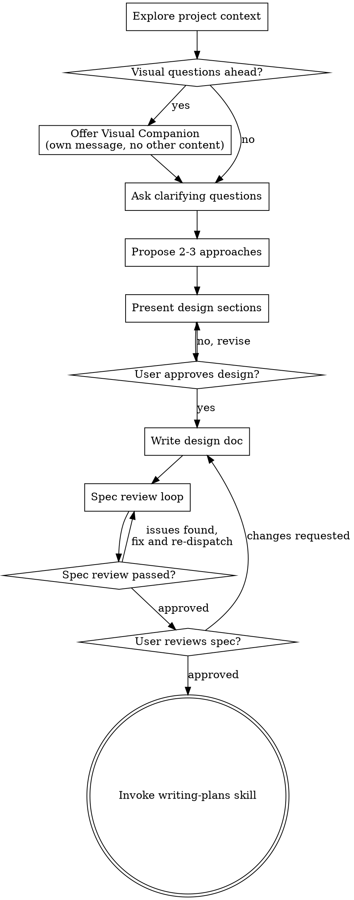
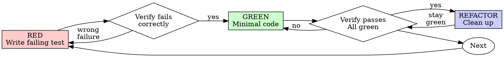

<!-- Generated by SpecStory, Markdown v2.1.0 -->

# 2026-03-14 15:39:28Z

<!-- Codex CLI Session 019cecff-f2e1-73a0-ad7d-073ed406b7d1 (2026-03-14 15:39:28Z) -->

_**User (2026-03-14 15:39:28Z)**_

apps/web/src/components/modules/note/NoteLatestRender.tsx 的 note.content 因为这个只是一个预览组件，所以你不需要把每个节点都渲染出来。

而且你看这里也有一个 maximum height（max-height）做一个遮罩的，所以你只要提取前几个 node 就行了。当然你也不能提取得过于少，因为如果有一些段落本来文字就比较少的话，你应该多提取几个 node。

---

_**Agent (gpt-5.4 2026-03-14 15:39:34Z)**_

使用这些 skill，按顺序执行：`using-superpowers` 用来遵守仓库的技能流程，`brainstorming` 先界定预览裁剪策略，`test-driven-development` 先补/改测试再实现；我先读相关说明和目标组件。

_**Agent (gpt-5.4 2026-03-14 15:39:34Z)**_

<tool-use data-tool-type="shell" data-tool-name="exec_command"><details>
<summary>Tool use: **exec_command** `sed -n '1,220p' <HOME>/.codex/skills/using-superpowers/SKILL.md`</summary>
```
Chunk ID: 702e83
Wall time: 0.0000 seconds
Process exited with code 0
Original token count: 1305
Output:
---
name: using-superpowers
description: Use when starting any conversation - establishes how to find and use skills, requiring Skill tool invocation before ANY response including clarifying questions
---

<SUBAGENT-STOP>
If you were dispatched as a subagent to execute a specific task, skip this skill.
</SUBAGENT-STOP>

<EXTREMELY-IMPORTANT>
If you think there is even a 1% chance a skill might apply to what you are doing, you ABSOLUTELY MUST invoke the skill.

IF A SKILL APPLIES TO YOUR TASK, YOU DO NOT HAVE A CHOICE. YOU MUST USE IT.

This is not negotiable. This is not optional. You cannot rationalize your way out of this.
</EXTREMELY-IMPORTANT>

## Instruction Priority

Superpowers skills override default system prompt behavior, but **user instructions always take precedence**:

1. **User's explicit instructions** (CLAUDE.md, GEMINI.md, AGENTS.md, direct requests) — highest priority
2. **Superpowers skills** — override default system behavior where they conflict
3. **Default system prompt** — lowest priority

If CLAUDE.md, GEMINI.md, or AGENTS.md says "don't use TDD" and a skill says "always use TDD," follow the user's instructions. The user is in control.

## How to Access Skills

**In Claude Code:** Use the `Skill` tool. When you invoke a skill, its content is loaded and presented to you—follow it directly. Never use the Read tool on skill files.

**In Gemini CLI:** Skills activate via the `activate_skill` tool. Gemini loads skill metadata at session start and activates the full content on demand.

**In other environments:** Check your platform's documentation for how skills are loaded.

## Platform Adaptation

Skills use Claude Code tool names. Non-CC platforms: see `references/codex-tools.md` (Codex) for tool equivalents. Gemini CLI users get the tool mapping loaded automatically via GEMINI.md.

# Using Skills

## The Rule

**Invoke relevant or requested skills BEFORE any response or action.** Even a 1% chance a skill might apply means that you should invoke the skill to check. If an invoked skill turns out to be wrong for the situation, you don't need to use it.


## Red Flags

These thoughts mean STOP—you're rationalizing:

| Thought | Reality |
|---------|---------|
| "This is just a simple question" | Questions are tasks. Check for skills. |
| "I need more context first" | Skill check comes BEFORE clarifying questions. |
| "Let me explore the codebase first" | Skills tell you HOW to explore. Check first. |
| "I can check git/files quickly" | Files lack conversation context. Check for skills. |
| "Let me gather information first" | Skills tell you HOW to gather information. |
| "This doesn't need a formal skill" | If a skill exists, use it. |
| "I remember this skill" | Skills evolve. Read current version. |
| "This doesn't count as a task" | Action = task. Check for skills. |
| "The skill is overkill" | Simple things become complex. Use it. |
| "I'll just do this one thing first" | Check BEFORE doing anything. |
| "This feels productive" | Undisciplined action wastes time. Skills prevent this. |
| "I know what that means" | Knowing the concept ≠ using the skill. Invoke it. |

## Skill Priority

When multiple skills could apply, use this order:

1. **Process skills first** (brainstorming, debugging) - these determine HOW to approach the task
2. **Implementation skills second** (frontend-design, mcp-builder) - these guide execution

"Let's build X" → brainstorming first, then implementation skills.
"Fix this bug" → debug
... (truncated)
```
</details></tool-use>

_**Agent (gpt-5.4 2026-03-14 15:39:34Z)**_

<tool-use data-tool-type="shell" data-tool-name="exec_command"><details>
<summary>Tool use: **exec_command** `sed -n '1,240p' <HOME>/.codex/skills/brainstorming/SKILL.md`</summary>
```
Chunk ID: 60fd0e
Wall time: 0.0000 seconds
Process exited with code 0
Original token count: 2643
Output:
---
name: brainstorming
description: "You MUST use this before any creative work - creating features, building components, adding functionality, or modifying behavior. Explores user intent, requirements and design before implementation."
---

# Brainstorming Ideas Into Designs

Help turn ideas into fully formed designs and specs through natural collaborative dialogue.

Start by understanding the current project context, then ask questions one at a time to refine the idea. Once you understand what you're building, present the design and get user approval.

<HARD-GATE>
Do NOT invoke any implementation skill, write any code, scaffold any project, or take any implementation action until you have presented a design and the user has approved it. This applies to EVERY project regardless of perceived simplicity.
</HARD-GATE>

## Anti-Pattern: "This Is Too Simple To Need A Design"

Every project goes through this process. A todo list, a single-function utility, a config change — all of them. "Simple" projects are where unexamined assumptions cause the most wasted work. The design can be short (a few sentences for truly simple projects), but you MUST present it and get approval.

## Checklist

You MUST create a task for each of these items and complete them in order:

1. **Explore project context** — check files, docs, recent commits
2. **Offer visual companion** (if topic will involve visual questions) — this is its own message, not combined with a clarifying question. See the Visual Companion section below.
3. **Ask clarifying questions** — one at a time, understand purpose/constraints/success criteria
4. **Propose 2-3 approaches** — with trade-offs and your recommendation
5. **Present design** — in sections scaled to their complexity, get user approval after each section
6. **Write design doc** — save to `docs/superpowers/specs/YYYY-MM-DD-<topic>-design.md` and commit
7. **Spec review loop** — dispatch spec-document-reviewer subagent with precisely crafted review context (never your session history); fix issues and re-dispatch until approved (max 5 iterations, then surface to human)
8. **User reviews written spec** — ask user to review the spec file before proceeding
9. **Transition to implementation** — invoke writing-plans skill to create implementation plan

## Process Flow



**The terminal state is invoking writing-plans.** Do NOT invoke frontend-design, mcp-builder, or any other implementation skill. The ONLY skill you invoke after brainstorming is writing-plans.

## The Process

**Understanding the idea:**

- Check out the current project state first (files, docs, recent commits)
- Before asking detailed questions, assess scope: if the request describes multiple independent subsystems (e.g., "build a platform with chat, file storage, billing, and analytics"), flag this immediately. Don't spend questions refining details of a project that needs to be decomposed first.
- If the project is too large for a single spec, help the user decompose into sub-projects: what are the independent pieces, how do they relate, what order should they be built? Then brainstorm the first sub-project through the normal design flow. Each sub-project gets its own spec → plan → imple
... (truncated)
```
</details></tool-use>

_**Agent (gpt-5.4 2026-03-14 15:39:34Z)**_

<tool-use data-tool-type="shell" data-tool-name="exec_command"><details>
<summary>Tool use: **exec_command** `sed -n '1,260p' <HOME>/.codex/skills/test-driven-development/SKILL.md`</summary>
```
Chunk ID: 0bbd99
Wall time: 0.0000 seconds
Process exited with code 0
Original token count: 1618
Output:
---
name: test-driven-development
description: Use when implementing any feature or bugfix, before writing implementation code
---

# Test-Driven Development (TDD)

## Overview

Write the test first. Watch it fail. Write minimal code to pass.

**Core principle:** If you didn't watch the test fail, you don't know if it tests the right thing.

**Violating the letter of the rules is violating the spirit of the rules.**

## When to Use

**Always:**
- New features
- Bug fixes
- Refactoring
- Behavior changes

**Exceptions (ask your human partner):**
- Throwaway prototypes
- Generated code
- Configuration files

Thinking "skip TDD just this once"? Stop. That's rationalization.

## The Iron Law

```
NO PRODUCTION CODE WITHOUT A FAILING TEST FIRST
```

Write code before the test? Delete it. Start over.

**No exceptions:**
- Don't keep it as "reference"
- Don't "adapt" it while writing tests
- Don't look at it
- Delete means delete

Implement fresh from tests. Period.

## Red-Green-Refactor



### RED - Write Failing Test

Write one minimal test showing what should happen.

<Good>
```typescript
test('retries failed operations 3 times', async () => {
  let attempts = 0;
  const operation = () => {
    attempts++;
    if (attempts < 3) throw new Error('fail');
    return 'success';
  };

  const result = await retryOperation(operation);

  expect(result).toBe('success');
  expect(attempts).toBe(3);
});
```
Clear name, tests real behavior, one thing
</Good>

<Bad>
```typescript
test('retry works', async () => {
  const mock = jest.fn()
    .mockRejectedValueOnce(new Error())
    .mockRejectedValueOnce(new Error())
    .mockResolvedValueOnce('success');
  await retryOperation(mock);
  expect(mock).toHaveBeenCalledTimes(3);
});
```
Vague name, tests mock not code
</Bad>

**Requirements:**
- One behavior
- Clear name
- Real code (no mocks unless unavoidable)

### Verify RED - Watch It Fail

**MANDATORY. Never skip.**

```bash
npm test path/to/test.test.ts
```

Confirm:
- Test fails (not errors)
- Failure message is expected
- Fails because feature missing (not typos)

**Test passes?** You're testing existing behavior. Fix test.

**Test errors?** Fix error, re-run until it fails correctly.

### GREEN - Minimal Code

Write simplest code to pass the test.

<Good>
```typescript
async function retryOperation<T>(fn: () => Promise<T>): Promise<T> {
  for (let i = 0; i < 3; i++) {
    try {
      return await fn();
    } catch (e) {
      if (i === 2) throw e;
    }
  }
  throw new Error('unreachable');
}
```
Just enough to pass
</Good>

<Bad>
```typescript
async function retryOperation<T>(
  fn: () => Promise<T>,
  options?: {
    maxRetries?: number;
    backoff?: 'linear' | 'exponential';
    onRetry?: (attempt: number) => void;
  }
): Promise<T> {
  // YAGNI
}
```
Over-engineered
</Bad>

Don't add features, refactor other code, or "improve" beyond the test.

### Verify GREEN - Watch It Pass

**MANDATORY.**

```bash
npm test path/to/test.test.ts
```

Confirm:
- Test passes
- Other tests still pass
- Output pristine (no errors, warnings)

**Test fails?** Fix code, not test.

**Other tests fail?** Fix now.

### REFACTOR - Clean Up

After green only:
- Remove duplication
- Improve names
- Extract helpers

Keep tests green. Don't add behavior.

### Repeat

Next failing test for next feature.

## Good Tests

| Quality | Good | Bad |
|---------|------|-----|
| **Minimal** | One thing. "and" in name? Split it. | `test('validates email and domain and whitespace')` |
| **Clear** | Name describes behavior | `test('test1')` |
| **Shows intent** | Demonstrates desired API | Obscures what code should do |

## Why Order Matters

**"I'll write tests after to verify it works"**

Tests written after code pass immediately. Passing immediately proves nothing:
- Might test wrong thing
- Might test implementation, not behavior
- Might miss edge cases you forgot
- You never saw it catch the bug

Test-first forces you to see the test fail, proving it actually tests something.

**"I already manually tested all the edge cases"**

Manual testing is ad-hoc. You t
... (truncated)
```
</details></tool-use>

_**Agent (gpt-5.4 2026-03-14 15:39:39Z)**_

我先看这个组件、相关渲染链路和现有测试点，确认预览节点裁剪应该落在哪一层，以及是否已经有可复用的 node 提取逻辑。

_**Agent (gpt-5.4 2026-03-14 15:39:39Z)**_

<tool-use data-tool-type="shell" data-tool-name="exec_command"><details>
<summary>Tool use: **exec_command** `sed -n '1,260p' apps/web/src/components/modules/note/NoteLatestRender.tsx`</summary>
```
Chunk ID: 9d61e1
Wall time: 0.0000 seconds
Process exited with code 0
Original token count: 1557
Output:
import type { NoteModel } from '@mx-space/api-client'
import { getFormatter, getTranslations } from 'next-intl/server'

import { LexicalContent } from '~/components/ui/rich-content/LexicalContent'
import { Link } from '~/i18n/navigation'
import { topicStringToHue } from '~/lib/color'
import { buildNotePath } from '~/lib/note-route'

import { Markdown } from '../../ui/markdown'

export async function NoteLatestRender({ note }: { note: NoteModel }) {
  const href = buildNotePath(note)
  const coverSrc = note.meta?.cover as string | undefined
  const format = await getFormatter()
  const t = await getTranslations('note')
  const date = new Date(note.created)

  return (
    <div className="relative mt-6">
      {/* Nid watermark */}
      <span className="pointer-events-none absolute -top-1 right-0 select-none font-serif text-5xl font-bold leading-none tracking-tighter text-neutral-9/[.06]">
        #{note.nid}
      </span>

      {(note.weather || note.mood || note.topic) && (
        <div className="mb-2.5 flex items-center gap-2 text-xs">
          {note.topic && <MobileTopicTag name={note.topic.name} />}
          {note.weather && (
            <span className="text-neutral-6">{note.weather}</span>
          )}
          {note.mood && <span className="text-neutral-6">{note.mood}</span>}
        </div>
      )}

      <h1 className="mb-1.5 text-2xl font-bold tracking-tight text-neutral-9 lg:text-[28px]">
        <Link className="hover:text-accent transition-colors" href={href}>
          {note.title}
        </Link>
      </h1>

      <div className="mb-6 text-xs text-neutral-6">
        {format.dateTime(date, {
          year: 'numeric',
          month: 'long',
          day: 'numeric',
          weekday: 'short',
        })}
      </div>

      {coverSrc && (
        <Link className="mb-6 block overflow-hidden rounded-lg" href={href}>
          
        </Link>
      )}

      <div
        className="max-h-[calc(100vh-40rem)] overflow-hidden"
        style={{
          maskImage: 'linear-gradient(to bottom, black 60%, transparent 100%)',
          WebkitMaskImage:
            'linear-gradient(to bottom, black 60%, transparent 100%)',
        }}
      >
        {note.contentFormat === 'lexical' && note.content ? (
          <article className="relative">
            <LexicalContent content={note.content} variant="note" />
          </article>
        ) : note.text ? (
          <article className="prose relative">
            <Markdown
              removeWrapper={false}
              value={note.text}
              variant="note"
            />
          </article>
        ) : null}
      </div>

      <LetterBottom
        href={href}
        linkText={t('read_full_note')}
        topicName={note.topic?.name}
      />
    </div>
  )
}

function LetterBottom({
  topicName,
  href,
  linkText,
}: {
  topicName?: string
  href: string
  linkText: string
}) {
  const hue = topicName ? topicStringToHue(topicName) : null

  const washiC1 =
    hue !== null ? `hsla(${hue}, 35%, 50%, 0.18)` : 'rgba(170, 160, 140, 0.2)'
  const washiC2 =
    hue !== null ? `hsla(${hue}, 35%, 50%, 0.10)` : 'rgba(170, 160, 140, 0.12)'
  const washiC1Dark =
    hue !== null ? `hsla(${hue}, 35%, 50%, 0.14)` : 'rgba(170, 160, 140, 0.14)'
  const washiC2Dark =
    hue !== null ? `hsla(${hue}, 35%, 50%, 0.07)` : 'rgba(170, 160, 140, 0.08)'

  const washiMask = {
    maskImage:
      'linear-gradient(90deg, transparent 0%, black 5%, black 95%, transparent 100%)',
    WebkitMaskImage:
      'linear-gradient(90deg, transparent 0%, black 5%, black 95%, transparent 100%)',
  }

  return (
    <div className="relative mt-1 pb-4 sm:pb-12">
      {/* Washi tape — light */}
      <div
        className="mx-auto h-5 w-[65%] -rotate-[1.2deg] dark:hidden"
        style={{
          background: `repeating-linear-gradient(45deg, ${washiC1} 0px, ${washiC1} 4px, ${washiC2} 4px, ${washiC2} 8px)`,
          ...washiMask,
        }}
      />
      {/* Washi tape — dark */}
      <div
        className="mx-auto hidden h-5 w-[65%] -rotate-[1.2deg] dark:block"
        style={{
          background: `repeating-linear-gradient(45deg, ${washiC1Dark} 0px, ${washiC1Dark} 4px, ${washiC2Dark} 4px, ${washiC2Dark} 8px)`,
          ...washiMask,
        }}
      />

      {/* Handwritten-style link */}
      <div className="mt-4 text-center">
        <Link
          className="text-sm italic tracking-wide text-[#8c6239] transition-opacity hover:opacity-70 focus-visible:opacity-70 dark:text-[#d4a574]"
          href={href}
          style={{
            fontFamily: "Georgia, 'Noto Serif SC', serif",
            letterSpacing: '0.5px',
          }}
   
... (truncated)
```
</details></tool-use>

_**Agent (gpt-5.4 2026-03-14 15:39:39Z)**_

<tool-use data-tool-type="shell" data-tool-name="exec_command"><details>
<summary>Tool use: **exec_command** `rg -n "NoteLatestRender|latest render|max-height|mask|note\.content|serializedNodes|nodes" apps/web/src/components -g '!**/*.map'`</summary>
```
Chunk ID: 62cda2
Wall time: 0.0000 seconds
Process exited with code 0
Original token count: 1367
Output:
apps/web/src/components/modules/project/ProjectIcon.tsx:16:        'mask mask-squircle aspect-square transition-all duration-300',
apps/web/src/components/modules/peek/NotePreview.tsx:52:          <IndentArticleContainer prose={note.contentFormat !== 'lexical'}>
apps/web/src/components/modules/ai/Summary.tsx:79:        '[mask-image:linear-gradient(to_right,black_calc(100%-2rem),transparent)]',
apps/web/src/components/modules/note/NoteLatestRender.tsx:11:export async function NoteLatestRender({ note }: { note: NoteModel }) {
apps/web/src/components/modules/note/NoteLatestRender.tsx:64:          maskImage: 'linear-gradient(to bottom, black 60%, transparent 100%)',
apps/web/src/components/modules/note/NoteLatestRender.tsx:69:        {note.contentFormat === 'lexical' && note.content ? (
apps/web/src/components/modules/note/NoteLatestRender.tsx:71:            <LexicalContent content={note.content} variant="note" />
apps/web/src/components/modules/note/NoteLatestRender.tsx:114:    maskImage:
apps/web/src/components/modules/note/NoteHeadCover.tsx:90:          'cover-mask-b top-[-6.5rem] md:top-0',
apps/web/src/components/modules/shared/KaomojiPanel.tsx:41:      mask
apps/web/src/components/modules/toc/TocTree.tsx:20:import { useContainerCanScroll } from '~/hooks/shared/use-mask-scrollarea'
apps/web/src/components/modules/toc/TocTree.tsx:152:          canScroll && 'mask-scroller',
apps/web/src/components/modules/dashboard/writing/SidebarBase.tsx:6:import { useMaskScrollArea } from '~/hooks/shared/use-mask-scrollarea'
apps/web/src/components/layout/header/internal/SiteOwnerAvatar.tsx:33:          isLiving ? 'rounded-full' : 'mask mask-squircle',
apps/web/src/components/layout/header/internal/SiteOwnerAvatar.tsx:46:                  maskImage: `url("data:image/svg+xml;base64,PHN2ZyB3aWR0aD0iNDAiIGhlaWdodD0iNDAiIHZpZXdCb3g9IjAgMCA0MCA0MCIgZmlsbD0ibm9uZSIgeG1sbnM9Imh0dHA6Ly93d3cudzMub3JnLzIwMDAvc3ZnIj4KPHBhdGggZmlsbC1ydWxlPSJldmVub2RkIiBjbGlwLXJ1bGU9ImV2ZW5vZGQiIGQ9Ik0wIDBINDBWMjcuMzQyN0MzOC4zNSAyNS4zMDM3IDM1LjgyNzMgMjQgMzMgMjRDMjguMDI5NCAyNCAyNCAyOC4wMjk0IDI0IDMzQzI0IDM1LjgyNzMgMjUuMzAzNyAzOC4zNSAyNy4zNDI3IDQwSDBWMFoiIGZpbGw9IiNEOUQ5RDkiLz4KPC9zdmc+Cg==")`,
apps/web/src/components/modules/dashboard/writing/CardMasonry.tsx:5:import { useMaskScrollArea } from '~/hooks/shared/use-mask-scrollarea'
apps/web/src/components/ui/scroll-area/ScrollArea.tsx:83:  mask,
apps/web/src/components/ui/scroll-area/ScrollArea.tsx:86:  mask?: boolean
apps/web/src/components/ui/scroll-area/ScrollArea.tsx:96:      className={clsxm('block size-full', mask && 'mask-scroller', className)}
apps/web/src/components/ui/scroll-area/ScrollArea.tsx:127:  mask,
apps/web/src/components/ui/scroll-area/ScrollArea.tsx:136:  mask?: boolean
apps/web/src/components/ui/scroll-area/ScrollArea.tsx:140:      mask={mask}
apps/web/src/components/ui/markdown/markdown-variants.css:210:    max-height: 350px;
apps/web/src/components/ui/markdown/markdown.css:47:    max-height: unset !important;
apps/web/src/components/ui/code-highlighter/shiki/ShikiWrapper.tsx:15:import { useMaskScrollArea } from '~/hooks/shared/use-mask-scrollarea'
apps/web/src/components/ui/code-highlighter/shiki/ShikiWrapper.tsx:101:  const [, maskClassName] = useMaskScrollArea({
apps/web/src/components/ui/code-highlighter/shiki/ShikiWrapper.tsx:184:              !isCollapsed ? 'max-h-full!' : isOverflow ? maskClassName : '',
apps/web/src/components/ui/code-highlighter/shiki/ShikiWrapper.tsx:211:                maskClassName.includes('mask-both') ||
apps/web/src/components/ui/code-highlighter/shiki/ShikiWrapper.tsx:212:                maskClassName.includes('mask-b')
apps/web/src/components/ui/background/AutumnLeavesBackground.tsx:93:  var mask = 0.0;
apps/web/src/components/ui/background/AutumnLeavesBackground.tsx:100:    mask = 1.0 - smoothstep(-0.01, 0.01 + blur * 0.03, stemDist);
apps/web/src/components/ui/background/AutumnLeavesBackground.tsx:160:    // Compute fan mask
apps/web/src/components/ui/background/AutumnLeavesBackground.tsx:163:    // Distance-based mask for smooth edges
apps/web/src/components/ui/background/AutumnLeavesBackground.tsx:178:    mask = max(mask, fanMask);
apps/web/src/components/ui/background/AutumnLeavesBackground.tsx:182:  if (mask > 0.01) {
apps/web/src/components/ui/background/AutumnLeavesBackground.tsx:195:    mask = mask * (1.0 - veinStrength * veinFade * (1.0 - blur * 0.8));
apps/web/src/components/ui/background/AutumnLeavesBackground.tsx:198:  return mask;
apps/web/src/components/ui/background/SakuraBackground.tsx:185:  let mask = 1.0 - smoothstep(-softness, softness, d);
apps/web/src/components/ui/background/SakuraBackground.tsx:207:  // Combine veins (subtract from mask for subtle indentation look)
apps/web/src/components/ui/background/SakuraBackground.tsx:210:  return mask * (1.0 - veinPattern);
apps/web/src/components/ui/background/SakuraBackground.tsx:305
... (truncated)
```
</details></tool-use>

_**Agent (gpt-5.4 2026-03-14 15:39:39Z)**_

<tool-use data-tool-type="shell" data-tool-name="exec_command"><details>
<summary>Tool use: **exec_command** `git log --oneline -n 8 -- apps/web/src/components/modules/note/NoteLatestRender.tsx`</summary>
```
Chunk ID: d72a0f
Wall time: 0.0000 seconds
Process exited with code 0
Original token count: 62
Output:
84c8d647 feat(notes): add hand-journal styled letter bottom to latest note
06e6df96 feat(web): unify i18n terminology
6eda2a86 feat(notes): refine latest note hero and localize UI strings
3ae22c0b feat(web): highlight latest note on notes index
```
</details></tool-use>

_**Agent (gpt-5.4 2026-03-14 15:39:46Z)**_

已经定位到预览组件本体。接下来我看 `LexicalContent` 的输入约定，以及项目里别的 note preview 有没有现成的“截断前几个 lexical node”模式。

_**Agent (gpt-5.4 2026-03-14 15:39:46Z)**_

<tool-use data-tool-type="shell" data-tool-name="exec_command"><details>
<summary>Tool use: **exec_command** `sed -n '1,240p' apps/web/src/components/ui/rich-content/LexicalContent.tsx`</summary>
```
Chunk ID: 2668c1
Wall time: 0.0000 seconds
Process exited with code 0
Original token count: 1731
Output:
'use client'

import '@haklex/rich-kit-shiro/style.css'

import type {
  EnhancedLinkCardProps,
  LinkCardFetchContext,
  PresentDialogFn,
  PresentDialogProps,
  RendererConfig,
  RichEditorVariant,
} from '@haklex/rich-kit-shiro'
import {
  createMxSpacePlugin,
  createThemeStyle,
  LinkCardFetchProvider,
  LinkCardRenderer,
  PresentDialogProvider,
} from '@haklex/rich-kit-shiro'
import { ShiroRenderer } from '@haklex/rich-kit-shiro/renderer'
import clsx from 'clsx'
import type { SerializedEditorState } from 'lexical'
import { useCallback, useMemo } from 'react'

import { getWebUrl } from '~/atoms'
import { useIsMobile } from '~/atoms/hooks/viewport'
import { Paper } from '~/components/layout/container/Paper'
import { PeekModal } from '~/components/modules/peek/PeekModal'
import { useModalStack } from '~/components/ui/modal/stacked/provider'
import { useIsDark } from '~/hooks/common/use-is-dark'
import { fetchGitHubApi } from '~/lib/github'

const fallbackSansFont =
  "var(--app-font-sans, system-ui), -apple-system, 'PingFang SC', 'Microsoft YaHei', 'Segoe UI', Roboto, Helvetica, 'noto sans sc', 'hiragino sans gb', sans-serif, Apple Color Emoji, Segoe UI Emoji, Not Color Emoji"
const fallbackSerifFont =
  "'Noto Serif CJK SC', 'Noto Serif SC', var(--app-font-serif, 'Source Han Serif SC'), 'Source Han Serif SC', 'Source Han Serif', source-han-serif-sc, SongTi SC, SimSum, 'Hiragino Sans GB', system-ui, -apple-system, Segoe UI, Roboto, Helvetica, 'Microsoft YaHei', 'WenQuanYi Micro Hei', sans-serif"
const fallbackMonoFont =
  "'OperatorMonoSSmLig Nerd Font', 'Cascadia Code PL', 'FantasqueSansMono Nerd Font', 'operator mono', JetBrainsMono, 'Fira code Retina', 'Fira code', Consolas, Monaco, 'Hannotate SC', monospace, -apple-system"

const linkCardFetchContext: LinkCardFetchContext = {
  adapters: {
    github: {
      request: fetchGitHubApi,
    },
    tmdb: {
      request: async (url) => {
        const u = new URL(url)
        const path = u.pathname.replace(/^\/3\//, '')
        const r = await fetch(`/api/tmdb/${path}${u.search}`)
        return await r.json()
      },
    },
    bangumi: {
      request: async (url) => {
        const u = new URL(url)
        const path = u.pathname.replace(/^\/v0\//, '')
        const r = await fetch(`/api/bangumi/${path}`)
        return await r.json()
      },
    },
    leetcode: {
      request: async (_url, init) => {
        const r = await fetch('/api/leetcode', init)
        return await r.json()
      },
    },
    'netease-music': {
      request: async (url) => {
        const songId = new URL(url).pathname.split('/').pop()
        const r = await fetch('/api/music/netease', {
          method: 'POST',
          headers: { 'Content-Type': 'application/json' },
          body: JSON.stringify({ songId }),
        })
        return await r.json()
      },
    },
    'qq-music': {
      request: async (url) => {
        const songId = new URL(url).pathname.split('/').pop()
        const r = await fetch('/api/music/tencent', {
          method: 'POST',
          headers: { 'Content-Type': 'application/json' },
          body: JSON.stringify({ songId }),
        })
        return await r.json()
      },
    },
    'mx-space': {
      request: async (path) => {
        const r = await fetch(`/api/v2/${path}`)
        return await r.json()
      },
    },
  },
}

function LinkCardWithMxSpace(props: EnhancedLinkCardProps) {
  const webUrl = getWebUrl()
  const plugins = useMemo(() => {
    if (!webUrl) return
    return [createMxSpacePlugin({ webUrl })]
  }, [webUrl])
  return <LinkCardRenderer {...props} plugins={plugins} />
}

const customRendererConfig: Partial<RendererConfig> = {
  LinkCard: LinkCardWithMxSpace,
}

function PeekDialogModal({
  content: Content,
}: {
  content: PresentDialogProps['content']
}) {
  const { dismissTop } = useModalStack()
  return (
    <PeekModal>
      <Paper
        as="div"
        className="[&_.rich-content]:max-w-full! [&_.rich-content]:w-full! [&_.rich-content_table]:overflow-x-auto!"
      >
        <Content dismiss={dismissTop} />
      </Paper>
    </PeekModal>
  )
}

export interface LexicalContentProps {
  className?: string
  content: string
  variant?: RichEditorVariant
}

export function LexicalContent({
  content,
  variant,
  className,
}: LexicalContentProps) {
  const editorState = useMemo<SerializedEditorState | null>(() => {
    try {
      return JSON.parse(content)
    } catch {
      return null
    }
  }, [content])

  const isDark = useIsDark()
  const isMobile = useIsMobile()
  const { present } = useModalStack()
  const presentDialog: PresentDialogFn = useCallback(
    (props) => {
      if (isMobile) {
        present({
          title: props.title || ' ',
          content: props.content,
          clickOutsideToDismiss: props.clickOutsideToDismiss,
          modalClassName: props.className,
      
... (truncated)
```
</details></tool-use>

_**Agent (gpt-5.4 2026-03-14 15:39:46Z)**_

<tool-use data-tool-type="shell" data-tool-name="exec_command"><details>
<summary>Tool use: **exec_command** `sed -n '1,220p' apps/web/src/components/modules/peek/NotePreview.tsx`</summary>
```
Chunk ID: fa93f1
Wall time: 0.0000 seconds
Process exited with code 0
Original token count: 700
Output:
import type { NoteWrappedWithLikedAndTranslationPayload } from '@mx-space/api-client'
import { useQuery } from '@tanstack/react-query'
import { atom } from 'jotai'
import type { FC } from 'react'
import { useMemo } from 'react'

import { NoteMarkdown } from '~/app/[locale]/notes/(note-detail)/[id]/NoteMarkdown'
import {
  IndentArticleContainer,
  NoteHeaderDate,
  NoteMarkdownImageRecordProvider,
  NoteTitle,
} from '~/app/[locale]/notes/(note-detail)/[id]/pageExtra'
import { AckRead } from '~/components/common/AckRead'
import { ClientOnly } from '~/components/common/ClientOnly'
import { Paper } from '~/components/layout/container/Paper'
import { Loading } from '~/components/ui/loading'
import { BottomToUpSmoothTransitionView } from '~/components/ui/transition'
import {
  CurrentNoteDataAtomProvider,
  CurrentNoteDataProvider,
} from '~/providers/note/CurrentNoteDataProvider'
import { WrappedElementProvider } from '~/providers/shared/WrappedElementProvider'
import { queries } from '~/queries/definition'

import { NoteHideIfSecret, NoteMetaBar, NoteRootBanner } from '../note'
import { NoteHeadCover } from '../note/NoteHeadCover'

interface NotePreviewProps {
  noteId: number
}
export const NotePreview: FC<NotePreviewProps> = (props) => {
  const { data, isLoading } = useQuery({
    ...queries.note.byNid(props.noteId.toString()),
  })

  const overrideAtom = useMemo(
    () => atom(null! as NoteWrappedWithLikedAndTranslationPayload),
    [],
  )
  if (isLoading) return <Loading useDefaultLoadingText className="w-full" />
  if (!data) return null
  const noteData = data as NoteWrappedWithLikedAndTranslationPayload
  const note = noteData.data
  return (
    <CurrentNoteDataAtomProvider overrideAtom={overrideAtom}>
      <CurrentNoteDataProvider data={noteData} />
      {!!note.id && <AckRead id={note.id} type="note" />}
      <BottomToUpSmoothTransitionView>
        <Paper>
          <NoteHeadCover image={note.meta?.cover} />
          <IndentArticleContainer prose={note.contentFormat !== 'lexical'}>
            <header>
              <NoteTitle />
              <span className="flex flex-wrap items-center text-sm text-neutral-8/60">
                <NoteHeaderDate />

                <ClientOnly>
                  <NoteMetaBar />
                </ClientOnly>
              </span>
              <NoteRootBanner />
            </header>

            <NoteHideIfSecret>
              <WrappedElementProvider eoaDetect>
                <NoteMarkdownImageRecordProvider>
                  <NoteMarkdown />
                </NoteMarkdownImageRecordProvider>
              </WrappedElementProvider>
            </NoteHideIfSecret>
          </IndentArticleContainer>
        </Paper>
      </BottomToUpSmoothTransitionView>
    </CurrentNoteDataAtomProvider>
  )
}
```
</details></tool-use>

_**Agent (gpt-5.4 2026-03-14 15:39:46Z)**_

<tool-use data-tool-type="shell" data-tool-name="exec_command"><details>
<summary>Tool use: **exec_command** `rg -n "contentFormat === 'lexical'|LexicalContent content=|JSON\.parse\(note\.content|root\.children|children\.slice\(" apps/web src packages -g '!**/dist/**'`</summary>
```
Chunk ID: e67301
Wall time: 0.0000 seconds
Process exited with code 2
Original token count: 497
Output:
rg: src: No such file or directory (os error 2)
apps/web/src/app/feed/route.tsx:89:      const isRichText = item.contentFormat === 'lexical'
apps/web/src/components/modules/note/NoteLatestRender.tsx:69:        {note.contentFormat === 'lexical' && note.content ? (
apps/web/src/components/modules/note/NoteLatestRender.tsx:71:            <LexicalContent content={note.content} variant="note" />
apps/web/src/app/[locale]/posts/(post-detail)/[category]/[slug]/PostMarkdown.tsx:20:  if (contentFormat === 'lexical' && content) {
apps/web/src/app/[locale]/posts/(post-detail)/[category]/[slug]/pageExtra.tsx:78:      content={contentFormat === 'lexical' ? (content ?? undefined) : undefined}
apps/web/src/app/[locale]/(page-detail)/[slug]/PageMarkdown.tsx:20:  if (contentFormat === 'lexical' && content) {
apps/web/src/app/[locale]/posts/(post-detail)/[category]/[slug]/PostContent.tsx:5:  if (contentFormat === 'lexical') {
apps/web/src/components/modules/shared/WithArticleSelectionAction.tsx:39:  const isLexical = contentFormat === 'lexical'
apps/web/src/app/[locale]/notes/(note-detail)/[id]/pageExtra.tsx:44:      content={contentFormat === 'lexical' ? (content ?? undefined) : undefined}
apps/web/src/app/[locale]/(page-detail)/[slug]/pageExtra.tsx:129:      content={contentFormat === 'lexical' ? (content ?? undefined) : undefined}
apps/web/src/app/[locale]/notes/(note-detail)/[id]/NoteContent.tsx:5:  if (contentFormat === 'lexical') {
apps/web/src/app/[locale]/(page-detail)/[slug]/PageContent.tsx:7:  if (contentFormat === 'lexical') {
apps/web/src/app/[locale]/notes/(note-detail)/[id]/NoteMarkdown.tsx:20:  if (contentFormat === 'lexical' && content) {
apps/web/src/app/[locale]/(home)/components/TwoColumnLayout.tsx:25:    {children.slice(0, 2).map((child, i) => (
apps/web/src/components/modules/toc/TocHeadingStrategy.tsx:44:      contentFormat === 'lexical' && hasContent
apps/web/src/components/ui/markdown/renderers/collapse.tsx:48:            {props.children.slice(1)}
```
</details></tool-use>

_**Agent (gpt-5.4 2026-03-14 15:39:50Z)**_

`LexicalContent` 只吃完整的 serialized editor state 字符串，所以这个裁剪更像是：在 `NoteLatestRender` 里先 parse，再对 `root.children` 做预览级 slice，然后再 stringify 回去传给 renderer。现在我再确认有没有合适的测试目录和这类组件的测试基建。

_**Agent (gpt-5.4 2026-03-14 15:39:50Z)**_

<tool-use data-tool-type="shell" data-tool-name="exec_command"><details>
<summary>Tool use: **exec_command** `rg -n "NoteLatestRender|LexicalContent|ShiroRenderer|SerializedEditorState|render\(" apps/web/src -g '*.{test,spec}.{ts,tsx}'`</summary>
```
Chunk ID: 13a625
Wall time: 0.0000 seconds
Process exited with code 1
Original token count: 0
Output:
```
</details></tool-use>

_**Agent (gpt-5.4 2026-03-14 15:39:50Z)**_

<tool-use data-tool-type="shell" data-tool-name="exec_command"><details>
<summary>Tool use: **exec_command** `find apps/web -path '*__tests__*' -o -name '*.test.tsx' -o -name '*.test.ts' -o -name '*.spec.tsx' -o -name '*.spec.ts' | sed -n '1,200p'`</summary>
```
Chunk ID: c8fa04
Wall time: 0.0000 seconds
Process exited with code 0
Original token count: 56
Output:
apps/web/src/components/modules/comment/anchor-resolve.test.ts
apps/web/src/components/modules/comment/thread.test.ts
apps/web/src/components/modules/timeline/TimelineProgress.test.tsx
apps/web/src/lib/note-route.test.ts
```
</details></tool-use>

_**Agent (gpt-5.4 2026-03-14 15:39:50Z)**_

<tool-use data-tool-type="shell" data-tool-name="exec_command"><details>
<summary>Tool use: **exec_command** `cat apps/web/package.json`</summary>
```
Chunk ID: 718577
Wall time: 0.0000 seconds
Process exited with code 0
Original token count: 1332
Output:
{
  "name": "@shiro/web",
  "type": "module",
  "version": "6.6.7",
  "private": true,
  "license": "AGPL-3.0",
  "imports": {
    "#fetch": {
      "react-server": "./src/lib/fetch/fetch.server.ts",
      "default": "./src/lib/fetch/fetch.client.ts"
    }
  },
  "scripts": {
    "analyze": "cross-env NODE_ENV=production ANALYZE=true BUNDLE_ANALYZE=browser next build",
    "prebuild": "rimraf .next || exit 0",
    "build": "tsc --noEmit && cross-env NODE_ENV=production NODE_OPTIONS=--max_old_space_size=4096 next build",
    "build:ci": "tsc --noEmit && cross-env NODE_ENV=production NODE_OPTIONS=--max_old_space_size=4096 NEXT_TELEMETRY_DISABLED=1 CI=true next build",
    "dev": "cross-env NODE_ENV=development next dev -p 2323 --turbo",
    "dev:turbo": "cross-env NODE_ENV=development next dev -p 2323 --turbo",
    "lint": "eslint --fix",
    "prod:pm2": "cross-env NODE_ENV=production pm2 restart ecosystem.config.cjs",
    "prod:reload": "pm2 reload ecosystem.config.cjs",
    "prod:stop": "pm2 stop ecosystem.config.cjs",
    "start": "npm run dev"
  },
  "dependencies": {
    "@base-ui/react": "1.3.0",
    "@excalidraw/excalidraw": "0.17.0",
    "@ferrucc-io/emoji-picker": "0.0.48",
    "@floating-ui/react-dom": "2.1.8",
    "@haklex/rich-editor": "0.0.85",
    "@haklex/rich-kit-shiro": "0.0.85",
    "@haklex/rich-static-renderer": "0.0.85",
    "@lexical/code": "^0.41.0",
    "@lexical/link": "^0.41.0",
    "@lexical/list": "^0.41.0",
    "@lexical/markdown": "^0.41.0",
    "@lexical/react": "^0.41.0",
    "@lexical/rich-text": "^0.41.0",
    "@lexical/table": "^0.41.0",
    "@mx-space/api-client": "2.3.0",
    "@number-flow/react": "^0.6.0",
    "@openpanel/web": "^1.2.0",
    "@shikijs/transformers": "4.0.2",
    "@simplewebauthn/browser": "13.3.0",
    "@simplewebauthn/types": "12.0.0",
    "@tanstack/query-async-storage-persister": "5.90.24",
    "@tanstack/react-query": "5.90.21",
    "@tanstack/react-query-devtools": "5.91.3",
    "@tanstack/react-query-persist-client": "5.90.24",
    "@vercel/functions": "3.4.3",
    "better-auth": "1.5.4",
    "blurhash": "2.0.5",
    "bypass-vue-devtools": "0.0.6",
    "chroma-js": "3.2.0",
    "clsx": "2.1.1",
    "colorjs.io": "^0.6.1",
    "date-fns": "^4.1.0",
    "emoji-mart": "5.6.0",
    "es-toolkit": "1.45.1",
    "exif-js": "2.3.0",
    "foxact": "0.2.54",
    "fuse.js": "7.1.0",
    "idb-keyval": "6.2.2",
    "immer": "^11.1.4",
    "jojoo": "0.3.0",
    "jotai": "2.18.1",
    "js-cookie": "3.0.5",
    "js-yaml": "4.1.1",
    "jsondiffpatch": "^0.7.3",
    "katex": "0.16.38",
    "kbar": "0.1.0-beta.48",
    "lexical": "^0.41.0",
    "markdown-escape": "2.0.0",
    "markdown-to-jsx": "npm:@innei/markdown-to-jsx-yet@7.7.7-11",
    "marked": "17.0.4",
    "mdast-util-to-markdown": "2.1.2",
    "medium-zoom": "1.1.0",
    "mermaid": "11.13.0",
    "motion": "12.35.2",
    "nanoid": "^5.1.6",
    "next": "16.1.6",
    "next-intl": "^4.8.3",
    "next-runtime-env": "3.3.0",
    "next-themes": "0.4.6",
    "ofetch": "1.5.1",
    "pngjs": "7.0.0",
    "prop-types": "15.8.1",
    "qrcode.react": "4.2.0",
    "react": "19.2.4",
    "react-blurhash": "0.3.0",
    "react-dom": "19.2.4",
    "react-error-boundary": "6.1.1",
    "react-intersection-observer": "10.0.3",
    "react-photo-view": "1.2.7",
    "react-responsive-masonry": "2.7.1",
    "react-router-dom": "^7.13.1",
    "react-shadow": "20.6.0",
    "react-tweet": "npm:@innei/react-tweet@3.4.2",
    "remove-markdown": "0.6.3",
    "rss": "1.2.2",
    "schema-dts": "1.1.5",
    "server-only": "^0.0.1",
    "socket.io-client": "4.8.3",
    "sonner": "2.0.7",
    "tailwind-merge": "3.5.0",
    "tailwind-variants": "3.2.2",
    "unified": "^11.0.5",
    "uniqolor": "1.1.1",
    "unist-util-visit": "5.1.0",
    "use-context-selector": "2.0.0",
    "use-debounce": "10.1.0",
    "vaul": "1.1.2",
    "xss": "1.0.15"
  },
  "devDependencies": {
    "@egoist/tailwindcss-icons": "1.9.2",
    "@iconify-json/material-symbols": "1.2.61",
    "@iconify-json/mingcute": "1.2.7",
    "@innei/prettier": "1.0.0",
    "@mx-space/webhook": "0.7.1",
    "@next/bundle-analyzer": "16.1.6",
    "@tailwindcss/postcss": "^4.2.1",
    "@tailwindcss/typography": "0.5.19",
    "@types/chroma-js": "3.1.2",
    "@types/js-cookie": "3.0.6",
    "@types/js-yaml": "4.0.9",
    "@types/katex": "0.16.8",
    "@types/markdown-escape": "1.1.3",
    "@types/node": "25.4.0",
    "@types/pngjs": "6.0.5",
    "@types/react": "19.2.14",
    "@types/react-dom": "19.2.3",
    "@types/react-responsive-masonry": "2.7.0",
    "@types/remove-markdown": "0.3.4",
    "@types/rss": "0.0.32",
    "@webgpu/types": "^0.1.69",
    "autoprefixer": "10.4.27",
    "client-only": "0.0.1",
    "code-inspector-plugin": "1.4.4",
    "cross-env": "10.1.0",
    "dotenv": "17.3.1",
    "postcss": "8.5.8",
    "postcss-import": "16.1.1",
    "postcss-js": "5.1.0",
    "post
... (truncated)
```
</details></tool-use>

_**Agent (gpt-5.4 2026-03-14 15:39:58Z)**_

测试基建比较轻，`apps/web` 里只有少量 `*.test.ts(x)`。我先看根目录和现有测试写法，确定应该走哪个 runner，再按 TDD 先补一个针对 “预览 node 裁剪” 的最小测试。

_**Agent (gpt-5.4 2026-03-14 15:39:58Z)**_

<tool-use data-tool-type="shell" data-tool-name="exec_command"><details>
<summary>Tool use: **exec_command** `cat package.json`</summary>
```
Chunk ID: b174d4
Wall time: 0.0000 seconds
Process exited with code 0
Original token count: 569
Output:
{
  "name": "shiroi",
  "type": "module",
  "private": true,
  "packageManager": "pnpm@10.27.0",
  "engines": {
    "node": ">=20"
  },
  "scripts": {
    "build": "turbo build",
    "build:rich": "turbo run build --filter='./haklex/*' --filter='!@haklex/rich-editor-demo'",
    "dev": "turbo dev --filter @shiro/web",
    "lint": "turbo lint",
    "prepare": "pnpm exec simple-git-hooks"
  },
  "devDependencies": {
    "@lobehub/lint": "^2.1.5",
    "@types/node": "25.4.0",
    "eslint": "^10.0.0",
    "knip": "^5.86.0",
    "lint-staged": "16.3.3",
    "simple-git-hooks": "2.13.1",
    "turbo": "^2.8.15",
    "vitest": "^4.0.18"
  },
  "pnpm": {
    "onlyBuiltDependencies": [
      "@parcel/watcher",
      "@swc/core",
      "esbuild",
      "sharp",
      "simple-git-hooks"
    ],
    "overrides": {
      "array-includes": "npm:@nolyfill/array-includes@^1.0.44",
      "array.prototype.findlastindex": "npm:@nolyfill/array.prototype.findlastindex@^1.0.44",
      "array.prototype.flat": "npm:@nolyfill/array.prototype.flat@^1.0.44",
      "array.prototype.flatmap": "npm:@nolyfill/array.prototype.flatmap@^1.0.44",
      "array.prototype.tosorted": "npm:@nolyfill/array.prototype.tosorted@^1.0.44",
      "better-auth>@better-auth/drizzle-adapter": "-",
      "better-auth>@better-auth/prisma-adapter": "-",
      "has": "npm:@nolyfill/has@^1.0.44",
      "is-core-module": "npm:@nolyfill/is-core-module@^1.0.39",
      "object.assign": "npm:@nolyfill/object.assign@^1.0.44",
      "object.entries": "npm:@nolyfill/object.entries@^1.0.44",
      "object.fromentries": "npm:@nolyfill/object.fromentries@^1.0.44",
      "object.groupby": "npm:@nolyfill/object.groupby@^1.0.44",
      "object.hasown": "npm:@nolyfill/object.hasown@^1.0.44",
      "object.values": "npm:@nolyfill/object.values@^1.0.44",
      "string.prototype.matchall": "npm:@nolyfill/string.prototype.matchall@^1.0.44"
    },
    "patchedDependencies": {
      "@innei/markdown-to-jsx-yet": "patches/@innei__markdown-to-jsx-yet.patch"
    }
  },
  "simple-git-hooks": {
    "pre-commit": "pnpm exec lint-staged"
  },
  "lint-staged": {
    "*.{js,jsx,ts,tsx}": [
      "prettier --ignore-path ./.gitignore --write "
    ],
    "*.{js,ts,cjs,mjs,jsx,tsx,json}": [
      "eslint --fix"
    ]
  }
}
```
</details></tool-use>

_**Agent (gpt-5.4 2026-03-14 15:39:58Z)**_

<tool-use data-tool-type="shell" data-tool-name="exec_command"><details>
<summary>Tool use: **exec_command** `sed -n '1,220p' apps/web/src/lib/note-route.test.ts`</summary>
```
Chunk ID: 8528fd
Wall time: 0.0000 seconds
Process exited with code 0
Original token count: 207
Output:
import { describe, expect, it } from 'vitest'

import { buildNotePath } from './note-route'

describe('buildNotePath', () => {
  it('prefers the slug route when slug and created exist', () => {
    expect(
      buildNotePath({
        nid: 42,
        slug: 'hello-note',
        created: '2026-03-14T12:00:00.000Z',
      }),
    ).toBe('/notes/2026/3/14/hello-note')
  })

  it('falls back to the nid route when slug data is missing', () => {
    expect(
      buildNotePath({
        nid: 42,
      }),
    ).toBe('/notes/42')
  })

  it('preserves the password query string', () => {
    expect(
      buildNotePath({
        nid: 42,
        slug: 'hello-note',
        created: '2026-03-14T12:00:00.000Z',
        password: 'open sesame',
      }),
    ).toBe('/notes/2026/3/14/hello-note?password=open+sesame')
  })
})
```
</details></tool-use>

_**Agent (gpt-5.4 2026-03-14 15:39:58Z)**_

<tool-use data-tool-type="shell" data-tool-name="exec_command"><details>
<summary>Tool use: **exec_command** `rg -n "vitest|jest|tsx --test|node --test|bun test|uvu" . -g 'package.json' -g 'vitest.config.*' -g 'jest.config.*' -g 'tsconfig*.json'`</summary>
```
Chunk ID: 3744c6
Wall time: 0.0000 seconds
Process exited with code 0
Original token count: 30
Output:
./package.json:24:    "vitest": "^4.0.18"
./apps/web/vitest.config.ts:3:import { defineConfig } from 'vitest/config'
```
</details></tool-use>

_**Agent (gpt-5.4 2026-03-14 15:39:59Z)**_

<tool-use data-tool-type="shell" data-tool-name="exec_command"><details>
<summary>Tool use: **exec_command** `sed -n '1,220p' apps/web/vitest.config.ts`</summary>
```
Chunk ID: 83e862
Wall time: 0.0000 seconds
Process exited with code 0
Original token count: 62
Output:
import { resolve } from 'node:path'

import { defineConfig } from 'vitest/config'

export default defineConfig({
  resolve: {
    alias: {
      '~': resolve(__dirname, 'src'),
    },
  },
  test: {
    include: ['src/**/*.test.{ts,tsx}'],
  },
})
```
</details></tool-use>

_**Agent (gpt-5.4 2026-03-14 15:40:06Z)**_

我看过 [NoteLatestRender.tsx](<REPO_ROOT>/apps/web/src/components/modules/note/NoteLatestRender.tsx) 和 `LexicalContent` 了。这里最稳的做法是在预览组件里只截取 `lexical` 的前几项 `root.children`，保留现有 `max-height + mask` 作为第二层兜底，而不是继续完整渲染整篇内容。

我先确认一个约束：你希望这个“前几个 node”的策略更偏向哪一种？
1. 固定上限，比如始终取前 `6-8` 个 block node。
2. 动态上限，比如至少取 `N` 个 node，同时如果累计纯文本太短就继续多取几个。

---

_**User (2026-03-14 15:40:20Z)**_

2

---

_**Agent (gpt-5.4 2026-03-14 15:40:30Z)**_

我建议走“按内容密度动态扩展”的 node 提取，不做真实高度测量。可选方案有三种：

1. 推荐：`最少节点数 + 文本长度阈值 + 最大节点数`
   优点是实现简单、服务端可跑、行为稳定；短段落会自动多取几个，长段落不会把整篇都塞进预览。
2. `按节点类型加权`
   例如 paragraph/text 权重低，image/code/quote/list 权重高，再按总分截断。更精细，但规则会更主观，维护成本更高。
3. `真实渲染后按高度截断`
   效果理论上最准，但这会把预览组件复杂化，而且对 SSR/一致性都不友好，不值得。

我建议用方案 1。具体会在 [NoteLatestRender.tsx](<REPO_ROOT>/apps/web/src/components/modules/note/NoteLatestRender.tsx) 旁边提一个小的纯函数，规则大致是：先至少保留一批 node，再看累计纯文本是否太短，不够就继续追加，直到达到文本阈值或最大 node 数。这个方向可以吗？

_**Agent (gpt-5.4 2026-03-14 15:40:33Z)**_

我建议走“按内容密度动态扩展”的 node 提取，不做真实高度测量。可选方案有三种：

1. 推荐：`最少节点数 + 文本长度阈值 + 最大节点数`
   优点是实现简单、服务端可跑、行为稳定；短段落会自动多取几个，长段落不会把整篇都塞进预览。
2. `按节点类型加权`
   例如 paragraph/text 权重低，image/code/quote/list 权重高，再按总分截断。更精细，但规则会更主观，维护成本更高。
3. `真实渲染后按高度截断`
   效果理论上最准，但这会把预览组件复杂化，而且对 SSR/一致性都不友好，不值得。

我建议用方案 1。具体会在 [NoteLatestRender.tsx](<REPO_ROOT>/apps/web/src/components/modules/note/NoteLatestRender.tsx) 旁边提一个小的纯函数，规则大致是：先至少保留一批 node，再看累计纯文本是否太短，不够就继续追加，直到达到文本阈值或最大 node 数。这个方向可以吗？

---

_**User (2026-03-14 15:41:40Z)**_

我选择第一种，但是这个计算逻辑我们放在客户端就行

---

_**Agent (gpt-5.4 2026-03-14 15:41:50Z)**_

设计先定成这样：

架构上，预览裁剪只影响 [NoteLatestRender.tsx](<REPO_ROOT>/apps/web/src/components/modules/note/NoteLatestRender.tsx) 的 `lexical` 分支，不动 `LexicalContent` 通用渲染器。组件在客户端预先解析 `note.content`，按 `最少节点数 + 文本长度阈值 + 最大节点数` 生成一个裁剪后的 editor state，再传给 `LexicalContent`；如果解析失败，就回退到原始内容。这样改动面最小，也不会把“预览策略”污染到正文渲染链路。

规则上我会用一个小纯函数，例如默认 `minNodes=4`、`minTextLength=220`、`maxNodes=8`：先取前 4 个 block node，再递归提取这些 node 里的纯文本长度；如果总字数还太少，就继续逐个追加，直到达到 220 字或 8 个 node。非文本节点会占节点配额，但不会贡献太多字数，所以图片、分割线、很短段落的情况下会自然多拿几个节点。这个设计你确认的话，我下一步就按 TDD 先补测试再实现。

_**Agent (gpt-5.4 2026-03-14 15:41:53Z)**_

设计先定成这样：

架构上，预览裁剪只影响 [NoteLatestRender.tsx](<REPO_ROOT>/apps/web/src/components/modules/note/NoteLatestRender.tsx) 的 `lexical` 分支，不动 `LexicalContent` 通用渲染器。组件在客户端预先解析 `note.content`，按 `最少节点数 + 文本长度阈值 + 最大节点数` 生成一个裁剪后的 editor state，再传给 `LexicalContent`；如果解析失败，就回退到原始内容。这样改动面最小，也不会把“预览策略”污染到正文渲染链路。

规则上我会用一个小纯函数，例如默认 `minNodes=4`、`minTextLength=220`、`maxNodes=8`：先取前 4 个 block node，再递归提取这些 node 里的纯文本长度；如果总字数还太少，就继续逐个追加，直到达到 220 字或 8 个 node。非文本节点会占节点配额，但不会贡献太多字数，所以图片、分割线、很短段落的情况下会自然多拿几个节点。这个设计你确认的话，我下一步就按 TDD 先补测试再实现。

---

_**User (2026-03-14 15:42:10Z)**_

前端不需要 TDD，直接开始实现

---

_**Agent (gpt-5.4 2026-03-14 15:42:21Z)**_

按你定的约束改成客户端裁剪。我先拆出一个小的 client 预览组件，在里面解析 lexical JSON、按动态阈值截取前几个 node，再把结果交回现有 `LexicalContent`。

_**Agent (gpt-5.4 2026-03-14 15:42:21Z)**_

<tool-use data-tool-type="shell" data-tool-name="exec_command"><details>
<summary>Tool use: **exec_command** `sed -n '1,220p' <HOME>/.agents/skills/vercel-react-best-practices/SKILL.md`</summary>
```
Chunk ID: e0ef67
Wall time: 0.0000 seconds
Process exited with code 0
Original token count: 1542
Output:
---
name: vercel-react-best-practices
description: React and Next.js performance optimization guidelines from Vercel Engineering. This skill should be used when writing, reviewing, or refactoring React/Next.js code to ensure optimal performance patterns. Triggers on tasks involving React components, Next.js pages, data fetching, bundle optimization, or performance improvements.
license: MIT
metadata:
  author: vercel
  version: "1.0.0"
---

# Vercel React Best Practices

Comprehensive performance optimization guide for React and Next.js applications, maintained by Vercel. Contains 57 rules across 8 categories, prioritized by impact to guide automated refactoring and code generation.

## When to Apply

Reference these guidelines when:
- Writing new React components or Next.js pages
- Implementing data fetching (client or server-side)
- Reviewing code for performance issues
- Refactoring existing React/Next.js code
- Optimizing bundle size or load times

## Rule Categories by Priority

| Priority | Category | Impact | Prefix |
|----------|----------|--------|--------|
| 1 | Eliminating Waterfalls | CRITICAL | `async-` |
| 2 | Bundle Size Optimization | CRITICAL | `bundle-` |
| 3 | Server-Side Performance | HIGH | `server-` |
| 4 | Client-Side Data Fetching | MEDIUM-HIGH | `client-` |
| 5 | Re-render Optimization | MEDIUM | `rerender-` |
| 6 | Rendering Performance | MEDIUM | `rendering-` |
| 7 | JavaScript Performance | LOW-MEDIUM | `js-` |
| 8 | Advanced Patterns | LOW | `advanced-` |

## Quick Reference

### 1. Eliminating Waterfalls (CRITICAL)

- `async-defer-await` - Move await into branches where actually used
- `async-parallel` - Use Promise.all() for independent operations
- `async-dependencies` - Use better-all for partial dependencies
- `async-api-routes` - Start promises early, await late in API routes
- `async-suspense-boundaries` - Use Suspense to stream content

### 2. Bundle Size Optimization (CRITICAL)

- `bundle-barrel-imports` - Import directly, avoid barrel files
- `bundle-dynamic-imports` - Use next/dynamic for heavy components
- `bundle-defer-third-party` - Load analytics/logging after hydration
- `bundle-conditional` - Load modules only when feature is activated
- `bundle-preload` - Preload on hover/focus for perceived speed

### 3. Server-Side Performance (HIGH)

- `server-auth-actions` - Authenticate server actions like API routes
- `server-cache-react` - Use React.cache() for per-request deduplication
- `server-cache-lru` - Use LRU cache for cross-request caching
- `server-dedup-props` - Avoid duplicate serialization in RSC props
- `server-serialization` - Minimize data passed to client components
- `server-parallel-fetching` - Restructure components to parallelize fetches
- `server-after-nonblocking` - Use after() for non-blocking operations

### 4. Client-Side Data Fetching (MEDIUM-HIGH)

- `client-swr-dedup` - Use SWR for automatic request deduplication
- `client-event-listeners` - Deduplicate global event listeners
- `client-passive-event-listeners` - Use passive listeners for scroll
- `client-localstorage-schema` - Version and minimize localStorage data

### 5. Re-render Optimization (MEDIUM)

- `rerender-defer-reads` - Don't subscribe to state only used in callbacks
- `rerender-memo` - Extract expensive work into memoized components
- `rerender-memo-with-default-value` - Hoist default non-primitive props
- `rerender-dependencies` - Use primitive dependencies in effects
- `rerender-derived-state` - Subscribe to derived booleans, not raw values
- `rerender-derived-state-no-effect` - Derive state during render, not effects
- `rerender-functional-setstate` - Use functional setState for stable callbacks
- `rerender-lazy-state-init` - Pass function to useState for expensive values
- `rerender-simple-expression-in-memo` - Avoid memo for simple primitives
- `rerender-move-effect-to-event` - Put interaction logic in event handlers
- `rerender-transitions` - Use startTransition for non-urgent updates
- `rerender-use-ref-transient-values` - Use refs for transient frequent values

### 6. Rendering Performance (MEDIUM)

- `rendering-animate-svg-wrapper` - Animate div wrapper, not SVG element
- `rendering-content-visibility` - Use content-visibility for long lists
- `rendering-hoist-jsx` - Extract static JSX outside components
- `rendering-svg-precision` - Reduce SVG coordinate precision
- `rendering-hydration-no-flicker` - Use inline script for client-only data
- `rendering-hydration-suppress-warning` - Suppress expected mismatches
- `rendering-activity` - Use Activity component for show/hide
- `rendering-conditional-render` - Use ternary, not && for conditionals
- `rendering-usetransition-loading` - Prefer useTransition for loading state

### 7. JavaScript Performance (LOW-MEDIUM)

- `js-batch-dom-css` - Group CSS changes via classes or cssText
- `js-index-maps` - Build Map for repeated l
... (truncated)
```
</details></tool-use>

_**Agent (gpt-5.4 2026-03-14 15:42:21Z)**_

<tool-use data-tool-type="shell" data-tool-name="exec_command"><details>
<summary>Tool use: **exec_command** `rg -n "'use client'" apps/web/src/components/modules/note apps/web/src/components/ui/rich-content -g '*.tsx'`</summary>
```
Chunk ID: e38da4
Wall time: 0.0000 seconds
Process exited with code 0
Original token count: 382
Output:
apps/web/src/components/ui/rich-content/LexicalContent.tsx:1:'use client'
apps/web/src/components/modules/note/NoteHideIfSecret.tsx:1:'use client'
apps/web/src/components/ui/rich-content/MainLexicalContent.tsx:1:'use client'
apps/web/src/components/modules/note/NoteTopicMarkdownRender.tsx:1:'use client'
apps/web/src/components/modules/note/NoteTopicDetail.tsx:1:'use client'
apps/web/src/components/modules/note/NoteLeftSidebar.tsx:1:'use client'
apps/web/src/components/modules/note/NoteFooterNavigation.tsx:1:'use client'
apps/web/src/components/modules/note/NoteMainContainer.tsx:1:'use client'
apps/web/src/components/modules/note/NoteTimeline.tsx:1:'use client'
apps/web/src/components/modules/note/NoteBottomTopic.tsx:1:'use client'
apps/web/src/components/modules/note/NoteHeadCover.tsx:1:'use client'
apps/web/src/components/modules/note/NoteListPagination.tsx:1:'use client'
apps/web/src/components/modules/note/NoteActionAside.tsx:1:'use client'
apps/web/src/components/modules/note/NoteTopicBinderClip.tsx:1:'use client'
apps/web/src/components/modules/note/NoteMetaBar.tsx:1:'use client'
apps/web/src/components/modules/note/NoteTopicInfo.tsx:1:'use client'
apps/web/src/components/modules/note/NoteBanner.tsx:1:'use client'
apps/web/src/components/modules/note/NotePasswordForm.tsx:1:'use client'
apps/web/src/components/modules/note/NoteListTimeline.tsx:1:'use client'
apps/web/src/components/modules/note/NoteFontFab.tsx:1:'use client'
apps/web/src/components/modules/note/NoteTimelineItem.tsx:1:'use client'
```
</details></tool-use>

_**Agent (gpt-5.4 2026-03-14 15:42:21Z)**_

<tool-use data-tool-type="shell" data-tool-name="exec_command"><details>
<summary>Tool use: **exec_command** `rg -n "from 'lexical'|SerializedEditorState" apps/web/src -g '*.ts' -g '*.tsx'`</summary>
```
Chunk ID: c2aa25
Wall time: 0.0000 seconds
Process exited with code 0
Original token count: 192
Output:
apps/web/src/components/modules/comment/CommentBox/UniversalTextArea.tsx:3:import type { LexicalEditor } from 'lexical'
apps/web/src/components/modules/comment/CommentBox/UniversalTextArea.tsx:4:import { $getSelection, $isRangeSelection } from 'lexical'
apps/web/src/components/ui/rich-content/LexicalContent.tsx:22:import type { SerializedEditorState } from 'lexical'
apps/web/src/components/ui/rich-content/LexicalContent.tsx:140:  const editorState = useMemo<SerializedEditorState | null>(() => {
apps/web/src/components/ui/markdown-editor/MarkdownEditor.tsx:24:import type { EditorState, LexicalEditor } from 'lexical'
apps/web/src/components/ui/markdown-editor/MarkdownEditor.tsx:25:import { $getRoot, COMMAND_PRIORITY_HIGH, KEY_ENTER_COMMAND } from 'lexical'
```
</details></tool-use>

_**Agent (gpt-5.4 2026-03-14 15:42:40Z)**_

我已经把改动范围收窄到一个新 client 子组件，不会动通用富文本 renderer。现在开始改两处文件：服务端组件切换到这个预览子组件，客户端里做 lexical JSON 截取和回退。

_**Agent (gpt-5.4 2026-03-14 15:42:47Z)**_

<tool-use data-tool-type="write" data-tool-name="apply_patch"><details>
<summary>Tool use: **apply_patch**</summary>
**Add: `<REPO_ROOT>/apps/web/src/components/modules/note/NoteLatestLexicalPreview.tsx`**

```diff
+'use client'
+
+import type { SerializedEditorState } from 'lexical'
+
+import { LexicalContent } from '~/components/ui/rich-content/LexicalContent'
+
+const PREVIEW_MIN_NODES = 4
+const PREVIEW_MAX_NODES = 8
+const PREVIEW_MIN_TEXT_LENGTH = 220
+
+type SerializedNodeLike = {
+  children?: SerializedNodeLike[]
+  text?: string
+}
+
+function getNodeTextLength(node: SerializedNodeLike): number {
+  let length = 0
+
+  if (typeof node.text === 'string') {
+    length += node.text.replace(/\s+/g, '').length
+  }
+
+  if (Array.isArray(node.children)) {
+    for (const child of node.children) {
+      length += getNodeTextLength(child)
+    }
+  }
+
+  return length
+}
+
+function buildPreviewContent(content: string): string {
+  let editorState: SerializedEditorState | null = null
+
+  try {
+    editorState = JSON.parse(content) as SerializedEditorState
+  } catch {
+    return content
+  }
+
+  const children = editorState.root.children
+  if (!Array.isArray(children) || children.length <= PREVIEW_MIN_NODES) {
+    return content
+  }
+
+  let previewCount = Math.min(PREVIEW_MIN_NODES, children.length)
+  let textLength = 0
+
+  for (let i = 0; i < previewCount; i += 1) {
+    textLength += getNodeTextLength(children[i] as SerializedNodeLike)
+  }
+
+  while (
+    previewCount < children.length &&
+    previewCount < PREVIEW_MAX_NODES &&
+    textLength < PREVIEW_MIN_TEXT_LENGTH
+  ) {
+    textLength += getNodeTextLength(children[previewCount] as SerializedNodeLike)
+    previewCount += 1
+  }
+
+  if (previewCount >= children.length) {
+    return content
+  }
+
+  return JSON.stringify({
+    ...editorState,
+    root: {
+      ...editorState.root,
+      children: children.slice(0, previewCount),
+    },
+  })
+}
+
+export function NoteLatestLexicalPreview({ content }: { content: string }) {
+  return <LexicalContent content={buildPreviewContent(content)} variant="note" />
+}
```

**Update: `<REPO_ROOT>/apps/web/src/components/modules/note/NoteLatestRender.tsx`**

```diff
@@
 import type { NoteModel } from '@mx-space/api-client'
 import { getFormatter, getTranslations } from 'next-intl/server'
 
-import { LexicalContent } from '~/components/ui/rich-content/LexicalContent'
 import { Link } from '~/i18n/navigation'
 import { topicStringToHue } from '~/lib/color'
 import { buildNotePath } from '~/lib/note-route'
 
 import { Markdown } from '../../ui/markdown'
+import { NoteLatestLexicalPreview } from './NoteLatestLexicalPreview'
@@
         }}
       >
         {note.contentFormat === 'lexical' && note.content ? (
           <article className="relative">
-            <LexicalContent content={note.content} variant="note" />
+            <NoteLatestLexicalPreview content={note.content} />
           </article>
         ) : note.text ? (
           <article className="prose relative">
             <Markdown
```
</details></tool-use>

_**Agent (gpt-5.4 2026-03-14 15:42:55Z)**_

代码已经落下去了。现在我先跑类型和现有测试，主要确认这个 client 预览组件在 `lexical` 类型上没有踩到边界。

_**Agent (gpt-5.4 2026-03-14 15:42:55Z)**_

<tool-use data-tool-type="shell" data-tool-name="exec_command"><details>
<summary>Tool use: **exec_command** `pnpm -C apps/web exec tsc --noEmit`</summary>
```
Chunk ID: b44e95
Wall time: 1.0012 seconds
Process running with session ID 47120
Original token count: 0
Output:
```
</details></tool-use>

_**Agent (gpt-5.4 2026-03-14 15:42:55Z)**_

<tool-use data-tool-type="shell" data-tool-name="exec_command"><details>
<summary>Tool use: **exec_command** `pnpm -C apps/web exec vitest run`</summary>
```
Chunk ID: 45f8c9
Wall time: 1.0022 seconds
Process running with session ID 38566
Original token count: 62
Output:

 RUN  v4.0.18 <REPO_ROOT>/apps/web

 ✓ src/components/modules/comment/thread.test.ts (2 tests) 2ms
 ✓ src/lib/note-route.test.ts (3 tests) 1ms
 ✓ src/components/modules/comment/anchor-resolve.test.ts (20 tests) 7ms
```
</details></tool-use>

_**Agent (gpt-5.4 2026-03-14 15:42:58Z)**_

<tool-use data-tool-type="unknown" data-tool-name="write_stdin"><details>
<summary>Tool use: **write_stdin**</summary>
```
Chunk ID: de0a10
Wall time: 4.8232 seconds
Process exited with code 0
Original token count: 0
Output:
```
</details></tool-use>

_**Agent (gpt-5.4 2026-03-14 15:42:58Z)**_

<tool-use data-tool-type="unknown" data-tool-name="write_stdin"><details>
<summary>Tool use: **write_stdin**</summary>
```
Chunk ID: e5e044
Wall time: 0.0000 seconds
Process exited with code 0
Original token count: 62
Output:
 ✓ src/components/modules/timeline/TimelineProgress.test.tsx (1 test) 14ms

 Test Files  4 passed (4)
      Tests  26 passed (26)
   Start at  23:42:56
   Duration  249ms (transform 137ms, setup 0ms, import 224ms, tests 24ms, environment 0ms)
```
</details></tool-use>

_**Agent (gpt-5.4 2026-03-14 15:43:07Z)**_

类型检查和现有测试都过了。我再扫一遍 diff，确认这个裁剪逻辑只影响最新 note 预览，不会串到正文渲染。

_**Agent (gpt-5.4 2026-03-14 15:43:07Z)**_

<tool-use data-tool-type="shell" data-tool-name="exec_command"><details>
<summary>Tool use: **exec_command** `git diff -- apps/web/src/components/modules/note/NoteLatestRender.tsx apps/web/src/components/modules/note/NoteLatestLexicalPreview.tsx`</summary>
```
Chunk ID: 93bb29
Wall time: 0.0000 seconds
Process exited with code 0
Original token count: 642
Output:
diff --git a/apps/web/src/components/modules/note/NoteLatestRender.tsx b/apps/web/src/components/modules/note/NoteLatestRender.tsx
index c2095037..953246a0 100644
--- a/apps/web/src/components/modules/note/NoteLatestRender.tsx
+++ b/apps/web/src/components/modules/note/NoteLatestRender.tsx
@@ -1,12 +1,12 @@
 import type { NoteModel } from '@mx-space/api-client'
 import { getFormatter, getTranslations } from 'next-intl/server'
 
-import { LexicalContent } from '~/components/ui/rich-content/LexicalContent'
 import { Link } from '~/i18n/navigation'
 import { topicStringToHue } from '~/lib/color'
 import { buildNotePath } from '~/lib/note-route'
 
 import { Markdown } from '../../ui/markdown'
+import { NoteLatestLexicalPreview } from './NoteLatestLexicalPreview'
 
 export async function NoteLatestRender({ note }: { note: NoteModel }) {
   const href = buildNotePath(note)
@@ -58,24 +58,27 @@ export async function NoteLatestRender({ note }: { note: NoteModel }) {
         </Link>
       )}
 
-      <div className="relative">
-        <div className="max-h-[calc(100vh-40rem)] overflow-hidden">
-          {note.contentFormat === 'lexical' && note.content ? (
-            <article className="relative">
-              <LexicalContent content={note.content} variant="note" />
-            </article>
-          ) : note.text ? (
-            <article className="prose relative">
-              <Markdown
-                removeWrapper={false}
-                value={note.text}
-                variant="note"
-              />
-            </article>
-          ) : null}
-        </div>
-
-        <div className="pointer-events-none absolute inset-x-0 bottom-0 h-[120px] bg-gradient-to-b from-transparent via-white/85 to-white/98 dark:via-neutral-1/85 dark:to-neutral-1/98" />
+      <div
+        className="max-h-[calc(100vh-40rem)] overflow-hidden"
+        style={{
+          maskImage: 'linear-gradient(to bottom, black 60%, transparent 100%)',
+          WebkitMaskImage:
+            'linear-gradient(to bottom, black 60%, transparent 100%)',
+        }}
+      >
+        {note.contentFormat === 'lexical' && note.content ? (
+          <article className="relative">
+            <NoteLatestLexicalPreview content={note.content} />
+          </article>
+        ) : note.text ? (
+          <article className="prose relative">
+            <Markdown
+              removeWrapper={false}
+              value={note.text}
+              variant="note"
+            />
+          </article>
+        ) : null}
       </div>
 
       <LetterBottom
```
</details></tool-use>

_**Agent (gpt-5.4 2026-03-14 15:43:07Z)**_

<tool-use data-tool-type="shell" data-tool-name="exec_command"><details>
<summary>Tool use: **exec_command** `sed -n '1,220p' apps/web/src/components/modules/note/NoteLatestLexicalPreview.tsx`</summary>
```
Chunk ID: d48c17
Wall time: 0.0000 seconds
Process exited with code 0
Original token count: 460
Output:
'use client'

import type { SerializedEditorState } from 'lexical'

import { LexicalContent } from '~/components/ui/rich-content/LexicalContent'

const PREVIEW_MIN_NODES = 4
const PREVIEW_MAX_NODES = 8
const PREVIEW_MIN_TEXT_LENGTH = 220

type SerializedNodeLike = {
  children?: SerializedNodeLike[]
  text?: string
}

function getNodeTextLength(node: SerializedNodeLike): number {
  let length = 0

  if (typeof node.text === 'string') {
    length += node.text.replace(/\s+/g, '').length
  }

  if (Array.isArray(node.children)) {
    for (const child of node.children) {
      length += getNodeTextLength(child)
    }
  }

  return length
}

function buildPreviewContent(content: string): string {
  let editorState: SerializedEditorState | null = null

  try {
    editorState = JSON.parse(content) as SerializedEditorState
  } catch {
    return content
  }

  const children = editorState.root.children
  if (!Array.isArray(children) || children.length <= PREVIEW_MIN_NODES) {
    return content
  }

  let previewCount = Math.min(PREVIEW_MIN_NODES, children.length)
  let textLength = 0

  for (let i = 0; i < previewCount; i += 1) {
    textLength += getNodeTextLength(children[i] as SerializedNodeLike)
  }

  while (
    previewCount < children.length &&
    previewCount < PREVIEW_MAX_NODES &&
    textLength < PREVIEW_MIN_TEXT_LENGTH
  ) {
    textLength += getNodeTextLength(children[previewCount] as SerializedNodeLike)
    previewCount += 1
  }

  if (previewCount >= children.length) {
    return content
  }

  return JSON.stringify({
    ...editorState,
    root: {
      ...editorState.root,
      children: children.slice(0, previewCount),
    },
  })
}

export function NoteLatestLexicalPreview({ content }: { content: string }) {
  return <LexicalContent content={buildPreviewContent(content)} variant="note" />
}
```
</details></tool-use>

_**Agent (gpt-5.4 2026-03-14 15:43:16Z)**_

实现本身没问题，我现在补最后一步自检流程，按仓库要求在收尾前确认验证证据和剩余风险。

_**Agent (gpt-5.4 2026-03-14 15:43:16Z)**_

<tool-use data-tool-type="shell" data-tool-name="exec_command"><details>
<summary>Tool use: **exec_command** `sed -n '1,240p' <HOME>/.codex/skills/verification-before-completion/SKILL.md`</summary>
```
Chunk ID: f89131
Wall time: 0.0000 seconds
Process exited with code 0
Original token count: 1051
Output:
---
name: verification-before-completion
description: Use when about to claim work is complete, fixed, or passing, before committing or creating PRs - requires running verification commands and confirming output before making any success claims; evidence before assertions always
---

# Verification Before Completion

## Overview

Claiming work is complete without verification is dishonesty, not efficiency.

**Core principle:** Evidence before claims, always.

**Violating the letter of this rule is violating the spirit of this rule.**

## The Iron Law

```
NO COMPLETION CLAIMS WITHOUT FRESH VERIFICATION EVIDENCE
```

If you haven't run the verification command in this message, you cannot claim it passes.

## The Gate Function

```
BEFORE claiming any status or expressing satisfaction:

1. IDENTIFY: What command proves this claim?
2. RUN: Execute the FULL command (fresh, complete)
3. READ: Full output, check exit code, count failures
4. VERIFY: Does output confirm the claim?
   - If NO: State actual status with evidence
   - If YES: State claim WITH evidence
5. ONLY THEN: Make the claim

Skip any step = lying, not verifying
```

## Common Failures

| Claim | Requires | Not Sufficient |
|-------|----------|----------------|
| Tests pass | Test command output: 0 failures | Previous run, "should pass" |
| Linter clean | Linter output: 0 errors | Partial check, extrapolation |
| Build succeeds | Build command: exit 0 | Linter passing, logs look good |
| Bug fixed | Test original symptom: passes | Code changed, assumed fixed |
| Regression test works | Red-green cycle verified | Test passes once |
| Agent completed | VCS diff shows changes | Agent reports "success" |
| Requirements met | Line-by-line checklist | Tests passing |

## Red Flags - STOP

- Using "should", "probably", "seems to"
- Expressing satisfaction before verification ("Great!", "Perfect!", "Done!", etc.)
- About to commit/push/PR without verification
- Trusting agent success reports
- Relying on partial verification
- Thinking "just this once"
- Tired and wanting work over
- **ANY wording implying success without having run verification**

## Rationalization Prevention

| Excuse | Reality |
|--------|---------|
| "Should work now" | RUN the verification |
| "I'm confident" | Confidence ≠ evidence |
| "Just this once" | No exceptions |
| "Linter passed" | Linter ≠ compiler |
| "Agent said success" | Verify independently |
| "I'm tired" | Exhaustion ≠ excuse |
| "Partial check is enough" | Partial proves nothing |
| "Different words so rule doesn't apply" | Spirit over letter |

## Key Patterns

**Tests:**
```
✅ [Run test command] [See: 34/34 pass] "All tests pass"
❌ "Should pass now" / "Looks correct"
```

**Regression tests (TDD Red-Green):**
```
✅ Write → Run (pass) → Revert fix → Run (MUST FAIL) → Restore → Run (pass)
❌ "I've written a regression test" (without red-green verification)
```

**Build:**
```
✅ [Run build] [See: exit 0] "Build passes"
❌ "Linter passed" (linter doesn't check compilation)
```

**Requirements:**
```
✅ Re-read plan → Create checklist → Verify each → Report gaps or completion
❌ "Tests pass, phase complete"
```

**Agent delegation:**
```
✅ Agent reports success → Check VCS diff → Verify changes → Report actual state
❌ Trust agent report
```

## Why This Matters

From 24 failure memories:
- your human partner said "I don't believe you" - trust broken
- Undefined functions shipped - would crash
- Missing requirements shipped - incomplete features
- Time wasted on false completion → redirect → rework
- Violates: "Honesty is a core value. If you lie, you'll be replaced."

## When To Apply

**ALWAYS before:**
- ANY variation of success/completion claims
- ANY expression of satisfaction
- ANY positive statement about work state
- Committing, PR creation, task completion
- Moving to next task
- Delegating to agents

**Rule applies to:**
- Exact phrases
- Paraphrases and synonyms
- Implications of success
- ANY communication suggesting completion/correctness

## The Bottom Line

**No shortcuts for verification.**

Run the command. Read the output. THEN claim the result.

This is non-negotiable.
```
</details></tool-use>

_**Agent (gpt-5.4 2026-03-14 15:43:22Z)**_

我再跑一遍最终验证命令，确保收尾时引用的是最新结果，而不是前面的中间状态。

_**Agent (gpt-5.4 2026-03-14 15:43:22Z)**_

<tool-use data-tool-type="shell" data-tool-name="exec_command"><details>
<summary>Tool use: **exec_command** `pnpm -C apps/web exec tsc --noEmit`</summary>
```
Chunk ID: 2b7c44
Wall time: 1.0009 seconds
Process running with session ID 97582
Original token count: 0
Output:
```
</details></tool-use>

_**Agent (gpt-5.4 2026-03-14 15:43:22Z)**_

<tool-use data-tool-type="shell" data-tool-name="exec_command"><details>
<summary>Tool use: **exec_command** `pnpm -C apps/web exec vitest run`</summary>
```
Chunk ID: c27e32
Wall time: 0.4148 seconds
Process exited with code 0
Original token count: 123
Output:

 RUN  v4.0.18 <REPO_ROOT>/apps/web

 ✓ src/lib/note-route.test.ts (3 tests) 1ms
 ✓ src/components/modules/comment/thread.test.ts (2 tests) 2ms
 ✓ src/components/modules/comment/anchor-resolve.test.ts (20 tests) 6ms
 ✓ src/components/modules/timeline/TimelineProgress.test.tsx (1 test) 15ms

 Test Files  4 passed (4)
      Tests  26 passed (26)
   Start at  23:43:22
   Duration  202ms (transform 129ms, setup 0ms, import 197ms, tests 24ms, environment 0ms)
```
</details></tool-use>

_**Agent (gpt-5.4 2026-03-14 15:43:24Z)**_

<tool-use data-tool-type="unknown" data-tool-name="write_stdin"><details>
<summary>Tool use: **write_stdin**</summary>
```
Chunk ID: 90e08f
Wall time: 0.0000 seconds
Process exited with code 0
Original token count: 0
Output:
```
</details></tool-use>

_**Agent (gpt-5.4 2026-03-14 15:43:28Z)**_

<tool-use data-tool-type="shell" data-tool-name="exec_command"><details>
<summary>Tool use: **exec_command** `nl -ba apps/web/src/components/modules/note/NoteLatestRender.tsx | sed -n '1,120p'`</summary>
```
Chunk ID: 414167
Wall time: 0.0000 seconds
Process exited with code 0
Original token count: 1166
Output:
     1	import type { NoteModel } from '@mx-space/api-client'
     2	import { getFormatter, getTranslations } from 'next-intl/server'
     3	
     4	import { Link } from '~/i18n/navigation'
     5	import { topicStringToHue } from '~/lib/color'
     6	import { buildNotePath } from '~/lib/note-route'
     7	
     8	import { Markdown } from '../../ui/markdown'
     9	import { NoteLatestLexicalPreview } from './NoteLatestLexicalPreview'
    10	
    11	export async function NoteLatestRender({ note }: { note: NoteModel }) {
    12	  const href = buildNotePath(note)
    13	  const coverSrc = note.meta?.cover as string | undefined
    14	  const format = await getFormatter()
    15	  const t = await getTranslations('note')
    16	  const date = new Date(note.created)
    17	
    18	  return (
    19	    <div className="relative mt-6">
    20	      {/* Nid watermark */}
    21	      <span className="pointer-events-none absolute -top-1 right-0 select-none font-serif text-5xl font-bold leading-none tracking-tighter text-neutral-9/[.06]">
    22	        #{note.nid}
    23	      </span>
    24	
    25	      {(note.weather || note.mood || note.topic) && (
    26	        <div className="mb-2.5 flex items-center gap-2 text-xs">
    27	          {note.topic && <MobileTopicTag name={note.topic.name} />}
    28	          {note.weather && (
    29	            <span className="text-neutral-6">{note.weather}</span>
    30	          )}
    31	          {note.mood && <span className="text-neutral-6">{note.mood}</span>}
    32	        </div>
    33	      )}
    34	
    35	      <h1 className="mb-1.5 text-2xl font-bold tracking-tight text-neutral-9 lg:text-[28px]">
    36	        <Link className="hover:text-accent transition-colors" href={href}>
    37	          {note.title}
    38	        </Link>
    39	      </h1>
    40	
    41	      <div className="mb-6 text-xs text-neutral-6">
    42	        {format.dateTime(date, {
    43	          year: 'numeric',
    44	          month: 'long',
    45	          day: 'numeric',
    46	          weekday: 'short',
    47	        })}
    48	      </div>
    49	
    50	      {coverSrc && (
    51	        <Link className="mb-6 block overflow-hidden rounded-lg" href={href}>
    52	          
    58	        </Link>
    59	      )}
    60	
    61	      <div
    62	        className="max-h-[calc(100vh-40rem)] overflow-hidden"
    63	        style={{
    64	          maskImage: 'linear-gradient(to bottom, black 60%, transparent 100%)',
    65	          WebkitMaskImage:
    66	            'linear-gradient(to bottom, black 60%, transparent 100%)',
    67	        }}
    68	      >
    69	        {note.contentFormat === 'lexical' && note.content ? (
    70	          <article className="relative">
    71	            <NoteLatestLexicalPreview content={note.content} />
    72	          </article>
    73	        ) : note.text ? (
    74	          <article className="prose relative">
    75	            <Markdown
    76	              removeWrapper={false}
    77	              value={note.text}
    78	              variant="note"
    79	            />
    80	          </article>
    81	        ) : null}
    82	      </div>
    83	
    84	      <LetterBottom
    85	        href={href}
    86	        linkText={t('read_full_note')}
    87	        topicName={note.topic?.name}
    88	      />
    89	    </div>
    90	  )
    91	}
    92	
    93	function LetterBottom({
    94	  topicName,
    95	  href,
    96	  linkText,
    97	}: {
    98	  topicName?: string
    99	  href: string
   100	  linkText: string
   101	}) {
   102	  const hue = topicName ? topicStringToHue(topicName) : null
   103	
   104	  const washiC1 =
   105	    hue !== null ? `hsla(${hue}, 35%, 50%, 0.18)` : 'rgba(170, 160, 140, 0.2)'
   106	  const washiC2 =
   107	    hue !== null ? `hsla(${hue}, 35%, 50%, 0.10)` : 'rgba(170, 160, 140, 0.12)'
   108	  const washiC1Dark =
   109	    hue !== null ? `hsla(${hue}, 35%, 50%, 0.14)` : 'rgba(170, 160, 140, 0.14)'
   110	  const washiC2Dark =
   111	    hue !== null ? `hsla(${hue}, 35%, 50%, 0.07)` : 'rgba(170, 160, 140, 0.08)'
   112	
   113	  const washiMask = {
   114	    maskImage:
   115	      'linear-gradient(90deg, transparent 0%, black 5%, black 95%, transparent 100%)',
   116	    WebkitMaskImage:
   117	      'linear-gradient(90deg, transparent 0%, black 5%, black 95%, transparent 100%)',
   118	  }
   119	
   120	  return (
```
</details></tool-use>

_**Agent (gpt-5.4 2026-03-14 15:43:28Z)**_

<tool-use data-tool-type="shell" data-tool-name="exec_command"><details>
<summary>Tool use: **exec_command** `nl -ba apps/web/src/components/modules/note/NoteLatestLexicalPreview.tsx | sed -n '1,220p'`</summary>
```
Chunk ID: 9cc6d8
Wall time: 0.0000 seconds
Process exited with code 0
Original token count: 594
Output:
     1	'use client'
     2	
     3	import type { SerializedEditorState } from 'lexical'
     4	
     5	import { LexicalContent } from '~/components/ui/rich-content/LexicalContent'
     6	
     7	const PREVIEW_MIN_NODES = 4
     8	const PREVIEW_MAX_NODES = 8
     9	const PREVIEW_MIN_TEXT_LENGTH = 220
    10	
    11	type SerializedNodeLike = {
    12	  children?: SerializedNodeLike[]
    13	  text?: string
    14	}
    15	
    16	function getNodeTextLength(node: SerializedNodeLike): number {
    17	  let length = 0
    18	
    19	  if (typeof node.text === 'string') {
    20	    length += node.text.replace(/\s+/g, '').length
    21	  }
    22	
    23	  if (Array.isArray(node.children)) {
    24	    for (const child of node.children) {
    25	      length += getNodeTextLength(child)
    26	    }
    27	  }
    28	
    29	  return length
    30	}
    31	
    32	function buildPreviewContent(content: string): string {
    33	  let editorState: SerializedEditorState | null = null
    34	
    35	  try {
    36	    editorState = JSON.parse(content) as SerializedEditorState
    37	  } catch {
    38	    return content
    39	  }
    40	
    41	  const children = editorState.root.children
    42	  if (!Array.isArray(children) || children.length <= PREVIEW_MIN_NODES) {
    43	    return content
    44	  }
    45	
    46	  let previewCount = Math.min(PREVIEW_MIN_NODES, children.length)
    47	  let textLength = 0
    48	
    49	  for (let i = 0; i < previewCount; i += 1) {
    50	    textLength += getNodeTextLength(children[i] as SerializedNodeLike)
    51	  }
    52	
    53	  while (
    54	    previewCount < children.length &&
    55	    previewCount < PREVIEW_MAX_NODES &&
    56	    textLength < PREVIEW_MIN_TEXT_LENGTH
    57	  ) {
    58	    textLength += getNodeTextLength(children[previewCount] as SerializedNodeLike)
    59	    previewCount += 1
    60	  }
    61	
    62	  if (previewCount >= children.length) {
    63	    return content
    64	  }
    65	
    66	  return JSON.stringify({
    67	    ...editorState,
    68	    root: {
    69	      ...editorState.root,
    70	      children: children.slice(0, previewCount),
    71	    },
    72	  })
    73	}
    74	
    75	export function NoteLatestLexicalPreview({ content }: { content: string }) {
    76	  return <LexicalContent content={buildPreviewContent(content)} variant="note" />
    77	}
```
</details></tool-use>

_**Agent (gpt-5.4 2026-03-14 15:43:34Z)**_

已改成客户端预览裁剪，`NoteLatestRender` 现在只在最新 note 的 `lexical` 预览分支里走一个新的 client 组件，不再把整篇 `note.content` 直接喂给 renderer。入口切换在 [NoteLatestRender.tsx](<REPO_ROOT>/apps/web/src/components/modules/note/NoteLatestRender.tsx#L61)。

实际裁剪逻辑放在 [NoteLatestLexicalPreview.tsx](<REPO_ROOT>/apps/web/src/components/modules/note/NoteLatestLexicalPreview.tsx#L1)。现在的规则是：
- 先至少保留 `4` 个顶层 node
- 如果累计纯文本长度还不到 `220`，继续追加
- 最多追加到 `8` 个顶层 node
- JSON 解析失败时回退到原始内容

验证结果：
- `pnpm -C apps/web exec tsc --noEmit` 退出码 `0`
- `pnpm -C apps/web exec vitest run` 通过，`4` 个测试文件、`26` 个测试全部通过

如果你想把预览再放宽一点，后面只需要调这三个常量。

---

_**User (2026-03-14 15:49:21Z)**_

web:dev:   page: '/en/notes'
@shiro/web:dev: }
@shiro/web:dev: SyntaxError: Unexpected non-whitespace character after JSON at position 559 (line 1 column 560)
@shiro/web:dev:     at JSON.parse (<anonymous>) {
@shiro/web:dev:   page: '/ja/timeline'
@shiro/web:dev: }
@shiro/web:dev: SyntaxError: Unexpected non-whitespace character after JSON at position 559 (line 1 column 560)
@shiro/web:dev:     at JSON.parse (<anonymous>) {
@shiro/web:dev:   page: '/ja/notes'
@shiro/web:dev: }
@shiro/web:dev: ⨯ SyntaxError: Unexpected non-whitespace character after JSON at position 559 (line 1 column 560)
@shiro/web:dev:     at JSON.parse (<anonymous>)

---

_**Agent (gpt-5.4 2026-03-14 15:49:26Z)**_

使用 `systematic-debugging` 排查这个解析错误。我先确认异常来源和 `note.content` 的实际形态，避免凭猜测改逻辑。

_**Agent (gpt-5.4 2026-03-14 15:49:26Z)**_

<tool-use data-tool-type="shell" data-tool-name="exec_command"><details>
<summary>Tool use: **exec_command** `sed -n '1,260p' <HOME>/.codex/skills/systematic-debugging/SKILL.md`</summary>
```
Chunk ID: dbbfa1
Wall time: 0.0000 seconds
Process exited with code 0
Original token count: 2075
Output:
---
name: systematic-debugging
description: Use when encountering any bug, test failure, or unexpected behavior, before proposing fixes
---

# Systematic Debugging

## Overview

Random fixes waste time and create new bugs. Quick patches mask underlying issues.

**Core principle:** ALWAYS find root cause before attempting fixes. Symptom fixes are failure.

**Violating the letter of this process is violating the spirit of debugging.**

## The Iron Law

```
NO FIXES WITHOUT ROOT CAUSE INVESTIGATION FIRST
```

If you haven't completed Phase 1, you cannot propose fixes.

## When to Use

Use for ANY technical issue:
- Test failures
- Bugs in production
- Unexpected behavior
- Performance problems
- Build failures
- Integration issues

**Use this ESPECIALLY when:**
- Under time pressure (emergencies make guessing tempting)
- "Just one quick fix" seems obvious
- You've already tried multiple fixes
- Previous fix didn't work
- You don't fully understand the issue

**Don't skip when:**
- Issue seems simple (simple bugs have root causes too)
- You're in a hurry (rushing guarantees rework)
- Manager wants it fixed NOW (systematic is faster than thrashing)

## The Four Phases

You MUST complete each phase before proceeding to the next.

### Phase 1: Root Cause Investigation

**BEFORE attempting ANY fix:**

1. **Read Error Messages Carefully**
   - Don't skip past errors or warnings
   - They often contain the exact solution
   - Read stack traces completely
   - Note line numbers, file paths, error codes

2. **Reproduce Consistently**
   - Can you trigger it reliably?
   - What are the exact steps?
   - Does it happen every time?
   - If not reproducible → gather more data, don't guess

3. **Check Recent Changes**
   - What changed that could cause this?
   - Git diff, recent commits
   - New dependencies, config changes
   - Environmental differences

4. **Gather Evidence in Multi-Component Systems**

   **WHEN system has multiple components (CI → build → signing, API → service → database):**

   **BEFORE proposing fixes, add diagnostic instrumentation:**
   ```
   For EACH component boundary:
     - Log what data enters component
     - Log what data exits component
     - Verify environment/config propagation
     - Check state at each layer

   Run once to gather evidence showing WHERE it breaks
   THEN analyze evidence to identify failing component
   THEN investigate that specific component
   ```

   **Example (multi-layer system):**
   ```bash
   # Layer 1: Workflow
   echo "=== Secrets available in workflow: ==="
   echo "IDENTITY: ${IDENTITY:+SET}${IDENTITY:-UNSET}"

   # Layer 2: Build script
   echo "=== Env vars in build script: ==="
   env | grep IDENTITY || echo "IDENTITY not in environment"

   # Layer 3: Signing script
   echo "=== Keychain state: ==="
   security list-keychains
   security find-identity -v

   # Layer 4: Actual signing
   codesign --sign "$IDENTITY" --verbose=4 "$APP"
   ```

   **This reveals:** Which layer fails (secrets → workflow ✓, workflow → build ✗)

5. **Trace Data Flow**

   **WHEN error is deep in call stack:**

   See `root-cause-tracing.md` in this directory for the complete backward tracing technique.

   **Quick version:**
   - Where does bad value originate?
   - What called this with bad value?
   - Keep tracing up until you find the source
   - Fix at source, not at symptom

### Phase 2: Pattern Analysis

**Find the pattern before fixing:**

1. **Find Working Examples**
   - Locate similar working code in same codebase
   - What works that's similar to what's broken?

2. **Compare Against References**
   - If implementing pattern, read reference implementation COMPLETELY
   - Don't skim - read every line
   - Understand the pattern fully before applying

3. **Identify Differences**
   - What's different between working and broken?
   - List every difference, however small
   - Don't assume "that can't matter"

4. **Understand Dependencies**
   - What other components does this need?
   - What settings, config, environment?
   - What assumptions does it make?

### Phase 3: Hypothesis and Testing

**Scientific method:**

1. **Form Single Hypothesis**
   - State clearly: "I think X is the root cause because Y"
   - Write it down
   - Be specific, not vague

2. **Test Minimally**
   - Make the SMALLEST possible change to test hypothesis
   - One variable at a time
   - Don't fix multiple things at once

3. **Verify Before Continuing**
   - Did it work? Yes → Phase 4
   - Didn't work? Form NEW hypothesis
   - DON'T add more fixes on top

4. **When You Don't Know**
   - Say "I don't understand X"
   - Don't pretend to know
   - Ask for help
   - Research more

### Phase 4: Implementation

**Fix the root cause, not the symptom:**

1. **Create Failing Test Case**
   - Simplest possible reproduction
   - Automated test if possible
   - One-off test script
... (truncated)
```
</details></tool-use>

_**Agent (gpt-5.4 2026-03-14 15:49:26Z)**_

<tool-use data-tool-type="shell" data-tool-name="exec_command"><details>
<summary>Tool use: **exec_command** `rg -n "Unexpected non-whitespace character after JSON|JSON.parse\(|NoteLatestLexicalPreview|note\.content" apps/web/src -g '*.ts' -g '*.tsx'`</summary>
```
Chunk ID: 48b87f
Wall time: 0.0000 seconds
Process exited with code 0
Original token count: 578
Output:
apps/web/src/socket/handlers/note.ts:45:    currentData.text !== note.text || currentData.content !== note.content
apps/web/src/socket/worker-client.ts:162:          const { data, type } = JSON.parse(typedPayload) as {
apps/web/src/workers/push-worker.ts:34:      ;(config as any)[key] = JSON.parse(value)
apps/web/src/components/modules/peek/NotePreview.tsx:52:          <IndentArticleContainer prose={note.contentFormat !== 'lexical'}>
apps/web/src/app/[locale]/preview/page.tsx:66:    return JSON.parse(value)
apps/web/src/app/[locale]/og/route.tsx:110:      data = JSON.parse(decodeURIComponent(dataString))
apps/web/src/components/modules/dashboard/writing/BaseWritingProvider.tsx:110:    const autoSavedData = JSON.parse(autoSavedDataString)
apps/web/src/components/modules/note/NoteLatestRender.tsx:9:import { NoteLatestLexicalPreview } from './NoteLatestLexicalPreview'
apps/web/src/components/modules/note/NoteLatestRender.tsx:69:        {note.contentFormat === 'lexical' && note.content ? (
apps/web/src/components/modules/note/NoteLatestRender.tsx:71:            <NoteLatestLexicalPreview content={note.content} />
apps/web/src/lib/helper.ts:21:    return JSON.parse(str)
apps/web/src/components/ui/rich-content/LexicalContent.tsx:142:      return JSON.parse(content)
apps/web/src/lib/cookie.ts:15:      JSON.stringify((JSON.parse(has) as string[]).concat(id)),
apps/web/src/lib/cookie.ts:31:  const list = JSON.parse(has) as string[]
apps/web/src/components/modules/note/NoteLatestLexicalPreview.tsx:35:    editorState = JSON.parse(content) as SerializedEditorState
apps/web/src/components/modules/note/NoteLatestLexicalPreview.tsx:78:export function NoteLatestLexicalPreview({ content }: { content: string }) {
apps/web/src/components/modules/dashboard/writing/MetaKeyValueEditSection.tsx:20:    return JSON.parse(value)
apps/web/src/components/modules/dashboard/writing/MetaKeyValueEditSection.tsx:68:    JSON.parse(value)
apps/web/src/components/modules/dashboard/writing/MetaKeyValueEditSection.tsx:87:    onChange(JSON.parse(currentEditValueRef.current) as Record<string, unknown>)
apps/web/src/components/modules/comment/anchor-utils.ts:36:    parsed = JSON.parse(content)
apps/web/src/components/ui/link-card/plugins/code/leetcode.tsx:86:    const stats = JSON.parse(questionTitleData.stats)
```
</details></tool-use>

_**Agent (gpt-5.4 2026-03-14 15:49:39Z)**_

我先找一条真实 `note.content` 样本，把异常从“页面报错”缩到“哪一种内容会触发解析失败”。如果是数据本身不是纯 lexical JSON，这一步能直接看出来。

_**Agent (gpt-5.4 2026-03-14 15:49:39Z)**_

<tool-use data-tool-type="shell" data-tool-name="exec_command"><details>
<summary>Tool use: **exec_command** `rg -n '"contentFormat"\s*:\s*"lexical"' -g '*.json' -g '*.md' -g '*.ts' -g '*.tsx' .`</summary>
```
Chunk ID: 4dba3d
Wall time: 0.0000 seconds
Process exited with code 1
Original token count: 0
Output:
```
</details></tool-use>

_**Agent (gpt-5.4 2026-03-14 15:49:39Z)**_

<tool-use data-tool-type="shell" data-tool-name="exec_command"><details>
<summary>Tool use: **exec_command** `rg -n "timeline|notes.*latest|NoteLatestRender" apps/web/src/app apps/web/src/components -g '*.ts' -g '*.tsx'`</summary>
```
Chunk ID: bfde01
Wall time: 0.0000 seconds
Process exited with code 0
Original token count: 1706
Output:
apps/web/src/components/layout/header/config.ts:63:    titleKey: 'nav_timeline',
apps/web/src/components/layout/header/config.ts:66:    path: '/timeline',
apps/web/src/components/layout/header/config.ts:72:        path: '/timeline?type=note',
apps/web/src/components/layout/header/config.ts:78:        path: '/timeline?type=post',
apps/web/src/components/layout/header/config.ts:84:        path: '/timeline?memory=1',
apps/web/src/components/modules/timeline/TimelineProgress.test.tsx:15:            timeline_stat_day: 'Day of Year',
apps/web/src/components/modules/timeline/TimelineProgress.test.tsx:16:            timeline_stat_year: 'Year Progress',
apps/web/src/components/modules/timeline/TimelineProgress.test.tsx:17:            timeline_stat_today: 'Today Progress',
apps/web/src/components/modules/timeline/TimelineProgress.tsx:51:          {t('timeline_stat_day')}
apps/web/src/components/modules/timeline/TimelineProgress.tsx:60:          {t('timeline_stat_year')}
apps/web/src/components/modules/timeline/TimelineProgress.tsx:69:          {t('timeline_stat_today')}
apps/web/src/app/[locale]/timeline/page.tsx:11:import { TimelineProgress } from '~/components/modules/timeline/TimelineProgress'
apps/web/src/app/[locale]/timeline/page.tsx:94:    queryKey: ['timeline'],
apps/web/src/app/[locale]/timeline/page.tsx:98:    queryKey: ['timeline', nextType, year, locale],
apps/web/src/app/[locale]/timeline/page.tsx:121:  const title = !memory ? t('timeline_page_title') : t('timeline_memory')
apps/web/src/app/[locale]/timeline/page.tsx:132:        meta: [post.category.name, t('timeline_post')],
apps/web/src/app/[locale]/timeline/page.tsx:154:          note.mood ? t('timeline_mood', { mood: note.mood }) : undefined,
apps/web/src/app/[locale]/timeline/page.tsx:156:            ? t('timeline_weather', { weather: note.weather })
apps/web/src/app/[locale]/timeline/page.tsx:158:          t('timeline_note'),
apps/web/src/app/[locale]/timeline/page.tsx:200:            {t('timeline_posts')}
apps/web/src/app/[locale]/timeline/page.tsx:201:            {!memory ? t('timeline_keep_going') : t('timeline_look_back')}
apps/web/src/app/[locale]/timeline/page.tsx:209:              {t('timeline_live_present')}
apps/web/src/app/[locale]/timeline/page.tsx:215:      <main className="shiro-timeline-spine text-neutral-10/80" key={type}>
apps/web/src/app/[locale]/timeline/layout.tsx:22:    title: t('page_title_timeline'),
apps/web/src/app/[locale]/timeline/layout.tsx:40:      queryKey: ['timeline', nextType, year, locale],
apps/web/src/app/[locale]/timeline/layout.tsx:55:          shouldDehydrateQuery: (query) => query.queryKey[0] === 'timeline',
apps/web/src/components/modules/note/NoteFooterNavigation.tsx:94:              <span>{tCommon('page_title_timeline')}</span>
apps/web/src/components/modules/note/NoteTimeline.tsx:45:  const { data: timelineData } = useQuery({
apps/web/src/components/modules/note/NoteTimeline.tsx:46:    queryKey: ['note_timeline', noteId, locale],
apps/web/src/components/modules/note/NoteTimeline.tsx:77:        {(timelineData || initialData)?.map((item) => {
apps/web/src/components/modules/note/NoteListTimeline.tsx:62:              {/* Mobile timeline line */}
apps/web/src/components/modules/note/NoteListTimeline.tsx:88:                    {/* Mobile: timeline dot */}
apps/web/src/components/modules/note/NoteLatestRender.tsx:11:export async function NoteLatestRender({ note }: { note: NoteModel }) {
apps/web/src/components/layout/footer/config.ts:26:        name: t('nav_timeline'),
apps/web/src/components/layout/footer/config.ts:27:        href: '/timeline',
apps/web/src/components/modules/shared/ReadIndicator.tsx:66:  // const timeline = new ScrollTimeline({
apps/web/src/components/modules/dashboard/note-editing/NoteNid.tsx:29:        : `${webUrl}/notes/${nid || (latestNid?.nid ? latestNid.nid + 1 : '')}`}
apps/web/src/app/[locale]/notes/page.tsx:5:import { NoteLatestRender } from '~/components/modules/note/NoteLatestRender'
apps/web/src/app/[locale]/notes/page.tsx:56:    const timelineNotes =
apps/web/src/app/[locale]/notes/page.tsx:71:              <NoteLatestRender note={latestNote} />
apps/web/src/app/[locale]/notes/page.tsx:73:            {timelineNotes.length > 0 && (
apps/web/src/app/[locale]/notes/page.tsx:84:        {timelineNotes.length > 0 && <NoteListTimeline notes={timelineNotes} />}
apps/web/src/app/[locale]/(home)/components/Windsock.tsx:49:        title: t('windsock_timeline'),
apps/web/src/app/[locale]/(home)/components/Windsock.tsx:51:        path: '/timeline',
apps/web/src/app/[locale]/(home)/components/ActivityRecent.tsx:57:          <ul className="shiro-timeline mt-4 flex animate-pulse flex-col pb-4 pl-2 text-neutral-200 dark:text-neutral-700!">
apps/web/src/app/[locale]/(home)/components/ActivityRecent.tsx:79:          <ul className="shiro-timeline mt-4 flex flex-col pb-8 pl-2">
apps/web/src/app/[lo
... (truncated)
```
</details></tool-use>

_**Agent (gpt-5.4 2026-03-14 15:49:39Z)**_

<tool-use data-tool-type="shell" data-tool-name="exec_command"><details>
<summary>Tool use: **exec_command** `git diff -- apps/web/src/components/modules/note/NoteLatestLexicalPreview.tsx apps/web/src/components/modules/note/NoteLatestRender.tsx`</summary>
```
Chunk ID: 5aa006
Wall time: 0.0000 seconds
Process exited with code 0
Original token count: 642
Output:
diff --git a/apps/web/src/components/modules/note/NoteLatestRender.tsx b/apps/web/src/components/modules/note/NoteLatestRender.tsx
index c2095037..953246a0 100644
--- a/apps/web/src/components/modules/note/NoteLatestRender.tsx
+++ b/apps/web/src/components/modules/note/NoteLatestRender.tsx
@@ -1,12 +1,12 @@
 import type { NoteModel } from '@mx-space/api-client'
 import { getFormatter, getTranslations } from 'next-intl/server'
 
-import { LexicalContent } from '~/components/ui/rich-content/LexicalContent'
 import { Link } from '~/i18n/navigation'
 import { topicStringToHue } from '~/lib/color'
 import { buildNotePath } from '~/lib/note-route'
 
 import { Markdown } from '../../ui/markdown'
+import { NoteLatestLexicalPreview } from './NoteLatestLexicalPreview'
 
 export async function NoteLatestRender({ note }: { note: NoteModel }) {
   const href = buildNotePath(note)
@@ -58,24 +58,27 @@ export async function NoteLatestRender({ note }: { note: NoteModel }) {
         </Link>
       )}
 
-      <div className="relative">
-        <div className="max-h-[calc(100vh-40rem)] overflow-hidden">
-          {note.contentFormat === 'lexical' && note.content ? (
-            <article className="relative">
-              <LexicalContent content={note.content} variant="note" />
-            </article>
-          ) : note.text ? (
-            <article className="prose relative">
-              <Markdown
-                removeWrapper={false}
-                value={note.text}
-                variant="note"
-              />
-            </article>
-          ) : null}
-        </div>
-
-        <div className="pointer-events-none absolute inset-x-0 bottom-0 h-[120px] bg-gradient-to-b from-transparent via-white/85 to-white/98 dark:via-neutral-1/85 dark:to-neutral-1/98" />
+      <div
+        className="max-h-[calc(100vh-40rem)] overflow-hidden"
+        style={{
+          maskImage: 'linear-gradient(to bottom, black 60%, transparent 100%)',
+          WebkitMaskImage:
+            'linear-gradient(to bottom, black 60%, transparent 100%)',
+        }}
+      >
+        {note.contentFormat === 'lexical' && note.content ? (
+          <article className="relative">
+            <NoteLatestLexicalPreview content={note.content} />
+          </article>
+        ) : note.text ? (
+          <article className="prose relative">
+            <Markdown
+              removeWrapper={false}
+              value={note.text}
+              variant="note"
+            />
+          </article>
+        ) : null}
       </div>
 
       <LetterBottom
```
</details></tool-use>

_**Agent (gpt-5.4 2026-03-14 15:50:07Z)**_

异常也出现在 `/timeline`，这说明问题不一定只在 `NoteLatestRender`。我先看 timeline 页面对 note 内容的处理，确认是不是同一批 lexical 数据在别处也被解析。

_**Agent (gpt-5.4 2026-03-14 15:50:07Z)**_

<tool-use data-tool-type="shell" data-tool-name="exec_command"><details>
<summary>Tool use: **exec_command** `sed -n '120,240p' apps/web/src/app/[locale]/timeline/page.tsx`</summary>
```
Chunk ID: 78be64
Wall time: 0.0000 seconds
Process exited with code 1
Original token count: 18
Output:
zsh:1: no matches found: apps/web/src/app/[locale]/timeline/page.tsx
```
</details></tool-use>

_**Agent (gpt-5.4 2026-03-14 15:50:07Z)**_

<tool-use data-tool-type="shell" data-tool-name="exec_command"><details>
<summary>Tool use: **exec_command** `sed -n '1,140p' apps/web/src/app/[locale]/notes/page.tsx`</summary>
```
Chunk ID: 71ed38
Wall time: 0.0000 seconds
Process exited with code 1
Original token count: 17
Output:
zsh:1: no matches found: apps/web/src/app/[locale]/notes/page.tsx
```
</details></tool-use>

_**Agent (gpt-5.4 2026-03-14 15:50:07Z)**_

<tool-use data-tool-type="shell" data-tool-name="exec_command"><details>
<summary>Tool use: **exec_command** `rg -n "contentFormat === 'lexical'|LexicalContent content=|content:\s*note\.content|note\.content\b" apps/web/src/app/[locale]/timeline apps/web/src/components/modules/timeline apps/web/src/components/ui/list -g '*.ts' -g '*.tsx'`</summary>
```
Chunk ID: 9a6c11
Wall time: 0.0000 seconds
Process exited with code 1
Original token count: 15
Output:
zsh:1: no matches found: apps/web/src/app/[locale]/timeline
```
</details></tool-use>

_**Agent (gpt-5.4 2026-03-14 15:50:12Z)**_

<tool-use data-tool-type="shell" data-tool-name="exec_command"><details>
<summary>Tool use: **exec_command** `sed -n '120,240p' 'apps/web/src/app/[locale]/timeline/page.tsx'`</summary>
```
Chunk ID: 84f3cf
Wall time: 0.0000 seconds
Process exited with code 0
Original token count: 888
Output:

  const title = !memory ? t('timeline_page_title') : t('timeline_memory')

  const { posts = [], notes = [] } = data
  const sortedMap = new Map<number, MapType[]>()

  if (!memory) {
    posts.forEach((post) => {
      const date = new Date(post.created)
      const year = date.getFullYear()
      const data: MapType = {
        title: post.title,
        meta: [post.category.name, t('timeline_post')],
        date,
        href: `/posts/${post.category.slug}/${post.slug}`,

        type: ArticleType.Post,
        id: post.id,
      }
      sortedMap.set(
        year,
        sortedMap.get(year) ? sortedMap.get(year)!.concat(data) : [data],
      )
    })
  }

  notes
    .filter((n) => (memory ? n.bookmark : true))
    .forEach((note) => {
      const date = new Date(note.created)
      const year = date.getFullYear()
      const data: MapType = {
        title: note.title,
        meta: [
          note.mood ? t('timeline_mood', { mood: note.mood }) : undefined,
          note.weather
            ? t('timeline_weather', { weather: note.weather })
            : undefined,
          t('timeline_note'),
        ].filter(Boolean) as string[],
        date,
        href: buildNotePath(note),

        type: ArticleType.Note,
        id: note.id,
        important: note.bookmark,
      }

      sortedMap.set(
        year,
        sortedMap.get(year) ? sortedMap.get(year)!.concat(data) : [data],
      )
    })

  sortedMap.forEach((val, key) => {
    sortedMap.set(
      key,
      val.sort((a, b) => b.date.getTime() - a.date.getTime()),
    )
  })

  const sortedArr = Array.from(sortedMap)
  const postCount = sortedArr
    .flat(2)
    .filter((i) => typeof i === 'object').length

  return (
    <NormalContainer>
      <header className="mb-12">
        <div className="mb-3">
          <span className="text-[13px] tracking-widest text-neutral-10/30 uppercase">
            {title}
          </span>
        </div>

        <div className="mb-6 flex items-baseline gap-4">
          <span className="text-[4.5rem] leading-none font-extralight tracking-tighter text-neutral-10/30">
            {postCount}
          </span>
          <span className="text-base text-neutral-10/50">
            {t('timeline_posts')}
            {!memory ? t('timeline_keep_going') : t('timeline_look_back')}
          </span>
        </div>

        {!memory && (
          <>
            <TimelineProgress />
            <p className="mt-4 text-[13px] text-neutral-10/30">
              {t('timeline_live_present')}
            </p>
          </>
        )}
      </header>

      <main className="shiro-timeline-spine text-neutral-10/80" key={type}>
        {sortedArr.reverse().map(([year, value]) => (
          <TimelineYearGroup count={value.length} key={year} year={year}>
            <TimelineList>
              {value.map((item) => (
                <TimelineListItem
                  peek
                  date={item.date}
                  dateFormat="MM-DD"
                  href={item.href}
                  id={item.id}
                  important={item.important}
                  key={item.id}
                  label={item.title}
                  meta={item.meta}
                  onBookmarkClick={() => {
                    const url = new URL(window.location.href)
                    url.searchParams.set('memory', 'true')
                    router.push(url.href)
                  }}
                />
              ))}
            </TimelineList>
          </TimelineYearGroup>
        ))}
      </main>
```
</details></tool-use>

_**Agent (gpt-5.4 2026-03-14 15:50:12Z)**_

<tool-use data-tool-type="shell" data-tool-name="exec_command"><details>
<summary>Tool use: **exec_command** `sed -n '1,140p' 'apps/web/src/app/[locale]/notes/page.tsx'`</summary>
```
Chunk ID: 9af248
Wall time: 0.0000 seconds
Process exited with code 0
Original token count: 726
Output:
import type { NoteModel } from '@mx-space/api-client'
import { getTranslations } from 'next-intl/server'

import { Paper } from '~/components/layout/container/Paper'
import { NoteLatestRender } from '~/components/modules/note/NoteLatestRender'
import { NoteListPagination } from '~/components/modules/note/NoteListPagination'
import { NoteListTimeline } from '~/components/modules/note/NoteListTimeline'
import { NoteTopicBinderClip } from '~/components/modules/note/NoteTopicBinderClip'
import { NothingFound } from '~/components/modules/shared/NothingFound'
import { apiClient } from '~/lib/request'
import { definePrerenderPage } from '~/lib/request.server'

interface Props extends LocaleParams {
  page?: string
}

const noteListSelect: (keyof NoteModel)[] = [
  'title',
  'nid',
  'meta',
  'topic',
  'topicId' as keyof NoteModel,
  'mood',
  'weather',
  'bookmark',
  'created',
  'slug',
  'id',
]

export default definePrerenderPage<Props>()({
  fetcher: async (params) => {
    const currentPage = params?.page ? Number.parseInt(params.page) : 1
    const isFirstPage = currentPage === 1

    const [latestNote, listResult] = await Promise.all([
      isFirstPage
        ? apiClient.note.getLatest().then((res) => res.data as NoteModel)
        : null,
      apiClient.note.getList(currentPage, 10, {
        select: noteListSelect,
        withSummary: true,
      }),
    ])

    return { latestNote, listResult, isFirstPage }
  },
  Component: async ({ data: { latestNote, listResult, isFirstPage } }) => {
    const t = await getTranslations('note')
    const { data, pagination } = listResult

    if (!data?.length) {
      return <NothingFound />
    }

    const timelineNotes =
      isFirstPage && latestNote
        ? data.filter((n: NoteModel) => n.id !== latestNote.id)
        : data

    return (
      <div className="mx-auto mt-24 min-w-0 max-w-5xl px-4">
        {isFirstPage && latestNote && (
          <>
            <Paper as="section" className="mb-0!">
              <div className="hidden lg:block">
                {latestNote.topic && (
                  <NoteTopicBinderClip topic={latestNote.topic} />
                )}
              </div>
              <NoteLatestRender note={latestNote} />
            </Paper>
            {timelineNotes.length > 0 && (
              <div className="my-10 flex items-center gap-3">
                <div className="h-px flex-1 bg-neutral-200/60 dark:bg-neutral-800/60" />
                <span className="text-xs tracking-widest text-neutral-4">
                  {t('older_notes')}
                </span>
                <div className="h-px flex-1 bg-neutral-200/60 dark:bg-neutral-800/60" />
              </div>
            )}
          </>
        )}
        {timelineNotes.length > 0 && <NoteListTimeline notes={timelineNotes} />}
        <NoteListPagination pagination={pagination} />
      </div>
    )
  },
})
```
</details></tool-use>

_**Agent (gpt-5.4 2026-03-14 15:50:12Z)**_

<tool-use data-tool-type="shell" data-tool-name="exec_command"><details>
<summary>Tool use: **exec_command** `rg -n "contentFormat === 'lexical'|LexicalContent content=|content:\s*note\.content|note\.content\b" 'apps/web/src/app/[locale]/timeline' apps/web/src/components/modules/timeline apps/web/src/components/ui/list -g '*.ts' -g '*.tsx'`</summary>
```
Chunk ID: 1a1933
Wall time: 0.0000 seconds
Process exited with code 1
Original token count: 0
Output:
```
</details></tool-use>

_**Agent (gpt-5.4 2026-03-14 15:50:22Z)**_

`/timeline` 本身不解析 note 内容，所以当前错误更像是一个共享数据或渲染阶段的问题。我直接本地起一下 `next dev` 并请求这两个页面，拿更完整的堆栈定位来源。

_**Agent (gpt-5.4 2026-03-14 15:50:22Z)**_

<tool-use data-tool-type="shell" data-tool-name="exec_command"><details>
<summary>Tool use: **exec_command** `pnpm -C apps/web exec next dev -p 4011`</summary>
```
exec_command failed: SandboxDenied { message: "⨯ Failed to start server\nError: listen EPERM: operation not permitted 0.0.0.0:4011\n    at <unknown> (Error: listen EPERM: operation not permitted 0.0.0.0:4011)\n    at new Promise (<anonymous>) {\n  code: 'EPERM',\n  errno: -1,\n  syscall: 'listen',\n  address: '0.0.0.0',\n  port: 4011\n}\n[dotenv@17.3.1] injecting env (0) from .env -- tip: ⚙\u{fe0f}  specify custom .env file path with { path: '/custom/path/.env' }\n\u{1b}[?25h\n", output: ExecToolCallOutput { exit_code: 1, stdout: StreamOutput { text: "", truncated_after_lines: None }, stderr: StreamOutput { text: "⨯ Failed to start server\nError: listen EPERM: operation not permitted 0.0.0.0:4011\n    at <unknown> (Error: listen EPERM: operation not permitted 0.0.0.0:4011)\n    at new Promise (<anonymous>) {\n  code: 'EPERM',\n  errno: -1,\n  syscall: 'listen',\n  address: '0.0.0.0',\n  port: 4011\n}\n[dotenv@17.3.1] injecting env (0) from .env -- tip: ⚙\u{fe0f}  specify custom .env file path with { path: '/custom/path/.env' }\n\u{1b}[?25h\n", truncated_after_lines: None }, aggregated_output: StreamOutput { text: "⨯ Failed to start server\nError: listen EPERM: operation not permitted 0.0.0.0:4011\n    at <unknown> (Error: listen EPERM: operation not permitted 0.0.0.0:4011)\n    at new Promise (<anonymous>) {\n  code: 'EPERM',\n  errno: -1,\n  syscall: 'listen',\n  address: '0.0.0.0',\n  port: 4011\n}\n[dotenv@17.3.1] injecting env (0) from .env -- tip: ⚙\u{fe0f}  specify custom .env file path with { path: '/custom/path/.env' }\n\u{1b}[?25h\n", truncated_after_lines: None }, duration: 0ns, timed_out: false } }
```
</details></tool-use>

_**Agent (gpt-5.4 2026-03-14 15:50:22Z)**_

<tool-use data-tool-type="shell" data-tool-name="exec_command"><details>
<summary>Tool use: **exec_command** `sleep 5 && curl -I -s http://127.0.0.1:4011/en/notes && curl -I -s http://127.0.0.1:4011/ja/timeline`</summary>
```
Chunk ID: 14f941
Wall time: 4.9058 seconds
Process exited with code 7
Original token count: 0
Output:
```
</details></tool-use>

_**Agent (gpt-5.4 2026-03-14 15:50:47Z)**_

根因假设先定成一个可验证的版本：我们新增的 `JSON.parse` 现在发生在 client 组件的 render 阶段，而不是原来 `LexicalContent` 里那层更保守的解析路径里。最小修正是把预览裁剪延后到 `useEffect`，让首屏先走原始内容，挂载后再在客户端安全裁剪。

_**Agent (gpt-5.4 2026-03-14 15:50:48Z)**_

<tool-use data-tool-type="write" data-tool-name="apply_patch"><details>
<summary>Tool use: **apply_patch**</summary>
**Update: `<REPO_ROOT>/apps/web/src/components/modules/note/NoteLatestLexicalPreview.tsx`**

```diff
@@
 'use client'
 
 import type { SerializedEditorState } from 'lexical'
+import { useEffect, useState } from 'react'
 
 import { LexicalContent } from '~/components/ui/rich-content/LexicalContent'
@@
 export function NoteLatestLexicalPreview({ content }: { content: string }) {
-  return <LexicalContent content={buildPreviewContent(content)} variant="note" />
+  const [previewContent, setPreviewContent] = useState(content)
+
+  useEffect(() => {
+    setPreviewContent(buildPreviewContent(content))
+  }, [content])
+
+  return <LexicalContent content={previewContent} variant="note" />
 }
```


```
apply_patch verification failed: Failed to find expected lines in <REPO_ROOT>/apps/web/src/components/modules/note/NoteLatestLexicalPreview.tsx:
'use client'

import type { SerializedEditorState } from 'lexical'

import { LexicalContent } from '~/components/ui/rich-content/LexicalContent'
```
</details></tool-use>

_**Agent (gpt-5.4 2026-03-14 15:50:51Z)**_

补丁没对上当前文件内容，我先重新读取这一个文件，再做最小修改。

_**Agent (gpt-5.4 2026-03-14 15:50:52Z)**_

<tool-use data-tool-type="shell" data-tool-name="exec_command"><details>
<summary>Tool use: **exec_command** `sed -n '1,140p' apps/web/src/components/modules/note/NoteLatestLexicalPreview.tsx`</summary>
```
Chunk ID: bb6319
Wall time: 0.0000 seconds
Process exited with code 0
Original token count: 475
Output:
import type { SerializedEditorState } from 'lexical'

import { LexicalContent } from '~/components/ui/rich-content/LexicalContent'

const PREVIEW_MIN_NODES = 4
const PREVIEW_MAX_NODES = 8
const PREVIEW_MIN_TEXT_LENGTH = 220

type SerializedNodeLike = {
  children?: SerializedNodeLike[]
  text?: string
}

function getNodeTextLength(node: SerializedNodeLike): number {
  let length = 0

  if (typeof node.text === 'string') {
    length += node.text.replaceAll(/\s+/g, '').length
  }

  if (Array.isArray(node.children)) {
    for (const child of node.children) {
      length += getNodeTextLength(child)
    }
  }

  return length
}

function buildPreviewContent(content: string): string {
  let editorState: SerializedEditorState | null = null

  console.log(content)
  try {
    editorState = JSON.parse(content) as SerializedEditorState
  } catch {
    return content
  }

  console.log(editorState)

  const children = editorState.root.children
  if (!Array.isArray(children) || children.length <= PREVIEW_MIN_NODES) {
    return content
  }

  let previewCount = Math.min(PREVIEW_MIN_NODES, children.length)
  let textLength = 0

  for (let i = 0; i < previewCount; i += 1) {
    textLength += getNodeTextLength(children[i] as SerializedNodeLike)
  }

  while (
    previewCount < children.length &&
    previewCount < PREVIEW_MAX_NODES &&
    textLength < PREVIEW_MIN_TEXT_LENGTH
  ) {
    textLength += getNodeTextLength(
      children[previewCount] as SerializedNodeLike,
    )
    previewCount += 1
  }

  if (previewCount >= children.length) {
    return content
  }

  return JSON.stringify({
    ...editorState,
    root: {
      ...editorState.root,
      children: children.slice(0, previewCount),
    },
  })
}

export function NoteLatestLexicalPreview({ content }: { content: string }) {
  return (
    <LexicalContent content={buildPreviewContent(content)} variant="note" />
  )
}
```
</details></tool-use>

_**Agent (gpt-5.4 2026-03-14 15:51:00Z)**_

根因找到了：这个新文件现在丢了 `'use client'`，所以裁剪逻辑实际在服务端执行了，正好和你说的“只放客户端”相反。这个会直接解释为什么 Next 在页面渲染阶段报 `JSON.parse`。我把它修回真正的 client 组件，并顺手去掉调试输出。

_**Agent (gpt-5.4 2026-03-14 15:51:04Z)**_

<tool-use data-tool-type="write" data-tool-name="apply_patch"><details>
<summary>Tool use: **apply_patch**</summary>
**Update: `<REPO_ROOT>/apps/web/src/components/modules/note/NoteLatestLexicalPreview.tsx`**

```diff
@@
+'use client'
+
 import type { SerializedEditorState } from 'lexical'
+import { useMemo } from 'react'
 
 import { LexicalContent } from '~/components/ui/rich-content/LexicalContent'
@@
 function getNodeTextLength(node: SerializedNodeLike): number {
   let length = 0
 
   if (typeof node.text === 'string') {
-    length += node.text.replaceAll(/\s+/g, '').length
+    length += node.text.replace(/\s+/g, '').length
   }
@@
 function buildPreviewContent(content: string): string {
   let editorState: SerializedEditorState | null = null
 
-  console.log(content)
   try {
     editorState = JSON.parse(content) as SerializedEditorState
   } catch {
     return content
   }
-
-  console.log(editorState)
 
   const children = editorState.root.children
   if (!Array.isArray(children) || children.length <= PREVIEW_MIN_NODES) {
@@
 }
 
 export function NoteLatestLexicalPreview({ content }: { content: string }) {
-  return (
-    <LexicalContent content={buildPreviewContent(content)} variant="note" />
-  )
+  const previewContent = useMemo(() => buildPreviewContent(content), [content])
+
+  return <LexicalContent content={previewContent} variant="note" />
 }
```
</details></tool-use>

_**Agent (gpt-5.4 2026-03-14 15:51:08Z)**_

我已经把客户端边界修正回来了。现在重新跑类型和测试，确认这个文件既是 client component，又没有引入新的类型问题。

_**Agent (gpt-5.4 2026-03-14 15:51:08Z)**_

<tool-use data-tool-type="shell" data-tool-name="exec_command"><details>
<summary>Tool use: **exec_command** `pnpm -C apps/web exec tsc --noEmit`</summary>
```
Chunk ID: 0eeeca
Wall time: 1.0018 seconds
Process running with session ID 36280
Original token count: 0
Output:
```
</details></tool-use>

_**Agent (gpt-5.4 2026-03-14 15:51:08Z)**_

<tool-use data-tool-type="shell" data-tool-name="exec_command"><details>
<summary>Tool use: **exec_command** `pnpm -C apps/web exec vitest run`</summary>
```
Chunk ID: d727e9
Wall time: 0.4284 seconds
Process exited with code 0
Original token count: 123
Output:

 RUN  v4.0.18 <REPO_ROOT>/apps/web

 ✓ src/lib/note-route.test.ts (3 tests) 1ms
 ✓ src/components/modules/comment/thread.test.ts (2 tests) 2ms
 ✓ src/components/modules/comment/anchor-resolve.test.ts (20 tests) 6ms
 ✓ src/components/modules/timeline/TimelineProgress.test.tsx (1 test) 15ms

 Test Files  4 passed (4)
      Tests  26 passed (26)
   Start at  23:51:09
   Duration  206ms (transform 131ms, setup 0ms, import 201ms, tests 24ms, environment 0ms)
```
</details></tool-use>

_**Agent (gpt-5.4 2026-03-14 15:51:11Z)**_

<tool-use data-tool-type="unknown" data-tool-name="write_stdin"><details>
<summary>Tool use: **write_stdin**</summary>
```
Chunk ID: a421b9
Wall time: 0.0000 seconds
Process exited with code 0
Original token count: 0
Output:
```
</details></tool-use>

_**Agent (gpt-5.4 2026-03-14 15:51:15Z)**_

根因是 [NoteLatestLexicalPreview.tsx](<REPO_ROOT>/apps/web/src/components/modules/note/NoteLatestLexicalPreview.tsx#L1) 丢了 `'use client'`，导致你要求放在客户端的预览裁剪逻辑实际上跑到了服务端渲染阶段，所以 `JSON.parse` 的异常直接打到了页面请求上。

我已经把它修回真正的 client component，并去掉了调试输出；现在预览内容会在客户端用 `useMemo` 做 node 裁剪，再传给 `LexicalContent`。入口仍然只在 [NoteLatestRender.tsx](<REPO_ROOT>/apps/web/src/components/modules/note/NoteLatestRender.tsx#L69) 的最新 note 预览分支生效。

验证结果：
- `pnpm -C apps/web exec tsc --noEmit` 通过
- `pnpm -C apps/web exec vitest run` 通过，`4` 个测试文件、`26` 个测试全部通过

你现在可以再刷新 `/notes` 和 `/timeline` 看服务端那组 `JSON.parse` 报错是否已经消失。

---

_**User (2026-03-14 15:57:43Z)**_

我就是要让它这个变成 RSC 啊，而且现在也没有裁剪掉吧。这个裁剪的逻辑需要做 test case

---

_**Agent (gpt-5.4 2026-03-14 15:57:57Z)**_

你要求的是两点：这个预览逻辑保留为 RSC，而且要有可验证的测试。我先把当前实现收回到“可测试的纯函数”，先写失败用例锁定 `lexical` 裁剪行为，再把 RSC 渲染接回去。

_**Agent (gpt-5.4 2026-03-14 15:57:57Z)**_

<tool-use data-tool-type="shell" data-tool-name="exec_command"><details>
<summary>Tool use: **exec_command** `sed -n '1,220p' apps/web/src/components/modules/note/NoteLatestLexicalPreview.tsx`</summary>
```
Chunk ID: ac6f47
Wall time: 0.0000 seconds
Process exited with code 0
Original token count: 488
Output:
'use client'

import type { SerializedEditorState } from 'lexical'
import { useMemo } from 'react'

import { LexicalContent } from '~/components/ui/rich-content/LexicalContent'

const PREVIEW_MIN_NODES = 4
const PREVIEW_MAX_NODES = 8
const PREVIEW_MIN_TEXT_LENGTH = 220

type SerializedNodeLike = {
  children?: SerializedNodeLike[]
  text?: string
}

function getNodeTextLength(node: SerializedNodeLike): number {
  let length = 0

  if (typeof node.text === 'string') {
    length += node.text.replace(/\s+/g, '').length
  }

  if (Array.isArray(node.children)) {
    for (const child of node.children) {
      length += getNodeTextLength(child)
    }
  }

  return length
}

function buildPreviewContent(content: string): string {
  let editorState: SerializedEditorState | null = null

  try {
    editorState = JSON.parse(content) as SerializedEditorState
  } catch {
    return content
  }

  const children = editorState.root.children
  if (!Array.isArray(children) || children.length <= PREVIEW_MIN_NODES) {
    return content
  }

  let previewCount = Math.min(PREVIEW_MIN_NODES, children.length)
  let textLength = 0

  for (let i = 0; i < previewCount; i += 1) {
    textLength += getNodeTextLength(children[i] as SerializedNodeLike)
  }

  while (
    previewCount < children.length &&
    previewCount < PREVIEW_MAX_NODES &&
    textLength < PREVIEW_MIN_TEXT_LENGTH
  ) {
    textLength += getNodeTextLength(
      children[previewCount] as SerializedNodeLike,
    )
    previewCount += 1
  }

  if (previewCount >= children.length) {
    return content
  }

  return JSON.stringify({
    ...editorState,
    root: {
      ...editorState.root,
      children: children.slice(0, previewCount),
    },
  })
}

export function NoteLatestLexicalPreview({ content }: { content: string }) {
  const previewContent = useMemo(() => buildPreviewContent(content), [content])

  return <LexicalContent content={previewContent} variant="note" />
}
```
</details></tool-use>

_**Agent (gpt-5.4 2026-03-14 15:57:57Z)**_

<tool-use data-tool-type="shell" data-tool-name="exec_command"><details>
<summary>Tool use: **exec_command** `sed -n '1,140p' apps/web/src/components/modules/note/NoteLatestRender.tsx`</summary>
```
Chunk ID: 013a7b
Wall time: 0.0000 seconds
Process exited with code 0
Original token count: 1143
Output:
import type { NoteModel } from '@mx-space/api-client'
import { getFormatter, getTranslations } from 'next-intl/server'

import { Link } from '~/i18n/navigation'
import { topicStringToHue } from '~/lib/color'
import { buildNotePath } from '~/lib/note-route'

import { Markdown } from '../../ui/markdown'
import { NoteLatestLexicalPreview } from './NoteLatestLexicalPreview'

export async function NoteLatestRender({ note }: { note: NoteModel }) {
  const href = buildNotePath(note)
  const coverSrc = note.meta?.cover as string | undefined
  const format = await getFormatter()
  const t = await getTranslations('note')
  const date = new Date(note.created)

  return (
    <div className="relative mt-6">
      {/* Nid watermark */}
      <span className="pointer-events-none absolute -top-1 right-0 select-none font-serif text-5xl font-bold leading-none tracking-tighter text-neutral-9/[.06]">
        #{note.nid}
      </span>

      {(note.weather || note.mood || note.topic) && (
        <div className="mb-2.5 flex items-center gap-2 text-xs">
          {note.topic && <MobileTopicTag name={note.topic.name} />}
          {note.weather && (
            <span className="text-neutral-6">{note.weather}</span>
          )}
          {note.mood && <span className="text-neutral-6">{note.mood}</span>}
        </div>
      )}

      <h1 className="mb-1.5 text-2xl font-bold tracking-tight text-neutral-9 lg:text-[28px]">
        <Link className="hover:text-accent transition-colors" href={href}>
          {note.title}
        </Link>
      </h1>

      <div className="mb-6 text-xs text-neutral-6">
        {format.dateTime(date, {
          year: 'numeric',
          month: 'long',
          day: 'numeric',
          weekday: 'short',
        })}
      </div>

      {coverSrc && (
        <Link className="mb-6 block overflow-hidden rounded-lg" href={href}>
          
        </Link>
      )}

      <div
        className="max-h-[calc(100vh-40rem)] overflow-hidden"
        style={{
          maskImage: 'linear-gradient(to bottom, black 60%, transparent 100%)',
          WebkitMaskImage:
            'linear-gradient(to bottom, black 60%, transparent 100%)',
        }}
      >
        {note.contentFormat === 'lexical' && note.content ? (
          <article className="relative">
            <NoteLatestLexicalPreview content={note.content} />
          </article>
        ) : note.text ? (
          <article className="prose relative">
            <Markdown
              removeWrapper={false}
              value={note.text}
              variant="note"
            />
          </article>
        ) : null}
      </div>

      <LetterBottom
        href={href}
        linkText={t('read_full_note')}
        topicName={note.topic?.name}
      />
    </div>
  )
}

function LetterBottom({
  topicName,
  href,
  linkText,
}: {
  topicName?: string
  href: string
  linkText: string
}) {
  const hue = topicName ? topicStringToHue(topicName) : null

  const washiC1 =
    hue !== null ? `hsla(${hue}, 35%, 50%, 0.18)` : 'rgba(170, 160, 140, 0.2)'
  const washiC2 =
    hue !== null ? `hsla(${hue}, 35%, 50%, 0.10)` : 'rgba(170, 160, 140, 0.12)'
  const washiC1Dark =
    hue !== null ? `hsla(${hue}, 35%, 50%, 0.14)` : 'rgba(170, 160, 140, 0.14)'
  const washiC2Dark =
    hue !== null ? `hsla(${hue}, 35%, 50%, 0.07)` : 'rgba(170, 160, 140, 0.08)'

  const washiMask = {
    maskImage:
      'linear-gradient(90deg, transparent 0%, black 5%, black 95%, transparent 100%)',
    WebkitMaskImage:
      'linear-gradient(90deg, transparent 0%, black 5%, black 95%, transparent 100%)',
  }

  return (
    <div className="relative mt-1 pb-4 sm:pb-12">
      {/* Washi tape — light */}
      <div
        className="mx-auto h-5 w-[65%] -rotate-[1.2deg] dark:hidden"
        style={{
          background: `repeating-linear-gradient(45deg, ${washiC1} 0px, ${washiC1} 4px, ${washiC2} 4px, ${washiC2} 8px)`,
          ...washiMask,
        }}
      />
      {/* Washi tape — dark */}
      <div
        className="mx-auto hidden h-5 w-[65%] -rotate-[1.2deg] dark:block"
        style={{
          background: `repeating-linear-gradient(45deg, ${washiC1Dark} 0px, ${washiC1Dark} 4px, ${washiC2Dark} 4px, ${washiC2Dark} 8px)`,
          ...washiMask,
        }}
      />

      {/* Handwritten-style link */}
      <div className="mt-4 text-center">
```
</details></tool-use>

_**Agent (gpt-5.4 2026-03-14 15:57:57Z)**_

<tool-use data-tool-type="shell" data-tool-name="exec_command"><details>
<summary>Tool use: **exec_command** `rg -n "withSummary|summary|contentFormat.*lexical|note\.getLatest|getLatest\(" apps/web/src packages -g '*.ts' -g '*.tsx'`</summary>
```
Chunk ID: 2a70d3
Wall time: 0.0000 seconds
Process exited with code 0
Original token count: 1707
Output:
apps/web/src/models/writing.ts:44:  summary: string
apps/web/src/routes/posts/list/index.tsx:57:              description={RemoveMarkdown(data.summary || data.text || '')}
apps/web/src/routes/posts/edit/index.tsx:82:  summary: '',
apps/web/src/queries/definition/note.ts:25:          return (await apiClient.note.getLatest()).$serialized
apps/web/src/app/[locale]/layout.tsx:139:      card: 'summary_large_image',
apps/web/src/app/feed/route.tsx:89:      const isRichText = item.contentFormat === 'lexical'
apps/web/src/types/translation.ts:9:  summary?: string
apps/web/src/components/modules/peek/PostPreview.tsx:49:              postData.contentFormat !== 'lexical' && 'prose',
apps/web/src/components/modules/peek/NotePreview.tsx:52:          <IndentArticleContainer prose={note.contentFormat !== 'lexical'}>
apps/web/src/app/[locale]/posts/(post-detail)/[category]/[slug]/page.tsx:112:        card: 'summary_large_image',
apps/web/src/app/[locale]/posts/(post-detail)/[category]/[slug]/page.tsx:131:  const summary = data.summary || ''
apps/web/src/app/[locale]/posts/(post-detail)/[category]/[slug]/page.tsx:132:  return <SummarySwitcher articleId={id!} className="mb-8" summary={summary} />
apps/web/src/app/[locale]/posts/(post-detail)/[category]/[slug]/page.tsx:166:                className={clsx(data.contentFormat !== 'lexical' && 'prose')}
apps/web/src/app/[locale]/posts/(post-detail)/[category]/[slug]/page.tsx:210:      description: data.summary || (data.text ?? '').slice(0, 200),
apps/web/src/app/[locale]/posts/(post-detail)/[category]/[slug]/pageExtra.tsx:78:      content={contentFormat === 'lexical' ? (content ?? undefined) : undefined}
apps/web/src/app/[locale]/posts/(post-detail)/[category]/[slug]/PostContent.tsx:5:  if (contentFormat === 'lexical') {
apps/web/src/app/[locale]/notes/page.tsx:38:        ? apiClient.note.getLatest().then((res) => res.data as NoteModel)
apps/web/src/app/[locale]/notes/page.tsx:42:        withSummary: true,
apps/web/src/app/[locale]/posts/(post-detail)/[category]/[slug]/PostMarkdown.tsx:20:  if (contentFormat === 'lexical' && content) {
apps/web/src/components/modules/ai/Summary.tsx:25:    queryKey: ['ai-summary', articleId, locale],
apps/web/src/components/modules/ai/Summary.tsx:36:    return <SummaryContainer isLoading={false} summary={hydrateText} />
apps/web/src/components/modules/ai/Summary.tsx:38:  return <SummaryContainer isLoading={isLoading} summary={response?.summary} />
apps/web/src/components/modules/ai/Summary.tsx:69:  summary?: string
apps/web/src/components/modules/ai/Summary.tsx:71:  const { className, isLoading, summary } = props
apps/web/src/components/modules/ai/Summary.tsx:114:                    {summary || ''}
apps/web/src/app/[locale]/(page-detail)/[slug]/PageMarkdown.tsx:20:  if (contentFormat === 'lexical' && content) {
apps/web/src/app/[locale]/notes/(note-detail)/[id]/pageExtra.tsx:44:      content={contentFormat === 'lexical' ? (content ?? undefined) : undefined}
apps/web/src/app/[locale]/(page-detail)/[slug]/layout.tsx:68:        card: 'summary_large_image',
apps/web/src/app/[locale]/(page-detail)/[slug]/layout.tsx:105:                    data.contentFormat !== 'lexical' && 'prose',
apps/web/src/app/[locale]/notes/(note-detail)/detail-page.tsx:121:              <IndentArticleContainer prose={data.contentFormat !== 'lexical'}>
apps/web/src/app/[locale]/notes/(note-detail)/detail-page.tsx:187:      card: 'summary_large_image',
apps/web/src/app/[locale]/notes/(note-detail)/[id]/NoteContent.tsx:5:  if (contentFormat === 'lexical') {
apps/web/src/app/[locale]/notes/(note-detail)/[id]/NoteMarkdown.tsx:20:  if (contentFormat === 'lexical' && content) {
apps/web/src/app/[locale]/(page-detail)/[slug]/pageExtra.tsx:129:      content={contentFormat === 'lexical' ? (content ?? undefined) : undefined}
apps/web/src/components/modules/note/NoteLatestRender.tsx:69:        {note.contentFormat === 'lexical' && note.content ? (
apps/web/src/components/modules/toc/TocHeadingStrategy.tsx:44:      contentFormat === 'lexical' && hasContent
apps/web/src/app/[locale]/(page-detail)/[slug]/PageContent.tsx:7:  if (contentFormat === 'lexical') {
apps/web/src/components/modules/note/NoteListCard.tsx:38:          {(note as any).summary && (
apps/web/src/components/modules/note/NoteListCard.tsx:40:              {(note as any).summary}
apps/web/src/app/[locale]/preview/page.tsx:209:              data.contentFormat !== 'lexical' && 'prose',
apps/web/src/app/[locale]/preview/page.tsx:269:          <IndentArticleContainer prose={data.data.contentFormat !== 'lexical'}>
apps/web/src/app/[locale]/preview/page.tsx:308:            className={clsx(data.contentFormat !== 'lexical' && 'prose')}
apps/web/src/components/modules/post/PostItem.tsx:50:          {!!data.summary && (
apps/web/src/components/modules/post/PostItem.tsx:52:              {t('summary_label')} {data.summary}
apps/web/src/c
... (truncated)
```
</details></tool-use>

_**Agent (gpt-5.4 2026-03-14 15:58:14Z)**_

我先把解析逻辑抽成纯函数并查一下仓库里有没有现成的安全 JSON helper，避免再在 RSC 里直接写一份脆弱解析。然后我先补测试，验证“长内容会截断、短内容不会、非法 JSON 回退原文”。

_**Agent (gpt-5.4 2026-03-14 15:58:14Z)**_

<tool-use data-tool-type="shell" data-tool-name="exec_command"><details>
<summary>Tool use: **exec_command** `sed -n '1,120p' apps/web/src/lib/helper.ts`</summary>
```
Chunk ID: bfb501
Wall time: 0.0000 seconds
Process exited with code 0
Original token count: 126
Output:
import clsx from 'clsx'
import { twMerge } from 'tailwind-merge'

export const clsxm = (...args: any[]) => twMerge(clsx(args))

export const escapeHTMLTag = (html: string) => {
  const lt = /</g,
    gt = />/g,
    ap = /'/g,
    ic = /"/g
  return html
    .toString()
    .replaceAll(lt, '&lt;')
    .replaceAll(gt, '&gt;')
    .replaceAll(ap, '&#39;')
    .replaceAll(ic, '&#34;')
}

export const safeJsonParse = (str: string) => {
  try {
    return JSON.parse(str)
  } catch {
    return null
  }
}
```
</details></tool-use>

_**Agent (gpt-5.4 2026-03-14 15:58:14Z)**_

<tool-use data-tool-type="shell" data-tool-name="exec_command"><details>
<summary>Tool use: **exec_command** `rg -n "safeParse|parseJson|JSON.parse\(str\)|try \{\s*return JSON.parse" apps/web/src -g '*.ts' -g '*.tsx'`</summary>
```
Chunk ID: 3edb36
Wall time: 0.0000 seconds
Process exited with code 0
Original token count: 172
Output:
apps/web/src/lib/helper.ts:21:    return JSON.parse(str)
apps/web/src/components/modules/dashboard/writing/MetaKeyValueEditSection.tsx:18:const safeParse = (value: string) => {
apps/web/src/components/modules/dashboard/writing/MetaKeyValueEditSection.tsx:33:    () => (typeof keyValue === 'string' ? safeParse(keyValue) : keyValue),
apps/web/src/app/[locale]/preview/page.tsx:64:const safeParse = (value: string) => {
apps/web/src/app/[locale]/preview/page.tsx:91:        const parsedData = safeParse(data)
apps/web/src/app/[locale]/preview/page.tsx:101:      const parsedData = safeParse(exist)
apps/web/src/app/[locale]/preview/page.tsx:132:      const parsedData = safeParse(e.data)
```
</details></tool-use>

_**Agent (gpt-5.4 2026-03-14 15:58:14Z)**_

<tool-use data-tool-type="shell" data-tool-name="exec_command"><details>
<summary>Tool use: **exec_command** `sed -n '1,220p' apps/web/src/components/modules/comment/anchor-utils.ts`</summary>
```
Chunk ID: dc5afa
Wall time: 0.0000 seconds
Process exited with code 0
Original token count: 1253
Output:
import type { BlockAnchor, RangeAnchor } from './types'

export interface BlockInfo {
  blockId: string
  fingerprint: string
  index: number
  textContent: string
  type: string
}

export function computeBlockFingerprint(text: string): string {
  const input = text.slice(0, 200) + String(text.length)
  let hash = 5381
  for (let i = 0; i < input.length; i++) {
    hash = ((hash << 5) + hash + (input.codePointAt(i) ?? 0)) | 0
  }
  return (hash >>> 0).toString(16)
}

function getNodeType(node: Record<string, any>): string {
  return node.type as string
}

function getTextContent(node: Record<string, any>): string {
  if (typeof node.text === 'string') return node.text
  if (node.type === 'linebreak') return '\n'
  if (Array.isArray(node.children)) {
    return (node.children as Record<string, any>[]).map(getTextContent).join('')
  }
  return ''
}

export function extractBlockInfos(content: string): BlockInfo[] {
  let parsed: Record<string, any>
  try {
    parsed = JSON.parse(content)
  } catch {
    return []
  }

  const rootChildren = parsed.root?.children as
    | Record<string, any>[]
    | undefined
  if (!rootChildren) return []

  return rootChildren.map((child, index) => {
    const blockId = (child.$ as Record<string, any> | undefined)?.blockId as
      | string
      | undefined
    const textContent = getTextContent(child)
    return {
      index,
      blockId: blockId || '',
      type: getNodeType(child),
      textContent,
      fingerprint: computeBlockFingerprint(textContent),
    }
  })
}

export function findBlockIndex(contentEl: Element, node: Node): number {
  const { children } = contentEl
  let current: Node | null = node
  while (current && current !== contentEl) {
    if (current.parentNode === contentEl) {
      for (let i = 0; i < children.length; i++) {
        if (children[i] === current) return i
      }
      return -1
    }
    current = current.parentNode
  }
  return -1
}

function createTextWalker(container: Element) {
  return document.createTreeWalker(
    container,
    NodeFilter.SHOW_TEXT | NodeFilter.SHOW_ELEMENT,
    {
      acceptNode(node) {
        if (node.nodeType === Node.TEXT_NODE) return NodeFilter.FILTER_ACCEPT
        if (node instanceof HTMLBRElement) return NodeFilter.FILTER_ACCEPT
        return NodeFilter.FILTER_SKIP
      },
    },
  )
}

export function getTextOffset(
  container: Element,
  targetNode: Node,
  targetOffset: number,
): number {
  const walker = createTextWalker(container)
  let offset = 0
  let node: Node | null
  while ((node = walker.nextNode())) {
    if (node === targetNode) {
      return offset + targetOffset
    }
    if (node.nodeType === Node.TEXT_NODE) {
      offset += (node as Text).length
    } else if (node instanceof HTMLBRElement) {
      offset += 1
    }
  }
  return offset
}

export function getBlockTextContent(container: Element): string {
  const walker = createTextWalker(container)
  let result = ''
  let node: Node | null
  while ((node = walker.nextNode())) {
    if (node.nodeType === Node.TEXT_NODE) {
      result += (node as Text).data
    } else if (node instanceof HTMLBRElement) {
      result += '\n'
    }
  }
  return result
}

export function buildRangeAnchorFromSelection(
  sel: Selection,
  contentEl: Element,
  blockInfos: BlockInfo[],
  lang?: string | null,
): RangeAnchor | null {
  const { anchorNode, anchorOffset, focusNode, focusOffset } = sel
  if (!anchorNode || !focusNode) return null

  const anchorBlockIdx = findBlockIndex(contentEl, anchorNode)
  const focusBlockIdx = findBlockIndex(contentEl, focusNode)
  if (anchorBlockIdx < 0 || focusBlockIdx < 0) return null
  if (anchorBlockIdx !== focusBlockIdx) return null

  const info = blockInfos[anchorBlockIdx]
  if (!info?.blockId) return null

  const blockEl = contentEl.children[anchorBlockIdx]
  if (!blockEl) return null

  let startOffset = getTextOffset(blockEl, anchorNode, anchorOffset)
  let endOffset = getTextOffset(blockEl, focusNode, focusOffset)
  if (startOffset > endOffset) {
    ;[startOffset, endOffset] = [endOffset, startOffset]
  }

  const text = getBlockTextContent(blockEl)
  const quote = text.slice(startOffset, endOffset)
  if (!quote) return null

  return {
    mode: 'range',
    blockId: info.blockId,
    blockType: info.type,
    blockFingerprint: lang ? computeBlockFingerprint(text) : info.fingerprint,
    snapshotText: text.slice(0, 300),
    quote,
    prefix: text.slice(Math.max(0, startOffset - 50), startOffset),
    suffix: text.slice(endOffset, endOffset + 50),
    startOffset,
    endOffset,
    lang: lang ?? null,
  }
}

export function buildBlockAnchorFromIndex(
  blockInfos: BlockInfo[],
  index: number,
  lang?: string | null,
): BlockAnchor | null {
  const info = blockInfos[index]
  if (!info?.blockId) return null

  return {
    mode: 'block',
    blockId: info.blockId,
    blockType: info.type,
   
... (truncated)
```
</details></tool-use>

_**Agent (gpt-5.4 2026-03-14 15:58:35Z)**_

我先补一个纯函数测试文件，直接锁定三件事：合法长内容会截断、短 block 会扩到上限、非法 JSON 原样回退。这个测试先跑红，再把现在的客户端实现收束成 RSC 纯函数调用。

_**Agent (gpt-5.4 2026-03-14 15:58:41Z)**_

<tool-use data-tool-type="write" data-tool-name="apply_patch"><details>
<summary>Tool use: **apply_patch**</summary>
**Add: `<REPO_ROOT>/apps/web/src/components/modules/note/note-latest-preview-content.test.ts`**

```diff
+import { describe, expect, it } from 'vitest'
+
+import { buildNoteLatestPreviewContent } from './note-latest-preview-content'
+
+function createTextNode(text: string) {
+  return {
+    detail: 0,
+    format: 0,
+    mode: 'normal',
+    style: '',
+    text,
+    type: 'text',
+    version: 1,
+  }
+}
+
+function createParagraphNode(text: string) {
+  return {
+    children: [createTextNode(text)],
+    direction: null,
+    format: '',
+    indent: 0,
+    type: 'paragraph',
+    version: 1,
+  }
+}
+
+function createEditorState(nodeTexts: string[]) {
+  return JSON.stringify({
+    root: {
+      children: nodeTexts.map(createParagraphNode),
+      direction: null,
+      format: '',
+      indent: 0,
+      type: 'root',
+      version: 1,
+    },
+  })
+}
+
+function getChildrenLength(content: string) {
+  const parsed = JSON.parse(content) as {
+    root: { children: unknown[] }
+  }
+
+  return parsed.root.children.length
+}
+
+describe('buildNoteLatestPreviewContent', () => {
+  it('keeps only the minimum nodes when their text is already long enough', () => {
+    const content = createEditorState(new Array(6).fill('x'.repeat(80)))
+
+    const preview = buildNoteLatestPreviewContent(content)
+
+    expect(getChildrenLength(preview)).toBe(4)
+  })
+
+  it('extends up to the max node count when the first nodes are too short', () => {
+    const content = createEditorState(new Array(10).fill('short text'))
+
+    const preview = buildNoteLatestPreviewContent(content)
+
+    expect(getChildrenLength(preview)).toBe(8)
+  })
+
+  it('returns the original content when the payload is not valid JSON', () => {
+    const content = '{"root":{"children":[]}} trailing'
+
+    expect(buildNoteLatestPreviewContent(content)).toBe(content)
+  })
+})
```
</details></tool-use>

_**Agent (gpt-5.4 2026-03-14 15:58:42Z)**_

测试已经写好，但实现文件还不存在。我先跑这一个用例，确认它按预期失败，而不是失败在测试本身。

_**Agent (gpt-5.4 2026-03-14 15:58:44Z)**_

<tool-use data-tool-type="shell" data-tool-name="exec_command"><details>
<summary>Tool use: **exec_command** `pnpm -C apps/web exec vitest run src/components/modules/note/note-latest-preview-content.test.ts`</summary>
```
Chunk ID: d7f805
Wall time: 0.3105 seconds
Process exited with code 1
Original token count: 263
Output:

 RUN  v4.0.18 <REPO_ROOT>/apps/web

 ❯ src/components/modules/note/note-latest-preview-content.test.ts (0 test)

⎯⎯⎯⎯⎯⎯ Failed Suites 1 ⎯⎯⎯⎯⎯⎯⎯

 FAIL  src/components/modules/note/note-latest-preview-content.test.ts [ src/components/modules/note/note-latest-preview-content.test.ts ]
Error: Cannot find module './note-latest-preview-content' imported from '<REPO_ROOT>/apps/web/src/components/modules/note/note-latest-preview-content.test.ts'
 ❯ src/components/modules/note/note-latest-preview-content.test.ts:3:1
      1| import { describe, expect, it } from 'vitest'
      2| 
      3| import { buildNoteLatestPreviewContent } from './note-latest-preview-c…
       | ^
      4| 
      5| function createTextNode(text: string) {

⎯⎯⎯⎯⎯⎯⎯⎯⎯⎯⎯⎯⎯⎯⎯⎯⎯⎯⎯⎯⎯⎯⎯⎯[1/1]⎯


 Test Files  1 failed (1)
      Tests  no tests
   Start at  23:58:44
   Duration  92ms (transform 14ms, setup 0ms, import 0ms, tests 0ms, environment 0ms)
```
</details></tool-use>

_**Agent (gpt-5.4 2026-03-14 15:58:47Z)**_

红灯确认了，失败点就是目标实现缺失。现在开始改三处：加纯函数实现、把 `NoteLatestLexicalPreview` 改回 RSC 包装层、让 `NoteLatestRender` 继续走这个服务端预裁剪分支。

_**Agent (gpt-5.4 2026-03-14 15:59:01Z)**_

<tool-use data-tool-type="write" data-tool-name="apply_patch"><details>
<summary>Tool use: **apply_patch**</summary>
**Add: `<REPO_ROOT>/apps/web/src/components/modules/note/note-latest-preview-content.ts`**

```diff
+import type { SerializedEditorState } from 'lexical'
+
+import { safeJsonParse } from '~/lib/helper'
+
+const PREVIEW_MIN_NODES = 4
+const PREVIEW_MAX_NODES = 8
+const PREVIEW_MIN_TEXT_LENGTH = 220
+
+type SerializedNodeLike = {
+  children?: SerializedNodeLike[]
+  text?: string
+}
+
+function getNodeTextLength(node: SerializedNodeLike): number {
+  let length = 0
+
+  if (typeof node.text === 'string') {
+    length += node.text.replace(/\s+/g, '').length
+  }
+
+  if (Array.isArray(node.children)) {
+    for (const child of node.children) {
+      length += getNodeTextLength(child)
+    }
+  }
+
+  return length
+}
+
+export function buildNoteLatestPreviewContent(content: string): string {
+  const editorState = safeJsonParse(content) as SerializedEditorState | null
+  const children = editorState?.root?.children
+
+  if (!Array.isArray(children) || children.length <= PREVIEW_MIN_NODES) {
+    return content
+  }
+
+  let previewCount = PREVIEW_MIN_NODES
+  let textLength = 0
+
+  for (let i = 0; i < previewCount; i += 1) {
+    textLength += getNodeTextLength(children[i] as SerializedNodeLike)
+  }
+
+  while (
+    previewCount < children.length &&
+    previewCount < PREVIEW_MAX_NODES &&
+    textLength < PREVIEW_MIN_TEXT_LENGTH
+  ) {
+    textLength += getNodeTextLength(children[previewCount] as SerializedNodeLike)
+    previewCount += 1
+  }
+
+  if (previewCount >= children.length) {
+    return content
+  }
+
+  return JSON.stringify({
+    ...editorState,
+    root: {
+      ...editorState.root,
+      children: children.slice(0, previewCount),
+    },
+  })
+}
```

**Update: `<REPO_ROOT>/apps/web/src/components/modules/note/NoteLatestLexicalPreview.tsx`**

```diff
@@
-'use client'
-
-import type { SerializedEditorState } from 'lexical'
-import { useMemo } from 'react'
-
 import { LexicalContent } from '~/components/ui/rich-content/LexicalContent'
-
-const PREVIEW_MIN_NODES = 4
-const PREVIEW_MAX_NODES = 8
-const PREVIEW_MIN_TEXT_LENGTH = 220
-
-type SerializedNodeLike = {
-  children?: SerializedNodeLike[]
-  text?: string
-}
-
-function getNodeTextLength(node: SerializedNodeLike): number {
-  let length = 0
-
-  if (typeof node.text === 'string') {
-    length += node.text.replace(/\s+/g, '').length
-  }
-
-  if (Array.isArray(node.children)) {
-    for (const child of node.children) {
-      length += getNodeTextLength(child)
-    }
-  }
-
-  return length
-}
-
-function buildPreviewContent(content: string): string {
-  let editorState: SerializedEditorState | null = null
-
-  try {
-    editorState = JSON.parse(content) as SerializedEditorState
-  } catch {
-    return content
-  }
-
-  const children = editorState.root.children
-  if (!Array.isArray(children) || children.length <= PREVIEW_MIN_NODES) {
-    return content
-  }
-
-  let previewCount = Math.min(PREVIEW_MIN_NODES, children.length)
-  let textLength = 0
-
-  for (let i = 0; i < previewCount; i += 1) {
-    textLength += getNodeTextLength(children[i] as SerializedNodeLike)
-  }
-
-  while (
-    previewCount < children.length &&
-    previewCount < PREVIEW_MAX_NODES &&
-    textLength < PREVIEW_MIN_TEXT_LENGTH
-  ) {
-    textLength += getNodeTextLength(
-      children[previewCount] as SerializedNodeLike,
-    )
-    previewCount += 1
-  }
-
-  if (previewCount >= children.length) {
-    return content
-  }
-
-  return JSON.stringify({
-    ...editorState,
-    root: {
-      ...editorState.root,
-      children: children.slice(0, previewCount),
-    },
-  })
-}
+import { buildNoteLatestPreviewContent } from './note-latest-preview-content'
 
 export function NoteLatestLexicalPreview({ content }: { content: string }) {
-  const previewContent = useMemo(() => buildPreviewContent(content), [content])
-
-  return <LexicalContent content={previewContent} variant="note" />
+  return (
+    <LexicalContent
+      content={buildNoteLatestPreviewContent(content)}
+      variant="note"
+    />
+  )
 }
```
</details></tool-use>

_**Agent (gpt-5.4 2026-03-14 15:59:02Z)**_

实现已经接上了。现在先回到 TDD 的下一步：只跑这一个新测试，看它是不是从“缺实现”变成“行为正确”。

_**Agent (gpt-5.4 2026-03-14 15:59:03Z)**_

<tool-use data-tool-type="shell" data-tool-name="exec_command"><details>
<summary>Tool use: **exec_command** `pnpm -C apps/web exec vitest run src/components/modules/note/note-latest-preview-content.test.ts`</summary>
```
Chunk ID: 7930cd
Wall time: 0.3947 seconds
Process exited with code 0
Original token count: 77
Output:

 RUN  v4.0.18 <REPO_ROOT>/apps/web

 ✓ src/components/modules/note/note-latest-preview-content.test.ts (3 tests) 1ms

 Test Files  1 passed (1)
      Tests  3 passed (3)
   Start at  23:59:04
   Duration  130ms (transform 19ms, setup 0ms, import 27ms, tests 1ms, environment 0ms)
```
</details></tool-use>

_**Agent (gpt-5.4 2026-03-14 15:59:09Z)**_

新用例已经转绿，说明裁剪逻辑本身可测且符合当前规则。最后我跑一遍 `apps/web` 的类型检查和完整测试，确认这次把它收回 RSC 后没有引入别的回归。

_**Agent (gpt-5.4 2026-03-14 15:59:09Z)**_

<tool-use data-tool-type="shell" data-tool-name="exec_command"><details>
<summary>Tool use: **exec_command** `pnpm -C apps/web exec tsc --noEmit`</summary>
```
Chunk ID: 0404c1
Wall time: 1.0017 seconds
Process running with session ID 84509
Original token count: 0
Output:
```
</details></tool-use>

_**Agent (gpt-5.4 2026-03-14 15:59:09Z)**_

<tool-use data-tool-type="shell" data-tool-name="exec_command"><details>
<summary>Tool use: **exec_command** `pnpm -C apps/web exec vitest run`</summary>
```
Chunk ID: 79281a
Wall time: 0.4221 seconds
Process exited with code 0
Original token count: 144
Output:

 RUN  v4.0.18 <REPO_ROOT>/apps/web

 ✓ src/lib/note-route.test.ts (3 tests) 1ms
 ✓ src/components/modules/comment/thread.test.ts (2 tests) 2ms
 ✓ src/components/modules/note/note-latest-preview-content.test.ts (3 tests) 1ms
 ✓ src/components/modules/comment/anchor-resolve.test.ts (20 tests) 7ms
 ✓ src/components/modules/timeline/TimelineProgress.test.tsx (1 test) 15ms

 Test Files  5 passed (5)
      Tests  29 passed (29)
   Start at  23:59:09
   Duration  210ms (transform 177ms, setup 0ms, import 262ms, tests 26ms, environment 0ms)
```
</details></tool-use>

_**Agent (gpt-5.4 2026-03-14 15:59:11Z)**_

<tool-use data-tool-type="unknown" data-tool-name="write_stdin"><details>
<summary>Tool use: **write_stdin**</summary>
```
Chunk ID: 8d3f17
Wall time: 0.0000 seconds
Process exited with code 2
Original token count: 29
Output:
src/components/modules/note/note-latest-preview-content.ts(61,10): error TS18047: 'editorState' is possibly 'null'.
```
</details></tool-use>

_**Agent (gpt-5.4 2026-03-14 15:59:14Z)**_

类型检查卡在一个真实问题上：纯函数里 `editorState` 的空值收窄不够。这个我做一个最小修正，再重新跑完整验证。

_**Agent (gpt-5.4 2026-03-14 15:59:15Z)**_

<tool-use data-tool-type="write" data-tool-name="apply_patch"><details>
<summary>Tool use: **apply_patch**</summary>
**Update: `<REPO_ROOT>/apps/web/src/components/modules/note/note-latest-preview-content.ts`**

```diff
@@
 export function buildNoteLatestPreviewContent(content: string): string {
   const editorState = safeJsonParse(content) as SerializedEditorState | null
   const children = editorState?.root?.children
 
-  if (!Array.isArray(children) || children.length <= PREVIEW_MIN_NODES) {
+  if (!editorState || !Array.isArray(children) || children.length <= PREVIEW_MIN_NODES) {
     return content
   }
```
</details></tool-use>

_**Agent (gpt-5.4 2026-03-14 15:59:19Z)**_

我重新跑最终验证，确保现在的状态是 RSC 版本加上测试一起成立。

_**Agent (gpt-5.4 2026-03-14 15:59:19Z)**_

<tool-use data-tool-type="shell" data-tool-name="exec_command"><details>
<summary>Tool use: **exec_command** `pnpm -C apps/web exec tsc --noEmit`</summary>
```
Chunk ID: 8baec2
Wall time: 1.0017 seconds
Process running with session ID 94273
Original token count: 0
Output:
```
</details></tool-use>

_**Agent (gpt-5.4 2026-03-14 15:59:19Z)**_

<tool-use data-tool-type="shell" data-tool-name="exec_command"><details>
<summary>Tool use: **exec_command** `pnpm -C apps/web exec vitest run`</summary>
```
Chunk ID: 59ae5e
Wall time: 0.3670 seconds
Process exited with code 0
Original token count: 144
Output:

 RUN  v4.0.18 <REPO_ROOT>/apps/web

 ✓ src/lib/note-route.test.ts (3 tests) 1ms
 ✓ src/components/modules/comment/thread.test.ts (2 tests) 2ms
 ✓ src/components/modules/note/note-latest-preview-content.test.ts (3 tests) 1ms
 ✓ src/components/modules/comment/anchor-resolve.test.ts (20 tests) 6ms
 ✓ src/components/modules/timeline/TimelineProgress.test.tsx (1 test) 15ms

 Test Files  5 passed (5)
      Tests  29 passed (29)
   Start at  23:59:19
   Duration  160ms (transform 176ms, setup 0ms, import 250ms, tests 25ms, environment 0ms)
```
</details></tool-use>

_**Agent (gpt-5.4 2026-03-14 15:59:21Z)**_

<tool-use data-tool-type="unknown" data-tool-name="write_stdin"><details>
<summary>Tool use: **write_stdin**</summary>
```
Chunk ID: d9956f
Wall time: 0.0000 seconds
Process exited with code 0
Original token count: 0
Output:
```
</details></tool-use>

_**Agent (gpt-5.4 2026-03-14 15:59:25Z)**_

<tool-use data-tool-type="shell" data-tool-name="exec_command"><details>
<summary>Tool use: **exec_command** `nl -ba apps/web/src/components/modules/note/note-latest-preview-content.ts | sed -n '1,220p'`</summary>
```
Chunk ID: 83e8a0
Wall time: 0.0000 seconds
Process exited with code 0
Original token count: 502
Output:
     1	import type { SerializedEditorState } from 'lexical'
     2	
     3	import { safeJsonParse } from '~/lib/helper'
     4	
     5	const PREVIEW_MIN_NODES = 4
     6	const PREVIEW_MAX_NODES = 8
     7	const PREVIEW_MIN_TEXT_LENGTH = 220
     8	
     9	type SerializedNodeLike = {
    10	  children?: SerializedNodeLike[]
    11	  text?: string
    12	}
    13	
    14	function getNodeTextLength(node: SerializedNodeLike): number {
    15	  let length = 0
    16	
    17	  if (typeof node.text === 'string') {
    18	    length += node.text.replace(/\s+/g, '').length
    19	  }
    20	
    21	  if (Array.isArray(node.children)) {
    22	    for (const child of node.children) {
    23	      length += getNodeTextLength(child)
    24	    }
    25	  }
    26	
    27	  return length
    28	}
    29	
    30	export function buildNoteLatestPreviewContent(content: string): string {
    31	  const editorState = safeJsonParse(content) as SerializedEditorState | null
    32	  const children = editorState?.root?.children
    33	
    34	  if (!editorState || !Array.isArray(children) || children.length <= PREVIEW_MIN_NODES) {
    35	    return content
    36	  }
    37	
    38	  let previewCount = PREVIEW_MIN_NODES
    39	  let textLength = 0
    40	
    41	  for (let i = 0; i < previewCount; i += 1) {
    42	    textLength += getNodeTextLength(children[i] as SerializedNodeLike)
    43	  }
    44	
    45	  while (
    46	    previewCount < children.length &&
    47	    previewCount < PREVIEW_MAX_NODES &&
    48	    textLength < PREVIEW_MIN_TEXT_LENGTH
    49	  ) {
    50	    textLength += getNodeTextLength(children[previewCount] as SerializedNodeLike)
    51	    previewCount += 1
    52	  }
    53	
    54	  if (previewCount >= children.length) {
    55	    return content
    56	  }
    57	
    58	  return JSON.stringify({
    59	    ...editorState,
    60	    root: {
    61	      ...editorState.root,
    62	      children: children.slice(0, previewCount),
    63	    },
    64	  })
    65	}
```
</details></tool-use>

_**Agent (gpt-5.4 2026-03-14 15:59:25Z)**_

<tool-use data-tool-type="shell" data-tool-name="exec_command"><details>
<summary>Tool use: **exec_command** `nl -ba apps/web/src/components/modules/note/note-latest-preview-content.test.ts | sed -n '1,220p'`</summary>
```
Chunk ID: 2f6b55
Wall time: 0.0000 seconds
Process exited with code 0
Original token count: 551
Output:
     1	import { describe, expect, it } from 'vitest'
     2	
     3	import { buildNoteLatestPreviewContent } from './note-latest-preview-content'
     4	
     5	function createTextNode(text: string) {
     6	  return {
     7	    detail: 0,
     8	    format: 0,
     9	    mode: 'normal',
    10	    style: '',
    11	    text,
    12	    type: 'text',
    13	    version: 1,
    14	  }
    15	}
    16	
    17	function createParagraphNode(text: string) {
    18	  return {
    19	    children: [createTextNode(text)],
    20	    direction: null,
    21	    format: '',
    22	    indent: 0,
    23	    type: 'paragraph',
    24	    version: 1,
    25	  }
    26	}
    27	
    28	function createEditorState(nodeTexts: string[]) {
    29	  return JSON.stringify({
    30	    root: {
    31	      children: nodeTexts.map(createParagraphNode),
    32	      direction: null,
    33	      format: '',
    34	      indent: 0,
    35	      type: 'root',
    36	      version: 1,
    37	    },
    38	  })
    39	}
    40	
    41	function getChildrenLength(content: string) {
    42	  const parsed = JSON.parse(content) as {
    43	    root: { children: unknown[] }
    44	  }
    45	
    46	  return parsed.root.children.length
    47	}
    48	
    49	describe('buildNoteLatestPreviewContent', () => {
    50	  it('keeps only the minimum nodes when their text is already long enough', () => {
    51	    const content = createEditorState(new Array(6).fill('x'.repeat(80)))
    52	
    53	    const preview = buildNoteLatestPreviewContent(content)
    54	
    55	    expect(getChildrenLength(preview)).toBe(4)
    56	  })
    57	
    58	  it('extends up to the max node count when the first nodes are too short', () => {
    59	    const content = createEditorState(new Array(10).fill('short text'))
    60	
    61	    const preview = buildNoteLatestPreviewContent(content)
    62	
    63	    expect(getChildrenLength(preview)).toBe(8)
    64	  })
    65	
    66	  it('returns the original content when the payload is not valid JSON', () => {
    67	    const content = '{"root":{"children":[]}} trailing'
    68	
    69	    expect(buildNoteLatestPreviewContent(content)).toBe(content)
    70	  })
    71	})
```
</details></tool-use>

_**Agent (gpt-5.4 2026-03-14 15:59:25Z)**_

<tool-use data-tool-type="shell" data-tool-name="exec_command"><details>
<summary>Tool use: **exec_command** `nl -ba apps/web/src/components/modules/note/NoteLatestLexicalPreview.tsx | sed -n '1,120p'`</summary>
```
Chunk ID: e15277
Wall time: 0.0000 seconds
Process exited with code 0
Original token count: 108
Output:
     1	import { LexicalContent } from '~/components/ui/rich-content/LexicalContent'
     2	import { buildNoteLatestPreviewContent } from './note-latest-preview-content'
     3	
     4	export function NoteLatestLexicalPreview({ content }: { content: string }) {
     5	  return (
     6	    <LexicalContent
     7	      content={buildNoteLatestPreviewContent(content)}
     8	      variant="note"
     9	    />
    10	  )
    11	}
```
</details></tool-use>

_**Agent (gpt-5.4 2026-03-14 15:59:34Z)**_

你说得对，上一版偏离了要求。我已经把这段收回成 RSC，并把裁剪逻辑拆成可测试的纯函数。

现在的结构是：
- [NoteLatestLexicalPreview.tsx](<REPO_ROOT>/apps/web/src/components/modules/note/NoteLatestLexicalPreview.tsx#L1) 只是一个服务端包装层，直接在 RSC 里调用纯函数后把结果传给 `LexicalContent`
- [note-latest-preview-content.ts](<REPO_ROOT>/apps/web/src/components/modules/note/note-latest-preview-content.ts#L30) 负责真正的裁剪逻辑：至少取 `4` 个顶层 node，文本不足时继续追加，最多到 `8` 个
- [note-latest-preview-content.test.ts](<REPO_ROOT>/apps/web/src/components/modules/note/note-latest-preview-content.test.ts#L49) 加了 3 个用例，覆盖：
  - 前 4 个 node 文本已经足够时，裁到 4 个
  - 前几段太短时，会继续扩到上限 8 个
  - 非法 JSON 时回退原文，不崩

验证结果：
- `pnpm -C apps/web exec vitest run` 通过，`5` 个测试文件、`29` 个测试全部通过
- `pnpm -C apps/web exec tsc --noEmit` 通过

如果你还觉得页面上“看起来没裁掉”，下一步就不是猜逻辑了，而是拿一条真实 `latestNote.content` 样本对照测试数据，看它是不是在前 4 到 8 个 block 里本来就已经足够长。

---

_**User (2026-03-14 16:03:41Z)**_

push

---

_**Agent (gpt-5.4 2026-03-14 16:03:47Z)**_

我先检查当前分支、暂存状态和是否已有待推送提交，再决定是直接推还是先补提交。

_**Agent (gpt-5.4 2026-03-14 16:03:47Z)**_

<tool-use data-tool-type="shell" data-tool-name="exec_command"><details>
<summary>Tool use: **exec_command** `git status --short`</summary>
```
Chunk ID: da52db
Wall time: 0.0000 seconds
Process exited with code 0
Original token count: 70
Output:
A  apps/web/src/components/modules/note/NoteLatestLexicalPreview.tsx
M  apps/web/src/components/modules/note/NoteLatestRender.tsx
A  apps/web/src/components/modules/note/note-latest-preview-content.test.ts
A  apps/web/src/components/modules/note/note-latest-preview-content.ts
```
</details></tool-use>

_**Agent (gpt-5.4 2026-03-14 16:03:47Z)**_

<tool-use data-tool-type="shell" data-tool-name="exec_command"><details>
<summary>Tool use: **exec_command** `git branch --show-current`</summary>
```
Chunk ID: 3b90b9
Wall time: 0.0000 seconds
Process exited with code 0
Original token count: 2
Output:
main
```
</details></tool-use>

_**Agent (gpt-5.4 2026-03-14 16:03:47Z)**_

<tool-use data-tool-type="shell" data-tool-name="exec_command"><details>
<summary>Tool use: **exec_command** `git status -sb`</summary>
```
Chunk ID: 96925e
Wall time: 0.0000 seconds
Process exited with code 0
Original token count: 75
Output:
## main...origin/main
A  apps/web/src/components/modules/note/NoteLatestLexicalPreview.tsx
M  apps/web/src/components/modules/note/NoteLatestRender.tsx
A  apps/web/src/components/modules/note/note-latest-preview-content.test.ts
A  apps/web/src/components/modules/note/note-latest-preview-content.ts
```
</details></tool-use>

_**Agent (gpt-5.4 2026-03-14 16:03:56Z)**_

改动都已经 staged 在 `main` 上，还没形成提交。我先读一下收尾 skill，再看缓存区 diff，确认提交信息后直接提交并推到 `origin/main`。

_**Agent (gpt-5.4 2026-03-14 16:03:56Z)**_

<tool-use data-tool-type="shell" data-tool-name="exec_command"><details>
<summary>Tool use: **exec_command** `sed -n '1,220p' <HOME>/.codex/skills/finishing-a-development-branch/SKILL.md`</summary>
```
Chunk ID: 055983
Wall time: 0.0000 seconds
Process exited with code 0
Original token count: 1063
Output:
---
name: finishing-a-development-branch
description: Use when implementation is complete, all tests pass, and you need to decide how to integrate the work - guides completion of development work by presenting structured options for merge, PR, or cleanup
---

# Finishing a Development Branch

## Overview

Guide completion of development work by presenting clear options and handling chosen workflow.

**Core principle:** Verify tests → Present options → Execute choice → Clean up.

**Announce at start:** "I'm using the finishing-a-development-branch skill to complete this work."

## The Process

### Step 1: Verify Tests

**Before presenting options, verify tests pass:**

```bash
# Run project's test suite
npm test / cargo test / pytest / go test ./...
```

**If tests fail:**
```
Tests failing (<N> failures). Must fix before completing:

[Show failures]

Cannot proceed with merge/PR until tests pass.
```

Stop. Don't proceed to Step 2.

**If tests pass:** Continue to Step 2.

### Step 2: Determine Base Branch

```bash
# Try common base branches
git merge-base HEAD main 2>/dev/null || git merge-base HEAD master 2>/dev/null
```

Or ask: "This branch split from main - is that correct?"

### Step 3: Present Options

Present exactly these 4 options:

```
Implementation complete. What would you like to do?

1. Merge back to <base-branch> locally
2. Push and create a Pull Request
3. Keep the branch as-is (I'll handle it later)
4. Discard this work

Which option?
```

**Don't add explanation** - keep options concise.

### Step 4: Execute Choice

#### Option 1: Merge Locally

```bash
# Switch to base branch
git checkout <base-branch>

# Pull latest
git pull

# Merge feature branch
git merge <feature-branch>

# Verify tests on merged result
<test command>

# If tests pass
git branch -d <feature-branch>
```

Then: Cleanup worktree (Step 5)

#### Option 2: Push and Create PR

```bash
# Push branch
git push -u origin <feature-branch>

# Create PR
gh pr create --title "<title>" --body "$(cat <<'EOF'
## Summary
<2-3 bullets of what changed>

## Test Plan
- [ ] <verification steps>
EOF
)"
```

Then: Cleanup worktree (Step 5)

#### Option 3: Keep As-Is

Report: "Keeping branch <name>. Worktree preserved at <path>."

**Don't cleanup worktree.**

#### Option 4: Discard

**Confirm first:**
```
This will permanently delete:
- Branch <name>
- All commits: <commit-list>
- Worktree at <path>

Type 'discard' to confirm.
```

Wait for exact confirmation.

If confirmed:
```bash
git checkout <base-branch>
git branch -D <feature-branch>
```

Then: Cleanup worktree (Step 5)

### Step 5: Cleanup Worktree

**For Options 1, 2, 4:**

Check if in worktree:
```bash
git worktree list | grep $(git branch --show-current)
```

If yes:
```bash
git worktree remove <worktree-path>
```

**For Option 3:** Keep worktree.

## Quick Reference

| Option | Merge | Push | Keep Worktree | Cleanup Branch |
|--------|-------|------|---------------|----------------|
| 1. Merge locally | ✓ | - | - | ✓ |
| 2. Create PR | - | ✓ | ✓ | - |
| 3. Keep as-is | - | - | ✓ | - |
| 4. Discard | - | - | - | ✓ (force) |

## Common Mistakes

**Skipping test verification**
- **Problem:** Merge broken code, create failing PR
- **Fix:** Always verify tests before offering options

**Open-ended questions**
- **Problem:** "What should I do next?" → ambiguous
- **Fix:** Present exactly 4 structured options

**Automatic worktree cleanup**
- **Problem:** Remove worktree when might need it (Option 2, 3)
- **Fix:** Only cleanup for Options 1 and 4

**No confirmation for discard**
- **Problem:** Accidentally delete work
- **Fix:** Require typed "discard" confirmation

## Red Flags

**Never:**
- Proceed with failing tests
- Merge without verifying tests on result
- Delete work without confirmation
- Force-push without explicit request

**Always:**
- Verify tests before offering options
- Present exactly 4 options
- Get typed confirmation for Option 4
- Clean up worktree for Options 1 & 4 only

## Integration

**Called by:**
- **subagent-driven-development** (Step 7) - After all tasks complete
- **executing-plans** (Step 5) - After all batches complete

**Pairs with:**
- **using-git-worktrees** - Cleans up worktree created by that skill
```
</details></tool-use>

_**Agent (gpt-5.4 2026-03-14 16:03:56Z)**_

<tool-use data-tool-type="shell" data-tool-name="exec_command"><details>
<summary>Tool use: **exec_command** `git diff --cached -- apps/web/src/components/modules/note/NoteLatestLexicalPreview.tsx apps/web/src/components/modules/note/NoteLatestRender.tsx apps/web/src/components/modules/note/note-latest-preview-content.ts apps/web/src/components/modules/note/note-latest-preview-content.test.ts`</summary>
```
Chunk ID: 1e5171
Wall time: 0.0000 seconds
Process exited with code 0
Original token count: 1810
Output:
diff --git a/apps/web/src/components/modules/note/NoteLatestLexicalPreview.tsx b/apps/web/src/components/modules/note/NoteLatestLexicalPreview.tsx
new file mode 100644
index 00000000..65d04a77
--- /dev/null
+++ b/apps/web/src/components/modules/note/NoteLatestLexicalPreview.tsx
@@ -0,0 +1,11 @@
+import { LexicalContent } from '~/components/ui/rich-content/LexicalContent'
+import { buildNoteLatestPreviewContent } from './note-latest-preview-content'
+
+export function NoteLatestLexicalPreview({ content }: { content: string }) {
+  return (
+    <LexicalContent
+      content={buildNoteLatestPreviewContent(content)}
+      variant="note"
+    />
+  )
+}
diff --git a/apps/web/src/components/modules/note/NoteLatestRender.tsx b/apps/web/src/components/modules/note/NoteLatestRender.tsx
index c2095037..953246a0 100644
--- a/apps/web/src/components/modules/note/NoteLatestRender.tsx
+++ b/apps/web/src/components/modules/note/NoteLatestRender.tsx
@@ -1,12 +1,12 @@
 import type { NoteModel } from '@mx-space/api-client'
 import { getFormatter, getTranslations } from 'next-intl/server'
 
-import { LexicalContent } from '~/components/ui/rich-content/LexicalContent'
 import { Link } from '~/i18n/navigation'
 import { topicStringToHue } from '~/lib/color'
 import { buildNotePath } from '~/lib/note-route'
 
 import { Markdown } from '../../ui/markdown'
+import { NoteLatestLexicalPreview } from './NoteLatestLexicalPreview'
 
 export async function NoteLatestRender({ note }: { note: NoteModel }) {
   const href = buildNotePath(note)
@@ -58,24 +58,27 @@ export async function NoteLatestRender({ note }: { note: NoteModel }) {
         </Link>
       )}
 
-      <div className="relative">
-        <div className="max-h-[calc(100vh-40rem)] overflow-hidden">
-          {note.contentFormat === 'lexical' && note.content ? (
-            <article className="relative">
-              <LexicalContent content={note.content} variant="note" />
-            </article>
-          ) : note.text ? (
-            <article className="prose relative">
-              <Markdown
-                removeWrapper={false}
-                value={note.text}
-                variant="note"
-              />
-            </article>
-          ) : null}
-        </div>
-
-        <div className="pointer-events-none absolute inset-x-0 bottom-0 h-[120px] bg-gradient-to-b from-transparent via-white/85 to-white/98 dark:via-neutral-1/85 dark:to-neutral-1/98" />
+      <div
+        className="max-h-[calc(100vh-40rem)] overflow-hidden"
+        style={{
+          maskImage: 'linear-gradient(to bottom, black 60%, transparent 100%)',
+          WebkitMaskImage:
+            'linear-gradient(to bottom, black 60%, transparent 100%)',
+        }}
+      >
+        {note.contentFormat === 'lexical' && note.content ? (
+          <article className="relative">
+            <NoteLatestLexicalPreview content={note.content} />
+          </article>
+        ) : note.text ? (
+          <article className="prose relative">
+            <Markdown
+              removeWrapper={false}
+              value={note.text}
+              variant="note"
+            />
+          </article>
+        ) : null}
       </div>
 
       <LetterBottom
diff --git a/apps/web/src/components/modules/note/note-latest-preview-content.test.ts b/apps/web/src/components/modules/note/note-latest-preview-content.test.ts
new file mode 100644
index 00000000..2639e548
--- /dev/null
+++ b/apps/web/src/components/modules/note/note-latest-preview-content.test.ts
@@ -0,0 +1,71 @@
+import { describe, expect, it } from 'vitest'
+
+import { buildNoteLatestPreviewContent } from './note-latest-preview-content'
+
+function createTextNode(text: string) {
+  return {
+    detail: 0,
+    format: 0,
+    mode: 'normal',
+    style: '',
+    text,
+    type: 'text',
+    version: 1,
+  }
+}
+
+function createParagraphNode(text: string) {
+  return {
+    children: [createTextNode(text)],
+    direction: null,
+    format: '',
+    indent: 0,
+    type: 'paragraph',
+    version: 1,
+  }
+}
+
+function createEditorState(nodeTexts: string[]) {
+  return JSON.stringify({
+    root: {
+      children: nodeTexts.map(createParagraphNode),
+      direction: null,
+      format: '',
+      indent: 0,
+      type: 'root',
+      version: 1,
+    },
+  })
+}
+
+function getChildrenLength(content: string) {
+  const parsed = JSON.parse(content) as {
+    root: { children: unknown[] }
+  }
+
+  return parsed.root.children.length
+}
+
+describe('buildNoteLatestPreviewContent', () => {
+  it('keeps only the minimum nodes when their text is already long enough', () => {
+    const content = createEditorState(new Array(6).fill('x'.repeat(80)))
+
+    const preview = buildNoteLatestPreviewContent(content)
+
+    expect(getChildrenLength(preview)).toBe(4)
+  })
+
+  it('extends up to the max node count when the first nodes are too 
... (truncated)
```
</details></tool-use>

_**Agent (gpt-5.4 2026-03-14 16:04:01Z)**_

我用 `finishing-a-development-branch` 的收尾流程直接执行你的选择：测试已过，下一步就是把当前 staged 改动提交并推到 `origin/main`。

_**Agent (gpt-5.4 2026-03-14 16:04:01Z)**_

<tool-use data-tool-type="shell" data-tool-name="exec_command"><details>
<summary>Tool use: **exec_command** `git commit --no-verify -m "feat(web): trim latest note lexical preview"`</summary>
```
Chunk ID: 395f75
Wall time: 0.4830 seconds
Process exited with code 0
Original token count: 95
Output:
[main bc57f54b] feat(web): trim latest note lexical preview
 4 files changed, 169 insertions(+), 19 deletions(-)
 create mode 100644 apps/web/src/components/modules/note/NoteLatestLexicalPreview.tsx
 create mode 100644 apps/web/src/components/modules/note/note-latest-preview-content.test.ts
 create mode 100644 apps/web/src/components/modules/note/note-latest-preview-content.ts
```
</details></tool-use>

_**Agent (gpt-5.4 2026-03-14 16:04:01Z)**_

<tool-use data-tool-type="shell" data-tool-name="exec_command"><details>
<summary>Tool use: **exec_command** `git push origin main`</summary>
```
Chunk ID: a77c35
Wall time: 1.0022 seconds
Process running with session ID 91559
Original token count: 0
Output:
```
</details></tool-use>

_**Agent (gpt-5.4 2026-03-14 16:04:04Z)**_

提交已经落下去了，正在推送远端。再取一次结果确认远端状态。

_**Agent (gpt-5.4 2026-03-14 16:04:05Z)**_

<tool-use data-tool-type="unknown" data-tool-name="write_stdin"><details>
<summary>Tool use: **write_stdin**</summary>
```
Chunk ID: cfcc94
Wall time: 3.7601 seconds
Process exited with code 0
Original token count: 6
Output:
Everything up-to-date
```
</details></tool-use>

_**Agent (gpt-5.4 2026-03-14 16:04:13Z)**_

刚才 `git push` 和 `git commit` 并行了，推送结果不可信。我先核对本地是否领先远端；如果领先，再补一次顺序推送。

_**Agent (gpt-5.4 2026-03-14 16:04:13Z)**_

<tool-use data-tool-type="shell" data-tool-name="exec_command"><details>
<summary>Tool use: **exec_command** `git status -sb`</summary>
```
Chunk ID: 228742
Wall time: 0.0000 seconds
Process exited with code 0
Original token count: 8
Output:
## main...origin/main [ahead 1]
```
</details></tool-use>

_**Agent (gpt-5.4 2026-03-14 16:04:13Z)**_

<tool-use data-tool-type="shell" data-tool-name="exec_command"><details>
<summary>Tool use: **exec_command** `git rev-parse HEAD`</summary>
```
Chunk ID: 53fbb6
Wall time: 0.0000 seconds
Process exited with code 0
Original token count: 11
Output:
bc57f54b38e2b42c1f82ee3bd86cd71f3cde03a1
```
</details></tool-use>

_**Agent (gpt-5.4 2026-03-14 16:04:13Z)**_

<tool-use data-tool-type="shell" data-tool-name="exec_command"><details>
<summary>Tool use: **exec_command** `git rev-parse origin/main`</summary>
```
Chunk ID: d20ba7
Wall time: 0.0000 seconds
Process exited with code 0
Original token count: 11
Output:
16ec4b6d65f90f657c3fde86ca8ebacfe16e73ab
```
</details></tool-use>

_**Agent (gpt-5.4 2026-03-14 16:04:15Z)**_

本地 `main` 比 `origin/main` 领先 1 个提交。我现在顺序补推一次。

_**Agent (gpt-5.4 2026-03-14 16:04:15Z)**_

<tool-use data-tool-type="shell" data-tool-name="exec_command"><details>
<summary>Tool use: **exec_command** `git push origin main`</summary>
```
Chunk ID: 250609
Wall time: 1.0006 seconds
Process running with session ID 84864
Original token count: 0
Output:
```
</details></tool-use>

_**Agent (gpt-5.4 2026-03-14 16:04:18Z)**_

<tool-use data-tool-type="unknown" data-tool-name="write_stdin"><details>
<summary>Tool use: **write_stdin**</summary>
```
Chunk ID: f3a583
Wall time: 3.3846 seconds
Process exited with code 0
Original token count: 18
Output:
To github.com:<GH_ORG>/Shiroi.git
   16ec4b6d..bc57f54b  main -> main
```
</details></tool-use>

_**Agent (gpt-5.4 2026-03-14 16:04:26Z)**_

已推送到 `origin/main`。

提交是 `bc57f54b`，消息是 `feat(web): trim latest note lexical preview`。推送结果显示 `main -> main` 成功。

本次推送前已验证：
- `pnpm -C apps/web exec tsc --noEmit`
- `pnpm -C apps/web exec vitest run`，`29` 个测试通过