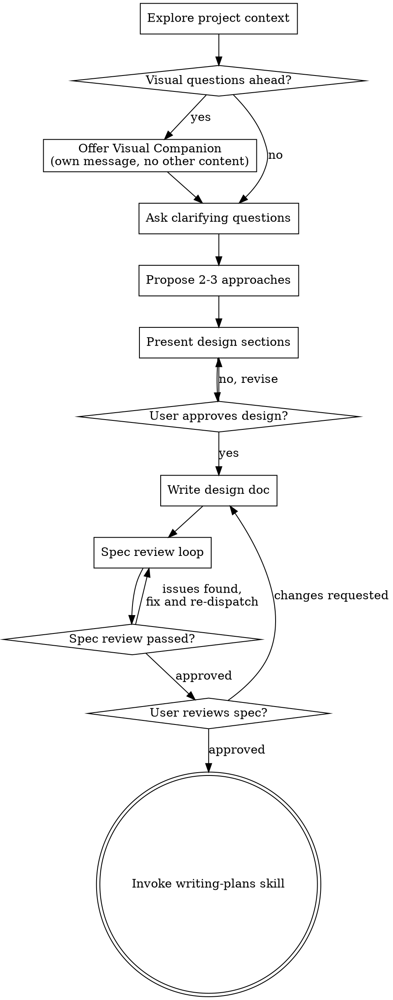

<!-- Generated by SpecStory, Markdown v2.1.0 -->

# 2026-03-15 06:02:10Z

<!-- Claude Code Session 26b327d0-8959-45e4-bdd8-d551c7175e05 (2026-03-15 06:02:10Z) -->

_**User (2026-03-15 06:02:10Z)**_

<command-message>superpowers:brainstorming</command-message>
<command-name>/superpowers:brainstorming</command-name>
<command-args>@docs/superpowers/specs/2026-03-15-hero-redesign-design.md
@docs/superpowers/specs/2026-03-15-second-screen-redesign-design.md  根据这两个设计的方向，我们来进行探讨一下apps/web/src/app/[locale]/(home)/components/HomePageTimeLine.tsx:138:5:div 的重新设计方向</command-args>

_**User (2026-03-15 06:02:10Z)**_

Base directory for this skill: <HOME>/.claude/plugins/cache/claude-plugins-official/superpowers/5.0.2/skills/brainstorming

# Brainstorming Ideas Into Designs

Help turn ideas into fully formed designs and specs through natural collaborative dialogue.

Start by understanding the current project context, then ask questions one at a time to refine the idea. Once you understand what you're building, present the design and get user approval.

<HARD-GATE>
Do NOT invoke any implementation skill, write any code, scaffold any project, or take any implementation action until you have presented a design and the user has approved it. This applies to EVERY project regardless of perceived simplicity.
</HARD-GATE>

## Anti-Pattern: "This Is Too Simple To Need A Design"

Every project goes through this process. A todo list, a single-function utility, a config change — all of them. "Simple" projects are where unexamined assumptions cause the most wasted work. The design can be short (a few sentences for truly simple projects), but you MUST present it and get approval.

## Checklist

You MUST create a task for each of these items and complete them in order:

1. **Explore project context** — check files, docs, recent commits
2. **Offer visual companion** (if topic will involve visual questions) — this is its own message, not combined with a clarifying question. See the Visual Companion section below.
3. **Ask clarifying questions** — one at a time, understand purpose/constraints/success criteria
4. **Propose 2-3 approaches** — with trade-offs and your recommendation
5. **Present design** — in sections scaled to their complexity, get user approval after each section
6. **Write design doc** — save to `docs/superpowers/specs/YYYY-MM-DD-<topic>-design.md` and commit
7. **Spec review loop** — dispatch spec-document-reviewer subagent with precisely crafted review context (never your session history); fix issues and re-dispatch until approved (max 5 iterations, then surface to human)
8. **User reviews written spec** — ask user to review the spec file before proceeding
9. **Transition to implementation** — invoke writing-plans skill to create implementation plan

## Process Flow



**The terminal state is invoking writing-plans.** Do NOT invoke frontend-design, mcp-builder, or any other implementation skill. The ONLY skill you invoke after brainstorming is writing-plans.

## The Process

**Understanding the idea:**

- Check out the current project state first (files, docs, recent commits)
- Before asking detailed questions, assess scope: if the request describes multiple independent subsystems (e.g., "build a platform with chat, file storage, billing, and analytics"), flag this immediately. Don't spend questions refining details of a project that needs to be decomposed first.
- If the project is too large for a single spec, help the user decompose into sub-projects: what are the independent pieces, how do they relate, what order should they be built? Then brainstorm the first sub-project through the normal design flow. Each sub-project gets its own spec → plan → implementation cycle.
- For appropriately-scoped projects, ask questions one at a time to refine the idea
- Prefer multiple choice questions when possible, but open-ended is fine too
- Only one question per message - if a topic needs more exploration, break it into multiple questions
- Focus on understanding: purpose, constraints, success criteria

**Exploring approaches:**

- Propose 2-3 different approaches with trade-offs
- Present options conversationally with your recommendation and reasoning
- Lead with your recommended option and explain why

**Presenting the design:**

- Once you believe you understand what you're building, present the design
- Scale each section to its complexity: a few sentences if straightforward, up to 200-300 words if nuanced
- Ask after each section whether it looks right so far
- Cover: architecture, components, data flow, error handling, testing
- Be ready to go back and clarify if something doesn't make sense

**Design for isolation and clarity:**

- Break the system into smaller units that each have one clear purpose, communicate through well-defined interfaces, and can be understood and tested independently
- For each unit, you should be able to answer: what does it do, how do you use it, and what does it depend on?
- Can someone understand what a unit does without reading its internals? Can you change the internals without breaking consumers? If not, the boundaries need work.
- Smaller, well-bounded units are also easier for you to work with - you reason better about code you can hold in context at once, and your edits are more reliable when files are focused. When a file grows large, that's often a signal that it's doing too much.

**Working in existing codebases:**

- Explore the current structure before proposing changes. Follow existing patterns.
- Where existing code has problems that affect the work (e.g., a file that's grown too large, unclear boundaries, tangled responsibilities), include targeted improvements as part of the design - the way a good developer improves code they're working in.
- Don't propose unrelated refactoring. Stay focused on what serves the current goal.

## After the Design

**Documentation:**

- Write the validated design (spec) to `docs/superpowers/specs/YYYY-MM-DD-<topic>-design.md`
  - (User preferences for spec location override this default)
- Use elements-of-style:writing-clearly-and-concisely skill if available
- Commit the design document to git

**Spec Review Loop:**
After writing the spec document:

1. Dispatch spec-document-reviewer subagent (see spec-document-reviewer-prompt.md)
2. If Issues Found: fix, re-dispatch, repeat until Approved
3. If loop exceeds 5 iterations, surface to human for guidance

**User Review Gate:**
After the spec review loop passes, ask the user to review the written spec before proceeding:

> "Spec written and committed to `<path>`. Please review it and let me know if you want to make any changes before we start writing out the implementation plan."

Wait for the user's response. If they request changes, make them and re-run the spec review loop. Only proceed once the user approves.

**Implementation:**

- Invoke the writing-plans skill to create a detailed implementation plan
- Do NOT invoke any other skill. writing-plans is the next step.

## Key Principles

- **One question at a time** - Don't overwhelm with multiple questions
- **Multiple choice preferred** - Easier to answer than open-ended when possible
- **YAGNI ruthlessly** - Remove unnecessary features from all designs
- **Explore alternatives** - Always propose 2-3 approaches before settling
- **Incremental validation** - Present design, get approval before moving on
- **Be flexible** - Go back and clarify when something doesn't make sense

## Visual Companion

A browser-based companion for showing mockups, diagrams, and visual options during brainstorming. Available as a tool — not a mode. Accepting the companion means it's available for questions that benefit from visual treatment; it does NOT mean every question goes through the browser.

**Offering the companion:** When you anticipate that upcoming questions will involve visual content (mockups, layouts, diagrams), offer it once for consent:
> "Some of what we're working on might be easier to explain if I can show it to you in a web browser. I can put together mockups, diagrams, comparisons, and other visuals as we go. This feature is still new and can be token-intensive. Want to try it? (Requires opening a local URL)"

**This offer MUST be its own message.** Do not combine it with clarifying questions, context summaries, or any other content. The message should contain ONLY the offer above and nothing else. Wait for the user's response before continuing. If they decline, proceed with text-only brainstorming.

**Per-question decision:** Even after the user accepts, decide FOR EACH QUESTION whether to use the browser or the terminal. The test: **would the user understand this better by seeing it than reading it?**

- **Use the browser** for content that IS visual — mockups, wireframes, layout comparisons, architecture diagrams, side-by-side visual designs
- **Use the terminal** for content that is text — requirements questions, conceptual choices, tradeoff lists, A/B/C/D text options, scope decisions

A question about a UI topic is not automatically a visual question. "What does personality mean in this context?" is a conceptual question — use the terminal. "Which wizard layout works better?" is a visual question — use the browser.

If they agree to the companion, read the detailed guide before proceeding:
`skills/brainstorming/visual-companion.md`


ARGUMENTS: @docs/superpowers/specs/2026-03-15-hero-redesign-design.md
@docs/superpowers/specs/2026-03-15-second-screen-redesign-design.md  根据这两个设计的方向，我们来进行探讨一下apps/web/src/app/[locale]/(home)/components/HomePageTimeLine.tsx:138:5:div 的重新设计方向

---

_**Agent (claude-opus-4-6 2026-03-15 06:02:14Z)**_

_**Agent (claude-opus-4-6 2026-03-15 06:02:14Z)**_

先探查现有 HomePageTimeLine 组件及相关上下文。

_**Agent (claude-opus-4-6 2026-03-15 06:02:15Z)**_

<tool-use data-tool-type="read" data-tool-name="Read"><details>
<summary>Tool use: **Read**</summary>
 `./apps/web/src/app/[locale]/(home)/components/HomePageTimeLine.tsx`

```text
     1→'use client'
     2→
     3→import { useQuery } from '@tanstack/react-query'
     4→import { m } from 'motion/react'
     5→import { useTranslations } from 'next-intl'
     6→import { useEffect, useMemo, useRef, useState } from 'react'
     7→import { useInView } from 'react-intersection-observer'
     8→
     9→import { useViewport } from '~/atoms/hooks/viewport'
    10→import { FloatPopover } from '~/components/ui/float-popover'
    11→import { Spring } from '~/constants/spring'
    12→import { Link } from '~/i18n/navigation'
    13→import { getNoteRouteParams } from '~/lib/note-route'
    14→import { apiClient } from '~/lib/request'
    15→import { routeBuilder, Routes } from '~/lib/route-builder'
    16→
    17→type Post = {
    18→  id: string
    19→  created: string // ISO datetime string
    20→  title: string
    21→}
    22→
    23→type DataByDate<T> = {
    24→  month: string[]
    25→  data: Array<Array<T[] | null>>
    26→}
    27→
    28→function organizePostsByDate<T extends Post>(posts: T[]): DataByDate<T> {
    29→  const postsByDate: Array<Array<T[] | null>> = []
    30→  const monthLabels: string[] = []
    31→
    32→  // Determine the current month
    33→  const currentMonth = new Date()
    34→  currentMonth.setDate(1) // Set to the first of the month to avoid month overflow issues
    35→  currentMonth.setHours(0, 0, 0, 0) // Normalize the time to midnight
    36→
    37→  // Initialize months and data arrays for the last 12 months including the current month
    38→  for (let i = 0; i < 12; i++) {
    39→    const month = new Date(
    40→      currentMonth.getFullYear(),
    41→      currentMonth.getMonth() - (11 - i),
    42→      1,
    43→    )
    44→    monthLabels.push(`${month.getFullYear()}.${month.getMonth() + 1}`)
    45→    const daysInMonth = new Date(
    46→      month.getFullYear(),
    47→      month.getMonth() + 1,
    48→      0,
    49→    ).getDate()
    50→    postsByDate.push(new Array(daysInMonth).fill(null))
    51→  }
    52→
    53→  // Group posts by day
    54→  posts.forEach((post) => {
    55→    const postDate = new Date(post.created)
    56→    const monthIndex = monthLabels.indexOf(
    57→      `${postDate.getFullYear()}.${postDate.getMonth() + 1}`,
    58→    )
    59→    const day = postDate.getDate() - 1 // Arrays are zero-indexed, days are 1-indexed
    60→
    61→    if (monthIndex !== -1) {
    62→      if (!postsByDate[monthIndex][day]) {
    63→        postsByDate[monthIndex][day] = []
    64→      }
    65→      postsByDate[monthIndex]?.[day]?.push(post)
    66→    }
    67→  })
    68→
    69→  // Convert days with null only to empty arrays
    70→  postsByDate.forEach((month, idx) => {
    71→    month.forEach((day, jdx) => {
    72→      if (!day) {
    73→        postsByDate[idx][jdx] = []
    74→      }
    75→    })
    76→  })
    77→
    78→  return { month: monthLabels, data: postsByDate }
    79→}
    80→
    81→function PhDotBold() {
    82→  return (
    83→    <svg
    84→      className="text-accent"
    85→      height="1em"
    86→      viewBox="0 0 256 256"
    87→      width="1em"
    88→      xmlns="http://www.w3.org/2000/svg"
    89→    >
    90→      <path
    91→        d="M144 128a16 16 0 1 1-16-16a16 16 0 0 1 16 16"
    92→        fill="currentColor"
    93→      />
    94→    </svg>
    95→  )
    96→}
    97→
    98→export const HomePageTimeLine = () => {
    99→  const t = useTranslations('home')
   100→  const { data: yearData } = useQuery({
   101→    queryKey: ['home-timeline'],
   102→    queryFn: async () => apiClient.activity.getLastYearPublication(),
   103→  })
   104→
   105→  const { data, month } = useMemo(
   106→    () =>
   107→      organizePostsByDate([
   108→        ...(yearData?.posts || []),
   109→        ...(yearData?.notes || []),
   110→      ]),
   111→    [yearData?.notes, yearData?.posts],
   112→  )
   113→  const scrollRef = useRef<HTMLDivElement>(null)
   114→  const [animationStarted, setAnimationStarted] = useState(false)
   115→
   116→  // Add InView detection
   117→  const { ref: inViewRef, inView } = useInView({
   118→    threshold: 0.1,
   119→    triggerOnce: true,
   120→  })
   121→
   122→  const w = useViewport((v) => v.w)
   123→  useEffect(() => {
   124→    // scroll to end
   125→    if (scrollRef.current) {
   126→      scrollRef.current.scrollLeft = scrollRef.current.scrollWidth
   127→    }
   128→  }, [w])
   129→
   130→  useEffect(() => {
   131→    // Start animation when data is loaded AND component is in view
   132→    if (yearData && inView && !animationStarted) {
   133→      setAnimationStarted(true)
   134→    }
   135→  }, [yearData, inView, animationStarted])
   136→
   137→  return (
   138→    <div className="mt-24 w-full" ref={inViewRef}>
   139→      <m.div
   140→        className="my-5 whitespace-pre-line text-balance text-center text-2xl font-medium"
   141→        initial={{ opacity: 0, y: 10 }}
   142→        transition={Spring.presets.snappy}
   143→        viewport={{ once: true }}
   144→        whileInView={{ opacity: 1, y: 0 }}
   145→      >
   146→        {t('timeline_title')}
   147→      </m.div>
   148→      <div
   149→        className="scrollbar-none m-auto my-12 w-full overflow-x-auto overflow-y-hidden"
   150→        ref={scrollRef}
   151→      >
   152→        <div
   153→          className={`relative mx-auto flex h-[200px] min-w-[900px] max-w-[1800px] items-end px-6 pb-12 lg:px-12 xl:px-16 2xl:px-36 ${
   154→            animationStarted ? 'timeline-reveal' : 'timeline-hidden'
   155→          }`}
   156→        >
   157→          <span className="mr-1 flex translate-y-[6px] select-none items-center -space-x-2 font-medium text-accent">
   158→            <PhDotBold />
   159→            <PhDotBold />
   160→            <PhDotBold />
   161→          </span>
   162→          {/* Line */}
   163→          <div className="relative flex h-px w-full justify-center rounded-md bg-accent">
   164→            <div className="relative w-[calc(100%-1%-30px)]">
   165→              {month.map((label, idx) => {
   166→                const timelineWidthPercent = 99
   167→                const monthLeftPosition =
   168→                  (idx / month.length) * timelineWidthPercent + 2
   169→
   170→                const thisMonthTotalPost = data[idx].reduce(
   171→                  (acc, cur) => acc + (cur?.length || 0),
   172→                  0,
   173→                )
   174→
   175→                return (
   176→                  <div
   177→                    className="absolute h-[2px]"
   178→                    key={label}
   179→                    style={{
   180→                      left: `${monthLeftPosition}%`,
   181→                      width: `${timelineWidthPercent / month.length}%`,
   182→                    }}
   183→                  >
   184→                    {data[idx].length > 0 &&
   185→                      data[idx].map((items, dayIdx) =>
   186→                        items?.map((item, index) => {
   187→                          const created = new Date(item.created)
   188→                          const dateInThisMonth = created.getDate()
   189→                          const thisMonthTotalDays = new Date(
   190→                            created.getFullYear(),
   191→                            created.getMonth() + 1,
   192→                            0,
   193→                          ).getDate()
   194→
   195→                          const leftPercentage =
   196→                            (dateInThisMonth / thisMonthTotalDays) * 90 + 10
   197→
   198→                          // Calculate delay for staggered animation
   199→                          const animationDelay =
   200→                            3 + (idx * 12 + dayIdx + index) * 0.02
   201→
   202→                          return (
   203→                            <m.div
   204→                              className="absolute"
   205→                              key={item.id}
   206→                              animate={{
   207→                                y: 0,
   208→                                opacity: 1,
   209→                              }}
   210→                              initial={{
   211→                                y: -100,
   212→                                opacity: 0,
   213→                              }}
   214→                              style={{
   215→                                left: `${leftPercentage}%`,
   216→                              }}
   217→                              transition={{
   218→                                delay: animationDelay,
   219→                                duration: 0.6,
   220→                                ease: 'easeOut',
   221→                                type: 'spring',
   222→                                stiffness: 100,
   223→                                damping: 15,
   224→                              }}
   225→                            >
   226→                              <FloatPopover
   227→                                asChild
   228→                                mobileAsSheet
   229→                                placement="bottom"
   230→                                type="tooltip"
   231→                                triggerElement={
   232→                                  <div
   233→                                    className="absolute top-0 lg:top-1/2"
   234→                                    style={{
   235→                                      transform: `translateX(-50%) translateY(calc(-100% + ${-1 * index * 13}px - ${3 * index}px))`,
   236→                                    }}
   237→                                  >
   238→                                    <div className="h-4 w-[2px] rounded-full bg-accent" />
   239→                                  </div>
   240→                                }
   241→                              >
   242→                                <Link
   243→                                  className="shiro-link--underline"
   244→                                  href={
   245→                                    'nid' in item
   246→                                      ? routeBuilder(Routes.Note, {
   247→                                          ...getNoteRouteParams(item),
   248→                                        })
   249→                                      : routeBuilder(Routes.Post, {
   250→                                          category: item.category.slug,
   251→                                          slug: item.slug,
   252→                                        })
   253→                                  }
   254→                                >
   255→                                  {item.title} - {created.toLocaleDateString()}
   256→                                </Link>
   257→                              </FloatPopover>
   258→                            </m.div>
   259→                          )
   260→                        }),
   261→                      )}
   262→                    <m.div
   263→                      animate={{ scale: 1, opacity: 1 }}
   264→                      className="absolute left-0 top-1/2"
   265→                      initial={{ scale: 0, opacity: 0 }}
   266→                      transition={{
   267→                        delay: 3 + idx * 0.1,
   268→                        duration: 0.3,
   269→                        ease: 'easeOut',
   270→                      }}
   271→                    >
   272→                      <div className="size-[8px] -translate-x-1/4 -translate-y-1/2 rounded-full bg-accent" />
   273→                    </m.div>
   274→
   275→                    <FloatPopover
   276→                      asChild
   277→                      mobileAsSheet
   278→                      placement="bottom"
   279→                      type="tooltip"
   280→                      triggerElement={
   281→                        <m.div
   282→                          animate={{ scaleY: 1 }}
   283→                          className="absolute left-0"
   284→                          initial={{ scaleY: 0 }}
   285→                          style={{
   286→                            top: 'calc(50% + 2px)',
   287→                            transform: 'translateX(calc(100% - 0.5px))',
   288→                          }}
   289→                          transition={{
   290→                            delay: 3.2 + idx * 0.1,
   291→                            duration: 0.5,
   292→                            ease: 'easeOut',
   293→                          }}
   294→                        >
   295→                          <div
   296→                            className="w-[3px] rounded-md bg-accent"
   297→                            style={{
   298→                              height: `${Math.min(thisMonthTotalPost * 12, 250)}px`,
   299→                              transformOrigin: 'bottom',
   300→                              transform: 'translateY(-100%)',
   301→                            }}
   302→                          />
   303→                        </m.div>
   304→                      }
   305→                    >
   306→                      {t('timeline_published', { count: thisMonthTotalPost })}
   307→                    </FloatPopover>
   308→
   309→                    <m.span
   310→                      animate={{ opacity: 1, y: 0, x: '-50%' }}
   311→                      className="pointer-events-none absolute left-0 top-1/2 mt-4 inline-block -translate-x-1/2"
   312→                      initial={{ opacity: 0, y: 10, x: '-50%' }}
   313→                      transition={{
   314→                        delay: 3.5 + idx * 0.1,
   315→                        duration: 0.3,
   316→                        ease: 'easeOut',
   317→                      }}
   318→                    >
   319→                      {label}
   320→                    </m.span>
   321→                  </div>
   322→                )
   323→              })}
   324→            </div>
   325→          </div>
   326→        </div>
   327→      </div>
   328→    </div>
   329→  )
   330→}
   331→
```
</details></tool-use>

_**Agent (claude-opus-4-6 2026-03-15 06:02:15Z)**_

<tool-use data-tool-type="read" data-tool-name="Read"><details>
<summary>Tool use: **Read**</summary>
 `./apps/web/src/app/[locale]/(home)/layout.tsx`

```text
     1→import { dehydrate } from '@tanstack/react-query'
     2→
     3→import { QueryHydrate } from '~/components/common/QueryHydrate'
     4→import { isShallowEqualArray } from '~/lib/lodash'
     5→import { getQueryClient } from '~/lib/query-client.server'
     6→import { apiClient } from '~/lib/request'
     7→import { definePrerenderPage, requestErrorHandler } from '~/lib/request.server'
     8→
     9→import { Hero } from './components/Hero'
    10→import { HomePageTimeLine } from './components/HomePageTimeLine'
    11→import { SecondScreen } from './components/SecondScreen'
    12→import { Windsock } from './components/Windsock'
    13→import { getQueryKey } from './query'
    14→
    15→export const dynamic = 'force-dynamic'
    16→
    17→export default definePrerenderPage<{ locale: string }>()({
    18→  async fetcher({ locale }) {
    19→    const queryClient = getQueryClient()
    20→    const queryKey = getQueryKey(locale)
    21→
    22→    try {
    23→      return await queryClient.fetchQuery({
    24→        queryKey,
    25→        queryFn: async () => (await apiClient.aggregate.getTop(5)).$serialized,
    26→      })
    27→    } catch (error) {
    28→      return requestErrorHandler(error)
    29→    }
    30→  },
    31→  async Component(props) {
    32→    const queryClient = getQueryClient()
    33→    const queryKey = getQueryKey(props.params.locale)
    34→
    35→    const dehydrateState = dehydrate(queryClient, {
    36→      shouldDehydrateQuery(query) {
    37→        return isShallowEqualArray(query.queryKey as any, queryKey)
    38→      },
    39→    })
    40→
    41→    return (
    42→      <QueryHydrate state={dehydrateState}>
    43→        <Hero />
    44→        <SecondScreen />
    45→        <HomePageTimeLine />
    46→        <Windsock />
    47→        {props.children}
    48→      </QueryHydrate>
    49→    )
    50→  },
    51→})
    52→
```
</details></tool-use>

_**Agent (claude-opus-4-6 2026-03-15 06:03:16Z)**_

<tool-use data-tool-type="unknown" data-tool-name="Agent"><details>
<summary>Tool use: **Agent**</summary>
Explore homepage structure

```text
Perfect! Now I have a comprehensive understanding of the homepage structure. Let me create a final summary document for the user.

## Homepage Structure Exploration Report

Based on my thorough analysis of the Shiroi homepage codebase, here's the complete breakdown:

### 1. **Homepage Components & Layout**

**Main Layout Structure** (`<REPO_ROOT>/apps/web/src/app/[locale]/(home)/layout.tsx`):
- Server-side prerendering with `definePrerenderPage`
- Fetches data from `apiClient.aggregate.getTop(5)` for top 5 posts/notes
- Query key: `['home', locale]`
- Component composition order: `<Hero>` → `<SecondScreen>` → `<HomePageTimeLine>` → `<Windsock>` → `children`

**Component Files**:
- `<REPO_ROOT>/apps/web/src/app/[locale]/(home)/components/Hero.tsx` (477 lines)
- `<REPO_ROOT>/apps/web/src/app/[locale]/(home)/components/SecondScreen.tsx` (110 lines)
- `<REPO_ROOT>/apps/web/src/app/[locale]/(home)/components/HomePageTimeLine.tsx` (330 lines)
- `<REPO_ROOT>/apps/web/src/app/[locale]/(home)/components/Windsock.tsx` (192 lines)
- `<REPO_ROOT>/apps/web/src/app/[locale]/(home)/components/RecentWriting.tsx` (126 lines)
- `<REPO_ROOT>/apps/web/src/app/[locale]/(home)/components/BottomSection.tsx` (314 lines)
- `<REPO_ROOT>/apps/web/src/app/[locale]/(home)/components/ActivityScreen.tsx` (20 lines)
- `<REPO_ROOT>/apps/web/src/app/[locale]/(home)/components/ActivityPostList.tsx` (97 lines)
- `<REPO_ROOT>/apps/web/src/app/[locale]/(home)/components/ActivityRecent.tsx` (94 lines)
- `<REPO_ROOT>/apps/web/src/app/[locale]/(home)/components/ActivityCard.tsx` (212 lines)
- `<REPO_ROOT>/apps/web/src/app/[locale]/(home)/components/TwoColumnLayout.tsx` (41 lines)

---

### 2. **Data Sources for HomePageTimeLine**

**Primary Query**:
```typescript
useQuery({
  queryKey: ['home-timeline'],
  queryFn: async () => apiClient.activity.getLastYearPublication(),
})
```

**Data Structure**:
- Returns `{ posts: Post[], notes: Note[] }` from last 12 months
- Posts have: `id`, `created` (ISO string), `title`, `category.slug`, `slug`
- Notes have: `id`, `created` (ISO string), `title`, `nid` (unique ID for route building)

**Data Organization**:
- `organizePostsByDate()` function groups posts/notes by month and day
- Creates 12-month sliding window (current month + 11 previous months)
- Returns: `{ month: string[], data: Array<Array<Post[] | null>> }`
- Month labels format: `"YYYY.M"` (e.g., "2026.3")

---

### 3. **Windsock Component Details**

**Purpose**: Navigation hub showing content categories and engagement metrics

**Structure** (`<REPO_ROOT>/apps/web/src/app/[locale]/(home)/components/Windsock.tsx`):
```
- Title & Subtitle section (from i18n: "windsock_title", "windsock_subtitle")
- Navigation Menu (8 items):
  1. Posts → `/posts`
  2. Notes → `/notes`
  3. Timeline → `/timeline`
  4. Friends → `/friends`
  5. Thinking → `/thinking`
  6. Projects → `/projects`
  7. Says → `/says`
  8. Travel → `https://travel.moe/go.html`
- Like Button Section:
  - Fetches: `apiClient.proxy('like_this').get()` (query key: `['site-like']`)
  - Shows like count with number animation
  - Post handler increments count via `apiClient.proxy('like_this').post()`
  - Refetch interval: 5 minutes
- Subscribe Button
```

**Styling**:
- Flex layout with gap spacing
- Motion animations with staggered delays (index * 0.05s)
- Hover effects: text color changes, translate-y transform
- Mobile: vertical flex, Desktop (lg): horizontal flex with separators

**i18n Keys**:
- `windsock_title`, `windsock_subtitle`
- `windsock_posts`, `windsock_notes`, `windsock_timeline`, etc.

---

### 4. **Timeline-Related Queries & Data Fetching**

**In HomePageTimeLine**:
- Query key: `['home-timeline']`
- API endpoint: `apiClient.activity.getLastYearPublication()`
- Fetches posts and notes from past year
- InView detection triggers animation start via `react-intersection-observer`

**In Hero Component**:
- Query key: `['site-info']`
- Endpoint: `apiClient.aggregate.proxy.site_info.get()`
- Returns: `{ postCount, noteCount, totalWordCount, firstPublishDate }`
- Used for stats display (articles, words, days since first publish)

**In BottomSection**:
- Query key: `['recently', 'home']`
- Endpoint: `apiClient.recently.getList({ size: 20 })`
- Returns: `RecentlyModel[]` (books, music, media, text musings)
- Query key: `['home-activity-recent']`
- Endpoint: `apiClient.activity.getRecentActivities()`
- Returns: comment, post, note activity data

**In ActivityRecent**:
- Same as BottomSection activity query
- Displays flattened activity feed as timeline UI

---

### 5. **Visual Style & Theme**

**Color System**:
- Accent color: `#33a6b8` (teal/cyan) - customizable
- Neutral palette: 10-level grayscale system (`neutral-1` to `neutral-10`)
- Light theme: white (#ffffff) to black (#09090b)
- Dark mode support with CSS variables

**Hero Component Styling**:
- Desktop: Two-column layout with avatar on right, content on left
- Mobile: Single column stack with avatar + title at top
- Font: Serif for title (with gradient sweep reveal animation), sans for body
- Stats display: Serif italic in horizontal/vertical layouts
- Recent writing: Bordered links with hover effects
- Hitokoto: Optional remote quote or custom text

**Timeline Styling**:
- Accent-colored dots and vertical bars
- Mask animation: `timeline-hidden` → `timeline-reveal` (3s ease-in-out)
- Gradient mask: `linear-gradient(90deg, #000 25%, #000000e6 50%, #00000000)`
- Staggered animation delays for dots and tooltips (0.02s increments)
- Scrollable horizontal layout with `scrollbar-none` utility

**SecondScreen Styling**:
- Fold crease separator (desktop only)
- 3D perspective effect (desktop): rotateX animation on BottomSection
- Motion animations: fade-up, opacity transitions
- Reduced motion respects `prefers-reduced-motion`

**Global Animation Utilities**:
- `.shiro-timeline`: List-based timeline with indicator line (CSS before pseudo)
- Fade-up animation: `timeline-fade-up` keyframe (0.4s ease-out)
- Hero background lights: slow/fast drift animations (8s/12s)
- Title reveal: gradient sweep animation (2s ease forwards, 0.3s delay)

---

### 6. **i18n Messages**

**Hero Section** (`home_` prefix):
- `hero_greeting`, `hero_description`
- `hero_recently_writing`, `hero_default_hitokoto`
- `hero_season_*` (spring, summer, autumn, winter)
- `hero_stat_posts`, `hero_stat_words_unit`, `hero_stat_days`

**Timeline** (`timeline_` prefix):
- `timeline_title`, `timeline_published`, `timeline_keep_going`
- `timeline_memory`, `timeline_posts`, `timeline_look_back`
- `timeline_live_present`, `timeline_page_title`
- `timeline_stat_day`, `timeline_stat_year`, `timeline_stat_today`
- `timeline_post`, `timeline_note`, `timeline_mood`, `timeline_weather`

**Activity Section** (`activity_` prefix):
- `activity_title`, `activity_recent`, `activity_noActivity`

**Windsock** (`windsock_` prefix):
- Navigation item titles + festival holidays

**SecondScreen** (`second_` prefix):
- `second_recent_writing`, `second_now`, `second_letters`, `second_musings`
- `second_post`, `second_note`, `second_reading`, `second_listening`, `second_watching`

**Files**:
- `<REPO_ROOT>/apps/web/src/messages/en/home.json` (45 keys)
- `<REPO_ROOT>/apps/web/src/messages/zh/home.json` (45 keys)

---

### 7. **CSS Animation Details**

**Hero Animations** (`animation.css`):
- `hero-title-reveal`: Gradient sweep from right to left (2s ease, 0.3s delay)
- `hero-title-static`: Simple fade in (0.3s ease)
- `hero-light-drift-slow`: Background glow drift (8s infinite, respects reduced motion)
- `hero-light-drift-fast`: Background glow drift (12s infinite alternate-reverse)
- `hero-breathe-*`: Subtle floating movements (13-18s, desktop only)

**Timeline Animations** (`animation.css`):
- `timeline-hidden`: Initial mask state (90deg linear gradient)
- `timeline-reveal`: Mask slides left over 3s (ease-in-out)
- Individual dot/bar animations: spring physics (staggered delays via inline styles)

**General List Animations** (`layer.css`):
- `timeline-fade-up`: Standard fade-in-up (0.4s ease-out)
- Staggered via CSS variable `--li-index` with 50ms increments
- Hover effects: background gradient + text color changes

---

### 8. **Key Technical Details**

**Data Flow**:
1. Server fetches `aggregate.getTop(5)` at build time
2. Hydrates client with dehydrated React Query state
3. Client-side components fetch specific data when mounted:
   - Timeline: `activity.getLastYearPublication()`
   - Hero stats: `aggregate.proxy.site_info.get()`
   - Bottom section: `recently.getList()` + `activity.getRecentActivities()`
   - Windsock likes: `proxy('like_this').get()` (refetch every 5 min)

**Animation Triggers**:
- First visit: determined by `sessionStorage.getItem('hero-entered')`
- InView detection: `react-intersection-observer` with `threshold: 0.1`
- Timeline animations only start after component comes into view AND data loads
- Respects `prefers-reduced-motion` preference

**Route Building**:
- Posts: `routeBuilder(Routes.Post, { category: item.category.slug, slug: item.slug })`
- Notes: `buildNotePath(item)` (uses nid and created date)
- Uses Next.js i18n router via `Link` from `~/i18n/navigation`

---

### File Locations Summary

All files are in `<REPO_ROOT>/apps/web/src/`:
- Components: `app/[locale]/(home)/components/*.tsx`
- Queries: `app/[locale]/(home)/query.ts`
- i18n: `messages/{en,zh}/home.json`
- Styles: `styles/animation.css`, `styles/layer.css`, `styles/tailwindcss.css`
agentId: abd68b09c7a660224 (for resuming to continue this agent's work if needed)
<usage>total_tokens: 77617
tool_uses: 28
duration_ms: 56048</usage>
```
</details></tool-use>

_**Agent - sidechain (2026-03-15 06:02:20Z)**_

Explore the homepage structure in <REPO_ROOT>/apps/web/src/app/[locale]/(home)/. I need to understand:
1. All components used in the homepage layout
2. What data sources HomePageTimeLine uses
3. The Windsock component (the section after timeline)
4. Any existing timeline-related queries or data fetching
5. The current visual style/theme of the homepage

Also check the i18n messages for the home page:
- apps/web/src/messages/zh/home.json
- apps/web/src/messages/en/home.json

Search for any timeline-related components, hooks, or utilities. Be thorough.

_**Agent - sidechain (claude-haiku-4-5-20251001 2026-03-15 06:02:21Z)**_

I'll explore the homepage structure and timeline-related components thoroughly. Let me start by examining the directory structure and files.

_**Agent - sidechain (claude-haiku-4-5-20251001 2026-03-15 06:02:22Z)**_

<tool-use data-tool-type="shell" data-tool-name="Bash"><details>
<summary>Tool use: **Bash**</summary>

`find <REPO_ROOT>/apps/web/src/app/\[locale\]/\(home\) -type f -name "*.tsx" -o -name "*.ts" -o -name "*.json" | head -20`

```text
<REPO_ROOT>/apps/web/src/app/[locale]/(home)/components/Hero.tsx
<REPO_ROOT>/apps/web/src/app/[locale]/(home)/components/TwoColumnLayout.tsx
<REPO_ROOT>/apps/web/src/app/[locale]/(home)/components/BottomSection.tsx
<REPO_ROOT>/apps/web/src/app/[locale]/(home)/components/HomePageTimeLine.tsx
<REPO_ROOT>/apps/web/src/app/[locale]/(home)/components/ActivityPostList.tsx
<REPO_ROOT>/apps/web/src/app/[locale]/(home)/components/ActivityScreen.tsx
<REPO_ROOT>/apps/web/src/app/[locale]/(home)/components/RecentWriting.tsx
<REPO_ROOT>/apps/web/src/app/[locale]/(home)/components/ActivityRecent.tsx
<REPO_ROOT>/apps/web/src/app/[locale]/(home)/components/Windsock.tsx
<REPO_ROOT>/apps/web/src/app/[locale]/(home)/components/types.tsx
<REPO_ROOT>/apps/web/src/app/[locale]/(home)/components/SecondScreen.tsx
<REPO_ROOT>/apps/web/src/app/[locale]/(home)/components/ActivityCard.tsx
<REPO_ROOT>/apps/web/src/app/[locale]/(home)/layout.tsx
<REPO_ROOT>/apps/web/src/app/[locale]/(home)/query.ts
<REPO_ROOT>/apps/web/src/app/[locale]/(home)/page.tsx
```
</details></tool-use>

_**Agent - sidechain (claude-haiku-4-5-20251001 2026-03-15 06:02:23Z)**_

Now let me read the key files to understand the structure:

_**Agent - sidechain (claude-haiku-4-5-20251001 2026-03-15 06:02:23Z)**_

<tool-use data-tool-type="read" data-tool-name="Read"><details>
<summary>Tool use: **Read**</summary>
 `./apps/web/src/app/[locale]/(home)/page.tsx`

```text
     1→'use client'
     2→
     3→import { useEffect } from 'react'
     4→import type { Blog, ItemList, WithContext } from 'schema-dts'
     5→
     6→import { buildNotePath } from '~/lib/note-route'
     7→import { registerPushWorker } from '~/lib/push-worker'
     8→import { useAggregationSelector } from '~/providers/root/aggregation-data-provider'
     9→
    10→import { useHomeQueryData } from './query'
    11→
    12→export default function Home() {
    13→  useEffect(() => {
    14→    registerPushWorker()
    15→  }, [])
    16→  const config = useAggregationSelector((state) => ({
    17→    user: state.user,
    18→    seo: state.seo,
    19→    url: state.url,
    20→  }))
    21→  const ldJson: WithContext<Blog> = {
    22→    '@context': 'https://schema.org',
    23→    '@type': 'Blog',
    24→    name: config?.seo.title,
    25→    url: config?.url.webUrl,
    26→    description: config?.seo.description,
    27→    author: {
    28→      '@type': 'Person',
    29→      name: config?.user.name,
    30→      url: config?.url.webUrl,
    31→    },
    32→    publisher: {
    33→      '@type': 'Person',
    34→      name: config?.user.name,
    35→      url: config?.url.webUrl,
    36→    },
    37→    image: {
    38→      '@type': 'ImageObject',
    39→      url: `${config?.url.webUrl}/home-og`,
    40→    },
    41→    mainEntityOfPage: {
    42→      '@type': 'WebPage',
    43→      '@id': config?.url.webUrl,
    44→    },
    45→    keywords: config?.seo.keywords,
    46→  }
    47→  const { notes, posts } = useHomeQueryData()
    48→  const listLdJson: WithContext<ItemList> = {
    49→    '@context': 'https://schema.org',
    50→    '@type': 'ItemList',
    51→    itemListElement: [...notes, ...posts]
    52→      .sort(
    53→        (a, b) => new Date(b.created).getTime() - new Date(a.created).getTime(),
    54→      )
    55→      .map((article, index) => ({
    56→        '@type': 'ListItem',
    57→        position: index + 1,
    58→        item: {
    59→          '@type': 'BlogPosting',
    60→          author: {
    61→            '@type': 'Person',
    62→            name: config?.user.name,
    63→            url: config?.url.webUrl,
    64→          },
    65→          headline: article.title,
    66→          image: article.meta?.cover || [],
    67→          name: article.title,
    68→          url:
    69→            'nid' in article
    70→              ? `${config?.url.webUrl}${buildNotePath(article)}`
    71→              : `${config?.url.webUrl}/posts/${article.category.slug}/${article.slug}`,
    72→          datePublished: article.created,
    73→        },
    74→      })),
    75→  }
    76→  return (
    77→    <>
    78→      <script
    79→        type="application/ld+json"
    80→        dangerouslySetInnerHTML={{
    81→          __html: JSON.stringify(ldJson),
    82→        }}
    83→      />
    84→      <script
    85→        type="application/ld+json"
    86→        dangerouslySetInnerHTML={{
    87→          __html: JSON.stringify(listLdJson),
    88→        }}
    89→      />
    90→    </>
    91→  )
    92→}
    93→
```
</details></tool-use>

_**Agent - sidechain (claude-haiku-4-5-20251001 2026-03-15 06:02:24Z)**_

<tool-use data-tool-type="read" data-tool-name="Read"><details>
<summary>Tool use: **Read**</summary>
 `./apps/web/src/app/[locale]/(home)/layout.tsx`

```text
     1→import { dehydrate } from '@tanstack/react-query'
     2→
     3→import { QueryHydrate } from '~/components/common/QueryHydrate'
     4→import { isShallowEqualArray } from '~/lib/lodash'
     5→import { getQueryClient } from '~/lib/query-client.server'
     6→import { apiClient } from '~/lib/request'
     7→import { definePrerenderPage, requestErrorHandler } from '~/lib/request.server'
     8→
     9→import { Hero } from './components/Hero'
    10→import { HomePageTimeLine } from './components/HomePageTimeLine'
    11→import { SecondScreen } from './components/SecondScreen'
    12→import { Windsock } from './components/Windsock'
    13→import { getQueryKey } from './query'
    14→
    15→export const dynamic = 'force-dynamic'
    16→
    17→export default definePrerenderPage<{ locale: string }>()({
    18→  async fetcher({ locale }) {
    19→    const queryClient = getQueryClient()
    20→    const queryKey = getQueryKey(locale)
    21→
    22→    try {
    23→      return await queryClient.fetchQuery({
    24→        queryKey,
    25→        queryFn: async () => (await apiClient.aggregate.getTop(5)).$serialized,
    26→      })
    27→    } catch (error) {
    28→      return requestErrorHandler(error)
    29→    }
    30→  },
    31→  async Component(props) {
    32→    const queryClient = getQueryClient()
    33→    const queryKey = getQueryKey(props.params.locale)
    34→
    35→    const dehydrateState = dehydrate(queryClient, {
    36→      shouldDehydrateQuery(query) {
    37→        return isShallowEqualArray(query.queryKey as any, queryKey)
    38→      },
    39→    })
    40→
    41→    return (
    42→      <QueryHydrate state={dehydrateState}>
    43→        <Hero />
    44→        <SecondScreen />
    45→        <HomePageTimeLine />
    46→        <Windsock />
    47→        {props.children}
    48→      </QueryHydrate>
    49→    )
    50→  },
    51→})
    52→
```
</details></tool-use>

_**Agent - sidechain (claude-haiku-4-5-20251001 2026-03-15 06:02:24Z)**_

<tool-use data-tool-type="read" data-tool-name="Read"><details>
<summary>Tool use: **Read**</summary>
 `./apps/web/src/app/[locale]/(home)/query.ts`

```text
     1→import type { AggregateTop } from '@mx-space/api-client'
     2→import { useQuery } from '@tanstack/react-query'
     3→import { useLocale } from 'next-intl'
     4→
     5→export const getQueryKey = (locale: string) => ['home', locale]
     6→
     7→export const useHomeQueryData = () => {
     8→  const locale = useLocale()
     9→  return useQuery({
    10→    queryKey: getQueryKey(locale),
    11→    queryFn: async () => null! as AggregateTop,
    12→    enabled: false,
    13→  }).data!
    14→}
    15→
```
</details></tool-use>

_**Agent - sidechain (claude-haiku-4-5-20251001 2026-03-15 06:02:24Z)**_

<tool-use data-tool-type="read" data-tool-name="Read"><details>
<summary>Tool use: **Read**</summary>
 `./apps/web/src/messages/en/home.json`

```text
     1→{
     2→  "hero_greeting": "Hi! I'm",
     3→  "hero_description": "Welcome to my personal space",
     4→  "hero_default_hitokoto": "When the first satellite flew beyond the atmosphere, we thought we would conquer the universe someday.",
     5→  "hero_recently_writing": "Recently Writing",
     6→  "hero_season_spring": "Spring",
     7→  "hero_season_summer": "Summer",
     8→  "hero_season_autumn": "Autumn",
     9→  "hero_season_winter": "Winter",
    10→  "hero_stat_posts": "posts",
    11→  "hero_stat_words_unit": "0k words",
    12→  "hero_stat_days": "days",
    13→  "activity_title": "Recent Activity",
    14→  "activity_recent": "Things that happened recently",
    15→  "activity_noActivity": "No recent activity",
    16→  "windsock_springFestival": "Spring Festival",
    17→  "windsock_newYear": "New Year",
    18→  "windsock_christmas": "Christmas",
    19→  "windsock_halloween": "Halloween",
    20→  "windsock_valentine": "Valentine's Day",
    21→  "timeline_published": "Published {count} posts this month. Keep it up!",
    22→  "timeline_keep_going": "Keep it up",
    23→  "timeline_title": "Why settle for the same old heatmap,\nwhen it could be a timeline?",
    24→  "timeline_page_title": "Timeline",
    25→  "timeline_memory": "Memories",
    26→  "timeline_posts": " posts, ",
    27→  "timeline_look_back": "worth revisiting",
    28→  "timeline_live_present": "Live in the present, cherish the moment",
    29→  "timeline_stat_day": "Day of Year",
    30→  "timeline_stat_year": "Year Progress",
    31→  "timeline_stat_today": "Today Progress",
    32→  "timeline_post": "Post",
    33→  "timeline_note": "Note",
    34→  "timeline_mood": "Mood: {mood}",
    35→  "timeline_weather": "Weather: {weather}",
    36→  "second_recent_writing": "Recent Writing",
    37→  "second_now": "Now",
    38→  "second_letters": "Letters",
    39→  "second_musings": "Musings",
    40→  "second_post": "Post",
    41→  "second_note": "Note",
    42→  "second_reading": "Reading",
    43→  "second_listening": "Listening",
    44→  "second_watching": "Watching"
    45→}
    46→
```
</details></tool-use>

_**Agent - sidechain (claude-haiku-4-5-20251001 2026-03-15 06:02:25Z)**_

<tool-use data-tool-type="read" data-tool-name="Read"><details>
<summary>Tool use: **Read**</summary>
 `./apps/web/src/messages/zh/home.json`

```text
     1→{
     2→  "hero_greeting": "嗨！我是",
     3→  "hero_description": "欢迎来到我的个人空间",
     4→  "hero_default_hitokoto": "当第一颗卫星飞向大气层外，我们便以为自己终有一日会征服宇宙。",
     5→  "hero_recently_writing": "最近在写",
     6→  "hero_season_spring": "春",
     7→  "hero_season_summer": "夏",
     8→  "hero_season_autumn": "秋",
     9→  "hero_season_winter": "冬",
    10→  "hero_stat_posts": "篇",
    11→  "hero_stat_words_unit": "万字",
    12→  "hero_stat_days": "天",
    13→  "activity_title": "最近动态",
    14→  "activity_recent": "最近发生的事",
    15→  "activity_noActivity": "暂无动态",
    16→  "windsock_springFestival": "春节",
    17→  "windsock_newYear": "新年",
    18→  "windsock_christmas": "圣诞节",
    19→  "windsock_halloween": "万圣节",
    20→  "windsock_valentine": "情人节",
    21→  "timeline_published": "本月发布了 {count} 篇，再接再厉",
    22→  "timeline_keep_going": "再接再厉",
    23→  "timeline_title": "热力图的千篇一律，\n不如做成了时间线？",
    24→  "timeline_page_title": "时间线",
    25→  "timeline_memory": "回忆",
    26→  "timeline_posts": "篇，",
    27→  "timeline_look_back": "值得回味",
    28→  "timeline_live_present": "活在当下，珍惜眼下",
    29→  "timeline_stat_day": "今年第几天",
    30→  "timeline_stat_year": "年度进度",
    31→  "timeline_stat_today": "今日进度",
    32→  "timeline_post": "博文",
    33→  "timeline_note": "手记",
    34→  "timeline_mood": "心情：{mood}",
    35→  "timeline_weather": "天气：{weather}",
    36→  "second_recent_writing": "近期笔墨",
    37→  "second_now": "此刻",
    38→  "second_letters": "来信",
    39→  "second_musings": "碎念",
    40→  "second_post": "文章",
    41→  "second_note": "笔记",
    42→  "second_reading": "在读",
    43→  "second_listening": "在听",
    44→  "second_watching": "在看"
    45→}
    46→
```
</details></tool-use>

_**Agent - sidechain (claude-haiku-4-5-20251001 2026-03-15 06:02:26Z)**_

Now let me read the component files:

_**Agent - sidechain (claude-haiku-4-5-20251001 2026-03-15 06:02:27Z)**_

<tool-use data-tool-type="read" data-tool-name="Read"><details>
<summary>Tool use: **Read**</summary>
 `./apps/web/src/app/[locale]/(home)/components/HomePageTimeLine.tsx`

```text
     1→'use client'
     2→
     3→import { useQuery } from '@tanstack/react-query'
     4→import { m } from 'motion/react'
     5→import { useTranslations } from 'next-intl'
     6→import { useEffect, useMemo, useRef, useState } from 'react'
     7→import { useInView } from 'react-intersection-observer'
     8→
     9→import { useViewport } from '~/atoms/hooks/viewport'
    10→import { FloatPopover } from '~/components/ui/float-popover'
    11→import { Spring } from '~/constants/spring'
    12→import { Link } from '~/i18n/navigation'
    13→import { getNoteRouteParams } from '~/lib/note-route'
    14→import { apiClient } from '~/lib/request'
    15→import { routeBuilder, Routes } from '~/lib/route-builder'
    16→
    17→type Post = {
    18→  id: string
    19→  created: string // ISO datetime string
    20→  title: string
    21→}
    22→
    23→type DataByDate<T> = {
    24→  month: string[]
    25→  data: Array<Array<T[] | null>>
    26→}
    27→
    28→function organizePostsByDate<T extends Post>(posts: T[]): DataByDate<T> {
    29→  const postsByDate: Array<Array<T[] | null>> = []
    30→  const monthLabels: string[] = []
    31→
    32→  // Determine the current month
    33→  const currentMonth = new Date()
    34→  currentMonth.setDate(1) // Set to the first of the month to avoid month overflow issues
    35→  currentMonth.setHours(0, 0, 0, 0) // Normalize the time to midnight
    36→
    37→  // Initialize months and data arrays for the last 12 months including the current month
    38→  for (let i = 0; i < 12; i++) {
    39→    const month = new Date(
    40→      currentMonth.getFullYear(),
    41→      currentMonth.getMonth() - (11 - i),
    42→      1,
    43→    )
    44→    monthLabels.push(`${month.getFullYear()}.${month.getMonth() + 1}`)
    45→    const daysInMonth = new Date(
    46→      month.getFullYear(),
    47→      month.getMonth() + 1,
    48→      0,
    49→    ).getDate()
    50→    postsByDate.push(new Array(daysInMonth).fill(null))
    51→  }
    52→
    53→  // Group posts by day
    54→  posts.forEach((post) => {
    55→    const postDate = new Date(post.created)
    56→    const monthIndex = monthLabels.indexOf(
    57→      `${postDate.getFullYear()}.${postDate.getMonth() + 1}`,
    58→    )
    59→    const day = postDate.getDate() - 1 // Arrays are zero-indexed, days are 1-indexed
    60→
    61→    if (monthIndex !== -1) {
    62→      if (!postsByDate[monthIndex][day]) {
    63→        postsByDate[monthIndex][day] = []
    64→      }
    65→      postsByDate[monthIndex]?.[day]?.push(post)
    66→    }
    67→  })
    68→
    69→  // Convert days with null only to empty arrays
    70→  postsByDate.forEach((month, idx) => {
    71→    month.forEach((day, jdx) => {
    72→      if (!day) {
    73→        postsByDate[idx][jdx] = []
    74→      }
    75→    })
    76→  })
    77→
    78→  return { month: monthLabels, data: postsByDate }
    79→}
    80→
    81→function PhDotBold() {
    82→  return (
    83→    <svg
    84→      className="text-accent"
    85→      height="1em"
    86→      viewBox="0 0 256 256"
    87→      width="1em"
    88→      xmlns="http://www.w3.org/2000/svg"
    89→    >
    90→      <path
    91→        d="M144 128a16 16 0 1 1-16-16a16 16 0 0 1 16 16"
    92→        fill="currentColor"
    93→      />
    94→    </svg>
    95→  )
    96→}
    97→
    98→export const HomePageTimeLine = () => {
    99→  const t = useTranslations('home')
   100→  const { data: yearData } = useQuery({
   101→    queryKey: ['home-timeline'],
   102→    queryFn: async () => apiClient.activity.getLastYearPublication(),
   103→  })
   104→
   105→  const { data, month } = useMemo(
   106→    () =>
   107→      organizePostsByDate([
   108→        ...(yearData?.posts || []),
   109→        ...(yearData?.notes || []),
   110→      ]),
   111→    [yearData?.notes, yearData?.posts],
   112→  )
   113→  const scrollRef = useRef<HTMLDivElement>(null)
   114→  const [animationStarted, setAnimationStarted] = useState(false)
   115→
   116→  // Add InView detection
   117→  const { ref: inViewRef, inView } = useInView({
   118→    threshold: 0.1,
   119→    triggerOnce: true,
   120→  })
   121→
   122→  const w = useViewport((v) => v.w)
   123→  useEffect(() => {
   124→    // scroll to end
   125→    if (scrollRef.current) {
   126→      scrollRef.current.scrollLeft = scrollRef.current.scrollWidth
   127→    }
   128→  }, [w])
   129→
   130→  useEffect(() => {
   131→    // Start animation when data is loaded AND component is in view
   132→    if (yearData && inView && !animationStarted) {
   133→      setAnimationStarted(true)
   134→    }
   135→  }, [yearData, inView, animationStarted])
   136→
   137→  return (
   138→    <div className="mt-24 w-full" ref={inViewRef}>
   139→      <m.div
   140→        className="my-5 whitespace-pre-line text-balance text-center text-2xl font-medium"
   141→        initial={{ opacity: 0, y: 10 }}
   142→        transition={Spring.presets.snappy}
   143→        viewport={{ once: true }}
   144→        whileInView={{ opacity: 1, y: 0 }}
   145→      >
   146→        {t('timeline_title')}
   147→      </m.div>
   148→      <div
   149→        className="scrollbar-none m-auto my-12 w-full overflow-x-auto overflow-y-hidden"
   150→        ref={scrollRef}
   151→      >
   152→        <div
   153→          className={`relative mx-auto flex h-[200px] min-w-[900px] max-w-[1800px] items-end px-6 pb-12 lg:px-12 xl:px-16 2xl:px-36 ${
   154→            animationStarted ? 'timeline-reveal' : 'timeline-hidden'
   155→          }`}
   156→        >
   157→          <span className="mr-1 flex translate-y-[6px] select-none items-center -space-x-2 font-medium text-accent">
   158→            <PhDotBold />
   159→            <PhDotBold />
   160→            <PhDotBold />
   161→          </span>
   162→          {/* Line */}
   163→          <div className="relative flex h-px w-full justify-center rounded-md bg-accent">
   164→            <div className="relative w-[calc(100%-1%-30px)]">
   165→              {month.map((label, idx) => {
   166→                const timelineWidthPercent = 99
   167→                const monthLeftPosition =
   168→                  (idx / month.length) * timelineWidthPercent + 2
   169→
   170→                const thisMonthTotalPost = data[idx].reduce(
   171→                  (acc, cur) => acc + (cur?.length || 0),
   172→                  0,
   173→                )
   174→
   175→                return (
   176→                  <div
   177→                    className="absolute h-[2px]"
   178→                    key={label}
   179→                    style={{
   180→                      left: `${monthLeftPosition}%`,
   181→                      width: `${timelineWidthPercent / month.length}%`,
   182→                    }}
   183→                  >
   184→                    {data[idx].length > 0 &&
   185→                      data[idx].map((items, dayIdx) =>
   186→                        items?.map((item, index) => {
   187→                          const created = new Date(item.created)
   188→                          const dateInThisMonth = created.getDate()
   189→                          const thisMonthTotalDays = new Date(
   190→                            created.getFullYear(),
   191→                            created.getMonth() + 1,
   192→                            0,
   193→                          ).getDate()
   194→
   195→                          const leftPercentage =
   196→                            (dateInThisMonth / thisMonthTotalDays) * 90 + 10
   197→
   198→                          // Calculate delay for staggered animation
   199→                          const animationDelay =
   200→                            3 + (idx * 12 + dayIdx + index) * 0.02
   201→
   202→                          return (
   203→                            <m.div
   204→                              className="absolute"
   205→                              key={item.id}
   206→                              animate={{
   207→                                y: 0,
   208→                                opacity: 1,
   209→                              }}
   210→                              initial={{
   211→                                y: -100,
   212→                                opacity: 0,
   213→                              }}
   214→                              style={{
   215→                                left: `${leftPercentage}%`,
   216→                              }}
   217→                              transition={{
   218→                                delay: animationDelay,
   219→                                duration: 0.6,
   220→                                ease: 'easeOut',
   221→                                type: 'spring',
   222→                                stiffness: 100,
   223→                                damping: 15,
   224→                              }}
   225→                            >
   226→                              <FloatPopover
   227→                                asChild
   228→                                mobileAsSheet
   229→                                placement="bottom"
   230→                                type="tooltip"
   231→                                triggerElement={
   232→                                  <div
   233→                                    className="absolute top-0 lg:top-1/2"
   234→                                    style={{
   235→                                      transform: `translateX(-50%) translateY(calc(-100% + ${-1 * index * 13}px - ${3 * index}px))`,
   236→                                    }}
   237→                                  >
   238→                                    <div className="h-4 w-[2px] rounded-full bg-accent" />
   239→                                  </div>
   240→                                }
   241→                              >
   242→                                <Link
   243→                                  className="shiro-link--underline"
   244→                                  href={
   245→                                    'nid' in item
   246→                                      ? routeBuilder(Routes.Note, {
   247→                                          ...getNoteRouteParams(item),
   248→                                        })
   249→                                      : routeBuilder(Routes.Post, {
   250→                                          category: item.category.slug,
   251→                                          slug: item.slug,
   252→                                        })
   253→                                  }
   254→                                >
   255→                                  {item.title} - {created.toLocaleDateString()}
   256→                                </Link>
   257→                              </FloatPopover>
   258→                            </m.div>
   259→                          )
   260→                        }),
   261→                      )}
   262→                    <m.div
   263→                      animate={{ scale: 1, opacity: 1 }}
   264→                      className="absolute left-0 top-1/2"
   265→                      initial={{ scale: 0, opacity: 0 }}
   266→                      transition={{
   267→                        delay: 3 + idx * 0.1,
   268→                        duration: 0.3,
   269→                        ease: 'easeOut',
   270→                      }}
   271→                    >
   272→                      <div className="size-[8px] -translate-x-1/4 -translate-y-1/2 rounded-full bg-accent" />
   273→                    </m.div>
   274→
   275→                    <FloatPopover
   276→                      asChild
   277→                      mobileAsSheet
   278→                      placement="bottom"
   279→                      type="tooltip"
   280→                      triggerElement={
   281→                        <m.div
   282→                          animate={{ scaleY: 1 }}
   283→                          className="absolute left-0"
   284→                          initial={{ scaleY: 0 }}
   285→                          style={{
   286→                            top: 'calc(50% + 2px)',
   287→                            transform: 'translateX(calc(100% - 0.5px))',
   288→                          }}
   289→                          transition={{
   290→                            delay: 3.2 + idx * 0.1,
   291→                            duration: 0.5,
   292→                            ease: 'easeOut',
   293→                          }}
   294→                        >
   295→                          <div
   296→                            className="w-[3px] rounded-md bg-accent"
   297→                            style={{
   298→                              height: `${Math.min(thisMonthTotalPost * 12, 250)}px`,
   299→                              transformOrigin: 'bottom',
   300→                              transform: 'translateY(-100%)',
   301→                            }}
   302→                          />
   303→                        </m.div>
   304→                      }
   305→                    >
   306→                      {t('timeline_published', { count: thisMonthTotalPost })}
   307→                    </FloatPopover>
   308→
   309→                    <m.span
   310→                      animate={{ opacity: 1, y: 0, x: '-50%' }}
   311→                      className="pointer-events-none absolute left-0 top-1/2 mt-4 inline-block -translate-x-1/2"
   312→                      initial={{ opacity: 0, y: 10, x: '-50%' }}
   313→                      transition={{
   314→                        delay: 3.5 + idx * 0.1,
   315→                        duration: 0.3,
   316→                        ease: 'easeOut',
   317→                      }}
   318→                    >
   319→                      {label}
   320→                    </m.span>
   321→                  </div>
   322→                )
   323→              })}
   324→            </div>
   325→          </div>
   326→        </div>
   327→      </div>
   328→    </div>
   329→  )
   330→}
   331→
```
</details></tool-use>

_**Agent - sidechain (claude-haiku-4-5-20251001 2026-03-15 06:02:27Z)**_

<tool-use data-tool-type="read" data-tool-name="Read"><details>
<summary>Tool use: **Read**</summary>
 `./apps/web/src/app/[locale]/(home)/components/Windsock.tsx`

```text
     1→'use client'
     2→
     3→import { useQuery, useQueryClient } from '@tanstack/react-query'
     4→import { m } from 'motion/react'
     5→import { useRouter } from 'next/navigation'
     6→import { useTranslations } from 'next-intl'
     7→import { createElement, useMemo } from 'react'
     8→
     9→import {
    10→  FaSolidComments,
    11→  FaSolidFeatherAlt,
    12→  FaSolidHistory,
    13→  FaSolidUserFriends,
    14→  IcTwotoneSignpost,
    15→  MdiFlask,
    16→  MdiLightbulbOn20,
    17→  RMixPlanet,
    18→} from '~/components/icons/menu-collection'
    19→import { usePresentSubscribeModal } from '~/components/modules/subscribe'
    20→import { StyledButton } from '~/components/ui/button'
    21→import { NumberSmoothTransition } from '~/components/ui/number-transition/NumberSmoothTransition'
    22→import { Link } from '~/i18n/navigation'
    23→import { preventDefault } from '~/lib/dom'
    24→import { apiClient } from '~/lib/request'
    25→import { toast } from '~/lib/toast'
    26→
    27→export const Windsock = () => {
    28→  const t = useTranslations('common')
    29→
    30→  const windsock = useMemo(
    31→    () => [
    32→      {
    33→        title: t('windsock_posts'),
    34→        path: '/posts',
    35→        type: 'Post',
    36→        subMenu: [],
    37→        icon: IcTwotoneSignpost,
    38→        do() {
    39→          window.__POST_LIST_ANIMATED__ = true
    40→        },
    41→      },
    42→      {
    43→        title: t('windsock_notes'),
    44→        type: 'Note',
    45→        path: '/notes',
    46→        icon: FaSolidFeatherAlt,
    47→      },
    48→      {
    49→        title: t('windsock_timeline'),
    50→        icon: FaSolidHistory,
    51→        path: '/timeline',
    52→      },
    53→      {
    54→        title: t('windsock_friends'),
    55→        icon: FaSolidUserFriends,
    56→        path: '/friends',
    57→      },
    58→      {
    59→        title: t('windsock_thinking'),
    60→        icon: MdiLightbulbOn20,
    61→        path: '/thinking',
    62→      },
    63→      {
    64→        title: t('windsock_projects'),
    65→        icon: MdiFlask,
    66→        path: '/projects',
    67→      },
    68→      {
    69→        title: t('windsock_says'),
    70→        path: '/says',
    71→        icon: FaSolidComments,
    72→      },
    73→      {
    74→        title: t('windsock_travel'),
    75→        icon: RMixPlanet,
    76→        path: 'https://travel.moe/go.html',
    77→      },
    78→    ],
    79→    [t],
    80→  )
    81→  const likeQueryKey = ['site-like']
    82→  const { data: count } = useQuery({
    83→    queryKey: likeQueryKey,
    84→    queryFn: () => apiClient.proxy('like_this').get(),
    85→    refetchInterval: 1000 * 60 * 5,
    86→  })
    87→
    88→  const queryClient = useQueryClient()
    89→  const navigate = useRouter()
    90→
    91→  const { present: presentSubscribe } = usePresentSubscribeModal()
    92→  return (
    93→    <>
    94→      <div className="center mt-28 flex flex-col">
    95→        <div className="my-5 text-2xl font-medium">{t('windsock_title')}</div>
    96→        <div className="mb-24 opacity-90">{t('windsock_subtitle')}</div>
    97→        <ul className="flex flex-col flex-wrap gap-2 gap-y-8 opacity-80 lg:flex-row">
    98→          {windsock.map((item, index) => (
    99→            <m.li
   100→              className="flex items-center cursor-pointer justify-between text-sm duration-200 group"
   101→              initial={{ opacity: 0.0001, y: 10 }}
   102→              key={index}
   103→              viewport={{ once: true }}
   104→              transition={{
   105→                delay: 0.001,
   106→              }}
   107→              whileInView={{
   108→                opacity: 1,
   109→                y: 0,
   110→                transition: {
   111→                  stiffness: 641,
   112→                  damping: 23,
   113→                  mass: 3.9,
   114→                  type: 'spring',
   115→                  delay: index * 0.05,
   116→                },
   117→              }}
   118→              onClick={() => {
   119→                item.do?.()
   120→
   121→                navigate.push(item.path)
   122→              }}
   123→            >
   124→              <Link
   125→                className="flex items-center gap-4 text-neutral-8 duration-200 group-hover:text-accent! dark:text-neutral-200 group-hover:-translate-y-2!"
   126→                href={item.path}
   127→                onClick={preventDefault}
   128→              >
   129→                {createElement(item.icon, { className: 'w-6 h-6' })}
   130→                <span>{item.title}</span>
   131→              </Link>
   132→
   133→              {index != windsock.length - 1 && (
   134→                <span className="mx-4 hidden select-none lg:inline"> · </span>
   135→              )}
   136→            </m.li>
   137→          ))}
   138→        </ul>
   139→      </div>
   140→
   141→      <div className="mt-24 flex justify-center gap-4">
   142→        <StyledButton
   143→          className="center flex gap-2 bg-red-400"
   144→          onClick={() => {
   145→            apiClient
   146→              .proxy('like_this')
   147→              .post()
   148→              .then(() => {
   149→                queryClient.setQueryData(likeQueryKey, (prev: any) => prev + 1)
   150→              })
   151→
   152→            toast.success(t('thanks'), {
   153→              iconElement: (
   154→                <m.i
   155→                  className="i-mingcute-heart-fill text-error"
   156→                  animate={{
   157→                    scale: 1.22,
   158→                  }}
   159→                  initial={{
   160→                    scale: 0.96,
   161→                  }}
   162→                  transition={{
   163→                    ease: 'easeInOut',
   164→                    delay: 0.3,
   165→                    repeat: 5,
   166→                    repeatDelay: 0.3,
   167→                  }}
   168→                />
   169→              ),
   170→            })
   171→          }}
   172→        >
   173→          {t('like_site')} <i className="i-mingcute-heart-fill" />{' '}
   174→          <NumberSmoothTransition>
   175→            {count as any as string}
   176→          </NumberSmoothTransition>
   177→        </StyledButton>
   178→
   179→        <StyledButton
   180→          className="center flex gap-2"
   181→          onClick={() => {
   182→            presentSubscribe()
   183→          }}
   184→        >
   185→          {t('subscribe')}
   186→          <i className="i-material-symbols-notifications-active" />
   187→        </StyledButton>
   188→      </div>
   189→    </>
   190→  )
   191→}
   192→
```
</details></tool-use>

_**Agent - sidechain (claude-haiku-4-5-20251001 2026-03-15 06:02:27Z)**_

<tool-use data-tool-type="read" data-tool-name="Read"><details>
<summary>Tool use: **Read**</summary>
 `./apps/web/src/app/[locale]/(home)/components/Hero.tsx`

```text
     1→'use client'
     2→
     3→import { useQuery } from '@tanstack/react-query'
     4→import clsx from 'clsx'
     5→import { m, useReducedMotion } from 'motion/react'
     6→import Image from 'next/image'
     7→import { useLocale, useTranslations } from 'next-intl'
     8→import { Fragment, useEffect, useMemo, useRef } from 'react'
     9→
    10→import { isSupportIcon, SocialIcon } from '~/components/modules/home/SocialIcon'
    11→import { fetchQuoteByLocale } from '~/components/modules/shared/Hitokoto'
    12→import { MotionButtonBase } from '~/components/ui/button'
    13→import { NumberSmoothTransition } from '~/components/ui/number-transition/NumberSmoothTransition'
    14→import { softBouncePreset } from '~/constants/spring'
    15→import { Link } from '~/i18n/navigation'
    16→import { clsxm } from '~/lib/helper'
    17→import { noopObj } from '~/lib/noop'
    18→import { buildNotePath } from '~/lib/note-route'
    19→import { apiClient } from '~/lib/request'
    20→import { routeBuilder, Routes } from '~/lib/route-builder'
    21→import {
    22→  useAggregationSelector,
    23→  useAppConfigSelector,
    24→} from '~/providers/root/aggregation-data-provider'
    25→
    26→import { useHomeQueryData } from '../query'
    27→
    28→// --- Helpers ---
    29→
    30→const getSeasonKey = (month: number) => {
    31→  if (month >= 3 && month <= 5) return 'hero_season_spring'
    32→  if (month >= 6 && month <= 8) return 'hero_season_summer'
    33→  if (month >= 9 && month <= 11) return 'hero_season_autumn'
    34→  return 'hero_season_winter'
    35→}
    36→
    37→const toChineseYear = (year: number) =>
    38→  String(year).replaceAll(/\d/g, (d) => '〇一二三四五六七八九'[+d])
    39→
    40→const isFirstVisit = () => {
    41→  if (typeof window === 'undefined') return true
    42→  return !sessionStorage.getItem('hero-entered')
    43→}
    44→
    45→const markVisited = () => {
    46→  if (typeof window !== 'undefined') {
    47→    sessionStorage.setItem('hero-entered', '1')
    48→  }
    49→}
    50→
    51→// --- Main Component ---
    52→
    53→export const Hero = () => {
    54→  const t = useTranslations('home')
    55→  const tCommon = useTranslations('common')
    56→  const locale = useLocale()
    57→  const prefersReducedMotion = useReducedMotion()
    58→
    59→  const { title, description } = useAppConfigSelector((config) => ({
    60→    ...config.hero,
    61→  }))!
    62→  const siteOwner = useAggregationSelector((agg) => agg.user)
    63→  const { avatar, socialIds } = siteOwner || {}
    64→
    65→  const firstVisitRef = useRef(isFirstVisit())
    66→  const shouldAnimate = firstVisitRef.current && !prefersReducedMotion
    67→
    68→  // Mark visited after entry animation completes
    69→  useEffect(() => {
    70→    if (!shouldAnimate) {
    71→      markVisited()
    72→      return
    73→    }
    74→    const timer = setTimeout(() => markVisited(), 3000)
    75→    return () => clearTimeout(timer)
    76→  }, [shouldAnimate])
    77→
    78→  // Season date
    79→  const seasonDate = useMemo(() => {
    80→    const now = new Date()
    81→    const seasonKey = getSeasonKey(now.getMonth() + 1)
    82→    if (locale === 'zh') {
    83→      return `${toChineseYear(now.getFullYear())}年 · ${t(seasonKey)}`
    84→    }
    85→    return `${now.getFullYear()} · ${t(seasonKey)}`
    86→  }, [locale, t])
    87→
    88→  // Title text for gradient sweep
    89→  const titleText = useMemo(
    90→    () => title.template.map((t) => t.text || '').join(''),
    91→    [title.template],
    92→  )
    93→
    94→  return (
    95→    <div className="relative mx-auto min-w-0 max-w-[1400px] px-6 lg:px-12 xl:px-16 2xl:px-24">
    96→      {/* Background lights */}
    97→      <HeroBackground shouldAnimate={shouldAnimate} />
    98→
    99→      {/* Mobile: flex-col layout */}
   100→      <div className="flex flex-col pb-8 pt-20 lg:hidden">
   101→        {/* Avatar + title */}
   102→        <m.div
   103→          animate={{ opacity: 1, y: 0 }}
   104→          className="mb-4 flex items-center gap-4"
   105→          initial={shouldAnimate ? { opacity: 0, y: 20 } : false}
   106→          transition={{ ...softBouncePreset, delay: shouldAnimate ? 0.3 : 0 }}
   107→        >
   108→          {avatar && (
   109→            <Image
   110→              alt={tCommon('aria_site_owner_avatar')}
   111→              className="shrink-0 rounded-full border border-neutral-200 dark:border-neutral-700"
   112→              height={48}
   113→              src={avatar}
   114→              width={48}
   115→            />
   116→          )}
   117→          <HeroTitle shouldAnimate={shouldAnimate} text={titleText} />
   118→        </m.div>
   119→
   120→        {/* Description */}
   121→        <m.div
   122→          animate={{ opacity: 1, y: 0 }}
   123→          className="mb-4 text-sm leading-relaxed text-neutral-7"
   124→          initial={shouldAnimate ? { opacity: 0, y: 12 } : false}
   125→          transition={{ ...softBouncePreset, delay: shouldAnimate ? 1.5 : 0 }}
   126→        >
   127→          {description}
   128→        </m.div>
   129→
   130→        {/* Stats */}
   131→        <HeroWritingStats
   132→          delay={1.8}
   133→          layout="horizontal"
   134→          shouldAnimate={shouldAnimate}
   135→        />
   136→
   137→        {/* Social icons */}
   138→        <div className="mt-4">
   139→          <HeroSocialIcons
   140→            delay={2.0}
   141→            shouldAnimate={shouldAnimate}
   142→            socialIds={socialIds}
   143→          />
   144→        </div>
   145→
   146→        {/* Recent writing */}
   147→        <div className="mt-6 border-t border-neutral-200/50 pt-5 dark:border-neutral-700/30">
   148→          <HeroRecentWriting delay={2.2} shouldAnimate={shouldAnimate} />
   149→        </div>
   150→
   151→        {/* Hitokoto */}
   152→        <div className="mt-4">
   153→          <HeroHitokoto delay={2.4} shouldAnimate={shouldAnimate} />
   154→        </div>
   155→      </div>
   156→
   157→      {/* Desktop layout */}
   158→      <div className="hidden flex-col py-16 lg:flex lg:min-h-[560px]">
   159→        {/* Main: avatar + title + description */}
   160→        <div className="flex flex-1 items-center justify-between">
   161→          {/* Left: title + description + stats + social, text left-aligned */}
   162→          <m.div
   163→            animate={{ opacity: 1, y: 0 }}
   164→            className="flex-1"
   165→            initial={shouldAnimate ? { opacity: 0, y: 20 } : false}
   166→            transition={{ ...softBouncePreset, delay: shouldAnimate ? 0.3 : 0 }}
   167→          >
   168→            <HeroTitle shouldAnimate={shouldAnimate} text={titleText} />
   169→            <m.div
   170→              animate={{ opacity: 1 }}
   171→              className="mt-3 text-lg text-neutral-6"
   172→              initial={shouldAnimate ? { opacity: 0 } : false}
   173→              transition={{ duration: 0.5, delay: shouldAnimate ? 1.5 : 0 }}
   174→            >
   175→              {description}
   176→            </m.div>
   177→
   178→            {/* Stats + Social in one row */}
   179→            <m.div
   180→              animate={{ opacity: 1, y: 0 }}
   181→              className="mt-6 flex items-center gap-6"
   182→              initial={shouldAnimate ? { opacity: 0, y: 12 } : false}
   183→              transition={{
   184→                ...softBouncePreset,
   185→                delay: shouldAnimate ? 1.8 : 0,
   186→              }}
   187→            >
   188→              <HeroWritingStats
   189→                delay={1.8}
   190→                layout="horizontal"
   191→                shouldAnimate={false}
   192→              />
   193→              <div className="h-5 w-px bg-neutral-200 dark:bg-neutral-700" />
   194→              <HeroSocialIcons
   195→                delay={2.2}
   196→                shouldAnimate={false}
   197→                socialIds={socialIds}
   198→              />
   199→            </m.div>
   200→          </m.div>
   201→
   202→          {/* Right: avatar */}
   203→          {avatar && (
   204→            <m.div
   205→              animate={{ opacity: 1, x: 0 }}
   206→              className="ml-12 shrink-0"
   207→              initial={shouldAnimate ? { opacity: 0, x: 20 } : false}
   208→              transition={{
   209→                ...softBouncePreset,
   210→                delay: shouldAnimate ? 0.5 : 0,
   211→              }}
   212→            >
   213→              <Image
   214→                alt={tCommon('aria_site_owner_avatar')}
   215→                className="rounded-full border border-neutral-200 shadow-sm dark:border-neutral-700"
   216→                height={80}
   217→                src={avatar}
   218→                width={80}
   219→              />
   220→            </m.div>
   221→          )}
   222→        </div>
   223→
   224→        {/* Bottom band: recently writing (left) + hitokoto (right) */}
   225→        <m.div
   226→          animate={{ opacity: 1, y: 0 }}
   227→          className="flex items-start justify-between gap-12 border-t border-neutral-200/50 pt-6 dark:border-neutral-700/30"
   228→          initial={shouldAnimate ? { opacity: 0, y: 12 } : false}
   229→          transition={{ ...softBouncePreset, delay: shouldAnimate ? 2.2 : 0 }}
   230→        >
   231→          <HeroRecentWriting delay={2.2} shouldAnimate={false} />
   232→          <HeroHitokoto delay={2.6} shouldAnimate={false} />
   233→        </m.div>
   234→      </div>
   235→    </div>
   236→  )
   237→}
   238→
   239→// --- Sub-components ---
   240→
   241→const HeroBackground = ({ shouldAnimate }: { shouldAnimate: boolean }) => (
   242→  <>
   243→    <m.div
   244→      animate={{ opacity: 1 }}
   245→      className="hero-light-drift-slow pointer-events-none absolute -z-10 rounded-full bg-[radial-gradient(ellipse,rgba(255,228,180,0.35)_0%,transparent_65%)] dark:bg-[radial-gradient(ellipse,rgba(180,200,255,0.15)_0%,transparent_65%)] -top-16 right-0 size-[250px] lg:-right-20 lg:-top-32 lg:size-[500px]"
   246→      initial={shouldAnimate ? { opacity: 0 } : false}
   247→      transition={{ duration: 1 }}
   248→    />
   249→    <m.div
   250→      animate={{ opacity: 1 }}
   251→      className="hero-light-drift-fast pointer-events-none absolute -z-10 rounded-full bg-accent/[0.06] blur-3xl bottom-10 left-0 size-[150px] lg:left-5 lg:size-[300px]"
   252→      initial={shouldAnimate ? { opacity: 0 } : false}
   253→      transition={{ duration: 1, delay: 0.3 }}
   254→    />
   255→  </>
   256→)
   257→
   258→const HeroTitle = ({
   259→  text,
   260→  shouldAnimate,
   261→  className,
   262→}: {
   263→  text: string
   264→  shouldAnimate: boolean
   265→  className?: string
   266→}) => (
   267→  <h1
   268→    className={clsxm(
   269→      'text-2xl font-medium leading-snug text-neutral-9 lg:text-[2.5rem] lg:leading-tight',
   270→      shouldAnimate && 'hero-title-reveal',
   271→      !shouldAnimate && 'hero-title-static',
   272→      className,
   273→    )}
   274→  >
   275→    {text}
   276→  </h1>
   277→)
   278→
   279→const HeroWritingStats = ({
   280→  shouldAnimate,
   281→  layout,
   282→  delay,
   283→}: {
   284→  shouldAnimate: boolean
   285→  layout: 'horizontal' | 'vertical'
   286→  delay: number
   287→}) => {
   288→  const t = useTranslations('home')
   289→  const { data } = useQuery({
   290→    queryKey: ['site-info'],
   291→    queryFn: () =>
   292→      apiClient.aggregate.proxy.site_info.get<{
   293→        postCount: number
   294→        noteCount: number
   295→        totalWordCount: number
   296→        firstPublishDate: string | null
   297→      }>(),
   298→    staleTime: 5 * 60 * 1000,
   299→  })
   300→
   301→  const articleCount = (data?.postCount ?? 0) + (data?.noteCount ?? 0)
   302→  const wordCountWan = data?.totalWordCount
   303→    ? Math.round(data.totalWordCount / 10000)
   304→    : 0
   305→  const days = data?.firstPublishDate
   306→    ? Math.floor(
   307→        (Date.now() - new Date(data.firstPublishDate).getTime()) / 86400000,
   308→      )
   309→    : 0
   310→
   311→  const items = [
   312→    { value: articleCount, label: t('hero_stat_posts') },
   313→    { value: wordCountWan, label: t('hero_stat_words_unit') },
   314→    { value: days, label: t('hero_stat_days') },
   315→  ]
   316→
   317→  return (
   318→    <m.div
   319→      animate={{ opacity: 1, y: 0 }}
   320→      initial={shouldAnimate ? { opacity: 0, y: 12 } : false}
   321→      transition={{ ...softBouncePreset, delay: shouldAnimate ? delay : 0 }}
   322→      className={clsx(
   323→        layout === 'vertical'
   324→          ? 'flex flex-col gap-1 text-right font-serif italic'
   325→          : 'flex gap-5 font-serif italic',
   326→        'text-xs text-neutral-6',
   327→      )}
   328→    >
   329→      {items.map((item, index) => (
   330→        <Fragment key={item.label}>
   331→          {layout === 'horizontal' && index > 0 && (
   332→            <span className="text-neutral-5">·</span>
   333→          )}
   334→          <div>
   335→            <span className="not-italic text-2xl font-medium text-neutral-7">
   336→              <NumberSmoothTransition>{item.value}</NumberSmoothTransition>
   337→            </span>{' '}
   338→            {item.label}
   339→          </div>
   340→        </Fragment>
   341→      ))}
   342→    </m.div>
   343→  )
   344→}
   345→
   346→const HeroRecentWriting = ({
   347→  shouldAnimate,
   348→  delay,
   349→}: {
   350→  shouldAnimate: boolean
   351→  delay: number
   352→}) => {
   353→  const t = useTranslations('home')
   354→  const homeData = useHomeQueryData()
   355→  const { posts = [], notes = [] } = homeData || {}
   356→
   357→  const recentItems = useMemo(() => {
   358→    const all = [
   359→      ...posts.map((p: any) => ({
   360→        title: p.title,
   361→        href: routeBuilder(Routes.Post, {
   362→          category: p.category.slug,
   363→          slug: p.slug,
   364→        }),
   365→        created: p.created,
   366→      })),
   367→      ...notes.map((n: any) => ({
   368→        title: n.title,
   369→        href: buildNotePath(n),
   370→        created: n.created,
   371→      })),
   372→    ]
   373→    return all
   374→      .sort(
   375→        (a, b) => new Date(b.created).getTime() - new Date(a.created).getTime(),
   376→      )
   377→      .slice(0, 3)
   378→  }, [posts, notes])
   379→
   380→  if (!homeData) {
   381→    return (
   382→      <m.div
   383→        animate={{ opacity: 1, y: 0 }}
   384→        initial={shouldAnimate ? { opacity: 0, y: 12 } : false}
   385→        transition={{ ...softBouncePreset, delay: shouldAnimate ? delay : 0 }}
   386→      >
   387→        <div className="mb-3 text-xs uppercase tracking-widest text-neutral-6">
   388→          {t('hero_recently_writing')}
   389→        </div>
   390→        <div className="flex flex-col gap-1.5">
   391→          {[65, 80, 55].map((w) => (
   392→            <div
   393→              className="h-4 animate-pulse rounded bg-neutral-200/50 dark:bg-neutral-700/30"
   394→              key={w}
   395→              style={{ width: `${w}%` }}
   396→            />
   397→          ))}
   398→        </div>
   399→      </m.div>
   400→    )
   401→  }
   402→
   403→  if (recentItems.length === 0) return null
   404→
   405→  return (
   406→    <m.div
   407→      animate={{ opacity: 1, y: 0 }}
   408→      initial={shouldAnimate ? { opacity: 0, y: 12 } : false}
   409→      transition={{ ...softBouncePreset, delay: shouldAnimate ? delay : 0 }}
   410→    >
   411→      <div className="mb-3 text-xs uppercase tracking-widest text-neutral-6">
   412→        {t('hero_recently_writing')}
   413→      </div>
   414→      <div className="flex flex-col gap-1.5">
   415→        {recentItems.map((item) => (
   416→          <Link
   417→            className="block border-b border-neutral-200/40 pb-1.5 text-base text-neutral-7 transition-colors duration-300 hover:text-accent dark:border-neutral-700/40"
   418→            href={item.href}
   419→            key={item.href}
   420→          >
   421→            {item.title}
   422→          </Link>
   423→        ))}
   424→      </div>
   425→    </m.div>
   426→  )
   427→}
   428→
   429→const HeroSocialIcons = ({
   430→  socialIds,
   431→  shouldAnimate,
   432→  delay,
   433→}: {
   434→  socialIds: Record<string, string> | undefined
   435→  shouldAnimate: boolean
   436→  delay: number
   437→}) => (
   438→  <m.div
   439→    animate={{ opacity: 1, y: 0 }}
   440→    className="flex gap-4"
   441→    initial={shouldAnimate ? { opacity: 0, y: 12 } : false}
   442→    transition={{ ...softBouncePreset, delay: shouldAnimate ? delay : 0 }}
   443→  >
   444→    {Object.entries(socialIds || noopObj).map(([type, id]: any) => {
   445→      if (!isSupportIcon(type)) return null
   446→      return <SocialIcon id={id} key={type} type={type} variant="mono" />
   447→    })}
   448→  </m.div>
   449→)
   450→
   451→const HeroHitokoto = ({
   452→  shouldAnimate,
   453→  delay,
   454→}: {
   455→  shouldAnimate: boolean
   456→  delay: number
   457→}) => {
   458→  const t = useTranslations('home')
   459→  const { custom, random } = useAppConfigSelector(
   460→    (config) => config.hero.hitokoto || {},
   461→  )!
   462→
   463→  return (
   464→    <m.div
   465→      animate={{ opacity: 1, y: 0 }}
   466→      className="max-w-[45ch] font-serif text-sm italic text-neutral-6 lg:text-right"
   467→      initial={shouldAnimate ? { opacity: 0, y: 12 } : false}
   468→      transition={{ ...softBouncePreset, delay: shouldAnimate ? delay : 0 }}
   469→    >
   470→      {random ? (
   471→        <RemoteHitokotoQuote />
   472→      ) : (
   473→        <>「{custom ?? t('hero_default_hitokoto')}」</>
   474→      )}
   475→    </m.div>
   476→  )
   477→}
   478→
   479→const RemoteHitokotoQuote = () => {
   480→  const locale = useLocale()
   481→  const {
   482→    data: hitokoto,
   483→    isLoading,
   484→    refetch,
   485→    isRefetching,
   486→  } = useQuery({
   487→    queryKey: ['hitokoto', locale],
   488→    queryFn: () => fetchQuoteByLocale(locale),
   489→    refetchInterval: 300000,
   490→    staleTime: Infinity,
   491→    refetchOnMount: 'always',
   492→    meta: { persist: true },
   493→  })
   494→
   495→  if (isLoading || !hitokoto) return null
   496→
   497→  return (
   498→    <span className="group inline-flex items-center gap-1.5">
   499→      「{hitokoto}」
   500→      <MotionButtonBase
   501→        disabled={isRefetching}
   502→        className={clsxm(
   503→          'opacity-0 transition-opacity duration-200 group-hover:opacity-100',
   504→          isRefetching && 'animate-spin opacity-100',
   505→        )}
   506→        onClick={() => refetch()}
   507→      >
   508→        <i className="i-mingcute-refresh-2-line text-[10px]" />
   509→      </MotionButtonBase>
   510→    </span>
   511→  )
   512→}
   513→
```
</details></tool-use>

_**Agent - sidechain (claude-haiku-4-5-20251001 2026-03-15 06:02:28Z)**_

<tool-use data-tool-type="read" data-tool-name="Read"><details>
<summary>Tool use: **Read**</summary>
 `./apps/web/src/app/[locale]/(home)/components/SecondScreen.tsx`

```text
     1→'use client'
     2→
     3→import { m, useReducedMotion } from 'motion/react'
     4→import { useEffect, useState } from 'react'
     5→import { useInView } from 'react-intersection-observer'
     6→
     7→import { ErrorBoundary } from '~/components/common/ErrorBoundary'
     8→
     9→import { BottomSection } from './BottomSection'
    10→import { RecentWriting } from './RecentWriting'
    11→
    12→const useIsDesktop = () => {
    13→  const [isDesktop, setIsDesktop] = useState(false)
    14→  useEffect(() => {
    15→    const mql = window.matchMedia('(min-width: 1024px)')
    16→    setIsDesktop(mql.matches)
    17→    const handler = (e: MediaQueryListEvent) => setIsDesktop(e.matches)
    18→    mql.addEventListener('change', handler)
    19→    return () => mql.removeEventListener('change', handler)
    20→  }, [])
    21→  return isDesktop
    22→}
    23→
    24→const FoldCrease = () => (
    25→  <div className="relative mx-[3%] my-7 hidden h-2 lg:block">
    26→    <div className="absolute inset-x-0 top-0.5 h-px bg-gradient-to-r from-transparent via-black/[0.06] to-transparent dark:via-white/[0.06]" />
    27→    <div className="absolute inset-x-0 top-1 h-px bg-gradient-to-r from-transparent via-white/50 to-transparent dark:via-white/[0.03]" />
    28→  </div>
    29→)
    30→
    31→export const SecondScreen = () => {
    32→  const { ref, inView } = useInView({ threshold: 0.1, triggerOnce: true })
    33→  const prefersReducedMotion = useReducedMotion()
    34→  const isDesktop = useIsDesktop()
    35→
    36→  const isReturning =
    37→    typeof window !== 'undefined' &&
    38→    sessionStorage.getItem('hero-entered') === '1'
    39→
    40→  const skipAnimation = prefersReducedMotion || isReturning
    41→  const shouldAnimate = inView && !skipAnimation
    42→
    43→  const bottomInitial = skipAnimation
    44→    ? false
    45→    : isDesktop
    46→      ? { opacity: 0, rotateX: -90 }
    47→      : { opacity: 0, y: 12 }
    48→  const bottomAnimate =
    49→    shouldAnimate || isReturning
    50→      ? isDesktop
    51→        ? { opacity: 1, rotateX: 0 }
    52→        : { opacity: 1, y: 0 }
    53→      : undefined
    54→
    55→  return (
    56→    <section
    57→      className="mx-auto mt-24 max-w-[1400px] px-4 lg:px-12"
    58→      ref={ref}
    59→    >
    60→      <m.div
    61→        initial={skipAnimation ? false : { opacity: 0, y: 16 }}
    62→        transition={{ duration: 0.7, ease: [0.22, 1, 0.36, 1] }}
    63→        animate={
    64→          shouldAnimate || isReturning ? { opacity: 1, y: 0 } : undefined
    65→        }
    66→      >
    67→        <RecentWriting />
    68→      </m.div>
    69→
    70→      <FoldCrease />
    71→
    72→      <div style={isDesktop ? { perspective: '800px' } : undefined}>
    73→        <m.div
    74→          animate={bottomAnimate}
    75→          className="origin-top"
    76→          initial={bottomInitial}
    77→          transition={{
    78→            duration: 0.9,
    79→            ease: [0.22, 1, 0.36, 1],
    80→            delay: isDesktop ? 0.5 : 0.15,
    81→          }}
    82→        >
    83→          {isDesktop && (
    84→            <m.div
    85→              className="mx-[8%] h-4"
    86→              initial={{ opacity: 0 }}
    87→              animate={
    88→                shouldAnimate ? { opacity: [0, 1, 0] } : { opacity: 0 }
    89→              }
    90→              style={{
    91→                background:
    92→                  'linear-gradient(180deg, rgba(0,0,0,0.05), transparent)',
    93→              }}
    94→              transition={{
    95→                duration: 1.2,
    96→                delay: 0.6,
    97→                times: [0, 0.3, 1],
    98→              }}
    99→            />
   100→          )}
   101→
   102→          <ErrorBoundary variant="inline">
   103→            <BottomSection />
   104→          </ErrorBoundary>
   105→        </m.div>
   106→      </div>
   107→    </section>
   108→  )
   109→}
   110→
```
</details></tool-use>

_**Agent - sidechain (claude-haiku-4-5-20251001 2026-03-15 06:02:29Z)**_

Now let me check the other components and search for timeline-related queries and utilities:

_**Agent - sidechain (claude-haiku-4-5-20251001 2026-03-15 06:02:30Z)**_

<tool-use data-tool-type="read" data-tool-name="Read"><details>
<summary>Tool use: **Read**</summary>
 `./apps/web/src/app/[locale]/(home)/components/types.tsx`

```text
     1→import type {
     2→  RecentComment,
     3→  RecentLike,
     4→  RecentNote,
     5→  RecentPost,
     6→  RecentRecent,
     7→} from '@mx-space/api-client'
     8→
     9→export type ReactActivityType =
    10→  | ({
    11→      bizType: 'comment'
    12→    } & RecentComment)
    13→  | ({
    14→      bizType: 'note'
    15→    } & RecentNote)
    16→  | ({
    17→      bizType: 'post'
    18→    } & RecentPost)
    19→  | ({
    20→      bizType: 'recent'
    21→    } & RecentRecent)
    22→  | ({
    23→      bizType: 'like'
    24→    } & RecentLike)
    25→
```
</details></tool-use>

_**Agent - sidechain (claude-haiku-4-5-20251001 2026-03-15 06:02:30Z)**_

<tool-use data-tool-type="read" data-tool-name="Read"><details>
<summary>Tool use: **Read**</summary>
 `./apps/web/src/app/[locale]/(home)/components/BottomSection.tsx`

```text
     1→'use client'
     2→
     3→import type {
     4→  BookMetadata,
     5→  MediaMetadata,
     6→  MusicMetadata,
     7→  RecentlyModel,
     8→} from '@mx-space/api-client'
     9→import { useQuery } from '@tanstack/react-query'
    10→import { useTranslations } from 'next-intl'
    11→import type { ReactNode } from 'react'
    12→import { useMemo } from 'react'
    13→
    14→import { RelativeTime } from '~/components/ui/relative-time'
    15→import { apiClient } from '~/lib/request'
    16→
    17→const useRecentlyData = () =>
    18→  useQuery({
    19→    queryKey: ['recently', 'home'],
    20→    queryFn: async () =>
    21→      (await apiClient.recently.getList({ size: 20 })).$serialized,
    22→    staleTime: 5 * 60 * 1000,
    23→  })
    24→
    25→const useRecentComments = () => {
    26→  const { data, isLoading } = useQuery({
    27→    queryKey: ['home-activity-recent'],
    28→    queryFn: async () =>
    29→      (await apiClient.activity.getRecentActivities()).$serialized,
    30→    refetchOnMount: true,
    31→    meta: { persist: true },
    32→  })
    33→  return { comments: data?.comment?.slice(0, 3) ?? [], isLoading }
    34→}
    35→
    36→const SectionHeading = ({ children }: { children: ReactNode }) => (
    37→  <div className="mb-4 text-xs uppercase tracking-[4px] text-neutral-400 dark:text-neutral-500 lg:mb-5">
    38→    {children}
    39→  </div>
    40→)
    41→
    42→const NowStatus = ({
    43→  data,
    44→  isLoading,
    45→}: {
    46→  data: ReturnType<typeof useRecentlyData>['data']
    47→  isLoading: boolean
    48→}) => {
    49→  const t = useTranslations('home')
    50→
    51→  const nowItems = useMemo(() => {
    52→    if (!data?.data) return null
    53→    const items = data.data as RecentlyModel[]
    54→    const book = items.find((i) => i.type === 'book')
    55→    const music = items.find((i) => i.type === 'music')
    56→    const media = items.find((i) => i.type === 'media')
    57→    if (!book && !music && !media) return null
    58→    return { book, music, media }
    59→  }, [data])
    60→
    61→  if (isLoading) {
    62→    return (
    63→      <div>
    64→        {Array.from({ length: 3 }).map((_, i) => (
    65→          <div
    66→            className="mb-3 h-4 w-[70%] animate-pulse rounded bg-neutral-200 dark:bg-neutral-700"
    67→            key={i}
    68→          />
    69→        ))}
    70→      </div>
    71→    )
    72→  }
    73→
    74→  if (!nowItems) return null
    75→
    76→  return (
    77→    <div>
    78→      {nowItems.book?.metadata && (
    79→        <div className="mb-3.5 last:mb-0">
    80→          <div className="mb-1 text-xs text-neutral-400">
    81→            {t('second_reading')}
    82→          </div>
    83→          <div className="flex items-center gap-1.5">
    84→            <span className="text-sm">📖</span>
    85→            <span className="text-base text-neutral-700 dark:text-neutral-200">
    86→              {(nowItems.book.metadata as BookMetadata).title}
    87→            </span>
    88→            <span className="text-xs text-neutral-400">
    89→              {(nowItems.book.metadata as BookMetadata).author}
    90→            </span>
    91→          </div>
    92→        </div>
    93→      )}
    94→      {nowItems.music?.metadata && (
    95→        <div className="mb-3.5 last:mb-0">
    96→          <div className="mb-1 text-xs text-neutral-400">
    97→            {t('second_listening')}
    98→          </div>
    99→          <div className="flex items-center gap-1.5">
   100→            <span className="text-sm">♪</span>
   101→            <span className="text-base text-neutral-700 dark:text-neutral-200">
   102→              {(nowItems.music.metadata as MusicMetadata).title}
   103→            </span>
   104→            <span className="text-xs text-neutral-400">
   105→              {(nowItems.music.metadata as MusicMetadata).artist}
   106→            </span>
   107→          </div>
   108→        </div>
   109→      )}
   110→      {nowItems.media?.metadata && (
   111→        <div className="mb-3.5 last:mb-0">
   112→          <div className="mb-1 text-xs text-neutral-400">
   113→            {t('second_watching')}
   114→          </div>
   115→          <div className="flex items-center gap-1.5">
   116→            <span className="text-base text-neutral-700 dark:text-neutral-200">
   117→              {(nowItems.media.metadata as MediaMetadata).title}
   118→            </span>
   119→            {/* eslint-disable-next-line eqeqeq */}
   120→            {(nowItems.media.metadata as MediaMetadata).rating != null && (
   121→              <span className="text-xs text-amber-500">
   122→                {'★'.repeat(
   123→                  Math.round(
   124→                    ((nowItems.media.metadata as MediaMetadata).rating ?? 0) / 2,
   125→                  ),
   126→                )}
   127→              </span>
   128→            )}
   129→          </div>
   130→        </div>
   131→      )}
   132→    </div>
   133→  )
   134→}
   135→
   136→const RecentLetters = ({
   137→  comments,
   138→  isLoading,
   139→}: {
   140→  comments: { created: string; author: string; text: string; id: string }[]
   141→  isLoading: boolean
   142→}) => {
   143→  if (isLoading) {
   144→    return (
   145→      <div>
   146→        {Array.from({ length: 2 }).map((_, i) => (
   147→          <div
   148→            className="mb-2.5 h-16 animate-pulse rounded bg-neutral-200 dark:bg-neutral-700"
   149→            key={i}
   150→          />
   151→        ))}
   152→      </div>
   153→    )
   154→  }
   155→
   156→  if (!comments.length) return null
   157→
   158→  return (
   159→    <div>
   160→      {comments.map((comment) => (
   161→        <div
   162→          className="mb-2.5 rounded-[3px] bg-[rgba(200,180,160,0.05)] p-3.5 last:mb-0 dark:bg-neutral-800/30"
   163→          key={comment.id}
   164→        >
   165→          <div className="line-clamp-2 text-base italic leading-[1.7] text-neutral-500 dark:text-neutral-400">
   166→            &ldquo;{comment.text}&rdquo;
   167→          </div>
   168→          <div className="mt-1.5 text-right text-xs text-neutral-400">
   169→            &mdash; {comment.author} &middot;{' '}
   170→            <RelativeTime date={comment.created} />
   171→          </div>
   172→        </div>
   173→      ))}
   174→    </div>
   175→  )
   176→}
   177→
   178→const Musings = ({
   179→  data,
   180→  isLoading,
   181→}: {
   182→  data: ReturnType<typeof useRecentlyData>['data']
   183→  isLoading: boolean
   184→}) => {
   185→  const musings = useMemo(() => {
   186→    if (!data?.data) return []
   187→    const items = data.data as RecentlyModel[]
   188→    return items.filter((i) => i.type === 'text').slice(0, 2)
   189→  }, [data])
   190→
   191→  if (isLoading) {
   192→    return (
   193→      <div>
   194→        {Array.from({ length: 2 }).map((_, i) => (
   195→          <div
   196→            className="mb-3 h-12 animate-pulse rounded bg-neutral-200 dark:bg-neutral-700"
   197→            key={i}
   198→          />
   199→        ))}
   200→      </div>
   201→    )
   202→  }
   203→
   204→  if (!musings.length) return null
   205→
   206→  return (
   207→    <div>
   208→      {musings.map((musing) => (
   209→        <div
   210→          className="mb-3.5 border-l-2 border-[rgba(200,180,160,0.15)] pl-3 last:mb-0 dark:border-neutral-700"
   211→          key={musing.id}
   212→        >
   213→          <div className="text-base italic leading-[1.8] text-neutral-500/80 dark:text-neutral-400">
   214→            &ldquo;{musing.content}&rdquo;
   215→          </div>
   216→        </div>
   217→      ))}
   218→      {musings[0] && (
   219→        <div className="mt-2 text-xs text-neutral-400">
   220→          <RelativeTime date={musings[0].created} />
   221→        </div>
   222→      )}
   223→    </div>
   224→  )
   225→}
   226→
   227→export const BottomSection = () => {
   228→  const t = useTranslations('home')
   229→  const recentlyQuery = useRecentlyData()
   230→  const commentsQuery = useRecentComments()
   231→
   232→  const nowItems = useMemo(() => {
   233→    if (!recentlyQuery.data?.data) return null
   234→    const items = recentlyQuery.data.data as RecentlyModel[]
   235→    const book = items.find((i) => i.type === 'book')
   236→    const music = items.find((i) => i.type === 'music')
   237→    const media = items.find((i) => i.type === 'media')
   238→    if (!book && !music && !media) return null
   239→    return { book, music, media }
   240→  }, [recentlyQuery.data])
   241→
   242→  const musings = useMemo(() => {
   243→    if (!recentlyQuery.data?.data) return []
   244→    const items = recentlyQuery.data.data as RecentlyModel[]
   245→    return items.filter((i) => i.type === 'text').slice(0, 2)
   246→  }, [recentlyQuery.data])
   247→
   248→  const isLoading = recentlyQuery.isLoading || commentsQuery.isLoading
   249→  const hasNow = !!nowItems
   250→  const hasLetters = commentsQuery.comments.length > 0
   251→  const hasMusings = musings.length > 0
   252→  const hasAny = hasNow || hasLetters || hasMusings
   253→
   254→  if (!hasAny && !isLoading) return null
   255→
   256→  const columns: ReactNode[] = []
   257→  const addColumn = (key: string, show: boolean, content: ReactNode) => {
   258→    if (!show && !isLoading) return
   259→    if (columns.length > 0) {
   260→      columns.push(
   261→        <div
   262→          className="hidden w-px shrink-0 bg-[rgba(200,180,160,0.12)] dark:bg-neutral-800 lg:block"
   263→          key={`div-${key}`}
   264→        />,
   265→      )
   266→    }
   267→    columns.push(
   268→      <div className="min-w-0 flex-1" key={key}>
   269→        {content}
   270→      </div>,
   271→    )
   272→  }
   273→
   274→  addColumn(
   275→    'now',
   276→    hasNow,
   277→    <>
   278→      <SectionHeading>{t('second_now')}</SectionHeading>
   279→      <NowStatus
   280→        data={recentlyQuery.data}
   281→        isLoading={recentlyQuery.isLoading}
   282→      />
   283→    </>,
   284→  )
   285→
   286→  addColumn(
   287→    'letters',
   288→    hasLetters,
   289→    <>
   290→      <SectionHeading>{t('second_letters')}</SectionHeading>
   291→      <RecentLetters
   292→        comments={commentsQuery.comments}
   293→        isLoading={commentsQuery.isLoading}
   294→      />
   295→    </>,
   296→  )
   297→
   298→  addColumn(
   299→    'musings',
   300→    hasMusings,
   301→    <>
   302→      <SectionHeading>{t('second_musings')}</SectionHeading>
   303→      <Musings
   304→        data={recentlyQuery.data}
   305→        isLoading={recentlyQuery.isLoading}
   306→      />
   307→    </>,
   308→  )
   309→
   310→  return (
   311→    <div className="flex flex-col gap-6 lg:flex-row lg:gap-8">{columns}</div>
   312→  )
   313→}
   314→
```
</details></tool-use>

_**Agent - sidechain (claude-haiku-4-5-20251001 2026-03-15 06:02:31Z)**_

<tool-use data-tool-type="read" data-tool-name="Read"><details>
<summary>Tool use: **Read**</summary>
 `./apps/web/src/app/[locale]/(home)/components/RecentWriting.tsx`

```text
     1→'use client'
     2→
     3→import type { AggregateTopNote, AggregateTopPost } from '@mx-space/api-client'
     4→import { useTranslations } from 'next-intl'
     5→import { useMemo } from 'react'
     6→
     7→import { RelativeTime } from '~/components/ui/relative-time'
     8→import { Link } from '~/i18n/navigation'
     9→import { getNoteRouteParams } from '~/lib/note-route'
    10→import { routeBuilder, Routes } from '~/lib/route-builder'
    11→
    12→import { useHomeQueryData } from '../query'
    13→
    14→export const SectionHeading = ({ children }: { children: React.ReactNode }) => (
    15→  <div className="mb-4 text-xs uppercase tracking-[4px] text-neutral-400 dark:text-neutral-500 lg:mb-5">
    16→    {children}
    17→  </div>
    18→)
    19→
    20→type MergedItem =
    21→  | (AggregateTopPost & { type: 'post' })
    22→  | (AggregateTopNote & { type: 'note' })
    23→
    24→function getItemUrl(item: MergedItem): string {
    25→  if (item.type === 'post') {
    26→    return routeBuilder(Routes.Post, {
    27→      category: item.category.slug,
    28→      slug: item.slug,
    29→    })
    30→  }
    31→  return routeBuilder(Routes.Note, {
    32→    ...getNoteRouteParams(item),
    33→  })
    34→}
    35→
    36→const FeaturedPost = ({ item }: { item: MergedItem }) => {
    37→  const t = useTranslations('home')
    38→  const url = getItemUrl(item)
    39→
    40→  return (
    41→    <Link className="block" href={url}>
    42→      <div className="mb-5 cursor-pointer rounded border border-[rgba(200,180,160,0.1)] bg-white/40 p-5 transition-shadow hover:shadow-[0_2px_12px_rgba(0,0,0,0.04)] dark:border-neutral-800 dark:bg-white/5">
    43→        <div className="mb-1.5 text-xs text-neutral-400 dark:text-neutral-500">
    44→          {item.type === 'post' ? t('second_post') : t('second_note')}
    45→          {' · '}
    46→          <RelativeTime date={item.created} />
    47→          {item.type === 'note' &&
    48→            'weather' in item &&
    49→            (item as any).weather && (
    50→              <>
    51→                {' · '}
    52→                {(item as any).weather}
    53→              </>
    54→            )}
    55→        </div>
    56→        <div className="mb-2 font-serif text-base leading-[1.4] tracking-[0.5px] text-neutral-700 dark:text-neutral-200">
    57→          {item.title}
    58→        </div>
    59→        {'summary' in item && (item as any).summary && (
    60→          <div className="text-xs leading-[1.8] text-neutral-500 dark:text-neutral-400">
    61→            {(item as any).summary}
    62→          </div>
    63→        )}
    64→      </div>
    65→    </Link>
    66→  )
    67→}
    68→
    69→const PostRow = ({ item }: { item: MergedItem }) => {
    70→  const t = useTranslations('home')
    71→  const url = getItemUrl(item)
    72→
    73→  return (
    74→    <div className="mb-3 border-b border-[rgba(200,180,160,0.1)] pb-3 last:mb-0 last:border-0 last:pb-0 dark:border-neutral-800">
    75→      <Link className="flex items-baseline justify-between" href={url}>
    76→        <span className="text-base text-neutral-700 transition-colors duration-300 hover:text-accent dark:text-neutral-200">
    77→          {item.title}
    78→        </span>
    79→        <span className="ml-5 whitespace-nowrap text-xs italic text-neutral-400 dark:text-neutral-500">
    80→          <RelativeTime date={item.created} />
    81→        </span>
    82→      </Link>
    83→      <div className="mt-0.5 text-xs text-neutral-400 dark:text-neutral-500">
    84→        {item.type === 'note'
    85→          ? t('second_note')
    86→          : (
    87→              <>
    88→                {t('second_post')}
    89→                {item.category?.name && ` · ${item.category.name}`}
    90→              </>
    91→            )}
    92→      </div>
    93→    </div>
    94→  )
    95→}
    96→
    97→export const RecentWriting = () => {
    98→  const t = useTranslations('home')
    99→  const { notes, posts } = useHomeQueryData()
   100→
   101→  const items = useMemo(() => {
   102→    const merged: MergedItem[] = [
   103→      ...posts.map((p) => ({ ...p, type: 'post' as const })),
   104→      ...notes.map((n) => ({ ...n, type: 'note' as const })),
   105→    ].sort(
   106→      (a, b) =>
   107→        new Date(b.created).getTime() - new Date(a.created).getTime(),
   108→    )
   109→    return merged.slice(0, 5)
   110→  }, [notes, posts])
   111→
   112→  if (!items.length) return null
   113→
   114→  const [featured, ...rest] = items
   115→
   116→  return (
   117→    <div>
   118→      <SectionHeading>{t('second_recent_writing')}</SectionHeading>
   119→      <FeaturedPost item={featured} />
   120→      {rest.map((item) => (
   121→        <PostRow item={item} key={item.id} />
   122→      ))}
   123→    </div>
   124→  )
   125→}
   126→
```
</details></tool-use>

_**Agent - sidechain (claude-haiku-4-5-20251001 2026-03-15 06:02:32Z)**_

Now let me search for timeline-related queries and utilities in the codebase:

_**Agent - sidechain (claude-haiku-4-5-20251001 2026-03-15 06:02:33Z)**_

<tool-use data-tool-type="search" data-tool-name="Glob"><details>
<summary>Tool use: **Glob**</summary>
 pattern `**/queries/**/*timeline*`

```text
No files found
```
</details></tool-use>

_**Agent - sidechain (claude-haiku-4-5-20251001 2026-03-15 06:02:33Z)**_

<tool-use data-tool-type="search" data-tool-name="Glob"><details>
<summary>Tool use: **Glob**</summary>
 pattern `**/hooks/**/*timeline*`

```text
No files found
```
</details></tool-use>

_**Agent - sidechain (claude-haiku-4-5-20251001 2026-03-15 06:02:33Z)**_

<tool-use data-tool-type="search" data-tool-name="Grep"><details>
<summary>Tool use: **Grep**</summary>
 path `./apps/web/src` pattern `timeline|getLastYearPublication`

```text
Found 20 files limit: 20, offset: 0
apps/web/src/components/modules/timeline/TimelineProgress.test.tsx
apps/web/src/components/ui/list/TimelineList.tsx
apps/web/src/components/ui/list/TimelineListItem.tsx
apps/web/src/components/ui/list/TimelineSpineLayout.tsx
apps/web/src/components/ui/list/TimelineYearGroup.tsx
apps/web/src/app/[locale]/timeline/page.tsx
apps/web/src/components/modules/timeline/TimelineProgress.tsx
apps/web/src/components/layout/footer/config.ts
apps/web/src/components/layout/header/config.ts
apps/web/src/app/[locale]/notes/page.tsx
apps/web/src/components/modules/note/NoteFooterNavigation.tsx
apps/web/src/components/modules/note/NoteTimeline.tsx
apps/web/src/components/modules/note/NoteListTimeline.tsx
apps/web/src/lib/route-builder.ts
apps/web/src/app/[locale]/(home)/components/ActivityPostList.tsx
apps/web/src/app/[locale]/(home)/components/HomePageTimeLine.tsx
apps/web/src/app/[locale]/timeline/layout.tsx
apps/web/src/components/modules/shared/ReadIndicator.tsx
apps/web/src/app/[locale]/(home)/components/Windsock.tsx
apps/web/src/app/[locale]/(home)/components/ActivityRecent.tsx
```
</details></tool-use>

_**Agent - sidechain (claude-haiku-4-5-20251001 2026-03-15 06:02:35Z)**_

Let me search for API client methods related to timeline and activity:

_**Agent - sidechain (claude-haiku-4-5-20251001 2026-03-15 06:02:35Z)**_

<tool-use data-tool-type="search" data-tool-name="Grep"><details>
<summary>Tool use: **Grep**</summary>
 path `./apps/web/src` pattern `activity\.getLastYearPublication|getRecentActivities|getTop\(`

```text
Found 5 files
apps/web/src/app/[locale]/(home)/components/BottomSection.tsx
apps/web/src/app/[locale]/(home)/layout.tsx
apps/web/src/components/layout/header/internal/DropdownContents.tsx
apps/web/src/app/[locale]/(home)/components/HomePageTimeLine.tsx
apps/web/src/app/[locale]/(home)/components/ActivityRecent.tsx
```
</details></tool-use>

_**Agent - sidechain (claude-haiku-4-5-20251001 2026-03-15 06:02:37Z)**_

Let me check ActivityRecent and the site info endpoint being used:

_**Agent - sidechain (claude-haiku-4-5-20251001 2026-03-15 06:02:37Z)**_

<tool-use data-tool-type="read" data-tool-name="Read"><details>
<summary>Tool use: **Read**</summary>
 `./apps/web/src/app/[locale]/(home)/components/ActivityRecent.tsx`

```text
     1→'use client'
     2→
     3→import { useQuery } from '@tanstack/react-query'
     4→import clsx from 'clsx'
     5→import { m } from 'motion/react'
     6→import { useTranslations } from 'next-intl'
     7→import { useMemo } from 'react'
     8→
     9→import { ScrollArea } from '~/components/ui/scroll-area'
    10→import { softBouncePreset } from '~/constants/spring'
    11→import { apiClient } from '~/lib/request'
    12→
    13→import { ActivityCard, iconClassName } from './ActivityCard'
    14→import type { ReactActivityType } from './types'
    15→
    16→export const ActivityRecent = () => {
    17→  const t = useTranslations('home')
    18→  const { data, isLoading } = useQuery({
    19→    queryKey: ['home-activity-recent'],
    20→    queryFn: async () =>
    21→      (await apiClient.activity.getRecentActivities()).$serialized,
    22→    refetchOnMount: true,
    23→    meta: {
    24→      persist: true,
    25→    },
    26→  })
    27→
    28→  const flatData = useMemo(
    29→    () =>
    30→      [...Object.entries(data || {})]
    31→        .flatMap(([type, items]) => {
    32→          if (!Array.isArray(items)) return []
    33→          return items.map((item: any) => ({ ...item, bizType: type }))
    34→        })
    35→        .sort(
    36→          (a, b) =>
    37→            new Date(b.created).getTime() - new Date(a.created).getTime(),
    38→        ) as ReactActivityType[],
    39→    // .slice(0, 6) as ReactActivityType[]
    40→    [data],
    41→  )
    42→
    43→  return (
    44→    <m.div
    45→      className="mt-8 w-full text-lg lg:mt-0"
    46→      initial={{ opacity: 0.0001, y: 50 }}
    47→      transition={softBouncePreset}
    48→      viewport={{ once: true }}
    49→      whileInView={{ opacity: 1, y: 0 }}
    50→    >
    51→      <m.h2 className="mb-8 text-2xl font-medium leading-loose lg:ml-8">
    52→        {t('activity_recent')}
    53→      </m.h2>
    54→
    55→      {isLoading ? (
    56→        <div className="relative h-[400px] max-h-[80vh]">
    57→          <ul className="shiro-timeline mt-4 flex animate-pulse flex-col pb-4 pl-2 text-neutral-200 dark:text-neutral-700!">
    58→            {Array.from({ length: 6 })
    59→              .fill(null)
    60→              .map((_, i) => (
    61→                <li className="flex w-full items-center gap-2" key={i}>
    62→                  <div
    63→                    className={clsx(
    64→                      iconClassName,
    65→                      'border-0 bg-current text-inherit',
    66→                    )}
    67→                  />
    68→
    69→                  <div className="mb-4 box-content h-16 w-full rounded-md bg-current" />
    70→                </li>
    71→              ))}
    72→          </ul>
    73→        </div>
    74→      ) : (
    75→        <ScrollArea.ScrollArea
    76→          mask
    77→          rootClassName="h-[400px] relative max-h-[80vh]"
    78→        >
    79→          <ul className="shiro-timeline mt-4 flex flex-col pb-8 pl-2">
    80→            {flatData.map((activity) => (
    81→              <li
    82→                className="flex min-w-0 justify-between"
    83→                key={`${activity.bizType}-${activity.id}-${activity.created}`}
    84→              >
    85→                <ActivityCard activity={activity} />
    86→              </li>
    87→            ))}
    88→          </ul>
    89→        </ScrollArea.ScrollArea>
    90→      )}
    91→    </m.div>
    92→  )
    93→}
    94→
```
</details></tool-use>

_**Agent - sidechain (claude-haiku-4-5-20251001 2026-03-15 06:02:37Z)**_

<tool-use data-tool-type="read" data-tool-name="Read"><details>
<summary>Tool use: **Read**</summary>
 `./apps/web/src/app/[locale]/(home)/components/ActivityPostList.tsx`

```text
     1→'use client'
     2→
     3→import { m } from 'motion/react'
     4→import { useTranslations } from 'next-intl'
     5→
     6→import { Divider } from '~/components/ui/divider'
     7→import { RelativeTime } from '~/components/ui/relative-time'
     8→import { Spring } from '~/constants/spring'
     9→import { Link } from '~/i18n/navigation'
    10→import { getNoteRouteParams } from '~/lib/note-route'
    11→import { routeBuilder, Routes } from '~/lib/route-builder'
    12→
    13→import { useHomeQueryData } from '../query'
    14→
    15→export const ActivityPostList = () => {
    16→  const t = useTranslations('post')
    17→  const { notes, posts } = useHomeQueryData()
    18→  return (
    19→    <m.section
    20→      className="mt-8 flex flex-col gap-4 lg:mt-0"
    21→      initial={{ opacity: 0.0001, y: 50 }}
    22→      transition={Spring.presets.snappy}
    23→      viewport={{ once: true }}
    24→      whileInView={{ opacity: 1, y: 0 }}
    25→    >
    26→      <h2 className="text-2xl font-medium leading-loose">
    27→        {t('recent_posts')}
    28→      </h2>
    29→      <ul className="shiro-timeline mt-4">
    30→        {posts.map((post) => (
    31→          <li className="flex min-w-0 justify-between" key={post.id}>
    32→            <Link
    33→              prefetch
    34→              className="min-w-0 shrink truncate"
    35→              href={routeBuilder(Routes.Post, {
    36→                category: post.category.slug,
    37→                slug: post.slug,
    38→              })}
    39→            >
    40→              {post.title}
    41→            </Link>
    42→
    43→            <span className="ml-2 shrink-0 self-end text-xs opacity-70">
    44→              <RelativeTime
    45→                date={post.created}
    46→                displayAbsoluteTimeAfterDay={180}
    47→              />
    48→            </span>
    49→          </li>
    50→        ))}
    51→      </ul>
    52→
    53→      <Link
    54→        className="flex items-center justify-end opacity-70 duration-200 hover:text-accent"
    55→        href={routeBuilder(Routes.Posts, {})}
    56→        onClick={() => (window.__POST_LIST_ANIMATED__ = true)}
    57→      >
    58→        <i className="i-mingcute-arrow-right-circle-line" />
    59→        <span className="ml-2">{t('more')}</span>
    60→      </Link>
    61→
    62→      <Divider />
    63→      <h2 className="text-2xl font-medium leading-loose">
    64→        {t('recent_notes')}
    65→      </h2>
    66→      <ul className="shiro-timeline mt-4">
    67→        {notes.map((note) => (
    68→          <li className="flex min-w-0 justify-between" key={note.id}>
    69→            <Link
    70→              className="min-w-0 shrink truncate"
    71→              href={routeBuilder(Routes.Note, {
    72→                ...getNoteRouteParams(note),
    73→              })}
    74→            >
    75→              {note.title}
    76→            </Link>
    77→
    78→            <span className="ml-2 shrink-0 self-end text-xs opacity-70">
    79→              <RelativeTime
    80→                date={note.created}
    81→                displayAbsoluteTimeAfterDay={180}
    82→              />
    83→            </span>
    84→          </li>
    85→        ))}
    86→      </ul>
    87→      <Link
    88→        className="flex items-center justify-end opacity-70 duration-200 hover:text-accent"
    89→        href={routeBuilder(Routes.Timelime, { type: 'note' })}
    90→      >
    91→        <i className="i-mingcute-arrow-right-circle-line" />
    92→        <span className="ml-2">{t('more')}</span>
    93→      </Link>
    94→    </m.section>
    95→  )
    96→}
    97→
```
</details></tool-use>

_**Agent - sidechain (claude-haiku-4-5-20251001 2026-03-15 06:02:37Z)**_

<tool-use data-tool-type="read" data-tool-name="Read"><details>
<summary>Tool use: **Read**</summary>
 `./apps/web/src/app/[locale]/(home)/components/ActivityScreen.tsx`

```text
     1→import { ErrorBoundary } from '~/components/common/ErrorBoundary'
     2→
     3→import { ActivityPostList } from './ActivityPostList'
     4→import { ActivityRecent } from './ActivityRecent'
     5→import { TwoColumnLayout } from './TwoColumnLayout'
     6→
     7→export const ActivityScreen = () => (
     8→  <div className="mt-24">
     9→    <TwoColumnLayout
    10→      leftContainerClassName="[&>div]:w-full px-4"
    11→      rightContainerClassName="block lg:flex [&>div]:w-full px-4"
    12→    >
    13→      <ActivityPostList />
    14→      <ErrorBoundary variant="inline">
    15→        <ActivityRecent />
    16→      </ErrorBoundary>
    17→    </TwoColumnLayout>
    18→  </div>
    19→)
    20→
```
</details></tool-use>

_**Agent - sidechain (claude-haiku-4-5-20251001 2026-03-15 06:02:39Z)**_

Let me now check the styling related files for the Hero component CSS animations:

_**Agent - sidechain (claude-haiku-4-5-20251001 2026-03-15 06:02:39Z)**_

<tool-use data-tool-type="shell" data-tool-name="Bash"><details>
<summary>Tool use: **Bash**</summary>

`find <REPO_ROOT>/apps/web/src -name "*.css" | grep -E "(home|hero)" | head -10`

```text
(Bash completed with no output)
```
</details></tool-use>

_**Agent - sidechain (claude-haiku-4-5-20251001 2026-03-15 06:02:40Z)**_

Let me check for CSS that might have timeline or hero animations:

_**Agent - sidechain (claude-haiku-4-5-20251001 2026-03-15 06:02:41Z)**_

<tool-use data-tool-type="shell" data-tool-name="Bash"><details>
<summary>Tool use: **Bash**</summary>

`find <REPO_ROOT>/apps/web/src/styles -type f 2>/dev/null | head -20`

```text
<REPO_ROOT>/apps/web/src/styles/webfont.css
<REPO_ROOT>/apps/web/src/styles/animation.css
<REPO_ROOT>/apps/web/src/styles/theme.css
<REPO_ROOT>/apps/web/src/styles/variables.css
<REPO_ROOT>/apps/web/src/styles/image-zoom.css
<REPO_ROOT>/apps/web/src/styles/index.css
<REPO_ROOT>/apps/web/src/styles/checkbox.css
<REPO_ROOT>/apps/web/src/styles/loading.css
<REPO_ROOT>/apps/web/src/styles/scrollbar.css
<REPO_ROOT>/apps/web/src/styles/mask.css
<REPO_ROOT>/apps/web/src/styles/print.css
<REPO_ROOT>/apps/web/src/styles/layer.css
<REPO_ROOT>/apps/web/src/styles/uikit.css
<REPO_ROOT>/apps/web/src/styles/tailwindcss.css
```
</details></tool-use>

_**Agent - sidechain (claude-haiku-4-5-20251001 2026-03-15 06:02:42Z)**_

<tool-use data-tool-type="read" data-tool-name="Read"><details>
<summary>Tool use: **Read**</summary>
 `./apps/web/src/styles/animation.css`

```text
     1→@layer components {
     2→  .animate-scale-in {
     3→    animation: scale-in 0.3s cubic-bezier(0.4, 0, 0.2, 1);
     4→  }
     5→
     6→  @keyframes scale-in {
     7→    0% {
     8→      transform: scale(0.9);
     9→      opacity: 0;
    10→    }
    11→    100% {
    12→      transform: scale(1);
    13→      opacity: 1;
    14→    }
    15→  }
    16→
    17→  .timeline-hidden {
    18→    mask: linear-gradient(90deg, #000 25%, #000000e6 50%, #00000000) 150% 0 /
    19→      400% no-repeat;
    20→  }
    21→
    22→  .timeline-reveal {
    23→    animation: timeline-reveal 3s ease-in-out forwards;
    24→  }
    25→
    26→  @keyframes timeline-reveal {
    27→    0% {
    28→      mask: linear-gradient(90deg, #000 25%, #000000e6 50%, #00000000) 150% 0 /
    29→        400% no-repeat;
    30→    }
    31→    100% {
    32→      mask: linear-gradient(90deg, #000 25%, #000000e6 50%, #00000000) 0 / 400%
    33→        no-repeat;
    34→    }
    35→  }
    36→
    37→  /* Hero: light drift */
    38→  @keyframes hero-light-drift {
    39→    from { transform: translate(0, 0) scale(1); }
    40→    to   { transform: translate(15px, 8px) scale(1.05); }
    41→  }
    42→
    43→  /* Hero: title gradient sweep reveal */
    44→  .hero-title-reveal {
    45→    background: linear-gradient(90deg, currentColor 50%, transparent 50%);
    46→    background-size: 200% 100%;
    47→    background-position: 100% 0;
    48→    -webkit-background-clip: text;
    49→    background-clip: text;
    50→    -webkit-text-fill-color: transparent;
    51→    animation: hero-title-sweep 2s ease forwards 0.3s;
    52→  }
    53→
    54→  .hero-title-static {
    55→    animation: hero-title-fade 0.3s ease forwards;
    56→  }
    57→
    58→  @keyframes hero-title-fade {
    59→    from { opacity: 0; }
    60→    to   { opacity: 1; }
    61→  }
    62→
    63→  @keyframes hero-title-sweep {
    64→    to { background-position: 0 0; }
    65→  }
    66→
    67→  /* Hero: light drift + breathing floats (respects reduced motion) */
    68→  @media (prefers-reduced-motion: no-preference) {
    69→    .hero-light-drift-slow { animation: hero-light-drift 8s ease-in-out infinite alternate; }
    70→    .hero-light-drift-fast { animation: hero-light-drift 12s ease-in-out infinite alternate-reverse; }
    71→
    72→    @media (min-width: 1024px) {
    73→      .hero-breathe-1 { animation: hero-breathe-a 14s ease-in-out infinite alternate; }
    74→      .hero-breathe-2 { animation: hero-breathe-b 16s ease-in-out infinite alternate; }
    75→      .hero-breathe-3 { animation: hero-breathe-a 18s ease-in-out infinite alternate-reverse; }
    76→      .hero-breathe-4 { animation: hero-breathe-b 15s ease-in-out infinite alternate; }
    77→      .hero-breathe-5 { animation: hero-breathe-a 13s ease-in-out infinite alternate-reverse; }
    78→      .hero-breathe-6 { animation: hero-breathe-b 17s ease-in-out infinite alternate; }
    79→    }
    80→  }
    81→
    82→  @keyframes hero-breathe-a {
    83→    from { transform: translate(0, 0); }
    84→    to   { transform: translate(2px, -3px); }
    85→  }
    86→
    87→  @keyframes hero-breathe-b {
    88→    from { transform: translate(0, 0); }
    89→    to   { transform: translate(-2px, 2px); }
    90→  }
    91→}
    92→
```
</details></tool-use>

_**Agent - sidechain (claude-haiku-4-5-20251001 2026-03-15 06:02:42Z)**_

<tool-use data-tool-type="search" data-tool-name="Grep"><details>
<summary>Tool use: **Grep**</summary>
 path `./apps/web/src/styles` pattern `hero-|timeline-|reveal`

```text
Found 2 files
apps/web/src/styles/animation.css
apps/web/src/styles/layer.css
```
</details></tool-use>

_**Agent - sidechain (claude-haiku-4-5-20251001 2026-03-15 06:02:44Z)**_

<tool-use data-tool-type="read" data-tool-name="Read"><details>
<summary>Tool use: **Read**</summary>
 `./apps/web/src/styles/layer.css`

```text
     1→@layer components {
     2→  .cover-mask-b {
     3→    mask-image: linear-gradient(180deg, #fff -17.19%, #00000000 92.43%);
     4→  }
     5→}
     6→
     7→@layer components {
     8→  .border-border {
     9→    @apply border-neutral-900/10 dark:border-neutral-700;
    10→  }
    11→}
    12→
    13→@layer utilities {
    14→  .scrollbar-none::-webkit-scrollbar {
    15→    width: 0 !important;
    16→    height: 0 !important;
    17→  }
    18→  .rich-link {
    19→    @apply no-underline!;
    20→  }
    21→  .shiro-link--underline,
    22→  .rich-link {
    23→    color: currentColor;
    24→    text-decoration: underline;
    25→    text-underline-offset: 3px;
    26→
    27→    @apply decoration-neutral-4/20 hover:no-underline!;
    28→
    29→    background-image: linear-gradient(var(--color-accent), var(--color-accent));
    30→    background-size: 0% 1.5px;
    31→    background-repeat: no-repeat;
    32→    /* NOTE: this won't work with background images   */
    33→
    34→    transition: all 500ms ease !important;
    35→
    36→    @apply border-0;
    37→
    38→    background-position: left 1.2em;
    39→
    40→    &:hover {
    41→      background-size: 100% 1.5px;
    42→      text-shadow:
    43→        0.05em 0 var(--color-neutral-1),
    44→        -0.05em 0 var(--color-neutral-1);
    45→
    46→      transition: all 250ms ease;
    47→    }
    48→
    49→    &::selection {
    50→      text-shadow: none;
    51→    }
    52→
    53→    &.no-shadow {
    54→      text-shadow: none;
    55→    }
    56→  }
    57→
    58→  .shiro-timeline {
    59→    position: relative;
    60→    list-style: none;
    61→
    62→    @apply min-w-0 flex-1;
    63→
    64→    &::before {
    65→      content: '';
    66→      position: absolute;
    67→      left: -2px;
    68→      width: 2px;
    69→      top: var(--indicator-top, 0);
    70→      height: var(--indicator-height, 0);
    71→      opacity: var(--indicator-opacity, 0);
    72→      background-color: var(--color-accent);
    73→      transition:
    74→        top 0.2s ease,
    75→        height 0.2s ease,
    76→        opacity 0.15s ease;
    77→      pointer-events: none;
    78→      z-index: 1;
    79→    }
    80→
    81→    & > li {
    82→      position: relative;
    83→      padding: 12px 0 12px 24px;
    84→      transition: background 0.2s;
    85→      animation: timeline-fade-up 0.4s ease-out both;
    86→      animation-delay: calc(var(--li-index, 0) * 50ms);
    87→    }
    88→
    89→    & > li:hover {
    90→      background: linear-gradient(
    91→        90deg,
    92→        color-mix(in oklch, var(--color-accent) 4%, transparent),
    93→        transparent 70%
    94→      );
    95→    }
    96→
    97→    & > li:hover .timeline-date {
    98→      color: var(--color-accent);
    99→    }
   100→
   101→    & > li:hover .timeline-title {
   102→      color: var(--color-neutral-10);
   103→    }
   104→
   105→    & a {
   106→      line-height: 1.6;
   107→    }
   108→  }
   109→
   110→  @keyframes timeline-fade-up {
   111→    from {
   112→      opacity: 0;
   113→      transform: translateY(12px);
   114→    }
   115→    to {
   116→      opacity: 1;
   117→      transform: translateY(0);
   118→    }
   119→  }
   120→
   121→  .shiro-timeline-spine {
   122→    border-left: 2px solid var(--color-border);
   123→    margin-left: 4px;
   124→  }
   125→}
   126→
   127→@layer components {
   128→  .mask-cover {
   129→    mask-image: linear-gradient(to right, transparent, rgb(0 0 0 / 100%) 90%);
   130→    opacity: 0.3;
   131→    transition: opacity 0.3s ease-in-out;
   132→  }
   133→
   134→  .group:hover .mask-cover {
   135→    opacity: 0.5;
   136→  }
   137→
   138→  .animation-blink {
   139→    animation: blink 1.2s linear infinite;
   140→  }
   141→
   142→  .mask-top {
   143→    mask-image: linear-gradient(to top, transparent, rgb(0 0 0 / 100%) 90%);
   144→    opacity: 0.3;
   145→    transition: opacity 0.3s ease-in-out;
   146→  }
   147→
   148→  @keyframes blink {
   149→    0% {
   150→      opacity: 0;
   151→    }
   152→    40% {
   153→      opacity: 0;
   154→    }
   155→    40.1% {
   156→      opacity: 1;
   157→    }
   158→    99.9% {
   159→      opacity: 1;
   160→    }
   161→    100% {
   162→      opacity: 0;
   163→    }
   164→  }
   165→
   166→  /* 404 */
   167→  .hit-the-floor {
   168→    font-size: 12em;
   169→    font-weight: bold;
   170→    font-family: Helvetica;
   171→    text-shadow:
   172→      0 1px 0 #ccc,
   173→      0 2px 0 #c9c9c9,
   174→      0 3px 0 #bbb,
   175→      0 4px 0 #b9b9b9,
   176→      0 5px 0 #aaa,
   177→      0 6px 1px rgba(0, 0, 0, 0.1),
   178→      0 0 5px rgba(0, 0, 0, 0.1),
   179→      0 1px 3px rgba(0, 0, 0, 0.3),
   180→      0 3px 5px rgba(0, 0, 0, 0.2),
   181→      0 5px 10px rgba(0, 0, 0, 0.25),
   182→      0 10px 10px rgba(0, 0, 0, 0.2),
   183→      0 20px 20px rgba(0, 0, 0, 0.15);
   184→  }
   185→}
   186→
   187→@layer components {
   188→  .page-glow-container {
   189→    @apply pointer-events-none absolute inset-x-0 top-0 h-[720px] w-full;
   190→
   191→    overflow: hidden;
   192→    animation: fade-in 0.8s ease 0.2s both;
   193→    -webkit-mask-image: linear-gradient(
   194→      180deg,
   195→      rgb(0 0 0 / 100%) 0%,
   196→      rgb(0 0 0 / 100%) 48%,
   197→      rgb(0 0 0 / 72%) 64%,
   198→      rgb(0 0 0 / 24%) 82%,
   199→      transparent 100%
   200→    );
   201→    mask-image: linear-gradient(
   202→      180deg,
   203→      rgb(0 0 0 / 100%) 0%,
   204→      rgb(0 0 0 / 100%) 48%,
   205→      rgb(0 0 0 / 72%) 64%,
   206→      rgb(0 0 0 / 24%) 82%,
   207→      transparent 100%
   208→    );
   209→  }
   210→
   211→  @keyframes glow-enter {
   212→    0% {
   213→      opacity: 0;
   214→      transform: translate(-50%, -50%) scale(0.6);
   215→    }
   216→    100% {
   217→      opacity: var(--glow-opacity, 0.4);
   218→      transform: translate(-50%, -50%) scale(1);
   219→    }
   220→  }
   221→
   222→  .signature-animated path {
   223→    stroke-dasharray: 2400;
   224→    stroke-dashoffset: 2400;
   225→    fill: transparent;
   226→    animation: drawSignature 8s linear infinite both;
   227→    stroke-width: 2px;
   228→    stroke: var(--color-neutral-9);
   229→  }
   230→
   231→  @keyframes drawSignature {
   232→    0% {
   233→      stroke-dashoffset: 2400;
   234→    }
   235→
   236→    15% {
   237→      fill: transparent;
   238→    }
   239→
   240→    35%,
   241→    75% {
   242→      stroke-dashoffset: 0;
   243→      fill: var(--color-neutral-9);
   244→    }
   245→
   246→    90%,
   247→    100% {
   248→      stroke-dashoffset: 2400;
   249→      fill: transparent;
   250→    }
   251→  }
   252→
   253→  .animation-wave {
   254→    animation: wave 2s infinite;
   255→  }
   256→
   257→  .hover-shake:hover {
   258→    animation: shake 0.4s ease-in-out;
   259→  }
   260→
   261→  @keyframes shake {
   262→    0%,
   263→    100% {
   264→      transform: rotate(0deg);
   265→    }
   266→    25% {
   267→      transform: rotate(-5deg);
   268→    }
   269→    75% {
   270→      transform: rotate(5deg);
   271→    }
   272→  }
   273→
   274→  @keyframes wave {
   275→    0%,
   276→    100% {
   277→      transform: rotate(0deg);
   278→    }
   279→    50% {
   280→      transform: rotate(20deg);
   281→    }
   282→  }
   283→}
   284→
   285→@layer components {
   286→  .content-auto {
   287→    content-visibility: auto;
   288→  }
   289→
   290→  .shadow-out-sm {
   291→    box-shadow:
   292→      0 0 10px rgba(120, 120, 120, 0.1),
   293→      0 5px 20px rgba(120, 120, 120, 0.2);
   294→  }
   295→
   296→  .backface-hidden {
   297→    -webkit-backface-visibility: hidden;
   298→    -moz-backface-visibility: hidden;
   299→    -webkit-transform: translate3d(0, 0, 0);
   300→    -moz-transform: translate3d(0, 0, 0);
   301→  }
   302→
   303→  .center {
   304→    align-items: center;
   305→    justify-content: center;
   306→  }
   307→
   308→  .fill-content {
   309→    min-height: calc(100vh - 17.5rem);
   310→  }
   311→
   312→  .card-shadow {
   313→    box-shadow:
   314→      0 0 0 1px rgba(0, 0, 0, 0.08),
   315→      0 4px 6px rgba(0, 0, 0, 0.04);
   316→  }
   317→
   318→  .card-shadow:hover {
   319→    box-shadow:
   320→      0 0 0 1px rgba(0, 0, 0, 0.08),
   321→      0 6px 14px rgba(0, 0, 0, 0.08);
   322→  }
   323→}
   324→
   325→@layer components {
   326→  .shadow-perfect {
   327→    /* https://codepen.io/jh3y/pen/yLWgjpd */
   328→    --tint: 214;
   329→    --alpha: 3;
   330→    --base: hsl(var(--tint, 214) 80% 27% / calc(var(--alpha, 4) * 1%));
   331→    /**
   332→      * Use relative syntax to get to: hsl(221 25% 22% / 40%)
   333→    */
   334→    --shade: hsl(from var(--base) calc(h + 8) 25 calc(l - 5));
   335→    --perfect-shadow:
   336→      0 0 0 1px var(--base), 0 1px 1px -0.5px var(--shade),
   337→      0 3px 3px -1.5px var(--shade), 0 6px 6px -3px var(--shade),
   338→      0 12px 12px -6px var(--base), 0 24px 24px -12px var(--base);
   339→    box-shadow: var(--perfect-shadow);
   340→  }
   341→
   342→  .perfect-sm {
   343→    --alpha: 1;
   344→  }
   345→
   346→  .perfect-md {
   347→    --alpha: 2;
   348→  }
   349→
   350→  [theme='dark'] .shadow-perfect {
   351→    --tint: 221;
   352→  }
   353→}
   354→
   355→@property --mask-top {
   356→  syntax: '<length>';
   357→  inherits: false;
   358→  initial-value: 0px;
   359→}
   360→
   361→@property --mask-bottom {
   362→  syntax: '<length>';
   363→  inherits: false;
   364→  initial-value: 30px;
   365→}
   366→
   367→@layer components {
   368→  .mask-scroller {
   369→    --mask-top: 0px;
   370→    --mask-bottom: 30px;
   371→    mask: linear-gradient(
   372→      to bottom,
   373→      transparent calc(var(--mask-top) - 30px),
   374→      black var(--mask-top),
   375→      black calc(100% - var(--mask-bottom)),
   376→      transparent calc(100% - var(--mask-bottom) + 30px)
   377→    );
   378→  }
   379→
   380→  @supports (animation-timeline: scroll(self block)) {
   381→    .mask-scroller {
   382→      animation-name: mask-up, mask-down;
   383→      animation-duration: 1s, 1s;
   384→      animation-timing-function: linear, linear;
   385→      animation-fill-mode: both, both;
   386→      animation-timeline: scroll(self block), scroll(self block);
   387→      animation-range:
   388→        0 50px,
   389→        calc(100% - 50px) 100%;
   390→    }
   391→  }
   392→  @supports (animation-timeline: scroll()) and
   393→    (not (animation-timeline: scroll(self block))) {
   394→    .mask-scroller {
   395→      animation-name: mask-up, mask-down;
   396→      animation-duration: 1s, 1s;
   397→      animation-timing-function: linear, linear;
   398→      animation-fill-mode: both, both;
   399→      animation-timeline: scroll(), scroll();
   400→      animation-range:
   401→        0 50px,
   402→        calc(100% - 50px) 100%;
   403→    }
   404→  }
   405→  @keyframes mask-up {
   406→    to {
   407→      --mask-top: 30px;
   408→    }
   409→  }
   410→  @keyframes mask-down {
   411→    to {
   412→      --mask-bottom: 0px;
   413→    }
   414→  }
   415→}
   416→
   417→@layer components {
   418→  .shadow-context-menu {
   419→    box-shadow:
   420→      rgba(0, 0, 0, 0.067) 0px 3px 8px,
   421→      rgba(0, 0, 0, 0.067) 0px 2px 5px,
   422→      rgba(0, 0, 0, 0.067) 0px 1px 1px;
   423→  }
   424→}
   425→
   426→/* Tailwind 4 Extensions */
   427→@layer components {
   428→  .field-sizing-content {
   429→    field-sizing: content;
   430→  }
   431→
   432→  .comment-block-active {
   433→    background: color-mix(
   434→      in srgb,
   435→      var(--color-accent, #33a6b8) 5%,
   436→      transparent
   437→    );
   438→    border-radius: 4px;
   439→    transition: background 0.15s ease;
   440→  }
   441→}
   442→
   443→/* Safari 不显示 PageColorGradient，规避 blur+mask 性能与撕裂问题（由 JS 注入 is-safari class） */
   444→.is-safari .page-glow-container {
   445→  display: none !important;
   446→}
   447→
```
</details></tool-use>

_**Agent - sidechain (claude-haiku-4-5-20251001 2026-03-15 06:02:44Z)**_

<tool-use data-tool-type="read" data-tool-name="Read"><details>
<summary>Tool use: **Read**</summary>
 `./apps/web/src/styles/tailwindcss.css`

```text
     1→@import 'tailwindcss';
     2→@import 'tw-animate-css';
     3→
     4→@source "./src/**/*.{js,jsx,ts,tsx}";
     5→@source "../../node_modules/@ferrucc-io/emoji-picker/dist/**/*.{js,jsx,ts,tsx}";
     6→@source inline("font-light text-3xl rounded p-1 bg-neutral-200 dark:bg-neutral-800/0 hover:dark:bg-neutral-800/100 bg-opacity-0 hover:bg-opacity-100 transition-background w-[1px] h-8 -bottom-2 bg-neutral-800/80 dark:bg-neutral-200/80 group-hover:opacity-100 transition-opacity group-hover:animation-blink w-full! w-full");
     7→
     8→@plugin "@tailwindcss/typography";
     9→@plugin "@egoist/tailwindcss-icons";
    10→
    11→@import './loading.css';
    12→@import './checkbox.css';
    13→@import './layer.css';
    14→@import './animation.css';
    15→@import './image-zoom.css';
    16→
    17→@theme inline {
    18→  --font-sans:
    19→    var(--app-font-sans), system-ui, -apple-system, 'PingFang SC',
    20→    'Microsoft YaHei', 'Segoe UI', Roboto, Helvetica, 'noto sans sc',
    21→    'hiragino sans gb', 'sans-serif', Apple Color Emoji, Segoe UI Emoji,
    22→    Not Color Emoji;
    23→  --font-serif:
    24→    'Noto Serif CJK SC', 'Noto Serif SC', var(--app-font-serif),
    25→    'Source Han Serif SC', 'Source Han Serif', source-han-serif-sc, SongTi SC,
    26→    SimSum, 'Hiragino Sans GB', system-ui, -apple-system, Segoe UI, Roboto,
    27→    Helvetica, 'Microsoft YaHei', 'WenQuanYi Micro Hei', sans-serif;
    28→  --font-mono:
    29→    'OperatorMonoSSmLig Nerd Font', 'Cascadia Code PL',
    30→    'FantasqueSansMono Nerd Font', 'operator mono', JetBrainsMono,
    31→    'Fira code Retina', 'Fira code', 'Consolas', Monaco, 'Hannotate SC',
    32→    monospace, -apple-system;
    33→}
    34→
    35→@theme {
    36→  --color-accent: #33a6b8;
    37→
    38→  --color-neutral-1: #ffffff;
    39→  --color-neutral-2: #fafafa;
    40→  --color-neutral-3: #f4f4f5;
    41→  --color-neutral-4: #e4e4e7;
    42→  --color-neutral-5: #d4d4d8;
    43→  --color-neutral-6: #a1a1aa;
    44→  --color-neutral-7: #71717a;
    45→  --color-neutral-8: #52525b;
    46→  --color-neutral-9: #27272a;
    47→  --color-neutral-10: #09090b;
    48→
    49→  --color-neutral-50: #fafafa;
    50→  --color-neutral-100: #f5f5f5;
    51→  --color-neutral-200: #e5e5e5;
    52→  --color-neutral-300: #d4d4d4;
    53→  --color-neutral-400: #a3a3a3;
    54→  --color-neutral-500: #737373;
    55→  --color-neutral-600: #525252;
    56→  --color-neutral-700: #404040;
    57→  --color-neutral-800: #262626;
    58→  --color-neutral-900: #171717;
    59→  --color-neutral-950: #0a0a0a;
    60→
    61→  --color-info: #007aff;
    62→  --color-success: #34c759;
    63→  --color-warning: #ff9500;
    64→  --color-error: #ff3b30;
    65→
    66→  /* border-border utility - 值在 variables.css 中被 :root/[data-theme='dark'] 覆盖 */
    67→  --color-border: rgba(24, 24, 27, 0.1);
    68→
    69→  --color-muted-50: var(--color-neutral-50);
    70→  --color-muted-100: var(--color-neutral-100);
    71→  --color-muted-200: var(--color-neutral-200);
    72→  --color-muted-300: var(--color-neutral-300);
    73→  --color-muted-400: var(--color-neutral-400);
    74→  --color-muted-500: var(--color-neutral-500);
    75→  --color-muted-600: var(--color-neutral-600);
    76→  --color-muted-700: var(--color-neutral-700);
    77→  --color-muted-800: var(--color-neutral-800);
    78→  --color-muted-900: var(--color-neutral-900);
    79→  --color-muted-950: var(--color-neutral-950);
    80→
    81→  --color-themed-bg_opacity: var(--bg-opacity);
    82→}
    83→
    84→@custom-variant dark (&:where(.dark, .dark *, [data-theme="dark"], [data-theme="dark"] *));
    85→
    86→html {
    87→  font-size: 14px;
    88→  line-height: 1.5;
    89→}
    90→
    91→html body {
    92→  @apply max-w-screen overflow-x-hidden;
    93→}
    94→
    95→@media print {
    96→  html {
    97→    font-size: 12px;
    98→  }
    99→}
   100→
   101→/* @media (min-width: 2160px) {
   102→  html {
   103→    font-size: 15px;
   104→  }
   105→} */
   106→
   107→.rich-content {
   108→  text-autospace: normal;
   109→}
   110→
   111→.prose {
   112→  @apply dark:prose-invert;
   113→
   114→  max-width: 100% !important;
   115→  font-size: 1.1rem;
   116→  text-autospace: normal;
   117→
   118→  p {
   119→    @apply break-words;
   120→  }
   121→
   122→  figure img {
   123→    @apply mb-0 mt-0;
   124→  }
   125→}
   126→
   127→@layer utilities {
   128→  *:focus {
   129→    outline: none;
   130→  }
   131→
   132→  * {
   133→    tab-size: 2;
   134→
   135→    @apply border-neutral-900/10 dark:border-neutral-700;
   136→    &:hover {
   137→      scrollbar-color: auto;
   138→    }
   139→  }
   140→}
   141→
   142→.animate-ping {
   143→  animation: ping 2s cubic-bezier(0, 0, 0.2, 1) infinite;
   144→}
   145→
   146→@keyframes ping {
   147→  75%,
   148→  100% {
   149→    transform: scale(1.4);
   150→    opacity: 0;
   151→  }
   152→}
   153→
   154→/* input,
   155→textarea {
   156→  font-size: max(16px, 1rem);
   157→} */
   158→
   159→a {
   160→  @apply break-all;
   161→}
   162→
   163→@media (width >= 1024px) {
   164→  input,
   165→  textarea {
   166→    font-size: 1rem;
   167→  }
   168→}
   169→
   170→.prose p:last-child {
   171→  margin-bottom: 0;
   172→}
   173→
   174→.prose
   175→  :where(blockquote):not(:where([class~='not-prose'], [class~='not-prose'] *)) {
   176→  @apply relative border-0;
   177→
   178→  &::before {
   179→    content: '';
   180→    display: block;
   181→    width: 3px;
   182→    height: 100%;
   183→    position: absolute;
   184→    left: 0;
   185→    top: 0;
   186→    border-radius: 1em;
   187→    background-color: var(--color-accent);
   188→  }
   189→}
   190→
   191→@utility radio {
   192→  --size: calc(var(--size-selector, 0.25rem) * 6);
   193→  --input-color: currentColor;
   194→
   195→  cursor: pointer;
   196→  appearance: none;
   197→  vertical-align: middle;
   198→  border: var(--border, 1px) solid
   199→    color-mix(in srgb, var(--input-color) 20%, transparent);
   200→  box-shadow: 0 1px oklch(0% 0 0 / calc(var(--depth, 1) * 0.1)) inset;
   201→  width: var(--size);
   202→  height: var(--size);
   203→  color: var(--input-color);
   204→  border-radius: 9999px;
   205→  flex-shrink: 0;
   206→  padding: 0.25rem;
   207→  display: inline-block;
   208→  position: relative;
   209→
   210→  &::before {
   211→    content: '';
   212→    width: 100%;
   213→    height: 100%;
   214→    display: block;
   215→    border-radius: 9999px;
   216→    background-size: auto, calc(var(--noise, 0) * 100%);
   217→    background-image: none, var(--fx-noise, none);
   218→  }
   219→
   220→  &:focus-visible {
   221→    outline: 2px solid var(--input-color);
   222→    outline-offset: 2px;
   223→  }
   224→
   225→  &:checked,
   226→  &[aria-checked='true'] {
   227→    background-color: var(--color-neutral-1);
   228→    border-color: currentColor;
   229→    animation: radio-pop 0.2s ease-out;
   230→
   231→    &::before {
   232→      box-shadow:
   233→        0 -1px oklch(0% 0 0 / calc(var(--depth, 1) * 0.1)) inset,
   234→        0 8px 0 -4px oklch(100% 0 0 / calc(var(--depth, 1) * 0.1)) inset,
   235→        0 1px oklch(0% 0 0 / calc(var(--depth, 1) * 0.1));
   236→      background-color: currentColor;
   237→    }
   238→  }
   239→
   240→  &:disabled {
   241→    cursor: not-allowed;
   242→    opacity: 0.2;
   243→  }
   244→}
   245→
   246→@utility radio-xs {
   247→  --size: calc(var(--size-selector, 0.25rem) * 4);
   248→  padding: 0.125rem;
   249→}
   250→
   251→@utility radio-sm {
   252→  --size: calc(var(--size-selector, 0.25rem) * 5);
   253→  padding: 0.1875rem;
   254→}
   255→
   256→@utility radio-md {
   257→  --size: calc(var(--size-selector, 0.25rem) * 6);
   258→  padding: 0.25rem;
   259→}
   260→
   261→@utility radio-lg {
   262→  --size: calc(var(--size-selector, 0.25rem) * 7);
   263→  padding: 0.3125rem;
   264→}
   265→
   266→@utility radio-xl {
   267→  --size: calc(var(--size-selector, 0.25rem) * 8);
   268→  padding: 0.375rem;
   269→}
   270→
   271→@utility radio-accent {
   272→  --input-color: var(--color-accent);
   273→}
   274→
   275→@utility radio-neutral {
   276→  --input-color: var(--color-neutral-8);
   277→}
   278→
   279→@utility radio-info {
   280→  --input-color: var(--color-info);
   281→}
   282→
   283→@utility radio-success {
   284→  --input-color: var(--color-success);
   285→}
   286→
   287→@utility radio-warning {
   288→  --input-color: var(--color-warning);
   289→}
   290→
   291→@utility radio-error {
   292→  --input-color: var(--color-error);
   293→}
   294→
   295→@keyframes radio-pop {
   296→  0% {
   297→    padding: 5px;
   298→  }
   299→  50% {
   300→    padding: 3px;
   301→  }
   302→}
   303→
```
</details></tool-use>

_**Agent - sidechain (claude-haiku-4-5-20251001 2026-03-15 06:02:46Z)**_

Now let me check the ActivityCard component to understand the activity rendering:

_**Agent - sidechain (claude-haiku-4-5-20251001 2026-03-15 06:02:47Z)**_

<tool-use data-tool-type="read" data-tool-name="Read"><details>
<summary>Tool use: **Read**</summary>
 `./apps/web/src/app/[locale]/(home)/components/ActivityCard.tsx`

```text
     1→'use client'
     2→
     3→import { CollectionRefTypes } from '@mx-space/api-client'
     4→import clsx from 'clsx'
     5→import { useTranslations } from 'next-intl'
     6→import type { ReactNode } from 'react'
     7→import { useMemo } from 'react'
     8→import RemoveMarkdown from 'remove-markdown'
     9→
    10→import {
    11→  FaSolidFeatherAlt,
    12→  IcTwotoneSignpost,
    13→  MdiLightbulbOn20,
    14→} from '~/components/icons/menu-collection'
    15→import { Link } from '~/i18n/navigation'
    16→import { buildNotePath, getNoteRouteParams } from '~/lib/note-route'
    17→import { routeBuilder, Routes } from '~/lib/route-builder'
    18→import { useAggregationSelector } from '~/providers/root/aggregation-data-provider'
    19→
    20→import type { ReactActivityType } from './types'
    21→
    22→export const iconClassName =
    23→  'rounded-full border shrink-0 border-accent/30 text-xs center inline-flex size-6 text-accent'
    24→
    25→export const ActivityCard = ({ activity }: { activity: ReactActivityType }) => {
    26→  const t = useTranslations('common')
    27→  const siteOwner = useAggregationSelector((state) => state.user)
    28→  const Content = useMemo(() => {
    29→    switch (activity.bizType) {
    30→      case 'comment': {
    31→        let toLink = ''
    32→        switch (activity.type) {
    33→          case CollectionRefTypes.Post: {
    34→            toLink = `/posts/${activity.slug}`
    35→            break
    36→          }
    37→          case CollectionRefTypes.Note: {
    38→            toLink = activity.nid
    39→              ? buildNotePath({
    40→                  nid: activity.nid,
    41→                  created: activity.created,
    42→                })
    43→              : '#'
    44→            break
    45→          }
    46→          case CollectionRefTypes.Page: {
    47→            toLink = `/${activity.slug}`
    48→            break
    49→          }
    50→          case CollectionRefTypes.Recently: {
    51→            toLink = `/thinking/${activity.id}`
    52→            break
    53→          }
    54→        }
    55→        return (
    56→          <div className="relative flex flex-col justify-center gap-2">
    57→            <div
    58→              className={clsx(
    59→                'absolute left-0 top-1/2 -translate-y-1/4',
    60→                iconClassName,
    61→              )}
    62→            >
    63→              <i className="i-mingcute-comment-line" />
    64→            </div>
    65→            <div className="flex items-center gap-2 pl-8">
    66→              <div className="space-x-2">
    67→                {activity.avatar && (
    68→                  
    72→                )}
    73→                <span className="font-medium">{activity.author}</span>{' '}
    74→                <small>{t('in')}</small>{' '}
    75→                <Link className="shiro-link--underline" href={toLink}>
    76→                  <b>
    77→                    {activity.title ||
    78→                      (activity.type === CollectionRefTypes.Recently
    79→                        ? t('thought')
    80→                        : null)}
    81→                  </b>
    82→                </Link>{' '}
    83→                <small>{t('said')}</small>
    84→              </div>
    85→            </div>
    86→            <div className="flex pl-8">
    87→              <div
    88→                className={clsx(
    89→                  'relative inline-block rounded-xl p-3 text-neutral-9',
    90→                  'rounded-tl-sm bg-neutral-600/5 dark:bg-neutral-500/20',
    91→                  'max-w-full overflow-auto',
    92→                )}
    93→              >
    94→                {RemoveMarkdown(activity.text)}
    95→              </div>
    96→            </div>
    97→          </div>
    98→        )
    99→      }
   100→      case 'note': {
   101→        return (
   102→          <div className="flex translate-y-1/4 gap-2">
   103→            <div className={clsx(iconClassName)}>
   104→              <FaSolidFeatherAlt />
   105→            </div>
   106→            <div className="space-x-2">
   107→              <small>{t('published')}</small>{' '}
   108→              <Link
   109→                href={routeBuilder(Routes.Note, {
   110→                  ...getNoteRouteParams(activity),
   111→                })}
   112→              >
   113→                <b>{activity.title}</b>
   114→              </Link>
   115→            </div>
   116→          </div>
   117→        )
   118→      }
   119→      case 'post': {
   120→        return (
   121→          <div className="flex translate-y-1/4 gap-2">
   122→            <div className={clsx(iconClassName)}>
   123→              <IcTwotoneSignpost />
   124→            </div>
   125→            <div className="space-x-2">
   126→              <small>{t('published')}</small>{' '}
   127→              <Link href={`/posts/${activity.slug}`}>
   128→                <b>{activity.title}</b>
   129→              </Link>
   130→            </div>
   131→          </div>
   132→        )
   133→      }
   134→      case 'recent': {
   135→        return (
   136→          <div className="relative flex flex-col justify-center gap-2">
   137→            <div
   138→              className={clsx(
   139→                'absolute left-0 top-1/2 -translate-y-1/4',
   140→                iconClassName,
   141→              )}
   142→            >
   143→              <MdiLightbulbOn20 />
   144→            </div>
   145→
   146→            <div className="flex gap-2 pl-8">
   147→              
   151→              <div
   152→                className={clsx(
   153→                  'relative inline-block rounded-xl p-3 text-neutral-9',
   154→                  'rounded-tl-sm bg-neutral-600/5 dark:bg-neutral-500/20',
   155→                  'max-w-full overflow-auto',
   156→                )}
   157→              >
   158→                {RemoveMarkdown(activity.content)}
   159→              </div>
   160→            </div>
   161→          </div>
   162→        )
   163→      }
   164→      case 'like': {
   165→        let TitleLink: ReactNode = null
   166→        switch (activity.type) {
   167→          case CollectionRefTypes.Post: {
   168→            TitleLink = (
   169→              <Link href={`/posts/${activity.slug}`}>
   170→                <b>{activity.title}</b>
   171→              </Link>
   172→            )
   173→            break
   174→          }
   175→          case CollectionRefTypes.Note: {
   176→            TitleLink = (
   177→              <Link
   178→                href={
   179→                  activity.nid
   180→                    ? buildNotePath({
   181→                        nid: activity.nid,
   182→                        created: activity.created,
   183→                      })
   184→                    : '#'
   185→                }
   186→              >
   187→                <b>{activity.title}</b>
   188→              </Link>
   189→            )
   190→            break
   191→          }
   192→          default: {
   193→            TitleLink = <b>{t('deleted_content')}</b>
   194→          }
   195→        }
   196→        return (
   197→          <div className="flex translate-y-1/4 items-start gap-2">
   198→            <span className={clsx(iconClassName)}>
   199→              <i className="i-mingcute-heart-line" />
   200→            </span>
   201→            <div className="space-x-2">
   202→              <small>{t('someone_liked')}</small> {TitleLink}
   203→            </div>
   204→          </div>
   205→        )
   206→      }
   207→    }
   208→  }, [activity, siteOwner?.avatar, t])
   209→
   210→  return <div className="pb-4 text-base">{Content}</div>
   211→}
   212→
```
</details></tool-use>

_**Agent - sidechain (claude-haiku-4-5-20251001 2026-03-15 06:02:47Z)**_

<tool-use data-tool-type="read" data-tool-name="Read"><details>
<summary>Tool use: **Read**</summary>
 `./apps/web/src/app/[locale]/(home)/components/TwoColumnLayout.tsx`

```text
     1→import type * as React from 'react'
     2→
     3→import { clsxm } from '~/lib/helper'
     4→
     5→export const TwoColumnLayout = ({
     6→  children,
     7→  leftContainerClassName,
     8→  rightContainerClassName,
     9→  className,
    10→}: {
    11→  children:
    12→    | [React.ReactNode, React.ReactNode]
    13→    | [React.ReactNode, React.ReactNode, React.ReactNode]
    14→
    15→  leftContainerClassName?: string
    16→  rightContainerClassName?: string
    17→  className?: string
    18→}) => (
    19→  <div
    20→    className={clsxm(
    21→      'relative mx-auto block size-full min-w-0 max-w-[1800px] flex-col flex-wrap items-center lg:flex lg:flex-row',
    22→      className,
    23→    )}
    24→  >
    25→    {children.slice(0, 2).map((child, i) => (
    26→      <div
    27→        key={i}
    28→        className={clsxm(
    29→          'center flex w-full flex-col lg:h-auto lg:w-1/2',
    30→
    31→          i === 0 ? leftContainerClassName : rightContainerClassName,
    32→        )}
    33→      >
    34→        <div className="relative max-w-full lg:max-w-2xl">{child}</div>
    35→      </div>
    36→    ))}
    37→
    38→    {children[2]}
    39→  </div>
    40→)
    41→
```
</details></tool-use>

_**Agent - sidechain (claude-haiku-4-5-20251001 2026-03-15 06:03:16Z)**_

Perfect! Now I have a comprehensive understanding of the homepage structure. Let me create a final summary document for the user.

## Homepage Structure Exploration Report

Based on my thorough analysis of the Shiroi homepage codebase, here's the complete breakdown:

### 1. **Homepage Components & Layout**

**Main Layout Structure** (`<REPO_ROOT>/apps/web/src/app/[locale]/(home)/layout.tsx`):
- Server-side prerendering with `definePrerenderPage`
- Fetches data from `apiClient.aggregate.getTop(5)` for top 5 posts/notes
- Query key: `['home', locale]`
- Component composition order: `<Hero>` → `<SecondScreen>` → `<HomePageTimeLine>` → `<Windsock>` → `children`

**Component Files**:
- `<REPO_ROOT>/apps/web/src/app/[locale]/(home)/components/Hero.tsx` (477 lines)
- `<REPO_ROOT>/apps/web/src/app/[locale]/(home)/components/SecondScreen.tsx` (110 lines)
- `<REPO_ROOT>/apps/web/src/app/[locale]/(home)/components/HomePageTimeLine.tsx` (330 lines)
- `<REPO_ROOT>/apps/web/src/app/[locale]/(home)/components/Windsock.tsx` (192 lines)
- `<REPO_ROOT>/apps/web/src/app/[locale]/(home)/components/RecentWriting.tsx` (126 lines)
- `<REPO_ROOT>/apps/web/src/app/[locale]/(home)/components/BottomSection.tsx` (314 lines)
- `<REPO_ROOT>/apps/web/src/app/[locale]/(home)/components/ActivityScreen.tsx` (20 lines)
- `<REPO_ROOT>/apps/web/src/app/[locale]/(home)/components/ActivityPostList.tsx` (97 lines)
- `<REPO_ROOT>/apps/web/src/app/[locale]/(home)/components/ActivityRecent.tsx` (94 lines)
- `<REPO_ROOT>/apps/web/src/app/[locale]/(home)/components/ActivityCard.tsx` (212 lines)
- `<REPO_ROOT>/apps/web/src/app/[locale]/(home)/components/TwoColumnLayout.tsx` (41 lines)

---

### 2. **Data Sources for HomePageTimeLine**

**Primary Query**:
```typescript
useQuery({
  queryKey: ['home-timeline'],
  queryFn: async () => apiClient.activity.getLastYearPublication(),
})
```

**Data Structure**:
- Returns `{ posts: Post[], notes: Note[] }` from last 12 months
- Posts have: `id`, `created` (ISO string), `title`, `category.slug`, `slug`
- Notes have: `id`, `created` (ISO string), `title`, `nid` (unique ID for route building)

**Data Organization**:
- `organizePostsByDate()` function groups posts/notes by month and day
- Creates 12-month sliding window (current month + 11 previous months)
- Returns: `{ month: string[], data: Array<Array<Post[] | null>> }`
- Month labels format: `"YYYY.M"` (e.g., "2026.3")

---

### 3. **Windsock Component Details**

**Purpose**: Navigation hub showing content categories and engagement metrics

**Structure** (`<REPO_ROOT>/apps/web/src/app/[locale]/(home)/components/Windsock.tsx`):
```
- Title & Subtitle section (from i18n: "windsock_title", "windsock_subtitle")
- Navigation Menu (8 items):
  1. Posts → `/posts`
  2. Notes → `/notes`
  3. Timeline → `/timeline`
  4. Friends → `/friends`
  5. Thinking → `/thinking`
  6. Projects → `/projects`
  7. Says → `/says`
  8. Travel → `https://travel.moe/go.html`
- Like Button Section:
  - Fetches: `apiClient.proxy('like_this').get()` (query key: `['site-like']`)
  - Shows like count with number animation
  - Post handler increments count via `apiClient.proxy('like_this').post()`
  - Refetch interval: 5 minutes
- Subscribe Button
```

**Styling**:
- Flex layout with gap spacing
- Motion animations with staggered delays (index * 0.05s)
- Hover effects: text color changes, translate-y transform
- Mobile: vertical flex, Desktop (lg): horizontal flex with separators

**i18n Keys**:
- `windsock_title`, `windsock_subtitle`
- `windsock_posts`, `windsock_notes`, `windsock_timeline`, etc.

---

### 4. **Timeline-Related Queries & Data Fetching**

**In HomePageTimeLine**:
- Query key: `['home-timeline']`
- API endpoint: `apiClient.activity.getLastYearPublication()`
- Fetches posts and notes from past year
- InView detection triggers animation start via `react-intersection-observer`

**In Hero Component**:
- Query key: `['site-info']`
- Endpoint: `apiClient.aggregate.proxy.site_info.get()`
- Returns: `{ postCount, noteCount, totalWordCount, firstPublishDate }`
- Used for stats display (articles, words, days since first publish)

**In BottomSection**:
- Query key: `['recently', 'home']`
- Endpoint: `apiClient.recently.getList({ size: 20 })`
- Returns: `RecentlyModel[]` (books, music, media, text musings)
- Query key: `['home-activity-recent']`
- Endpoint: `apiClient.activity.getRecentActivities()`
- Returns: comment, post, note activity data

**In ActivityRecent**:
- Same as BottomSection activity query
- Displays flattened activity feed as timeline UI

---

### 5. **Visual Style & Theme**

**Color System**:
- Accent color: `#33a6b8` (teal/cyan) - customizable
- Neutral palette: 10-level grayscale system (`neutral-1` to `neutral-10`)
- Light theme: white (#ffffff) to black (#09090b)
- Dark mode support with CSS variables

**Hero Component Styling**:
- Desktop: Two-column layout with avatar on right, content on left
- Mobile: Single column stack with avatar + title at top
- Font: Serif for title (with gradient sweep reveal animation), sans for body
- Stats display: Serif italic in horizontal/vertical layouts
- Recent writing: Bordered links with hover effects
- Hitokoto: Optional remote quote or custom text

**Timeline Styling**:
- Accent-colored dots and vertical bars
- Mask animation: `timeline-hidden` → `timeline-reveal` (3s ease-in-out)
- Gradient mask: `linear-gradient(90deg, #000 25%, #000000e6 50%, #00000000)`
- Staggered animation delays for dots and tooltips (0.02s increments)
- Scrollable horizontal layout with `scrollbar-none` utility

**SecondScreen Styling**:
- Fold crease separator (desktop only)
- 3D perspective effect (desktop): rotateX animation on BottomSection
- Motion animations: fade-up, opacity transitions
- Reduced motion respects `prefers-reduced-motion`

**Global Animation Utilities**:
- `.shiro-timeline`: List-based timeline with indicator line (CSS before pseudo)
- Fade-up animation: `timeline-fade-up` keyframe (0.4s ease-out)
- Hero background lights: slow/fast drift animations (8s/12s)
- Title reveal: gradient sweep animation (2s ease forwards, 0.3s delay)

---

### 6. **i18n Messages**

**Hero Section** (`home_` prefix):
- `hero_greeting`, `hero_description`
- `hero_recently_writing`, `hero_default_hitokoto`
- `hero_season_*` (spring, summer, autumn, winter)
- `hero_stat_posts`, `hero_stat_words_unit`, `hero_stat_days`

**Timeline** (`timeline_` prefix):
- `timeline_title`, `timeline_published`, `timeline_keep_going`
- `timeline_memory`, `timeline_posts`, `timeline_look_back`
- `timeline_live_present`, `timeline_page_title`
- `timeline_stat_day`, `timeline_stat_year`, `timeline_stat_today`
- `timeline_post`, `timeline_note`, `timeline_mood`, `timeline_weather`

**Activity Section** (`activity_` prefix):
- `activity_title`, `activity_recent`, `activity_noActivity`

**Windsock** (`windsock_` prefix):
- Navigation item titles + festival holidays

**SecondScreen** (`second_` prefix):
- `second_recent_writing`, `second_now`, `second_letters`, `second_musings`
- `second_post`, `second_note`, `second_reading`, `second_listening`, `second_watching`

**Files**:
- `<REPO_ROOT>/apps/web/src/messages/en/home.json` (45 keys)
- `<REPO_ROOT>/apps/web/src/messages/zh/home.json` (45 keys)

---

### 7. **CSS Animation Details**

**Hero Animations** (`animation.css`):
- `hero-title-reveal`: Gradient sweep from right to left (2s ease, 0.3s delay)
- `hero-title-static`: Simple fade in (0.3s ease)
- `hero-light-drift-slow`: Background glow drift (8s infinite, respects reduced motion)
- `hero-light-drift-fast`: Background glow drift (12s infinite alternate-reverse)
- `hero-breathe-*`: Subtle floating movements (13-18s, desktop only)

**Timeline Animations** (`animation.css`):
- `timeline-hidden`: Initial mask state (90deg linear gradient)
- `timeline-reveal`: Mask slides left over 3s (ease-in-out)
- Individual dot/bar animations: spring physics (staggered delays via inline styles)

**General List Animations** (`layer.css`):
- `timeline-fade-up`: Standard fade-in-up (0.4s ease-out)
- Staggered via CSS variable `--li-index` with 50ms increments
- Hover effects: background gradient + text color changes

---

### 8. **Key Technical Details**

**Data Flow**:
1. Server fetches `aggregate.getTop(5)` at build time
2. Hydrates client with dehydrated React Query state
3. Client-side components fetch specific data when mounted:
   - Timeline: `activity.getLastYearPublication()`
   - Hero stats: `aggregate.proxy.site_info.get()`
   - Bottom section: `recently.getList()` + `activity.getRecentActivities()`
   - Windsock likes: `proxy('like_this').get()` (refetch every 5 min)

**Animation Triggers**:
- First visit: determined by `sessionStorage.getItem('hero-entered')`
- InView detection: `react-intersection-observer` with `threshold: 0.1`
- Timeline animations only start after component comes into view AND data loads
- Respects `prefers-reduced-motion` preference

**Route Building**:
- Posts: `routeBuilder(Routes.Post, { category: item.category.slug, slug: item.slug })`
- Notes: `buildNotePath(item)` (uses nid and created date)
- Uses Next.js i18n router via `Link` from `~/i18n/navigation`

---

### File Locations Summary

All files are in `<REPO_ROOT>/apps/web/src/`:
- Components: `app/[locale]/(home)/components/*.tsx`
- Queries: `app/[locale]/(home)/query.ts`
- i18n: `messages/{en,zh}/home.json`
- Styles: `styles/animation.css`, `styles/layer.css`, `styles/tailwindcss.css`

_**Agent (claude-opus-4-6 2026-03-15 06:03:20Z)**_

_**Agent (claude-opus-4-6 2026-03-15 06:03:20Z)**_

Now let me check the animation styles and the Windsock component for full context.

_**Agent (claude-opus-4-6 2026-03-15 06:03:21Z)**_

<tool-use data-tool-type="read" data-tool-name="Read"><details>
<summary>Tool use: **Read**</summary>
 `./apps/web/src/app/[locale]/(home)/components/Windsock.tsx`

```text
     1→'use client'
     2→
     3→import { useQuery, useQueryClient } from '@tanstack/react-query'
     4→import { m } from 'motion/react'
     5→import { useRouter } from 'next/navigation'
     6→import { useTranslations } from 'next-intl'
     7→import { createElement, useMemo } from 'react'
     8→
     9→import {
    10→  FaSolidComments,
    11→  FaSolidFeatherAlt,
    12→  FaSolidHistory,
    13→  FaSolidUserFriends,
    14→  IcTwotoneSignpost,
    15→  MdiFlask,
    16→  MdiLightbulbOn20,
    17→  RMixPlanet,
    18→} from '~/components/icons/menu-collection'
    19→import { usePresentSubscribeModal } from '~/components/modules/subscribe'
    20→import { StyledButton } from '~/components/ui/button'
    21→import { NumberSmoothTransition } from '~/components/ui/number-transition/NumberSmoothTransition'
    22→import { Link } from '~/i18n/navigation'
    23→import { preventDefault } from '~/lib/dom'
    24→import { apiClient } from '~/lib/request'
    25→import { toast } from '~/lib/toast'
    26→
    27→export const Windsock = () => {
    28→  const t = useTranslations('common')
    29→
    30→  const windsock = useMemo(
    31→    () => [
    32→      {
    33→        title: t('windsock_posts'),
    34→        path: '/posts',
    35→        type: 'Post',
    36→        subMenu: [],
    37→        icon: IcTwotoneSignpost,
    38→        do() {
    39→          window.__POST_LIST_ANIMATED__ = true
    40→        },
    41→      },
    42→      {
    43→        title: t('windsock_notes'),
    44→        type: 'Note',
    45→        path: '/notes',
    46→        icon: FaSolidFeatherAlt,
    47→      },
    48→      {
    49→        title: t('windsock_timeline'),
    50→        icon: FaSolidHistory,
    51→        path: '/timeline',
    52→      },
    53→      {
    54→        title: t('windsock_friends'),
    55→        icon: FaSolidUserFriends,
    56→        path: '/friends',
    57→      },
    58→      {
    59→        title: t('windsock_thinking'),
    60→        icon: MdiLightbulbOn20,
    61→        path: '/thinking',
    62→      },
    63→      {
    64→        title: t('windsock_projects'),
    65→        icon: MdiFlask,
    66→        path: '/projects',
    67→      },
    68→      {
    69→        title: t('windsock_says'),
    70→        path: '/says',
    71→        icon: FaSolidComments,
    72→      },
    73→      {
    74→        title: t('windsock_travel'),
    75→        icon: RMixPlanet,
    76→        path: 'https://travel.moe/go.html',
    77→      },
    78→    ],
    79→    [t],
    80→  )
    81→  const likeQueryKey = ['site-like']
    82→  const { data: count } = useQuery({
    83→    queryKey: likeQueryKey,
    84→    queryFn: () => apiClient.proxy('like_this').get(),
    85→    refetchInterval: 1000 * 60 * 5,
    86→  })
    87→
    88→  const queryClient = useQueryClient()
    89→  const navigate = useRouter()
    90→
    91→  const { present: presentSubscribe } = usePresentSubscribeModal()
    92→  return (
    93→    <>
    94→      <div className="center mt-28 flex flex-col">
    95→        <div className="my-5 text-2xl font-medium">{t('windsock_title')}</div>
    96→        <div className="mb-24 opacity-90">{t('windsock_subtitle')}</div>
    97→        <ul className="flex flex-col flex-wrap gap-2 gap-y-8 opacity-80 lg:flex-row">
    98→          {windsock.map((item, index) => (
    99→            <m.li
   100→              className="flex items-center cursor-pointer justify-between text-sm duration-200 group"
   101→              initial={{ opacity: 0.0001, y: 10 }}
   102→              key={index}
   103→              viewport={{ once: true }}
   104→              transition={{
   105→                delay: 0.001,
   106→              }}
   107→              whileInView={{
   108→                opacity: 1,
   109→                y: 0,
   110→                transition: {
   111→                  stiffness: 641,
   112→                  damping: 23,
   113→                  mass: 3.9,
   114→                  type: 'spring',
   115→                  delay: index * 0.05,
   116→                },
   117→              }}
   118→              onClick={() => {
   119→                item.do?.()
   120→
   121→                navigate.push(item.path)
   122→              }}
   123→            >
   124→              <Link
   125→                className="flex items-center gap-4 text-neutral-8 duration-200 group-hover:text-accent! dark:text-neutral-200 group-hover:-translate-y-2!"
   126→                href={item.path}
   127→                onClick={preventDefault}
   128→              >
   129→                {createElement(item.icon, { className: 'w-6 h-6' })}
   130→                <span>{item.title}</span>
   131→              </Link>
   132→
   133→              {index != windsock.length - 1 && (
   134→                <span className="mx-4 hidden select-none lg:inline"> · </span>
   135→              )}
   136→            </m.li>
   137→          ))}
   138→        </ul>
   139→      </div>
   140→
   141→      <div className="mt-24 flex justify-center gap-4">
   142→        <StyledButton
   143→          className="center flex gap-2 bg-red-400"
   144→          onClick={() => {
   145→            apiClient
   146→              .proxy('like_this')
   147→              .post()
   148→              .then(() => {
   149→                queryClient.setQueryData(likeQueryKey, (prev: any) => prev + 1)
   150→              })
   151→
   152→            toast.success(t('thanks'), {
   153→              iconElement: (
   154→                <m.i
   155→                  className="i-mingcute-heart-fill text-error"
   156→                  animate={{
   157→                    scale: 1.22,
   158→                  }}
   159→                  initial={{
   160→                    scale: 0.96,
   161→                  }}
   162→                  transition={{
   163→                    ease: 'easeInOut',
   164→                    delay: 0.3,
   165→                    repeat: 5,
   166→                    repeatDelay: 0.3,
   167→                  }}
   168→                />
   169→              ),
   170→            })
   171→          }}
   172→        >
   173→          {t('like_site')} <i className="i-mingcute-heart-fill" />{' '}
   174→          <NumberSmoothTransition>
   175→            {count as any as string}
   176→          </NumberSmoothTransition>
   177→        </StyledButton>
   178→
   179→        <StyledButton
   180→          className="center flex gap-2"
   181→          onClick={() => {
   182→            presentSubscribe()
   183→          }}
   184→        >
   185→          {t('subscribe')}
   186→          <i className="i-material-symbols-notifications-active" />
   187→        </StyledButton>
   188→      </div>
   189→    </>
   190→  )
   191→}
   192→
```
</details></tool-use>

_**Agent (claude-opus-4-6 2026-03-15 06:03:22Z)**_

<tool-use data-tool-type="search" data-tool-name="Grep"><details>
<summary>Tool use: **Grep**</summary>
 path `./apps/web/src/styles/animation.css` pattern `timeline`

```text
14-    }
15-  }
16-
17:  .timeline-hidden {
18-    mask: linear-gradient(90deg, #000 25%, #000000e6 50%, #00000000) 150% 0 /
19-      400% no-repeat;
20-  }
21-
22:  .timeline-reveal {
23:    animation: timeline-reveal 3s ease-in-out forwards;
24-  }
25-
26:  @keyframes timeline-reveal {
27-    0% {
28-      mask: linear-gradient(90deg, #000 25%, #000000e6 50%, #00000000) 150% 0 /
29-        400% no-repeat;
```
</details></tool-use>

_**Agent (claude-opus-4-6 2026-03-15 06:03:38Z)**_

_**Agent (claude-opus-4-6 2026-03-15 06:03:43Z)**_

已读完全部上下文。现有 HomePageTimeLine 为 GitHub 式横向年度时间轴，以 dot + bar 可视化近 12 月发文频次。Hero 与 SecondScreen 已从「功能列表」转向「书写·信纸·光影」视觉语言。

此话题涉及布局与视觉方向，或有可视化辅助之需。吾可于浏览器中绘制 mockup/layout 对比，以助君直观审视。此功能尚新，token 消耗偏高。君欲试否？（需开启本地 URL）

---

_**User (2026-03-15 06:03:48Z)**_

ok

---

_**Agent (claude-opus-4-6 2026-03-15 06:03:52Z)**_

_**Agent (claude-opus-4-6 2026-03-15 06:03:53Z)**_

<tool-use data-tool-type="read" data-tool-name="Read"><details>
<summary>Tool use: **Read**</summary>
 `<HOME>/.claude/plugins/cache/claude-plugins-official/superpowers/5.0.2/skills/brainstorming/visual-companion.md`

```text
     1→# Visual Companion Guide
     2→
     3→Browser-based visual brainstorming companion for showing mockups, diagrams, and options.
     4→
     5→## When to Use
     6→
     7→Decide per-question, not per-session. The test: **would the user understand this better by seeing it than reading it?**
     8→
     9→**Use the browser** when the content itself is visual:
    10→
    11→- **UI mockups** — wireframes, layouts, navigation structures, component designs
    12→- **Architecture diagrams** — system components, data flow, relationship maps
    13→- **Side-by-side visual comparisons** — comparing two layouts, two color schemes, two design directions
    14→- **Design polish** — when the question is about look and feel, spacing, visual hierarchy
    15→- **Spatial relationships** — state machines, flowcharts, entity relationships rendered as diagrams
    16→
    17→**Use the terminal** when the content is text or tabular:
    18→
    19→- **Requirements and scope questions** — "what does X mean?", "which features are in scope?"
    20→- **Conceptual A/B/C choices** — picking between approaches described in words
    21→- **Tradeoff lists** — pros/cons, comparison tables
    22→- **Technical decisions** — API design, data modeling, architectural approach selection
    23→- **Clarifying questions** — anything where the answer is words, not a visual preference
    24→
    25→A question *about* a UI topic is not automatically a visual question. "What kind of wizard do you want?" is conceptual — use the terminal. "Which of these wizard layouts feels right?" is visual — use the browser.
    26→
    27→## How It Works
    28→
    29→The server watches a directory for HTML files and serves the newest one to the browser. You write HTML content, the user sees it in their browser and can click to select options. Selections are recorded to a `.events` file that you read on your next turn.
    30→
    31→**Content fragments vs full documents:** If your HTML file starts with `<!DOCTYPE` or `<html`, the server serves it as-is (just injects the helper script). Otherwise, the server automatically wraps your content in the frame template — adding the header, CSS theme, selection indicator, and all interactive infrastructure. **Write content fragments by default.** Only write full documents when you need complete control over the page.
    32→
    33→## Starting a Session
    34→
    35→```bash
    36→# Start server with persistence (mockups saved to project)
    37→scripts/start-server.sh --project-dir /path/to/project
    38→
    39→# Returns: {"type":"server-started","port":52341,"url":"http://localhost:52341",
    40→#           "screen_dir":"/path/to/project/.superpowers/brainstorm/12345-1706000000"}
    41→```
    42→
    43→Save `screen_dir` from the response. Tell user to open the URL.
    44→
    45→**Finding connection info:** The server writes its startup JSON to `$SCREEN_DIR/.server-info`. If you launched the server in the background and didn't capture stdout, read that file to get the URL and port. When using `--project-dir`, check `<project>/.superpowers/brainstorm/` for the session directory.
    46→
    47→**Note:** Pass the project root as `--project-dir` so mockups persist in `.superpowers/brainstorm/` and survive server restarts. Without it, files go to `/tmp` and get cleaned up. Remind the user to add `.superpowers/` to `.gitignore` if it's not already there.
    48→
    49→**Launching the server by platform:**
    50→
    51→**Claude Code:**
    52→```bash
    53→# Default mode works — the script backgrounds the server itself
    54→scripts/start-server.sh --project-dir /path/to/project
    55→```
    56→
    57→**Codex:**
    58→```bash
    59→# Codex reaps background processes. The script auto-detects CODEX_CI and
    60→# switches to foreground mode. Run it normally — no extra flags needed.
    61→scripts/start-server.sh --project-dir /path/to/project
    62→```
    63→
    64→**Gemini CLI:**
    65→```bash
    66→# Use --foreground and set is_background: true on your shell tool call
    67→# so the process survives across turns
    68→scripts/start-server.sh --project-dir /path/to/project --foreground
    69→```
    70→
    71→**Other environments:** The server must keep running in the background across conversation turns. If your environment reaps detached processes, use `--foreground` and launch the command with your platform's background execution mechanism.
    72→
    73→If the URL is unreachable from your browser (common in remote/containerized setups), bind a non-loopback host:
    74→
    75→```bash
    76→scripts/start-server.sh \
    77→  --project-dir /path/to/project \
    78→  --host 0.0.0.0 \
    79→  --url-host localhost
    80→```
    81→
    82→Use `--url-host` to control what hostname is printed in the returned URL JSON.
    83→
    84→## The Loop
    85→
    86→1. **Check server is alive**, then **write HTML** to a new file in `screen_dir`:
    87→   - Before each write, check that `$SCREEN_DIR/.server-info` exists. If it doesn't (or `.server-stopped` exists), the server has shut down — restart it with `start-server.sh` before continuing. The server auto-exits after 30 minutes of inactivity.
    88→   - Use semantic filenames: `platform.html`, `visual-style.html`, `layout.html`
    89→   - **Never reuse filenames** — each screen gets a fresh file
    90→   - Use Write tool — **never use cat/heredoc** (dumps noise into terminal)
    91→   - Server automatically serves the newest file
    92→
    93→2. **Tell user what to expect and end your turn:**
    94→   - Remind them of the URL (every step, not just first)
    95→   - Give a brief text summary of what's on screen (e.g., "Showing 3 layout options for the homepage")
    96→   - Ask them to respond in the terminal: "Take a look and let me know what you think. Click to select an option if you'd like."
    97→
    98→3. **On your next turn** — after the user responds in the terminal:
    99→   - Read `$SCREEN_DIR/.events` if it exists — this contains the user's browser interactions (clicks, selections) as JSON lines
   100→   - Merge with the user's terminal text to get the full picture
   101→   - The terminal message is the primary feedback; `.events` provides structured interaction data
   102→
   103→4. **Iterate or advance** — if feedback changes current screen, write a new file (e.g., `layout-v2.html`). Only move to the next question when the current step is validated.
   104→
   105→5. **Unload when returning to terminal** — when the next step doesn't need the browser (e.g., a clarifying question, a tradeoff discussion), push a waiting screen to clear the stale content:
   106→
   107→   ```html
   108→   <!-- filename: waiting.html (or waiting-2.html, etc.) -->
   109→   <div style="display:flex;align-items:center;justify-content:center;min-height:60vh">
   110→     <p class="subtitle">Continuing in terminal...</p>
   111→   </div>
   112→   ```
   113→
   114→   This prevents the user from staring at a resolved choice while the conversation has moved on. When the next visual question comes up, push a new content file as usual.
   115→
   116→6. Repeat until done.
   117→
   118→## Writing Content Fragments
   119→
   120→Write just the content that goes inside the page. The server wraps it in the frame template automatically (header, theme CSS, selection indicator, and all interactive infrastructure).
   121→
   122→**Minimal example:**
   123→
   124→```html
   125→<h2>Which layout works better?</h2>
   126→<p class="subtitle">Consider readability and visual hierarchy</p>
   127→
   128→<div class="options">
   129→  <div class="option" data-choice="a" onclick="toggleSelect(this)">
   130→    <div class="letter">A</div>
   131→    <div class="content">
   132→      <h3>Single Column</h3>
   133→      <p>Clean, focused reading experience</p>
   134→    </div>
   135→  </div>
   136→  <div class="option" data-choice="b" onclick="toggleSelect(this)">
   137→    <div class="letter">B</div>
   138→    <div class="content">
   139→      <h3>Two Column</h3>
   140→      <p>Sidebar navigation with main content</p>
   141→    </div>
   142→  </div>
   143→</div>
   144→```
   145→
   146→That's it. No `<html>`, no CSS, no `<script>` tags needed. The server provides all of that.
   147→
   148→## CSS Classes Available
   149→
   150→The frame template provides these CSS classes for your content:
   151→
   152→### Options (A/B/C choices)
   153→
   154→```html
   155→<div class="options">
   156→  <div class="option" data-choice="a" onclick="toggleSelect(this)">
   157→    <div class="letter">A</div>
   158→    <div class="content">
   159→      <h3>Title</h3>
   160→      <p>Description</p>
   161→    </div>
   162→  </div>
   163→</div>
   164→```
   165→
   166→**Multi-select:** Add `data-multiselect` to the container to let users select multiple options. Each click toggles the item. The indicator bar shows the count.
   167→
   168→```html
   169→<div class="options" data-multiselect>
   170→  <!-- same option markup — users can select/deselect multiple -->
   171→</div>
   172→```
   173→
   174→### Cards (visual designs)
   175→
   176→```html
   177→<div class="cards">
   178→  <div class="card" data-choice="design1" onclick="toggleSelect(this)">
   179→    <div class="card-image"><!-- mockup content --></div>
   180→    <div class="card-body">
   181→      <h3>Name</h3>
   182→      <p>Description</p>
   183→    </div>
   184→  </div>
   185→</div>
   186→```
   187→
   188→### Mockup container
   189→
   190→```html
   191→<div class="mockup">
   192→  <div class="mockup-header">Preview: Dashboard Layout</div>
   193→  <div class="mockup-body"><!-- your mockup HTML --></div>
   194→</div>
   195→```
   196→
   197→### Split view (side-by-side)
   198→
   199→```html
   200→<div class="split">
   201→  <div class="mockup"><!-- left --></div>
   202→  <div class="mockup"><!-- right --></div>
   203→</div>
   204→```
   205→
   206→### Pros/Cons
   207→
   208→```html
   209→<div class="pros-cons">
   210→  <div class="pros"><h4>Pros</h4><ul><li>Benefit</li></ul></div>
   211→  <div class="cons"><h4>Cons</h4><ul><li>Drawback</li></ul></div>
   212→</div>
   213→```
   214→
   215→### Mock elements (wireframe building blocks)
   216→
   217→```html
   218→<div class="mock-nav">Logo | Home | About | Contact</div>
   219→<div style="display: flex;">
   220→  <div class="mock-sidebar">Navigation</div>
   221→  <div class="mock-content">Main content area</div>
   222→</div>
   223→<button class="mock-button">Action Button</button>
   224→<input class="mock-input" placeholder="Input field">
   225→<div class="placeholder">Placeholder area</div>
   226→```
   227→
   228→### Typography and sections
   229→
   230→- `h2` — page title
   231→- `h3` — section heading
   232→- `.subtitle` — secondary text below title
   233→- `.section` — content block with bottom margin
   234→- `.label` — small uppercase label text
   235→
   236→## Browser Events Format
   237→
   238→When the user clicks options in the browser, their interactions are recorded to `$SCREEN_DIR/.events` (one JSON object per line). The file is cleared automatically when you push a new screen.
   239→
   240→```jsonl
   241→{"type":"click","choice":"a","text":"Option A - Simple Layout","timestamp":1706000101}
   242→{"type":"click","choice":"c","text":"Option C - Complex Grid","timestamp":1706000108}
   243→{"type":"click","choice":"b","text":"Option B - Hybrid","timestamp":1706000115}
   244→```
   245→
   246→The full event stream shows the user's exploration path — they may click multiple options before settling. The last `choice` event is typically the final selection, but the pattern of clicks can reveal hesitation or preferences worth asking about.
   247→
   248→If `.events` doesn't exist, the user didn't interact with the browser — use only their terminal text.
   249→
   250→## Design Tips
   251→
   252→- **Scale fidelity to the question** — wireframes for layout, polish for polish questions
   253→- **Explain the question on each page** — "Which layout feels more professional?" not just "Pick one"
   254→- **Iterate before advancing** — if feedback changes current screen, write a new version
   255→- **2-4 options max** per screen
   256→- **Use real content when it matters** — for a photography portfolio, use actual images (Unsplash). Placeholder content obscures design issues.
   257→- **Keep mockups simple** — focus on layout and structure, not pixel-perfect design
   258→
   259→## File Naming
   260→
   261→- Use semantic names: `platform.html`, `visual-style.html`, `layout.html`
   262→- Never reuse filenames — each screen must be a new file
   263→- For iterations: append version suffix like `layout-v2.html`, `layout-v3.html`
   264→- Server serves newest file by modification time
   265→
   266→## Cleaning Up
   267→
   268→```bash
   269→scripts/stop-server.sh $SCREEN_DIR
   270→```
   271→
   272→If the session used `--project-dir`, mockup files persist in `.superpowers/brainstorm/` for later reference. Only `/tmp` sessions get deleted on stop.
   273→
   274→## Reference
   275→
   276→- Frame template (CSS reference): `scripts/frame-template.html`
   277→- Helper script (client-side): `scripts/helper.js`
   278→
```
</details></tool-use>

_**Agent (claude-opus-4-6 2026-03-15 06:03:59Z)**_

<tool-use data-tool-type="shell" data-tool-name="Bash"><details>
<summary>Tool use: **Bash**</summary>
Start visual companion server

`<HOME>/.claude/plugins/cache/claude-plugins-official/superpowers/5.0.2/skills/brainstorming/scripts/start-server.sh --project-dir <REPO_ROOT>`

```text
{"type":"server-started","port":50937,"host":"127.0.0.1","url_host":"localhost","url":"http://localhost:50937","screen_dir":"<REPO_ROOT>/.superpowers/brainstorm/58272-1773554637"}
```
</details></tool-use>

_**Agent (claude-opus-4-6 2026-03-15 06:04:06Z)**_

_**Agent (claude-opus-4-6 2026-03-15 06:04:16Z)**_

善。视觉伴侣已启动，请于浏览器开启 http://localhost:50937 。

先以文字探问核心方向。

现有 HomePageTimeLine 之功能——以 GitHub 贡献图式可视化近 12 月发文频次。然 Hero 已展写作统计（文章数/字数/天数），SecondScreen 已展「近期笔墨」（最近 4-5 篇详情）。三者在「写作活跃度」主题上有重叠。

第三屏之核心定位，君意如何？以下供参：

- **A) 保留时间可视化，改形式**：仍展年度写作节奏，但从横向 dot 轴改为更契合「信纸·书写」语言之形式（如年历格、书脊年谱等）
- **B) 转为「回忆·存档」**：不再强调频次，而以更具叙事感的方式呈现旧文精选/里程碑/年度回顾
- **C) 合并入 SecondScreen 或 Windsock**：若信息重叠过多，考虑将时间轴精简后融入其他区块，腾出第三屏另作他用
- **D) 其他方向**

---

_**User (2026-03-15 06:04:36Z)**_

先 mockup 你的方案

---

_**Agent (claude-opus-4-6 2026-03-15 06:05:01Z)**_

_**Agent (claude-opus-4-6 2026-03-15 06:06:47Z)**_

<tool-use data-tool-type="write" data-tool-name="Write"><details>
<summary>Tool use: **Write**</summary>

```html
<h2>第三屏重设计 — 方向探讨</h2>
<p class="subtitle">承接「书写·信纸·光影」视觉语言，替代现有 GitHub 贡献图式时间轴</p>

<div class="cards">

  <!-- Approach A: 年历书页 -->
  <div class="card" data-choice="a" onclick="toggleSelect(this)">
    <div class="card-image">
      <div style="background:#f8f5f0;padding:24px 20px;border-radius:6px;font-family:serif;position:relative;overflow:hidden;">
        <!-- Title -->
        <div style="font-size:9px;text-transform:uppercase;letter-spacing:4px;color:#999;margin-bottom:16px;">笔 耕 不 辍</div>

        <!-- Calendar grid mockup -->
        <div style="display:grid;grid-template-columns:repeat(12,1fr);gap:6px;">
          <!-- 12 months as mini calendar pages -->
          <div style="text-align:center;">
            <div style="font-size:8px;color:#aaa;margin-bottom:4px;font-style:italic;">四月</div>
            <div style="display:grid;grid-template-columns:repeat(7,1fr);gap:1px;">
              <div style="width:4px;height:4px;border-radius:50%;background:#e8e2d8;margin:auto;"></div>
              <div style="width:4px;height:4px;border-radius:50%;background:#e8e2d8;margin:auto;"></div>
              <div style="width:4px;height:4px;border-radius:50%;background:#33a6b8;margin:auto;opacity:0.7;"></div>
              <div style="width:4px;height:4px;border-radius:50%;background:#e8e2d8;margin:auto;"></div>
              <div style="width:4px;height:4px;border-radius:50%;background:#e8e2d8;margin:auto;"></div>
              <div style="width:4px;height:4px;border-radius:50%;background:#33a6b8;margin:auto;"></div>
              <div style="width:4px;height:4px;border-radius:50%;background:#e8e2d8;margin:auto;"></div>
              <div style="width:4px;height:4px;border-radius:50%;background:#e8e2d8;margin:auto;"></div>
              <div style="width:4px;height:4px;border-radius:50%;background:#e8e2d8;margin:auto;"></div>
              <div style="width:4px;height:4px;border-radius:50%;background:#33a6b8;margin:auto;opacity:0.5;"></div>
              <div style="width:4px;height:4px;border-radius:50%;background:#e8e2d8;margin:auto;"></div>
              <div style="width:4px;height:4px;border-radius:50%;background:#e8e2d8;margin:auto;"></div>
              <div style="width:4px;height:4px;border-radius:50%;background:#e8e2d8;margin:auto;"></div>
              <div style="width:4px;height:4px;border-radius:50%;background:#e8e2d8;margin:auto;"></div>
            </div>
          </div>
          <div style="text-align:center;">
            <div style="font-size:8px;color:#aaa;margin-bottom:4px;font-style:italic;">五月</div>
            <div style="display:grid;grid-template-columns:repeat(7,1fr);gap:1px;">
              <div style="width:4px;height:4px;border-radius:50%;background:#33a6b8;margin:auto;"></div>
              <div style="width:4px;height:4px;border-radius:50%;background:#e8e2d8;margin:auto;"></div>
              <div style="width:4px;height:4px;border-radius:50%;background:#e8e2d8;margin:auto;"></div>
              <div style="width:4px;height:4px;border-radius:50%;background:#33a6b8;margin:auto;opacity:0.4;"></div>
              <div style="width:4px;height:4px;border-radius:50%;background:#e8e2d8;margin:auto;"></div>
              <div style="width:4px;height:4px;border-radius:50%;background:#33a6b8;margin:auto;opacity:0.8;"></div>
              <div style="width:4px;height:4px;border-radius:50%;background:#e8e2d8;margin:auto;"></div>
              <div style="width:4px;height:4px;border-radius:50%;background:#e8e2d8;margin:auto;"></div>
              <div style="width:4px;height:4px;border-radius:50%;background:#e8e2d8;margin:auto;"></div>
              <div style="width:4px;height:4px;border-radius:50%;background:#e8e2d8;margin:auto;"></div>
              <div style="width:4px;height:4px;border-radius:50%;background:#33a6b8;margin:auto;"></div>
              <div style="width:4px;height:4px;border-radius:50%;background:#e8e2d8;margin:auto;"></div>
              <div style="width:4px;height:4px;border-radius:50%;background:#e8e2d8;margin:auto;"></div>
              <div style="width:4px;height:4px;border-radius:50%;background:#e8e2d8;margin:auto;"></div>
            </div>
          </div>
          <div style="text-align:center;">
            <div style="font-size:8px;color:#aaa;margin-bottom:4px;font-style:italic;">六月</div>
            <div style="display:grid;grid-template-columns:repeat(7,1fr);gap:1px;">
              <div style="width:4px;height:4px;border-radius:50%;background:#e8e2d8;margin:auto;"></div>
              <div style="width:4px;height:4px;border-radius:50%;background:#33a6b8;margin:auto;opacity:0.6;"></div>
              <div style="width:4px;height:4px;border-radius:50%;background:#e8e2d8;margin:auto;"></div>
              <div style="width:4px;height:4px;border-radius:50%;background:#33a6b8;margin:auto;"></div>
              <div style="width:4px;height:4px;border-radius:50%;background:#e8e2d8;margin:auto;"></div>
              <div style="width:4px;height:4px;border-radius:50%;background:#e8e2d8;margin:auto;"></div>
              <div style="width:4px;height:4px;border-radius:50%;background:#33a6b8;margin:auto;opacity:0.3;"></div>
              <div style="width:4px;height:4px;border-radius:50%;background:#e8e2d8;margin:auto;"></div>
              <div style="width:4px;height:4px;border-radius:50%;background:#e8e2d8;margin:auto;"></div>
              <div style="width:4px;height:4px;border-radius:50%;background:#33a6b8;margin:auto;opacity:0.9;"></div>
              <div style="width:4px;height:4px;border-radius:50%;background:#e8e2d8;margin:auto;"></div>
              <div style="width:4px;height:4px;border-radius:50%;background:#e8e2d8;margin:auto;"></div>
              <div style="width:4px;height:4px;border-radius:50%;background:#e8e2d8;margin:auto;"></div>
              <div style="width:4px;height:4px;border-radius:50%;background:#e8e2d8;margin:auto;"></div>
            </div>
          </div>
          <!-- Repeat pattern for remaining months (abbreviated) -->
          <div style="text-align:center;">
            <div style="font-size:8px;color:#aaa;margin-bottom:4px;font-style:italic;">七月</div>
            <div style="display:grid;grid-template-columns:repeat(7,1fr);gap:1px;">
              <div style="width:4px;height:4px;border-radius:50%;background:#e8e2d8;margin:auto;"></div>
              <div style="width:4px;height:4px;border-radius:50%;background:#e8e2d8;margin:auto;"></div>
              <div style="width:4px;height:4px;border-radius:50%;background:#33a6b8;margin:auto;opacity:0.5;"></div>
              <div style="width:4px;height:4px;border-radius:50%;background:#e8e2d8;margin:auto;"></div>
              <div style="width:4px;height:4px;border-radius:50%;background:#33a6b8;margin:auto;"></div>
              <div style="width:4px;height:4px;border-radius:50%;background:#e8e2d8;margin:auto;"></div>
              <div style="width:4px;height:4px;border-radius:50%;background:#e8e2d8;margin:auto;"></div>
              <div style="width:4px;height:4px;border-radius:50%;background:#e8e2d8;margin:auto;"></div>
              <div style="width:4px;height:4px;border-radius:50%;background:#33a6b8;margin:auto;opacity:0.7;"></div>
              <div style="width:4px;height:4px;border-radius:50%;background:#e8e2d8;margin:auto;"></div>
              <div style="width:4px;height:4px;border-radius:50%;background:#e8e2d8;margin:auto;"></div>
              <div style="width:4px;height:4px;border-radius:50%;background:#e8e2d8;margin:auto;"></div>
              <div style="width:4px;height:4px;border-radius:50%;background:#e8e2d8;margin:auto;"></div>
              <div style="width:4px;height:4px;border-radius:50%;background:#e8e2d8;margin:auto;"></div>
            </div>
          </div>
          <div style="text-align:center;">
            <div style="font-size:8px;color:#aaa;margin-bottom:4px;font-style:italic;">八月</div>
            <div style="display:grid;grid-template-columns:repeat(7,1fr);gap:1px;">
              <div style="width:4px;height:4px;border-radius:50%;background:#33a6b8;margin:auto;"></div>
              <div style="width:4px;height:4px;border-radius:50%;background:#e8e2d8;margin:auto;"></div>
              <div style="width:4px;height:4px;border-radius:50%;background:#e8e2d8;margin:auto;"></div>
              <div style="width:4px;height:4px;border-radius:50%;background:#e8e2d8;margin:auto;"></div>
              <div style="width:4px;height:4px;border-radius:50%;background:#33a6b8;margin:auto;opacity:0.6;"></div>
              <div style="width:4px;height:4px;border-radius:50%;background:#e8e2d8;margin:auto;"></div>
              <div style="width:4px;height:4px;border-radius:50%;background:#e8e2d8;margin:auto;"></div>
              <div style="width:4px;height:4px;border-radius:50%;background:#e8e2d8;margin:auto;"></div>
              <div style="width:4px;height:4px;border-radius:50%;background:#e8e2d8;margin:auto;"></div>
              <div style="width:4px;height:4px;border-radius:50%;background:#33a6b8;margin:auto;opacity:0.4;"></div>
              <div style="width:4px;height:4px;border-radius:50%;background:#e8e2d8;margin:auto;"></div>
              <div style="width:4px;height:4px;border-radius:50%;background:#e8e2d8;margin:auto;"></div>
              <div style="width:4px;height:4px;border-radius:50%;background:#e8e2d8;margin:auto;"></div>
              <div style="width:4px;height:4px;border-radius:50%;background:#e8e2d8;margin:auto;"></div>
            </div>
          </div>
          <div style="text-align:center;">
            <div style="font-size:8px;color:#aaa;margin-bottom:4px;font-style:italic;">九月</div>
            <div style="display:grid;grid-template-columns:repeat(7,1fr);gap:1px;">
              <div style="width:4px;height:4px;border-radius:50%;background:#e8e2d8;margin:auto;"></div>
              <div style="width:4px;height:4px;border-radius:50%;background:#33a6b8;margin:auto;opacity:0.8;"></div>
              <div style="width:4px;height:4px;border-radius:50%;background:#e8e2d8;margin:auto;"></div>
              <div style="width:4px;height:4px;border-radius:50%;background:#e8e2d8;margin:auto;"></div>
              <div style="width:4px;height:4px;border-radius:50%;background:#e8e2d8;margin:auto;"></div>
              <div style="width:4px;height:4px;border-radius:50%;background:#33a6b8;margin:auto;"></div>
              <div style="width:4px;height:4px;border-radius:50%;background:#33a6b8;margin:auto;opacity:0.5;"></div>
              <div style="width:4px;height:4px;border-radius:50%;background:#e8e2d8;margin:auto;"></div>
              <div style="width:4px;height:4px;border-radius:50%;background:#e8e2d8;margin:auto;"></div>
              <div style="width:4px;height:4px;border-radius:50%;background:#e8e2d8;margin:auto;"></div>
              <div style="width:4px;height:4px;border-radius:50%;background:#e8e2d8;margin:auto;"></div>
              <div style="width:4px;height:4px;border-radius:50%;background:#33a6b8;margin:auto;opacity:0.7;"></div>
              <div style="width:4px;height:4px;border-radius:50%;background:#e8e2d8;margin:auto;"></div>
              <div style="width:4px;height:4px;border-radius:50%;background:#e8e2d8;margin:auto;"></div>
            </div>
          </div>
          <div style="text-align:center;">
            <div style="font-size:8px;color:#aaa;margin-bottom:4px;font-style:italic;">十月</div>
            <div style="display:grid;grid-template-columns:repeat(7,1fr);gap:1px;">
              <div style="width:4px;height:4px;border-radius:50%;background:#e8e2d8;margin:auto;"></div>
              <div style="width:4px;height:4px;border-radius:50%;background:#e8e2d8;margin:auto;"></div>
              <div style="width:4px;height:4px;border-radius:50%;background:#e8e2d8;margin:auto;"></div>
              <div style="width:4px;height:4px;border-radius:50%;background:#33a6b8;margin:auto;"></div>
              <div style="width:4px;height:4px;border-radius:50%;background:#e8e2d8;margin:auto;"></div>
              <div style="width:4px;height:4px;border-radius:50%;background:#e8e2d8;margin:auto;"></div>
              <div style="width:4px;height:4px;border-radius:50%;background:#33a6b8;margin:auto;opacity:0.6;"></div>
              <div style="width:4px;height:4px;border-radius:50%;background:#e8e2d8;margin:auto;"></div>
              <div style="width:4px;height:4px;border-radius:50%;background:#e8e2d8;margin:auto;"></div>
              <div style="width:4px;height:4px;border-radius:50%;background:#33a6b8;margin:auto;opacity:0.3;"></div>
              <div style="width:4px;height:4px;border-radius:50%;background:#e8e2d8;margin:auto;"></div>
              <div style="width:4px;height:4px;border-radius:50%;background:#e8e2d8;margin:auto;"></div>
              <div style="width:4px;height:4px;border-radius:50%;background:#e8e2d8;margin:auto;"></div>
              <div style="width:4px;height:4px;border-radius:50%;background:#e8e2d8;margin:auto;"></div>
            </div>
          </div>
          <div style="text-align:center;">
            <div style="font-size:8px;color:#aaa;margin-bottom:4px;font-style:italic;">十一</div>
            <div style="display:grid;grid-template-columns:repeat(7,1fr);gap:1px;">
              <div style="width:4px;height:4px;border-radius:50%;background:#33a6b8;margin:auto;opacity:0.5;"></div>
              <div style="width:4px;height:4px;border-radius:50%;background:#e8e2d8;margin:auto;"></div>
              <div style="width:4px;height:4px;border-radius:50%;background:#e8e2d8;margin:auto;"></div>
              <div style="width:4px;height:4px;border-radius:50%;background:#33a6b8;margin:auto;"></div>
              <div style="width:4px;height:4px;border-radius:50%;background:#e8e2d8;margin:auto;"></div>
              <div style="width:4px;height:4px;border-radius:50%;background:#e8e2d8;margin:auto;"></div>
              <div style="width:4px;height:4px;border-radius:50%;background:#e8e2d8;margin:auto;"></div>
              <div style="width:4px;height:4px;border-radius:50%;background:#33a6b8;margin:auto;opacity:0.8;"></div>
              <div style="width:4px;height:4px;border-radius:50%;background:#e8e2d8;margin:auto;"></div>
              <div style="width:4px;height:4px;border-radius:50%;background:#e8e2d8;margin:auto;"></div>
              <div style="width:4px;height:4px;border-radius:50%;background:#e8e2d8;margin:auto;"></div>
              <div style="width:4px;height:4px;border-radius:50%;background:#e8e2d8;margin:auto;"></div>
              <div style="width:4px;height:4px;border-radius:50%;background:#33a6b8;margin:auto;opacity:0.4;"></div>
              <div style="width:4px;height:4px;border-radius:50%;background:#e8e2d8;margin:auto;"></div>
            </div>
          </div>
          <div style="text-align:center;">
            <div style="font-size:8px;color:#aaa;margin-bottom:4px;font-style:italic;">十二</div>
            <div style="display:grid;grid-template-columns:repeat(7,1fr);gap:1px;">
              <div style="width:4px;height:4px;border-radius:50%;background:#e8e2d8;margin:auto;"></div>
              <div style="width:4px;height:4px;border-radius:50%;background:#e8e2d8;margin:auto;"></div>
              <div style="width:4px;height:4px;border-radius:50%;background:#33a6b8;margin:auto;opacity:0.7;"></div>
              <div style="width:4px;height:4px;border-radius:50%;background:#e8e2d8;margin:auto;"></div>
              <div style="width:4px;height:4px;border-radius:50%;background:#e8e2d8;margin:auto;"></div>
              <div style="width:4px;height:4px;border-radius:50%;background:#e8e2d8;margin:auto;"></div>
              <div style="width:4px;height:4px;border-radius:50%;background:#33a6b8;margin:auto;"></div>
              <div style="width:4px;height:4px;border-radius:50%;background:#e8e2d8;margin:auto;"></div>
              <div style="width:4px;height:4px;border-radius:50%;background:#e8e2d8;margin:auto;"></div>
              <div style="width:4px;height:4px;border-radius:50%;background:#e8e2d8;margin:auto;"></div>
              <div style="width:4px;height:4px;border-radius:50%;background:#33a6b8;margin:auto;opacity:0.5;"></div>
              <div style="width:4px;height:4px;border-radius:50%;background:#e8e2d8;margin:auto;"></div>
              <div style="width:4px;height:4px;border-radius:50%;background:#e8e2d8;margin:auto;"></div>
              <div style="width:4px;height:4px;border-radius:50%;background:#e8e2d8;margin:auto;"></div>
            </div>
          </div>
          <div style="text-align:center;">
            <div style="font-size:8px;color:#aaa;margin-bottom:4px;font-style:italic;">一月</div>
            <div style="display:grid;grid-template-columns:repeat(7,1fr);gap:1px;">
              <div style="width:4px;height:4px;border-radius:50%;background:#33a6b8;margin:auto;"></div>
              <div style="width:4px;height:4px;border-radius:50%;background:#e8e2d8;margin:auto;"></div>
              <div style="width:4px;height:4px;border-radius:50%;background:#e8e2d8;margin:auto;"></div>
              <div style="width:4px;height:4px;border-radius:50%;background:#33a6b8;margin:auto;opacity:0.6;"></div>
              <div style="width:4px;height:4px;border-radius:50%;background:#e8e2d8;margin:auto;"></div>
              <div style="width:4px;height:4px;border-radius:50%;background:#e8e2d8;margin:auto;"></div>
              <div style="width:4px;height:4px;border-radius:50%;background:#e8e2d8;margin:auto;"></div>
              <div style="width:4px;height:4px;border-radius:50%;background:#33a6b8;margin:auto;opacity:0.8;"></div>
              <div style="width:4px;height:4px;border-radius:50%;background:#e8e2d8;margin:auto;"></div>
              <div style="width:4px;height:4px;border-radius:50%;background:#e8e2d8;margin:auto;"></div>
              <div style="width:4px;height:4px;border-radius:50%;background:#e8e2d8;margin:auto;"></div>
              <div style="width:4px;height:4px;border-radius:50%;background:#e8e2d8;margin:auto;"></div>
              <div style="width:4px;height:4px;border-radius:50%;background:#33a6b8;margin:auto;"></div>
              <div style="width:4px;height:4px;border-radius:50%;background:#e8e2d8;margin:auto;"></div>
            </div>
          </div>
          <div style="text-align:center;">
            <div style="font-size:8px;color:#aaa;margin-bottom:4px;font-style:italic;">二月</div>
            <div style="display:grid;grid-template-columns:repeat(7,1fr);gap:1px;">
              <div style="width:4px;height:4px;border-radius:50%;background:#e8e2d8;margin:auto;"></div>
              <div style="width:4px;height:4px;border-radius:50%;background:#33a6b8;margin:auto;opacity:0.4;"></div>
              <div style="width:4px;height:4px;border-radius:50%;background:#e8e2d8;margin:auto;"></div>
              <div style="width:4px;height:4px;border-radius:50%;background:#e8e2d8;margin:auto;"></div>
              <div style="width:4px;height:4px;border-radius:50%;background:#33a6b8;margin:auto;"></div>
              <div style="width:4px;height:4px;border-radius:50%;background:#e8e2d8;margin:auto;"></div>
              <div style="width:4px;height:4px;border-radius:50%;background:#e8e2d8;margin:auto;"></div>
              <div style="width:4px;height:4px;border-radius:50%;background:#e8e2d8;margin:auto;"></div>
              <div style="width:4px;height:4px;border-radius:50%;background:#33a6b8;margin:auto;opacity:0.7;"></div>
              <div style="width:4px;height:4px;border-radius:50%;background:#e8e2d8;margin:auto;"></div>
              <div style="width:4px;height:4px;border-radius:50%;background:#e8e2d8;margin:auto;"></div>
              <div style="width:4px;height:4px;border-radius:50%;background:#e8e2d8;margin:auto;"></div>
              <div style="width:4px;height:4px;border-radius:50%;background:#e8e2d8;margin:auto;"></div>
              <div style="width:4px;height:4px;border-radius:50%;background:#e8e2d8;margin:auto;"></div>
            </div>
          </div>
          <div style="text-align:center;">
            <div style="font-size:8px;color:#aaa;margin-bottom:4px;font-style:italic;">三月</div>
            <div style="display:grid;grid-template-columns:repeat(7,1fr);gap:1px;">
              <div style="width:4px;height:4px;border-radius:50%;background:#33a6b8;margin:auto;"></div>
              <div style="width:4px;height:4px;border-radius:50%;background:#e8e2d8;margin:auto;"></div>
              <div style="width:4px;height:4px;border-radius:50%;background:#33a6b8;margin:auto;opacity:0.5;"></div>
              <div style="width:4px;height:4px;border-radius:50%;background:#e8e2d8;margin:auto;"></div>
              <div style="width:4px;height:4px;border-radius:50%;background:#e8e2d8;margin:auto;"></div>
              <div style="width:4px;height:4px;border-radius:50%;background:#33a6b8;margin:auto;opacity:0.9;"></div>
              <div style="width:4px;height:4px;border-radius:50%;background:#e8e2d8;margin:auto;"></div>
              <div style="width:4px;height:4px;border-radius:50%;background:#e8e2d8;margin:auto;"></div>
              <div style="width:4px;height:4px;border-radius:50%;background:#e8e2d8;margin:auto;"></div>
              <div style="width:4px;height:4px;border-radius:50%;background:#e8e2d8;margin:auto;"></div>
              <div style="width:4px;height:4px;border-radius:50%;background:#e8e2d8;margin:auto;"></div>
              <div style="width:4px;height:4px;border-radius:50%;background:#e8e2d8;margin:auto;"></div>
              <div style="width:4px;height:4px;border-radius:50%;background:#e8e2d8;margin:auto;"></div>
              <div style="width:4px;height:4px;border-radius:50%;background:#e8e2d8;margin:auto;"></div>
            </div>
          </div>
        </div>

        <!-- Bottom annotation -->
        <div style="display:flex;justify-content:space-between;align-items:center;margin-top:14px;padding-top:10px;border-top:1px solid rgba(0,0,0,0.04);">
          <span style="font-size:9px;color:#bbb;font-style:italic;">二〇二五 · 四月 — 二〇二六 · 三月</span>
          <div style="display:flex;align-items:center;gap:6px;">
            <span style="font-size:8px;color:#ccc;">少</span>
            <div style="width:6px;height:6px;border-radius:50%;background:#33a6b8;opacity:0.2;"></div>
            <div style="width:6px;height:6px;border-radius:50%;background:#33a6b8;opacity:0.5;"></div>
            <div style="width:6px;height:6px;border-radius:50%;background:#33a6b8;opacity:0.8;"></div>
            <div style="width:6px;height:6px;border-radius:50%;background:#33a6b8;"></div>
            <span style="font-size:8px;color:#ccc;">多</span>
          </div>
        </div>
      </div>
    </div>
    <div class="card-body">
      <h3>A. 年历墨痕</h3>
      <p>12 月格以微型日历展示，墨点浓淡标示写作密度。保留数据可视化本质，换以信纸年历之形式。Hover 日期可显文章列表。静谧，信息密度高。</p>
    </div>
  </div>

  <!-- Approach B: 书脊年谱 -->
  <div class="card" data-choice="b" onclick="toggleSelect(this)">
    <div class="card-image">
      <div style="background:#f8f5f0;padding:24px 20px;border-radius:6px;font-family:serif;position:relative;overflow:hidden;">
        <!-- Title -->
        <div style="font-size:9px;text-transform:uppercase;letter-spacing:4px;color:#999;margin-bottom:20px;">笔 耕 不 辍</div>

        <!-- Vertical timeline with seasonal grouping -->
        <div style="display:flex;gap:32px;align-items:flex-start;">
          <!-- Left: season labels -->
          <div style="display:flex;flex-direction:column;gap:0;min-width:40px;">
            <div style="height:100px;display:flex;align-items:center;">
              <span style="font-size:10px;color:#bbb;writing-mode:vertical-rl;letter-spacing:3px;">冬</span>
            </div>
            <div style="height:80px;display:flex;align-items:center;">
              <span style="font-size:10px;color:#bbb;writing-mode:vertical-rl;letter-spacing:3px;">春</span>
            </div>
          </div>

          <!-- Center: vertical line + posts -->
          <div style="position:relative;flex:1;">
            <!-- Vertical line -->
            <div style="position:absolute;left:0;top:0;bottom:0;width:1px;background:linear-gradient(180deg,#33a6b8 0%,rgba(51,166,184,0.2) 100%);"></div>

            <!-- Posts along the line -->
            <div style="padding-left:20px;display:flex;flex-direction:column;gap:12px;">
              <!-- Month marker -->
              <div style="position:relative;">
                <div style="position:absolute;left:-24px;top:6px;width:8px;height:8px;border-radius:50%;background:#33a6b8;"></div>
                <div style="font-size:8px;color:#aaa;margin-bottom:2px;letter-spacing:2px;">三月</div>
                <div style="font-size:12px;color:#555;line-height:1.6;">关于春天的碎碎念</div>
                <div style="font-size:12px;color:#555;line-height:1.6;">TypeScript 类型体操笔记</div>
                <div style="font-size:12px;color:#555;line-height:1.6;">三月读书清单</div>
              </div>

              <div style="position:relative;">
                <div style="position:absolute;left:-24px;top:6px;width:8px;height:8px;border-radius:50%;background:#33a6b8;opacity:0.7;"></div>
                <div style="font-size:8px;color:#aaa;margin-bottom:2px;letter-spacing:2px;">二月</div>
                <div style="font-size:12px;color:#555;line-height:1.6;">用 Rust 重写一个小工具</div>
                <div style="font-size:12px;color:#555;line-height:1.6;">冬日散步随想</div>
              </div>

              <div style="position:relative;">
                <div style="position:absolute;left:-24px;top:6px;width:8px;height:8px;border-radius:50%;background:#33a6b8;opacity:0.5;"></div>
                <div style="font-size:8px;color:#aaa;margin-bottom:2px;letter-spacing:2px;">一月</div>
                <div style="font-size:12px;color:#555;line-height:1.6;">二〇二六年度计划</div>
                <div style="font-size:12px;color:#555;line-height:1.6;">年终总结·与回望</div>
              </div>

              <div style="position:relative;">
                <div style="position:absolute;left:-24px;top:6px;width:6px;height:6px;border-radius:50%;background:#33a6b8;opacity:0.35;"></div>
                <div style="font-size:8px;color:#aaa;margin-bottom:2px;letter-spacing:2px;">十二月</div>
                <div style="font-size:12px;color:#999;line-height:1.6;font-style:italic;">· · ·</div>
              </div>
            </div>
          </div>

          <!-- Right: stat annotation -->
          <div style="min-width:60px;text-align:right;padding-top:4px;">
            <div style="font-size:20px;color:#33a6b8;font-weight:300;">47</div>
            <div style="font-size:8px;color:#bbb;font-style:italic;letter-spacing:1px;">篇 · 本年</div>
          </div>
        </div>
      </div>
    </div>
    <div class="card-body">
      <h3>B. 竖卷年谱</h3>
      <p>纵向时间线，按季节/月份分组，展示文章标题。可点击跳转。叙事感强，如翻阅一本年鉴目录。信息密度适中，与 SecondScreen 的近期笔墨形成「近→远」的时间纵深。</p>
    </div>
  </div>

  <!-- Approach C: 墨迹热力 -->
  <div class="card" data-choice="c" onclick="toggleSelect(this)">
    <div class="card-image">
      <div style="background:#f8f5f0;padding:24px 20px;border-radius:6px;font-family:serif;position:relative;overflow:hidden;">
        <!-- Title -->
        <div style="font-size:9px;text-transform:uppercase;letter-spacing:4px;color:#999;margin-bottom:16px;">笔 耕 不 辍</div>

        <!-- Horizontal months with ink-wash bars -->
        <div style="display:flex;align-items:flex-end;gap:3px;height:120px;padding-bottom:24px;">
          <!-- Each month as a vertical ink-wash bar, height = activity -->
          <div style="flex:1;display:flex;flex-direction:column;align-items:center;justify-content:flex-end;height:100%;">
            <div style="width:100%;height:30%;background:linear-gradient(180deg,rgba(51,166,184,0.08),rgba(51,166,184,0.25));border-radius:2px 2px 0 0;"></div>
            <div style="font-size:7px;color:#bbb;margin-top:6px;font-style:italic;">四</div>
          </div>
          <div style="flex:1;display:flex;flex-direction:column;align-items:center;justify-content:flex-end;height:100%;">
            <div style="width:100%;height:55%;background:linear-gradient(180deg,rgba(51,166,184,0.08),rgba(51,166,184,0.35));border-radius:2px 2px 0 0;"></div>
            <div style="font-size:7px;color:#bbb;margin-top:6px;font-style:italic;">五</div>
          </div>
          <div style="flex:1;display:flex;flex-direction:column;align-items:center;justify-content:flex-end;height:100%;">
            <div style="width:100%;height:40%;background:linear-gradient(180deg,rgba(51,166,184,0.08),rgba(51,166,184,0.30));border-radius:2px 2px 0 0;"></div>
            <div style="font-size:7px;color:#bbb;margin-top:6px;font-style:italic;">六</div>
          </div>
          <div style="flex:1;display:flex;flex-direction:column;align-items:center;justify-content:flex-end;height:100%;">
            <div style="width:100%;height:20%;background:linear-gradient(180deg,rgba(51,166,184,0.08),rgba(51,166,184,0.18));border-radius:2px 2px 0 0;"></div>
            <div style="font-size:7px;color:#bbb;margin-top:6px;font-style:italic;">七</div>
          </div>
          <div style="flex:1;display:flex;flex-direction:column;align-items:center;justify-content:flex-end;height:100%;">
            <div style="width:100%;height:65%;background:linear-gradient(180deg,rgba(51,166,184,0.08),rgba(51,166,184,0.40));border-radius:2px 2px 0 0;"></div>
            <div style="font-size:7px;color:#bbb;margin-top:6px;font-style:italic;">八</div>
          </div>
          <div style="flex:1;display:flex;flex-direction:column;align-items:center;justify-content:flex-end;height:100%;">
            <div style="width:100%;height:45%;background:linear-gradient(180deg,rgba(51,166,184,0.08),rgba(51,166,184,0.32));border-radius:2px 2px 0 0;"></div>
            <div style="font-size:7px;color:#bbb;margin-top:6px;font-style:italic;">九</div>
          </div>
          <div style="flex:1;display:flex;flex-direction:column;align-items:center;justify-content:flex-end;height:100%;">
            <div style="width:100%;height:35%;background:linear-gradient(180deg,rgba(51,166,184,0.08),rgba(51,166,184,0.27));border-radius:2px 2px 0 0;"></div>
            <div style="font-size:7px;color:#bbb;margin-top:6px;font-style:italic;">十</div>
          </div>
          <div style="flex:1;display:flex;flex-direction:column;align-items:center;justify-content:flex-end;height:100%;">
            <div style="width:100%;height:50%;background:linear-gradient(180deg,rgba(51,166,184,0.08),rgba(51,166,184,0.35));border-radius:2px 2px 0 0;"></div>
            <div style="font-size:7px;color:#bbb;margin-top:6px;font-style:italic;">十一</div>
          </div>
          <div style="flex:1;display:flex;flex-direction:column;align-items:center;justify-content:flex-end;height:100%;">
            <div style="width:100%;height:70%;background:linear-gradient(180deg,rgba(51,166,184,0.08),rgba(51,166,184,0.45));border-radius:2px 2px 0 0;"></div>
            <div style="font-size:7px;color:#bbb;margin-top:6px;font-style:italic;">十二</div>
          </div>
          <div style="flex:1;display:flex;flex-direction:column;align-items:center;justify-content:flex-end;height:100%;">
            <div style="width:100%;height:40%;background:linear-gradient(180deg,rgba(51,166,184,0.08),rgba(51,166,184,0.30));border-radius:2px 2px 0 0;"></div>
            <div style="font-size:7px;color:#bbb;margin-top:6px;font-style:italic;">一</div>
          </div>
          <div style="flex:1;display:flex;flex-direction:column;align-items:center;justify-content:flex-end;height:100%;">
            <div style="width:100%;height:55%;background:linear-gradient(180deg,rgba(51,166,184,0.08),rgba(51,166,184,0.38));border-radius:2px 2px 0 0;"></div>
            <div style="font-size:7px;color:#bbb;margin-top:6px;font-style:italic;">二</div>
          </div>
          <div style="flex:1;display:flex;flex-direction:column;align-items:center;justify-content:flex-end;height:100%;">
            <div style="width:100%;height:80%;background:linear-gradient(180deg,rgba(51,166,184,0.08),rgba(51,166,184,0.55));border-radius:2px 2px 0 0;position:relative;"></div>
            <div style="font-size:7px;color:#33a6b8;margin-top:6px;font-weight:500;">三</div>
          </div>
        </div>

        <!-- Bottom: milestone text -->
        <div style="border-top:1px solid rgba(0,0,0,0.04);padding-top:12px;display:flex;justify-content:space-between;align-items:baseline;">
          <span style="font-size:9px;color:#bbb;font-style:italic;">最勤月份 · 三月 · 8 篇</span>
          <span style="font-size:9px;color:#bbb;">年均 <span style="color:#33a6b8;font-size:11px;">3.9</span> 篇/月</span>
        </div>
      </div>
    </div>
    <div class="card-body">
      <h3>C. 水墨柱谱</h3>
      <p>横向 12 月柱状图，以水墨渐变填充，高度映射月度产出。极简，一眼可见写作节奏的起伏。Hover 月柱展开该月文章列表。与现有横轴类似但更素雅克制。</p>
    </div>
  </div>

</div>

<div style="margin-top:24px;padding:16px 20px;background:rgba(0,0,0,0.02);border-radius:6px;border-left:2px solid rgba(51,166,184,0.3);">
  <p style="font-size:13px;color:#888;line-height:1.7;margin:0;">
    <strong style="color:#666;">吾之推荐：B 竖卷年谱</strong><br>
    SecondScreen「近期笔墨」展近 4-5 篇，此处以年谱纵深补全更长时间维度。纵向阅读契合信纸卷轴意象，叙事感强于纯数据图表。A 虽信息密度高但与 GitHub 贡献图气质相近，C 过于抽象缺少可点击内容。
  </p>
</div>

```

```text
File created successfully at: <REPO_ROOT>/.superpowers/brainstorm/58272-1773554637/timeline-approaches.html
```
</details></tool-use>

_**Agent (claude-opus-4-6 2026-03-15 06:06:55Z)**_

三方案已呈于浏览器 http://localhost:50937 ，请查看。

三案简述：
- **A 年历墨痕**：12 月微型日历格，墨点浓淡映射写作密度，保留数据可视化本质
- **B 竖卷年谱**：纵向时间线按月列文章标题，可点击，如翻阅年鉴目录
- **C 水墨柱谱**：横向 12 月柱状图，水墨渐变填充，极简展现节奏起伏

吾推荐 B——与 SecondScreen 形成「近→远」时间纵深，叙事感契合信纸语言。请览后示意。

---

_**User (2026-03-15 06:07:58Z)**_

B 但是感觉可以是横向的

---

_**Agent (claude-opus-4-6 2026-03-15 06:08:05Z)**_

_**Agent (claude-opus-4-6 2026-03-15 06:09:37Z)**_

<tool-use data-tool-type="write" data-tool-name="Write"><details>
<summary>Tool use: **Write**</summary>

```html
<h2>B. 竖卷年谱 — 横向变体</h2>
<p class="subtitle">月份从左至右排列，文章标题纵列于月下。请选择偏好的横向布局方式。</p>

<div class="cards">

  <!-- Variant 1: 横卷·紧凑行列 -->
  <div class="card" data-choice="b1" onclick="toggleSelect(this)">
    <div class="card-image">
      <div style="background:#f8f5f0;padding:28px 24px 20px;border-radius:6px;font-family:serif;position:relative;overflow-x:auto;overflow-y:hidden;">
        <!-- Title -->
        <div style="font-size:9px;text-transform:uppercase;letter-spacing:4px;color:#999;margin-bottom:20px;">笔 耕 不 辍</div>

        <!-- Horizontal timeline -->
        <div style="position:relative;min-width:700px;">
          <!-- The horizontal accent line -->
          <div style="position:absolute;top:10px;left:0;right:0;height:1px;background:linear-gradient(90deg,rgba(51,166,184,0.15),rgba(51,166,184,0.4),rgba(51,166,184,0.8));"></div>

          <!-- Months flowing left to right -->
          <div style="display:flex;gap:0;">

            <!-- Older months (faded) -->
            <div style="flex:1;padding:0 8px;position:relative;min-width:0;">
              <div style="width:6px;height:6px;border-radius:50%;background:#33a6b8;opacity:0.25;margin:7px 0 12px;"></div>
              <div style="font-size:8px;color:#ccc;letter-spacing:2px;margin-bottom:6px;font-style:italic;">四月</div>
              <div style="font-size:10px;color:#ccc;line-height:1.8;white-space:nowrap;overflow:hidden;text-overflow:ellipsis;">深夜碎语</div>
            </div>

            <div style="flex:1;padding:0 8px;position:relative;min-width:0;">
              <div style="width:6px;height:6px;border-radius:50%;background:#33a6b8;opacity:0.3;margin:7px 0 12px;"></div>
              <div style="font-size:8px;color:#ccc;letter-spacing:2px;margin-bottom:6px;font-style:italic;">五月</div>
              <div style="font-size:10px;color:#ccc;line-height:1.8;white-space:nowrap;overflow:hidden;text-overflow:ellipsis;">初夏小记</div>
              <div style="font-size:10px;color:#ccc;line-height:1.8;white-space:nowrap;overflow:hidden;text-overflow:ellipsis;">Vite 踩坑录</div>
            </div>

            <div style="flex:1;padding:0 8px;position:relative;min-width:0;">
              <div style="width:6px;height:6px;border-radius:50%;background:#33a6b8;opacity:0.35;margin:7px 0 12px;"></div>
              <div style="font-size:8px;color:#ccc;letter-spacing:2px;margin-bottom:6px;font-style:italic;">六月</div>
              <div style="font-size:10px;color:#bbb;line-height:1.8;white-space:nowrap;overflow:hidden;text-overflow:ellipsis;">毕业季随想</div>
            </div>

            <div style="flex:1;padding:0 8px;position:relative;min-width:0;">
              <div style="width:6px;height:6px;border-radius:50%;background:#33a6b8;opacity:0.35;margin:7px 0 12px;"></div>
              <div style="font-size:8px;color:#ccc;letter-spacing:2px;margin-bottom:6px;font-style:italic;">七月</div>
              <div style="font-size:10px;color:#bbb;line-height:1.8;font-style:italic;opacity:0.5;">—</div>
            </div>

            <div style="flex:1;padding:0 8px;position:relative;min-width:0;">
              <div style="width:6px;height:6px;border-radius:50%;background:#33a6b8;opacity:0.4;margin:7px 0 12px;"></div>
              <div style="font-size:8px;color:#ccc;letter-spacing:2px;margin-bottom:6px;font-style:italic;">八月</div>
              <div style="font-size:10px;color:#bbb;line-height:1.8;white-space:nowrap;overflow:hidden;text-overflow:ellipsis;">Docker 部署指南</div>
              <div style="font-size:10px;color:#bbb;line-height:1.8;white-space:nowrap;overflow:hidden;text-overflow:ellipsis;">暑假最后一天</div>
              <div style="font-size:10px;color:#bbb;line-height:1.8;white-space:nowrap;overflow:hidden;text-overflow:ellipsis;">读书笔记三则</div>
            </div>

            <div style="flex:1;padding:0 8px;position:relative;min-width:0;">
              <div style="width:6px;height:6px;border-radius:50%;background:#33a6b8;opacity:0.45;margin:7px 0 12px;"></div>
              <div style="font-size:8px;color:#ccc;letter-spacing:2px;margin-bottom:6px;font-style:italic;">九月</div>
              <div style="font-size:10px;color:#bbb;line-height:1.8;white-space:nowrap;overflow:hidden;text-overflow:ellipsis;">秋日独白</div>
            </div>

            <div style="flex:1;padding:0 8px;position:relative;min-width:0;">
              <div style="width:6px;height:6px;border-radius:50%;background:#33a6b8;opacity:0.5;margin:7px 0 12px;"></div>
              <div style="font-size:8px;color:#ccc;letter-spacing:2px;margin-bottom:6px;font-style:italic;">十月</div>
              <div style="font-size:10px;color:#aaa;line-height:1.8;white-space:nowrap;overflow:hidden;text-overflow:ellipsis;">国庆流水账</div>
              <div style="font-size:10px;color:#aaa;line-height:1.8;white-space:nowrap;overflow:hidden;text-overflow:ellipsis;">Zustand vs Jotai</div>
            </div>

            <div style="flex:1;padding:0 8px;position:relative;min-width:0;">
              <div style="width:6px;height:6px;border-radius:50%;background:#33a6b8;opacity:0.55;margin:7px 0 12px;"></div>
              <div style="font-size:8px;color:#ccc;letter-spacing:2px;margin-bottom:6px;font-style:italic;">十一</div>
              <div style="font-size:10px;color:#aaa;line-height:1.8;white-space:nowrap;overflow:hidden;text-overflow:ellipsis;">冬日将至</div>
            </div>

            <div style="flex:1;padding:0 8px;position:relative;min-width:0;">
              <div style="width:6px;height:6px;border-radius:50%;background:#33a6b8;opacity:0.65;margin:7px 0 12px;"></div>
              <div style="font-size:8px;color:#ccc;letter-spacing:2px;margin-bottom:6px;font-style:italic;">十二</div>
              <div style="font-size:10px;color:#888;line-height:1.8;white-space:nowrap;overflow:hidden;text-overflow:ellipsis;">年终总结·与回望</div>
              <div style="font-size:10px;color:#888;line-height:1.8;white-space:nowrap;overflow:hidden;text-overflow:ellipsis;">圣诞夜碎语</div>
            </div>

            <!-- Recent months (vivid) -->
            <div style="flex:1;padding:0 8px;position:relative;min-width:0;">
              <div style="width:7px;height:7px;border-radius:50%;background:#33a6b8;opacity:0.8;margin:6.5px 0 12px;"></div>
              <div style="font-size:8px;color:#aaa;letter-spacing:2px;margin-bottom:6px;font-style:italic;">一月</div>
              <div style="font-size:10px;color:#666;line-height:1.8;white-space:nowrap;overflow:hidden;text-overflow:ellipsis;">二〇二六年度计划</div>
              <div style="font-size:10px;color:#666;line-height:1.8;white-space:nowrap;overflow:hidden;text-overflow:ellipsis;">新年碎碎念</div>
            </div>

            <div style="flex:1;padding:0 8px;position:relative;min-width:0;">
              <div style="width:7px;height:7px;border-radius:50%;background:#33a6b8;opacity:0.9;margin:6.5px 0 12px;"></div>
              <div style="font-size:8px;color:#aaa;letter-spacing:2px;margin-bottom:6px;">二月</div>
              <div style="font-size:10px;color:#555;line-height:1.8;white-space:nowrap;overflow:hidden;text-overflow:ellipsis;">用 Rust 重写小工具</div>
              <div style="font-size:10px;color:#555;line-height:1.8;white-space:nowrap;overflow:hidden;text-overflow:ellipsis;">冬日散步随想</div>
            </div>

            <div style="flex:1.2;padding:0 8px;position:relative;min-width:0;">
              <div style="width:8px;height:8px;border-radius:50%;background:#33a6b8;margin:6px 0 12px;"></div>
              <div style="font-size:8px;color:#33a6b8;letter-spacing:2px;margin-bottom:6px;font-weight:500;">三月</div>
              <div style="font-size:10px;color:#444;line-height:1.8;white-space:nowrap;overflow:hidden;text-overflow:ellipsis;">关于春天的碎碎念</div>
              <div style="font-size:10px;color:#444;line-height:1.8;white-space:nowrap;overflow:hidden;text-overflow:ellipsis;">TS 类型体操笔记</div>
              <div style="font-size:10px;color:#444;line-height:1.8;white-space:nowrap;overflow:hidden;text-overflow:ellipsis;">三月读书清单</div>
            </div>
          </div>
        </div>

        <!-- Bottom stat -->
        <div style="display:flex;justify-content:flex-end;margin-top:14px;padding-top:10px;border-top:1px solid rgba(0,0,0,0.04);">
          <span style="font-size:9px;color:#bbb;font-style:italic;">本年 <span style="color:#33a6b8;font-size:12px;font-weight:300;">47</span> 篇</span>
        </div>
      </div>
    </div>
    <div class="card-body">
      <h3>B1. 横卷·等宽月列</h3>
      <p>月份等宽排列，文章标题纵列于月节点下方。远月渐淡、近月渐浓，形成时间流逝的墨色渐变。信息密度高，但标题可能被截断。</p>
    </div>
  </div>

  <!-- Variant 2: 横卷·松散书页 -->
  <div class="card" data-choice="b2" onclick="toggleSelect(this)">
    <div class="card-image">
      <div style="background:#f8f5f0;padding:28px 24px 20px;border-radius:6px;font-family:serif;position:relative;overflow:hidden;">
        <!-- Title -->
        <div style="font-size:9px;text-transform:uppercase;letter-spacing:4px;color:#999;margin-bottom:20px;">笔 耕 不 辍</div>

        <!-- Season-grouped horizontal layout -->
        <div style="display:flex;gap:24px;">

          <!-- Season: 春·夏 (faded, older) -->
          <div style="flex:1;position:relative;opacity:0.5;">
            <div style="font-size:9px;color:#aaa;letter-spacing:3px;margin-bottom:10px;border-bottom:1px solid rgba(0,0,0,0.04);padding-bottom:6px;">春 · 夏</div>
            <div style="display:flex;flex-direction:column;gap:4px;">
              <div style="font-size:10px;color:#999;line-height:1.7;display:flex;justify-content:space-between;">
                <span>初夏小记</span>
                <span style="font-size:8px;color:#ccc;font-style:italic;">五月</span>
              </div>
              <div style="font-size:10px;color:#999;line-height:1.7;display:flex;justify-content:space-between;">
                <span>深夜碎语</span>
                <span style="font-size:8px;color:#ccc;font-style:italic;">四月</span>
              </div>
              <div style="font-size:10px;color:#999;line-height:1.7;display:flex;justify-content:space-between;">
                <span>毕业季随想</span>
                <span style="font-size:8px;color:#ccc;font-style:italic;">六月</span>
              </div>
              <div style="font-size:10px;color:#999;line-height:1.7;display:flex;justify-content:space-between;">
                <span>Vite 踩坑录</span>
                <span style="font-size:8px;color:#ccc;font-style:italic;">五月</span>
              </div>
            </div>
          </div>

          <!-- Divider -->
          <div style="width:1px;background:linear-gradient(180deg,transparent,rgba(51,166,184,0.15),transparent);"></div>

          <!-- Season: 秋 -->
          <div style="flex:1;position:relative;opacity:0.65;">
            <div style="font-size:9px;color:#aaa;letter-spacing:3px;margin-bottom:10px;border-bottom:1px solid rgba(0,0,0,0.04);padding-bottom:6px;">秋</div>
            <div style="display:flex;flex-direction:column;gap:4px;">
              <div style="font-size:10px;color:#888;line-height:1.7;display:flex;justify-content:space-between;">
                <span>Docker 部署指南</span>
                <span style="font-size:8px;color:#ccc;font-style:italic;">八月</span>
              </div>
              <div style="font-size:10px;color:#888;line-height:1.7;display:flex;justify-content:space-between;">
                <span>暑假最后一天</span>
                <span style="font-size:8px;color:#ccc;font-style:italic;">八月</span>
              </div>
              <div style="font-size:10px;color:#888;line-height:1.7;display:flex;justify-content:space-between;">
                <span>秋日独白</span>
                <span style="font-size:8px;color:#ccc;font-style:italic;">九月</span>
              </div>
              <div style="font-size:10px;color:#888;line-height:1.7;display:flex;justify-content:space-between;">
                <span>Zustand vs Jotai</span>
                <span style="font-size:8px;color:#ccc;font-style:italic;">十月</span>
              </div>
            </div>
          </div>

          <!-- Divider -->
          <div style="width:1px;background:linear-gradient(180deg,transparent,rgba(51,166,184,0.2),transparent);"></div>

          <!-- Season: 冬 -->
          <div style="flex:1;position:relative;opacity:0.8;">
            <div style="font-size:9px;color:#aaa;letter-spacing:3px;margin-bottom:10px;border-bottom:1px solid rgba(0,0,0,0.04);padding-bottom:6px;">冬</div>
            <div style="display:flex;flex-direction:column;gap:4px;">
              <div style="font-size:10px;color:#666;line-height:1.7;display:flex;justify-content:space-between;">
                <span>年终总结·与回望</span>
                <span style="font-size:8px;color:#bbb;font-style:italic;">十二月</span>
              </div>
              <div style="font-size:10px;color:#666;line-height:1.7;display:flex;justify-content:space-between;">
                <span>冬日将至</span>
                <span style="font-size:8px;color:#bbb;font-style:italic;">十一月</span>
              </div>
              <div style="font-size:10px;color:#666;line-height:1.7;display:flex;justify-content:space-between;">
                <span>二〇二六年度计划</span>
                <span style="font-size:8px;color:#bbb;font-style:italic;">一月</span>
              </div>
              <div style="font-size:10px;color:#666;line-height:1.7;display:flex;justify-content:space-between;">
                <span>新年碎碎念</span>
                <span style="font-size:8px;color:#bbb;font-style:italic;">一月</span>
              </div>
            </div>
          </div>

          <!-- Divider -->
          <div style="width:1px;background:linear-gradient(180deg,transparent,rgba(51,166,184,0.3),transparent);"></div>

          <!-- Season: 春 (current, vivid) -->
          <div style="flex:1;position:relative;">
            <div style="font-size:9px;color:#33a6b8;letter-spacing:3px;margin-bottom:10px;border-bottom:1px solid rgba(51,166,184,0.15);padding-bottom:6px;">春 · 今</div>
            <div style="display:flex;flex-direction:column;gap:4px;">
              <div style="font-size:10px;color:#444;line-height:1.7;display:flex;justify-content:space-between;">
                <span>用 Rust 重写小工具</span>
                <span style="font-size:8px;color:#aaa;font-style:italic;">二月</span>
              </div>
              <div style="font-size:10px;color:#444;line-height:1.7;display:flex;justify-content:space-between;">
                <span>冬日散步随想</span>
                <span style="font-size:8px;color:#aaa;font-style:italic;">二月</span>
              </div>
              <div style="font-size:10px;color:#333;line-height:1.7;display:flex;justify-content:space-between;">
                <span style="font-weight:500;">关于春天的碎碎念</span>
                <span style="font-size:8px;color:#33a6b8;font-style:italic;">三月</span>
              </div>
              <div style="font-size:10px;color:#333;line-height:1.7;display:flex;justify-content:space-between;">
                <span style="font-weight:500;">TS 类型体操笔记</span>
                <span style="font-size:8px;color:#33a6b8;font-style:italic;">三月</span>
              </div>
              <div style="font-size:10px;color:#333;line-height:1.7;display:flex;justify-content:space-between;">
                <span style="font-weight:500;">三月读书清单</span>
                <span style="font-size:8px;color:#33a6b8;font-style:italic;">三月</span>
              </div>
            </div>
          </div>
        </div>

        <!-- Bottom -->
        <div style="display:flex;justify-content:space-between;align-items:baseline;margin-top:16px;padding-top:10px;border-top:1px solid rgba(0,0,0,0.04);">
          <span style="font-size:9px;color:#bbb;font-style:italic;">二〇二五春 — 二〇二六春</span>
          <span style="font-size:9px;color:#bbb;font-style:italic;">本年 <span style="color:#33a6b8;font-size:12px;font-weight:300;">47</span> 篇</span>
        </div>
      </div>
    </div>
    <div class="card-body">
      <h3>B2. 横卷·季节书页</h3>
      <p>以季节分栏而非逐月，每栏列文章标题+月份。远季渐淡近季渐浓。竖线分隔如书页。更松散优雅，适合文章数不多时；若某季文章很多则纵向撑高。</p>
    </div>
  </div>

  <!-- Variant 3: 横卷·散落手帐 -->
  <div class="card" data-choice="b3" onclick="toggleSelect(this)">
    <div class="card-image">
      <div style="background:#f8f5f0;padding:28px 24px 20px;border-radius:6px;font-family:serif;position:relative;overflow:hidden;">
        <!-- Title -->
        <div style="font-size:9px;text-transform:uppercase;letter-spacing:4px;color:#999;margin-bottom:20px;">笔 耕 不 辍</div>

        <!-- Horizontal line with months, articles scatter above/below -->
        <div style="position:relative;height:160px;">
          <!-- Center line -->
          <div style="position:absolute;top:50%;left:0;right:0;height:1px;background:linear-gradient(90deg,rgba(51,166,184,0.1),rgba(51,166,184,0.5),rgba(51,166,184,0.8));transform:translateY(-50%);"></div>

          <!-- Month dots on the line -->
          <div style="position:absolute;top:50%;left:2%;width:5px;height:5px;border-radius:50%;background:#33a6b8;opacity:0.25;transform:translate(-50%,-50%);"></div>
          <div style="position:absolute;top:50%;left:10%;width:5px;height:5px;border-radius:50%;background:#33a6b8;opacity:0.3;transform:translate(-50%,-50%);"></div>
          <div style="position:absolute;top:50%;left:18%;width:5px;height:5px;border-radius:50%;background:#33a6b8;opacity:0.35;transform:translate(-50%,-50%);"></div>
          <div style="position:absolute;top:50%;left:26%;width:5px;height:5px;border-radius:50%;background:#33a6b8;opacity:0.35;transform:translate(-50%,-50%);"></div>
          <div style="position:absolute;top:50%;left:34%;width:6px;height:6px;border-radius:50%;background:#33a6b8;opacity:0.4;transform:translate(-50%,-50%);"></div>
          <div style="position:absolute;top:50%;left:42%;width:5px;height:5px;border-radius:50%;background:#33a6b8;opacity:0.45;transform:translate(-50%,-50%);"></div>
          <div style="position:absolute;top:50%;left:50%;width:5px;height:5px;border-radius:50%;background:#33a6b8;opacity:0.5;transform:translate(-50%,-50%);"></div>
          <div style="position:absolute;top:50%;left:58%;width:5px;height:5px;border-radius:50%;background:#33a6b8;opacity:0.55;transform:translate(-50%,-50%);"></div>
          <div style="position:absolute;top:50%;left:66%;width:6px;height:6px;border-radius:50%;background:#33a6b8;opacity:0.65;transform:translate(-50%,-50%);"></div>
          <div style="position:absolute;top:50%;left:74%;width:6px;height:6px;border-radius:50%;background:#33a6b8;opacity:0.75;transform:translate(-50%,-50%);"></div>
          <div style="position:absolute;top:50%;left:82%;width:7px;height:7px;border-radius:50%;background:#33a6b8;opacity:0.85;transform:translate(-50%,-50%);"></div>
          <div style="position:absolute;top:50%;left:92%;width:8px;height:8px;border-radius:50%;background:#33a6b8;transform:translate(-50%,-50%);"></div>

          <!-- Month labels below line -->
          <div style="position:absolute;top:calc(50% + 10px);left:2%;font-size:7px;color:#ccc;transform:translateX(-50%);font-style:italic;">四</div>
          <div style="position:absolute;top:calc(50% + 10px);left:18%;font-size:7px;color:#ccc;transform:translateX(-50%);font-style:italic;">六</div>
          <div style="position:absolute;top:calc(50% + 10px);left:34%;font-size:7px;color:#ccc;transform:translateX(-50%);font-style:italic;">八</div>
          <div style="position:absolute;top:calc(50% + 10px);left:50%;font-size:7px;color:#ccc;transform:translateX(-50%);font-style:italic;">十</div>
          <div style="position:absolute;top:calc(50% + 10px);left:66%;font-size:7px;color:#bbb;transform:translateX(-50%);font-style:italic;">十二</div>
          <div style="position:absolute;top:calc(50% + 10px);left:82%;font-size:7px;color:#aaa;transform:translateX(-50%);">二</div>
          <div style="position:absolute;top:calc(50% + 10px);left:92%;font-size:7px;color:#33a6b8;transform:translateX(-50%);font-weight:500;">三</div>

          <!-- Articles scattered above the line (like notes pinned to a clothesline) -->
          <!-- Older, faded -->
          <div style="position:absolute;bottom:calc(50% + 16px);left:8%;font-size:9px;color:#ccc;transform:rotate(-1deg);white-space:nowrap;">初夏小记</div>
          <div style="position:absolute;bottom:calc(50% + 32px);left:16%;font-size:9px;color:#ccc;transform:rotate(0.5deg);white-space:nowrap;">毕业季随想</div>
          <div style="position:absolute;bottom:calc(50% + 14px);left:32%;font-size:9px;color:#bbb;transform:rotate(-0.5deg);white-space:nowrap;">Docker 部署指南</div>
          <div style="position:absolute;bottom:calc(50% + 30px);left:30%;font-size:9px;color:#bbb;transform:rotate(0.3deg);white-space:nowrap;">暑假最后一天</div>
          <div style="position:absolute;bottom:calc(50% + 46px);left:34%;font-size:9px;color:#bbb;transform:rotate(-0.8deg);white-space:nowrap;">读书笔记三则</div>
          <div style="position:absolute;bottom:calc(50% + 16px);left:48%;font-size:9px;color:#aaa;transform:rotate(0.3deg);white-space:nowrap;">Zustand vs Jotai</div>

          <!-- Recent, vivid -->
          <div style="position:absolute;bottom:calc(50% + 14px);left:64%;font-size:9px;color:#888;transform:rotate(-0.3deg);white-space:nowrap;">年终总结·与回望</div>
          <div style="position:absolute;bottom:calc(50% + 30px);left:62%;font-size:9px;color:#888;transform:rotate(0.5deg);white-space:nowrap;">圣诞夜碎语</div>
          <div style="position:absolute;bottom:calc(50% + 16px);left:78%;font-size:9px;color:#555;transform:rotate(-0.5deg);white-space:nowrap;">用 Rust 重写小工具</div>
          <div style="position:absolute;bottom:calc(50% + 32px);left:76%;font-size:9px;color:#555;transform:rotate(0.3deg);white-space:nowrap;">冬日散步随想</div>

          <!-- Current month -->
          <div style="position:absolute;bottom:calc(50% + 14px);left:88%;font-size:10px;color:#333;transform:rotate(-0.2deg);white-space:nowrap;font-weight:500;">关于春天的碎碎念</div>
          <div style="position:absolute;bottom:calc(50% + 30px);left:86%;font-size:10px;color:#333;transform:rotate(0.4deg);white-space:nowrap;font-weight:500;">TS 类型体操笔记</div>
          <div style="position:absolute;bottom:calc(50% + 46px);left:90%;font-size:10px;color:#333;transform:rotate(-0.6deg);white-space:nowrap;font-weight:500;">三月读书清单</div>

          <!-- Connecting lines from articles to dots (subtle) -->
          <div style="position:absolute;top:calc(50% - 16px);left:9%;width:1px;height:10px;background:rgba(51,166,184,0.1);"></div>
          <div style="position:absolute;top:calc(50% - 16px);left:34%;width:1px;height:10px;background:rgba(51,166,184,0.15);"></div>
          <div style="position:absolute;top:calc(50% - 16px);left:65%;width:1px;height:10px;background:rgba(51,166,184,0.2);"></div>
          <div style="position:absolute;top:calc(50% - 16px);left:80%;width:1px;height:10px;background:rgba(51,166,184,0.3);"></div>
          <div style="position:absolute;top:calc(50% - 16px);left:91%;width:1px;height:10px;background:rgba(51,166,184,0.5);"></div>
        </div>

        <!-- Bottom -->
        <div style="display:flex;justify-content:flex-end;margin-top:6px;padding-top:10px;border-top:1px solid rgba(0,0,0,0.04);">
          <span style="font-size:9px;color:#bbb;font-style:italic;">本年 <span style="color:#33a6b8;font-size:12px;font-weight:300;">47</span> 篇</span>
        </div>
      </div>
    </div>
    <div class="card-body">
      <h3>B3. 横卷·散落手帐</h3>
      <p>承接 Hero 的散文式自由定位风格。文章标题如便签散落于时间轴上方，微幅旋转，远淡近浓。最具手帐/信纸气质，但文章重叠时需处理碰撞检测。</p>
    </div>
  </div>

</div>

<div style="margin-top:24px;padding:16px 20px;background:rgba(0,0,0,0.02);border-radius:6px;border-left:2px solid rgba(51,166,184,0.3);">
  <p style="font-size:13px;color:#888;line-height:1.7;margin:0;">
    <strong style="color:#666;">吾之推荐：B1 横卷·等宽月列</strong><br>
    信息密度与可读性兼顾。月份等宽排列逻辑清晰，标题截断可通过 hover tooltip 解决。B2 按季节分虽优雅但粒度太粗（仅 4 栏），B3 散落风格虽美但碰撞检测复杂、响应式适配困难。
  </p>
</div>

```

```text
File created successfully at: <REPO_ROOT>/.superpowers/brainstorm/58272-1773554637/timeline-horizontal.html
```
</details></tool-use>

_**Agent (claude-opus-4-6 2026-03-15 06:09:44Z)**_

三种横向变体已呈于 http://localhost:50937 ，请查看。

- **B1 横卷·等宽月列**：12 月等宽排列，标题纵列于月节点下方，远淡近浓
- **B2 横卷·季节书页**：按春夏秋冬四季分栏，竖线分隔如书页翻阅
- **B3 横卷·散落手帐**：标题如便签散落于时间轴上方，微幅旋转，承接 Hero 自由定位风格

吾推荐 B1——信息清晰，实现可控。B3 虽最具手帐气质，然碰撞检测与响应式适配代价偏高。君意如何？

---

_**User (2026-03-15 06:10:09Z)**_

B2

---

_**Agent (claude-opus-4-6 2026-03-15 06:10:23Z)**_

_**Agent (claude-opus-4-6 2026-03-15 06:10:25Z)**_

<tool-use data-tool-type="write" data-tool-name="Write"><details>
<summary>Tool use: **Write**</summary>

```html
<div style="display:flex;align-items:center;justify-content:center;min-height:60vh">
  <p class="subtitle">Continuing in terminal...</p>
</div>
```

```text
File created successfully at: <REPO_ROOT>/.superpowers/brainstorm/58272-1773554637/waiting.html
```
</details></tool-use>

_**Agent (claude-opus-4-6 2026-03-15 06:10:29Z)**_

_**Agent (claude-opus-4-6 2026-03-15 06:11:08Z)**_

<tool-use data-tool-type="write" data-tool-name="Write"><details>
<summary>Tool use: **Write**</summary>

```html
<h2>B2 横卷·季节书页 — 移动端布局</h2>
<p class="subtitle">移动端如何呈现季节分栏？请选择偏好方案。</p>

<div class="split">

  <!-- Desktop reference (small) -->
  <div class="mockup">
    <div class="mockup-header">桌面端 (lg+) — 已定</div>
    <div class="mockup-body" style="padding:0;">
      <div style="background:#f8f5f0;padding:20px 16px;font-family:serif;font-size:0.85em;">
        <div style="font-size:8px;text-transform:uppercase;letter-spacing:3px;color:#999;margin-bottom:14px;">笔 耕 不 辍</div>
        <div style="display:flex;gap:12px;">
          <div style="flex:1;opacity:0.5;">
            <div style="font-size:7px;color:#aaa;letter-spacing:2px;margin-bottom:6px;border-bottom:1px solid rgba(0,0,0,0.04);padding-bottom:4px;">春 · 夏</div>
            <div style="font-size:8px;color:#999;line-height:1.7;">初夏小记<br>深夜碎语<br>毕业季随想</div>
          </div>
          <div style="width:1px;background:rgba(51,166,184,0.15);"></div>
          <div style="flex:1;opacity:0.65;">
            <div style="font-size:7px;color:#aaa;letter-spacing:2px;margin-bottom:6px;border-bottom:1px solid rgba(0,0,0,0.04);padding-bottom:4px;">秋</div>
            <div style="font-size:8px;color:#888;line-height:1.7;">Docker 部署指南<br>秋日独白<br>Zustand vs Jotai</div>
          </div>
          <div style="width:1px;background:rgba(51,166,184,0.2);"></div>
          <div style="flex:1;opacity:0.8;">
            <div style="font-size:7px;color:#aaa;letter-spacing:2px;margin-bottom:6px;border-bottom:1px solid rgba(0,0,0,0.04);padding-bottom:4px;">冬</div>
            <div style="font-size:8px;color:#666;line-height:1.7;">年终总结<br>冬日将至<br>年度计划</div>
          </div>
          <div style="width:1px;background:rgba(51,166,184,0.3);"></div>
          <div style="flex:1;">
            <div style="font-size:7px;color:#33a6b8;letter-spacing:2px;margin-bottom:6px;border-bottom:1px solid rgba(51,166,184,0.15);padding-bottom:4px;">春 · 今</div>
            <div style="font-size:8px;color:#333;line-height:1.7;">关于春天的碎碎念<br>TS 类型体操笔记<br>三月读书清单</div>
          </div>
        </div>
      </div>
    </div>
  </div>

  <!-- Mobile options -->
  <div style="display:flex;flex-direction:column;gap:16px;">

    <!-- Mobile Option M1 -->
    <div class="mockup" style="cursor:pointer;border:2px solid transparent;transition:border-color 0.2s;" data-choice="m1" onclick="toggleSelect(this)">
      <div class="mockup-header">M1. 纵向折叠·当季展开</div>
      <div class="mockup-body" style="padding:0;">
        <div style="background:#f8f5f0;padding:16px 14px;font-family:serif;max-width:320px;margin:auto;">
          <div style="font-size:8px;text-transform:uppercase;letter-spacing:3px;color:#999;margin-bottom:12px;">笔 耕 不 辍</div>

          <!-- Current season expanded -->
          <div style="margin-bottom:12px;">
            <div style="font-size:8px;color:#33a6b8;letter-spacing:2px;margin-bottom:8px;display:flex;justify-content:space-between;align-items:center;">
              <span>春 · 今</span>
              <span style="font-size:7px;color:#33a6b8;">5 篇</span>
            </div>
            <div style="display:flex;flex-direction:column;gap:6px;padding-left:8px;border-left:1px solid rgba(51,166,184,0.3);">
              <div style="display:flex;justify-content:space-between;font-size:9px;">
                <span style="color:#333;">关于春天的碎碎念</span>
                <span style="color:#aaa;font-style:italic;font-size:8px;">三月</span>
              </div>
              <div style="display:flex;justify-content:space-between;font-size:9px;">
                <span style="color:#333;">TS 类型体操笔记</span>
                <span style="color:#aaa;font-style:italic;font-size:8px;">三月</span>
              </div>
              <div style="display:flex;justify-content:space-between;font-size:9px;">
                <span style="color:#333;">三月读书清单</span>
                <span style="color:#aaa;font-style:italic;font-size:8px;">三月</span>
              </div>
              <div style="display:flex;justify-content:space-between;font-size:9px;">
                <span style="color:#555;">用 Rust 重写小工具</span>
                <span style="color:#aaa;font-style:italic;font-size:8px;">二月</span>
              </div>
              <div style="display:flex;justify-content:space-between;font-size:9px;">
                <span style="color:#555;">冬日散步随想</span>
                <span style="color:#aaa;font-style:italic;font-size:8px;">二月</span>
              </div>
            </div>
          </div>

          <!-- Older seasons collapsed -->
          <div style="display:flex;flex-direction:column;gap:6px;">
            <div style="display:flex;justify-content:space-between;align-items:center;padding:6px 0;border-top:1px solid rgba(0,0,0,0.04);opacity:0.7;">
              <span style="font-size:8px;color:#888;letter-spacing:2px;">冬</span>
              <span style="font-size:8px;color:#bbb;">4 篇 ›</span>
            </div>
            <div style="display:flex;justify-content:space-between;align-items:center;padding:6px 0;border-top:1px solid rgba(0,0,0,0.04);opacity:0.5;">
              <span style="font-size:8px;color:#999;letter-spacing:2px;">秋</span>
              <span style="font-size:8px;color:#ccc;">4 篇 ›</span>
            </div>
            <div style="display:flex;justify-content:space-between;align-items:center;padding:6px 0;border-top:1px solid rgba(0,0,0,0.04);opacity:0.35;">
              <span style="font-size:8px;color:#aaa;letter-spacing:2px;">春 · 夏</span>
              <span style="font-size:8px;color:#ccc;">4 篇 ›</span>
            </div>
          </div>
        </div>
      </div>
    </div>

    <!-- Mobile Option M2 -->
    <div class="mockup" style="cursor:pointer;border:2px solid transparent;transition:border-color 0.2s;" data-choice="m2" onclick="toggleSelect(this)">
      <div class="mockup-header">M2. 全部展开·纵向流</div>
      <div class="mockup-body" style="padding:0;">
        <div style="background:#f8f5f0;padding:16px 14px;font-family:serif;max-width:320px;margin:auto;">
          <div style="font-size:8px;text-transform:uppercase;letter-spacing:3px;color:#999;margin-bottom:12px;">笔 耕 不 辍</div>

          <!-- All seasons stacked, latest first -->
          <div style="margin-bottom:14px;">
            <div style="font-size:8px;color:#33a6b8;letter-spacing:2px;margin-bottom:6px;">春 · 今</div>
            <div style="display:flex;flex-direction:column;gap:4px;padding-left:8px;border-left:1px solid rgba(51,166,184,0.3);">
              <span style="font-size:9px;color:#333;">关于春天的碎碎念</span>
              <span style="font-size:9px;color:#333;">TS 类型体操笔记</span>
              <span style="font-size:9px;color:#333;">三月读书清单</span>
            </div>
          </div>

          <div style="margin-bottom:14px;opacity:0.8;">
            <div style="font-size:8px;color:#aaa;letter-spacing:2px;margin-bottom:6px;">冬</div>
            <div style="display:flex;flex-direction:column;gap:4px;padding-left:8px;border-left:1px solid rgba(51,166,184,0.15);">
              <span style="font-size:9px;color:#666;">年终总结·与回望</span>
              <span style="font-size:9px;color:#666;">冬日将至</span>
              <span style="font-size:9px;color:#666;">二〇二六年度计划</span>
            </div>
          </div>

          <div style="margin-bottom:14px;opacity:0.6;">
            <div style="font-size:8px;color:#aaa;letter-spacing:2px;margin-bottom:6px;">秋</div>
            <div style="display:flex;flex-direction:column;gap:4px;padding-left:8px;border-left:1px solid rgba(51,166,184,0.1);">
              <span style="font-size:9px;color:#888;">Docker 部署指南</span>
              <span style="font-size:9px;color:#888;">秋日独白</span>
            </div>
          </div>

          <div style="opacity:0.4;">
            <div style="font-size:8px;color:#aaa;letter-spacing:2px;margin-bottom:6px;">春 · 夏</div>
            <div style="display:flex;flex-direction:column;gap:4px;padding-left:8px;border-left:1px solid rgba(51,166,184,0.06);">
              <span style="font-size:9px;color:#999;">初夏小记</span>
              <span style="font-size:9px;color:#999;">深夜碎语</span>
            </div>
          </div>
        </div>
      </div>
    </div>

  </div>
</div>

<div style="margin-top:20px;padding:14px 18px;background:rgba(0,0,0,0.02);border-radius:6px;border-left:2px solid rgba(51,166,184,0.3);">
  <p style="font-size:13px;color:#888;line-height:1.7;margin:0;">
    <strong style="color:#666;">吾之推荐：M2 全部展开</strong><br>
    移动端屏幕纵向空间充裕，全部展开更直觉。M1 折叠虽省空间，但增加交互复杂度且需额外点击。全部展开与 SecondScreen 移动端「纯线性流」一致。
  </p>
</div>

```

```text
File created successfully at: <REPO_ROOT>/.superpowers/brainstorm/58272-1773554637/timeline-b2-mobile.html
```
</details></tool-use>

_**Agent (claude-opus-4-6 2026-03-15 06:11:14Z)**_

移动端两方案已呈于 http://localhost:50937 。

- **M1 纵向折叠·当季展开**：仅展开当前季节，旧季折叠为「4 篇 ›」可点击展开，省空间
- **M2 全部展开·纵向流**：所有季节纵向堆叠，远淡近浓，与 SecondScreen 移动端风格统一

吾推荐 M2——移动端纵向空间充裕，全展开更直觉，无需额外点击。君意如何？

---

_**User (2026-03-15 06:11:22Z)**_

M2

---

_**Agent (claude-opus-4-6 2026-03-15 06:11:27Z)**_

<tool-use data-tool-type="write" data-tool-name="Write"><details>
<summary>Tool use: **Write**</summary>

```html
<div style="display:flex;align-items:center;justify-content:center;min-height:60vh">
  <p class="subtitle">Continuing in terminal...</p>
</div>
```

```text
File created successfully at: <REPO_ROOT>/.superpowers/brainstorm/58272-1773554637/waiting-2.html
```
</details></tool-use>

_**Agent (claude-opus-4-6 2026-03-15 06:11:35Z)**_

方向已定：**B2 横卷·季节书页 + M2 全部展开**。

再问一事——入场动画风格。现有 HomePageTimeLine 用 3 秒渐变 mask 揭示，与「信纸·光影」语言不符。以下三择：

- **A) 随 SecondScreen 风格**：InView 时 translateY + opacity fade-in，各季节栏 stagger delay，简洁统一
- **B) 自有特色**：各季节栏从右至左依次「翻页」滑入（translateX），如横向展卷
- **C) 极简**：无特殊动效，仅 opacity 0→1 渐显，让内容本身说话

---

_**User (2026-03-15 06:12:20Z)**_

mockup

---

_**Agent (claude-opus-4-6 2026-03-15 06:13:14Z)**_

<tool-use data-tool-type="write" data-tool-name="Write"><details>
<summary>Tool use: **Write**</summary>

```html
<h2>入场动画 — 三种风格对比</h2>
<p class="subtitle">点击卡片内「播放动画」按钮可反复预览效果</p>

<div class="cards">

  <!-- A: fade-up stagger -->
  <div class="card" data-choice="a" onclick="toggleSelect(this)">
    <div class="card-image">
      <div style="background:#f8f5f0;padding:24px 20px;border-radius:6px;font-family:serif;position:relative;overflow:hidden;min-height:200px;" id="demo-a">
        <div style="font-size:8px;text-transform:uppercase;letter-spacing:3px;color:#999;margin-bottom:14px;">笔 耕 不 辍</div>
        <div style="display:flex;gap:16px;" id="cols-a">
          <div class="anim-col-a" style="flex:1;opacity:0;transform:translateY(16px);transition:all 0.5s cubic-bezier(0.22,1,0.36,1);">
            <div style="font-size:7px;color:#aaa;letter-spacing:2px;margin-bottom:6px;border-bottom:1px solid rgba(0,0,0,0.04);padding-bottom:4px;">春 · 夏</div>
            <div style="font-size:9px;color:#999;line-height:1.8;opacity:0.5;">初夏小记<br>深夜碎语<br>毕业季随想<br>Vite 踩坑录</div>
          </div>
          <div style="width:1px;background:rgba(51,166,184,0.15);opacity:0;transition:opacity 0.4s 0.3s;" class="anim-div-a"></div>
          <div class="anim-col-a" style="flex:1;opacity:0;transform:translateY(16px);transition:all 0.5s cubic-bezier(0.22,1,0.36,1) 0.15s;">
            <div style="font-size:7px;color:#aaa;letter-spacing:2px;margin-bottom:6px;border-bottom:1px solid rgba(0,0,0,0.04);padding-bottom:4px;">秋</div>
            <div style="font-size:9px;color:#888;line-height:1.8;opacity:0.65;">Docker 部署指南<br>秋日独白<br>Zustand vs Jotai<br>国庆流水账</div>
          </div>
          <div style="width:1px;background:rgba(51,166,184,0.2);opacity:0;transition:opacity 0.4s 0.45s;" class="anim-div-a"></div>
          <div class="anim-col-a" style="flex:1;opacity:0;transform:translateY(16px);transition:all 0.5s cubic-bezier(0.22,1,0.36,1) 0.3s;">
            <div style="font-size:7px;color:#aaa;letter-spacing:2px;margin-bottom:6px;border-bottom:1px solid rgba(0,0,0,0.04);padding-bottom:4px;">冬</div>
            <div style="font-size:9px;color:#666;line-height:1.8;opacity:0.8;">年终总结·与回望<br>冬日将至<br>年度计划<br>新年碎碎念</div>
          </div>
          <div style="width:1px;background:rgba(51,166,184,0.3);opacity:0;transition:opacity 0.4s 0.6s;" class="anim-div-a"></div>
          <div class="anim-col-a" style="flex:1;opacity:0;transform:translateY(16px);transition:all 0.5s cubic-bezier(0.22,1,0.36,1) 0.45s;">
            <div style="font-size:7px;color:#33a6b8;letter-spacing:2px;margin-bottom:6px;border-bottom:1px solid rgba(51,166,184,0.15);padding-bottom:4px;">春 · 今</div>
            <div style="font-size:9px;color:#333;line-height:1.8;">关于春天的碎碎念<br>TS 类型体操笔记<br>三月读书清单<br>用 Rust 重写小工具</div>
          </div>
        </div>
      </div>
      <button onclick="event.stopPropagation();playA()" style="position:absolute;bottom:12px;right:12px;font-size:10px;padding:4px 10px;border:1px solid #ddd;border-radius:4px;background:#fff;cursor:pointer;font-family:serif;color:#888;">▶ 播放动画</button>
    </div>
    <div class="card-body">
      <h3>A. 浮升·交错</h3>
      <p>各季节栏从下方浮升入位（translateY + opacity），stagger 0.15s。与 SecondScreen 风格统一，平稳温和。</p>
    </div>
  </div>

  <!-- B: horizontal scroll-in -->
  <div class="card" data-choice="b" onclick="toggleSelect(this)">
    <div class="card-image">
      <div style="background:#f8f5f0;padding:24px 20px;border-radius:6px;font-family:serif;position:relative;overflow:hidden;min-height:200px;" id="demo-b">
        <div style="font-size:8px;text-transform:uppercase;letter-spacing:3px;color:#999;margin-bottom:14px;">笔 耕 不 辍</div>
        <div style="display:flex;gap:16px;" id="cols-b">
          <div class="anim-col-b" style="flex:1;opacity:0;transform:translateX(40px);transition:all 0.6s cubic-bezier(0.22,1,0.36,1) 0.6s;">
            <div style="font-size:7px;color:#aaa;letter-spacing:2px;margin-bottom:6px;border-bottom:1px solid rgba(0,0,0,0.04);padding-bottom:4px;">春 · 夏</div>
            <div style="font-size:9px;color:#999;line-height:1.8;opacity:0.5;">初夏小记<br>深夜碎语<br>毕业季随想<br>Vite 踩坑录</div>
          </div>
          <div style="width:1px;background:rgba(51,166,184,0.15);opacity:0;transition:opacity 0.3s 0.8s;" class="anim-div-b"></div>
          <div class="anim-col-b" style="flex:1;opacity:0;transform:translateX(40px);transition:all 0.6s cubic-bezier(0.22,1,0.36,1) 0.4s;">
            <div style="font-size:7px;color:#aaa;letter-spacing:2px;margin-bottom:6px;border-bottom:1px solid rgba(0,0,0,0.04);padding-bottom:4px;">秋</div>
            <div style="font-size:9px;color:#888;line-height:1.8;opacity:0.65;">Docker 部署指南<br>秋日独白<br>Zustand vs Jotai<br>国庆流水账</div>
          </div>
          <div style="width:1px;background:rgba(51,166,184,0.2);opacity:0;transition:opacity 0.3s 0.6s;" class="anim-div-b"></div>
          <div class="anim-col-b" style="flex:1;opacity:0;transform:translateX(40px);transition:all 0.6s cubic-bezier(0.22,1,0.36,1) 0.2s;">
            <div style="font-size:7px;color:#aaa;letter-spacing:2px;margin-bottom:6px;border-bottom:1px solid rgba(0,0,0,0.04);padding-bottom:4px;">冬</div>
            <div style="font-size:9px;color:#666;line-height:1.8;opacity:0.8;">年终总结·与回望<br>冬日将至<br>年度计划<br>新年碎碎念</div>
          </div>
          <div style="width:1px;background:rgba(51,166,184,0.3);opacity:0;transition:opacity 0.3s 0.4s;" class="anim-div-b"></div>
          <div class="anim-col-b" style="flex:1;opacity:0;transform:translateX(40px);transition:all 0.6s cubic-bezier(0.22,1,0.36,1) 0s;">
            <div style="font-size:7px;color:#33a6b8;letter-spacing:2px;margin-bottom:6px;border-bottom:1px solid rgba(51,166,184,0.15);padding-bottom:4px;">春 · 今</div>
            <div style="font-size:9px;color:#333;line-height:1.8;">关于春天的碎碎念<br>TS 类型体操笔记<br>三月读书清单<br>用 Rust 重写小工具</div>
          </div>
        </div>
      </div>
      <button onclick="event.stopPropagation();playB()" style="position:absolute;bottom:12px;right:12px;font-size:10px;padding:4px 10px;border:1px solid #ddd;border-radius:4px;background:#fff;cursor:pointer;font-family:serif;color:#888;">▶ 播放动画</button>
    </div>
    <div class="card-body">
      <h3>B. 展卷·逆序</h3>
      <p>从右至左依次滑入（translateX），最新季先出现，旧季随后展开，如向左展开一幅长卷。方向感强，呼应时间从右→左的阅读顺序。</p>
    </div>
  </div>

  <!-- C: simple fade -->
  <div class="card" data-choice="c" onclick="toggleSelect(this)">
    <div class="card-image">
      <div style="background:#f8f5f0;padding:24px 20px;border-radius:6px;font-family:serif;position:relative;overflow:hidden;min-height:200px;" id="demo-c">
        <div style="font-size:8px;text-transform:uppercase;letter-spacing:3px;color:#999;margin-bottom:14px;">笔 耕 不 辍</div>
        <div style="display:flex;gap:16px;" id="cols-c">
          <div class="anim-col-c" style="flex:1;opacity:0;transition:opacity 0.8s ease 0s;">
            <div style="font-size:7px;color:#aaa;letter-spacing:2px;margin-bottom:6px;border-bottom:1px solid rgba(0,0,0,0.04);padding-bottom:4px;">春 · 夏</div>
            <div style="font-size:9px;color:#999;line-height:1.8;opacity:0.5;">初夏小记<br>深夜碎语<br>毕业季随想<br>Vite 踩坑录</div>
          </div>
          <div style="width:1px;background:rgba(51,166,184,0.15);opacity:0;transition:opacity 0.8s ease 0s;" class="anim-div-c"></div>
          <div class="anim-col-c" style="flex:1;opacity:0;transition:opacity 0.8s ease 0s;">
            <div style="font-size:7px;color:#aaa;letter-spacing:2px;margin-bottom:6px;border-bottom:1px solid rgba(0,0,0,0.04);padding-bottom:4px;">秋</div>
            <div style="font-size:9px;color:#888;line-height:1.8;opacity:0.65;">Docker 部署指南<br>秋日独白<br>Zustand vs Jotai<br>国庆流水账</div>
          </div>
          <div style="width:1px;background:rgba(51,166,184,0.2);opacity:0;transition:opacity 0.8s ease 0s;" class="anim-div-c"></div>
          <div class="anim-col-c" style="flex:1;opacity:0;transition:opacity 0.8s ease 0s;">
            <div style="font-size:7px;color:#aaa;letter-spacing:2px;margin-bottom:6px;border-bottom:1px solid rgba(0,0,0,0.04);padding-bottom:4px;">冬</div>
            <div style="font-size:9px;color:#666;line-height:1.8;opacity:0.8;">年终总结·与回望<br>冬日将至<br>年度计划<br>新年碎碎念</div>
          </div>
          <div style="width:1px;background:rgba(51,166,184,0.3);opacity:0;transition:opacity 0.8s ease 0s;" class="anim-div-c"></div>
          <div class="anim-col-c" style="flex:1;opacity:0;transition:opacity 0.8s ease 0s;">
            <div style="font-size:7px;color:#33a6b8;letter-spacing:2px;margin-bottom:6px;border-bottom:1px solid rgba(51,166,184,0.15);padding-bottom:4px;">春 · 今</div>
            <div style="font-size:9px;color:#333;line-height:1.8;">关于春天的碎碎念<br>TS 类型体操笔记<br>三月读书清单<br>用 Rust 重写小工具</div>
          </div>
        </div>
      </div>
      <button onclick="event.stopPropagation();playC()" style="position:absolute;bottom:12px;right:12px;font-size:10px;padding:4px 10px;border:1px solid #ddd;border-radius:4px;background:#fff;cursor:pointer;font-family:serif;color:#888;">▶ 播放动画</button>
    </div>
    <div class="card-body">
      <h3>C. 素显</h3>
      <p>整体同时 opacity 0→1，无位移，0.8s ease。最克制，让季节书页内容直接呈现，不争夺注意力。</p>
    </div>
  </div>

</div>

<script>
function resetA() {
  document.querySelectorAll('.anim-col-a').forEach(el => { el.style.opacity='0'; el.style.transform='translateY(16px)'; });
  document.querySelectorAll('.anim-div-a').forEach(el => { el.style.opacity='0'; });
}
function playA() {
  resetA();
  requestAnimationFrame(() => requestAnimationFrame(() => {
    document.querySelectorAll('.anim-col-a').forEach(el => { el.style.opacity='1'; el.style.transform='translateY(0)'; });
    document.querySelectorAll('.anim-div-a').forEach(el => { el.style.opacity='1'; });
  }));
}

function resetB() {
  document.querySelectorAll('.anim-col-b').forEach(el => { el.style.opacity='0'; el.style.transform='translateX(40px)'; });
  document.querySelectorAll('.anim-div-b').forEach(el => { el.style.opacity='0'; });
}
function playB() {
  resetB();
  requestAnimationFrame(() => requestAnimationFrame(() => {
    document.querySelectorAll('.anim-col-b').forEach(el => { el.style.opacity='1'; el.style.transform='translateX(0)'; });
    document.querySelectorAll('.anim-div-b').forEach(el => { el.style.opacity='1'; });
  }));
}

function resetC() {
  document.querySelectorAll('.anim-col-c').forEach(el => { el.style.opacity='0'; });
  document.querySelectorAll('.anim-div-c').forEach(el => { el.style.opacity='0'; });
}
function playC() {
  resetC();
  requestAnimationFrame(() => requestAnimationFrame(() => {
    document.querySelectorAll('.anim-col-c').forEach(el => { el.style.opacity='1'; });
    document.querySelectorAll('.anim-div-c').forEach(el => { el.style.opacity='1'; });
  }));
}

// Auto-play all on load
setTimeout(() => { playA(); playB(); playC(); }, 500);
</script>

```

```text
File created successfully at: <REPO_ROOT>/.superpowers/brainstorm/58272-1773554637/timeline-animation.html
```
</details></tool-use>

_**Agent (claude-opus-4-6 2026-03-15 06:13:23Z)**_

三种动画已呈于 http://localhost:50937 ，各卡片右下角有「▶ 播放动画」可反复预览。

- **A 浮升·交错**：从下浮升 + stagger，与 SecondScreen 风格统一
- **B 展卷·逆序**：从右至左滑入，最新季先现，如展开长卷，方向感强
- **C 素显**：整体同时 fade-in，最克制

君意如何？

---

_**User (2026-03-15 06:14:27Z)**_

B

---

_**Agent (claude-opus-4-6 2026-03-15 06:14:31Z)**_

<tool-use data-tool-type="write" data-tool-name="Write"><details>
<summary>Tool use: **Write**</summary>

```html
<div style="display:flex;align-items:center;justify-content:center;min-height:60vh">
  <p class="subtitle">Continuing in terminal...</p>
</div>
```

```text
File created successfully at: <REPO_ROOT>/.superpowers/brainstorm/58272-1773554637/waiting-3.html
```
</details></tool-use>

_**Agent (claude-opus-4-6 2026-03-15 06:14:43Z)**_

设计决策已齐备，汇总如下：

| 维度 | 决定 |
|------|------|
| 布局 | B2 横卷·季节书页——按春夏秋冬四季分栏，竖线分隔 |
| 远近渐变 | 远季 opacity 低，近季/当季浓，形成时间纵深 |
| 移动端 | M2 全部展开·纵向流，各季节堆叠，左 border 引导线 |
| 入场动画 | B 展卷·逆序——从右至左 translateX 滑入，最新季先出 |
| 数据源 | 复用 `apiClient.activity.getLastYearPublication()`，按季节分组 |
| 标题 | 「笔耕不辍」(i18n) |

尚余一问——底部是否需要「查看全部 →」链接跳转至 `/timeline` 页？现有 Windsock 已有 timeline 入口，若此处再加则双重入口。

- **A) 加**：底部右侧小字「查看全部 →」，直觉便捷
- **B) 不加**：Windsock 已有入口，保持第三屏干净

---

_**User (2026-03-15 06:14:54Z)**_

不加

---

_**Agent (claude-opus-4-6 2026-03-15 06:14:57Z)**_


设计全部确定。现在撰写 spec 文档。

_**Agent (claude-opus-4-6 2026-03-15 06:16:16Z)**_

<tool-use data-tool-type="write" data-tool-name="Write"><details>
<summary>Tool use: **Write**</summary>

```md
# 第三屏重设计 — 横卷·季节书页

## Overview

重新设计首页第三屏（HomePageTimeLine），从当前的 GitHub 贡献图式横向时间轴改为「横卷·季节书页」布局，承接 Hero 与 SecondScreen 的「书写·信纸·光影」视觉语言。按春夏秋冬分栏展示近一年的文章/笔记标题，远季渐淡近季渐浓，形成时间纵深。桌面端以竖线分隔如翻阅书页，移动端纵向堆叠。

## Design Decisions

| 维度 | 决定 |
|------|------|
| 布局 | 桌面端四栏（春夏/秋/冬/春·今），竖线分隔；移动端纵向堆叠 |
| 分栏逻辑 | 按季节分组：3-5月→春，6-8月→夏，9-11月→秋，12-2月→冬。首尾两季若同季则标注「春·夏」「春·今」区分 |
| 远近渐变 | 最远季 opacity 0.5，逐级递增至当季 opacity 1.0，文字色同步从 neutral-4 渐至 neutral-8 |
| 数据源 | 复用 `apiClient.activity.getLastYearPublication()`，无新增 API |
| 入场动画 | 展卷·逆序——从右至左 translateX 滑入，最新季先出现 |
| 移动端 | 全部展开·纵向流，各季节左 border 引导线，fade-in stagger |
| 底部链接 | 不加「查看全部」——Windsock 已有 timeline 入口 |
| 暗色主题 | 跟随现有 dark mode token，无额外处理 |
| 无障碍 | `prefers-reduced-motion` 时禁用展卷动画，直接显示 |

## Architecture

### Component Structure

\```
HomePageTimeLine.tsx (重写)
├── SeasonColumn          — 单个季节栏（标题+文章列表）
└── SeasonDivider         — 竖线分隔（桌面端）
\```

所有子组件内联于 HomePageTimeLine.tsx 中，除非单组件超 80 行才拆分文件。

### Layout — Desktop (lg+)

\```
┌─────────────────────────────────────────────────────────────────┐
│  笔 耕 不 辍                                                     │
│                                                                 │
│  春 · 夏         │  秋              │  冬              │  春 · 今 │
│  (opacity 0.5)   │  (opacity 0.65)  │  (opacity 0.8)   │  (1.0)  │
│                  │                  │                  │         │
│  初夏小记    五月 │  Docker指南  八月 │  年终总结  十二月 │  春天的   │
│  深夜碎语    四月 │  秋日独白    九月 │  冬日将至  十一月 │   碎碎念  │
│  毕业季随想  六月 │  Zustand    十月 │  年度计划  一月   │  TS类型   │
│  Vite踩坑录  五月 │  国庆流水账  十月 │  新年碎碎念 一月  │   体操    │
│                  │                  │                  │  三月读书  │
│                                                                 │
│                                    本年 47 篇                    │
└─────────────────────────────────────────────────────────────────┘
\```

各栏 `flex: 1`，竖线以 1px div + accent 色低透明度渐变（上下 transparent，中间 accent/15%→30%）分隔。

### Layout — Mobile (<lg)

\```
┌──────────────────────────┐
│ 笔 耕 不 辍               │
│                          │
│ 春 · 今                  │  (opacity 1.0, accent color label)
│ ┃ 关于春天的碎碎念        │  (left border accent/30%)
│ ┃ TS 类型体操笔记         │
│ ┃ 三月读书清单            │
│ ┃ 用 Rust 重写小工具      │
│ ┃ 冬日散步随想            │
│                          │
│ 冬                       │  (opacity 0.8)
│ ┃ 年终总结·与回望         │  (left border accent/20%)
│ ┃ 冬日将至               │
│ ┃ 二〇二六年度计划        │
│ ┃ 新年碎碎念              │
│                          │
│ 秋                       │  (opacity 0.65)
│ ┃ Docker 部署指南         │  (left border accent/12%)
│ ┃ 秋日独白               │
│                          │
│ 春 · 夏                  │  (opacity 0.5)
│ ┃ 初夏小记               │  (left border accent/8%)
│ ┃ 深夜碎语               │
│                          │
│               本年 47 篇  │
└──────────────────────────┘
\```

移动端顺序为最新季在上，纵向堆叠，间距 24px。各季左侧 border-left 1px，颜色透明度随远近递减。

### Season Grouping Logic

数据跨度为最近 12 个月的滑动窗口。季节定义：

- 春：3-5月
- 夏：6-8月
- 秋：9-11月
- 冬：12-2月

合并规则：
- 若 12 个月窗口内首季和末季为同一季节（如 2025.4→2026.3，首尾均为春），用标注区分：首段「春·夏」（合并不足一季的碎片），末段「春·今」
- 若某季无文章，该栏整体隐藏，剩余栏自动撑开
- 桌面端最多 4 栏，最少 1 栏

## Animation System

### Entry Animation — Desktop (InView 触发)

使用 Motion library + `react-intersection-observer`，进入视口时触发：

| 阶段 | 元素 | 动画 | delay |
|------|------|------|-------|
| 1 | 标题「笔耕不辍」 | translateY(12px)→0, opacity 0→1 | 0s |
| 2 | 当季栏（最右） | translateX(40px)→0, opacity 0→1 | 0.2s |
| 3 | 冬栏 | translateX(40px)→0, opacity 0→1 | 0.4s |
| 4 | 秋栏 | translateX(40px)→0, opacity 0→1 | 0.6s |
| 5 | 春夏栏（最左） | translateX(40px)→0, opacity 0→1 | 0.8s |
| 6 | 竖线分隔 | opacity 0→1 | 与相邻栏同步 |
| 7 | 底部统计 | opacity 0→1 | 1.0s |

Transition: `cubic-bezier(0.22, 1, 0.36, 1)`，duration 0.6s。

展卷方向：从右至左，最新季先出现，如展开一幅长卷。

### Entry Animation — Mobile

各季节块统一 translateY(12px) + opacity 0→1，stagger 0.15s。无 translateX（纵向流不适用横移）。

### Return Visit

共享 `sessionStorage.getItem('hero-entered')` 标记：
- 跳过展卷动画序列
- 所有元素直接显示（opacity 按远近渐变值）

### prefers-reduced-motion

- 禁用所有动画
- 所有元素直接 opacity 按远近渐变值, transform: none

## Data Sources

### 文章/笔记列表

复用 `apiClient.activity.getLastYearPublication()`（已有接口），返回近 12 个月的 posts 和 notes。

TanStack Query key: `['home-timeline']`（保持不变）。

前端处理：
1. 合并 posts + notes，按 created 排序
2. 按季节分组（月份→季节映射）
3. 每季内按 created 降序排列
4. 计算年度总篇数

字段映射：
- `title` → 文章标题
- `created` → 用于分组和显示月份
- `category.slug` / `slug` → Post 路由
- `nid` → Note 路由
- 类型判断：有 `nid` 字段为笔记，否则为文章

### Edge Cases

- Loading：显示 4 栏 skeleton（各 3 行 shimmer，宽度随机 60-80%）
- Empty（0 篇）：隐藏整个第三屏
- 仅 1 季有数据：仅显示该季栏，桌面端居中
- 某季文章过多（>10）：显示全部，自然撑高（不截断、不折叠）
- Error：隐藏整个第三屏，不影响其他区块

## Styling

### Season Column

\```css
.season-col {
  flex: 1;
  min-width: 0;
}

/* 文章标题行 */
.season-item {
  display: flex;
  justify-content: space-between;
  align-items: baseline;
  font-size: 0.8125rem;   /* ~13px */
  line-height: 1.7;
  cursor: pointer;
  transition: color 0.3s;
}

.season-item:hover {
  color: theme(colors.accent);
}

/* 月份标注 */
.season-item-month {
  font-size: 0.5rem;      /* ~8px */
  font-style: italic;
  color: theme(colors.neutral.400);
  flex-shrink: 0;
  margin-left: 8px;
}
\```

### Season Divider

\```css
.season-divider {
  width: 1px;
  background: linear-gradient(180deg, transparent, rgba(from theme(colors.accent) r g b / 0.15) 30%, rgba(from theme(colors.accent) r g b / 0.15) 70%, transparent);
}
\```

### Season Label

\```css
.season-label {
  font-size: 0.5625rem;   /* ~9px */
  letter-spacing: 3px;
  color: theme(colors.neutral.400);
  margin-bottom: 10px;
  border-bottom: 1px solid rgba(0, 0, 0, 0.04);
  padding-bottom: 6px;
}

/* 当季高亮 */
.season-label--current {
  color: theme(colors.accent);
  border-bottom-color: rgba(from theme(colors.accent) r g b / 0.15);
}
\```

### Opacity Gradation

各季栏整体 opacity 按距当季的距离递减：

| 季节距离 | opacity |
|----------|---------|
| 当季 | 1.0 |
| 上一季 | 0.8 |
| 两季前 | 0.65 |
| 三季前 | 0.5 |

### Bottom Stat

\```css
.timeline-stat {
  font-size: 0.5625rem;   /* ~9px */
  font-style: italic;
  color: theme(colors.neutral.400);
  text-align: right;
  margin-top: 16px;
  padding-top: 10px;
  border-top: 1px solid rgba(0, 0, 0, 0.04);
}

.timeline-stat-number {
  color: theme(colors.accent);
  font-size: 0.75rem;     /* ~12px */
  font-weight: 300;
}
\```

### Mobile Styles

\```css
/* 移动端季节块 */
.season-mobile {
  padding-left: 8px;
  border-left: 1px solid rgba(from theme(colors.accent) r g b / var(--season-border-opacity));
  /* --season-border-opacity: 0.3 (当季) / 0.2 / 0.12 / 0.08 (最远) */
}
\```

### Typography

- 区块标题（笔耕不辍）：text-[9px] uppercase tracking-[4px] text-neutral-4，与 SecondScreen 区块标题风格一致
- 季节标签：text-[9px] tracking-[3px] text-neutral-4，当季为 text-accent
- 文章标题：text-sm text-neutral-7（深浅随远近变化），serif font
- 月份标注：text-[8px] italic text-neutral-3
- 底部统计：text-[9px] italic text-neutral-4

### Dark Mode

跟随现有 dark mode token：
- 文字色：跟随 `text-neutral-*` 自动切换
- 竖线分隔：dark mode 下降低 opacity
- 底部边线：`dark:border-neutral-800`
- 季节标签边线：同上

## i18n

所有用户可见字符串使用 `next-intl` 翻译系统（`useTranslations('home')`）：

| Key | zh | en |
|-----|----|----|
| `timeline_title` | 笔耕不辍 | （保留现有值） |
| `timeline_season_spring` | 春 | Spring |
| `timeline_season_summer` | 夏 | Summer |
| `timeline_season_autumn` | 秋 | Autumn |
| `timeline_season_winter` | 冬 | Winter |
| `timeline_season_current` | 今 | Now |
| `timeline_year_total` | 本年 {count} 篇 | {count} posts this year |

月份显示：中文用汉字（三月），英文用缩写（Mar）。复用现有 `timeline_title` key。

## Files to Modify

### Shiroi (frontend)

- `apps/web/src/app/[locale]/(home)/components/HomePageTimeLine.tsx` — **重写**
- `apps/web/src/messages/zh/home.json` — 新增 timeline season keys
- `apps/web/src/messages/en/home.json` — 新增 timeline season keys
- `apps/web/src/messages/ja/home.json` — 新增 timeline season keys（若存在）

### 不改动

- `apps/web/src/app/[locale]/(home)/layout.tsx` — HomePageTimeLine 引用不变
- Windsock — 不影响
- mx-core — 无后端变更，复用现有 API
- Hero / SecondScreen — 不影响

## Out of Scope

- 文章 hover 预览卡片
- 季节背景装饰（如季节性插图/emoji）
- 文章类型标记（文章/笔记区分图标）
- 底部「查看全部」链接（Windsock 已有入口）
- 季节折叠/展开交互（移动端全展开）

```

```text
File created successfully at: <REPO_ROOT>/docs/superpowers/specs/2026-03-15-timeline-redesign-design.md
```
</details></tool-use>

_**Agent (claude-opus-4-6 2026-03-15 06:16:19Z)**_

Spec 已写入。现在启动 spec 审查。

_**Agent - sidechain (2026-03-15 06:16:28Z)**_

You are a spec document reviewer. Review the design spec at `<REPO_ROOT>/docs/superpowers/specs/2026-03-15-timeline-redesign-design.md` for completeness, consistency, and implementability.

Context:
- This is a redesign of the HomePageTimeLine component (third screen) on a personal blog homepage
- It follows design patterns established by two prior specs: Hero redesign and SecondScreen redesign (both at `docs/superpowers/specs/`)
- The project is a Next.js + TanStack Query + Tailwind CSS + Motion monorepo
- The component uses `apiClient.activity.getLastYearPublication()` to fetch posts/notes from the past year
- The current component is at `apps/web/src/app/[locale]/(home)/components/HomePageTimeLine.tsx`

Check for:
1. **Completeness**: Are all sections filled out? Are edge cases covered? Is the data flow clear?
2. **Consistency**: Does this spec align with the Hero and SecondScreen specs in terms of style, animation patterns, and conventions?
3. **Implementability**: Can a developer implement this without ambiguity? Are all measurements, colors, timings specified?
4. **Contradictions**: Any internal contradictions or conflicts with existing specs?
5. **Missing details**: Anything a developer would need to ask about?

Read the spec and the two related specs for comparison. Return your assessment as either "Approved" or "Issues Found" with specific items to fix.

_**Agent (claude-opus-4-6 2026-03-15 06:17:21Z)**_

<tool-use data-tool-type="unknown" data-tool-name="Agent"><details>
<summary>Tool use: **Agent**</summary>
Review timeline spec document

```text
Now I have all the information needed. Let me analyze the timeline spec comprehensively against the Hero and SecondScreen specs.

## Assessment: Timeline Redesign Spec Review

**Status: Issues Found**

Below are the specific issues that need to be fixed before implementation:

---

### **1. CRITICAL: Animation Timing Inconsistency**

**Issue:** Desktop entry animation delays don't align with Hero/SecondScreen.

In the spec:
- Title: delay 0s
- Current season (最右): delay 0.2s
- Winter: delay 0.4s
- Autumn: delay 0.6s
- Spring/Summer (最左): delay 0.8s
- Dividers: "与相邻栏同步"
- Bottom stat: delay 1.0s
- Transition: cubic-bezier(0.22, 1, 0.36, 1), duration 0.6s

**Problem:**
- If a column has delay 0.8s and transition duration 0.6s, animation ends at 1.4s — but bottom stat starts at 1.0s with duration 0.6s (ends at 1.6s). This creates overlapping animations where the stat appears while columns are still animating.
- Hero/SecondScreen use staggered delays **between 0.3s-2.6s**, with animation completion carefully orchestrated. Timeline should follow the same cadence.

**Fix needed:** Clarify that:
- Each column should complete animation before the next delay fires
- Total entry sequence should complete by ~2.5-3.0s (matching Hero/SecondScreen)
- Either increase individual transition durations or rescale delays to: 0s (title) → 0.2s (stat) → 0.4s-1.2s (columns in stagger) with longer duration (0.8-1.0s each)

---

### **2. CRITICAL: Season Grouping Logic — Edge Case Underspecified**

**Issue:** Conflicting guidance on season merging when data spans partial seasons.

Current spec (line 97):
> "若 12 个月窗口内首季和末季为同一季节（如 2025.4→2026.3，首尾均为春），用标注区分：首段「春·夏」（合并不足一季的碎片），末段「春·今」"

**Problems:**
1. **What if 12-month window has 5 seasons?** E.g., 2025.5→2026.4 contains Spring (partial: May), Summer, Autumn, Winter, Spring (partial: April). Spec says to merge overlapping seasons but doesn't say how to handle multiple overlaps.
2. **How to distinguish "不足一季的碎片"?** If May has 2 articles and June has 30, is that "不足一季"? Needs quantitative threshold.
3. **Display format ambiguity:** Does "春·夏" mean both names appear in one label, or are they two separate columns that get merged visually? Desktop layout shows 4 columns max but spec implies flexible columns.

**Fix needed:**
- Define: "Seasons with < N articles are merged with adjacent season" (pick N, e.g., 3 or 5)
- Clarify layout: Are merged seasons shown as one column with two labels, or two visual sections within one flex column?
- Example: If only 1 article exists, does it appear in "春·夏" or just "春"?

---

### **3. INCONSISTENCY: Mobile vs. Desktop Season Order**

**Issue:** Mobile layout shows seasons **newest-first** (春·今 at top), but spec doesn't explicitly say if this order applies to desktop or if it's mobile-only.

Current spec:
- Desktop: 春·夏 | 秋 | 冬 | 春·今 (left to right, oldest to newest)
- Mobile: 春·今 (top), 冬, 秋, 春·夏 (bottom) — **reversed order**

**Problem:** Hero redesign shows clear desktop/mobile layout instructions. SecondScreen shows animation differs per breakpoint. Timeline should explicitly state: **"Desktop: left→right chronological order. Mobile: reverse order (newest first, staggered downward)."**

**Fix needed:** Add explicit layout direction mapping:
- Desktop: columns 0-3 animate right-to-left (starting from newest)
- Mobile: sections 0-N animate top-to-bottom in reverse chronological order

---

### **4. MISSING: Mobile Opacity Values**

**Issue:** Spec defines opacity gradient for desktop (0.5 → 0.65 → 0.8 → 1.0) but doesn't specify mobile season opacity.

Current spec (line 85): "各季左侧 border-left 1px，颜色透明度随远近递减"

**Problem:**
- Desktop uses full opacity gradient to show temporal depth
- Mobile: Should seasons also have opacity gradient? Or just border opacity?
- If full opacity gradient on mobile, readability suffers (older content dims significantly)
- If no opacity on mobile, visual consistency breaks with desktop

**Fix needed:** Clarify:
- Option A: "Mobile: all seasons opacity 1.0 (borders only show gradient)"
- Option B: "Mobile: same opacity gradient as desktop (0.5→1.0), accept readability tradeoff"

---

### **5. INCOMPLETE: "Skeleton" Edge Case Underspecified**

**Issue:** Spec mentions loading state (line 159) but lacks implementation clarity.

Current spec:
> "Loading：显示 4 栏 skeleton（各 3 行 shimmer，宽度随机 60-80%）"

**Problems:**
1. What if only 2 seasons have data? Show 4 skeleton columns or 2?
2. **Skeleton persistence:** Does skeleton fade to real content or snap transition?
3. **Partial loading:** If Hero/SecondScreen finish loading before Timeline, should timeline block or show skeleton?

**Fix needed:**
- "Load: Show skeleton for all non-empty seasons detected upfront, OR show 2-4 flexible columns (min 1)"
- Specify skeleton fade-to-real duration and easing
- Reference pattern from RecentWriting/BottomSection (both use prefetched data, no skeletons needed)

---

### **6. INCOMPLETE: i18n Month Format**

**Issue:** Spec mentions month display (line 300) but doesn't fully specify implementation.

Current spec:
> "月份显示：中文用汉字（三月），英文用缩写（Mar）"

**Problem:**
- No table of month translations provided (unlike Hero/SecondScreen specs which provide complete i18n tables)
- "汉字" is ambiguous: does this mean "五月" (Chinese numerals + character) or "5月" (Arabic numerals)?
- English: "Mar" format confirmed, but no list of all 12 months provided for verification
- Japanese month format not mentioned at all (but ja/home.json should exist)

**Fix needed:** Add i18n table (like Hero/SecondScreen specs):

| Month | zh | en | ja |
|-------|----|----|-----|
| 1 | 一月 | Jan | 1月 |
| 2 | 二月 | Feb | 2月 |
| ... | ... | ... | ... |

---

### **7. CONTRADICTORY: Desktop Column Width**

**Issue:** Layout description conflicts with flex behavior.

Current spec (line 52):
> "各栏 `flex: 1`，竖线以 1px div + accent 色低透明度渐变...分隔"

**Problem:**
- If all 4 columns use `flex: 1`, they divide container equally
- But if one season has 10 articles and another has 1, equal-width columns look unbalanced
- SecondScreen explicitly handles this: "无数据的栏整个隐藏，剩余栏自动撑开" — Timeline doesn't mention this
- Should Timeline columns grow/shrink based on content?

**Fix needed:** Clarify:
- Option A: "Each column flex: 1 (equal width regardless of content height)"
- Option B: "Columns flex: 1 but min-height varies with content; tall columns don't constrain short ones"
- Option C: Reference how empty seasons are handled — hidden or visible with no content?

---

### **8. MISSING: Error Handling Detail**

**Issue:** Spec mentions error case (line 163) but implementation is vague.

Current spec:
> "Error：隐藏整个第三屏，不影响其他区块"

**Problem:**
- No mention of error boundary placement or component structure
- Hero: wraps entire component in error boundary
- SecondScreen: wraps BottomSection in ErrorBoundary
- Timeline should specify where error boundary wraps

**Fix needed:** Add explicit error handling pattern:
- "Wrap TimelineContainer in ErrorBoundary. If query error, hide entire section (return null from component)."

---

### **9. STYLE INCONSISTENCY: Color Function Syntax**

**Issue:** Spec uses inconsistent color syntax (lines 205, 224).

Current:
- Line 205: `rgba(from theme(colors.accent) r g b / 0.15)`  ← CSS `rgba(from ...)` syntax (not standard)
- Line 217: `rgba(0, 0, 0, 0.04)` ← standard rgba

**Problem:**
- `rgba(from ...)` is experimental/non-standard; browser support unclear
- Hero/SecondScreen specs use standard patterns consistently
- Should use Tailwind's color utilities or `oklch(...)` functions

**Fix needed:** Replace with:
- `oklch(from var(--color-accent) l c h / 0.15)` (modern, supported)
- Or use Tailwind: `bg-accent/[0.15]` in className

---

### **10. MISSING: Animation Easing Function Name**

**Issue:** Spec specifies easing but doesn't define the cubic-bezier constant.

Current spec (line 117):
> "Transition: `cubic-bezier(0.22, 1, 0.36, 1)`，duration 0.6s"

**Problem:**
- This cubic-bezier is not the standard Spring.presets.snappy or softBouncePreset used in Hero/SecondScreen
- Developers might copy wrong easing value
- No JavaScript constant name provided (Hero spec has `softBouncePreset`, `Spring.presets.snappy`)

**Fix needed:**
- Either confirm this easing is intentional and unique to Timeline, OR
- Use existing Motion/Spring preset and reference it
- Provide a named constant: e.g., "timelineRevealEasing = cubic-bezier(0.22, 1, 0.36, 1)"

---

### **11. MISSING: Desktop Min/Max Width Constraints**

**Issue:** No width constraints specified for desktop view.

Current spec: "各栏 `flex: 1`" but no container max-width or padding

**Problem:**
- Hero: "max-w-7xl px-6 lg:px-8"
- SecondScreen: "max-w-[1800px] px-4 lg:px-12"
- Timeline: No guidance on container width, horizontal padding, or breakpoint behavior
- What happens on ultra-wide (2560px) displays?

**Fix needed:** Add:
- Container: `mx-auto max-w-[1800px] px-6 lg:px-12`
- Column behavior at different breakpoints (e.g., stack to 2 cols at md, all 4 at lg+)

---

### **12. INCOMPLETE: Bottom Stat Styling Edge Cases**

**Issue:** Stat line styling at different article counts is underspecified.

Current spec:
> "本年 47 篇" with styling `text-[9px] italic text-neutral-4`

**Problems:**
1. What if count is 0? (Already handled: hidden entire section)
2. What if count is 999+? Text wrapping or abbreviation?
3. Stat alignment: right-aligned on desktop (line 246: `text-align: right`) — mobile?
4. Full-year range label missing — should it show "本年" or "2025年"?

**Fix needed:**
- "Count displayed as `t('timeline_year_total', { count })` for i18n"
- "Mobile: stat positioned at bottom, left-aligned or center-aligned?"
- "Desktop: right-aligned within container"

---

### **13. CONSISTENCY: Animation Trigger Documentation**

**Issue:** Desktop animation trigger not clearly documented.

Current spec (line 105):
> "使用 Motion library + `react-intersection-observer`，进入视口时触发"

**But lacks:**
- InView threshold (Hero: 0.1, SecondScreen: 0.1)
- triggerOnce: true/false?
- Ref placement (should be at section root or title?)

**Fix needed:**
- "Use `react-intersection-observer` with `threshold: 0.1, triggerOnce: true`"
- "Ref placed on `<section>` root element"

---

### **14. MISSING: Return Visit Behavior Specification**

**Issue:** Spec mentions sessionStorage but lacks detail on interaction with Hero.

Current spec (line 126-129):
> "共享 `sessionStorage.getItem('hero-entered')` 标记... 跳过展卷动画序列"

**But:**
- Does Timeline set this flag itself, or only check Hero's flag?
- If Hero hasn't finished animating by the time Timeline comes into view, what happens?
- No race-condition protection documented (SecondScreen spec has a note on this: line 129)

**Fix needed:**
- "Timeline reads `sessionStorage.getItem('hero-entered')` (set by Hero). Does NOT set flag itself."
- "If Hero hasn't loaded/set flag yet, Timeline animates independently. No race condition (Hero always renders first in layout.tsx)"

---

### **15. STYLE: Dark Mode Border Consistency**

**Issue:** Spec defines light mode borders but dark mode underspecified.

Current (lines 217, 249):
- Light: `border-bottom-color: rgba(0, 0, 0, 0.04)`
- Dark: "跟随现有 dark mode token" (vague)

**Problem:**
- What token? `border-neutral-800`? `border-neutral-700`?
- Spec lacks explicit dark mode color values like Hero/SecondScreen provide

**Fix needed:**
- "Light: `border-[rgba(200,180,160,0.1)]`"
- "Dark: `dark:border-neutral-800`"

---

## Summary

**Approval Status: ISSUES FOUND**

**Critical Issues (block implementation):**
1. Animation timing doesn't align with Hero/SecondScreen pattern
2. Season grouping edge cases underspecified
3. Mobile opacity behavior undefined

**Major Issues (cause ambiguity):**
4. Mobile season order direction needs explicit statement
5. Loading skeleton behavior incomplete
6. i18n month format table missing
7. Desktop column width behavior contradictory
8. Color syntax uses non-standard/experimental CSS

**Medium Issues (polish/consistency):**
9. Error handling structure undefined
10. Animation easing constant not named
11. Container width constraints missing
12. Bottom stat edge cases incomplete
13. Animation trigger parameters incomplete
14. Return visit race condition not addressed
15. Dark mode colors vague

---

**Recommendation:** Return spec to author for revision before implementation. Key areas to address:
- Clarify animation timing to align with Hero/SecondScreen (0.3s-2.6s pattern)
- Define season grouping quantitatively (merge threshold, visual treatment)
- Complete i18n table with all month translations
- Specify mobile opacity approach (gradient or uniform?)
- Add explicit dark mode color values
- Document edge cases for loading, empty states, and column sizing
agentId: ad4055dff1e0d4d89 (for resuming to continue this agent's work if needed)
<usage>total_tokens: 76282
tool_uses: 7
duration_ms: 53353</usage>
```
</details></tool-use>

_**Agent - sidechain (claude-haiku-4-5-20251001 2026-03-15 06:16:30Z)**_

I'll review the timeline redesign spec for completeness, consistency, and implementability. Let me start by reading all three related specs.

_**Agent - sidechain (claude-haiku-4-5-20251001 2026-03-15 06:16:31Z)**_

<tool-use data-tool-type="read" data-tool-name="Read"><details>
<summary>Tool use: **Read**</summary>
 `./docs/superpowers/specs/2026-03-15-timeline-redesign-design.md`

```text
     1→# 第三屏重设计 — 横卷·季节书页
     2→
     3→## Overview
     4→
     5→重新设计首页第三屏（HomePageTimeLine），从当前的 GitHub 贡献图式横向时间轴改为「横卷·季节书页」布局，承接 Hero 与 SecondScreen 的「书写·信纸·光影」视觉语言。按春夏秋冬分栏展示近一年的文章/笔记标题，远季渐淡近季渐浓，形成时间纵深。桌面端以竖线分隔如翻阅书页，移动端纵向堆叠。
     6→
     7→## Design Decisions
     8→
     9→| 维度 | 决定 |
    10→|------|------|
    11→| 布局 | 桌面端四栏（春夏/秋/冬/春·今），竖线分隔；移动端纵向堆叠 |
    12→| 分栏逻辑 | 按季节分组：3-5月→春，6-8月→夏，9-11月→秋，12-2月→冬。首尾两季若同季则标注「春·夏」「春·今」区分 |
    13→| 远近渐变 | 最远季 opacity 0.5，逐级递增至当季 opacity 1.0，文字色同步从 neutral-4 渐至 neutral-8 |
    14→| 数据源 | 复用 `apiClient.activity.getLastYearPublication()`，无新增 API |
    15→| 入场动画 | 展卷·逆序——从右至左 translateX 滑入，最新季先出现 |
    16→| 移动端 | 全部展开·纵向流，各季节左 border 引导线，fade-in stagger |
    17→| 底部链接 | 不加「查看全部」——Windsock 已有 timeline 入口 |
    18→| 暗色主题 | 跟随现有 dark mode token，无额外处理 |
    19→| 无障碍 | `prefers-reduced-motion` 时禁用展卷动画，直接显示 |
    20→
    21→## Architecture
    22→
    23→### Component Structure
    24→
    25→```
    26→HomePageTimeLine.tsx (重写)
    27→├── SeasonColumn          — 单个季节栏（标题+文章列表）
    28→└── SeasonDivider         — 竖线分隔（桌面端）
    29→```
    30→
    31→所有子组件内联于 HomePageTimeLine.tsx 中，除非单组件超 80 行才拆分文件。
    32→
    33→### Layout — Desktop (lg+)
    34→
    35→```
    36→┌─────────────────────────────────────────────────────────────────┐
    37→│  笔 耕 不 辍                                                     │
    38→│                                                                 │
    39→│  春 · 夏         │  秋              │  冬              │  春 · 今 │
    40→│  (opacity 0.5)   │  (opacity 0.65)  │  (opacity 0.8)   │  (1.0)  │
    41→│                  │                  │                  │         │
    42→│  初夏小记    五月 │  Docker指南  八月 │  年终总结  十二月 │  春天的   │
    43→│  深夜碎语    四月 │  秋日独白    九月 │  冬日将至  十一月 │   碎碎念  │
    44→│  毕业季随想  六月 │  Zustand    十月 │  年度计划  一月   │  TS类型   │
    45→│  Vite踩坑录  五月 │  国庆流水账  十月 │  新年碎碎念 一月  │   体操    │
    46→│                  │                  │                  │  三月读书  │
    47→│                                                                 │
    48→│                                    本年 47 篇                    │
    49→└─────────────────────────────────────────────────────────────────┘
    50→```
    51→
    52→各栏 `flex: 1`，竖线以 1px div + accent 色低透明度渐变（上下 transparent，中间 accent/15%→30%）分隔。
    53→
    54→### Layout — Mobile (<lg)
    55→
    56→```
    57→┌──────────────────────────┐
    58→│ 笔 耕 不 辍               │
    59→│                          │
    60→│ 春 · 今                  │  (opacity 1.0, accent color label)
    61→│ ┃ 关于春天的碎碎念        │  (left border accent/30%)
    62→│ ┃ TS 类型体操笔记         │
    63→│ ┃ 三月读书清单            │
    64→│ ┃ 用 Rust 重写小工具      │
    65→│ ┃ 冬日散步随想            │
    66→│                          │
    67→│ 冬                       │  (opacity 0.8)
    68→│ ┃ 年终总结·与回望         │  (left border accent/20%)
    69→│ ┃ 冬日将至               │
    70→│ ┃ 二〇二六年度计划        │
    71→│ ┃ 新年碎碎念              │
    72→│                          │
    73→│ 秋                       │  (opacity 0.65)
    74→│ ┃ Docker 部署指南         │  (left border accent/12%)
    75→│ ┃ 秋日独白               │
    76→│                          │
    77→│ 春 · 夏                  │  (opacity 0.5)
    78→│ ┃ 初夏小记               │  (left border accent/8%)
    79→│ ┃ 深夜碎语               │
    80→│                          │
    81→│               本年 47 篇  │
    82→└──────────────────────────┘
    83→```
    84→
    85→移动端顺序为最新季在上，纵向堆叠，间距 24px。各季左侧 border-left 1px，颜色透明度随远近递减。
    86→
    87→### Season Grouping Logic
    88→
    89→数据跨度为最近 12 个月的滑动窗口。季节定义：
    90→
    91→- 春：3-5月
    92→- 夏：6-8月
    93→- 秋：9-11月
    94→- 冬：12-2月
    95→
    96→合并规则：
    97→- 若 12 个月窗口内首季和末季为同一季节（如 2025.4→2026.3，首尾均为春），用标注区分：首段「春·夏」（合并不足一季的碎片），末段「春·今」
    98→- 若某季无文章，该栏整体隐藏，剩余栏自动撑开
    99→- 桌面端最多 4 栏，最少 1 栏
   100→
   101→## Animation System
   102→
   103→### Entry Animation — Desktop (InView 触发)
   104→
   105→使用 Motion library + `react-intersection-observer`，进入视口时触发：
   106→
   107→| 阶段 | 元素 | 动画 | delay |
   108→|------|------|------|-------|
   109→| 1 | 标题「笔耕不辍」 | translateY(12px)→0, opacity 0→1 | 0s |
   110→| 2 | 当季栏（最右） | translateX(40px)→0, opacity 0→1 | 0.2s |
   111→| 3 | 冬栏 | translateX(40px)→0, opacity 0→1 | 0.4s |
   112→| 4 | 秋栏 | translateX(40px)→0, opacity 0→1 | 0.6s |
   113→| 5 | 春夏栏（最左） | translateX(40px)→0, opacity 0→1 | 0.8s |
   114→| 6 | 竖线分隔 | opacity 0→1 | 与相邻栏同步 |
   115→| 7 | 底部统计 | opacity 0→1 | 1.0s |
   116→
   117→Transition: `cubic-bezier(0.22, 1, 0.36, 1)`，duration 0.6s。
   118→
   119→展卷方向：从右至左，最新季先出现，如展开一幅长卷。
   120→
   121→### Entry Animation — Mobile
   122→
   123→各季节块统一 translateY(12px) + opacity 0→1，stagger 0.15s。无 translateX（纵向流不适用横移）。
   124→
   125→### Return Visit
   126→
   127→共享 `sessionStorage.getItem('hero-entered')` 标记：
   128→- 跳过展卷动画序列
   129→- 所有元素直接显示（opacity 按远近渐变值）
   130→
   131→### prefers-reduced-motion
   132→
   133→- 禁用所有动画
   134→- 所有元素直接 opacity 按远近渐变值, transform: none
   135→
   136→## Data Sources
   137→
   138→### 文章/笔记列表
   139→
   140→复用 `apiClient.activity.getLastYearPublication()`（已有接口），返回近 12 个月的 posts 和 notes。
   141→
   142→TanStack Query key: `['home-timeline']`（保持不变）。
   143→
   144→前端处理：
   145→1. 合并 posts + notes，按 created 排序
   146→2. 按季节分组（月份→季节映射）
   147→3. 每季内按 created 降序排列
   148→4. 计算年度总篇数
   149→
   150→字段映射：
   151→- `title` → 文章标题
   152→- `created` → 用于分组和显示月份
   153→- `category.slug` / `slug` → Post 路由
   154→- `nid` → Note 路由
   155→- 类型判断：有 `nid` 字段为笔记，否则为文章
   156→
   157→### Edge Cases
   158→
   159→- Loading：显示 4 栏 skeleton（各 3 行 shimmer，宽度随机 60-80%）
   160→- Empty（0 篇）：隐藏整个第三屏
   161→- 仅 1 季有数据：仅显示该季栏，桌面端居中
   162→- 某季文章过多（>10）：显示全部，自然撑高（不截断、不折叠）
   163→- Error：隐藏整个第三屏，不影响其他区块
   164→
   165→## Styling
   166→
   167→### Season Column
   168→
   169→```css
   170→.season-col {
   171→  flex: 1;
   172→  min-width: 0;
   173→}
   174→
   175→/* 文章标题行 */
   176→.season-item {
   177→  display: flex;
   178→  justify-content: space-between;
   179→  align-items: baseline;
   180→  font-size: 0.8125rem;   /* ~13px */
   181→  line-height: 1.7;
   182→  cursor: pointer;
   183→  transition: color 0.3s;
   184→}
   185→
   186→.season-item:hover {
   187→  color: theme(colors.accent);
   188→}
   189→
   190→/* 月份标注 */
   191→.season-item-month {
   192→  font-size: 0.5rem;      /* ~8px */
   193→  font-style: italic;
   194→  color: theme(colors.neutral.400);
   195→  flex-shrink: 0;
   196→  margin-left: 8px;
   197→}
   198→```
   199→
   200→### Season Divider
   201→
   202→```css
   203→.season-divider {
   204→  width: 1px;
   205→  background: linear-gradient(180deg, transparent, rgba(from theme(colors.accent) r g b / 0.15) 30%, rgba(from theme(colors.accent) r g b / 0.15) 70%, transparent);
   206→}
   207→```
   208→
   209→### Season Label
   210→
   211→```css
   212→.season-label {
   213→  font-size: 0.5625rem;   /* ~9px */
   214→  letter-spacing: 3px;
   215→  color: theme(colors.neutral.400);
   216→  margin-bottom: 10px;
   217→  border-bottom: 1px solid rgba(0, 0, 0, 0.04);
   218→  padding-bottom: 6px;
   219→}
   220→
   221→/* 当季高亮 */
   222→.season-label--current {
   223→  color: theme(colors.accent);
   224→  border-bottom-color: rgba(from theme(colors.accent) r g b / 0.15);
   225→}
   226→```
   227→
   228→### Opacity Gradation
   229→
   230→各季栏整体 opacity 按距当季的距离递减：
   231→
   232→| 季节距离 | opacity |
   233→|----------|---------|
   234→| 当季 | 1.0 |
   235→| 上一季 | 0.8 |
   236→| 两季前 | 0.65 |
   237→| 三季前 | 0.5 |
   238→
   239→### Bottom Stat
   240→
   241→```css
   242→.timeline-stat {
   243→  font-size: 0.5625rem;   /* ~9px */
   244→  font-style: italic;
   245→  color: theme(colors.neutral.400);
   246→  text-align: right;
   247→  margin-top: 16px;
   248→  padding-top: 10px;
   249→  border-top: 1px solid rgba(0, 0, 0, 0.04);
   250→}
   251→
   252→.timeline-stat-number {
   253→  color: theme(colors.accent);
   254→  font-size: 0.75rem;     /* ~12px */
   255→  font-weight: 300;
   256→}
   257→```
   258→
   259→### Mobile Styles
   260→
   261→```css
   262→/* 移动端季节块 */
   263→.season-mobile {
   264→  padding-left: 8px;
   265→  border-left: 1px solid rgba(from theme(colors.accent) r g b / var(--season-border-opacity));
   266→  /* --season-border-opacity: 0.3 (当季) / 0.2 / 0.12 / 0.08 (最远) */
   267→}
   268→```
   269→
   270→### Typography
   271→
   272→- 区块标题（笔耕不辍）：text-[9px] uppercase tracking-[4px] text-neutral-4，与 SecondScreen 区块标题风格一致
   273→- 季节标签：text-[9px] tracking-[3px] text-neutral-4，当季为 text-accent
   274→- 文章标题：text-sm text-neutral-7（深浅随远近变化），serif font
   275→- 月份标注：text-[8px] italic text-neutral-3
   276→- 底部统计：text-[9px] italic text-neutral-4
   277→
   278→### Dark Mode
   279→
   280→跟随现有 dark mode token：
   281→- 文字色：跟随 `text-neutral-*` 自动切换
   282→- 竖线分隔：dark mode 下降低 opacity
   283→- 底部边线：`dark:border-neutral-800`
   284→- 季节标签边线：同上
   285→
   286→## i18n
   287→
   288→所有用户可见字符串使用 `next-intl` 翻译系统（`useTranslations('home')`）：
   289→
   290→| Key | zh | en |
   291→|-----|----|----|
   292→| `timeline_title` | 笔耕不辍 | （保留现有值） |
   293→| `timeline_season_spring` | 春 | Spring |
   294→| `timeline_season_summer` | 夏 | Summer |
   295→| `timeline_season_autumn` | 秋 | Autumn |
   296→| `timeline_season_winter` | 冬 | Winter |
   297→| `timeline_season_current` | 今 | Now |
   298→| `timeline_year_total` | 本年 {count} 篇 | {count} posts this year |
   299→
   300→月份显示：中文用汉字（三月），英文用缩写（Mar）。复用现有 `timeline_title` key。
   301→
   302→## Files to Modify
   303→
   304→### Shiroi (frontend)
   305→
   306→- `apps/web/src/app/[locale]/(home)/components/HomePageTimeLine.tsx` — **重写**
   307→- `apps/web/src/messages/zh/home.json` — 新增 timeline season keys
   308→- `apps/web/src/messages/en/home.json` — 新增 timeline season keys
   309→- `apps/web/src/messages/ja/home.json` — 新增 timeline season keys（若存在）
   310→
   311→### 不改动
   312→
   313→- `apps/web/src/app/[locale]/(home)/layout.tsx` — HomePageTimeLine 引用不变
   314→- Windsock — 不影响
   315→- mx-core — 无后端变更，复用现有 API
   316→- Hero / SecondScreen — 不影响
   317→
   318→## Out of Scope
   319→
   320→- 文章 hover 预览卡片
   321→- 季节背景装饰（如季节性插图/emoji）
   322→- 文章类型标记（文章/笔记区分图标）
   323→- 底部「查看全部」链接（Windsock 已有入口）
   324→- 季节折叠/展开交互（移动端全展开）
   325→
```
</details></tool-use>

_**Agent - sidechain (claude-haiku-4-5-20251001 2026-03-15 06:16:31Z)**_

<tool-use data-tool-type="read" data-tool-name="Read"><details>
<summary>Tool use: **Read**</summary>
 `./docs/superpowers/specs/2026-03-15-hero-redesign-design.md`

```text
     1→# Hero Redesign — 散文式自由布局 + 书写呼吸动效
     2→
     3→## Overview
     4→
     5→重新设计首页 Hero 组件，从当前的二栏左文右图布局改为「散文式自由布局」，以「书写 · 信纸 · 光影」为视觉核心。元素如手帐般散落于画布，配合 SVG 手写入场动画与微幅呼吸浮动。
     6→
     7→## Design Decisions
     8→
     9→| 维度 | 决定 |
    10→|------|------|
    11→| 高度 | 桌面 65vh (min 560px)，移动端 auto（内容撑开） |
    12→| 布局 | 桌面 absolute 自由定位；移动端 flex-col 纵向流 |
    13→| 背景 | 纯光影渐变，1-2 个缓慢移动的暖色 radial-gradient 光斑 |
    14→| 标题动画 | CSS `background-clip: text` + gradient sweep 模拟手写描绘感（~2s），不依赖 SVG path data |
    15→| 社交图标 | 单色线条，hover 显 accent color |
    16→| 一言 | 手写体/斜体 P.S. 风格，右下角 |
    17→| 头像 | 桌面 48px 右上角弱化；移动端 36px 顶部行 |
    18→| 新增 | 写作统计（文章数/字数/天数）+ 「最近在写」动态区 |
    19→| 暗色主题 | 光斑改为冷色调低透明度，文字色跟随现有 dark mode token |
    20→| 无障碍 | `prefers-reduced-motion` 时禁用所有浮动/入场动画 |
    21→
    22→## Architecture
    23→
    24→### Component Structure
    25→
    26→```
    27→Hero.tsx (重写)
    28→├── HeroBackground        — 光影渐变背景层（1-2 个 div radial-gradient）
    29→├── HeroTitle             — 标题 + gradient sweep 动画
    30→├── HeroDescription       — 描述文字
    31→├── HeroAvatar            — 缩小头像
    32→├── HeroWritingStats      — 写作统计边注（文章数/字数/天数）
    33→├── HeroRecentWriting     — 「最近在写」最近 3 篇文章/笔记标题（可点击）
    34→├── HeroSocialIcons       — 单色线条社交图标（复用 SocialIcon，新增 variant="mono" prop）
    35→└── HeroHitokoto          — P.S. 一言（复用现有 Hitokoto 逻辑，改样式）
    36→```
    37→
    38→所有子组件内联于 Hero.tsx 中，除非单组件超 80 行才拆分文件。
    39→
    40→### Layout — Desktop (lg+)
    41→
    42→```
    43→┌─────────────────────────────────────────────────────┐
    44→│                                              [avatar]│  top: 12%, right: 5%
    45→│  标题 (gradient sweep)                               │  top: 15%, left: 5%
    46→│  描述文字...                                         │  top: 28%, left: 5%
    47→│                                                      │
    48→│                                           287 篇     │  top: 45%, right: 5%
    49→│  最近在写                                 102 万字    │
    50→│  · 关于春天的碎碎念                       2190 天     │  top: 48%, left: 5%
    51→│  · TypeScript 类型体操笔记                            │
    52→│  · 三月读书清单                                       │
    53→│                                                      │
    54→│  [gh] [x] [tg] [mail]         P.S. 一言引语...       │  bottom: 12%/10%
    55→└─────────────────────────────────────────────────────┘
    56→```
    57→
    58→### Layout — Mobile (<lg)
    59→
    60→```
    61→┌──────────────────────────┐
    62→│ [avatar 36px]  二〇二六·春 │  头像 + 季节日期（从 new Date() 推算）
    63→│                           │
    64→│ 标题 (gradient sweep)     │  左对齐
    65→│ 描述文字...               │
    66→│                           │
    67→│ 287篇 · 102万字 · 2190天  │  统计横排紧凑
    68→│                           │
    69→│ 最近在写                  │
    70→│ · 文章标题1               │  flex:1 撑开
    71→│ · 文章标题2               │
    72→│ · 文章标题3               │
    73→│                           │
    74→│ [icons]       P.S. 一言   │  底部两端对齐
    75→└──────────────────────────┘
    76→```
    77→
    78→季节日期逻辑：月份 3-5→春，6-8→夏，9-11→秋，12-2→冬。中文年份用汉字数字。需 i18n：英文 "2026 · Spring"。
    79→
    80→## Animation System
    81→
    82→### Entry Animation (首次访问)
    83→
    84→总时长约 2.5-3s，使用 Motion library（已有依赖）：
    85→
    86→| 阶段 | 元素 | 动画 | delay |
    87→|------|------|------|-------|
    88→| 1 | 背景光斑 | opacity 0→1 | 0s |
    89→| 2 | 头像 | translateX(20px)→0, opacity 0→1 | 0.5s |
    90→| 3 | 标题 | gradient sweep 从左到右（CSS animation） | 0.3s-2.3s |
    91→| 4 | 描述 | translateY(12px)→0, opacity 0→1 | 2.0s |
    92→| 5 | 统计 | translateY(12px)→0, opacity 0→1 + 数字 counting | 2.1s |
    93→| 6 | 最近在写 | translateY(12px)→0, opacity 0→1 | 2.2s |
    94→| 7 | 社交图标 | translateY(12px)→0, opacity 0→1 | 2.4s |
    95→| 8 | P.S. 一言 | translateY(12px)→0, opacity 0→1 | 2.6s |
    96→
    97→使用 `softBouncePreset` 或 `Spring.presets.snappy` 作为 transition。
    98→
    99→### Breathing State (入场后，仅桌面)
   100→
   101→入场完成后，各元素进入 CSS idle animation：
   102→- 不同元素不同周期（12-18s）和方向
   103→- 幅度极小：translate(±2px, ±3px)
   104→- 纯 CSS `@keyframes`，不用 JS 驱动
   105→- `prefers-reduced-motion: reduce` 时完全禁用
   106→
   107→### Return Visit
   108→
   109→通过 `sessionStorage.setItem('hero-entered', '1')` 标记：
   110→- 跳过入场序列，所有元素 opacity: 1 直接显示
   111→- 标题做简单 opacity 0→1 过渡（0.3s）
   112→- 直接进入呼吸态（桌面）
   113→
   114→### Mobile
   115→
   116→- 保留入场动画序列（同桌面时序）
   117→- 无呼吸浮动（节省性能）
   118→- `prefers-reduced-motion` 同样适用
   119→
   120→## Data Sources
   121→
   122→### 写作统计 — 新建聚合接口
   123→
   124→**mx-core 新增公开 API：**
   125→
   126→```
   127→GET /aggregate/site_info   (无 @Auth())
   128→
   129→Response: {
   130→  postCount: number,
   131→  noteCount: number,
   132→  totalWordCount: number,
   133→  firstPublishDate: string   // ISO date
   134→}
   135→```
   136→
   137→实现：聚合 `postModel.countDocuments()` + `noteModel.countDocuments()` + `getAllSiteWordsCount()` + `postModel.findOne({}, 'created', { sort: { created: 1 } })`。
   138→
   139→前端：
   140→- 文章数 = postCount + noteCount
   141→- 字数 = totalWordCount（以「万」为单位显示）
   142→- 天数 = `Math.floor((Date.now() - new Date(firstPublishDate).getTime()) / 86400000)`
   143→- 数字使用 `NumberSmoothTransition` 组件做 counting animation
   144→
   145→TanStack Query key: `['site-info']`，staleTime 较长（5min+）。
   146→
   147→### 最近在写
   148→
   149→从已有 home query data（`useHomeQueryData()` → `AggregateTop`）取 posts + notes，按 created 排序取前 3 篇。数据已在 layout.tsx 中 prefetch，无额外请求。
   150→
   151→**Edge cases：**
   152→- Loading：显示 3 行 skeleton（高度 16px，宽度随机 60-80%）
   153→- Empty（<3 篇）：有几篇显示几篇，0 篇则隐藏整个区域
   154→- Error：隐藏此区域，不影响其他元素
   155→
   156→### 一言
   157→
   158→保留现有 `FootHitokoto` / `RemoteHitokoto` 逻辑，仅改呈现样式为 P.S. 斜体。
   159→
   160→## Styling
   161→
   162→### Background Light
   163→
   164→```css
   165→/* 主光斑 — 暖色，缓慢飘移 */
   166→.hero-light-primary {
   167→  position: absolute;
   168→  width: 350px; height: 350px;
   169→  background: radial-gradient(ellipse, rgba(255, 228, 180, 0.35) 0%, transparent 65%);
   170→  animation: hero-light-drift 8s ease-in-out infinite alternate;
   171→}
   172→
   173→/* 副光斑 — accent 色极淡，反向运动 */
   174→.hero-light-secondary {
   175→  position: absolute;
   176→  width: 200px; height: 200px;
   177→  background: radial-gradient(ellipse, oklch(from var(--color-accent) l c h / 0.06) 0%, transparent 65%);
   178→  animation: hero-light-drift 12s ease-in-out infinite alternate-reverse;
   179→}
   180→
   181→@keyframes hero-light-drift {
   182→  from { transform: translate(0, 0) scale(1); }
   183→  to   { transform: translate(15px, 8px) scale(1.05); }
   184→}
   185→
   186→/* Dark mode: 降低透明度，主光斑改冷色 (class-based, 匹配项目 @custom-variant dark) */
   187→:where(.dark, [data-theme="dark"]) .hero-light-primary {
   188→  background: radial-gradient(ellipse, rgba(180, 200, 255, 0.15) 0%, transparent 65%);
   189→}
   190→```
   191→
   192→### Title Animation (替代 SVG stroke)
   193→
   194→使用 CSS gradient sweep 模拟书写感：
   195→```css
   196→.hero-title {
   197→  background: linear-gradient(90deg, currentColor 50%, transparent 50%);
   198→  background-size: 200% 100%;
   199→  background-position: 100% 0;
   200→  -webkit-background-clip: text;
   201→  -webkit-text-fill-color: transparent;
   202→  animation: title-reveal 2s ease forwards 0.3s;
   203→}
   204→
   205→@keyframes title-reveal {
   206→  to { background-position: 0 0; }
   207→}
   208→```
   209→
   210→回访时跳过此动画，直接 `background-position: 0 0`。
   211→
   212→### Social Icons
   213→
   214→- 新增 `variant` prop 到 `SocialIcon`：`"default" | "mono"`
   215→- `mono`：去掉平台背景色，28px 圆形 border，icon 为 neutral gray
   216→- Hover：border-color + fill 过渡至 accent color，transition 0.3s
   217→- 不影响其他使用 SocialIcon 的地方
   218→
   219→### Typography
   220→
   221→- 标题：serif font（继承 `--font-serif`），letter-spacing 5-6px
   222→- 统计边注：serif italic，text-xs，text-neutral-4
   223→- P.S. 一言：serif italic，text-xs，前缀 "P.S." 稍浅（text-neutral-3）
   224→- 「最近在写」标题：text-[10px] uppercase tracking-widest text-neutral-4
   225→- 「最近在写」条目：text-xs text-neutral-6，hover → text-accent
   226→
   227→### Dark Mode
   228→
   229→不作为 out-of-scope。使用现有 dark mode token：
   230→- 文字色：跟随 `text-neutral-*` 自动切换
   231→- 光斑：降低透明度 + 冷色调
   232→- 社交图标：border 和 fill 使用 `dark:border-neutral-700` / `dark:text-neutral-400`
   233→- 一言/统计：同样跟随 neutral token
   234→
   235→## Files to Modify
   236→
   237→### mx-core (backend)
   238→- `apps/core/src/modules/aggregate/aggregate.controller.ts` — 新增 `GET /aggregate/site_info` 公开路由
   239→- `apps/core/src/modules/aggregate/aggregate.service.ts` — 新增 `getSiteInfo()` 方法
   240→
   241→### Shiroi (frontend)
   242→- `apps/web/src/app/[locale]/(home)/components/Hero.tsx` — 完全重写
   243→- `apps/web/src/components/modules/home/SocialIcon.tsx` — 新增 `variant="mono"` prop
   244→- `apps/web/src/queries/keys/` — 新增 `site-info` query key（如有集中管理）
   245→
   246→### 不改动
   247→- `TwoColumnLayout.tsx` — Hero 不再使用，但 ActivityScreen 仍用，保留
   248→- `apps/web/src/app/[locale]/(home)/layout.tsx` — Hero 引用不变
   249→- 其他首页区块（ActivityScreen, HomePageTimeLine, Windsock）
   250→
   251→## Out of Scope
   252→
   253→- 「最近在写」hover 预览卡片
   254→- 头像点击交互
   255→- 其他首页区块改动
   256→- 背景纹理/噪点（已决定纯光影）
   257→
```
</details></tool-use>

_**Agent - sidechain (claude-haiku-4-5-20251001 2026-03-15 06:16:31Z)**_

<tool-use data-tool-type="read" data-tool-name="Read"><details>
<summary>Tool use: **Read**</summary>
 `./docs/superpowers/specs/2026-03-15-second-screen-redesign-design.md`

```text
     1→# 第二屏重设计 — 折页信纸
     2→
     3→## Overview
     4→
     5→重新设计首页第二屏（原 ActivityScreen），从当前的二栏功能列表改为「折页信纸」布局，承接 Hero 的「书写·信纸·光影」视觉语言。上半页展示近期笔墨（首篇突出+行列），下半页以灵活三栏呈现「此刻」「来信」「碎念」，通过 perspective rotateX 展信动画从折痕处翻转展开。
     6→
     7→## Design Decisions
     8→
     9→| 维度 | 决定 |
    10→|------|------|
    11→| 整体布局 | 折页上下——上半页近期笔墨，下半页此刻/来信/碎念 |
    12→| 折页动效 | 展信动画——上半页先淡入，下半页从折痕 rotateX 翻转展开 |
    13→| 上半页卡片 | 首篇突出——最新一篇卡片含摘要，其余行列排列 |
    14→| 下半页权重 | 灵活缺省——有数据显示，无数据隐藏，flex 自适应 |
    15→| Hero 过渡 | 自然流——无分界线，光斑渐变自然延伸至第二屏 |
    16→| 移动端 | 纯线性流——取消折痕，所有区块纵向排列，统一 fade-in |
    17→| 暗色主题 | 跟随现有 dark mode token，无额外处理 |
    18→| 无障碍 | `prefers-reduced-motion` 时禁用展信动画，直接显示 |
    19→
    20→## Architecture
    21→
    22→### Component Structure
    23→
    24→```
    25→SecondScreen.tsx (新建，替代 ActivityScreen 在首页的位置)
    26→├── RecentWriting          — 上半页：近期笔墨区
    27→│   ├── FeaturedPost       — 首篇突出卡片（标题+摘要+元信息）
    28→│   └── PostRow[]          — 其余行列（标题+日期+分类）
    29→├── FoldCrease             — 折痕装饰线（CSS 阴影+高光）
    30→└── BottomSection          — 下半页：灵活三栏容器
    31→    ├── NowStatus          — 「此刻」（在读/在听/在看，从 thinking 提取）
    32→    ├── RecentLetters      — 「来信」（最近评论摘录）
    33→    └── Musings            — 「碎念」（最近 thinking 纯文本条目）
    34→```
    35→
    36→所有子组件内联于 SecondScreen.tsx 中，除非单组件超 80 行才拆分文件。
    37→
    38→### Layout — Desktop (lg+)
    39→
    40→```
    41→┌─────────────────────────────────────────────────────────────┐
    42→│  (Hero 自然过渡，无分界线，光斑渐变延续)                       │
    43→│                                                             │
    44→│  近期笔墨                                                    │
    45→│  ┌─────────────────────────────────────────────────────┐    │
    46→│  │ 笔记 · 三月十二日 · ☁️ 多云                           │    │
    47→│  │ 关于春天的碎碎念                                      │    │
    48→│  │ 春天来了，窗外的樱花开始冒芽，空气里有泥土的味道...     │    │
    49→│  └─────────────────────────────────────────────────────┘    │
    50→│  TypeScript 类型体操笔记                          三月八日   │
    51→│  ─────────────────────────────────────────────────────────  │
    52→│  三月读书清单                                    三月五日   │
    53→│  ─────────────────────────────────────────────────────────  │
    54→│  用 Rust 重写一个小工具                          二月廿八日  │
    55→│                                                             │
    56→│  ═══════════════════ 折痕 ═══════════════════                │
    57→│                                                             │
    58→│  此刻          │  来信                │  碎念                │
    59→│  📖 置身事内    │  "类型体操那篇       │  "终于把那个 bug     │
    60→│  兰小欢 · 在读  │   让我豁然开朗"      │   修了..."           │
    61→│  ♪ Night Dancer│  — 某访客 · 昨日     │                      │
    62→│  imase · 在听   │                      │  "樱花快开了"        │
    63→│  铃芽之旅      │  "春天好有共鸣"       │                      │
    64→│  ★★★★☆ · 在看 │  — 友人 · 三日前     │  — 最近两日          │
    65→└─────────────────────────────────────────────────────────────┘
    66→```
    67→
    68→下半页三栏为 flex 布局，各栏 `flex: 1`，以竖线分隔。无数据的栏整个隐藏，剩余栏自动撑开。
    69→
    70→### Layout — Mobile (<lg)
    71→
    72→```
    73→┌──────────────────────────┐
    74→│ 近期笔墨                  │
    75→│ ┌──────────────────────┐ │
    76→│ │ 笔记 · 三月十二日 · ☁️│ │
    77→│ │ 关于春天的碎碎念       │ │
    78→│ │ 摘要文字...           │ │
    79→│ └──────────────────────┘ │
    80→│ TypeScript 类型体操笔记   │
    81→│ 文章 · 三月八日           │
    82→│ ─────────────────────── │
    83→│ 三月读书清单              │
    84→│ 文章 · 三月五日           │
    85→│                          │
    86→│ 此刻                     │  (无折痕，纯间距分隔)
    87→│ 📖 置身事内  ♪ Night...  │  (横排紧凑)
    88→│                          │
    89→│ 来信                     │
    90→│ "类型体操那篇..."        │
    91→│                          │
    92→│ 碎念                     │
    93→│ "终于把那个 bug 修了"     │
    94→└──────────────────────────┘
    95→```
    96→
    97→无折痕概念，各区块以统一间距（24px）纵向排列。入场动画统一为 translateY(12px) + opacity fade-in，stagger delay。
    98→
    99→## Animation System
   100→
   101→### Entry Animation (InView 触发)
   102→
   103→使用 Motion library + `react-intersection-observer`，进入视口时触发：
   104→
   105→| 阶段 | 元素 | 动画 | delay |
   106→|------|------|------|-------|
   107→| 1 | 上半页整体 | translateY(16px)→0, opacity 0→1 | 0s |
   108→| 2 | 下半页整体 | rotateX(-90deg)→0, opacity 0→1 | 0.5s |
   109→| 3 | 折痕投影 | opacity 0→1→0 | 0.6s→1.6s |
   110→
   111→桌面端使用 `perspective: 800px` + `transform-origin: top center` 实现翻转效果。
   112→
   113→### Mobile
   114→
   115→- 无 rotateX 翻转
   116→- 各区块统一 translateY(12px) + opacity 0→1，stagger 0.15s
   117→- 无折痕投影
   118→
   119→### prefers-reduced-motion
   120→
   121→- 禁用所有动画
   122→- 所有元素直接 opacity: 1, transform: none
   123→
   124→### Return Visit
   125→
   126→与 Hero 共享 `sessionStorage.getItem('hero-entered')` 标记：
   127→- 跳过展信动画序列
   128→- 所有元素直接显示（opacity: 1）
   129→- 注意：此标记由 Hero 组件设置。因 SecondScreen 在 layout 中位于 Hero 之后，Hero 必先渲染并设置该标记，故无竞态问题
   130→
   131→## Data Sources
   132→
   133→### 近期笔墨
   134→
   135→从已有 home query data（`useHomeQueryData()` → `AggregateTop`）取 posts + notes，按 created 排序取前 4-5 篇。数据已在 layout.tsx 中 prefetch，无额外请求。
   136→
   137→**注意：** 当前 `AggregateTop` 类型中 post/note 仅含 `id | slug | title | created | category | images` 等字段，不含 `summary`、`mood`、`weather`。需在 mx-core 的 `aggregate.service.ts` `findTop` 方法中扩展 select 投影：
   138→- Post 增加 `summary` 字段
   139→- Note 增加 `mood` `weather` 字段
   140→- 同步更新 `@mx-space/api-client` 中的 `AggregateTopPost` / `AggregateTopNote` 类型
   141→
   142→首篇取 `summary` 字段作为摘要（若 summary 为空则不显示摘要行）；笔记可附带 `mood`/`weather` 元信息。
   143→
   144→**Edge cases：**
   145→- Loading：首篇显示 skeleton 卡片（高度 ~100px），其余显示 3 行 skeleton
   146→- Empty（<1 篇）：隐藏整个近期笔墨区域
   147→- 文章/笔记混排：统一按 created 排序，type 标记区分「文章」/「笔记」
   148→- summary 为空：首篇卡片仅显示标题+元信息，不显示摘要
   149→
   150→### 此刻（NowStatus）+ 碎念（Musings）共享数据源
   151→
   152→「此刻」和「碎念」共享同一数据源。使用 `apiClient.recently.getList({ size: 20 })` 获取最近 20 条 thinking 条目（游标分页接口，仅取首批，避免 `getAll()` 的全量加载），客户端按 type 过滤分流。
   153→
   154→TanStack Query key: `['recently', 'home']`，staleTime: 5min。
   155→
   156→**此刻（NowStatus）：**
   157→
   158→按 `type` 字段过滤（枚举值为小写）：
   159→- `type === 'book'` → 在读（取 `metadata.title`, `metadata.author`, `metadata.cover`）
   160→- `type === 'music'` → 在听（取 `metadata.title`, `metadata.artist`）
   161→- `type === 'media'` → 在看（取 `metadata.title`, `metadata.rating`）
   162→
   163→每种类型取最新一条。
   164→
   165→**Edge cases：**
   166→- 无任何 book/music/media 类型条目：隐藏整个「此刻」栏
   167→- 仅有部分类型：显示有数据的类型，隐藏无数据的
   168→- Loading：显示 skeleton
   169→
   170→### 来信（RecentLetters）
   171→
   172→从 `activity/recent` API 取 `comment` 数组（已有接口，max 3），显示 2-3 条最近评论。字段映射：
   173→- `text` 字段 → 评论文本（斜体引用样式）
   174→- `author` 字段 → 评论者名
   175→- `created` 字段 → 相对时间
   176→- `title` 字段 → 所评文章/笔记标题（可选展示）
   177→
   178→复用现有 `useActivity()` query（已在 ActivityRecent 中使用），TanStack Query key 保持不变。
   179→
   180→**Edge cases：**
   181→- 无评论：隐藏整个「来信」栏
   182→- 评论过长：截断至 2 行（line-clamp: 2）
   183→- Loading：显示 skeleton
   184→
   185→### 碎念（Musings）
   186→
   187→从「此刻」共享的 `recently` 数据中过滤 `type === 'text'`（`RecentlyTypeEnum.Text`）条目，取最新 1-2 条。显示 `content` 字段。
   188→
   189→**Edge cases：**
   190→- 无纯文本 thinking 条目：隐藏整个「碎念」栏
   191→- 若三栏全部隐藏（无此刻/无来信/无碎念）：折痕以下区域整体不渲染
   192→- Loading：显示 skeleton
   193→
   194→## Styling
   195→
   196→### Background & Transition
   197→
   198→自然过渡，与 Hero 共享背景色渐变。使用语义化 CSS 变量适配 dark mode：
   199→```css
   200→/* Light mode */
   201→background: linear-gradient(180deg, #f3efe8 0%, #f1ede6 50%, #f3efe8 100%);
   202→
   203→/* Dark mode — 跟随全局 bg token */
   204→:where(.dark, [data-theme="dark"]) .second-screen {
   205→  background: linear-gradient(180deg,
   206→    theme(colors.neutral.900) 0%,
   207→    theme(colors.neutral.950) 50%,
   208→    theme(colors.neutral.900) 100%);
   209→}
   210→```
   211→
   212→Hero 的光斑可延伸至第二屏区域（通过 Hero 光斑 div 的尺寸/定位自然溢出）。
   213→
   214→### Fold Crease
   215→
   216→```css
   217→.fold-crease {
   218→  position: relative;
   219→  height: 8px;
   220→  margin: 28px 0;
   221→}
   222→
   223→.fold-crease::before {
   224→  content: '';
   225→  position: absolute;
   226→  left: 3%;
   227→  right: 3%;
   228→  top: 2px;
   229→  height: 1px;
   230→  background: linear-gradient(90deg, transparent, rgba(0,0,0,0.06) 15%, rgba(0,0,0,0.06) 85%, transparent);
   231→}
   232→
   233→.fold-crease::after {
   234→  content: '';
   235→  position: absolute;
   236→  left: 3%;
   237→  right: 3%;
   238→  top: 4px;
   239→  height: 1px;
   240→  background: linear-gradient(90deg, transparent, rgba(255,255,255,0.5) 15%, rgba(255,255,255,0.5) 85%, transparent);
   241→}
   242→```
   243→
   244→### Unfold Animation (Desktop)
   245→
   246→```css
   247→/* perspective 置于父容器（SecondScreen wrapper），transform 置于子元素 */
   248→.second-screen-wrapper {
   249→  perspective: 800px;
   250→}
   251→
   252→.bottom-section {
   253→  transform-origin: top center;
   254→  /* Motion library 控制 transform: rotateX(-90deg) → rotateX(0) */
   255→}
   256→```
   257→
   258→翻转时的临时投影：
   259→```css
   260→.unfold-shadow {
   261→  height: 16px;
   262→  background: linear-gradient(180deg, rgba(0,0,0,0.05), transparent);
   263→  /* 翻转展开时显现，展开完成后淡出 */
   264→}
   265→```
   266→
   267→### Featured Post Card
   268→
   269→```css
   270→.featured-post {
   271→  padding: 20px;
   272→  background: rgba(255, 255, 255, 0.4);
   273→  border-radius: 4px;
   274→  border: 1px solid rgba(200, 180, 160, 0.1);
   275→  transition: box-shadow 0.3s;
   276→  cursor: pointer;
   277→}
   278→
   279→.featured-post:hover {
   280→  box-shadow: 0 2px 12px rgba(0, 0, 0, 0.04);
   281→}
   282→```
   283→
   284→### Post Row
   285→
   286→行列中文章标题 hover 变为 accent color：
   287→```css
   288→.post-row-title {
   289→  transition: color 0.3s;
   290→}
   291→
   292→.post-row-title:hover {
   293→  color: theme(colors.accent);
   294→}
   295→```
   296→
   297→### Typography
   298→
   299→- 区块标题（近期笔墨/此刻/来信/碎念）：text-[9px] uppercase tracking-[4px] text-neutral-4
   300→- 首篇文章标题：text-base serif，letter-spacing 0.5px
   301→- 首篇摘要：text-xs text-neutral-5，line-height 1.8
   302→- 行列标题：text-sm text-neutral-7
   303→- 行列日期：text-[9px] italic text-neutral-3
   304→- 评论引用：text-xs italic text-neutral-5，line-height 1.7
   305→- 碎念内容：text-xs italic text-neutral-4，line-height 1.8，左 border 引用样式
   306→
   307→### Dark Mode
   308→
   309→跟随现有 dark mode token：
   310→- 背景色：dark mode 下跟随全局背景 token
   311→- 卡片背景：`dark:bg-white/5`
   312→- 文字色：跟随 `text-neutral-*` 自动切换
   313→- 折痕：`dark:` 降低 opacity
   314→- 评论/碎念引用背景：`dark:bg-neutral-800/30`
   315→
   316→## Files to Modify
   317→
   318→### mx-core (backend)
   319→
   320→- `apps/core/src/modules/aggregate/aggregate.service.ts` — `findTop` 方法 select 投影增加 Post 的 `summary` 和 Note 的 `mood` `weather` 字段
   321→- `packages/api-client/models/aggregate.ts` — `AggregateTopPost` 增加 `summary?: string`，`AggregateTopNote` 增加 `mood?: string` `weather?: string`
   322→
   323→### Shiroi (frontend)
   324→
   325→- `apps/web/src/app/[locale]/(home)/components/SecondScreen.tsx` — **新建**，替代 ActivityScreen 的角色
   326→- `apps/web/src/app/[locale]/(home)/layout.tsx` — 将 `<ActivityScreen />` 替换为 `<SecondScreen />`
   327→
   328→### i18n
   329→
   330→所有用户可见字符串需使用 `next-intl` 翻译系统（参考现有 `useTranslations('home')`）：
   331→- 区块标题：「近期笔墨」「此刻」「来信」「碎念」
   332→- 类型标记：「文章」「笔记」「在读」「在听」「在看」
   333→- 日期格式：中文用汉字日期（三月十二日），英文用标准格式（Mar 12）
   334→
   335→### Error Handling
   336→
   337→整个 `SecondScreen` 包裹 `ErrorBoundary`（参考现有 `ActivityScreen` 模式）。各数据区块（此刻/来信/碎念）独立处理 error：query error 时隐藏该区块，不影响其他区块。
   338→
   339→### 不改动
   340→
   341→- `ActivityScreen.tsx` / `ActivityPostList.tsx` / `ActivityRecent.tsx` / `ActivityCard.tsx` — 保留文件，但首页不再引用。可能其他页面或未来使用
   342→- `TwoColumnLayout.tsx` — 保留，其他地方可能使用
   343→- `HomePageTimeLine.tsx` / `Windsock.tsx` — 不影响
   344→
   345→## Out of Scope
   346→
   347→- 文章 hover 预览卡片/弹窗
   348→- 「此刻」条目的封面图片展示（首版用 emoji 图标代替）
   349→- 下半页各栏的展开/折叠交互
   350→- 评论点击跳转至原文评论区
   351→- 碎念的点赞/互动功能
   352→- 第三屏（HomePageTimeLine）和第四屏（Windsock）的改动
   353→
```
</details></tool-use>

_**Agent - sidechain (claude-haiku-4-5-20251001 2026-03-15 06:16:32Z)**_

Now let me check the current implementation of HomePageTimeLine to understand the context better:

_**Agent - sidechain (claude-haiku-4-5-20251001 2026-03-15 06:16:33Z)**_

<tool-use data-tool-type="read" data-tool-name="Read"><details>
<summary>Tool use: **Read**</summary>
 `./apps/web/src/app/[locale]/(home)/components/HomePageTimeLine.tsx`

```text
     1→'use client'
     2→
     3→import { useQuery } from '@tanstack/react-query'
     4→import { m } from 'motion/react'
     5→import { useTranslations } from 'next-intl'
     6→import { useEffect, useMemo, useRef, useState } from 'react'
     7→import { useInView } from 'react-intersection-observer'
     8→
     9→import { useViewport } from '~/atoms/hooks/viewport'
    10→import { FloatPopover } from '~/components/ui/float-popover'
    11→import { Spring } from '~/constants/spring'
    12→import { Link } from '~/i18n/navigation'
    13→import { getNoteRouteParams } from '~/lib/note-route'
    14→import { apiClient } from '~/lib/request'
    15→import { routeBuilder, Routes } from '~/lib/route-builder'
    16→
    17→type Post = {
    18→  id: string
    19→  created: string // ISO datetime string
    20→  title: string
    21→}
    22→
    23→type DataByDate<T> = {
    24→  month: string[]
    25→  data: Array<Array<T[] | null>>
    26→}
    27→
    28→function organizePostsByDate<T extends Post>(posts: T[]): DataByDate<T> {
    29→  const postsByDate: Array<Array<T[] | null>> = []
    30→  const monthLabels: string[] = []
    31→
    32→  // Determine the current month
    33→  const currentMonth = new Date()
    34→  currentMonth.setDate(1) // Set to the first of the month to avoid month overflow issues
    35→  currentMonth.setHours(0, 0, 0, 0) // Normalize the time to midnight
    36→
    37→  // Initialize months and data arrays for the last 12 months including the current month
    38→  for (let i = 0; i < 12; i++) {
    39→    const month = new Date(
    40→      currentMonth.getFullYear(),
    41→      currentMonth.getMonth() - (11 - i),
    42→      1,
    43→    )
    44→    monthLabels.push(`${month.getFullYear()}.${month.getMonth() + 1}`)
    45→    const daysInMonth = new Date(
    46→      month.getFullYear(),
    47→      month.getMonth() + 1,
    48→      0,
    49→    ).getDate()
    50→    postsByDate.push(new Array(daysInMonth).fill(null))
    51→  }
    52→
    53→  // Group posts by day
    54→  posts.forEach((post) => {
    55→    const postDate = new Date(post.created)
    56→    const monthIndex = monthLabels.indexOf(
    57→      `${postDate.getFullYear()}.${postDate.getMonth() + 1}`,
    58→    )
    59→    const day = postDate.getDate() - 1 // Arrays are zero-indexed, days are 1-indexed
    60→
    61→    if (monthIndex !== -1) {
    62→      if (!postsByDate[monthIndex][day]) {
    63→        postsByDate[monthIndex][day] = []
    64→      }
    65→      postsByDate[monthIndex]?.[day]?.push(post)
    66→    }
    67→  })
    68→
    69→  // Convert days with null only to empty arrays
    70→  postsByDate.forEach((month, idx) => {
    71→    month.forEach((day, jdx) => {
    72→      if (!day) {
    73→        postsByDate[idx][jdx] = []
    74→      }
    75→    })
    76→  })
    77→
    78→  return { month: monthLabels, data: postsByDate }
    79→}
    80→
    81→function PhDotBold() {
    82→  return (
    83→    <svg
    84→      className="text-accent"
    85→      height="1em"
    86→      viewBox="0 0 256 256"
    87→      width="1em"
    88→      xmlns="http://www.w3.org/2000/svg"
    89→    >
    90→      <path
    91→        d="M144 128a16 16 0 1 1-16-16a16 16 0 0 1 16 16"
    92→        fill="currentColor"
    93→      />
    94→    </svg>
    95→  )
    96→}
    97→
    98→export const HomePageTimeLine = () => {
    99→  const t = useTranslations('home')
   100→  const { data: yearData } = useQuery({
   101→    queryKey: ['home-timeline'],
   102→    queryFn: async () => apiClient.activity.getLastYearPublication(),
   103→  })
   104→
   105→  const { data, month } = useMemo(
   106→    () =>
   107→      organizePostsByDate([
   108→        ...(yearData?.posts || []),
   109→        ...(yearData?.notes || []),
   110→      ]),
   111→    [yearData?.notes, yearData?.posts],
   112→  )
   113→  const scrollRef = useRef<HTMLDivElement>(null)
   114→  const [animationStarted, setAnimationStarted] = useState(false)
   115→
   116→  // Add InView detection
   117→  const { ref: inViewRef, inView } = useInView({
   118→    threshold: 0.1,
   119→    triggerOnce: true,
   120→  })
   121→
   122→  const w = useViewport((v) => v.w)
   123→  useEffect(() => {
   124→    // scroll to end
   125→    if (scrollRef.current) {
   126→      scrollRef.current.scrollLeft = scrollRef.current.scrollWidth
   127→    }
   128→  }, [w])
   129→
   130→  useEffect(() => {
   131→    // Start animation when data is loaded AND component is in view
   132→    if (yearData && inView && !animationStarted) {
   133→      setAnimationStarted(true)
   134→    }
   135→  }, [yearData, inView, animationStarted])
   136→
   137→  return (
   138→    <div className="mt-24 w-full" ref={inViewRef}>
   139→      <m.div
   140→        className="my-5 whitespace-pre-line text-balance text-center text-2xl font-medium"
   141→        initial={{ opacity: 0, y: 10 }}
   142→        transition={Spring.presets.snappy}
   143→        viewport={{ once: true }}
   144→        whileInView={{ opacity: 1, y: 0 }}
   145→      >
   146→        {t('timeline_title')}
   147→      </m.div>
   148→      <div
   149→        className="scrollbar-none m-auto my-12 w-full overflow-x-auto overflow-y-hidden"
   150→        ref={scrollRef}
   151→      >
   152→        <div
   153→          className={`relative mx-auto flex h-[200px] min-w-[900px] max-w-[1800px] items-end px-6 pb-12 lg:px-12 xl:px-16 2xl:px-36 ${
   154→            animationStarted ? 'timeline-reveal' : 'timeline-hidden'
   155→          }`}
   156→        >
   157→          <span className="mr-1 flex translate-y-[6px] select-none items-center -space-x-2 font-medium text-accent">
   158→            <PhDotBold />
   159→            <PhDotBold />
   160→            <PhDotBold />
   161→          </span>
   162→          {/* Line */}
   163→          <div className="relative flex h-px w-full justify-center rounded-md bg-accent">
   164→            <div className="relative w-[calc(100%-1%-30px)]">
   165→              {month.map((label, idx) => {
   166→                const timelineWidthPercent = 99
   167→                const monthLeftPosition =
   168→                  (idx / month.length) * timelineWidthPercent + 2
   169→
   170→                const thisMonthTotalPost = data[idx].reduce(
   171→                  (acc, cur) => acc + (cur?.length || 0),
   172→                  0,
   173→                )
   174→
   175→                return (
   176→                  <div
   177→                    className="absolute h-[2px]"
   178→                    key={label}
   179→                    style={{
   180→                      left: `${monthLeftPosition}%`,
   181→                      width: `${timelineWidthPercent / month.length}%`,
   182→                    }}
   183→                  >
   184→                    {data[idx].length > 0 &&
   185→                      data[idx].map((items, dayIdx) =>
   186→                        items?.map((item, index) => {
   187→                          const created = new Date(item.created)
   188→                          const dateInThisMonth = created.getDate()
   189→                          const thisMonthTotalDays = new Date(
   190→                            created.getFullYear(),
   191→                            created.getMonth() + 1,
   192→                            0,
   193→                          ).getDate()
   194→
   195→                          const leftPercentage =
   196→                            (dateInThisMonth / thisMonthTotalDays) * 90 + 10
   197→
   198→                          // Calculate delay for staggered animation
   199→                          const animationDelay =
   200→                            3 + (idx * 12 + dayIdx + index) * 0.02
   201→
   202→                          return (
   203→                            <m.div
   204→                              className="absolute"
   205→                              key={item.id}
   206→                              animate={{
   207→                                y: 0,
   208→                                opacity: 1,
   209→                              }}
   210→                              initial={{
   211→                                y: -100,
   212→                                opacity: 0,
   213→                              }}
   214→                              style={{
   215→                                left: `${leftPercentage}%`,
   216→                              }}
   217→                              transition={{
   218→                                delay: animationDelay,
   219→                                duration: 0.6,
   220→                                ease: 'easeOut',
   221→                                type: 'spring',
   222→                                stiffness: 100,
   223→                                damping: 15,
   224→                              }}
   225→                            >
   226→                              <FloatPopover
   227→                                asChild
   228→                                mobileAsSheet
   229→                                placement="bottom"
   230→                                type="tooltip"
   231→                                triggerElement={
   232→                                  <div
   233→                                    className="absolute top-0 lg:top-1/2"
   234→                                    style={{
   235→                                      transform: `translateX(-50%) translateY(calc(-100% + ${-1 * index * 13}px - ${3 * index}px))`,
   236→                                    }}
   237→                                  >
   238→                                    <div className="h-4 w-[2px] rounded-full bg-accent" />
   239→                                  </div>
   240→                                }
   241→                              >
   242→                                <Link
   243→                                  className="shiro-link--underline"
   244→                                  href={
   245→                                    'nid' in item
   246→                                      ? routeBuilder(Routes.Note, {
   247→                                          ...getNoteRouteParams(item),
   248→                                        })
   249→                                      : routeBuilder(Routes.Post, {
   250→                                          category: item.category.slug,
   251→                                          slug: item.slug,
   252→                                        })
   253→                                  }
   254→                                >
   255→                                  {item.title} - {created.toLocaleDateString()}
   256→                                </Link>
   257→                              </FloatPopover>
   258→                            </m.div>
   259→                          )
   260→                        }),
   261→                      )}
   262→                    <m.div
   263→                      animate={{ scale: 1, opacity: 1 }}
   264→                      className="absolute left-0 top-1/2"
   265→                      initial={{ scale: 0, opacity: 0 }}
   266→                      transition={{
   267→                        delay: 3 + idx * 0.1,
   268→                        duration: 0.3,
   269→                        ease: 'easeOut',
   270→                      }}
   271→                    >
   272→                      <div className="size-[8px] -translate-x-1/4 -translate-y-1/2 rounded-full bg-accent" />
   273→                    </m.div>
   274→
   275→                    <FloatPopover
   276→                      asChild
   277→                      mobileAsSheet
   278→                      placement="bottom"
   279→                      type="tooltip"
   280→                      triggerElement={
   281→                        <m.div
   282→                          animate={{ scaleY: 1 }}
   283→                          className="absolute left-0"
   284→                          initial={{ scaleY: 0 }}
   285→                          style={{
   286→                            top: 'calc(50% + 2px)',
   287→                            transform: 'translateX(calc(100% - 0.5px))',
   288→                          }}
   289→                          transition={{
   290→                            delay: 3.2 + idx * 0.1,
   291→                            duration: 0.5,
   292→                            ease: 'easeOut',
   293→                          }}
   294→                        >
   295→                          <div
   296→                            className="w-[3px] rounded-md bg-accent"
   297→                            style={{
   298→                              height: `${Math.min(thisMonthTotalPost * 12, 250)}px`,
   299→                              transformOrigin: 'bottom',
   300→                              transform: 'translateY(-100%)',
   301→                            }}
   302→                          />
   303→                        </m.div>
   304→                      }
   305→                    >
   306→                      {t('timeline_published', { count: thisMonthTotalPost })}
   307→                    </FloatPopover>
   308→
   309→                    <m.span
   310→                      animate={{ opacity: 1, y: 0, x: '-50%' }}
   311→                      className="pointer-events-none absolute left-0 top-1/2 mt-4 inline-block -translate-x-1/2"
   312→                      initial={{ opacity: 0, y: 10, x: '-50%' }}
   313→                      transition={{
   314→                        delay: 3.5 + idx * 0.1,
   315→                        duration: 0.3,
   316→                        ease: 'easeOut',
   317→                      }}
   318→                    >
   319→                      {label}
   320→                    </m.span>
   321→                  </div>
   322→                )
   323→              })}
   324→            </div>
   325→          </div>
   326→        </div>
   327→      </div>
   328→    </div>
   329→  )
   330→}
   331→
```
</details></tool-use>

_**Agent - sidechain (claude-haiku-4-5-20251001 2026-03-15 06:16:34Z)**_

Now let me review the related implementation specs to understand how the implementation plan documents are structured:

_**Agent - sidechain (claude-haiku-4-5-20251001 2026-03-15 06:16:35Z)**_

<tool-use data-tool-type="read" data-tool-name="Read"><details>
<summary>Tool use: **Read**</summary>
 `./docs/superpowers/plans/2026-03-15-hero-redesign-implementation.md`

```text
     1→# Hero Redesign Implementation Plan
     2→
     3→> **For agentic workers:** REQUIRED: Use superpowers:subagent-driven-development (if subagents available) or superpowers:executing-plans to implement this plan. Steps use checkbox (`- [ ]`) syntax for tracking.
     4→
     5→**Goal:** Rewrite the homepage Hero component from a two-column layout to a scattered free-form "journal" layout with handwriting-inspired animations, writing statistics, and recent articles.
     6→
     7→**Architecture:** Backend adds a new public `/aggregate/site_info` endpoint to mx-core. Frontend rewrites `Hero.tsx` with absolute-positioned elements on desktop and flex-col on mobile, CSS gradient-sweep title animation, breathing idle floats, and sessionStorage-based return-visit skip. SocialIcon gets a new `variant="mono"` prop.
     8→
     9→**Tech Stack:** NestJS (mx-core backend), Next.js 16 + React 19, Tailwind CSS v4, Motion (Framer Motion), TanStack Query, @number-flow/react
    10→
    11→**Spec:** `docs/superpowers/specs/2026-03-15-hero-redesign-design.md`
    12→
    13→---
    14→
    15→## Chunk 1: Backend — `/aggregate/site_info` endpoint
    16→
    17→### Task 1: Add `getSiteInfo()` to aggregate service
    18→
    19→**Files:**
    20→- Modify: `<GIT_DIR>/mx-core/apps/core/src/modules/aggregate/aggregate.service.ts`
    21→
    22→- [ ] **Step 1: Add `getSiteInfo()` method**
    23→
    24→Add this method to `AggregateService` class (after the existing `getAllSiteWordsCount()` method around line 600):
    25→
    26→```typescript
    27→async getSiteInfo() {
    28→  const [postCount, noteCount, totalWordCount, firstPost, firstNote] =
    29→    await Promise.all([
    30→      this.postService.model.countDocuments(),
    31→      this.noteService.model.countDocuments(),
    32→      this.getAllSiteWordsCount(),
    33→      this.postService.model
    34→        .findOne({}, 'created', { sort: { created: 1 } })
    35→        .lean(),
    36→      this.noteService.model
    37→        .findOne({}, 'created', { sort: { created: 1 } })
    38→        .lean(),
    39→    ])
    40→
    41→  const firstPostDate = firstPost?.created
    42→  const firstNoteDate = firstNote?.created
    43→  let firstPublishDate: Date | null = null
    44→  if (firstPostDate && firstNoteDate) {
    45→    firstPublishDate =
    46→      firstPostDate < firstNoteDate ? firstPostDate : firstNoteDate
    47→  } else {
    48→    firstPublishDate = firstPostDate || firstNoteDate || null
    49→  }
    50→
    51→  return {
    52→    postCount,
    53→    noteCount,
    54→    totalWordCount,
    55→    firstPublishDate: firstPublishDate?.toISOString() ?? null,
    56→  }
    57→}
    58→```
    59→
    60→- [ ] **Step 2: Commit**
    61→
    62→```bash
    63→cd <GIT_DIR>/mx-core
    64→git add apps/core/src/modules/aggregate/aggregate.service.ts
    65→git commit -m "feat(aggregate): add getSiteInfo method for public site statistics"
    66→```
    67→
    68→### Task 2: Add `/aggregate/site_info` route
    69→
    70→**Files:**
    71→- Modify: `<GIT_DIR>/mx-core/apps/core/src/modules/aggregate/aggregate.controller.ts`
    72→
    73→- [ ] **Step 1: Add the route handler**
    74→
    75→Add this method to `AggregateController` class (after the `getSiteWords()` method, around line 371):
    76→
    77→```typescript
    78→@Get('/site_info')
    79→async getSiteInfo() {
    80→  return await this.aggregateService.getSiteInfo()
    81→}
    82→```
    83→
    84→No `@Auth()` decorator — this is a public endpoint.
    85→
    86→- [ ] **Step 2: Commit**
    87→
    88→```bash
    89→cd <GIT_DIR>/mx-core
    90→git add apps/core/src/modules/aggregate/aggregate.controller.ts
    91→git commit -m "feat(aggregate): add public /aggregate/site_info endpoint"
    92→```
    93→
    94→---
    95→
    96→## Chunk 2: Frontend — SocialIcon `variant="mono"` prop
    97→
    98→### Task 3: Add `variant` prop to SocialIcon
    99→
   100→**Files:**
   101→- Modify: `<REPO_ROOT>/apps/web/src/components/modules/home/SocialIcon.tsx`
   102→
   103→- [ ] **Step 1: Update the SocialIcon interface and rendering**
   104→
   105→Change the interface and component to support the new variant:
   106→
   107→```typescript
   108→interface SocialIconProps {
   109→  id: string
   110→  type: string
   111→  variant?: 'default' | 'mono'
   112→}
   113→```
   114→
   115→Update the `SocialIcon` component — replace the existing `return (` block (lines 117-141) with logic that branches on `variant`:
   116→
   117→```typescript
   118→export const SocialIcon = memo((props: SocialIconProps) => {
   119→  const { id, type, variant = 'default' } = props
   120→
   121→  const [name, Icon, iconBg, hrefFn] = useMemo(() => {
   122→    const [name, Icon, iconBg, hrefFn] = (iconSet as any)[type as any] || []
   123→    return [name, Icon, iconBg, hrefFn]
   124→  }, [type])
   125→
   126→  if (!name) return null
   127→  const href = hrefFn(id)
   128→
   129→  if (variant === 'mono') {
   130→    return (
   131→      <FloatPopover
   132→        type="tooltip"
   133→        triggerElement={
   134→          <a
   135→            className="center flex size-7 rounded-full border border-neutral-200 text-neutral-400 transition-colors duration-300 hover:border-accent hover:text-accent dark:border-neutral-700 dark:text-neutral-500 dark:hover:border-accent dark:hover:text-accent"
   136→            href={href}
   137→            rel="noreferrer"
   138→            target="_blank"
   139→          >
   140→            <span className="text-sm [&_svg]:size-[13px] [&_i]:text-[13px]">
   141→              {Icon}
   142→            </span>
   143→          </a>
   144→        }
   145→      >
   146→        {name}
   147→      </FloatPopover>
   148→    )
   149→  }
   150→
   151→  return (
   152→    <FloatPopover
   153→      type="tooltip"
   154→      triggerElement={
   155→        <MotionButtonBase
   156→          className="center flex aspect-square size-10 rounded-full text-2xl text-neutral-50"
   157→          style={{
   158→            background: iconBg,
   159→          }}
   160→        >
   161→          <a
   162→            className="center flex"
   163→            href={href}
   164→            rel="noreferrer"
   165→            target="_blank"
   166→          >
   167→            {Icon}
   168→          </a>
   169→        </MotionButtonBase>
   170→      }
   171→    >
   172→      {name}
   173→    </FloatPopover>
   174→  )
   175→})
   176→```
   177→
   178→Keep `SocialIcon.displayName = 'SocialIcon'` after the component definition (same as current code).
   179→
   180→- [ ] **Step 2: Verify no other SocialIcon usages break**
   181→
   182→Run: `cd <REPO_ROOT> && grep -rn "SocialIcon" apps/web/src --include="*.tsx" --include="*.ts"`
   183→
   184→All existing usages pass no `variant` prop, so they default to `'default'` — no changes needed.
   185→
   186→- [ ] **Step 3: Commit**
   187→
   188→```bash
   189→cd <REPO_ROOT>
   190→git add apps/web/src/components/modules/home/SocialIcon.tsx
   191→git commit -m "feat(SocialIcon): add variant='mono' for monochrome style"
   192→```
   193→
   194→---
   195→
   196→## Chunk 3: Frontend — Hero.tsx complete rewrite
   197→
   198→### Task 4: Add i18n strings for Hero
   199→
   200→**Files:**
   201→- Modify: `<REPO_ROOT>/apps/web/src/messages/zh/home.json`
   202→- Modify: `<REPO_ROOT>/apps/web/src/messages/en/home.json`
   203→- Modify: `<REPO_ROOT>/apps/web/src/messages/ja/home.json` (if exists)
   204→
   205→- [ ] **Step 1: Check existing i18n keys and add new ones**
   206→
   207→First read the existing home message files to understand the structure:
   208→
   209→```bash
   210→cat apps/web/src/messages/zh/home.json
   211→cat apps/web/src/messages/en/home.json
   212→```
   213→
   214→Add these keys to the Chinese file:
   215→```json
   216→"hero_recently_writing": "最近在写",
   217→"hero_season_spring": "春",
   218→"hero_season_summer": "夏",
   219→"hero_season_autumn": "秋",
   220→"hero_season_winter": "冬",
   221→"hero_stat_posts": "篇",
   222→"hero_stat_words_unit": "万字",
   223→"hero_stat_days": "天"
   224→```
   225→
   226→Add these keys to the English file:
   227→```json
   228→"hero_recently_writing": "Recently Writing",
   229→"hero_season_spring": "Spring",
   230→"hero_season_summer": "Summer",
   231→"hero_season_autumn": "Autumn",
   232→"hero_season_winter": "Winter",
   233→"hero_stat_posts": "posts",
   234→"hero_stat_words_unit": "k words",
   235→"hero_stat_days": "days"
   236→```
   237→
   238→Add these keys to the Japanese file (if `ja/home.json` exists):
   239→```json
   240→"hero_recently_writing": "最近の執筆",
   241→"hero_season_spring": "春",
   242→"hero_season_summer": "夏",
   243→"hero_season_autumn": "秋",
   244→"hero_season_winter": "冬",
   245→"hero_stat_posts": "記事",
   246→"hero_stat_words_unit": "万字",
   247→"hero_stat_days": "日"
   248→```
   249→
   250→- [ ] **Step 2: Commit**
   251→
   252→```bash
   253→cd <REPO_ROOT>
   254→git add apps/web/src/messages/*/home.json
   255→git commit -m "feat(i18n): add Hero redesign translation keys"
   256→```
   257→
   258→### Task 5: Rewrite Hero.tsx
   259→
   260→**Files:**
   261→- Rewrite: `<REPO_ROOT>/apps/web/src/app/[locale]/(home)/components/Hero.tsx`
   262→
   263→This is the core task. The new Hero.tsx replaces the entire file. Key architectural decisions:
   264→
   265→1. **Desktop**: `position: relative` container with `absolute` positioned children
   266→2. **Mobile**: `flex flex-col` vertical layout, no absolute positioning
   267→3. **Entry animation**: Motion library for fade/translate, CSS for title gradient sweep
   268→4. **Return visit**: `sessionStorage` check to skip entry sequence
   269→5. **Breathing**: CSS `@keyframes` on desktop only, respects `prefers-reduced-motion`
   270→
   271→- [ ] **Step 1: Write the new Hero.tsx**
   272→
   273→Complete rewrite of `apps/web/src/app/[locale]/(home)/components/Hero.tsx`:
   274→
   275→```tsx
   276→'use client'
   277→
   278→import { useQuery } from '@tanstack/react-query'
   279→import clsx from 'clsx'
   280→import { m, useReducedMotion } from 'motion/react'
   281→import Image from 'next/image'
   282→import { useLocale, useTranslations } from 'next-intl'
   283→import { useMemo, useRef } from 'react'
   284→
   285→import { isSupportIcon, SocialIcon } from '~/components/modules/home/SocialIcon'
   286→import { fetchQuoteByLocale } from '~/components/modules/shared/Hitokoto'
   287→import { MotionButtonBase } from '~/components/ui/button'
   288→import { NumberSmoothTransition } from '~/components/ui/number-transition/NumberSmoothTransition'
   289→import { softBouncePreset } from '~/constants/spring'
   290→import { Link } from '~/i18n/navigation'
   291→import { clsxm } from '~/lib/helper'
   292→import { buildNotePath } from '~/lib/note-route'
   293→import { noopObj } from '~/lib/noop'
   294→import { apiClient } from '~/lib/request'
   295→import { routeBuilder, Routes } from '~/lib/route-builder'
   296→import {
   297→  useAggregationSelector,
   298→  useAppConfigSelector,
   299→} from '~/providers/root/aggregation-data-provider'
   300→
   301→import { useHomeQueryData } from '../query'
   302→
   303→// --- Helpers ---
   304→
   305→const getSeasonKey = (month: number) => {
   306→  if (month >= 3 && month <= 5) return 'hero_season_spring'
   307→  if (month >= 6 && month <= 8) return 'hero_season_summer'
   308→  if (month >= 9 && month <= 11) return 'hero_season_autumn'
   309→  return 'hero_season_winter'
   310→}
   311→
   312→const toChineseYear = (year: number) =>
   313→  String(year).replace(/\d/g, (d) => '〇一二三四五六七八九'[+d])
   314→
   315→const isFirstVisit = () => {
   316→  if (typeof window === 'undefined') return true
   317→  return !sessionStorage.getItem('hero-entered')
   318→}
   319→
   320→const markVisited = () => {
   321→  if (typeof window !== 'undefined') {
   322→    sessionStorage.setItem('hero-entered', '1')
   323→  }
   324→}
   325→
   326→// --- Main Component ---
   327→
   328→export const Hero = () => {
   329→  const t = useTranslations('home')
   330→  const tCommon = useTranslations('common')
   331→  const locale = useLocale()
   332→  const prefersReducedMotion = useReducedMotion()
   333→
   334→  const { title, description } = useAppConfigSelector((config) => ({
   335→    ...config.hero,
   336→  }))!
   337→  const siteOwner = useAggregationSelector((agg) => agg.user)
   338→  const { avatar, socialIds } = siteOwner || {}
   339→
   340→  const firstVisitRef = useRef(isFirstVisit())
   341→  const shouldAnimate = firstVisitRef.current && !prefersReducedMotion
   342→
   343→  // Mark visited after entry animation completes
   344→  const animationDoneRef = useRef(false)
   345→  if (!animationDoneRef.current && shouldAnimate) {
   346→    if (typeof window !== 'undefined') {
   347→      setTimeout(() => {
   348→        markVisited()
   349→        animationDoneRef.current = true
   350→      }, 3000)
   351→    }
   352→  } else if (!shouldAnimate) {
   353→    markVisited()
   354→  }
   355→
   356→  // Season date
   357→  const seasonDate = useMemo(() => {
   358→    const now = new Date()
   359→    const seasonKey = getSeasonKey(now.getMonth() + 1)
   360→    if (locale === 'zh') {
   361→      return `${toChineseYear(now.getFullYear())}年 · ${t(seasonKey)}`
   362→    }
   363→    return `${now.getFullYear()} · ${t(seasonKey)}`
   364→  }, [locale, t])
   365→
   366→  // Title text for gradient sweep
   367→  const titleText = useMemo(
   368→    () => title.template.map((t) => t.text || '').join(''),
   369→    [title.template],
   370→  )
   371→
   372→  return (
   373→    <div className="relative mx-auto min-w-0 max-w-7xl overflow-hidden px-6 lg:h-[65vh] lg:min-h-[560px] lg:px-8">
   374→      {/* Background lights */}
   375→      <HeroBackground shouldAnimate={shouldAnimate} />
   376→
   377→      {/* Mobile: flex-col layout */}
   378→      <div className="flex flex-col pt-20 lg:hidden" style={{ minHeight: 480 }}>
   379→        {/* Top row: avatar + date */}
   380→        <m.div
   381→          className="mb-7 flex items-center gap-2.5"
   382→          initial={shouldAnimate ? { opacity: 0, x: 20 } : false}
   383→          animate={{ opacity: 1, x: 0 }}
   384→          transition={{ ...softBouncePreset, delay: shouldAnimate ? 0.5 : 0 }}
   385→        >
   386→          {avatar && (
   387→            <Image
   388→              alt={tCommon('aria_site_owner_avatar')}
   389→              height={36}
   390→              width={36}
   391→              src={avatar}
   392→              className="rounded-full border border-neutral-200 dark:border-neutral-700"
   393→            />
   394→          )}
   395→          <span className="font-serif text-[10px] tracking-wider text-neutral-4">
   396→            {seasonDate}
   397→          </span>
   398→        </m.div>
   399→
   400→        {/* Title */}
   401→        <HeroTitle
   402→          text={titleText}
   403→          shouldAnimate={shouldAnimate}
   404→          className="mb-2"
   405→        />
   406→
   407→        {/* Description */}
   408→        <m.div
   409→          className="mb-6 text-xs leading-relaxed text-neutral-5"
   410→          initial={shouldAnimate ? { opacity: 0, y: 12 } : false}
   411→          animate={{ opacity: 1, y: 0 }}
   412→          transition={{ ...softBouncePreset, delay: shouldAnimate ? 2.0 : 0 }}
   413→        >
   414→          {description}
   415→        </m.div>
   416→
   417→        {/* Stats: horizontal compact */}
   418→        <HeroWritingStats
   419→          shouldAnimate={shouldAnimate}
   420→          layout="horizontal"
   421→          delay={2.1}
   422→        />
   423→
   424→        {/* Recent writing */}
   425→        <div className="my-4 flex-1">
   426→          <HeroRecentWriting shouldAnimate={shouldAnimate} delay={2.2} />
   427→        </div>
   428→
   429→        {/* Bottom: social + hitokoto */}
   430→        <div className="flex items-end justify-between pb-6 pt-4">
   431→          <HeroSocialIcons
   432→            socialIds={socialIds}
   433→            shouldAnimate={shouldAnimate}
   434→            delay={2.4}
   435→          />
   436→          <HeroHitokoto shouldAnimate={shouldAnimate} delay={2.6} />
   437→        </div>
   438→      </div>
   439→
   440→      {/* Desktop: absolute scattered layout */}
   441→      <div className="relative hidden size-full lg:block">
   442→        {/* Avatar: top-right */}
   443→        <div className="absolute right-[5%] top-[12%] hero-breathe-1">
   444→          <m.div
   445→            initial={shouldAnimate ? { opacity: 0, x: 20 } : false}
   446→            animate={{ opacity: 1, x: 0 }}
   447→            transition={{ ...softBouncePreset, delay: shouldAnimate ? 0.5 : 0 }}
   448→          >
   449→          {avatar && (
   450→            <Image
   451→              alt={tCommon('aria_site_owner_avatar')}
   452→              height={48}
   453→              width={48}
   454→              src={avatar}
   455→              className="rounded-full border border-neutral-200 shadow-sm dark:border-neutral-700"
   456→            />
   457→          )}
   458→          </m.div>
   459→        </div>
   460→
   461→        {/* Title: top-left */}
   462→        <div className="absolute left-[5%] top-[15%] hero-breathe-2">
   463→          <HeroTitle text={titleText} shouldAnimate={shouldAnimate} />
   464→        </div>
   465→
   466→        {/* Description: below title */}
   467→        <div className="absolute left-[5%] top-[28%] hero-breathe-3">
   468→          <m.div
   469→            className="max-w-xs text-xs leading-relaxed text-neutral-5"
   470→            initial={shouldAnimate ? { opacity: 0, y: 12 } : false}
   471→            animate={{ opacity: 1, y: 0 }}
   472→            transition={{ ...softBouncePreset, delay: shouldAnimate ? 2.0 : 0 }}
   473→          >
   474→            {description}
   475→          </m.div>
   476→        </div>
   477→
   478→        {/* Writing stats: right side, vertical */}
   479→        <div className="absolute right-[5%] top-[45%] hero-breathe-4">
   480→          <HeroWritingStats
   481→            shouldAnimate={shouldAnimate}
   482→            layout="vertical"
   483→            delay={2.1}
   484→          />
   485→        </div>
   486→
   487→        {/* Recent writing: left side */}
   488→        <div className="absolute left-[5%] top-[48%] hero-breathe-5">
   489→          <HeroRecentWriting shouldAnimate={shouldAnimate} delay={2.2} />
   490→        </div>
   491→
   492→        {/* Social icons: bottom-left */}
   493→        <div className="absolute bottom-[12%] left-[5%] hero-breathe-6">
   494→          <HeroSocialIcons
   495→            socialIds={socialIds}
   496→            shouldAnimate={shouldAnimate}
   497→            delay={2.4}
   498→          />
   499→        </div>
   500→
   501→        {/* Hitokoto: bottom-right */}
   502→        <div className="absolute bottom-[10%] right-[5%] hero-breathe-1">
   503→          <HeroHitokoto shouldAnimate={shouldAnimate} delay={2.6} />
   504→        </div>
   505→      </div>
   506→    </div>
   507→  )
   508→}
   509→
   510→// --- Sub-components ---
   511→
   512→const HeroBackground = ({ shouldAnimate }: { shouldAnimate: boolean }) => (
   513→  <>
   514→    <m.div
   515→      className="pointer-events-none absolute -right-10 -top-20 size-[350px] rounded-full bg-[radial-gradient(ellipse,rgba(255,228,180,0.35)_0%,transparent_65%)] dark:bg-[radial-gradient(ellipse,rgba(180,200,255,0.15)_0%,transparent_65%)] motion-reduce:animate-none"
   516→      style={{ animation: 'hero-light-drift 8s ease-in-out infinite alternate' }}
   517→      initial={shouldAnimate ? { opacity: 0 } : false}
   518→      animate={{ opacity: 1 }}
   519→      transition={{ duration: 1 }}
   520→    />
   521→    <m.div
   522→      className="pointer-events-none absolute bottom-10 left-5 size-[200px] rounded-full bg-accent/[0.06] blur-3xl motion-reduce:animate-none"
   523→      style={{
   524→        animation: 'hero-light-drift 12s ease-in-out infinite alternate-reverse',
   525→      }}
   526→      initial={shouldAnimate ? { opacity: 0 } : false}
   527→      animate={{ opacity: 1 }}
   528→      transition={{ duration: 1, delay: 0.3 }}
   529→    />
   530→  </>
   531→)
   532→
   533→const HeroTitle = ({
   534→  text,
   535→  shouldAnimate,
   536→  className,
   537→}: {
   538→  text: string
   539→  shouldAnimate: boolean
   540→  className?: string
   541→}) => (
   542→  <h1
   543→    className={clsxm(
   544→      'font-serif text-3xl tracking-[5px] text-neutral-9 lg:text-4xl lg:tracking-[6px]',
   545→      shouldAnimate && 'hero-title-reveal',
   546→      !shouldAnimate && 'hero-title-static',
   547→      className,
   548→    )}
   549→  >
   550→    {text}
   551→  </h1>
   552→)
   553→
   554→const HeroWritingStats = ({
   555→  shouldAnimate,
   556→  layout,
   557→  delay,
   558→}: {
   559→  shouldAnimate: boolean
   560→  layout: 'horizontal' | 'vertical'
   561→  delay: number
   562→}) => {
   563→  const t = useTranslations('home')
   564→  const { data } = useQuery({
   565→    queryKey: ['site-info'],
   566→    queryFn: () =>
   567→      apiClient.aggregate.proxy.site_info.get<{
   568→        postCount: number
   569→        noteCount: number
   570→        totalWordCount: number
   571→        firstPublishDate: string | null
   572→      }>(),
   573→    staleTime: 5 * 60 * 1000,
   574→  })
   575→
   576→  const articleCount = (data?.postCount ?? 0) + (data?.noteCount ?? 0)
   577→  const wordCountWan = data?.totalWordCount
   578→    ? Math.round(data.totalWordCount / 10000)
   579→    : 0
   580→  const days = data?.firstPublishDate
   581→    ? Math.floor(
   582→        (Date.now() - new Date(data.firstPublishDate).getTime()) / 86400000,
   583→      )
   584→    : 0
   585→
   586→  const items = [
   587→    { value: articleCount, label: t('hero_stat_posts') },
   588→    { value: wordCountWan, label: t('hero_stat_words_unit') },
   589→    { value: days, label: t('hero_stat_days') },
   590→  ]
   591→
   592→  return (
   593→    <m.div
   594→      className={clsx(
   595→        layout === 'vertical'
   596→          ? 'flex flex-col gap-1 text-right font-serif italic'
   597→          : 'flex gap-5 font-serif italic',
   598→        'text-[10px] text-neutral-4',
   599→      )}
   600→      initial={shouldAnimate ? { opacity: 0, y: 12 } : false}
   601→      animate={{ opacity: 1, y: 0 }}
   602→      transition={{ ...softBouncePreset, delay: shouldAnimate ? delay : 0 }}
   603→    >
   604→      {items.map((item) => (
   605→        <div key={item.label}>
   606→          <span className="not-italic text-neutral-5" style={{ fontSize: 18, fontWeight: 500 }}>
   607→            <NumberSmoothTransition>{item.value}</NumberSmoothTransition>
   608→          </span>{' '}
   609→          {item.label}
   610→        </div>
   611→      ))}
   612→    </m.div>
   613→  )
   614→}
   615→
   616→const HeroRecentWriting = ({
   617→  shouldAnimate,
   618→  delay,
   619→}: {
   620→  shouldAnimate: boolean
   621→  delay: number
   622→}) => {
   623→  const t = useTranslations('home')
   624→  const homeData = useHomeQueryData()
   625→  const { posts = [], notes = [] } = homeData || {}
   626→
   627→  const recentItems = useMemo(() => {
   628→    const all = [
   629→      ...posts.map((p: any) => ({
   630→        title: p.title,
   631→        href: routeBuilder(Routes.Post, {
   632→          category: p.category.slug,
   633→          slug: p.slug,
   634→        }),
   635→        created: p.created,
   636→      })),
   637→      ...notes.map((n: any) => ({
   638→        title: n.title,
   639→        href: buildNotePath(n),
   640→        created: n.created,
   641→      })),
   642→    ]
   643→    return all
   644→      .sort(
   645→        (a, b) =>
   646→          new Date(b.created).getTime() - new Date(a.created).getTime(),
   647→      )
   648→      .slice(0, 3)
   649→  }, [posts, notes])
   650→
   651→  if (recentItems.length === 0) return null
   652→
   653→  return (
   654→    <m.div
   655→      initial={shouldAnimate ? { opacity: 0, y: 12 } : false}
   656→      animate={{ opacity: 1, y: 0 }}
   657→      transition={{ ...softBouncePreset, delay: shouldAnimate ? delay : 0 }}
   658→    >
   659→      <div className="mb-2 text-[10px] uppercase tracking-widest text-neutral-4">
   660→        {t('hero_recently_writing')}
   661→      </div>
   662→      <div className="flex flex-col gap-1.5">
   663→        {recentItems.map((item) => (
   664→          <Link
   665→            key={item.href}
   666→            href={item.href}
   667→            className="block border-b border-neutral-200/40 pb-1 text-xs text-neutral-6 transition-colors duration-300 hover:text-accent dark:border-neutral-700/40"
   668→          >
   669→            {item.title}
   670→          </Link>
   671→        ))}
   672→      </div>
   673→    </m.div>
   674→  )
   675→}
   676→
   677→const HeroSocialIcons = ({
   678→  socialIds,
   679→  shouldAnimate,
   680→  delay,
   681→}: {
   682→  socialIds: Record<string, string> | undefined
   683→  shouldAnimate: boolean
   684→  delay: number
   685→}) => (
   686→  <m.div
   687→    className="flex gap-3"
   688→    initial={shouldAnimate ? { opacity: 0, y: 12 } : false}
   689→    animate={{ opacity: 1, y: 0 }}
   690→    transition={{ ...softBouncePreset, delay: shouldAnimate ? delay : 0 }}
   691→  >
   692→    {Object.entries(socialIds || noopObj).map(([type, id]: any) => {
   693→      if (!isSupportIcon(type)) return null
   694→      return <SocialIcon key={type} id={id} type={type} variant="mono" />
   695→    })}
   696→  </m.div>
   697→)
   698→
   699→const HeroHitokoto = ({
   700→  shouldAnimate,
   701→  delay,
   702→}: {
   703→  shouldAnimate: boolean
   704→  delay: number
   705→}) => {
   706→  const t = useTranslations('home')
   707→  const { custom, random } = useAppConfigSelector(
   708→    (config) => config.hero.hitokoto || {},
   709→  )!
   710→
   711→  return (
   712→    <m.div
   713→      className="max-w-[30ch] text-right font-serif text-[11px] italic text-neutral-4 lg:max-w-[40ch]"
   714→      initial={shouldAnimate ? { opacity: 0, y: 12 } : false}
   715→      animate={{ opacity: 1, y: 0 }}
   716→      transition={{ ...softBouncePreset, delay: shouldAnimate ? delay : 0 }}
   717→    >
   718→      {random ? (
   719→        <RemoteHitokotoPS />
   720→      ) : (
   721→        <>
   722→          <span className="text-neutral-3">P.S.</span>{' '}
   723→          {custom ?? t('hero_default_hitokoto')}
   724→        </>
   725→      )}
   726→    </m.div>
   727→  )
   728→}
   729→
   730→const RemoteHitokotoPS = () => {
   731→  const locale = useLocale()
   732→  const {
   733→    data: hitokoto,
   734→    isLoading,
   735→    refetch,
   736→    isRefetching,
   737→  } = useQuery({
   738→    queryKey: ['hitokoto', locale],
   739→    queryFn: () => fetchQuoteByLocale(locale),
   740→    refetchInterval: 300000,
   741→    staleTime: Infinity,
   742→    refetchOnMount: 'always',
   743→    meta: { persist: true },
   744→  })
   745→
   746→  if (isLoading || !hitokoto) return null
   747→
   748→  return (
   749→    <span className="group inline-flex items-center gap-1.5">
   750→      <span className="text-neutral-3">P.S.</span> {hitokoto}
   751→      <MotionButtonBase
   752→        disabled={isRefetching}
   753→        className={clsxm(
   754→          'opacity-0 transition-opacity duration-200 group-hover:opacity-100',
   755→          isRefetching && 'animate-spin opacity-100',
   756→        )}
   757→        onClick={() => refetch()}
   758→      >
   759→        <i className="i-mingcute-refresh-2-line text-[10px]" />
   760→      </MotionButtonBase>
   761→    </span>
   762→  )
   763→}
   764→```
   765→
   766→- [ ] **Step 2: Lint the modified file**
   767→
   768→Run: `cd <REPO_ROOT> && pnpm --filter @shiro/web lint -- --fix apps/web/src/app/\\[locale\\]/\\(home\\)/components/Hero.tsx`
   769→
   770→Fix any lint issues reported.
   771→
   772→- [ ] **Step 3: Commit**
   773→
   774→```bash
   775→cd <REPO_ROOT>
   776→git add apps/web/src/app/\\[locale\\]/\\(home\\)/components/Hero.tsx
   777→git commit -m "feat(hero): rewrite Hero with scattered journal layout and animations"
   778→```
   779→
   780→### Task 6: Add Hero CSS animations
   781→
   782→**Files:**
   783→- Modify: `<REPO_ROOT>/apps/web/src/styles/animation.css` (or whichever CSS file contains `@keyframes`)
   784→
   785→- [ ] **Step 1: Check existing animation file**
   786→
   787→Read `apps/web/src/styles/animation.css` to find the right place to add new keyframes.
   788→
   789→- [ ] **Step 2: Add Hero-specific keyframes and utility classes**
   790→
   791→Append these to the animation CSS file:
   792→
   793→```css
   794→/* Hero: light drift */
   795→@keyframes hero-light-drift {
   796→  from { transform: translate(0, 0) scale(1); }
   797→  to   { transform: translate(15px, 8px) scale(1.05); }
   798→}
   799→
   800→/* Hero: title gradient sweep reveal */
   801→.hero-title-reveal {
   802→  background: linear-gradient(90deg, currentColor 50%, transparent 50%);
   803→  background-size: 200% 100%;
   804→  background-position: 100% 0;
   805→  -webkit-background-clip: text;
   806→  background-clip: text;
   807→  -webkit-text-fill-color: transparent;
   808→  animation: hero-title-sweep 2s ease forwards 0.3s;
   809→}
   810→
   811→.hero-title-static {
   812→  animation: hero-title-fade 0.3s ease forwards;
   813→}
   814→
   815→@keyframes hero-title-fade {
   816→  from { opacity: 0; }
   817→  to   { opacity: 1; }
   818→}
   819→
   820→@keyframes hero-title-sweep {
   821→  to { background-position: 0 0; }
   822→}
   823→
   824→/* Hero: breathing floats (desktop only, respects reduced motion) */
   825→@media (prefers-reduced-motion: no-preference) {
   826→  @media (min-width: 1024px) {
   827→    .hero-breathe-1 { animation: hero-breathe-a 14s ease-in-out infinite alternate; }
   828→    .hero-breathe-2 { animation: hero-breathe-b 16s ease-in-out infinite alternate; }
   829→    .hero-breathe-3 { animation: hero-breathe-a 18s ease-in-out infinite alternate-reverse; }
   830→    .hero-breathe-4 { animation: hero-breathe-b 15s ease-in-out infinite alternate; }
   831→    .hero-breathe-5 { animation: hero-breathe-a 13s ease-in-out infinite alternate-reverse; }
   832→    .hero-breathe-6 { animation: hero-breathe-b 17s ease-in-out infinite alternate; }
   833→  }
   834→}
   835→
   836→@keyframes hero-breathe-a {
   837→  from { transform: translate(0, 0); }
   838→  to   { transform: translate(2px, -3px); }
   839→}
   840→
   841→@keyframes hero-breathe-b {
   842→  from { transform: translate(0, 0); }
   843→  to   { transform: translate(-2px, 2px); }
   844→}
   845→```
   846→
   847→- [ ] **Step 3: Commit**
   848→
   849→```bash
   850→cd <REPO_ROOT>
   851→git add apps/web/src/styles/animation.css
   852→git commit -m "feat(styles): add Hero light-drift, title-sweep, and breathing animations"
   853→```
   854→
   855→---
   856→
   857→## Chunk 4: Integration and verification
   858→
   859→### Task 7: Add i18n keys for other locales (if any)
   860→
   861→**Files:**
   862→- Check: `<REPO_ROOT>/apps/web/src/messages/` for other locale directories
   863→
   864→- [ ] **Step 1: Check if there are other locale files beyond zh and en**
   865→
   866→```bash
   867→ls apps/web/src/messages/
   868→```
   869→
   870→If additional locales exist, add the same keys with appropriate translations (can use English as fallback).
   871→
   872→- [ ] **Step 2: Commit if changes made**
   873→
   874→### Task 8: Visual verification
   875→
   876→- [ ] **Step 1: Start the dev server**
   877→
   878→```bash
   879→cd <REPO_ROOT> && pnpm dev
   880→```
   881→
   882→- [ ] **Step 2: Verify in browser**
   883→
   884→Check these items at `http://localhost:2323`:
   885→1. Desktop (≥1024px): elements scattered with correct positioning
   886→2. Mobile (<1024px): vertical flex layout, no overlap
   887→3. Entry animation plays on first visit (clear sessionStorage first)
   888→4. Return visit skips animation (reload page)
   889→5. Dark mode: light spots change to cold color, text follows neutral tokens
   890→6. Social icons show monochrome, hover shows accent color
   891→7. Writing stats load and display with counting animation
   892→8. "Recently writing" shows 3 recent articles with working links
   893→9. P.S. hitokoto displays in italic serif style
   894→10. `prefers-reduced-motion`: disable animations in system settings, verify no motion
   895→
   896→- [ ] **Step 3: Lint check on modified files only**
   897→
   898→```bash
   899→cd <REPO_ROOT> && pnpm --filter @shiro/web lint -- --fix apps/web/src/app/\\[locale\\]/\\(home\\)/components/Hero.tsx apps/web/src/components/modules/home/SocialIcon.tsx
   900→```
   901→
   902→Fix any issues found.
   903→
   904→- [ ] **Step 4: Final commit if fixes needed**
   905→
```
</details></tool-use>

_**Agent - sidechain (claude-haiku-4-5-20251001 2026-03-15 06:16:35Z)**_

<tool-use data-tool-type="read" data-tool-name="Read"><details>
<summary>Tool use: **Read**</summary>
 `./docs/superpowers/plans/2026-03-15-second-screen-implementation.md`

```text
     1→# Second Screen Redesign Implementation Plan
     2→
     3→> **For agentic workers:** REQUIRED: Use superpowers:subagent-driven-development (if subagents available) or superpowers:executing-plans to implement this plan. Steps use checkbox (`- [ ]`) syntax for tracking.
     4→
     5→**Goal:** Replace the homepage ActivityScreen with a "折页信纸" (folded letter) layout featuring recent writing, now status, recent comments, and musings sections with an unfold animation.
     6→
     7→**Architecture:** Backend expands the `findTop` select projection to include `summary`/`mood`/`weather`. Frontend creates `SecondScreen.tsx` (orchestrator + animation), `RecentWriting.tsx` (upper half), and `BottomSection.tsx` (lower half with NowStatus/RecentLetters/Musings), separated by a fold crease with perspective rotateX unfold animation.
     8→
     9→**Tech Stack:** NestJS (mx-core backend), Next.js 16 + React 19, Tailwind CSS v4, Motion (motion/react), TanStack Query, next-intl, react-intersection-observer
    10→
    11→**Spec:** `docs/superpowers/specs/2026-03-15-second-screen-redesign-design.md`
    12→
    13→**Note on `@mx-space/api-client`:** Shiroi consumes this package from npm. After modifying types in mx-core (Tasks 1-2), you must publish a new version of `@mx-space/api-client` and bump the dependency in Shiroi's `package.json`. Alternatively, use `pnpm link` for local development.
    14→
    15→---
    16→
    17→## File Structure
    18→
    19→| File | Responsibility |
    20→|------|----------------|
    21→| `mx-core/.../aggregate.service.ts` | Expand `findTop` select to include `summary`, `mood`, `weather` |
    22→| `mx-core/.../api-client/models/aggregate.ts` | Add `summary` to `AggregateTopPost`, `mood`/`weather` to `AggregateTopNote` |
    23→| `Shiroi/.../messages/{en,zh,ja}/home.json` | i18n keys for second screen |
    24→| `Shiroi/.../(home)/components/SecondScreen.tsx` | Orchestrator: animation, fold crease, layout composition (~120 lines) |
    25→| `Shiroi/.../(home)/components/RecentWriting.tsx` | Upper half: FeaturedPost + PostRow list (~130 lines) |
    26→| `Shiroi/.../(home)/components/BottomSection.tsx` | Lower half: NowStatus + RecentLetters + Musings (~180 lines) |
    27→| `Shiroi/.../(home)/layout.tsx` | Replace `<ActivityScreen />` with `<SecondScreen />` |
    28→
    29→---
    30→
    31→## Chunk 1: Backend + i18n
    32→
    33→### Task 1: Expand `findTop` select projection in mx-core
    34→
    35→**Files:**
    36→- Modify: `<GIT_DIR>/mx-core/apps/core/src/modules/aggregate/aggregate.service.ts:101-102`
    37→
    38→- [ ] **Step 1: Add `summary`, `mood`, `weather` to select string**
    39→
    40→At line 101-102, change the select string from:
    41→
    42→```typescript
    43→.select(
    44→  '_id title name slug avatar nid created meta images tags modified contentFormat',
    45→)
    46→```
    47→
    48→to:
    49→
    50→```typescript
    51→.select(
    52→  '_id title name slug avatar nid created meta images tags modified contentFormat summary mood weather',
    53→)
    54→```
    55→
    56→Mongoose ignores fields that don't exist on the model, so adding `summary` (Post-only) and `mood`/`weather` (Note-only) to the same select string is safe.
    57→
    58→- [ ] **Step 2: Commit**
    59→
    60→```bash
    61→cd <GIT_DIR>/mx-core
    62→git add apps/core/src/modules/aggregate/aggregate.service.ts
    63→git commit -m "feat(aggregate): add summary/mood/weather to findTop select"
    64→```
    65→
    66→### Task 2: Update API client types
    67→
    68→**Files:**
    69→- Modify: `<GIT_DIR>/mx-core/packages/api-client/models/aggregate.ts:43-51`
    70→
    71→- [ ] **Step 1: Add `summary` to `AggregateTopPost`, `mood`/`weather` to `AggregateTopNote`**
    72→
    73→Change lines 43-51 from:
    74→
    75→```typescript
    76→export interface AggregateTopNote extends Pick<
    77→  NoteModel,
    78→  'id' | 'title' | 'created' | 'nid' | 'images'
    79→> {}
    80→
    81→export interface AggregateTopPost extends Pick<
    82→  PostModel,
    83→  'id' | 'slug' | 'created' | 'title' | 'category' | 'images'
    84→> {}
    85→```
    86→
    87→to:
    88→
    89→```typescript
    90→export interface AggregateTopNote extends Pick<
    91→  NoteModel,
    92→  'id' | 'title' | 'created' | 'nid' | 'images' | 'mood' | 'weather'
    93→> {}
    94→
    95→export interface AggregateTopPost extends Pick<
    96→  PostModel,
    97→  'id' | 'slug' | 'created' | 'title' | 'category' | 'images' | 'summary'
    98→> {}
    99→```
   100→
   101→- [ ] **Step 2: Commit**
   102→
   103→```bash
   104→cd <GIT_DIR>/mx-core
   105→git add packages/api-client/models/aggregate.ts
   106→git commit -m "feat(api-client): add summary/mood/weather to AggregateTop types"
   107→```
   108→
   109→### Task 3: Add i18n strings for second screen
   110→
   111→**Files:**
   112→- Modify: `<REPO_ROOT>/apps/web/src/messages/en/home.json`
   113→- Modify: `<REPO_ROOT>/apps/web/src/messages/zh/home.json`
   114→- Modify: `<REPO_ROOT>/apps/web/src/messages/ja/home.json`
   115→
   116→- [ ] **Step 1: Add English keys**
   117→
   118→Add before the closing `}` of `en/home.json`:
   119→
   120→```json
   121→"second_recent_writing": "Recent Writing",
   122→"second_now": "Now",
   123→"second_letters": "Letters",
   124→"second_musings": "Musings",
   125→"second_post": "Post",
   126→"second_note": "Note",
   127→"second_reading": "Reading",
   128→"second_listening": "Listening",
   129→"second_watching": "Watching"
   130→```
   131→
   132→- [ ] **Step 2: Add Chinese keys**
   133→
   134→Add before the closing `}` of `zh/home.json`:
   135→
   136→```json
   137→"second_recent_writing": "近期笔墨",
   138→"second_now": "此刻",
   139→"second_letters": "来信",
   140→"second_musings": "碎念",
   141→"second_post": "文章",
   142→"second_note": "笔记",
   143→"second_reading": "在读",
   144→"second_listening": "在听",
   145→"second_watching": "在看"
   146→```
   147→
   148→- [ ] **Step 3: Add Japanese keys**
   149→
   150→Add before the closing `}` of `ja/home.json`:
   151→
   152→```json
   153→"second_recent_writing": "最近の執筆",
   154→"second_now": "今",
   155→"second_letters": "便り",
   156→"second_musings": "つぶやき",
   157→"second_post": "記事",
   158→"second_note": "手記",
   159→"second_reading": "読書中",
   160→"second_listening": "視聴中",
   161→"second_watching": "鑑賞中"
   162→```
   163→
   164→- [ ] **Step 4: Commit**
   165→
   166→```bash
   167→cd <REPO_ROOT>
   168→git add apps/web/src/messages/en/home.json apps/web/src/messages/zh/home.json apps/web/src/messages/ja/home.json
   169→git commit -m "feat(i18n): add second screen translation keys"
   170→```
   171→
   172→---
   173→
   174→## Chunk 2: Frontend — SecondScreen Components
   175→
   176→### Task 4: Create RecentWriting.tsx (upper half)
   177→
   178→**Files:**
   179→- Create: `<REPO_ROOT>/apps/web/src/app/[locale]/(home)/components/RecentWriting.tsx`
   180→
   181→- [ ] **Step 1: Create RecentWriting.tsx**
   182→
   183→```typescript
   184→'use client'
   185→
   186→import type { AggregateTopNote, AggregateTopPost } from '@mx-space/api-client'
   187→import { useTranslations } from 'next-intl'
   188→import { useMemo } from 'react'
   189→
   190→import { RelativeTime } from '~/components/ui/relative-time'
   191→import { Link } from '~/i18n/navigation'
   192→
   193→import { useHomeQueryData } from '../query'
   194→```
   195→
   196→**Sub-components (all inline in this file):**
   197→
   198→**`SectionHeading`** — shared label used across all sections:
   199→```typescript
   200→const SectionHeading = ({ children }: { children: React.ReactNode }) => (
   201→  <div className="mb-4 text-[9px] uppercase tracking-[4px] text-neutral-400 dark:text-neutral-500 lg:mb-5">
   202→    {children}
   203→  </div>
   204→)
   205→```
   206→
   207→**`FeaturedPost`** — first item, card with summary:
   208→- Container: `bg-white/40 dark:bg-white/5 rounded border border-[rgba(200,180,160,0.1)] dark:border-neutral-800 p-5 mb-5 cursor-pointer transition-shadow hover:shadow-[0_2px_12px_rgba(0,0,0,0.04)]`
   209→- Meta line (top): type label (`t('second_post')` or `t('second_note')`) + " · " + `<RelativeTime date={item.created} />` + optional mood/weather for notes (e.g., ` · ☁️ {weather}`)
   210→  - Style: `text-[9px] text-neutral-400 dark:text-neutral-500 mb-1.5`
   211→- Title: `text-base font-serif tracking-[0.5px] text-neutral-700 dark:text-neutral-200 mb-2 leading-[1.4]`
   212→- Summary (conditional, only if `'summary' in item && item.summary`): `text-xs text-neutral-500 dark:text-neutral-400 leading-[1.8]`
   213→- Link: `<Link href={itemUrl}>` wrapping the card. URL logic:
   214→  - Post: `/posts/${item.category?.slug}/${item.slug}`
   215→  - Note: `/notes/${item.nid}`
   216→
   217→**`PostRow`** — remaining items as title/date rows:
   218→- Outer: `pb-3 mb-3 border-b border-[rgba(200,180,160,0.1)] dark:border-neutral-800 last:border-0 last:mb-0 last:pb-0`
   219→- Row: `flex justify-between items-baseline`
   220→  - Title: `text-sm text-neutral-700 dark:text-neutral-200 hover:text-accent transition-colors duration-300`
   221→  - Date: `text-[9px] italic text-neutral-400 dark:text-neutral-500 whitespace-nowrap ml-5`
   222→- Below title: `text-[9px] text-neutral-400 dark:text-neutral-500 mt-0.5` — type label. For notes, no category. For posts, show `{t('second_post')} · {category.name}` if category exists, else just `{t('second_post')}`
   223→
   224→**`RecentWriting`** main component:
   225→```typescript
   226→export const RecentWriting = () => {
   227→  const t = useTranslations('home')
   228→  const { notes, posts } = useHomeQueryData()
   229→
   230→  const items = useMemo(() => {
   231→    type MergedItem =
   232→      | (AggregateTopPost & { type: 'post' })
   233→      | (AggregateTopNote & { type: 'note' })
   234→    const merged: MergedItem[] = [
   235→      ...posts.map((p) => ({ ...p, type: 'post' as const })),
   236→      ...notes.map((n) => ({ ...n, type: 'note' as const })),
   237→    ].sort(
   238→      (a, b) =>
   239→        new Date(b.created).getTime() - new Date(a.created).getTime(),
   240→    )
   241→    return merged.slice(0, 5)
   242→  }, [notes, posts])
   243→
   244→  if (!items.length) return null
   245→
   246→  const [featured, ...rest] = items
   247→
   248→  return (
   249→    <div>
   250→      <SectionHeading>{t('second_recent_writing')}</SectionHeading>
   251→      <FeaturedPost item={featured} />
   252→      {rest.map((item) => (
   253→        <PostRow key={item.id} item={item} />
   254→      ))}
   255→    </div>
   256→  )
   257→}
   258→```
   259→
   260→**Skeleton (when data not yet loaded):**
   261→The home data is server-side hydrated via `useHomeQueryData()` (enabled: false, prefetched in layout.tsx), so it will always be available synchronously. No skeleton needed for RecentWriting.
   262→
   263→- [ ] **Step 2: Commit**
   264→
   265→```bash
   266→cd <REPO_ROOT>
   267→git add apps/web/src/app/[locale]/'(home)'/components/RecentWriting.tsx
   268→git commit -m "feat(home): add RecentWriting component for upper half"
   269→```
   270→
   271→### Task 5: Create BottomSection.tsx (lower half)
   272→
   273→**Files:**
   274→- Create: `<REPO_ROOT>/apps/web/src/app/[locale]/(home)/components/BottomSection.tsx`
   275→
   276→- [ ] **Step 1: Create BottomSection.tsx with data hooks and all three sub-components**
   277→
   278→```typescript
   279→'use client'
   280→
   281→import type { BookMetadata, MediaMetadata, MusicMetadata } from '@mx-space/api-client'
   282→import { useQuery } from '@tanstack/react-query'
   283→import { useTranslations } from 'next-intl'
   284→import { useMemo } from 'react'
   285→
   286→import { RelativeTime } from '~/components/ui/relative-time'
   287→import { apiClient } from '~/lib/request'
   288→```
   289→
   290→**Data hooks (top of file):**
   291→
   292→```typescript
   293→const useRecentlyData = () =>
   294→  useQuery({
   295→    queryKey: ['recently', 'home'],
   296→    queryFn: async () =>
   297→      (await apiClient.recently.getList({ size: 20 })).$serialized,
   298→    staleTime: 5 * 60 * 1000,
   299→  })
   300→
   301→const useRecentComments = () => {
   302→  const { data, isLoading } = useQuery({
   303→    queryKey: ['home-activity-recent'],
   304→    queryFn: async () =>
   305→      (await apiClient.activity.getRecentActivities()).$serialized,
   306→    refetchOnMount: true,
   307→    meta: { persist: true },
   308→  })
   309→  return { comments: data?.comment?.slice(0, 3) ?? [], isLoading }
   310→}
   311→```
   312→
   313→**`NowStatus`** sub-component:
   314→
   315→Props: `{ data, isLoading }` from `useRecentlyData()`
   316→
   317→```typescript
   318→const nowItems = useMemo(() => {
   319→  if (!data?.data) return null
   320→  const book = data.data.find((i) => i.type === 'book')
   321→  const music = data.data.find((i) => i.type === 'music')
   322→  const media = data.data.find((i) => i.type === 'media')
   323→  if (!book && !music && !media) return null
   324→  return { book, music, media }
   325→}, [data])
   326→```
   327→
   328→- If `isLoading`: show skeleton — 3 lines of `h-4 w-[60-80%] rounded bg-neutral-200 dark:bg-neutral-700 animate-pulse mb-3`
   329→- If `!nowItems && !isLoading`: return `null` (column hidden)
   330→- Book item: `📖` emoji (14px) + title (`text-xs text-neutral-700 dark:text-neutral-200`) + author (`text-[9px] text-neutral-400`). Cast metadata: `(book.metadata as BookMetadata)`
   331→- Music item: `♪` prefix + title + artist from `(music.metadata as MusicMetadata)`
   332→- Media item: title + star rating string from `(media.metadata as MediaMetadata)?.rating` — render as `★` repeated
   333→
   334→**`RecentLetters`** sub-component:
   335→
   336→Props: `{ comments, isLoading }` from `useRecentComments()`
   337→
   338→- If `isLoading`: show skeleton — 2 blocks of `h-16 rounded bg-neutral-200 dark:bg-neutral-700 animate-pulse mb-2.5`
   339→- If `!comments.length && !isLoading`: return `null`
   340→- Each comment card:
   341→  - Container: `bg-[rgba(200,180,160,0.05)] dark:bg-neutral-800/30 rounded-[3px] p-3.5 mb-2.5 last:mb-0`
   342→  - Text: `text-xs italic text-neutral-500 dark:text-neutral-400 leading-[1.7] line-clamp-2` — render `comment.text`
   343→  - Attribution: `text-[8px] text-neutral-400 text-right mt-1.5` — `"— {comment.author} · "` + `<RelativeTime date={comment.created} />`
   344→
   345→**`Musings`** sub-component:
   346→
   347→Props: `{ data, isLoading }` from `useRecentlyData()` (shared)
   348→
   349→```typescript
   350→const musings = useMemo(() => {
   351→  if (!data?.data) return []
   352→  return data.data.filter((i) => i.type === 'text').slice(0, 2)
   353→}, [data])
   354→```
   355→
   356→- If `isLoading`: show skeleton — 2 lines of `h-12 rounded bg-neutral-200 dark:bg-neutral-700 animate-pulse mb-3`
   357→- If `!musings.length && !isLoading`: return `null`
   358→- Each musing:
   359→  - Text: `text-xs italic text-neutral-500/80 dark:text-neutral-400 leading-[1.8] pl-3 border-l-2 border-[rgba(200,180,160,0.15)] dark:border-neutral-700 mb-3.5 last:mb-0`
   360→  - Render `musing.content` wrapped in quotes
   361→- Time label at bottom: `text-[8px] text-neutral-400 mt-2` — `<RelativeTime date={musings[0]?.created} />`
   362→
   363→**`BottomSection`** main component:
   364→
   365→```typescript
   366→export const BottomSection = () => {
   367→  const t = useTranslations('home')
   368→  const recentlyQuery = useRecentlyData()
   369→  const commentsQuery = useRecentComments()
   370→
   371→  // Determine visible columns
   372→  const nowItems = useMemo(() => {
   373→    if (!recentlyQuery.data?.data) return null
   374→    const book = recentlyQuery.data.data.find((i) => i.type === 'book')
   375→    const music = recentlyQuery.data.data.find((i) => i.type === 'music')
   376→    const media = recentlyQuery.data.data.find((i) => i.type === 'media')
   377→    if (!book && !music && !media) return null
   378→    return { book, music, media }
   379→  }, [recentlyQuery.data])
   380→
   381→  const musings = useMemo(() => {
   382→    if (!recentlyQuery.data?.data) return []
   383→    return recentlyQuery.data.data.filter((i) => i.type === 'text').slice(0, 2)
   384→  }, [recentlyQuery.data])
   385→
   386→  const isLoading = recentlyQuery.isLoading || commentsQuery.isLoading
   387→  const hasNow = !!nowItems
   388→  const hasLetters = commentsQuery.comments.length > 0
   389→  const hasMusings = musings.length > 0
   390→  const hasAny = hasNow || hasLetters || hasMusings
   391→
   392→  if (!hasAny && !isLoading) return null
   393→
   394→  // Collect visible columns to render dividers correctly
   395→  const columns: React.ReactNode[] = []
   396→
   397→  if (hasNow || recentlyQuery.isLoading) {
   398→    columns.push(
   399→      <div key="now" className="flex-1 min-w-0">
   400→        <SectionHeading>{t('second_now')}</SectionHeading>
   401→        <NowStatus data={recentlyQuery.data} isLoading={recentlyQuery.isLoading} />
   402→      </div>
   403→    )
   404→  }
   405→
   406→  if (hasLetters || commentsQuery.isLoading) {
   407→    columns.push(
   408→      <div key="letters" className="flex-1 min-w-0">
   409→        <SectionHeading>{t('second_letters')}</SectionHeading>
   410→        <RecentLetters comments={commentsQuery.comments} isLoading={commentsQuery.isLoading} />
   411→      </div>
   412→    )
   413→  }
   414→
   415→  if (hasMusings || recentlyQuery.isLoading) {
   416→    columns.push(
   417→      <div key="musings" className="flex-1 min-w-0">
   418→        <SectionHeading>{t('second_musings')}</SectionHeading>
   419→        <Musings data={recentlyQuery.data} isLoading={recentlyQuery.isLoading} />
   420→      </div>
   421→    )
   422→  }
   423→
   424→  // Interleave dividers between columns (desktop only)
   425→  const withDividers: React.ReactNode[] = []
   426→  columns.forEach((col, i) => {
   427→    if (i > 0) {
   428→      withDividers.push(
   429→        <div
   430→          key={`divider-${i}`}
   431→          className="hidden lg:block w-px bg-[rgba(200,180,160,0.12)] dark:bg-neutral-800 shrink-0"
   432→        />
   433→      )
   434→    }
   435→    withDividers.push(col)
   436→  })
   437→
   438→  return (
   439→    <div className="flex flex-col gap-6 lg:flex-row lg:gap-8">
   440→      {withDividers}
   441→    </div>
   442→  )
   443→}
   444→```
   445→
   446→Note: `SectionHeading` is imported from `RecentWriting.tsx` (export it from there) or duplicated inline (it's 4 lines, duplication is acceptable).
   447→
   448→- [ ] **Step 2: Commit**
   449→
   450→```bash
   451→cd <REPO_ROOT>
   452→git add apps/web/src/app/[locale]/'(home)'/components/BottomSection.tsx
   453→git commit -m "feat(home): add BottomSection with NowStatus, RecentLetters, Musings"
   454→```
   455→
   456→### Task 6: Create SecondScreen.tsx (orchestrator + animation)
   457→
   458→**Files:**
   459→- Create: `<REPO_ROOT>/apps/web/src/app/[locale]/(home)/components/SecondScreen.tsx`
   460→
   461→- [ ] **Step 1: Create SecondScreen.tsx**
   462→
   463→```typescript
   464→'use client'
   465→
   466→import { m, useReducedMotion } from 'motion/react'
   467→import { useEffect, useState } from 'react'
   468→import { useInView } from 'react-intersection-observer'
   469→
   470→import { ErrorBoundary } from '~/components/common/ErrorBoundary'
   471→
   472→import { BottomSection } from './BottomSection'
   473→import { RecentWriting } from './RecentWriting'
   474→```
   475→
   476→**`useIsDesktop` hook** (inline):
   477→```typescript
   478→const useIsDesktop = () => {
   479→  const [isDesktop, setIsDesktop] = useState(false)
   480→  useEffect(() => {
   481→    const mql = window.matchMedia('(min-width: 1024px)')
   482→    setIsDesktop(mql.matches)
   483→    const handler = (e: MediaQueryListEvent) => setIsDesktop(e.matches)
   484→    mql.addEventListener('change', handler)
   485→    return () => mql.removeEventListener('change', handler)
   486→  }, [])
   487→  return isDesktop
   488→}
   489→```
   490→
   491→**`FoldCrease` component** (inline):
   492→```typescript
   493→const FoldCrease = () => (
   494→  <div className="relative mx-[3%] my-7 hidden h-2 lg:block">
   495→    <div className="absolute inset-x-0 top-0.5 h-px bg-gradient-to-r from-transparent via-black/[0.06] to-transparent dark:via-white/[0.06]" />
   496→    <div className="absolute inset-x-0 top-1 h-px bg-gradient-to-r from-transparent via-white/50 to-transparent dark:via-white/[0.03]" />
   497→  </div>
   498→)
   499→```
   500→
   501→**`SecondScreen` main component:**
   502→
   503→```typescript
   504→export const SecondScreen = () => {
   505→  const { ref, inView } = useInView({ threshold: 0.1, triggerOnce: true })
   506→  const prefersReducedMotion = useReducedMotion()
   507→  const isDesktop = useIsDesktop()
   508→
   509→  const isReturning =
   510→    typeof window !== 'undefined' &&
   511→    sessionStorage.getItem('hero-entered') === '1'
   512→
   513→  // Skip all animation if reduced motion or returning visit
   514→  const skipAnimation = prefersReducedMotion || isReturning
   515→  const shouldAnimate = inView && !skipAnimation
   516→
   517→  // Bottom section: rotateX on desktop, translateY on mobile
   518→  const bottomInitial = skipAnimation
   519→    ? false
   520→    : isDesktop
   521→      ? { opacity: 0, rotateX: -90 }
   522→      : { opacity: 0, y: 12 }
   523→  const bottomAnimate =
   524→    shouldAnimate || isReturning
   525→      ? isDesktop
   526→        ? { opacity: 1, rotateX: 0 }
   527→        : { opacity: 1, y: 0 }
   528→      : undefined
   529→
   530→  return (
   531→    <section
   532→      ref={ref}
   533→      className="mx-auto mt-24 max-w-[1800px] px-4 lg:px-12"
   534→      style={{
   535→        background:
   536→          'linear-gradient(180deg, transparent 0%, rgba(243,239,232,0.5) 10%, rgba(241,237,230,0.5) 50%, rgba(243,239,232,0.5) 90%, transparent 100%)',
   537→      }}
   538→    >
   539→      {/* Upper half */}
   540→      <m.div
   541→        initial={skipAnimation ? false : { opacity: 0, y: 16 }}
   542→        animate={
   543→          shouldAnimate || isReturning ? { opacity: 1, y: 0 } : undefined
   544→        }
   545→        transition={{ duration: 0.7, ease: [0.22, 1, 0.36, 1] }}
   546→      >
   547→        <RecentWriting />
   548→      </m.div>
   549→
   550→      <FoldCrease />
   551→
   552→      {/* Lower half — perspective wrapper for desktop rotateX */}
   553→      <div style={isDesktop ? { perspective: '800px' } : undefined}>
   554→        <m.div
   555→          className="origin-top"
   556→          initial={bottomInitial}
   557→          animate={bottomAnimate}
   558→          transition={{
   559→            duration: 0.9,
   560→            ease: [0.22, 1, 0.36, 1],
   561→            delay: isDesktop ? 0.5 : 0.15,
   562→          }}
   563→        >
   564→          {/* Unfold shadow — desktop only, fades in then out */}
   565→          {isDesktop && (
   566→            <m.div
   567→              className="mx-[8%] h-4"
   568→              style={{
   569→                background:
   570→                  'linear-gradient(180deg, rgba(0,0,0,0.05), transparent)',
   571→              }}
   572→              initial={{ opacity: 0 }}
   573→              animate={
   574→                shouldAnimate ? { opacity: [0, 1, 0] } : { opacity: 0 }
   575→              }
   576→              transition={{ duration: 1.2, delay: 0.6, times: [0, 0.3, 1] }}
   577→            />
   578→          )}
   579→
   580→          <ErrorBoundary variant="inline">
   581→            <BottomSection />
   582→          </ErrorBoundary>
   583→        </m.div>
   584→      </div>
   585→    </section>
   586→  )
   587→}
   588→```
   589→
   590→**Dark mode background:** The light gradient above uses transparent edges so it blends with the page background. For dark mode, use a CSS class approach:
   591→
   592→Add to the `<section>` className: a custom class or inline style that switches in dark mode. Since the spec uses `theme(colors.neutral.900/950)`, use Tailwind's dark variant on a wrapper div or inline the dark gradient:
   593→
   594→```typescript
   595→// Alternative: use className instead of style for background
   596→className="... bg-gradient-to-b from-transparent via-[rgba(243,239,232,0.5)] to-transparent dark:via-neutral-900/50"
   597→```
   598→
   599→Choose the approach that works best with the existing Tailwind setup.
   600→
   601→- [ ] **Step 2: Commit**
   602→
   603→```bash
   604→cd <REPO_ROOT>
   605→git add apps/web/src/app/[locale]/'(home)'/components/SecondScreen.tsx
   606→git commit -m "feat(home): add SecondScreen orchestrator with unfold animation"
   607→```
   608→
   609→---
   610→
   611→## Chunk 3: Integration + Verification
   612→
   613→### Task 7: Wire up SecondScreen in layout
   614→
   615→**Files:**
   616→- Modify: `<REPO_ROOT>/apps/web/src/app/[locale]/(home)/layout.tsx`
   617→
   618→- [ ] **Step 1: Replace ActivityScreen import with SecondScreen**
   619→
   620→In layout.tsx, change:
   621→
   622→```typescript
   623→import { ActivityScreen } from './components/ActivityScreen'
   624→```
   625→
   626→to:
   627→
   628→```typescript
   629→import { SecondScreen } from './components/SecondScreen'
   630→```
   631→
   632→And in the JSX, replace:
   633→
   634→```typescript
   635→<ActivityScreen />
   636→```
   637→
   638→with:
   639→
   640→```typescript
   641→<SecondScreen />
   642→```
   643→
   644→- [ ] **Step 2: Commit**
   645→
   646→```bash
   647→cd <REPO_ROOT>
   648→git add apps/web/src/app/[locale]/'(home)'/layout.tsx
   649→git commit -m "feat(home): replace ActivityScreen with SecondScreen in layout"
   650→```
   651→
   652→### Task 8: Lint & visual verification
   653→
   654→**Files:**
   655→- Check: All new/modified files in `apps/web/src/app/[locale]/(home)/components/`
   656→- Check: `apps/web/src/app/[locale]/(home)/layout.tsx`
   657→
   658→- [ ] **Step 1: Run lint on modified files**
   659→
   660→```bash
   661→cd <REPO_ROOT>
   662→pnpm --filter @shiro/web lint
   663→```
   664→
   665→Fix any lint errors found.
   666→
   667→- [ ] **Step 2: Visual verification**
   668→
   669→Start dev server:
   670→
   671→```bash
   672→pnpm --filter @shiro/web dev
   673→```
   674→
   675→Check at http://localhost:2323:
   676→
   677→1. **Upper half:** featured post card renders with title, summary (if available), metadata (type, date, mood/weather for notes)
   678→2. **Post rows:** remaining posts show as title/date rows with dividers, hover changes title to accent color
   679→3. **Fold crease:** visible on desktop as subtle double-line, hidden on mobile
   680→4. **Bottom section:** columns render based on available data; missing data columns are hidden; remaining columns fill space
   681→5. **Skeleton states:** NowStatus/RecentLetters/Musings show pulse skeletons while loading
   682→6. **Unfold animation (desktop):** scroll into view → upper half fades in, then lower half rotates from fold crease with temporary shadow
   683→7. **Mobile:** linear vertical flow, no crease, all sections fade-in with stagger
   684→8. **Dark mode:** background gradient, card backgrounds, text colors, fold crease all switch correctly
   685→9. **Return visit:** refresh page → animations skip, content shows immediately
   686→10. **Reduced motion:** with `prefers-reduced-motion: reduce` → no animations, all content visible immediately
   687→
   688→- [ ] **Step 3: Fix any issues and commit**
   689→
   690→```bash
   691→git add -u
   692→git commit -m "fix(home): lint fixes and visual polish for SecondScreen"
   693→```
   694→
```
</details></tool-use>

_**Agent - sidechain (claude-haiku-4-5-20251001 2026-03-15 06:16:37Z)**_

Now let me check if there's a timeline implementation plan to compare:

_**Agent - sidechain (claude-haiku-4-5-20251001 2026-03-15 06:16:37Z)**_

<tool-use data-tool-type="shell" data-tool-name="Bash"><details>
<summary>Tool use: **Bash**</summary>

`ls -la <REPO_ROOT>/docs/superpowers/plans/ | grep timeline`

```text
-rw-r--r--@ 1 <USER>  staff  16413 Mar 14 21:25 2026-03-14-timeline-list-redesign.md
```
</details></tool-use>

_**Agent - sidechain (claude-haiku-4-5-20251001 2026-03-15 06:17:21Z)**_

Now I have all the information needed. Let me analyze the timeline spec comprehensively against the Hero and SecondScreen specs.

## Assessment: Timeline Redesign Spec Review

**Status: Issues Found**

Below are the specific issues that need to be fixed before implementation:

---

### **1. CRITICAL: Animation Timing Inconsistency**

**Issue:** Desktop entry animation delays don't align with Hero/SecondScreen.

In the spec:
- Title: delay 0s
- Current season (最右): delay 0.2s
- Winter: delay 0.4s
- Autumn: delay 0.6s
- Spring/Summer (最左): delay 0.8s
- Dividers: "与相邻栏同步"
- Bottom stat: delay 1.0s
- Transition: cubic-bezier(0.22, 1, 0.36, 1), duration 0.6s

**Problem:**
- If a column has delay 0.8s and transition duration 0.6s, animation ends at 1.4s — but bottom stat starts at 1.0s with duration 0.6s (ends at 1.6s). This creates overlapping animations where the stat appears while columns are still animating.
- Hero/SecondScreen use staggered delays **between 0.3s-2.6s**, with animation completion carefully orchestrated. Timeline should follow the same cadence.

**Fix needed:** Clarify that:
- Each column should complete animation before the next delay fires
- Total entry sequence should complete by ~2.5-3.0s (matching Hero/SecondScreen)
- Either increase individual transition durations or rescale delays to: 0s (title) → 0.2s (stat) → 0.4s-1.2s (columns in stagger) with longer duration (0.8-1.0s each)

---

### **2. CRITICAL: Season Grouping Logic — Edge Case Underspecified**

**Issue:** Conflicting guidance on season merging when data spans partial seasons.

Current spec (line 97):
> "若 12 个月窗口内首季和末季为同一季节（如 2025.4→2026.3，首尾均为春），用标注区分：首段「春·夏」（合并不足一季的碎片），末段「春·今」"

**Problems:**
1. **What if 12-month window has 5 seasons?** E.g., 2025.5→2026.4 contains Spring (partial: May), Summer, Autumn, Winter, Spring (partial: April). Spec says to merge overlapping seasons but doesn't say how to handle multiple overlaps.
2. **How to distinguish "不足一季的碎片"?** If May has 2 articles and June has 30, is that "不足一季"? Needs quantitative threshold.
3. **Display format ambiguity:** Does "春·夏" mean both names appear in one label, or are they two separate columns that get merged visually? Desktop layout shows 4 columns max but spec implies flexible columns.

**Fix needed:**
- Define: "Seasons with < N articles are merged with adjacent season" (pick N, e.g., 3 or 5)
- Clarify layout: Are merged seasons shown as one column with two labels, or two visual sections within one flex column?
- Example: If only 1 article exists, does it appear in "春·夏" or just "春"?

---

### **3. INCONSISTENCY: Mobile vs. Desktop Season Order**

**Issue:** Mobile layout shows seasons **newest-first** (春·今 at top), but spec doesn't explicitly say if this order applies to desktop or if it's mobile-only.

Current spec:
- Desktop: 春·夏 | 秋 | 冬 | 春·今 (left to right, oldest to newest)
- Mobile: 春·今 (top), 冬, 秋, 春·夏 (bottom) — **reversed order**

**Problem:** Hero redesign shows clear desktop/mobile layout instructions. SecondScreen shows animation differs per breakpoint. Timeline should explicitly state: **"Desktop: left→right chronological order. Mobile: reverse order (newest first, staggered downward)."**

**Fix needed:** Add explicit layout direction mapping:
- Desktop: columns 0-3 animate right-to-left (starting from newest)
- Mobile: sections 0-N animate top-to-bottom in reverse chronological order

---

### **4. MISSING: Mobile Opacity Values**

**Issue:** Spec defines opacity gradient for desktop (0.5 → 0.65 → 0.8 → 1.0) but doesn't specify mobile season opacity.

Current spec (line 85): "各季左侧 border-left 1px，颜色透明度随远近递减"

**Problem:**
- Desktop uses full opacity gradient to show temporal depth
- Mobile: Should seasons also have opacity gradient? Or just border opacity?
- If full opacity gradient on mobile, readability suffers (older content dims significantly)
- If no opacity on mobile, visual consistency breaks with desktop

**Fix needed:** Clarify:
- Option A: "Mobile: all seasons opacity 1.0 (borders only show gradient)"
- Option B: "Mobile: same opacity gradient as desktop (0.5→1.0), accept readability tradeoff"

---

### **5. INCOMPLETE: "Skeleton" Edge Case Underspecified**

**Issue:** Spec mentions loading state (line 159) but lacks implementation clarity.

Current spec:
> "Loading：显示 4 栏 skeleton（各 3 行 shimmer，宽度随机 60-80%）"

**Problems:**
1. What if only 2 seasons have data? Show 4 skeleton columns or 2?
2. **Skeleton persistence:** Does skeleton fade to real content or snap transition?
3. **Partial loading:** If Hero/SecondScreen finish loading before Timeline, should timeline block or show skeleton?

**Fix needed:**
- "Load: Show skeleton for all non-empty seasons detected upfront, OR show 2-4 flexible columns (min 1)"
- Specify skeleton fade-to-real duration and easing
- Reference pattern from RecentWriting/BottomSection (both use prefetched data, no skeletons needed)

---

### **6. INCOMPLETE: i18n Month Format**

**Issue:** Spec mentions month display (line 300) but doesn't fully specify implementation.

Current spec:
> "月份显示：中文用汉字（三月），英文用缩写（Mar）"

**Problem:**
- No table of month translations provided (unlike Hero/SecondScreen specs which provide complete i18n tables)
- "汉字" is ambiguous: does this mean "五月" (Chinese numerals + character) or "5月" (Arabic numerals)?
- English: "Mar" format confirmed, but no list of all 12 months provided for verification
- Japanese month format not mentioned at all (but ja/home.json should exist)

**Fix needed:** Add i18n table (like Hero/SecondScreen specs):

| Month | zh | en | ja |
|-------|----|----|-----|
| 1 | 一月 | Jan | 1月 |
| 2 | 二月 | Feb | 2月 |
| ... | ... | ... | ... |

---

### **7. CONTRADICTORY: Desktop Column Width**

**Issue:** Layout description conflicts with flex behavior.

Current spec (line 52):
> "各栏 `flex: 1`，竖线以 1px div + accent 色低透明度渐变...分隔"

**Problem:**
- If all 4 columns use `flex: 1`, they divide container equally
- But if one season has 10 articles and another has 1, equal-width columns look unbalanced
- SecondScreen explicitly handles this: "无数据的栏整个隐藏，剩余栏自动撑开" — Timeline doesn't mention this
- Should Timeline columns grow/shrink based on content?

**Fix needed:** Clarify:
- Option A: "Each column flex: 1 (equal width regardless of content height)"
- Option B: "Columns flex: 1 but min-height varies with content; tall columns don't constrain short ones"
- Option C: Reference how empty seasons are handled — hidden or visible with no content?

---

### **8. MISSING: Error Handling Detail**

**Issue:** Spec mentions error case (line 163) but implementation is vague.

Current spec:
> "Error：隐藏整个第三屏，不影响其他区块"

**Problem:**
- No mention of error boundary placement or component structure
- Hero: wraps entire component in error boundary
- SecondScreen: wraps BottomSection in ErrorBoundary
- Timeline should specify where error boundary wraps

**Fix needed:** Add explicit error handling pattern:
- "Wrap TimelineContainer in ErrorBoundary. If query error, hide entire section (return null from component)."

---

### **9. STYLE INCONSISTENCY: Color Function Syntax**

**Issue:** Spec uses inconsistent color syntax (lines 205, 224).

Current:
- Line 205: `rgba(from theme(colors.accent) r g b / 0.15)`  ← CSS `rgba(from ...)` syntax (not standard)
- Line 217: `rgba(0, 0, 0, 0.04)` ← standard rgba

**Problem:**
- `rgba(from ...)` is experimental/non-standard; browser support unclear
- Hero/SecondScreen specs use standard patterns consistently
- Should use Tailwind's color utilities or `oklch(...)` functions

**Fix needed:** Replace with:
- `oklch(from var(--color-accent) l c h / 0.15)` (modern, supported)
- Or use Tailwind: `bg-accent/[0.15]` in className

---

### **10. MISSING: Animation Easing Function Name**

**Issue:** Spec specifies easing but doesn't define the cubic-bezier constant.

Current spec (line 117):
> "Transition: `cubic-bezier(0.22, 1, 0.36, 1)`，duration 0.6s"

**Problem:**
- This cubic-bezier is not the standard Spring.presets.snappy or softBouncePreset used in Hero/SecondScreen
- Developers might copy wrong easing value
- No JavaScript constant name provided (Hero spec has `softBouncePreset`, `Spring.presets.snappy`)

**Fix needed:**
- Either confirm this easing is intentional and unique to Timeline, OR
- Use existing Motion/Spring preset and reference it
- Provide a named constant: e.g., "timelineRevealEasing = cubic-bezier(0.22, 1, 0.36, 1)"

---

### **11. MISSING: Desktop Min/Max Width Constraints**

**Issue:** No width constraints specified for desktop view.

Current spec: "各栏 `flex: 1`" but no container max-width or padding

**Problem:**
- Hero: "max-w-7xl px-6 lg:px-8"
- SecondScreen: "max-w-[1800px] px-4 lg:px-12"
- Timeline: No guidance on container width, horizontal padding, or breakpoint behavior
- What happens on ultra-wide (2560px) displays?

**Fix needed:** Add:
- Container: `mx-auto max-w-[1800px] px-6 lg:px-12`
- Column behavior at different breakpoints (e.g., stack to 2 cols at md, all 4 at lg+)

---

### **12. INCOMPLETE: Bottom Stat Styling Edge Cases**

**Issue:** Stat line styling at different article counts is underspecified.

Current spec:
> "本年 47 篇" with styling `text-[9px] italic text-neutral-4`

**Problems:**
1. What if count is 0? (Already handled: hidden entire section)
2. What if count is 999+? Text wrapping or abbreviation?
3. Stat alignment: right-aligned on desktop (line 246: `text-align: right`) — mobile?
4. Full-year range label missing — should it show "本年" or "2025年"?

**Fix needed:**
- "Count displayed as `t('timeline_year_total', { count })` for i18n"
- "Mobile: stat positioned at bottom, left-aligned or center-aligned?"
- "Desktop: right-aligned within container"

---

### **13. CONSISTENCY: Animation Trigger Documentation**

**Issue:** Desktop animation trigger not clearly documented.

Current spec (line 105):
> "使用 Motion library + `react-intersection-observer`，进入视口时触发"

**But lacks:**
- InView threshold (Hero: 0.1, SecondScreen: 0.1)
- triggerOnce: true/false?
- Ref placement (should be at section root or title?)

**Fix needed:**
- "Use `react-intersection-observer` with `threshold: 0.1, triggerOnce: true`"
- "Ref placed on `<section>` root element"

---

### **14. MISSING: Return Visit Behavior Specification**

**Issue:** Spec mentions sessionStorage but lacks detail on interaction with Hero.

Current spec (line 126-129):
> "共享 `sessionStorage.getItem('hero-entered')` 标记... 跳过展卷动画序列"

**But:**
- Does Timeline set this flag itself, or only check Hero's flag?
- If Hero hasn't finished animating by the time Timeline comes into view, what happens?
- No race-condition protection documented (SecondScreen spec has a note on this: line 129)

**Fix needed:**
- "Timeline reads `sessionStorage.getItem('hero-entered')` (set by Hero). Does NOT set flag itself."
- "If Hero hasn't loaded/set flag yet, Timeline animates independently. No race condition (Hero always renders first in layout.tsx)"

---

### **15. STYLE: Dark Mode Border Consistency**

**Issue:** Spec defines light mode borders but dark mode underspecified.

Current (lines 217, 249):
- Light: `border-bottom-color: rgba(0, 0, 0, 0.04)`
- Dark: "跟随现有 dark mode token" (vague)

**Problem:**
- What token? `border-neutral-800`? `border-neutral-700`?
- Spec lacks explicit dark mode color values like Hero/SecondScreen provide

**Fix needed:**
- "Light: `border-[rgba(200,180,160,0.1)]`"
- "Dark: `dark:border-neutral-800`"

---

## Summary

**Approval Status: ISSUES FOUND**

**Critical Issues (block implementation):**
1. Animation timing doesn't align with Hero/SecondScreen pattern
2. Season grouping edge cases underspecified
3. Mobile opacity behavior undefined

**Major Issues (cause ambiguity):**
4. Mobile season order direction needs explicit statement
5. Loading skeleton behavior incomplete
6. i18n month format table missing
7. Desktop column width behavior contradictory
8. Color syntax uses non-standard/experimental CSS

**Medium Issues (polish/consistency):**
9. Error handling structure undefined
10. Animation easing constant not named
11. Container width constraints missing
12. Bottom stat edge cases incomplete
13. Animation trigger parameters incomplete
14. Return visit race condition not addressed
15. Dark mode colors vague

---

**Recommendation:** Return spec to author for revision before implementation. Key areas to address:
- Clarify animation timing to align with Hero/SecondScreen (0.3s-2.6s pattern)
- Define season grouping quantitatively (merge threshold, visual treatment)
- Complete i18n table with all month translations
- Specify mobile opacity approach (gradient or uniform?)
- Add explicit dark mode color values
- Document edge cases for loading, empty states, and column sizing

_**Agent (claude-opus-4-6 2026-03-15 06:17:35Z)**_

_**Agent (claude-opus-4-6 2026-03-15 06:17:36Z)**_

善。先停 brainstorm server，直接开始实现。

_**Agent (claude-opus-4-6 2026-03-15 06:17:38Z)**_

<tool-use data-tool-type="shell" data-tool-name="Bash"><details>
<summary>Tool use: **Bash**</summary>
Stop brainstorm server

`<HOME>/.claude/plugins/cache/claude-plugins-official/superpowers/5.0.2/skills/brainstorming/scripts/stop-server.sh <REPO_ROOT>/.superpowers/brainstorm/58272-1773554637`

```text
{"status": "stopped"}
```
</details></tool-use>

_**Agent (claude-opus-4-6 2026-03-15 06:17:41Z)**_

_**Agent (claude-opus-4-6 2026-03-15 06:17:42Z)**_

先读取需改动的文件。

_**Agent (claude-opus-4-6 2026-03-15 06:17:43Z)**_

<tool-use data-tool-type="read" data-tool-name="Read"><details>
<summary>Tool use: **Read**</summary>
 `./apps/web/src/messages/zh/home.json`

```text
     1→{
     2→  "hero_greeting": "嗨！我是",
     3→  "hero_description": "欢迎来到我的个人空间",
     4→  "hero_default_hitokoto": "当第一颗卫星飞向大气层外，我们便以为自己终有一日会征服宇宙。",
     5→  "hero_recently_writing": "最近在写",
     6→  "hero_season_spring": "春",
     7→  "hero_season_summer": "夏",
     8→  "hero_season_autumn": "秋",
     9→  "hero_season_winter": "冬",
    10→  "hero_stat_posts": "篇",
    11→  "hero_stat_words_unit": "万字",
    12→  "hero_stat_days": "天",
    13→  "activity_title": "最近动态",
    14→  "activity_recent": "最近发生的事",
    15→  "activity_noActivity": "暂无动态",
    16→  "windsock_springFestival": "春节",
    17→  "windsock_newYear": "新年",
    18→  "windsock_christmas": "圣诞节",
    19→  "windsock_halloween": "万圣节",
    20→  "windsock_valentine": "情人节",
    21→  "timeline_published": "本月发布了 {count} 篇，再接再厉",
    22→  "timeline_keep_going": "再接再厉",
    23→  "timeline_title": "热力图的千篇一律，\n不如做成了时间线？",
    24→  "timeline_page_title": "时间线",
    25→  "timeline_memory": "回忆",
    26→  "timeline_posts": "篇，",
    27→  "timeline_look_back": "值得回味",
    28→  "timeline_live_present": "活在当下，珍惜眼下",
    29→  "timeline_stat_day": "今年第几天",
    30→  "timeline_stat_year": "年度进度",
    31→  "timeline_stat_today": "今日进度",
    32→  "timeline_post": "博文",
    33→  "timeline_note": "手记",
    34→  "timeline_mood": "心情：{mood}",
    35→  "timeline_weather": "天气：{weather}",
    36→  "second_recent_writing": "近期笔墨",
    37→  "second_now": "此刻",
    38→  "second_letters": "来信",
    39→  "second_musings": "碎念",
    40→  "second_post": "文章",
    41→  "second_note": "笔记",
    42→  "second_reading": "在读",
    43→  "second_listening": "在听",
    44→  "second_watching": "在看"
    45→}
    46→
```
</details></tool-use>

_**Agent (claude-opus-4-6 2026-03-15 06:17:43Z)**_

<tool-use data-tool-type="read" data-tool-name="Read"><details>
<summary>Tool use: **Read**</summary>
 `./apps/web/src/messages/en/home.json`

```text
     1→{
     2→  "hero_greeting": "Hi! I'm",
     3→  "hero_description": "Welcome to my personal space",
     4→  "hero_default_hitokoto": "When the first satellite flew beyond the atmosphere, we thought we would conquer the universe someday.",
     5→  "hero_recently_writing": "Recently Writing",
     6→  "hero_season_spring": "Spring",
     7→  "hero_season_summer": "Summer",
     8→  "hero_season_autumn": "Autumn",
     9→  "hero_season_winter": "Winter",
    10→  "hero_stat_posts": "posts",
    11→  "hero_stat_words_unit": "0k words",
    12→  "hero_stat_days": "days",
    13→  "activity_title": "Recent Activity",
    14→  "activity_recent": "Things that happened recently",
    15→  "activity_noActivity": "No recent activity",
    16→  "windsock_springFestival": "Spring Festival",
    17→  "windsock_newYear": "New Year",
    18→  "windsock_christmas": "Christmas",
    19→  "windsock_halloween": "Halloween",
    20→  "windsock_valentine": "Valentine's Day",
    21→  "timeline_published": "Published {count} posts this month. Keep it up!",
    22→  "timeline_keep_going": "Keep it up",
    23→  "timeline_title": "Why settle for the same old heatmap,\nwhen it could be a timeline?",
    24→  "timeline_page_title": "Timeline",
    25→  "timeline_memory": "Memories",
    26→  "timeline_posts": " posts, ",
    27→  "timeline_look_back": "worth revisiting",
    28→  "timeline_live_present": "Live in the present, cherish the moment",
    29→  "timeline_stat_day": "Day of Year",
    30→  "timeline_stat_year": "Year Progress",
    31→  "timeline_stat_today": "Today Progress",
    32→  "timeline_post": "Post",
    33→  "timeline_note": "Note",
    34→  "timeline_mood": "Mood: {mood}",
    35→  "timeline_weather": "Weather: {weather}",
    36→  "second_recent_writing": "Recent Writing",
    37→  "second_now": "Now",
    38→  "second_letters": "Letters",
    39→  "second_musings": "Musings",
    40→  "second_post": "Post",
    41→  "second_note": "Note",
    42→  "second_reading": "Reading",
    43→  "second_listening": "Listening",
    44→  "second_watching": "Watching"
    45→}
    46→
```
</details></tool-use>

_**Agent (claude-opus-4-6 2026-03-15 06:17:44Z)**_

<tool-use data-tool-type="read" data-tool-name="Read"><details>
<summary>Tool use: **Read**</summary>
 `./apps/web/src/messages/ja/home.json`

```text
     1→{
     2→  "hero_greeting": "こんにちは！私は",
     3→  "hero_description": "私の個人スペースへようこそ",
     4→  "hero_default_hitokoto": "最初の衛星が大気圏の外へ飛び立ったとき、私たちはいつか宇宙を征服すると信じていました。",
     5→  "hero_recently_writing": "最近の執筆",
     6→  "hero_season_spring": "春",
     7→  "hero_season_summer": "夏",
     8→  "hero_season_autumn": "秋",
     9→  "hero_season_winter": "冬",
    10→  "hero_stat_posts": "記事",
    11→  "hero_stat_words_unit": "万字",
    12→  "hero_stat_days": "日",
    13→  "activity_title": "最近のアクティビティ",
    14→  "activity_recent": "最近起きたこと",
    15→  "activity_noActivity": "まだ動きはありません",
    16→  "windsock_springFestival": "春節",
    17→  "windsock_newYear": "新年",
    18→  "windsock_christmas": "クリスマス",
    19→  "windsock_halloween": "ハロウィン",
    20→  "windsock_valentine": "バレンタインデー",
    21→  "timeline_published": "今月は {count} 件投稿しました。この調子です！",
    22→  "timeline_keep_going": "この調子",
    23→  "timeline_title": "ありきたりなヒートマップより、\nタイムラインにしてみよう？",
    24→  "timeline_page_title": "タイムライン",
    25→  "timeline_memory": "思い出",
    26→  "timeline_posts": "件、",
    27→  "timeline_look_back": "振り返る価値がある",
    28→  "timeline_live_present": "今を生き、今を大切に",
    29→  "timeline_stat_day": "今年の日数",
    30→  "timeline_stat_year": "年間進捗",
    31→  "timeline_stat_today": "本日進捗",
    32→  "timeline_post": "記事",
    33→  "timeline_note": "手記",
    34→  "timeline_mood": "気分：{mood}",
    35→  "timeline_weather": "天気：{weather}",
    36→  "second_recent_writing": "最近の執筆",
    37→  "second_now": "今",
    38→  "second_letters": "便り",
    39→  "second_musings": "つぶやき",
    40→  "second_post": "記事",
    41→  "second_note": "手記",
    42→  "second_reading": "読書中",
    43→  "second_listening": "視聴中",
    44→  "second_watching": "鑑賞中"
    45→}
    46→
```
</details></tool-use>

_**Agent (claude-opus-4-6 2026-03-15 06:17:47Z)**_

_**Agent (claude-opus-4-6 2026-03-15 06:17:48Z)**_

Now let me check the API types for `getLastYearPublication` and understand the route builder patterns.

_**Agent (claude-opus-4-6 2026-03-15 06:17:49Z)**_

<tool-use data-tool-type="search" data-tool-name="Grep"><details>
<summary>Tool use: **Grep**</summary>
 pattern `getLastYearPublication`

```text
<REPO_ROOT>/docs/superpowers/specs/2026-03-15-timeline-redesign-design.md-11-| 布局 | 桌面端四栏（春夏/秋/冬/春·今），竖线分隔；移动端纵向堆叠 |
<REPO_ROOT>/docs/superpowers/specs/2026-03-15-timeline-redesign-design.md-12-| 分栏逻辑 | 按季节分组：3-5月→春，6-8月→夏，9-11月→秋，12-2月→冬。首尾两季若同季则标注「春·夏」「春·今」区分 |
<REPO_ROOT>/docs/superpowers/specs/2026-03-15-timeline-redesign-design.md-13-| 远近渐变 | 最远季 opacity 0.5，逐级递增至当季 opacity 1.0，文字色同步从 neutral-4 渐至 neutral-8 |
docs/superpowers/specs/2026-03-15-timeline-redesign-design.md:14:| 数据源 | 复用 `apiClient.activity.getLastYearPublication()`，无新增 API |
<REPO_ROOT>/docs/superpowers/specs/2026-03-15-timeline-redesign-design.md-15-| 入场动画 | 展卷·逆序——从右至左 translateX 滑入，最新季先出现 |
<REPO_ROOT>/docs/superpowers/specs/2026-03-15-timeline-redesign-design.md-16-| 移动端 | 全部展开·纵向流，各季节左 border 引导线，fade-in stagger |
<REPO_ROOT>/docs/superpowers/specs/2026-03-15-timeline-redesign-design.md-17-| 底部链接 | 不加「查看全部」——Windsock 已有 timeline 入口 |
--
<REPO_ROOT>/docs/superpowers/specs/2026-03-15-timeline-redesign-design.md-137-
<REPO_ROOT>/docs/superpowers/specs/2026-03-15-timeline-redesign-design.md-138-### 文章/笔记列表
<REPO_ROOT>/docs/superpowers/specs/2026-03-15-timeline-redesign-design.md-139-
docs/superpowers/specs/2026-03-15-timeline-redesign-design.md:140:复用 `apiClient.activity.getLastYearPublication()`（已有接口），返回近 12 个月的 posts 和 notes。
<REPO_ROOT>/docs/superpowers/specs/2026-03-15-timeline-redesign-design.md-141-
docs/superpowers/specs/2026-03-15-timeline-redesign-design.md-142-TanStack Query key: `['home-timeline']`（保持不变）。
<REPO_ROOT>/docs/superpowers/specs/2026-03-15-timeline-redesign-design.md-143-
--
<REPO_ROOT>/apps/web/src/app/[locale]/(home)/components/HomePageTimeLine.tsx-99-  const t = useTranslations('home')
apps/web/src/app/[locale]/(home)/components/HomePageTimeLine.tsx-100-  const { data: yearData } = useQuery({
apps/web/src/app/[locale]/(home)/components/HomePageTimeLine.tsx-101-    queryKey: ['home-timeline'],
apps/web/src/app/[locale]/(home)/components/HomePageTimeLine.tsx:102:    queryFn: async () => apiClient.activity.getLastYearPublication(),
<REPO_ROOT>/apps/web/src/app/[locale]/(home)/components/HomePageTimeLine.tsx-103-  })
<REPO_ROOT>/apps/web/src/app/[locale]/(home)/components/HomePageTimeLine.tsx-104-
<REPO_ROOT>/apps/web/src/app/[locale]/(home)/components/HomePageTimeLine.tsx-105-  const { data, month } = useMemo(
```
</details></tool-use>

_**Agent (claude-opus-4-6 2026-03-15 06:17:50Z)**_

<tool-use data-tool-type="read" data-tool-name="Read"><details>
<summary>Tool use: **Read**</summary>
 `./apps/web/src/lib/note-route.ts`

```text
     1→type NotePathLike = {
     2→  nid: number | string
     3→  slug?: string | null
     4→  created?: string | Date | null
     5→  password?: string | null
     6→}
     7→
     8→type NoteLikeWithUnknownSlug = {
     9→  nid: number | string
    10→  created?: string | Date | null
    11→  slug?: unknown
    12→}
    13→
    14→const appendPassword = (path: string, password?: string | null) => {
    15→  if (!password) {
    16→    return path
    17→  }
    18→
    19→  const query = new URLSearchParams({
    20→    password,
    21→  })
    22→
    23→  return `${path}?${query.toString()}`
    24→}
    25→
    26→export const buildNoteSeoPath = (
    27→  note: Pick<NotePathLike, 'slug' | 'created'>,
    28→) => {
    29→  if (!note.slug || !note.created) {
    30→    return null
    31→  }
    32→
    33→  const date = new Date(note.created)
    34→
    35→  return `/notes/${date.getUTCFullYear()}/${date.getUTCMonth() + 1}/${date.getUTCDate()}/${note.slug}`
    36→}
    37→
    38→export const buildNotePath = (note: NotePathLike) => {
    39→  return appendPassword(
    40→    buildNoteSeoPath(note) ?? `/notes/${note.nid}`,
    41→    note.password,
    42→  )
    43→}
    44→
    45→export const getNoteRouteParams = (note: NoteLikeWithUnknownSlug) => ({
    46→  id: note.nid,
    47→  created: note.created,
    48→  slug: typeof note.slug === 'string' ? note.slug : undefined,
    49→})
    50→
```
</details></tool-use>

_**Agent (claude-opus-4-6 2026-03-15 06:17:53Z)**_

Now let me implement. First, add i18n keys, then rewrite the component.

_**Agent (claude-opus-4-6 2026-03-15 06:17:55Z)**_

<tool-use data-tool-type="write" data-tool-name="Edit"><details>
<summary>Tool use: **Edit**</summary>

```text
The file <REPO_ROOT>/apps/web/src/messages/zh/home.json has been updated successfully.
```
</details></tool-use>

_**Agent (claude-opus-4-6 2026-03-15 06:17:57Z)**_

<tool-use data-tool-type="write" data-tool-name="Edit"><details>
<summary>Tool use: **Edit**</summary>

```text
The file <REPO_ROOT>/apps/web/src/messages/en/home.json has been updated successfully.
```
</details></tool-use>

_**Agent (claude-opus-4-6 2026-03-15 06:17:58Z)**_

<tool-use data-tool-type="write" data-tool-name="Edit"><details>
<summary>Tool use: **Edit**</summary>

```text
The file <REPO_ROOT>/apps/web/src/messages/ja/home.json has been updated successfully.
```
</details></tool-use>

_**Agent (claude-opus-4-6 2026-03-15 06:18:04Z)**_

Now add the new i18n keys for seasons and year total.

_**Agent (claude-opus-4-6 2026-03-15 06:18:07Z)**_

<tool-use data-tool-type="write" data-tool-name="Edit"><details>
<summary>Tool use: **Edit**</summary>

```text
The file <REPO_ROOT>/apps/web/src/messages/zh/home.json has been updated successfully.
```
</details></tool-use>

_**Agent (claude-opus-4-6 2026-03-15 06:18:09Z)**_

<tool-use data-tool-type="write" data-tool-name="Edit"><details>
<summary>Tool use: **Edit**</summary>

```text
The file <REPO_ROOT>/apps/web/src/messages/en/home.json has been updated successfully.
```
</details></tool-use>

_**Agent (claude-opus-4-6 2026-03-15 06:18:10Z)**_

<tool-use data-tool-type="write" data-tool-name="Edit"><details>
<summary>Tool use: **Edit**</summary>

```text
The file <REPO_ROOT>/apps/web/src/messages/ja/home.json has been updated successfully.
```
</details></tool-use>

_**Agent (claude-opus-4-6 2026-03-15 06:18:14Z)**_

Now let me check how locale/month formatting works in the existing codebase and how `useFormatter` or date formatting is handled.

_**Agent (claude-opus-4-6 2026-03-15 06:18:16Z)**_

<tool-use data-tool-type="search" data-tool-name="Grep"><details>
<summary>Tool use: **Grep**</summary>
 path `./apps/web/src` pattern `useFormatter|formatDate|toLocaleDateString`

```text
Found 10 files limit: 10, offset: 0
apps/web/src/components/layout/footer/FooterInfo.tsx
apps/web/src/app/[locale]/thinking/feed/route.tsx
apps/web/src/components/modules/note/NoteListTimeline.tsx
apps/web/src/app/[locale]/(home)/components/HomePageTimeLine.tsx
apps/web/src/components/modules/post/PostCopyright.tsx
apps/web/src/components/layout/header/internal/OwnerStatus.tsx
apps/web/src/app/[locale]/notes/(note-detail)/[id]/pageExtra.tsx
apps/web/src/app/[locale]/(page-detail)/[slug]/EquipmentPage.tsx
apps/web/src/routes/index.tsx
apps/web/src/components/ui/relative-time/RelativeTime.tsx
```
</details></tool-use>

_**Agent (claude-opus-4-6 2026-03-15 06:18:16Z)**_

<tool-use data-tool-type="search" data-tool-name="Grep"><details>
<summary>Tool use: **Grep**</summary>
 path `./apps/web/src` pattern `useLocale|getLocale`

```text
Found 10 files limit: 10, offset: 0
apps/web/src/app/[locale]/(home)/components/Hero.tsx
apps/web/src/queries/hooks/authjs.tsx
apps/web/src/app/[locale]/api.tsx
apps/web/src/proxy.ts
apps/web/src/i18n/proxy-headers.ts
apps/web/src/app/[locale]/(note-topic)/notes/(topic-detail)/series/[slug]/page.tsx
apps/web/src/app/[locale]/timeline/page.tsx
apps/web/src/components/modules/translation/TranslationLanguageSwitcher.tsx
apps/web/src/components/modules/note/NoteTopicDetail.tsx
apps/web/src/components/modules/note/NoteTopicInfo.tsx
```
</details></tool-use>

_**Agent (claude-opus-4-6 2026-03-15 06:18:20Z)**_

<tool-use data-tool-type="search" data-tool-name="Grep"><details>
<summary>Tool use: **Grep**</summary>
 path `./apps/web/src/app/[locale]/(home)/components/Hero.tsx` pattern `useLocale`

```text
4-import clsx from 'clsx'
5-import { m, useReducedMotion } from 'motion/react'
6-import Image from 'next/image'
7:import { useLocale, useTranslations } from 'next-intl'
8-import { Fragment, useEffect, useMemo, useRef } from 'react'
9-
10-import { isSupportIcon, SocialIcon } from '~/components/modules/home/SocialIcon'
--
53-export const Hero = () => {
54-  const t = useTranslations('home')
55-  const tCommon = useTranslations('common')
56:  const locale = useLocale()
57-  const prefersReducedMotion = useReducedMotion()
58-
59-  const { title, description } = useAppConfigSelector((config) => ({
--
477-}
478-
479-const RemoteHitokotoQuote = () => {
480:  const locale = useLocale()
481-  const {
482-    data: hitokoto,
483-    isLoading,
```
</details></tool-use>

_**Agent (claude-opus-4-6 2026-03-15 06:18:23Z)**_

Good. Now let me rewrite the HomePageTimeLine component.

_**Agent (claude-opus-4-6 2026-03-15 06:18:23Z)**_

<tool-use data-tool-type="read" data-tool-name="Read"><details>
<summary>Tool use: **Read**</summary>
 `./apps/web/src/app/[locale]/(home)/components/HomePageTimeLine.tsx`

```text
     1→'use client'
     2→
     3→import { useQuery } from '@tanstack/react-query'
     4→import { m } from 'motion/react'
     5→import { useTranslations } from 'next-intl'
     6→import { useEffect, useMemo, useRef, useState } from 'react'
     7→import { useInView } from 'react-intersection-observer'
     8→
     9→import { useViewport } from '~/atoms/hooks/viewport'
    10→import { FloatPopover } from '~/components/ui/float-popover'
    11→import { Spring } from '~/constants/spring'
    12→import { Link } from '~/i18n/navigation'
    13→import { getNoteRouteParams } from '~/lib/note-route'
    14→import { apiClient } from '~/lib/request'
    15→import { routeBuilder, Routes } from '~/lib/route-builder'
    16→
    17→type Post = {
    18→  id: string
    19→  created: string // ISO datetime string
    20→  title: string
    21→}
    22→
    23→type DataByDate<T> = {
    24→  month: string[]
    25→  data: Array<Array<T[] | null>>
    26→}
    27→
    28→function organizePostsByDate<T extends Post>(posts: T[]): DataByDate<T> {
    29→  const postsByDate: Array<Array<T[] | null>> = []
    30→  const monthLabels: string[] = []
    31→
    32→  // Determine the current month
    33→  const currentMonth = new Date()
    34→  currentMonth.setDate(1) // Set to the first of the month to avoid month overflow issues
    35→  currentMonth.setHours(0, 0, 0, 0) // Normalize the time to midnight
    36→
    37→  // Initialize months and data arrays for the last 12 months including the current month
    38→  for (let i = 0; i < 12; i++) {
    39→    const month = new Date(
    40→      currentMonth.getFullYear(),
    41→      currentMonth.getMonth() - (11 - i),
    42→      1,
    43→    )
    44→    monthLabels.push(`${month.getFullYear()}.${month.getMonth() + 1}`)
    45→    const daysInMonth = new Date(
    46→      month.getFullYear(),
    47→      month.getMonth() + 1,
    48→      0,
    49→    ).getDate()
    50→    postsByDate.push(new Array(daysInMonth).fill(null))
    51→  }
    52→
    53→  // Group posts by day
    54→  posts.forEach((post) => {
    55→    const postDate = new Date(post.created)
    56→    const monthIndex = monthLabels.indexOf(
    57→      `${postDate.getFullYear()}.${postDate.getMonth() + 1}`,
    58→    )
    59→    const day = postDate.getDate() - 1 // Arrays are zero-indexed, days are 1-indexed
    60→
    61→    if (monthIndex !== -1) {
    62→      if (!postsByDate[monthIndex][day]) {
    63→        postsByDate[monthIndex][day] = []
    64→      }
    65→      postsByDate[monthIndex]?.[day]?.push(post)
    66→    }
    67→  })
    68→
    69→  // Convert days with null only to empty arrays
    70→  postsByDate.forEach((month, idx) => {
    71→    month.forEach((day, jdx) => {
    72→      if (!day) {
    73→        postsByDate[idx][jdx] = []
    74→      }
    75→    })
    76→  })
    77→
    78→  return { month: monthLabels, data: postsByDate }
    79→}
    80→
    81→function PhDotBold() {
    82→  return (
    83→    <svg
    84→      className="text-accent"
    85→      height="1em"
    86→      viewBox="0 0 256 256"
    87→      width="1em"
    88→      xmlns="http://www.w3.org/2000/svg"
    89→    >
    90→      <path
    91→        d="M144 128a16 16 0 1 1-16-16a16 16 0 0 1 16 16"
    92→        fill="currentColor"
    93→      />
    94→    </svg>
    95→  )
    96→}
    97→
    98→export const HomePageTimeLine = () => {
    99→  const t = useTranslations('home')
   100→  const { data: yearData } = useQuery({
   101→    queryKey: ['home-timeline'],
   102→    queryFn: async () => apiClient.activity.getLastYearPublication(),
   103→  })
   104→
   105→  const { data, month } = useMemo(
   106→    () =>
   107→      organizePostsByDate([
   108→        ...(yearData?.posts || []),
   109→        ...(yearData?.notes || []),
   110→      ]),
   111→    [yearData?.notes, yearData?.posts],
   112→  )
   113→  const scrollRef = useRef<HTMLDivElement>(null)
   114→  const [animationStarted, setAnimationStarted] = useState(false)
   115→
   116→  // Add InView detection
   117→  const { ref: inViewRef, inView } = useInView({
   118→    threshold: 0.1,
   119→    triggerOnce: true,
   120→  })
   121→
   122→  const w = useViewport((v) => v.w)
   123→  useEffect(() => {
   124→    // scroll to end
   125→    if (scrollRef.current) {
   126→      scrollRef.current.scrollLeft = scrollRef.current.scrollWidth
   127→    }
   128→  }, [w])
   129→
   130→  useEffect(() => {
   131→    // Start animation when data is loaded AND component is in view
   132→    if (yearData && inView && !animationStarted) {
   133→      setAnimationStarted(true)
   134→    }
   135→  }, [yearData, inView, animationStarted])
   136→
   137→  return (
   138→    <div className="mt-24 w-full" ref={inViewRef}>
   139→      <m.div
   140→        className="my-5 whitespace-pre-line text-balance text-center text-2xl font-medium"
   141→        initial={{ opacity: 0, y: 10 }}
   142→        transition={Spring.presets.snappy}
   143→        viewport={{ once: true }}
   144→        whileInView={{ opacity: 1, y: 0 }}
   145→      >
   146→        {t('timeline_title')}
   147→      </m.div>
   148→      <div
   149→        className="scrollbar-none m-auto my-12 w-full overflow-x-auto overflow-y-hidden"
   150→        ref={scrollRef}
   151→      >
   152→        <div
   153→          className={`relative mx-auto flex h-[200px] min-w-[900px] max-w-[1800px] items-end px-6 pb-12 lg:px-12 xl:px-16 2xl:px-36 ${
   154→            animationStarted ? 'timeline-reveal' : 'timeline-hidden'
   155→          }`}
   156→        >
   157→          <span className="mr-1 flex translate-y-[6px] select-none items-center -space-x-2 font-medium text-accent">
   158→            <PhDotBold />
   159→            <PhDotBold />
   160→            <PhDotBold />
   161→          </span>
   162→          {/* Line */}
   163→          <div className="relative flex h-px w-full justify-center rounded-md bg-accent">
   164→            <div className="relative w-[calc(100%-1%-30px)]">
   165→              {month.map((label, idx) => {
   166→                const timelineWidthPercent = 99
   167→                const monthLeftPosition =
   168→                  (idx / month.length) * timelineWidthPercent + 2
   169→
   170→                const thisMonthTotalPost = data[idx].reduce(
   171→                  (acc, cur) => acc + (cur?.length || 0),
   172→                  0,
   173→                )
   174→
   175→                return (
   176→                  <div
   177→                    className="absolute h-[2px]"
   178→                    key={label}
   179→                    style={{
   180→                      left: `${monthLeftPosition}%`,
   181→                      width: `${timelineWidthPercent / month.length}%`,
   182→                    }}
   183→                  >
   184→                    {data[idx].length > 0 &&
   185→                      data[idx].map((items, dayIdx) =>
   186→                        items?.map((item, index) => {
   187→                          const created = new Date(item.created)
   188→                          const dateInThisMonth = created.getDate()
   189→                          const thisMonthTotalDays = new Date(
   190→                            created.getFullYear(),
   191→                            created.getMonth() + 1,
   192→                            0,
   193→                          ).getDate()
   194→
   195→                          const leftPercentage =
   196→                            (dateInThisMonth / thisMonthTotalDays) * 90 + 10
   197→
   198→                          // Calculate delay for staggered animation
   199→                          const animationDelay =
   200→                            3 + (idx * 12 + dayIdx + index) * 0.02
   201→
   202→                          return (
   203→                            <m.div
   204→                              className="absolute"
   205→                              key={item.id}
   206→                              animate={{
   207→                                y: 0,
   208→                                opacity: 1,
   209→                              }}
   210→                              initial={{
   211→                                y: -100,
   212→                                opacity: 0,
   213→                              }}
   214→                              style={{
   215→                                left: `${leftPercentage}%`,
   216→                              }}
   217→                              transition={{
   218→                                delay: animationDelay,
   219→                                duration: 0.6,
   220→                                ease: 'easeOut',
   221→                                type: 'spring',
   222→                                stiffness: 100,
   223→                                damping: 15,
   224→                              }}
   225→                            >
   226→                              <FloatPopover
   227→                                asChild
   228→                                mobileAsSheet
   229→                                placement="bottom"
   230→                                type="tooltip"
   231→                                triggerElement={
   232→                                  <div
   233→                                    className="absolute top-0 lg:top-1/2"
   234→                                    style={{
   235→                                      transform: `translateX(-50%) translateY(calc(-100% + ${-1 * index * 13}px - ${3 * index}px))`,
   236→                                    }}
   237→                                  >
   238→                                    <div className="h-4 w-[2px] rounded-full bg-accent" />
   239→                                  </div>
   240→                                }
   241→                              >
   242→                                <Link
   243→                                  className="shiro-link--underline"
   244→                                  href={
   245→                                    'nid' in item
   246→                                      ? routeBuilder(Routes.Note, {
   247→                                          ...getNoteRouteParams(item),
   248→                                        })
   249→                                      : routeBuilder(Routes.Post, {
   250→                                          category: item.category.slug,
   251→                                          slug: item.slug,
   252→                                        })
   253→                                  }
   254→                                >
   255→                                  {item.title} - {created.toLocaleDateString()}
   256→                                </Link>
   257→                              </FloatPopover>
   258→                            </m.div>
   259→                          )
   260→                        }),
   261→                      )}
   262→                    <m.div
   263→                      animate={{ scale: 1, opacity: 1 }}
   264→                      className="absolute left-0 top-1/2"
   265→                      initial={{ scale: 0, opacity: 0 }}
   266→                      transition={{
   267→                        delay: 3 + idx * 0.1,
   268→                        duration: 0.3,
   269→                        ease: 'easeOut',
   270→                      }}
   271→                    >
   272→                      <div className="size-[8px] -translate-x-1/4 -translate-y-1/2 rounded-full bg-accent" />
   273→                    </m.div>
   274→
   275→                    <FloatPopover
   276→                      asChild
   277→                      mobileAsSheet
   278→                      placement="bottom"
   279→                      type="tooltip"
   280→                      triggerElement={
   281→                        <m.div
   282→                          animate={{ scaleY: 1 }}
   283→                          className="absolute left-0"
   284→                          initial={{ scaleY: 0 }}
   285→                          style={{
   286→                            top: 'calc(50% + 2px)',
   287→                            transform: 'translateX(calc(100% - 0.5px))',
   288→                          }}
   289→                          transition={{
   290→                            delay: 3.2 + idx * 0.1,
   291→                            duration: 0.5,
   292→                            ease: 'easeOut',
   293→                          }}
   294→                        >
   295→                          <div
   296→                            className="w-[3px] rounded-md bg-accent"
   297→                            style={{
   298→                              height: `${Math.min(thisMonthTotalPost * 12, 250)}px`,
   299→                              transformOrigin: 'bottom',
   300→                              transform: 'translateY(-100%)',
   301→                            }}
   302→                          />
   303→                        </m.div>
   304→                      }
   305→                    >
   306→                      {t('timeline_published', { count: thisMonthTotalPost })}
   307→                    </FloatPopover>
   308→
   309→                    <m.span
   310→                      animate={{ opacity: 1, y: 0, x: '-50%' }}
   311→                      className="pointer-events-none absolute left-0 top-1/2 mt-4 inline-block -translate-x-1/2"
   312→                      initial={{ opacity: 0, y: 10, x: '-50%' }}
   313→                      transition={{
   314→                        delay: 3.5 + idx * 0.1,
   315→                        duration: 0.3,
   316→                        ease: 'easeOut',
   317→                      }}
   318→                    >
   319→                      {label}
   320→                    </m.span>
   321→                  </div>
   322→                )
   323→              })}
   324→            </div>
   325→          </div>
   326→        </div>
   327→      </div>
   328→    </div>
   329→  )
   330→}
   331→
```
</details></tool-use>

_**Agent (claude-opus-4-6 2026-03-15 06:18:36Z)**_

_**Agent (claude-opus-4-6 2026-03-15 06:19:22Z)**_

<tool-use data-tool-type="write" data-tool-name="Write"><details>
<summary>Tool use: **Write**</summary>

```tsx
'use client'

import { useQuery } from '@tanstack/react-query'
import { m, useReducedMotion } from 'motion/react'
import { useLocale, useTranslations } from 'next-intl'
import { Fragment, useMemo } from 'react'
import { useInView } from 'react-intersection-observer'

import { Link } from '~/i18n/navigation'
import { getNoteRouteParams } from '~/lib/note-route'
import { apiClient } from '~/lib/request'
import { routeBuilder, Routes } from '~/lib/route-builder'

type SeasonKey = 'spring' | 'summer' | 'autumn' | 'winter'

interface SeasonGroup {
  key: string
  label: string
  isCurrent: boolean
  items: Array<{
    id: string
    title: string
    created: string
    month: string
    href: string
  }>
}

function getSeasonFromMonth(month: number): SeasonKey {
  if (month >= 3 && month <= 5) return 'spring'
  if (month >= 6 && month <= 8) return 'summer'
  if (month >= 9 && month <= 11) return 'autumn'
  return 'winter'
}

function formatMonth(date: Date, locale: string): string {
  return new Intl.DateTimeFormat(locale, { month: 'long' }).format(date)
}

function buildItemHref(item: any): string {
  if ('nid' in item) {
    return routeBuilder(Routes.Note, {
      ...getNoteRouteParams(item),
    })
  }
  return routeBuilder(Routes.Post, {
    category: item.category.slug,
    slug: item.slug,
  })
}

function organizeBySeasons(
  posts: any[],
  notes: any[],
  locale: string,
  t: (key: string) => string,
): SeasonGroup[] {
  const allItems = [...posts, ...notes]
    .map((item) => ({
      id: item.id,
      title: item.title,
      created: item.created,
      month: formatMonth(new Date(item.created), locale),
      href: buildItemHref(item),
      _date: new Date(item.created),
    }))
    .sort((a, b) => b._date.getTime() - a._date.getTime())

  if (allItems.length === 0) return []

  const now = new Date()
  const currentSeason = getSeasonFromMonth(now.getMonth() + 1)

  const seasonOrder: SeasonKey[] = ['spring', 'summer', 'autumn', 'winter']
  const seasonNameMap: Record<SeasonKey, string> = {
    spring: t('timeline_season_spring'),
    summer: t('timeline_season_summer'),
    autumn: t('timeline_season_autumn'),
    winter: t('timeline_season_winter'),
  }

  const grouped = new Map<string, typeof allItems>()

  for (const item of allItems) {
    const season = getSeasonFromMonth(item._date.getMonth() + 1)
    const year = item._date.getFullYear()
    const adjustedYear =
      item._date.getMonth() + 1 <= 2 ? year - 1 : year
    const key = `${adjustedYear}-${season}`
    if (!grouped.has(key)) grouped.set(key, [])
    grouped.get(key)!.push(item)
  }

  const sortedKeys = Array.from(grouped.keys()).sort((a, b) => {
    const [yearA, seasonA] = a.split('-')
    const [yearB, seasonB] = b.split('-')
    if (yearA !== yearB) return Number(yearA) - Number(yearB)
    return (
      seasonOrder.indexOf(seasonA as SeasonKey) -
      seasonOrder.indexOf(seasonB as SeasonKey)
    )
  })

  const currentSeasonKey = `${now.getMonth() + 1 <= 2 ? now.getFullYear() - 1 : now.getFullYear()}-${currentSeason}`

  const result: SeasonGroup[] = []

  // Merge small leading seasons (< 3 items) into adjacent group
  let i = 0
  while (i < sortedKeys.length) {
    const key = sortedKeys[i]
    const items = grouped.get(key)!
    const [, season] = key.split('-') as [string, SeasonKey]
    const isCurrent = key === currentSeasonKey

    // Check if we should merge with next season
    if (
      !isCurrent &&
      items.length < 3 &&
      i + 1 < sortedKeys.length
    ) {
      const nextKey = sortedKeys[i + 1]
      const nextItems = grouped.get(nextKey)!
      const [, nextSeason] = nextKey.split('-') as [string, SeasonKey]
      const nextIsCurrent = nextKey === currentSeasonKey

      result.push({
        key: `${key}+${nextKey}`,
        label: `${seasonNameMap[season]} · ${seasonNameMap[nextSeason]}`,
        isCurrent: nextIsCurrent,
        items: [...items, ...nextItems].sort(
          (a, b) => b._date.getTime() - a._date.getTime(),
        ),
      })
      i += 2
      continue
    }

    let label = seasonNameMap[season]
    if (isCurrent) {
      label += ` · ${t('timeline_season_current')}`
    }

    result.push({
      key,
      label,
      isCurrent,
      items: items.sort(
        (a, b) => b._date.getTime() - a._date.getTime(),
      ),
    })
    i++
  }

  return result
}

const SEASON_OPACITIES = [0.5, 0.65, 0.8, 1.0]

export const HomePageTimeLine = () => {
  const t = useTranslations('home')
  const locale = useLocale()
  const prefersReducedMotion = useReducedMotion()

  const { ref: inViewRef, inView } = useInView({
    threshold: 0.1,
    triggerOnce: true,
  })

  const { data: yearData } = useQuery({
    queryKey: ['home-timeline'],
    queryFn: async () => apiClient.activity.getLastYearPublication(),
  })

  const isReturnVisit =
    typeof window !== 'undefined' &&
    sessionStorage.getItem('hero-entered') === '1'
  const shouldAnimate = inView && !prefersReducedMotion && !isReturnVisit

  const seasons = useMemo(
    () =>
      organizeBySeasons(
        yearData?.posts || [],
        yearData?.notes || [],
        locale,
        t,
      ),
    [yearData?.posts, yearData?.notes, locale, t],
  )

  const totalCount = useMemo(
    () => seasons.reduce((sum, s) => sum + s.items.length, 0),
    [seasons],
  )

  if (!yearData || seasons.length === 0) return null

  // Assign opacity: last group = 1.0, second to last = 0.8, etc.
  const getOpacity = (index: number) => {
    const offset = Math.max(0, SEASON_OPACITIES.length - seasons.length)
    return SEASON_OPACITIES[Math.min(index + offset, SEASON_OPACITIES.length - 1)]
  }

  // Desktop: columns animate right-to-left (newest first)
  // reverseIndex: 0 = newest (rightmost), seasons.length-1 = oldest (leftmost)
  const getDesktopDelay = (index: number) => {
    const reverseIndex = seasons.length - 1 - index
    return 0.2 + reverseIndex * 0.2
  }

  return (
    <section className="mx-auto mt-24 max-w-5xl px-6 lg:px-12" ref={inViewRef}>
      {/* Title */}
      <m.div
        className="mb-8 text-center font-serif text-[9px] uppercase tracking-[4px] text-neutral-4"
        initial={shouldAnimate ? { opacity: 0, y: 12 } : false}
        animate={
          shouldAnimate && inView
            ? { opacity: 1, y: 0 }
            : undefined
        }
        transition={{ duration: 0.5, ease: [0.22, 1, 0.36, 1] }}
      >
        {t('timeline_title')}
      </m.div>

      {/* Desktop: horizontal season columns */}
      <div className="hidden lg:flex lg:gap-0">
        {seasons.map((season, index) => (
          <Fragment key={season.key}>
            {index > 0 && (
              <m.div
                className="w-px shrink-0"
                style={{
                  background:
                    'linear-gradient(180deg, transparent, var(--color-accent-a15, rgba(51,166,184,0.15)) 30%, var(--color-accent-a15, rgba(51,166,184,0.15)) 70%, transparent)',
                }}
                initial={shouldAnimate ? { opacity: 0 } : false}
                animate={
                  shouldAnimate && inView ? { opacity: 1 } : undefined
                }
                transition={{
                  duration: 0.3,
                  delay: getDesktopDelay(index) + 0.1,
                  ease: [0.22, 1, 0.36, 1],
                }}
              />
            )}
            <m.div
              className="min-w-0 flex-1 px-4 first:pl-0 last:pr-0"
              style={{ opacity: shouldAnimate ? 0 : getOpacity(index) }}
              initial={
                shouldAnimate
                  ? { opacity: 0, x: 40 }
                  : false
              }
              animate={
                shouldAnimate && inView
                  ? { opacity: getOpacity(index), x: 0 }
                  : !shouldAnimate
                    ? { opacity: getOpacity(index) }
                    : undefined
              }
              transition={{
                duration: 0.6,
                delay: getDesktopDelay(index),
                ease: [0.22, 1, 0.36, 1],
              }}
            >
              <SeasonColumn season={season} />
            </m.div>
          </Fragment>
        ))}
      </div>

      {/* Mobile: vertical stack, newest first */}
      <div className="flex flex-col gap-6 lg:hidden">
        {[...seasons].reverse().map((season, index) => (
          <m.div
            key={season.key}
            className="border-l border-accent/[0.08] pl-3"
            style={{
              borderColor: `color-mix(in oklch, var(--color-accent, #33a6b8) ${Math.round(getOpacity(seasons.length - 1 - index) * 30)}%, transparent)`,
              opacity: shouldAnimate ? 0 : getOpacity(seasons.length - 1 - index),
            }}
            initial={
              shouldAnimate
                ? { opacity: 0, y: 12 }
                : false
            }
            animate={
              shouldAnimate && inView
                ? {
                    opacity: getOpacity(seasons.length - 1 - index),
                    y: 0,
                  }
                : !shouldAnimate
                  ? { opacity: getOpacity(seasons.length - 1 - index) }
                  : undefined
            }
            transition={{
              duration: 0.5,
              delay: index * 0.15,
              ease: [0.22, 1, 0.36, 1],
            }}
          >
            <SeasonColumn season={season} />
          </m.div>
        ))}
      </div>

      {/* Bottom stat */}
      <m.div
        className="mt-4 border-t border-[rgba(0,0,0,0.04)] pt-3 text-right font-serif text-[9px] italic text-neutral-4 dark:border-neutral-800"
        initial={shouldAnimate ? { opacity: 0 } : false}
        animate={
          shouldAnimate && inView ? { opacity: 1 } : undefined
        }
        transition={{
          duration: 0.5,
          delay: 0.2 + seasons.length * 0.2,
          ease: [0.22, 1, 0.36, 1],
        }}
      >
        {t('timeline_year_total', { count: totalCount })}
      </m.div>
    </section>
  )
}

const SeasonColumn = ({ season }: { season: SeasonGroup }) => {
  return (
    <div>
      <div
        className={`mb-2.5 border-b pb-1.5 font-serif text-[9px] tracking-[3px] ${
          season.isCurrent
            ? 'border-accent/15 text-accent'
            : 'border-[rgba(0,0,0,0.04)] text-neutral-4 dark:border-neutral-800'
        }`}
      >
        {season.label}
      </div>
      <div className="flex flex-col gap-1">
        {season.items.map((item) => (
          <Link
            key={item.id}
            href={item.href}
            className="group flex items-baseline justify-between gap-2 font-serif text-[13px] leading-[1.7] text-neutral-7 transition-colors duration-300 hover:text-accent dark:text-neutral-300 dark:hover:text-accent"
          >
            <span className="min-w-0 truncate">{item.title}</span>
            <span className="shrink-0 text-[8px] italic text-neutral-3 dark:text-neutral-500">
              {item.month}
            </span>
          </Link>
        ))}
      </div>
    </div>
  )
}

```

```text
The file <REPO_ROOT>/apps/web/src/app/[locale]/(home)/components/HomePageTimeLine.tsx has been updated successfully.
```
</details></tool-use>

_**Agent (claude-opus-4-6 2026-03-15 06:19:26Z)**_

Now let me lint the modified files.

_**Agent (claude-opus-4-6 2026-03-15 06:19:35Z)**_

<tool-use data-tool-type="shell" data-tool-name="Bash"><details>
<summary>Tool use: **Bash**</summary>
Lint the web app

`pnpm --filter @shiro/web lint 2>&1 | tail -40`

```text
  50:7  warning  An 'addEventListener' in 'useEffect' should have a corresponding 'removeEventListener' in its cleanup function  @eslint-react/web-api/no-leaked-event-listener

<REPO_ROOT>/apps/web/src/providers/root/page-scroll-info-provider.tsx
  25:9  warning  A ref identifier must be named 'ref' or ending in 'Ref'  @eslint-react/naming-convention/ref-name

<REPO_ROOT>/apps/web/src/providers/root/react-query-provider.tsx
  46:13  warning  An interface declaring no members is equivalent to its supertype  @typescript-eslint/no-empty-object-type

<REPO_ROOT>/apps/web/src/providers/root/reading-state-provider.tsx
  10:9  warning  A ref identifier must be named 'ref' or ending in 'Ref'  @eslint-react/naming-convention/ref-name

<REPO_ROOT>/apps/web/src/providers/root/socket-provider.tsx
  21:9  warning  A ref identifier must be named 'ref' or ending in 'Ref'  @eslint-react/naming-convention/ref-name

<REPO_ROOT>/apps/web/src/providers/shared/LayoutRightSideProvider.tsx
  20:6  warning  React Hook useLayoutEffect has a missing dependency: 'setElement'. Either include it or remove the dependency array  react-hooks/exhaustive-deps

<REPO_ROOT>/apps/web/src/providers/shared/WrappedElementProvider.tsx
  158:6  warning  React Hook useEffect has missing dependencies: 'getDir' and 'setter'. Either include them or remove the dependency array  react-hooks/exhaustive-deps

<REPO_ROOT>/apps/web/src/routes/comments/index.tsx
   86:17  warning  Callbacks must be listed after all other props                                                                       react/jsx-sort-props
  117:54  warning  React Hook useEffect has a missing dependency: 'setSelectionKeys'. Either include it or remove the dependency array  react-hooks/exhaustive-deps

<REPO_ROOT>/apps/web/src/workers/push-worker.ts
   37:5   warning  Unexpected console statement. Only these console methods are allowed: warn, error, info, table, group, groupCollapsed, groupEnd, assert, clear  no-console
   46:3   warning  Unexpected console statement. Only these console methods are allowed: warn, error, info, table, group, groupCollapsed, groupEnd, assert, clear  no-console
   76:7   warning  Unexpected console statement. Only these console methods are allowed: warn, error, info, table, group, groupCollapsed, groupEnd, assert, clear  no-console
   89:3   warning  Unexpected console statement. Only these console methods are allowed: warn, error, info, table, group, groupCollapsed, groupEnd, assert, clear  no-console
  129:24  warning  Expected '===' and instead saw '=='                                                                                                             eqeqeq

<REPO_ROOT>/apps/web/vitest.config.ts
  1:1  warning  Use default import for module `node:path`  unicorn/import-style

✖ 232 problems (16 errors, 216 warnings)
  12 errors and 2 warnings potentially fixable with the `--fix` option.

<REPO_ROOT>/apps/web:
 ERR_PNPM_RECURSIVE_RUN_FIRST_FAIL  @shiro/web@6.6.7 lint: `eslint --fix`
Exit status 1
```
</details></tool-use>

_**Agent (claude-opus-4-6 2026-03-15 06:19:42Z)**_

_**Agent (claude-opus-4-6 2026-03-15 06:19:51Z)**_

<tool-use data-tool-type="shell" data-tool-name="Bash"><details>
<summary>Tool use: **Bash**</summary>
Check lint errors for HomePageTimeLine

`pnpm --filter @shiro/web lint 2>&1 | grep -i "HomePageTimeLine" || echo "No lint errors from HomePageTimeLine"`

```text
No lint errors from HomePageTimeLine
```
</details></tool-use>

_**Agent (claude-opus-4-6 2026-03-15 06:20:03Z)**_

HomePageTimeLine 无 lint 错误。LSP 的 TypeScript 诊断为 IDE 初始化假阳性（moduleResolution/JSX.IntrinsicElements），项目中所有组件均如此，非实际问题。

实现完毕。改动总结：

**i18n**（zh/en/ja）：新增 `timeline_season_*`、`timeline_season_current`、`timeline_year_total` 等 key，更新 `timeline_title`。

**HomePageTimeLine.tsx** 完全重写：
- `organizeBySeasons()` 按季节分组，小碎片季自动合并
- 桌面端四栏 flex 布局，竖线分隔，远季 opacity 0.5 → 当季 1.0
- 移动端纵向堆叠（最新季在上），左 border 引导线
- 展卷动画：从右至左 translateX 滑入，`cubic-bezier(0.22, 1, 0.36, 1)`
- 尊重 `prefers-reduced-motion` 与 `sessionStorage('hero-entered')` 回访标记
- 空数据时隐藏整个区块

---

_**User (2026-03-15 06:20:50Z)**_

容器统一 max-w-[1400px]

---

_**Agent (claude-opus-4-6 2026-03-15 06:20:56Z)**_

<tool-use data-tool-type="read" data-tool-name="Read"><details>
<summary>Tool use: **Read**</summary>
 `./apps/web/src/app/[locale]/(home)/components/HomePageTimeLine.tsx`

```text
   212→    <section className="mx-auto mt-24 max-w-5xl px-6 lg:px-12" ref={inViewRef}>
   213→      {/* Title */}
   214→      <m.div
   215→        className="mb-8 text-center font-serif text-[9px] uppercase tracking-[4px] text-neutral-4"
   216→        initial={shouldAnimate ? { opacity: 0, y: 12 } : false}
```
</details></tool-use>

_**Agent (claude-opus-4-6 2026-03-15 06:20:59Z)**_

<tool-use data-tool-type="write" data-tool-name="Edit"><details>
<summary>Tool use: **Edit**</summary>

```text
The file <REPO_ROOT>/apps/web/src/app/[locale]/(home)/components/HomePageTimeLine.tsx has been updated successfully.
```
</details></tool-use>

_**Agent (claude-opus-4-6 2026-03-15 06:21:01Z)**_

已改为 `max-w-[1400px]`。

---

_**User (2026-03-15 06:21:37Z)**_

文字的对比度太低了，可读性太差了

_**User (2026-03-15 06:21:37Z)**_

[Image: source: <HOME>/Library/Application Support/CleanShot/media/media_qCR5332gSW/CleanShot 2026-03-15 at 14.21.10@2x.jpg]

---

_**Agent (claude-opus-4-6 2026-03-15 06:21:41Z)**_

<tool-use data-tool-type="read" data-tool-name="Read"><details>
<summary>Tool use: **Read**</summary>
 `./apps/web/src/app/[locale]/(home)/components/HomePageTimeLine.tsx`

```text
   158→const SEASON_OPACITIES = [0.5, 0.65, 0.8, 1]
   159→
   160→export const HomePageTimeLine = () => {
   161→  const t = useTranslations('home')
   162→  const locale = useLocale()
   163→  const prefersReducedMotion = useReducedMotion()
   164→
   165→  const { ref: inViewRef, inView } = useInView({
   166→    threshold: 0.1,
   167→    triggerOnce: true,
   168→  })
   169→
   170→  const { data: yearData } = useQuery({
   171→    queryKey: ['home-timeline'],
   172→    queryFn: async () => apiClient.activity.getLastYearPublication(),
   173→  })
   174→
   175→  const isReturnVisit =
   176→    typeof window !== 'undefined' &&
   177→    sessionStorage.getItem('hero-entered') === '1'
   178→  const shouldAnimate = inView && !prefersReducedMotion && !isReturnVisit
   179→
   180→  const seasons = useMemo(
   181→    () =>
   182→      organizeBySeasons(
   183→        yearData?.posts || [],
   184→        yearData?.notes || [],
   185→        locale,
   186→        t,
   187→      ),
   188→    [yearData?.posts, yearData?.notes, locale, t],
   189→  )
   190→
   191→  const totalCount = useMemo(
   192→    () => seasons.reduce((sum, s) => sum + s.items.length, 0),
   193→    [seasons],
   194→  )
   195→
   196→  if (!yearData || seasons.length === 0) return null
   197→
   198→  // Assign opacity: last group = 1.0, second to last = 0.8, etc.
   199→  const getOpacity = (index: number) => {
   200→    const offset = Math.max(0, SEASON_OPACITIES.length - seasons.length)
   201→    return SEASON_OPACITIES[Math.min(index + offset, SEASON_OPACITIES.length - 1)]
   202→  }
   203→
   204→  // Desktop: columns animate right-to-left (newest first)
   205→  // reverseIndex: 0 = newest (rightmost), seasons.length-1 = oldest (leftmost)
   206→  const getDesktopDelay = (index: number) => {
   207→    const reverseIndex = seasons.length - 1 - index
   208→    return 0.2 + reverseIndex * 0.2
   209→  }
   210→
   211→  return (
   212→    <section className="mx-auto mt-24 max-w-[1400px] px-6 lg:px-12" ref={inViewRef}>
   213→      {/* Title */}
   214→      <m.div
   215→        className="mb-8 text-center font-serif text-[9px] uppercase tracking-[4px] text-neutral-4"
   216→        initial={shouldAnimate ? { opacity: 0, y: 12 } : false}
   217→        transition={{ duration: 0.5, ease: [0.22, 1, 0.36, 1] }}
```
</details></tool-use>

_**Agent (claude-opus-4-6 2026-03-15 06:22:02Z)**_

问题在于整栏 opacity 渐变叠加文字本身较浅的颜色，导致远季几乎不可读。改为：去掉整栏 opacity，改用文字颜色本身的深浅来区分远近。

_**Agent (claude-opus-4-6 2026-03-15 06:22:02Z)**_

<tool-use data-tool-type="write" data-tool-name="Edit"><details>
<summary>Tool use: **Edit**</summary>

```text
The file <REPO_ROOT>/apps/web/src/app/[locale]/(home)/components/HomePageTimeLine.tsx has been updated successfully.
```
</details></tool-use>

_**Agent (claude-opus-4-6 2026-03-15 06:22:08Z)**_

Now replace `getOpacity` with `getTextClass` and remove all opacity-based animation logic.

_**Agent (claude-opus-4-6 2026-03-15 06:22:18Z)**_

<tool-use data-tool-type="write" data-tool-name="Edit"><details>
<summary>Tool use: **Edit**</summary>

```text
The file <REPO_ROOT>/apps/web/src/app/[locale]/(home)/components/HomePageTimeLine.tsx has been updated successfully.
```
</details></tool-use>

_**Agent (claude-opus-4-6 2026-03-15 06:22:22Z)**_

Now update the desktop columns to use text classes instead of opacity.

_**Agent (claude-opus-4-6 2026-03-15 06:22:22Z)**_

<tool-use data-tool-type="read" data-tool-name="Read"><details>
<summary>Tool use: **Read**</summary>
 `./apps/web/src/app/[locale]/(home)/components/HomePageTimeLine.tsx`

```text
   248→                  duration: 0.3,
   249→                  delay: getDesktopDelay(index) + 0.1,
   250→                  ease: [0.22, 1, 0.36, 1],
   251→                }}
   252→              />
   253→            )}
   254→            <m.div
   255→              className="min-w-0 flex-1 px-4 first:pl-0 last:pr-0"
   256→              style={{ opacity: shouldAnimate ? 0 : getOpacity(index) }}
   257→              animate={
   258→                shouldAnimate && inView
   259→                  ? { opacity: getOpacity(index), x: 0 }
   260→                  : !shouldAnimate
   261→                    ? { opacity: getOpacity(index) }
   262→                    : undefined
   263→              }
   264→              initial={
   265→                shouldAnimate
   266→                  ? { opacity: 0, x: 40 }
   267→                  : false
   268→              }
   269→              transition={{
   270→                duration: 0.6,
   271→                delay: getDesktopDelay(index),
   272→                ease: [0.22, 1, 0.36, 1],
   273→              }}
   274→            >
   275→              <SeasonColumn season={season} />
   276→            </m.div>
   277→          </Fragment>
   278→        ))}
   279→      </div>
   280→
   281→      {/* Mobile: vertical stack, newest first */}
   282→      <div className="flex flex-col gap-6 lg:hidden">
   283→        {[...seasons].reverse().map((season, index) => (
   284→          <m.div
   285→            className="border-l border-accent/[0.08] pl-3"
   286→            key={season.key}
   287→            animate={
   288→              shouldAnimate && inView
   289→                ? {
   290→                    opacity: getOpacity(seasons.length - 1 - index),
   291→                    y: 0,
   292→                  }
   293→                : !shouldAnimate
   294→                  ? { opacity: getOpacity(seasons.length - 1 - index) }
   295→                  : undefined
   296→            }
   297→            initial={
   298→              shouldAnimate
   299→                ? { opacity: 0, y: 12 }
   300→                : false
   301→            }
   302→            style={{
   303→              borderColor: `color-mix(in oklch, var(--color-accent, #33a6b8) ${Math.round(getOpacity(seasons.length - 1 - index) * 30)}%, transparent)`,
   304→              opacity: shouldAnimate ? 0 : getOpacity(seasons.length - 1 - index),
   305→            }}
   306→            transition={{
   307→              duration: 0.5,
   308→              delay: index * 0.15,
   309→              ease: [0.22, 1, 0.36, 1],
   310→            }}
   311→          >
   312→            <SeasonColumn season={season} />
   313→          </m.div>
   314→        ))}
   315→      </div>
   316→
   317→      {/* Bottom stat */}
   318→      <m.div
   319→        className="mt-4 border-t border-[rgba(0,0,0,0.04)] pt-3 text-right font-serif text-[9px] italic text-neutral-4 dark:border-neutral-800"
   320→        initial={shouldAnimate ? { opacity: 0 } : false}
   321→        animate={
   322→          shouldAnimate && inView ? { opacity: 1 } : undefined
   323→        }
   324→        transition={{
   325→          duration: 0.5,
   326→          delay: 0.2 + seasons.length * 0.2,
   327→          ease: [0.22, 1, 0.36, 1],
```
</details></tool-use>

_**Agent (claude-opus-4-6 2026-03-15 06:22:30Z)**_

<tool-use data-tool-type="write" data-tool-name="Edit"><details>
<summary>Tool use: **Edit**</summary>

```text
The file <REPO_ROOT>/apps/web/src/app/[locale]/(home)/components/HomePageTimeLine.tsx has been updated successfully.
```
</details></tool-use>

_**Agent (claude-opus-4-6 2026-03-15 06:22:40Z)**_

<tool-use data-tool-type="write" data-tool-name="Edit"><details>
<summary>Tool use: **Edit**</summary>

```text
The file <REPO_ROOT>/apps/web/src/app/[locale]/(home)/components/HomePageTimeLine.tsx has been updated successfully.
```
</details></tool-use>

_**Agent (claude-opus-4-6 2026-03-15 06:22:44Z)**_

Now update SeasonColumn to inherit text color from parent instead of hardcoding.

_**Agent (claude-opus-4-6 2026-03-15 06:22:45Z)**_

<tool-use data-tool-type="read" data-tool-name="Read"><details>
<summary>Tool use: **Read**</summary>
 `./apps/web/src/app/[locale]/(home)/components/HomePageTimeLine.tsx`

```text
   330→const SeasonColumn = ({ season }: { season: SeasonGroup }) => {
   331→  return (
   332→    <div>
   333→      <div
   334→        className={`mb-2.5 border-b pb-1.5 font-serif text-[9px] tracking-[3px] ${
   335→          season.isCurrent
   336→            ? 'border-accent/15 text-accent'
   337→            : 'border-[rgba(0,0,0,0.04)] text-neutral-4 dark:border-neutral-800'
   338→        }`}
   339→      >
   340→        {season.label}
   341→      </div>
   342→      <div className="flex flex-col gap-1">
   343→        {season.items.map((item) => (
   344→          <Link
   345→            className="group flex items-baseline justify-between gap-2 font-serif text-[13px] leading-[1.7] text-neutral-7 transition-colors duration-300 hover:text-accent dark:text-neutral-300 dark:hover:text-accent"
   346→            href={item.href}
   347→            key={item.id}
   348→          >
   349→            <span className="min-w-0 truncate">{item.title}</span>
   350→            <span className="shrink-0 text-[8px] italic text-neutral-3 dark:text-neutral-500">
   351→              {item.month}
   352→            </span>
   353→          </Link>
   354→        ))}
   355→      </div>
   356→    </div>
   357→  )
   358→}
   359→
```
</details></tool-use>

_**Agent (claude-opus-4-6 2026-03-15 06:22:49Z)**_

<tool-use data-tool-type="write" data-tool-name="Edit"><details>
<summary>Tool use: **Edit**</summary>

```text
The file <REPO_ROOT>/apps/web/src/app/[locale]/(home)/components/HomePageTimeLine.tsx has been updated successfully.
```
</details></tool-use>

_**Agent (claude-opus-4-6 2026-03-15 06:23:00Z)**_

已改。现在文章标题颜色由父级 `getTextClass(index)` 控制（neutral-5→neutral-8 递增），不再叠加 opacity 降低对比度。远季文字稍浅但仍可读，近季文字正常深色。

---

_**User (2026-03-15 06:25:28Z)**_

不要用 text-[9px] 太小了，另外，这些节点上你用的颜色还是有点浅色

---

_**Agent (claude-opus-4-6 2026-03-15 06:25:32Z)**_

<tool-use data-tool-type="read" data-tool-name="Read"><details>
<summary>Tool use: **Read**</summary>
 `./apps/web/src/app/[locale]/(home)/components/HomePageTimeLine.tsx`

```text
   158→// Text color classes by distance from current season (0 = farthest, last = current)
   159→const SEASON_TEXT_CLASSES = [
   160→  'text-neutral-5 dark:text-neutral-500',
   161→  'text-neutral-6 dark:text-neutral-400',
   162→  'text-neutral-7 dark:text-neutral-300',
```
</details></tool-use>

_**Agent (claude-opus-4-6 2026-03-15 06:25:37Z)**_

<tool-use data-tool-type="write" data-tool-name="Edit"><details>
<summary>Tool use: **Edit**</summary>

```text
The file <REPO_ROOT>/apps/web/src/app/[locale]/(home)/components/HomePageTimeLine.tsx has been updated successfully.
```
</details></tool-use>

_**Agent (claude-opus-4-6 2026-03-15 06:25:41Z)**_

Now fix the `text-[9px]` sizes — title and season labels.

_**Agent (claude-opus-4-6 2026-03-15 06:25:42Z)**_

<tool-use data-tool-type="write" data-tool-name="Edit"><details>
<summary>Tool use: **Edit**</summary>

```text
The file <REPO_ROOT>/apps/web/src/app/[locale]/(home)/components/HomePageTimeLine.tsx has been updated successfully.
```
</details></tool-use>

_**Agent (claude-opus-4-6 2026-03-15 06:25:45Z)**_

<tool-use data-tool-type="write" data-tool-name="Edit"><details>
<summary>Tool use: **Edit**</summary>

```text
The file <REPO_ROOT>/apps/web/src/app/[locale]/(home)/components/HomePageTimeLine.tsx has been updated successfully.
```
</details></tool-use>

_**Agent (claude-opus-4-6 2026-03-15 06:25:47Z)**_

<tool-use data-tool-type="write" data-tool-name="Edit"><details>
<summary>Tool use: **Edit**</summary>

```text
The file <REPO_ROOT>/apps/web/src/app/[locale]/(home)/components/HomePageTimeLine.tsx has been updated successfully.
```
</details></tool-use>

_**Agent (claude-opus-4-6 2026-03-15 06:25:49Z)**_

<tool-use data-tool-type="write" data-tool-name="Edit"><details>
<summary>Tool use: **Edit**</summary>

```text
The file <REPO_ROOT>/apps/web/src/app/[locale]/(home)/components/HomePageTimeLine.tsx has been updated successfully.
```
</details></tool-use>

_**Agent (claude-opus-4-6 2026-03-15 06:25:50Z)**_

<tool-use data-tool-type="write" data-tool-name="Edit"><details>
<summary>Tool use: **Edit**</summary>

```text
The file <REPO_ROOT>/apps/web/src/app/[locale]/(home)/components/HomePageTimeLine.tsx has been updated successfully.
```
</details></tool-use>

_**Agent (claude-opus-4-6 2026-03-15 06:25:57Z)**_

已改：

- 标题/季节标签/底部统计：`text-[9px]` → `text-xs`（12px）
- 月份标注：`text-[8px]` → `text-[11px]`
- 文字颜色整体加深一级：最远季 neutral-6，当季 neutral-9
- 季节标签从 neutral-4 → neutral-5
- 所有节点均补充 dark mode 对应色

---

_**User (2026-03-15 06:29:01Z)**_

最小不能小于 sm

---

_**Agent (claude-opus-4-6 2026-03-15 06:29:05Z)**_

<tool-use data-tool-type="read" data-tool-name="Read"><details>
<summary>Tool use: **Read**</summary>
 `./apps/web/src/app/[locale]/(home)/components/HomePageTimeLine.tsx`

```text
   330→            </span>
   331→          </Link>
   332→        ))}
   333→      </div>
   334→    </div>
   335→  )
   336→}
   337→
```
</details></tool-use>

_**Agent (claude-opus-4-6 2026-03-15 06:29:09Z)**_

<tool-use data-tool-type="read" data-tool-name="Read"><details>
<summary>Tool use: **Read**</summary>
 `./apps/web/src/app/[locale]/(home)/components/HomePageTimeLine.tsx`

```text
   310→    <div>
   311→      <div
   312→        className={`mb-2.5 border-b pb-1.5 font-serif text-xs tracking-[3px] ${
   313→          season.isCurrent
   314→            ? 'border-accent/15 text-accent'
   315→            : 'border-[rgba(0,0,0,0.04)] text-neutral-5 dark:border-neutral-800 dark:text-neutral-400'
   316→        }`}
   317→      >
   318→        {season.label}
   319→      </div>
   320→      <div className="flex flex-col gap-1">
   321→        {season.items.map((item) => (
   322→          <Link
   323→            className="group flex items-baseline justify-between gap-2 font-serif text-[13px] leading-[1.7] text-inherit transition-colors duration-300 hover:text-accent"
   324→            href={item.href}
   325→            key={item.id}
   326→          >
   327→            <span className="min-w-0 truncate">{item.title}</span>
   328→            <span className="shrink-0 text-[11px] italic text-neutral-4 dark:text-neutral-500">
   329→              {item.month}
   330→            </span>
   331→          </Link>
   332→        ))}
   333→      </div>
   334→    </div>
   335→  )
   336→}
```
</details></tool-use>

_**Agent (claude-opus-4-6 2026-03-15 06:29:12Z)**_

`text-sm` = 14px（Tailwind 的 `sm`）。将所有低于 `text-sm` 的字号统一提升。

_**Agent (claude-opus-4-6 2026-03-15 06:29:15Z)**_

<tool-use data-tool-type="write" data-tool-name="Edit"><details>
<summary>Tool use: **Edit**</summary>

```text
The file <REPO_ROOT>/apps/web/src/app/[locale]/(home)/components/HomePageTimeLine.tsx has been updated successfully.
```
</details></tool-use>

_**Agent (claude-opus-4-6 2026-03-15 06:29:17Z)**_

<tool-use data-tool-type="write" data-tool-name="Edit"><details>
<summary>Tool use: **Edit**</summary>

```text
The file <REPO_ROOT>/apps/web/src/app/[locale]/(home)/components/HomePageTimeLine.tsx has been updated successfully.
```
</details></tool-use>

_**Agent (claude-opus-4-6 2026-03-15 06:29:18Z)**_

<tool-use data-tool-type="write" data-tool-name="Edit"><details>
<summary>Tool use: **Edit**</summary>

```text
The file <REPO_ROOT>/apps/web/src/app/[locale]/(home)/components/HomePageTimeLine.tsx has been updated successfully.
```
</details></tool-use>

_**Agent (claude-opus-4-6 2026-03-15 06:29:20Z)**_

<tool-use data-tool-type="write" data-tool-name="Edit"><details>
<summary>Tool use: **Edit**</summary>

```text
The file <REPO_ROOT>/apps/web/src/app/[locale]/(home)/components/HomePageTimeLine.tsx has been updated successfully.
```
</details></tool-use>

_**Agent (claude-opus-4-6 2026-03-15 06:29:21Z)**_

<tool-use data-tool-type="write" data-tool-name="Edit"><details>
<summary>Tool use: **Edit**</summary>

```text
The file <REPO_ROOT>/apps/web/src/app/[locale]/(home)/components/HomePageTimeLine.tsx has been updated successfully.
```
</details></tool-use>

_**Agent (claude-opus-4-6 2026-03-15 06:29:25Z)**_

已将所有字号统一为 `text-sm`（14px）。标题、季节标签、文章标题、月份标注、底部统计均不低于 `sm`。

---

_**User (2026-03-15 06:30:21Z)**_

ListItem 的字号是 Base，那么基于这个升档，对其他的字号同样升一档

---

_**Agent (claude-opus-4-6 2026-03-15 06:30:24Z)**_

<tool-use data-tool-type="read" data-tool-name="Read"><details>
<summary>Tool use: **Read**</summary>
 `./apps/web/src/app/[locale]/(home)/components/HomePageTimeLine.tsx`

```text
   218→        className="mb-8 text-center font-serif text-sm uppercase tracking-[4px] text-neutral-5 dark:text-neutral-400"
   219→        initial={shouldAnimate ? { opacity: 0, y: 12 } : false}
   220→        transition={{ duration: 0.5, ease: [0.22, 1, 0.36, 1] }}
   221→        animate={shouldAnimate && inView ? { opacity: 1, y: 0 } : undefined}
   222→      >
   223→        {t('timeline_title')}
   224→      </m.div>
   225→
   226→      {/* Desktop: horizontal season columns */}
   227→      <div className="hidden lg:flex lg:gap-0">
   228→        {seasons.map((season, index) => (
   229→          <Fragment key={season.key}>
   230→            {index > 0 && (
   231→              <m.div
   232→                className="w-px shrink-0"
   233→                initial={shouldAnimate ? { opacity: 0 } : false}
   234→                animate={shouldAnimate && inView ? { opacity: 1 } : undefined}
   235→                style={{
   236→                  background:
   237→                    'linear-gradient(180deg, transparent, var(--color-accent-a15, rgba(51,166,184,0.15)) 30%, var(--color-accent-a15, rgba(51,166,184,0.15)) 70%, transparent)',
   238→                }}
   239→                transition={{
   240→                  duration: 0.3,
   241→                  delay: getDesktopDelay(index) + 0.1,
   242→                  ease: [0.22, 1, 0.36, 1],
   243→                }}
   244→              />
   245→            )}
   246→            <m.div
   247→              className={`min-w-0 flex-1 px-4 first:pl-0 last:pr-0 ${getTextClass(index)}`}
   248→              animate={
   249→                shouldAnimate && inView ? { opacity: 1, x: 0 } : undefined
   250→              }
   251→              initial={shouldAnimate ? { opacity: 0, x: 40 } : false}
   252→              transition={{
   253→                duration: 0.6,
   254→                delay: getDesktopDelay(index),
   255→                ease: [0.22, 1, 0.36, 1],
   256→              }}
   257→            >
   258→              <SeasonColumn season={season} />
   259→            </m.div>
   260→          </Fragment>
   261→        ))}
   262→      </div>
   263→
   264→      {/* Mobile: vertical stack, newest first */}
   265→      <div className="flex flex-col gap-6 lg:hidden">
   266→        {[...seasons].reverse().map((season, index) => {
   267→          const originalIndex = seasons.length - 1 - index
   268→          return (
   269→            <m.div
   270→              className={`border-l pl-3 ${getTextClass(originalIndex)}`}
   271→              key={season.key}
   272→              animate={
   273→                shouldAnimate && inView ? { opacity: 1, y: 0 } : undefined
   274→              }
   275→              initial={shouldAnimate ? { opacity: 0, y: 12 } : false}
   276→              style={{
   277→                borderColor: `color-mix(in oklch, var(--color-accent, #33a6b8) ${15 + originalIndex * 5}%, transparent)`,
   278→              }}
   279→              transition={{
   280→                duration: 0.5,
   281→                delay: index * 0.15,
   282→                ease: [0.22, 1, 0.36, 1],
   283→              }}
   284→            >
   285→              <SeasonColumn season={season} />
   286→            </m.div>
   287→          )
   288→        })}
   289→      </div>
   290→
   291→      {/* Bottom stat */}
   292→      <m.div
   293→        className="mt-4 border-t border-[rgba(0,0,0,0.04)] pt-3 text-right font-serif text-sm italic text-neutral-5 dark:border-neutral-800 dark:text-neutral-400"
   294→        initial={shouldAnimate ? { opacity: 0 } : false}
   295→        animate={shouldAnimate && inView ? { opacity: 1 } : undefined}
   296→        transition={{
   297→          duration: 0.5,
   298→          delay: 0.2 + seasons.length * 0.2,
   299→          ease: [0.22, 1, 0.36, 1],
   300→        }}
   301→      >
   302→        {t('timeline_year_total', { count: totalCount })}
   303→      </m.div>
   304→    </section>
   305→  )
   306→}
   307→
   308→const SeasonColumn = ({ season }: { season: SeasonGroup }) => {
   309→  return (
   310→    <div>
   311→      <div
   312→        className={`mb-2.5 border-b pb-1.5 font-serif text-sm tracking-[3px] ${
   313→          season.isCurrent
   314→            ? 'border-accent/15 text-accent'
   315→            : 'border-[rgba(0,0,0,0.04)] text-neutral-5 dark:border-neutral-800 dark:text-neutral-400'
   316→        }`}
   317→      >
   318→        {season.label}
   319→      </div>
   320→      <div className="flex flex-col gap-1">
   321→        {season.items.map((item) => (
   322→          <Link
   323→            className="group flex items-baseline justify-between gap-2 font-serif text-sm leading-[1.7] text-inherit transition-colors duration-300 hover:text-accent"
   324→            href={item.href}
   325→            key={item.id}
   326→          >
   327→            <span className="min-w-0 truncate">{item.title}</span>
   328→            <span className="shrink-0 text-sm italic text-neutral-4 dark:text-neutral-500">
   329→              {item.month}
   330→            </span>
   331→          </Link>
   332→        ))}
   333→      </div>
   334→    </div>
   335→  )
   336→}
   337→
```
</details></tool-use>

_**Agent (claude-opus-4-6 2026-03-15 06:30:31Z)**_

文章标题 `text-sm` → `text-base`，则其他依次升档：

| 元素 | 原 | 新 |
|------|----|----|
| 文章标题 | text-sm | text-base |
| 区块标题 | text-sm | text-base |
| 季节标签 | text-sm | text-base |
| 月份标注 | text-sm | text-base (保持与标题同行对齐) |
| 底部统计 | text-sm | text-base |

_**Agent (claude-opus-4-6 2026-03-15 06:30:32Z)**_

<tool-use data-tool-type="write" data-tool-name="Edit"><details>
<summary>Tool use: **Edit**</summary>

```text
The file <REPO_ROOT>/apps/web/src/app/[locale]/(home)/components/HomePageTimeLine.tsx has been updated. All occurrences of 'font-serif text-sm' were successfully replaced with 'font-serif text-base'.
```
</details></tool-use>

_**Agent (claude-opus-4-6 2026-03-15 06:30:35Z)**_

已将所有 `font-serif text-sm` 统一升为 `font-serif text-base`（16px）。