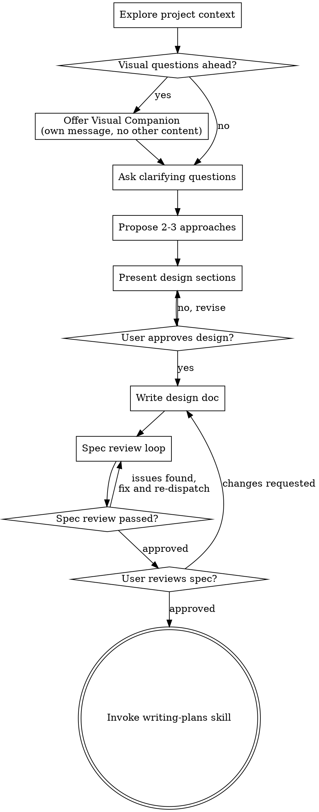
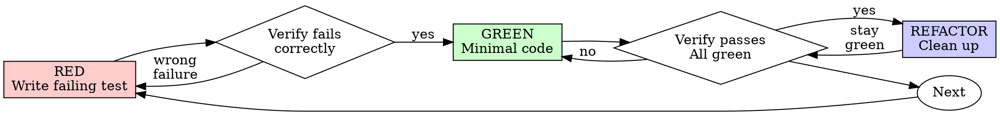

<!-- Generated by SpecStory, Markdown v2.1.0 -->

# 2026-03-15 06:08:46Z

<!-- Codex CLI Session 019cf01b-eaf9-73f2-a064-065788019418 (2026-03-15 06:08:46Z) -->

_**User (2026-03-15 06:08:46Z)**_

@apps/web/src/components/layout/footer/GatewayInfo.tsx 的 onlineCount 不显示了，看看现在的 core 的 event 数据是啥。另外数字动画改用 number-flow/react 组件

---

_**Agent (gpt-5.4 2026-03-15 06:08:54Z)**_

先定位 `GatewayInfo.tsx` 和 core 的 event 数据来源，确认 `onlineCount` 现在为什么取不到；这次会按 `using-superpowers`、`brainstorming`、`systematic-debugging` 和 `test-driven-development` 的要求先收集上下文，再改成 `number-flow/react`。

_**Agent (gpt-5.4 2026-03-15 06:08:54Z)**_

<tool-use data-tool-type="shell" data-tool-name="exec_command"><details>
<summary>Tool use: **exec_command** `sed -n '1,220p' <HOME>/.codex/skills/using-superpowers/SKILL.md`</summary>
```
Chunk ID: cd2c61
Wall time: 0.0000 seconds
Process exited with code 0
Original token count: 1305
Output:
---
name: using-superpowers
description: Use when starting any conversation - establishes how to find and use skills, requiring Skill tool invocation before ANY response including clarifying questions
---

<SUBAGENT-STOP>
If you were dispatched as a subagent to execute a specific task, skip this skill.
</SUBAGENT-STOP>

<EXTREMELY-IMPORTANT>
If you think there is even a 1% chance a skill might apply to what you are doing, you ABSOLUTELY MUST invoke the skill.

IF A SKILL APPLIES TO YOUR TASK, YOU DO NOT HAVE A CHOICE. YOU MUST USE IT.

This is not negotiable. This is not optional. You cannot rationalize your way out of this.
</EXTREMELY-IMPORTANT>

## Instruction Priority

Superpowers skills override default system prompt behavior, but **user instructions always take precedence**:

1. **User's explicit instructions** (CLAUDE.md, GEMINI.md, AGENTS.md, direct requests) — highest priority
2. **Superpowers skills** — override default system behavior where they conflict
3. **Default system prompt** — lowest priority

If CLAUDE.md, GEMINI.md, or AGENTS.md says "don't use TDD" and a skill says "always use TDD," follow the user's instructions. The user is in control.

## How to Access Skills

**In Claude Code:** Use the `Skill` tool. When you invoke a skill, its content is loaded and presented to you—follow it directly. Never use the Read tool on skill files.

**In Gemini CLI:** Skills activate via the `activate_skill` tool. Gemini loads skill metadata at session start and activates the full content on demand.

**In other environments:** Check your platform's documentation for how skills are loaded.

## Platform Adaptation

Skills use Claude Code tool names. Non-CC platforms: see `references/codex-tools.md` (Codex) for tool equivalents. Gemini CLI users get the tool mapping loaded automatically via GEMINI.md.

# Using Skills

## The Rule

**Invoke relevant or requested skills BEFORE any response or action.** Even a 1% chance a skill might apply means that you should invoke the skill to check. If an invoked skill turns out to be wrong for the situation, you don't need to use it.


## Red Flags

These thoughts mean STOP—you're rationalizing:

| Thought | Reality |
|---------|---------|
| "This is just a simple question" | Questions are tasks. Check for skills. |
| "I need more context first" | Skill check comes BEFORE clarifying questions. |
| "Let me explore the codebase first" | Skills tell you HOW to explore. Check first. |
| "I can check git/files quickly" | Files lack conversation context. Check for skills. |
| "Let me gather information first" | Skills tell you HOW to gather information. |
| "This doesn't need a formal skill" | If a skill exists, use it. |
| "I remember this skill" | Skills evolve. Read current version. |
| "This doesn't count as a task" | Action = task. Check for skills. |
| "The skill is overkill" | Simple things become complex. Use it. |
| "I'll just do this one thing first" | Check BEFORE doing anything. |
| "This feels productive" | Undisciplined action wastes time. Skills prevent this. |
| "I know what that means" | Knowing the concept ≠ using the skill. Invoke it. |

## Skill Priority

When multiple skills could apply, use this order:

1. **Process skills first** (brainstorming, debugging) - these determine HOW to approach the task
2. **Implementation skills second** (frontend-design, mcp-builder) - these guide execution

"Let's build X" → brainstorming first, then implementation skills.
"Fix this bug" → debug
... (truncated)
```
</details></tool-use>

_**Agent (gpt-5.4 2026-03-15 06:08:54Z)**_

<tool-use data-tool-type="shell" data-tool-name="exec_command"><details>
<summary>Tool use: **exec_command** `sed -n '1,220p' <HOME>/.codex/skills/brainstorming/SKILL.md`</summary>
```
Chunk ID: c8a579
Wall time: 0.0000 seconds
Process exited with code 0
Original token count: 2643
Output:
---
name: brainstorming
description: "You MUST use this before any creative work - creating features, building components, adding functionality, or modifying behavior. Explores user intent, requirements and design before implementation."
---

# Brainstorming Ideas Into Designs

Help turn ideas into fully formed designs and specs through natural collaborative dialogue.

Start by understanding the current project context, then ask questions one at a time to refine the idea. Once you understand what you're building, present the design and get user approval.

<HARD-GATE>
Do NOT invoke any implementation skill, write any code, scaffold any project, or take any implementation action until you have presented a design and the user has approved it. This applies to EVERY project regardless of perceived simplicity.
</HARD-GATE>

## Anti-Pattern: "This Is Too Simple To Need A Design"

Every project goes through this process. A todo list, a single-function utility, a config change — all of them. "Simple" projects are where unexamined assumptions cause the most wasted work. The design can be short (a few sentences for truly simple projects), but you MUST present it and get approval.

## Checklist

You MUST create a task for each of these items and complete them in order:

1. **Explore project context** — check files, docs, recent commits
2. **Offer visual companion** (if topic will involve visual questions) — this is its own message, not combined with a clarifying question. See the Visual Companion section below.
3. **Ask clarifying questions** — one at a time, understand purpose/constraints/success criteria
4. **Propose 2-3 approaches** — with trade-offs and your recommendation
5. **Present design** — in sections scaled to their complexity, get user approval after each section
6. **Write design doc** — save to `docs/superpowers/specs/YYYY-MM-DD-<topic>-design.md` and commit
7. **Spec review loop** — dispatch spec-document-reviewer subagent with precisely crafted review context (never your session history); fix issues and re-dispatch until approved (max 5 iterations, then surface to human)
8. **User reviews written spec** — ask user to review the spec file before proceeding
9. **Transition to implementation** — invoke writing-plans skill to create implementation plan

## Process Flow



**The terminal state is invoking writing-plans.** Do NOT invoke frontend-design, mcp-builder, or any other implementation skill. The ONLY skill you invoke after brainstorming is writing-plans.

## The Process

**Understanding the idea:**

- Check out the current project state first (files, docs, recent commits)
- Before asking detailed questions, assess scope: if the request describes multiple independent subsystems (e.g., "build a platform with chat, file storage, billing, and analytics"), flag this immediately. Don't spend questions refining details of a project that needs to be decomposed first.
- If the project is too large for a single spec, help the user decompose into sub-projects: what are the independent pieces, how do they relate, what order should they be built? Then brainstorm the first sub-project through the normal design flow. Each sub-project gets its own spec → plan → imple
... (truncated)
```
</details></tool-use>

_**Agent (gpt-5.4 2026-03-15 06:08:54Z)**_

<tool-use data-tool-type="shell" data-tool-name="exec_command"><details>
<summary>Tool use: **exec_command** `sed -n '1,220p' <HOME>/.codex/skills/systematic-debugging/SKILL.md`</summary>
```
Chunk ID: 7389e5
Wall time: 0.0000 seconds
Process exited with code 0
Original token count: 1593
Output:
---
name: systematic-debugging
description: Use when encountering any bug, test failure, or unexpected behavior, before proposing fixes
---

# Systematic Debugging

## Overview

Random fixes waste time and create new bugs. Quick patches mask underlying issues.

**Core principle:** ALWAYS find root cause before attempting fixes. Symptom fixes are failure.

**Violating the letter of this process is violating the spirit of debugging.**

## The Iron Law

```
NO FIXES WITHOUT ROOT CAUSE INVESTIGATION FIRST
```

If you haven't completed Phase 1, you cannot propose fixes.

## When to Use

Use for ANY technical issue:
- Test failures
- Bugs in production
- Unexpected behavior
- Performance problems
- Build failures
- Integration issues

**Use this ESPECIALLY when:**
- Under time pressure (emergencies make guessing tempting)
- "Just one quick fix" seems obvious
- You've already tried multiple fixes
- Previous fix didn't work
- You don't fully understand the issue

**Don't skip when:**
- Issue seems simple (simple bugs have root causes too)
- You're in a hurry (rushing guarantees rework)
- Manager wants it fixed NOW (systematic is faster than thrashing)

## The Four Phases

You MUST complete each phase before proceeding to the next.

### Phase 1: Root Cause Investigation

**BEFORE attempting ANY fix:**

1. **Read Error Messages Carefully**
   - Don't skip past errors or warnings
   - They often contain the exact solution
   - Read stack traces completely
   - Note line numbers, file paths, error codes

2. **Reproduce Consistently**
   - Can you trigger it reliably?
   - What are the exact steps?
   - Does it happen every time?
   - If not reproducible → gather more data, don't guess

3. **Check Recent Changes**
   - What changed that could cause this?
   - Git diff, recent commits
   - New dependencies, config changes
   - Environmental differences

4. **Gather Evidence in Multi-Component Systems**

   **WHEN system has multiple components (CI → build → signing, API → service → database):**

   **BEFORE proposing fixes, add diagnostic instrumentation:**
   ```
   For EACH component boundary:
     - Log what data enters component
     - Log what data exits component
     - Verify environment/config propagation
     - Check state at each layer

   Run once to gather evidence showing WHERE it breaks
   THEN analyze evidence to identify failing component
   THEN investigate that specific component
   ```

   **Example (multi-layer system):**
   ```bash
   # Layer 1: Workflow
   echo "=== Secrets available in workflow: ==="
   echo "IDENTITY: ${IDENTITY:+SET}${IDENTITY:-UNSET}"

   # Layer 2: Build script
   echo "=== Env vars in build script: ==="
   env | grep IDENTITY || echo "IDENTITY not in environment"

   # Layer 3: Signing script
   echo "=== Keychain state: ==="
   security list-keychains
   security find-identity -v

   # Layer 4: Actual signing
   codesign --sign "$IDENTITY" --verbose=4 "$APP"
   ```

   **This reveals:** Which layer fails (secrets → workflow ✓, workflow → build ✗)

5. **Trace Data Flow**

   **WHEN error is deep in call stack:**

   See `root-cause-tracing.md` in this directory for the complete backward tracing technique.

   **Quick version:**
   - Where does bad value originate?
   - What called this with bad value?
   - Keep tracing up until you find the source
   - Fix at source, not at symptom

### Phase 2: Pattern Analysis

**Find the pattern before fixing:**

1. **Find Working Examples**
   - Locate similar working code in same codebase
   - What works that's similar to what's broken?

2. **Compare Against References**
   - If implementing pattern, read reference implementation COMPLETELY
   - Don't skim - read every line
   - Understand the pattern fully before applying

3. **Identify Differences**
   - What's different between working and broken?
   - List every difference, however small
   - Don't assume "that can't matter"

4. **Understand Dependencies**
   - What other components does this need?
   - What settings, config, environment?
   - What assumptions does it make?

### Phase 3: Hypothesis and Testing

**Scientific method:**

1. **Form Single Hypothesis**
   - State clearly: "I think X is the root cause because Y"
   - Write it down
   - Be specific, not vague

2. **Test Minimally**
   - Make the SMALLEST possible change to test hypothesis
   - One variable at a time
   - Don't fix multiple things at once

3. **Verify Before Continuing**
   - Did it work? Yes → Phase 4
   - Didn't work? Form NEW hypothesis
   - DON'T add more fixes on top

4. **When You Don't Know**
   - Say "I don't understand X"
   - Don't pretend to know
   - Ask for help
   - Research more

### Phase 4: Implementation

**Fix the root cause, not the symptom:**

1. **Create Failing Test Case**
   - Simplest possible reproduction
   - Automated test if possible
   - One-off test script
... (truncated)
```
</details></tool-use>

_**Agent (gpt-5.4 2026-03-15 06:08:54Z)**_

<tool-use data-tool-type="shell" data-tool-name="exec_command"><details>
<summary>Tool use: **exec_command** `sed -n '1,220p' <HOME>/.codex/skills/test-driven-development/SKILL.md`</summary>
```
Chunk ID: 160012
Wall time: 0.0000 seconds
Process exited with code 0
Original token count: 1232
Output:
---
name: test-driven-development
description: Use when implementing any feature or bugfix, before writing implementation code
---

# Test-Driven Development (TDD)

## Overview

Write the test first. Watch it fail. Write minimal code to pass.

**Core principle:** If you didn't watch the test fail, you don't know if it tests the right thing.

**Violating the letter of the rules is violating the spirit of the rules.**

## When to Use

**Always:**
- New features
- Bug fixes
- Refactoring
- Behavior changes

**Exceptions (ask your human partner):**
- Throwaway prototypes
- Generated code
- Configuration files

Thinking "skip TDD just this once"? Stop. That's rationalization.

## The Iron Law

```
NO PRODUCTION CODE WITHOUT A FAILING TEST FIRST
```

Write code before the test? Delete it. Start over.

**No exceptions:**
- Don't keep it as "reference"
- Don't "adapt" it while writing tests
- Don't look at it
- Delete means delete

Implement fresh from tests. Period.

## Red-Green-Refactor



### RED - Write Failing Test

Write one minimal test showing what should happen.

<Good>
```typescript
test('retries failed operations 3 times', async () => {
  let attempts = 0;
  const operation = () => {
    attempts++;
    if (attempts < 3) throw new Error('fail');
    return 'success';
  };

  const result = await retryOperation(operation);

  expect(result).toBe('success');
  expect(attempts).toBe(3);
});
```
Clear name, tests real behavior, one thing
</Good>

<Bad>
```typescript
test('retry works', async () => {
  const mock = jest.fn()
    .mockRejectedValueOnce(new Error())
    .mockRejectedValueOnce(new Error())
    .mockResolvedValueOnce('success');
  await retryOperation(mock);
  expect(mock).toHaveBeenCalledTimes(3);
});
```
Vague name, tests mock not code
</Bad>

**Requirements:**
- One behavior
- Clear name
- Real code (no mocks unless unavoidable)

### Verify RED - Watch It Fail

**MANDATORY. Never skip.**

```bash
npm test path/to/test.test.ts
```

Confirm:
- Test fails (not errors)
- Failure message is expected
- Fails because feature missing (not typos)

**Test passes?** You're testing existing behavior. Fix test.

**Test errors?** Fix error, re-run until it fails correctly.

### GREEN - Minimal Code

Write simplest code to pass the test.

<Good>
```typescript
async function retryOperation<T>(fn: () => Promise<T>): Promise<T> {
  for (let i = 0; i < 3; i++) {
    try {
      return await fn();
    } catch (e) {
      if (i === 2) throw e;
    }
  }
  throw new Error('unreachable');
}
```
Just enough to pass
</Good>

<Bad>
```typescript
async function retryOperation<T>(
  fn: () => Promise<T>,
  options?: {
    maxRetries?: number;
    backoff?: 'linear' | 'exponential';
    onRetry?: (attempt: number) => void;
  }
): Promise<T> {
  // YAGNI
}
```
Over-engineered
</Bad>

Don't add features, refactor other code, or "improve" beyond the test.

### Verify GREEN - Watch It Pass

**MANDATORY.**

```bash
npm test path/to/test.test.ts
```

Confirm:
- Test passes
- Other tests still pass
- Output pristine (no errors, warnings)

**Test fails?** Fix code, not test.

**Other tests fail?** Fix now.

### REFACTOR - Clean Up

After green only:
- Remove duplication
- Improve names
- Extract helpers

Keep tests green. Don't add behavior.

### Repeat

Next failing test for next feature.

## Good Tests

| Quality | Good | Bad |
|---------|------|-----|
| **Minimal** | One thing. "and" in name? Split it. | `test('validates email and domain and whitespace')` |
| **Clear** | Name describes behavior | `test('test1')` |
| **Shows intent** | Demonstrates desired API | Obscures what code should do |

## Why Order Matters

**"I'll write tests after to verify it works"**

Tests written after code pass immediately. Passing immediately proves nothing:
- Might test wrong thing
- Might test implementation, not behavior
- Might miss edge cases you forgot
- You never saw it catch the bug

Test-first forces you to see the test fail, proving it actually tests something.

**"I already manually tested all the edge cases"**

Manual testing is ad-hoc. You t
... (truncated)
```
</details></tool-use>

_**Agent (gpt-5.4 2026-03-15 06:08:54Z)**_

<tool-use data-tool-type="shell" data-tool-name="exec_command"><details>
<summary>Tool use: **exec_command** `sed -n '1,220p' <HOME>/.codex/skills/verification-before-completion/SKILL.md`</summary>
```
Chunk ID: 38853e
Wall time: 0.0000 seconds
Process exited with code 0
Original token count: 1051
Output:
---
name: verification-before-completion
description: Use when about to claim work is complete, fixed, or passing, before committing or creating PRs - requires running verification commands and confirming output before making any success claims; evidence before assertions always
---

# Verification Before Completion

## Overview

Claiming work is complete without verification is dishonesty, not efficiency.

**Core principle:** Evidence before claims, always.

**Violating the letter of this rule is violating the spirit of this rule.**

## The Iron Law

```
NO COMPLETION CLAIMS WITHOUT FRESH VERIFICATION EVIDENCE
```

If you haven't run the verification command in this message, you cannot claim it passes.

## The Gate Function

```
BEFORE claiming any status or expressing satisfaction:

1. IDENTIFY: What command proves this claim?
2. RUN: Execute the FULL command (fresh, complete)
3. READ: Full output, check exit code, count failures
4. VERIFY: Does output confirm the claim?
   - If NO: State actual status with evidence
   - If YES: State claim WITH evidence
5. ONLY THEN: Make the claim

Skip any step = lying, not verifying
```

## Common Failures

| Claim | Requires | Not Sufficient |
|-------|----------|----------------|
| Tests pass | Test command output: 0 failures | Previous run, "should pass" |
| Linter clean | Linter output: 0 errors | Partial check, extrapolation |
| Build succeeds | Build command: exit 0 | Linter passing, logs look good |
| Bug fixed | Test original symptom: passes | Code changed, assumed fixed |
| Regression test works | Red-green cycle verified | Test passes once |
| Agent completed | VCS diff shows changes | Agent reports "success" |
| Requirements met | Line-by-line checklist | Tests passing |

## Red Flags - STOP

- Using "should", "probably", "seems to"
- Expressing satisfaction before verification ("Great!", "Perfect!", "Done!", etc.)
- About to commit/push/PR without verification
- Trusting agent success reports
- Relying on partial verification
- Thinking "just this once"
- Tired and wanting work over
- **ANY wording implying success without having run verification**

## Rationalization Prevention

| Excuse | Reality |
|--------|---------|
| "Should work now" | RUN the verification |
| "I'm confident" | Confidence ≠ evidence |
| "Just this once" | No exceptions |
| "Linter passed" | Linter ≠ compiler |
| "Agent said success" | Verify independently |
| "I'm tired" | Exhaustion ≠ excuse |
| "Partial check is enough" | Partial proves nothing |
| "Different words so rule doesn't apply" | Spirit over letter |

## Key Patterns

**Tests:**
```
✅ [Run test command] [See: 34/34 pass] "All tests pass"
❌ "Should pass now" / "Looks correct"
```

**Regression tests (TDD Red-Green):**
```
✅ Write → Run (pass) → Revert fix → Run (MUST FAIL) → Restore → Run (pass)
❌ "I've written a regression test" (without red-green verification)
```

**Build:**
```
✅ [Run build] [See: exit 0] "Build passes"
❌ "Linter passed" (linter doesn't check compilation)
```

**Requirements:**
```
✅ Re-read plan → Create checklist → Verify each → Report gaps or completion
❌ "Tests pass, phase complete"
```

**Agent delegation:**
```
✅ Agent reports success → Check VCS diff → Verify changes → Report actual state
❌ Trust agent report
```

## Why This Matters

From 24 failure memories:
- your human partner said "I don't believe you" - trust broken
- Undefined functions shipped - would crash
- Missing requirements shipped - incomplete features
- Time wasted on false completion → redirect → rework
- Violates: "Honesty is a core value. If you lie, you'll be replaced."

## When To Apply

**ALWAYS before:**
- ANY variation of success/completion claims
- ANY expression of satisfaction
- ANY positive statement about work state
- Committing, PR creation, task completion
- Moving to next task
- Delegating to agents

**Rule applies to:**
- Exact phrases
- Paraphrases and synonyms
- Implications of success
- ANY communication suggesting completion/correctness

## The Bottom Line

**No shortcuts for verification.**

Run the command. Read the output. THEN claim the result.

This is non-negotiable.
```
</details></tool-use>

_**Agent (gpt-5.4 2026-03-15 06:09:00Z)**_

现在在做 root cause 调查，先看组件实现、数据类型和最近相关改动，确认是 event 字段变了还是前端映射失效。

_**Agent (gpt-5.4 2026-03-15 06:09:00Z)**_

<tool-use data-tool-type="shell" data-tool-name="exec_command"><details>
<summary>Tool use: **exec_command** `sed -n '1,240p' apps/web/src/components/layout/footer/GatewayInfo.tsx`</summary>
```
Chunk ID: 8ad787
Wall time: 0.0000 seconds
Process exited with code 0
Original token count: 1422
Output:
'use client'

import { useQuery } from '@tanstack/react-query'
import { useTranslations } from 'next-intl'

import { useOnlineCount } from '~/atoms'
import { useSocketIsConnect } from '~/atoms/hooks/socket'
import { ImpressionView } from '~/components/common/ImpressionTracker'
import { PeekLink } from '~/components/modules/peek/PeekLink'
import { Divider } from '~/components/ui/divider'
import { FloatPopover } from '~/components/ui/float-popover'
import { NumberSmoothTransition } from '~/components/ui/number-transition/NumberSmoothTransition'
import { TrackerAction } from '~/constants/tracker'
import { usePageIsActive } from '~/hooks/common/use-is-active'
import { getNoteRouteParams } from '~/lib/note-route'
import { apiClient } from '~/lib/request'
import { routeBuilder, Routes } from '~/lib/route-builder'

const Help = () => {
  const t = useTranslations('gateway')
  return (
    <FloatPopover
      asChild
      mobileAsSheet
      as="span"
      triggerElement={<i className="i-mingcute-question-line cursor-help" />}
      type="tooltip"
      sheet={{
        triggerAsChild: true,
      }}
    >
      <div className="space-y-2 leading-relaxed">
        <p className="flex items-center space-x-1 opacity-80">
          <i className="i-mingcute-question-line" />
          <span className="font-medium">{t('how_it_works')}</span>
        </p>
        <p>{t('websocket_intro')}</p>
        <p>{t('websocket_realtime')}</p>

        <Divider />

        <p>
          {t('socket_status')}
          <ConnectedIndicator />
        </p>
      </div>
    </FloatPopover>
  )
}

const ConnectedIndicator = () => {
  const connected = useSocketIsConnect()

  return (
    <div className="inline-flex items-center">
      <ImpressionView
        action={TrackerAction.Impression}
        trackerMessage="socket_status"
      />
      <ConnectionStatus isConnected={connected} />
    </div>
  )
}

function ConnectionStatus({ isConnected }: { isConnected: boolean }) {
  const t = useTranslations('gateway')
  const color = isConnected ? '#00FC47' : '#FC0000'
  const secondaryColor = isConnected
    ? 'rgba(174, 244, 194, 0.46)'
    : 'rgba(244, 174, 174, 0.46)'
  const text = isConnected ? t('connected') : t('disconnected')

  const backgroundStyle = {
    background: `radial-gradient(45.91% 45.91% at 49.81% 54.09%, ${color} 7.13%, ${secondaryColor} 65.83%, rgba(252, 252, 252, 0.00) 100%)`,
  }

  return (
    <>
      <span className="absolute size-5" style={backgroundStyle} />
      <span className="ml-6">{text}</span>
    </>
  )
}

export const GatewayInfo = () => {
  const t = useTranslations('gateway')
  const isActive = usePageIsActive()
  const count = useOnlineCount()

  if (!isActive) return null
  return (
    <div className="inline-flex items-center gap-2">
      <FloatPopover
        asChild
        mobileAsSheet
        offset={10}
        placement="top"
        trigger="both"
        triggerElement={
          <span className="cursor-pointer" key={count}>
            {t('being_viewed')}
            <span>
              <NumberSmoothTransition>{count}</NumberSmoothTransition>
            </span>
            {t('viewers')}
          </span>
        }
      >
        <RoomsInfo />
      </FloatPopover>
      <Help />
    </div>
  )
}

const RoomsInfo = () => {
  const t = useTranslations('gateway')
  const { data } = useQuery({
    queryKey: ['rooms'],
    refetchOnMount: true,
    staleTime: 1000 * 10,
    queryFn: async () => {
      await new Promise((resolve) => setTimeout(resolve, 1000))
      const res = await apiClient.activity.getRoomsInfo()
      const data = res.$serialized
      const result = [] as {
        path: string
        title: string
        count: number
      }[]
      const morphArticleIdToRoomName = (id: string) => `article_${id}`
      data.objects.notes.forEach((note) => {
        result.push({
          path: routeBuilder(Routes.Note, {
            ...getNoteRouteParams(note),
          }),
          title: note.title,
          count: data.roomCount[morphArticleIdToRoomName(note.id)],
        })
      })
      data.objects.posts.forEach((post) => {
        result.push({
          path: routeBuilder(Routes.Post, {
            category: post.category.slug,
            slug: post.slug,
          }),
          title: post.title,
          count: data.roomCount[morphArticleIdToRoomName(post.id)],
        })
      })
      data.objects.pages.forEach((page) => {
        result.push({
          path: routeBuilder(Routes.Page, {
            slug: page.slug,
          }),
          title: page.title,
          count: data.roomCount[morphArticleIdToRoomName(page.id)],
        })
      })
      return result.sort((a, b) => b.count - a.count)
    },
  })

  if (!data)
    return (
      <div className="center flex size-6">
        <div className="loading loading-spinner" />
      </div>
    )
  if 
... (truncated)
```
</details></tool-use>

_**Agent (gpt-5.4 2026-03-15 06:09:00Z)**_

<tool-use data-tool-type="shell" data-tool-name="exec_command"><details>
<summary>Tool use: **exec_command** `rg -n "onlineCount|online_count|gateway|event" apps/web packages apps/core -g '!**/dist/**'`</summary>
```
Chunk ID: f7716c
Wall time: 0.0000 seconds
Process exited with code 2
Original token count: 7668
Output:
Total output lines: 279

rg: apps/core: No such file or directory (os error 2)
apps/web/src/socket/io.worker.ts:76:  port.onmessage = (event) => {
apps/web/src/socket/io.worker.ts:77:    const { type, payload } = event.data
apps/web/src/socket/io.worker.ts:78:    console.info('get message from main', event.data)
apps/web/src/socket/io.worker.ts:113:  const event = ev as MessageEvent
apps/web/src/socket/io.worker.ts:115:  const port = event.ports[0]
apps/web/src/workers/push-worker.ts:45:sw.addEventListener('message', (event) => {
apps/web/src/workers/push-worker.ts:46:  console.debug('Received message:', event.data)
apps/web/src/workers/push-worker.ts:47:  if (!event.data) return
apps/web/src/workers/push-worker.ts:49:  switch (event.data.type) {
apps/web/src/workers/push-worker.ts:51:      console.info('Received configuration:', event.data.config)
apps/web/src/workers/push-worker.ts:53:      Object.assign(config, event.data.config)
apps/web/src/workers/push-worker.ts:67:sw.addEventListener('install', (event) => {
apps/web/src/workers/push-worker.ts:68:  event.waitUntil(sw.skipWaiting())
apps/web/src/workers/push-worker.ts:72:sw.addEventListener('activate', async (event) => {
apps/web/src/workers/push-worker.ts:73:  event.waitUntil(
apps/web/src/workers/push-worker.ts:124:sw.addEventListener('notificationclick', (event) => {
apps/web/src/workers/push-worker.ts:125:  event.notification.close()
apps/web/src/workers/push-worker.ts:126:  event.waitUntil(
apps/web/src/workers/push-worker.ts:134:        return sw.clients.openWindow(event.notification.data.url)
apps/web/src/socket/handlers/post.ts:10:import { DOMCustomEvents } from '~/constants/event'
apps/web/src/socket/handlers/post.ts:17:import { EventTypes } from '~/types/events'
apps/web/global.d.ts:52:    'data-event'?: string
apps/web/src/socket/handlers/comment.ts:6:import { EventTypes } from '~/types/events'
apps/web/src/queries/hooks/authjs.tsx:81:    bc.onmessage = (event) => {
apps/web/src/queries/hooks/authjs.tsx:82:      if (event.data?.type === 'oauth-complete') {
apps/web/src/socket/handlers/say.ts:8:import { EventTypes } from '~/types/events'
apps/web/src/socket/handlers/activity.ts:16:import { EventTypes } from '~/types/events'
apps/web/src/styles/layer.css:77:      pointer-events: none;
apps/web/src/styles/layer.css:189:    @apply pointer-events-none absolute inset-x-0 top-0 h-[720px] w-full;
apps/web/src/hooks/common/factory/createHTMLMediaHook.ts:8:import { useEventCallback } from '../use-event-callback'
apps/web/src/hooks/common/factory/createHTMLMediaHook.ts:79:    const wrapEvent = (userEvent: any, proxyEvent?: any) => (event: any) => {
apps/web/src/hooks/common/factory/createHTMLMediaHook.ts:81:        proxyEvent && proxyEvent(event)
apps/web/src/hooks/common/factory/createHTMLMediaHook.ts:83:        userEvent && userEvent(event)
apps/web/src/hooks/common/factory/createHTMLMediaHook.ts:173:    // promise is resolving. So we prevent that with this lock.
apps/web/src/socket/handlers/page.ts:6:import { EventTypes } from '~/types/events'
apps/web/src/components/modules/peek/PeekLink.tsx:7:import { preventDefault } from '~/lib/dom'
apps/web/src/components/modules/peek/PeekLink.tsx:28:      if (success) preventDefault(e)
apps/web/src/hooks/biz/use-save-confirm.ts:15:  const beforeUnloadHandler = (event: any) => {
apps/web/src/hooks/biz/use-save-confirm.ts:19:    event.preventDefault()
apps/web/src/hooks/biz/use-save-confirm.ts:22:    event.returnValue = message
apps/web/src/socket/util.ts:4:  `ws_event:${type}` as const
apps/web/src/socket/handlers/recently.ts:7:import { EventTypes } from '~/types/events'
apps/web/src/socket/handlers/visitor.ts:2:import { EventTypes } from '~/types/events'
apps/web/src/hooks/common/use-prevent-composition.ts:5:export const usePreventComposition = (el: HTMLElement) => {
apps/web/src/socket/worker-polyfill.ts:127:   * Is an EventListener that is called whenever an ErrorEvent of type error event occurs.
apps/web/src/socket/worker-polyfill.ts:139:   * Registers an event handler of a specific event type on the EventTarget
apps/web/src/socket/worker-polyfill.ts:173:   * Removes an event listener from the EventTarget.
apps/web/src/socket/worker-polyfill.ts:207:   * Dispatches an event to this EventTarget.
apps/web/src/socket/worker-polyfill.ts:209:  public dispatchEvent(event: Event) {
apps/web/src/socket/worker-polyfill.ts:210:    return this.ActualWorker.dispatchEvent(event)
apps/web/src/socket/handlers/translation.ts:6:import { DOMCustomEvents } from '~/constants/event'
apps/web/src/socket/handlers/translation.ts:8:import { EventTypes } from '~/types/events'
apps/web/src/hooks/common/use-before-unload.ts:27:        if (!res) e.preventDefault()
apps/web/src/hooks/common/use-before-unload.ts:63:const beforeUnloadFn = (event?: BeforeUnloadEvent) => {
apps/web/src/hooks/common/use-before-unload.ts:68:  if (event) {
a
... (truncated)
```
</details></tool-use>

_**Agent (gpt-5.4 2026-03-15 06:09:00Z)**_

<tool-use data-tool-type="shell" data-tool-name="exec_command"><details>
<summary>Tool use: **exec_command** `git log --oneline --decorate -n 12 -- apps/web/src/components/layout/footer/GatewayInfo.tsx apps/core`</summary>
```
Chunk ID: 3d1d45
Wall time: 0.0000 seconds
Process exited with code 0
Original token count: 59
Output:
e1f460d1 feat(web): prefer slug routes for notes
cd50af22 chore: migrate ESLint from eslint-config-hyoban to @lobehub/lint
0d3a63c1 chore: apply workspace updates
5011bee0 feat(monorepo): restructure project to use pnpm and Turborepo
```
</details></tool-use>

_**Agent (gpt-5.4 2026-03-15 06:09:04Z)**_

组件里现在直接吃 `useOnlineCount()`，下一步查这个 atom 是被哪个 socket 事件更新的，再对照 core 当前发出来的数据结构。

_**Agent (gpt-5.4 2026-03-15 06:09:04Z)**_

<tool-use data-tool-type="shell" data-tool-name="exec_command"><details>
<summary>Tool use: **exec_command** `rg -n "useOnlineCount|onlineCount|online_count" apps/web packages -g '!**/dist/**'`</summary>
```
Chunk ID: 59ed21
Wall time: 0.0000 seconds
Process exited with code 0
Original token count: 75
Output:
apps/web/src/atoms/socket.ts:6:export const [, , useOnlineCount, , , setOnlineCount] = createAtomHooks(atom(0))
apps/web/src/components/layout/footer/GatewayInfo.tsx:6:import { useOnlineCount } from '~/atoms'
apps/web/src/components/layout/footer/GatewayInfo.tsx:88:  const count = useOnlineCount()
```
</details></tool-use>

_**Agent (gpt-5.4 2026-03-15 06:09:04Z)**_

<tool-use data-tool-type="shell" data-tool-name="exec_command"><details>
<summary>Tool use: **exec_command** `rg -n "EventTypes|visitor|activity|roomCount|getRoomsInfo" apps/web packages -g '!**/dist/**'`</summary>
```
Chunk ID: 076c68
Wall time: 0.0000 seconds
Process exited with code 0
Original token count: 4792
Output:
apps/web/src/socket/handlers/post.ts:17:import { EventTypes } from '~/types/events'
apps/web/src/socket/handlers/post.ts:86:  [EventTypes.POST_CREATE]: postCreateHandler,
apps/web/src/socket/handlers/post.ts:87:  [EventTypes.POST_UPDATE]: postUpdateHandler,
apps/web/src/socket/handlers/post.ts:88:  [EventTypes.POST_DELETE]: postDeleteHandler,
apps/web/src/socket/handlers/comment.ts:6:import { EventTypes } from '~/types/events'
apps/web/src/socket/handlers/comment.ts:35:  [EventTypes.COMMENT_CREATE]: commentCreateHandler,
apps/web/src/socket/worker-client.ts:9:import type { EventTypes, SocketEmitEnum } from '~/types/events'
apps/web/src/socket/worker-client.ts:164:            type: EventTypes
apps/web/src/socket/worker-client.ts:191:  handleEvent(type: EventTypes, data: any) {
apps/web/src/socket/handlers/say.ts:8:import { EventTypes } from '~/types/events'
apps/web/src/socket/handlers/say.ts:27:  [EventTypes.SAY_CREATE]: sayCreateHandler,
apps/web/src/atoms/hooks/activity.ts:6:import type { ActivityPresence } from '~/models/activity'
apps/web/src/atoms/hooks/activity.ts:8:import { activityAtom, activityPresenceAtom } from '../activity'
apps/web/src/atoms/hooks/activity.ts:10:export const useActivity = () => useAtomValue(activityAtom)
apps/web/src/atoms/hooks/activity.ts:11:export const useActivityPresence = () => useAtomValue(activityPresenceAtom)
apps/web/src/atoms/hooks/activity.ts:18:        selectAtom(activityPresenceAtom, (atomValue) => atomValue[sessionId]),
apps/web/src/atoms/hooks/activity.ts:23:  const set = useSetAtom(activityPresenceAtom)
apps/web/src/atoms/hooks/activity.ts:36:        selectAtom(activityPresenceAtom, (atomValue) =>
apps/web/src/atoms/hooks/activity.ts:50:          activityPresenceAtom,
apps/web/src/socket/handlers/activity.ts:8:} from '~/atoms/activity'
apps/web/src/socket/handlers/activity.ts:13:import type { ActivityPresence } from '~/models/activity'
apps/web/src/socket/handlers/activity.ts:16:import { EventTypes } from '~/types/events'
apps/web/src/socket/handlers/activity.ts:27:export const activityUpdatePresenceHandler: EventHandler = (data) => {
apps/web/src/socket/handlers/activity.ts:31:  const { queryKey } = queries.activity.presence(payload.roomName)
apps/web/src/socket/handlers/activity.ts:54:export const activityLeavePresenceHandler: EventHandler = (data) => {
apps/web/src/socket/handlers/activity.ts:61:    queryKey: queries.activity.presence(payload.roomName).queryKey,
apps/web/src/socket/handlers/activity.ts:92:export const activityHandlers = {
apps/web/src/socket/handlers/activity.ts:93:  [EventTypes.ACTIVITY_UPDATE_PRESENCE]: activityUpdatePresenceHandler,
apps/web/src/socket/handlers/activity.ts:94:  [EventTypes.ACTIVITY_LEAVE_PRESENCE]: activityLeavePresenceHandler,
apps/web/src/socket/handlers/page.ts:6:import { EventTypes } from '~/types/events'
apps/web/src/socket/handlers/page.ts:23:  [EventTypes.PAGE_UPDATE]: pageUpdateHandler,
apps/web/src/socket/handlers/page.ts:24:  [EventTypes.PAGE_UPDATED]: pageUpdateHandler,
apps/web/src/socket/handlers/recently.ts:7:import { EventTypes } from '~/types/events'
apps/web/src/socket/handlers/recently.ts:28:  [EventTypes.RECENTLY_CREATE]: recentlyCreateHandler,
apps/web/src/messages/en/home.json:13:  "activity_title": "Recent Activity",
apps/web/src/messages/en/home.json:14:  "activity_recent": "Things that happened recently",
apps/web/src/messages/en/home.json:15:  "activity_noActivity": "No recent activity",
apps/web/src/atoms/activity.ts:5:import type { ActivityPresence } from '~/models/activity'
apps/web/src/atoms/activity.ts:25:export const activityAtom = atom({
apps/web/src/atoms/activity.ts:42:  jotaiStore.set(activityAtom, (prev) => ({
apps/web/src/atoms/activity.ts:48:  jotaiStore.set(activityAtom, (prev) => ({
apps/web/src/atoms/activity.ts:55:export const activityPresenceAtom = atom({} as Record<string, ActivityPresence>)
apps/web/src/atoms/activity.ts:58:  jotaiStore.set(activityPresenceAtom, (prev) => ({
apps/web/src/atoms/activity.ts:65:  jotaiStore.set(activityPresenceAtom, (prev) =>
apps/web/src/atoms/activity.ts:74:) => jotaiStore.set(activityPresenceAtom, data || {})
apps/web/src/socket/handlers/visitor.ts:2:import { EventTypes } from '~/types/events'
apps/web/src/socket/handlers/visitor.ts:6:export const visitorHandler: EventHandler = (data) => {
apps/web/src/socket/handlers/visitor.ts:11:export const visitorEvents = [
apps/web/src/socket/handlers/visitor.ts:12:  EventTypes.VISITOR_ONLINE,
apps/web/src/socket/handlers/visitor.ts:13:  EventTypes.VISITOR_OFFLINE,
apps/web/src/providers/root/socket-provider.tsx:6:import { deleteActivityPresence } from '~/atoms/activity'
apps/web/src/socket/handlers/translation.ts:8:import { EventTypes } from '~/types/events'
apps/web/src/socket/handlers/translation.ts:37:  [EventTypes.TRANSLATION_CREATE]: translationHandler,
apps/web/src/socket/handlers/translation.ts
... (truncated)
```
</details></tool-use>

_**Agent (gpt-5.4 2026-03-15 06:09:04Z)**_

<tool-use data-tool-type="shell" data-tool-name="exec_command"><details>
<summary>Tool use: **exec_command** `rg --files | rg "(core|server|gateway|activity|event|socket)"`</summary>
```
Chunk ID: c4ada1
Wall time: 0.0000 seconds
Process exited with code 0
Original token count: 502
Output:
apps/web/src/socket/io.worker.ts
apps/web/src/socket/handlers/post.ts
apps/web/src/socket/handlers/comment.ts
apps/web/src/socket/handlers/say.ts
apps/web/src/socket/handlers/activity.ts
apps/web/src/socket/handlers/page.ts
apps/web/src/socket/handlers/recently.ts
apps/web/src/socket/handlers/types.ts
apps/web/src/socket/handlers/visitor.ts
apps/web/src/socket/handlers/translation.ts
apps/web/src/socket/handlers/article-read-count.ts
apps/web/src/socket/handlers/note.ts
apps/web/src/socket/handler.ts
apps/web/src/socket/index.ts
apps/web/src/socket/util.ts
apps/web/src/socket/worker-polyfill.ts
apps/web/src/socket/worker-client.ts
apps/web/src/events/index.ts
apps/web/src/events/write-edit.ts
apps/web/src/events/socket.ts
apps/web/src/events/refetch.ts
apps/web/src/events/publish.ts
apps/web/src/lib/request.server.ts
apps/web/src/lib/glow.server.ts
apps/web/src/lib/edge-function.server.ts
apps/web/src/models/activity.ts
apps/web/src/constants/event.ts
apps/web/src/lib/fetch/fetch.server.ts
apps/web/src/lib/query-client.server.ts
apps/web/src/lib/helper.server.ts
apps/web/src/hooks/common/use-prevent-composition.ts
apps/web/src/hooks/common/use-event-callback.ts
apps/web/src/queries/definition/activity.ts
apps/web/src/providers/root/socket-provider.tsx
apps/web/src/providers/root/event-provider.tsx
apps/web/src/atoms/socket.ts
apps/web/src/atoms/activity.ts
apps/web/src/messages/en/activity.json
apps/web/src/messages/en/gateway.json
apps/web/src/messages/ja/activity.json
apps/web/src/messages/ja/gateway.json
apps/web/src/atoms/hooks/activity.ts
apps/web/src/atoms/hooks/socket.ts
apps/web/src/messages/zh/activity.json
apps/web/src/messages/zh/gateway.json
reporter-assets/apps/activity.png
apps/web/src/types/events.ts
apps/web/src/components/modules/activity/index.ts
apps/web/src/components/modules/activity/Presence.tsx
apps/web/src/components/modules/activity/Room.tsx
apps/web/src/components/modules/activity/utils.ts
apps/web/src/components/ui/code-highlighter/shiki/core.ts
```
</details></tool-use>

_**Agent (gpt-5.4 2026-03-15 06:09:10Z)**_

<tool-use data-tool-type="shell" data-tool-name="exec_command"><details>
<summary>Tool use: **exec_command** `sed -n '1,220p' apps/web/src/types/events.ts`</summary>
```
Chunk ID: 78e1f8
Wall time: 0.0000 seconds
Process exited with code 0
Original token count: 337
Output:
import type { NoteModel } from '@mx-space/api-client'

export const enum EventTypes {
  ACTIVITY_LEAVE_PRESENCE = 'ACTIVITY_LEAVE_PRESENCE',
  ACTIVITY_UPDATE_PRESENCE = 'ACTIVITY_UPDATE_PRESENCE',

  ARTICLE_READ_COUNT_UPDATE = 'ARTICLE_READ_COUNT_UPDATE',
  AUTH_FAILED = 'AUTH_FAILED',

  COMMENT_CREATE = 'COMMENT_CREATE',

  GATEWAY_CONNECT = 'GATEWAY_CONNECT',

  GATEWAY_DISCONNECT = 'GATEWAY_DISCONNECT',
  NOTE_CREATE = 'NOTE_CREATE',
  NOTE_DELETE = 'NOTE_DELETE',

  NOTE_UPDATE = 'NOTE_UPDATE',
  PAGE_UPDATE = 'PAGE_UPDATE',
  // NOTE 历史遗留
  PAGE_UPDATED = 'PAGE_UPDATED',

  POST_CREATE = 'POST_CREATE',
  POST_DELETE = 'POST_DELETE',

  POST_UPDATE = 'POST_UPDATE',
  RECENTLY_CREATE = 'RECENTLY_CREATE',
  RECENTLY_DELETE = 'RECENTLY_DELETE',

  SAY_CREATE = 'SAY_CREATE',
  SAY_DELETE = 'SAY_DELETE',

  SAY_UPDATE = 'SAY_UPDATE',
  // AI Translation
  TRANSLATION_CREATE = 'TRANSLATION_CREATE',

  TRANSLATION_UPDATE = 'TRANSLATION_UPDATE',
  VISITOR_OFFLINE = 'VISITOR_OFFLINE',
  VISITOR_ONLINE = 'VISITOR_ONLINE',
}

export interface EventTypesPayload {
  [EventTypes.NOTE_UPDATE]: NoteModel
  [EventTypes.VISITOR_OFFLINE]: { online: number }
  [EventTypes.VISITOR_ONLINE]: { online: number }
}

export enum SocketEmitEnum {
  Join = 'join',
  Leave = 'leave',
  UpdateLang = 'updateLang',
  UpdateSid = 'updateSid',
}
```
</details></tool-use>

_**Agent (gpt-5.4 2026-03-15 06:09:10Z)**_

<tool-use data-tool-type="shell" data-tool-name="exec_command"><details>
<summary>Tool use: **exec_command** `sed -n '1,160p' apps/web/src/socket/handlers/visitor.ts`</summary>
```
Chunk ID: be44cd
Wall time: 0.0000 seconds
Process exited with code 0
Original token count: 86
Output:
import { setOnlineCount } from '~/atoms'
import { EventTypes } from '~/types/events'

import type { EventHandler } from './types'

export const visitorHandler: EventHandler = (data) => {
  const { online } = data
  setOnlineCount(online)
}

export const visitorEvents = [
  EventTypes.VISITOR_ONLINE,
  EventTypes.VISITOR_OFFLINE,
] as const
```
</details></tool-use>

_**Agent (gpt-5.4 2026-03-15 06:09:10Z)**_

<tool-use data-tool-type="shell" data-tool-name="exec_command"><details>
<summary>Tool use: **exec_command** `sed -n '1,160p' apps/web/src/atoms/socket.ts`</summary>
```
Chunk ID: c89392
Wall time: 0.0000 seconds
Process exited with code 0
Original token count: 88
Output:
import { createAtomHooks } from 'jojoo/react'
import { atom } from 'jotai'

import { jotaiStore } from '~/lib/store'

export const [, , useOnlineCount, , , setOnlineCount] = createAtomHooks(atom(0))

export const socketIsConnectAtom = atom(false)

export const setSocketIsConnect = (value: boolean) => {
  jotaiStore.set(socketIsConnectAtom, value)
}
```
</details></tool-use>

_**Agent (gpt-5.4 2026-03-15 06:09:10Z)**_

<tool-use data-tool-type="shell" data-tool-name="exec_command"><details>
<summary>Tool use: **exec_command** `rg -n "getRoomsInfo|getPresence|updatePresence|roomCount|online:" -g '!**/dist/**' packages apps`</summary>
```
Chunk ID: 52f44a
Wall time: 0.0000 seconds
Process exited with code 0
Original token count: 239
Output:
apps/web/src/queries/definition/activity.ts:12:        const res = await apiClient.activity.getPresence(roomName)
apps/web/src/types/events.ts:44:  [EventTypes.VISITOR_OFFLINE]: { online: number }
apps/web/src/types/events.ts:45:  [EventTypes.VISITOR_ONLINE]: { online: number }
apps/web/src/app/api/bilibili/check_live/types/room.ts:25:  online: number
apps/web/src/components/modules/activity/Presence.tsx:101:    return apiClient.activity.updatePresence({
apps/web/src/components/layout/footer/GatewayInfo.tsx:124:      const res = await apiClient.activity.getRoomsInfo()
apps/web/src/components/layout/footer/GatewayInfo.tsx:138:          count: data.roomCount[morphArticleIdToRoomName(note.id)],
apps/web/src/components/layout/footer/GatewayInfo.tsx:148:          count: data.roomCount[morphArticleIdToRoomName(post.id)],
apps/web/src/components/layout/footer/GatewayInfo.tsx:157:          count: data.roomCount[morphArticleIdToRoomName(page.id)],
```
</details></tool-use>

_**Agent (gpt-5.4 2026-03-15 06:09:15Z)**_

前端这边还在按 `{ online }` 读访客事件；我去对照当前 `@mx-space/api-client` / core 暴露的实际 payload，确认是不是字段名或层级变了。

_**Agent (gpt-5.4 2026-03-15 06:09:15Z)**_

<tool-use data-tool-type="shell" data-tool-name="exec_command"><details>
<summary>Tool use: **exec_command** `rg -n "@mx-space/api-client|number-flow" package.json apps packages pnpm-lock.yaml`</summary>
```
Chunk ID: d374c5
Wall time: 0.0000 seconds
Process exited with code 0
Original token count: 4107
Output:
pnpm-lock.yaml:103:      '@mx-space/api-client':
pnpm-lock.yaml:106:      '@number-flow/react':
pnpm-lock.yaml:2325:  '@mx-space/api-client@2.4.2':
pnpm-lock.yaml:2483:  '@number-flow/react@0.6.0':
pnpm-lock.yaml:7341:  number-flow@0.6.0:
pnpm-lock.yaml:12721:  '@mx-space/api-client@2.4.2': {}
pnpm-lock.yaml:12884:  '@number-flow/react@0.6.0(react-dom@19.2.4(react@19.2.4))(react@19.2.4)':
pnpm-lock.yaml:12887:      number-flow: 0.6.0
pnpm-lock.yaml:17904:  number-flow@0.6.0:
apps/web/src/socket/handlers/post.ts:1:import type { PostModel } from '@mx-space/api-client'
apps/web/src/socket/handlers/comment.ts:1:import type { CommentModel, PaginateResult } from '@mx-space/api-client'
apps/web/src/socket/handlers/say.ts:1:import type { PaginateResult, SayModel } from '@mx-space/api-client'
apps/web/src/socket/handlers/activity.ts:1:import type { AuthUser } from '@mx-space/api-client'
apps/web/src/socket/handlers/recently.ts:1:import type { RecentlyModel } from '@mx-space/api-client'
apps/web/src/components/modules/peek/NotePreview.tsx:1:import type { NoteWrappedWithLikedAndTranslationPayload } from '@mx-space/api-client'
apps/web/src/socket/handlers/note.ts:1:import type { NoteModel } from '@mx-space/api-client'
apps/web/global.d.ts:58:declare module '@mx-space/api-client' {
apps/web/src/components/modules/say/hooks.ts:1:import type { SayModel } from '@mx-space/api-client'
apps/web/src/components/modules/timeline/TimelineProgress.tsx:3:import NumberFlow from '@number-flow/react'
apps/web/src/socket/worker-client.ts:1:import { simpleCamelcaseKeys as camelcaseKeys } from '@mx-space/api-client'
apps/web/src/lib/define-metadata.ts:1:import type { AggregateRoot } from '@mx-space/api-client'
apps/web/src/models/writing.ts:1:import type { PostModel } from '@mx-space/api-client'
apps/web/src/models/writing.ts:76:export { type Pager, type PaginateResult } from '@mx-space/api-client'
apps/web/src/components/modules/note/NoteTopicDetail.tsx:7:} from '@mx-space/api-client'
apps/web/src/models/activity.ts:1:export type { ActivityPresence } from '@mx-space/api-client'
apps/web/src/components/modules/translation/TranslationBanner.tsx:3:import type { TranslationMeta } from '@mx-space/api-client'
apps/web/src/lib/url-builder.ts:6:} from '@mx-space/api-client'
apps/web/src/components/modules/translation/TranslatedBadge.tsx:3:import type { TranslationMeta } from '@mx-space/api-client'
apps/web/package.json:41:    "@mx-space/api-client": "2.4.2",
apps/web/package.json:42:    "@number-flow/react": "^0.6.0",
apps/web/src/components/modules/say/SayModalForm.tsx:1:import type { SayModel } from '@mx-space/api-client'
apps/web/src/components/modules/say/SayMasonry.tsx:3:import type { SayModel } from '@mx-space/api-client'
apps/web/src/routes/notes/list/index.tsx:1:import type { NoteModel } from '@mx-space/api-client'
apps/web/src/components/modules/note/NoteTimeline.tsx:3:import type { NoteTimelineItem as NoteTimelineItemData } from '@mx-space/api-client'
apps/web/src/components/modules/subscribe/SubscribeBell.tsx:3:import type { SubscribeTypeToBitMap } from '@mx-space/api-client'
apps/web/src/components/modules/subscribe/SubscribeModal.tsx:3:import type { SubscribeTypeToBitMap } from '@mx-space/api-client'
apps/web/src/queries/hooks/comment.ts:1:import type { CommentModel, PaginateResult } from '@mx-space/api-client'
apps/web/src/queries/hooks/comment.ts:2:import { CommentState } from '@mx-space/api-client'
apps/web/src/components/modules/subscribe/hooks.tsx:1:import type { SubscribeTypeToBitMap } from '@mx-space/api-client'
apps/web/src/lib/request.shared.ts:1:import { RequestError } from '@mx-space/api-client'
apps/web/src/components/modules/note/NoteListTimeline.tsx:3:import type { NoteModel } from '@mx-space/api-client'
apps/web/src/queries/definition/post.ts:7:} from '@mx-space/api-client'
apps/web/src/queries/definition/comment.ts:5:} from '@mx-space/api-client'
apps/web/src/components/modules/post/PostItemComposer.tsx:5:import type { PostListItem } from '@mx-space/api-client'
apps/web/src/lib/request.server.ts:3:import { RequestError } from '@mx-space/api-client'
apps/web/src/queries/definition/aggregation.ts:1:import type { AggregateRoot } from '@mx-space/api-client'
apps/web/src/components/modules/note/NoteTopicInfo.tsx:3:import type { NoteTopicListItem, PaginateResult } from '@mx-space/api-client'
apps/web/src/components/modules/post/PostItem.tsx:1:import type { PostListItem } from '@mx-space/api-client'
apps/web/src/lib/fetch/shared.ts:1:import type { IRequestAdapter } from '@mx-space/api-client'
apps/web/src/lib/fetch/shared.ts:2:import createClient, { allControllers } from '@mx-space/api-client'
apps/web/src/components/modules/note/NoteLatestRender.tsx:1:import type { NoteModel } from '@mx-space/api-client'
apps/web/src/routes/posts/list/index.tsx:1:import type { PostModel } from '@mx-space/api-client'
apps/web/src/compon
... (truncated)
```
</details></tool-use>

_**Agent (gpt-5.4 2026-03-15 06:09:15Z)**_

<tool-use data-tool-type="shell" data-tool-name="exec_command"><details>
<summary>Tool use: **exec_command** `rg --files opensrc | rg "(mx-space|api-client|core|activity)"`</summary>
```
Chunk ID: e5fb77
Wall time: 0.0000 seconds
Process exited with code 0
Original token count: 353
Output:
opensrc/repos/github.com/facebook/lexical/packages/lexical/src/extension-core/internal.ts
opensrc/repos/github.com/facebook/lexical/packages/lexical/src/extension-core/index.ts
opensrc/repos/github.com/facebook/lexical/packages/lexical/src/extension-core/types.ts
opensrc/repos/github.com/facebook/lexical/packages/lexical/src/extension-core/shallowMergeConfig.ts
opensrc/repos/github.com/facebook/lexical/packages/lexical/src/extension-core/safeCast.ts
opensrc/repos/github.com/facebook/lexical/packages/lexical/src/extension-core/defineExtension.ts
opensrc/repos/github.com/facebook/lexical/packages/lexical-devtools-core/README.md
opensrc/repos/github.com/facebook/lexical/packages/lexical-devtools-core/LexicalDevtoolsCore.js
opensrc/repos/github.com/facebook/lexical/packages/lexical-devtools-core/package.json
opensrc/repos/github.com/facebook/lexical/packages/lexical-devtools-core/flow/LexicalDevtoolsCore.js.flow
opensrc/repos/github.com/facebook/lexical/packages/lexical-devtools-core/src/generateContent.ts
opensrc/repos/github.com/facebook/lexical/packages/lexical-devtools-core/src/index.ts
opensrc/repos/github.com/facebook/lexical/packages/lexical-devtools-core/src/useLexicalCommandsLog.ts
opensrc/repos/github.com/facebook/lexical/packages/lexical-devtools-core/src/TreeView.tsx
opensrc/repos/github.com/facebook/lexical/packages/lexical-website/static/img/docs/core-conceptual-view.drawio.svg
```
</details></tool-use>

_**Agent (gpt-5.4 2026-03-15 06:09:15Z)**_

<tool-use data-tool-type="shell" data-tool-name="exec_command"><details>
<summary>Tool use: **exec_command** `rg -n "VISITOR_ONLINE|VISITOR_OFFLINE|ACTIVITY_UPDATE_PRESENCE|getRoomsInfo|roomCount" node_modules/@mx-space -g '!**/dist/**'`</summary>
```
Chunk ID: 109483
Wall time: 0.0000 seconds
Process exited with code 1
Original token count: 0
Output:
```
</details></tool-use>

_**Agent (gpt-5.4 2026-03-15 06:09:20Z)**_

本地没直接铺开 `node_modules/@mx-space/*` 源码，我改查 pnpm 的实际包目录和生成出来的请求类型，尽量从现有依赖确认 payload。

_**Agent (gpt-5.4 2026-03-15 06:09:20Z)**_

<tool-use data-tool-type="shell" data-tool-name="exec_command"><details>
<summary>Tool use: **exec_command** `rg --files node_modules/.pnpm | rg "@mx-space\+api-client|number-flow|NumberSmoothTransition|TimelineProgress"`</summary>
```
Chunk ID: debd72
Wall time: 0.0000 seconds
Process exited with code 1
Original token count: 0
Output:
```
</details></tool-use>

_**Agent (gpt-5.4 2026-03-15 06:09:20Z)**_

<tool-use data-tool-type="shell" data-tool-name="exec_command"><details>
<summary>Tool use: **exec_command** `sed -n '1,220p' apps/web/src/components/ui/number-transition/NumberSmoothTransition.tsx`</summary>
```
Chunk ID: c9a056
Wall time: 0.0000 seconds
Process exited with code 0
Original token count: 98
Output:
'use client'

import NumberFlow from '@number-flow/react'

export const NumberSmoothTransition = (props: {
  children: string | number
}) => {
  const { children } = props
  const value = typeof children === 'string' ? Number(children) || 0 : children
  return (
    <NumberFlow
      style={{ fontVariantNumeric: 'tabular-nums', verticalAlign: 'middle' }}
      value={value}
    />
  )
}
```
</details></tool-use>

_**Agent (gpt-5.4 2026-03-15 06:09:20Z)**_

<tool-use data-tool-type="shell" data-tool-name="exec_command"><details>
<summary>Tool use: **exec_command** `sed -n '1,220p' apps/web/src/app/[locale]/(home)/components/TimelineProgress.tsx`</summary>
```
Chunk ID: 14c93c
Wall time: 0.0000 seconds
Process exited with code 1
Original token count: 23
Output:
zsh:1: no matches found: apps/web/src/app/[locale]/(home)/components/TimelineProgress.tsx
```
</details></tool-use>

_**Agent (gpt-5.4 2026-03-15 06:09:24Z)**_

`NumberSmoothTransition` 已经是 `@number-flow/react` 的一层包装，所以这次更像是直接把 footer 改成直接用 `number-flow/react`，同时把计数字段兼容到当前 event 结构。

_**Agent (gpt-5.4 2026-03-15 06:09:24Z)**_

<tool-use data-tool-type="shell" data-tool-name="exec_command"><details>
<summary>Tool use: **exec_command** `rg --files apps/web/src | rg "TimelineProgress\.tsx$|number-transition"`</summary>
```
Chunk ID: 5712b1
Wall time: 0.0000 seconds
Process exited with code 0
Original token count: 34
Output:
apps/web/src/components/modules/timeline/TimelineProgress.tsx
apps/web/src/components/ui/number-transition/NumberSmoothTransition.tsx
```
</details></tool-use>

_**Agent (gpt-5.4 2026-03-15 06:09:24Z)**_

<tool-use data-tool-type="shell" data-tool-name="exec_command"><details>
<summary>Tool use: **exec_command** `find node_modules -path '*@mx-space*api-client*' -maxdepth 6 2>/dev/null | head -n 40`</summary>
```
Chunk ID: ab4829
Wall time: 1.0022 seconds
Process running with session ID 93713
Original token count: 0
Output:
```
</details></tool-use>

_**Agent (gpt-5.4 2026-03-15 06:09:24Z)**_

<tool-use data-tool-type="shell" data-tool-name="exec_command"><details>
<summary>Tool use: **exec_command** `find node_modules -path '*number-flow*' -maxdepth 6 2>/dev/null | head -n 40`</summary>
```
Chunk ID: 9605ec
Wall time: 1.0012 seconds
Process running with session ID 25971
Original token count: 0
Output:
```
</details></tool-use>

_**Agent (gpt-5.4 2026-03-15 06:09:28Z)**_

<tool-use data-tool-type="unknown" data-tool-name="write_stdin"><details>
<summary>Tool use: **write_stdin**</summary>
```
Chunk ID: 01f08f
Wall time: 0.0000 seconds
Process exited with code 0
Original token count: 863
Output:
node_modules/.pnpm/@mx-space+api-client@2.4.2
node_modules/.pnpm/@mx-space+api-client@2.4.2/node_modules
node_modules/.pnpm/@mx-space+api-client@2.4.2/node_modules/@mx-space
node_modules/.pnpm/@mx-space+api-client@2.4.2/node_modules/@mx-space/api-client
node_modules/.pnpm/@mx-space+api-client@2.4.2/node_modules/@mx-space/api-client/dist
node_modules/.pnpm/@mx-space+api-client@2.4.2/node_modules/@mx-space/api-client/readme.md
node_modules/.pnpm/@mx-space+api-client@2.4.2/node_modules/@mx-space/api-client/package.json
node_modules/.pnpm/@mx-space+api-client@2.2.0
node_modules/.pnpm/@mx-space+api-client@2.2.0/node_modules
node_modules/.pnpm/@mx-space+api-client@2.2.0/node_modules/@mx-space
node_modules/.pnpm/@mx-space+api-client@2.2.0/node_modules/@mx-space/api-client
node_modules/.pnpm/@mx-space+api-client@2.2.0/node_modules/@mx-space/api-client/dist
node_modules/.pnpm/@mx-space+api-client@2.2.0/node_modules/@mx-space/api-client/readme.md
node_modules/.pnpm/@mx-space+api-client@2.2.0/node_modules/@mx-space/api-client/package.json
node_modules/.pnpm/node_modules/@mx-space/api-client
node_modules/.pnpm/@mx-space+api-client@2.1.2_patch_hash=8ae99740566649574747d0fe15fa6b5338d87e0ac54f559b314b3924802aaa63
node_modules/.pnpm/@mx-space+api-client@2.1.2_patch_hash=8ae99740566649574747d0fe15fa6b5338d87e0ac54f559b314b3924802aaa63/node_modules
node_modules/.pnpm/@mx-space+api-client@2.1.2_patch_hash=8ae99740566649574747d0fe15fa6b5338d87e0ac54f559b314b3924802aaa63/node_modules/@mx-space
node_modules/.pnpm/@mx-space+api-client@2.1.2_patch_hash=8ae99740566649574747d0fe15fa6b5338d87e0ac54f559b314b3924802aaa63/node_modules/@mx-space/api-client
node_modules/.pnpm/@mx-space+api-client@2.1.2_patch_hash=8ae99740566649574747d0fe15fa6b5338d87e0ac54f559b314b3924802aaa63/node_modules/@mx-space/api-client/dist
node_modules/.pnpm/@mx-space+api-client@2.1.2_patch_hash=8ae99740566649574747d0fe15fa6b5338d87e0ac54f559b314b3924802aaa63/node_modules/@mx-space/api-client/readme.md
node_modules/.pnpm/@mx-space+api-client@2.1.2_patch_hash=8ae99740566649574747d0fe15fa6b5338d87e0ac54f559b314b3924802aaa63/node_modules/@mx-space/api-client/package.json
node_modules/.pnpm/@mx-space+api-client@2.3.0
node_modules/.pnpm/@mx-space+api-client@2.3.0/node_modules
node_modules/.pnpm/@mx-space+api-client@2.3.0/node_modules/@mx-space
node_modules/.pnpm/@mx-space+api-client@2.3.0/node_modules/@mx-space/api-client
node_modules/.pnpm/@mx-space+api-client@2.3.0/node_modules/@mx-space/api-client/dist
node_modules/.pnpm/@mx-space+api-client@2.3.0/node_modules/@mx-space/api-client/readme.md
node_modules/.pnpm/@mx-space+api-client@2.3.0/node_modules/@mx-space/api-client/package.json
node_modules/.pnpm/@mx-space+api-client@2.1.2
node_modules/.pnpm/@mx-space+api-client@2.1.2/node_modules
node_modules/.pnpm/@mx-space+api-client@2.1.2/node_modules/@mx-space
node_modules/.pnpm/@mx-space+api-client@2.1.2/node_modules/@mx-space/api-client
node_modules/.pnpm/@mx-space+api-client@2.1.2/node_modules/@mx-space/api-client/dist
node_modules/.pnpm/@mx-space+api-client@2.1.2/node_modules/@mx-space/api-client/readme.md
node_modules/.pnpm/@mx-space+api-client@2.1.2/node_modules/@mx-space/api-client/package.json
node_modules/.pnpm/@mx-space+api-client@2.4.1
node_modules/.pnpm/@mx-space+api-client@2.4.1/node_modules
node_modules/.pnpm/@mx-space+api-client@2.4.1/node_modules/@mx-space
node_modules/.pnpm/@mx-space+api-client@2.4.1/node_modules/@mx-space/api-client
```
</details></tool-use>

_**Agent (gpt-5.4 2026-03-15 06:09:28Z)**_

<tool-use data-tool-type="unknown" data-tool-name="write_stdin"><details>
<summary>Tool use: **write_stdin**</summary>
```
Chunk ID: 02b7c6
Wall time: 0.0000 seconds
Process exited with code 0
Original token count: 848
Output:
node_modules/.pnpm/number-flow@0.6.0
node_modules/.pnpm/number-flow@0.6.0/node_modules
node_modules/.pnpm/number-flow@0.6.0/node_modules/number-flow
node_modules/.pnpm/number-flow@0.6.0/node_modules/number-flow/LICENSE.md
node_modules/.pnpm/number-flow@0.6.0/node_modules/number-flow/dist
node_modules/.pnpm/number-flow@0.6.0/node_modules/number-flow/dist/ssr-CG0bH5A-.js
node_modules/.pnpm/number-flow@0.6.0/node_modules/number-flow/dist/csp.js
node_modules/.pnpm/number-flow@0.6.0/node_modules/number-flow/dist/util
node_modules/.pnpm/number-flow@0.6.0/node_modules/number-flow/dist/plugins
node_modules/.pnpm/number-flow@0.6.0/node_modules/number-flow/dist/csp.d.ts
node_modules/.pnpm/number-flow@0.6.0/node_modules/number-flow/dist/plugins.js
node_modules/.pnpm/number-flow@0.6.0/node_modules/number-flow/dist/lite.d.ts
node_modules/.pnpm/number-flow@0.6.0/node_modules/number-flow/dist/csp.mjs
node_modules/.pnpm/number-flow@0.6.0/node_modules/number-flow/dist/formatter.d.ts
node_modules/.pnpm/number-flow@0.6.0/node_modules/number-flow/dist/index.js
node_modules/.pnpm/number-flow@0.6.0/node_modules/number-flow/dist/lite.mjs
node_modules/.pnpm/number-flow@0.6.0/node_modules/number-flow/dist/index.mjs
node_modules/.pnpm/number-flow@0.6.0/node_modules/number-flow/dist/group.mjs
node_modules/.pnpm/number-flow@0.6.0/node_modules/number-flow/dist/styles.d.ts
node_modules/.pnpm/number-flow@0.6.0/node_modules/number-flow/dist/group.d.ts
node_modules/.pnpm/number-flow@0.6.0/node_modules/number-flow/dist/ssr-Cre0Q1Ju.mjs
node_modules/.pnpm/number-flow@0.6.0/node_modules/number-flow/dist/index.d.ts
node_modules/.pnpm/number-flow@0.6.0/node_modules/number-flow/dist/ssr.d.ts
node_modules/.pnpm/number-flow@0.6.0/node_modules/number-flow/dist/group.js
node_modules/.pnpm/number-flow@0.6.0/node_modules/number-flow/dist/lite.js
node_modules/.pnpm/number-flow@0.6.0/node_modules/number-flow/dist/plugins.mjs
node_modules/.pnpm/number-flow@0.6.0/node_modules/number-flow/README.md
node_modules/.pnpm/number-flow@0.6.0/node_modules/number-flow/package.json
node_modules/.pnpm/number-flow@0.6.0/node_modules/esm-env
node_modules/.pnpm/@number-flow+react@0.6.0_react-dom@19.2.4_react@19.2.4__react@19.2.4
node_modules/.pnpm/@number-flow+react@0.6.0_react-dom@19.2.4_react@19.2.4__react@19.2.4/node_modules
node_modules/.pnpm/@number-flow+react@0.6.0_react-dom@19.2.4_react@19.2.4__react@19.2.4/node_modules/number-flow
node_modules/.pnpm/@number-flow+react@0.6.0_react-dom@19.2.4_react@19.2.4__react@19.2.4/node_modules/esm-env
node_modules/.pnpm/@number-flow+react@0.6.0_react-dom@19.2.4_react@19.2.4__react@19.2.4/node_modules/react-dom
node_modules/.pnpm/@number-flow+react@0.6.0_react-dom@19.2.4_react@19.2.4__react@19.2.4/node_modules/@number-flow
node_modules/.pnpm/@number-flow+react@0.6.0_react-dom@19.2.4_react@19.2.4__react@19.2.4/node_modules/@number-flow/react
node_modules/.pnpm/@number-flow+react@0.6.0_react-dom@19.2.4_react@19.2.4__react@19.2.4/node_modules/@number-flow/react/LICENSE.md
node_modules/.pnpm/@number-flow+react@0.6.0_react-dom@19.2.4_react@19.2.4__react@19.2.4/node_modules/@number-flow/react/dist
node_modules/.pnpm/@number-flow+react@0.6.0_react-dom@19.2.4_react@19.2.4__react@19.2.4/node_modules/@number-flow/react/README.md
node_modules/.pnpm/@number-flow+react@0.6.0_react-dom@19.2.4_react@19.2.4__react@19.2.4/node_modules/@number-flow/react/package.json
```
</details></tool-use>

_**Agent (gpt-5.4 2026-03-15 06:09:28Z)**_

<tool-use data-tool-type="shell" data-tool-name="exec_command"><details>
<summary>Tool use: **exec_command** `sed -n '1,220p' 'apps/web/src/components/modules/timeline/TimelineProgress.tsx'`</summary>
```
Chunk ID: 10a9d1
Wall time: 0.0000 seconds
Process exited with code 0
Original token count: 540
Output:
'use client'

import NumberFlow from '@number-flow/react'
import { useTranslations } from 'next-intl'
import { useEffect, useState } from 'react'

import {
  dayOfYear,
  daysOfYear,
  secondOfDay,
  secondOfDays,
} from '~/lib/datetime'

const PROGRESS_DURATION = 2000

export const TimelineProgress = () => {
  const t = useTranslations('home')
  const [percentOfYear, setPercentYear] = useState(0)
  const [percentOfDay, setPercentDay] = useState(0)
  const [currentDay, setCurrentDay] = useState(dayOfYear)

  function updatePercent() {
    const nowY = (dayOfYear() / daysOfYear(new Date().getFullYear())) * 100
    const nowD = (secondOfDay() / secondOfDays) * 100
    if (nowY !== percentOfYear) {
      setPercentYear(nowY)
    }
    setPercentDay(nowD)
  }

  useEffect(() => {
    const timer = setInterval(() => {
      setCurrentDay(dayOfYear())
    }, PROGRESS_DURATION)
    return () => clearInterval(timer)
  }, [])

  useEffect(() => {
    updatePercent()
    const timer = setInterval(updatePercent, PROGRESS_DURATION)
    return () => clearInterval(timer)
  }, [])

  return (
    <div className="flex gap-8">
      <div>
        <div className="text-[2rem] leading-none font-light text-accent">
          <NumberFlow value={Math.round(currentDay)} />
        </div>
        <div className="mt-1 text-[11px] text-neutral-10/30">
          {t('timeline_stat_day')}
        </div>
      </div>
      <div>
        <div className="text-[2rem] leading-none font-light text-neutral-10/50">
          <NumberFlow value={Math.round(percentOfYear)} />
          <span className="ml-0.5 text-base text-neutral-10/30">%</span>
        </div>
        <div className="mt-1 text-[11px] text-neutral-10/30">
          {t('timeline_stat_year')}
        </div>
      </div>
      <div>
        <div className="text-[2rem] leading-none font-light text-neutral-10/50">
          <NumberFlow value={Math.round(percentOfDay)} />
          <span className="ml-0.5 text-base text-neutral-10/30">%</span>
        </div>
        <div className="mt-1 text-[11px] text-neutral-10/30">
          {t('timeline_stat_today')}
        </div>
      </div>
    </div>
  )
}
```
</details></tool-use>

_**Agent (gpt-5.4 2026-03-15 06:09:33Z)**_

<tool-use data-tool-type="shell" data-tool-name="exec_command"><details>
<summary>Tool use: **exec_command** `rg -n "getRoomsInfo|getPresence|updatePresence|roomCount|onlineCount|online_count|VISITOR_ONLINE|VISITOR_OFFLINE" node_modules/.pnpm/@mx-space+api-client@2.4.2/node_modules/@mx-space/api-client/dist -g '!**/*.map'`</summary>
```
Chunk ID: 58597e
Wall time: 0.0000 seconds
Process exited with code 0
Original token count: 482
Output:
node_modules/.pnpm/@mx-space+api-client@2.4.2/node_modules/@mx-space/api-client/dist/index.cjs:143:	getPresence(roomName) {
node_modules/.pnpm/@mx-space+api-client@2.4.2/node_modules/@mx-space/api-client/dist/index.cjs:150:	updatePresence({ identity, position, roomName, sid, ts, displayName, readerId }) {
node_modules/.pnpm/@mx-space+api-client@2.4.2/node_modules/@mx-space/api-client/dist/index.cjs:161:	async getRoomsInfo() {
node_modules/.pnpm/@mx-space+api-client@2.4.2/node_modules/@mx-space/api-client/dist/index.mjs:141:	getPresence(roomName) {
node_modules/.pnpm/@mx-space+api-client@2.4.2/node_modules/@mx-space/api-client/dist/index.mjs:148:	updatePresence({ identity, position, roomName, sid, ts, displayName, readerId }) {
node_modules/.pnpm/@mx-space+api-client@2.4.2/node_modules/@mx-space/api-client/dist/index.mjs:159:	async getRoomsInfo() {
node_modules/.pnpm/@mx-space+api-client@2.4.2/node_modules/@mx-space/api-client/dist/index.d.cts:272:  roomCount: {
node_modules/.pnpm/@mx-space+api-client@2.4.2/node_modules/@mx-space/api-client/dist/index.d.cts:981:  getPresence(roomName: string): RequestProxyResult<{
node_modules/.pnpm/@mx-space+api-client@2.4.2/node_modules/@mx-space/api-client/dist/index.d.cts:1005:  updatePresence({
node_modules/.pnpm/@mx-space+api-client@2.4.2/node_modules/@mx-space/api-client/dist/index.d.cts:1029:  getRoomsInfo(): Promise<RoomsData & {
node_modules/.pnpm/@mx-space+api-client@2.4.2/node_modules/@mx-space/api-client/dist/index.d.mts:272:  roomCount: {
node_modules/.pnpm/@mx-space+api-client@2.4.2/node_modules/@mx-space/api-client/dist/index.d.mts:981:  getPresence(roomName: string): RequestProxyResult<{
node_modules/.pnpm/@mx-space+api-client@2.4.2/node_modules/@mx-space/api-client/dist/index.d.mts:1005:  updatePresence({
node_modules/.pnpm/@mx-space+api-client@2.4.2/node_modules/@mx-space/api-client/dist/index.d.mts:1029:  getRoomsInfo(): Promise<RoomsData & {
```
</details></tool-use>

_**Agent (gpt-5.4 2026-03-15 06:09:33Z)**_

<tool-use data-tool-type="shell" data-tool-name="exec_command"><details>
<summary>Tool use: **exec_command** `sed -n '1,220p' node_modules/.pnpm/@mx-space+api-client@2.4.2/node_modules/@mx-space/api-client/dist/index.d.ts`</summary>
```
Chunk ID: acb1ae
Wall time: 0.0000 seconds
Process exited with code 1
Original token count: 32
Output:
sed: node_modules/.pnpm/@mx-space+api-client@2.4.2/node_modules/@mx-space/api-client/dist/index.d.ts: No such file or directory
```
</details></tool-use>

_**Agent (gpt-5.4 2026-03-15 06:09:33Z)**_

<tool-use data-tool-type="shell" data-tool-name="exec_command"><details>
<summary>Tool use: **exec_command** `sed -n '1,220p' node_modules/.pnpm/@number-flow+react@0.6.0_react-dom@19.2.4_react@19.2.4__react@19.2.4/node_modules/@number-flow/react/dist/index.d.ts`</summary>
```
Chunk ID: f177e1
Wall time: 0.0000 seconds
Process exited with code 0
Original token count: 497
Output:
export * from 'number-flow/plugins';
import * as React from 'react';
import NumberFlowLite, { Value, Format, Props } from 'number-flow/lite';
export { Format, NumberPartType, Trend, Value } from 'number-flow/lite';

declare const OBSERVED_ATTRIBUTES: readonly ["data", "digits"];
type ObservedAttribute = (typeof OBSERVED_ATTRIBUTES)[number];
declare class NumberFlowElement extends NumberFlowLite {
    static observedAttributes: readonly ["data", "digits"] | never[];
    attributeChangedCallback(attr: ObservedAttribute, _oldValue: string, newValue: string): void;
}
type BaseProps = React.HTMLAttributes<NumberFlowElement> & Partial<Props> & {
    isolate?: boolean;
    willChange?: boolean;
    onAnimationsStart?: (e: CustomEvent<undefined>) => void;
    onAnimationsFinish?: (e: CustomEvent<undefined>) => void;
};
type NumberFlowProps = BaseProps & {
    value: Value;
    locales?: Intl.LocalesArgument;
    format?: Format;
    prefix?: string;
    suffix?: string;
};
declare const NumberFlow: React.ForwardRefExoticComponent<React.HTMLAttributes<NumberFlowElement> & Partial<Props> & {
    isolate?: boolean;
    willChange?: boolean;
    onAnimationsStart?: (e: CustomEvent<undefined>) => void;
    onAnimationsFinish?: (e: CustomEvent<undefined>) => void;
} & {
    value: Value;
    locales?: Intl.LocalesArgument;
    format?: Format;
    prefix?: string;
    suffix?: string;
} & React.RefAttributes<NumberFlowElement>>;

declare function NumberFlowGroup({ children }: {
    children: React.ReactNode;
}): React.JSX.Element;

declare const styles: readonly [string, string, string];

declare const useIsSupported: () => boolean;
declare const usePrefersReducedMotion: () => boolean;
declare function useCanAnimate({ respectMotionPreference }?: {
    respectMotionPreference?: boolean | undefined;
}): boolean;

export { NumberFlowElement, NumberFlowGroup, type NumberFlowProps, NumberFlow as default, styles, useCanAnimate, useIsSupported, usePrefersReducedMotion };
```
</details></tool-use>

_**Agent (gpt-5.4 2026-03-15 06:09:37Z)**_

已经确认 `getRoomsInfo()` 的返回类型还在 `api-client` 里，接着看声明文件里的 `RoomsData` 和事件字段定义，目标是只改必要的兼容层，不盲改 UI。

_**Agent (gpt-5.4 2026-03-15 06:09:37Z)**_

<tool-use data-tool-type="shell" data-tool-name="exec_command"><details>
<summary>Tool use: **exec_command** `sed -n '240,330p' node_modules/.pnpm/@mx-space+api-client@2.4.2/node_modules/@mx-space/api-client/dist/index.d.cts`</summary>
```
Chunk ID: 665a13
Wall time: 0.0000 seconds
Process exited with code 0
Original token count: 409
Output:
  operationTime: number;
  identity: string;
  roomName: string;
  position: number;
  joinedAt: number;
  connectedAt: number;
  updatedAt: number;
  readerId?: string;
  displayName?: string;
}
interface RoomOmittedNote {
  title: string;
  nid: number;
  id: string;
  created: string;
}
interface RoomOmittedPage {
  title: string;
  slug: string;
  id: string;
  created: string;
}
interface RoomOmittedPost {
  slug: string;
  title: string;
  categoryId: string;
  category: CategoryModel;
  id: string;
  created: string;
}
interface RoomsData {
  rooms: string[];
  roomCount: {
    [key: string]: number;
  };
  objects: {
    posts: RoomOmittedPost[];
    notes: RoomOmittedNote[];
    pages: RoomOmittedPage[];
  };
}
interface RecentActivities {
  like: RecentLike[];
  comment: RecentComment[];
  recent: RecentRecent[];
  post: RecentPost[];
  note: RecentNote[];
}
interface RecentComment {
  created: string;
  author: string;
  text: string;
  id: string;
  title: string;
  slug?: string;
  type: string;
  avatar: string;
  nid?: string;
}
interface RecentLike {
  created: string;
  id: string;
  type: CollectionRefTypes.Post | CollectionRefTypes.Note;
  nid?: number;
  slug?: string;
  title: string;
}
interface RecentNote {
  id: string;
  created: string;
  title: string;
  modified: string;
  nid: number;
}
interface RecentPost {
  id: string;
  created: string;
  title: string;
  modified: string;
  slug: string;
}
interface RecentRecent {
  id: string;
  content: string;
  up: number;
  down: number;
  created: string;
}
interface LastYearPublication {
  posts: PostsItem[];
  notes: NotesItem[];
```
</details></tool-use>

_**Agent (gpt-5.4 2026-03-15 06:09:37Z)**_

<tool-use data-tool-type="shell" data-tool-name="exec_command"><details>
<summary>Tool use: **exec_command** `sed -n '970,1045p' node_modules/.pnpm/@mx-space+api-client@2.4.2/node_modules/@mx-space/api-client/dist/index.d.cts`</summary>
```
Chunk ID: d2fa0b
Wall time: 0.0000 seconds
Process exited with code 0
Original token count: 512
Output:
    [key: string]: any;
    data: never;
  } : ResponseWrapper extends {
    data: never;
  } ? ResponseWrapper : Omit<ResponseWrapper, "data"> & {
    data: never;
  }>;
  /**
   *
   * @support core >= 5.0.0
   */
  getPresence(roomName: string): RequestProxyResult<{
    data: Record<string, ActivityPresence>;
    readers: Record<string, AuthUser>;
  }, ResponseWrapper, ResponseWrapper extends unknown ? {
    [key: string]: any;
    data: {
      data: Record<string, ActivityPresence>;
      readers: Record<string, AuthUser>;
    };
  } : ResponseWrapper extends {
    data: {
      data: Record<string, ActivityPresence>;
      readers: Record<string, AuthUser>;
    };
  } ? ResponseWrapper : Omit<ResponseWrapper, "data"> & {
    data: {
      data: Record<string, ActivityPresence>;
      readers: Record<string, AuthUser>;
    };
  }>;
  /**
   *
   * @support core >= 5.0.0
   */
  updatePresence({
    identity,
    position,
    roomName,
    sid,
    ts,
    displayName,
    readerId
  }: {
    roomName: string;
    position: number;
    identity: string;
    sid: string;
    displayName?: string;
    ts?: number;
    readerId?: string;
  }): RequestProxyResult<unknown, ResponseWrapper, ResponseWrapper extends unknown ? {
    [key: string]: any;
    data: unknown;
  } : ResponseWrapper extends {
    data: unknown;
  } ? ResponseWrapper : Omit<ResponseWrapper, "data"> & {
    data: unknown;
  }>;
  getRoomsInfo(): Promise<RoomsData & {
    $raw: ResponseWrapper extends {
      data: infer T;
    } ? ResponseWrapper : ResponseWrapper extends unknown ? {
      [i: string]: any;
      data: (ResponseWrapper extends unknown ? {
        [key: string]: any;
        data: RoomsData;
      } : ResponseWrapper extends {
        data: RoomsData;
      } ? ResponseWrapper : Omit<ResponseWrapper, "data"> & {
        data: RoomsData;
      }) extends infer T_1 ? T_1 extends (ResponseWrapper extends unknown ? {
        [key: string]: any;
        data: RoomsData;
      } : ResponseWrapper extends {
        data: RoomsData;
```
</details></tool-use>

_**Agent (gpt-5.4 2026-03-15 06:09:37Z)**_

<tool-use data-tool-type="shell" data-tool-name="exec_command"><details>
<summary>Tool use: **exec_command** `rg -n "onlineCount|online_count|online: number|viewer|visitor" node_modules/.pnpm/@mx-space+api-client@2.4.2/node_modules/@mx-space/api-client/dist/index.d.cts`</summary>
```
Chunk ID: 2c876d
Wall time: 0.0000 seconds
Process exited with code 0
Original token count: 6
Output:
653:  online: number;
```
</details></tool-use>

_**Agent (gpt-5.4 2026-03-15 06:09:39Z)**_

<tool-use data-tool-type="shell" data-tool-name="exec_command"><details>
<summary>Tool use: **exec_command** `sed -n '630,670p' node_modules/.pnpm/@mx-space+api-client@2.4.2/node_modules/@mx-space/api-client/dist/index.d.cts`</summary>
```
Chunk ID: d64901
Wall time: 0.0000 seconds
Process exited with code 0
Original token count: 226
Output:
}
interface LatestNoteItem extends Pick<NoteModel, 'id' | 'title' | 'nid' | 'created' | 'modified' | 'mood' | 'weather' | 'bookmark'> {}
interface LatestData {
  posts?: LatestPostItem[];
  notes?: LatestNoteItem[];
}
type LatestCombinedItem = (LatestPostItem & {
  type: 'post';
}) | (LatestNoteItem & {
  type: 'note';
});
interface AggregateStat {
  allComments: number;
  categories: number;
  comments: number;
  linkApply: number;
  links: number;
  notes: number;
  pages: number;
  posts: number;
  says: number;
  recently: number;
  unreadComments: number;
  online: number;
  todayMaxOnline: string;
  todayOnlineTotal: string;
  callTime: number;
  uv: number;
  todayIpAccessCount: number;
}
//#endregion
//#region models/ai.d.ts
interface AISummaryModel {
  id: string;
  created: string;
  summary: string;
  hash: string;
  refId: string;
  lang: string;
}
interface AITranslationModel {
```
</details></tool-use>

_**Agent (gpt-5.4 2026-03-15 06:09:45Z)**_

<tool-use data-tool-type="shell" data-tool-name="exec_command"><details>
<summary>Tool use: **exec_command** `rg -n "VISITOR_ONLINE|VISITOR_OFFLINE|visitor_online|visitor_offline|online_count|onlineCount|online: number" node_modules/.pnpm -g '!**/*.map'`</summary>
```
Chunk ID: de8bc5
Wall time: 0.0000 seconds
Process exited with code 1
Original token count: 0
Output:
```
</details></tool-use>

_**Agent (gpt-5.4 2026-03-15 06:09:45Z)**_

<tool-use data-tool-type="shell" data-tool-name="exec_command"><details>
<summary>Tool use: **exec_command** `rg -n "simpleCamelcaseKeys|camelcase" apps/web/src/lib apps/web/src/socket node_modules/.pnpm/@mx-space+api-client@2.4.2/node_modules/@mx-space/api-client/dist -g '!**/*.map'`</summary>
```
Chunk ID: eb3408
Wall time: 0.0000 seconds
Process exited with code 0
Original token count: 2588
Output:
node_modules/.pnpm/@mx-space+api-client@2.4.2/node_modules/@mx-space/api-client/dist/index.mjs:38://#region utils/camelcase-keys.ts
node_modules/.pnpm/@mx-space+api-client@2.4.2/node_modules/@mx-space/api-client/dist/index.mjs:41:* If you need to handle more complex cases, please use camelcase-keys package.
node_modules/.pnpm/@mx-space+api-client@2.4.2/node_modules/@mx-space/api-client/dist/index.mjs:43:const camelcaseKeys = (obj) => {
node_modules/.pnpm/@mx-space+api-client@2.4.2/node_modules/@mx-space/api-client/dist/index.mjs:44:	if (Array.isArray(obj)) return obj.map((x) => camelcaseKeys(x));
node_modules/.pnpm/@mx-space+api-client@2.4.2/node_modules/@mx-space/api-client/dist/index.mjs:46:		const nextKey = isMongoId(key) ? key : camelcase(key);
node_modules/.pnpm/@mx-space+api-client@2.4.2/node_modules/@mx-space/api-client/dist/index.mjs:47:		result[nextKey] = camelcaseKeys(obj[key]);
node_modules/.pnpm/@mx-space+api-client@2.4.2/node_modules/@mx-space/api-client/dist/index.mjs:52:function camelcase(str) {
node_modules/.pnpm/@mx-space+api-client@2.4.2/node_modules/@mx-space/api-client/dist/index.mjs:1043:		options.transformResponse || (options.transformResponse = (data) => camelcaseKeys(data));
node_modules/.pnpm/@mx-space+api-client@2.4.2/node_modules/@mx-space/api-client/dist/index.mjs:1296:export { AIController, AckController, ActivityController, AggregateController, CategoryController, CategoryType, CollectionRefTypes, CommentController, CommentState, EnumPageType, LinkController, LinkState, LinkType, NoteController, PageController, PostController, ProjectController, RecentlyAttitudeEnum, RecentlyAttitudeResultEnum, RecentlyController, RecentlyRefTypes, RecentlyTypeEnum, RequestError, SayController, SearchController, ServerlessController, SnippetController, SnippetType, SubscribeAllBit, SubscribeController, SubscribeNoteCreateBit, SubscribePostCreateBit, SubscribeRecentCreateBit, SubscribeSayCreateBit, SubscribeTypeToBitMap, TimelineType, TopicController, UserController, allControllerNames, allControllers, createClient, api_client_default as default, camelcaseKeys as simpleCamelcaseKeys };
node_modules/.pnpm/@mx-space+api-client@2.4.2/node_modules/@mx-space/api-client/dist/index.cjs:40://#region utils/camelcase-keys.ts
node_modules/.pnpm/@mx-space+api-client@2.4.2/node_modules/@mx-space/api-client/dist/index.cjs:43:* If you need to handle more complex cases, please use camelcase-keys package.
node_modules/.pnpm/@mx-space+api-client@2.4.2/node_modules/@mx-space/api-client/dist/index.cjs:45:const camelcaseKeys = (obj) => {
node_modules/.pnpm/@mx-space+api-client@2.4.2/node_modules/@mx-space/api-client/dist/index.cjs:46:	if (Array.isArray(obj)) return obj.map((x) => camelcaseKeys(x));
node_modules/.pnpm/@mx-space+api-client@2.4.2/node_modules/@mx-space/api-client/dist/index.cjs:48:		const nextKey = isMongoId(key) ? key : camelcase(key);
node_modules/.pnpm/@mx-space+api-client@2.4.2/node_modules/@mx-space/api-client/dist/index.cjs:49:		result[nextKey] = camelcaseKeys(obj[key]);
node_modules/.pnpm/@mx-space+api-client@2.4.2/node_modules/@mx-space/api-client/dist/index.cjs:54:function camelcase(str) {
node_modules/.pnpm/@mx-space+api-client@2.4.2/node_modules/@mx-space/api-client/dist/index.cjs:1045:		options.transformResponse || (options.transformResponse = (data) => camelcaseKeys(data));
node_modules/.pnpm/@mx-space+api-client@2.4.2/node_modules/@mx-space/api-client/dist/index.cjs:1340:exports.simpleCamelcaseKeys = camelcaseKeys;
node_modules/.pnpm/@mx-space+api-client@2.4.2/node_modules/@mx-space/api-client/dist/index.d.mts:2642://#region utils/camelcase-keys.d.ts
node_modules/.pnpm/@mx-space+api-client@2.4.2/node_modules/@mx-space/api-client/dist/index.d.mts:2645: * If you need to handle more complex cases, please use camelcase-keys package.
node_modules/.pnpm/@mx-space+api-client@2.4.2/node_modules/@mx-space/api-client/dist/index.d.mts:2647:declare const camelcaseKeys: <T = any>(obj: any) => T;
node_modules/.pnpm/@mx-space+api-client@2.4.2/node_modules/@mx-space/api-client/dist/index.d.mts:2649:export { AIController, AIDeepReadingModel, AISummaryModel, AISummaryStreamEvent, AITranslationModel, AITranslationStreamEvent, AcademicMetadata, AckController, ActivityController, ActivityPresence, AdminExtraModel, AggregateAIConfig, AggregateController, AggregateRoot, AggregateRootWithTheme, AggregateStat, AggregateTop, AggregateTopNote, AggregateTopPost, AlgoliaSearchOptionsModel, AnonymousCommentDto, AuthUser, BackupOptionsModel, BaiduSearchOptionsModel, BaseCommentIndexModel, BaseModel, BetterAuthSession, BetterAuthSessionResult, BetterAuthSignInResult, BetterAuthUser, BetterAuthUserRole, BingSearchOptionsModel, BookMetadata, CategoryController, CategoryEntries, CategoryModel, CategoryType, CategoryWithChildrenModel, CheckLoggedResult, CodeMetadata, CollectionRefTypes, CommentController, CommentDto, Com
... (truncated)
```
</details></tool-use>

_**Agent (gpt-5.4 2026-03-15 06:09:48Z)**_

<tool-use data-tool-type="shell" data-tool-name="exec_command"><details>
<summary>Tool use: **exec_command** `sed -n '145,205p' apps/web/src/socket/worker-client.ts`</summary>
```
Chunk ID: 4ebd48
Wall time: 0.0000 seconds
Process exited with code 0
Original token count: 385
Output:
          window.dispatchEvent(new SocketDisconnectedEvent())
          setSocketIsConnect(false)
          break
        }
        case 'sid': {
          const sid = payload
          this.setSid(sid)
          break
        }
        case 'message': {
          const typedPayload = payload as string | Record<'type' | 'data', any>
          if (typeof typedPayload !== 'string') {
            return this.handleEvent(
              typedPayload.type,
              camelcaseKeys(typedPayload.data),
            )
          }
          const { data, type } = JSON.parse(typedPayload) as {
            data: any
            type: EventTypes
          }
          this.handleEvent(type, camelcaseKeys(data))
        }
      }
    }
  }

  prepare(worker: SocketWorkerTransport, lang?: string) {
    const gatewayUrlWithoutTrailingSlash = GATEWAY_URL.replace(/\/$/, '')
    this.bindMessageHandler(worker)
    worker.postMessage({
      type: 'config',

      payload: {
        url: `${gatewayUrlWithoutTrailingSlash}/web`,
        socket_session_id: getSocketWebSessionId(),
        lang,
      },
    })

    worker.start()

    worker.postMessage({
      type: 'init',
    })
  }
  handleEvent(type: EventTypes, data: any) {
    if (isDev) {
      console.info(data)
    }

    window.dispatchEvent(new CustomEvent(type, { detail: data }))

    eventHandler(type, data, this.router)
  }

  emit(event: SocketEmitEnum, payload: any) {
    this.worker?.postMessage({
      type: 'emit',
      payload: { type: event, payload },
    })
```
</details></tool-use>

_**Agent (gpt-5.4 2026-03-15 06:09:52Z)**_

<tool-use data-tool-type="shell" data-tool-name="exec_command"><details>
<summary>Tool use: **exec_command** `rg -n "VISITOR_ONLINE|VISITOR_OFFLINE" node_modules/.pnpm -g '!**/*.map'`</summary>
```
Chunk ID: 812684
Wall time: 0.0000 seconds
Process exited with code 1
Original token count: 0
Output:
```
</details></tool-use>

_**Agent (gpt-5.4 2026-03-15 06:09:52Z)**_

<tool-use data-tool-type="shell" data-tool-name="exec_command"><details>
<summary>Tool use: **exec_command** `rg -n "onlineCount|online_count|online" apps/web/src/socket apps/web/src/events apps/web/src/providers -g '!**/*.map'`</summary>
```
Chunk ID: 47202b
Wall time: 0.0000 seconds
Process exited with code 0
Original token count: 34
Output:
apps/web/src/socket/handlers/visitor.ts:7:  const { online } = data
apps/web/src/socket/handlers/visitor.ts:8:  setOnlineCount(online)
```
</details></tool-use>

_**Agent (gpt-5.4 2026-03-15 06:09:52Z)**_

<tool-use data-tool-type="shell" data-tool-name="exec_command"><details>
<summary>Tool use: **exec_command** `git log -S"online" --oneline -- apps/web/src/socket/handlers/visitor.ts apps/web/src/types/events.ts apps/web/src/components/layout/footer/GatewayInfo.tsx`</summary>
```
Chunk ID: 225071
Wall time: 0.0000 seconds
Process exited with code 0
Original token count: 18
Output:
5011bee0 feat(monorepo): restructure project to use pnpm and Turborepo
```
</details></tool-use>

_**Agent (gpt-5.4 2026-03-15 06:10:00Z)**_

socket worker 会把服务端 payload 自动 camelCase，所以如果 core 现在发的是 `online_count`，前端实际应该收到 `onlineCount`；这和当前只读 `online` 是对不上的。再查一个是否有现成测试文件可以补。

_**Agent (gpt-5.4 2026-03-15 06:10:00Z)**_

<tool-use data-tool-type="shell" data-tool-name="exec_command"><details>
<summary>Tool use: **exec_command** `rg -n "vitest|jest|describe\(|test\(" apps/web/src/socket apps/web/src/components/layout/footer apps/web/src/components/ui/number-transition -g "*.test.*" -g "*.spec.*"`</summary>
```
Chunk ID: 5f8a98
Wall time: 0.0000 seconds
Process exited with code 1
Original token count: 0
Output:
```
</details></tool-use>

_**Agent (gpt-5.4 2026-03-15 06:10:00Z)**_

<tool-use data-tool-type="shell" data-tool-name="exec_command"><details>
<summary>Tool use: **exec_command** `cat apps/web/package.json`</summary>
```
Chunk ID: 14f6fa
Wall time: 0.0000 seconds
Process exited with code 0
Original token count: 1332
Output:
{
  "name": "@shiro/web",
  "type": "module",
  "version": "6.6.7",
  "private": true,
  "license": "AGPL-3.0",
  "imports": {
    "#fetch": {
      "react-server": "./src/lib/fetch/fetch.server.ts",
      "default": "./src/lib/fetch/fetch.client.ts"
    }
  },
  "scripts": {
    "analyze": "cross-env NODE_ENV=production ANALYZE=true BUNDLE_ANALYZE=browser next build",
    "prebuild": "rimraf .next || exit 0",
    "build": "tsc --noEmit && cross-env NODE_ENV=production NODE_OPTIONS=--max_old_space_size=4096 next build",
    "build:ci": "tsc --noEmit && cross-env NODE_ENV=production NODE_OPTIONS=--max_old_space_size=4096 NEXT_TELEMETRY_DISABLED=1 CI=true next build",
    "dev": "cross-env NODE_ENV=development next dev -p 2323 --turbo",
    "dev:turbo": "cross-env NODE_ENV=development next dev -p 2323 --turbo",
    "lint": "eslint --fix",
    "prod:pm2": "cross-env NODE_ENV=production pm2 restart ecosystem.config.cjs",
    "prod:reload": "pm2 reload ecosystem.config.cjs",
    "prod:stop": "pm2 stop ecosystem.config.cjs",
    "start": "npm run dev"
  },
  "dependencies": {
    "@base-ui/react": "1.3.0",
    "@excalidraw/excalidraw": "0.17.0",
    "@ferrucc-io/emoji-picker": "0.0.48",
    "@floating-ui/react-dom": "2.1.8",
    "@haklex/rich-editor": "0.0.85",
    "@haklex/rich-kit-shiro": "0.0.85",
    "@haklex/rich-static-renderer": "0.0.85",
    "@lexical/code": "^0.41.0",
    "@lexical/link": "^0.41.0",
    "@lexical/list": "^0.41.0",
    "@lexical/markdown": "^0.41.0",
    "@lexical/react": "^0.41.0",
    "@lexical/rich-text": "^0.41.0",
    "@lexical/table": "^0.41.0",
    "@mx-space/api-client": "2.4.2",
    "@number-flow/react": "^0.6.0",
    "@openpanel/web": "^1.2.0",
    "@shikijs/transformers": "4.0.2",
    "@simplewebauthn/browser": "13.3.0",
    "@simplewebauthn/types": "12.0.0",
    "@tanstack/query-async-storage-persister": "5.90.24",
    "@tanstack/react-query": "5.90.21",
    "@tanstack/react-query-devtools": "5.91.3",
    "@tanstack/react-query-persist-client": "5.90.24",
    "@vercel/functions": "3.4.3",
    "better-auth": "1.5.4",
    "blurhash": "2.0.5",
    "bypass-vue-devtools": "0.0.6",
    "chroma-js": "3.2.0",
    "clsx": "2.1.1",
    "colorjs.io": "^0.6.1",
    "date-fns": "^4.1.0",
    "emoji-mart": "5.6.0",
    "es-toolkit": "1.45.1",
    "exif-js": "2.3.0",
    "foxact": "0.2.54",
    "fuse.js": "7.1.0",
    "idb-keyval": "6.2.2",
    "immer": "^11.1.4",
    "jojoo": "0.3.0",
    "jotai": "2.18.1",
    "js-cookie": "3.0.5",
    "js-yaml": "4.1.1",
    "jsondiffpatch": "^0.7.3",
    "katex": "0.16.38",
    "kbar": "0.1.0-beta.48",
    "lexical": "^0.41.0",
    "markdown-escape": "2.0.0",
    "markdown-to-jsx": "npm:@innei/markdown-to-jsx-yet@7.7.7-11",
    "marked": "17.0.4",
    "mdast-util-to-markdown": "2.1.2",
    "medium-zoom": "1.1.0",
    "mermaid": "11.13.0",
    "motion": "12.35.2",
    "nanoid": "^5.1.6",
    "next": "16.1.6",
    "next-intl": "^4.8.3",
    "next-runtime-env": "3.3.0",
    "next-themes": "0.4.6",
    "ofetch": "1.5.1",
    "pngjs": "7.0.0",
    "prop-types": "15.8.1",
    "qrcode.react": "4.2.0",
    "react": "19.2.4",
    "react-blurhash": "0.3.0",
    "react-dom": "19.2.4",
    "react-error-boundary": "6.1.1",
    "react-intersection-observer": "10.0.3",
    "react-photo-view": "1.2.7",
    "react-responsive-masonry": "2.7.1",
    "react-router-dom": "^7.13.1",
    "react-shadow": "20.6.0",
    "react-tweet": "npm:@innei/react-tweet@3.4.2",
    "remove-markdown": "0.6.3",
    "rss": "1.2.2",
    "schema-dts": "1.1.5",
    "server-only": "^0.0.1",
    "socket.io-client": "4.8.3",
    "sonner": "2.0.7",
    "tailwind-merge": "3.5.0",
    "tailwind-variants": "3.2.2",
    "unified": "^11.0.5",
    "uniqolor": "1.1.1",
    "unist-util-visit": "5.1.0",
    "use-context-selector": "2.0.0",
    "use-debounce": "10.1.0",
    "vaul": "1.1.2",
    "xss": "1.0.15"
  },
  "devDependencies": {
    "@egoist/tailwindcss-icons": "1.9.2",
    "@iconify-json/material-symbols": "1.2.61",
    "@iconify-json/mingcute": "1.2.7",
    "@innei/prettier": "1.0.0",
    "@mx-space/webhook": "0.7.1",
    "@next/bundle-analyzer": "16.1.6",
    "@tailwindcss/postcss": "^4.2.1",
    "@tailwindcss/typography": "0.5.19",
    "@types/chroma-js": "3.1.2",
    "@types/js-cookie": "3.0.6",
    "@types/js-yaml": "4.0.9",
    "@types/katex": "0.16.8",
    "@types/markdown-escape": "1.1.3",
    "@types/node": "25.4.0",
    "@types/pngjs": "6.0.5",
    "@types/react": "19.2.14",
    "@types/react-dom": "19.2.3",
    "@types/react-responsive-masonry": "2.7.0",
    "@types/remove-markdown": "0.3.4",
    "@types/rss": "0.0.32",
    "@webgpu/types": "^0.1.69",
    "autoprefixer": "10.4.27",
    "client-only": "0.0.1",
    "code-inspector-plugin": "1.4.4",
    "cross-env": "10.1.0",
    "dotenv": "17.3.1",
    "postcss": "8.5.8",
    "postcss-import": "16.1.1",
    "postcss-js": "5.1.0",
    "post
... (truncated)
```
</details></tool-use>

_**Agent (gpt-5.4 2026-03-15 06:10:00Z)**_

<tool-use data-tool-type="shell" data-tool-name="exec_command"><details>
<summary>Tool use: **exec_command** `rg -n "visitorHandler|GatewayInfo|NumberSmoothTransition" apps/web/src -g "*.test.*" -g "*.spec.*"`</summary>
```
Chunk ID: 5b859e
Wall time: 0.0000 seconds
Process exited with code 1
Original token count: 0
Output:
```
</details></tool-use>

_**Agent (gpt-5.4 2026-03-15 06:10:06Z)**_

`apps/web` 里没现成的这块单测，但仓库其他地方在用 `vitest`。我先确认 web 这边能不能直接跑一个最小测试，不行的话就至少加一个纯函数测试入口，避免把兼容逻辑硬编码在 handler 里。

_**Agent (gpt-5.4 2026-03-15 06:10:06Z)**_

<tool-use data-tool-type="shell" data-tool-name="exec_command"><details>
<summary>Tool use: **exec_command** `cat package.json`</summary>
```
Chunk ID: 8234b2
Wall time: 0.0000 seconds
Process exited with code 0
Original token count: 569
Output:
{
  "name": "shiroi",
  "type": "module",
  "private": true,
  "packageManager": "pnpm@10.27.0",
  "engines": {
    "node": ">=20"
  },
  "scripts": {
    "build": "turbo build",
    "build:rich": "turbo run build --filter='./haklex/*' --filter='!@haklex/rich-editor-demo'",
    "dev": "turbo dev --filter @shiro/web",
    "lint": "turbo lint",
    "prepare": "pnpm exec simple-git-hooks"
  },
  "devDependencies": {
    "@lobehub/lint": "^2.1.5",
    "@types/node": "25.4.0",
    "eslint": "^10.0.0",
    "knip": "^5.86.0",
    "lint-staged": "16.3.3",
    "simple-git-hooks": "2.13.1",
    "turbo": "^2.8.15",
    "vitest": "^4.0.18"
  },
  "pnpm": {
    "onlyBuiltDependencies": [
      "@parcel/watcher",
      "@swc/core",
      "esbuild",
      "sharp",
      "simple-git-hooks"
    ],
    "overrides": {
      "array-includes": "npm:@nolyfill/array-includes@^1.0.44",
      "array.prototype.findlastindex": "npm:@nolyfill/array.prototype.findlastindex@^1.0.44",
      "array.prototype.flat": "npm:@nolyfill/array.prototype.flat@^1.0.44",
      "array.prototype.flatmap": "npm:@nolyfill/array.prototype.flatmap@^1.0.44",
      "array.prototype.tosorted": "npm:@nolyfill/array.prototype.tosorted@^1.0.44",
      "better-auth>@better-auth/drizzle-adapter": "-",
      "better-auth>@better-auth/prisma-adapter": "-",
      "has": "npm:@nolyfill/has@^1.0.44",
      "is-core-module": "npm:@nolyfill/is-core-module@^1.0.39",
      "object.assign": "npm:@nolyfill/object.assign@^1.0.44",
      "object.entries": "npm:@nolyfill/object.entries@^1.0.44",
      "object.fromentries": "npm:@nolyfill/object.fromentries@^1.0.44",
      "object.groupby": "npm:@nolyfill/object.groupby@^1.0.44",
      "object.hasown": "npm:@nolyfill/object.hasown@^1.0.44",
      "object.values": "npm:@nolyfill/object.values@^1.0.44",
      "string.prototype.matchall": "npm:@nolyfill/string.prototype.matchall@^1.0.44"
    },
    "patchedDependencies": {
      "@innei/markdown-to-jsx-yet": "patches/@innei__markdown-to-jsx-yet.patch"
    }
  },
  "simple-git-hooks": {
    "pre-commit": "pnpm exec lint-staged"
  },
  "lint-staged": {
    "*.{js,jsx,ts,tsx}": [
      "prettier --ignore-path ./.gitignore --write "
    ],
    "*.{js,ts,cjs,mjs,jsx,tsx,json}": [
      "eslint --fix"
    ]
  }
}
```
</details></tool-use>

_**Agent (gpt-5.4 2026-03-15 06:10:06Z)**_

<tool-use data-tool-type="shell" data-tool-name="exec_command"><details>
<summary>Tool use: **exec_command** `rg -n '"vitest"|"test"' package.json apps packages -g 'package.json'`</summary>
```
Chunk ID: 5e6d9c
Wall time: 0.0000 seconds
Process exited with code 0
Original token count: 10
Output:
package.json:24:    "vitest": "^4.0.18"
```
</details></tool-use>

_**Agent (gpt-5.4 2026-03-15 06:10:06Z)**_

<tool-use data-tool-type="shell" data-tool-name="exec_command"><details>
<summary>Tool use: **exec_command** `rg -n "from 'vitest'|from \"vitest\"|describe\(|it\(|test\(" apps packages -g "*.test.*" -g "*.spec.*"`</summary>
```
Chunk ID: d50cf8
Wall time: 0.0000 seconds
Process exited with code 0
Original token count: 1842
Output:
apps/web/src/i18n/proxy-headers.test.ts:1:import { describe, expect, it } from 'vitest'
apps/web/src/i18n/proxy-headers.test.ts:8:describe('applyIntlRequestHeaders', () => {
apps/web/src/i18n/proxy-headers.test.ts:9:  it('restores the locale override as a real request header', () => {
apps/web/src/i18n/proxy-headers.test.ts:23:describe('copyIntlResponseHeaders', () => {
apps/web/src/i18n/proxy-headers.test.ts:24:  it('preserves public headers and drops internal middleware control headers', () => {
apps/web/src/i18n/resolve-locale-override.test.ts:1:import { describe, expect, it } from 'vitest'
apps/web/src/i18n/resolve-locale-override.test.ts:5:describe('resolveLocaleOverride', () => {
apps/web/src/i18n/resolve-locale-override.test.ts:6:  it('prefers an explicit locale over the request locale', async () => {
apps/web/src/i18n/resolve-locale-override.test.ts:18:  it('falls back to the request locale when no explicit locale is passed', async () => {
apps/web/src/lib/note-route.test.ts:1:import { describe, expect, it } from 'vitest'
apps/web/src/lib/note-route.test.ts:5:describe('buildNotePath', () => {
apps/web/src/lib/note-route.test.ts:6:  it('prefers the slug route when slug and created exist', () => {
apps/web/src/lib/note-route.test.ts:16:  it('falls back to the nid route when slug data is missing', () => {
apps/web/src/lib/note-route.test.ts:24:  it('preserves the password query string', () => {
apps/web/src/components/modules/timeline/TimelineProgress.test.tsx:3:import { describe, expect, it } from 'vitest'
apps/web/src/components/modules/timeline/TimelineProgress.test.tsx:7:describe('TimelineProgress', () => {
apps/web/src/components/modules/timeline/TimelineProgress.test.tsx:8:  it('renders stat labels', () => {
apps/web/src/components/modules/comment/anchor-resolve.test.ts:1:import { describe, expect, it } from 'vitest'
apps/web/src/components/modules/comment/anchor-resolve.test.ts:47:describe('resolveRangeAnchor', () => {
apps/web/src/components/modules/comment/anchor-resolve.test.ts:48:  describe('Layer 1: Exact match', () => {
apps/web/src/components/modules/comment/anchor-resolve.test.ts:49:    it('returns exact when fingerprint matches and offsets are valid', () => {
apps/web/src/components/modules/comment/anchor-resolve.test.ts:62:  describe('Layer 2: Quote substring search', () => {
apps/web/src/components/modules/comment/anchor-resolve.test.ts:63:    it('finds quote at new position after text insertion before it', () => {
apps/web/src/components/modules/comment/anchor-resolve.test.ts:83:    it('disambiguates multiple identical quotes using prefix/suffix', () => {
apps/web/src/components/modules/comment/anchor-resolve.test.ts:106:  describe('Layer 3: Levenshtein fuzzy match', () => {
apps/web/src/components/modules/comment/anchor-resolve.test.ts:107:    it('finds quote with minor edits (typo correction)', () => {
apps/web/src/components/modules/comment/anchor-resolve.test.ts:128:    it('finds quote when words were added around it', () => {
apps/web/src/components/modules/comment/anchor-resolve.test.ts:146:  describe('Layer 4: Block fallback', () => {
apps/web/src/components/modules/comment/anchor-resolve.test.ts:147:    it('falls back when quote is completely gone', () => {
apps/web/src/components/modules/comment/anchor-resolve.test.ts:161:    it('falls back to first block when blockId is gone and no match anywhere', () => {
apps/web/src/components/modules/comment/anchor-resolve.test.ts:177:  describe('Cross-block search', () => {
apps/web/src/components/modules/comment/anchor-resolve.test.ts:178:    it('finds quote in a different block when blockId is gone', () => {
apps/web/src/components/modules/comment/anchor-resolve.test.ts:202:  describe('Edge cases', () => {
apps/web/src/components/modules/comment/anchor-resolve.test.ts:203:    it('handles empty blockInfos', () => {
apps/web/src/components/modules/comment/anchor-resolve.test.ts:213:    it('handles anchor with empty quote', () => {
apps/web/src/components/modules/comment/anchor-resolve.test.ts:226:    it('works with CJK characters', () => {
apps/web/src/components/modules/comment/anchor-resolve.test.ts:245:  describe('CJK scenarios', () => {
apps/web/src/components/modules/comment/anchor-resolve.test.ts:246:    it('中文：前方插入整句后仍能定位原文', () => {
apps/web/src/components/modules/comment/anchor-resolve.test.ts:267:    it('中文：句尾标点变更不影响定位', () => {
apps/web/src/components/modules/comment/anchor-resolve.test.ts:284:    it('中文：插入助词"的"后 fuzzy 仍可匹配', () => {
apps/web/src/components/modules/comment/anchor-resolve.test.ts:301:    it('中文：同义词替换导致 quote 完全不同则降级', () => {
apps/web/src/components/modules/comment/anchor-resolve.test.ts:314:    it('中文：短 quote（2字符）精确匹配仍有效', () => {
apps/web/src/components/mod
... (truncated)
```
</details></tool-use>

_**Agent (gpt-5.4 2026-03-15 06:10:16Z)**_

<tool-use data-tool-type="shell" data-tool-name="exec_command"><details>
<summary>Tool use: **exec_command** `rg -n "@mx-space/core|core@|mx-space/core" pnpm-lock.yaml package.json apps packages -g '!**/dist/**'`</summary>
```
Chunk ID: 5082b5
Wall time: 0.0000 seconds
Process exited with code 0
Original token count: 4947
Output:
Total output lines: 127

pnpm-lock.yaml:36:        version: 2.1.5(@commitlint/cli@20.4.3(@types/node@25.4.0)(typescript@5.9.3))(@octokit/core@7.0.6)(@typescript-eslint/eslint-plugin@8.56.1(@typescript-eslint/parser@8.56.1(eslint@10.0.3(jiti@2.6.1))(typescript@5.9.3))(eslint@10.0.3(jiti@2.6.1))(typescript@5.9.3))(@typescript-eslint/utils@8.56.1(eslint@10.0.3(jiti@2.6.1))(typescript@5.9.3))(eslint@10.0.3(jiti@2.6.1))(postcss@8.5.8)(prettier@3.8.1)(remark-cli@12.0.1)(remark@15.0.1)(semantic-release@25.0.3(typescript@5.9.3))(stylelint@16.26.1(typescript@5.9.3))(typescript@5.9.3)
pnpm-lock.yaml:69:        version: 0.0.48(@babel/core@7.29.0)(@babel/template@7.28.6)(@types/react@19.2.14)(react-dom@19.2.4(react@19.2.4))(react@19.2.4)(tailwindcss@4.2.1)
pnpm-lock.yaml:78:        version: 0.0.85(@babel/core@7.29.0)(@babel/template@7.28.6)(@base-ui/react@1.3.0(@types/react@19.2.14)(react-dom@19.2.4(react@19.2.4))(react@19.2.4))(@lexical/extension@0.41.0)(@lexical/link@0.41.0)(@lexical/list@0.41.0)(@lexical/markdown@0.41.0)(@lexical/react@0.41.0(react-dom@19.2.4(react@19.2.4))(react@19.2.4)(yjs@13.6.29))(@lexical/rich-text@0.41.0)(@lexical/selection@0.41.0)(@lexical/table@0.41.0)(@lexical/utils@0.41.0)(@types/react@19.2.14)(lexical@0.41.0)(lucide-react@0.577.0(react@19.2.4))(prop-types@15.8.1)(react-dom@19.2.4(react@19.2.4))(react@19.2.4)(shiki@4.0.2)
pnpm-lock.yaml:138:        version: 1.5.4(@prisma/client@7.4.2(prisma@7.4.2(@types/react@19.2.14)(react-dom@19.2.4(react@19.2.4))(react@19.2.4)(typescript@5.9.3))(typescript@5.9.3))(drizzle-orm@0.45.1(@electric-sql/pglite@0.3.15)(@prisma/client@7.4.2(prisma@7.4.2(@types/react@19.2.14)(react-dom@19.2.4(react@19.2.4))(react@19.2.4)(typescript@5.9.3))(typescript@5.9.3))(kysely@0.28.11)(mysql2@3.15.3)(postgres@3.4.7)(prisma@7.4.2(@types/react@19.2.14)(react-dom@19.2.4(react@19.2.4))(react@19.2.4)(typescript@5.9.3)))(mongodb@7.1.0)(mysql2@3.15.3)(next@16.1.6(@babel/core@7.29.0)(react-dom@19.2.4(react@19.2.4))(react@19.2.4)(sass@1.51.0))(prisma@7.4.2(@types/react@19.2.14)(react-dom@19.2.4(react@19.2.4))(react@19.2.4)(typescript@5.9.3))(react-dom@19.2.4(react@19.2.4))(react@19.2.4)(vitest@4.0.18(@types/node@25.4.0)(happy-dom@20.8.3)(jiti@2.6.1)(lightningcss@1.31.1)(sass@1.51.0)(yaml@2.8.2))
pnpm-lock.yaml:180:        version: 0.3.0(immer@11.1.4)(jotai@2.18.1(@babel/core@7.29.0)(@babel/template@7.28.6)(@types/react@19.2.14)(react@19.2.4))(react@19.2.4)
pnpm-lock.yaml:183:        version: 2.18.1(@babel/core@7.29.0)(@babel/template@7.28.6)(@types/react@19.2.14)(react@19.2.4)
pnpm-lock.yaml:228:        version: 16.1.6(@babel/core@7.29.0)(react-dom@19.2.4(react@19.2.4))(react@19.2.4)(sass@1.51.0)
pnpm-lock.yaml:231:        version: 4.8.3(@swc/helpers@0.5.19)(next@16.1.6(@babel/core@7.29.0)(react-dom@19.2.4(react@19.2.4))(react@19.2.4)(sass@1.51.0))(react@19.2.4)(typescript@5.9.3)
pnpm-lock.yaml:234:        version: 3.3.0(next@16.1.6(@babel/core@7.29.0)(react-dom@19.2.4(react@19.2.4))(react@19.2.4)(sass@1.51.0))(react@19.2.4)
pnpm-lock.yaml:473:  '@actions/core@3.0.0':
pnpm-lock.yaml:513:  '@babel/core@7.29.0':
pnpm-lock.yaml:657:  '@better-auth/core@1.5.4':
pnpm-lock.yaml:738:  '@code-inspector/core@1.4.4':
pnpm-lock.yaml:1269:  '@dnd-kit/core@6.3.1':
pnpm-lock.yaml:1308:  '@emnapi/core@1.8.1':
pnpm-lock.yaml:1505:  '@eslint-react/core@2.13.0':
pnpm-lock.yaml:1545:  '@eslint/core@1.1.1':
pnpm-lock.yaml:1580:  '@floating-ui/core@1.7.5':
pnpm-lock.yaml:1909:  '@humanfs/core@0.19.1':
pnpm-lock.yaml:2145:  '@lexical/devtools-core@0.41.0':
pnpm-lock.yaml:2497:  '@octokit/core@4.2.4':
pnpm-lock.yaml:2501:  '@octokit/core@7.0.6':
pnpm-lock.yaml:2807:  '@pkgr/core@0.2.9':
pnpm-lock.yaml:2826:  '@preact/signals-core@1.13.0':
pnpm-lock.yaml:2874:  '@prisma/studio-core@0.13.1':
pnpm-lock.yaml:3373:  '@shikijs/core@4.0.2':
pnpm-lock.yaml:3493:  '@swc/core@1.15.18':
pnpm-lock.yaml:3610:  '@tanstack/query-core@5.90.20':
pnpm-lock.yaml:3616:  '@tanstack/query-persist-client-core@5.92.1':
pnpm-lock.yaml:3642:  '@tanstack/virtual-core@3.13.21':
pnpm-lock.yaml:4081:  '@vue/compiler-core@3.5.29':
pnpm-lock.yaml:4084:  '@vue/compiler-core@3.5.30':
pnpm-lock.yaml:4310:  axe-core@4.11.1:
pnpm-lock.yaml:9315:  unconfig-core@7.5.0:
pnpm-lock.yaml:9903:  '@achingbrain/semantic-release-github@0.0.2(@octokit/core@7.0.6)(semantic-release@25.0.3(typescript@5.9.3))':
pnpm-lock.yaml:9906:      '@octokit/plugin-throttling': 3.7.0(@octokit/core@7.0.6)
pnpm-lock.yaml:9927:  '@actions/core@3.0.0':
pnpm-lock.yaml:9980:  '@babel/core@7.29.0':
pnpm-lock.yaml:9985:      '@babel/helper-module-transforms': 7.28.6(@babel/core@7.29.0)
pnpm-lock.yaml:10029:  '@babel/helper-create-class-features-plugin@7.28.6(@babel/core@7.29.0)':
pnpm-lock.yaml:10035:      '@babel/helper-replace-supers': 7.28.6(@babel/core@7.29.0)
pnpm-lock.yaml:10058:  '@babel/helper-module-transforms@7.28.6(@babel/core@7.29.0)':
pnpm-lock.yaml:10073:  '@b
... (truncated)
```
</details></tool-use>

_**Agent (gpt-5.4 2026-03-15 06:10:16Z)**_

<tool-use data-tool-type="shell" data-tool-name="exec_command"><details>
<summary>Tool use: **exec_command** `rg -n "onlineCount|online_count|visitor" node_modules/.pnpm/@mx-space+api-client@2.4.2/node_modules/@mx-space/api-client/readme.md node_modules/.pnpm/@mx-space+api-client@2.4.2/node_modules/@mx-space/api-client/package.json`</summary>
```
Chunk ID: 0a4c86
Wall time: 0.0000 seconds
Process exited with code 1
Original token count: 0
Output:
```
</details></tool-use>

_**Agent (gpt-5.4 2026-03-15 06:10:16Z)**_

<tool-use data-tool-type="shell" data-tool-name="exec_command"><details>
<summary>Tool use: **exec_command** `git status --short`</summary>
```
Chunk ID: a30755
Wall time: 0.0000 seconds
Process exited with code 0
Original token count: 243
Output:
 M apps/web/src/app/[locale]/(home)/components/Hero.tsx
 M apps/web/src/app/[locale]/(home)/layout.tsx
 M apps/web/src/app/[locale]/og/route.tsx
 M apps/web/src/components/icons/platform/XIcon.tsx
 M apps/web/src/components/modules/home/SocialIcon.tsx
 M apps/web/src/components/modules/note/NoteLatestLexicalPreview.tsx
 M apps/web/src/components/modules/note/note-latest-preview-content.ts
 M apps/web/src/messages/en/home.json
 M apps/web/src/messages/ja/home.json
 M apps/web/src/messages/zh/home.json
?? apps/web/src/app/[locale]/(home)/components/BottomSection.tsx
?? apps/web/src/app/[locale]/(home)/components/RecentWriting.tsx
?? apps/web/src/app/[locale]/(home)/components/SecondScreen.tsx
?? docs/superpowers/plans/2026-03-15-hero-redesign-implementation.md
?? docs/superpowers/plans/2026-03-15-second-screen-implementation.md
?? docs/superpowers/specs/2026-03-15-hero-redesign-design.md
?? docs/superpowers/specs/2026-03-15-second-screen-redesign-design.md
```
</details></tool-use>

_**Agent (gpt-5.4 2026-03-15 06:10:49Z)**_

本地 workspace 里没有 core 源码，只能从外部仓库核对当前事件定义。我要临时拉一份 `mx-space/core` 到 `/tmp` 查 `visitor` 相关事件，这样能把兼容字段定准。

_**Agent (gpt-5.4 2026-03-15 06:10:51Z)**_

<tool-use data-tool-type="shell" data-tool-name="exec_command"><details>
<summary>Tool use: **exec_command** `tmpdir=$(mktemp -d /tmp/mx-space-core.XXXXXX) && git clone --depth 1 https://github.com/mx-space/core.git "$tmpdir" >/dev/null && echo "$tmpdir"`</summary>
```
Chunk ID: 8fd827
Wall time: 1.0014 seconds
Process running with session ID 42769
Original token count: 11
Output:
Cloning into '/tmp/mx-space-core.pTIE3g'...
```
</details></tool-use>

_**Agent (gpt-5.4 2026-03-15 06:11:01Z)**_

<tool-use data-tool-type="unknown" data-tool-name="write_stdin"><details>
<summary>Tool use: **write_stdin**</summary>
```
Chunk ID: 38f36b
Wall time: 0.8829 seconds
Process exited with code 0
Original token count: 7
Output:
/tmp/mx-space-core.pTIE3g
```
</details></tool-use>

_**Agent (gpt-5.4 2026-03-15 06:11:06Z)**_

<tool-use data-tool-type="shell" data-tool-name="exec_command"><details>
<summary>Tool use: **exec_command** `rg -n "VISITOR_ONLINE|VISITOR_OFFLINE|onlineCount|online_count|visitor" /tmp/mx-space-core.pTIE3g -g '!**/dist/**'`</summary>
```
Chunk ID: 6922fe
Wall time: 0.0000 seconds
Process exited with code 0
Original token count: 1478
Output:
/tmp/mx-space-core.pTIE3g/apps/core/CHANGELOG.md:224:* **visitor-event:** enhance visitor event dispatch with additional content fields ([74d9398](https://github.com/mx-space/core/commit/74d939820195a7fdfb608c61c37c749284a23c89))
/tmp/mx-space-core.pTIE3g/apps/core/CHANGELOG.md:269:* **visitor-events:** implement visitor event dispatch service and related decorators ([165b74d](https://github.com/mx-space/core/commit/165b74df0fce79392339be1b38ac19aaf5c17ef2))
/tmp/mx-space-core.pTIE3g/apps/core/src/constants/cache.constant.ts:6:  MaxOnlineCount = 'max_online_count',
/tmp/mx-space-core.pTIE3g/pnpm-lock.yaml:3127:  '@typescript-eslint/visitor-keys@8.55.0':
/tmp/mx-space-core.pTIE3g/pnpm-lock.yaml:4659:  eslint-visitor-keys@3.4.3:
/tmp/mx-space-core.pTIE3g/pnpm-lock.yaml:4663:  eslint-visitor-keys@4.2.1:
/tmp/mx-space-core.pTIE3g/pnpm-lock.yaml:4667:  eslint-visitor-keys@5.0.1:
/tmp/mx-space-core.pTIE3g/pnpm-lock.yaml:8287:      eslint-visitor-keys: 3.4.3
/tmp/mx-space-core.pTIE3g/pnpm-lock.yaml:10056:      '@typescript-eslint/visitor-keys': 8.55.0
/tmp/mx-space-core.pTIE3g/pnpm-lock.yaml:10070:      '@typescript-eslint/visitor-keys': 8.55.0
/tmp/mx-space-core.pTIE3g/pnpm-lock.yaml:10089:      '@typescript-eslint/visitor-keys': 8.55.0
/tmp/mx-space-core.pTIE3g/pnpm-lock.yaml:10114:      '@typescript-eslint/visitor-keys': 8.55.0
/tmp/mx-space-core.pTIE3g/pnpm-lock.yaml:10135:  '@typescript-eslint/visitor-keys@8.55.0':
/tmp/mx-space-core.pTIE3g/pnpm-lock.yaml:10138:      eslint-visitor-keys: 4.2.1
/tmp/mx-space-core.pTIE3g/pnpm-lock.yaml:11796:  eslint-visitor-keys@3.4.3: {}
/tmp/mx-space-core.pTIE3g/pnpm-lock.yaml:11798:  eslint-visitor-keys@4.2.1: {}
/tmp/mx-space-core.pTIE3g/pnpm-lock.yaml:11800:  eslint-visitor-keys@5.0.1: {}
/tmp/mx-space-core.pTIE3g/pnpm-lock.yaml:11819:      eslint-visitor-keys: 5.0.1
/tmp/mx-space-core.pTIE3g/pnpm-lock.yaml:11843:      eslint-visitor-keys: 5.0.1
/tmp/mx-space-core.pTIE3g/pnpm-lock.yaml:14964:      eslint-visitor-keys: 5.0.1
/tmp/mx-space-core.pTIE3g/apps/core/src/constants/business-event.constant.ts:8:  VISITOR_ONLINE = 'VISITOR_ONLINE',
/tmp/mx-space-core.pTIE3g/apps/core/src/constants/business-event.constant.ts:9:  VISITOR_OFFLINE = 'VISITOR_OFFLINE',
/tmp/mx-space-core.pTIE3g/apps/core/src/processors/gateway/gateway.module.ts:15:import { VisitorEventDispatchService } from './web/visitor-event-dispatch.service'
/tmp/mx-space-core.pTIE3g/apps/core/test/src/modules/owner/owner.controller.spec.ts:36:  it('getOwnerInfo should hide loginIp for visitors', async () => {
/tmp/mx-space-core.pTIE3g/apps/core/test/src/modules/post/post.controller.e2e-spec.ts:173:    test('hide unpublished for visitors', async () => {
/tmp/mx-space-core.pTIE3g/apps/core/test/src/modules/post/post.controller.e2e-spec.ts:232:    test('hide unpublished for visitors', async () => {
/tmp/mx-space-core.pTIE3g/apps/core/test/src/modules/post/post.controller.e2e-spec.ts:280:    test('hide unpublished for visitors', async () => {
/tmp/mx-space-core.pTIE3g/apps/core/src/processors/helper/helper.event.service.ts:48:    // Web visitor broadcasting is handled by VisitorEventDispatchService
/tmp/mx-space-core.pTIE3g/apps/core/src/modules/serverless/serverless.util.ts:17:        visitor: {
/tmp/mx-space-core.pTIE3g/apps/core/src/processors/gateway/web/events.gateway.ts:223:        BusinessEvents.VISITOR_ONLINE,
/tmp/mx-space-core.pTIE3g/apps/core/src/processors/gateway/web/events.gateway.ts:231:        // get and store max_online_count
/tmp/mx-space-core.pTIE3g/apps/core/src/processors/gateway/web/events.gateway.ts:256:    this.broadcast(BusinessEvents.VISITOR_OFFLINE, {
/tmp/mx-space-core.pTIE3g/apps/core/src/processors/gateway/web/visitor-event-dispatch.service.ts:7:} from '~/common/decorators/visitor-event.decorator'
/tmp/mx-space-core.pTIE3g/apps/core/src/processors/gateway/web/visitor-event-dispatch.service.ts:39:      `Registered ${handlers.size} visitor event handlers: [${[...handlers.keys()].join(', ')}]`,
/tmp/mx-space-core.pTIE3g/apps/core/src/processors/gateway/web/visitor-event-dispatch.service.ts:50:        this.logger.log(`Dispatching visitor event [${event}]`)
/tmp/mx-space-core.pTIE3g/apps/core/src/common/interceptors/translation-entry.interceptor.ts:40:  visitor: (match: ScanMatch) => void
/tmp/mx-space-core.pTIE3g/apps/core/src/common/interceptors/translation-entry.interceptor.ts:275:        context.visitor({ parent, property, value })
/tmp/mx-space-core.pTIE3g/apps/core/src/common/interceptors/translation-entry.interceptor.ts:286:    visitor: (match: ScanMatch) => void,
/tmp/mx-space-core.pTIE3g/apps/core/src/common/interceptors/translation-entry.interceptor.ts:288:    this.getScanner(path)(data, { visitor })
/tmp/mx-space-core.pTIE3g/apps/core/src/utils/content.util.ts:94:function traverseLexicalNodes(node: any, visitor: (node: any) => void): void {
/tmp/mx-space-core.pTIE3g/apps/core/src/u
... (truncated)
```
</details></tool-use>

_**Agent (gpt-5.4 2026-03-15 06:11:06Z)**_

<tool-use data-tool-type="shell" data-tool-name="exec_command"><details>
<summary>Tool use: **exec_command** `git -C /tmp/mx-space-core.pTIE3g rev-parse HEAD`</summary>
```
Chunk ID: 3feb49
Wall time: 0.0000 seconds
Process exited with code 0
Original token count: 11
Output:
0b9da3b724578288cc848f6634ac84afd7da8d28
```
</details></tool-use>

_**Agent (gpt-5.4 2026-03-15 06:11:06Z)**_

<tool-use data-tool-type="shell" data-tool-name="exec_command"><details>
<summary>Tool use: **exec_command** `git -C /tmp/mx-space-core.pTIE3g log --oneline -n 5`</summary>
```
Chunk ID: b5980f
Wall time: 0.0000 seconds
Process exited with code 0
Original token count: 17
Output:
0b9da3b feat(comment): use authProvider for comment auth channel
```
</details></tool-use>

_**Agent (gpt-5.4 2026-03-15 06:11:10Z)**_

<tool-use data-tool-type="shell" data-tool-name="exec_command"><details>
<summary>Tool use: **exec_command** `sed -n '210,275p' /tmp/mx-space-core.pTIE3g/apps/core/src/processors/gateway/web/events.gateway.ts`</summary>
```
Chunk ID: 4db5ff
Wall time: 0.0000 seconds
Process exited with code 0
Original token count: 490
Output:
  private async updateSocketLang(socket: SocketIO.Socket, lang: string) {
    const meta = await this.gatewayService.getSocketMetadata(socket)
    const prevLang = meta?.lang
    if (prevLang) {
      socket.leave(`lang:${prevLang}`)
    }
    socket.join(`lang:${lang}`)
    await this.gatewayService.setSocketMetadata(socket, { lang })
  }

  whenUserOnline = debounce(
    async () => {
      this.broadcast(
        BusinessEvents.VISITOR_ONLINE,
        await this.sendOnlineNumber(),
      )

      scheduleManager.schedule(async () => {
        const redisClient = this.redisService.getClient()
        const dateFormat = getShortDate(new Date())

        // get and store max_online_count
        const maxOnlineCount =
          +(await redisClient.hget(
            getRedisKey(RedisKeys.MaxOnlineCount),
            dateFormat,
          ))! || 0
        await redisClient.hset(
          getRedisKey(RedisKeys.MaxOnlineCount),
          dateFormat,
          Math.max(maxOnlineCount, await this.getCurrentClientCount()),
        )
        const key = getRedisKey(RedisKeys.MaxOnlineCount, 'total')

        const totalCount = +(await redisClient.hget(key, dateFormat))! || 0
        await redisClient.hset(key, dateFormat, totalCount + 1)
      })
    },
    1000,
    {
      leading: false,
    },
  )

  async handleDisconnect(socket: SocketIO.Socket) {
    super.handleDisconnect(socket)
    this.broadcast(BusinessEvents.VISITOR_OFFLINE, {
      ...(await this.sendOnlineNumber()),
      sessionId: (await this.gatewayService.getSocketMetadata(socket))
        ?.sessionId,
    })
    this.hooks.onDisconnected.forEach((fn) => fn(socket))
    this.gatewayService.clearSocketMetadata(socket)

    socket.rooms.forEach((roomName) => {
      this.hooks.onLeaveRoom.forEach((fn) => fn(socket, roomName))
    })
  }

  override broadcast(
    event: BusinessEvents,
    data: any,

    options?: {
      rooms?: string[]
      exclude?: string[]
```
</details></tool-use>

_**Agent (gpt-5.4 2026-03-15 06:11:10Z)**_

<tool-use data-tool-type="shell" data-tool-name="exec_command"><details>
<summary>Tool use: **exec_command** `sed -n '1,140p' /tmp/mx-space-core.pTIE3g/packages/webhook/src/models.generated.ts`</summary>
```
Chunk ID: 074824
Wall time: 0.0000 seconds
Process exited with code 0
Original token count: 881
Output:
// Auto-generated from core model definitions
// Do not edit manually - run `node scripts/extract-models.js` to regenerate

export enum BusinessEvents {
  GATEWAY_CONNECT = 'GATEWAY_CONNECT',
  GATEWAY_DISCONNECT = 'GATEWAY_DISCONNECT',
  VISITOR_ONLINE = 'VISITOR_ONLINE',
  VISITOR_OFFLINE = 'VISITOR_OFFLINE',
  AUTH_FAILED = 'AUTH_FAILED',
  COMMENT_CREATE = 'COMMENT_CREATE',
  COMMENT_DELETE = 'COMMENT_DELETE',
  COMMENT_UPDATE = 'COMMENT_UPDATE',
  POST_CREATE = 'POST_CREATE',
  POST_UPDATE = 'POST_UPDATE',
  POST_DELETE = 'POST_DELETE',
  NOTE_CREATE = 'NOTE_CREATE',
  NOTE_UPDATE = 'NOTE_UPDATE',
  NOTE_DELETE = 'NOTE_DELETE',
  PAGE_CREATE = 'PAGE_CREATE',
  PAGE_UPDATE = 'PAGE_UPDATE',
  PAGE_DELETE = 'PAGE_DELETE',
  TOPIC_CREATE = 'TOPIC_CREATE',
  TOPIC_UPDATE = 'TOPIC_UPDATE',
  TOPIC_DELETE = 'TOPIC_DELETE',
  CATEGORY_CREATE = 'CATEGORY_CREATE',
  CATEGORY_UPDATE = 'CATEGORY_UPDATE',
  CATEGORY_DELETE = 'CATEGORY_DELETE',
  SAY_CREATE = 'SAY_CREATE',
  SAY_DELETE = 'SAY_DELETE',
  SAY_UPDATE = 'SAY_UPDATE',
  LINK_APPLY = 'LINK_APPLY',
  RECENTLY_CREATE = 'RECENTLY_CREATE',
  RECENTLY_UPDATE = 'RECENTLY_UPDATE',
  RECENTLY_DELETE = 'RECENTLY_DELETE',
  TRANSLATION_CREATE = 'TRANSLATION_CREATE',
  TRANSLATION_UPDATE = 'TRANSLATION_UPDATE',
  CONTENT_REFRESH = 'CONTENT_REFRESH',
  IMAGE_REFRESH = 'IMAGE_REFRESH',
  IMAGE_FETCH = 'IMAGE_FETCH',
  ADMIN_NOTIFICATION = 'ADMIN_NOTIFICATION',
  ACTIVITY_LIKE = 'ACTIVITY_LIKE',
  ACTIVITY_UPDATE_PRESENCE = 'ACTIVITY_UPDATE_PRESENCE',
  ACTIVITY_LEAVE_PRESENCE = 'ACTIVITY_LEAVE_PRESENCE',
  ARTICLE_READ_COUNT_UPDATE = 'ARTICLE_READ_COUNT_UPDATE',
  AI_AGENT_MESSAGE = 'AI_AGENT_MESSAGE',
  AI_AGENT_TOOL_EVENT = 'AI_AGENT_TOOL_EVENT',
  AI_AGENT_CONFIRM_REQUEST = 'AI_AGENT_CONFIRM_REQUEST',
  AI_AGENT_CONFIRM_RESULT = 'AI_AGENT_CONFIRM_RESULT',
  AI_AGENT_SESSION_STATE = 'AI_AGENT_SESSION_STATE',
}

export enum EventScope {
  TO_VISITOR = 1 << 0,
  TO_ADMIN = 1 << 1,
  TO_SYSTEM = 1 << 2,
  TO_VISITOR_ADMIN = (1 << 0) | (1 << 1),
  TO_SYSTEM_VISITOR = (1 << 0) | (1 << 2),
  TO_SYSTEM_ADMIN = (1 << 1) | (1 << 2),
  ALL = (1 << 0) | (1 << 1) | (1 << 2),
}

export enum ContentFormat {
  Markdown = 'markdown',
  Lexical = 'lexical',
}

export enum CollectionRefTypes {
  Post = 'posts',
  Note = 'notes',
  Page = 'pages',
  Recently = 'recentlies',
}

export interface ImageModel {
  width?: number
  height?: number
  accent?: string
  type?: string
  src?: string
  blurHash?: string
}

export interface CountModel {
  read?: number
  like?: number
}

export interface BaseModel {
  created?: Date
  id: string
}

export interface BaseCommentIndexModel extends BaseModel {
  commentsIndex?: number
  allowComment: boolean
}

export interface WriteBaseModel extends BaseCommentIndexModel {
  title: string
  text: string
  contentFormat: ContentFormat
  content?: string
  images?: ImageModel[]
  modified: Date | null
  created?: Date
  meta?: Record<string, any>
}

export interface Coordinate {
  latitude: number
  longitude: number
}

export enum CommentState {
  Unread,
  Read,
  Junk,
}

export enum CommentAnchorMode {
  Block = 'block',
  Range = 'range',
}

export interface CommentAnchorModel {
  mode: CommentAnchorMode
  blockId: string
  blockType?: string
  blockFingerprint?: string
  snapshotText?: string
  quote?: string
  prefix?: string
  suffix?: string
  startOffset?: number
  endOffset?: number
  contentHashAtCreate?: string
  contentHashCurrent?: string
  lastResolvedAt?: Date
  lang?: string | null
}
```
</details></tool-use>

_**Agent (gpt-5.4 2026-03-15 06:11:10Z)**_

<tool-use data-tool-type="shell" data-tool-name="exec_command"><details>
<summary>Tool use: **exec_command** `sed -n '210,240p' /tmp/mx-space-core.pTIE3g/apps/core/CHANGELOG.md`</summary>
```
Chunk ID: d728e3
Wall time: 0.0000 seconds
Process exited with code 0
Original token count: 399
Output:


## [10.1.1](https://github.com/mx-space/core/compare/v10.1.0...v10.1.1) (2026-03-01)


### Bug Fixes

* **ai:** improve error handling and cleanup in AiInFlightService ([2267810](https://github.com/mx-space/core/commit/22678104ec185b73fc47bb5fbc487e75ba332150))


### Features

* **ai-task:** add smart retry for partial-failed translation tasks ([ecdbf50](https://github.com/mx-space/core/commit/ecdbf50879f8313b739172d54fc1a71b16b6d24f))
* **ai:** enhance JSON extraction utilities and update translation strategy ([f673630](https://github.com/mx-space/core/commit/f67363036c6da979ac71ffe16bfd8c8a7ff3412e))
* **visitor-event:** enhance visitor event dispatch with additional content fields ([74d9398](https://github.com/mx-space/core/commit/74d939820195a7fdfb608c61c37c749284a23c89))


# [10.1.0](https://github.com/mx-space/core/compare/v10.0.4...v10.1.0) (2026-02-28)


### Bug Fixes

* **release:** update Dokploy webhook handling in release workflow ([328013a](https://github.com/mx-space/core/commit/328013af093f1fc274ca179d7ade81d8cd118c0e))
* **test:** add missing scheduleRegenerationForStaleTranslations mock in translation service spec ([4e701a2](https://github.com/mx-space/core/commit/4e701a2580f4cd389fac72b88a080b2d76da0db5))
* **test:** remove unnecessary whitespace in lexical-translation-e2e.spec.ts ([c623a20](https://github.com/mx-space/core/commit/c623a20097aa0b09564b872c125b9bac931738e3))
* update @lexical/code patch to improve syntax highlighting support ([3bf4873](https://github.com/mx-space/core/commit/3bf4873e58fce0bef810c60f4377bd0de0fdd4c6))


### Features
```
</details></tool-use>

_**Agent (gpt-5.4 2026-03-15 06:11:17Z)**_

<tool-use data-tool-type="shell" data-tool-name="exec_command"><details>
<summary>Tool use: **exec_command** `rg -n "sendOnlineNumber|getCurrentClientCount|sessionId" /tmp/mx-space-core.pTIE3g/apps/core/src/processors/gateway/web/events.gateway.ts /tmp/mx-space-core.pTIE3g/packages/webhook/src -g '!**/dist/**'`</summary>
```
Chunk ID: 6dbb43
Wall time: 0.0000 seconds
Process exited with code 0
Original token count: 530
Output:
/tmp/mx-space-core.pTIE3g/apps/core/src/processors/gateway/web/events.gateway.ts:34:    sessionId: string
/tmp/mx-space-core.pTIE3g/apps/core/src/processors/gateway/web/events.gateway.ts:87:  async sendOnlineNumber() {
/tmp/mx-space-core.pTIE3g/apps/core/src/processors/gateway/web/events.gateway.ts:89:      online: await this.getCurrentClientCount(),
/tmp/mx-space-core.pTIE3g/apps/core/src/processors/gateway/web/events.gateway.ts:94:  async getCurrentClientCount() {
/tmp/mx-space-core.pTIE3g/apps/core/src/processors/gateway/web/events.gateway.ts:101:          'getCurrentClientCount',
/tmp/mx-space-core.pTIE3g/apps/core/src/processors/gateway/web/events.gateway.ts:108:      return uniqBy(socketsMeta, (x) => x?.sessionId).length
/tmp/mx-space-core.pTIE3g/apps/core/src/processors/gateway/web/events.gateway.ts:111:        'fetchSockets failed in getCurrentClientCount, fallback to local sockets count',
/tmp/mx-space-core.pTIE3g/apps/core/src/processors/gateway/web/events.gateway.ts:160:        const { sessionId } = payload as { sessionId: string }
/tmp/mx-space-core.pTIE3g/apps/core/src/processors/gateway/web/events.gateway.ts:161:        if (sessionId) {
/tmp/mx-space-core.pTIE3g/apps/core/src/processors/gateway/web/events.gateway.ts:162:          await this.gatewayService.setSocketMetadata(socket, { sessionId })
/tmp/mx-space-core.pTIE3g/apps/core/src/processors/gateway/web/events.gateway.ts:197:      sessionId: webSessionId,
/tmp/mx-space-core.pTIE3g/apps/core/src/processors/gateway/web/events.gateway.ts:224:        await this.sendOnlineNumber(),
/tmp/mx-space-core.pTIE3g/apps/core/src/processors/gateway/web/events.gateway.ts:240:          Math.max(maxOnlineCount, await this.getCurrentClientCount()),
/tmp/mx-space-core.pTIE3g/apps/core/src/processors/gateway/web/events.gateway.ts:257:      ...(await this.sendOnlineNumber()),
/tmp/mx-space-core.pTIE3g/apps/core/src/processors/gateway/web/events.gateway.ts:258:      sessionId: (await this.gatewayService.getSocketMetadata(socket))
/tmp/mx-space-core.pTIE3g/apps/core/src/processors/gateway/web/events.gateway.ts:259:        ?.sessionId,
```
</details></tool-use>

_**Agent (gpt-5.4 2026-03-15 06:11:17Z)**_

<tool-use data-tool-type="shell" data-tool-name="exec_command"><details>
<summary>Tool use: **exec_command** `sed -n '170,225p' /tmp/mx-space-core.pTIE3g/apps/core/src/processors/gateway/web/events.gateway.ts`</summary>
```
Chunk ID: 9c2a3e
Wall time: 0.0000 seconds
Process exited with code 0
Original token count: 373
Output:
          lang &&
          typeof lang === 'string' &&
          /^[a-z]{2}(?:-[A-Za-z]{2,})?$/.test(lang)
        ) {
          await this.updateSocketLang(socket, lang)
        }
        break
      }
    }

    this.hooks.onMessage.forEach((fn) => fn(socket, data))
  }

  async handleConnection(socket: SocketIO.Socket) {
    const webSessionId =
      socket.handshake.headers['x-socket-session-id'] ||
      socket.handshake.query.socket_session_id ||
      // fallback sid
      socket.id

    const rawLang = socket.handshake.query.lang as string | undefined
    const lang =
      rawLang && /^[a-z]{2}(?:-[A-Za-z]{2,})?$/.test(rawLang)
        ? rawLang
        : undefined

    await this.gatewayService.setSocketMetadata(socket, {
      sessionId: webSessionId,
      ...(lang ? { lang } : {}),
    })

    if (lang) {
      socket.join(`lang:${lang}`)
    }

    this.whenUserOnline()
    super.handleConnect(socket)
    this.hooks.onConnected.forEach((fn) => fn(socket))
  }

  private async updateSocketLang(socket: SocketIO.Socket, lang: string) {
    const meta = await this.gatewayService.getSocketMetadata(socket)
    const prevLang = meta?.lang
    if (prevLang) {
      socket.leave(`lang:${prevLang}`)
    }
    socket.join(`lang:${lang}`)
    await this.gatewayService.setSocketMetadata(socket, { lang })
  }

  whenUserOnline = debounce(
    async () => {
      this.broadcast(
        BusinessEvents.VISITOR_ONLINE,
        await this.sendOnlineNumber(),
      )
```
</details></tool-use>

_**Agent (gpt-5.4 2026-03-15 06:11:17Z)**_

<tool-use data-tool-type="shell" data-tool-name="exec_command"><details>
<summary>Tool use: **exec_command** `rg -n "EventPayloadMapping|VISITOR_ONLINE|VISITOR_OFFLINE" /tmp/mx-space-core.pTIE3g/packages/webhook/src -g '!**/dist/**'`</summary>
```
Chunk ID: c1ad99
Wall time: 0.0000 seconds
Process exited with code 0
Original token count: 111
Output:
/tmp/mx-space-core.pTIE3g/packages/webhook/src/models.generated.ts:7:  VISITOR_ONLINE = 'VISITOR_ONLINE',
/tmp/mx-space-core.pTIE3g/packages/webhook/src/models.generated.ts:8:  VISITOR_OFFLINE = 'VISITOR_OFFLINE',
/tmp/mx-space-core.pTIE3g/packages/webhook/src/types.ts:23:      data: EventPayloadMapping[Extract<T, keyof EventPayloadMapping>],
/tmp/mx-space-core.pTIE3g/packages/webhook/src/types.ts:31:export interface EventPayloadMapping {
```
</details></tool-use>

_**Agent (gpt-5.4 2026-03-15 06:11:20Z)**_

<tool-use data-tool-type="shell" data-tool-name="exec_command"><details>
<summary>Tool use: **exec_command** `sed -n '1,120p' /tmp/mx-space-core.pTIE3g/packages/webhook/src/types.ts`</summary>
```
Chunk ID: f36384
Wall time: 0.0000 seconds
Process exited with code 0
Original token count: 892
Output:
import type { EventEmitter } from 'node:events'

import type { BusinessEvents } from './event.enum'
import type {
  CommentModel,
  LinkModel,
  NormalizedNote,
  NormalizedPost,
  NoteModel,
  PageModel,
  PostModel,
  ReaderModel,
  RecentlyModel,
  SayModel,
} from './models.generated'

export type WebhookEventSource = 'admin' | 'visitor' | 'system'

export interface ExtendedEventEmitter extends EventEmitter {
  on: (<T extends BusinessEvents>(
    event: T,
    listener: (
      data: EventPayloadMapping[Extract<T, keyof EventPayloadMapping>],
      source: WebhookEventSource,
    ) => void,
  ) => this) &
    ((event: '*', listener: (event: GenericEvent) => void) => this)
}
export type Id = string
export type PayloadOnlyId = { data: Id }
export interface EventPayloadMapping {
  [BusinessEvents.POST_CREATE]: NormalizedPost
  [BusinessEvents.POST_UPDATE]: NormalizedPost
  [BusinessEvents.POST_DELETE]: PayloadOnlyId

  [BusinessEvents.NOTE_CREATE]: NormalizedNote
  [BusinessEvents.NOTE_UPDATE]: NormalizedNote
  [BusinessEvents.NOTE_DELETE]: PayloadOnlyId

  [BusinessEvents.PAGE_CREATE]: PageModel
  [BusinessEvents.PAGE_UPDATE]: PageModel
  [BusinessEvents.PAGE_DELETE]: PayloadOnlyId

  [BusinessEvents.SAY_CREATE]: SayModel
  [BusinessEvents.SAY_UPDATE]: SayModel
  [BusinessEvents.SAY_DELETE]: PayloadOnlyId

  [BusinessEvents.RECENTLY_CREATE]: RecentlyModel
  [BusinessEvents.RECENTLY_UPDATE]: RecentlyModel

  [BusinessEvents.ACTIVITY_LIKE]: IActivityLike

  [BusinessEvents.LINK_APPLY]: LinkModel

  [BusinessEvents.COMMENT_CREATE]: Omit<CommentModel, 'ref'> & {
    ref: Id | PostModel | PageModel | NoteModel | RecentlyModel
  }

  [BusinessEvents.COMMENT_UPDATE]: {
    id: string
    text: string
  }

  [BusinessEvents.ARTICLE_READ_COUNT_UPDATE]: {
    count: number
    type: 'post' | 'note'
    id: string
  }
  health_check: {}
}

export interface IActivityLike {
  id: string
  type: 'Note' | 'Post'
  created: string
  ref: {
    id: string
    title: string
    readerId?: string
  }
  reader?: ReaderModel
}

// Auto Generaged type.
export type GenericEvent =
  | { type: BusinessEvents.POST_CREATE; payload: NormalizedPost }
  | { type: BusinessEvents.POST_UPDATE; payload: NormalizedPost }
  | { type: BusinessEvents.POST_DELETE; payload: PayloadOnlyId }
  | { type: BusinessEvents.NOTE_CREATE; payload: NormalizedNote }
  | { type: BusinessEvents.NOTE_UPDATE; payload: NormalizedNote }
  | { type: BusinessEvents.NOTE_DELETE; payload: PayloadOnlyId }
  | { type: BusinessEvents.PAGE_CREATE; payload: PageModel }
  | { type: BusinessEvents.PAGE_UPDATE; payload: PageModel }
  | { type: BusinessEvents.PAGE_DELETE; payload: PayloadOnlyId }
  | { type: BusinessEvents.SAY_CREATE; payload: SayModel }
  | { type: BusinessEvents.SAY_UPDATE; payload: SayModel }
  | { type: BusinessEvents.SAY_DELETE; payload: PayloadOnlyId }
  | { type: BusinessEvents.RECENTLY_CREATE; payload: RecentlyModel }
  | { type: BusinessEvents.RECENTLY_UPDATE; payload: RecentlyModel }
  | { type: BusinessEvents.ACTIVITY_LIKE; payload: IActivityLike }
  | { type: BusinessEvents.LINK_APPLY; payload: LinkModel }
  | {
      type: BusinessEvents.COMMENT_CREATE
      payload: Omit<CommentModel, 'ref'> & {
        ref: Id | PostModel | PageModel | NoteModel | RecentlyModel
      }
    }
  | {
      type: BusinessEvents.COMMENT_UPDATE
      payload: {
        id: string
        text: string
      }
    }
  | {
      type: BusinessEvents.ARTICLE_READ_COUNT_UPDATE
      payload: {
        count: number
        type: 'post' | 'note'
        id: string
```
</details></tool-use>

_**Agent (gpt-5.4 2026-03-15 06:11:20Z)**_

<tool-use data-tool-type="shell" data-tool-name="exec_command"><details>
<summary>Tool use: **exec_command** `sed -n '80,100p' /tmp/mx-space-core.pTIE3g/apps/core/src/processors/gateway/web/events.gateway.ts`</summary>
```
Chunk ID: 91a830
Wall time: 0.0000 seconds
Process exited with code 0
Original token count: 133
Output:
      this.hooks[type] = this.hooks[type].filter((fn) => fn !== callback)
    }
  }

  @WebSocketServer()
  private namespace: SocketIO.Namespace

  async sendOnlineNumber() {
    return {
      online: await this.getCurrentClientCount(),
      timestamp: new Date().toISOString(),
    }
  }

  async getCurrentClientCount() {
    const server = this.namespace.server

    try {
      const socketsMeta = await Promise.all(
        await this.fetchSocketsWithSoftTimeout(
          () => server.of(`/${namespace}`).fetchSockets(),
```
</details></tool-use>

_**Agent (gpt-5.4 2026-03-15 06:11:40Z)**_

处理方案定了，两处最小改动：先把 visitor payload 的取数提成一个小工具并补 `vitest` 覆盖当前 core 的 `{ online, timestamp }` 以及兼容别名；再把 footer 里的数字直接换成 `@number-flow/react`。接下来先写失败测试，再改实现。

_**Agent (gpt-5.4 2026-03-15 06:11:49Z)**_

<tool-use data-tool-type="shell" data-tool-name="exec_command"><details>
<summary>Tool use: **exec_command** `sed -n '1,160p' apps/web/src/socket/handlers/types.ts`</summary>
```
Chunk ID: 355d29
Wall time: 0.0000 seconds
Process exited with code 0
Original token count: 159
Output:
import type { AppRouterInstance } from 'next/dist/shared/lib/app-router-context.shared-runtime'

import { TrackerAction } from '~/constants/tracker'

export interface EventHandlerContext {
  router: AppRouterInstance
}

export type EventHandler = (data: any, ctx: EventHandlerContext) => void

export const trackerRealtimeEvent = (label = 'Socket Realtime Event') => {
  document.dispatchEvent(
    new CustomEvent('impression', {
      detail: {
        action: TrackerAction.Impression,
        label,
      },
    }),
  )
}

export const updateMessage = '由于作者更新了此文章/内容，所以页面内容自动刷新了'
```
</details></tool-use>

_**Agent (gpt-5.4 2026-03-15 06:11:49Z)**_

<tool-use data-tool-type="shell" data-tool-name="exec_command"><details>
<summary>Tool use: **exec_command** `sed -n '1,140p' apps/web/src/socket/handler.ts`</summary>
```
Chunk ID: 5ad498
Wall time: 0.0000 seconds
Process exited with code 0
Original token count: 375
Output:
import type { BusinessEvents } from '@mx-space/webhook'
import type { AppRouterInstance } from 'next/dist/shared/lib/app-router-context.shared-runtime'

import { isDev } from '~/lib/env'

import { activityHandlers } from './handlers/activity'
import { articleReadCountHandlers } from './handlers/article-read-count'
import { commentHandlers } from './handlers/comment'
import { noteHandlers } from './handlers/note'
import { pageHandlers } from './handlers/page'
import { postHandlers } from './handlers/post'
import { recentlyHandlers } from './handlers/recently'
import { sayHandlers } from './handlers/say'
import { translationHandlers } from './handlers/translation'
import type { EventHandler, EventHandlerContext } from './handlers/types'
import { visitorEvents, visitorHandler } from './handlers/visitor'
import { WsEvent } from './util'

const handlerMap: Record<string, EventHandler> = {
  ...postHandlers,
  ...noteHandlers,
  ...pageHandlers,
  ...sayHandlers,
  ...recentlyHandlers,
  ...translationHandlers,
  ...activityHandlers,
  ...commentHandlers,
  ...articleReadCountHandlers,
}

for (const event of visitorEvents) {
  handlerMap[event] = visitorHandler
}

export const eventHandler = (
  type: string,
  data: any,
  router: AppRouterInstance,
) => {
  const ctx: EventHandlerContext = { router }
  const handler = handlerMap[type]

  if (handler) {
    handler(data, ctx)
  } else if (isDev) {
    console.info(type, data)
  }

  WsEvent.emit(type as BusinessEvents, data)
}
```
</details></tool-use>

_**Agent (gpt-5.4 2026-03-15 06:11:56Z)**_

现在开始改文件：先补一个纯函数测试锁定 visitor payload 的取数规则，再接上 handler 和 footer，避免一边猜字段一边动 UI。

_**Agent (gpt-5.4 2026-03-15 06:12:01Z)**_

<tool-use data-tool-type="write" data-tool-name="apply_patch"><details>
<summary>Tool use: **apply_patch**</summary>
**Add: `<REPO_ROOT>/apps/web/src/socket/handlers/visitor-payload.test.ts`**

```diff
+import { describe, expect, it } from 'vitest'
+
+import { resolveVisitorOnlineCount } from './visitor-payload'
+
+describe('resolveVisitorOnlineCount', () => {
+  it('reads the current core payload shape', () => {
+    expect(
+      resolveVisitorOnlineCount({
+        online: 7,
+        timestamp: '2026-03-15T09:00:00.000Z',
+      }),
+    ).toBe(7)
+  })
+
+  it('accepts onlineCount aliases for compatibility', () => {
+    expect(resolveVisitorOnlineCount({ onlineCount: 12 })).toBe(12)
+    expect(resolveVisitorOnlineCount({ online_count: 18 })).toBe(18)
+    expect(resolveVisitorOnlineCount({ count: 24 })).toBe(24)
+  })
+
+  it('ignores invalid payloads', () => {
+    expect(resolveVisitorOnlineCount(null)).toBeNull()
+    expect(resolveVisitorOnlineCount({})).toBeNull()
+    expect(resolveVisitorOnlineCount({ online: Number.NaN })).toBeNull()
+    expect(resolveVisitorOnlineCount({ online: '9' })).toBeNull()
+  })
+})
```

**Add: `<REPO_ROOT>/apps/web/src/socket/handlers/visitor-payload.ts`**

```diff
+const onlineCountKeys = ['online', 'onlineCount', 'online_count', 'count'] as const
+
+export const resolveVisitorOnlineCount = (
+  payload: Record<string, unknown> | null | undefined,
+) => {
+  if (!payload) {
+    return null
+  }
+
+  for (const key of onlineCountKeys) {
+    const value = payload[key]
+    if (typeof value === 'number' && Number.isFinite(value)) {
+      return value
+    }
+  }
+
+  return null
+}
```
</details></tool-use>

_**Agent (gpt-5.4 2026-03-15 06:12:05Z)**_

<tool-use data-tool-type="shell" data-tool-name="exec_command"><details>
<summary>Tool use: **exec_command** `pnpm exec vitest run apps/web/src/socket/handlers/visitor-payload.test.ts`</summary>
```
Chunk ID: 1b7cfe
Wall time: 0.9867 seconds
Process exited with code 0
Original token count: 105
Output:

 RUN  v4.0.18 <REPO_ROOT>

 ✓ .pnpm-store/v10/projects/82845235f784a75366598191baf89402/apps/web/src/socket/handlers/visitor-payload.test.ts (3 tests) 1ms
 ✓ apps/web/src/socket/handlers/visitor-payload.test.ts (3 tests) 1ms

 Test Files  2 passed (2)
      Tests  6 passed (6)
   Start at  14:12:06
   Duration  233ms (transform 315ms, setup 0ms, import 328ms, tests 2ms, environment 0ms)
```
</details></tool-use>

_**Agent (gpt-5.4 2026-03-15 06:12:11Z)**_

测试先锁住了。现在把 handler 改成基于兼容解析器取值，并把事件类型补成当前 core 的 `{ online, timestamp }` / `{ ..., sessionId }` 形状；footer 再直接切到 `NumberFlow`。

_**Agent (gpt-5.4 2026-03-15 06:12:19Z)**_

<tool-use data-tool-type="write" data-tool-name="apply_patch"><details>
<summary>Tool use: **apply_patch**</summary>
**Update: `<REPO_ROOT>/apps/web/src/socket/handlers/visitor.ts`**

```diff
@@
 import { setOnlineCount } from '~/atoms'
 import { EventTypes } from '~/types/events'
 
 import type { EventHandler } from './types'
+import { resolveVisitorOnlineCount } from './visitor-payload'
 
 export const visitorHandler: EventHandler = (data) => {
-  const { online } = data
-  setOnlineCount(online)
+  const count = resolveVisitorOnlineCount(data)
+
+  if (count !== null) {
+    setOnlineCount(count)
+  }
 }
 
 export const visitorEvents = [
   EventTypes.VISITOR_ONLINE,
```

**Update: `<REPO_ROOT>/apps/web/src/types/events.ts`**

```diff
@@
 import type { NoteModel } from '@mx-space/api-client'
 
 export const enum EventTypes {
@@
   VISITOR_ONLINE = 'VISITOR_ONLINE',
 }
 
+export interface VisitorEventPayload {
+  online?: number
+  onlineCount?: number
+  online_count?: number
+  count?: number
+  timestamp?: string
+  sessionId?: string
+}
+
 export interface EventTypesPayload {
   [EventTypes.NOTE_UPDATE]: NoteModel
-  [EventTypes.VISITOR_OFFLINE]: { online: number }
-  [EventTypes.VISITOR_ONLINE]: { online: number }
+  [EventTypes.VISITOR_OFFLINE]: VisitorEventPayload
+  [EventTypes.VISITOR_ONLINE]: VisitorEventPayload
 }
```

**Update: `<REPO_ROOT>/apps/web/src/components/layout/footer/GatewayInfo.tsx`**

```diff
@@
 'use client'
 
+import NumberFlow from '@number-flow/react'
 import { useQuery } from '@tanstack/react-query'
 import { useTranslations } from 'next-intl'
 
 import { useOnlineCount } from '~/atoms'
@@
 import { PeekLink } from '~/components/modules/peek/PeekLink'
 import { Divider } from '~/components/ui/divider'
 import { FloatPopover } from '~/components/ui/float-popover'
-import { NumberSmoothTransition } from '~/components/ui/number-transition/NumberSmoothTransition'
 import { TrackerAction } from '~/constants/tracker'
 import { usePageIsActive } from '~/hooks/common/use-is-active'
 import { getNoteRouteParams } from '~/lib/note-route'
 import { apiClient } from '~/lib/request'
@@
         trigger="both"
         triggerElement={
           <span className="cursor-pointer" key={count}>
             {t('being_viewed')}
             <span>
-              <NumberSmoothTransition>{count}</NumberSmoothTransition>
+              <NumberFlow
+                style={{
+                  fontVariantNumeric: 'tabular-nums',
+                  verticalAlign: 'middle',
+                }}
+                value={count}
+              />
             </span>
             {t('viewers')}
           </span>
         }
```
</details></tool-use>

_**Agent (gpt-5.4 2026-03-15 06:12:24Z)**_

实现改完了，开始做验证：先跑新增的 visitor 单测，再跑 web 的 TypeScript 检查，确认这几个改动没有把现有类型打穿。

_**Agent (gpt-5.4 2026-03-15 06:12:24Z)**_

<tool-use data-tool-type="shell" data-tool-name="exec_command"><details>
<summary>Tool use: **exec_command** `pnpm exec vitest run apps/web/src/socket/handlers/visitor-payload.test.ts`</summary>
```
Chunk ID: 82ed8a
Wall time: 0.6812 seconds
Process exited with code 0
Original token count: 105
Output:

 RUN  v4.0.18 <REPO_ROOT>

 ✓ .pnpm-store/v10/projects/82845235f784a75366598191baf89402/apps/web/src/socket/handlers/visitor-payload.test.ts (3 tests) 1ms
 ✓ apps/web/src/socket/handlers/visitor-payload.test.ts (3 tests) 3ms

 Test Files  2 passed (2)
      Tests  6 passed (6)
   Start at  14:12:24
   Duration  181ms (transform 65ms, setup 0ms, import 86ms, tests 4ms, environment 0ms)
```
</details></tool-use>

_**Agent (gpt-5.4 2026-03-15 06:12:24Z)**_

<tool-use data-tool-type="shell" data-tool-name="exec_command"><details>
<summary>Tool use: **exec_command** `pnpm -C apps/web exec tsc --noEmit`</summary>
```
Chunk ID: 05a21d
Wall time: 1.0023 seconds
Process running with session ID 95821
Original token count: 0
Output:
```
</details></tool-use>

_**Agent (gpt-5.4 2026-03-15 06:12:26Z)**_

<tool-use data-tool-type="unknown" data-tool-name="write_stdin"><details>
<summary>Tool use: **write_stdin**</summary>
```
Chunk ID: 06ae2b
Wall time: 5.0039 seconds
Process running with session ID 95821
Original token count: 0
Output:
```
</details></tool-use>

_**Agent (gpt-5.4 2026-03-15 06:12:33Z)**_

<tool-use data-tool-type="unknown" data-tool-name="write_stdin"><details>
<summary>Tool use: **write_stdin**</summary>
```
Chunk ID: 5cf1b4
Wall time: 1.8596 seconds
Process exited with code 0
Original token count: 0
Output:
```
</details></tool-use>

_**Agent (gpt-5.4 2026-03-15 06:12:40Z)**_

类型检查也过了。最后再看一眼 diff，只确认我这次碰到的文件，没有顺手带到你工作区里别的改动。

_**Agent (gpt-5.4 2026-03-15 06:12:40Z)**_

<tool-use data-tool-type="shell" data-tool-name="exec_command"><details>
<summary>Tool use: **exec_command** `git diff -- apps/web/src/components/layout/footer/GatewayInfo.tsx apps/web/src/socket/handlers/visitor.ts apps/web/src/socket/handlers/visitor-payload.ts apps/web/src/socket/handlers/visitor-payload.test.ts apps/web/src/types/events.ts`</summary>
```
Chunk ID: 74a8bf
Wall time: 0.0000 seconds
Process exited with code 0
Original token count: 742
Output:
diff --git a/apps/web/src/components/layout/footer/GatewayInfo.tsx b/apps/web/src/components/layout/footer/GatewayInfo.tsx
index 3850cc63..0e307769 100644
--- a/apps/web/src/components/layout/footer/GatewayInfo.tsx
+++ b/apps/web/src/components/layout/footer/GatewayInfo.tsx
@@ -1,5 +1,6 @@
 'use client'
 
+import NumberFlow from '@number-flow/react'
 import { useQuery } from '@tanstack/react-query'
 import { useTranslations } from 'next-intl'
 
@@ -9,7 +10,6 @@ import { ImpressionView } from '~/components/common/ImpressionTracker'
 import { PeekLink } from '~/components/modules/peek/PeekLink'
 import { Divider } from '~/components/ui/divider'
 import { FloatPopover } from '~/components/ui/float-popover'
-import { NumberSmoothTransition } from '~/components/ui/number-transition/NumberSmoothTransition'
 import { TrackerAction } from '~/constants/tracker'
 import { usePageIsActive } from '~/hooks/common/use-is-active'
 import { getNoteRouteParams } from '~/lib/note-route'
@@ -100,7 +100,13 @@ export const GatewayInfo = () => {
           <span className="cursor-pointer" key={count}>
             {t('being_viewed')}
             <span>
-              <NumberSmoothTransition>{count}</NumberSmoothTransition>
+              <NumberFlow
+                style={{
+                  fontVariantNumeric: 'tabular-nums',
+                  verticalAlign: 'middle',
+                }}
+                value={count}
+              />
             </span>
             {t('viewers')}
           </span>
diff --git a/apps/web/src/socket/handlers/visitor.ts b/apps/web/src/socket/handlers/visitor.ts
index 4d5e4e25..90e5e4ab 100644
--- a/apps/web/src/socket/handlers/visitor.ts
+++ b/apps/web/src/socket/handlers/visitor.ts
@@ -2,10 +2,14 @@ import { setOnlineCount } from '~/atoms'
 import { EventTypes } from '~/types/events'
 
 import type { EventHandler } from './types'
+import { resolveVisitorOnlineCount } from './visitor-payload'
 
 export const visitorHandler: EventHandler = (data) => {
-  const { online } = data
-  setOnlineCount(online)
+  const count = resolveVisitorOnlineCount(data)
+
+  if (count !== null) {
+    setOnlineCount(count)
+  }
 }
 
 export const visitorEvents = [
diff --git a/apps/web/src/types/events.ts b/apps/web/src/types/events.ts
index edf087ba..331a98b4 100644
--- a/apps/web/src/types/events.ts
+++ b/apps/web/src/types/events.ts
@@ -39,10 +39,19 @@ export const enum EventTypes {
   VISITOR_ONLINE = 'VISITOR_ONLINE',
 }
 
+export interface VisitorEventPayload {
+  online?: number
+  onlineCount?: number
+  online_count?: number
+  count?: number
+  timestamp?: string
+  sessionId?: string
+}
+
 export interface EventTypesPayload {
   [EventTypes.NOTE_UPDATE]: NoteModel
-  [EventTypes.VISITOR_OFFLINE]: { online: number }
-  [EventTypes.VISITOR_ONLINE]: { online: number }
+  [EventTypes.VISITOR_OFFLINE]: VisitorEventPayload
+  [EventTypes.VISITOR_ONLINE]: VisitorEventPayload
 }
 
 export enum SocketEmitEnum {
```
</details></tool-use>

_**Agent (gpt-5.4 2026-03-15 06:12:40Z)**_

<tool-use data-tool-type="shell" data-tool-name="exec_command"><details>
<summary>Tool use: **exec_command** `git status --short apps/web/src/components/layout/footer/GatewayInfo.tsx apps/web/src/socket/handlers/visitor.ts apps/web/src/socket/handlers/visitor-payload.ts apps/web/src/socket/handlers/visitor-payload.test.ts apps/web/src/types/events.ts`</summary>
```
Chunk ID: 091719
Wall time: 0.0000 seconds
Process exited with code 0
Original token count: 60
Output:
 M apps/web/src/components/layout/footer/GatewayInfo.tsx
 M apps/web/src/socket/handlers/visitor.ts
 M apps/web/src/types/events.ts
?? apps/web/src/socket/handlers/visitor-payload.test.ts
?? apps/web/src/socket/handlers/visitor-payload.ts
```
</details></tool-use>

_**Agent (gpt-5.4 2026-03-15 06:12:52Z)**_

<tool-use data-tool-type="shell" data-tool-name="exec_command"><details>
<summary>Tool use: **exec_command** `nl -ba apps/web/src/components/layout/footer/GatewayInfo.tsx | sed -n '1,130p'`</summary>
```
Chunk ID: 2c2c01
Wall time: 0.0000 seconds
Process exited with code 0
Original token count: 1152
Output:
     1	'use client'
     2	
     3	import NumberFlow from '@number-flow/react'
     4	import { useQuery } from '@tanstack/react-query'
     5	import { useTranslations } from 'next-intl'
     6	
     7	import { useOnlineCount } from '~/atoms'
     8	import { useSocketIsConnect } from '~/atoms/hooks/socket'
     9	import { ImpressionView } from '~/components/common/ImpressionTracker'
    10	import { PeekLink } from '~/components/modules/peek/PeekLink'
    11	import { Divider } from '~/components/ui/divider'
    12	import { FloatPopover } from '~/components/ui/float-popover'
    13	import { TrackerAction } from '~/constants/tracker'
    14	import { usePageIsActive } from '~/hooks/common/use-is-active'
    15	import { getNoteRouteParams } from '~/lib/note-route'
    16	import { apiClient } from '~/lib/request'
    17	import { routeBuilder, Routes } from '~/lib/route-builder'
    18	
    19	const Help = () => {
    20	  const t = useTranslations('gateway')
    21	  return (
    22	    <FloatPopover
    23	      asChild
    24	      mobileAsSheet
    25	      as="span"
    26	      triggerElement={<i className="i-mingcute-question-line cursor-help" />}
    27	      type="tooltip"
    28	      sheet={{
    29	        triggerAsChild: true,
    30	      }}
    31	    >
    32	      <div className="space-y-2 leading-relaxed">
    33	        <p className="flex items-center space-x-1 opacity-80">
    34	          <i className="i-mingcute-question-line" />
    35	          <span className="font-medium">{t('how_it_works')}</span>
    36	        </p>
    37	        <p>{t('websocket_intro')}</p>
    38	        <p>{t('websocket_realtime')}</p>
    39	
    40	        <Divider />
    41	
    42	        <p>
    43	          {t('socket_status')}
    44	          <ConnectedIndicator />
    45	        </p>
    46	      </div>
    47	    </FloatPopover>
    48	  )
    49	}
    50	
    51	const ConnectedIndicator = () => {
    52	  const connected = useSocketIsConnect()
    53	
    54	  return (
    55	    <div className="inline-flex items-center">
    56	      <ImpressionView
    57	        action={TrackerAction.Impression}
    58	        trackerMessage="socket_status"
    59	      />
    60	      <ConnectionStatus isConnected={connected} />
    61	    </div>
    62	  )
    63	}
    64	
    65	function ConnectionStatus({ isConnected }: { isConnected: boolean }) {
    66	  const t = useTranslations('gateway')
    67	  const color = isConnected ? '#00FC47' : '#FC0000'
    68	  const secondaryColor = isConnected
    69	    ? 'rgba(174, 244, 194, 0.46)'
    70	    : 'rgba(244, 174, 174, 0.46)'
    71	  const text = isConnected ? t('connected') : t('disconnected')
    72	
    73	  const backgroundStyle = {
    74	    background: `radial-gradient(45.91% 45.91% at 49.81% 54.09%, ${color} 7.13%, ${secondaryColor} 65.83%, rgba(252, 252, 252, 0.00) 100%)`,
    75	  }
    76	
    77	  return (
    78	    <>
    79	      <span className="absolute size-5" style={backgroundStyle} />
    80	      <span className="ml-6">{text}</span>
    81	    </>
    82	  )
    83	}
    84	
    85	export const GatewayInfo = () => {
    86	  const t = useTranslations('gateway')
    87	  const isActive = usePageIsActive()
    88	  const count = useOnlineCount()
    89	
    90	  if (!isActive) return null
    91	  return (
    92	    <div className="inline-flex items-center gap-2">
    93	      <FloatPopover
    94	        asChild
    95	        mobileAsSheet
    96	        offset={10}
    97	        placement="top"
    98	        trigger="both"
    99	        triggerElement={
   100	          <span className="cursor-pointer" key={count}>
   101	            {t('being_viewed')}
   102	            <span>
   103	              <NumberFlow
   104	                style={{
   105	                  fontVariantNumeric: 'tabular-nums',
   106	                  verticalAlign: 'middle',
   107	                }}
   108	                value={count}
   109	              />
   110	            </span>
   111	            {t('viewers')}
   112	          </span>
   113	        }
   114	      >
   115	        <RoomsInfo />
   116	      </FloatPopover>
   117	      <Help />
   118	    </div>
   119	  )
   120	}
   121	
   122	const RoomsInfo = () => {
   123	  const t = useTranslations('gateway')
   124	  const { data } = useQuery({
   125	    queryKey: ['rooms'],
   126	    refetchOnMount: true,
   127	    staleTime: 1000 * 10,
   128	    queryFn: async () => {
   129	      await new Promise((resolve) => setTimeout(resolve, 1000))
   130	      const res = await apiClient.activity.getRoomsInfo()
```
</details></tool-use>

_**Agent (gpt-5.4 2026-03-15 06:12:52Z)**_

<tool-use data-tool-type="shell" data-tool-name="exec_command"><details>
<summary>Tool use: **exec_command** `nl -ba apps/web/src/socket/handlers/visitor.ts | sed -n '1,80p'`</summary>
```
Chunk ID: fa8e2e
Wall time: 0.0000 seconds
Process exited with code 0
Original token count: 146
Output:
     1	import { setOnlineCount } from '~/atoms'
     2	import { EventTypes } from '~/types/events'
     3	
     4	import type { EventHandler } from './types'
     5	import { resolveVisitorOnlineCount } from './visitor-payload'
     6	
     7	export const visitorHandler: EventHandler = (data) => {
     8	  const count = resolveVisitorOnlineCount(data)
     9	
    10	  if (count !== null) {
    11	    setOnlineCount(count)
    12	  }
    13	}
    14	
    15	export const visitorEvents = [
    16	  EventTypes.VISITOR_ONLINE,
    17	  EventTypes.VISITOR_OFFLINE,
    18	] as const
```
</details></tool-use>

_**Agent (gpt-5.4 2026-03-15 06:12:52Z)**_

<tool-use data-tool-type="shell" data-tool-name="exec_command"><details>
<summary>Tool use: **exec_command** `nl -ba apps/web/src/socket/handlers/visitor-payload.ts | sed -n '1,80p'`</summary>
```
Chunk ID: a3b62b
Wall time: 0.0000 seconds
Process exited with code 0
Original token count: 134
Output:
     1	const onlineCountKeys = ['online', 'onlineCount', 'online_count', 'count'] as const
     2	
     3	export const resolveVisitorOnlineCount = (
     4	  payload: Record<string, unknown> | null | undefined,
     5	) => {
     6	  if (!payload) {
     7	    return null
     8	  }
     9	
    10	  for (const key of onlineCountKeys) {
    11	    const value = payload[key]
    12	    if (typeof value === 'number' && Number.isFinite(value)) {
    13	      return value
    14	    }
    15	  }
    16	
    17	  return null
    18	}
```
</details></tool-use>

_**Agent (gpt-5.4 2026-03-15 06:12:52Z)**_

<tool-use data-tool-type="shell" data-tool-name="exec_command"><details>
<summary>Tool use: **exec_command** `nl -ba apps/web/src/socket/handlers/visitor-payload.test.ts | sed -n '1,120p'`</summary>
```
Chunk ID: ae26b7
Wall time: 0.0000 seconds
Process exited with code 0
Original token count: 276
Output:
     1	import { describe, expect, it } from 'vitest'
     2	
     3	import { resolveVisitorOnlineCount } from './visitor-payload'
     4	
     5	describe('resolveVisitorOnlineCount', () => {
     6	  it('reads the current core payload shape', () => {
     7	    expect(
     8	      resolveVisitorOnlineCount({
     9	        online: 7,
    10	        timestamp: '2026-03-15T09:00:00.000Z',
    11	      }),
    12	    ).toBe(7)
    13	  })
    14	
    15	  it('accepts onlineCount aliases for compatibility', () => {
    16	    expect(resolveVisitorOnlineCount({ onlineCount: 12 })).toBe(12)
    17	    expect(resolveVisitorOnlineCount({ online_count: 18 })).toBe(18)
    18	    expect(resolveVisitorOnlineCount({ count: 24 })).toBe(24)
    19	  })
    20	
    21	  it('ignores invalid payloads', () => {
    22	    expect(resolveVisitorOnlineCount(null)).toBeNull()
    23	    expect(resolveVisitorOnlineCount({})).toBeNull()
    24	    expect(resolveVisitorOnlineCount({ online: Number.NaN })).toBeNull()
    25	    expect(resolveVisitorOnlineCount({ online: '9' })).toBeNull()
    26	  })
    27	})
```
</details></tool-use>

_**Agent (gpt-5.4 2026-03-15 06:12:52Z)**_

<tool-use data-tool-type="shell" data-tool-name="exec_command"><details>
<summary>Tool use: **exec_command** `nl -ba apps/web/src/types/events.ts | sed -n '1,90p'`</summary>
```
Chunk ID: 8574a6
Wall time: 0.0000 seconds
Process exited with code 0
Original token count: 488
Output:
     1	import type { NoteModel } from '@mx-space/api-client'
     2	
     3	export const enum EventTypes {
     4	  ACTIVITY_LEAVE_PRESENCE = 'ACTIVITY_LEAVE_PRESENCE',
     5	  ACTIVITY_UPDATE_PRESENCE = 'ACTIVITY_UPDATE_PRESENCE',
     6	
     7	  ARTICLE_READ_COUNT_UPDATE = 'ARTICLE_READ_COUNT_UPDATE',
     8	  AUTH_FAILED = 'AUTH_FAILED',
     9	
    10	  COMMENT_CREATE = 'COMMENT_CREATE',
    11	
    12	  GATEWAY_CONNECT = 'GATEWAY_CONNECT',
    13	
    14	  GATEWAY_DISCONNECT = 'GATEWAY_DISCONNECT',
    15	  NOTE_CREATE = 'NOTE_CREATE',
    16	  NOTE_DELETE = 'NOTE_DELETE',
    17	
    18	  NOTE_UPDATE = 'NOTE_UPDATE',
    19	  PAGE_UPDATE = 'PAGE_UPDATE',
    20	  // NOTE 历史遗留
    21	  PAGE_UPDATED = 'PAGE_UPDATED',
    22	
    23	  POST_CREATE = 'POST_CREATE',
    24	  POST_DELETE = 'POST_DELETE',
    25	
    26	  POST_UPDATE = 'POST_UPDATE',
    27	  RECENTLY_CREATE = 'RECENTLY_CREATE',
    28	  RECENTLY_DELETE = 'RECENTLY_DELETE',
    29	
    30	  SAY_CREATE = 'SAY_CREATE',
    31	  SAY_DELETE = 'SAY_DELETE',
    32	
    33	  SAY_UPDATE = 'SAY_UPDATE',
    34	  // AI Translation
    35	  TRANSLATION_CREATE = 'TRANSLATION_CREATE',
    36	
    37	  TRANSLATION_UPDATE = 'TRANSLATION_UPDATE',
    38	  VISITOR_OFFLINE = 'VISITOR_OFFLINE',
    39	  VISITOR_ONLINE = 'VISITOR_ONLINE',
    40	}
    41	
    42	export interface VisitorEventPayload {
    43	  online?: number
    44	  onlineCount?: number
    45	  online_count?: number
    46	  count?: number
    47	  timestamp?: string
    48	  sessionId?: string
    49	}
    50	
    51	export interface EventTypesPayload {
    52	  [EventTypes.NOTE_UPDATE]: NoteModel
    53	  [EventTypes.VISITOR_OFFLINE]: VisitorEventPayload
    54	  [EventTypes.VISITOR_ONLINE]: VisitorEventPayload
    55	}
    56	
    57	export enum SocketEmitEnum {
    58	  Join = 'join',
    59	  Leave = 'leave',
    60	  UpdateLang = 'updateLang',
    61	  UpdateSid = 'updateSid',
    62	}
```
</details></tool-use>

_**Agent (gpt-5.4 2026-03-15 06:12:52Z)**_

<tool-use data-tool-type="shell" data-tool-name="exec_command"><details>
<summary>Tool use: **exec_command** `nl -ba /tmp/mx-space-core.pTIE3g/apps/core/src/processors/gateway/web/events.gateway.ts | sed -n '84,95p'`</summary>
```
Chunk ID: 470fa8
Wall time: 0.0000 seconds
Process exited with code 0
Original token count: 92
Output:
    84	  @WebSocketServer()
    85	  private namespace: SocketIO.Namespace
    86	
    87	  async sendOnlineNumber() {
    88	    return {
    89	      online: await this.getCurrentClientCount(),
    90	      timestamp: new Date().toISOString(),
    91	    }
    92	  }
    93	
    94	  async getCurrentClientCount() {
    95	    const server = this.namespace.server
```
</details></tool-use>

_**Agent (gpt-5.4 2026-03-15 06:12:52Z)**_

<tool-use data-tool-type="shell" data-tool-name="exec_command"><details>
<summary>Tool use: **exec_command** `nl -ba /tmp/mx-space-core.pTIE3g/apps/core/src/processors/gateway/web/events.gateway.ts | sed -n '221,261p'`</summary>
```
Chunk ID: 5ae5dc
Wall time: 0.0000 seconds
Process exited with code 0
Original token count: 393
Output:
   221	    async () => {
   222	      this.broadcast(
   223	        BusinessEvents.VISITOR_ONLINE,
   224	        await this.sendOnlineNumber(),
   225	      )
   226	
   227	      scheduleManager.schedule(async () => {
   228	        const redisClient = this.redisService.getClient()
   229	        const dateFormat = getShortDate(new Date())
   230	
   231	        // get and store max_online_count
   232	        const maxOnlineCount =
   233	          +(await redisClient.hget(
   234	            getRedisKey(RedisKeys.MaxOnlineCount),
   235	            dateFormat,
   236	          ))! || 0
   237	        await redisClient.hset(
   238	          getRedisKey(RedisKeys.MaxOnlineCount),
   239	          dateFormat,
   240	          Math.max(maxOnlineCount, await this.getCurrentClientCount()),
   241	        )
   242	        const key = getRedisKey(RedisKeys.MaxOnlineCount, 'total')
   243	
   244	        const totalCount = +(await redisClient.hget(key, dateFormat))! || 0
   245	        await redisClient.hset(key, dateFormat, totalCount + 1)
   246	      })
   247	    },
   248	    1000,
   249	    {
   250	      leading: false,
   251	    },
   252	  )
   253	
   254	  async handleDisconnect(socket: SocketIO.Socket) {
   255	    super.handleDisconnect(socket)
   256	    this.broadcast(BusinessEvents.VISITOR_OFFLINE, {
   257	      ...(await this.sendOnlineNumber()),
   258	      sessionId: (await this.gatewayService.getSocketMetadata(socket))
   259	        ?.sessionId,
   260	    })
   261	    this.hooks.onDisconnected.forEach((fn) => fn(socket))
```
</details></tool-use>

_**Agent (gpt-5.4 2026-03-15 06:13:04Z)**_

当前 core 的 visitor event 还是 `online`，不是 `onlineCount`。我核对了最新克隆的 `mx-space/core` HEAD `0b9da3b`：`sendOnlineNumber()` 返回 `{ online, timestamp }`，断开时广播 `{ online, timestamp, sessionId }`，见 [events.gateway.ts](/tmp/mx-space-core.pTIE3g/apps/core/src/processors/gateway/web/events.gateway.ts#L87) 和 [events.gateway.ts](/tmp/mx-space-core.pTIE3g/apps/core/src/processors/gateway/web/events.gateway.ts#L221)。

这边已经把 footer 数字改成直接用 `@number-flow/react`，在 [GatewayInfo.tsx](<REPO_ROOT>/apps/web/src/components/layout/footer/GatewayInfo.tsx#L85)。同时把 visitor 计数解析抽成了兼容层 [visitor-payload.ts](<REPO_ROOT>/apps/web/src/socket/handlers/visitor-payload.ts#L1)，handler 现在会优先读 `online`，也兼容 `onlineCount` / `online_count` / `count`，见 [visitor.ts](<REPO_ROOT>/apps/web/src/socket/handlers/visitor.ts#L1)；事件类型也补成了当前 core 形状，见 [events.ts](<REPO_ROOT>/apps/web/src/types/events.ts#L42)。对应单测在 [visitor-payload.test.ts](<REPO_ROOT>/apps/web/src/socket/handlers/visitor-payload.test.ts#L1)。

验证跑过了：`pnpm exec vitest run apps/web/src/socket/handlers/visitor-payload.test.ts`、`pnpm -C apps/web exec tsc --noEmit`。没有做浏览器里的 socket 实时联调。