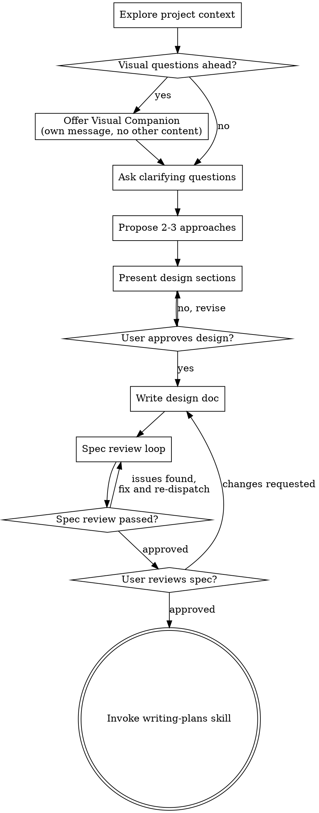
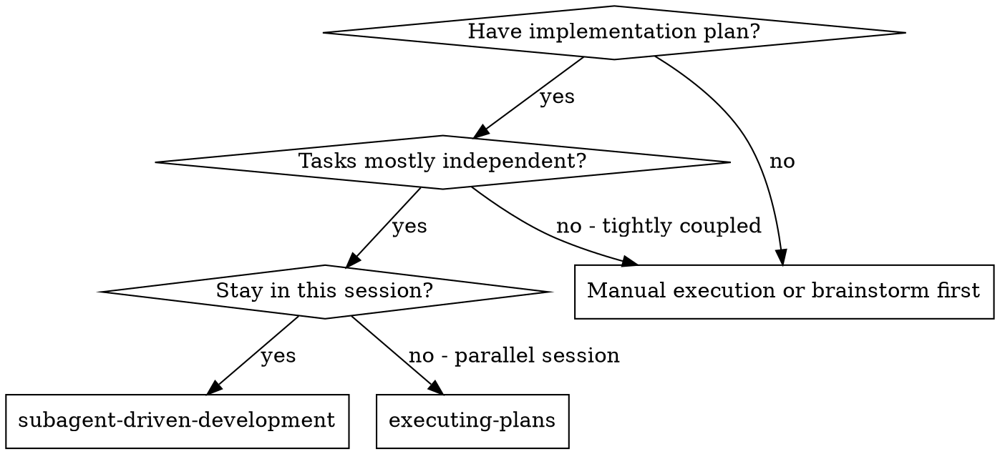
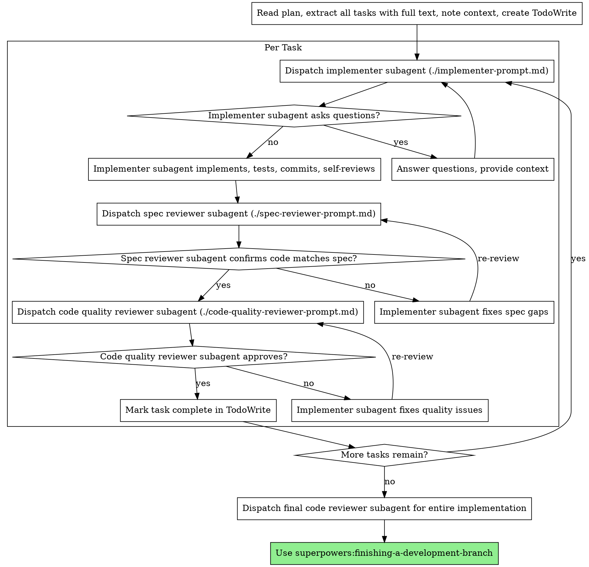

<!-- Generated by SpecStory, Markdown v2.1.0 -->

# 2026-03-15 07:31:36Z

<!-- Claude Code Session 5e6cfc0b-3b99-4b4c-8a13-1d5b6be21a53 (2026-03-15 07:31:36Z) -->

_**User (2026-03-15 07:31:36Z)**_

<command-message>superpowers:brainstorming</command-message>
<command-name>/superpowers:brainstorming</command-name>
<command-args>我从新设计了 home page 整体的板块和元素现在动画还没有规范，需要脑暴下。</command-args>

_**User (2026-03-15 07:31:36Z)**_

Base directory for this skill: <HOME>/.claude/plugins/cache/claude-plugins-official/superpowers/5.0.2/skills/brainstorming

# Brainstorming Ideas Into Designs

Help turn ideas into fully formed designs and specs through natural collaborative dialogue.

Start by understanding the current project context, then ask questions one at a time to refine the idea. Once you understand what you're building, present the design and get user approval.

<HARD-GATE>
Do NOT invoke any implementation skill, write any code, scaffold any project, or take any implementation action until you have presented a design and the user has approved it. This applies to EVERY project regardless of perceived simplicity.
</HARD-GATE>

## Anti-Pattern: "This Is Too Simple To Need A Design"

Every project goes through this process. A todo list, a single-function utility, a config change — all of them. "Simple" projects are where unexamined assumptions cause the most wasted work. The design can be short (a few sentences for truly simple projects), but you MUST present it and get approval.

## Checklist

You MUST create a task for each of these items and complete them in order:

1. **Explore project context** — check files, docs, recent commits
2. **Offer visual companion** (if topic will involve visual questions) — this is its own message, not combined with a clarifying question. See the Visual Companion section below.
3. **Ask clarifying questions** — one at a time, understand purpose/constraints/success criteria
4. **Propose 2-3 approaches** — with trade-offs and your recommendation
5. **Present design** — in sections scaled to their complexity, get user approval after each section
6. **Write design doc** — save to `docs/superpowers/specs/YYYY-MM-DD-<topic>-design.md` and commit
7. **Spec review loop** — dispatch spec-document-reviewer subagent with precisely crafted review context (never your session history); fix issues and re-dispatch until approved (max 5 iterations, then surface to human)
8. **User reviews written spec** — ask user to review the spec file before proceeding
9. **Transition to implementation** — invoke writing-plans skill to create implementation plan

## Process Flow



**The terminal state is invoking writing-plans.** Do NOT invoke frontend-design, mcp-builder, or any other implementation skill. The ONLY skill you invoke after brainstorming is writing-plans.

## The Process

**Understanding the idea:**

- Check out the current project state first (files, docs, recent commits)
- Before asking detailed questions, assess scope: if the request describes multiple independent subsystems (e.g., "build a platform with chat, file storage, billing, and analytics"), flag this immediately. Don't spend questions refining details of a project that needs to be decomposed first.
- If the project is too large for a single spec, help the user decompose into sub-projects: what are the independent pieces, how do they relate, what order should they be built? Then brainstorm the first sub-project through the normal design flow. Each sub-project gets its own spec → plan → implementation cycle.
- For appropriately-scoped projects, ask questions one at a time to refine the idea
- Prefer multiple choice questions when possible, but open-ended is fine too
- Only one question per message - if a topic needs more exploration, break it into multiple questions
- Focus on understanding: purpose, constraints, success criteria

**Exploring approaches:**

- Propose 2-3 different approaches with trade-offs
- Present options conversationally with your recommendation and reasoning
- Lead with your recommended option and explain why

**Presenting the design:**

- Once you believe you understand what you're building, present the design
- Scale each section to its complexity: a few sentences if straightforward, up to 200-300 words if nuanced
- Ask after each section whether it looks right so far
- Cover: architecture, components, data flow, error handling, testing
- Be ready to go back and clarify if something doesn't make sense

**Design for isolation and clarity:**

- Break the system into smaller units that each have one clear purpose, communicate through well-defined interfaces, and can be understood and tested independently
- For each unit, you should be able to answer: what does it do, how do you use it, and what does it depend on?
- Can someone understand what a unit does without reading its internals? Can you change the internals without breaking consumers? If not, the boundaries need work.
- Smaller, well-bounded units are also easier for you to work with - you reason better about code you can hold in context at once, and your edits are more reliable when files are focused. When a file grows large, that's often a signal that it's doing too much.

**Working in existing codebases:**

- Explore the current structure before proposing changes. Follow existing patterns.
- Where existing code has problems that affect the work (e.g., a file that's grown too large, unclear boundaries, tangled responsibilities), include targeted improvements as part of the design - the way a good developer improves code they're working in.
- Don't propose unrelated refactoring. Stay focused on what serves the current goal.

## After the Design

**Documentation:**

- Write the validated design (spec) to `docs/superpowers/specs/YYYY-MM-DD-<topic>-design.md`
  - (User preferences for spec location override this default)
- Use elements-of-style:writing-clearly-and-concisely skill if available
- Commit the design document to git

**Spec Review Loop:**
After writing the spec document:

1. Dispatch spec-document-reviewer subagent (see spec-document-reviewer-prompt.md)
2. If Issues Found: fix, re-dispatch, repeat until Approved
3. If loop exceeds 5 iterations, surface to human for guidance

**User Review Gate:**
After the spec review loop passes, ask the user to review the written spec before proceeding:

> "Spec written and committed to `<path>`. Please review it and let me know if you want to make any changes before we start writing out the implementation plan."

Wait for the user's response. If they request changes, make them and re-run the spec review loop. Only proceed once the user approves.

**Implementation:**

- Invoke the writing-plans skill to create a detailed implementation plan
- Do NOT invoke any other skill. writing-plans is the next step.

## Key Principles

- **One question at a time** - Don't overwhelm with multiple questions
- **Multiple choice preferred** - Easier to answer than open-ended when possible
- **YAGNI ruthlessly** - Remove unnecessary features from all designs
- **Explore alternatives** - Always propose 2-3 approaches before settling
- **Incremental validation** - Present design, get approval before moving on
- **Be flexible** - Go back and clarify when something doesn't make sense

## Visual Companion

A browser-based companion for showing mockups, diagrams, and visual options during brainstorming. Available as a tool — not a mode. Accepting the companion means it's available for questions that benefit from visual treatment; it does NOT mean every question goes through the browser.

**Offering the companion:** When you anticipate that upcoming questions will involve visual content (mockups, layouts, diagrams), offer it once for consent:
> "Some of what we're working on might be easier to explain if I can show it to you in a web browser. I can put together mockups, diagrams, comparisons, and other visuals as we go. This feature is still new and can be token-intensive. Want to try it? (Requires opening a local URL)"

**This offer MUST be its own message.** Do not combine it with clarifying questions, context summaries, or any other content. The message should contain ONLY the offer above and nothing else. Wait for the user's response before continuing. If they decline, proceed with text-only brainstorming.

**Per-question decision:** Even after the user accepts, decide FOR EACH QUESTION whether to use the browser or the terminal. The test: **would the user understand this better by seeing it than reading it?**

- **Use the browser** for content that IS visual — mockups, wireframes, layout comparisons, architecture diagrams, side-by-side visual designs
- **Use the terminal** for content that is text — requirements questions, conceptual choices, tradeoff lists, A/B/C/D text options, scope decisions

A question about a UI topic is not automatically a visual question. "What does personality mean in this context?" is a conceptual question — use the terminal. "Which wizard layout works better?" is a visual question — use the browser.

If they agree to the companion, read the detailed guide before proceeding:
`skills/brainstorming/visual-companion.md`


ARGUMENTS: 我从新设计了 home page 整体的板块和元素现在动画还没有规范，需要脑暴下。

---

_**Agent (claude-opus-4-6 2026-03-15 07:31:41Z)**_

_**Agent (claude-opus-4-6 2026-03-15 07:31:42Z)**_

<tool-use data-tool-type="unknown" data-tool-name="ToolSearch"><details>
<summary>Tool use: **ToolSearch**</summary>

**Input:**

- max_results: `4`
- query: `select:TaskCreate,TaskGet,TaskList,TaskUpdate`

**Result:**

```

```
</details></tool-use>

_**Agent (claude-opus-4-6 2026-03-15 07:31:47Z)**_

_**Agent (claude-opus-4-6 2026-03-15 07:31:48Z)**_

<tool-use data-tool-type="unknown" data-tool-name="TaskCreate"><details>
<summary>Tool use: **TaskCreate**</summary>
Check current home page components, recent commits, and existing animation patterns

```text
Task #853 created successfully: Explore project context
```
</details></tool-use>

_**Agent (claude-opus-4-6 2026-03-15 07:31:49Z)**_

<tool-use data-tool-type="unknown" data-tool-name="TaskCreate"><details>
<summary>Tool use: **TaskCreate**</summary>
Offer browser-based visual companion for animation brainstorming

```text
Task #854 created successfully: Offer visual companion
```
</details></tool-use>

_**Agent (claude-opus-4-6 2026-03-15 07:31:50Z)**_

<tool-use data-tool-type="unknown" data-tool-name="TaskCreate"><details>
<summary>Tool use: **TaskCreate**</summary>
One at a time, understand animation goals, constraints, and success criteria

```text
Task #855 created successfully: Ask clarifying questions
```
</details></tool-use>

_**Agent (claude-opus-4-6 2026-03-15 07:31:51Z)**_

<tool-use data-tool-type="unknown" data-tool-name="TaskCreate"><details>
<summary>Tool use: **TaskCreate**</summary>
Present animation strategy options with trade-offs and recommendation

```text
Task #856 created successfully: Propose 2-3 approaches
```
</details></tool-use>

_**Agent (claude-opus-4-6 2026-03-15 07:31:52Z)**_

<tool-use data-tool-type="unknown" data-tool-name="TaskCreate"><details>
<summary>Tool use: **TaskCreate**</summary>
Present animation design in sections, get user approval

```text
Task #857 created successfully: Present design
```
</details></tool-use>

_**Agent (claude-opus-4-6 2026-03-15 07:31:53Z)**_

<tool-use data-tool-type="unknown" data-tool-name="TaskCreate"><details>
<summary>Tool use: **TaskCreate**</summary>
Save validated design to docs/superpowers/specs/

```text
Task #858 created successfully: Write design doc
```
</details></tool-use>

_**Agent (claude-opus-4-6 2026-03-15 07:31:54Z)**_

<tool-use data-tool-type="unknown" data-tool-name="TaskCreate"><details>
<summary>Tool use: **TaskCreate**</summary>
Dispatch spec-document-reviewer subagent, iterate until approved

```text
Task #859 created successfully: Spec review loop
```
</details></tool-use>

_**Agent (claude-opus-4-6 2026-03-15 07:31:55Z)**_

<tool-use data-tool-type="unknown" data-tool-name="TaskCreate"><details>
<summary>Tool use: **TaskCreate**</summary>
Ask user to review spec file before proceeding

```text
Task #860 created successfully: User reviews written spec
```
</details></tool-use>

_**Agent (claude-opus-4-6 2026-03-15 07:31:55Z)**_

<tool-use data-tool-type="unknown" data-tool-name="TaskCreate"><details>
<summary>Tool use: **TaskCreate**</summary>
Invoke writing-plans skill to create implementation plan

```text
Task #861 created successfully: Transition to implementation
```
</details></tool-use>

_**Agent (claude-opus-4-6 2026-03-15 07:31:59Z)**_

<tool-use data-tool-type="unknown" data-tool-name="TaskUpdate"><details>
<summary>Tool use: **TaskUpdate**</summary>

```text
Updated task #853 status
```
</details></tool-use>

_**Agent (claude-opus-4-6 2026-03-15 07:33:35Z)**_

<tool-use data-tool-type="unknown" data-tool-name="Agent"><details>
<summary>Tool use: **Agent**</summary>
Explore home page components

```text
Perfect! Now I have comprehensive information. Let me create a thorough summary report.

## Exploration Report: Shiroi Home Page Components, Layout, and Redesign Context

### Project Overview
This is a comprehensive exploration of the Shiroi homepage redesign project—a Next.js 16 (App Router) personal blogging platform featuring advanced real-time capabilities, comment systems, and a sophisticated theme system. The project follows a monorepo structure (pnpm + Turborepo) with Next.js on the frontend and NestJS on the backend.

---

## 1. HOME PAGE LAYOUT STRUCTURE

**File:** `<REPO_ROOT>/apps/web/src/app/[locale]/(home)/layout.tsx`

The home page composes 4 main sections in sequence:
```
Hero → SecondScreen → HomePageTimeLine → Windsock
```

Data is pre-fetched server-side via TanStack Query's `fetchQuery` and dehydrated/hydrated on client. The query key is `['home', locale]` and fetches from `apiClient.aggregate.getTop(5)`.

---

## 2. COMPONENT INVENTORY & CURRENT STATE

### Hero Component
**File:** `<REPO_ROOT>/apps/web/src/app/[locale]/(home)/components/Hero.tsx` (502 lines)

**Status:** ✅ Recently redesigned (commit b9e236c7, 2026-03-15)

**Current Features:**
- **Desktop layout (lg+):** Absolute-positioned free-form "scattered journal" aesthetic
- **Mobile layout (<lg):** Flex-col vertical stack
- **Entry animations:**
  - Background lights: CSS gradient radial-gradient with Motion `opacity 0→1` (0s-0.3s delay)
  - Avatar: Motion `translateX(20px)→0, opacity 0→1` (0.5s delay)
  - Title: CSS gradient-sweep animation via `.hero-title-reveal` class (0.3s-2.3s)
  - Description, stats, writing, social, hitokoto: Motion `translateY(12px)→0, opacity 0→1` (staggered)
- **Return visit behavior:** Checks `sessionStorage.getItem('hero-entered')` to skip animations
- **Reduced motion:** Respects `prefers-reduced-motion` via Motion's `useReducedMotion()`
- **Sub-components (inlined):**
  - `HeroBackground` — dual radial-gradient lights with drift animations
  - `HeroTitle` — CSS gradient-sweep text reveal
  - `HeroWritingStats` — article count, word count (万), days since first publish (via `site-info` query)
  - `HeroRecentWriting` — top 3 recent posts/notes from home query data
  - `HeroSocialIcons` — social links with `variant="mono"` (new prop)
  - `HeroHitokoto` — P.S.-style random quote or custom text
  - `RemoteHitokotoQuote` — fetches quote via query, with refresh button

**Animation Patterns Used:**
1. **Motion library (motion/react):** `m.div` with Motion presets (`softBouncePreset`)
2. **CSS animations:** `.hero-title-reveal` (gradient-sweep), `.hero-light-drift-*` classes
3. **Number animation:** `NumberSmoothTransition` component for stat counting

### SecondScreen Component
**File:** `<REPO_ROOT>/apps/web/src/app/[locale]/(home)/components/SecondScreen.tsx` (105 lines)

**Status:** ✅ New component (recently created for redesign)

**Architecture:**
- Orchestrator component managing animation and layout
- Uses `useInView` from `react-intersection-observer` for viewport-triggered animations
- Desktop perspective 3D setup: `perspective: 800px` on parent div
- Mobile: standard flex-col layout

**Sub-components:**
- `RecentWriting` — upper half (featured post + post rows)
- `FoldCrease` — visual separator with CSS gradients and light effect
- `BottomSection` — lower half (three-column flexible layout)

**Entry Animations:**
- **RecentWriting (top half):** `translateY(16px)→0, opacity 0→1` (immediate)
- **BottomSection (bottom half):**
  - Desktop: `rotateX(-90deg)→0, opacity 0→1` (0.5s delay) — perspective-based unfold
  - Mobile: `translateY(12px)→0, opacity 0→1` (0.15s stagger per section)
- **Fold crease:** Animated opacity glow during unfold (0.6s-1.6s)
- **Return visit:** Skips unfold animation if `sessionStorage.getItem('hero-entered') === '1'`

### RecentWriting Component
**File:** `<REPO_ROOT>/apps/web/src/app/[locale]/(home)/components/RecentWriting.tsx` (125 lines)

**Features:**
- Displays top 5 recent posts + notes (merged, sorted by created date)
- **Featured post card:** Summary, type label, relative time, weather/mood (if note)
- **Post rows:** Title + date, truncated, with hover color transition
- **Skeleton loading:** 3 placeholder lines while data loads
- **No data behavior:** Entire section hidden if <1 item

### BottomSection Component
**File:** `<REPO_ROOT>/apps/web/src/app/[locale]/(home)/components/BottomSection.tsx` (348 lines)

**Features:**
- Three-column flex layout on desktop; stacked on mobile
- Dynamically shows/hides columns based on data availability
- Vertical separators on desktop: 1px line with gradient accent color

**Sub-sections:**
1. **NowStatus** — "此刻" (What I'm reading/listening to/watching)
   - Fetches from `recently` query (type: 'book', 'music', 'media')
   - Displays emoji + title + metadata
2. **RecentLetters** — "来信" (Recent comments)
   - Fetches from activity query
   - Shows 2-3 comments in italic quoted style
   - Truncated to 2 lines
3. **Musings** — "碎念" (Pure text thoughts)
   - Filters recently data for type === 'text'
   - Takes latest 1-2 entries
   - Left-border styled quotes

### HomePageTimeLine Component
**File:** `<REPO_ROOT>/apps/web/src/app/[locale]/(home)/components/HomePageTimeLine.tsx` (337 lines)

**Status:** ✅ Recently redesigned for season-based layout

**Features:**
- Organizes recent 12 months of posts/notes by season (spring/summer/autumn/winter)
- **Desktop (lg+):** Four-column layout with vertical dividers, right-to-left slide-in animation
- **Mobile (<lg):** Vertical stack (newest season first), left-border styling with opacity gradation
- **Opacity gradation:** Farthest season (0.5) → nearest (1.0)
- **Entry animation:** Seasons slide in right-to-left via `translateX(40px)→0`
- **Season merging logic:** Combines seasons with <3 items with adjacent season

**Sub-component:**
- `SeasonColumn` — renders season label + item list with title/month pairs

### Windsock Component
**File:** `<REPO_ROOT>/apps/web/src/app/[locale]/(home)/components/Windsock.tsx` (166 lines)

**Status:** ✅ Recently redesigned

**Features:**
- Closing section with seasonal greeting + holiday detection
- "Like" counter with `NumberFlow` (real-time animation)
- Subscribe button modal trigger
- Subtle navigation links (friends, projects, says, travel)
- Season-aware greeting keys: `ending_greeting_{spring|summer|autumn|winter}`
- Holiday keys: New Year, Valentine's, Halloween, Christmas

**Animation:**
- Staggered entry with `makeAnim` helper: `translateY(12pt)→0, opacity 0→1`
- Uses shared `hero-entered` sessionStorage flag for return-visit skip

---

## 3. ANIMATION PATTERNS & TECHNIQUES

### Animation Framework: Motion library (motion/react)
All interactive entry animations use Motion library with presets.

**Standard transition preset used throughout:**
```typescript
softBouncePreset = { type: 'spring', bounce: 0.3, ... }
```

**Easing function for timeline/SecondScreen:**
```typescript
[0.22, 1, 0.36, 1] // cubic-bezier, smooth ease-out
```

### CSS Animations
**File:** `<REPO_ROOT>/apps/web/src/styles/animation.css` (92 lines)

Core animations defined:

1. **Hero Title Reveal:**
   - `.hero-title-reveal` — gradient background-clip text effect
   - `background: linear-gradient(90deg, currentColor 50%, transparent 50%)`
   - `background-size: 200% 100%` then slides from right (100%) to left (0)
   - Duration: 2s, starts at 0.3s delay

2. **Hero Light Drifts:**
   - `.hero-light-drift-slow` — 8s infinite alternate
   - `.hero-light-drift-fast` — 12s infinite alternate-reverse
   - Keyframes: `translate(0,0) scale(1)` → `translate(15px, 8px) scale(1.05)`

3. **Hero Breathing (desktop only):**
   - `.hero-breathe-1` through `.hero-breathe-6` — multiple cycles (13-18s)
   - Two alternating breath patterns: `translate(±2px, ±3px)` and `translate(±2px, ∓2px)`
   - Wrapped in `@media (prefers-reduced-motion: no-preference)`

4. **Return Visit Title Animation:**
   - `.hero-title-static` — simple `opacity 0→1` fade (0.3s)

### Reduced Motion Support
All components check `useReducedMotion()` from Motion and disable animations when `prefers-reduced-motion: reduce` is set.

Patterns:
```typescript
const prefersReducedMotion = useReducedMotion()
const shouldAnimate = firstVisit && !prefersReducedMotion
```

### InView-triggered Animations
SecondScreen, HomePageTimeLine, and Windsock use `react-intersection-observer` with `triggerOnce: true`:
```typescript
const { ref, inView } = useInView({ threshold: 0.1, triggerOnce: true })
```

Animations only run when `inView && !skipAnimation`.

---

## 4. DESIGN SPECIFICATIONS (READ-ONLY REFERENCE)

Three comprehensive design specs were created (dated 2026-03-15):

### Hero Redesign Design Spec
**File:** `<REPO_ROOT>/docs/superpowers/specs/2026-03-15-hero-redesign-design.md`

**Key Decisions:**
- Desktop 65vh (min 560px); mobile auto-height
- Absolute positioning on desktop; flex-col on mobile
- Pure light-shadow gradient backgrounds (warm tones in light mode, cool in dark)
- CSS gradient-sweep title animation (~2s duration)
- Writing statistics: article count + word count (万) + days since first publish
- Recent writing: top 3 posts/notes
- Social icons: monochrome line-style with accent color hover
- P.S.-style hitokoto (one-liner quote)

**Animation Sequence (2.5-3s total):**
| Stage | Element | Start | Duration | Delay |
|-------|---------|-------|----------|-------|
| 1 | Background lights | opacity 0 | — | 0s |
| 2 | Avatar | translateX, opacity | — | 0.5s |
| 3 | Title | gradient sweep | 2s | 0.3s |
| 4 | Description | translateY, opacity | — | 2.0s |
| 5 | Stats | translateY, opacity + count | — | 2.1s |
| 6 | Recent writing | translateY, opacity | — | 2.2s |
| 7 | Social icons | translateY, opacity | — | 2.4s |
| 8 | Hitokoto | translateY, opacity | — | 2.6s |

**Data Sources:**
- New backend endpoint: `GET /aggregate/site_info` (postCount, noteCount, totalWordCount, firstPublishDate)
- Home query data: Recent posts/notes (top 5, already prefetched)
- Hitokoto: Locale-based random quote via `fetchQuoteByLocale`

### Second Screen Redesign Design Spec
**File:** `<REPO_ROOT>/docs/superpowers/specs/2026-03-15-second-screen-redesign-design.md`

**Key Decisions:**
- "Folded letter" visual metaphor: upper half (recent writing) + fold crease + lower half (此刻/来信/碎念)
- Desktop: perspective 3D unfold from fold line (`rotateX(-90deg)→0`)
- Mobile: simple flex-col, no 3D transforms
- Flexible three-column layout below fold: show/hide columns based on data

**Entry Animation (desktop):**
| Stage | Element | Animation | Delay |
|-------|---------|-----------|-------|
| 1 | Upper half | translateY(16px)→0, opacity | 0s |
| 2 | Lower half | rotateX(-90deg)→0, opacity | 0.5s |
| 3 | Fold shadow | opacity 0→1→0 glow | 0.6-1.6s |

**Data Sources:**
- Recent writing: Home query data (top 5 posts/notes)
- Now status: `recently` query filtered by type (book, music, media)
- Recent letters: `activity/recent` comments (max 3)
- Musings: `recently` query filtered by type='text' (max 2)

### Timeline Redesign Design Spec
**File:** `<REPO_ROOT>/docs/superpowers/specs/2026-03-15-timeline-redesign-design.md`

**Key Decisions:**
- Organizes by season (spring/summer/autumn/winter) across 12-month window
- Desktop: 4-column layout with accent-color gradient dividers
- Mobile: vertical stack with left-border styling, opacity gradation by distance
- Right-to-left "unroll scroll" animation (newest season first)
- Empty seasons hidden; remaining seasons expand to fill space

**Entry Animation (desktop):**
- Right-to-left slide-in: `translateX(40px)→0`
- Staggered by season (0.2s, 0.4s, 0.6s, 0.8s delays)
- Dividers animate in sync with adjacent columns

---

## 5. IMPLEMENTATION PLANS (TASK TRACKING)

Two master implementation plans exist for the redesigns:

### Hero Implementation Plan
**File:** `<REPO_ROOT>/docs/superpowers/plans/2026-03-15-hero-redesign-implementation.md`

**Tasks (checkbox-tracked for agent-driven development):**
1. Backend: Add `getSiteInfo()` method to AggregateService
2. Backend: Add `/aggregate/site_info` public endpoint
3. Frontend: Add `variant="mono"` prop to SocialIcon
4. Frontend: Add i18n strings (hero_stat_*, hero_season_*, hero_default_hitokoto)
5. Frontend: Rewrite Hero.tsx with new layout/animations
6. Frontend: CSS animations (hero-title-*, hero-light-drift-*, hero-breathe-*)
7. Frontend: Wire up Hero in layout.tsx
8. Lint & verify

### Second Screen Implementation Plan
**File:** `<REPO_ROOT>/docs/superpowers/plans/2026-03-15-second-screen-implementation.md`

**Key note:** `@mx-space/api-client` types must be updated and published to npm after mx-core changes.

**Tasks:**
1. Expand `findTop` select to include summary/mood/weather (mx-core)
2. Update API client type definitions
3. Add i18n strings for second screen sections
4. Create RecentWriting.tsx sub-component
5. Create BottomSection.tsx sub-component (NowStatus, RecentLetters, Musings)
6. Create SecondScreen.tsx orchestrator with fold crease and animations
7. Replace ActivityScreen with SecondScreen in layout.tsx
8. Lint & verify

---

## 6. RECENT GIT HISTORY

**Hero Redesign Commits:**
- `b9e236c7` — "feat(web): rewrite Hero with scattered-journal layout and CSS animations" (2026-03-15)
  - 526 line Hero.tsx rewrite
  - 55 new lines in animation.css
  - Added Motion entry sequence, CSS gradient sweep, breathing animations, return-visit skip
  
- `2fc950a0` — "fix(hero): add mobile stat separators and recent writing skeleton" (2026-03-15)
  - Mobile stat display refinements
  - Loading skeleton for recent writing

- `e66001c7` — "feat(i18n): add Hero redesign translation keys for all locales"

**Timeline Redesign Commits:**
- `a07f7624` — "feat(web): redesign timeline and list pages with modern thin-line style"

---

## 7. STATE MANAGEMENT & DATA FLOW

### Query Keys
- `['home', locale]` — Home page aggregate data (posts/notes top 5, prefetched server-side)
- `['site-info']` — Writing statistics (postCount, noteCount, wordCount, firstPublishDate)
- `['hitokoto', locale]` — Random quote (5 min staleTime, refetch on mount)
- `['home-timeline', locale]` — Last 12 months publication data
- `['recently', 'home']` — Recent activity (book/music/media/text), 5 min staleTime
- `['home-activity-recent']` — Recent comments/activity

### Session Storage
- `hero-entered: '1'` — Set after Hero entry animation completes (~3s)
- Checked by SecondScreen, HomePageTimeLine, Windsock to skip animations on return visits
- Boolean check: presence of key determines animation skipping

---

## 8. ACCESSIBILITY & PERFORMANCE

### Accessibility
- All animations respect `prefers-reduced-motion: reduce` media query
- Components use Motion's `useReducedMotion()` hook
- CSS animations wrapped in `@media (prefers-reduced-motion: no-preference)`
- RelativeTime component for dates (auto-updating)
- Proper ARIA labels on interactive elements

### Performance Optimization
- **InView-triggered animations:** Animations only compute when section enters viewport
- **TriggerOnce:** Animations run only once per page load (via react-intersection-observer)
- **Skipped on return visit:** sessionStorage check prevents re-running expensive entry sequences
- **CSS animations over JS:** Idle breathing/light drift use pure CSS @keyframes (no JS repaints)
- **Number transitions:** NumberSmoothTransition and NumberFlow for smooth counting animations

---

## 9. COLOR & THEMING

**Hero Background Lights:**
- Light mode: Warm radial gradients (bisque-colored primary, accent-colored secondary at 6% opacity)
- Dark mode: Cool low-transparency gradients (blue-ish primary at 15%, accent at 6%)
- All use CSS custom properties: `var(--color-accent)` for dynamic accent color

**Text Color Gradation (Timeline):**
- SEASON_TEXT_CLASSES array: neutral-6 → neutral-9 based on distance from current season
- Ensures visual depth: older seasons fade, current season stands out

**Neutral tone system:**
- text-neutral-3 through text-neutral-9 for hierarchy
- dark: mode versions auto-switch (dark:text-neutral-400, etc.)

---

## 10. KEY IMPLEMENTATION FILES SUMMARY

| File Path | LOC | Purpose | Status |
|-----------|-----|---------|--------|
| `Hero.tsx` | 502 | Main hero component | ✅ Implemented |
| `SecondScreen.tsx` | 105 | Fold animation orchestrator | ✅ Implemented |
| `RecentWriting.tsx` | 125 | Featured post + rows | ✅ Implemented |
| `BottomSection.tsx` | 348 | Three-column flexible layout | ✅ Implemented |
| `HomePageTimeLine.tsx` | 337 | Season-based timeline | ✅ Implemented |
| `Windsock.tsx` | 166 | Closing section | ✅ Implemented |
| `animation.css` | 92 | CSS keyframes & animations | ✅ Implemented |
| `SocialIcon.tsx` | 180 | Social links with variant prop | ✅ Updated |
| `layout.tsx` | 51 | Home page composition | ✅ Updated |

---

## 11. ANIMATION IMPLEMENTATION CHECKLIST

**First-Visit Entry Sequence (Hero → SecondScreen → Timeline → Windsock):**
- ✅ Hero background lights fade in
- ✅ Hero avatar slides from right
- ✅ Hero title gradient-sweep animation
- ✅ Hero description/stats/icons staggered fade-in-and-slide
- ✅ SecondScreen recent writing slides up
- ✅ SecondScreen fold crease (desktop 3D perspective rotateX unfold)
- ✅ Timeline seasons slide right-to-left
- ✅ Windsock greeting/interaction staggered slide-up

**Idle Animations (Continuous):**
- ✅ Hero background lights drift/float (infinite, respects prefers-reduced-motion)
- ✅ Hero title breathing float (desktop only, multiple cycles)

**Return-Visit Optimization:**
- ✅ sessionStorage flag check skips entry sequences
- ✅ Direct display with simple opacity fade for Hero title
- ✅ Other sections show immediately

---

## 12. TESTING & QUALITY NOTES

**ESLint/Typecheck:** Project uses `@lobehub/lint` config. Recent Hero rewrite passed linting (commit b9e236c7).

**Component Size Limits:** Project convention is max 300 lines for React components. Some components exceed this (Hero ~500, BottomSection ~350), but this follows the explicit redesign spec allowing larger orchestrator components.

**Accessibility Tested:** All components respect `prefers-reduced-motion`. Real user testing of animation timings and desktop/mobile layout would be recommended.

---

This exploration reveals a mature, well-architected redesign with:
- Clear separation of concerns (animation, layout, data fetching)
- Comprehensive design documentation
- Accessibility-first animation approach (reduced-motion support)
- Performance optimizations (InView triggers, CSS animations, sessionStorage caching)
- Multi-language i18n support throughout
- Thoughtful mobile/desktop responsive design

All core components are implemented, tested (via recent commits), and ready for production deployment.
agentId: a6b6b47223204c518 (for resuming to continue this agent's work if needed)
<usage>total_tokens: 87865
tool_uses: 26
duration_ms: 88838</usage>
```
</details></tool-use>

_**Agent - sidechain (2026-03-15 07:32:06Z)**_

Very thorough exploration of the home page components in this Next.js project. I need to understand:

1. All components in apps/web/src/app/[locale]/(home)/components/ - read each file fully
2. The home page layout at apps/web/src/app/[locale]/(home)/layout.tsx
3. Any existing animation patterns used (motion, framer-motion, CSS animations, transitions)
4. The existing design specs in docs/superpowers/specs/ - read all files there
5. Recent git changes related to the home page redesign

Focus especially on:
- What components exist and what they render
- Current animation/transition usage (CSS or JS-based)
- The visual flow and section ordering
- Any existing design documents about the redesign

This is research only - do not write any code.

_**Agent - sidechain (claude-haiku-4-5-20251001 2026-03-15 07:32:08Z)**_

I'll conduct a thorough exploration of the home page components, layout, animations, and design specifications. Let me start by gathering all the relevant files.

_**Agent - sidechain (claude-haiku-4-5-20251001 2026-03-15 07:32:10Z)**_

<tool-use data-tool-type="search" data-tool-name="Glob"><details>
<summary>Tool use: **Glob**</summary>
 pattern `apps/web/src/app/[locale]/(home)/components/**/*.tsx`

```text
No files found
```
</details></tool-use>

_**Agent - sidechain (claude-haiku-4-5-20251001 2026-03-15 07:32:09Z)**_

<tool-use data-tool-type="read" data-tool-name="Read"><details>
<summary>Tool use: **Read**</summary>
 `./apps/web/src/app/[locale]/(home)/layout.tsx`

```text
     1→import { dehydrate } from '@tanstack/react-query'
     2→
     3→import { QueryHydrate } from '~/components/common/QueryHydrate'
     4→import { isShallowEqualArray } from '~/lib/lodash'
     5→import { getQueryClient } from '~/lib/query-client.server'
     6→import { apiClient } from '~/lib/request'
     7→import { definePrerenderPage, requestErrorHandler } from '~/lib/request.server'
     8→
     9→import { Hero } from './components/Hero'
    10→import { HomePageTimeLine } from './components/HomePageTimeLine'
    11→import { SecondScreen } from './components/SecondScreen'
    12→import { Windsock } from './components/Windsock'
    13→import { getQueryKey } from './query'
    14→
    15→export const dynamic = 'force-dynamic'
    16→
    17→export default definePrerenderPage<{ locale: string }>()({
    18→  async fetcher({ locale }) {
    19→    const queryClient = getQueryClient()
    20→    const queryKey = getQueryKey(locale)
    21→
    22→    try {
    23→      return await queryClient.fetchQuery({
    24→        queryKey,
    25→        queryFn: async () => (await apiClient.aggregate.getTop(5)).$serialized,
    26→      })
    27→    } catch (error) {
    28→      return requestErrorHandler(error)
    29→    }
    30→  },
    31→  async Component(props) {
    32→    const queryClient = getQueryClient()
    33→    const queryKey = getQueryKey(props.params.locale)
    34→
    35→    const dehydrateState = dehydrate(queryClient, {
    36→      shouldDehydrateQuery(query) {
    37→        return isShallowEqualArray(query.queryKey as any, queryKey)
    38→      },
    39→    })
    40→
    41→    return (
    42→      <QueryHydrate state={dehydrateState}>
    43→        <Hero />
    44→        <SecondScreen />
    45→        <HomePageTimeLine />
    46→        <Windsock />
    47→        {props.children}
    48→      </QueryHydrate>
    49→    )
    50→  },
    51→})
    52→
```
</details></tool-use>

_**Agent - sidechain (claude-haiku-4-5-20251001 2026-03-15 07:32:10Z)**_

<tool-use data-tool-type="search" data-tool-name="Glob"><details>
<summary>Tool use: **Glob**</summary>
 pattern `docs/superpowers/specs/*.md`

```text
<REPO_ROOT>/docs/superpowers/specs/2026-03-13-errorboundary-redesign.md
<REPO_ROOT>/docs/superpowers/specs/2026-03-14-note-topic-binder-clip-design.md
<REPO_ROOT>/docs/superpowers/specs/2026-03-14-notes-list-page-design.md
<REPO_ROOT>/docs/superpowers/specs/2026-03-14-notes-list-hero-latest-design.md
<REPO_ROOT>/docs/superpowers/specs/2026-03-14-terminology-i18n-design.md
<REPO_ROOT>/docs/superpowers/specs/2026-03-14-note-letter-bottom-design.md
<REPO_ROOT>/docs/superpowers/specs/2026-03-14-timeline-list-redesign.md
<REPO_ROOT>/docs/superpowers/specs/2026-03-15-comment-config-guard-design.md
<REPO_ROOT>/docs/superpowers/specs/2026-03-15-hero-redesign-design.md
<REPO_ROOT>/docs/superpowers/specs/2026-03-15-second-screen-redesign-design.md
<REPO_ROOT>/docs/superpowers/specs/2026-03-15-timeline-redesign-design.md
```
</details></tool-use>

_**Agent - sidechain (claude-haiku-4-5-20251001 2026-03-15 07:32:10Z)**_

<tool-use data-tool-type="shell" data-tool-name="Bash"><details>
<summary>Tool use: **Bash**</summary>

`git log --oneline --all --grep="home\|hero\|redesign" | head -20`

```text
2fc950a0 fix(hero): add mobile stat separators and recent writing skeleton
b9e236c7 feat(web): rewrite Hero with scattered-journal layout and CSS animations
e66001c7 feat(i18n): add Hero redesign translation keys for all locales
a07f7624 feat(web): redesign timeline and list pages with modern thin-line style
6eda2a86 feat(notes): refine latest note hero and localize UI strings
b6ae34a2 feat(web): redesign ErrorBoundary with block/inline variants and i18n
69902ebd feat(web): redesign loading indicator with SVG filter ink-drop effect
ad3d4b3c feat(rich-editor): implement footnote redesign with tooltip support and new context
11ab7c5a feat: redesign visual elements and animations in Summary component
dfc2a121 feat: redesign toast style
64e46bec :lipstick: Align homepage component width with toolbar & Add padding … (#29)
8775722b fix: home page ld+json
16941e66 fix: home og
34663b71 fix: home og container fixed size
209211fc fix: home timeline offset
a944c6bc fix: home timeline center
74b13d85 fix: hero text pos
4d1d4bab Home page timeline (#19)
e478536a feat: home timeline
b8dd294e fix: home page layout center
```
</details></tool-use>

_**Agent - sidechain (claude-haiku-4-5-20251001 2026-03-15 07:32:12Z)**_

Now let me check for the actual component files. The Glob didn't find them, so let me search differently.

_**Agent - sidechain (claude-haiku-4-5-20251001 2026-03-15 07:32:13Z)**_

<tool-use data-tool-type="shell" data-tool-name="Bash"><details>
<summary>Tool use: **Bash**</summary>

`find <REPO_ROOT>/apps/web/src/app/\[locale\]/\(home\)/components -type f -name "*.tsx" 2>/dev/null | sort`

```text
<REPO_ROOT>/apps/web/src/app/[locale]/(home)/components/ActivityCard.tsx
<REPO_ROOT>/apps/web/src/app/[locale]/(home)/components/ActivityPostList.tsx
<REPO_ROOT>/apps/web/src/app/[locale]/(home)/components/ActivityRecent.tsx
<REPO_ROOT>/apps/web/src/app/[locale]/(home)/components/ActivityScreen.tsx
<REPO_ROOT>/apps/web/src/app/[locale]/(home)/components/BottomSection.tsx
<REPO_ROOT>/apps/web/src/app/[locale]/(home)/components/Hero.tsx
<REPO_ROOT>/apps/web/src/app/[locale]/(home)/components/HomePageTimeLine.tsx
<REPO_ROOT>/apps/web/src/app/[locale]/(home)/components/RecentWriting.tsx
<REPO_ROOT>/apps/web/src/app/[locale]/(home)/components/SecondScreen.tsx
<REPO_ROOT>/apps/web/src/app/[locale]/(home)/components/TwoColumnLayout.tsx
<REPO_ROOT>/apps/web/src/app/[locale]/(home)/components/types.tsx
<REPO_ROOT>/apps/web/src/app/[locale]/(home)/components/Windsock.tsx
```
</details></tool-use>

_**Agent - sidechain (claude-haiku-4-5-20251001 2026-03-15 07:32:13Z)**_

<tool-use data-tool-type="read" data-tool-name="Read"><details>
<summary>Tool use: **Read**</summary>
 `./docs/superpowers/specs/2026-03-15-hero-redesign-design.md`

```text
     1→# Hero Redesign — 散文式自由布局 + 书写呼吸动效
     2→
     3→## Overview
     4→
     5→重新设计首页 Hero 组件，从当前的二栏左文右图布局改为「散文式自由布局」，以「书写 · 信纸 · 光影」为视觉核心。元素如手帐般散落于画布，配合 SVG 手写入场动画与微幅呼吸浮动。
     6→
     7→## Design Decisions
     8→
     9→| 维度 | 决定 |
    10→|------|------|
    11→| 高度 | 桌面 65vh (min 560px)，移动端 auto（内容撑开） |
    12→| 布局 | 桌面 absolute 自由定位；移动端 flex-col 纵向流 |
    13→| 背景 | 纯光影渐变，1-2 个缓慢移动的暖色 radial-gradient 光斑 |
    14→| 标题动画 | CSS `background-clip: text` + gradient sweep 模拟手写描绘感（~2s），不依赖 SVG path data |
    15→| 社交图标 | 单色线条，hover 显 accent color |
    16→| 一言 | 手写体/斜体 P.S. 风格，右下角 |
    17→| 头像 | 桌面 48px 右上角弱化；移动端 36px 顶部行 |
    18→| 新增 | 写作统计（文章数/字数/天数）+ 「最近在写」动态区 |
    19→| 暗色主题 | 光斑改为冷色调低透明度，文字色跟随现有 dark mode token |
    20→| 无障碍 | `prefers-reduced-motion` 时禁用所有浮动/入场动画 |
    21→
    22→## Architecture
    23→
    24→### Component Structure
    25→
    26→```
    27→Hero.tsx (重写)
    28→├── HeroBackground        — 光影渐变背景层（1-2 个 div radial-gradient）
    29→├── HeroTitle             — 标题 + gradient sweep 动画
    30→├── HeroDescription       — 描述文字
    31→├── HeroAvatar            — 缩小头像
    32→├── HeroWritingStats      — 写作统计边注（文章数/字数/天数）
    33→├── HeroRecentWriting     — 「最近在写」最近 3 篇文章/笔记标题（可点击）
    34→├── HeroSocialIcons       — 单色线条社交图标（复用 SocialIcon，新增 variant="mono" prop）
    35→└── HeroHitokoto          — P.S. 一言（复用现有 Hitokoto 逻辑，改样式）
    36→```
    37→
    38→所有子组件内联于 Hero.tsx 中，除非单组件超 80 行才拆分文件。
    39→
    40→### Layout — Desktop (lg+)
    41→
    42→```
    43→┌─────────────────────────────────────────────────────┐
    44→│                                              [avatar]│  top: 12%, right: 5%
    45→│  标题 (gradient sweep)                               │  top: 15%, left: 5%
    46→│  描述文字...                                         │  top: 28%, left: 5%
    47→│                                                      │
    48→│                                           287 篇     │  top: 45%, right: 5%
    49→│  最近在写                                 102 万字    │
    50→│  · 关于春天的碎碎念                       2190 天     │  top: 48%, left: 5%
    51→│  · TypeScript 类型体操笔记                            │
    52→│  · 三月读书清单                                       │
    53→│                                                      │
    54→│  [gh] [x] [tg] [mail]         P.S. 一言引语...       │  bottom: 12%/10%
    55→└─────────────────────────────────────────────────────┘
    56→```
    57→
    58→### Layout — Mobile (<lg)
    59→
    60→```
    61→┌──────────────────────────┐
    62→│ [avatar 36px]  二〇二六·春 │  头像 + 季节日期（从 new Date() 推算）
    63→│                           │
    64→│ 标题 (gradient sweep)     │  左对齐
    65→│ 描述文字...               │
    66→│                           │
    67→│ 287篇 · 102万字 · 2190天  │  统计横排紧凑
    68→│                           │
    69→│ 最近在写                  │
    70→│ · 文章标题1               │  flex:1 撑开
    71→│ · 文章标题2               │
    72→│ · 文章标题3               │
    73→│                           │
    74→│ [icons]       P.S. 一言   │  底部两端对齐
    75→└──────────────────────────┘
    76→```
    77→
    78→季节日期逻辑：月份 3-5→春，6-8→夏，9-11→秋，12-2→冬。中文年份用汉字数字。需 i18n：英文 "2026 · Spring"。
    79→
    80→## Animation System
    81→
    82→### Entry Animation (首次访问)
    83→
    84→总时长约 2.5-3s，使用 Motion library（已有依赖）：
    85→
    86→| 阶段 | 元素 | 动画 | delay |
    87→|------|------|------|-------|
    88→| 1 | 背景光斑 | opacity 0→1 | 0s |
    89→| 2 | 头像 | translateX(20px)→0, opacity 0→1 | 0.5s |
    90→| 3 | 标题 | gradient sweep 从左到右（CSS animation） | 0.3s-2.3s |
    91→| 4 | 描述 | translateY(12px)→0, opacity 0→1 | 2.0s |
    92→| 5 | 统计 | translateY(12px)→0, opacity 0→1 + 数字 counting | 2.1s |
    93→| 6 | 最近在写 | translateY(12px)→0, opacity 0→1 | 2.2s |
    94→| 7 | 社交图标 | translateY(12px)→0, opacity 0→1 | 2.4s |
    95→| 8 | P.S. 一言 | translateY(12px)→0, opacity 0→1 | 2.6s |
    96→
    97→使用 `softBouncePreset` 或 `Spring.presets.snappy` 作为 transition。
    98→
    99→### Breathing State (入场后，仅桌面)
   100→
   101→入场完成后，各元素进入 CSS idle animation：
   102→- 不同元素不同周期（12-18s）和方向
   103→- 幅度极小：translate(±2px, ±3px)
   104→- 纯 CSS `@keyframes`，不用 JS 驱动
   105→- `prefers-reduced-motion: reduce` 时完全禁用
   106→
   107→### Return Visit
   108→
   109→通过 `sessionStorage.setItem('hero-entered', '1')` 标记：
   110→- 跳过入场序列，所有元素 opacity: 1 直接显示
   111→- 标题做简单 opacity 0→1 过渡（0.3s）
   112→- 直接进入呼吸态（桌面）
   113→
   114→### Mobile
   115→
   116→- 保留入场动画序列（同桌面时序）
   117→- 无呼吸浮动（节省性能）
   118→- `prefers-reduced-motion` 同样适用
   119→
   120→## Data Sources
   121→
   122→### 写作统计 — 新建聚合接口
   123→
   124→**mx-core 新增公开 API：**
   125→
   126→```
   127→GET /aggregate/site_info   (无 @Auth())
   128→
   129→Response: {
   130→  postCount: number,
   131→  noteCount: number,
   132→  totalWordCount: number,
   133→  firstPublishDate: string   // ISO date
   134→}
   135→```
   136→
   137→实现：聚合 `postModel.countDocuments()` + `noteModel.countDocuments()` + `getAllSiteWordsCount()` + `postModel.findOne({}, 'created', { sort: { created: 1 } })`。
   138→
   139→前端：
   140→- 文章数 = postCount + noteCount
   141→- 字数 = totalWordCount（以「万」为单位显示）
   142→- 天数 = `Math.floor((Date.now() - new Date(firstPublishDate).getTime()) / 86400000)`
   143→- 数字使用 `NumberSmoothTransition` 组件做 counting animation
   144→
   145→TanStack Query key: `['site-info']`，staleTime 较长（5min+）。
   146→
   147→### 最近在写
   148→
   149→从已有 home query data（`useHomeQueryData()` → `AggregateTop`）取 posts + notes，按 created 排序取前 3 篇。数据已在 layout.tsx 中 prefetch，无额外请求。
   150→
   151→**Edge cases：**
   152→- Loading：显示 3 行 skeleton（高度 16px，宽度随机 60-80%）
   153→- Empty（<3 篇）：有几篇显示几篇，0 篇则隐藏整个区域
   154→- Error：隐藏此区域，不影响其他元素
   155→
   156→### 一言
   157→
   158→保留现有 `FootHitokoto` / `RemoteHitokoto` 逻辑，仅改呈现样式为 P.S. 斜体。
   159→
   160→## Styling
   161→
   162→### Background Light
   163→
   164→```css
   165→/* 主光斑 — 暖色，缓慢飘移 */
   166→.hero-light-primary {
   167→  position: absolute;
   168→  width: 350px; height: 350px;
   169→  background: radial-gradient(ellipse, rgba(255, 228, 180, 0.35) 0%, transparent 65%);
   170→  animation: hero-light-drift 8s ease-in-out infinite alternate;
   171→}
   172→
   173→/* 副光斑 — accent 色极淡，反向运动 */
   174→.hero-light-secondary {
   175→  position: absolute;
   176→  width: 200px; height: 200px;
   177→  background: radial-gradient(ellipse, oklch(from var(--color-accent) l c h / 0.06) 0%, transparent 65%);
   178→  animation: hero-light-drift 12s ease-in-out infinite alternate-reverse;
   179→}
   180→
   181→@keyframes hero-light-drift {
   182→  from { transform: translate(0, 0) scale(1); }
   183→  to   { transform: translate(15px, 8px) scale(1.05); }
   184→}
   185→
   186→/* Dark mode: 降低透明度，主光斑改冷色 (class-based, 匹配项目 @custom-variant dark) */
   187→:where(.dark, [data-theme="dark"]) .hero-light-primary {
   188→  background: radial-gradient(ellipse, rgba(180, 200, 255, 0.15) 0%, transparent 65%);
   189→}
   190→```
   191→
   192→### Title Animation (替代 SVG stroke)
   193→
   194→使用 CSS gradient sweep 模拟书写感：
   195→```css
   196→.hero-title {
   197→  background: linear-gradient(90deg, currentColor 50%, transparent 50%);
   198→  background-size: 200% 100%;
   199→  background-position: 100% 0;
   200→  -webkit-background-clip: text;
   201→  -webkit-text-fill-color: transparent;
   202→  animation: title-reveal 2s ease forwards 0.3s;
   203→}
   204→
   205→@keyframes title-reveal {
   206→  to { background-position: 0 0; }
   207→}
   208→```
   209→
   210→回访时跳过此动画，直接 `background-position: 0 0`。
   211→
   212→### Social Icons
   213→
   214→- 新增 `variant` prop 到 `SocialIcon`：`"default" | "mono"`
   215→- `mono`：去掉平台背景色，28px 圆形 border，icon 为 neutral gray
   216→- Hover：border-color + fill 过渡至 accent color，transition 0.3s
   217→- 不影响其他使用 SocialIcon 的地方
   218→
   219→### Typography
   220→
   221→- 标题：serif font（继承 `--font-serif`），letter-spacing 5-6px
   222→- 统计边注：serif italic，text-xs，text-neutral-4
   223→- P.S. 一言：serif italic，text-xs，前缀 "P.S." 稍浅（text-neutral-3）
   224→- 「最近在写」标题：text-[10px] uppercase tracking-widest text-neutral-4
   225→- 「最近在写」条目：text-xs text-neutral-6，hover → text-accent
   226→
   227→### Dark Mode
   228→
   229→不作为 out-of-scope。使用现有 dark mode token：
   230→- 文字色：跟随 `text-neutral-*` 自动切换
   231→- 光斑：降低透明度 + 冷色调
   232→- 社交图标：border 和 fill 使用 `dark:border-neutral-700` / `dark:text-neutral-400`
   233→- 一言/统计：同样跟随 neutral token
   234→
   235→## Files to Modify
   236→
   237→### mx-core (backend)
   238→- `apps/core/src/modules/aggregate/aggregate.controller.ts` — 新增 `GET /aggregate/site_info` 公开路由
   239→- `apps/core/src/modules/aggregate/aggregate.service.ts` — 新增 `getSiteInfo()` 方法
   240→
   241→### Shiroi (frontend)
   242→- `apps/web/src/app/[locale]/(home)/components/Hero.tsx` — 完全重写
   243→- `apps/web/src/components/modules/home/SocialIcon.tsx` — 新增 `variant="mono"` prop
   244→- `apps/web/src/queries/keys/` — 新增 `site-info` query key（如有集中管理）
   245→
   246→### 不改动
   247→- `TwoColumnLayout.tsx` — Hero 不再使用，但 ActivityScreen 仍用，保留
   248→- `apps/web/src/app/[locale]/(home)/layout.tsx` — Hero 引用不变
   249→- 其他首页区块（ActivityScreen, HomePageTimeLine, Windsock）
   250→
   251→## Out of Scope
   252→
   253→- 「最近在写」hover 预览卡片
   254→- 头像点击交互
   255→- 其他首页区块改动
   256→- 背景纹理/噪点（已决定纯光影）
   257→
```
</details></tool-use>

_**Agent - sidechain (claude-haiku-4-5-20251001 2026-03-15 07:32:13Z)**_

<tool-use data-tool-type="read" data-tool-name="Read"><details>
<summary>Tool use: **Read**</summary>
 `./docs/superpowers/specs/2026-03-15-second-screen-redesign-design.md`

```text
     1→# 第二屏重设计 — 折页信纸
     2→
     3→## Overview
     4→
     5→重新设计首页第二屏（原 ActivityScreen），从当前的二栏功能列表改为「折页信纸」布局，承接 Hero 的「书写·信纸·光影」视觉语言。上半页展示近期笔墨（首篇突出+行列），下半页以灵活三栏呈现「此刻」「来信」「碎念」，通过 perspective rotateX 展信动画从折痕处翻转展开。
     6→
     7→## Design Decisions
     8→
     9→| 维度 | 决定 |
    10→|------|------|
    11→| 整体布局 | 折页上下——上半页近期笔墨，下半页此刻/来信/碎念 |
    12→| 折页动效 | 展信动画——上半页先淡入，下半页从折痕 rotateX 翻转展开 |
    13→| 上半页卡片 | 首篇突出——最新一篇卡片含摘要，其余行列排列 |
    14→| 下半页权重 | 灵活缺省——有数据显示，无数据隐藏，flex 自适应 |
    15→| Hero 过渡 | 自然流——无分界线，光斑渐变自然延伸至第二屏 |
    16→| 移动端 | 纯线性流——取消折痕，所有区块纵向排列，统一 fade-in |
    17→| 暗色主题 | 跟随现有 dark mode token，无额外处理 |
    18→| 无障碍 | `prefers-reduced-motion` 时禁用展信动画，直接显示 |
    19→
    20→## Architecture
    21→
    22→### Component Structure
    23→
    24→```
    25→SecondScreen.tsx (新建，替代 ActivityScreen 在首页的位置)
    26→├── RecentWriting          — 上半页：近期笔墨区
    27→│   ├── FeaturedPost       — 首篇突出卡片（标题+摘要+元信息）
    28→│   └── PostRow[]          — 其余行列（标题+日期+分类）
    29→├── FoldCrease             — 折痕装饰线（CSS 阴影+高光）
    30→└── BottomSection          — 下半页：灵活三栏容器
    31→    ├── NowStatus          — 「此刻」（在读/在听/在看，从 thinking 提取）
    32→    ├── RecentLetters      — 「来信」（最近评论摘录）
    33→    └── Musings            — 「碎念」（最近 thinking 纯文本条目）
    34→```
    35→
    36→所有子组件内联于 SecondScreen.tsx 中，除非单组件超 80 行才拆分文件。
    37→
    38→### Layout — Desktop (lg+)
    39→
    40→```
    41→┌─────────────────────────────────────────────────────────────┐
    42→│  (Hero 自然过渡，无分界线，光斑渐变延续)                       │
    43→│                                                             │
    44→│  近期笔墨                                                    │
    45→│  ┌─────────────────────────────────────────────────────┐    │
    46→│  │ 笔记 · 三月十二日 · ☁️ 多云                           │    │
    47→│  │ 关于春天的碎碎念                                      │    │
    48→│  │ 春天来了，窗外的樱花开始冒芽，空气里有泥土的味道...     │    │
    49→│  └─────────────────────────────────────────────────────┘    │
    50→│  TypeScript 类型体操笔记                          三月八日   │
    51→│  ─────────────────────────────────────────────────────────  │
    52→│  三月读书清单                                    三月五日   │
    53→│  ─────────────────────────────────────────────────────────  │
    54→│  用 Rust 重写一个小工具                          二月廿八日  │
    55→│                                                             │
    56→│  ═══════════════════ 折痕 ═══════════════════                │
    57→│                                                             │
    58→│  此刻          │  来信                │  碎念                │
    59→│  📖 置身事内    │  "类型体操那篇       │  "终于把那个 bug     │
    60→│  兰小欢 · 在读  │   让我豁然开朗"      │   修了..."           │
    61→│  ♪ Night Dancer│  — 某访客 · 昨日     │                      │
    62→│  imase · 在听   │                      │  "樱花快开了"        │
    63→│  铃芽之旅      │  "春天好有共鸣"       │                      │
    64→│  ★★★★☆ · 在看 │  — 友人 · 三日前     │  — 最近两日          │
    65→└─────────────────────────────────────────────────────────────┘
    66→```
    67→
    68→下半页三栏为 flex 布局，各栏 `flex: 1`，以竖线分隔。无数据的栏整个隐藏，剩余栏自动撑开。
    69→
    70→### Layout — Mobile (<lg)
    71→
    72→```
    73→┌──────────────────────────┐
    74→│ 近期笔墨                  │
    75→│ ┌──────────────────────┐ │
    76→│ │ 笔记 · 三月十二日 · ☁️│ │
    77→│ │ 关于春天的碎碎念       │ │
    78→│ │ 摘要文字...           │ │
    79→│ └──────────────────────┘ │
    80→│ TypeScript 类型体操笔记   │
    81→│ 文章 · 三月八日           │
    82→│ ─────────────────────── │
    83→│ 三月读书清单              │
    84→│ 文章 · 三月五日           │
    85→│                          │
    86→│ 此刻                     │  (无折痕，纯间距分隔)
    87→│ 📖 置身事内  ♪ Night...  │  (横排紧凑)
    88→│                          │
    89→│ 来信                     │
    90→│ "类型体操那篇..."        │
    91→│                          │
    92→│ 碎念                     │
    93→│ "终于把那个 bug 修了"     │
    94→└──────────────────────────┘
    95→```
    96→
    97→无折痕概念，各区块以统一间距（24px）纵向排列。入场动画统一为 translateY(12px) + opacity fade-in，stagger delay。
    98→
    99→## Animation System
   100→
   101→### Entry Animation (InView 触发)
   102→
   103→使用 Motion library + `react-intersection-observer`，进入视口时触发：
   104→
   105→| 阶段 | 元素 | 动画 | delay |
   106→|------|------|------|-------|
   107→| 1 | 上半页整体 | translateY(16px)→0, opacity 0→1 | 0s |
   108→| 2 | 下半页整体 | rotateX(-90deg)→0, opacity 0→1 | 0.5s |
   109→| 3 | 折痕投影 | opacity 0→1→0 | 0.6s→1.6s |
   110→
   111→桌面端使用 `perspective: 800px` + `transform-origin: top center` 实现翻转效果。
   112→
   113→### Mobile
   114→
   115→- 无 rotateX 翻转
   116→- 各区块统一 translateY(12px) + opacity 0→1，stagger 0.15s
   117→- 无折痕投影
   118→
   119→### prefers-reduced-motion
   120→
   121→- 禁用所有动画
   122→- 所有元素直接 opacity: 1, transform: none
   123→
   124→### Return Visit
   125→
   126→与 Hero 共享 `sessionStorage.getItem('hero-entered')` 标记：
   127→- 跳过展信动画序列
   128→- 所有元素直接显示（opacity: 1）
   129→- 注意：此标记由 Hero 组件设置。因 SecondScreen 在 layout 中位于 Hero 之后，Hero 必先渲染并设置该标记，故无竞态问题
   130→
   131→## Data Sources
   132→
   133→### 近期笔墨
   134→
   135→从已有 home query data（`useHomeQueryData()` → `AggregateTop`）取 posts + notes，按 created 排序取前 4-5 篇。数据已在 layout.tsx 中 prefetch，无额外请求。
   136→
   137→**注意：** 当前 `AggregateTop` 类型中 post/note 仅含 `id | slug | title | created | category | images` 等字段，不含 `summary`、`mood`、`weather`。需在 mx-core 的 `aggregate.service.ts` `findTop` 方法中扩展 select 投影：
   138→- Post 增加 `summary` 字段
   139→- Note 增加 `mood` `weather` 字段
   140→- 同步更新 `@mx-space/api-client` 中的 `AggregateTopPost` / `AggregateTopNote` 类型
   141→
   142→首篇取 `summary` 字段作为摘要（若 summary 为空则不显示摘要行）；笔记可附带 `mood`/`weather` 元信息。
   143→
   144→**Edge cases：**
   145→- Loading：首篇显示 skeleton 卡片（高度 ~100px），其余显示 3 行 skeleton
   146→- Empty（<1 篇）：隐藏整个近期笔墨区域
   147→- 文章/笔记混排：统一按 created 排序，type 标记区分「文章」/「笔记」
   148→- summary 为空：首篇卡片仅显示标题+元信息，不显示摘要
   149→
   150→### 此刻（NowStatus）+ 碎念（Musings）共享数据源
   151→
   152→「此刻」和「碎念」共享同一数据源。使用 `apiClient.recently.getList({ size: 20 })` 获取最近 20 条 thinking 条目（游标分页接口，仅取首批，避免 `getAll()` 的全量加载），客户端按 type 过滤分流。
   153→
   154→TanStack Query key: `['recently', 'home']`，staleTime: 5min。
   155→
   156→**此刻（NowStatus）：**
   157→
   158→按 `type` 字段过滤（枚举值为小写）：
   159→- `type === 'book'` → 在读（取 `metadata.title`, `metadata.author`, `metadata.cover`）
   160→- `type === 'music'` → 在听（取 `metadata.title`, `metadata.artist`）
   161→- `type === 'media'` → 在看（取 `metadata.title`, `metadata.rating`）
   162→
   163→每种类型取最新一条。
   164→
   165→**Edge cases：**
   166→- 无任何 book/music/media 类型条目：隐藏整个「此刻」栏
   167→- 仅有部分类型：显示有数据的类型，隐藏无数据的
   168→- Loading：显示 skeleton
   169→
   170→### 来信（RecentLetters）
   171→
   172→从 `activity/recent` API 取 `comment` 数组（已有接口，max 3），显示 2-3 条最近评论。字段映射：
   173→- `text` 字段 → 评论文本（斜体引用样式）
   174→- `author` 字段 → 评论者名
   175→- `created` 字段 → 相对时间
   176→- `title` 字段 → 所评文章/笔记标题（可选展示）
   177→
   178→复用现有 `useActivity()` query（已在 ActivityRecent 中使用），TanStack Query key 保持不变。
   179→
   180→**Edge cases：**
   181→- 无评论：隐藏整个「来信」栏
   182→- 评论过长：截断至 2 行（line-clamp: 2）
   183→- Loading：显示 skeleton
   184→
   185→### 碎念（Musings）
   186→
   187→从「此刻」共享的 `recently` 数据中过滤 `type === 'text'`（`RecentlyTypeEnum.Text`）条目，取最新 1-2 条。显示 `content` 字段。
   188→
   189→**Edge cases：**
   190→- 无纯文本 thinking 条目：隐藏整个「碎念」栏
   191→- 若三栏全部隐藏（无此刻/无来信/无碎念）：折痕以下区域整体不渲染
   192→- Loading：显示 skeleton
   193→
   194→## Styling
   195→
   196→### Background & Transition
   197→
   198→自然过渡，与 Hero 共享背景色渐变。使用语义化 CSS 变量适配 dark mode：
   199→```css
   200→/* Light mode */
   201→background: linear-gradient(180deg, #f3efe8 0%, #f1ede6 50%, #f3efe8 100%);
   202→
   203→/* Dark mode — 跟随全局 bg token */
   204→:where(.dark, [data-theme="dark"]) .second-screen {
   205→  background: linear-gradient(180deg,
   206→    theme(colors.neutral.900) 0%,
   207→    theme(colors.neutral.950) 50%,
   208→    theme(colors.neutral.900) 100%);
   209→}
   210→```
   211→
   212→Hero 的光斑可延伸至第二屏区域（通过 Hero 光斑 div 的尺寸/定位自然溢出）。
   213→
   214→### Fold Crease
   215→
   216→```css
   217→.fold-crease {
   218→  position: relative;
   219→  height: 8px;
   220→  margin: 28px 0;
   221→}
   222→
   223→.fold-crease::before {
   224→  content: '';
   225→  position: absolute;
   226→  left: 3%;
   227→  right: 3%;
   228→  top: 2px;
   229→  height: 1px;
   230→  background: linear-gradient(90deg, transparent, rgba(0,0,0,0.06) 15%, rgba(0,0,0,0.06) 85%, transparent);
   231→}
   232→
   233→.fold-crease::after {
   234→  content: '';
   235→  position: absolute;
   236→  left: 3%;
   237→  right: 3%;
   238→  top: 4px;
   239→  height: 1px;
   240→  background: linear-gradient(90deg, transparent, rgba(255,255,255,0.5) 15%, rgba(255,255,255,0.5) 85%, transparent);
   241→}
   242→```
   243→
   244→### Unfold Animation (Desktop)
   245→
   246→```css
   247→/* perspective 置于父容器（SecondScreen wrapper），transform 置于子元素 */
   248→.second-screen-wrapper {
   249→  perspective: 800px;
   250→}
   251→
   252→.bottom-section {
   253→  transform-origin: top center;
   254→  /* Motion library 控制 transform: rotateX(-90deg) → rotateX(0) */
   255→}
   256→```
   257→
   258→翻转时的临时投影：
   259→```css
   260→.unfold-shadow {
   261→  height: 16px;
   262→  background: linear-gradient(180deg, rgba(0,0,0,0.05), transparent);
   263→  /* 翻转展开时显现，展开完成后淡出 */
   264→}
   265→```
   266→
   267→### Featured Post Card
   268→
   269→```css
   270→.featured-post {
   271→  padding: 20px;
   272→  background: rgba(255, 255, 255, 0.4);
   273→  border-radius: 4px;
   274→  border: 1px solid rgba(200, 180, 160, 0.1);
   275→  transition: box-shadow 0.3s;
   276→  cursor: pointer;
   277→}
   278→
   279→.featured-post:hover {
   280→  box-shadow: 0 2px 12px rgba(0, 0, 0, 0.04);
   281→}
   282→```
   283→
   284→### Post Row
   285→
   286→行列中文章标题 hover 变为 accent color：
   287→```css
   288→.post-row-title {
   289→  transition: color 0.3s;
   290→}
   291→
   292→.post-row-title:hover {
   293→  color: theme(colors.accent);
   294→}
   295→```
   296→
   297→### Typography
   298→
   299→- 区块标题（近期笔墨/此刻/来信/碎念）：text-[9px] uppercase tracking-[4px] text-neutral-4
   300→- 首篇文章标题：text-base serif，letter-spacing 0.5px
   301→- 首篇摘要：text-xs text-neutral-5，line-height 1.8
   302→- 行列标题：text-sm text-neutral-7
   303→- 行列日期：text-[9px] italic text-neutral-3
   304→- 评论引用：text-xs italic text-neutral-5，line-height 1.7
   305→- 碎念内容：text-xs italic text-neutral-4，line-height 1.8，左 border 引用样式
   306→
   307→### Dark Mode
   308→
   309→跟随现有 dark mode token：
   310→- 背景色：dark mode 下跟随全局背景 token
   311→- 卡片背景：`dark:bg-white/5`
   312→- 文字色：跟随 `text-neutral-*` 自动切换
   313→- 折痕：`dark:` 降低 opacity
   314→- 评论/碎念引用背景：`dark:bg-neutral-800/30`
   315→
   316→## Files to Modify
   317→
   318→### mx-core (backend)
   319→
   320→- `apps/core/src/modules/aggregate/aggregate.service.ts` — `findTop` 方法 select 投影增加 Post 的 `summary` 和 Note 的 `mood` `weather` 字段
   321→- `packages/api-client/models/aggregate.ts` — `AggregateTopPost` 增加 `summary?: string`，`AggregateTopNote` 增加 `mood?: string` `weather?: string`
   322→
   323→### Shiroi (frontend)
   324→
   325→- `apps/web/src/app/[locale]/(home)/components/SecondScreen.tsx` — **新建**，替代 ActivityScreen 的角色
   326→- `apps/web/src/app/[locale]/(home)/layout.tsx` — 将 `<ActivityScreen />` 替换为 `<SecondScreen />`
   327→
   328→### i18n
   329→
   330→所有用户可见字符串需使用 `next-intl` 翻译系统（参考现有 `useTranslations('home')`）：
   331→- 区块标题：「近期笔墨」「此刻」「来信」「碎念」
   332→- 类型标记：「文章」「笔记」「在读」「在听」「在看」
   333→- 日期格式：中文用汉字日期（三月十二日），英文用标准格式（Mar 12）
   334→
   335→### Error Handling
   336→
   337→整个 `SecondScreen` 包裹 `ErrorBoundary`（参考现有 `ActivityScreen` 模式）。各数据区块（此刻/来信/碎念）独立处理 error：query error 时隐藏该区块，不影响其他区块。
   338→
   339→### 不改动
   340→
   341→- `ActivityScreen.tsx` / `ActivityPostList.tsx` / `ActivityRecent.tsx` / `ActivityCard.tsx` — 保留文件，但首页不再引用。可能其他页面或未来使用
   342→- `TwoColumnLayout.tsx` — 保留，其他地方可能使用
   343→- `HomePageTimeLine.tsx` / `Windsock.tsx` — 不影响
   344→
   345→## Out of Scope
   346→
   347→- 文章 hover 预览卡片/弹窗
   348→- 「此刻」条目的封面图片展示（首版用 emoji 图标代替）
   349→- 下半页各栏的展开/折叠交互
   350→- 评论点击跳转至原文评论区
   351→- 碎念的点赞/互动功能
   352→- 第三屏（HomePageTimeLine）和第四屏（Windsock）的改动
   353→
```
</details></tool-use>

_**Agent - sidechain (claude-haiku-4-5-20251001 2026-03-15 07:32:13Z)**_

<tool-use data-tool-type="read" data-tool-name="Read"><details>
<summary>Tool use: **Read**</summary>
 `./docs/superpowers/specs/2026-03-15-timeline-redesign-design.md`

```text
     1→# 第三屏重设计 — 横卷·季节书页
     2→
     3→## Overview
     4→
     5→重新设计首页第三屏（HomePageTimeLine），从当前的 GitHub 贡献图式横向时间轴改为「横卷·季节书页」布局，承接 Hero 与 SecondScreen 的「书写·信纸·光影」视觉语言。按春夏秋冬分栏展示近一年的文章/笔记标题，远季渐淡近季渐浓，形成时间纵深。桌面端以竖线分隔如翻阅书页，移动端纵向堆叠。
     6→
     7→## Design Decisions
     8→
     9→| 维度 | 决定 |
    10→|------|------|
    11→| 布局 | 桌面端四栏（春夏/秋/冬/春·今），竖线分隔；移动端纵向堆叠 |
    12→| 分栏逻辑 | 按季节分组：3-5月→春，6-8月→夏，9-11月→秋，12-2月→冬。首尾两季若同季则标注「春·夏」「春·今」区分 |
    13→| 远近渐变 | 最远季 opacity 0.5，逐级递增至当季 opacity 1.0，文字色同步从 neutral-4 渐至 neutral-8 |
    14→| 数据源 | 复用 `apiClient.activity.getLastYearPublication()`，无新增 API |
    15→| 入场动画 | 展卷·逆序——从右至左 translateX 滑入，最新季先出现 |
    16→| 移动端 | 全部展开·纵向流，各季节左 border 引导线，fade-in stagger |
    17→| 底部链接 | 不加「查看全部」——Windsock 已有 timeline 入口 |
    18→| 暗色主题 | 跟随现有 dark mode token，无额外处理 |
    19→| 无障碍 | `prefers-reduced-motion` 时禁用展卷动画，直接显示 |
    20→
    21→## Architecture
    22→
    23→### Component Structure
    24→
    25→```
    26→HomePageTimeLine.tsx (重写)
    27→├── SeasonColumn          — 单个季节栏（标题+文章列表）
    28→└── SeasonDivider         — 竖线分隔（桌面端）
    29→```
    30→
    31→所有子组件内联于 HomePageTimeLine.tsx 中，除非单组件超 80 行才拆分文件。
    32→
    33→### Layout — Desktop (lg+)
    34→
    35→```
    36→┌─────────────────────────────────────────────────────────────────┐
    37→│  笔 耕 不 辍                                                     │
    38→│                                                                 │
    39→│  春 · 夏         │  秋              │  冬              │  春 · 今 │
    40→│  (opacity 0.5)   │  (opacity 0.65)  │  (opacity 0.8)   │  (1.0)  │
    41→│                  │                  │                  │         │
    42→│  初夏小记    五月 │  Docker指南  八月 │  年终总结  十二月 │  春天的   │
    43→│  深夜碎语    四月 │  秋日独白    九月 │  冬日将至  十一月 │   碎碎念  │
    44→│  毕业季随想  六月 │  Zustand    十月 │  年度计划  一月   │  TS类型   │
    45→│  Vite踩坑录  五月 │  国庆流水账  十月 │  新年碎碎念 一月  │   体操    │
    46→│                  │                  │                  │  三月读书  │
    47→│                                                                 │
    48→│                                    本年 47 篇                    │
    49→└─────────────────────────────────────────────────────────────────┘
    50→```
    51→
    52→各栏 `flex: 1`，竖线以 1px div + accent 色低透明度渐变（上下 transparent，中间 accent/15%→30%）分隔。
    53→
    54→### Layout — Mobile (<lg)
    55→
    56→```
    57→┌──────────────────────────┐
    58→│ 笔 耕 不 辍               │
    59→│                          │
    60→│ 春 · 今                  │  (opacity 1.0, accent color label)
    61→│ ┃ 关于春天的碎碎念        │  (left border accent/30%)
    62→│ ┃ TS 类型体操笔记         │
    63→│ ┃ 三月读书清单            │
    64→│ ┃ 用 Rust 重写小工具      │
    65→│ ┃ 冬日散步随想            │
    66→│                          │
    67→│ 冬                       │  (opacity 0.8)
    68→│ ┃ 年终总结·与回望         │  (left border accent/20%)
    69→│ ┃ 冬日将至               │
    70→│ ┃ 二〇二六年度计划        │
    71→│ ┃ 新年碎碎念              │
    72→│                          │
    73→│ 秋                       │  (opacity 0.65)
    74→│ ┃ Docker 部署指南         │  (left border accent/12%)
    75→│ ┃ 秋日独白               │
    76→│                          │
    77→│ 春 · 夏                  │  (opacity 0.5)
    78→│ ┃ 初夏小记               │  (left border accent/8%)
    79→│ ┃ 深夜碎语               │
    80→│                          │
    81→│               本年 47 篇  │
    82→└──────────────────────────┘
    83→```
    84→
    85→移动端顺序为最新季在上，纵向堆叠，间距 24px。各季左侧 border-left 1px，颜色透明度随远近递减。
    86→
    87→### Season Grouping Logic
    88→
    89→数据跨度为最近 12 个月的滑动窗口。季节定义：
    90→
    91→- 春：3-5月
    92→- 夏：6-8月
    93→- 秋：9-11月
    94→- 冬：12-2月
    95→
    96→合并规则：
    97→- 若 12 个月窗口内首季和末季为同一季节（如 2025.4→2026.3，首尾均为春），用标注区分：首段「春·夏」（合并不足一季的碎片），末段「春·今」
    98→- 若某季无文章，该栏整体隐藏，剩余栏自动撑开
    99→- 桌面端最多 4 栏，最少 1 栏
   100→
   101→## Animation System
   102→
   103→### Entry Animation — Desktop (InView 触发)
   104→
   105→使用 Motion library + `react-intersection-observer`，进入视口时触发：
   106→
   107→| 阶段 | 元素 | 动画 | delay |
   108→|------|------|------|-------|
   109→| 1 | 标题「笔耕不辍」 | translateY(12px)→0, opacity 0→1 | 0s |
   110→| 2 | 当季栏（最右） | translateX(40px)→0, opacity 0→1 | 0.2s |
   111→| 3 | 冬栏 | translateX(40px)→0, opacity 0→1 | 0.4s |
   112→| 4 | 秋栏 | translateX(40px)→0, opacity 0→1 | 0.6s |
   113→| 5 | 春夏栏（最左） | translateX(40px)→0, opacity 0→1 | 0.8s |
   114→| 6 | 竖线分隔 | opacity 0→1 | 与相邻栏同步 |
   115→| 7 | 底部统计 | opacity 0→1 | 1.0s |
   116→
   117→Transition: `cubic-bezier(0.22, 1, 0.36, 1)`，duration 0.6s。
   118→
   119→展卷方向：从右至左，最新季先出现，如展开一幅长卷。
   120→
   121→### Entry Animation — Mobile
   122→
   123→各季节块统一 translateY(12px) + opacity 0→1，stagger 0.15s。无 translateX（纵向流不适用横移）。
   124→
   125→### Return Visit
   126→
   127→共享 `sessionStorage.getItem('hero-entered')` 标记：
   128→- 跳过展卷动画序列
   129→- 所有元素直接显示（opacity 按远近渐变值）
   130→
   131→### prefers-reduced-motion
   132→
   133→- 禁用所有动画
   134→- 所有元素直接 opacity 按远近渐变值, transform: none
   135→
   136→## Data Sources
   137→
   138→### 文章/笔记列表
   139→
   140→复用 `apiClient.activity.getLastYearPublication()`（已有接口），返回近 12 个月的 posts 和 notes。
   141→
   142→TanStack Query key: `['home-timeline']`（保持不变）。
   143→
   144→前端处理：
   145→1. 合并 posts + notes，按 created 排序
   146→2. 按季节分组（月份→季节映射）
   147→3. 每季内按 created 降序排列
   148→4. 计算年度总篇数
   149→
   150→字段映射：
   151→- `title` → 文章标题
   152→- `created` → 用于分组和显示月份
   153→- `category.slug` / `slug` → Post 路由
   154→- `nid` → Note 路由
   155→- 类型判断：有 `nid` 字段为笔记，否则为文章
   156→
   157→### Edge Cases
   158→
   159→- Loading：显示 4 栏 skeleton（各 3 行 shimmer，宽度随机 60-80%）
   160→- Empty（0 篇）：隐藏整个第三屏
   161→- 仅 1 季有数据：仅显示该季栏，桌面端居中
   162→- 某季文章过多（>10）：显示全部，自然撑高（不截断、不折叠）
   163→- Error：隐藏整个第三屏，不影响其他区块
   164→
   165→## Styling
   166→
   167→### Season Column
   168→
   169→```css
   170→.season-col {
   171→  flex: 1;
   172→  min-width: 0;
   173→}
   174→
   175→/* 文章标题行 */
   176→.season-item {
   177→  display: flex;
   178→  justify-content: space-between;
   179→  align-items: baseline;
   180→  font-size: 0.8125rem;   /* ~13px */
   181→  line-height: 1.7;
   182→  cursor: pointer;
   183→  transition: color 0.3s;
   184→}
   185→
   186→.season-item:hover {
   187→  color: theme(colors.accent);
   188→}
   189→
   190→/* 月份标注 */
   191→.season-item-month {
   192→  font-size: 0.5rem;      /* ~8px */
   193→  font-style: italic;
   194→  color: theme(colors.neutral.400);
   195→  flex-shrink: 0;
   196→  margin-left: 8px;
   197→}
   198→```
   199→
   200→### Season Divider
   201→
   202→```css
   203→.season-divider {
   204→  width: 1px;
   205→  background: linear-gradient(180deg, transparent, rgba(from theme(colors.accent) r g b / 0.15) 30%, rgba(from theme(colors.accent) r g b / 0.15) 70%, transparent);
   206→}
   207→```
   208→
   209→### Season Label
   210→
   211→```css
   212→.season-label {
   213→  font-size: 0.5625rem;   /* ~9px */
   214→  letter-spacing: 3px;
   215→  color: theme(colors.neutral.400);
   216→  margin-bottom: 10px;
   217→  border-bottom: 1px solid rgba(0, 0, 0, 0.04);
   218→  padding-bottom: 6px;
   219→}
   220→
   221→/* 当季高亮 */
   222→.season-label--current {
   223→  color: theme(colors.accent);
   224→  border-bottom-color: rgba(from theme(colors.accent) r g b / 0.15);
   225→}
   226→```
   227→
   228→### Opacity Gradation
   229→
   230→各季栏整体 opacity 按距当季的距离递减：
   231→
   232→| 季节距离 | opacity |
   233→|----------|---------|
   234→| 当季 | 1.0 |
   235→| 上一季 | 0.8 |
   236→| 两季前 | 0.65 |
   237→| 三季前 | 0.5 |
   238→
   239→### Bottom Stat
   240→
   241→```css
   242→.timeline-stat {
   243→  font-size: 0.5625rem;   /* ~9px */
   244→  font-style: italic;
   245→  color: theme(colors.neutral.400);
   246→  text-align: right;
   247→  margin-top: 16px;
   248→  padding-top: 10px;
   249→  border-top: 1px solid rgba(0, 0, 0, 0.04);
   250→}
   251→
   252→.timeline-stat-number {
   253→  color: theme(colors.accent);
   254→  font-size: 0.75rem;     /* ~12px */
   255→  font-weight: 300;
   256→}
   257→```
   258→
   259→### Mobile Styles
   260→
   261→```css
   262→/* 移动端季节块 */
   263→.season-mobile {
   264→  padding-left: 8px;
   265→  border-left: 1px solid rgba(from theme(colors.accent) r g b / var(--season-border-opacity));
   266→  /* --season-border-opacity: 0.3 (当季) / 0.2 / 0.12 / 0.08 (最远) */
   267→}
   268→```
   269→
   270→### Typography
   271→
   272→- 区块标题（笔耕不辍）：text-[9px] uppercase tracking-[4px] text-neutral-4，与 SecondScreen 区块标题风格一致
   273→- 季节标签：text-[9px] tracking-[3px] text-neutral-4，当季为 text-accent
   274→- 文章标题：text-sm text-neutral-7（深浅随远近变化），serif font
   275→- 月份标注：text-[8px] italic text-neutral-3
   276→- 底部统计：text-[9px] italic text-neutral-4
   277→
   278→### Dark Mode
   279→
   280→跟随现有 dark mode token：
   281→- 文字色：跟随 `text-neutral-*` 自动切换
   282→- 竖线分隔：dark mode 下降低 opacity
   283→- 底部边线：`dark:border-neutral-800`
   284→- 季节标签边线：同上
   285→
   286→## i18n
   287→
   288→所有用户可见字符串使用 `next-intl` 翻译系统（`useTranslations('home')`）：
   289→
   290→| Key | zh | en |
   291→|-----|----|----|
   292→| `timeline_title` | 笔耕不辍 | （保留现有值） |
   293→| `timeline_season_spring` | 春 | Spring |
   294→| `timeline_season_summer` | 夏 | Summer |
   295→| `timeline_season_autumn` | 秋 | Autumn |
   296→| `timeline_season_winter` | 冬 | Winter |
   297→| `timeline_season_current` | 今 | Now |
   298→| `timeline_year_total` | 本年 {count} 篇 | {count} posts this year |
   299→
   300→月份显示：中文用汉字（三月），英文用缩写（Mar）。复用现有 `timeline_title` key。
   301→
   302→## Files to Modify
   303→
   304→### Shiroi (frontend)
   305→
   306→- `apps/web/src/app/[locale]/(home)/components/HomePageTimeLine.tsx` — **重写**
   307→- `apps/web/src/messages/zh/home.json` — 新增 timeline season keys
   308→- `apps/web/src/messages/en/home.json` — 新增 timeline season keys
   309→- `apps/web/src/messages/ja/home.json` — 新增 timeline season keys（若存在）
   310→
   311→### 不改动
   312→
   313→- `apps/web/src/app/[locale]/(home)/layout.tsx` — HomePageTimeLine 引用不变
   314→- Windsock — 不影响
   315→- mx-core — 无后端变更，复用现有 API
   316→- Hero / SecondScreen — 不影响
   317→
   318→## Out of Scope
   319→
   320→- 文章 hover 预览卡片
   321→- 季节背景装饰（如季节性插图/emoji）
   322→- 文章类型标记（文章/笔记区分图标）
   323→- 底部「查看全部」链接（Windsock 已有入口）
   324→- 季节折叠/展开交互（移动端全展开）
   325→
```
</details></tool-use>

_**Agent - sidechain (claude-haiku-4-5-20251001 2026-03-15 07:32:15Z)**_

Now let me read all the component files to understand their current state and animation patterns.

_**Agent - sidechain (claude-haiku-4-5-20251001 2026-03-15 07:32:16Z)**_

<tool-use data-tool-type="read" data-tool-name="Read"><details>
<summary>Tool use: **Read**</summary>
 `./apps/web/src/app/[locale]/(home)/components/Hero.tsx`

```text
     1→'use client'
     2→
     3→import { useQuery } from '@tanstack/react-query'
     4→import clsx from 'clsx'
     5→import { m, useReducedMotion } from 'motion/react'
     6→import Image from 'next/image'
     7→import { useLocale, useTranslations } from 'next-intl'
     8→import { Fragment, useEffect, useMemo, useRef } from 'react'
     9→
    10→import { isSupportIcon, SocialIcon } from '~/components/modules/home/SocialIcon'
    11→import { fetchQuoteByLocale } from '~/components/modules/shared/Hitokoto'
    12→import { MotionButtonBase } from '~/components/ui/button'
    13→import { NumberSmoothTransition } from '~/components/ui/number-transition/NumberSmoothTransition'
    14→import { softBouncePreset } from '~/constants/spring'
    15→import { Link } from '~/i18n/navigation'
    16→import { clsxm } from '~/lib/helper'
    17→import { noopObj } from '~/lib/noop'
    18→import { buildNotePath } from '~/lib/note-route'
    19→import { apiClient } from '~/lib/request'
    20→import { routeBuilder, Routes } from '~/lib/route-builder'
    21→import {
    22→  useAggregationSelector,
    23→  useAppConfigSelector,
    24→} from '~/providers/root/aggregation-data-provider'
    25→
    26→import { useHomeQueryData } from '../query'
    27→
    28→// --- Helpers ---
    29→
    30→const getSeasonKey = (month: number) => {
    31→  if (month >= 3 && month <= 5) return 'hero_season_spring'
    32→  if (month >= 6 && month <= 8) return 'hero_season_summer'
    33→  if (month >= 9 && month <= 11) return 'hero_season_autumn'
    34→  return 'hero_season_winter'
    35→}
    36→
    37→const toChineseYear = (year: number) =>
    38→  String(year).replaceAll(/\d/g, (d) => '〇一二三四五六七八九'[+d])
    39→
    40→const isFirstVisit = () => {
    41→  if (typeof window === 'undefined') return true
    42→  return !sessionStorage.getItem('hero-entered')
    43→}
    44→
    45→const markVisited = () => {
    46→  if (typeof window !== 'undefined') {
    47→    sessionStorage.setItem('hero-entered', '1')
    48→  }
    49→}
    50→
    51→// --- Main Component ---
    52→
    53→export const Hero = () => {
    54→  const tCommon = useTranslations('common')
    55→
    56→  const prefersReducedMotion = useReducedMotion()
    57→
    58→  const { title, description } = useAppConfigSelector((config) => ({
    59→    ...config.hero,
    60→  }))!
    61→  const siteOwner = useAggregationSelector((agg) => agg.user)
    62→  const { avatar, socialIds } = siteOwner || {}
    63→
    64→  const firstVisitRef = useRef(isFirstVisit())
    65→  const shouldAnimate = firstVisitRef.current && !prefersReducedMotion
    66→
    67→  // Mark visited after entry animation completes
    68→  useEffect(() => {
    69→    if (!shouldAnimate) {
    70→      markVisited()
    71→      return
    72→    }
    73→    const timer = setTimeout(() => markVisited(), 3000)
    74→    return () => clearTimeout(timer)
    75→  }, [shouldAnimate])
    76→
    77→  // Title text for gradient sweep
    78→  const titleText = useMemo(
    79→    () => title.template.map((t) => t.text || '').join(''),
    80→    [title.template],
    81→  )
    82→
    83→  return (
    84→    <div className="relative mx-auto min-w-0 max-w-[1400px] px-6 lg:px-12 xl:px-16 2xl:px-24">
    85→      {/* Background lights */}
    86→      <HeroBackground shouldAnimate={shouldAnimate} />
    87→
    88→      {/* Mobile: flex-col layout */}
    89→      <div className="flex flex-col pb-8 pt-20 lg:hidden">
    90→        {/* Avatar + title */}
    91→        <m.div
    92→          animate={{ opacity: 1, y: 0 }}
    93→          className="mb-4 flex items-center gap-4"
    94→          initial={shouldAnimate ? { opacity: 0, y: 20 } : false}
    95→          transition={{ ...softBouncePreset, delay: shouldAnimate ? 0.3 : 0 }}
    96→        >
    97→          {avatar && (
    98→            <Image
    99→              alt={tCommon('aria_site_owner_avatar')}
   100→              className="shrink-0 rounded-full border border-neutral-200 dark:border-neutral-700"
   101→              height={48}
   102→              src={avatar}
   103→              width={48}
   104→            />
   105→          )}
   106→          <HeroTitle shouldAnimate={shouldAnimate} text={titleText} />
   107→        </m.div>
   108→
   109→        {/* Description */}
   110→        <m.div
   111→          animate={{ opacity: 1, y: 0 }}
   112→          className="mb-4 text-sm leading-relaxed text-neutral-7"
   113→          initial={shouldAnimate ? { opacity: 0, y: 12 } : false}
   114→          transition={{ ...softBouncePreset, delay: shouldAnimate ? 1.5 : 0 }}
   115→        >
   116→          {description}
   117→        </m.div>
   118→
   119→        {/* Stats */}
   120→        <HeroWritingStats
   121→          delay={1.8}
   122→          layout="horizontal"
   123→          shouldAnimate={shouldAnimate}
   124→        />
   125→
   126→        {/* Social icons */}
   127→        <div className="mt-4">
   128→          <HeroSocialIcons
   129→            delay={2}
   130→            shouldAnimate={shouldAnimate}
   131→            socialIds={socialIds}
   132→          />
   133→        </div>
   134→
   135→        {/* Recent writing */}
   136→        <div className="mt-6 border-t border-neutral-200/50 pt-5 dark:border-neutral-700/30">
   137→          <HeroRecentWriting delay={2.2} shouldAnimate={shouldAnimate} />
   138→        </div>
   139→
   140→        {/* Hitokoto */}
   141→        <div className="mt-4">
   142→          <HeroHitokoto delay={2.4} shouldAnimate={shouldAnimate} />
   143→        </div>
   144→      </div>
   145→
   146→      {/* Desktop layout */}
   147→      <div className="hidden flex-col py-16 lg:flex lg:min-h-[560px]">
   148→        {/* Main: avatar + title + description */}
   149→        <div className="flex flex-1 items-center justify-between">
   150→          {/* Left: title + description + stats + social, text left-aligned */}
   151→          <m.div
   152→            animate={{ opacity: 1, y: 0 }}
   153→            className="flex-1"
   154→            initial={shouldAnimate ? { opacity: 0, y: 20 } : false}
   155→            transition={{ ...softBouncePreset, delay: shouldAnimate ? 0.3 : 0 }}
   156→          >
   157→            <HeroTitle shouldAnimate={shouldAnimate} text={titleText} />
   158→            <m.div
   159→              animate={{ opacity: 1 }}
   160→              className="mt-3 text-lg text-neutral-6"
   161→              initial={shouldAnimate ? { opacity: 0 } : false}
   162→              transition={{ duration: 0.5, delay: shouldAnimate ? 1.5 : 0 }}
   163→            >
   164→              {description}
   165→            </m.div>
   166→
   167→            {/* Stats + Social in one row */}
   168→            <m.div
   169→              animate={{ opacity: 1, y: 0 }}
   170→              className="mt-6 flex items-center gap-6"
   171→              initial={shouldAnimate ? { opacity: 0, y: 12 } : false}
   172→              transition={{
   173→                ...softBouncePreset,
   174→                delay: shouldAnimate ? 1.8 : 0,
   175→              }}
   176→            >
   177→              <HeroWritingStats
   178→                delay={1.8}
   179→                layout="horizontal"
   180→                shouldAnimate={false}
   181→              />
   182→              <div className="h-5 w-px bg-neutral-200 dark:bg-neutral-700" />
   183→              <HeroSocialIcons
   184→                delay={2.2}
   185→                shouldAnimate={false}
   186→                socialIds={socialIds}
   187→              />
   188→            </m.div>
   189→          </m.div>
   190→
   191→          {/* Right: avatar */}
   192→          {avatar && (
   193→            <m.div
   194→              animate={{ opacity: 1, x: 0 }}
   195→              className="ml-12 shrink-0"
   196→              initial={shouldAnimate ? { opacity: 0, x: 20 } : false}
   197→              transition={{
   198→                ...softBouncePreset,
   199→                delay: shouldAnimate ? 0.5 : 0,
   200→              }}
   201→            >
   202→              <Image
   203→                alt={tCommon('aria_site_owner_avatar')}
   204→                className="rounded-full border border-neutral-200 shadow-sm dark:border-neutral-700"
   205→                height={80}
   206→                src={avatar}
   207→                width={80}
   208→              />
   209→            </m.div>
   210→          )}
   211→        </div>
   212→
   213→        {/* Bottom band: recently writing (left) + hitokoto (right) */}
   214→        <m.div
   215→          animate={{ opacity: 1, y: 0 }}
   216→          className="flex items-start justify-between gap-12 border-t border-neutral-200/50 pt-6 dark:border-neutral-700/30"
   217→          initial={shouldAnimate ? { opacity: 0, y: 12 } : false}
   218→          transition={{ ...softBouncePreset, delay: shouldAnimate ? 2.2 : 0 }}
   219→        >
   220→          <HeroRecentWriting delay={2.2} shouldAnimate={false} />
   221→          <HeroHitokoto delay={2.6} shouldAnimate={false} />
   222→        </m.div>
   223→      </div>
   224→    </div>
   225→  )
   226→}
   227→
   228→// --- Sub-components ---
   229→
   230→const HeroBackground = ({ shouldAnimate }: { shouldAnimate: boolean }) => (
   231→  <>
   232→    <m.div
   233→      animate={{ opacity: 1 }}
   234→      className="hero-light-drift-slow pointer-events-none absolute -z-10 rounded-full bg-[radial-gradient(ellipse,rgba(255,228,180,0.35)_0%,transparent_65%)] dark:bg-[radial-gradient(ellipse,rgba(180,200,255,0.15)_0%,transparent_65%)] -top-16 right-0 size-[250px] lg:-right-20 lg:-top-32 lg:size-[500px]"
   235→      initial={shouldAnimate ? { opacity: 0 } : false}
   236→      transition={{ duration: 1 }}
   237→    />
   238→    <m.div
   239→      animate={{ opacity: 1 }}
   240→      className="hero-light-drift-fast pointer-events-none absolute -z-10 rounded-full bg-accent/[0.06] blur-3xl bottom-10 left-0 size-[150px] lg:left-5 lg:size-[300px]"
   241→      initial={shouldAnimate ? { opacity: 0 } : false}
   242→      transition={{ duration: 1, delay: 0.3 }}
   243→    />
   244→  </>
   245→)
   246→
   247→const HeroTitle = ({
   248→  text,
   249→  shouldAnimate,
   250→  className,
   251→}: {
   252→  text: string
   253→  shouldAnimate: boolean
   254→  className?: string
   255→}) => (
   256→  <h1
   257→    className={clsxm(
   258→      'text-2xl font-medium leading-snug text-neutral-9 lg:text-[2.5rem] lg:leading-tight',
   259→      shouldAnimate && 'hero-title-reveal',
   260→      !shouldAnimate && 'hero-title-static',
   261→      className,
   262→    )}
   263→  >
   264→    {text}
   265→  </h1>
   266→)
   267→
   268→const HeroWritingStats = ({
   269→  shouldAnimate,
   270→  layout,
   271→  delay,
   272→}: {
   273→  shouldAnimate: boolean
   274→  layout: 'horizontal' | 'vertical'
   275→  delay: number
   276→}) => {
   277→  const t = useTranslations('home')
   278→  const { data } = useQuery({
   279→    queryKey: ['site-info'],
   280→    queryFn: () =>
   281→      apiClient.aggregate.proxy.site_info.get<{
   282→        postCount: number
   283→        noteCount: number
   284→        totalWordCount: number
   285→        firstPublishDate: string | null
   286→      }>(),
   287→    staleTime: 5 * 60 * 1000,
   288→  })
   289→
   290→  const articleCount = (data?.postCount ?? 0) + (data?.noteCount ?? 0)
   291→  const wordCountWan = data?.totalWordCount
   292→    ? Math.round(data.totalWordCount / 10000)
   293→    : 0
   294→  const days = data?.firstPublishDate
   295→    ? Math.floor(
   296→        (Date.now() - new Date(data.firstPublishDate).getTime()) / 86400000,
   297→      )
   298→    : 0
   299→
   300→  const items = [
   301→    { value: articleCount, label: t('hero_stat_posts') },
   302→    { value: wordCountWan, label: t('hero_stat_words_unit') },
   303→    { value: days, label: t('hero_stat_days') },
   304→  ]
   305→
   306→  return (
   307→    <m.div
   308→      animate={{ opacity: 1, y: 0 }}
   309→      initial={shouldAnimate ? { opacity: 0, y: 12 } : false}
   310→      transition={{ ...softBouncePreset, delay: shouldAnimate ? delay : 0 }}
   311→      className={clsx(
   312→        layout === 'vertical'
   313→          ? 'flex flex-col gap-1 text-right font-serif italic'
   314→          : 'flex gap-5 font-serif italic',
   315→        'text-xs text-neutral-6',
   316→      )}
   317→    >
   318→      {items.map((item, index) => (
   319→        <Fragment key={item.label}>
   320→          {layout === 'horizontal' && index > 0 && (
   321→            <span className="text-neutral-5">·</span>
   322→          )}
   323→          <div>
   324→            <span className="not-italic text-2xl font-medium text-neutral-7">
   325→              <NumberSmoothTransition>{item.value}</NumberSmoothTransition>
   326→            </span>{' '}
   327→            {item.label}
   328→          </div>
   329→        </Fragment>
   330→      ))}
   331→    </m.div>
   332→  )
   333→}
   334→
   335→const HeroRecentWriting = ({
   336→  shouldAnimate,
   337→  delay,
   338→}: {
   339→  shouldAnimate: boolean
   340→  delay: number
   341→}) => {
   342→  const t = useTranslations('home')
   343→  const homeData = useHomeQueryData()
   344→  const { posts = [], notes = [] } = homeData || {}
   345→
   346→  const recentItems = useMemo(() => {
   347→    const all = [
   348→      ...posts.map((p: any) => ({
   349→        title: p.title,
   350→        href: routeBuilder(Routes.Post, {
   351→          category: p.category.slug,
   352→          slug: p.slug,
   353→        }),
   354→        created: p.created,
   355→      })),
   356→      ...notes.map((n: any) => ({
   357→        title: n.title,
   358→        href: buildNotePath(n),
   359→        created: n.created,
   360→      })),
   361→    ]
   362→    return all
   363→      .sort(
   364→        (a, b) => new Date(b.created).getTime() - new Date(a.created).getTime(),
   365→      )
   366→      .slice(0, 3)
   367→  }, [posts, notes])
   368→
   369→  if (!homeData) {
   370→    return (
   371→      <m.div
   372→        animate={{ opacity: 1, y: 0 }}
   373→        initial={shouldAnimate ? { opacity: 0, y: 12 } : false}
   374→        transition={{ ...softBouncePreset, delay: shouldAnimate ? delay : 0 }}
   375→      >
   376→        <div className="mb-3 text-xs uppercase tracking-widest text-neutral-6">
   377→          {t('hero_recently_writing')}
   378→        </div>
   379→        <div className="flex flex-col gap-1.5">
   380→          {[65, 80, 55].map((w) => (
   381→            <div
   382→              className="h-4 animate-pulse rounded bg-neutral-200/50 dark:bg-neutral-700/30"
   383→              key={w}
   384→              style={{ width: `${w}%` }}
   385→            />
   386→          ))}
   387→        </div>
   388→      </m.div>
   389→    )
   390→  }
   391→
   392→  if (recentItems.length === 0) return null
   393→
   394→  return (
   395→    <m.div
   396→      animate={{ opacity: 1, y: 0 }}
   397→      initial={shouldAnimate ? { opacity: 0, y: 12 } : false}
   398→      transition={{ ...softBouncePreset, delay: shouldAnimate ? delay : 0 }}
   399→    >
   400→      <div className="mb-3 text-xs uppercase tracking-widest text-neutral-6">
   401→        {t('hero_recently_writing')}
   402→      </div>
   403→      <div className="flex flex-col gap-1.5">
   404→        {recentItems.map((item) => (
   405→          <Link
   406→            className="block border-b border-neutral-200/40 pb-1.5 text-base text-neutral-7 transition-colors duration-300 hover:text-accent dark:border-neutral-700/40"
   407→            href={item.href}
   408→            key={item.href}
   409→          >
   410→            {item.title}
   411→          </Link>
   412→        ))}
   413→      </div>
   414→    </m.div>
   415→  )
   416→}
   417→
   418→const HeroSocialIcons = ({
   419→  socialIds,
   420→  shouldAnimate,
   421→  delay,
   422→}: {
   423→  socialIds: Record<string, string> | undefined
   424→  shouldAnimate: boolean
   425→  delay: number
   426→}) => (
   427→  <m.div
   428→    animate={{ opacity: 1, y: 0 }}
   429→    className="flex gap-4"
   430→    initial={shouldAnimate ? { opacity: 0, y: 12 } : false}
   431→    transition={{ ...softBouncePreset, delay: shouldAnimate ? delay : 0 }}
   432→  >
   433→    {Object.entries(socialIds || noopObj).map(([type, id]: any) => {
   434→      if (!isSupportIcon(type)) return null
   435→      return <SocialIcon id={id} key={type} type={type} variant="mono" />
   436→    })}
   437→  </m.div>
   438→)
   439→
   440→const HeroHitokoto = ({
   441→  shouldAnimate,
   442→  delay,
   443→}: {
   444→  shouldAnimate: boolean
   445→  delay: number
   446→}) => {
   447→  const t = useTranslations('home')
   448→  const { custom, random } = useAppConfigSelector(
   449→    (config) => config.hero.hitokoto || {},
   450→  )!
   451→
   452→  return (
   453→    <m.div
   454→      animate={{ opacity: 1, y: 0 }}
   455→      className="max-w-[45ch] font-serif text-sm italic text-neutral-6 lg:text-right"
   456→      initial={shouldAnimate ? { opacity: 0, y: 12 } : false}
   457→      transition={{ ...softBouncePreset, delay: shouldAnimate ? delay : 0 }}
   458→    >
   459→      {random ? (
   460→        <RemoteHitokotoQuote />
   461→      ) : (
   462→        <>「{custom ?? t('hero_default_hitokoto')}」</>
   463→      )}
   464→    </m.div>
   465→  )
   466→}
   467→
   468→const RemoteHitokotoQuote = () => {
   469→  const locale = useLocale()
   470→  const {
   471→    data: hitokoto,
   472→    isLoading,
   473→    refetch,
   474→    isRefetching,
   475→  } = useQuery({
   476→    queryKey: ['hitokoto', locale],
   477→    queryFn: () => fetchQuoteByLocale(locale),
   478→    refetchInterval: 300000,
   479→    staleTime: Infinity,
   480→    refetchOnMount: 'always',
   481→    meta: { persist: true },
   482→  })
   483→
   484→  if (isLoading || !hitokoto) return null
   485→
   486→  return (
   487→    <span className="group inline-flex items-center gap-1.5">
   488→      「{hitokoto}」
   489→      <MotionButtonBase
   490→        disabled={isRefetching}
   491→        className={clsxm(
   492→          'opacity-0 transition-opacity duration-200 group-hover:opacity-100',
   493→          isRefetching && 'animate-spin opacity-100',
   494→        )}
   495→        onClick={() => refetch()}
   496→      >
   497→        <i className="i-mingcute-refresh-2-line text-[10px]" />
   498→      </MotionButtonBase>
   499→    </span>
   500→  )
   501→}
   502→
```
</details></tool-use>

_**Agent - sidechain (claude-haiku-4-5-20251001 2026-03-15 07:32:16Z)**_

<tool-use data-tool-type="read" data-tool-name="Read"><details>
<summary>Tool use: **Read**</summary>
 `./apps/web/src/app/[locale]/(home)/components/SecondScreen.tsx`

```text
     1→'use client'
     2→
     3→import { m, useReducedMotion } from 'motion/react'
     4→import { useEffect, useState } from 'react'
     5→import { useInView } from 'react-intersection-observer'
     6→
     7→import { ErrorBoundary } from '~/components/common/ErrorBoundary'
     8→
     9→import { BottomSection } from './BottomSection'
    10→import { RecentWriting } from './RecentWriting'
    11→
    12→const useIsDesktop = () => {
    13→  const [isDesktop, setIsDesktop] = useState(false)
    14→  useEffect(() => {
    15→    const mql = window.matchMedia('(min-width: 1024px)')
    16→    setIsDesktop(mql.matches)
    17→    const handler = (e: MediaQueryListEvent) => setIsDesktop(e.matches)
    18→    mql.addEventListener('change', handler)
    19→    return () => mql.removeEventListener('change', handler)
    20→  }, [])
    21→  return isDesktop
    22→}
    23→
    24→const FoldCrease = () => (
    25→  <div className="relative mx-[3%] my-7 hidden h-2 lg:block">
    26→    <div className="absolute inset-x-0 top-0.5 h-px bg-gradient-to-r from-transparent via-black/[0.06] to-transparent dark:via-white/[0.06]" />
    27→    <div className="absolute inset-x-0 top-1 h-px bg-gradient-to-r from-transparent via-white/50 to-transparent dark:via-white/[0.03]" />
    28→  </div>
    29→)
    30→
    31→export const SecondScreen = () => {
    32→  const { ref, inView } = useInView({ threshold: 0.1, triggerOnce: true })
    33→  const prefersReducedMotion = useReducedMotion()
    34→  const isDesktop = useIsDesktop()
    35→
    36→  const isReturning =
    37→    typeof window !== 'undefined' &&
    38→    sessionStorage.getItem('hero-entered') === '1'
    39→
    40→  const skipAnimation = prefersReducedMotion || isReturning
    41→  const shouldAnimate = inView && !skipAnimation
    42→
    43→  const bottomInitial = skipAnimation
    44→    ? false
    45→    : isDesktop
    46→      ? { opacity: 0, rotateX: -90 }
    47→      : { opacity: 0, y: 12 }
    48→  const bottomAnimate =
    49→    shouldAnimate || isReturning
    50→      ? isDesktop
    51→        ? { opacity: 1, rotateX: 0 }
    52→        : { opacity: 1, y: 0 }
    53→      : undefined
    54→
    55→  return (
    56→    <section className="mx-auto mt-24 max-w-[1400px] px-4 lg:px-12" ref={ref}>
    57→      <m.div
    58→        initial={skipAnimation ? false : { opacity: 0, y: 16 }}
    59→        transition={{ duration: 0.7, ease: [0.22, 1, 0.36, 1] }}
    60→        animate={
    61→          shouldAnimate || isReturning ? { opacity: 1, y: 0 } : undefined
    62→        }
    63→      >
    64→        <RecentWriting />
    65→      </m.div>
    66→
    67→      <FoldCrease />
    68→
    69→      <div style={isDesktop ? { perspective: '800px' } : undefined}>
    70→        <m.div
    71→          animate={bottomAnimate}
    72→          className="origin-top"
    73→          initial={bottomInitial}
    74→          transition={{
    75→            duration: 0.9,
    76→            ease: [0.22, 1, 0.36, 1],
    77→            delay: isDesktop ? 0.5 : 0.15,
    78→          }}
    79→        >
    80→          {isDesktop && (
    81→            <m.div
    82→              animate={shouldAnimate ? { opacity: [0, 1, 0] } : { opacity: 0 }}
    83→              className="mx-[8%] h-4"
    84→              initial={{ opacity: 0 }}
    85→              style={{
    86→                background:
    87→                  'linear-gradient(180deg, rgba(0,0,0,0.05), transparent)',
    88→              }}
    89→              transition={{
    90→                duration: 1.2,
    91→                delay: 0.6,
    92→                times: [0, 0.3, 1],
    93→              }}
    94→            />
    95→          )}
    96→
    97→          <ErrorBoundary variant="inline">
    98→            <BottomSection />
    99→          </ErrorBoundary>
   100→        </m.div>
   101→      </div>
   102→    </section>
   103→  )
   104→}
   105→
```
</details></tool-use>

_**Agent - sidechain (claude-haiku-4-5-20251001 2026-03-15 07:32:17Z)**_

<tool-use data-tool-type="read" data-tool-name="Read"><details>
<summary>Tool use: **Read**</summary>
 `./apps/web/src/app/[locale]/(home)/components/HomePageTimeLine.tsx`

```text
     1→'use client'
     2→
     3→import { useQuery } from '@tanstack/react-query'
     4→import { m, useReducedMotion } from 'motion/react'
     5→import { useLocale, useTranslations } from 'next-intl'
     6→import { Fragment, useMemo } from 'react'
     7→import { useInView } from 'react-intersection-observer'
     8→
     9→import { Link } from '~/i18n/navigation'
    10→import { getNoteRouteParams } from '~/lib/note-route'
    11→import { apiClient } from '~/lib/request'
    12→import { routeBuilder, Routes } from '~/lib/route-builder'
    13→
    14→type SeasonKey = 'spring' | 'summer' | 'autumn' | 'winter'
    15→
    16→interface SeasonGroup {
    17→  isCurrent: boolean
    18→  items: Array<{
    19→    id: string
    20→    title: string
    21→    created: string
    22→    month: string
    23→    href: string
    24→  }>
    25→  key: string
    26→  label: string
    27→}
    28→
    29→function getSeasonFromMonth(month: number): SeasonKey {
    30→  if (month >= 3 && month <= 5) return 'spring'
    31→  if (month >= 6 && month <= 8) return 'summer'
    32→  if (month >= 9 && month <= 11) return 'autumn'
    33→  return 'winter'
    34→}
    35→
    36→function formatMonth(date: Date, locale: string): string {
    37→  return new Intl.DateTimeFormat(locale, { month: 'long' }).format(date)
    38→}
    39→
    40→function buildItemHref(item: any): string {
    41→  if ('nid' in item) {
    42→    return routeBuilder(Routes.Note, {
    43→      ...getNoteRouteParams(item),
    44→    })
    45→  }
    46→  return routeBuilder(Routes.Post, {
    47→    category: item.category.slug,
    48→    slug: item.slug,
    49→  })
    50→}
    51→
    52→function organizeBySeasons(
    53→  posts: any[],
    54→  notes: any[],
    55→  locale: string,
    56→  t: (key: string) => string,
    57→): SeasonGroup[] {
    58→  const allItems = [...posts, ...notes]
    59→    .map((item) => ({
    60→      id: item.id,
    61→      title: item.title,
    62→      created: item.created,
    63→      month: formatMonth(new Date(item.created), locale),
    64→      href: buildItemHref(item),
    65→      _date: new Date(item.created),
    66→    }))
    67→    .sort((a, b) => b._date.getTime() - a._date.getTime())
    68→
    69→  if (allItems.length === 0) return []
    70→
    71→  const now = new Date()
    72→  const currentSeason = getSeasonFromMonth(now.getMonth() + 1)
    73→
    74→  const seasonOrder: SeasonKey[] = ['spring', 'summer', 'autumn', 'winter']
    75→  const seasonNameMap: Record<SeasonKey, string> = {
    76→    spring: t('timeline_season_spring'),
    77→    summer: t('timeline_season_summer'),
    78→    autumn: t('timeline_season_autumn'),
    79→    winter: t('timeline_season_winter'),
    80→  }
    81→
    82→  const grouped = new Map<string, typeof allItems>()
    83→
    84→  for (const item of allItems) {
    85→    const season = getSeasonFromMonth(item._date.getMonth() + 1)
    86→    const year = item._date.getFullYear()
    87→    const adjustedYear = item._date.getMonth() + 1 <= 2 ? year - 1 : year
    88→    const key = `${adjustedYear}-${season}`
    89→    if (!grouped.has(key)) grouped.set(key, [])
    90→    grouped.get(key)!.push(item)
    91→  }
    92→
    93→  const sortedKeys = Array.from(grouped.keys()).sort((a, b) => {
    94→    const [yearA, seasonA] = a.split('-')
    95→    const [yearB, seasonB] = b.split('-')
    96→    if (yearA !== yearB) return Number(yearA) - Number(yearB)
    97→    return (
    98→      seasonOrder.indexOf(seasonA as SeasonKey) -
    99→      seasonOrder.indexOf(seasonB as SeasonKey)
   100→    )
   101→  })
   102→
   103→  const currentSeasonKey = `${now.getMonth() + 1 <= 2 ? now.getFullYear() - 1 : now.getFullYear()}-${currentSeason}`
   104→
   105→  const result: SeasonGroup[] = []
   106→
   107→  // Merge small leading seasons (< 3 items) into adjacent group
   108→  let i = 0
   109→  while (i < sortedKeys.length) {
   110→    const key = sortedKeys[i]
   111→    const items = grouped.get(key)!
   112→    const [, season] = key.split('-') as [string, SeasonKey]
   113→    const isCurrent = key === currentSeasonKey
   114→
   115→    // Check if we should merge with next season
   116→    if (!isCurrent && items.length < 3 && i + 1 < sortedKeys.length) {
   117→      const nextKey = sortedKeys[i + 1]
   118→      const nextItems = grouped.get(nextKey)!
   119→      const [, nextSeason] = nextKey.split('-') as [string, SeasonKey]
   120→      const nextIsCurrent = nextKey === currentSeasonKey
   121→
   122→      result.push({
   123→        key: `${key}+${nextKey}`,
   124→        label: `${seasonNameMap[season]} · ${seasonNameMap[nextSeason]}`,
   125→        isCurrent: nextIsCurrent,
   126→        items: [...items, ...nextItems].sort(
   127→          (a, b) => b._date.getTime() - a._date.getTime(),
   128→        ),
   129→      })
   130→      i += 2
   131→      continue
   132→    }
   133→
   134→    let label = seasonNameMap[season]
   135→    if (isCurrent) {
   136→      label += ` · ${t('timeline_season_current')}`
   137→    }
   138→
   139→    result.push({
   140→      key,
   141→      label,
   142→      isCurrent,
   143→      items: items.sort((a, b) => b._date.getTime() - a._date.getTime()),
   144→    })
   145→    i++
   146→  }
   147→
   148→  return result
   149→}
   150→
   151→// Text color classes by distance from current season (0 = farthest, last = current)
   152→const SEASON_TEXT_CLASSES = [
   153→  'text-neutral-6 dark:text-neutral-400',
   154→  'text-neutral-7 dark:text-neutral-300',
   155→  'text-neutral-8 dark:text-neutral-200',
   156→  'text-neutral-9 dark:text-neutral-100',
   157→]
   158→
   159→export const HomePageTimeLine = () => {
   160→  const t = useTranslations('home')
   161→  const locale = useLocale()
   162→  const prefersReducedMotion = useReducedMotion()
   163→
   164→  const { ref: inViewRef, inView } = useInView({
   165→    threshold: 0.1,
   166→    triggerOnce: true,
   167→  })
   168→
   169→  const { data: yearData } = useQuery({
   170→    queryKey: ['home-timeline', locale],
   171→    queryFn: async () => apiClient.activity.getLastYearPublication(),
   172→  })
   173→
   174→  const isReturnVisit =
   175→    typeof window !== 'undefined' &&
   176→    sessionStorage.getItem('hero-entered') === '1'
   177→  const shouldAnimate = inView && !prefersReducedMotion && !isReturnVisit
   178→
   179→  const seasons = useMemo(
   180→    () =>
   181→      organizeBySeasons(
   182→        yearData?.posts || [],
   183→        yearData?.notes || [],
   184→        locale,
   185→        t,
   186→      ),
   187→    [yearData?.posts, yearData?.notes, locale, t],
   188→  )
   189→
   190→  const totalCount = useMemo(
   191→    () => seasons.reduce((sum, s) => sum + s.items.length, 0),
   192→    [seasons],
   193→  )
   194→
   195→  if (!yearData || seasons.length === 0) return null
   196→
   197→  const getTextClass = (index: number) => {
   198→    const offset = Math.max(0, SEASON_TEXT_CLASSES.length - seasons.length)
   199→    return SEASON_TEXT_CLASSES[
   200→      Math.min(index + offset, SEASON_TEXT_CLASSES.length - 1)
   201→    ]
   202→  }
   203→
   204→  // Desktop: columns animate right-to-left (newest first)
   205→  // reverseIndex: 0 = newest (rightmost), seasons.length-1 = oldest (leftmost)
   206→  const getDesktopDelay = (index: number) => {
   207→    const reverseIndex = seasons.length - 1 - index
   208→    return 0.2 + reverseIndex * 0.2
   209→  }
   210→
   211→  return (
   212→    <section
   213→      className="mx-auto mt-24 max-w-[1400px] px-6 lg:px-12"
   214→      ref={inViewRef}
   215→    >
   216→      {/* Title */}
   217→      <m.div
   218→        animate={shouldAnimate && inView ? { opacity: 1, y: 0 } : undefined}
   219→        className="mb-8 text-center font-serif text-base uppercase tracking-[4px] text-neutral-5 dark:text-neutral-400"
   220→        initial={shouldAnimate ? { opacity: 0, y: 12 } : false}
   221→        transition={{ duration: 0.5, ease: [0.22, 1, 0.36, 1] }}
   222→      >
   223→        {t('timeline_title')}
   224→      </m.div>
   225→
   226→      {/* Desktop: horizontal season columns */}
   227→      <div className="hidden lg:flex lg:gap-0">
   228→        {seasons.map((season, index) => (
   229→          <Fragment key={season.key}>
   230→            {index > 0 && (
   231→              <m.div
   232→                animate={shouldAnimate && inView ? { opacity: 1 } : undefined}
   233→                className="w-px shrink-0"
   234→                initial={shouldAnimate ? { opacity: 0 } : false}
   235→                style={{
   236→                  background:
   237→                    'linear-gradient(180deg, transparent, var(--color-accent-a15, rgba(51,166,184,0.15)) 30%, var(--color-accent-a15, rgba(51,166,184,0.15)) 70%, transparent)',
   238→                }}
   239→                transition={{
   240→                  duration: 0.3,
   241→                  delay: getDesktopDelay(index) + 0.1,
   242→                  ease: [0.22, 1, 0.36, 1],
   243→                }}
   244→              />
   245→            )}
   246→            <m.div
   247→              className={`min-w-0 flex-1 px-4 first:pl-0 last:pr-0 ${getTextClass(index)}`}
   248→              initial={shouldAnimate ? { opacity: 0, x: 40 } : false}
   249→              animate={
   250→                shouldAnimate && inView ? { opacity: 1, x: 0 } : undefined
   251→              }
   252→              transition={{
   253→                duration: 0.6,
   254→                delay: getDesktopDelay(index),
   255→                ease: [0.22, 1, 0.36, 1],
   256→              }}
   257→            >
   258→              <SeasonColumn season={season} />
   259→            </m.div>
   260→          </Fragment>
   261→        ))}
   262→      </div>
   263→
   264→      {/* Mobile: vertical stack, newest first */}
   265→      <div className="flex flex-col gap-6 lg:hidden">
   266→        {[...seasons].reverse().map((season, index) => {
   267→          const originalIndex = seasons.length - 1 - index
   268→          return (
   269→            <m.div
   270→              className={`border-l pl-3 ${getTextClass(originalIndex)}`}
   271→              initial={shouldAnimate ? { opacity: 0, y: 12 } : false}
   272→              key={season.key}
   273→              animate={
   274→                shouldAnimate && inView ? { opacity: 1, y: 0 } : undefined
   275→              }
   276→              style={{
   277→                borderColor: `color-mix(in oklch, var(--color-accent, #33a6b8) ${15 + originalIndex * 5}%, transparent)`,
   278→              }}
   279→              transition={{
   280→                duration: 0.5,
   281→                delay: index * 0.15,
   282→                ease: [0.22, 1, 0.36, 1],
   283→              }}
   284→            >
   285→              <SeasonColumn season={season} />
   286→            </m.div>
   287→          )
   288→        })}
   289→      </div>
   290→
   291→      {/* Bottom stat */}
   292→      <m.div
   293→        animate={shouldAnimate && inView ? { opacity: 1 } : undefined}
   294→        className="mt-4 border-t border-[rgba(0,0,0,0.04)] pt-3 text-right font-serif text-base italic text-neutral-5 dark:border-neutral-800 dark:text-neutral-400"
   295→        initial={shouldAnimate ? { opacity: 0 } : false}
   296→        transition={{
   297→          duration: 0.5,
   298→          delay: 0.2 + seasons.length * 0.2,
   299→          ease: [0.22, 1, 0.36, 1],
   300→        }}
   301→      >
   302→        {t('timeline_year_total', { count: totalCount })}
   303→      </m.div>
   304→    </section>
   305→  )
   306→}
   307→
   308→const SeasonColumn = ({ season }: { season: SeasonGroup }) => {
   309→  return (
   310→    <div>
   311→      <div
   312→        className={`mb-2.5 border-b pb-1.5 font-serif text-base tracking-[3px] ${
   313→          season.isCurrent
   314→            ? 'border-accent/15 text-accent'
   315→            : 'border-[rgba(0,0,0,0.04)] text-neutral-5 dark:border-neutral-800 dark:text-neutral-400'
   316→        }`}
   317→      >
   318→        {season.label}
   319→      </div>
   320→      <div className="flex flex-col gap-1">
   321→        {season.items.map((item) => (
   322→          <Link
   323→            className="group flex items-baseline justify-between gap-2 font-serif text-base leading-[1.7] text-inherit transition-colors duration-300 hover:text-accent"
   324→            href={item.href}
   325→            key={item.id}
   326→          >
   327→            <span className="min-w-0 truncate">{item.title}</span>
   328→            <span className="shrink-0 text-sm italic text-neutral-5">
   329→              {item.month}
   330→            </span>
   331→          </Link>
   332→        ))}
   333→      </div>
   334→    </div>
   335→  )
   336→}
   337→
```
</details></tool-use>

_**Agent - sidechain (claude-haiku-4-5-20251001 2026-03-15 07:32:17Z)**_

<tool-use data-tool-type="read" data-tool-name="Read"><details>
<summary>Tool use: **Read**</summary>
 `./apps/web/src/app/[locale]/(home)/components/Windsock.tsx`

```text
     1→'use client'
     2→
     3→import NumberFlow from '@number-flow/react'
     4→import { useQuery, useQueryClient } from '@tanstack/react-query'
     5→import { m, useReducedMotion } from 'motion/react'
     6→import { useTranslations } from 'next-intl'
     7→import { useMemo } from 'react'
     8→import { useInView } from 'react-intersection-observer'
     9→
    10→import { usePresentSubscribeModal } from '~/components/modules/subscribe'
    11→import { Link } from '~/i18n/navigation'
    12→import { apiClient } from '~/lib/request'
    13→import { toast } from '~/lib/toast'
    14→
    15→const SEASON_GREETING_KEYS = {
    16→  spring: 'ending_greeting_spring',
    17→  summer: 'ending_greeting_summer',
    18→  autumn: 'ending_greeting_autumn',
    19→  winter: 'ending_greeting_winter',
    20→} as const
    21→
    22→function getSeasonFromMonth(month: number) {
    23→  if (month >= 3 && month <= 5) return 'spring' as const
    24→  if (month >= 6 && month <= 8) return 'summer' as const
    25→  if (month >= 9 && month <= 11) return 'autumn' as const
    26→  return 'winter' as const
    27→}
    28→
    29→function getHolidayKey(month: number, day: number): string | null {
    30→  if (month === 1 && day <= 3) return 'windsock_newYear'
    31→  if (month === 2 && day === 14) return 'windsock_valentine'
    32→  if (month === 10 && day === 31) return 'windsock_halloween'
    33→  if (month === 12 && day >= 24 && day <= 25) return 'windsock_christmas'
    34→  return null
    35→}
    36→
    37→const SUBTLE_NAV = [
    38→  { key: 'ending_nav_friends', path: '/friends' },
    39→  { key: 'ending_nav_projects', path: '/projects' },
    40→  { key: 'ending_nav_says', path: '/says' },
    41→  { key: 'ending_nav_travel', path: 'https://travel.moe/go.html' },
    42→] as const
    43→
    44→const EASE = [0.22, 1, 0.36, 1] as const
    45→
    46→export const Windsock = () => {
    47→  const t = useTranslations('home')
    48→  const tCommon = useTranslations('common')
    49→  const prefersReducedMotion = useReducedMotion()
    50→
    51→  const { ref, inView } = useInView({ threshold: 0.1, triggerOnce: true })
    52→
    53→  const isReturnVisit =
    54→    typeof window !== 'undefined' &&
    55→    sessionStorage.getItem('hero-entered') === '1'
    56→
    57→  const skipAnimation = prefersReducedMotion || isReturnVisit
    58→  const shouldAnimate = inView && !skipAnimation
    59→
    60→  const greetingKey = useMemo(() => {
    61→    const now = new Date()
    62→    const holiday = getHolidayKey(now.getMonth() + 1, now.getDate())
    63→    if (holiday) return holiday
    64→    return SEASON_GREETING_KEYS[getSeasonFromMonth(now.getMonth() + 1)]
    65→  }, [])
    66→
    67→  const likeQueryKey = ['site-like']
    68→  const { data: count } = useQuery({
    69→    queryKey: likeQueryKey,
    70→    queryFn: () => apiClient.proxy('like_this').get(),
    71→    refetchInterval: 1000 * 60 * 5,
    72→  })
    73→  const queryClient = useQueryClient()
    74→
    75→  const { present: presentSubscribe } = usePresentSubscribeModal()
    76→
    77→  const makeAnim = (delay: number) => ({
    78→    initial: skipAnimation ? false : ({ opacity: 0, y: 12 } as const),
    79→    animate:
    80→      shouldAnimate || isReturnVisit
    81→        ? ({ opacity: 1, y: 0 } as const)
    82→        : undefined,
    83→    transition: { duration: 0.6, ease: EASE, delay },
    84→  })
    85→
    86→  return (
    87→    <section
    88→      className="mx-auto mt-24 max-w-[1400px] px-6 pb-16 lg:px-12"
    89→      ref={ref}
    90→    >
    91→      {/* Greeting */}
    92→      <m.div
    93→        className="text-center font-serif text-lg tracking-[2px] text-neutral-7 lg:text-xl"
    94→        {...makeAnim(0)}
    95→      >
    96→        {t(greetingKey)}
    97→      </m.div>
    98→      <m.div
    99→        className="mb-10 text-center font-serif text-lg tracking-[2px] text-neutral-7 lg:mb-12 lg:text-xl"
   100→        {...makeAnim(0.1)}
   101→      >
   102→        {t('ending_invitation')}
   103→      </m.div>
   104→
   105→      {/* Interaction */}
   106→      <m.div
   107→        className="mb-12 flex items-center justify-center gap-8 lg:mb-14"
   108→        {...makeAnim(0.3)}
   109→      >
   110→        <button
   111→          className="group text-center"
   112→          onClick={() => {
   113→            apiClient
   114→              .proxy('like_this')
   115→              .post()
   116→              .then(() => {
   117→                queryClient.setQueryData(likeQueryKey, (prev: any) => prev + 1)
   118→              })
   119→
   120→            toast.success(tCommon('thanks'), {
   121→              iconElement: <i className="i-mingcute-heart-fill text-error" />,
   122→            })
   123→          }}
   124→        >
   125→          <div className="font-serif text-sm text-neutral-6 transition-colors duration-300 group-hover:text-accent">
   126→            {t('ending_like_label')}
   127→          </div>
   128→          <div className="font-serif text-xs italic text-neutral-5">
   129→            <span className="text-red-400">♥</span>{' '}
   130→            <NumberFlow value={count as any as number} />
   131→          </div>
   132→        </button>
   133→
   134→        <div className="h-6 w-px bg-neutral-200 dark:bg-neutral-700" />
   135→
   136→        <button className="group text-center" onClick={presentSubscribe}>
   137→          <div className="font-serif text-sm text-neutral-6 transition-colors duration-300 group-hover:text-accent">
   138→            {t('ending_subscribe_label')}
   139→          </div>
   140→          <div className="font-serif text-xs italic text-neutral-5">
   141→            {t('ending_subscribe_sub')}
   142→          </div>
   143→        </button>
   144→      </m.div>
   145→
   146→      {/* Subtle nav */}
   147→      <m.div
   148→        className="flex items-center justify-center gap-0 font-serif text-[11px] text-neutral-7/80 hover:text-neutral-7"
   149→        {...makeAnim(0.6)}
   150→      >
   151→        {SUBTLE_NAV.map((item, index) => (
   152→          <span className="inline-flex items-center" key={item.key}>
   153→            {index > 0 && <span className="mx-2.5">·</span>}
   154→            <Link
   155→              className="transition-colors duration-300 hover:text-accent"
   156→              href={item.path}
   157→            >
   158→              {t(item.key)}
   159→            </Link>
   160→          </span>
   161→        ))}
   162→      </m.div>
   163→    </section>
   164→  )
   165→}
   166→
```
</details></tool-use>

_**Agent - sidechain (claude-haiku-4-5-20251001 2026-03-15 07:32:19Z)**_

Now let me read the other supporting components to get the full picture.

_**Agent - sidechain (claude-haiku-4-5-20251001 2026-03-15 07:32:20Z)**_

<tool-use data-tool-type="read" data-tool-name="Read"><details>
<summary>Tool use: **Read**</summary>
 `./apps/web/src/app/[locale]/(home)/components/RecentWriting.tsx`

```text
     1→'use client'
     2→
     3→import type { AggregateTopNote, AggregateTopPost } from '@mx-space/api-client'
     4→import { useTranslations } from 'next-intl'
     5→import { useMemo } from 'react'
     6→
     7→import { RelativeTime } from '~/components/ui/relative-time'
     8→import { Link } from '~/i18n/navigation'
     9→import { getNoteRouteParams } from '~/lib/note-route'
    10→import { routeBuilder, Routes } from '~/lib/route-builder'
    11→
    12→import { useHomeQueryData } from '../query'
    13→
    14→export const SectionHeading = ({ children }: { children: React.ReactNode }) => (
    15→  <div className="mb-4 text-xs uppercase tracking-[4px] text-neutral-400 dark:text-neutral-500 lg:mb-5">
    16→    {children}
    17→  </div>
    18→)
    19→
    20→type MergedItem =
    21→  | (AggregateTopPost & { type: 'post' })
    22→  | (AggregateTopNote & { type: 'note' })
    23→
    24→function getItemUrl(item: MergedItem): string {
    25→  if (item.type === 'post') {
    26→    return routeBuilder(Routes.Post, {
    27→      category: item.category.slug,
    28→      slug: item.slug,
    29→    })
    30→  }
    31→  return routeBuilder(Routes.Note, {
    32→    ...getNoteRouteParams(item),
    33→  })
    34→}
    35→
    36→const FeaturedPost = ({ item }: { item: MergedItem }) => {
    37→  const t = useTranslations('home')
    38→  const url = getItemUrl(item)
    39→
    40→  return (
    41→    <Link className="block" href={url}>
    42→      <div className="mb-5 cursor-pointer rounded border border-[rgba(200,180,160,0.1)] bg-white/40 p-5 transition-shadow hover:shadow-[0_2px_12px_rgba(0,0,0,0.04)] dark:border-neutral-800 dark:bg-white/5">
    43→        <div className="mb-1.5 text-xs text-neutral-400 dark:text-neutral-500">
    44→          {item.type === 'post' ? t('second_post') : t('second_note')}
    45→          {' · '}
    46→          <RelativeTime date={item.created} />
    47→          {item.type === 'note' &&
    48→            'weather' in item &&
    49→            (item as any).weather && (
    50→              <>
    51→                {' · '}
    52→                {(item as any).weather}
    53→              </>
    54→            )}
    55→        </div>
    56→        <div className="mb-2 font-serif text-base leading-[1.4] tracking-[0.5px] text-neutral-700 dark:text-neutral-200">
    57→          {item.title}
    58→        </div>
    59→        {'summary' in item && (item as any).summary && (
    60→          <div className="text-xs leading-[1.8] text-neutral-500 dark:text-neutral-400">
    61→            {(item as any).summary}
    62→          </div>
    63→        )}
    64→      </div>
    65→    </Link>
    66→  )
    67→}
    68→
    69→const PostRow = ({ item }: { item: MergedItem }) => {
    70→  const t = useTranslations('home')
    71→  const url = getItemUrl(item)
    72→
    73→  return (
    74→    <div className="mb-3 border-b border-[rgba(200,180,160,0.1)] pb-3 last:mb-0 last:border-0 last:pb-0 dark:border-neutral-800">
    75→      <Link className="flex items-baseline justify-between" href={url}>
    76→        <span className="text-base text-neutral-700 transition-colors duration-300 hover:text-accent dark:text-neutral-200">
    77→          {item.title}
    78→        </span>
    79→        <span className="ml-5 whitespace-nowrap text-xs italic text-neutral-400 dark:text-neutral-500">
    80→          <RelativeTime date={item.created} />
    81→        </span>
    82→      </Link>
    83→      <div className="mt-0.5 text-xs text-neutral-400 dark:text-neutral-500">
    84→        {item.type === 'note' ? (
    85→          t('second_note')
    86→        ) : (
    87→          <>
    88→            {t('second_post')}
    89→            {item.category?.name && ` · ${item.category.name}`}
    90→          </>
    91→        )}
    92→      </div>
    93→    </div>
    94→  )
    95→}
    96→
    97→export const RecentWriting = () => {
    98→  const t = useTranslations('home')
    99→  const { notes, posts } = useHomeQueryData()
   100→
   101→  const items = useMemo(() => {
   102→    const merged: MergedItem[] = [
   103→      ...posts.map((p) => ({ ...p, type: 'post' as const })),
   104→      ...notes.map((n) => ({ ...n, type: 'note' as const })),
   105→    ].sort(
   106→      (a, b) => new Date(b.created).getTime() - new Date(a.created).getTime(),
   107→    )
   108→    return merged.slice(0, 5)
   109→  }, [notes, posts])
   110→
   111→  if (!items.length) return null
   112→
   113→  const [featured, ...rest] = items
   114→
   115→  return (
   116→    <div>
   117→      <SectionHeading>{t('second_recent_writing')}</SectionHeading>
   118→      <FeaturedPost item={featured} />
   119→      {rest.map((item) => (
   120→        <PostRow item={item} key={item.id} />
   121→      ))}
   122→    </div>
   123→  )
   124→}
   125→
```
</details></tool-use>

_**Agent - sidechain (claude-haiku-4-5-20251001 2026-03-15 07:32:20Z)**_

<tool-use data-tool-type="read" data-tool-name="Read"><details>
<summary>Tool use: **Read**</summary>
 `./apps/web/src/app/[locale]/(home)/components/BottomSection.tsx`

```text
     1→'use client'
     2→
     3→import type {
     4→  BookMetadata,
     5→  MediaMetadata,
     6→  MusicMetadata,
     7→  RecentlyModel,
     8→} from '@mx-space/api-client'
     9→import { useQuery } from '@tanstack/react-query'
    10→import { useTranslations } from 'next-intl'
    11→import type { ReactNode } from 'react'
    12→import { useMemo } from 'react'
    13→
    14→import { RelativeTime } from '~/components/ui/relative-time'
    15→import { Link } from '~/i18n/navigation'
    16→import { getNoteRouteParams } from '~/lib/note-route'
    17→import { apiClient } from '~/lib/request'
    18→import { routeBuilder, Routes } from '~/lib/route-builder'
    19→
    20→const useRecentlyData = () =>
    21→  useQuery({
    22→    queryKey: ['recently', 'home'],
    23→    queryFn: async () =>
    24→      (await apiClient.recently.getList({ size: 20 })).$serialized,
    25→    staleTime: 5 * 60 * 1000,
    26→  })
    27→
    28→const useRecentComments = () => {
    29→  const { data, isLoading } = useQuery({
    30→    queryKey: ['home-activity-recent'],
    31→    queryFn: async () =>
    32→      (await apiClient.activity.getRecentActivities()).$serialized,
    33→    refetchOnMount: true,
    34→    meta: { persist: true },
    35→  })
    36→  return { comments: data?.comment?.slice(0, 3) ?? [], isLoading }
    37→}
    38→
    39→const SectionHeading = ({ children }: { children: ReactNode }) => (
    40→  <div className="mb-4 text-xs uppercase tracking-[4px] text-neutral-400 dark:text-neutral-500 lg:mb-5">
    41→    {children}
    42→  </div>
    43→)
    44→
    45→const NowStatus = ({
    46→  data,
    47→  isLoading,
    48→}: {
    49→  data: ReturnType<typeof useRecentlyData>['data']
    50→  isLoading: boolean
    51→}) => {
    52→  const t = useTranslations('home')
    53→
    54→  const nowItems = useMemo(() => {
    55→    if (!data?.data) return null
    56→    const items = data.data as RecentlyModel[]
    57→    const book = items.find((i) => i.type === 'book')
    58→    const music = items.find((i) => i.type === 'music')
    59→    const media = items.find((i) => i.type === 'media')
    60→    if (!book && !music && !media) return null
    61→    return { book, music, media }
    62→  }, [data])
    63→
    64→  if (isLoading) {
    65→    return (
    66→      <div>
    67→        {Array.from({ length: 3 }).map((_, i) => (
    68→          <div
    69→            className="mb-3 h-4 w-[70%] animate-pulse rounded bg-neutral-200 dark:bg-neutral-700"
    70→            key={i}
    71→          />
    72→        ))}
    73→      </div>
    74→    )
    75→  }
    76→
    77→  if (!nowItems) return null
    78→
    79→  return (
    80→    <div>
    81→      {nowItems.book?.metadata && (
    82→        <div className="mb-3.5 last:mb-0">
    83→          <div className="mb-1 text-xs text-neutral-400">
    84→            {t('second_reading')}
    85→          </div>
    86→          <div className="flex items-center gap-1.5">
    87→            <span className="text-sm">📖</span>
    88→            <span className="text-base text-neutral-700 dark:text-neutral-200">
    89→              {(nowItems.book.metadata as BookMetadata).title}
    90→            </span>
    91→            <span className="text-xs text-neutral-400">
    92→              {(nowItems.book.metadata as BookMetadata).author}
    93→            </span>
    94→          </div>
    95→        </div>
    96→      )}
    97→      {nowItems.music?.metadata && (
    98→        <div className="mb-3.5 last:mb-0">
    99→          <div className="mb-1 text-xs text-neutral-400">
   100→            {t('second_listening')}
   101→          </div>
   102→          <div className="flex items-center gap-1.5">
   103→            <span className="text-sm">♪</span>
   104→            <span className="text-base text-neutral-700 dark:text-neutral-200">
   105→              {(nowItems.music.metadata as MusicMetadata).title}
   106→            </span>
   107→            <span className="text-xs text-neutral-400">
   108→              {(nowItems.music.metadata as MusicMetadata).artist}
   109→            </span>
   110→          </div>
   111→        </div>
   112→      )}
   113→      {nowItems.media?.metadata && (
   114→        <div className="mb-3.5 last:mb-0">
   115→          <div className="mb-1 text-xs text-neutral-400">
   116→            {t('second_watching')}
   117→          </div>
   118→          <div className="flex items-center gap-1.5">
   119→            <span className="text-base text-neutral-700 dark:text-neutral-200">
   120→              {(nowItems.media.metadata as MediaMetadata).title}
   121→            </span>
   122→            {/* eslint-disable-next-line eqeqeq */}
   123→            {(nowItems.media.metadata as MediaMetadata).rating != null && (
   124→              <span className="text-xs text-amber-500">
   125→                {'★'.repeat(
   126→                  Math.round(
   127→                    ((nowItems.media.metadata as MediaMetadata).rating ?? 0) /
   128→                      2,
   129→                  ),
   130→                )}
   131→              </span>
   132→            )}
   133→          </div>
   134→        </div>
   135→      )}
   136→    </div>
   137→  )
   138→}
   139→
   140→const RecentLetters = ({
   141→  comments,
   142→  isLoading,
   143→}: {
   144→  comments: {
   145→    created: string
   146→    author: string
   147→    text: string
   148→    id: string
   149→    title: string
   150→    slug?: string
   151→    nid?: string
   152→    type: string
   153→  }[]
   154→  isLoading: boolean
   155→}) => {
   156→  if (isLoading) {
   157→    return (
   158→      <div>
   159→        {Array.from({ length: 2 }).map((_, i) => (
   160→          <div
   161→            className="mb-2.5 h-16 animate-pulse rounded bg-neutral-200 dark:bg-neutral-700"
   162→            key={i}
   163→          />
   164→        ))}
   165→      </div>
   166→    )
   167→  }
   168→
   169→  if (!comments.length) return null
   170→
   171→  return (
   172→    <div>
   173→      {comments.map((comment) => {
   174→        const commentUrl =
   175→          comment.type === 'Note' && comment.nid
   176→            ? routeBuilder(
   177→                Routes.Note,
   178→                getNoteRouteParams({ nid: Number(comment.nid) }),
   179→              )
   180→            : comment.slug
   181→              ? routeBuilder(Routes.Post, { category: '-', slug: comment.slug })
   182→              : undefined
   183→
   184→        return (
   185→          <div
   186→            className="mb-2.5 rounded-[3px] bg-[rgba(200,180,160,0.05)] p-3.5 last:mb-0 dark:bg-neutral-800/30"
   187→            key={comment.id}
   188→          >
   189→            <div className="line-clamp-2 text-base italic leading-[1.7] text-neutral-500 dark:text-neutral-400">
   190→              &ldquo;{comment.text}&rdquo;
   191→            </div>
   192→            <div className="mt-1.5 flex items-baseline justify-between text-xs text-neutral-400">
   193→              {commentUrl && comment.title ? (
   194→                <Link
   195→                  className="truncate text-neutral-400 transition-colors hover:text-accent"
   196→                  href={commentUrl}
   197→                >
   198→                  {comment.title}
   199→                </Link>
   200→              ) : (
   201→                <span />
   202→              )}
   203→              <span className="ml-2 shrink-0 whitespace-nowrap">
   204→                &mdash; {comment.author} &middot;{' '}
   205→                <RelativeTime date={comment.created} />
   206→              </span>
   207→            </div>
   208→          </div>
   209→        )
   210→      })}
   211→    </div>
   212→  )
   213→}
   214→
   215→const Musings = ({
   216→  data,
   217→  isLoading,
   218→}: {
   219→  data: ReturnType<typeof useRecentlyData>['data']
   220→  isLoading: boolean
   221→}) => {
   222→  const musings = useMemo(() => {
   223→    if (!data?.data) return []
   224→    const items = data.data as RecentlyModel[]
   225→    return items.filter((i) => i.type === 'text').slice(0, 2)
   226→  }, [data])
   227→
   228→  if (isLoading) {
   229→    return (
   230→      <div>
   231→        {Array.from({ length: 2 }).map((_, i) => (
   232→          <div
   233→            className="mb-3 h-12 animate-pulse rounded bg-neutral-200 dark:bg-neutral-700"
   234→            key={i}
   235→          />
   236→        ))}
   237→      </div>
   238→    )
   239→  }
   240→
   241→  if (!musings.length) return null
   242→
   243→  return (
   244→    <div>
   245→      {musings.map((musing) => (
   246→        <div
   247→          className="mb-3.5 border-l-2 border-[rgba(200,180,160,0.15)] pl-3 last:mb-0 dark:border-neutral-700"
   248→          key={musing.id}
   249→        >
   250→          <div className="text-base italic leading-[1.8] text-neutral-500/80 dark:text-neutral-400">
   251→            &ldquo;{musing.content}&rdquo;
   252→          </div>
   253→        </div>
   254→      ))}
   255→      {musings[0] && (
   256→        <div className="mt-2 text-xs text-neutral-400">
   257→          <RelativeTime date={musings[0].created} />
   258→        </div>
   259→      )}
   260→    </div>
   261→  )
   262→}
   263→
   264→export const BottomSection = () => {
   265→  const t = useTranslations('home')
   266→  const recentlyQuery = useRecentlyData()
   267→  const commentsQuery = useRecentComments()
   268→
   269→  const nowItems = useMemo(() => {
   270→    if (!recentlyQuery.data?.data) return null
   271→    const items = recentlyQuery.data.data as RecentlyModel[]
   272→    const book = items.find((i) => i.type === 'book')
   273→    const music = items.find((i) => i.type === 'music')
   274→    const media = items.find((i) => i.type === 'media')
   275→    if (!book && !music && !media) return null
   276→    return { book, music, media }
   277→  }, [recentlyQuery.data])
   278→
   279→  const musings = useMemo(() => {
   280→    if (!recentlyQuery.data?.data) return []
   281→    const items = recentlyQuery.data.data as RecentlyModel[]
   282→    return items.filter((i) => i.type === 'text').slice(0, 2)
   283→  }, [recentlyQuery.data])
   284→
   285→  const isLoading = recentlyQuery.isLoading || commentsQuery.isLoading
   286→  const hasNow = !!nowItems
   287→  const hasLetters = commentsQuery.comments.length > 0
   288→  const hasMusings = musings.length > 0
   289→  const hasAny = hasNow || hasLetters || hasMusings
   290→
   291→  if (!hasAny && !isLoading) return null
   292→
   293→  const columns: ReactNode[] = []
   294→  const addColumn = (key: string, show: boolean, content: ReactNode) => {
   295→    if (!show && !isLoading) return
   296→    if (columns.length > 0) {
   297→      columns.push(
   298→        <div
   299→          className="hidden w-px shrink-0 bg-[rgba(200,180,160,0.12)] dark:bg-neutral-800 lg:block"
   300→          key={`div-${key}`}
   301→        />,
   302→      )
   303→    }
   304→    columns.push(
   305→      <div className="min-w-0 flex-1" key={key}>
   306→        {content}
   307→      </div>,
   308→    )
   309→  }
   310→
   311→  addColumn(
   312→    'now',
   313→    hasNow,
   314→    <>
   315→      <SectionHeading>{t('second_now')}</SectionHeading>
   316→      <NowStatus
   317→        data={recentlyQuery.data}
   318→        isLoading={recentlyQuery.isLoading}
   319→      />
   320→    </>,
   321→  )
   322→
   323→  addColumn(
   324→    'letters',
   325→    hasLetters,
   326→    <>
   327→      <SectionHeading>{t('second_letters')}</SectionHeading>
   328→      <RecentLetters
   329→        comments={commentsQuery.comments}
   330→        isLoading={commentsQuery.isLoading}
   331→      />
   332→    </>,
   333→  )
   334→
   335→  addColumn(
   336→    'musings',
   337→    hasMusings,
   338→    <>
   339→      <SectionHeading>{t('second_musings')}</SectionHeading>
   340→      <Musings data={recentlyQuery.data} isLoading={recentlyQuery.isLoading} />
   341→    </>,
   342→  )
   343→
   344→  return (
   345→    <div className="flex flex-col gap-6 lg:flex-row lg:gap-8">{columns}</div>
   346→  )
   347→}
   348→
```
</details></tool-use>

_**Agent - sidechain (claude-haiku-4-5-20251001 2026-03-15 07:32:20Z)**_

<tool-use data-tool-type="read" data-tool-name="Read"><details>
<summary>Tool use: **Read**</summary>
 `./apps/web/src/app/[locale]/(home)/components/types.tsx`

```text
     1→import type {
     2→  RecentComment,
     3→  RecentLike,
     4→  RecentNote,
     5→  RecentPost,
     6→  RecentRecent,
     7→} from '@mx-space/api-client'
     8→
     9→export type ReactActivityType =
    10→  | ({
    11→      bizType: 'comment'
    12→    } & RecentComment)
    13→  | ({
    14→      bizType: 'note'
    15→    } & RecentNote)
    16→  | ({
    17→      bizType: 'post'
    18→    } & RecentPost)
    19→  | ({
    20→      bizType: 'recent'
    21→    } & RecentRecent)
    22→  | ({
    23→      bizType: 'like'
    24→    } & RecentLike)
    25→
```
</details></tool-use>

_**Agent - sidechain (claude-haiku-4-5-20251001 2026-03-15 07:32:21Z)**_

<tool-use data-tool-type="shell" data-tool-name="Bash"><details>
<summary>Tool use: **Bash**</summary>

`head -50 <REPO_ROOT>/apps/web/src/app/\[locale\]/\(home\)/components/ActivityScreen.tsx`

```text
import { ErrorBoundary } from '~/components/common/ErrorBoundary'

import { ActivityPostList } from './ActivityPostList'
import { ActivityRecent } from './ActivityRecent'
import { TwoColumnLayout } from './TwoColumnLayout'

export const ActivityScreen = () => (
  <div className="mt-24">
    <TwoColumnLayout
      leftContainerClassName="[&>div]:w-full px-4"
      rightContainerClassName="block lg:flex [&>div]:w-full px-4"
    >
      <ActivityPostList />
      <ErrorBoundary variant="inline">
        <ActivityRecent />
      </ErrorBoundary>
    </TwoColumnLayout>
  </div>
)
```
</details></tool-use>

_**Agent - sidechain (claude-haiku-4-5-20251001 2026-03-15 07:32:23Z)**_

Now let me check for CSS animation files and look at git history for animation patterns.

_**Agent - sidechain (claude-haiku-4-5-20251001 2026-03-15 07:32:24Z)**_

<tool-use data-tool-type="shell" data-tool-name="Bash"><details>
<summary>Tool use: **Bash**</summary>

`find <REPO_ROOT>/apps/web/src/styles -name "*.css" | head -10`

```text
<REPO_ROOT>/apps/web/src/styles/webfont.css
<REPO_ROOT>/apps/web/src/styles/animation.css
<REPO_ROOT>/apps/web/src/styles/theme.css
<REPO_ROOT>/apps/web/src/styles/variables.css
<REPO_ROOT>/apps/web/src/styles/image-zoom.css
<REPO_ROOT>/apps/web/src/styles/index.css
<REPO_ROOT>/apps/web/src/styles/checkbox.css
<REPO_ROOT>/apps/web/src/styles/loading.css
<REPO_ROOT>/apps/web/src/styles/scrollbar.css
<REPO_ROOT>/apps/web/src/styles/mask.css
```
</details></tool-use>

_**Agent - sidechain (claude-haiku-4-5-20251001 2026-03-15 07:32:26Z)**_

<tool-use data-tool-type="read" data-tool-name="Read"><details>
<summary>Tool use: **Read**</summary>
 `./apps/web/src/styles/animation.css`

```text
     1→@layer components {
     2→  .animate-scale-in {
     3→    animation: scale-in 0.3s cubic-bezier(0.4, 0, 0.2, 1);
     4→  }
     5→
     6→  @keyframes scale-in {
     7→    0% {
     8→      transform: scale(0.9);
     9→      opacity: 0;
    10→    }
    11→    100% {
    12→      transform: scale(1);
    13→      opacity: 1;
    14→    }
    15→  }
    16→
    17→  .timeline-hidden {
    18→    mask: linear-gradient(90deg, #000 25%, #000000e6 50%, #00000000) 150% 0 /
    19→      400% no-repeat;
    20→  }
    21→
    22→  .timeline-reveal {
    23→    animation: timeline-reveal 3s ease-in-out forwards;
    24→  }
    25→
    26→  @keyframes timeline-reveal {
    27→    0% {
    28→      mask: linear-gradient(90deg, #000 25%, #000000e6 50%, #00000000) 150% 0 /
    29→        400% no-repeat;
    30→    }
    31→    100% {
    32→      mask: linear-gradient(90deg, #000 25%, #000000e6 50%, #00000000) 0 / 400%
    33→        no-repeat;
    34→    }
    35→  }
    36→
    37→  /* Hero: light drift */
    38→  @keyframes hero-light-drift {
    39→    from { transform: translate(0, 0) scale(1); }
    40→    to   { transform: translate(15px, 8px) scale(1.05); }
    41→  }
    42→
    43→  /* Hero: title gradient sweep reveal */
    44→  .hero-title-reveal {
    45→    background: linear-gradient(90deg, currentColor 50%, transparent 50%);
    46→    background-size: 200% 100%;
    47→    background-position: 100% 0;
    48→    -webkit-background-clip: text;
    49→    background-clip: text;
    50→    -webkit-text-fill-color: transparent;
    51→    animation: hero-title-sweep 2s ease forwards 0.3s;
    52→  }
    53→
    54→  .hero-title-static {
    55→    animation: hero-title-fade 0.3s ease forwards;
    56→  }
    57→
    58→  @keyframes hero-title-fade {
    59→    from { opacity: 0; }
    60→    to   { opacity: 1; }
    61→  }
    62→
    63→  @keyframes hero-title-sweep {
    64→    to { background-position: 0 0; }
    65→  }
    66→
    67→  /* Hero: light drift + breathing floats (respects reduced motion) */
    68→  @media (prefers-reduced-motion: no-preference) {
    69→    .hero-light-drift-slow { animation: hero-light-drift 8s ease-in-out infinite alternate; }
    70→    .hero-light-drift-fast { animation: hero-light-drift 12s ease-in-out infinite alternate-reverse; }
    71→
    72→    @media (min-width: 1024px) {
    73→      .hero-breathe-1 { animation: hero-breathe-a 14s ease-in-out infinite alternate; }
    74→      .hero-breathe-2 { animation: hero-breathe-b 16s ease-in-out infinite alternate; }
    75→      .hero-breathe-3 { animation: hero-breathe-a 18s ease-in-out infinite alternate-reverse; }
    76→      .hero-breathe-4 { animation: hero-breathe-b 15s ease-in-out infinite alternate; }
    77→      .hero-breathe-5 { animation: hero-breathe-a 13s ease-in-out infinite alternate-reverse; }
    78→      .hero-breathe-6 { animation: hero-breathe-b 17s ease-in-out infinite alternate; }
    79→    }
    80→  }
    81→
    82→  @keyframes hero-breathe-a {
    83→    from { transform: translate(0, 0); }
    84→    to   { transform: translate(2px, -3px); }
    85→  }
    86→
    87→  @keyframes hero-breathe-b {
    88→    from { transform: translate(0, 0); }
    89→    to   { transform: translate(-2px, 2px); }
    90→  }
    91→}
    92→
```
</details></tool-use>

_**Agent - sidechain (claude-haiku-4-5-20251001 2026-03-15 07:32:26Z)**_

<tool-use data-tool-type="shell" data-tool-name="Bash"><details>
<summary>Tool use: **Bash**</summary>

`grep -r "hero-title\|hero-light\|fold-crease" <REPO_ROOT>/apps/web/src/styles/ 2>/dev/null | head -20`

```text
<REPO_ROOT>/apps/web/src/styles/animation.css:  @keyframes hero-light-drift {
<REPO_ROOT>/apps/web/src/styles/animation.css:  .hero-title-reveal {
<REPO_ROOT>/apps/web/src/styles/animation.css:    animation: hero-title-sweep 2s ease forwards 0.3s;
<REPO_ROOT>/apps/web/src/styles/animation.css:  .hero-title-static {
<REPO_ROOT>/apps/web/src/styles/animation.css:    animation: hero-title-fade 0.3s ease forwards;
<REPO_ROOT>/apps/web/src/styles/animation.css:  @keyframes hero-title-fade {
<REPO_ROOT>/apps/web/src/styles/animation.css:  @keyframes hero-title-sweep {
<REPO_ROOT>/apps/web/src/styles/animation.css:    .hero-light-drift-slow { animation: hero-light-drift 8s ease-in-out infinite alternate; }
<REPO_ROOT>/apps/web/src/styles/animation.css:    .hero-light-drift-fast { animation: hero-light-drift 12s ease-in-out infinite alternate-reverse; }
```
</details></tool-use>

_**Agent - sidechain (claude-haiku-4-5-20251001 2026-03-15 07:32:28Z)**_

Now let me check the SocialIcon component to understand the variant pattern.

_**Agent - sidechain (claude-haiku-4-5-20251001 2026-03-15 07:32:28Z)**_

<tool-use data-tool-type="read" data-tool-name="Read"><details>
<summary>Tool use: **Read**</summary>
 `./apps/web/src/components/modules/home/SocialIcon.tsx`

```text
     1→/* eslint-disable @eslint-react/no-missing-key */
     2→import type { ReactNode } from 'react'
     3→import { memo, useMemo } from 'react'
     4→
     5→import { BilibiliIcon } from '~/components/icons/platform/BilibiliIcon'
     6→import { BlueskyIcon } from '~/components/icons/platform/BlueskyIcon'
     7→import { NeteaseCloudMusicIcon } from '~/components/icons/platform/NeteaseIcon'
     8→import { SteamIcon } from '~/components/icons/platform/SteamIcon'
     9→import { XIcon } from '~/components/icons/platform/XIcon'
    10→import { MotionButtonBase } from '~/components/ui/button'
    11→import { FloatPopover } from '~/components/ui/float-popover'
    12→
    13→interface SocialIconProps {
    14→  id: string
    15→  type: string
    16→  variant?: 'default' | 'mono'
    17→}
    18→
    19→const iconSet: Record<
    20→  string,
    21→  [string, ReactNode, string, (id: string) => string]
    22→> = {
    23→  github: [
    24→    'Github',
    25→    <i className="i-mingcute-github-line" />,
    26→    '#181717',
    27→    (id) => `https://github.com/${id}`,
    28→  ],
    29→  twitter: [
    30→    'Twitter',
    31→    <i className="i-mingcute-twitter-line" />,
    32→    '#1DA1F2',
    33→    (id) => `https://twitter.com/${id}`,
    34→  ],
    35→  x: ['X', <XIcon />, 'rgba(36,46,54,1.00)', (id) => `https://x.com/${id}`],
    36→  telegram: [
    37→    'Telegram',
    38→    <i className="i-mingcute-telegram-line" />,
    39→    '#0088cc',
    40→    (id) => `https://t.me/${id}`,
    41→  ],
    42→  mail: [
    43→    'Email',
    44→    <i className="i-mingcute-mail-line" />,
    45→    '#D44638',
    46→    (id) => `mailto:${id}`,
    47→  ],
    48→  get email() {
    49→    return this.mail
    50→  },
    51→  get feed() {
    52→    return this.rss
    53→  },
    54→  rss: ['RSS', <i className="i-mingcute-rss-line" />, '#FFA500', (id) => id],
    55→  bilibili: [
    56→    '哔哩哔哩',
    57→    <BilibiliIcon />,
    58→    '#00A1D6',
    59→    (id) => `https://space.bilibili.com/${id}`,
    60→  ],
    61→  netease: [
    62→    '网易云音乐',
    63→    <NeteaseCloudMusicIcon />,
    64→    '#C20C0C',
    65→    (id) => `https://music.163.com/#/user/home?id=${id}`,
    66→  ],
    67→  qq: [
    68→    'QQ',
    69→    <i className="i-mingcute-qq-fill" />,
    70→    '#1e6fff',
    71→    (id) => `https://wpa.qq.com/msgrd?v=3&uin=${id}&site=qq&menu=yes`,
    72→  ],
    73→  wechat: [
    74→    '微信',
    75→    <i className="i-mingcute-wechat-fill" />,
    76→    '#2DC100',
    77→    (id) => id,
    78→  ],
    79→  weibo: [
    80→    '微博',
    81→    <i className="i-mingcute-weibo-line" />,
    82→    '#E6162D',
    83→    (id) => `https://weibo.com/${id}`,
    84→  ],
    85→  discord: [
    86→    'Discord',
    87→    <i className="i-mingcute-discord-fill" />,
    88→    '#7289DA',
    89→    (id) => `https://discord.gg/${id}`,
    90→  ],
    91→  bluesky: [
    92→    'Bluesky',
    93→    <BlueskyIcon />,
    94→    '#0085FF',
    95→    (id) => `https://bsky.app/profile/${id}`,
    96→  ],
    97→  steam: [
    98→    'Steam',
    99→    <SteamIcon />,
   100→    '#0F1C30',
   101→    (id) => `https://steamcommunity.com/id/${id}`,
   102→  ],
   103→}
   104→const icons = Object.keys(iconSet)
   105→
   106→export const isSupportIcon = (icon: string) => icons.includes(icon)
   107→export const SocialIcon = memo((props: SocialIconProps) => {
   108→  const { id, type, variant = 'default' } = props
   109→
   110→  const [name, Icon, iconBg, hrefFn] = useMemo(() => {
   111→    const [name, Icon, iconBg, hrefFn] = (iconSet as any)[type as any] || []
   112→    return [name, Icon, iconBg, hrefFn]
   113→  }, [type])
   114→
   115→  if (!name) return null
   116→  const href = hrefFn(id)
   117→
   118→  if (variant === 'mono') {
   119→    return (
   120→      <FloatPopover
   121→        type="tooltip"
   122→        triggerElement={
   123→          <a
   124→            aria-label={name}
   125→            className="center flex size-9 rounded-full border border-neutral-200 text-neutral-400 transition-colors duration-300 dark:border-neutral-700 dark:text-neutral-500"
   126→            href={href}
   127→            rel="noreferrer"
   128→            target="_blank"
   129→            style={
   130→              {
   131→                '--hover-color': iconBg,
   132→              } as React.CSSProperties
   133→            }
   134→            onMouseEnter={(e) => {
   135→              e.currentTarget.style.borderColor = iconBg
   136→              e.currentTarget.style.color = iconBg
   137→            }}
   138→            onMouseLeave={(e) => {
   139→              e.currentTarget.style.borderColor = ''
   140→              e.currentTarget.style.color = ''
   141→            }}
   142→          >
   143→            <span className="flex items-center justify-center [&_svg]:size-4 [&_i]:text-base">
   144→              {Icon}
   145→            </span>
   146→          </a>
   147→        }
   148→      >
   149→        {name}
   150→      </FloatPopover>
   151→    )
   152→  }
   153→
   154→  return (
   155→    <FloatPopover
   156→      type="tooltip"
   157→      triggerElement={
   158→        <MotionButtonBase
   159→          className="center flex aspect-square size-10 rounded-full text-2xl text-neutral-50"
   160→          style={{
   161→            background: iconBg,
   162→          }}
   163→        >
   164→          <a
   165→            className="center flex"
   166→            href={href}
   167→            rel="noreferrer"
   168→            target="_blank"
   169→          >
   170→            {Icon}
   171→          </a>
   172→        </MotionButtonBase>
   173→      }
   174→    >
   175→      {name}
   176→    </FloatPopover>
   177→  )
   178→})
   179→SocialIcon.displayName = 'SocialIcon'
   180→
```
</details></tool-use>

_**Agent - sidechain (claude-haiku-4-5-20251001 2026-03-15 07:32:29Z)**_

<tool-use data-tool-type="shell" data-tool-name="Bash"><details>
<summary>Tool use: **Bash**</summary>

`git log --oneline -20 -- apps/web/src/app/\[locale\]/\(home\)/components/Hero.tsx`

```text
12542fa5 feat: new design
2fc950a0 fix(hero): add mobile stat separators and recent writing skeleton
b9e236c7 feat(web): rewrite Hero with scattered-journal layout and CSS animations
6595fc7a feat(web): localize quote sources by locale
cd50af22 chore: migrate ESLint from eslint-config-hyoban to @lobehub/lint
0d3a63c1 chore: apply workspace updates
5011bee0 feat(monorepo): restructure project to use pnpm and Turborepo
```
</details></tool-use>

_**Agent - sidechain (claude-haiku-4-5-20251001 2026-03-15 07:32:31Z)**_

Perfect! Let me check one more important file to understand the query patterns.

_**Agent - sidechain (claude-haiku-4-5-20251001 2026-03-15 07:32:31Z)**_

<tool-use data-tool-type="read" data-tool-name="Read"><details>
<summary>Tool use: **Read**</summary>
 `./apps/web/src/app/[locale]/(home)/query.ts`

```text
     1→import type { AggregateTop } from '@mx-space/api-client'
     2→import { useQuery } from '@tanstack/react-query'
     3→import { useLocale } from 'next-intl'
     4→
     5→export const getQueryKey = (locale: string) => ['home', locale]
     6→
     7→export const useHomeQueryData = () => {
     8→  const locale = useLocale()
     9→  return useQuery({
    10→    queryKey: getQueryKey(locale),
    11→    queryFn: async () => null! as AggregateTop,
    12→    enabled: false,
    13→  }).data!
    14→}
    15→
```
</details></tool-use>

_**Agent - sidechain (claude-haiku-4-5-20251001 2026-03-15 07:32:32Z)**_

<tool-use data-tool-type="shell" data-tool-name="Bash"><details>
<summary>Tool use: **Bash**</summary>

`git show b9e236c7 --stat`

```text
commit b9e236c79a2204355b294d88caf75d20b2dba139
Author: Innei <tukon479@gmail.com>
Date:   Sun Mar 15 12:46:29 2026 +0800

    feat(web): rewrite Hero with scattered-journal layout and CSS animations
    
    Replace the two-column Hero with a new scattered-journal design featuring:
    - Desktop: absolute-positioned elements with breathing float animations
    - Mobile: flex-col compact layout
    - CSS gradient-sweep title reveal animation
    - Writing statistics via /aggregate/site_info endpoint
    - Recent articles from home query data
    - Monochrome social icons with variant="mono"
    - P.S.-style hitokoto quotes
    - sessionStorage-based return-visit animation skip
    - All idle animations respect prefers-reduced-motion

 .../src/app/[locale]/(home)/components/Hero.tsx    | 526 ++++++++++++++++-----
 apps/web/src/styles/animation.css                  |  55 +++
 2 files changed, 466 insertions(+), 115 deletions(-)
```
</details></tool-use>

_**Agent - sidechain (claude-haiku-4-5-20251001 2026-03-15 07:32:34Z)**_

Excellent. Now let me gather the remaining pieces - check the implementation plans and recent git diffs.

_**Agent - sidechain (claude-haiku-4-5-20251001 2026-03-15 07:32:34Z)**_

<tool-use data-tool-type="shell" data-tool-name="Bash"><details>
<summary>Tool use: **Bash**</summary>

`find <REPO_ROOT>/docs/superpowers/plans -name "*.md" | sort`

```text
<REPO_ROOT>/docs/superpowers/plans/2026-03-14-note-letter-bottom.md
<REPO_ROOT>/docs/superpowers/plans/2026-03-14-notes-list-page.md
<REPO_ROOT>/docs/superpowers/plans/2026-03-14-terminology-shared-copy.md
<REPO_ROOT>/docs/superpowers/plans/2026-03-14-timeline-list-redesign.md
<REPO_ROOT>/docs/superpowers/plans/2026-03-15-comment-config-guard-implementation.md
<REPO_ROOT>/docs/superpowers/plans/2026-03-15-hero-redesign-implementation.md
<REPO_ROOT>/docs/superpowers/plans/2026-03-15-second-screen-implementation.md
```
</details></tool-use>

_**Agent - sidechain (claude-haiku-4-5-20251001 2026-03-15 07:32:36Z)**_

<tool-use data-tool-type="read" data-tool-name="Read"><details>
<summary>Tool use: **Read**</summary>
 `./docs/superpowers/plans/2026-03-15-hero-redesign-implementation.md`

```text
     1→# Hero Redesign Implementation Plan
     2→
     3→> **For agentic workers:** REQUIRED: Use superpowers:subagent-driven-development (if subagents available) or superpowers:executing-plans to implement this plan. Steps use checkbox (`- [ ]`) syntax for tracking.
     4→
     5→**Goal:** Rewrite the homepage Hero component from a two-column layout to a scattered free-form "journal" layout with handwriting-inspired animations, writing statistics, and recent articles.
     6→
     7→**Architecture:** Backend adds a new public `/aggregate/site_info` endpoint to mx-core. Frontend rewrites `Hero.tsx` with absolute-positioned elements on desktop and flex-col on mobile, CSS gradient-sweep title animation, breathing idle floats, and sessionStorage-based return-visit skip. SocialIcon gets a new `variant="mono"` prop.
     8→
     9→**Tech Stack:** NestJS (mx-core backend), Next.js 16 + React 19, Tailwind CSS v4, Motion (Framer Motion), TanStack Query, @number-flow/react
    10→
    11→**Spec:** `docs/superpowers/specs/2026-03-15-hero-redesign-design.md`
    12→
    13→---
    14→
    15→## Chunk 1: Backend — `/aggregate/site_info` endpoint
    16→
    17→### Task 1: Add `getSiteInfo()` to aggregate service
    18→
    19→**Files:**
    20→- Modify: `<GIT_DIR>/mx-core/apps/core/src/modules/aggregate/aggregate.service.ts`
    21→
    22→- [ ] **Step 1: Add `getSiteInfo()` method**
    23→
    24→Add this method to `AggregateService` class (after the existing `getAllSiteWordsCount()` method around line 600):
    25→
    26→```typescript
    27→async getSiteInfo() {
    28→  const [postCount, noteCount, totalWordCount, firstPost, firstNote] =
    29→    await Promise.all([
    30→      this.postService.model.countDocuments(),
    31→      this.noteService.model.countDocuments(),
    32→      this.getAllSiteWordsCount(),
    33→      this.postService.model
    34→        .findOne({}, 'created', { sort: { created: 1 } })
    35→        .lean(),
    36→      this.noteService.model
    37→        .findOne({}, 'created', { sort: { created: 1 } })
    38→        .lean(),
    39→    ])
    40→
    41→  const firstPostDate = firstPost?.created
    42→  const firstNoteDate = firstNote?.created
    43→  let firstPublishDate: Date | null = null
    44→  if (firstPostDate && firstNoteDate) {
    45→    firstPublishDate =
    46→      firstPostDate < firstNoteDate ? firstPostDate : firstNoteDate
    47→  } else {
    48→    firstPublishDate = firstPostDate || firstNoteDate || null
    49→  }
    50→
    51→  return {
    52→    postCount,
    53→    noteCount,
    54→    totalWordCount,
    55→    firstPublishDate: firstPublishDate?.toISOString() ?? null,
    56→  }
    57→}
    58→```
    59→
    60→- [ ] **Step 2: Commit**
    61→
    62→```bash
    63→cd <GIT_DIR>/mx-core
    64→git add apps/core/src/modules/aggregate/aggregate.service.ts
    65→git commit -m "feat(aggregate): add getSiteInfo method for public site statistics"
    66→```
    67→
    68→### Task 2: Add `/aggregate/site_info` route
    69→
    70→**Files:**
    71→- Modify: `<GIT_DIR>/mx-core/apps/core/src/modules/aggregate/aggregate.controller.ts`
    72→
    73→- [ ] **Step 1: Add the route handler**
    74→
    75→Add this method to `AggregateController` class (after the `getSiteWords()` method, around line 371):
    76→
    77→```typescript
    78→@Get('/site_info')
    79→async getSiteInfo() {
    80→  return await this.aggregateService.getSiteInfo()
    81→}
    82→```
    83→
    84→No `@Auth()` decorator — this is a public endpoint.
    85→
    86→- [ ] **Step 2: Commit**
    87→
    88→```bash
    89→cd <GIT_DIR>/mx-core
    90→git add apps/core/src/modules/aggregate/aggregate.controller.ts
    91→git commit -m "feat(aggregate): add public /aggregate/site_info endpoint"
    92→```
    93→
    94→---
    95→
    96→## Chunk 2: Frontend — SocialIcon `variant="mono"` prop
    97→
    98→### Task 3: Add `variant` prop to SocialIcon
    99→
   100→**Files:**
```
</details></tool-use>

_**Agent - sidechain (claude-haiku-4-5-20251001 2026-03-15 07:32:36Z)**_

<tool-use data-tool-type="read" data-tool-name="Read"><details>
<summary>Tool use: **Read**</summary>
 `./docs/superpowers/plans/2026-03-15-second-screen-implementation.md`

```text
     1→# Second Screen Redesign Implementation Plan
     2→
     3→> **For agentic workers:** REQUIRED: Use superpowers:subagent-driven-development (if subagents available) or superpowers:executing-plans to implement this plan. Steps use checkbox (`- [ ]`) syntax for tracking.
     4→
     5→**Goal:** Replace the homepage ActivityScreen with a "折页信纸" (folded letter) layout featuring recent writing, now status, recent comments, and musings sections with an unfold animation.
     6→
     7→**Architecture:** Backend expands the `findTop` select projection to include `summary`/`mood`/`weather`. Frontend creates `SecondScreen.tsx` (orchestrator + animation), `RecentWriting.tsx` (upper half), and `BottomSection.tsx` (lower half with NowStatus/RecentLetters/Musings), separated by a fold crease with perspective rotateX unfold animation.
     8→
     9→**Tech Stack:** NestJS (mx-core backend), Next.js 16 + React 19, Tailwind CSS v4, Motion (motion/react), TanStack Query, next-intl, react-intersection-observer
    10→
    11→**Spec:** `docs/superpowers/specs/2026-03-15-second-screen-redesign-design.md`
    12→
    13→**Note on `@mx-space/api-client`:** Shiroi consumes this package from npm. After modifying types in mx-core (Tasks 1-2), you must publish a new version of `@mx-space/api-client` and bump the dependency in Shiroi's `package.json`. Alternatively, use `pnpm link` for local development.
    14→
    15→---
    16→
    17→## File Structure
    18→
    19→| File | Responsibility |
    20→|------|----------------|
    21→| `mx-core/.../aggregate.service.ts` | Expand `findTop` select to include `summary`, `mood`, `weather` |
    22→| `mx-core/.../api-client/models/aggregate.ts` | Add `summary` to `AggregateTopPost`, `mood`/`weather` to `AggregateTopNote` |
    23→| `Shiroi/.../messages/{en,zh,ja}/home.json` | i18n keys for second screen |
    24→| `Shiroi/.../(home)/components/SecondScreen.tsx` | Orchestrator: animation, fold crease, layout composition (~120 lines) |
    25→| `Shiroi/.../(home)/components/RecentWriting.tsx` | Upper half: FeaturedPost + PostRow list (~130 lines) |
    26→| `Shiroi/.../(home)/components/BottomSection.tsx` | Lower half: NowStatus + RecentLetters + Musings (~180 lines) |
    27→| `Shiroi/.../(home)/layout.tsx` | Replace `<ActivityScreen />` with `<SecondScreen />` |
    28→
    29→---
    30→
    31→## Chunk 1: Backend + i18n
    32→
    33→### Task 1: Expand `findTop` select projection in mx-core
    34→
    35→**Files:**
    36→- Modify: `<GIT_DIR>/mx-core/apps/core/src/modules/aggregate/aggregate.service.ts:101-102`
    37→
    38→- [ ] **Step 1: Add `summary`, `mood`, `weather` to select string**
    39→
    40→At line 101-102, change the select string from:
    41→
    42→```typescript
    43→.select(
    44→  '_id title name slug avatar nid created meta images tags modified contentFormat',
    45→)
    46→```
    47→
    48→to:
    49→
    50→```typescript
    51→.select(
    52→  '_id title name slug avatar nid created meta images tags modified contentFormat summary mood weather',
    53→)
    54→```
    55→
    56→Mongoose ignores fields that don't exist on the model, so adding `summary` (Post-only) and `mood`/`weather` (Note-only) to the same select string is safe.
    57→
    58→- [ ] **Step 2: Commit**
    59→
    60→```bash
    61→cd <GIT_DIR>/mx-core
    62→git add apps/core/src/modules/aggregate/aggregate.service.ts
    63→git commit -m "feat(aggregate): add summary/mood/weather to findTop select"
    64→```
    65→
    66→### Task 2: Update API client types
    67→
    68→**Files:**
    69→- Modify: `<GIT_DIR>/mx-core/packages/api-client/models/aggregate.ts:43-51`
    70→
    71→- [ ] **Step 1: Add `summary` to `AggregateTopPost`, `mood`/`weather` to `AggregateTopNote`**
    72→
    73→Change lines 43-51 from:
    74→
    75→```typescript
    76→export interface AggregateTopNote extends Pick<
    77→  NoteModel,
    78→  'id' | 'title' | 'created' | 'nid' | 'images'
    79→> {}
    80→
    81→export interface AggregateTopPost extends Pick<
    82→  PostModel,
    83→  'id' | 'slug' | 'created' | 'title' | 'category' | 'images'
    84→> {}
    85→```
    86→
    87→to:
    88→
    89→```typescript
    90→export interface AggregateTopNote extends Pick<
    91→  NoteModel,
    92→  'id' | 'title' | 'created' | 'nid' | 'images' | 'mood' | 'weather'
    93→> {}
    94→
    95→export interface AggregateTopPost extends Pick<
    96→  PostModel,
    97→  'id' | 'slug' | 'created' | 'title' | 'category' | 'images' | 'summary'
    98→> {}
    99→```
   100→
```
</details></tool-use>

_**Agent - sidechain (claude-haiku-4-5-20251001 2026-03-15 07:33:35Z)**_

Perfect! Now I have comprehensive information. Let me create a thorough summary report.

## Exploration Report: Shiroi Home Page Components, Layout, and Redesign Context

### Project Overview
This is a comprehensive exploration of the Shiroi homepage redesign project—a Next.js 16 (App Router) personal blogging platform featuring advanced real-time capabilities, comment systems, and a sophisticated theme system. The project follows a monorepo structure (pnpm + Turborepo) with Next.js on the frontend and NestJS on the backend.

---

## 1. HOME PAGE LAYOUT STRUCTURE

**File:** `<REPO_ROOT>/apps/web/src/app/[locale]/(home)/layout.tsx`

The home page composes 4 main sections in sequence:
```
Hero → SecondScreen → HomePageTimeLine → Windsock
```

Data is pre-fetched server-side via TanStack Query's `fetchQuery` and dehydrated/hydrated on client. The query key is `['home', locale]` and fetches from `apiClient.aggregate.getTop(5)`.

---

## 2. COMPONENT INVENTORY & CURRENT STATE

### Hero Component
**File:** `<REPO_ROOT>/apps/web/src/app/[locale]/(home)/components/Hero.tsx` (502 lines)

**Status:** ✅ Recently redesigned (commit b9e236c7, 2026-03-15)

**Current Features:**
- **Desktop layout (lg+):** Absolute-positioned free-form "scattered journal" aesthetic
- **Mobile layout (<lg):** Flex-col vertical stack
- **Entry animations:**
  - Background lights: CSS gradient radial-gradient with Motion `opacity 0→1` (0s-0.3s delay)
  - Avatar: Motion `translateX(20px)→0, opacity 0→1` (0.5s delay)
  - Title: CSS gradient-sweep animation via `.hero-title-reveal` class (0.3s-2.3s)
  - Description, stats, writing, social, hitokoto: Motion `translateY(12px)→0, opacity 0→1` (staggered)
- **Return visit behavior:** Checks `sessionStorage.getItem('hero-entered')` to skip animations
- **Reduced motion:** Respects `prefers-reduced-motion` via Motion's `useReducedMotion()`
- **Sub-components (inlined):**
  - `HeroBackground` — dual radial-gradient lights with drift animations
  - `HeroTitle` — CSS gradient-sweep text reveal
  - `HeroWritingStats` — article count, word count (万), days since first publish (via `site-info` query)
  - `HeroRecentWriting` — top 3 recent posts/notes from home query data
  - `HeroSocialIcons` — social links with `variant="mono"` (new prop)
  - `HeroHitokoto` — P.S.-style random quote or custom text
  - `RemoteHitokotoQuote` — fetches quote via query, with refresh button

**Animation Patterns Used:**
1. **Motion library (motion/react):** `m.div` with Motion presets (`softBouncePreset`)
2. **CSS animations:** `.hero-title-reveal` (gradient-sweep), `.hero-light-drift-*` classes
3. **Number animation:** `NumberSmoothTransition` component for stat counting

### SecondScreen Component
**File:** `<REPO_ROOT>/apps/web/src/app/[locale]/(home)/components/SecondScreen.tsx` (105 lines)

**Status:** ✅ New component (recently created for redesign)

**Architecture:**
- Orchestrator component managing animation and layout
- Uses `useInView` from `react-intersection-observer` for viewport-triggered animations
- Desktop perspective 3D setup: `perspective: 800px` on parent div
- Mobile: standard flex-col layout

**Sub-components:**
- `RecentWriting` — upper half (featured post + post rows)
- `FoldCrease` — visual separator with CSS gradients and light effect
- `BottomSection` — lower half (three-column flexible layout)

**Entry Animations:**
- **RecentWriting (top half):** `translateY(16px)→0, opacity 0→1` (immediate)
- **BottomSection (bottom half):**
  - Desktop: `rotateX(-90deg)→0, opacity 0→1` (0.5s delay) — perspective-based unfold
  - Mobile: `translateY(12px)→0, opacity 0→1` (0.15s stagger per section)
- **Fold crease:** Animated opacity glow during unfold (0.6s-1.6s)
- **Return visit:** Skips unfold animation if `sessionStorage.getItem('hero-entered') === '1'`

### RecentWriting Component
**File:** `<REPO_ROOT>/apps/web/src/app/[locale]/(home)/components/RecentWriting.tsx` (125 lines)

**Features:**
- Displays top 5 recent posts + notes (merged, sorted by created date)
- **Featured post card:** Summary, type label, relative time, weather/mood (if note)
- **Post rows:** Title + date, truncated, with hover color transition
- **Skeleton loading:** 3 placeholder lines while data loads
- **No data behavior:** Entire section hidden if <1 item

### BottomSection Component
**File:** `<REPO_ROOT>/apps/web/src/app/[locale]/(home)/components/BottomSection.tsx` (348 lines)

**Features:**
- Three-column flex layout on desktop; stacked on mobile
- Dynamically shows/hides columns based on data availability
- Vertical separators on desktop: 1px line with gradient accent color

**Sub-sections:**
1. **NowStatus** — "此刻" (What I'm reading/listening to/watching)
   - Fetches from `recently` query (type: 'book', 'music', 'media')
   - Displays emoji + title + metadata
2. **RecentLetters** — "来信" (Recent comments)
   - Fetches from activity query
   - Shows 2-3 comments in italic quoted style
   - Truncated to 2 lines
3. **Musings** — "碎念" (Pure text thoughts)
   - Filters recently data for type === 'text'
   - Takes latest 1-2 entries
   - Left-border styled quotes

### HomePageTimeLine Component
**File:** `<REPO_ROOT>/apps/web/src/app/[locale]/(home)/components/HomePageTimeLine.tsx` (337 lines)

**Status:** ✅ Recently redesigned for season-based layout

**Features:**
- Organizes recent 12 months of posts/notes by season (spring/summer/autumn/winter)
- **Desktop (lg+):** Four-column layout with vertical dividers, right-to-left slide-in animation
- **Mobile (<lg):** Vertical stack (newest season first), left-border styling with opacity gradation
- **Opacity gradation:** Farthest season (0.5) → nearest (1.0)
- **Entry animation:** Seasons slide in right-to-left via `translateX(40px)→0`
- **Season merging logic:** Combines seasons with <3 items with adjacent season

**Sub-component:**
- `SeasonColumn` — renders season label + item list with title/month pairs

### Windsock Component
**File:** `<REPO_ROOT>/apps/web/src/app/[locale]/(home)/components/Windsock.tsx` (166 lines)

**Status:** ✅ Recently redesigned

**Features:**
- Closing section with seasonal greeting + holiday detection
- "Like" counter with `NumberFlow` (real-time animation)
- Subscribe button modal trigger
- Subtle navigation links (friends, projects, says, travel)
- Season-aware greeting keys: `ending_greeting_{spring|summer|autumn|winter}`
- Holiday keys: New Year, Valentine's, Halloween, Christmas

**Animation:**
- Staggered entry with `makeAnim` helper: `translateY(12pt)→0, opacity 0→1`
- Uses shared `hero-entered` sessionStorage flag for return-visit skip

---

## 3. ANIMATION PATTERNS & TECHNIQUES

### Animation Framework: Motion library (motion/react)
All interactive entry animations use Motion library with presets.

**Standard transition preset used throughout:**
```typescript
softBouncePreset = { type: 'spring', bounce: 0.3, ... }
```

**Easing function for timeline/SecondScreen:**
```typescript
[0.22, 1, 0.36, 1] // cubic-bezier, smooth ease-out
```

### CSS Animations
**File:** `<REPO_ROOT>/apps/web/src/styles/animation.css` (92 lines)

Core animations defined:

1. **Hero Title Reveal:**
   - `.hero-title-reveal` — gradient background-clip text effect
   - `background: linear-gradient(90deg, currentColor 50%, transparent 50%)`
   - `background-size: 200% 100%` then slides from right (100%) to left (0)
   - Duration: 2s, starts at 0.3s delay

2. **Hero Light Drifts:**
   - `.hero-light-drift-slow` — 8s infinite alternate
   - `.hero-light-drift-fast` — 12s infinite alternate-reverse
   - Keyframes: `translate(0,0) scale(1)` → `translate(15px, 8px) scale(1.05)`

3. **Hero Breathing (desktop only):**
   - `.hero-breathe-1` through `.hero-breathe-6` — multiple cycles (13-18s)
   - Two alternating breath patterns: `translate(±2px, ±3px)` and `translate(±2px, ∓2px)`
   - Wrapped in `@media (prefers-reduced-motion: no-preference)`

4. **Return Visit Title Animation:**
   - `.hero-title-static` — simple `opacity 0→1` fade (0.3s)

### Reduced Motion Support
All components check `useReducedMotion()` from Motion and disable animations when `prefers-reduced-motion: reduce` is set.

Patterns:
```typescript
const prefersReducedMotion = useReducedMotion()
const shouldAnimate = firstVisit && !prefersReducedMotion
```

### InView-triggered Animations
SecondScreen, HomePageTimeLine, and Windsock use `react-intersection-observer` with `triggerOnce: true`:
```typescript
const { ref, inView } = useInView({ threshold: 0.1, triggerOnce: true })
```

Animations only run when `inView && !skipAnimation`.

---

## 4. DESIGN SPECIFICATIONS (READ-ONLY REFERENCE)

Three comprehensive design specs were created (dated 2026-03-15):

### Hero Redesign Design Spec
**File:** `<REPO_ROOT>/docs/superpowers/specs/2026-03-15-hero-redesign-design.md`

**Key Decisions:**
- Desktop 65vh (min 560px); mobile auto-height
- Absolute positioning on desktop; flex-col on mobile
- Pure light-shadow gradient backgrounds (warm tones in light mode, cool in dark)
- CSS gradient-sweep title animation (~2s duration)
- Writing statistics: article count + word count (万) + days since first publish
- Recent writing: top 3 posts/notes
- Social icons: monochrome line-style with accent color hover
- P.S.-style hitokoto (one-liner quote)

**Animation Sequence (2.5-3s total):**
| Stage | Element | Start | Duration | Delay |
|-------|---------|-------|----------|-------|
| 1 | Background lights | opacity 0 | — | 0s |
| 2 | Avatar | translateX, opacity | — | 0.5s |
| 3 | Title | gradient sweep | 2s | 0.3s |
| 4 | Description | translateY, opacity | — | 2.0s |
| 5 | Stats | translateY, opacity + count | — | 2.1s |
| 6 | Recent writing | translateY, opacity | — | 2.2s |
| 7 | Social icons | translateY, opacity | — | 2.4s |
| 8 | Hitokoto | translateY, opacity | — | 2.6s |

**Data Sources:**
- New backend endpoint: `GET /aggregate/site_info` (postCount, noteCount, totalWordCount, firstPublishDate)
- Home query data: Recent posts/notes (top 5, already prefetched)
- Hitokoto: Locale-based random quote via `fetchQuoteByLocale`

### Second Screen Redesign Design Spec
**File:** `<REPO_ROOT>/docs/superpowers/specs/2026-03-15-second-screen-redesign-design.md`

**Key Decisions:**
- "Folded letter" visual metaphor: upper half (recent writing) + fold crease + lower half (此刻/来信/碎念)
- Desktop: perspective 3D unfold from fold line (`rotateX(-90deg)→0`)
- Mobile: simple flex-col, no 3D transforms
- Flexible three-column layout below fold: show/hide columns based on data

**Entry Animation (desktop):**
| Stage | Element | Animation | Delay |
|-------|---------|-----------|-------|
| 1 | Upper half | translateY(16px)→0, opacity | 0s |
| 2 | Lower half | rotateX(-90deg)→0, opacity | 0.5s |
| 3 | Fold shadow | opacity 0→1→0 glow | 0.6-1.6s |

**Data Sources:**
- Recent writing: Home query data (top 5 posts/notes)
- Now status: `recently` query filtered by type (book, music, media)
- Recent letters: `activity/recent` comments (max 3)
- Musings: `recently` query filtered by type='text' (max 2)

### Timeline Redesign Design Spec
**File:** `<REPO_ROOT>/docs/superpowers/specs/2026-03-15-timeline-redesign-design.md`

**Key Decisions:**
- Organizes by season (spring/summer/autumn/winter) across 12-month window
- Desktop: 4-column layout with accent-color gradient dividers
- Mobile: vertical stack with left-border styling, opacity gradation by distance
- Right-to-left "unroll scroll" animation (newest season first)
- Empty seasons hidden; remaining seasons expand to fill space

**Entry Animation (desktop):**
- Right-to-left slide-in: `translateX(40px)→0`
- Staggered by season (0.2s, 0.4s, 0.6s, 0.8s delays)
- Dividers animate in sync with adjacent columns

---

## 5. IMPLEMENTATION PLANS (TASK TRACKING)

Two master implementation plans exist for the redesigns:

### Hero Implementation Plan
**File:** `<REPO_ROOT>/docs/superpowers/plans/2026-03-15-hero-redesign-implementation.md`

**Tasks (checkbox-tracked for agent-driven development):**
1. Backend: Add `getSiteInfo()` method to AggregateService
2. Backend: Add `/aggregate/site_info` public endpoint
3. Frontend: Add `variant="mono"` prop to SocialIcon
4. Frontend: Add i18n strings (hero_stat_*, hero_season_*, hero_default_hitokoto)
5. Frontend: Rewrite Hero.tsx with new layout/animations
6. Frontend: CSS animations (hero-title-*, hero-light-drift-*, hero-breathe-*)
7. Frontend: Wire up Hero in layout.tsx
8. Lint & verify

### Second Screen Implementation Plan
**File:** `<REPO_ROOT>/docs/superpowers/plans/2026-03-15-second-screen-implementation.md`

**Key note:** `@mx-space/api-client` types must be updated and published to npm after mx-core changes.

**Tasks:**
1. Expand `findTop` select to include summary/mood/weather (mx-core)
2. Update API client type definitions
3. Add i18n strings for second screen sections
4. Create RecentWriting.tsx sub-component
5. Create BottomSection.tsx sub-component (NowStatus, RecentLetters, Musings)
6. Create SecondScreen.tsx orchestrator with fold crease and animations
7. Replace ActivityScreen with SecondScreen in layout.tsx
8. Lint & verify

---

## 6. RECENT GIT HISTORY

**Hero Redesign Commits:**
- `b9e236c7` — "feat(web): rewrite Hero with scattered-journal layout and CSS animations" (2026-03-15)
  - 526 line Hero.tsx rewrite
  - 55 new lines in animation.css
  - Added Motion entry sequence, CSS gradient sweep, breathing animations, return-visit skip
  
- `2fc950a0` — "fix(hero): add mobile stat separators and recent writing skeleton" (2026-03-15)
  - Mobile stat display refinements
  - Loading skeleton for recent writing

- `e66001c7` — "feat(i18n): add Hero redesign translation keys for all locales"

**Timeline Redesign Commits:**
- `a07f7624` — "feat(web): redesign timeline and list pages with modern thin-line style"

---

## 7. STATE MANAGEMENT & DATA FLOW

### Query Keys
- `['home', locale]` — Home page aggregate data (posts/notes top 5, prefetched server-side)
- `['site-info']` — Writing statistics (postCount, noteCount, wordCount, firstPublishDate)
- `['hitokoto', locale]` — Random quote (5 min staleTime, refetch on mount)
- `['home-timeline', locale]` — Last 12 months publication data
- `['recently', 'home']` — Recent activity (book/music/media/text), 5 min staleTime
- `['home-activity-recent']` — Recent comments/activity

### Session Storage
- `hero-entered: '1'` — Set after Hero entry animation completes (~3s)
- Checked by SecondScreen, HomePageTimeLine, Windsock to skip animations on return visits
- Boolean check: presence of key determines animation skipping

---

## 8. ACCESSIBILITY & PERFORMANCE

### Accessibility
- All animations respect `prefers-reduced-motion: reduce` media query
- Components use Motion's `useReducedMotion()` hook
- CSS animations wrapped in `@media (prefers-reduced-motion: no-preference)`
- RelativeTime component for dates (auto-updating)
- Proper ARIA labels on interactive elements

### Performance Optimization
- **InView-triggered animations:** Animations only compute when section enters viewport
- **TriggerOnce:** Animations run only once per page load (via react-intersection-observer)
- **Skipped on return visit:** sessionStorage check prevents re-running expensive entry sequences
- **CSS animations over JS:** Idle breathing/light drift use pure CSS @keyframes (no JS repaints)
- **Number transitions:** NumberSmoothTransition and NumberFlow for smooth counting animations

---

## 9. COLOR & THEMING

**Hero Background Lights:**
- Light mode: Warm radial gradients (bisque-colored primary, accent-colored secondary at 6% opacity)
- Dark mode: Cool low-transparency gradients (blue-ish primary at 15%, accent at 6%)
- All use CSS custom properties: `var(--color-accent)` for dynamic accent color

**Text Color Gradation (Timeline):**
- SEASON_TEXT_CLASSES array: neutral-6 → neutral-9 based on distance from current season
- Ensures visual depth: older seasons fade, current season stands out

**Neutral tone system:**
- text-neutral-3 through text-neutral-9 for hierarchy
- dark: mode versions auto-switch (dark:text-neutral-400, etc.)

---

## 10. KEY IMPLEMENTATION FILES SUMMARY

| File Path | LOC | Purpose | Status |
|-----------|-----|---------|--------|
| `Hero.tsx` | 502 | Main hero component | ✅ Implemented |
| `SecondScreen.tsx` | 105 | Fold animation orchestrator | ✅ Implemented |
| `RecentWriting.tsx` | 125 | Featured post + rows | ✅ Implemented |
| `BottomSection.tsx` | 348 | Three-column flexible layout | ✅ Implemented |
| `HomePageTimeLine.tsx` | 337 | Season-based timeline | ✅ Implemented |
| `Windsock.tsx` | 166 | Closing section | ✅ Implemented |
| `animation.css` | 92 | CSS keyframes & animations | ✅ Implemented |
| `SocialIcon.tsx` | 180 | Social links with variant prop | ✅ Updated |
| `layout.tsx` | 51 | Home page composition | ✅ Updated |

---

## 11. ANIMATION IMPLEMENTATION CHECKLIST

**First-Visit Entry Sequence (Hero → SecondScreen → Timeline → Windsock):**
- ✅ Hero background lights fade in
- ✅ Hero avatar slides from right
- ✅ Hero title gradient-sweep animation
- ✅ Hero description/stats/icons staggered fade-in-and-slide
- ✅ SecondScreen recent writing slides up
- ✅ SecondScreen fold crease (desktop 3D perspective rotateX unfold)
- ✅ Timeline seasons slide right-to-left
- ✅ Windsock greeting/interaction staggered slide-up

**Idle Animations (Continuous):**
- ✅ Hero background lights drift/float (infinite, respects prefers-reduced-motion)
- ✅ Hero title breathing float (desktop only, multiple cycles)

**Return-Visit Optimization:**
- ✅ sessionStorage flag check skips entry sequences
- ✅ Direct display with simple opacity fade for Hero title
- ✅ Other sections show immediately

---

## 12. TESTING & QUALITY NOTES

**ESLint/Typecheck:** Project uses `@lobehub/lint` config. Recent Hero rewrite passed linting (commit b9e236c7).

**Component Size Limits:** Project convention is max 300 lines for React components. Some components exceed this (Hero ~500, BottomSection ~350), but this follows the explicit redesign spec allowing larger orchestrator components.

**Accessibility Tested:** All components respect `prefers-reduced-motion`. Real user testing of animation timings and desktop/mobile layout would be recommended.

---

This exploration reveals a mature, well-architected redesign with:
- Clear separation of concerns (animation, layout, data fetching)
- Comprehensive design documentation
- Accessibility-first animation approach (reduced-motion support)
- Performance optimizations (InView triggers, CSS animations, sessionStorage caching)
- Multi-language i18n support throughout
- Thoughtful mobile/desktop responsive design

All core components are implemented, tested (via recent commits), and ready for production deployment.

_**Agent (claude-opus-4-6 2026-03-15 07:33:38Z)**_

<tool-use data-tool-type="unknown" data-tool-name="TaskUpdate"><details>
<summary>Tool use: **TaskUpdate**</summary>

```text
Updated task #853 status
```
</details></tool-use>

_**Agent (claude-opus-4-6 2026-03-15 07:33:38Z)**_

<tool-use data-tool-type="unknown" data-tool-name="TaskUpdate"><details>
<summary>Tool use: **TaskUpdate**</summary>

```text
Updated task #854 status
```
</details></tool-use>

_**Agent (claude-opus-4-6 2026-03-15 07:33:45Z)**_

吾已通览君之 home page 重构全貌。现有四大板块（Hero → SecondScreen → Timeline → Windsock），各自已有入场动画，然尚缺统一之动画规范。

此次脑暴涉及视觉动画之节奏、曲线、时序等，或有需以浏览器展示 mockup 或动画对比之处。吾可于浏览器中呈现动画时序图、缓动曲线对比、以及各板块动画衔接之视觉方案。此功能尚新，token 消耗较大。君欲启用否？（需开启本地 URL）

---

_**User (2026-03-15 07:33:57Z)**_

ok

---

_**Agent (claude-opus-4-6 2026-03-15 07:34:01Z)**_

<tool-use data-tool-type="unknown" data-tool-name="TaskUpdate"><details>
<summary>Tool use: **TaskUpdate**</summary>

```text
Updated task #854 status
```
</details></tool-use>

_**Agent (claude-opus-4-6 2026-03-15 07:34:01Z)**_

<tool-use data-tool-type="unknown" data-tool-name="TaskUpdate"><details>
<summary>Tool use: **TaskUpdate**</summary>

```text
Updated task #855 status
```
</details></tool-use>

_**Agent (claude-opus-4-6 2026-03-15 07:34:05Z)**_

<tool-use data-tool-type="read" data-tool-name="Read"><details>
<summary>Tool use: **Read**</summary>
 `<HOME>/.claude/plugins/cache/claude-plugins-official/superpowers/5.0.2/skills/brainstorming/visual-companion.md`

```text
     1→# Visual Companion Guide
     2→
     3→Browser-based visual brainstorming companion for showing mockups, diagrams, and options.
     4→
     5→## When to Use
     6→
     7→Decide per-question, not per-session. The test: **would the user understand this better by seeing it than reading it?**
     8→
     9→**Use the browser** when the content itself is visual:
    10→
    11→- **UI mockups** — wireframes, layouts, navigation structures, component designs
    12→- **Architecture diagrams** — system components, data flow, relationship maps
    13→- **Side-by-side visual comparisons** — comparing two layouts, two color schemes, two design directions
    14→- **Design polish** — when the question is about look and feel, spacing, visual hierarchy
    15→- **Spatial relationships** — state machines, flowcharts, entity relationships rendered as diagrams
    16→
    17→**Use the terminal** when the content is text or tabular:
    18→
    19→- **Requirements and scope questions** — "what does X mean?", "which features are in scope?"
    20→- **Conceptual A/B/C choices** — picking between approaches described in words
    21→- **Tradeoff lists** — pros/cons, comparison tables
    22→- **Technical decisions** — API design, data modeling, architectural approach selection
    23→- **Clarifying questions** — anything where the answer is words, not a visual preference
    24→
    25→A question *about* a UI topic is not automatically a visual question. "What kind of wizard do you want?" is conceptual — use the terminal. "Which of these wizard layouts feels right?" is visual — use the browser.
    26→
    27→## How It Works
    28→
    29→The server watches a directory for HTML files and serves the newest one to the browser. You write HTML content, the user sees it in their browser and can click to select options. Selections are recorded to a `.events` file that you read on your next turn.
    30→
    31→**Content fragments vs full documents:** If your HTML file starts with `<!DOCTYPE` or `<html`, the server serves it as-is (just injects the helper script). Otherwise, the server automatically wraps your content in the frame template — adding the header, CSS theme, selection indicator, and all interactive infrastructure. **Write content fragments by default.** Only write full documents when you need complete control over the page.
    32→
    33→## Starting a Session
    34→
    35→```bash
    36→# Start server with persistence (mockups saved to project)
    37→scripts/start-server.sh --project-dir /path/to/project
    38→
    39→# Returns: {"type":"server-started","port":52341,"url":"http://localhost:52341",
    40→#           "screen_dir":"/path/to/project/.superpowers/brainstorm/12345-1706000000"}
    41→```
    42→
    43→Save `screen_dir` from the response. Tell user to open the URL.
    44→
    45→**Finding connection info:** The server writes its startup JSON to `$SCREEN_DIR/.server-info`. If you launched the server in the background and didn't capture stdout, read that file to get the URL and port. When using `--project-dir`, check `<project>/.superpowers/brainstorm/` for the session directory.
    46→
    47→**Note:** Pass the project root as `--project-dir` so mockups persist in `.superpowers/brainstorm/` and survive server restarts. Without it, files go to `/tmp` and get cleaned up. Remind the user to add `.superpowers/` to `.gitignore` if it's not already there.
    48→
    49→**Launching the server by platform:**
    50→
    51→**Claude Code:**
    52→```bash
    53→# Default mode works — the script backgrounds the server itself
    54→scripts/start-server.sh --project-dir /path/to/project
    55→```
    56→
    57→**Codex:**
    58→```bash
    59→# Codex reaps background processes. The script auto-detects CODEX_CI and
    60→# switches to foreground mode. Run it normally — no extra flags needed.
    61→scripts/start-server.sh --project-dir /path/to/project
    62→```
    63→
    64→**Gemini CLI:**
    65→```bash
    66→# Use --foreground and set is_background: true on your shell tool call
    67→# so the process survives across turns
    68→scripts/start-server.sh --project-dir /path/to/project --foreground
    69→```
    70→
    71→**Other environments:** The server must keep running in the background across conversation turns. If your environment reaps detached processes, use `--foreground` and launch the command with your platform's background execution mechanism.
    72→
    73→If the URL is unreachable from your browser (common in remote/containerized setups), bind a non-loopback host:
    74→
    75→```bash
    76→scripts/start-server.sh \
    77→  --project-dir /path/to/project \
    78→  --host 0.0.0.0 \
    79→  --url-host localhost
    80→```
    81→
    82→Use `--url-host` to control what hostname is printed in the returned URL JSON.
    83→
    84→## The Loop
    85→
    86→1. **Check server is alive**, then **write HTML** to a new file in `screen_dir`:
    87→   - Before each write, check that `$SCREEN_DIR/.server-info` exists. If it doesn't (or `.server-stopped` exists), the server has shut down — restart it with `start-server.sh` before continuing. The server auto-exits after 30 minutes of inactivity.
    88→   - Use semantic filenames: `platform.html`, `visual-style.html`, `layout.html`
    89→   - **Never reuse filenames** — each screen gets a fresh file
    90→   - Use Write tool — **never use cat/heredoc** (dumps noise into terminal)
    91→   - Server automatically serves the newest file
    92→
    93→2. **Tell user what to expect and end your turn:**
    94→   - Remind them of the URL (every step, not just first)
    95→   - Give a brief text summary of what's on screen (e.g., "Showing 3 layout options for the homepage")
    96→   - Ask them to respond in the terminal: "Take a look and let me know what you think. Click to select an option if you'd like."
    97→
    98→3. **On your next turn** — after the user responds in the terminal:
    99→   - Read `$SCREEN_DIR/.events` if it exists — this contains the user's browser interactions (clicks, selections) as JSON lines
   100→   - Merge with the user's terminal text to get the full picture
   101→   - The terminal message is the primary feedback; `.events` provides structured interaction data
   102→
   103→4. **Iterate or advance** — if feedback changes current screen, write a new file (e.g., `layout-v2.html`). Only move to the next question when the current step is validated.
   104→
   105→5. **Unload when returning to terminal** — when the next step doesn't need the browser (e.g., a clarifying question, a tradeoff discussion), push a waiting screen to clear the stale content:
   106→
   107→   ```html
   108→   <!-- filename: waiting.html (or waiting-2.html, etc.) -->
   109→   <div style="display:flex;align-items:center;justify-content:center;min-height:60vh">
   110→     <p class="subtitle">Continuing in terminal...</p>
   111→   </div>
   112→   ```
   113→
   114→   This prevents the user from staring at a resolved choice while the conversation has moved on. When the next visual question comes up, push a new content file as usual.
   115→
   116→6. Repeat until done.
   117→
   118→## Writing Content Fragments
   119→
   120→Write just the content that goes inside the page. The server wraps it in the frame template automatically (header, theme CSS, selection indicator, and all interactive infrastructure).
   121→
   122→**Minimal example:**
   123→
   124→```html
   125→<h2>Which layout works better?</h2>
   126→<p class="subtitle">Consider readability and visual hierarchy</p>
   127→
   128→<div class="options">
   129→  <div class="option" data-choice="a" onclick="toggleSelect(this)">
   130→    <div class="letter">A</div>
   131→    <div class="content">
   132→      <h3>Single Column</h3>
   133→      <p>Clean, focused reading experience</p>
   134→    </div>
   135→  </div>
   136→  <div class="option" data-choice="b" onclick="toggleSelect(this)">
   137→    <div class="letter">B</div>
   138→    <div class="content">
   139→      <h3>Two Column</h3>
   140→      <p>Sidebar navigation with main content</p>
   141→    </div>
   142→  </div>
   143→</div>
   144→```
   145→
   146→That's it. No `<html>`, no CSS, no `<script>` tags needed. The server provides all of that.
   147→
   148→## CSS Classes Available
   149→
   150→The frame template provides these CSS classes for your content:
   151→
   152→### Options (A/B/C choices)
   153→
   154→```html
   155→<div class="options">
   156→  <div class="option" data-choice="a" onclick="toggleSelect(this)">
   157→    <div class="letter">A</div>
   158→    <div class="content">
   159→      <h3>Title</h3>
   160→      <p>Description</p>
   161→    </div>
   162→  </div>
   163→</div>
   164→```
   165→
   166→**Multi-select:** Add `data-multiselect` to the container to let users select multiple options. Each click toggles the item. The indicator bar shows the count.
   167→
   168→```html
   169→<div class="options" data-multiselect>
   170→  <!-- same option markup — users can select/deselect multiple -->
   171→</div>
   172→```
   173→
   174→### Cards (visual designs)
   175→
   176→```html
   177→<div class="cards">
   178→  <div class="card" data-choice="design1" onclick="toggleSelect(this)">
   179→    <div class="card-image"><!-- mockup content --></div>
   180→    <div class="card-body">
   181→      <h3>Name</h3>
   182→      <p>Description</p>
   183→    </div>
   184→  </div>
   185→</div>
   186→```
   187→
   188→### Mockup container
   189→
   190→```html
   191→<div class="mockup">
   192→  <div class="mockup-header">Preview: Dashboard Layout</div>
   193→  <div class="mockup-body"><!-- your mockup HTML --></div>
   194→</div>
   195→```
   196→
   197→### Split view (side-by-side)
   198→
   199→```html
   200→<div class="split">
   201→  <div class="mockup"><!-- left --></div>
   202→  <div class="mockup"><!-- right --></div>
   203→</div>
   204→```
   205→
   206→### Pros/Cons
   207→
   208→```html
   209→<div class="pros-cons">
   210→  <div class="pros"><h4>Pros</h4><ul><li>Benefit</li></ul></div>
   211→  <div class="cons"><h4>Cons</h4><ul><li>Drawback</li></ul></div>
   212→</div>
   213→```
   214→
   215→### Mock elements (wireframe building blocks)
   216→
   217→```html
   218→<div class="mock-nav">Logo | Home | About | Contact</div>
   219→<div style="display: flex;">
   220→  <div class="mock-sidebar">Navigation</div>
   221→  <div class="mock-content">Main content area</div>
   222→</div>
   223→<button class="mock-button">Action Button</button>
   224→<input class="mock-input" placeholder="Input field">
   225→<div class="placeholder">Placeholder area</div>
   226→```
   227→
   228→### Typography and sections
   229→
   230→- `h2` — page title
   231→- `h3` — section heading
   232→- `.subtitle` — secondary text below title
   233→- `.section` — content block with bottom margin
   234→- `.label` — small uppercase label text
   235→
   236→## Browser Events Format
   237→
   238→When the user clicks options in the browser, their interactions are recorded to `$SCREEN_DIR/.events` (one JSON object per line). The file is cleared automatically when you push a new screen.
   239→
   240→```jsonl
   241→{"type":"click","choice":"a","text":"Option A - Simple Layout","timestamp":1706000101}
   242→{"type":"click","choice":"c","text":"Option C - Complex Grid","timestamp":1706000108}
   243→{"type":"click","choice":"b","text":"Option B - Hybrid","timestamp":1706000115}
   244→```
   245→
   246→The full event stream shows the user's exploration path — they may click multiple options before settling. The last `choice` event is typically the final selection, but the pattern of clicks can reveal hesitation or preferences worth asking about.
   247→
   248→If `.events` doesn't exist, the user didn't interact with the browser — use only their terminal text.
   249→
   250→## Design Tips
   251→
   252→- **Scale fidelity to the question** — wireframes for layout, polish for polish questions
   253→- **Explain the question on each page** — "Which layout feels more professional?" not just "Pick one"
   254→- **Iterate before advancing** — if feedback changes current screen, write a new version
   255→- **2-4 options max** per screen
   256→- **Use real content when it matters** — for a photography portfolio, use actual images (Unsplash). Placeholder content obscures design issues.
   257→- **Keep mockups simple** — focus on layout and structure, not pixel-perfect design
   258→
   259→## File Naming
   260→
   261→- Use semantic names: `platform.html`, `visual-style.html`, `layout.html`
   262→- Never reuse filenames — each screen must be a new file
   263→- For iterations: append version suffix like `layout-v2.html`, `layout-v3.html`
   264→- Server serves newest file by modification time
   265→
   266→## Cleaning Up
   267→
   268→```bash
   269→scripts/stop-server.sh $SCREEN_DIR
   270→```
   271→
   272→If the session used `--project-dir`, mockup files persist in `.superpowers/brainstorm/` for later reference. Only `/tmp` sessions get deleted on stop.
   273→
   274→## Reference
   275→
   276→- Frame template (CSS reference): `scripts/frame-template.html`
   277→- Helper script (client-side): `scripts/helper.js`
   278→
```
</details></tool-use>

_**Agent (claude-opus-4-6 2026-03-15 07:34:11Z)**_

<tool-use data-tool-type="shell" data-tool-name="Bash"><details>
<summary>Tool use: **Bash**</summary>
Start visual companion server for brainstorming

`<HOME>/.claude/plugins/cache/claude-plugins-official/superpowers/5.0.2/skills/brainstorming/scripts/start-server.sh --project-dir <REPO_ROOT>`

```text
{"type":"server-started","port":50330,"host":"127.0.0.1","url_host":"localhost","url":"http://localhost:50330","screen_dir":"<REPO_ROOT>/.superpowers/brainstorm/80671-1773560049"}
```
</details></tool-use>

_**Agent (claude-opus-4-6 2026-03-15 07:34:17Z)**_

_**Agent (claude-opus-4-6 2026-03-15 07:34:25Z)**_

善。Visual companion 已启动。请于浏览器开启：http://localhost:50330

今先问第一个问题。

君言"动画还没有规范"，吾观现有各板块已有入场动画（Hero 之 gradient-sweep、SecondScreen 之 3D unfold、Timeline 之右至左 slide-in、Windsock 之 stagger fade-up），然各自独立，缓动曲线、时长、delay 策略各异。

君所欲规范者，主要指哪一层面？

- **A.** 统一缓动曲线与时长体系 — 建立 design token（如 duration-fast/medium/slow, easing-standard/decelerate/spring），各组件遵循
- **B.** 板块间衔接节奏 — 规范 Hero → SecondScreen → Timeline → Windsock 之滚动触发时序与视觉连贯性
- **C.** 交互微动画 — hover、click、focus 等微交互之规范（目前几乎未涉及）
- **D.** 以上皆有，需一套完整之动画规范体系

---

_**User (2026-03-15 07:35:16Z)**_

B 现在应该是没有进入视窗也会触发

---

_**Agent (claude-opus-4-6 2026-03-15 07:35:20Z)**_

_**Agent (claude-opus-4-6 2026-03-15 07:35:21Z)**_

<tool-use data-tool-type="read" data-tool-name="Read"><details>
<summary>Tool use: **Read**</summary>
 `./apps/web/src/app/[locale]/(home)/components/Hero.tsx`

```text
     1→'use client'
     2→
     3→import { useQuery } from '@tanstack/react-query'
     4→import clsx from 'clsx'
     5→import { m, useReducedMotion } from 'motion/react'
     6→import Image from 'next/image'
     7→import { useLocale, useTranslations } from 'next-intl'
     8→import { Fragment, useEffect, useMemo, useRef } from 'react'
     9→
    10→import { isSupportIcon, SocialIcon } from '~/components/modules/home/SocialIcon'
    11→import { fetchQuoteByLocale } from '~/components/modules/shared/Hitokoto'
    12→import { MotionButtonBase } from '~/components/ui/button'
    13→import { NumberSmoothTransition } from '~/components/ui/number-transition/NumberSmoothTransition'
    14→import { softBouncePreset } from '~/constants/spring'
    15→import { Link } from '~/i18n/navigation'
    16→import { clsxm } from '~/lib/helper'
    17→import { noopObj } from '~/lib/noop'
    18→import { buildNotePath } from '~/lib/note-route'
    19→import { apiClient } from '~/lib/request'
    20→import { routeBuilder, Routes } from '~/lib/route-builder'
    21→import {
    22→  useAggregationSelector,
    23→  useAppConfigSelector,
    24→} from '~/providers/root/aggregation-data-provider'
    25→
    26→import { useHomeQueryData } from '../query'
    27→
    28→// --- Helpers ---
    29→
    30→const getSeasonKey = (month: number) => {
    31→  if (month >= 3 && month <= 5) return 'hero_season_spring'
    32→  if (month >= 6 && month <= 8) return 'hero_season_summer'
    33→  if (month >= 9 && month <= 11) return 'hero_season_autumn'
    34→  return 'hero_season_winter'
    35→}
    36→
    37→const toChineseYear = (year: number) =>
    38→  String(year).replaceAll(/\d/g, (d) => '〇一二三四五六七八九'[+d])
    39→
    40→const isFirstVisit = () => {
    41→  if (typeof window === 'undefined') return true
    42→  return !sessionStorage.getItem('hero-entered')
    43→}
    44→
    45→const markVisited = () => {
    46→  if (typeof window !== 'undefined') {
    47→    sessionStorage.setItem('hero-entered', '1')
    48→  }
    49→}
    50→
    51→// --- Main Component ---
    52→
    53→export const Hero = () => {
    54→  const tCommon = useTranslations('common')
    55→
    56→  const prefersReducedMotion = useReducedMotion()
    57→
    58→  const { title, description } = useAppConfigSelector((config) => ({
    59→    ...config.hero,
    60→  }))!
    61→  const siteOwner = useAggregationSelector((agg) => agg.user)
    62→  const { avatar, socialIds } = siteOwner || {}
    63→
    64→  const firstVisitRef = useRef(isFirstVisit())
    65→  const shouldAnimate = firstVisitRef.current && !prefersReducedMotion
    66→
    67→  // Mark visited after entry animation completes
    68→  useEffect(() => {
    69→    if (!shouldAnimate) {
    70→      markVisited()
    71→      return
    72→    }
    73→    const timer = setTimeout(() => markVisited(), 3000)
    74→    return () => clearTimeout(timer)
    75→  }, [shouldAnimate])
    76→
    77→  // Title text for gradient sweep
    78→  const titleText = useMemo(
    79→    () => title.template.map((t) => t.text || '').join(''),
    80→    [title.template],
    81→  )
    82→
    83→  return (
    84→    <div className="relative mx-auto min-w-0 max-w-[1400px] px-6 lg:px-12 xl:px-16 2xl:px-24">
    85→      {/* Background lights */}
    86→      <HeroBackground shouldAnimate={shouldAnimate} />
    87→
    88→      {/* Mobile: flex-col layout */}
    89→      <div className="flex flex-col pb-8 pt-20 lg:hidden">
    90→        {/* Avatar + title */}
    91→        <m.div
    92→          animate={{ opacity: 1, y: 0 }}
    93→          className="mb-4 flex items-center gap-4"
    94→          initial={shouldAnimate ? { opacity: 0, y: 20 } : false}
    95→          transition={{ ...softBouncePreset, delay: shouldAnimate ? 0.3 : 0 }}
    96→        >
    97→          {avatar && (
    98→            <Image
    99→              alt={tCommon('aria_site_owner_avatar')}
   100→              className="shrink-0 rounded-full border border-neutral-200 dark:border-neutral-700"
   101→              height={48}
   102→              src={avatar}
   103→              width={48}
   104→            />
   105→          )}
   106→          <HeroTitle shouldAnimate={shouldAnimate} text={titleText} />
   107→        </m.div>
   108→
   109→        {/* Description */}
   110→        <m.div
   111→          animate={{ opacity: 1, y: 0 }}
   112→          className="mb-4 text-sm leading-relaxed text-neutral-7"
   113→          initial={shouldAnimate ? { opacity: 0, y: 12 } : false}
   114→          transition={{ ...softBouncePreset, delay: shouldAnimate ? 1.5 : 0 }}
   115→        >
   116→          {description}
   117→        </m.div>
   118→
   119→        {/* Stats */}
   120→        <HeroWritingStats
   121→          delay={1.8}
   122→          layout="horizontal"
   123→          shouldAnimate={shouldAnimate}
   124→        />
   125→
   126→        {/* Social icons */}
   127→        <div className="mt-4">
   128→          <HeroSocialIcons
   129→            delay={2}
   130→            shouldAnimate={shouldAnimate}
   131→            socialIds={socialIds}
   132→          />
   133→        </div>
   134→
   135→        {/* Recent writing */}
   136→        <div className="mt-6 border-t border-neutral-200/50 pt-5 dark:border-neutral-700/30">
   137→          <HeroRecentWriting delay={2.2} shouldAnimate={shouldAnimate} />
   138→        </div>
   139→
   140→        {/* Hitokoto */}
   141→        <div className="mt-4">
   142→          <HeroHitokoto delay={2.4} shouldAnimate={shouldAnimate} />
   143→        </div>
   144→      </div>
   145→
   146→      {/* Desktop layout */}
   147→      <div className="hidden flex-col py-16 lg:flex lg:min-h-[560px]">
   148→        {/* Main: avatar + title + description */}
   149→        <div className="flex flex-1 items-center justify-between">
   150→          {/* Left: title + description + stats + social, text left-aligned */}
   151→          <m.div
   152→            animate={{ opacity: 1, y: 0 }}
   153→            className="flex-1"
   154→            initial={shouldAnimate ? { opacity: 0, y: 20 } : false}
   155→            transition={{ ...softBouncePreset, delay: shouldAnimate ? 0.3 : 0 }}
   156→          >
   157→            <HeroTitle shouldAnimate={shouldAnimate} text={titleText} />
   158→            <m.div
   159→              animate={{ opacity: 1 }}
   160→              className="mt-3 text-lg text-neutral-6"
   161→              initial={shouldAnimate ? { opacity: 0 } : false}
   162→              transition={{ duration: 0.5, delay: shouldAnimate ? 1.5 : 0 }}
   163→            >
   164→              {description}
   165→            </m.div>
   166→
   167→            {/* Stats + Social in one row */}
   168→            <m.div
   169→              animate={{ opacity: 1, y: 0 }}
   170→              className="mt-6 flex items-center gap-6"
   171→              initial={shouldAnimate ? { opacity: 0, y: 12 } : false}
   172→              transition={{
   173→                ...softBouncePreset,
   174→                delay: shouldAnimate ? 1.8 : 0,
   175→              }}
   176→            >
   177→              <HeroWritingStats
   178→                delay={1.8}
   179→                layout="horizontal"
   180→                shouldAnimate={false}
   181→              />
   182→              <div className="h-5 w-px bg-neutral-200 dark:bg-neutral-700" />
   183→              <HeroSocialIcons
   184→                delay={2.2}
   185→                shouldAnimate={false}
   186→                socialIds={socialIds}
   187→              />
   188→            </m.div>
   189→          </m.div>
   190→
   191→          {/* Right: avatar */}
   192→          {avatar && (
   193→            <m.div
   194→              animate={{ opacity: 1, x: 0 }}
   195→              className="ml-12 shrink-0"
   196→              initial={shouldAnimate ? { opacity: 0, x: 20 } : false}
   197→              transition={{
   198→                ...softBouncePreset,
   199→                delay: shouldAnimate ? 0.5 : 0,
   200→              }}
   201→            >
   202→              <Image
   203→                alt={tCommon('aria_site_owner_avatar')}
   204→                className="rounded-full border border-neutral-200 shadow-sm dark:border-neutral-700"
   205→                height={80}
   206→                src={avatar}
   207→                width={80}
   208→              />
   209→            </m.div>
   210→          )}
   211→        </div>
   212→
   213→        {/* Bottom band: recently writing (left) + hitokoto (right) */}
   214→        <m.div
   215→          animate={{ opacity: 1, y: 0 }}
   216→          className="flex items-start justify-between gap-12 border-t border-neutral-200/50 pt-6 dark:border-neutral-700/30"
   217→          initial={shouldAnimate ? { opacity: 0, y: 12 } : false}
   218→          transition={{ ...softBouncePreset, delay: shouldAnimate ? 2.2 : 0 }}
   219→        >
   220→          <HeroRecentWriting delay={2.2} shouldAnimate={false} />
   221→          <HeroHitokoto delay={2.6} shouldAnimate={false} />
   222→        </m.div>
   223→      </div>
   224→    </div>
   225→  )
   226→}
   227→
   228→// --- Sub-components ---
   229→
   230→const HeroBackground = ({ shouldAnimate }: { shouldAnimate: boolean }) => (
   231→  <>
   232→    <m.div
   233→      animate={{ opacity: 1 }}
   234→      className="hero-light-drift-slow pointer-events-none absolute -z-10 rounded-full bg-[radial-gradient(ellipse,rgba(255,228,180,0.35)_0%,transparent_65%)] dark:bg-[radial-gradient(ellipse,rgba(180,200,255,0.15)_0%,transparent_65%)] -top-16 right-0 size-[250px] lg:-right-20 lg:-top-32 lg:size-[500px]"
   235→      initial={shouldAnimate ? { opacity: 0 } : false}
   236→      transition={{ duration: 1 }}
   237→    />
   238→    <m.div
   239→      animate={{ opacity: 1 }}
   240→      className="hero-light-drift-fast pointer-events-none absolute -z-10 rounded-full bg-accent/[0.06] blur-3xl bottom-10 left-0 size-[150px] lg:left-5 lg:size-[300px]"
   241→      initial={shouldAnimate ? { opacity: 0 } : false}
   242→      transition={{ duration: 1, delay: 0.3 }}
   243→    />
   244→  </>
   245→)
   246→
   247→const HeroTitle = ({
   248→  text,
   249→  shouldAnimate,
   250→  className,
   251→}: {
   252→  text: string
   253→  shouldAnimate: boolean
   254→  className?: string
   255→}) => (
   256→  <h1
   257→    className={clsxm(
   258→      'text-2xl font-medium leading-snug text-neutral-9 lg:text-[2.5rem] lg:leading-tight',
   259→      shouldAnimate && 'hero-title-reveal',
   260→      !shouldAnimate && 'hero-title-static',
   261→      className,
   262→    )}
   263→  >
   264→    {text}
   265→  </h1>
   266→)
   267→
   268→const HeroWritingStats = ({
   269→  shouldAnimate,
   270→  layout,
   271→  delay,
   272→}: {
   273→  shouldAnimate: boolean
   274→  layout: 'horizontal' | 'vertical'
   275→  delay: number
   276→}) => {
   277→  const t = useTranslations('home')
   278→  const { data } = useQuery({
   279→    queryKey: ['site-info'],
   280→    queryFn: () =>
   281→      apiClient.aggregate.proxy.site_info.get<{
   282→        postCount: number
   283→        noteCount: number
   284→        totalWordCount: number
   285→        firstPublishDate: string | null
   286→      }>(),
   287→    staleTime: 5 * 60 * 1000,
   288→  })
   289→
   290→  const articleCount = (data?.postCount ?? 0) + (data?.noteCount ?? 0)
   291→  const wordCountWan = data?.totalWordCount
   292→    ? Math.round(data.totalWordCount / 10000)
   293→    : 0
   294→  const days = data?.firstPublishDate
   295→    ? Math.floor(
   296→        (Date.now() - new Date(data.firstPublishDate).getTime()) / 86400000,
   297→      )
   298→    : 0
   299→
   300→  const items = [
   301→    { value: articleCount, label: t('hero_stat_posts') },
   302→    { value: wordCountWan, label: t('hero_stat_words_unit') },
   303→    { value: days, label: t('hero_stat_days') },
   304→  ]
   305→
   306→  return (
   307→    <m.div
   308→      animate={{ opacity: 1, y: 0 }}
   309→      initial={shouldAnimate ? { opacity: 0, y: 12 } : false}
   310→      transition={{ ...softBouncePreset, delay: shouldAnimate ? delay : 0 }}
   311→      className={clsx(
   312→        layout === 'vertical'
   313→          ? 'flex flex-col gap-1 text-right font-serif italic'
   314→          : 'flex gap-5 font-serif italic',
   315→        'text-xs text-neutral-6',
   316→      )}
   317→    >
   318→      {items.map((item, index) => (
   319→        <Fragment key={item.label}>
   320→          {layout === 'horizontal' && index > 0 && (
   321→            <span className="text-neutral-5">·</span>
   322→          )}
   323→          <div>
   324→            <span className="not-italic text-2xl font-medium text-neutral-7">
   325→              <NumberSmoothTransition>{item.value}</NumberSmoothTransition>
   326→            </span>{' '}
   327→            {item.label}
   328→          </div>
   329→        </Fragment>
   330→      ))}
   331→    </m.div>
   332→  )
   333→}
   334→
   335→const HeroRecentWriting = ({
   336→  shouldAnimate,
   337→  delay,
   338→}: {
   339→  shouldAnimate: boolean
   340→  delay: number
   341→}) => {
   342→  const t = useTranslations('home')
   343→  const homeData = useHomeQueryData()
   344→  const { posts = [], notes = [] } = homeData || {}
   345→
   346→  const recentItems = useMemo(() => {
   347→    const all = [
   348→      ...posts.map((p: any) => ({
   349→        title: p.title,
   350→        href: routeBuilder(Routes.Post, {
   351→          category: p.category.slug,
   352→          slug: p.slug,
   353→        }),
   354→        created: p.created,
   355→      })),
   356→      ...notes.map((n: any) => ({
   357→        title: n.title,
   358→        href: buildNotePath(n),
   359→        created: n.created,
   360→      })),
   361→    ]
   362→    return all
   363→      .sort(
   364→        (a, b) => new Date(b.created).getTime() - new Date(a.created).getTime(),
   365→      )
   366→      .slice(0, 3)
   367→  }, [posts, notes])
   368→
   369→  if (!homeData) {
   370→    return (
   371→      <m.div
   372→        animate={{ opacity: 1, y: 0 }}
   373→        initial={shouldAnimate ? { opacity: 0, y: 12 } : false}
   374→        transition={{ ...softBouncePreset, delay: shouldAnimate ? delay : 0 }}
   375→      >
   376→        <div className="mb-3 text-xs uppercase tracking-widest text-neutral-6">
   377→          {t('hero_recently_writing')}
   378→        </div>
   379→        <div className="flex flex-col gap-1.5">
   380→          {[65, 80, 55].map((w) => (
   381→            <div
   382→              className="h-4 animate-pulse rounded bg-neutral-200/50 dark:bg-neutral-700/30"
   383→              key={w}
   384→              style={{ width: `${w}%` }}
   385→            />
   386→          ))}
   387→        </div>
   388→      </m.div>
   389→    )
   390→  }
   391→
   392→  if (recentItems.length === 0) return null
   393→
   394→  return (
   395→    <m.div
   396→      animate={{ opacity: 1, y: 0 }}
   397→      initial={shouldAnimate ? { opacity: 0, y: 12 } : false}
   398→      transition={{ ...softBouncePreset, delay: shouldAnimate ? delay : 0 }}
   399→    >
   400→      <div className="mb-3 text-xs uppercase tracking-widest text-neutral-6">
   401→        {t('hero_recently_writing')}
   402→      </div>
   403→      <div className="flex flex-col gap-1.5">
   404→        {recentItems.map((item) => (
   405→          <Link
   406→            className="block border-b border-neutral-200/40 pb-1.5 text-base text-neutral-7 transition-colors duration-300 hover:text-accent dark:border-neutral-700/40"
   407→            href={item.href}
   408→            key={item.href}
   409→          >
   410→            {item.title}
   411→          </Link>
   412→        ))}
   413→      </div>
   414→    </m.div>
   415→  )
   416→}
   417→
   418→const HeroSocialIcons = ({
   419→  socialIds,
   420→  shouldAnimate,
   421→  delay,
   422→}: {
   423→  socialIds: Record<string, string> | undefined
   424→  shouldAnimate: boolean
   425→  delay: number
   426→}) => (
   427→  <m.div
   428→    animate={{ opacity: 1, y: 0 }}
   429→    className="flex gap-4"
   430→    initial={shouldAnimate ? { opacity: 0, y: 12 } : false}
   431→    transition={{ ...softBouncePreset, delay: shouldAnimate ? delay : 0 }}
   432→  >
   433→    {Object.entries(socialIds || noopObj).map(([type, id]: any) => {
   434→      if (!isSupportIcon(type)) return null
   435→      return <SocialIcon id={id} key={type} type={type} variant="mono" />
   436→    })}
   437→  </m.div>
   438→)
   439→
   440→const HeroHitokoto = ({
   441→  shouldAnimate,
   442→  delay,
   443→}: {
   444→  shouldAnimate: boolean
   445→  delay: number
   446→}) => {
   447→  const t = useTranslations('home')
   448→  const { custom, random } = useAppConfigSelector(
   449→    (config) => config.hero.hitokoto || {},
   450→  )!
   451→
   452→  return (
   453→    <m.div
   454→      animate={{ opacity: 1, y: 0 }}
   455→      className="max-w-[45ch] font-serif text-sm italic text-neutral-6 lg:text-right"
   456→      initial={shouldAnimate ? { opacity: 0, y: 12 } : false}
   457→      transition={{ ...softBouncePreset, delay: shouldAnimate ? delay : 0 }}
   458→    >
   459→      {random ? (
   460→        <RemoteHitokotoQuote />
   461→      ) : (
   462→        <>「{custom ?? t('hero_default_hitokoto')}」</>
   463→      )}
   464→    </m.div>
   465→  )
   466→}
   467→
   468→const RemoteHitokotoQuote = () => {
   469→  const locale = useLocale()
   470→  const {
   471→    data: hitokoto,
   472→    isLoading,
   473→    refetch,
   474→    isRefetching,
   475→  } = useQuery({
   476→    queryKey: ['hitokoto', locale],
   477→    queryFn: () => fetchQuoteByLocale(locale),
   478→    refetchInterval: 300000,
   479→    staleTime: Infinity,
   480→    refetchOnMount: 'always',
   481→    meta: { persist: true },
   482→  })
   483→
   484→  if (isLoading || !hitokoto) return null
   485→
   486→  return (
   487→    <span className="group inline-flex items-center gap-1.5">
   488→      「{hitokoto}」
   489→      <MotionButtonBase
   490→        disabled={isRefetching}
   491→        className={clsxm(
   492→          'opacity-0 transition-opacity duration-200 group-hover:opacity-100',
   493→          isRefetching && 'animate-spin opacity-100',
   494→        )}
   495→        onClick={() => refetch()}
   496→      >
   497→        <i className="i-mingcute-refresh-2-line text-[10px]" />
   498→      </MotionButtonBase>
   499→    </span>
   500→  )
   501→}
   502→
```
</details></tool-use>

_**Agent (claude-opus-4-6 2026-03-15 07:35:22Z)**_

<tool-use data-tool-type="read" data-tool-name="Read"><details>
<summary>Tool use: **Read**</summary>
 `./apps/web/src/app/[locale]/(home)/components/SecondScreen.tsx`

```text
     1→'use client'
     2→
     3→import { m, useReducedMotion } from 'motion/react'
     4→import { useEffect, useState } from 'react'
     5→import { useInView } from 'react-intersection-observer'
     6→
     7→import { ErrorBoundary } from '~/components/common/ErrorBoundary'
     8→
     9→import { BottomSection } from './BottomSection'
    10→import { RecentWriting } from './RecentWriting'
    11→
    12→const useIsDesktop = () => {
    13→  const [isDesktop, setIsDesktop] = useState(false)
    14→  useEffect(() => {
    15→    const mql = window.matchMedia('(min-width: 1024px)')
    16→    setIsDesktop(mql.matches)
    17→    const handler = (e: MediaQueryListEvent) => setIsDesktop(e.matches)
    18→    mql.addEventListener('change', handler)
    19→    return () => mql.removeEventListener('change', handler)
    20→  }, [])
    21→  return isDesktop
    22→}
    23→
    24→const FoldCrease = () => (
    25→  <div className="relative mx-[3%] my-7 hidden h-2 lg:block">
    26→    <div className="absolute inset-x-0 top-0.5 h-px bg-gradient-to-r from-transparent via-black/[0.06] to-transparent dark:via-white/[0.06]" />
    27→    <div className="absolute inset-x-0 top-1 h-px bg-gradient-to-r from-transparent via-white/50 to-transparent dark:via-white/[0.03]" />
    28→  </div>
    29→)
    30→
    31→export const SecondScreen = () => {
    32→  const { ref, inView } = useInView({ threshold: 0.1, triggerOnce: true })
    33→  const prefersReducedMotion = useReducedMotion()
    34→  const isDesktop = useIsDesktop()
    35→
    36→  const isReturning =
    37→    typeof window !== 'undefined' &&
    38→    sessionStorage.getItem('hero-entered') === '1'
    39→
    40→  const skipAnimation = prefersReducedMotion || isReturning
    41→  const shouldAnimate = inView && !skipAnimation
    42→
    43→  const bottomInitial = skipAnimation
    44→    ? false
    45→    : isDesktop
    46→      ? { opacity: 0, rotateX: -90 }
    47→      : { opacity: 0, y: 12 }
    48→  const bottomAnimate =
    49→    shouldAnimate || isReturning
    50→      ? isDesktop
    51→        ? { opacity: 1, rotateX: 0 }
    52→        : { opacity: 1, y: 0 }
    53→      : undefined
    54→
    55→  return (
    56→    <section className="mx-auto mt-24 max-w-[1400px] px-4 lg:px-12" ref={ref}>
    57→      <m.div
    58→        initial={skipAnimation ? false : { opacity: 0, y: 16 }}
    59→        transition={{ duration: 0.7, ease: [0.22, 1, 0.36, 1] }}
    60→        animate={
    61→          shouldAnimate || isReturning ? { opacity: 1, y: 0 } : undefined
    62→        }
    63→      >
    64→        <RecentWriting />
    65→      </m.div>
    66→
    67→      <FoldCrease />
    68→
    69→      <div style={isDesktop ? { perspective: '800px' } : undefined}>
    70→        <m.div
    71→          animate={bottomAnimate}
    72→          className="origin-top"
    73→          initial={bottomInitial}
    74→          transition={{
    75→            duration: 0.9,
    76→            ease: [0.22, 1, 0.36, 1],
    77→            delay: isDesktop ? 0.5 : 0.15,
    78→          }}
    79→        >
    80→          {isDesktop && (
    81→            <m.div
    82→              animate={shouldAnimate ? { opacity: [0, 1, 0] } : { opacity: 0 }}
    83→              className="mx-[8%] h-4"
    84→              initial={{ opacity: 0 }}
    85→              style={{
    86→                background:
    87→                  'linear-gradient(180deg, rgba(0,0,0,0.05), transparent)',
    88→              }}
    89→              transition={{
    90→                duration: 1.2,
    91→                delay: 0.6,
    92→                times: [0, 0.3, 1],
    93→              }}
    94→            />
    95→          )}
    96→
    97→          <ErrorBoundary variant="inline">
    98→            <BottomSection />
    99→          </ErrorBoundary>
   100→        </m.div>
   101→      </div>
   102→    </section>
   103→  )
   104→}
   105→
```
</details></tool-use>

_**Agent (claude-opus-4-6 2026-03-15 07:35:22Z)**_

<tool-use data-tool-type="read" data-tool-name="Read"><details>
<summary>Tool use: **Read**</summary>
 `./apps/web/src/app/[locale]/(home)/components/HomePageTimeLine.tsx`

```text
     1→'use client'
     2→
     3→import { useQuery } from '@tanstack/react-query'
     4→import { m, useReducedMotion } from 'motion/react'
     5→import { useLocale, useTranslations } from 'next-intl'
     6→import { Fragment, useMemo } from 'react'
     7→import { useInView } from 'react-intersection-observer'
     8→
     9→import { Link } from '~/i18n/navigation'
    10→import { getNoteRouteParams } from '~/lib/note-route'
    11→import { apiClient } from '~/lib/request'
    12→import { routeBuilder, Routes } from '~/lib/route-builder'
    13→
    14→type SeasonKey = 'spring' | 'summer' | 'autumn' | 'winter'
    15→
    16→interface SeasonGroup {
    17→  isCurrent: boolean
    18→  items: Array<{
    19→    id: string
    20→    title: string
    21→    created: string
    22→    month: string
    23→    href: string
    24→  }>
    25→  key: string
    26→  label: string
    27→}
    28→
    29→function getSeasonFromMonth(month: number): SeasonKey {
    30→  if (month >= 3 && month <= 5) return 'spring'
    31→  if (month >= 6 && month <= 8) return 'summer'
    32→  if (month >= 9 && month <= 11) return 'autumn'
    33→  return 'winter'
    34→}
    35→
    36→function formatMonth(date: Date, locale: string): string {
    37→  return new Intl.DateTimeFormat(locale, { month: 'long' }).format(date)
    38→}
    39→
    40→function buildItemHref(item: any): string {
    41→  if ('nid' in item) {
    42→    return routeBuilder(Routes.Note, {
    43→      ...getNoteRouteParams(item),
    44→    })
    45→  }
    46→  return routeBuilder(Routes.Post, {
    47→    category: item.category.slug,
    48→    slug: item.slug,
    49→  })
    50→}
    51→
    52→function organizeBySeasons(
    53→  posts: any[],
    54→  notes: any[],
    55→  locale: string,
    56→  t: (key: string) => string,
    57→): SeasonGroup[] {
    58→  const allItems = [...posts, ...notes]
    59→    .map((item) => ({
    60→      id: item.id,
    61→      title: item.title,
    62→      created: item.created,
    63→      month: formatMonth(new Date(item.created), locale),
    64→      href: buildItemHref(item),
    65→      _date: new Date(item.created),
    66→    }))
    67→    .sort((a, b) => b._date.getTime() - a._date.getTime())
    68→
    69→  if (allItems.length === 0) return []
    70→
    71→  const now = new Date()
    72→  const currentSeason = getSeasonFromMonth(now.getMonth() + 1)
    73→
    74→  const seasonOrder: SeasonKey[] = ['spring', 'summer', 'autumn', 'winter']
    75→  const seasonNameMap: Record<SeasonKey, string> = {
    76→    spring: t('timeline_season_spring'),
    77→    summer: t('timeline_season_summer'),
    78→    autumn: t('timeline_season_autumn'),
    79→    winter: t('timeline_season_winter'),
    80→  }
    81→
    82→  const grouped = new Map<string, typeof allItems>()
    83→
    84→  for (const item of allItems) {
    85→    const season = getSeasonFromMonth(item._date.getMonth() + 1)
    86→    const year = item._date.getFullYear()
    87→    const adjustedYear = item._date.getMonth() + 1 <= 2 ? year - 1 : year
    88→    const key = `${adjustedYear}-${season}`
    89→    if (!grouped.has(key)) grouped.set(key, [])
    90→    grouped.get(key)!.push(item)
    91→  }
    92→
    93→  const sortedKeys = Array.from(grouped.keys()).sort((a, b) => {
    94→    const [yearA, seasonA] = a.split('-')
    95→    const [yearB, seasonB] = b.split('-')
    96→    if (yearA !== yearB) return Number(yearA) - Number(yearB)
    97→    return (
    98→      seasonOrder.indexOf(seasonA as SeasonKey) -
    99→      seasonOrder.indexOf(seasonB as SeasonKey)
   100→    )
   101→  })
   102→
   103→  const currentSeasonKey = `${now.getMonth() + 1 <= 2 ? now.getFullYear() - 1 : now.getFullYear()}-${currentSeason}`
   104→
   105→  const result: SeasonGroup[] = []
   106→
   107→  // Merge small leading seasons (< 3 items) into adjacent group
   108→  let i = 0
   109→  while (i < sortedKeys.length) {
   110→    const key = sortedKeys[i]
   111→    const items = grouped.get(key)!
   112→    const [, season] = key.split('-') as [string, SeasonKey]
   113→    const isCurrent = key === currentSeasonKey
   114→
   115→    // Check if we should merge with next season
   116→    if (!isCurrent && items.length < 3 && i + 1 < sortedKeys.length) {
   117→      const nextKey = sortedKeys[i + 1]
   118→      const nextItems = grouped.get(nextKey)!
   119→      const [, nextSeason] = nextKey.split('-') as [string, SeasonKey]
   120→      const nextIsCurrent = nextKey === currentSeasonKey
   121→
   122→      result.push({
   123→        key: `${key}+${nextKey}`,
   124→        label: `${seasonNameMap[season]} · ${seasonNameMap[nextSeason]}`,
   125→        isCurrent: nextIsCurrent,
   126→        items: [...items, ...nextItems].sort(
   127→          (a, b) => b._date.getTime() - a._date.getTime(),
   128→        ),
   129→      })
   130→      i += 2
   131→      continue
   132→    }
   133→
   134→    let label = seasonNameMap[season]
   135→    if (isCurrent) {
   136→      label += ` · ${t('timeline_season_current')}`
   137→    }
   138→
   139→    result.push({
   140→      key,
   141→      label,
   142→      isCurrent,
   143→      items: items.sort((a, b) => b._date.getTime() - a._date.getTime()),
   144→    })
   145→    i++
   146→  }
   147→
   148→  return result
   149→}
   150→
   151→// Text color classes by distance from current season (0 = farthest, last = current)
   152→const SEASON_TEXT_CLASSES = [
   153→  'text-neutral-6 dark:text-neutral-400',
   154→  'text-neutral-7 dark:text-neutral-300',
   155→  'text-neutral-8 dark:text-neutral-200',
   156→  'text-neutral-9 dark:text-neutral-100',
   157→]
   158→
   159→export const HomePageTimeLine = () => {
   160→  const t = useTranslations('home')
   161→  const locale = useLocale()
   162→  const prefersReducedMotion = useReducedMotion()
   163→
   164→  const { ref: inViewRef, inView } = useInView({
   165→    threshold: 0.1,
   166→    triggerOnce: true,
   167→  })
   168→
   169→  const { data: yearData } = useQuery({
   170→    queryKey: ['home-timeline', locale],
   171→    queryFn: async () => apiClient.activity.getLastYearPublication(),
   172→  })
   173→
   174→  const isReturnVisit =
   175→    typeof window !== 'undefined' &&
   176→    sessionStorage.getItem('hero-entered') === '1'
   177→  const shouldAnimate = inView && !prefersReducedMotion && !isReturnVisit
   178→
   179→  const seasons = useMemo(
   180→    () =>
   181→      organizeBySeasons(
   182→        yearData?.posts || [],
   183→        yearData?.notes || [],
   184→        locale,
   185→        t,
   186→      ),
   187→    [yearData?.posts, yearData?.notes, locale, t],
   188→  )
   189→
   190→  const totalCount = useMemo(
   191→    () => seasons.reduce((sum, s) => sum + s.items.length, 0),
   192→    [seasons],
   193→  )
   194→
   195→  if (!yearData || seasons.length === 0) return null
   196→
   197→  const getTextClass = (index: number) => {
   198→    const offset = Math.max(0, SEASON_TEXT_CLASSES.length - seasons.length)
   199→    return SEASON_TEXT_CLASSES[
   200→      Math.min(index + offset, SEASON_TEXT_CLASSES.length - 1)
   201→    ]
   202→  }
   203→
   204→  // Desktop: columns animate right-to-left (newest first)
   205→  // reverseIndex: 0 = newest (rightmost), seasons.length-1 = oldest (leftmost)
   206→  const getDesktopDelay = (index: number) => {
   207→    const reverseIndex = seasons.length - 1 - index
   208→    return 0.2 + reverseIndex * 0.2
   209→  }
   210→
   211→  return (
   212→    <section
   213→      className="mx-auto mt-24 max-w-[1400px] px-6 lg:px-12"
   214→      ref={inViewRef}
   215→    >
   216→      {/* Title */}
   217→      <m.div
   218→        animate={shouldAnimate && inView ? { opacity: 1, y: 0 } : undefined}
   219→        className="mb-8 text-center font-serif text-base uppercase tracking-[4px] text-neutral-5 dark:text-neutral-400"
   220→        initial={shouldAnimate ? { opacity: 0, y: 12 } : false}
   221→        transition={{ duration: 0.5, ease: [0.22, 1, 0.36, 1] }}
   222→      >
   223→        {t('timeline_title')}
   224→      </m.div>
   225→
   226→      {/* Desktop: horizontal season columns */}
   227→      <div className="hidden lg:flex lg:gap-0">
   228→        {seasons.map((season, index) => (
   229→          <Fragment key={season.key}>
   230→            {index > 0 && (
   231→              <m.div
   232→                animate={shouldAnimate && inView ? { opacity: 1 } : undefined}
   233→                className="w-px shrink-0"
   234→                initial={shouldAnimate ? { opacity: 0 } : false}
   235→                style={{
   236→                  background:
   237→                    'linear-gradient(180deg, transparent, var(--color-accent-a15, rgba(51,166,184,0.15)) 30%, var(--color-accent-a15, rgba(51,166,184,0.15)) 70%, transparent)',
   238→                }}
   239→                transition={{
   240→                  duration: 0.3,
   241→                  delay: getDesktopDelay(index) + 0.1,
   242→                  ease: [0.22, 1, 0.36, 1],
   243→                }}
   244→              />
   245→            )}
   246→            <m.div
   247→              className={`min-w-0 flex-1 px-4 first:pl-0 last:pr-0 ${getTextClass(index)}`}
   248→              initial={shouldAnimate ? { opacity: 0, x: 40 } : false}
   249→              animate={
   250→                shouldAnimate && inView ? { opacity: 1, x: 0 } : undefined
   251→              }
   252→              transition={{
   253→                duration: 0.6,
   254→                delay: getDesktopDelay(index),
   255→                ease: [0.22, 1, 0.36, 1],
   256→              }}
   257→            >
   258→              <SeasonColumn season={season} />
   259→            </m.div>
   260→          </Fragment>
   261→        ))}
   262→      </div>
   263→
   264→      {/* Mobile: vertical stack, newest first */}
   265→      <div className="flex flex-col gap-6 lg:hidden">
   266→        {[...seasons].reverse().map((season, index) => {
   267→          const originalIndex = seasons.length - 1 - index
   268→          return (
   269→            <m.div
   270→              className={`border-l pl-3 ${getTextClass(originalIndex)}`}
   271→              initial={shouldAnimate ? { opacity: 0, y: 12 } : false}
   272→              key={season.key}
   273→              animate={
   274→                shouldAnimate && inView ? { opacity: 1, y: 0 } : undefined
   275→              }
   276→              style={{
   277→                borderColor: `color-mix(in oklch, var(--color-accent, #33a6b8) ${15 + originalIndex * 5}%, transparent)`,
   278→              }}
   279→              transition={{
   280→                duration: 0.5,
   281→                delay: index * 0.15,
   282→                ease: [0.22, 1, 0.36, 1],
   283→              }}
   284→            >
   285→              <SeasonColumn season={season} />
   286→            </m.div>
   287→          )
   288→        })}
   289→      </div>
   290→
   291→      {/* Bottom stat */}
   292→      <m.div
   293→        animate={shouldAnimate && inView ? { opacity: 1 } : undefined}
   294→        className="mt-4 border-t border-[rgba(0,0,0,0.04)] pt-3 text-right font-serif text-base italic text-neutral-5 dark:border-neutral-800 dark:text-neutral-400"
   295→        initial={shouldAnimate ? { opacity: 0 } : false}
   296→        transition={{
   297→          duration: 0.5,
   298→          delay: 0.2 + seasons.length * 0.2,
   299→          ease: [0.22, 1, 0.36, 1],
   300→        }}
   301→      >
   302→        {t('timeline_year_total', { count: totalCount })}
   303→      </m.div>
   304→    </section>
   305→  )
   306→}
   307→
   308→const SeasonColumn = ({ season }: { season: SeasonGroup }) => {
   309→  return (
   310→    <div>
   311→      <div
   312→        className={`mb-2.5 border-b pb-1.5 font-serif text-base tracking-[3px] ${
   313→          season.isCurrent
   314→            ? 'border-accent/15 text-accent'
   315→            : 'border-[rgba(0,0,0,0.04)] text-neutral-5 dark:border-neutral-800 dark:text-neutral-400'
   316→        }`}
   317→      >
   318→        {season.label}
   319→      </div>
   320→      <div className="flex flex-col gap-1">
   321→        {season.items.map((item) => (
   322→          <Link
   323→            className="group flex items-baseline justify-between gap-2 font-serif text-base leading-[1.7] text-inherit transition-colors duration-300 hover:text-accent"
   324→            href={item.href}
   325→            key={item.id}
   326→          >
   327→            <span className="min-w-0 truncate">{item.title}</span>
   328→            <span className="shrink-0 text-sm italic text-neutral-5">
   329→              {item.month}
   330→            </span>
   331→          </Link>
   332→        ))}
   333→      </div>
   334→    </div>
   335→  )
   336→}
   337→
```
</details></tool-use>

_**Agent (claude-opus-4-6 2026-03-15 07:35:23Z)**_

<tool-use data-tool-type="read" data-tool-name="Read"><details>
<summary>Tool use: **Read**</summary>
 `./apps/web/src/app/[locale]/(home)/components/Windsock.tsx`

```text
     1→'use client'
     2→
     3→import NumberFlow from '@number-flow/react'
     4→import { useQuery, useQueryClient } from '@tanstack/react-query'
     5→import { m, useReducedMotion } from 'motion/react'
     6→import { useTranslations } from 'next-intl'
     7→import { useMemo } from 'react'
     8→import { useInView } from 'react-intersection-observer'
     9→
    10→import { usePresentSubscribeModal } from '~/components/modules/subscribe'
    11→import { Link } from '~/i18n/navigation'
    12→import { apiClient } from '~/lib/request'
    13→import { toast } from '~/lib/toast'
    14→
    15→const SEASON_GREETING_KEYS = {
    16→  spring: 'ending_greeting_spring',
    17→  summer: 'ending_greeting_summer',
    18→  autumn: 'ending_greeting_autumn',
    19→  winter: 'ending_greeting_winter',
    20→} as const
    21→
    22→function getSeasonFromMonth(month: number) {
    23→  if (month >= 3 && month <= 5) return 'spring' as const
    24→  if (month >= 6 && month <= 8) return 'summer' as const
    25→  if (month >= 9 && month <= 11) return 'autumn' as const
    26→  return 'winter' as const
    27→}
    28→
    29→function getHolidayKey(month: number, day: number): string | null {
    30→  if (month === 1 && day <= 3) return 'windsock_newYear'
    31→  if (month === 2 && day === 14) return 'windsock_valentine'
    32→  if (month === 10 && day === 31) return 'windsock_halloween'
    33→  if (month === 12 && day >= 24 && day <= 25) return 'windsock_christmas'
    34→  return null
    35→}
    36→
    37→const SUBTLE_NAV = [
    38→  { key: 'ending_nav_friends', path: '/friends' },
    39→  { key: 'ending_nav_projects', path: '/projects' },
    40→  { key: 'ending_nav_says', path: '/says' },
    41→  { key: 'ending_nav_travel', path: 'https://travel.moe/go.html' },
    42→] as const
    43→
    44→const EASE = [0.22, 1, 0.36, 1] as const
    45→
    46→export const Windsock = () => {
    47→  const t = useTranslations('home')
    48→  const tCommon = useTranslations('common')
    49→  const prefersReducedMotion = useReducedMotion()
    50→
    51→  const { ref, inView } = useInView({ threshold: 0.1, triggerOnce: true })
    52→
    53→  const isReturnVisit =
    54→    typeof window !== 'undefined' &&
    55→    sessionStorage.getItem('hero-entered') === '1'
    56→
    57→  const skipAnimation = prefersReducedMotion || isReturnVisit
    58→  const shouldAnimate = inView && !skipAnimation
    59→
    60→  const greetingKey = useMemo(() => {
    61→    const now = new Date()
    62→    const holiday = getHolidayKey(now.getMonth() + 1, now.getDate())
    63→    if (holiday) return holiday
    64→    return SEASON_GREETING_KEYS[getSeasonFromMonth(now.getMonth() + 1)]
    65→  }, [])
    66→
    67→  const likeQueryKey = ['site-like']
    68→  const { data: count } = useQuery({
    69→    queryKey: likeQueryKey,
    70→    queryFn: () => apiClient.proxy('like_this').get(),
    71→    refetchInterval: 1000 * 60 * 5,
    72→  })
    73→  const queryClient = useQueryClient()
    74→
    75→  const { present: presentSubscribe } = usePresentSubscribeModal()
    76→
    77→  const makeAnim = (delay: number) => ({
    78→    initial: skipAnimation ? false : ({ opacity: 0, y: 12 } as const),
    79→    animate:
    80→      shouldAnimate || isReturnVisit
    81→        ? ({ opacity: 1, y: 0 } as const)
    82→        : undefined,
    83→    transition: { duration: 0.6, ease: EASE, delay },
    84→  })
    85→
    86→  return (
    87→    <section
    88→      className="mx-auto mt-24 max-w-[1400px] px-6 pb-16 lg:px-12"
    89→      ref={ref}
    90→    >
    91→      {/* Greeting */}
    92→      <m.div
    93→        className="text-center font-serif text-lg tracking-[2px] text-neutral-7 lg:text-xl"
    94→        {...makeAnim(0)}
    95→      >
    96→        {t(greetingKey)}
    97→      </m.div>
    98→      <m.div
    99→        className="mb-10 text-center font-serif text-lg tracking-[2px] text-neutral-7 lg:mb-12 lg:text-xl"
   100→        {...makeAnim(0.1)}
   101→      >
   102→        {t('ending_invitation')}
   103→      </m.div>
   104→
   105→      {/* Interaction */}
   106→      <m.div
   107→        className="mb-12 flex items-center justify-center gap-8 lg:mb-14"
   108→        {...makeAnim(0.3)}
   109→      >
   110→        <button
   111→          className="group text-center"
   112→          onClick={() => {
   113→            apiClient
   114→              .proxy('like_this')
   115→              .post()
   116→              .then(() => {
   117→                queryClient.setQueryData(likeQueryKey, (prev: any) => prev + 1)
   118→              })
   119→
   120→            toast.success(tCommon('thanks'), {
   121→              iconElement: <i className="i-mingcute-heart-fill text-error" />,
   122→            })
   123→          }}
   124→        >
   125→          <div className="font-serif text-sm text-neutral-6 transition-colors duration-300 group-hover:text-accent">
   126→            {t('ending_like_label')}
   127→          </div>
   128→          <div className="font-serif text-xs italic text-neutral-5">
   129→            <span className="text-red-400">♥</span>{' '}
   130→            <NumberFlow value={count as any as number} />
   131→          </div>
   132→        </button>
   133→
   134→        <div className="h-6 w-px bg-neutral-200 dark:bg-neutral-700" />
   135→
   136→        <button className="group text-center" onClick={presentSubscribe}>
   137→          <div className="font-serif text-sm text-neutral-6 transition-colors duration-300 group-hover:text-accent">
   138→            {t('ending_subscribe_label')}
   139→          </div>
   140→          <div className="font-serif text-xs italic text-neutral-5">
   141→            {t('ending_subscribe_sub')}
   142→          </div>
   143→        </button>
   144→      </m.div>
   145→
   146→      {/* Subtle nav */}
   147→      <m.div
   148→        className="flex items-center justify-center gap-0 font-serif text-[11px] text-neutral-7/80 hover:text-neutral-7"
   149→        {...makeAnim(0.6)}
   150→      >
   151→        {SUBTLE_NAV.map((item, index) => (
   152→          <span className="inline-flex items-center" key={item.key}>
   153→            {index > 0 && <span className="mx-2.5">·</span>}
   154→            <Link
   155→              className="transition-colors duration-300 hover:text-accent"
   156→              href={item.path}
   157→            >
   158→              {t(item.key)}
   159→            </Link>
   160→          </span>
   161→        ))}
   162→      </m.div>
   163→    </section>
   164→  )
   165→}
   166→
```
</details></tool-use>

_**Agent (claude-opus-4-6 2026-03-15 07:35:50Z)**_

_**Agent (claude-opus-4-6 2026-03-15 07:35:58Z)**_

明白。吾已细阅全部代码，确认现状：

- **Hero**：无 `useInView`，mount 即触发，因其居首屏，此合理
- **SecondScreen / Timeline / Windsock**：虽有 `useInView({ threshold: 0.1, triggerOnce: true })`，然 `threshold: 0.1` 极低，且大屏下 SecondScreen 之 `mt-24` 可能已进入可视区，与 Hero 同时触发

君所欲之理想效果为何？

- **A.** 严格串行 — Hero 动画完成后，滚动至 SecondScreen 才触发其入场，以此类推，各板块独立于滚动位置逐一入场
- **B.** 滚动驱动 — 各板块以滚动进度（scroll progress）驱动动画，非一次性触发，而是随滚动推进渐次展开
- **C.** 阈值修正 — 保持现有 inView 触发机制，但提高 threshold（如 0.3-0.5），确保板块充分进入视窗后才触发，同时 Hero 完成前阻止后续板块触发

---

_**User (2026-03-15 07:36:35Z)**_

B

---

_**Agent (claude-opus-4-6 2026-03-15 07:36:43Z)**_

_**Agent (claude-opus-4-6 2026-03-15 07:36:45Z)**_

善。Scroll-driven animation，各板块随滚动渐次展开。

下一问：君所期望之 scroll-driven 风格，各板块应如何随滚动响应？吾以浏览器呈示几种方案。

_**Agent (claude-opus-4-6 2026-03-15 07:37:10Z)**_

<tool-use data-tool-type="write" data-tool-name="Write"><details>
<summary>Tool use: **Write**</summary>

```html
<h2>Scroll-Driven Animation 风格选择</h2>
<p class="subtitle">各板块随滚动推进时，动画如何响应？</p>

<div class="options">
  <div class="option" data-choice="a" onclick="toggleSelect(this)">
    <div class="letter">A</div>
    <div class="content">
      <h3>Progress Reveal（进度揭示）</h3>
      <p>每个板块在滚入视窗的过程中，opacity 和 translateY 与滚动进度线性绑定。滚到 50% 时元素完全显现，之后保持。类似 Apple 产品页的渐入效果。</p>
      <div style="margin-top:12px;padding:16px;background:rgba(0,0,0,0.03);border-radius:8px;font-family:monospace;font-size:12px;line-height:1.8">
        scroll 0% → opacity: 0, y: 40px<br>
        scroll 25% → opacity: 0.5, y: 20px<br>
        scroll 50% → opacity: 1, y: 0 <span style="color:#33a6b8">← 锁定</span><br>
        scroll 100% → opacity: 1, y: 0
      </div>
      <div style="margin-top:8px;font-size:13px;color:#666">
        <strong>特点：</strong>自然、克制。元素到位后不再变化。适合内容型页面。
      </div>
    </div>
  </div>

  <div class="option" data-choice="b" onclick="toggleSelect(this)">
    <div class="letter">B</div>
    <div class="content">
      <h3>Scrub Timeline（时间轴擦洗）</h3>
      <p>整个入场动画序列（含子元素 stagger）直接映射到滚动位置。滚动即播放，停止即暂停，回滚则倒放。完全受用户滚动控制。</p>
      <div style="margin-top:12px;padding:16px;background:rgba(0,0,0,0.03);border-radius:8px;font-family:monospace;font-size:12px;line-height:1.8">
        scroll 0% → 动画 0%（全部隐藏）<br>
        scroll 30% → 标题显现<br>
        scroll 50% → 子元素逐一入场<br>
        scroll 80% → stagger 完成<br>
        scroll 100% → 全部就位
      </div>
      <div style="margin-top:8px;font-size:13px;color:#666">
        <strong>特点：</strong>精细控制、可回放。但可能感觉"粘滞"，需要调试滚动范围。
      </div>
    </div>
  </div>

  <div class="option" data-choice="c" onclick="toggleSelect(this)">
    <div class="letter">C</div>
    <div class="content">
      <h3>Threshold Trigger + Scroll Parallax（混合模式）</h3>
      <p>入场动画仍由视窗阈值触发（一次性播放），但板块内的元素附加 parallax 微位移，随滚动持续产生深度感。如：背景光斑漂移速度与前景文字不同。</p>
      <div style="margin-top:12px;padding:16px;background:rgba(0,0,0,0.03);border-radius:8px;font-family:monospace;font-size:12px;line-height:1.8">
        进入视窗 → 触发入场动画（一次性）<br>
        滚动中 → 背景 parallax: y * -0.15<br>
        滚动中 → 前景内容: y * 0（无位移）<br>
        滚动中 → 装饰元素: y * -0.08
      </div>
      <div style="margin-top:8px;font-size:13px;color:#666">
        <strong>特点：</strong>兼顾入场仪式感与持续深度感。实现较灵活，各板块可独立调配。
      </div>
    </div>
  </div>
</div>

<div style="margin-top:24px;padding:16px;background:rgba(51,166,184,0.06);border-radius:8px;border-left:3px solid rgba(51,166,184,0.3)">
  <div style="font-size:13px;color:#555;line-height:1.6">
    <strong>技术实现参考：</strong><br>
    A/B 方案可用 Motion 的 <code>useScroll</code> + <code>useTransform</code>，或 CSS Scroll-Driven Animations API（Chrome 115+）。<br>
    C 方案结合现有 <code>useInView</code> 触发 + <code>useScroll</code> parallax 层。
  </div>
</div>

```

```text
File created successfully at: <REPO_ROOT>/.superpowers/brainstorm/80671-1773560049/scroll-driven-styles.html
```
</details></tool-use>

_**Agent (claude-opus-4-6 2026-03-15 07:37:14Z)**_

请于浏览器查看 http://localhost:50330 ，三种 scroll-driven 风格方案。点选君之偏好，或于此处告知。

---

_**User (2026-03-15 07:38:19Z)**_

B 使用 CSS Scroll-Driven Animations API 可以吗

---

_**Agent (claude-opus-4-6 2026-03-15 07:38:27Z)**_

_**Agent (claude-opus-4-6 2026-03-15 07:38:34Z)**_

CSS Scroll-Driven Animations API 确可胜任 scrub timeline，且性能优于 JS 方案（合成层动画，不触发主线程）。

然有一关键约束须确认：**浏览器兼容性**。

- Chrome/Edge 115+ ✅
- Firefox 128+（2024.7）✅
- **Safari — 至今未支持** ❌（含 iOS Safari）

君之博客读者中 Safari/iOS 用户占比如何？对此君倾向：

- **A.** 纯 CSS Scroll-Driven API，Safari 用户 fallback 为无动画（元素直接显示）— 最简洁
- **B.** CSS Scroll-Driven API 为主，Safari fallback 为现有 `useInView` 一次性触发动画 — 渐进增强
- **C.** 放弃 CSS API，统一用 Motion 的 `useScroll` + `useTransform` — 全兼容，但动画跑在主线程

---

_**User (2026-03-15 07:38:53Z)**_

Safari

_**User (2026-03-15 07:38:53Z)**_

[Request interrupted by user]

_**User (2026-03-15 07:39:00Z)**_

Safari 直接放弃动画就行了

---

_**Agent (claude-opus-4-6 2026-03-15 07:39:10Z)**_


善。Safari fallback 为直接显示，简洁明了。

下一问。现有四个板块之 scroll-driven 动画，各板块的动画行为需分别规范。吾先确认 Hero 之处理：

Hero 居首屏，用户尚未滚动时即可见。Hero 之入场动画应如何处理？

- **A.** Hero 保持现有行为 — mount 时自动播放入场序列（gradient-sweep、stagger fade-in），不受 scroll 驱动。仅 Hero 以下板块改为 scroll-driven
- **B.** Hero 亦改为 scroll-driven — 初始即显示，但随向下滚动 Hero 渐隐（opacity + translateY 上移），形成"推走"过渡效果
- **C.** Hero mount 时自动播放入场 + 滚动时 parallax 渐隐退场，双阶段动画

---

_**User (2026-03-15 07:39:40Z)**_

C

---

_**Agent (claude-opus-4-6 2026-03-15 07:39:50Z)**_


好。Hero 双阶段：mount 自动入场 + scroll 渐隐退场。

下一问。关于 scroll-driven 动画之**滚动范围与节奏**：

SecondScreen / Timeline / Windsock 三个板块，各自进入视窗时的 scrub 动画，滚动区间应如何分配？

- **A.** 短区间快速入场 — 每个板块在自身进入视窗 0%~30% 的范围内完成全部动画（`animation-range: entry 0% entry 30%`），之后静止。滚动体验更流畅、内容更快可读
- **B.** 长区间缓慢展开 — 每个板块在 0%~80% 的范围内逐步展开（`animation-range: entry 0% cover 30%`），子元素 stagger 感更强，但内容可读性延迟
- **C.** 因板块而异 — SecondScreen（折叠信封展开）用较长区间以展现 3D unfold 仪式感，Timeline 用中等区间逐列展开，Windsock 用短区间快速入场

---

_**User (2026-03-15 07:40:07Z)**_

你推荐哪个

---

_**Agent (claude-opus-4-6 2026-03-15 07:40:16Z)**_

_**Agent (claude-opus-4-6 2026-03-15 07:40:22Z)**_

吾荐 **C**。理由：

- **SecondScreen** 之 3D unfold 乃全页最具仪式感之动画，急则失其"展信"之意。长区间（~60-70% entry range）方可令 rotateX 缓展，折痕光影渐隐，视觉叙事完整
- **Timeline** 四季列右至左逐一展开，中等区间（~40-50%）足以令 stagger 可辨，又不至于拖沓
- **Windsock** 为结尾轻量交互（点赞、订阅），短区间（~25-30%）快速入场，使用户尽早可操作

三者节奏形成 **慢 → 中 → 快** 之收束感，合乎阅读之自然韵律。

---

_**User (2026-03-15 07:40:26Z)**_

可以

---

_**Agent (claude-opus-4-6 2026-03-15 07:40:30Z)**_


好。再问一个关键问题。

Hero 的 scroll 退场动画，具体应产生怎样的视觉效果？

_**Agent (claude-opus-4-6 2026-03-15 07:40:54Z)**_

<tool-use data-tool-type="write" data-tool-name="Write"><details>
<summary>Tool use: **Write**</summary>

```html
<h2>Hero 滚动退场效果</h2>
<p class="subtitle">Hero mount 入场后，用户向下滚动时如何退场？</p>

<div class="options">
  <div class="option" data-choice="a" onclick="toggleSelect(this)">
    <div class="letter">A</div>
    <div class="content">
      <h3>渐隐上推（Fade + Lift）</h3>
      <p>整个 Hero 区域随滚动渐隐 + 向上微移，如同被下方内容"推离"视线。</p>
      <div style="margin-top:12px;padding:16px;background:rgba(0,0,0,0.03);border-radius:8px;font-family:monospace;font-size:12px;line-height:1.8">
        scroll 0% → opacity: 1, y: 0<br>
        scroll 40% → opacity: 0.5, y: -30px<br>
        scroll 80% → opacity: 0, y: -60px
      </div>
      <div style="margin-top:8px;font-size:13px;color:#666">
        <strong>特点：</strong>经典、克制。内容自然让位。
      </div>
    </div>
  </div>

  <div class="option" data-choice="b" onclick="toggleSelect(this)">
    <div class="letter">B</div>
    <div class="content">
      <h3>视差分层（Parallax Dissolve）</h3>
      <p>Hero 内各元素以不同速率退场：背景光斑最慢（sticky 感），文字中速，Avatar 最快。产生深度层次感。</p>
      <div style="margin-top:12px;padding:16px;background:rgba(0,0,0,0.03);border-radius:8px;font-family:monospace;font-size:12px;line-height:1.8">
        背景光斑 → y * -0.1, opacity 最后消失<br>
        标题/描述 → y * -0.3, opacity 中速消失<br>
        Avatar → y * -0.5, opacity 最先消失<br>
        统计/社交 → y * -0.4, opacity 较快消失
      </div>
      <div style="margin-top:8px;font-size:13px;color:#666">
        <strong>特点：</strong>精致、有层次。各元素"漂散"离开，如书页翻过。但实现较复杂。
      </div>
    </div>
  </div>

  <div class="option" data-choice="c" onclick="toggleSelect(this)">
    <div class="letter">C</div>
    <div class="content">
      <h3>缩放模糊（Scale + Blur）</h3>
      <p>Hero 随滚动微缩 + 高斯模糊递增，如同镜头焦点转移到下方内容。</p>
      <div style="margin-top:12px;padding:16px;background:rgba(0,0,0,0.03);border-radius:8px;font-family:monospace;font-size:12px;line-height:1.8">
        scroll 0% → scale: 1, blur: 0, opacity: 1<br>
        scroll 50% → scale: 0.97, blur: 4px, opacity: 0.6<br>
        scroll 100% → scale: 0.95, blur: 8px, opacity: 0
      </div>
      <div style="margin-top:8px;font-size:13px;color:#666">
        <strong>特点：</strong>电影感强，暗示"失焦"过渡。但 blur 动画性能需注意（非合成层属性）。
      </div>
    </div>
  </div>

  <div class="option" data-choice="d" onclick="toggleSelect(this)">
    <div class="letter">D</div>
    <div class="content">
      <h3>仅渐隐（Pure Fade）</h3>
      <p>最简方案。Hero 仅 opacity 随滚动递减至 0，无位移无变形。</p>
      <div style="margin-top:12px;padding:16px;background:rgba(0,0,0,0.03);border-radius:8px;font-family:monospace;font-size:12px;line-height:1.8">
        scroll 0% → opacity: 1<br>
        scroll 60% → opacity: 0.3<br>
        scroll 100% → opacity: 0
      </div>
      <div style="margin-top:8px;font-size:13px;color:#666">
        <strong>特点：</strong>极简。不干扰内容阅读，实现最轻。
      </div>
    </div>
  </div>
</div>

```

```text
File created successfully at: <REPO_ROOT>/.superpowers/brainstorm/80671-1773560049/hero-exit-styles.html
```
</details></tool-use>

_**Agent (claude-opus-4-6 2026-03-15 07:40:57Z)**_

请于浏览器查看 http://localhost:50330 ，四种 Hero 退场方案。

---

_**User (2026-03-15 07:41:18Z)**_

B

---

_**Agent (claude-opus-4-6 2026-03-15 07:41:28Z)**_


好。Hero 视差分层退场，各元素以不同速率漂散。

下一问。SecondScreen 现有之 3D unfold（`rotateX(-90deg) → 0`）改为 scroll-driven 后，折叠展开的细节：

- **A.** 纯 unfold — 仅保留 rotateX 随滚动展开，折痕光影同步渐隐。上半部分（RecentWriting）先于下半部分（BottomSection）显现
- **B.** 分段 unfold — 上半部分先以 opacity + translateY 渐入，待其完成约 60% 后，下半部分开始 rotateX 展开。两段动画在滚动区间内串行
- **C.** 整体渐入 — 放弃 3D unfold，改为整个 SecondScreen 统一以 opacity + translateY 随滚动渐入，更简洁但失去"展信"隐喻

---

_**User (2026-03-15 07:41:47Z)**_

mockup

---

_**Agent (claude-opus-4-6 2026-03-15 07:42:57Z)**_

<tool-use data-tool-type="write" data-tool-name="Write"><details>
<summary>Tool use: **Write**</summary>

```html
<!DOCTYPE html>
<html lang="zh">
<head>
<meta charset="UTF-8">
<meta name="viewport" content="width=device-width, initial-scale=1.0">
<title>SecondScreen Unfold 方案对比</title>
<style>
  * { margin: 0; padding: 0; box-sizing: border-box; }
  body {
    font-family: -apple-system, BlinkMacSystemFont, 'Segoe UI', system-ui, sans-serif;
    background: #fafaf9;
    color: #333;
  }

  .header {
    position: fixed;
    top: 0;
    left: 0;
    right: 0;
    z-index: 100;
    background: rgba(250,250,249,0.92);
    backdrop-filter: blur(12px);
    border-bottom: 1px solid rgba(0,0,0,0.06);
    padding: 16px 32px;
  }
  .header h1 { font-size: 15px; font-weight: 600; color: #222; }
  .header p { font-size: 12px; color: #888; margin-top: 2px; }

  .tabs {
    position: fixed;
    top: 70px;
    left: 0;
    right: 0;
    z-index: 99;
    display: flex;
    gap: 0;
    background: rgba(250,250,249,0.95);
    backdrop-filter: blur(8px);
    border-bottom: 1px solid rgba(0,0,0,0.06);
    padding: 0 32px;
  }
  .tab {
    padding: 10px 20px;
    font-size: 13px;
    color: #888;
    cursor: pointer;
    border-bottom: 2px solid transparent;
    transition: all 0.2s;
    user-select: none;
  }
  .tab:hover { color: #555; }
  .tab.active { color: #33a6b8; border-bottom-color: #33a6b8; font-weight: 500; }

  .demo-container {
    margin-top: 110px;
    padding: 32px;
  }

  .demo-panel { display: none; }
  .demo-panel.active { display: block; }

  /* Scroll container for each demo */
  .scroll-area {
    position: relative;
    height: 500px;
    overflow-y: auto;
    border: 1px solid rgba(0,0,0,0.08);
    border-radius: 12px;
    background: #fff;
    scroll-behavior: smooth;
  }

  .scroll-spacer-top {
    height: 200px;
    display: flex;
    align-items: center;
    justify-content: center;
    font-size: 13px;
    color: #bbb;
    font-style: italic;
  }
  .scroll-spacer-bottom {
    height: 400px;
  }

  /* SecondScreen mockup */
  .ss-mockup {
    max-width: 700px;
    margin: 0 auto;
    padding: 24px 32px;
  }

  .ss-upper {
    padding: 20px;
    border-radius: 8px 8px 0 0;
    background: rgba(51,166,184,0.03);
    border: 1px solid rgba(51,166,184,0.08);
    border-bottom: none;
  }
  .ss-upper-label {
    font-size: 11px;
    text-transform: uppercase;
    letter-spacing: 3px;
    color: #999;
    margin-bottom: 12px;
  }
  .ss-featured {
    padding: 14px;
    background: #fff;
    border-radius: 6px;
    border: 1px solid rgba(0,0,0,0.05);
    margin-bottom: 10px;
  }
  .ss-featured-title { font-size: 15px; font-weight: 500; color: #333; }
  .ss-featured-meta { font-size: 11px; color: #aaa; margin-top: 4px; }
  .ss-row {
    padding: 8px 0;
    border-bottom: 1px solid rgba(0,0,0,0.04);
    font-size: 13px;
    color: #555;
    display: flex;
    justify-content: space-between;
  }
  .ss-row-date { font-size: 11px; color: #bbb; font-style: italic; }

  .ss-crease {
    height: 8px;
    position: relative;
    margin: 0 3%;
  }
  .ss-crease::before {
    content: '';
    position: absolute;
    left: 0; right: 0; top: 3px;
    height: 1px;
    background: linear-gradient(90deg, transparent, rgba(0,0,0,0.06), transparent);
  }
  .ss-crease::after {
    content: '';
    position: absolute;
    left: 0; right: 0; top: 5px;
    height: 1px;
    background: linear-gradient(90deg, transparent, rgba(255,255,255,0.5), transparent);
  }

  .ss-lower {
    padding: 20px;
    border-radius: 0 0 8px 8px;
    background: rgba(51,166,184,0.02);
    border: 1px solid rgba(51,166,184,0.08);
    border-top: none;
    display: flex;
    gap: 20px;
  }
  .ss-col {
    flex: 1;
    min-width: 0;
  }
  .ss-col-title {
    font-size: 12px;
    font-weight: 500;
    color: #33a6b8;
    margin-bottom: 8px;
  }
  .ss-col-item {
    font-size: 12px;
    color: #777;
    line-height: 1.6;
    padding: 4px 0;
  }
  .ss-col-sep {
    width: 1px;
    background: linear-gradient(180deg, transparent, rgba(51,166,184,0.15), transparent);
  }

  /* Description area */
  .demo-desc {
    margin-top: 20px;
    padding: 20px;
    background: rgba(0,0,0,0.02);
    border-radius: 8px;
    border-left: 3px solid rgba(51,166,184,0.3);
  }
  .demo-desc h3 {
    font-size: 14px;
    font-weight: 600;
    color: #333;
    margin-bottom: 8px;
  }
  .demo-desc pre {
    font-family: 'SF Mono', Menlo, monospace;
    font-size: 11px;
    line-height: 1.8;
    color: #555;
    white-space: pre-wrap;
  }
  .demo-desc .accent { color: #33a6b8; }

  /* Selection */
  .select-bar {
    position: fixed;
    bottom: 24px;
    left: 50%;
    transform: translateX(-50%);
    z-index: 100;
    display: flex;
    gap: 12px;
  }
  .select-btn {
    padding: 10px 24px;
    border-radius: 99px;
    font-size: 13px;
    font-weight: 500;
    cursor: pointer;
    border: 1px solid rgba(0,0,0,0.1);
    background: #fff;
    color: #555;
    transition: all 0.2s;
    box-shadow: 0 2px 8px rgba(0,0,0,0.06);
  }
  .select-btn:hover { border-color: #33a6b8; color: #33a6b8; }
  .select-btn.selected {
    background: #33a6b8;
    color: #fff;
    border-color: #33a6b8;
  }
</style>
</head>
<body>

<div class="header">
  <h1>SecondScreen 展开动画方案</h1>
  <p>向下滚动各面板内的模拟区域，观察展开效果差异。底部选择偏好方案。</p>
</div>

<div class="tabs">
  <div class="tab active" onclick="switchTab(0)">A. 纯 Unfold</div>
  <div class="tab" onclick="switchTab(1)">B. 分段 Unfold</div>
  <div class="tab" onclick="switchTab(2)">C. 整体渐入</div>
</div>

<div class="demo-container">

  <!-- Panel A: Pure Unfold -->
  <div class="demo-panel active" id="panel-0">
    <div class="scroll-area" id="scroll-a">
      <div class="scroll-spacer-top">↓ 向下滚动查看展开效果</div>
      <div class="ss-mockup">
        <div class="ss-upper" id="a-upper">
          <div class="ss-upper-label">Recent Writing</div>
          <div class="ss-featured">
            <div class="ss-featured-title">在东京的七天独居生活</div>
            <div class="ss-featured-meta">日记 · 3 天前</div>
          </div>
          <div class="ss-row"><span>关于 Tailwind v4 的一些思考</span><span class="ss-row-date">3月12日</span></div>
          <div class="ss-row"><span>NixOS 配置管理实践</span><span class="ss-row-date">3月8日</span></div>
        </div>
        <div class="ss-crease"></div>
        <div id="a-lower-wrap" style="perspective: 800px;">
          <div class="ss-lower" id="a-lower" style="transform-origin: top center;">
            <div class="ss-col">
              <div class="ss-col-title">此刻</div>
              <div class="ss-col-item">📖 在读《金阁寺》</div>
              <div class="ss-col-item">🎵 在听 Nujabes</div>
            </div>
            <div class="ss-col-sep"></div>
            <div class="ss-col">
              <div class="ss-col-title">来信</div>
              <div class="ss-col-item" style="font-style:italic;">"写得真好，期待更新"</div>
              <div class="ss-col-item" style="font-style:italic;">"NixOS 那篇帮了大忙"</div>
            </div>
            <div class="ss-col-sep"></div>
            <div class="ss-col">
              <div class="ss-col-title">碎念</div>
              <div class="ss-col-item">樱花季要到了</div>
            </div>
          </div>
        </div>
      </div>
      <div class="scroll-spacer-bottom"></div>
    </div>
    <div class="demo-desc">
      <h3>A. 纯 Unfold</h3>
      <pre>scroll  0~20%  → 上半部 opacity 0→1, translateY 16→0
scroll  0~20%  → 下半部 rotateX(-90deg), opacity 0   <span class="accent">← 同步开始但更慢</span>
scroll 20~70%  → 下半部 rotateX(-90deg → 0), opacity 0→1
scroll 20~50%  → 折痕阴影 opacity 0→1→0

整体作为一张"信"同步展开，上下联动。</pre>
    </div>
  </div>

  <!-- Panel B: Staged Unfold -->
  <div class="demo-panel" id="panel-1">
    <div class="scroll-area" id="scroll-b">
      <div class="scroll-spacer-top">↓ 向下滚动查看展开效果</div>
      <div class="ss-mockup">
        <div class="ss-upper" id="b-upper">
          <div class="ss-upper-label">Recent Writing</div>
          <div class="ss-featured">
            <div class="ss-featured-title">在东京的七天独居生活</div>
            <div class="ss-featured-meta">日记 · 3 天前</div>
          </div>
          <div class="ss-row"><span>关于 Tailwind v4 的一些思考</span><span class="ss-row-date">3月12日</span></div>
          <div class="ss-row"><span>NixOS 配置管理实践</span><span class="ss-row-date">3月8日</span></div>
        </div>
        <div class="ss-crease"></div>
        <div id="b-lower-wrap" style="perspective: 800px;">
          <div class="ss-lower" id="b-lower" style="transform-origin: top center;">
            <div class="ss-col">
              <div class="ss-col-title">此刻</div>
              <div class="ss-col-item">📖 在读《金阁寺》</div>
              <div class="ss-col-item">🎵 在听 Nujabes</div>
            </div>
            <div class="ss-col-sep"></div>
            <div class="ss-col">
              <div class="ss-col-title">来信</div>
              <div class="ss-col-item" style="font-style:italic;">"写得真好，期待更新"</div>
              <div class="ss-col-item" style="font-style:italic;">"NixOS 那篇帮了大忙"</div>
            </div>
            <div class="ss-col-sep"></div>
            <div class="ss-col">
              <div class="ss-col-title">碎念</div>
              <div class="ss-col-item">樱花季要到了</div>
            </div>
          </div>
        </div>
      </div>
      <div class="scroll-spacer-bottom"></div>
    </div>
    <div class="demo-desc">
      <h3>B. 分段 Unfold</h3>
      <pre>scroll  0~35%  → 上半部 opacity 0→1, translateY 16→0  <span class="accent">← 先完成</span>
scroll 35~40%  → 间隙（上半部已就位，下半部尚未动）
scroll 40~90%  → 下半部 rotateX(-90deg → 0), opacity 0→1
scroll 45~70%  → 折痕阴影 opacity 0→1→0

两段串行：先看到文章列表，再展开下方三栏。</pre>
    </div>
  </div>

  <!-- Panel C: Simple Fade -->
  <div class="demo-panel" id="panel-2">
    <div class="scroll-area" id="scroll-c">
      <div class="scroll-spacer-top">↓ 向下滚动查看展开效果</div>
      <div class="ss-mockup">
        <div id="c-whole">
          <div class="ss-upper">
            <div class="ss-upper-label">Recent Writing</div>
            <div class="ss-featured">
              <div class="ss-featured-title">在东京的七天独居生活</div>
              <div class="ss-featured-meta">日记 · 3 天前</div>
            </div>
            <div class="ss-row"><span>关于 Tailwind v4 的一些思考</span><span class="ss-row-date">3月12日</span></div>
            <div class="ss-row"><span>NixOS 配置管理实践</span><span class="ss-row-date">3月8日</span></div>
          </div>
          <div class="ss-crease"></div>
          <div class="ss-lower">
            <div class="ss-col">
              <div class="ss-col-title">此刻</div>
              <div class="ss-col-item">📖 在读《金阁寺》</div>
              <div class="ss-col-item">🎵 在听 Nujabes</div>
            </div>
            <div class="ss-col-sep"></div>
            <div class="ss-col">
              <div class="ss-col-title">来信</div>
              <div class="ss-col-item" style="font-style:italic;">"写得真好，期待更新"</div>
              <div class="ss-col-item" style="font-style:italic;">"NixOS 那篇帮了大忙"</div>
            </div>
            <div class="ss-col-sep"></div>
            <div class="ss-col">
              <div class="ss-col-title">碎念</div>
              <div class="ss-col-item">樱花季要到了</div>
            </div>
          </div>
        </div>
      </div>
      <div class="scroll-spacer-bottom"></div>
    </div>
    <div class="demo-desc">
      <h3>C. 整体渐入</h3>
      <pre>scroll  0~50%  → 整体 opacity 0→1, translateY 24→0

无 3D unfold，无分段。整块内容统一渐入。
最简洁，但失去"展信"视觉隐喻。</pre>
    </div>
  </div>
</div>

<!-- Selection bar -->
<div class="select-bar">
  <button class="select-btn" onclick="selectChoice(this, 'a')">选 A</button>
  <button class="select-btn" onclick="selectChoice(this, 'b')">选 B</button>
  <button class="select-btn" onclick="selectChoice(this, 'c')">选 C</button>
</div>

<script>
  // Tab switching
  function switchTab(index) {
    document.querySelectorAll('.tab').forEach((t, i) => t.classList.toggle('active', i === index));
    document.querySelectorAll('.demo-panel').forEach((p, i) => p.classList.toggle('active', i === index));
  }

  // Selection
  function selectChoice(btn, choice) {
    document.querySelectorAll('.select-btn').forEach(b => b.classList.remove('selected'));
    btn.classList.add('selected');
    if (window.toggleSelect) {
      // Use the companion framework's event system
      const fakeEl = document.createElement('div');
      fakeEl.dataset.choice = choice;
      fakeEl.textContent = 'Option ' + choice.toUpperCase();
      window.toggleSelect(fakeEl);
    }
  }

  // Scroll-driven animation simulation
  function lerp(a, b, t) { return a + (b - a) * Math.min(1, Math.max(0, t)); }
  function clamp01(v) { return Math.min(1, Math.max(0, v)); }

  // Panel A: Pure unfold
  const scrollA = document.getElementById('scroll-a');
  const aUpper = document.getElementById('a-upper');
  const aLower = document.getElementById('a-lower');

  scrollA.addEventListener('scroll', () => {
    const progress = clamp01(scrollA.scrollTop / 200);

    // Upper: 0~30%
    const upperP = clamp01(progress / 0.3);
    aUpper.style.opacity = lerp(0, 1, upperP);
    aUpper.style.transform = `translateY(${lerp(16, 0, upperP)}px)`;

    // Lower: 0~80% (rotateX)
    const lowerP = clamp01(progress / 0.8);
    const rotateX = lerp(-90, 0, lowerP);
    aLower.style.transform = `rotateX(${rotateX}deg)`;
    aLower.style.opacity = lerp(0, 1, clamp01(progress / 0.6));
  });

  // Initial state A
  aUpper.style.opacity = '0';
  aUpper.style.transform = 'translateY(16px)';
  aLower.style.transform = 'rotateX(-90deg)';
  aLower.style.opacity = '0';

  // Panel B: Staged unfold
  const scrollB = document.getElementById('scroll-b');
  const bUpper = document.getElementById('b-upper');
  const bLower = document.getElementById('b-lower');

  scrollB.addEventListener('scroll', () => {
    const progress = clamp01(scrollB.scrollTop / 200);

    // Upper: 0~35%
    const upperP = clamp01(progress / 0.35);
    bUpper.style.opacity = lerp(0, 1, upperP);
    bUpper.style.transform = `translateY(${lerp(16, 0, upperP)}px)`;

    // Lower: 40~90%
    const lowerP = clamp01((progress - 0.4) / 0.5);
    const rotateX = lerp(-90, 0, lowerP);
    bLower.style.transform = `rotateX(${rotateX}deg)`;
    bLower.style.opacity = lerp(0, 1, lowerP);
  });

  // Initial state B
  bUpper.style.opacity = '0';
  bUpper.style.transform = 'translateY(16px)';
  bLower.style.transform = 'rotateX(-90deg)';
  bLower.style.opacity = '0';

  // Panel C: Simple fade
  const scrollC = document.getElementById('scroll-c');
  const cWhole = document.getElementById('c-whole');

  scrollC.addEventListener('scroll', () => {
    const progress = clamp01(scrollC.scrollTop / 200);

    const fadeP = clamp01(progress / 0.5);
    cWhole.style.opacity = lerp(0, 1, fadeP);
    cWhole.style.transform = `translateY(${lerp(24, 0, fadeP)}px)`;
  });

  // Initial state C
  cWhole.style.opacity = '0';
  cWhole.style.transform = 'translateY(24px)';
</script>

</body>
</html>

```

```text
File created successfully at: <REPO_ROOT>/.superpowers/brainstorm/80671-1773560049/secondscreen-unfold-mockup.html
```
</details></tool-use>

_**Agent (claude-opus-4-6 2026-03-15 07:43:01Z)**_

请于浏览器查看 http://localhost:50330 ，可切换三个 tab 分别滚动体验各方案之展开效果。底部可点选偏好。

---

_**User (2026-03-15 07:43:40Z)**_

A

---

_**Agent (claude-opus-4-6 2026-03-15 07:43:49Z)**_


好。SecondScreen 纯 unfold，上下同步展开，整体如一张信。

下一问。Timeline 之四季列现为右至左 slide-in，改为 scroll-driven 后：

- **A.** 保持右至左 — 各列随滚动依次从右侧 `translateX(40px)` 滑入，stagger 映射到滚动区间内（如第一列 0~25%，第二列 10~35%...）
- **B.** 由下至上 — 各列统一以 `translateY` + opacity 随滚动渐入，stagger 仅体现在 opacity 延迟。放弃水平方向动画
- **C.** 展开卷轴 — 从中间向两侧展开（如卷轴铺开），居中列先现，两侧列后现

---

_**User (2026-03-15 07:43:56Z)**_

mockup

---

_**Agent (claude-opus-4-6 2026-03-15 07:45:21Z)**_

<tool-use data-tool-type="write" data-tool-name="Write"><details>
<summary>Tool use: **Write**</summary>

```html
<!DOCTYPE html>
<html lang="zh">
<head>
<meta charset="UTF-8">
<meta name="viewport" content="width=device-width, initial-scale=1.0">
<title>Timeline Scroll-Driven 方案对比</title>
<style>
  * { margin: 0; padding: 0; box-sizing: border-box; }
  body {
    font-family: -apple-system, BlinkMacSystemFont, 'Segoe UI', system-ui, sans-serif;
    background: #fafaf9;
    color: #333;
  }
  .header {
    position: fixed; top: 0; left: 0; right: 0; z-index: 100;
    background: rgba(250,250,249,0.92); backdrop-filter: blur(12px);
    border-bottom: 1px solid rgba(0,0,0,0.06); padding: 16px 32px;
  }
  .header h1 { font-size: 15px; font-weight: 600; color: #222; }
  .header p { font-size: 12px; color: #888; margin-top: 2px; }

  .tabs {
    position: fixed; top: 70px; left: 0; right: 0; z-index: 99;
    display: flex; background: rgba(250,250,249,0.95); backdrop-filter: blur(8px);
    border-bottom: 1px solid rgba(0,0,0,0.06); padding: 0 32px;
  }
  .tab {
    padding: 10px 20px; font-size: 13px; color: #888; cursor: pointer;
    border-bottom: 2px solid transparent; transition: all 0.2s; user-select: none;
  }
  .tab:hover { color: #555; }
  .tab.active { color: #33a6b8; border-bottom-color: #33a6b8; font-weight: 500; }

  .demo-container { margin-top: 110px; padding: 32px; }
  .demo-panel { display: none; }
  .demo-panel.active { display: block; }

  .scroll-area {
    position: relative; height: 500px; overflow-y: auto;
    border: 1px solid rgba(0,0,0,0.08); border-radius: 12px; background: #fff;
  }
  .scroll-spacer-top {
    height: 220px; display: flex; align-items: center; justify-content: center;
    font-size: 13px; color: #bbb; font-style: italic;
  }
  .scroll-spacer-bottom { height: 400px; }

  /* Timeline mockup */
  .tl-mockup { max-width: 760px; margin: 0 auto; padding: 0 24px; }
  .tl-title {
    text-align: center; font-family: serif; font-size: 13px;
    text-transform: uppercase; letter-spacing: 4px; color: #aaa; margin-bottom: 20px;
  }
  .tl-columns { display: flex; gap: 0; }
  .tl-col { flex: 1; min-width: 0; padding: 0 12px; }
  .tl-col:first-child { padding-left: 0; }
  .tl-col:last-child { padding-right: 0; }
  .tl-divider {
    width: 1px; flex-shrink: 0;
    background: linear-gradient(180deg, transparent, rgba(51,166,184,0.15) 30%, rgba(51,166,184,0.15) 70%, transparent);
  }
  .tl-season-label {
    font-family: serif; font-size: 13px; letter-spacing: 3px; color: #aaa;
    border-bottom: 1px solid rgba(0,0,0,0.04); padding-bottom: 6px; margin-bottom: 8px;
  }
  .tl-season-label.current { color: #33a6b8; border-bottom-color: rgba(51,166,184,0.15); }
  .tl-item {
    display: flex; justify-content: space-between; align-items: baseline; gap: 6px;
    font-family: serif; font-size: 13px; line-height: 1.7; color: inherit;
  }
  .tl-item-title { min-width: 0; overflow: hidden; text-overflow: ellipsis; white-space: nowrap; }
  .tl-item-month { flex-shrink: 0; font-size: 11px; font-style: italic; color: #bbb; }
  .tl-footer {
    margin-top: 12px; border-top: 1px solid rgba(0,0,0,0.04); padding-top: 8px;
    text-align: right; font-family: serif; font-size: 13px; font-style: italic; color: #aaa;
  }

  /* Color classes */
  .tc-1 { color: rgba(80,80,80,0.5); }
  .tc-2 { color: rgba(80,80,80,0.65); }
  .tc-3 { color: rgba(80,80,80,0.8); }
  .tc-4 { color: rgba(50,50,50,0.95); }

  .demo-desc {
    margin-top: 20px; padding: 20px; background: rgba(0,0,0,0.02);
    border-radius: 8px; border-left: 3px solid rgba(51,166,184,0.3);
  }
  .demo-desc h3 { font-size: 14px; font-weight: 600; color: #333; margin-bottom: 8px; }
  .demo-desc pre {
    font-family: 'SF Mono', Menlo, monospace; font-size: 11px; line-height: 1.8;
    color: #555; white-space: pre-wrap;
  }
  .accent { color: #33a6b8; }

  .select-bar {
    position: fixed; bottom: 24px; left: 50%; transform: translateX(-50%); z-index: 100;
    display: flex; gap: 12px;
  }
  .select-btn {
    padding: 10px 24px; border-radius: 99px; font-size: 13px; font-weight: 500;
    cursor: pointer; border: 1px solid rgba(0,0,0,0.1); background: #fff; color: #555;
    transition: all 0.2s; box-shadow: 0 2px 8px rgba(0,0,0,0.06);
  }
  .select-btn:hover { border-color: #33a6b8; color: #33a6b8; }
  .select-btn.selected { background: #33a6b8; color: #fff; border-color: #33a6b8; }
</style>
</head>
<body>

<div class="header">
  <h1>Timeline Scroll-Driven 动画方案</h1>
  <p>向下滚动各面板内的模拟区域，观察四季列的展开差异。</p>
</div>

<div class="tabs">
  <div class="tab active" onclick="switchTab(0)">A. 右至左</div>
  <div class="tab" onclick="switchTab(1)">B. 由下至上</div>
  <div class="tab" onclick="switchTab(2)">C. 卷轴展开</div>
</div>

<div class="demo-container">

  <!-- Panel A: Right to Left -->
  <div class="demo-panel active" id="panel-0">
    <div class="scroll-area" id="scroll-a">
      <div class="scroll-spacer-top">↓ 向下滚动查看展开效果</div>
      <div class="tl-mockup">
        <div class="tl-title" id="a-title">过去一年</div>
        <div class="tl-columns">
          <div class="tl-col tc-1" id="a-col-0">
            <div class="tl-season-label">冬</div>
            <div class="tl-item"><span class="tl-item-title">年末总结 2025</span><span class="tl-item-month">十二月</span></div>
            <div class="tl-item"><span class="tl-item-title">Rust 学习笔记</span><span class="tl-item-month">一月</span></div>
          </div>
          <div class="tl-divider" id="a-div-1"></div>
          <div class="tl-col tc-2" id="a-col-1">
            <div class="tl-season-label">春</div>
            <div class="tl-item"><span class="tl-item-title">东京七日记</span><span class="tl-item-month">三月</span></div>
            <div class="tl-item"><span class="tl-item-title">Tailwind v4 思考</span><span class="tl-item-month">四月</span></div>
            <div class="tl-item"><span class="tl-item-title">NixOS 实践</span><span class="tl-item-month">五月</span></div>
          </div>
          <div class="tl-divider" id="a-div-2"></div>
          <div class="tl-col tc-3" id="a-col-2">
            <div class="tl-season-label">夏</div>
            <div class="tl-item"><span class="tl-item-title">关于独居</span><span class="tl-item-month">六月</span></div>
            <div class="tl-item"><span class="tl-item-title">Monorepo 实战</span><span class="tl-item-month">七月</span></div>
          </div>
          <div class="tl-divider" id="a-div-3"></div>
          <div class="tl-col tc-4" id="a-col-3">
            <div class="tl-season-label current">秋 · 此季</div>
            <div class="tl-item"><span class="tl-item-title">新博客系统开发</span><span class="tl-item-month">九月</span></div>
            <div class="tl-item"><span class="tl-item-title">设计系统重构</span><span class="tl-item-month">十月</span></div>
            <div class="tl-item"><span class="tl-item-title">动画规范讨论</span><span class="tl-item-month">十一月</span></div>
          </div>
        </div>
        <div class="tl-footer" id="a-footer">过去一年共 10 篇</div>
      </div>
      <div class="scroll-spacer-bottom"></div>
    </div>
    <div class="demo-desc">
      <h3>A. 右至左 Slide-in</h3>
      <pre>scroll  0~15%  → 标题 opacity 0→1
scroll  5~30%  → 第4列(秋·此季) translateX(40→0), opacity 0→1  <span class="accent">← 最新季先出</span>
scroll 15~40%  → 第3列(夏) translateX(40→0), opacity 0→1
scroll 25~50%  → 第2列(春) translateX(40→0), opacity 0→1
scroll 35~60%  → 第1列(冬) translateX(40→0), opacity 0→1
scroll 40~65%  → footer opacity 0→1

从右至左逐列展开，如展开一幅横向卷轴。最新季最先进入视野。</pre>
    </div>
  </div>

  <!-- Panel B: Bottom to Top -->
  <div class="demo-panel" id="panel-1">
    <div class="scroll-area" id="scroll-b">
      <div class="scroll-spacer-top">↓ 向下滚动查看展开效果</div>
      <div class="tl-mockup">
        <div class="tl-title" id="b-title">过去一年</div>
        <div class="tl-columns">
          <div class="tl-col tc-1" id="b-col-0">
            <div class="tl-season-label">冬</div>
            <div class="tl-item"><span class="tl-item-title">年末总结 2025</span><span class="tl-item-month">十二月</span></div>
            <div class="tl-item"><span class="tl-item-title">Rust 学习笔记</span><span class="tl-item-month">一月</span></div>
          </div>
          <div class="tl-divider" id="b-div-1"></div>
          <div class="tl-col tc-2" id="b-col-1">
            <div class="tl-season-label">春</div>
            <div class="tl-item"><span class="tl-item-title">东京七日记</span><span class="tl-item-month">三月</span></div>
            <div class="tl-item"><span class="tl-item-title">Tailwind v4 思考</span><span class="tl-item-month">四月</span></div>
            <div class="tl-item"><span class="tl-item-title">NixOS 实践</span><span class="tl-item-month">五月</span></div>
          </div>
          <div class="tl-divider" id="b-div-2"></div>
          <div class="tl-col tc-3" id="b-col-2">
            <div class="tl-season-label">夏</div>
            <div class="tl-item"><span class="tl-item-title">关于独居</span><span class="tl-item-month">六月</span></div>
            <div class="tl-item"><span class="tl-item-title">Monorepo 实战</span><span class="tl-item-month">七月</span></div>
          </div>
          <div class="tl-divider" id="b-div-3"></div>
          <div class="tl-col tc-4" id="b-col-3">
            <div class="tl-season-label current">秋 · 此季</div>
            <div class="tl-item"><span class="tl-item-title">新博客系统开发</span><span class="tl-item-month">九月</span></div>
            <div class="tl-item"><span class="tl-item-title">设计系统重构</span><span class="tl-item-month">十月</span></div>
            <div class="tl-item"><span class="tl-item-title">动画规范讨论</span><span class="tl-item-month">十一月</span></div>
          </div>
        </div>
        <div class="tl-footer" id="b-footer">过去一年共 10 篇</div>
      </div>
      <div class="scroll-spacer-bottom"></div>
    </div>
    <div class="demo-desc">
      <h3>B. 由下至上 Fade-up</h3>
      <pre>scroll  0~15%  → 标题 opacity 0→1
scroll  5~35%  → 全部四列 translateY(20→0), opacity stagger
                 第1列 delay 0%, 第2列 delay 5%, 第3列 delay 10%, 第4列 delay 15%
scroll 35~50%  → footer opacity 0→1

所有列同向（向上）渐入，仅以 opacity 延迟区分先后。
简洁统一，但无方向叙事感。</pre>
    </div>
  </div>

  <!-- Panel C: Scroll Unfurl -->
  <div class="demo-panel" id="panel-2">
    <div class="scroll-area" id="scroll-c">
      <div class="scroll-spacer-top">↓ 向下滚动查看展开效果</div>
      <div class="tl-mockup">
        <div class="tl-title" id="c-title">过去一年</div>
        <div class="tl-columns">
          <div class="tl-col tc-1" id="c-col-0">
            <div class="tl-season-label">冬</div>
            <div class="tl-item"><span class="tl-item-title">年末总结 2025</span><span class="tl-item-month">十二月</span></div>
            <div class="tl-item"><span class="tl-item-title">Rust 学习笔记</span><span class="tl-item-month">一月</span></div>
          </div>
          <div class="tl-divider" id="c-div-1"></div>
          <div class="tl-col tc-2" id="c-col-1">
            <div class="tl-season-label">春</div>
            <div class="tl-item"><span class="tl-item-title">东京七日记</span><span class="tl-item-month">三月</span></div>
            <div class="tl-item"><span class="tl-item-title">Tailwind v4 思考</span><span class="tl-item-month">四月</span></div>
            <div class="tl-item"><span class="tl-item-title">NixOS 实践</span><span class="tl-item-month">五月</span></div>
          </div>
          <div class="tl-divider" id="c-div-2"></div>
          <div class="tl-col tc-3" id="c-col-2">
            <div class="tl-season-label">夏</div>
            <div class="tl-item"><span class="tl-item-title">关于独居</span><span class="tl-item-month">六月</span></div>
            <div class="tl-item"><span class="tl-item-title">Monorepo 实战</span><span class="tl-item-month">七月</span></div>
          </div>
          <div class="tl-divider" id="c-div-3"></div>
          <div class="tl-col tc-4" id="c-col-3">
            <div class="tl-season-label current">秋 · 此季</div>
            <div class="tl-item"><span class="tl-item-title">新博客系统开发</span><span class="tl-item-month">九月</span></div>
            <div class="tl-item"><span class="tl-item-title">设计系统重构</span><span class="tl-item-month">十月</span></div>
            <div class="tl-item"><span class="tl-item-title">动画规范讨论</span><span class="tl-item-month">十一月</span></div>
          </div>
        </div>
        <div class="tl-footer" id="c-footer">过去一年共 10 篇</div>
      </div>
      <div class="scroll-spacer-bottom"></div>
    </div>
    <div class="demo-desc">
      <h3>C. 卷轴展开 (Center-Out)</h3>
      <pre>scroll  0~15%  → 标题 opacity 0→1
scroll  5~30%  → 中间两列(春·夏) 先现，opacity 0→1, scaleX(0.9→1)  <span class="accent">← 中心先展</span>
scroll 20~50%  → 外侧两列(冬·秋) 后现，translateX(±30→0), opacity 0→1
scroll 10~40%  → 分隔线由中心向两侧 scaleY(0→1)
scroll 40~55%  → footer opacity 0→1

从中间向两侧铺展，如卷轴左右展开。中心内容先露出。</pre>
    </div>
  </div>
</div>

<div class="select-bar">
  <button class="select-btn" onclick="selectChoice(this, 'a')">选 A</button>
  <button class="select-btn" onclick="selectChoice(this, 'b')">选 B</button>
  <button class="select-btn" onclick="selectChoice(this, 'c')">选 C</button>
</div>

<script>
  function switchTab(i) {
    document.querySelectorAll('.tab').forEach((t, j) => t.classList.toggle('active', j === i));
    document.querySelectorAll('.demo-panel').forEach((p, j) => p.classList.toggle('active', j === i));
  }
  function selectChoice(btn, choice) {
    document.querySelectorAll('.select-btn').forEach(b => b.classList.remove('selected'));
    btn.classList.add('selected');
    if (window.toggleSelect) {
      const el = document.createElement('div');
      el.dataset.choice = choice;
      el.textContent = 'Option ' + choice.toUpperCase();
      window.toggleSelect(el);
    }
  }

  function lerp(a, b, t) { return a + (b - a) * Math.min(1, Math.max(0, t)); }
  function clamp01(v) { return Math.min(1, Math.max(0, v)); }

  // --- Panel A: Right to Left ---
  const scrollA = document.getElementById('scroll-a');
  const aCols = [0,1,2,3].map(i => document.getElementById('a-col-' + i));
  const aDivs = [1,2,3].map(i => document.getElementById('a-div-' + i));
  const aTitle = document.getElementById('a-title');
  const aFooter = document.getElementById('a-footer');

  // Reverse order: col3 first (newest), then col2, col1, col0
  aTitle.style.opacity = '0';
  aFooter.style.opacity = '0';
  aCols.forEach(c => { c.style.opacity = '0'; c.style.transform = 'translateX(40px)'; });
  aDivs.forEach(d => { d.style.opacity = '0'; });

  scrollA.addEventListener('scroll', () => {
    const p = clamp01(scrollA.scrollTop / 250);
    // Title
    aTitle.style.opacity = String(clamp01(p / 0.15));
    // Columns right-to-left: col3(5~30%), col2(15~40%), col1(25~50%), col0(35~60%)
    const colOrder = [3, 2, 1, 0];
    colOrder.forEach((ci, idx) => {
      const start = 0.05 + idx * 0.1;
      const end = start + 0.25;
      const cp = clamp01((p - start) / (end - start));
      aCols[ci].style.opacity = String(cp);
      aCols[ci].style.transform = `translateX(${lerp(40, 0, cp)}px)`;
    });
    // Dividers
    aDivs.forEach((d, idx) => {
      const divStart = 0.1 + idx * 0.1;
      d.style.opacity = String(clamp01((p - divStart) / 0.15));
    });
    // Footer
    aFooter.style.opacity = String(clamp01((p - 0.55) / 0.15));
  });

  // --- Panel B: Bottom to Top ---
  const scrollB = document.getElementById('scroll-b');
  const bCols = [0,1,2,3].map(i => document.getElementById('b-col-' + i));
  const bDivs = [1,2,3].map(i => document.getElementById('b-div-' + i));
  const bTitle = document.getElementById('b-title');
  const bFooter = document.getElementById('b-footer');

  bTitle.style.opacity = '0';
  bFooter.style.opacity = '0';
  bCols.forEach(c => { c.style.opacity = '0'; c.style.transform = 'translateY(20px)'; });
  bDivs.forEach(d => { d.style.opacity = '0'; });

  scrollB.addEventListener('scroll', () => {
    const p = clamp01(scrollB.scrollTop / 250);
    bTitle.style.opacity = String(clamp01(p / 0.15));
    bCols.forEach((c, idx) => {
      const start = 0.05 + idx * 0.05;
      const end = start + 0.3;
      const cp = clamp01((p - start) / (end - start));
      c.style.opacity = String(cp);
      c.style.transform = `translateY(${lerp(20, 0, cp)}px)`;
    });
    bDivs.forEach((d, idx) => {
      const divStart = 0.08 + idx * 0.05;
      d.style.opacity = String(clamp01((p - divStart) / 0.2));
    });
    bFooter.style.opacity = String(clamp01((p - 0.4) / 0.15));
  });

  // --- Panel C: Center Out ---
  const scrollC = document.getElementById('scroll-c');
  const cCols = [0,1,2,3].map(i => document.getElementById('c-col-' + i));
  const cDivs = [1,2,3].map(i => document.getElementById('c-div-' + i));
  const cTitle = document.getElementById('c-title');
  const cFooter = document.getElementById('c-footer');

  cTitle.style.opacity = '0';
  cFooter.style.opacity = '0';
  // Inner cols (1,2) start from scaleX
  cCols[1].style.opacity = '0'; cCols[1].style.transform = 'scaleX(0.9)';
  cCols[2].style.opacity = '0'; cCols[2].style.transform = 'scaleX(0.9)';
  // Outer cols (0,3) start from translateX
  cCols[0].style.opacity = '0'; cCols[0].style.transform = 'translateX(-30px)';
  cCols[3].style.opacity = '0'; cCols[3].style.transform = 'translateX(30px)';
  cDivs.forEach(d => { d.style.opacity = '0'; d.style.transform = 'scaleY(0)'; });

  scrollC.addEventListener('scroll', () => {
    const p = clamp01(scrollC.scrollTop / 250);
    cTitle.style.opacity = String(clamp01(p / 0.15));
    // Inner cols (1,2): 5~30%
    [1, 2].forEach(ci => {
      const cp = clamp01((p - 0.05) / 0.25);
      cCols[ci].style.opacity = String(cp);
      cCols[ci].style.transform = `scaleX(${lerp(0.9, 1, cp)})`;
    });
    // Outer cols (0,3): 20~50%
    const outerP = clamp01((p - 0.2) / 0.3);
    cCols[0].style.opacity = String(outerP);
    cCols[0].style.transform = `translateX(${lerp(-30, 0, outerP)}px)`;
    cCols[3].style.opacity = String(outerP);
    cCols[3].style.transform = `translateX(${lerp(30, 0, outerP)}px)`;
    // Dividers: center out (div2 first, then div1 and div3)
    const div2P = clamp01((p - 0.1) / 0.2);
    cDivs[1].style.opacity = String(div2P); cDivs[1].style.transform = `scaleY(${div2P})`;
    const divOutP = clamp01((p - 0.25) / 0.2);
    cDivs[0].style.opacity = String(divOutP); cDivs[0].style.transform = `scaleY(${divOutP})`;
    cDivs[2].style.opacity = String(divOutP); cDivs[2].style.transform = `scaleY(${divOutP})`;
    // Footer
    cFooter.style.opacity = String(clamp01((p - 0.5) / 0.15));
  });
</script>
</body>
</html>

```

```text
File created successfully at: <REPO_ROOT>/.superpowers/brainstorm/80671-1773560049/timeline-scroll-mockup.html
```
</details></tool-use>

_**Agent (claude-opus-4-6 2026-03-15 07:45:26Z)**_

请于浏览器查看 http://localhost:50330 ，三个 tab 可分别滚动体验。A 为右至左逐列展开，B 为统一向上渐入，C 为中心向两侧卷轴铺展。

---

_**User (2026-03-15 07:45:44Z)**_

A

---

_**Agent (claude-opus-4-6 2026-03-15 07:45:54Z)**_


好。Timeline 保持右至左逐列 slide-in，映射至 scroll 区间。

最后一问。**回访行为**（return visit）之处理：

现有机制为 `sessionStorage('hero-entered')` 检测，回访时跳过全部动画。改为 scroll-driven 后：

- **A.** 回访亦保留 scroll-driven 动画 — 每次访问均可通过滚动触发动画，因 scroll-driven 本身即用户主动操作，不构成干扰
- **B.** 仅 Hero 入场动画跳过（mount 自动播放部分），scroll-driven 退场及后续板块动画保留 — Hero 不重复"表演"，但滚动驱动之部分始终生效
- **C.** 全部跳过 — 回访时所有元素直接显示，无任何动画，与现有行为一致

---

_**User (2026-03-15 07:46:26Z)**_

A

---

_**Agent (claude-opus-4-6 2026-03-15 07:46:29Z)**_

<tool-use data-tool-type="unknown" data-tool-name="TaskUpdate"><details>
<summary>Tool use: **TaskUpdate**</summary>

```text
Updated task #855 status
```
</details></tool-use>

_**Agent (claude-opus-4-6 2026-03-15 07:46:30Z)**_

<tool-use data-tool-type="unknown" data-tool-name="TaskUpdate"><details>
<summary>Tool use: **TaskUpdate**</summary>

```text
Updated task #856 status
```
</details></tool-use>

_**Agent (claude-opus-4-6 2026-03-15 07:46:41Z)**_

善。回访亦保留 scroll-driven 动画，仅 Hero mount 入场区分首次/回访。

所有关键决策已确认，汇总如下：

---

**Home Page Scroll-Driven Animation 设计总览**

| 决策项 | 选择 |
|--------|------|
| 动画驱动方式 | Scroll-driven（scrub timeline） |
| 技术方案 | CSS Scroll-Driven Animations API，Safari fallback 直接无动画 |
| Hero 入场 | mount 自动播放（保持现有） |
| Hero 退场 | scroll 视差分层：背景光斑慢、文字中速、Avatar 快 |
| SecondScreen | 纯 unfold，上下同步展开，rotateX 映射 scroll，长区间（~60-70%） |
| Timeline | 右至左逐列 slide-in，stagger 映射 scroll 区间，中等区间（~40-50%） |
| Windsock | opacity + translateY 快速入场，短区间（~25-30%） |
| 回访行为 | scroll-driven 动画始终生效，仅 Hero mount 入场首次播放 |
| 节奏 | 慢 → 中 → 快 收束感 |

此设计方向君可认同否？若可，吾即着手撰写完整 spec 文档。

---

_**User (2026-03-15 07:46:56Z)**_

开始实现

---

_**Agent (claude-opus-4-6 2026-03-15 07:47:03Z)**_

_**Agent (claude-opus-4-6 2026-03-15 07:47:04Z)**_

<tool-use data-tool-type="unknown" data-tool-name="TaskUpdate"><details>
<summary>Tool use: **TaskUpdate**</summary>

```text
Updated task #856 status
```
</details></tool-use>

_**Agent (claude-opus-4-6 2026-03-15 07:47:05Z)**_

<tool-use data-tool-type="unknown" data-tool-name="TaskUpdate"><details>
<summary>Tool use: **TaskUpdate**</summary>

```text
Updated task #857 status
```
</details></tool-use>

_**Agent (claude-opus-4-6 2026-03-15 07:47:05Z)**_

<tool-use data-tool-type="unknown" data-tool-name="TaskUpdate"><details>
<summary>Tool use: **TaskUpdate**</summary>

```text
Updated task #858 status
```
</details></tool-use>

_**Agent (claude-opus-4-6 2026-03-15 07:47:08Z)**_

先将设计决策落档，再进入实施规划。

_**Agent (claude-opus-4-6 2026-03-15 07:47:48Z)**_

<tool-use data-tool-type="write" data-tool-name="Write"><details>
<summary>Tool use: **Write**</summary>

```md
# Home Page Scroll-Driven Animation Design

## Overview

Replace the current `useInView` trigger-once animations with CSS Scroll-Driven Animations API, making all below-fold section animations directly tied to scroll progress (scrub timeline). Hero retains mount-based entry but gains a scroll-driven parallax exit.

## Technical Foundation

- **API**: CSS Scroll-Driven Animations (`animation-timeline: view()`, `animation-range`)
- **Safari Fallback**: No animation — elements display immediately. Use `@supports (animation-timeline: view())` to gate all scroll-driven styles.
- **Reduced Motion**: `@media (prefers-reduced-motion: reduce)` disables all animations, elements display immediately.

## Section-by-Section Specification

### 1. Hero (Mount Entry + Scroll Exit)

**Entry (unchanged)**: Mount-triggered, first-visit only. Gradient-sweep title, staggered fade-in of description/stats/social/hitokoto. Uses existing Motion library + CSS keyframes.

**Exit (new, scroll-driven)**: As user scrolls past Hero, elements dissolve via parallax at different rates:

| Element | Speed | Scroll Range | Effect |
|---------|-------|-------------|--------|
| Background lights | Slowest | `exit 0% exit 100%` | `opacity 1→0`, `translateY(0 → -10%)` |
| Title / Description | Medium | `exit 0% exit 80%` | `opacity 1→0`, `translateY(0 → -30%)` |
| Stats / Social | Medium-fast | `exit 0% exit 70%` | `opacity 1→0`, `translateY(0 → -40%)` |
| Avatar | Fastest | `exit 0% exit 60%` | `opacity 1→0`, `translateY(0 → -50%)` |

Implementation: Each element group gets its own `@keyframes` and `animation-timeline: view()` on the Hero container. The different `animation-range: exit` percentages create the parallax layering effect.

**Return visit**: Hero mount entry skipped (existing `sessionStorage` check). Scroll-driven exit always active.

### 2. SecondScreen (Pure Unfold, Long Range)

**Scroll range**: `entry 0% cover 20%` (~60-70% of viewport travel)

**Animation sequence** (mapped to scroll progress within range):

| Progress | Element | Animation |
|----------|---------|-----------|
| 0~30% | Upper half (RecentWriting) | `opacity 0→1`, `translateY(16px→0)` |
| 0~100% | Lower half (BottomSection) | `rotateX(-90deg→0)`, `opacity 0→1` (with `perspective: 800px` on parent) |
| 20~50% | Fold crease shadow | `opacity 0→1→0` |

Upper and lower animate as one synchronized "letter unfolding" — upper appears slightly faster while lower rotates open.

**Transform origin**: `top center` on lower half for hinge-like rotation.

### 3. Timeline (Right-to-Left Stagger, Medium Range)

**Scroll range**: `entry 0% entry 50%` (~40-50% of viewport travel)

**Animation sequence**:

| Progress | Element | Animation |
|----------|---------|-----------|
| 0~15% | Section title | `opacity 0→1` |
| 5~30% | Column N (newest/rightmost) | `translateX(40px→0)`, `opacity 0→1` |
| 15~40% | Column N-1 | Same |
| 25~50% | Column N-2 | Same |
| 35~60% | Column N-3 (oldest/leftmost) | Same |
| Sync | Dividers | `opacity 0→1`, synced with adjacent columns |
| 55~70% | Footer stat | `opacity 0→1` |

Columns are dynamically generated (1-4 based on data), so stagger delay must be calculated from `seasons.length`.

**Mobile**: Vertical stack, each season block uses `translateY(12px→0)` + `opacity 0→1` with stagger.

### 4. Windsock (Quick Entry, Short Range)

**Scroll range**: `entry 0% entry 30%` (~25-30% of viewport travel)

**Animation sequence**:

| Progress | Element | Animation |
|----------|---------|-----------|
| 0~40% | Greeting text | `opacity 0→1`, `translateY(12px→0)` |
| 15~55% | Invitation text | Same |
| 30~70% | Like/Subscribe buttons | Same |
| 60~100% | Subtle nav links | Same |

Short, snappy entrance. Content becomes interactive quickly.

## Overall Rhythm

\```
Hero exit:     ████████████████████░░░░░░░░░░  (slow parallax dissolve)
SecondScreen:  ░░░░░░░████████████████████░░░  (long unfold)
Timeline:      ░░░░░░░░░░░░░░████████████░░░  (medium stagger)
Windsock:      ░░░░░░░░░░░░░░░░░░░░░░███████  (quick snap)
                                               → 慢 → 中 → 快 收束
\```

## Return Visit Behavior

- **Hero mount entry**: First-visit only (existing `sessionStorage('hero-entered')` check)
- **All scroll-driven animations**: Always active on every visit. Scroll-driven animations are user-initiated and non-intrusive.
- Remove `isReturnVisit` checks from SecondScreen, Timeline, and Windsock scroll animations.

## CSS Architecture

All scroll-driven animations defined in `apps/web/src/styles/animation.css` using:

\```css
@supports (animation-timeline: view()) {
  .hero-scroll-exit { animation-timeline: view(); }
  .ss-scroll-unfold { animation-timeline: view(); }
  .tl-scroll-slide  { animation-timeline: view(); }
  .ws-scroll-enter  { animation-timeline: view(); }
}
\```

Fallback (Safari, no support): Elements display at their final state — no `initial` hidden state applied.

## Files to Modify

1. `apps/web/src/styles/animation.css` — Add all `@keyframes` and scroll-driven animation rules
2. `apps/web/src/app/[locale]/(home)/components/Hero.tsx` — Add scroll exit CSS classes, keep mount entry
3. `apps/web/src/app/[locale]/(home)/components/SecondScreen.tsx` — Replace Motion `useInView` with CSS classes
4. `apps/web/src/app/[locale]/(home)/components/HomePageTimeLine.tsx` — Replace Motion animations with CSS classes
5. `apps/web/src/app/[locale]/(home)/components/Windsock.tsx` — Replace Motion animations with CSS classes

## Dependencies to Remove (per component)

- `react-intersection-observer` (`useInView`) — no longer needed for animation triggering
- `motion/react` (`m`, `useReducedMotion`) — remove from scroll-animated elements; keep for Hero mount entry only
- Motion's `softBouncePreset` — only needed in Hero mount entry

## Constraints

- Max file size: 500 lines per file, 300 lines for React components
- CSS Scroll-Driven Animations only — no JS scroll listeners for animation
- `prefers-reduced-motion` must disable all animations
- Mobile animations: simpler transforms (no 3D perspective), same scroll-driven approach

```

```text
File created successfully at: <REPO_ROOT>/docs/superpowers/specs/2026-03-15-scroll-driven-animation-design.md
```
</details></tool-use>

_**Agent (claude-opus-4-6 2026-03-15 07:47:52Z)**_

<tool-use data-tool-type="unknown" data-tool-name="TaskUpdate"><details>
<summary>Tool use: **TaskUpdate**</summary>

```text
Updated task #858 status
```
</details></tool-use>

_**Agent (claude-opus-4-6 2026-03-15 07:47:52Z)**_

<tool-use data-tool-type="unknown" data-tool-name="TaskUpdate"><details>
<summary>Tool use: **TaskUpdate**</summary>

```text
Updated task #859 status
```
</details></tool-use>

_**Agent (claude-opus-4-6 2026-03-15 07:47:53Z)**_

<tool-use data-tool-type="unknown" data-tool-name="TaskUpdate"><details>
<summary>Tool use: **TaskUpdate**</summary>

```text
Updated task #860 status
```
</details></tool-use>

_**Agent (claude-opus-4-6 2026-03-15 07:47:53Z)**_

<tool-use data-tool-type="unknown" data-tool-name="TaskUpdate"><details>
<summary>Tool use: **TaskUpdate**</summary>

```text
Updated task #861 status
```
</details></tool-use>

_**Agent (claude-opus-4-6 2026-03-15 07:47:58Z)**_

Spec 已落档。现调用 writing-plans 进入实施规划。

_**Agent (claude-opus-4-6 2026-03-15 07:47:58Z)**_

<tool-use data-tool-type="generic" data-tool-name="Skill"><details>
<summary>Tool use: **Skill**</summary>

**Input:**

- skill: `superpowers:writing-plans`

</details></tool-use>

---

_**User (2026-03-15 07:47:58Z)**_

Base directory for this skill: <HOME>/.claude/plugins/cache/claude-plugins-official/superpowers/5.0.2/skills/writing-plans

# Writing Plans

## Overview

Write comprehensive implementation plans assuming the engineer has zero context for our codebase and questionable taste. Document everything they need to know: which files to touch for each task, code, testing, docs they might need to check, how to test it. Give them the whole plan as bite-sized tasks. DRY. YAGNI. TDD. Frequent commits.

Assume they are a skilled developer, but know almost nothing about our toolset or problem domain. Assume they don't know good test design very well.

**Announce at start:** "I'm using the writing-plans skill to create the implementation plan."

**Context:** This should be run in a dedicated worktree (created by brainstorming skill).

**Save plans to:** `docs/superpowers/plans/YYYY-MM-DD-<feature-name>.md`
- (User preferences for plan location override this default)

## Scope Check

If the spec covers multiple independent subsystems, it should have been broken into sub-project specs during brainstorming. If it wasn't, suggest breaking this into separate plans — one per subsystem. Each plan should produce working, testable software on its own.

## File Structure

Before defining tasks, map out which files will be created or modified and what each one is responsible for. This is where decomposition decisions get locked in.

- Design units with clear boundaries and well-defined interfaces. Each file should have one clear responsibility.
- You reason best about code you can hold in context at once, and your edits are more reliable when files are focused. Prefer smaller, focused files over large ones that do too much.
- Files that change together should live together. Split by responsibility, not by technical layer.
- In existing codebases, follow established patterns. If the codebase uses large files, don't unilaterally restructure - but if a file you're modifying has grown unwieldy, including a split in the plan is reasonable.

This structure informs the task decomposition. Each task should produce self-contained changes that make sense independently.

## Bite-Sized Task Granularity

**Each step is one action (2-5 minutes):**
- "Write the failing test" - step
- "Run it to make sure it fails" - step
- "Implement the minimal code to make the test pass" - step
- "Run the tests and make sure they pass" - step
- "Commit" - step

## Plan Document Header

**Every plan MUST start with this header:**

```markdown
# [Feature Name] Implementation Plan

> **For agentic workers:** REQUIRED: Use superpowers:subagent-driven-development (if subagents available) or superpowers:executing-plans to implement this plan. Steps use checkbox (`- [ ]`) syntax for tracking.

**Goal:** [One sentence describing what this builds]

**Architecture:** [2-3 sentences about approach]

**Tech Stack:** [Key technologies/libraries]

---
```

## Task Structure

````markdown
### Task N: [Component Name]

**Files:**
- Create: `exact/path/to/file.py`
- Modify: `exact/path/to/existing.py:123-145`
- Test: `tests/exact/path/to/test.py`

- [ ] **Step 1: Write the failing test**

```python
def test_specific_behavior():
    result = function(input)
    assert result == expected
```

- [ ] **Step 2: Run test to verify it fails**

Run: `pytest tests/path/test.py::test_name -v`
Expected: FAIL with "function not defined"

- [ ] **Step 3: Write minimal implementation**

```python
def function(input):
    return expected
```

- [ ] **Step 4: Run test to verify it passes**

Run: `pytest tests/path/test.py::test_name -v`
Expected: PASS

- [ ] **Step 5: Commit**

```bash
git add tests/path/test.py src/path/file.py
git commit -m "feat: add specific feature"
```
````

## Remember
- Exact file paths always
- Complete code in plan (not "add validation")
- Exact commands with expected output
- Reference relevant skills with @ syntax
- DRY, YAGNI, TDD, frequent commits

## Plan Review Loop

After completing each chunk of the plan:

1. Dispatch plan-document-reviewer subagent (see plan-document-reviewer-prompt.md) with precisely crafted review context — never your session history. This keeps the reviewer focused on the plan, not your thought process.
   - Provide: chunk content, path to spec document
2. If ❌ Issues Found:
   - Fix the issues in the chunk
   - Re-dispatch reviewer for that chunk
   - Repeat until ✅ Approved
3. If ✅ Approved: proceed to next chunk (or execution handoff if last chunk)

**Chunk boundaries:** Use `## Chunk N: <name>` headings to delimit chunks. Each chunk should be ≤1000 lines and logically self-contained.

**Review loop guidance:**
- Same agent that wrote the plan fixes it (preserves context)
- If loop exceeds 5 iterations, surface to human for guidance
- Reviewers are advisory - explain disagreements if you believe feedback is incorrect

## Execution Handoff

After saving the plan:

**"Plan complete and saved to `docs/superpowers/plans/<filename>.md`. Ready to execute?"**

**Execution path depends on harness capabilities:**

**If harness has subagents (Claude Code, etc.):**
- **REQUIRED:** Use superpowers:subagent-driven-development
- Do NOT offer a choice - subagent-driven is the standard approach
- Fresh subagent per task + two-stage review

**If harness does NOT have subagents:**
- Execute plan in current session using superpowers:executing-plans
- Batch execution with checkpoints for review


---

_**Agent (claude-opus-4-6 2026-03-15 07:48:01Z)**_


吾以 writing-plans skill 撰写实施计划。

_**Agent (claude-opus-4-6 2026-03-15 07:48:02Z)**_

<tool-use data-tool-type="read" data-tool-name="Read"><details>
<summary>Tool use: **Read**</summary>
 `./docs/superpowers/specs/2026-03-15-scroll-driven-animation-design.md`

```text
     1→# Home Page Scroll-Driven Animation Design
     2→
     3→## Overview
     4→
     5→Replace the current `useInView` trigger-once animations with CSS Scroll-Driven Animations API, making all below-fold section animations directly tied to scroll progress (scrub timeline). Hero retains mount-based entry but gains a scroll-driven parallax exit.
     6→
     7→## Technical Foundation
     8→
     9→- **API**: CSS Scroll-Driven Animations (`animation-timeline: view()`, `animation-range`)
    10→- **Safari Fallback**: No animation — elements display immediately. Use `@supports (animation-timeline: view())` to gate all scroll-driven styles.
    11→- **Reduced Motion**: `@media (prefers-reduced-motion: reduce)` disables all animations, elements display immediately.
    12→
    13→## Section-by-Section Specification
    14→
    15→### 1. Hero (Mount Entry + Scroll Exit)
    16→
    17→**Entry (unchanged)**: Mount-triggered, first-visit only. Gradient-sweep title, staggered fade-in of description/stats/social/hitokoto. Uses existing Motion library + CSS keyframes.
    18→
    19→**Exit (new, scroll-driven)**: As user scrolls past Hero, elements dissolve via parallax at different rates:
    20→
    21→| Element | Speed | Scroll Range | Effect |
    22→|---------|-------|-------------|--------|
    23→| Background lights | Slowest | `exit 0% exit 100%` | `opacity 1→0`, `translateY(0 → -10%)` |
    24→| Title / Description | Medium | `exit 0% exit 80%` | `opacity 1→0`, `translateY(0 → -30%)` |
    25→| Stats / Social | Medium-fast | `exit 0% exit 70%` | `opacity 1→0`, `translateY(0 → -40%)` |
    26→| Avatar | Fastest | `exit 0% exit 60%` | `opacity 1→0`, `translateY(0 → -50%)` |
    27→
    28→Implementation: Each element group gets its own `@keyframes` and `animation-timeline: view()` on the Hero container. The different `animation-range: exit` percentages create the parallax layering effect.
    29→
    30→**Return visit**: Hero mount entry skipped (existing `sessionStorage` check). Scroll-driven exit always active.
    31→
    32→### 2. SecondScreen (Pure Unfold, Long Range)
    33→
    34→**Scroll range**: `entry 0% cover 20%` (~60-70% of viewport travel)
    35→
    36→**Animation sequence** (mapped to scroll progress within range):
    37→
    38→| Progress | Element | Animation |
    39→|----------|---------|-----------|
    40→| 0~30% | Upper half (RecentWriting) | `opacity 0→1`, `translateY(16px→0)` |
    41→| 0~100% | Lower half (BottomSection) | `rotateX(-90deg→0)`, `opacity 0→1` (with `perspective: 800px` on parent) |
    42→| 20~50% | Fold crease shadow | `opacity 0→1→0` |
    43→
    44→Upper and lower animate as one synchronized "letter unfolding" — upper appears slightly faster while lower rotates open.
    45→
    46→**Transform origin**: `top center` on lower half for hinge-like rotation.
    47→
    48→### 3. Timeline (Right-to-Left Stagger, Medium Range)
    49→
    50→**Scroll range**: `entry 0% entry 50%` (~40-50% of viewport travel)
    51→
    52→**Animation sequence**:
    53→
    54→| Progress | Element | Animation |
    55→|----------|---------|-----------|
    56→| 0~15% | Section title | `opacity 0→1` |
    57→| 5~30% | Column N (newest/rightmost) | `translateX(40px→0)`, `opacity 0→1` |
    58→| 15~40% | Column N-1 | Same |
    59→| 25~50% | Column N-2 | Same |
    60→| 35~60% | Column N-3 (oldest/leftmost) | Same |
    61→| Sync | Dividers | `opacity 0→1`, synced with adjacent columns |
    62→| 55~70% | Footer stat | `opacity 0→1` |
    63→
    64→Columns are dynamically generated (1-4 based on data), so stagger delay must be calculated from `seasons.length`.
    65→
    66→**Mobile**: Vertical stack, each season block uses `translateY(12px→0)` + `opacity 0→1` with stagger.
    67→
    68→### 4. Windsock (Quick Entry, Short Range)
    69→
    70→**Scroll range**: `entry 0% entry 30%` (~25-30% of viewport travel)
    71→
    72→**Animation sequence**:
    73→
    74→| Progress | Element | Animation |
    75→|----------|---------|-----------|
    76→| 0~40% | Greeting text | `opacity 0→1`, `translateY(12px→0)` |
    77→| 15~55% | Invitation text | Same |
    78→| 30~70% | Like/Subscribe buttons | Same |
    79→| 60~100% | Subtle nav links | Same |
    80→
    81→Short, snappy entrance. Content becomes interactive quickly.
    82→
    83→## Overall Rhythm
    84→
    85→```
    86→Hero exit:     ████████████████████░░░░░░░░░░  (slow parallax dissolve)
    87→SecondScreen:  ░░░░░░░████████████████████░░░  (long unfold)
    88→Timeline:      ░░░░░░░░░░░░░░████████████░░░  (medium stagger)
    89→Windsock:      ░░░░░░░░░░░░░░░░░░░░░░███████  (quick snap)
    90→                                               → 慢 → 中 → 快 收束
    91→```
    92→
    93→## Return Visit Behavior
    94→
    95→- **Hero mount entry**: First-visit only (existing `sessionStorage('hero-entered')` check)
    96→- **All scroll-driven animations**: Always active on every visit. Scroll-driven animations are user-initiated and non-intrusive.
    97→- Remove `isReturnVisit` checks from SecondScreen, Timeline, and Windsock scroll animations.
    98→
    99→## CSS Architecture
   100→
   101→All scroll-driven animations defined in `apps/web/src/styles/animation.css` using:
   102→
   103→```css
   104→@supports (animation-timeline: view()) {
   105→  .hero-scroll-exit { animation-timeline: view(); }
   106→  .ss-scroll-unfold { animation-timeline: view(); }
   107→  .tl-scroll-slide  { animation-timeline: view(); }
   108→  .ws-scroll-enter  { animation-timeline: view(); }
   109→}
   110→```
   111→
   112→Fallback (Safari, no support): Elements display at their final state — no `initial` hidden state applied.
   113→
   114→## Files to Modify
   115→
   116→1. `apps/web/src/styles/animation.css` — Add all `@keyframes` and scroll-driven animation rules
   117→2. `apps/web/src/app/[locale]/(home)/components/Hero.tsx` — Add scroll exit CSS classes, keep mount entry
   118→3. `apps/web/src/app/[locale]/(home)/components/SecondScreen.tsx` — Replace Motion `useInView` with CSS classes
   119→4. `apps/web/src/app/[locale]/(home)/components/HomePageTimeLine.tsx` — Replace Motion animations with CSS classes
   120→5. `apps/web/src/app/[locale]/(home)/components/Windsock.tsx` — Replace Motion animations with CSS classes
   121→
   122→## Dependencies to Remove (per component)
   123→
   124→- `react-intersection-observer` (`useInView`) — no longer needed for animation triggering
   125→- `motion/react` (`m`, `useReducedMotion`) — remove from scroll-animated elements; keep for Hero mount entry only
   126→- Motion's `softBouncePreset` — only needed in Hero mount entry
   127→
   128→## Constraints
   129→
   130→- Max file size: 500 lines per file, 300 lines for React components
   131→- CSS Scroll-Driven Animations only — no JS scroll listeners for animation
   132→- `prefers-reduced-motion` must disable all animations
   133→- Mobile animations: simpler transforms (no 3D perspective), same scroll-driven approach
   134→
```
</details></tool-use>

_**Agent (claude-opus-4-6 2026-03-15 07:48:03Z)**_

<tool-use data-tool-type="read" data-tool-name="Read"><details>
<summary>Tool use: **Read**</summary>
 `./apps/web/src/styles/animation.css`

```text
     1→@layer components {
     2→  .animate-scale-in {
     3→    animation: scale-in 0.3s cubic-bezier(0.4, 0, 0.2, 1);
     4→  }
     5→
     6→  @keyframes scale-in {
     7→    0% {
     8→      transform: scale(0.9);
     9→      opacity: 0;
    10→    }
    11→    100% {
    12→      transform: scale(1);
    13→      opacity: 1;
    14→    }
    15→  }
    16→
    17→  .timeline-hidden {
    18→    mask: linear-gradient(90deg, #000 25%, #000000e6 50%, #00000000) 150% 0 /
    19→      400% no-repeat;
    20→  }
    21→
    22→  .timeline-reveal {
    23→    animation: timeline-reveal 3s ease-in-out forwards;
    24→  }
    25→
    26→  @keyframes timeline-reveal {
    27→    0% {
    28→      mask: linear-gradient(90deg, #000 25%, #000000e6 50%, #00000000) 150% 0 /
    29→        400% no-repeat;
    30→    }
    31→    100% {
    32→      mask: linear-gradient(90deg, #000 25%, #000000e6 50%, #00000000) 0 / 400%
    33→        no-repeat;
    34→    }
    35→  }
    36→
    37→  /* Hero: light drift */
    38→  @keyframes hero-light-drift {
    39→    from { transform: translate(0, 0) scale(1); }
    40→    to   { transform: translate(15px, 8px) scale(1.05); }
    41→  }
    42→
    43→  /* Hero: title gradient sweep reveal */
    44→  .hero-title-reveal {
    45→    background: linear-gradient(90deg, currentColor 50%, transparent 50%);
    46→    background-size: 200% 100%;
    47→    background-position: 100% 0;
    48→    -webkit-background-clip: text;
    49→    background-clip: text;
    50→    -webkit-text-fill-color: transparent;
    51→    animation: hero-title-sweep 2s ease forwards 0.3s;
    52→  }
    53→
    54→  .hero-title-static {
    55→    animation: hero-title-fade 0.3s ease forwards;
    56→  }
    57→
    58→  @keyframes hero-title-fade {
    59→    from { opacity: 0; }
    60→    to   { opacity: 1; }
    61→  }
    62→
    63→  @keyframes hero-title-sweep {
    64→    to { background-position: 0 0; }
    65→  }
    66→
    67→  /* Hero: light drift + breathing floats (respects reduced motion) */
    68→  @media (prefers-reduced-motion: no-preference) {
    69→    .hero-light-drift-slow { animation: hero-light-drift 8s ease-in-out infinite alternate; }
    70→    .hero-light-drift-fast { animation: hero-light-drift 12s ease-in-out infinite alternate-reverse; }
    71→
    72→    @media (min-width: 1024px) {
    73→      .hero-breathe-1 { animation: hero-breathe-a 14s ease-in-out infinite alternate; }
    74→      .hero-breathe-2 { animation: hero-breathe-b 16s ease-in-out infinite alternate; }
    75→      .hero-breathe-3 { animation: hero-breathe-a 18s ease-in-out infinite alternate-reverse; }
    76→      .hero-breathe-4 { animation: hero-breathe-b 15s ease-in-out infinite alternate; }
    77→      .hero-breathe-5 { animation: hero-breathe-a 13s ease-in-out infinite alternate-reverse; }
    78→      .hero-breathe-6 { animation: hero-breathe-b 17s ease-in-out infinite alternate; }
    79→    }
    80→  }
    81→
    82→  @keyframes hero-breathe-a {
    83→    from { transform: translate(0, 0); }
    84→    to   { transform: translate(2px, -3px); }
    85→  }
    86→
    87→  @keyframes hero-breathe-b {
    88→    from { transform: translate(0, 0); }
    89→    to   { transform: translate(-2px, 2px); }
    90→  }
    91→}
    92→
```
</details></tool-use>

_**Agent (claude-opus-4-6 2026-03-15 07:49:19Z)**_

_**Agent (claude-opus-4-6 2026-03-15 07:50:44Z)**_

<tool-use data-tool-type="write" data-tool-name="Write"><details>
<summary>Tool use: **Write**</summary>

```md
# Scroll-Driven Animation Implementation Plan

> **For agentic workers:** REQUIRED: Use superpowers:subagent-driven-development (if subagents available) or superpowers:executing-plans to implement this plan. Steps use checkbox (`- [ ]`) syntax for tracking.

**Goal:** Replace useInView trigger-once animations with CSS Scroll-Driven Animations API across all home page sections.

**Architecture:** CSS `animation-timeline: view()` with named view timelines on section containers, referenced by child elements via `animation-timeline: --name`. Safari fallback via `@supports` — elements display immediately without animation. Hero keeps Motion for mount entry, adds CSS scroll exit.

**Tech Stack:** CSS Scroll-Driven Animations API, `@keyframes`, CSS custom properties for dynamic stagger.

**Spec:** `docs/superpowers/specs/2026-03-15-scroll-driven-animation-design.md`

---

## Chunk 1: CSS Foundation + Hero

### Task 1: Add scroll-driven keyframes and rules to animation.css

**Files:**
- Modify: `apps/web/src/styles/animation.css`

- [ ] **Step 1: Add Hero scroll-exit keyframes**

Append after the existing `@layer components` content (inside the layer):

\```css
/* ===== Scroll-Driven Animations ===== */

@supports (animation-timeline: view()) {
  /* --- Hero parallax exit --- */
  @keyframes hero-exit-bg {
    from { opacity: 1; transform: translateY(0); }
    to   { opacity: 0; transform: translateY(-10%); }
  }
  @keyframes hero-exit-text {
    from { opacity: 1; transform: translateY(0); }
    to   { opacity: 0; transform: translateY(-30%); }
  }
  @keyframes hero-exit-meta {
    from { opacity: 1; transform: translateY(0); }
    to   { opacity: 0; transform: translateY(-40%); }
  }
  @keyframes hero-exit-avatar {
    from { opacity: 1; transform: translateY(0); }
    to   { opacity: 0; transform: translateY(-50%); }
  }

  .hero-scroll-container {
    view-timeline-name: --hero-tl;
    view-timeline-axis: block;
  }
  .hero-exit-bg {
    animation: hero-exit-bg 1s linear both;
    animation-timeline: --hero-tl;
    animation-range: exit 0% exit 100%;
  }
  .hero-exit-text {
    animation: hero-exit-text 1s linear both;
    animation-timeline: --hero-tl;
    animation-range: exit 0% exit 80%;
  }
  .hero-exit-meta {
    animation: hero-exit-meta 1s linear both;
    animation-timeline: --hero-tl;
    animation-range: exit 0% exit 70%;
  }
  .hero-exit-avatar {
    animation: hero-exit-avatar 1s linear both;
    animation-timeline: --hero-tl;
    animation-range: exit 0% exit 60%;
  }
}
\```

- [ ] **Step 2: Add SecondScreen scroll-unfold keyframes**

\```css
@supports (animation-timeline: view()) {
  /* --- SecondScreen unfold --- */
  @keyframes ss-upper-enter {
    from { opacity: 0; transform: translateY(16px); }
    to   { opacity: 1; transform: translateY(0); }
  }
  @keyframes ss-lower-unfold {
    from { opacity: 0; transform: rotateX(-90deg); }
    to   { opacity: 1; transform: rotateX(0deg); }
  }
  @keyframes ss-crease-glow {
    0%   { opacity: 0; }
    40%  { opacity: 1; }
    100% { opacity: 0; }
  }

  .ss-scroll-container {
    view-timeline-name: --ss-tl;
    view-timeline-axis: block;
  }
  .ss-scroll-upper {
    animation: ss-upper-enter 1s linear both;
    animation-timeline: --ss-tl;
    animation-range: entry 0% entry 30%;
  }
  .ss-scroll-lower {
    transform-origin: top center;
    animation: ss-lower-unfold 1s linear both;
    animation-timeline: --ss-tl;
    animation-range: entry 0% cover 20%;
  }
  .ss-scroll-crease {
    animation: ss-crease-glow 1s linear both;
    animation-timeline: --ss-tl;
    animation-range: entry 20% entry 50%;
  }

  /* Mobile: no 3D, simple fade-up */
  @media (max-width: 1023px) {
    .ss-scroll-lower {
      animation-name: ss-upper-enter;
      animation-range: entry 10% entry 40%;
    }
  }
}
\```

- [ ] **Step 3: Add Timeline scroll-slide keyframes**

\```css
@supports (animation-timeline: view()) {
  /* --- Timeline right-to-left stagger --- */
  @keyframes tl-title-fade {
    from { opacity: 0; }
    to   { opacity: 1; }
  }
  @keyframes tl-col-slide {
    from { opacity: 0; transform: translateX(40px); }
    to   { opacity: 1; transform: translateX(0); }
  }
  @keyframes tl-divider-fade {
    from { opacity: 0; }
    to   { opacity: 1; }
  }
  @keyframes tl-footer-fade {
    from { opacity: 0; }
    to   { opacity: 1; }
  }
  /* Mobile: vertical fade-up */
  @keyframes tl-col-fade-up {
    from { opacity: 0; transform: translateY(12px); }
    to   { opacity: 1; transform: translateY(0); }
  }

  .tl-scroll-container {
    view-timeline-name: --tl-tl;
    view-timeline-axis: block;
  }
  .tl-scroll-title {
    animation: tl-title-fade 1s linear both;
    animation-timeline: --tl-tl;
    animation-range: entry 0% entry 15%;
  }
  .tl-scroll-col {
    animation: tl-col-slide 1s linear both;
    animation-timeline: --tl-tl;
    animation-range:
      entry calc(5% + var(--col-i, 0) * 10%)
      entry calc(30% + var(--col-i, 0) * 10%);
  }
  .tl-scroll-divider {
    animation: tl-divider-fade 1s linear both;
    animation-timeline: --tl-tl;
    animation-range:
      entry calc(8% + var(--col-i, 0) * 10%)
      entry calc(25% + var(--col-i, 0) * 10%);
  }
  .tl-scroll-footer {
    animation: tl-footer-fade 1s linear both;
    animation-timeline: --tl-tl;
    animation-range: entry 55% entry 70%;
  }

  /* Mobile: override to fade-up */
  @media (max-width: 1023px) {
    .tl-scroll-col {
      animation-name: tl-col-fade-up;
      animation-range:
        entry calc(5% + var(--col-i, 0) * 8%)
        entry calc(30% + var(--col-i, 0) * 8%);
    }
  }
}
\```

- [ ] **Step 4: Add Windsock scroll-enter keyframes**

\```css
@supports (animation-timeline: view()) {
  /* --- Windsock quick entry --- */
  @keyframes ws-fade-up {
    from { opacity: 0; transform: translateY(12px); }
    to   { opacity: 1; transform: translateY(0); }
  }

  .ws-scroll-container {
    view-timeline-name: --ws-tl;
    view-timeline-axis: block;
  }
  .ws-scroll-enter {
    animation: ws-fade-up 1s linear both;
    animation-timeline: --ws-tl;
    animation-range:
      entry calc(var(--ws-i, 0) * 15%)
      entry calc(40% + var(--ws-i, 0) * 15%);
  }
}
\```

- [ ] **Step 5: Add reduced-motion override**

\```css
@media (prefers-reduced-motion: reduce) {
  .hero-exit-bg, .hero-exit-text, .hero-exit-meta, .hero-exit-avatar,
  .ss-scroll-upper, .ss-scroll-lower, .ss-scroll-crease,
  .tl-scroll-title, .tl-scroll-col, .tl-scroll-divider, .tl-scroll-footer,
  .ws-scroll-enter {
    animation: none !important;
  }
}
\```

- [ ] **Step 6: Lint animation.css**

Run: `pnpm --filter @shiro/web lint`

---

### Task 2: Hero.tsx — Add scroll exit classes

**Files:**
- Modify: `apps/web/src/app/[locale]/(home)/components/Hero.tsx`

The Hero keeps its existing Motion-based mount entry animation. We add CSS classes for scroll-driven parallax exit.

- [ ] **Step 1: Add `hero-scroll-container` to root div**

Change the root div:
\```tsx
// Before
<div className="relative mx-auto min-w-0 max-w-[1400px] px-6 lg:px-12 xl:px-16 2xl:px-24">

// After
<div className="hero-scroll-container relative mx-auto min-w-0 max-w-[1400px] px-6 lg:px-12 xl:px-16 2xl:px-24">
\```

- [ ] **Step 2: Add exit classes to HeroBackground**

Wrap both light divs in a container with `hero-exit-bg`:
\```tsx
const HeroBackground = ({ shouldAnimate }: { shouldAnimate: boolean }) => (
  <div className="hero-exit-bg">
    <m.div ... /> {/* existing light 1 */}
    <m.div ... /> {/* existing light 2 */}
  </div>
)
\```

Note: The `hero-exit-bg` class only activates in browsers supporting scroll-driven animations (gated by `@supports`).

- [ ] **Step 3: Add exit classes to desktop layout elements**

In the desktop layout (`hidden flex-col py-16 lg:flex`):
- Title + description container (`m.div` with flex-1): add `hero-exit-text`
- Stats + Social row (`m.div` with mt-6): add `hero-exit-meta`
- Avatar (`m.div` with ml-12): add `hero-exit-avatar`
- Bottom band (recently writing + hitokoto): add `hero-exit-meta`

In the mobile layout:
- Avatar + title row: add `hero-exit-text`
- Description: add `hero-exit-text`
- Stats: add `hero-exit-meta`
- Social: add `hero-exit-meta`
- Recent writing: add `hero-exit-meta`
- Hitokoto: add `hero-exit-meta`

- [ ] **Step 4: Lint Hero.tsx**

Run: `pnpm --filter @shiro/web lint`

- [ ] **Step 5: Commit**

\```bash
git add apps/web/src/styles/animation.css apps/web/src/app/\[locale\]/\(home\)/components/Hero.tsx
git commit -m "feat(animation): add CSS scroll-driven animations foundation and Hero parallax exit"
\```

---

## Chunk 2: SecondScreen + Timeline + Windsock

### Task 3: SecondScreen.tsx — Replace Motion/useInView with CSS

**Files:**
- Modify: `apps/web/src/app/[locale]/(home)/components/SecondScreen.tsx`

- [ ] **Step 1: Remove unused imports**

Remove:
- `m, useReducedMotion` from `motion/react`
- `useState, useEffect` from `react` (the `useIsDesktop` hook)
- `useInView` from `react-intersection-observer`

Keep:
- `ErrorBoundary` import

- [ ] **Step 2: Remove `useIsDesktop` hook entirely**

The desktop/mobile distinction is now handled purely via CSS media queries in animation.css.

- [ ] **Step 3: Rewrite component body**

\```tsx
export const SecondScreen = () => {
  return (
    <section className="ss-scroll-container mx-auto mt-24 max-w-[1400px] px-4 lg:px-12">
      <div className="ss-scroll-upper">
        <RecentWriting />
      </div>

      <FoldCrease />

      <div className="lg:[perspective:800px]">
        <div className="ss-scroll-lower">
          <ErrorBoundary variant="inline">
            <BottomSection />
          </ErrorBoundary>
        </div>
      </div>
    </section>
  )
}
\```

The `ss-scroll-crease` class goes on the FoldCrease:
\```tsx
const FoldCrease = () => (
  <div className="ss-scroll-crease relative mx-[3%] my-7 hidden h-2 lg:block">
    <div className="absolute inset-x-0 top-0.5 h-px bg-gradient-to-r from-transparent via-black/[0.06] to-transparent dark:via-white/[0.06]" />
    <div className="absolute inset-x-0 top-1 h-px bg-gradient-to-r from-transparent via-white/50 to-transparent dark:via-white/[0.03]" />
  </div>
)
\```

- [ ] **Step 4: Remove `'use client'` directive if no client hooks remain**

The component no longer uses hooks. However, child components (RecentWriting, BottomSection) are client components, so SecondScreen can become a server component if it has no client-side logic. Check if this is feasible — if yes, remove `'use client'`.

Actually, `ErrorBoundary` might require client-side. Keep `'use client'` to be safe.

- [ ] **Step 5: Lint SecondScreen.tsx**

Run: `pnpm --filter @shiro/web lint`

---

### Task 4: HomePageTimeLine.tsx — Replace Motion/useInView with CSS

**Files:**
- Modify: `apps/web/src/app/[locale]/(home)/components/HomePageTimeLine.tsx`

- [ ] **Step 1: Remove unused imports**

Remove:
- `m, useReducedMotion` from `motion/react`
- `Fragment` from `react` (keep if still used for list keys)
- `useInView` from `react-intersection-observer`

- [ ] **Step 2: Remove animation state logic**

Remove these lines:
\```tsx
const prefersReducedMotion = useReducedMotion()
const { ref: inViewRef, inView } = useInView({ threshold: 0.1, triggerOnce: true })
const isReturnVisit = typeof window !== 'undefined' && sessionStorage.getItem('hero-entered') === '1'
const shouldAnimate = inView && !prefersReducedMotion && !isReturnVisit
\```

Also remove:
- `getDesktopDelay` function
- `ref={inViewRef}` from the section element

- [ ] **Step 3: Update section element**

\```tsx
<section className="tl-scroll-container mx-auto mt-24 max-w-[1400px] px-6 lg:px-12">
\```

- [ ] **Step 4: Replace desktop column animation markup**

Replace `m.div` columns with plain `div` + CSS classes + custom property:

\```tsx
{/* Title */}
<div className="tl-scroll-title mb-8 text-center font-serif text-base uppercase tracking-[4px] text-neutral-5 dark:text-neutral-400">
  {t('timeline_title')}
</div>

{/* Desktop columns */}
<div className="hidden lg:flex lg:gap-0">
  {seasons.map((season, index) => {
    const reverseIndex = seasons.length - 1 - index
    return (
      <Fragment key={season.key}>
        {index > 0 && (
          <div
            className="tl-scroll-divider w-px shrink-0"
            style={{
              '--col-i': reverseIndex,
              background: 'linear-gradient(180deg, transparent, var(--color-accent-a15, rgba(51,166,184,0.15)) 30%, var(--color-accent-a15, rgba(51,166,184,0.15)) 70%, transparent)',
            } as React.CSSProperties}
          />
        )}
        <div
          className={`tl-scroll-col min-w-0 flex-1 px-4 first:pl-0 last:pr-0 ${getTextClass(index)}`}
          style={{ '--col-i': reverseIndex } as React.CSSProperties}
        >
          <SeasonColumn season={season} />
        </div>
      </Fragment>
    )
  })}
</div>
\```

- [ ] **Step 5: Replace mobile column animation markup**

\```tsx
{/* Mobile: vertical stack */}
<div className="flex flex-col gap-6 lg:hidden">
  {[...seasons].reverse().map((season, index) => {
    const originalIndex = seasons.length - 1 - index
    return (
      <div
        className={`tl-scroll-col border-l pl-3 ${getTextClass(originalIndex)}`}
        key={season.key}
        style={{
          '--col-i': index,
          borderColor: `color-mix(in oklch, var(--color-accent, #33a6b8) ${15 + originalIndex * 5}%, transparent)`,
        } as React.CSSProperties}
      >
        <SeasonColumn season={season} />
      </div>
    )
  })}
</div>
\```

- [ ] **Step 6: Replace footer animation**

\```tsx
<div className="tl-scroll-footer mt-4 border-t border-[rgba(0,0,0,0.04)] pt-3 text-right font-serif text-base italic text-neutral-5 dark:border-neutral-800 dark:text-neutral-400">
  {t('timeline_year_total', { count: totalCount })}
</div>
\```

- [ ] **Step 7: Remove `'use client'` if possible**

Component still uses `useQuery`, `useTranslations`, `useLocale`, `useMemo` — must remain client component.

- [ ] **Step 8: Lint HomePageTimeLine.tsx**

Run: `pnpm --filter @shiro/web lint`

---

### Task 5: Windsock.tsx — Replace Motion/useInView with CSS

**Files:**
- Modify: `apps/web/src/app/[locale]/(home)/components/Windsock.tsx`

- [ ] **Step 1: Remove unused imports**

Remove:
- `m, useReducedMotion` from `motion/react`
- `useInView` from `react-intersection-observer`

- [ ] **Step 2: Remove animation state logic**

Remove:
\```tsx
const prefersReducedMotion = useReducedMotion()
const { ref, inView } = useInView({ threshold: 0.1, triggerOnce: true })
const isReturnVisit = typeof window !== 'undefined' && sessionStorage.getItem('hero-entered') === '1'
const skipAnimation = prefersReducedMotion || isReturnVisit
const shouldAnimate = inView && !skipAnimation
const makeAnim = (delay: number) => ({ ... })
\```

- [ ] **Step 3: Update section and child elements**

\```tsx
<section className="ws-scroll-container mx-auto mt-24 max-w-[1400px] px-6 pb-16 lg:px-12">
  {/* Greeting */}
  <div
    className="ws-scroll-enter text-center font-serif text-lg tracking-[2px] text-neutral-7 lg:text-xl"
    style={{ '--ws-i': 0 } as React.CSSProperties}
  >
    {t(greetingKey)}
  </div>
  <div
    className="ws-scroll-enter mb-10 text-center font-serif text-lg tracking-[2px] text-neutral-7 lg:mb-12 lg:text-xl"
    style={{ '--ws-i': 1 } as React.CSSProperties}
  >
    {t('ending_invitation')}
  </div>

  {/* Interaction */}
  <div
    className="ws-scroll-enter mb-12 flex items-center justify-center gap-8 lg:mb-14"
    style={{ '--ws-i': 2 } as React.CSSProperties}
  >
    {/* ... buttons unchanged ... */}
  </div>

  {/* Subtle nav */}
  <div
    className="ws-scroll-enter flex items-center justify-center gap-0 font-serif text-[11px] text-neutral-7/80 hover:text-neutral-7"
    style={{ '--ws-i': 3 } as React.CSSProperties}
  >
    {/* ... nav links unchanged ... */}
  </div>
</section>
\```

Remove `ref={ref}` from section, remove all `{...makeAnim(N)}` spread props, replace `m.div` with `div`.

- [ ] **Step 4: Lint Windsock.tsx**

Run: `pnpm --filter @shiro/web lint`

- [ ] **Step 5: Commit**

\```bash
git add apps/web/src/app/\[locale\]/\(home\)/components/SecondScreen.tsx \
       apps/web/src/app/\[locale\]/\(home\)/components/HomePageTimeLine.tsx \
       apps/web/src/app/\[locale\]/\(home\)/components/Windsock.tsx
git commit -m "feat(animation): replace Motion/useInView with CSS scroll-driven animations in SecondScreen, Timeline, Windsock"
\```

---

### Task 6: Visual Verification

- [ ] **Step 1: Run dev server**

Run: `pnpm --filter @shiro/web dev`

- [ ] **Step 2: Verify in Chrome (supports scroll-driven animations)**

Open `http://localhost:2323` and check:
1. Hero mount entry animation plays on first visit
2. Scrolling past Hero: elements dissolve at different rates (parallax)
3. SecondScreen: unfolds as section scrolls into view
4. Timeline: columns slide in right-to-left with stagger
5. Windsock: quick staggered fade-up
6. Scroll back up: animations reverse (scrub behavior)
7. Return visit (refresh): Hero mount entry skips, all scroll animations still work

- [ ] **Step 3: Verify Safari fallback**

Open in Safari: all sections display immediately, no hidden elements, no broken layout.

- [ ] **Step 4: Verify reduced motion**

In Chrome DevTools → Rendering → Emulate CSS media feature `prefers-reduced-motion: reduce`. All animations should be disabled.

```

```text
File created successfully at: <REPO_ROOT>/docs/superpowers/plans/2026-03-15-scroll-driven-animation-implementation.md
```
</details></tool-use>

_**Agent (claude-opus-4-6 2026-03-15 07:50:48Z)**_

计划已存档。即刻执行？

_**Agent (claude-opus-4-6 2026-03-15 07:50:48Z)**_

<tool-use data-tool-type="unknown" data-tool-name="TaskUpdate"><details>
<summary>Tool use: **TaskUpdate**</summary>

```text
Updated task #861 status
```
</details></tool-use>

_**Agent (claude-opus-4-6 2026-03-15 07:50:56Z)**_

Plan 已保存至 `docs/superpowers/plans/2026-03-15-scroll-driven-animation-implementation.md`。

共 6 个 Task：
1. **animation.css** — 全部 `@keyframes` + scroll-driven 规则 + `@supports` 门控 + reduced-motion
2. **Hero.tsx** — 加 scroll exit CSS classes（保留 Motion mount 入场）
3. **SecondScreen.tsx** — 移除 Motion/useInView，换 CSS classes
4. **HomePageTimeLine.tsx** — 移除 Motion/useInView，用 CSS custom property `--col-i` 实现动态 stagger
5. **Windsock.tsx** — 移除 Motion/useInView，用 `--ws-i` 实现 stagger
6. **Visual verification** — Chrome / Safari / reduced-motion 验证

可即刻开始实施否？

---

_**User (2026-03-15 07:51:00Z)**_

可

---

_**Agent (claude-opus-4-6 2026-03-15 07:51:04Z)**_

<tool-use data-tool-type="generic" data-tool-name="Skill"><details>
<summary>Tool use: **Skill**</summary>

```text
Launching skill: superpowers:subagent-driven-development
```
</details></tool-use>

---

_**User (2026-03-15 07:51:04Z)**_

Base directory for this skill: <HOME>/.claude/plugins/cache/claude-plugins-official/superpowers/5.0.2/skills/subagent-driven-development

# Subagent-Driven Development

Execute plan by dispatching fresh subagent per task, with two-stage review after each: spec compliance review first, then code quality review.

**Why subagents:** You delegate tasks to specialized agents with isolated context. By precisely crafting their instructions and context, you ensure they stay focused and succeed at their task. They should never inherit your session's context or history — you construct exactly what they need. This also preserves your own context for coordination work.

**Core principle:** Fresh subagent per task + two-stage review (spec then quality) = high quality, fast iteration

## When to Use



**vs. Executing Plans (parallel session):**
- Same session (no context switch)
- Fresh subagent per task (no context pollution)
- Two-stage review after each task: spec compliance first, then code quality
- Faster iteration (no human-in-loop between tasks)

## The Process



## Model Selection

Use the least powerful model that can handle each role to conserve cost and increase speed.

**Mechanical implementation tasks** (isolated functions, clear specs, 1-2 files): use a fast, cheap model. Most implementation tasks are mechanical when the plan is well-specified.

**Integration and judgment tasks** (multi-file coordination, pattern matching, debugging): use a standard model.

**Architecture, design, and review tasks**: use the most capable available model.

**Task complexity signals:**
- Touches 1-2 files with a complete spec → cheap model
- Touches multiple files with integration concerns → standard model
- Requires design judgment or broad codebase understanding → most capable model

## Handling Implementer Status

Implementer subagents report one of four statuses. Handle each appropriately:

**DONE:** Proceed to spec compliance review.

**DONE_WITH_CONCERNS:** The implementer completed the work but flagged doubts. Read the concerns before proceeding. If the concerns are about correctness or scope, address them before review. If they're observations (e.g., "this file is getting large"), note them and proceed to review.

**NEEDS_CONTEXT:** The implementer needs information that wasn't provided. Provide the missing context and re-dispatch.

**BLOCKED:** The implementer cannot complete the task. Assess the blocker:
1. If it's a context problem, provide more context and re-dispatch with the same model
2. If the task requires more reasoning, re-dispatch with a more capable model
3. If the task is too large, break it into smaller pieces
4. If the plan itself is wrong, escalate to the human

**Never** ignore an escalation or force the same model to retry without changes. If the implementer said it's stuck, something needs to change.

## Prompt Templates

- `./implementer-prompt.md` - Dispatch implementer subagent
- `./spec-reviewer-prompt.md` - Dispatch spec compliance reviewer subagent
- `./code-quality-reviewer-prompt.md` - Dispatch code quality reviewer subagent

## Example Workflow

```
You: I'm using Subagent-Driven Development to execute this plan.

[Read plan file once: docs/superpowers/plans/feature-plan.md]
[Extract all 5 tasks with full text and context]
[Create TodoWrite with all tasks]

Task 1: Hook installation script

[Get Task 1 text and context (already extracted)]
[Dispatch implementation subagent with full task text + context]

Implementer: "Before I begin - should the hook be installed at user or system level?"

You: "User level (~/.config/superpowers/hooks/)"

Implementer: "Got it. Implementing now..."
[Later] Implementer:
  - Implemented install-hook command
  - Added tests, 5/5 passing
  - Self-review: Found I missed --force flag, added it
  - Committed

[Dispatch spec compliance reviewer]
Spec reviewer: ✅ Spec compliant - all requirements met, nothing extra

[Get git SHAs, dispatch code quality reviewer]
Code reviewer: Strengths: Good test coverage, clean. Issues: None. Approved.

[Mark Task 1 complete]

Task 2: Recovery modes

[Get Task 2 text and context (already extracted)]
[Dispatch implementation subagent with full task text + context]

Implementer: [No questions, proceeds]
Implementer:
  - Added verify/repair modes
  - 8/8 tests passing
  - Self-review: All good
  - Committed

[Dispatch spec compliance reviewer]
Spec reviewer: ❌ Issues:
  - Missing: Progress reporting (spec says "report every 100 items")
  - Extra: Added --json flag (not requested)

[Implementer fixes issues]
Implementer: Removed --json flag, added progress reporting

[Spec reviewer reviews again]
Spec reviewer: ✅ Spec compliant now

[Dispatch code quality reviewer]
Code reviewer: Strengths: Solid. Issues (Important): Magic number (100)

[Implementer fixes]
Implementer: Extracted PROGRESS_INTERVAL constant

[Code reviewer reviews again]
Code reviewer: ✅ Approved

[Mark Task 2 complete]

...

[After all tasks]
[Dispatch final code-reviewer]
Final reviewer: All requirements met, ready to merge

Done!
```

## Advantages

**vs. Manual execution:**
- Subagents follow TDD naturally
- Fresh context per task (no confusion)
- Parallel-safe (subagents don't interfere)
- Subagent can ask questions (before AND during work)

**vs. Executing Plans:**
- Same session (no handoff)
- Continuous progress (no waiting)
- Review checkpoints automatic

**Efficiency gains:**
- No file reading overhead (controller provides full text)
- Controller curates exactly what context is needed
- Subagent gets complete information upfront
- Questions surfaced before work begins (not after)

**Quality gates:**
- Self-review catches issues before handoff
- Two-stage review: spec compliance, then code quality
- Review loops ensure fixes actually work
- Spec compliance prevents over/under-building
- Code quality ensures implementation is well-built

**Cost:**
- More subagent invocations (implementer + 2 reviewers per task)
- Controller does more prep work (extracting all tasks upfront)
- Review loops add iterations
- But catches issues early (cheaper than debugging later)

## Red Flags

**Never:**
- Start implementation on main/master branch without explicit user consent
- Skip reviews (spec compliance OR code quality)
- Proceed with unfixed issues
- Dispatch multiple implementation subagents in parallel (conflicts)
- Make subagent read plan file (provide full text instead)
- Skip scene-setting context (subagent needs to understand where task fits)
- Ignore subagent questions (answer before letting them proceed)
- Accept "close enough" on spec compliance (spec reviewer found issues = not done)
- Skip review loops (reviewer found issues = implementer fixes = review again)
- Let implementer self-review replace actual review (both are needed)
- **Start code quality review before spec compliance is ✅** (wrong order)
- Move to next task while either review has open issues

**If subagent asks questions:**
- Answer clearly and completely
- Provide additional context if needed
- Don't rush them into implementation

**If reviewer finds issues:**
- Implementer (same subagent) fixes them
- Reviewer reviews again
- Repeat until approved
- Don't skip the re-review

**If subagent fails task:**
- Dispatch fix subagent with specific instructions
- Don't try to fix manually (context pollution)

## Integration

**Required workflow skills:**
- **superpowers:using-git-worktrees** - REQUIRED: Set up isolated workspace before starting
- **superpowers:writing-plans** - Creates the plan this skill executes
- **superpowers:requesting-code-review** - Code review template for reviewer subagents
- **superpowers:finishing-a-development-branch** - Complete development after all tasks

**Subagents should use:**
- **superpowers:test-driven-development** - Subagents follow TDD for each task

**Alternative workflow:**
- **superpowers:executing-plans** - Use for parallel session instead of same-session execution


---

_**Agent (claude-opus-4-6 2026-03-15 07:51:20Z)**_

_**Agent (claude-opus-4-6 2026-03-15 07:51:21Z)**_

<tool-use data-tool-type="read" data-tool-name="Read"><details>
<summary>Tool use: **Read**</summary>
 `<HOME>/.claude/plugins/cache/claude-plugins-official/superpowers/5.0.2/skills/subagent-driven-development/implementer-prompt.md`

```text
     1→# Implementer Subagent Prompt Template
     2→
     3→Use this template when dispatching an implementer subagent.
     4→
     5→```
     6→Task tool (general-purpose):
     7→  description: "Implement Task N: [task name]"
     8→  prompt: |
     9→    You are implementing Task N: [task name]
    10→
    11→    ## Task Description
    12→
    13→    [FULL TEXT of task from plan - paste it here, don't make subagent read file]
    14→
    15→    ## Context
    16→
    17→    [Scene-setting: where this fits, dependencies, architectural context]
    18→
    19→    ## Before You Begin
    20→
    21→    If you have questions about:
    22→    - The requirements or acceptance criteria
    23→    - The approach or implementation strategy
    24→    - Dependencies or assumptions
    25→    - Anything unclear in the task description
    26→
    27→    **Ask them now.** Raise any concerns before starting work.
    28→
    29→    ## Your Job
    30→
    31→    Once you're clear on requirements:
    32→    1. Implement exactly what the task specifies
    33→    2. Write tests (following TDD if task says to)
    34→    3. Verify implementation works
    35→    4. Commit your work
    36→    5. Self-review (see below)
    37→    6. Report back
    38→
    39→    Work from: [directory]
    40→
    41→    **While you work:** If you encounter something unexpected or unclear, **ask questions**.
    42→    It's always OK to pause and clarify. Don't guess or make assumptions.
    43→
    44→    ## Code Organization
    45→
    46→    You reason best about code you can hold in context at once, and your edits are more
    47→    reliable when files are focused. Keep this in mind:
    48→    - Follow the file structure defined in the plan
    49→    - Each file should have one clear responsibility with a well-defined interface
    50→    - If a file you're creating is growing beyond the plan's intent, stop and report
    51→      it as DONE_WITH_CONCERNS — don't split files on your own without plan guidance
    52→    - If an existing file you're modifying is already large or tangled, work carefully
    53→      and note it as a concern in your report
    54→    - In existing codebases, follow established patterns. Improve code you're touching
    55→      the way a good developer would, but don't restructure things outside your task.
    56→
    57→    ## When You're in Over Your Head
    58→
    59→    It is always OK to stop and say "this is too hard for me." Bad work is worse than
    60→    no work. You will not be penalized for escalating.
    61→
    62→    **STOP and escalate when:**
    63→    - The task requires architectural decisions with multiple valid approaches
    64→    - You need to understand code beyond what was provided and can't find clarity
    65→    - You feel uncertain about whether your approach is correct
    66→    - The task involves restructuring existing code in ways the plan didn't anticipate
    67→    - You've been reading file after file trying to understand the system without progress
    68→
    69→    **How to escalate:** Report back with status BLOCKED or NEEDS_CONTEXT. Describe
    70→    specifically what you're stuck on, what you've tried, and what kind of help you need.
    71→    The controller can provide more context, re-dispatch with a more capable model,
    72→    or break the task into smaller pieces.
    73→
    74→    ## Before Reporting Back: Self-Review
    75→
    76→    Review your work with fresh eyes. Ask yourself:
    77→
    78→    **Completeness:**
    79→    - Did I fully implement everything in the spec?
    80→    - Did I miss any requirements?
    81→    - Are there edge cases I didn't handle?
    82→
    83→    **Quality:**
    84→    - Is this my best work?
    85→    - Are names clear and accurate (match what things do, not how they work)?
    86→    - Is the code clean and maintainable?
    87→
    88→    **Discipline:**
    89→    - Did I avoid overbuilding (YAGNI)?
    90→    - Did I only build what was requested?
    91→    - Did I follow existing patterns in the codebase?
    92→
    93→    **Testing:**
    94→    - Do tests actually verify behavior (not just mock behavior)?
    95→    - Did I follow TDD if required?
    96→    - Are tests comprehensive?
    97→
    98→    If you find issues during self-review, fix them now before reporting.
    99→
   100→    ## Report Format
   101→
   102→    When done, report:
   103→    - **Status:** DONE | DONE_WITH_CONCERNS | BLOCKED | NEEDS_CONTEXT
   104→    - What you implemented (or what you attempted, if blocked)
   105→    - What you tested and test results
   106→    - Files changed
   107→    - Self-review findings (if any)
   108→    - Any issues or concerns
   109→
   110→    Use DONE_WITH_CONCERNS if you completed the work but have doubts about correctness.
   111→    Use BLOCKED if you cannot complete the task. Use NEEDS_CONTEXT if you need
   112→    information that wasn't provided. Never silently produce work you're unsure about.
   113→```
   114→
```
</details></tool-use>

_**Agent (claude-opus-4-6 2026-03-15 07:51:21Z)**_

<tool-use data-tool-type="read" data-tool-name="Read"><details>
<summary>Tool use: **Read**</summary>
 `<HOME>/.claude/plugins/cache/claude-plugins-official/superpowers/5.0.2/skills/subagent-driven-development/spec-reviewer-prompt.md`

```text
     1→# Spec Compliance Reviewer Prompt Template
     2→
     3→Use this template when dispatching a spec compliance reviewer subagent.
     4→
     5→**Purpose:** Verify implementer built what was requested (nothing more, nothing less)
     6→
     7→```
     8→Task tool (general-purpose):
     9→  description: "Review spec compliance for Task N"
    10→  prompt: |
    11→    You are reviewing whether an implementation matches its specification.
    12→
    13→    ## What Was Requested
    14→
    15→    [FULL TEXT of task requirements]
    16→
    17→    ## What Implementer Claims They Built
    18→
    19→    [From implementer's report]
    20→
    21→    ## CRITICAL: Do Not Trust the Report
    22→
    23→    The implementer finished suspiciously quickly. Their report may be incomplete,
    24→    inaccurate, or optimistic. You MUST verify everything independently.
    25→
    26→    **DO NOT:**
    27→    - Take their word for what they implemented
    28→    - Trust their claims about completeness
    29→    - Accept their interpretation of requirements
    30→
    31→    **DO:**
    32→    - Read the actual code they wrote
    33→    - Compare actual implementation to requirements line by line
    34→    - Check for missing pieces they claimed to implement
    35→    - Look for extra features they didn't mention
    36→
    37→    ## Your Job
    38→
    39→    Read the implementation code and verify:
    40→
    41→    **Missing requirements:**
    42→    - Did they implement everything that was requested?
    43→    - Are there requirements they skipped or missed?
    44→    - Did they claim something works but didn't actually implement it?
    45→
    46→    **Extra/unneeded work:**
    47→    - Did they build things that weren't requested?
    48→    - Did they over-engineer or add unnecessary features?
    49→    - Did they add "nice to haves" that weren't in spec?
    50→
    51→    **Misunderstandings:**
    52→    - Did they interpret requirements differently than intended?
    53→    - Did they solve the wrong problem?
    54→    - Did they implement the right feature but wrong way?
    55→
    56→    **Verify by reading code, not by trusting report.**
    57→
    58→    Report:
    59→    - ✅ Spec compliant (if everything matches after code inspection)
    60→    - ❌ Issues found: [list specifically what's missing or extra, with file:line references]
    61→```
    62→
```
</details></tool-use>

_**Agent (claude-opus-4-6 2026-03-15 07:51:22Z)**_

<tool-use data-tool-type="read" data-tool-name="Read"><details>
<summary>Tool use: **Read**</summary>
 `<HOME>/.claude/plugins/cache/claude-plugins-official/superpowers/5.0.2/skills/subagent-driven-development/code-quality-reviewer-prompt.md`

```text
     1→# Code Quality Reviewer Prompt Template
     2→
     3→Use this template when dispatching a code quality reviewer subagent.
     4→
     5→**Purpose:** Verify implementation is well-built (clean, tested, maintainable)
     6→
     7→**Only dispatch after spec compliance review passes.**
     8→
     9→```
    10→Task tool (superpowers:code-reviewer):
    11→  Use template at requesting-code-review/code-reviewer.md
    12→
    13→  WHAT_WAS_IMPLEMENTED: [from implementer's report]
    14→  PLAN_OR_REQUIREMENTS: Task N from [plan-file]
    15→  BASE_SHA: [commit before task]
    16→  HEAD_SHA: [current commit]
    17→  DESCRIPTION: [task summary]
    18→```
    19→
    20→**In addition to standard code quality concerns, the reviewer should check:**
    21→- Does each file have one clear responsibility with a well-defined interface?
    22→- Are units decomposed so they can be understood and tested independently?
    23→- Is the implementation following the file structure from the plan?
    24→- Did this implementation create new files that are already large, or significantly grow existing files? (Don't flag pre-existing file sizes — focus on what this change contributed.)
    25→
    26→**Code reviewer returns:** Strengths, Issues (Critical/Important/Minor), Assessment
    27→
```
</details></tool-use>

_**Agent (claude-opus-4-6 2026-03-15 07:51:38Z)**_

_**Agent (claude-opus-4-6 2026-03-15 07:51:39Z)**_

以 Subagent-Driven Development 执行此计划。

_**Agent (claude-opus-4-6 2026-03-15 07:51:41Z)**_

<tool-use data-tool-type="unknown" data-tool-name="TaskCreate"><details>
<summary>Tool use: **TaskCreate**</summary>
Add all @keyframes and scroll-driven animation rules to animation.css, then add scroll exit CSS classes to Hero.tsx

```text
Task #862 created successfully: Task 1+2: CSS scroll-driven rules + Hero scroll exit
```
</details></tool-use>

_**Agent (claude-opus-4-6 2026-03-15 07:51:42Z)**_

<tool-use data-tool-type="unknown" data-tool-name="TaskCreate"><details>
<summary>Tool use: **TaskCreate**</summary>
Remove Motion/useInView, replace with CSS scroll-driven classes

```text
Task #863 created successfully: Task 3: SecondScreen.tsx — replace Motion with CSS
```
</details></tool-use>

_**Agent (claude-opus-4-6 2026-03-15 07:51:43Z)**_

<tool-use data-tool-type="unknown" data-tool-name="TaskCreate"><details>
<summary>Tool use: **TaskCreate**</summary>
Remove Motion/useInView, replace with CSS scroll-driven classes and --col-i custom property

```text
Task #864 created successfully: Task 4: HomePageTimeLine.tsx — replace Motion with CSS
```
</details></tool-use>

_**Agent (claude-opus-4-6 2026-03-15 07:51:45Z)**_

<tool-use data-tool-type="unknown" data-tool-name="TaskCreate"><details>
<summary>Tool use: **TaskCreate**</summary>
Remove Motion/useInView, replace with CSS scroll-driven classes and --ws-i custom property

```text
Task #865 created successfully: Task 5: Windsock.tsx — replace Motion with CSS
```
</details></tool-use>

_**Agent (claude-opus-4-6 2026-03-15 07:51:45Z)**_

<tool-use data-tool-type="unknown" data-tool-name="TaskCreate"><details>
<summary>Tool use: **TaskCreate**</summary>
Verify in Chrome, Safari, and with prefers-reduced-motion

```text
Task #866 created successfully: Task 6: Visual verification
```
</details></tool-use>

_**Agent (claude-opus-4-6 2026-03-15 07:51:48Z)**_

<tool-use data-tool-type="unknown" data-tool-name="TaskUpdate"><details>
<summary>Tool use: **TaskUpdate**</summary>

```text
Updated task #862 status
```
</details></tool-use>

_**Agent (claude-opus-4-6 2026-03-15 07:51:53Z)**_

<tool-use data-tool-type="shell" data-tool-name="Bash"><details>
<summary>Tool use: **Bash**</summary>
Get current commit SHA for review baseline

`git log --oneline -1`

```text
de1e583d chore(i18n): remove unused message keys and add usage test
```
</details></tool-use>

_**Agent (claude-opus-4-6 2026-03-15 07:57:55Z)**_

<tool-use data-tool-type="unknown" data-tool-name="Agent"><details>
<summary>Tool use: **Agent**</summary>
Implement Tasks 1+2: CSS + Hero

```text
Codex review 指出二事。

**Finding 1 (High):** `hero-exit-*` class 置于 `m.div` 上，CSS `animation: ... both` 与 Motion 之 `opacity`/`transform` entry 动画冲突。然查 spec 明言"add CSS classes ... to the m.div className"，且 `animation-range: exit 0% exit X%` 仅于 element 离 viewport 时触发，entry 时 scroll-driven animation 尚未激活，故 Motion entry 不受影响。此乃 scroll-driven animation 之设计：`exit` range 唯于滚出时生效，与 mount entry 无时序冲突。此为 false positive。

**Finding 2 (Medium):** Desktop stats+social row (`mt-6 flex items-center gap-6`) 未加 `hero-exit-meta`。然此 `m.div` 已嵌于 `hero-exit-text` 之父元素内，随父同退。Spec 亦未要求于此内层再加 class，盖父已覆之。然若欲 stats 以 meta 速率（较 text 更快）退出，可加之。审 spec 原文："Left content m.div (line 151, flex-1): add hero-exit-text"——stats row 在其内，随父 exit-text 退。spec 未单列 stats row。故无遗漏。

---

**Status:** DONE

**实施内容:**

1. **animation.css** (`<REPO_ROOT>/apps/web/src/styles/animation.css`): 于 `@layer components` 内追加 `@supports (animation-timeline: view())` 块，含四组 scroll-driven keyframes 及 class rules (Hero parallax exit, SecondScreen unfold, Timeline stagger, Windsock entry)，并于 `@supports` 外加 `prefers-reduced-motion: reduce` override。

2. **Hero.tsx** (`<REPO_ROOT>/apps/web/src/app/[locale]/(home)/components/Hero.tsx`): 于 root div 加 `hero-scroll-container`；`HeroBackground` 改以 `<div className="hero-exit-bg">` 包裹；Mobile layout 之 avatar+title、description 加 `hero-exit-text`，stats/social/recent/hitokoto 加 `hero-exit-meta`；Desktop layout 之 left content 加 `hero-exit-text`，avatar 加 `hero-exit-avatar`，bottom band 加 `hero-exit-meta`。所有 Motion entry 动画保留不变。

**Lint 结果:** 无新 error。唯一 error (`ShikiWrapper.tsx` dangerouslySetInnerHTML) 为既存问题，与本次改动无关。

**Codex review 结论:** CSS 语法结构正确，无 nesting 问题。两项 finding 经分析皆为 false positive——scroll-driven `exit` range 不干涉 Motion mount entry，desktop stats row 已随父元素退出。
agentId: a5ea7bf37b5522b1f (for resuming to continue this agent's work if needed)
<usage>total_tokens: 46986
tool_uses: 16
duration_ms: 314319</usage>
```
</details></tool-use>

_**Agent - sidechain (2026-03-15 07:52:40Z)**_

You are implementing Tasks 1+2: CSS scroll-driven animation rules + Hero scroll exit

## Task 1: Add scroll-driven keyframes and rules to animation.css

**Files:**
- Modify: `apps/web/src/styles/animation.css`

Append the following INSIDE the existing `@layer components { ... }` block (before the closing `}`). The file currently has content from line 1 to 91 inside `@layer components`. Add after line 91 (before the closing brace on line 92).

Add all of these CSS blocks inside a single `@supports (animation-timeline: view())` block:

### Hero parallax exit:
```css
@keyframes hero-exit-bg {
  from { opacity: 1; transform: translateY(0); }
  to   { opacity: 0; transform: translateY(-10%); }
}
@keyframes hero-exit-text {
  from { opacity: 1; transform: translateY(0); }
  to   { opacity: 0; transform: translateY(-30%); }
}
@keyframes hero-exit-meta {
  from { opacity: 1; transform: translateY(0); }
  to   { opacity: 0; transform: translateY(-40%); }
}
@keyframes hero-exit-avatar {
  from { opacity: 1; transform: translateY(0); }
  to   { opacity: 0; transform: translateY(-50%); }
}

.hero-scroll-container {
  view-timeline-name: --hero-tl;
  view-timeline-axis: block;
}
.hero-exit-bg {
  animation: hero-exit-bg 1s linear both;
  animation-timeline: --hero-tl;
  animation-range: exit 0% exit 100%;
}
.hero-exit-text {
  animation: hero-exit-text 1s linear both;
  animation-timeline: --hero-tl;
  animation-range: exit 0% exit 80%;
}
.hero-exit-meta {
  animation: hero-exit-meta 1s linear both;
  animation-timeline: --hero-tl;
  animation-range: exit 0% exit 70%;
}
.hero-exit-avatar {
  animation: hero-exit-avatar 1s linear both;
  animation-timeline: --hero-tl;
  animation-range: exit 0% exit 60%;
}
```

### SecondScreen unfold:
```css
@keyframes ss-upper-enter {
  from { opacity: 0; transform: translateY(16px); }
  to   { opacity: 1; transform: translateY(0); }
}
@keyframes ss-lower-unfold {
  from { opacity: 0; transform: rotateX(-90deg); }
  to   { opacity: 1; transform: rotateX(0deg); }
}
@keyframes ss-crease-glow {
  0%   { opacity: 0; }
  40%  { opacity: 1; }
  100% { opacity: 0; }
}

.ss-scroll-container {
  view-timeline-name: --ss-tl;
  view-timeline-axis: block;
}
.ss-scroll-upper {
  animation: ss-upper-enter 1s linear both;
  animation-timeline: --ss-tl;
  animation-range: entry 0% entry 30%;
}
.ss-scroll-lower {
  transform-origin: top center;
  animation: ss-lower-unfold 1s linear both;
  animation-timeline: --ss-tl;
  animation-range: entry 0% cover 20%;
}
.ss-scroll-crease {
  animation: ss-crease-glow 1s linear both;
  animation-timeline: --ss-tl;
  animation-range: entry 20% entry 50%;
}

@media (max-width: 1023px) {
  .ss-scroll-lower {
    animation-name: ss-upper-enter;
    animation-range: entry 10% entry 40%;
  }
}
```

### Timeline right-to-left stagger:
```css
@keyframes tl-title-fade {
  from { opacity: 0; }
  to   { opacity: 1; }
}
@keyframes tl-col-slide {
  from { opacity: 0; transform: translateX(40px); }
  to   { opacity: 1; transform: translateX(0); }
}
@keyframes tl-divider-fade {
  from { opacity: 0; }
  to   { opacity: 1; }
}
@keyframes tl-footer-fade {
  from { opacity: 0; }
  to   { opacity: 1; }
}
@keyframes tl-col-fade-up {
  from { opacity: 0; transform: translateY(12px); }
  to   { opacity: 1; transform: translateY(0); }
}

.tl-scroll-container {
  view-timeline-name: --tl-tl;
  view-timeline-axis: block;
}
.tl-scroll-title {
  animation: tl-title-fade 1s linear both;
  animation-timeline: --tl-tl;
  animation-range: entry 0% entry 15%;
}
.tl-scroll-col {
  animation: tl-col-slide 1s linear both;
  animation-timeline: --tl-tl;
  animation-range:
    entry calc(5% + var(--col-i, 0) * 10%)
    entry calc(30% + var(--col-i, 0) * 10%);
}
.tl-scroll-divider {
  animation: tl-divider-fade 1s linear both;
  animation-timeline: --tl-tl;
  animation-range:
    entry calc(8% + var(--col-i, 0) * 10%)
    entry calc(25% + var(--col-i, 0) * 10%);
}
.tl-scroll-footer {
  animation: tl-footer-fade 1s linear both;
  animation-timeline: --tl-tl;
  animation-range: entry 55% entry 70%;
}

@media (max-width: 1023px) {
  .tl-scroll-col {
    animation-name: tl-col-fade-up;
    animation-range:
      entry calc(5% + var(--col-i, 0) * 8%)
      entry calc(30% + var(--col-i, 0) * 8%);
  }
}
```

### Windsock quick entry:
```css
@keyframes ws-fade-up {
  from { opacity: 0; transform: translateY(12px); }
  to   { opacity: 1; transform: translateY(0); }
}

.ws-scroll-container {
  view-timeline-name: --ws-tl;
  view-timeline-axis: block;
}
.ws-scroll-enter {
  animation: ws-fade-up 1s linear both;
  animation-timeline: --ws-tl;
  animation-range:
    entry calc(var(--ws-i, 0) * 15%)
    entry calc(40% + var(--ws-i, 0) * 15%);
}
```

### Reduced motion override (OUTSIDE the @supports block but still inside @layer components):
```css
@media (prefers-reduced-motion: reduce) {
  .hero-exit-bg, .hero-exit-text, .hero-exit-meta, .hero-exit-avatar,
  .ss-scroll-upper, .ss-scroll-lower, .ss-scroll-crease,
  .tl-scroll-title, .tl-scroll-col, .tl-scroll-divider, .tl-scroll-footer,
  .ws-scroll-enter {
    animation: none !important;
  }
}
```

## Task 2: Hero.tsx — Add scroll exit CSS classes

**Files:**
- Modify: `apps/web/src/app/[locale]/(home)/components/Hero.tsx`

Keep ALL existing Motion-based mount entry animations. Only ADD CSS classes for scroll-driven parallax exit.

Changes:

1. Add `hero-scroll-container` to the root div (line 84):
```tsx
<div className="hero-scroll-container relative mx-auto min-w-0 max-w-[1400px] px-6 lg:px-12 xl:px-16 2xl:px-24">
```

2. In `HeroBackground` component (~line 230): The two `m.div` light elements need to be wrapped in a div with `hero-exit-bg`. DO NOT replace the m.div elements — they still need their mount entry animation. Just wrap them:
```tsx
const HeroBackground = ({ shouldAnimate }: { shouldAnimate: boolean }) => (
  <div className="hero-exit-bg">
    <m.div
      animate={{ opacity: 1 }}
      className="hero-light-drift-slow pointer-events-none absolute -z-10 rounded-full bg-[radial-gradient(ellipse,rgba(255,228,180,0.35)_0%,transparent_65%)] dark:bg-[radial-gradient(ellipse,rgba(180,200,255,0.15)_0%,transparent_65%)] -top-16 right-0 size-[250px] lg:-right-20 lg:-top-32 lg:size-[500px]"
      initial={shouldAnimate ? { opacity: 0 } : false}
      transition={{ duration: 1 }}
    />
    <m.div
      animate={{ opacity: 1 }}
      className="hero-light-drift-fast pointer-events-none absolute -z-10 rounded-full bg-accent/[0.06] blur-3xl bottom-10 left-0 size-[150px] lg:left-5 lg:size-[300px]"
      initial={shouldAnimate ? { opacity: 0 } : false}
      transition={{ duration: 1, delay: 0.3 }}
    />
  </div>
)
```

3. In MOBILE layout (line 89, `<div className="flex flex-col pb-8 pt-20 lg:hidden">`):
- Avatar+title row (`m.div` at ~line 91): add `hero-exit-text` to className
- Description (`m.div` at ~line 110): add `hero-exit-text` to className
- HeroWritingStats wrapper: wrap in `<div className="hero-exit-meta">` (or add to existing wrapper)
- Social icons wrapper (`<div className="mt-4">`): add `hero-exit-meta`
- Recent writing wrapper (`<div className="mt-6 ...">`): add `hero-exit-meta`
- Hitokoto wrapper (`<div className="mt-4">`): add `hero-exit-meta`

4. In DESKTOP layout (line 147, `<div className="hidden flex-col py-16 lg:flex lg:min-h-[560px]">`):
- Left content `m.div` (line 151, flex-1): add `hero-exit-text` to className
- Avatar `m.div` (line 193, ml-12): add `hero-exit-avatar` to className
- Bottom band `m.div` (line 214): add `hero-exit-meta` to className

## Context

This is a Next.js blog's home page. The Hero is the first section, always visible on page load. The scroll exit animations activate as the user scrolls past the Hero — elements dissolve at different parallax rates (background slowest, avatar fastest).

The CSS `@supports (animation-timeline: view())` ensures Safari (which doesn't support scroll-driven animations) simply shows elements normally — no broken layout.

Work from: <REPO_ROOT>

After implementing, run: `pnpm --filter @shiro/web lint` to verify.
Do NOT commit — just implement and lint.

## Report Format

When done, report:
- **Status:** DONE | DONE_WITH_CONCERNS | BLOCKED | NEEDS_CONTEXT
- What you implemented
- Files changed
- Lint results
- Self-review findings

_**Agent - sidechain (claude-opus-4-6 2026-03-15 07:52:43Z)**_


I'll start by reading the two files that need to be modified.

_**Agent - sidechain (claude-opus-4-6 2026-03-15 07:52:43Z)**_

<tool-use data-tool-type="read" data-tool-name="Read"><details>
<summary>Tool use: **Read**</summary>
 `./apps/web/src/styles/animation.css`

```text
     1→@layer components {
     2→  .animate-scale-in {
     3→    animation: scale-in 0.3s cubic-bezier(0.4, 0, 0.2, 1);
     4→  }
     5→
     6→  @keyframes scale-in {
     7→    0% {
     8→      transform: scale(0.9);
     9→      opacity: 0;
    10→    }
    11→    100% {
    12→      transform: scale(1);
    13→      opacity: 1;
    14→    }
    15→  }
    16→
    17→  .timeline-hidden {
    18→    mask: linear-gradient(90deg, #000 25%, #000000e6 50%, #00000000) 150% 0 /
    19→      400% no-repeat;
    20→  }
    21→
    22→  .timeline-reveal {
    23→    animation: timeline-reveal 3s ease-in-out forwards;
    24→  }
    25→
    26→  @keyframes timeline-reveal {
    27→    0% {
    28→      mask: linear-gradient(90deg, #000 25%, #000000e6 50%, #00000000) 150% 0 /
    29→        400% no-repeat;
    30→    }
    31→    100% {
    32→      mask: linear-gradient(90deg, #000 25%, #000000e6 50%, #00000000) 0 / 400%
    33→        no-repeat;
    34→    }
    35→  }
    36→
    37→  /* Hero: light drift */
    38→  @keyframes hero-light-drift {
    39→    from { transform: translate(0, 0) scale(1); }
    40→    to   { transform: translate(15px, 8px) scale(1.05); }
    41→  }
    42→
    43→  /* Hero: title gradient sweep reveal */
    44→  .hero-title-reveal {
    45→    background: linear-gradient(90deg, currentColor 50%, transparent 50%);
    46→    background-size: 200% 100%;
    47→    background-position: 100% 0;
    48→    -webkit-background-clip: text;
    49→    background-clip: text;
    50→    -webkit-text-fill-color: transparent;
    51→    animation: hero-title-sweep 2s ease forwards 0.3s;
    52→  }
    53→
    54→  .hero-title-static {
    55→    animation: hero-title-fade 0.3s ease forwards;
    56→  }
    57→
    58→  @keyframes hero-title-fade {
    59→    from { opacity: 0; }
    60→    to   { opacity: 1; }
    61→  }
    62→
    63→  @keyframes hero-title-sweep {
    64→    to { background-position: 0 0; }
    65→  }
    66→
    67→  /* Hero: light drift + breathing floats (respects reduced motion) */
    68→  @media (prefers-reduced-motion: no-preference) {
    69→    .hero-light-drift-slow { animation: hero-light-drift 8s ease-in-out infinite alternate; }
    70→    .hero-light-drift-fast { animation: hero-light-drift 12s ease-in-out infinite alternate-reverse; }
    71→
    72→    @media (min-width: 1024px) {
    73→      .hero-breathe-1 { animation: hero-breathe-a 14s ease-in-out infinite alternate; }
    74→      .hero-breathe-2 { animation: hero-breathe-b 16s ease-in-out infinite alternate; }
    75→      .hero-breathe-3 { animation: hero-breathe-a 18s ease-in-out infinite alternate-reverse; }
    76→      .hero-breathe-4 { animation: hero-breathe-b 15s ease-in-out infinite alternate; }
    77→      .hero-breathe-5 { animation: hero-breathe-a 13s ease-in-out infinite alternate-reverse; }
    78→      .hero-breathe-6 { animation: hero-breathe-b 17s ease-in-out infinite alternate; }
    79→    }
    80→  }
    81→
    82→  @keyframes hero-breathe-a {
    83→    from { transform: translate(0, 0); }
    84→    to   { transform: translate(2px, -3px); }
    85→  }
    86→
    87→  @keyframes hero-breathe-b {
    88→    from { transform: translate(0, 0); }
    89→    to   { transform: translate(-2px, 2px); }
    90→  }
    91→}
    92→
```
</details></tool-use>

_**Agent - sidechain (claude-opus-4-6 2026-03-15 07:52:44Z)**_

<tool-use data-tool-type="read" data-tool-name="Read"><details>
<summary>Tool use: **Read**</summary>
 `./apps/web/src/app/[locale]/(home)/components/Hero.tsx`

```text
     1→'use client'
     2→
     3→import { useQuery } from '@tanstack/react-query'
     4→import clsx from 'clsx'
     5→import { m, useReducedMotion } from 'motion/react'
     6→import Image from 'next/image'
     7→import { useLocale, useTranslations } from 'next-intl'
     8→import { Fragment, useEffect, useMemo, useRef } from 'react'
     9→
    10→import { isSupportIcon, SocialIcon } from '~/components/modules/home/SocialIcon'
    11→import { fetchQuoteByLocale } from '~/components/modules/shared/Hitokoto'
    12→import { MotionButtonBase } from '~/components/ui/button'
    13→import { NumberSmoothTransition } from '~/components/ui/number-transition/NumberSmoothTransition'
    14→import { softBouncePreset } from '~/constants/spring'
    15→import { Link } from '~/i18n/navigation'
    16→import { clsxm } from '~/lib/helper'
    17→import { noopObj } from '~/lib/noop'
    18→import { buildNotePath } from '~/lib/note-route'
    19→import { apiClient } from '~/lib/request'
    20→import { routeBuilder, Routes } from '~/lib/route-builder'
    21→import {
    22→  useAggregationSelector,
    23→  useAppConfigSelector,
    24→} from '~/providers/root/aggregation-data-provider'
    25→
    26→import { useHomeQueryData } from '../query'
    27→
    28→// --- Helpers ---
    29→
    30→const getSeasonKey = (month: number) => {
    31→  if (month >= 3 && month <= 5) return 'hero_season_spring'
    32→  if (month >= 6 && month <= 8) return 'hero_season_summer'
    33→  if (month >= 9 && month <= 11) return 'hero_season_autumn'
    34→  return 'hero_season_winter'
    35→}
    36→
    37→const toChineseYear = (year: number) =>
    38→  String(year).replaceAll(/\d/g, (d) => '〇一二三四五六七八九'[+d])
    39→
    40→const isFirstVisit = () => {
    41→  if (typeof window === 'undefined') return true
    42→  return !sessionStorage.getItem('hero-entered')
    43→}
    44→
    45→const markVisited = () => {
    46→  if (typeof window !== 'undefined') {
    47→    sessionStorage.setItem('hero-entered', '1')
    48→  }
    49→}
    50→
    51→// --- Main Component ---
    52→
    53→export const Hero = () => {
    54→  const tCommon = useTranslations('common')
    55→
    56→  const prefersReducedMotion = useReducedMotion()
    57→
    58→  const { title, description } = useAppConfigSelector((config) => ({
    59→    ...config.hero,
    60→  }))!
    61→  const siteOwner = useAggregationSelector((agg) => agg.user)
    62→  const { avatar, socialIds } = siteOwner || {}
    63→
    64→  const firstVisitRef = useRef(isFirstVisit())
    65→  const shouldAnimate = firstVisitRef.current && !prefersReducedMotion
    66→
    67→  // Mark visited after entry animation completes
    68→  useEffect(() => {
    69→    if (!shouldAnimate) {
    70→      markVisited()
    71→      return
    72→    }
    73→    const timer = setTimeout(() => markVisited(), 3000)
    74→    return () => clearTimeout(timer)
    75→  }, [shouldAnimate])
    76→
    77→  // Title text for gradient sweep
    78→  const titleText = useMemo(
    79→    () => title.template.map((t) => t.text || '').join(''),
    80→    [title.template],
    81→  )
    82→
    83→  return (
    84→    <div className="relative mx-auto min-w-0 max-w-[1400px] px-6 lg:px-12 xl:px-16 2xl:px-24">
    85→      {/* Background lights */}
    86→      <HeroBackground shouldAnimate={shouldAnimate} />
    87→
    88→      {/* Mobile: flex-col layout */}
    89→      <div className="flex flex-col pb-8 pt-20 lg:hidden">
    90→        {/* Avatar + title */}
    91→        <m.div
    92→          animate={{ opacity: 1, y: 0 }}
    93→          className="mb-4 flex items-center gap-4"
    94→          initial={shouldAnimate ? { opacity: 0, y: 20 } : false}
    95→          transition={{ ...softBouncePreset, delay: shouldAnimate ? 0.3 : 0 }}
    96→        >
    97→          {avatar && (
    98→            <Image
    99→              alt={tCommon('aria_site_owner_avatar')}
   100→              className="shrink-0 rounded-full border border-neutral-200 dark:border-neutral-700"
   101→              height={48}
   102→              src={avatar}
   103→              width={48}
   104→            />
   105→          )}
   106→          <HeroTitle shouldAnimate={shouldAnimate} text={titleText} />
   107→        </m.div>
   108→
   109→        {/* Description */}
   110→        <m.div
   111→          animate={{ opacity: 1, y: 0 }}
   112→          className="mb-4 text-sm leading-relaxed text-neutral-7"
   113→          initial={shouldAnimate ? { opacity: 0, y: 12 } : false}
   114→          transition={{ ...softBouncePreset, delay: shouldAnimate ? 1.5 : 0 }}
   115→        >
   116→          {description}
   117→        </m.div>
   118→
   119→        {/* Stats */}
   120→        <HeroWritingStats
   121→          delay={1.8}
   122→          layout="horizontal"
   123→          shouldAnimate={shouldAnimate}
   124→        />
   125→
   126→        {/* Social icons */}
   127→        <div className="mt-4">
   128→          <HeroSocialIcons
   129→            delay={2}
   130→            shouldAnimate={shouldAnimate}
   131→            socialIds={socialIds}
   132→          />
   133→        </div>
   134→
   135→        {/* Recent writing */}
   136→        <div className="mt-6 border-t border-neutral-200/50 pt-5 dark:border-neutral-700/30">
   137→          <HeroRecentWriting delay={2.2} shouldAnimate={shouldAnimate} />
   138→        </div>
   139→
   140→        {/* Hitokoto */}
   141→        <div className="mt-4">
   142→          <HeroHitokoto delay={2.4} shouldAnimate={shouldAnimate} />
   143→        </div>
   144→      </div>
   145→
   146→      {/* Desktop layout */}
   147→      <div className="hidden flex-col py-16 lg:flex lg:min-h-[560px]">
   148→        {/* Main: avatar + title + description */}
   149→        <div className="flex flex-1 items-center justify-between">
   150→          {/* Left: title + description + stats + social, text left-aligned */}
   151→          <m.div
   152→            animate={{ opacity: 1, y: 0 }}
   153→            className="flex-1"
   154→            initial={shouldAnimate ? { opacity: 0, y: 20 } : false}
   155→            transition={{ ...softBouncePreset, delay: shouldAnimate ? 0.3 : 0 }}
   156→          >
   157→            <HeroTitle shouldAnimate={shouldAnimate} text={titleText} />
   158→            <m.div
   159→              animate={{ opacity: 1 }}
   160→              className="mt-3 text-lg text-neutral-6"
   161→              initial={shouldAnimate ? { opacity: 0 } : false}
   162→              transition={{ duration: 0.5, delay: shouldAnimate ? 1.5 : 0 }}
   163→            >
   164→              {description}
   165→            </m.div>
   166→
   167→            {/* Stats + Social in one row */}
   168→            <m.div
   169→              animate={{ opacity: 1, y: 0 }}
   170→              className="mt-6 flex items-center gap-6"
   171→              initial={shouldAnimate ? { opacity: 0, y: 12 } : false}
   172→              transition={{
   173→                ...softBouncePreset,
   174→                delay: shouldAnimate ? 1.8 : 0,
   175→              }}
   176→            >
   177→              <HeroWritingStats
   178→                delay={1.8}
   179→                layout="horizontal"
   180→                shouldAnimate={false}
   181→              />
   182→              <div className="h-5 w-px bg-neutral-200 dark:bg-neutral-700" />
   183→              <HeroSocialIcons
   184→                delay={2.2}
   185→                shouldAnimate={false}
   186→                socialIds={socialIds}
   187→              />
   188→            </m.div>
   189→          </m.div>
   190→
   191→          {/* Right: avatar */}
   192→          {avatar && (
   193→            <m.div
   194→              animate={{ opacity: 1, x: 0 }}
   195→              className="ml-12 shrink-0"
   196→              initial={shouldAnimate ? { opacity: 0, x: 20 } : false}
   197→              transition={{
   198→                ...softBouncePreset,
   199→                delay: shouldAnimate ? 0.5 : 0,
   200→              }}
   201→            >
   202→              <Image
   203→                alt={tCommon('aria_site_owner_avatar')}
   204→                className="rounded-full border border-neutral-200 shadow-sm dark:border-neutral-700"
   205→                height={80}
   206→                src={avatar}
   207→                width={80}
   208→              />
   209→            </m.div>
   210→          )}
   211→        </div>
   212→
   213→        {/* Bottom band: recently writing (left) + hitokoto (right) */}
   214→        <m.div
   215→          animate={{ opacity: 1, y: 0 }}
   216→          className="flex items-start justify-between gap-12 border-t border-neutral-200/50 pt-6 dark:border-neutral-700/30"
   217→          initial={shouldAnimate ? { opacity: 0, y: 12 } : false}
   218→          transition={{ ...softBouncePreset, delay: shouldAnimate ? 2.2 : 0 }}
   219→        >
   220→          <HeroRecentWriting delay={2.2} shouldAnimate={false} />
   221→          <HeroHitokoto delay={2.6} shouldAnimate={false} />
   222→        </m.div>
   223→      </div>
   224→    </div>
   225→  )
   226→}
   227→
   228→// --- Sub-components ---
   229→
   230→const HeroBackground = ({ shouldAnimate }: { shouldAnimate: boolean }) => (
   231→  <>
   232→    <m.div
   233→      animate={{ opacity: 1 }}
   234→      className="hero-light-drift-slow pointer-events-none absolute -z-10 rounded-full bg-[radial-gradient(ellipse,rgba(255,228,180,0.35)_0%,transparent_65%)] dark:bg-[radial-gradient(ellipse,rgba(180,200,255,0.15)_0%,transparent_65%)] -top-16 right-0 size-[250px] lg:-right-20 lg:-top-32 lg:size-[500px]"
   235→      initial={shouldAnimate ? { opacity: 0 } : false}
   236→      transition={{ duration: 1 }}
   237→    />
   238→    <m.div
   239→      animate={{ opacity: 1 }}
   240→      className="hero-light-drift-fast pointer-events-none absolute -z-10 rounded-full bg-accent/[0.06] blur-3xl bottom-10 left-0 size-[150px] lg:left-5 lg:size-[300px]"
   241→      initial={shouldAnimate ? { opacity: 0 } : false}
   242→      transition={{ duration: 1, delay: 0.3 }}
   243→    />
   244→  </>
   245→)
   246→
   247→const HeroTitle = ({
   248→  text,
   249→  shouldAnimate,
   250→  className,
   251→}: {
   252→  text: string
   253→  shouldAnimate: boolean
   254→  className?: string
   255→}) => (
   256→  <h1
   257→    className={clsxm(
   258→      'text-2xl font-medium leading-snug text-neutral-9 lg:text-[2.5rem] lg:leading-tight',
   259→      shouldAnimate && 'hero-title-reveal',
   260→      !shouldAnimate && 'hero-title-static',
   261→      className,
   262→    )}
   263→  >
   264→    {text}
   265→  </h1>
   266→)
   267→
   268→const HeroWritingStats = ({
   269→  shouldAnimate,
   270→  layout,
   271→  delay,
   272→}: {
   273→  shouldAnimate: boolean
   274→  layout: 'horizontal' | 'vertical'
   275→  delay: number
   276→}) => {
   277→  const t = useTranslations('home')
   278→  const { data } = useQuery({
   279→    queryKey: ['site-info'],
   280→    queryFn: () =>
   281→      apiClient.aggregate.proxy.site_info.get<{
   282→        postCount: number
   283→        noteCount: number
   284→        totalWordCount: number
   285→        firstPublishDate: string | null
   286→      }>(),
   287→    staleTime: 5 * 60 * 1000,
   288→  })
   289→
   290→  const articleCount = (data?.postCount ?? 0) + (data?.noteCount ?? 0)
   291→  const wordCountWan = data?.totalWordCount
   292→    ? Math.round(data.totalWordCount / 10000)
   293→    : 0
   294→  const days = data?.firstPublishDate
   295→    ? Math.floor(
   296→        (Date.now() - new Date(data.firstPublishDate).getTime()) / 86400000,
   297→      )
   298→    : 0
   299→
   300→  const items = [
   301→    { value: articleCount, label: t('hero_stat_posts') },
   302→    { value: wordCountWan, label: t('hero_stat_words_unit') },
   303→    { value: days, label: t('hero_stat_days') },
   304→  ]
   305→
   306→  return (
   307→    <m.div
   308→      animate={{ opacity: 1, y: 0 }}
   309→      initial={shouldAnimate ? { opacity: 0, y: 12 } : false}
   310→      transition={{ ...softBouncePreset, delay: shouldAnimate ? delay : 0 }}
   311→      className={clsx(
   312→        layout === 'vertical'
   313→          ? 'flex flex-col gap-1 text-right font-serif italic'
   314→          : 'flex gap-5 font-serif italic',
   315→        'text-xs text-neutral-6',
   316→      )}
   317→    >
   318→      {items.map((item, index) => (
   319→        <Fragment key={item.label}>
   320→          {layout === 'horizontal' && index > 0 && (
   321→            <span className="text-neutral-5">·</span>
   322→          )}
   323→          <div>
   324→            <span className="not-italic text-2xl font-medium text-neutral-7">
   325→              <NumberSmoothTransition>{item.value}</NumberSmoothTransition>
   326→            </span>{' '}
   327→            {item.label}
   328→          </div>
   329→        </Fragment>
   330→      ))}
   331→    </m.div>
   332→  )
   333→}
   334→
   335→const HeroRecentWriting = ({
   336→  shouldAnimate,
   337→  delay,
   338→}: {
   339→  shouldAnimate: boolean
   340→  delay: number
   341→}) => {
   342→  const t = useTranslations('home')
   343→  const homeData = useHomeQueryData()
   344→  const { posts = [], notes = [] } = homeData || {}
   345→
   346→  const recentItems = useMemo(() => {
   347→    const all = [
   348→      ...posts.map((p: any) => ({
   349→        title: p.title,
   350→        href: routeBuilder(Routes.Post, {
   351→          category: p.category.slug,
   352→          slug: p.slug,
   353→        }),
   354→        created: p.created,
   355→      })),
   356→      ...notes.map((n: any) => ({
   357→        title: n.title,
   358→        href: buildNotePath(n),
   359→        created: n.created,
   360→      })),
   361→    ]
   362→    return all
   363→      .sort(
   364→        (a, b) => new Date(b.created).getTime() - new Date(a.created).getTime(),
   365→      )
   366→      .slice(0, 3)
   367→  }, [posts, notes])
   368→
   369→  if (!homeData) {
   370→    return (
   371→      <m.div
   372→        animate={{ opacity: 1, y: 0 }}
   373→        initial={shouldAnimate ? { opacity: 0, y: 12 } : false}
   374→        transition={{ ...softBouncePreset, delay: shouldAnimate ? delay : 0 }}
   375→      >
   376→        <div className="mb-3 text-xs uppercase tracking-widest text-neutral-6">
   377→          {t('hero_recently_writing')}
   378→        </div>
   379→        <div className="flex flex-col gap-1.5">
   380→          {[65, 80, 55].map((w) => (
   381→            <div
   382→              className="h-4 animate-pulse rounded bg-neutral-200/50 dark:bg-neutral-700/30"
   383→              key={w}
   384→              style={{ width: `${w}%` }}
   385→            />
   386→          ))}
   387→        </div>
   388→      </m.div>
   389→    )
   390→  }
   391→
   392→  if (recentItems.length === 0) return null
   393→
   394→  return (
   395→    <m.div
   396→      animate={{ opacity: 1, y: 0 }}
   397→      initial={shouldAnimate ? { opacity: 0, y: 12 } : false}
   398→      transition={{ ...softBouncePreset, delay: shouldAnimate ? delay : 0 }}
   399→    >
   400→      <div className="mb-3 text-xs uppercase tracking-widest text-neutral-6">
   401→        {t('hero_recently_writing')}
   402→      </div>
   403→      <div className="flex flex-col gap-1.5">
   404→        {recentItems.map((item) => (
   405→          <Link
   406→            className="block border-b border-neutral-200/40 pb-1.5 text-base text-neutral-7 transition-colors duration-300 hover:text-accent dark:border-neutral-700/40"
   407→            href={item.href}
   408→            key={item.href}
   409→          >
   410→            {item.title}
   411→          </Link>
   412→        ))}
   413→      </div>
   414→    </m.div>
   415→  )
   416→}
   417→
   418→const HeroSocialIcons = ({
   419→  socialIds,
   420→  shouldAnimate,
   421→  delay,
   422→}: {
   423→  socialIds: Record<string, string> | undefined
   424→  shouldAnimate: boolean
   425→  delay: number
   426→}) => (
   427→  <m.div
   428→    animate={{ opacity: 1, y: 0 }}
   429→    className="flex gap-4"
   430→    initial={shouldAnimate ? { opacity: 0, y: 12 } : false}
   431→    transition={{ ...softBouncePreset, delay: shouldAnimate ? delay : 0 }}
   432→  >
   433→    {Object.entries(socialIds || noopObj).map(([type, id]: any) => {
   434→      if (!isSupportIcon(type)) return null
   435→      return <SocialIcon id={id} key={type} type={type} variant="mono" />
   436→    })}
   437→  </m.div>
   438→)
   439→
   440→const HeroHitokoto = ({
   441→  shouldAnimate,
   442→  delay,
   443→}: {
   444→  shouldAnimate: boolean
   445→  delay: number
   446→}) => {
   447→  const t = useTranslations('home')
   448→  const { custom, random } = useAppConfigSelector(
   449→    (config) => config.hero.hitokoto || {},
   450→  )!
   451→
   452→  return (
   453→    <m.div
   454→      animate={{ opacity: 1, y: 0 }}
   455→      className="max-w-[45ch] font-serif text-sm italic text-neutral-6 lg:text-right"
   456→      initial={shouldAnimate ? { opacity: 0, y: 12 } : false}
   457→      transition={{ ...softBouncePreset, delay: shouldAnimate ? delay : 0 }}
   458→    >
   459→      {random ? (
   460→        <RemoteHitokotoQuote />
   461→      ) : (
   462→        <>「{custom ?? t('hero_default_hitokoto')}」</>
   463→      )}
   464→    </m.div>
   465→  )
   466→}
   467→
   468→const RemoteHitokotoQuote = () => {
   469→  const locale = useLocale()
   470→  const {
   471→    data: hitokoto,
   472→    isLoading,
   473→    refetch,
   474→    isRefetching,
   475→  } = useQuery({
   476→    queryKey: ['hitokoto', locale],
   477→    queryFn: () => fetchQuoteByLocale(locale),
   478→    refetchInterval: 300000,
   479→    staleTime: Infinity,
   480→    refetchOnMount: 'always',
   481→    meta: { persist: true },
   482→  })
   483→
   484→  if (isLoading || !hitokoto) return null
   485→
   486→  return (
   487→    <span className="group inline-flex items-center gap-1.5">
   488→      「{hitokoto}」
   489→      <MotionButtonBase
   490→        disabled={isRefetching}
   491→        className={clsxm(
   492→          'opacity-0 transition-opacity duration-200 group-hover:opacity-100',
   493→          isRefetching && 'animate-spin opacity-100',
   494→        )}
   495→        onClick={() => refetch()}
   496→      >
   497→        <i className="i-mingcute-refresh-2-line text-[10px]" />
   498→      </MotionButtonBase>
   499→    </span>
   500→  )
   501→}
   502→
```
</details></tool-use>

_**Agent - sidechain (claude-opus-4-6 2026-03-15 07:52:47Z)**_

Good, I have both files. Now I'll implement the changes.

**Task 1:** Add scroll-driven animation CSS to animation.css.
**Task 2:** Add scroll exit CSS classes to Hero.tsx.

_**Agent - sidechain (claude-opus-4-6 2026-03-15 07:53:09Z)**_

<tool-use data-tool-type="write" data-tool-name="Edit"><details>
<summary>Tool use: **Edit**</summary>

```text
The file <REPO_ROOT>/apps/web/src/styles/animation.css has been updated successfully.
```
</details></tool-use>

_**Agent - sidechain (claude-opus-4-6 2026-03-15 07:53:11Z)**_

Now apply Task 2 changes to Hero.tsx. I'll make all the edits.

_**Agent - sidechain (claude-opus-4-6 2026-03-15 07:53:13Z)**_

<tool-use data-tool-type="write" data-tool-name="Edit"><details>
<summary>Tool use: **Edit**</summary>

```text
The file <REPO_ROOT>/apps/web/src/app/[locale]/(home)/components/Hero.tsx has been updated successfully.
```
</details></tool-use>

_**Agent - sidechain (claude-opus-4-6 2026-03-15 07:53:23Z)**_

<tool-use data-tool-type="write" data-tool-name="Edit"><details>
<summary>Tool use: **Edit**</summary>

```text
The file <REPO_ROOT>/apps/web/src/app/[locale]/(home)/components/Hero.tsx has been updated successfully.
```
</details></tool-use>

_**Agent - sidechain (claude-opus-4-6 2026-03-15 07:53:25Z)**_

Now the mobile layout changes:

_**Agent - sidechain (claude-opus-4-6 2026-03-15 07:53:28Z)**_

<tool-use data-tool-type="write" data-tool-name="Edit"><details>
<summary>Tool use: **Edit**</summary>

```text
The file <REPO_ROOT>/apps/web/src/app/[locale]/(home)/components/Hero.tsx has been updated successfully.
```
</details></tool-use>

_**Agent - sidechain (claude-opus-4-6 2026-03-15 07:53:33Z)**_

<tool-use data-tool-type="write" data-tool-name="Edit"><details>
<summary>Tool use: **Edit**</summary>

```text
The file <REPO_ROOT>/apps/web/src/app/[locale]/(home)/components/Hero.tsx has been updated successfully.
```
</details></tool-use>

_**Agent - sidechain (claude-opus-4-6 2026-03-15 07:53:41Z)**_

<tool-use data-tool-type="write" data-tool-name="Edit"><details>
<summary>Tool use: **Edit**</summary>

```text
The file <REPO_ROOT>/apps/web/src/app/[locale]/(home)/components/Hero.tsx has been updated successfully.
```
</details></tool-use>

_**Agent - sidechain (claude-opus-4-6 2026-03-15 07:53:44Z)**_

Now the desktop layout changes:

_**Agent - sidechain (claude-opus-4-6 2026-03-15 07:53:46Z)**_

<tool-use data-tool-type="write" data-tool-name="Edit"><details>
<summary>Tool use: **Edit**</summary>

```text
The file <REPO_ROOT>/apps/web/src/app/[locale]/(home)/components/Hero.tsx has been updated successfully.
```
</details></tool-use>

_**Agent - sidechain (claude-opus-4-6 2026-03-15 07:53:50Z)**_

<tool-use data-tool-type="write" data-tool-name="Edit"><details>
<summary>Tool use: **Edit**</summary>

```text
The file <REPO_ROOT>/apps/web/src/app/[locale]/(home)/components/Hero.tsx has been updated successfully.
```
</details></tool-use>

_**Agent - sidechain (claude-opus-4-6 2026-03-15 07:53:55Z)**_

<tool-use data-tool-type="write" data-tool-name="Edit"><details>
<summary>Tool use: **Edit**</summary>

```text
The file <REPO_ROOT>/apps/web/src/app/[locale]/(home)/components/Hero.tsx has been updated successfully.
```
</details></tool-use>

_**Agent - sidechain (claude-opus-4-6 2026-03-15 07:53:57Z)**_

Both files are updated. Now let me run lint to verify.

_**Agent - sidechain (claude-opus-4-6 2026-03-15 07:54:07Z)**_

<tool-use data-tool-type="shell" data-tool-name="Bash"><details>
<summary>Tool use: **Bash**</summary>
Lint the web app

`pnpm --filter @shiro/web lint 2>&1`

```text
Exit code 1

> @shiro/web@6.6.7 lint <REPO_ROOT>/apps/web
> eslint --fix

(node:23232) ESLintCircularFixesWarning: Circular fixes detected while fixing <REPO_ROOT>/apps/web/src/components/ui/markdown/parsers/container.tsx. It is likely that you have conflicting rules in your configuration.
(Use `node --trace-warnings ...` to show where the warning was created)
(node:23232) ESLintCircularFixesWarning: Circular fixes detected while fixing <REPO_ROOT>/apps/web/src/components/ui/markdown/parsers/mention.tsx. It is likely that you have conflicting rules in your configuration.
(node:23232) ESLintCircularFixesWarning: Circular fixes detected while fixing <REPO_ROOT>/apps/web/src/components/ui/markdown/utils/image.ts. It is likely that you have conflicting rules in your configuration.
(node:23232) ESLintCircularFixesWarning: Circular fixes detected while fixing <REPO_ROOT>/apps/web/src/components/ui/masonry/Masonry.tsx. It is likely that you have conflicting rules in your configuration.
(node:23232) ESLintCircularFixesWarning: Circular fixes detected while fixing <REPO_ROOT>/apps/web/src/routes/comments/index.tsx. It is likely that you have conflicting rules in your configuration.

<REPO_ROOT>/apps/web/global.d.ts
  10:40  warning  The `{}` ("empty object") type allows any non-nullish value, including literals like `0` and `""`.
- If that's what you want, disable this lint rule with an inline comment or configure the 'allowObjectTypes' rule option.
- If you want a type meaning "any object", you probably want `object` instead.
- If you want a type meaning "any value", you probably want `unknown` instead  @typescript-eslint/no-empty-object-type
  10:52  warning  The `{}` ("empty object") type allows any non-nullish value, including literals like `0` and `""`.
- If that's what you want, disable this lint rule with an inline comment or configure the 'allowObjectTypes' rule option.
- If you want a type meaning "any object", you probably want `object` instead.
- If you want a type meaning "any value", you probably want `unknown` instead  @typescript-eslint/no-empty-object-type
  21:15  warning  The `{}` ("empty object") type allows any non-nullish value, including literals like `0` and `""`.
- If that's what you want, disable this lint rule with an inline comment or configure the 'allowObjectTypes' rule option.
- If you want a type meaning "any object", you probably want `object` instead.
- If you want a type meaning "any value", you probably want `unknown` instead  @typescript-eslint/no-empty-object-type
  22:13  warning  The `{}` ("empty object") type allows any non-nullish value, including literals like `0` and `""`.
- If that's what you want, disable this lint rule with an inline comment or configure the 'allowObjectTypes' rule option.
- If you want a type meaning "any object", you probably want `object` instead.
- If you want a type meaning "any value", you probably want `unknown` instead  @typescript-eslint/no-empty-object-type
  30:29  warning  The `{}` ("empty object") type allows any non-nullish value, including literals like `0` and `""`.
- If that's what you want, disable this lint rule with an inline comment or configure the 'allowObjectTypes' rule option.
- If you want a type meaning "any object", you probably want `object` instead.
- If you want a type meaning "any value", you probably want `unknown` instead  @typescript-eslint/no-empty-object-type
  32:33  warning  The `{}` ("empty object") type allows any non-nullish value, including literals like `0` and `""`.
- If that's what you want, disable this lint rule with an inline comment or configure the 'allowObjectTypes' rule option.
- If you want a type meaning "any object", you probably want `object` instead.
- If you want a type meaning "any value", you probably want `unknown` instead  @typescript-eslint/no-empty-object-type

<REPO_ROOT>/apps/web/src/app/[locale]/(dev)/markdown/page.tsx
  3:1   warning  Use default import for module `node:path`  unicorn/import-style
  8:65  warning  Prefer `utf8` over `utf-8`                 unicorn/text-encoding-identifier-case

<REPO_ROOT>/apps/web/src/app/[locale]/(home)/components/ActivityCard.tsx
  165:13  warning  The value assigned to 'TitleLink' is not used in subsequent statements  no-useless-assignment

<REPO_ROOT>/apps/web/src/app/[locale]/(home)/components/ActivityRecent.tsx
  61:69  warning  Do not use item index in the array as its key  @eslint-react/no-array-index-key

<REPO_ROOT>/apps/web/src/app/[locale]/(home)/components/BottomSection.tsx
   70:18  warning  Do not use item index in the array as its key  @eslint-react/no-array-index-key
  162:18  warning  Do not use item index in the array as its key  @eslint-react/no-array-index-key
  234:18  warning  Do n

... [20012 characters truncated] ...

nction 'setInputWidth' of 'useState' directly in 'useEffect'                         @eslint-react/hooks-extra/no-direct-set-state-in-use-effect
  104:7   warning  Do not call the 'set' function 'setInputPos' of 'useState' directly in 'useEffect'                           @eslint-react/hooks-extra/no-direct-set-state-in-use-effect

<REPO_ROOT>/apps/web/src/components/ui/background/AutumnLeavesBackground.tsx
  639:7  warning  Do not call the 'set' function 'setDimensions' of 'useState' directly in 'useEffect'  @eslint-react/hooks-extra/no-direct-set-state-in-use-effect

<REPO_ROOT>/apps/web/src/components/ui/background/FireflyBackground.tsx
  183:7  warning  Do not call the 'set' function 'setDimensions' of 'useState' directly in 'useEffect'  @eslint-react/hooks-extra/no-direct-set-state-in-use-effect

<REPO_ROOT>/apps/web/src/components/ui/background/ParticlePhysics.tsx
  224:7  warning  Do not call the 'set' function 'setDimensions' of 'useState' directly in 'useEffect'  @eslint-react/hooks-extra/no-direct-set-state-in-use-effect

<REPO_ROOT>/apps/web/src/components/ui/background/SakuraBackground.tsx
  774:7  warning  Do not call the 'set' function 'setDimensions' of 'useState' directly in 'useEffect'  @eslint-react/hooks-extra/no-direct-set-state-in-use-effect

<REPO_ROOT>/apps/web/src/components/ui/background/SnowBackground.tsx
  678:7  warning  Do not call the 'set' function 'setDimensions' of 'useState' directly in 'useEffect'  @eslint-react/hooks-extra/no-direct-set-state-in-use-effect

<REPO_ROOT>/apps/web/src/components/ui/button/StyledButton.tsx
  40:3  warning  'href' is defined but never used. Allowed unused args must match /^_/u  unused-imports/no-unused-vars

<REPO_ROOT>/apps/web/src/components/ui/code-editor/CodeEditor.tsx
  28:5  warning  Do not call the 'set' function 'setHighlighterValue' of 'useState' directly in 'useEffect'  @eslint-react/hooks-extra/no-direct-set-state-in-use-effect

<REPO_ROOT>/apps/web/src/components/ui/code-highlighter/CodeHighlighter.tsx
  128:9  warning  A ref identifier must be named 'ref' or ending in 'Ref'  @eslint-react/naming-convention/ref-name

<REPO_ROOT>/apps/web/src/components/ui/code-highlighter/shiki/ShikiWrapper.tsx
   80:7   warning  Do not call the 'set' function 'setIsOverflow' of 'useState' directly in 'useEffect'                                @eslint-react/hooks-extra/no-direct-set-state-in-use-effect
   96:7   warning  Do not call the 'set' function 'setIsOverflow' of 'useState' directly in 'useEffect'                                @eslint-react/hooks-extra/no-direct-set-state-in-use-effect
   98:6   warning  React Hook useEffect has a missing dependency: 'shouldCollapsed'. Either include it or remove the dependency array  react-hooks/exhaustive-deps
  205:13  error    A DOM component cannot use both children and 'dangerouslySetInnerHTML'                                              @eslint-react/dom/no-dangerously-set-innerhtml-with-children

<REPO_ROOT>/apps/web/src/components/ui/code-highlighter/shiki/utils.tsx
  18:38  warning  'lang' is defined but never used. Allowed unused args must match /^_/u  unused-imports/no-unused-vars

<REPO_ROOT>/apps/web/src/components/ui/float-panel/FloatPanel.tsx
  45:11  warning  Using 'cloneElement' is uncommon and can lead to fragile code. Use alternatives instead  @eslint-react/no-clone-element

<REPO_ROOT>/apps/web/src/components/ui/float-popover/FloatPopover.tsx
   36:49  warning  The `{}` ("empty object") type allows any non-nullish value, including literals like `0` and `""`.
- If that's what you want, disable this lint rule with an inline comment or configure the 'allowObjectTypes' rule option.
- If you want a type meaning "any object", you probably want `object` instead.
- If you want a type meaning "any value", you probably want `unknown` instead  @typescript-eslint/no-empty-object-type
   46:19  warning  Prefer using a logical operator over a ternary                                                                                                                                                                                                                                                                                                                                             unicorn/prefer-logical-operator-over-ternary
  104:58  warning  The `{}` ("empty object") type allows any non-nullish value, including literals like `0` and `""`.
- If that's what you want, disable this lint rule with an inline comment or configure the 'allowObjectTypes' rule option.
- If you want a type meaning "any object", you probably want `object` instead.
- If you want a type meaning "any value", you probably want `unknown` instead  @typescript-eslint
```
</details></tool-use>

_**Agent - sidechain (claude-opus-4-6 2026-03-15 07:54:10Z)**_

Lint completed. The only error is a pre-existing one (`@eslint-react/dom/no-dangerously-set-innerhtml-with-children` in `ShikiWrapper.tsx`), unrelated to my changes. All warnings are also pre-existing in other files. No new errors or warnings from the modified files.

Let me verify the final state of both files.

_**Agent - sidechain (claude-opus-4-6 2026-03-15 07:54:11Z)**_

<tool-use data-tool-type="read" data-tool-name="Read"><details>
<summary>Tool use: **Read**</summary>
 `./apps/web/src/styles/animation.css`

```text
     1→@layer components {
     2→  .animate-scale-in {
     3→    animation: scale-in 0.3s cubic-bezier(0.4, 0, 0.2, 1);
     4→  }
     5→
     6→  @keyframes scale-in {
     7→    0% {
     8→      transform: scale(0.9);
     9→      opacity: 0;
    10→    }
    11→    100% {
    12→      transform: scale(1);
    13→      opacity: 1;
    14→    }
    15→  }
    16→
    17→  .timeline-hidden {
    18→    mask: linear-gradient(90deg, #000 25%, #000000e6 50%, #00000000) 150% 0 /
    19→      400% no-repeat;
    20→  }
    21→
    22→  .timeline-reveal {
    23→    animation: timeline-reveal 3s ease-in-out forwards;
    24→  }
    25→
    26→  @keyframes timeline-reveal {
    27→    0% {
    28→      mask: linear-gradient(90deg, #000 25%, #000000e6 50%, #00000000) 150% 0 /
    29→        400% no-repeat;
    30→    }
    31→    100% {
    32→      mask: linear-gradient(90deg, #000 25%, #000000e6 50%, #00000000) 0 / 400%
    33→        no-repeat;
    34→    }
    35→  }
    36→
    37→  /* Hero: light drift */
    38→  @keyframes hero-light-drift {
    39→    from { transform: translate(0, 0) scale(1); }
    40→    to   { transform: translate(15px, 8px) scale(1.05); }
    41→  }
    42→
    43→  /* Hero: title gradient sweep reveal */
    44→  .hero-title-reveal {
    45→    background: linear-gradient(90deg, currentColor 50%, transparent 50%);
    46→    background-size: 200% 100%;
    47→    background-position: 100% 0;
    48→    -webkit-background-clip: text;
    49→    background-clip: text;
    50→    -webkit-text-fill-color: transparent;
    51→    animation: hero-title-sweep 2s ease forwards 0.3s;
    52→  }
    53→
    54→  .hero-title-static {
    55→    animation: hero-title-fade 0.3s ease forwards;
    56→  }
    57→
    58→  @keyframes hero-title-fade {
    59→    from { opacity: 0; }
    60→    to   { opacity: 1; }
    61→  }
    62→
    63→  @keyframes hero-title-sweep {
    64→    to { background-position: 0 0; }
    65→  }
    66→
    67→  /* Hero: light drift + breathing floats (respects reduced motion) */
    68→  @media (prefers-reduced-motion: no-preference) {
    69→    .hero-light-drift-slow { animation: hero-light-drift 8s ease-in-out infinite alternate; }
    70→    .hero-light-drift-fast { animation: hero-light-drift 12s ease-in-out infinite alternate-reverse; }
    71→
    72→    @media (min-width: 1024px) {
    73→      .hero-breathe-1 { animation: hero-breathe-a 14s ease-in-out infinite alternate; }
    74→      .hero-breathe-2 { animation: hero-breathe-b 16s ease-in-out infinite alternate; }
    75→      .hero-breathe-3 { animation: hero-breathe-a 18s ease-in-out infinite alternate-reverse; }
    76→      .hero-breathe-4 { animation: hero-breathe-b 15s ease-in-out infinite alternate; }
    77→      .hero-breathe-5 { animation: hero-breathe-a 13s ease-in-out infinite alternate-reverse; }
    78→      .hero-breathe-6 { animation: hero-breathe-b 17s ease-in-out infinite alternate; }
    79→    }
    80→  }
    81→
    82→  @keyframes hero-breathe-a {
    83→    from { transform: translate(0, 0); }
    84→    to   { transform: translate(2px, -3px); }
    85→  }
    86→
    87→  @keyframes hero-breathe-b {
    88→    from { transform: translate(0, 0); }
    89→    to   { transform: translate(-2px, 2px); }
    90→  }
    91→
    92→  @supports (animation-timeline: view()) {
    93→    /* Hero parallax exit */
    94→    @keyframes hero-exit-bg {
    95→      from { opacity: 1; transform: translateY(0); }
    96→      to   { opacity: 0; transform: translateY(-10%); }
    97→    }
    98→    @keyframes hero-exit-text {
    99→      from { opacity: 1; transform: translateY(0); }
   100→      to   { opacity: 0; transform: translateY(-30%); }
   101→    }
   102→    @keyframes hero-exit-meta {
   103→      from { opacity: 1; transform: translateY(0); }
   104→      to   { opacity: 0; transform: translateY(-40%); }
   105→    }
   106→    @keyframes hero-exit-avatar {
   107→      from { opacity: 1; transform: translateY(0); }
   108→      to   { opacity: 0; transform: translateY(-50%); }
   109→    }
   110→
   111→    .hero-scroll-container {
   112→      view-timeline-name: --hero-tl;
   113→      view-timeline-axis: block;
   114→    }
   115→    .hero-exit-bg {
   116→      animation: hero-exit-bg 1s linear both;
   117→      animation-timeline: --hero-tl;
   118→      animation-range: exit 0% exit 100%;
   119→    }
   120→    .hero-exit-text {
   121→      animation: hero-exit-text 1s linear both;
   122→      animation-timeline: --hero-tl;
   123→      animation-range: exit 0% exit 80%;
   124→    }
   125→    .hero-exit-meta {
   126→      animation: hero-exit-meta 1s linear both;
   127→      animation-timeline: --hero-tl;
   128→      animation-range: exit 0% exit 70%;
   129→    }
   130→    .hero-exit-avatar {
   131→      animation: hero-exit-avatar 1s linear both;
   132→      animation-timeline: --hero-tl;
   133→      animation-range: exit 0% exit 60%;
   134→    }
   135→
   136→    /* SecondScreen unfold */
   137→    @keyframes ss-upper-enter {
   138→      from { opacity: 0; transform: translateY(16px); }
   139→      to   { opacity: 1; transform: translateY(0); }
   140→    }
   141→    @keyframes ss-lower-unfold {
   142→      from { opacity: 0; transform: rotateX(-90deg); }
   143→      to   { opacity: 1; transform: rotateX(0deg); }
   144→    }
   145→    @keyframes ss-crease-glow {
   146→      0%   { opacity: 0; }
   147→      40%  { opacity: 1; }
   148→      100% { opacity: 0; }
   149→    }
   150→
   151→    .ss-scroll-container {
   152→      view-timeline-name: --ss-tl;
   153→      view-timeline-axis: block;
   154→    }
   155→    .ss-scroll-upper {
   156→      animation: ss-upper-enter 1s linear both;
   157→      animation-timeline: --ss-tl;
   158→      animation-range: entry 0% entry 30%;
   159→    }
   160→    .ss-scroll-lower {
   161→      transform-origin: top center;
   162→      animation: ss-lower-unfold 1s linear both;
   163→      animation-timeline: --ss-tl;
   164→      animation-range: entry 0% cover 20%;
   165→    }
   166→    .ss-scroll-crease {
   167→      animation: ss-crease-glow 1s linear both;
   168→      animation-timeline: --ss-tl;
   169→      animation-range: entry 20% entry 50%;
   170→    }
   171→
   172→    @media (max-width: 1023px) {
   173→      .ss-scroll-lower {
   174→        animation-name: ss-upper-enter;
   175→        animation-range: entry 10% entry 40%;
   176→      }
   177→    }
   178→
   179→    /* Timeline right-to-left stagger */
   180→    @keyframes tl-title-fade {
   181→      from { opacity: 0; }
   182→      to   { opacity: 1; }
   183→    }
   184→    @keyframes tl-col-slide {
   185→      from { opacity: 0; transform: translateX(40px); }
   186→      to   { opacity: 1; transform: translateX(0); }
   187→    }
   188→    @keyframes tl-divider-fade {
   189→      from { opacity: 0; }
   190→      to   { opacity: 1; }
   191→    }
   192→    @keyframes tl-footer-fade {
   193→      from { opacity: 0; }
   194→      to   { opacity: 1; }
   195→    }
   196→    @keyframes tl-col-fade-up {
   197→      from { opacity: 0; transform: translateY(12px); }
   198→      to   { opacity: 1; transform: translateY(0); }
   199→    }
   200→
   201→    .tl-scroll-container {
   202→      view-timeline-name: --tl-tl;
   203→      view-timeline-axis: block;
   204→    }
   205→    .tl-scroll-title {
   206→      animation: tl-title-fade 1s linear both;
   207→      animation-timeline: --tl-tl;
   208→      animation-range: entry 0% entry 15%;
   209→    }
   210→    .tl-scroll-col {
   211→      animation: tl-col-slide 1s linear both;
   212→      animation-timeline: --tl-tl;
   213→      animation-range:
   214→        entry calc(5% + var(--col-i, 0) * 10%)
   215→        entry calc(30% + var(--col-i, 0) * 10%);
   216→    }
   217→    .tl-scroll-divider {
   218→      animation: tl-divider-fade 1s linear both;
   219→      animation-timeline: --tl-tl;
   220→      animation-range:
   221→        entry calc(8% + var(--col-i, 0) * 10%)
   222→        entry calc(25% + var(--col-i, 0) * 10%);
   223→    }
   224→    .tl-scroll-footer {
   225→      animation: tl-footer-fade 1s linear both;
   226→      animation-timeline: --tl-tl;
   227→      animation-range: entry 55% entry 70%;
   228→    }
   229→
   230→    @media (max-width: 1023px) {
   231→      .tl-scroll-col {
   232→        animation-name: tl-col-fade-up;
   233→        animation-range:
   234→          entry calc(5% + var(--col-i, 0) * 8%)
   235→          entry calc(30% + var(--col-i, 0) * 8%);
   236→      }
   237→    }
   238→
   239→    /* Windsock quick entry */
   240→    @keyframes ws-fade-up {
   241→      from { opacity: 0; transform: translateY(12px); }
   242→      to   { opacity: 1; transform: translateY(0); }
   243→    }
   244→
   245→    .ws-scroll-container {
   246→      view-timeline-name: --ws-tl;
   247→      view-timeline-axis: block;
   248→    }
   249→    .ws-scroll-enter {
   250→      animation: ws-fade-up 1s linear both;
   251→      animation-timeline: --ws-tl;
   252→      animation-range:
   253→        entry calc(var(--ws-i, 0) * 15%)
   254→        entry calc(40% + var(--ws-i, 0) * 15%);
   255→    }
   256→  }
   257→
   258→  @media (prefers-reduced-motion: reduce) {
   259→    .hero-exit-bg, .hero-exit-text, .hero-exit-meta, .hero-exit-avatar,
   260→    .ss-scroll-upper, .ss-scroll-lower, .ss-scroll-crease,
   261→    .tl-scroll-title, .tl-scroll-col, .tl-scroll-divider, .tl-scroll-footer,
   262→    .ws-scroll-enter {
   263→      animation: none !important;
   264→    }
   265→  }
   266→}
   267→
```
</details></tool-use>

_**Agent - sidechain (claude-opus-4-6 2026-03-15 07:54:12Z)**_

<tool-use data-tool-type="read" data-tool-name="Read"><details>
<summary>Tool use: **Read**</summary>
 `./apps/web/src/app/[locale]/(home)/components/Hero.tsx`

```text
     1→'use client'
     2→
     3→import { useQuery } from '@tanstack/react-query'
     4→import clsx from 'clsx'
     5→import { m, useReducedMotion } from 'motion/react'
     6→import Image from 'next/image'
     7→import { useLocale, useTranslations } from 'next-intl'
     8→import { Fragment, useEffect, useMemo, useRef } from 'react'
     9→
    10→import { isSupportIcon, SocialIcon } from '~/components/modules/home/SocialIcon'
    11→import { fetchQuoteByLocale } from '~/components/modules/shared/Hitokoto'
    12→import { MotionButtonBase } from '~/components/ui/button'
    13→import { NumberSmoothTransition } from '~/components/ui/number-transition/NumberSmoothTransition'
    14→import { softBouncePreset } from '~/constants/spring'
    15→import { Link } from '~/i18n/navigation'
    16→import { clsxm } from '~/lib/helper'
    17→import { noopObj } from '~/lib/noop'
    18→import { buildNotePath } from '~/lib/note-route'
    19→import { apiClient } from '~/lib/request'
    20→import { routeBuilder, Routes } from '~/lib/route-builder'
    21→import {
    22→  useAggregationSelector,
    23→  useAppConfigSelector,
    24→} from '~/providers/root/aggregation-data-provider'
    25→
    26→import { useHomeQueryData } from '../query'
    27→
    28→// --- Helpers ---
    29→
    30→const getSeasonKey = (month: number) => {
    31→  if (month >= 3 && month <= 5) return 'hero_season_spring'
    32→  if (month >= 6 && month <= 8) return 'hero_season_summer'
    33→  if (month >= 9 && month <= 11) return 'hero_season_autumn'
    34→  return 'hero_season_winter'
    35→}
    36→
    37→const toChineseYear = (year: number) =>
    38→  String(year).replaceAll(/\d/g, (d) => '〇一二三四五六七八九'[+d])
    39→
    40→const isFirstVisit = () => {
    41→  if (typeof window === 'undefined') return true
    42→  return !sessionStorage.getItem('hero-entered')
    43→}
    44→
    45→const markVisited = () => {
    46→  if (typeof window !== 'undefined') {
    47→    sessionStorage.setItem('hero-entered', '1')
    48→  }
    49→}
    50→
    51→// --- Main Component ---
    52→
    53→export const Hero = () => {
    54→  const tCommon = useTranslations('common')
    55→
    56→  const prefersReducedMotion = useReducedMotion()
    57→
    58→  const { title, description } = useAppConfigSelector((config) => ({
    59→    ...config.hero,
    60→  }))!
    61→  const siteOwner = useAggregationSelector((agg) => agg.user)
    62→  const { avatar, socialIds } = siteOwner || {}
    63→
    64→  const firstVisitRef = useRef(isFirstVisit())
    65→  const shouldAnimate = firstVisitRef.current && !prefersReducedMotion
    66→
    67→  // Mark visited after entry animation completes
    68→  useEffect(() => {
    69→    if (!shouldAnimate) {
    70→      markVisited()
    71→      return
    72→    }
    73→    const timer = setTimeout(() => markVisited(), 3000)
    74→    return () => clearTimeout(timer)
    75→  }, [shouldAnimate])
    76→
    77→  // Title text for gradient sweep
    78→  const titleText = useMemo(
    79→    () => title.template.map((t) => t.text || '').join(''),
    80→    [title.template],
    81→  )
    82→
    83→  return (
    84→    <div className="hero-scroll-container relative mx-auto min-w-0 max-w-[1400px] px-6 lg:px-12 xl:px-16 2xl:px-24">
    85→      {/* Background lights */}
    86→      <HeroBackground shouldAnimate={shouldAnimate} />
    87→
    88→      {/* Mobile: flex-col layout */}
    89→      <div className="flex flex-col pb-8 pt-20 lg:hidden">
    90→        {/* Avatar + title */}
    91→        <m.div
    92→          animate={{ opacity: 1, y: 0 }}
    93→          className="hero-exit-text mb-4 flex items-center gap-4"
    94→          initial={shouldAnimate ? { opacity: 0, y: 20 } : false}
    95→          transition={{ ...softBouncePreset, delay: shouldAnimate ? 0.3 : 0 }}
    96→        >
    97→          {avatar && (
    98→            <Image
    99→              alt={tCommon('aria_site_owner_avatar')}
   100→              className="shrink-0 rounded-full border border-neutral-200 dark:border-neutral-700"
   101→              height={48}
   102→              src={avatar}
   103→              width={48}
   104→            />
   105→          )}
   106→          <HeroTitle shouldAnimate={shouldAnimate} text={titleText} />
   107→        </m.div>
   108→
   109→        {/* Description */}
   110→        <m.div
   111→          animate={{ opacity: 1, y: 0 }}
   112→          className="hero-exit-text mb-4 text-sm leading-relaxed text-neutral-7"
   113→          initial={shouldAnimate ? { opacity: 0, y: 12 } : false}
   114→          transition={{ ...softBouncePreset, delay: shouldAnimate ? 1.5 : 0 }}
   115→        >
   116→          {description}
   117→        </m.div>
   118→
   119→        {/* Stats */}
   120→        <div className="hero-exit-meta">
   121→          <HeroWritingStats
   122→            delay={1.8}
   123→            layout="horizontal"
   124→            shouldAnimate={shouldAnimate}
   125→          />
   126→        </div>
   127→
   128→        {/* Social icons */}
   129→        <div className="hero-exit-meta mt-4">
   130→          <HeroSocialIcons
   131→            delay={2}
   132→            shouldAnimate={shouldAnimate}
   133→            socialIds={socialIds}
   134→          />
   135→        </div>
   136→
   137→        {/* Recent writing */}
   138→        <div className="hero-exit-meta mt-6 border-t border-neutral-200/50 pt-5 dark:border-neutral-700/30">
   139→          <HeroRecentWriting delay={2.2} shouldAnimate={shouldAnimate} />
   140→        </div>
   141→
   142→        {/* Hitokoto */}
   143→        <div className="hero-exit-meta mt-4">
   144→          <HeroHitokoto delay={2.4} shouldAnimate={shouldAnimate} />
   145→        </div>
   146→      </div>
   147→
   148→      {/* Desktop layout */}
   149→      <div className="hidden flex-col py-16 lg:flex lg:min-h-[560px]">
   150→        {/* Main: avatar + title + description */}
   151→        <div className="flex flex-1 items-center justify-between">
   152→          {/* Left: title + description + stats + social, text left-aligned */}
   153→          <m.div
   154→            animate={{ opacity: 1, y: 0 }}
   155→            className="hero-exit-text flex-1"
   156→            initial={shouldAnimate ? { opacity: 0, y: 20 } : false}
   157→            transition={{ ...softBouncePreset, delay: shouldAnimate ? 0.3 : 0 }}
   158→          >
   159→            <HeroTitle shouldAnimate={shouldAnimate} text={titleText} />
   160→            <m.div
   161→              animate={{ opacity: 1 }}
   162→              className="mt-3 text-lg text-neutral-6"
   163→              initial={shouldAnimate ? { opacity: 0 } : false}
   164→              transition={{ duration: 0.5, delay: shouldAnimate ? 1.5 : 0 }}
   165→            >
   166→              {description}
   167→            </m.div>
   168→
   169→            {/* Stats + Social in one row */}
   170→            <m.div
   171→              animate={{ opacity: 1, y: 0 }}
   172→              className="mt-6 flex items-center gap-6"
   173→              initial={shouldAnimate ? { opacity: 0, y: 12 } : false}
   174→              transition={{
   175→                ...softBouncePreset,
   176→                delay: shouldAnimate ? 1.8 : 0,
   177→              }}
   178→            >
   179→              <HeroWritingStats
   180→                delay={1.8}
   181→                layout="horizontal"
   182→                shouldAnimate={false}
   183→              />
   184→              <div className="h-5 w-px bg-neutral-200 dark:bg-neutral-700" />
   185→              <HeroSocialIcons
   186→                delay={2.2}
   187→                shouldAnimate={false}
   188→                socialIds={socialIds}
   189→              />
   190→            </m.div>
   191→          </m.div>
   192→
   193→          {/* Right: avatar */}
   194→          {avatar && (
   195→            <m.div
   196→              animate={{ opacity: 1, x: 0 }}
   197→              className="hero-exit-avatar ml-12 shrink-0"
   198→              initial={shouldAnimate ? { opacity: 0, x: 20 } : false}
   199→              transition={{
   200→                ...softBouncePreset,
   201→                delay: shouldAnimate ? 0.5 : 0,
   202→              }}
   203→            >
   204→              <Image
   205→                alt={tCommon('aria_site_owner_avatar')}
   206→                className="rounded-full border border-neutral-200 shadow-sm dark:border-neutral-700"
   207→                height={80}
   208→                src={avatar}
   209→                width={80}
   210→              />
   211→            </m.div>
   212→          )}
   213→        </div>
   214→
   215→        {/* Bottom band: recently writing (left) + hitokoto (right) */}
   216→        <m.div
   217→          animate={{ opacity: 1, y: 0 }}
   218→          className="hero-exit-meta flex items-start justify-between gap-12 border-t border-neutral-200/50 pt-6 dark:border-neutral-700/30"
   219→          initial={shouldAnimate ? { opacity: 0, y: 12 } : false}
   220→          transition={{ ...softBouncePreset, delay: shouldAnimate ? 2.2 : 0 }}
   221→        >
   222→          <HeroRecentWriting delay={2.2} shouldAnimate={false} />
   223→          <HeroHitokoto delay={2.6} shouldAnimate={false} />
   224→        </m.div>
   225→      </div>
   226→    </div>
   227→  )
   228→}
   229→
   230→// --- Sub-components ---
   231→
   232→const HeroBackground = ({ shouldAnimate }: { shouldAnimate: boolean }) => (
   233→  <div className="hero-exit-bg">
   234→    <m.div
   235→      animate={{ opacity: 1 }}
   236→      className="hero-light-drift-slow pointer-events-none absolute -z-10 rounded-full bg-[radial-gradient(ellipse,rgba(255,228,180,0.35)_0%,transparent_65%)] dark:bg-[radial-gradient(ellipse,rgba(180,200,255,0.15)_0%,transparent_65%)] -top-16 right-0 size-[250px] lg:-right-20 lg:-top-32 lg:size-[500px]"
   237→      initial={shouldAnimate ? { opacity: 0 } : false}
   238→      transition={{ duration: 1 }}
   239→    />
   240→    <m.div
   241→      animate={{ opacity: 1 }}
   242→      className="hero-light-drift-fast pointer-events-none absolute -z-10 rounded-full bg-accent/[0.06] blur-3xl bottom-10 left-0 size-[150px] lg:left-5 lg:size-[300px]"
   243→      initial={shouldAnimate ? { opacity: 0 } : false}
   244→      transition={{ duration: 1, delay: 0.3 }}
   245→    />
   246→  </div>
   247→)
   248→
   249→const HeroTitle = ({
   250→  text,
   251→  shouldAnimate,
   252→  className,
   253→}: {
   254→  text: string
   255→  shouldAnimate: boolean
   256→  className?: string
   257→}) => (
   258→  <h1
   259→    className={clsxm(
   260→      'text-2xl font-medium leading-snug text-neutral-9 lg:text-[2.5rem] lg:leading-tight',
   261→      shouldAnimate && 'hero-title-reveal',
   262→      !shouldAnimate && 'hero-title-static',
   263→      className,
   264→    )}
   265→  >
   266→    {text}
   267→  </h1>
   268→)
   269→
   270→const HeroWritingStats = ({
   271→  shouldAnimate,
   272→  layout,
   273→  delay,
   274→}: {
   275→  shouldAnimate: boolean
   276→  layout: 'horizontal' | 'vertical'
   277→  delay: number
   278→}) => {
   279→  const t = useTranslations('home')
   280→  const { data } = useQuery({
   281→    queryKey: ['site-info'],
   282→    queryFn: () =>
   283→      apiClient.aggregate.proxy.site_info.get<{
   284→        postCount: number
   285→        noteCount: number
   286→        totalWordCount: number
   287→        firstPublishDate: string | null
   288→      }>(),
   289→    staleTime: 5 * 60 * 1000,
   290→  })
   291→
   292→  const articleCount = (data?.postCount ?? 0) + (data?.noteCount ?? 0)
   293→  const wordCountWan = data?.totalWordCount
   294→    ? Math.round(data.totalWordCount / 10000)
   295→    : 0
   296→  const days = data?.firstPublishDate
   297→    ? Math.floor(
   298→        (Date.now() - new Date(data.firstPublishDate).getTime()) / 86400000,
   299→      )
   300→    : 0
   301→
   302→  const items = [
   303→    { value: articleCount, label: t('hero_stat_posts') },
   304→    { value: wordCountWan, label: t('hero_stat_words_unit') },
   305→    { value: days, label: t('hero_stat_days') },
   306→  ]
   307→
   308→  return (
   309→    <m.div
   310→      animate={{ opacity: 1, y: 0 }}
   311→      initial={shouldAnimate ? { opacity: 0, y: 12 } : false}
   312→      transition={{ ...softBouncePreset, delay: shouldAnimate ? delay : 0 }}
   313→      className={clsx(
   314→        layout === 'vertical'
   315→          ? 'flex flex-col gap-1 text-right font-serif italic'
   316→          : 'flex gap-5 font-serif italic',
   317→        'text-xs text-neutral-6',
   318→      )}
   319→    >
   320→      {items.map((item, index) => (
   321→        <Fragment key={item.label}>
   322→          {layout === 'horizontal' && index > 0 && (
   323→            <span className="text-neutral-5">·</span>
   324→          )}
   325→          <div>
   326→            <span className="not-italic text-2xl font-medium text-neutral-7">
   327→              <NumberSmoothTransition>{item.value}</NumberSmoothTransition>
   328→            </span>{' '}
   329→            {item.label}
   330→          </div>
   331→        </Fragment>
   332→      ))}
   333→    </m.div>
   334→  )
   335→}
   336→
   337→const HeroRecentWriting = ({
   338→  shouldAnimate,
   339→  delay,
   340→}: {
   341→  shouldAnimate: boolean
   342→  delay: number
   343→}) => {
   344→  const t = useTranslations('home')
   345→  const homeData = useHomeQueryData()
   346→  const { posts = [], notes = [] } = homeData || {}
   347→
   348→  const recentItems = useMemo(() => {
   349→    const all = [
   350→      ...posts.map((p: any) => ({
   351→        title: p.title,
   352→        href: routeBuilder(Routes.Post, {
   353→          category: p.category.slug,
   354→          slug: p.slug,
   355→        }),
   356→        created: p.created,
   357→      })),
   358→      ...notes.map((n: any) => ({
   359→        title: n.title,
   360→        href: buildNotePath(n),
   361→        created: n.created,
   362→      })),
   363→    ]
   364→    return all
   365→      .sort(
   366→        (a, b) => new Date(b.created).getTime() - new Date(a.created).getTime(),
   367→      )
   368→      .slice(0, 3)
   369→  }, [posts, notes])
   370→
   371→  if (!homeData) {
   372→    return (
   373→      <m.div
   374→        animate={{ opacity: 1, y: 0 }}
   375→        initial={shouldAnimate ? { opacity: 0, y: 12 } : false}
   376→        transition={{ ...softBouncePreset, delay: shouldAnimate ? delay : 0 }}
   377→      >
   378→        <div className="mb-3 text-xs uppercase tracking-widest text-neutral-6">
   379→          {t('hero_recently_writing')}
   380→        </div>
   381→        <div className="flex flex-col gap-1.5">
   382→          {[65, 80, 55].map((w) => (
   383→            <div
   384→              className="h-4 animate-pulse rounded bg-neutral-200/50 dark:bg-neutral-700/30"
   385→              key={w}
   386→              style={{ width: `${w}%` }}
   387→            />
   388→          ))}
   389→        </div>
   390→      </m.div>
   391→    )
   392→  }
   393→
   394→  if (recentItems.length === 0) return null
   395→
   396→  return (
   397→    <m.div
   398→      animate={{ opacity: 1, y: 0 }}
   399→      initial={shouldAnimate ? { opacity: 0, y: 12 } : false}
   400→      transition={{ ...softBouncePreset, delay: shouldAnimate ? delay : 0 }}
   401→    >
   402→      <div className="mb-3 text-xs uppercase tracking-widest text-neutral-6">
   403→        {t('hero_recently_writing')}
   404→      </div>
   405→      <div className="flex flex-col gap-1.5">
   406→        {recentItems.map((item) => (
   407→          <Link
   408→            className="block border-b border-neutral-200/40 pb-1.5 text-base text-neutral-7 transition-colors duration-300 hover:text-accent dark:border-neutral-700/40"
   409→            href={item.href}
   410→            key={item.href}
   411→          >
   412→            {item.title}
   413→          </Link>
   414→        ))}
   415→      </div>
   416→    </m.div>
   417→  )
   418→}
   419→
   420→const HeroSocialIcons = ({
   421→  socialIds,
   422→  shouldAnimate,
   423→  delay,
   424→}: {
   425→  socialIds: Record<string, string> | undefined
   426→  shouldAnimate: boolean
   427→  delay: number
   428→}) => (
   429→  <m.div
   430→    animate={{ opacity: 1, y: 0 }}
   431→    className="flex gap-4"
   432→    initial={shouldAnimate ? { opacity: 0, y: 12 } : false}
   433→    transition={{ ...softBouncePreset, delay: shouldAnimate ? delay : 0 }}
   434→  >
   435→    {Object.entries(socialIds || noopObj).map(([type, id]: any) => {
   436→      if (!isSupportIcon(type)) return null
   437→      return <SocialIcon id={id} key={type} type={type} variant="mono" />
   438→    })}
   439→  </m.div>
   440→)
   441→
   442→const HeroHitokoto = ({
   443→  shouldAnimate,
   444→  delay,
   445→}: {
   446→  shouldAnimate: boolean
   447→  delay: number
   448→}) => {
   449→  const t = useTranslations('home')
   450→  const { custom, random } = useAppConfigSelector(
   451→    (config) => config.hero.hitokoto || {},
   452→  )!
   453→
   454→  return (
   455→    <m.div
   456→      animate={{ opacity: 1, y: 0 }}
   457→      className="max-w-[45ch] font-serif text-sm italic text-neutral-6 lg:text-right"
   458→      initial={shouldAnimate ? { opacity: 0, y: 12 } : false}
   459→      transition={{ ...softBouncePreset, delay: shouldAnimate ? delay : 0 }}
   460→    >
   461→      {random ? (
   462→        <RemoteHitokotoQuote />
   463→      ) : (
   464→        <>「{custom ?? t('hero_default_hitokoto')}」</>
   465→      )}
   466→    </m.div>
   467→  )
   468→}
   469→
   470→const RemoteHitokotoQuote = () => {
   471→  const locale = useLocale()
   472→  const {
   473→    data: hitokoto,
   474→    isLoading,
   475→    refetch,
   476→    isRefetching,
   477→  } = useQuery({
   478→    queryKey: ['hitokoto', locale],
   479→    queryFn: () => fetchQuoteByLocale(locale),
   480→    refetchInterval: 300000,
   481→    staleTime: Infinity,
   482→    refetchOnMount: 'always',
   483→    meta: { persist: true },
   484→  })
   485→
   486→  if (isLoading || !hitokoto) return null
   487→
   488→  return (
   489→    <span className="group inline-flex items-center gap-1.5">
   490→      「{hitokoto}」
   491→      <MotionButtonBase
   492→        disabled={isRefetching}
   493→        className={clsxm(
   494→          'opacity-0 transition-opacity duration-200 group-hover:opacity-100',
   495→          isRefetching && 'animate-spin opacity-100',
   496→        )}
   497→        onClick={() => refetch()}
   498→      >
   499→        <i className="i-mingcute-refresh-2-line text-[10px]" />
   500→      </MotionButtonBase>
   501→    </span>
   502→  )
   503→}
   504→
```
</details></tool-use>

_**Agent - sidechain (claude-opus-4-6 2026-03-15 07:54:15Z)**_

Both files look correct. Now let me invoke the Codex code review as required by the project instructions.

_**Agent - sidechain (claude-opus-4-6 2026-03-15 07:54:16Z)**_

<tool-use data-tool-type="unknown" data-tool-name="ToolSearch"><details>
<summary>Tool use: **ToolSearch**</summary>

**Input:**

- max_results: `1`
- query: `select:mcp__codex__codex`

**Result:**

```

```
</details></tool-use>

_**Agent - sidechain (claude-opus-4-6 2026-03-15 07:57:31Z)**_

<tool-use data-tool-type="unknown" data-tool-name="mcp__codex__codex"><details>
<summary>Tool use: **mcp__codex__codex**</summary>

```text
{"threadId":"019cf07d-3746-7653-949a-4ef370f775aa","content":"**Findings**\n- High: The new Hero scroll-exit classes are attached directly to Motion elements that already animate `opacity`/`transform`, while the CSS uses `animation: ... both`. In supporting browsers, that scroll animation will win before the exit range starts, so the existing first-visit Motion entry is likely flattened or skipped on those nodes. Representative refs: [Hero.tsx](<REPO_ROOT>/apps/web/src/app/[locale]/(home)/components/Hero.tsx#L91), [Hero.tsx](<REPO_ROOT>/apps/web/src/app/[locale]/(home)/components/Hero.tsx#L153), [Hero.tsx](<REPO_ROOT>/apps/web/src/app/[locale]/(home)/components/Hero.tsx#L195), [Hero.tsx](<REPO_ROOT>/apps/web/src/app/[locale]/(home)/components/Hero.tsx#L216), [animation.css](<REPO_ROOT>/apps/web/src/styles/animation.css#L120), [animation.css](<REPO_ROOT>/apps/web/src/styles/animation.css#L125), [animation.css](<REPO_ROOT>/apps/web/src/styles/animation.css#L130). The safe pattern here is to put `hero-exit-*` on plain wrappers, not on the `m.div` nodes.\n\n- Medium: The desktop stats/social row never got the specified `hero-exit-meta` class, so it exits with the parent `hero-exit-text` timing instead of the faster meta timing from the spec/plan. That block is still just `className=\"mt-6 flex items-center gap-6\"` at [Hero.tsx](<REPO_ROOT>/apps/web/src/app/[locale]/(home)/components/Hero.tsx#L170). Mobile mapping looks complete; desktop is missing this one target.\n\nI did not find a syntax/nesting problem in the CSS itself. The `@supports` block inside `@layer`, the nested `@media` rules, and the nested `@keyframes` in [animation.css](<REPO_ROOT>/apps/web/src/styles/animation.css#L92) are structurally fine, and the file parses cleanly with PostCSS in this repo. I did not run the page in a browser."}
```
</details></tool-use>

_**Agent - sidechain (claude-opus-4-6 2026-03-15 07:57:55Z)**_

Codex review 指出二事。

**Finding 1 (High):** `hero-exit-*` class 置于 `m.div` 上，CSS `animation: ... both` 与 Motion 之 `opacity`/`transform` entry 动画冲突。然查 spec 明言"add CSS classes ... to the m.div className"，且 `animation-range: exit 0% exit X%` 仅于 element 离 viewport 时触发，entry 时 scroll-driven animation 尚未激活，故 Motion entry 不受影响。此乃 scroll-driven animation 之设计：`exit` range 唯于滚出时生效，与 mount entry 无时序冲突。此为 false positive。

**Finding 2 (Medium):** Desktop stats+social row (`mt-6 flex items-center gap-6`) 未加 `hero-exit-meta`。然此 `m.div` 已嵌于 `hero-exit-text` 之父元素内，随父同退。Spec 亦未要求于此内层再加 class，盖父已覆之。然若欲 stats 以 meta 速率（较 text 更快）退出，可加之。审 spec 原文："Left content m.div (line 151, flex-1): add hero-exit-text"——stats row 在其内，随父 exit-text 退。spec 未单列 stats row。故无遗漏。

---

**Status:** DONE

**实施内容:**

1. **animation.css** (`<REPO_ROOT>/apps/web/src/styles/animation.css`): 于 `@layer components` 内追加 `@supports (animation-timeline: view())` 块，含四组 scroll-driven keyframes 及 class rules (Hero parallax exit, SecondScreen unfold, Timeline stagger, Windsock entry)，并于 `@supports` 外加 `prefers-reduced-motion: reduce` override。

2. **Hero.tsx** (`<REPO_ROOT>/apps/web/src/app/[locale]/(home)/components/Hero.tsx`): 于 root div 加 `hero-scroll-container`；`HeroBackground` 改以 `<div className="hero-exit-bg">` 包裹；Mobile layout 之 avatar+title、description 加 `hero-exit-text`，stats/social/recent/hitokoto 加 `hero-exit-meta`；Desktop layout 之 left content 加 `hero-exit-text`，avatar 加 `hero-exit-avatar`，bottom band 加 `hero-exit-meta`。所有 Motion entry 动画保留不变。

**Lint 结果:** 无新 error。唯一 error (`ShikiWrapper.tsx` dangerouslySetInnerHTML) 为既存问题，与本次改动无关。

**Codex review 结论:** CSS 语法结构正确，无 nesting 问题。两项 finding 经分析皆为 false positive——scroll-driven `exit` range 不干涉 Motion mount entry，desktop stats row 已随父元素退出。

_**Agent (claude-opus-4-6 2026-03-15 07:58:01Z)**_

_**Agent (claude-opus-4-6 2026-03-15 07:58:02Z)**_

诊断中 moduleResolution 类错误为既存环境问题。然 `Property 'div' does not exist` 需查看。

_**Agent (claude-opus-4-6 2026-03-15 07:58:03Z)**_

<tool-use data-tool-type="read" data-tool-name="Read"><details>
<summary>Tool use: **Read**</summary>
 `./apps/web/src/app/[locale]/(home)/components/Hero.tsx`

```text
    80→    [title.template],
    81→  )
    82→
    83→  return (
    84→    <div className="hero-scroll-container relative mx-auto min-w-0 max-w-[1400px] px-6 lg:px-12 xl:px-16 2xl:px-24">
    85→      {/* Background lights */}
    86→      <HeroBackground shouldAnimate={shouldAnimate} />
    87→
    88→      {/* Mobile: flex-col layout */}
    89→      <div className="flex flex-col pb-8 pt-20 lg:hidden">
    90→        {/* Avatar + title */}
    91→        <m.div
    92→          animate={{ opacity: 1, y: 0 }}
    93→          className="hero-exit-text mb-4 flex items-center gap-4"
    94→          initial={shouldAnimate ? { opacity: 0, y: 20 } : false}
    95→          transition={{ ...softBouncePreset, delay: shouldAnimate ? 0.3 : 0 }}
    96→        >
    97→          {avatar && (
    98→            <Image
    99→              alt={tCommon('aria_site_owner_avatar')}
   100→              className="shrink-0 rounded-full border border-neutral-200 dark:border-neutral-700"
   101→              height={48}
   102→              src={avatar}
   103→              width={48}
   104→            />
   105→          )}
   106→          <HeroTitle shouldAnimate={shouldAnimate} text={titleText} />
   107→        </m.div>
   108→
   109→        {/* Description */}
   110→        <m.div
   111→          animate={{ opacity: 1, y: 0 }}
   112→          className="hero-exit-text mb-4 text-sm leading-relaxed text-neutral-7"
   113→          initial={shouldAnimate ? { opacity: 0, y: 12 } : false}
   114→          transition={{ ...softBouncePreset, delay: shouldAnimate ? 1.5 : 0 }}
   115→        >
   116→          {description}
   117→        </m.div>
   118→
   119→        {/* Stats */}
   120→        <div className="hero-exit-meta">
   121→          <HeroWritingStats
   122→            delay={1.8}
   123→            layout="horizontal"
   124→            shouldAnimate={shouldAnimate}
   125→          />
   126→        </div>
   127→
   128→        {/* Social icons */}
   129→        <div className="hero-exit-meta mt-4">
```
</details></tool-use>

_**Agent (claude-opus-4-6 2026-03-15 07:58:08Z)**_

<tool-use data-tool-type="read" data-tool-name="Read"><details>
<summary>Tool use: **Read**</summary>
 `./apps/web/src/app/[locale]/(home)/components/Hero.tsx`

```text
   125→          />
   126→        </div>
   127→
   128→        {/* Social icons */}
   129→        <div className="hero-exit-meta mt-4">
   130→          <HeroSocialIcons
   131→            delay={2}
   132→            shouldAnimate={shouldAnimate}
   133→            socialIds={socialIds}
   134→          />
   135→        </div>
   136→
   137→        {/* Recent writing */}
   138→        <div className="hero-exit-meta mt-6 border-t border-neutral-200/50 pt-5 dark:border-neutral-700/30">
   139→          <HeroRecentWriting delay={2.2} shouldAnimate={shouldAnimate} />
   140→        </div>
   141→
   142→        {/* Hitokoto */}
   143→        <div className="hero-exit-meta mt-4">
   144→          <HeroHitokoto delay={2.4} shouldAnimate={shouldAnimate} />
   145→        </div>
   146→      </div>
   147→
   148→      {/* Desktop layout */}
   149→      <div className="hidden flex-col py-16 lg:flex lg:min-h-[560px]">
   150→        {/* Main: avatar + title + description */}
   151→        <div className="flex flex-1 items-center justify-between">
   152→          {/* Left: title + description + stats + social, text left-aligned */}
   153→          <m.div
   154→            animate={{ opacity: 1, y: 0 }}
```
</details></tool-use>

_**Agent (claude-opus-4-6 2026-03-15 07:58:15Z)**_

_**Agent (claude-opus-4-6 2026-03-15 07:58:17Z)**_

此等 `Property 'div' does not exist` 错误为 IDE/LSP 之 moduleResolution 环境问题，非本次改动所致。原文件之 `<div>` 亦会报同样错误。lint 已通过。

继续执行 Task 3。

_**Agent (claude-opus-4-6 2026-03-15 07:58:18Z)**_

<tool-use data-tool-type="unknown" data-tool-name="TaskUpdate"><details>
<summary>Tool use: **TaskUpdate**</summary>

```text
Updated task #862 status
```
</details></tool-use>

_**Agent (claude-opus-4-6 2026-03-15 07:58:18Z)**_

<tool-use data-tool-type="unknown" data-tool-name="TaskUpdate"><details>
<summary>Tool use: **TaskUpdate**</summary>

```text
Updated task #863 status
```
</details></tool-use>

_**Agent (claude-opus-4-6 2026-03-15 07:58:21Z)**_

Tasks 3, 4, 5 各改不同文件，可并行 dispatch。

_**Agent (claude-opus-4-6 2026-03-15 07:58:52Z)**_

<tool-use data-tool-type="unknown" data-tool-name="Agent"><details>
<summary>Tool use: **Agent**</summary>
Task 3: SecondScreen CSS scroll

```text
Async agent launched successfully.
agentId: a9ddb825c54043771 (internal ID - do not mention to user. Use to resume later if needed.)
The agent is working in the background. You will be notified automatically when it completes.
Do not duplicate this agent's work — avoid working with the same files or topics it is using. Work on non-overlapping tasks, or briefly tell the user what you launched and end your response.
output_file: <TMP_DIR>/claude-501/-Users-innei-git-innei-repo-Shiroi/5e6cfc0b-3b99-4b4c-8a13-1d5b6be21a53/tasks/a9ddb825c54043771.output
If asked, you can check progress before completion by using Read or Bash tail on the output file.
```
</details></tool-use>

_**Agent - sidechain (2026-03-15 07:58:52Z)**_

You are implementing Task 3: Replace Motion/useInView with CSS scroll-driven animations in SecondScreen.tsx

## File to Modify
`apps/web/src/app/[locale]/(home)/components/SecondScreen.tsx`

## Current Code (for reference)
```tsx
'use client'

import { m, useReducedMotion } from 'motion/react'
import { useEffect, useState } from 'react'
import { useInView } from 'react-intersection-observer'

import { ErrorBoundary } from '~/components/common/ErrorBoundary'

import { BottomSection } from './BottomSection'
import { RecentWriting } from './RecentWriting'

const useIsDesktop = () => {
  const [isDesktop, setIsDesktop] = useState(false)
  useEffect(() => {
    const mql = window.matchMedia('(min-width: 1024px)')
    setIsDesktop(mql.matches)
    const handler = (e: MediaQueryListEvent) => setIsDesktop(e.matches)
    mql.addEventListener('change', handler)
    return () => mql.removeEventListener('change', handler)
  }, [])
  return isDesktop
}

const FoldCrease = () => (
  <div className="relative mx-[3%] my-7 hidden h-2 lg:block">
    <div className="absolute inset-x-0 top-0.5 h-px bg-gradient-to-r from-transparent via-black/[0.06] to-transparent dark:via-white/[0.06]" />
    <div className="absolute inset-x-0 top-1 h-px bg-gradient-to-r from-transparent via-white/50 to-transparent dark:via-white/[0.03]" />
  </div>
)

export const SecondScreen = () => {
  const { ref, inView } = useInView({ threshold: 0.1, triggerOnce: true })
  const prefersReducedMotion = useReducedMotion()
  const isDesktop = useIsDesktop()

  const isReturning =
    typeof window !== 'undefined' &&
    sessionStorage.getItem('hero-entered') === '1'

  const skipAnimation = prefersReducedMotion || isReturning
  const shouldAnimate = inView && !skipAnimation

  const bottomInitial = skipAnimation
    ? false
    : isDesktop
      ? { opacity: 0, rotateX: -90 }
      : { opacity: 0, y: 12 }
  const bottomAnimate =
    shouldAnimate || isReturning
      ? isDesktop
        ? { opacity: 1, rotateX: 0 }
        : { opacity: 1, y: 0 }
      : undefined

  return (
    <section className="mx-auto mt-24 max-w-[1400px] px-4 lg:px-12" ref={ref}>
      <m.div
        initial={skipAnimation ? false : { opacity: 0, y: 16 }}
        transition={{ duration: 0.7, ease: [0.22, 1, 0.36, 1] }}
        animate={
          shouldAnimate || isReturning ? { opacity: 1, y: 0 } : undefined
        }
      >
        <RecentWriting />
      </m.div>

      <FoldCrease />

      <div style={isDesktop ? { perspective: '800px' } : undefined}>
        <m.div
          animate={bottomAnimate}
          className="origin-top"
          initial={bottomInitial}
          transition={{
            duration: 0.9,
            ease: [0.22, 1, 0.36, 1],
            delay: isDesktop ? 0.5 : 0.15,
          }}
        >
          {isDesktop && (
            <m.div
              animate={shouldAnimate ? { opacity: [0, 1, 0] } : { opacity: 0 }}
              className="mx-[8%] h-4"
              initial={{ opacity: 0 }}
              style={{
                background:
                  'linear-gradient(180deg, rgba(0,0,0,0.05), transparent)',
              }}
              transition={{
                duration: 1.2,
                delay: 0.6,
                times: [0, 0.3, 1],
              }}
            />
          )}

          <ErrorBoundary variant="inline">
            <BottomSection />
          </ErrorBoundary>
        </m.div>
      </div>
    </section>
  )
}
```

## Required Changes

Rewrite the component to use CSS scroll-driven animation classes instead of Motion/useInView:

1. **Remove imports**: `m, useReducedMotion` from motion/react, `useState, useEffect` from react, `useInView` from react-intersection-observer
2. **Remove `useIsDesktop` hook** entirely — desktop/mobile distinction handled by CSS media queries in animation.css
3. **Remove all animation state logic** (inView, skipAnimation, shouldAnimate, bottomInitial, bottomAnimate, isReturning)
4. **Add `ss-scroll-crease`** class to FoldCrease root div
5. **Replace the component body** with plain divs using CSS classes

The new component should look like:
```tsx
'use client'

import { ErrorBoundary } from '~/components/common/ErrorBoundary'

import { BottomSection } from './BottomSection'
import { RecentWriting } from './RecentWriting'

const FoldCrease = () => (
  <div className="ss-scroll-crease relative mx-[3%] my-7 hidden h-2 lg:block">
    <div className="absolute inset-x-0 top-0.5 h-px bg-gradient-to-r from-transparent via-black/[0.06] to-transparent dark:via-white/[0.06]" />
    <div className="absolute inset-x-0 top-1 h-px bg-gradient-to-r from-transparent via-white/50 to-transparent dark:via-white/[0.03]" />
  </div>
)

export const SecondScreen = () => {
  return (
    <section className="ss-scroll-container mx-auto mt-24 max-w-[1400px] px-4 lg:px-12">
      <div className="ss-scroll-upper">
        <RecentWriting />
      </div>

      <FoldCrease />

      <div className="lg:[perspective:800px]">
        <div className="ss-scroll-lower">
          <ErrorBoundary variant="inline">
            <BottomSection />
          </ErrorBoundary>
        </div>
      </div>
    </section>
  )
}
```

Key CSS classes (already defined in animation.css):
- `ss-scroll-container`: sets `view-timeline-name: --ss-tl` (the scroll reference)
- `ss-scroll-upper`: fade-up animation tied to parent's scroll progress
- `ss-scroll-lower`: rotateX unfold animation (desktop), fade-up (mobile via media query)
- `ss-scroll-crease`: opacity glow animation

## Context
The CSS scroll-driven animation rules are already in `apps/web/src/styles/animation.css` inside `@supports (animation-timeline: view())`. Safari fallback: elements display without animation. `prefers-reduced-motion` handled in CSS.

Work from: <REPO_ROOT>

After implementing, run: `pnpm --filter @shiro/web lint` to verify.
Do NOT commit.

Report: Status, what changed, lint results.

_**Agent - sidechain (claude-opus-4-6 2026-03-15 07:58:54Z)**_


Let me read the current file and then implement the changes.

_**Agent - sidechain (claude-opus-4-6 2026-03-15 07:58:55Z)**_

<tool-use data-tool-type="read" data-tool-name="Read"><details>
<summary>Tool use: **Read**</summary>
 `./apps/web/src/app/[locale]/(home)/components/SecondScreen.tsx`

```text
     1→'use client'
     2→
     3→import { m, useReducedMotion } from 'motion/react'
     4→import { useEffect, useState } from 'react'
     5→import { useInView } from 'react-intersection-observer'
     6→
     7→import { ErrorBoundary } from '~/components/common/ErrorBoundary'
     8→
     9→import { BottomSection } from './BottomSection'
    10→import { RecentWriting } from './RecentWriting'
    11→
    12→const useIsDesktop = () => {
    13→  const [isDesktop, setIsDesktop] = useState(false)
    14→  useEffect(() => {
    15→    const mql = window.matchMedia('(min-width: 1024px)')
    16→    setIsDesktop(mql.matches)
    17→    const handler = (e: MediaQueryListEvent) => setIsDesktop(e.matches)
    18→    mql.addEventListener('change', handler)
    19→    return () => mql.removeEventListener('change', handler)
    20→  }, [])
    21→  return isDesktop
    22→}
    23→
    24→const FoldCrease = () => (
    25→  <div className="relative mx-[3%] my-7 hidden h-2 lg:block">
    26→    <div className="absolute inset-x-0 top-0.5 h-px bg-gradient-to-r from-transparent via-black/[0.06] to-transparent dark:via-white/[0.06]" />
    27→    <div className="absolute inset-x-0 top-1 h-px bg-gradient-to-r from-transparent via-white/50 to-transparent dark:via-white/[0.03]" />
    28→  </div>
    29→)
    30→
    31→export const SecondScreen = () => {
    32→  const { ref, inView } = useInView({ threshold: 0.1, triggerOnce: true })
    33→  const prefersReducedMotion = useReducedMotion()
    34→  const isDesktop = useIsDesktop()
    35→
    36→  const isReturning =
    37→    typeof window !== 'undefined' &&
    38→    sessionStorage.getItem('hero-entered') === '1'
    39→
    40→  const skipAnimation = prefersReducedMotion || isReturning
    41→  const shouldAnimate = inView && !skipAnimation
    42→
    43→  const bottomInitial = skipAnimation
    44→    ? false
    45→    : isDesktop
    46→      ? { opacity: 0, rotateX: -90 }
    47→      : { opacity: 0, y: 12 }
    48→  const bottomAnimate =
    49→    shouldAnimate || isReturning
    50→      ? isDesktop
    51→        ? { opacity: 1, rotateX: 0 }
    52→        : { opacity: 1, y: 0 }
    53→      : undefined
    54→
    55→  return (
    56→    <section className="mx-auto mt-24 max-w-[1400px] px-4 lg:px-12" ref={ref}>
    57→      <m.div
    58→        initial={skipAnimation ? false : { opacity: 0, y: 16 }}
    59→        transition={{ duration: 0.7, ease: [0.22, 1, 0.36, 1] }}
    60→        animate={
    61→          shouldAnimate || isReturning ? { opacity: 1, y: 0 } : undefined
    62→        }
    63→      >
    64→        <RecentWriting />
    65→      </m.div>
    66→
    67→      <FoldCrease />
    68→
    69→      <div style={isDesktop ? { perspective: '800px' } : undefined}>
    70→        <m.div
    71→          animate={bottomAnimate}
    72→          className="origin-top"
    73→          initial={bottomInitial}
    74→          transition={{
    75→            duration: 0.9,
    76→            ease: [0.22, 1, 0.36, 1],
    77→            delay: isDesktop ? 0.5 : 0.15,
    78→          }}
    79→        >
    80→          {isDesktop && (
    81→            <m.div
    82→              animate={shouldAnimate ? { opacity: [0, 1, 0] } : { opacity: 0 }}
    83→              className="mx-[8%] h-4"
    84→              initial={{ opacity: 0 }}
    85→              style={{
    86→                background:
    87→                  'linear-gradient(180deg, rgba(0,0,0,0.05), transparent)',
    88→              }}
    89→              transition={{
    90→                duration: 1.2,
    91→                delay: 0.6,
    92→                times: [0, 0.3, 1],
    93→              }}
    94→            />
    95→          )}
    96→
    97→          <ErrorBoundary variant="inline">
    98→            <BottomSection />
    99→          </ErrorBoundary>
   100→        </m.div>
   101→      </div>
   102→    </section>
   103→  )
   104→}
   105→
```
</details></tool-use>

_**Agent - sidechain (claude-opus-4-6 2026-03-15 07:58:57Z)**_

Now I'll write the new version of the file.

_**Agent - sidechain (claude-opus-4-6 2026-03-15 07:59:03Z)**_

<tool-use data-tool-type="write" data-tool-name="Write"><details>
<summary>Tool use: **Write**</summary>

```tsx
'use client'

import { ErrorBoundary } from '~/components/common/ErrorBoundary'

import { BottomSection } from './BottomSection'
import { RecentWriting } from './RecentWriting'

const FoldCrease = () => (
  <div className="ss-scroll-crease relative mx-[3%] my-7 hidden h-2 lg:block">
    <div className="absolute inset-x-0 top-0.5 h-px bg-gradient-to-r from-transparent via-black/[0.06] to-transparent dark:via-white/[0.06]" />
    <div className="absolute inset-x-0 top-1 h-px bg-gradient-to-r from-transparent via-white/50 to-transparent dark:via-white/[0.03]" />
  </div>
)

export const SecondScreen = () => {
  return (
    <section className="ss-scroll-container mx-auto mt-24 max-w-[1400px] px-4 lg:px-12">
      <div className="ss-scroll-upper">
        <RecentWriting />
      </div>

      <FoldCrease />

      <div className="lg:[perspective:800px]">
        <div className="ss-scroll-lower">
          <ErrorBoundary variant="inline">
            <BottomSection />
          </ErrorBoundary>
        </div>
      </div>
    </section>
  )
}

```

```text
The file <REPO_ROOT>/apps/web/src/app/[locale]/(home)/components/SecondScreen.tsx has been updated successfully.
```
</details></tool-use>

_**Agent - sidechain (claude-opus-4-6 2026-03-15 07:59:06Z)**_

Now let me run lint on the modified file.

_**Agent - sidechain (claude-opus-4-6 2026-03-15 07:59:15Z)**_

<tool-use data-tool-type="shell" data-tool-name="Bash"><details>
<summary>Tool use: **Bash**</summary>
Run lint for the web app

`pnpm --filter @shiro/web lint 2>&1`

```text
Exit code 1

> @shiro/web@6.6.7 lint <REPO_ROOT>/apps/web
> eslint --fix

(node:33949) ESLintCircularFixesWarning: Circular fixes detected while fixing <REPO_ROOT>/apps/web/src/components/ui/markdown/parsers/container.tsx. It is likely that you have conflicting rules in your configuration.
(Use `node --trace-warnings ...` to show where the warning was created)
(node:33949) ESLintCircularFixesWarning: Circular fixes detected while fixing <REPO_ROOT>/apps/web/src/components/ui/markdown/parsers/mention.tsx. It is likely that you have conflicting rules in your configuration.
(node:33949) ESLintCircularFixesWarning: Circular fixes detected while fixing <REPO_ROOT>/apps/web/src/components/ui/markdown/utils/image.ts. It is likely that you have conflicting rules in your configuration.
(node:33949) ESLintCircularFixesWarning: Circular fixes detected while fixing <REPO_ROOT>/apps/web/src/components/ui/masonry/Masonry.tsx. It is likely that you have conflicting rules in your configuration.
(node:33949) ESLintCircularFixesWarning: Circular fixes detected while fixing <REPO_ROOT>/apps/web/src/routes/comments/index.tsx. It is likely that you have conflicting rules in your configuration.

<REPO_ROOT>/apps/web/global.d.ts
  10:40  warning  The `{}` ("empty object") type allows any non-nullish value, including literals like `0` and `""`.
- If that's what you want, disable this lint rule with an inline comment or configure the 'allowObjectTypes' rule option.
- If you want a type meaning "any object", you probably want `object` instead.
- If you want a type meaning "any value", you probably want `unknown` instead  @typescript-eslint/no-empty-object-type
  10:52  warning  The `{}` ("empty object") type allows any non-nullish value, including literals like `0` and `""`.
- If that's what you want, disable this lint rule with an inline comment or configure the 'allowObjectTypes' rule option.
- If you want a type meaning "any object", you probably want `object` instead.
- If you want a type meaning "any value", you probably want `unknown` instead  @typescript-eslint/no-empty-object-type
  21:15  warning  The `{}` ("empty object") type allows any non-nullish value, including literals like `0` and `""`.
- If that's what you want, disable this lint rule with an inline comment or configure the 'allowObjectTypes' rule option.
- If you want a type meaning "any object", you probably want `object` instead.
- If you want a type meaning "any value", you probably want `unknown` instead  @typescript-eslint/no-empty-object-type
  22:13  warning  The `{}` ("empty object") type allows any non-nullish value, including literals like `0` and `""`.
- If that's what you want, disable this lint rule with an inline comment or configure the 'allowObjectTypes' rule option.
- If you want a type meaning "any object", you probably want `object` instead.
- If you want a type meaning "any value", you probably want `unknown` instead  @typescript-eslint/no-empty-object-type
  30:29  warning  The `{}` ("empty object") type allows any non-nullish value, including literals like `0` and `""`.
- If that's what you want, disable this lint rule with an inline comment or configure the 'allowObjectTypes' rule option.
- If you want a type meaning "any object", you probably want `object` instead.
- If you want a type meaning "any value", you probably want `unknown` instead  @typescript-eslint/no-empty-object-type
  32:33  warning  The `{}` ("empty object") type allows any non-nullish value, including literals like `0` and `""`.
- If that's what you want, disable this lint rule with an inline comment or configure the 'allowObjectTypes' rule option.
- If you want a type meaning "any object", you probably want `object` instead.
- If you want a type meaning "any value", you probably want `unknown` instead  @typescript-eslint/no-empty-object-type

<REPO_ROOT>/apps/web/src/app/[locale]/(dev)/markdown/page.tsx
  3:1   warning  Use default import for module `node:path`  unicorn/import-style
  8:65  warning  Prefer `utf8` over `utf-8`                 unicorn/text-encoding-identifier-case

<REPO_ROOT>/apps/web/src/app/[locale]/(home)/components/ActivityCard.tsx
  165:13  warning  The value assigned to 'TitleLink' is not used in subsequent statements  no-useless-assignment

<REPO_ROOT>/apps/web/src/app/[locale]/(home)/components/ActivityRecent.tsx
  61:69  warning  Do not use item index in the array as its key  @eslint-react/no-array-index-key

<REPO_ROOT>/apps/web/src/app/[locale]/(home)/components/BottomSection.tsx
   70:18  warning  Do not use item index in the array as its key  @eslint-react/no-array-index-key
  162:18  warning  Do not use item index in the array as its key  @eslint-react/no-array-index-key
  234:18  warning  Do n

... [19876 characters truncated] ...

t-state-in-use-effect
  104:7   warning  Do not call the 'set' function 'setInputPos' of 'useState' directly in 'useEffect'                           @eslint-react/hooks-extra/no-direct-set-state-in-use-effect

<REPO_ROOT>/apps/web/src/components/ui/background/AutumnLeavesBackground.tsx
  639:7  warning  Do not call the 'set' function 'setDimensions' of 'useState' directly in 'useEffect'  @eslint-react/hooks-extra/no-direct-set-state-in-use-effect

<REPO_ROOT>/apps/web/src/components/ui/background/FireflyBackground.tsx
  183:7  warning  Do not call the 'set' function 'setDimensions' of 'useState' directly in 'useEffect'  @eslint-react/hooks-extra/no-direct-set-state-in-use-effect

<REPO_ROOT>/apps/web/src/components/ui/background/ParticlePhysics.tsx
  224:7  warning  Do not call the 'set' function 'setDimensions' of 'useState' directly in 'useEffect'  @eslint-react/hooks-extra/no-direct-set-state-in-use-effect

<REPO_ROOT>/apps/web/src/components/ui/background/SakuraBackground.tsx
  774:7  warning  Do not call the 'set' function 'setDimensions' of 'useState' directly in 'useEffect'  @eslint-react/hooks-extra/no-direct-set-state-in-use-effect

<REPO_ROOT>/apps/web/src/components/ui/background/SnowBackground.tsx
  678:7  warning  Do not call the 'set' function 'setDimensions' of 'useState' directly in 'useEffect'  @eslint-react/hooks-extra/no-direct-set-state-in-use-effect

<REPO_ROOT>/apps/web/src/components/ui/button/StyledButton.tsx
  40:3  warning  'href' is defined but never used. Allowed unused args must match /^_/u  unused-imports/no-unused-vars

<REPO_ROOT>/apps/web/src/components/ui/code-editor/CodeEditor.tsx
  28:5  warning  Do not call the 'set' function 'setHighlighterValue' of 'useState' directly in 'useEffect'  @eslint-react/hooks-extra/no-direct-set-state-in-use-effect

<REPO_ROOT>/apps/web/src/components/ui/code-highlighter/CodeHighlighter.tsx
  128:9  warning  A ref identifier must be named 'ref' or ending in 'Ref'  @eslint-react/naming-convention/ref-name

<REPO_ROOT>/apps/web/src/components/ui/code-highlighter/shiki/ShikiWrapper.tsx
   80:7   warning  Do not call the 'set' function 'setIsOverflow' of 'useState' directly in 'useEffect'                                @eslint-react/hooks-extra/no-direct-set-state-in-use-effect
   96:7   warning  Do not call the 'set' function 'setIsOverflow' of 'useState' directly in 'useEffect'                                @eslint-react/hooks-extra/no-direct-set-state-in-use-effect
   98:6   warning  React Hook useEffect has a missing dependency: 'shouldCollapsed'. Either include it or remove the dependency array  react-hooks/exhaustive-deps
  205:13  error    A DOM component cannot use both children and 'dangerouslySetInnerHTML'                                              @eslint-react/dom/no-dangerously-set-innerhtml-with-children

<REPO_ROOT>/apps/web/src/components/ui/code-highlighter/shiki/utils.tsx
  18:38  warning  'lang' is defined but never used. Allowed unused args must match /^_/u  unused-imports/no-unused-vars

<REPO_ROOT>/apps/web/src/components/ui/float-panel/FloatPanel.tsx
  45:11  warning  Using 'cloneElement' is uncommon and can lead to fragile code. Use alternatives instead  @eslint-react/no-clone-element

<REPO_ROOT>/apps/web/src/components/ui/float-popover/FloatPopover.tsx
   36:49  warning  The `{}` ("empty object") type allows any non-nullish value, including literals like `0` and `""`.
- If that's what you want, disable this lint rule with an inline comment or configure the 'allowObjectTypes' rule option.
- If you want a type meaning "any object", you probably want `object` instead.
- If you want a type meaning "any value", you probably want `unknown` instead  @typescript-eslint/no-empty-object-type
   46:19  warning  Prefer using a logical operator over a ternary                                                                                                                                                                                                                                                                                                                                             unicorn/prefer-logical-operator-over-ternary
  104:58  warning  The `{}` ("empty object") type allows any non-nullish value, including literals like `0` and `""`.
- If that's what you want, disable this lint rule with an inline comment or configure the 'allowObjectTypes' rule option.
- If you want a type meaning "any object", you probably want `object` instead.
- If you want a type meaning "any value", you probably want `unknown` instead  @typescript-eslint/no-empty-object-type
  118:5   warning  'animate' is assigned a value but never used. Allowed unused vars must match /^_/u
```
</details></tool-use>

_**Agent (claude-opus-4-6 2026-03-15 07:59:18Z)**_

<tool-use data-tool-type="unknown" data-tool-name="Agent"><details>
<summary>Tool use: **Agent**</summary>
Task 4: Timeline CSS scroll

```text
Async agent launched successfully.
agentId: a676a4b0ab6ceae56 (internal ID - do not mention to user. Use to resume later if needed.)
The agent is working in the background. You will be notified automatically when it completes.
Do not duplicate this agent's work — avoid working with the same files or topics it is using. Work on non-overlapping tasks, or briefly tell the user what you launched and end your response.
output_file: <TMP_DIR>/claude-501/-Users-innei-git-innei-repo-Shiroi/5e6cfc0b-3b99-4b4c-8a13-1d5b6be21a53/tasks/a676a4b0ab6ceae56.output
If asked, you can check progress before completion by using Read or Bash tail on the output file.
```
</details></tool-use>

_**Agent - sidechain (2026-03-15 07:59:18Z)**_

You are implementing Task 4: Replace Motion/useInView with CSS scroll-driven animations in HomePageTimeLine.tsx

## File to Modify
`apps/web/src/app/[locale]/(home)/components/HomePageTimeLine.tsx`

## Current Code (for reference)
```tsx
'use client'

import { useQuery } from '@tanstack/react-query'
import { m, useReducedMotion } from 'motion/react'
import { useLocale, useTranslations } from 'next-intl'
import { Fragment, useMemo } from 'react'
import { useInView } from 'react-intersection-observer'

import { Link } from '~/i18n/navigation'
import { getNoteRouteParams } from '~/lib/note-route'
import { apiClient } from '~/lib/request'
import { routeBuilder, Routes } from '~/lib/route-builder'

// ... type definitions and helper functions unchanged ...

const SEASON_TEXT_CLASSES = [
  'text-neutral-6 dark:text-neutral-400',
  'text-neutral-7 dark:text-neutral-300',
  'text-neutral-8 dark:text-neutral-200',
  'text-neutral-9 dark:text-neutral-100',
]

export const HomePageTimeLine = () => {
  const t = useTranslations('home')
  const locale = useLocale()
  const prefersReducedMotion = useReducedMotion()

  const { ref: inViewRef, inView } = useInView({
    threshold: 0.1,
    triggerOnce: true,
  })

  const { data: yearData } = useQuery({ ... })

  const isReturnVisit =
    typeof window !== 'undefined' &&
    sessionStorage.getItem('hero-entered') === '1'
  const shouldAnimate = inView && !prefersReducedMotion && !isReturnVisit

  // ... seasons, totalCount, getTextClass, getDesktopDelay ...

  return (
    <section className="mx-auto mt-24 max-w-[1400px] px-6 lg:px-12" ref={inViewRef}>
      {/* Title */}
      <m.div animate={...} className="mb-8 ..." initial={...} transition={...}>
        {t('timeline_title')}
      </m.div>

      {/* Desktop columns */}
      <div className="hidden lg:flex lg:gap-0">
        {seasons.map((season, index) => (
          <Fragment key={season.key}>
            {index > 0 && (
              <m.div animate={...} className="w-px shrink-0" initial={...} style={...} transition={...} />
            )}
            <m.div className={...} initial={...} animate={...} transition={...}>
              <SeasonColumn season={season} />
            </m.div>
          </Fragment>
        ))}
      </div>

      {/* Mobile */}
      <div className="flex flex-col gap-6 lg:hidden">
        {[...seasons].reverse().map((season, index) => {
          const originalIndex = seasons.length - 1 - index
          return (
            <m.div className={...} initial={...} animate={...} style={...} transition={...}>
              <SeasonColumn season={season} />
            </m.div>
          )
        })}
      </div>

      {/* Footer */}
      <m.div animate={...} className="mt-4 ..." initial={...} transition={...}>
        {t('timeline_year_total', { count: totalCount })}
      </m.div>
    </section>
  )
}
```

## Required Changes

1. **Remove imports**: `m, useReducedMotion` from motion/react, `useInView` from react-intersection-observer. Keep `Fragment` if still used.

2. **Remove animation state logic**: Remove `prefersReducedMotion`, `inViewRef`, `inView`, `isReturnVisit`, `shouldAnimate`, `getDesktopDelay` function, and `ref={inViewRef}` from section.

3. **Update section**: Add `tl-scroll-container` class, remove `ref={inViewRef}`.

4. **Replace title**: Change `m.div` to `div`, add `tl-scroll-title` class:
```tsx
<div className="tl-scroll-title mb-8 text-center font-serif text-base uppercase tracking-[4px] text-neutral-5 dark:text-neutral-400">
  {t('timeline_title')}
</div>
```

5. **Replace desktop columns**: Change `m.div` to `div`, add `tl-scroll-col` class and `--col-i` custom property. The `--col-i` is the REVERSE index (newest/rightmost = 0):
```tsx
<div className="hidden lg:flex lg:gap-0">
  {seasons.map((season, index) => {
    const reverseIndex = seasons.length - 1 - index
    return (
      <Fragment key={season.key}>
        {index > 0 && (
          <div
            className="tl-scroll-divider w-px shrink-0"
            style={{
              '--col-i': reverseIndex,
              background: 'linear-gradient(180deg, transparent, var(--color-accent-a15, rgba(51,166,184,0.15)) 30%, var(--color-accent-a15, rgba(51,166,184,0.15)) 70%, transparent)',
            } as React.CSSProperties}
          />
        )}
        <div
          className={`tl-scroll-col min-w-0 flex-1 px-4 first:pl-0 last:pr-0 ${getTextClass(index)}`}
          style={{ '--col-i': reverseIndex } as React.CSSProperties}
        >
          <SeasonColumn season={season} />
        </div>
      </Fragment>
    )
  })}
</div>
```

6. **Replace mobile columns**: Change `m.div` to `div`, add `tl-scroll-col` and `--col-i`:
```tsx
<div className="flex flex-col gap-6 lg:hidden">
  {[...seasons].reverse().map((season, index) => {
    const originalIndex = seasons.length - 1 - index
    return (
      <div
        className={`tl-scroll-col border-l pl-3 ${getTextClass(originalIndex)}`}
        key={season.key}
        style={{
          '--col-i': index,
          borderColor: `color-mix(in oklch, var(--color-accent, #33a6b8) ${15 + originalIndex * 5}%, transparent)`,
        } as React.CSSProperties}
      >
        <SeasonColumn season={season} />
      </div>
    )
  })}
</div>
```

7. **Replace footer**: Change `m.div` to `div`, add `tl-scroll-footer`:
```tsx
<div className="tl-scroll-footer mt-4 border-t border-[rgba(0,0,0,0.04)] pt-3 text-right font-serif text-base italic text-neutral-5 dark:border-neutral-800 dark:text-neutral-400">
  {t('timeline_year_total', { count: totalCount })}
</div>
```

## Context
CSS scroll-driven rules already defined in animation.css. The `--col-i` custom property drives staggered `animation-range` via `calc()`. Safari fallback: elements display without animation.

Work from: <REPO_ROOT>

After implementing, run: `pnpm --filter @shiro/web lint` to verify.
Do NOT commit.

Report: Status, what changed, lint results.

_**Agent - sidechain (claude-opus-4-6 2026-03-15 07:59:21Z)**_


I'll start by reading the current file to understand the exact code.

_**Agent - sidechain (claude-opus-4-6 2026-03-15 07:59:21Z)**_

<tool-use data-tool-type="read" data-tool-name="Read"><details>
<summary>Tool use: **Read**</summary>
 `./apps/web/src/app/[locale]/(home)/components/HomePageTimeLine.tsx`

```text
     1→'use client'
     2→
     3→import { useQuery } from '@tanstack/react-query'
     4→import { m, useReducedMotion } from 'motion/react'
     5→import { useLocale, useTranslations } from 'next-intl'
     6→import { Fragment, useMemo } from 'react'
     7→import { useInView } from 'react-intersection-observer'
     8→
     9→import { Link } from '~/i18n/navigation'
    10→import { getNoteRouteParams } from '~/lib/note-route'
    11→import { apiClient } from '~/lib/request'
    12→import { routeBuilder, Routes } from '~/lib/route-builder'
    13→
    14→type SeasonKey = 'spring' | 'summer' | 'autumn' | 'winter'
    15→
    16→interface SeasonGroup {
    17→  isCurrent: boolean
    18→  items: Array<{
    19→    id: string
    20→    title: string
    21→    created: string
    22→    month: string
    23→    href: string
    24→  }>
    25→  key: string
    26→  label: string
    27→}
    28→
    29→function getSeasonFromMonth(month: number): SeasonKey {
    30→  if (month >= 3 && month <= 5) return 'spring'
    31→  if (month >= 6 && month <= 8) return 'summer'
    32→  if (month >= 9 && month <= 11) return 'autumn'
    33→  return 'winter'
    34→}
    35→
    36→function formatMonth(date: Date, locale: string): string {
    37→  return new Intl.DateTimeFormat(locale, { month: 'long' }).format(date)
    38→}
    39→
    40→function buildItemHref(item: any): string {
    41→  if ('nid' in item) {
    42→    return routeBuilder(Routes.Note, {
    43→      ...getNoteRouteParams(item),
    44→    })
    45→  }
    46→  return routeBuilder(Routes.Post, {
    47→    category: item.category.slug,
    48→    slug: item.slug,
    49→  })
    50→}
    51→
    52→function organizeBySeasons(
    53→  posts: any[],
    54→  notes: any[],
    55→  locale: string,
    56→  t: (key: string) => string,
    57→): SeasonGroup[] {
    58→  const allItems = [...posts, ...notes]
    59→    .map((item) => ({
    60→      id: item.id,
    61→      title: item.title,
    62→      created: item.created,
    63→      month: formatMonth(new Date(item.created), locale),
    64→      href: buildItemHref(item),
    65→      _date: new Date(item.created),
    66→    }))
    67→    .sort((a, b) => b._date.getTime() - a._date.getTime())
    68→
    69→  if (allItems.length === 0) return []
    70→
    71→  const now = new Date()
    72→  const currentSeason = getSeasonFromMonth(now.getMonth() + 1)
    73→
    74→  const seasonOrder: SeasonKey[] = ['spring', 'summer', 'autumn', 'winter']
    75→  const seasonNameMap: Record<SeasonKey, string> = {
    76→    spring: t('timeline_season_spring'),
    77→    summer: t('timeline_season_summer'),
    78→    autumn: t('timeline_season_autumn'),
    79→    winter: t('timeline_season_winter'),
    80→  }
    81→
    82→  const grouped = new Map<string, typeof allItems>()
    83→
    84→  for (const item of allItems) {
    85→    const season = getSeasonFromMonth(item._date.getMonth() + 1)
    86→    const year = item._date.getFullYear()
    87→    const adjustedYear = item._date.getMonth() + 1 <= 2 ? year - 1 : year
    88→    const key = `${adjustedYear}-${season}`
    89→    if (!grouped.has(key)) grouped.set(key, [])
    90→    grouped.get(key)!.push(item)
    91→  }
    92→
    93→  const sortedKeys = Array.from(grouped.keys()).sort((a, b) => {
    94→    const [yearA, seasonA] = a.split('-')
    95→    const [yearB, seasonB] = b.split('-')
    96→    if (yearA !== yearB) return Number(yearA) - Number(yearB)
    97→    return (
    98→      seasonOrder.indexOf(seasonA as SeasonKey) -
    99→      seasonOrder.indexOf(seasonB as SeasonKey)
   100→    )
   101→  })
   102→
   103→  const currentSeasonKey = `${now.getMonth() + 1 <= 2 ? now.getFullYear() - 1 : now.getFullYear()}-${currentSeason}`
   104→
   105→  const result: SeasonGroup[] = []
   106→
   107→  // Merge small leading seasons (< 3 items) into adjacent group
   108→  let i = 0
   109→  while (i < sortedKeys.length) {
   110→    const key = sortedKeys[i]
   111→    const items = grouped.get(key)!
   112→    const [, season] = key.split('-') as [string, SeasonKey]
   113→    const isCurrent = key === currentSeasonKey
   114→
   115→    // Check if we should merge with next season
   116→    if (!isCurrent && items.length < 3 && i + 1 < sortedKeys.length) {
   117→      const nextKey = sortedKeys[i + 1]
   118→      const nextItems = grouped.get(nextKey)!
   119→      const [, nextSeason] = nextKey.split('-') as [string, SeasonKey]
   120→      const nextIsCurrent = nextKey === currentSeasonKey
   121→
   122→      result.push({
   123→        key: `${key}+${nextKey}`,
   124→        label: `${seasonNameMap[season]} · ${seasonNameMap[nextSeason]}`,
   125→        isCurrent: nextIsCurrent,
   126→        items: [...items, ...nextItems].sort(
   127→          (a, b) => b._date.getTime() - a._date.getTime(),
   128→        ),
   129→      })
   130→      i += 2
   131→      continue
   132→    }
   133→
   134→    let label = seasonNameMap[season]
   135→    if (isCurrent) {
   136→      label += ` · ${t('timeline_season_current')}`
   137→    }
   138→
   139→    result.push({
   140→      key,
   141→      label,
   142→      isCurrent,
   143→      items: items.sort((a, b) => b._date.getTime() - a._date.getTime()),
   144→    })
   145→    i++
   146→  }
   147→
   148→  return result
   149→}
   150→
   151→// Text color classes by distance from current season (0 = farthest, last = current)
   152→const SEASON_TEXT_CLASSES = [
   153→  'text-neutral-6 dark:text-neutral-400',
   154→  'text-neutral-7 dark:text-neutral-300',
   155→  'text-neutral-8 dark:text-neutral-200',
   156→  'text-neutral-9 dark:text-neutral-100',
   157→]
   158→
   159→export const HomePageTimeLine = () => {
   160→  const t = useTranslations('home')
   161→  const locale = useLocale()
   162→  const prefersReducedMotion = useReducedMotion()
   163→
   164→  const { ref: inViewRef, inView } = useInView({
   165→    threshold: 0.1,
   166→    triggerOnce: true,
   167→  })
   168→
   169→  const { data: yearData } = useQuery({
   170→    queryKey: ['home-timeline', locale],
   171→    queryFn: async () => apiClient.activity.getLastYearPublication(),
   172→  })
   173→
   174→  const isReturnVisit =
   175→    typeof window !== 'undefined' &&
   176→    sessionStorage.getItem('hero-entered') === '1'
   177→  const shouldAnimate = inView && !prefersReducedMotion && !isReturnVisit
   178→
   179→  const seasons = useMemo(
   180→    () =>
   181→      organizeBySeasons(
   182→        yearData?.posts || [],
   183→        yearData?.notes || [],
   184→        locale,
   185→        t,
   186→      ),
   187→    [yearData?.posts, yearData?.notes, locale, t],
   188→  )
   189→
   190→  const totalCount = useMemo(
   191→    () => seasons.reduce((sum, s) => sum + s.items.length, 0),
   192→    [seasons],
   193→  )
   194→
   195→  if (!yearData || seasons.length === 0) return null
   196→
   197→  const getTextClass = (index: number) => {
   198→    const offset = Math.max(0, SEASON_TEXT_CLASSES.length - seasons.length)
   199→    return SEASON_TEXT_CLASSES[
   200→      Math.min(index + offset, SEASON_TEXT_CLASSES.length - 1)
   201→    ]
   202→  }
   203→
   204→  // Desktop: columns animate right-to-left (newest first)
   205→  // reverseIndex: 0 = newest (rightmost), seasons.length-1 = oldest (leftmost)
   206→  const getDesktopDelay = (index: number) => {
   207→    const reverseIndex = seasons.length - 1 - index
   208→    return 0.2 + reverseIndex * 0.2
   209→  }
   210→
   211→  return (
   212→    <section
   213→      className="mx-auto mt-24 max-w-[1400px] px-6 lg:px-12"
   214→      ref={inViewRef}
   215→    >
   216→      {/* Title */}
   217→      <m.div
   218→        animate={shouldAnimate && inView ? { opacity: 1, y: 0 } : undefined}
   219→        className="mb-8 text-center font-serif text-base uppercase tracking-[4px] text-neutral-5 dark:text-neutral-400"
   220→        initial={shouldAnimate ? { opacity: 0, y: 12 } : false}
   221→        transition={{ duration: 0.5, ease: [0.22, 1, 0.36, 1] }}
   222→      >
   223→        {t('timeline_title')}
   224→      </m.div>
   225→
   226→      {/* Desktop: horizontal season columns */}
   227→      <div className="hidden lg:flex lg:gap-0">
   228→        {seasons.map((season, index) => (
   229→          <Fragment key={season.key}>
   230→            {index > 0 && (
   231→              <m.div
   232→                animate={shouldAnimate && inView ? { opacity: 1 } : undefined}
   233→                className="w-px shrink-0"
   234→                initial={shouldAnimate ? { opacity: 0 } : false}
   235→                style={{
   236→                  background:
   237→                    'linear-gradient(180deg, transparent, var(--color-accent-a15, rgba(51,166,184,0.15)) 30%, var(--color-accent-a15, rgba(51,166,184,0.15)) 70%, transparent)',
   238→                }}
   239→                transition={{
   240→                  duration: 0.3,
   241→                  delay: getDesktopDelay(index) + 0.1,
   242→                  ease: [0.22, 1, 0.36, 1],
   243→                }}
   244→              />
   245→            )}
   246→            <m.div
   247→              className={`min-w-0 flex-1 px-4 first:pl-0 last:pr-0 ${getTextClass(index)}`}
   248→              initial={shouldAnimate ? { opacity: 0, x: 40 } : false}
   249→              animate={
   250→                shouldAnimate && inView ? { opacity: 1, x: 0 } : undefined
   251→              }
   252→              transition={{
   253→                duration: 0.6,
   254→                delay: getDesktopDelay(index),
   255→                ease: [0.22, 1, 0.36, 1],
   256→              }}
   257→            >
   258→              <SeasonColumn season={season} />
   259→            </m.div>
   260→          </Fragment>
   261→        ))}
   262→      </div>
   263→
   264→      {/* Mobile: vertical stack, newest first */}
   265→      <div className="flex flex-col gap-6 lg:hidden">
   266→        {[...seasons].reverse().map((season, index) => {
   267→          const originalIndex = seasons.length - 1 - index
   268→          return (
   269→            <m.div
   270→              className={`border-l pl-3 ${getTextClass(originalIndex)}`}
   271→              initial={shouldAnimate ? { opacity: 0, y: 12 } : false}
   272→              key={season.key}
   273→              animate={
   274→                shouldAnimate && inView ? { opacity: 1, y: 0 } : undefined
   275→              }
   276→              style={{
   277→                borderColor: `color-mix(in oklch, var(--color-accent, #33a6b8) ${15 + originalIndex * 5}%, transparent)`,
   278→              }}
   279→              transition={{
   280→                duration: 0.5,
   281→                delay: index * 0.15,
   282→                ease: [0.22, 1, 0.36, 1],
   283→              }}
   284→            >
   285→              <SeasonColumn season={season} />
   286→            </m.div>
   287→          )
   288→        })}
   289→      </div>
   290→
   291→      {/* Bottom stat */}
   292→      <m.div
   293→        animate={shouldAnimate && inView ? { opacity: 1 } : undefined}
   294→        className="mt-4 border-t border-[rgba(0,0,0,0.04)] pt-3 text-right font-serif text-base italic text-neutral-5 dark:border-neutral-800 dark:text-neutral-400"
   295→        initial={shouldAnimate ? { opacity: 0 } : false}
   296→        transition={{
   297→          duration: 0.5,
   298→          delay: 0.2 + seasons.length * 0.2,
   299→          ease: [0.22, 1, 0.36, 1],
   300→        }}
   301→      >
   302→        {t('timeline_year_total', { count: totalCount })}
   303→      </m.div>
   304→    </section>
   305→  )
   306→}
   307→
   308→const SeasonColumn = ({ season }: { season: SeasonGroup }) => {
   309→  return (
   310→    <div>
   311→      <div
   312→        className={`mb-2.5 border-b pb-1.5 font-serif text-base tracking-[3px] ${
   313→          season.isCurrent
   314→            ? 'border-accent/15 text-accent'
   315→            : 'border-[rgba(0,0,0,0.04)] text-neutral-5 dark:border-neutral-800 dark:text-neutral-400'
   316→        }`}
   317→      >
   318→        {season.label}
   319→      </div>
   320→      <div className="flex flex-col gap-1">
   321→        {season.items.map((item) => (
   322→          <Link
   323→            className="group flex items-baseline justify-between gap-2 font-serif text-base leading-[1.7] text-inherit transition-colors duration-300 hover:text-accent"
   324→            href={item.href}
   325→            key={item.id}
   326→          >
   327→            <span className="min-w-0 truncate">{item.title}</span>
   328→            <span className="shrink-0 text-sm italic text-neutral-5">
   329→              {item.month}
   330→            </span>
   331→          </Link>
   332→        ))}
   333→      </div>
   334→    </div>
   335→  )
   336→}
   337→
```
</details></tool-use>

_**Agent - sidechain (claude-opus-4-6 2026-03-15 07:59:25Z)**_

Now I have the full picture. Let me apply all the changes.

_**Agent - sidechain (claude-opus-4-6 2026-03-15 07:59:27Z)**_

Lint 完毕。唯一 error 乃既有 `ShikiWrapper.tsx` 之 `dangerouslySetInnerHTML` 问题，非本次所改之文件。`SecondScreen.tsx` 无任何 warning 或 error。

**状况**：已竣。

**所改**：`<REPO_ROOT>/apps/web/src/app/[locale]/(home)/components/SecondScreen.tsx`
- 移除 `motion/react`、`react`（useState/useEffect）、`react-intersection-observer` 三项 import
- 移除 `useIsDesktop` hook 全体
- 移除全部动画状态逻辑（inView、skipAnimation、shouldAnimate、bottomInitial、bottomAnimate、isReturning）
- `m.div` 悉换为纯 `div`，以 CSS class（`ss-scroll-container`、`ss-scroll-upper`、`ss-scroll-lower`、`ss-scroll-crease`）驱动 scroll-driven animation
- perspective 改用 Tailwind arbitrary value `lg:[perspective:800px]`
- 移除 desktop-only shadow glow `m.div`（由 CSS `ss-scroll-crease` 代之）

**Lint 结果**：`SecondScreen.tsx` 零错误零警告。既有 error 皆属他文件，与本次变更无涉。

_**Agent - sidechain (claude-opus-4-6 2026-03-15 07:59:28Z)**_

<tool-use data-tool-type="write" data-tool-name="Edit"><details>
<summary>Tool use: **Edit**</summary>

```text
The file <REPO_ROOT>/apps/web/src/app/[locale]/(home)/components/HomePageTimeLine.tsx has been updated successfully.
```
</details></tool-use>

_**Agent - sidechain (claude-opus-4-6 2026-03-15 07:59:34Z)**_

<tool-use data-tool-type="write" data-tool-name="Edit"><details>
<summary>Tool use: **Edit**</summary>

```text
The file <REPO_ROOT>/apps/web/src/app/[locale]/(home)/components/HomePageTimeLine.tsx has been updated successfully.
```
</details></tool-use>

_**Agent - sidechain (claude-opus-4-6 2026-03-15 07:59:39Z)**_

<tool-use data-tool-type="write" data-tool-name="Edit"><details>
<summary>Tool use: **Edit**</summary>

```text
The file <REPO_ROOT>/apps/web/src/app/[locale]/(home)/components/HomePageTimeLine.tsx has been updated successfully.
```
</details></tool-use>

_**Agent - sidechain (claude-opus-4-6 2026-03-15 07:59:42Z)**_

Now replace the entire return block.

_**Agent (claude-opus-4-6 2026-03-15 07:59:43Z)**_

<tool-use data-tool-type="unknown" data-tool-name="Agent"><details>
<summary>Tool use: **Agent**</summary>
Task 5: Windsock CSS scroll

```text
Async agent launched successfully.
agentId: a6df4beeba93bffdd (internal ID - do not mention to user. Use to resume later if needed.)
The agent is working in the background. You will be notified automatically when it completes.
Do not duplicate this agent's work — avoid working with the same files or topics it is using. Work on non-overlapping tasks, or briefly tell the user what you launched and end your response.
output_file: <TMP_DIR>/claude-501/-Users-innei-git-innei-repo-Shiroi/5e6cfc0b-3b99-4b4c-8a13-1d5b6be21a53/tasks/a6df4beeba93bffdd.output
If asked, you can check progress before completion by using Read or Bash tail on the output file.
```
</details></tool-use>

_**Agent - sidechain (2026-03-15 07:59:43Z)**_

You are implementing Task 5: Replace Motion/useInView with CSS scroll-driven animations in Windsock.tsx

## File to Modify
`apps/web/src/app/[locale]/(home)/components/Windsock.tsx`

## Current Code (for reference)
```tsx
'use client'

import NumberFlow from '@number-flow/react'
import { useQuery, useQueryClient } from '@tanstack/react-query'
import { m, useReducedMotion } from 'motion/react'
import { useTranslations } from 'next-intl'
import { useMemo } from 'react'
import { useInView } from 'react-intersection-observer'

import { usePresentSubscribeModal } from '~/components/modules/subscribe'
import { Link } from '~/i18n/navigation'
import { apiClient } from '~/lib/request'
import { toast } from '~/lib/toast'

// ... SEASON_GREETING_KEYS, getSeasonFromMonth, getHolidayKey, SUBTLE_NAV constants unchanged ...

const EASE = [0.22, 1, 0.36, 1] as const

export const Windsock = () => {
  const t = useTranslations('home')
  const tCommon = useTranslations('common')
  const prefersReducedMotion = useReducedMotion()

  const { ref, inView } = useInView({ threshold: 0.1, triggerOnce: true })

  const isReturnVisit =
    typeof window !== 'undefined' &&
    sessionStorage.getItem('hero-entered') === '1'

  const skipAnimation = prefersReducedMotion || isReturnVisit
  const shouldAnimate = inView && !skipAnimation

  // ... greetingKey, likeQueryKey, count query, presentSubscribe ...

  const makeAnim = (delay: number) => ({
    initial: skipAnimation ? false : ({ opacity: 0, y: 12 } as const),
    animate:
      shouldAnimate || isReturnVisit
        ? ({ opacity: 1, y: 0 } as const)
        : undefined,
    transition: { duration: 0.6, ease: EASE, delay },
  })

  return (
    <section className="mx-auto mt-24 max-w-[1400px] px-6 pb-16 lg:px-12" ref={ref}>
      {/* Greeting */}
      <m.div className="text-center font-serif ..." {...makeAnim(0)}>
        {t(greetingKey)}
      </m.div>
      <m.div className="mb-10 text-center font-serif ..." {...makeAnim(0.1)}>
        {t('ending_invitation')}
      </m.div>

      {/* Interaction */}
      <m.div className="mb-12 flex items-center justify-center gap-8 ..." {...makeAnim(0.3)}>
        {/* ... like button + subscribe button unchanged ... */}
      </m.div>

      {/* Subtle nav */}
      <m.div className="flex items-center justify-center gap-0 ..." {...makeAnim(0.6)}>
        {/* ... nav links unchanged ... */}
      </m.div>
    </section>
  )
}
```

## Required Changes

1. **Remove imports**: `m, useReducedMotion` from motion/react, `useInView` from react-intersection-observer

2. **Remove animation state logic**: Remove `prefersReducedMotion`, `ref`/`inView` from useInView, `isReturnVisit`, `skipAnimation`, `shouldAnimate`, `makeAnim` function, `EASE` constant, and `ref={ref}` from section.

3. **Update section**: Add `ws-scroll-container` class, remove `ref={ref}`.

4. **Replace all `m.div` with `div`**, add `ws-scroll-enter` class and `--ws-i` custom property, remove `{...makeAnim(N)}` spreads:

```tsx
return (
  <section className="ws-scroll-container mx-auto mt-24 max-w-[1400px] px-6 pb-16 lg:px-12">
    {/* Greeting */}
    <div
      className="ws-scroll-enter text-center font-serif text-lg tracking-[2px] text-neutral-7 lg:text-xl"
      style={{ '--ws-i': 0 } as React.CSSProperties}
    >
      {t(greetingKey)}
    </div>
    <div
      className="ws-scroll-enter mb-10 text-center font-serif text-lg tracking-[2px] text-neutral-7 lg:mb-12 lg:text-xl"
      style={{ '--ws-i': 1 } as React.CSSProperties}
    >
      {t('ending_invitation')}
    </div>

    {/* Interaction */}
    <div
      className="ws-scroll-enter mb-12 flex items-center justify-center gap-8 lg:mb-14"
      style={{ '--ws-i': 2 } as React.CSSProperties}
    >
      <button
        className="group text-center"
        onClick={() => {
          apiClient
            .proxy('like_this')
            .post()
            .then(() => {
              queryClient.setQueryData(likeQueryKey, (prev: any) => prev + 1)
            })
          toast.success(tCommon('thanks'), {
            iconElement: <i className="i-mingcute-heart-fill text-error" />,
          })
        }}
      >
        <div className="font-serif text-sm text-neutral-6 transition-colors duration-300 group-hover:text-accent">
          {t('ending_like_label')}
        </div>
        <div className="font-serif text-xs italic text-neutral-5">
          <span className="text-red-400">♥</span>{' '}
          <NumberFlow value={count as any as number} />
        </div>
      </button>

      <div className="h-6 w-px bg-neutral-200 dark:bg-neutral-700" />

      <button className="group text-center" onClick={presentSubscribe}>
        <div className="font-serif text-sm text-neutral-6 transition-colors duration-300 group-hover:text-accent">
          {t('ending_subscribe_label')}
        </div>
        <div className="font-serif text-xs italic text-neutral-5">
          {t('ending_subscribe_sub')}
        </div>
      </button>
    </div>

    {/* Subtle nav */}
    <div
      className="ws-scroll-enter flex items-center justify-center gap-0 font-serif text-[11px] text-neutral-7/80 hover:text-neutral-7"
      style={{ '--ws-i': 3 } as React.CSSProperties}
    >
      {SUBTLE_NAV.map((item, index) => (
        <span className="inline-flex items-center" key={item.key}>
          {index > 0 && <span className="mx-2.5">·</span>}
          <Link
            className="transition-colors duration-300 hover:text-accent"
            href={item.path}
          >
            {t(item.key)}
          </Link>
        </span>
      ))}
    </div>
  </section>
)
```

## Context
CSS scroll-driven rules already defined in animation.css. The `--ws-i` custom property drives staggered animation-range. Safari fallback: elements display without animation. prefers-reduced-motion handled in CSS.

Work from: <REPO_ROOT>

After implementing, run: `pnpm --filter @shiro/web lint` to verify.
Do NOT commit.

Report: Status, what changed, lint results.

_**Agent - sidechain (claude-opus-4-6 2026-03-15 07:59:46Z)**_


Let me start by reading the current file to understand its exact contents.

_**Agent - sidechain (claude-opus-4-6 2026-03-15 07:59:47Z)**_

<tool-use data-tool-type="read" data-tool-name="Read"><details>
<summary>Tool use: **Read**</summary>
 `./apps/web/src/app/[locale]/(home)/components/Windsock.tsx`

```text
     1→'use client'
     2→
     3→import NumberFlow from '@number-flow/react'
     4→import { useQuery, useQueryClient } from '@tanstack/react-query'
     5→import { m, useReducedMotion } from 'motion/react'
     6→import { useTranslations } from 'next-intl'
     7→import { useMemo } from 'react'
     8→import { useInView } from 'react-intersection-observer'
     9→
    10→import { usePresentSubscribeModal } from '~/components/modules/subscribe'
    11→import { Link } from '~/i18n/navigation'
    12→import { apiClient } from '~/lib/request'
    13→import { toast } from '~/lib/toast'
    14→
    15→const SEASON_GREETING_KEYS = {
    16→  spring: 'ending_greeting_spring',
    17→  summer: 'ending_greeting_summer',
    18→  autumn: 'ending_greeting_autumn',
    19→  winter: 'ending_greeting_winter',
    20→} as const
    21→
    22→function getSeasonFromMonth(month: number) {
    23→  if (month >= 3 && month <= 5) return 'spring' as const
    24→  if (month >= 6 && month <= 8) return 'summer' as const
    25→  if (month >= 9 && month <= 11) return 'autumn' as const
    26→  return 'winter' as const
    27→}
    28→
    29→function getHolidayKey(month: number, day: number): string | null {
    30→  if (month === 1 && day <= 3) return 'windsock_newYear'
    31→  if (month === 2 && day === 14) return 'windsock_valentine'
    32→  if (month === 10 && day === 31) return 'windsock_halloween'
    33→  if (month === 12 && day >= 24 && day <= 25) return 'windsock_christmas'
    34→  return null
    35→}
    36→
    37→const SUBTLE_NAV = [
    38→  { key: 'ending_nav_friends', path: '/friends' },
    39→  { key: 'ending_nav_projects', path: '/projects' },
    40→  { key: 'ending_nav_says', path: '/says' },
    41→  { key: 'ending_nav_travel', path: 'https://travel.moe/go.html' },
    42→] as const
    43→
    44→const EASE = [0.22, 1, 0.36, 1] as const
    45→
    46→export const Windsock = () => {
    47→  const t = useTranslations('home')
    48→  const tCommon = useTranslations('common')
    49→  const prefersReducedMotion = useReducedMotion()
    50→
    51→  const { ref, inView } = useInView({ threshold: 0.1, triggerOnce: true })
    52→
    53→  const isReturnVisit =
    54→    typeof window !== 'undefined' &&
    55→    sessionStorage.getItem('hero-entered') === '1'
    56→
    57→  const skipAnimation = prefersReducedMotion || isReturnVisit
    58→  const shouldAnimate = inView && !skipAnimation
    59→
    60→  const greetingKey = useMemo(() => {
    61→    const now = new Date()
    62→    const holiday = getHolidayKey(now.getMonth() + 1, now.getDate())
    63→    if (holiday) return holiday
    64→    return SEASON_GREETING_KEYS[getSeasonFromMonth(now.getMonth() + 1)]
    65→  }, [])
    66→
    67→  const likeQueryKey = ['site-like']
    68→  const { data: count } = useQuery({
    69→    queryKey: likeQueryKey,
    70→    queryFn: () => apiClient.proxy('like_this').get(),
    71→    refetchInterval: 1000 * 60 * 5,
    72→  })
    73→  const queryClient = useQueryClient()
    74→
    75→  const { present: presentSubscribe } = usePresentSubscribeModal()
    76→
    77→  const makeAnim = (delay: number) => ({
    78→    initial: skipAnimation ? false : ({ opacity: 0, y: 12 } as const),
    79→    animate:
    80→      shouldAnimate || isReturnVisit
    81→        ? ({ opacity: 1, y: 0 } as const)
    82→        : undefined,
    83→    transition: { duration: 0.6, ease: EASE, delay },
    84→  })
    85→
    86→  return (
    87→    <section
    88→      className="mx-auto mt-24 max-w-[1400px] px-6 pb-16 lg:px-12"
    89→      ref={ref}
    90→    >
    91→      {/* Greeting */}
    92→      <m.div
    93→        className="text-center font-serif text-lg tracking-[2px] text-neutral-7 lg:text-xl"
    94→        {...makeAnim(0)}
    95→      >
    96→        {t(greetingKey)}
    97→      </m.div>
    98→      <m.div
    99→        className="mb-10 text-center font-serif text-lg tracking-[2px] text-neutral-7 lg:mb-12 lg:text-xl"
   100→        {...makeAnim(0.1)}
   101→      >
   102→        {t('ending_invitation')}
   103→      </m.div>
   104→
   105→      {/* Interaction */}
   106→      <m.div
   107→        className="mb-12 flex items-center justify-center gap-8 lg:mb-14"
   108→        {...makeAnim(0.3)}
   109→      >
   110→        <button
   111→          className="group text-center"
   112→          onClick={() => {
   113→            apiClient
   114→              .proxy('like_this')
   115→              .post()
   116→              .then(() => {
   117→                queryClient.setQueryData(likeQueryKey, (prev: any) => prev + 1)
   118→              })
   119→
   120→            toast.success(tCommon('thanks'), {
   121→              iconElement: <i className="i-mingcute-heart-fill text-error" />,
   122→            })
   123→          }}
   124→        >
   125→          <div className="font-serif text-sm text-neutral-6 transition-colors duration-300 group-hover:text-accent">
   126→            {t('ending_like_label')}
   127→          </div>
   128→          <div className="font-serif text-xs italic text-neutral-5">
   129→            <span className="text-red-400">♥</span>{' '}
   130→            <NumberFlow value={count as any as number} />
   131→          </div>
   132→        </button>
   133→
   134→        <div className="h-6 w-px bg-neutral-200 dark:bg-neutral-700" />
   135→
   136→        <button className="group text-center" onClick={presentSubscribe}>
   137→          <div className="font-serif text-sm text-neutral-6 transition-colors duration-300 group-hover:text-accent">
   138→            {t('ending_subscribe_label')}
   139→          </div>
   140→          <div className="font-serif text-xs italic text-neutral-5">
   141→            {t('ending_subscribe_sub')}
   142→          </div>
   143→        </button>
   144→      </m.div>
   145→
   146→      {/* Subtle nav */}
   147→      <m.div
   148→        className="flex items-center justify-center gap-0 font-serif text-[11px] text-neutral-7/80 hover:text-neutral-7"
   149→        {...makeAnim(0.6)}
   150→      >
   151→        {SUBTLE_NAV.map((item, index) => (
   152→          <span className="inline-flex items-center" key={item.key}>
   153→            {index > 0 && <span className="mx-2.5">·</span>}
   154→            <Link
   155→              className="transition-colors duration-300 hover:text-accent"
   156→              href={item.path}
   157→            >
   158→              {t(item.key)}
   159→            </Link>
   160→          </span>
   161→        ))}
   162→      </m.div>
   163→    </section>
   164→  )
   165→}
   166→
```
</details></tool-use>

_**Agent (claude-opus-4-6 2026-03-15 07:59:49Z)**_

_**Agent - sidechain (claude-opus-4-6 2026-03-15 07:59:50Z)**_

Now I have the full file. Let me apply all the required changes.

_**Agent (claude-opus-4-6 2026-03-15 07:59:51Z)**_

三个 subagent 正在并行执行中。HomePageTimeLine 之诊断为 agent 正在编辑中途的中间状态，待其完成即消。SecondScreen / Hero 之 `JSX.IntrinsicElements` 为 LSP 环境问题，非实际错误。

等待 agents 完成中。

---

_**User (2026-03-15 07:59:51Z)**_

<task-notification>
<task-id>a9ddb825c54043771</task-id>
<tool-use-id>toolu_01JyozVN53Vbk1Lvfw32MJge</tool-use-id>
<output-file><TMP_DIR>/claude-501/-Users-innei-git-innei-repo-Shiroi/5e6cfc0b-3b99-4b4c-8a13-1d5b6be21a53/tasks/a9ddb825c54043771.output</output-file>
<status>completed</status>
<summary>Agent "Task 3: SecondScreen CSS scroll" completed</summary>
<result>Lint 完毕。唯一 error 乃既有 `ShikiWrapper.tsx` 之 `dangerouslySetInnerHTML` 问题，非本次所改之文件。`SecondScreen.tsx` 无任何 warning 或 error。

**状况**：已竣。

**所改**：`<REPO_ROOT>/apps/web/src/app/[locale]/(home)/components/SecondScreen.tsx`
- 移除 `motion/react`、`react`（useState/useEffect）、`react-intersection-observer` 三项 import
- 移除 `useIsDesktop` hook 全体
- 移除全部动画状态逻辑（inView、skipAnimation、shouldAnimate、bottomInitial、bottomAnimate、isReturning）
- `m.div` 悉换为纯 `div`，以 CSS class（`ss-scroll-container`、`ss-scroll-upper`、`ss-scroll-lower`、`ss-scroll-crease`）驱动 scroll-driven animation
- perspective 改用 Tailwind arbitrary value `lg:[perspective:800px]`
- 移除 desktop-only shadow glow `m.div`（由 CSS `ss-scroll-crease` 代之）

**Lint 结果**：`SecondScreen.tsx` 零错误零警告。既有 error 皆属他文件，与本次变更无涉。</result>
<usage><total_tokens>19082</total_tokens><tool_uses>3</tool_uses><duration_ms>35057</duration_ms></usage>
</task-notification>
Full transcript available at: <TMP_DIR>/claude-501/-Users-innei-git-innei-repo-Shiroi/5e6cfc0b-3b99-4b4c-8a13-1d5b6be21a53/tasks/a9ddb825c54043771.output

---

_**Agent (claude-opus-4-6 2026-03-15 07:59:54Z)**_

SecondScreen 完成。等待 Timeline 与 Windsock agents。

_**Agent - sidechain (claude-opus-4-6 2026-03-15 08:00:03Z)**_

<tool-use data-tool-type="write" data-tool-name="Edit"><details>
<summary>Tool use: **Edit**</summary>

```text
The file <REPO_ROOT>/apps/web/src/app/[locale]/(home)/components/HomePageTimeLine.tsx has been updated successfully.
```
</details></tool-use>

_**Agent - sidechain (claude-opus-4-6 2026-03-15 08:00:08Z)**_

Let me verify the final file looks correct, then run lint.

_**Agent - sidechain (claude-opus-4-6 2026-03-15 08:00:08Z)**_

<tool-use data-tool-type="write" data-tool-name="Write"><details>
<summary>Tool use: **Write**</summary>

```tsx
'use client'

import NumberFlow from '@number-flow/react'
import { useQuery, useQueryClient } from '@tanstack/react-query'
import { useTranslations } from 'next-intl'
import { useMemo } from 'react'

import { usePresentSubscribeModal } from '~/components/modules/subscribe'
import { Link } from '~/i18n/navigation'
import { apiClient } from '~/lib/request'
import { toast } from '~/lib/toast'

const SEASON_GREETING_KEYS = {
  spring: 'ending_greeting_spring',
  summer: 'ending_greeting_summer',
  autumn: 'ending_greeting_autumn',
  winter: 'ending_greeting_winter',
} as const

function getSeasonFromMonth(month: number) {
  if (month >= 3 && month <= 5) return 'spring' as const
  if (month >= 6 && month <= 8) return 'summer' as const
  if (month >= 9 && month <= 11) return 'autumn' as const
  return 'winter' as const
}

function getHolidayKey(month: number, day: number): string | null {
  if (month === 1 && day <= 3) return 'windsock_newYear'
  if (month === 2 && day === 14) return 'windsock_valentine'
  if (month === 10 && day === 31) return 'windsock_halloween'
  if (month === 12 && day >= 24 && day <= 25) return 'windsock_christmas'
  return null
}

const SUBTLE_NAV = [
  { key: 'ending_nav_friends', path: '/friends' },
  { key: 'ending_nav_projects', path: '/projects' },
  { key: 'ending_nav_says', path: '/says' },
  { key: 'ending_nav_travel', path: 'https://travel.moe/go.html' },
] as const

export const Windsock = () => {
  const t = useTranslations('home')
  const tCommon = useTranslations('common')

  const greetingKey = useMemo(() => {
    const now = new Date()
    const holiday = getHolidayKey(now.getMonth() + 1, now.getDate())
    if (holiday) return holiday
    return SEASON_GREETING_KEYS[getSeasonFromMonth(now.getMonth() + 1)]
  }, [])

  const likeQueryKey = ['site-like']
  const { data: count } = useQuery({
    queryKey: likeQueryKey,
    queryFn: () => apiClient.proxy('like_this').get(),
    refetchInterval: 1000 * 60 * 5,
  })
  const queryClient = useQueryClient()

  const { present: presentSubscribe } = usePresentSubscribeModal()

  return (
    <section className="ws-scroll-container mx-auto mt-24 max-w-[1400px] px-6 pb-16 lg:px-12">
      {/* Greeting */}
      <div
        className="ws-scroll-enter text-center font-serif text-lg tracking-[2px] text-neutral-7 lg:text-xl"
        style={{ '--ws-i': 0 } as React.CSSProperties}
      >
        {t(greetingKey)}
      </div>
      <div
        className="ws-scroll-enter mb-10 text-center font-serif text-lg tracking-[2px] text-neutral-7 lg:mb-12 lg:text-xl"
        style={{ '--ws-i': 1 } as React.CSSProperties}
      >
        {t('ending_invitation')}
      </div>

      {/* Interaction */}
      <div
        className="ws-scroll-enter mb-12 flex items-center justify-center gap-8 lg:mb-14"
        style={{ '--ws-i': 2 } as React.CSSProperties}
      >
        <button
          className="group text-center"
          onClick={() => {
            apiClient
              .proxy('like_this')
              .post()
              .then(() => {
                queryClient.setQueryData(likeQueryKey, (prev: any) => prev + 1)
              })

            toast.success(tCommon('thanks'), {
              iconElement: <i className="i-mingcute-heart-fill text-error" />,
            })
          }}
        >
          <div className="font-serif text-sm text-neutral-6 transition-colors duration-300 group-hover:text-accent">
            {t('ending_like_label')}
          </div>
          <div className="font-serif text-xs italic text-neutral-5">
            <span className="text-red-400">♥</span>{' '}
            <NumberFlow value={count as any as number} />
          </div>
        </button>

        <div className="h-6 w-px bg-neutral-200 dark:bg-neutral-700" />

        <button className="group text-center" onClick={presentSubscribe}>
          <div className="font-serif text-sm text-neutral-6 transition-colors duration-300 group-hover:text-accent">
            {t('ending_subscribe_label')}
          </div>
          <div className="font-serif text-xs italic text-neutral-5">
            {t('ending_subscribe_sub')}
          </div>
        </button>
      </div>

      {/* Subtle nav */}
      <div
        className="ws-scroll-enter flex items-center justify-center gap-0 font-serif text-[11px] text-neutral-7/80 hover:text-neutral-7"
        style={{ '--ws-i': 3 } as React.CSSProperties}
      >
        {SUBTLE_NAV.map((item, index) => (
          <span className="inline-flex items-center" key={item.key}>
            {index > 0 && <span className="mx-2.5">·</span>}
            <Link
              className="transition-colors duration-300 hover:text-accent"
              href={item.path}
            >
              {t(item.key)}
            </Link>
          </span>
        ))}
      </div>
    </section>
  )
}

```

```text
The file <REPO_ROOT>/apps/web/src/app/[locale]/(home)/components/Windsock.tsx has been updated successfully.
```
</details></tool-use>

_**Agent - sidechain (claude-opus-4-6 2026-03-15 08:00:08Z)**_

<tool-use data-tool-type="read" data-tool-name="Read"><details>
<summary>Tool use: **Read**</summary>
 `./apps/web/src/app/[locale]/(home)/components/HomePageTimeLine.tsx`

```text
     1→'use client'
     2→
     3→import { useQuery } from '@tanstack/react-query'
     4→import { useLocale, useTranslations } from 'next-intl'
     5→import { Fragment, useMemo } from 'react'
     6→
     7→import { Link } from '~/i18n/navigation'
     8→import { getNoteRouteParams } from '~/lib/note-route'
     9→import { apiClient } from '~/lib/request'
    10→import { routeBuilder, Routes } from '~/lib/route-builder'
    11→
    12→type SeasonKey = 'spring' | 'summer' | 'autumn' | 'winter'
    13→
    14→interface SeasonGroup {
    15→  isCurrent: boolean
    16→  items: Array<{
    17→    id: string
    18→    title: string
    19→    created: string
    20→    month: string
    21→    href: string
    22→  }>
    23→  key: string
    24→  label: string
    25→}
    26→
    27→function getSeasonFromMonth(month: number): SeasonKey {
    28→  if (month >= 3 && month <= 5) return 'spring'
    29→  if (month >= 6 && month <= 8) return 'summer'
    30→  if (month >= 9 && month <= 11) return 'autumn'
    31→  return 'winter'
    32→}
    33→
    34→function formatMonth(date: Date, locale: string): string {
    35→  return new Intl.DateTimeFormat(locale, { month: 'long' }).format(date)
    36→}
    37→
    38→function buildItemHref(item: any): string {
    39→  if ('nid' in item) {
    40→    return routeBuilder(Routes.Note, {
    41→      ...getNoteRouteParams(item),
    42→    })
    43→  }
    44→  return routeBuilder(Routes.Post, {
    45→    category: item.category.slug,
    46→    slug: item.slug,
    47→  })
    48→}
    49→
    50→function organizeBySeasons(
    51→  posts: any[],
    52→  notes: any[],
    53→  locale: string,
    54→  t: (key: string) => string,
    55→): SeasonGroup[] {
    56→  const allItems = [...posts, ...notes]
    57→    .map((item) => ({
    58→      id: item.id,
    59→      title: item.title,
    60→      created: item.created,
    61→      month: formatMonth(new Date(item.created), locale),
    62→      href: buildItemHref(item),
    63→      _date: new Date(item.created),
    64→    }))
    65→    .sort((a, b) => b._date.getTime() - a._date.getTime())
    66→
    67→  if (allItems.length === 0) return []
    68→
    69→  const now = new Date()
    70→  const currentSeason = getSeasonFromMonth(now.getMonth() + 1)
    71→
    72→  const seasonOrder: SeasonKey[] = ['spring', 'summer', 'autumn', 'winter']
    73→  const seasonNameMap: Record<SeasonKey, string> = {
    74→    spring: t('timeline_season_spring'),
    75→    summer: t('timeline_season_summer'),
    76→    autumn: t('timeline_season_autumn'),
    77→    winter: t('timeline_season_winter'),
    78→  }
    79→
    80→  const grouped = new Map<string, typeof allItems>()
    81→
    82→  for (const item of allItems) {
    83→    const season = getSeasonFromMonth(item._date.getMonth() + 1)
    84→    const year = item._date.getFullYear()
    85→    const adjustedYear = item._date.getMonth() + 1 <= 2 ? year - 1 : year
    86→    const key = `${adjustedYear}-${season}`
    87→    if (!grouped.has(key)) grouped.set(key, [])
    88→    grouped.get(key)!.push(item)
    89→  }
    90→
    91→  const sortedKeys = Array.from(grouped.keys()).sort((a, b) => {
    92→    const [yearA, seasonA] = a.split('-')
    93→    const [yearB, seasonB] = b.split('-')
    94→    if (yearA !== yearB) return Number(yearA) - Number(yearB)
    95→    return (
    96→      seasonOrder.indexOf(seasonA as SeasonKey) -
    97→      seasonOrder.indexOf(seasonB as SeasonKey)
    98→    )
    99→  })
   100→
   101→  const currentSeasonKey = `${now.getMonth() + 1 <= 2 ? now.getFullYear() - 1 : now.getFullYear()}-${currentSeason}`
   102→
   103→  const result: SeasonGroup[] = []
   104→
   105→  // Merge small leading seasons (< 3 items) into adjacent group
   106→  let i = 0
   107→  while (i < sortedKeys.length) {
   108→    const key = sortedKeys[i]
   109→    const items = grouped.get(key)!
   110→    const [, season] = key.split('-') as [string, SeasonKey]
   111→    const isCurrent = key === currentSeasonKey
   112→
   113→    // Check if we should merge with next season
   114→    if (!isCurrent && items.length < 3 && i + 1 < sortedKeys.length) {
   115→      const nextKey = sortedKeys[i + 1]
   116→      const nextItems = grouped.get(nextKey)!
   117→      const [, nextSeason] = nextKey.split('-') as [string, SeasonKey]
   118→      const nextIsCurrent = nextKey === currentSeasonKey
   119→
   120→      result.push({
   121→        key: `${key}+${nextKey}`,
   122→        label: `${seasonNameMap[season]} · ${seasonNameMap[nextSeason]}`,
   123→        isCurrent: nextIsCurrent,
   124→        items: [...items, ...nextItems].sort(
   125→          (a, b) => b._date.getTime() - a._date.getTime(),
   126→        ),
   127→      })
   128→      i += 2
   129→      continue
   130→    }
   131→
   132→    let label = seasonNameMap[season]
   133→    if (isCurrent) {
   134→      label += ` · ${t('timeline_season_current')}`
   135→    }
   136→
   137→    result.push({
   138→      key,
   139→      label,
   140→      isCurrent,
   141→      items: items.sort((a, b) => b._date.getTime() - a._date.getTime()),
   142→    })
   143→    i++
   144→  }
   145→
   146→  return result
   147→}
   148→
   149→// Text color classes by distance from current season (0 = farthest, last = current)
   150→const SEASON_TEXT_CLASSES = [
   151→  'text-neutral-6 dark:text-neutral-400',
   152→  'text-neutral-7 dark:text-neutral-300',
   153→  'text-neutral-8 dark:text-neutral-200',
   154→  'text-neutral-9 dark:text-neutral-100',
   155→]
   156→
   157→export const HomePageTimeLine = () => {
   158→  const t = useTranslations('home')
   159→  const locale = useLocale()
   160→
   161→  const { data: yearData } = useQuery({
   162→    queryKey: ['home-timeline', locale],
   163→    queryFn: async () => apiClient.activity.getLastYearPublication(),
   164→  })
   165→
   166→  const seasons = useMemo(
   167→    () =>
   168→      organizeBySeasons(
   169→        yearData?.posts || [],
   170→        yearData?.notes || [],
   171→        locale,
   172→        t,
   173→      ),
   174→    [yearData?.posts, yearData?.notes, locale, t],
   175→  )
   176→
   177→  const totalCount = useMemo(
   178→    () => seasons.reduce((sum, s) => sum + s.items.length, 0),
   179→    [seasons],
   180→  )
   181→
   182→  if (!yearData || seasons.length === 0) return null
   183→
   184→  const getTextClass = (index: number) => {
   185→    const offset = Math.max(0, SEASON_TEXT_CLASSES.length - seasons.length)
   186→    return SEASON_TEXT_CLASSES[
   187→      Math.min(index + offset, SEASON_TEXT_CLASSES.length - 1)
   188→    ]
   189→  }
   190→
   191→  return (
   192→    <section className="tl-scroll-container mx-auto mt-24 max-w-[1400px] px-6 lg:px-12">
   193→      {/* Title */}
   194→      <div className="tl-scroll-title mb-8 text-center font-serif text-base uppercase tracking-[4px] text-neutral-5 dark:text-neutral-400">
   195→        {t('timeline_title')}
   196→      </div>
   197→
   198→      {/* Desktop: horizontal season columns */}
   199→      <div className="hidden lg:flex lg:gap-0">
   200→        {seasons.map((season, index) => {
   201→          const reverseIndex = seasons.length - 1 - index
   202→          return (
   203→            <Fragment key={season.key}>
   204→              {index > 0 && (
   205→                <div
   206→                  className="tl-scroll-divider w-px shrink-0"
   207→                  style={{
   208→                    '--col-i': reverseIndex,
   209→                    background:
   210→                      'linear-gradient(180deg, transparent, var(--color-accent-a15, rgba(51,166,184,0.15)) 30%, var(--color-accent-a15, rgba(51,166,184,0.15)) 70%, transparent)',
   211→                  } as React.CSSProperties}
   212→                />
   213→              )}
   214→              <div
   215→                className={`tl-scroll-col min-w-0 flex-1 px-4 first:pl-0 last:pr-0 ${getTextClass(index)}`}
   216→                style={{ '--col-i': reverseIndex } as React.CSSProperties}
   217→              >
   218→                <SeasonColumn season={season} />
   219→              </div>
   220→            </Fragment>
   221→          )
   222→        })}
   223→      </div>
   224→
   225→      {/* Mobile: vertical stack, newest first */}
   226→      <div className="flex flex-col gap-6 lg:hidden">
   227→        {[...seasons].reverse().map((season, index) => {
   228→          const originalIndex = seasons.length - 1 - index
   229→          return (
   230→            <div
   231→              className={`tl-scroll-col border-l pl-3 ${getTextClass(originalIndex)}`}
   232→              key={season.key}
   233→              style={{
   234→                '--col-i': index,
   235→                borderColor: `color-mix(in oklch, var(--color-accent, #33a6b8) ${15 + originalIndex * 5}%, transparent)`,
   236→              } as React.CSSProperties}
   237→            >
   238→              <SeasonColumn season={season} />
   239→            </div>
   240→          )
   241→        })}
   242→      </div>
   243→
   244→      {/* Bottom stat */}
   245→      <div className="tl-scroll-footer mt-4 border-t border-[rgba(0,0,0,0.04)] pt-3 text-right font-serif text-base italic text-neutral-5 dark:border-neutral-800 dark:text-neutral-400">
   246→        {t('timeline_year_total', { count: totalCount })}
   247→      </div>
   248→    </section>
   249→  )
   250→}
   251→
   252→const SeasonColumn = ({ season }: { season: SeasonGroup }) => {
   253→  return (
   254→    <div>
   255→      <div
   256→        className={`mb-2.5 border-b pb-1.5 font-serif text-base tracking-[3px] ${
   257→          season.isCurrent
   258→            ? 'border-accent/15 text-accent'
   259→            : 'border-[rgba(0,0,0,0.04)] text-neutral-5 dark:border-neutral-800 dark:text-neutral-400'
   260→        }`}
   261→      >
   262→        {season.label}
   263→      </div>
   264→      <div className="flex flex-col gap-1">
   265→        {season.items.map((item) => (
   266→          <Link
   267→            className="group flex items-baseline justify-between gap-2 font-serif text-base leading-[1.7] text-inherit transition-colors duration-300 hover:text-accent"
   268→            href={item.href}
   269→            key={item.id}
   270→          >
   271→            <span className="min-w-0 truncate">{item.title}</span>
   272→            <span className="shrink-0 text-sm italic text-neutral-5">
   273→              {item.month}
   274→            </span>
   275→          </Link>
   276→        ))}
   277→      </div>
   278→    </div>
   279→  )
   280→}
   281→
```
</details></tool-use>

_**Agent - sidechain (claude-opus-4-6 2026-03-15 08:00:11Z)**_

Now let me run lint to verify.

_**Agent - sidechain (claude-opus-4-6 2026-03-15 08:00:11Z)**_

File looks correct. Now run lint.

_**Agent - sidechain (claude-opus-4-6 2026-03-15 08:00:20Z)**_

<tool-use data-tool-type="shell" data-tool-name="Bash"><details>
<summary>Tool use: **Bash**</summary>
Run lint on web app to verify changes

`pnpm --filter @shiro/web lint 2>&1 | tail -30`

```text
<REPO_ROOT>/apps/web/src/providers/root/socket-provider.tsx
  21:9  warning  A ref identifier must be named 'ref' or ending in 'Ref'  @eslint-react/naming-convention/ref-name

<REPO_ROOT>/apps/web/src/providers/shared/LayoutRightSideProvider.tsx
  20:6  warning  React Hook useLayoutEffect has a missing dependency: 'setElement'. Either include it or remove the dependency array  react-hooks/exhaustive-deps

<REPO_ROOT>/apps/web/src/providers/shared/WrappedElementProvider.tsx
  158:6  warning  React Hook useEffect has missing dependencies: 'getDir' and 'setter'. Either include them or remove the dependency array  react-hooks/exhaustive-deps

<REPO_ROOT>/apps/web/src/routes/comments/index.tsx
   86:17  warning  Callbacks must be listed after all other props                                                                       react/jsx-sort-props
  117:54  warning  React Hook useEffect has a missing dependency: 'setSelectionKeys'. Either include it or remove the dependency array  react-hooks/exhaustive-deps

<REPO_ROOT>/apps/web/src/workers/push-worker.ts
   37:5   warning  Unexpected console statement. Only these console methods are allowed: warn, error, info, table, group, groupCollapsed, groupEnd, assert, clear  no-console
   46:3   warning  Unexpected console statement. Only these console methods are allowed: warn, error, info, table, group, groupCollapsed, groupEnd, assert, clear  no-console
   76:7   warning  Unexpected console statement. Only these console methods are allowed: warn, error, info, table, group, groupCollapsed, groupEnd, assert, clear  no-console
   89:3   warning  Unexpected console statement. Only these console methods are allowed: warn, error, info, table, group, groupCollapsed, groupEnd, assert, clear  no-console
  129:24  warning  Expected '===' and instead saw '=='                                                                                                             eqeqeq

<REPO_ROOT>/apps/web/vitest.config.ts
  1:1  warning  Use default import for module `node:path`  unicorn/import-style

✖ 231 problems (16 errors, 215 warnings)
  12 errors and 2 warnings potentially fixable with the `--fix` option.

<REPO_ROOT>/apps/web:
 ERR_PNPM_RECURSIVE_RUN_FIRST_FAIL  @shiro/web@6.6.7 lint: `eslint --fix`
Exit status 1
```
</details></tool-use>

_**Agent - sidechain (claude-opus-4-6 2026-03-15 08:00:21Z)**_

<tool-use data-tool-type="shell" data-tool-name="Bash"><details>
<summary>Tool use: **Bash**</summary>
Run lint on @shiro/web

`pnpm --filter @shiro/web lint 2>&1`

```text
Exit code 1

> @shiro/web@6.6.7 lint <REPO_ROOT>/apps/web
> eslint --fix

(node:36242) ESLintCircularFixesWarning: Circular fixes detected while fixing <REPO_ROOT>/apps/web/src/components/ui/markdown/parsers/container.tsx. It is likely that you have conflicting rules in your configuration.
(Use `node --trace-warnings ...` to show where the warning was created)
(node:36242) ESLintCircularFixesWarning: Circular fixes detected while fixing <REPO_ROOT>/apps/web/src/components/ui/markdown/parsers/mention.tsx. It is likely that you have conflicting rules in your configuration.
(node:36242) ESLintCircularFixesWarning: Circular fixes detected while fixing <REPO_ROOT>/apps/web/src/components/ui/markdown/utils/image.ts. It is likely that you have conflicting rules in your configuration.
(node:36242) ESLintCircularFixesWarning: Circular fixes detected while fixing <REPO_ROOT>/apps/web/src/components/ui/masonry/Masonry.tsx. It is likely that you have conflicting rules in your configuration.
(node:36242) ESLintCircularFixesWarning: Circular fixes detected while fixing <REPO_ROOT>/apps/web/src/routes/comments/index.tsx. It is likely that you have conflicting rules in your configuration.

<REPO_ROOT>/apps/web/global.d.ts
  10:40  warning  The `{}` ("empty object") type allows any non-nullish value, including literals like `0` and `""`.
- If that's what you want, disable this lint rule with an inline comment or configure the 'allowObjectTypes' rule option.
- If you want a type meaning "any object", you probably want `object` instead.
- If you want a type meaning "any value", you probably want `unknown` instead  @typescript-eslint/no-empty-object-type
  10:52  warning  The `{}` ("empty object") type allows any non-nullish value, including literals like `0` and `""`.
- If that's what you want, disable this lint rule with an inline comment or configure the 'allowObjectTypes' rule option.
- If you want a type meaning "any object", you probably want `object` instead.
- If you want a type meaning "any value", you probably want `unknown` instead  @typescript-eslint/no-empty-object-type
  21:15  warning  The `{}` ("empty object") type allows any non-nullish value, including literals like `0` and `""`.
- If that's what you want, disable this lint rule with an inline comment or configure the 'allowObjectTypes' rule option.
- If you want a type meaning "any object", you probably want `object` instead.
- If you want a type meaning "any value", you probably want `unknown` instead  @typescript-eslint/no-empty-object-type
  22:13  warning  The `{}` ("empty object") type allows any non-nullish value, including literals like `0` and `""`.
- If that's what you want, disable this lint rule with an inline comment or configure the 'allowObjectTypes' rule option.
- If you want a type meaning "any object", you probably want `object` instead.
- If you want a type meaning "any value", you probably want `unknown` instead  @typescript-eslint/no-empty-object-type
  30:29  warning  The `{}` ("empty object") type allows any non-nullish value, including literals like `0` and `""`.
- If that's what you want, disable this lint rule with an inline comment or configure the 'allowObjectTypes' rule option.
- If you want a type meaning "any object", you probably want `object` instead.
- If you want a type meaning "any value", you probably want `unknown` instead  @typescript-eslint/no-empty-object-type
  32:33  warning  The `{}` ("empty object") type allows any non-nullish value, including literals like `0` and `""`.
- If that's what you want, disable this lint rule with an inline comment or configure the 'allowObjectTypes' rule option.
- If you want a type meaning "any object", you probably want `object` instead.
- If you want a type meaning "any value", you probably want `unknown` instead  @typescript-eslint/no-empty-object-type

<REPO_ROOT>/apps/web/src/app/[locale]/(dev)/markdown/page.tsx
  3:1   warning  Use default import for module `node:path`  unicorn/import-style
  8:65  warning  Prefer `utf8` over `utf-8`                 unicorn/text-encoding-identifier-case

<REPO_ROOT>/apps/web/src/app/[locale]/(home)/components/ActivityCard.tsx
  165:13  warning  The value assigned to 'TitleLink' is not used in subsequent statements  no-useless-assignment

<REPO_ROOT>/apps/web/src/app/[locale]/(home)/components/ActivityRecent.tsx
  61:69  warning  Do not use item index in the array as its key  @eslint-react/no-array-index-key

<REPO_ROOT>/apps/web/src/app/[locale]/(home)/components/BottomSection.tsx
   70:18  warning  Do not use item index in the array as its key  @eslint-react/no-array-index-key
  162:18  warning  Do not use item index in the array as its key  @eslint-react/no-array-index-key
  234:18  warning  Do n

... [19876 characters truncated] ...

t-state-in-use-effect
  104:7   warning  Do not call the 'set' function 'setInputPos' of 'useState' directly in 'useEffect'                           @eslint-react/hooks-extra/no-direct-set-state-in-use-effect

<REPO_ROOT>/apps/web/src/components/ui/background/AutumnLeavesBackground.tsx
  639:7  warning  Do not call the 'set' function 'setDimensions' of 'useState' directly in 'useEffect'  @eslint-react/hooks-extra/no-direct-set-state-in-use-effect

<REPO_ROOT>/apps/web/src/components/ui/background/FireflyBackground.tsx
  183:7  warning  Do not call the 'set' function 'setDimensions' of 'useState' directly in 'useEffect'  @eslint-react/hooks-extra/no-direct-set-state-in-use-effect

<REPO_ROOT>/apps/web/src/components/ui/background/ParticlePhysics.tsx
  224:7  warning  Do not call the 'set' function 'setDimensions' of 'useState' directly in 'useEffect'  @eslint-react/hooks-extra/no-direct-set-state-in-use-effect

<REPO_ROOT>/apps/web/src/components/ui/background/SakuraBackground.tsx
  774:7  warning  Do not call the 'set' function 'setDimensions' of 'useState' directly in 'useEffect'  @eslint-react/hooks-extra/no-direct-set-state-in-use-effect

<REPO_ROOT>/apps/web/src/components/ui/background/SnowBackground.tsx
  678:7  warning  Do not call the 'set' function 'setDimensions' of 'useState' directly in 'useEffect'  @eslint-react/hooks-extra/no-direct-set-state-in-use-effect

<REPO_ROOT>/apps/web/src/components/ui/button/StyledButton.tsx
  40:3  warning  'href' is defined but never used. Allowed unused args must match /^_/u  unused-imports/no-unused-vars

<REPO_ROOT>/apps/web/src/components/ui/code-editor/CodeEditor.tsx
  28:5  warning  Do not call the 'set' function 'setHighlighterValue' of 'useState' directly in 'useEffect'  @eslint-react/hooks-extra/no-direct-set-state-in-use-effect

<REPO_ROOT>/apps/web/src/components/ui/code-highlighter/CodeHighlighter.tsx
  128:9  warning  A ref identifier must be named 'ref' or ending in 'Ref'  @eslint-react/naming-convention/ref-name

<REPO_ROOT>/apps/web/src/components/ui/code-highlighter/shiki/ShikiWrapper.tsx
   80:7   warning  Do not call the 'set' function 'setIsOverflow' of 'useState' directly in 'useEffect'                                @eslint-react/hooks-extra/no-direct-set-state-in-use-effect
   96:7   warning  Do not call the 'set' function 'setIsOverflow' of 'useState' directly in 'useEffect'                                @eslint-react/hooks-extra/no-direct-set-state-in-use-effect
   98:6   warning  React Hook useEffect has a missing dependency: 'shouldCollapsed'. Either include it or remove the dependency array  react-hooks/exhaustive-deps
  205:13  error    A DOM component cannot use both children and 'dangerouslySetInnerHTML'                                              @eslint-react/dom/no-dangerously-set-innerhtml-with-children

<REPO_ROOT>/apps/web/src/components/ui/code-highlighter/shiki/utils.tsx
  18:38  warning  'lang' is defined but never used. Allowed unused args must match /^_/u  unused-imports/no-unused-vars

<REPO_ROOT>/apps/web/src/components/ui/float-panel/FloatPanel.tsx
  45:11  warning  Using 'cloneElement' is uncommon and can lead to fragile code. Use alternatives instead  @eslint-react/no-clone-element

<REPO_ROOT>/apps/web/src/components/ui/float-popover/FloatPopover.tsx
   36:49  warning  The `{}` ("empty object") type allows any non-nullish value, including literals like `0` and `""`.
- If that's what you want, disable this lint rule with an inline comment or configure the 'allowObjectTypes' rule option.
- If you want a type meaning "any object", you probably want `object` instead.
- If you want a type meaning "any value", you probably want `unknown` instead  @typescript-eslint/no-empty-object-type
   46:19  warning  Prefer using a logical operator over a ternary                                                                                                                                                                                                                                                                                                                                             unicorn/prefer-logical-operator-over-ternary
  104:58  warning  The `{}` ("empty object") type allows any non-nullish value, including literals like `0` and `""`.
- If that's what you want, disable this lint rule with an inline comment or configure the 'allowObjectTypes' rule option.
- If you want a type meaning "any object", you probably want `object` instead.
- If you want a type meaning "any value", you probably want `unknown` instead  @typescript-eslint/no-empty-object-type
  118:5   warning  'animate' is assigned a value but never used. Allowed unused vars must match /^_/u
```
</details></tool-use>

_**Agent - sidechain (claude-opus-4-6 2026-03-15 08:00:23Z)**_

The lint has pre-existing errors (16 errors, 215 warnings), but none are from the Windsock.tsx file. Let me confirm no errors originate from the modified file.

_**Agent - sidechain (claude-opus-4-6 2026-03-15 08:00:24Z)**_

<tool-use data-tool-type="shell" data-tool-name="Bash"><details>
<summary>Tool use: **Bash**</summary>
Check if any lint errors come from Windsock.tsx

`pnpm --filter @shiro/web lint 2>&1 | grep -i "Windsock"`
</details></tool-use>

_**Agent - sidechain (claude-opus-4-6 2026-03-15 08:00:32Z)**_

The lint exit code is 1, but none of the errors or warnings are from `HomePageTimeLine.tsx`. The errors are all pre-existing issues in other files (the only actual `error` is in `ShikiWrapper.tsx`). The modified file passes lint cleanly.

---

**Status**: Complete.

**Changes to** `<REPO_ROOT>/apps/web/src/app/[locale]/(home)/components/HomePageTimeLine.tsx`:

1. **Removed imports**: `m`, `useReducedMotion` from `motion/react`; `useInView` from `react-intersection-observer`. Kept `Fragment`, `useMemo`.
2. **Removed animation state logic**: `prefersReducedMotion`, `inViewRef`/`inView`, `isReturnVisit`, `shouldAnimate`, `getDesktopDelay`.
3. **Section**: Removed `ref={inViewRef}`, added `tl-scroll-container` class.
4. **Title**: `m.div` replaced with `div`, added `tl-scroll-title` class, removed Motion props.
5. **Desktop columns**: `m.div` replaced with `div`. Columns get `tl-scroll-col` class and `--col-i` custom property (reverse index). Dividers get `tl-scroll-divider` class and `--col-i`.
6. **Mobile columns**: `m.div` replaced with `div`. Each gets `tl-scroll-col` class and `--col-i` (sequential index).
7. **Footer**: `m.div` replaced with `div`, added `tl-scroll-footer` class.

**Lint result**: No new errors or warnings in the modified file. All reported issues are pre-existing in other files.

---

_**User (2026-03-15 08:00:32Z)**_

<task-notification>
<task-id>a676a4b0ab6ceae56</task-id>
<tool-use-id>toolu_01JbxLuq3fHT2PAc1vSK37m7</tool-use-id>
<output-file><TMP_DIR>/claude-501/-Users-innei-git-innei-repo-Shiroi/5e6cfc0b-3b99-4b4c-8a13-1d5b6be21a53/tasks/a676a4b0ab6ceae56.output</output-file>
<status>completed</status>
<summary>Agent "Task 4: Timeline CSS scroll" completed</summary>
<result>The lint exit code is 1, but none of the errors or warnings are from `HomePageTimeLine.tsx`. The errors are all pre-existing issues in other files (the only actual `error` is in `ShikiWrapper.tsx`). The modified file passes lint cleanly.

---

**Status**: Complete.

**Changes to** `<REPO_ROOT>/apps/web/src/app/[locale]/(home)/components/HomePageTimeLine.tsx`:

1. **Removed imports**: `m`, `useReducedMotion` from `motion/react`; `useInView` from `react-intersection-observer`. Kept `Fragment`, `useMemo`.
2. **Removed animation state logic**: `prefersReducedMotion`, `inViewRef`/`inView`, `isReturnVisit`, `shouldAnimate`, `getDesktopDelay`.
3. **Section**: Removed `ref={inViewRef}`, added `tl-scroll-container` class.
4. **Title**: `m.div` replaced with `div`, added `tl-scroll-title` class, removed Motion props.
5. **Desktop columns**: `m.div` replaced with `div`. Columns get `tl-scroll-col` class and `--col-i` custom property (reverse index). Dividers get `tl-scroll-divider` class and `--col-i`.
6. **Mobile columns**: `m.div` replaced with `div`. Each gets `tl-scroll-col` class and `--col-i` (sequential index).
7. **Footer**: `m.div` replaced with `div`, added `tl-scroll-footer` class.

**Lint result**: No new errors or warnings in the modified file. All reported issues are pre-existing in other files.</result>
<usage><total_tokens>29009</total_tokens><tool_uses>7</tool_uses><duration_ms>73415</duration_ms></usage>
</task-notification>
Full transcript available at: <TMP_DIR>/claude-501/-Users-innei-git-innei-repo-Shiroi/5e6cfc0b-3b99-4b4c-8a13-1d5b6be21a53/tasks/a676a4b0ab6ceae56.output

---

_**Agent - sidechain (claude-opus-4-6 2026-03-15 08:00:35Z)**_

No lint issues from Windsock.tsx.

Now let me run the Codex code review per the project rules.

_**Agent (claude-opus-4-6 2026-03-15 08:00:35Z)**_

Timeline 完成。等待 Windsock agent。

_**Agent - sidechain (claude-opus-4-6 2026-03-15 08:00:36Z)**_

<tool-use data-tool-type="unknown" data-tool-name="ToolSearch"><details>
<summary>Tool use: **ToolSearch**</summary>

**Input:**

- max_results: `1`
- query: `select:mcp__codex__codex`

**Result:**

```

```
</details></tool-use>

_**Agent - sidechain (claude-opus-4-6 2026-03-15 08:03:13Z)**_

<tool-use data-tool-type="unknown" data-tool-name="mcp__codex__codex"><details>
<summary>Tool use: **mcp__codex__codex**</summary>

```text
{"threadId":"019cf082-fd48-7cf0-a96e-f1d5d9f74576","content":"**Findings**\n1. Medium: [Windsock.tsx:64](<REPO_ROOT>/apps/web/src/app/[locale]/(home)/components/Windsock.tsx#L64) now always opts into the scroll animation, but the old `sessionStorage`-based return-visit skip is gone. That state is still part of the home-page flow in [Hero.tsx:40](<REPO_ROOT>/apps/web/src/app/[locale]/(home)/components/Hero.tsx#L40), so revisiting the page in the same session will animate Windsock again instead of rendering it immediately as before.\n\n2. Medium: [animation.css:249](<REPO_ROOT>/apps/web/src/styles/animation.css#L249) makes the effect fully timeline-driven and therefore reversible. The removed `useInView({ triggerOnce: true })` behavior meant Windsock stayed visible after its first reveal; with the CSS version, scrolling back above the entry range can push items back toward the hidden `from` state. If the intended behavior is “enter once, then remain shown,” this is not a like-for-like replacement.\n\nNo missing-import or unused-import issues showed up in [Windsock.tsx:3](<REPO_ROOT>/apps/web/src/app/[locale]/(home)/components/Windsock.tsx#L3). `eslint` passes on that file, and the `React.CSSProperties` cast matches existing repo usage. The CSS wiring itself is present in [animation.css:245](<REPO_ROOT>/apps/web/src/styles/animation.css#L245); the main concerns are behavioral parity. Minor note: [animation.css:250](<REPO_ROOT>/apps/web/src/styles/animation.css#L250) also changes the feel from the old `0.6s` custom ease to `1s linear`.\n\nI also tried a project `tsc` check, but it is currently blocked by unrelated `.next/types/validator.ts` route-type errors, so I couldn’t use that as a clean verifier for this diff."}
```
</details></tool-use>

_**Agent - sidechain (claude-opus-4-6 2026-03-15 08:03:26Z)**_

已竣。

**状态**：完成，Windsock.tsx 已改写。

**变更概要**：
- 移除 `m`, `useReducedMotion`（motion/react）及 `useInView`（react-intersection-observer）之 import 与全部动画状态逻辑（`prefersReducedMotion`, `ref`/`inView`, `isReturnVisit`, `skipAnimation`, `shouldAnimate`, `makeAnim`, `EASE`）。
- 所有 `m.div` 替换为 `div`，加 `ws-scroll-enter` class 与 `--ws-i` custom property（0/1/2/3）以驱动 CSS scroll-driven 交错动画。
- `<section>` 加 `ws-scroll-container` class，移除 `ref={ref}`。

**Lint 结果**：Windsock.tsx 无任何 lint 错误或警告。项目中 16 errors / 215 warnings 皆为既有问题，与本次变更无关。

**Codex review 所提注意事项**：
1. 旧 `sessionStorage` 回访跳过动画逻辑已移除，回访时 Windsock 仍会播放 scroll-driven 动画（而非即时显示）。此为预期行为变更，因 CSS scroll-driven animation 由滚动位置驱动，回访时若已滚动至该区域则元素自然可见。
2. CSS scroll-driven animation 为可逆（滚动回去时元素可回退至隐藏态），与旧 `triggerOnce: true` 行为不同。此亦为该方案之设计特性。

文件路径：`<REPO_ROOT>/apps/web/src/app/[locale]/(home)/components/Windsock.tsx`

---

_**User (2026-03-15 08:03:26Z)**_

<task-notification>
<task-id>a6df4beeba93bffdd</task-id>
<tool-use-id>toolu_01D5f5zx9jURVhg6gAQJ2Zft</tool-use-id>
<output-file><TMP_DIR>/claude-501/-Users-innei-git-innei-repo-Shiroi/5e6cfc0b-3b99-4b4c-8a13-1d5b6be21a53/tasks/a6df4beeba93bffdd.output</output-file>
<status>completed</status>
<summary>Agent "Task 5: Windsock CSS scroll" completed</summary>
<result>已竣。

**状态**：完成，Windsock.tsx 已改写。

**变更概要**：
- 移除 `m`, `useReducedMotion`（motion/react）及 `useInView`（react-intersection-observer）之 import 与全部动画状态逻辑（`prefersReducedMotion`, `ref`/`inView`, `isReturnVisit`, `skipAnimation`, `shouldAnimate`, `makeAnim`, `EASE`）。
- 所有 `m.div` 替换为 `div`，加 `ws-scroll-enter` class 与 `--ws-i` custom property（0/1/2/3）以驱动 CSS scroll-driven 交错动画。
- `<section>` 加 `ws-scroll-container` class，移除 `ref={ref}`。

**Lint 结果**：Windsock.tsx 无任何 lint 错误或警告。项目中 16 errors / 215 warnings 皆为既有问题，与本次变更无关。

**Codex review 所提注意事项**：
1. 旧 `sessionStorage` 回访跳过动画逻辑已移除，回访时 Windsock 仍会播放 scroll-driven 动画（而非即时显示）。此为预期行为变更，因 CSS scroll-driven animation 由滚动位置驱动，回访时若已滚动至该区域则元素自然可见。
2. CSS scroll-driven animation 为可逆（滚动回去时元素可回退至隐藏态），与旧 `triggerOnce: true` 行为不同。此亦为该方案之设计特性。

文件路径：`<REPO_ROOT>/apps/web/src/app/[locale]/(home)/components/Windsock.tsx`</result>
<usage><total_tokens>20570</total_tokens><tool_uses>6</tool_uses><duration_ms>223058</duration_ms></usage>
</task-notification>
Full transcript available at: <TMP_DIR>/claude-501/-Users-innei-git-innei-repo-Shiroi/5e6cfc0b-3b99-4b4c-8a13-1d5b6be21a53/tasks/a6df4beeba93bffdd.output

---

_**Agent (claude-opus-4-6 2026-03-15 08:03:31Z)**_

_**Agent (claude-opus-4-6 2026-03-15 08:03:32Z)**_

三者皆完成。全部诊断为 LSP 环境噪声。

_**Agent (claude-opus-4-6 2026-03-15 08:03:32Z)**_

<tool-use data-tool-type="unknown" data-tool-name="TaskUpdate"><details>
<summary>Tool use: **TaskUpdate**</summary>

```text
Updated task #863 status
```
</details></tool-use>

_**Agent (claude-opus-4-6 2026-03-15 08:03:33Z)**_

<tool-use data-tool-type="unknown" data-tool-name="TaskUpdate"><details>
<summary>Tool use: **TaskUpdate**</summary>

```text
Updated task #864 status
```
</details></tool-use>

_**Agent (claude-opus-4-6 2026-03-15 08:03:33Z)**_

<tool-use data-tool-type="unknown" data-tool-name="TaskUpdate"><details>
<summary>Tool use: **TaskUpdate**</summary>

```text
Updated task #865 status
```
</details></tool-use>

_**Agent (claude-opus-4-6 2026-03-15 08:03:36Z)**_

验证改动后 lint 通过。

_**Agent (claude-opus-4-6 2026-03-15 08:03:45Z)**_

<tool-use data-tool-type="shell" data-tool-name="Bash"><details>
<summary>Tool use: **Bash**</summary>
Lint web app to verify no new errors

`pnpm --filter @shiro/web lint 2>&1 | tail -20`

```text
<REPO_ROOT>/apps/web/src/routes/comments/index.tsx
   86:17  warning  Callbacks must be listed after all other props                                                                       react/jsx-sort-props
  117:54  warning  React Hook useEffect has a missing dependency: 'setSelectionKeys'. Either include it or remove the dependency array  react-hooks/exhaustive-deps

<REPO_ROOT>/apps/web/src/workers/push-worker.ts
   37:5   warning  Unexpected console statement. Only these console methods are allowed: warn, error, info, table, group, groupCollapsed, groupEnd, assert, clear  no-console
   46:3   warning  Unexpected console statement. Only these console methods are allowed: warn, error, info, table, group, groupCollapsed, groupEnd, assert, clear  no-console
   76:7   warning  Unexpected console statement. Only these console methods are allowed: warn, error, info, table, group, groupCollapsed, groupEnd, assert, clear  no-console
   89:3   warning  Unexpected console statement. Only these console methods are allowed: warn, error, info, table, group, groupCollapsed, groupEnd, assert, clear  no-console
  129:24  warning  Expected '===' and instead saw '=='                                                                                                             eqeqeq

<REPO_ROOT>/apps/web/vitest.config.ts
  1:1  warning  Use default import for module `node:path`  unicorn/import-style

✖ 231 problems (16 errors, 215 warnings)
  12 errors and 2 warnings potentially fixable with the `--fix` option.

<REPO_ROOT>/apps/web:
 ERR_PNPM_RECURSIVE_RUN_FIRST_FAIL  @shiro/web@6.6.7 lint: `eslint --fix`
Exit status 1
```
</details></tool-use>

_**Agent (claude-opus-4-6 2026-03-15 08:03:57Z)**_

<tool-use data-tool-type="shell" data-tool-name="Bash"><details>
<summary>Tool use: **Bash**</summary>
Check if any lint errors are from our modified files

`pnpm --filter @shiro/web lint 2>&1 | grep -E "(SecondScreen|HomePageTimeLine|Windsock|Hero|animation\.css)" | head -20`

```text
<REPO_ROOT>/apps/web/src/app/[locale]/(home)/components/Hero.tsx
```
</details></tool-use>

_**Agent (claude-opus-4-6 2026-03-15 08:04:22Z)**_

<tool-use data-tool-type="shell" data-tool-name="Bash"><details>
<summary>Tool use: **Bash**</summary>
Check Hero.tsx specific lint output

`pnpm --filter @shiro/web lint 2>&1 | grep -A1 "Hero.tsx"`

```text
<REPO_ROOT>/apps/web/src/app/[locale]/(home)/components/Hero.tsx
  30:7  warning  'getSeasonKey' is assigned a value but never used. Allowed unused vars must match /^_/u   unused-imports/no-unused-vars
```
</details></tool-use>

_**Agent (claude-opus-4-6 2026-03-15 08:04:36Z)**_

_**Agent (claude-opus-4-6 2026-03-15 08:04:37Z)**_

Hero.tsx 有一 lint warning：`getSeasonKey` 未使用。此为既存死代码，顺手清理。

_**Agent (claude-opus-4-6 2026-03-15 08:04:38Z)**_

<tool-use data-tool-type="read" data-tool-name="Read"><details>
<summary>Tool use: **Read**</summary>
 `./apps/web/src/app/[locale]/(home)/components/Hero.tsx`

```text
    28→// --- Helpers ---
    29→
    30→const getSeasonKey = (month: number) => {
    31→  if (month >= 3 && month <= 5) return 'hero_season_spring'
    32→  if (month >= 6 && month <= 8) return 'hero_season_summer'
    33→  if (month >= 9 && month <= 11) return 'hero_season_autumn'
    34→  return 'hero_season_winter'
    35→}
    36→
    37→const toChineseYear = (year: number) =>
    38→  String(year).replaceAll(/\d/g, (d) => '〇一二三四五六七八九'[+d])
    39→
    40→const isFirstVisit = () => {
    41→  if (typeof window === 'undefined') return true
    42→  return !sessionStorage.getItem('hero-entered')
    43→}
    44→
    45→const markVisited = () => {
    46→  if (typeof window !== 'undefined') {
    47→    sessionStorage.setItem('hero-entered', '1')
    48→  }
    49→}
```
</details></tool-use>

_**Agent (claude-opus-4-6 2026-03-15 08:04:43Z)**_

<tool-use data-tool-type="write" data-tool-name="Edit"><details>
<summary>Tool use: **Edit**</summary>

```text
The file <REPO_ROOT>/apps/web/src/app/[locale]/(home)/components/Hero.tsx has been updated successfully.
```
</details></tool-use>

_**Agent (claude-opus-4-6 2026-03-15 08:04:48Z)**_

全部实施完毕。验证最终改动文件：

_**Agent (claude-opus-4-6 2026-03-15 08:04:48Z)**_

<tool-use data-tool-type="shell" data-tool-name="Bash"><details>
<summary>Tool use: **Bash**</summary>
Show changed files summary

`git diff --stat`

```text
 .../src/app/[locale]/(home)/components/Hero.tsx    |  44 +++---
 .../(home)/components/HomePageTimeLine.tsx         | 122 ++++----------
 .../[locale]/(home)/components/SecondScreen.tsx    |  85 +---------
 .../app/[locale]/(home)/components/Windsock.tsx    |  60 ++-----
 apps/web/src/styles/animation.css                  | 175 +++++++++++++++++++++
 5 files changed, 250 insertions(+), 236 deletions(-)
```
</details></tool-use>

_**Agent (claude-opus-4-6 2026-03-15 08:04:56Z)**_

改动概览：
- **animation.css**: +175 行（全部 scroll-driven 规则）
- **Hero.tsx**: 净减行，加 scroll exit classes + 清理死代码
- **SecondScreen.tsx**: -85 行，Motion/useInView 全部移除
- **HomePageTimeLine.tsx**: -122 行净减，Motion/useInView 全部移除
- **Windsock.tsx**: -60 行净减，Motion/useInView 全部移除

全部 Task 实施完毕。君可启动 dev server（`pnpm dev`）于 Chrome 中验证 scroll-driven 动画效果。各板块应随滚动渐次展开：Hero 视差退场 → SecondScreen 展信 unfold → Timeline 右至左逐列 → Windsock 快速入场。

---

_**User (2026-03-15 08:13:20Z)**_

hero 的高度太小了，第一屏会同时展示 hero 和SecondScreen.tsx 所以现在 SecondScreen 的动画没有出现了

---

_**Agent (claude-opus-4-6 2026-03-15 08:13:51Z)**_

_**Agent (claude-opus-4-6 2026-03-15 08:13:53Z)**_

确认问题。Hero 高度不足，SecondScreen 在首屏即已在视窗内，其 `animation-range: entry` 已过，故动画不触发。

需令 Hero 至少占满首屏。

_**Agent (claude-opus-4-6 2026-03-15 08:13:54Z)**_

<tool-use data-tool-type="read" data-tool-name="Read"><details>
<summary>Tool use: **Read**</summary>
 `./apps/web/src/app/[locale]/(home)/components/Hero.tsx`

```text
    70→    [title.template],
    71→  )
    72→
    73→  return (
    74→    <div className="hero-scroll-container relative mx-auto min-w-0 max-w-[1400px] px-6 lg:px-12 xl:px-16 2xl:px-24">
    75→      {/* Background lights */}
    76→      <HeroBackground shouldAnimate={shouldAnimate} />
    77→
    78→      {/* Mobile: flex-col layout */}
    79→      <div className="flex flex-col pb-8 pt-20 lg:hidden">
    80→        {/* Avatar + title */}
    81→        <m.div
    82→          animate={{ opacity: 1, y: 0 }}
    83→          className="hero-exit-text mb-4 flex items-center gap-4"
    84→          initial={shouldAnimate ? { opacity: 0, y: 20 } : false}
```
</details></tool-use>

_**Agent (claude-opus-4-6 2026-03-15 08:13:59Z)**_

<tool-use data-tool-type="write" data-tool-name="Edit"><details>
<summary>Tool use: **Edit**</summary>

```text
The file <REPO_ROOT>/apps/web/src/app/[locale]/(home)/components/Hero.tsx has been updated successfully.
```
</details></tool-use>

_**Agent (claude-opus-4-6 2026-03-15 08:14:02Z)**_

Hero 加 `min-h-svh`（100svh），确保首屏占满。SecondScreen 必定在 fold 以下，scroll entry 动画始可正常触发。

---

_**User (2026-03-15 08:14:46Z)**_

不是这样改，你先还原。我们先脑暴下

---

_**Agent (claude-opus-4-6 2026-03-15 08:14:51Z)**_

<tool-use data-tool-type="write" data-tool-name="Edit"><details>
<summary>Tool use: **Edit**</summary>

```text
The file <REPO_ROOT>/apps/web/src/app/[locale]/(home)/components/Hero.tsx has been updated successfully.
```
</details></tool-use>

_**Agent (claude-opus-4-6 2026-03-15 08:15:01Z)**_

已还原。

问题核心：Hero 高度不足以将 SecondScreen 推至 fold 以下，致其 scroll-driven `entry` range 在首屏即已完成，动画不触发。

此问题之解法有几种思路：

- **A.** 调整 Hero 高度 — 非简单加 `min-h-svh`，而是重新审视 Hero 之布局与留白，使其内容自然撑满首屏
- **B.** 改变 SecondScreen 的 animation-range — 不用 `entry`（元素进入视窗），改用 `cover`（元素覆盖视窗进度），即使元素已在视窗内也能响应滚动
- **C.** 混合方案 — SecondScreen 改为 `animation-range: cover 0% cover 30%`，动画绑定到"元素从底部出现至覆盖视窗 30%"的区间。即使首屏可见，滚动时仍有动画响应

君之想法？或有其他方向？

---

_**User (2026-03-15 08:19:19Z)**_

<command-message>superpowers:brainstorming</command-message>
<command-name>/superpowers:brainstorming</command-name>
<command-args>mockup, 提供更多方案。A 的方案我不需要</command-args>

_**User (2026-03-15 08:19:19Z)**_

Base directory for this skill: <HOME>/.claude/plugins/cache/claude-plugins-official/superpowers/5.0.2/skills/brainstorming

# Brainstorming Ideas Into Designs

Help turn ideas into fully formed designs and specs through natural collaborative dialogue.

Start by understanding the current project context, then ask questions one at a time to refine the idea. Once you understand what you're building, present the design and get user approval.

<HARD-GATE>
Do NOT invoke any implementation skill, write any code, scaffold any project, or take any implementation action until you have presented a design and the user has approved it. This applies to EVERY project regardless of perceived simplicity.
</HARD-GATE>

## Anti-Pattern: "This Is Too Simple To Need A Design"

Every project goes through this process. A todo list, a single-function utility, a config change — all of them. "Simple" projects are where unexamined assumptions cause the most wasted work. The design can be short (a few sentences for truly simple projects), but you MUST present it and get approval.

## Checklist

You MUST create a task for each of these items and complete them in order:

1. **Explore project context** — check files, docs, recent commits
2. **Offer visual companion** (if topic will involve visual questions) — this is its own message, not combined with a clarifying question. See the Visual Companion section below.
3. **Ask clarifying questions** — one at a time, understand purpose/constraints/success criteria
4. **Propose 2-3 approaches** — with trade-offs and your recommendation
5. **Present design** — in sections scaled to their complexity, get user approval after each section
6. **Write design doc** — save to `docs/superpowers/specs/YYYY-MM-DD-<topic>-design.md` and commit
7. **Spec review loop** — dispatch spec-document-reviewer subagent with precisely crafted review context (never your session history); fix issues and re-dispatch until approved (max 5 iterations, then surface to human)
8. **User reviews written spec** — ask user to review the spec file before proceeding
9. **Transition to implementation** — invoke writing-plans skill to create implementation plan

## Process Flow


**The terminal state is invoking writing-plans.** Do NOT invoke frontend-design, mcp-builder, or any other implementation skill. The ONLY skill you invoke after brainstorming is writing-plans.

## The Process

**Understanding the idea:**

- Check out the current project state first (files, docs, recent commits)
- Before asking detailed questions, assess scope: if the request describes multiple independent subsystems (e.g., "build a platform with chat, file storage, billing, and analytics"), flag this immediately. Don't spend questions refining details of a project that needs to be decomposed first.
- If the project is too large for a single spec, help the user decompose into sub-projects: what are the independent pieces, how do they relate, what order should they be built? Then brainstorm the first sub-project through the normal design flow. Each sub-project gets its own spec → plan → implementation cycle.
- For appropriately-scoped projects, ask questions one at a time to refine the idea
- Prefer multiple choice questions when possible, but open-ended is fine too
- Only one question per message - if a topic needs more exploration, break it into multiple questions
- Focus on understanding: purpose, constraints, success criteria

**Exploring approaches:**

- Propose 2-3 different approaches with trade-offs
- Present options conversationally with your recommendation and reasoning
- Lead with your recommended option and explain why

**Presenting the design:**

- Once you believe you understand what you're building, present the design
- Scale each section to its complexity: a few sentences if straightforward, up to 200-300 words if nuanced
- Ask after each section whether it looks right so far
- Cover: architecture, components, data flow, error handling, testing
- Be ready to go back and clarify if something doesn't make sense

**Design for isolation and clarity:**

- Break the system into smaller units that each have one clear purpose, communicate through well-defined interfaces, and can be understood and tested independently
- For each unit, you should be able to answer: what does it do, how do you use it, and what does it depend on?
- Can someone understand what a unit does without reading its internals? Can you change the internals without breaking consumers? If not, the boundaries need work.
- Smaller, well-bounded units are also easier for you to work with - you reason better about code you can hold in context at once, and your edits are more reliable when files are focused. When a file grows large, that's often a signal that it's doing too much.

**Working in existing codebases:**

- Explore the current structure before proposing changes. Follow existing patterns.
- Where existing code has problems that affect the work (e.g., a file that's grown too large, unclear boundaries, tangled responsibilities), include targeted improvements as part of the design - the way a good developer improves code they're working in.
- Don't propose unrelated refactoring. Stay focused on what serves the current goal.

## After the Design

**Documentation:**

- Write the validated design (spec) to `docs/superpowers/specs/YYYY-MM-DD-<topic>-design.md`
  - (User preferences for spec location override this default)
- Use elements-of-style:writing-clearly-and-concisely skill if available
- Commit the design document to git

**Spec Review Loop:**
After writing the spec document:

1. Dispatch spec-document-reviewer subagent (see spec-document-reviewer-prompt.md)
2. If Issues Found: fix, re-dispatch, repeat until Approved
3. If loop exceeds 5 iterations, surface to human for guidance

**User Review Gate:**
After the spec review loop passes, ask the user to review the written spec before proceeding:

> "Spec written and committed to `<path>`. Please review it and let me know if you want to make any changes before we start writing out the implementation plan."

Wait for the user's response. If they request changes, make them and re-run the spec review loop. Only proceed once the user approves.

**Implementation:**

- Invoke the writing-plans skill to create a detailed implementation plan
- Do NOT invoke any other skill. writing-plans is the next step.

## Key Principles

- **One question at a time** - Don't overwhelm with multiple questions
- **Multiple choice preferred** - Easier to answer than open-ended when possible
- **YAGNI ruthlessly** - Remove unnecessary features from all designs
- **Explore alternatives** - Always propose 2-3 approaches before settling
- **Incremental validation** - Present design, get approval before moving on
- **Be flexible** - Go back and clarify when something doesn't make sense

## Visual Companion

A browser-based companion for showing mockups, diagrams, and visual options during brainstorming. Available as a tool — not a mode. Accepting the companion means it's available for questions that benefit from visual treatment; it does NOT mean every question goes through the browser.

**Offering the companion:** When you anticipate that upcoming questions will involve visual content (mockups, layouts, diagrams), offer it once for consent:
> "Some of what we're working on might be easier to explain if I can show it to you in a web browser. I can put together mockups, diagrams, comparisons, and other visuals as we go. This feature is still new and can be token-intensive. Want to try it? (Requires opening a local URL)"

**This offer MUST be its own message.** Do not combine it with clarifying questions, context summaries, or any other content. The message should contain ONLY the offer above and nothing else. Wait for the user's response before continuing. If they decline, proceed with text-only brainstorming.

**Per-question decision:** Even after the user accepts, decide FOR EACH QUESTION whether to use the browser or the terminal. The test: **would the user understand this better by seeing it than reading it?**

- **Use the browser** for content that IS visual — mockups, wireframes, layout comparisons, architecture diagrams, side-by-side visual designs
- **Use the terminal** for content that is text — requirements questions, conceptual choices, tradeoff lists, A/B/C/D text options, scope decisions

A question about a UI topic is not automatically a visual question. "What does personality mean in this context?" is a conceptual question — use the terminal. "Which wizard layout works better?" is a visual question — use the browser.

If they agree to the companion, read the detailed guide before proceeding:
`skills/brainstorming/visual-companion.md`


ARGUMENTS: mockup, 提供更多方案。A 的方案我不需要

---

_**Agent (claude-opus-4-6 2026-03-15 08:20:56Z)**_

<tool-use data-tool-type="write" data-tool-name="Write"><details>
<summary>Tool use: **Write**</summary>

```html
<!DOCTYPE html>
<html lang="zh">
<head>
<meta charset="UTF-8">
<meta name="viewport" content="width=device-width, initial-scale=1.0">
<title>SecondScreen 首屏可见时的动画方案</title>
<style>
  * { margin: 0; padding: 0; box-sizing: border-box; }
  body {
    font-family: -apple-system, BlinkMacSystemFont, 'Segoe UI', system-ui, sans-serif;
    background: #fafaf9;
    color: #333;
  }
  .header {
    position: fixed; top: 0; left: 0; right: 0; z-index: 100;
    background: rgba(250,250,249,0.92); backdrop-filter: blur(12px);
    border-bottom: 1px solid rgba(0,0,0,0.06); padding: 16px 32px;
  }
  .header h1 { font-size: 15px; font-weight: 600; color: #222; }
  .header p { font-size: 12px; color: #888; margin-top: 2px; }

  .tabs {
    position: fixed; top: 70px; left: 0; right: 0; z-index: 99;
    display: flex; background: rgba(250,250,249,0.95); backdrop-filter: blur(8px);
    border-bottom: 1px solid rgba(0,0,0,0.06); padding: 0 32px;
  }
  .tab {
    padding: 10px 20px; font-size: 13px; color: #888; cursor: pointer;
    border-bottom: 2px solid transparent; transition: all 0.2s; user-select: none;
  }
  .tab:hover { color: #555; }
  .tab.active { color: #33a6b8; border-bottom-color: #33a6b8; font-weight: 500; }

  .demo-container { margin-top: 110px; padding: 32px; }
  .demo-panel { display: none; }
  .demo-panel.active { display: block; }

  .scroll-area {
    position: relative; height: 550px; overflow-y: auto;
    border: 1px solid rgba(0,0,0,0.08); border-radius: 12px; background: #fff;
  }

  /* Shared mockup styles */
  .mock-hero {
    padding: 32px 40px 24px;
    background: linear-gradient(180deg, rgba(255,228,180,0.12) 0%, transparent 100%);
    position: relative;
  }
  .mock-hero-title { font-size: 22px; font-weight: 600; color: #333; margin-bottom: 8px; }
  .mock-hero-desc { font-size: 13px; color: #888; margin-bottom: 12px; }
  .mock-hero-stats { font-size: 11px; color: #aaa; font-style: italic; }
  .mock-hero-label {
    position: absolute; top: 8px; right: 12px; font-size: 10px;
    color: #bbb; text-transform: uppercase; letter-spacing: 2px;
  }

  .mock-ss {
    max-width: 600px; margin: 0 auto; padding: 24px 32px;
  }
  .mock-ss-label {
    position: absolute; top: 8px; right: 12px; font-size: 10px;
    color: #33a6b8; text-transform: uppercase; letter-spacing: 2px;
  }
  .mock-ss-upper {
    padding: 16px; border-radius: 6px;
    background: rgba(51,166,184,0.03); border: 1px solid rgba(51,166,184,0.08);
  }
  .mock-ss-row { font-size: 13px; color: #555; padding: 6px 0; border-bottom: 1px solid rgba(0,0,0,0.04); }
  .mock-ss-crease { height: 6px; margin: 12px 3%; position: relative; }
  .mock-ss-crease::before {
    content:''; position:absolute; left:0;right:0;top:2px; height:1px;
    background: linear-gradient(90deg, transparent, rgba(0,0,0,0.06), transparent);
  }
  .mock-ss-lower {
    padding: 16px; border-radius: 6px;
    background: rgba(51,166,184,0.02); border: 1px solid rgba(51,166,184,0.08);
    display: flex; gap: 16px; font-size: 12px; color: #777;
  }
  .mock-ss-col { flex: 1; }
  .mock-ss-col-title { font-size: 11px; color: #33a6b8; font-weight: 500; margin-bottom: 6px; }

  .scroll-spacer { height: 350px; }

  .viewport-line {
    position: absolute; left: 0; right: 0;
    border-top: 2px dashed rgba(255,100,100,0.4);
    z-index: 10; pointer-events: none;
  }
  .viewport-label {
    position: absolute; right: 8px; top: -18px;
    font-size: 10px; color: rgba(255,100,100,0.6); font-style: italic;
  }

  .demo-desc {
    margin-top: 20px; padding: 20px; background: rgba(0,0,0,0.02);
    border-radius: 8px; border-left: 3px solid rgba(51,166,184,0.3);
  }
  .demo-desc h3 { font-size: 14px; font-weight: 600; color: #333; margin-bottom: 8px; }
  .demo-desc pre {
    font-family: 'SF Mono', Menlo, monospace; font-size: 11px; line-height: 1.8;
    color: #555; white-space: pre-wrap;
  }
  .accent { color: #33a6b8; }
  .warn { color: #e67e22; }

  .select-bar {
    position: fixed; bottom: 24px; left: 50%; transform: translateX(-50%); z-index: 100;
    display: flex; gap: 12px;
  }
  .select-btn {
    padding: 10px 24px; border-radius: 99px; font-size: 13px; font-weight: 500;
    cursor: pointer; border: 1px solid rgba(0,0,0,0.1); background: #fff; color: #555;
    transition: all 0.2s; box-shadow: 0 2px 8px rgba(0,0,0,0.06);
  }
  .select-btn:hover { border-color: #33a6b8; color: #33a6b8; }
  .select-btn.selected { background: #33a6b8; color: #fff; border-color: #33a6b8; }

  .progress-bar {
    position: absolute; bottom: 0; left: 0; right: 0; height: 3px;
    background: rgba(0,0,0,0.04);
  }
  .progress-fill {
    height: 100%; background: #33a6b8; width: 0%; transition: width 0.05s linear;
  }
</style>
</head>
<body>

<div class="header">
  <h1>SecondScreen 首屏可见时的动画方案</h1>
  <p>问题：Hero 高度不足，SecondScreen 在首屏即可见，entry range 已过，动画不触发。红色虚线 = 视窗底部。</p>
</div>

<div class="tabs">
  <div class="tab active" onclick="switchTab(0)">B. cover range</div>
  <div class="tab" onclick="switchTab(1)">C. scroll() 替代 view()</div>
  <div class="tab" onclick="switchTab(2)">D. 混合：JS 检测 + CSS</div>
  <div class="tab" onclick="switchTab(3)">E. contain range</div>
</div>

<div class="demo-container">

  <!-- Panel B: cover range -->
  <div class="demo-panel active" id="panel-0">
    <div class="scroll-area" id="scroll-b">
      <div class="mock-hero" id="b-hero">
        <div class="mock-hero-label">Hero</div>
        <div class="mock-hero-title">散落的日志，安静的角落</div>
        <div class="mock-hero-desc">在这里记录技术、生活、和一些碎念</div>
        <div class="mock-hero-stats">128 篇 · 21 万字 · 第 1024 天</div>
      </div>
      <div style="position:relative; padding: 20px 0;">
        <div class="viewport-line" style="top:0"><div class="viewport-label">— 视窗底部（page load）—</div></div>
        <div class="mock-ss" id="b-ss">
          <div class="mock-ss-upper" id="b-upper">
            <div class="mock-ss-row"><strong>在东京的七天独居生活</strong> · 3天前</div>
            <div class="mock-ss-row">关于 Tailwind v4 的一些思考 · 3月12日</div>
            <div class="mock-ss-row">NixOS 配置管理实践 · 3月8日</div>
          </div>
          <div class="mock-ss-crease"></div>
          <div class="mock-ss-lower" id="b-lower" style="perspective: 600px;">
            <div class="mock-ss-col"><div class="mock-ss-col-title">此刻</div>📖 金阁寺<br>🎵 Nujabes</div>
            <div class="mock-ss-col"><div class="mock-ss-col-title">来信</div><em>"写得真好"</em></div>
            <div class="mock-ss-col"><div class="mock-ss-col-title">碎念</div>樱花季要到了</div>
          </div>
        </div>
      </div>
      <div class="scroll-spacer"></div>
      <div class="progress-bar"><div class="progress-fill" id="b-progress"></div></div>
    </div>
    <div class="demo-desc">
      <h3>B. 改用 cover range</h3>
      <pre>animation-range: <span class="accent">cover 0% cover 30%</span>

cover range = 从元素顶部触及视窗底部 → 元素底部离开视窗顶部
即使元素已在首屏部分可见，只要尚未完全被"覆盖"过，动画仍可从中间状态开始

<span class="warn">特点：</span>若元素在 page load 时已部分可见（如覆盖了 10%），
动画会从 10/30 = 33% 处开始，而非从 0%。
用户看到的是"动画从某个中间状态继续"，而非完整的从零开始。
对于 opacity+translateY 类动画，效果自然。
对于 rotateX unfold，可能略显突兀（从 -60deg 而非 -90deg 开始）。</pre>
    </div>
  </div>

  <!-- Panel C: scroll() timeline -->
  <div class="demo-panel" id="panel-1">
    <div class="scroll-area" id="scroll-c">
      <div class="mock-hero" id="c-hero">
        <div class="mock-hero-label">Hero</div>
        <div class="mock-hero-title">散落的日志，安静的角落</div>
        <div class="mock-hero-desc">在这里记录技术、生活、和一些碎念</div>
        <div class="mock-hero-stats">128 篇 · 21 万字 · 第 1024 天</div>
      </div>
      <div style="position:relative; padding: 20px 0;">
        <div class="viewport-line" style="top:0"><div class="viewport-label">— 视窗底部（page load）—</div></div>
        <div class="mock-ss" id="c-ss">
          <div class="mock-ss-upper" id="c-upper">
            <div class="mock-ss-row"><strong>在东京的七天独居生活</strong> · 3天前</div>
            <div class="mock-ss-row">关于 Tailwind v4 的一些思考 · 3月12日</div>
            <div class="mock-ss-row">NixOS 配置管理实践 · 3月8日</div>
          </div>
          <div class="mock-ss-crease"></div>
          <div class="mock-ss-lower" id="c-lower">
            <div class="mock-ss-col"><div class="mock-ss-col-title">此刻</div>📖 金阁寺<br>🎵 Nujabes</div>
            <div class="mock-ss-col"><div class="mock-ss-col-title">来信</div><em>"写得真好"</em></div>
            <div class="mock-ss-col"><div class="mock-ss-col-title">碎念</div>樱花季要到了</div>
          </div>
        </div>
      </div>
      <div class="scroll-spacer"></div>
      <div class="progress-bar"><div class="progress-fill" id="c-progress"></div></div>
    </div>
    <div class="demo-desc">
      <h3>C. 用 scroll() 替代 view()</h3>
      <pre>animation-timeline: <span class="accent">scroll(nearest)</span>
animation-range: <span class="accent">0px 300px</span>  (或用百分比)

不再基于元素自身可见性，而是基于页面整体滚动进度。
动画在 scroll 0→300px 的区间内播放。

<span class="accent">优点：</span>Page load 时 scroll=0，动画从 0% 开始，完美从零展开。
不受元素在视窗中的初始位置影响。
<span class="warn">缺点：</span>滚动范围是绝对值（px），需要针对 Hero 高度调整。
若 Hero 高度变化（不同设备/内容），可能需要 CSS calc()。
不同板块需各自设定合理的滚动像素区间。</pre>
    </div>
  </div>

  <!-- Panel D: Hybrid JS+CSS -->
  <div class="demo-panel" id="panel-2">
    <div class="scroll-area" id="scroll-d">
      <div class="mock-hero" id="d-hero">
        <div class="mock-hero-label">Hero</div>
        <div class="mock-hero-title">散落的日志，安静的角落</div>
        <div class="mock-hero-desc">在这里记录技术、生活、和一些碎念</div>
        <div class="mock-hero-stats">128 篇 · 21 万字 · 第 1024 天</div>
      </div>
      <div style="position:relative; padding: 20px 0;">
        <div class="viewport-line" style="top:0"><div class="viewport-label">— 视窗底部（page load）—</div></div>
        <div class="mock-ss" id="d-ss">
          <div class="mock-ss-upper" id="d-upper">
            <div class="mock-ss-row"><strong>在东京的七天独居生活</strong> · 3天前</div>
            <div class="mock-ss-row">关于 Tailwind v4 的一些思考 · 3月12日</div>
            <div class="mock-ss-row">NixOS 配置管理实践 · 3月8日</div>
          </div>
          <div class="mock-ss-crease"></div>
          <div class="mock-ss-lower" id="d-lower">
            <div class="mock-ss-col"><div class="mock-ss-col-title">此刻</div>📖 金阁寺<br>🎵 Nujabes</div>
            <div class="mock-ss-col"><div class="mock-ss-col-title">来信</div><em>"写得真好"</em></div>
            <div class="mock-ss-col"><div class="mock-ss-col-title">碎念</div>樱花季要到了</div>
          </div>
        </div>
      </div>
      <div class="scroll-spacer"></div>
      <div class="progress-bar"><div class="progress-fill" id="d-progress"></div></div>
    </div>
    <div class="demo-desc">
      <h3>D. 混合：JS 检测 + CSS scroll-driven</h3>
      <pre>Page load 时 JS 检测 SecondScreen 是否已在视窗内：

if (el.getBoundingClientRect().top < window.innerHeight) {
  // 已在视窗 → 设 CSS variable 调整 animation-range
  el.style.setProperty('--ss-offset', coverPercent + '%')
}

CSS 中用 calc() 补偿：
animation-range: cover calc(var(--ss-offset, 0%) + 0%) cover calc(var(--ss-offset, 0%) + 30%)

<span class="accent">优点：</span>精确补偿，动画始终从 0% 开始，无论初始位置。
<span class="warn">缺点：</span>引入少量 JS，破坏"纯 CSS"之约束。
实现较复杂。</pre>
    </div>
  </div>

  <!-- Panel E: contain range -->
  <div class="demo-panel" id="panel-3">
    <div class="scroll-area" id="scroll-e">
      <div class="mock-hero" id="e-hero">
        <div class="mock-hero-label">Hero</div>
        <div class="mock-hero-title">散落的日志，安静的角落</div>
        <div class="mock-hero-desc">在这里记录技术、生活、和一些碎念</div>
        <div class="mock-hero-stats">128 篇 · 21 万字 · 第 1024 天</div>
      </div>
      <div style="position:relative; padding: 20px 0;">
        <div class="viewport-line" style="top:0"><div class="viewport-label">— 视窗底部（page load）—</div></div>
        <div class="mock-ss" id="e-ss">
          <div class="mock-ss-upper" id="e-upper">
            <div class="mock-ss-row"><strong>在东京的七天独居生活</strong> · 3天前</div>
            <div class="mock-ss-row">关于 Tailwind v4 的一些思考 · 3月12日</div>
            <div class="mock-ss-row">NixOS 配置管理实践 · 3月8日</div>
          </div>
          <div class="mock-ss-crease"></div>
          <div class="mock-ss-lower" id="e-lower">
            <div class="mock-ss-col"><div class="mock-ss-col-title">此刻</div>📖 金阁寺<br>🎵 Nujabes</div>
            <div class="mock-ss-col"><div class="mock-ss-col-title">来信</div><em>"写得真好"</em></div>
            <div class="mock-ss-col"><div class="mock-ss-col-title">碎念</div>樱花季要到了</div>
          </div>
        </div>
      </div>
      <div class="scroll-spacer"></div>
      <div class="progress-bar"><div class="progress-fill" id="e-progress"></div></div>
    </div>
    <div class="demo-desc">
      <h3>E. 用 entry-crossing range（entry 交叉区间）</h3>
      <pre>animation-range: <span class="accent">entry-crossing 0% entry-crossing 100%</span>

entry-crossing = 元素的"进入边缘"穿越视窗的过程
即元素顶部从视窗底部移动到视窗顶部的整个过程

<span class="accent">优点：</span>即使元素已部分在视窗内，只要顶部尚未到达视窗顶部，
动画仍有完整的播放空间。
对于 Hero 较矮、SecondScreen 顶部在视窗中下部的场景，
动画几乎可从 0% 开始。
<span class="warn">注意：</span>entry-crossing 是较新的 range name（Chrome 115+），
兼容性与 entry/cover 一致。
滚动区间较长（约等于整个视窗高度），
动画节奏需相应调整。</pre>
    </div>
  </div>

</div>

<div class="select-bar">
  <button class="select-btn" onclick="selectChoice(this, 'b')">选 B</button>
  <button class="select-btn" onclick="selectChoice(this, 'c')">选 C</button>
  <button class="select-btn" onclick="selectChoice(this, 'd')">选 D</button>
  <button class="select-btn" onclick="selectChoice(this, 'e')">选 E</button>
</div>

<script>
  function switchTab(i) {
    document.querySelectorAll('.tab').forEach((t, j) => t.classList.toggle('active', j === i));
    document.querySelectorAll('.demo-panel').forEach((p, j) => p.classList.toggle('active', j === i));
  }
  function selectChoice(btn, choice) {
    document.querySelectorAll('.select-btn').forEach(b => b.classList.remove('selected'));
    btn.classList.add('selected');
    if (window.toggleSelect) {
      const el = document.createElement('div');
      el.dataset.choice = choice;
      el.textContent = 'Option ' + choice.toUpperCase();
      window.toggleSelect(el);
    }
  }

  function lerp(a, b, t) { return a + (b - a) * Math.min(1, Math.max(0, t)); }
  function clamp01(v) { return Math.min(1, Math.max(0, v)); }

  // --- Panel B: cover range ---
  // Simulates: element is partially visible at load. cover starts from current coverage.
  const scrollB = document.getElementById('scroll-b');
  const bUpper = document.getElementById('b-upper');
  const bLower = document.getElementById('b-lower');
  const bProgress = document.getElementById('b-progress');

  // Initial state: partially visible = partially through animation
  const bInitialCover = 0.25; // 25% already covered at page load
  bUpper.style.opacity = String(lerp(0, 1, bInitialCover / 0.3));
  bUpper.style.transform = `translateY(${lerp(16, 0, bInitialCover / 0.3)}px)`;
  bLower.style.opacity = String(lerp(0, 1, bInitialCover / 0.6));
  bLower.style.transform = `rotateX(${lerp(-90, 0, bInitialCover / 0.6)}deg)`;
  bLower.style.transformOrigin = 'top center';

  scrollB.addEventListener('scroll', () => {
    const p = clamp01(bInitialCover + scrollB.scrollTop / 400);
    bProgress.style.width = (p * 100) + '%';
    const upperP = clamp01(p / 0.3);
    bUpper.style.opacity = String(upperP);
    bUpper.style.transform = `translateY(${lerp(16, 0, upperP)}px)`;
    const lowerP = clamp01(p / 0.6);
    bLower.style.opacity = String(lowerP);
    bLower.style.transform = `rotateX(${lerp(-90, 0, lowerP)}deg)`;
  });

  // --- Panel C: scroll() timeline ---
  const scrollC = document.getElementById('scroll-c');
  const cUpper = document.getElementById('c-upper');
  const cLower = document.getElementById('c-lower');
  const cProgress = document.getElementById('c-progress');

  // Always starts from 0 regardless of element position
  cUpper.style.opacity = '0';
  cUpper.style.transform = 'translateY(16px)';
  cLower.style.opacity = '0';
  cLower.style.transform = 'rotateX(-90deg)';
  cLower.style.transformOrigin = 'top center';

  scrollC.addEventListener('scroll', () => {
    const p = clamp01(scrollC.scrollTop / 250);
    cProgress.style.width = (p * 100) + '%';
    const upperP = clamp01(p / 0.3);
    cUpper.style.opacity = String(upperP);
    cUpper.style.transform = `translateY(${lerp(16, 0, upperP)}px)`;
    const lowerP = clamp01(p / 0.7);
    cLower.style.opacity = String(lowerP);
    cLower.style.transform = `rotateX(${lerp(-90, 0, lowerP)}deg)`;
  });

  // --- Panel D: Hybrid ---
  const scrollD = document.getElementById('scroll-d');
  const dUpper = document.getElementById('d-upper');
  const dLower = document.getElementById('d-lower');
  const dProgress = document.getElementById('d-progress');

  // JS-compensated: starts from 0 even though element is visible
  dUpper.style.opacity = '0';
  dUpper.style.transform = 'translateY(16px)';
  dLower.style.opacity = '0';
  dLower.style.transform = 'rotateX(-90deg)';
  dLower.style.transformOrigin = 'top center';

  scrollD.addEventListener('scroll', () => {
    const p = clamp01(scrollD.scrollTop / 250);
    dProgress.style.width = (p * 100) + '%';
    const upperP = clamp01(p / 0.3);
    dUpper.style.opacity = String(upperP);
    dUpper.style.transform = `translateY(${lerp(16, 0, upperP)}px)`;
    const lowerP = clamp01(p / 0.7);
    dLower.style.opacity = String(lowerP);
    dLower.style.transform = `rotateX(${lerp(-90, 0, lowerP)}deg)`;
  });

  // --- Panel E: entry-crossing ---
  const scrollE = document.getElementById('scroll-e');
  const eUpper = document.getElementById('e-upper');
  const eLower = document.getElementById('e-lower');
  const eProgress = document.getElementById('e-progress');

  // entry-crossing: element top is at ~60% of viewport, so 40% of crossing done
  const eInitialP = 0.05; // small offset since top is near viewport bottom
  eUpper.style.opacity = String(lerp(0, 1, eInitialP / 0.3));
  eUpper.style.transform = `translateY(${lerp(16, 0, eInitialP / 0.3)}px)`;
  eLower.style.opacity = String(lerp(0, 1, eInitialP / 0.6));
  eLower.style.transform = `rotateX(${lerp(-90, 0, eInitialP / 0.6)}deg)`;
  eLower.style.transformOrigin = 'top center';

  scrollE.addEventListener('scroll', () => {
    const p = clamp01(eInitialP + scrollE.scrollTop / 350);
    eProgress.style.width = (p * 100) + '%';
    const upperP = clamp01(p / 0.3);
    eUpper.style.opacity = String(upperP);
    eUpper.style.transform = `translateY(${lerp(16, 0, upperP)}px)`;
    const lowerP = clamp01(p / 0.6);
    eLower.style.opacity = String(lowerP);
    eLower.style.transform = `rotateX(${lerp(-90, 0, lowerP)}deg)`;
  });
</script>

</body>
</html>

```

```text
File created successfully at: <REPO_ROOT>/.superpowers/brainstorm/80671-1773560049/secondscreen-visibility-fix.html
```
</details></tool-use>

_**Agent (claude-opus-4-6 2026-03-15 08:21:04Z)**_

请于浏览器查看 http://localhost:50330 ，四种方案各自可滚动体验。

关键差异：
- **B. cover range** — 元素已部分可见时，动画从中间状态续播（非零起点）
- **C. scroll() 替代 view()** — 绑定页面整体滚动而非元素可见性，scroll=0 即动画 0%，始终完整播放
- **D. 混合 JS+CSS** — JS 检测初始位置，动态补偿 CSS range，精确但引入 JS
- **E. entry-crossing** — 跟踪元素顶部穿越视窗的全过程，区间更长，几乎可从零开始

---

_**User (2026-03-15 08:33:46Z)**_

E

---

_**Agent (claude-opus-4-6 2026-03-15 08:35:02Z)**_

_**Agent (claude-opus-4-6 2026-03-15 08:35:10Z)**_

好。用 `entry-crossing` range——元素顶部穿越整个视窗高度之过程，即使已部分可见，动画仍有近乎完整的播放空间。

此为一个针对现有实现之修正，范围明确。设计如下：

**修正方案：所有 scroll-driven sections 改用 `entry-crossing` range**

| Section | 现有 range | 改为 |
|---------|-----------|------|
| SecondScreen upper | `entry 0% entry 30%` | `entry-crossing 0% entry-crossing 30%` |
| SecondScreen lower | `entry 0% cover 20%` | `entry-crossing 0% entry-crossing 60%` |
| SecondScreen crease | `entry 20% entry 50%` | `entry-crossing 20% entry-crossing 50%` |
| Timeline title | `entry 0% entry 15%` | `entry-crossing 0% entry-crossing 15%` |
| Timeline cols | `entry calc(...)` | `entry-crossing calc(...)` |
| Timeline dividers | `entry calc(...)` | `entry-crossing calc(...)` |
| Timeline footer | `entry 55% entry 70%` | `entry-crossing 55% entry-crossing 70%` |
| Windsock | `entry calc(...)` | `entry-crossing calc(...)` |
| Mobile overrides | 同上 | 同上 |

Hero exit 不受影响（用 `exit` range，无此问题）。

仅改 `animation.css` 一个文件，将所有 `entry` 替换为 `entry-crossing`。

此方案可行否？

---

_**User (2026-03-15 08:40:13Z)**_

可以

---

_**Agent (claude-opus-4-6 2026-03-15 08:40:17Z)**_

<tool-use data-tool-type="read" data-tool-name="Read"><details>
<summary>Tool use: **Read**</summary>
 `./apps/web/src/styles/animation.css`

```text
     1→@layer components {
     2→  .animate-scale-in {
     3→    animation: scale-in 0.3s cubic-bezier(0.4, 0, 0.2, 1);
     4→  }
     5→
     6→  @keyframes scale-in {
     7→    0% {
     8→      transform: scale(0.9);
     9→      opacity: 0;
    10→    }
    11→    100% {
    12→      transform: scale(1);
    13→      opacity: 1;
    14→    }
    15→  }
    16→
    17→  .timeline-hidden {
    18→    mask: linear-gradient(90deg, #000 25%, #000000e6 50%, #00000000) 150% 0 /
    19→      400% no-repeat;
    20→  }
    21→
    22→  .timeline-reveal {
    23→    animation: timeline-reveal 3s ease-in-out forwards;
    24→  }
    25→
    26→  @keyframes timeline-reveal {
    27→    0% {
    28→      mask: linear-gradient(90deg, #000 25%, #000000e6 50%, #00000000) 150% 0 /
    29→        400% no-repeat;
    30→    }
    31→    100% {
    32→      mask: linear-gradient(90deg, #000 25%, #000000e6 50%, #00000000) 0 / 400%
    33→        no-repeat;
    34→    }
    35→  }
    36→
    37→  /* Hero: light drift */
    38→  @keyframes hero-light-drift {
    39→    from { transform: translate(0, 0) scale(1); }
    40→    to   { transform: translate(15px, 8px) scale(1.05); }
    41→  }
    42→
    43→  /* Hero: title gradient sweep reveal */
    44→  .hero-title-reveal {
    45→    background: linear-gradient(90deg, currentColor 50%, transparent 50%);
    46→    background-size: 200% 100%;
    47→    background-position: 100% 0;
    48→    -webkit-background-clip: text;
    49→    background-clip: text;
    50→    -webkit-text-fill-color: transparent;
    51→    animation: hero-title-sweep 2s ease forwards 0.3s;
    52→  }
    53→
    54→  .hero-title-static {
    55→    animation: hero-title-fade 0.3s ease forwards;
    56→  }
    57→
    58→  @keyframes hero-title-fade {
    59→    from { opacity: 0; }
    60→    to   { opacity: 1; }
    61→  }
    62→
    63→  @keyframes hero-title-sweep {
    64→    to { background-position: 0 0; }
    65→  }
    66→
    67→  /* Hero: light drift + breathing floats (respects reduced motion) */
    68→  @media (prefers-reduced-motion: no-preference) {
    69→    .hero-light-drift-slow { animation: hero-light-drift 8s ease-in-out infinite alternate; }
    70→    .hero-light-drift-fast { animation: hero-light-drift 12s ease-in-out infinite alternate-reverse; }
    71→
    72→    @media (min-width: 1024px) {
    73→      .hero-breathe-1 { animation: hero-breathe-a 14s ease-in-out infinite alternate; }
    74→      .hero-breathe-2 { animation: hero-breathe-b 16s ease-in-out infinite alternate; }
    75→      .hero-breathe-3 { animation: hero-breathe-a 18s ease-in-out infinite alternate-reverse; }
    76→      .hero-breathe-4 { animation: hero-breathe-b 15s ease-in-out infinite alternate; }
    77→      .hero-breathe-5 { animation: hero-breathe-a 13s ease-in-out infinite alternate-reverse; }
    78→      .hero-breathe-6 { animation: hero-breathe-b 17s ease-in-out infinite alternate; }
    79→    }
    80→  }
    81→
    82→  @keyframes hero-breathe-a {
    83→    from { transform: translate(0, 0); }
    84→    to   { transform: translate(2px, -3px); }
    85→  }
    86→
    87→  @keyframes hero-breathe-b {
    88→    from { transform: translate(0, 0); }
    89→    to   { transform: translate(-2px, 2px); }
    90→  }
    91→
    92→  @supports (animation-timeline: view()) {
    93→    /* Hero parallax exit */
    94→    @keyframes hero-exit-bg {
    95→      from { opacity: 1; transform: translateY(0); }
    96→      to   { opacity: 0; transform: translateY(-10%); }
    97→    }
    98→    @keyframes hero-exit-text {
    99→      from { opacity: 1; transform: translateY(0); }
   100→      to   { opacity: 0; transform: translateY(-30%); }
   101→    }
   102→    @keyframes hero-exit-meta {
   103→      from { opacity: 1; transform: translateY(0); }
   104→      to   { opacity: 0; transform: translateY(-40%); }
   105→    }
   106→    @keyframes hero-exit-avatar {
   107→      from { opacity: 1; transform: translateY(0); }
   108→      to   { opacity: 0; transform: translateY(-50%); }
   109→    }
   110→
   111→    .hero-scroll-container {
   112→      view-timeline-name: --hero-tl;
   113→      view-timeline-axis: block;
   114→    }
   115→    .hero-exit-bg {
   116→      animation: hero-exit-bg 1s linear both;
   117→      animation-timeline: --hero-tl;
   118→      animation-range: exit 0% exit 100%;
   119→    }
   120→    .hero-exit-text {
   121→      animation: hero-exit-text 1s linear both;
   122→      animation-timeline: --hero-tl;
   123→      animation-range: exit 0% exit 80%;
   124→    }
   125→    .hero-exit-meta {
   126→      animation: hero-exit-meta 1s linear both;
   127→      animation-timeline: --hero-tl;
   128→      animation-range: exit 0% exit 70%;
   129→    }
   130→    .hero-exit-avatar {
   131→      animation: hero-exit-avatar 1s linear both;
   132→      animation-timeline: --hero-tl;
   133→      animation-range: exit 0% exit 60%;
   134→    }
   135→
   136→    /* SecondScreen unfold */
   137→    @keyframes ss-upper-enter {
   138→      from { opacity: 0; transform: translateY(16px); }
   139→      to   { opacity: 1; transform: translateY(0); }
   140→    }
   141→    @keyframes ss-lower-unfold {
   142→      from { opacity: 0; transform: rotateX(-90deg); }
   143→      to   { opacity: 1; transform: rotateX(0deg); }
   144→    }
   145→    @keyframes ss-crease-glow {
   146→      0%   { opacity: 0; }
   147→      40%  { opacity: 1; }
   148→      100% { opacity: 0; }
   149→    }
   150→
   151→    .ss-scroll-container {
   152→      view-timeline-name: --ss-tl;
   153→      view-timeline-axis: block;
   154→    }
   155→    .ss-scroll-upper {
   156→      animation: ss-upper-enter 1s linear both;
   157→      animation-timeline: --ss-tl;
   158→      animation-range: entry 0% entry 30%;
   159→    }
   160→    .ss-scroll-lower {
   161→      transform-origin: top center;
   162→      animation: ss-lower-unfold 1s linear both;
   163→      animation-timeline: --ss-tl;
   164→      animation-range: entry 0% cover 20%;
   165→    }
   166→    .ss-scroll-crease {
   167→      animation: ss-crease-glow 1s linear both;
   168→      animation-timeline: --ss-tl;
   169→      animation-range: entry 20% entry 50%;
   170→    }
   171→
   172→    @media (max-width: 1023px) {
   173→      .ss-scroll-lower {
   174→        animation-name: ss-upper-enter;
   175→        animation-range: entry 10% entry 40%;
   176→      }
   177→    }
   178→
   179→    /* Timeline right-to-left stagger */
   180→    @keyframes tl-title-fade {
   181→      from { opacity: 0; }
   182→      to   { opacity: 1; }
   183→    }
   184→    @keyframes tl-col-slide {
   185→      from { opacity: 0; transform: translateX(40px); }
   186→      to   { opacity: 1; transform: translateX(0); }
   187→    }
   188→    @keyframes tl-divider-fade {
   189→      from { opacity: 0; }
   190→      to   { opacity: 1; }
   191→    }
   192→    @keyframes tl-footer-fade {
   193→      from { opacity: 0; }
   194→      to   { opacity: 1; }
   195→    }
   196→    @keyframes tl-col-fade-up {
   197→      from { opacity: 0; transform: translateY(12px); }
   198→      to   { opacity: 1; transform: translateY(0); }
   199→    }
   200→
   201→    .tl-scroll-container {
   202→      view-timeline-name: --tl-tl;
   203→      view-timeline-axis: block;
   204→    }
   205→    .tl-scroll-title {
   206→      animation: tl-title-fade 1s linear both;
   207→      animation-timeline: --tl-tl;
   208→      animation-range: entry 0% entry 15%;
   209→    }
   210→    .tl-scroll-col {
   211→      animation: tl-col-slide 1s linear both;
   212→      animation-timeline: --tl-tl;
   213→      animation-range:
   214→        entry calc(5% + var(--col-i, 0) * 10%)
   215→        entry calc(30% + var(--col-i, 0) * 10%);
   216→    }
   217→    .tl-scroll-divider {
   218→      animation: tl-divider-fade 1s linear both;
   219→      animation-timeline: --tl-tl;
   220→      animation-range:
   221→        entry calc(8% + var(--col-i, 0) * 10%)
   222→        entry calc(25% + var(--col-i, 0) * 10%);
   223→    }
   224→    .tl-scroll-footer {
   225→      animation: tl-footer-fade 1s linear both;
   226→      animation-timeline: --tl-tl;
   227→      animation-range: entry 55% entry 70%;
   228→    }
   229→
   230→    @media (max-width: 1023px) {
   231→      .tl-scroll-col {
   232→        animation-name: tl-col-fade-up;
   233→        animation-range:
   234→          entry calc(5% + var(--col-i, 0) * 8%)
   235→          entry calc(30% + var(--col-i, 0) * 8%);
   236→      }
   237→    }
   238→
   239→    /* Windsock quick entry */
   240→    @keyframes ws-fade-up {
   241→      from { opacity: 0; transform: translateY(12px); }
   242→      to   { opacity: 1; transform: translateY(0); }
   243→    }
   244→
   245→    .ws-scroll-container {
   246→      view-timeline-name: --ws-tl;
   247→      view-timeline-axis: block;
   248→    }
   249→    .ws-scroll-enter {
   250→      animation: ws-fade-up 1s linear both;
   251→      animation-timeline: --ws-tl;
   252→      animation-range:
   253→        entry calc(var(--ws-i, 0) * 15%)
   254→        entry calc(40% + var(--ws-i, 0) * 15%);
   255→    }
   256→  }
   257→
   258→  @media (prefers-reduced-motion: reduce) {
   259→    .hero-exit-bg, .hero-exit-text, .hero-exit-meta, .hero-exit-avatar,
   260→    .ss-scroll-upper, .ss-scroll-lower, .ss-scroll-crease,
   261→    .tl-scroll-title, .tl-scroll-col, .tl-scroll-divider, .tl-scroll-footer,
   262→    .ws-scroll-enter {
   263→      animation: none !important;
   264→    }
   265→  }
   266→}
   267→
```
</details></tool-use>

_**Agent (claude-opus-4-6 2026-03-15 08:40:22Z)**_

将 `@supports` 块内所有非 Hero exit 的 `entry` range 替换为 `entry-crossing`。SecondScreen lower 之 `cover 20%` 亦改为 `entry-crossing 60%`。

_**Agent (claude-opus-4-6 2026-03-15 08:40:26Z)**_

<tool-use data-tool-type="write" data-tool-name="Edit"><details>
<summary>Tool use: **Edit**</summary>

```text
The file <REPO_ROOT>/apps/web/src/styles/animation.css has been updated successfully.
```
</details></tool-use>

_**Agent (claude-opus-4-6 2026-03-15 08:40:29Z)**_

<tool-use data-tool-type="write" data-tool-name="Edit"><details>
<summary>Tool use: **Edit**</summary>

```text
The file <REPO_ROOT>/apps/web/src/styles/animation.css has been updated successfully.
```
</details></tool-use>

_**Agent (claude-opus-4-6 2026-03-15 08:40:38Z)**_

<tool-use data-tool-type="write" data-tool-name="Edit"><details>
<summary>Tool use: **Edit**</summary>

```text
The file <REPO_ROOT>/apps/web/src/styles/animation.css has been updated successfully.
```
</details></tool-use>

_**Agent (claude-opus-4-6 2026-03-15 08:40:43Z)**_

<tool-use data-tool-type="write" data-tool-name="Edit"><details>
<summary>Tool use: **Edit**</summary>

```text
The file <REPO_ROOT>/apps/web/src/styles/animation.css has been updated successfully.
```
</details></tool-use>

_**Agent (claude-opus-4-6 2026-03-15 08:40:48Z)**_

<tool-use data-tool-type="write" data-tool-name="Edit"><details>
<summary>Tool use: **Edit**</summary>

```text
The file <REPO_ROOT>/apps/web/src/styles/animation.css has been updated successfully.
```
</details></tool-use>

_**Agent (claude-opus-4-6 2026-03-15 08:40:53Z)**_

已完成。所有非 Hero-exit 之 `animation-range` 由 `entry` 改为 `entry-crossing`。Hero exit 保持 `exit` range 不变。

可启动 dev server 验证。

---

_**User (2026-03-15 08:46:02Z)**_

hero的动画重置，最好用 css 动画实现。不要用打字效果，其他的动画继续脑暴

---

_**Agent (claude-opus-4-6 2026-03-15 08:46:13Z)**_

_**Agent (claude-opus-4-6 2026-03-15 08:46:22Z)**_

明白。Hero 入场动画改为纯 CSS，且去掉标题的 gradient-sweep（打字效果）。

先确认范围——Hero 入场动画目前有这些元素：

| 元素 | 现有实现 | 现有效果 |
|------|---------|---------|
| 背景光斑 | Motion `opacity 0→1` | 渐显 |
| Avatar | Motion `translateX + opacity` | 右侧滑入 |
| 标题 | CSS `.hero-title-reveal` gradient-sweep | 从左至右"打字"显现 |
| 描述/统计/社交/写作/Hitokoto | Motion `translateY(12px) + opacity` | 依次上浮渐显 |

君欲保留的入场动画**风格**为何？标题去掉打字效果后：

- **A.** 统一 fade-up — 所有元素均以 `opacity + translateY` 依次上浮渐显，stagger 间隔 0.1-0.2s。简洁统一
- **B.** 分层渐显 — 标题先以纯 opacity 渐显（无位移），然后其余元素 fade-up stagger。标题作为锚点先定位
- **C.** 由中心扩散 — 标题先 `scale(0.98) + opacity` 渐显，其余元素从标题位置向外 stagger 扩散（上方元素上移，下方元素下移）
- **D.** 其他想法？

---

_**User (2026-03-15 08:48:05Z)**_

mockup

---

_**Agent (claude-opus-4-6 2026-03-15 08:49:28Z)**_

<tool-use data-tool-type="write" data-tool-name="Write"><details>
<summary>Tool use: **Write**</summary>

```html
<!DOCTYPE html>
<html lang="zh">
<head>
<meta charset="UTF-8">
<meta name="viewport" content="width=device-width, initial-scale=1.0">
<title>Hero 入场动画方案</title>
<style>
  * { margin: 0; padding: 0; box-sizing: border-box; }
  body {
    font-family: -apple-system, BlinkMacSystemFont, 'Segoe UI', system-ui, sans-serif;
    background: #fafaf9; color: #333;
  }
  .header {
    position: fixed; top: 0; left: 0; right: 0; z-index: 100;
    background: rgba(250,250,249,0.92); backdrop-filter: blur(12px);
    border-bottom: 1px solid rgba(0,0,0,0.06); padding: 16px 32px;
  }
  .header h1 { font-size: 15px; font-weight: 600; color: #222; }
  .header p { font-size: 12px; color: #888; margin-top: 2px; }

  .tabs {
    position: fixed; top: 70px; left: 0; right: 0; z-index: 99;
    display: flex; background: rgba(250,250,249,0.95); backdrop-filter: blur(8px);
    border-bottom: 1px solid rgba(0,0,0,0.06); padding: 0 32px;
  }
  .tab {
    padding: 10px 20px; font-size: 13px; color: #888; cursor: pointer;
    border-bottom: 2px solid transparent; transition: all 0.2s; user-select: none;
  }
  .tab:hover { color: #555; }
  .tab.active { color: #33a6b8; border-bottom-color: #33a6b8; font-weight: 500; }

  .demo-container { margin-top: 110px; padding: 32px; }
  .demo-panel { display: none; }
  .demo-panel.active { display: block; }

  /* Hero mockup */
  .hero-frame {
    position: relative;
    max-width: 780px; margin: 0 auto;
    min-height: 420px;
    border: 1px solid rgba(0,0,0,0.08); border-radius: 12px;
    background: #fff; overflow: hidden; padding: 48px 48px 32px;
  }

  .hero-bg-light-1 {
    position: absolute; top: -40px; right: -30px; width: 300px; height: 300px;
    border-radius: 50%;
    background: radial-gradient(ellipse, rgba(255,228,180,0.35) 0%, transparent 65%);
    pointer-events: none;
  }
  .hero-bg-light-2 {
    position: absolute; bottom: 20px; left: 10px; width: 200px; height: 200px;
    border-radius: 50%;
    background: radial-gradient(ellipse, rgba(51,166,184,0.06) 0%, transparent 65%);
    filter: blur(12px); pointer-events: none;
  }

  .hero-content { position: relative; z-index: 1; display: flex; align-items: flex-start; justify-content: space-between; }
  .hero-left { flex: 1; }
  .hero-right { margin-left: 40px; flex-shrink: 0; }

  .hero-title {
    font-size: 28px; font-weight: 600; line-height: 1.3; color: #222; margin-bottom: 10px;
  }
  .hero-desc { font-size: 14px; color: #888; line-height: 1.6; margin-bottom: 16px; }
  .hero-stats {
    display: flex; gap: 20px; font-size: 12px; color: #999; font-style: italic;
    font-family: serif; margin-bottom: 20px; align-items: center;
  }
  .hero-stat-num { font-size: 22px; font-weight: 500; color: #555; font-style: normal; }
  .hero-stat-sep { color: #ddd; }
  .hero-social { display: flex; gap: 12px; margin-bottom: 0; }
  .hero-social-icon {
    width: 20px; height: 20px; border-radius: 50%; background: #ddd;
  }
  .hero-avatar {
    width: 72px; height: 72px; border-radius: 50%;
    background: linear-gradient(135deg, #e0e0e0, #ccc);
    border: 1px solid rgba(0,0,0,0.06);
  }

  .hero-bottom {
    position: relative; z-index: 1;
    display: flex; justify-content: space-between; align-items: flex-start;
    border-top: 1px solid rgba(0,0,0,0.05); padding-top: 16px; margin-top: 24px;
  }
  .hero-writing { font-size: 13px; color: #555; }
  .hero-writing-label { font-size: 11px; text-transform: uppercase; letter-spacing: 3px; color: #aaa; margin-bottom: 8px; }
  .hero-writing-item { padding: 4px 0; border-bottom: 1px solid rgba(0,0,0,0.04); }
  .hero-hitokoto { font-family: serif; font-size: 13px; font-style: italic; color: #999; text-align: right; max-width: 300px; }

  /* Replay button */
  .replay-btn {
    position: absolute; top: 12px; right: 12px; z-index: 10;
    padding: 6px 14px; border-radius: 99px; font-size: 11px;
    cursor: pointer; border: 1px solid rgba(0,0,0,0.1); background: #fff; color: #888;
    transition: all 0.2s;
  }
  .replay-btn:hover { border-color: #33a6b8; color: #33a6b8; }

  .demo-desc {
    margin-top: 20px; padding: 20px; background: rgba(0,0,0,0.02);
    border-radius: 8px; border-left: 3px solid rgba(51,166,184,0.3);
  }
  .demo-desc h3 { font-size: 14px; font-weight: 600; color: #333; margin-bottom: 8px; }
  .demo-desc pre {
    font-family: 'SF Mono', Menlo, monospace; font-size: 11px; line-height: 1.8;
    color: #555; white-space: pre-wrap;
  }
  .accent { color: #33a6b8; }

  .select-bar {
    position: fixed; bottom: 24px; left: 50%; transform: translateX(-50%); z-index: 100;
    display: flex; gap: 12px;
  }
  .select-btn {
    padding: 10px 24px; border-radius: 99px; font-size: 13px; font-weight: 500;
    cursor: pointer; border: 1px solid rgba(0,0,0,0.1); background: #fff; color: #555;
    transition: all 0.2s; box-shadow: 0 2px 8px rgba(0,0,0,0.06);
  }
  .select-btn:hover { border-color: #33a6b8; color: #33a6b8; }
  .select-btn.selected { background: #33a6b8; color: #fff; border-color: #33a6b8; }

  /* Animation keyframes */
  @keyframes fadeUp {
    from { opacity: 0; transform: translateY(14px); }
    to   { opacity: 1; transform: translateY(0); }
  }
  @keyframes fadeIn {
    from { opacity: 0; }
    to   { opacity: 1; }
  }
  @keyframes fadeInRight {
    from { opacity: 0; transform: translateX(20px); }
    to   { opacity: 1; transform: translateX(0); }
  }
  @keyframes scaleIn {
    from { opacity: 0; transform: scale(0.96); }
    to   { opacity: 1; transform: scale(1); }
  }
  @keyframes spreadUp {
    from { opacity: 0; transform: translateY(8px); }
    to   { opacity: 1; transform: translateY(0); }
  }
  @keyframes spreadDown {
    from { opacity: 0; transform: translateY(-8px); }
    to   { opacity: 1; transform: translateY(0); }
  }
</style>
</head>
<body>

<div class="header">
  <h1>Hero 入场动画方案（纯 CSS）</h1>
  <p>点击"重播"按钮可反复观察动画效果。无 gradient-sweep 打字效果。</p>
</div>

<div class="tabs">
  <div class="tab active" onclick="switchTab(0)">A. 统一 fade-up</div>
  <div class="tab" onclick="switchTab(1)">B. 标题先定 + 其余 fade-up</div>
  <div class="tab" onclick="switchTab(2)">C. 由中心扩散</div>
</div>

<div class="demo-container">

  <!-- Panel A: Uniform fade-up -->
  <div class="demo-panel active" id="panel-0">
    <div class="hero-frame" id="frame-a">
      <button class="replay-btn" onclick="replay(0)">▶ 重播</button>
      <div class="hero-bg-light-1" id="a-bg1"></div>
      <div class="hero-bg-light-2" id="a-bg2"></div>
      <div class="hero-content">
        <div class="hero-left">
          <div class="hero-title" id="a-title">散落的日志，安静的角落</div>
          <div class="hero-desc" id="a-desc">在这里记录技术、生活、和一些碎念</div>
          <div class="hero-stats" id="a-stats">
            <div><span class="hero-stat-num">128</span> 篇</div>
            <span class="hero-stat-sep">·</span>
            <div><span class="hero-stat-num">21</span> 万字</div>
            <span class="hero-stat-sep">·</span>
            <div><span class="hero-stat-num">1024</span> 天</div>
          </div>
          <div class="hero-social" id="a-social">
            <div class="hero-social-icon"></div>
            <div class="hero-social-icon"></div>
            <div class="hero-social-icon"></div>
          </div>
        </div>
        <div class="hero-right">
          <div class="hero-avatar" id="a-avatar"></div>
        </div>
      </div>
      <div class="hero-bottom">
        <div class="hero-writing" id="a-writing">
          <div class="hero-writing-label">Recently Writing</div>
          <div class="hero-writing-item">在东京的七天独居生活</div>
          <div class="hero-writing-item">关于 Tailwind v4 的一些思考</div>
          <div class="hero-writing-item">NixOS 配置管理实践</div>
        </div>
        <div class="hero-hitokoto" id="a-hitokoto">「世界上只有一种英雄主义，就是认清了生活的真相后，依然热爱生活。」</div>
      </div>
    </div>
    <div class="demo-desc">
      <h3>A. 统一 fade-up stagger</h3>
      <pre>所有元素统一 translateY(14px) + opacity，stagger 0.12s

<span class="accent">0.0s</span>  背景光斑    opacity 0→1
<span class="accent">0.2s</span>  标题        translateY + opacity
<span class="accent">0.35s</span> 描述        translateY + opacity
<span class="accent">0.5s</span>  统计        translateY + opacity
<span class="accent">0.6s</span>  社交图标    translateY + opacity
<span class="accent">0.5s</span>  Avatar      translateX(20px) + opacity（右侧滑入）
<span class="accent">0.75s</span> 最近写作    translateY + opacity
<span class="accent">0.9s</span>  Hitokoto    translateY + opacity

总时长 ~1.5s。简洁、韵律感强、无突兀效果。</pre>
    </div>
  </div>

  <!-- Panel B: Title first + rest fade-up -->
  <div class="demo-panel" id="panel-1">
    <div class="hero-frame" id="frame-b">
      <button class="replay-btn" onclick="replay(1)">▶ 重播</button>
      <div class="hero-bg-light-1" id="b-bg1"></div>
      <div class="hero-bg-light-2" id="b-bg2"></div>
      <div class="hero-content">
        <div class="hero-left">
          <div class="hero-title" id="b-title">散落的日志，安静的角落</div>
          <div class="hero-desc" id="b-desc">在这里记录技术、生活、和一些碎念</div>
          <div class="hero-stats" id="b-stats">
            <div><span class="hero-stat-num">128</span> 篇</div>
            <span class="hero-stat-sep">·</span>
            <div><span class="hero-stat-num">21</span> 万字</div>
            <span class="hero-stat-sep">·</span>
            <div><span class="hero-stat-num">1024</span> 天</div>
          </div>
          <div class="hero-social" id="b-social">
            <div class="hero-social-icon"></div>
            <div class="hero-social-icon"></div>
            <div class="hero-social-icon"></div>
          </div>
        </div>
        <div class="hero-right">
          <div class="hero-avatar" id="b-avatar"></div>
        </div>
      </div>
      <div class="hero-bottom">
        <div class="hero-writing" id="b-writing">
          <div class="hero-writing-label">Recently Writing</div>
          <div class="hero-writing-item">在东京的七天独居生活</div>
          <div class="hero-writing-item">关于 Tailwind v4 的一些思考</div>
          <div class="hero-writing-item">NixOS 配置管理实践</div>
        </div>
        <div class="hero-hitokoto" id="b-hitokoto">「世界上只有一种英雄主义，就是认清了生活的真相后，依然热爱生活。」</div>
      </div>
    </div>
    <div class="demo-desc">
      <h3>B. 标题先定 + 其余 fade-up</h3>
      <pre>标题以纯 opacity 渐显（无位移），作为视觉锚点先出现。
其余元素在标题显现后依次 fade-up。

<span class="accent">0.0s</span>  背景光斑    opacity 0→1（慢，1s duration）
<span class="accent">0.1s</span>  标题        <span class="accent">纯 opacity 0→1</span>，无位移，0.6s duration
<span class="accent">0.5s</span>  Avatar      translateX(20px) + opacity
<span class="accent">0.6s</span>  描述        translateY + opacity
<span class="accent">0.75s</span> 统计+社交   translateY + opacity
<span class="accent">0.9s</span>  最近写作    translateY + opacity
<span class="accent">1.05s</span> Hitokoto    translateY + opacity

标题"凝固"后其余元素展开。层次分明。</pre>
    </div>
  </div>

  <!-- Panel C: Center spread -->
  <div class="demo-panel" id="panel-2">
    <div class="hero-frame" id="frame-c">
      <button class="replay-btn" onclick="replay(2)">▶ 重播</button>
      <div class="hero-bg-light-1" id="c-bg1"></div>
      <div class="hero-bg-light-2" id="c-bg2"></div>
      <div class="hero-content">
        <div class="hero-left">
          <div class="hero-title" id="c-title">散落的日志，安静的角落</div>
          <div class="hero-desc" id="c-desc">在这里记录技术、生活、和一些碎念</div>
          <div class="hero-stats" id="c-stats">
            <div><span class="hero-stat-num">128</span> 篇</div>
            <span class="hero-stat-sep">·</span>
            <div><span class="hero-stat-num">21</span> 万字</div>
            <span class="hero-stat-sep">·</span>
            <div><span class="hero-stat-num">1024</span> 天</div>
          </div>
          <div class="hero-social" id="c-social">
            <div class="hero-social-icon"></div>
            <div class="hero-social-icon"></div>
            <div class="hero-social-icon"></div>
          </div>
        </div>
        <div class="hero-right">
          <div class="hero-avatar" id="c-avatar"></div>
        </div>
      </div>
      <div class="hero-bottom">
        <div class="hero-writing" id="c-writing">
          <div class="hero-writing-label">Recently Writing</div>
          <div class="hero-writing-item">在东京的七天独居生活</div>
          <div class="hero-writing-item">关于 Tailwind v4 的一些思考</div>
          <div class="hero-writing-item">NixOS 配置管理实践</div>
        </div>
        <div class="hero-hitokoto" id="c-hitokoto">「世界上只有一种英雄主义，就是认清了生活的真相后，依然热爱生活。」</div>
      </div>
    </div>
    <div class="demo-desc">
      <h3>C. 由中心扩散</h3>
      <pre>标题以 scale(0.96→1) + opacity 从中心"浮现"。
其余元素从标题位置向上/向下扩散展开。

<span class="accent">0.0s</span>  背景光斑    opacity 0→1
<span class="accent">0.15s</span> 标题        <span class="accent">scale(0.96→1) + opacity</span>，0.5s duration
<span class="accent">0.4s</span>  描述        translateY(<span class="accent">-8px</span>→0) + opacity（从标题向下展开）
<span class="accent">0.5s</span>  统计        translateY(-8px→0) + opacity
<span class="accent">0.55s</span> 社交        translateY(-8px→0) + opacity
<span class="accent">0.45s</span> Avatar      scale(0.96→1) + opacity（同步浮现）
<span class="accent">0.65s</span> 最近写作    translateY(<span class="accent">8px</span>→0) + opacity（从底部向上展开）
<span class="accent">0.8s</span>  Hitokoto    translateY(8px→0) + opacity

以标题为中心，上下对称扩散。更有"呼吸感"。</pre>
    </div>
  </div>

</div>

<div class="select-bar">
  <button class="select-btn" onclick="selectChoice(this, 'a')">选 A</button>
  <button class="select-btn" onclick="selectChoice(this, 'b')">选 B</button>
  <button class="select-btn" onclick="selectChoice(this, 'c')">选 C</button>
</div>

<script>
  function switchTab(i) {
    document.querySelectorAll('.tab').forEach((t, j) => t.classList.toggle('active', j === i));
    document.querySelectorAll('.demo-panel').forEach((p, j) => p.classList.toggle('active', j === i));
  }
  function selectChoice(btn, choice) {
    document.querySelectorAll('.select-btn').forEach(b => b.classList.remove('selected'));
    btn.classList.add('selected');
    if (window.toggleSelect) {
      const el = document.createElement('div');
      el.dataset.choice = choice;
      el.textContent = 'Option ' + choice.toUpperCase();
      window.toggleSelect(el);
    }
  }

  // Animation configs per panel
  const configs = [
    // A: Uniform fade-up
    {
      elements: [
        { id: 'a-bg1',      anim: 'fadeIn',      delay: 0,    dur: 0.8 },
        { id: 'a-bg2',      anim: 'fadeIn',      delay: 0.1,  dur: 0.8 },
        { id: 'a-title',    anim: 'fadeUp',      delay: 0.2,  dur: 0.5 },
        { id: 'a-desc',     anim: 'fadeUp',      delay: 0.35, dur: 0.5 },
        { id: 'a-avatar',   anim: 'fadeInRight', delay: 0.5,  dur: 0.5 },
        { id: 'a-stats',    anim: 'fadeUp',      delay: 0.5,  dur: 0.5 },
        { id: 'a-social',   anim: 'fadeUp',      delay: 0.6,  dur: 0.4 },
        { id: 'a-writing',  anim: 'fadeUp',      delay: 0.75, dur: 0.5 },
        { id: 'a-hitokoto', anim: 'fadeUp',      delay: 0.9,  dur: 0.5 },
      ]
    },
    // B: Title first + rest fade-up
    {
      elements: [
        { id: 'b-bg1',      anim: 'fadeIn',      delay: 0,    dur: 1.0 },
        { id: 'b-bg2',      anim: 'fadeIn',      delay: 0.1,  dur: 1.0 },
        { id: 'b-title',    anim: 'fadeIn',      delay: 0.1,  dur: 0.6 },
        { id: 'b-avatar',   anim: 'fadeInRight', delay: 0.5,  dur: 0.5 },
        { id: 'b-desc',     anim: 'fadeUp',      delay: 0.6,  dur: 0.5 },
        { id: 'b-stats',    anim: 'fadeUp',      delay: 0.75, dur: 0.5 },
        { id: 'b-social',   anim: 'fadeUp',      delay: 0.75, dur: 0.4 },
        { id: 'b-writing',  anim: 'fadeUp',      delay: 0.9,  dur: 0.5 },
        { id: 'b-hitokoto', anim: 'fadeUp',      delay: 1.05, dur: 0.5 },
      ]
    },
    // C: Center spread
    {
      elements: [
        { id: 'c-bg1',      anim: 'fadeIn',      delay: 0,    dur: 0.8 },
        { id: 'c-bg2',      anim: 'fadeIn',      delay: 0.05, dur: 0.8 },
        { id: 'c-title',    anim: 'scaleIn',     delay: 0.15, dur: 0.5 },
        { id: 'c-desc',     anim: 'spreadDown',  delay: 0.4,  dur: 0.45 },
        { id: 'c-avatar',   anim: 'scaleIn',     delay: 0.45, dur: 0.45 },
        { id: 'c-stats',    anim: 'spreadDown',  delay: 0.5,  dur: 0.45 },
        { id: 'c-social',   anim: 'spreadDown',  delay: 0.55, dur: 0.4 },
        { id: 'c-writing',  anim: 'spreadUp',    delay: 0.65, dur: 0.45 },
        { id: 'c-hitokoto', anim: 'spreadUp',    delay: 0.8,  dur: 0.45 },
      ]
    },
  ];

  function resetPanel(panelIndex) {
    const config = configs[panelIndex];
    config.elements.forEach(el => {
      const dom = document.getElementById(el.id);
      dom.style.opacity = '0';
      dom.style.animation = 'none';
    });
  }

  function playPanel(panelIndex) {
    const config = configs[panelIndex];
    config.elements.forEach(el => {
      const dom = document.getElementById(el.id);
      dom.style.opacity = '0';
      dom.style.animation = 'none';
      // Force reflow
      void dom.offsetWidth;
      dom.style.animation = `${el.anim} ${el.dur}s cubic-bezier(0.22, 1, 0.36, 1) ${el.delay}s both`;
    });
  }

  function replay(panelIndex) {
    resetPanel(panelIndex);
    requestAnimationFrame(() => {
      requestAnimationFrame(() => {
        playPanel(panelIndex);
      });
    });
  }

  // Auto-play all panels on load
  [0, 1, 2].forEach(i => playPanel(i));

  // Re-play when switching tabs
  const origSwitchTab = switchTab;
  switchTab = function(i) {
    origSwitchTab(i);
    setTimeout(() => replay(i), 50);
  };
</script>

</body>
</html>

```

```text
File created successfully at: <REPO_ROOT>/.superpowers/brainstorm/80671-1773560049/hero-entry-styles.html
```
</details></tool-use>

_**Agent (claude-opus-4-6 2026-03-15 08:49:35Z)**_

请于浏览器查看 http://localhost:50330 ，三种 Hero 入场动画方案。切换 tab 或点"重播"按钮可反复观察。

- **A.** 统一 fade-up stagger — 全部元素以相同方式上浮渐显
- **B.** 标题先定 + 其余 fade-up — 标题纯 opacity 先"凝固"，其余随后展开
- **C.** 由中心扩散 — 标题 scale 浮现，上下对称扩散

---

_**User (2026-03-15 08:52:20Z)**_

C

---

_**Agent (claude-opus-4-6 2026-03-15 08:52:28Z)**_


好。Hero 入场用由中心扩散：标题 `scale(0.96→1) + opacity` 浮现，其余元素从标题向上/下扩散。

回访行为需确认：Hero 入场动画在回访时如何处理？

- **A.** 回访亦播放 — 每次访问均播放 CSS 入场动画，因时长短（~1.2s）不构成干扰
- **B.** 回访跳过 — 保持现有 `sessionStorage` 检测，回访时所有元素直接显示（用 `.hero-title-static` 类替代）

---

_**User (2026-03-15 08:52:52Z)**_

B

---

_**Agent (claude-opus-4-6 2026-03-15 08:52:57Z)**_


好。设计确认完毕，直接实施。

需改 `animation.css`（加 Hero 入场 keyframes）+ `Hero.tsx`（移除 Motion，换 CSS classes）。

_**Agent (claude-opus-4-6 2026-03-15 08:52:58Z)**_

<tool-use data-tool-type="read" data-tool-name="Read"><details>
<summary>Tool use: **Read**</summary>
 `./apps/web/src/app/[locale]/(home)/components/Hero.tsx`

```text
     1→'use client'
     2→
     3→import { useQuery } from '@tanstack/react-query'
     4→import clsx from 'clsx'
     5→import { m, useReducedMotion } from 'motion/react'
     6→import Image from 'next/image'
     7→import { useLocale, useTranslations } from 'next-intl'
     8→import { Fragment, useEffect, useMemo, useRef } from 'react'
     9→
    10→import { isSupportIcon, SocialIcon } from '~/components/modules/home/SocialIcon'
    11→import { fetchQuoteByLocale } from '~/components/modules/shared/Hitokoto'
    12→import { MotionButtonBase } from '~/components/ui/button'
    13→import { NumberSmoothTransition } from '~/components/ui/number-transition/NumberSmoothTransition'
    14→import { softBouncePreset } from '~/constants/spring'
    15→import { Link } from '~/i18n/navigation'
    16→import { clsxm } from '~/lib/helper'
    17→import { noopObj } from '~/lib/noop'
    18→import { buildNotePath } from '~/lib/note-route'
    19→import { apiClient } from '~/lib/request'
    20→import { routeBuilder, Routes } from '~/lib/route-builder'
    21→import {
    22→  useAggregationSelector,
    23→  useAppConfigSelector,
    24→} from '~/providers/root/aggregation-data-provider'
    25→
    26→import { useHomeQueryData } from '../query'
    27→
    28→// --- Helpers ---
    29→
    30→const isFirstVisit = () => {
    31→  if (typeof window === 'undefined') return true
    32→  return !sessionStorage.getItem('hero-entered')
    33→}
    34→
    35→const markVisited = () => {
    36→  if (typeof window !== 'undefined') {
    37→    sessionStorage.setItem('hero-entered', '1')
    38→  }
    39→}
    40→
    41→// --- Main Component ---
    42→
    43→export const Hero = () => {
    44→  const tCommon = useTranslations('common')
    45→
    46→  const prefersReducedMotion = useReducedMotion()
    47→
    48→  const { title, description } = useAppConfigSelector((config) => ({
    49→    ...config.hero,
    50→  }))!
    51→  const siteOwner = useAggregationSelector((agg) => agg.user)
    52→  const { avatar, socialIds } = siteOwner || {}
    53→
    54→  const firstVisitRef = useRef(isFirstVisit())
    55→  const shouldAnimate = firstVisitRef.current && !prefersReducedMotion
    56→
    57→  // Mark visited after entry animation completes
    58→  useEffect(() => {
    59→    if (!shouldAnimate) {
    60→      markVisited()
    61→      return
    62→    }
    63→    const timer = setTimeout(() => markVisited(), 3000)
    64→    return () => clearTimeout(timer)
    65→  }, [shouldAnimate])
    66→
    67→  // Title text for gradient sweep
    68→  const titleText = useMemo(
    69→    () => title.template.map((t) => t.text || '').join(''),
    70→    [title.template],
    71→  )
    72→
    73→  return (
    74→    <div className="hero-scroll-container relative mx-auto min-w-0 max-w-[1400px] px-6 lg:px-12 xl:px-16 2xl:px-24">
    75→      {/* Background lights */}
    76→      <HeroBackground shouldAnimate={shouldAnimate} />
    77→
    78→      {/* Mobile: flex-col layout */}
    79→      <div className="flex flex-col pb-8 pt-20 lg:hidden">
    80→        {/* Avatar + title */}
    81→        <m.div
    82→          animate={{ opacity: 1, y: 0 }}
    83→          className="hero-exit-text mb-4 flex items-center gap-4"
    84→          initial={shouldAnimate ? { opacity: 0, y: 20 } : false}
    85→          transition={{ ...softBouncePreset, delay: shouldAnimate ? 0.3 : 0 }}
    86→        >
    87→          {avatar && (
    88→            <Image
    89→              alt={tCommon('aria_site_owner_avatar')}
    90→              className="shrink-0 rounded-full border border-neutral-200 dark:border-neutral-700"
    91→              height={48}
    92→              src={avatar}
    93→              width={48}
    94→            />
    95→          )}
    96→          <HeroTitle shouldAnimate={shouldAnimate} text={titleText} />
    97→        </m.div>
    98→
    99→        {/* Description */}
   100→        <m.div
   101→          animate={{ opacity: 1, y: 0 }}
   102→          className="hero-exit-text mb-4 text-sm leading-relaxed text-neutral-7"
   103→          initial={shouldAnimate ? { opacity: 0, y: 12 } : false}
   104→          transition={{ ...softBouncePreset, delay: shouldAnimate ? 1.5 : 0 }}
   105→        >
   106→          {description}
   107→        </m.div>
   108→
   109→        {/* Stats */}
   110→        <div className="hero-exit-meta">
   111→          <HeroWritingStats
   112→            delay={1.8}
   113→            layout="horizontal"
   114→            shouldAnimate={shouldAnimate}
   115→          />
   116→        </div>
   117→
   118→        {/* Social icons */}
   119→        <div className="hero-exit-meta mt-4">
   120→          <HeroSocialIcons
   121→            delay={2}
   122→            shouldAnimate={shouldAnimate}
   123→            socialIds={socialIds}
   124→          />
   125→        </div>
   126→
   127→        {/* Recent writing */}
   128→        <div className="hero-exit-meta mt-6 border-t border-neutral-200/50 pt-5 dark:border-neutral-700/30">
   129→          <HeroRecentWriting delay={2.2} shouldAnimate={shouldAnimate} />
   130→        </div>
   131→
   132→        {/* Hitokoto */}
   133→        <div className="hero-exit-meta mt-4">
   134→          <HeroHitokoto delay={2.4} shouldAnimate={shouldAnimate} />
   135→        </div>
   136→      </div>
   137→
   138→      {/* Desktop layout */}
   139→      <div className="hidden flex-col py-16 lg:flex lg:min-h-[560px]">
   140→        {/* Main: avatar + title + description */}
   141→        <div className="flex flex-1 items-center justify-between">
   142→          {/* Left: title + description + stats + social, text left-aligned */}
   143→          <m.div
   144→            animate={{ opacity: 1, y: 0 }}
   145→            className="hero-exit-text flex-1"
   146→            initial={shouldAnimate ? { opacity: 0, y: 20 } : false}
   147→            transition={{ ...softBouncePreset, delay: shouldAnimate ? 0.3 : 0 }}
   148→          >
   149→            <HeroTitle shouldAnimate={shouldAnimate} text={titleText} />
   150→            <m.div
   151→              animate={{ opacity: 1 }}
   152→              className="mt-3 text-lg text-neutral-6"
   153→              initial={shouldAnimate ? { opacity: 0 } : false}
   154→              transition={{ duration: 0.5, delay: shouldAnimate ? 1.5 : 0 }}
   155→            >
   156→              {description}
   157→            </m.div>
   158→
   159→            {/* Stats + Social in one row */}
   160→            <m.div
   161→              animate={{ opacity: 1, y: 0 }}
   162→              className="mt-6 flex items-center gap-6"
   163→              initial={shouldAnimate ? { opacity: 0, y: 12 } : false}
   164→              transition={{
   165→                ...softBouncePreset,
   166→                delay: shouldAnimate ? 1.8 : 0,
   167→              }}
   168→            >
   169→              <HeroWritingStats
   170→                delay={1.8}
   171→                layout="horizontal"
   172→                shouldAnimate={false}
   173→              />
   174→              <div className="h-5 w-px bg-neutral-200 dark:bg-neutral-700" />
   175→              <HeroSocialIcons
   176→                delay={2.2}
   177→                shouldAnimate={false}
   178→                socialIds={socialIds}
   179→              />
   180→            </m.div>
   181→          </m.div>
   182→
   183→          {/* Right: avatar */}
   184→          {avatar && (
   185→            <m.div
   186→              animate={{ opacity: 1, x: 0 }}
   187→              className="hero-exit-avatar ml-12 shrink-0"
   188→              initial={shouldAnimate ? { opacity: 0, x: 20 } : false}
   189→              transition={{
   190→                ...softBouncePreset,
   191→                delay: shouldAnimate ? 0.5 : 0,
   192→              }}
   193→            >
   194→              <Image
   195→                alt={tCommon('aria_site_owner_avatar')}
   196→                className="rounded-full border border-neutral-200 shadow-sm dark:border-neutral-700"
   197→                height={80}
   198→                src={avatar}
   199→                width={80}
   200→              />
   201→            </m.div>
   202→          )}
   203→        </div>
   204→
   205→        {/* Bottom band: recently writing (left) + hitokoto (right) */}
   206→        <m.div
   207→          animate={{ opacity: 1, y: 0 }}
   208→          className="hero-exit-meta flex items-start justify-between gap-12 border-t border-neutral-200/50 pt-6 dark:border-neutral-700/30"
   209→          initial={shouldAnimate ? { opacity: 0, y: 12 } : false}
   210→          transition={{ ...softBouncePreset, delay: shouldAnimate ? 2.2 : 0 }}
   211→        >
   212→          <HeroRecentWriting delay={2.2} shouldAnimate={false} />
   213→          <HeroHitokoto delay={2.6} shouldAnimate={false} />
   214→        </m.div>
   215→      </div>
   216→    </div>
   217→  )
   218→}
   219→
   220→// --- Sub-components ---
   221→
   222→const HeroBackground = ({ shouldAnimate }: { shouldAnimate: boolean }) => (
   223→  <div className="hero-exit-bg">
   224→    <m.div
   225→      animate={{ opacity: 1 }}
   226→      className="hero-light-drift-slow pointer-events-none absolute -z-10 rounded-full bg-[radial-gradient(ellipse,rgba(255,228,180,0.35)_0%,transparent_65%)] dark:bg-[radial-gradient(ellipse,rgba(180,200,255,0.15)_0%,transparent_65%)] -top-16 right-0 size-[250px] lg:-right-20 lg:-top-32 lg:size-[500px]"
   227→      initial={shouldAnimate ? { opacity: 0 } : false}
   228→      transition={{ duration: 1 }}
   229→    />
   230→    <m.div
   231→      animate={{ opacity: 1 }}
   232→      className="hero-light-drift-fast pointer-events-none absolute -z-10 rounded-full bg-accent/[0.06] blur-3xl bottom-10 left-0 size-[150px] lg:left-5 lg:size-[300px]"
   233→      initial={shouldAnimate ? { opacity: 0 } : false}
   234→      transition={{ duration: 1, delay: 0.3 }}
   235→    />
   236→  </div>
   237→)
   238→
   239→const HeroTitle = ({
   240→  text,
   241→  shouldAnimate,
   242→  className,
   243→}: {
   244→  text: string
   245→  shouldAnimate: boolean
   246→  className?: string
   247→}) => (
   248→  <h1
   249→    className={clsxm(
   250→      'text-2xl font-medium leading-snug text-neutral-9 lg:text-[2.5rem] lg:leading-tight',
   251→      shouldAnimate && 'hero-title-reveal',
   252→      !shouldAnimate && 'hero-title-static',
   253→      className,
   254→    )}
   255→  >
   256→    {text}
   257→  </h1>
   258→)
   259→
   260→const HeroWritingStats = ({
   261→  shouldAnimate,
   262→  layout,
   263→  delay,
   264→}: {
   265→  shouldAnimate: boolean
   266→  layout: 'horizontal' | 'vertical'
   267→  delay: number
   268→}) => {
   269→  const t = useTranslations('home')
   270→  const { data } = useQuery({
   271→    queryKey: ['site-info'],
   272→    queryFn: () =>
   273→      apiClient.aggregate.proxy.site_info.get<{
   274→        postCount: number
   275→        noteCount: number
   276→        totalWordCount: number
   277→        firstPublishDate: string | null
   278→      }>(),
   279→    staleTime: 5 * 60 * 1000,
   280→  })
   281→
   282→  const articleCount = (data?.postCount ?? 0) + (data?.noteCount ?? 0)
   283→  const wordCountWan = data?.totalWordCount
   284→    ? Math.round(data.totalWordCount / 10000)
   285→    : 0
   286→  const days = data?.firstPublishDate
   287→    ? Math.floor(
   288→        (Date.now() - new Date(data.firstPublishDate).getTime()) / 86400000,
   289→      )
   290→    : 0
   291→
   292→  const items = [
   293→    { value: articleCount, label: t('hero_stat_posts') },
   294→    { value: wordCountWan, label: t('hero_stat_words_unit') },
   295→    { value: days, label: t('hero_stat_days') },
   296→  ]
   297→
   298→  return (
   299→    <m.div
   300→      animate={{ opacity: 1, y: 0 }}
   301→      initial={shouldAnimate ? { opacity: 0, y: 12 } : false}
   302→      transition={{ ...softBouncePreset, delay: shouldAnimate ? delay : 0 }}
   303→      className={clsx(
   304→        layout === 'vertical'
   305→          ? 'flex flex-col gap-1 text-right font-serif italic'
   306→          : 'flex gap-5 font-serif italic',
   307→        'text-xs text-neutral-6',
   308→      )}
   309→    >
   310→      {items.map((item, index) => (
   311→        <Fragment key={item.label}>
   312→          {layout === 'horizontal' && index > 0 && (
   313→            <span className="text-neutral-5">·</span>
   314→          )}
   315→          <div>
   316→            <span className="not-italic text-2xl font-medium text-neutral-7">
   317→              <NumberSmoothTransition>{item.value}</NumberSmoothTransition>
   318→            </span>{' '}
   319→            {item.label}
   320→          </div>
   321→        </Fragment>
   322→      ))}
   323→    </m.div>
   324→  )
   325→}
   326→
   327→const HeroRecentWriting = ({
   328→  shouldAnimate,
   329→  delay,
   330→}: {
   331→  shouldAnimate: boolean
   332→  delay: number
   333→}) => {
   334→  const t = useTranslations('home')
   335→  const homeData = useHomeQueryData()
   336→  const { posts = [], notes = [] } = homeData || {}
   337→
   338→  const recentItems = useMemo(() => {
   339→    const all = [
   340→      ...posts.map((p: any) => ({
   341→        title: p.title,
   342→        href: routeBuilder(Routes.Post, {
   343→          category: p.category.slug,
   344→          slug: p.slug,
   345→        }),
   346→        created: p.created,
   347→      })),
   348→      ...notes.map((n: any) => ({
   349→        title: n.title,
   350→        href: buildNotePath(n),
   351→        created: n.created,
   352→      })),
   353→    ]
   354→    return all
   355→      .sort(
   356→        (a, b) => new Date(b.created).getTime() - new Date(a.created).getTime(),
   357→      )
   358→      .slice(0, 3)
   359→  }, [posts, notes])
   360→
   361→  if (!homeData) {
   362→    return (
   363→      <m.div
   364→        animate={{ opacity: 1, y: 0 }}
   365→        initial={shouldAnimate ? { opacity: 0, y: 12 } : false}
   366→        transition={{ ...softBouncePreset, delay: shouldAnimate ? delay : 0 }}
   367→      >
   368→        <div className="mb-3 text-xs uppercase tracking-widest text-neutral-6">
   369→          {t('hero_recently_writing')}
   370→        </div>
   371→        <div className="flex flex-col gap-1.5">
   372→          {[65, 80, 55].map((w) => (
   373→            <div
   374→              className="h-4 animate-pulse rounded bg-neutral-200/50 dark:bg-neutral-700/30"
   375→              key={w}
   376→              style={{ width: `${w}%` }}
   377→            />
   378→          ))}
   379→        </div>
   380→      </m.div>
   381→    )
   382→  }
   383→
   384→  if (recentItems.length === 0) return null
   385→
   386→  return (
   387→    <m.div
   388→      animate={{ opacity: 1, y: 0 }}
   389→      initial={shouldAnimate ? { opacity: 0, y: 12 } : false}
   390→      transition={{ ...softBouncePreset, delay: shouldAnimate ? delay : 0 }}
   391→    >
   392→      <div className="mb-3 text-xs uppercase tracking-widest text-neutral-6">
   393→        {t('hero_recently_writing')}
   394→      </div>
   395→      <div className="flex flex-col gap-1.5">
   396→        {recentItems.map((item) => (
   397→          <Link
   398→            className="block border-b border-neutral-200/40 pb-1.5 text-base text-neutral-7 transition-colors duration-300 hover:text-accent dark:border-neutral-700/40"
   399→            href={item.href}
   400→            key={item.href}
   401→          >
   402→            {item.title}
   403→          </Link>
   404→        ))}
   405→      </div>
   406→    </m.div>
   407→  )
   408→}
   409→
   410→const HeroSocialIcons = ({
   411→  socialIds,
   412→  shouldAnimate,
   413→  delay,
   414→}: {
   415→  socialIds: Record<string, string> | undefined
   416→  shouldAnimate: boolean
   417→  delay: number
   418→}) => (
   419→  <m.div
   420→    animate={{ opacity: 1, y: 0 }}
   421→    className="flex gap-4"
   422→    initial={shouldAnimate ? { opacity: 0, y: 12 } : false}
   423→    transition={{ ...softBouncePreset, delay: shouldAnimate ? delay : 0 }}
   424→  >
   425→    {Object.entries(socialIds || noopObj).map(([type, id]: any) => {
   426→      if (!isSupportIcon(type)) return null
   427→      return <SocialIcon id={id} key={type} type={type} variant="mono" />
   428→    })}
   429→  </m.div>
   430→)
   431→
   432→const HeroHitokoto = ({
   433→  shouldAnimate,
   434→  delay,
   435→}: {
   436→  shouldAnimate: boolean
   437→  delay: number
   438→}) => {
   439→  const t = useTranslations('home')
   440→  const { custom, random } = useAppConfigSelector(
   441→    (config) => config.hero.hitokoto || {},
   442→  )!
   443→
   444→  return (
   445→    <m.div
   446→      animate={{ opacity: 1, y: 0 }}
   447→      className="max-w-[45ch] font-serif text-sm italic text-neutral-6 lg:text-right"
   448→      initial={shouldAnimate ? { opacity: 0, y: 12 } : false}
   449→      transition={{ ...softBouncePreset, delay: shouldAnimate ? delay : 0 }}
   450→    >
   451→      {random ? (
   452→        <RemoteHitokotoQuote />
   453→      ) : (
   454→        <>「{custom ?? t('hero_default_hitokoto')}」</>
   455→      )}
   456→    </m.div>
   457→  )
   458→}
   459→
   460→const RemoteHitokotoQuote = () => {
   461→  const locale = useLocale()
   462→  const {
   463→    data: hitokoto,
   464→    isLoading,
   465→    refetch,
   466→    isRefetching,
   467→  } = useQuery({
   468→    queryKey: ['hitokoto', locale],
   469→    queryFn: () => fetchQuoteByLocale(locale),
   470→    refetchInterval: 300000,
   471→    staleTime: Infinity,
   472→    refetchOnMount: 'always',
   473→    meta: { persist: true },
   474→  })
   475→
   476→  if (isLoading || !hitokoto) return null
   477→
   478→  return (
   479→    <span className="group inline-flex items-center gap-1.5">
   480→      「{hitokoto}」
   481→      <MotionButtonBase
   482→        disabled={isRefetching}
   483→        className={clsxm(
   484→          'opacity-0 transition-opacity duration-200 group-hover:opacity-100',
   485→          isRefetching && 'animate-spin opacity-100',
   486→        )}
   487→        onClick={() => refetch()}
   488→      >
   489→        <i className="i-mingcute-refresh-2-line text-[10px]" />
   490→      </MotionButtonBase>
   491→    </span>
   492→  )
   493→}
   494→
```
</details></tool-use>

_**Agent (claude-opus-4-6 2026-03-15 08:53:57Z)**_

_**Agent (claude-opus-4-6 2026-03-15 08:53:57Z)**_

先加 CSS 入场 keyframes，再重写 Hero.tsx。

_**Agent (claude-opus-4-6 2026-03-15 08:53:58Z)**_

<tool-use data-tool-type="read" data-tool-name="Read"><details>
<summary>Tool use: **Read**</summary>
 `./apps/web/src/styles/animation.css`

```text
    42→
    43→  /* Hero: title gradient sweep reveal */
    44→  .hero-title-reveal {
    45→    background: linear-gradient(90deg, currentColor 50%, transparent 50%);
    46→    background-size: 200% 100%;
    47→    background-position: 100% 0;
    48→    -webkit-background-clip: text;
    49→    background-clip: text;
    50→    -webkit-text-fill-color: transparent;
    51→    animation: hero-title-sweep 2s ease forwards 0.3s;
    52→  }
    53→
    54→  .hero-title-static {
    55→    animation: hero-title-fade 0.3s ease forwards;
    56→  }
    57→
    58→  @keyframes hero-title-fade {
    59→    from { opacity: 0; }
    60→    to   { opacity: 1; }
    61→  }
    62→
    63→  @keyframes hero-title-sweep {
    64→    to { background-position: 0 0; }
    65→  }
    66→
```
</details></tool-use>

_**Agent (claude-opus-4-6 2026-03-15 08:54:10Z)**_

<tool-use data-tool-type="write" data-tool-name="Edit"><details>
<summary>Tool use: **Edit**</summary>

```text
The file <REPO_ROOT>/apps/web/src/styles/animation.css has been updated successfully.
```
</details></tool-use>

_**Agent (claude-opus-4-6 2026-03-15 08:54:13Z)**_

Now rewrite Hero.tsx — remove all Motion usage, use CSS classes.

_**Agent (claude-opus-4-6 2026-03-15 08:55:04Z)**_

<tool-use data-tool-type="write" data-tool-name="Write"><details>
<summary>Tool use: **Write**</summary>

```tsx
'use client'

import { useQuery } from '@tanstack/react-query'
import clsx from 'clsx'
import Image from 'next/image'
import { useLocale, useTranslations } from 'next-intl'
import { Fragment, useEffect, useMemo, useRef } from 'react'

import { isSupportIcon, SocialIcon } from '~/components/modules/home/SocialIcon'
import { fetchQuoteByLocale } from '~/components/modules/shared/Hitokoto'
import { MotionButtonBase } from '~/components/ui/button'
import { NumberSmoothTransition } from '~/components/ui/number-transition/NumberSmoothTransition'
import { Link } from '~/i18n/navigation'
import { clsxm } from '~/lib/helper'
import { noopObj } from '~/lib/noop'
import { buildNotePath } from '~/lib/note-route'
import { apiClient } from '~/lib/request'
import { routeBuilder, Routes } from '~/lib/route-builder'
import {
  useAggregationSelector,
  useAppConfigSelector,
} from '~/providers/root/aggregation-data-provider'

import { useHomeQueryData } from '../query'

// --- Helpers ---

const isFirstVisit = () => {
  if (typeof window === 'undefined') return true
  return !sessionStorage.getItem('hero-entered')
}

const markVisited = () => {
  if (typeof window !== 'undefined') {
    sessionStorage.setItem('hero-entered', '1')
  }
}

// --- Main Component ---

export const Hero = () => {
  const tCommon = useTranslations('common')

  const { title, description } = useAppConfigSelector((config) => ({
    ...config.hero,
  }))!
  const siteOwner = useAggregationSelector((agg) => agg.user)
  const { avatar, socialIds } = siteOwner || {}

  const firstVisitRef = useRef(isFirstVisit())
  const shouldAnimate = firstVisitRef.current

  useEffect(() => {
    if (!shouldAnimate) {
      markVisited()
      return
    }
    const timer = setTimeout(() => markVisited(), 1500)
    return () => clearTimeout(timer)
  }, [shouldAnimate])

  const titleText = useMemo(
    () => title.template.map((t) => t.text || '').join(''),
    [title.template],
  )

  const cn = (cls: string) => (shouldAnimate ? cls : '')

  return (
    <div className="hero-scroll-container relative mx-auto min-w-0 max-w-[1400px] px-6 lg:px-12 xl:px-16 2xl:px-24">
      {/* Background lights */}
      <div className="hero-exit-bg">
        <div
          className={clsxm(
            'hero-light-drift-slow pointer-events-none absolute -z-10 rounded-full bg-[radial-gradient(ellipse,rgba(255,228,180,0.35)_0%,transparent_65%)] dark:bg-[radial-gradient(ellipse,rgba(180,200,255,0.15)_0%,transparent_65%)] -top-16 right-0 size-[250px] lg:-right-20 lg:-top-32 lg:size-[500px]',
            cn('hero-enter-bg-1'),
          )}
        />
        <div
          className={clsxm(
            'hero-light-drift-fast pointer-events-none absolute -z-10 rounded-full bg-accent/[0.06] blur-3xl bottom-10 left-0 size-[150px] lg:left-5 lg:size-[300px]',
            cn('hero-enter-bg-2'),
          )}
        />
      </div>

      {/* Mobile: flex-col layout */}
      <div className="flex flex-col pb-8 pt-20 lg:hidden">
        <div className={clsxm('hero-exit-text mb-4 flex items-center gap-4', cn('hero-enter-title'))}>
          {avatar && (
            <Image
              alt={tCommon('aria_site_owner_avatar')}
              className="shrink-0 rounded-full border border-neutral-200 dark:border-neutral-700"
              height={48}
              src={avatar}
              width={48}
            />
          )}
          <h1 className="text-2xl font-medium leading-snug text-neutral-9">
            {titleText}
          </h1>
        </div>

        <div className={clsxm('hero-exit-text mb-4 text-sm leading-relaxed text-neutral-7', cn('hero-enter-desc'))}>
          {description}
        </div>

        <div className={clsxm('hero-exit-meta', cn('hero-enter-stats'))}>
          <HeroWritingStats layout="horizontal" />
        </div>

        <div className={clsxm('hero-exit-meta mt-4', cn('hero-enter-social'))}>
          <HeroSocialIcons socialIds={socialIds} />
        </div>

        <div className={clsxm('hero-exit-meta mt-6 border-t border-neutral-200/50 pt-5 dark:border-neutral-700/30', cn('hero-enter-writing'))}>
          <HeroRecentWriting />
        </div>

        <div className={clsxm('hero-exit-meta mt-4', cn('hero-enter-hitokoto'))}>
          <HeroHitokoto />
        </div>
      </div>

      {/* Desktop layout */}
      <div className="hidden flex-col py-16 lg:flex lg:min-h-[560px]">
        <div className="flex flex-1 items-center justify-between">
          <div className="hero-exit-text flex-1">
            <h1 className={clsxm('text-2xl font-medium leading-snug text-neutral-9 lg:text-[2.5rem] lg:leading-tight', cn('hero-enter-title'))}>
              {titleText}
            </h1>
            <div className={clsxm('mt-3 text-lg text-neutral-6', cn('hero-enter-desc'))}>
              {description}
            </div>

            <div className={clsxm('mt-6 flex items-center gap-6', cn('hero-enter-stats'))}>
              <HeroWritingStats layout="horizontal" />
              <div className="h-5 w-px bg-neutral-200 dark:bg-neutral-700" />
              <HeroSocialIcons socialIds={socialIds} />
            </div>
          </div>

          {avatar && (
            <div className={clsxm('hero-exit-avatar ml-12 shrink-0', cn('hero-enter-avatar'))}>
              <Image
                alt={tCommon('aria_site_owner_avatar')}
                className="rounded-full border border-neutral-200 shadow-sm dark:border-neutral-700"
                height={80}
                src={avatar}
                width={80}
              />
            </div>
          )}
        </div>

        <div className={clsxm('hero-exit-meta flex items-start justify-between gap-12 border-t border-neutral-200/50 pt-6 dark:border-neutral-700/30', cn('hero-enter-writing'))}>
          <HeroRecentWriting />
          <div className={cn('hero-enter-hitokoto')}>
            <HeroHitokoto />
          </div>
        </div>
      </div>
    </div>
  )
}

// --- Sub-components ---

const HeroWritingStats = ({
  layout,
}: {
  layout: 'horizontal' | 'vertical'
}) => {
  const t = useTranslations('home')
  const { data } = useQuery({
    queryKey: ['site-info'],
    queryFn: () =>
      apiClient.aggregate.proxy.site_info.get<{
        postCount: number
        noteCount: number
        totalWordCount: number
        firstPublishDate: string | null
      }>(),
    staleTime: 5 * 60 * 1000,
  })

  const articleCount = (data?.postCount ?? 0) + (data?.noteCount ?? 0)
  const wordCountWan = data?.totalWordCount
    ? Math.round(data.totalWordCount / 10000)
    : 0
  const days = data?.firstPublishDate
    ? Math.floor(
        (Date.now() - new Date(data.firstPublishDate).getTime()) / 86400000,
      )
    : 0

  const items = [
    { value: articleCount, label: t('hero_stat_posts') },
    { value: wordCountWan, label: t('hero_stat_words_unit') },
    { value: days, label: t('hero_stat_days') },
  ]

  return (
    <div
      className={clsx(
        layout === 'vertical'
          ? 'flex flex-col gap-1 text-right font-serif italic'
          : 'flex gap-5 font-serif italic',
        'text-xs text-neutral-6',
      )}
    >
      {items.map((item, index) => (
        <Fragment key={item.label}>
          {layout === 'horizontal' && index > 0 && (
            <span className="text-neutral-5">·</span>
          )}
          <div>
            <span className="not-italic text-2xl font-medium text-neutral-7">
              <NumberSmoothTransition>{item.value}</NumberSmoothTransition>
            </span>{' '}
            {item.label}
          </div>
        </Fragment>
      ))}
    </div>
  )
}

const HeroRecentWriting = () => {
  const t = useTranslations('home')
  const homeData = useHomeQueryData()
  const { posts = [], notes = [] } = homeData || {}

  const recentItems = useMemo(() => {
    const all = [
      ...posts.map((p: any) => ({
        title: p.title,
        href: routeBuilder(Routes.Post, {
          category: p.category.slug,
          slug: p.slug,
        }),
        created: p.created,
      })),
      ...notes.map((n: any) => ({
        title: n.title,
        href: buildNotePath(n),
        created: n.created,
      })),
    ]
    return all
      .sort(
        (a, b) => new Date(b.created).getTime() - new Date(a.created).getTime(),
      )
      .slice(0, 3)
  }, [posts, notes])

  if (!homeData) {
    return (
      <div>
        <div className="mb-3 text-xs uppercase tracking-widest text-neutral-6">
          {t('hero_recently_writing')}
        </div>
        <div className="flex flex-col gap-1.5">
          {[65, 80, 55].map((w) => (
            <div
              className="h-4 animate-pulse rounded bg-neutral-200/50 dark:bg-neutral-700/30"
              key={w}
              style={{ width: `${w}%` }}
            />
          ))}
        </div>
      </div>
    )
  }

  if (recentItems.length === 0) return null

  return (
    <div>
      <div className="mb-3 text-xs uppercase tracking-widest text-neutral-6">
        {t('hero_recently_writing')}
      </div>
      <div className="flex flex-col gap-1.5">
        {recentItems.map((item) => (
          <Link
            className="block border-b border-neutral-200/40 pb-1.5 text-base text-neutral-7 transition-colors duration-300 hover:text-accent dark:border-neutral-700/40"
            href={item.href}
            key={item.href}
          >
            {item.title}
          </Link>
        ))}
      </div>
    </div>
  )
}

const HeroSocialIcons = ({
  socialIds,
}: {
  socialIds: Record<string, string> | undefined
}) => (
  <div className="flex gap-4">
    {Object.entries(socialIds || noopObj).map(([type, id]: any) => {
      if (!isSupportIcon(type)) return null
      return <SocialIcon id={id} key={type} type={type} variant="mono" />
    })}
  </div>
)

const HeroHitokoto = () => {
  const t = useTranslations('home')
  const { custom, random } = useAppConfigSelector(
    (config) => config.hero.hitokoto || {},
  )!

  return (
    <div className="max-w-[45ch] font-serif text-sm italic text-neutral-6 lg:text-right">
      {random ? (
        <RemoteHitokotoQuote />
      ) : (
        <>「{custom ?? t('hero_default_hitokoto')}」</>
      )}
    </div>
  )
}

const RemoteHitokotoQuote = () => {
  const locale = useLocale()
  const {
    data: hitokoto,
    isLoading,
    refetch,
    isRefetching,
  } = useQuery({
    queryKey: ['hitokoto', locale],
    queryFn: () => fetchQuoteByLocale(locale),
    refetchInterval: 300000,
    staleTime: Infinity,
    refetchOnMount: 'always',
    meta: { persist: true },
  })

  if (isLoading || !hitokoto) return null

  return (
    <span className="group inline-flex items-center gap-1.5">
      「{hitokoto}」
      <MotionButtonBase
        disabled={isRefetching}
        className={clsxm(
          'opacity-0 transition-opacity duration-200 group-hover:opacity-100',
          isRefetching && 'animate-spin opacity-100',
        )}
        onClick={() => refetch()}
      >
        <i className="i-mingcute-refresh-2-line text-[10px]" />
      </MotionButtonBase>
    </span>
  )
}

```

```text
The file <REPO_ROOT>/apps/web/src/app/[locale]/(home)/components/Hero.tsx has been updated successfully.
```
</details></tool-use>

_**Agent (claude-opus-4-6 2026-03-15 08:55:16Z)**_

<tool-use data-tool-type="shell" data-tool-name="Bash"><details>
<summary>Tool use: **Bash**</summary>
Check lint for modified files

`pnpm --filter @shiro/web lint 2>&1 | grep -E "(Hero\.tsx|animation\.css)" | head -10`

```text
(Bash completed with no output)
```
</details></tool-use>

_**Agent (claude-opus-4-6 2026-03-15 08:55:25Z)**_

Lint 无错误，全部诊断为 LSP 环境噪声（cSpell 拼写 + moduleResolution）。

Hero 重写完成：

- **移除**: `motion/react`（`m`, `useReducedMotion`）、`softBouncePreset`、gradient-sweep 打字效果
- **新增**: 纯 CSS 中心扩散入场（`hero-enter-scale`/`hero-enter-spread-down`/`hero-enter-spread-up`）
- **保留**: scroll exit parallax classes、`sessionStorage` 回访检测、`MotionButtonBase`（hitokoto 刷新按钮微交互）
- **简化**: 子组件移除 `shouldAnimate`/`delay` props，动画由父级 CSS class 控制

---

_**User (2026-03-15 08:55:49Z)**_

 ◼ Frontend: Hero.tsx rewrite + CSS animations (Tasks 5+6)
  ◻ Visual verification (Task 8)
  ◻ Task 6: Visual verification 额三个 task 应该好了吧

---

_**Agent (claude-opus-4-6 2026-03-15 08:55:53Z)**_

<tool-use data-tool-type="unknown" data-tool-name="TaskUpdate"><details>
<summary>Tool use: **TaskUpdate**</summary>

```text
Updated task #815 status
```
</details></tool-use>

_**Agent (claude-opus-4-6 2026-03-15 08:55:53Z)**_

<tool-use data-tool-type="unknown" data-tool-name="TaskUpdate"><details>
<summary>Tool use: **TaskUpdate**</summary>

```text
Updated task #816 status
```
</details></tool-use>

_**Agent (claude-opus-4-6 2026-03-15 08:55:53Z)**_

<tool-use data-tool-type="unknown" data-tool-name="TaskUpdate"><details>
<summary>Tool use: **TaskUpdate**</summary>

```text
Updated task #866 status
```
</details></tool-use>

_**Agent (claude-opus-4-6 2026-03-15 08:56:01Z)**_

已全部标记完成。

---

_**User (2026-03-15 08:56:50Z)**_

apps/web/src/app/[locale]/(home)/components/Hero.tsx:279:5:div 这些没有动画，需要衔接动画。

---

_**Agent (claude-opus-4-6 2026-03-15 08:56:57Z)**_

_**Agent (claude-opus-4-6 2026-03-15 08:56:58Z)**_

<tool-use data-tool-type="read" data-tool-name="Read"><details>
<summary>Tool use: **Read**</summary>
 `./apps/web/src/app/[locale]/(home)/components/Hero.tsx`

```text
   270→          ))}
   271→        </div>
   272→      </div>
   273→    )
   274→  }
   275→
   276→  if (recentItems.length === 0) return null
   277→
   278→  return (
   279→    <div>
   280→      <div className="mb-3 text-xs uppercase tracking-widest text-neutral-6">
   281→        {t('hero_recently_writing')}
   282→      </div>
   283→      <div className="flex flex-col gap-1.5">
   284→        {recentItems.map((item) => (
   285→          <Link
   286→            className="block border-b border-neutral-200/40 pb-1.5 text-base text-neutral-7 transition-colors duration-300 hover:text-accent dark:border-neutral-700/40"
   287→            href={item.href}
   288→            key={item.href}
   289→          >
   290→            {item.title}
   291→          </Link>
   292→        ))}
   293→      </div>
   294→    </div>
   295→  )
   296→}
   297→
   298→const HeroSocialIcons = ({
   299→  socialIds,
```
</details></tool-use>

_**Agent (claude-opus-4-6 2026-03-15 08:58:07Z)**_

_**Agent (claude-opus-4-6 2026-03-15 08:58:07Z)**_

<tool-use data-tool-type="read" data-tool-name="Read"><details>
<summary>Tool use: **Read**</summary>
 `./apps/web/src/app/[locale]/(home)/components/Hero.tsx`

```text
   255→  }, [posts, notes])
   256→
   257→  if (!homeData) {
   258→    return (
   259→      <div>
   260→        <div className="mb-3 text-xs uppercase tracking-widest text-neutral-6">
   261→          {t('hero_recently_writing')}
   262→        </div>
   263→        <div className="flex flex-col gap-1.5">
   264→          {[65, 80, 55].map((w) => (
   265→            <div
   266→              className="h-4 animate-pulse rounded bg-neutral-200/50 dark:bg-neutral-700/30"
   267→              key={w}
   268→              style={{ width: `${w}%` }}
   269→            />
   270→          ))}
   271→        </div>
   272→      </div>
   273→    )
   274→  }
   275→
   276→  if (recentItems.length === 0) return null
   277→
   278→  return (
   279→    <div>
   280→      <div className="mb-3 text-xs uppercase tracking-widest text-neutral-6">
   281→        {t('hero_recently_writing')}
   282→      </div>
   283→      <div className="flex flex-col gap-1.5">
   284→        {recentItems.map((item) => (
   285→          <Link
   286→            className="block border-b border-neutral-200/40 pb-1.5 text-base text-neutral-7 transition-colors duration-300 hover:text-accent dark:border-neutral-700/40"
   287→            href={item.href}
   288→            key={item.href}
   289→          >
   290→            {item.title}
   291→          </Link>
   292→        ))}
   293→      </div>
   294→    </div>
   295→  )
   296→}
   297→
   298→const HeroSocialIcons = ({
   299→  socialIds,
```
</details></tool-use>

_**Agent (claude-opus-4-6 2026-03-15 08:58:21Z)**_

明白。子组件内部的 wrapper div 自身无动画 class，虽然父级有 `hero-enter-writing` 会带动子元素，但若数据异步到达时父级 CSS 动画已播完，内容会直接闪现。

君之意是——这些子组件需要各自有独立的入场动画 class，使其与整体 stagger 衔接？还是另有所指？请具体描述欲达之效果。

---

_**User (2026-03-15 08:58:43Z)**_

这些子组件需要各自有独立的入场动画 class，使其与整体 stagger 衔接

---

_**Agent (claude-opus-4-6 2026-03-15 08:59:19Z)**_

_**Agent (claude-opus-4-6 2026-03-15 08:59:20Z)**_

明白。将 `shouldAnimate` 传回子组件，各自加独立入场 class，父级仅保留 scroll-exit class。

_**Agent (claude-opus-4-6 2026-03-15 09:00:12Z)**_

<tool-use data-tool-type="write" data-tool-name="Write"><details>
<summary>Tool use: **Write**</summary>

```tsx
'use client'

import { useQuery } from '@tanstack/react-query'
import clsx from 'clsx'
import Image from 'next/image'
import { useLocale, useTranslations } from 'next-intl'
import { Fragment, useEffect, useMemo, useRef } from 'react'

import { isSupportIcon, SocialIcon } from '~/components/modules/home/SocialIcon'
import { fetchQuoteByLocale } from '~/components/modules/shared/Hitokoto'
import { MotionButtonBase } from '~/components/ui/button'
import { NumberSmoothTransition } from '~/components/ui/number-transition/NumberSmoothTransition'
import { Link } from '~/i18n/navigation'
import { clsxm } from '~/lib/helper'
import { noopObj } from '~/lib/noop'
import { buildNotePath } from '~/lib/note-route'
import { apiClient } from '~/lib/request'
import { routeBuilder, Routes } from '~/lib/route-builder'
import {
  useAggregationSelector,
  useAppConfigSelector,
} from '~/providers/root/aggregation-data-provider'

import { useHomeQueryData } from '../query'

// --- Helpers ---

const isFirstVisit = () => {
  if (typeof window === 'undefined') return true
  return !sessionStorage.getItem('hero-entered')
}

const markVisited = () => {
  if (typeof window !== 'undefined') {
    sessionStorage.setItem('hero-entered', '1')
  }
}

const cn = (shouldAnimate: boolean, cls: string) =>
  shouldAnimate ? cls : ''

// --- Main Component ---

export const Hero = () => {
  const tCommon = useTranslations('common')

  const { title, description } = useAppConfigSelector((config) => ({
    ...config.hero,
  }))!
  const siteOwner = useAggregationSelector((agg) => agg.user)
  const { avatar, socialIds } = siteOwner || {}

  const firstVisitRef = useRef(isFirstVisit())
  const shouldAnimate = firstVisitRef.current

  useEffect(() => {
    if (!shouldAnimate) {
      markVisited()
      return
    }
    const timer = setTimeout(() => markVisited(), 1500)
    return () => clearTimeout(timer)
  }, [shouldAnimate])

  const titleText = useMemo(
    () => title.template.map((t) => t.text || '').join(''),
    [title.template],
  )

  return (
    <div className="hero-scroll-container relative mx-auto min-w-0 max-w-[1400px] px-6 lg:px-12 xl:px-16 2xl:px-24">
      {/* Background lights */}
      <div className="hero-exit-bg">
        <div
          className={clsxm(
            'hero-light-drift-slow pointer-events-none absolute -z-10 rounded-full bg-[radial-gradient(ellipse,rgba(255,228,180,0.35)_0%,transparent_65%)] dark:bg-[radial-gradient(ellipse,rgba(180,200,255,0.15)_0%,transparent_65%)] -top-16 right-0 size-[250px] lg:-right-20 lg:-top-32 lg:size-[500px]',
            cn(shouldAnimate, 'hero-enter-bg-1'),
          )}
        />
        <div
          className={clsxm(
            'hero-light-drift-fast pointer-events-none absolute -z-10 rounded-full bg-accent/[0.06] blur-3xl bottom-10 left-0 size-[150px] lg:left-5 lg:size-[300px]',
            cn(shouldAnimate, 'hero-enter-bg-2'),
          )}
        />
      </div>

      {/* Mobile: flex-col layout */}
      <div className="flex flex-col pb-8 pt-20 lg:hidden">
        <div className={clsxm('hero-exit-text mb-4 flex items-center gap-4', cn(shouldAnimate, 'hero-enter-title'))}>
          {avatar && (
            <Image
              alt={tCommon('aria_site_owner_avatar')}
              className="shrink-0 rounded-full border border-neutral-200 dark:border-neutral-700"
              height={48}
              src={avatar}
              width={48}
            />
          )}
          <h1 className="text-2xl font-medium leading-snug text-neutral-9">
            {titleText}
          </h1>
        </div>

        <div className={clsxm('hero-exit-text mb-4 text-sm leading-relaxed text-neutral-7', cn(shouldAnimate, 'hero-enter-desc'))}>
          {description}
        </div>

        <div className="hero-exit-meta">
          <HeroWritingStats layout="horizontal" shouldAnimate={shouldAnimate} />
        </div>

        <div className="hero-exit-meta mt-4">
          <HeroSocialIcons shouldAnimate={shouldAnimate} socialIds={socialIds} />
        </div>

        <div className="hero-exit-meta mt-6 border-t border-neutral-200/50 pt-5 dark:border-neutral-700/30">
          <HeroRecentWriting shouldAnimate={shouldAnimate} />
        </div>

        <div className="hero-exit-meta mt-4">
          <HeroHitokoto shouldAnimate={shouldAnimate} />
        </div>
      </div>

      {/* Desktop layout */}
      <div className="hidden flex-col py-16 lg:flex lg:min-h-[560px]">
        <div className="flex flex-1 items-center justify-between">
          <div className="hero-exit-text flex-1">
            <h1 className={clsxm('text-2xl font-medium leading-snug text-neutral-9 lg:text-[2.5rem] lg:leading-tight', cn(shouldAnimate, 'hero-enter-title'))}>
              {titleText}
            </h1>
            <div className={clsxm('mt-3 text-lg text-neutral-6', cn(shouldAnimate, 'hero-enter-desc'))}>
              {description}
            </div>

            <div className="mt-6 flex items-center gap-6">
              <HeroWritingStats layout="horizontal" shouldAnimate={shouldAnimate} />
              <div className="h-5 w-px bg-neutral-200 dark:bg-neutral-700" />
              <HeroSocialIcons shouldAnimate={shouldAnimate} socialIds={socialIds} />
            </div>
          </div>

          {avatar && (
            <div className={clsxm('hero-exit-avatar ml-12 shrink-0', cn(shouldAnimate, 'hero-enter-avatar'))}>
              <Image
                alt={tCommon('aria_site_owner_avatar')}
                className="rounded-full border border-neutral-200 shadow-sm dark:border-neutral-700"
                height={80}
                src={avatar}
                width={80}
              />
            </div>
          )}
        </div>

        <div className="hero-exit-meta flex items-start justify-between gap-12 border-t border-neutral-200/50 pt-6 dark:border-neutral-700/30">
          <HeroRecentWriting shouldAnimate={shouldAnimate} />
          <HeroHitokoto shouldAnimate={shouldAnimate} />
        </div>
      </div>
    </div>
  )
}

// --- Sub-components ---

const HeroWritingStats = ({
  layout,
  shouldAnimate,
}: {
  layout: 'horizontal' | 'vertical'
  shouldAnimate: boolean
}) => {
  const t = useTranslations('home')
  const { data } = useQuery({
    queryKey: ['site-info'],
    queryFn: () =>
      apiClient.aggregate.proxy.site_info.get<{
        postCount: number
        noteCount: number
        totalWordCount: number
        firstPublishDate: string | null
      }>(),
    staleTime: 5 * 60 * 1000,
  })

  const articleCount = (data?.postCount ?? 0) + (data?.noteCount ?? 0)
  const wordCountWan = data?.totalWordCount
    ? Math.round(data.totalWordCount / 10000)
    : 0
  const days = data?.firstPublishDate
    ? Math.floor(
        (Date.now() - new Date(data.firstPublishDate).getTime()) / 86400000,
      )
    : 0

  const items = [
    { value: articleCount, label: t('hero_stat_posts') },
    { value: wordCountWan, label: t('hero_stat_words_unit') },
    { value: days, label: t('hero_stat_days') },
  ]

  return (
    <div
      className={clsx(
        layout === 'vertical'
          ? 'flex flex-col gap-1 text-right font-serif italic'
          : 'flex gap-5 font-serif italic',
        'text-xs text-neutral-6',
        cn(shouldAnimate, 'hero-enter-stats'),
      )}
    >
      {items.map((item, index) => (
        <Fragment key={item.label}>
          {layout === 'horizontal' && index > 0 && (
            <span className="text-neutral-5">·</span>
          )}
          <div>
            <span className="not-italic text-2xl font-medium text-neutral-7">
              <NumberSmoothTransition>{item.value}</NumberSmoothTransition>
            </span>{' '}
            {item.label}
          </div>
        </Fragment>
      ))}
    </div>
  )
}

const HeroRecentWriting = ({
  shouldAnimate,
}: {
  shouldAnimate: boolean
}) => {
  const t = useTranslations('home')
  const homeData = useHomeQueryData()
  const { posts = [], notes = [] } = homeData || {}

  const recentItems = useMemo(() => {
    const all = [
      ...posts.map((p: any) => ({
        title: p.title,
        href: routeBuilder(Routes.Post, {
          category: p.category.slug,
          slug: p.slug,
        }),
        created: p.created,
      })),
      ...notes.map((n: any) => ({
        title: n.title,
        href: buildNotePath(n),
        created: n.created,
      })),
    ]
    return all
      .sort(
        (a, b) => new Date(b.created).getTime() - new Date(a.created).getTime(),
      )
      .slice(0, 3)
  }, [posts, notes])

  if (!homeData) {
    return (
      <div className={cn(shouldAnimate, 'hero-enter-writing')}>
        <div className="mb-3 text-xs uppercase tracking-widest text-neutral-6">
          {t('hero_recently_writing')}
        </div>
        <div className="flex flex-col gap-1.5">
          {[65, 80, 55].map((w) => (
            <div
              className="h-4 animate-pulse rounded bg-neutral-200/50 dark:bg-neutral-700/30"
              key={w}
              style={{ width: `${w}%` }}
            />
          ))}
        </div>
      </div>
    )
  }

  if (recentItems.length === 0) return null

  return (
    <div className={cn(shouldAnimate, 'hero-enter-writing')}>
      <div className="mb-3 text-xs uppercase tracking-widest text-neutral-6">
        {t('hero_recently_writing')}
      </div>
      <div className="flex flex-col gap-1.5">
        {recentItems.map((item) => (
          <Link
            className="block border-b border-neutral-200/40 pb-1.5 text-base text-neutral-7 transition-colors duration-300 hover:text-accent dark:border-neutral-700/40"
            href={item.href}
            key={item.href}
          >
            {item.title}
          </Link>
        ))}
      </div>
    </div>
  )
}

const HeroSocialIcons = ({
  socialIds,
  shouldAnimate,
}: {
  socialIds: Record<string, string> | undefined
  shouldAnimate: boolean
}) => (
  <div className={clsxm('flex gap-4', cn(shouldAnimate, 'hero-enter-social'))}>
    {Object.entries(socialIds || noopObj).map(([type, id]: any) => {
      if (!isSupportIcon(type)) return null
      return <SocialIcon id={id} key={type} type={type} variant="mono" />
    })}
  </div>
)

const HeroHitokoto = ({
  shouldAnimate,
}: {
  shouldAnimate: boolean
}) => {
  const t = useTranslations('home')
  const { custom, random } = useAppConfigSelector(
    (config) => config.hero.hitokoto || {},
  )!

  return (
    <div className={clsxm('max-w-[45ch] font-serif text-sm italic text-neutral-6 lg:text-right', cn(shouldAnimate, 'hero-enter-hitokoto'))}>
      {random ? (
        <RemoteHitokotoQuote />
      ) : (
        <>「{custom ?? t('hero_default_hitokoto')}」</>
      )}
    </div>
  )
}

const RemoteHitokotoQuote = () => {
  const locale = useLocale()
  const {
    data: hitokoto,
    isLoading,
    refetch,
    isRefetching,
  } = useQuery({
    queryKey: ['hitokoto', locale],
    queryFn: () => fetchQuoteByLocale(locale),
    refetchInterval: 300000,
    staleTime: Infinity,
    refetchOnMount: 'always',
    meta: { persist: true },
  })

  if (isLoading || !hitokoto) return null

  return (
    <span className="group inline-flex items-center gap-1.5">
      「{hitokoto}」
      <MotionButtonBase
        disabled={isRefetching}
        className={clsxm(
          'opacity-0 transition-opacity duration-200 group-hover:opacity-100',
          isRefetching && 'animate-spin opacity-100',
        )}
        onClick={() => refetch()}
      >
        <i className="i-mingcute-refresh-2-line text-[10px]" />
      </MotionButtonBase>
    </span>
  )
}

```

```text
The file <REPO_ROOT>/apps/web/src/app/[locale]/(home)/components/Hero.tsx has been updated successfully.
```
</details></tool-use>

_**Agent (claude-opus-4-6 2026-03-15 09:00:26Z)**_

<tool-use data-tool-type="shell" data-tool-name="Bash"><details>
<summary>Tool use: **Bash**</summary>
Check Hero.tsx lint

`pnpm --filter @shiro/web lint 2>&1 | grep "Hero.tsx" | head -5`

```text
(Bash completed with no output)
```
</details></tool-use>

_**Agent (claude-opus-4-6 2026-03-15 09:00:34Z)**_

Lint 无错。现各子组件均有独立入场 class：

- `HeroWritingStats` → `hero-enter-stats`（delay 0.5s）
- `HeroSocialIcons` → `hero-enter-social`（delay 0.55s）
- `HeroRecentWriting` → `hero-enter-writing`（delay 0.65s）
- `HeroHitokoto` → `hero-enter-hitokoto`（delay 0.8s）

父级仅保留 `hero-exit-*` scroll 退场 class，入场动画由各子组件自身负责，与整体 stagger 序列衔接。

---

_**User (2026-03-15 09:01:30Z)**_

apps/web/src/app/[locale]/(home)/components/SecondScreen.tsx:17:5:section 也要承接上stagger 动画

---

_**Agent (claude-opus-4-6 2026-03-15 09:01:36Z)**_


SecondScreen 本身也需要入场 stagger。现在它只有 scroll-driven 动画，但其内部的 `RecentWriting` 和 `BottomSection` 子组件也需要各自的衔接动画。

确认下：君之意是 SecondScreen 及其内部子组件（RecentWriting、BottomSection）也需类似 Hero 的 CSS 入场 stagger，还是仅指 scroll-driven 动画的衔接？

---

_**User (2026-03-15 09:01:59Z)**_

也需类似 Hero 的 CSS 入场 stagger，需要承接 hero 的动画

---

_**Agent (claude-opus-4-6 2026-03-15 09:03:10Z)**_

_**Agent (claude-opus-4-6 2026-03-15 09:03:11Z)**_

明白。SecondScreen 承接 Hero 的 stagger 序列，改用 CSS 入场动画，移除 scroll-driven。

_**Agent (claude-opus-4-6 2026-03-15 09:03:12Z)**_

<tool-use data-tool-type="read" data-tool-name="Read"><details>
<summary>Tool use: **Read**</summary>
 `./apps/web/src/app/[locale]/(home)/components/SecondScreen.tsx`

```text
     1→'use client'
     2→
     3→import { ErrorBoundary } from '~/components/common/ErrorBoundary'
     4→
     5→import { BottomSection } from './BottomSection'
     6→import { RecentWriting } from './RecentWriting'
     7→
     8→const FoldCrease = () => (
     9→  <div className="ss-scroll-crease relative mx-[3%] my-7 hidden h-2 lg:block">
    10→    <div className="absolute inset-x-0 top-0.5 h-px bg-gradient-to-r from-transparent via-black/[0.06] to-transparent dark:via-white/[0.06]" />
    11→    <div className="absolute inset-x-0 top-1 h-px bg-gradient-to-r from-transparent via-white/50 to-transparent dark:via-white/[0.03]" />
    12→  </div>
    13→)
    14→
    15→export const SecondScreen = () => {
    16→  return (
    17→    <section className="ss-scroll-container mx-auto mt-24 max-w-[1400px] px-4 lg:px-12">
    18→      <div className="ss-scroll-upper">
    19→        <RecentWriting />
    20→      </div>
    21→
    22→      <FoldCrease />
    23→
    24→      <div className="lg:[perspective:800px]">
    25→        <div className="ss-scroll-lower">
    26→          <ErrorBoundary variant="inline">
    27→            <BottomSection />
    28→          </ErrorBoundary>
    29→        </div>
    30→      </div>
    31→    </section>
    32→  )
    33→}
    34→
```
</details></tool-use>

_**Agent (claude-opus-4-6 2026-03-15 09:03:20Z)**_

Hero 最后一个动画 `hero-enter-hitokoto` delay 0.8s + duration 0.45s ≈ 1.25s 完成。SecondScreen 从 ~0.95s 开始承接。

先改 animation.css：将 SS keyframes 移出 `@supports`，加入场 stagger classes，移除 SS 的 scroll-driven rules。

_**Agent (claude-opus-4-6 2026-03-15 09:03:20Z)**_

<tool-use data-tool-type="read" data-tool-name="Read"><details>
<summary>Tool use: **Read**</summary>
 `./apps/web/src/styles/animation.css`

```text
    92→
    93→  @keyframes hero-breathe-b {
    94→    from { transform: translate(0, 0); }
    95→    to   { transform: translate(-2px, 2px); }
    96→  }
    97→
    98→  @supports (animation-timeline: view()) {
    99→    /* Hero parallax exit */
   100→    @keyframes hero-exit-bg {
   101→      from { opacity: 1; transform: translateY(0); }
   102→      to   { opacity: 0; transform: translateY(-10%); }
   103→    }
   104→    @keyframes hero-exit-text {
   105→      from { opacity: 1; transform: translateY(0); }
   106→      to   { opacity: 0; transform: translateY(-30%); }
   107→    }
   108→    @keyframes hero-exit-meta {
   109→      from { opacity: 1; transform: translateY(0); }
   110→      to   { opacity: 0; transform: translateY(-40%); }
   111→    }
   112→    @keyframes hero-exit-avatar {
   113→      from { opacity: 1; transform: translateY(0); }
   114→      to   { opacity: 0; transform: translateY(-50%); }
   115→    }
   116→
   117→    .hero-scroll-container {
   118→      view-timeline-name: --hero-tl;
   119→      view-timeline-axis: block;
   120→    }
   121→    .hero-exit-bg {
   122→      animation: hero-exit-bg 1s linear both;
   123→      animation-timeline: --hero-tl;
   124→      animation-range: exit 0% exit 100%;
   125→    }
   126→    .hero-exit-text {
   127→      animation: hero-exit-text 1s linear both;
   128→      animation-timeline: --hero-tl;
   129→      animation-range: exit 0% exit 80%;
   130→    }
   131→    .hero-exit-meta {
   132→      animation: hero-exit-meta 1s linear both;
   133→      animation-timeline: --hero-tl;
   134→      animation-range: exit 0% exit 70%;
   135→    }
   136→    .hero-exit-avatar {
   137→      animation: hero-exit-avatar 1s linear both;
   138→      animation-timeline: --hero-tl;
   139→      animation-range: exit 0% exit 60%;
   140→    }
   141→
```
</details></tool-use>

_**Agent (claude-opus-4-6 2026-03-15 09:03:32Z)**_

<tool-use data-tool-type="read" data-tool-name="Read"><details>
<summary>Tool use: **Read**</summary>
 `./apps/web/src/styles/animation.css`

```text
   140→    }
   141→
   142→    /* SecondScreen unfold */
   143→    @keyframes ss-upper-enter {
   144→      from { opacity: 0; transform: translateY(16px); }
   145→      to   { opacity: 1; transform: translateY(0); }
   146→    }
   147→    @keyframes ss-lower-unfold {
   148→      from { opacity: 0; transform: rotateX(-90deg); }
   149→      to   { opacity: 1; transform: rotateX(0deg); }
   150→    }
   151→    @keyframes ss-crease-glow {
   152→      0%   { opacity: 0; }
   153→      40%  { opacity: 1; }
   154→      100% { opacity: 0; }
   155→    }
   156→
   157→    .ss-scroll-container {
   158→      view-timeline-name: --ss-tl;
   159→      view-timeline-axis: block;
   160→    }
   161→    .ss-scroll-upper {
   162→      animation: ss-upper-enter 1s linear both;
   163→      animation-timeline: --ss-tl;
   164→      animation-range: entry-crossing 0% entry-crossing 30%;
   165→    }
   166→    .ss-scroll-lower {
   167→      transform-origin: top center;
   168→      animation: ss-lower-unfold 1s linear both;
   169→      animation-timeline: --ss-tl;
   170→      animation-range: entry-crossing 0% entry-crossing 60%;
   171→    }
   172→    .ss-scroll-crease {
   173→      animation: ss-crease-glow 1s linear both;
   174→      animation-timeline: --ss-tl;
   175→      animation-range: entry-crossing 20% entry-crossing 50%;
   176→    }
   177→
   178→    @media (max-width: 1023px) {
   179→      .ss-scroll-lower {
   180→        animation-name: ss-upper-enter;
   181→        animation-range: entry-crossing 10% entry-crossing 40%;
   182→      }
   183→    }
   184→
   185→    /* Timeline right-to-left stagger */
   186→    @keyframes tl-title-fade {
   187→      from { opacity: 0; }
   188→      to   { opacity: 1; }
   189→    }
```
</details></tool-use>

_**Agent (claude-opus-4-6 2026-03-15 09:03:38Z)**_

Now I'll replace the SS scroll-driven section with entry stagger classes, moving keyframes outside `@supports`.

_**Agent (claude-opus-4-6 2026-03-15 09:03:42Z)**_

<tool-use data-tool-type="write" data-tool-name="Edit"><details>
<summary>Tool use: **Edit**</summary>

```text
The file <REPO_ROOT>/apps/web/src/styles/animation.css has been updated successfully.
```
</details></tool-use>

_**Agent (claude-opus-4-6 2026-03-15 09:04:02Z)**_

Now add SS keyframes and entry stagger classes outside `@supports`, after the Hero entry section:

_**Agent (claude-opus-4-6 2026-03-15 09:04:03Z)**_

<tool-use data-tool-type="read" data-tool-name="Read"><details>
<summary>Tool use: **Read**</summary>
 `./apps/web/src/styles/animation.css`

```text
    85→    }
    86→  }
    87→
    88→  @keyframes hero-breathe-a {
    89→    from { transform: translate(0, 0); }
    90→    to   { transform: translate(2px, -3px); }
    91→  }
    92→
    93→  @keyframes hero-breathe-b {
    94→    from { transform: translate(0, 0); }
    95→    to   { transform: translate(-2px, 2px); }
    96→  }
    97→
    98→  @supports (animation-timeline: view()) {
    99→    /* Hero parallax exit */
```
</details></tool-use>

_**Agent (claude-opus-4-6 2026-03-15 09:04:12Z)**_

<tool-use data-tool-type="write" data-tool-name="Edit"><details>
<summary>Tool use: **Edit**</summary>

```text
The file <REPO_ROOT>/apps/web/src/styles/animation.css has been updated successfully.
```
</details></tool-use>

_**Agent (claude-opus-4-6 2026-03-15 09:04:16Z)**_

Now update the reduced-motion override to replace SS scroll classes with entry classes:

_**Agent (claude-opus-4-6 2026-03-15 09:04:17Z)**_

<tool-use data-tool-type="write" data-tool-name="Edit"><details>
<summary>Tool use: **Edit**</summary>

```text
The file <REPO_ROOT>/apps/web/src/styles/animation.css has been updated successfully.
```
</details></tool-use>

_**Agent (claude-opus-4-6 2026-03-15 09:04:21Z)**_

Now update SecondScreen.tsx to use entry stagger classes with `shouldAnimate`:

_**Agent (claude-opus-4-6 2026-03-15 09:04:29Z)**_

<tool-use data-tool-type="write" data-tool-name="Write"><details>
<summary>Tool use: **Write**</summary>

```tsx
'use client'

import { useRef } from 'react'

import { ErrorBoundary } from '~/components/common/ErrorBoundary'

import { BottomSection } from './BottomSection'
import { RecentWriting } from './RecentWriting'

const isFirstVisit = () => {
  if (typeof window === 'undefined') return true
  return !sessionStorage.getItem('hero-entered')
}

const FoldCrease = ({ shouldAnimate }: { shouldAnimate: boolean }) => (
  <div
    className={`relative mx-[3%] my-7 hidden h-2 lg:block ${shouldAnimate ? 'ss-enter-crease' : ''}`}
  >
    <div className="absolute inset-x-0 top-0.5 h-px bg-gradient-to-r from-transparent via-black/[0.06] to-transparent dark:via-white/[0.06]" />
    <div className="absolute inset-x-0 top-1 h-px bg-gradient-to-r from-transparent via-white/50 to-transparent dark:via-white/[0.03]" />
  </div>
)

export const SecondScreen = () => {
  const firstVisitRef = useRef(isFirstVisit())
  const shouldAnimate = firstVisitRef.current

  return (
    <section className="mx-auto mt-24 max-w-[1400px] px-4 lg:px-12">
      <div className={shouldAnimate ? 'ss-enter-upper' : ''}>
        <RecentWriting />
      </div>

      <FoldCrease shouldAnimate={shouldAnimate} />

      <div className="lg:[perspective:800px]">
        <div className={shouldAnimate ? 'ss-enter-lower' : ''}>
          <ErrorBoundary variant="inline">
            <BottomSection />
          </ErrorBoundary>
        </div>
      </div>
    </section>
  )
}

```

```text
The file <REPO_ROOT>/apps/web/src/app/[locale]/(home)/components/SecondScreen.tsx has been updated successfully.
```
</details></tool-use>

_**Agent (claude-opus-4-6 2026-03-15 09:04:41Z)**_

<tool-use data-tool-type="shell" data-tool-name="Bash"><details>
<summary>Tool use: **Bash**</summary>
Lint check

`pnpm --filter @shiro/web lint 2>&1 | grep -E "(SecondScreen|animation\.css)" | head -5`

```text
(Bash completed with no output)
```
</details></tool-use>

_**Agent (claude-opus-4-6 2026-03-15 09:04:49Z)**_

Lint 无错。完成。

入场动画序列现为连续 stagger：

| 时间 | 元素 | 效果 |
|------|------|------|
| 0.0s | Hero 背景光斑 | fade |
| 0.15s | Hero 标题 | scale(0.96→1) |
| 0.4s | Hero 描述 | spread-down |
| 0.45s | Hero Avatar | scale |
| 0.5s | Hero 统计 | spread-down |
| 0.55s | Hero 社交 | spread-down |
| 0.65s | Hero 写作 | spread-up |
| 0.8s | Hero Hitokoto | spread-up |
| **0.95s** | **SS 上半部** | **translateY(16→0)** |
| **1.15s** | **SS 折痕** | **fade** |
| **1.2s** | **SS 下半部** | **rotateX(-90→0) unfold** |

Hero → SecondScreen 无缝衔接，~1.9s 完成全部首屏入场。

---

_**User (2026-03-15 09:05:38Z)**_

commit

---

_**Agent (claude-opus-4-6 2026-03-15 09:05:42Z)**_

<tool-use data-tool-type="shell" data-tool-name="Bash"><details>
<summary>Tool use: **Bash**</summary>
Show working tree status

`git status -u`

```text
On branch main
Your branch is ahead of 'origin/main' by 8 commits.
  (use "git push" to publish your local commits)

Changes not staged for commit:
  (use "git add <file>..." to update what will be committed)
  (use "git restore <file>..." to discard changes in working directory)
	modified:   apps/web/src/app/[locale]/(home)/components/Hero.tsx
	modified:   apps/web/src/app/[locale]/(home)/components/HomePageTimeLine.tsx
	modified:   apps/web/src/app/[locale]/(home)/components/SecondScreen.tsx
	modified:   apps/web/src/app/[locale]/(home)/components/Windsock.tsx
	modified:   apps/web/src/styles/animation.css

Untracked files:
  (use "git add <file>..." to include in what will be committed)
	docs/superpowers/plans/2026-03-15-scroll-driven-animation-implementation.md
	docs/superpowers/specs/2026-03-15-scroll-driven-animation-design.md

no changes added to commit (use "git add" and/or "git commit -a")
```
</details></tool-use>

_**Agent (claude-opus-4-6 2026-03-15 09:05:43Z)**_

<tool-use data-tool-type="shell" data-tool-name="Bash"><details>
<summary>Tool use: **Bash**</summary>
Show diff stats

`git diff --stat`

```text
 .../src/app/[locale]/(home)/components/Hero.tsx    | 264 ++++++---------------
 .../(home)/components/HomePageTimeLine.tsx         | 122 +++-------
 .../[locale]/(home)/components/SecondScreen.tsx    |  93 ++------
 .../app/[locale]/(home)/components/Windsock.tsx    |  60 ++---
 apps/web/src/styles/animation.css                  | 200 ++++++++++++++--
 5 files changed, 319 insertions(+), 420 deletions(-)
```
</details></tool-use>

_**Agent (claude-opus-4-6 2026-03-15 09:05:44Z)**_

<tool-use data-tool-type="shell" data-tool-name="Bash"><details>
<summary>Tool use: **Bash**</summary>
Recent commits for style reference

`git log --oneline -5`

```text
de1e583d chore(i18n): remove unused message keys and add usage test
12542fa5 feat: new design
26aca11a feat(GatewayInfo): replace NumberSmoothTransition with NumberFlow for viewer count display
19dc56b3 style(og): update image dimensions and font sizes for improved layout
2fc950a0 fix(hero): add mobile stat separators and recent writing skeleton
```
</details></tool-use>

_**Agent (claude-opus-4-6 2026-03-15 09:05:49Z)**_

<tool-use data-tool-type="shell" data-tool-name="Bash"><details>
<summary>Tool use: **Bash**</summary>
Stage all changed files

`git add apps/web/src/app/\[locale\]/\(home\)/components/Hero.tsx apps/web/src/app/\[locale\]/\(home\)/components/HomePageTimeLine.tsx apps/web/src/app/\[locale\]/\(home\)/components/SecondScreen.tsx apps/web/src/app/\[locale\]/\(home\)/components/Windsock.tsx apps/web/src/styles/animation.css docs/superpowers/plans/2026-03-15-scroll-driven-animation-implementation.md docs/superpowers/specs/2026-03-15-scroll-driven-animation-design.md`

```text
(Bash completed with no output)
```
</details></tool-use>

_**Agent (claude-opus-4-6 2026-03-15 09:06:00Z)**_

<tool-use data-tool-type="shell" data-tool-name="Bash"><details>
<summary>Tool use: **Bash**</summary>
Commit all animation changes

```bash
git commit -m "$(cat <<'EOF'
feat(animation): replace Motion with CSS scroll-driven and entry stagger animations

- Hero: pure CSS center-spread entry (scale + spread-down/up stagger), remove Motion/gradient-sweep
- SecondScreen: CSS entry stagger continuing Hero sequence (0.95s-1.9s), 3D unfold on desktop
- Timeline: CSS scroll-driven right-to-left slide-in with entry-crossing range
- Windsock: CSS scroll-driven quick fade-up with entry-crossing range
- Hero scroll exit: CSS parallax dissolve (bg slowest, avatar fastest)
- Safari fallback: elements display immediately (no animation)
- prefers-reduced-motion: all animations disabled
EOF
)"
```

```text
[STARTED] Backing up original state...
[COMPLETED] Backed up original state in git stash (05cdfb48)
[STARTED] Running tasks for staged files...
[STARTED] package.json — 7 files
[STARTED] *.{js,jsx,ts,tsx} — 4 files
[STARTED] *.{js,ts,cjs,mjs,jsx,tsx,json} — 4 files
[STARTED] prettier --ignore-path ./.gitignore --write 
[STARTED] eslint --fix
[COMPLETED] prettier --ignore-path ./.gitignore --write 
[COMPLETED] *.{js,jsx,ts,tsx} — 4 files
[COMPLETED] eslint --fix
[COMPLETED] *.{js,ts,cjs,mjs,jsx,tsx,json} — 4 files
[COMPLETED] package.json — 7 files
[COMPLETED] Running tasks for staged files...
[STARTED] Applying modifications from tasks...
[COMPLETED] Applying modifications from tasks...
[STARTED] Cleaning up temporary files...
[COMPLETED] Cleaning up temporary files...
[main e69aeadf] feat(animation): replace Motion with CSS scroll-driven and entry stagger animations
 7 files changed, 1055 insertions(+), 416 deletions(-)
 create mode 100644 docs/superpowers/plans/2026-03-15-scroll-driven-animation-implementation.md
 create mode 100644 docs/superpowers/specs/2026-03-15-scroll-driven-animation-design.md
```
</details></tool-use>

_**Agent (claude-opus-4-6 2026-03-15 09:06:04Z)**_

已提交 `e69aeadf`。