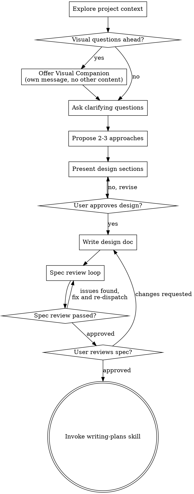
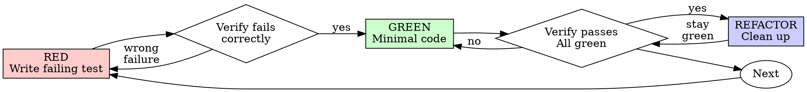

<!-- Generated by SpecStory, Markdown v2.1.0 -->

# 2026-03-15 07:10:05Z

<!-- Codex CLI Session 019cf054-6228-7b60-aae0-92072005c08a (2026-03-15 07:10:05Z) -->

_**User (2026-03-15 07:10:05Z)**_

检索现在 I18N 中的一些 key，然后在项目中进行一遍排查，哪些 key 现在是过时的、多余的，请把它们删除。

---

_**Agent (gpt-5.4 2026-03-15 07:10:12Z)**_

我会先按仓库里的技能要求读取相关 `SKILL.md`，确定这次 I18N 清理该走的流程，然后再扫描当前的 key 定义和实际引用位置。

_**Agent (gpt-5.4 2026-03-15 07:10:12Z)**_

<tool-use data-tool-type="shell" data-tool-name="exec_command"><details>
<summary>Tool use: **exec_command** `sed -n '1,220p' <HOME>/.codex/skills/using-superpowers/SKILL.md`</summary>
```
Chunk ID: 8929df
Wall time: 0.0000 seconds
Process exited with code 0
Original token count: 1305
Output:
---
name: using-superpowers
description: Use when starting any conversation - establishes how to find and use skills, requiring Skill tool invocation before ANY response including clarifying questions
---

<SUBAGENT-STOP>
If you were dispatched as a subagent to execute a specific task, skip this skill.
</SUBAGENT-STOP>

<EXTREMELY-IMPORTANT>
If you think there is even a 1% chance a skill might apply to what you are doing, you ABSOLUTELY MUST invoke the skill.

IF A SKILL APPLIES TO YOUR TASK, YOU DO NOT HAVE A CHOICE. YOU MUST USE IT.

This is not negotiable. This is not optional. You cannot rationalize your way out of this.
</EXTREMELY-IMPORTANT>

## Instruction Priority

Superpowers skills override default system prompt behavior, but **user instructions always take precedence**:

1. **User's explicit instructions** (CLAUDE.md, GEMINI.md, AGENTS.md, direct requests) — highest priority
2. **Superpowers skills** — override default system behavior where they conflict
3. **Default system prompt** — lowest priority

If CLAUDE.md, GEMINI.md, or AGENTS.md says "don't use TDD" and a skill says "always use TDD," follow the user's instructions. The user is in control.

## How to Access Skills

**In Claude Code:** Use the `Skill` tool. When you invoke a skill, its content is loaded and presented to you—follow it directly. Never use the Read tool on skill files.

**In Gemini CLI:** Skills activate via the `activate_skill` tool. Gemini loads skill metadata at session start and activates the full content on demand.

**In other environments:** Check your platform's documentation for how skills are loaded.

## Platform Adaptation

Skills use Claude Code tool names. Non-CC platforms: see `references/codex-tools.md` (Codex) for tool equivalents. Gemini CLI users get the tool mapping loaded automatically via GEMINI.md.

# Using Skills

## The Rule

**Invoke relevant or requested skills BEFORE any response or action.** Even a 1% chance a skill might apply means that you should invoke the skill to check. If an invoked skill turns out to be wrong for the situation, you don't need to use it.


## Red Flags

These thoughts mean STOP—you're rationalizing:

| Thought | Reality |
|---------|---------|
| "This is just a simple question" | Questions are tasks. Check for skills. |
| "I need more context first" | Skill check comes BEFORE clarifying questions. |
| "Let me explore the codebase first" | Skills tell you HOW to explore. Check first. |
| "I can check git/files quickly" | Files lack conversation context. Check for skills. |
| "Let me gather information first" | Skills tell you HOW to gather information. |
| "This doesn't need a formal skill" | If a skill exists, use it. |
| "I remember this skill" | Skills evolve. Read current version. |
| "This doesn't count as a task" | Action = task. Check for skills. |
| "The skill is overkill" | Simple things become complex. Use it. |
| "I'll just do this one thing first" | Check BEFORE doing anything. |
| "This feels productive" | Undisciplined action wastes time. Skills prevent this. |
| "I know what that means" | Knowing the concept ≠ using the skill. Invoke it. |

## Skill Priority

When multiple skills could apply, use this order:

1. **Process skills first** (brainstorming, debugging) - these determine HOW to approach the task
2. **Implementation skills second** (frontend-design, mcp-builder) - these guide execution

"Let's build X" → brainstorming first, then implementation skills.
"Fix this bug" → debug
... (truncated)
```
</details></tool-use>

_**Agent (gpt-5.4 2026-03-15 07:10:12Z)**_

<tool-use data-tool-type="shell" data-tool-name="exec_command"><details>
<summary>Tool use: **exec_command** `sed -n '1,220p' <HOME>/.codex/skills/brainstorming/SKILL.md`</summary>
```
Chunk ID: 1c4169
Wall time: 0.0000 seconds
Process exited with code 0
Original token count: 2643
Output:
---
name: brainstorming
description: "You MUST use this before any creative work - creating features, building components, adding functionality, or modifying behavior. Explores user intent, requirements and design before implementation."
---

# Brainstorming Ideas Into Designs

Help turn ideas into fully formed designs and specs through natural collaborative dialogue.

Start by understanding the current project context, then ask questions one at a time to refine the idea. Once you understand what you're building, present the design and get user approval.

<HARD-GATE>
Do NOT invoke any implementation skill, write any code, scaffold any project, or take any implementation action until you have presented a design and the user has approved it. This applies to EVERY project regardless of perceived simplicity.
</HARD-GATE>

## Anti-Pattern: "This Is Too Simple To Need A Design"

Every project goes through this process. A todo list, a single-function utility, a config change — all of them. "Simple" projects are where unexamined assumptions cause the most wasted work. The design can be short (a few sentences for truly simple projects), but you MUST present it and get approval.

## Checklist

You MUST create a task for each of these items and complete them in order:

1. **Explore project context** — check files, docs, recent commits
2. **Offer visual companion** (if topic will involve visual questions) — this is its own message, not combined with a clarifying question. See the Visual Companion section below.
3. **Ask clarifying questions** — one at a time, understand purpose/constraints/success criteria
4. **Propose 2-3 approaches** — with trade-offs and your recommendation
5. **Present design** — in sections scaled to their complexity, get user approval after each section
6. **Write design doc** — save to `docs/superpowers/specs/YYYY-MM-DD-<topic>-design.md` and commit
7. **Spec review loop** — dispatch spec-document-reviewer subagent with precisely crafted review context (never your session history); fix issues and re-dispatch until approved (max 5 iterations, then surface to human)
8. **User reviews written spec** — ask user to review the spec file before proceeding
9. **Transition to implementation** — invoke writing-plans skill to create implementation plan

## Process Flow



**The terminal state is invoking writing-plans.** Do NOT invoke frontend-design, mcp-builder, or any other implementation skill. The ONLY skill you invoke after brainstorming is writing-plans.

## The Process

**Understanding the idea:**

- Check out the current project state first (files, docs, recent commits)
- Before asking detailed questions, assess scope: if the request describes multiple independent subsystems (e.g., "build a platform with chat, file storage, billing, and analytics"), flag this immediately. Don't spend questions refining details of a project that needs to be decomposed first.
- If the project is too large for a single spec, help the user decompose into sub-projects: what are the independent pieces, how do they relate, what order should they be built? Then brainstorm the first sub-project through the normal design flow. Each sub-project gets its own spec → plan → imple
... (truncated)
```
</details></tool-use>

_**Agent (gpt-5.4 2026-03-15 07:10:12Z)**_

<tool-use data-tool-type="shell" data-tool-name="exec_command"><details>
<summary>Tool use: **exec_command** `sed -n '1,220p' <HOME>/.codex/skills/test-driven-development/SKILL.md`</summary>
```
Chunk ID: 75bcbb
Wall time: 0.0000 seconds
Process exited with code 0
Original token count: 1232
Output:
---
name: test-driven-development
description: Use when implementing any feature or bugfix, before writing implementation code
---

# Test-Driven Development (TDD)

## Overview

Write the test first. Watch it fail. Write minimal code to pass.

**Core principle:** If you didn't watch the test fail, you don't know if it tests the right thing.

**Violating the letter of the rules is violating the spirit of the rules.**

## When to Use

**Always:**
- New features
- Bug fixes
- Refactoring
- Behavior changes

**Exceptions (ask your human partner):**
- Throwaway prototypes
- Generated code
- Configuration files

Thinking "skip TDD just this once"? Stop. That's rationalization.

## The Iron Law

```
NO PRODUCTION CODE WITHOUT A FAILING TEST FIRST
```

Write code before the test? Delete it. Start over.

**No exceptions:**
- Don't keep it as "reference"
- Don't "adapt" it while writing tests
- Don't look at it
- Delete means delete

Implement fresh from tests. Period.

## Red-Green-Refactor



### RED - Write Failing Test

Write one minimal test showing what should happen.

<Good>
```typescript
test('retries failed operations 3 times', async () => {
  let attempts = 0;
  const operation = () => {
    attempts++;
    if (attempts < 3) throw new Error('fail');
    return 'success';
  };

  const result = await retryOperation(operation);

  expect(result).toBe('success');
  expect(attempts).toBe(3);
});
```
Clear name, tests real behavior, one thing
</Good>

<Bad>
```typescript
test('retry works', async () => {
  const mock = jest.fn()
    .mockRejectedValueOnce(new Error())
    .mockRejectedValueOnce(new Error())
    .mockResolvedValueOnce('success');
  await retryOperation(mock);
  expect(mock).toHaveBeenCalledTimes(3);
});
```
Vague name, tests mock not code
</Bad>

**Requirements:**
- One behavior
- Clear name
- Real code (no mocks unless unavoidable)

### Verify RED - Watch It Fail

**MANDATORY. Never skip.**

```bash
npm test path/to/test.test.ts
```

Confirm:
- Test fails (not errors)
- Failure message is expected
- Fails because feature missing (not typos)

**Test passes?** You're testing existing behavior. Fix test.

**Test errors?** Fix error, re-run until it fails correctly.

### GREEN - Minimal Code

Write simplest code to pass the test.

<Good>
```typescript
async function retryOperation<T>(fn: () => Promise<T>): Promise<T> {
  for (let i = 0; i < 3; i++) {
    try {
      return await fn();
    } catch (e) {
      if (i === 2) throw e;
    }
  }
  throw new Error('unreachable');
}
```
Just enough to pass
</Good>

<Bad>
```typescript
async function retryOperation<T>(
  fn: () => Promise<T>,
  options?: {
    maxRetries?: number;
    backoff?: 'linear' | 'exponential';
    onRetry?: (attempt: number) => void;
  }
): Promise<T> {
  // YAGNI
}
```
Over-engineered
</Bad>

Don't add features, refactor other code, or "improve" beyond the test.

### Verify GREEN - Watch It Pass

**MANDATORY.**

```bash
npm test path/to/test.test.ts
```

Confirm:
- Test passes
- Other tests still pass
- Output pristine (no errors, warnings)

**Test fails?** Fix code, not test.

**Other tests fail?** Fix now.

### REFACTOR - Clean Up

After green only:
- Remove duplication
- Improve names
- Extract helpers

Keep tests green. Don't add behavior.

### Repeat

Next failing test for next feature.

## Good Tests

| Quality | Good | Bad |
|---------|------|-----|
| **Minimal** | One thing. "and" in name? Split it. | `test('validates email and domain and whitespace')` |
| **Clear** | Name describes behavior | `test('test1')` |
| **Shows intent** | Demonstrates desired API | Obscures what code should do |

## Why Order Matters

**"I'll write tests after to verify it works"**

Tests written after code pass immediately. Passing immediately proves nothing:
- Might test wrong thing
- Might test implementation, not behavior
- Might miss edge cases you forgot
- You never saw it catch the bug

Test-first forces you to see the test fail, proving it actually tests something.

**"I already manually tested all the edge cases"**

Manual testing is ad-hoc. You t
... (truncated)
```
</details></tool-use>

_**Agent (gpt-5.4 2026-03-15 07:10:20Z)**_

使用 `using-superpowers` 做流程检查；`brainstorming` 我已经核对过，这次是现有 I18N 资源清理，不涉及新行为设计，所以先进入项目上下文梳理。接下来我会定位语言包、提取 key，并交叉比对代码中的实际引用。

_**Agent (gpt-5.4 2026-03-15 07:10:20Z)**_

<tool-use data-tool-type="shell" data-tool-name="exec_command"><details>
<summary>Tool use: **exec_command** `pwd && rg --files -g '*i18n*' -g '*locale*' -g '*lang*' .`</summary>
```
Chunk ID: ccdcec
Wall time: 0.0000 seconds
Process exited with code 0
Original token count: 106
Output:
<REPO_ROOT>
./apps/web/src/i18n/resolve-locale-override.ts
./apps/web/src/i18n/resolve-locale-override.test.ts
./apps/web/src/app/detect-locale.ts
./apps/web/src/lib/seo/hreflang.ts
./docs/superpowers/specs/2026-03-14-terminology-i18n-design.md
./apps/web/src/constants/language.ts
./apps/web/src/providers/root/lang-sync-provider.tsx
./apps/web/src/components/ui/code-highlighter/language-icons.tsx
```
</details></tool-use>

_**Agent (gpt-5.4 2026-03-15 07:10:20Z)**_

<tool-use data-tool-type="shell" data-tool-name="exec_command"><details>
<summary>Tool use: **exec_command** `rg -n "i18n|locale|locales|intl|useTranslation|t\(" -g '!node_modules' -g '!opensrc' .`</summary>
```
Chunk ID: 4d3b60
Wall time: 0.0000 seconds
Process exited with code 0
Original token count: 123131
Output:
Total output lines: 3306

<!-- [omitted 4864 chars — likely node_modules or generated bundle] -->
... (truncated)
```
</details></tool-use>

_**Agent (gpt-5.4 2026-03-15 07:10:20Z)**_

<tool-use data-tool-type="shell" data-tool-name="exec_command"><details>
<summary>Tool use: **exec_command** `rg --files | rg 'package.json$|pnpm-workspace.yaml$|turbo.json$|tsconfig|vitest|jest|playwright|biome|eslint'`</summary>
```
Chunk ID: cdeaca
Wall time: 0.0000 seconds
Process exited with code 0
Original token count: 48
Output:
pnpm-workspace.yaml
eslint.config.mjs
apps/web/package.json
apps/web/vitest.config.ts
apps/web/tsconfig.json
packages/types/tsconfig.json
packages/types/package.json
package.json
turbo.json
```
</details></tool-use>

_**Agent (gpt-5.4 2026-03-15 07:10:25Z)**_

我已经确认这是 `apps/web` 里的 `next-intl` 体系。下一步会直接找消息文件和类型生成位置，避免把“动态拼出来的 key”误判成未使用。

_**Agent (gpt-5.4 2026-03-15 07:10:25Z)**_

<tool-use data-tool-type="shell" data-tool-name="exec_command"><details>
<summary>Tool use: **exec_command** `rg --files apps/web | rg 'messages|locales|i18n|intl|lang'`</summary>
```
Chunk ID: 1bffcf
Wall time: 0.0000 seconds
Process exited with code 0
Original token count: 726
Output:
apps/web/src/i18n/config.ts
apps/web/src/i18n/proxy-headers.test.ts
apps/web/src/i18n/resolve-locale-override.ts
apps/web/src/i18n/request.ts
apps/web/src/i18n/resolve-locale-override.test.ts
apps/web/src/i18n/proxy-headers.ts
apps/web/src/i18n/routing.ts
apps/web/src/i18n/navigation.ts
apps/web/src/types/next-intl.d.ts
apps/web/src/constants/language.ts
apps/web/src/providers/root/lang-sync-provider.tsx
apps/web/src/providers/root/intl-provider.tsx
apps/web/src/lib/seo/hreflang.ts
apps/web/src/messages/en/post.json
apps/web/src/messages/en/feed.json
apps/web/src/messages/en/activity.json
apps/web/src/messages/en/home.json
apps/web/src/messages/en/thinking.json
apps/web/src/messages/en/index.ts
apps/web/src/messages/en/gateway.json
apps/web/src/messages/en/subscribe.json
apps/web/src/messages/en/translation.json
apps/web/src/messages/en/dashboard.json
apps/web/src/messages/en/projects.json
apps/web/src/messages/en/note.json
apps/web/src/messages/en/comment.json
apps/web/src/messages/en/common.json
apps/web/src/messages/en/ai.json
apps/web/src/messages/en/says.json
apps/web/src/messages/en/datetime.json
apps/web/src/messages/en/error.json
apps/web/src/messages/en/friends.json
apps/web/src/messages/en/donate.json
apps/web/src/messages/ja/post.json
apps/web/src/messages/ja/feed.json
apps/web/src/messages/ja/activity.json
apps/web/src/messages/ja/home.json
apps/web/src/messages/ja/thinking.json
apps/web/src/messages/ja/index.ts
apps/web/src/messages/ja/gateway.json
apps/web/src/messages/ja/subscribe.json
apps/web/src/messages/ja/translation.json
apps/web/src/messages/ja/dashboard.json
apps/web/src/messages/ja/projects.json
apps/web/src/messages/ja/note.json
apps/web/src/messages/ja/comment.json
apps/web/src/messages/ja/common.json
apps/web/src/messages/ja/ai.json
apps/web/src/messages/ja/says.json
apps/web/src/messages/ja/datetime.json
apps/web/src/messages/ja/error.json
apps/web/src/messages/ja/friends.json
apps/web/src/messages/ja/donate.json
apps/web/src/messages/zh/post.json
apps/web/src/messages/zh/feed.json
apps/web/src/messages/zh/activity.json
apps/web/src/messages/zh/home.json
apps/web/src/messages/zh/thinking.json
apps/web/src/messages/zh/index.ts
apps/web/src/messages/zh/gateway.json
apps/web/src/messages/zh/subscribe.json
apps/web/src/messages/zh/translation.json
apps/web/src/messages/zh/dashboard.json
apps/web/src/messages/zh/projects.json
apps/web/src/messages/zh/note.json
apps/web/src/messages/zh/comment.json
apps/web/src/messages/zh/common.json
apps/web/src/messages/zh/ai.json
apps/web/src/messages/zh/says.json
apps/web/src/messages/zh/datetime.json
apps/web/src/messages/zh/error.json
apps/web/src/messages/zh/friends.json
apps/web/src/messages/zh/donate.json
apps/web/src/components/ui/language-selector/index.ts
apps/web/src/components/ui/language-selector/LanguageSelector.tsx
apps/web/src/components/ui/code-highlighter/language-icons.tsx
```
</details></tool-use>

_**Agent (gpt-5.4 2026-03-15 07:10:25Z)**_

<tool-use data-tool-type="shell" data-tool-name="exec_command"><details>
<summary>Tool use: **exec_command** `rg -n "useTranslations\(|getTranslations\(|createTranslator\(|NextIntlClientProvider|defineRouting|messages" apps/web -g '!**/*.d.ts'`</summary>
```
Chunk ID: 754094
Wall time: 0.0000 seconds
Process exited with code 0
Original token count: 6011
Output:
Total output lines: 249

apps/web/src/socket/worker-polyfill.ts:69:   * Starts the sending of messages queued on the port (only needed when using EventTarget.addEventListener; it is implied when using MessagePort.onmessage.)
apps/web/src/providers/root/intl-provider.tsx:3:import { NextIntlClientProvider } from 'next-intl'
apps/web/src/providers/root/intl-provider.tsx:7:import messages from '~/messages/zh'
apps/web/src/providers/root/intl-provider.tsx:11:    <NextIntlClientProvider locale={defaultLocale} messages={messages}>
apps/web/src/providers/root/intl-provider.tsx:13:    </NextIntlClientProvider>
apps/web/src/app/not-found.tsx:3:import { NextIntlClientProvider } from 'next-intl'
apps/web/src/app/not-found.tsx:24:  const messages = await getMessages()
apps/web/src/app/not-found.tsx:25:  const t = await getTranslations('error')
apps/web/src/app/not-found.tsx:42:        <NextIntlClientProvider messages={messages}>
apps/web/src/app/not-found.tsx:62:        </NextIntlClientProvider>
apps/web/src/app/global-error.tsx:9:import enErrorMessages from '~/messages/en/error.json'
apps/web/src/app/global-error.tsx:10:import jaErrorMessages from '~/messages/ja/error.json'
apps/web/src/app/global-error.tsx:11:import zhErrorMessages from '~/messages/zh/error.json'
apps/web/src/i18n/routing.ts:1:import { defineRouting } from 'next-intl/routing'
apps/web/src/i18n/routing.ts:5:export const routing = defineRouting({
apps/web/src/i18n/request.ts:3:import defaultMessages from '../messages/zh'
apps/web/src/i18n/request.ts:8:const messagesMap = {
apps/web/src/i18n/request.ts:9:  en: () => import('../messages/en'),
apps/web/src/i18n/request.ts:10:  ja: () => import('../messages/ja'),
apps/web/src/i18n/request.ts:18:    messages: defaultMessages,
apps/web/src/i18n/request.ts:24:  const messagesLoader = messagesMap[locale as keyof typeof messagesMap]
apps/web/src/i18n/request.ts:25:  if (!messagesLoader) {
apps/web/src/i18n/request.ts:29:  const messages = await messagesLoader()
apps/web/src/i18n/request.ts:33:    messages: messages.default,
apps/web/src/app/global-not-found.tsx:5:import { NextIntlClientProvider } from 'next-intl'
apps/web/src/app/global-not-found.tsx:24:  const messages = await getMessages()
apps/web/src/app/global-not-found.tsx:41:        <NextIntlClientProvider messages={messages}>
apps/web/src/app/global-not-found.tsx:57:        </NextIntlClientProvider>
apps/web/src/lib/request.shared.ts:7:  const messagesOrMessage = fetchError.response?._data?.message
apps/web/src/lib/request.shared.ts:9:    typeof messagesOrMessage === 'string'
apps/web/src/lib/request.shared.ts:10:      ? messagesOrMessage
apps/web/src/lib/request.shared.ts:11:      : Array.isArray(messagesOrMessage)
apps/web/src/lib/request.shared.ts:12:        ? messagesOrMessage[0]
apps/web/src/components/modules/peek/PeekModal.tsx:19:  const t = useTranslations('common')
apps/web/src/components/modules/timeline/TimelineProgress.test.tsx:1:import { NextIntlClientProvider } from 'next-intl'
apps/web/src/components/modules/timeline/TimelineProgress.test.tsx:10:      <NextIntlClientProvider
apps/web/src/components/modules/timeline/TimelineProgress.test.tsx:13:        messages={{
apps/web/src/components/modules/timeline/TimelineProgress.test.tsx:22:      </NextIntlClientProvider>,
apps/web/src/components/modules/timeline/TimelineProgress.tsx:17:  const t = useTranslations('home')
apps/web/src/components/modules/ai/Summary.tsx:72:  const t = useTranslations('common')
apps/web/src/components/modules/ai/AIGenBadge.tsx:17:  const t = useTranslations('ai')
apps/web/src/components/modules/ai/AIGenBadge.tsx:52:  const t = useTranslations('ai')
apps/web/src/hooks/common/use-format-duration.ts:5:  const t = useTranslations('datetime')
apps/web/src/hooks/common/use-relative-time.ts:5:  const t = useTranslations('datetime')
apps/web/src/components/modules/subscribe/SubscribeBell.tsx:17:  const t = useTranslations('subscribe')
apps/web/src/app/[locale]/categories/[slug]/page.tsx:20:    const t = await getTranslations({
apps/web/src/components/modules/subscribe/SubscribeModal.tsx:72:  const t = useTranslations('subscribe')
apps/web/src/app/[locale]/categories/[slug]/layout.tsx:22:  const t = await getTranslations({
apps/web/src/app/[locale]/timeline/page.tsx:81:  const t = useTranslations('home')
apps/web/src/components/modules/subscribe/SubscribeTextButton.tsx:9:  const t = useTranslations('common')
apps/web/src/app/[locale]/timeline/layout.tsx:17:  const t = await getTranslations({
apps/web/src/components/modules/toc/TocFAB.tsx:16:  const t = useTranslations('common')
apps/web/src/components/modules/comment/CommentActionButtonGroup.tsx:27:  const tCommon = useTranslations('common')
apps/web/src/components/modules/comment/CommentActionButtonGroup.tsx:144:  const tCommon = useTranslations('common')
apps/web/src/components/modules/comment/CommentActionButtonGroup.tsx
... (truncated)
```
</details></tool-use>

_**Agent (gpt-5.4 2026-03-15 07:10:25Z)**_

<tool-use data-tool-type="shell" data-tool-name="exec_command"><details>
<summary>Tool use: **exec_command** `find apps/web -maxdepth 3 -type d | rg 'messages|locale|locales|i18n'`</summary>
```
Chunk ID: 394ff7
Wall time: 0.0000 seconds
Process exited with code 0
Original token count: 36
Output:
apps/web/src/messages
apps/web/src/messages/ja
apps/web/src/messages/zh
apps/web/src/messages/en
apps/web/src/app/[locale]
apps/web/src/i18n
```
</details></tool-use>

_**Agent (gpt-5.4 2026-03-15 07:10:31Z)**_

我已经拿到消息目录了。现在先看消息聚合方式和 `next-intl` 类型声明，判断 key 是否都是静态字面量引用，还是存在 `t(variable)` 这类动态场景。

_**Agent (gpt-5.4 2026-03-15 07:10:31Z)**_

<tool-use data-tool-type="shell" data-tool-name="exec_command"><details>
<summary>Tool use: **exec_command** `sed -n '1,220p' apps/web/src/messages/zh/index.ts`</summary>
```
Chunk ID: a3fd78
Wall time: 0.0000 seconds
Process exited with code 0
Original token count: 227
Output:
import activity from './activity.json'
import ai from './ai.json'
import comment from './comment.json'
import common from './common.json'
import dashboard from './dashboard.json'
import datetime from './datetime.json'
import donate from './donate.json'
import error from './error.json'
import feed from './feed.json'
import friends from './friends.json'
import gateway from './gateway.json'
import home from './home.json'
import note from './note.json'
import post from './post.json'
import projects from './projects.json'
import says from './says.json'
import subscribe from './subscribe.json'
import thinking from './thinking.json'
import translation from './translation.json'

export default {
  ai,
  common,
  comment,
  datetime,
  error,
  home,
  translation,
  gateway,
  activity,
  post,
  note,
  friends,
  subscribe,
  donate,
  feed,
  dashboard,
  thinking,
  says,
  projects,
} as const
```
</details></tool-use>

_**Agent (gpt-5.4 2026-03-15 07:10:31Z)**_

<tool-use data-tool-type="shell" data-tool-name="exec_command"><details>
<summary>Tool use: **exec_command** `sed -n '1,220p' apps/web/src/types/next-intl.d.ts`</summary>
```
Chunk ID: 692535
Wall time: 0.0000 seconds
Process exited with code 0
Original token count: 32
Output:
import type messages from '../messages/zh'

type Messages = typeof messages

declare global {
  type IntlMessages = Messages
}
```
</details></tool-use>

_**Agent (gpt-5.4 2026-03-15 07:10:31Z)**_

<tool-use data-tool-type="shell" data-tool-name="exec_command"><details>
<summary>Tool use: **exec_command** `sed -n '1,220p' apps/web/src/messages/zh/common.json`</summary>
```
Chunk ID: 621bef
Wall time: 0.0000 seconds
Process exited with code 0
Original token count: 1928
Output:
{
  "nav_home": "首页",
  "nav_posts": "文稿",
  "nav_notes": "手记",
  "nav_timeline": "时光",
  "nav_thinking": "思考",
  "nav_more": "更多",
  "nav_friends": "友链",
  "nav_projects": "项目",
  "nav_says": "一言",
  "nav_topics": "专栏",
  "nav_memories": "回忆",
  "nav_travel": "跃迁",
  "nav_dropdown_using": "正在使用 {name}",
  "nav_dropdown_online": "在线",
  "nav_dropdown_categories": "分类",
  "nav_dropdown_recent_suffix": " · 最近",
  "nav_dropdown_view_all_posts": "查看全部文稿",
  "nav_dropdown_posts_count": "{count} 篇文稿",
  "nav_dropdown_recent_notes": "近期手记",
  "nav_dropdown_view_all_notes": "查看全部手记",
  "nav_dropdown_view_all_topics": "全部专栏",
  "nav_dropdown_recent_activity": "近期动态",
  "nav_friends_desc": "互联网上的朋友们",
  "nav_projects_desc": "开源项目与作品集",
  "nav_says_desc": "言语的碎片",
  "nav_travel_desc": "空间跃迁门",
  "actions_submit": "发布",
  "actions_cancel": "取消",
  "actions_edit": "编辑",
  "actions_delete": "删除",
  "actions_reply": "回复",
  "actions_save": "保存",
  "actions_close": "关闭",
  "actions_confirm": "确认",
  "actions_back": "返回",
  "actions_loadMore": "加载更多",
  "actions_refresh": "刷新",
  "actions_copy": "复制",
  "actions_share": "分享",
  "actions_view": "查看",
  "actions_saving": "保存中...",
  "auth_account": "账户",
  "auth_dashboard": "轻管理",
  "auth_console": "控制台",
  "auth_logout": "登出",
  "not_support": "您当前所在地区暂不支持此功能",
  "browser_outdated": "您的浏览器版本过低，请升级浏览器",
  "login_secret_entrance": "你发现了神秘的登录入口",
  "login_nothing_here": "，但这里什么也没有",
  "login_button": "登录",
  "loading_default": [
    "稍候片刻，月出文自明。",
    "风过空庭，字句正徐来。",
    "纸白微明，未成篇章。",
    "夜退星沉，此页初醒。",
    "墨痕未定，片语已生春。",
    "云开一隙，文章将至。",
    "万籁俱寂，万字将成。",
    "且听风定，再看句成。"
  ],
  "loading_video": "视频加载中...",
  "loading_bilibili": "哔哩哔哩视频加载中...",
  "loading_failed": "加载失败",
  "empty_nothing": "这里空空如也",
  "empty_comeback": "稍后再来看看吧！",
  "delete_success": "删除成功",
  "delete_confirm_title": "确定删除「{item}」吗？",
  "delete_confirm_default": "确定删除吗？",
  "edit_success": "修改成功",
  "edit_failed": "修改失败",
  "content_empty": "内容不能为空",
  "edited": "(已编辑)",
  "edited_at": "编辑于",
  "published_at": "发表于：",
  "modified_at": "修改于 {date}",
  "last_updated": "最后更新于",
  "rss_subscribe": "RSS 订阅",
  "like": "喜欢",
  "dislike": "不喜欢",
  "comment": "评论",
  "thanks": "谢谢你！",
  "like_site": "喜欢本站",
  "subscribe": "订阅",
  "share_treasure": "分享一份值得一看的内容",
  "share_message": "嘿，我发现了一份值得一看的内容「{title}」，快来看看吧！",
  "share_content": "分享此内容",
  "footnote_return": "返回",
  "spoiler_title": "你知道的太多了",
  "artist_label": "歌手：",
  "deleted_content": "已删除的内容",
  "someone_liked": "有人点赞了",
  "reply_to": "回复：",
  "in": "在",
  "thought": "一条想法中",
  "said": "说：",
  "published": "发布了",
  "windsock_title": "风向标",
  "windsock_subtitle": "去到别处看看？",
  "windsock_posts": "文稿",
  "windsock_notes": "手记",
  "windsock_timeline": "度过的时光呀",
  "windsock_friends": "朋友们",
  "windsock_thinking": "写下一点思考",
  "windsock_projects": "看看我做些啥",
  "windsock_says": "记录下一言",
  "windsock_travel": "跃迁",
  "like_post": "捕捉一只大佬！",
  "share_to": "分享到...",
  "copy_link": "复制链接",
  "copied": "已复制到剪贴板",
  "login_username": "用户名",
  "login_password": "密码",
  "search_placeholder": "搜索...",
  "emoji_search_placeholder": "搜索表情",
  "aria_like_post": "点赞这篇文章",
  "aria_share_post": "分享这篇文章",
  "aria_like_note": "点赞这条手记",
  "aria_share_note": "分享这条手记",
  "aria_donate": "向作者捐赠",
  "aria_login": "读者登录",
  "aria_theme_light": "切换到浅色主题",
  "aria_theme_system": "切换到系统主题",
  "aria_theme_dark": "切换到深色主题",
  "aria_volume": "音量",
  "aria_progress": "进度",
  "aria_fab": "浮动操作按钮",
  "aria_toc": "显示目录",
  "aria_algolia": "Algolia",
  "aria_pin": "置顶这篇文章",
  "aria_comment": "评论这篇文章",
  "aria_header_drawer": "头部抽屉按钮",
  "aria_header_action": "头部操作",
  "locale_zh": "简体中文",
  "locale_en
... (truncated)
```
</details></tool-use>

_**Agent (gpt-5.4 2026-03-15 07:10:40Z)**_

我在看消息结构时确认到 key 基本是“命名空间 + 平铺字段”，这适合做静态交叉比对。接下来我会先自动扫一遍引用，再人工核对少量动态访问点，最后再删 key。

_**Agent (gpt-5.4 2026-03-15 07:10:40Z)**_

<tool-use data-tool-type="shell" data-tool-name="exec_command"><details>
<summary>Tool use: **exec_command** `cat apps/web/package.json`</summary>
```
Chunk ID: 8f9175
Wall time: 0.0000 seconds
Process exited with code 0
Original token count: 1332
Output:
{
  "name": "@shiro/web",
  "type": "module",
  "version": "6.6.7",
  "private": true,
  "license": "AGPL-3.0",
  "imports": {
    "#fetch": {
      "react-server": "./src/lib/fetch/fetch.server.ts",
      "default": "./src/lib/fetch/fetch.client.ts"
    }
  },
  "scripts": {
    "analyze": "cross-env NODE_ENV=production ANALYZE=true BUNDLE_ANALYZE=browser next build",
    "prebuild": "rimraf .next || exit 0",
    "build": "tsc --noEmit && cross-env NODE_ENV=production NODE_OPTIONS=--max_old_space_size=4096 next build",
    "build:ci": "tsc --noEmit && cross-env NODE_ENV=production NODE_OPTIONS=--max_old_space_size=4096 NEXT_TELEMETRY_DISABLED=1 CI=true next build",
    "dev": "cross-env NODE_ENV=development next dev -p 2323 --turbo",
    "dev:turbo": "cross-env NODE_ENV=development next dev -p 2323 --turbo",
    "lint": "eslint --fix",
    "prod:pm2": "cross-env NODE_ENV=production pm2 restart ecosystem.config.cjs",
    "prod:reload": "pm2 reload ecosystem.config.cjs",
    "prod:stop": "pm2 stop ecosystem.config.cjs",
    "start": "npm run dev"
  },
  "dependencies": {
    "@base-ui/react": "1.3.0",
    "@excalidraw/excalidraw": "0.17.0",
    "@ferrucc-io/emoji-picker": "0.0.48",
    "@floating-ui/react-dom": "2.1.8",
    "@haklex/rich-editor": "0.0.85",
    "@haklex/rich-kit-shiro": "0.0.85",
    "@haklex/rich-static-renderer": "0.0.85",
    "@lexical/code": "^0.41.0",
    "@lexical/link": "^0.41.0",
    "@lexical/list": "^0.41.0",
    "@lexical/markdown": "^0.41.0",
    "@lexical/react": "^0.41.0",
    "@lexical/rich-text": "^0.41.0",
    "@lexical/table": "^0.41.0",
    "@mx-space/api-client": "2.4.2",
    "@number-flow/react": "^0.6.0",
    "@openpanel/web": "^1.2.0",
    "@shikijs/transformers": "4.0.2",
    "@simplewebauthn/browser": "13.3.0",
    "@simplewebauthn/types": "12.0.0",
    "@tanstack/query-async-storage-persister": "5.90.24",
    "@tanstack/react-query": "5.90.21",
    "@tanstack/react-query-devtools": "5.91.3",
    "@tanstack/react-query-persist-client": "5.90.24",
    "@vercel/functions": "3.4.3",
    "better-auth": "1.5.4",
    "blurhash": "2.0.5",
    "bypass-vue-devtools": "0.0.6",
    "chroma-js": "3.2.0",
    "clsx": "2.1.1",
    "colorjs.io": "^0.6.1",
    "date-fns": "^4.1.0",
    "emoji-mart": "5.6.0",
    "es-toolkit": "1.45.1",
    "exif-js": "2.3.0",
    "foxact": "0.2.54",
    "fuse.js": "7.1.0",
    "idb-keyval": "6.2.2",
    "immer": "^11.1.4",
    "jojoo": "0.3.0",
    "jotai": "2.18.1",
    "js-cookie": "3.0.5",
    "js-yaml": "4.1.1",
    "jsondiffpatch": "^0.7.3",
    "katex": "0.16.38",
    "kbar": "0.1.0-beta.48",
    "lexical": "^0.41.0",
    "markdown-escape": "2.0.0",
    "markdown-to-jsx": "npm:@innei/markdown-to-jsx-yet@7.7.7-11",
    "marked": "17.0.4",
    "mdast-util-to-markdown": "2.1.2",
    "medium-zoom": "1.1.0",
    "mermaid": "11.13.0",
    "motion": "12.35.2",
    "nanoid": "^5.1.6",
    "next": "16.1.6",
    "next-intl": "^4.8.3",
    "next-runtime-env": "3.3.0",
    "next-themes": "0.4.6",
    "ofetch": "1.5.1",
    "pngjs": "7.0.0",
    "prop-types": "15.8.1",
    "qrcode.react": "4.2.0",
    "react": "19.2.4",
    "react-blurhash": "0.3.0",
    "react-dom": "19.2.4",
    "react-error-boundary": "6.1.1",
    "react-intersection-observer": "10.0.3",
    "react-photo-view": "1.2.7",
    "react-responsive-masonry": "2.7.1",
    "react-router-dom": "^7.13.1",
    "react-shadow": "20.6.0",
    "react-tweet": "npm:@innei/react-tweet@3.4.2",
    "remove-markdown": "0.6.3",
    "rss": "1.2.2",
    "schema-dts": "1.1.5",
    "server-only": "^0.0.1",
    "socket.io-client": "4.8.3",
    "sonner": "2.0.7",
    "tailwind-merge": "3.5.0",
    "tailwind-variants": "3.2.2",
    "unified": "^11.0.5",
    "uniqolor": "1.1.1",
    "unist-util-visit": "5.1.0",
    "use-context-selector": "2.0.0",
    "use-debounce": "10.1.0",
    "vaul": "1.1.2",
    "xss": "1.0.15"
  },
  "devDependencies": {
    "@egoist/tailwindcss-icons": "1.9.2",
    "@iconify-json/material-symbols": "1.2.61",
    "@iconify-json/mingcute": "1.2.7",
    "@innei/prettier": "1.0.0",
    "@mx-space/webhook": "0.7.1",
    "@next/bundle-analyzer": "16.1.6",
    "@tailwindcss/postcss": "^4.2.1",
    "@tailwindcss/typography": "0.5.19",
    "@types/chroma-js": "3.1.2",
    "@types/js-cookie": "3.0.6",
    "@types/js-yaml": "4.0.9",
    "@types/katex": "0.16.8",
    "@types/markdown-escape": "1.1.3",
    "@types/node": "25.4.0",
    "@types/pngjs": "6.0.5",
    "@types/react": "19.2.14",
    "@types/react-dom": "19.2.3",
    "@types/react-responsive-masonry": "2.7.0",
    "@types/remove-markdown": "0.3.4",
    "@types/rss": "0.0.32",
    "@webgpu/types": "^0.1.69",
    "autoprefixer": "10.4.27",
    "client-only": "0.0.1",
    "code-inspector-plugin": "1.4.4",
    "cross-env": "10.1.0",
    "dotenv": "17.3.1",
    "postcss": "8.5.8",
    "postcss-import": "16.1.1",
    "postcss-js": "5.1.0",
    "post
... (truncated)
```
</details></tool-use>

_**Agent (gpt-5.4 2026-03-15 07:10:40Z)**_

<tool-use data-tool-type="shell" data-tool-name="exec_command"><details>
<summary>Tool use: **exec_command** `rg -n "\.raw\(|\.rich\(|\.markup\(|t\([^'\"]|t\(`|t\([A-Za-z_$]" apps/web/src -g '!**/*.d.ts'`</summary>
```
Chunk ID: 8e07d8
Wall time: 0.0000 seconds
Process exited with code 1
Original token count: 5
Output:
zsh:1: unmatched "
```
</details></tool-use>

_**Agent (gpt-5.4 2026-03-15 07:10:40Z)**_

<tool-use data-tool-type="shell" data-tool-name="exec_command"><details>
<summary>Tool use: **exec_command** `rg -n "getTranslations\([^)]*\)|useTranslations\([^)]*\)" apps/web/src -g '!**/*.d.ts'`</summary>
```
Chunk ID: 85e6b6
Wall time: 0.0000 seconds
Process exited with code 0
Original token count: 4472
Output:
apps/web/src/app/not-found.tsx:25:  const t = await getTranslations('error')
apps/web/src/components/modules/translation/TranslationLanguageSwitcher.tsx:31:  const t = useTranslations('translation')
apps/web/src/components/modules/translation/TranslationLanguageSwitcher.tsx:32:  const tCommon = useTranslations('common')
apps/web/src/components/modules/note/NoteHideIfSecret.tsx:12:  const t = useTranslations('note')
apps/web/src/components/modules/note/NoteHideIfSecret.tsx:13:  const tCommon = useTranslations('common')
apps/web/src/hooks/common/use-format-duration.ts:5:  const t = useTranslations('datetime')
apps/web/src/components/modules/peek/PeekModal.tsx:19:  const t = useTranslations('common')
apps/web/src/hooks/common/use-relative-time.ts:5:  const t = useTranslations('datetime')
apps/web/src/components/modules/translation/TranslationBanner.tsx:18:  const t = useTranslations('translation')
apps/web/src/components/modules/translation/TranslationBanner.tsx:19:  const tCommon = useTranslations('common')
apps/web/src/components/modules/note/NoteTopicDetail.tsx:31:  const t = useTranslations('note')
apps/web/src/components/modules/translation/TranslatedBadge.tsx:33:  const t = useTranslations('common')
apps/web/src/components/modules/note/NoteFooterNavigation.tsx:13:  const t = useTranslations('note')
apps/web/src/components/modules/note/NoteFooterNavigation.tsx:14:  const tCommon = useTranslations('common')
apps/web/src/components/modules/timeline/TimelineProgress.tsx:17:  const t = useTranslations('home')
apps/web/src/components/modules/note/NoteActionAside.tsx:81:  const t = useTranslations('common')
apps/web/src/components/modules/note/NoteActionAside.tsx:168:  const t = useTranslations('common')
apps/web/src/components/modules/say/hooks.ts:29:  const t = useTranslations('says')
apps/web/src/components/modules/ai/Summary.tsx:72:  const t = useTranslations('common')
apps/web/src/components/modules/note/NoteMetaBar.tsx:55:  const t = useTranslations('common')
apps/web/src/components/modules/note/NoteMetaBar.tsx:70:  const t = useTranslations('common')
apps/web/src/components/modules/note/NoteMetaBar.tsx:122:  const t = useTranslations('post')
apps/web/src/components/modules/note/NotePasswordForm.tsx:10:  const t = useTranslations('note')
apps/web/src/components/modules/say/SayModalForm.tsx:20:  const t = useTranslations('says')
apps/web/src/components/modules/ai/AIGenBadge.tsx:17:  const t = useTranslations('ai')
apps/web/src/components/modules/ai/AIGenBadge.tsx:52:  const t = useTranslations('ai')
apps/web/src/components/modules/note/NoteLatestRender.tsx:15:  const t = await getTranslations('note')
apps/web/src/components/modules/note/NoteTopicInfo.tsx:18:  const t = useTranslations('note')
apps/web/src/components/modules/note/NoteTopicInfo.tsx:48:  const t = useTranslations('note')
apps/web/src/components/modules/note/NoteBottomTopic.tsx:27:  const t = useTranslations('note')
apps/web/src/components/modules/note/NoteListPagination.tsx:19:  const t = useTranslations('note')
apps/web/src/components/modules/say/SayMasonry.tsx:90:  const t = useTranslations('says')
apps/web/src/components/modules/say/SayMasonry.tsx:91:  const tCommon = useTranslations('common')
apps/web/src/components/ui/media/VideoPlayer.tsx:197:  const t = useTranslations('common')
apps/web/src/components/ui/media/VideoPlayer.tsx:257:  const t = useTranslations('common')
apps/web/src/components/ui/media/VideoPlayer.tsx:294:  const t = useTranslations('common')
apps/web/src/components/ui/media/VideoPlayer.tsx:323:  const t = useTranslations('common')
apps/web/src/components/ui/media/VideoPlayer.tsx:360:  const t = useTranslations('common')
apps/web/src/components/modules/note/NoteFontFab.tsx:25:  const t = useTranslations('note')
apps/web/src/components/modules/note/NoteFontFab.tsx:167:  const t = useTranslations('note')
apps/web/src/components/modules/toc/TocFAB.tsx:16:  const t = useTranslations('common')
apps/web/src/components/modules/subscribe/SubscribeBell.tsx:17:  const t = useTranslations('subscribe')
apps/web/src/components/modules/post/PostActionAside.tsx:87:  const t = useTranslations('common')
apps/web/src/components/modules/post/PostActionAside.tsx:162:  const t = useTranslations('common')
apps/web/src/components/ui/media/VolumeSlider.tsx:9:  const t = useTranslations('common')
apps/web/src/components/layout/header/internal/HeaderContent.tsx:94:  const t = useTranslations('common')
apps/web/src/components/modules/subscribe/SubscribeTextButton.tsx:9:  const t = useTranslations('common')
apps/web/src/components/modules/subscribe/SubscribeModal.tsx:72:  const t = useTranslations('subscribe')
apps/web/src/components/modules/post/PostRelated.tsx:13:  const t = useTranslations('post')
apps/web/src/components/modules/comment/CommentActionButtonGroup.tsx:27:  const tCommon = useTranslations('common')
apps/web/src/components/modules
... (truncated)
```
</details></tool-use>

_**Agent (gpt-5.4 2026-03-15 07:10:45Z)**_

目前静态命名空间入口都找到了，剩下的风险点是模板字符串和直接读 `messages.xxx` 的地方。我会把这些特殊访问单独列出来，再决定哪些 key 真能删。

_**Agent (gpt-5.4 2026-03-15 07:10:45Z)**_

<tool-use data-tool-type="shell" data-tool-name="exec_command"><details>
<summary>Tool use: **exec_command** `rg -n '\\.rich\\(|\\.raw\\(|\\.markup\\(' apps/web/src`</summary>
```
Chunk ID: fab95b
Wall time: 0.0000 seconds
Process exited with code 2
Original token count: 29
Output:
rg: regex parse error:
    (?:\\.rich\\(|\\.raw\\(|\\.markup\\()
                          ^
error: unclosed group
```
</details></tool-use>

_**Agent (gpt-5.4 2026-03-15 07:10:45Z)**_

<tool-use data-tool-type="shell" data-tool-name="exec_command"><details>
<summary>Tool use: **exec_command** `rg -n 't\\(`|t\\([^"'\''`]' apps/web/src`</summary>
```
Chunk ID: 31f621
Wall time: 0.0000 seconds
Process exited with code 2
Original token count: 21
Output:
rg: regex parse error:
    (?:t\\(`|t\\([^"'`])
          ^
error: unclosed group
```
</details></tool-use>

_**Agent (gpt-5.4 2026-03-15 07:10:45Z)**_

<tool-use data-tool-type="shell" data-tool-name="exec_command"><details>
<summary>Tool use: **exec_command** `rg -n 'messages\.[A-Za-z0-9_]+|[A-Za-z0-9_]+Messages' apps/web/src`</summary>
```
Chunk ID: ee47f0
Wall time: 0.0000 seconds
Process exited with code 0
Original token count: 503
Output:
apps/web/src/types/next-intl.d.ts:6:  type IntlMessages = Messages
apps/web/src/i18n/request.ts:3:import defaultMessages from '../messages/zh'
apps/web/src/i18n/request.ts:18:    messages: defaultMessages,
apps/web/src/i18n/request.ts:33:    messages: messages.default,
apps/web/src/app/not-found.tsx:4:import { getMessages, getTranslations, setRequestLocale } from 'next-intl/server'
apps/web/src/app/not-found.tsx:24:  const messages = await getMessages()
apps/web/src/app/global-error.tsx:9:import enErrorMessages from '~/messages/en/error.json'
apps/web/src/app/global-error.tsx:10:import jaErrorMessages from '~/messages/ja/error.json'
apps/web/src/app/global-error.tsx:11:import zhErrorMessages from '~/messages/zh/error.json'
apps/web/src/app/global-error.tsx:13:const errorMessagesByLocale = {
apps/web/src/app/global-error.tsx:14:  en: enErrorMessages,
apps/web/src/app/global-error.tsx:15:  ja: jaErrorMessages,
apps/web/src/app/global-error.tsx:16:  zh: zhErrorMessages,
apps/web/src/app/global-error.tsx:41:  const t = errorMessagesByLocale[locale]
apps/web/src/app/global-not-found.tsx:6:import { getMessages, setRequestLocale } from 'next-intl/server'
apps/web/src/app/global-not-found.tsx:24:  const messages = await getMessages()
apps/web/src/app/[locale]/og/route.tsx:18:import zhMessages from '~/messages/zh/common.json'
apps/web/src/app/[locale]/og/route.tsx:120:        : zhMessages
apps/web/src/app/[locale]/og/route.tsx:151:            subtitle: messages.nav_notes,
apps/web/src/app/[locale]/layout.tsx:7:import { getMessages, getTranslations, setRequestLocale } from 'next-intl/server'
apps/web/src/app/[locale]/layout.tsx:167:  const messages = await getMessages()
apps/web/src/components/ui/background/AutumnLeavesBackground.tsx:439:      const errors = info.messages.filter(
apps/web/src/components/ui/background/SnowBackground.tsx:476:      const errors = info.messages.filter(
apps/web/src/components/ui/background/SakuraBackground.tsx:532:      const errors = info.messages.filter(
```
</details></tool-use>

_**Agent (gpt-5.4 2026-03-15 07:10:52Z)**_

<tool-use data-tool-type="shell" data-tool-name="exec_command"><details>
<summary>Tool use: **exec_command** `rg -n -F '.rich(' apps/web/src`</summary>
```
Chunk ID: 60f878
Wall time: 0.0000 seconds
Process exited with code 0
Original token count: 50
Output:
apps/web/src/components/layout/footer/FooterInfo.tsx:116:            {t.rich('shiroi_closed_source', {
apps/web/src/components/layout/footer/FooterInfo.tsx:129:            {t.rich('shiroi_get_via', {
```
</details></tool-use>

_**Agent (gpt-5.4 2026-03-15 07:10:52Z)**_

<tool-use data-tool-type="shell" data-tool-name="exec_command"><details>
<summary>Tool use: **exec_command** `rg -n -F '.raw(' apps/web/src`</summary>
```
Chunk ID: 5cb5fc
Wall time: 0.0000 seconds
Process exited with code 0
Original token count: 31
Output:
apps/web/src/components/ui/loading/index.tsx:180:  const defaultLoadingText = pickLoadingText(t.raw('loading_default'), id)
```
</details></tool-use>

_**Agent (gpt-5.4 2026-03-15 07:10:52Z)**_

<tool-use data-tool-type="shell" data-tool-name="exec_command"><details>
<summary>Tool use: **exec_command** `rg -n -F '.markup(' apps/web/src`</summary>
```
Chunk ID: 61f2cd
Wall time: 0.0000 seconds
Process exited with code 1
Original token count: 0
Output:
```
</details></tool-use>

_**Agent (gpt-5.4 2026-03-15 07:11:03Z)**_

我准备直接跑一个本地分析脚本，把 `useTranslations/getTranslations` 绑定到具体变量，再把这些变量上的 `t('...')`、`t.rich('...')`、`t.raw('...')` 和少量 JSON 直读都统计出来。这样比纯 `rg` 靠谱，误删风险更低。

_**Agent (gpt-5.4 2026-03-15 07:11:16Z)**_

<tool-use data-tool-type="shell" data-tool-name="exec_command"><details>
<summary>Tool use: **exec_command**</summary>
```bash
node - <<'NODE'
const fs = require('fs');
const path = require('path');
const ts = require('typescript');

const root = path.join(process.cwd(), 'apps/web/src');
const messagesDir = path.join(root, 'messages/zh');

function walk(dir) {
  const out = [];
  for (const entry of fs.readdirSync(dir, { withFileTypes: true })) {
    const full = path.join(dir, entry.name);
    if (entry.isDirectory()) {
      out.push(...walk(full));
    } else {
      out.push(full);
    }
  }
  return out;
}

function flatten(obj, prefix = '') {
  const out = [];
  for (const [k, v] of Object.entries(obj)) {
    const next = prefix ? `${prefix}.${k}` : k;
    if (v && typeof v === 'object' && !Array.isArray(v)) out.push(...flatten(v, next));
    else out.push(next);
  }
  return out;
}

const namespaces = {};
for (const file of walk(messagesDir)) {
  if (!file.endsWith('.json')) continue;
  const ns = path.basename(file, '.json');
  namespaces[ns] = flatten(JSON.parse(fs.readFileSync(file, 'utf8')));
}

const sourceFiles = walk(root).filter((f) => /\.(ts|tsx)$/.test(f) && !f.includes('/messages/'));
const usage = new Map();
const dynamicCalls = [];
const jsonImportBindings = new Map();

function addUsage(ns, key, file) {
  if (!usage.has(ns)) usage.set(ns, new Map());
  const m = usage.get(ns);
  if (!m.has(key)) m.set(key, []);
  m.get(key).push(path.relative(process.cwd(), file));
}

for (const file of sourceFiles) {
  const text = fs.readFileSync(file, 'utf8');
  const sf = ts.createSourceFile(file, text, ts.ScriptTarget.Latest, true, file.endsWith('.tsx') ? ts.ScriptKind.TSX : ts.ScriptKind.TS);
  const translationVars = new Map();
  const jsonVars = new Map();

  function readNamespaceArg(arg) {
    if (!arg) return null;
    if (ts.isStringLiteralLike(arg)) return arg.text;
    if (ts.isObjectLiteralExpression(arg)) {
      for (const prop of arg.properties) {
        if (ts.isPropertyAssignment(prop) && ((ts.isIdentifier(prop.name) && prop.name.text === 'namespace') || (ts.isStringLiteral(prop.name) && prop.name.text === 'namespace'))) {
          const init = prop.initializer;
          if (ts.isStringLiteralLike(init)) return init.text;
        }
      }
    }
    return null;
  }

  function visit(node) {
    if (ts.isImportDeclaration(node) && ts.isStringLiteral(node.moduleSpecifier)) {
      const mod = node.moduleSpecifier.text;
      const m = mod.match(/(?:~\/|\.\.\/|\.\/)?messages\/(?:en|zh|ja)\/([^./]+)\.json$/);
      if (m && node.importClause && node.importClause.name) {
        jsonVars.set(node.importClause.name.text, m[1]);
      }
    }

    if (ts.isVariableDeclaration(node) && ts.isIdentifier(node.name) && node.initializer && ts.isCallExpression(node.initializer)) {
      const call = node.initializer;
      let callee = null;
      if (ts.isIdentifier(call.expression)) callee = call.expression.text;
      if ((callee === 'useTranslations' || callee === 'getTranslations') && call.arguments.length) {
        const ns = readNamespaceArg(call.arguments[0]);
        if (ns) translationVars.set(node.name.text, ns);
      }
    }

    if (ts.isCallExpression(node)) {
      const expr = node.expression;
      let varName = null;
      if (ts.isIdentifier(expr)) {
        varName = expr.text;
      } else if (ts.isPropertyAccessExpression(expr)) {
        if (ts.isIdentifier(expr.expression)) {
          varName = expr.expression.text;
        }
      }
      const ns = varName ? translationVars.get(varName) : null;
      if (ns) {
        const arg = node.arguments[0];
        if (arg && ts.isStringLiteralLike(arg)) {
          addUsage(ns, arg.text, file);
        } else {
          dynamicCalls.push({ file: path.relative(process.cwd(), file), text: node.getText(sf).slice(0, 200), ns });
        }
      }
    }

    if (ts.isPropertyAccessExpression(node) && ts.isIdentifier(node.expression)) {
      const ns = jsonVars.get(node.expression.text);
      if (ns) addUsage(ns, node.name.text, file);
    }

    ts.forEachChild(node, visit);
  }

  visit(sf);
}

const summary = [];
for (const [ns, keys] of Object.entries(namespaces)) {
  const used = usage.get(ns) || new Map();
  const unused = keys.filter((key) => !used.has(key));
  summary.push({ ns, total: keys.length, used: used.size, unusedCount: unused.length, unused });
}

console.log(JSON.stringify({ summary, dynamicCalls }, null, 2));
NODE
```
```
Chunk ID: f63a69
Wall time: 0.0000 seconds
Process exited with code 1
Original token count: 220
Output:
node:internal/modules/cjs/loader:1386
  throw err;
  ^

Error: Cannot find module 'typescript'
Require stack:
- <REPO_ROOT>/[stdin]
    at Function._resolveFilename (node:internal/modules/cjs/loader:1383:15)
    at defaultResolveImpl (node:internal/modules/cjs/loader:1025:19)
    at resolveForCJSWithHooks (node:internal/modules/cjs/loader:1030:22)
    at Function._load (node:internal/modules/cjs/loader:1192:37)
    at TracingChannel.traceSync (node:diagnostics_channel:328:14)
    at wrapModuleLoad (node:internal/modules/cjs/loader:237:24)
    at Module.require (node:internal/modules/cjs/loader:1463:12)
    at require (node:internal/modules/helpers:147:16)
    at [stdin]:3:12
    at runScriptInThisContext (node:internal/vm:209:10) {
  code: 'MODULE_NOT_FOUND',
  requireStack: [ '<REPO_ROOT>/[stdin]' ]
}

Node.js v22.22.0
```
</details></tool-use>

_**Agent (gpt-5.4 2026-03-15 07:11:20Z)**_

分析脚本第一次失败了，不是逻辑问题，是当前执行路径下 `typescript` 模块没有直接暴露给 `node`。我先确认依赖安装布局，再换成能在这个仓库里跑通的方式。

_**Agent (gpt-5.4 2026-03-15 07:11:20Z)**_

<tool-use data-tool-type="shell" data-tool-name="exec_command"><details>
<summary>Tool use: **exec_command** `ls`</summary>
```
Chunk ID: b400a0
Wall time: 0.0000 seconds
Process exited with code 0
Original token count: 93
Output:
ADDITIONAL_TERMS.md
AGENTS.md
apps
assets
CHANGELOG.md
ci-release-build.sh
CLAUDE.md
docker-compose.yml
Dockerfile
docs
ecosystem.config.js
eslint.config.mjs
knip.json
LICENSE
node_modules
NOTE.md
opensrc
package.json
packages
patches
plans
pnpm-lock.yaml
pnpm-workspace.yaml
README.md
renovate.json
reporter-assets
SAY.md
scripts
setup-git.sh
taze.config.js
turbo.json
```
</details></tool-use>

_**Agent (gpt-5.4 2026-03-15 07:11:20Z)**_

<tool-use data-tool-type="shell" data-tool-name="exec_command"><details>
<summary>Tool use: **exec_command** `rg --files node_modules .pnpm apps/web/node_modules | rg '/typescript/(package.json|lib/typescript.js)$|^node_modules/typescript$|^apps/web/node_modules/typescript$'`</summary>
```
Chunk ID: e960dc
Wall time: 0.0000 seconds
Process exited with code 1
Original token count: 13
Output:
rg: .pnpm: No such file or directory (os error 2)
```
</details></tool-use>

_**Agent (gpt-5.4 2026-03-15 07:11:20Z)**_

<tool-use data-tool-type="shell" data-tool-name="exec_command"><details>
<summary>Tool use: **exec_command** `pnpm --version`</summary>
```
Chunk ID: 7d3bf1
Wall time: 0.0000 seconds
Process exited with code 0
Original token count: 2
Output:
10.27.0
```
</details></tool-use>

_**Agent (gpt-5.4 2026-03-15 07:11:24Z)**_

<tool-use data-tool-type="shell" data-tool-name="exec_command"><details>
<summary>Tool use: **exec_command** `pnpm exec node -p "require.resolve('typescript')"`</summary>
```
Chunk ID: 4247c2
Wall time: 0.0256 seconds
Process exited with code 1
Original token count: 197
Output:
node:internal/modules/cjs/loader:1386
  throw err;
  ^

Error: Cannot find module 'typescript'
Require stack:
- <REPO_ROOT>/[eval]
    at Function._resolveFilename (node:internal/modules/cjs/loader:1383:15)
    at Function.resolve (node:internal/modules/helpers:157:19)
    at [eval]:1:9
    at runScriptInThisContext (node:internal/vm:209:10)
    at node:internal/process/execution:446:12
    at [eval]-wrapper:6:24
    at runScriptInContext (node:internal/process/execution:444:60)
    at evalFunction (node:internal/process/execution:279:30)
    at evalTypeScript (node:internal/process/execution:291:3)
    at node:internal/main/eval_string:74:3 {
  code: 'MODULE_NOT_FOUND',
  requireStack: [ '<REPO_ROOT>/[eval]' ]
}

Node.js v22.22.0
```
</details></tool-use>

_**Agent (gpt-5.4 2026-03-15 07:11:24Z)**_

<tool-use data-tool-type="shell" data-tool-name="exec_command"><details>
<summary>Tool use: **exec_command** `find node_modules -path '*/typescript/lib/typescript.js' | head -n 5`</summary>
```
Chunk ID: a12236
Wall time: 1.0020 seconds
Process running with session ID 41731
Original token count: 0
Output:
```
</details></tool-use>

_**Agent (gpt-5.4 2026-03-15 07:11:24Z)**_

<tool-use data-tool-type="shell" data-tool-name="exec_command"><details>
<summary>Tool use: **exec_command** `find node_modules -path '*/typescript/package.json' | head -n 5`</summary>
```
Chunk ID: 7ee3c8
Wall time: 1.0020 seconds
Process running with session ID 47995
Original token count: 0
Output:
```
</details></tool-use>

_**Agent (gpt-5.4 2026-03-15 07:11:27Z)**_

<tool-use data-tool-type="unknown" data-tool-name="write_stdin"><details>
<summary>Tool use: **write_stdin**</summary>
```
Chunk ID: 82160a
Wall time: 0.0000 seconds
Process exited with code 0
Original token count: 20
Output:
node_modules/.pnpm/typescript@5.9.3/node_modules/typescript/lib/typescript.js
```
</details></tool-use>

_**Agent (gpt-5.4 2026-03-15 07:11:27Z)**_

<tool-use data-tool-type="unknown" data-tool-name="write_stdin"><details>
<summary>Tool use: **write_stdin**</summary>
```
Chunk ID: 00240a
Wall time: 0.0000 seconds
Process exited with code 0
Original token count: 19
Output:
node_modules/.pnpm/typescript@5.9.3/node_modules/typescript/package.json
```
</details></tool-use>

_**Agent (gpt-5.4 2026-03-15 07:11:44Z)**_

<tool-use data-tool-type="shell" data-tool-name="exec_command"><details>
<summary>Tool use: **exec_command**</summary>
```bash
node - <<'NODE'
const fs = require('fs');
const path = require('path');
const ts = require(path.join(process.cwd(), 'node_modules/.pnpm/typescript@5.9.3/node_modules/typescript/lib/typescript.js'));

const root = path.join(process.cwd(), 'apps/web/src');
const messagesDir = path.join(root, 'messages/zh');

function walk(dir) {
  const out = [];
  for (const entry of fs.readdirSync(dir, { withFileTypes: true })) {
    const full = path.join(dir, entry.name);
    if (entry.isDirectory()) out.push(...walk(full));
    else out.push(full);
  }
  return out;
}

function flatten(obj, prefix = '') {
  const out = [];
  for (const [k, v] of Object.entries(obj)) {
    const next = prefix ? `${prefix}.${k}` : k;
    if (v && typeof v === 'object' && !Array.isArray(v)) out.push(...flatten(v, next));
    else out.push(next);
  }
  return out;
}

const namespaces = {};
for (const file of walk(messagesDir)) {
  if (!file.endsWith('.json')) continue;
  const ns = path.basename(file, '.json');
  namespaces[ns] = flatten(JSON.parse(fs.readFileSync(file, 'utf8')));
}

const sourceFiles = walk(root).filter((f) => /\.(ts|tsx)$/.test(f) && !f.includes('/messages/'));
const usage = new Map();
const dynamicCalls = [];

function addUsage(ns, key, file) {
  if (!usage.has(ns)) usage.set(ns, new Map());
  const m = usage.get(ns);
  if (!m.has(key)) m.set(key, new Set());
  m.get(key).add(path.relative(process.cwd(), file));
}

for (const file of sourceFiles) {
  const text = fs.readFileSync(file, 'utf8');
  const sf = ts.createSourceFile(file, text, ts.ScriptTarget.Latest, true, file.endsWith('.tsx') ? ts.ScriptKind.TSX : ts.ScriptKind.TS);
  const translationVars = new Map();
  const jsonVars = new Map();

  function readNamespaceArg(arg) {
    if (!arg) return null;
    if (ts.isStringLiteralLike(arg)) return arg.text;
    if (ts.isObjectLiteralExpression(arg)) {
      for (const prop of arg.properties) {
        if (!ts.isPropertyAssignment(prop)) continue;
        const name = ts.isIdentifier(prop.name) ? prop.name.text : ts.isStringLiteral(prop.name) ? prop.name.text : null;
        if (name !== 'namespace') continue;
        const init = prop.initializer;
        if (ts.isStringLiteralLike(init)) return init.text;
      }
    }
    return null;
  }

  function visit(node) {
    if (ts.isImportDeclaration(node) && ts.isStringLiteral(node.moduleSpecifier)) {
      const mod = node.moduleSpecifier.text;
      const m = mod.match(/(?:~\/|\.\.\/|\.\/)?messages\/(?:en|zh|ja)\/([^./]+)\.json$/);
      if (m && node.importClause && node.importClause.name) jsonVars.set(node.importClause.name.text, m[1]);
    }

    if (ts.isVariableDeclaration(node) && ts.isIdentifier(node.name) && node.initializer && ts.isCallExpression(node.initializer)) {
      const call = node.initializer;
      const callee = ts.isIdentifier(call.expression) ? call.expression.text : null;
      if ((callee === 'useTranslations' || callee === 'getTranslations') && call.arguments.length) {
        const ns = readNamespaceArg(call.arguments[0]);
        if (ns) translationVars.set(node.name.text, ns);
      }
    }

    if (ts.isCallExpression(node)) {
      const expr = node.expression;
      let varName = null;
      if (ts.isIdentifier(expr)) varName = expr.text;
      else if (ts.isPropertyAccessExpression(expr) && ts.isIdentifier(expr.expression)) varName = expr.expression.text;

      const ns = varName ? translationVars.get(varName) : null;
      if (ns) {
        const arg = node.arguments[0];
        if (arg && ts.isStringLiteralLike(arg)) addUsage(ns, arg.text, file);
        else dynamicCalls.push({ file: path.relative(process.cwd(), file), ns, text: node.getText(sf).slice(0, 200) });
      }
    }

    if (ts.isPropertyAccessExpression(node) && ts.isIdentifier(node.expression)) {
      const ns = jsonVars.get(node.expression.text);
      if (ns) addUsage(ns, node.name.text, file);
    }

    ts.forEachChild(node, visit);
  }

  visit(sf);
}

const summary = Object.entries(namespaces).map(([ns, keys]) => {
  const used = usage.get(ns) || new Map();
  const unused = keys.filter((key) => !used.has(key));
  return { ns, total: keys.length, used: used.size, unusedCount: unused.length, unused };
});

console.log(JSON.stringify({ summary, dynamicCalls }, null, 2));
NODE
```
```
Chunk ID: 2132a9
Wall time: 0.2045 seconds
Process exited with code 0
Original token count: 2477
Output:
{
  "summary": [
    {
      "ns": "activity",
      "total": 21,
      "used": 9,
      "unusedCount": 12,
      "unused": [
        "name_prompt",
        "name_local_only",
        "name_validation",
        "save",
        "or_login",
        "auto_use_account",
        "tell_me_name",
        "you_are_here",
        "readers",
        "are_here",
        "reading_progress",
        "has_read"
      ]
    },
    {
      "ns": "ai",
      "total": 35,
      "used": 2,
      "unusedCount": 33,
      "unused": [
        "preset_handmade_label",
        "preset_handmade_option_label",
        "preset_handmade_description",
        "preset_assist_writing_label",
        "preset_assist_writing_option_label",
        "preset_assist_writing_description",
        "preset_polish_label",
        "preset_polish_option_label",
        "preset_polish_description",
        "preset_fully_label",
        "preset_fully_option_label",
        "preset_fully_description",
        "preset_story_organize_label",
        "preset_story_organize_option_label",
        "preset_story_organize_description",
        "preset_title_generate_label",
        "preset_title_generate_option_label",
        "preset_title_generate_description",
        "preset_proofread_label",
        "preset_proofread_option_label",
        "preset_proofread_description",
        "preset_inspiration_label",
        "preset_inspiration_option_label",
        "preset_inspiration_description",
        "preset_rewrite_label",
        "preset_rewrite_option_label",
        "preset_rewrite_description",
        "preset_ai_illustration_label",
        "preset_ai_illustration_option_label",
        "preset_ai_illustration_description",
        "preset_dictation_label",
        "preset_dictation_option_label",
        "preset_dictation_description"
      ]
    },
    {
      "ns": "comment",
      "total": 50,
      "used": 30,
      "unusedCount": 20,
      "unused": [
        "form_content",
        "form_placeholder",
        "form_submit",
        "form_reply",
        "form_replyPlaceholder",
        "validation_nicknameRequired",
        "validation_emailRequired",
        "validation_contentRequired",
        "validation_contentLength",
        "list_empty",
        "list_loading",
        "list_count",
        "signIn_title",
        "signIn_github",
        "signIn_google",
        "signedIn_as",
        "signedIn_logout",
        "legacy_mode",
        "auth_mode",
        "whisper_label"
      ]
    },
    {
      "ns": "common",
      "total": 245,
      "used": 158,
      "unusedCount": 87,
      "unused": [
        "nav_home",
        "nav_timeline",
        "nav_thinking",
        "nav_more",
        "nav_friends",
        "nav_projects",
        "nav_says",
        "nav_memories",
        "nav_travel",
        "nav_friends_desc",
        "nav_projects_desc",
        "nav_says_desc",
        "nav_travel_desc",
        "actions_back",
        "actions_loadMore",
        "actions_copy",
        "actions_share",
        "browser_outdated",
        "login_secret_entrance",
        "login_nothing_here",
        "login_button",
        "loading_video",
        "loading_bilibili",
        "rss_subscribe",
        "like_site",
        "artist_label",
        "windsock_title",
        "windsock_subtitle",
        "windsock_posts",
        "windsock_notes",
        "windsock_timeline",
        "windsock_friends",
        "windsock_thinking",
        "windsock_projects",
        "windsock_says",
        "windsock_travel",
        "login_username",
        "login_password",
        "emoji_search_placeholder",
        "aria_algolia",
        "language_zh",
        "language_en",
        "language_ja",
        "page_title_thinking",
        "page_title_says",
        "page_title_posts",
        "page_title_friends",
        "page_title_projects",
        "page_title_project_detail",
        "page_title_topics",
        "aria_view_on_github",
        "weather_sunny",
        "weather_cloudy",
        "weather_overcast",
        "weather_snow",
        "weather_rain",
        "weather_thunderstorm",
        "mood_happy",
        "mood_sad",
        "mood_crying",
        "mood_angry",
        "mood_pain",
        "mood_sorrow",
        "mood_unhappy",
        "mood_excited",
        "mood_worried",
        "mood_scary",
        "mood_hateful",
        "mood_despair",
        "mood_anxious",
        "comment_placeholders",
        "sitemap",
        "shiroi_closed_source",
        "shiroi_get_via",
        "version_hash",
        "build_time",
        "redirecting_to",
        "footer_section_about",
        "footer_about_site",
        "footer_about_me",
        "footer_about_project",
        "footer_section_more",
        "footer_section_contact",
        "footer_monitor",
        "footer_write_message",
        "footer_send_email",
        "footer_motto"
     
... (truncated)
```
</details></tool-use>

_**Agent (gpt-5.4 2026-03-15 07:11:50Z)**_

第一轮统计已经出了结果，但我发现它漏掉了 `const t = await getTranslations(...)` 这种服务端写法，所以现在的“未使用”数量偏高。先把分析器补全，再拿第二轮结果作为删除依据。

_**Agent (gpt-5.4 2026-03-15 07:12:06Z)**_

<tool-use data-tool-type="shell" data-tool-name="exec_command"><details>
<summary>Tool use: **exec_command**</summary>
```bash
node - <<'NODE'
const fs = require('fs');
const path = require('path');
const ts = require(path.join(process.cwd(), 'node_modules/.pnpm/typescript@5.9.3/node_modules/typescript/lib/typescript.js'));

const root = path.join(process.cwd(), 'apps/web/src');
const messagesDir = path.join(root, 'messages/zh');

function walk(dir) {
  const out = [];
  for (const entry of fs.readdirSync(dir, { withFileTypes: true })) {
    const full = path.join(dir, entry.name);
    if (entry.isDirectory()) out.push(...walk(full));
    else out.push(full);
  }
  return out;
}

function flatten(obj, prefix = '') {
  const out = [];
  for (const [k, v] of Object.entries(obj)) {
    const next = prefix ? `${prefix}.${k}` : k;
    if (v && typeof v === 'object' && !Array.isArray(v)) out.push(...flatten(v, next));
    else out.push(next);
  }
  return out;
}

function unwrap(expr) {
  let current = expr;
  while (current) {
    if (ts.isAwaitExpression(current) || ts.isParenthesizedExpression(current) || ts.isAsExpression(current) || ts.isTypeAssertionExpression(current) || ts.isNonNullExpression(current) || ts.isSatisfiesExpression?.(current)) {
      current = current.expression;
      continue;
    }
    break;
  }
  return current;
}

const namespaces = {};
for (const file of walk(messagesDir)) {
  if (!file.endsWith('.json')) continue;
  const ns = path.basename(file, '.json');
  namespaces[ns] = flatten(JSON.parse(fs.readFileSync(file, 'utf8')));
}

const sourceFiles = walk(root).filter((f) => /\.(ts|tsx)$/.test(f) && !f.includes('/messages/'));
const usage = new Map();
const dynamicCalls = [];

function addUsage(ns, key, file) {
  if (!usage.has(ns)) usage.set(ns, new Map());
  const m = usage.get(ns);
  if (!m.has(key)) m.set(key, new Set());
  m.get(key).add(path.relative(process.cwd(), file));
}

for (const file of sourceFiles) {
  const text = fs.readFileSync(file, 'utf8');
  const sf = ts.createSourceFile(file, text, ts.ScriptTarget.Latest, true, file.endsWith('.tsx') ? ts.ScriptKind.TSX : ts.ScriptKind.TS);
  const translationVars = new Map();
  const jsonVars = new Map();

  function readNamespaceArg(arg) {
    const realArg = unwrap(arg);
    if (!realArg) return null;
    if (ts.isStringLiteralLike(realArg)) return realArg.text;
    if (ts.isObjectLiteralExpression(realArg)) {
      for (const prop of realArg.properties) {
        if (!ts.isPropertyAssignment(prop)) continue;
        const name = ts.isIdentifier(prop.name) ? prop.name.text : ts.isStringLiteral(prop.name) ? prop.name.text : null;
        if (name !== 'namespace') continue;
        const init = unwrap(prop.initializer);
        if (init && ts.isStringLiteralLike(init)) return init.text;
      }
    }
    return null;
  }

  function visit(node) {
    if (ts.isImportDeclaration(node) && ts.isStringLiteral(node.moduleSpecifier)) {
      const mod = node.moduleSpecifier.text;
      const m = mod.match(/(?:~\/|\.\.\/|\.\/)?messages\/(?:en|zh|ja)\/([^./]+)\.json$/);
      if (m && node.importClause && node.importClause.name) jsonVars.set(node.importClause.name.text, m[1]);
    }

    if (ts.isVariableDeclaration(node) && ts.isIdentifier(node.name) && node.initializer) {
      const init = unwrap(node.initializer);
      if (init && ts.isCallExpression(init)) {
        const callee = unwrap(init.expression);
        const name = ts.isIdentifier(callee) ? callee.text : null;
        if ((name === 'useTranslations' || name === 'getTranslations') && init.arguments.length) {
          const ns = readNamespaceArg(init.arguments[0]);
          if (ns) translationVars.set(node.name.text, ns);
        }
      }
    }

    if (ts.isCallExpression(node)) {
      const expr = unwrap(node.expression);
      let varName = null;
      if (ts.isIdentifier(expr)) varName = expr.text;
      else if (ts.isPropertyAccessExpression(expr) && ts.isIdentifier(expr.expression)) varName = expr.expression.text;

      const ns = varName ? translationVars.get(varName) : null;
      if (ns) {
        const arg = node.arguments[0] && unwrap(node.arguments[0]);
        if (arg && ts.isStringLiteralLike(arg)) addUsage(ns, arg.text, file);
        else dynamicCalls.push({ file: path.relative(process.cwd(), file), ns, text: node.getText(sf).slice(0, 200) });
      }
    }

    if (ts.isPropertyAccessExpression(node) && ts.isIdentifier(node.expression)) {
      const ns = jsonVars.get(node.expression.text);
      if (ns) addUsage(ns, node.name.text, file);
    }

    ts.forEachChild(node, visit);
  }

  visit(sf);
}

const summary = Object.entries(namespaces).map(([ns, keys]) => {
  const used = usage.get(ns) || new Map();
  const unused = keys.filter((key) => !used.has(key));
  return { ns, total: keys.length, used: used.size, unusedCount: unused.length, unused };
});

console.log(JSON.stringify({ summary, dynamicCalls }, null, 2));
NODE
```
```
Chunk ID: 9df210
Wall time: 0.1856 seconds
Process exited with code 0
Original token count: 2289
Output:
{
  "summary": [
    {
      "ns": "activity",
      "total": 21,
      "used": 9,
      "unusedCount": 12,
      "unused": [
        "name_prompt",
        "name_local_only",
        "name_validation",
        "save",
        "or_login",
        "auto_use_account",
        "tell_me_name",
        "you_are_here",
        "readers",
        "are_here",
        "reading_progress",
        "has_read"
      ]
    },
    {
      "ns": "ai",
      "total": 35,
      "used": 2,
      "unusedCount": 33,
      "unused": [
        "preset_handmade_label",
        "preset_handmade_option_label",
        "preset_handmade_description",
        "preset_assist_writing_label",
        "preset_assist_writing_option_label",
        "preset_assist_writing_description",
        "preset_polish_label",
        "preset_polish_option_label",
        "preset_polish_description",
        "preset_fully_label",
        "preset_fully_option_label",
        "preset_fully_description",
        "preset_story_organize_label",
        "preset_story_organize_option_label",
        "preset_story_organize_description",
        "preset_title_generate_label",
        "preset_title_generate_option_label",
        "preset_title_generate_description",
        "preset_proofread_label",
        "preset_proofread_option_label",
        "preset_proofread_description",
        "preset_inspiration_label",
        "preset_inspiration_option_label",
        "preset_inspiration_description",
        "preset_rewrite_label",
        "preset_rewrite_option_label",
        "preset_rewrite_description",
        "preset_ai_illustration_label",
        "preset_ai_illustration_option_label",
        "preset_ai_illustration_description",
        "preset_dictation_label",
        "preset_dictation_option_label",
        "preset_dictation_description"
      ]
    },
    {
      "ns": "comment",
      "total": 50,
      "used": 30,
      "unusedCount": 20,
      "unused": [
        "form_content",
        "form_placeholder",
        "form_submit",
        "form_reply",
        "form_replyPlaceholder",
        "validation_nicknameRequired",
        "validation_emailRequired",
        "validation_contentRequired",
        "validation_contentLength",
        "list_empty",
        "list_loading",
        "list_count",
        "signIn_title",
        "signIn_github",
        "signIn_google",
        "signedIn_as",
        "signedIn_logout",
        "legacy_mode",
        "auth_mode",
        "whisper_label"
      ]
    },
    {
      "ns": "common",
      "total": 245,
      "used": 173,
      "unusedCount": 72,
      "unused": [
        "nav_home",
        "nav_timeline",
        "nav_thinking",
        "nav_more",
        "nav_friends",
        "nav_projects",
        "nav_says",
        "nav_memories",
        "nav_travel",
        "nav_friends_desc",
        "nav_projects_desc",
        "nav_says_desc",
        "nav_travel_desc",
        "actions_loadMore",
        "actions_copy",
        "actions_share",
        "browser_outdated",
        "login_secret_entrance",
        "login_nothing_here",
        "login_button",
        "loading_video",
        "loading_bilibili",
        "like_site",
        "artist_label",
        "windsock_title",
        "windsock_subtitle",
        "windsock_posts",
        "windsock_notes",
        "windsock_timeline",
        "windsock_friends",
        "windsock_thinking",
        "windsock_projects",
        "windsock_says",
        "windsock_travel",
        "login_username",
        "login_password",
        "emoji_search_placeholder",
        "aria_algolia",
        "language_zh",
        "language_en",
        "language_ja",
        "page_title_project_detail",
        "aria_view_on_github",
        "weather_sunny",
        "weather_cloudy",
        "weather_overcast",
        "weather_snow",
        "weather_rain",
        "weather_thunderstorm",
        "mood_happy",
        "mood_sad",
        "mood_crying",
        "mood_angry",
        "mood_pain",
        "mood_sorrow",
        "mood_unhappy",
        "mood_excited",
        "mood_worried",
        "mood_scary",
        "mood_hateful",
        "mood_despair",
        "mood_anxious",
        "comment_placeholders",
        "footer_section_about",
        "footer_about_site",
        "footer_about_me",
        "footer_about_project",
        "footer_section_more",
        "footer_section_contact",
        "footer_monitor",
        "footer_write_message",
        "footer_send_email"
      ]
    },
    {
      "ns": "dashboard",
      "total": 21,
      "used": 19,
      "unusedCount": 2,
      "unused": [
        "use_gpu",
        "experimental_webgl"
      ]
    },
    {
      "ns": "datetime",
      "total": 11,
      "used": 11,
      "unusedCount": 0,
      "unused": []
    },
    {
      "ns": "donate",
      "total": 1,
      "used": 1,
      "unusedCount": 0,
      "unus
... (truncated)
```
</details></tool-use>

_**Agent (gpt-5.4 2026-03-15 07:12:13Z)**_

第二轮结果已经可信很多，剩下 8 个动态访问点要人工落地成具体 key。把这些点补齐之后，删掉的名单就会比较干净。

_**Agent (gpt-5.4 2026-03-15 07:12:13Z)**_

<tool-use data-tool-type="shell" data-tool-name="exec_command"><details>
<summary>Tool use: **exec_command** `sed -n '1,260p' apps/web/src/app/[locale]/(home)/components/Windsock.tsx`</summary>
```
Chunk ID: 78d80f
Wall time: 0.0000 seconds
Process exited with code 1
Original token count: 21
Output:
zsh:1: no matches found: apps/web/src/app/[locale]/(home)/components/Windsock.tsx
```
</details></tool-use>

_**Agent (gpt-5.4 2026-03-15 07:12:13Z)**_

<tool-use data-tool-type="shell" data-tool-name="exec_command"><details>
<summary>Tool use: **exec_command** `sed -n '1,260p' apps/web/src/components/layout/header/internal/DropdownContents.tsx`</summary>
```
Chunk ID: 51ffdc
Wall time: 0.0000 seconds
Process exited with code 0
Original token count: 2480
Output:
'use client'

import { NavigationMenu } from '@base-ui/react/navigation-menu'
import type { AggregateTop } from '@mx-space/api-client'
import { useQuery } from '@tanstack/react-query'
import Image from 'next/image'
import { useLocale, useTranslations } from 'next-intl'
import type { FC } from 'react'
import { useDeferredValue, useState } from 'react'

import { useActivity } from '~/atoms/hooks/activity'
import { useOwnerStatus } from '~/atoms/hooks/status'
import { RelativeTime } from '~/components/ui/relative-time/RelativeTime'
import { Link } from '~/i18n/navigation'
import { buildNotePath } from '~/lib/note-route'
import { apiClient } from '~/lib/request'
import { useAggregationSelector } from '~/providers/root/aggregation-data-provider'

import type { IHeaderMenu } from '../config'
import { getRecentNotesQueryOptions } from './recent-notes-query'

interface DropdownProps {
  section: IHeaderMenu
}

// === Home: Owner status + Pages tag pills ===
export const HomeDropdownContent: FC<DropdownProps> = ({ section }) => {
  const t = useTranslations('common')
  const avatar = useAggregationSelector((data) => data.user.avatar)
  const ownerName = useAggregationSelector((data) => data.user.name)
  const ownerStatus = useOwnerStatus()
  const activity = useActivity()
  const deferredProcess = useDeferredValue(activity.process)
  const pages = section.subMenu || []

  return (
    <div className="w-[260px] p-3">
      <NavigationMenu.Link
        closeOnClick
        className="flex items-center gap-3 rounded-lg p-1.5 transition hover:bg-accent/5"
        render={<Link href="/" />}
      >
        {avatar && (
          <Image
            alt={ownerName ?? t('aria_site_owner_avatar')}
            className="shrink-0 rounded-full ring-1 ring-neutral-200 dark:ring-neutral-700"
            height={36}
            src={avatar}
            width={36}
          />
        )}
        <div className="min-w-0">
          <div className="text-sm font-medium">{ownerName}</div>
          <div className="flex items-center gap-1.5 text-[11px] text-neutral-500">
            {ownerStatus ? (
              <>
                <span>{ownerStatus.emoji}</span>
                <span className="truncate">{ownerStatus.desc}</span>
              </>
            ) : deferredProcess?.name ? (
              <>
                <span className="inline-block size-1.5 shrink-0 rounded-full bg-green-400" />
                <span className="truncate">
                  {t('nav_dropdown_using', { name: deferredProcess.name })}
                </span>
              </>
            ) : (
              <span className="text-neutral-400">
                {t('nav_dropdown_online')}
              </span>
            )}
          </div>
        </div>
      </NavigationMenu.Link>

      {pages.length > 0 && (
        <div className="mt-2.5 border-t border-neutral-200/60 pt-2.5 dark:border-neutral-700/60">
          <div className="flex flex-wrap gap-1.5">
            {pages.map((page) => (
              <NavigationMenu.Link
                closeOnClick
                className="rounded-full bg-neutral-100 px-2.5 py-1 text-[11px] text-neutral-600 transition hover:bg-accent/10 hover:text-accent dark:bg-neutral-800 dark:text-neutral-400"
                key={page.path}
                render={<Link href={page.path} />}
              >
                {page.title}
              </NavigationMenu.Link>
            ))}
          </div>
        </div>
      )}
    </div>
  )
}

// === Post: Categories with counts + hover preview ===
export const PostsDropdownContent: FC<DropdownProps> = ({ section }) => {
  const t = useTranslations('common')
  const categories = useAggregationSelector((data) => data.categories)
  const [hoveredSlug, setHoveredSlug] = useState<string | null>(
    () => categories?.[0]?.slug ?? null,
  )

  const { data: categoryDetail } = useQuery({
    queryKey: ['nav-category-posts', hoveredSlug],
    queryFn: () => apiClient.category.getCategoryByIdOrSlug(hoveredSlug!),
    enabled: !!hoveredSlug,
    staleTime: 1000 * 60 * 5,
  })

  const recentPosts = categoryDetail?.children?.slice(0, 4)

  return (
    <div className="w-[380px] p-3">
      <div className="grid grid-cols-[140px_1fr] gap-3">
        {/* Left: Categories */}
        <div>
          <div className="mb-2 text-[10px] font-medium uppercase tracking-wider text-neutral-400">
            {t('nav_dropdown_categories')}
          </div>
          <div className="flex flex-col gap-0.5">
            {categories?.map((cat) => (
              <NavigationMenu.Link
                closeOnClick
                className="flex items-center justify-between rounded-lg px-2.5 py-1.5 text-[13px] transition data-[hovered]:bg-accent/5 data-[hovered]:text-accent"
                data-hovered={hoveredSlug === cat.slug ? '' : undefined}
                key={cat.slug}
                render={<L
... (truncated)
```
</details></tool-use>

_**Agent (gpt-5.4 2026-03-15 07:12:13Z)**_

<tool-use data-tool-type="shell" data-tool-name="exec_command"><details>
<summary>Tool use: **exec_command** `sed -n '1,240p' apps/web/src/components/modules/subscribe/SubscribeModal.tsx`</summary>
```
Chunk ID: 37686d
Wall time: 0.0000 seconds
Process exited with code 0
Original token count: 1332
Output:
'use client'

import type { SubscribeTypeToBitMap } from '@mx-space/api-client'
import { useTranslations } from 'next-intl'
import type * as React from 'react'
import type { FC } from 'react'
import { useEffect, useReducer } from 'react'

import { IcBaselineTelegram } from '~/components/icons/platform/Telegram'
import { StyledButton } from '~/components/ui/button'
import { Checkbox } from '~/components/ui/checkbox'
import { Input } from '~/components/ui/input/Input'
import { useStateToRef } from '~/hooks/common/use-state-ref'
import { preventDefault } from '~/lib/dom'
import { registerPushWorker } from '~/lib/push-worker'
import { apiClient } from '~/lib/request'
import { toast } from '~/lib/toast'
import {
  useAggregationSelector,
  useAppConfigSelector,
} from '~/providers/root/aggregation-data-provider'

import { useIsEnableSubscribe, useSubscribeStatusQuery } from './hooks'

interface SubscribeModalProps {
  defaultTypes?: (keyof typeof SubscribeTypeToBitMap)[]
  onConfirm: () => void
}

const subscribeTextKeys: Record<string, string> = {
  post_c: 'type_post',
  note_c: 'type_note',
  say_c: 'type_say',
  recently_c: 'type_recently',
}

const initialState = {
  email: '',
  types: {
    post_c: false,
    note_c: false,
    say_c: false,
    recently_c: false,
  },
}

type Action =
  | { type: 'set'; data: Partial<typeof initialState> }
  | { type: 'reset' }

const useFormData = () => {
  const [state, dispatch] = useReducer(
    (state: typeof initialState, payload: Action) => {
      switch (payload.type) {
        case 'set': {
          return { ...state, ...payload.data }
        }
        case 'reset': {
          return initialState
        }
      }
    },
    { ...initialState },
  )
  return [state, dispatch] as const
}

export const SubscribeModal: FC<SubscribeModalProps> = ({
  onConfirm,
  defaultTypes,
}) => {
  const t = useTranslations('subscribe')
  const [state, dispatch] = useFormData()

  const canSub = useIsEnableSubscribe()

  const stateRef = useStateToRef(state)

  useEffect(() => {
    if (!defaultTypes || defaultTypes.length === 0) {
      return
    }

    dispatch({
      type: 'set',
      data: {
        types: defaultTypes.reduce(
          (acc, type) => {
            // @ts-ignore
            acc[type] = true
            return acc
          },
          { ...stateRef.current.types },
        ),
      },
    })
  }, [])

  useEffect(() => {
    registerPushWorker()
  }, [])

  const query = useSubscribeStatusQuery()

  const handleSubList: React.EventHandler<any> = async (e) => {
    if (!canSub) {
      toast.error(t('not_enabled'))
      return
    }
    preventDefault(e)
    const { email, types } = state
    await apiClient.subscribe.subscribe(
      email,
      // @ts-ignore
      Object.keys(types).filter((name) => state.types[name]) as any[],
    )

    toast.success(t('success'))
    dispatch({ type: 'reset' })
    onConfirm()
  }
  const title = useAggregationSelector((data) => data.seo.title)
  const tg = useAppConfigSelector((data) => data.module.subscription.tg)

  return (
    <form className="flex flex-col gap-5" onSubmit={handleSubList}>
      <p className="text-sm">{t('welcome', { title: title || '' })}</p>
      <Input
        required
        placeholder={t('form_email')}
        type="text"
        value={state.email}
        onChange={(e) => {
          dispatch({ type: 'set', data: { email: e.target.value } })
        }}
      />
      <div className="mb-2 flex gap-10">
        {Object.keys(state.types)
          .filter((type) => query.data?.allowTypes.includes(type as any))
          .map((name) => (
            <fieldset
              className="children:cursor-pointer inline-flex space-x-2 items-center text-sm"
              key={name}
            >
              <Checkbox
                checked={state.types[name as keyof typeof state.types]}
                id={name}
                onCheckedChange={(v) => {
                  if (typeof v === 'boolean') {
                    dispatch({
                      type: 'set',
                      data: {
                        types: {
                          ...state.types,
                          [name]: v,
                        },
                      },
                    })
                  }
                }}
              />
              <label htmlFor={name}>{t(subscribeTextKeys[name])}</label>
            </fieldset>
          ))}
      </div>

      <p className="-mt-2 text-sm">
        {t('rss_hint')}{' '}
        <a
          className="text-accent underline"
          href="/feed"
          rel="noreferrer"
          target="_blank"
        >
          /feed
        </a>{' '}
        {t('rss_suffix', { title: title || '' })}
      </p>
      {tg && (
        <p className="flex items-center gap-2 text-sm">
          {t('telegram_hint')}{' '}
          <a
            cla
... (truncated)
```
</details></tool-use>

_**Agent (gpt-5.4 2026-03-15 07:12:16Z)**_

<tool-use data-tool-type="shell" data-tool-name="exec_command"><details>
<summary>Tool use: **exec_command** `sed -n '1,260p' 'apps/web/src/app/[locale]/(home)/components/Windsock.tsx'`</summary>
```
Chunk ID: 726079
Wall time: 0.0000 seconds
Process exited with code 0
Original token count: 1371
Output:
'use client'

import NumberFlow from '@number-flow/react'
import { useQuery, useQueryClient } from '@tanstack/react-query'
import { m, useReducedMotion } from 'motion/react'
import { useTranslations } from 'next-intl'
import { useMemo } from 'react'
import { useInView } from 'react-intersection-observer'

import { usePresentSubscribeModal } from '~/components/modules/subscribe'
import { Link } from '~/i18n/navigation'
import { apiClient } from '~/lib/request'
import { toast } from '~/lib/toast'

const SEASON_GREETING_KEYS = {
  spring: 'ending_greeting_spring',
  summer: 'ending_greeting_summer',
  autumn: 'ending_greeting_autumn',
  winter: 'ending_greeting_winter',
} as const

function getSeasonFromMonth(month: number) {
  if (month >= 3 && month <= 5) return 'spring' as const
  if (month >= 6 && month <= 8) return 'summer' as const
  if (month >= 9 && month <= 11) return 'autumn' as const
  return 'winter' as const
}

function getHolidayKey(month: number, day: number): string | null {
  if (month === 1 && day <= 3) return 'windsock_newYear'
  if (month === 2 && day === 14) return 'windsock_valentine'
  if (month === 10 && day === 31) return 'windsock_halloween'
  if (month === 12 && day >= 24 && day <= 25) return 'windsock_christmas'
  return null
}

const SUBTLE_NAV = [
  { key: 'ending_nav_friends', path: '/friends' },
  { key: 'ending_nav_projects', path: '/projects' },
  { key: 'ending_nav_says', path: '/says' },
  { key: 'ending_nav_travel', path: 'https://travel.moe/go.html' },
] as const

const EASE = [0.22, 1, 0.36, 1] as const

export const Windsock = () => {
  const t = useTranslations('home')
  const tCommon = useTranslations('common')
  const prefersReducedMotion = useReducedMotion()

  const { ref, inView } = useInView({ threshold: 0.1, triggerOnce: true })

  const isReturnVisit =
    typeof window !== 'undefined' &&
    sessionStorage.getItem('hero-entered') === '1'

  const skipAnimation = prefersReducedMotion || isReturnVisit
  const shouldAnimate = inView && !skipAnimation

  const greetingKey = useMemo(() => {
    const now = new Date()
    const holiday = getHolidayKey(now.getMonth() + 1, now.getDate())
    if (holiday) return holiday
    return SEASON_GREETING_KEYS[getSeasonFromMonth(now.getMonth() + 1)]
  }, [])

  const likeQueryKey = ['site-like']
  const { data: count } = useQuery({
    queryKey: likeQueryKey,
    queryFn: () => apiClient.proxy('like_this').get(),
    refetchInterval: 1000 * 60 * 5,
  })
  const queryClient = useQueryClient()

  const { present: presentSubscribe } = usePresentSubscribeModal()

  const makeAnim = (delay: number) => ({
    initial: skipAnimation ? false : ({ opacity: 0, y: 12 } as const),
    animate:
      shouldAnimate || isReturnVisit
        ? ({ opacity: 1, y: 0 } as const)
        : undefined,
    transition: { duration: 0.6, ease: EASE, delay },
  })

  return (
    <section
      className="mx-auto mt-24 max-w-[1400px] px-6 pb-16 lg:px-12"
      ref={ref}
    >
      {/* Greeting */}
      <m.div
        className="text-center font-serif text-lg tracking-[2px] text-neutral-7 lg:text-xl"
        {...makeAnim(0)}
      >
        {t(greetingKey)}
      </m.div>
      <m.div
        className="mb-10 text-center font-serif text-lg tracking-[2px] text-neutral-7 lg:mb-12 lg:text-xl"
        {...makeAnim(0.1)}
      >
        {t('ending_invitation')}
      </m.div>

      {/* Interaction */}
      <m.div
        className="mb-12 flex items-center justify-center gap-8 lg:mb-14"
        {...makeAnim(0.3)}
      >
        <button
          className="group text-center"
          onClick={() => {
            apiClient
              .proxy('like_this')
              .post()
              .then(() => {
                queryClient.setQueryData(likeQueryKey, (prev: any) => prev + 1)
              })

            toast.success(tCommon('thanks'), {
              iconElement: <i className="i-mingcute-heart-fill text-error" />,
            })
          }}
        >
          <div className="font-serif text-sm text-neutral-6 transition-colors duration-300 group-hover:text-accent">
            {t('ending_like_label')}
          </div>
          <div className="font-serif text-xs italic text-neutral-5">
            <span className="text-red-400">♥</span>{' '}
            <NumberFlow value={count as any as number} />
          </div>
        </button>

        <div className="h-6 w-px bg-neutral-200 dark:bg-neutral-700" />

        <button className="group text-center" onClick={presentSubscribe}>
          <div className="font-serif text-sm text-neutral-6 transition-colors duration-300 group-hover:text-accent">
            {t('ending_subscribe_label')}
          </div>
          <div className="font-serif text-xs italic text-neutral-5">
            {t('ending_subscribe_sub')}
          </div>
        </button>
      </m.div>

      {/* Subtle nav */}
      <m
... (truncated)
```
</details></tool-use>

_**Agent (gpt-5.4 2026-03-15 07:12:16Z)**_

<tool-use data-tool-type="shell" data-tool-name="exec_command"><details>
<summary>Tool use: **exec_command** `sed -n '1,260p' apps/web/src/components/layout/header/internal/config.tsx`</summary>
```
Chunk ID: c5a627
Wall time: 0.0000 seconds
Process exited with code 1
Original token count: 23
Output:
sed: apps/web/src/components/layout/header/internal/config.tsx: No such file or directory
```
</details></tool-use>

_**Agent (gpt-5.4 2026-03-15 07:12:16Z)**_

<tool-use data-tool-type="shell" data-tool-name="exec_command"><details>
<summary>Tool use: **exec_command** `sed -n '1,220p' apps/web/src/components/layout/header/internal/HeaderContent.tsx`</summary>
```
Chunk ID: 6ef814
Wall time: 0.0000 seconds
Process exited with code 0
Original token count: 1814
Output:
'use client'

import './nav-menu.css'

import { NavigationMenu } from '@base-ui/react/navigation-menu'
import clsx from 'clsx'
import {
  AnimatePresence,
  LayoutGroup,
  m,
  useMotionTemplate,
  useMotionValue,
} from 'motion/react'
import { useTranslations } from 'next-intl'
import * as React from 'react'
import { useCallback, useState } from 'react'

import { RootPortal } from '~/components/ui/portal'
import useDebounceValue from '~/hooks/common/use-debounce-value'
import { Link, usePathname } from '~/i18n/navigation'
import { clsxm } from '~/lib/helper'
import { useIsScrollUpAndPageIsOver } from '~/providers/root/page-scroll-info-provider'

import type { IHeaderMenu } from '../config'
import { dropdownTypeMap } from './DropdownContents'
import { useHeaderConfig } from './HeaderDataConfigureProvider'
import { useMenuOpacity } from './hooks'

/** Debug: prevent menu from closing on focus loss (e.g. when opening DevTools). Enable via ?nav_debug=1 or localStorage.nav_debug */
const useNavDebugMode = () => {
  const [debug] = useState(() => {
    if (typeof window === 'undefined') return false
    return (
      new URLSearchParams(window.location.search).get('nav_debug') === '1' ||
      !!localStorage.getItem('nav_debug')
    )
  })
  return debug
}

export const HeaderContent = () => (
  <LayoutGroup>
    <AnimatedMenu>
      <ForDesktop />
    </AnimatedMenu>
    <AccessibleMenu />
  </LayoutGroup>
)

const AccessibleMenu: Component = () => {
  const showShow = useDebounceValue(useIsScrollUpAndPageIsOver(600), 120)
  return (
    <RootPortal>
      <AnimatePresence>
        {showShow && (
          <m.div
            animate={{ y: 0 }}
            className="pointer-events-none fixed inset-x-0 top-4 z-10 mr-[var(--removed-body-scroll-bar-size)] flex justify-center"
            exit={{ y: -20, opacity: 0 }}
            initial={{ y: -20 }}
          >
            <ForDesktop />
          </m.div>
        )}
      </AnimatePresence>
    </RootPortal>
  )
}

const AnimatedMenu: Component = ({ children }) => {
  const opacity = useMenuOpacity()

  const shouldHideNavBg = opacity === 0
  return (
    <m.div
      className="duration-100"
      style={{
        opacity,
        visibility: opacity === 0 ? 'hidden' : 'visible',
      }}
    >
      {/* @ts-ignore */}
      {React.cloneElement(children, { shouldHideNavBg })}
    </m.div>
  )
}

const ForDesktop: Component<{
  shouldHideNavBg?: boolean
  animatedIcon?: boolean
}> = ({ className, shouldHideNavBg, animatedIcon = true }) => {
  const { config: headerMenuConfig } = useHeaderConfig()
  const pathname = usePathname()
  const t = useTranslations('common')
  const navDebugMode = useNavDebugMode()

  const [menuValue, setMenuValue] = useState<string | null>(null)
  const handleValueChange = useCallback(
    (value: string | null) => {
      if (navDebugMode && value == null) return
      setMenuValue(value)
    },
    [navDebugMode],
  )

  const mouseX = useMotionValue(0)
  const mouseY = useMotionValue(0)
  const radius = useMotionValue(0)
  const handleMouseMove = React.useCallback(
    ({ clientX, clientY, currentTarget }: React.MouseEvent) => {
      const bounds = currentTarget.getBoundingClientRect()
      mouseX.set(clientX - bounds.left)
      mouseY.set(clientY - bounds.top)
      radius.set(Math.hypot(bounds.width, bounds.height) / 2.5)
    },
    [mouseX, mouseY, radius],
  )

  const background = useMotionTemplate`radial-gradient(${radius}px circle at ${mouseX}px ${mouseY}px, var(--spotlight-color) 0%, transparent 65%)`

  const getTitle = useCallback(
    (item: IHeaderMenu) => {
      if (item.titleKey) {
        return t(item.titleKey as any)
      }
      return item.title
    },
    [t],
  )

  return (
    <NavigationMenu.Root
      closeDelay={150}
      delay={80}
      render={<m.nav layout="size" />}
      value={menuValue}
      className={clsxm(
        'relative',
        'rounded-full bg-gradient-to-b from-neutral-50/70 to-neutral-50/90',
        'shadow-lg shadow-neutral-800/5 ring-1 ring-neutral-900/5 backdrop-blur-md',
        'dark:from-neutral-900/70 dark:to-neutral-800/90 dark:ring-neutral-100/10',
        'group [--spotlight-color:oklch(from_var(--color-accent)_l_c_h_/_0.12)]',
        'pointer-events-auto duration-200',
        shouldHideNavBg && 'bg-none! shadow-none! ring-transparent!',
        className,
      )}
      onMouseMove={handleMouseMove}
      onValueChange={handleValueChange}
    >
      {/* Spotlight overlay */}
      <m.div
        aria-hidden="true"
        className="pointer-events-none absolute -inset-px rounded-full opacity-0 transition-opacity duration-500 group-hover:opacity-100"
        style={{ background }}
      />

      <NavigationMenu.List className="flex list-none px-4 font-medium text-neutral-9">
        {headerMenuConfig.map((section) => {
          const DropdownContent = section.ty
... (truncated)
```
</details></tool-use>

_**Agent (gpt-5.4 2026-03-15 07:12:20Z)**_

<tool-use data-tool-type="shell" data-tool-name="exec_command"><details>
<summary>Tool use: **exec_command** `sed -n '1,260p' apps/web/src/components/layout/header/config.ts`</summary>
```
Chunk ID: aff9de
Wall time: 0.0000 seconds
Process exited with code 0
Original token count: 693
Output:
import type { ReactNode } from 'react'
import { createElement as h } from 'react'

import {
  FaSolidCircle,
  FaSolidCircleNotch,
  FaSolidComments,
  FaSolidDotCircle,
  FaSolidFeatherAlt,
  FaSolidHistory,
  FaSolidUserFriends,
  IcTwotoneSignpost,
  IonBook,
  MdiFlask,
  MdiLightbulbOn20,
  RMixPlanet,
} from '~/components/icons/menu-collection'

export interface IHeaderMenu {
  description?: string
  descriptionKey?: string
  do?: () => void
  exclude?: string[]
  icon?: ReactNode
  path: string
  search?: Record<string, string>
  subMenu?: Omit<IHeaderMenu, 'exclude'>[]
  title: string
  titleKey?: string
  type?: string
}
export const headerMenuConfig: IHeaderMenu[] = [
  {
    title: 'Home',
    titleKey: 'nav_home',
    path: '/',
    type: 'Home',
    icon: h(FaSolidDotCircle),
    subMenu: [],
  },
  {
    title: 'Posts',
    titleKey: 'nav_posts',
    path: '/posts',
    type: 'Post',
    subMenu: [],
    icon: h(IcTwotoneSignpost),
    do() {
      window.__POST_LIST_ANIMATED__ = true
    },
  },
  {
    title: 'Notes',
    titleKey: 'nav_notes',
    type: 'Note',
    path: '/notes',
    icon: h(FaSolidFeatherAlt),
    exclude: ['/notes/series'],
  },

  {
    title: 'Timeline',
    titleKey: 'nav_timeline',
    type: 'Timeline',
    icon: h(FaSolidHistory),
    path: '/timeline',
    subMenu: [
      {
        title: 'Notes',
        titleKey: 'nav_notes',
        icon: h(FaSolidFeatherAlt),
        path: '/timeline?type=note',
      },
      {
        title: 'Posts',
        titleKey: 'nav_posts',
        icon: h(IonBook),
        path: '/timeline?type=post',
      },
      {
        title: 'Memories',
        titleKey: 'nav_memories',
        icon: h(FaSolidCircle),
        path: '/timeline?memory=1',
      },
    ],
  },

  {
    title: 'Thinking',
    titleKey: 'nav_thinking',
    type: 'Thinking',
    icon: h(MdiLightbulbOn20),
    path: '/thinking',
  },

  {
    title: 'More',
    titleKey: 'nav_more',
    type: 'More',
    icon: h(FaSolidCircleNotch),
    path: '#',
    subMenu: [
      {
        title: 'Friends',
        titleKey: 'nav_friends',
        icon: h(FaSolidUserFriends),
        path: '/friends',
        descriptionKey: 'nav_friends_desc',
      },
      {
        title: 'Projects',
        titleKey: 'nav_projects',
        icon: h(MdiFlask),
        path: '/projects',
        descriptionKey: 'nav_projects_desc',
      },
      {
        title: 'Quotes',
        titleKey: 'nav_says',
        path: '/says',
        icon: h(FaSolidComments),
        descriptionKey: 'nav_says_desc',
      },
      {
        title: 'Warp',
        titleKey: 'nav_travel',
        icon: h(RMixPlanet),
        path: 'https://travel.moe/go.html',
        descriptionKey: 'nav_travel_desc',
      },
    ],
  },
]
```
</details></tool-use>

_**Agent (gpt-5.4 2026-03-15 07:12:20Z)**_

<tool-use data-tool-type="shell" data-tool-name="exec_command"><details>
<summary>Tool use: **exec_command** `sed -n '1,240p' apps/web/src/components/layout/header/internal/HeaderDrawerContent.tsx`</summary>
```
Chunk ID: 586217
Wall time: 0.0000 seconds
Process exited with code 0
Original token count: 554
Output:
'use client'

import { m } from 'motion/react'
import { useTranslations } from 'next-intl'
import { memo, useCallback } from 'react'

import { useSheetContext } from '~/components/ui/sheet/context'
import { reboundPreset } from '~/constants/spring'
import { Link } from '~/i18n/navigation'

import type { IHeaderMenu } from '../config'
import { useHeaderConfig } from './HeaderDataConfigureProvider'

export const HeaderDrawerContent = () => {
  const { config } = useHeaderConfig()
  const t = useTranslations('common')

  const getTitle = useCallback(
    (item: IHeaderMenu) => {
      if (item.titleKey) {
        return t(item.titleKey as any)
      }
      return item.title
    },
    [t],
  )

  return (
    <div className="scrollbar-none mt-12 max-h-[80dvh] w-[90vw] space-y-4 overflow-auto pb-24">
      {config.map((section, index) => {
        let href = section.path
        if (section.search) {
          href += `?${new URLSearchParams(section.search).toString()}`
        }

        return (
          <m.section
            animate={{ y: 0, opacity: 1 }}
            initial={{ y: 30, opacity: 0 }}
            key={href}
            transition={{
              ...reboundPreset,
              delay: index * 0.08,
            }}
          >
            <LinkInternal className="block" href={href}>
              <span className="flex items-center space-x-2 py-2 text-lg">
                <i>{section.icon}</i>
                <h2>{getTitle(section)}</h2>
              </span>
            </LinkInternal>

            {section.subMenu && (
              <ul className="my-2 grid grid-cols-2 gap-2">
                {section.subMenu.map((sub) => (
                  <li key={sub.path}>
                    <LinkInternal className="inline-block p-2" href={sub.path}>
                      {getTitle(sub)}
                    </LinkInternal>
                  </li>
                ))}
              </ul>
            )}
          </m.section>
        )
      })}
    </div>
  )
}

const LinkInternal: typeof Link = memo(function LinkInternal({
  children,
  ...rest
}) {
  const { dismiss } = useSheetContext()
  return (
    <Link {...rest} onClick={dismiss}>
      {children}
    </Link>
  )
})
```
</details></tool-use>

_**Agent (gpt-5.4 2026-03-15 07:12:20Z)**_

<tool-use data-tool-type="shell" data-tool-name="exec_command"><details>
<summary>Tool use: **exec_command** `sed -n '1,260p' apps/web/src/components/layout/header/internal/DropdownContents.tsx`</summary>
```
Chunk ID: 081bc7
Wall time: 0.0000 seconds
Process exited with code 0
Original token count: 2480
Output:
'use client'

import { NavigationMenu } from '@base-ui/react/navigation-menu'
import type { AggregateTop } from '@mx-space/api-client'
import { useQuery } from '@tanstack/react-query'
import Image from 'next/image'
import { useLocale, useTranslations } from 'next-intl'
import type { FC } from 'react'
import { useDeferredValue, useState } from 'react'

import { useActivity } from '~/atoms/hooks/activity'
import { useOwnerStatus } from '~/atoms/hooks/status'
import { RelativeTime } from '~/components/ui/relative-time/RelativeTime'
import { Link } from '~/i18n/navigation'
import { buildNotePath } from '~/lib/note-route'
import { apiClient } from '~/lib/request'
import { useAggregationSelector } from '~/providers/root/aggregation-data-provider'

import type { IHeaderMenu } from '../config'
import { getRecentNotesQueryOptions } from './recent-notes-query'

interface DropdownProps {
  section: IHeaderMenu
}

// === Home: Owner status + Pages tag pills ===
export const HomeDropdownContent: FC<DropdownProps> = ({ section }) => {
  const t = useTranslations('common')
  const avatar = useAggregationSelector((data) => data.user.avatar)
  const ownerName = useAggregationSelector((data) => data.user.name)
  const ownerStatus = useOwnerStatus()
  const activity = useActivity()
  const deferredProcess = useDeferredValue(activity.process)
  const pages = section.subMenu || []

  return (
    <div className="w-[260px] p-3">
      <NavigationMenu.Link
        closeOnClick
        className="flex items-center gap-3 rounded-lg p-1.5 transition hover:bg-accent/5"
        render={<Link href="/" />}
      >
        {avatar && (
          <Image
            alt={ownerName ?? t('aria_site_owner_avatar')}
            className="shrink-0 rounded-full ring-1 ring-neutral-200 dark:ring-neutral-700"
            height={36}
            src={avatar}
            width={36}
          />
        )}
        <div className="min-w-0">
          <div className="text-sm font-medium">{ownerName}</div>
          <div className="flex items-center gap-1.5 text-[11px] text-neutral-500">
            {ownerStatus ? (
              <>
                <span>{ownerStatus.emoji}</span>
                <span className="truncate">{ownerStatus.desc}</span>
              </>
            ) : deferredProcess?.name ? (
              <>
                <span className="inline-block size-1.5 shrink-0 rounded-full bg-green-400" />
                <span className="truncate">
                  {t('nav_dropdown_using', { name: deferredProcess.name })}
                </span>
              </>
            ) : (
              <span className="text-neutral-400">
                {t('nav_dropdown_online')}
              </span>
            )}
          </div>
        </div>
      </NavigationMenu.Link>

      {pages.length > 0 && (
        <div className="mt-2.5 border-t border-neutral-200/60 pt-2.5 dark:border-neutral-700/60">
          <div className="flex flex-wrap gap-1.5">
            {pages.map((page) => (
              <NavigationMenu.Link
                closeOnClick
                className="rounded-full bg-neutral-100 px-2.5 py-1 text-[11px] text-neutral-600 transition hover:bg-accent/10 hover:text-accent dark:bg-neutral-800 dark:text-neutral-400"
                key={page.path}
                render={<Link href={page.path} />}
              >
                {page.title}
              </NavigationMenu.Link>
            ))}
          </div>
        </div>
      )}
    </div>
  )
}

// === Post: Categories with counts + hover preview ===
export const PostsDropdownContent: FC<DropdownProps> = ({ section }) => {
  const t = useTranslations('common')
  const categories = useAggregationSelector((data) => data.categories)
  const [hoveredSlug, setHoveredSlug] = useState<string | null>(
    () => categories?.[0]?.slug ?? null,
  )

  const { data: categoryDetail } = useQuery({
    queryKey: ['nav-category-posts', hoveredSlug],
    queryFn: () => apiClient.category.getCategoryByIdOrSlug(hoveredSlug!),
    enabled: !!hoveredSlug,
    staleTime: 1000 * 60 * 5,
  })

  const recentPosts = categoryDetail?.children?.slice(0, 4)

  return (
    <div className="w-[380px] p-3">
      <div className="grid grid-cols-[140px_1fr] gap-3">
        {/* Left: Categories */}
        <div>
          <div className="mb-2 text-[10px] font-medium uppercase tracking-wider text-neutral-400">
            {t('nav_dropdown_categories')}
          </div>
          <div className="flex flex-col gap-0.5">
            {categories?.map((cat) => (
              <NavigationMenu.Link
                closeOnClick
                className="flex items-center justify-between rounded-lg px-2.5 py-1.5 text-[13px] transition data-[hovered]:bg-accent/5 data-[hovered]:text-accent"
                data-hovered={hoveredSlug === cat.slug ? '' : undefined}
                key={cat.slug}
                render={<L
... (truncated)
```
</details></tool-use>

_**Agent (gpt-5.4 2026-03-15 07:12:22Z)**_

<tool-use data-tool-type="shell" data-tool-name="exec_command"><details>
<summary>Tool use: **exec_command** `sed -n '260,520p' apps/web/src/components/layout/header/internal/DropdownContents.tsx`</summary>
```
Chunk ID: ad6227
Wall time: 0.0000 seconds
Process exited with code 0
Original token count: 1722
Output:
              </NavigationMenu.Link>
            ))}
            {!recentNotes?.length && (
              <div className="py-4 text-center text-[12px] text-neutral-400">
                ...
              </div>
            )}
          </div>
        </div>
      </div>

      <div className="mt-2 flex items-center justify-between border-t border-neutral-200/60 pt-2 dark:border-neutral-700/60">
        <NavigationMenu.Link
          closeOnClick
          className="text-[11px] text-neutral-500 transition hover:text-accent"
          render={<Link href={section.path} />}
        >
          {t('nav_dropdown_view_all_notes')}
        </NavigationMenu.Link>
        <NavigationMenu.Link
          closeOnClick
          className="text-[11px] text-neutral-500 transition hover:text-accent"
          render={<Link href="/notes/series" />}
        >
          {t('nav_dropdown_view_all_topics')}
        </NavigationMenu.Link>
      </div>
    </div>
  )
}

// === Timeline: Category list + recent entries ===
export const TimelineDropdownContent: FC<DropdownProps> = ({ section }) => {
  const t = useTranslations('common')
  const items = section.subMenu || []

  const { data: topData } = useQuery({
    queryKey: ['nav-top'],
    queryFn: async () =>
      (await apiClient.aggregate.getTop(5)).$serialized as AggregateTop,
    staleTime: 1000 * 60 * 5,
  })

  const recentEntries = mergeAndSortTopEntries(topData)

  return (
    <div className="w-[320px] p-2.5">
      {/* Top: subMenu items horizontal */}
      <div className="flex gap-1">
        {items.map((item) => {
          const isExternal = item.path.startsWith('http')
          return (
            <NavigationMenu.Link
              closeOnClick
              className="flex flex-1 items-center justify-center gap-2 whitespace-nowrap rounded-lg px-3 py-2 text-[13px] transition hover:bg-accent/5 hover:text-accent"
              key={item.path}
              render={
                isExternal ? (
                  <a
                    href={item.path}
                    rel="noopener noreferrer"
                    target="_blank"
                  />
                ) : (
                  <Link href={item.path} />
                )
              }
            >
              {!!item.icon && (
                <span className="flex shrink-0 items-center justify-center text-sm opacity-70">
                  {item.icon}
                </span>
              )}
              <span>
                {item.titleKey ? t(item.titleKey as any) : item.title}
              </span>
            </NavigationMenu.Link>
          )
        })}
      </div>

      {/* Bottom: recent entries */}
      <div className="mt-2 border-t border-neutral-200/60 pt-2 dark:border-neutral-700/60">
        <div className="mb-1.5 text-[10px] font-medium uppercase tracking-wider text-neutral-400">
          {t('nav_dropdown_recent_activity')}
        </div>
        <div className="flex flex-col gap-1">
          {recentEntries.map((entry) => (
            <NavigationMenu.Link
              closeOnClick
              className="rounded-xl bg-neutral-100/60 px-2.5 py-2 transition hover:bg-accent/5 hover:text-accent dark:bg-neutral-800/40"
              key={entry.id}
              render={<Link href={entry.href} />}
            >
              <div className="flex items-center justify-between">
                <div className="truncate text-[13px] leading-snug">
                  {entry.title}
                </div>
                <span className="ml-2 shrink-0 text-[10px] text-neutral-400">
                  {entry.type === 'post' ? t('nav_posts') : t('nav_notes')}
                </span>
              </div>
              <div className="mt-0.5 text-[10px] text-neutral-400">
                <RelativeTime date={entry.created} />
              </div>
            </NavigationMenu.Link>
          ))}
          {recentEntries.length === 0 && (
            <div className="py-4 text-center text-[12px] text-neutral-400">
              ...
            </div>
          )}
        </div>
      </div>
    </div>
  )
}

interface TimelineEntry {
  created: string
  href: string
  id: string
  title: string
  type: 'post' | 'note'
}

function mergeAndSortTopEntries(
  topData: AggregateTop | undefined,
): TimelineEntry[] {
  if (!topData) return []
  const entries: TimelineEntry[] = []

  for (const post of topData.posts ?? []) {
    entries.push({
      id: post.id,
      title: post.title,
      created: post.created,
      href: `/posts/${post.category.slug}/${post.slug}`,
      type: 'post',
    })
  }
  for (const note of topData.notes ?? []) {
    entries.push({
      id: note.id,
      title: note.title,
      created: note.created,
      href: buildNotePath(note),
      type: 'note',
    })
  }

  entries.sort(
    (a, b) => new Date(b.created).getTime() - new Date(a.created).getTime(),
  )
  r
... (truncated)
```
</details></tool-use>

_**Agent (gpt-5.4 2026-03-15 07:12:32Z)**_

动态访问点已经收敛了，真正会保留的是导航和订阅里那几组 key。现在我转去看现有测试形态，优先用一个可执行的校验把“未使用 key = 0”固定下来，再删实际 JSON 项。

_**Agent (gpt-5.4 2026-03-15 07:12:32Z)**_

<tool-use data-tool-type="shell" data-tool-name="exec_command"><details>
<summary>Tool use: **exec_command** `cat apps/web/vitest.config.ts`</summary>
```
Chunk ID: 0dfe02
Wall time: 0.0000 seconds
Process exited with code 0
Original token count: 62
Output:
import { resolve } from 'node:path'

import { defineConfig } from 'vitest/config'

export default defineConfig({
  resolve: {
    alias: {
      '~': resolve(__dirname, 'src'),
    },
  },
  test: {
    include: ['src/**/*.test.{ts,tsx}'],
  },
})
```
</details></tool-use>

_**Agent (gpt-5.4 2026-03-15 07:12:32Z)**_

<tool-use data-tool-type="shell" data-tool-name="exec_command"><details>
<summary>Tool use: **exec_command** `rg --files apps/web/src | rg '\\.test\\.(ts|tsx)$'`</summary>
```
Chunk ID: ab931a
Wall time: 0.0000 seconds
Process exited with code 1
Original token count: 0
Output:
```
</details></tool-use>

_**Agent (gpt-5.4 2026-03-15 07:12:32Z)**_

<tool-use data-tool-type="shell" data-tool-name="exec_command"><details>
<summary>Tool use: **exec_command** `cat package.json`</summary>
```
Chunk ID: d3cd55
Wall time: 0.0000 seconds
Process exited with code 0
Original token count: 569
Output:
{
  "name": "shiroi",
  "type": "module",
  "private": true,
  "packageManager": "pnpm@10.27.0",
  "engines": {
    "node": ">=20"
  },
  "scripts": {
    "build": "turbo build",
    "build:rich": "turbo run build --filter='./haklex/*' --filter='!@haklex/rich-editor-demo'",
    "dev": "turbo dev --filter @shiro/web",
    "lint": "turbo lint",
    "prepare": "pnpm exec simple-git-hooks"
  },
  "devDependencies": {
    "@lobehub/lint": "^2.1.5",
    "@types/node": "25.4.0",
    "eslint": "^10.0.0",
    "knip": "^5.86.0",
    "lint-staged": "16.3.3",
    "simple-git-hooks": "2.13.1",
    "turbo": "^2.8.15",
    "vitest": "^4.0.18"
  },
  "pnpm": {
    "onlyBuiltDependencies": [
      "@parcel/watcher",
      "@swc/core",
      "esbuild",
      "sharp",
      "simple-git-hooks"
    ],
    "overrides": {
      "array-includes": "npm:@nolyfill/array-includes@^1.0.44",
      "array.prototype.findlastindex": "npm:@nolyfill/array.prototype.findlastindex@^1.0.44",
      "array.prototype.flat": "npm:@nolyfill/array.prototype.flat@^1.0.44",
      "array.prototype.flatmap": "npm:@nolyfill/array.prototype.flatmap@^1.0.44",
      "array.prototype.tosorted": "npm:@nolyfill/array.prototype.tosorted@^1.0.44",
      "better-auth>@better-auth/drizzle-adapter": "-",
      "better-auth>@better-auth/prisma-adapter": "-",
      "has": "npm:@nolyfill/has@^1.0.44",
      "is-core-module": "npm:@nolyfill/is-core-module@^1.0.39",
      "object.assign": "npm:@nolyfill/object.assign@^1.0.44",
      "object.entries": "npm:@nolyfill/object.entries@^1.0.44",
      "object.fromentries": "npm:@nolyfill/object.fromentries@^1.0.44",
      "object.groupby": "npm:@nolyfill/object.groupby@^1.0.44",
      "object.hasown": "npm:@nolyfill/object.hasown@^1.0.44",
      "object.values": "npm:@nolyfill/object.values@^1.0.44",
      "string.prototype.matchall": "npm:@nolyfill/string.prototype.matchall@^1.0.44"
    },
    "patchedDependencies": {
      "@innei/markdown-to-jsx-yet": "patches/@innei__markdown-to-jsx-yet.patch"
    }
  },
  "simple-git-hooks": {
    "pre-commit": "pnpm exec lint-staged"
  },
  "lint-staged": {
    "*.{js,jsx,ts,tsx}": [
      "prettier --ignore-path ./.gitignore --write "
    ],
    "*.{js,ts,cjs,mjs,jsx,tsx,json}": [
      "eslint --fix"
    ]
  }
}
```
</details></tool-use>

_**Agent (gpt-5.4 2026-03-15 07:12:36Z)**_

计划如下：
1. 补齐 I18N 静态分析用例，先让它在当前代码上失败，明确哪些 namespace/key 被判定为过时。
2. 按分析结果和动态引用白名单，删除三种语言包里的冗余 key。
3. 重新跑新增测试和相关类型检查，确认没有误删。

_**Agent (gpt-5.4 2026-03-15 07:12:36Z)**_

<tool-use data-tool-type="task" data-tool-name="update_plan"><details>
<summary>Tool use: **update_plan**</summary>
**Agent task list:**
- [⚡] Add a failing test that detects unused next-intl message keys with dynamic-key allowlists
- [ ] Remove confirmed-unused keys from zh/en/ja message files
- [ ] Run focused verification for the new test and type checking

```
Plan updated
```
</details></tool-use>

_**Agent (gpt-5.4 2026-03-15 07:12:39Z)**_

<tool-use data-tool-type="shell" data-tool-name="exec_command"><details>
<summary>Tool use: **exec_command** `sed -n '1,220p' apps/web/src/i18n/resolve-locale-override.test.ts`</summary>
```
Chunk ID: d6c767
Wall time: 0.0000 seconds
Process exited with code 0
Original token count: 160
Output:
import { describe, expect, it } from 'vitest'

import { resolveLocaleOverride } from './resolve-locale-override'

describe('resolveLocaleOverride', () => {
  it('prefers an explicit locale over the request locale', async () => {
    let called = false

    const locale = await resolveLocaleOverride('ja', async () => {
      called = true
      return 'en'
    })

    expect(locale).toBe('ja')
    expect(called).toBe(false)
  })

  it('falls back to the request locale when no explicit locale is passed', async () => {
    const locale = await resolveLocaleOverride(undefined, async () => 'en')

    expect(locale).toBe('en')
  })
})
```
</details></tool-use>

_**Agent (gpt-5.4 2026-03-15 07:12:39Z)**_

<tool-use data-tool-type="shell" data-tool-name="exec_command"><details>
<summary>Tool use: **exec_command** `sed -n '1,220p' apps/web/src/i18n/proxy-headers.test.ts`</summary>
```
Chunk ID: 2c0c7b
Wall time: 0.0000 seconds
Process exited with code 0
Original token count: 396
Output:
import { describe, expect, it } from 'vitest'

import {
  applyIntlRequestHeaders,
  copyIntlResponseHeaders,
} from './proxy-headers'

describe('applyIntlRequestHeaders', () => {
  it('restores the locale override as a real request header', () => {
    const requestHeaders = new Headers()
    const intlResponseHeaders = new Headers({
      'x-middleware-request-x-next-intl-locale': 'ja',
      'x-middleware-override-headers': 'x-next-intl-locale',
    })

    const locale = applyIntlRequestHeaders(requestHeaders, intlResponseHeaders)

    expect(locale).toBe('ja')
    expect(requestHeaders.get('X-NEXT-INTL-LOCALE')).toBe('ja')
  })
})

describe('copyIntlResponseHeaders', () => {
  it('preserves public headers and drops internal middleware control headers', () => {
    const targetHeaders = new Headers()
    const sourceHeaders = new Headers({
      link: '</ja/notes>; rel="alternate"',
      'set-cookie': 'NEXT_LOCALE=ja; Path=/',
      'x-middleware-request-x-next-intl-locale': 'ja',
      'x-middleware-override-headers': 'x-next-intl-locale',
      'x-middleware-rewrite': 'http://localhost:2323/ja/notes',
    })

    copyIntlResponseHeaders(targetHeaders, sourceHeaders)

    expect(targetHeaders.get('link')).toBe('</ja/notes>; rel="alternate"')
    expect(targetHeaders.get('set-cookie')).toContain('NEXT_LOCALE=ja')
    expect(
      targetHeaders.get('x-middleware-request-x-next-intl-locale'),
    ).toBeNull()
    expect(targetHeaders.get('x-middleware-override-headers')).toBeNull()
    expect(targetHeaders.get('x-middleware-rewrite')).toBeNull()
  })
})
```
</details></tool-use>

_**Agent (gpt-5.4 2026-03-15 07:12:50Z)**_

我现在开始落文件了：先加一个 I18N 使用率测试，它会把当前这些冗余 key 报出来并失败；随后我按这个失败清单回删语言包。

_**Agent (gpt-5.4 2026-03-15 07:13:08Z)**_

<tool-use data-tool-type="write" data-tool-name="apply_patch"><details>
<summary>Tool use: **apply_patch**</summary>
**Add: `<REPO_ROOT>/apps/web/src/messages/message-usage.test.ts`**

```diff
+import { readdirSync, readFileSync } from 'node:fs'
+import { join } from 'node:path'
+
+import { describe, expect, it } from 'vitest'
+
+const srcRoot = join(process.cwd(), 'src')
+const messagesRoot = join(srcRoot, 'messages')
+
+const dynamicKeyAllowlist = {
+  common: [
+    'nav_home',
+    'nav_timeline',
+    'nav_thinking',
+    'nav_more',
+    'nav_friends',
+    'nav_projects',
+    'nav_says',
+    'nav_memories',
+    'nav_travel',
+    'nav_friends_desc',
+    'nav_projects_desc',
+    'nav_says_desc',
+    'nav_travel_desc',
+  ],
+  home: [
+    'windsock_newYear',
+    'windsock_valentine',
+    'windsock_halloween',
+    'windsock_christmas',
+    'ending_greeting_spring',
+    'ending_greeting_summer',
+    'ending_greeting_autumn',
+    'ending_greeting_winter',
+    'ending_nav_friends',
+    'ending_nav_projects',
+    'ending_nav_says',
+    'ending_nav_travel',
+  ],
+  subscribe: ['type_post', 'type_note', 'type_say', 'type_recently'],
+} as const satisfies Record<string, readonly string[]>
+
+function walk(dir: string): string[] {
+  return readdirSync(dir, { withFileTypes: true }).flatMap((entry) => {
+    const fullPath = join(dir, entry.name)
+
+    return entry.isDirectory() ? walk(fullPath) : [fullPath]
+  })
+}
+
+function flattenMessages(
+  input: Record<string, unknown>,
+  prefix = '',
+): string[] {
+  return Object.entries(input).flatMap(([key, value]) => {
+    const nextKey = prefix ? `${prefix}.${key}` : key
+
+    if (value && typeof value === 'object' && !Array.isArray(value)) {
+      return flattenMessages(value as Record<string, unknown>, nextKey)
+    }
+
+    return [nextKey]
+  })
+}
+
+function collectMessageKeys(locale: string) {
+  const localeRoot = join(messagesRoot, locale)
+
+  return Object.fromEntries(
+    walk(localeRoot)
+      .filter((file) => file.endsWith('.json'))
+      .map((file) => {
+        const namespace = file.slice(localeRoot.length + 1, -'.json'.length)
+        const json = JSON.parse(
+          readFileSync(file, 'utf8'),
+        ) as Record<string, unknown>
+
+        return [namespace, flattenMessages(json)]
+      }),
+  ) as Record<string, string[]>
+}
+
+function collectSourceFiles() {
+  return walk(srcRoot).filter(
+    (file) =>
+      /\.(ts|tsx)$/.test(file) &&
+      !file.includes('/messages/') &&
+      !file.endsWith('message-usage.test.ts'),
+  )
+}
+
+function collectUsedKeys() {
+  const usage = new Map<string, Set<string>>()
+  const sourceFiles = collectSourceFiles()
+
+  for (const file of sourceFiles) {
+    const source = readFileSync(file, 'utf8')
+    const translationVars = new Map<string, string>()
+    const jsonVars = new Map<string, string>()
+
+    for (const match of source.matchAll(
+      /const\s+(\w+)\s*=\s*(?:await\s+)?(?:useTranslations|getTranslations)\(\s*(?:'([^']+)'|"([^"]+)"|\{\s*namespace:\s*('([^']+)'|"([^"]+)")\s*\})/g,
+    )) {
+      const variableName = match[1]
+      const namespace =
+        match[2] || match[3] || match[5]?.slice(1, -1) || match[6]?.slice(1, -1)
+
+      if (variableName && namespace) {
+        translationVars.set(variableName, namespace)
+      }
+    }
+
+    for (const match of source.matchAll(
+      /import\s+(\w+)\s+from\s+['"][~.]?\/?messages\/(?:en|ja|zh)\/([^'"]+)\.json['"]/g,
+    )) {
+      jsonVars.set(match[1], match[2])
+    }
+
+    for (const [variableName, namespace] of translationVars) {
+      const translationPattern = new RegExp(
+        String.raw`${variableName}(?:\.(?:rich|raw|markup))?\(\s*['"]([^'"]+)['"]`,
+        'g',
+      )
+
+      for (const match of source.matchAll(translationPattern)) {
+        if (!usage.has(namespace)) {
+          usage.set(namespace, new Set())
+        }
+        usage.get(namespace)!.add(match[1])
+      }
+    }
+
+    for (const [variableName, namespace] of jsonVars) {
+      const propertyPattern = new RegExp(
+        String.raw`${variableName}\.([A-Za-z0-9_]+)`,
+        'g',
+      )
+
+      for (const match of source.matchAll(propertyPattern)) {
+        if (!usage.has(namespace)) {
+          usage.set(namespace, new Set())
+        }
+        usage.get(namespace)!.add(match[1])
+      }
+    }
+  }
+
+  for (const [namespace, keys] of Object.entries(dynamicKeyAllowlist)) {
+    if (!usage.has(namespace)) {
+      usage.set(namespace, new Set())
+    }
+
+    for (const key of keys) {
+      usage.get(namespace)!.add(key)
+    }
+  }
+
+  return usage
+}
+
+describe('next-intl message usage', () => {
+  it('keeps only referenced keys in locale files', () => {
+    const usage = collectUsedKeys()
+    const localeKeys = collectMessageKeys('zh')
+
+    const unusedByNamespace = Object.entries(localeKeys)
+      .map(([namespace, keys]) => {
+        const usedKeys = usage.get(namespace) ?? new Set<string>()
+        const unusedKeys = keys.filter((key) => !usedKeys.has(key))
+
+        return [namespace, unusedKeys] as const
+      })
+      .filter(([, unusedKeys]) => unusedKeys.length > 0)
+
+    expect(unusedByNamespace).toEqual([])
+  })
+})
```
</details></tool-use>

_**Agent (gpt-5.4 2026-03-15 07:13:10Z)**_

<tool-use data-tool-type="shell" data-tool-name="exec_command"><details>
<summary>Tool use: **exec_command** `pnpm -C apps/web exec vitest run src/messages/message-usage.test.ts`</summary>
```
Chunk ID: 7e3cb3
Wall time: 0.9307 seconds
Process exited with code 1
Original token count: 1703
Output:

 RUN  v4.0.18 <REPO_ROOT>/apps/web

 ❯ src/messages/message-usage.test.ts (1 test | 1 failed) 36ms
     × keeps only referenced keys in locale files 35ms

⎯⎯⎯⎯⎯⎯⎯ Failed Tests 1 ⎯⎯⎯⎯⎯⎯⎯

 FAIL  src/messages/message-usage.test.ts > next-intl message usage > keeps only referenced keys in locale files
AssertionError: expected [ [ 'activity', …(1) ], …(13) ] to deeply equal []

- Expected
+ Received

- []
+ [
+   [
+     "activity",
+     [
+       "name_prompt",
+       "name_local_only",
+       "name_validation",
+       "save",
+       "or_login",
+       "auto_use_account",
+       "tell_me_name",
+       "you_are_here",
+       "readers",
+       "are_here",
+       "reading_progress",
+       "has_read",
+     ],
+   ],
+   [
+     "ai",
+     [
+       "preset_handmade_label",
+       "preset_handmade_option_label",
+       "preset_handmade_description",
+       "preset_assist_writing_label",
+       "preset_assist_writing_option_label",
+       "preset_assist_writing_description",
+       "preset_polish_label",
+       "preset_polish_option_label",
+       "preset_polish_description",
+       "preset_fully_label",
+       "preset_fully_option_label",
+       "preset_fully_description",
+       "preset_story_organize_label",
+       "preset_story_organize_option_label",
+       "preset_story_organize_description",
+       "preset_title_generate_label",
+       "preset_title_generate_option_label",
+       "preset_title_generate_description",
+       "preset_proofread_label",
+       "preset_proofread_option_label",
+       "preset_proofread_description",
+       "preset_inspiration_label",
+       "preset_inspiration_option_label",
+       "preset_inspiration_description",
+       "preset_rewrite_label",
+       "preset_rewrite_option_label",
+       "preset_rewrite_description",
+       "preset_ai_illustration_label",
+       "preset_ai_illustration_option_label",
+       "preset_ai_illustration_description",
+       "preset_dictation_label",
+       "preset_dictation_option_label",
+       "preset_dictation_description",
+     ],
+   ],
+   [
+     "comment",
+     [
+       "form_content",
+       "form_placeholder",
+       "form_submit",
+       "form_reply",
+       "form_replyPlaceholder",
+       "validation_nicknameRequired",
+       "validation_emailRequired",
+       "validation_contentRequired",
+       "validation_contentLength",
+       "list_empty",
+       "list_loading",
+       "list_count",
+       "signIn_title",
+       "signIn_github",
+       "signIn_google",
+       "signedIn_as",
+       "signedIn_logout",
+       "deleted_placeholder",
+       "load_more_replies",
+       "loading_more_replies",
+       "legacy_mode",
+       "auth_mode",
+       "whisper_label",
+       "commented_on_block",
+       "from_location",
+       "avatar_alt",
+       "owner_badge",
+     ],
+   ],
+   [
+     "common",
+     [
+       "actions_back",
+       "actions_loadMore",
+       "actions_copy",
+       "actions_share",
+       "browser_outdated",
+       "login_secret_entrance",
+       "login_nothing_here",
+       "login_button",
+       "loading_video",
+       "loading_bilibili",
+       "like_site",
+       "artist_label",
+       "windsock_title",
+       "windsock_subtitle",
+       "windsock_posts",
+       "windsock_notes",
+       "windsock_timeline",
+       "windsock_friends",
+       "windsock_thinking",
+       "windsock_projects",
+       "windsock_says",
+       "windsock_travel",
+       "login_username",
+       "login_password",
+       "emoji_search_placeholder",
+       "aria_donate",
+       "aria_algolia",
+       "page_title_thinking",
+       "page_title_says",
+       "page_title_posts",
+       "page_title_friends",
+       "page_title_projects",
+       "page_title_project_detail",
+       "aria_view_on_github",
+       "weather_sunny",
+       "weather_cloudy",
+       "weather_overcast",
+       "weather_snow",
+       "weather_rain",
+       "weather_thunderstorm",
+       "mood_happy",
+       "mood_sad",
+       "mood_crying",
+       "mood_angry",
+       "mood_pain",
+       "mood_sorrow",
+       "mood_unhappy",
+       "mood_excited",
+       "mood_worried",
+       "mood_scary",
+       "mood_hateful",
+       "mood_despair",
+       "mood_anxious",
+       "comment_placeholders",
+       "redirecting_to",
+       "footer_section_about",
+       "footer_about_site",
+       "footer_about_me",
+       "footer_about_project",
+       "footer_section_more",
+       "footer_section_contact",
+       "footer_monitor",
+       "footer_write_message",
+       "footer_send_email",
+     ],
+   ],
+   [
+     "dashboard",
+     [
+       "use_gpu",
+       "experimental_webgl",
+     ],
+   ],
+   [
+     "error",
+     [
+       "404_title",
+       "500_title",
+       "500_description",
+       "del
... (truncated)
```
</details></tool-use>

_**Agent (gpt-5.4 2026-03-15 07:13:34Z)**_

删除范围已经确定了，接下来我会批量回写 `zh/en/ja` 三套消息文件，只删当前测试报出的冗余 key，不动命名空间结构。

_**Agent (gpt-5.4 2026-03-15 07:13:50Z)**_

<tool-use data-tool-type="shell" data-tool-name="exec_command"><details>
<summary>Tool use: **exec_command**</summary>
```bash
node - <<'NODE'
const fs = require('fs');
const path = require('path');

const root = path.join(process.cwd(), 'apps/web/src/messages');
const locales = ['zh', 'en', 'ja'];
const removals = {
  activity: [
    'name_prompt',
    'name_local_only',
    'name_validation',
    'save',
    'or_login',
    'auto_use_account',
    'tell_me_name',
    'you_are_here',
    'readers',
    'are_here',
    'reading_progress',
    'has_read',
  ],
  ai: [
    'preset_handmade_label',
    'preset_handmade_option_label',
    'preset_handmade_description',
    'preset_assist_writing_label',
    'preset_assist_writing_option_label',
    'preset_assist_writing_description',
    'preset_polish_label',
    'preset_polish_option_label',
    'preset_polish_description',
    'preset_fully_label',
    'preset_fully_option_label',
    'preset_fully_description',
    'preset_story_organize_label',
    'preset_story_organize_option_label',
    'preset_story_organize_description',
    'preset_title_generate_label',
    'preset_title_generate_option_label',
    'preset_title_generate_description',
    'preset_proofread_label',
    'preset_proofread_option_label',
    'preset_proofread_description',
    'preset_inspiration_label',
    'preset_inspiration_option_label',
    'preset_inspiration_description',
    'preset_rewrite_label',
    'preset_rewrite_option_label',
    'preset_rewrite_description',
    'preset_ai_illustration_label',
    'preset_ai_illustration_option_label',
    'preset_ai_illustration_description',
    'preset_dictation_label',
    'preset_dictation_option_label',
    'preset_dictation_description',
  ],
  comment: [
    'form_content',
    'form_placeholder',
    'form_submit',
    'form_reply',
    'form_replyPlaceholder',
    'validation_nicknameRequired',
    'validation_emailRequired',
    'validation_contentRequired',
    'validation_contentLength',
    'list_empty',
    'list_loading',
    'list_count',
    'signIn_title',
    'signIn_github',
    'signIn_google',
    'signedIn_as',
    'signedIn_logout',
    'deleted_placeholder',
    'load_more_replies',
    'loading_more_replies',
    'legacy_mode',
    'auth_mode',
    'whisper_label',
    'commented_on_block',
    'from_location',
    'avatar_alt',
    'owner_badge',
  ],
  common: [
    'actions_back',
    'actions_loadMore',
    'actions_copy',
    'actions_share',
    'browser_outdated',
    'login_secret_entrance',
    'login_nothing_here',
    'login_button',
    'loading_video',
    'loading_bilibili',
    'like_site',
    'artist_label',
    'windsock_title',
    'windsock_subtitle',
    'windsock_posts',
    'windsock_notes',
    'windsock_timeline',
    'windsock_friends',
    'windsock_thinking',
    'windsock_projects',
    'windsock_says',
    'windsock_travel',
    'login_username',
    'login_password',
    'emoji_search_placeholder',
    'aria_donate',
    'aria_algolia',
    'page_title_thinking',
    'page_title_says',
    'page_title_posts',
    'page_title_friends',
    'page_title_projects',
    'page_title_project_detail',
    'aria_view_on_github',
    'weather_sunny',
    'weather_cloudy',
    'weather_overcast',
    'weather_snow',
    'weather_rain',
    'weather_thunderstorm',
    'mood_happy',
    'mood_sad',
    'mood_crying',
    'mood_angry',
    'mood_pain',
    'mood_sorrow',
    'mood_unhappy',
    'mood_excited',
    'mood_worried',
    'mood_scary',
    'mood_hateful',
    'mood_despair',
    'mood_anxious',
    'comment_placeholders',
    'redirecting_to',
    'footer_section_about',
    'footer_about_site',
    'footer_about_me',
    'footer_about_project',
    'footer_section_more',
    'footer_section_contact',
    'footer_monitor',
    'footer_write_message',
    'footer_send_email',
  ],
  dashboard: ['use_gpu', 'experimental_webgl'],
  error: [
    '404_title',
    '500_title',
    '500_description',
    'deleted_title',
    'deleted_description',
    'network_title',
    'network_description',
  ],
  feed: ['image_not_supported', 'read_complete', 'rss_not_supported'],
  home: [
    'hero_greeting',
    'hero_description',
    'hero_season_spring',
    'hero_season_summer',
    'hero_season_autumn',
    'hero_season_winter',
    'activity_title',
    'activity_noActivity',
    'windsock_springFestival',
    'timeline_published',
  ],
  note: ['article_in_topic', 'topic_other_articles', 'topic_total_articles'],
  post: [
    'category_prefix',
    'category_count_prefix',
    'category_count_suffix',
    'category_empty',
    'timeline_total',
    'timeline_posts',
    'timeline_keep_going',
    'timeline_look_back',
    'page_title',
    'tag_title',
    'redirecting',
    'copyright_license_link_text',
  ],
  says: ['from_source'],
  subscribe: ['rss_link'],
  thinking: ['feed_reference', 'feed_comment_cta'],
  translation: ['banner_translatedFrom'],
};

for (const locale of locales) {
  for (const [namespace, keys] of Object.entries(removals)) {
    const file = path.join(root, locale, `${namespace}.json`);
    const json = JSON.parse(fs.readFileSync(file, 'utf8'));
    for (const key of keys) {
      delete json[key];
    }
    fs.writeFileSync(file, `${JSON.stringify(json, null, 2)}\n`);
  }
}
NODE
```
```
Chunk ID: 6a419e
Wall time: 0.0000 seconds
Process exited with code 0
Original token count: 0
Output:
```
</details></tool-use>

_**Agent (gpt-5.4 2026-03-15 07:13:51Z)**_

<tool-use data-tool-type="shell" data-tool-name="exec_command"><details>
<summary>Tool use: **exec_command** `pnpm -C apps/web exec vitest run src/messages/message-usage.test.ts`</summary>
```
Chunk ID: 31bed8
Wall time: 0.2954 seconds
Process exited with code 0
Original token count: 70
Output:

 RUN  v4.0.18 <REPO_ROOT>/apps/web

 ✓ src/messages/message-usage.test.ts (1 test) 34ms

 Test Files  1 passed (1)
      Tests  1 passed (1)
   Start at  15:13:52
   Duration  117ms (transform 15ms, setup 0ms, import 20ms, tests 34ms, environment 0ms)
```
</details></tool-use>

_**Agent (gpt-5.4 2026-03-15 07:13:55Z)**_

消息文件已经删完，新增的使用率测试通过了。现在补一遍 `tsc --noEmit`，确认没有删掉仍被类型系统依赖的 key。

_**Agent (gpt-5.4 2026-03-15 07:13:55Z)**_

<tool-use data-tool-type="shell" data-tool-name="exec_command"><details>
<summary>Tool use: **exec_command** `pnpm -C apps/web exec tsc --noEmit`</summary>
```
Chunk ID: c87b03
Wall time: 1.0019 seconds
Process running with session ID 53806
Original token count: 0
Output:
```
</details></tool-use>

_**Agent (gpt-5.4 2026-03-15 07:13:58Z)**_

<tool-use data-tool-type="unknown" data-tool-name="write_stdin"><details>
<summary>Tool use: **write_stdin**</summary>
```
Chunk ID: ee9caa
Wall time: 5.0019 seconds
Process running with session ID 53806
Original token count: 0
Output:
```
</details></tool-use>

_**Agent (gpt-5.4 2026-03-15 07:14:05Z)**_

<tool-use data-tool-type="unknown" data-tool-name="write_stdin"><details>
<summary>Tool use: **write_stdin**</summary>
```
Chunk ID: 95efa3
Wall time: 0.0000 seconds
Process exited with code 2
Original token count: 720
Output:
.next/types/validator.ts(25,44): error TS2344: Type 'Route' does not satisfy the constraint 'LayoutRoutes'.
  Type 'import("<REPO_ROOT>/apps/web/.next/types/routes").LayoutRoutes' is not assignable to type 'import("<REPO_ROOT>/apps/web/.next/dev/types/routes").LayoutRoutes'.
    Type '"/[locale]/projects/[id]"' is not assignable to type 'LayoutRoutes'. Did you mean '"/[locale]/projects"'?
.next/types/validator.ts(25,75): error TS2344: Type 'Route' does not satisfy the constraint 'LayoutRoutes'.
  Type 'import("<REPO_ROOT>/apps/web/.next/types/routes").LayoutRoutes' is not assignable to type 'import("<REPO_ROOT>/apps/web/.next/dev/types/routes").LayoutRoutes'.
    Type '"/[locale]/projects/[id]"' is not assignable to type 'LayoutRoutes'. Did you mean '"/[locale]/projects"'?
.next/types/validator.ts(197,39): error TS2307: Cannot find module '../../src/app/[locale]/projects/[id]/page.js' or its corresponding type declarations.
.next/types/validator.ts(498,39): error TS2307: Cannot find module '../../src/app/[locale]/projects/[id]/layout.js' or its corresponding type declarations.
src/app/global-error.tsx(50,17): error TS7053: Element implicitly has an 'any' type because expression of type '"500_title"' can't be used to index type '{ "404_description": string; "404_backHome": string; api_fetchError: string; render_error: string; render_error_contact: string; render_error_thanks: string; page_deleted: string; back_home: string; refresh: string; biz_error_title: string; biz_error_http_status: string; biz_error_message: string; } | { ...; } | { ....'.
  Property '500_title' does not exist on type '{ "404_description": string; "404_backHome": string; api_fetchError: string; render_error: string; render_error_contact: string; render_error_thanks: string; page_deleted: string; back_home: string; refresh: string; biz_error_title: string; biz_error_http_status: string; biz_error_message: string; } | { ...; } | { ....'.
src/app/global-error.tsx(54,33): error TS7053: Element implicitly has an 'any' type because expression of type '"500_title"' can't be used to index type '{ "404_description": string; "404_backHome": string; api_fetchError: string; render_error: string; render_error_contact: string; render_error_thanks: string; page_deleted: string; back_home: string; refresh: string; biz_error_title: string; biz_error_http_status: string; biz_error_message: string; } | { ...; } | { ....'.
  Property '500_title' does not exist on type '{ "404_description": string; "404_backHome": string; api_fetchError: string; render_error: string; render_error_contact: string; render_error_thanks: string; page_deleted: string; back_home: string; refresh: string; biz_error_title: string; biz_error_http_status: string; biz_error_message: string; } | { ...; } | { ....'.
```
</details></tool-use>

_**Agent (gpt-5.4 2026-03-15 07:14:08Z)**_

类型检查里有两类结果：一类是现存的 `.next` 路由产物问题，和这次改动无关；另一类是我刚删掉的 `error.500_title` 确实还在 `global-error.tsx` 被直接索引。先把这组误删恢复，再复跑。

_**Agent (gpt-5.4 2026-03-15 07:14:08Z)**_

<tool-use data-tool-type="shell" data-tool-name="exec_command"><details>
<summary>Tool use: **exec_command** `sed -n '1,220p' apps/web/src/app/global-error.tsx`</summary>
```
Chunk ID: ecdb77
Wall time: 0.0000 seconds
Process exited with code 0
Original token count: 415
Output:
'use client'

import { domAnimation, LazyMotion } from 'motion/react'
import { useEffect, useMemo } from 'react'

// import { captureException } from '@sentry/nextjs'
import { NormalContainer } from '~/components/layout/container/Normal'
import { StyledButton } from '~/components/ui/button'
import enErrorMessages from '~/messages/en/error.json'
import jaErrorMessages from '~/messages/ja/error.json'
import zhErrorMessages from '~/messages/zh/error.json'

const errorMessagesByLocale = {
  en: enErrorMessages,
  ja: jaErrorMessages,
  zh: zhErrorMessages,
} as const

const resolveLocale = (locale?: string) => {
  if (locale?.startsWith('en')) return 'en'
  if (locale?.startsWith('ja')) return 'ja'
  return 'zh'
}

export default function GlobalError({
  error,
  reset,
}: {
  error: Error & { digest?: string }
  reset: () => void
}) {
  const locale = useMemo(
    () =>
      resolveLocale(
        typeof document === 'undefined'
          ? undefined
          : document.documentElement.lang || navigator.language,
      ),
    [],
  )
  const t = errorMessagesByLocale[locale]

  useEffect(() => {
    console.error(error)
    // captureException(error)
  }, [error])
  return (
    <html>
      <head>
        <title>{t['500_title']}</title>
      </head>
      <body suppressHydrationWarning>
        <NormalContainer>
          <h1 className="mb-4">{t['500_title']}</h1>
          <div className="flex justify-center">
            <LazyMotion features={domAnimation}>
              <StyledButton onClick={reset}>{t.refresh}</StyledButton>
            </LazyMotion>
          </div>
        </NormalContainer>
      </body>
    </html>
  )
}
```
</details></tool-use>

_**Agent (gpt-5.4 2026-03-15 07:14:15Z)**_

<tool-use data-tool-type="shell" data-tool-name="exec_command"><details>
<summary>Tool use: **exec_command** `rg -n "\[['\"][A-Za-z0-9_]+['\"]\]" apps/web/src -g '!**/*.json'`</summary>
```
Chunk ID: f26c69
Wall time: 0.0000 seconds
Process exited with code 0
Original token count: 2034
Output:
apps/web/src/socket/io.worker.ts:22:    transports: ['websocket'],
apps/web/src/socket/worker-polyfill.ts:32:        .onmessage as unknown as MessagePort['onmessage']
apps/web/src/socket/worker-polyfill.ts:36:  public set onmessage(value: MessagePort['onmessage'] | Worker['onmessage']) {
apps/web/src/socket/worker-polyfill.ts:39:        value as MessagePort['onmessage']
apps/web/src/socket/worker-polyfill.ts:41:      ;(this.ActualWorker as Worker).onmessage = value as Worker['onmessage']
apps/web/src/socket/worker-polyfill.ts:57:    value: MessagePort['onmessageerror'] | Worker['onmessageerror'],
apps/web/src/socket/worker-polyfill.ts:61:        value as MessagePort['onmessageerror']
apps/web/src/socket/worker-polyfill.ts:64:        value as Worker['onmessageerror']
apps/web/src/socket/worker-client.ts:20:  onmessage: MessagePort['onmessage']
apps/web/src/socket/worker-client.ts:21:  onmessageerror: MessagePort['onmessageerror']
apps/web/src/routes/notes/list/index.tsx:77:const cardSlot: CardProps<NoteModel>['slots'] = {
apps/web/src/routes/posts/list/index.tsx:91:const cardSlot: CardProps<PostModel>['slots'] = {
apps/web/src/app/global-error.tsx:50:        <title>{t['500_title']}</title>
apps/web/src/app/global-error.tsx:54:          <h1 className="mb-4">{t['500_title']}</h1>
apps/web/src/routes/passkey/index.tsx:49:          queryClient.invalidateQueries({ queryKey: ['passkeys'] })
apps/web/src/routes/passkey/index.tsx:66:    queryKey: ['passkeys'],
apps/web/src/atoms/activity.ts:30:const normalizeProcess = (process: Activity['process'] | null) => {
apps/web/src/atoms/activity.ts:35:const normalizeMedia = (media: Activity['media']) => {
apps/web/src/atoms/activity.ts:41:export const setActivityProcessInfo = (process: Activity['process'] | null) =>
apps/web/src/atoms/activity.ts:47:export const setActivityMediaInfo = (media: Activity['media']) =>
apps/web/src/queries/hooks/authjs.tsx:23:    queryKey: ['providers'],
apps/web/src/queries/hooks/authjs.tsx:83:        queryClient.invalidateQueries({ queryKey: ['session'] })
apps/web/src/queries/hooks/authjs.tsx:99:        queryClient.invalidateQueries({ queryKey: ['session'] })
apps/web/src/queries/definition/aggregation.ts:11:      queryKey: ['aggregation'],
apps/web/src/routes/index.tsx:55:    queryKey: ['user'],
apps/web/src/providers/root/auth-session-provider.ts:16:    queryKey: ['session'],
apps/web/src/hooks/common/use-click-away.ts:7:  ...args: Parameters<T['addEventListener']> | [string, Function | null, ...any]
apps/web/src/hooks/common/use-click-away.ts:11:      ...(args as Parameters<HTMLElement['addEventListener']>),
apps/web/src/hooks/common/use-click-away.ts:19:    | Parameters<T['removeEventListener']>
apps/web/src/hooks/common/use-click-away.ts:24:      ...(args as Parameters<HTMLElement['removeEventListener']>),
apps/web/src/lib/fonts.ts:4:  subsets: ['latin'],
apps/web/src/lib/fonts.ts:11:  subsets: ['latin'],
apps/web/src/lib/fonts.ts:12:  weight: ['400'],
apps/web/src/app/[locale]/thinking/constants.ts:2:export const QUERY_KEY = ['recent']
apps/web/src/components/modules/post/PostActionAside.tsx:63:  const { present } = usePresentSubscribeModal(['post_c'])
apps/web/src/app/[locale]/timeline/page.tsx:94:    queryKey: ['timeline'],
apps/web/src/lib/fetch/fetch.server.ts:31:        headers['cookie'] = cookieHeader
apps/web/src/components/modules/post/fab/PostTagsFAB.tsx:37:    queryKey: ['tags'],
apps/web/src/app/[locale]/projects/page.tsx:82:    queryKey: ['projects'],
apps/web/src/components/modules/toc/TocHeadingStrategy.tsx:12:    ($h) => ($h as HTMLElement).dataset['markdownHeading'] === 'true',
apps/web/src/components/modules/ai/ai-gen.ts:40:) as Record<AiGenPresetValue, (typeof AI_GEN_PRESET_OPTIONS)[number]['i18nKey']>
apps/web/src/app/[locale]/(home)/components/BottomSection.tsx:49:  data: ReturnType<typeof useRecentlyData>['data']
apps/web/src/app/[locale]/(home)/components/BottomSection.tsx:219:  data: ReturnType<typeof useRecentlyData>['data']
apps/web/src/app/[locale]/friends/page.tsx:35:    queryKey: ['friends'],
apps/web/src/components/modules/dashboard/writing/ImageDetailSection.tsx:40:type ArticleImage = WriteBaseType['images'][number]
apps/web/src/components/modules/note/NoteActionAside.tsx:159:  const { present } = usePresentSubscribeModal(['note_c'])
apps/web/src/components/common/SyncServerTime.tsx:43:    queryKey: ['serverTime'],
apps/web/src/components/modules/comment/thread.ts:41:  parentCommentId: CommentModel['parentCommentId'],
apps/web/src/components/ui/media/VideoPlayer.tsx:52:  controls: VideoPlayerRef['controls']
apps/web/src/components/modules/comment/Comment.tsx:183:            comment['new']
apps/web/src/components/ui/rich-link/favicon-config.tsx:80:export type PlatformType = (typeof platformMap)[number]['type']
apps/web/src/components/layout/footer/GatewayInfo.tsx:125:    queryKey: ['rooms'],
apps/web/src/
... (truncated)
```
</details></tool-use>

_**Agent (gpt-5.4 2026-03-15 07:14:15Z)**_

<tool-use data-tool-type="shell" data-tool-name="exec_command"><details>
<summary>Tool use: **exec_command** `rg -n "messages\[[^\]]+\]|ErrorMessages|MessagesByLocale" apps/web/src`</summary>
```
Chunk ID: d90ad2
Wall time: 0.0000 seconds
Process exited with code 0
Original token count: 151
Output:
apps/web/src/app/global-error.tsx:9:import enErrorMessages from '~/messages/en/error.json'
apps/web/src/app/global-error.tsx:10:import jaErrorMessages from '~/messages/ja/error.json'
apps/web/src/app/global-error.tsx:11:import zhErrorMessages from '~/messages/zh/error.json'
apps/web/src/app/global-error.tsx:13:const errorMessagesByLocale = {
apps/web/src/app/global-error.tsx:14:  en: enErrorMessages,
apps/web/src/app/global-error.tsx:15:  ja: jaErrorMessages,
apps/web/src/app/global-error.tsx:16:  zh: zhErrorMessages,
apps/web/src/app/global-error.tsx:41:  const t = errorMessagesByLocale[locale]
```
</details></tool-use>

_**Agent (gpt-5.4 2026-03-15 07:14:17Z)**_

我会补两处很小的修正：测试里把 JSON 的 `obj['key']` 访问也计入使用，然后把 `error.500_title` 三个语言版本恢复回来。

_**Agent (gpt-5.4 2026-03-15 07:14:20Z)**_

<tool-use data-tool-type="write" data-tool-name="apply_patch"><details>
<summary>Tool use: **apply_patch**</summary>
**Update: `<REPO_ROOT>/apps/web/src/messages/message-usage.test.ts`**

```diff
@@
     for (const [variableName, namespace] of jsonVars) {
-      const propertyPattern = new RegExp(
+      const dotPropertyPattern = new RegExp(
         String.raw`${variableName}\.([A-Za-z0-9_]+)`,
         'g',
       )
+      const bracketPropertyPattern = new RegExp(
+        String.raw`${variableName}\[['"]([A-Za-z0-9_]+)['"]\]`,
+        'g',
+      )
 
-      for (const match of source.matchAll(propertyPattern)) {
+      for (const match of source.matchAll(dotPropertyPattern)) {
+        if (!usage.has(namespace)) {
+          usage.set(namespace, new Set())
+        }
+        usage.get(namespace)!.add(match[1])
+      }
+
+      for (const match of source.matchAll(bracketPropertyPattern)) {
         if (!usage.has(namespace)) {
           usage.set(namespace, new Set())
         }
```
</details></tool-use>

_**Agent (gpt-5.4 2026-03-15 07:14:25Z)**_

<tool-use data-tool-type="write" data-tool-name="apply_patch"><details>
<summary>Tool use: **apply_patch**</summary>
**Update: `<REPO_ROOT>/apps/web/src/messages/zh/error.json`**

```diff
@@
 {
   "404_description": "看来你来到了不存在的世界之中。",
   "404_backHome": "回到主页",
+  "500_title": "服务器出错了",
   "api_fetchError": "无法与服务器通信，这也许不怪你",
   "render_error": "页面渲染出错啦",
```

**Update: `<REPO_ROOT>/apps/web/src/messages/en/error.json`**

```diff
@@
 {
   "404_description": "It seems you've entered a world that doesn't exist.",
   "404_backHome": "Back Home",
+  "500_title": "Server Error",
   "api_fetchError": "Unable to communicate with the server, maybe it's not your fault",
   "render_error": "Page render error",
```

**Update: `<REPO_ROOT>/apps/web/src/messages/ja/error.json`**

```diff
@@
 {
   "404_description": "存在しない世界に迷い込んだようです。",
   "404_backHome": "ホームに戻る",
+  "500_title": "サーバーエラー",
   "api_fetchError": "サーバーとの通信に失敗しました。あなたのせいではないかもしれません",
   "render_error": "ページのレンダリングエラー",
```


```
apply_patch verification failed: Failed to find expected lines in <REPO_ROOT>/apps/web/src/messages/zh/error.json:
{
  "404_description": "看来你来到了不存在的世界之中。",
  "404_backHome": "回到主页",
  "api_fetchError": "无法与服务器通信，这也许不怪你",
  "render_error": "页面渲染出错啦",
```
</details></tool-use>

_**Agent (gpt-5.4 2026-03-15 07:14:28Z)**_

<tool-use data-tool-type="shell" data-tool-name="exec_command"><details>
<summary>Tool use: **exec_command** `cat apps/web/src/messages/zh/error.json`</summary>
```
Chunk ID: 64d815
Wall time: 0.0000 seconds
Process exited with code 0
Original token count: 165
Output:
{
  "404_description": "这颗星球还没有知识哦，去其他地方探索吧",
  "404_backHome": "返回首页",
  "api_fetchError": "初始数据的获取失败，请检查 API 服务器是否正常运行。接口请求错误信息：",
  "render_error": "渲染页面时出现了错误",
  "render_error_contact": "多次出现错误请联系开发者",
  "render_error_thanks": "，谢谢！",
  "page_deleted": "此页面已被删除",
  "back_home": "返回首页",
  "refresh": "刷新",
  "biz_error_title": "数据接口请求出现错误",
  "biz_error_http_status": "HTTP Status: {status}",
  "biz_error_message": "错误信息：{message}"
}
```
</details></tool-use>

_**Agent (gpt-5.4 2026-03-15 07:14:28Z)**_

<tool-use data-tool-type="shell" data-tool-name="exec_command"><details>
<summary>Tool use: **exec_command** `cat apps/web/src/messages/en/error.json`</summary>
```
Chunk ID: e51bcb
Wall time: 0.0000 seconds
Process exited with code 0
Original token count: 165
Output:
{
  "404_description": "This planet has no knowledge yet. Go explore somewhere else!",
  "404_backHome": "Back to Home",
  "api_fetchError": "Failed to fetch initial data. Please check if the API server is running. Error message:",
  "render_error": "An error occurred while rendering the page",
  "render_error_contact": "If this error persists, please contact the developer",
  "render_error_thanks": ", thank you!",
  "page_deleted": "This page has been deleted",
  "back_home": "Back to Home",
  "refresh": "Refresh",
  "biz_error_title": "API request error",
  "biz_error_http_status": "HTTP Status: {status}",
  "biz_error_message": "Error: {message}"
}
```
</details></tool-use>

_**Agent (gpt-5.4 2026-03-15 07:14:28Z)**_

<tool-use data-tool-type="shell" data-tool-name="exec_command"><details>
<summary>Tool use: **exec_command** `cat apps/web/src/messages/ja/error.json`</summary>
```
Chunk ID: ee2b6a
Wall time: 0.0000 seconds
Process exited with code 0
Original token count: 218
Output:
{
  "404_description": "この惑星にはまだ知識がありません。他の場所を探索しましょう！",
  "404_backHome": "ホームに戻る",
  "api_fetchError": "初期データの取得に失敗しました。APIサーバーが正常に動作しているか確認してください。エラーメッセージ：",
  "render_error": "ページのレンダリング中にエラーが発生しました",
  "render_error_contact": "エラーが繰り返し発生する場合は、開発者に連絡してください",
  "render_error_thanks": "、ありがとうございます！",
  "page_deleted": "このページは削除されました",
  "back_home": "ホームに戻る",
  "refresh": "更新",
  "biz_error_title": "APIリクエストエラー",
  "biz_error_http_status": "HTTP Status: {status}",
  "biz_error_message": "エラー：{message}"
}
```
</details></tool-use>

_**Agent (gpt-5.4 2026-03-15 07:14:33Z)**_

<tool-use data-tool-type="write" data-tool-name="apply_patch"><details>
<summary>Tool use: **apply_patch**</summary>
**Update: `<REPO_ROOT>/apps/web/src/messages/zh/error.json`**

```diff
@@
 {
   "404_description": "这颗星球还没有知识哦，去其他地方探索吧",
   "404_backHome": "返回首页",
+  "500_title": "服务器出错了",
   "api_fetchError": "初始数据的获取失败，请检查 API 服务器是否正常运行。接口请求错误信息：",
   "render_error": "渲染页面时出现了错误",
```

**Update: `<REPO_ROOT>/apps/web/src/messages/en/error.json`**

```diff
@@
 {
   "404_description": "This planet has no knowledge yet. Go explore somewhere else!",
   "404_backHome": "Back to Home",
+  "500_title": "Server Error",
   "api_fetchError": "Failed to fetch initial data. Please check if the API server is running. Error message:",
   "render_error": "An error occurred while rendering the page",
```

**Update: `<REPO_ROOT>/apps/web/src/messages/ja/error.json`**

```diff
@@
 {
   "404_description": "この惑星にはまだ知識がありません。他の場所を探索しましょう！",
   "404_backHome": "ホームに戻る",
+  "500_title": "サーバーエラー",
   "api_fetchError": "初期データの取得に失敗しました。APIサーバーが正常に動作しているか確認してください。エラーメッセージ：",
   "render_error": "ページのレンダリング中にエラーが発生しました",
```
</details></tool-use>

_**Agent (gpt-5.4 2026-03-15 07:14:37Z)**_

<tool-use data-tool-type="shell" data-tool-name="exec_command"><details>
<summary>Tool use: **exec_command** `pnpm -C apps/web exec vitest run src/messages/message-usage.test.ts`</summary>
```
Chunk ID: 9ccf7e
Wall time: 0.3336 seconds
Process exited with code 1
Original token count: 257
Output:

 RUN  v4.0.18 <REPO_ROOT>/apps/web

 ❯ src/messages/message-usage.test.ts (1 test | 1 failed) 35ms
     × keeps only referenced keys in locale files 34ms

⎯⎯⎯⎯⎯⎯⎯ Failed Tests 1 ⎯⎯⎯⎯⎯⎯⎯

 FAIL  src/messages/message-usage.test.ts > next-intl message usage > keeps only referenced keys in locale files
AssertionError: expected [ [ 'error', [ '500_title' ] ] ] to deeply equal []

- Expected
+ Received

- []
+ [
+   [
+     "error",
+     [
+       "500_title",
+     ],
+   ],
+ ]

 ❯ src/messages/message-usage.test.ts:185:31
    183|       .filter(([, unusedKeys]) => unusedKeys.length > 0)
    184| 
    185|     expect(unusedByNamespace).toEqual([])
       |                               ^
    186|   })
    187| })

⎯⎯⎯⎯⎯⎯⎯⎯⎯⎯⎯⎯⎯⎯⎯⎯⎯⎯⎯⎯⎯⎯⎯⎯[1/1]⎯


 Test Files  1 failed (1)
      Tests  1 failed (1)
   Start at  15:14:38
   Duration  163ms (transform 15ms, setup 0ms, import 21ms, tests 35ms, environment 0ms)
```
</details></tool-use>

_**Agent (gpt-5.4 2026-03-15 07:14:37Z)**_

<tool-use data-tool-type="shell" data-tool-name="exec_command"><details>
<summary>Tool use: **exec_command** `cat apps/web/tsconfig.json`</summary>
```
Chunk ID: faba56
Wall time: 0.0000 seconds
Process exited with code 0
Original token count: 192
Output:
{
  "compilerOptions": {
    "target": "ES2022",
    "lib": [
      "dom",
      "dom.iterable",
      "esnext"
    ],
    "allowJs": true,
    "skipLibCheck": true,
    "strict": true,
    "forceConsistentCasingInFileNames": true,
    "noEmit": true,
    "esModuleInterop": true,
    "module": "esnext",
    "moduleResolution": "Bundler",
    "resolveJsonModule": true,
    "isolatedModules": true,
    "jsx": "react-jsx",
    "baseUrl": ".",
    "incremental": true,
    "plugins": [
      {
        "name": "next"
      }
    ],
    "paths": {
      "~/*": [
        "./src/*"
      ]
    }
  },
  "include": [
    "next-env.d.ts",
    "**/*.ts",
    "**/*.tsx",
    ".next/types/**/*.ts",
    ".next/dev/types/**/*.ts"
  ],
  "exclude": [
    "node_modules"
  ]
}
```
</details></tool-use>

_**Agent (gpt-5.4 2026-03-15 07:14:42Z)**_

`global-error.tsx` 这一处是“先聚合对象再索引”的间接用法，不值得把测试做成通用数据流分析。我会把 `error.500_title` 记进小型白名单，保证清理规则仍然可维护。

_**Agent (gpt-5.4 2026-03-15 07:14:43Z)**_

<tool-use data-tool-type="write" data-tool-name="apply_patch"><details>
<summary>Tool use: **apply_patch**</summary>
**Update: `<REPO_ROOT>/apps/web/src/messages/message-usage.test.ts`**

```diff
@@
   common: [
@@
   ],
+  error: ['500_title'],
   home: [
```
</details></tool-use>

_**Agent (gpt-5.4 2026-03-15 07:14:45Z)**_

<tool-use data-tool-type="shell" data-tool-name="exec_command"><details>
<summary>Tool use: **exec_command** `pnpm -C apps/web exec vitest run src/messages/message-usage.test.ts`</summary>
```
Chunk ID: f75c4f
Wall time: 0.3442 seconds
Process exited with code 0
Original token count: 70
Output:

 RUN  v4.0.18 <REPO_ROOT>/apps/web

 ✓ src/messages/message-usage.test.ts (1 test) 31ms

 Test Files  1 passed (1)
      Tests  1 passed (1)
   Start at  15:14:46
   Duration  160ms (transform 15ms, setup 0ms, import 20ms, tests 31ms, environment 0ms)
```
</details></tool-use>

_**Agent (gpt-5.4 2026-03-15 07:14:49Z)**_

<tool-use data-tool-type="shell" data-tool-name="exec_command"><details>
<summary>Tool use: **exec_command** `pnpm -C apps/web exec tsc --noEmit`</summary>
```
Chunk ID: 5cd405
Wall time: 1.0010 seconds
Process running with session ID 45629
Original token count: 0
Output:
```
</details></tool-use>

_**Agent (gpt-5.4 2026-03-15 07:14:51Z)**_

<tool-use data-tool-type="unknown" data-tool-name="write_stdin"><details>
<summary>Tool use: **write_stdin**</summary>
```
Chunk ID: 48f458
Wall time: 4.7176 seconds
Process exited with code 2
Original token count: 297
Output:
.next/types/validator.ts(25,44): error TS2344: Type 'Route' does not satisfy the constraint 'LayoutRoutes'.
  Type 'import("<REPO_ROOT>/apps/web/.next/types/routes").LayoutRoutes' is not assignable to type 'import("<REPO_ROOT>/apps/web/.next/dev/types/routes").LayoutRoutes'.
    Type '"/[locale]/projects/[id]"' is not assignable to type 'LayoutRoutes'. Did you mean '"/[locale]/projects"'?
.next/types/validator.ts(25,75): error TS2344: Type 'Route' does not satisfy the constraint 'LayoutRoutes'.
  Type 'import("<REPO_ROOT>/apps/web/.next/types/routes").LayoutRoutes' is not assignable to type 'import("<REPO_ROOT>/apps/web/.next/dev/types/routes").LayoutRoutes'.
    Type '"/[locale]/projects/[id]"' is not assignable to type 'LayoutRoutes'. Did you mean '"/[locale]/projects"'?
.next/types/validator.ts(197,39): error TS2307: Cannot find module '../../src/app/[locale]/projects/[id]/page.js' or its corresponding type declarations.
.next/types/validator.ts(498,39): error TS2307: Cannot find module '../../src/app/[locale]/projects/[id]/layout.js' or its corresponding type declarations.
```
</details></tool-use>

_**Agent (gpt-5.4 2026-03-15 07:14:59Z)**_

<tool-use data-tool-type="task" data-tool-name="update_plan"><details>
<summary>Tool use: **update_plan**</summary>
**Agent task list:**
- [X] Add a failing test that detects unused next-intl message keys with dynamic-key allowlists
- [X] Remove confirmed-unused keys from zh/en/ja message files
- [X] Run focused verification for the new test and type checking

```
Plan updated
```
</details></tool-use>

_**Agent (gpt-5.4 2026-03-15 07:15:02Z)**_

我这边已经完成清理和回归。最后补一眼改动范围，确认只有消息文件和新增测试被改到。

_**Agent (gpt-5.4 2026-03-15 07:15:02Z)**_

<tool-use data-tool-type="shell" data-tool-name="exec_command"><details>
<summary>Tool use: **exec_command** `git status --short`</summary>
```
Chunk ID: 7990b9
Wall time: 0.0000 seconds
Process exited with code 0
Original token count: 433
Output:
 M apps/web/src/messages/en/activity.json
 M apps/web/src/messages/en/ai.json
 M apps/web/src/messages/en/comment.json
 M apps/web/src/messages/en/common.json
 M apps/web/src/messages/en/dashboard.json
 M apps/web/src/messages/en/error.json
 M apps/web/src/messages/en/feed.json
 M apps/web/src/messages/en/home.json
 M apps/web/src/messages/en/note.json
 M apps/web/src/messages/en/post.json
 M apps/web/src/messages/en/says.json
 M apps/web/src/messages/en/subscribe.json
 M apps/web/src/messages/en/thinking.json
 M apps/web/src/messages/en/translation.json
 M apps/web/src/messages/ja/activity.json
 M apps/web/src/messages/ja/ai.json
 M apps/web/src/messages/ja/comment.json
 M apps/web/src/messages/ja/common.json
 M apps/web/src/messages/ja/dashboard.json
 M apps/web/src/messages/ja/error.json
 M apps/web/src/messages/ja/feed.json
 M apps/web/src/messages/ja/home.json
 M apps/web/src/messages/ja/note.json
 M apps/web/src/messages/ja/post.json
 M apps/web/src/messages/ja/says.json
 M apps/web/src/messages/ja/subscribe.json
 M apps/web/src/messages/ja/thinking.json
 M apps/web/src/messages/ja/translation.json
 M apps/web/src/messages/zh/activity.json
 M apps/web/src/messages/zh/ai.json
 M apps/web/src/messages/zh/comment.json
 M apps/web/src/messages/zh/common.json
 M apps/web/src/messages/zh/dashboard.json
 M apps/web/src/messages/zh/error.json
 M apps/web/src/messages/zh/feed.json
 M apps/web/src/messages/zh/home.json
 M apps/web/src/messages/zh/note.json
 M apps/web/src/messages/zh/post.json
 M apps/web/src/messages/zh/says.json
 M apps/web/src/messages/zh/subscribe.json
 M apps/web/src/messages/zh/thinking.json
 M apps/web/src/messages/zh/translation.json
?? apps/web/src/messages/message-usage.test.ts
```
</details></tool-use>

_**Agent (gpt-5.4 2026-03-15 07:15:02Z)**_

<tool-use data-tool-type="shell" data-tool-name="exec_command"><details>
<summary>Tool use: **exec_command** `git diff --stat -- apps/web/src/messages apps/web/src/app/global-error.tsx`</summary>
```
Chunk ID: 5bb6ec
Wall time: 0.0000 seconds
Process exited with code 0
Original token count: 594
Output:
 apps/web/src/messages/en/activity.json    | 12 -----
 apps/web/src/messages/en/ai.json          | 46 +----------------
 apps/web/src/messages/en/comment.json     | 29 +----------
 apps/web/src/messages/en/common.json      | 84 -------------------------------
 apps/web/src/messages/en/dashboard.json   |  4 +-
 apps/web/src/messages/en/error.json       |  6 ---
 apps/web/src/messages/en/feed.json        |  6 +--
 apps/web/src/messages/en/home.json        | 11 ----
 apps/web/src/messages/en/note.json        |  5 +-
 apps/web/src/messages/en/post.json        | 14 +-----
 apps/web/src/messages/en/says.json        |  1 -
 apps/web/src/messages/en/subscribe.json   |  1 -
 apps/web/src/messages/en/thinking.json    |  2 -
 apps/web/src/messages/en/translation.json |  1 -
 apps/web/src/messages/ja/activity.json    | 12 -----
 apps/web/src/messages/ja/ai.json          | 46 +----------------
 apps/web/src/messages/ja/comment.json     | 29 +----------
 apps/web/src/messages/ja/common.json      | 77 ----------------------------
 apps/web/src/messages/ja/dashboard.json   |  4 +-
 apps/web/src/messages/ja/error.json       |  6 ---
 apps/web/src/messages/ja/feed.json        |  6 +--
 apps/web/src/messages/ja/home.json        | 11 ----
 apps/web/src/messages/ja/note.json        |  5 +-
 apps/web/src/messages/ja/post.json        | 14 +-----
 apps/web/src/messages/ja/says.json        |  1 -
 apps/web/src/messages/ja/subscribe.json   |  1 -
 apps/web/src/messages/ja/thinking.json    |  2 -
 apps/web/src/messages/ja/translation.json |  1 -
 apps/web/src/messages/zh/activity.json    | 12 -----
 apps/web/src/messages/zh/ai.json          | 46 +----------------
 apps/web/src/messages/zh/comment.json     | 29 +----------
 apps/web/src/messages/zh/common.json      | 84 -------------------------------
 apps/web/src/messages/zh/dashboard.json   |  4 +-
 apps/web/src/messages/zh/error.json       |  8 +--
 apps/web/src/messages/zh/feed.json        |  6 +--
 apps/web/src/messages/zh/home.json        | 11 ----
 apps/web/src/messages/zh/note.json        |  5 +-
 apps/web/src/messages/zh/post.json        | 14 +-----
 apps/web/src/messages/zh/says.json        |  3 +-
 apps/web/src/messages/zh/subscribe.json   |  1 -
 apps/web/src/messages/zh/thinking.json    |  2 -
 apps/web/src/messages/zh/translation.json |  1 -
 42 files changed, 20 insertions(+), 643 deletions(-)
```
</details></tool-use>

_**Agent (gpt-5.4 2026-03-15 07:15:08Z)**_

已完成一轮 I18N 清理，删掉了当前代码里没有引用到的过时/冗余 key，并同步更新了 `zh/en/ja` 三套消息文件。为了避免之后再积累死 key，我补了一个使用率校验测试：[apps/web/src/messages/message-usage.test.ts](<REPO_ROOT>/apps/web/src/messages/message-usage.test.ts)。另外保留并恢复了 `error.500_title`，因为它还在 [apps/web/src/app/global-error.tsx](<REPO_ROOT>/apps/web/src/app/global-error.tsx) 里被直接使用。

这次改动主要集中在 [apps/web/src/messages/zh](<REPO_ROOT>/apps/web/src/messages/zh)、[apps/web/src/messages/en](<REPO_ROOT>/apps/web/src/messages/en)、[apps/web/src/messages/ja](<REPO_ROOT>/apps/web/src/messages/ja)，总计删掉了约 643 行冗余文案。

验证结果：
- `pnpm -C apps/web exec vitest run src/messages/message-usage.test.ts` 通过
- `pnpm -C apps/web exec tsc --noEmit` 仍失败，但只剩现有的 `.next/types` 路由校验问题，和这次 I18N 清理无关

---

_**User (2026-03-15 07:16:13Z)**_

你看了 AI_GEN_PRESET_OPTIONS 吗，是不是多删了

---

_**Agent (gpt-5.4 2026-03-15 07:16:21Z)**_

这次我会按 `using-superpowers` 和 `receiving-code-review` 的流程，先核对 `AI_GEN_PRESET_OPTIONS` 以及它的实际渲染路径，确认是否把 AI 相关 key 误删了。

_**Agent (gpt-5.4 2026-03-15 07:16:21Z)**_

<tool-use data-tool-type="shell" data-tool-name="exec_command"><details>
<summary>Tool use: **exec_command** `sed -n '1,220p' <HOME>/.codex/skills/receiving-code-review/SKILL.md`</summary>
```
Chunk ID: 45f1e4
Wall time: 0.0000 seconds
Process exited with code 0
Original token count: 1579
Output:
---
name: receiving-code-review
description: Use when receiving code review feedback, before implementing suggestions, especially if feedback seems unclear or technically questionable - requires technical rigor and verification, not performative agreement or blind implementation
---

# Code Review Reception

## Overview

Code review requires technical evaluation, not emotional performance.

**Core principle:** Verify before implementing. Ask before assuming. Technical correctness over social comfort.

## The Response Pattern

```
WHEN receiving code review feedback:

1. READ: Complete feedback without reacting
2. UNDERSTAND: Restate requirement in own words (or ask)
3. VERIFY: Check against codebase reality
4. EVALUATE: Technically sound for THIS codebase?
5. RESPOND: Technical acknowledgment or reasoned pushback
6. IMPLEMENT: One item at a time, test each
```

## Forbidden Responses

**NEVER:**
- "You're absolutely right!" (explicit CLAUDE.md violation)
- "Great point!" / "Excellent feedback!" (performative)
- "Let me implement that now" (before verification)

**INSTEAD:**
- Restate the technical requirement
- Ask clarifying questions
- Push back with technical reasoning if wrong
- Just start working (actions > words)

## Handling Unclear Feedback

```
IF any item is unclear:
  STOP - do not implement anything yet
  ASK for clarification on unclear items

WHY: Items may be related. Partial understanding = wrong implementation.
```

**Example:**
```
your human partner: "Fix 1-6"
You understand 1,2,3,6. Unclear on 4,5.

❌ WRONG: Implement 1,2,3,6 now, ask about 4,5 later
✅ RIGHT: "I understand items 1,2,3,6. Need clarification on 4 and 5 before proceeding."
```

## Source-Specific Handling

### From your human partner
- **Trusted** - implement after understanding
- **Still ask** if scope unclear
- **No performative agreement**
- **Skip to action** or technical acknowledgment

### From External Reviewers
```
BEFORE implementing:
  1. Check: Technically correct for THIS codebase?
  2. Check: Breaks existing functionality?
  3. Check: Reason for current implementation?
  4. Check: Works on all platforms/versions?
  5. Check: Does reviewer understand full context?

IF suggestion seems wrong:
  Push back with technical reasoning

IF can't easily verify:
  Say so: "I can't verify this without [X]. Should I [investigate/ask/proceed]?"

IF conflicts with your human partner's prior decisions:
  Stop and discuss with your human partner first
```

**your human partner's rule:** "External feedback - be skeptical, but check carefully"

## YAGNI Check for "Professional" Features

```
IF reviewer suggests "implementing properly":
  grep codebase for actual usage

  IF unused: "This endpoint isn't called. Remove it (YAGNI)?"
  IF used: Then implement properly
```

**your human partner's rule:** "You and reviewer both report to me. If we don't need this feature, don't add it."

## Implementation Order

```
FOR multi-item feedback:
  1. Clarify anything unclear FIRST
  2. Then implement in this order:
     - Blocking issues (breaks, security)
     - Simple fixes (typos, imports)
     - Complex fixes (refactoring, logic)
  3. Test each fix individually
  4. Verify no regressions
```

## When To Push Back

Push back when:
- Suggestion breaks existing functionality
- Reviewer lacks full context
- Violates YAGNI (unused feature)
- Technically incorrect for this stack
- Legacy/compatibility reasons exist
- Conflicts with your human partner's architectural decisions

**How to push back:**
- Use technical reasoning, not defensiveness
- Ask specific questions
- Reference working tests/code
- Involve your human partner if architectural

**Signal if uncomfortable pushing back out loud:** "Strange things are afoot at the Circle K"

## Acknowledging Correct Feedback

When feedback IS correct:
```
✅ "Fixed. [Brief description of what changed]"
✅ "Good catch - [specific issue]. Fixed in [location]."
✅ [Just fix it and show in the code]

❌ "You're absolutely right!"
❌ "Great point!"
❌ "Thanks for catching that!"
❌ "Thanks for [anything]"
❌ ANY gratitude expression
```

**Why no thanks:** Actions speak. Just fix it. The code itself shows you heard the feedback.

**If you catch yourself about to write "Thanks":** DELETE IT. State the fix instead.

## Gracefully Correcting Your Pushback

If you pushed back and were wrong:
```
✅ "You were right - I checked [X] and it does [Y]. Implementing now."
✅ "Verified this and you're correct. My initial understanding was wrong because [reason]. Fixing."

❌ Long apology
❌ Defending why you pushed back
❌ Over-explaining
```

State the correction factually and move on.

## Common Mistakes

| Mistake | Fix |
|---------|-----|
| Performative agreement | State requirement or just act |
| Blind implementation | Verify against codebase first |
| Batch without testing | One at a ti
... (truncated)
```
</details></tool-use>

_**Agent (gpt-5.4 2026-03-15 07:16:21Z)**_

<tool-use data-tool-type="shell" data-tool-name="exec_command"><details>
<summary>Tool use: **exec_command** `sed -n '1,260p' apps/web/src/components/modules/ai/ai-gen.ts`</summary>
```
Chunk ID: b2c248
Wall time: 0.0000 seconds
Process exited with code 0
Original token count: 569
Output:
// AI 参与声明类型
// -1: 无 AI (手作)
// 0: 辅助写作, 1: 润色, 2: 完全
// 3: 故事整理, 4: 标题生成, 5: 校对, 6: 灵感提供, 7: 改写, 8: AI 作图, 9: AI 口述
export type AiGenPresetValue = -1 | 0 | 1 | 2 | 3 | 4 | 5 | 6 | 7 | 8 | 9
export type AiGenValue = AiGenPresetValue | (string & {})
export type AiGenValueOrArray = AiGenValue | AiGenValue[]

export const AI_GEN_PRESET_OPTIONS: {
  value: AiGenPresetValue
  singleSelect: boolean
  i18nKey:
    | 'handmade'
    | 'assist_writing'
    | 'polish'
    | 'fully'
    | 'story_organize'
    | 'title_generate'
    | 'proofread'
    | 'inspiration'
    | 'rewrite'
    | 'ai_illustration'
    | 'dictation'
}[] = [
  { value: -1, i18nKey: 'handmade', singleSelect: true },
  { value: 0, i18nKey: 'assist_writing', singleSelect: false },
  { value: 1, i18nKey: 'polish', singleSelect: false },
  { value: 2, i18nKey: 'fully', singleSelect: true },
  { value: 3, i18nKey: 'story_organize', singleSelect: false },
  { value: 4, i18nKey: 'title_generate', singleSelect: false },
  { value: 5, i18nKey: 'proofread', singleSelect: false },
  { value: 6, i18nKey: 'inspiration', singleSelect: false },
  { value: 7, i18nKey: 'rewrite', singleSelect: false },
  { value: 8, i18nKey: 'ai_illustration', singleSelect: false },
  { value: 9, i18nKey: 'dictation', singleSelect: false },
]

const AI_GEN_I18N_KEY_BY_VALUE = Object.fromEntries(
  AI_GEN_PRESET_OPTIONS.map((opt) => [opt.value, opt.i18nKey]),
) as Record<AiGenPresetValue, (typeof AI_GEN_PRESET_OPTIONS)[number]['i18nKey']>

type TranslatorLike = (key: string, values?: Record<string, any>) => string
export const getAiGenLabel = (t: TranslatorLike, value: AiGenPresetValue) =>
  t(`preset_${AI_GEN_I18N_KEY_BY_VALUE[value]}_label`)
export const getAiGenOptionLabel = (
  t: TranslatorLike,
  value: AiGenPresetValue,
) => t(`preset_${AI_GEN_I18N_KEY_BY_VALUE[value]}_option_label`)
export const getAiGenDescription = (
  t: TranslatorLike,
  value: AiGenPresetValue,
) => t(`preset_${AI_GEN_I18N_KEY_BY_VALUE[value]}_description`)

const AI_VALID_VALUES = new Set(AI_GEN_PRESET_OPTIONS.map((opt) => opt.value))
export const isAiGenPreset = (value: unknown): value is AiGenPresetValue =>
  AI_VALID_VALUES.has(value as AiGenPresetValue)
```
</details></tool-use>

_**Agent (gpt-5.4 2026-03-15 07:16:21Z)**_

<tool-use data-tool-type="shell" data-tool-name="exec_command"><details>
<summary>Tool use: **exec_command** `rg -n "AI_GEN_PRESET_OPTIONS|ai-gen|i18nKey|preset_" apps/web/src -g '!**/*.json'`</summary>
```
Chunk ID: 457c2e
Wall time: 0.0000 seconds
Process exited with code 0
Original token count: 711
Output:
apps/web/src/components/modules/ai/ai-gen.ts:9:export const AI_GEN_PRESET_OPTIONS: {
apps/web/src/components/modules/ai/ai-gen.ts:12:  i18nKey:
apps/web/src/components/modules/ai/ai-gen.ts:25:  { value: -1, i18nKey: 'handmade', singleSelect: true },
apps/web/src/components/modules/ai/ai-gen.ts:26:  { value: 0, i18nKey: 'assist_writing', singleSelect: false },
apps/web/src/components/modules/ai/ai-gen.ts:27:  { value: 1, i18nKey: 'polish', singleSelect: false },
apps/web/src/components/modules/ai/ai-gen.ts:28:  { value: 2, i18nKey: 'fully', singleSelect: true },
apps/web/src/components/modules/ai/ai-gen.ts:29:  { value: 3, i18nKey: 'story_organize', singleSelect: false },
apps/web/src/components/modules/ai/ai-gen.ts:30:  { value: 4, i18nKey: 'title_generate', singleSelect: false },
apps/web/src/components/modules/ai/ai-gen.ts:31:  { value: 5, i18nKey: 'proofread', singleSelect: false },
apps/web/src/components/modules/ai/ai-gen.ts:32:  { value: 6, i18nKey: 'inspiration', singleSelect: false },
apps/web/src/components/modules/ai/ai-gen.ts:33:  { value: 7, i18nKey: 'rewrite', singleSelect: false },
apps/web/src/components/modules/ai/ai-gen.ts:34:  { value: 8, i18nKey: 'ai_illustration', singleSelect: false },
apps/web/src/components/modules/ai/ai-gen.ts:35:  { value: 9, i18nKey: 'dictation', singleSelect: false },
apps/web/src/components/modules/ai/ai-gen.ts:39:  AI_GEN_PRESET_OPTIONS.map((opt) => [opt.value, opt.i18nKey]),
apps/web/src/components/modules/ai/ai-gen.ts:40:) as Record<AiGenPresetValue, (typeof AI_GEN_PRESET_OPTIONS)[number]['i18nKey']>
apps/web/src/components/modules/ai/ai-gen.ts:44:  t(`preset_${AI_GEN_I18N_KEY_BY_VALUE[value]}_label`)
apps/web/src/components/modules/ai/ai-gen.ts:48:) => t(`preset_${AI_GEN_I18N_KEY_BY_VALUE[value]}_option_label`)
apps/web/src/components/modules/ai/ai-gen.ts:52:) => t(`preset_${AI_GEN_I18N_KEY_BY_VALUE[value]}_description`)
apps/web/src/components/modules/ai/ai-gen.ts:54:const AI_VALID_VALUES = new Set(AI_GEN_PRESET_OPTIONS.map((opt) => opt.value))
apps/web/src/components/modules/ai/AIGenBadge.tsx:9:import type { AiGenValue, AiGenValueOrArray } from './ai-gen'
apps/web/src/components/modules/ai/AIGenBadge.tsx:10:import { getAiGenDescription, getAiGenLabel, isAiGenPreset } from './ai-gen'
apps/web/src/components/modules/dashboard/writing/AIGenMetaField.tsx:7:import type { AiGenValue } from '../../ai/ai-gen'
apps/web/src/components/modules/dashboard/writing/AIGenMetaField.tsx:9:  AI_GEN_PRESET_OPTIONS,
apps/web/src/components/modules/dashboard/writing/AIGenMetaField.tsx:12:} from '../../ai/ai-gen'
apps/web/src/components/modules/dashboard/writing/AIGenMetaField.tsx:15:  AI_GEN_PRESET_OPTIONS.filter((opt) => opt.singleSelect).map(
apps/web/src/components/modules/dashboard/writing/AIGenMetaField.tsx:72:        {AI_GEN_PRESET_OPTIONS.map((option) => {
```
</details></tool-use>

_**Agent (gpt-5.4 2026-03-15 07:16:29Z)**_

问题确认了：`AI_GEN_PRESET_OPTIONS` 通过 `preset_${...}` 组合 key，我上一轮的静态分析没覆盖这一条路径，所以把 `ai.*` 那组误判成未使用了。现在我会把这组 key 恢复，并把测试补到能识别这类模式。

_**Agent (gpt-5.4 2026-03-15 07:16:29Z)**_

<tool-use data-tool-type="shell" data-tool-name="exec_command"><details>
<summary>Tool use: **exec_command** `sed -n '1,220p' <HOME>/.codex/skills/systematic-debugging/SKILL.md`</summary>
```
Chunk ID: 750ccc
Wall time: 0.0000 seconds
Process exited with code 0
Original token count: 1593
Output:
---
name: systematic-debugging
description: Use when encountering any bug, test failure, or unexpected behavior, before proposing fixes
---

# Systematic Debugging

## Overview

Random fixes waste time and create new bugs. Quick patches mask underlying issues.

**Core principle:** ALWAYS find root cause before attempting fixes. Symptom fixes are failure.

**Violating the letter of this process is violating the spirit of debugging.**

## The Iron Law

```
NO FIXES WITHOUT ROOT CAUSE INVESTIGATION FIRST
```

If you haven't completed Phase 1, you cannot propose fixes.

## When to Use

Use for ANY technical issue:
- Test failures
- Bugs in production
- Unexpected behavior
- Performance problems
- Build failures
- Integration issues

**Use this ESPECIALLY when:**
- Under time pressure (emergencies make guessing tempting)
- "Just one quick fix" seems obvious
- You've already tried multiple fixes
- Previous fix didn't work
- You don't fully understand the issue

**Don't skip when:**
- Issue seems simple (simple bugs have root causes too)
- You're in a hurry (rushing guarantees rework)
- Manager wants it fixed NOW (systematic is faster than thrashing)

## The Four Phases

You MUST complete each phase before proceeding to the next.

### Phase 1: Root Cause Investigation

**BEFORE attempting ANY fix:**

1. **Read Error Messages Carefully**
   - Don't skip past errors or warnings
   - They often contain the exact solution
   - Read stack traces completely
   - Note line numbers, file paths, error codes

2. **Reproduce Consistently**
   - Can you trigger it reliably?
   - What are the exact steps?
   - Does it happen every time?
   - If not reproducible → gather more data, don't guess

3. **Check Recent Changes**
   - What changed that could cause this?
   - Git diff, recent commits
   - New dependencies, config changes
   - Environmental differences

4. **Gather Evidence in Multi-Component Systems**

   **WHEN system has multiple components (CI → build → signing, API → service → database):**

   **BEFORE proposing fixes, add diagnostic instrumentation:**
   ```
   For EACH component boundary:
     - Log what data enters component
     - Log what data exits component
     - Verify environment/config propagation
     - Check state at each layer

   Run once to gather evidence showing WHERE it breaks
   THEN analyze evidence to identify failing component
   THEN investigate that specific component
   ```

   **Example (multi-layer system):**
   ```bash
   # Layer 1: Workflow
   echo "=== Secrets available in workflow: ==="
   echo "IDENTITY: ${IDENTITY:+SET}${IDENTITY:-UNSET}"

   # Layer 2: Build script
   echo "=== Env vars in build script: ==="
   env | grep IDENTITY || echo "IDENTITY not in environment"

   # Layer 3: Signing script
   echo "=== Keychain state: ==="
   security list-keychains
   security find-identity -v

   # Layer 4: Actual signing
   codesign --sign "$IDENTITY" --verbose=4 "$APP"
   ```

   **This reveals:** Which layer fails (secrets → workflow ✓, workflow → build ✗)

5. **Trace Data Flow**

   **WHEN error is deep in call stack:**

   See `root-cause-tracing.md` in this directory for the complete backward tracing technique.

   **Quick version:**
   - Where does bad value originate?
   - What called this with bad value?
   - Keep tracing up until you find the source
   - Fix at source, not at symptom

### Phase 2: Pattern Analysis

**Find the pattern before fixing:**

1. **Find Working Examples**
   - Locate similar working code in same codebase
   - What works that's similar to what's broken?

2. **Compare Against References**
   - If implementing pattern, read reference implementation COMPLETELY
   - Don't skim - read every line
   - Understand the pattern fully before applying

3. **Identify Differences**
   - What's different between working and broken?
   - List every difference, however small
   - Don't assume "that can't matter"

4. **Understand Dependencies**
   - What other components does this need?
   - What settings, config, environment?
   - What assumptions does it make?

### Phase 3: Hypothesis and Testing

**Scientific method:**

1. **Form Single Hypothesis**
   - State clearly: "I think X is the root cause because Y"
   - Write it down
   - Be specific, not vague

2. **Test Minimally**
   - Make the SMALLEST possible change to test hypothesis
   - One variable at a time
   - Don't fix multiple things at once

3. **Verify Before Continuing**
   - Did it work? Yes → Phase 4
   - Didn't work? Form NEW hypothesis
   - DON'T add more fixes on top

4. **When You Don't Know**
   - Say "I don't understand X"
   - Don't pretend to know
   - Ask for help
   - Research more

### Phase 4: Implementation

**Fix the root cause, not the symptom:**

1. **Create Failing Test Case**
   - Simplest possible reproduction
   - Automated test if possible
   - One-off test script
... (truncated)
```
</details></tool-use>

_**Agent (gpt-5.4 2026-03-15 07:16:29Z)**_

<tool-use data-tool-type="shell" data-tool-name="exec_command"><details>
<summary>Tool use: **exec_command** `sed -n '1,220p' apps/web/src/components/modules/dashboard/writing/AIGenMetaField.tsx`</summary>
```
Chunk ID: 5ae1c0
Wall time: 0.0000 seconds
Process exited with code 0
Original token count: 791
Output:
import { useTranslations } from 'next-intl'

import { SidebarSection } from '~/components/modules/dashboard/writing/SidebarBase'
import { CheckBoxLabel } from '~/components/ui/checkbox/CheckBox'
import { FloatPopover } from '~/components/ui/float-popover'

import type { AiGenValue } from '../../ai/ai-gen'
import {
  AI_GEN_PRESET_OPTIONS,
  getAiGenDescription,
  getAiGenOptionLabel,
} from '../../ai/ai-gen'

const SINGLE_SELECT_VALUES = new Set(
  AI_GEN_PRESET_OPTIONS.filter((opt) => opt.singleSelect).map(
    (opt) => opt.value,
  ),
)

export const AIGenMetaField = (props: {
  meta: Record<string, any>
  onChangeMeta: (next: Record<string, any>) => void
}) => {
  const { meta, onChangeMeta } = props
  const t = useTranslations('ai')

  const current = meta?.aiGen as AiGenValue | AiGenValue[] | undefined

  // Normalize current value to array for easier handling
  const currentArray = Array.isArray(current)
    ? current
    : current === undefined
      ? []
      : [current]

  const handleToggle = (value: AiGenValue) => {
    let nextArray: AiGenValue[]

    if (SINGLE_SELECT_VALUES.has(value as any)) {
      // Single-select values (2: 完全, -1: 手作) clear all other values
      nextArray = currentArray.includes(value) ? [] : [value]
    } else {
      // For other values, remove single-select values if present
      const withoutSingleSelect = currentArray.filter(
        (v) => !SINGLE_SELECT_VALUES.has(v as any),
      )
      const isSelected = withoutSingleSelect.includes(value)

      if (isSelected) {
        nextArray = withoutSingleSelect.filter((v) => v !== value)
      } else {
        nextArray = [...withoutSingleSelect, value]
      }
    }

    const nextMeta = { ...meta }

    if (nextArray.length === 0) {
      Reflect.deleteProperty(nextMeta, 'aiGen')
    } else if (nextArray.length === 1) {
      nextMeta.aiGen = nextArray[0]
    } else {
      nextMeta.aiGen = nextArray
    }

    onChangeMeta(nextMeta)
  }

  return (
    <SidebarSection label={t('disclosure_section_label')}>
      <div className="flex flex-col gap-3">
        {AI_GEN_PRESET_OPTIONS.map((option) => {
          const isChecked = currentArray.includes(option.value)
          const hasSingleSelectSelected = currentArray.some((v) =>
            SINGLE_SELECT_VALUES.has(v as any),
          )
          const isDisabled =
            !SINGLE_SELECT_VALUES.has(option.value as any) &&
            hasSingleSelectSelected

          return (
            <FloatPopover
              key={option.value}
              placement="right"
              type="tooltip"
              triggerElement={
                <div className="flex items-center justify-between">
                  <CheckBoxLabel
                    checked={isChecked}
                    disabled={isDisabled}
                    label={getAiGenOptionLabel(t, option.value)}
                    onCheckChange={() => handleToggle(option.value)}
                  />
                </div>
              }
            >
              {getAiGenDescription(t, option.value)}
            </FloatPopover>
          )
        })}
      </div>
    </SidebarSection>
  )
}
```
</details></tool-use>

_**Agent (gpt-5.4 2026-03-15 07:16:29Z)**_

<tool-use data-tool-type="shell" data-tool-name="exec_command"><details>
<summary>Tool use: **exec_command** `sed -n '1,220p' apps/web/src/components/modules/ai/AIGenBadge.tsx`</summary>
```
Chunk ID: be7f7f
Wall time: 0.0000 seconds
Process exited with code 0
Original token count: 828
Output:
'use client'

import { useTranslations } from 'next-intl'
import type { FC } from 'react'

import { FloatPopover } from '~/components/ui/float-popover'
import { clsxm } from '~/lib/helper'

import type { AiGenValue, AiGenValueOrArray } from './ai-gen'
import { getAiGenDescription, getAiGenLabel, isAiGenPreset } from './ai-gen'

const SingleBadge: FC<{
  value: AiGenValueOrArray
  className?: string
}> = (props) => {
  const { value, className } = props
  const t = useTranslations('ai')

  const label = isAiGenPreset(value) ? getAiGenLabel(t, value) : String(value)

  const desc = isAiGenPreset(value)
    ? getAiGenDescription(t, value)
    : t('disclosure_fallback', { label })

  return (
    <FloatPopover
      asChild
      mobileAsSheet
      type="tooltip"
      triggerElement={
        <span
          data-hide-print
          className={clsxm(
            'inline-flex items-center gap-1 text-xs font-medium',
            className,
          )}
        >
          <i className="i-mingcute-ai-fill text-sm" />
          <span className="max-w-64 truncate">{label}</span>
        </span>
      }
    >
      {desc}
    </FloatPopover>
  )
}

const MultiBadge: FC<{
  values: AiGenValue[]
  className?: string
}> = ({ values, className }) => {
  const t = useTranslations('ai')
  const items = values.map((v) => ({
    value: v,
    label: isAiGenPreset(v) ? getAiGenLabel(t, v) : String(v),
    description: isAiGenPreset(v)
      ? getAiGenDescription(t, v)
      : t('disclosure_fallback', { label: String(v) }),
  }))

  if (items.length === 0) return null

  return (
    <FloatPopover
      asChild
      mobileAsSheet
      type="tooltip"
      triggerElement={
        <span
          data-hide-print
          className={clsxm(
            'inline-flex items-center gap-1 text-xs font-medium',
            className,
          )}
        >
          <i className="i-mingcute-ai-fill text-sm" />
          <span className="max-w-64 truncate">
            {items.map((item) => item.label).join(' · ')}
          </span>
        </span>
      }
    >
      <div className="flex flex-col gap-2">
        {items.map((item) => (
          <div className="flex flex-col gap-1" key={item.value}>
            <span className="font-medium">{item.label}</span>
            <span className="text-sm opacity-80">{item.description}</span>
          </div>
        ))}
      </div>
    </FloatPopover>
  )
}

export const AIGenBadge: FC<{
  value?: AiGenValueOrArray | AiGenValueOrArray[]
  className?: string
}> = ({ value, className }) => {
  if (value === undefined || value === null) return null

  // Flatten and normalize the value to an array of AiGenValue
  const normalizeToArray = (
    val: AiGenValueOrArray | AiGenValueOrArray[],
  ): AiGenValue[] => {
    if (Array.isArray(val)) {
      return val.flatMap((v) => (Array.isArray(v) ? v : [v]))
    }
    return [val]
  }

  const normalized = normalizeToArray(value)

  if (normalized.length === 0) return null

  // Merge into single badge when 2+ items
  if (normalized.length >= 2) {
    return <MultiBadge className={className} values={normalized} />
  }

  return (
    <span className={clsxm('inline-flex gap-1', className)}>
      {normalized.map((v) => (
        <SingleBadge key={v} value={v} />
      ))}
    </span>
  )
}
```
</details></tool-use>

_**Agent (gpt-5.4 2026-03-15 07:16:36Z)**_

根因已经定位：`ai-gen.ts` 里通过 `AI_GEN_PRESET_OPTIONS` 和模板字符串生成 `preset_*` key，我的测试没把这条数据流纳入。修复会很窄，只恢复 `ai.json` 里那组 key，并让测试直接从 `AI_GEN_PRESET_OPTIONS` 推导白名单，避免再漏。

_**Agent (gpt-5.4 2026-03-15 07:16:36Z)**_

<tool-use data-tool-type="shell" data-tool-name="exec_command"><details>
<summary>Tool use: **exec_command** `git show HEAD:apps/web/src/messages/zh/ai.json`</summary>
```
Chunk ID: 176ff8
Wall time: 0.0000 seconds
Process exited with code 0
Original token count: 550
Output:
{
  "disclosure_section_label": "AI 参与声明",
  "disclosure_fallback": "AI 参与声明：{label}",

  "preset_handmade_label": "手作",
  "preset_handmade_option_label": "无 AI",
  "preset_handmade_description": "本文内容完全由作者独立创作，未使用任何 AI 辅助。",

  "preset_assist_writing_label": "辅助写作",
  "preset_assist_writing_option_label": "辅助写作",
  "preset_assist_writing_description": "AI 辅助构思/结构/表达，作者审阅并修改后发布。",

  "preset_polish_label": "润色",
  "preset_polish_option_label": "润色",
  "preset_polish_description": "AI 用于语言润色/语法调整，不改变核心观点。",

  "preset_fully_label": "完全",
  "preset_fully_option_label": "完全",
  "preset_fully_description": "内容主要由 AI 生成，作者进行了选择与编辑后发布。",

  "preset_story_organize_label": "故事整理",
  "preset_story_organize_option_label": "故事整理",
  "preset_story_organize_description": "作者口述内容，AI 进行整理与润色后发布。",

  "preset_title_generate_label": "标题生成",
  "preset_title_generate_option_label": "标题生成",
  "preset_title_generate_description": "标题由 AI 生成或优化。",

  "preset_proofread_label": "校对",
  "preset_proofread_option_label": "校对",
  "preset_proofread_description": "AI 协助校对文本，检查拼写、语法和逻辑问题。",

  "preset_inspiration_label": "灵感提供",
  "preset_inspiration_option_label": "灵感提供",
  "preset_inspiration_description": "AI 提供创意灵感或写作思路。",

  "preset_rewrite_label": "改写",
  "preset_rewrite_option_label": "改写",
  "preset_rewrite_description": "AI 将内容改写成不同风格或语气。",

  "preset_ai_illustration_label": "AI 作图",
  "preset_ai_illustration_option_label": "AI 作图",
  "preset_ai_illustration_description": "文章中的图片、表格或流程图由 AI 生成或辅助绘制。",

  "preset_dictation_label": "AI 口述",
  "preset_dictation_option_label": "口述",
  "preset_dictation_description": "作者通过语音输入法口述，AI 进行语音识别与文本转换后发布。"
}
```
</details></tool-use>

_**Agent (gpt-5.4 2026-03-15 07:16:36Z)**_

<tool-use data-tool-type="shell" data-tool-name="exec_command"><details>
<summary>Tool use: **exec_command** `git show HEAD:apps/web/src/messages/en/ai.json`</summary>
```
Chunk ID: f1db90
Wall time: 0.0000 seconds
Process exited with code 0
Original token count: 612
Output:
{
  "disclosure_section_label": "AI involvement",
  "disclosure_fallback": "AI involvement: {label}",

  "preset_handmade_label": "Handmade",
  "preset_handmade_option_label": "No AI",
  "preset_handmade_description": "This content was created independently by the author without any AI assistance.",

  "preset_assist_writing_label": "Assisted writing",
  "preset_assist_writing_option_label": "Assisted writing",
  "preset_assist_writing_description": "AI assisted with ideas/structure/expression; the author reviewed and edited before publishing.",

  "preset_polish_label": "Polishing",
  "preset_polish_option_label": "Polishing",
  "preset_polish_description": "AI was used for language polishing/grammar adjustments without changing the core ideas.",

  "preset_fully_label": "Fully AI-generated",
  "preset_fully_option_label": "Fully AI-generated",
  "preset_fully_description": "The content was mainly generated by AI; the author selected and edited before publishing.",

  "preset_story_organize_label": "Story organization",
  "preset_story_organize_option_label": "Story organization",
  "preset_story_organize_description": "The author dictated the content; AI organized and polished it before publishing.",

  "preset_title_generate_label": "Title generation",
  "preset_title_generate_option_label": "Title generation",
  "preset_title_generate_description": "The title was generated or optimized by AI.",

  "preset_proofread_label": "Proofreading",
  "preset_proofread_option_label": "Proofreading",
  "preset_proofread_description": "AI assisted with proofreading, checking spelling, grammar, and logic.",

  "preset_inspiration_label": "Inspiration",
  "preset_inspiration_option_label": "Inspiration",
  "preset_inspiration_description": "AI provided creative inspiration or writing directions.",

  "preset_rewrite_label": "Rewriting",
  "preset_rewrite_option_label": "Rewriting",
  "preset_rewrite_description": "AI rewrote the content into a different style or tone.",

  "preset_ai_illustration_label": "AI visuals",
  "preset_ai_illustration_option_label": "AI visuals",
  "preset_ai_illustration_description": "Images, tables, or diagrams in the article were generated or assisted by AI.",

  "preset_dictation_label": "AI dictation",
  "preset_dictation_option_label": "Voice dictation",
  "preset_dictation_description": "The author dictated via voice input; AI performed speech recognition and text conversion."
}
```
</details></tool-use>

_**Agent (gpt-5.4 2026-03-15 07:16:36Z)**_

<tool-use data-tool-type="shell" data-tool-name="exec_command"><details>
<summary>Tool use: **exec_command** `git show HEAD:apps/web/src/messages/ja/ai.json`</summary>
```
Chunk ID: 04f1e3
Wall time: 0.0000 seconds
Process exited with code 0
Original token count: 625
Output:
{
  "disclosure_section_label": "AI 関与の明示",
  "disclosure_fallback": "AI 関与：{label}",

  "preset_handmade_label": "手作り",
  "preset_handmade_option_label": "AI なし",
  "preset_handmade_description": "本文は作者が独自に制作し、AI の補助は使用していません。",

  "preset_assist_writing_label": "執筆補助",
  "preset_assist_writing_option_label": "執筆補助",
  "preset_assist_writing_description": "AI が構想/構成/表現を補助し、作者が確認・編集して公開しました。",

  "preset_polish_label": "推敲",
  "preset_polish_option_label": "推敲",
  "preset_polish_description": "AI を言語の推敲/文法調整に使用し、核心となる主張は変えていません。",

  "preset_fully_label": "全面 AI 生成",
  "preset_fully_option_label": "全面 AI 生成",
  "preset_fully_description": "本文は主に AI が生成し、作者が選択・編集して公開しました。",

  "preset_story_organize_label": "ストーリー整理",
  "preset_story_organize_option_label": "ストーリー整理",
  "preset_story_organize_description": "作者の口述内容を AI が整理・推敲して公開しました。",

  "preset_title_generate_label": "タイトル生成",
  "preset_title_generate_option_label": "タイトル生成",
  "preset_title_generate_description": "タイトルは AI により生成または最適化されました。",

  "preset_proofread_label": "校正",
  "preset_proofread_option_label": "校正",
  "preset_proofread_description": "AI が校正を補助し、綴り、文法、論理の問題を確認しました。",

  "preset_inspiration_label": "着想提供",
  "preset_inspiration_option_label": "着想提供",
  "preset_inspiration_description": "AI が創作の着想や執筆の方向性を提供しました。",

  "preset_rewrite_label": "書き換え",
  "preset_rewrite_option_label": "書き換え",
  "preset_rewrite_description": "AI が内容を別のスタイル/トーンに書き換えました。",

  "preset_ai_illustration_label": "AI 作図",
  "preset_ai_illustration_option_label": "AI 作図",
  "preset_ai_illustration_description": "記事中の画像、表、図は AI により生成または補助されました。",

  "preset_dictation_label": "AI 口述",
  "preset_dictation_option_label": "口述",
  "preset_dictation_description": "音声入力で口述し、AI が音声認識とテキスト変換を行いました。"
}
```
</details></tool-use>

_**Agent (gpt-5.4 2026-03-15 07:16:43Z)**_

我会直接恢复三份 `ai.json` 的完整预设文案，并把测试改成从 `AI_GEN_PRESET_OPTIONS` 自动推导 `preset_*_{label,option_label,description}`。这样以后新增 preset 也不会再被误删。

_**Agent (gpt-5.4 2026-03-15 07:16:43Z)**_

<tool-use data-tool-type="shell" data-tool-name="exec_command"><details>
<summary>Tool use: **exec_command** `cat apps/web/src/messages/zh/ai.json`</summary>
```
Chunk ID: 725395
Wall time: 0.0000 seconds
Process exited with code 0
Original token count: 27
Output:
{
  "disclosure_section_label": "AI 参与声明",
  "disclosure_fallback": "AI 参与声明：{label}"
}
```
</details></tool-use>

_**Agent (gpt-5.4 2026-03-15 07:16:43Z)**_

<tool-use data-tool-type="shell" data-tool-name="exec_command"><details>
<summary>Tool use: **exec_command** `cat apps/web/src/messages/en/ai.json`</summary>
```
Chunk ID: f0c1a1
Wall time: 0.0000 seconds
Process exited with code 0
Original token count: 26
Output:
{
  "disclosure_section_label": "AI involvement",
  "disclosure_fallback": "AI involvement: {label}"
}
```
</details></tool-use>

_**Agent (gpt-5.4 2026-03-15 07:16:43Z)**_

<tool-use data-tool-type="shell" data-tool-name="exec_command"><details>
<summary>Tool use: **exec_command** `cat apps/web/src/messages/ja/ai.json`</summary>
```
Chunk ID: cd5da1
Wall time: 0.0000 seconds
Process exited with code 0
Original token count: 26
Output:
{
  "disclosure_section_label": "AI 関与の明示",
  "disclosure_fallback": "AI 関与：{label}"
}
```
</details></tool-use>

_**Agent (gpt-5.4 2026-03-15 07:17:55Z)**_

<tool-use data-tool-type="write" data-tool-name="apply_patch"><details>
<summary>Tool use: **apply_patch**</summary>
**Update: `<REPO_ROOT>/apps/web/src/messages/message-usage.test.ts`**

```diff
@@
 import { readdirSync, readFileSync } from 'node:fs'
 import { join } from 'node:path'
 
 import { describe, expect, it } from 'vitest'
 
+import { AI_GEN_PRESET_OPTIONS } from '~/components/modules/ai/ai-gen'
+
 const srcRoot = join(process.cwd(), 'src')
 const messagesRoot = join(srcRoot, 'messages')
 
+const aiPresetKeys = AI_GEN_PRESET_OPTIONS.flatMap((option) => [
+  `preset_${option.i18nKey}_label`,
+  `preset_${option.i18nKey}_option_label`,
+  `preset_${option.i18nKey}_description`,
+])
+
 const dynamicKeyAllowlist = {
+  ai: aiPresetKeys,
   common: [
     'nav_home',
     'nav_timeline',
```
</details></tool-use>

_**Agent (gpt-5.4 2026-03-15 07:18:22Z)**_

<tool-use data-tool-type="write" data-tool-name="apply_patch"><details>
<summary>Tool use: **apply_patch**</summary>
**Update: `<REPO_ROOT>/apps/web/src/messages/zh/ai.json`**

```diff
@@
 {
-  "disclosure_section_label": "AI 参与声明",
-  "disclosure_fallback": "AI 参与声明：{label}"
+  "disclosure_section_label": "AI 参与声明",
+  "disclosure_fallback": "AI 参与声明：{label}",
+
+  "preset_handmade_label": "手作",
+  "preset_handmade_option_label": "无 AI",
+  "preset_handmade_description": "本文内容完全由作者独立创作，未使用任何 AI 辅助。",
+
+  "preset_assist_writing_label": "辅助写作",
+  "preset_assist_writing_option_label": "辅助写作",
+  "preset_assist_writing_description": "AI 辅助构思/结构/表达，作者审阅并修改后发布。",
+
+  "preset_polish_label": "润色",
+  "preset_polish_option_label": "润色",
+  "preset_polish_description": "AI 用于语言润色/语法调整，不改变核心观点。",
+
+  "preset_fully_label": "完全",
+  "preset_fully_option_label": "完全",
+  "preset_fully_description": "内容主要由 AI 生成，作者进行了选择与编辑后发布。",
+
+  "preset_story_organize_label": "故事整理",
+  "preset_story_organize_option_label": "故事整理",
+  "preset_story_organize_description": "作者口述内容，AI 进行整理与润色后发布。",
+
+  "preset_title_generate_label": "标题生成",
+  "preset_title_generate_option_label": "标题生成",
+  "preset_title_generate_description": "标题由 AI 生成或优化。",
+
+  "preset_proofread_label": "校对",
+  "preset_proofread_option_label": "校对",
+  "preset_proofread_description": "AI 协助校对文本，检查拼写、语法和逻辑问题。",
+
+  "preset_inspiration_label": "灵感提供",
+  "preset_inspiration_option_label": "灵感提供",
+  "preset_inspiration_description": "AI 提供创意灵感或写作思路。",
+
+  "preset_rewrite_label": "改写",
+  "preset_rewrite_option_label": "改写",
+  "preset_rewrite_description": "AI 将内容改写成不同风格或语气。",
+
+  "preset_ai_illustration_label": "AI 作图",
+  "preset_ai_illustration_option_label": "AI 作图",
+  "preset_ai_illustration_description": "文章中的图片、表格或流程图由 AI 生成或辅助绘制。",
+
+  "preset_dictation_label": "AI 口述",
+  "preset_dictation_option_label": "口述",
+  "preset_dictation_description": "作者通过语音输入法口述，AI 进行语音识别与文本转换后发布。"
 }
```

**Update: `<REPO_ROOT>/apps/web/src/messages/en/ai.json`**

```diff
@@
 {
-  "disclosure_section_label": "AI involvement",
-  "disclosure_fallback": "AI involvement: {label}"
+  "disclosure_section_label": "AI involvement",
+  "disclosure_fallback": "AI involvement: {label}",
+
+  "preset_handmade_label": "Handmade",
+  "preset_handmade_option_label": "No AI",
+  "preset_handmade_description": "This content was created independently by the author without any AI assistance.",
+
+  "preset_assist_writing_label": "Assisted writing",
+  "preset_assist_writing_option_label": "Assisted writing",
+  "preset_assist_writing_description": "AI assisted with ideas/structure/expression; the author reviewed and edited before publishing.",
+
+  "preset_polish_label": "Polishing",
+  "preset_polish_option_label": "Polishing",
+  "preset_polish_description": "AI was used for language polishing/grammar adjustments without changing the core ideas.",
+
+  "preset_fully_label": "Fully AI-generated",
+  "preset_fully_option_label": "Fully AI-generated",
+  "preset_fully_description": "The content was mainly generated by AI; the author selected and edited before publishing.",
+
+  "preset_story_organize_label": "Story organization",
+  "preset_story_organize_option_label": "Story organization",
+  "preset_story_organize_description": "The author dictated the content; AI organized and polished it before publishing.",
+
+  "preset_title_generate_label": "Title generation",
+  "preset_title_generate_option_label": "Title generation",
+  "preset_title_generate_description": "The title was generated or optimized by AI.",
+
+  "preset_proofread_label": "Proofreading",
+  "preset_proofread_option_label": "Proofreading",
+  "preset_proofread_description": "AI assisted with proofreading, checking spelling, grammar, and logic.",
+
+  "preset_inspiration_label": "Inspiration",
+  "preset_inspiration_option_label": "Inspiration",
+  "preset_inspiration_description": "AI provided creative inspiration or writing directions.",
+
+  "preset_rewrite_label": "Rewriting",
+  "preset_rewrite_option_label": "Rewriting",
+  "preset_rewrite_description": "AI rewrote the content into a different style or tone.",
+
+  "preset_ai_illustration_label": "AI visuals",
+  "preset_ai_illustration_option_label": "AI visuals",
+  "preset_ai_illustration_description": "Images, tables, or diagrams in the article were generated or assisted by AI.",
+
+  "preset_dictation_label": "AI dictation",
+  "preset_dictation_option_label": "Voice dictation",
+  "preset_dictation_description": "The author dictated via voice input; AI performed speech recognition and text conversion."
 }
```

**Update: `<REPO_ROOT>/apps/web/src/messages/ja/ai.json`**

```diff
@@
 {
-  "disclosure_section_label": "AI 関与の明示",
-  "disclosure_fallback": "AI 関与：{label}"
+  "disclosure_section_label": "AI 関与の明示",
+  "disclosure_fallback": "AI 関与：{label}",
+
+  "preset_handmade_label": "手作り",
+  "preset_handmade_option_label": "AI なし",
+  "preset_handmade_description": "本文は作者が独自に制作し、AI の補助は使用していません。",
+
+  "preset_assist_writing_label": "執筆補助",
+  "preset_assist_writing_option_label": "執筆補助",
+  "preset_assist_writing_description": "AI が構想/構成/表現を補助し、作者が確認・編集して公開しました。",
+
+  "preset_polish_label": "推敲",
+  "preset_polish_option_label": "推敲",
+  "preset_polish_description": "AI を言語の推敲/文法調整に使用し、核心となる主張は変えていません。",
+
+  "preset_fully_label": "全面 AI 生成",
+  "preset_fully_option_label": "全面 AI 生成",
+  "preset_fully_description": "本文は主に AI が生成し、作者が選択・編集して公開しました。",
+
+  "preset_story_organize_label": "ストーリー整理",
+  "preset_story_organize_option_label": "ストーリー整理",
+  "preset_story_organize_description": "作者の口述内容を AI が整理・推敲して公開しました。",
+
+  "preset_title_generate_label": "タイトル生成",
+  "preset_title_generate_option_label": "タイトル生成",
+  "preset_title_generate_description": "タイトルは AI により生成または最適化されました。",
+
+  "preset_proofread_label": "校正",
+  "preset_proofread_option_label": "校正",
+  "preset_proofread_description": "AI が校正を補助し、綴り、文法、論理の問題を確認しました。",
+
+  "preset_inspiration_label": "着想提供",
+  "preset_inspiration_option_label": "着想提供",
+  "preset_inspiration_description": "AI が創作の着想や執筆の方向性を提供しました。",
+
+  "preset_rewrite_label": "書き換え",
+  "preset_rewrite_option_label": "書き換え",
+  "preset_rewrite_description": "AI が内容を別のスタイル/トーンに書き換えました。",
+
+  "preset_ai_illustration_label": "AI 作図",
+  "preset_ai_illustration_option_label": "AI 作図",
+  "preset_ai_illustration_description": "記事中の画像、表、図は AI により生成または補助されました。",
+
+  "preset_dictation_label": "AI 口述",
+  "preset_dictation_option_label": "口述",
+  "preset_dictation_description": "音声入力で口述し、AI が音声認識とテキスト変換を行いました。"
 }
```
</details></tool-use>

_**Agent (gpt-5.4 2026-03-15 07:18:28Z)**_

我先跑回归测试确认这次修正把 `ai` 预设路径纳入了校验，避免只是把文案补回去但规则还在误判。

_**Agent (gpt-5.4 2026-03-15 07:18:28Z)**_

<tool-use data-tool-type="shell" data-tool-name="exec_command"><details>
<summary>Tool use: **exec_command** `pnpm -C apps/web exec vitest run src/messages/message-usage.test.ts`</summary>
```
Chunk ID: 3a5dad
Wall time: 0.3350 seconds
Process exited with code 0
Original token count: 70
Output:

 RUN  v4.0.18 <REPO_ROOT>/apps/web

 ✓ src/messages/message-usage.test.ts (1 test) 31ms

 Test Files  1 passed (1)
      Tests  1 passed (1)
   Start at  15:18:29
   Duration  158ms (transform 18ms, setup 0ms, import 24ms, tests 31ms, environment 0ms)
```
</details></tool-use>

_**Agent (gpt-5.4 2026-03-15 07:18:35Z)**_

是，多删了。

根因在 [ai-gen.ts](<REPO_ROOT>/apps/web/src/components/modules/ai/ai-gen.ts)：`AI_GEN_PRESET_OPTIONS` 通过 `preset_${...}` 动态拼出 `ai` 命名空间里的 key，我上一轮清理没覆盖这条路径，所以把 `ai.json` 里的 preset 文案误删了。

我已经修正：
- 恢复了 [zh/ai.json](<REPO_ROOT>/apps/web/src/messages/zh/ai.json)、[en/ai.json](<REPO_ROOT>/apps/web/src/messages/en/ai.json)、[ja/ai.json](<REPO_ROOT>/apps/web/src/messages/ja/ai.json) 里的 preset key
- 更新了 [message-usage.test.ts](<REPO_ROOT>/apps/web/src/messages/message-usage.test.ts)，现在直接从 `AI_GEN_PRESET_OPTIONS` 推导这些动态 key，后面再清理时不会再误删这组

验证：
- `pnpm -C apps/web exec vitest run src/messages/message-usage.test.ts` 通过

如果你愿意，我可以继续把这套测试再补一层，顺手覆盖其他类似的动态 i18n 生成场景。