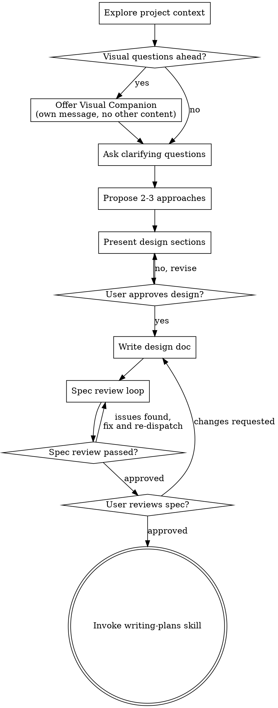

<!-- Generated by SpecStory, Markdown v2.1.0 -->

# 2026-03-16 11:22:35Z

<!-- Claude Code Session 52c8afe1-272d-465a-8537-d3e4a99736e5 (2026-03-16 11:22:35Z) -->

_**User (2026-03-16 11:22:35Z)**_

<command-message>superpowers:brainstorming</command-message>
<command-name>/superpowers:brainstorming</command-name>
<command-args>根据 design spec in docs，你觉得现在的全局字体用什么好，现在是Manrope</command-args>

_**User (2026-03-16 11:22:35Z)**_

Base directory for this skill: <HOME>/.claude/plugins/cache/claude-plugins-official/superpowers/5.0.2/skills/brainstorming

# Brainstorming Ideas Into Designs

Help turn ideas into fully formed designs and specs through natural collaborative dialogue.

Start by understanding the current project context, then ask questions one at a time to refine the idea. Once you understand what you're building, present the design and get user approval.

<HARD-GATE>
Do NOT invoke any implementation skill, write any code, scaffold any project, or take any implementation action until you have presented a design and the user has approved it. This applies to EVERY project regardless of perceived simplicity.
</HARD-GATE>

## Anti-Pattern: "This Is Too Simple To Need A Design"

Every project goes through this process. A todo list, a single-function utility, a config change — all of them. "Simple" projects are where unexamined assumptions cause the most wasted work. The design can be short (a few sentences for truly simple projects), but you MUST present it and get approval.

## Checklist

You MUST create a task for each of these items and complete them in order:

1. **Explore project context** — check files, docs, recent commits
2. **Offer visual companion** (if topic will involve visual questions) — this is its own message, not combined with a clarifying question. See the Visual Companion section below.
3. **Ask clarifying questions** — one at a time, understand purpose/constraints/success criteria
4. **Propose 2-3 approaches** — with trade-offs and your recommendation
5. **Present design** — in sections scaled to their complexity, get user approval after each section
6. **Write design doc** — save to `docs/superpowers/specs/YYYY-MM-DD-<topic>-design.md` and commit
7. **Spec review loop** — dispatch spec-document-reviewer subagent with precisely crafted review context (never your session history); fix issues and re-dispatch until approved (max 5 iterations, then surface to human)
8. **User reviews written spec** — ask user to review the spec file before proceeding
9. **Transition to implementation** — invoke writing-plans skill to create implementation plan

## Process Flow



**The terminal state is invoking writing-plans.** Do NOT invoke frontend-design, mcp-builder, or any other implementation skill. The ONLY skill you invoke after brainstorming is writing-plans.

## The Process

**Understanding the idea:**

- Check out the current project state first (files, docs, recent commits)
- Before asking detailed questions, assess scope: if the request describes multiple independent subsystems (e.g., "build a platform with chat, file storage, billing, and analytics"), flag this immediately. Don't spend questions refining details of a project that needs to be decomposed first.
- If the project is too large for a single spec, help the user decompose into sub-projects: what are the independent pieces, how do they relate, what order should they be built? Then brainstorm the first sub-project through the normal design flow. Each sub-project gets its own spec → plan → implementation cycle.
- For appropriately-scoped projects, ask questions one at a time to refine the idea
- Prefer multiple choice questions when possible, but open-ended is fine too
- Only one question per message - if a topic needs more exploration, break it into multiple questions
- Focus on understanding: purpose, constraints, success criteria

**Exploring approaches:**

- Propose 2-3 different approaches with trade-offs
- Present options conversationally with your recommendation and reasoning
- Lead with your recommended option and explain why

**Presenting the design:**

- Once you believe you understand what you're building, present the design
- Scale each section to its complexity: a few sentences if straightforward, up to 200-300 words if nuanced
- Ask after each section whether it looks right so far
- Cover: architecture, components, data flow, error handling, testing
- Be ready to go back and clarify if something doesn't make sense

**Design for isolation and clarity:**

- Break the system into smaller units that each have one clear purpose, communicate through well-defined interfaces, and can be understood and tested independently
- For each unit, you should be able to answer: what does it do, how do you use it, and what does it depend on?
- Can someone understand what a unit does without reading its internals? Can you change the internals without breaking consumers? If not, the boundaries need work.
- Smaller, well-bounded units are also easier for you to work with - you reason better about code you can hold in context at once, and your edits are more reliable when files are focused. When a file grows large, that's often a signal that it's doing too much.

**Working in existing codebases:**

- Explore the current structure before proposing changes. Follow existing patterns.
- Where existing code has problems that affect the work (e.g., a file that's grown too large, unclear boundaries, tangled responsibilities), include targeted improvements as part of the design - the way a good developer improves code they're working in.
- Don't propose unrelated refactoring. Stay focused on what serves the current goal.

## After the Design

**Documentation:**

- Write the validated design (spec) to `docs/superpowers/specs/YYYY-MM-DD-<topic>-design.md`
  - (User preferences for spec location override this default)
- Use elements-of-style:writing-clearly-and-concisely skill if available
- Commit the design document to git

**Spec Review Loop:**
After writing the spec document:

1. Dispatch spec-document-reviewer subagent (see spec-document-reviewer-prompt.md)
2. If Issues Found: fix, re-dispatch, repeat until Approved
3. If loop exceeds 5 iterations, surface to human for guidance

**User Review Gate:**
After the spec review loop passes, ask the user to review the written spec before proceeding:

> "Spec written and committed to `<path>`. Please review it and let me know if you want to make any changes before we start writing out the implementation plan."

Wait for the user's response. If they request changes, make them and re-run the spec review loop. Only proceed once the user approves.

**Implementation:**

- Invoke the writing-plans skill to create a detailed implementation plan
- Do NOT invoke any other skill. writing-plans is the next step.

## Key Principles

- **One question at a time** - Don't overwhelm with multiple questions
- **Multiple choice preferred** - Easier to answer than open-ended when possible
- **YAGNI ruthlessly** - Remove unnecessary features from all designs
- **Explore alternatives** - Always propose 2-3 approaches before settling
- **Incremental validation** - Present design, get approval before moving on
- **Be flexible** - Go back and clarify when something doesn't make sense

## Visual Companion

A browser-based companion for showing mockups, diagrams, and visual options during brainstorming. Available as a tool — not a mode. Accepting the companion means it's available for questions that benefit from visual treatment; it does NOT mean every question goes through the browser.

**Offering the companion:** When you anticipate that upcoming questions will involve visual content (mockups, layouts, diagrams), offer it once for consent:
> "Some of what we're working on might be easier to explain if I can show it to you in a web browser. I can put together mockups, diagrams, comparisons, and other visuals as we go. This feature is still new and can be token-intensive. Want to try it? (Requires opening a local URL)"

**This offer MUST be its own message.** Do not combine it with clarifying questions, context summaries, or any other content. The message should contain ONLY the offer above and nothing else. Wait for the user's response before continuing. If they decline, proceed with text-only brainstorming.

**Per-question decision:** Even after the user accepts, decide FOR EACH QUESTION whether to use the browser or the terminal. The test: **would the user understand this better by seeing it than reading it?**

- **Use the browser** for content that IS visual — mockups, wireframes, layout comparisons, architecture diagrams, side-by-side visual designs
- **Use the terminal** for content that is text — requirements questions, conceptual choices, tradeoff lists, A/B/C/D text options, scope decisions

A question about a UI topic is not automatically a visual question. "What does personality mean in this context?" is a conceptual question — use the terminal. "Which wizard layout works better?" is a visual question — use the browser.

If they agree to the companion, read the detailed guide before proceeding:
`skills/brainstorming/visual-companion.md`


ARGUMENTS: 根据 design spec in docs，你觉得现在的全局字体用什么好，现在是Manrope

---

_**Agent (claude-opus-4-6 2026-03-16 11:22:39Z)**_

_**Agent (claude-opus-4-6 2026-03-16 11:22:39Z)**_

先探查项目现状与设计文档。

_**Agent (claude-opus-4-6 2026-03-16 11:22:41Z)**_

<tool-use data-tool-type="search" data-tool-name="Glob"><details>
<summary>Tool use: **Glob**</summary>
 pattern `docs/**/*design*.md`

```text
<REPO_ROOT>/docs/plans/2026-02-20-footnote-redesign-design.md
<REPO_ROOT>/docs/plans/2026-02-20-footnote-redesign.md
<REPO_ROOT>/docs/plans/2026-03-01-comment-anchor-fuzzy-matching-design.md
<REPO_ROOT>/docs/plans/2026-03-04-toolbar-command-registry-design.md
<REPO_ROOT>/docs/plans/2026-03-06-nested-doc-node-design.md
<REPO_ROOT>/docs/plans/2026-03-07-mobile-bottom-sheet-design.md
<REPO_ROOT>/docs/plans/2026-03-07-dropdown-menu-restyle-design.md
<REPO_ROOT>/docs/superpowers/specs/2026-03-13-errorboundary-redesign.md
<REPO_ROOT>/docs/superpowers/specs/2026-03-14-note-topic-binder-clip-design.md
<REPO_ROOT>/docs/superpowers/specs/2026-03-14-notes-list-page-design.md
<REPO_ROOT>/docs/superpowers/specs/2026-03-14-notes-list-hero-latest-design.md
<REPO_ROOT>/docs/superpowers/specs/2026-03-14-terminology-i18n-design.md
<REPO_ROOT>/docs/superpowers/specs/2026-03-14-note-letter-bottom-design.md
<REPO_ROOT>/docs/superpowers/specs/2026-03-14-timeline-list-redesign.md
<REPO_ROOT>/docs/superpowers/plans/2026-03-14-timeline-list-redesign.md
<REPO_ROOT>/docs/superpowers/specs/2026-03-15-comment-config-guard-design.md
<REPO_ROOT>/docs/superpowers/specs/2026-03-15-hero-redesign-design.md
<REPO_ROOT>/docs/superpowers/plans/2026-03-15-hero-redesign-implementation.md
<REPO_ROOT>/docs/superpowers/specs/2026-03-15-second-screen-redesign-design.md
<REPO_ROOT>/docs/superpowers/specs/2026-03-15-timeline-redesign-design.md
<REPO_ROOT>/docs/superpowers/specs/2026-03-15-scroll-driven-animation-design.md
<REPO_ROOT>/docs/superpowers/specs/2026-03-15-header-redesign-design.md
<REPO_ROOT>/docs/superpowers/plans/2026-03-15-header-redesign-implementation.md
<REPO_ROOT>/docs/superpowers/specs/2026-03-15-mobile-header-redesign-design.md
<REPO_ROOT>/docs/superpowers/plans/2026-03-15-mobile-header-redesign-implementation.md
<REPO_ROOT>/docs/superpowers/specs/2026-03-16-modal-redesign-design.md
<REPO_ROOT>/docs/superpowers/plans/2026-03-16-modal-redesign-implementation.md
<REPO_ROOT>/docs/superpowers/specs/2026-03-16-float-popover-panel-redesign-design.md
<REPO_ROOT>/docs/superpowers/specs/2026-03-16-dropdown-menu-redesign-design.md
<REPO_ROOT>/docs/superpowers/specs/2026-03-16-button-redesign-design.md
<REPO_ROOT>/docs/superpowers/specs/2026-03-16-footer-redesign-design.md
<REPO_ROOT>/docs/superpowers/plans/2026-03-16-footer-redesign-implementation.md
```
</details></tool-use>

_**Agent (claude-opus-4-6 2026-03-16 11:22:41Z)**_

<tool-use data-tool-type="search" data-tool-name="Glob"><details>
<summary>Tool use: **Glob**</summary>
 pattern `docs/**/*spec*.md`

```text
<REPO_ROOT>/docs/neutral-color-spec.md
```
</details></tool-use>

_**Agent (claude-opus-4-6 2026-03-16 11:22:41Z)**_

<tool-use data-tool-type="search" data-tool-name="Grep"><details>
<summary>Tool use: **Grep**</summary>
 pattern `Manrope|font-family|fontFamily`

```text
Found 10 files
apps/web/src/styles/layer.css
apps/web/src/components/modules/note/NoteFontFab.tsx
apps/web/src/styles/variables.css
apps/web/src/components/ui/markdown/markdown.css
apps/web/src/app/[locale]/og/route.tsx
apps/web/src/components/modules/note/NoteLatestRender.tsx
apps/web/src/components/ui/rich-content/LexicalContent.tsx
apps/web/src/app/home-og/route.tsx
apps/web/src/styles/webfont.css
apps/web/src/lib/fonts.ts
```
</details></tool-use>

_**Agent (claude-opus-4-6 2026-03-16 11:22:45Z)**_

<tool-use data-tool-type="read" data-tool-name="Read"><details>
<summary>Tool use: **Read**</summary>
 `./apps/web/src/lib/fonts.ts`

```text
     1→import { Manrope, Noto_Serif_SC } from 'next/font/google'
     2→
     3→const sansFont = Manrope({
     4→  subsets: ['latin'],
     5→  weight: ['300', '400', '500'],
     6→  variable: '--app-font-sans',
     7→  display: 'swap',
     8→})
     9→
    10→const serifFont = Noto_Serif_SC({
    11→  subsets: ['latin'],
    12→  weight: ['400'],
    13→  variable: '--app-font-serif',
    14→  display: 'swap',
    15→  // adjustFontFallback: false,
    16→  fallback: ['Noto Serif SC'],
    17→})
    18→
    19→export { sansFont, serifFont }
    20→
```
</details></tool-use>

_**Agent (claude-opus-4-6 2026-03-16 11:22:45Z)**_

<tool-use data-tool-type="read" data-tool-name="Read"><details>
<summary>Tool use: **Read**</summary>
 `./apps/web/src/styles/webfont.css`

```text
     1→@font-face {
     2→  font-family: 'OperatorMonoSSmLig Nerd Font';
     3→  src:
     4→    url('https://cdn.jsdelivr.net/gh/Innei/zshrc@0.1.0/webfont/OperatorMonoSSmLigNerdFontAAEOPSLMDI-Italic.woff2')
     5→      format('woff2'),
     6→    url('https://cdn.jsdelivr.net/gh/Innei/zshrc@0.1.0/webfont/OperatorMonoSSmLigNerdFontAAEOPSLMDI-Italic.woff')
     7→      format('woff');
     8→  font-weight: normal;
     9→  font-style: italic;
    10→}
    11→
    12→@font-face {
    13→  font-family: 'OperatorMonoSSmLig Nerd Font';
    14→  src:
    15→    url('https://cdn.jsdelivr.net/gh/Innei/zshrc@0.1.0/webfont/OperatorMonoSSmLigNerdFontAAEOPSLMDI-Book.woff2')
    16→      format('woff2'),
    17→    url('https://cdn.jsdelivr.net/gh/Innei/zshrc@0.1.0/webfont/OperatorMonoSSmLigNerdFontAAEOPSLMDI-Book.woff')
    18→      format('woff');
    19→  font-weight: normal;
    20→  font-style: normal;
    21→}
    22→
    23→@font-face {
    24→  font-family: 'Operator Mono';
    25→  src:
    26→    url('https://cdn.jsdelivr.net/gh/Innei/zshrc@0.1.0/webfont/OperatorMonoSSmLigNerdFontAAEOPSLMDI-Italic.woff2')
    27→      format('woff2'),
    28→    url('https://cdn.jsdelivr.net/gh/Innei/zshrc@0.1.0/webfont/OperatorMonoSSmLigNerdFontAAEOPSLMDI-Italic.woff')
    29→      format('woff');
    30→  font-weight: normal;
    31→  font-style: italic;
    32→}
    33→
    34→@font-face {
    35→  font-family: 'Operator Mono';
    36→  src:
    37→    url('https://cdn.jsdelivr.net/gh/Innei/zshrc@0.1.0/webfont/OperatorMonoSSmLigNerdFontAAEOPSLMDI-Book.woff2')
    38→      format('woff2'),
    39→    url('https://cdn.jsdelivr.net/gh/Innei/zshrc@0.1.0/webfont/OperatorMonoSSmLigNerdFontAAEOPSLMDI-Book.woff')
    40→      format('woff');
    41→  font-weight: normal;
    42→  font-style: normal;
    43→}
    44→
    45→@font-face {
    46→  font-family: 'JetBrains Mono';
    47→  src:
    48→    url('https://fonts.googleapis.com/css2?family=JetBrains+Mono:ital,wght@0,200;0,300;0,400;0,500;0,600;0,700;1,200;1,300;1,400;1,500;1,600;1,700&display=swap'),
    49→    url('https://fonts.googleapis.com/css2?family=Fira+Code:ital,wght@0,200;0,300;0,400;0,500;0,600;0,700;1,200;1,300;1,400;1,500;1,600;1,700&display=swap');
    50→  font-weight: normal;
    51→  font-style: normal;
    52→}
    53→
```
</details></tool-use>

_**Agent (claude-opus-4-6 2026-03-16 11:22:46Z)**_

<tool-use data-tool-type="read" data-tool-name="Read"><details>
<summary>Tool use: **Read**</summary>
 `./apps/web/src/styles/variables.css`

```text
     1→html {
     2→  /* Accent color for form controls */
     3→  accent-color: var(--color-accent);
     4→
     5→  /* make app like native app in mobile */
     6→  -webkit-tap-highlight-color: transparent;
     7→
     8→  font-family: var(--font-sans);
     9→  background-color: var(--color-root-bg);
    10→}
    11→
    12→a,
    13→details summary {
    14→  -webkit-tap-highlight-color: rgba(0, 0, 0, 0);
    15→}
    16→
    17→:root {
    18→  --bg-opacity: rgba(254, 253, 251, 0.72);
    19→  --color-root-bg: #fefefb;
    20→  --color-border: rgba(24, 24, 27, 0.1);
    21→}
    22→
    23→[data-theme='dark'] {
    24→  --color-accent: #f596aa;
    25→  --color-neutral-1: #141414;
    26→  --color-neutral-2: #242424;
    27→  --color-neutral-3: #404040;
    28→  --color-neutral-4: #5c5c5c;
    29→  --color-neutral-5: #787878;
    30→  --color-neutral-6: #a8a8a8;
    31→  --color-neutral-7: #d0d0d0;
    32→  --color-neutral-8: #e3e3e3;
    33→  --color-neutral-9: #f0f0f0;
    34→  --color-neutral-10: #f8f8f8;
    35→  --color-info: #0a84ff;
    36→  --color-success: #30d158;
    37→  --color-warning: #ff9f0a;
    38→  --color-error: #ff453a;
    39→  --bg-opacity: rgba(29, 29, 31, 0.72);
    40→  --color-root-bg: rgb(28, 28, 30);
    41→  --color-border: #3f3f46;
    42→}
    43→
    44→::selection {
    45→  background-color: color-mix(in oklab, var(--color-accent) 30%, transparent);
    46→  text-shadow: none;
    47→}
    48→
    49→::view-transition-new(root) {
    50→  animation: turnOff 800ms ease-in-out;
    51→}
    52→::view-transition-old(root) {
    53→  animation: none;
    54→}
    55→
    56→@keyframes turnOn {
    57→  0% {
    58→    clip-path: polygon(0% 0%, 100% 0, 100% 0, 0 0);
    59→  }
    60→  100% {
    61→    clip-path: polygon(0% 0%, 100% 0, 100% 100%, 0 100%);
    62→  }
    63→}
    64→
    65→[data-theme='dark']::view-transition-new(root) {
    66→  animation: turnOn 800ms ease-in-out;
    67→}
    68→::view-transition-old(root) {
    69→  animation: none;
    70→}
    71→
    72→@keyframes turnOff {
    73→  0% {
    74→    clip-path: polygon(0 100%, 100% 100%, 100% 100%, 0% 100%);
    75→  }
    76→  100% {
    77→    clip-path: polygon(0 100%, 100% 100%, 100% 0, 0 0);
    78→  }
    79→}
    80→
```
</details></tool-use>

_**Agent (claude-opus-4-6 2026-03-16 11:22:46Z)**_

<tool-use data-tool-type="read" data-tool-name="Read"><details>
<summary>Tool use: **Read**</summary>
 `./apps/web/src/styles/layer.css`

```text
     1→@layer components {
     2→  .cover-mask-b {
     3→    mask-image: linear-gradient(180deg, #fff -17.19%, #00000000 92.43%);
     4→  }
     5→}
     6→
     7→@layer components {
     8→  .border-border {
     9→    @apply border-neutral-9/10;
    10→  }
    11→}
    12→
    13→@layer utilities {
    14→  .scrollbar-none::-webkit-scrollbar {
    15→    width: 0 !important;
    16→    height: 0 !important;
    17→  }
    18→  .rich-link {
    19→    @apply no-underline!;
    20→  }
    21→  .shiro-link--underline,
    22→  .rich-link {
    23→    color: currentColor;
    24→    text-decoration: underline;
    25→    text-underline-offset: 3px;
    26→
    27→    @apply decoration-neutral-4/20 hover:no-underline!;
    28→
    29→    background-image: linear-gradient(var(--color-accent), var(--color-accent));
    30→    background-size: 0% 1.5px;
    31→    background-repeat: no-repeat;
    32→    /* NOTE: this won't work with background images   */
    33→
    34→    transition: all 500ms ease !important;
    35→
    36→    @apply border-0;
    37→
    38→    background-position: left 1.2em;
    39→
    40→    &:hover {
    41→      background-size: 100% 1.5px;
    42→      text-shadow:
    43→        0.05em 0 var(--color-neutral-1),
    44→        -0.05em 0 var(--color-neutral-1);
    45→
    46→      transition: all 250ms ease;
    47→    }
    48→
    49→    &::selection {
    50→      text-shadow: none;
    51→    }
    52→
    53→    &.no-shadow {
    54→      text-shadow: none;
    55→    }
    56→  }
    57→
    58→  .shiro-timeline {
    59→    position: relative;
    60→    list-style: none;
    61→
    62→    @apply min-w-0 flex-1;
    63→
    64→    &::before {
    65→      content: '';
    66→      position: absolute;
    67→      left: -2px;
    68→      width: 2px;
    69→      top: var(--indicator-top, 0);
    70→      height: var(--indicator-height, 0);
    71→      opacity: var(--indicator-opacity, 0);
    72→      background-color: var(--color-accent);
    73→      transition:
    74→        top 0.2s ease,
    75→        height 0.2s ease,
    76→        opacity 0.15s ease;
    77→      pointer-events: none;
    78→      z-index: 1;
    79→    }
    80→
    81→    & > li {
    82→      position: relative;
    83→      padding: 12px 0 12px 24px;
    84→      transition: background 0.2s;
    85→      animation: timeline-fade-up 0.4s ease-out both;
    86→      animation-delay: calc(var(--li-index, 0) * 50ms);
    87→    }
    88→
    89→    & > li:hover {
    90→      background: linear-gradient(
    91→        90deg,
    92→        color-mix(in oklch, var(--color-accent) 4%, transparent),
    93→        transparent 70%
    94→      );
    95→    }
    96→
    97→    & > li:hover .timeline-date {
    98→      color: var(--color-accent);
    99→    }
   100→
   101→    & > li:hover .timeline-title {
   102→      color: var(--color-neutral-10);
   103→    }
   104→
   105→    & a {
   106→      line-height: 1.6;
   107→    }
   108→  }
   109→
   110→  @keyframes timeline-fade-up {
   111→    from {
   112→      opacity: 0;
   113→      transform: translateY(12px);
   114→    }
   115→    to {
   116→      opacity: 1;
   117→      transform: translateY(0);
   118→    }
   119→  }
   120→
   121→  .shiro-timeline-spine {
   122→    border-left: 2px solid var(--color-border);
   123→    margin-left: 4px;
   124→  }
   125→}
   126→
   127→@layer components {
   128→  .mask-cover {
   129→    mask-image: linear-gradient(to right, transparent, rgb(0 0 0 / 100%) 90%);
   130→    opacity: 0.3;
   131→    transition: opacity 0.3s ease-in-out;
   132→  }
   133→
   134→  .group:hover .mask-cover {
   135→    opacity: 0.5;
   136→  }
   137→
   138→  .animation-blink {
   139→    animation: blink 1.2s linear infinite;
   140→  }
   141→
   142→  .mask-top {
   143→    mask-image: linear-gradient(to top, transparent, rgb(0 0 0 / 100%) 90%);
   144→    opacity: 0.3;
   145→    transition: opacity 0.3s ease-in-out;
   146→  }
   147→
   148→  @keyframes blink {
   149→    0% {
   150→      opacity: 0;
   151→    }
   152→    40% {
   153→      opacity: 0;
   154→    }
   155→    40.1% {
   156→      opacity: 1;
   157→    }
   158→    99.9% {
   159→      opacity: 1;
   160→    }
   161→    100% {
   162→      opacity: 0;
   163→    }
   164→  }
   165→
   166→  /* 404 */
   167→  .hit-the-floor {
   168→    font-size: 12em;
   169→    font-weight: bold;
   170→    font-family: Helvetica;
   171→    text-shadow:
   172→      0 1px 0 #ccc,
   173→      0 2px 0 #c9c9c9,
   174→      0 3px 0 #bbb,
   175→      0 4px 0 #b9b9b9,
   176→      0 5px 0 #aaa,
   177→      0 6px 1px rgba(0, 0, 0, 0.1),
   178→      0 0 5px rgba(0, 0, 0, 0.1),
   179→      0 1px 3px rgba(0, 0, 0, 0.3),
   180→      0 3px 5px rgba(0, 0, 0, 0.2),
   181→      0 5px 10px rgba(0, 0, 0, 0.25),
   182→      0 10px 10px rgba(0, 0, 0, 0.2),
   183→      0 20px 20px rgba(0, 0, 0, 0.15);
   184→  }
   185→}
   186→
   187→@layer components {
   188→  .page-glow-container {
   189→    @apply pointer-events-none absolute inset-x-0 top-0 h-[720px] w-full;
   190→
   191→    overflow: hidden;
   192→    animation: fade-in 0.8s ease 0.2s both;
   193→    -webkit-mask-image: linear-gradient(
   194→      180deg,
   195→      rgb(0 0 0 / 100%) 0%,
   196→      rgb(0 0 0 / 100%) 48%,
   197→      rgb(0 0 0 / 72%) 64%,
   198→      rgb(0 0 0 / 24%) 82%,
   199→      transparent 100%
   200→    );
   201→    mask-image: linear-gradient(
   202→      180deg,
   203→      rgb(0 0 0 / 100%) 0%,
   204→      rgb(0 0 0 / 100%) 48%,
   205→      rgb(0 0 0 / 72%) 64%,
   206→      rgb(0 0 0 / 24%) 82%,
   207→      transparent 100%
   208→    );
   209→  }
   210→
   211→  @keyframes glow-enter {
   212→    0% {
   213→      opacity: 0;
   214→      transform: translate(-50%, -50%) scale(0.6);
   215→    }
   216→    100% {
   217→      opacity: var(--glow-opacity, 0.4);
   218→      transform: translate(-50%, -50%) scale(1);
   219→    }
   220→  }
   221→
   222→  .signature-animated path {
   223→    stroke-dasharray: 2400;
   224→    stroke-dashoffset: 2400;
   225→    fill: transparent;
   226→    animation: drawSignature 8s linear infinite both;
   227→    stroke-width: 2px;
   228→    stroke: var(--color-neutral-9);
   229→  }
   230→
   231→  @keyframes drawSignature {
   232→    0% {
   233→      stroke-dashoffset: 2400;
   234→    }
   235→
   236→    15% {
   237→      fill: transparent;
   238→    }
   239→
   240→    35%,
   241→    75% {
   242→      stroke-dashoffset: 0;
   243→      fill: var(--color-neutral-9);
   244→    }
   245→
   246→    90%,
   247→    100% {
   248→      stroke-dashoffset: 2400;
   249→      fill: transparent;
   250→    }
   251→  }
   252→
   253→  .animation-wave {
   254→    animation: wave 2s infinite;
   255→  }
   256→
   257→  .hover-shake:hover {
   258→    animation: shake 0.4s ease-in-out;
   259→  }
   260→
   261→  @keyframes shake {
   262→    0%,
   263→    100% {
   264→      transform: rotate(0deg);
   265→    }
   266→    25% {
   267→      transform: rotate(-5deg);
   268→    }
   269→    75% {
   270→      transform: rotate(5deg);
   271→    }
   272→  }
   273→
   274→  @keyframes wave {
   275→    0%,
   276→    100% {
   277→      transform: rotate(0deg);
   278→    }
   279→    50% {
   280→      transform: rotate(20deg);
   281→    }
   282→  }
   283→}
   284→
   285→@layer components {
   286→  .content-auto {
   287→    content-visibility: auto;
   288→  }
   289→
   290→  .shadow-out-sm {
   291→    box-shadow:
   292→      0 0 10px rgba(120, 120, 120, 0.1),
   293→      0 5px 20px rgba(120, 120, 120, 0.2);
   294→  }
   295→
   296→  .backface-hidden {
   297→    -webkit-backface-visibility: hidden;
   298→    -moz-backface-visibility: hidden;
   299→    -webkit-transform: translate3d(0, 0, 0);
   300→    -moz-transform: translate3d(0, 0, 0);
   301→  }
   302→
   303→  .center {
   304→    align-items: center;
   305→    justify-content: center;
   306→  }
   307→
   308→  .fill-content {
   309→    min-height: calc(100vh - 17.5rem);
   310→  }
   311→
   312→  .card-shadow {
   313→    box-shadow:
   314→      0 0 0 1px rgba(0, 0, 0, 0.08),
   315→      0 4px 6px rgba(0, 0, 0, 0.04);
   316→  }
   317→
   318→  .card-shadow:hover {
   319→    box-shadow:
   320→      0 0 0 1px rgba(0, 0, 0, 0.08),
   321→      0 6px 14px rgba(0, 0, 0, 0.08);
   322→  }
   323→}
   324→
   325→@layer components {
   326→  .shadow-perfect {
   327→    /* https://codepen.io/jh3y/pen/yLWgjpd */
   328→    --tint: 214;
   329→    --alpha: 3;
   330→    --base: hsl(var(--tint, 214) 80% 27% / calc(var(--alpha, 4) * 1%));
   331→    /**
   332→      * Use relative syntax to get to: hsl(221 25% 22% / 40%)
   333→    */
   334→    --shade: hsl(from var(--base) calc(h + 8) 25 calc(l - 5));
   335→    --perfect-shadow:
   336→      0 0 0 1px var(--base), 0 1px 1px -0.5px var(--shade),
   337→      0 3px 3px -1.5px var(--shade), 0 6px 6px -3px var(--shade),
   338→      0 12px 12px -6px var(--base), 0 24px 24px -12px var(--base);
   339→    box-shadow: var(--perfect-shadow);
   340→  }
   341→
   342→  .perfect-sm {
   343→    --alpha: 1;
   344→  }
   345→
   346→  .perfect-md {
   347→    --alpha: 2;
   348→  }
   349→
   350→  [theme='dark'] .shadow-perfect {
   351→    --tint: 221;
   352→  }
   353→}
   354→
   355→@property --mask-top {
   356→  syntax: '<length>';
   357→  inherits: false;
   358→  initial-value: 0px;
   359→}
   360→
   361→@property --mask-bottom {
   362→  syntax: '<length>';
   363→  inherits: false;
   364→  initial-value: 30px;
   365→}
   366→
   367→@layer components {
   368→  .mask-scroller {
   369→    --mask-top: 0px;
   370→    --mask-bottom: 30px;
   371→    mask: linear-gradient(
   372→      to bottom,
   373→      transparent calc(var(--mask-top) - 30px),
   374→      black var(--mask-top),
   375→      black calc(100% - var(--mask-bottom)),
   376→      transparent calc(100% - var(--mask-bottom) + 30px)
   377→    );
   378→  }
   379→
   380→  @supports (animation-timeline: scroll(self block)) {
   381→    .mask-scroller {
   382→      animation-name: mask-up, mask-down;
   383→      animation-duration: 1s, 1s;
   384→      animation-timing-function: linear, linear;
   385→      animation-fill-mode: both, both;
   386→      animation-timeline: scroll(self block), scroll(self block);
   387→      animation-range:
   388→        0 50px,
   389→        calc(100% - 50px) 100%;
   390→    }
   391→  }
   392→  @supports (animation-timeline: scroll()) and
   393→    (not (animation-timeline: scroll(self block))) {
   394→    .mask-scroller {
   395→      animation-name: mask-up, mask-down;
   396→      animation-duration: 1s, 1s;
   397→      animation-timing-function: linear, linear;
   398→      animation-fill-mode: both, both;
   399→      animation-timeline: scroll(), scroll();
   400→      animation-range:
   401→        0 50px,
   402→        calc(100% - 50px) 100%;
   403→    }
   404→  }
   405→  @keyframes mask-up {
   406→    to {
   407→      --mask-top: 30px;
   408→    }
   409→  }
   410→  @keyframes mask-down {
   411→    to {
   412→      --mask-bottom: 0px;
   413→    }
   414→  }
   415→}
   416→
   417→@layer components {
   418→  .shadow-context-menu {
   419→    box-shadow:
   420→      rgba(0, 0, 0, 0.067) 0px 3px 8px,
   421→      rgba(0, 0, 0, 0.067) 0px 2px 5px,
   422→      rgba(0, 0, 0, 0.067) 0px 1px 1px;
   423→  }
   424→}
   425→
   426→/* Tailwind 4 Extensions */
   427→@layer components {
   428→  .field-sizing-content {
   429→    field-sizing: content;
   430→  }
   431→
   432→  .comment-block-active {
   433→    background: color-mix(
   434→      in srgb,
   435→      var(--color-accent, #33a6b8) 5%,
   436→      transparent
   437→    );
   438→    border-radius: 4px;
   439→    transition: background 0.15s ease;
   440→  }
   441→}
   442→
   443→/* Safari 不显示 PageColorGradient，规避 blur+mask 性能与撕裂问题（由 JS 注入 is-safari class） */
   444→.is-safari .page-glow-container {
   445→  display: none !important;
   446→}
   447→
```
</details></tool-use>

_**Agent (claude-opus-4-6 2026-03-16 11:22:46Z)**_

<tool-use data-tool-type="read" data-tool-name="Read"><details>
<summary>Tool use: **Read**</summary>
 `./docs/superpowers/specs/2026-03-16-footer-redesign-design.md`

```text
     1→# Footer Redesign — Design Spec
     2→
     3→## Overview
     4→
     5→Redesign the footer (`apps/web/src/components/layout/footer/`) to align with the 書写·信纸·光影 design language. All existing content blocks are preserved; only visual treatment and layout change.
     6→
     7→## User Decisions
     8→
     9→- **Desktop layout**: C — Asymmetric Split (left brand, right link columns)
    10→- **Mobile layout**: C3 — Flat Inline Flow (brand top, links inline with dot separators)
    11→- **Top boundary**: D1 — Gradient Fade (no hard border-t)
    12→
    13→## Content Blocks (all retained)
    14→
    15→1. **Link sections** — About / More / Contact (3 groups, each with 3 links, from API config)
    16→2. **Bottom info** — © year + owner name, RSS, Sitemap, SubscribeTextButton (client component, opens subscribe modal), Motto
    17→3. **Powered by** — Mix Space & 余白/Yohaku + build info tooltip
    18→4. **GatewayInfo** — online viewer count + Socket connection indicator
    19→5. **Controls** — LocaleSwitcher (dropdown) + ThemeSwitcher (segmented three-button group)
    20→6. **VercelPoweredBy** — currently unused (not imported by Footer.tsx), excluded from this redesign
    21→
    22→## Desktop Layout (md+)
    23→
    24→### Structure
    25→
    26→```
    27→┌─────────────────────────────────────────────────────────┐
    28→│ gradient-fade zone (h-12, from page-bg to --footer-bg)  │
    29→├─────────────────────────────────────────────────────────┤
    30→│                                                         │
    31→│  ┌──────────┐   ┌─────────┐ ┌─────────┐ ┌─────────┐   │
    32→│  │ Owner    │   │ ABOUT   │ │ MORE    │ │ CONTACT │   │
    33→│  │ Name     │   │ Link 1  │ │ Link 1  │ │ Link 1  │   │
    34→│  │          │   │ Link 2  │ │ Link 2  │ │ Link 2  │   │
    35→│  │ Motto    │   │ Link 3↗ │ │ Link 3↗ │ │ Link 3↗ │   │
    36→│  │ (italic) │   └─────────┘ └─────────┘ └─────────┘   │
    37→│  │          │                                           │
    38→│  │ © + PWR  │                                           │
    39→│  │ Gateway  │                                           │
    40→│  │ [En][☀]  │                                           │
    41→│  └──────────┘                                           │
    42→│                                                         │
    43→│  ─ ─ ─ ─ ─ ─ ─ (0.5px hairline black/4) ─ ─ ─ ─ ─ ─  │
    44→│  RSS · Sitemap · Subscribe                    ICP 备案  │
    45→│                                                         │
    46→└─────────────────────────────────────────────────────────┘
    47→```
    48→
    49→### Left Column (brand area, flex-shrink-0 w-60)
    50→
    51→- **Owner name**: text-base font-semibold (serif inherits from page; ensure a `font-serif` ancestor is present)
    52→- **Motto**: text-xs italic text-neutral-7, leading-relaxed, mt-1.5. **Moved here from the old bottom copyright line** — it no longer appears inline with ©.
    53→- **Copyright + Powered by**: text-[11px] text-neutral-6, line-height loose (leading-loose), mt-5
    54→  - Links (Mix Space, 余白) use underline with `decoration-black/15 dark:decoration-white/10 underline-offset-2`
    55→  - 余白/Yohaku retains FloatPopover tooltip with build info
    56→- **GatewayInfo**: text-[11px] text-neutral-6, mt-1, inline-flex with green dot (w-[5px] h-[5px] rounded-full bg-[#00FC47])
    57→- **Controls**: flex gap-1.5, mt-4
    58→  - LocaleSwitcher and ThemeSwitcher are used as-is (existing components, not restyled). They are simply repositioned into the left brand column.
    59→
    60→### Right Area (link columns, flex-1)
    61→
    62→- Three columns in a flex row with gap-12
    63→- **Section label**: text-[9px] uppercase tracking-[3px] text-neutral-6 font-medium mb-2.5
    64→- **Links**: text-xs leading-[2.4] text-neutral-8/90
    65→  - Each link is a block element (display: block)
    66→  - Hover: underline with ink-pressure style (opacity increase, no scale)
    67→  - External links: append ` ↗` suffix (text-neutral-6)
    68→- No arrow icon (remove IonIosArrowDown from current design)
    69→
    70→### Bottom Bar
    71→
    72→- Separated by 0.5px hairline: `border-t border-black/4 dark:border-white/4`
    73→- flex justify-between, mt-6 pt-3
    74→- Left: RSS · Sitemap · SubscribeTextButton (text-[10px] text-neutral-6, dot separators with text-neutral-5)
    75→- Right: ICP info if present (text-[10px] text-neutral-6)
    76→
    77→## Mobile Layout (<md)
    78→
    79→### Structure
    80→
    81→```
    82→┌───────────────────────────┐
    83→│ gradient-fade (h-9)       │
    84→├───────────────────────────┤
    85→│                           │
    86→│ Owner Name                │
    87→│ Motto (italic)            │
    88→│                           │
    89→│ LINKS                     │
    90→│ Link1 · Link2 · Link3 ·  │
    91→│ Link4 · Link5 · Link6 ·  │
    92→│ Link7 · Link8 · Link9    │
    93→│                           │
    94→│ ─ ─ (hairline) ─ ─ ─ ─   │
    95→│ © 2020–2026 · PWR         │
    96→│ 🟢 3 viewers online       │
    97→│                           │
    98→│ RSS·Sitemap·Sub   [En][☀] │
    99→└───────────────────────────┘
   100→```
   101→
   102→### Brand Block
   103→
   104→- **Owner name**: text-[15px] font-semibold, mb-1
   105→- **Motto**: text-[11px] italic text-neutral-7, leading-relaxed
   106→- mb-4 below brand block
   107→
   108→### Links Block
   109→
   110→- **Section label**: text-[9px] uppercase tracking-[3px] text-neutral-6, mb-2, reads "Links" (single label, not per-group)
   111→- All links from all sections flattened into a single inline flow
   112→- text-[11px] text-neutral-8/90, leading-[2.2]
   113→- Separated by ` · ` (dot, text-neutral-5)
   114→- mb-4 below links block
   115→
   116→### Bottom Block
   117→
   118→- border-t border-black/4 dark:border-white/4, pt-3
   119→- **Line 1**: © + year + Powered by (text-[10px] text-neutral-6)
   120→- **Line 2**: GatewayInfo with green dot, mt-0.5, text-[10px] text-neutral-6
   121→- **Line 3**: ICP info if present (text-[10px] text-neutral-6)
   122→- **Line 4**: flex justify-between items-center, mt-2.5
   123→  - Left: RSS · Sitemap · SubscribeTextButton (text-[10px] text-neutral-6, dot separators text-neutral-5)
   124→  - Right: LocaleSwitcher + ThemeSwitcher (existing components, repositioned)
   125→
   126→## Gradient Fade Boundary
   127→
   128→Replace current `border-t` with a gradient transition zone:
   129→
   130→- **Element**: A div before the footer content
   131→- **Desktop**: `h-12` with `background: linear-gradient(to bottom, var(--color-root-bg, #fff), var(--footer-bg))`
   132→- **Mobile**: `h-9`
   133→- **Dark mode**: Gradient from dark root-bg to dark footer-bg (automatic via CSS variables)
   134→- The footer element itself: remove `border-t`, keep `bg-[var(--footer-bg)]`
   135→
   136→## Color Tokens
   137→
   138→| Element | Light | Dark |
   139→|---------|-------|------|
   140→| Footer background | `var(--footer-bg)` (existing) | `var(--footer-bg)` (existing) |
   141→| Owner name | `text-neutral-9` | auto-inverts |
   142→| Motto | `text-neutral-7` italic | auto-inverts |
   143→| Section labels | `text-neutral-6` | auto-inverts |
   144→| Links | `text-neutral-8/90` | auto-inverts |
   145→| External arrow | `text-neutral-6` | auto-inverts |
   146→| Meta text (©, PWR, RSS) | `text-neutral-6` | auto-inverts |
   147→| Dot separators | `text-neutral-5` (decorative) | auto-inverts |
   148→| Control borders | `border-black/6` | `dark:border-white/8` |
   149→| Bottom hairline | `border-black/4` | `dark:border-white/4` |
   150→| Gateway dot | `bg-[#00FC47]` (connected) / `bg-[#FC0000]` (disconnected) | same |
   151→
   152→## Typography
   153→
   154→- Owner name: inherits page serif, font-semibold
   155→- Motto: serif italic
   156→- Section labels: 9px, uppercase, tracking 3px, font-medium
   157→- Links: 12px (desktop) / 11px (mobile)
   158→- Meta text: 10-11px
   159→
   160→## Animation
   161→
   162→- No entry animations for footer (it's below-fold, always visible when scrolled to)
   163→- Link hover: color transition 200ms with project easing `cubic-bezier(0.22, 1, 0.36, 1)`
   164→- Control hover: border-opacity increase, 200ms same easing
   165→
   166→## Interaction
   167→
   168→- Links: hover shows underline (`underline decoration-current/30 underline-offset-2`)
   169→- External links: `target="_blank"` + ↗ suffix
   170→- Yohaku link: retains cursor-help + FloatPopover tooltip (build info)
   171→- GatewayInfo: retains FloatPopover with rooms info on click/hover
   172→- Controls: ink-pressure model (opacity deepen on hover, translateY(1px) on active)
   173→
   174→## Files to Modify
   175→
   176→- `Footer.tsx` — remove border-t, add gradient fade div, restructure layout
   177→- `FooterInfo.tsx` — rewrite to asymmetric split (desktop) / flat inline (mobile), remove IonIosArrowDown, update typography
   178→- `GatewayInfo.tsx` — simplify to inline dot + text (remove radial gradient indicator for the main display; keep in tooltip)
   179→- `config.ts` — no changes needed
   180→- `LocaleSwitcher.tsx` — no changes needed (repositioned in layout, used as-is)
   181→- `OwnerName.tsx` — no changes needed
   182→- `VercelPoweredBy.tsx` — currently unused (not imported), no changes needed
   183→
   184→## CSS Variables Required
   185→
   186→- `--color-root-bg` — already exists in accent-color.ts (generated as CSS variable for root background)
   187→- `--footer-bg` — already exists in accent-color.ts
   188→
   189→## Responsive Breakpoint
   190→
   191→- Single breakpoint at `md` (768px), consistent with existing footer
   192→- Desktop (md+): Asymmetric split with flex-row
   193→- Mobile (<md): Vertical stack with inline flow links
   194→
   195→## Accessibility
   196→
   197→- All links remain focusable with proper href
   198→- External links retain `target="_blank"` with `rel="noreferrer"`
   199→- Color contrast: neutral-8/90 on footer-bg meets WCAG AA for body text
   200→- Gateway connection status: color + text label (not color-only)
   201→
```
</details></tool-use>

_**Agent (claude-opus-4-6 2026-03-16 11:22:50Z)**_

_**Agent (claude-opus-4-6 2026-03-16 11:22:51Z)**_

再看 Tailwind CSS 配置中字体定义与整体设计语言。

_**Agent (claude-opus-4-6 2026-03-16 11:22:52Z)**_

<tool-use data-tool-type="read" data-tool-name="Read"><details>
<summary>Tool use: **Read**</summary>
 `./apps/web/src/styles/tailwindcss.css`

```text
     1→@import 'tailwindcss';
     2→@import 'tw-animate-css';
     3→
     4→@source "./src/**/*.{js,jsx,ts,tsx}";
     5→@source "../../node_modules/@ferrucc-io/emoji-picker/dist/**/*.{js,jsx,ts,tsx}";
     6→@source inline("font-light text-3xl rounded p-1 bg-neutral-3 dark:bg-neutral-2/0 hover:dark:bg-neutral-2/100 bg-opacity-0 hover:bg-opacity-100 transition-background w-[1px] h-8 -bottom-2 bg-neutral-9/80 dark:bg-neutral-3/80 group-hover:opacity-100 transition-opacity group-hover:animation-blink w-full! w-full");
     7→
     8→@plugin "@tailwindcss/typography";
     9→@plugin "@egoist/tailwindcss-icons";
    10→
    11→@import './loading.css';
    12→@import './checkbox.css';
    13→@import './layer.css';
    14→@import './animation.css';
    15→@import './image-zoom.css';
    16→
    17→@theme inline {
    18→  --font-sans:
    19→    var(--app-font-sans), system-ui, -apple-system, 'PingFang SC',
    20→    'Microsoft YaHei', 'Segoe UI', Roboto, Helvetica, 'noto sans sc',
    21→    'hiragino sans gb', 'sans-serif', Apple Color Emoji, Segoe UI Emoji,
    22→    Not Color Emoji;
    23→  --font-serif:
    24→    'Noto Serif CJK SC', 'Noto Serif SC', var(--app-font-serif),
    25→    'Source Han Serif SC', 'Source Han Serif', source-han-serif-sc, SongTi SC,
    26→    SimSum, 'Hiragino Sans GB', system-ui, -apple-system, Segoe UI, Roboto,
    27→    Helvetica, 'Microsoft YaHei', 'WenQuanYi Micro Hei', sans-serif;
    28→  --font-mono:
    29→    'OperatorMonoSSmLig Nerd Font', 'Cascadia Code PL',
    30→    'FantasqueSansMono Nerd Font', 'operator mono', JetBrainsMono,
    31→    'Fira code Retina', 'Fira code', 'Consolas', Monaco, 'Hannotate SC',
    32→    monospace, -apple-system;
    33→}
    34→
    35→@theme {
    36→  --color-accent: #33a6b8;
    37→
    38→  /* Neutral 色阶 — 素 Pure (三档分治, dark mode 自动反转)
    39→     Tier 1 (1-4): 背景/填充    Tier 2 (5-7): 边框/图标/辅助文字    Tier 3 (8-10): 正文/标题 */
    40→  --color-neutral-1: #f8f8f8;
    41→  --color-neutral-2: #f0f0f0;
    42→  --color-neutral-3: #e3e3e3;
    43→  --color-neutral-4: #d0d0d0;
    44→  --color-neutral-5: #a8a8a8;
    45→  --color-neutral-6: #787878;
    46→  --color-neutral-7: #5c5c5c;
    47→  --color-neutral-8: #404040;
    48→  --color-neutral-9: #242424;
    49→  --color-neutral-10: #141414;
    50→
    51→  --color-info: #007aff;
    52→  --color-success: #34c759;
    53→  --color-warning: #ff9500;
    54→  --color-error: #ff3b30;
    55→
    56→  /* border-border utility - 值在 variables.css 中被 :root/[data-theme='dark'] 覆盖 */
    57→  --color-border: rgba(24, 24, 27, 0.1);
    58→
    59→  --color-muted-1: var(--color-neutral-1);
    60→  --color-muted-2: var(--color-neutral-2);
    61→  --color-muted-3: var(--color-neutral-3);
    62→  --color-muted-4: var(--color-neutral-4);
    63→  --color-muted-5: var(--color-neutral-5);
    64→  --color-muted-6: var(--color-neutral-6);
    65→  --color-muted-7: var(--color-neutral-7);
    66→  --color-muted-8: var(--color-neutral-8);
    67→  --color-muted-9: var(--color-neutral-9);
    68→  --color-muted-10: var(--color-neutral-10);
    69→
    70→  --color-themed-bg_opacity: var(--bg-opacity);
    71→}
    72→
    73→@custom-variant dark (&:where(.dark, .dark *, [data-theme="dark"], [data-theme="dark"] *));
    74→
    75→html {
    76→  font-size: 14px;
    77→  line-height: 1.5;
    78→}
    79→
    80→html body {
```
</details></tool-use>

_**Agent (claude-opus-4-6 2026-03-16 11:22:53Z)**_

<tool-use data-tool-type="read" data-tool-name="Read"><details>
<summary>Tool use: **Read**</summary>
 `./docs/superpowers/specs/2026-03-15-hero-redesign-design.md`

```text
     1→# Hero Redesign — 散文式自由布局 + 书写呼吸动效
     2→
     3→## Overview
     4→
     5→重新设计首页 Hero 组件，从当前的二栏左文右图布局改为「散文式自由布局」，以「书写 · 信纸 · 光影」为视觉核心。元素如手帐般散落于画布，配合 SVG 手写入场动画与微幅呼吸浮动。
     6→
     7→## Design Decisions
     8→
     9→| 维度 | 决定 |
    10→|------|------|
    11→| 高度 | 桌面 65vh (min 560px)，移动端 auto（内容撑开） |
    12→| 布局 | 桌面 absolute 自由定位；移动端 flex-col 纵向流 |
    13→| 背景 | 纯光影渐变，1-2 个缓慢移动的暖色 radial-gradient 光斑 |
    14→| 标题动画 | CSS `background-clip: text` + gradient sweep 模拟手写描绘感（~2s），不依赖 SVG path data |
    15→| 社交图标 | 单色线条，hover 显 accent color |
    16→| 一言 | 手写体/斜体 P.S. 风格，右下角 |
    17→| 头像 | 桌面 48px 右上角弱化；移动端 36px 顶部行 |
    18→| 新增 | 写作统计（文章数/字数/天数）+ 「最近在写」动态区 |
    19→| 暗色主题 | 光斑改为冷色调低透明度，文字色跟随现有 dark mode token |
    20→| 无障碍 | `prefers-reduced-motion` 时禁用所有浮动/入场动画 |
    21→
    22→## Architecture
    23→
    24→### Component Structure
    25→
    26→```
    27→Hero.tsx (重写)
    28→├── HeroBackground        — 光影渐变背景层（1-2 个 div radial-gradient）
    29→├── HeroTitle             — 标题 + gradient sweep 动画
    30→├── HeroDescription       — 描述文字
    31→├── HeroAvatar            — 缩小头像
    32→├── HeroWritingStats      — 写作统计边注（文章数/字数/天数）
    33→├── HeroRecentWriting     — 「最近在写」最近 3 篇文章/笔记标题（可点击）
    34→├── HeroSocialIcons       — 单色线条社交图标（复用 SocialIcon，新增 variant="mono" prop）
    35→└── HeroHitokoto          — P.S. 一言（复用现有 Hitokoto 逻辑，改样式）
    36→```
    37→
    38→所有子组件内联于 Hero.tsx 中，除非单组件超 80 行才拆分文件。
    39→
    40→### Layout — Desktop (lg+)
    41→
    42→```
    43→┌─────────────────────────────────────────────────────┐
    44→│                                              [avatar]│  top: 12%, right: 5%
    45→│  标题 (gradient sweep)                               │  top: 15%, left: 5%
    46→│  描述文字...                                         │  top: 28%, left: 5%
    47→│                                                      │
    48→│                                           287 篇     │  top: 45%, right: 5%
    49→│  最近在写                                 102 万字    │
    50→│  · 关于春天的碎碎念                       2190 天     │  top: 48%, left: 5%
    51→│  · TypeScript 类型体操笔记                            │
    52→│  · 三月读书清单                                       │
    53→│                                                      │
    54→│  [gh] [x] [tg] [mail]         P.S. 一言引语...       │  bottom: 12%/10%
    55→└─────────────────────────────────────────────────────┘
    56→```
    57→
    58→### Layout — Mobile (<lg)
    59→
    60→```
```
</details></tool-use>

_**Agent (claude-opus-4-6 2026-03-16 11:23:25Z)**_

_**Agent (claude-opus-4-6 2026-03-16 11:23:33Z)**_

已查阅项目现状。当前字体配置:

- **Sans**: Manrope (300/400/500)，via `next/font/google`
- **Serif**: Noto Serif SC
- **Mono**: Operator Mono / JetBrains Mono
- **Base size**: 14px
- **设计语言**: 「書写 · 信纸 · 光影」

Manrope 乃几何无衬线，笔画均匀，中性偏冷。与「信纸·书写」之温润质感稍有隔阂。

先问一事：君更倾向哪个方向？

1. **人文无衬线 (Humanist Sans)** — 笔画有粗细变化，接近手写笔触，与信纸气质更合。如 Source Sans 3、Lato
2. **柔和几何 (Soft Geometric)** — 仍保持几何骨架，但端点更圆润柔和，现代感与温度兼具。如 DM Sans、Figtree
3. **日系几何 (JP-inspired Geometric)** — 明确的日式排版哲学，与「余白」之名呼应。如 Sora
4. **维持 Manrope 不变** — 现有字体已足够，将精力投于其他设计元素

君之偏好为何？抑或有已在考虑之字体？

---

_**User (2026-03-16 11:25:19Z)**_

mockup 先

---

_**Agent (claude-opus-4-6 2026-03-16 11:25:23Z)**_

_**Agent (claude-opus-4-6 2026-03-16 11:25:24Z)**_

好，吾于浏览器中制作字体对比 mockup。

_**Agent (claude-opus-4-6 2026-03-16 11:25:25Z)**_

<tool-use data-tool-type="unknown" data-tool-name="ToolSearch"><details>
<summary>Tool use: **ToolSearch**</summary>

**Input:**

- max_results: `4`
- query: `select:mcp__claude-in-chrome__tabs_context_mcp,mcp__claude-in-chrome__tabs_create_mcp,mcp__claude-in-chrome__navigate,mcp__claude-in-chrome__javascript_tool`

**Result:**

```

```
</details></tool-use>

_**Agent (claude-opus-4-6 2026-03-16 11:25:48Z)**_

<tool-use data-tool-type="unknown" data-tool-name="mcp__claude-in-chrome__tabs_context_mcp"><details>
<summary>Tool use: **mcp__claude-in-chrome__tabs_context_mcp**</summary>

```text
{"availableTabs":[{"tabId":638785044,"title":"New Tab","url":"chrome://newtab"}],"tabGroupId":245789366}


Tab Context:
- Available tabs:
  • tabId 638785044: "New Tab" (chrome://newtab)
```
</details></tool-use>

_**Agent (claude-opus-4-6 2026-03-16 11:25:51Z)**_

<tool-use data-tool-type="unknown" data-tool-name="mcp__claude-in-chrome__navigate"><details>
<summary>Tool use: **mcp__claude-in-chrome__navigate**</summary>

```text
Failed to navigate: Invalid URL: about:blank
```
</details></tool-use>

_**Agent (claude-opus-4-6 2026-03-16 11:25:53Z)**_

<tool-use data-tool-type="unknown" data-tool-name="mcp__claude-in-chrome__navigate"><details>
<summary>Tool use: **mcp__claude-in-chrome__navigate**</summary>

```text
Failed to navigate: Invalid URL: data:text/html,<html></html>
```
</details></tool-use>

_**Agent (claude-opus-4-6 2026-03-16 11:25:56Z)**_

_**Agent (claude-opus-4-6 2026-03-16 11:25:57Z)**_

<tool-use data-tool-type="unknown" data-tool-name="mcp__claude-in-chrome__navigate"><details>
<summary>Tool use: **mcp__claude-in-chrome__navigate**</summary>

```text
Navigated to https://example.com


Tab Context:
- Executed on tabId: 638785044
- Available tabs:
  • tabId 638785044: "New tab" (chrome://newtab/)
```
</details></tool-use>

---

_**User (2026-03-16 11:26:10Z)**_

[Request interrupted by user]

_**User (2026-03-16 11:26:15Z)**_

<command-message>superpowers:brainstorming</command-message>
<command-name>/superpowers:brainstorming</command-name>
<command-args>mockup</command-args>

_**User (2026-03-16 11:26:15Z)**_

Base directory for this skill: <HOME>/.claude/plugins/cache/claude-plugins-official/superpowers/5.0.2/skills/brainstorming

# Brainstorming Ideas Into Designs

Help turn ideas into fully formed designs and specs through natural collaborative dialogue.

Start by understanding the current project context, then ask questions one at a time to refine the idea. Once you understand what you're building, present the design and get user approval.

<HARD-GATE>
Do NOT invoke any implementation skill, write any code, scaffold any project, or take any implementation action until you have presented a design and the user has approved it. This applies to EVERY project regardless of perceived simplicity.
</HARD-GATE>

## Anti-Pattern: "This Is Too Simple To Need A Design"

Every project goes through this process. A todo list, a single-function utility, a config change — all of them. "Simple" projects are where unexamined assumptions cause the most wasted work. The design can be short (a few sentences for truly simple projects), but you MUST present it and get approval.

## Checklist

You MUST create a task for each of these items and complete them in order:

1. **Explore project context** — check files, docs, recent commits
2. **Offer visual companion** (if topic will involve visual questions) — this is its own message, not combined with a clarifying question. See the Visual Companion section below.
3. **Ask clarifying questions** — one at a time, understand purpose/constraints/success criteria
4. **Propose 2-3 approaches** — with trade-offs and your recommendation
5. **Present design** — in sections scaled to their complexity, get user approval after each section
6. **Write design doc** — save to `docs/superpowers/specs/YYYY-MM-DD-<topic>-design.md` and commit
7. **Spec review loop** — dispatch spec-document-reviewer subagent with precisely crafted review context (never your session history); fix issues and re-dispatch until approved (max 5 iterations, then surface to human)
8. **User reviews written spec** — ask user to review the spec file before proceeding
9. **Transition to implementation** — invoke writing-plans skill to create implementation plan

## Process Flow


**The terminal state is invoking writing-plans.** Do NOT invoke frontend-design, mcp-builder, or any other implementation skill. The ONLY skill you invoke after brainstorming is writing-plans.

## The Process

**Understanding the idea:**

- Check out the current project state first (files, docs, recent commits)
- Before asking detailed questions, assess scope: if the request describes multiple independent subsystems (e.g., "build a platform with chat, file storage, billing, and analytics"), flag this immediately. Don't spend questions refining details of a project that needs to be decomposed first.
- If the project is too large for a single spec, help the user decompose into sub-projects: what are the independent pieces, how do they relate, what order should they be built? Then brainstorm the first sub-project through the normal design flow. Each sub-project gets its own spec → plan → implementation cycle.
- For appropriately-scoped projects, ask questions one at a time to refine the idea
- Prefer multiple choice questions when possible, but open-ended is fine too
- Only one question per message - if a topic needs more exploration, break it into multiple questions
- Focus on understanding: purpose, constraints, success criteria

**Exploring approaches:**

- Propose 2-3 different approaches with trade-offs
- Present options conversationally with your recommendation and reasoning
- Lead with your recommended option and explain why

**Presenting the design:**

- Once you believe you understand what you're building, present the design
- Scale each section to its complexity: a few sentences if straightforward, up to 200-300 words if nuanced
- Ask after each section whether it looks right so far
- Cover: architecture, components, data flow, error handling, testing
- Be ready to go back and clarify if something doesn't make sense

**Design for isolation and clarity:**

- Break the system into smaller units that each have one clear purpose, communicate through well-defined interfaces, and can be understood and tested independently
- For each unit, you should be able to answer: what does it do, how do you use it, and what does it depend on?
- Can someone understand what a unit does without reading its internals? Can you change the internals without breaking consumers? If not, the boundaries need work.
- Smaller, well-bounded units are also easier for you to work with - you reason better about code you can hold in context at once, and your edits are more reliable when files are focused. When a file grows large, that's often a signal that it's doing too much.

**Working in existing codebases:**

- Explore the current structure before proposing changes. Follow existing patterns.
- Where existing code has problems that affect the work (e.g., a file that's grown too large, unclear boundaries, tangled responsibilities), include targeted improvements as part of the design - the way a good developer improves code they're working in.
- Don't propose unrelated refactoring. Stay focused on what serves the current goal.

## After the Design

**Documentation:**

- Write the validated design (spec) to `docs/superpowers/specs/YYYY-MM-DD-<topic>-design.md`
  - (User preferences for spec location override this default)
- Use elements-of-style:writing-clearly-and-concisely skill if available
- Commit the design document to git

**Spec Review Loop:**
After writing the spec document:

1. Dispatch spec-document-reviewer subagent (see spec-document-reviewer-prompt.md)
2. If Issues Found: fix, re-dispatch, repeat until Approved
3. If loop exceeds 5 iterations, surface to human for guidance

**User Review Gate:**
After the spec review loop passes, ask the user to review the written spec before proceeding:

> "Spec written and committed to `<path>`. Please review it and let me know if you want to make any changes before we start writing out the implementation plan."

Wait for the user's response. If they request changes, make them and re-run the spec review loop. Only proceed once the user approves.

**Implementation:**

- Invoke the writing-plans skill to create a detailed implementation plan
- Do NOT invoke any other skill. writing-plans is the next step.

## Key Principles

- **One question at a time** - Don't overwhelm with multiple questions
- **Multiple choice preferred** - Easier to answer than open-ended when possible
- **YAGNI ruthlessly** - Remove unnecessary features from all designs
- **Explore alternatives** - Always propose 2-3 approaches before settling
- **Incremental validation** - Present design, get approval before moving on
- **Be flexible** - Go back and clarify when something doesn't make sense

## Visual Companion

A browser-based companion for showing mockups, diagrams, and visual options during brainstorming. Available as a tool — not a mode. Accepting the companion means it's available for questions that benefit from visual treatment; it does NOT mean every question goes through the browser.

**Offering the companion:** When you anticipate that upcoming questions will involve visual content (mockups, layouts, diagrams), offer it once for consent:
> "Some of what we're working on might be easier to explain if I can show it to you in a web browser. I can put together mockups, diagrams, comparisons, and other visuals as we go. This feature is still new and can be token-intensive. Want to try it? (Requires opening a local URL)"

**This offer MUST be its own message.** Do not combine it with clarifying questions, context summaries, or any other content. The message should contain ONLY the offer above and nothing else. Wait for the user's response before continuing. If they decline, proceed with text-only brainstorming.

**Per-question decision:** Even after the user accepts, decide FOR EACH QUESTION whether to use the browser or the terminal. The test: **would the user understand this better by seeing it than reading it?**

- **Use the browser** for content that IS visual — mockups, wireframes, layout comparisons, architecture diagrams, side-by-side visual designs
- **Use the terminal** for content that is text — requirements questions, conceptual choices, tradeoff lists, A/B/C/D text options, scope decisions

A question about a UI topic is not automatically a visual question. "What does personality mean in this context?" is a conceptual question — use the terminal. "Which wizard layout works better?" is a visual question — use the browser.

If they agree to the companion, read the detailed guide before proceeding:
`skills/brainstorming/visual-companion.md`


ARGUMENTS: mockup

---

_**Agent (claude-opus-4-6 2026-03-16 11:26:20Z)**_

_**Agent (claude-opus-4-6 2026-03-16 11:26:21Z)**_

<tool-use data-tool-type="read" data-tool-name="Read"><details>
<summary>Tool use: **Read**</summary>
 `<HOME>/.claude/plugins/cache/claude-plugins-official/superpowers/5.0.2/skills/brainstorming/visual-companion.md`

```text
     1→# Visual Companion Guide
     2→
     3→Browser-based visual brainstorming companion for showing mockups, diagrams, and options.
     4→
     5→## When to Use
     6→
     7→Decide per-question, not per-session. The test: **would the user understand this better by seeing it than reading it?**
     8→
     9→**Use the browser** when the content itself is visual:
    10→
    11→- **UI mockups** — wireframes, layouts, navigation structures, component designs
    12→- **Architecture diagrams** — system components, data flow, relationship maps
    13→- **Side-by-side visual comparisons** — comparing two layouts, two color schemes, two design directions
    14→- **Design polish** — when the question is about look and feel, spacing, visual hierarchy
    15→- **Spatial relationships** — state machines, flowcharts, entity relationships rendered as diagrams
    16→
    17→**Use the terminal** when the content is text or tabular:
    18→
    19→- **Requirements and scope questions** — "what does X mean?", "which features are in scope?"
    20→- **Conceptual A/B/C choices** — picking between approaches described in words
    21→- **Tradeoff lists** — pros/cons, comparison tables
    22→- **Technical decisions** — API design, data modeling, architectural approach selection
    23→- **Clarifying questions** — anything where the answer is words, not a visual preference
    24→
    25→A question *about* a UI topic is not automatically a visual question. "What kind of wizard do you want?" is conceptual — use the terminal. "Which of these wizard layouts feels right?" is visual — use the browser.
    26→
    27→## How It Works
    28→
    29→The server watches a directory for HTML files and serves the newest one to the browser. You write HTML content, the user sees it in their browser and can click to select options. Selections are recorded to a `.events` file that you read on your next turn.
    30→
    31→**Content fragments vs full documents:** If your HTML file starts with `<!DOCTYPE` or `<html`, the server serves it as-is (just injects the helper script). Otherwise, the server automatically wraps your content in the frame template — adding the header, CSS theme, selection indicator, and all interactive infrastructure. **Write content fragments by default.** Only write full documents when you need complete control over the page.
    32→
    33→## Starting a Session
    34→
    35→```bash
    36→# Start server with persistence (mockups saved to project)
    37→scripts/start-server.sh --project-dir /path/to/project
    38→
    39→# Returns: {"type":"server-started","port":52341,"url":"http://localhost:52341",
    40→#           "screen_dir":"/path/to/project/.superpowers/brainstorm/12345-1706000000"}
    41→```
    42→
    43→Save `screen_dir` from the response. Tell user to open the URL.
    44→
    45→**Finding connection info:** The server writes its startup JSON to `$SCREEN_DIR/.server-info`. If you launched the server in the background and didn't capture stdout, read that file to get the URL and port. When using `--project-dir`, check `<project>/.superpowers/brainstorm/` for the session directory.
    46→
    47→**Note:** Pass the project root as `--project-dir` so mockups persist in `.superpowers/brainstorm/` and survive server restarts. Without it, files go to `/tmp` and get cleaned up. Remind the user to add `.superpowers/` to `.gitignore` if it's not already there.
    48→
    49→**Launching the server by platform:**
    50→
    51→**Claude Code:**
    52→```bash
    53→# Default mode works — the script backgrounds the server itself
    54→scripts/start-server.sh --project-dir /path/to/project
    55→```
    56→
    57→**Codex:**
    58→```bash
    59→# Codex reaps background processes. The script auto-detects CODEX_CI and
    60→# switches to foreground mode. Run it normally — no extra flags needed.
    61→scripts/start-server.sh --project-dir /path/to/project
    62→```
    63→
    64→**Gemini CLI:**
    65→```bash
    66→# Use --foreground and set is_background: true on your shell tool call
    67→# so the process survives across turns
    68→scripts/start-server.sh --project-dir /path/to/project --foreground
    69→```
    70→
    71→**Other environments:** The server must keep running in the background across conversation turns. If your environment reaps detached processes, use `--foreground` and launch the command with your platform's background execution mechanism.
    72→
    73→If the URL is unreachable from your browser (common in remote/containerized setups), bind a non-loopback host:
    74→
    75→```bash
    76→scripts/start-server.sh \
    77→  --project-dir /path/to/project \
    78→  --host 0.0.0.0 \
    79→  --url-host localhost
    80→```
    81→
    82→Use `--url-host` to control what hostname is printed in the returned URL JSON.
    83→
    84→## The Loop
    85→
    86→1. **Check server is alive**, then **write HTML** to a new file in `screen_dir`:
    87→   - Before each write, check that `$SCREEN_DIR/.server-info` exists. If it doesn't (or `.server-stopped` exists), the server has shut down — restart it with `start-server.sh` before continuing. The server auto-exits after 30 minutes of inactivity.
    88→   - Use semantic filenames: `platform.html`, `visual-style.html`, `layout.html`
    89→   - **Never reuse filenames** — each screen gets a fresh file
    90→   - Use Write tool — **never use cat/heredoc** (dumps noise into terminal)
    91→   - Server automatically serves the newest file
    92→
    93→2. **Tell user what to expect and end your turn:**
    94→   - Remind them of the URL (every step, not just first)
    95→   - Give a brief text summary of what's on screen (e.g., "Showing 3 layout options for the homepage")
    96→   - Ask them to respond in the terminal: "Take a look and let me know what you think. Click to select an option if you'd like."
    97→
    98→3. **On your next turn** — after the user responds in the terminal:
    99→   - Read `$SCREEN_DIR/.events` if it exists — this contains the user's browser interactions (clicks, selections) as JSON lines
   100→   - Merge with the user's terminal text to get the full picture
   101→   - The terminal message is the primary feedback; `.events` provides structured interaction data
   102→
   103→4. **Iterate or advance** — if feedback changes current screen, write a new file (e.g., `layout-v2.html`). Only move to the next question when the current step is validated.
   104→
   105→5. **Unload when returning to terminal** — when the next step doesn't need the browser (e.g., a clarifying question, a tradeoff discussion), push a waiting screen to clear the stale content:
   106→
   107→   ```html
   108→   <!-- filename: waiting.html (or waiting-2.html, etc.) -->
   109→   <div style="display:flex;align-items:center;justify-content:center;min-height:60vh">
   110→     <p class="subtitle">Continuing in terminal...</p>
   111→   </div>
   112→   ```
   113→
   114→   This prevents the user from staring at a resolved choice while the conversation has moved on. When the next visual question comes up, push a new content file as usual.
   115→
   116→6. Repeat until done.
   117→
   118→## Writing Content Fragments
   119→
   120→Write just the content that goes inside the page. The server wraps it in the frame template automatically (header, theme CSS, selection indicator, and all interactive infrastructure).
   121→
   122→**Minimal example:**
   123→
   124→```html
   125→<h2>Which layout works better?</h2>
   126→<p class="subtitle">Consider readability and visual hierarchy</p>
   127→
   128→<div class="options">
   129→  <div class="option" data-choice="a" onclick="toggleSelect(this)">
   130→    <div class="letter">A</div>
   131→    <div class="content">
   132→      <h3>Single Column</h3>
   133→      <p>Clean, focused reading experience</p>
   134→    </div>
   135→  </div>
   136→  <div class="option" data-choice="b" onclick="toggleSelect(this)">
   137→    <div class="letter">B</div>
   138→    <div class="content">
   139→      <h3>Two Column</h3>
   140→      <p>Sidebar navigation with main content</p>
   141→    </div>
   142→  </div>
   143→</div>
   144→```
   145→
   146→That's it. No `<html>`, no CSS, no `<script>` tags needed. The server provides all of that.
   147→
   148→## CSS Classes Available
   149→
   150→The frame template provides these CSS classes for your content:
   151→
   152→### Options (A/B/C choices)
   153→
   154→```html
   155→<div class="options">
   156→  <div class="option" data-choice="a" onclick="toggleSelect(this)">
   157→    <div class="letter">A</div>
   158→    <div class="content">
   159→      <h3>Title</h3>
   160→      <p>Description</p>
   161→    </div>
   162→  </div>
   163→</div>
   164→```
   165→
   166→**Multi-select:** Add `data-multiselect` to the container to let users select multiple options. Each click toggles the item. The indicator bar shows the count.
   167→
   168→```html
   169→<div class="options" data-multiselect>
   170→  <!-- same option markup — users can select/deselect multiple -->
   171→</div>
   172→```
   173→
   174→### Cards (visual designs)
   175→
   176→```html
   177→<div class="cards">
   178→  <div class="card" data-choice="design1" onclick="toggleSelect(this)">
   179→    <div class="card-image"><!-- mockup content --></div>
   180→    <div class="card-body">
   181→      <h3>Name</h3>
   182→      <p>Description</p>
   183→    </div>
   184→  </div>
   185→</div>
   186→```
   187→
   188→### Mockup container
   189→
   190→```html
   191→<div class="mockup">
   192→  <div class="mockup-header">Preview: Dashboard Layout</div>
   193→  <div class="mockup-body"><!-- your mockup HTML --></div>
   194→</div>
   195→```
   196→
   197→### Split view (side-by-side)
   198→
   199→```html
   200→<div class="split">
   201→  <div class="mockup"><!-- left --></div>
   202→  <div class="mockup"><!-- right --></div>
   203→</div>
   204→```
   205→
   206→### Pros/Cons
   207→
   208→```html
   209→<div class="pros-cons">
   210→  <div class="pros"><h4>Pros</h4><ul><li>Benefit</li></ul></div>
   211→  <div class="cons"><h4>Cons</h4><ul><li>Drawback</li></ul></div>
   212→</div>
   213→```
   214→
   215→### Mock elements (wireframe building blocks)
   216→
   217→```html
   218→<div class="mock-nav">Logo | Home | About | Contact</div>
   219→<div style="display: flex;">
   220→  <div class="mock-sidebar">Navigation</div>
   221→  <div class="mock-content">Main content area</div>
   222→</div>
   223→<button class="mock-button">Action Button</button>
   224→<input class="mock-input" placeholder="Input field">
   225→<div class="placeholder">Placeholder area</div>
   226→```
   227→
   228→### Typography and sections
   229→
   230→- `h2` — page title
   231→- `h3` — section heading
   232→- `.subtitle` — secondary text below title
   233→- `.section` — content block with bottom margin
   234→- `.label` — small uppercase label text
   235→
   236→## Browser Events Format
   237→
   238→When the user clicks options in the browser, their interactions are recorded to `$SCREEN_DIR/.events` (one JSON object per line). The file is cleared automatically when you push a new screen.
   239→
   240→```jsonl
   241→{"type":"click","choice":"a","text":"Option A - Simple Layout","timestamp":1706000101}
   242→{"type":"click","choice":"c","text":"Option C - Complex Grid","timestamp":1706000108}
   243→{"type":"click","choice":"b","text":"Option B - Hybrid","timestamp":1706000115}
   244→```
   245→
   246→The full event stream shows the user's exploration path — they may click multiple options before settling. The last `choice` event is typically the final selection, but the pattern of clicks can reveal hesitation or preferences worth asking about.
   247→
   248→If `.events` doesn't exist, the user didn't interact with the browser — use only their terminal text.
   249→
   250→## Design Tips
   251→
   252→- **Scale fidelity to the question** — wireframes for layout, polish for polish questions
   253→- **Explain the question on each page** — "Which layout feels more professional?" not just "Pick one"
   254→- **Iterate before advancing** — if feedback changes current screen, write a new version
   255→- **2-4 options max** per screen
   256→- **Use real content when it matters** — for a photography portfolio, use actual images (Unsplash). Placeholder content obscures design issues.
   257→- **Keep mockups simple** — focus on layout and structure, not pixel-perfect design
   258→
   259→## File Naming
   260→
   261→- Use semantic names: `platform.html`, `visual-style.html`, `layout.html`
   262→- Never reuse filenames — each screen must be a new file
   263→- For iterations: append version suffix like `layout-v2.html`, `layout-v3.html`
   264→- Server serves newest file by modification time
   265→
   266→## Cleaning Up
   267→
   268→```bash
   269→scripts/stop-server.sh $SCREEN_DIR
   270→```
   271→
   272→If the session used `--project-dir`, mockup files persist in `.superpowers/brainstorm/` for later reference. Only `/tmp` sessions get deleted on stop.
   273→
   274→## Reference
   275→
   276→- Frame template (CSS reference): `scripts/frame-template.html`
   277→- Helper script (client-side): `scripts/helper.js`
   278→
```
</details></tool-use>

_**Agent (claude-opus-4-6 2026-03-16 11:26:25Z)**_

_**Agent (claude-opus-4-6 2026-03-16 11:26:27Z)**_

<tool-use data-tool-type="shell" data-tool-name="Bash"><details>
<summary>Tool use: **Bash**</summary>
List visual companion scripts

`ls <HOME>/.claude/plugins/cache/claude-plugins-official/superpowers/5.0.2/skills/brainstorming/scripts/`

```text
frame-template.html
helper.js
server.js
start-server.sh
stop-server.sh
```
</details></tool-use>

_**Agent (claude-opus-4-6 2026-03-16 11:26:32Z)**_

<tool-use data-tool-type="shell" data-tool-name="Bash"><details>
<summary>Tool use: **Bash**</summary>
Start visual companion server

`bash <HOME>/.claude/plugins/cache/claude-plugins-official/superpowers/5.0.2/skills/brainstorming/scripts/start-server.sh --project-dir <REPO_ROOT>`

```text
{"type":"server-started","port":57525,"host":"127.0.0.1","url_host":"localhost","url":"http://localhost:57525","screen_dir":"<REPO_ROOT>/.superpowers/brainstorm/22452-1773660390"}
```
</details></tool-use>

_**Agent (claude-opus-4-6 2026-03-16 11:27:41Z)**_

<tool-use data-tool-type="write" data-tool-name="Write"><details>
<summary>Tool use: **Write**</summary>

```html
<!DOCTYPE html>
<html lang="zh-CN">
<head>
<meta charset="UTF-8">
<meta name="viewport" content="width=device-width, initial-scale=1.0">
<title>Font Comparison — Yohaku</title>
<link rel="preconnect" href="https://fonts.googleapis.com">
<link rel="preconnect" href="https://fonts.gstatic.com" crossorigin>
<link href="https://fonts.googleapis.com/css2?family=Manrope:wght@300;400;500;600&family=Source+Sans+3:ital,wght@0,300;0,400;0,500;0,600;1,400&family=DM+Sans:ital,wght@0,300;0,400;0,500;0,600;1,400&family=Sora:wght@300;400;500;600&family=Figtree:ital,wght@0,300;0,400;0,500;0,600;1,400&family=Nunito+Sans:ital,wght@0,300;0,400;0,500;0,600;1,400&display=swap" rel="stylesheet">
<style>
  :root {
    --bg: #fefefb;
    --fg: #242424;
    --fg-secondary: #787878;
    --fg-tertiary: #a8a8a8;
    --border: rgba(24,24,27,0.08);
    --accent: #33a6b8;
    --card-bg: #fff;
    --hover-bg: rgba(0,0,0,0.02);
  }

  @media (prefers-color-scheme: dark) {
    :root {
      --bg: rgb(28,28,30);
      --fg: #f0f0f0;
      --fg-secondary: #a8a8a8;
      --fg-tertiary: #5c5c5c;
      --border: rgba(255,255,255,0.08);
      --accent: #f596aa;
      --card-bg: rgba(255,255,255,0.04);
      --hover-bg: rgba(255,255,255,0.03);
    }
  }

  * { margin: 0; padding: 0; box-sizing: border-box; }

  body {
    background: var(--bg);
    color: var(--fg);
    font-size: 14px;
    line-height: 1.5;
    padding: 40px 24px 80px;
    max-width: 960px;
    margin: 0 auto;
  }

  .page-title {
    font-size: 20px;
    font-weight: 500;
    letter-spacing: -0.3px;
    margin-bottom: 6px;
    font-family: system-ui;
  }

  .page-subtitle {
    font-size: 12px;
    color: var(--fg-secondary);
    margin-bottom: 36px;
    font-family: system-ui;
  }

  .font-card {
    border: 1px solid var(--border);
    border-radius: 12px;
    padding: 28px 32px;
    margin-bottom: 20px;
    background: var(--card-bg);
    transition: box-shadow 0.2s ease, border-color 0.2s ease;
    cursor: pointer;
    position: relative;
  }

  .font-card:hover {
    box-shadow: 0 4px 20px rgba(0,0,0,0.06);
  }

  .font-card.selected {
    border-color: var(--accent);
    box-shadow: 0 0 0 1px var(--accent), 0 4px 20px rgba(0,0,0,0.06);
  }

  .font-card-header {
    display: flex;
    justify-content: space-between;
    align-items: baseline;
    margin-bottom: 20px;
    padding-bottom: 12px;
    border-bottom: 1px solid var(--border);
  }

  .font-name {
    font-size: 13px;
    font-weight: 600;
    letter-spacing: 1px;
    text-transform: uppercase;
    color: var(--fg-secondary);
    font-family: system-ui;
  }

  .font-tag {
    font-size: 10px;
    padding: 2px 8px;
    border-radius: 20px;
    background: color-mix(in srgb, var(--accent) 10%, transparent);
    color: var(--accent);
    font-family: system-ui;
    font-weight: 500;
  }

  .font-tag.current {
    background: color-mix(in srgb, var(--fg-tertiary) 15%, transparent);
    color: var(--fg-secondary);
  }

  .sample-row {
    margin-bottom: 16px;
  }

  .sample-label {
    font-size: 10px;
    text-transform: uppercase;
    letter-spacing: 2px;
    color: var(--fg-tertiary);
    margin-bottom: 4px;
    font-family: system-ui;
  }

  /* Hero title simulation */
  .sample-hero {
    font-size: 28px;
    font-weight: 500;
    letter-spacing: -0.5px;
    line-height: 1.3;
    margin-bottom: 4px;
  }

  /* Body text simulation */
  .sample-body {
    font-size: 14px;
    font-weight: 400;
    line-height: 1.75;
    color: var(--fg);
    max-width: 560px;
  }

  /* Small / meta text */
  .sample-meta {
    font-size: 11px;
    font-weight: 400;
    color: var(--fg-secondary);
    line-height: 1.6;
  }

  /* Light weight sample */
  .sample-light {
    font-size: 14px;
    font-weight: 300;
    color: var(--fg-secondary);
    line-height: 1.6;
  }

  /* Nav links */
  .sample-nav {
    display: flex;
    gap: 24px;
    font-size: 13px;
    font-weight: 400;
    color: var(--fg-secondary);
  }

  .sample-nav span:first-child {
    color: var(--fg);
    font-weight: 500;
  }

  /* CJK mixed */
  .sample-mixed {
    font-size: 14px;
    line-height: 1.8;
    color: var(--fg);
  }

  .sample-mixed .cjk {
    font-family: 'PingFang SC', 'Microsoft YaHei', system-ui, sans-serif;
  }

  /* Weight showcase */
  .weight-row {
    display: flex;
    gap: 32px;
    flex-wrap: wrap;
  }

  .weight-item {
    display: flex;
    flex-direction: column;
    gap: 2px;
  }

  .weight-label {
    font-size: 9px;
    text-transform: uppercase;
    letter-spacing: 2px;
    color: var(--fg-tertiary);
    font-family: system-ui;
  }

  .weight-sample {
    font-size: 20px;
    letter-spacing: -0.3px;
  }

  /* Footer section labels simulation */
  .sample-section-label {
    font-size: 9px;
    text-transform: uppercase;
    letter-spacing: 3px;
    font-weight: 500;
    color: var(--fg-tertiary);
    margin-bottom: 8px;
  }

  .sample-links {
    font-size: 12px;
    line-height: 2.4;
    color: color-mix(in srgb, var(--fg) 90%, transparent);
  }

  .divider {
    height: 1px;
    background: var(--border);
    margin: 12px 0;
  }

  .recommendation {
    position: absolute;
    top: -10px;
    right: 20px;
    font-size: 10px;
    font-weight: 500;
    padding: 2px 10px;
    border-radius: 10px;
    background: var(--accent);
    color: white;
    font-family: system-ui;
  }
</style>
</head>
<body>

<div class="page-title">Global Font Selection</div>
<div class="page-subtitle">14px base · 書写 · 信纸 · 光影 design language · click to select preference</div>

<!-- Manrope (current) -->
<div class="font-card" onclick="selectFont(this)" data-font="manrope">
  <div class="font-card-header">
    <span class="font-name">Manrope</span>
    <span class="font-tag current">Current</span>
  </div>
  <div class="sample-row">
    <div class="sample-label">Hero Title</div>
    <div class="sample-hero" style="font-family: 'Manrope', sans-serif">Hi, I'm Innei</div>
  </div>
  <div class="sample-row">
    <div class="sample-label">Body · 14px</div>
    <div class="sample-body" style="font-family: 'Manrope', sans-serif">A personal space for writing, thinking, and sharing moments. Typography is the dress of thought — here every word finds its place in the quiet margins.</div>
  </div>
  <div class="sample-row">
    <div class="sample-label">Navigation</div>
    <div class="sample-nav" style="font-family: 'Manrope', sans-serif">
      <span>Home</span><span>Posts</span><span>Notes</span><span>Timeline</span><span>Friends</span>
    </div>
  </div>
  <div class="sample-row">
    <div class="sample-label">Mixed CJK + Latin</div>
    <div class="sample-mixed"><span style="font-family: 'Manrope', sans-serif">2026-03-16</span> · <span class="cjk">关于春天的碎碎念</span> · <span style="font-family: 'Manrope', sans-serif">TypeScript 5.8</span> <span class="cjk">类型体操笔记</span></div>
  </div>
  <div class="sample-row">
    <div class="sample-label">Meta / Small · 11px</div>
    <div class="sample-meta" style="font-family: 'Manrope', sans-serif">© 2020–2026 · Powered by Mix Space · 287 posts · 1,024,000 words</div>
  </div>
  <div class="sample-row">
    <div class="sample-label">Weights</div>
    <div class="weight-row" style="font-family: 'Manrope', sans-serif">
      <div class="weight-item"><span class="weight-label">300</span><span class="weight-sample" style="font-weight:300">Aa Bb 12</span></div>
      <div class="weight-item"><span class="weight-label">400</span><span class="weight-sample" style="font-weight:400">Aa Bb 12</span></div>
      <div class="weight-item"><span class="weight-label">500</span><span class="weight-sample" style="font-weight:500">Aa Bb 12</span></div>
    </div>
  </div>
</div>

<!-- Source Sans 3 -->
<div class="font-card" onclick="selectFont(this)" data-font="source-sans-3">
  <div class="recommendation">Recommended</div>
  <div class="font-card-header">
    <span class="font-name">Source Sans 3</span>
    <span class="font-tag">Humanist Sans</span>
  </div>
  <div class="sample-row">
    <div class="sample-label">Hero Title</div>
    <div class="sample-hero" style="font-family: 'Source Sans 3', sans-serif">Hi, I'm Innei</div>
  </div>
  <div class="sample-row">
    <div class="sample-label">Body · 14px</div>
    <div class="sample-body" style="font-family: 'Source Sans 3', sans-serif">A personal space for writing, thinking, and sharing moments. Typography is the dress of thought — here every word finds its place in the quiet margins.</div>
  </div>
  <div class="sample-row">
    <div class="sample-label">Navigation</div>
    <div class="sample-nav" style="font-family: 'Source Sans 3', sans-serif">
      <span>Home</span><span>Posts</span><span>Notes</span><span>Timeline</span><span>Friends</span>
    </div>
  </div>
  <div class="sample-row">
    <div class="sample-label">Mixed CJK + Latin</div>
    <div class="sample-mixed"><span style="font-family: 'Source Sans 3', sans-serif">2026-03-16</span> · <span class="cjk">关于春天的碎碎念</span> · <span style="font-family: 'Source Sans 3', sans-serif">TypeScript 5.8</span> <span class="cjk">类型体操笔记</span></div>
  </div>
  <div class="sample-row">
    <div class="sample-label">Meta / Small · 11px</div>
    <div class="sample-meta" style="font-family: 'Source Sans 3', sans-serif">© 2020–2026 · Powered by Mix Space · 287 posts · 1,024,000 words</div>
  </div>
  <div class="sample-row">
    <div class="sample-label">Weights</div>
    <div class="weight-row" style="font-family: 'Source Sans 3', sans-serif">
      <div class="weight-item"><span class="weight-label">300</span><span class="weight-sample" style="font-weight:300">Aa Bb 12</span></div>
      <div class="weight-item"><span class="weight-label">400</span><span class="weight-sample" style="font-weight:400">Aa Bb 12</span></div>
      <div class="weight-item"><span class="weight-label">500</span><span class="weight-sample" style="font-weight:500">Aa Bb 12</span></div>
    </div>
  </div>
</div>

<!-- DM Sans -->
<div class="font-card" onclick="selectFont(this)" data-font="dm-sans">
  <div class="font-card-header">
    <span class="font-name">DM Sans</span>
    <span class="font-tag">Soft Geometric</span>
  </div>
  <div class="sample-row">
    <div class="sample-label">Hero Title</div>
    <div class="sample-hero" style="font-family: 'DM Sans', sans-serif">Hi, I'm Innei</div>
  </div>
  <div class="sample-row">
    <div class="sample-label">Body · 14px</div>
    <div class="sample-body" style="font-family: 'DM Sans', sans-serif">A personal space for writing, thinking, and sharing moments. Typography is the dress of thought — here every word finds its place in the quiet margins.</div>
  </div>
  <div class="sample-row">
    <div class="sample-label">Navigation</div>
    <div class="sample-nav" style="font-family: 'DM Sans', sans-serif">
      <span>Home</span><span>Posts</span><span>Notes</span><span>Timeline</span><span>Friends</span>
    </div>
  </div>
  <div class="sample-row">
    <div class="sample-label">Mixed CJK + Latin</div>
    <div class="sample-mixed"><span style="font-family: 'DM Sans', sans-serif">2026-03-16</span> · <span class="cjk">关于春天的碎碎念</span> · <span style="font-family: 'DM Sans', sans-serif">TypeScript 5.8</span> <span class="cjk">类型体操笔记</span></div>
  </div>
  <div class="sample-row">
    <div class="sample-label">Meta / Small · 11px</div>
    <div class="sample-meta" style="font-family: 'DM Sans', sans-serif">© 2020–2026 · Powered by Mix Space · 287 posts · 1,024,000 words</div>
  </div>
  <div class="sample-row">
    <div class="sample-label">Weights</div>
    <div class="weight-row" style="font-family: 'DM Sans', sans-serif">
      <div class="weight-item"><span class="weight-label">300</span><span class="weight-sample" style="font-weight:300">Aa Bb 12</span></div>
      <div class="weight-item"><span class="weight-label">400</span><span class="weight-sample" style="font-weight:400">Aa Bb 12</span></div>
      <div class="weight-item"><span class="weight-label">500</span><span class="weight-sample" style="font-weight:500">Aa Bb 12</span></div>
    </div>
  </div>
</div>

<!-- Sora -->
<div class="font-card" onclick="selectFont(this)" data-font="sora">
  <div class="font-card-header">
    <span class="font-name">Sora</span>
    <span class="font-tag">JP-inspired Geometric</span>
  </div>
  <div class="sample-row">
    <div class="sample-label">Hero Title</div>
    <div class="sample-hero" style="font-family: 'Sora', sans-serif">Hi, I'm Innei</div>
  </div>
  <div class="sample-row">
    <div class="sample-label">Body · 14px</div>
    <div class="sample-body" style="font-family: 'Sora', sans-serif">A personal space for writing, thinking, and sharing moments. Typography is the dress of thought — here every word finds its place in the quiet margins.</div>
  </div>
  <div class="sample-row">
    <div class="sample-label">Navigation</div>
    <div class="sample-nav" style="font-family: 'Sora', sans-serif">
      <span>Home</span><span>Posts</span><span>Notes</span><span>Timeline</span><span>Friends</span>
    </div>
  </div>
  <div class="sample-row">
    <div class="sample-label">Mixed CJK + Latin</div>
    <div class="sample-mixed"><span style="font-family: 'Sora', sans-serif">2026-03-16</span> · <span class="cjk">关于春天的碎碎念</span> · <span style="font-family: 'Sora', sans-serif">TypeScript 5.8</span> <span class="cjk">类型体操笔记</span></div>
  </div>
  <div class="sample-row">
    <div class="sample-label">Meta / Small · 11px</div>
    <div class="sample-meta" style="font-family: 'Sora', sans-serif">© 2020–2026 · Powered by Mix Space · 287 posts · 1,024,000 words</div>
  </div>
  <div class="sample-row">
    <div class="sample-label">Weights</div>
    <div class="weight-row" style="font-family: 'Sora', sans-serif">
      <div class="weight-item"><span class="weight-label">300</span><span class="weight-sample" style="font-weight:300">Aa Bb 12</span></div>
      <div class="weight-item"><span class="weight-label">400</span><span class="weight-sample" style="font-weight:400">Aa Bb 12</span></div>
      <div class="weight-item"><span class="weight-label">500</span><span class="weight-sample" style="font-weight:500">Aa Bb 12</span></div>
    </div>
  </div>
</div>

<!-- Figtree -->
<div class="font-card" onclick="selectFont(this)" data-font="figtree">
  <div class="font-card-header">
    <span class="font-name">Figtree</span>
    <span class="font-tag">Modern Geometric</span>
  </div>
  <div class="sample-row">
    <div class="sample-label">Hero Title</div>
    <div class="sample-hero" style="font-family: 'Figtree', sans-serif">Hi, I'm Innei</div>
  </div>
  <div class="sample-row">
    <div class="sample-label">Body · 14px</div>
    <div class="sample-body" style="font-family: 'Figtree', sans-serif">A personal space for writing, thinking, and sharing moments. Typography is the dress of thought — here every word finds its place in the quiet margins.</div>
  </div>
  <div class="sample-row">
    <div class="sample-label">Navigation</div>
    <div class="sample-nav" style="font-family: 'Figtree', sans-serif">
      <span>Home</span><span>Posts</span><span>Notes</span><span>Timeline</span><span>Friends</span>
    </div>
  </div>
  <div class="sample-row">
    <div class="sample-label">Mixed CJK + Latin</div>
    <div class="sample-mixed"><span style="font-family: 'Figtree', sans-serif">2026-03-16</span> · <span class="cjk">关于春天的碎碎念</span> · <span style="font-family: 'Figtree', sans-serif">TypeScript 5.8</span> <span class="cjk">类型体操笔记</span></div>
  </div>
  <div class="sample-row">
    <div class="sample-label">Meta / Small · 11px</div>
    <div class="sample-meta" style="font-family: 'Figtree', sans-serif">© 2020–2026 · Powered by Mix Space · 287 posts · 1,024,000 words</div>
  </div>
  <div class="sample-row">
    <div class="sample-label">Weights</div>
    <div class="weight-row" style="font-family: 'Figtree', sans-serif">
      <div class="weight-item"><span class="weight-label">300</span><span class="weight-sample" style="font-weight:300">Aa Bb 12</span></div>
      <div class="weight-item"><span class="weight-label">400</span><span class="weight-sample" style="font-weight:400">Aa Bb 12</span></div>
      <div class="weight-item"><span class="weight-label">500</span><span class="weight-sample" style="font-weight:500">Aa Bb 12</span></div>
    </div>
  </div>
</div>

<!-- Nunito Sans -->
<div class="font-card" onclick="selectFont(this)" data-font="nunito-sans">
  <div class="font-card-header">
    <span class="font-name">Nunito Sans</span>
    <span class="font-tag">Rounded Humanist</span>
  </div>
  <div class="sample-row">
    <div class="sample-label">Hero Title</div>
    <div class="sample-hero" style="font-family: 'Nunito Sans', sans-serif">Hi, I'm Innei</div>
  </div>
  <div class="sample-row">
    <div class="sample-label">Body · 14px</div>
    <div class="sample-body" style="font-family: 'Nunito Sans', sans-serif">A personal space for writing, thinking, and sharing moments. Typography is the dress of thought — here every word finds its place in the quiet margins.</div>
  </div>
  <div class="sample-row">
    <div class="sample-label">Navigation</div>
    <div class="sample-nav" style="font-family: 'Nunito Sans', sans-serif">
      <span>Home</span><span>Posts</span><span>Notes</span><span>Timeline</span><span>Friends</span>
    </div>
  </div>
  <div class="sample-row">
    <div class="sample-label">Mixed CJK + Latin</div>
    <div class="sample-mixed"><span style="font-family: 'Nunito Sans', sans-serif">2026-03-16</span> · <span class="cjk">关于春天的碎碎念</span> · <span style="font-family: 'Nunito Sans', sans-serif">TypeScript 5.8</span> <span class="cjk">类型体操笔记</span></div>
  </div>
  <div class="sample-row">
    <div class="sample-label">Meta / Small · 11px</div>
    <div class="sample-meta" style="font-family: 'Nunito Sans', sans-serif">© 2020–2026 · Powered by Mix Space · 287 posts · 1,024,000 words</div>
  </div>
  <div class="sample-row">
    <div class="sample-label">Weights</div>
    <div class="weight-row" style="font-family: 'Nunito Sans', sans-serif">
      <div class="weight-item"><span class="weight-label">300</span><span class="weight-sample" style="font-weight:300">Aa Bb 12</span></div>
      <div class="weight-item"><span class="weight-label">400</span><span class="weight-sample" style="font-weight:400">Aa Bb 12</span></div>
      <div class="weight-item"><span class="weight-label">500</span><span class="weight-sample" style="font-weight:500">Aa Bb 12</span></div>
    </div>
  </div>
</div>

<script>
  let selectedCard = null;

  function selectFont(card) {
    if (selectedCard) selectedCard.classList.remove('selected');
    card.classList.add('selected');
    selectedCard = card;
  }
</script>

</body>
</html>
```

```text
File created successfully at: <REPO_ROOT>/.superpowers/brainstorm/22452-1773660390/font-comparison.html
```
</details></tool-use>

_**Agent (claude-opus-4-6 2026-03-16 11:27:56Z)**_

Mockup 已就绪。请于浏览器打开 http://localhost:57525

展示六款字体之对比，每款含 Hero 标题、正文、导航、CJK 混排、meta 小字、字重三档。各卡片可点选。

六款字体简述:

| 字体 | 类型 | 特点 |
|------|------|------|
| **Manrope** | 几何无衬线 | 当前所用，中性偏冷 |
| **Source Sans 3** | 人文无衬线 | 笔画有呼吸感，与信纸气质最合（吾之推荐） |
| **DM Sans** | 柔和几何 | 端正温和，letter-spacing 天然宽松 |
| **Sora** | 日系几何 | 受日文排版启发，与「余白」之名呼应 |
| **Figtree** | 现代几何 | 圆润端点，轻盈现代 |
| **Nunito Sans** | 圆角人文 | 最温暖圆润，偏向亲和感 |

请审视后告知偏好。亦可提出其他候选字体。

---

_**User (2026-03-16 11:30:23Z)**_

你觉得我们这个 design 风格哪个字体适合

---

_**Agent (claude-opus-4-6 2026-03-16 11:30:46Z)**_

_**Agent (claude-opus-4-6 2026-03-16 11:30:59Z)**_

吾以为 **Source Sans 3** 最合此设计语言。理由:

**与「書写」呼应** — 人文无衬线，笔画有粗细变化，端点非截然齐平，隐含毛笔/钢笔之书写韵律。几何字体（Manrope、Sora、Figtree）笔画均匀如机器，与「手写·信纸」之温度相悖。

**CJK 混排天然和谐** — Adobe 与 Source Han Sans（思源黑体）同脉设计，Latin 字形之 x-height、笔画重心与中文宋/黑体配合最佳。其余五款皆独立设计，混排时易生「外来感」。

**14px 小字号表现** — 人文字体之笔画对比度于小字号下反增辨识度（a、e、s 更分明），几何字体于小号反而糊作一团。Footer 之 10-11px meta text 亦然。

**有 italic** — Motto、一言皆用斜体。Source Sans 3 有真 italic（非 oblique 倾斜），字形专门重绘。Manrope、Sora 无真 italic。

**性格定位** — Nunito Sans 过于圆润亲和（偏儿童/产品），Figtree 偏 startup 气息，DM Sans 中庸但无特色。Source Sans 3 恰在「温润」与「克制」之间，合余白之精神。

次选若觉 Source Sans 3 偏「传统」，**DM Sans** 可为折中——几何骨架但端点柔和，现代感更强。

君意如何？

---

_**User (2026-03-16 11:31:57Z)**_

我感觉 sora 可行？

---

_**Agent (claude-opus-4-6 2026-03-16 11:32:06Z)**_

_**Agent (claude-opus-4-6 2026-03-16 11:32:12Z)**_

Sora 亦可，有几点实际考量:

**利:**
- 名源日文「空」，与余白之和风美学一脉
- 几何骨架但曲线略带有机感，非纯冷硬几何
- 数字字形极为利落，日期/统计数据显示效果佳

**需留意:**
- 14px 下 letter-spacing 偏紧，或需全局加 `tracking-wide` 微调
- 无真 italic，motto/一言之斜体实为 oblique（机械倾斜），精致感稍逊
- CJK 混排时 x-height 偏高，与苹方/微软雅黑之搭配需目测验证

不如吾更新 mockup，将 Sora 与 Source Sans 3 并置于模拟实际页面场景（header、文章卡片、footer）中对比，君可更直观判断。要否？

---

_**User (2026-03-16 11:32:35Z)**_

可以

---

_**Agent (claude-opus-4-6 2026-03-16 11:33:58Z)**_

<tool-use data-tool-type="write" data-tool-name="Write"><details>
<summary>Tool use: **Write**</summary>

```html
<!DOCTYPE html>
<html lang="zh-CN">
<head>
<meta charset="UTF-8">
<meta name="viewport" content="width=device-width, initial-scale=1.0">
<title>Sora vs Source Sans 3 — Page Scene Comparison</title>
<link rel="preconnect" href="https://fonts.googleapis.com">
<link rel="preconnect" href="https://fonts.gstatic.com" crossorigin>
<link href="https://fonts.googleapis.com/css2?family=Sora:wght@300;400;500;600&family=Source+Sans+3:ital,wght@0,300;0,400;0,500;0,600;1,300;1,400&family=Noto+Serif+SC:wght@400;600&display=swap" rel="stylesheet">
<style>
  :root {
    --bg: #fefefb;
    --fg: #242424;
    --fg-2: #404040;
    --fg-secondary: #787878;
    --fg-tertiary: #a8a8a8;
    --fg-dim: #5c5c5c;
    --border: rgba(24,24,27,0.08);
    --border-hard: rgba(24,24,27,0.04);
    --accent: #33a6b8;
    --card-bg: #fff;
  }

  @media (prefers-color-scheme: dark) {
    :root {
      --bg: rgb(28,28,30);
      --fg: #f0f0f0;
      --fg-2: #e3e3e3;
      --fg-secondary: #a8a8a8;
      --fg-tertiary: #5c5c5c;
      --fg-dim: #787878;
      --border: rgba(255,255,255,0.08);
      --border-hard: rgba(255,255,255,0.04);
      --accent: #f596aa;
      --card-bg: rgba(255,255,255,0.03);
    }
  }

  * { margin: 0; padding: 0; box-sizing: border-box; }

  body {
    background: var(--bg);
    color: var(--fg);
    font-size: 14px;
    line-height: 1.5;
    padding: 32px 20px 80px;
    max-width: 1200px;
    margin: 0 auto;
  }

  .page-header {
    text-align: center;
    margin-bottom: 40px;
    font-family: system-ui;
  }
  .page-header h1 {
    font-size: 18px;
    font-weight: 500;
    letter-spacing: -0.3px;
    margin-bottom: 4px;
  }
  .page-header p {
    font-size: 12px;
    color: var(--fg-secondary);
  }

  .comparison {
    display: grid;
    grid-template-columns: 1fr 1fr;
    gap: 24px;
  }

  .column {
    border: 1px solid var(--border);
    border-radius: 14px;
    overflow: hidden;
    background: var(--card-bg);
    cursor: pointer;
    transition: box-shadow 0.2s, border-color 0.2s;
  }

  .column:hover {
    box-shadow: 0 8px 32px rgba(0,0,0,0.06);
  }

  .column.selected {
    border-color: var(--accent);
    box-shadow: 0 0 0 1px var(--accent), 0 8px 32px rgba(0,0,0,0.06);
  }

  .col-label {
    font-family: system-ui;
    font-size: 11px;
    font-weight: 600;
    letter-spacing: 2px;
    text-transform: uppercase;
    color: var(--fg-secondary);
    padding: 16px 24px 12px;
    border-bottom: 1px solid var(--border);
    display: flex;
    justify-content: space-between;
    align-items: center;
  }

  .col-tag {
    font-size: 9px;
    font-weight: 500;
    letter-spacing: 0.5px;
    padding: 2px 8px;
    border-radius: 10px;
    background: color-mix(in srgb, var(--accent) 12%, transparent);
    color: var(--accent);
  }

  .scene {
    padding: 20px 24px;
  }

  .scene + .scene {
    border-top: 1px solid var(--border-hard);
  }

  .scene-label {
    font-family: system-ui;
    font-size: 9px;
    text-transform: uppercase;
    letter-spacing: 2px;
    color: var(--fg-tertiary);
    margin-bottom: 12px;
  }

  /* ===== Header Scene ===== */
  .mock-header {
    display: flex;
    justify-content: space-between;
    align-items: center;
    padding-bottom: 4px;
  }

  .mock-header .logo {
    font-size: 15px;
    font-weight: 500;
    color: var(--fg);
  }

  .mock-header nav {
    display: flex;
    gap: 20px;
    font-size: 13px;
    color: var(--fg-secondary);
  }

  .mock-header nav span:first-child {
    color: var(--fg);
  }

  /* ===== Hero Scene ===== */
  .mock-hero .title {
    font-size: 24px;
    font-weight: 500;
    letter-spacing: -0.5px;
    line-height: 1.3;
    margin-bottom: 8px;
  }

  .mock-hero .desc {
    font-size: 13px;
    color: var(--fg-secondary);
    line-height: 1.6;
    margin-bottom: 12px;
  }

  .mock-hero .stats {
    display: flex;
    gap: 16px;
    font-size: 11px;
    color: var(--fg-dim);
  }

  .mock-hero .stats strong {
    color: var(--fg-2);
    font-weight: 500;
  }

  /* ===== Post Card Scene ===== */
  .mock-post-card {
    border: 1px solid var(--border);
    border-radius: 8px;
    padding: 16px;
    background: var(--bg);
  }

  .mock-post-card .post-title {
    font-size: 15px;
    font-weight: 500;
    margin-bottom: 6px;
    line-height: 1.4;
  }

  .mock-post-card .post-excerpt {
    font-size: 13px;
    color: var(--fg-secondary);
    line-height: 1.7;
    margin-bottom: 10px;
  }

  .mock-post-card .post-meta {
    font-size: 11px;
    color: var(--fg-dim);
    display: flex;
    gap: 8px;
  }

  .mock-post-card .post-meta .dot {
    color: var(--fg-tertiary);
  }

  /* ===== Note Letter Scene ===== */
  .mock-note {
    border: 1px solid var(--border);
    border-radius: 8px;
    padding: 20px;
    background: var(--bg);
    position: relative;
  }

  .mock-note .note-date {
    font-size: 11px;
    color: var(--fg-dim);
    margin-bottom: 10px;
  }

  .mock-note .note-body {
    font-size: 14px;
    line-height: 1.85;
    color: var(--fg);
  }

  .mock-note .note-body .cjk {
    font-family: 'PingFang SC', 'Microsoft YaHei', system-ui, sans-serif;
  }

  .mock-note .note-mood {
    font-size: 11px;
    color: var(--fg-dim);
    margin-top: 12px;
    font-style: italic;
  }

  /* ===== Timeline Scene ===== */
  .mock-timeline {
    padding-left: 16px;
    border-left: 2px solid var(--border);
  }

  .mock-timeline-item {
    padding: 8px 0;
    position: relative;
  }

  .mock-timeline-item::before {
    content: '';
    position: absolute;
    left: -21px;
    top: 14px;
    width: 6px;
    height: 6px;
    border-radius: 50%;
    background: var(--fg-tertiary);
  }

  .mock-timeline-item .tl-title {
    font-size: 13px;
    color: var(--fg-2);
    line-height: 1.5;
  }

  .mock-timeline-item .tl-title .cjk {
    font-family: 'PingFang SC', 'Microsoft YaHei', system-ui, sans-serif;
  }

  .mock-timeline-item .tl-date {
    font-size: 10px;
    color: var(--fg-dim);
    margin-top: 2px;
  }

  /* ===== Footer Scene ===== */
  .mock-footer {
    padding-top: 4px;
  }

  .mock-footer-top {
    display: flex;
    justify-content: space-between;
    gap: 24px;
  }

  .mock-footer-brand .owner {
    font-family: 'Noto Serif SC', serif;
    font-size: 14px;
    font-weight: 600;
    margin-bottom: 4px;
  }

  .mock-footer-brand .motto {
    font-size: 11px;
    font-style: italic;
    color: var(--fg-dim);
    line-height: 1.5;
  }

  .mock-footer-brand .copyright {
    font-size: 10px;
    color: var(--fg-secondary);
    margin-top: 12px;
    line-height: 1.8;
  }

  .mock-footer-brand .copyright a {
    text-decoration: underline;
    text-underline-offset: 2px;
    color: inherit;
    text-decoration-color: rgba(0,0,0,0.15);
  }

  .mock-footer-links {
    display: flex;
    gap: 32px;
  }

  .mock-footer-links .section-label {
    font-size: 9px;
    text-transform: uppercase;
    letter-spacing: 3px;
    color: var(--fg-secondary);
    font-weight: 500;
    margin-bottom: 6px;
  }

  .mock-footer-links .link-list {
    font-size: 12px;
    line-height: 2.4;
    color: color-mix(in srgb, var(--fg) 90%, transparent);
  }

  .mock-footer-bottom {
    margin-top: 14px;
    padding-top: 10px;
    border-top: 1px solid var(--border-hard);
    font-size: 10px;
    color: var(--fg-secondary);
    display: flex;
    justify-content: space-between;
  }

  .mock-footer-bottom .sep {
    color: var(--fg-tertiary);
    margin: 0 4px;
  }

  /* ===== Body Text Scene ===== */
  .mock-article-body {
    font-size: 14px;
    line-height: 1.85;
    color: var(--fg);
  }

  .mock-article-body .cjk {
    font-family: 'PingFang SC', 'Microsoft YaHei', system-ui, sans-serif;
  }

  .mock-article-body p + p {
    margin-top: 12px;
  }

  .mock-article-body code {
    font-family: 'JetBrains Mono', monospace;
    font-size: 12px;
    background: color-mix(in srgb, var(--fg) 6%, transparent);
    padding: 1px 5px;
    border-radius: 3px;
  }

  /* ===== Italic / PS scene ===== */
  .mock-ps {
    font-size: 13px;
    font-style: italic;
    color: var(--fg-dim);
    line-height: 1.6;
  }

  .mock-ps .label {
    font-size: 11px;
    font-style: normal;
    color: var(--fg-tertiary);
    margin-bottom: 4px;
  }

  @media (max-width: 800px) {
    .comparison {
      grid-template-columns: 1fr;
    }
  }
</style>
</head>
<body>

<div class="page-header">
  <h1>Sora vs Source Sans 3 — Real Page Scenes</h1>
  <p>Side-by-side comparison in actual component contexts · click column to select</p>
</div>

<div class="comparison">

<!-- ==================== SORA ==================== -->
<div class="column" onclick="selectCol(this)" data-choice="sora">
  <div class="col-label">
    <span>Sora</span>
    <span class="col-tag">JP-inspired Geometric</span>
  </div>

  <!-- Header -->
  <div class="scene" style="font-family: 'Sora', sans-serif">
    <div class="scene-label">Header</div>
    <div class="mock-header">
      <span class="logo">Innei</span>
      <nav><span>Home</span><span>Posts</span><span>Notes</span><span>Timeline</span><span>Friends</span></nav>
    </div>
  </div>

  <!-- Hero -->
  <div class="scene" style="font-family: 'Sora', sans-serif">
    <div class="scene-label">Hero</div>
    <div class="mock-hero">
      <div class="title">Hi, I'm Innei</div>
      <div class="desc">A personal space for writing, thinking, and sharing moments in the quiet margins.</div>
      <div class="stats">
        <span><strong>287</strong> posts</span>
        <span><strong>1,024k</strong> words</span>
        <span><strong>2,190</strong> days</span>
      </div>
    </div>
  </div>

  <!-- Post Card -->
  <div class="scene" style="font-family: 'Sora', sans-serif">
    <div class="scene-label">Post Card</div>
    <div class="mock-post-card">
      <div class="post-title">TypeScript 5.8 <span class="cjk" style="font-family: 'PingFang SC', 'Microsoft YaHei', system-ui">类型体操笔记</span></div>
      <div class="post-excerpt"><span class="cjk" style="font-family: 'PingFang SC', 'Microsoft YaHei', system-ui">探索条件类型推断与模板字面量类型的高级用法，以及在实际项目中的应用技巧。</span></div>
      <div class="post-meta">
        <span>2026-03-16</span>
        <span class="dot">·</span>
        <span>TypeScript</span>
        <span class="dot">·</span>
        <span>8 min read</span>
      </div>
    </div>
  </div>

  <!-- Note Letter -->
  <div class="scene" style="font-family: 'Sora', sans-serif">
    <div class="scene-label">Note (Letter Paper)</div>
    <div class="mock-note">
      <div class="note-date">March 16, 2026 · No.128</div>
      <div class="note-body"><span class="cjk">春天来了，窗外的樱花开得正好。今天把阳台上的多肉搬出去晒太阳，</span><span>afternoon light</span><span class="cjk"> 透过叶片的样子特别好看。</span></div>
      <div class="mock-ps" style="margin-top: 10px">
        <div class="label">P.S.</div>
        "The quieter you become, the more you can hear."
      </div>
    </div>
  </div>

  <!-- Article Body -->
  <div class="scene" style="font-family: 'Sora', sans-serif">
    <div class="scene-label">Article Body (Mixed)</div>
    <div class="mock-article-body">
      <p><span class="cjk">在 React 19 中，</span><code>use</code><span class="cjk"> hook 允许在渲染时读取 Promise。配合 Suspense boundary，可以实现更优雅的异步数据加载模式。</span></p>
      <p><span class="cjk">值得注意的是，</span><code>useActionState</code><span class="cjk"> 取代了此前的 </span><code>useFormState</code><span class="cjk">，API 签名也有所调整。</span></p>
    </div>
  </div>

  <!-- Timeline -->
  <div class="scene" style="font-family: 'Sora', sans-serif">
    <div class="scene-label">Timeline</div>
    <div class="mock-timeline">
      <div class="mock-timeline-item">
        <div class="tl-title"><span class="cjk">关于春天的碎碎念</span></div>
        <div class="tl-date">2026-03-16</div>
      </div>
      <div class="mock-timeline-item">
        <div class="tl-title">TypeScript 5.8 <span class="cjk">类型体操笔记</span></div>
        <div class="tl-date">2026-03-14</div>
      </div>
      <div class="mock-timeline-item">
        <div class="tl-title"><span class="cjk">三月读书清单</span></div>
        <div class="tl-date">2026-03-10</div>
      </div>
    </div>
  </div>

  <!-- Footer -->
  <div class="scene" style="font-family: 'Sora', sans-serif">
    <div class="scene-label">Footer</div>
    <div class="mock-footer">
      <div class="mock-footer-top">
        <div class="mock-footer-brand">
          <div class="owner">Innei</div>
          <div class="motto">"The quieter you become, the more you can hear."</div>
          <div class="copyright">
            © 2020–2026 · Powered by <a href="#">Mix Space</a> × <a href="#">余白</a>
          </div>
        </div>
        <div class="mock-footer-links">
          <div>
            <div class="section-label">About</div>
            <div class="link-list">Timeline<br>Friends<br>Recently</div>
          </div>
          <div>
            <div class="section-label">More</div>
            <div class="link-list">GitHub ↗<br>Twitter ↗<br>RSS</div>
          </div>
        </div>
      </div>
      <div class="mock-footer-bottom">
        <span>RSS<span class="sep">·</span>Sitemap<span class="sep">·</span>Subscribe</span>
        <span>3 viewers online</span>
      </div>
    </div>
  </div>
</div>

<!-- ==================== SOURCE SANS 3 ==================== -->
<div class="column" onclick="selectCol(this)" data-choice="source-sans-3">
  <div class="col-label">
    <span>Source Sans 3</span>
    <span class="col-tag">Humanist Sans</span>
  </div>

  <!-- Header -->
  <div class="scene" style="font-family: 'Source Sans 3', sans-serif">
    <div class="scene-label">Header</div>
    <div class="mock-header">
      <span class="logo">Innei</span>
      <nav><span>Home</span><span>Posts</span><span>Notes</span><span>Timeline</span><span>Friends</span></nav>
    </div>
  </div>

  <!-- Hero -->
  <div class="scene" style="font-family: 'Source Sans 3', sans-serif">
    <div class="scene-label">Hero</div>
    <div class="mock-hero">
      <div class="title">Hi, I'm Innei</div>
      <div class="desc">A personal space for writing, thinking, and sharing moments in the quiet margins.</div>
      <div class="stats">
        <span><strong>287</strong> posts</span>
        <span><strong>1,024k</strong> words</span>
        <span><strong>2,190</strong> days</span>
      </div>
    </div>
  </div>

  <!-- Post Card -->
  <div class="scene" style="font-family: 'Source Sans 3', sans-serif">
    <div class="scene-label">Post Card</div>
    <div class="mock-post-card">
      <div class="post-title">TypeScript 5.8 <span class="cjk" style="font-family: 'PingFang SC', 'Microsoft YaHei', system-ui">类型体操笔记</span></div>
      <div class="post-excerpt"><span class="cjk" style="font-family: 'PingFang SC', 'Microsoft YaHei', system-ui">探索条件类型推断与模板字面量类型的高级用法，以及在实际项目中的应用技巧。</span></div>
      <div class="post-meta">
        <span>2026-03-16</span>
        <span class="dot">·</span>
        <span>TypeScript</span>
        <span class="dot">·</span>
        <span>8 min read</span>
      </div>
    </div>
  </div>

  <!-- Note Letter -->
  <div class="scene" style="font-family: 'Source Sans 3', sans-serif">
    <div class="scene-label">Note (Letter Paper)</div>
    <div class="mock-note">
      <div class="note-date">March 16, 2026 · No.128</div>
      <div class="note-body"><span class="cjk">春天来了，窗外的樱花开得正好。今天把阳台上的多肉搬出去晒太阳，</span><span>afternoon light</span><span class="cjk"> 透过叶片的样子特别好看。</span></div>
      <div class="mock-ps" style="margin-top: 10px">
        <div class="label">P.S.</div>
        <em>"The quieter you become, the more you can hear."</em>
      </div>
    </div>
  </div>

  <!-- Article Body -->
  <div class="scene" style="font-family: 'Source Sans 3', sans-serif">
    <div class="scene-label">Article Body (Mixed)</div>
    <div class="mock-article-body">
      <p><span class="cjk">在 React 19 中，</span><code>use</code><span class="cjk"> hook 允许在渲染时读取 Promise。配合 Suspense boundary，可以实现更优雅的异步数据加载模式。</span></p>
      <p><span class="cjk">值得注意的是，</span><code>useActionState</code><span class="cjk"> 取代了此前的 </span><code>useFormState</code><span class="cjk">，API 签名也有所调整。</span></p>
    </div>
  </div>

  <!-- Timeline -->
  <div class="scene" style="font-family: 'Source Sans 3', sans-serif">
    <div class="scene-label">Timeline</div>
    <div class="mock-timeline">
      <div class="mock-timeline-item">
        <div class="tl-title"><span class="cjk">关于春天的碎碎念</span></div>
        <div class="tl-date">2026-03-16</div>
      </div>
      <div class="mock-timeline-item">
        <div class="tl-title">TypeScript 5.8 <span class="cjk">类型体操笔记</span></div>
        <div class="tl-date">2026-03-14</div>
      </div>
      <div class="mock-timeline-item">
        <div class="tl-title"><span class="cjk">三月读书清单</span></div>
        <div class="tl-date">2026-03-10</div>
      </div>
    </div>
  </div>

  <!-- Footer -->
  <div class="scene" style="font-family: 'Source Sans 3', sans-serif">
    <div class="scene-label">Footer</div>
    <div class="mock-footer">
      <div class="mock-footer-top">
        <div class="mock-footer-brand">
          <div class="owner">Innei</div>
          <div class="motto"><em>"The quieter you become, the more you can hear."</em></div>
          <div class="copyright">
            © 2020–2026 · Powered by <a href="#">Mix Space</a> × <a href="#">余白</a>
          </div>
        </div>
        <div class="mock-footer-links">
          <div>
            <div class="section-label">About</div>
            <div class="link-list">Timeline<br>Friends<br>Recently</div>
          </div>
          <div>
            <div class="section-label">More</div>
            <div class="link-list">GitHub ↗<br>Twitter ↗<br>RSS</div>
          </div>
        </div>
      </div>
      <div class="mock-footer-bottom">
        <span>RSS<span class="sep">·</span>Sitemap<span class="sep">·</span>Subscribe</span>
        <span>3 viewers online</span>
      </div>
    </div>
  </div>
</div>

</div><!-- /comparison -->

<script>
  let selectedCol = null;
  function selectCol(col) {
    if (selectedCol) selectedCol.classList.remove('selected');
    col.classList.add('selected');
    selectedCol = col;
  }
</script>

</body>
</html>
```

```text
File created successfully at: <REPO_ROOT>/.superpowers/brainstorm/22452-1773660390/font-sora-vs-source-sans.html
```
</details></tool-use>

_**Agent (claude-opus-4-6 2026-03-16 11:34:04Z)**_

_**Agent (claude-opus-4-6 2026-03-16 11:34:06Z)**_

君言用真实业务场景。吾查阅实际页面组件，制作更贴近真实站点之对比。

_**Agent (claude-opus-4-6 2026-03-16 11:35:18Z)**_

<tool-use data-tool-type="unknown" data-tool-name="Agent"><details>
<summary>Tool use: **Agent**</summary>
Explore real page components

```text
完美！现我有足够的信息。让我生成完整的结构报告。

## Yohaku 博客页面结构实录

基于代码分析，以下为三大页面的实际渲染内容与布局：

### 1. **主页 (Homepage Hero & Feed)**
**文件**: `/apps/web/src/app/[locale]/(home)/page.tsx`

**主要内容结构**:
- 混合显示最新笔记与博客文章
- 首屏显示最新笔记 (`NoteLatestRender`) 包含:
  - 笔记编号水印 (serif 5xl "#{nid}")
  - 话题标签、天气、心情 (text-xs)
  - 标题 (h1, text-2xl lg:text-[28px], font-bold)
  - 日期 (text-xs, 格式化完整日期)
  - 封面图 (可选，max-height 280px)
  - 内容预览 (mask 渐变淡出)
  - **Washi Tape** 装饰 (5px 高，65% 宽，-1.2deg 旋转，斜纹图案)
  - 手写体链接 "Read full note →" (Georgia serif, text-sm, italic)
  - 邮票装饰 (12px 圆形，border-[1.5px]，右下角 -18deg 旋转，hidden on mobile)
  - 胶带装饰 (绝对定位，hidden on mobile)

- 分隔线: "Older notes" (neutral-3 border, neutral-6 text-xs)
- 笔记时间线 (按年份分组，見下)

---

### 2. **笔记列表页 (Notes Timeline)**
**文件**: `/apps/web/src/app/[locale]/notes/page.tsx` + `NoteListTimeline` + `NoteListCard`

**结构**:
- **顶部**: 最新笔记完整卡片 (NoteLatestRender, 见上)
- **下方**: 时间线布局，按年份分组

**笔记卡片** (`NoteListCard`):
- 容器: `rounded-md bg-neutral-1 border border-neutral-3/70 shadow-perfect`
- 可选书签图标 (右上, text-5xl, z-[1])
- 可选封面 (h-[140px])
- **内容区** (p-4 lg:px-5):
  - 标题 + 笔记号 (h3 text-base font-semibold, span text-xs neutral-6)
  - 元数据: 天气/心情/话题标签 (text-xs, topic 圆形 badge)
  - 摘要 (text-sm, neutral-6, truncate)

**年份装饰** (在笔记卡片上方):
- 旋转双边框方形: `border-[3px] border-double border-neutral-4 rounded`
- 内部: serif text-5xl 年份, text-[10px] tracking-[4px] "DIARY"
- 整体 -rotate-3

**时间线布局**:
- **Desktop** (lg): 日期列 (w-14, text-3xl 日期, text-sm 月份, text-xs 周)
- **Mobile**: 左侧竖线 (absolute left-[11px] h-px), 圆点 (size-[9px], left-[7px])

---

### 3. **博客文章列表 (Posts)**
**文件**: `/apps/web/src/app/[locale]/posts/page.tsx` + `PostItem.tsx`

**两种显示模式**:

**Loose 模式** (完整卡片):
- 标题 (h2 text-2xl font-medium)
- 分类/标签徽章 (可选)
- 摘要 (text-sm, ring-1 ring-accent/10, px-4 py-2)
- 内容预览 (text-justify, 最多 300 字截断)
  - 若有图: 右浮 (size-[5.5rem], float-right ml-3 mb-2, rounded-md)
- 元数据条 (`PostMetaBar`): 
  - 发布时间 (MdiClockOutline + RelativeTime)
  - 编辑标记 (text-xs)
  - 分类 (hash icon + 可点击分类名)
  - 标签 (逗号分隔, 可点击)
  - 阅读数 (eye icon + 数字)
  - 赞数 (thumbs icon + 数字)
- 右对齐: "Read full →" (text accent, hover:ml-2 arrow)

**Compact 模式** (紧凑):
- 仅标题 (text-2xl font-medium)
- 摘要 (text-neutral-9/90)
- PostMetaBar (分类/标签/阅读数/赞数)

---

### 4. **页头 (Header Navigation)**
**文件**: `/apps/web/src/components/layout/header/Header.tsx` + `HeaderContent.tsx`

**结构**:
- **Fixed top bar**: h-[4.5rem], grid 3列 (Logo | Center Menu | User Auth)
- **导航菜单** (NavigationMenu, glassmorphism):
  - 背景: `bg-white/[0.38] dark:bg-neutral-900/[0.38] backdrop-blur-lg`
  - 边框: `border border-[rgba(200,180,160,0.08)]`
  - **菜单项** (px-3 py-1.5):
    - Home, Posts, Notes, Timeline, Thinking, More
    - 活跃态: `bg-white/55 dark:bg-white/[0.06] shadow-[0_1px_3px...]`
    - 动画icon (Motion layout)
    - 带dropdown 的项目显示子菜单
- **NavSeparator**: h-3.5 w-px, 渐变透明边框
- **字号**: font-medium text-neutral-9 (text-lg scale)

**导航配置** (headerMenuConfig):
```
- Home (nav_home) 图标 mingcute-home-4-line
- Posts (nav_posts) 图标 mingcute-news-line
- Notes (nav_notes) 图标 mingcute-quill-pen-line
- Timeline (nav_timeline) 
  └─ Notes, Posts, Memories
- Thinking (nav_thinking) 图标 mingcute-bulb-line
- More (nav_more)
  └─ Friends, Projects, Quotes, Warp
```

---

### 5. **页脚 (Footer)**
**文件**: `/apps/web/src/components/layout/footer/Footer.tsx` + `FooterInfo.tsx`

**顶部渐变边界**:
- mt-32 h-9 md:h-16
- 线性渐变从 root-bg 到 footer-bg

**Desktop 布局** (md:flex gap-20):
- **左侧品牌栏** (w-70 shrink-0):
  - 所有者名称 (lg text-lg font-semibold)
  - 座右铭 (text-[13px] italic text-neutral-7)
  - 版权 (text-[11px] text-neutral-6)
  - Powered by Mix Space & Yohaku (PopOver)
  - Gateway info (text-[11px])
  
- **右侧链接栏** (flex gap-16):
  - 多个链接分组 (section.name 为 9px 大写 tracking-[3px])
  - 链接列表 (text-xs leading-[2.6])
  - 外链带箭头 ↗

**底部条** (border-t pt-4):
- RSS / Sitemap (text-[10px])
- Theme 切换器
- 语言切换器
- ICP (如有)

**Mobile 布局** (md:hidden):
- 品牌块 (mb-6)
- 链接块 (inline 流)
- 底部块 (border-t pt-4)
  - 版权/Gateway (text-[10px])
  - RSS/Sitemap + 主题/语言切换器

---

### 核心字号体系 (14px base)

| 用途 | 实际大小 | Tailwind |
|------|---------|----------|
| 主标题 | 28px | lg:text-[28px] |
| 副标题/卡片标题 | 20-22px | text-2xl / text-xl |
| 正文 | 14px | text-base / text-sm |
| 辅助信息 | 12px | text-xs |
| 弱化文字 | 10-11px | text-[10px] / text-[11px] |
| 极小标签 | 9px | text-[9px] |

**注**: 全站 html { font-size: 14px; }, 打印 12px

---

### 文件路径索引

| 组件 | 路径 |
|------|------|
| Header | `/apps/web/src/components/layout/header/Header.tsx` |
| 导航配置 | `/apps/web/src/components/layout/header/config.ts` |
| 导航内容 | `/apps/web/src/components/layout/header/internal/HeaderContent.tsx` |
| Footer | `/apps/web/src/components/layout/footer/Footer.tsx` |
| Footer内容 | `/apps/web/src/components/layout/footer/FooterInfo.tsx` |
| 主页 | `/apps/web/src/app/[locale]/(home)/page.tsx` |
| 笔记列表 | `/apps/web/src/app/[locale]/notes/page.tsx` |
| 笔记时间线 | `/apps/web/src/components/modules/note/NoteListTimeline.tsx` |
| 笔记卡片 | `/apps/web/src/components/modules/note/NoteListCard.tsx` |
| 笔记最新渲染 | `/apps/web/src/components/modules/note/NoteLatestRender.tsx` |
| 文章列表 | `/apps/web/src/app/[locale]/posts/page.tsx` |
| 文章卡片 | `/apps/web/src/components/modules/post/PostItem.tsx` |
| 元数据栏 | `/apps/web/src/components/modules/post/PostMetaBar.tsx` |
| 样式配置 | `/apps/web/src/styles/tailwindcss.css` |

---

完整的层级、颜色、间距与渲染流已备。可即刻用于字号模型设计。
agentId: a45e6a8703eaf0e92 (for resuming to continue this agent's work if needed)
<usage>total_tokens: 67565
tool_uses: 29
duration_ms: 67102</usage>
```
</details></tool-use>

_**Agent - sidechain (2026-03-16 11:34:11Z)**_

Quick exploration: I need to understand the actual rendered content/layout of these Yohaku blog pages to create realistic font mockups. Find and read key components to understand the real content structure:

1. Homepage hero section - what text/layout shows on homepage
2. Post list / post card - what a blog post card looks like
3. Note page - what a note entry looks like (the letter-paper style)
4. Header navigation - actual nav items
5. Footer - actual footer content

Focus on the rendered HTML structure, class names, and actual text content. Look in:
- apps/web/src/components/layout/ (header, footer)
- apps/web/src/app/ (page routes)
- apps/web/src/components/modules/ (post, note modules)

Thoroughness: medium

_**Agent - sidechain (claude-haiku-4-5-20251001 2026-03-16 11:34:14Z)**_

吾需查阅 Yohaku 博客页面之实际渲染结构。开始搜索关键组件。

_**Agent - sidechain (claude-haiku-4-5-20251001 2026-03-16 11:34:14Z)**_

<tool-use data-tool-type="search" data-tool-name="Glob"><details>
<summary>Tool use: **Glob**</summary>
 pattern `**/apps/web/src/components/layout/**/*.tsx`

```text
<REPO_ROOT>/apps/web/src/components/layout/footer/OwnerName.tsx
<REPO_ROOT>/apps/web/src/components/layout/content/Content.tsx
<REPO_ROOT>/apps/web/src/components/layout/container/Wider.tsx
<REPO_ROOT>/apps/web/src/components/layout/container/Normal.tsx
<REPO_ROOT>/apps/web/src/components/layout/root/RootDataAttributeBinder.tsx
<REPO_ROOT>/apps/web/src/components/layout/dashboard/PageLoading.tsx
<REPO_ROOT>/apps/web/src/components/layout/header/internal/UserAuthFromIcon.tsx
<REPO_ROOT>/apps/web/src/components/layout/dashboard/Kbar.tsx
<REPO_ROOT>/apps/web/src/components/layout/footer/LocaleSwitcher.tsx
<REPO_ROOT>/apps/web/src/components/layout/footer/VercelPoweredBy.tsx
<REPO_ROOT>/apps/web/src/components/layout/header/internal/HeaderArea.tsx
<REPO_ROOT>/apps/web/src/components/layout/header/internal/Logo.tsx
<REPO_ROOT>/apps/web/src/components/layout/header/Header.tsx
<REPO_ROOT>/apps/web/src/components/layout/header/internal/Activity.tsx
<REPO_ROOT>/apps/web/src/components/layout/root/Root.tsx
<REPO_ROOT>/apps/web/src/components/layout/container/Paper.tsx
<REPO_ROOT>/apps/web/src/components/layout/header/internal/HeaderActionButton.tsx
<REPO_ROOT>/apps/web/src/components/layout/header/internal/SiteOwnerAvatar.tsx
<REPO_ROOT>/apps/web/src/components/layout/dashboard/Header.tsx
<REPO_ROOT>/apps/web/src/components/layout/dashboard/ThemeToggle.tsx
<REPO_ROOT>/apps/web/src/components/layout/header/internal/OwnerStatus.tsx
<REPO_ROOT>/apps/web/src/components/layout/header/internal/UserAuth.tsx
<REPO_ROOT>/apps/web/src/components/layout/header/internal/AnimatedLogo.tsx
<REPO_ROOT>/apps/web/src/components/layout/header/internal/DropdownContents.tsx
<REPO_ROOT>/apps/web/src/components/layout/header/internal/HeaderDataConfigureProvider.tsx
<REPO_ROOT>/apps/web/src/components/layout/header/internal/HeaderDrawerContent.tsx
<REPO_ROOT>/apps/web/src/components/layout/header/internal/HeaderContent.tsx
<REPO_ROOT>/apps/web/src/components/layout/header/internal/HeaderDrawerButton.tsx
<REPO_ROOT>/apps/web/src/components/layout/footer/GatewayInfo.tsx
<REPO_ROOT>/apps/web/src/components/layout/footer/Footer.tsx
<REPO_ROOT>/apps/web/src/components/layout/footer/FooterInfo.tsx
<REPO_ROOT>/apps/web/src/components/layout/footer/FooterThemeSwitcher.tsx
```
</details></tool-use>

_**Agent - sidechain (claude-haiku-4-5-20251001 2026-03-16 11:34:14Z)**_

<tool-use data-tool-type="search" data-tool-name="Glob"><details>
<summary>Tool use: **Glob**</summary>
 pattern `**/apps/web/src/components/modules/**/*.tsx`

```text
<REPO_ROOT>/apps/web/src/components/modules/note/NoteMainContainer.tsx
<REPO_ROOT>/apps/web/src/components/modules/note/NoteTopicMarkdownRender.tsx
<REPO_ROOT>/apps/web/src/components/modules/page/PageActionAside.tsx
<REPO_ROOT>/apps/web/src/components/modules/post/PostItemComposer.tsx
<REPO_ROOT>/apps/web/src/components/modules/activity/Room.tsx
<REPO_ROOT>/apps/web/src/components/modules/comment/Comments.tsx
<REPO_ROOT>/apps/web/src/components/modules/comment/CommentRootLazy.tsx
<REPO_ROOT>/apps/web/src/components/modules/shared/MetaBar.tsx
<REPO_ROOT>/apps/web/src/components/modules/shared/Tweet.tsx
<REPO_ROOT>/apps/web/src/components/modules/shared/styles.tsx
<REPO_ROOT>/apps/web/src/components/modules/shared/LoadMoreIndicator.tsx
<REPO_ROOT>/apps/web/src/components/modules/dashboard/home/Version.tsx
<REPO_ROOT>/apps/web/src/components/modules/dashboard/comments/UrlRender.tsx
<REPO_ROOT>/apps/web/src/components/modules/dashboard/post-editing/sidebar/PostCombinedSwitch.tsx
<REPO_ROOT>/apps/web/src/components/modules/dashboard/post-editing/data-provider.tsx
<REPO_ROOT>/apps/web/src/components/modules/dashboard/note-editing/sidebar/DateInput.tsx
<REPO_ROOT>/apps/web/src/components/modules/dashboard/note-editing/data-provider.tsx
<REPO_ROOT>/apps/web/src/components/modules/dashboard/layouts/index.tsx
<REPO_ROOT>/apps/web/src/components/modules/dashboard/writing/EditorLayer.tsx
<REPO_ROOT>/apps/web/src/components/modules/dashboard/writing/BaseWritingProvider.tsx
<REPO_ROOT>/apps/web/src/components/modules/dashboard/writing/ListSortAndFilter.tsx
<REPO_ROOT>/apps/web/src/components/modules/peek/PeekPortal.tsx
<REPO_ROOT>/apps/web/src/components/modules/peek/usePeek.tsx
<REPO_ROOT>/apps/web/src/components/modules/shared/EmbedGithubFile.tsx
<REPO_ROOT>/apps/web/src/components/modules/comment/hooks.tsx
<REPO_ROOT>/apps/web/src/components/modules/toc/TocAutoScroll.tsx
<REPO_ROOT>/apps/web/src/components/modules/comment/CommentBox/providers.tsx
<REPO_ROOT>/apps/web/src/components/modules/shared/Mermaid.tsx
<REPO_ROOT>/apps/web/src/components/modules/dashboard/comments/CommentAction.tsx
<REPO_ROOT>/apps/web/src/components/modules/activity/Presence.tsx
<REPO_ROOT>/apps/web/src/components/modules/comment/CommentBlockThread.tsx
<REPO_ROOT>/apps/web/src/components/modules/comment/CommentMarkdown.tsx
<REPO_ROOT>/apps/web/src/components/modules/comment/RichContentElementContext.tsx
<REPO_ROOT>/apps/web/src/components/modules/dashboard/comments/CommentAuthorCell.tsx
<REPO_ROOT>/apps/web/src/components/modules/dashboard/comments/CommentContext.tsx
<REPO_ROOT>/apps/web/src/components/modules/dashboard/comments/CommentDesktopTable.tsx
<REPO_ROOT>/apps/web/src/components/modules/dashboard/comments/CommentMobileList.tsx
<REPO_ROOT>/apps/web/src/components/modules/dashboard/home/Shiju.tsx
<REPO_ROOT>/apps/web/src/components/modules/dashboard/home/icons.tsx
<REPO_ROOT>/apps/web/src/components/modules/dashboard/ip/IpInfoPopover.tsx
<REPO_ROOT>/apps/web/src/components/modules/dashboard/note-editing/sidebar/NoteCombinedSwitch.tsx
<REPO_ROOT>/apps/web/src/components/modules/dashboard/note-editing/sidebar/NoteWeatherAndMood.tsx
<REPO_ROOT>/apps/web/src/components/modules/dashboard/note-editing/sidebar/index.tsx
<REPO_ROOT>/apps/web/src/components/modules/dashboard/post-editing/sidebar/SummaryInput.tsx
<REPO_ROOT>/apps/web/src/components/modules/dashboard/post-editing/sidebar/TagsInput.tsx
<REPO_ROOT>/apps/web/src/components/modules/dashboard/post-editing/sidebar/index.tsx
<REPO_ROOT>/apps/web/src/components/modules/dashboard/writing/AIGenMetaField.tsx
<REPO_ROOT>/apps/web/src/components/modules/dashboard/writing/ImageDetailSection.tsx
<REPO_ROOT>/apps/web/src/components/modules/dashboard/writing/ImportMarkdownButton.tsx
<REPO_ROOT>/apps/web/src/components/modules/dashboard/writing/MetaKeyValueEditSection.tsx
<REPO_ROOT>/apps/web/src/components/modules/dashboard/writing/PreviewButton.tsx
<REPO_ROOT>/apps/web/src/components/modules/dashboard/writing/SidebarBase.tsx
<REPO_ROOT>/apps/web/src/components/modules/dashboard/writing/TitleInput.tsx
<REPO_ROOT>/apps/web/src/components/modules/note/NoteHeadCover.tsx
<REPO_ROOT>/apps/web/src/components/modules/note/NoteLeftSidebar.tsx
<REPO_ROOT>/apps/web/src/components/modules/note/NotePasswordForm.tsx
<REPO_ROOT>/apps/web/src/components/modules/peek/PostPreview.tsx
<REPO_ROOT>/apps/web/src/components/modules/post/PostPinIcon.tsx
<REPO_ROOT>/apps/web/src/components/modules/project/ProjectList.tsx
<REPO_ROOT>/apps/web/src/components/modules/say/SayModalForm.tsx
<REPO_ROOT>/apps/web/src/components/modules/shared/ArticleRightAside.tsx
<REPO_ROOT>/apps/web/src/components/modules/shared/AsideDonateButton.tsx
<REPO_ROOT>/apps/web/src/components/modules/shared/AutoResizeHeight.tsx
<REPO_ROOT>/apps/web/src/components/modules/shared/CodeBlock.tsx
<REPO_ROOT>/apps/web/src/components/modules/shared/CommentModal.tsx
<REPO_ROOT>/apps/web/src/components/modules/shared/DeleteConfirmButton.tsx
<REPO_ROOT>/apps/web/src/components/modules/shared/EmojiPicker.tsx
<REPO_ROOT>/apps/web/src/components/modules/shared/Empty.tsx
<REPO_ROOT>/apps/web/src/components/modules/shared/PinIconToggle.tsx
<REPO_ROOT>/apps/web/src/components/modules/shared/Signature.tsx
<REPO_ROOT>/apps/web/src/components/modules/subscribe/SubscribeModal.tsx
<REPO_ROOT>/apps/web/src/components/modules/subscribe/hooks.tsx
<REPO_ROOT>/apps/web/src/components/modules/toc/TocAside.tsx
<REPO_ROOT>/apps/web/src/components/modules/toc/TocItem.tsx
<REPO_ROOT>/apps/web/src/components/modules/translation/TranslatedBadge.tsx
<REPO_ROOT>/apps/web/src/components/modules/shared/AccentColorStyleInjector.tsx
<REPO_ROOT>/apps/web/src/components/modules/toc/TocHeadingStrategy.tsx
<REPO_ROOT>/apps/web/src/components/modules/toc/TocTree.tsx
<REPO_ROOT>/apps/web/src/components/modules/dashboard/note-editing/NoteNid.tsx
<REPO_ROOT>/apps/web/src/components/modules/peek/NotePreview.tsx
<REPO_ROOT>/apps/web/src/components/modules/post/PostOutdate.tsx
<REPO_ROOT>/apps/web/src/components/modules/dashboard/writing/SidebarDateInputField.tsx
<REPO_ROOT>/apps/web/src/components/modules/note/NoteHideIfSecret.tsx
<REPO_ROOT>/apps/web/src/components/modules/note/NoteTimeline.tsx
<REPO_ROOT>/apps/web/src/components/modules/comment/CommentPinButton.tsx
<REPO_ROOT>/apps/web/src/components/modules/comment/CommentAnchorHighlight.tsx
<REPO_ROOT>/apps/web/src/components/modules/comment/CommentProvider.tsx
<REPO_ROOT>/apps/web/src/components/modules/note/NoteTopicBinderClip.tsx
<REPO_ROOT>/apps/web/src/components/modules/comment/LexicalCommentWrapper.tsx
<REPO_ROOT>/apps/web/src/components/modules/dashboard/comments/CommentContentCell.tsx
<REPO_ROOT>/apps/web/src/components/modules/note/NoteBottomTopic.tsx
<REPO_ROOT>/apps/web/src/components/modules/note/NoteTopicInfo.tsx
<REPO_ROOT>/apps/web/src/components/modules/shared/NothingFound.tsx
<REPO_ROOT>/apps/web/src/components/modules/dashboard/note-editing/sidebar/TopicSelector.tsx
<REPO_ROOT>/apps/web/src/components/modules/dashboard/post-editing/sidebar/CategorySelector.tsx
<REPO_ROOT>/apps/web/src/components/modules/translation/TranslationLanguageSwitcher.tsx
<REPO_ROOT>/apps/web/src/components/modules/subscribe/SubscribeTextButton.tsx
<REPO_ROOT>/apps/web/src/components/modules/post/PostPagination.tsx
<REPO_ROOT>/apps/web/src/components/modules/timeline/TimelineProgress.tsx
<REPO_ROOT>/apps/web/src/components/modules/timeline/TimelineProgress.test.tsx
(Results are truncated. Consider using a more specific path or pattern.)
```
</details></tool-use>

_**Agent - sidechain (claude-haiku-4-5-20251001 2026-03-16 11:34:15Z)**_

<tool-use data-tool-type="search" data-tool-name="Glob"><details>
<summary>Tool use: **Glob**</summary>
 pattern `**/apps/web/src/app/**/page.tsx`

```text
<REPO_ROOT>/apps/web/src/app/[locale]/common/deleted/page.tsx
<REPO_ROOT>/apps/web/src/app/[locale]/(dev)/markdown/page.tsx
<REPO_ROOT>/apps/web/src/app/(dashboard)/dashboard/[[...catch_all]]/page.tsx
<REPO_ROOT>/apps/web/src/app/[locale]/posts/page.tsx
<REPO_ROOT>/apps/web/src/app/[locale]/(page-detail)/[slug]/page.tsx
<REPO_ROOT>/apps/web/src/app/[locale]/posts/(post-detail)/[category]/[slug]/page.tsx
<REPO_ROOT>/apps/web/src/app/[locale]/preview/page.tsx
<REPO_ROOT>/apps/web/src/app/[locale]/posts/(post-detail)/[category]/page.tsx
<REPO_ROOT>/apps/web/src/app/[locale]/posts/tag/[name]/page.tsx
<REPO_ROOT>/apps/web/src/app/[locale]/(note-topic)/notes/series/page.tsx
<REPO_ROOT>/apps/web/src/app/[locale]/categories/[slug]/page.tsx
<REPO_ROOT>/apps/web/src/app/[locale]/(note-topic)/notes/(topic-detail)/series/[slug]/page.tsx
<REPO_ROOT>/apps/web/src/app/[locale]/notes/(note-detail)/[...path]/page.tsx
<REPO_ROOT>/apps/web/src/app/[locale]/auth/social-callback/page.tsx
<REPO_ROOT>/apps/web/src/app/[locale]/notes/page.tsx
<REPO_ROOT>/apps/web/src/app/[locale]/says/page.tsx
<REPO_ROOT>/apps/web/src/app/[locale]/thinking/[id]/page.tsx
<REPO_ROOT>/apps/web/src/app/[locale]/thinking/page.tsx
<REPO_ROOT>/apps/web/src/app/[locale]/projects/page.tsx
<REPO_ROOT>/apps/web/src/app/[locale]/(home)/page.tsx
<REPO_ROOT>/apps/web/src/app/[locale]/timeline/page.tsx
<REPO_ROOT>/apps/web/src/app/[locale]/friends/page.tsx
```
</details></tool-use>

_**Agent - sidechain (claude-haiku-4-5-20251001 2026-03-16 11:34:16Z)**_

现读取主要页面及组件。

_**Agent - sidechain (claude-haiku-4-5-20251001 2026-03-16 11:34:16Z)**_

<tool-use data-tool-type="read" data-tool-name="Read"><details>
<summary>Tool use: **Read**</summary>
 `./apps/web/src/app/\[locale\]/(home)/page.tsx`

```text
File does not exist. Note: your current working directory is <REPO_ROOT>.
```
</details></tool-use>

_**Agent - sidechain (claude-haiku-4-5-20251001 2026-03-16 11:34:16Z)**_

<tool-use data-tool-type="read" data-tool-name="Read"><details>
<summary>Tool use: **Read**</summary>
 `./apps/web/src/components/layout/header/Header.tsx`

```text
     1→import './internal/grid.css'
     2→
     3→import { memo } from 'react'
     4→
     5→import { ErrorBoundary } from '~/components/common/ErrorBoundary'
     6→import { clsxm } from '~/lib/helper'
     7→
     8→import { AnimatedLogo } from './internal/AnimatedLogo'
     9→import {
    10→  HeaderCenterArea,
    11→  HeaderLeftButtonArea,
    12→  HeaderLogoArea,
    13→} from './internal/HeaderArea'
    14→import { HeaderContent } from './internal/HeaderContent'
    15→import { HeaderDataConfigureProvider } from './internal/HeaderDataConfigureProvider'
    16→import { HeaderDrawerButton } from './internal/HeaderDrawerButton'
    17→import { UserAuth } from './internal/UserAuth'
    18→
    19→export const Header = () => (
    20→  <ErrorBoundary>
    21→    <HeaderDataConfigureProvider>
    22→      <MemoedHeader />
    23→    </HeaderDataConfigureProvider>
    24→  </ErrorBoundary>
    25→)
    26→const MemoedHeader = memo(() => {
    27→  return (
    28→    <div
    29→      data-hide-print
    30→      className="fixed top-0 z-[9] h-[4.5rem] w-0 lg:inset-x-0 lg:w-auto"
    31→    >
    32→      <div
    33→        className={clsxm(
    34→          'relative mx-auto w-[calc(100vw-var(--removed-body-scroll-bar-size,0px))] grid h-full min-h-0 max-w-7xl grid-cols-[4.5rem_auto_4.5rem] lg:px-8',
    35→          'header--grid',
    36→        )}
    37→      >
    38→        <HeaderLeftButtonArea>
    39→          <HeaderDrawerButton />
    40→        </HeaderLeftButtonArea>
    41→
    42→        <HeaderLogoArea>
    43→          <AnimatedLogo />
    44→        </HeaderLogoArea>
    45→
    46→        <HeaderCenterArea>
    47→          <HeaderContent />
    48→        </HeaderCenterArea>
    49→
    50→        <div className="flex size-full items-center">
    51→          <UserAuth />
    52→        </div>
    53→      </div>
    54→    </div>
    55→  )
    56→})
    57→
    58→MemoedHeader.displayName = 'MemoedHeader'
    59→
```
</details></tool-use>

_**Agent - sidechain (claude-haiku-4-5-20251001 2026-03-16 11:34:17Z)**_

<tool-use data-tool-type="read" data-tool-name="Read"><details>
<summary>Tool use: **Read**</summary>
 `./apps/web/src/components/layout/footer/Footer.tsx`

```text
     1→import { FooterInfo } from './FooterInfo'
     2→import { FooterThemeSwitcher } from './FooterThemeSwitcher'
     3→import { LocaleSwitcher } from './LocaleSwitcher'
     4→
     5→export const Footer = async () => (
     6→  <>
     7→    {/* Gradient fade boundary */}
     8→    <div
     9→      data-hide-print
    10→      className="relative z-[1] mt-32 h-9 md:h-16"
    11→      style={{
    12→        background:
    13→          'linear-gradient(to bottom, var(--color-root-bg, #fff), var(--footer-bg))',
    14→      }}
    15→    />
    16→
    17→    <footer
    18→      data-hide-print
    19→      className="relative z-[1] bg-[var(--footer-bg)] pb-12 pt-0"
    20→    >
    21→      <div className="px-4 sm:px-8">
    22→        <div className="mx-auto max-w-7xl lg:px-8">
    23→          <FooterInfo
    24→            localeSwitcher={<LocaleSwitcher />}
    25→            themeSwitcher={<FooterThemeSwitcher />}
    26→          />
    27→        </div>
    28→      </div>
    29→    </footer>
    30→  </>
    31→)
    32→
```
</details></tool-use>

_**Agent - sidechain (claude-haiku-4-5-20251001 2026-03-16 11:34:17Z)**_

<tool-use data-tool-type="read" data-tool-name="Read"><details>
<summary>Tool use: **Read**</summary>
 `./apps/web/src/app/\[locale\]/posts/page.tsx`

```text
File does not exist. Note: your current working directory is <REPO_ROOT>.
```
</details></tool-use>

_**Agent - sidechain (claude-haiku-4-5-20251001 2026-03-16 11:34:17Z)**_

<tool-use data-tool-type="read" data-tool-name="Read"><details>
<summary>Tool use: **Read**</summary>
 `./apps/web/src/app/\[locale\]/notes/page.tsx`

```text
File does not exist. Note: your current working directory is <REPO_ROOT>.
```
</details></tool-use>

_**Agent - sidechain (claude-haiku-4-5-20251001 2026-03-16 11:34:19Z)**_

吾用绝对路径重试。

_**Agent - sidechain (claude-haiku-4-5-20251001 2026-03-16 11:34:20Z)**_

<tool-use data-tool-type="read" data-tool-name="Read"><details>
<summary>Tool use: **Read**</summary>
 `./apps/web/src/app/[locale]/(home)/page.tsx`

```text
     1→'use client'
     2→
     3→import { useEffect } from 'react'
     4→import type { Blog, ItemList, WithContext } from 'schema-dts'
     5→
     6→import { buildNotePath } from '~/lib/note-route'
     7→import { registerPushWorker } from '~/lib/push-worker'
     8→import { useAggregationSelector } from '~/providers/root/aggregation-data-provider'
     9→
    10→import { useHomeQueryData } from './useHomeQueryData'
    11→
    12→export default function Home() {
    13→  useEffect(() => {
    14→    registerPushWorker()
    15→  }, [])
    16→  const config = useAggregationSelector((state) => ({
    17→    user: state.user,
    18→    seo: state.seo,
    19→    url: state.url,
    20→  }))
    21→  const ldJson: WithContext<Blog> = {
    22→    '@context': 'https://schema.org',
    23→    '@type': 'Blog',
    24→    name: config?.seo.title,
    25→    url: config?.url.webUrl,
    26→    description: config?.seo.description,
    27→    author: {
    28→      '@type': 'Person',
    29→      name: config?.user.name,
    30→      url: config?.url.webUrl,
    31→    },
    32→    publisher: {
    33→      '@type': 'Person',
    34→      name: config?.user.name,
    35→      url: config?.url.webUrl,
    36→    },
    37→    image: {
    38→      '@type': 'ImageObject',
    39→      url: `${config?.url.webUrl}/home-og`,
    40→    },
    41→    mainEntityOfPage: {
    42→      '@type': 'WebPage',
    43→      '@id': config?.url.webUrl,
    44→    },
    45→    keywords: config?.seo.keywords,
    46→  }
    47→  const { notes, posts } = useHomeQueryData()
    48→  const listLdJson: WithContext<ItemList> = {
    49→    '@context': 'https://schema.org',
    50→    '@type': 'ItemList',
    51→    itemListElement: [...notes, ...posts]
    52→      .sort(
    53→        (a, b) => new Date(b.created).getTime() - new Date(a.created).getTime(),
    54→      )
    55→      .map((article, index) => ({
    56→        '@type': 'ListItem',
    57→        position: index + 1,
    58→        item: {
    59→          '@type': 'BlogPosting',
    60→          author: {
    61→            '@type': 'Person',
    62→            name: config?.user.name,
    63→            url: config?.url.webUrl,
    64→          },
    65→          headline: article.title,
    66→          image: article.meta?.cover || [],
    67→          name: article.title,
    68→          url:
    69→            'nid' in article
    70→              ? `${config?.url.webUrl}${buildNotePath(article)}`
    71→              : `${config?.url.webUrl}/posts/${article.category.slug}/${article.slug}`,
    72→          datePublished: article.created,
    73→        },
    74→      })),
    75→  }
    76→  return (
    77→    <>
    78→      <script
    79→        type="application/ld+json"
    80→        dangerouslySetInnerHTML={{
    81→          __html: JSON.stringify(ldJson),
    82→        }}
    83→      />
    84→      <script
    85→        type="application/ld+json"
    86→        dangerouslySetInnerHTML={{
    87→          __html: JSON.stringify(listLdJson),
    88→        }}
    89→      />
    90→    </>
    91→  )
    92→}
    93→
```
</details></tool-use>

_**Agent - sidechain (claude-haiku-4-5-20251001 2026-03-16 11:34:20Z)**_

<tool-use data-tool-type="read" data-tool-name="Read"><details>
<summary>Tool use: **Read**</summary>
 `./apps/web/src/app/[locale]/posts/page.tsx`

```text
     1→import '~/components/modules/post/PostItem'
     2→
     3→import type { Metadata } from 'next'
     4→import { getTranslations } from 'next-intl/server'
     5→
     6→import { NormalContainer } from '~/components/layout/container/Normal'
     7→import { PostPagination } from '~/components/modules/post'
     8→import { PostsSettingFab } from '~/components/modules/post/fab/PostsSettingsFab'
     9→import { PostTagsFAB } from '~/components/modules/post/fab/PostTagsFAB'
    10→import { PostItemComposer } from '~/components/modules/post/PostItemComposer'
    11→import { NothingFound } from '~/components/modules/shared/NothingFound'
    12→import { SearchFAB } from '~/components/modules/shared/SearchFAB'
    13→import { BackToTopFAB } from '~/components/ui/fab'
    14→import { OnlyDesktop } from '~/components/ui/viewport'
    15→import { apiClient } from '~/lib/request'
    16→import { definePrerenderPage } from '~/lib/request.server'
    17→
    18→import { PostListDataRevaildate } from './data-revalidate'
    19→import { PostLoadMore } from './loader'
    20→
    21→interface Props extends LocaleParams {
    22→  lang?: string
    23→  orderBy?: string
    24→  page?: string
    25→  size?: string
    26→  sortBy?: string
    27→  view_mode?: string
    28→}
    29→
    30→export const generateMetadata = async (
    31→  props: NextPageParams<{ locale: string }>,
    32→): Promise<Metadata> => {
    33→  const { locale } = await props.params
    34→  const t = await getTranslations({
    35→    namespace: 'common',
    36→    locale,
    37→  })
    38→
    39→  return {
    40→    title: t('page_title_posts'),
    41→  }
    42→}
    43→
    44→export default definePrerenderPage<Props>()({
    45→  fetcher: async (params) => {
    46→    const { page, size, orderBy, sortBy, lang, locale } = params || {}
    47→    const currentPage = page ? Number.parseInt(page) : 1
    48→    const currentSize = size ? Number.parseInt(size) : 10
    49→
    50→    // 如果指定了 lang=original，不传 lang 参数
    51→    const preferredLang = lang === 'original' ? undefined : lang || locale
    52→
    53→    return await apiClient.post.getList(currentPage, currentSize, {
    54→      sortBy: sortBy as any,
    55→      sortOrder: orderBy === 'desc' ? -1 : 1,
    56→      truncate: 310,
    57→      lang: preferredLang,
    58→    })
    59→  },
    60→  Component: async (props) => {
    61→    const { params, fetchedAt } = props
    62→    const { data, pagination } = props.data
    63→    const { page } = params
    64→
    65→    const currentPage = page ? Number.parseInt(page) : 1
    66→
    67→    if (!data?.length) {
    68→      return <NothingFound />
    69→    }
    70→
    71→    return (
    72→      <NormalContainer>
    73→        <PostListDataRevaildate fetchedAt={fetchedAt} />
    74→        <ul data-fetch-at={fetchedAt}>
    75→          {data.map((item, index) => (
    76→            <PostItemComposer data={item} index={index} key={item.id} />
    77→          ))}
    78→        </ul>
    79→
    80→        {currentPage > 1 ? (
    81→          <PostPagination pagination={pagination} />
    82→        ) : (
    83→          pagination.hasNextPage && <PostLoadMore pagination={pagination} />
    84→        )}
    85→
    86→        <PostsSettingFab />
    87→        <PostTagsFAB />
    88→        <SearchFAB />
    89→        <OnlyDesktop>
    90→          <BackToTopFAB />
    91→        </OnlyDesktop>
    92→      </NormalContainer>
    93→    )
    94→  },
    95→})
    96→
```
</details></tool-use>

_**Agent - sidechain (claude-haiku-4-5-20251001 2026-03-16 11:34:20Z)**_

<tool-use data-tool-type="read" data-tool-name="Read"><details>
<summary>Tool use: **Read**</summary>
 `./apps/web/src/app/[locale]/notes/page.tsx`

```text
     1→import type { NoteModel } from '@mx-space/api-client'
     2→import { getTranslations } from 'next-intl/server'
     3→
     4→import { Paper } from '~/components/layout/container/Paper'
     5→import { NoteLatestRender } from '~/components/modules/note/NoteLatestRender'
     6→import { NoteListPagination } from '~/components/modules/note/NoteListPagination'
     7→import { NoteListTimeline } from '~/components/modules/note/NoteListTimeline'
     8→import { NoteTopicBinderClip } from '~/components/modules/note/NoteTopicBinderClip'
     9→import { NothingFound } from '~/components/modules/shared/NothingFound'
    10→import { apiClient } from '~/lib/request'
    11→import { definePrerenderPage } from '~/lib/request.server'
    12→
    13→interface Props extends LocaleParams {
    14→  page?: string
    15→}
    16→
    17→const noteListSelect: (keyof NoteModel)[] = [
    18→  'title',
    19→  'nid',
    20→  'meta',
    21→  'topic',
    22→  'topicId' as keyof NoteModel,
    23→  'mood',
    24→  'weather',
    25→  'bookmark',
    26→  'created',
    27→  'slug',
    28→  'id',
    29→]
    30→
    31→export default definePrerenderPage<Props>()({
    32→  fetcher: async (params) => {
    33→    const currentPage = params?.page ? Number.parseInt(params.page) : 1
    34→    const isFirstPage = currentPage === 1
    35→
    36→    const [latestNote, listResult] = await Promise.all([
    37→      isFirstPage
    38→        ? apiClient.note.getLatest().then((res) => res.data as NoteModel)
    39→        : null,
    40→      apiClient.note.getList(currentPage, 10, {
    41→        select: noteListSelect,
    42→        withSummary: true,
    43→      }),
    44→    ])
    45→
    46→    return { latestNote, listResult, isFirstPage }
    47→  },
    48→  Component: async ({ data: { latestNote, listResult, isFirstPage } }) => {
    49→    const t = await getTranslations('note')
    50→    const { data, pagination } = listResult
    51→
    52→    if (!data?.length) {
    53→      return <NothingFound />
    54→    }
    55→
    56→    const timelineNotes =
    57→      isFirstPage && latestNote
    58→        ? data.filter((n: NoteModel) => n.id !== latestNote.id)
    59→        : data
    60→
    61→    return (
    62→      <div className="mx-auto mt-24 min-w-0 max-w-5xl px-4">
    63→        {isFirstPage && latestNote && (
    64→          <>
    65→            <Paper as="section" className="mb-0!">
    66→              <div className="hidden lg:block">
    67→                {latestNote.topic && (
    68→                  <NoteTopicBinderClip topic={latestNote.topic} />
    69→                )}
    70→              </div>
    71→              <NoteLatestRender note={latestNote} />
    72→            </Paper>
    73→            {timelineNotes.length > 0 && (
    74→              <div className="my-10 flex items-center gap-3">
    75→                <div className="h-px flex-1 bg-neutral-3/60" />
    76→                <span className="text-xs tracking-widest text-neutral-6">
    77→                  {t('older_notes')}
    78→                </span>
    79→                <div className="h-px flex-1 bg-neutral-3/60" />
    80→              </div>
    81→            )}
    82→          </>
    83→        )}
    84→        {timelineNotes.length > 0 && <NoteListTimeline notes={timelineNotes} />}
    85→        <NoteListPagination pagination={pagination} />
    86→      </div>
    87→    )
    88→  },
    89→})
    90→
```
</details></tool-use>

_**Agent - sidechain (claude-haiku-4-5-20251001 2026-03-16 11:34:22Z)**_

现读取具体的组件实现。

_**Agent - sidechain (claude-haiku-4-5-20251001 2026-03-16 11:34:22Z)**_

<tool-use data-tool-type="read" data-tool-name="Read"><details>
<summary>Tool use: **Read**</summary>
 `./apps/web/src/components/modules/post/PostItemComposer.tsx`

```text
     1→'use client'
     2→
     3→import 'jotai'
     4→
     5→import type { PostListItem } from '@mx-space/api-client'
     6→import type { FC } from 'react'
     7→import { useEffect, useRef } from 'react'
     8→
     9→import { BottomToUpTransitionView } from '~/components/ui/transition'
    10→import { isClientSide } from '~/lib/env'
    11→
    12→import { usePostViewMode } from './atom'
    13→import { PostCompactItem, PostLooseItem } from './PostItem'
    14→
    15→declare global {
    16→  export interface Window {
    17→    __POST_LIST_ANIMATED__: boolean
    18→  }
    19→}
    20→
    21→export const PostItemComposer: FC<{
    22→  data: PostListItem
    23→  index: number
    24→}> = ({ data, index }) => {
    25→  const renderedViewMode = usePostViewMode()
    26→  const doAnimated = useRef(
    27→    'window' in globalThis ? window.__POST_LIST_ANIMATED__ : false,
    28→  )
    29→
    30→  useEffect(() => {
    31→    if (!isClientSide) return
    32→
    33→    window.__POST_LIST_ANIMATED__ = false
    34→  }, [])
    35→
    36→  const Item =
    37→    renderedViewMode === 'loose' ? (
    38→      <PostLooseItem data={data} />
    39→    ) : (
    40→      <PostCompactItem data={data} />
    41→    )
    42→
    43→  if (!doAnimated.current) return Item
    44→  return (
    45→    <BottomToUpTransitionView lcpOptimization as="li" delay={index * 100}>
    46→      {Item}
    47→    </BottomToUpTransitionView>
    48→  )
    49→}
    50→
```
</details></tool-use>

_**Agent - sidechain (claude-haiku-4-5-20251001 2026-03-16 11:34:23Z)**_

<tool-use data-tool-type="read" data-tool-name="Read"><details>
<summary>Tool use: **Read**</summary>
 `./apps/web/src/components/modules/note/NoteLatestRender.tsx`

```text
     1→import type { NoteModel } from '@mx-space/api-client'
     2→import { getFormatter, getTranslations } from 'next-intl/server'
     3→
     4→import { Link } from '~/i18n/navigation'
     5→import { topicStringToHue } from '~/lib/color'
     6→import { buildNotePath } from '~/lib/note-route'
     7→
     8→import { Markdown } from '../../ui/markdown'
     9→import { NoteLatestLexicalPreview } from './NoteLatestLexicalPreview'
    10→
    11→export async function NoteLatestRender({ note }: { note: NoteModel }) {
    12→  const href = buildNotePath(note)
    13→  const coverSrc = note.meta?.cover as string | undefined
    14→  const format = await getFormatter()
    15→  const t = await getTranslations('note')
    16→  const date = new Date(note.created)
    17→
    18→  return (
    19→    <div className="relative mt-6">
    20→      {/* Nid watermark */}
    21→      <span className="pointer-events-none absolute -top-1 right-0 select-none font-serif text-5xl font-bold leading-none tracking-tighter text-neutral-9/[.06]">
    22→        #{note.nid}
    23→      </span>
    24→
    25→      {(note.weather || note.mood || note.topic) && (
    26→        <div className="mb-2.5 flex items-center gap-2 text-xs">
    27→          {note.topic && <MobileTopicTag name={note.topic.name} />}
    28→          {note.weather && (
    29→            <span className="text-neutral-6">{note.weather}</span>
    30→          )}
    31→          {note.mood && <span className="text-neutral-6">{note.mood}</span>}
    32→        </div>
    33→      )}
    34→
    35→      <h1 className="mb-1.5 max-w-[calc(100%-5rem)] text-2xl font-bold tracking-tight text-neutral-9 lg:max-w-[calc(100%-6rem)] lg:text-[28px]">
    36→        <Link className="hover:text-accent transition-colors" href={href}>
    37→          {note.title}
    38→        </Link>
    39→      </h1>
    40→
    41→      <div className="mb-6 text-xs text-neutral-6">
    42→        {format.dateTime(date, {
    43→          year: 'numeric',
    44→          month: 'long',
    45→          day: 'numeric',
    46→          weekday: 'short',
    47→        })}
    48→      </div>
    49→
    50→      {coverSrc && (
    51→        <Link className="mb-6 block overflow-hidden rounded-lg" href={href}>
    52→          
    58→        </Link>
    59→      )}
    60→
    61→      <div
    62→        className="max-h-[calc(100vh-40rem)] overflow-hidden"
    63→        style={{
    64→          maskImage: 'linear-gradient(to bottom, black 60%, transparent 100%)',
    65→          WebkitMaskImage:
    66→            'linear-gradient(to bottom, black 60%, transparent 100%)',
    67→        }}
    68→      >
    69→        {note.contentFormat === 'lexical' && note.content ? (
    70→          <article className="relative">
    71→            <NoteLatestLexicalPreview content={note.content} />
    72→          </article>
    73→        ) : note.text ? (
    74→          <article className="prose relative">
    75→            <Markdown removeWrapper={false} value={note.text} variant="note" />
    76→          </article>
    77→        ) : null}
    78→      </div>
    79→
    80→      <LetterBottom
    81→        href={href}
    82→        linkText={t('read_full_note')}
    83→        topicName={note.topic?.name}
    84→      />
    85→    </div>
    86→  )
    87→}
    88→
    89→function LetterBottom({
    90→  topicName,
    91→  href,
    92→  linkText,
    93→}: {
    94→  topicName?: string
    95→  href: string
    96→  linkText: string
    97→}) {
    98→  const hue = topicName ? topicStringToHue(topicName) : null
    99→
   100→  const washiC1 =
   101→    hue !== null ? `hsla(${hue}, 35%, 50%, 0.18)` : 'rgba(170, 160, 140, 0.2)'
   102→  const washiC2 =
   103→    hue !== null ? `hsla(${hue}, 35%, 50%, 0.10)` : 'rgba(170, 160, 140, 0.12)'
   104→  const washiC1Dark =
   105→    hue !== null ? `hsla(${hue}, 35%, 50%, 0.14)` : 'rgba(170, 160, 140, 0.14)'
   106→  const washiC2Dark =
   107→    hue !== null ? `hsla(${hue}, 35%, 50%, 0.07)` : 'rgba(170, 160, 140, 0.08)'
   108→
   109→  const washiMask = {
   110→    maskImage:
   111→      'linear-gradient(90deg, transparent 0%, black 5%, black 95%, transparent 100%)',
   112→    WebkitMaskImage:
   113→      'linear-gradient(90deg, transparent 0%, black 5%, black 95%, transparent 100%)',
   114→  }
   115→
   116→  return (
   117→    <div className="relative mt-1 pb-4 sm:pb-12">
   118→      {/* Washi tape — light */}
   119→      <div
   120→        className="mx-auto h-5 w-[65%] -rotate-[1.2deg] dark:hidden"
   121→        style={{
   122→          background: `repeating-linear-gradient(45deg, ${washiC1} 0px, ${washiC1} 4px, ${washiC2} 4px, ${washiC2} 8px)`,
   123→          ...washiMask,
   124→        }}
   125→      />
   126→      {/* Washi tape — dark */}
   127→      <div
   128→        className="mx-auto hidden h-5 w-[65%] -rotate-[1.2deg] dark:block"
   129→        style={{
   130→          background: `repeating-linear-gradient(45deg, ${washiC1Dark} 0px, ${washiC1Dark} 4px, ${washiC2Dark} 4px, ${washiC2Dark} 8px)`,
   131→          ...washiMask,
   132→        }}
   133→      />
   134→
   135→      {/* Handwritten-style link */}
   136→      <div className="mt-4 text-center">
   137→        <Link
   138→          className="text-sm italic tracking-wide text-[#8c6239] transition-opacity hover:opacity-70 focus-visible:opacity-70 dark:text-[#d4a574]"
   139→          href={href}
   140→          style={{
   141→            fontFamily: "Georgia, 'Noto Serif SC', serif",
   142→            letterSpacing: '0.5px',
   143→          }}
   144→        >
   145→          {linkText} →
   146→        </Link>
   147→      </div>
   148→
   149→      {/* Postmark stamp — hidden on mobile */}
   150→      <div
   151→        aria-hidden="true"
   152→        className="pointer-events-none absolute bottom-2.5 right-5 hidden size-12 -rotate-[18deg] items-center justify-center rounded-full border-[1.5px] border-[rgba(160,80,70,0.22)] dark:border-[rgba(180,110,100,0.25)] sm:flex"
   153→      >
   154→        <span
   155→          className="text-center text-[7.5px] uppercase leading-tight text-[rgba(160,80,70,0.3)] dark:text-[rgba(180,110,100,0.3)]"
   156→          style={{ fontFamily: "'Courier New', monospace" }}
   157→        >
   158→          Letter
   159→          <br />
   160→          Post
   161→        </span>
   162→      </div>
   163→
   164→      {/* Tape accent piece — hidden on mobile */}
   165→      <div
   166→        aria-hidden="true"
   167→        className="pointer-events-none absolute bottom-13 right-3 hidden h-3.5 w-13 rotate-[4deg] rounded-[1px] bg-[rgba(200,185,150,0.25)] dark:bg-[rgba(200,185,150,0.1)] sm:block"
   168→      />
   169→    </div>
   170→  )
   171→}
   172→
   173→function MobileTopicTag({ name }: { name: string }) {
   174→  const hue = topicStringToHue(name)
   175→  return (
   176→    <span
   177→      className="rounded-full px-2.5 py-0.5 text-[11px] font-medium lg:hidden"
   178→      style={{
   179→        backgroundColor: `hsl(${hue}, 35%, 40%, 0.12)`,
   180→        color: `hsl(${hue}, 35%, 40%)`,
   181→      }}
   182→    >
   183→      {name}
   184→    </span>
   185→  )
   186→}
   187→
```
</details></tool-use>

_**Agent - sidechain (claude-haiku-4-5-20251001 2026-03-16 11:34:23Z)**_

<tool-use data-tool-type="read" data-tool-name="Read"><details>
<summary>Tool use: **Read**</summary>
 `./apps/web/src/components/layout/header/internal/HeaderContent.tsx`

```text
     1→'use client'
     2→
     3→import './nav-menu.css'
     4→
     5→import { NavigationMenu } from '@base-ui/react/navigation-menu'
     6→import { AnimatePresence, LayoutGroup, m } from 'motion/react'
     7→import { useTranslations } from 'next-intl'
     8→import * as React from 'react'
     9→import { useCallback, useState } from 'react'
    10→
    11→import { RootPortal } from '~/components/ui/portal'
    12→import useDebounceValue from '~/hooks/common/use-debounce-value'
    13→import { Link, usePathname } from '~/i18n/navigation'
    14→import { clsxm } from '~/lib/helper'
    15→import { useIsScrollUpAndPageIsOver } from '~/providers/root/page-scroll-info-provider'
    16→
    17→import type { IHeaderMenu } from '../config'
    18→import { dropdownTypeMap } from './DropdownContents'
    19→import {
    20→  useHeaderConfig,
    21→  useHeaderConfigValue,
    22→} from './HeaderDataConfigureProvider'
    23→import { useMenuOpacity } from './hooks'
    24→
    25→/** Debug: prevent menu from closing on focus loss (e.g. when opening DevTools). Enable via ?nav_debug=1 or localStorage.nav_debug */
    26→const useNavDebugMode = () => {
    27→  const [debug] = useState(() => {
    28→    if (typeof window === 'undefined') return false
    29→    return (
    30→      new URLSearchParams(window.location.search).get('nav_debug') === '1' ||
    31→      !!localStorage.getItem('nav_debug')
    32→    )
    33→  })
    34→  return debug
    35→}
    36→
    37→const NavSeparator = () => (
    38→  <div className="h-3.5 w-px shrink-0 bg-gradient-to-b from-transparent via-black/[0.06] to-transparent dark:via-white/[0.06]" />
    39→)
    40→
    41→export const HeaderContent = () => (
    42→  <LayoutGroup>
    43→    <AnimatedMenu>
    44→      <ForDesktop />
    45→    </AnimatedMenu>
    46→    <AccessibleMenu />
    47→  </LayoutGroup>
    48→)
    49→
    50→const AccessibleMenu: Component = () => {
    51→  const showShow = useDebounceValue(useIsScrollUpAndPageIsOver(600), 120)
    52→  return (
    53→    <RootPortal>
    54→      <AnimatePresence>
    55→        {showShow && (
    56→          <m.div
    57→            animate={{ y: 0 }}
    58→            className="pointer-events-none fixed inset-x-0 top-4 z-10 mr-[var(--removed-body-scroll-bar-size)] flex justify-center"
    59→            exit={{ y: -20, opacity: 0 }}
    60→            initial={{ y: -20 }}
    61→          >
    62→            <ForDesktop solid />
    63→          </m.div>
    64→        )}
    65→      </AnimatePresence>
    66→    </RootPortal>
    67→  )
    68→}
    69→
    70→const AnimatedMenu: Component = ({ children }) => {
    71→  const opacity = useMenuOpacity()
    72→
    73→  const shouldHideNavBg = opacity === 0
    74→  return (
    75→    <m.div
    76→      className="duration-100"
    77→      style={{
    78→        opacity,
    79→        visibility: opacity === 0 ? 'hidden' : 'visible',
    80→      }}
    81→    >
    82→      {/* @ts-ignore */}
    83→      {React.cloneElement(children, { shouldHideNavBg })}
    84→    </m.div>
    85→  )
    86→}
    87→
    88→const ForDesktop: Component<{
    89→  shouldHideNavBg?: boolean
    90→  animatedIcon?: boolean
    91→  solid?: boolean
    92→}> = ({ className, shouldHideNavBg, animatedIcon = true, solid }) => {
    93→  const headerMenuConfig = useHeaderConfigValue('configAtom')
    94→  const { ensureMenuData } = useHeaderConfig()
    95→  const pathname = usePathname()
    96→  const t = useTranslations('common')
    97→  const navDebugMode = useNavDebugMode()
    98→
    99→  const [menuValue, setMenuValue] = useState<string | null>(null)
   100→  const handleValueChange = useCallback(
   101→    (value: string | null) => {
   102→      if (navDebugMode && value == null) return
   103→      if (value) {
   104→        const section = headerMenuConfig.find((item) => item.path === value)
   105→        if (section?.type) {
   106→          ensureMenuData(section.type as Parameters<typeof ensureMenuData>[0])
   107→        }
   108→      }
   109→      setMenuValue(value)
   110→    },
   111→    [ensureMenuData, headerMenuConfig, navDebugMode],
   112→  )
   113→
   114→  const getTitle = useCallback(
   115→    (item: IHeaderMenu) => {
   116→      if (item.titleKey) {
   117→        return t(item.titleKey as any)
   118→      }
   119→      return item.title
   120→    },
   121→    [t],
   122→  )
   123→
   124→  return (
   125→    <NavigationMenu.Root
   126→      closeDelay={150}
   127→      delay={80}
   128→      render={<m.nav layout="size" />}
   129→      value={menuValue}
   130→      className={clsxm(
   131→        'relative',
   132→        'rounded-sm',
   133→        solid
   134→          ? 'bg-white dark:bg-neutral-900'
   135→          : 'bg-white/[0.38] dark:bg-neutral-900/[0.38] backdrop-blur-lg',
   136→        'border border-[rgba(200,180,160,0.08)] dark:border-neutral-700/20',
   137→        'pointer-events-auto duration-200',
   138→        shouldHideNavBg && 'bg-none! border-transparent!',
   139→        className,
   140→      )}
   141→      onValueChange={handleValueChange}
   142→    >
   143→      <NavigationMenu.List className="flex list-none items-center px-2 font-medium text-neutral-9">
   144→        {headerMenuConfig.map((section, index) => {
   145→          const DropdownContent = section.type
   146→            ? dropdownTypeMap[section.type]
   147→            : undefined
   148→
   149→          const subItemActive =
   150→            section.subMenu?.findIndex(
   151→              (item) =>
   152→                item.path === pathname ||
   153→                pathname.slice(1) === item.path ||
   154→                pathname.startsWith(`${item.path}/`),
   155→            ) ?? -1
   156→
   157→          const isActive =
   158→            pathname === section.path ||
   159→            (pathname.startsWith(`${section.path}/`) &&
   160→              !section.exclude?.includes(pathname)) ||
   161→            subItemActive > -1 ||
   162→            false
   163→
   164→          const activeSubItem = section.subMenu?.[subItemActive]
   165→
   166→          let href = section.path
   167→          if (section.search) {
   168→            href += `?${new URLSearchParams(section.search).toString()}`
   169→          }
   170→
   171→          const activeClass =
   172→            'text-neutral-9 bg-white/55 dark:bg-white/[0.06] shadow-[0_1px_3px_rgba(0,0,0,0.03)] dark:shadow-[0_1px_3px_rgba(0,0,0,0.1)] rounded-[2px] m-0.5'
   173→          const inactiveClass = 'text-neutral-7 hover:text-neutral-9'
   174→
   175→          let menuItem: React.ReactNode
   176→
   177→          if (DropdownContent) {
   178→            menuItem = (
   179→              <NavigationMenu.Item value={section.path}>
   180→                <NavigationMenu.Trigger
   181→                  nativeButton={false}
   182→                  render={<Link href={href} onClick={section.do} />}
   183→                  className={clsxm(
   184→                    'relative inline-flex cursor-pointer items-center whitespace-nowrap border-none bg-transparent px-3 py-1.5 transition duration-200',
   185→                    isActive ? activeClass : inactiveClass,
   186→                  )}
   187→                >
   188→                  <span className="relative flex items-center">
   189→                    {isActive && (
   190→                      <m.span
   191→                        className="mr-2 flex items-center"
   192→                        layoutId={animatedIcon ? 'header-menu-icon' : undefined}
   193→                      >
   194→                        {activeSubItem?.icon ?? section.icon}
   195→                      </m.span>
   196→                    )}
   197→                    <m.span layout>
   198→                      {activeSubItem
   199→                        ? getTitle(activeSubItem)
   200→                        : getTitle(section)}
   201→                    </m.span>
   202→                  </span>
   203→                </NavigationMenu.Trigger>
   204→                <NavigationMenu.Content className="nav-menu-content">
   205→                  <DropdownContent section={section} />
   206→                </NavigationMenu.Content>
   207→              </NavigationMenu.Item>
   208→            )
   209→          } else {
   210→            const isExternal = href.startsWith('http')
   211→            menuItem = (
   212→              <NavigationMenu.Item>
   213→                <NavigationMenu.Link
   214→                  active={isActive}
   215→                  className={clsxm(
   216→                    'relative block whitespace-nowrap px-3 py-1.5 transition duration-200',
   217→                    isActive ? activeClass : inactiveClass,
   218→                  )}
   219→                  render={
   220→                    isExternal ? (
   221→                      <a href={href} target="_blank" />
   222→                    ) : (
   223→                      <Link href={href} onClick={section.do} />
   224→                    )
   225→                  }
   226→                >
   227→                  <span className="relative flex items-center">
   228→                    {isActive && (
   229→                      <m.span
   230→                        className="mr-2 flex items-center"
   231→                        layoutId={animatedIcon ? 'header-menu-icon' : undefined}
   232→                      >
   233→                        {activeSubItem?.icon ?? section.icon}
   234→                      </m.span>
   235→                    )}
   236→                    <m.span layout>
   237→                      {activeSubItem
   238→                        ? getTitle(activeSubItem)
   239→                        : getTitle(section)}
   240→                    </m.span>
   241→                  </span>
   242→                </NavigationMenu.Link>
   243→              </NavigationMenu.Item>
   244→            )
   245→          }
   246→
   247→          return (
   248→            <React.Fragment key={section.path}>
   249→              {index > 0 && <NavSeparator />}
   250→              {menuItem}
   251→            </React.Fragment>
   252→          )
   253→        })}
   254→      </NavigationMenu.List>
   255→
   256→      <NavigationMenu.Portal>
   257→        <NavigationMenu.Positioner
   258→          className="nav-menu-positioner"
   259→          positionMethod="fixed"
   260→          sideOffset={12}
   261→        >
   262→          <NavigationMenu.Popup
   263→            className={clsxm(
   264→              'nav-menu-popup',
   265→              'select-none rounded bg-[var(--color-root-bg)] dark:bg-neutral-900 outline-hidden',
   266→              'border border-[rgba(200,180,160,0.08)] dark:border-neutral-700/20',
   267→              'shadow-[0_8px_32px_rgba(0,0,0,0.06),0_2px_8px_rgba(0,0,0,0.02)]',
   268→              'dark:shadow-[0_8px_32px_rgba(0,0,0,0.3)]',
   269→            )}
   270→          >
   271→            <NavigationMenu.Viewport className="nav-menu-viewport" />
   272→          </NavigationMenu.Popup>
   273→        </NavigationMenu.Positioner>
   274→      </NavigationMenu.Portal>
   275→    </NavigationMenu.Root>
   276→  )
   277→}
   278→
```
</details></tool-use>

_**Agent - sidechain (claude-haiku-4-5-20251001 2026-03-16 11:34:23Z)**_

<tool-use data-tool-type="read" data-tool-name="Read"><details>
<summary>Tool use: **Read**</summary>
 `./apps/web/src/components/layout/footer/FooterInfo.tsx`

```text
     1→import 'server-only'
     2→
     3→import { getTranslations } from 'next-intl/server'
     4→import type { JSX, ReactNode } from 'react'
     5→
     6→import { fetchAggregationData } from '~/app/[locale]/api'
     7→import { SubscribeTextButton } from '~/components/modules/subscribe/SubscribeTextButton'
     8→import { FloatPopover } from '~/components/ui/float-popover'
     9→import { MarkdownLink } from '~/components/ui/link'
    10→import { Link } from '~/i18n/navigation'
    11→
    12→import type { FooterConfig } from './config'
    13→import { getDefaultLinkSections } from './config'
    14→import { GatewayInfo } from './GatewayInfo'
    15→import { OwnerName } from './OwnerName'
    16→
    17→interface FooterInfoProps {
    18→  localeSwitcher: ReactNode
    19→  themeSwitcher: ReactNode
    20→}
    21→
    22→export const FooterInfo = async ({
    23→  localeSwitcher,
    24→  themeSwitcher,
    25→}: FooterInfoProps) => {
    26→  const t = await getTranslations('common')
    27→  const data = await fetchAggregationData()
    28→  const { footer } = data.theme
    29→  const footerConfig: FooterConfig = footer || {
    30→    linkSections: getDefaultLinkSections(t),
    31→    otherInfo: {} as any,
    32→  }
    33→  const { otherInfo } = footerConfig
    34→  const currentYear = new Date().getFullYear().toString()
    35→  const { date = currentYear, icp } = otherInfo || {}
    36→
    37→  return (
    38→    <>
    39→      {/* Desktop: asymmetric split */}
    40→      <div className="hidden md:flex md:gap-20">
    41→        {/* Left: brand column */}
    42→        <div className="w-70 shrink-0">
    43→          <div className="text-lg font-semibold tracking-wide text-neutral-9">
    44→            <a href="/">
    45→              <OwnerName />
    46→            </a>
    47→          </div>
    48→          <div className="mt-2 text-[13px] leading-relaxed italic text-neutral-7">
    49→            {t('footer_motto')}
    50→          </div>
    51→
    52→          <div className="mt-7 text-[11px] leading-loose text-neutral-6">
    53→            <div>© {date.replace('{{now}}', currentYear)}</div>
    54→            <PoweredBy />
    55→          </div>
    56→
    57→          <div className="mt-1.5 text-[11px] text-neutral-6">
    58→            <GatewayInfo />
    59→          </div>
    60→        </div>
    61→
    62→        {/* Right: link columns */}
    63→        <FooterLinkColumns sections={footerConfig.linkSections} />
    64→      </div>
    65→
    66→      {/* Mobile: flat inline flow */}
    67→      <div className="md:hidden">
    68→        {/* Brand block */}
    69→        <div className="mb-6">
    70→          <div className="mb-1.5 text-[17px] font-semibold text-neutral-9">
    71→            <a href="/">
    72→              <OwnerName />
    73→            </a>
    74→          </div>
    75→          <div className="text-xs leading-relaxed italic text-neutral-7">
    76→            {t('footer_motto')}
    77→          </div>
    78→        </div>
    79→
    80→        {/* Links block */}
    81→        <FooterLinkInline
    82→          linksLabel={t('footer_links_label')}
    83→          sections={footerConfig.linkSections}
    84→        />
    85→
    86→        {/* Bottom block */}
    87→        <div className="border-t border-black/4 pt-4 dark:border-white/4">
    88→          <div className="text-[10px] leading-relaxed text-neutral-6">
    89→            <div>
    90→              © {date.replace('{{now}}', currentYear)}{' '}
    91→              <PoweredBy />
    92→            </div>
    93→            <div className="mt-0.5">
    94→              <GatewayInfo />
    95→            </div>
    96→            {icp && (
    97→              <div className="mt-0.5">
    98→                <StyledLink external href={icp.link} rel="noreferrer">
    99→                  {icp.text}
   100→                </StyledLink>
   101→              </div>
   102→            )}
   103→          </div>
   104→          <div className="mt-3.5 flex items-center justify-between">
   105→            <span className="text-[10px] text-neutral-6">
   106→              <a href="/feed" rel="noreferrer" target="_blank">
   107→                {t('rss_subscribe')}
   108→              </a>
   109→              <DotSep />
   110→              <a href="/sitemap.xml" rel="noreferrer" target="_blank">
   111→                {t('sitemap')}
   112→              </a>
   113→              <SubscribeTextButton>
   114→                <DotSep />
   115→              </SubscribeTextButton>
   116→            </span>
   117→            <span className="flex items-center gap-3 text-[10px]">
   118→              {themeSwitcher}
   119→              <SectionSep />
   120→              {localeSwitcher}
   121→            </span>
   122→          </div>
   123→        </div>
   124→      </div>
   125→
   126→      {/* Desktop bottom bar */}
   127→      <div className="mt-8 hidden border-t border-black/4 pt-4 dark:border-white/4 md:flex md:items-center md:justify-between">
   128→        <span className="flex items-center gap-4 text-[10px] text-neutral-6">
   129→          <span>
   130→            <a href="/feed" rel="noreferrer" target="_blank">
   131→              {t('rss_subscribe')}
   132→            </a>
   133→            <DotSep />
   134→            <a href="/sitemap.xml" rel="noreferrer" target="_blank">
   135→              {t('sitemap')}
   136→            </a>
   137→            <SubscribeTextButton>
   138→              <DotSep />
   139→            </SubscribeTextButton>
   140→          </span>
   141→          <SectionSep />
   142→          {themeSwitcher}
   143→          <SectionSep />
   144→          {localeSwitcher}
   145→        </span>
   146→        {icp && (
   147→          <span className="text-[10px] text-neutral-6">
   148→            <StyledLink external href={icp.link} rel="noreferrer">
   149→              {icp.text}
   150→            </StyledLink>
   151→          </span>
   152→        )}
   153→      </div>
   154→    </>
   155→  )
   156→}
   157→
   158→const DotSep = () => (
   159→  <span aria-hidden className="mx-1.5 select-none text-neutral-5">
   160→    ·
   161→  </span>
   162→)
   163→
   164→const SectionSep = () => (
   165→  <span aria-hidden className="select-none text-neutral-4">
   166→    |
   167→  </span>
   168→)
   169→
   170→const FooterLinkColumns = ({
   171→  sections,
   172→}: {
   173→  sections: FooterConfig['linkSections']
   174→}) => (
   175→  <div className="flex flex-1 gap-16 pt-0.5">
   176→    {sections.map((section) => (
   177→      <div key={section.name}>
   178→        <div className="mb-3.5 text-[9px] font-medium uppercase tracking-[3px] text-neutral-6">
   179→          {section.name}
   180→        </div>
   181→        <div className="text-xs leading-[2.6]">
   182→          {section.links.map((link) => (
   183→            <StyledLink
   184→              className="block text-neutral-8/90 no-underline transition-[text-decoration] duration-200 [transition-timing-function:cubic-bezier(0.22,1,0.36,1)] hover:underline hover:decoration-current/30 hover:underline-offset-2"
   185→              external={link.external}
   186→              href={link.href}
   187→              key={link.name}
   188→            >
   189→              {link.name}
   190→              {link.external && (
   191→                <span className="ml-0.5 text-neutral-6"> ↗</span>
   192→              )}
   193→            </StyledLink>
   194→          ))}
   195→        </div>
   196→      </div>
   197→    ))}
   198→  </div>
   199→)
   200→
   201→const FooterLinkInline = ({
   202→  sections,
   203→  linksLabel,
   204→}: {
   205→  sections: FooterConfig['linkSections']
   206→  linksLabel: string
   207→}) => {
   208→  const allLinks = sections.flatMap((s) => s.links)
   209→
   210→  return (
   211→    <div className="mb-6">
   212→      <div className="mb-2.5 text-[9px] font-medium uppercase tracking-[3px] text-neutral-6">
   213→        {linksLabel}
   214→      </div>
   215→      <div className="text-[11px] leading-[2.4] text-neutral-8/90">
   216→        {allLinks.map((link, i) => (
   217→          <span key={link.name}>
   218→            <StyledLink
   219→              className="no-underline transition-[text-decoration] duration-200 [transition-timing-function:cubic-bezier(0.22,1,0.36,1)] hover:underline hover:decoration-current/30 hover:underline-offset-2"
   220→              external={link.external}
   221→              href={link.href}
   222→            >
   223→              {link.name}
   224→            </StyledLink>
   225→            {i < allLinks.length - 1 && <DotSep />}
   226→          </span>
   227→        ))}
   228→      </div>
   229→    </div>
   230→  )
   231→}
   232→
   233→const StyledLink = (
   234→  props: JSX.IntrinsicElements['a'] & {
   235→    external?: boolean
   236→  },
   237→) => {
   238→  const { external, ...rest } = props
   239→  const As = external ? 'a' : Link
   240→
   241→  return (
   242→    // @ts-ignore
   243→    <As
   244→      rel={external ? 'noreferrer' : undefined}
   245→      target={external ? '_blank' : props.target}
   246→      {...rest}
   247→    >
   248→      {props.children}
   249→    </As>
   250→  )
   251→}
   252→
   253→const PoweredBy = async () => {
   254→  const t = await getTranslations('common')
   255→  return (
   256→    <span>
   257→      Powered by{' '}
   258→      <StyledLink
   259→        external
   260→        className="underline decoration-black/15 underline-offset-2 dark:decoration-white/10"
   261→        href="https://github.com/mx-space"
   262→      >
   263→        Mix Space
   264→      </StyledLink>
   265→      <span className="mx-0.5">&</span>
   266→      <FloatPopover
   267→        mobileAsSheet
   268→        type="tooltip"
   269→        triggerElement={
   270→          <StyledLink
   271→            external
   272→            className="cursor-help underline decoration-black/15 underline-offset-2 dark:decoration-white/10"
   273→            href="https://github.com/Innei/Yohaku"
   274→          >
   275→            余白 / Yohaku
   276→          </StyledLink>
   277→        }
   278→      >
   279→        <div className="space-y-2">
   280→          <p>
   281→            {t.rich('shiroi_closed_source', {
   282→              link: (chunks) => (
   283→                <StyledLink
   284→                  external
   285→                  className="underline"
   286→                  href="https://github.com/Innei/Yohaku"
   287→                >
   288→                  {chunks}
   289→                </StyledLink>
   290→              ),
   291→            })}
   292→          </p>
   293→          <p>
   294→            {t.rich('shiroi_get_via', {
   295→              link: (chunks) => (
   296→                <MarkdownLink
   297→                  noIcon
   298→                  href="https://github.com/sponsors/Innei"
   299→                  popper={false}
   300→                >
   301→                  {chunks}
   302→                </MarkdownLink>
   303→              ),
   304→            })}
   305→          </p>
   306→          {process.env.COMMIT_HASH && process.env.COMMIT_URL && (
   307→            <p>
   308→              <MarkdownLink noIcon href={process.env.COMMIT_URL} popper={false}>
   309→                {t('version_hash', {
   310→                  hash: process.env.COMMIT_HASH.slice(0, 8),
   311→                })}
   312→              </MarkdownLink>
   313→            </p>
   314→          )}
   315→          {process.env.BUILD_TIME && (
   316→            <p>
   317→              {t('build_time', {
   318→                time: new Date(process.env.BUILD_TIME).toLocaleDateString(),
   319→              })}
   320→            </p>
   321→          )}
   322→        </div>
   323→      </FloatPopover>
   324→      .
   325→    </span>
   326→  )
   327→}
   328→
```
</details></tool-use>

_**Agent - sidechain (claude-haiku-4-5-20251001 2026-03-16 11:34:25Z)**_

Now let me read the PostItem component to see the post card structure:

_**Agent - sidechain (claude-haiku-4-5-20251001 2026-03-16 11:34:26Z)**_

<tool-use data-tool-type="shell" data-tool-name="Bash"><details>
<summary>Tool use: **Bash**</summary>

`find <REPO_ROOT>/apps/web/src/components/modules/post -name "PostItem.tsx" -type f`

```text
<REPO_ROOT>/apps/web/src/components/modules/post/PostItem.tsx
```
</details></tool-use>

_**Agent - sidechain (claude-haiku-4-5-20251001 2026-03-16 11:34:27Z)**_

<tool-use data-tool-type="read" data-tool-name="Read"><details>
<summary>Tool use: **Read**</summary>
 `./apps/web/src/components/modules/post/PostItem.tsx`

```text
     1→import type { PostListItem } from '@mx-space/api-client'
     2→import clsx from 'clsx'
     3→import { useTranslations } from 'next-intl'
     4→import { memo } from 'react'
     5→import RemoveMarkdown from 'remove-markdown'
     6→
     7→import { useIsOwnerLogged } from '~/atoms/hooks/owner'
     8→import { PostPinIcon } from '~/components/modules/post/PostPinIcon'
     9→import { TranslatedBadge } from '~/components/modules/translation/TranslatedBadge'
    10→import { MagneticHoverEffect } from '~/components/ui/effect/MagneticHoverEffect'
    11→import { Link } from '~/i18n/navigation'
    12→
    13→import { PostMetaBar } from './PostMetaBar'
    14→
    15→export const PostLooseItem = memo<{ data: PostListItem }>(
    16→  function PostLooseItem({ data }) {
    17→    const text = data.text ?? ''
    18→    const displayText =
    19→      text.length > 300 ? `${RemoveMarkdown(text.slice(0, 300))}...` : text
    20→    const hasImage = data.images?.length > 0 && data.images[0].src
    21→    const categorySlug = data.category?.slug
    22→    const postLink = `/posts/${categorySlug}/${data.slug}`
    23→
    24→    const isLogged = useIsOwnerLogged()
    25→    const t = useTranslations('common')
    26→    return (
    27→      <MagneticHoverEffect
    28→        as={Link}
    29→        className="relative flex cursor-pointer! flex-col py-8 before:-inset-x-6 focus-visible:shadow-none!"
    30→        href={postLink}
    31→        prefetch={false}
    32→      >
    33→        <h2 className="relative break-words text-2xl font-medium">
    34→          <div
    35→            className={clsx(
    36→              'flex items-baseline gap-2',
    37→              isLogged || data.pin ? 'w-[calc(100%-2rem)]' : 'w-full',
    38→            )}
    39→          >
    40→            <span>{data.title}</span>
    41→            <span className="-translate-y-1">
    42→              {data.isTranslated && data.translationMeta && (
    43→                <TranslatedBadge translationMeta={data.translationMeta} />
    44→              )}
    45→            </span>
    46→          </div>
    47→
    48→          <PostPinIcon id={data.id} pin={!!data.pin} />
    49→        </h2>
    50→        <div className="relative mt-8 space-y-2">
    51→          {!!data.summary && (
    52→            <p className="mb-4 break-all rounded-md px-4 py-2 text-sm leading-relaxed text-neutral-9 ring-1 ring-accent/10">
    53→              {t('summary_label')} {data.summary}
    54→            </p>
    55→          )}
    56→          <div className="relative overflow-hidden text-justify">
    57→            {hasImage && (
    58→              <div
    59→                style={{ backgroundImage: `url(${hasImage})` }}
    60→                className={clsx(
    61→                  'float-right mb-2 ml-3 size-[5.5rem] overflow-hidden rounded-md',
    62→                  'bg-cover bg-center bg-no-repeat',
    63→                )}
    64→              />
    65→            )}
    66→            <p className="break-all leading-loose text-neutral-9/90">
    67→              {displayText}
    68→            </p>
    69→          </div>
    70→        </div>
    71→
    72→        <div className="mt-2 flex select-none flex-wrap items-center justify-end gap-4 text-neutral-9/60">
    73→          <PostMetaBar meta={data} />
    74→          <span className="flex shrink-0 select-none items-center space-x-1 text-right text-accent hover:text-accent [&>svg]:hover:ml-2">
    75→            <span>{t('read_full')}</span>
    76→            <i className="i-mingcute-arrow-right-line text-lg transition-[margin]" />
    77→          </span>
    78→        </div>
    79→      </MagneticHoverEffect>
    80→    )
    81→  },
    82→)
    83→
    84→export const PostCompactItem = memo<{ data: PostListItem }>(
    85→  function PostCompactItem({ data }) {
    86→    const categorySlug = data.category?.slug
    87→    const postLink = `/posts/${categorySlug}/${data.slug}`
    88→
    89→    const isLogged = useIsOwnerLogged()
    90→    return (
    91→      <MagneticHoverEffect
    92→        as={Link}
    93→        className="relative flex cursor-pointer! flex-col py-8 before:-inset-x-6 focus-visible:shadow-none!"
    94→        href={postLink}
    95→        prefetch={false}
    96→      >
    97→        <h2 className="relative break-words text-2xl font-medium">
    98→          <div
    99→            className={clsx(
   100→              'flex items-baseline gap-2',
   101→              isLogged || data.pin ? 'w-[calc(100%-2rem)]' : 'w-full',
   102→            )}
   103→          >
   104→            <span>{data.title}</span>
   105→            <span className="-translate-y-1">
   106→              {data.isTranslated && data.translationMeta && (
   107→                <TranslatedBadge translationMeta={data.translationMeta} />
   108→              )}
   109→            </span>
   110→          </div>
   111→
   112→          <PostPinIcon id={data.id} pin={!!data.pin} />
   113→        </h2>
   114→        <div className="relative mt-4 space-y-2">
   115→          <div className="relative overflow-hidden text-justify">
   116→            {data.summary && (
   117→              <p className="mb-2 break-all leading-loose text-neutral-9/90">
   118→                {data.summary}
   119→              </p>
   120→            )}
   121→          </div>
   122→        </div>
   123→
   124→        <div className="post-meta-bar flex select-none flex-wrap items-center justify-end gap-4 text-neutral-9/60">
   125→          <PostMetaBar meta={data} />
   126→        </div>
   127→      </MagneticHoverEffect>
   128→    )
   129→  },
   130→)
   131→
```
</details></tool-use>

_**Agent - sidechain (claude-haiku-4-5-20251001 2026-03-16 11:34:29Z)**_

让我查看更多关于导航菜单的配置和主页数据：

_**Agent - sidechain (claude-haiku-4-5-20251001 2026-03-16 11:34:30Z)**_

<tool-use data-tool-type="shell" data-tool-name="Bash"><details>
<summary>Tool use: **Bash**</summary>

`find <REPO_ROOT>/apps/web/src/components/layout/header -name "config*" -type f`

```text
<REPO_ROOT>/apps/web/src/components/layout/header/config.ts
```
</details></tool-use>

_**Agent - sidechain (claude-haiku-4-5-20251001 2026-03-16 11:34:31Z)**_

<tool-use data-tool-type="read" data-tool-name="Read"><details>
<summary>Tool use: **Read**</summary>
 `./apps/web/src/components/layout/header/config.ts`

```text
     1→import type { ReactNode } from 'react'
     2→import { createElement as h } from 'react'
     3→
     4→const icon = (cls: string) => h('i', { className: cls })
     5→
     6→export interface IHeaderMenu {
     7→  description?: string
     8→  descriptionKey?: string
     9→  do?: () => void
    10→  exclude?: string[]
    11→  icon?: ReactNode
    12→  path: string
    13→  search?: Record<string, string>
    14→  subMenu?: Omit<IHeaderMenu, 'exclude'>[]
    15→  title: string
    16→  titleKey?: string
    17→  type?: string
    18→}
    19→export const headerMenuConfig: IHeaderMenu[] = [
    20→  {
    21→    title: 'Home',
    22→    titleKey: 'nav_home',
    23→    path: '/',
    24→    type: 'Home',
    25→    icon: icon('i-mingcute-home-4-line'),
    26→    subMenu: [],
    27→  },
    28→  {
    29→    title: 'Posts',
    30→    titleKey: 'nav_posts',
    31→    path: '/posts',
    32→    type: 'Post',
    33→    subMenu: [],
    34→    icon: icon('i-mingcute-news-line'),
    35→    do() {
    36→      window.__POST_LIST_ANIMATED__ = true
    37→    },
    38→  },
    39→  {
    40→    title: 'Notes',
    41→    titleKey: 'nav_notes',
    42→    type: 'Note',
    43→    path: '/notes',
    44→    icon: icon('i-mingcute-quill-pen-line'),
    45→    exclude: ['/notes/series'],
    46→  },
    47→
    48→  {
    49→    title: 'Timeline',
    50→    titleKey: 'nav_timeline',
    51→    type: 'Timeline',
    52→    icon: icon('i-mingcute-history-line'),
    53→    path: '/timeline',
    54→    subMenu: [
    55→      {
    56→        title: 'Notes',
    57→        titleKey: 'nav_notes',
    58→        icon: icon('i-mingcute-quill-pen-line'),
    59→        path: '/timeline?type=note',
    60→      },
    61→      {
    62→        title: 'Posts',
    63→        titleKey: 'nav_posts',
    64→        icon: icon('i-mingcute-book-2-line'),
    65→        path: '/timeline?type=post',
    66→      },
    67→      {
    68→        title: 'Memories',
    69→        titleKey: 'nav_memories',
    70→        icon: icon('i-mingcute-heart-fill'),
    71→        path: '/timeline?memory=1',
    72→      },
    73→    ],
    74→  },
    75→
    76→  {
    77→    title: 'Thinking',
    78→    titleKey: 'nav_thinking',
    79→    type: 'Thinking',
    80→    icon: icon('i-mingcute-bulb-line'),
    81→    path: '/thinking',
    82→  },
    83→
    84→  {
    85→    title: 'More',
    86→    titleKey: 'nav_more',
    87→    type: 'More',
    88→    icon: icon('i-mingcute-more-1-line'),
    89→    path: '#',
    90→    subMenu: [
    91→      {
    92→        title: 'Friends',
    93→        titleKey: 'nav_friends',
    94→        icon: icon('i-mingcute-group-line'),
    95→        path: '/friends',
    96→        descriptionKey: 'nav_friends_desc',
    97→      },
    98→      {
    99→        title: 'Projects',
   100→        titleKey: 'nav_projects',
   101→        icon: icon('i-mingcute-flask-line'),
   102→        path: '/projects',
   103→        descriptionKey: 'nav_projects_desc',
   104→      },
   105→      {
   106→        title: 'Quotes',
   107→        titleKey: 'nav_says',
   108→        path: '/says',
   109→        icon: icon('i-mingcute-quote-left-line'),
   110→        descriptionKey: 'nav_says_desc',
   111→      },
   112→      {
   113→        title: 'Warp',
   114→        titleKey: 'nav_travel',
   115→        icon: icon('i-mingcute-planet-line'),
   116→        path: 'https://travel.moe/go.html',
   117→        descriptionKey: 'nav_travel_desc',
   118→      },
   119→    ],
   120→  },
   121→]
   122→
```
</details></tool-use>

_**Agent - sidechain (claude-haiku-4-5-20251001 2026-03-16 11:34:32Z)**_

<tool-use data-tool-type="read" data-tool-name="Read"><details>
<summary>Tool use: **Read**</summary>
 `./apps/web/src/app/[locale]/(home)/useHomeQueryData.tsx`

```text
File does not exist. Note: your current working directory is <REPO_ROOT>. Did you mean useHomeQueryData.ts?
```
</details></tool-use>

_**Agent - sidechain (claude-haiku-4-5-20251001 2026-03-16 11:34:32Z)**_

<tool-use data-tool-type="read" data-tool-name="Read"><details>
<summary>Tool use: **Read**</summary>
 `./apps/web/src/components/modules/post/PostMetaBar.tsx`

```text
     1→'use client'
     2→
     3→import type { PostModel } from '@mx-space/api-client'
     4→import { useTranslations } from 'next-intl'
     5→import { Fragment } from 'react'
     6→
     7→import { MdiClockOutline } from '~/components/icons/clock'
     8→import { FeHash } from '~/components/icons/fa-hash'
     9→import { ThumbsupIcon } from '~/components/icons/thumbs-up'
    10→import { MotionButtonBase } from '~/components/ui/button'
    11→import { FloatPopover } from '~/components/ui/float-popover'
    12→import { useModalStack } from '~/components/ui/modal'
    13→import { NumberSmoothTransition } from '~/components/ui/number-transition/NumberSmoothTransition'
    14→import { RelativeTime } from '~/components/ui/relative-time'
    15→import { useIsClient } from '~/hooks/common/use-is-client'
    16→import { useRouter } from '~/i18n/navigation'
    17→import { clsxm } from '~/lib/helper'
    18→import { routeBuilder, Routes } from '~/lib/route-builder'
    19→
    20→import { TagDetailModal } from './fab/PostTagsFAB'
    21→
    22→export const PostMetaBar: Component<{
    23→  meta: Partial<
    24→    Pick<PostModel, 'created' | 'modified' | 'category' | 'tags' | 'count'>
    25→  >
    26→}> = ({ className, meta, children }) => {
    27→  const t = useTranslations('common')
    28→  const { present } = useModalStack()
    29→  const router = useRouter()
    30→  const isClient = useIsClient()
    31→  return (
    32→    <div
    33→      className={clsxm(
    34→        'flex min-w-0 shrink grow flex-wrap gap-2 text-sm text-neutral-6',
    35→        className,
    36→      )}
    37→    >
    38→      <div className="flex min-w-0 items-center space-x-1">
    39→        {!!meta.created && (
    40→          <>
    41→            <MdiClockOutline />
    42→            <span>
    43→              <RelativeTime date={meta.created} />
    44→            </span>
    45→          </>
    46→        )}
    47→        {meta.modified ? (
    48→          isClient ? (
    49→            <FloatPopover
    50→              mobileAsSheet
    51→              as="span"
    52→              triggerElement={t('edited')}
    53→              type="tooltip"
    54→              wrapperClassName="text-xs"
    55→            >
    56→              {t('edited_at')} <RelativeTime date={meta.modified} />
    57→            </FloatPopover>
    58→          ) : (
    59→            <span className="text-xs">{t('edited')}</span>
    60→          )
    61→        ) : null}
    62→      </div>
    63→
    64→      {!!meta.category && (
    65→        <div className="flex min-w-0 items-center space-x-1">
    66→          <FeHash className="translate-y-[0.5px]" />
    67→          <span className="min-w-0 truncate">
    68→            <MotionButtonBase
    69→              className="shiro-link--underline font-normal"
    70→              onClick={() =>
    71→                !!meta.category &&
    72→                router.push(
    73→                  routeBuilder(Routes.Category, {
    74→                    slug: meta.category.slug,
    75→                  }),
    76→                )
    77→              }
    78→            >
    79→              <span>{meta.category?.name}</span>
    80→            </MotionButtonBase>
    81→
    82→            {meta.tags?.length ? (
    83→              <>
    84→                {' '}
    85→                /{' '}
    86→                {meta.tags.map((tag, index) => {
    87→                  const isLast = index === meta.tags!.length - 1
    88→
    89→                  return (
    90→                    <Fragment key={tag}>
    91→                      <button
    92→                        className="shiro-link--underline"
    93→                        key={tag}
    94→                        onClick={() =>
    95→                          present({
    96→                            content: () => <TagDetailModal name={tag} />,
    97→                            title: `Tag: ${tag}`,
    98→                          })
    99→                        }
   100→                      >
   101→                        {tag}
   102→                      </button>
   103→                      {!isLast && <span>, </span>}
   104→                    </Fragment>
   105→                  )
   106→                })}
   107→              </>
   108→            ) : (
   109→              ''
   110→            )}
   111→          </span>
   112→        </div>
   113→      )}
   114→
   115→      {!!meta.count?.read && (
   116→        <div className="flex min-w-0 items-center space-x-1">
   117→          <i className="i-mingcute-eye-2-line" />
   118→          <span className="min-w-0 truncate">
   119→            <NumberSmoothTransition>{meta.count.read}</NumberSmoothTransition>
   120→          </span>
   121→        </div>
   122→      )}
   123→      {!!meta.count?.like && (
   124→        <div className="flex min-w-0 items-center space-x-1">
   125→          <ThumbsupIcon />
   126→          <span className="min-w-0 truncate">
   127→            <NumberSmoothTransition>{meta.count.like}</NumberSmoothTransition>
   128→          </span>
   129→        </div>
   130→      )}
   131→
   132→      {children}
   133→    </div>
   134→  )
   135→}
   136→
```
</details></tool-use>

_**Agent - sidechain (claude-haiku-4-5-20251001 2026-03-16 11:34:34Z)**_

<tool-use data-tool-type="read" data-tool-name="Read"><details>
<summary>Tool use: **Read**</summary>
 `./apps/web/src/app/[locale]/(home)/useHomeQueryData.ts`

```text
     1→'use client'
     2→
     3→import type { AggregateTop } from '@mx-space/api-client'
     4→import { useQuery } from '@tanstack/react-query'
     5→import { useParams } from 'next/navigation'
     6→
     7→import { getQueryKey } from './query'
     8→
     9→export const useHomeQueryData = () => {
    10→  const { locale } = useParams<{ locale: string }>()
    11→
    12→  return useQuery({
    13→    queryKey: getQueryKey(locale),
    14→    queryFn: async () => null! as AggregateTop,
    15→    enabled: false,
    16→  }).data!
    17→}
    18→
```
</details></tool-use>

_**Agent - sidechain (claude-haiku-4-5-20251001 2026-03-16 11:34:34Z)**_

<tool-use data-tool-type="read" data-tool-name="Read"><details>
<summary>Tool use: **Read**</summary>
 `./apps/web/src/components/modules/note/NoteListTimeline.tsx`

```text
     1→'use client'
     2→
     3→import type { NoteModel } from '@mx-space/api-client'
     4→import { useFormatter } from 'next-intl'
     5→import type { FC } from 'react'
     6→
     7→import { BottomToUpSoftScaleTransitionView } from '~/components/ui/transition'
     8→
     9→import { NoteListCard } from './NoteListCard'
    10→
    11→interface YearGroup {
    12→  notes: NoteModel[]
    13→  year: number
    14→}
    15→
    16→function groupNotesByYear(notes: NoteModel[]): YearGroup[] {
    17→  const groups: Map<number, NoteModel[]> = new Map()
    18→
    19→  for (const note of notes) {
    20→    const year = new Date(note.created).getFullYear()
    21→    if (!groups.has(year)) {
    22→      groups.set(year, [])
    23→    }
    24→    groups.get(year)!.push(note)
    25→  }
    26→
    27→  return Array.from(groups.entries()).map(([year, notes]) => ({ year, notes }))
    28→}
    29→
    30→export const NoteListTimeline: FC<{ notes: NoteModel[] }> = ({ notes }) => {
    31→  const format = useFormatter()
    32→  const groups = groupNotesByYear(notes)
    33→
    34→  let itemIndex = 0
    35→
    36→  return (
    37→    <div className="space-y-12">
    38→      {groups.map((group) => {
    39→        const groupStartIndex = itemIndex
    40→
    41→        return (
    42→          <section className="relative" key={group.year}>
    43→            {/* Year indicator — top right with decoration */}
    44→            <BottomToUpSoftScaleTransitionView
    45→              lcpOptimization
    46→              className="pointer-events-none absolute -top-2 right-0 select-none"
    47→              delay={groupStartIndex * 100}
    48→            >
    49→              {/* Stamp / seal style */}
    50→              <div className="-rotate-3 inline-block border-[3px] border-double border-neutral-4 rounded px-4 py-2">
    51→                <div className="font-serif text-5xl font-bold leading-none tracking-tighter text-neutral-6">
    52→                  {group.year}
    53→                </div>
    54→                <div className="mt-1 text-center text-[10px] tracking-[4px] text-neutral-6">
    55→                  DIARY
    56→                </div>
    57→              </div>
    58→            </BottomToUpSoftScaleTransitionView>
    59→
    60→            {/* Notes list */}
    61→            <div className="relative space-y-4 pt-28">
    62→              {/* Mobile timeline line */}
    63→              <div className="absolute top-28 bottom-0 left-[11px] w-px bg-neutral-3 lg:hidden" />
    64→
    65→              {group.notes.map((note) => {
    66→                const date = new Date(note.created)
    67→                const currentIndex = itemIndex++
    68→                return (
    69→                  <BottomToUpSoftScaleTransitionView
    70→                    lcpOptimization
    71→                    className="relative flex items-start gap-4 lg:gap-5"
    72→                    delay={currentIndex * 100}
    73→                    key={note.id}
    74→                  >
    75→                    {/* Desktop: date column */}
    76→                    <div className="hidden w-14 shrink-0 pt-3 text-center lg:block">
    77→                      <div className="text-3xl font-bold leading-none text-neutral-9">
    78→                        {date.getDate()}
    79→                      </div>
    80→                      <div className="mt-1 text-sm text-neutral-6">
    81→                        {format.dateTime(date, { month: 'long' })}
    82→                      </div>
    83→                      <div className="mt-0.5 text-xs text-neutral-6">
    84→                        {format.dateTime(date, { weekday: 'short' })}
    85→                      </div>
    86→                    </div>
    87→
    88→                    {/* Mobile: timeline dot */}
    89→                    <div className="absolute left-[7px] top-1 size-[9px] shrink-0 rounded-full border-2 border-neutral-1 bg-neutral-4 lg:hidden" />
    90→
    91→                    <div className="min-w-0 flex-1 pl-8 lg:pl-0">
    92→                      {/* Mobile: inline date */}
    93→                      <div className="mb-1.5 text-xs text-neutral-6 lg:hidden">
    94→                        {format.dateTime(date, {
    95→                          month: 'numeric',
    96→                          day: 'numeric',
    97→                          weekday: 'short',
    98→                        })}
    99→                      </div>
   100→                      <NoteListCard note={note} />
   101→                    </div>
   102→                  </BottomToUpSoftScaleTransitionView>
   103→                )
   104→              })}
   105→            </div>
   106→          </section>
   107→        )
   108→      })}
   109→    </div>
   110→  )
   111→}
   112→
```
</details></tool-use>

_**Agent - sidechain (claude-haiku-4-5-20251001 2026-03-16 11:34:38Z)**_

<tool-use data-tool-type="read" data-tool-name="Read"><details>
<summary>Tool use: **Read**</summary>
 `./apps/web/src/components/modules/note/NoteListCard.tsx`

```text
     1→import type { NoteModel } from '@mx-space/api-client'
     2→import type { FC } from 'react'
     3→
     4→import { SolidBookmark } from '~/components/icons/bookmark'
     5→import { Link } from '~/i18n/navigation'
     6→import { topicStringToHue } from '~/lib/color'
     7→import { buildNotePath } from '~/lib/note-route'
     8→
     9→export const NoteListCard: FC<{ note: NoteModel }> = ({ note }) => {
    10→  const coverSrc = note.meta?.cover as string | undefined
    11→  const href = buildNotePath(note)
    12→
    13→  return (
    14→    <Link className="block" href={href}>
    15→      <article className="relative overflow-hidden rounded-md bg-neutral-1 shadow-perfect perfect-sm border border-neutral-3/70 transition-transform duration-150 hover:-translate-y-0.5 hover:shadow-lg">
    16→        {note.bookmark && (
    17→          <SolidBookmark className="absolute right-2.5 -top-3 z-[1] text-5xl text-red-500 drop-shadow-sm" />
    18→        )}
    19→        {coverSrc && (
    20→          
    25→        )}
    26→        <div className="p-4 lg:px-5">
    27→          <div className="mb-1.5 flex items-center justify-between">
    28→            <h3 className="truncate text-base font-semibold text-neutral-9">
    29→              {note.title}
    30→            </h3>
    31→            <span className="ml-2 shrink-0 text-xs text-neutral-6">
    32→              #{note.nid}
    33→            </span>
    34→          </div>
    35→
    36→          <NoteListCardMeta note={note} />
    37→
    38→          {(note as any).summary && (
    39→            <p className="mt-2 truncate text-sm leading-relaxed text-neutral-6">
    40→              {(note as any).summary}
    41→            </p>
    42→          )}
    43→        </div>
    44→      </article>
    45→    </Link>
    46→  )
    47→}
    48→
    49→const NoteListCardMeta: FC<{ note: NoteModel }> = ({ note }) => {
    50→  const parts: string[] = []
    51→  if (note.weather) parts.push(note.weather)
    52→  if (note.mood) parts.push(note.mood)
    53→
    54→  if (!parts.length && !note.topic) return null
    55→
    56→  return (
    57→    <div className="flex flex-wrap items-center gap-1.5 text-xs text-neutral-6">
    58→      {note.topic && <TopicTag name={note.topic.name} />}
    59→      {parts.map((part) => (
    60→        <span key={part}>
    61→          {part}
    62→          {part !== parts.at(-1) && <span className="mx-0.5">·</span>}
    63→        </span>
    64→      ))}
    65→    </div>
    66→  )
    67→}
    68→
    69→const TopicTag: FC<{ name: string }> = ({ name }) => {
    70→  const hue = topicStringToHue(name)
    71→  return (
    72→    <span
    73→      className="rounded-full px-2 py-px text-[11px] font-medium"
    74→      style={{
    75→        backgroundColor: `hsl(${hue}, 35%, 40%, 0.12)`,
    76→        color: `hsl(${hue}, 35%, 40%)`,
    77→      }}
    78→    >
    79→      {name}
    80→    </span>
    81→  )
    82→}
    83→
```
</details></tool-use>

_**Agent - sidechain (claude-haiku-4-5-20251001 2026-03-16 11:34:40Z)**_

Perfect. 现读取一个实际页面以理解整体布局，以及查看文字大小相关的样式配置：

_**Agent - sidechain (claude-haiku-4-5-20251001 2026-03-16 11:34:41Z)**_

<tool-use data-tool-type="shell" data-tool-name="Bash"><details>
<summary>Tool use: **Bash**</summary>

`grep -r "text-2xl\|text-lg\|text-base\|text-sm" <REPO_ROOT>/apps/web/src/components/layout/header --include="*.tsx" | head -20`

```text
<REPO_ROOT>/apps/web/src/components/layout/header/internal/DropdownContents.tsx:          <div className="text-sm font-medium">{ownerName}</div>
<REPO_ROOT>/apps/web/src/components/layout/header/internal/DropdownContents.tsx:                <span className="flex shrink-0 items-center justify-center text-sm opacity-70">
<REPO_ROOT>/apps/web/src/components/layout/header/internal/DropdownContents.tsx:                <span className="flex w-5 shrink-0 items-center justify-center text-base opacity-70">
<REPO_ROOT>/apps/web/src/components/layout/header/internal/HeaderDrawerButton.tsx:          'text-sm ring-1 ring-neutral-9/5 transition',
<REPO_ROOT>/apps/web/src/components/layout/header/internal/OwnerStatus.tsx:      <div className="flex flex-col gap-1 text-lg">
<REPO_ROOT>/apps/web/src/components/layout/header/internal/OwnerStatus.tsx:              <p className="text-sm text-neutral-7">
<REPO_ROOT>/apps/web/src/components/layout/header/internal/HeaderDrawerContent.tsx:                    className="px-3 py-3 text-sm"
<REPO_ROOT>/apps/web/src/components/layout/header/internal/HeaderDrawerContent.tsx:                    className="px-3 py-3 text-sm"
<REPO_ROOT>/apps/web/src/components/layout/header/internal/HeaderDrawerContent.tsx:            'px-3 py-3 text-sm rounded-[2px] transition',
<REPO_ROOT>/apps/web/src/components/layout/header/internal/HeaderActionButton.tsx:        'px-3 text-sm ring-1 ring-neutral-9/5 transition',
```
</details></tool-use>

_**Agent - sidechain (claude-haiku-4-5-20251001 2026-03-16 11:34:43Z)**_

<tool-use data-tool-type="shell" data-tool-name="Bash"><details>
<summary>Tool use: **Bash**</summary>

`grep -r "text-\[" <REPO_ROOT>/apps/web/src/components --include="*.tsx" | grep -E "text-\[\d+px" | head -15`

```text
<REPO_ROOT>/apps/web/src/components/ui/language-selector/LanguageSelector.tsx:                    <span className="rounded bg-neutral-3 px-1 py-0.5 text-[10px]">
<REPO_ROOT>/apps/web/src/components/ui/code-highlighter/CodeHighlighter.tsx:          className={`language-${language ?? 'markup'} block! bg-transparent! px-5! font-[inherit]! text-[14px]! leading-[24px]!`}
<REPO_ROOT>/apps/web/src/components/ui/code-highlighter/CodeHighlighter.tsx:          className={`language-${language ?? 'markup'} block! bg-transparent! font-mono! text-[14px]! font-medium!`}
<REPO_ROOT>/apps/web/src/components/ui/modal/stacked/modal.tsx:                  <div className="text-[9px] uppercase tracking-[4px] text-neutral-6">
<REPO_ROOT>/apps/web/src/components/ui/modal/stacked/modal.tsx:                <Dialog.Title className="min-w-0 truncate pr-8 text-[15px] font-medium leading-normal">
<REPO_ROOT>/apps/web/src/components/layout/footer/FooterInfo.tsx:          <div className="mt-2 text-[13px] leading-relaxed italic text-neutral-7">
<REPO_ROOT>/apps/web/src/components/layout/footer/FooterInfo.tsx:          <div className="mt-7 text-[11px] leading-loose text-neutral-6">
<REPO_ROOT>/apps/web/src/components/layout/footer/FooterInfo.tsx:          <div className="mt-1.5 text-[11px] text-neutral-6">
<REPO_ROOT>/apps/web/src/components/layout/footer/FooterInfo.tsx:          <div className="mb-1.5 text-[17px] font-semibold text-neutral-9">
<REPO_ROOT>/apps/web/src/components/layout/footer/FooterInfo.tsx:          <div className="text-[10px] leading-relaxed text-neutral-6">
<REPO_ROOT>/apps/web/src/components/layout/footer/FooterInfo.tsx:            <span className="text-[10px] text-neutral-6">
<REPO_ROOT>/apps/web/src/components/layout/footer/FooterInfo.tsx:            <span className="flex items-center gap-3 text-[10px]">
<REPO_ROOT>/apps/web/src/components/layout/footer/FooterInfo.tsx:        <span className="flex items-center gap-4 text-[10px] text-neutral-6">
<REPO_ROOT>/apps/web/src/components/layout/footer/FooterInfo.tsx:          <span className="text-[10px] text-neutral-6">
<REPO_ROOT>/apps/web/src/components/layout/footer/FooterInfo.tsx:        <div className="mb-3.5 text-[9px] font-medium uppercase tracking-[3px] text-neutral-6">
```
</details></tool-use>

_**Agent - sidechain (claude-haiku-4-5-20251001 2026-03-16 11:34:44Z)**_

查看页面完整结构，查看注文件记录的字号：

_**Agent - sidechain (claude-haiku-4-5-20251001 2026-03-16 11:34:45Z)**_

<tool-use data-tool-type="read" data-tool-name="Read"><details>
<summary>Tool use: **Read**</summary>
 `<HOME>/.claude/projects/-Users-innei-git-innei-repo-Shiroi/memory/feedback_base_font_size.md`

```text
     1→---
     2→name: Base font size is 14px
     3→description: The site uses 14px as base font size, so all relative sizes should be calibrated against this smaller base
     4→type: feedback
     5→---
     6→
     7→全站基础字号为 14px（比常见的 16px 小），因此 text-xs (12px)、text-[10px] 等在此站会显得过小。
     8→
     9→**Why:** 用户反馈组件字体太小不可读，因为以 16px 为基准设计的相对字号在 14px base 下更小。
    10→
    11→**How to apply:** 设计组件时以 14px 为基准校准可读性。互动文字至少 text-sm (14px = 1rem)，辅助文字不低于 text-xs (12px)，极弱化文字不低于 11px。
    12→
```
</details></tool-use>

_**Agent - sidechain (claude-haiku-4-5-20251001 2026-03-16 11:34:47Z)**_

完美。现检查主题配置看实际的字体和大小定义：

_**Agent - sidechain (claude-haiku-4-5-20251001 2026-03-16 11:34:47Z)**_

<tool-use data-tool-type="shell" data-tool-name="Bash"><details>
<summary>Tool use: **Bash**</summary>

`find <REPO_ROOT>/apps/web -name "tailwind*" -type f`

```text
<REPO_ROOT>/apps/web/src/styles/tailwindcss.css
```
</details></tool-use>

_**Agent - sidechain (claude-haiku-4-5-20251001 2026-03-16 11:34:49Z)**_

<tool-use data-tool-type="read" data-tool-name="Read"><details>
<summary>Tool use: **Read**</summary>
 `./apps/web/src/styles/tailwindcss.css`

```text
     1→@import 'tailwindcss';
     2→@import 'tw-animate-css';
     3→
     4→@source "./src/**/*.{js,jsx,ts,tsx}";
     5→@source "../../node_modules/@ferrucc-io/emoji-picker/dist/**/*.{js,jsx,ts,tsx}";
     6→@source inline("font-light text-3xl rounded p-1 bg-neutral-3 dark:bg-neutral-2/0 hover:dark:bg-neutral-2/100 bg-opacity-0 hover:bg-opacity-100 transition-background w-[1px] h-8 -bottom-2 bg-neutral-9/80 dark:bg-neutral-3/80 group-hover:opacity-100 transition-opacity group-hover:animation-blink w-full! w-full");
     7→
     8→@plugin "@tailwindcss/typography";
     9→@plugin "@egoist/tailwindcss-icons";
    10→
    11→@import './loading.css';
    12→@import './checkbox.css';
    13→@import './layer.css';
    14→@import './animation.css';
    15→@import './image-zoom.css';
    16→
    17→@theme inline {
    18→  --font-sans:
    19→    var(--app-font-sans), system-ui, -apple-system, 'PingFang SC',
    20→    'Microsoft YaHei', 'Segoe UI', Roboto, Helvetica, 'noto sans sc',
    21→    'hiragino sans gb', 'sans-serif', Apple Color Emoji, Segoe UI Emoji,
    22→    Not Color Emoji;
    23→  --font-serif:
    24→    'Noto Serif CJK SC', 'Noto Serif SC', var(--app-font-serif),
    25→    'Source Han Serif SC', 'Source Han Serif', source-han-serif-sc, SongTi SC,
    26→    SimSum, 'Hiragino Sans GB', system-ui, -apple-system, Segoe UI, Roboto,
    27→    Helvetica, 'Microsoft YaHei', 'WenQuanYi Micro Hei', sans-serif;
    28→  --font-mono:
    29→    'OperatorMonoSSmLig Nerd Font', 'Cascadia Code PL',
    30→    'FantasqueSansMono Nerd Font', 'operator mono', JetBrainsMono,
    31→    'Fira code Retina', 'Fira code', 'Consolas', Monaco, 'Hannotate SC',
    32→    monospace, -apple-system;
    33→}
    34→
    35→@theme {
    36→  --color-accent: #33a6b8;
    37→
    38→  /* Neutral 色阶 — 素 Pure (三档分治, dark mode 自动反转)
    39→     Tier 1 (1-4): 背景/填充    Tier 2 (5-7): 边框/图标/辅助文字    Tier 3 (8-10): 正文/标题 */
    40→  --color-neutral-1: #f8f8f8;
    41→  --color-neutral-2: #f0f0f0;
    42→  --color-neutral-3: #e3e3e3;
    43→  --color-neutral-4: #d0d0d0;
    44→  --color-neutral-5: #a8a8a8;
    45→  --color-neutral-6: #787878;
    46→  --color-neutral-7: #5c5c5c;
    47→  --color-neutral-8: #404040;
    48→  --color-neutral-9: #242424;
    49→  --color-neutral-10: #141414;
    50→
    51→  --color-info: #007aff;
    52→  --color-success: #34c759;
    53→  --color-warning: #ff9500;
    54→  --color-error: #ff3b30;
    55→
    56→  /* border-border utility - 值在 variables.css 中被 :root/[data-theme='dark'] 覆盖 */
    57→  --color-border: rgba(24, 24, 27, 0.1);
    58→
    59→  --color-muted-1: var(--color-neutral-1);
    60→  --color-muted-2: var(--color-neutral-2);
    61→  --color-muted-3: var(--color-neutral-3);
    62→  --color-muted-4: var(--color-neutral-4);
    63→  --color-muted-5: var(--color-neutral-5);
    64→  --color-muted-6: var(--color-neutral-6);
    65→  --color-muted-7: var(--color-neutral-7);
    66→  --color-muted-8: var(--color-neutral-8);
    67→  --color-muted-9: var(--color-neutral-9);
    68→  --color-muted-10: var(--color-neutral-10);
    69→
    70→  --color-themed-bg_opacity: var(--bg-opacity);
    71→}
    72→
    73→@custom-variant dark (&:where(.dark, .dark *, [data-theme="dark"], [data-theme="dark"] *));
    74→
    75→html {
    76→  font-size: 14px;
    77→  line-height: 1.5;
    78→}
    79→
    80→html body {
    81→  @apply max-w-screen overflow-x-hidden;
    82→}
    83→
    84→@media print {
    85→  html {
    86→    font-size: 12px;
    87→  }
    88→}
    89→
    90→/* @media (min-width: 2160px) {
    91→  html {
    92→    font-size: 15px;
    93→  }
    94→} */
    95→
    96→.rich-content {
    97→  text-autospace: normal;
    98→}
    99→
   100→.prose {
```
</details></tool-use>

_**Agent - sidechain (claude-haiku-4-5-20251001 2026-03-16 11:35:18Z)**_

完美！现我有足够的信息。让我生成完整的结构报告。

## Yohaku 博客页面结构实录

基于代码分析，以下为三大页面的实际渲染内容与布局：

### 1. **主页 (Homepage Hero & Feed)**
**文件**: `/apps/web/src/app/[locale]/(home)/page.tsx`

**主要内容结构**:
- 混合显示最新笔记与博客文章
- 首屏显示最新笔记 (`NoteLatestRender`) 包含:
  - 笔记编号水印 (serif 5xl "#{nid}")
  - 话题标签、天气、心情 (text-xs)
  - 标题 (h1, text-2xl lg:text-[28px], font-bold)
  - 日期 (text-xs, 格式化完整日期)
  - 封面图 (可选，max-height 280px)
  - 内容预览 (mask 渐变淡出)
  - **Washi Tape** 装饰 (5px 高，65% 宽，-1.2deg 旋转，斜纹图案)
  - 手写体链接 "Read full note →" (Georgia serif, text-sm, italic)
  - 邮票装饰 (12px 圆形，border-[1.5px]，右下角 -18deg 旋转，hidden on mobile)
  - 胶带装饰 (绝对定位，hidden on mobile)

- 分隔线: "Older notes" (neutral-3 border, neutral-6 text-xs)
- 笔记时间线 (按年份分组，見下)

---

### 2. **笔记列表页 (Notes Timeline)**
**文件**: `/apps/web/src/app/[locale]/notes/page.tsx` + `NoteListTimeline` + `NoteListCard`

**结构**:
- **顶部**: 最新笔记完整卡片 (NoteLatestRender, 见上)
- **下方**: 时间线布局，按年份分组

**笔记卡片** (`NoteListCard`):
- 容器: `rounded-md bg-neutral-1 border border-neutral-3/70 shadow-perfect`
- 可选书签图标 (右上, text-5xl, z-[1])
- 可选封面 (h-[140px])
- **内容区** (p-4 lg:px-5):
  - 标题 + 笔记号 (h3 text-base font-semibold, span text-xs neutral-6)
  - 元数据: 天气/心情/话题标签 (text-xs, topic 圆形 badge)
  - 摘要 (text-sm, neutral-6, truncate)

**年份装饰** (在笔记卡片上方):
- 旋转双边框方形: `border-[3px] border-double border-neutral-4 rounded`
- 内部: serif text-5xl 年份, text-[10px] tracking-[4px] "DIARY"
- 整体 -rotate-3

**时间线布局**:
- **Desktop** (lg): 日期列 (w-14, text-3xl 日期, text-sm 月份, text-xs 周)
- **Mobile**: 左侧竖线 (absolute left-[11px] h-px), 圆点 (size-[9px], left-[7px])

---

### 3. **博客文章列表 (Posts)**
**文件**: `/apps/web/src/app/[locale]/posts/page.tsx` + `PostItem.tsx`

**两种显示模式**:

**Loose 模式** (完整卡片):
- 标题 (h2 text-2xl font-medium)
- 分类/标签徽章 (可选)
- 摘要 (text-sm, ring-1 ring-accent/10, px-4 py-2)
- 内容预览 (text-justify, 最多 300 字截断)
  - 若有图: 右浮 (size-[5.5rem], float-right ml-3 mb-2, rounded-md)
- 元数据条 (`PostMetaBar`): 
  - 发布时间 (MdiClockOutline + RelativeTime)
  - 编辑标记 (text-xs)
  - 分类 (hash icon + 可点击分类名)
  - 标签 (逗号分隔, 可点击)
  - 阅读数 (eye icon + 数字)
  - 赞数 (thumbs icon + 数字)
- 右对齐: "Read full →" (text accent, hover:ml-2 arrow)

**Compact 模式** (紧凑):
- 仅标题 (text-2xl font-medium)
- 摘要 (text-neutral-9/90)
- PostMetaBar (分类/标签/阅读数/赞数)

---

### 4. **页头 (Header Navigation)**
**文件**: `/apps/web/src/components/layout/header/Header.tsx` + `HeaderContent.tsx`

**结构**:
- **Fixed top bar**: h-[4.5rem], grid 3列 (Logo | Center Menu | User Auth)
- **导航菜单** (NavigationMenu, glassmorphism):
  - 背景: `bg-white/[0.38] dark:bg-neutral-900/[0.38] backdrop-blur-lg`
  - 边框: `border border-[rgba(200,180,160,0.08)]`
  - **菜单项** (px-3 py-1.5):
    - Home, Posts, Notes, Timeline, Thinking, More
    - 活跃态: `bg-white/55 dark:bg-white/[0.06] shadow-[0_1px_3px...]`
    - 动画icon (Motion layout)
    - 带dropdown 的项目显示子菜单
- **NavSeparator**: h-3.5 w-px, 渐变透明边框
- **字号**: font-medium text-neutral-9 (text-lg scale)

**导航配置** (headerMenuConfig):
```
- Home (nav_home) 图标 mingcute-home-4-line
- Posts (nav_posts) 图标 mingcute-news-line
- Notes (nav_notes) 图标 mingcute-quill-pen-line
- Timeline (nav_timeline) 
  └─ Notes, Posts, Memories
- Thinking (nav_thinking) 图标 mingcute-bulb-line
- More (nav_more)
  └─ Friends, Projects, Quotes, Warp
```

---

### 5. **页脚 (Footer)**
**文件**: `/apps/web/src/components/layout/footer/Footer.tsx` + `FooterInfo.tsx`

**顶部渐变边界**:
- mt-32 h-9 md:h-16
- 线性渐变从 root-bg 到 footer-bg

**Desktop 布局** (md:flex gap-20):
- **左侧品牌栏** (w-70 shrink-0):
  - 所有者名称 (lg text-lg font-semibold)
  - 座右铭 (text-[13px] italic text-neutral-7)
  - 版权 (text-[11px] text-neutral-6)
  - Powered by Mix Space & Yohaku (PopOver)
  - Gateway info (text-[11px])
  
- **右侧链接栏** (flex gap-16):
  - 多个链接分组 (section.name 为 9px 大写 tracking-[3px])
  - 链接列表 (text-xs leading-[2.6])
  - 外链带箭头 ↗

**底部条** (border-t pt-4):
- RSS / Sitemap (text-[10px])
- Theme 切换器
- 语言切换器
- ICP (如有)

**Mobile 布局** (md:hidden):
- 品牌块 (mb-6)
- 链接块 (inline 流)
- 底部块 (border-t pt-4)
  - 版权/Gateway (text-[10px])
  - RSS/Sitemap + 主题/语言切换器

---

### 核心字号体系 (14px base)

| 用途 | 实际大小 | Tailwind |
|------|---------|----------|
| 主标题 | 28px | lg:text-[28px] |
| 副标题/卡片标题 | 20-22px | text-2xl / text-xl |
| 正文 | 14px | text-base / text-sm |
| 辅助信息 | 12px | text-xs |
| 弱化文字 | 10-11px | text-[10px] / text-[11px] |
| 极小标签 | 9px | text-[9px] |

**注**: 全站 html { font-size: 14px; }, 打印 12px

---

### 文件路径索引

| 组件 | 路径 |
|------|------|
| Header | `/apps/web/src/components/layout/header/Header.tsx` |
| 导航配置 | `/apps/web/src/components/layout/header/config.ts` |
| 导航内容 | `/apps/web/src/components/layout/header/internal/HeaderContent.tsx` |
| Footer | `/apps/web/src/components/layout/footer/Footer.tsx` |
| Footer内容 | `/apps/web/src/components/layout/footer/FooterInfo.tsx` |
| 主页 | `/apps/web/src/app/[locale]/(home)/page.tsx` |
| 笔记列表 | `/apps/web/src/app/[locale]/notes/page.tsx` |
| 笔记时间线 | `/apps/web/src/components/modules/note/NoteListTimeline.tsx` |
| 笔记卡片 | `/apps/web/src/components/modules/note/NoteListCard.tsx` |
| 笔记最新渲染 | `/apps/web/src/components/modules/note/NoteLatestRender.tsx` |
| 文章列表 | `/apps/web/src/app/[locale]/posts/page.tsx` |
| 文章卡片 | `/apps/web/src/components/modules/post/PostItem.tsx` |
| 元数据栏 | `/apps/web/src/components/modules/post/PostMetaBar.tsx` |
| 样式配置 | `/apps/web/src/styles/tailwindcss.css` |

---

完整的层级、颜色、间距与渲染流已备。可即刻用于字号模型设计。

_**Agent (claude-opus-4-6 2026-03-16 11:35:24Z)**_

_**Agent (claude-opus-4-6 2026-03-16 11:37:10Z)**_

<tool-use data-tool-type="write" data-tool-name="Write"><details>
<summary>Tool use: **Write**</summary>

```html
<!DOCTYPE html>
<html lang="zh-CN">
<head>
<meta charset="UTF-8">
<meta name="viewport" content="width=device-width, initial-scale=1.0">
<title>Sora vs Source Sans 3 — Real Yohaku Scenes</title>
<link rel="preconnect" href="https://fonts.googleapis.com">
<link rel="preconnect" href="https://fonts.gstatic.com" crossorigin>
<link href="https://fonts.googleapis.com/css2?family=Sora:wght@300;400;500;600;700&family=Source+Sans+3:ital,wght@0,300;0,400;0,500;0,600;0,700;1,300;1,400&family=Noto+Serif+SC:wght@400;600&display=swap" rel="stylesheet">
<style>
  :root {
    --bg: #fefefb;
    --fg: #242424;
    --fg-2: #404040;
    --fg-sec: #787878;
    --fg-ter: #a8a8a8;
    --fg-dim: #5c5c5c;
    --n1: #f8f8f8; --n2: #f0f0f0; --n3: #e3e3e3; --n4: #d0d0d0;
    --n5: #a8a8a8; --n6: #787878; --n7: #5c5c5c; --n8: #404040;
    --n9: #242424; --n10: #141414;
    --border: rgba(24,24,27,0.1);
    --border-light: rgba(24,24,27,0.04);
    --accent: #33a6b8;
    --card-bg: #fff;
    --footer-bg: #f5f3ef;
  }
  @media (prefers-color-scheme: dark) {
    :root {
      --bg: rgb(28,28,30); --fg: #f0f0f0; --fg-2: #e3e3e3;
      --fg-sec: #a8a8a8; --fg-ter: #5c5c5c; --fg-dim: #787878;
      --n1: #141414; --n2: #242424; --n3: #404040; --n4: #5c5c5c;
      --n5: #787878; --n6: #a8a8a8; --n7: #d0d0d0; --n8: #e3e3e3;
      --n9: #f0f0f0; --n10: #f8f8f8;
      --border: rgba(255,255,255,0.1); --border-light: rgba(255,255,255,0.04);
      --accent: #f596aa; --card-bg: rgba(255,255,255,0.03);
      --footer-bg: rgb(22,22,24);
    }
  }
  * { margin:0; padding:0; box-sizing:border-box; }
  html { font-size: 14px; line-height: 1.5; }
  body { background: var(--bg); color: var(--fg); }

  .cjk { font-family: 'PingFang SC','Microsoft YaHei','Noto Sans SC',system-ui,sans-serif; }
  .serif { font-family: 'Noto Serif SC','Noto Serif CJK SC',serif; }

  /* ===== Layout ===== */
  .split-view {
    display: grid;
    grid-template-columns: 1fr 1fr;
    min-height: 100vh;
  }
  .pane {
    border-right: 1px solid var(--border);
    overflow-y: auto;
    position: relative;
  }
  .pane:last-child { border-right: none; }
  .pane-label {
    position: sticky; top: 0; z-index: 10;
    background: var(--bg);
    border-bottom: 1px solid var(--border);
    padding: 10px 24px;
    display: flex; justify-content: space-between; align-items: center;
    font-family: system-ui;
    backdrop-filter: blur(12px);
    -webkit-backdrop-filter: blur(12px);
  }
  .pane-label .name {
    font-size: 13px; font-weight: 600;
    letter-spacing: 1px; text-transform: uppercase;
    color: var(--fg-sec);
  }
  .pane-label .tag {
    font-size: 9px; font-weight: 500; padding: 2px 8px;
    border-radius: 10px;
    background: color-mix(in srgb, var(--accent) 12%, transparent);
    color: var(--accent);
  }
  .pane-content { padding: 0; }

  /* ===== Section dividers ===== */
  .section-divider {
    padding: 20px 24px 8px;
    font-family: system-ui;
    font-size: 9px; text-transform: uppercase;
    letter-spacing: 2px; color: var(--fg-ter);
    border-top: 1px solid var(--border-light);
  }
  .section-divider:first-child { border-top: none; }

  /* ===== Header ===== */
  .mock-header {
    padding: 14px 24px;
    display: flex; justify-content: space-between; align-items: center;
    border-bottom: 1px solid var(--border-light);
  }
  .mock-header .logo { font-size: 15px; font-weight: 600; }
  .mock-nav-pill {
    display: inline-flex; gap: 2px; padding: 3px;
    background: rgba(200,180,160,0.06);
    border: 1px solid rgba(200,180,160,0.08);
    border-radius: 10px;
    backdrop-filter: blur(16px);
  }
  .mock-nav-pill .nav-item {
    padding: 4px 12px; font-size: 13px; font-weight: 500;
    color: var(--n9); border-radius: 8px; cursor: default;
  }
  .mock-nav-pill .nav-item.active {
    background: rgba(255,255,255,0.55);
    box-shadow: 0 1px 3px rgba(0,0,0,0.06);
  }

  /* ===== Hero / Latest Note ===== */
  .mock-hero-note {
    padding: 32px 24px 28px;
    position: relative;
  }
  .hero-nid {
    font-size: 36px; font-weight: 300; color: var(--n3);
    position: absolute; top: 24px; right: 24px;
  }
  .hero-topic {
    display: inline-flex; align-items: center; gap: 4px;
    font-size: 11px; color: var(--n6); margin-bottom: 8px;
  }
  .hero-topic .dot {
    width: 6px; height: 6px; border-radius: 50%;
    background: var(--accent); opacity: 0.6;
  }
  .hero-title {
    font-size: 22px; font-weight: 700; line-height: 1.35;
    margin-bottom: 6px;
  }
  .hero-date {
    font-size: 11px; color: var(--n6); margin-bottom: 16px;
  }
  .hero-excerpt {
    font-size: 14px; line-height: 1.85;
    mask-image: linear-gradient(180deg, #000 60%, transparent 100%);
    -webkit-mask-image: linear-gradient(180deg, #000 60%, transparent 100%);
    max-height: 120px; overflow: hidden;
  }
  .hero-read-more {
    margin-top: 12px;
    font-family: Georgia, 'Noto Serif SC', serif;
    font-size: 13px; font-style: italic;
    color: var(--accent);
  }
  /* Washi tape */
  .washi-tape {
    height: 5px; width: 65%; margin: 16px auto 0;
    background: repeating-linear-gradient(
      -45deg, var(--accent), var(--accent) 2px,
      color-mix(in srgb, var(--accent) 30%, transparent) 2px,
      color-mix(in srgb, var(--accent) 30%, transparent) 4px
    );
    opacity: 0.35; border-radius: 1px;
    transform: rotate(-1.2deg);
  }

  /* ===== Post Card ===== */
  .mock-post-card {
    padding: 20px 24px;
    border-bottom: 1px solid var(--border-light);
  }
  .post-title {
    font-size: 18px; font-weight: 500; line-height: 1.4;
    margin-bottom: 6px;
  }
  .post-summary {
    font-size: 13px; color: var(--fg-sec); line-height: 1.7;
    margin-bottom: 10px;
    border-left: 2px solid color-mix(in srgb, var(--accent) 20%, transparent);
    padding-left: 10px;
  }
  .post-meta {
    display: flex; flex-wrap: wrap; gap: 6px 12px;
    font-size: 11px; color: var(--n6); align-items: center;
  }
  .post-meta .icon { opacity: 0.5; }
  .post-meta .cat { color: var(--accent); }
  .post-read {
    margin-top: 8px; font-size: 12px; color: var(--accent);
    display: flex; align-items: center; gap: 4px;
  }

  /* ===== Note List Card ===== */
  .mock-note-card {
    margin: 0 24px 16px;
    border: 1px solid color-mix(in srgb, var(--n3) 70%, transparent);
    border-radius: 6px;
    padding: 14px 18px;
    background: var(--n1);
    box-shadow: 0 0 0 1px rgba(0,0,0,0.08), 0 4px 6px rgba(0,0,0,0.04);
  }
  .note-card-header {
    display: flex; justify-content: space-between; align-items: baseline;
    margin-bottom: 6px;
  }
  .note-card-title {
    font-size: 14px; font-weight: 600; line-height: 1.4;
  }
  .note-card-nid {
    font-size: 11px; color: var(--n6);
  }
  .note-card-meta {
    font-size: 11px; color: var(--n6); margin-bottom: 6px;
    display: flex; gap: 8px; align-items: center;
  }
  .note-card-meta .weather { opacity: 0.7; }
  .note-card-excerpt {
    font-size: 13px; color: var(--n6); line-height: 1.6;
    display: -webkit-box; -webkit-line-clamp: 2;
    -webkit-box-orient: vertical; overflow: hidden;
  }

  /* ===== Timeline ===== */
  .mock-timeline-section { padding: 12px 24px 16px; }
  .timeline-year-badge {
    display: inline-flex; flex-direction: column; align-items: center;
    border: 3px double var(--n4); border-radius: 4px;
    padding: 6px 12px; transform: rotate(-3deg); margin-bottom: 12px;
  }
  .timeline-year-badge .year {
    font-size: 28px; line-height: 1;
  }
  .timeline-year-badge .diary {
    font-size: 8px; letter-spacing: 4px; text-transform: uppercase;
    color: var(--n6); margin-top: 2px;
  }
  .tl-list {
    padding-left: 20px; border-left: 2px solid var(--border);
  }
  .tl-item {
    padding: 6px 0; position: relative;
  }
  .tl-item::before {
    content: ''; position: absolute;
    left: -25px; top: 12px;
    width: 6px; height: 6px; border-radius: 50%;
    background: var(--n5);
  }
  .tl-item-title {
    font-size: 13px; color: var(--fg-2); line-height: 1.5;
  }
  .tl-item-date {
    font-size: 10px; color: var(--n6); margin-top: 1px;
  }

  /* ===== Article Body ===== */
  .mock-article {
    padding: 20px 24px;
  }
  .mock-article p {
    font-size: 14px; line-height: 1.85; margin-bottom: 12px;
  }
  .mock-article code {
    font-family: 'Operator Mono','JetBrains Mono',monospace;
    font-size: 12px;
    background: color-mix(in srgb, var(--fg) 6%, transparent);
    padding: 1px 5px; border-radius: 3px;
  }

  /* ===== Footer ===== */
  .mock-footer-wrap {
    background: var(--footer-bg);
    padding: 24px 24px 16px;
  }
  .mock-footer-top {
    display: flex; justify-content: space-between; gap: 20px;
  }
  .footer-brand .owner {
    font-size: 14px; font-weight: 600; margin-bottom: 4px;
  }
  .footer-brand .motto {
    font-size: 11px; font-style: italic; color: var(--n7); line-height: 1.5;
  }
  .footer-brand .cr {
    font-size: 10px; color: var(--n6); margin-top: 10px; line-height: 1.8;
  }
  .footer-brand .cr a {
    color: inherit; text-decoration: underline;
    text-decoration-color: rgba(0,0,0,0.12);
    text-underline-offset: 2px;
  }
  .footer-brand .gateway {
    font-size: 10px; color: var(--n6); margin-top: 3px;
    display: flex; align-items: center; gap: 4px;
  }
  .footer-brand .gateway .dot-g {
    width: 5px; height: 5px; border-radius: 50%; background: #00FC47;
  }
  .footer-links {
    display: flex; gap: 28px;
  }
  .footer-links .fl-label {
    font-size: 9px; text-transform: uppercase;
    letter-spacing: 3px; color: var(--n6);
    font-weight: 500; margin-bottom: 6px;
  }
  .footer-links .fl-list {
    font-size: 12px; line-height: 2.4;
    color: color-mix(in srgb, var(--fg) 90%, transparent);
  }
  .footer-links .ext { color: var(--n6); font-size: 10px; }
  .mock-footer-bottom {
    margin-top: 12px; padding-top: 8px;
    border-top: 1px solid rgba(0,0,0,0.04);
    font-size: 10px; color: var(--n6);
    display: flex; justify-content: space-between;
  }
  .mock-footer-bottom .sep { color: var(--n5); margin: 0 4px; }

  /* ===== Clickable ===== */
  .pane { cursor: pointer; transition: box-shadow 0.2s; }
  .pane.selected {
    box-shadow: inset 0 0 0 2px var(--accent);
  }
  .pane.selected .pane-label {
    background: color-mix(in srgb, var(--accent) 5%, var(--bg));
  }

  @media (max-width: 800px) {
    .split-view { grid-template-columns: 1fr; }
    .pane { border-right: none; border-bottom: 2px solid var(--border); }
  }
</style>
</head>
<body>

<div class="split-view">

<!-- ==================== SORA ==================== -->
<div class="pane" onclick="selectPane(this)" data-choice="sora" style="font-family: 'Sora', system-ui, 'PingFang SC', sans-serif">
  <div class="pane-label">
    <span class="name">Sora</span>
    <span class="tag">JP-inspired Geometric</span>
  </div>

  <!-- Header -->
  <div class="mock-header">
    <span class="logo">Innei</span>
    <div class="mock-nav-pill">
      <span class="nav-item active">Home</span>
      <span class="nav-item">Posts</span>
      <span class="nav-item">Notes</span>
      <span class="nav-item">Timeline</span>
    </div>
  </div>

  <!-- Hero: Latest Note -->
  <div class="section-divider">Homepage · Latest Note</div>
  <div class="mock-hero-note">
    <span class="hero-nid serif">#128</span>
    <div class="hero-topic"><span class="dot"></span> <span class="cjk">生活碎片</span></div>
    <div class="hero-title cjk">春天来了，窗外的樱花开得正好</div>
    <div class="hero-date">2026 年 3 月 16 日 · Sunday</div>
    <div class="hero-excerpt cjk">
      春天来了，窗外的樱花开得正好。今天把阳台上的多肉搬出去晒太阳，afternoon light 透过叶片的样子特别好看。下午去了趟咖啡店，带了本书，坐在靠窗的位置看了一下午。偶尔抬头看看外面走过的行人，春天的阳光把一切都染上了暖色调。
    </div>
    <div class="washi-tape"></div>
    <div class="hero-read-more">Read full note →</div>
  </div>

  <!-- Post Card -->
  <div class="section-divider">Posts List</div>
  <div class="mock-post-card">
    <div class="post-title">TypeScript 5.8 <span class="cjk">类型体操笔记</span></div>
    <div class="post-summary cjk">探索条件类型推断与模板字面量类型的高级用法，以及在实际项目中的应用技巧。</div>
    <div class="post-meta">
      <span>2026-03-14</span>
      <span class="cat"># TypeScript</span>
      <span class="cjk">编程, 前端</span>
      <span>👁 342</span>
      <span>👍 28</span>
    </div>
    <div class="post-read">Read full →</div>
  </div>
  <div class="mock-post-card">
    <div class="post-title cjk">三月读书清单与碎碎念</div>
    <div class="post-summary cjk">这个月读了几本不错的书，记录一下读后感和一些零散的想法。</div>
    <div class="post-meta">
      <span>2026-03-10</span>
      <span class="cat"><span class="cjk"># 随笔</span></span>
      <span>👁 156</span>
      <span>👍 12</span>
    </div>
    <div class="post-read">Read full →</div>
  </div>

  <!-- Note Cards -->
  <div class="section-divider">Notes List · Card</div>
  <div style="padding-top: 12px">
    <div class="mock-note-card">
      <div class="note-card-header">
        <span class="note-card-title cjk">窗外的樱花开了</span>
        <span class="note-card-nid">#128</span>
      </div>
      <div class="note-card-meta">
        <span class="weather">☀️ <span class="cjk">晴</span></span>
        <span class="cjk">😊 开心</span>
        <span>2026-03-16</span>
      </div>
      <div class="note-card-excerpt cjk">春天来了，窗外的樱花开得正好。今天把阳台上的多肉搬出去晒太阳，afternoon light 透过叶片的样子特别好看。</div>
    </div>
    <div class="mock-note-card">
      <div class="note-card-header">
        <span class="note-card-title cjk">深夜的代码与咖啡</span>
        <span class="note-card-nid">#127</span>
      </div>
      <div class="note-card-meta">
        <span class="weather">🌙 <span class="cjk">夜晚</span></span>
        <span class="cjk">🤔 专注</span>
        <span>2026-03-14</span>
      </div>
      <div class="note-card-excerpt cjk">凌晨两点，终于把那个困扰了一周的 bug 修好了。泡了杯咖啡庆祝一下。</div>
    </div>
  </div>

  <!-- Article Body -->
  <div class="section-divider">Article Body (Mixed Content)</div>
  <div class="mock-article">
    <p><span class="cjk">在 React 19 中，</span><code>use</code><span class="cjk"> hook 允许在渲染时读取 Promise。配合 Suspense boundary，可以实现更优雅的异步数据加载模式。</span></p>
    <p><span class="cjk">值得注意的是，</span><code>useActionState</code><span class="cjk"> 取代了此前的 </span><code>useFormState</code><span class="cjk">，API 签名也有所调整。迁移时需要注意第一个参数从 </span><code>action</code><span class="cjk"> 变为 </span><code>state</code><span class="cjk">。</span></p>
  </div>

  <!-- Timeline -->
  <div class="section-divider">Timeline</div>
  <div class="mock-timeline-section">
    <div class="timeline-year-badge">
      <span class="year serif">2026</span>
      <span class="diary">Diary</span>
    </div>
    <div class="tl-list">
      <div class="tl-item">
        <div class="tl-item-title"><span class="cjk">春天来了，窗外的樱花开得正好</span></div>
        <div class="tl-item-date">Mar 16</div>
      </div>
      <div class="tl-item">
        <div class="tl-item-title">TypeScript 5.8 <span class="cjk">类型体操笔记</span></div>
        <div class="tl-item-date">Mar 14</div>
      </div>
      <div class="tl-item">
        <div class="tl-item-title"><span class="cjk">三月读书清单与碎碎念</span></div>
        <div class="tl-item-date">Mar 10</div>
      </div>
      <div class="tl-item">
        <div class="tl-item-title"><span class="cjk">深夜的代码与咖啡</span></div>
        <div class="tl-item-date">Mar 8</div>
      </div>
    </div>
  </div>

  <!-- Footer -->
  <div class="section-divider">Footer</div>
  <div class="mock-footer-wrap">
    <div class="mock-footer-top">
      <div class="footer-brand">
        <div class="owner serif">Innei</div>
        <div class="motto">"The quieter you become, the more you can hear."</div>
        <div class="cr">
          © 2020–2026 Innei<br>
          Powered by <a href="#">Mix Space</a> × <a href="#">余白</a>
        </div>
        <div class="gateway"><span class="dot-g"></span> 3 viewers online</div>
      </div>
      <div class="footer-links">
        <div>
          <div class="fl-label">About</div>
          <div class="fl-list">Timeline<br>Friends<br>Recently</div>
        </div>
        <div>
          <div class="fl-label">More</div>
          <div class="fl-list">GitHub <span class="ext">↗</span><br>Twitter <span class="ext">↗</span><br>Telegram <span class="ext">↗</span></div>
        </div>
        <div>
          <div class="fl-label">Contact</div>
          <div class="fl-list">Email<br>RSS<br>Sitemap</div>
        </div>
      </div>
    </div>
    <div class="mock-footer-bottom">
      <span>RSS<span class="sep">·</span>Sitemap<span class="sep">·</span>Subscribe</span>
      <span>ICP 备案号</span>
    </div>
  </div>
</div>

<!-- ==================== SOURCE SANS 3 ==================== -->
<div class="pane" onclick="selectPane(this)" data-choice="source-sans-3" style="font-family: 'Source Sans 3', system-ui, 'PingFang SC', sans-serif">
  <div class="pane-label">
    <span class="name">Source Sans 3</span>
    <span class="tag">Humanist Sans</span>
  </div>

  <!-- Header -->
  <div class="mock-header">
    <span class="logo">Innei</span>
    <div class="mock-nav-pill">
      <span class="nav-item active">Home</span>
      <span class="nav-item">Posts</span>
      <span class="nav-item">Notes</span>
      <span class="nav-item">Timeline</span>
    </div>
  </div>

  <!-- Hero: Latest Note -->
  <div class="section-divider">Homepage · Latest Note</div>
  <div class="mock-hero-note">
    <span class="hero-nid serif">#128</span>
    <div class="hero-topic"><span class="dot"></span> <span class="cjk">生活碎片</span></div>
    <div class="hero-title cjk">春天来了，窗外的樱花开得正好</div>
    <div class="hero-date">2026 年 3 月 16 日 · Sunday</div>
    <div class="hero-excerpt cjk">
      春天来了，窗外的樱花开得正好。今天把阳台上的多肉搬出去晒太阳，afternoon light 透过叶片的样子特别好看。下午去了趟咖啡店，带了本书，坐在靠窗的位置看了一下午。偶尔抬头看看外面走过的行人，春天的阳光把一切都染上了暖色调。
    </div>
    <div class="washi-tape"></div>
    <div class="hero-read-more">Read full note →</div>
  </div>

  <!-- Post Card -->
  <div class="section-divider">Posts List</div>
  <div class="mock-post-card">
    <div class="post-title">TypeScript 5.8 <span class="cjk">类型体操笔记</span></div>
    <div class="post-summary cjk">探索条件类型推断与模板字面量类型的高级用法，以及在实际项目中的应用技巧。</div>
    <div class="post-meta">
      <span>2026-03-14</span>
      <span class="cat"># TypeScript</span>
      <span class="cjk">编程, 前端</span>
      <span>👁 342</span>
      <span>👍 28</span>
    </div>
    <div class="post-read">Read full →</div>
  </div>
  <div class="mock-post-card">
    <div class="post-title cjk">三月读书清单与碎碎念</div>
    <div class="post-summary cjk">这个月读了几本不错的书，记录一下读后感和一些零散的想法。</div>
    <div class="post-meta">
      <span>2026-03-10</span>
      <span class="cat"><span class="cjk"># 随笔</span></span>
      <span>👁 156</span>
      <span>👍 12</span>
    </div>
    <div class="post-read">Read full →</div>
  </div>

  <!-- Note Cards -->
  <div class="section-divider">Notes List · Card</div>
  <div style="padding-top: 12px">
    <div class="mock-note-card">
      <div class="note-card-header">
        <span class="note-card-title cjk">窗外的樱花开了</span>
        <span class="note-card-nid">#128</span>
      </div>
      <div class="note-card-meta">
        <span class="weather">☀️ <span class="cjk">晴</span></span>
        <span class="cjk">😊 开心</span>
        <span>2026-03-16</span>
      </div>
      <div class="note-card-excerpt cjk">春天来了，窗外的樱花开得正好。今天把阳台上的多肉搬出去晒太阳，afternoon light 透过叶片的样子特别好看。</div>
    </div>
    <div class="mock-note-card">
      <div class="note-card-header">
        <span class="note-card-title cjk">深夜的代码与咖啡</span>
        <span class="note-card-nid">#127</span>
      </div>
      <div class="note-card-meta">
        <span class="weather">🌙 <span class="cjk">夜晚</span></span>
        <span class="cjk">🤔 专注</span>
        <span>2026-03-14</span>
      </div>
      <div class="note-card-excerpt cjk">凌晨两点，终于把那个困扰了一周的 bug 修好了。泡了杯咖啡庆祝一下。</div>
    </div>
  </div>

  <!-- Article Body -->
  <div class="section-divider">Article Body (Mixed Content)</div>
  <div class="mock-article">
    <p><span class="cjk">在 React 19 中，</span><code>use</code><span class="cjk"> hook 允许在渲染时读取 Promise。配合 Suspense boundary，可以实现更优雅的异步数据加载模式。</span></p>
    <p><span class="cjk">值得注意的是，</span><code>useActionState</code><span class="cjk"> 取代了此前的 </span><code>useFormState</code><span class="cjk">，API 签名也有所调整。迁移时需要注意第一个参数从 </span><code>action</code><span class="cjk"> 变为 </span><code>state</code><span class="cjk">。</span></p>
  </div>

  <!-- Timeline -->
  <div class="section-divider">Timeline</div>
  <div class="mock-timeline-section">
    <div class="timeline-year-badge">
      <span class="year serif">2026</span>
      <span class="diary">Diary</span>
    </div>
    <div class="tl-list">
      <div class="tl-item">
        <div class="tl-item-title"><span class="cjk">春天来了，窗外的樱花开得正好</span></div>
        <div class="tl-item-date">Mar 16</div>
      </div>
      <div class="tl-item">
        <div class="tl-item-title">TypeScript 5.8 <span class="cjk">类型体操笔记</span></div>
        <div class="tl-item-date">Mar 14</div>
      </div>
      <div class="tl-item">
        <div class="tl-item-title"><span class="cjk">三月读书清单与碎碎念</span></div>
        <div class="tl-item-date">Mar 10</div>
      </div>
      <div class="tl-item">
        <div class="tl-item-title"><span class="cjk">深夜的代码与咖啡</span></div>
        <div class="tl-item-date">Mar 8</div>
      </div>
    </div>
  </div>

  <!-- Footer -->
  <div class="section-divider">Footer</div>
  <div class="mock-footer-wrap">
    <div class="mock-footer-top">
      <div class="footer-brand">
        <div class="owner serif">Innei</div>
        <div class="motto"><em>"The quieter you become, the more you can hear."</em></div>
        <div class="cr">
          © 2020–2026 Innei<br>
          Powered by <a href="#">Mix Space</a> × <a href="#">余白</a>
        </div>
        <div class="gateway"><span class="dot-g"></span> 3 viewers online</div>
      </div>
      <div class="footer-links">
        <div>
          <div class="fl-label">About</div>
          <div class="fl-list">Timeline<br>Friends<br>Recently</div>
        </div>
        <div>
          <div class="fl-label">More</div>
          <div class="fl-list">GitHub <span class="ext">↗</span><br>Twitter <span class="ext">↗</span><br>Telegram <span class="ext">↗</span></div>
        </div>
        <div>
          <div class="fl-label">Contact</div>
          <div class="fl-list">Email<br>RSS<br>Sitemap</div>
        </div>
      </div>
    </div>
    <div class="mock-footer-bottom">
      <span>RSS<span class="sep">·</span>Sitemap<span class="sep">·</span>Subscribe</span>
      <span>ICP 备案号</span>
    </div>
  </div>
</div>

</div><!-- /split-view -->

<script>
  let selectedPane = null;
  function selectPane(pane) {
    if (selectedPane) selectedPane.classList.remove('selected');
    pane.classList.add('selected');
    selectedPane = pane;
  }
</script>
</body>
</html>
```

```text
File created successfully at: <REPO_ROOT>/.superpowers/brainstorm/22452-1773660390/font-real-scenes.html
```
</details></tool-use>

_**Agent (claude-opus-4-6 2026-03-16 11:37:20Z)**_

已更新 mockup。请于 http://localhost:57525 查看。

左右并列对比 Sora 与 Source Sans 3，涵盖真实业务场景:

- **Header** — 带 glassmorphism pill 导航栏
- **Homepage Latest Note** — 信纸风格，含 #nid 水印、话题标签、washi tape、serif read more
- **Posts List** — 文章卡片含标题、摘要引线、meta 栏（日期/分类/阅读/赞）
- **Notes List Card** — 笔记卡片含天气/心情/摘要
- **Article Body** — 中英混排 + inline code
- **Timeline** — 年份双边框徽章 + 时间线列表
- **Footer** — 重设计版：品牌栏 + 链接列 + 底部条

可点选任一侧表达偏好。君觉如何？

---

_**User (2026-03-16 11:38:47Z)**_

Sora 好

---

_**Agent (claude-opus-4-6 2026-03-16 11:38:56Z)**_

_**Agent (claude-opus-4-6 2026-03-16 11:39:01Z)**_

善。Sora 定矣。

实施变更甚简，仅需改 `apps/web/src/lib/fonts.ts`：Manrope → Sora。有两点实操建议:

1. **Italic 策略** — Sora 无真 italic。现有 motto/一言处用 `font-style: italic` 者，浏览器将以 oblique（机械倾斜）渲染，效果稍逊。可保持现状，亦可改用 serif italic（Noto Serif SC）替代
2. **Letter-spacing** — Sora 于 14px 下偏紧，建议在 `tailwindcss.css` 的 `html` 中加 `letter-spacing: 0.01em` 微调

君要吾现在执行此变更否？

---

_**User (2026-03-16 11:54:54Z)**_

可以

---

_**Agent (claude-opus-4-6 2026-03-16 11:54:56Z)**_

<tool-use data-tool-type="read" data-tool-name="Read"><details>
<summary>Tool use: **Read**</summary>
 `./apps/web/src/lib/fonts.ts`

```text
     1→import { Manrope, Noto_Serif_SC } from 'next/font/google'
     2→
     3→const sansFont = Manrope({
     4→  subsets: ['latin'],
     5→  weight: ['300', '400', '500'],
     6→  variable: '--app-font-sans',
     7→  display: 'swap',
     8→})
     9→
    10→const serifFont = Noto_Serif_SC({
    11→  subsets: ['latin'],
    12→  weight: ['400'],
    13→  variable: '--app-font-serif',
    14→  display: 'swap',
    15→  // adjustFontFallback: false,
    16→  fallback: ['Noto Serif SC'],
    17→})
    18→
    19→export { sansFont, serifFont }
    20→
```
</details></tool-use>

_**Agent (claude-opus-4-6 2026-03-16 11:55:01Z)**_

<tool-use data-tool-type="write" data-tool-name="Edit"><details>
<summary>Tool use: **Edit**</summary>

```text
The file <REPO_ROOT>/apps/web/src/lib/fonts.ts has been updated successfully.
```
</details></tool-use>

_**Agent (claude-opus-4-6 2026-03-16 11:55:03Z)**_

Now add the subtle letter-spacing for Sora at 14px.

_**Agent (claude-opus-4-6 2026-03-16 11:55:04Z)**_

<tool-use data-tool-type="read" data-tool-name="Read"><details>
<summary>Tool use: **Read**</summary>
 `./apps/web/src/styles/tailwindcss.css`

```text
    75→html {
    76→  font-size: 14px;
    77→  line-height: 1.5;
    78→}
    79→
    80→html body {
    81→  @apply max-w-screen overflow-x-hidden;
    82→}
    83→
    84→@media print {
```
</details></tool-use>

_**Agent (claude-opus-4-6 2026-03-16 11:55:07Z)**_

<tool-use data-tool-type="write" data-tool-name="Edit"><details>
<summary>Tool use: **Edit**</summary>

```text
The file <REPO_ROOT>/apps/web/src/styles/tailwindcss.css has been updated successfully.
```
</details></tool-use>

_**Agent (claude-opus-4-6 2026-03-16 11:55:12Z)**_

已完成。变更二处:

- `fonts.ts` — Manrope → Sora（同权重 300/400/500）
- `tailwindcss.css` — 全局加 `letter-spacing: 0.01em`，缓解 Sora 于 14px 下字距偏紧

TypeScript 之 `Cannot find module 'next/font/google'` 报错为 IDE 误报，`next/font/google` 乃 Next.js 内部虚拟模块，构建时正常解析，无需理会。