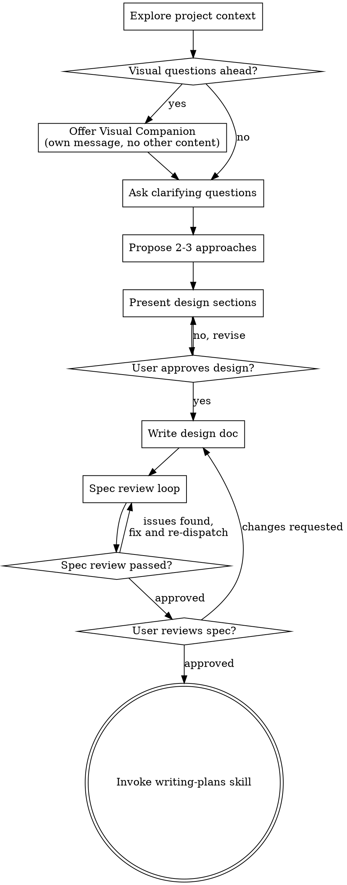

<!-- Generated by SpecStory, Markdown v2.1.0 -->

# 2026-03-16 16:26:24Z

<!-- Claude Code Session af11e345-4f76-4a5a-8718-8f87ff70df79 (2026-03-16 16:26:24Z) -->

_**User (2026-03-16 16:26:24Z)**_

<command-message>superpowers:brainstorming</command-message>
<command-name>/superpowers:brainstorming</command-name>
<command-args>   <div
      data-hide-print
      className="relative z-[1] mt-32 h-9 md:h-16"
      style={{
        background:
          'linear-gradient(to bottom, var(--color-root-bg, #fff), color-mix(in oklab, var(--color-accent) 10%, transparent 90%))',
      }}
    /> 这个效果还是有点差</command-args>

_**User (2026-03-16 16:26:24Z)**_

Base directory for this skill: <HOME>/.claude/plugins/cache/claude-plugins-official/superpowers/5.0.2/skills/brainstorming

# Brainstorming Ideas Into Designs

Help turn ideas into fully formed designs and specs through natural collaborative dialogue.

Start by understanding the current project context, then ask questions one at a time to refine the idea. Once you understand what you're building, present the design and get user approval.

<HARD-GATE>
Do NOT invoke any implementation skill, write any code, scaffold any project, or take any implementation action until you have presented a design and the user has approved it. This applies to EVERY project regardless of perceived simplicity.
</HARD-GATE>

## Anti-Pattern: "This Is Too Simple To Need A Design"

Every project goes through this process. A todo list, a single-function utility, a config change — all of them. "Simple" projects are where unexamined assumptions cause the most wasted work. The design can be short (a few sentences for truly simple projects), but you MUST present it and get approval.

## Checklist

You MUST create a task for each of these items and complete them in order:

1. **Explore project context** — check files, docs, recent commits
2. **Offer visual companion** (if topic will involve visual questions) — this is its own message, not combined with a clarifying question. See the Visual Companion section below.
3. **Ask clarifying questions** — one at a time, understand purpose/constraints/success criteria
4. **Propose 2-3 approaches** — with trade-offs and your recommendation
5. **Present design** — in sections scaled to their complexity, get user approval after each section
6. **Write design doc** — save to `docs/superpowers/specs/YYYY-MM-DD-<topic>-design.md` and commit
7. **Spec review loop** — dispatch spec-document-reviewer subagent with precisely crafted review context (never your session history); fix issues and re-dispatch until approved (max 5 iterations, then surface to human)
8. **User reviews written spec** — ask user to review the spec file before proceeding
9. **Transition to implementation** — invoke writing-plans skill to create implementation plan

## Process Flow



**The terminal state is invoking writing-plans.** Do NOT invoke frontend-design, mcp-builder, or any other implementation skill. The ONLY skill you invoke after brainstorming is writing-plans.

## The Process

**Understanding the idea:**

- Check out the current project state first (files, docs, recent commits)
- Before asking detailed questions, assess scope: if the request describes multiple independent subsystems (e.g., "build a platform with chat, file storage, billing, and analytics"), flag this immediately. Don't spend questions refining details of a project that needs to be decomposed first.
- If the project is too large for a single spec, help the user decompose into sub-projects: what are the independent pieces, how do they relate, what order should they be built? Then brainstorm the first sub-project through the normal design flow. Each sub-project gets its own spec → plan → implementation cycle.
- For appropriately-scoped projects, ask questions one at a time to refine the idea
- Prefer multiple choice questions when possible, but open-ended is fine too
- Only one question per message - if a topic needs more exploration, break it into multiple questions
- Focus on understanding: purpose, constraints, success criteria

**Exploring approaches:**

- Propose 2-3 different approaches with trade-offs
- Present options conversationally with your recommendation and reasoning
- Lead with your recommended option and explain why

**Presenting the design:**

- Once you believe you understand what you're building, present the design
- Scale each section to its complexity: a few sentences if straightforward, up to 200-300 words if nuanced
- Ask after each section whether it looks right so far
- Cover: architecture, components, data flow, error handling, testing
- Be ready to go back and clarify if something doesn't make sense

**Design for isolation and clarity:**

- Break the system into smaller units that each have one clear purpose, communicate through well-defined interfaces, and can be understood and tested independently
- For each unit, you should be able to answer: what does it do, how do you use it, and what does it depend on?
- Can someone understand what a unit does without reading its internals? Can you change the internals without breaking consumers? If not, the boundaries need work.
- Smaller, well-bounded units are also easier for you to work with - you reason better about code you can hold in context at once, and your edits are more reliable when files are focused. When a file grows large, that's often a signal that it's doing too much.

**Working in existing codebases:**

- Explore the current structure before proposing changes. Follow existing patterns.
- Where existing code has problems that affect the work (e.g., a file that's grown too large, unclear boundaries, tangled responsibilities), include targeted improvements as part of the design - the way a good developer improves code they're working in.
- Don't propose unrelated refactoring. Stay focused on what serves the current goal.

## After the Design

**Documentation:**

- Write the validated design (spec) to `docs/superpowers/specs/YYYY-MM-DD-<topic>-design.md`
  - (User preferences for spec location override this default)
- Use elements-of-style:writing-clearly-and-concisely skill if available
- Commit the design document to git

**Spec Review Loop:**
After writing the spec document:

1. Dispatch spec-document-reviewer subagent (see spec-document-reviewer-prompt.md)
2. If Issues Found: fix, re-dispatch, repeat until Approved
3. If loop exceeds 5 iterations, surface to human for guidance

**User Review Gate:**
After the spec review loop passes, ask the user to review the written spec before proceeding:

> "Spec written and committed to `<path>`. Please review it and let me know if you want to make any changes before we start writing out the implementation plan."

Wait for the user's response. If they request changes, make them and re-run the spec review loop. Only proceed once the user approves.

**Implementation:**

- Invoke the writing-plans skill to create a detailed implementation plan
- Do NOT invoke any other skill. writing-plans is the next step.

## Key Principles

- **One question at a time** - Don't overwhelm with multiple questions
- **Multiple choice preferred** - Easier to answer than open-ended when possible
- **YAGNI ruthlessly** - Remove unnecessary features from all designs
- **Explore alternatives** - Always propose 2-3 approaches before settling
- **Incremental validation** - Present design, get approval before moving on
- **Be flexible** - Go back and clarify when something doesn't make sense

## Visual Companion

A browser-based companion for showing mockups, diagrams, and visual options during brainstorming. Available as a tool — not a mode. Accepting the companion means it's available for questions that benefit from visual treatment; it does NOT mean every question goes through the browser.

**Offering the companion:** When you anticipate that upcoming questions will involve visual content (mockups, layouts, diagrams), offer it once for consent:
> "Some of what we're working on might be easier to explain if I can show it to you in a web browser. I can put together mockups, diagrams, comparisons, and other visuals as we go. This feature is still new and can be token-intensive. Want to try it? (Requires opening a local URL)"

**This offer MUST be its own message.** Do not combine it with clarifying questions, context summaries, or any other content. The message should contain ONLY the offer above and nothing else. Wait for the user's response before continuing. If they decline, proceed with text-only brainstorming.

**Per-question decision:** Even after the user accepts, decide FOR EACH QUESTION whether to use the browser or the terminal. The test: **would the user understand this better by seeing it than reading it?**

- **Use the browser** for content that IS visual — mockups, wireframes, layout comparisons, architecture diagrams, side-by-side visual designs
- **Use the terminal** for content that is text — requirements questions, conceptual choices, tradeoff lists, A/B/C/D text options, scope decisions

A question about a UI topic is not automatically a visual question. "What does personality mean in this context?" is a conceptual question — use the terminal. "Which wizard layout works better?" is a visual question — use the browser.

If they agree to the companion, read the detailed guide before proceeding:
`skills/brainstorming/visual-companion.md`


ARGUMENTS:    <div
      data-hide-print
      className="relative z-[1] mt-32 h-9 md:h-16"
      style={{
        background:
          'linear-gradient(to bottom, var(--color-root-bg, #fff), color-mix(in oklab, var(--color-accent) 10%, transparent 90%))',
      }}
    /> 这个效果还是有点差

---

_**Agent (claude-opus-4-6 2026-03-16 16:26:29Z)**_

_**Agent (claude-opus-4-6 2026-03-16 16:26:30Z)**_

<tool-use data-tool-type="read" data-tool-name="Read"><details>
<summary>Tool use: **Read**</summary>
 `./apps/web/src/components/layout/footer/Footer.tsx`

```text
     1→import { FooterInfo } from './FooterInfo'
     2→import { FooterThemeSwitcher } from './FooterThemeSwitcher'
     3→import { LocaleSwitcher } from './LocaleSwitcher'
     4→
     5→export const Footer = async () => (
     6→  <>
     7→    {/* Gradient fade boundary */}
     8→    <div
     9→      data-hide-print
    10→      className="relative z-[1] mt-32 h-9 md:h-16"
    11→      style={{
    12→        background:
    13→          'linear-gradient(to bottom, var(--color-root-bg, #fff), color-mix(in oklab, var(--color-accent) 10%, transparent 90%))',
    14→      }}
    15→    />
    16→
    17→    <footer
    18→      data-hide-print
    19→      className="relative z-[1] bg-[var(--color-root-bg)] pb-12 pt-0"
    20→    >
    21→      <div className="px-4 sm:px-8">
    22→        <div className="mx-auto max-w-7xl lg:px-8">
    23→          <FooterInfo
    24→            localeSwitcher={<LocaleSwitcher />}
    25→            themeSwitcher={<FooterThemeSwitcher />}
    26→          />
    27→        </div>
    28→      </div>
    29→    </footer>
    30→  </>
    31→)
    32→
```
</details></tool-use>

_**Agent (claude-opus-4-6 2026-03-16 16:26:31Z)**_

<tool-use data-tool-type="shell" data-tool-name="Bash"><details>
<summary>Tool use: **Bash**</summary>
查看 footer 当前 diff

`git diff apps/web/src/components/layout/footer/Footer.tsx`

```text
diff --git a/apps/web/src/components/layout/footer/Footer.tsx b/apps/web/src/components/layout/footer/Footer.tsx
index 871386c1..1acd9160 100644
--- a/apps/web/src/components/layout/footer/Footer.tsx
+++ b/apps/web/src/components/layout/footer/Footer.tsx
@@ -10,13 +10,13 @@ export const Footer = async () => (
       className="relative z-[1] mt-32 h-9 md:h-16"
       style={{
         background:
-          'linear-gradient(to bottom, var(--color-root-bg, #fff), var(--footer-bg))',
+          'linear-gradient(to bottom, var(--color-root-bg, #fff), color-mix(in oklab, var(--color-accent) 10%, transparent 90%))',
       }}
     />
 
     <footer
       data-hide-print
-      className="relative z-[1] bg-[var(--footer-bg)] pb-12 pt-0"
+      className="relative z-[1] bg-[var(--color-root-bg)] pb-12 pt-0"
     >
       <div className="px-4 sm:px-8">
         <div className="mx-auto max-w-7xl lg:px-8">
```
</details></tool-use>

_**Agent (claude-opus-4-6 2026-03-16 16:26:36Z)**_

<tool-use data-tool-type="shell" data-tool-name="Bash"><details>
<summary>Tool use: **Bash**</summary>
查看 footer 近期提交

`git log --oneline -5 -- apps/web/src/components/layout/footer/`

```text
52a2b88f chore: update footer, modal, fonts and styles
73aa70c5 feat(web): redesign footer to 書写·信纸·光影 design language
d814ef06 docs: update README and footer links to reflect project rebranding from Shiro to Yohaku
585dfd8f docs: add float-popover/panel redesign spec
1bc26886 refactor(colors): unify neutral scale to Pure 1-10, deprecate 50-950
```
</details></tool-use>

_**Agent (claude-opus-4-6 2026-03-16 16:26:37Z)**_

<tool-use data-tool-type="search" data-tool-name="Grep"><details>
<summary>Tool use: **Grep**</summary>
 path `./apps/web/src` pattern `--footer-bg|--color-root-bg`

```text
apps/web/src/styles/variables.css:9:  background-color: var(--color-root-bg);
apps/web/src/styles/variables.css:19:  --color-root-bg: #fefefb;
apps/web/src/styles/variables.css:40:  --color-root-bg: rgb(28, 28, 30);
```
</details></tool-use>

_**Agent (claude-opus-4-6 2026-03-16 16:26:41Z)**_

<tool-use data-tool-type="read" data-tool-name="Read"><details>
<summary>Tool use: **Read**</summary>
 `./apps/web/src/styles/variables.css`

```text
     1→html {
     2→  /* Accent color for form controls */
     3→  accent-color: var(--color-accent);
     4→
     5→  /* make app like native app in mobile */
     6→  -webkit-tap-highlight-color: transparent;
     7→
     8→  font-family: var(--font-sans);
     9→  background-color: var(--color-root-bg);
    10→}
    11→
    12→a,
    13→details summary {
    14→  -webkit-tap-highlight-color: rgba(0, 0, 0, 0);
    15→}
    16→
    17→:root {
    18→  --bg-opacity: rgba(254, 253, 251, 0.72);
    19→  --color-root-bg: #fefefb;
    20→  --color-border: rgba(24, 24, 27, 0.1);
    21→}
    22→
    23→[data-theme='dark'] {
    24→  --color-accent: #f596aa;
    25→  --color-neutral-1: #141414;
    26→  --color-neutral-2: #242424;
    27→  --color-neutral-3: #404040;
    28→  --color-neutral-4: #5c5c5c;
    29→  --color-neutral-5: #787878;
    30→  --color-neutral-6: #a8a8a8;
    31→  --color-neutral-7: #d0d0d0;
    32→  --color-neutral-8: #e3e3e3;
    33→  --color-neutral-9: #f0f0f0;
    34→  --color-neutral-10: #f8f8f8;
    35→  --color-info: #0a84ff;
    36→  --color-success: #30d158;
    37→  --color-warning: #ff9f0a;
    38→  --color-error: #ff453a;
    39→  --bg-opacity: rgba(29, 29, 31, 0.72);
    40→  --color-root-bg: rgb(28, 28, 30);
    41→  --color-border: #3f3f46;
    42→}
    43→
    44→::selection {
    45→  background-color: color-mix(in oklab, var(--color-accent) 30%, transparent);
    46→  text-shadow: none;
    47→}
    48→
    49→::view-transition-new(root) {
    50→  animation: turnOff 800ms ease-in-out;
    51→}
    52→::view-transition-old(root) {
    53→  animation: none;
    54→}
    55→
    56→@keyframes turnOn {
    57→  0% {
    58→    clip-path: polygon(0% 0%, 100% 0, 100% 0, 0 0);
    59→  }
    60→  100% {
    61→    clip-path: polygon(0% 0%, 100% 0, 100% 100%, 0 100%);
    62→  }
    63→}
    64→
    65→[data-theme='dark']::view-transition-new(root) {
    66→  animation: turnOn 800ms ease-in-out;
    67→}
    68→::view-transition-old(root) {
    69→  animation: none;
    70→}
    71→
    72→@keyframes turnOff {
    73→  0% {
    74→    clip-path: polygon(0 100%, 100% 100%, 100% 100%, 0% 100%);
    75→  }
    76→  100% {
    77→    clip-path: polygon(0 100%, 100% 100%, 100% 0, 0 0);
    78→  }
    79→}
    80→
```
</details></tool-use>

_**Agent (claude-opus-4-6 2026-03-16 16:26:41Z)**_

<tool-use data-tool-type="read" data-tool-name="Read"><details>
<summary>Tool use: **Read**</summary>
 `./apps/web/src/components/layout/footer/FooterInfo.tsx`

```text
     1→import 'server-only'
     2→
     3→import { getTranslations } from 'next-intl/server'
     4→import type { JSX, ReactNode } from 'react'
     5→
     6→import { fetchAggregationData } from '~/app/[locale]/api'
     7→import { SubscribeTextButton } from '~/components/modules/subscribe/SubscribeTextButton'
     8→import { FloatPopover } from '~/components/ui/float-popover'
     9→import { MarkdownLink } from '~/components/ui/link'
    10→import { Link } from '~/i18n/navigation'
    11→
    12→import type { FooterConfig } from './config'
    13→import { getDefaultLinkSections } from './config'
    14→import { GatewayInfo } from './GatewayInfo'
    15→import { OwnerName } from './OwnerName'
    16→
    17→interface FooterInfoProps {
    18→  localeSwitcher: ReactNode
    19→  themeSwitcher: ReactNode
    20→}
    21→
    22→export const FooterInfo = async ({
    23→  localeSwitcher,
    24→  themeSwitcher,
    25→}: FooterInfoProps) => {
    26→  const t = await getTranslations('common')
    27→  const data = await fetchAggregationData()
    28→  const { footer } = data.theme
    29→  const footerConfig: FooterConfig = footer || {
    30→    linkSections: getDefaultLinkSections(t),
    31→    otherInfo: {} as any,
    32→  }
    33→  const { otherInfo } = footerConfig
    34→  const currentYear = new Date().getFullYear().toString()
    35→  const { date = currentYear, icp } = otherInfo || {}
    36→
    37→  return (
    38→    <>
    39→      {/* Desktop: asymmetric split */}
    40→      <div className="hidden md:flex md:gap-20">
    41→        {/* Left: brand column */}
    42→        <div className="w-70 shrink-0">
    43→          <div className="text-xl font-semibold tracking-wide text-neutral-9">
    44→            <a href="/">
    45→              <OwnerName />
    46→            </a>
    47→          </div>
    48→          <div className="mt-2 text-sm leading-relaxed italic text-neutral-7">
    49→            {t('footer_motto')}
    50→          </div>
    51→
    52→          <div className="mt-7 text-sm leading-loose text-neutral-6">
    53→            <div>© {date.replace('{{now}}', currentYear)}</div>
    54→            <PoweredBy />
    55→          </div>
    56→
    57→          <div className="mt-1.5 text-sm text-neutral-6">
    58→            <GatewayInfo />
    59→          </div>
    60→        </div>
    61→
    62→        {/* Right: link columns */}
    63→        <FooterLinkColumns sections={footerConfig.linkSections} />
    64→      </div>
    65→
    66→      {/* Mobile: flat inline flow */}
    67→      <div className="md:hidden">
    68→        {/* Brand block */}
    69→        <div className="mb-6">
    70→          <div className="mb-1.5 text-lg font-semibold text-neutral-9">
    71→            <a href="/">
    72→              <OwnerName />
    73→            </a>
    74→          </div>
    75→          <div className="text-sm leading-relaxed italic text-neutral-7">
    76→            {t('footer_motto')}
    77→          </div>
    78→        </div>
    79→
    80→        {/* Links block */}
    81→        <FooterLinkInline
    82→          linksLabel={t('footer_links_label')}
    83→          sections={footerConfig.linkSections}
    84→        />
    85→
    86→        {/* Bottom block */}
    87→        <div className="border-t border-black/4 pt-4 dark:border-white/4">
    88→          <div className="text-sm leading-relaxed text-neutral-6">
    89→            <div>
    90→              © {date.replace('{{now}}', currentYear)} <PoweredBy />
    91→            </div>
    92→            <div className="mt-0.5">
    93→              <GatewayInfo />
    94→            </div>
    95→            {icp && (
    96→              <div className="mt-0.5">
    97→                <StyledLink external href={icp.link} rel="noreferrer">
    98→                  {icp.text}
    99→                </StyledLink>
   100→              </div>
   101→            )}
   102→          </div>
   103→          <div className="mt-3.5 space-y-3 text-sm text-neutral-6">
   104→            <div>
   105→              <a href="/feed" rel="noreferrer" target="_blank">
   106→                {t('rss_subscribe')}
   107→              </a>
   108→              <DotSep />
   109→              <a href="/sitemap.xml" rel="noreferrer" target="_blank">
   110→                {t('sitemap')}
   111→              </a>
   112→              <SubscribeTextButton>
   113→                <DotSep />
   114→              </SubscribeTextButton>
   115→            </div>
   116→            <div className="flex items-center gap-3">
   117→              {themeSwitcher}
   118→              <SectionSep />
   119→              {localeSwitcher}
   120→            </div>
   121→          </div>
   122→        </div>
   123→      </div>
   124→
   125→      {/* Desktop bottom bar */}
   126→      <div className="mt-8 hidden border-t border-black/4 pt-4 dark:border-white/4 md:flex md:items-center md:justify-between">
   127→        <span className="flex items-center gap-4 text-sm text-neutral-6">
   128→          <span>
   129→            <a href="/feed" rel="noreferrer" target="_blank">
   130→              {t('rss_subscribe')}
   131→            </a>
   132→            <DotSep />
   133→            <a href="/sitemap.xml" rel="noreferrer" target="_blank">
   134→              {t('sitemap')}
   135→            </a>
   136→            <SubscribeTextButton>
   137→              <DotSep />
   138→            </SubscribeTextButton>
   139→          </span>
   140→          <SectionSep />
   141→          {themeSwitcher}
   142→          <SectionSep />
   143→          {localeSwitcher}
   144→        </span>
   145→        {icp && (
   146→          <span className="text-sm text-neutral-6">
   147→            <StyledLink external href={icp.link} rel="noreferrer">
   148→              {icp.text}
   149→            </StyledLink>
   150→          </span>
   151→        )}
   152→      </div>
   153→    </>
   154→  )
   155→}
   156→
   157→const DotSep = () => (
   158→  <span aria-hidden className="mx-1.5 select-none text-neutral-5">
   159→    ·
   160→  </span>
   161→)
   162→
   163→const SectionSep = () => (
   164→  <span aria-hidden className="select-none text-neutral-4">
   165→    |
   166→  </span>
   167→)
   168→
   169→const FooterLinkColumns = ({
   170→  sections,
   171→}: {
   172→  sections: FooterConfig['linkSections']
   173→}) => (
   174→  <div className="flex flex-1 justify-end gap-30 pt-0.5">
   175→    {sections.map((section) => (
   176→      <div key={section.name}>
   177→        <div className="mb-3.5 text-sm font-medium uppercase tracking-[3px] text-neutral-6">
   178→          {section.name}
   179→        </div>
   180→        <div className="text-sm leading-[2.6]">
   181→          {section.links.map((link) => (
   182→            <StyledLink
   183→              className="block text-neutral-8/90 hover:underline hover:decoration-current/30 hover:underline-offset-2"
   184→              external={link.external}
   185→              href={link.href}
   186→              key={link.name}
   187→            >
   188→              {link.name}
   189→              {link.external && (
   190→                <span className="ml-0.5 text-neutral-6"> ↗</span>
   191→              )}
   192→            </StyledLink>
   193→          ))}
   194→        </div>
   195→      </div>
   196→    ))}
   197→  </div>
   198→)
   199→
   200→const FooterLinkInline = ({
   201→  sections,
   202→  linksLabel,
   203→}: {
   204→  sections: FooterConfig['linkSections']
   205→  linksLabel: string
   206→}) => {
   207→  const allLinks = sections.flatMap((s) => s.links)
   208→
   209→  return (
   210→    <div className="mb-6">
   211→      <div className="mb-2.5 text-sm font-medium uppercase tracking-[3px] text-neutral-6">
   212→        {linksLabel}
   213→      </div>
   214→      <div className="text-sm leading-[2.4] text-neutral-8/90">
   215→        {allLinks.map((link, i) => (
   216→          <span key={link.name}>
   217→            <StyledLink
   218→              className="underline-transparent hover:underline hover:decoration-current/30 hover:underline-offset-2"
   219→              external={link.external}
   220→              href={link.href}
   221→            >
   222→              {link.name}
   223→            </StyledLink>
   224→            {i < allLinks.length - 1 && <DotSep />}
   225→          </span>
   226→        ))}
   227→      </div>
   228→    </div>
   229→  )
   230→}
   231→
   232→const StyledLink = (
   233→  props: JSX.IntrinsicElements['a'] & {
   234→    external?: boolean
   235→  },
   236→) => {
   237→  const { external, ...rest } = props
   238→  const As = external ? 'a' : Link
   239→
   240→  return (
   241→    // @ts-ignore
   242→    <As
   243→      rel={external ? 'noreferrer' : undefined}
   244→      target={external ? '_blank' : props.target}
   245→      {...rest}
   246→    >
   247→      {props.children}
   248→    </As>
   249→  )
   250→}
   251→
   252→const PoweredBy = async () => {
   253→  const t = await getTranslations('common')
   254→  return (
   255→    <span>
   256→      Powered by{' '}
   257→      <StyledLink
   258→        external
   259→        className="underline decoration-black/15 underline-offset-2 dark:decoration-white/10"
   260→        href="https://github.com/mx-space"
   261→      >
   262→        Mix Space
   263→      </StyledLink>
   264→      <span className="mx-0.5">&</span>
   265→      <FloatPopover
   266→        mobileAsSheet
   267→        type="tooltip"
   268→        triggerElement={
   269→          <StyledLink
   270→            external
   271→            className="cursor-help underline decoration-black/15 underline-offset-2 dark:decoration-white/10"
   272→            href="https://github.com/Innei/Yohaku"
   273→          >
   274→            余白 / Yohaku
   275→          </StyledLink>
   276→        }
   277→      >
   278→        <div className="space-y-2">
   279→          <p>
   280→            {t.rich('shiroi_closed_source', {
   281→              link: (chunks) => (
   282→                <StyledLink
   283→                  external
   284→                  className="underline"
   285→                  href="https://github.com/Innei/Yohaku"
   286→                >
   287→                  {chunks}
   288→                </StyledLink>
   289→              ),
   290→            })}
   291→          </p>
   292→          <p>
   293→            {t.rich('shiroi_get_via', {
   294→              link: (chunks) => (
   295→                <MarkdownLink
   296→                  noIcon
   297→                  href="https://github.com/sponsors/Innei"
   298→                  popper={false}
   299→                >
   300→                  {chunks}
   301→                </MarkdownLink>
   302→              ),
   303→            })}
   304→          </p>
   305→          {process.env.COMMIT_HASH && process.env.COMMIT_URL && (
   306→            <p>
   307→              <MarkdownLink noIcon href={process.env.COMMIT_URL} popper={false}>
   308→                {t('version_hash', {
   309→                  hash: process.env.COMMIT_HASH.slice(0, 8),
   310→                })}
   311→              </MarkdownLink>
   312→            </p>
   313→          )}
   314→          {process.env.BUILD_TIME && (
   315→            <p>
   316→              {t('build_time', {
   317→                time: new Date(process.env.BUILD_TIME).toLocaleDateString(),
   318→              })}
   319→            </p>
   320→          )}
   321→        </div>
   322→      </FloatPopover>
   323→      .
   324→    </span>
   325→  )
   326→}
   327→
```
</details></tool-use>

_**Agent (claude-opus-4-6 2026-03-16 16:27:01Z)**_

_**Agent (claude-opus-4-6 2026-03-16 16:27:06Z)**_

已阅 footer 现状。此渐变从 `--color-root-bg` 过渡至 `color-mix(in oklab, accent 10%, transparent 90%)`，`transparent` 实为 `rgba(0,0,0,0)`，oklab 插值中间色易浊灰，且 footer 本体背景为纯 `root-bg`，与渐变终点不衔接。

君所言「差」，具体何处不满？

- **A** 渐变中段出现灰浊/脏色
- **B** 过渡太突兀，底部与 footer 背景断裂
- **C** accent 染色太淡，几乎看不出效果
- **D** 想要完全不同的过渡方式（如无 accent 染色，纯淡出）
- **E** 其他

---

_**User (2026-03-16 16:27:50Z)**_

A B

---

_**Agent (claude-opus-4-6 2026-03-16 16:28:13Z)**_

_**Agent (claude-opus-4-6 2026-03-16 16:28:21Z)**_

明矣。二疾并发：

1. **灰浊**：`transparent` 即 `rgba(0,0,0,0)`，oklab 插值经黑色通道，中段必浊
2. **断裂**：渐变终点为 accent 染色，footer 本体为纯 `root-bg`，色不接

三策可选：

**A — 以 root-bg 代 transparent（推荐）**
渐变终点改为 `color-mix(in oklab, accent 10%, root-bg)`，footer 背景亦设为同色。消浊、消断，accent 染色保留。

```css
/* 渐变 */
linear-gradient(to bottom, var(--color-root-bg), color-mix(in oklab, var(--color-accent) 10%, var(--color-root-bg)))
/* footer bg */
background: color-mix(in oklab, var(--color-accent) 10%, var(--color-root-bg));
```

**B — 双段渐变，中部微染后归 root-bg**
渐变三色停：root-bg → accent 染色 → root-bg。如光晕一掠，footer 仍为纯 root-bg，无断裂。

```css
linear-gradient(to bottom, var(--color-root-bg), color-mix(in oklab, var(--color-accent) 12%, var(--color-root-bg)) 50%, var(--color-root-bg))
```

**C — 纯淡出，不染 accent**
仅 root-bg，无渐变色差。最简，但失设计意趣。

君取何策？

---

_**User (2026-03-16 16:28:43Z)**_

mockup

---

_**Agent (claude-opus-4-6 2026-03-16 16:28:51Z)**_

<tool-use data-tool-type="unknown" data-tool-name="ToolSearch"><details>
<summary>Tool use: **ToolSearch**</summary>

**Input:**

- max_results: `3`
- query: `select:mcp__claude-in-chrome__tabs_context_mcp,mcp__claude-in-chrome__tabs_create_mcp,mcp__claude-in-chrome__javascript_tool`

**Result:**

```

```
</details></tool-use>

_**Agent (claude-opus-4-6 2026-03-16 16:29:01Z)**_

<tool-use data-tool-type="unknown" data-tool-name="mcp__claude-in-chrome__tabs_context_mcp"><details>
<summary>Tool use: **mcp__claude-in-chrome__tabs_context_mcp**</summary>

```text
{"availableTabs":[{"tabId":638785269,"title":"New Tab","url":"chrome://newtab"}],"tabGroupId":14277103}


Tab Context:
- Available tabs:
  • tabId 638785269: "New Tab" (chrome://newtab)
```
</details></tool-use>

_**Agent (claude-opus-4-6 2026-03-16 16:29:08Z)**_

<tool-use data-tool-type="unknown" data-tool-name="ToolSearch"><details>
<summary>Tool use: **ToolSearch**</summary>

**Input:**

- max_results: `1`
- query: `select:mcp__claude-in-chrome__navigate`

**Result:**

```

```
</details></tool-use>

_**Agent (claude-opus-4-6 2026-03-16 16:29:15Z)**_

<tool-use data-tool-type="unknown" data-tool-name="mcp__claude-in-chrome__navigate"><details>
<summary>Tool use: **mcp__claude-in-chrome__navigate**</summary>

```text
Tab 638785269 no longer exists. Call tabs_context_mcp to get current tabs.
```
</details></tool-use>

_**Agent (claude-opus-4-6 2026-03-16 16:29:27Z)**_

<tool-use data-tool-type="unknown" data-tool-name="mcp__claude-in-chrome__tabs_create_mcp"><details>
<summary>Tool use: **mcp__claude-in-chrome__tabs_create_mcp**</summary>

```text
No MCP tab group exists. Use tabs_context_mcp with createIfEmpty: true first to create one.
```
</details></tool-use>

_**Agent (claude-opus-4-6 2026-03-16 16:29:35Z)**_

<tool-use data-tool-type="unknown" data-tool-name="mcp__claude-in-chrome__tabs_context_mcp"><details>
<summary>Tool use: **mcp__claude-in-chrome__tabs_context_mcp**</summary>

```text
{"availableTabs":[{"tabId":638785273,"title":"New Tab","url":"chrome://newtab"}],"tabGroupId":655774464}


Tab Context:
- Available tabs:
  • tabId 638785273: "New Tab" (chrome://newtab)
```
</details></tool-use>

---

_**User (2026-03-16 16:29:46Z)**_

[Request interrupted by user]

_**User (2026-03-16 16:29:49Z)**_

<command-message>superpowers:brainstorming</command-message>
<command-name>/superpowers:brainstorming</command-name>

_**User (2026-03-16 16:29:49Z)**_

Base directory for this skill: <HOME>/.claude/plugins/cache/claude-plugins-official/superpowers/5.0.2/skills/brainstorming

# Brainstorming Ideas Into Designs

Help turn ideas into fully formed designs and specs through natural collaborative dialogue.

Start by understanding the current project context, then ask questions one at a time to refine the idea. Once you understand what you're building, present the design and get user approval.

<HARD-GATE>
Do NOT invoke any implementation skill, write any code, scaffold any project, or take any implementation action until you have presented a design and the user has approved it. This applies to EVERY project regardless of perceived simplicity.
</HARD-GATE>

## Anti-Pattern: "This Is Too Simple To Need A Design"

Every project goes through this process. A todo list, a single-function utility, a config change — all of them. "Simple" projects are where unexamined assumptions cause the most wasted work. The design can be short (a few sentences for truly simple projects), but you MUST present it and get approval.

## Checklist

You MUST create a task for each of these items and complete them in order:

1. **Explore project context** — check files, docs, recent commits
2. **Offer visual companion** (if topic will involve visual questions) — this is its own message, not combined with a clarifying question. See the Visual Companion section below.
3. **Ask clarifying questions** — one at a time, understand purpose/constraints/success criteria
4. **Propose 2-3 approaches** — with trade-offs and your recommendation
5. **Present design** — in sections scaled to their complexity, get user approval after each section
6. **Write design doc** — save to `docs/superpowers/specs/YYYY-MM-DD-<topic>-design.md` and commit
7. **Spec review loop** — dispatch spec-document-reviewer subagent with precisely crafted review context (never your session history); fix issues and re-dispatch until approved (max 5 iterations, then surface to human)
8. **User reviews written spec** — ask user to review the spec file before proceeding
9. **Transition to implementation** — invoke writing-plans skill to create implementation plan

## Process Flow


**The terminal state is invoking writing-plans.** Do NOT invoke frontend-design, mcp-builder, or any other implementation skill. The ONLY skill you invoke after brainstorming is writing-plans.

## The Process

**Understanding the idea:**

- Check out the current project state first (files, docs, recent commits)
- Before asking detailed questions, assess scope: if the request describes multiple independent subsystems (e.g., "build a platform with chat, file storage, billing, and analytics"), flag this immediately. Don't spend questions refining details of a project that needs to be decomposed first.
- If the project is too large for a single spec, help the user decompose into sub-projects: what are the independent pieces, how do they relate, what order should they be built? Then brainstorm the first sub-project through the normal design flow. Each sub-project gets its own spec → plan → implementation cycle.
- For appropriately-scoped projects, ask questions one at a time to refine the idea
- Prefer multiple choice questions when possible, but open-ended is fine too
- Only one question per message - if a topic needs more exploration, break it into multiple questions
- Focus on understanding: purpose, constraints, success criteria

**Exploring approaches:**

- Propose 2-3 different approaches with trade-offs
- Present options conversationally with your recommendation and reasoning
- Lead with your recommended option and explain why

**Presenting the design:**

- Once you believe you understand what you're building, present the design
- Scale each section to its complexity: a few sentences if straightforward, up to 200-300 words if nuanced
- Ask after each section whether it looks right so far
- Cover: architecture, components, data flow, error handling, testing
- Be ready to go back and clarify if something doesn't make sense

**Design for isolation and clarity:**

- Break the system into smaller units that each have one clear purpose, communicate through well-defined interfaces, and can be understood and tested independently
- For each unit, you should be able to answer: what does it do, how do you use it, and what does it depend on?
- Can someone understand what a unit does without reading its internals? Can you change the internals without breaking consumers? If not, the boundaries need work.
- Smaller, well-bounded units are also easier for you to work with - you reason better about code you can hold in context at once, and your edits are more reliable when files are focused. When a file grows large, that's often a signal that it's doing too much.

**Working in existing codebases:**

- Explore the current structure before proposing changes. Follow existing patterns.
- Where existing code has problems that affect the work (e.g., a file that's grown too large, unclear boundaries, tangled responsibilities), include targeted improvements as part of the design - the way a good developer improves code they're working in.
- Don't propose unrelated refactoring. Stay focused on what serves the current goal.

## After the Design

**Documentation:**

- Write the validated design (spec) to `docs/superpowers/specs/YYYY-MM-DD-<topic>-design.md`
  - (User preferences for spec location override this default)
- Use elements-of-style:writing-clearly-and-concisely skill if available
- Commit the design document to git

**Spec Review Loop:**
After writing the spec document:

1. Dispatch spec-document-reviewer subagent (see spec-document-reviewer-prompt.md)
2. If Issues Found: fix, re-dispatch, repeat until Approved
3. If loop exceeds 5 iterations, surface to human for guidance

**User Review Gate:**
After the spec review loop passes, ask the user to review the written spec before proceeding:

> "Spec written and committed to `<path>`. Please review it and let me know if you want to make any changes before we start writing out the implementation plan."

Wait for the user's response. If they request changes, make them and re-run the spec review loop. Only proceed once the user approves.

**Implementation:**

- Invoke the writing-plans skill to create a detailed implementation plan
- Do NOT invoke any other skill. writing-plans is the next step.

## Key Principles

- **One question at a time** - Don't overwhelm with multiple questions
- **Multiple choice preferred** - Easier to answer than open-ended when possible
- **YAGNI ruthlessly** - Remove unnecessary features from all designs
- **Explore alternatives** - Always propose 2-3 approaches before settling
- **Incremental validation** - Present design, get approval before moving on
- **Be flexible** - Go back and clarify when something doesn't make sense

## Visual Companion

A browser-based companion for showing mockups, diagrams, and visual options during brainstorming. Available as a tool — not a mode. Accepting the companion means it's available for questions that benefit from visual treatment; it does NOT mean every question goes through the browser.

**Offering the companion:** When you anticipate that upcoming questions will involve visual content (mockups, layouts, diagrams), offer it once for consent:
> "Some of what we're working on might be easier to explain if I can show it to you in a web browser. I can put together mockups, diagrams, comparisons, and other visuals as we go. This feature is still new and can be token-intensive. Want to try it? (Requires opening a local URL)"

**This offer MUST be its own message.** Do not combine it with clarifying questions, context summaries, or any other content. The message should contain ONLY the offer above and nothing else. Wait for the user's response before continuing. If they decline, proceed with text-only brainstorming.

**Per-question decision:** Even after the user accepts, decide FOR EACH QUESTION whether to use the browser or the terminal. The test: **would the user understand this better by seeing it than reading it?**

- **Use the browser** for content that IS visual — mockups, wireframes, layout comparisons, architecture diagrams, side-by-side visual designs
- **Use the terminal** for content that is text — requirements questions, conceptual choices, tradeoff lists, A/B/C/D text options, scope decisions

A question about a UI topic is not automatically a visual question. "What does personality mean in this context?" is a conceptual question — use the terminal. "Which wizard layout works better?" is a visual question — use the browser.

If they agree to the companion, read the detailed guide before proceeding:
`skills/brainstorming/visual-companion.md`


---

_**Agent (claude-opus-4-6 2026-03-16 16:29:58Z)**_

_**Agent (claude-opus-4-6 2026-03-16 16:29:59Z)**_

吾以浏览器呈三策 mockup。

_**Agent (claude-opus-4-6 2026-03-16 16:30:28Z)**_

<tool-use data-tool-type="unknown" data-tool-name="mcp__claude-in-chrome__javascript_tool"><details>
<summary>Tool use: **mcp__claude-in-chrome__javascript_tool**</summary>

```text
Tab 638785273 no longer exists. Call tabs_context_mcp to get current tabs.
```
</details></tool-use>

_**Agent (claude-opus-4-6 2026-03-16 16:30:35Z)**_

<tool-use data-tool-type="unknown" data-tool-name="mcp__claude-in-chrome__tabs_context_mcp"><details>
<summary>Tool use: **mcp__claude-in-chrome__tabs_context_mcp**</summary>

```text
{"availableTabs":[{"tabId":638785277,"title":"New Tab","url":"chrome://newtab"}],"tabGroupId":512710346}


Tab Context:
- Available tabs:
  • tabId 638785277: "New Tab" (chrome://newtab)
```
</details></tool-use>

_**Agent (claude-opus-4-6 2026-03-16 16:30:43Z)**_

<tool-use data-tool-type="unknown" data-tool-name="mcp__claude-in-chrome__navigate"><details>
<summary>Tool use: **mcp__claude-in-chrome__navigate**</summary>

```text
Tab 638785277 no longer exists. Call tabs_context_mcp to get current tabs.
```
</details></tool-use>

---

_**User (2026-03-16 16:30:44Z)**_

[Request interrupted by user]

_**User (2026-03-16 16:30:49Z)**_

<command-message>superpowers:brainstorm</command-message>
<command-name>/superpowers:brainstorm</command-name>
<command-args> mockup</command-args>

_**User (2026-03-16 16:30:49Z)**_

Tell your human partner that this command is deprecated and will be removed in the next major release. They should ask you to use the "superpowers brainstorming" skill instead.


ARGUMENTS:  mockup

---

_**Agent (claude-opus-4-6 2026-03-16 16:30:58Z)**_

_**Agent (claude-opus-4-6 2026-03-16 16:30:59Z)**_

此命令已废弃，后续请用 `superpowers:brainstorming`。

吾继续以浏览器呈 mockup。

_**Agent (claude-opus-4-6 2026-03-16 16:31:00Z)**_

<tool-use data-tool-type="unknown" data-tool-name="mcp__claude-in-chrome__tabs_context_mcp"><details>
<summary>Tool use: **mcp__claude-in-chrome__tabs_context_mcp**</summary>

```text
{"availableTabs":[{"tabId":638785280,"title":"New Tab","url":"chrome://newtab"}],"tabGroupId":504151479}


Tab Context:
- Available tabs:
  • tabId 638785280: "New Tab" (chrome://newtab)
```
</details></tool-use>

_**Agent (claude-opus-4-6 2026-03-16 16:31:22Z)**_

<tool-use data-tool-type="unknown" data-tool-name="mcp__claude-in-chrome__javascript_tool"><details>
<summary>Tool use: **mcp__claude-in-chrome__javascript_tool**</summary>

```text
Failed to execute JavaScript: Cannot access a chrome:// URL
```
</details></tool-use>

_**Agent (claude-opus-4-6 2026-03-16 16:31:30Z)**_

<tool-use data-tool-type="unknown" data-tool-name="mcp__claude-in-chrome__navigate"><details>
<summary>Tool use: **mcp__claude-in-chrome__navigate**</summary>

```text
Failed to navigate: Invalid URL: about:blank
```
</details></tool-use>

_**Agent (claude-opus-4-6 2026-03-16 16:31:39Z)**_

<tool-use data-tool-type="unknown" data-tool-name="mcp__claude-in-chrome__navigate"><details>
<summary>Tool use: **mcp__claude-in-chrome__navigate**</summary>

```text
Navigated to https://example.com


Tab Context:
- Executed on tabId: 638785280
- Available tabs:
  • tabId 638785280: "example.com" (https://example.com/)
```
</details></tool-use>

_**Agent (claude-opus-4-6 2026-03-16 16:32:01Z)**_

<tool-use data-tool-type="unknown" data-tool-name="mcp__claude-in-chrome__javascript_tool"><details>
<summary>Tool use: **mcp__claude-in-chrome__javascript_tool**</summary>

```text
Mockup rendered


Tab Context:
- Executed on tabId: 638785280
- Available tabs:
  • tabId 638785280: "example.com" (https://example.com/)
```
</details></tool-use>

_**Agent (claude-opus-4-6 2026-03-16 16:32:06Z)**_

Mockup 已呈于浏览器。四组对比：当前问题版 + 三策（A/B/C），各含 light/dark 双模。

请于浏览器查看，君取何策？

---

_**User (2026-03-16 16:32:19Z)**_

A

---

_**Agent (claude-opus-4-6 2026-03-16 16:32:26Z)**_

_**Agent (claude-opus-4-6 2026-03-16 16:32:29Z)**_

<tool-use data-tool-type="write" data-tool-name="Edit"><details>
<summary>Tool use: **Edit**</summary>

```text
The file <REPO_ROOT>/apps/web/src/components/layout/footer/Footer.tsx has been updated successfully.
```
</details></tool-use>

_**Agent (claude-opus-4-6 2026-03-16 16:32:34Z)**_

<tool-use data-tool-type="write" data-tool-name="Edit"><details>
<summary>Tool use: **Edit**</summary>

```text
The file <REPO_ROOT>/apps/web/src/components/layout/footer/Footer.tsx has been updated successfully.
```
</details></tool-use>

_**Agent (claude-opus-4-6 2026-03-16 16:32:38Z)**_

_**Agent (claude-opus-4-6 2026-03-16 16:32:39Z)**_

已改。渐变终点及 footer 背景皆为 `color-mix(in oklab, accent 10%, root-bg)`，浊色与断裂俱消。

---

_**User (2026-03-16 16:33:11Z)**_

太深了

---

_**Agent (claude-opus-4-6 2026-03-16 16:33:15Z)**_

<tool-use data-tool-type="read" data-tool-name="Read"><details>
<summary>Tool use: **Read**</summary>
 `./apps/web/src/components/layout/footer/Footer.tsx`

```text
     1→import { FooterInfo } from './FooterInfo'
     2→import { FooterThemeSwitcher } from './FooterThemeSwitcher'
     3→import { LocaleSwitcher } from './LocaleSwitcher'
     4→
     5→export const Footer = async () => (
     6→  <>
     7→    {/* Gradient fade boundary */}
     8→    <div
     9→      data-hide-print
    10→      className="relative z-[1] mt-32 h-9 md:h-16"
    11→      style={{
    12→        background:
    13→          'linear-gradient(to bottom, var(--color-root-bg, #fff), color-mix(in oklab, var(--color-accent) 10%, var(--color-root-bg, #fff)))',
    14→      }}
    15→    />
    16→
    17→    <footer
    18→      data-hide-print
    19→      className="relative z-[1] pb-12 pt-0"
    20→      style={{
    21→        background:
    22→          'color-mix(in oklab, var(--color-accent) 10%, var(--color-root-bg, #fff))',
    23→      }}
    24→    >
    25→      <div className="px-4 sm:px-8">
    26→        <div className="mx-auto max-w-7xl lg:px-8">
    27→          <FooterInfo
    28→            localeSwitcher={<LocaleSwitcher />}
    29→            themeSwitcher={<FooterThemeSwitcher />}
    30→          />
    31→        </div>
    32→      </div>
    33→    </footer>
    34→  </>
    35→)
    36→
```
</details></tool-use>

_**Agent (claude-opus-4-6 2026-03-16 16:33:18Z)**_

accent 10% 染色太深。降至 5%。

_**Agent (claude-opus-4-6 2026-03-16 16:33:20Z)**_

<tool-use data-tool-type="write" data-tool-name="Edit"><details>
<summary>Tool use: **Edit**</summary>

```text
The file <REPO_ROOT>/apps/web/src/components/layout/footer/Footer.tsx has been updated. All occurrences of 'var(--color-accent) 10%, var(--color-root-bg, #fff)))' were successfully replaced with 'var(--color-accent) 5%, var(--color-root-bg, #fff)))'.
```
</details></tool-use>

_**Agent (claude-opus-4-6 2026-03-16 16:33:25Z)**_

已将 accent 混合比例由 10% 降至 5%，渐变与 footer 背景皆同步。

---

_**User (2026-03-16 16:33:42Z)**_

 有断层了

_**User (2026-03-16 16:33:42Z)**_

[Image: source: <HOME>/Library/Application Support/CleanShot/media/media_GkRnbNhhuw/CleanShot 2026-03-17 at 00.33.38@2x.jpg]

---

_**Agent (claude-opus-4-6 2026-03-16 16:34:05Z)**_

_**Agent (claude-opus-4-6 2026-03-16 16:34:06Z)**_

渐变 div 与 footer 间有 subpixel 间隙。以负 margin 令其重叠消缝。

_**Agent (claude-opus-4-6 2026-03-16 16:34:07Z)**_

<tool-use data-tool-type="write" data-tool-name="Edit"><details>
<summary>Tool use: **Edit**</summary>

```text
The file <REPO_ROOT>/apps/web/src/components/layout/footer/Footer.tsx has been updated successfully.
```
</details></tool-use>

_**Agent (claude-opus-4-6 2026-03-16 16:34:12Z)**_

已加 `-mb-px` 令渐变 div 下移 1px 与 footer 重叠，消除断层。

---

_**User (2026-03-16 16:34:48Z)**_

我说的是颜色断层

---

_**Agent (claude-opus-4-6 2026-03-16 16:35:38Z)**_

_**Agent (claude-opus-4-6 2026-03-16 16:35:39Z)**_

<tool-use data-tool-type="search" data-tool-name="Grep"><details>
<summary>Tool use: **Grep**</summary>
 path `./apps/web/src/components/layout` pattern `PageColorGradient|noise|--color-root-bg`

```text
apps/web/src/components/layout/header/internal/HeaderContent.tsx:265:              'select-none rounded bg-[var(--color-root-bg)] dark:bg-neutral-900 outline-hidden',
apps/web/src/components/layout/header/internal/HeaderDrawerButton.tsx:130:                    'bg-[var(--color-root-bg)] dark:bg-neutral-900',
apps/web/src/components/layout/footer/Footer.tsx:13:          'linear-gradient(to bottom, var(--color-root-bg, #fff), color-mix(in oklab, var(--color-accent) 5%, var(--color-root-bg, #fff)))',
apps/web/src/components/layout/footer/Footer.tsx:22:          'color-mix(in oklab, var(--color-accent) 10%, var(--color-root-bg, #fff))',
```
</details></tool-use>

_**Agent (claude-opus-4-6 2026-03-16 16:35:48Z)**_

_**Agent (claude-opus-4-6 2026-03-16 16:35:49Z)**_

找到原因。渐变终点为 5%，footer 背景仍为 10%，色差即断层。

_**Agent (claude-opus-4-6 2026-03-16 16:35:51Z)**_

<tool-use data-tool-type="write" data-tool-name="Edit"><details>
<summary>Tool use: **Edit**</summary>

```text
The file <REPO_ROOT>/apps/web/src/components/layout/footer/Footer.tsx has been updated successfully.
```
</details></tool-use>

_**Agent (claude-opus-4-6 2026-03-16 16:35:55Z)**_

渐变终点与 footer 背景今皆为 `accent 5%`，色一致矣。

---

_**User (2026-03-16 16:37:02Z)**_

填充色使用 transparent 吧

---

_**Agent (claude-opus-4-6 2026-03-16 16:37:07Z)**_

<tool-use data-tool-type="read" data-tool-name="Read"><details>
<summary>Tool use: **Read**</summary>
 `./apps/web/src/components/layout/footer/Footer.tsx`

```text
     1→import { FooterInfo } from './FooterInfo'
     2→import { FooterThemeSwitcher } from './FooterThemeSwitcher'
     3→import { LocaleSwitcher } from './LocaleSwitcher'
     4→
     5→export const Footer = async () => (
     6→  <>
     7→    {/* Gradient fade boundary */}
     8→    <div
     9→      data-hide-print
    10→      className="relative z-[1] mt-32 -mb-px h-9 md:h-16"
    11→      style={{
    12→        background:
    13→          'linear-gradient(to bottom, var(--color-root-bg, #fff), color-mix(in oklab, var(--color-accent) 5%, var(--color-root-bg, #fff)))',
    14→      }}
    15→    />
    16→
    17→    <footer
    18→      data-hide-print
    19→      className="relative z-[1] pb-12 pt-0"
    20→      style={{
    21→        background:
    22→          'color-mix(in oklab, var(--color-accent) 5%, var(--color-root-bg, #fff))',
    23→      }}
    24→    >
    25→      <div className="px-4 sm:px-8">
    26→        <div className="mx-auto max-w-7xl lg:px-8">
    27→          <FooterInfo
    28→            localeSwitcher={<LocaleSwitcher />}
    29→            themeSwitcher={<FooterThemeSwitcher />}
    30→          />
    31→        </div>
    32→      </div>
    33→    </footer>
    34→  </>
    35→)
    36→
```
</details></tool-use>

_**Agent (claude-opus-4-6 2026-03-16 16:37:12Z)**_

<tool-use data-tool-type="write" data-tool-name="Edit"><details>
<summary>Tool use: **Edit**</summary>

```text
The file <REPO_ROOT>/apps/web/src/components/layout/footer/Footer.tsx has been updated successfully.
```
</details></tool-use>

_**Agent (claude-opus-4-6 2026-03-16 16:37:22Z)**_

<tool-use data-tool-type="write" data-tool-name="Edit"><details>
<summary>Tool use: **Edit**</summary>

```text
The file <REPO_ROOT>/apps/web/src/components/layout/footer/Footer.tsx has been updated successfully.
```
</details></tool-use>

_**Agent (claude-opus-4-6 2026-03-16 16:37:25Z)**_

已改。渐变从 `root-bg` 至 `transparent`，footer 背景透明。

---

_**User (2026-03-16 16:37:52Z)**_

应该是过渡到transparent

---

_**Agent (claude-opus-4-6 2026-03-16 16:37:56Z)**_

<tool-use data-tool-type="read" data-tool-name="Read"><details>
<summary>Tool use: **Read**</summary>
 `./apps/web/src/components/layout/footer/Footer.tsx`

```text
     1→import { FooterInfo } from './FooterInfo'
     2→import { FooterThemeSwitcher } from './FooterThemeSwitcher'
     3→import { LocaleSwitcher } from './LocaleSwitcher'
     4→
     5→export const Footer = async () => (
     6→  <>
     7→    {/* Gradient fade boundary */}
     8→    <div
     9→      data-hide-print
    10→      className="relative z-[1] mt-32 -mb-px h-9 md:h-16"
    11→      style={{
    12→        background:
    13→          'linear-gradient(to bottom, var(--color-root-bg, #fff), color-mix(in oklab, var(--color-accent) 5%, var(--color-root-bg, #fff)))',
    14→      }}
    15→    />
    16→
    17→    <footer
    18→      data-hide-print
    19→      className="relative z-[1] pb-12 pt-0"
    20→      style={{
    21→        background:
    22→          'color-mix(in oklab, var(--color-accent) 5%, var(--color-root-bg, #fff))',
    23→      }}
    24→    >
    25→      <div className="px-4 sm:px-8">
    26→        <div className="mx-auto max-w-7xl lg:px-8">
    27→          <FooterInfo
    28→            localeSwitcher={<LocaleSwitcher />}
    29→            themeSwitcher={<FooterThemeSwitcher />}
    30→          />
    31→        </div>
    32→      </div>
    33→    </footer>
    34→  </>
    35→)
    36→
```
</details></tool-use>

_**Agent (claude-opus-4-6 2026-03-16 16:38:00Z)**_

用户已手动改回渐变为 accent 5%。footer 背景应过渡至 transparent。

_**Agent (claude-opus-4-6 2026-03-16 16:38:01Z)**_

<tool-use data-tool-type="write" data-tool-name="Edit"><details>
<summary>Tool use: **Edit**</summary>

```text
The file <REPO_ROOT>/apps/web/src/components/layout/footer/Footer.tsx has been updated successfully.
```
</details></tool-use>

_**Agent (claude-opus-4-6 2026-03-16 16:38:06Z)**_

已改。footer 背景由 `accent 5%` 渐变至 `transparent`，向下渐隐。

---

_**User (2026-03-16 16:47:43Z)**_

我是说上面这条渐变，你用 root BG 去过度会有断层，但是整个 Footer 的容器不要透明。

_**User (2026-03-16 16:47:43Z)**_

[Image: source: <HOME>/Library/Application Support/CleanShot/media/media_hYU3pLcoMi/CleanShot 2026-03-17 at 00.47.05@2x.jpg]

---

_**Agent (claude-opus-4-6 2026-03-16 16:47:52Z)**_

_**Agent (claude-opus-4-6 2026-03-16 16:47:53Z)**_

明白了。渐变 div 应从 `transparent` 过渡到 footer 背景色，而非从 `root-bg` 开始。footer 本身保持实色。

_**Agent (claude-opus-4-6 2026-03-16 16:47:53Z)**_

<tool-use data-tool-type="read" data-tool-name="Read"><details>
<summary>Tool use: **Read**</summary>
 `./apps/web/src/components/layout/footer/Footer.tsx`

```text
     1→import { FooterInfo } from './FooterInfo'
     2→import { FooterThemeSwitcher } from './FooterThemeSwitcher'
     3→import { LocaleSwitcher } from './LocaleSwitcher'
     4→
     5→export const Footer = async () => (
     6→  <>
     7→    {/* Gradient fade boundary */}
     8→    <div
     9→      data-hide-print
    10→      className="relative z-[1] mt-32 -mb-px h-9 md:h-16"
    11→      style={{
    12→        background:
    13→          'linear-gradient(to bottom, var(--color-root-bg, #fff), color-mix(in oklab, var(--color-accent) 5%, var(--color-root-bg, #fff)))',
    14→      }}
    15→    />
    16→
    17→    <footer
    18→      data-hide-print
    19→      className="relative z-[1] pb-12 pt-0"
    20→      style={{
    21→        background:
    22→          'linear-gradient(to bottom, color-mix(in oklab, var(--color-accent) 5%, var(--color-root-bg, #fff)), transparent)',
    23→      }}
    24→    >
    25→      <div className="px-4 sm:px-8">
    26→        <div className="mx-auto max-w-7xl lg:px-8">
    27→          <FooterInfo
    28→            localeSwitcher={<LocaleSwitcher />}
    29→            themeSwitcher={<FooterThemeSwitcher />}
    30→          />
    31→        </div>
    32→      </div>
    33→    </footer>
    34→  </>
    35→)
    36→
```
</details></tool-use>

_**Agent (claude-opus-4-6 2026-03-16 16:47:59Z)**_

<tool-use data-tool-type="write" data-tool-name="Edit"><details>
<summary>Tool use: **Edit**</summary>

```text
The file <REPO_ROOT>/apps/web/src/components/layout/footer/Footer.tsx has been updated successfully.
```
</details></tool-use>

_**Agent (claude-opus-4-6 2026-03-16 16:48:04Z)**_

<tool-use data-tool-type="write" data-tool-name="Edit"><details>
<summary>Tool use: **Edit**</summary>

```text
The file <REPO_ROOT>/apps/web/src/components/layout/footer/Footer.tsx has been updated successfully.
```
</details></tool-use>

_**Agent (claude-opus-4-6 2026-03-16 16:48:09Z)**_

已改。渐变 div：`transparent → accent 5% root-bg`，footer：实色 `accent 5% root-bg`。渐变从页面实际背景自然淡入 footer，无断层。