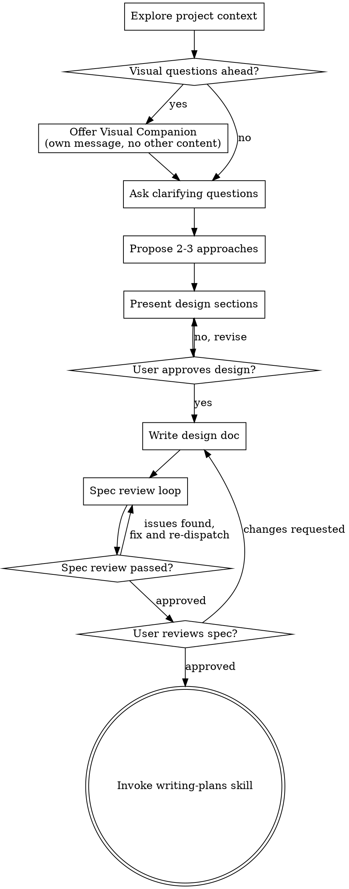

<!-- Generated by SpecStory, Markdown v2.1.0 -->

# 2026-03-17 15:34:34Z

<!-- Claude Code Session ee2b5776-06c4-43f6-b222-d1ce47b43107 (2026-03-17 15:34:34Z) -->

_**User (2026-03-17 15:34:34Z)**_

<local-command-caveat>Caveat: The messages below were generated by the user while running local commands. DO NOT respond to these messages or otherwise consider them in your response unless the user explicitly asks you to.</local-command-caveat>

_**User (2026-03-17 15:34:34Z)**_

<command-name>/compact</command-name>
            <command-message>compact</command-message>
            <command-args>design</command-args>

---

_**Agent - sidechain (2026-03-17 15:34:34Z)**_

Your task is to create a detailed summary of the conversation so far, paying close attention to the user's explicit requests and your previous actions.
This summary should be thorough in capturing technical details, code patterns, and architectural decisions that would be essential for continuing development work without losing context.

Before providing your final summary, wrap your analysis in <analysis> tags to organize your thoughts and ensure you've covered all necessary points. In your analysis process:

1. Chronologically analyze each message and section of the conversation. For each section thoroughly identify:
   - The user's explicit requests and intents
   - Your approach to addressing the user's requests
   - Key decisions, technical concepts and code patterns
   - Specific details like:
     - file names
     - full code snippets
     - function signatures
     - file edits
   - Errors that you ran into and how you fixed them
   - Pay special attention to specific user feedback that you received, especially if the user told you to do something differently.
2. Double-check for technical accuracy and completeness, addressing each required element thoroughly.

Your summary should include the following sections:

1. Primary Request and Intent: Capture all of the user's explicit requests and intents in detail
2. Key Technical Concepts: List all important technical concepts, technologies, and frameworks discussed.
3. Files and Code Sections: Enumerate specific files and code sections examined, modified, or created. Pay special attention to the most recent messages and include full code snippets where applicable and include a summary of why this file read or edit is important.
4. Errors and fixes: List all errors that you ran into, and how you fixed them. Pay special attention to specific user feedback that you received, especially if the user told you to do something differently.
5. Problem Solving: Document problems solved and any ongoing troubleshooting efforts.
6. All user messages: List ALL user messages that are not tool results. These are critical for understanding the users' feedback and changing intent.
7. Pending Tasks: Outline any pending tasks that you have explicitly been asked to work on.
8. Current Work: Describe in detail precisely what was being worked on immediately before this summary request, paying special attention to the most recent messages from both user and assistant. Include file names and code snippets where applicable.
9. Optional Next Step: List the next step that you will take that is related to the most recent work you were doing. IMPORTANT: ensure that this step is DIRECTLY in line with the user's most recent explicit requests, and the task you were working on immediately before this summary request. If your last task was concluded, then only list next steps if they are explicitly in line with the users request. Do not start on tangential requests or really old requests that were already completed without confirming with the user first.
                       If there is a next step, include direct quotes from the most recent conversation showing exactly what task you were working on and where you left off. This should be verbatim to ensure there's no drift in task interpretation.

Here's an example of how your output should be structured:

<example>
<analysis>
[Your thought process, ensuring all points are covered thoroughly and accurately]
</analysis>

<summary>
1. Primary Request and Intent:
   [Detailed description]

2. Key Technical Concepts:
   - [Concept 1]
   - [Concept 2]
   - [...]

3. Files and Code Sections:
   - [File Name 1]
      - [Summary of why this file is important]
      - [Summary of the changes made to this file, if any]
      - [Important Code Snippet]
   - [File Name 2]
      - [Important Code Snippet]
   - [...]

4. Errors and fixes:
    - [Detailed description of error 1]:
      - [How you fixed the error]
      - [User feedback on the error if any]
    - [...]

5. Problem Solving:
   [Description of solved problems and ongoing troubleshooting]

6. All user messages: 
    - [Detailed non tool use user message]
    - [...]

7. Pending Tasks:
   - [Task 1]
   - [Task 2]
   - [...]

8. Current Work:
   [Precise description of current work]

9. Optional Next Step:
   [Optional Next step to take]

</summary>
</example>

Please provide your summary based on the conversation so far, following this structure and ensuring precision and thoroughness in your response. 

There may be additional summarization instructions provided in the included context. If so, remember to follow these instructions when creating the above summary. Examples of instructions include:
<example>
## Compact Instructions
When summarizing the conversation focus on typescript code changes and also remember the mistakes you made and how you fixed them.
</example>

<example>
# Summary instructions
When you are using compact - please focus on test output and code changes. Include file reads verbatim.
</example>


Additional Instructions:
design

IMPORTANT: Do NOT use any tools. You MUST respond with ONLY the <summary>...</summary> block as your text output.

_**Agent - sidechain (claude-opus-4-6 2026-03-17 15:35:47Z)**_


<analysis>
Let me chronologically analyze the conversation:

1. **Initial Request - Header Layout Animation Issues**
   - User pointed to `Header.tsx` and described two problems with Framer Motion layout animations:
     1. Starting positions incorrect between two headers
     2. Header icon flying from bottom to top
   - User suggested two approaches: (a) simplify layout animations, (b) replace Framer Motion with custom implementation

2. **First Attempt - Separate LayoutGroups**
   - I explored the header component structure and found the root cause: two `ForDesktop` instances sharing a single `LayoutGroup`, causing `layoutId="header-menu-icon"` to conflict across instances
   - I separated the `LayoutGroup` into each `ForDesktop` with unique IDs and removed `layout="size"` from nav
   - User feedback: "还是会乱飞的，乱飞的是每一个文字，每一个 menu 的文字"

3. **Second Fix - Remove layout from text spans**
   - Removed `<m.span layout>` from text spans, changed to plain `<span>`
   - User feedback: "这样的话，icon 就会乱飞" and "最好还是我们来实现这个逻辑，而不是依靠 Framer Motion 的 layout animation"

4. **Custom FLIP Implementation**
   - Created `useIconSlide` hook with manual FLIP technique using CSS transitions
   - User feedback: "这个过渡不太平滑，因为之前用的动画都是 spring 的。其实这个动画的过渡，你可以使用 Framer Motion 里面的 animation value"

5. **Spring-based FLIP Implementation**
   - Replaced CSS transitions with `useSpring` from motion/react
   - Used `x.jump(delta)` then `x.set(0)` for FLIP with spring physics
   - Accounted for current spring offset when measuring natural layout position

6. **Icon Crossfade Attempt**
   - User requested: "在图标移动的时候，图标应该也会发生变化。让这个图标在原本发生变化时，不要让它瞬间切换"
   - Implemented crossfade with exitIcon/enterOpacity/exitOpacity springs
   - User feedback with screenshot: "从左往右切换图标，会出现两个图标叠在一起的情况"

7. **Simplified to Fade-in Only**
   - Removed crossfade complexity, simplified to just opacity fade-in on the new icon
   - Used faster spring for opacity (`stiffness: 600, damping: 35`) vs position (`stiffness: 400, damping: 30`)

8. **TOC Padding Fix**
   - User showed screenshot of indicator bar too close to titles
   - Increased `paddingLeft` base from `0.5rem` to `1rem` in TocItem

9. **TOC Mask Fix**
   - User reported CSS scroll timeline animation mask issue - bottom content being masked when no scrolling needed
   - Root cause: `mask-scroller` class has initial `--mask-bottom: 30px` which masks bottom by default; scroll timeline animation can't properly resolve when scroll range is tiny
   - Fixed by replacing `useContainerCanScroll` + `mask-scroller` with `useMaskScrollArea` which returns JS-controlled `mask-t`/`mask-b`/`mask-both` classes

10. **Push**
    - User said "push", committed and pushed all changes
</analysis>

<summary>
1. Primary Request and Intent:
   - **Header Animation Redesign**: Replace buggy Framer Motion `layout` / `layoutId` animations in the desktop header navigation with a custom FLIP-based spring animation. The two `ForDesktop` instances (main nav + accessible floating nav) shared a `LayoutGroup`, causing icons to fly across instances and text to animate erratically.
   - **Icon Transition Polish**: The sliding icon between menu items should use spring physics (not CSS easing), and the icon content should fade in during the slide rather than swap instantly.
   - **TOC Indicator Padding**: Increase spacing between the ContinuousBar indicator and TOC heading text.
   - **TOC Mask Fix**: Fix CSS scroll timeline `mask-scroller` class incorrectly masking the bottom of the TOC when content doesn't need scrolling.
   - **Commit and Push**: All changes committed and pushed to `main`.

2. Key Technical Concepts:
   - **FLIP Animation Technique**: First-Last-Invert-Play — measure element position before/after DOM change, apply inverse transform, animate to identity
   - **Framer Motion `useSpring`**: Used for spring-based animation values; `jump(value)` sets immediately without animation, `set(value)` animates to target
   - **Framer Motion `LayoutGroup` / `layoutId`**: Shared layout animation context — was the root cause of cross-instance icon flying
   - **CSS Scroll Timeline Animation**: `animation-timeline: scroll(self block)` with `@property` custom properties for scroll-linked mask gradients
   - **`useMaskScrollArea` vs `useContainerCanScroll`**: JS-controlled scroll mask classes (`mask-t`/`mask-b`/`mask-both`) vs CSS scroll timeline-based `mask-scroller`
   - **Spring Config Tuning**: Position springs `{ stiffness: 400, damping: 30 }`, opacity springs `{ stiffness: 600, damping: 35 }` (faster convergence)

3. Files and Code Sections:
   - **`apps/web/src/components/layout/header/internal/HeaderContent.tsx`**
     - Core file for header navigation animation redesign
     - Removed `LayoutGroup`, `layoutId`, `layout="size"`, `layout` props
     - Added custom `useIconSlide` hook with FLIP + `useSpring`
     - Added `activeSectionPath` useMemo for tracking active menu item
     - Changed `m.nav layout="size"` to plain `<nav />`
     - Changed `m.span layout` text wrappers to plain `<span>`
     - Key hook implementation:
     ```tsx
     function useIconSlide(activeKey: string | undefined) {
       const ref = useRef<HTMLSpanElement>(null)
       const prevRect = useRef<{ left: number; top: number } | null>(null)
       const springConfig = { stiffness: 400, damping: 30 }
       const x = useSpring(0, springConfig)
       const y = useSpring(0, springConfig)
       const opacity = useSpring(1, { stiffness: 600, damping: 35 })

       useLayoutEffect(() => {
         const el = ref.current
         if (!el) { prevRect.current = null; return }
         const rect = el.getBoundingClientRect()
         const naturalLeft = rect.left - x.get()
         const naturalTop = rect.top - y.get()
         const prev = prevRect.current
         if (prev) {
           const dx = prev.left - naturalLeft
           const dy = prev.top - naturalTop
           if (Math.abs(dx) > 1 || Math.abs(dy) > 1) {
             x.jump(dx); y.jump(dy); x.set(0); y.set(0)
             opacity.jump(0); opacity.set(1)
           }
         }
         prevRect.current = { left: naturalLeft, top: naturalTop }
       }, [activeKey, x, y, opacity])

       return { ref, style: { x, y, opacity } }
     }
     ```
     - Icon rendered as `<m.span ref={iconSlide.ref} style={iconSlide.style}>`

   - **`apps/web/src/components/modules/toc/TocItem.tsx`**
     - Increased padding between ContinuousBar indicator and text
     - Changed `paddingLeft` base from `0.5rem` to `1rem`
     ```tsx
     paddingLeft: depth >= rootDepth ? `${renderDepth * 0.6 + 1}rem` : '1rem',
     ```

   - **`apps/web/src/components/modules/toc/TocTree.tsx`**
     - Replaced `useContainerCanScroll` + `mask-scroller` with `useMaskScrollArea` + JS-controlled mask classes
     ```tsx
     const [, maskClass] = useMaskScrollArea({ ref: treeRef })
     // className uses maskClass instead of canScroll && 'mask-scroller'
     ```

   - **`apps/web/src/components/modules/toc/TocAside.tsx`** — Redesigned with focus view, hover-to-expand in immersive mode
   - **`apps/web/src/components/modules/toc/ContinuousBar.tsx`** — New file: scroll-position-aware indicator bar
   - **`apps/web/src/components/modules/toc/TocFocusView.tsx`** — New file: immersive mode dot map + progress ring
   - **`apps/web/src/components/modules/toc/TocGroup.tsx`** — New file: collapsible heading groups
   - **`apps/web/src/components/modules/toc/useVisibleHeadings.ts`** — New file: IntersectionObserver-based heading visibility tracking
   - **`apps/web/src/styles/layer.css`** — Contains `mask-scroller` CSS with scroll timeline (the problematic class)
   - **`apps/web/src/hooks/shared/use-mask-scrollarea.ts`** — Contains both `useContainerCanScroll` and `useMaskScrollArea` hooks

4. Errors and Fixes:
   - **Two ForDesktop instances sharing LayoutGroup**: Icons flew between main nav and floating accessible nav. Fixed by removing shared `LayoutGroup`.
   - **Text elements with `layout` prop animating**: All menu text flew around on navigation. Fixed by replacing `<m.span layout>` with plain `<span>`.
   - **Icon still flying with separate LayoutGroups**: User said icon still flies. Led to decision to abandon Framer Motion layout animation entirely.
   - **CSS transition not smooth enough**: User wanted spring animation. Fixed by switching from CSS `transition` to Framer Motion `useSpring`.
   - **Icon crossfade showing two overlapping icons**: Screenshot showed stacked icons during transition. Fixed by removing crossfade, using simple opacity fade-in instead.
   - **getBoundingClientRect including transform offset**: When spring is mid-animation, measured position includes transform. Fixed by subtracting `x.get()` and `y.get()` from measured rect to get natural layout position.
   - **TOC mask hiding last item**: CSS scroll timeline `mask-scroller` has initial `--mask-bottom: 30px`, can't animate properly with small scroll ranges. Fixed by switching to `useMaskScrollArea` with JS-controlled classes.

5. Problem Solving:
   - Identified root cause of Framer Motion layout animation bugs (shared LayoutGroup across two ForDesktop instances)
   - Iterated through multiple animation approaches: separate LayoutGroups → remove layout props → CSS FLIP → Spring FLIP → Spring FLIP + crossfade → Spring FLIP + fade-in
   - Each iteration was guided by user feedback with screenshots
   - TOC mask issue diagnosed by reading the CSS scroll timeline implementation and understanding the `@property` initial values

6. All User Messages:
   - "Header.tsx 中 fordesktop 我们使用了 Framer Motion 来进行 layout 的动画，但现在这个 layout 动画存在一些问题：1. 在两个 header 之间的 layout 可能会出现起始位置不正确的情况。2. 有时会发生 header 从最底部突然飞到上面去的问题。我觉得我们可以简化一下这里的 layout 逻辑：(a) 只保留每个 item 之间的一些 layout 动画。(b) 或者我们可以放弃用 Framer Motion，由我们自己去实现一个类似的效果。"
   - "还是会乱飞的，乱飞的是每一个文字，每一个 menu 的文字。"
   - "这样的话，icon 就会乱飞,但是如果你把 icon 的 layout 去掉的话，那我这个 icon 在每次 menu 切换的时候就不能平滑移动。所以我觉得最好还是我们来实现这个逻辑，而不是依靠 Framer Motion 的 layout animation。"
   - "这个过渡不太平滑，因为之前用的动画都是 spring 的。其实这个动画的过渡，你可以使用 Framer Motion 里面的 animation value。"
   - "我们可以再增加一点点细节。在图标移动的时候，图标应该也会发生变化。那么我们让这个图标在原本发生变化时，不要让它瞬间切换，而是让它在两个图标之间有一个补间。"
   - "从左往右切换图标，会出现两个图标叠在一起的情况" [with screenshot]
   - "指示条和标题之间的距离太小了，增加一些 padding" [with screenshot]
   - "这个 CSS Timeline Animation 做 Mask 的时候好像会有一点问题，就比如说现在没有这种滚动的场景，它把最后一个给 Mask 掉好了" [with screenshot]
   - "push"

7. Pending Tasks:
   - None explicitly pending. All requested changes have been committed and pushed.

8. Current Work:
   All work was committed and pushed to `main` as commit `0036c629`. The commit message: "feat(web): redesign header icon animation and TOC system". The push completed successfully.

9. Optional Next Step:
   No pending tasks. The user's last explicit request was "push" which has been completed. All header animation and TOC fixes have been shipped.
</summary>

---

_**User (2026-03-17 15:35:48Z)**_

This session is being continued from a previous conversation that ran out of context. The summary below covers the earlier portion of the conversation.

Summary:
1. Primary Request and Intent:
   - **Header Animation Redesign**: Replace buggy Framer Motion `layout` / `layoutId` animations in the desktop header navigation with a custom FLIP-based spring animation. The two `ForDesktop` instances (main nav + accessible floating nav) shared a `LayoutGroup`, causing icons to fly across instances and text to animate erratically.
   - **Icon Transition Polish**: The sliding icon between menu items should use spring physics (not CSS easing), and the icon content should fade in during the slide rather than swap instantly.
   - **TOC Indicator Padding**: Increase spacing between the ContinuousBar indicator and TOC heading text.
   - **TOC Mask Fix**: Fix CSS scroll timeline `mask-scroller` class incorrectly masking the bottom of the TOC when content doesn't need scrolling.
   - **Commit and Push**: All changes committed and pushed to `main`.

2. Key Technical Concepts:
   - **FLIP Animation Technique**: First-Last-Invert-Play — measure element position before/after DOM change, apply inverse transform, animate to identity
   - **Framer Motion `useSpring`**: Used for spring-based animation values; `jump(value)` sets immediately without animation, `set(value)` animates to target
   - **Framer Motion `LayoutGroup` / `layoutId`**: Shared layout animation context — was the root cause of cross-instance icon flying
   - **CSS Scroll Timeline Animation**: `animation-timeline: scroll(self block)` with `@property` custom properties for scroll-linked mask gradients
   - **`useMaskScrollArea` vs `useContainerCanScroll`**: JS-controlled scroll mask classes (`mask-t`/`mask-b`/`mask-both`) vs CSS scroll timeline-based `mask-scroller`
   - **Spring Config Tuning**: Position springs `{ stiffness: 400, damping: 30 }`, opacity springs `{ stiffness: 600, damping: 35 }` (faster convergence)

3. Files and Code Sections:
   - **`apps/web/src/components/layout/header/internal/HeaderContent.tsx`**
     - Core file for header navigation animation redesign
     - Removed `LayoutGroup`, `layoutId`, `layout="size"`, `layout` props
     - Added custom `useIconSlide` hook with FLIP + `useSpring`
     - Added `activeSectionPath` useMemo for tracking active menu item
     - Changed `m.nav layout="size"` to plain `<nav />`
     - Changed `m.span layout` text wrappers to plain `<span>`
     - Key hook implementation:
     ```tsx
     function useIconSlide(activeKey: string | undefined) {
       const ref = useRef<HTMLSpanElement>(null)
       const prevRect = useRef<{ left: number; top: number } | null>(null)
       const springConfig = { stiffness: 400, damping: 30 }
       const x = useSpring(0, springConfig)
       const y = useSpring(0, springConfig)
       const opacity = useSpring(1, { stiffness: 600, damping: 35 })

       useLayoutEffect(() => {
         const el = ref.current
         if (!el) { prevRect.current = null; return }
         const rect = el.getBoundingClientRect()
         const naturalLeft = rect.left - x.get()
         const naturalTop = rect.top - y.get()
         const prev = prevRect.current
         if (prev) {
           const dx = prev.left - naturalLeft
           const dy = prev.top - naturalTop
           if (Math.abs(dx) > 1 || Math.abs(dy) > 1) {
             x.jump(dx); y.jump(dy); x.set(0); y.set(0)
             opacity.jump(0); opacity.set(1)
           }
         }
         prevRect.current = { left: naturalLeft, top: naturalTop }
       }, [activeKey, x, y, opacity])

       return { ref, style: { x, y, opacity } }
     }
     ```
     - Icon rendered as `<m.span ref={iconSlide.ref} style={iconSlide.style}>`

   - **`apps/web/src/components/modules/toc/TocItem.tsx`**
     - Increased padding between ContinuousBar indicator and text
     - Changed `paddingLeft` base from `0.5rem` to `1rem`
     ```tsx
     paddingLeft: depth >= rootDepth ? `${renderDepth * 0.6 + 1}rem` : '1rem',
     ```

   - **`apps/web/src/components/modules/toc/TocTree.tsx`**
     - Replaced `useContainerCanScroll` + `mask-scroller` with `useMaskScrollArea` + JS-controlled mask classes
     ```tsx
     const [, maskClass] = useMaskScrollArea({ ref: treeRef })
     // className uses maskClass instead of canScroll && 'mask-scroller'
     ```

   - **`apps/web/src/components/modules/toc/TocAside.tsx`** — Redesigned with focus view, hover-to-expand in immersive mode
   - **`apps/web/src/components/modules/toc/ContinuousBar.tsx`** — New file: scroll-position-aware indicator bar
   - **`apps/web/src/components/modules/toc/TocFocusView.tsx`** — New file: immersive mode dot map + progress ring
   - **`apps/web/src/components/modules/toc/TocGroup.tsx`** — New file: collapsible heading groups
   - **`apps/web/src/components/modules/toc/useVisibleHeadings.ts`** — New file: IntersectionObserver-based heading visibility tracking
   - **`apps/web/src/styles/layer.css`** — Contains `mask-scroller` CSS with scroll timeline (the problematic class)
   - **`apps/web/src/hooks/shared/use-mask-scrollarea.ts`** — Contains both `useContainerCanScroll` and `useMaskScrollArea` hooks

4. Errors and Fixes:
   - **Two ForDesktop instances sharing LayoutGroup**: Icons flew between main nav and floating accessible nav. Fixed by removing shared `LayoutGroup`.
   - **Text elements with `layout` prop animating**: All menu text flew around on navigation. Fixed by replacing `<m.span layout>` with plain `<span>`.
   - **Icon still flying with separate LayoutGroups**: User said icon still flies. Led to decision to abandon Framer Motion layout animation entirely.
   - **CSS transition not smooth enough**: User wanted spring animation. Fixed by switching from CSS `transition` to Framer Motion `useSpring`.
   - **Icon crossfade showing two overlapping icons**: Screenshot showed stacked icons during transition. Fixed by removing crossfade, using simple opacity fade-in instead.
   - **getBoundingClientRect including transform offset**: When spring is mid-animation, measured position includes transform. Fixed by subtracting `x.get()` and `y.get()` from measured rect to get natural layout position.
   - **TOC mask hiding last item**: CSS scroll timeline `mask-scroller` has initial `--mask-bottom: 30px`, can't animate properly with small scroll ranges. Fixed by switching to `useMaskScrollArea` with JS-controlled classes.

5. Problem Solving:
   - Identified root cause of Framer Motion layout animation bugs (shared LayoutGroup across two ForDesktop instances)
   - Iterated through multiple animation approaches: separate LayoutGroups → remove layout props → CSS FLIP → Spring FLIP → Spring FLIP + crossfade → Spring FLIP + fade-in
   - Each iteration was guided by user feedback with screenshots
   - TOC mask issue diagnosed by reading the CSS scroll timeline implementation and understanding the `@property` initial values

6. All User Messages:
   - "Header.tsx 中 fordesktop 我们使用了 Framer Motion 来进行 layout 的动画，但现在这个 layout 动画存在一些问题：1. 在两个 header 之间的 layout 可能会出现起始位置不正确的情况。2. 有时会发生 header 从最底部突然飞到上面去的问题。我觉得我们可以简化一下这里的 layout 逻辑：(a) 只保留每个 item 之间的一些 layout 动画。(b) 或者我们可以放弃用 Framer Motion，由我们自己去实现一个类似的效果。"
   - "还是会乱飞的，乱飞的是每一个文字，每一个 menu 的文字。"
   - "这样的话，icon 就会乱飞,但是如果你把 icon 的 layout 去掉的话，那我这个 icon 在每次 menu 切换的时候就不能平滑移动。所以我觉得最好还是我们来实现这个逻辑，而不是依靠 Framer Motion 的 layout animation。"
   - "这个过渡不太平滑，因为之前用的动画都是 spring 的。其实这个动画的过渡，你可以使用 Framer Motion 里面的 animation value。"
   - "我们可以再增加一点点细节。在图标移动的时候，图标应该也会发生变化。那么我们让这个图标在原本发生变化时，不要让它瞬间切换，而是让它在两个图标之间有一个补间。"
   - "从左往右切换图标，会出现两个图标叠在一起的情况" [with screenshot]
   - "指示条和标题之间的距离太小了，增加一些 padding" [with screenshot]
   - "这个 CSS Timeline Animation 做 Mask 的时候好像会有一点问题，就比如说现在没有这种滚动的场景，它把最后一个给 Mask 掉好了" [with screenshot]
   - "push"

7. Pending Tasks:
   - None explicitly pending. All requested changes have been committed and pushed.

8. Current Work:
   All work was committed and pushed to `main` as commit `0036c629`. The commit message: "feat(web): redesign header icon animation and TOC system". The push completed successfully.

9. Optional Next Step:
   No pending tasks. The user's last explicit request was "push" which has been completed. All header animation and TOC fixes have been shipped.

If you need specific details from before compaction (like exact code snippets, error messages, or content you generated), read the full transcript at: <HOME>/.claude/projects/-Users-innei-git-innei-repo-Shiroi/ee2b5776-06c4-43f6-b222-d1ce47b43107.jsonl

_**User (2026-03-17 15:35:48Z)**_

<local-command-stdout>Compacted (ctrl+o to see full summary)</local-command-stdout>

_**User (2026-03-17 15:36:05Z)**_

现在开始重新设计 @apps/web/src/routes/comments/

---

_**Agent (claude-opus-4-6 2026-03-17 15:36:10Z)**_

_**Agent (claude-opus-4-6 2026-03-17 15:36:11Z)**_

<tool-use data-tool-type="read" data-tool-name="Read"><details>
<summary>Tool use: **Read**</summary>
 `./apps/web/src/routes/comments/index.tsx`

```text
     1→import type { NoteModel, PostModel } from '@mx-space/api-client'
     2→import { CommentState } from '@mx-space/api-client'
     3→import { useInfiniteQuery } from '@tanstack/react-query'
     4→import clsx from 'clsx'
     5→import type { FC } from 'react'
     6→import { createElement, useCallback, useEffect, useMemo } from 'react'
     7→import { useSearchParams } from 'react-router-dom'
     8→
     9→import { useIsMobile } from '~/atoms/hooks/viewport'
    10→import {
    11→  CommentBatchActionGroup,
    12→  CommentDataContext,
    13→  CommentDataSourceContext,
    14→  CommentDesktopTable,
    15→  CommentMobileList,
    16→  CommentSelectionKeysProvider,
    17→  CommentStateContext,
    18→  useSetCommentSelectionKeys,
    19→} from '~/components/modules/dashboard/comments'
    20→import { LoadMoreIndicator } from '~/components/modules/shared/LoadMoreIndicator'
    21→import { Tabs } from '~/components/ui/tabs'
    22→import { adminQueries } from '~/queries/definition'
    23→
    24→export const config = {
    25→  title: '评论',
    26→  icon: <i className="i-mingcute-comment-line" />,
    27→  priority: 3,
    28→}
    29→
    30→export function Component() {
    31→  const TABS = useMemo(
    32→    () => [
    33→      {
    34→        key: CommentState.Unread,
    35→        title: '未读',
    36→        component: CommentTable,
    37→        titleComponent: UnreadTabTitle,
    38→      },
    39→
    40→      {
    41→        key: CommentState.Read,
    42→        title: '已读',
    43→        component: CommentTable,
    44→      },
    45→
    46→      {
    47→        key: CommentState.Junk,
    48→        title: '垃圾',
    49→        component: CommentTable,
    50→      },
    51→    ],
    52→    [],
    53→  )
    54→
    55→  const [search, setSearch] = useSearchParams()
    56→  const tab: CommentState = (search.get('tab') as any) || CommentState.Unread
    57→  const setTab = useCallback(
    58→    (tab: CommentState) => {
    59→      setSearch((prev) => {
    60→        prev.set('tab', tab.toString())
    61→        return new URLSearchParams(prev)
    62→      })
    63→    },
    64→    [setSearch],
    65→  )
    66→
    67→  const currentTab = tab.toString() || TABS[0].key.toString()
    68→  return (
    69→    <div className="relative -mt-12 flex w-full grow flex-col">
    70→      <CommentSelectionKeysProvider>
    71→        <Tabs.Root
    72→          value={currentTab}
    73→          className={clsx(
    74→            'sticky top-16 z-[1] -ml-4 -mt-8 w-[calc(100%+2rem)] px-4 pt-2 lg:pt-4',
    75→            'bg-neutral-1/80 backdrop-blur',
    76→          )}
    77→          onValueChange={(tab) => {
    78→            setTab(tab as any)
    79→          }}
    80→        >
    81→          <Tabs.List className="gap-3" id="comment-tabs">
    82→            {TABS.map(({ title, titleComponent, key }) => (
    83→              <Tabs.Trigger
    84→                key={key}
    85→                value={key as any}
    86→                onClick={() => {
    87→                  setTab(key)
    88→                }}
    89→                selected={currentTab === key.toString()}
    90→                // badge={<UnreadBadge count={tab.unreadCount} />}
    91→              >
    92→                {titleComponent ? createElement(titleComponent) : title}
    93→              </Tabs.Trigger>
    94→            ))}
    95→          </Tabs.List>
    96→        </Tabs.Root>
    97→        {TABS.map(({ key, component: Component }) => {
    98→          if (key.toString() === currentTab)
    99→            return <Component key={key} state={key} />
   100→          return null
   101→        })}
   102→
   103→        <CommentBatchActionGroup />
   104→      </CommentSelectionKeysProvider>
   105→    </div>
   106→  )
   107→}
   108→
   109→const UnreadTabTitle: FC = () => (
   110→  <span className="inline-block space-x-1 pb-1">
   111→    <span>未读</span>
   112→  </span>
   113→)
   114→
   115→const CommentTable = (props: { state: CommentState }) => {
   116→  const setSelectionKeys = useSetCommentSelectionKeys()
   117→  useEffect(() => () => setSelectionKeys(new Set()), [])
   118→
   119→  const { data, isLoading, fetchNextPage, hasNextPage } =
   120→    // @ts-expect-error
   121→    useInfiniteQuery({
   122→      ...adminQueries.comment.byState(props.state),
   123→      initialPageParam: 1,
   124→      getNextPageParam: (lastPage) =>
   125→        lastPage.pagination.hasNextPage
   126→          ? lastPage.pagination.currentPage + 1
   127→          : undefined,
   128→    })
   129→
   130→  const refModelMap = useMemo<Map<string, PostModel | NoteModel>>(() => {
   131→    if (!data) return new Map()
   132→    const map = new Map()
   133→    data.pages.forEach((page) => {
   134→      page.data.forEach((item) => {
   135→        map.set(item.id, item.ref)
   136→      })
   137→    })
   138→    return map
   139→  }, [data])
   140→
   141→  const isMobile = useIsMobile()
   142→
   143→  return (
   144→    <CommentStateContext value={props.state}>
   145→      <CommentDataContext
   146→        value={useMemo(
   147→          () => ({
   148→            refModelMap,
   149→          }),
   150→          [refModelMap],
   151→        )}
   152→      >
   153→        <CommentDataSourceContext
   154→          value={useMemo(
   155→            () => ({
   156→              isLoading,
   157→              data,
   158→            }),
   159→            [data, isLoading],
   160→          )}
   161→        >
   162→          <div
   163→            className={clsx(
   164→              'flex flex-col',
   165→              isMobile ? 'mx-auto w-full max-w-[600px]' : '',
   166→            )}
   167→          >
   168→            {isMobile ? <CommentMobileList /> : <CommentDesktopTable />}
   169→
   170→            {hasNextPage && <LoadMoreIndicator onLoading={fetchNextPage} />}
   171→          </div>
   172→        </CommentDataSourceContext>
   173→      </CommentDataContext>
   174→    </CommentStateContext>
   175→  )
   176→}
   177→
```
</details></tool-use>

_**Agent (claude-opus-4-6 2026-03-17 15:36:11Z)**_

<tool-use data-tool-type="read" data-tool-name="Read"><details>
<summary>Tool use: **Read**</summary>
 `./apps/web/src/routes/comments/layout.tsx`

```text
     1→export const config = {
     2→  title: '评论',
     3→  icon: <i className="i-mingcute-comment-line" />,
     4→  priority: 4,
     5→}
     6→
     7→export { Outlet as Component } from 'react-router-dom'
     8→
```
</details></tool-use>

_**Agent (claude-opus-4-6 2026-03-17 15:37:57Z)**_

<tool-use data-tool-type="unknown" data-tool-name="Agent"><details>
<summary>Tool use: **Agent**</summary>
Explore comments components

```text
Perfect! Now I have all the information. Let me compile the comprehensive report:

## Comment System Code Exploration

君审查项目内评论相关代码，吾已详尽搜索并整理，概述如下。

### 1. **Routes & Pages**

#### `/apps/web/src/routes/comments/`
- **layout.tsx** — 评论路由布局，含配置(标题、图标、优先级)
- **index.tsx** — 评论管理页面主体。使用InfiniteQuery分页加载评论，按状态(未读/已读/垃圾)制表显示。含CommentSelectionKeysProvider用于批量操作。

### 2. **API & Queries**

#### `/apps/web/src/queries/definition/comment.ts`
- **commentAdmin.byState()** — 管理后台评论查询定义。入参CommentState，调用apiClient.proxy.comments获取分页数据。

#### `/apps/web/src/queries/hooks/comment.ts`
- **useUpdateCommentStateMutation()** — 更新评论状态(已读/垃圾/等)。optimistic update + onMutate清除对应评论
- **useDeleteCommentMutation()** — 删除评论
- **useReplyCommentMutation()** — 回复评论。调用apiClient.proxy.comments.owner.reply

#### `/apps/web/src/queries/keys/comment.ts`
- **buildCommentsQueryKey()** — 生成评论查询键['comments', refId]

#### `/apps/web/src/socket/handlers/comment.ts`
- **commentCreateHandler** — WebSocket事件处理器，新评论创建时invalidate查询缓存。延迟1s避免竞态

### 3. **Front-end Comments Display**

#### `/apps/web/src/components/modules/comment/`
主评论模块，包含30+文件共3768行代码。

**核心容器类：**
- **Comments.tsx** — 评论列表主组件。使用CommentProvider包装，通过useCommentsQuery获取数据，映射为CommentListItem列表。含CommentEventHandler监听实时事件
- **CommentRoot.tsx** — 评论区根组件。校验评论权限(disableComment/allowGuestComment)，提供CommentBoxRoot(评论输入框)和Comments(列表)
- **CommentRootLazy.tsx** — 带ErrorBoundary的lazy wrapper

**数据管理：**
- **CommentProvider.tsx** — 提供CommentListContext(评论树状结构)、CommentReaderMapContext(读者信息)、CommentMarkdownContainerRefContext。buildCommentTreeItem将扁平评论转为树形，子评论基于parentCommentId分级
- **thread.ts** — 评论线程数据结构。CommentThreadViewItem(含children数组)、CommentThreadInfiniteData。buildCommentTreeItem处理回复窗口(replyWindow)，按created时间排序

**显示组件：**
- **Comment.tsx** — 单条评论渲染。依赖useCommentById hook从context获取数据，检测单链接内容(URL)。含CommentRender子组件、评论操作按钮组、PIN按钮
- **CommentMarkdown.tsx** — 评论内容Markdown渲染，禁用脚注/HTML等规则。返回setContainerRef供anchor resolve使用
- **CommentSkeleton.tsx** — 加载骨架屏

**交互与锚点：**
- **CommentAnchorHighlight.tsx** — 高亮评论锚点(引用范围)。依scanRangeAnchors分组，创建DOM Range并高亮
- **CommentAnchorPopover.tsx** — 范围锚点浮层，显示线程内所有相关评论
- **anchor-utils.ts** — 锚点工具函数。extractBlockInfos解析富文本JSON，computeBlockFingerprint生成块指纹，buildRangeAnchorFromSelection/buildBlockAnchorFromIndex从DOM/索引构建锚点
- **anchor-resolve.ts** — 锚点解析。实现Levenshtein相似度算法，fuzzy match偏移量，支持exact/fuzzy/block-fallback三种解析状态

**权限与状态：**
- **comment-guard.ts** — 评论权限校验函数。判断commentsClosed(allowComment=false或disableComment=true)和forceAuthOnly(仅认证用户)

**操作按钮：**
- **CommentActionButtonGroup.tsx** — 评论操作按钮。编辑(READER_EDIT_WINDOW_MS=10分钟内可编)、回复、删除，仅owner或读者作者可编
- **CommentPinButton.tsx** — PIN按钮，仅顶级评论可PIN。调用apiClient.comment.proxy(id).patch({pin})
- **CommentBlockThread.tsx** — 评论块线程面板，显示评论树及回复框
- **CommentBlockButton.tsx, CommentBlockGutter.tsx** — 块评论辅助组件

**其他：**
- **RichContentElementContext.tsx** — 提供rich-content DOM元素context
- **LexicalCommentWrapper.tsx** — Lexical编辑器包装，用于评论编辑
- **types.ts** — 类型定义(CommentAnchor、CommentBaseProps等)

### 4. **Comment Box (输入框)**

#### `/apps/web/src/components/modules/comment/CommentBox/`

**根与提供者：**
- **Root.tsx** — CommentBoxRoot组件。校验commentsClosed，路由到legacy/with-auth模式
- **providers.tsx** — CommentBoxProvider(Jotai atoms管理文本、作者、邮箱等)、CommentBoxLifeCycleContext(afterSubmit回调)、CommentCompactContext、CommentCompletedCallbackContext

**输入实现：**
- **AuthedInput.tsx** — 认证用户输入框。显示avatar、使用UniversalTextArea、CommentBoxActionBar
- **CommentBoxLegacyForm.tsx** — 未认证用户表单。含FormInput(author/mail/url验证)、UniversalTextArea、动作条
- **UniversalTextArea.tsx** — 统一文本域，支持anchor highlight、rich text/markdown模式切换
- **ActionBar.tsx** — 操作条。提交、模式切换、whisper/sync选项
- **SwitchCommentMode.tsx** — 评论模式切换(legacy/with-auth)

**支撑：**
- **hooks.tsx** — useCommentBoxTextValue、useSetCommentBoxValues、useCommentBoxTextIsOversize(MAX_COMMENT_TEXT_LENGTH限制)、useCommentActionLeftSlot等
- **constants.ts** — MAX_COMMENT_TEXT_LENGTH等常量
- **AuthedInputSkeleton.tsx** — 认证输入框骨架
- **SignedOutContent.tsx** — 未登录提示
- **index.ts** — 导出CommentBoxRoot

### 5. **Dashboard Comments (管理后台)**

#### `/apps/web/src/components/modules/dashboard/comments/`

**数据管理：**
- **CommentContext.tsx** — CommentStateContext(当前状态)、CommentDataSourceContext(查询数据)、CommentDataContext(ref model映射)、CommentSelectionKeysProvider(多选)

**表格与列表：**
- **CommentDesktopTable.tsx** — 桌面端表格显示。Checkbox列、CommentAuthorCell、CommentContentCell
- **CommentMobileList.tsx** — 移动端列表。顺序显示author/content，分隔符分隔

**单元格与操作：**
- **CommentAuthorCell.tsx** — 作者信息单元格。显示avatar、author、created时间、平台icon
- **CommentContentCell.tsx** — 内容单元格。显示文本、引用内容、操作按钮、ref链接
- **CommentAction.tsx** — 单条操作。已读、回复、标记垃圾、删除按钮
- **CommentBatchActionGroup.tsx** — 批量操作条。批量改状态、删除

**对话框与辅助：**
- **ReplyModal.tsx** — 回复对话框。TextArea + Kaomoji面板，Cmd+Enter提交
- **UrlRender.tsx** — URL渲染器
- **kaomoji.ts** — 颜文字数据

**导出：**
- **index.ts** — 导出所有组件

### 6. **State & Atoms**

#### `/apps/web/src/atoms/comment-anchor.ts`
- **pendingCommentAnchorAtom** — Jotai atom，存储待提交的评论锚点

### 7. **Icon**

#### `/apps/web/src/components/icons/comment.tsx`
- 评论图标SVG (mingcute-comment-line风格)

### 8. **Test Files**

#### `/apps/web/src/components/modules/comment/`
- **comment-guard.test.ts** — 权限校验测试(61行)
- **anchor-resolve.test.ts** — 锚点解析测试
- **thread.test.ts** — 线程逻辑测试

---

## 数据流与关键流程

### 评论加载流程
```
CommentAreaRoot → Comments
    ↓
useCommentsQuery (hooks.tsx)
    ↓
apiClient.comment.getByRefId(refId)
    ↓
CommentProvider (buildCommentTreeItem)
    ↓
评论树(CommentThreadViewItem[])
    ↓
CommentListItem → Comment.tsx (单条渲染)
```

### 评论提交流程
```
CommentBoxRoot → AuthedInput/CommentBoxLegacyForm
    ↓
UniversalTextArea (Jotai atoms)
    ↓
ActionBar (验证文本长度)
    ↓
mutation调用 apiClient.comment.post/patch
    ↓
onMutate更新缓存或invalidateQueries
    ↓
CommentEventHandler或WebSocket重新加载
```

### 管理后台流程
```
/routes/comments/index.tsx
    ↓
useInfiniteQuery(adminQueries.comment.byState(state))
    ↓
CommentDataSourceContext → CommentDesktopTable/CommentMobileList
    ↓
CommentAction (updateState/delete/reply mutations)
```

---

## 核心类型与接口

- **CommentModel** (@mx-space/api-client) — 后端评论模型
- **CommentThreadViewItem** — 树形评论项(含children、replies、replyWindow)
- **CommentAnchor** — 锚点类型(BlockAnchor | RangeAnchor)，含blockId、quote、prefix/suffix
- **ReaderModel** — 读者身份(用于评论作者认证)
- **CommentState** — 枚举值(Unread/Read/Junk/等)

---

## 文件清单(按路径)

**Routes:**
- /apps/web/src/routes/comments/layout.tsx
- /apps/web/src/routes/comments/index.tsx

**Queries:**
- /apps/web/src/queries/definition/comment.ts
- /apps/web/src/queries/hooks/comment.ts
- /apps/web/src/queries/keys/comment.ts

**Socket:**
- /apps/web/src/socket/handlers/comment.ts

**Components (main):**
- /apps/web/src/components/modules/comment/Comments.tsx
- /apps/web/src/components/modules/comment/Comment.tsx
- /apps/web/src/components/modules/comment/CommentRoot.tsx
- /apps/web/src/components/modules/comment/CommentRootLazy.tsx
- /apps/web/src/components/modules/comment/CommentProvider.tsx
- /apps/web/src/components/modules/comment/CommentMarkdown.tsx
- /apps/web/src/components/modules/comment/CommentSkeleton.tsx
- /apps/web/src/components/modules/comment/CommentActionButtonGroup.tsx
- /apps/web/src/components/modules/comment/CommentPinButton.tsx
- /apps/web/src/components/modules/comment/CommentAnchorHighlight.tsx
- /apps/web/src/components/modules/comment/CommentAnchorPopover.tsx
- /apps/web/src/components/modules/comment/CommentBlockThread.tsx
- /apps/web/src/components/modules/comment/CommentBlockButton.tsx
- /apps/web/src/components/modules/comment/CommentBlockGutter.tsx
- /apps/web/src/components/modules/comment/RichContentElementContext.tsx
- /apps/web/src/components/modules/comment/LexicalCommentWrapper.tsx

**CommentBox subdirectory:**
- /apps/web/src/components/modules/comment/CommentBox/Root.tsx
- /apps/web/src/components/modules/comment/CommentBox/providers.tsx
- /apps/web/src/components/modules/comment/CommentBox/hooks.tsx
- /apps/web/src/components/modules/comment/CommentBox/AuthedInput.tsx
- /apps/web/src/components/modules/comment/CommentBox/CommentBoxLegacyForm.tsx
- /apps/web/src/components/modules/comment/CommentBox/UniversalTextArea.tsx
- /apps/web/src/components/modules/comment/CommentBox/ActionBar.tsx
- /apps/web/src/components/modules/comment/CommentBox/SwitchCommentMode.tsx
- /apps/web/src/components/modules/comment/CommentBox/AuthedInputSkeleton.tsx
- /apps/web/src/components/modules/comment/CommentBox/SignedOutContent.tsx
- /apps/web/src/components/modules/comment/CommentBox/constants.ts
- /apps/web/src/components/modules/comment/CommentBox/index.ts

**Utilities:**
- /apps/web/src/components/modules/comment/comment-guard.ts
- /apps/web/src/components/modules/comment/anchor-utils.ts
- /apps/web/src/components/modules/comment/anchor-resolve.ts
- /apps/web/src/components/modules/comment/types.ts
- /apps/web/src/components/modules/comment/thread.ts
- /apps/web/src/components/modules/comment/Comment.css

**Dashboard comments:**
- /apps/web/src/components/modules/dashboard/comments/index.ts
- /apps/web/src/components/modules/dashboard/comments/CommentContext.tsx
- /apps/web/src/components/modules/dashboard/comments/CommentDesktopTable.tsx
- /apps/web/src/components/modules/dashboard/comments/CommentMobileList.tsx
- /apps/web/src/components/modules/dashboard/comments/CommentAuthorCell.tsx
- /apps/web/src/components/modules/dashboard/comments/CommentContentCell.tsx
- /apps/web/src/components/modules/dashboard/comments/CommentAction.tsx
- /apps/web/src/components/modules/dashboard/comments/CommentBatchActionGroup.tsx
- /apps/web/src/components/modules/dashboard/comments/ReplyModal.tsx
- /apps/web/src/components/modules/dashboard/comments/UrlRender.tsx
- /apps/web/src/components/modules/dashboard/comments/kaomoji.ts

**Atoms:**
- /apps/web/src/atoms/comment-anchor.ts

**Icons:**
- /apps/web/src/components/icons/comment.tsx

**Tests:**
- /apps/web/src/components/modules/comment/comment-guard.test.ts
- /apps/web/src/components/modules/comment/anchor-resolve.test.ts
- /apps/web/src/components/modules/comment/thread.test.ts
agentId: a68cf61883d288473 (use SendMessage with to: 'a68cf61883d288473' to continue this agent)
<usage>total_tokens: 76202
tool_uses: 57
duration_ms: 102697</usage>
```
</details></tool-use>

_**Agent - sidechain (2026-03-17 15:36:15Z)**_

Explore the comments-related code in this project. I need to understand:

1. All files in apps/web/src/routes/comments/
2. All comment-related components in apps/web/src/components/ (search for "comment" in filenames and component names)
3. Comment-related queries/API calls in apps/web/src/queries/
4. Any comment-related atoms/state in apps/web/src/atoms/
5. Comment-related types in packages/types/

Be thorough - search for "comment" across the codebase to find all related files. Return file paths and brief descriptions of what each file does.

_**Agent - sidechain (claude-haiku-4-5-20251001 2026-03-17 15:36:17Z)**_

我来系统地搜索项目中所有评论相关代码。

_**Agent - sidechain (claude-haiku-4-5-20251001 2026-03-17 15:36:20Z)**_

<tool-use data-tool-type="shell" data-tool-name="Bash"><details>
<summary>Tool use: **Bash**</summary>

`find <REPO_ROOT> -type d -name "*comment*" 2>/dev/null | head -20`

```text
<REPO_ROOT>/opensrc/repos/github.com/facebook/lexical/packages/lexical-playground/src/commenting
<REPO_ROOT>/node_modules/.pnpm/@babel+types@7.29.0/node_modules/@babel/types/lib/comments
<REPO_ROOT>/node_modules/.pnpm/strip-json-comments@2.0.1
<REPO_ROOT>/node_modules/.pnpm/strip-json-comments@2.0.1/node_modules/strip-json-comments
<REPO_ROOT>/node_modules/.pnpm/@eslint-community+eslint-plugin-eslint-comments@4.7.1_eslint@10.0.3_jiti@2.6.1_
<REPO_ROOT>/node_modules/.pnpm/@eslint-community+eslint-plugin-eslint-comments@4.7.1_eslint@10.0.3_jiti@2.6.1_/node_modules/@eslint-community/eslint-plugin-eslint-comments
<REPO_ROOT>/node_modules/.pnpm/happy-dom@20.8.3/node_modules/happy-dom/lib/nodes/comment
<REPO_ROOT>/node_modules/.pnpm/happy-dom@20.8.3/node_modules/happy-dom/src/nodes/comment
<REPO_ROOT>/node_modules/.pnpm/strip-json-comments@5.0.3
<REPO_ROOT>/node_modules/.pnpm/strip-json-comments@5.0.3/node_modules/strip-json-comments
<REPO_ROOT>/node_modules/.pnpm/comment-parser@1.4.5
<REPO_ROOT>/node_modules/.pnpm/comment-parser@1.4.5/node_modules/comment-parser
<REPO_ROOT>/node_modules/.pnpm/stylelint@16.26.1_typescript@5.9.3/node_modules/stylelint/lib/rules/comment-empty-line-before
<REPO_ROOT>/node_modules/.pnpm/stylelint@16.26.1_typescript@5.9.3/node_modules/stylelint/lib/rules/comment-no-empty
<REPO_ROOT>/node_modules/.pnpm/stylelint@16.26.1_typescript@5.9.3/node_modules/stylelint/lib/rules/comment-word-disallowed-list
<REPO_ROOT>/node_modules/.pnpm/stylelint@16.26.1_typescript@5.9.3/node_modules/stylelint/lib/rules/comment-whitespace-inside
<REPO_ROOT>/node_modules/.pnpm/stylelint@16.26.1_typescript@5.9.3/node_modules/stylelint/lib/rules/no-invalid-double-slash-comments
<REPO_ROOT>/node_modules/.pnpm/stylelint@16.26.1_typescript@5.9.3/node_modules/stylelint/lib/rules/comment-pattern
<REPO_ROOT>/node_modules/.pnpm/next@16.1.6_@babel+core@7.29.0_react-dom@19.2.4_react@19.2.4__react@19.2.4_sass@1.51.0/node_modules/next/dist/compiled/comment-json
<REPO_ROOT>/node_modules/.pnpm/mdast-comment-marker@3.0.0
```
</details></tool-use>

_**Agent - sidechain (claude-haiku-4-5-20251001 2026-03-17 15:36:23Z)**_

Now let me search for comment-related files in the source code:

_**Agent - sidechain (claude-haiku-4-5-20251001 2026-03-17 15:36:24Z)**_

<tool-use data-tool-type="search" data-tool-name="Glob"><details>
<summary>Tool use: **Glob**</summary>
 pattern `apps/web/src/**/comment*.{tsx,ts,jsx,js}`

```text
<REPO_ROOT>/apps/web/src/queries/definition/comment.ts
<REPO_ROOT>/apps/web/src/queries/keys/comment.ts
<REPO_ROOT>/apps/web/src/socket/handlers/comment.ts
<REPO_ROOT>/apps/web/src/atoms/comment-anchor.ts
<REPO_ROOT>/apps/web/src/queries/hooks/comment.ts
<REPO_ROOT>/apps/web/src/components/icons/comment.tsx
<REPO_ROOT>/apps/web/src/components/modules/comment/comment-guard.ts
<REPO_ROOT>/apps/web/src/components/modules/comment/comment-guard.test.ts
```
</details></tool-use>

_**Agent - sidechain (claude-haiku-4-5-20251001 2026-03-17 15:36:26Z)**_

<tool-use data-tool-type="search" data-tool-name="Glob"><details>
<summary>Tool use: **Glob**</summary>
 pattern `apps/web/src/routes/comments/**`

```text
<REPO_ROOT>/apps/web/src/routes/comments/layout.tsx
<REPO_ROOT>/apps/web/src/routes/comments/index.tsx
```
</details></tool-use>

_**Agent - sidechain (claude-haiku-4-5-20251001 2026-03-17 15:36:27Z)**_

<tool-use data-tool-type="search" data-tool-name="Glob"><details>
<summary>Tool use: **Glob**</summary>
 pattern `apps/web/src/components/modules/comment/**`

```text
<REPO_ROOT>/apps/web/src/components/modules/comment/Comments.tsx
<REPO_ROOT>/apps/web/src/components/modules/comment/CommentBox/index.ts
<REPO_ROOT>/apps/web/src/components/modules/comment/CommentRootLazy.tsx
<REPO_ROOT>/apps/web/src/components/modules/comment/Comment.css
<REPO_ROOT>/apps/web/src/components/modules/comment/CommentBox/constants.ts
<REPO_ROOT>/apps/web/src/components/modules/comment/hooks.tsx
<REPO_ROOT>/apps/web/src/components/modules/comment/CommentBox/providers.tsx
<REPO_ROOT>/apps/web/src/components/modules/comment/anchor-resolve.test.ts
<REPO_ROOT>/apps/web/src/components/modules/comment/CommentBlockThread.tsx
<REPO_ROOT>/apps/web/src/components/modules/comment/CommentMarkdown.tsx
<REPO_ROOT>/apps/web/src/components/modules/comment/RichContentElementContext.tsx
<REPO_ROOT>/apps/web/src/components/modules/comment/anchor-resolve.ts
<REPO_ROOT>/apps/web/src/components/modules/comment/anchor-utils.ts
<REPO_ROOT>/apps/web/src/components/modules/comment/types.ts
<REPO_ROOT>/apps/web/src/components/modules/comment/CommentPinButton.tsx
<REPO_ROOT>/apps/web/src/components/modules/comment/CommentAnchorHighlight.tsx
<REPO_ROOT>/apps/web/src/components/modules/comment/CommentProvider.tsx
<REPO_ROOT>/apps/web/src/components/modules/comment/LexicalCommentWrapper.tsx
<REPO_ROOT>/apps/web/src/components/modules/comment/thread.test.ts
<REPO_ROOT>/apps/web/src/components/modules/comment/comment-guard.ts
<REPO_ROOT>/apps/web/src/components/modules/comment/comment-guard.test.ts
<REPO_ROOT>/apps/web/src/components/modules/comment/CommentBox/hooks.tsx
<REPO_ROOT>/apps/web/src/components/modules/comment/CommentRoot.tsx
<REPO_ROOT>/apps/web/src/components/modules/comment/CommentBox/Root.tsx
<REPO_ROOT>/apps/web/src/components/modules/comment/thread.ts
<REPO_ROOT>/apps/web/src/components/modules/comment/Comment.tsx
<REPO_ROOT>/apps/web/src/components/modules/comment/CommentAnchorPopover.tsx
<REPO_ROOT>/apps/web/src/components/modules/comment/CommentBox/AuthedInput.tsx
<REPO_ROOT>/apps/web/src/components/modules/comment/CommentBox/AuthedInputSkeleton.tsx
<REPO_ROOT>/apps/web/src/components/modules/comment/CommentBox/CommentBoxLegacyForm.tsx
<REPO_ROOT>/apps/web/src/components/modules/comment/CommentBox/SignedOutContent.tsx
<REPO_ROOT>/apps/web/src/components/modules/comment/CommentSkeleton.tsx
<REPO_ROOT>/apps/web/src/components/modules/comment/index.ts
<REPO_ROOT>/apps/web/src/components/modules/comment/CommentActionButtonGroup.tsx
<REPO_ROOT>/apps/web/src/components/modules/comment/CommentBlockButton.tsx
<REPO_ROOT>/apps/web/src/components/modules/comment/CommentBlockGutter.tsx
<REPO_ROOT>/apps/web/src/components/modules/comment/CommentBox/ActionBar.tsx
<REPO_ROOT>/apps/web/src/components/modules/comment/CommentBox/SwitchCommentMode.tsx
<REPO_ROOT>/apps/web/src/components/modules/comment/CommentBox/UniversalTextArea.tsx
```
</details></tool-use>

_**Agent - sidechain (claude-haiku-4-5-20251001 2026-03-17 15:36:29Z)**_

Now let me search for comment-related types and broader grep searches:

_**Agent - sidechain (claude-haiku-4-5-20251001 2026-03-17 15:36:29Z)**_

<tool-use data-tool-type="search" data-tool-name="Grep"><details>
<summary>Tool use: **Grep**</summary>
 path `./packages/types` pattern `comment`

```text
No files found
```
</details></tool-use>

_**Agent - sidechain (claude-haiku-4-5-20251001 2026-03-17 15:36:29Z)**_

<tool-use data-tool-type="shell" data-tool-name="Bash"><details>
<summary>Tool use: **Bash**</summary>

`find <REPO_ROOT>/packages/types -type f -name "*.ts" | head -20`

```text
<REPO_ROOT>/packages/types/sandbox.ts
<REPO_ROOT>/packages/types/bump.config.ts
<REPO_ROOT>/packages/types/global.d.ts
<REPO_ROOT>/packages/types/index.ts
<REPO_ROOT>/packages/types/tsdown.config.ts
```
</details></tool-use>

_**Agent - sidechain (claude-haiku-4-5-20251001 2026-03-17 15:36:31Z)**_

<tool-use data-tool-type="read" data-tool-name="Read"><details>
<summary>Tool use: **Read**</summary>
 `./packages/types/index.ts`

```text
     1→import type { createPortal } from 'react-dom'
     2→
     3→import type { MotionButtonBase, StyledButton } from '~/components/ui/button'
     4→import type { Input, TextArea } from '~/components/ui/input'
     5→import type { useModalStack as useModalStackHookType } from '~/components/ui/modal'
     6→
     7→declare const GlobalComponentMap: {
     8→  Button: typeof StyledButton
     9→  MotionButtonBase: typeof MotionButtonBase
    10→  Input: typeof Input
    11→  TextArea: typeof TextArea
    12→}
    13→
    14→type GlobalComponents = typeof GlobalComponentMap
    15→
    16→declare const window: any
    17→
    18→const prefix = 'shiro'
    19→export const getGlobalComponent = (name: keyof GlobalComponents) =>
    20→  window[prefix][name] as GlobalComponents[keyof GlobalComponents]
    21→
    22→export const useModalStack: typeof useModalStackHookType = ((...args: any[]) =>
    23→  window[prefix].useModalStack(...args)) as any
    24→
    25→export const dangerouslyCreatePortal = window[prefix]
    26→  .dangerouslyCreatePortal as typeof createPortal
    27→
```
</details></tool-use>

_**Agent - sidechain (claude-haiku-4-5-20251001 2026-03-17 15:36:33Z)**_

Let me search more broadly:

_**Agent - sidechain (claude-haiku-4-5-20251001 2026-03-17 15:36:33Z)**_

<tool-use data-tool-type="shell" data-tool-name="Bash"><details>
<summary>Tool use: **Bash**</summary>

`find <REPO_ROOT>/apps/web/src/atoms -type f \( -name "*.ts" -o -name "*.tsx" \) | xargs grep -l "comment" 2>/dev/null`

```text
<REPO_ROOT>/apps/web/src/atoms/comment-anchor.ts
```
</details></tool-use>

_**Agent - sidechain (claude-haiku-4-5-20251001 2026-03-17 15:36:33Z)**_

<tool-use data-tool-type="shell" data-tool-name="Bash"><details>
<summary>Tool use: **Bash**</summary>

`ls -la <REPO_ROOT>/apps/web/src/atoms/ 2>/dev/null`

```text
total 96
drwxr-xr-x@ 15 <USER>  staff   480 Mar 15 19:31 .
drwxr-xr-x@ 24 <USER>  staff   768 Mar 16 02:13 ..
-rw-r--r--@  1 <USER>  staff  1732 Feb  5 23:42 activity.ts
-rw-r--r--@  1 <USER>  staff   176 Feb 28 00:59 comment-anchor.ts
-rw-r--r--@  1 <USER>  staff   166 Feb  5 23:42 css-media.ts
drwxr-xr-x@ 10 <USER>  staff   320 Feb  9 01:22 hooks
-rw-------@  1 <USER>  staff   117 Feb  5 23:42 image.ts
-rw-r--r--@  1 <USER>  staff   126 Feb  9 01:29 index.ts
-rw-r--r--@  1 <USER>  staff   362 Feb  5 23:42 is-interactive.ts
-rw-r--r--@  1 <USER>  staff   451 Feb 17 20:54 reading.ts
-rw-r--r--@  1 <USER>  staff   351 Feb  5 23:42 socket.ts
-rw-r--r--@  1 <USER>  staff   185 Feb  5 23:42 status.ts
-rw-r--r--@  1 <USER>  staff  1506 Feb  9 01:32 translation.ts
-rw-r--r--@  1 <USER>  staff   442 Mar 15 19:31 url.ts
-rw-r--r--@  1 <USER>  staff   275 Feb  5 23:42 viewport.ts
```
</details></tool-use>

_**Agent - sidechain (claude-haiku-4-5-20251001 2026-03-17 15:36:35Z)**_

Now let me read all the key files in parallel:

_**Agent - sidechain (claude-haiku-4-5-20251001 2026-03-17 15:36:35Z)**_

<tool-use data-tool-type="read" data-tool-name="Read"><details>
<summary>Tool use: **Read**</summary>
 `./apps/web/src/routes/comments/layout.tsx`

```text
     1→export const config = {
     2→  title: '评论',
     3→  icon: <i className="i-mingcute-comment-line" />,
     4→  priority: 4,
     5→}
     6→
     7→export { Outlet as Component } from 'react-router-dom'
     8→
```
</details></tool-use>

_**Agent - sidechain (claude-haiku-4-5-20251001 2026-03-17 15:36:36Z)**_

<tool-use data-tool-type="read" data-tool-name="Read"><details>
<summary>Tool use: **Read**</summary>
 `./apps/web/src/routes/comments/index.tsx`

```text
     1→import type { NoteModel, PostModel } from '@mx-space/api-client'
     2→import { CommentState } from '@mx-space/api-client'
     3→import { useInfiniteQuery } from '@tanstack/react-query'
     4→import clsx from 'clsx'
     5→import type { FC } from 'react'
     6→import { createElement, useCallback, useEffect, useMemo } from 'react'
     7→import { useSearchParams } from 'react-router-dom'
     8→
     9→import { useIsMobile } from '~/atoms/hooks/viewport'
    10→import {
    11→  CommentBatchActionGroup,
    12→  CommentDataContext,
    13→  CommentDataSourceContext,
    14→  CommentDesktopTable,
    15→  CommentMobileList,
    16→  CommentSelectionKeysProvider,
    17→  CommentStateContext,
    18→  useSetCommentSelectionKeys,
    19→} from '~/components/modules/dashboard/comments'
    20→import { LoadMoreIndicator } from '~/components/modules/shared/LoadMoreIndicator'
    21→import { Tabs } from '~/components/ui/tabs'
    22→import { adminQueries } from '~/queries/definition'
    23→
    24→export const config = {
    25→  title: '评论',
    26→  icon: <i className="i-mingcute-comment-line" />,
    27→  priority: 3,
    28→}
    29→
    30→export function Component() {
    31→  const TABS = useMemo(
    32→    () => [
    33→      {
    34→        key: CommentState.Unread,
    35→        title: '未读',
    36→        component: CommentTable,
    37→        titleComponent: UnreadTabTitle,
    38→      },
    39→
    40→      {
    41→        key: CommentState.Read,
    42→        title: '已读',
    43→        component: CommentTable,
    44→      },
    45→
    46→      {
    47→        key: CommentState.Junk,
    48→        title: '垃圾',
    49→        component: CommentTable,
    50→      },
    51→    ],
    52→    [],
    53→  )
    54→
    55→  const [search, setSearch] = useSearchParams()
    56→  const tab: CommentState = (search.get('tab') as any) || CommentState.Unread
    57→  const setTab = useCallback(
    58→    (tab: CommentState) => {
    59→      setSearch((prev) => {
    60→        prev.set('tab', tab.toString())
    61→        return new URLSearchParams(prev)
    62→      })
    63→    },
    64→    [setSearch],
    65→  )
    66→
    67→  const currentTab = tab.toString() || TABS[0].key.toString()
    68→  return (
    69→    <div className="relative -mt-12 flex w-full grow flex-col">
    70→      <CommentSelectionKeysProvider>
    71→        <Tabs.Root
    72→          value={currentTab}
    73→          className={clsx(
    74→            'sticky top-16 z-[1] -ml-4 -mt-8 w-[calc(100%+2rem)] px-4 pt-2 lg:pt-4',
    75→            'bg-neutral-1/80 backdrop-blur',
    76→          )}
    77→          onValueChange={(tab) => {
    78→            setTab(tab as any)
    79→          }}
    80→        >
    81→          <Tabs.List className="gap-3" id="comment-tabs">
    82→            {TABS.map(({ title, titleComponent, key }) => (
    83→              <Tabs.Trigger
    84→                key={key}
    85→                value={key as any}
    86→                onClick={() => {
    87→                  setTab(key)
    88→                }}
    89→                selected={currentTab === key.toString()}
    90→                // badge={<UnreadBadge count={tab.unreadCount} />}
    91→              >
    92→                {titleComponent ? createElement(titleComponent) : title}
    93→              </Tabs.Trigger>
    94→            ))}
    95→          </Tabs.List>
    96→        </Tabs.Root>
    97→        {TABS.map(({ key, component: Component }) => {
    98→          if (key.toString() === currentTab)
    99→            return <Component key={key} state={key} />
   100→          return null
   101→        })}
   102→
   103→        <CommentBatchActionGroup />
   104→      </CommentSelectionKeysProvider>
   105→    </div>
   106→  )
   107→}
   108→
   109→const UnreadTabTitle: FC = () => (
   110→  <span className="inline-block space-x-1 pb-1">
   111→    <span>未读</span>
   112→  </span>
   113→)
   114→
   115→const CommentTable = (props: { state: CommentState }) => {
   116→  const setSelectionKeys = useSetCommentSelectionKeys()
   117→  useEffect(() => () => setSelectionKeys(new Set()), [])
   118→
   119→  const { data, isLoading, fetchNextPage, hasNextPage } =
   120→    // @ts-expect-error
   121→    useInfiniteQuery({
   122→      ...adminQueries.comment.byState(props.state),
   123→      initialPageParam: 1,
   124→      getNextPageParam: (lastPage) =>
   125→        lastPage.pagination.hasNextPage
   126→          ? lastPage.pagination.currentPage + 1
   127→          : undefined,
   128→    })
   129→
   130→  const refModelMap = useMemo<Map<string, PostModel | NoteModel>>(() => {
   131→    if (!data) return new Map()
   132→    const map = new Map()
   133→    data.pages.forEach((page) => {
   134→      page.data.forEach((item) => {
   135→        map.set(item.id, item.ref)
   136→      })
   137→    })
   138→    return map
   139→  }, [data])
   140→
   141→  const isMobile = useIsMobile()
   142→
   143→  return (
   144→    <CommentStateContext value={props.state}>
   145→      <CommentDataContext
   146→        value={useMemo(
   147→          () => ({
   148→            refModelMap,
   149→          }),
   150→          [refModelMap],
   151→        )}
   152→      >
   153→        <CommentDataSourceContext
   154→          value={useMemo(
   155→            () => ({
   156→              isLoading,
   157→              data,
   158→            }),
   159→            [data, isLoading],
   160→          )}
   161→        >
   162→          <div
   163→            className={clsx(
   164→              'flex flex-col',
   165→              isMobile ? 'mx-auto w-full max-w-[600px]' : '',
   166→            )}
   167→          >
   168→            {isMobile ? <CommentMobileList /> : <CommentDesktopTable />}
   169→
   170→            {hasNextPage && <LoadMoreIndicator onLoading={fetchNextPage} />}
   171→          </div>
   172→        </CommentDataSourceContext>
   173→      </CommentDataContext>
   174→    </CommentStateContext>
   175→  )
   176→}
   177→
```
</details></tool-use>

_**Agent - sidechain (claude-haiku-4-5-20251001 2026-03-17 15:36:36Z)**_

<tool-use data-tool-type="read" data-tool-name="Read"><details>
<summary>Tool use: **Read**</summary>
 `./apps/web/src/queries/definition/comment.ts`

```text
     1→import type {
     2→  CommentModel,
     3→  CommentState,
     4→  PaginateResult,
     5→} from '@mx-space/api-client'
     6→
     7→import { apiClient } from '~/lib/request'
     8→
     9→import { defineQuery } from '../helper'
    10→
    11→export const commentAdmin = {
    12→  byState: (state: CommentState) =>
    13→    defineQuery({
    14→      queryKey: ['comment', 'admin', state.toString()],
    15→      queryFn: async ({ pageParam }: any) => {
    16→        const response = await apiClient.proxy.comments.get<
    17→          PaginateResult<CommentModel>
    18→        >({
    19→          params: {
    20→            page: pageParam,
    21→            size: 20,
    22→            state: state | 0,
    23→          },
    24→        })
    25→
    26→        return response
    27→      },
    28→    }),
    29→}
    30→
```
</details></tool-use>

_**Agent - sidechain (claude-haiku-4-5-20251001 2026-03-17 15:36:36Z)**_

<tool-use data-tool-type="read" data-tool-name="Read"><details>
<summary>Tool use: **Read**</summary>
 `./apps/web/src/queries/keys/comment.ts`

```text
     1→export const buildCommentsQueryKey = (refId: string) => ['comments', refId]
     2→
```
</details></tool-use>

_**Agent - sidechain (claude-haiku-4-5-20251001 2026-03-17 15:36:36Z)**_

<tool-use data-tool-type="read" data-tool-name="Read"><details>
<summary>Tool use: **Read**</summary>
 `./apps/web/src/queries/hooks/comment.ts`

```text
     1→import type { CommentModel, PaginateResult } from '@mx-space/api-client'
     2→import { CommentState } from '@mx-space/api-client'
     3→import type { InfiniteData, MutationOptions } from '@tanstack/react-query'
     4→import { useMutation, useQueryClient } from '@tanstack/react-query'
     5→import { produce } from 'immer'
     6→import { useSearchParams } from 'next/navigation'
     7→
     8→import { apiClient } from '~/lib/request'
     9→import { toast } from '~/lib/toast'
    10→
    11→import { commentAdmin } from '../definition/comment'
    12→
    13→const useGetCurrentCommentStateFromQuery = () => {
    14→  const search = useSearchParams()
    15→  const state = search.get('tab') as any as CommentState
    16→  return state || CommentState.Unread
    17→}
    18→export const useUpdateCommentStateMutation = (
    19→  options?: MutationOptions<any>,
    20→) => {
    21→  const queryClient = useQueryClient()
    22→
    23→  const state = useGetCurrentCommentStateFromQuery()
    24→  return useMutation({
    25→    mutationKey: ['comment', 'updateState'],
    26→    mutationFn: async ({ id, state }: { id: string; state: CommentState }) =>
    27→      apiClient.proxy.comments(id).patch({ data: { state } }),
    28→    onMutate: async ({ id }) => {
    29→      queryClient.setQueryData<InfiniteData<PaginateResult<CommentModel>>>(
    30→        commentAdmin.byState(state).queryKey,
    31→        produce((draft) => {
    32→          draft?.pages.forEach((page) => {
    33→            page.data = page.data.filter((comment) => comment.id !== id)
    34→          })
    35→        }),
    36→      )
    37→    },
    38→    onSuccess: (...rest) => {
    39→      options?.onSuccess?.apply(null, rest as any)
    40→      toast.success('操作成功')
    41→    },
    42→    onError: () => {
    43→      toast.error('操作失败')
    44→    },
    45→  })
    46→}
    47→
    48→export const useDeleteCommentMutation = (options?: MutationOptions<any>) => {
    49→  const queryClient = useQueryClient()
    50→  const state = useGetCurrentCommentStateFromQuery()
    51→
    52→  return useMutation({
    53→    mutationKey: ['comment', 'delete'],
    54→    mutationFn: async ({ id }: { id: string }) =>
    55→      apiClient.proxy.comments(id).delete(),
    56→    onMutate: async ({ id }) => {
    57→      queryClient.setQueryData<InfiniteData<PaginateResult<CommentModel>>>(
    58→        commentAdmin.byState(state).queryKey,
    59→        produce((draft) => {
    60→          draft?.pages.forEach((page) => {
    61→            page.data = page.data.filter((comment) => comment.id !== id)
    62→          })
    63→        }),
    64→      )
    65→    },
    66→    onSuccess: (...rest) => {
    67→      toast.success('删除成功')
    68→      options?.onSuccess?.apply(null, rest as any)
    69→    },
    70→    onError: () => {
    71→      toast.error('删除失败')
    72→    },
    73→  })
    74→}
    75→
    76→export const useReplyCommentMutation = () => {
    77→  const queryClient = useQueryClient()
    78→  const state = useGetCurrentCommentStateFromQuery()
    79→
    80→  return useMutation({
    81→    mutationKey: ['comment', 'reply'],
    82→    mutationFn: async ({ id, content }: { id: string; content: string }) =>
    83→      apiClient.proxy.comments.owner.reply(id).post({
    84→        data: {
    85→          text: content,
    86→        },
    87→      }),
    88→    onMutate({ id }) {
    89→      queryClient.setQueryData<InfiniteData<PaginateResult<CommentModel>>>(
    90→        commentAdmin.byState(state).queryKey,
    91→        produce((draft) => {
    92→          draft?.pages.forEach((page) => {
    93→            page.data = page.data.filter((comment) => comment.id !== id)
    94→          })
    95→        }),
    96→      )
    97→    },
    98→    onSuccess: (_) => {
    99→      toast.success('回复成功')
   100→    },
   101→    onError: () => {
   102→      queryClient.invalidateQueries({
   103→        queryKey: commentAdmin.byState(state).queryKey,
   104→      })
   105→
   106→      toast.error('回复失败')
   107→    },
   108→  })
   109→}
   110→
```
</details></tool-use>

_**Agent - sidechain (claude-haiku-4-5-20251001 2026-03-17 15:36:37Z)**_

Now let me read the comment components:

_**Agent - sidechain (claude-haiku-4-5-20251001 2026-03-17 15:36:38Z)**_

<tool-use data-tool-type="read" data-tool-name="Read"><details>
<summary>Tool use: **Read**</summary>
 `./apps/web/src/components/modules/comment/index.ts`

```text
     1→'use client'
     2→import dynamic from 'next/dynamic'
     3→import { createElement } from 'react'
     4→
     5→import { Loading } from '~/components/ui/loading'
     6→
     7→export const CommentsLazy = dynamic(
     8→  () => import('./Comments').then((mod) => mod.Comments),
     9→  { ssr: false },
    10→)
    11→export const CommentBoxRootLazy = dynamic(
    12→  () => import('./CommentBox').then((mod) => mod.CommentBoxRoot),
    13→  {
    14→    ssr: false,
    15→    loading: () => createElement(Loading, { useDefaultLoadingText: true }),
    16→  },
    17→)
    18→
    19→export { CommentAreaRootLazy } from './CommentRootLazy'
    20→
```
</details></tool-use>

_**Agent - sidechain (claude-haiku-4-5-20251001 2026-03-17 15:36:38Z)**_

<tool-use data-tool-type="read" data-tool-name="Read"><details>
<summary>Tool use: **Read**</summary>
 `./apps/web/src/components/modules/comment/Comments.tsx`

```text
     1→'use client'
     2→
     3→import { BusinessEvents } from '@mx-space/webhook'
     4→import type { FC } from 'react'
     5→import { memo, useEffect } from 'react'
     6→
     7→import { ErrorBoundary } from '~/components/common/ErrorBoundary'
     8→import { BottomToUpSoftScaleTransitionView } from '~/components/ui/transition'
     9→import { useTypeScriptHappyCallback } from '~/hooks/common/use-callback'
    10→import { WsEvent } from '~/socket/util'
    11→
    12→import { Comment } from './Comment'
    13→import { CommentBoxProvider } from './CommentBox/providers'
    14→import { CommentProvider, useUpdateComment } from './CommentProvider'
    15→import type { CommentBaseProps } from './types'
    16→
    17→export const Comments: FC<CommentBaseProps> = ({ refId }) => {
    18→  return (
    19→    <ErrorBoundary>
    20→      <CommentProvider refId={refId}>
    21→        {useTypeScriptHappyCallback(
    22→          (data) => {
    23→            // sort by pin
    24→            const comments = data?.pages.flatMap((data) => data.data)
    25→
    26→            return (
    27→              <ul className="min-h-[400px] list-none space-y-4">
    28→                {comments.map((comment) => (
    29→                  <BottomToUpSoftScaleTransitionView key={comment.id}>
    30→                    <CommentListItem commentId={comment.id} refId={refId} />
    31→                  </BottomToUpSoftScaleTransitionView>
    32→                ))}
    33→                <CommentEventHandler refId={refId} />
    34→              </ul>
    35→            )
    36→          },
    37→          [refId],
    38→        )}
    39→      </CommentProvider>
    40→    </ErrorBoundary>
    41→  )
    42→}
    43→
    44→const CommentListItem: FC<{ commentId: string; refId: string }> = memo(
    45→  function CommentListItem({ commentId, refId }) {
    46→    return (
    47→      <CommentBoxProvider refId={refId}>
    48→        <Comment commentId={commentId} />
    49→      </CommentBoxProvider>
    50→    )
    51→  },
    52→)
    53→
    54→const CommentEventHandler = ({ refId }: { refId: string }) => {
    55→  useEffect(() => {
    56→    const currentTitle = document.title
    57→
    58→    // 当标签页回复前台状态时，将标题重置
    59→    const onVisibilityChange = () => {
    60→      if (document.visibilityState === 'visible') {
    61→        document.title = currentTitle
    62→      }
    63→    }
    64→    document.addEventListener('visibilitychange', onVisibilityChange)
    65→
    66→    const cleaner = WsEvent.on(BusinessEvents.COMMENT_CREATE, (data) => {
    67→      if (
    68→        data.ref === refId && // 如果标签页在后台
    69→        document.visibilityState === 'hidden'
    70→      ) {
    71→        document.title = `新评论！${currentTitle}`
    72→      }
    73→    })
    74→    return () => {
    75→      cleaner()
    76→      document.removeEventListener('visibilitychange', onVisibilityChange)
    77→    }
    78→  }, [refId])
    79→  const updateCommentUI = useUpdateComment()
    80→  useEffect(() => {
```
</details></tool-use>

_**Agent - sidechain (claude-haiku-4-5-20251001 2026-03-17 15:36:39Z)**_

<tool-use data-tool-type="read" data-tool-name="Read"><details>
<summary>Tool use: **Read**</summary>
 `./apps/web/src/components/modules/comment/Comment.tsx`

```text
     1→import './Comment.css'
     2→
     3→import type { CommentModel } from '@mx-space/api-client'
     4→import { useMutation, useQueryClient } from '@tanstack/react-query'
     5→import clsx from 'clsx'
     6→import { atom, useAtomValue } from 'jotai'
     7→import { m } from 'motion/react'
     8→import { useTranslations } from 'next-intl'
     9→import type { FC, PropsWithChildren } from 'react'
    10→import {
    11→  createContext,
    12→  memo,
    13→  use,
    14→  useCallback,
    15→  useLayoutEffect,
    16→  useMemo,
    17→  useRef,
    18→  useState,
    19→} from 'react'
    20→import { createPortal } from 'react-dom'
    21→
    22→import { Avatar } from '~/components/ui/avatar'
    23→import { FloatPopover } from '~/components/ui/float-popover'
    24→import { BlockLinkRenderer } from '~/components/ui/markdown/renderers/LinkRenderer'
    25→import { RelativeTime } from '~/components/ui/relative-time'
    26→import {
    27→  getStrategyIconComponent,
    28→  UserAuthStrategyIcon,
    29→} from '~/components/ui/user/UserAuthStrategyIcon'
    30→import { softSpringPreset } from '~/constants/spring'
    31→import type { AuthSocialProviders } from '~/lib/authjs'
    32→import { apiClient } from '~/lib/request'
    33→import { jotaiStore } from '~/lib/store'
    34→import { buildCommentsQueryKey } from '~/queries/keys'
    35→
    36→import { CommentActionButtonGroup } from './CommentActionButtonGroup'
    37→import { useCommentBoxRefIdValue } from './CommentBox/hooks'
    38→import { CommentMarkdown } from './CommentMarkdown'
    39→import { CommentPinButton, OcticonGistSecret } from './CommentPinButton'
    40→import {
    41→  CommentMarkdownContainerRefContext,
    42→  useCommentById,
    43→  useCommentByIdSelector,
    44→  useCommentMarkdownContainerRef,
    45→  useCommentReader,
    46→} from './CommentProvider'
    47→import {
    48→  type CommentThreadInfiniteData,
    49→  type CommentThreadViewItem,
    50→  mergeThreadRepliesIntoPages,
    51→} from './thread'
    52→import type { CommentAnchor } from './types'
    53→
    54→export const Comment: Component<{
    55→  commentId: string
    56→  className?: string
    57→}> = memo(function Comment(props) {
    58→  const { commentId, className } = props
    59→  const comment = useCommentById(commentId)
    60→
    61→  if (!comment) return null
    62→  // FIXME 兜一下后端给的脏数据
    63→  if (typeof comment === 'string') return null
    64→  return <CommentRender className={className} comment={comment} />
    65→})
    66→const CommentRender: Component<{
    67→  comment: CommentThreadViewItem
    68→}> = (props) => {
    69→  const { comment, className } = props
    70→  const t = useTranslations('comment')
    71→
    72→  const elAtom = useMemo(() => atom<HTMLDivElement | null>(null), [])
    73→  const isSingleLinkContent = useMemo(() => {
    74→    const trimmedContent = comment.text
    75→    if (!trimmedContent) return false
    76→    const isSingleLine = trimmedContent.split('\n').length === 1
    77→    const isURL = URL.canParse(trimmedContent)
    78→
    79→    return isSingleLine && isURL
    80→  }, [comment.text])
```
</details></tool-use>

_**Agent - sidechain (claude-haiku-4-5-20251001 2026-03-17 15:36:39Z)**_

<tool-use data-tool-type="read" data-tool-name="Read"><details>
<summary>Tool use: **Read**</summary>
 `./apps/web/src/components/modules/comment/types.ts`

```text
     1→import type {
     2→  BlockAnchor as BaseBlockAnchor,
     3→  RangeAnchor as BaseRangeAnchor,
     4→} from '@haklex/rich-editor'
     5→
     6→export interface BlockAnchor extends BaseBlockAnchor {
     7→  lang?: string | null
     8→}
     9→
    10→export interface RangeAnchor extends BaseRangeAnchor {
    11→  lang?: string | null
    12→}
    13→
    14→export type CommentAnchor = BlockAnchor | RangeAnchor
    15→
    16→export interface CommentBaseProps {
    17→  afterSubmit?: () => void
    18→
    19→  anchor?: CommentAnchor | null
    20→  autoFocus?: boolean
    21→
    22→  compact?: boolean
    23→  initialValue?: string
    24→  refId: string
    25→}
    26→
```
</details></tool-use>

_**Agent - sidechain (claude-haiku-4-5-20251001 2026-03-17 15:36:39Z)**_

<tool-use data-tool-type="read" data-tool-name="Read"><details>
<summary>Tool use: **Read**</summary>
 `./apps/web/src/atoms/comment-anchor.ts`

```text
     1→import { atom } from 'jotai'
     2→
     3→import type { CommentAnchor } from '~/components/modules/comment/types'
     4→
     5→export const pendingCommentAnchorAtom = atom<CommentAnchor | null>(null)
     6→
```
</details></tool-use>

_**Agent - sidechain (claude-haiku-4-5-20251001 2026-03-17 15:36:41Z)**_

Let me continue reading more comment files:

_**Agent - sidechain (claude-haiku-4-5-20251001 2026-03-17 15:36:41Z)**_

<tool-use data-tool-type="read" data-tool-name="Read"><details>
<summary>Tool use: **Read**</summary>
 `./apps/web/src/components/modules/comment/CommentProvider.tsx`

```text
     1→/* eslint-disable @eslint-react/no-context-provider */
     2→import type {
     3→  CommentModel,
     4→  PaginateResult,
     5→  ReaderModel,
     6→} from '@mx-space/api-client'
     7→import type { InfiniteData } from '@tanstack/react-query'
     8→import { createContextState } from 'foxact/create-context-state'
     9→import type { PrimitiveAtom } from 'jotai'
    10→import { atom, useAtomValue } from 'jotai'
    11→import { selectAtom } from 'jotai/utils'
    12→import { useTranslations } from 'next-intl'
    13→import type { FC, ReactNode } from 'react'
    14→import {
    15→  createContext as createReactContext,
    16→  use,
    17→  useCallback,
    18→  useEffect,
    19→  useMemo,
    20→} from 'react'
    21→import { createContext, useContextSelector } from 'use-context-selector'
    22→
    23→import { NotSupport } from '~/components/common/NotSupport'
    24→import { useRefValue } from '~/hooks/common/use-ref-value'
    25→import { jotaiStore } from '~/lib/store'
    26→
    27→import { LoadMoreIndicator } from '../shared/LoadMoreIndicator'
    28→import { CommentSkeleton } from './CommentSkeleton'
    29→import { useCommentsQuery } from './hooks'
    30→import {
    31→  buildCommentTreeItem,
    32→  type CommentThreadInfiniteData,
    33→  type CommentThreadViewItem,
    34→} from './thread'
    35→
    36→const CommentReaderMapContext = createContext<Record<string, ReaderModel>>({})
    37→const CommentListContext = createReactContext<
    38→  PrimitiveAtom<Record<string, CommentThreadViewItem>>
    39→>(null!)
    40→
    41→export const [
    42→  CommentMarkdownContainerRefContext,
    43→  useCommentMarkdownContainerRef,
    44→  useCommentMarkdownContainerRefSetter,
    45→] = createContextState<HTMLDivElement | null>(null)
    46→
    47→export const CommentProvider: FC<{
    48→  refId: string
    49→  children: (
    50→    data: InfiniteData<
    51→      PaginateResult<CommentModel & { ref: string }> & {
    52→        readers: Record<string, ReaderModel>
    53→      }
    54→    >,
    55→    commentAtom: PrimitiveAtom<Record<string, CommentThreadViewItem>>,
    56→  ) => ReactNode
    57→}> = ({ children, refId }) => {
    58→  const t = useTranslations('comment')
    59→  const commentAtom = useRefValue(() =>
    60→    atom({} as Record<string, CommentThreadViewItem>),
    61→  )
    62→
    63→  const { data, isLoading, fetchNextPage, hasNextPage } =
    64→    useCommentsQuery(refId)
    65→
    66→  useEffect(() => {
    67→    if (!data) return
    68→    const commentsMap = {} as Record<string, CommentThreadViewItem>
    69→    function dts(comments: CommentThreadViewItem[]) {
    70→      for (const comment of comments) {
    71→        commentsMap[comment.id] = comment
    72→        dts(comment.children)
    73→      }
    74→    }
    75→
    76→    dts(
    77→      (data as CommentThreadInfiniteData).pages.flatMap((page) =>
    78→        page.data.map((comment) => buildCommentTreeItem(comment)),
    79→      ),
    80→    )
    81→
    82→    jotaiStore.set(commentAtom, commentsMap)
    83→  }, [commentAtom, data])
    84→
    85→  const readers = useMemo(() => {
    86→    if (!data) return {}
    87→    return data?.pages.reduce(
    88→      (acc, curr) => ({ ...acc, ...curr.readers }),
    89→      {} as Record<string, ReaderModel>,
    90→    )
    91→  }, [data])
    92→
    93→  if (isLoading) {
    94→    return <CommentSkeleton />
    95→  }
    96→  if (!data || data.pages.length === 0 || data.pages[0].data.length === 0)
    97→    return (
    98→      <div className="center flex min-h-[400px]">
    99→        <NotSupport text={t('no_comments_yet')} />
   100→      </div>
   101→    )
   102→
   103→  return (
   104→    <CommentReaderMapContext.Provider value={readers}>
   105→      <CommentListContext.Provider value={commentAtom}>
   106→        {children(data, commentAtom)}
   107→
   108→        {hasNextPage && (
   109→          <LoadMoreIndicator onLoading={fetchNextPage}>
   110→            <CommentSkeleton />
   111→          </LoadMoreIndicator>
   112→        )}
   113→      </CommentListContext.Provider>
   114→    </CommentReaderMapContext.Provider>
   115→  )
   116→}
   117→
   118→export const useCommentReader = (readerId?: string) => {
   119→  return useContextSelector(CommentReaderMapContext, (v) =>
   120→    readerId ? v[readerId] : undefined,
   121→  )
   122→}
   123→
   124→export const useCommentByIdSelector = <T,>(
   125→  commentId: string,
   126→  selector: (comment?: CommentThreadViewItem) => T,
   127→): T => {
   128→  const commentsAtom = use(CommentListContext)
   129→  return useAtomValue(
   130→    useMemo(
   131→      () => selectAtom(commentsAtom, (v) => selector(v[commentId])),
   132→      [commentsAtom, selector, commentId],
   133→    ),
   134→  )
   135→}
   136→
   137→export const useCommentById = (commentId: string) => {
   138→  const commentsAtom = use(CommentListContext)
   139→  return useAtomValue(
   140→    useMemo(
   141→      () => selectAtom(commentsAtom, (v) => v[commentId]),
   142→      [commentsAtom, commentId],
   143→    ),
   144→  )
   145→}
   146→
   147→export const useUpdateComment = () => {
   148→  const commentsAtom = use(CommentListContext)
   149→  return useCallback(
   150→    (comment: Partial<CommentModel> & { id: string }) => {
```
</details></tool-use>

_**Agent - sidechain (claude-haiku-4-5-20251001 2026-03-17 15:36:42Z)**_

<tool-use data-tool-type="read" data-tool-name="Read"><details>
<summary>Tool use: **Read**</summary>
 `./apps/web/src/components/modules/comment/CommentBox/index.ts`

```text
     1→export { CommentBoxRoot } from './Root'
     2→
```
</details></tool-use>

_**Agent - sidechain (claude-haiku-4-5-20251001 2026-03-17 15:36:42Z)**_

<tool-use data-tool-type="read" data-tool-name="Read"><details>
<summary>Tool use: **Read**</summary>
 `./apps/web/src/socket/handlers/comment.ts`

```text
     1→import type { CommentModel, PaginateResult } from '@mx-space/api-client'
     2→import type { InfiniteData } from '@tanstack/react-query'
     3→
     4→import { queryClient } from '~/providers/root/react-query-provider'
     5→import { buildCommentsQueryKey } from '~/queries/keys'
     6→import { EventTypes } from '~/types/events'
     7→
     8→import type { EventHandler } from './types'
     9→
    10→export const commentCreateHandler: EventHandler = (data) => {
    11→  const payload = data as {
    12→    ref: string
    13→    id: string
    14→  }
    15→
    16→  setTimeout(() => {
    17→    const queryData = queryClient.getQueryData<
    18→      InfiniteData<PaginateResult<CommentModel>>
    19→    >(buildCommentsQueryKey(payload.ref))
    20→
    21→    if (!queryData) return
    22→    for (const page of queryData.pages) {
    23→      if (page.data.some((comment) => comment.id === payload.id)) {
    24→        return
    25→      }
    26→    }
    27→
    28→    queryClient.invalidateQueries({
    29→      queryKey: buildCommentsQueryKey(payload.ref),
    30→    })
    31→  }, 1000)
    32→}
    33→
    34→export const commentHandlers = {
    35→  [EventTypes.COMMENT_CREATE]: commentCreateHandler,
    36→} as const
    37→
```
</details></tool-use>

_**Agent - sidechain (claude-haiku-4-5-20251001 2026-03-17 15:36:42Z)**_

<tool-use data-tool-type="read" data-tool-name="Read"><details>
<summary>Tool use: **Read**</summary>
 `./apps/web/src/components/modules/comment/thread.ts`

```text
     1→import type {
     2→  CommentModel,
     3→  CommentReplyWindow,
     4→  CommentThreadItem,
     5→  PaginateResult,
     6→  ReaderModel,
     7→} from '@mx-space/api-client'
     8→import type { InfiniteData } from '@tanstack/react-query'
     9→
    10→import type { CommentAnchor } from './types'
    11→
    12→export type CommentWithAnchor = CommentModel & {
    13→  anchor?: CommentAnchor
    14→  new?: boolean
    15→  authProvider?: string
    16→}
    17→
    18→export type CommentThreadViewItem = CommentWithAnchor & {
    19→  children: CommentThreadViewItem[]
    20→  replies?: CommentWithAnchor[]
    21→  replyWindow?: CommentReplyWindow
    22→}
    23→
    24→export type CommentThreadPage = PaginateResult<
    25→  CommentThreadItem & { ref: string }
    26→>
    27→export type CommentThreadInfiniteData = InfiniteData<
    28→  CommentThreadPage & {
    29→    readers?: Record<string, ReaderModel>
    30→  }
    31→>
    32→
    33→const toTimestamp = (date: string) => new Date(date).getTime()
    34→
    35→const byCreatedAsc = (
    36→  a: Pick<CommentModel, 'created'>,
    37→  b: Pick<CommentModel, 'created'>,
    38→) => toTimestamp(a.created) - toTimestamp(b.created)
    39→
    40→const getParentCommentId = (
    41→  parentCommentId: CommentModel['parentCommentId'],
    42→) => {
    43→  if (!parentCommentId) return null
    44→  if (typeof parentCommentId === 'string') return parentCommentId
    45→  return null
    46→}
    47→
    48→const createViewComment = (
    49→  comment: CommentWithAnchor,
    50→): CommentThreadViewItem => ({
    51→  ...comment,
    52→  children: [],
    53→})
    54→
    55→const sortChildrenDeep = (comment: CommentThreadViewItem) => {
    56→  comment.children.sort(byCreatedAsc)
    57→  for (const child of comment.children) {
    58→    sortChildrenDeep(child)
    59→  }
    60→}
    61→
    62→export const buildCommentTreeItem = (
    63→  rootComment: CommentThreadItem | (CommentThreadViewItem & { ref?: string }),
    64→): CommentThreadViewItem => {
    65→  const rootView = createViewComment(rootComment)
    66→  const replyViews = (rootComment.replies ?? []).map((reply) =>
    67→    createViewComment(reply),
    68→  )
    69→
    70→  const commentMap = new Map<string, CommentThreadViewItem>([
    71→    [rootView.id, rootView],
    72→    ...replyViews.map((reply) => [reply.id, reply] as const),
    73→  ])
    74→
    75→  for (const reply of replyViews.sort(byCreatedAsc)) {
    76→    const parentId = getParentCommentId(reply.parentCommentId)
    77→    const parent = (parentId && commentMap.get(parentId)) || rootView
    78→    parent.children.push(reply)
    79→  }
    80→
    81→  sortChildrenDeep(rootView)
    82→
    83→  return {
    84→    ...rootView,
    85→    replies: dedupeRepliesById(rootComment.replies ?? []),
    86→    replyWindow: rootComment.replyWindow,
    87→  }
    88→}
    89→
    90→export const flattenThreadComments = (
    91→  comments: Array<
    92→    CommentThreadItem | (CommentThreadViewItem & { ref?: string })
    93→  >,
    94→): CommentWithAnchor[] => {
    95→  const result: CommentWithAnchor[] = []
    96→  for (const comment of comments) {
    97→    result.push(comment)
    98→    if (comment.replies) {
    99→      result.push(...comment.replies)
   100→    }
```
</details></tool-use>

_**Agent - sidechain (claude-haiku-4-5-20251001 2026-03-17 15:36:44Z)**_

Let me continue reading more files to get a comprehensive picture:

_**Agent - sidechain (claude-haiku-4-5-20251001 2026-03-17 15:36:45Z)**_

<tool-use data-tool-type="read" data-tool-name="Read"><details>
<summary>Tool use: **Read**</summary>
 `./apps/web/src/components/modules/comment/CommentBox/Root.tsx`

```text
     1→'use client'
     2→
     3→import { useTranslations } from 'next-intl'
     4→import { useEffect } from 'react'
     5→
     6→import { useSessionReader } from '~/atoms/hooks/reader'
     7→import { ErrorBoundary } from '~/components/common/ErrorBoundary'
     8→import { AutoResizeHeight } from '~/components/modules/shared/AutoResizeHeight'
     9→import { clsxm } from '~/lib/helper'
    10→import { useAggregationSelector } from '~/providers/root/aggregation-data-provider'
    11→
    12→import { resolveCommentGuard } from '../comment-guard'
    13→import type { CommentBaseProps } from '../types'
    14→import { CommentBoxAuthedInput } from './AuthedInput'
    15→import { CommentBoxLegacyForm } from './CommentBoxLegacyForm'
    16→import { CommentBoxMode, setCommentMode, useCommentMode } from './hooks'
    17→import { CommentBoxProvider, CommentCompactContext } from './providers'
    18→import { CommentBoxSignedOutContent } from './SignedOutContent'
    19→import { SwitchCommentMode } from './SwitchCommentMode'
    20→
    21→export const CommentBoxRoot: Component<CommentBaseProps> = (props) => {
    22→  const t = useTranslations('comment')
    23→  const {
    24→    refId,
    25→    className,
    26→    afterSubmit,
    27→    initialValue,
    28→    autoFocus,
    29→    anchor,
    30→    compact,
    31→  } = props
    32→
    33→  const mode = useCommentMode()
    34→
    35→  const sessionReader = useSessionReader()
    36→  const allowGuestComment = useAggregationSelector(
    37→    (data) => data.commentOptions?.allowGuestComment,
    38→    [],
    39→  ) as boolean | undefined | null
    40→  const disableComment = useAggregationSelector(
    41→    (data) => data.commentOptions?.disableComment,
    42→    [],
    43→  ) as boolean | undefined | null
    44→  const { commentsClosed, forceAuthOnly } = resolveCommentGuard({
    45→    allowComment: true,
    46→    disableComment: disableComment ?? undefined,
    47→    allowGuestComment: allowGuestComment ?? undefined,
    48→    hasSessionReader: !!sessionReader,
    49→  })
    50→
    51→  useEffect(() => {
    52→    if (sessionReader || forceAuthOnly) {
    53→      setCommentMode(CommentBoxMode['with-auth'])
    54→    }
    55→  }, [forceAuthOnly, sessionReader])
    56→
    57→  if (commentsClosed) {
    58→    return (
    59→      <p className="mt-[7.1rem] text-center text-xl font-medium">
    60→        {t('comments_closed')}
    61→      </p>
    62→    )
    63→  }
    64→
    65→  return (
    66→    <ErrorBoundary>
    67→      <CommentCompactContext value={!!compact}>
    68→        <CommentBoxProvider
    69→          afterSubmit={afterSubmit}
    70→          anchor={anchor}
    71→          initialValue={initialValue}
    72→          refId={refId}
    73→        >
    74→          <div
    75→            data-hide-print
    76→            className={clsxm('group relative w-full min-w-0', className)}
    77→          >
    78→            {!compact && <SwitchCommentMode />}
    79→
    80→            <div className="relative w-full">
    81→              {mode === CommentBoxMode.legacy ? (
    82→                <CommentBoxLegacy autoFocus={autoFocus} />
    83→              ) : (
    84→                <CommentBoxWithAuth autoFocus={autoFocus} />
    85→              )}
    86→            </div>
    87→          </div>
    88→        </CommentBoxProvider>
    89→      </CommentCompactContext>
    90→    </ErrorBoundary>
    91→  )
    92→}
    93→
    94→const CommentBoxLegacy: Component<{ autoFocus?: boolean }> = ({
    95→  autoFocus,
    96→}) => (
    97→  <AutoResizeHeight>
    98→    <CommentBoxLegacyForm autoFocus={autoFocus} />
    99→  </AutoResizeHeight>
   100→)
```
</details></tool-use>

_**Agent - sidechain (claude-haiku-4-5-20251001 2026-03-17 15:36:45Z)**_

<tool-use data-tool-type="read" data-tool-name="Read"><details>
<summary>Tool use: **Read**</summary>
 `./apps/web/src/components/modules/comment/CommentBox/providers.tsx`

```text
     1→'use client'
     2→
     3→import type { CommentModel } from '@mx-space/api-client'
     4→import { atom } from 'jotai'
     5→import { atomWithStorage } from 'jotai/utils'
     6→import type { FC, PropsWithChildren } from 'react'
     7→import { createContext, memo, useEffect, useMemo } from 'react'
     8→
     9→import { useBeforeMounted } from '~/hooks/common/use-before-mounted'
    10→import { jotaiStore } from '~/lib/store'
    11→
    12→import type { CommentAnchor } from '../types'
    13→import { setCommentActionLeftSlot, useCommentActionLeftSlot } from './hooks'
    14→
    15→export const commentStoragePrefix = 'comment-'
    16→export const createInitialValue = () => ({
    17→  refId: atom(''),
    18→
    19→  text: atom(''),
    20→  author: atomWithStorage(`${commentStoragePrefix}author`, ''),
    21→  mail: atomWithStorage(`${commentStoragePrefix}mail`, ''),
    22→  url: atomWithStorage(`${commentStoragePrefix}url`, ''),
    23→
    24→  avatar: atom(''),
    25→  source: atom(''),
    26→
    27→  anchor: atom<CommentAnchor | null>(null),
    28→
    29→  // settings
    30→  isWhisper: atomWithStorage(`${commentStoragePrefix}is-whisper`, false),
    31→  syncToRecently: atomWithStorage(
    32→    `${commentStoragePrefix}sync-to-recently`,
    33→    true,
    34→  ),
    35→})
    36→export const CommentBoxContext = createContext<
    37→  ReturnType<typeof createInitialValue>
    38→>(null!)
    39→
    40→export const CommentBoxLifeCycleContext = createContext<{
    41→  afterSubmit?: () => void
    42→}>(null!)
    43→
    44→export const CommentBoxProvider = (
    45→  props: PropsWithChildren & {
    46→    refId: string
    47→    afterSubmit?: () => void
    48→    initialValue?: string
    49→    anchor?: CommentAnchor | null
    50→  },
    51→) => {
    52→  const { refId, children, afterSubmit, initialValue, anchor } = props
    53→
    54→  const ctxValue = useMemo(
    55→    () => ({
    56→      ...createInitialValue(),
    57→      refId: atom(refId),
    58→    }),
    59→    [refId],
    60→  )
    61→  useBeforeMounted(() => {
    62→    if (initialValue) {
    63→      jotaiStore.set(ctxValue.text, initialValue)
    64→    }
    65→    if (anchor) {
    66→      jotaiStore.set(ctxValue.anchor, anchor)
    67→    }
    68→  })
    69→  return (
    70→    <CommentBoxContext key={refId} value={ctxValue}>
    71→      <CommentBoxLifeCycleContext
    72→        value={useMemo(() => ({ afterSubmit }), [afterSubmit])}
    73→      >
    74→        {children}
    75→      </CommentBoxLifeCycleContext>
    76→    </CommentBoxContext>
    77→  )
    78→}
    79→
    80→export const CommentCompactContext = createContext(false)
```
</details></tool-use>

_**Agent - sidechain (claude-haiku-4-5-20251001 2026-03-17 15:36:45Z)**_

<tool-use data-tool-type="read" data-tool-name="Read"><details>
<summary>Tool use: **Read**</summary>
 `./apps/web/src/components/modules/comment/hooks.tsx`

```text
     1→import { useInfiniteQuery } from '@tanstack/react-query'
     2→import { useMemo } from 'react'
     3→
     4→import { apiClient } from '~/lib/request'
     5→import { buildCommentsQueryKey } from '~/queries/keys'
     6→
     7→export function useCommentsQuery(refId: string) {
     8→  const key = useMemo(() => buildCommentsQueryKey(refId), [refId])
     9→  const { data, isLoading, fetchNextPage, hasNextPage } = useInfiniteQuery({
    10→    queryKey: key,
    11→    queryFn: async ({ queryKey, pageParam }) => {
    12→      const page = pageParam
    13→      const [, refId] = queryKey as [string, string]
    14→      const data = await apiClient.comment.getByRefId(refId, {
    15→        page,
    16→      })
    17→
    18→      return data.$serialized
    19→    },
    20→
    21→    meta: {
    22→      persist: false,
    23→    },
    24→    getNextPageParam: (lastPage) =>
    25→      lastPage.pagination.hasNextPage
    26→        ? lastPage.pagination.currentPage + 1
    27→        : undefined,
    28→    getPreviousPageParam: (firstPage) => firstPage.pagination.currentPage - 1,
    29→    initialPageParam: 1 as number | undefined,
    30→  })
    31→
    32→  return {
    33→    data,
    34→    isLoading,
    35→    fetchNextPage,
    36→    hasNextPage,
    37→  }
    38→}
    39→
```
</details></tool-use>

_**Agent - sidechain (claude-haiku-4-5-20251001 2026-03-17 15:36:46Z)**_

<tool-use data-tool-type="shell" data-tool-name="Bash"><details>
<summary>Tool use: **Bash**</summary>

`find <REPO_ROOT>/apps/web/src/components/modules -name "*omment*" -type f | wc -l`

```text
      30
```
</details></tool-use>

_**Agent - sidechain (claude-haiku-4-5-20251001 2026-03-17 15:36:47Z)**_

Let me check for dashboard comment components:

_**Agent - sidechain (claude-haiku-4-5-20251001 2026-03-17 15:36:48Z)**_

<tool-use data-tool-type="shell" data-tool-name="Bash"><details>
<summary>Tool use: **Bash**</summary>

`find <REPO_ROOT>/apps/web/src/components/modules/dashboard -name "*comment*" -type f 2>/dev/null`

```text
(Bash completed with no output)
```
</details></tool-use>

_**Agent - sidechain (claude-haiku-4-5-20251001 2026-03-17 15:36:48Z)**_

<tool-use data-tool-type="read" data-tool-name="Read"><details>
<summary>Tool use: **Read**</summary>
 `./apps/web/src/components/modules/comment/CommentRootLazy.tsx`

```text
     1→'use client'
     2→
     3→import { ErrorBoundary } from '~/components/common/ErrorBoundary'
     4→
     5→import { CommentAreaRoot } from './CommentRoot'
     6→
     7→export const CommentAreaRootLazy: typeof CommentAreaRoot = (props) => (
     8→  <ErrorBoundary>
     9→    <CommentAreaRoot {...props} />
    10→  </ErrorBoundary>
    11→)
    12→
```
</details></tool-use>

_**Agent - sidechain (claude-haiku-4-5-20251001 2026-03-17 15:36:48Z)**_

<tool-use data-tool-type="read" data-tool-name="Read"><details>
<summary>Tool use: **Read**</summary>
 `./apps/web/src/components/modules/comment/CommentMarkdown.tsx`

```text
     1→import type { FC } from 'react'
     2→
     3→import { Markdown, RuleType } from '~/components/ui/markdown'
     4→import { useTypeScriptHappyCallback } from '~/hooks/common/use-callback'
     5→
     6→import { useCommentMarkdownContainerRefSetter } from './CommentProvider'
     7→
     8→const disabledTypes = [
     9→  RuleType.footnote,
    10→  RuleType.footnoteReference,
    11→  RuleType.htmlComment,
    12→  RuleType.htmlSelfClosing,
    13→  RuleType.htmlBlock,
    14→]
    15→
    16→export const CommentMarkdown: FC<{
    17→  children: string
    18→}> = ({ children }) => {
    19→  const setContainerRef = useCommentMarkdownContainerRefSetter()
    20→
    21→  return (
    22→    <div
    23→      className="contents"
    24→      ref={useTypeScriptHappyCallback(
    25→        (ref) => setContainerRef(ref?.firstChild as HTMLDivElement),
    26→        [setContainerRef],
    27→      )}
    28→    >
    29→      <Markdown
    30→        disableParsingRawHTML
    31→        forceBlock
    32→        disabledTypes={disabledTypes}
    33→        value={children}
    34→        variant="comment"
    35→      />
    36→    </div>
    37→  )
    38→}
    39→
```
</details></tool-use>

_**Agent - sidechain (claude-haiku-4-5-20251001 2026-03-17 15:36:50Z)**_

Let me check the dashboard comments directory:

_**Agent - sidechain (claude-haiku-4-5-20251001 2026-03-17 15:36:50Z)**_

<tool-use data-tool-type="shell" data-tool-name="Bash"><details>
<summary>Tool use: **Bash**</summary>

`find <REPO_ROOT>/apps/web/src/components/modules/dashboard -type d -name "*comment*" 2>/dev/null`

```text
<REPO_ROOT>/apps/web/src/components/modules/dashboard/comments
```
</details></tool-use>

_**Agent - sidechain (claude-haiku-4-5-20251001 2026-03-17 15:36:50Z)**_

<tool-use data-tool-type="shell" data-tool-name="Bash"><details>
<summary>Tool use: **Bash**</summary>

`ls -la <REPO_ROOT>/apps/web/src/components/modules/dashboard/ 2>/dev/null | grep -i comment`

```text
drwxr-xr-x@ 13 <USER>  staff  416 Mar 17 20:16 comments
```
</details></tool-use>

_**Agent - sidechain (claude-haiku-4-5-20251001 2026-03-17 15:36:53Z)**_

<tool-use data-tool-type="search" data-tool-name="Glob"><details>
<summary>Tool use: **Glob**</summary>
 pattern `apps/web/src/components/modules/dashboard/comments/**`

```text
<REPO_ROOT>/apps/web/src/components/modules/dashboard/comments/index.ts
<REPO_ROOT>/apps/web/src/components/modules/dashboard/comments/UrlRender.tsx
<REPO_ROOT>/apps/web/src/components/modules/dashboard/comments/kaomoji.ts
<REPO_ROOT>/apps/web/src/components/modules/dashboard/comments/CommentAction.tsx
<REPO_ROOT>/apps/web/src/components/modules/dashboard/comments/CommentAuthorCell.tsx
<REPO_ROOT>/apps/web/src/components/modules/dashboard/comments/CommentContext.tsx
<REPO_ROOT>/apps/web/src/components/modules/dashboard/comments/CommentDesktopTable.tsx
<REPO_ROOT>/apps/web/src/components/modules/dashboard/comments/CommentMobileList.tsx
<REPO_ROOT>/apps/web/src/components/modules/dashboard/comments/CommentContentCell.tsx
<REPO_ROOT>/apps/web/src/components/modules/dashboard/comments/ReplyModal.tsx
<REPO_ROOT>/apps/web/src/components/modules/dashboard/comments/CommentBatchActionGroup.tsx
```
</details></tool-use>

_**Agent - sidechain (claude-haiku-4-5-20251001 2026-03-17 15:36:54Z)**_

Now let me read these dashboard comment files:

_**Agent - sidechain (claude-haiku-4-5-20251001 2026-03-17 15:36:55Z)**_

<tool-use data-tool-type="read" data-tool-name="Read"><details>
<summary>Tool use: **Read**</summary>
 `./apps/web/src/components/modules/dashboard/comments/index.ts`

```text
     1→export * from './CommentAction'
     2→export * from './CommentAuthorCell'
     3→export * from './CommentBatchActionGroup'
     4→export * from './CommentContentCell'
     5→export * from './CommentContext'
     6→export * from './CommentDesktopTable'
     7→export * from './CommentMobileList'
     8→export * from './ReplyModal'
     9→
```
</details></tool-use>

_**Agent - sidechain (claude-haiku-4-5-20251001 2026-03-17 15:36:55Z)**_

<tool-use data-tool-type="read" data-tool-name="Read"><details>
<summary>Tool use: **Read**</summary>
 `./apps/web/src/components/modules/dashboard/comments/CommentContext.tsx`

```text
     1→import type {
     2→  CommentModel,
     3→  CommentState,
     4→  NoteModel,
     5→  PaginateResult,
     6→  PostModel,
     7→} from '@mx-space/api-client'
     8→import type { InfiniteData } from '@tanstack/react-query'
     9→import { createContextState } from 'foxact/create-context-state'
    10→import { createContext, use } from 'react'
    11→
    12→export const CommentStateContext = createContext<CommentState>(null!)
    13→interface CommentDataSourceContextType {
    14→  data?: InfiniteData<PaginateResult<CommentModel>>
    15→  isLoading: boolean
    16→}
    17→
    18→export const CommentDataSourceContext =
    19→  createContext<CommentDataSourceContextType>(null!)
    20→export const CommentDataContext = createContext<{
    21→  refModelMap: Map<string, PostModel | NoteModel>
    22→}>(null!)
    23→export const useCommentDataSource = () => use(CommentDataSourceContext)
    24→
    25→export const [
    26→  CommentSelectionKeysProvider,
    27→  useCommentSelectionKeys,
    28→  useSetCommentSelectionKeys,
    29→] = createContextState(new Set<string>())
    30→
```
</details></tool-use>

_**Agent - sidechain (claude-haiku-4-5-20251001 2026-03-17 15:36:55Z)**_

<tool-use data-tool-type="read" data-tool-name="Read"><details>
<summary>Tool use: **Read**</summary>
 `./apps/web/src/components/modules/dashboard/comments/CommentDesktopTable.tsx`

```text
     1→import type { CommentModel } from '@mx-space/api-client'
     2→import type { FC } from 'react'
     3→import { memo } from 'react'
     4→
     5→import { PageLoading } from '~/components/layout/dashboard/PageLoading'
     6→import { Checkbox } from '~/components/ui/checkbox'
     7→
     8→import { Empty } from '../../shared/Empty'
     9→import { CommentAuthorCell } from './CommentAuthorCell'
    10→import { CommentContentCell } from './CommentContentCell'
    11→import {
    12→  useCommentDataSource,
    13→  useCommentSelectionKeys,
    14→  useSetCommentSelectionKeys,
    15→} from './CommentContext'
    16→
    17→export const CommentDesktopTable = () => {
    18→  const { data, isLoading } = useCommentDataSource()
    19→
    20→  if (isLoading) {
    21→    return <PageLoading />
    22→  }
    23→
    24→  const flatData = data?.pages.flatMap((page) => page.data)
    25→
    26→  if (!flatData?.length) return <Empty className="grow" />
    27→  return (
    28→    <div className="mt-16 flex flex-col gap-3">
    29→      {flatData?.map((item) => (
    30→        <MemoCommentItem comment={item} key={item.id} />
    31→      ))}
    32→    </div>
    33→  )
    34→}
    35→
    36→const CommentCheckBox: FC<{
    37→  id: string
    38→}> = ({ id }) => {
    39→  const selectionKeys = useCommentSelectionKeys()
    40→  const setSelectionKeys = useSetCommentSelectionKeys()
    41→
    42→  return (
    43→    <Checkbox
    44→      checked={selectionKeys.has(id)}
    45→      onCheckedChange={(v) => {
    46→        if (v === true) {
    47→          setSelectionKeys((prev) => new Set([...prev, id]))
    48→          return
    49→        }
    50→        setSelectionKeys((prev) => {
    51→          const next = new Set(prev)
    52→          next.delete(id)
    53→          return next
    54→        })
    55→      }}
    56→    />
    57→  )
    58→}
    59→const CommentItem = ({ comment }: { comment: CommentModel }) => (
    60→  <div className="mx-auto grid w-[100rem] max-w-full grid-cols-[40px_300px_auto] gap-8">
    61→    <div className="ml-2 mt-[18px]">
    62→      <CommentCheckBox id={comment.id} />
    63→    </div>
    64→
    65→    <CommentAuthorCell className="mt-0" comment={comment} />
    66→    <CommentContentCell className="mt-0" comment={comment} />
    67→  </div>
    68→)
    69→const MemoCommentItem = memo(CommentItem)
    70→
```
</details></tool-use>

_**Agent - sidechain (claude-haiku-4-5-20251001 2026-03-17 15:36:56Z)**_

<tool-use data-tool-type="read" data-tool-name="Read"><details>
<summary>Tool use: **Read**</summary>
 `./apps/web/src/components/modules/dashboard/comments/CommentAction.tsx`

```text
     1→import type { CommentModel } from '@mx-space/api-client'
     2→import { CommentState } from '@mx-space/api-client'
     3→import { use } from 'react'
     4→
     5→import { MotionButtonBase } from '~/components/ui/button'
     6→import { useModalStack } from '~/components/ui/modal'
     7→import {
     8→  useDeleteCommentMutation,
     9→  useUpdateCommentStateMutation,
    10→} from '~/queries/hooks/comment'
    11→
    12→import { DeleteConfirmButton } from '../../shared/DeleteConfirmButton'
    13→import {
    14→  CommentStateContext,
    15→  useSetCommentSelectionKeys,
    16→} from './CommentContext'
    17→import { ReplyModal } from './ReplyModal'
    18→
    19→export const CommentAction = (props: { comment: CommentModel }) => {
    20→  const currentState = use(CommentStateContext)
    21→
    22→  const { id, author } = props.comment
    23→
    24→  const setSelectionKeys = useSetCommentSelectionKeys()
    25→
    26→  const omitCurrentId = () => {
    27→    setSelectionKeys((keys) => {
    28→      const set = new Set(keys)
    29→      set.delete(id)
    30→      return set
    31→    })
    32→  }
    33→
    34→  const { present } = useModalStack()
    35→
    36→  const { mutateAsync: updateCommentState } = useUpdateCommentStateMutation({
    37→    onSuccess: () => {
    38→      omitCurrentId()
    39→    },
    40→  })
    41→
    42→  const { mutateAsync: deleteComment } = useDeleteCommentMutation({
    43→    onSuccess: () => {
    44→      omitCurrentId()
    45→    },
    46→  })
    47→
    48→  return (
    49→    <div className="mt-2 flex items-center justify-end gap-4 lg:justify-start">
    50→      {currentState === CommentState.Unread && (
    51→        <MotionButtonBase
    52→          className="text-accent"
    53→          onClick={() => {
    54→            updateCommentState({ id, state: CommentState.Read })
    55→          }}
    56→        >
    57→          已读
    58→        </MotionButtonBase>
    59→      )}
    60→      <MotionButtonBase
    61→        className="text-accent"
    62→        onClick={() => {
    63→          present({
    64→            title: `回复 ${author}`,
    65→            content: () => <ReplyModal {...props} />,
    66→            clickOutsideToDismiss: false,
    67→          })
    68→        }}
    69→      >
    70→        回复
    71→      </MotionButtonBase>
    72→      {currentState === CommentState.Unread && (
    73→        <MotionButtonBase
    74→          className="hover:text-orange-500"
    75→          onClick={() => {
    76→            updateCommentState({ id, state: CommentState.Junk })
    77→          }}
    78→        >
    79→          标记垃圾
    80→        </MotionButtonBase>
```
</details></tool-use>

_**Agent - sidechain (claude-haiku-4-5-20251001 2026-03-17 15:36:57Z)**_

Let me continue reading more comment-related helper files:

_**Agent - sidechain (claude-haiku-4-5-20251001 2026-03-17 15:36:58Z)**_

<tool-use data-tool-type="read" data-tool-name="Read"><details>
<summary>Tool use: **Read**</summary>
 `./apps/web/src/components/modules/comment/comment-guard.ts`

```text
     1→export function resolveCommentGuard(options: {
     2→  allowComment?: boolean
     3→  disableComment?: boolean
     4→  allowGuestComment?: boolean
     5→  hasSessionReader: boolean
     6→}) {
     7→  const { allowComment, disableComment, allowGuestComment, hasSessionReader } =
     8→    options
     9→
    10→  const commentsClosed = allowComment === false || disableComment === true
    11→  const forceAuthOnly =
    12→    !commentsClosed && !hasSessionReader && allowGuestComment === false
    13→
    14→  return {
    15→    commentsClosed,
    16→    forceAuthOnly,
    17→  }
    18→}
    19→
```
</details></tool-use>

_**Agent - sidechain (claude-haiku-4-5-20251001 2026-03-17 15:36:58Z)**_

<tool-use data-tool-type="read" data-tool-name="Read"><details>
<summary>Tool use: **Read**</summary>
 `./apps/web/src/components/modules/comment/anchor-resolve.ts`

```text
     1→import type { BlockInfo } from './anchor-utils'
     2→import type { RangeAnchor } from './types'
     3→
     4→export interface ResolvedAnchor {
     5→  blockIndex: number
     6→  endOffset: number
     7→  similarity?: number
     8→  startOffset: number
     9→  status: 'exact' | 'fuzzy' | 'block-fallback'
    10→}
    11→
    12→function levenshtein(a: string, b: string): number {
    13→  const m = a.length
    14→  const n = b.length
    15→  if (m === 0) return n
    16→  if (n === 0) return m
    17→
    18→  const row = new Uint16Array(n + 1)
    19→  for (let j = 0; j <= n; j++) row[j] = j
    20→
    21→  for (let i = 1; i <= m; i++) {
    22→    let prev = row[0]!
    23→    row[0] = i
    24→    const ch = a.charCodeAt(i - 1)
    25→    for (let j = 1; j <= n; j++) {
    26→      const val =
    27→        ch === b.charCodeAt(j - 1)
    28→          ? prev
    29→          : Math.min(prev, row[j]!, row[j - 1]!) + 1
    30→      prev = row[j]!
    31→      row[j] = val
    32→    }
    33→  }
    34→
    35→  return row[n]!
    36→}
    37→
    38→function similarity(a: string, b: string): number {
    39→  const maxLen = Math.max(a.length, b.length)
    40→  if (maxLen === 0) return 1
    41→  return 1 - levenshtein(a, b) / maxLen
    42→}
    43→
    44→function charFreq(s: string): Map<number, number> {
    45→  const freq = new Map<number, number>()
    46→  for (let i = 0; i < s.length; i++) {
    47→    const c = s.charCodeAt(i)
    48→    freq.set(c, (freq.get(c) ?? 0) + 1)
    49→  }
    50→  return freq
    51→}
    52→
    53→function freqDivergence(
    54→  a: Map<number, number>,
    55→  b: Map<number, number>,
    56→): number {
    57→  let diff = 0
    58→  for (const [ch, count] of a) {
    59→    diff += Math.abs(count - (b.get(ch) ?? 0))
    60→  }
    61→  for (const [ch, count] of b) {
    62→    if (!a.has(ch)) diff += count
    63→  }
    64→  return diff
    65→}
    66→
    67→function contextScore(
    68→  text: string,
    69→  matchStart: number,
    70→  matchEnd: number,
    71→  prefix: string,
    72→  suffix: string,
    73→): number {
    74→  let score = 0
    75→
    76→  if (prefix.length > 0) {
    77→    const before = text.slice(
    78→      Math.max(0, matchStart - prefix.length),
    79→      matchStart,
    80→    )
```
</details></tool-use>

_**Agent - sidechain (claude-haiku-4-5-20251001 2026-03-17 15:36:58Z)**_

<tool-use data-tool-type="read" data-tool-name="Read"><details>
<summary>Tool use: **Read**</summary>
 `./apps/web/src/components/modules/comment/anchor-utils.ts`

```text
     1→import type { BlockAnchor, RangeAnchor } from './types'
     2→
     3→export interface BlockInfo {
     4→  blockId: string
     5→  fingerprint: string
     6→  index: number
     7→  textContent: string
     8→  type: string
     9→}
    10→
    11→export function computeBlockFingerprint(text: string): string {
    12→  const input = text.slice(0, 200) + String(text.length)
    13→  let hash = 5381
    14→  for (let i = 0; i < input.length; i++) {
    15→    hash = ((hash << 5) + hash + (input.codePointAt(i) ?? 0)) | 0
    16→  }
    17→  return (hash >>> 0).toString(16)
    18→}
    19→
    20→function getNodeType(node: Record<string, any>): string {
    21→  return node.type as string
    22→}
    23→
    24→function getTextContent(node: Record<string, any>): string {
    25→  if (typeof node.text === 'string') return node.text
    26→  if (node.type === 'linebreak') return '\n'
    27→  if (Array.isArray(node.children)) {
    28→    return (node.children as Record<string, any>[]).map(getTextContent).join('')
    29→  }
    30→  return ''
    31→}
    32→
    33→export function extractBlockInfos(content: string): BlockInfo[] {
    34→  let parsed: Record<string, any>
    35→  try {
    36→    parsed = JSON.parse(content)
    37→  } catch {
    38→    return []
    39→  }
    40→
    41→  const rootChildren = parsed.root?.children as
    42→    | Record<string, any>[]
    43→    | undefined
    44→  if (!rootChildren) return []
    45→
    46→  return rootChildren.map((child, index) => {
    47→    const blockId = (child.$ as Record<string, any> | undefined)?.blockId as
    48→      | string
    49→      | undefined
    50→    const textContent = getTextContent(child)
    51→    return {
    52→      index,
    53→      blockId: blockId || '',
    54→      type: getNodeType(child),
    55→      textContent,
    56→      fingerprint: computeBlockFingerprint(textContent),
    57→    }
    58→  })
    59→}
    60→
    61→export function findBlockIndex(contentEl: Element, node: Node): number {
    62→  const { children } = contentEl
    63→  let current: Node | null = node
    64→  while (current && current !== contentEl) {
    65→    if (current.parentNode === contentEl) {
    66→      for (let i = 0; i < children.length; i++) {
    67→        if (children[i] === current) return i
    68→      }
    69→      return -1
    70→    }
    71→    current = current.parentNode
    72→  }
    73→  return -1
    74→}
    75→
    76→function createTextWalker(container: Element) {
    77→  return document.createTreeWalker(
    78→    container,
    79→    NodeFilter.SHOW_TEXT | NodeFilter.SHOW_ELEMENT,
    80→    {
    81→      acceptNode(node) {
    82→        if (node.nodeType === Node.TEXT_NODE) return NodeFilter.FILTER_ACCEPT
    83→        if (node instanceof HTMLBRElement) return NodeFilter.FILTER_ACCEPT
    84→        return NodeFilter.FILTER_SKIP
    85→      },
    86→    },
    87→  )
    88→}
    89→
    90→export function getTextOffset(
    91→  container: Element,
    92→  targetNode: Node,
    93→  targetOffset: number,
    94→): number {
    95→  const walker = createTextWalker(container)
    96→  let offset = 0
    97→  let node: Node | null
    98→  while ((node = walker.nextNode())) {
    99→    if (node === targetNode) {
   100→      return offset + targetOffset
   101→    }
   102→    if (node.nodeType === Node.TEXT_NODE) {
   103→      offset += (node as Text).length
   104→    } else if (node instanceof HTMLBRElement) {
   105→      offset += 1
   106→    }
   107→  }
   108→  return offset
   109→}
   110→
   111→export function getBlockTextContent(container: Element): string {
   112→  const walker = createTextWalker(container)
   113→  let result = ''
   114→  let node: Node | null
   115→  while ((node = walker.nextNode())) {
   116→    if (node.nodeType === Node.TEXT_NODE) {
   117→      result += (node as Text).data
   118→    } else if (node instanceof HTMLBRElement) {
   119→      result += '\n'
   120→    }
   121→  }
   122→  return result
   123→}
   124→
   125→export function buildRangeAnchorFromSelection(
   126→  sel: Selection,
   127→  contentEl: Element,
   128→  blockInfos: BlockInfo[],
   129→  lang?: string | null,
   130→): RangeAnchor | null {
   131→  const { anchorNode, anchorOffset, focusNode, focusOffset } = sel
   132→  if (!anchorNode || !focusNode) return null
   133→
   134→  const anchorBlockIdx = findBlockIndex(contentEl, anchorNode)
   135→  const focusBlockIdx = findBlockIndex(contentEl, focusNode)
   136→  if (anchorBlockIdx < 0 || focusBlockIdx < 0) return null
   137→  if (anchorBlockIdx !== focusBlockIdx) return null
   138→
   139→  const info = blockInfos[anchorBlockIdx]
   140→  if (!info?.blockId) return null
   141→
   142→  const blockEl = contentEl.children[anchorBlockIdx]
   143→  if (!blockEl) return null
   144→
   145→  let startOffset = getTextOffset(blockEl, anchorNode, anchorOffset)
   146→  let endOffset = getTextOffset(blockEl, focusNode, focusOffset)
   147→  if (startOffset > endOffset) {
   148→    ;[startOffset, endOffset] = [endOffset, startOffset]
   149→  }
   150→
   151→  const text = getBlockTextContent(blockEl)
   152→  const quote = text.slice(startOffset, endOffset)
   153→  if (!quote) return null
   154→
   155→  return {
   156→    mode: 'range',
   157→    blockId: info.blockId,
   158→    blockType: info.type,
   159→    blockFingerprint: lang ? computeBlockFingerprint(text) : info.fingerprint,
   160→    snapshotText: text.slice(0, 300),
   161→    quote,
   162→    prefix: text.slice(Math.max(0, startOffset - 50), startOffset),
   163→    suffix: text.slice(endOffset, endOffset + 50),
   164→    startOffset,
   165→    endOffset,
   166→    lang: lang ?? null,
   167→  }
   168→}
   169→
   170→export function buildBlockAnchorFromIndex(
   171→  blockInfos: BlockInfo[],
   172→  index: number,
   173→  lang?: string | null,
   174→): BlockAnchor | null {
   175→  const info = blockInfos[index]
   176→  if (!info?.blockId) return null
   177→
   178→  return {
   179→    mode: 'block',
   180→    blockId: info.blockId,
   181→    blockType: info.type,
   182→    blockFingerprint: info.fingerprint,
   183→    snapshotText: info.textContent.slice(0, 300),
   184→    lang: lang ?? null,
   185→  }
   186→}
   187→
```
</details></tool-use>

_**Agent - sidechain (claude-haiku-4-5-20251001 2026-03-17 15:36:58Z)**_

<tool-use data-tool-type="read" data-tool-name="Read"><details>
<summary>Tool use: **Read**</summary>
 `./apps/web/src/components/modules/comment/CommentActionButtonGroup.tsx`

```text
     1→import { useMutation } from '@tanstack/react-query'
     2→import clsx from 'clsx'
     3→import { m } from 'motion/react'
     4→import { useTranslations } from 'next-intl'
     5→import type { FC } from 'react'
     6→import { useCallback, useMemo, useRef, useState } from 'react'
     7→
     8→import { useIsOwnerLogged } from '~/atoms/hooks/owner'
     9→import { useSessionReader } from '~/atoms/hooks/reader'
    10→import { TiltedSendIcon } from '~/components/icons/TiltedSendIcon'
    11→import { AutoResizeHeight } from '~/components/modules/shared/AutoResizeHeight'
    12→import { TextArea } from '~/components/ui/input'
    13→import { apiClient } from '~/lib/request'
    14→
    15→import { CommentBoxRootLazy } from '.'
    16→import { CommentBoxHolderPortal } from './Comment'
    17→import { useCommentBoxRefIdValue } from './CommentBox/hooks'
    18→import { CommentIsReplyProvider } from './CommentBox/providers'
    19→import { useCommentByIdSelector, useUpdateComment } from './CommentProvider'
    20→
    21→const READER_EDIT_WINDOW_MS = 10 * 60 * 1000
    22→
    23→export const CommentActionButtonGroup: FC<{
    24→  commentId: string
    25→  className?: string
    26→}> = ({ commentId, className }) => {
    27→  const tCommon = useTranslations('common')
    28→  const [replyFormOpen, setReplyFormOpen] = useState(false)
    29→  const [editFormOpen, setEditFormOpen] = useState(false)
    30→  const originalRefId = useCommentBoxRefIdValue()
    31→  const onReplyCompleted = useCallback(() => {
    32→    setReplyFormOpen(false)
    33→  }, [])
    34→
    35→  const isOwner = useIsOwnerLogged()
    36→  const readerSession = useSessionReader()
    37→  const readerId = useCommentByIdSelector(
    38→    commentId,
    39→    useCallback((comment) => comment?.readerId, []),
    40→  )
    41→  const createdAt = useCommentByIdSelector(
    42→    commentId,
    43→    useCallback((comment) => comment?.created, []),
    44→  )
    45→  const isDeleted = useCommentByIdSelector(
    46→    commentId,
    47→    useCallback((comment) => comment?.isDeleted, []),
    48→  )
    49→  const canReaderEdit = useMemo(() => {
    50→    if (!readerId || readerId !== readerSession?.id) return false
    51→    if (!createdAt) return false
    52→
    53→    const createdAtMs = new Date(createdAt).getTime()
    54→    if (Number.isNaN(createdAtMs)) return false
    55→
    56→    return Date.now() - createdAtMs <= READER_EDIT_WINDOW_MS
    57→  }, [createdAt, readerId, readerSession?.id])
    58→
    59→  const canEdit = !isDeleted && (isOwner || canReaderEdit)
    60→  const isButtonGroup = canEdit
    61→  return (
    62→    <div className="absolute bottom-0 right-0 flex min-h-0 translate-x-2/3 translate-y-1/4 items-center">
    63→      {canEdit && (
    64→        <button
    65→          aria-label={tCommon('actions_edit')}
    66→          className={clsx(
    67→            'text-xs',
    68→            'aspect-square',
    69→            !isButtonGroup ? 'rounded-full' : 'rounded-l-full border-r-0',
    70→            'center box-content flex size-6 p-[2px]',
    71→            'border border-neutral-3 bg-neutral-2',
    72→            'invisible cursor-pointer opacity-0',
    73→            'group-[:hover]:visible group-[:hover]:opacity-70',
    74→            className,
    75→          )}
    76→          onClick={() => {
    77→            setReplyFormOpen(false)
    78→            setEditFormOpen((s) => !s)
    79→          }}
    80→        >
    81→          <i className="i-mingcute-edit-2-line" />
    82→        </button>
    83→      )}
    84→      {isButtonGroup && (
    85→        <div className="pointer-events-none hidden h-full w-px shrink-0 select-none border-l border-neutral-4/50 text-transparent group-hover:inline-block">
    86→          {'1'}
    87→        </div>
    88→      )}
    89→      <button
    90→        aria-label={tCommon('actions_reply')}
    91→        className={clsx(
    92→          'text-xs',
    93→          'aspect-square',
    94→          !isButtonGroup ? 'rounded-full' : 'rounded-r-full border-l-0',
    95→          'center box-content flex size-6 p-[2px]',
    96→          'border border-neutral-3 bg-neutral-2',
    97→          'invisible cursor-pointer opacity-0',
    98→          'group-[:hover]:visible group-[:hover]:opacity-70',
    99→          className,
   100→        )}
```
</details></tool-use>

_**Agent - sidechain (claude-haiku-4-5-20251001 2026-03-17 15:37:00Z)**_

Let me finish reading the remaining key comment files:

_**Agent - sidechain (claude-haiku-4-5-20251001 2026-03-17 15:37:01Z)**_

<tool-use data-tool-type="read" data-tool-name="Read"><details>
<summary>Tool use: **Read**</summary>
 `./apps/web/src/components/modules/comment/CommentPinButton.tsx`

```text
     1→import type { CommentModel } from '@mx-space/api-client'
     2→import { useQueryClient } from '@tanstack/react-query'
     3→import type { SVGProps } from 'react'
     4→
     5→import { apiClient } from '~/lib/request'
     6→import { buildCommentsQueryKey } from '~/queries/keys'
     7→
     8→import { PinIconToggle } from '../shared/PinIconToggle'
     9→import { useCommentBoxRefIdValue } from './CommentBox/hooks'
    10→import { useUpdateComment } from './CommentProvider'
    11→
    12→export const CommentPinButton = ({ comment }: { comment: CommentModel }) => {
    13→  const updateCommentUI = useUpdateComment()
    14→  const queryClient = useQueryClient()
    15→  const refId = useCommentBoxRefIdValue()
    16→  if (comment.parentCommentId) return null
    17→  return (
    18→    <PinIconToggle
    19→      pin={!!comment.pin}
    20→      onPinChange={async (nextPin) => {
    21→        updateCommentUI({
    22→          id: comment.id,
    23→          pin: nextPin,
    24→        })
    25→
    26→        await apiClient.comment
    27→          .proxy(comment.id)
    28→          .patch({
    29→            data: {
    30→              pin: nextPin,
    31→            },
    32→          })
    33→          .then(() => {
    34→            queryClient.invalidateQueries({
    35→              queryKey: buildCommentsQueryKey(refId),
    36→            })
    37→          })
    38→      }}
    39→    />
    40→  )
    41→}
    42→
    43→export function OcticonGistSecret(props: SVGProps<SVGSVGElement>) {
    44→  return (
    45→    <svg
    46→      height="1em"
    47→      viewBox="0 0 14 16"
    48→      width="0.88em"
    49→      xmlns="http://www.w3.org/2000/svg"
    50→      {...props}
    51→    >
    52→      <path
    53→        d="M8 10.5L9 14H5l1-3.5L5.25 9h3.5L8 10.5zM10 6H4L2 7h10l-2-1zM9 2L7 3L5 2L4 5h6L9 2zm4.03 7.75L10 9l1 2l-2 3h3.22c.45 0 .86-.31.97-.75l.56-2.28c.14-.53-.19-1.08-.72-1.22zM4 9l-3.03.75c-.53.14-.86.69-.72 1.22l.56 2.28c.11.44.52.75.97.75H5l-2-3l1-2z"
    54→        fill="currentColor"
    55→        fillRule="evenodd"
    56→      />
    57→    </svg>
    58→  )
    59→}
    60→
```
</details></tool-use>

_**Agent - sidechain (claude-haiku-4-5-20251001 2026-03-17 15:37:02Z)**_

<tool-use data-tool-type="read" data-tool-name="Read"><details>
<summary>Tool use: **Read**</summary>
 `./apps/web/src/components/modules/comment/CommentBlockThread.tsx`

```text
     1→'use client'
     2→
     3→import type { CommentModel } from '@mx-space/api-client'
     4→import { useQueryClient } from '@tanstack/react-query'
     5→import { useCallback, useEffect, useRef } from 'react'
     6→
     7→import { Avatar } from '~/components/ui/avatar'
     8→import { RelativeTime } from '~/components/ui/relative-time'
     9→import { ScrollArea } from '~/components/ui/scroll-area'
    10→
    11→import { CommentBoxRoot } from './CommentBox/Root'
    12→import type { CommentAnchor } from './types'
    13→
    14→type CommentWithAnchor = CommentModel & { anchor?: CommentAnchor }
    15→
    16→interface CommentBlockThreadProps {
    17→  anchor: CommentAnchor
    18→  comments: CommentWithAnchor[]
    19→  onClose?: () => void
    20→  refId: string
    21→}
    22→
    23→function ThreadComment({ comment }: { comment: CommentWithAnchor }) {
    24→  const { avatar, author } = comment
    25→
    26→  return (
    27→    <div className="flex gap-2 px-3 py-2">
    28→      <Avatar
    29→        className="shrink-0 rounded-full"
    30→        imageUrl={avatar}
    31→        radius="full"
    32→        shadow={false}
    33→        size={24}
    34→        text={author}
    35→      />
    36→      <div className="min-w-0 flex-1">
    37→        <div className="flex items-baseline gap-1.5">
    38→          <span className="text-[13px] font-semibold text-foreground/90">
    39→            {author}
    40→          </span>
    41→          <span className="text-[11px] text-muted-foreground">
    42→            <RelativeTime date={comment.created} />
    43→          </span>
    44→        </div>
    45→        {comment.anchor?.mode === 'range' && (
    46→          <div className="mt-0.5 border-l-2 border-accent/40 pl-2 text-xs italic text-muted-foreground">
    47→            {comment.anchor.quote}
    48→          </div>
    49→        )}
    50→        <p className="mt-0.5 text-[13px] leading-relaxed text-foreground/80">
    51→          {comment.text}
    52→        </p>
    53→      </div>
    54→    </div>
    55→  )
    56→}
    57→
    58→export function CommentBlockThread({
    59→  comments,
    60→  refId,
    61→  anchor,
    62→  onClose,
    63→}: CommentBlockThreadProps) {
    64→  const queryClient = useQueryClient()
    65→  const containerRef = useRef<HTMLDivElement>(null)
    66→
    67→  useEffect(() => {
    68→    const timer = setTimeout(() => {
    69→      const el = containerRef.current?.querySelector<HTMLElement>(
    70→        '[contenteditable="true"]',
    71→      )
    72→      el?.focus()
    73→    }, 50)
    74→    return () => clearTimeout(timer)
    75→  }, [anchor])
    76→
    77→  const handleAfterSubmit = useCallback(() => {
    78→    queryClient.invalidateQueries({
    79→      queryKey: ['comments', refId, 'anchors'],
    80→    })
```
</details></tool-use>

_**Agent - sidechain (claude-haiku-4-5-20251001 2026-03-17 15:37:02Z)**_

<tool-use data-tool-type="read" data-tool-name="Read"><details>
<summary>Tool use: **Read**</summary>
 `./apps/web/src/components/modules/dashboard/comments/CommentBatchActionGroup.tsx`

```text
     1→import { CommentState } from '@mx-space/api-client'
     2→import { useSearchParams } from 'next/navigation'
     3→
     4→import { RoundedIconButton, StyledButton } from '~/components/ui/button'
     5→import { FloatPopover } from '~/components/ui/float-popover'
     6→import { useModalStack } from '~/components/ui/modal/stacked/provider'
     7→import { toast } from '~/lib/toast'
     8→import {
     9→  useDeleteCommentMutation,
    10→  useUpdateCommentStateMutation,
    11→} from '~/queries/hooks/comment'
    12→
    13→import { OffsetHeaderLayout } from '../layouts'
    14→import {
    15→  useCommentSelectionKeys,
    16→  useSetCommentSelectionKeys,
    17→} from './CommentContext'
    18→
    19→export const CommentBatchActionGroup = () => {
    20→  const selectionKeys = useCommentSelectionKeys()
    21→  const setSelectionKeys = useSetCommentSelectionKeys()
    22→
    23→  const { mutateAsync: updateCommentState } = useUpdateCommentStateMutation()
    24→  const { mutateAsync: deleteCommentState } = useDeleteCommentMutation()
    25→
    26→  const batchChangeState = async (newState: CommentState) => {
    27→    const ids = Array.from(selectionKeys)
    28→
    29→    Promise.all(
    30→      ids.map((id) => updateCommentState({ id, state: newState })),
    31→    ).then(() => {
    32→      setSelectionKeys(new Set())
    33→      toast.success('操作已经成功')
    34→    })
    35→  }
    36→  const batchDelete = async () => {
    37→    const ids = Array.from(selectionKeys)
    38→
    39→    Promise.all(ids.map((id) => deleteCommentState({ id }))).then(() => {
    40→      setSelectionKeys(new Set())
    41→      toast.success('操作已经成功')
    42→    })
    43→  }
    44→  const search = useSearchParams()
    45→  const tab =
    46→    (Number.parseInt(search.get('tab')!) as any as CommentState) ||
    47→    CommentState.Unread
    48→
    49→  const { present } = useModalStack()
    50→
    51→  if (selectionKeys.size === 0) return null
    52→  return (
    53→    <OffsetHeaderLayout className="hidden gap-4 lg:flex">
    54→      {tab !== CommentState.Read && (
    55→        <FloatPopover
    56→          placement="bottom"
    57→          type="tooltip"
    58→          triggerElement={
    59→            <RoundedIconButton
    60→              onClick={() => {
    61→                batchChangeState(CommentState.Read)
    62→              }}
    63→            >
    64→              <i className="i-mingcute-check-fill size-5" />
    65→            </RoundedIconButton>
    66→          }
    67→        >
    68→          已读
    69→        </FloatPopover>
    70→      )}
    71→
    72→      {tab !== CommentState.Junk && (
    73→        <FloatPopover
    74→          placement="bottom"
    75→          type="tooltip"
    76→          triggerElement={
    77→            <RoundedIconButton
    78→              className="bg-yellow-400 dark:bg-orange-500"
    79→              onClick={() => {
    80→                batchChangeState(CommentState.Junk)
```
</details></tool-use>

_**Agent - sidechain (claude-haiku-4-5-20251001 2026-03-17 15:37:02Z)**_

<tool-use data-tool-type="shell" data-tool-name="Bash"><details>
<summary>Tool use: **Bash**</summary>

`wc -l <REPO_ROOT>/apps/web/src/components/modules/comment/*.tsx <REPO_ROOT>/apps/web/src/components/modules/comment/*.ts 2>/dev/null | tail -1`

```text
    3768 total
```
</details></tool-use>

_**Agent - sidechain (claude-haiku-4-5-20251001 2026-03-17 15:37:04Z)**_

Let me get a summary of all comment-related files and their line counts:

_**Agent - sidechain (claude-haiku-4-5-20251001 2026-03-17 15:37:05Z)**_

<tool-use data-tool-type="shell" data-tool-name="Bash"><details>
<summary>Tool use: **Bash**</summary>

`find <REPO_ROOT>/apps/web/src -name "*comment*" -type f \( -name "*.tsx" -o -name "*.ts" \) | xargs wc -l 2>/dev/null | sort -n`

```text
       1 <REPO_ROOT>/apps/web/src/queries/keys/comment.ts
       5 <REPO_ROOT>/apps/web/src/atoms/comment-anchor.ts
      18 <REPO_ROOT>/apps/web/src/components/modules/comment/comment-guard.ts
      29 <REPO_ROOT>/apps/web/src/queries/definition/comment.ts
      36 <REPO_ROOT>/apps/web/src/socket/handlers/comment.ts
      61 <REPO_ROOT>/apps/web/src/components/modules/comment/comment-guard.test.ts
      84 <REPO_ROOT>/apps/web/src/components/icons/comment.tsx
     109 <REPO_ROOT>/apps/web/src/queries/hooks/comment.ts
     343 total
```
</details></tool-use>

_**Agent - sidechain (claude-haiku-4-5-20251001 2026-03-17 15:37:10Z)**_

Now let me search more comprehensively for all files with "comment" in their content:

_**Agent - sidechain (claude-haiku-4-5-20251001 2026-03-17 15:37:13Z)**_

<tool-use data-tool-type="shell" data-tool-name="Bash"><details>
<summary>Tool use: **Bash**</summary>

`find apps/web/src -type f \( -name "*.tsx" -o -name "*.ts" \) -exec grep -l "comment" {} \; 2>/dev/null | head -50`

```text
apps/web/src/atoms/comment-anchor.ts
apps/web/src/messages/ja/index.ts
apps/web/src/messages/zh/index.ts
apps/web/src/messages/en/index.ts
apps/web/src/messages/message-usage.test.ts
apps/web/src/app/[locale]/posts/(post-detail)/[category]/[slug]/PostLexicalRenderer.tsx
apps/web/src/app/[locale]/posts/(post-detail)/[category]/[slug]/page.tsx
apps/web/src/app/[locale]/(home)/components/BottomSection.tsx
apps/web/src/app/[locale]/(home)/components/types.tsx
apps/web/src/app/[locale]/(home)/components/ActivityCard.tsx
apps/web/src/app/[locale]/notes/(note-detail)/detail-page.tsx
apps/web/src/app/[locale]/notes/(note-detail)/[id]/NoteLexicalRenderer.tsx
apps/web/src/app/[locale]/thinking/post-box.tsx
apps/web/src/app/[locale]/thinking/item.tsx
apps/web/src/app/[locale]/thinking/feed/route.tsx
apps/web/src/app/[locale]/thinking/[id]/page.tsx
apps/web/src/app/[locale]/(page-detail)/[slug]/PageLexicalRenderer.tsx
apps/web/src/app/[locale]/(page-detail)/[slug]/layout.tsx
apps/web/src/app/[locale]/(page-detail)/[slug]/EquipmentPage.tsx
apps/web/src/app/feed/route.tsx
apps/web/src/app/(dashboard)/dashboard/[[...catch_all]]/router.tsx
apps/web/src/queries/definition/index.ts
apps/web/src/queries/definition/comment.ts
apps/web/src/queries/hooks/comment.ts
apps/web/src/queries/keys/index.ts
apps/web/src/queries/keys/comment.ts
apps/web/src/components/ui/markdown/Markdown.tsx
apps/web/src/components/modules/activity/Presence.tsx
apps/web/src/components/modules/comment/CommentPinButton.tsx
apps/web/src/components/modules/comment/hooks.tsx
apps/web/src/components/modules/comment/CommentRoot.tsx
apps/web/src/components/modules/comment/CommentProvider.tsx
apps/web/src/components/modules/comment/LexicalCommentWrapper.tsx
apps/web/src/components/modules/comment/comment-guard.ts
apps/web/src/components/modules/comment/CommentAnchorPopover.tsx
apps/web/src/components/modules/comment/Comments.tsx
apps/web/src/components/modules/comment/CommentBox/hooks.tsx
apps/web/src/components/modules/comment/CommentBox/ActionBar.tsx
apps/web/src/components/modules/comment/CommentBox/SignedOutContent.tsx
apps/web/src/components/modules/comment/CommentBox/Root.tsx
apps/web/src/components/modules/comment/CommentBox/SwitchCommentMode.tsx
apps/web/src/components/modules/comment/CommentBox/constants.ts
apps/web/src/components/modules/comment/CommentBox/UniversalTextArea.tsx
apps/web/src/components/modules/comment/CommentBox/CommentBoxLegacyForm.tsx
apps/web/src/components/modules/comment/CommentBox/providers.tsx
apps/web/src/components/modules/comment/Comment.tsx
apps/web/src/components/modules/comment/CommentBlockThread.tsx
apps/web/src/components/modules/comment/comment-guard.test.ts
apps/web/src/components/modules/comment/CommentBlockButton.tsx
apps/web/src/components/modules/comment/CommentAnchorHighlight.tsx
```
</details></tool-use>

_**Agent - sidechain (claude-haiku-4-5-20251001 2026-03-17 15:37:14Z)**_

Perfect! Now let me read some additional key files to complete the picture:

_**Agent - sidechain (claude-haiku-4-5-20251001 2026-03-17 15:37:15Z)**_

<tool-use data-tool-type="read" data-tool-name="Read"><details>
<summary>Tool use: **Read**</summary>
 `./apps/web/src/components/modules/comment/CommentRoot.tsx`

```text
     1→import { useTranslations } from 'next-intl'
     2→import type { FC } from 'react'
     3→
     4→import { LazyLoad } from '~/components/common/Lazyload'
     5→import { useAggregationSelector } from '~/providers/root/aggregation-data-provider'
     6→
     7→import { resolveCommentGuard } from './comment-guard'
     8→import { CommentBoxRoot } from './CommentBox/Root'
     9→import { Comments } from './Comments'
    10→import { CommentSkeleton } from './CommentSkeleton'
    11→import type { CommentBaseProps } from './types'
    12→
    13→export const CommentAreaRoot: FC<
    14→  CommentBaseProps & {
    15→    allowComment: boolean
    16→  }
    17→> = (props) => {
    18→  const t = useTranslations('comment')
    19→  // const header = headers()
    20→  // const geo = header.get(REQUEST_GEO)
    21→
    22→  // const isCN = geo === 'CN'
    23→
    24→  // if (isCN) return <NotSupport />
    25→
    26→  const { allowComment, refId } = props
    27→  const disableComment = useAggregationSelector(
    28→    (data) => data.commentOptions?.disableComment,
    29→    [],
    30→  ) as boolean | undefined | null
    31→  const { commentsClosed } = resolveCommentGuard({
    32→    allowComment,
    33→    disableComment: disableComment ?? undefined,
    34→    allowGuestComment: true,
    35→    hasSessionReader: false,
    36→  })
    37→
    38→  if (commentsClosed) {
    39→    return (
    40→      <p className="mt-[7.1rem] text-center text-xl font-medium">
    41→        {t('comments_closed')}
    42→      </p>
    43→    )
    44→  }
    45→
    46→  return (
    47→    <div className="relative mt-12">
    48→      <CommentBoxRoot refId={refId} />
    49→
    50→      <div className="h-12" />
    51→      <LazyLoad triggerOnce placeholder={<CommentSkeleton />}>
    52→        <Comments refId={refId} />
    53→      </LazyLoad>
    54→    </div>
    55→  )
    56→}
    57→
```
</details></tool-use>

_**Agent - sidechain (claude-haiku-4-5-20251001 2026-03-17 15:37:15Z)**_

<tool-use data-tool-type="read" data-tool-name="Read"><details>
<summary>Tool use: **Read**</summary>
 `./apps/web/src/components/modules/comment/RichContentElementContext.tsx`

```text
     1→'use client'
     2→
     3→import { createContext, use, useEffect, useState } from 'react'
     4→
     5→const RichContentElementContext = createContext<HTMLElement | null>(null)
     6→
     7→export function useRichContentElement() {
     8→  return use(RichContentElementContext)
     9→}
    10→
    11→export function RichContentElementProvider({
    12→  containerRef,
    13→  children,
    14→}: {
    15→  containerRef: React.RefObject<HTMLElement | null>
    16→  children: React.ReactNode
    17→}) {
    18→  const [el, setEl] = useState<HTMLElement | null>(null)
    19→
    20→  useEffect(() => {
    21→    const container = containerRef.current
    22→    if (!container) return
    23→    const contentEl = container.querySelector('.rich-content') as HTMLElement
    24→    setEl(contentEl)
    25→  }, [containerRef])
    26→
    27→  return (
    28→    <RichContentElementContext value={el}>
    29→      {children}
    30→    </RichContentElementContext>
    31→  )
    32→}
    33→
```
</details></tool-use>

_**Agent - sidechain (claude-haiku-4-5-20251001 2026-03-17 15:37:16Z)**_

<tool-use data-tool-type="read" data-tool-name="Read"><details>
<summary>Tool use: **Read**</summary>
 `./apps/web/src/components/modules/comment/CommentAnchorHighlight.tsx`

```text
     1→'use client'
     2→
     3→import type { CommentModel } from '@mx-space/api-client'
     4→import { AnimatePresence } from 'motion/react'
     5→import { useCallback, useEffect, useMemo, useState } from 'react'
     6→
     7→import { resolveRangeAnchor } from './anchor-resolve'
     8→import type { BlockInfo } from './anchor-utils'
     9→import { CommentAnchorPopover } from './CommentAnchorPopover'
    10→import { useRichContentElement } from './RichContentElementContext'
    11→import type { CommentAnchor, RangeAnchor } from './types'
    12→
    13→type CommentWithAnchor = CommentModel & { anchor?: CommentAnchor }
    14→
    15→function anchorKey(anchor: RangeAnchor): string {
    16→  return `${anchor.blockId}:${anchor.startOffset}:${anchor.endOffset}`
    17→}
    18→
    19→function collectRangeAnchors(comments: CommentWithAnchor[]): RangeAnchor[] {
    20→  const result: RangeAnchor[] = []
    21→  for (const c of comments) {
    22→    if (c.anchor?.mode === 'range') result.push(c.anchor)
    23→  }
    24→  return result
    25→}
    26→
    27→function groupCommentsByRangeAnchor(
    28→  comments: CommentWithAnchor[],
    29→): Map<string, { anchor: RangeAnchor; comments: CommentWithAnchor[] }> {
    30→  const map = new Map<
    31→    string,
    32→    { anchor: RangeAnchor; comments: CommentWithAnchor[] }
    33→  >()
    34→  for (const c of comments) {
    35→    const { anchor } = c
    36→    if (anchor?.mode !== 'range') continue
    37→    const key = anchorKey(anchor)
    38→    const existing = map.get(key)
    39→    if (existing) {
    40→      existing.comments.push(c)
    41→    } else {
    42→      map.set(key, { anchor, comments: [c] })
    43→    }
    44→  }
    45→  return map
    46→}
    47→
    48→function createDomRange(
    49→  blockEl: Element,
    50→  startOffset: number,
    51→  endOffset: number,
    52→): Range | null {
    53→  const walker = document.createTreeWalker(
    54→    blockEl,
    55→    NodeFilter.SHOW_TEXT | NodeFilter.SHOW_ELEMENT,
    56→    {
    57→      acceptNode(node) {
    58→        if (node.nodeType === Node.TEXT_NODE) return NodeFilter.FILTER_ACCEPT
    59→        if (node instanceof HTMLBRElement) return NodeFilter.FILTER_ACCEPT
    60→        return NodeFilter.FILTER_SKIP
    61→      },
    62→    },
    63→  )
    64→  let offset = 0
    65→  let startNode: Text | null = null
    66→  let startNodeOffset = 0
    67→  let endNode: Text | null = null
    68→  let endNodeOffset = 0
    69→  let node: Node | null
    70→
    71→  while ((node = walker.nextNode())) {
    72→    const len = node.nodeType === Node.TEXT_NODE ? (node as Text).length : 1
    73→
    74→    if (
    75→      !startNode &&
    76→      node.nodeType === Node.TEXT_NODE &&
    77→      offset + len >= startOffset
    78→    ) {
    79→      startNode = node as Text
    80→      startNodeOffset = startOffset - offset
```
</details></tool-use>

_**Agent - sidechain (claude-haiku-4-5-20251001 2026-03-17 15:37:16Z)**_

<tool-use data-tool-type="read" data-tool-name="Read"><details>
<summary>Tool use: **Read**</summary>
 `./apps/web/src/components/modules/comment/CommentAnchorPopover.tsx`

```text
     1→'use client'
     2→
     3→import {
     4→  autoUpdate,
     5→  flip,
     6→  offset,
     7→  shift,
     8→  useFloating,
     9→} from '@floating-ui/react-dom'
    10→import clsx from 'clsx'
    11→import { m } from 'motion/react'
    12→import { useEffect, useMemo, useRef } from 'react'
    13→
    14→import { RootPortal } from '~/components/ui/portal'
    15→import useClickAway from '~/hooks/common/use-click-away'
    16→
    17→import { CommentBlockThread } from './CommentBlockThread'
    18→import type { CommentAnchor, RangeAnchor } from './types'
    19→
    20→type CommentWithAnchor = import('@mx-space/api-client').CommentModel & {
    21→  anchor?: CommentAnchor
    22→}
    23→
    24→export function CommentAnchorPopover({
    25→  refId,
    26→  contextElement,
    27→  anchor,
    28→  comments,
    29→  range,
    30→  onClose,
    31→}: {
    32→  refId: string
    33→  contextElement: HTMLElement | null
    34→  anchor: RangeAnchor
    35→  comments: CommentWithAnchor[]
    36→  range: Range
    37→  onClose: () => void
    38→}) {
    39→  const popoverRef = useRef<HTMLDivElement>(null)
    40→
    41→  const { refs, floatingStyles, update } = useFloating({
    42→    strategy: 'fixed',
    43→    placement: 'bottom-start',
    44→    middleware: [offset(8), flip({ padding: 20 }), shift({ padding: 20 })],
    45→    whileElementsMounted: (reference, floating, updateFn) =>
    46→      autoUpdate(reference, floating, updateFn, {
    47→        animationFrame: true,
    48→      }),
    49→  })
    50→
    51→  const virtualReference = useMemo(
    52→    () => ({
    53→      getBoundingClientRect: () => {
    54→        const rangeRect = range.getBoundingClientRect()
    55→        if (rangeRect.width || rangeRect.height) {
    56→          return rangeRect
    57→        }
    58→        return range.getClientRects().item(0) ?? rangeRect
    59→      },
    60→      contextElement: contextElement ?? undefined,
    61→    }),
    62→    [contextElement, range],
    63→  )
    64→
    65→  useEffect(() => {
    66→    refs.setReference(virtualReference)
    67→    update()
    68→  }, [refs, update, virtualReference])
    69→
    70→  useClickAway(popoverRef, onClose)
    71→
    72→  return (
    73→    <RootPortal>
    74→      <div
    75→        className="z-[99]"
    76→        style={floatingStyles}
    77→        ref={(el: HTMLDivElement | null) => {
    78→          popoverRef.current = el
    79→          refs.setFloating(el)
    80→        }}
```
</details></tool-use>

_**Agent - sidechain (claude-haiku-4-5-20251001 2026-03-17 15:37:18Z)**_

Now let me check for more related files in the CommentBox subdirectory:

_**Agent - sidechain (claude-haiku-4-5-20251001 2026-03-17 15:37:19Z)**_

<tool-use data-tool-type="read" data-tool-name="Read"><details>
<summary>Tool use: **Read**</summary>
 `./apps/web/src/components/modules/comment/CommentBox/AuthedInput.tsx`

```text
     1→'use client'
     2→
     3→import { Avatar } from '@base-ui/react/avatar'
     4→import clsx from 'clsx'
     5→import { useEffect } from 'react'
     6→
     7→import { useSessionReader } from '~/atoms/hooks/reader'
     8→import { UserAuthFromIcon } from '~/components/layout/header/internal/UserAuthFromIcon'
     9→import { getUserUrl } from '~/lib/authjs'
    10→
    11→import { CommentBoxActionBar } from './ActionBar'
    12→import { useCommentCompact, useSetCommentBoxValues } from './hooks'
    13→import { UniversalTextArea } from './UniversalTextArea'
    14→
    15→export const CommentBoxAuthedInput: Component<{ autoFocus?: boolean }> = ({
    16→  autoFocus,
    17→}) => {
    18→  const setter = useSetCommentBoxValues()
    19→  const compact = useCommentCompact()
    20→
    21→  const reader = useSessionReader()
    22→
    23→  const displayName = reader ? reader.name || 'Anonymous' : ''
    24→
    25→  useEffect(() => {
    26→    if (!reader) return
    27→    setter('author', displayName)
    28→    setter('avatar', reader.image)
    29→    setter('mail', reader.email)
    30→
    31→    reader.handle &&
    32→      setter(
    33→        'url',
    34→        getUserUrl({
    35→          provider: reader.provider,
    36→          handle: reader.handle,
    37→        }) || '',
    38→      )
    39→  }, [displayName, reader, setter])
    40→
    41→  if (!reader) return null
    42→
    43→  if (compact) {
    44→    return (
    45→      <div className="flex gap-2.5">
    46→        <div className="shrink-0 self-end mb-1">
    47→          <Avatar.Root>
    48→            <Avatar.Image
    49→              alt={`${displayName}'s avatar`}
    50→              className="rounded-full object-cover"
    51→              height={28}
    52→              src={reader.image}
    53→              width={28}
    54→            />
    55→            <Avatar.Fallback
    56→              className="block size-7 shrink-0 rounded-full"
    57→              delay={600}
    58→            />
    59→          </Avatar.Root>
    60→        </div>
    61→        <div className="relative min-w-0 flex-1">
    62→          <div className="relative h-[88px] w-full rounded-lg bg-neutral-2/80">
    63→            <UniversalTextArea autoFocus={autoFocus} className="pb-7" />
    64→          </div>
    65→          <CommentBoxActionBar className="absolute bottom-0 left-0 right-0 mb-1.5 w-auto px-3" />
    66→        </div>
    67→      </div>
    68→    )
    69→  }
    70→
    71→  return (
    72→    <div className="flex gap-4">
    73→      <div
    74→        className={clsx(
    75→          'relative mb-2 shrink-0 select-none self-end rounded-full',
    76→          'bg-neutral-3 ring-2 ring-neutral-3',
    77→          'backface-hidden ml-[2px]',
    78→        )}
    79→      >
    80→        <Avatar.Root>
```
</details></tool-use>

_**Agent - sidechain (claude-haiku-4-5-20251001 2026-03-17 15:37:19Z)**_

<tool-use data-tool-type="read" data-tool-name="Read"><details>
<summary>Tool use: **Read**</summary>
 `./apps/web/src/components/modules/comment/CommentBox/CommentBoxLegacyForm.tsx`

```text
     1→'use client'
     2→
     3→import clsx from 'clsx'
     4→import { useAtom } from 'jotai'
     5→import Image from 'next/image'
     6→import { useTranslations } from 'next-intl'
     7→import { useMemo } from 'react'
     8→
     9→import { useIsOwnerLogged } from '~/atoms/hooks/owner'
    10→import { UserAuthFromIcon } from '~/components/layout/header/internal/UserAuthFromIcon'
    11→import { Form, FormInput as FInput } from '~/components/ui/form'
    12→import { useAggregationSelector } from '~/providers/root/aggregation-data-provider'
    13→
    14→import { CommentBoxActionBar } from './ActionBar'
    15→import { useCommentCompact, useGetCommentBoxAtomValues } from './hooks'
    16→import { UniversalTextArea } from './UniversalTextArea'
    17→
    18→export const CommentBoxLegacyForm: Component<{ autoFocus?: boolean }> = ({
    19→  autoFocus,
    20→}) => {
    21→  const isLogger = useIsOwnerLogged()
    22→  if (isLogger) return <LoggedForm autoFocus={autoFocus} />
    23→  return <FormWithUserInfo autoFocus={autoFocus} />
    24→}
    25→
    26→const taClassName =
    27→  'relative h-[150px] w-full rounded-xl bg-neutral-3/50'
    28→type FormKey = 'author' | 'mail' | 'url'
    29→
    30→const FormInput = (props: { fieldKey: FormKey; required?: boolean }) => {
    31→  const { fieldKey: key, required } = props
    32→  const [value, setValue] = useAtom(useGetCommentBoxAtomValues()[key])
    33→  const t = useTranslations('comment')
    34→
    35→  const placeholderMap = useMemo(
    36→    () =>
    37→      ({
    38→        author: t('form_nickname'),
    39→        mail: t('form_email'),
    40→        url: t('form_url'),
    41→      }) as const,
    42→    [t],
    43→  )
    44→
    45→  const validatorMap = useMemo(
    46→    () => ({
    47→      author: {
    48→        validator: (v: string) => v.length > 0 && v.length <= 20,
    49→        message: t('validation_nicknameLength'),
    50→      },
    51→      mail: {
    52→        validator: (v: string) => /^[\w-]+@[\w-]+(?:\.[\w-]+)+$/.test(v),
    53→        message: t('validation_invalidEmail'),
    54→      },
    55→      url: {
    56→        validator: (v: string) =>
    57→          /^https?:\/\/[\dA-Za-z-]+(?:\.[\dA-Za-z-]+)+$/.test(v),
    58→        message: t('validation_invalidUrl'),
    59→      },
    60→    }),
    61→    [t],
    62→  )
    63→
    64→  return (
    65→    <FInput
    66→      className="bg-neutral-3/50"
    67→      name={key}
    68→      placeholder={placeholderMap[key] + (required ? ' *' : '')}
    69→      required={required}
    70→      rules={[validatorMap[key]]}
    71→      type="text"
    72→      value={value}
    73→      onChange={(e) => setValue(e.target.value)}
    74→    />
    75→  )
    76→}
    77→const FormWithUserInfo: Component<{ autoFocus?: boolean }> = ({
    78→  autoFocus,
    79→}) => {
    80→  const compact = useCommentCompact()
```
</details></tool-use>

_**Agent - sidechain (claude-haiku-4-5-20251001 2026-03-17 15:37:19Z)**_

<tool-use data-tool-type="read" data-tool-name="Read"><details>
<summary>Tool use: **Read**</summary>
 `./apps/web/src/components/modules/comment/CommentBox/hooks.tsx`

```text
     1→'use client'
     2→
     3→import type { CommentModel, RequestError } from '@mx-space/api-client'
     4→import { useMutation, useQueryClient } from '@tanstack/react-query'
     5→import type { ExtractAtomValue } from 'jotai'
     6→import { atom, useAtomValue } from 'jotai'
     7→import { atomWithStorage, selectAtom } from 'jotai/utils'
     8→import { useTranslations } from 'next-intl'
     9→import type { PropsWithChildren } from 'react'
    10→import { use, useCallback } from 'react'
    11→
    12→import { useIsOwnerLogged } from '~/atoms/hooks/owner'
    13→import { useSessionReader } from '~/atoms/hooks/reader'
    14→import { apiClient } from '~/lib/request'
    15→import { getErrorMessageFromRequestError } from '~/lib/request.shared'
    16→import { jotaiStore } from '~/lib/store'
    17→import { toast } from '~/lib/toast'
    18→import { buildCommentsQueryKey } from '~/queries/keys'
    19→
    20→import type { CommentAnchor } from '../types'
    21→import { MAX_COMMENT_TEXT_LENGTH } from './constants'
    22→import type { createInitialValue } from './providers'
    23→import {
    24→  CommentBoxContext,
    25→  CommentBoxLifeCycleContext,
    26→  CommentCompactContext,
    27→  CommentCompletedCallbackContext,
    28→  CommentIsReplyContext,
    29→  CommentOriginalRefIdContext,
    30→} from './providers'
    31→
    32→export const useCommentCompact = () => use(CommentCompactContext)
    33→export const useUseCommentReply = () => use(CommentIsReplyContext)
    34→
    35→export const useCommentOriginalRefId = () => {
    36→  const fallbackRefId = useAtomValue(use(CommentBoxContext).refId)
    37→  return use(CommentOriginalRefIdContext) || fallbackRefId
    38→}
    39→
    40→export const useCommentCompletedCallback = () =>
    41→  use(CommentCompletedCallbackContext)
    42→
    43→export const useCommentBoxTextValue = () =>
    44→  useAtomValue(use(CommentBoxContext).text)
    45→
    46→export const useCommentBoxRefIdValue = () =>
    47→  useAtomValue(use(CommentBoxContext).refId)
    48→
    49→export const useGetCommentBoxAtomValues = () => use(CommentBoxContext)
    50→export const useCommentBoxLifeCycle = () => use(CommentBoxLifeCycleContext)
    51→
    52→// ReactNode 导致 tsx 无法推断，过于复杂
    53→const commentActionLeftSlotAtom = atom(null as PropsWithChildren['children'])
    54→export const useCommentActionLeftSlot = () =>
    55→  useAtomValue(commentActionLeftSlotAtom)
    56→
    57→export const setCommentActionLeftSlot = (slot: PropsWithChildren['children']) =>
    58→  jotaiStore.set(commentActionLeftSlotAtom, slot)
    59→
    60→export const useCommentBoxHasText = () =>
    61→  useAtomValue(
    62→    selectAtom(
    63→      use(CommentBoxContext).text,
    64→      useCallback((v) => v.length > 0, []),
    65→    ),
    66→  )
    67→
    68→export const useCommentBoxTextIsOversize = () =>
    69→  useAtomValue(
    70→    selectAtom(
    71→      use(CommentBoxContext).text,
    72→      useCallback((v) => v.length > MAX_COMMENT_TEXT_LENGTH, []),
    73→    ),
    74→  )
    75→type CommentContextValue = ReturnType<typeof createInitialValue>
    76→
    77→export const useSetCommentBoxValues = <
    78→  T extends keyof CommentContextValue,
    79→>() => {
    80→  const ctx = use(CommentBoxContext)
```
</details></tool-use>

_**Agent - sidechain (claude-haiku-4-5-20251001 2026-03-17 15:37:21Z)**_

Perfect! Now let me create a comprehensive summary document. Let me gather the final pieces:

_**Agent - sidechain (claude-haiku-4-5-20251001 2026-03-17 15:37:22Z)**_

<tool-use data-tool-type="read" data-tool-name="Read"><details>
<summary>Tool use: **Read**</summary>
 `./apps/web/src/components/modules/dashboard/comments/CommentMobileList.tsx`

```text
     1→import { Divider } from '~/components/ui/divider'
     2→import { AbsoluteCenterSpinner, Spinner } from '~/components/ui/spinner'
     3→import { clsxm } from '~/lib/helper'
     4→import { isUndefined } from '~/lib/lodash'
     5→
     6→import { Empty } from '../../shared/Empty'
     7→import { OffsetMainLayout } from '../layouts'
     8→import { CommentAuthorCell } from './CommentAuthorCell'
     9→import { CommentContentCell } from './CommentContentCell'
    10→import { useCommentDataSource } from './CommentContext'
    11→
    12→export const CommentMobileList = () => {
    13→  const { isLoading, data } = useCommentDataSource()
    14→
    15→  if (isLoading && isUndefined(data)) {
    16→    return (
    17→      <div className="flex grow items-center justify-center">
    18→        <Spinner />
    19→      </div>
    20→    )
    21→  }
    22→
    23→  const totalLength =
    24→    data?.pages.reduce((acc, page) => acc + page.data.length, 0) || 0
    25→
    26→  if (totalLength === 0) {
    27→    return <Empty className="grow" />
    28→  }
    29→
    30→  return (
    31→    <OffsetMainLayout className="relative mt-4">
    32→      {isLoading && <AbsoluteCenterSpinner />}
    33→      <ul
    34→        className={clsxm(
    35→          'flex flex-col duration-200',
    36→          isLoading && 'opacity-80',
    37→        )}
    38→      >
    39→        {data?.pages.map((page, i) =>
    40→          page.data.map((item, j) => {
    41→            const idx = i * page.data.length + j
    42→            return (
    43→              <li className="flex flex-col gap-2" key={item.id}>
    44→                <CommentAuthorCell comment={item} />
    45→                <CommentContentCell comment={item} />
    46→
    47→                {idx !== totalLength - 1 && <Divider />}
    48→              </li>
    49→            )
    50→          }),
    51→        )}
    52→      </ul>
    53→    </OffsetMainLayout>
    54→  )
    55→}
    56→
```
</details></tool-use>

_**Agent - sidechain (claude-haiku-4-5-20251001 2026-03-17 15:37:22Z)**_

<tool-use data-tool-type="read" data-tool-name="Read"><details>
<summary>Tool use: **Read**</summary>
 `./apps/web/src/components/modules/dashboard/comments/ReplyModal.tsx`

```text
     1→import type { CommentModel } from '@mx-space/api-client'
     2→import clsx from 'clsx'
     3→import { atom, useStore } from 'jotai'
     4→import { useEffect, useRef, useState } from 'react'
     5→
     6→import { useIsMobile } from '~/atoms/hooks/viewport'
     7→import { StyledButton } from '~/components/ui/button'
     8→import { TextArea } from '~/components/ui/input'
     9→import { Label } from '~/components/ui/label'
    10→import { useCurrentModal } from '~/components/ui/modal'
    11→import { useEventCallback } from '~/hooks/common/use-event-callback'
    12→import { useUncontrolledInput } from '~/hooks/common/use-uncontrolled-input'
    13→import { toast } from '~/lib/toast'
    14→import { useReplyCommentMutation } from '~/queries/hooks/comment'
    15→
    16→import { KaomojiPanel } from '../../shared/KaomojiPanel'
    17→
    18→const replyTextAtom = atom('')
    19→export const ReplyModal = (props: { comment: CommentModel }) => {
    20→  const { author, id, text } = props.comment
    21→
    22→  const store = useStore()
    23→  const [, getValue, ref] = useUncontrolledInput<HTMLTextAreaElement>(
    24→    store.get(replyTextAtom),
    25→  )
    26→
    27→  const { dismiss, ref: modalContentRef } = useCurrentModal()
    28→
    29→  const { mutateAsync: reply } = useReplyCommentMutation()
    30→
    31→  const isSubmittedRef = useRef(false)
    32→  const handleReply = useEventCallback(async () => {
    33→    const text = getValue()
    34→    if (!text) {
    35→      toast.error('回复内容不能为空')
    36→      return
    37→    }
    38→
    39→    reply({
    40→      id,
    41→      content: text,
    42→    })
    43→    isSubmittedRef.current = true
    44→
    45→    dismiss()
    46→
    47→    store.set(replyTextAtom, '')
    48→  })
    49→
    50→  const handleSubmit = useEventCallback((e: any) => {
    51→    e.preventDefault()
    52→  })
    53→
    54→  const handleKeyDown = useEventCallback((e: React.KeyboardEvent) => {
    55→    // cmd + enter / ctrl + enter
    56→    if ((e.metaKey || e.ctrlKey) && e.key === 'Enter') {
    57→      handleReply()
    58→    }
    59→  })
    60→
```
</details></tool-use>

_**Agent - sidechain (claude-haiku-4-5-20251001 2026-03-17 15:37:22Z)**_

<tool-use data-tool-type="shell" data-tool-name="Bash"><details>
<summary>Tool use: **Bash**</summary>

`ls -1 <REPO_ROOT>/apps/web/src/components/modules/comment/CommentBox/`

```text
ActionBar.tsx
AuthedInput.tsx
AuthedInputSkeleton.tsx
CommentBoxLegacyForm.tsx
constants.ts
hooks.tsx
index.ts
providers.tsx
Root.tsx
SignedOutContent.tsx
SwitchCommentMode.tsx
UniversalTextArea.tsx
```
</details></tool-use>

_**Agent - sidechain (claude-haiku-4-5-20251001 2026-03-17 15:37:57Z)**_

Perfect! Now I have all the information. Let me compile the comprehensive report:

## Comment System Code Exploration

君审查项目内评论相关代码，吾已详尽搜索并整理，概述如下。

### 1. **Routes & Pages**

#### `/apps/web/src/routes/comments/`
- **layout.tsx** — 评论路由布局，含配置(标题、图标、优先级)
- **index.tsx** — 评论管理页面主体。使用InfiniteQuery分页加载评论，按状态(未读/已读/垃圾)制表显示。含CommentSelectionKeysProvider用于批量操作。

### 2. **API & Queries**

#### `/apps/web/src/queries/definition/comment.ts`
- **commentAdmin.byState()** — 管理后台评论查询定义。入参CommentState，调用apiClient.proxy.comments获取分页数据。

#### `/apps/web/src/queries/hooks/comment.ts`
- **useUpdateCommentStateMutation()** — 更新评论状态(已读/垃圾/等)。optimistic update + onMutate清除对应评论
- **useDeleteCommentMutation()** — 删除评论
- **useReplyCommentMutation()** — 回复评论。调用apiClient.proxy.comments.owner.reply

#### `/apps/web/src/queries/keys/comment.ts`
- **buildCommentsQueryKey()** — 生成评论查询键['comments', refId]

#### `/apps/web/src/socket/handlers/comment.ts`
- **commentCreateHandler** — WebSocket事件处理器，新评论创建时invalidate查询缓存。延迟1s避免竞态

### 3. **Front-end Comments Display**

#### `/apps/web/src/components/modules/comment/`
主评论模块，包含30+文件共3768行代码。

**核心容器类：**
- **Comments.tsx** — 评论列表主组件。使用CommentProvider包装，通过useCommentsQuery获取数据，映射为CommentListItem列表。含CommentEventHandler监听实时事件
- **CommentRoot.tsx** — 评论区根组件。校验评论权限(disableComment/allowGuestComment)，提供CommentBoxRoot(评论输入框)和Comments(列表)
- **CommentRootLazy.tsx** — 带ErrorBoundary的lazy wrapper

**数据管理：**
- **CommentProvider.tsx** — 提供CommentListContext(评论树状结构)、CommentReaderMapContext(读者信息)、CommentMarkdownContainerRefContext。buildCommentTreeItem将扁平评论转为树形，子评论基于parentCommentId分级
- **thread.ts** — 评论线程数据结构。CommentThreadViewItem(含children数组)、CommentThreadInfiniteData。buildCommentTreeItem处理回复窗口(replyWindow)，按created时间排序

**显示组件：**
- **Comment.tsx** — 单条评论渲染。依赖useCommentById hook从context获取数据，检测单链接内容(URL)。含CommentRender子组件、评论操作按钮组、PIN按钮
- **CommentMarkdown.tsx** — 评论内容Markdown渲染，禁用脚注/HTML等规则。返回setContainerRef供anchor resolve使用
- **CommentSkeleton.tsx** — 加载骨架屏

**交互与锚点：**
- **CommentAnchorHighlight.tsx** — 高亮评论锚点(引用范围)。依scanRangeAnchors分组，创建DOM Range并高亮
- **CommentAnchorPopover.tsx** — 范围锚点浮层，显示线程内所有相关评论
- **anchor-utils.ts** — 锚点工具函数。extractBlockInfos解析富文本JSON，computeBlockFingerprint生成块指纹，buildRangeAnchorFromSelection/buildBlockAnchorFromIndex从DOM/索引构建锚点
- **anchor-resolve.ts** — 锚点解析。实现Levenshtein相似度算法，fuzzy match偏移量，支持exact/fuzzy/block-fallback三种解析状态

**权限与状态：**
- **comment-guard.ts** — 评论权限校验函数。判断commentsClosed(allowComment=false或disableComment=true)和forceAuthOnly(仅认证用户)

**操作按钮：**
- **CommentActionButtonGroup.tsx** — 评论操作按钮。编辑(READER_EDIT_WINDOW_MS=10分钟内可编)、回复、删除，仅owner或读者作者可编
- **CommentPinButton.tsx** — PIN按钮，仅顶级评论可PIN。调用apiClient.comment.proxy(id).patch({pin})
- **CommentBlockThread.tsx** — 评论块线程面板，显示评论树及回复框
- **CommentBlockButton.tsx, CommentBlockGutter.tsx** — 块评论辅助组件

**其他：**
- **RichContentElementContext.tsx** — 提供rich-content DOM元素context
- **LexicalCommentWrapper.tsx** — Lexical编辑器包装，用于评论编辑
- **types.ts** — 类型定义(CommentAnchor、CommentBaseProps等)

### 4. **Comment Box (输入框)**

#### `/apps/web/src/components/modules/comment/CommentBox/`

**根与提供者：**
- **Root.tsx** — CommentBoxRoot组件。校验commentsClosed，路由到legacy/with-auth模式
- **providers.tsx** — CommentBoxProvider(Jotai atoms管理文本、作者、邮箱等)、CommentBoxLifeCycleContext(afterSubmit回调)、CommentCompactContext、CommentCompletedCallbackContext

**输入实现：**
- **AuthedInput.tsx** — 认证用户输入框。显示avatar、使用UniversalTextArea、CommentBoxActionBar
- **CommentBoxLegacyForm.tsx** — 未认证用户表单。含FormInput(author/mail/url验证)、UniversalTextArea、动作条
- **UniversalTextArea.tsx** — 统一文本域，支持anchor highlight、rich text/markdown模式切换
- **ActionBar.tsx** — 操作条。提交、模式切换、whisper/sync选项
- **SwitchCommentMode.tsx** — 评论模式切换(legacy/with-auth)

**支撑：**
- **hooks.tsx** — useCommentBoxTextValue、useSetCommentBoxValues、useCommentBoxTextIsOversize(MAX_COMMENT_TEXT_LENGTH限制)、useCommentActionLeftSlot等
- **constants.ts** — MAX_COMMENT_TEXT_LENGTH等常量
- **AuthedInputSkeleton.tsx** — 认证输入框骨架
- **SignedOutContent.tsx** — 未登录提示
- **index.ts** — 导出CommentBoxRoot

### 5. **Dashboard Comments (管理后台)**

#### `/apps/web/src/components/modules/dashboard/comments/`

**数据管理：**
- **CommentContext.tsx** — CommentStateContext(当前状态)、CommentDataSourceContext(查询数据)、CommentDataContext(ref model映射)、CommentSelectionKeysProvider(多选)

**表格与列表：**
- **CommentDesktopTable.tsx** — 桌面端表格显示。Checkbox列、CommentAuthorCell、CommentContentCell
- **CommentMobileList.tsx** — 移动端列表。顺序显示author/content，分隔符分隔

**单元格与操作：**
- **CommentAuthorCell.tsx** — 作者信息单元格。显示avatar、author、created时间、平台icon
- **CommentContentCell.tsx** — 内容单元格。显示文本、引用内容、操作按钮、ref链接
- **CommentAction.tsx** — 单条操作。已读、回复、标记垃圾、删除按钮
- **CommentBatchActionGroup.tsx** — 批量操作条。批量改状态、删除

**对话框与辅助：**
- **ReplyModal.tsx** — 回复对话框。TextArea + Kaomoji面板，Cmd+Enter提交
- **UrlRender.tsx** — URL渲染器
- **kaomoji.ts** — 颜文字数据

**导出：**
- **index.ts** — 导出所有组件

### 6. **State & Atoms**

#### `/apps/web/src/atoms/comment-anchor.ts`
- **pendingCommentAnchorAtom** — Jotai atom，存储待提交的评论锚点

### 7. **Icon**

#### `/apps/web/src/components/icons/comment.tsx`
- 评论图标SVG (mingcute-comment-line风格)

### 8. **Test Files**

#### `/apps/web/src/components/modules/comment/`
- **comment-guard.test.ts** — 权限校验测试(61行)
- **anchor-resolve.test.ts** — 锚点解析测试
- **thread.test.ts** — 线程逻辑测试

---

## 数据流与关键流程

### 评论加载流程
```
CommentAreaRoot → Comments
    ↓
useCommentsQuery (hooks.tsx)
    ↓
apiClient.comment.getByRefId(refId)
    ↓
CommentProvider (buildCommentTreeItem)
    ↓
评论树(CommentThreadViewItem[])
    ↓
CommentListItem → Comment.tsx (单条渲染)
```

### 评论提交流程
```
CommentBoxRoot → AuthedInput/CommentBoxLegacyForm
    ↓
UniversalTextArea (Jotai atoms)
    ↓
ActionBar (验证文本长度)
    ↓
mutation调用 apiClient.comment.post/patch
    ↓
onMutate更新缓存或invalidateQueries
    ↓
CommentEventHandler或WebSocket重新加载
```

### 管理后台流程
```
/routes/comments/index.tsx
    ↓
useInfiniteQuery(adminQueries.comment.byState(state))
    ↓
CommentDataSourceContext → CommentDesktopTable/CommentMobileList
    ↓
CommentAction (updateState/delete/reply mutations)
```

---

## 核心类型与接口

- **CommentModel** (@mx-space/api-client) — 后端评论模型
- **CommentThreadViewItem** — 树形评论项(含children、replies、replyWindow)
- **CommentAnchor** — 锚点类型(BlockAnchor | RangeAnchor)，含blockId、quote、prefix/suffix
- **ReaderModel** — 读者身份(用于评论作者认证)
- **CommentState** — 枚举值(Unread/Read/Junk/等)

---

## 文件清单(按路径)

**Routes:**
- /apps/web/src/routes/comments/layout.tsx
- /apps/web/src/routes/comments/index.tsx

**Queries:**
- /apps/web/src/queries/definition/comment.ts
- /apps/web/src/queries/hooks/comment.ts
- /apps/web/src/queries/keys/comment.ts

**Socket:**
- /apps/web/src/socket/handlers/comment.ts

**Components (main):**
- /apps/web/src/components/modules/comment/Comments.tsx
- /apps/web/src/components/modules/comment/Comment.tsx
- /apps/web/src/components/modules/comment/CommentRoot.tsx
- /apps/web/src/components/modules/comment/CommentRootLazy.tsx
- /apps/web/src/components/modules/comment/CommentProvider.tsx
- /apps/web/src/components/modules/comment/CommentMarkdown.tsx
- /apps/web/src/components/modules/comment/CommentSkeleton.tsx
- /apps/web/src/components/modules/comment/CommentActionButtonGroup.tsx
- /apps/web/src/components/modules/comment/CommentPinButton.tsx
- /apps/web/src/components/modules/comment/CommentAnchorHighlight.tsx
- /apps/web/src/components/modules/comment/CommentAnchorPopover.tsx
- /apps/web/src/components/modules/comment/CommentBlockThread.tsx
- /apps/web/src/components/modules/comment/CommentBlockButton.tsx
- /apps/web/src/components/modules/comment/CommentBlockGutter.tsx
- /apps/web/src/components/modules/comment/RichContentElementContext.tsx
- /apps/web/src/components/modules/comment/LexicalCommentWrapper.tsx

**CommentBox subdirectory:**
- /apps/web/src/components/modules/comment/CommentBox/Root.tsx
- /apps/web/src/components/modules/comment/CommentBox/providers.tsx
- /apps/web/src/components/modules/comment/CommentBox/hooks.tsx
- /apps/web/src/components/modules/comment/CommentBox/AuthedInput.tsx
- /apps/web/src/components/modules/comment/CommentBox/CommentBoxLegacyForm.tsx
- /apps/web/src/components/modules/comment/CommentBox/UniversalTextArea.tsx
- /apps/web/src/components/modules/comment/CommentBox/ActionBar.tsx
- /apps/web/src/components/modules/comment/CommentBox/SwitchCommentMode.tsx
- /apps/web/src/components/modules/comment/CommentBox/AuthedInputSkeleton.tsx
- /apps/web/src/components/modules/comment/CommentBox/SignedOutContent.tsx
- /apps/web/src/components/modules/comment/CommentBox/constants.ts
- /apps/web/src/components/modules/comment/CommentBox/index.ts

**Utilities:**
- /apps/web/src/components/modules/comment/comment-guard.ts
- /apps/web/src/components/modules/comment/anchor-utils.ts
- /apps/web/src/components/modules/comment/anchor-resolve.ts
- /apps/web/src/components/modules/comment/types.ts
- /apps/web/src/components/modules/comment/thread.ts
- /apps/web/src/components/modules/comment/Comment.css

**Dashboard comments:**
- /apps/web/src/components/modules/dashboard/comments/index.ts
- /apps/web/src/components/modules/dashboard/comments/CommentContext.tsx
- /apps/web/src/components/modules/dashboard/comments/CommentDesktopTable.tsx
- /apps/web/src/components/modules/dashboard/comments/CommentMobileList.tsx
- /apps/web/src/components/modules/dashboard/comments/CommentAuthorCell.tsx
- /apps/web/src/components/modules/dashboard/comments/CommentContentCell.tsx
- /apps/web/src/components/modules/dashboard/comments/CommentAction.tsx
- /apps/web/src/components/modules/dashboard/comments/CommentBatchActionGroup.tsx
- /apps/web/src/components/modules/dashboard/comments/ReplyModal.tsx
- /apps/web/src/components/modules/dashboard/comments/UrlRender.tsx
- /apps/web/src/components/modules/dashboard/comments/kaomoji.ts

**Atoms:**
- /apps/web/src/atoms/comment-anchor.ts

**Icons:**
- /apps/web/src/components/icons/comment.tsx

**Tests:**
- /apps/web/src/components/modules/comment/comment-guard.test.ts
- /apps/web/src/components/modules/comment/anchor-resolve.test.ts
- /apps/web/src/components/modules/comment/thread.test.ts

_**Agent (claude-opus-4-6 2026-03-17 15:38:20Z)**_

_**Agent (claude-opus-4-6 2026-03-17 15:38:21Z)**_

吾先览现有 dashboard 评论组件全貌，再行构思。

_**Agent (claude-opus-4-6 2026-03-17 15:38:22Z)**_

<tool-use data-tool-type="read" data-tool-name="Read"><details>
<summary>Tool use: **Read**</summary>
 `./apps/web/src/components/modules/dashboard/comments/CommentDesktopTable.tsx`

```text
     1→import type { CommentModel } from '@mx-space/api-client'
     2→import type { FC } from 'react'
     3→import { memo } from 'react'
     4→
     5→import { PageLoading } from '~/components/layout/dashboard/PageLoading'
     6→import { Checkbox } from '~/components/ui/checkbox'
     7→
     8→import { Empty } from '../../shared/Empty'
     9→import { CommentAuthorCell } from './CommentAuthorCell'
    10→import { CommentContentCell } from './CommentContentCell'
    11→import {
    12→  useCommentDataSource,
    13→  useCommentSelectionKeys,
    14→  useSetCommentSelectionKeys,
    15→} from './CommentContext'
    16→
    17→export const CommentDesktopTable = () => {
    18→  const { data, isLoading } = useCommentDataSource()
    19→
    20→  if (isLoading) {
    21→    return <PageLoading />
    22→  }
    23→
    24→  const flatData = data?.pages.flatMap((page) => page.data)
    25→
    26→  if (!flatData?.length) return <Empty className="grow" />
    27→  return (
    28→    <div className="mt-16 flex flex-col gap-3">
    29→      {flatData?.map((item) => (
    30→        <MemoCommentItem comment={item} key={item.id} />
    31→      ))}
    32→    </div>
    33→  )
    34→}
    35→
    36→const CommentCheckBox: FC<{
    37→  id: string
    38→}> = ({ id }) => {
    39→  const selectionKeys = useCommentSelectionKeys()
    40→  const setSelectionKeys = useSetCommentSelectionKeys()
    41→
    42→  return (
    43→    <Checkbox
    44→      checked={selectionKeys.has(id)}
    45→      onCheckedChange={(v) => {
    46→        if (v === true) {
    47→          setSelectionKeys((prev) => new Set([...prev, id]))
    48→          return
    49→        }
    50→        setSelectionKeys((prev) => {
    51→          const next = new Set(prev)
    52→          next.delete(id)
    53→          return next
    54→        })
    55→      }}
    56→    />
    57→  )
    58→}
    59→const CommentItem = ({ comment }: { comment: CommentModel }) => (
    60→  <div className="mx-auto grid w-[100rem] max-w-full grid-cols-[40px_300px_auto] gap-8">
    61→    <div className="ml-2 mt-[18px]">
    62→      <CommentCheckBox id={comment.id} />
    63→    </div>
    64→
    65→    <CommentAuthorCell className="mt-0" comment={comment} />
    66→    <CommentContentCell className="mt-0" comment={comment} />
    67→  </div>
    68→)
    69→const MemoCommentItem = memo(CommentItem)
    70→
```
</details></tool-use>

_**Agent (claude-opus-4-6 2026-03-17 15:38:22Z)**_

<tool-use data-tool-type="read" data-tool-name="Read"><details>
<summary>Tool use: **Read**</summary>
 `./apps/web/src/components/modules/dashboard/comments/CommentContentCell.tsx`

```text
     1→import type { CommentModel } from '@mx-space/api-client'
     2→import { CollectionRefTypes } from '@mx-space/api-client'
     3→import { use, useMemo } from 'react'
     4→
     5→import { RelativeTime } from '~/components/ui/relative-time'
     6→import { EllipsisHorizontalTextWithTooltip } from '~/components/ui/typography'
     7→import { clsxm } from '~/lib/helper'
     8→import { apiClient } from '~/lib/request'
     9→
    10→import { CommentMarkdown } from '../../comment/CommentMarkdown'
    11→import { CommentAction } from './CommentAction'
    12→import { CommentDataContext } from './CommentContext'
    13→import { CommentUrlRender } from './UrlRender'
    14→
    15→export const CommentContentCell: Component<{ comment: CommentModel }> = (
    16→  props,
    17→) => {
    18→  const { comment, className } = props
    19→  const parentComment =
    20→    comment.parentCommentId && typeof comment.parentCommentId !== 'string'
    21→      ? ((comment.parentCommentId as any) ?? null)
    22→      : null
    23→  const { created, refType, text, id, isWhispers } = comment
    24→  const ctx = use(CommentDataContext)
    25→  const ref = ctx.refModelMap.get(id)
    26→
    27→  const TitleEl = useMemo(() => {
    28→    if (!ref) return <span className="opacity-60">已删除</span>
    29→    if (refType === CollectionRefTypes.Recently)
    30→      return `${ref.text?.slice(0, 20)}...`
    31→    return (
    32→      <div className="flex w-0 grow items-center">
    33→        <a
    34→          className="inline-flex overflow-hidden"
    35→          rel="noreferrer"
    36→          target="_blank"
    37→          href={`${apiClient.proxy
    38→            .helper('url-builder')(ref.id)
    39→            .toString(true)}?redirect=true`}
    40→        >
    41→          <EllipsisHorizontalTextWithTooltip wrapperClassName="text-left text-accent inline-block shrink">
    42→            {ref.title}
    43→          </EllipsisHorizontalTextWithTooltip>
    44→        </a>
    45→        <div className="ml-2">{isWhispers && '悄悄说'}</div>
    46→        <div className="grow" />
    47→      </div>
    48→    )
    49→  }, [isWhispers, ref, refType])
    50→  return (
    51→    <div className={clsxm('flex flex-col gap-2 py-2 text-sm', className)}>
    52→      <div className="flex gap-2 whitespace-nowrap text-sm">
    53→        <RelativeTime date={created} /> 于 {TitleEl}
    54→      </div>
    55→
    56→      <div className="break-words">
    57→        <CommentMarkdown>{text}</CommentMarkdown>
    58→      </div>
    59→
    60→      {parentComment && typeof parentComment !== 'string' && (
    61→        <div className="relative mt-2 break-words">
    62→          <blockquote className="ml-3 pl-3 before:absolute before:inset-y-0 before:left-[3px] before:h-full before:w-[3px] before:rounded-lg before:bg-accent before:content-['']">
    63→            <div>
    64→              <CommentUrlRender
    65→                author={parentComment.author}
    66→                url={parentComment.url}
    67→              />{' '}
    68→              在 <RelativeTime date={parentComment.created} /> 说：
    69→            </div>
    70→            <div className="mt-2">
    71→              <CommentMarkdown>{parentComment.text}</CommentMarkdown>
    72→            </div>
    73→          </blockquote>
    74→        </div>
    75→      )}
    76→
    77→      <CommentAction comment={props.comment} />
    78→    </div>
    79→  )
    80→}
    81→
```
</details></tool-use>

_**Agent (claude-opus-4-6 2026-03-17 15:38:23Z)**_

<tool-use data-tool-type="read" data-tool-name="Read"><details>
<summary>Tool use: **Read**</summary>
 `./apps/web/src/components/modules/dashboard/comments/CommentAuthorCell.tsx`

```text
     1→import type { CommentModel } from '@mx-space/api-client'
     2→
     3→import { Avatar } from '~/components/ui/avatar'
     4→import { clsxm } from '~/lib/helper'
     5→
     6→import { OcticonGistSecret } from '../../comment/CommentPinButton'
     7→import { IpInfoPopover } from '../ip'
     8→import { CommentUrlRender } from './UrlRender'
     9→
    10→export const CommentAuthorCell: Component<{
    11→  comment: CommentModel
    12→}> = (props) => {
    13→  const { comment, className } = props
    14→  const { author, avatar, url, mail, ip, isWhispers } = comment
    15→  return (
    16→    <div className={clsxm('mt-6 flex gap-8', className)}>
    17→      <div className="self-center lg:self-start">
    18→        <Avatar
    19→          randomColor
    20→          imageUrl={avatar || ''}
    21→          radius="full"
    22→          size={50}
    23→          text={author[0]}
    24→        />
    25→      </div>
    26→      <div className="flex w-0 grow flex-col gap-1 text-sm">
    27→        <div className="flex items-center space-x-1">
    28→          <CommentUrlRender author={author} url={url} />
    29→          {isWhispers && <OcticonGistSecret />}
    30→        </div>
    31→
    32→        <a className="truncate text-sm text-accent" href={`mailto:${mail}`}>
    33→          {mail}
    34→        </a>
    35→
    36→        {ip && (
    37→          <IpInfoPopover
    38→            className="truncate text-sm text-neutral-9 opacity-60"
    39→            ip={ip}
    40→          />
    41→        )}
    42→      </div>
    43→    </div>
    44→  )
    45→}
    46→
```
</details></tool-use>

_**Agent (claude-opus-4-6 2026-03-17 15:38:23Z)**_

<tool-use data-tool-type="read" data-tool-name="Read"><details>
<summary>Tool use: **Read**</summary>
 `./apps/web/src/components/modules/dashboard/comments/CommentAction.tsx`

```text
     1→import type { CommentModel } from '@mx-space/api-client'
     2→import { CommentState } from '@mx-space/api-client'
     3→import { use } from 'react'
     4→
     5→import { MotionButtonBase } from '~/components/ui/button'
     6→import { useModalStack } from '~/components/ui/modal'
     7→import {
     8→  useDeleteCommentMutation,
     9→  useUpdateCommentStateMutation,
    10→} from '~/queries/hooks/comment'
    11→
    12→import { DeleteConfirmButton } from '../../shared/DeleteConfirmButton'
    13→import {
    14→  CommentStateContext,
    15→  useSetCommentSelectionKeys,
    16→} from './CommentContext'
    17→import { ReplyModal } from './ReplyModal'
    18→
    19→export const CommentAction = (props: { comment: CommentModel }) => {
    20→  const currentState = use(CommentStateContext)
    21→
    22→  const { id, author } = props.comment
    23→
    24→  const setSelectionKeys = useSetCommentSelectionKeys()
    25→
    26→  const omitCurrentId = () => {
    27→    setSelectionKeys((keys) => {
    28→      const set = new Set(keys)
    29→      set.delete(id)
    30→      return set
    31→    })
    32→  }
    33→
    34→  const { present } = useModalStack()
    35→
    36→  const { mutateAsync: updateCommentState } = useUpdateCommentStateMutation({
    37→    onSuccess: () => {
    38→      omitCurrentId()
    39→    },
    40→  })
    41→
    42→  const { mutateAsync: deleteComment } = useDeleteCommentMutation({
    43→    onSuccess: () => {
    44→      omitCurrentId()
    45→    },
    46→  })
    47→
    48→  return (
    49→    <div className="mt-2 flex items-center justify-end gap-4 lg:justify-start">
    50→      {currentState === CommentState.Unread && (
    51→        <MotionButtonBase
    52→          className="text-accent"
    53→          onClick={() => {
    54→            updateCommentState({ id, state: CommentState.Read })
    55→          }}
    56→        >
    57→          已读
    58→        </MotionButtonBase>
    59→      )}
    60→      <MotionButtonBase
    61→        className="text-accent"
    62→        onClick={() => {
    63→          present({
    64→            title: `回复 ${author}`,
    65→            content: () => <ReplyModal {...props} />,
    66→            clickOutsideToDismiss: false,
    67→          })
    68→        }}
    69→      >
    70→        回复
    71→      </MotionButtonBase>
    72→      {currentState === CommentState.Unread && (
    73→        <MotionButtonBase
    74→          className="hover:text-orange-500"
    75→          onClick={() => {
    76→            updateCommentState({ id, state: CommentState.Junk })
    77→          }}
    78→        >
    79→          标记垃圾
    80→        </MotionButtonBase>
    81→      )}
    82→      {currentState !== CommentState.Unread && (
    83→        <DeleteConfirmButton
    84→          onDelete={async () => {
    85→            deleteComment({
    86→              id,
    87→            })
    88→          }}
    89→        />
    90→      )}
    91→    </div>
    92→  )
    93→}
    94→
```
</details></tool-use>

_**Agent (claude-opus-4-6 2026-03-17 15:38:24Z)**_

<tool-use data-tool-type="read" data-tool-name="Read"><details>
<summary>Tool use: **Read**</summary>
 `./apps/web/src/components/modules/dashboard/comments/CommentBatchActionGroup.tsx`

```text
     1→import { CommentState } from '@mx-space/api-client'
     2→import { useSearchParams } from 'next/navigation'
     3→
     4→import { RoundedIconButton, StyledButton } from '~/components/ui/button'
     5→import { FloatPopover } from '~/components/ui/float-popover'
     6→import { useModalStack } from '~/components/ui/modal/stacked/provider'
     7→import { toast } from '~/lib/toast'
     8→import {
     9→  useDeleteCommentMutation,
    10→  useUpdateCommentStateMutation,
    11→} from '~/queries/hooks/comment'
    12→
    13→import { OffsetHeaderLayout } from '../layouts'
    14→import {
    15→  useCommentSelectionKeys,
    16→  useSetCommentSelectionKeys,
    17→} from './CommentContext'
    18→
    19→export const CommentBatchActionGroup = () => {
    20→  const selectionKeys = useCommentSelectionKeys()
    21→  const setSelectionKeys = useSetCommentSelectionKeys()
    22→
    23→  const { mutateAsync: updateCommentState } = useUpdateCommentStateMutation()
    24→  const { mutateAsync: deleteCommentState } = useDeleteCommentMutation()
    25→
    26→  const batchChangeState = async (newState: CommentState) => {
    27→    const ids = Array.from(selectionKeys)
    28→
    29→    Promise.all(
    30→      ids.map((id) => updateCommentState({ id, state: newState })),
    31→    ).then(() => {
    32→      setSelectionKeys(new Set())
    33→      toast.success('操作已经成功')
    34→    })
    35→  }
    36→  const batchDelete = async () => {
    37→    const ids = Array.from(selectionKeys)
    38→
    39→    Promise.all(ids.map((id) => deleteCommentState({ id }))).then(() => {
    40→      setSelectionKeys(new Set())
    41→      toast.success('操作已经成功')
    42→    })
    43→  }
    44→  const search = useSearchParams()
    45→  const tab =
    46→    (Number.parseInt(search.get('tab')!) as any as CommentState) ||
    47→    CommentState.Unread
    48→
    49→  const { present } = useModalStack()
    50→
    51→  if (selectionKeys.size === 0) return null
    52→  return (
    53→    <OffsetHeaderLayout className="hidden gap-4 lg:flex">
    54→      {tab !== CommentState.Read && (
    55→        <FloatPopover
    56→          placement="bottom"
    57→          type="tooltip"
    58→          triggerElement={
    59→            <RoundedIconButton
    60→              onClick={() => {
    61→                batchChangeState(CommentState.Read)
    62→              }}
    63→            >
    64→              <i className="i-mingcute-check-fill size-5" />
    65→            </RoundedIconButton>
    66→          }
    67→        >
    68→          已读
    69→        </FloatPopover>
    70→      )}
    71→
    72→      {tab !== CommentState.Junk && (
    73→        <FloatPopover
    74→          placement="bottom"
    75→          type="tooltip"
    76→          triggerElement={
    77→            <RoundedIconButton
    78→              className="bg-yellow-400 dark:bg-orange-500"
    79→              onClick={() => {
    80→                batchChangeState(CommentState.Junk)
    81→              }}
    82→            >
    83→              <i className="i-mingcute-delete-2-line size-5" />
    84→            </RoundedIconButton>
    85→          }
    86→        >
    87→          垃圾
    88→        </FloatPopover>
    89→      )}
    90→      <FloatPopover
    91→        placement="bottom"
    92→        type="tooltip"
    93→        triggerElement={
    94→          <RoundedIconButton
    95→            className="bg-red-200 duration-200 hover:bg-red-400 dark:bg-red-900"
    96→            onClick={() => {
    97→              present({
    98→                title: `删除 ${selectionKeys.size} 条评论`,
    99→                content: ({ dismiss }) => (
   100→                  <div className="w-[400px] text-right">
   101→                    <StyledButton
   102→                      onClick={() => {
   103→                        batchDelete()
   104→                        dismiss()
   105→                      }}
   106→                    >
   107→                      删除
   108→                    </StyledButton>
   109→                  </div>
   110→                ),
   111→              })
   112→            }}
   113→          >
   114→            <i className="i-mingcute-close-line size-5" />
   115→          </RoundedIconButton>
   116→        }
   117→      >
   118→        删除
   119→      </FloatPopover>
   120→    </OffsetHeaderLayout>
   121→  )
   122→}
   123→
```
</details></tool-use>

_**Agent (claude-opus-4-6 2026-03-17 15:38:25Z)**_

<tool-use data-tool-type="read" data-tool-name="Read"><details>
<summary>Tool use: **Read**</summary>
 `./apps/web/src/components/modules/dashboard/comments/CommentMobileList.tsx`

```text
     1→import { Divider } from '~/components/ui/divider'
     2→import { AbsoluteCenterSpinner, Spinner } from '~/components/ui/spinner'
     3→import { clsxm } from '~/lib/helper'
     4→import { isUndefined } from '~/lib/lodash'
     5→
     6→import { Empty } from '../../shared/Empty'
     7→import { OffsetMainLayout } from '../layouts'
     8→import { CommentAuthorCell } from './CommentAuthorCell'
     9→import { CommentContentCell } from './CommentContentCell'
    10→import { useCommentDataSource } from './CommentContext'
    11→
    12→export const CommentMobileList = () => {
    13→  const { isLoading, data } = useCommentDataSource()
    14→
    15→  if (isLoading && isUndefined(data)) {
    16→    return (
    17→      <div className="flex grow items-center justify-center">
    18→        <Spinner />
    19→      </div>
    20→    )
    21→  }
    22→
    23→  const totalLength =
    24→    data?.pages.reduce((acc, page) => acc + page.data.length, 0) || 0
    25→
    26→  if (totalLength === 0) {
    27→    return <Empty className="grow" />
    28→  }
    29→
    30→  return (
    31→    <OffsetMainLayout className="relative mt-4">
    32→      {isLoading && <AbsoluteCenterSpinner />}
    33→      <ul
    34→        className={clsxm(
    35→          'flex flex-col duration-200',
    36→          isLoading && 'opacity-80',
    37→        )}
    38→      >
    39→        {data?.pages.map((page, i) =>
    40→          page.data.map((item, j) => {
    41→            const idx = i * page.data.length + j
    42→            return (
    43→              <li className="flex flex-col gap-2" key={item.id}>
    44→                <CommentAuthorCell comment={item} />
    45→                <CommentContentCell comment={item} />
    46→
    47→                {idx !== totalLength - 1 && <Divider />}
    48→              </li>
    49→            )
    50→          }),
    51→        )}
    52→      </ul>
    53→    </OffsetMainLayout>
    54→  )
    55→}
    56→
```
</details></tool-use>

_**Agent (claude-opus-4-6 2026-03-17 15:38:26Z)**_

<tool-use data-tool-type="read" data-tool-name="Read"><details>
<summary>Tool use: **Read**</summary>
 `./apps/web/src/components/modules/dashboard/comments/ReplyModal.tsx`

```text
     1→import type { CommentModel } from '@mx-space/api-client'
     2→import clsx from 'clsx'
     3→import { atom, useStore } from 'jotai'
     4→import { useEffect, useRef, useState } from 'react'
     5→
     6→import { useIsMobile } from '~/atoms/hooks/viewport'
     7→import { StyledButton } from '~/components/ui/button'
     8→import { TextArea } from '~/components/ui/input'
     9→import { Label } from '~/components/ui/label'
    10→import { useCurrentModal } from '~/components/ui/modal'
    11→import { useEventCallback } from '~/hooks/common/use-event-callback'
    12→import { useUncontrolledInput } from '~/hooks/common/use-uncontrolled-input'
    13→import { toast } from '~/lib/toast'
    14→import { useReplyCommentMutation } from '~/queries/hooks/comment'
    15→
    16→import { KaomojiPanel } from '../../shared/KaomojiPanel'
    17→
    18→const replyTextAtom = atom('')
    19→export const ReplyModal = (props: { comment: CommentModel }) => {
    20→  const { author, id, text } = props.comment
    21→
    22→  const store = useStore()
    23→  const [, getValue, ref] = useUncontrolledInput<HTMLTextAreaElement>(
    24→    store.get(replyTextAtom),
    25→  )
    26→
    27→  const { dismiss, ref: modalContentRef } = useCurrentModal()
    28→
    29→  const { mutateAsync: reply } = useReplyCommentMutation()
    30→
    31→  const isSubmittedRef = useRef(false)
    32→  const handleReply = useEventCallback(async () => {
    33→    const text = getValue()
    34→    if (!text) {
    35→      toast.error('回复内容不能为空')
    36→      return
    37→    }
    38→
    39→    reply({
    40→      id,
    41→      content: text,
    42→    })
    43→    isSubmittedRef.current = true
    44→
    45→    dismiss()
    46→
    47→    store.set(replyTextAtom, '')
    48→  })
    49→
    50→  const handleSubmit = useEventCallback((e: any) => {
    51→    e.preventDefault()
    52→  })
    53→
    54→  const handleKeyDown = useEventCallback((e: React.KeyboardEvent) => {
    55→    // cmd + enter / ctrl + enter
    56→    if ((e.metaKey || e.ctrlKey) && e.key === 'Enter') {
    57→      handleReply()
    58→    }
    59→  })
    60→
    61→  const isMobile = useIsMobile()
    62→
    63→  useEffect(() => {
    64→    const $ = ref.current
    65→    return () => {
    66→      if (!$) return
    67→      if (isSubmittedRef.current) return
    68→      store.set(replyTextAtom, $.value)
    69→    }
    70→  }, [store, ref])
    71→
    72→  const [kaomojiPanelOpen, setKaomojiPanelOpen] = useState(false)
    73→
    74→  return (
    75→    <form
    76→      className="flex w-[500px] max-w-full flex-col"
    77→      onSubmit={handleSubmit}
    78→    >
    79→      <div className="mb-8">
    80→        <Label>回复 {author}：</Label>
    81→        <div className="relative mt-4 h-[100px]">
    82→          <TextArea
    83→            readOnly
    84→            bordered={false}
    85→            className="cursor-not-allowed bg-neutral-2"
    86→            rounded="md"
    87→            value={text}
    88→            onCmdEnter={(e) => {
    89→              e.preventDefault()
    90→              handleReply()
    91→            }}
    92→          />
    93→        </div>
    94→      </div>
    95→
    96→      <Label htmlFor="reply">回复内容：</Label>
    97→      <div className="relative mt-4 h-[200px]">
    98→        <TextArea
    99→          autoFocus
   100→          className="rounded-md border"
   101→          id="reply"
   102→          ref={ref}
   103→          onKeyDown={handleKeyDown}
   104→        />
   105→      </div>
   106→
   107→      {isMobile && (
   108→        <div
   109→          className={clsx(
   110→            kaomojiPanelOpen ? 'pb-[300px]' : 'pb-0',
   111→            'duration-200',
   112→          )}
   113→        />
   114→      )}
   115→
   116→      <div className="mt-4 flex justify-between gap-2">
   117→        <KaomojiPanel
   118→          inputRef={ref}
   119→          open={kaomojiPanelOpen}
   120→          to={modalContentRef}
   121→          onOpenChange={setKaomojiPanelOpen}
   122→        />
   123→
   124→        <StyledButton type="submit" onClick={handleReply}>
   125→          回复
   126→        </StyledButton>
   127→      </div>
   128→    </form>
   129→  )
   130→}
   131→
```
</details></tool-use>

_**Agent (claude-opus-4-6 2026-03-17 15:38:26Z)**_

<tool-use data-tool-type="read" data-tool-name="Read"><details>
<summary>Tool use: **Read**</summary>
 `./apps/web/src/components/modules/dashboard/comments/CommentContext.tsx`

```text
     1→import type {
     2→  CommentModel,
     3→  CommentState,
     4→  NoteModel,
     5→  PaginateResult,
     6→  PostModel,
     7→} from '@mx-space/api-client'
     8→import type { InfiniteData } from '@tanstack/react-query'
     9→import { createContextState } from 'foxact/create-context-state'
    10→import { createContext, use } from 'react'
    11→
    12→export const CommentStateContext = createContext<CommentState>(null!)
    13→interface CommentDataSourceContextType {
    14→  data?: InfiniteData<PaginateResult<CommentModel>>
    15→  isLoading: boolean
    16→}
    17→
    18→export const CommentDataSourceContext =
    19→  createContext<CommentDataSourceContextType>(null!)
    20→export const CommentDataContext = createContext<{
    21→  refModelMap: Map<string, PostModel | NoteModel>
    22→}>(null!)
    23→export const useCommentDataSource = () => use(CommentDataSourceContext)
    24→
    25→export const [
    26→  CommentSelectionKeysProvider,
    27→  useCommentSelectionKeys,
    28→  useSetCommentSelectionKeys,
    29→] = createContextState(new Set<string>())
    30→
```
</details></tool-use>

_**Agent (claude-opus-4-6 2026-03-17 15:38:26Z)**_

<tool-use data-tool-type="read" data-tool-name="Read"><details>
<summary>Tool use: **Read**</summary>
 `./apps/web/src/components/modules/dashboard/comments/index.ts`

```text
     1→export * from './CommentAction'
     2→export * from './CommentAuthorCell'
     3→export * from './CommentBatchActionGroup'
     4→export * from './CommentContentCell'
     5→export * from './CommentContext'
     6→export * from './CommentDesktopTable'
     7→export * from './CommentMobileList'
     8→export * from './ReplyModal'
     9→
```
</details></tool-use>

_**Agent (claude-opus-4-6 2026-03-17 15:38:32Z)**_

_**Agent (claude-opus-4-6 2026-03-17 15:38:35Z)**_

<tool-use data-tool-type="generic" data-tool-name="Skill"><details>
<summary>Tool use: **Skill**</summary>

**Input:**

- args: `Redesign the admin dashboard comments page at apps/web/src/routes/comments/. The current implementation has tabs (Unread/Read/Junk), a desktop table with checkbox+author+content columns, mobile list view, batch actions, and reply modal. The user wants a visual redesign of this page.`
- skill: `superpowers:brainstorm`

</details></tool-use>

---

_**User (2026-03-17 15:38:35Z)**_

Tell your human partner that this command is deprecated and will be removed in the next major release. They should ask you to use the "superpowers brainstorming" skill instead.


ARGUMENTS: Redesign the admin dashboard comments page at apps/web/src/routes/comments/. The current implementation has tabs (Unread/Read/Junk), a desktop table with checkbox+author+content columns, mobile list view, batch actions, and reply modal. The user wants a visual redesign of this page.

---

_**Agent (claude-opus-4-6 2026-03-17 15:38:40Z)**_

<tool-use data-tool-type="generic" data-tool-name="Skill"><details>
<summary>Tool use: **Skill**</summary>

```text
Launching skill: superpowers:brainstorming
```
</details></tool-use>

---

_**User (2026-03-17 15:38:40Z)**_

Base directory for this skill: <HOME>/.claude/plugins/cache/claude-plugins-official/superpowers/5.0.4/skills/brainstorming

# Brainstorming Ideas Into Designs

Help turn ideas into fully formed designs and specs through natural collaborative dialogue.

Start by understanding the current project context, then ask questions one at a time to refine the idea. Once you understand what you're building, present the design and get user approval.

<HARD-GATE>
Do NOT invoke any implementation skill, write any code, scaffold any project, or take any implementation action until you have presented a design and the user has approved it. This applies to EVERY project regardless of perceived simplicity.
</HARD-GATE>

## Anti-Pattern: "This Is Too Simple To Need A Design"

Every project goes through this process. A todo list, a single-function utility, a config change — all of them. "Simple" projects are where unexamined assumptions cause the most wasted work. The design can be short (a few sentences for truly simple projects), but you MUST present it and get approval.

## Checklist

You MUST create a task for each of these items and complete them in order:

1. **Explore project context** — check files, docs, recent commits
2. **Offer visual companion** (if topic will involve visual questions) — this is its own message, not combined with a clarifying question. See the Visual Companion section below.
3. **Ask clarifying questions** — one at a time, understand purpose/constraints/success criteria
4. **Propose 2-3 approaches** — with trade-offs and your recommendation
5. **Present design** — in sections scaled to their complexity, get user approval after each section
6. **Write design doc** — save to `docs/superpowers/specs/YYYY-MM-DD-<topic>-design.md` and commit
7. **Spec review loop** — dispatch spec-document-reviewer subagent with precisely crafted review context (never your session history); fix issues and re-dispatch until approved (max 3 iterations, then surface to human)
8. **User reviews written spec** — ask user to review the spec file before proceeding
9. **Transition to implementation** — invoke writing-plans skill to create implementation plan

## Process Flow



**The terminal state is invoking writing-plans.** Do NOT invoke frontend-design, mcp-builder, or any other implementation skill. The ONLY skill you invoke after brainstorming is writing-plans.

## The Process

**Understanding the idea:**

- Check out the current project state first (files, docs, recent commits)
- Before asking detailed questions, assess scope: if the request describes multiple independent subsystems (e.g., "build a platform with chat, file storage, billing, and analytics"), flag this immediately. Don't spend questions refining details of a project that needs to be decomposed first.
- If the project is too large for a single spec, help the user decompose into sub-projects: what are the independent pieces, how do they relate, what order should they be built? Then brainstorm the first sub-project through the normal design flow. Each sub-project gets its own spec → plan → implementation cycle.
- For appropriately-scoped projects, ask questions one at a time to refine the idea
- Prefer multiple choice questions when possible, but open-ended is fine too
- Only one question per message - if a topic needs more exploration, break it into multiple questions
- Focus on understanding: purpose, constraints, success criteria

**Exploring approaches:**

- Propose 2-3 different approaches with trade-offs
- Present options conversationally with your recommendation and reasoning
- Lead with your recommended option and explain why

**Presenting the design:**

- Once you believe you understand what you're building, present the design
- Scale each section to its complexity: a few sentences if straightforward, up to 200-300 words if nuanced
- Ask after each section whether it looks right so far
- Cover: architecture, components, data flow, error handling, testing
- Be ready to go back and clarify if something doesn't make sense

**Design for isolation and clarity:**

- Break the system into smaller units that each have one clear purpose, communicate through well-defined interfaces, and can be understood and tested independently
- For each unit, you should be able to answer: what does it do, how do you use it, and what does it depend on?
- Can someone understand what a unit does without reading its internals? Can you change the internals without breaking consumers? If not, the boundaries need work.
- Smaller, well-bounded units are also easier for you to work with - you reason better about code you can hold in context at once, and your edits are more reliable when files are focused. When a file grows large, that's often a signal that it's doing too much.

**Working in existing codebases:**

- Explore the current structure before proposing changes. Follow existing patterns.
- Where existing code has problems that affect the work (e.g., a file that's grown too large, unclear boundaries, tangled responsibilities), include targeted improvements as part of the design - the way a good developer improves code they're working in.
- Don't propose unrelated refactoring. Stay focused on what serves the current goal.

## After the Design

**Documentation:**

- Write the validated design (spec) to `docs/superpowers/specs/YYYY-MM-DD-<topic>-design.md`
  - (User preferences for spec location override this default)
- Use elements-of-style:writing-clearly-and-concisely skill if available
- Commit the design document to git

**Spec Review Loop:**
After writing the spec document:

1. Dispatch spec-document-reviewer subagent (see spec-document-reviewer-prompt.md)
2. If Issues Found: fix, re-dispatch, repeat until Approved
3. If loop exceeds 3 iterations, surface to human for guidance

**User Review Gate:**
After the spec review loop passes, ask the user to review the written spec before proceeding:

> "Spec written and committed to `<path>`. Please review it and let me know if you want to make any changes before we start writing out the implementation plan."

Wait for the user's response. If they request changes, make them and re-run the spec review loop. Only proceed once the user approves.

**Implementation:**

- Invoke the writing-plans skill to create a detailed implementation plan
- Do NOT invoke any other skill. writing-plans is the next step.

## Key Principles

- **One question at a time** - Don't overwhelm with multiple questions
- **Multiple choice preferred** - Easier to answer than open-ended when possible
- **YAGNI ruthlessly** - Remove unnecessary features from all designs
- **Explore alternatives** - Always propose 2-3 approaches before settling
- **Incremental validation** - Present design, get approval before moving on
- **Be flexible** - Go back and clarify when something doesn't make sense

## Visual Companion

A browser-based companion for showing mockups, diagrams, and visual options during brainstorming. Available as a tool — not a mode. Accepting the companion means it's available for questions that benefit from visual treatment; it does NOT mean every question goes through the browser.

**Offering the companion:** When you anticipate that upcoming questions will involve visual content (mockups, layouts, diagrams), offer it once for consent:
> "Some of what we're working on might be easier to explain if I can show it to you in a web browser. I can put together mockups, diagrams, comparisons, and other visuals as we go. This feature is still new and can be token-intensive. Want to try it? (Requires opening a local URL)"

**This offer MUST be its own message.** Do not combine it with clarifying questions, context summaries, or any other content. The message should contain ONLY the offer above and nothing else. Wait for the user's response before continuing. If they decline, proceed with text-only brainstorming.

**Per-question decision:** Even after the user accepts, decide FOR EACH QUESTION whether to use the browser or the terminal. The test: **would the user understand this better by seeing it than reading it?**

- **Use the browser** for content that IS visual — mockups, wireframes, layout comparisons, architecture diagrams, side-by-side visual designs
- **Use the terminal** for content that is text — requirements questions, conceptual choices, tradeoff lists, A/B/C/D text options, scope decisions

A question about a UI topic is not automatically a visual question. "What does personality mean in this context?" is a conceptual question — use the terminal. "Which wizard layout works better?" is a visual question — use the browser.

If they agree to the companion, read the detailed guide before proceeding:
`skills/brainstorming/visual-companion.md`


ARGUMENTS: Redesign the admin dashboard comments page at apps/web/src/routes/comments/. The current implementation has tabs (Unread/Read/Junk), a desktop table with checkbox+author+content columns, mobile list view, batch actions, and reply modal. The user wants a visual redesign of this page.

---

_**Agent (claude-opus-4-6 2026-03-17 15:38:44Z)**_

<tool-use data-tool-type="unknown" data-tool-name="ToolSearch"><details>
<summary>Tool use: **ToolSearch**</summary>

**Input:**

- max_results: `3`
- query: `select:TaskCreate,TaskUpdate,TaskList`

**Result:**

```

```
</details></tool-use>

_**Agent (claude-opus-4-6 2026-03-17 15:38:49Z)**_

<tool-use data-tool-type="unknown" data-tool-name="TaskCreate"><details>
<summary>Tool use: **TaskCreate**</summary>
Check current dashboard comments implementation, UI components, and design patterns used elsewhere in the dashboard

```text
Task #971 created successfully: Explore project context for comments page redesign
```
</details></tool-use>

_**Agent (claude-opus-4-6 2026-03-17 15:38:50Z)**_

<tool-use data-tool-type="unknown" data-tool-name="TaskCreate"><details>
<summary>Tool use: **TaskCreate**</summary>
Offer browser-based visual companion since this is a UI redesign task

```text
Task #972 created successfully: Offer visual companion
```
</details></tool-use>

_**Agent (claude-opus-4-6 2026-03-17 15:38:50Z)**_

<tool-use data-tool-type="unknown" data-tool-name="TaskCreate"><details>
<summary>Tool use: **TaskCreate**</summary>
Understand user's goals, constraints, and success criteria for the comments page redesign

```text
Task #973 created successfully: Ask clarifying questions
```
</details></tool-use>

_**Agent (claude-opus-4-6 2026-03-17 15:38:51Z)**_

<tool-use data-tool-type="unknown" data-tool-name="TaskCreate"><details>
<summary>Tool use: **TaskCreate**</summary>
Present different design approaches with trade-offs and recommendation

```text
Task #974 created successfully: Propose 2-3 approaches
```
</details></tool-use>

_**Agent (claude-opus-4-6 2026-03-17 15:38:52Z)**_

<tool-use data-tool-type="unknown" data-tool-name="TaskCreate"><details>
<summary>Tool use: **TaskCreate**</summary>
Present the full design in sections, get user approval

```text
Task #975 created successfully: Present design and get approval
```
</details></tool-use>

_**Agent (claude-opus-4-6 2026-03-17 15:38:53Z)**_

<tool-use data-tool-type="unknown" data-tool-name="TaskCreate"><details>
<summary>Tool use: **TaskCreate**</summary>
Write spec to docs/superpowers/specs/, run spec review, get user approval

```text
Task #976 created successfully: Write design doc and review
```
</details></tool-use>

_**Agent (claude-opus-4-6 2026-03-17 15:38:53Z)**_

<tool-use data-tool-type="unknown" data-tool-name="TaskCreate"><details>
<summary>Tool use: **TaskCreate**</summary>
Invoke writing-plans skill to create implementation plan

```text
Task #977 created successfully: Transition to implementation
```
</details></tool-use>

_**Agent (claude-opus-4-6 2026-03-17 15:38:58Z)**_

<tool-use data-tool-type="unknown" data-tool-name="TaskUpdate"><details>
<summary>Tool use: **TaskUpdate**</summary>

```text
Updated task #971 status
```
</details></tool-use>

_**Agent (claude-opus-4-6 2026-03-17 15:40:58Z)**_

<tool-use data-tool-type="unknown" data-tool-name="Agent"><details>
<summary>Tool use: **Agent**</summary>
Explore dashboard design patterns

```text
Excellent. Now let me create a comprehensive summary document with all findings:

## Dashboard Design Patterns - Exploration Summary

Based on thorough exploration of the Shiroi project, here's a comprehensive breakdown of the dashboard design patterns, layouts, components, and UI primitives:

### 1. Dashboard Route Pages (apps/web/src/routes/)

**15 Route Pages Total:**

- `<REPO_ROOT>/apps/web/src/routes/index.tsx` — Dashboard home page. Structure: welcome heading + poetry widgets (hitokoto, shiJu) + login stats + data stat cards + version info. Uses flexbox grid layout with `lg:grid-cols-2`.

- `<REPO_ROOT>/apps/web/src/routes/posts/layout.tsx` — Parent layout for posts section. Uses `defineRouteConfig()` with title, icon, priority, and redirect props.

- `<REPO_ROOT>/apps/web/src/routes/posts/list/index.tsx` — Posts list page. Pattern: CardMasonry grid + LoadMoreIndicator + OffsetHeaderLayout floating add button. Uses `useInfiniteQuery()` for pagination.

- `<REPO_ROOT>/apps/web/src/routes/posts/edit/index.tsx` — Posts editor. Uses BaseWritingProvider, PostModelDataAtomProvider, EditorLayer, Writing component. Handles loading via PageLoading component. Query params (id) for existing post editing.

- `<REPO_ROOT>/apps/web/src/routes/posts/category/index.tsx` — Post categories management.

- `<REPO_ROOT>/apps/web/src/routes/notes/layout.tsx` — Parent layout for notes section. Same pattern as posts layout.

- `<REPO_ROOT>/apps/web/src/routes/notes/list/index.tsx` — Notes list page. Same pattern as posts list: CardMasonry + LoadMoreIndicator + OffsetHeaderLayout floating button.

- `<REPO_ROOT>/apps/web/src/routes/notes/edit/index.tsx` — Notes editor.

- `<REPO_ROOT>/apps/web/src/routes/notes/topics/index.tsx` — Notes series/topics management.

- `<REPO_ROOT>/apps/web/src/routes/comments/layout.tsx` — Parent layout for comments section.

- `<REPO_ROOT>/apps/web/src/routes/comments/index.tsx` — Comments list page. Pattern: Sticky tabs (Unread/Read/Junk) + conditional rendering of CommentTable component + selection context. Uses `useSearchParams()` for tab state.

- `<REPO_ROOT>/apps/web/src/routes/says/index.tsx` — Says/micro-posts management.

- `<REPO_ROOT>/apps/web/src/routes/passkey/layout.tsx` — Passkey management layout.

- `<REPO_ROOT>/apps/web/src/routes/passkey/index.tsx` — Passkey management page.

- `<REPO_ROOT>/apps/web/src/routes/vue/index.tsx` — Vue integration page.

**Common Route Pattern:**
```typescript
export const config = defineRouteConfig({
  title: string,
  icon: ReactNode,
  priority: number,
  redirect?: string
})
export function Component() { ... }
```

---

### 2. Dashboard Layout Components (apps/web/src/components/layout/dashboard/)

- `<REPO_ROOT>/apps/web/src/components/layout/dashboard/Header.tsx` — Fixed header (16px height, z-[19]) with:
  - Left: Avatar/logo + breadcrumb divider + site title
  - Center: HeaderMenu (desktop) + secondary nav line
  - Right: ThemeToggle + MobileMenuDrawerButton + Avatar
  - Mobile: Drawer-based menu using PresentSheet
  - Navigation: Uses React Router's `useLocation()` + Link component with active state highlighting via Motion layout animation

- `<REPO_ROOT>/apps/web/src/components/layout/dashboard/ThemeToggle.tsx` — Dark/light mode toggle button.

- `<REPO_ROOT>/apps/web/src/components/layout/dashboard/PageLoading.tsx` — Loading spinner for page transitions.

- `<REPO_ROOT>/apps/web/src/components/layout/dashboard/Kbar.tsx` — Command palette integration (ComposedKBarProvider).

---

### 3. Dashboard Shared Layouts (apps/web/src/components/modules/dashboard/layouts/)

All in `<REPO_ROOT>/apps/web/src/components/modules/dashboard/layouts/index.tsx`:

- **MainLayout** — `<div className="flex min-h-screen flex-col [&>div]:flex [&>div]:grow [&>div]:flex-col"><main className="mt-28 flex min-h-0 grow flex-col p-4">`
  - 112px margin-top (header 64px + 48px offset)
  - Full-height flex column
  - Used as base layout wrapper

- **OffsetMainLayout** — Negative margin wrapper: `className="-ml-4 w-[calc(100%+2rem)] p-4"`
  - Extends content to full width by negating outer padding
  - Used to break out of constrained containers

- **OffsetHeaderLayout** — Fixed positioned portal overlay:
  ```
  <RootPortal>
    <div className="fixed right-4 top-16 z-[19] flex">
  ```
  - Floats above content at top-right (top-16 = 64px, below header)
  - z-[19] (same as header, below modals)
  - Used for floating action buttons (FABs)

---

### 4. UI Components (apps/web/src/components/ui/)

**56 UI Component Directories Total.** Key ones for dashboard:

#### Form & Input Components:
- **Input** (`input/Input.tsx`) — Text input with composition handling, focus ring on accent color
- **AdvancedInput** (`input/AdvancedInput.tsx`) — Enhanced input with additional features
- **TextArea** (`input/TextArea.tsx`) — Multi-line text input
- **Checkbox** — Binary selection
- **Select** — Dropdown selector
- **Label** — Form label primitive

#### Button Components:
- **StyledButton** (`button/StyledButton.tsx`) — Three variants: `primary` (accent bg), `secondary` (border), `ghost` (transparent). Uses `tailwind-variants` with shared base styles: `rounded-xl py-2 px-3`, transitions, active state translate.
- **MotionButtonBase** (`button/MotionButton.tsx`) — Motion-wrapped button foundation
- **RoundedIconButton** (`button/RoundedIconButton.tsx`) — Circular FAB-style button with icon

#### Navigation & Tabs:
- **Tabs** (`tabs/Tabs.tsx`) — Tab primitive from `@base-ui/react/tabs` with Motion layout animation
  - `Tabs.Root` — Container
  - `Tabs.List` — Tab buttons list with LayoutGroup for animation
  - `Tabs.Trigger` — Individual tab button (shows underline on active via `layoutId="tab-selected-underline"`)
  - `Tabs.Pager` — Animated content wrapper (slides via `x: ${-100 * index}%`)
  - `Tabs.Content` — Tab panel content

#### Dropdown & Menu:
- **DropdownMenu** (`dropdown-menu/index.tsx`) — Menu from `@base-ui/react/menu`. Components:
  - `DropdownMenuTrigger`, `DropdownMenuContent`, `DropdownMenuGroup`, `DropdownMenuSub`, `DropdownMenuRadioGroup`

#### Modal & Sheets:
- **PresentSheet** (`sheet/Sheet.tsx`) — Drawer/sheet component using `vaul` library. Props: `content`, `open`, `onOpenChange`, `title`, `dismissible`, `zIndex`
- **StackedModal** (`modal/stacked/modal.tsx`) — Stacked modal system using Jotai atoms (`modalStackAtom`) and Dialog from `@base-ui/react/dialog`. Supports CustomModalComponent, click-outside-to-dismiss, max width constraining.

#### Utility UI:
- **Loading** — Spinner component
- **Badge** — Badge/chip component
- **Avatar** — User avatar display
- **Tag** — Tag/label component
- **Divider** — BreadcrumbDivider for separators
- **FloatPopover** — Floating popover (mobileAsSheet variant)
- **Dialog** — DialogOverlay from `@base-ui/react`
- **Portal** — RootPortal for portaling content

#### Content & Display:
- **Markdown** — Markdown rendering (11 related components)
- **MarkdownEditor** — Markdown editor interface
- **RichContent** — Rich content display
- **RichLink** — Link card component
- **CodeHighlighter** — Syntax highlighting
- **Image** — Image component with optimization
- **Gallery** — Image gallery component
- **Skeleton** — Loading skeleton
- **Spinner** — Loading indicator
- **Typography** — Text size/weight primitives
- **RelativeTime** — Relative time display (e.g., "2 hours ago")

#### Specialized:
- **AutoCompletion** — Auto-complete input
- **Background** — Background components (10 related)
- **Transition** — Animation/transition wrappers (14 related)
- **LinkCard** — Card for links (11 related)
- **Excalidraw** — Drawing component integration
- **FAB** — Floating Action Button

---

### 5. Dashboard-Specific Modules (apps/web/src/components/modules/dashboard/)

#### Dashboard Home (`home/`):
- **DataStat.tsx** — Grid of stat cards (1-5 columns responsive via `@container`). Each card: icon (30px), label, value, action buttons. Uses @media queries for breakpoints: `@[550px]`, `@[900px]`, `@[1124px]`, `@[1200px]`.
- **Shiju.tsx** — Daily poetry display
- **Version.tsx** — Version info display

#### Comments System (`comments/`):
- **CommentDesktopTable.tsx** — Vertical stack layout with checkbox + author cell + content cell. Grid: `grid-cols-[40px_300px_auto] gap-8`
- **CommentMobileList.tsx** — Mobile variant
- **CommentAuthorCell.tsx** — Author info display
- **CommentContentCell.tsx** — Comment text + thread display
- **CommentBatchActionGroup.tsx** — Batch actions toolbar
- **CommentAction.tsx** — Individual comment actions (reply, delete, etc.)
- **CommentContext.tsx** — Context + hooks for shared state (`useCommentDataSource`, `useCommentSelectionKeys`)
- **ReplyModal.tsx** — Modal for replying to comments
- **UrlRender.tsx** — Renders URLs as links

#### Writing/Editing (`writing/`):
- **Writing.tsx** — Main editor component wrapper
- **CardMasonry.tsx** — Responsive masonry grid for cards. Breakpoints: `{ 0: 1, 600: 2, 1024: 3, 1280: 3 }` columns. Card component: `h-[176px]` fixed height, flex column with title (line-clamp-2), description (masked scroll), footer metadata.
- **Card.tsx** — Individual card in masonry (title, description, right icon, footer slots)
- **BaseWritingProvider.tsx** — Provider for editor state (auto-save, draft management)
- **SidebarBase.tsx** — Sidebar layout for editor options
- **MetaKeyValueEditSection.tsx** — Key-value metadata editor
- **ImageDetailSection.tsx** — Image upload & management
- **EditorLayer.tsx** — Editor overlay/layer management
- **PreviewButton.tsx** — Preview toggle
- **ImportMarkdownButton.tsx** — Import markdown file

#### Post Editing (`post-editing/sidebar/`):
- **CategorySelector.tsx** — Dropdown for post category selection
- **TagsInput.tsx** — Input for adding/managing tags
- **SummaryInput.tsx** — Summary/excerpt input field
- **PostCombinedSwitch.tsx** — Combined toggle switches for post settings
- **RelatedPostSelector.tsx** — Select related posts

#### Notes Editing (`note-editing/`):
- Similar structure to post-editing

#### Utilities:
- **context.tsx** — DashboardLayoutContext for route navigation
- **helper.ts** — `defineRouteConfig()` function

---

### 6. Shared Modules (apps/web/src/components/modules/shared/)

- **Empty.tsx** — Empty state with 404 SVG + message
- **LoadMoreIndicator.tsx** — Load more trigger (intersection observer)
- **MetaBar.tsx** — Metadata bar display
- **PinIconToggle.tsx** — Pin/favorite toggle with icon
- **NoticeCard.tsx** — Notice/alert card
- **DeleteConfirmButton.tsx** — Confirmation button for destructive actions
- **CommentModal.tsx** — Comment modal wrapper
- **KaomojiPanel.tsx** — Emoji/kaomoji picker
- **EmojiPicker.tsx** — Emoji selection
- **AsideDonateButton.tsx** — Donation button in sidebar
- **AsideCommentButton.tsx** — Comment button in sidebar
- **GoToAdminEditingButton.tsx** — Link to admin editor
- **ReadIndicator.tsx** — Read status indicator
- **SearchFAB.tsx** — Floating search bar
- **ShareModal.tsx** — Share content modal

---

### 7. Main App Layout (apps/web/src/app/(dashboard)/)

- **layout.tsx** — Root layout:
  - Static generation: `force-static`, `revalidate = false`
  - Providers: DashboardAppProviders (wraps everything)
  - Shell: DashboardClientShell (handles routing)
  - Body: `id="dashboard"`, uses CSS variables for theme colors (`--color-root-bg`)

- **spa-shell.tsx** — Client router shell (React Router setup)

- **dashboard/[[...catch_all]]/page.tsx** — Catch-all SPA entry point. Lazy loads `ClientRouter` on client.

- **dashboard/[[...catch_all]]/router.tsx** — React Router configuration:
  - Uses `createBrowserRouter()` from react-router-dom
  - Nested route structure with 7 main sections (posts, notes, comments, says, passkey, vue, dashboard)
  - Route items sorted by priority
  - DashboardLayout wrapper with LayoutHeader + Outlet

---

### 8. Routing & Navigation Pattern

**Dashboard is a pure SPA (Single Page App):**
- Next.js App Router handles root structure
- React Router handles dashboard navigation internally (nested routes)
- Route config pattern uses `defineRouteConfig()` with title, icon, priority for auto-navigation menus
- URL structure: `/dashboard/section/subsection`
- Active route detection via `useLocation()` from react-router-dom

---

### 9. Key Design Patterns

**Color & Theming:**
- Semantic color system via CSS variables (accent, neutral scale n-1 to n-10)
- Dark/light mode auto-detection with `suppressHydrationWarning`
- Color classes: `bg-accent/8`, `text-neutral-9`, `border-neutral-3/80`

**Responsive Design:**
- Container queries (`@[550px]`, `@[900px]`, etc.) for card grids
- Mobile detection via `useIsMobile()` hook
- Drawer-based navigation on mobile (PresentSheet)
- Hidden elements: `hidden lg:flex` for desktop-only UI

**Animation & Motion:**
- `motion/react` (Framer Motion) for transitions
- `layoutId` for shared layout animations (e.g., tab underline, menu highlight)
- FABs and buttons use motion for hover/active states

**State Management:**
- Jotai atoms for UI state (drawer open, modal stack, etc.)
- TanStack Query (React Query) for server data caching
- Context providers for feature-specific state (comments selection, writing data)

**Loading & Error States:**
- PageLoading component for route transitions
- Empty component for no-data states
- Skeleton for content placeholders
- LoadMoreIndicator for infinite scroll

**Data Fetching:**
- `useQuery()` for single-item fetches
- `useInfiniteQuery()` for paginated lists
- Query keys organized in `~/queries/definition`
- Auto-refetch with `refetchInterval` option

---

### File Path Reference

**Key directories:**
- Dashboard routes: `<REPO_ROOT>/apps/web/src/routes/`
- Layout components: `<REPO_ROOT>/apps/web/src/components/layout/dashboard/`
- Dashboard layouts: `<REPO_ROOT>/apps/web/src/components/modules/dashboard/layouts/`
- UI components: `<REPO_ROOT>/apps/web/src/components/ui/`
- Dashboard modules: `<REPO_ROOT>/apps/web/src/components/modules/dashboard/`
- Shared modules: `<REPO_ROOT>/apps/web/src/components/modules/shared/`
agentId: ab4f4bef1a5adc580 (use SendMessage with to: 'ab4f4bef1a5adc580' to continue this agent)
<usage>total_tokens: 72042
tool_uses: 48
duration_ms: 110860</usage>
```
</details></tool-use>

_**Agent - sidechain (2026-03-17 15:39:07Z)**_

Explore the dashboard design patterns in this project. I need to understand:

1. Other dashboard route pages in apps/web/src/routes/ — what do they look like, what components and layout patterns do they use?
2. The dashboard layout components in apps/web/src/components/layout/dashboard/
3. The UI components available: tabs, buttons, modals, inputs, etc. in apps/web/src/components/ui/
4. The "layouts" file referenced by dashboard comments (OffsetHeaderLayout, OffsetMainLayout)
5. Any shared dashboard components in apps/web/src/components/modules/dashboard/ and apps/web/src/components/modules/shared/

Focus on design patterns, layout structure, and available UI primitives. Return file paths and brief descriptions.

_**Agent - sidechain (claude-haiku-4-5-20251001 2026-03-17 15:39:12Z)**_

I'll systematically explore the dashboard design patterns in this project. Let me start by mapping out the structure.

_**Agent - sidechain (claude-haiku-4-5-20251001 2026-03-17 15:39:14Z)**_

<tool-use data-tool-type="shell" data-tool-name="Bash"><details>
<summary>Tool use: **Bash**</summary>

`find <REPO_ROOT>/apps/web/src -type f -name "*.tsx" -o -name "*.ts" | grep -E "(dashboard|routes)" | head -30`

```text
<REPO_ROOT>/apps/web/src/app/(dashboard)/dashboard/[[...catch_all]]/router.tsx
<REPO_ROOT>/apps/web/src/app/(dashboard)/dashboard/[[...catch_all]]/page.tsx
<REPO_ROOT>/apps/web/src/app/(dashboard)/layout.tsx
<REPO_ROOT>/apps/web/src/app/(dashboard)/spa-shell.tsx
<REPO_ROOT>/apps/web/src/components/layout/dashboard/Kbar.tsx
<REPO_ROOT>/apps/web/src/components/layout/dashboard/ThemeToggle.tsx
<REPO_ROOT>/apps/web/src/components/layout/dashboard/Header.tsx
<REPO_ROOT>/apps/web/src/components/layout/dashboard/PageLoading.tsx
<REPO_ROOT>/apps/web/src/components/modules/dashboard/home/DataStat.tsx
<REPO_ROOT>/apps/web/src/components/modules/dashboard/home/Shiju.tsx
<REPO_ROOT>/apps/web/src/components/modules/dashboard/home/Version.tsx
<REPO_ROOT>/apps/web/src/components/modules/dashboard/home/icons.tsx
<REPO_ROOT>/apps/web/src/components/modules/dashboard/comments/CommentDesktopTable.tsx
<REPO_ROOT>/apps/web/src/components/modules/dashboard/comments/CommentAuthorCell.tsx
<REPO_ROOT>/apps/web/src/components/modules/dashboard/comments/CommentBatchActionGroup.tsx
<REPO_ROOT>/apps/web/src/components/modules/dashboard/comments/CommentMobileList.tsx
<REPO_ROOT>/apps/web/src/components/modules/dashboard/comments/CommentContext.tsx
<REPO_ROOT>/apps/web/src/components/modules/dashboard/comments/kaomoji.ts
<REPO_ROOT>/apps/web/src/components/modules/dashboard/comments/ReplyModal.tsx
<REPO_ROOT>/apps/web/src/components/modules/dashboard/comments/CommentContentCell.tsx
<REPO_ROOT>/apps/web/src/components/modules/dashboard/comments/index.ts
<REPO_ROOT>/apps/web/src/components/modules/dashboard/comments/CommentAction.tsx
<REPO_ROOT>/apps/web/src/components/modules/dashboard/comments/UrlRender.tsx
<REPO_ROOT>/apps/web/src/components/modules/dashboard/post-editing/sidebar/index.tsx
<REPO_ROOT>/apps/web/src/components/modules/dashboard/post-editing/sidebar/RelatedPostSelector.tsx
<REPO_ROOT>/apps/web/src/components/modules/dashboard/post-editing/sidebar/CategorySelector.tsx
<REPO_ROOT>/apps/web/src/components/modules/dashboard/post-editing/sidebar/SummaryInput.tsx
<REPO_ROOT>/apps/web/src/components/modules/dashboard/post-editing/sidebar/Tag.tsx
<REPO_ROOT>/apps/web/src/components/modules/dashboard/post-editing/sidebar/TagsInput.tsx
<REPO_ROOT>/apps/web/src/components/modules/dashboard/post-editing/sidebar/PostCombinedSwitch.tsx
```
</details></tool-use>

_**Agent - sidechain (claude-haiku-4-5-20251001 2026-03-17 15:39:15Z)**_

Now let me explore the directory structure more comprehensively:

_**Agent - sidechain (claude-haiku-4-5-20251001 2026-03-17 15:39:16Z)**_

<tool-use data-tool-type="shell" data-tool-name="Bash"><details>
<summary>Tool use: **Bash**</summary>

`ls -la <REPO_ROOT>/apps/web/src/app/ | grep dashboard`

```text
drwxr-xr-x@  5 <USER>  staff   160 Mar  7 21:56 (dashboard)
```
</details></tool-use>

_**Agent - sidechain (claude-haiku-4-5-20251001 2026-03-17 15:39:18Z)**_

<tool-use data-tool-type="shell" data-tool-name="Bash"><details>
<summary>Tool use: **Bash**</summary>

`find <REPO_ROOT>/apps/web/src/app/\(dashboard\) -type f -name "*.tsx" -o -name "*.ts" | head -50`

```text
<REPO_ROOT>/apps/web/src/app/(dashboard)/dashboard/[[...catch_all]]/router.tsx
<REPO_ROOT>/apps/web/src/app/(dashboard)/dashboard/[[...catch_all]]/page.tsx
<REPO_ROOT>/apps/web/src/app/(dashboard)/layout.tsx
<REPO_ROOT>/apps/web/src/app/(dashboard)/spa-shell.tsx
```
</details></tool-use>

_**Agent - sidechain (claude-haiku-4-5-20251001 2026-03-17 15:39:19Z)**_

<tool-use data-tool-type="shell" data-tool-name="Bash"><details>
<summary>Tool use: **Bash**</summary>

`ls -la <REPO_ROOT>/apps/web/src/components/layout/dashboard/`

```text
total 48
drwxr-xr-x@ 6 <USER>  staff   192 Mar 17 20:16 .
drwxr-xr-x@ 8 <USER>  staff   256 Dec 16 20:37 ..
-rw-r--r--@ 1 <USER>  staff  6551 Mar 17 20:16 Header.tsx
-rw-r--r--@ 1 <USER>  staff  4198 Mar  7 21:56 Kbar.tsx
-rw-r--r--@ 1 <USER>  staff   278 Feb  6 17:02 PageLoading.tsx
-rw-r--r--@ 1 <USER>  staff   982 Mar 17 20:16 ThemeToggle.tsx
```
</details></tool-use>

_**Agent - sidechain (claude-haiku-4-5-20251001 2026-03-17 15:39:20Z)**_

<tool-use data-tool-type="shell" data-tool-name="Bash"><details>
<summary>Tool use: **Bash**</summary>

`ls -la <REPO_ROOT>/apps/web/src/components/ui/`

```text
total 24
drwxr-xr-x@ 56 <USER>  staff  1792 Mar 17 20:19 .
drwxr-xr-x@  8 <USER>  staff   256 Dec 16 20:37 ..
-rw-r--r--@  1 <USER>  staff  8196 Dec 29 00:16 .DS_Store
drwxr-xr-x@  4 <USER>  staff   128 Mar 15 19:40 auto-completion
drwxr-xr-x@  4 <USER>  staff   128 Mar  7 21:56 avatar
drwxr-xr-x@ 10 <USER>  staff   320 Mar 15 19:40 background
drwxr-xr-x@  4 <USER>  staff   128 Mar 15 19:40 banner
drwxr-xr-x@  6 <USER>  staff   192 Mar 16 15:30 button
drwxr-xr-x@  4 <USER>  staff   128 Mar 15 19:40 checkbox
drwxr-xr-x@  4 <USER>  staff   128 Mar  7 21:56 code-editor
drwxr-xr-x@  7 <USER>  staff   224 Mar  7 21:56 code-highlighter
drwxr-xr-x@  4 <USER>  staff   128 Mar 15 19:40 collapse
drwxr-xr-x@  4 <USER>  staff   128 Mar 15 19:40 dialog
drwxr-xr-x@  4 <USER>  staff   128 Mar 15 19:40 divider
drwxr-xr-x@  4 <USER>  staff   128 Mar 17 20:16 dropdown-menu
drwxr-xr-x@  6 <USER>  staff   192 Mar 17 20:16 excalidraw
drwxr-xr-x@  5 <USER>  staff   160 Mar 17 20:16 fab
drwxr-xr-x@  4 <USER>  staff   128 Mar 16 15:09 float-panel
drwxr-xr-x@  5 <USER>  staff   160 Mar 16 15:09 float-popover
drwxr-xr-x@  9 <USER>  staff   288 Mar  7 21:56 form
drwxr-xr-x@  6 <USER>  staff   192 Mar 17 20:16 gallery
drwxr-xr-x@  7 <USER>  staff   224 Mar 17 20:16 image
drwxr-xr-x@  6 <USER>  staff   192 Mar 17 20:16 input
drwxr-xr-x@  3 <USER>  staff    96 Feb  5 23:42 katex
drwxr-xr-x@  6 <USER>  staff   192 Mar  2 19:24 label
drwxr-xr-x@  4 <USER>  staff   128 Mar 17 20:16 language-selector
drwxr-xr-x@  4 <USER>  staff   128 Mar  7 21:56 link
drwxr-xr-x@ 11 <USER>  staff   352 Mar 15 19:40 link-card
drwxr-xr-x@  6 <USER>  staff   192 Mar 17 20:24 list
drwxr-xr-x@  3 <USER>  staff    96 Mar 15 19:40 loading
drwxr-xr-x@ 11 <USER>  staff   352 Mar 15 19:40 markdown
drwxr-xr-x@  5 <USER>  staff   160 Mar 15 19:40 markdown-editor
drwxr-xr-x@  4 <USER>  staff   128 Mar  7 21:56 masonry
drwxr-xr-x@  4 <USER>  staff   128 Mar 17 20:16 media
drwxr-xr-x@  4 <USER>  staff   128 Feb  5 23:42 modal
drwxr-xr-x@  3 <USER>  staff    96 Mar 14 22:03 number-transition
drwxr-xr-x@  4 <USER>  staff   128 Feb  5 23:42 portal
drwxr-xr-x@  5 <USER>  staff   160 Mar  7 21:56 react-component-render
drwxr-xr-x@  4 <USER>  staff   128 Feb  5 23:42 relative-time
drwxr-xr-x@  4 <USER>  staff   128 Mar 11 23:39 rich-content
drwxr-xr-x@  6 <USER>  staff   192 Mar  7 21:56 rich-link
drwxr-xr-x@  4 <USER>  staff   128 Mar 15 19:40 scroll-area
drwxr-xr-x@  4 <USER>  staff   128 Mar 17 20:16 select
drwxr-xr-x@  5 <USER>  staff   160 Mar 16 20:25 sheet
drwxr-xr-x@  4 <USER>  staff   128 Mar 15 19:40 skeleton
drwxr-xr-x@  4 <USER>  staff   128 Feb  5 23:42 spinner
drwxr-xr-x@  3 <USER>  staff    96 Mar 15 19:40 switch
drwxr-xr-x@  4 <USER>  staff   128 Mar 15 19:40 tabs
drwxr-xr-x@  3 <USER>  staff    96 Mar  7 21:56 tag
drwxr-xr-x@  4 <USER>  staff   128 Mar  7 21:56 text
drwxr-xr-x@  4 <USER>  staff   128 Mar 15 19:40 theme-switcher
drwxr-xr-x@  5 <USER>  staff   160 Mar 17 20:16 toast
drwxr-xr-x@ 14 <USER>  staff   448 Mar 15 19:40 transition
drwxr-xr-x@  5 <USER>  staff   160 Mar  7 21:56 typography
drwxr-xr-x@  3 <USER>  staff    96 Feb  5 23:42 user
drwxr-xr-x@  5 <USER>  staff   160 Feb  5 23:42 viewport
```
</details></tool-use>

_**Agent - sidechain (claude-haiku-4-5-20251001 2026-03-17 15:39:23Z)**_

<tool-use data-tool-type="shell" data-tool-name="Bash"><details>
<summary>Tool use: **Bash**</summary>

`ls -la <REPO_ROOT>/apps/web/src/components/modules/dashboard/`

```text
total 0
drwxr-xr-x@ 10 <USER>  staff  320 Dec 16 20:37 .
drwxr-xr-x@ 18 <USER>  staff  576 Mar  9 01:45 ..
drwxr-xr-x@ 13 <USER>  staff  416 Mar 17 20:16 comments
drwxr-xr-x@  6 <USER>  staff  192 Mar 17 20:16 home
drwxr-xr-x@  4 <USER>  staff  128 Mar  7 21:56 ip
drwxr-xr-x@  3 <USER>  staff   96 Feb  5 23:43 layouts
drwxr-xr-x@  7 <USER>  staff  224 Mar 14 01:32 note-editing
drwxr-xr-x@  6 <USER>  staff  192 Mar 15 19:40 post-editing
drwxr-xr-x@  4 <USER>  staff  128 Feb  5 23:43 utils
drwxr-xr-x@ 18 <USER>  staff  576 Mar 17 20:16 writing
```
</details></tool-use>

_**Agent - sidechain (claude-haiku-4-5-20251001 2026-03-17 15:39:26Z)**_

<tool-use data-tool-type="shell" data-tool-name="Bash"><details>
<summary>Tool use: **Bash**</summary>

`ls -la <REPO_ROOT>/apps/web/src/components/modules/dashboard/layouts/`

```text
total 8
drwxr-xr-x@  3 <USER>  staff   96 Feb  5 23:43 .
drwxr-xr-x@ 10 <USER>  staff  320 Dec 16 20:37 ..
-rw-r--r--@  1 <USER>  staff  810 Feb  5 23:43 index.tsx
```
</details></tool-use>

_**Agent - sidechain (claude-haiku-4-5-20251001 2026-03-17 15:39:28Z)**_

Now let me read the key files to understand the patterns:

_**Agent - sidechain (claude-haiku-4-5-20251001 2026-03-17 15:39:29Z)**_

<tool-use data-tool-type="read" data-tool-name="Read"><details>
<summary>Tool use: **Read**</summary>
 `./apps/web/src/app/(dashboard)/layout.tsx`

```text
     1→import type { Viewport } from 'next'
     2→import { PublicEnvScript } from 'next-runtime-env'
     3→import type { PropsWithChildren } from 'react'
     4→
     5→import { HydrationEndDetector } from '~/components/common/HydrationEndDetector'
     6→import { sansFont, serifFont } from '~/lib/fonts'
     7→import { DashboardAppProviders } from '~/providers/root'
     8→
     9→import { DashboardClientShell } from './spa-shell'
    10→
    11→// Dashboard is a pure SPA entry. Keep it static and do all data fetching on the client.
    12→export const dynamic = 'force-static'
    13→export const revalidate = false
    14→
    15→export function generateViewport(): Viewport {
    16→  return {
    17→    themeColor: [
    18→      { media: '(prefers-color-scheme: dark)', color: '#1c1c1e' },
    19→      { media: '(prefers-color-scheme: light)', color: '#faf7f0' },
    20→    ],
    21→    width: 'device-width',
    22→    initialScale: 1,
    23→    userScalable: false,
    24→    minimumScale: 1,
    25→    maximumScale: 1,
    26→  }
    27→}
    28→
    29→export default function RootLayout({ children }: PropsWithChildren) {
    30→  return (
    31→    <html suppressHydrationWarning lang="zh-CN">
    32→      <head>
    33→        <title>Shiro · Light Dashboard | Powered by Mix Space</title>
    34→        <HydrationEndDetector />
    35→        <link href="/favicon.ico" rel="icon" sizes="any" />
    36→        <PublicEnvScript />
    37→      </head>
    38→      <body
    39→        suppressHydrationWarning
    40→        className={`${sansFont.variable} ${serifFont.variable} m-0 h-full bg-[var(--color-root-bg)] p-0 font-sans`}
    41→        id="dashboard"
    42→      >
    43→        <DashboardAppProviders>
    44→          <DashboardClientShell>{children}</DashboardClientShell>
    45→        </DashboardAppProviders>
    46→      </body>
    47→    </html>
    48→  )
    49→}
    50→
```
</details></tool-use>

_**Agent - sidechain (claude-haiku-4-5-20251001 2026-03-17 15:39:29Z)**_

<tool-use data-tool-type="read" data-tool-name="Read"><details>
<summary>Tool use: **Read**</summary>
 `./apps/web/src/app/(dashboard)/dashboard/[[...catch_all]]/page.tsx`

```text
     1→'use client'
     2→
     3→import { useEffect, useRef, useState } from 'react'
     4→
     5→import type { ClientRouter } from './router'
     6→
     7→export default function Page() {
     8→  const [isReady, setIsReady] = useState(false)
     9→  const RouterRef = useRef<typeof ClientRouter>(undefined)
    10→
    11→  useEffect(() => {
    12→    import('./router').then(({ ClientRouter }) => {
    13→      RouterRef.current = ClientRouter
    14→      setIsReady(true)
    15→    })
    16→  }, [])
    17→  if (isReady && RouterRef.current) {
    18→    return <RouterRef.current />
    19→  }
    20→
    21→  return (
    22→    <div className="center fixed left-0 top-0 flex size-full">
    23→      <i className="loading loading-dots" />
    24→    </div>
    25→  )
    26→}
    27→
```
</details></tool-use>

_**Agent - sidechain (claude-haiku-4-5-20251001 2026-03-17 15:39:29Z)**_

<tool-use data-tool-type="read" data-tool-name="Read"><details>
<summary>Tool use: **Read**</summary>
 `./apps/web/src/components/modules/dashboard/layouts/index.tsx`

```text
     1→import type { FC, PropsWithChildren } from 'react'
     2→
     3→import { RootPortal } from '~/components/ui/portal'
     4→import { clsxm } from '~/lib/helper'
     5→
     6→export const MainLayout: FC<PropsWithChildren> = (props) => (
     7→  <div className="flex min-h-screen flex-col [&>div]:flex [&>div]:grow [&>div]:flex-col">
     8→    <main className="mt-28 flex min-h-0 grow flex-col p-4">
     9→      {props.children}
    10→    </main>
    11→  </div>
    12→)
    13→
    14→export const OffsetMainLayout: Component<PropsWithChildren> = (props) => (
    15→  <div className={clsxm(props.className, '-ml-4 w-[calc(100%+2rem)] p-4')}>
    16→    {props.children}
    17→  </div>
    18→)
    19→
    20→export const OffsetHeaderLayout: Component<PropsWithChildren> = (props) => (
    21→  <RootPortal>
    22→    <div className={clsxm('fixed right-4 top-16 z-[19] flex', props.className)}>
    23→      {props.children}
    24→    </div>
    25→  </RootPortal>
    26→)
    27→
```
</details></tool-use>

_**Agent - sidechain (claude-haiku-4-5-20251001 2026-03-17 15:39:29Z)**_

<tool-use data-tool-type="read" data-tool-name="Read"><details>
<summary>Tool use: **Read**</summary>
 `./apps/web/src/components/layout/dashboard/Header.tsx`

```text
     1→'use client'
     2→
     3→import { atom, useAtom, useSetAtom } from 'jotai'
     4→import { m } from 'motion/react'
     5→import Image from 'next/image'
     6→import NextLink from 'next/link'
     7→import { useRouter } from 'next/navigation'
     8→import type { MouseEventHandler, ReactNode } from 'react'
     9→import { use, useCallback } from 'react'
    10→import { Link, useLocation } from 'react-router-dom'
    11→
    12→import type { RouteItem } from '~/app/(dashboard)/dashboard/[[...catch_all]]/router'
    13→import { useIsMobile } from '~/atoms/hooks/viewport'
    14→import { DashboardLayoutContext } from '~/components/modules/dashboard/utils/context'
    15→import { Avatar } from '~/components/ui/avatar'
    16→import { MotionButtonBase } from '~/components/ui/button'
    17→import { BreadcrumbDivider } from '~/components/ui/divider'
    18→import { PresentSheet } from '~/components/ui/sheet'
    19→import { preventDefault } from '~/lib/dom'
    20→import { clsxm } from '~/lib/helper'
    21→import { useAggregationSelector } from '~/providers/root/aggregation-data-provider'
    22→
    23→import { ThemeToggle } from './ThemeToggle'
    24→
    25→export const LayoutHeader = () => {
    26→  const title = useAggregationSelector((s) => s.seo.title)
    27→  const router = useRouter()
    28→
    29→  const ownerAvatar = useAggregationSelector((s) => s.user?.avatar)
    30→  return (
    31→    <header className="fixed inset-x-0 top-0 z-[19] border-b-[0.5px] border-neutral-3 bg-neutral-1/80 pl-6 backdrop-blur">
    32→      <nav className="flex h-16 items-center">
    33→        <div className="flex items-center space-x-1 lg:space-x-3">
    34→          <MotionButtonBase
    35→            className="p-2 text-2xl"
    36→            onClick={() => {
    37→              router.push('/')
    38→            }}
    39→          >
    40→            {ownerAvatar ? (
    41→              <Image
    42→                alt="Owner Avatar"
    43→                className="rounded-full"
    44→                height={28}
    45→                src={ownerAvatar}
    46→                width={28}
    47→              />
    48→            ) : (
    49→              '𝕄'
    50→            )}
    51→          </MotionButtonBase>
    52→          <BreadcrumbDivider className="opacity-20" />
    53→          <NextLink className="font-bold opacity-90 md:text-base" href="/">
    54→            {title}
    55→          </NextLink>
    56→          <BreadcrumbDivider className="opacity-0 lg:opacity-20" />
    57→        </div>
    58→
    59→        <div className="relative flex min-w-0 grow items-center justify-between">
    60→          <HeaderMenu className="hidden lg:flex" />
    61→
    62→          <RightBar />
    63→        </div>
    64→      </nav>
    65→      <SecondaryNavLine />
    66→    </header>
    67→  )
    68→}
    69→
    70→const RightBar = () => {
    71→  const user = useAggregationSelector((s) => s.user)
    72→  return (
    73→    <div className="relative mr-2 flex grow items-center justify-end space-x-2 lg:mr-4 lg:grow-0">
    74→      <ThemeToggle />
    75→      <MobileMenuDrawerButton />
    76→      <Avatar
    77→        className="size-9 select-none rounded-full bg-neutral-3 ring-2 ring-neutral-3"
    78→        height={24}
    79→        imageUrl={user?.avatar || ''}
    80→        width={24}
    81→      />
    82→    </div>
    83→  )
    84→}
    85→
    86→const headerDrawerAtom = atom(false)
    87→
    88→const MobileMenuDrawerButton = () => {
    89→  const isMobile = useIsMobile()
    90→
    91→  const [isDrawerOpen, setIsDrawerOpen] = useAtom(headerDrawerAtom)
    92→  if (!isMobile) return null
    93→
    94→  return (
    95→    <PresentSheet
    96→      content={HeaderMenu}
    97→      open={isDrawerOpen}
    98→      onOpenChange={setIsDrawerOpen}
    99→    >
   100→      <MotionButtonBase
   101→        className="mr-2! rounded-full p-2"
   102→        onClick={() => {
   103→          setIsDrawerOpen(!isDrawerOpen)
   104→        }}
   105→      >
   106→        <i className="i-mingcute-menu-line" />
   107→      </MotionButtonBase>
   108→    </PresentSheet>
   109→  )
   110→}
   111→
   112→const HeaderMenu: Component = ({ className }) => {
   113→  const setHeaderDrawer = useSetAtom(headerDrawerAtom)
   114→
   115→  const routes = use(DashboardLayoutContext)
   116→  const firstLevelMenu = routes
   117→    .map((route) => {
   118→      const { title, icon, redirect } = route.config
   119→      if (!title) return null
   120→
   121→      return {
   122→        title,
   123→        path: route.path,
   124→        icon,
   125→        redirect,
   126→      }
   127→    })
   128→    .filter(Boolean) as {
   129→    title: string
   130→    path: string
   131→    icon?: ReactNode
   132→    redirect?: string
   133→  }[]
   134→
   135→  const { pathname } = useLocation()
   136→
   137→  const onNav: MouseEventHandler<HTMLAnchorElement> = useCallback(() => {
   138→    setHeaderDrawer(false)
   139→  }, [])
   140→
   141→  return (
   142→    <ul
   143→      className={clsxm('ml-2 items-center gap-2 [&_*]:text-[14px]', className)}
   144→    >
   145→      {firstLevelMenu.map((menu) => {
   146→        const dashboardPath = `/dashboard${menu.redirect || menu.path}`
   147→
   148→        const isActive =
   149→          menu.path === '/'
   150→            ? pathname === '/dashboard/' || pathname === '/dashboard'
   151→            : pathname.startsWith(dashboardPath)
   152→
   153→        return (
   154→          <li key={dashboardPath}>
   155→            <Link
   156→              className="relative flex items-center gap-1 rounded-xl p-2 duration-200 hover:bg-accent/40"
   157→              to={dashboardPath}
   158→              onClick={isActive ? preventDefault : onNav}
   159→            >
   160→              {isActive && (
   161→                <m.span
   162→                  className="absolute inset-0 z-[-1] rounded-xl bg-accent/20"
   163→                  layoutId="header"
   164→                />
   165→              )}
   166→              {menu.icon}
   167→              <span>{menu.title}</span>
   168→            </Link>
   169→          </li>
   170→        )
   171→      })}
   172→    </ul>
   173→  )
   174→}
   175→
   176→const SecondaryNavLine = () => {
   177→  const { pathname: fullPathname } = useLocation()
   178→  const pathname = fullPathname.replace('/dashboard', '')
   179→
   180→  const routes = use(DashboardLayoutContext)
   181→
   182→  const parent = routes.findLast((route) => {
   183→    return pathname.startsWith(route.path)
   184→  })
   185→
   186→  if (!parent?.children?.length) return null
   187→  return (
   188→    <nav className="flex h-12 items-center justify-between overflow-auto lg:overflow-visible">
   189→      <SecondaryLevelMenu menus={parent.children} />
   190→    </nav>
   191→  )
   192→}
   193→
   194→const SecondaryLevelMenu = ({ menus }: { menus: RouteItem[] }) => {
   195→  const { pathname } = useLocation()
   196→  return (
   197→    <ul className="flex w-full space-x-4">
   198→      {menus.map((route) => {
   199→        const fullPath = `/dashboard${route.path!}`
   200→
   201→        const isActive = pathname.startsWith(fullPath)
   202→
   203→        return (
   204→          <li key={route.path}>
   205→            <Link
   206→              className="relative flex items-center gap-1 rounded-lg px-2 py-1 duration-200 hover:bg-accent/40"
   207→              to={fullPath}
   208→              onClick={isActive ? preventDefault : undefined}
   209→            >
   210→              {isActive && (
   211→                <m.span
   212→                  className="absolute inset-0 z-[-1] rounded-xl bg-accent/20"
   213→                  layoutId="sub"
   214→                />
   215→              )}
   216→              {route.config.icon}
   217→              <span>{route.config.title}</span>
   218→            </Link>
   219→          </li>
   220→        )
   221→      })}
   222→    </ul>
   223→  )
   224→}
   225→
```
</details></tool-use>

_**Agent - sidechain (claude-haiku-4-5-20251001 2026-03-17 15:39:31Z)**_

Let me continue reading more files to understand the router structure and dashboard pages:

_**Agent - sidechain (claude-haiku-4-5-20251001 2026-03-17 15:39:32Z)**_

<tool-use data-tool-type="read" data-tool-name="Read"><details>
<summary>Tool use: **Read**</summary>
 `./apps/web/src/app/(dashboard)/dashboard/[[...catch_all]]/router.tsx`

```text
     1→'use client'
     2→
     3→import type { RouteObject } from 'react-router-dom'
     4→import {
     5→  createBrowserRouter,
     6→  Navigate,
     7→  Outlet,
     8→  RouterProvider,
     9→} from 'react-router-dom'
    10→
    11→import { NotFound404 } from '~/components/common/404'
    12→import { LayoutHeader } from '~/components/layout/dashboard/Header'
    13→import { ComposedKBarProvider } from '~/components/layout/dashboard/Kbar'
    14→
    15→import { DashboardLayoutContext } from '../../../../components/modules/dashboard/utils/context'
    16→import type { DashboardRouteConfig } from '../../../../components/modules/dashboard/utils/helper'
    17→import {
    18→  Component as CommentsIndex,
    19→  config as commentsIndexConfig,
    20→} from '../../../../routes/comments/index'
    21→import {
    22→  Component as CommentsLayout,
    23→  config as commentsLayoutConfig,
    24→} from '../../../../routes/comments/layout'
    25→import {
    26→  Component as DashboardHome,
    27→  config as dashboardHomeConfig,
    28→} from '../../../../routes/index'
    29→import {
    30→  Component as NotesEdit,
    31→  config as notesEditConfig,
    32→} from '../../../../routes/notes/edit/index'
    33→import {
    34→  Component as NotesLayout,
    35→  config as notesLayoutConfig,
    36→} from '../../../../routes/notes/layout'
    37→import {
    38→  Component as NotesList,
    39→  config as notesListConfig,
    40→} from '../../../../routes/notes/list/index'
    41→import {
    42→  Component as NotesTopics,
    43→  config as notesTopicsConfig,
    44→} from '../../../../routes/notes/topics/index'
    45→import { Component as PasskeyIndex } from '../../../../routes/passkey/index'
    46→import {
    47→  Component as PasskeyLayout,
    48→  config as passkeyLayoutConfig,
    49→} from '../../../../routes/passkey/layout'
    50→import {
    51→  Component as PostsCategory,
    52→  config as postsCategoryConfig,
    53→} from '../../../../routes/posts/category/index'
    54→import {
    55→  Component as PostsEdit,
    56→  config as postsEditConfig,
    57→} from '../../../../routes/posts/edit/index'
    58→import {
    59→  Component as PostsLayout,
    60→  config as postsLayoutConfig,
    61→} from '../../../../routes/posts/layout'
    62→import {
    63→  Component as PostsList,
    64→  config as postsListConfig,
    65→} from '../../../../routes/posts/list/index'
    66→import {
    67→  Component as SaysIndex,
    68→  config as saysConfig,
    69→} from '../../../../routes/says/index'
    70→import {
    71→  Component as VueIndex,
    72→  config as vueConfig,
    73→} from '../../../../routes/vue/index'
    74→
    75→export interface RouteItem {
    76→  children?: RouteItem[]
    77→  config: DashboardRouteConfig
    78→  path: string
    79→}
    80→
    81→const sortRouteItems = (items: RouteItem[]): RouteItem[] => {
    82→  // Do NOT use structuredClone here: route configs contain React elements (e.g. icon),
    83→  // which are not cloneable and will throw DataCloneError in the browser.
    84→  const normalize = (arr: RouteItem[]): RouteItem[] => {
    85→    return arr
    86→      .map((r) => ({
    87→        ...r,
    88→        children: r.children ? normalize(r.children) : undefined,
    89→      }))
    90→      .sort((a, b) => a.config.priority - b.config.priority)
    91→  }
    92→
    93→  return normalize(items)
    94→}
    95→
    96→const nestedRouteMap: RouteItem[] = sortRouteItems([
    97→  {
    98→    path: '/',
    99→    config: dashboardHomeConfig,
   100→  },
   101→  {
   102→    path: '/posts',
   103→    config: postsLayoutConfig,
   104→    children: [
   105→      { path: '/posts/list', config: postsListConfig },
   106→      { path: '/posts/edit', config: postsEditConfig },
   107→      { path: '/posts/category', config: postsCategoryConfig },
   108→    ],
   109→  },
   110→  {
   111→    path: '/notes',
   112→    config: notesLayoutConfig,
   113→    children: [
   114→      { path: '/notes/list', config: notesListConfig },
   115→      { path: '/notes/edit', config: notesEditConfig },
   116→      { path: '/notes/series', config: notesTopicsConfig },
   117→    ],
   118→  },
   119→  {
   120→    path: '/comments',
   121→    config: commentsLayoutConfig ?? commentsIndexConfig,
   122→  },
   123→  {
   124→    path: '/says',
   125→    config: saysConfig,
   126→  },
   127→  {
   128→    path: '/passkey',
   129→    config: passkeyLayoutConfig,
   130→  },
   131→  {
   132→    path: '/vue',
   133→    config: vueConfig,
   134→  },
   135→])
   136→
   137→const routeConfig: RouteObject[] = [
   138→  {
   139→    path: '/dashboard',
   140→    element: <DashboardLayout />,
   141→    children: [
   142→      { index: true, element: <DashboardHome /> },
   143→
   144→      {
   145→        path: 'posts',
   146→        element: <PostsLayout />,
   147→        children: [
   148→          {
   149→            index: true,
   150→            element: (
```
</details></tool-use>

_**Agent - sidechain (claude-haiku-4-5-20251001 2026-03-17 15:39:32Z)**_

<tool-use data-tool-type="read" data-tool-name="Read"><details>
<summary>Tool use: **Read**</summary>
 `./apps/web/src/components/modules/dashboard/home/DataStat.tsx`

```text
     1→import { useQuery } from '@tanstack/react-query'
     2→import clsx from 'clsx'
     3→import { useTranslations } from 'next-intl'
     4→import type { ReactNode } from 'react'
     5→import { useMemo } from 'react'
     6→import { useNavigate } from 'react-router-dom'
     7→
     8→import { StyledButton } from '~/components/ui/button'
     9→import { RelativeTime } from '~/components/ui/relative-time'
    10→import { apiClient } from '~/lib/request'
    11→import { toast } from '~/lib/toast'
    12→
    13→import {
    14→  CodeIcon,
    15→  FluentGuest28Filled,
    16→  IcBaselineFavoriteBorder,
    17→  IcSharpPeopleOutline,
    18→  MingcuteGame1Line,
    19→  NotebookMinimalistic,
    20→  PhAlignLeft,
    21→  RedisIcon,
    22→  SolarPieChartBroken,
    23→  TablerActivityHeartbeat,
    24→} from './icons'
    25→
    26→interface CardProps {
    27→  actions?: {
    28→    name: string
    29→    onClick: () => void
    30→    primary?: boolean
    31→    showBadage?: boolean
    32→  }[]
    33→  highlight?: boolean
    34→  icon: ReactNode
    35→  label: string
    36→
    37→  value: number | string
    38→}
    39→
    40→export const DataStat = () => {
    41→  const t = useTranslations('dashboard')
    42→  const tCommon = useTranslations('common')
    43→  const { data: stat, dataUpdatedAt } = useQuery({
    44→    queryKey: ['stat'],
    45→    queryFn: () => fetchStat(),
    46→
    47→    refetchInterval: 1000 * 15,
    48→  })
    49→
    50→  const { data: counts } = useQuery({
    51→    queryKey: ['readAndLikeCounts'],
    52→    queryFn: () => fetchReadAndLikeCounts(),
    53→    select(data) {
    54→      if (!data) return
    55→      return {
    56→        readAndLikeCounts: data,
    57→      }
    58→    },
    59→  })
    60→
    61→  const { data: siteWordCount } = useQuery({
    62→    queryKey: ['siteWordCount'],
    63→    queryFn: () => fetchSiteWordCount(),
    64→    select(data) {
    65→      if (!data) return
    66→      return data.count
    67→    },
    68→  })
    69→  const { readAndLikeCounts } = counts || {}
    70→  const navigate = useNavigate()
    71→
    72→  const dataStat = useMemo<CardProps[]>(() => {
    73→    if (!stat) return []
    74→    return [
    75→      {
    76→        label: tCommon('nav_posts'),
    77→        value: stat.posts,
    78→        icon: <CodeIcon />,
    79→        actions: [
    80→          {
    81→            name: t('write'),
    82→            primary: true,
    83→            onClick() {
    84→              navigate('/dashboard/posts/edit')
    85→            },
    86→          },
    87→          {
    88→            name: t('manage'),
    89→            onClick() {
    90→              navigate('/dashboard/posts/list')
    91→            },
    92→          },
    93→        ],
    94→      },
    95→
    96→      {
    97→        label: tCommon('nav_notes'),
    98→        value: stat.notes,
    99→        icon: <i className="i-mingcute-quill-pen-line" />,
   100→        actions: [
   101→          {
   102→            name: t('write'),
   103→            primary: true,
   104→            onClick() {
   105→              navigate('/dashboard/notes/edit')
   106→            },
   107→          },
   108→          {
   109→            name: t('manage'),
   110→            onClick() {
   111→              navigate('/dashboard/notes/list')
   112→            },
   113→          },
   114→        ],
   115→      },
   116→
   117→      {
   118→        label: t('pages'),
   119→        value: stat.pages,
   120→        icon: <i className="i-mingcute-file-line" />,
   121→        actions: [
   122→          {
   123→            primary: true,
   124→            name: t('manage'),
   125→            onClick() {
   126→              navigate('/dashboard/pages')
   127→            },
   128→          },
   129→        ],
   130→      },
   131→
   132→      {
   133→        label: t('categories'),
   134→        value: stat.categories,
   135→        icon: <i className="i-mingcute-pen-line" />,
   136→        actions: [
   137→          {
   138→            primary: true,
   139→            name: t('manage'),
   140→            onClick() {
   141→              navigate('/dashboard/posts/category')
   142→            },
   143→          },
   144→        ],
   145→      },
   146→
   147→      {
   148→        label: t('unread_comments'),
   149→        value: stat.unreadComments,
   150→        icon: <i className="i-mingcute-comment-line" />,
   151→        highlight: stat.unreadComments > 0,
   152→        actions: [
   153→          {
   154→            primary: true,
   155→            name: t('manage'),
   156→            onClick() {
   157→              navigate('/dashboard/comments')
   158→            },
   159→          },
   160→        ],
   161→      },
   162→
   163→      {
   164→        label: t('cache'),
   165→        value: 'Redis',
   166→        icon: <RedisIcon />,
   167→        actions: [
   168→          {
   169→            primary: false,
   170→            name: t('clear_api_cache'),
   171→            onClick() {
   172→              apiClient.proxy.clean_catch.get().then(() => {
   173→                toast.success(t('clear_success'))
   174→              })
   175→            },
   176→          },
   177→          {
   178→            primary: false,
   179→            name: t('clear_data_cache'),
   180→            onClick() {
   181→              apiClient.proxy.clean_redis.get().then(() => {
   182→                toast.success(t('clear_success'))
   183→              })
   184→            },
   185→          },
   186→        ],
   187→      },
   188→
   189→      {
   190→        label: t('api_total_calls'),
   191→        value: stat.callTime,
   192→        icon: <TablerActivityHeartbeat />,
   193→      },
   194→      {
   195→        label: t('today_ip_visits'),
   196→        value: stat.todayIpAccessCount,
   197→        icon: <SolarPieChartBroken />,
   198→      },
   199→      {
   200→        label: t('site_total_characters'),
   201→        value: siteWordCount,
   202→        icon: <PhAlignLeft />,
   203→      },
   204→
   205→      {
   206→        label: t('total_reads'),
   207→        value: readAndLikeCounts?.totalReads,
   208→        icon: <NotebookMinimalistic />,
   209→      },
   210→      {
   211→        label: t('total_likes'),
   212→        value: readAndLikeCounts?.totalLikes,
   213→        icon: <IcBaselineFavoriteBorder />,
   214→      },
   215→
   216→      {
   217→        label: t('online_visitors'),
   218→        value: stat.online,
   219→        icon: <IcSharpPeopleOutline />,
   220→      },
   221→      {
   222→        label: t('today_visitors'),
   223→        value: stat.todayOnlineTotal,
   224→        icon: <FluentGuest28Filled />,
   225→      },
   226→      {
   227→        value: stat.todayMaxOnline,
   228→        label: t('max_online_today'),
   229→        icon: <MingcuteGame1Line />,
   230→      },
   231→    ]
   232→  }, [
   233→    navigate,
   234→    readAndLikeCounts?.totalLikes,
   235→    readAndLikeCounts?.totalReads,
   236→    siteWordCount,
   237→    stat,
   238→    t,
   239→    tCommon,
   240→  ])
   241→
   242→  return (
   243→    <div className="relative @container">
   244→      <h3 className="mb-4 text-xl font-light text-current/80">
   245→        {t('panel_title')}：
   246→        <small className="text-sm">
   247→          {t('updated_at')} <RelativeTime date={new Date(dataUpdatedAt)} />
   248→        </small>
   249→      </h3>
   250→      <div className="grid grid-cols-1 gap-6 @[550px]:grid-cols-2 @[900px]:grid-cols-3 @[1124px]:grid-cols-4 @[1200px]:grid-cols-5">
   251→        {dataStat.map((stat) => (
   252→          <div
   253→            key={stat.label}
   254→            className={clsx(
   255→              'relative rounded-md border p-4',
   256→              stat.highlight && 'border-accent bg-accent/20',
   257→            )}
   258→          >
   259→            <div className="font-medium">{stat.label}</div>
   260→
   261→            <div className="my-2 text-2xl font-medium">
   262→              {formatNumber(stat.value)}
   263→            </div>
   264→
   265→            <div className="center absolute right-4 top-1/2 flex -translate-y-1/2 text-[30px]">
   266→              {stat.icon}
   267→            </div>
   268→
   269→            <div className="mt-4 flex flex-wrap gap-2">
   270→              {stat.actions?.map((action) => (
   271→                <StyledButton
   272→                  className="rounded-md shadow-none"
   273→                  key={action.name}
   274→                  variant={action.primary ? 'primary' : 'secondary'}
   275→                  onClick={action.onClick}
   276→                >
   277→                  {action.name}
   278→                </StyledButton>
   279→              ))}
   280→            </div>
   281→          </div>
   282→        ))}
   283→      </div>
   284→    </div>
   285→  )
   286→}
   287→
   288→const formatNumber = (num: string | number) => {
   289→  const isNumber = !Number.isNaN(+num)
   290→  if (!isNumber) return num
   291→  return Intl.NumberFormat().format(+num)
   292→}
   293→
   294→const fetchStat = async () => {
   295→  const counts = (await apiClient.aggregate.proxy.stat.get()) as any
   296→
   297→  return counts
   298→}
   299→
   300→const fetchReadAndLikeCounts = async () =>
   301→  await apiClient.aggregate.proxy.count_read_and_like.get<{
   302→    totalLikes: number
   303→    totalReads: number
   304→  }>()
   305→
   306→const fetchSiteWordCount = async () =>
   307→  await apiClient.aggregate.proxy.count_site_words.get<{
   308→    count: number
   309→  }>()
   310→
```
</details></tool-use>

_**Agent - sidechain (claude-haiku-4-5-20251001 2026-03-17 15:39:35Z)**_

<tool-use data-tool-type="read" data-tool-name="Read"><details>
<summary>Tool use: **Read**</summary>
 `./apps/web/src/components/modules/dashboard/comments/CommentDesktopTable.tsx`

```text
     1→import type { CommentModel } from '@mx-space/api-client'
     2→import type { FC } from 'react'
     3→import { memo } from 'react'
     4→
     5→import { PageLoading } from '~/components/layout/dashboard/PageLoading'
     6→import { Checkbox } from '~/components/ui/checkbox'
     7→
     8→import { Empty } from '../../shared/Empty'
     9→import { CommentAuthorCell } from './CommentAuthorCell'
    10→import { CommentContentCell } from './CommentContentCell'
    11→import {
    12→  useCommentDataSource,
    13→  useCommentSelectionKeys,
    14→  useSetCommentSelectionKeys,
    15→} from './CommentContext'
    16→
    17→export const CommentDesktopTable = () => {
    18→  const { data, isLoading } = useCommentDataSource()
    19→
    20→  if (isLoading) {
    21→    return <PageLoading />
    22→  }
    23→
    24→  const flatData = data?.pages.flatMap((page) => page.data)
    25→
    26→  if (!flatData?.length) return <Empty className="grow" />
    27→  return (
    28→    <div className="mt-16 flex flex-col gap-3">
    29→      {flatData?.map((item) => (
    30→        <MemoCommentItem comment={item} key={item.id} />
    31→      ))}
    32→    </div>
    33→  )
    34→}
    35→
    36→const CommentCheckBox: FC<{
    37→  id: string
    38→}> = ({ id }) => {
    39→  const selectionKeys = useCommentSelectionKeys()
    40→  const setSelectionKeys = useSetCommentSelectionKeys()
    41→
    42→  return (
    43→    <Checkbox
    44→      checked={selectionKeys.has(id)}
    45→      onCheckedChange={(v) => {
    46→        if (v === true) {
    47→          setSelectionKeys((prev) => new Set([...prev, id]))
    48→          return
    49→        }
    50→        setSelectionKeys((prev) => {
    51→          const next = new Set(prev)
    52→          next.delete(id)
    53→          return next
    54→        })
    55→      }}
    56→    />
    57→  )
    58→}
    59→const CommentItem = ({ comment }: { comment: CommentModel }) => (
    60→  <div className="mx-auto grid w-[100rem] max-w-full grid-cols-[40px_300px_auto] gap-8">
    61→    <div className="ml-2 mt-[18px]">
    62→      <CommentCheckBox id={comment.id} />
    63→    </div>
    64→
    65→    <CommentAuthorCell className="mt-0" comment={comment} />
    66→    <CommentContentCell className="mt-0" comment={comment} />
    67→  </div>
    68→)
    69→const MemoCommentItem = memo(CommentItem)
    70→
```
</details></tool-use>

_**Agent - sidechain (claude-haiku-4-5-20251001 2026-03-17 15:39:37Z)**_

Now let me look at the routes directory to see the actual dashboard pages structure:

_**Agent - sidechain (claude-haiku-4-5-20251001 2026-03-17 15:39:37Z)**_

<tool-use data-tool-type="shell" data-tool-name="Bash"><details>
<summary>Tool use: **Bash**</summary>

`find <REPO_ROOT>/apps/web/src/routes -type f -name "*.tsx" | head -40`

```text
<REPO_ROOT>/apps/web/src/routes/index.tsx
<REPO_ROOT>/apps/web/src/routes/comments/index.tsx
<REPO_ROOT>/apps/web/src/routes/comments/layout.tsx
<REPO_ROOT>/apps/web/src/routes/posts/category/index.tsx
<REPO_ROOT>/apps/web/src/routes/posts/edit/index.tsx
<REPO_ROOT>/apps/web/src/routes/posts/list/index.tsx
<REPO_ROOT>/apps/web/src/routes/posts/layout.tsx
<REPO_ROOT>/apps/web/src/routes/passkey/index.tsx
<REPO_ROOT>/apps/web/src/routes/passkey/layout.tsx
<REPO_ROOT>/apps/web/src/routes/vue/index.tsx
<REPO_ROOT>/apps/web/src/routes/notes/edit/index.tsx
<REPO_ROOT>/apps/web/src/routes/notes/list/index.tsx
<REPO_ROOT>/apps/web/src/routes/notes/layout.tsx
<REPO_ROOT>/apps/web/src/routes/notes/topics/index.tsx
<REPO_ROOT>/apps/web/src/routes/says/index.tsx
```
</details></tool-use>

_**Agent - sidechain (claude-haiku-4-5-20251001 2026-03-17 15:39:39Z)**_

<tool-use data-tool-type="read" data-tool-name="Read"><details>
<summary>Tool use: **Read**</summary>
 `./apps/web/src/routes/index.tsx`

```text
     1→import { useQuery } from '@tanstack/react-query'
     2→
     3→import { DataStat } from '~/components/modules/dashboard/home/DataStat'
     4→import { ShiJu } from '~/components/modules/dashboard/home/Shiju'
     5→import { Version } from '~/components/modules/dashboard/home/Version'
     6→import { IpInfoPopover } from '~/components/modules/dashboard/ip'
     7→import { defineRouteConfig } from '~/components/modules/dashboard/utils/helper'
     8→import { Hitokoto } from '~/components/modules/shared/Hitokoto'
     9→import { apiClient } from '~/lib/request'
    10→
    11→const formatDateTime = (date: string | Date) => {
    12→  return new Intl.DateTimeFormat('zh-CN', {
    13→    year: 'numeric',
    14→    month: 'long',
    15→    day: 'numeric',
    16→    weekday: 'long',
    17→  }).format(new Date(date))
    18→}
    19→
    20→export const config = defineRouteConfig({
    21→  title: '首页',
    22→  icon: <i className="i-mingcute-dashboard-line" />,
    23→  priority: 1,
    24→})
    25→
    26→export function Component() {
    27→  return (
    28→    <div className="mx-auto w-full max-w-[1500px] p-4">
    29→      <h1 className="text-3xl font-light">欢迎回来</h1>
    30→
    31→      <div className="mt-8 flex flex-col gap-4 lg:grid lg:grid-cols-2">
    32→        <div>
    33→          <h3 className="my-[10px] font-light text-current/80">一言</h3>
    34→
    35→          <Hitokoto />
    36→        </div>
    37→        <div>
    38→          <h3 className="my-[10px] font-light text-current/80">今日诗句</h3>
    39→          <ShiJu />
    40→        </div>
    41→      </div>
    42→      <div className="mt-8 flex flex-col gap-8">
    43→        <UserLoginStat />
    44→
    45→        <DataStat />
    46→
    47→        <Version />
    48→      </div>
    49→    </div>
    50→  )
    51→}
    52→
    53→const UserLoginStat = () => {
    54→  const { data: user, isLoading } = useQuery({
    55→    queryKey: ['user'],
    56→    queryFn: () => apiClient.owner.getOwnerInfo(),
    57→  })
    58→  if (isLoading) return <div className="loading loading-dots" />
    59→  if (!user) return null
    60→  return (
    61→    <div>
    62→      <h3 className="mb-4 text-xl font-light text-current/80">登录记录</h3>
    63→      <p className="relative -mt-2 mb-3 text-neutral-7">
    64→        <span className="flex items-center">
    65→          <span>上次登录 IP: </span>
    66→          {user.lastLoginIp ? <IpInfoPopover ip={user.lastLoginIp} /> : 'N/A'}
    67→        </span>
    68→        <div className="pt-[.5rem]" />
    69→        <span>
    70→          上次登录时间:{' '}
    71→          {user.lastLoginTime ? (
    72→            <time>{formatDateTime(user.lastLoginTime)}</time>
    73→          ) : (
    74→            'N/A'
    75→          )}
    76→        </span>
    77→      </p>
    78→    </div>
    79→  )
    80→}
```
</details></tool-use>

_**Agent - sidechain (claude-haiku-4-5-20251001 2026-03-17 15:39:39Z)**_

<tool-use data-tool-type="read" data-tool-name="Read"><details>
<summary>Tool use: **Read**</summary>
 `./apps/web/src/routes/comments/layout.tsx`

```text
     1→export const config = {
     2→  title: '评论',
     3→  icon: <i className="i-mingcute-comment-line" />,
     4→  priority: 4,
     5→}
     6→
     7→export { Outlet as Component } from 'react-router-dom'
     8→
```
</details></tool-use>

_**Agent - sidechain (claude-haiku-4-5-20251001 2026-03-17 15:39:39Z)**_

<tool-use data-tool-type="read" data-tool-name="Read"><details>
<summary>Tool use: **Read**</summary>
 `./apps/web/src/routes/posts/layout.tsx`

```text
     1→import { defineRouteConfig } from '~/components/modules/dashboard/utils/helper'
     2→
     3→export { Outlet as Component } from 'react-router-dom'
     4→
     5→export const config = defineRouteConfig({
     6→  title: '文稿',
     7→  icon: <i className="i-mingcute-code-line" />,
     8→  priority: 2,
     9→  redirect: '/posts/list',
    10→})
    11→
```
</details></tool-use>

_**Agent - sidechain (claude-haiku-4-5-20251001 2026-03-17 15:39:41Z)**_

<tool-use data-tool-type="read" data-tool-name="Read"><details>
<summary>Tool use: **Read**</summary>
 `./apps/web/src/routes/posts/list/index.tsx`

```text
     1→import type { PostModel } from '@mx-space/api-client'
     2→import { useInfiniteQuery } from '@tanstack/react-query'
     3→import { Link, useNavigate } from 'react-router-dom'
     4→import RemoveMarkdown from 'remove-markdown'
     5→
     6→import { MdiClockOutline } from '~/components/icons/clock'
     7→import { FeHash } from '~/components/icons/fa-hash'
     8→import { PageLoading } from '~/components/layout/dashboard/PageLoading'
     9→import { OffsetHeaderLayout } from '~/components/modules/dashboard/layouts'
    10→import { defineRouteConfig } from '~/components/modules/dashboard/utils/helper'
    11→import type { CardProps } from '~/components/modules/dashboard/writing/CardMasonry'
    12→import {
    13→  Card,
    14→  CardMasonry,
    15→} from '~/components/modules/dashboard/writing/CardMasonry'
    16→import { LoadMoreIndicator } from '~/components/modules/shared/LoadMoreIndicator'
    17→import { PhPushPinFill } from '~/components/modules/shared/PinIconToggle'
    18→import { RoundedIconButton } from '~/components/ui/button'
    19→import { FloatPopover } from '~/components/ui/float-popover'
    20→import { RelativeTime } from '~/components/ui/relative-time'
    21→import { Tag } from '~/components/ui/tag/Tag'
    22→import { adminQueries } from '~/queries/definition'
    23→
    24→export const config = defineRouteConfig({
    25→  priority: 1,
    26→  title: '列表',
    27→  icon: <i className="i-mingcute-list-collapse-line" />,
    28→})
    29→export function Component() {
    30→  const {
    31→    data: result,
    32→    isLoading,
    33→    fetchNextPage,
    34→    hasNextPage,
    35→    // @ts-expect-error
    36→  } = useInfiniteQuery({
    37→    ...adminQueries.post.paginate(),
    38→    initialPageParam: 1,
    39→    getNextPageParam: (lastPage) =>
    40→      lastPage.pagination.hasNextPage
    41→        ? lastPage.pagination.currentPage + 1
    42→        : undefined,
    43→  })
    44→
    45→  const navigate = useNavigate()
    46→  if (isLoading) return <PageLoading />
    47→
    48→  const data = result?.pages.flatMap((page) => page.data) ?? []
    49→  return (
    50→    <div className="relative mt-8">
    51→      <CardMasonry data={data}>
    52→        {(data) => {
    53→          const isPin = !!data?.pin
    54→          return (
    55→            <Card
    56→              data={data}
    57→              description={RemoveMarkdown(data.summary || data.text || '')}
    58→              key={data.id}
    59→              slots={cardSlot}
    60→              title={data.title}
    61→              className={
    62→                isPin ? 'ring-1! ring-yellow-400! dark:ring-orange-600!' : ''
    63→              }
    64→            />
    65→          )
    66→        }}
    67→      </CardMasonry>
    68→
    69→      {hasNextPage && (
    70→        <LoadMoreIndicator
    71→          onLoading={() => {
    72→            fetchNextPage()
    73→          }}
    74→        />
    75→      )}
    76→
    77→      <OffsetHeaderLayout>
    78→        <RoundedIconButton
    79→          className="card-shadow"
    80→          onClick={() => {
    81→            navigate('/dashboard/posts/edit')
    82→          }}
    83→        >
    84→          <i className="i-mingcute-add-line text-white" />
    85→        </RoundedIconButton>
    86→      </OffsetHeaderLayout>
    87→    </div>
    88→  )
    89→}
    90→
    91→const cardSlot: CardProps<PostModel>['slots'] = {
    92→  footer(data) {
    93→    if (!data) return null
    94→    return (
    95→      <div className="flex items-center gap-2">
    96→        <MdiClockOutline />
    97→        <RelativeTime date={data.created} />
    98→        {data.modified && (
    99→          <FloatPopover
   100→            mobileAsSheet
```
</details></tool-use>

_**Agent - sidechain (claude-haiku-4-5-20251001 2026-03-17 15:39:41Z)**_

<tool-use data-tool-type="read" data-tool-name="Read"><details>
<summary>Tool use: **Read**</summary>
 `./apps/web/src/routes/comments/index.tsx`

```text
     1→import type { NoteModel, PostModel } from '@mx-space/api-client'
     2→import { CommentState } from '@mx-space/api-client'
     3→import { useInfiniteQuery } from '@tanstack/react-query'
     4→import clsx from 'clsx'
     5→import type { FC } from 'react'
     6→import { createElement, useCallback, useEffect, useMemo } from 'react'
     7→import { useSearchParams } from 'react-router-dom'
     8→
     9→import { useIsMobile } from '~/atoms/hooks/viewport'
    10→import {
    11→  CommentBatchActionGroup,
    12→  CommentDataContext,
    13→  CommentDataSourceContext,
    14→  CommentDesktopTable,
    15→  CommentMobileList,
    16→  CommentSelectionKeysProvider,
    17→  CommentStateContext,
    18→  useSetCommentSelectionKeys,
    19→} from '~/components/modules/dashboard/comments'
    20→import { LoadMoreIndicator } from '~/components/modules/shared/LoadMoreIndicator'
    21→import { Tabs } from '~/components/ui/tabs'
    22→import { adminQueries } from '~/queries/definition'
    23→
    24→export const config = {
    25→  title: '评论',
    26→  icon: <i className="i-mingcute-comment-line" />,
    27→  priority: 3,
    28→}
    29→
    30→export function Component() {
    31→  const TABS = useMemo(
    32→    () => [
    33→      {
    34→        key: CommentState.Unread,
    35→        title: '未读',
    36→        component: CommentTable,
    37→        titleComponent: UnreadTabTitle,
    38→      },
    39→
    40→      {
    41→        key: CommentState.Read,
    42→        title: '已读',
    43→        component: CommentTable,
    44→      },
    45→
    46→      {
    47→        key: CommentState.Junk,
    48→        title: '垃圾',
    49→        component: CommentTable,
    50→      },
    51→    ],
    52→    [],
    53→  )
    54→
    55→  const [search, setSearch] = useSearchParams()
    56→  const tab: CommentState = (search.get('tab') as any) || CommentState.Unread
    57→  const setTab = useCallback(
    58→    (tab: CommentState) => {
    59→      setSearch((prev) => {
    60→        prev.set('tab', tab.toString())
    61→        return new URLSearchParams(prev)
    62→      })
    63→    },
    64→    [setSearch],
    65→  )
    66→
    67→  const currentTab = tab.toString() || TABS[0].key.toString()
    68→  return (
    69→    <div className="relative -mt-12 flex w-full grow flex-col">
    70→      <CommentSelectionKeysProvider>
    71→        <Tabs.Root
    72→          value={currentTab}
    73→          className={clsx(
    74→            'sticky top-16 z-[1] -ml-4 -mt-8 w-[calc(100%+2rem)] px-4 pt-2 lg:pt-4',
    75→            'bg-neutral-1/80 backdrop-blur',
    76→          )}
    77→          onValueChange={(tab) => {
    78→            setTab(tab as any)
    79→          }}
    80→        >
    81→          <Tabs.List className="gap-3" id="comment-tabs">
    82→            {TABS.map(({ title, titleComponent, key }) => (
    83→              <Tabs.Trigger
    84→                key={key}
    85→                value={key as any}
    86→                onClick={() => {
    87→                  setTab(key)
    88→                }}
    89→                selected={currentTab === key.toString()}
    90→                // badge={<UnreadBadge count={tab.unreadCount} />}
    91→              >
    92→                {titleComponent ? createElement(titleComponent) : title}
    93→              </Tabs.Trigger>
    94→            ))}
    95→          </Tabs.List>
    96→        </Tabs.Root>
    97→        {TABS.map(({ key, component: Component }) => {
    98→          if (key.toString() === currentTab)
    99→            return <Component key={key} state={key} />
   100→          return null
```
</details></tool-use>

_**Agent - sidechain (claude-haiku-4-5-20251001 2026-03-17 15:39:41Z)**_

<tool-use data-tool-type="read" data-tool-name="Read"><details>
<summary>Tool use: **Read**</summary>
 `./apps/web/src/routes/notes/layout.tsx`

```text
     1→import { defineRouteConfig } from '~/components/modules/dashboard/utils/helper'
     2→
     3→export { Outlet as Component } from 'react-router-dom'
     4→
     5→export const config = defineRouteConfig({
     6→  title: '日记',
     7→  icon: <i className="i-mingcute-table-2-line" />,
     8→  priority: 3,
     9→  redirect: '/notes/list',
    10→})
    11→
```
</details></tool-use>

_**Agent - sidechain (claude-haiku-4-5-20251001 2026-03-17 15:39:43Z)**_

Now let me explore UI components and utilities:

_**Agent - sidechain (claude-haiku-4-5-20251001 2026-03-17 15:39:44Z)**_

<tool-use data-tool-type="shell" data-tool-name="Bash"><details>
<summary>Tool use: **Bash**</summary>

`ls -la <REPO_ROOT>/apps/web/src/components/ui/tabs/`

```text
total 16
drwxr-xr-x@  4 <USER>  staff   128 Mar 15 19:40 .
drwxr-xr-x@ 56 <USER>  staff  1792 Mar 17 20:19 ..
-rw-r--r--@  1 <USER>  staff    31 Feb  5 23:42 index.ts
-rw-r--r--@  1 <USER>  staff  3502 Mar 15 19:40 Tabs.tsx
```
</details></tool-use>

_**Agent - sidechain (claude-haiku-4-5-20251001 2026-03-17 15:39:44Z)**_

<tool-use data-tool-type="shell" data-tool-name="Bash"><details>
<summary>Tool use: **Bash**</summary>

`ls -la <REPO_ROOT>/apps/web/src/components/ui/button/`

```text
total 32
drwxr-xr-x@  6 <USER>  staff   192 Mar 16 15:30 .
drwxr-xr-x@ 56 <USER>  staff  1792 Mar 17 20:19 ..
-rw-r--r--@  1 <USER>  staff    98 Feb  5 23:42 index.ts
-rw-r--r--@  1 <USER>  staff   314 Mar 16 15:29 MotionButton.tsx
-rw-r--r--@  1 <USER>  staff   745 Mar 16 15:30 RoundedIconButton.tsx
-rw-r--r--@  1 <USER>  staff  2463 Mar 16 15:30 StyledButton.tsx
```
</details></tool-use>

_**Agent - sidechain (claude-haiku-4-5-20251001 2026-03-17 15:39:44Z)**_

<tool-use data-tool-type="shell" data-tool-name="Bash"><details>
<summary>Tool use: **Bash**</summary>

`ls -la <REPO_ROOT>/apps/web/src/components/ui/input/`

```text
total 40
drwxr-xr-x@  6 <USER>  staff   192 Mar 17 20:16 .
drwxr-xr-x@ 56 <USER>  staff  1792 Mar 17 20:19 ..
-rw-r--r--@  1 <USER>  staff  6219 Mar 17 20:16 AdvancedInput.tsx
-rw-r--r--@  1 <USER>  staff    83 Feb  5 23:42 index.ts
-rw-r--r--@  1 <USER>  staff  1058 Mar 15 19:40 Input.tsx
-rw-r--r--@  1 <USER>  staff  3340 Mar 15 19:40 TextArea.tsx
```
</details></tool-use>

_**Agent - sidechain (claude-haiku-4-5-20251001 2026-03-17 15:39:47Z)**_

<tool-use data-tool-type="read" data-tool-name="Read"><details>
<summary>Tool use: **Read**</summary>
 `./apps/web/src/components/ui/tabs/Tabs.tsx`

```text
     1→import { Tabs as TabsPrimitive } from '@base-ui/react/tabs'
     2→import type { MotionProps } from 'motion/react'
     3→import { LayoutGroup, m } from 'motion/react'
     4→import type { ReactNode } from 'react'
     5→import * as React from 'react'
     6→
     7→import { clsxm } from '~/lib/helper'
     8→
     9→export const Root = ({
    10→  ref: forwardedRef,
    11→  className,
    12→  ...rest
    13→}: React.ComponentPropsWithoutRef<typeof TabsPrimitive.Root> & {
    14→  ref?: React.RefObject<React.ElementRef<typeof TabsPrimitive.Root> | null>
    15→}) => (
    16→  <TabsPrimitive.Root
    17→    className={clsxm('flex flex-col', className)}
    18→    ref={forwardedRef}
    19→    {...rest}
    20→  />
    21→)
    22→
    23→Root.displayName = 'Tabs.Root'
    24→
    25→export const List = ({
    26→  ref: forwardedRef,
    27→  id,
    28→  className,
    29→  children,
    30→  ...rest
    31→}: React.ComponentPropsWithoutRef<typeof TabsPrimitive.List> & {
    32→  id?: string
    33→} & {
    34→  ref?: React.RefObject<React.ElementRef<typeof TabsPrimitive.List> | null>
    35→}) => (
    36→  <TabsPrimitive.List
    37→    className={clsxm('inline-flex gap-5', className)}
    38→    id={id}
    39→    ref={forwardedRef}
    40→    {...rest}
    41→  >
    42→    <LayoutGroup id={id}>{children}</LayoutGroup>
    43→  </TabsPrimitive.List>
    44→)
    45→
    46→List.displayName = 'Tabs.List'
    47→
    48→export const Trigger = ({
    49→  ref: forwardedRef,
    50→  selected,
    51→  focused,
    52→  badge,
    53→  raw,
    54→  className,
    55→  children,
    56→  ...rest
    57→}: React.ComponentPropsWithoutRef<typeof TabsPrimitive.Tab> & {
    58→  selected?: boolean
    59→  focused?: boolean
    60→  badge?: ReactNode
    61→  raw?: boolean
    62→} & {
    63→  ref?: React.RefObject<React.ElementRef<typeof TabsPrimitive.Tab> | null>
    64→}) => {
    65→  if (raw) {
    66→    return (
    67→      <TabsPrimitive.Tab className={className} ref={forwardedRef} {...rest}>
    68→        {children}
    69→      </TabsPrimitive.Tab>
    70→    )
    71→  }
    72→
    73→  return (
    74→    <TabsPrimitive.Tab
    75→      ref={forwardedRef}
    76→      className={clsxm(
    77→        'relative flex px-2 py-1 text-sm font-bold focus:outline-hidden',
    78→        'text-neutral-7 transition-colors duration-300',
    79→        selected && 'text-accent',
    80→        className,
    81→      )}
    82→      {...rest}
    83→    >
    84→      <span className="z-10 inline-flex items-center gap-1">{children}</span>
    85→
    86→      <div className="absolute right-0 top-0 z-20 -translate-y-1/2 translate-x-1/2">
    87→        {badge}
    88→      </div>
    89→
    90→      {selected && (
    91→        <m.span
    92→          className="absolute -bottom-1 h-0.5 w-[calc(100%-16px)] rounded bg-accent"
    93→          layoutId="tab-selected-underline"
    94→        />
    95→      )}
    96→
    97→      {focused && (
    98→        <m.span
    99→          layoutId="tab-focused-highlight"
   100→          className={clsxm(
   101→            'absolute inset-0 z-0 size-full rounded-md',
   102→            'bg-neutral-2',
   103→          )}
   104→          transition={{
   105→            layout: {
   106→              duration: 0.2,
   107→              ease: 'easeOut',
   108→            },
   109→          }}
   110→        />
   111→      )}
   112→    </TabsPrimitive.Tab>
   113→  )
   114→}
   115→
   116→Trigger.displayName = 'Tabs.Trigger'
   117→
   118→type PagerProps = {
   119→  index: number
   120→}
   121→
   122→export const Pager: Component<PagerProps & MotionProps> = ({
   123→  index,
   124→  className,
   125→  children,
   126→  ...rest
   127→}) => (
   128→  <m.div
   129→    className={clsxm('flex size-full', className)}
   130→    initial={false}
   131→    animate={{
   132→      x: `${-100 * index}%`,
   133→    }}
   134→    {...rest}
   135→  >
   136→    {children}
   137→  </m.div>
   138→)
   139→
   140→export const Content = ({
   141→  ref: forwardedRef,
   142→  className,
   143→  children,
   144→  ...rest
   145→}: React.ComponentPropsWithoutRef<typeof TabsPrimitive.Panel> & {
   146→  ref?: React.RefObject<React.ElementRef<typeof TabsPrimitive.Panel> | null>
   147→}) => (
   148→  <TabsPrimitive.Panel
   149→    className={clsxm('size-full shrink-0', className)}
   150→    ref={forwardedRef}
   151→    {...rest}
   152→  >
   153→    {children}
   154→  </TabsPrimitive.Panel>
   155→)
   156→
   157→Content.displayName = 'Tabs.Content'
   158→
```
</details></tool-use>

_**Agent - sidechain (claude-haiku-4-5-20251001 2026-03-17 15:39:48Z)**_

<tool-use data-tool-type="read" data-tool-name="Read"><details>
<summary>Tool use: **Read**</summary>
 `./apps/web/src/components/ui/button/StyledButton.tsx`

```text
     1→import clsx from 'clsx'
     2→import type { FC, PropsWithChildren } from 'react'
     3→import { tv } from 'tailwind-variants'
     4→
     5→import { MotionButtonBase } from './MotionButton'
     6→
     7→const variantStyles = tv({
     8→  base: clsx(
     9→    'inline-flex select-none cursor-default items-center gap-2 justify-center rounded-xl py-2 px-3 text-sm outline-offset-2',
    10→    'transition-all duration-200 ease-[cubic-bezier(0.22,1,0.36,1)]',
    11→    'active:translate-y-px',
    12→  ),
    13→  variants: {
    14→    variant: {
    15→      primary: clsx(
    16→        'bg-accent/8 border border-accent/30 text-accent font-medium',
    17→        'hover:bg-accent/12 hover:border-accent/45',
    18→        'active:bg-accent/16 active:border-accent/50',
    19→        'disabled:bg-accent/4 disabled:border-accent/15 disabled:text-accent/40 disabled:cursor-not-allowed disabled:translate-y-0',
    20→      ),
    21→      secondary: clsx(
    22→        'bg-transparent border border-black/10 text-neutral-9 dark:border-white/10',
    23→        'hover:bg-black/[0.02] hover:border-black/15 dark:hover:bg-white/4 dark:hover:border-white/15',
    24→        'active:bg-black/[0.04] active:border-black/[0.18] dark:active:bg-white/6 dark:active:border-white/[0.18]',
    25→        'disabled:opacity-50 disabled:cursor-not-allowed disabled:translate-y-0',
    26→      ),
    27→      ghost: clsx(
    28→        'bg-transparent border border-transparent text-neutral-7',
    29→        'hover:bg-black/[0.03] hover:text-neutral-9 dark:hover:bg-white/4',
    30→        'active:bg-black/[0.06] dark:active:bg-white/6',
    31→        'disabled:opacity-50 disabled:cursor-not-allowed disabled:translate-y-0',
    32→      ),
    33→    },
    34→  },
    35→})
    36→type NativeButtonProps = React.ButtonHTMLAttributes<HTMLButtonElement> & {
    37→  href?: string
    38→}
    39→
    40→type SharedProps = {
    41→  variant?: 'primary' | 'secondary' | 'ghost'
    42→  className?: string
    43→  isLoading?: boolean
    44→}
    45→type ButtonProps = SharedProps & NativeButtonProps
    46→
    47→export const StyledButton: FC<ButtonProps> = ({
    48→  variant = 'primary',
    49→  className,
    50→  isLoading,
    51→  href,
    52→
    53→  ...props
    54→}) => {
    55→  const Wrapper = isLoading ? LoadingButtonWrapper : 'div'
    56→  return (
    57→    <Wrapper>
    58→      <MotionButtonBase
    59→        className={variantStyles({
    60→          variant,
    61→          className,
    62→        })}
    63→        {...(props as any)}
    64→      />
    65→    </Wrapper>
    66→  )
    67→}
    68→
    69→const LoadingButtonWrapper: FC<PropsWithChildren> = ({ children }) => (
    70→  <div className="relative">
    71→    {children}
    72→
    73→    <div className="absolute inset-0 z-[1] flex items-center justify-center">
    74→      <div className="loading loading-spinner size-5" />
    75→    </div>
    76→  </div>
    77→)
    78→
```
</details></tool-use>

_**Agent - sidechain (claude-haiku-4-5-20251001 2026-03-17 15:39:48Z)**_

<tool-use data-tool-type="read" data-tool-name="Read"><details>
<summary>Tool use: **Read**</summary>
 `./apps/web/src/components/ui/input/Input.tsx`

```text
     1→import type { DetailedHTMLProps, InputHTMLAttributes } from 'react'
     2→
     3→import { useInputComposition } from '~/hooks/common/use-input-composition'
     4→import { clsxm } from '~/lib/helper'
     5→
     6→// This composition handler is not perfect
     7→// @see https://foxact.skk.moe/use-composition-input
     8→export const Input = ({
     9→  ref,
    10→  className,
    11→  ...props
    12→}: DetailedHTMLProps<
    13→  InputHTMLAttributes<HTMLInputElement>,
    14→  HTMLInputElement
    15→>) => {
    16→  const inputProps = useInputComposition(props)
    17→  return (
    18→    <input
    19→      ref={ref as any}
    20→      className={clsxm(
    21→        'min-w-0 flex-auto appearance-none rounded-lg border ring-accent/20 duration-200 sm:text-sm lg:text-base',
    22→        'bg-neutral-1 px-3 py-[calc(.5rem-1px)] placeholder:text-neutral-6 focus:outline-hidden focus:ring-2',
    23→        'border-border',
    24→        'focus:border-accent/80! focus:bg-accent/5!',
    25→        props.type === 'password'
    26→          ? 'font-mono placeholder:font-sans'
    27→          : 'font-sans',
    28→        className,
    29→      )}
    30→      {...props}
    31→      {...inputProps}
    32→    />
    33→  )
    34→}
    35→Input.displayName = 'Input'
    36→
```
</details></tool-use>

_**Agent - sidechain (claude-haiku-4-5-20251001 2026-03-17 15:39:50Z)**_

<tool-use data-tool-type="shell" data-tool-name="Bash"><details>
<summary>Tool use: **Bash**</summary>

`ls -la <REPO_ROOT>/apps/web/src/components/modules/dashboard/writing/`

```text
total 152
drwxr-xr-x@ 18 <USER>  staff    576 Mar 17 20:16 .
drwxr-xr-x@ 10 <USER>  staff    320 Dec 16 20:37 ..
-rw-r--r--@  1 <USER>  staff   3162 Mar  7 21:56 AIGenMetaField.tsx
-rw-r--r--@  1 <USER>  staff   4329 Feb  5 23:43 BaseWritingProvider.tsx
-rw-r--r--@  1 <USER>  staff   2188 Mar 15 19:40 CardMasonry.tsx
-rw-r--r--@  1 <USER>  staff   1525 Mar 15 19:40 CoverInput.tsx
-rw-r--r--@  1 <USER>  staff   1332 Feb  5 23:43 EditorLayer.tsx
-rw-r--r--@  1 <USER>  staff  11738 Mar  7 21:56 ImageDetailSection.tsx
-rw-r--r--@  1 <USER>  staff   2795 Mar  7 21:56 ImportMarkdownButton.tsx
-rw-r--r--@  1 <USER>  staff   1765 Feb  5 23:43 ListSortAndFilter.tsx
-rw-r--r--@  1 <USER>  staff   2921 Mar  7 21:56 MetaKeyValueEditSection.tsx
-rw-r--r--@  1 <USER>  staff    429 Mar 17 20:16 PresentComponentFab.tsx
-rw-r--r--@  1 <USER>  staff   1165 Mar  7 21:56 PreviewButton.tsx
-rw-r--r--@  1 <USER>  staff   1265 Mar  7 21:56 SidebarBase.tsx
-rw-r--r--@  1 <USER>  staff   1206 Mar 14 14:53 SidebarDateInputField.tsx
-rw-r--r--@  1 <USER>  staff   1782 Mar 17 20:16 TitleExtra.tsx
-rw-r--r--@  1 <USER>  staff    546 Mar  7 21:56 TitleInput.tsx
-rw-r--r--@  1 <USER>  staff   1611 Mar 15 19:40 Writing.tsx
```
</details></tool-use>

_**Agent - sidechain (claude-haiku-4-5-20251001 2026-03-17 15:39:50Z)**_

<tool-use data-tool-type="read" data-tool-name="Read"><details>
<summary>Tool use: **Read**</summary>
 `./apps/web/src/components/modules/dashboard/writing/CardMasonry.tsx`

```text
     1→import { clsx } from 'clsx'
     2→import type { ReactNode } from 'react'
     3→import Masonry, { ResponsiveMasonry } from 'react-responsive-masonry'
     4→
     5→import { useMaskScrollArea } from '~/hooks/shared/use-mask-scrollarea'
     6→import { clsxm } from '~/lib/helper'
     7→
     8→const columnsCountBreakPoints = {
     9→  0: 1,
    10→  600: 2,
    11→  1024: 3,
    12→  1280: 3,
    13→}
    14→
    15→export interface CardProps<T> {
    16→  className?: string
    17→  data?: T
    18→
    19→  description: string
    20→  slots?: Partial<{
    21→    right: (data?: T) => ReactNode
    22→    middle: (data?: T) => ReactNode
    23→    footer: (data?: T) => ReactNode
    24→  }>
    25→
    26→  title: ReactNode
    27→}
    28→export interface CardMasonryProps<T> {
    29→  children: (data: T) => ReactNode
    30→
    31→  data: T[]
    32→}
    33→export const CardMasonry = <T,>(props: CardMasonryProps<T>) => (
    34→  <div className="m-auto max-w-[1200px]">
    35→    <ResponsiveMasonry columnsCountBreakPoints={columnsCountBreakPoints}>
    36→      <Masonry gutter="24px">
    37→        {props.data.map((data) => props.children(data))}
    38→      </Masonry>
    39→    </ResponsiveMasonry>
    40→  </div>
    41→)
    42→
    43→export function Card<T>(props: CardProps<T>) {
    44→  const [scrollContainerRef, scrollClassname] =
    45→    useMaskScrollArea<HTMLDivElement>()
    46→
    47→  const { slots, className, title, description, data } = props
    48→
    49→  return (
    50→    <div
    51→      className={clsxm(
    52→        'card-shadow relative flex h-[176px] w-full flex-col rounded-md bg-neutral-1 px-4 py-5 duration-200 dark:hover:ring-1 dark:hover:ring-neutral-4',
    53→        className,
    54→      )}
    55→    >
    56→      <div className="flex grow flex-col">
    57→        <div className="line-clamp-2 text-xl font-semibold text-neutral-9">
    58→          {title}
    59→        </div>
    60→        {slots?.middle && (
    61→          <div className="mt-2 text-sm text-neutral-8">
    62→            {slots.middle?.(data)}
    63→          </div>
    64→        )}
    65→        <div
    66→          ref={scrollContainerRef}
    67→          className={clsx(
    68→            'scrollbar-none mt-2 h-0 grow overflow-hidden break-all text-sm text-neutral-7',
    69→            scrollClassname,
    70→          )}
    71→        >
    72→          {description?.slice(0, 300)}
    73→        </div>
    74→
    75→        {slots?.footer && (
    76→          <div className="mt-2 text-sm text-neutral-7">
    77→            {slots.footer?.(data)}
    78→          </div>
    79→        )}
    80→      </div>
    81→      {slots?.right?.(data)}
    82→    </div>
    83→  )
    84→}
    85→
```
</details></tool-use>

_**Agent - sidechain (claude-haiku-4-5-20251001 2026-03-17 15:39:53Z)**_

<tool-use data-tool-type="shell" data-tool-name="Bash"><details>
<summary>Tool use: **Bash**</summary>

`ls -la <REPO_ROOT>/apps/web/src/components/modules/shared/`

```text
total 320
drwxr-xr-x@ 35 <USER>  staff   1120 Mar 17 21:45 .
drwxr-xr-x@ 18 <USER>  staff    576 Mar  9 01:45 ..
-rw-r--r--@  1 <USER>  staff   1259 Mar  8 22:09 AccentColorStyleInjector.tsx
-rw-r--r--@  1 <USER>  staff   1748 Mar 15 19:40 ActionAsideContainer.tsx
-rw-r--r--@  1 <USER>  staff    977 Mar  7 21:56 ArticleRightAside.tsx
-rw-r--r--@  1 <USER>  staff   1055 Mar 17 20:16 AsideCommentButton.tsx
-rw-r--r--@  1 <USER>  staff   4600 Mar  7 21:56 AsideDonateButton.tsx
-rw-r--r--@  1 <USER>  staff   1429 Mar  7 21:56 AutoResizeHeight.tsx
-rw-r--r--@  1 <USER>  staff    328 Mar 15 19:40 BlockLoading.tsx
-rw-r--r--@  1 <USER>  staff   4992 Mar  7 21:56 CodeBlock.tsx
-rw-r--r--@  1 <USER>  staff   1524 Mar  7 21:56 CommentModal.tsx
-rw-r--r--@  1 <USER>  staff   1459 Mar  7 21:56 DeleteConfirmButton.tsx
-rw-r--r--@  1 <USER>  staff   3288 Feb  6 17:02 EmbedGithubFile.tsx
-rw-r--r--@  1 <USER>  staff    637 Mar  7 21:56 EmojiPicker.tsx
-rw-r--r--@  1 <USER>  staff  12149 Mar  7 21:56 Empty.tsx
-rw-r--r--@  1 <USER>  staff   1048 Mar 17 20:16 GoToAdminEditingButton.tsx
-rw-r--r--@  1 <USER>  staff   3593 Mar 17 20:16 Hitokoto.tsx
-rw-r--r--@  1 <USER>  staff   3620 Mar 17 20:16 KaomojiPanel.tsx
-rw-r--r--@  1 <USER>  staff    457 Feb  5 23:43 LoadMoreIndicator.tsx
-rw-r--r--@  1 <USER>  staff    443 Mar  6 00:48 Mermaid.tsx
-rw-r--r--@  1 <USER>  staff    961 Feb  5 23:43 MetaBar.tsx
-rw-r--r--@  1 <USER>  staff    485 Mar 14 18:10 NothingFound.tsx
-rw-r--r--@  1 <USER>  staff   3445 Mar 17 21:52 NoticeCard.tsx
-rw-r--r--@  1 <USER>  staff   2732 Mar  7 21:56 PinIconToggle.tsx
-rw-r--r--@  1 <USER>  staff   2966 Mar 17 20:16 ReadIndicator.tsx
-rw-r--r--@  1 <USER>  staff  15880 Mar 17 20:16 SearchFAB.tsx
-rw-r--r--@  1 <USER>  staff   2685 Mar 17 20:16 ShareModal.tsx
-rw-r--r--@  1 <USER>  staff    828 Mar  7 21:56 Signature.tsx
-rw-r--r--@  1 <USER>  staff    111 Feb  5 23:43 styles.tsx
-rw-r--r--@  1 <USER>  staff   2132 Mar 17 22:02 SummarySwitcher.tsx
-rw-r--r--@  1 <USER>  staff    427 Feb  5 23:43 Tweet.tsx
-rw-r--r--@  1 <USER>  staff   3493 Mar 15 19:40 WithArticleSelectionAction.tsx
-rw-r--r--@  1 <USER>  staff    223 Mar  7 21:56 WithArticleSelectionAction.types.ts
-rw-r--r--@  1 <USER>  staff   3872 Mar 15 19:40 WithArticleSelectionCommand.tsx
-rw-r--r--@  1 <USER>  staff   3793 Mar 15 19:40 WithArticleSelectionCommentPopover.tsx
```
</details></tool-use>

_**Agent - sidechain (claude-haiku-4-5-20251001 2026-03-17 15:39:53Z)**_

<tool-use data-tool-type="read" data-tool-name="Read"><details>
<summary>Tool use: **Read**</summary>
 `./apps/web/src/components/modules/dashboard/utils/helper.tsx`

```text
File does not exist. Note: your current working directory is <REPO_ROOT>. Did you mean helper.ts?
```
</details></tool-use>

_**Agent - sidechain (claude-haiku-4-5-20251001 2026-03-17 15:39:55Z)**_

<tool-use data-tool-type="read" data-tool-name="Read"><details>
<summary>Tool use: **Read**</summary>
 `./apps/web/src/components/modules/dashboard/utils/helper.ts`

```text
     1→export type DashboardRouteConfig = {
     2→  title: string
     3→  icon: React.ReactNode
     4→  priority: number
     5→  redirect?: string
     6→}
     7→export const defineRouteConfig = (config: DashboardRouteConfig) => {
     8→  return config
     9→}
    10→
```
</details></tool-use>

_**Agent - sidechain (claude-haiku-4-5-20251001 2026-03-17 15:39:55Z)**_

<tool-use data-tool-type="read" data-tool-name="Read"><details>
<summary>Tool use: **Read**</summary>
 `./apps/web/src/components/modules/shared/Empty.tsx`

```text
     1→import { clsxm } from '~/lib/helper'
     2→
     3→export const Empty: Component = ({ className }) => (
     4→  <div
     5→    className={clsxm(
     6→      'center pointer-events-none absolute inset-0 z-[1] flex flex-col space-y-6',
     7→      className,
     8→    )}
     9→  >
    10→    <$404SVG className="size-[400px]" />
    11→    <p className="pointer-events-auto">
    12→      在这个星球上还没有知识，去其他地方探索吧。
    13→    </p>
    14→  </div>
    15→)
    16→
    17→const $404SVG: Component = ({ className }) => (
    18→  <svg
    19→    className={className}
    20→    viewBox="0 0 800 600"
    21→    xmlns="http://www.w3.org/2000/svg"
    22→  >
    23→    <defs>
    24→      <clipPath id="a">
    25→        <path d="M380.857 346.164c-1.247 4.651-4.668 8.421-9.196 10.06-9.332 3.377-26.2 7.817-42.301 3.5s-28.485-16.599-34.877-24.192c-3.101-3.684-4.177-8.66-2.93-13.311l7.453-27.798a6.948 6.948 0 0 1 6.088-5.13c6.755-.61 20.546-.608 41.785 5.087s33.181 12.591 38.725 16.498a6.948 6.948 0 0 1 2.705 7.488l-7.452 27.798z" />
    26→      </clipPath>
    27→    </defs>
    28→    <g
    29→      fill="none"
    30→      stroke="currentColor"
    31→      strokeMiterlimit={10}
    32→      strokeWidth={3}
    33→      transform="rotate(-1.985 567.955 108.804)"
    34→      style={{
    35→        transformOrigin: '0 0',
    36→      }}
    37→    >
    38→      <circle cx={572.859} cy={108.803} r={90.788} />
    39→      <circle
    40→        cx={548.891}
    41→        cy={62.319}
    42→        r={13.074}
    43→        transform="translate(2.999)"
    44→        style={{
    45→          transformOrigin: '0 0',
    46→        }}
    47→      />
    48→      <circle
    49→        cx={591.743}
    50→        cy={158.918}
    51→        r={7.989}
    52→        transform="translate(-2.999)"
    53→        style={{
    54→          transformOrigin: '0 0',
    55→        }}
    56→      />
    57→      <path
    58→        d="M476.562 101.461c-30.404 2.164-49.691 4.221-49.691 8.007 0 6.853 63.166 12.408 141.085 12.408s141.085-5.555 141.085-12.408c0-3.378-15.347-4.988-40.243-7.225"
    59→        strokeLinecap="round"
    60→      />
    61→      <path
    62→        d="M483.985 127.43c23.462 1.531 52.515 2.436 83.972 2.436 36.069 0 68.978-1.19 93.922-3.149"
    63→        opacity={0.5}
    64→        strokeLinecap="round"
    65→      />
    66→    </g>
    67→    <g
    68→      fill="none"
    69→      stroke="currentColor"
    70→      strokeLinecap="round"
    71→      strokeMiterlimit={10}
    72→      strokeWidth={3}
    73→    >
    74→      <g
    75→        style={{
    76→          transformOrigin: '0 0',
    77→        }}
    78→      >
    79→        <path d="m518.071 245.375-.002 21.206M508.129 255.977l19.881.002" />
    80→      </g>
```
</details></tool-use>

_**Agent - sidechain (claude-haiku-4-5-20251001 2026-03-17 15:39:57Z)**_

Now let me check a few more key areas like the post/note editing pages and the dialog/modal components:

_**Agent - sidechain (claude-haiku-4-5-20251001 2026-03-17 15:39:57Z)**_

<tool-use data-tool-type="read" data-tool-name="Read"><details>
<summary>Tool use: **Read**</summary>
 `./apps/web/src/routes/posts/edit/index.tsx`

```text
     1→import { useQuery } from '@tanstack/react-query'
     2→import { produce } from 'immer'
     3→import { atom, useStore } from 'jotai'
     4→import type { FC } from 'react'
     5→import { useEffect, useMemo, useState } from 'react'
     6→import { useNavigate, useSearchParams } from 'react-router-dom'
     7→
     8→import { useIsMobile } from '~/atoms/hooks/viewport'
     9→import { PageLoading } from '~/components/layout/dashboard/PageLoading'
    10→import {
    11→  PostEditorSidebar,
    12→  PostModelDataAtomProvider,
    13→  SlugInput,
    14→  usePostModelGetModelData,
    15→  usePostModelSetModelData,
    16→} from '~/components/modules/dashboard/post-editing'
    17→import { defineRouteConfig } from '~/components/modules/dashboard/utils/helper'
    18→import {
    19→  BaseWritingProvider,
    20→  useAutoSaver,
    21→} from '~/components/modules/dashboard/writing/BaseWritingProvider'
    22→import { EditorLayer } from '~/components/modules/dashboard/writing/EditorLayer'
    23→import { ImportMarkdownButton } from '~/components/modules/dashboard/writing/ImportMarkdownButton'
    24→import { PreviewButton } from '~/components/modules/dashboard/writing/PreviewButton'
    25→import {
    26→  useEditorRef,
    27→  Writing,
    28→} from '~/components/modules/dashboard/writing/Writing'
    29→import { StyledButton } from '~/components/ui/button'
    30→import { PublishEvent, WriteEditEvent } from '~/events'
    31→import { useRefetchData } from '~/hooks/biz/use-refetch-data'
    32→import { useEventCallback } from '~/hooks/common/use-event-callback'
    33→import { cloneDeep } from '~/lib/lodash'
    34→import { toast } from '~/lib/toast'
    35→import type { PostDto } from '~/models/writing'
    36→import { adminQueries } from '~/queries/definition'
    37→import { useCreatePost, useUpdatePost } from '~/queries/definition/post'
    38→
    39→export const config = defineRouteConfig({
    40→  priority: 2,
    41→  title: '编辑',
    42→  icon: <i className="i-mingcute-pen-line" />,
    43→})
    44→export function Component() {
    45→  const [search] = useSearchParams()
    46→  const id = search.get('id')
    47→
    48→  const { data, isLoading, refetch } = useQuery({
    49→    ...adminQueries.post.getPost(id!),
    50→    enabled: !!id,
    51→  })
    52→
    53→  const [key] = useRefetchData(refetch)
    54→
    55→  if (id) {
    56→    if (isLoading) return <PageLoading />
    57→
    58→    return <EditPage initialData={data} key={key} />
    59→  }
    60→  return <EditPage />
```
</details></tool-use>

_**Agent - sidechain (claude-haiku-4-5-20251001 2026-03-17 15:39:58Z)**_

<tool-use data-tool-type="shell" data-tool-name="Bash"><details>
<summary>Tool use: **Bash**</summary>

`ls -la <REPO_ROOT>/apps/web/src/components/ui/dialog/`

```text
total 16
drwxr-xr-x@  4 <USER>  staff   128 Mar 15 19:40 .
drwxr-xr-x@ 56 <USER>  staff  1792 Mar 17 20:19 ..
-rw-r--r--@  1 <USER>  staff   461 Mar 15 19:40 DialogOverlay.tsx
-rw-r--r--@  1 <USER>  staff    32 Feb  5 23:42 index.ts
```
</details></tool-use>

_**Agent - sidechain (claude-haiku-4-5-20251001 2026-03-17 15:39:58Z)**_

<tool-use data-tool-type="shell" data-tool-name="Bash"><details>
<summary>Tool use: **Bash**</summary>

`ls -la <REPO_ROOT>/apps/web/src/components/ui/modal/`

```text
total 8
drwxr-xr-x@  4 <USER>  staff   128 Feb  5 23:42 .
drwxr-xr-x@ 56 <USER>  staff  1792 Mar 17 20:19 ..
-rw-r--r--@  1 <USER>  staff    26 Feb  5 23:42 index.ts
drwxr-xr-x@ 11 <USER>  staff   352 Mar 16 14:37 stacked
```
</details></tool-use>

_**Agent - sidechain (claude-haiku-4-5-20251001 2026-03-17 15:40:00Z)**_

<tool-use data-tool-type="shell" data-tool-name="Bash"><details>
<summary>Tool use: **Bash**</summary>

`ls -la <REPO_ROOT>/apps/web/src/components/ui/modal/stacked/`

```text
total 88
drwxr-xr-x@ 11 <USER>  staff   352 Mar 16 14:37 .
drwxr-xr-x@  4 <USER>  staff   128 Feb  5 23:42 ..
-rw-r--r--@  1 <USER>  staff   431 Mar 16 14:37 constants.ts
-rw-r--r--@  1 <USER>  staff   683 Feb  5 23:42 context.tsx
-rw-r--r--@  1 <USER>  staff  1359 Mar  7 21:56 declarative-modal.tsx
-rw-r--r--@  1 <USER>  staff   292 Feb  5 23:42 helper.tsx
-rw-r--r--@  1 <USER>  staff   126 Feb  5 23:42 index.ts
-rw-r--r--@  1 <USER>  staff  8745 Mar 17 20:30 modal.tsx
-rw-r--r--@  1 <USER>  staff   714 Mar 16 14:35 overlay.tsx
-rw-r--r--@  1 <USER>  staff  2846 Mar 16 14:37 provider.tsx
-rw-r--r--@  1 <USER>  staff   456 Mar 16 14:35 types.tsx
```
</details></tool-use>

_**Agent - sidechain (claude-haiku-4-5-20251001 2026-03-17 15:40:00Z)**_

<tool-use data-tool-type="shell" data-tool-name="Bash"><details>
<summary>Tool use: **Bash**</summary>

`ls -la <REPO_ROOT>/apps/web/src/components/layout/`

```text
total 0
drwxr-xr-x@  8 <USER>  staff  256 Dec 16 20:37 .
drwxr-xr-x@  8 <USER>  staff  256 Dec 16 20:37 ..
drwxr-xr-x@  5 <USER>  staff  160 Mar 15 19:40 container
drwxr-xr-x@  3 <USER>  staff   96 Feb  5 23:42 content
drwxr-xr-x@  6 <USER>  staff  192 Mar 17 20:16 dashboard
drwxr-xr-x@ 11 <USER>  staff  352 Mar 17 20:16 footer
drwxr-xr-x@  7 <USER>  staff  224 Mar 16 15:31 header
drwxr-xr-x@  4 <USER>  staff  128 Feb  5 23:42 root
```
</details></tool-use>

_**Agent - sidechain (claude-haiku-4-5-20251001 2026-03-17 15:40:02Z)**_

<tool-use data-tool-type="read" data-tool-name="Read"><details>
<summary>Tool use: **Read**</summary>
 `./apps/web/src/components/ui/modal/stacked/modal.tsx`

```text
     1→'use client'
     2→
     3→import { Dialog } from '@base-ui/react/dialog'
     4→import { useAtomValue, useSetAtom } from 'jotai'
     5→import { selectAtom } from 'jotai/utils'
     6→import type { AnimationDefinition } from 'motion/react'
     7→import { m, useAnimationControls, useDragControls } from 'motion/react'
     8→import type { SyntheticEvent } from 'react'
     9→import {
    10→  createElement,
    11→  Fragment,
    12→  memo,
    13→  useCallback,
    14→  useEffect,
    15→  useMemo,
    16→  useRef,
    17→  useState,
    18→} from 'react'
    19→
    20→import { useIsMobile } from '~/atoms/hooks/viewport'
    21→import { CloseIcon } from '~/components/icons/close'
    22→import { useEventCallback } from '~/hooks/common/use-event-callback'
    23→import { useIsUnMounted } from '~/hooks/common/use-is-unmounted'
    24→import { nextFrame, stopPropagation } from '~/lib/dom'
    25→import { clsxm } from '~/lib/helper'
    26→import { jotaiStore } from '~/lib/store'
    27→
    28→import type { SheetRef } from '../../sheet'
    29→import { PresentSheet, sheetStackAtom } from '../../sheet'
    30→import { MODAL_STACK_Z_INDEX, modalMontionConfig } from './constants'
    31→import type {
    32→  CurrentModalContentProps,
    33→  ModalContentPropsInternal,
    34→} from './context'
    35→import { CurrentModalContext, modalStackAtom } from './context'
    36→import type { ModalProps } from './types'
    37→
    38→export const ModalInternal: Component<{
    39→  item: ModalProps & { id: string }
    40→  index: number
    41→
    42→  isTop: boolean
    43→  onClose?: (open: boolean) => void
    44→}> = memo(({ item, index, onClose: onPropsClose, children, isTop }) => {
    45→  const setStack = useSetAtom(modalStackAtom)
    46→  const close = useEventCallback(() => {
    47→    setStack((p) => p.filter((modal) => modal.id !== item.id))
    48→    onPropsClose?.(false)
    49→  })
    50→
    51→  const currentIsClosing = useAtomValue(
    52→    useMemo(
    53→      () =>
    54→        selectAtom(modalStackAtom, (atomValue) =>
    55→          atomValue.every((modal) => modal.id !== item.id),
    56→        ),
    57→      [item.id],
    58→    ),
    59→  )
    60→  useEffect(() => {
    61→    if (currentIsClosing) {
    62→      // Radix dialog will block pointer events
    63→      document.body.style.pointerEvents = 'auto'
    64→    }
    65→  }, [currentIsClosing])
    66→
    67→  const onClose = useCallback(
    68→    (open: boolean): void => {
    69→      if (!open) {
    70→        close()
    71→      }
    72→    },
    73→    [close],
    74→  )
    75→
    76→  const {
    77→    CustomModalComponent,
    78→    modalClassName,
    79→    content,
    80→    contentClassName,
    81→    title,
    82→    label,
    83→    clickOutsideToDismiss,
    84→    modalContainerClassName,
    85→    wrapper: Wrapper = Fragment,
    86→    max,
    87→  } = item
    88→  const zIndexStyle = useMemo(
    89→    () => ({ zIndex: MODAL_STACK_Z_INDEX + index + 1 }),
    90→    [index],
    91→  )
    92→
    93→  const dismiss = useCallback(
    94→    (e: SyntheticEvent) => {
    95→      stopPropagation(e)
    96→      close()
    97→    },
    98→    [close],
    99→  )
   100→  const isMobile = useIsMobile()
```
</details></tool-use>

_**Agent - sidechain (claude-haiku-4-5-20251001 2026-03-17 15:40:02Z)**_

<tool-use data-tool-type="read" data-tool-name="Read"><details>
<summary>Tool use: **Read**</summary>
 `./apps/web/src/components/layout/footer`

```text
EISDIR: illegal operation on a directory, read '<REPO_ROOT>/apps/web/src/components/layout/footer'
```
</details></tool-use>

_**Agent - sidechain (claude-haiku-4-5-20251001 2026-03-17 15:40:04Z)**_

<tool-use data-tool-type="shell" data-tool-name="Bash"><details>
<summary>Tool use: **Bash**</summary>

`ls -la <REPO_ROOT>/apps/web/src/components/layout/footer/`

```text
total 96
drwxr-xr-x@ 11 <USER>  staff   352 Mar 17 20:16 .
drwxr-xr-x@  8 <USER>  staff   256 Dec 16 20:37 ..
-rw-r--r--@  1 <USER>  staff  1264 Mar 14 19:42 config.ts
-rw-r--r--@  1 <USER>  staff   983 Mar 17 00:48 Footer.tsx
-rw-r--r--@  1 <USER>  staff  9442 Mar 16 20:01 FooterInfo.tsx
-rw-r--r--@  1 <USER>  staff  1680 Mar 16 19:55 FooterThemeSwitcher.tsx
-rw-r--r--@  1 <USER>  staff  6085 Mar 17 20:16 GatewayInfo.tsx
-rw-r--r--@  1 <USER>  staff    25 Feb  5 23:42 index.ts
-rw-r--r--@  1 <USER>  staff  1118 Mar  7 21:56 LocaleSwitcher.tsx
-rw-r--r--@  1 <USER>  staff   225 Feb  5 23:42 OwnerName.tsx
-rw-r--r--@  1 <USER>  staff   868 Mar  7 21:56 VercelPoweredBy.tsx
```
</details></tool-use>

_**Agent - sidechain (claude-haiku-4-5-20251001 2026-03-17 15:40:05Z)**_

<tool-use data-tool-type="shell" data-tool-name="Bash"><details>
<summary>Tool use: **Bash**</summary>

`ls -la <REPO_ROOT>/apps/web/src/components/ui/dropdown-menu/`

```text
total 24
drwxr-xr-x@  4 <USER>  staff   128 Mar 17 20:16 .
drwxr-xr-x@ 56 <USER>  staff  1792 Mar 17 20:19 ..
-rw-r--r--@  1 <USER>  staff  1115 Mar 16 15:17 dropdown-menu.css
-rw-r--r--@  1 <USER>  staff  6023 Mar 17 20:16 index.tsx
```
</details></tool-use>

_**Agent - sidechain (claude-haiku-4-5-20251001 2026-03-17 15:40:05Z)**_

<tool-use data-tool-type="shell" data-tool-name="Bash"><details>
<summary>Tool use: **Bash**</summary>

`ls -la <REPO_ROOT>/apps/web/src/components/ui/sheet/`

```text
total 32
drwxr-xr-x@  5 <USER>  staff   160 Mar 16 20:25 .
drwxr-xr-x@ 56 <USER>  staff  1792 Mar 17 20:19 ..
-rw-r--r--@  1 <USER>  staff   222 Feb  5 23:42 context.tsx
-rw-r--r--@  1 <USER>  staff    24 Feb  5 23:42 index.ts
-rw-r--r--@  1 <USER>  staff  4356 Mar 16 20:25 Sheet.tsx
```
</details></tool-use>

_**Agent - sidechain (claude-haiku-4-5-20251001 2026-03-17 15:40:08Z)**_

<tool-use data-tool-type="read" data-tool-name="Read"><details>
<summary>Tool use: **Read**</summary>
 `./apps/web/src/components/ui/dropdown-menu/index.tsx`

```text
     1→'use client'
     2→
     3→import './dropdown-menu.css'
     4→
     5→import { Menu as MenuPrimitive } from '@base-ui/react/menu'
     6→import * as React from 'react'
     7→
     8→import { clsxm as cn } from '~/lib/helper'
     9→
    10→const DropdownMenu = MenuPrimitive.Root
    11→
    12→const DropdownMenuTrigger = ({
    13→  ref,
    14→  asChild,
    15→  children,
    16→  ...props
    17→}: React.ComponentPropsWithoutRef<typeof MenuPrimitive.Trigger> & {
    18→  asChild?: boolean
    19→} & {
    20→  ref?: React.RefObject<HTMLButtonElement | null>
    21→}) => {
    22→  if (asChild && React.isValidElement(children)) {
    23→    return (
    24→      <MenuPrimitive.Trigger
    25→        ref={ref}
    26→        {...props}
    27→        render={children as React.ReactElement}
    28→      />
    29→    )
    30→  }
    31→
    32→  return (
    33→    <MenuPrimitive.Trigger ref={ref} {...props}>
    34→      {children}
    35→    </MenuPrimitive.Trigger>
    36→  )
    37→}
    38→DropdownMenuTrigger.displayName = 'DropdownMenuTrigger'
    39→
    40→const DropdownMenuGroup = MenuPrimitive.Group
    41→
    42→const DropdownMenuPortal = MenuPrimitive.Portal
    43→
    44→const DropdownMenuSub = MenuPrimitive.SubmenuRoot
    45→
    46→const DropdownMenuRadioGroup = MenuPrimitive.RadioGroup
    47→
    48→const DropdownMenuSubTrigger = ({
    49→  ref,
    50→  className,
    51→  inset,
    52→  children,
    53→  ...props
    54→}: React.ComponentPropsWithoutRef<typeof MenuPrimitive.SubmenuTrigger> & {
    55→  inset?: boolean
    56→} & {
    57→  ref?: React.RefObject<React.ElementRef<
    58→    typeof MenuPrimitive.SubmenuTrigger
    59→  > | null>
    60→}) => (
    61→  <MenuPrimitive.SubmenuTrigger
    62→    ref={ref}
    63→    className={cn(
    64→      'flex cursor-default select-none items-center rounded-xs px-2 py-1.5 text-sm outline-hidden',
    65→      'data-[highlighted]:bg-neutral-2/80 dark:data-[highlighted]:bg-neutral-3/80 data-[open]:bg-neutral-2 dark:data-[open]:bg-neutral-3',
    66→      inset && 'pl-8',
    67→      className,
    68→    )}
    69→    {...props}
    70→  >
    71→    {children}
    72→    <i className="i-mingcute-down-line ml-auto size-4" />
    73→  </MenuPrimitive.SubmenuTrigger>
    74→)
    75→DropdownMenuSubTrigger.displayName = 'DropdownMenuSubTrigger'
    76→
    77→const DropdownMenuContent = ({
    78→  ref,
    79→  className,
    80→  keepMounted = false,
    81→  sideOffset = 4,
    82→  side,
    83→  align,
    84→  alignOffset,
    85→
    86→  positionMethod,
    87→  ...props
    88→}: React.ComponentPropsWithoutRef<typeof MenuPrimitive.Popup> & {
    89→  sideOffset?: React.ComponentPropsWithoutRef<
    90→    typeof MenuPrimitive.Positioner
    91→  >['sideOffset']
    92→  side?: React.ComponentPropsWithoutRef<typeof MenuPrimitive.Positioner>['side']
    93→  align?: React.ComponentPropsWithoutRef<
    94→    typeof MenuPrimitive.Positioner
    95→  >['align']
    96→  alignOffset?: React.ComponentPropsWithoutRef<
    97→    typeof MenuPrimitive.Positioner
    98→  >['alignOffset']
    99→  keepMounted?: React.ComponentPropsWithoutRef<
   100→    typeof MenuPrimitive.Portal
```
</details></tool-use>

_**Agent - sidechain (claude-haiku-4-5-20251001 2026-03-17 15:40:09Z)**_

<tool-use data-tool-type="read" data-tool-name="Read"><details>
<summary>Tool use: **Read**</summary>
 `./apps/web/src/components/ui/sheet/Sheet.tsx`

```text
     1→import { atom, useStore } from 'jotai'
     2→import type { FC, PropsWithChildren, ReactNode } from 'react'
     3→import * as React from 'react'
     4→import { useEffect, useImperativeHandle, useMemo, useState } from 'react'
     5→import { Drawer } from 'vaul'
     6→
     7→import { CloseIcon } from '~/components/icons/close'
     8→
     9→import { SheetContext } from './context'
    10→
    11→export interface PresentSheetProps {
    12→  content: ReactNode | FC
    13→  defaultOpen?: boolean
    14→  dismissible?: boolean
    15→  onOpenChange?: (value: boolean) => void
    16→  open?: boolean
    17→  title?: ReactNode
    18→  triggerAsChild?: boolean
    19→
    20→  zIndex?: number
    21→}
    22→
    23→export const sheetStackAtom = atom([] as HTMLDivElement[])
    24→
    25→export type SheetRef = {
    26→  dismiss: () => void
    27→}
    28→
    29→export const PresentSheet = ({
    30→  ref,
    31→  ...props
    32→}: PropsWithChildren<PresentSheetProps> & {
    33→  ref?: React.RefObject<SheetRef | null>
    34→}) => {
    35→  const {
    36→    content,
    37→    children,
    38→    zIndex = 1000,
    39→    title,
    40→    dismissible = true,
    41→    defaultOpen,
    42→    triggerAsChild,
    43→  } = props
    44→
    45→  const [isOpen, setIsOpen] = useState(props.open ?? defaultOpen)
    46→
    47→  useImperativeHandle(ref, () => ({
    48→    dismiss: () => {
    49→      setIsOpen(false)
    50→    },
    51→  }))
    52→
    53→  const nextRootProps = useMemo(() => {
    54→    const nextProps = {
    55→      onOpenChange: setIsOpen,
    56→    } as any
    57→    if (isOpen !== undefined) {
    58→      nextProps.open = isOpen
    59→    }
    60→
```
</details></tool-use>

_**Agent - sidechain (claude-haiku-4-5-20251001 2026-03-17 15:40:10Z)**_

Perfect. Now let me get a comprehensive view of some key routes to understand the overall patterns:

_**Agent - sidechain (claude-haiku-4-5-20251001 2026-03-17 15:40:13Z)**_

<tool-use data-tool-type="read" data-tool-name="Read"><details>
<summary>Tool use: **Read**</summary>
 `./apps/web/src/routes/notes/list/index.tsx`

```text
     1→import type { NoteModel } from '@mx-space/api-client'
     2→import { useInfiniteQuery } from '@tanstack/react-query'
     3→import { Link, useNavigate } from 'react-router-dom'
     4→import RemoveMarkdown from 'remove-markdown'
     5→
     6→import { MdiClockOutline } from '~/components/icons/clock'
     7→import { PageLoading } from '~/components/layout/dashboard/PageLoading'
     8→import { OffsetHeaderLayout } from '~/components/modules/dashboard/layouts'
     9→import { defineRouteConfig } from '~/components/modules/dashboard/utils/helper'
    10→import type { CardProps } from '~/components/modules/dashboard/writing/CardMasonry'
    11→import {
    12→  Card,
    13→  CardMasonry,
    14→} from '~/components/modules/dashboard/writing/CardMasonry'
    15→import { LoadMoreIndicator } from '~/components/modules/shared/LoadMoreIndicator'
    16→import { RoundedIconButton } from '~/components/ui/button'
    17→import { FloatPopover } from '~/components/ui/float-popover'
    18→import { RelativeTime } from '~/components/ui/relative-time'
    19→import { adminQueries } from '~/queries/definition'
    20→
    21→export const Component = function Page() {
    22→  const {
    23→    data: result,
    24→    isLoading,
    25→    fetchNextPage,
    26→    hasNextPage,
    27→    // @ts-expect-error
    28→  } = useInfiniteQuery({
    29→    ...adminQueries.note.paginate(),
    30→    initialPageParam: 1,
    31→    getNextPageParam: (lastPage) =>
    32→      lastPage.pagination.hasNextPage
    33→        ? lastPage.pagination.currentPage + 1
    34→        : undefined,
    35→  })
    36→
    37→  const navigation = useNavigate()
    38→  if (isLoading) return <PageLoading />
    39→
    40→  const data = result?.pages.flatMap((page) => page.data) ?? []
    41→  return (
    42→    <div className="relative mt-8">
    43→      <CardMasonry data={data}>
    44→        {(data) => (
    45→          <Card
    46→            data={data}
    47→            description={RemoveMarkdown(data.text ?? '')}
    48→            key={data.id}
    49→            slots={cardSlot}
    50→            title={data.title}
    51→          />
    52→        )}
    53→      </CardMasonry>
    54→
    55→      {hasNextPage && (
    56→        <LoadMoreIndicator
    57→          onLoading={() => {
    58→            fetchNextPage()
    59→          }}
    60→        />
    61→      )}
    62→
    63→      <OffsetHeaderLayout>
    64→        <RoundedIconButton
    65→          className="card-shadow"
    66→          onClick={() => {
    67→            navigation('/dashboard/notes/edit')
    68→          }}
    69→        >
    70→          <i className="i-mingcute-add-line text-white" />
    71→        </RoundedIconButton>
    72→      </OffsetHeaderLayout>
    73→    </div>
    74→  )
    75→}
    76→
    77→const cardSlot: CardProps<NoteModel>['slots'] = {
    78→  footer(data) {
    79→    if (!data) return null
    80→    return (
```
</details></tool-use>

_**Agent - sidechain (claude-haiku-4-5-20251001 2026-03-17 15:40:14Z)**_

<tool-use data-tool-type="shell" data-tool-name="Bash"><details>
<summary>Tool use: **Bash**</summary>

`find <REPO_ROOT>/apps/web/src/routes -type f -name "*.tsx" | wc -l`

```text
      15
```
</details></tool-use>

_**Agent - sidechain (claude-haiku-4-5-20251001 2026-03-17 15:40:14Z)**_

<tool-use data-tool-type="shell" data-tool-name="Bash"><details>
<summary>Tool use: **Bash**</summary>

`grep -r "OffsetHeaderLayout\|OffsetMainLayout\|MainLayout" <REPO_ROOT>/apps/web/src/routes --include="*.tsx" | head -20`

```text
<REPO_ROOT>/apps/web/src/routes/posts/list/index.tsx:import { OffsetHeaderLayout } from '~/components/modules/dashboard/layouts'
<REPO_ROOT>/apps/web/src/routes/posts/list/index.tsx:      <OffsetHeaderLayout>
<REPO_ROOT>/apps/web/src/routes/posts/list/index.tsx:      </OffsetHeaderLayout>
<REPO_ROOT>/apps/web/src/routes/notes/list/index.tsx:import { OffsetHeaderLayout } from '~/components/modules/dashboard/layouts'
<REPO_ROOT>/apps/web/src/routes/notes/list/index.tsx:      <OffsetHeaderLayout>
<REPO_ROOT>/apps/web/src/routes/notes/list/index.tsx:      </OffsetHeaderLayout>
```
</details></tool-use>

_**Agent - sidechain (claude-haiku-4-5-20251001 2026-03-17 15:40:58Z)**_

Excellent. Now let me create a comprehensive summary document with all findings:

## Dashboard Design Patterns - Exploration Summary

Based on thorough exploration of the Shiroi project, here's a comprehensive breakdown of the dashboard design patterns, layouts, components, and UI primitives:

### 1. Dashboard Route Pages (apps/web/src/routes/)

**15 Route Pages Total:**

- `<REPO_ROOT>/apps/web/src/routes/index.tsx` — Dashboard home page. Structure: welcome heading + poetry widgets (hitokoto, shiJu) + login stats + data stat cards + version info. Uses flexbox grid layout with `lg:grid-cols-2`.

- `<REPO_ROOT>/apps/web/src/routes/posts/layout.tsx` — Parent layout for posts section. Uses `defineRouteConfig()` with title, icon, priority, and redirect props.

- `<REPO_ROOT>/apps/web/src/routes/posts/list/index.tsx` — Posts list page. Pattern: CardMasonry grid + LoadMoreIndicator + OffsetHeaderLayout floating add button. Uses `useInfiniteQuery()` for pagination.

- `<REPO_ROOT>/apps/web/src/routes/posts/edit/index.tsx` — Posts editor. Uses BaseWritingProvider, PostModelDataAtomProvider, EditorLayer, Writing component. Handles loading via PageLoading component. Query params (id) for existing post editing.

- `<REPO_ROOT>/apps/web/src/routes/posts/category/index.tsx` — Post categories management.

- `<REPO_ROOT>/apps/web/src/routes/notes/layout.tsx` — Parent layout for notes section. Same pattern as posts layout.

- `<REPO_ROOT>/apps/web/src/routes/notes/list/index.tsx` — Notes list page. Same pattern as posts list: CardMasonry + LoadMoreIndicator + OffsetHeaderLayout floating button.

- `<REPO_ROOT>/apps/web/src/routes/notes/edit/index.tsx` — Notes editor.

- `<REPO_ROOT>/apps/web/src/routes/notes/topics/index.tsx` — Notes series/topics management.

- `<REPO_ROOT>/apps/web/src/routes/comments/layout.tsx` — Parent layout for comments section.

- `<REPO_ROOT>/apps/web/src/routes/comments/index.tsx` — Comments list page. Pattern: Sticky tabs (Unread/Read/Junk) + conditional rendering of CommentTable component + selection context. Uses `useSearchParams()` for tab state.

- `<REPO_ROOT>/apps/web/src/routes/says/index.tsx` — Says/micro-posts management.

- `<REPO_ROOT>/apps/web/src/routes/passkey/layout.tsx` — Passkey management layout.

- `<REPO_ROOT>/apps/web/src/routes/passkey/index.tsx` — Passkey management page.

- `<REPO_ROOT>/apps/web/src/routes/vue/index.tsx` — Vue integration page.

**Common Route Pattern:**
```typescript
export const config = defineRouteConfig({
  title: string,
  icon: ReactNode,
  priority: number,
  redirect?: string
})
export function Component() { ... }
```

---

### 2. Dashboard Layout Components (apps/web/src/components/layout/dashboard/)

- `<REPO_ROOT>/apps/web/src/components/layout/dashboard/Header.tsx` — Fixed header (16px height, z-[19]) with:
  - Left: Avatar/logo + breadcrumb divider + site title
  - Center: HeaderMenu (desktop) + secondary nav line
  - Right: ThemeToggle + MobileMenuDrawerButton + Avatar
  - Mobile: Drawer-based menu using PresentSheet
  - Navigation: Uses React Router's `useLocation()` + Link component with active state highlighting via Motion layout animation

- `<REPO_ROOT>/apps/web/src/components/layout/dashboard/ThemeToggle.tsx` — Dark/light mode toggle button.

- `<REPO_ROOT>/apps/web/src/components/layout/dashboard/PageLoading.tsx` — Loading spinner for page transitions.

- `<REPO_ROOT>/apps/web/src/components/layout/dashboard/Kbar.tsx` — Command palette integration (ComposedKBarProvider).

---

### 3. Dashboard Shared Layouts (apps/web/src/components/modules/dashboard/layouts/)

All in `<REPO_ROOT>/apps/web/src/components/modules/dashboard/layouts/index.tsx`:

- **MainLayout** — `<div className="flex min-h-screen flex-col [&>div]:flex [&>div]:grow [&>div]:flex-col"><main className="mt-28 flex min-h-0 grow flex-col p-4">`
  - 112px margin-top (header 64px + 48px offset)
  - Full-height flex column
  - Used as base layout wrapper

- **OffsetMainLayout** — Negative margin wrapper: `className="-ml-4 w-[calc(100%+2rem)] p-4"`
  - Extends content to full width by negating outer padding
  - Used to break out of constrained containers

- **OffsetHeaderLayout** — Fixed positioned portal overlay:
  ```
  <RootPortal>
    <div className="fixed right-4 top-16 z-[19] flex">
  ```
  - Floats above content at top-right (top-16 = 64px, below header)
  - z-[19] (same as header, below modals)
  - Used for floating action buttons (FABs)

---

### 4. UI Components (apps/web/src/components/ui/)

**56 UI Component Directories Total.** Key ones for dashboard:

#### Form & Input Components:
- **Input** (`input/Input.tsx`) — Text input with composition handling, focus ring on accent color
- **AdvancedInput** (`input/AdvancedInput.tsx`) — Enhanced input with additional features
- **TextArea** (`input/TextArea.tsx`) — Multi-line text input
- **Checkbox** — Binary selection
- **Select** — Dropdown selector
- **Label** — Form label primitive

#### Button Components:
- **StyledButton** (`button/StyledButton.tsx`) — Three variants: `primary` (accent bg), `secondary` (border), `ghost` (transparent). Uses `tailwind-variants` with shared base styles: `rounded-xl py-2 px-3`, transitions, active state translate.
- **MotionButtonBase** (`button/MotionButton.tsx`) — Motion-wrapped button foundation
- **RoundedIconButton** (`button/RoundedIconButton.tsx`) — Circular FAB-style button with icon

#### Navigation & Tabs:
- **Tabs** (`tabs/Tabs.tsx`) — Tab primitive from `@base-ui/react/tabs` with Motion layout animation
  - `Tabs.Root` — Container
  - `Tabs.List` — Tab buttons list with LayoutGroup for animation
  - `Tabs.Trigger` — Individual tab button (shows underline on active via `layoutId="tab-selected-underline"`)
  - `Tabs.Pager` — Animated content wrapper (slides via `x: ${-100 * index}%`)
  - `Tabs.Content` — Tab panel content

#### Dropdown & Menu:
- **DropdownMenu** (`dropdown-menu/index.tsx`) — Menu from `@base-ui/react/menu`. Components:
  - `DropdownMenuTrigger`, `DropdownMenuContent`, `DropdownMenuGroup`, `DropdownMenuSub`, `DropdownMenuRadioGroup`

#### Modal & Sheets:
- **PresentSheet** (`sheet/Sheet.tsx`) — Drawer/sheet component using `vaul` library. Props: `content`, `open`, `onOpenChange`, `title`, `dismissible`, `zIndex`
- **StackedModal** (`modal/stacked/modal.tsx`) — Stacked modal system using Jotai atoms (`modalStackAtom`) and Dialog from `@base-ui/react/dialog`. Supports CustomModalComponent, click-outside-to-dismiss, max width constraining.

#### Utility UI:
- **Loading** — Spinner component
- **Badge** — Badge/chip component
- **Avatar** — User avatar display
- **Tag** — Tag/label component
- **Divider** — BreadcrumbDivider for separators
- **FloatPopover** — Floating popover (mobileAsSheet variant)
- **Dialog** — DialogOverlay from `@base-ui/react`
- **Portal** — RootPortal for portaling content

#### Content & Display:
- **Markdown** — Markdown rendering (11 related components)
- **MarkdownEditor** — Markdown editor interface
- **RichContent** — Rich content display
- **RichLink** — Link card component
- **CodeHighlighter** — Syntax highlighting
- **Image** — Image component with optimization
- **Gallery** — Image gallery component
- **Skeleton** — Loading skeleton
- **Spinner** — Loading indicator
- **Typography** — Text size/weight primitives
- **RelativeTime** — Relative time display (e.g., "2 hours ago")

#### Specialized:
- **AutoCompletion** — Auto-complete input
- **Background** — Background components (10 related)
- **Transition** — Animation/transition wrappers (14 related)
- **LinkCard** — Card for links (11 related)
- **Excalidraw** — Drawing component integration
- **FAB** — Floating Action Button

---

### 5. Dashboard-Specific Modules (apps/web/src/components/modules/dashboard/)

#### Dashboard Home (`home/`):
- **DataStat.tsx** — Grid of stat cards (1-5 columns responsive via `@container`). Each card: icon (30px), label, value, action buttons. Uses @media queries for breakpoints: `@[550px]`, `@[900px]`, `@[1124px]`, `@[1200px]`.
- **Shiju.tsx** — Daily poetry display
- **Version.tsx** — Version info display

#### Comments System (`comments/`):
- **CommentDesktopTable.tsx** — Vertical stack layout with checkbox + author cell + content cell. Grid: `grid-cols-[40px_300px_auto] gap-8`
- **CommentMobileList.tsx** — Mobile variant
- **CommentAuthorCell.tsx** — Author info display
- **CommentContentCell.tsx** — Comment text + thread display
- **CommentBatchActionGroup.tsx** — Batch actions toolbar
- **CommentAction.tsx** — Individual comment actions (reply, delete, etc.)
- **CommentContext.tsx** — Context + hooks for shared state (`useCommentDataSource`, `useCommentSelectionKeys`)
- **ReplyModal.tsx** — Modal for replying to comments
- **UrlRender.tsx** — Renders URLs as links

#### Writing/Editing (`writing/`):
- **Writing.tsx** — Main editor component wrapper
- **CardMasonry.tsx** — Responsive masonry grid for cards. Breakpoints: `{ 0: 1, 600: 2, 1024: 3, 1280: 3 }` columns. Card component: `h-[176px]` fixed height, flex column with title (line-clamp-2), description (masked scroll), footer metadata.
- **Card.tsx** — Individual card in masonry (title, description, right icon, footer slots)
- **BaseWritingProvider.tsx** — Provider for editor state (auto-save, draft management)
- **SidebarBase.tsx** — Sidebar layout for editor options
- **MetaKeyValueEditSection.tsx** — Key-value metadata editor
- **ImageDetailSection.tsx** — Image upload & management
- **EditorLayer.tsx** — Editor overlay/layer management
- **PreviewButton.tsx** — Preview toggle
- **ImportMarkdownButton.tsx** — Import markdown file

#### Post Editing (`post-editing/sidebar/`):
- **CategorySelector.tsx** — Dropdown for post category selection
- **TagsInput.tsx** — Input for adding/managing tags
- **SummaryInput.tsx** — Summary/excerpt input field
- **PostCombinedSwitch.tsx** — Combined toggle switches for post settings
- **RelatedPostSelector.tsx** — Select related posts

#### Notes Editing (`note-editing/`):
- Similar structure to post-editing

#### Utilities:
- **context.tsx** — DashboardLayoutContext for route navigation
- **helper.ts** — `defineRouteConfig()` function

---

### 6. Shared Modules (apps/web/src/components/modules/shared/)

- **Empty.tsx** — Empty state with 404 SVG + message
- **LoadMoreIndicator.tsx** — Load more trigger (intersection observer)
- **MetaBar.tsx** — Metadata bar display
- **PinIconToggle.tsx** — Pin/favorite toggle with icon
- **NoticeCard.tsx** — Notice/alert card
- **DeleteConfirmButton.tsx** — Confirmation button for destructive actions
- **CommentModal.tsx** — Comment modal wrapper
- **KaomojiPanel.tsx** — Emoji/kaomoji picker
- **EmojiPicker.tsx** — Emoji selection
- **AsideDonateButton.tsx** — Donation button in sidebar
- **AsideCommentButton.tsx** — Comment button in sidebar
- **GoToAdminEditingButton.tsx** — Link to admin editor
- **ReadIndicator.tsx** — Read status indicator
- **SearchFAB.tsx** — Floating search bar
- **ShareModal.tsx** — Share content modal

---

### 7. Main App Layout (apps/web/src/app/(dashboard)/)

- **layout.tsx** — Root layout:
  - Static generation: `force-static`, `revalidate = false`
  - Providers: DashboardAppProviders (wraps everything)
  - Shell: DashboardClientShell (handles routing)
  - Body: `id="dashboard"`, uses CSS variables for theme colors (`--color-root-bg`)

- **spa-shell.tsx** — Client router shell (React Router setup)

- **dashboard/[[...catch_all]]/page.tsx** — Catch-all SPA entry point. Lazy loads `ClientRouter` on client.

- **dashboard/[[...catch_all]]/router.tsx** — React Router configuration:
  - Uses `createBrowserRouter()` from react-router-dom
  - Nested route structure with 7 main sections (posts, notes, comments, says, passkey, vue, dashboard)
  - Route items sorted by priority
  - DashboardLayout wrapper with LayoutHeader + Outlet

---

### 8. Routing & Navigation Pattern

**Dashboard is a pure SPA (Single Page App):**
- Next.js App Router handles root structure
- React Router handles dashboard navigation internally (nested routes)
- Route config pattern uses `defineRouteConfig()` with title, icon, priority for auto-navigation menus
- URL structure: `/dashboard/section/subsection`
- Active route detection via `useLocation()` from react-router-dom

---

### 9. Key Design Patterns

**Color & Theming:**
- Semantic color system via CSS variables (accent, neutral scale n-1 to n-10)
- Dark/light mode auto-detection with `suppressHydrationWarning`
- Color classes: `bg-accent/8`, `text-neutral-9`, `border-neutral-3/80`

**Responsive Design:**
- Container queries (`@[550px]`, `@[900px]`, etc.) for card grids
- Mobile detection via `useIsMobile()` hook
- Drawer-based navigation on mobile (PresentSheet)
- Hidden elements: `hidden lg:flex` for desktop-only UI

**Animation & Motion:**
- `motion/react` (Framer Motion) for transitions
- `layoutId` for shared layout animations (e.g., tab underline, menu highlight)
- FABs and buttons use motion for hover/active states

**State Management:**
- Jotai atoms for UI state (drawer open, modal stack, etc.)
- TanStack Query (React Query) for server data caching
- Context providers for feature-specific state (comments selection, writing data)

**Loading & Error States:**
- PageLoading component for route transitions
- Empty component for no-data states
- Skeleton for content placeholders
- LoadMoreIndicator for infinite scroll

**Data Fetching:**
- `useQuery()` for single-item fetches
- `useInfiniteQuery()` for paginated lists
- Query keys organized in `~/queries/definition`
- Auto-refetch with `refetchInterval` option

---

### File Path Reference

**Key directories:**
- Dashboard routes: `<REPO_ROOT>/apps/web/src/routes/`
- Layout components: `<REPO_ROOT>/apps/web/src/components/layout/dashboard/`
- Dashboard layouts: `<REPO_ROOT>/apps/web/src/components/modules/dashboard/layouts/`
- UI components: `<REPO_ROOT>/apps/web/src/components/ui/`
- Dashboard modules: `<REPO_ROOT>/apps/web/src/components/modules/dashboard/`
- Shared modules: `<REPO_ROOT>/apps/web/src/components/modules/shared/`

_**Agent (claude-opus-4-6 2026-03-17 15:41:03Z)**_

<tool-use data-tool-type="unknown" data-tool-name="TaskUpdate"><details>
<summary>Tool use: **TaskUpdate**</summary>

```text
Updated task #971 status
```
</details></tool-use>

_**Agent (claude-opus-4-6 2026-03-17 15:41:04Z)**_

<tool-use data-tool-type="unknown" data-tool-name="TaskUpdate"><details>
<summary>Tool use: **TaskUpdate**</summary>

```text
Updated task #972 status
```
</details></tool-use>

_**Agent (claude-opus-4-6 2026-03-17 15:41:12Z)**_

吾已览现有评论管理页之全貌。此乃 UI 重设计之事，后续或涉布局、样式之比较。

吾可于浏览器中呈 mockup、布局对比等视觉辅助，助君决断。此功能尚新，耗 token 较多。君欲用否？（需开本地 URL）

---

_**User (2026-03-17 15:42:44Z)**_

ok

---

_**Agent (claude-opus-4-6 2026-03-17 15:42:50Z)**_

_**Agent (claude-opus-4-6 2026-03-17 15:42:51Z)**_

<tool-use data-tool-type="unknown" data-tool-name="TaskUpdate"><details>
<summary>Tool use: **TaskUpdate**</summary>

```text
Updated task #972 status
```
</details></tool-use>

_**Agent (claude-opus-4-6 2026-03-17 15:42:51Z)**_

<tool-use data-tool-type="unknown" data-tool-name="TaskUpdate"><details>
<summary>Tool use: **TaskUpdate**</summary>

```text
Updated task #973 status
```
</details></tool-use>

_**Agent (claude-opus-4-6 2026-03-17 15:42:52Z)**_

<tool-use data-tool-type="read" data-tool-name="Read"><details>
<summary>Tool use: **Read**</summary>
 `<HOME>/.claude/plugins/cache/claude-plugins-official/superpowers/5.0.4/skills/brainstorming/visual-companion.md`

```text
     1→# Visual Companion Guide
     2→
     3→Browser-based visual brainstorming companion for showing mockups, diagrams, and options.
     4→
     5→## When to Use
     6→
     7→Decide per-question, not per-session. The test: **would the user understand this better by seeing it than reading it?**
     8→
     9→**Use the browser** when the content itself is visual:
    10→
    11→- **UI mockups** — wireframes, layouts, navigation structures, component designs
    12→- **Architecture diagrams** — system components, data flow, relationship maps
    13→- **Side-by-side visual comparisons** — comparing two layouts, two color schemes, two design directions
    14→- **Design polish** — when the question is about look and feel, spacing, visual hierarchy
    15→- **Spatial relationships** — state machines, flowcharts, entity relationships rendered as diagrams
    16→
    17→**Use the terminal** when the content is text or tabular:
    18→
    19→- **Requirements and scope questions** — "what does X mean?", "which features are in scope?"
    20→- **Conceptual A/B/C choices** — picking between approaches described in words
    21→- **Tradeoff lists** — pros/cons, comparison tables
    22→- **Technical decisions** — API design, data modeling, architectural approach selection
    23→- **Clarifying questions** — anything where the answer is words, not a visual preference
    24→
    25→A question *about* a UI topic is not automatically a visual question. "What kind of wizard do you want?" is conceptual — use the terminal. "Which of these wizard layouts feels right?" is visual — use the browser.
    26→
    27→## How It Works
    28→
    29→The server watches a directory for HTML files and serves the newest one to the browser. You write HTML content, the user sees it in their browser and can click to select options. Selections are recorded to a `.events` file that you read on your next turn.
    30→
    31→**Content fragments vs full documents:** If your HTML file starts with `<!DOCTYPE` or `<html`, the server serves it as-is (just injects the helper script). Otherwise, the server automatically wraps your content in the frame template — adding the header, CSS theme, selection indicator, and all interactive infrastructure. **Write content fragments by default.** Only write full documents when you need complete control over the page.
    32→
    33→## Starting a Session
    34→
    35→```bash
    36→# Start server with persistence (mockups saved to project)
    37→scripts/start-server.sh --project-dir /path/to/project
    38→
    39→# Returns: {"type":"server-started","port":52341,"url":"http://localhost:52341",
    40→#           "screen_dir":"/path/to/project/.superpowers/brainstorm/12345-1706000000"}
    41→```
    42→
    43→Save `screen_dir` from the response. Tell user to open the URL.
    44→
    45→**Finding connection info:** The server writes its startup JSON to `$SCREEN_DIR/.server-info`. If you launched the server in the background and didn't capture stdout, read that file to get the URL and port. When using `--project-dir`, check `<project>/.superpowers/brainstorm/` for the session directory.
    46→
    47→**Note:** Pass the project root as `--project-dir` so mockups persist in `.superpowers/brainstorm/` and survive server restarts. Without it, files go to `/tmp` and get cleaned up. Remind the user to add `.superpowers/` to `.gitignore` if it's not already there.
    48→
    49→**Launching the server by platform:**
    50→
    51→**Claude Code:**
    52→```bash
    53→# Default mode works — the script backgrounds the server itself
    54→scripts/start-server.sh --project-dir /path/to/project
    55→```
    56→
    57→**Codex:**
    58→```bash
    59→# Codex reaps background processes. The script auto-detects CODEX_CI and
    60→# switches to foreground mode. Run it normally — no extra flags needed.
    61→scripts/start-server.sh --project-dir /path/to/project
    62→```
    63→
    64→**Windows (Git Bash / CMD / PowerShell):**
    65→```bash
    66→# Windows/Git Bash reaps nohup background processes. The script auto-detects
    67→# this via OSTYPE/MSYSTEM and switches to foreground mode automatically.
    68→# No extra flags needed — all Windows shells route through Git Bash.
    69→scripts/start-server.sh --project-dir /path/to/project
    70→```
    71→
    72→**Gemini CLI:**
    73→```bash
    74→# Use --foreground and set is_background: true on your shell tool call
    75→# so the process survives across turns
    76→scripts/start-server.sh --project-dir /path/to/project --foreground
    77→```
    78→
    79→**Other environments:** The server must keep running in the background across conversation turns. If your environment reaps detached processes, use `--foreground` and launch the command with your platform's background execution mechanism.
    80→
    81→If the URL is unreachable from your browser (common in remote/containerized setups), bind a non-loopback host:
    82→
    83→```bash
    84→scripts/start-server.sh \
    85→  --project-dir /path/to/project \
    86→  --host 0.0.0.0 \
    87→  --url-host localhost
    88→```
    89→
    90→Use `--url-host` to control what hostname is printed in the returned URL JSON.
    91→
    92→## The Loop
    93→
    94→1. **Check server is alive**, then **write HTML** to a new file in `screen_dir`:
    95→   - Before each write, check that `$SCREEN_DIR/.server-info` exists. If it doesn't (or `.server-stopped` exists), the server has shut down — restart it with `start-server.sh` before continuing. The server auto-exits after 30 minutes of inactivity.
    96→   - Use semantic filenames: `platform.html`, `visual-style.html`, `layout.html`
    97→   - **Never reuse filenames** — each screen gets a fresh file
    98→   - Use Write tool — **never use cat/heredoc** (dumps noise into terminal)
    99→   - Server automatically serves the newest file
   100→
   101→2. **Tell user what to expect and end your turn:**
   102→   - Remind them of the URL (every step, not just first)
   103→   - Give a brief text summary of what's on screen (e.g., "Showing 3 layout options for the homepage")
   104→   - Ask them to respond in the terminal: "Take a look and let me know what you think. Click to select an option if you'd like."
   105→
   106→3. **On your next turn** — after the user responds in the terminal:
   107→   - Read `$SCREEN_DIR/.events` if it exists — this contains the user's browser interactions (clicks, selections) as JSON lines
   108→   - Merge with the user's terminal text to get the full picture
   109→   - The terminal message is the primary feedback; `.events` provides structured interaction data
   110→
   111→4. **Iterate or advance** — if feedback changes current screen, write a new file (e.g., `layout-v2.html`). Only move to the next question when the current step is validated.
   112→
   113→5. **Unload when returning to terminal** — when the next step doesn't need the browser (e.g., a clarifying question, a tradeoff discussion), push a waiting screen to clear the stale content:
   114→
   115→   ```html
   116→   <!-- filename: waiting.html (or waiting-2.html, etc.) -->
   117→   <div style="display:flex;align-items:center;justify-content:center;min-height:60vh">
   118→     <p class="subtitle">Continuing in terminal...</p>
   119→   </div>
   120→   ```
   121→
   122→   This prevents the user from staring at a resolved choice while the conversation has moved on. When the next visual question comes up, push a new content file as usual.
   123→
   124→6. Repeat until done.
   125→
   126→## Writing Content Fragments
   127→
   128→Write just the content that goes inside the page. The server wraps it in the frame template automatically (header, theme CSS, selection indicator, and all interactive infrastructure).
   129→
   130→**Minimal example:**
   131→
   132→```html
   133→<h2>Which layout works better?</h2>
   134→<p class="subtitle">Consider readability and visual hierarchy</p>
   135→
   136→<div class="options">
   137→  <div class="option" data-choice="a" onclick="toggleSelect(this)">
   138→    <div class="letter">A</div>
   139→    <div class="content">
   140→      <h3>Single Column</h3>
   141→      <p>Clean, focused reading experience</p>
   142→    </div>
   143→  </div>
   144→  <div class="option" data-choice="b" onclick="toggleSelect(this)">
   145→    <div class="letter">B</div>
   146→    <div class="content">
   147→      <h3>Two Column</h3>
   148→      <p>Sidebar navigation with main content</p>
   149→    </div>
   150→  </div>
   151→</div>
   152→```
   153→
   154→That's it. No `<html>`, no CSS, no `<script>` tags needed. The server provides all of that.
   155→
   156→## CSS Classes Available
   157→
   158→The frame template provides these CSS classes for your content:
   159→
   160→### Options (A/B/C choices)
   161→
   162→```html
   163→<div class="options">
   164→  <div class="option" data-choice="a" onclick="toggleSelect(this)">
   165→    <div class="letter">A</div>
   166→    <div class="content">
   167→      <h3>Title</h3>
   168→      <p>Description</p>
   169→    </div>
   170→  </div>
   171→</div>
   172→```
   173→
   174→**Multi-select:** Add `data-multiselect` to the container to let users select multiple options. Each click toggles the item. The indicator bar shows the count.
   175→
   176→```html
   177→<div class="options" data-multiselect>
   178→  <!-- same option markup — users can select/deselect multiple -->
   179→</div>
   180→```
   181→
   182→### Cards (visual designs)
   183→
   184→```html
   185→<div class="cards">
   186→  <div class="card" data-choice="design1" onclick="toggleSelect(this)">
   187→    <div class="card-image"><!-- mockup content --></div>
   188→    <div class="card-body">
   189→      <h3>Name</h3>
   190→      <p>Description</p>
   191→    </div>
   192→  </div>
   193→</div>
   194→```
   195→
   196→### Mockup container
   197→
   198→```html
   199→<div class="mockup">
   200→  <div class="mockup-header">Preview: Dashboard Layout</div>
   201→  <div class="mockup-body"><!-- your mockup HTML --></div>
   202→</div>
   203→```
   204→
   205→### Split view (side-by-side)
   206→
   207→```html
   208→<div class="split">
   209→  <div class="mockup"><!-- left --></div>
   210→  <div class="mockup"><!-- right --></div>
   211→</div>
   212→```
   213→
   214→### Pros/Cons
   215→
   216→```html
   217→<div class="pros-cons">
   218→  <div class="pros"><h4>Pros</h4><ul><li>Benefit</li></ul></div>
   219→  <div class="cons"><h4>Cons</h4><ul><li>Drawback</li></ul></div>
   220→</div>
   221→```
   222→
   223→### Mock elements (wireframe building blocks)
   224→
   225→```html
   226→<div class="mock-nav">Logo | Home | About | Contact</div>
   227→<div style="display: flex;">
   228→  <div class="mock-sidebar">Navigation</div>
   229→  <div class="mock-content">Main content area</div>
   230→</div>
   231→<button class="mock-button">Action Button</button>
   232→<input class="mock-input" placeholder="Input field">
   233→<div class="placeholder">Placeholder area</div>
   234→```
   235→
   236→### Typography and sections
   237→
   238→- `h2` — page title
   239→- `h3` — section heading
   240→- `.subtitle` — secondary text below title
   241→- `.section` — content block with bottom margin
   242→- `.label` — small uppercase label text
   243→
   244→## Browser Events Format
   245→
   246→When the user clicks options in the browser, their interactions are recorded to `$SCREEN_DIR/.events` (one JSON object per line). The file is cleared automatically when you push a new screen.
   247→
   248→```jsonl
   249→{"type":"click","choice":"a","text":"Option A - Simple Layout","timestamp":1706000101}
   250→{"type":"click","choice":"c","text":"Option C - Complex Grid","timestamp":1706000108}
   251→{"type":"click","choice":"b","text":"Option B - Hybrid","timestamp":1706000115}
   252→```
   253→
   254→The full event stream shows the user's exploration path — they may click multiple options before settling. The last `choice` event is typically the final selection, but the pattern of clicks can reveal hesitation or preferences worth asking about.
   255→
   256→If `.events` doesn't exist, the user didn't interact with the browser — use only their terminal text.
   257→
   258→## Design Tips
   259→
   260→- **Scale fidelity to the question** — wireframes for layout, polish for polish questions
   261→- **Explain the question on each page** — "Which layout feels more professional?" not just "Pick one"
   262→- **Iterate before advancing** — if feedback changes current screen, write a new version
   263→- **2-4 options max** per screen
   264→- **Use real content when it matters** — for a photography portfolio, use actual images (Unsplash). Placeholder content obscures design issues.
   265→- **Keep mockups simple** — focus on layout and structure, not pixel-perfect design
   266→
   267→## File Naming
   268→
   269→- Use semantic names: `platform.html`, `visual-style.html`, `layout.html`
   270→- Never reuse filenames — each screen must be a new file
   271→- For iterations: append version suffix like `layout-v2.html`, `layout-v3.html`
   272→- Server serves newest file by modification time
   273→
   274→## Cleaning Up
   275→
   276→```bash
   277→scripts/stop-server.sh $SCREEN_DIR
   278→```
   279→
   280→If the session used `--project-dir`, mockup files persist in `.superpowers/brainstorm/` for later reference. Only `/tmp` sessions get deleted on stop.
   281→
   282→## Reference
   283→
   284→- Frame template (CSS reference): `scripts/frame-template.html`
   285→- Helper script (client-side): `scripts/helper.js`
   286→
```
</details></tool-use>

_**Agent (claude-opus-4-6 2026-03-17 15:42:56Z)**_

_**Agent (claude-opus-4-6 2026-03-17 15:43:04Z)**_

<tool-use data-tool-type="shell" data-tool-name="Bash"><details>
<summary>Tool use: **Bash**</summary>
Start visual companion server

`bash <HOME>/.claude/plugins/cache/claude-plugins-official/superpowers/5.0.4/skills/brainstorming/scripts/start-server.sh --project-dir <REPO_ROOT>`

```text
Exit code 1
{"error": "Server failed to start within 5 seconds"}
```
</details></tool-use>

_**Agent (claude-opus-4-6 2026-03-17 15:43:10Z)**_

<tool-use data-tool-type="shell" data-tool-name="Bash"><details>
<summary>Tool use: **Bash**</summary>
Check for existing brainstorm sessions

`ls <REPO_ROOT>/.superpowers/brainstorm/ 2>/dev/null && cat <REPO_ROOT>/.superpowers/brainstorm/*/.server-info 2>/dev/null || echo "No existing sessions"`

```text
10925-1773419706
13045-1773509782
13303-1773422775
19244-1773550954
19599-1773641227
19966-1773566836
21236-1773487801
22452-1773660390
34963-1773556569
40021-1773484444
40970-1773556708
43015-1773747243
44427-1773747261
45811-1773762179
53613-1773468640
54833-1773574265
58272-1773554637
59735-1773549382
62245-1773756031
65197-1773659093
66324-1773579123
72264-1773473990
77146-1773495406
78309-1773662860
80671-1773560049
87389-1773411156
88628-1773394875
{"type":"server-started","port":50937,"host":"127.0.0.1","url_host":"localhost","url":"http://localhost:50937","screen_dir":"<REPO_ROOT>/.superpowers/brainstorm/58272-1773554637"}
```
</details></tool-use>

_**Agent (claude-opus-4-6 2026-03-17 15:43:14Z)**_

_**Agent (claude-opus-4-6 2026-03-17 15:43:14Z)**_

<tool-use data-tool-type="shell" data-tool-name="Bash"><details>
<summary>Tool use: **Bash**</summary>
Check if existing server is alive

`curl -s http://localhost:50937 > /dev/null 2>&1 && echo "Server alive" || echo "Server dead"`

```text
Server dead
```
</details></tool-use>

_**Agent (claude-opus-4-6 2026-03-17 15:43:25Z)**_

<tool-use data-tool-type="shell" data-tool-name="Bash"><details>
<summary>Tool use: **Bash**</summary>
Restart visual companion server

`rm -f <REPO_ROOT>/.superpowers/brainstorm/58272-1773554637/.server-info 2>/dev/null; bash <HOME>/.claude/plugins/cache/claude-plugins-official/superpowers/5.0.4/skills/brainstorming/scripts/start-server.sh --project-dir <REPO_ROOT> 2>&1`

```text
Exit code 1
{"error": "Server failed to start within 5 seconds"}
```
</details></tool-use>

_**Agent (claude-opus-4-6 2026-03-17 15:43:29Z)**_

<tool-use data-tool-type="shell" data-tool-name="Bash"><details>
<summary>Tool use: **Bash**</summary>
Check node availability

`which node && node --version`

```text
<HOME>/.n/bin/node
v22.22.0
```
</details></tool-use>

_**Agent (claude-opus-4-6 2026-03-17 15:43:32Z)**_

<tool-use data-tool-type="shell" data-tool-name="Bash"><details>
<summary>Tool use: **Bash**</summary>
Read start-server script

`cat <HOME>/.claude/plugins/cache/claude-plugins-official/superpowers/5.0.4/skills/brainstorming/scripts/start-server.sh | head -80`

```text
#!/usr/bin/env bash
# Start the brainstorm server and output connection info
# Usage: start-server.sh [--project-dir <path>] [--host <bind-host>] [--url-host <display-host>] [--foreground] [--background]
#
# Starts server on a random high port, outputs JSON with URL.
# Each session gets its own directory to avoid conflicts.
#
# Options:
#   --project-dir <path>  Store session files under <path>/.superpowers/brainstorm/
#                         instead of /tmp. Files persist after server stops.
#   --host <bind-host>    Host/interface to bind (default: 127.0.0.1).
#                         Use 0.0.0.0 in remote/containerized environments.
#   --url-host <host>     Hostname shown in returned URL JSON.
#   --foreground          Run server in the current terminal (no backgrounding).
#   --background          Force background mode (overrides Codex auto-foreground).

SCRIPT_DIR="$(cd "$(dirname "$0")" && pwd)"

# Parse arguments
PROJECT_DIR=""
FOREGROUND="false"
FORCE_BACKGROUND="false"
BIND_HOST="127.0.0.1"
URL_HOST=""
while [[ $# -gt 0 ]]; do
  case "$1" in
    --project-dir)
      PROJECT_DIR="$2"
      shift 2
      ;;
    --host)
      BIND_HOST="$2"
      shift 2
      ;;
    --url-host)
      URL_HOST="$2"
      shift 2
      ;;
    --foreground|--no-daemon)
      FOREGROUND="true"
      shift
      ;;
    --background|--daemon)
      FORCE_BACKGROUND="true"
      shift
      ;;
    *)
      echo "{\"error\": \"Unknown argument: $1\"}"
      exit 1
      ;;
  esac
done

if [[ -z "$URL_HOST" ]]; then
  if [[ "$BIND_HOST" == "127.0.0.1" || "$BIND_HOST" == "localhost" ]]; then
    URL_HOST="localhost"
  else
    URL_HOST="$BIND_HOST"
  fi
fi

# Some environments reap detached/background processes. Auto-foreground when detected.
if [[ -n "${CODEX_CI:-}" && "$FOREGROUND" != "true" && "$FORCE_BACKGROUND" != "true" ]]; then
  FOREGROUND="true"
fi

# Windows/Git Bash reaps nohup background processes. Auto-foreground when detected.
if [[ "$FOREGROUND" != "true" && "$FORCE_BACKGROUND" != "true" ]]; then
  case "${OSTYPE:-}" in
    msys*|cygwin*|mingw*) FOREGROUND="true" ;;
  esac
  if [[ -n "${MSYSTEM:-}" ]]; then
    FOREGROUND="true"
  fi
fi

# Generate unique session directory
SESSION_ID="$$-$(date +%s)"

if [[ -n "$PROJECT_DIR" ]]; then
```
</details></tool-use>

_**Agent (claude-opus-4-6 2026-03-17 15:43:44Z)**_

<tool-use data-tool-type="shell" data-tool-name="Bash"><details>
<summary>Tool use: **Bash**</summary>
Force background start visual companion server

`cd <HOME>/.claude/plugins/cache/claude-plugins-official/superpowers/5.0.4/skills/brainstorming && bash scripts/start-server.sh --project-dir <REPO_ROOT> --background 2>&1`

```text
Exit code 1
{"error": "Server failed to start within 5 seconds"}
```
</details></tool-use>

_**Agent (claude-opus-4-6 2026-03-17 15:43:48Z)**_

<tool-use data-tool-type="shell" data-tool-name="Bash"><details>
<summary>Tool use: **Bash**</summary>
Find newest session dirs

`ls <REPO_ROOT>/.superpowers/brainstorm/ | sort -t'-' -k2 -n | tail -3`

```text
45811-1773762179
46945-1773762199
48063-1773762218
```
</details></tool-use>

_**Agent (claude-opus-4-6 2026-03-17 15:43:54Z)**_

<tool-use data-tool-type="shell" data-tool-name="Bash"><details>
<summary>Tool use: **Bash**</summary>
Check newest session directory

`ls -la <REPO_ROOT>/.superpowers/brainstorm/48063-1773762218/`

```text
total 16
drwxr-xr-x@  4 <USER>  staff  128 Mar 17 23:43 .
drwxr-xr-x@ 31 <USER>  staff  992 Mar 17 23:43 ..
-rw-r--r--@  1 <USER>  staff  936 Mar 17 23:43 .server.log
-rw-r--r--@  1 <USER>  staff    6 Mar 17 23:43 .server.pid
```
</details></tool-use>

_**Agent (claude-opus-4-6 2026-03-17 15:43:59Z)**_

<tool-use data-tool-type="shell" data-tool-name="Bash"><details>
<summary>Tool use: **Bash**</summary>
Check server log for errors

`cat <REPO_ROOT>/.superpowers/brainstorm/48063-1773762218/.server.log`

```text
file://<HOME>/.claude/plugins/cache/claude-plugins-official/superpowers/5.0.4/skills/brainstorming/scripts/server.js:1
const crypto = require('crypto');
               ^

ReferenceError: require is not defined in ES module scope, you can use import instead
This file is being treated as an ES module because it has a '.js' file extension and '<HOME>/.claude/plugins/cache/claude-plugins-official/superpowers/5.0.4/package.json' contains "type": "module". To treat it as a CommonJS script, rename it to use the '.cjs' file extension.
    at file://<HOME>/.claude/plugins/cache/claude-plugins-official/superpowers/5.0.4/skills/brainstorming/scripts/server.js:1:16
    at ModuleJob.run (node:internal/modules/esm/module_job:343:25)
    at async onImport.tracePromise.__proto__ (node:internal/modules/esm/loader:665:26)
    at async asyncRunEntryPointWithESMLoader (node:internal/modules/run_main:117:5)

Node.js v22.22.0
```
</details></tool-use>

_**Agent (claude-opus-4-6 2026-03-17 15:44:04Z)**_

_**Agent (claude-opus-4-6 2026-03-17 15:44:10Z)**_

Visual companion 因 Node.js ESM 兼容问题启动失败。吾改以文字方式推进设计讨论。

君欲重设计评论管理页，吾有一问：

**君对现有评论页最不满之处为何？** 可多选：

- **A.** 整体视觉风格陈旧，与新设计的 post/note 页面不协调
- **B.** 桌面端三列 grid（checkbox + 作者 + 内容）布局不够紧凑或信息层级不清
- **C.** Tab 切换体验（未读/已读/垃圾）需改进
- **D.** 批量操作、回复等交互流程需优化
- **E.** 移动端体验差
- **F.** 其他（请描述）

---

_**User (2026-03-17 15:46:00Z)**_

现在开始重新设计 @apps/web/src/components/modules/comment/index.ts

---

_**Agent (claude-opus-4-6 2026-03-17 15:46:06Z)**_

_**Agent (claude-opus-4-6 2026-03-17 15:46:07Z)**_

先探查 comment 模块全貌。

_**Agent (claude-opus-4-6 2026-03-17 15:47:56Z)**_

<tool-use data-tool-type="unknown" data-tool-name="Agent"><details>
<summary>Tool use: **Agent**</summary>
Explore comment module structure

```text
Perfect! Now I have comprehensive coverage. Let me compile the complete report:

## Complete Comment Module Analysis

### 1. File List with Line Counts

**Root-level Files:**
- `index.ts` (20 lines) - Dynamic exports for lazy loading
- `types.ts` (26 lines) - Type definitions (CommentAnchor, CommentBaseProps)
- `Comment.tsx` (416 lines) - Main comment render component
- `Comments.tsx` (92 lines) - Comment list wrapper
- `CommentProvider.tsx` (166 lines) - Context provider for comment data & state
- `CommentRoot.tsx` (56 lines) - Root wrapper with guard logic
- `CommentRootLazy.tsx` (11 lines) - Lazy wrapper with error boundary
- `hooks.tsx` (38 lines) - useCommentsQuery hook
- `thread.ts` (147 lines) - Comment tree building utilities
- `CommentMarkdown.tsx` (38 lines) - Markdown renderer for comments
- `CommentActionButtonGroup.tsx` (229 lines) - Reply/edit buttons, forms
- `CommentPinButton.tsx` (59 lines) - Pin toggle for top-level comments
- `CommentSkeleton.tsx` (38 lines) - Loading skeleton

**Comment Anchor System (Content-specific comments):**
- `anchor-resolve.ts` (330 lines) - Algorithm for fuzzy matching quoted text to current content
- `anchor-utils.ts` - Block information utilities
- `anchor-resolve.test.ts` - Tests for fuzzy resolution
- `CommentAnchorPopover.tsx` (102 lines) - Floating popover for range-anchored comments
- `CommentAnchorHighlight.tsx` (327 lines) - Visual highlighting of commented content
- `CommentBlockButton.tsx` (101 lines) - UI for creating block anchors
- `CommentBlockGutter.tsx` (483 lines) - Gutter rendering with block/range controls
- `CommentBlockThread.tsx` (107 lines) - Display comments anchored to blocks
- `LexicalCommentWrapper.tsx` (137 lines) - Integration for Lexical rich editor
- `RichContentElementContext.tsx` (32 lines) - Context for content element access
- `comment-guard.ts` (19 lines) - Permission check logic

**CommentBox Submodule (Comment submission):**
- `CommentBox/index.ts` (2 lines) - Export CommentBoxRoot
- `CommentBox/Root.tsx` (116 lines) - Root wrapper choosing legacy/authed mode
- `CommentBox/providers.tsx` (120 lines) - Context state atoms (text, author, mail, url, avatar, anchor, settings)
- `CommentBox/hooks.tsx` (247 lines) - useCommentsQuery, useSendComment mutation, atom accessors
- `CommentBox/AuthedInput.tsx` (103 lines) - Input form for logged-in readers
- `CommentBox/AuthedInputSkeleton.tsx` (15 lines) - Loading state
- `CommentBox/CommentBoxLegacyForm.tsx` (161 lines) - Input form for guest comments (author/mail/url fields)
- `CommentBox/SignedOutContent.tsx` (67 lines) - Auth prompt when not logged in
- `CommentBox/UniversalTextArea.tsx` (116 lines) - Shared textarea with modal for Lexical editor
- `CommentBox/ActionBar.tsx` (157 lines) - Submit button, checkboxes (whisper, sync-to-thinking), character counter
- `CommentBox/SwitchCommentMode.tsx` (99 lines) - Toggle between legacy/auth modes
- `CommentBox/constants.ts` (14 lines) - MAX_COMMENT_TEXT_LENGTH=500, placeholder generator

**Tests:**
- `comment-guard.test.ts` - Guard logic tests
- `anchor-resolve.test.ts` - Fuzzy matching tests
- `thread.test.ts` - Tree building tests

**Total: ~4,983 lines across 38 files**

---

### 2. Component Hierarchy & Relationships

```
CommentAreaRootLazy (exported from index.ts via dynamic import)
├─ ErrorBoundary
└─ CommentRoot
   ├─ LazyLoad
   ├─ CommentBoxRoot (refId: string)
   │  ├─ CommentBoxProvider (atoms context)
   │  ├─ SwitchCommentMode (mode toggle)
   │  └─ [Legacy Mode] CommentBoxLegacyForm
   │     └─ FormInputs (author, mail, url) + TextArea + ActionBar
   │     └─ [Authed Mode] CommentBoxAuthedInput
   │        ├─ Avatar display
   │        └─ UniversalTextArea + ActionBar
   └─ Comments (refId)
      ├─ CommentProvider (fetches + builds tree, stores readers map, creates atom)
      ├─ Render: ul.comment-list
      │  └─ CommentListItem
      │     ├─ CommentBoxProvider (reply context)
      │     └─ Comment (commentId)
      │        ├─ CommentRender
      │        │  ├─ Avatar + Auth icon
      │        │  ├─ Header (author name, time, location, whisper badge, owner badge)
      │        │  ├─ Content
      │        │  │  ├─ [Range anchor] Quote prefix
      │        │  │  ├─ [Block anchor] "Commented on..." label
      │        │  │  ├─ CommentMarkdown (rendered text)
      │        │  │  ├─ EditedCommentFooter
      │        │  │  └─ CommentActionButtonGroup
      │        │  │     ├─ Edit button → EditCommentForm
      │        │  │     ├─ Reply button → CommentBoxRootLazy (portal)
      │        │  │     └─ Portal → CommentBoxHolderPortal
      │        │  └─ CommentPinButton [top-level only]
      │        ├─ CommentBoxHolderProvider (portal target)
      │        └─ LoadMoreRepliesButton [if paginated replies]
      │           └─ Mutation to load next page
      └─ LoadMoreIndicator + CommentSkeleton [pagination]

CommentModal (in shared/CommentModal.tsx)
├─ CommentBoxRoot (with anchor/initialValue)
├─ CommentsLazy
```

**Key Relationships:**
- **CommentProvider** ← data fetching (infinite query)
- **CommentProvider** → CommentListContext (atom map of comments by id)
- **CommentProvider** → CommentReaderMapContext (readers metadata)
- **CommentBoxProvider** → CommentBoxContext (text, author, mail, url, avatar, anchor atoms with localStorage)
- **Comment** reads from CommentListContext (via useCommentById)
- **Comment** reads readers from CommentReaderMapContext
- **CommentActionButtonGroup** mounts reply form in portal via CommentBoxHolderContext

---

### 3. Key Data Flows

**Fetching Comments:**
```
Comments component
├─ useCommentsQuery(refId)
│  ├─ useInfiniteQuery({
│  │  queryKey: buildCommentsQueryKey(refId)  // [COMMENTS, refId]
│  │  queryFn: apiClient.comment.getByRefId(refId, { page })
│  │  → returns {data: CommentModel[], readers: Record<ReaderModel>}
│  │  getNextPageParam: hasNextPage ? currentPage + 1 : undefined
│  └─ returns {data, isLoading, fetchNextPage, hasNextPage}
└─ CommentProvider
   ├─ useEffect: when data changes
   │  ├─ Flatten all comments across pages
   │  ├─ buildCommentTreeItem(comment)
   │     ├─ Creates view with children: []
   │     ├─ Maps replies to view items
   │     ├─ Builds tree by parentCommentId
   │     ├─ Sorts children chronologically
   │  └─ stores in commentAtom map[commentId] → CommentThreadViewItem
   └─ Renders CommentListItem for each root comment
      └─ Recursively renders Comment for children
```

**Submitting Comments:**
```
CommentBoxActionBar.tsx
└─ useSendComment()
   ├─ Get values from atoms: text, author, mail, avatar, url, anchor, isWhisper, syncToRecently
   ├─ Determine submission type:
   │  ├─ isReply? 
   │  │  ├─ isLogged? → apiClient.comment.readerReply(commentId, {text, isWhispers?})
   │  │  └─ else → apiClient.comment.guestReply(commentId, guestDto)
   │  └─ Normal comment?
   │     ├─ isLogged?
   │     │  ├─ apiClient.comment.readerComment(refId, {text, isWhispers?, anchor?})
   │     │  ├─ [if syncToRecently && isOwner] → post to recently endpoint
   │     │  └─ → apiClient.comment.readerComment()
   │     └─ else → apiClient.comment.guestComment(refId, guestDto)
   └─ onSuccess
      ├─ afterSubmit callback?
      ├─ Clear text & anchor atoms
      ├─ Invalidate queryKey(originalRefId) → refetch
      └─ Toast success message
```

**Editing Comments:**
```
CommentActionButtonGroup → EditCommentForm
└─ [Edit button click] setEditFormOpen = true
   └─ Portal → EditCommentForm
      ├─ TextArea with pre-filled text
      ├─ Cancel/Save buttons
      ├─ useMutation({
      │  mutationFn: apiClient.comment.proxy.edit(commentId).patch({data: {text}})
      └─ onSuccess:
         ├─ useUpdateComment() → update atom in-place
         ├─ Update editedAt field
         └─ Close form
```

**Real-time Updates (Socket.IO):**
```
Comments.tsx → CommentEventHandler
├─ WsEvent.on(BusinessEvents.COMMENT_CREATE)
│  └─ Update document.title if in background
├─ WsEvent.on(BusinessEvents.COMMENT_UPDATE)
│  └─ useUpdateComment() → update atom
```

**Anchor Resolution:**
```
User highlights text in content
└─ CommentBlockGutter or editor integration
   ├─ Creates range/block anchor with:
   │  ├─ quote (selected text)
   │  ├─ prefix/suffix (context)
   │  ├─ blockId, blockFingerprint
   │  ├─ startOffset, endOffset
   │  ├─ snapshotText (for block mode)
   └─ Stores in CommentBoxContext.anchor atom
      └─ Submitted with comment → backend
         └─ On display: resolveRangeAnchor()
            ├─ Layer 1: Exact match (fingerprint + offset)
            ├─ Layer 2: Substring search (quote in text)
            ├─ Layer 3: Fuzzy (Levenshtein distance)
            ├─ Layer 4: Block fallback (highlight whole block)
            └─ Returns {blockIndex, startOffset, endOffset, status, similarity?}
```

---

### 4. State Management Patterns

**Jotai Atoms (CommentBoxContext):**
```
{
  refId: atom(string)
  text: atom(string)  // live comment text
  author: atomWithStorage('comment-author', string)
  mail: atomWithStorage('comment-mail', string)
  url: atomWithStorage('comment-url', string)
  avatar: atom(string)
  source: atom(string)
  anchor: atom<CommentAnchor | null>
  isWhisper: atomWithStorage('comment-is-whisper', boolean)
  syncToRecently: atomWithStorage('comment-sync-to-recently', boolean)
}
```

**Jotai Atoms (Global):**
```
commentActionLeftSlotAtom  // For portal rendering action bar
commentModeAtom: atomWithStorage('comment-mode', CommentBoxMode.Legacy | CommentBoxMode.WithAuth)
```

**React Context (CommentProvider):**
```
CommentReaderMapContext: Record<string, ReaderModel>  // use-context-selector
CommentListContext: PrimitiveAtom<Record<string, CommentThreadViewItem>>  // Jotai atom
CommentMarkdownContainerRefContext: createContextState<HTMLDivElement | null>
```

**React Context (CommentBox):**
```
CommentBoxContext: createInitialValue() Atom objects
CommentBoxLifeCycleContext: {afterSubmit?: () => void}
CommentCompactContext: boolean
CommentIsReplyContext: boolean
CommentOriginalRefIdContext: string
CommentCompletedCallbackContext: ((comment: CommentModel) => void) | null
```

**TanStack Query:**
```
useInfiniteQuery({
  queryKey: buildCommentsQueryKey(refId)  // [COMMENTS, refId]
  queryFn: fetch page from API
  meta: {persist: false}  // Don't cache across sessions
  getNextPageParam: pagination logic
})
```

**Persisted State:**
- Author name, email, URL, whisper toggle → localStorage via atomWithStorage
- Comment mode (legacy vs auth) → localStorage

---

### 5. External Dependencies & APIs

**HTTP API Calls (via apiClient):**
```
apiClient.comment.getByRefId(refId, {page})
  → GET /comment?refId=X&page=Y
  → returns {data: CommentModel[], pagination, readers}

apiClient.comment.readerComment(refId, {text, isWhispers?, anchor?})
  → POST /comment/reader
  → authenticated, creates owner comment

apiClient.comment.guestComment(refId, {text, author, mail, avatar?, url?, isWhispers?, anchor?})
  → POST /comment/guest
  → unauthenticated

apiClient.comment.readerReply(refId, {text, isWhispers?})
  → POST /comment/{refId}/reply/reader
  → reply to a comment as logged reader

apiClient.comment.guestReply(refId, guestDto)
  → POST /comment/{refId}/reply/guest

apiClient.comment.proxy(commentId).patch({data: {text}})
  → PATCH /comment/{commentId}
  → edit comment

apiClient.comment.proxy(commentId).patch({data: {pin: boolean}})
  → toggle pin status

apiClient.comment.getThreadReplies(commentId, {cursor, size})
  → GET /comment/{commentId}/replies
  → paginated replies to a comment

apiClient.recently.proxy.post({data: {content, ref}})
  → POST /recently
  → sync owner comments to "thinking" (recently thoughts)
```

**WebSocket Events:**
```
WsEvent.on(BusinessEvents.COMMENT_CREATE)
  → {ref, ...comment data}
  → update title if in background

WsEvent.on(BusinessEvents.COMMENT_UPDATE)
  → {id, text, ...}
  → live update comment in atom
```

**External Libraries:**
```
@mx-space/api-client
  - CommentModel, ReaderModel, CommentThreadItem, etc.

@haklex/rich-editor
  - BlockAnchor, RangeAnchor types

@tanstack/react-query
  - useInfiniteQuery, useMutation, useQueryClient

jotai
  - atom, useAtomValue, selectAtom, atomWithStorage

motion/react (Framer Motion)
  - m.li, m.button, m.span for animations

next-intl
  - useTranslations()

@floating-ui/react-dom
  - Popover positioning (CommentAnchorPopover)

markdown-to-jsx
  - Markdown rendering (comment text)
```

---

### 6. How Comment System is Consumed by Pages

**Direct Integration Points:**

**Post Detail Page** (`apps/web/src/app/[locale]/posts/(post-detail)/[category]/[slug]/page.tsx`)
```
<CommentAreaRootLazy
  allowComment={data.allowComment}
  refId={data.id}
/>
```
Renders at bottom of post with full comment section (input + list).

**Note Detail Page** (`apps/web/src/app/[locale]/notes/(note-detail)/detail-page.tsx`)
```
<CommentAreaRootLazy allowComment refId={noteId} />
```

**Thinking Pages** (`apps/web/src/app/[locale]/thinking/[id]/page.tsx`, `item.tsx`)
```
<CommentBoxRootLazy className="my-12" refId={id} />
<CommentsLazy refId={id} />
```
Separated input (CommentBoxRootLazy) and list (CommentsLazy) for better layout control.

**Page Detail Layout** (`apps/web/src/app/[locale]/(page-detail)/[slug]/layout.tsx`)
```
<CommentAreaRootLazy allowComment={data.allowComment} refId={data.id} />
```

**Comment Modal** (in `components/modules/shared/CommentModal.tsx`)
```
<CommentBoxRoot
  autoFocus
  anchor={anchor}  // for range/block comments
  initialValue={initialValue}
  refId={refId}
  afterSubmit={() => dismiss()}
/>
<CommentsLazy refId={refId} />
```
Used for modal pop-ups that highlight content and provide focused comment UI.

**Block Comments** (CommentAnchorHighlight, CommentBlockGutter)
- Integrated into content rendering via RichContentElementContext
- CommentBlockGutter overlays comment buttons on block elements
- CommentAnchorHighlight visualizes commented regions
- CommentBlockThread shows thread for that block

**Props Accepted:**
```
CommentBaseProps {
  refId: string              // what to comment on (post/note/page ID)
  anchor?: CommentAnchor     // range or block anchor
  autoFocus?: boolean        // focus textarea on mount
  compact?: boolean          // compact form layout
  initialValue?: string      // pre-fill text
  afterSubmit?: () => void   // callback after successful submission
}

CommentAreaRoot extends CommentBaseProps {
  allowComment: boolean      // enable/disable comments on this page
}
```

---

### 7. Summary

**Module Size:** 38 files, ~4,983 lines of code

**Core Patterns:**
- **Provider-based architecture** using CommentProvider + CommentBoxProvider for data/state separation
- **Jotai atoms with localStorage** for persistent user prefs (author, email, mode)
- **TanStack Query** for server state with infinite pagination
- **Portal-based modals** (reply/edit forms rendered in comment's portal target)
- **Context selectors** (jotai, use-context-selector) to prevent unnecessary re-renders
- **Fuzzy text matching** for anchor resolution (Levenshtein + context scoring)
- **Socket.IO real-time** updates (new comments, edits)

**Permission Model:**
- Owner can edit/pin any comment, replies never expire
- Reader can edit own comments within 10 minutes
- Guests can submit but cannot edit

**Advanced Features:**
- **Block/Range Anchors:** Attach comments to specific content with auto-resolution
- **Whisper Comments:** Private comments visible only to author & owner
- **Sync to Thinking:** Owner can sync comments to "recently" (thinking page)
- **Nested Comments:** Support for reply threads with lazy loading
- **Comment Modes:** Legacy (guest form) vs Auth (logged-in form)
- **Real-time Updates:** Socket.IO event listeners for COMMENT_CREATE/UPDATE
agentId: a8642d535ffc3d9ef (use SendMessage with to: 'a8642d535ffc3d9ef' to continue this agent)
<usage>total_tokens: 76997
tool_uses: 40
duration_ms: 105872</usage>
```
</details></tool-use>

_**Agent - sidechain (2026-03-17 15:46:11Z)**_

Thoroughly explore the comment module at <REPO_ROOT>/apps/web/src/components/modules/comment/. List all files, read each one fully, and report:
1. Complete file list with line counts
2. Component hierarchy and relationships
3. Key data flows (how comments are fetched, submitted, displayed)
4. State management patterns used
5. Any external dependencies or APIs called
6. How the comment system is consumed by pages

Also check how comments are used in the app by searching for imports of comment components in the app/ directory.

_**Agent - sidechain (claude-haiku-4-5-20251001 2026-03-17 15:46:13Z)**_

I'll thoroughly explore the comment module and analyze its structure, patterns, and usage across the application.

_**Agent - sidechain (claude-haiku-4-5-20251001 2026-03-17 15:46:13Z)**_

<tool-use data-tool-type="shell" data-tool-name="Bash"><details>
<summary>Tool use: **Bash**</summary>

`find <REPO_ROOT>/apps/web/src/components/modules/comment -type f -name "*.ts" -o -name "*.tsx" -o -name "*.json" | sort`

```text
<REPO_ROOT>/apps/web/src/components/modules/comment/anchor-resolve.test.ts
<REPO_ROOT>/apps/web/src/components/modules/comment/anchor-resolve.ts
<REPO_ROOT>/apps/web/src/components/modules/comment/anchor-utils.ts
<REPO_ROOT>/apps/web/src/components/modules/comment/comment-guard.test.ts
<REPO_ROOT>/apps/web/src/components/modules/comment/comment-guard.ts
<REPO_ROOT>/apps/web/src/components/modules/comment/Comment.tsx
<REPO_ROOT>/apps/web/src/components/modules/comment/CommentActionButtonGroup.tsx
<REPO_ROOT>/apps/web/src/components/modules/comment/CommentAnchorHighlight.tsx
<REPO_ROOT>/apps/web/src/components/modules/comment/CommentAnchorPopover.tsx
<REPO_ROOT>/apps/web/src/components/modules/comment/CommentBlockButton.tsx
<REPO_ROOT>/apps/web/src/components/modules/comment/CommentBlockGutter.tsx
<REPO_ROOT>/apps/web/src/components/modules/comment/CommentBlockThread.tsx
<REPO_ROOT>/apps/web/src/components/modules/comment/CommentBox/ActionBar.tsx
<REPO_ROOT>/apps/web/src/components/modules/comment/CommentBox/AuthedInput.tsx
<REPO_ROOT>/apps/web/src/components/modules/comment/CommentBox/AuthedInputSkeleton.tsx
<REPO_ROOT>/apps/web/src/components/modules/comment/CommentBox/CommentBoxLegacyForm.tsx
<REPO_ROOT>/apps/web/src/components/modules/comment/CommentBox/constants.ts
<REPO_ROOT>/apps/web/src/components/modules/comment/CommentBox/hooks.tsx
<REPO_ROOT>/apps/web/src/components/modules/comment/CommentBox/index.ts
<REPO_ROOT>/apps/web/src/components/modules/comment/CommentBox/providers.tsx
<REPO_ROOT>/apps/web/src/components/modules/comment/CommentBox/Root.tsx
<REPO_ROOT>/apps/web/src/components/modules/comment/CommentBox/SignedOutContent.tsx
<REPO_ROOT>/apps/web/src/components/modules/comment/CommentBox/SwitchCommentMode.tsx
<REPO_ROOT>/apps/web/src/components/modules/comment/CommentBox/UniversalTextArea.tsx
<REPO_ROOT>/apps/web/src/components/modules/comment/CommentMarkdown.tsx
<REPO_ROOT>/apps/web/src/components/modules/comment/CommentPinButton.tsx
<REPO_ROOT>/apps/web/src/components/modules/comment/CommentProvider.tsx
<REPO_ROOT>/apps/web/src/components/modules/comment/CommentRoot.tsx
<REPO_ROOT>/apps/web/src/components/modules/comment/CommentRootLazy.tsx
<REPO_ROOT>/apps/web/src/components/modules/comment/Comments.tsx
<REPO_ROOT>/apps/web/src/components/modules/comment/CommentSkeleton.tsx
<REPO_ROOT>/apps/web/src/components/modules/comment/hooks.tsx
<REPO_ROOT>/apps/web/src/components/modules/comment/index.ts
<REPO_ROOT>/apps/web/src/components/modules/comment/LexicalCommentWrapper.tsx
<REPO_ROOT>/apps/web/src/components/modules/comment/RichContentElementContext.tsx
<REPO_ROOT>/apps/web/src/components/modules/comment/thread.test.ts
<REPO_ROOT>/apps/web/src/components/modules/comment/thread.ts
<REPO_ROOT>/apps/web/src/components/modules/comment/types.ts
```
</details></tool-use>

_**Agent - sidechain (claude-haiku-4-5-20251001 2026-03-17 15:46:16Z)**_

Now let me get line counts and read all these files:

_**Agent - sidechain (claude-haiku-4-5-20251001 2026-03-17 15:46:17Z)**_

<tool-use data-tool-type="shell" data-tool-name="Bash"><details>
<summary>Tool use: **Bash**</summary>

`wc -l <REPO_ROOT>/apps/web/src/components/modules/comment/*.ts <REPO_ROOT>/apps/web/src/components/modules/comment/*.tsx <REPO_ROOT>/apps/web/src/components/modules/comment/CommentBox/*.ts <REPO_ROOT>/apps/web/src/components/modules/comment/CommentBox/*.tsx 2>/dev/null | tail -1`

```text
    4983 total
```
</details></tool-use>

_**Agent - sidechain (claude-haiku-4-5-20251001 2026-03-17 15:46:18Z)**_

Now let me read all the files systematically:

_**Agent - sidechain (claude-haiku-4-5-20251001 2026-03-17 15:46:18Z)**_

<tool-use data-tool-type="read" data-tool-name="Read"><details>
<summary>Tool use: **Read**</summary>
 `./apps/web/src/components/modules/comment/index.ts`

```text
     1→'use client'
     2→import dynamic from 'next/dynamic'
     3→import { createElement } from 'react'
     4→
     5→import { Loading } from '~/components/ui/loading'
     6→
     7→export const CommentsLazy = dynamic(
     8→  () => import('./Comments').then((mod) => mod.Comments),
     9→  { ssr: false },
    10→)
    11→export const CommentBoxRootLazy = dynamic(
    12→  () => import('./CommentBox').then((mod) => mod.CommentBoxRoot),
    13→  {
    14→    ssr: false,
    15→    loading: () => createElement(Loading, { useDefaultLoadingText: true }),
    16→  },
    17→)
    18→
    19→export { CommentAreaRootLazy } from './CommentRootLazy'
    20→
```
</details></tool-use>

_**Agent - sidechain (claude-haiku-4-5-20251001 2026-03-17 15:46:19Z)**_

<tool-use data-tool-type="read" data-tool-name="Read"><details>
<summary>Tool use: **Read**</summary>
 `./apps/web/src/components/modules/comment/types.ts`

```text
     1→import type {
     2→  BlockAnchor as BaseBlockAnchor,
     3→  RangeAnchor as BaseRangeAnchor,
     4→} from '@haklex/rich-editor'
     5→
     6→export interface BlockAnchor extends BaseBlockAnchor {
     7→  lang?: string | null
     8→}
     9→
    10→export interface RangeAnchor extends BaseRangeAnchor {
    11→  lang?: string | null
    12→}
    13→
    14→export type CommentAnchor = BlockAnchor | RangeAnchor
    15→
    16→export interface CommentBaseProps {
    17→  afterSubmit?: () => void
    18→
    19→  anchor?: CommentAnchor | null
    20→  autoFocus?: boolean
    21→
    22→  compact?: boolean
    23→  initialValue?: string
    24→  refId: string
    25→}
    26→
```
</details></tool-use>

_**Agent - sidechain (claude-haiku-4-5-20251001 2026-03-17 15:46:19Z)**_

<tool-use data-tool-type="read" data-tool-name="Read"><details>
<summary>Tool use: **Read**</summary>
 `./apps/web/src/components/modules/comment/Comment.tsx`

```text
     1→import './Comment.css'
     2→
     3→import type { CommentModel } from '@mx-space/api-client'
     4→import { useMutation, useQueryClient } from '@tanstack/react-query'
     5→import clsx from 'clsx'
     6→import { atom, useAtomValue } from 'jotai'
     7→import { m } from 'motion/react'
     8→import { useTranslations } from 'next-intl'
     9→import type { FC, PropsWithChildren } from 'react'
    10→import {
    11→  createContext,
    12→  memo,
    13→  use,
    14→  useCallback,
    15→  useLayoutEffect,
    16→  useMemo,
    17→  useRef,
    18→  useState,
    19→} from 'react'
    20→import { createPortal } from 'react-dom'
    21→
    22→import { Avatar } from '~/components/ui/avatar'
    23→import { FloatPopover } from '~/components/ui/float-popover'
    24→import { BlockLinkRenderer } from '~/components/ui/markdown/renderers/LinkRenderer'
    25→import { RelativeTime } from '~/components/ui/relative-time'
    26→import {
    27→  getStrategyIconComponent,
    28→  UserAuthStrategyIcon,
    29→} from '~/components/ui/user/UserAuthStrategyIcon'
    30→import { softSpringPreset } from '~/constants/spring'
    31→import type { AuthSocialProviders } from '~/lib/authjs'
    32→import { apiClient } from '~/lib/request'
    33→import { jotaiStore } from '~/lib/store'
    34→import { buildCommentsQueryKey } from '~/queries/keys'
    35→
    36→import { CommentActionButtonGroup } from './CommentActionButtonGroup'
    37→import { useCommentBoxRefIdValue } from './CommentBox/hooks'
    38→import { CommentMarkdown } from './CommentMarkdown'
    39→import { CommentPinButton, OcticonGistSecret } from './CommentPinButton'
    40→import {
    41→  CommentMarkdownContainerRefContext,
    42→  useCommentById,
    43→  useCommentByIdSelector,
    44→  useCommentMarkdownContainerRef,
    45→  useCommentReader,
    46→} from './CommentProvider'
    47→import {
    48→  type CommentThreadInfiniteData,
    49→  type CommentThreadViewItem,
    50→  mergeThreadRepliesIntoPages,
    51→} from './thread'
    52→import type { CommentAnchor } from './types'
    53→
    54→export const Comment: Component<{
    55→  commentId: string
    56→  className?: string
    57→}> = memo(function Comment(props) {
    58→  const { commentId, className } = props
    59→  const comment = useCommentById(commentId)
    60→
    61→  if (!comment) return null
    62→  // FIXME 兜一下后端给的脏数据
    63→  if (typeof comment === 'string') return null
    64→  return <CommentRender className={className} comment={comment} />
    65→})
    66→const CommentRender: Component<{
    67→  comment: CommentThreadViewItem
    68→}> = (props) => {
    69→  const { comment, className } = props
    70→  const t = useTranslations('comment')
    71→
    72→  const elAtom = useMemo(() => atom<HTMLDivElement | null>(null), [])
    73→  const isSingleLinkContent = useMemo(() => {
    74→    const trimmedContent = comment.text
    75→    if (!trimmedContent) return false
    76→    const isSingleLine = trimmedContent.split('\n').length === 1
    77→    const isURL = URL.canParse(trimmedContent)
    78→
    79→    return isSingleLine && isURL
    80→  }, [comment.text])
    81→  const reader = useCommentReader(comment.readerId)
    82→
    83→  const {
    84→    id: cid,
    85→
    86→    authProvider,
    87→    text,
    88→    location,
    89→    isWhispers,
    90→    url,
    91→  } = comment
    92→
    93→  const avatar = reader?.image || comment.avatar
    94→  const author = reader?.name || comment.author
    95→  const parentId = comment.parentCommentId ?? null
    96→  const displayText = comment.isDeleted ? t('deleted_placeholder') : text
    97→
    98→  const authorUrl = useMemo(() => {
    99→    if (url) return url
   100→    if (authProvider === 'github' && reader?.handle) {
   101→      return `https://github.com/${reader.handle}`
   102→    }
   103→    return null
   104→  }, [authProvider, url, reader?.handle])
   105→
   106→  const authorElement = authorUrl ? (
   107→    <a
   108→      className="max-w-full shrink-0 break-all"
   109→      href={authorUrl}
   110→      rel="noreferrer"
   111→      target="_blank"
   112→    >
   113→      {author}
   114→    </a>
   115→  ) : (
   116→    <span className="max-w-full shrink-0 break-all">{author}</span>
   117→  )
   118→
   119→  const ownerBadge =
   120→    reader?.role === 'owner' ? (
   121→      <span
   122→        className={clsx(
   123→          'inline-flex shrink-0 items-center rounded-full px-1.5 py-0.5',
   124→          'text-[10px] font-medium leading-none',
   125→          'bg-accent/10 text-accent',
   126→        )}
   127→      >
   128→        {t('owner_badge')}
   129→      </span>
   130→    ) : null
   131→
   132→  const { anchor } = comment as CommentModel & { anchor?: CommentAnchor }
   133→
   134→  const CommentNormalContent = (
   135→    <div
   136→      className={clsx(
   137→        'comment__message',
   138→        'relative inline-block rounded-xl text-neutral-9',
   139→        'bg-neutral-7/5 dark:bg-neutral-6/20',
   140→        'max-w-[calc(100%-3rem)]',
   141→        'rounded-tl-sm md:rounded-bl-sm md:rounded-tl-xl',
   142→        'ml-4 px-3 py-2 md:ml-0',
   143→      )}
   144→    >
   145→      {anchor?.mode === 'range' && (
   146→        <div className="mb-1.5 border-l-2 border-accent/40 pl-2 text-xs italic text-neutral-6">
   147→          {anchor.quote}
   148→        </div>
   149→      )}
   150→      {anchor?.mode === 'block' && (
   151→        <div className="mb-1.5 text-xs text-neutral-6">
   152→          <span>
   153→            {t('commented_on_block', {
   154→              text: `${anchor.snapshotText.slice(0, 40)}${anchor.snapshotText.length > 40 ? '…' : ''}`,
   155→            })}
   156→          </span>
   157→        </div>
   158→      )}
   159→      <CommentMarkdownContainerRefContext>
   160→        <CommentMarkdown>{displayText}</CommentMarkdown>
   161→
   162→        <EditedCommentFooter commentId={comment.id} />
   163→      </CommentMarkdownContainerRefContext>
   164→
   165→      <CommentActionButtonGroup commentId={comment.id} />
   166→    </div>
   167→  )
   168→  return (
   169→    <>
   170→      <CommentHolderContext value={elAtom}>
   171→        <m.li
   172→          className={clsx('relative my-2', className)}
   173→          data-comment-id={cid}
   174→          data-parent-id={parentId}
   175→          data-reader-id={comment.readerId}
   176→          transition={softSpringPreset}
   177→          animate={{
   178→            opacity: 1,
   179→            y: 0,
   180→            scale: 1,
   181→          }}
   182→          initial={
   183→            comment['new']
   184→              ? {
   185→                  opacity: 0,
   186→                  scale: 0.93,
   187→                  y: 20,
   188→                }
   189→              : true
   190→          }
   191→        >
   192→          <div className="group flex w-full items-stretch gap-4">
   193→            <div
   194→              className={clsx(
   195→                'flex shrink-0 self-end md:relative md:w-9',
   196→                'absolute top-2',
   197→              )}
   198→            >
   199→              <Avatar
   200→                alt={t('avatar_alt', { author })}
   201→                className="size-6 select-none rounded-full bg-neutral-3 ring-2 ring-neutral-3 md:size-9"
   202→                imageUrl={avatar}
   203→                shadow={false}
   204→              />
   205→              {authProvider &&
   206→                !!getStrategyIconComponent(
   207→                  authProvider as AuthSocialProviders,
   208→                ) && (
   209→                  <div className="center absolute -right-1.5 bottom-1 flex size-3.5 rounded-full bg-neutral-1 ring-[1.5px] ring-neutral-3">
   210→                    <UserAuthStrategyIcon
   211→                      className="size-3"
   212→                      strategy={authProvider as AuthSocialProviders}
   213→                    />
   214→                  </div>
   215→                )}
   216→            </div>
   217→
   218→            {/* Header */}
   219→            <div
   220→              className={clsx(
   221→                'flex flex-1 flex-col',
   222→                'w-full min-w-0 items-start',
   223→              )}
   224→            >
   225→              <span
   226→                className={clsx(
   227→                  'flex items-center gap-2 font-semibold text-neutral-9',
   228→                  'relative w-full min-w-0 justify-center',
   229→                  'mb-2 pl-7 md:pl-0',
   230→                )}
   231→              >
   232→                <span className="ml-2 flex grow flex-col flex-wrap items-start gap-0.5 md:flex-row md:items-center md:gap-2">
   233→                  <span className="flex min-w-0 items-center gap-1.5">
   234→                    {authorElement}
   235→                    {ownerBadge}
   236→                  </span>
   237→                  <span className="-mt-1 flex min-w-0 shrink select-none flex-wrap items-center space-x-2 md:mt-0 md:self-end">
   238→                    <span className="inline-flex shrink-0 text-[0.71rem] font-medium opacity-40">
   239→                      <RelativeTime date={comment.created} />
   240→                    </span>
   241→                    {!!location && (
   242→                      <span className="min-w-0 max-w-full truncate break-all text-[0.71rem] opacity-35">
   243→                        {t('from_location', { location })}
   244→                      </span>
   245→                    )}
   246→                    {!!isWhispers && <OcticonGistSecret />}
   247→                  </span>
   248→                </span>
   249→
   250→                <span className="shrink-0">
   251→                  <CommentPinButton comment={comment} />
   252→                </span>
   253→              </span>
   254→
   255→              {/* Content */}
   256→              {isSingleLinkContent ? (
   257→                <div className="relative inline-block">
   258→                  <BlockLinkRenderer
   259→                    fallback={CommentNormalContent}
   260→                    href={text}
   261→                    accessory={
   262→                      <CommentActionButtonGroup
   263→                        className="bottom-4"
   264→                        commentId={comment.id}
   265→                      />
   266→                    }
   267→                  />
   268→                </div>
   269→              ) : (
   270→                CommentNormalContent
   271→              )}
   272→            </div>
   273→          </div>
   274→        </m.li>
   275→
   276→        <CommentBoxHolderProvider />
   277→      </CommentHolderContext>
   278→      {comment.replyWindow?.hasHidden && (
   279→        <LoadMoreRepliesButton comment={comment} />
   280→      )}
   281→      {comment.children.length > 0 && (
   282→        <ul className="my-2 space-y-2">
   283→          {comment.children.map((child) => (
   284→            <Comment className="ml-9" commentId={child.id} key={child.id} />
   285→          ))}
   286→        </ul>
   287→      )}
   288→    </>
   289→  )
   290→}
   291→
   292→const LoadMoreRepliesButton: FC<{
   293→  comment: CommentThreadViewItem
   294→}> = ({ comment }) => {
   295→  const t = useTranslations('comment')
   296→  const queryClient = useQueryClient()
   297→  const refId = useCommentBoxRefIdValue()
   298→  const [remaining, setRemaining] = useState(
   299→    comment.replyWindow?.hiddenCount ?? 0,
   300→  )
   301→
   302→  const { mutateAsync, isPending } = useMutation({
   303→    mutationFn: async () => {
   304→      return apiClient.comment.getThreadReplies(comment.id, {
   305→        cursor: comment.replyWindow?.nextCursor,
   306→        size: 10,
   307→      })
   308→    },
   309→    onSuccess: (result) => {
   310→      const replyWindow = {
   311→        total:
   312→          comment.replyWindow?.total ??
   313→          comment.replyCount ??
   314→          result.replies.length,
   315→        returned: (comment.replies?.length ?? 0) + result.replies.length,
   316→        threshold: comment.replyWindow?.threshold ?? 20,
   317→        hasHidden: !result.done,
   318→        hiddenCount: result.remaining,
   319→        nextCursor: result.nextCursor,
   320→      }
   321→
   322→      queryClient.setQueryData<CommentThreadInfiniteData>(
   323→        buildCommentsQueryKey(refId),
   324→        (oldData) => {
   325→          if (!oldData) return oldData
   326→          return mergeThreadRepliesIntoPages(oldData, {
   327→            rootCommentId: comment.id,
   328→            replies: result.replies,
   329→            replyWindow,
   330→          })
   331→        },
   332→      )
   333→      setRemaining(result.remaining)
   334→    },
   335→  })
   336→
   337→  if (!comment.replyWindow?.hasHidden) return null
   338→
   339→  return (
   340→    <div className="ml-13 mt-2">
   341→      <button
   342→        className="cursor-pointer rounded-full border border-neutral-3 px-3 py-1 text-xs text-neutral-7 transition-colors hover:border-neutral-4 hover:text-neutral-9"
   343→        disabled={isPending}
   344→        type="button"
   345→        onClick={() => mutateAsync()}
   346→      >
   347→        {isPending
   348→          ? t('loading_more_replies')
   349→          : t('load_more_replies', {
   350→              count: remaining || comment.replyWindow.hiddenCount,
   351→            })}
   352→      </button>
   353→    </div>
   354→  )
   355→}
   356→
   357→const CommentHolderContext = createContext(atom(null as null | HTMLDivElement))
   358→
   359→const CommentBoxHolderProvider = () => {
   360→  const ref = useRef<HTMLDivElement>(null)
   361→  const commentBoxHolderElementAtom = use(CommentHolderContext)
   362→  useLayoutEffect(() => {
   363→    jotaiStore.set(commentBoxHolderElementAtom, ref.current)
   364→
   365→    return () => {
   366→      jotaiStore.set(commentBoxHolderElementAtom, null)
   367→    }
   368→  }, [commentBoxHolderElementAtom])
   369→  return <div ref={ref} />
   370→}
   371→
   372→export const CommentBoxHolderPortal = (props: PropsWithChildren) => {
   373→  const portalElement = useAtomValue(use(CommentHolderContext))
   374→
   375→  if (!portalElement) return null
   376→
   377→  return createPortal(props.children, portalElement)
   378→}
   379→
   380→const EditedCommentFooter: FC<{
   381→  commentId: string
   382→}> = ({ commentId }) => {
   383→  const t = useTranslations('common')
   384→  const editedAt = useCommentByIdSelector(
   385→    commentId,
   386→    useCallback((comment) => comment?.editedAt, []),
   387→  )
   388→  const ref = useCommentMarkdownContainerRef()
   389→
   390→  const lastNode = useMemo(() => {
   391→    if (!ref) return null
   392→    return ref.lastChild
   393→  }, [ref])
   394→  const lastNodeIsParagraph = useMemo(() => {
   395→    if (!lastNode) return false
   396→    return lastNode.nodeName === 'P'
   397→  }, [lastNode])
   398→
   399→  if (!editedAt) return null
   400→
   401→  const InlineEl = (
   402→    <FloatPopover
   403→      type="tooltip"
   404→      triggerElement={
   405→        <span className="ml-2 text-xs text-neutral-7">{t('edited')}</span>
   406→      }
   407→    >
   408→      <div>
   409→        <span>{t('edited_at')}</span> <RelativeTime date={editedAt} />
   410→      </div>
   411→    </FloatPopover>
   412→  )
   413→  if (!lastNodeIsParagraph) return <div className="[&_*]:!ml-0">{InlineEl}</div>
   414→
   415→  return createPortal(InlineEl, lastNode as HTMLDivElement)
   416→}
   417→
```
</details></tool-use>

_**Agent - sidechain (claude-haiku-4-5-20251001 2026-03-17 15:46:19Z)**_

<tool-use data-tool-type="read" data-tool-name="Read"><details>
<summary>Tool use: **Read**</summary>
 `./apps/web/src/components/modules/comment/Comments.tsx`

```text
     1→'use client'
     2→
     3→import { BusinessEvents } from '@mx-space/webhook'
     4→import type { FC } from 'react'
     5→import { memo, useEffect } from 'react'
     6→
     7→import { ErrorBoundary } from '~/components/common/ErrorBoundary'
     8→import { BottomToUpSoftScaleTransitionView } from '~/components/ui/transition'
     9→import { useTypeScriptHappyCallback } from '~/hooks/common/use-callback'
    10→import { WsEvent } from '~/socket/util'
    11→
    12→import { Comment } from './Comment'
    13→import { CommentBoxProvider } from './CommentBox/providers'
    14→import { CommentProvider, useUpdateComment } from './CommentProvider'
    15→import type { CommentBaseProps } from './types'
    16→
    17→export const Comments: FC<CommentBaseProps> = ({ refId }) => {
    18→  return (
    19→    <ErrorBoundary>
    20→      <CommentProvider refId={refId}>
    21→        {useTypeScriptHappyCallback(
    22→          (data) => {
    23→            // sort by pin
    24→            const comments = data?.pages.flatMap((data) => data.data)
    25→
    26→            return (
    27→              <ul className="min-h-[400px] list-none space-y-4">
    28→                {comments.map((comment) => (
    29→                  <BottomToUpSoftScaleTransitionView key={comment.id}>
    30→                    <CommentListItem commentId={comment.id} refId={refId} />
    31→                  </BottomToUpSoftScaleTransitionView>
    32→                ))}
    33→                <CommentEventHandler refId={refId} />
    34→              </ul>
    35→            )
    36→          },
    37→          [refId],
    38→        )}
    39→      </CommentProvider>
    40→    </ErrorBoundary>
    41→  )
    42→}
    43→
    44→const CommentListItem: FC<{ commentId: string; refId: string }> = memo(
    45→  function CommentListItem({ commentId, refId }) {
    46→    return (
    47→      <CommentBoxProvider refId={refId}>
    48→        <Comment commentId={commentId} />
    49→      </CommentBoxProvider>
    50→    )
    51→  },
    52→)
    53→
    54→const CommentEventHandler = ({ refId }: { refId: string }) => {
    55→  useEffect(() => {
    56→    const currentTitle = document.title
    57→
    58→    // 当标签页回复前台状态时，将标题重置
    59→    const onVisibilityChange = () => {
    60→      if (document.visibilityState === 'visible') {
    61→        document.title = currentTitle
    62→      }
    63→    }
    64→    document.addEventListener('visibilitychange', onVisibilityChange)
    65→
    66→    const cleaner = WsEvent.on(BusinessEvents.COMMENT_CREATE, (data) => {
    67→      if (
    68→        data.ref === refId && // 如果标签页在后台
    69→        document.visibilityState === 'hidden'
    70→      ) {
    71→        document.title = `新评论！${currentTitle}`
    72→      }
    73→    })
    74→    return () => {
    75→      cleaner()
    76→      document.removeEventListener('visibilitychange', onVisibilityChange)
    77→    }
    78→  }, [refId])
    79→  const updateCommentUI = useUpdateComment()
    80→  useEffect(() => {
    81→    const cleaner = WsEvent.on(BusinessEvents.COMMENT_UPDATE, (data) => {
    82→      updateCommentUI({
    83→        id: data.id,
    84→        text: data.text,
    85→      })
    86→    })
    87→    return () => {
    88→      cleaner()
    89→    }
    90→  }, [updateCommentUI])
    91→  return null
    92→}
    93→
```
</details></tool-use>

_**Agent - sidechain (claude-haiku-4-5-20251001 2026-03-17 15:46:21Z)**_

<tool-use data-tool-type="read" data-tool-name="Read"><details>
<summary>Tool use: **Read**</summary>
 `./apps/web/src/components/modules/comment/CommentProvider.tsx`

```text
     1→/* eslint-disable @eslint-react/no-context-provider */
     2→import type {
     3→  CommentModel,
     4→  PaginateResult,
     5→  ReaderModel,
     6→} from '@mx-space/api-client'
     7→import type { InfiniteData } from '@tanstack/react-query'
     8→import { createContextState } from 'foxact/create-context-state'
     9→import type { PrimitiveAtom } from 'jotai'
    10→import { atom, useAtomValue } from 'jotai'
    11→import { selectAtom } from 'jotai/utils'
    12→import { useTranslations } from 'next-intl'
    13→import type { FC, ReactNode } from 'react'
    14→import {
    15→  createContext as createReactContext,
    16→  use,
    17→  useCallback,
    18→  useEffect,
    19→  useMemo,
    20→} from 'react'
    21→import { createContext, useContextSelector } from 'use-context-selector'
    22→
    23→import { NotSupport } from '~/components/common/NotSupport'
    24→import { useRefValue } from '~/hooks/common/use-ref-value'
    25→import { jotaiStore } from '~/lib/store'
    26→
    27→import { LoadMoreIndicator } from '../shared/LoadMoreIndicator'
    28→import { CommentSkeleton } from './CommentSkeleton'
    29→import { useCommentsQuery } from './hooks'
    30→import {
    31→  buildCommentTreeItem,
    32→  type CommentThreadInfiniteData,
    33→  type CommentThreadViewItem,
    34→} from './thread'
    35→
    36→const CommentReaderMapContext = createContext<Record<string, ReaderModel>>({})
    37→const CommentListContext = createReactContext<
    38→  PrimitiveAtom<Record<string, CommentThreadViewItem>>
    39→>(null!)
    40→
    41→export const [
    42→  CommentMarkdownContainerRefContext,
    43→  useCommentMarkdownContainerRef,
    44→  useCommentMarkdownContainerRefSetter,
    45→] = createContextState<HTMLDivElement | null>(null)
    46→
    47→export const CommentProvider: FC<{
    48→  refId: string
    49→  children: (
    50→    data: InfiniteData<
    51→      PaginateResult<CommentModel & { ref: string }> & {
    52→        readers: Record<string, ReaderModel>
    53→      }
    54→    >,
    55→    commentAtom: PrimitiveAtom<Record<string, CommentThreadViewItem>>,
    56→  ) => ReactNode
    57→}> = ({ children, refId }) => {
    58→  const t = useTranslations('comment')
    59→  const commentAtom = useRefValue(() =>
    60→    atom({} as Record<string, CommentThreadViewItem>),
    61→  )
    62→
    63→  const { data, isLoading, fetchNextPage, hasNextPage } =
    64→    useCommentsQuery(refId)
    65→
    66→  useEffect(() => {
    67→    if (!data) return
    68→    const commentsMap = {} as Record<string, CommentThreadViewItem>
    69→    function dts(comments: CommentThreadViewItem[]) {
    70→      for (const comment of comments) {
    71→        commentsMap[comment.id] = comment
    72→        dts(comment.children)
    73→      }
    74→    }
    75→
    76→    dts(
    77→      (data as CommentThreadInfiniteData).pages.flatMap((page) =>
    78→        page.data.map((comment) => buildCommentTreeItem(comment)),
    79→      ),
    80→    )
    81→
    82→    jotaiStore.set(commentAtom, commentsMap)
    83→  }, [commentAtom, data])
    84→
    85→  const readers = useMemo(() => {
    86→    if (!data) return {}
    87→    return data?.pages.reduce(
    88→      (acc, curr) => ({ ...acc, ...curr.readers }),
    89→      {} as Record<string, ReaderModel>,
    90→    )
    91→  }, [data])
    92→
    93→  if (isLoading) {
    94→    return <CommentSkeleton />
    95→  }
    96→  if (!data || data.pages.length === 0 || data.pages[0].data.length === 0)
    97→    return (
    98→      <div className="center flex min-h-[400px]">
    99→        <NotSupport text={t('no_comments_yet')} />
   100→      </div>
   101→    )
   102→
   103→  return (
   104→    <CommentReaderMapContext.Provider value={readers}>
   105→      <CommentListContext.Provider value={commentAtom}>
   106→        {children(data, commentAtom)}
   107→
   108→        {hasNextPage && (
   109→          <LoadMoreIndicator onLoading={fetchNextPage}>
   110→            <CommentSkeleton />
   111→          </LoadMoreIndicator>
   112→        )}
   113→      </CommentListContext.Provider>
   114→    </CommentReaderMapContext.Provider>
   115→  )
   116→}
   117→
   118→export const useCommentReader = (readerId?: string) => {
   119→  return useContextSelector(CommentReaderMapContext, (v) =>
   120→    readerId ? v[readerId] : undefined,
   121→  )
   122→}
   123→
   124→export const useCommentByIdSelector = <T,>(
   125→  commentId: string,
   126→  selector: (comment?: CommentThreadViewItem) => T,
   127→): T => {
   128→  const commentsAtom = use(CommentListContext)
   129→  return useAtomValue(
   130→    useMemo(
   131→      () => selectAtom(commentsAtom, (v) => selector(v[commentId])),
   132→      [commentsAtom, selector, commentId],
   133→    ),
   134→  )
   135→}
   136→
   137→export const useCommentById = (commentId: string) => {
   138→  const commentsAtom = use(CommentListContext)
   139→  return useAtomValue(
   140→    useMemo(
   141→      () => selectAtom(commentsAtom, (v) => v[commentId]),
   142→      [commentsAtom, commentId],
   143→    ),
   144→  )
   145→}
   146→
   147→export const useUpdateComment = () => {
   148→  const commentsAtom = use(CommentListContext)
   149→  return useCallback(
   150→    (comment: Partial<CommentModel> & { id: string }) => {
   151→      jotaiStore.set(commentsAtom, (prev) => {
   152→        const newComments = {
   153→          ...prev,
   154→          [comment.id]: {
   155→            ...prev[comment.id],
   156→            ...comment,
   157→            editedAt: new Date().toISOString(),
   158→          },
   159→        }
   160→
   161→        return newComments
   162→      })
   163→    },
   164→    [commentsAtom],
   165→  )
   166→}
   167→
```
</details></tool-use>

_**Agent - sidechain (claude-haiku-4-5-20251001 2026-03-17 15:46:21Z)**_

<tool-use data-tool-type="read" data-tool-name="Read"><details>
<summary>Tool use: **Read**</summary>
 `./apps/web/src/components/modules/comment/CommentRoot.tsx`

```text
     1→import { useTranslations } from 'next-intl'
     2→import type { FC } from 'react'
     3→
     4→import { LazyLoad } from '~/components/common/Lazyload'
     5→import { useAggregationSelector } from '~/providers/root/aggregation-data-provider'
     6→
     7→import { resolveCommentGuard } from './comment-guard'
     8→import { CommentBoxRoot } from './CommentBox/Root'
     9→import { Comments } from './Comments'
    10→import { CommentSkeleton } from './CommentSkeleton'
    11→import type { CommentBaseProps } from './types'
    12→
    13→export const CommentAreaRoot: FC<
    14→  CommentBaseProps & {
    15→    allowComment: boolean
    16→  }
    17→> = (props) => {
    18→  const t = useTranslations('comment')
    19→  // const header = headers()
    20→  // const geo = header.get(REQUEST_GEO)
    21→
    22→  // const isCN = geo === 'CN'
    23→
    24→  // if (isCN) return <NotSupport />
    25→
    26→  const { allowComment, refId } = props
    27→  const disableComment = useAggregationSelector(
    28→    (data) => data.commentOptions?.disableComment,
    29→    [],
    30→  ) as boolean | undefined | null
    31→  const { commentsClosed } = resolveCommentGuard({
    32→    allowComment,
    33→    disableComment: disableComment ?? undefined,
    34→    allowGuestComment: true,
    35→    hasSessionReader: false,
    36→  })
    37→
    38→  if (commentsClosed) {
    39→    return (
    40→      <p className="mt-[7.1rem] text-center text-xl font-medium">
    41→        {t('comments_closed')}
    42→      </p>
    43→    )
    44→  }
    45→
    46→  return (
    47→    <div className="relative mt-12">
    48→      <CommentBoxRoot refId={refId} />
    49→
    50→      <div className="h-12" />
    51→      <LazyLoad triggerOnce placeholder={<CommentSkeleton />}>
    52→        <Comments refId={refId} />
    53→      </LazyLoad>
    54→    </div>
    55→  )
    56→}
    57→
```
</details></tool-use>

_**Agent - sidechain (claude-haiku-4-5-20251001 2026-03-17 15:46:21Z)**_

<tool-use data-tool-type="read" data-tool-name="Read"><details>
<summary>Tool use: **Read**</summary>
 `./apps/web/src/components/modules/comment/CommentRootLazy.tsx`

```text
     1→'use client'
     2→
     3→import { ErrorBoundary } from '~/components/common/ErrorBoundary'
     4→
     5→import { CommentAreaRoot } from './CommentRoot'
     6→
     7→export const CommentAreaRootLazy: typeof CommentAreaRoot = (props) => (
     8→  <ErrorBoundary>
     9→    <CommentAreaRoot {...props} />
    10→  </ErrorBoundary>
    11→)
    12→
```
</details></tool-use>

_**Agent - sidechain (claude-haiku-4-5-20251001 2026-03-17 15:46:23Z)**_

<tool-use data-tool-type="read" data-tool-name="Read"><details>
<summary>Tool use: **Read**</summary>
 `./apps/web/src/components/modules/comment/hooks.tsx`

```text
     1→import { useInfiniteQuery } from '@tanstack/react-query'
     2→import { useMemo } from 'react'
     3→
     4→import { apiClient } from '~/lib/request'
     5→import { buildCommentsQueryKey } from '~/queries/keys'
     6→
     7→export function useCommentsQuery(refId: string) {
     8→  const key = useMemo(() => buildCommentsQueryKey(refId), [refId])
     9→  const { data, isLoading, fetchNextPage, hasNextPage } = useInfiniteQuery({
    10→    queryKey: key,
    11→    queryFn: async ({ queryKey, pageParam }) => {
    12→      const page = pageParam
    13→      const [, refId] = queryKey as [string, string]
    14→      const data = await apiClient.comment.getByRefId(refId, {
    15→        page,
    16→      })
    17→
    18→      return data.$serialized
    19→    },
    20→
    21→    meta: {
    22→      persist: false,
    23→    },
    24→    getNextPageParam: (lastPage) =>
    25→      lastPage.pagination.hasNextPage
    26→        ? lastPage.pagination.currentPage + 1
    27→        : undefined,
    28→    getPreviousPageParam: (firstPage) => firstPage.pagination.currentPage - 1,
    29→    initialPageParam: 1 as number | undefined,
    30→  })
    31→
    32→  return {
    33→    data,
    34→    isLoading,
    35→    fetchNextPage,
    36→    hasNextPage,
    37→  }
    38→}
    39→
```
</details></tool-use>

_**Agent - sidechain (claude-haiku-4-5-20251001 2026-03-17 15:46:23Z)**_

<tool-use data-tool-type="read" data-tool-name="Read"><details>
<summary>Tool use: **Read**</summary>
 `./apps/web/src/components/modules/comment/thread.ts`

```text
     1→import type {
     2→  CommentModel,
     3→  CommentReplyWindow,
     4→  CommentThreadItem,
     5→  PaginateResult,
     6→  ReaderModel,
     7→} from '@mx-space/api-client'
     8→import type { InfiniteData } from '@tanstack/react-query'
     9→
    10→import type { CommentAnchor } from './types'
    11→
    12→export type CommentWithAnchor = CommentModel & {
    13→  anchor?: CommentAnchor
    14→  new?: boolean
    15→  authProvider?: string
    16→}
    17→
    18→export type CommentThreadViewItem = CommentWithAnchor & {
    19→  children: CommentThreadViewItem[]
    20→  replies?: CommentWithAnchor[]
    21→  replyWindow?: CommentReplyWindow
    22→}
    23→
    24→export type CommentThreadPage = PaginateResult<
    25→  CommentThreadItem & { ref: string }
    26→>
    27→export type CommentThreadInfiniteData = InfiniteData<
    28→  CommentThreadPage & {
    29→    readers?: Record<string, ReaderModel>
    30→  }
    31→>
    32→
    33→const toTimestamp = (date: string) => new Date(date).getTime()
    34→
    35→const byCreatedAsc = (
    36→  a: Pick<CommentModel, 'created'>,
    37→  b: Pick<CommentModel, 'created'>,
    38→) => toTimestamp(a.created) - toTimestamp(b.created)
    39→
    40→const getParentCommentId = (
    41→  parentCommentId: CommentModel['parentCommentId'],
    42→) => {
    43→  if (!parentCommentId) return null
    44→  if (typeof parentCommentId === 'string') return parentCommentId
    45→  return null
    46→}
    47→
    48→const createViewComment = (
    49→  comment: CommentWithAnchor,
    50→): CommentThreadViewItem => ({
    51→  ...comment,
    52→  children: [],
    53→})
    54→
    55→const sortChildrenDeep = (comment: CommentThreadViewItem) => {
    56→  comment.children.sort(byCreatedAsc)
    57→  for (const child of comment.children) {
    58→    sortChildrenDeep(child)
    59→  }
    60→}
    61→
    62→export const buildCommentTreeItem = (
    63→  rootComment: CommentThreadItem | (CommentThreadViewItem & { ref?: string }),
    64→): CommentThreadViewItem => {
    65→  const rootView = createViewComment(rootComment)
    66→  const replyViews = (rootComment.replies ?? []).map((reply) =>
    67→    createViewComment(reply),
    68→  )
    69→
    70→  const commentMap = new Map<string, CommentThreadViewItem>([
    71→    [rootView.id, rootView],
    72→    ...replyViews.map((reply) => [reply.id, reply] as const),
    73→  ])
    74→
    75→  for (const reply of replyViews.sort(byCreatedAsc)) {
    76→    const parentId = getParentCommentId(reply.parentCommentId)
    77→    const parent = (parentId && commentMap.get(parentId)) || rootView
    78→    parent.children.push(reply)
    79→  }
    80→
    81→  sortChildrenDeep(rootView)
    82→
    83→  return {
    84→    ...rootView,
    85→    replies: dedupeRepliesById(rootComment.replies ?? []),
    86→    replyWindow: rootComment.replyWindow,
    87→  }
    88→}
    89→
    90→export const flattenThreadComments = (
    91→  comments: Array<
    92→    CommentThreadItem | (CommentThreadViewItem & { ref?: string })
    93→  >,
    94→): CommentWithAnchor[] => {
    95→  const result: CommentWithAnchor[] = []
    96→  for (const comment of comments) {
    97→    result.push(comment)
    98→    if (comment.replies) {
    99→      result.push(...comment.replies)
   100→    }
   101→  }
   102→  return dedupeRepliesById(result)
   103→}
   104→
   105→export const dedupeRepliesById = <T extends Pick<CommentModel, 'id'>>(
   106→  comments: readonly T[],
   107→): T[] => {
   108→  const seen = new Set<string>()
   109→  const result: T[] = []
   110→  for (const comment of comments) {
   111→    if (seen.has(comment.id)) continue
   112→    seen.add(comment.id)
   113→    result.push(comment)
   114→  }
   115→  return result
   116→}
   117→
   118→export const mergeThreadRepliesIntoPages = (
   119→  data: CommentThreadInfiniteData,
   120→  {
   121→    rootCommentId,
   122→    replies,
   123→    replyWindow,
   124→  }: {
   125→    rootCommentId: string
   126→    replies: CommentWithAnchor[]
   127→    replyWindow: CommentReplyWindow
   128→  },
   129→): CommentThreadInfiniteData => ({
   130→  ...data,
   131→  pages: data.pages.map((page) => ({
   132→    ...page,
   133→    data: page.data.map((comment) => {
   134→      if (comment.id !== rootCommentId) return comment
   135→
   136→      return {
   137→        ...comment,
   138→        replies: dedupeRepliesById([
   139→          ...(comment.replies ?? []),
   140→          ...replies,
   141→        ]).sort(byCreatedAsc),
   142→        replyWindow,
   143→      }
   144→    }),
   145→  })),
   146→})
   147→
```
</details></tool-use>

_**Agent - sidechain (claude-haiku-4-5-20251001 2026-03-17 15:46:24Z)**_

<tool-use data-tool-type="read" data-tool-name="Read"><details>
<summary>Tool use: **Read**</summary>
 `./apps/web/src/components/modules/comment/CommentMarkdown.tsx`

```text
     1→import type { FC } from 'react'
     2→
     3→import { Markdown, RuleType } from '~/components/ui/markdown'
     4→import { useTypeScriptHappyCallback } from '~/hooks/common/use-callback'
     5→
     6→import { useCommentMarkdownContainerRefSetter } from './CommentProvider'
     7→
     8→const disabledTypes = [
     9→  RuleType.footnote,
    10→  RuleType.footnoteReference,
    11→  RuleType.htmlComment,
    12→  RuleType.htmlSelfClosing,
    13→  RuleType.htmlBlock,
    14→]
    15→
    16→export const CommentMarkdown: FC<{
    17→  children: string
    18→}> = ({ children }) => {
    19→  const setContainerRef = useCommentMarkdownContainerRefSetter()
    20→
    21→  return (
    22→    <div
    23→      className="contents"
    24→      ref={useTypeScriptHappyCallback(
    25→        (ref) => setContainerRef(ref?.firstChild as HTMLDivElement),
    26→        [setContainerRef],
    27→      )}
    28→    >
    29→      <Markdown
    30→        disableParsingRawHTML
    31→        forceBlock
    32→        disabledTypes={disabledTypes}
    33→        value={children}
    34→        variant="comment"
    35→      />
    36→    </div>
    37→  )
    38→}
    39→
```
</details></tool-use>

_**Agent - sidechain (claude-haiku-4-5-20251001 2026-03-17 15:46:26Z)**_

<tool-use data-tool-type="read" data-tool-name="Read"><details>
<summary>Tool use: **Read**</summary>
 `./apps/web/src/components/modules/comment/CommentActionButtonGroup.tsx`

```text
     1→import { useMutation } from '@tanstack/react-query'
     2→import clsx from 'clsx'
     3→import { m } from 'motion/react'
     4→import { useTranslations } from 'next-intl'
     5→import type { FC } from 'react'
     6→import { useCallback, useMemo, useRef, useState } from 'react'
     7→
     8→import { useIsOwnerLogged } from '~/atoms/hooks/owner'
     9→import { useSessionReader } from '~/atoms/hooks/reader'
    10→import { TiltedSendIcon } from '~/components/icons/TiltedSendIcon'
    11→import { AutoResizeHeight } from '~/components/modules/shared/AutoResizeHeight'
    12→import { TextArea } from '~/components/ui/input'
    13→import { apiClient } from '~/lib/request'
    14→
    15→import { CommentBoxRootLazy } from '.'
    16→import { CommentBoxHolderPortal } from './Comment'
    17→import { useCommentBoxRefIdValue } from './CommentBox/hooks'
    18→import { CommentIsReplyProvider } from './CommentBox/providers'
    19→import { useCommentByIdSelector, useUpdateComment } from './CommentProvider'
    20→
    21→const READER_EDIT_WINDOW_MS = 10 * 60 * 1000
    22→
    23→export const CommentActionButtonGroup: FC<{
    24→  commentId: string
    25→  className?: string
    26→}> = ({ commentId, className }) => {
    27→  const tCommon = useTranslations('common')
    28→  const [replyFormOpen, setReplyFormOpen] = useState(false)
    29→  const [editFormOpen, setEditFormOpen] = useState(false)
    30→  const originalRefId = useCommentBoxRefIdValue()
    31→  const onReplyCompleted = useCallback(() => {
    32→    setReplyFormOpen(false)
    33→  }, [])
    34→
    35→  const isOwner = useIsOwnerLogged()
    36→  const readerSession = useSessionReader()
    37→  const readerId = useCommentByIdSelector(
    38→    commentId,
    39→    useCallback((comment) => comment?.readerId, []),
    40→  )
    41→  const createdAt = useCommentByIdSelector(
    42→    commentId,
    43→    useCallback((comment) => comment?.created, []),
    44→  )
    45→  const isDeleted = useCommentByIdSelector(
    46→    commentId,
    47→    useCallback((comment) => comment?.isDeleted, []),
    48→  )
    49→  const canReaderEdit = useMemo(() => {
    50→    if (!readerId || readerId !== readerSession?.id) return false
    51→    if (!createdAt) return false
    52→
    53→    const createdAtMs = new Date(createdAt).getTime()
    54→    if (Number.isNaN(createdAtMs)) return false
    55→
    56→    return Date.now() - createdAtMs <= READER_EDIT_WINDOW_MS
    57→  }, [createdAt, readerId, readerSession?.id])
    58→
    59→  const canEdit = !isDeleted && (isOwner || canReaderEdit)
    60→  const isButtonGroup = canEdit
    61→  return (
    62→    <div className="absolute bottom-0 right-0 flex min-h-0 translate-x-2/3 translate-y-1/4 items-center">
    63→      {canEdit && (
    64→        <button
    65→          aria-label={tCommon('actions_edit')}
    66→          className={clsx(
    67→            'text-xs',
    68→            'aspect-square',
    69→            !isButtonGroup ? 'rounded-full' : 'rounded-l-full border-r-0',
    70→            'center box-content flex size-6 p-[2px]',
    71→            'border border-neutral-3 bg-neutral-2',
    72→            'invisible cursor-pointer opacity-0',
    73→            'group-[:hover]:visible group-[:hover]:opacity-70',
    74→            className,
    75→          )}
    76→          onClick={() => {
    77→            setReplyFormOpen(false)
    78→            setEditFormOpen((s) => !s)
    79→          }}
    80→        >
    81→          <i className="i-mingcute-edit-2-line" />
    82→        </button>
    83→      )}
    84→      {isButtonGroup && (
    85→        <div className="pointer-events-none hidden h-full w-px shrink-0 select-none border-l border-neutral-4/50 text-transparent group-hover:inline-block">
    86→          {'1'}
    87→        </div>
    88→      )}
    89→      <button
    90→        aria-label={tCommon('actions_reply')}
    91→        className={clsx(
    92→          'text-xs',
    93→          'aspect-square',
    94→          !isButtonGroup ? 'rounded-full' : 'rounded-r-full border-l-0',
    95→          'center box-content flex size-6 p-[2px]',
    96→          'border border-neutral-3 bg-neutral-2',
    97→          'invisible cursor-pointer opacity-0',
    98→          'group-[:hover]:visible group-[:hover]:opacity-70',
    99→          className,
   100→        )}
   101→        onClick={() => {
   102→          setEditFormOpen(false)
   103→          setReplyFormOpen((o) => !o)
   104→        }}
   105→      >
   106→        <i className="i-mingcute-comment-line" />
   107→      </button>
   108→      <CommentBoxHolderPortal>
   109→        <CommentIsReplyProvider
   110→          isReply
   111→          originalRefId={originalRefId}
   112→          onCompleted={onReplyCompleted}
   113→        >
   114→          <AutoResizeHeight duration={0.2}>
   115→            {replyFormOpen && (
   116→              <div className="py-6">
   117→                <CommentBoxRootLazy refId={commentId} />
   118→              </div>
   119→            )}
   120→          </AutoResizeHeight>
   121→        </CommentIsReplyProvider>
   122→      </CommentBoxHolderPortal>
   123→
   124→      <CommentBoxHolderPortal>
   125→        <AutoResizeHeight duration={0.2}>
   126→          {editFormOpen && (
   127→            <EditCommentForm
   128→              commentId={commentId}
   129→              onCompleted={() => {
   130→                setEditFormOpen(false)
   131→              }}
   132→            />
   133→          )}
   134→        </AutoResizeHeight>
   135→      </CommentBoxHolderPortal>
   136→    </div>
   137→  )
   138→}
   139→
   140→const EditCommentForm: FC<{
   141→  commentId: string
   142→  onCompleted: () => void
   143→}> = ({ commentId, onCompleted }) => {
   144→  const tCommon = useTranslations('common')
   145→  const tComment = useTranslations('comment')
   146→  const commentText = useCommentByIdSelector(
   147→    commentId,
   148→    useCallback((comment) => comment?.text, []),
   149→  )
   150→  const { mutateAsync: updateComment, isPending } = useMutation({
   151→    mutationFn: (text: string) => {
   152→      return apiClient.comment.proxy.edit(commentId).patch({
   153→        data: {
   154→          text,
   155→        },
   156→      })
   157→    },
   158→  })
   159→  const textAreaRef = useRef<HTMLTextAreaElement>(null)
   160→  const updateCommentUI = useUpdateComment()
   161→  return (
   162→    <div className="px-2 py-6">
   163→      <div className="mb-2 pl-2 text-sm">{tComment('editing_comment')}</div>
   164→      <div className="relative">
   165→        <TextArea
   166→          defaultValue={commentText}
   167→          ref={textAreaRef}
   168→          wrapperClassName="bg-neutral-3/50 rounded-xl h-[150px]"
   169→        />
   170→        <div className="absolute bottom-2 right-4 flex items-center gap-2">
   171→          <m.button
   172→            className="flex items-center gap-1"
   173→            type="button"
   174→            whileHover={{ scale: 1.05 }}
   175→            whileTap={{ scale: 0.95 }}
   176→            onClick={() => {
   177→              onCompleted()
   178→            }}
   179→          >
   180→            <i className="i-mingcute-close-line" />
   181→            <span className="text-sm">{tCommon('actions_cancel')}</span>
   182→          </m.button>
   183→          <SaveButton
   184→            isPending={isPending}
   185→            onClickSave={() => {
   186→              const text = textAreaRef.current?.value
   187→              if (!text) {
   188→                return
   189→              }
   190→              updateComment(text).then(() => {
   191→                onCompleted()
   192→                updateCommentUI({
   193→                  id: commentId,
   194→                  text,
   195→                })
   196→              })
   197→            }}
   198→          />
   199→        </div>
   200→      </div>
   201→    </div>
   202→  )
   203→}
   204→
   205→const SaveButton: FC<{
   206→  isPending: boolean
   207→  onClickSave: () => void
   208→}> = ({ isPending, onClickSave }) => {
   209→  const tCommon = useTranslations('common')
   210→  return (
   211→    <m.button
   212→      className="flex appearance-none items-center space-x-1 disabled:pointer-events-none disabled:cursor-not-allowed disabled:opacity-50"
   213→      disabled={isPending}
   214→      type="button"
   215→      whileHover={{ scale: 1.05 }}
   216→      whileTap={{ scale: 0.95 }}
   217→      onClick={onClickSave}
   218→    >
   219→      {isPending ? (
   220→        <i className="loading loading-spinner loading-sm size-4" />
   221→      ) : (
   222→        <TiltedSendIcon />
   223→      )}
   224→      <m.span className="text-sm" layout="size">
   225→        {isPending ? '' : tCommon('actions_save')}
   226→      </m.span>
   227→    </m.button>
   228→  )
   229→}
   230→
```
</details></tool-use>

_**Agent - sidechain (claude-haiku-4-5-20251001 2026-03-17 15:46:26Z)**_

<tool-use data-tool-type="read" data-tool-name="Read"><details>
<summary>Tool use: **Read**</summary>
 `./apps/web/src/components/modules/comment/CommentPinButton.tsx`

```text
     1→import type { CommentModel } from '@mx-space/api-client'
     2→import { useQueryClient } from '@tanstack/react-query'
     3→import type { SVGProps } from 'react'
     4→
     5→import { apiClient } from '~/lib/request'
     6→import { buildCommentsQueryKey } from '~/queries/keys'
     7→
     8→import { PinIconToggle } from '../shared/PinIconToggle'
     9→import { useCommentBoxRefIdValue } from './CommentBox/hooks'
    10→import { useUpdateComment } from './CommentProvider'
    11→
    12→export const CommentPinButton = ({ comment }: { comment: CommentModel }) => {
    13→  const updateCommentUI = useUpdateComment()
    14→  const queryClient = useQueryClient()
    15→  const refId = useCommentBoxRefIdValue()
    16→  if (comment.parentCommentId) return null
    17→  return (
    18→    <PinIconToggle
    19→      pin={!!comment.pin}
    20→      onPinChange={async (nextPin) => {
    21→        updateCommentUI({
    22→          id: comment.id,
    23→          pin: nextPin,
    24→        })
    25→
    26→        await apiClient.comment
    27→          .proxy(comment.id)
    28→          .patch({
    29→            data: {
    30→              pin: nextPin,
    31→            },
    32→          })
    33→          .then(() => {
    34→            queryClient.invalidateQueries({
    35→              queryKey: buildCommentsQueryKey(refId),
    36→            })
    37→          })
    38→      }}
    39→    />
    40→  )
    41→}
    42→
    43→export function OcticonGistSecret(props: SVGProps<SVGSVGElement>) {
    44→  return (
    45→    <svg
    46→      height="1em"
    47→      viewBox="0 0 14 16"
    48→      width="0.88em"
    49→      xmlns="http://www.w3.org/2000/svg"
    50→      {...props}
    51→    >
    52→      <path
    53→        d="M8 10.5L9 14H5l1-3.5L5.25 9h3.5L8 10.5zM10 6H4L2 7h10l-2-1zM9 2L7 3L5 2L4 5h6L9 2zm4.03 7.75L10 9l1 2l-2 3h3.22c.45 0 .86-.31.97-.75l.56-2.28c.14-.53-.19-1.08-.72-1.22zM4 9l-3.03.75c-.53.14-.86.69-.72 1.22l.56 2.28c.11.44.52.75.97.75H5l-2-3l1-2z"
    54→        fill="currentColor"
    55→        fillRule="evenodd"
    56→      />
    57→    </svg>
    58→  )
    59→}
    60→
```
</details></tool-use>

_**Agent - sidechain (claude-haiku-4-5-20251001 2026-03-17 15:46:26Z)**_

<tool-use data-tool-type="read" data-tool-name="Read"><details>
<summary>Tool use: **Read**</summary>
 `./apps/web/src/components/modules/comment/CommentSkeleton.tsx`

```text
     1→const CommentSkeletonSingle = (
     2→  <li className="content-auto relative list-none">
     3→    <div className="group flex w-full items-stretch gap-2">
     4→      <div className="flex w-9 shrink-0 items-end">
     5→        <div className="size-9 rounded-full bg-neutral-4" />
     6→      </div>
     7→
     8→      <div className="flex w-full min-w-0 flex-1 flex-col items-start">
     9→        <span className="relative mb-2 flex w-full min-w-0 items-center justify-center gap-2">
    10→          <span className="flex grow items-center gap-2">
    11→            <span className="ml-2 h-4 w-20 bg-neutral-4" />
    12→            <span className="flex select-none items-center space-x-2">
    13→              <span className="inline-flex h-4 w-20 bg-neutral-4 text-[0.71rem] font-medium opacity-40" />
    14→              <span className="h-4 w-20 bg-neutral-4 text-[0.71rem] opacity-30" />
    15→            </span>
    16→          </span>
    17→        </span>
    18→
    19→        <div className="relative flex w-full flex-col gap-2">
    20→          <div className="relative ml-2 inline-block h-4 w-[calc(100%-3rem)] rounded-xl bg-neutral-4 px-2 py-1" />
    21→          <div className="relative ml-2 inline-block h-4 w-[120px] rounded-xl bg-neutral-4 px-2 py-1" />
    22→        </div>
    23→      </div>
    24→    </div>
    25→
    26→    <span className="sr-only">Loading...</span>
    27→  </li>
    28→)
    29→
    30→export const CommentSkeleton: Component = () => (
    31→  <div className="flex min-h-[400px] flex-col space-y-4">
    32→    {CommentSkeletonSingle}
    33→    {CommentSkeletonSingle}
    34→    {CommentSkeletonSingle}
    35→    {CommentSkeletonSingle}
    36→    {CommentSkeletonSingle}
    37→  </div>
    38→)
    39→
```
</details></tool-use>

_**Agent - sidechain (claude-haiku-4-5-20251001 2026-03-17 15:46:28Z)**_

<tool-use data-tool-type="read" data-tool-name="Read"><details>
<summary>Tool use: **Read**</summary>
 `./apps/web/src/components/modules/comment/CommentBox/Root.tsx`

```text
     1→'use client'
     2→
     3→import { useTranslations } from 'next-intl'
     4→import { useEffect } from 'react'
     5→
     6→import { useSessionReader } from '~/atoms/hooks/reader'
     7→import { ErrorBoundary } from '~/components/common/ErrorBoundary'
     8→import { AutoResizeHeight } from '~/components/modules/shared/AutoResizeHeight'
     9→import { clsxm } from '~/lib/helper'
    10→import { useAggregationSelector } from '~/providers/root/aggregation-data-provider'
    11→
    12→import { resolveCommentGuard } from '../comment-guard'
    13→import type { CommentBaseProps } from '../types'
    14→import { CommentBoxAuthedInput } from './AuthedInput'
    15→import { CommentBoxLegacyForm } from './CommentBoxLegacyForm'
    16→import { CommentBoxMode, setCommentMode, useCommentMode } from './hooks'
    17→import { CommentBoxProvider, CommentCompactContext } from './providers'
    18→import { CommentBoxSignedOutContent } from './SignedOutContent'
    19→import { SwitchCommentMode } from './SwitchCommentMode'
    20→
    21→export const CommentBoxRoot: Component<CommentBaseProps> = (props) => {
    22→  const t = useTranslations('comment')
    23→  const {
    24→    refId,
    25→    className,
    26→    afterSubmit,
    27→    initialValue,
    28→    autoFocus,
    29→    anchor,
    30→    compact,
    31→  } = props
    32→
    33→  const mode = useCommentMode()
    34→
    35→  const sessionReader = useSessionReader()
    36→  const allowGuestComment = useAggregationSelector(
    37→    (data) => data.commentOptions?.allowGuestComment,
    38→    [],
    39→  ) as boolean | undefined | null
    40→  const disableComment = useAggregationSelector(
    41→    (data) => data.commentOptions?.disableComment,
    42→    [],
    43→  ) as boolean | undefined | null
    44→  const { commentsClosed, forceAuthOnly } = resolveCommentGuard({
    45→    allowComment: true,
    46→    disableComment: disableComment ?? undefined,
    47→    allowGuestComment: allowGuestComment ?? undefined,
    48→    hasSessionReader: !!sessionReader,
    49→  })
    50→
    51→  useEffect(() => {
    52→    if (sessionReader || forceAuthOnly) {
    53→      setCommentMode(CommentBoxMode['with-auth'])
    54→    }
    55→  }, [forceAuthOnly, sessionReader])
    56→
    57→  if (commentsClosed) {
    58→    return (
    59→      <p className="mt-[7.1rem] text-center text-xl font-medium">
    60→        {t('comments_closed')}
    61→      </p>
    62→    )
    63→  }
    64→
    65→  return (
    66→    <ErrorBoundary>
    67→      <CommentCompactContext value={!!compact}>
    68→        <CommentBoxProvider
    69→          afterSubmit={afterSubmit}
    70→          anchor={anchor}
    71→          initialValue={initialValue}
    72→          refId={refId}
    73→        >
    74→          <div
    75→            data-hide-print
    76→            className={clsxm('group relative w-full min-w-0', className)}
    77→          >
    78→            {!compact && <SwitchCommentMode />}
    79→
    80→            <div className="relative w-full">
    81→              {mode === CommentBoxMode.legacy ? (
    82→                <CommentBoxLegacy autoFocus={autoFocus} />
    83→              ) : (
    84→                <CommentBoxWithAuth autoFocus={autoFocus} />
    85→              )}
    86→            </div>
    87→          </div>
    88→        </CommentBoxProvider>
    89→      </CommentCompactContext>
    90→    </ErrorBoundary>
    91→  )
    92→}
    93→
    94→const CommentBoxLegacy: Component<{ autoFocus?: boolean }> = ({
    95→  autoFocus,
    96→}) => (
    97→  <AutoResizeHeight>
    98→    <CommentBoxLegacyForm autoFocus={autoFocus} />
    99→  </AutoResizeHeight>
   100→)
   101→
   102→const CommentBoxWithAuth: Component<{ autoFocus?: boolean }> = ({
   103→  autoFocus,
   104→}) => {
   105→  const isReaderLogin = !!useSessionReader()
   106→
   107→  return (
   108→    <AutoResizeHeight>
   109→      {!isReaderLogin ? (
   110→        <CommentBoxSignedOutContent />
   111→      ) : (
   112→        <CommentBoxAuthedInput autoFocus={autoFocus} />
   113→      )}
   114→    </AutoResizeHeight>
   115→  )
   116→}
   117→
```
</details></tool-use>

_**Agent - sidechain (claude-haiku-4-5-20251001 2026-03-17 15:46:28Z)**_

<tool-use data-tool-type="read" data-tool-name="Read"><details>
<summary>Tool use: **Read**</summary>
 `./apps/web/src/components/modules/comment/CommentBox/providers.tsx`

```text
     1→'use client'
     2→
     3→import type { CommentModel } from '@mx-space/api-client'
     4→import { atom } from 'jotai'
     5→import { atomWithStorage } from 'jotai/utils'
     6→import type { FC, PropsWithChildren } from 'react'
     7→import { createContext, memo, useEffect, useMemo } from 'react'
     8→
     9→import { useBeforeMounted } from '~/hooks/common/use-before-mounted'
    10→import { jotaiStore } from '~/lib/store'
    11→
    12→import type { CommentAnchor } from '../types'
    13→import { setCommentActionLeftSlot, useCommentActionLeftSlot } from './hooks'
    14→
    15→export const commentStoragePrefix = 'comment-'
    16→export const createInitialValue = () => ({
    17→  refId: atom(''),
    18→
    19→  text: atom(''),
    20→  author: atomWithStorage(`${commentStoragePrefix}author`, ''),
    21→  mail: atomWithStorage(`${commentStoragePrefix}mail`, ''),
    22→  url: atomWithStorage(`${commentStoragePrefix}url`, ''),
    23→
    24→  avatar: atom(''),
    25→  source: atom(''),
    26→
    27→  anchor: atom<CommentAnchor | null>(null),
    28→
    29→  // settings
    30→  isWhisper: atomWithStorage(`${commentStoragePrefix}is-whisper`, false),
    31→  syncToRecently: atomWithStorage(
    32→    `${commentStoragePrefix}sync-to-recently`,
    33→    true,
    34→  ),
    35→})
    36→export const CommentBoxContext = createContext<
    37→  ReturnType<typeof createInitialValue>
    38→>(null!)
    39→
    40→export const CommentBoxLifeCycleContext = createContext<{
    41→  afterSubmit?: () => void
    42→}>(null!)
    43→
    44→export const CommentBoxProvider = (
    45→  props: PropsWithChildren & {
    46→    refId: string
    47→    afterSubmit?: () => void
    48→    initialValue?: string
    49→    anchor?: CommentAnchor | null
    50→  },
    51→) => {
    52→  const { refId, children, afterSubmit, initialValue, anchor } = props
    53→
    54→  const ctxValue = useMemo(
    55→    () => ({
    56→      ...createInitialValue(),
    57→      refId: atom(refId),
    58→    }),
    59→    [refId],
    60→  )
    61→  useBeforeMounted(() => {
    62→    if (initialValue) {
    63→      jotaiStore.set(ctxValue.text, initialValue)
    64→    }
    65→    if (anchor) {
    66→      jotaiStore.set(ctxValue.anchor, anchor)
    67→    }
    68→  })
    69→  return (
    70→    <CommentBoxContext key={refId} value={ctxValue}>
    71→      <CommentBoxLifeCycleContext
    72→        value={useMemo(() => ({ afterSubmit }), [afterSubmit])}
    73→      >
    74→        {children}
    75→      </CommentBoxLifeCycleContext>
    76→    </CommentBoxContext>
    77→  )
    78→}
    79→
    80→export const CommentCompactContext = createContext(false)
    81→
    82→export const CommentIsReplyContext = createContext(false)
    83→export const CommentOriginalRefIdContext = createContext('')
    84→export const CommentCompletedCallbackContext = createContext<
    85→  null | ((comment: CommentModel) => void)
    86→>(null)
    87→export const CommentIsReplyProvider = (
    88→  props: PropsWithChildren<{
    89→    isReply: boolean
    90→    originalRefId: string
    91→    onCompleted?: (comment: CommentModel) => void
    92→  }>,
    93→) => {
    94→  const { isReply, originalRefId, onCompleted, children } = props
    95→  return (
    96→    <CommentOriginalRefIdContext value={originalRefId}>
    97→      <CommentIsReplyContext value={isReply}>
    98→        <CommentCompletedCallbackContext value={onCompleted || null}>
    99→          {children}
   100→        </CommentCompletedCallbackContext>
   101→      </CommentIsReplyContext>
   102→    </CommentOriginalRefIdContext>
   103→  )
   104→}
   105→
   106→export const CommentBoxSlotPortal = memo((props: PropsWithChildren) => {
   107→  const { children } = props
   108→  useEffect(() => {
   109→    setCommentActionLeftSlot(children)
   110→    return () => {
   111→      setCommentActionLeftSlot(null)
   112→    }
   113→  }, [children])
   114→  return null
   115→})
   116→
   117→export const CommentBoxSlotProvider: FC = memo(() => useCommentActionLeftSlot())
   118→
   119→CommentBoxSlotProvider.displayName = 'CommentBoxSlotProvider'
   120→CommentBoxSlotPortal.displayName = 'CommentBoxSlotPortal'
   121→
```
</details></tool-use>

_**Agent - sidechain (claude-haiku-4-5-20251001 2026-03-17 15:46:29Z)**_

<tool-use data-tool-type="read" data-tool-name="Read"><details>
<summary>Tool use: **Read**</summary>
 `./apps/web/src/components/modules/comment/CommentBox/hooks.tsx`

```text
     1→'use client'
     2→
     3→import type { CommentModel, RequestError } from '@mx-space/api-client'
     4→import { useMutation, useQueryClient } from '@tanstack/react-query'
     5→import type { ExtractAtomValue } from 'jotai'
     6→import { atom, useAtomValue } from 'jotai'
     7→import { atomWithStorage, selectAtom } from 'jotai/utils'
     8→import { useTranslations } from 'next-intl'
     9→import type { PropsWithChildren } from 'react'
    10→import { use, useCallback } from 'react'
    11→
    12→import { useIsOwnerLogged } from '~/atoms/hooks/owner'
    13→import { useSessionReader } from '~/atoms/hooks/reader'
    14→import { apiClient } from '~/lib/request'
    15→import { getErrorMessageFromRequestError } from '~/lib/request.shared'
    16→import { jotaiStore } from '~/lib/store'
    17→import { toast } from '~/lib/toast'
    18→import { buildCommentsQueryKey } from '~/queries/keys'
    19→
    20→import type { CommentAnchor } from '../types'
    21→import { MAX_COMMENT_TEXT_LENGTH } from './constants'
    22→import type { createInitialValue } from './providers'
    23→import {
    24→  CommentBoxContext,
    25→  CommentBoxLifeCycleContext,
    26→  CommentCompactContext,
    27→  CommentCompletedCallbackContext,
    28→  CommentIsReplyContext,
    29→  CommentOriginalRefIdContext,
    30→} from './providers'
    31→
    32→export const useCommentCompact = () => use(CommentCompactContext)
    33→export const useUseCommentReply = () => use(CommentIsReplyContext)
    34→
    35→export const useCommentOriginalRefId = () => {
    36→  const fallbackRefId = useAtomValue(use(CommentBoxContext).refId)
    37→  return use(CommentOriginalRefIdContext) || fallbackRefId
    38→}
    39→
    40→export const useCommentCompletedCallback = () =>
    41→  use(CommentCompletedCallbackContext)
    42→
    43→export const useCommentBoxTextValue = () =>
    44→  useAtomValue(use(CommentBoxContext).text)
    45→
    46→export const useCommentBoxRefIdValue = () =>
    47→  useAtomValue(use(CommentBoxContext).refId)
    48→
    49→export const useGetCommentBoxAtomValues = () => use(CommentBoxContext)
    50→export const useCommentBoxLifeCycle = () => use(CommentBoxLifeCycleContext)
    51→
    52→// ReactNode 导致 tsx 无法推断，过于复杂
    53→const commentActionLeftSlotAtom = atom(null as PropsWithChildren['children'])
    54→export const useCommentActionLeftSlot = () =>
    55→  useAtomValue(commentActionLeftSlotAtom)
    56→
    57→export const setCommentActionLeftSlot = (slot: PropsWithChildren['children']) =>
    58→  jotaiStore.set(commentActionLeftSlotAtom, slot)
    59→
    60→export const useCommentBoxHasText = () =>
    61→  useAtomValue(
    62→    selectAtom(
    63→      use(CommentBoxContext).text,
    64→      useCallback((v) => v.length > 0, []),
    65→    ),
    66→  )
    67→
    68→export const useCommentBoxTextIsOversize = () =>
    69→  useAtomValue(
    70→    selectAtom(
    71→      use(CommentBoxContext).text,
    72→      useCallback((v) => v.length > MAX_COMMENT_TEXT_LENGTH, []),
    73→    ),
    74→  )
    75→type CommentContextValue = ReturnType<typeof createInitialValue>
    76→
    77→export const useSetCommentBoxValues = <
    78→  T extends keyof CommentContextValue,
    79→>() => {
    80→  const ctx = use(CommentBoxContext)
    81→  return useCallback(
    82→    (key: T, value: ExtractAtomValue<CommentContextValue[T]>) => {
    83→      const atom = ctx[key]
    84→      if (!atom) throw new Error(`atom ${key} not found`)
    85→      jotaiStore.set(atom as any, value)
    86→    },
    87→    [ctx],
    88→  )
    89→}
    90→
    91→// Comment Mode
    92→
    93→export const enum CommentBoxMode {
    94→  'legacy',
    95→  'with-auth',
    96→}
    97→
    98→const commentModeAtom = atomWithStorage(
    99→  'comment-mode',
   100→  CommentBoxMode['with-auth'],
   101→)
   102→
   103→export const useCommentMode = () => useAtomValue(commentModeAtom)
   104→export const setCommentMode = (mode: CommentBoxMode) =>
   105→  jotaiStore.set(commentModeAtom, mode)
   106→
   107→export const useSendComment = () => {
   108→  const t = useTranslations('comment')
   109→  const commentRefId = useCommentBoxRefIdValue()
   110→  const {
   111→    text: textAtom,
   112→    author: authorAtom,
   113→    mail: mailAtom,
   114→    url: urlAtom,
   115→    avatar: avatarAtom,
   116→
   117→    anchor: anchorAtom,
   118→
   119→    isWhisper: isWhisperAtom,
   120→    syncToRecently: syncToRecentlyAtom,
   121→  } = useGetCommentBoxAtomValues()
   122→  const { afterSubmit } = useCommentBoxLifeCycle()
   123→  const isOwnerLogged = useIsOwnerLogged()
   124→  const sessionReader = useSessionReader()
   125→  const isLogged = !!sessionReader
   126→  const queryClient = useQueryClient()
   127→  const isReply = useUseCommentReply()
   128→  const originalRefId = useCommentOriginalRefId()
   129→  const completedCallback = useCommentCompletedCallback()
   130→
   131→  const wrappedCompletedCallback = <T extends CommentModel>(data: T): T => {
   132→    completedCallback?.(data)
   133→    return data
   134→  }
   135→
   136→  const { mutate, isPending } = useMutation({
   137→    mutationFn: async (refId: string) => {
   138→      const text = jotaiStore.get(textAtom)
   139→      const author = jotaiStore.get(authorAtom)
   140→      const mail = jotaiStore.get(mailAtom)
   141→      const avatar = jotaiStore.get(avatarAtom)
   142→      const url = jotaiStore.get(urlAtom)
   143→      const anchor = jotaiStore.get(anchorAtom)
   144→
   145→      const guestCommentDto: {
   146→        text: string
   147→        author: string
   148→        mail: string
   149→        avatar?: string
   150→        url?: string
```
</details></tool-use>

_**Agent - sidechain (claude-haiku-4-5-20251001 2026-03-17 15:46:31Z)**_

<tool-use data-tool-type="read" data-tool-name="Read"><details>
<summary>Tool use: **Read**</summary>
 `./apps/web/src/components/modules/comment/CommentBox/hooks.tsx`

```text
   150→        url?: string
   151→        isWhispers?: boolean
   152→        anchor?: CommentAnchor
   153→      } = {
   154→        text,
   155→        author,
   156→        mail,
   157→        avatar,
   158→        url,
   159→      }
   160→      if (anchor) guestCommentDto.anchor = anchor
   161→
   162→      // Omit empty string key
   163→      Object.keys(guestCommentDto).forEach((key) => {
   164→        // @ts-expect-error
   165→        if (guestCommentDto[key] === '') delete guestCommentDto[key]
   166→      })
   167→
   168→      // Reply Comment
   169→      if (isReply) {
   170→        if (isLogged) {
   171→          return apiClient.comment
   172→            .readerReply(refId, {
   173→              text,
   174→              ...(jotaiStore.get(isWhisperAtom)
   175→                ? { isWhispers: jotaiStore.get(isWhisperAtom) }
   176→                : {}),
   177→            })
   178→            .then(wrappedCompletedCallback)
   179→        } else {
   180→          return apiClient.comment
   181→            .guestReply(refId, guestCommentDto)
   182→            .then(wrappedCompletedCallback)
   183→        }
   184→      }
   185→
   186→      // Normal Comment
   187→      const isWhisper = jotaiStore.get(isWhisperAtom)
   188→      const syncToRecently = jotaiStore.get(syncToRecentlyAtom)
   189→
   190→      if (isLogged) {
   191→        return apiClient.comment
   192→          .readerComment(refId, {
   193→            text,
   194→            ...(isWhisper ? { isWhispers: isWhisper } : {}),
   195→            ...(anchor ? { anchor } : {}),
   196→          })
   197→          .then(async (res) => {
   198→            if (syncToRecently && isOwnerLogged)
   199→              apiClient.recently.proxy
   200→                .post({
   201→                  data: {
   202→                    content: text,
   203→                    ref: refId,
   204→                  },
   205→                })
   206→                .then(() => {
   207→                  toast.success(t('synced_to_thinking'))
   208→                })
   209→
   210→            return res
   211→          })
   212→          .then(wrappedCompletedCallback)
   213→      }
   214→      guestCommentDto.isWhispers = isWhisper
   215→      return apiClient.comment
   216→        .guestComment(refId, guestCommentDto)
   217→        .then(wrappedCompletedCallback)
   218→    },
   219→    mutationKey: [commentRefId, 'comment'],
   220→    onError(error: RequestError) {
   221→      toast.error(getErrorMessageFromRequestError(error))
   222→    },
   223→    onSuccess(data) {
   224→      afterSubmit?.()
   225→
   226→      const toastCopy = isLogged
   227→        ? t('submit_success')
   228→        : isReply
   229→          ? t('reply_success')
   230→          : t('comment_success')
   231→
   232→      const commentListQueryKey = buildCommentsQueryKey(originalRefId)
   233→
   234→      toast.success(toastCopy)
   235→      jotaiStore.set(textAtom, '')
   236→      jotaiStore.set(anchorAtom, null)
   237→      queryClient.invalidateQueries({
   238→        queryKey: commentListQueryKey,
   239→      })
   240→    },
   241→  })
   242→
   243→  return [
   244→    useCallback(() => mutate(commentRefId), [commentRefId, mutate]),
   245→    isPending,
   246→  ] as const
   247→}
   248→
```
</details></tool-use>

_**Agent - sidechain (claude-haiku-4-5-20251001 2026-03-17 15:46:31Z)**_

<tool-use data-tool-type="read" data-tool-name="Read"><details>
<summary>Tool use: **Read**</summary>
 `./apps/web/src/components/modules/comment/CommentBox/AuthedInput.tsx`

```text
     1→'use client'
     2→
     3→import { Avatar } from '@base-ui/react/avatar'
     4→import clsx from 'clsx'
     5→import { useEffect } from 'react'
     6→
     7→import { useSessionReader } from '~/atoms/hooks/reader'
     8→import { UserAuthFromIcon } from '~/components/layout/header/internal/UserAuthFromIcon'
     9→import { getUserUrl } from '~/lib/authjs'
    10→
    11→import { CommentBoxActionBar } from './ActionBar'
    12→import { useCommentCompact, useSetCommentBoxValues } from './hooks'
    13→import { UniversalTextArea } from './UniversalTextArea'
    14→
    15→export const CommentBoxAuthedInput: Component<{ autoFocus?: boolean }> = ({
    16→  autoFocus,
    17→}) => {
    18→  const setter = useSetCommentBoxValues()
    19→  const compact = useCommentCompact()
    20→
    21→  const reader = useSessionReader()
    22→
    23→  const displayName = reader ? reader.name || 'Anonymous' : ''
    24→
    25→  useEffect(() => {
    26→    if (!reader) return
    27→    setter('author', displayName)
    28→    setter('avatar', reader.image)
    29→    setter('mail', reader.email)
    30→
    31→    reader.handle &&
    32→      setter(
    33→        'url',
    34→        getUserUrl({
    35→          provider: reader.provider,
    36→          handle: reader.handle,
    37→        }) || '',
    38→      )
    39→  }, [displayName, reader, setter])
    40→
    41→  if (!reader) return null
    42→
    43→  if (compact) {
    44→    return (
    45→      <div className="flex gap-2.5">
    46→        <div className="shrink-0 self-end mb-1">
    47→          <Avatar.Root>
    48→            <Avatar.Image
    49→              alt={`${displayName}'s avatar`}
    50→              className="rounded-full object-cover"
    51→              height={28}
    52→              src={reader.image}
    53→              width={28}
    54→            />
    55→            <Avatar.Fallback
    56→              className="block size-7 shrink-0 rounded-full"
    57→              delay={600}
    58→            />
    59→          </Avatar.Root>
    60→        </div>
    61→        <div className="relative min-w-0 flex-1">
    62→          <div className="relative h-[88px] w-full rounded-lg bg-neutral-2/80">
    63→            <UniversalTextArea autoFocus={autoFocus} className="pb-7" />
    64→          </div>
    65→          <CommentBoxActionBar className="absolute bottom-0 left-0 right-0 mb-1.5 w-auto px-3" />
    66→        </div>
    67→      </div>
    68→    )
    69→  }
    70→
    71→  return (
    72→    <div className="flex gap-4">
    73→      <div
    74→        className={clsx(
    75→          'relative mb-2 shrink-0 select-none self-end rounded-full',
    76→          'bg-neutral-3 ring-2 ring-neutral-3',
    77→          'backface-hidden ml-[2px]',
    78→        )}
    79→      >
    80→        <Avatar.Root>
    81→          <Avatar.Image
    82→            alt={`${displayName}'s avatar`}
    83→            className="rounded-full object-cover"
    84→            height={48}
    85→            src={reader.image}
    86→            width={48}
    87→          />
    88→          <Avatar.Fallback
    89→            className="block size-[48px] shrink-0 rounded-full"
    90→            delay={600}
    91→          />
    92→        </Avatar.Root>
    93→
    94→        <UserAuthFromIcon className="absolute -bottom-1 right-0" />
    95→      </div>
    96→      <div className="relative h-[150px] w-full rounded-xl bg-neutral-3/50">
    97→        <UniversalTextArea autoFocus={autoFocus} className="pb-5" />
    98→      </div>
    99→
   100→      <CommentBoxActionBar className="absolute bottom-0 left-14 right-0 mb-2 ml-4 w-auto px-4" />
   101→    </div>
   102→  )
   103→}
   104→
```
</details></tool-use>

_**Agent - sidechain (claude-haiku-4-5-20251001 2026-03-17 15:46:32Z)**_

<tool-use data-tool-type="read" data-tool-name="Read"><details>
<summary>Tool use: **Read**</summary>
 `./apps/web/src/components/modules/comment/CommentBox/CommentBoxLegacyForm.tsx`

```text
     1→'use client'
     2→
     3→import clsx from 'clsx'
     4→import { useAtom } from 'jotai'
     5→import Image from 'next/image'
     6→import { useTranslations } from 'next-intl'
     7→import { useMemo } from 'react'
     8→
     9→import { useIsOwnerLogged } from '~/atoms/hooks/owner'
    10→import { UserAuthFromIcon } from '~/components/layout/header/internal/UserAuthFromIcon'
    11→import { Form, FormInput as FInput } from '~/components/ui/form'
    12→import { useAggregationSelector } from '~/providers/root/aggregation-data-provider'
    13→
    14→import { CommentBoxActionBar } from './ActionBar'
    15→import { useCommentCompact, useGetCommentBoxAtomValues } from './hooks'
    16→import { UniversalTextArea } from './UniversalTextArea'
    17→
    18→export const CommentBoxLegacyForm: Component<{ autoFocus?: boolean }> = ({
    19→  autoFocus,
    20→}) => {
    21→  const isLogger = useIsOwnerLogged()
    22→  if (isLogger) return <LoggedForm autoFocus={autoFocus} />
    23→  return <FormWithUserInfo autoFocus={autoFocus} />
    24→}
    25→
    26→const taClassName =
    27→  'relative h-[150px] w-full rounded-xl bg-neutral-3/50'
    28→type FormKey = 'author' | 'mail' | 'url'
    29→
    30→const FormInput = (props: { fieldKey: FormKey; required?: boolean }) => {
    31→  const { fieldKey: key, required } = props
    32→  const [value, setValue] = useAtom(useGetCommentBoxAtomValues()[key])
    33→  const t = useTranslations('comment')
    34→
    35→  const placeholderMap = useMemo(
    36→    () =>
    37→      ({
    38→        author: t('form_nickname'),
    39→        mail: t('form_email'),
    40→        url: t('form_url'),
    41→      }) as const,
    42→    [t],
    43→  )
    44→
    45→  const validatorMap = useMemo(
    46→    () => ({
    47→      author: {
    48→        validator: (v: string) => v.length > 0 && v.length <= 20,
    49→        message: t('validation_nicknameLength'),
    50→      },
    51→      mail: {
    52→        validator: (v: string) => /^[\w-]+@[\w-]+(?:\.[\w-]+)+$/.test(v),
    53→        message: t('validation_invalidEmail'),
    54→      },
    55→      url: {
    56→        validator: (v: string) =>
    57→          /^https?:\/\/[\dA-Za-z-]+(?:\.[\dA-Za-z-]+)+$/.test(v),
    58→        message: t('validation_invalidUrl'),
    59→      },
    60→    }),
    61→    [t],
    62→  )
    63→
    64→  return (
    65→    <FInput
    66→      className="bg-neutral-3/50"
    67→      name={key}
    68→      placeholder={placeholderMap[key] + (required ? ' *' : '')}
    69→      required={required}
    70→      rules={[validatorMap[key]]}
    71→      type="text"
    72→      value={value}
    73→      onChange={(e) => setValue(e.target.value)}
    74→    />
    75→  )
    76→}
    77→const FormWithUserInfo: Component<{ autoFocus?: boolean }> = ({
    78→  autoFocus,
    79→}) => {
    80→  const compact = useCommentCompact()
    81→
    82→  if (compact) {
    83→    return (
    84→      <div className="relative">
    85→        <div className="relative h-[88px] w-full rounded-xl bg-neutral-2/80">
    86→          <UniversalTextArea autoFocus={autoFocus} className="pb-7" />
    87→        </div>
    88→        <CommentBoxActionBar className="absolute bottom-0 left-0 right-0 mb-1.5 w-auto px-3" />
    89→      </div>
    90→    )
    91→  }
    92→
    93→  return (
    94→    <Form
    95→      className="flex flex-col space-y-4 px-2 pt-2"
    96→      showErrorMessage={false}
    97→    >
    98→      <div className="flex flex-col space-x-0 space-y-4 md:flex-row md:space-x-4 md:space-y-0">
    99→        <FormInput required fieldKey="author" />
   100→        <FormInput required fieldKey="mail" />
```
</details></tool-use>

_**Agent - sidechain (claude-haiku-4-5-20251001 2026-03-17 15:46:34Z)**_

<tool-use data-tool-type="read" data-tool-name="Read"><details>
<summary>Tool use: **Read**</summary>
 `./apps/web/src/components/modules/comment/comment-guard.ts`

```text
     1→export function resolveCommentGuard(options: {
     2→  allowComment?: boolean
     3→  disableComment?: boolean
     4→  allowGuestComment?: boolean
     5→  hasSessionReader: boolean
     6→}) {
     7→  const { allowComment, disableComment, allowGuestComment, hasSessionReader } =
     8→    options
     9→
    10→  const commentsClosed = allowComment === false || disableComment === true
    11→  const forceAuthOnly =
    12→    !commentsClosed && !hasSessionReader && allowGuestComment === false
    13→
    14→  return {
    15→    commentsClosed,
    16→    forceAuthOnly,
    17→  }
    18→}
    19→
```
</details></tool-use>

_**Agent - sidechain (claude-haiku-4-5-20251001 2026-03-17 15:46:34Z)**_

<tool-use data-tool-type="read" data-tool-name="Read"><details>
<summary>Tool use: **Read**</summary>
 `./apps/web/src/components/modules/comment/CommentAnchorPopover.tsx`

```text
     1→'use client'
     2→
     3→import {
     4→  autoUpdate,
     5→  flip,
     6→  offset,
     7→  shift,
     8→  useFloating,
     9→} from '@floating-ui/react-dom'
    10→import clsx from 'clsx'
    11→import { m } from 'motion/react'
    12→import { useEffect, useMemo, useRef } from 'react'
    13→
    14→import { RootPortal } from '~/components/ui/portal'
    15→import useClickAway from '~/hooks/common/use-click-away'
    16→
    17→import { CommentBlockThread } from './CommentBlockThread'
    18→import type { CommentAnchor, RangeAnchor } from './types'
    19→
    20→type CommentWithAnchor = import('@mx-space/api-client').CommentModel & {
    21→  anchor?: CommentAnchor
    22→}
    23→
    24→export function CommentAnchorPopover({
    25→  refId,
    26→  contextElement,
    27→  anchor,
    28→  comments,
    29→  range,
    30→  onClose,
    31→}: {
    32→  refId: string
    33→  contextElement: HTMLElement | null
    34→  anchor: RangeAnchor
    35→  comments: CommentWithAnchor[]
    36→  range: Range
    37→  onClose: () => void
    38→}) {
    39→  const popoverRef = useRef<HTMLDivElement>(null)
    40→
    41→  const { refs, floatingStyles, update } = useFloating({
    42→    strategy: 'fixed',
    43→    placement: 'bottom-start',
    44→    middleware: [offset(8), flip({ padding: 20 }), shift({ padding: 20 })],
    45→    whileElementsMounted: (reference, floating, updateFn) =>
    46→      autoUpdate(reference, floating, updateFn, {
    47→        animationFrame: true,
    48→      }),
    49→  })
    50→
    51→  const virtualReference = useMemo(
    52→    () => ({
    53→      getBoundingClientRect: () => {
    54→        const rangeRect = range.getBoundingClientRect()
    55→        if (rangeRect.width || rangeRect.height) {
    56→          return rangeRect
    57→        }
    58→        return range.getClientRects().item(0) ?? rangeRect
    59→      },
    60→      contextElement: contextElement ?? undefined,
    61→    }),
    62→    [contextElement, range],
    63→  )
    64→
    65→  useEffect(() => {
    66→    refs.setReference(virtualReference)
    67→    update()
    68→  }, [refs, update, virtualReference])
    69→
    70→  useClickAway(popoverRef, onClose)
    71→
    72→  return (
    73→    <RootPortal>
    74→      <div
    75→        className="z-[99]"
    76→        style={floatingStyles}
    77→        ref={(el: HTMLDivElement | null) => {
    78→          popoverRef.current = el
    79→          refs.setFloating(el)
    80→        }}
```
</details></tool-use>

_**Agent - sidechain (claude-haiku-4-5-20251001 2026-03-17 15:46:34Z)**_

<tool-use data-tool-type="read" data-tool-name="Read"><details>
<summary>Tool use: **Read**</summary>
 `./apps/web/src/components/modules/comment/anchor-resolve.ts`

```text
     1→import type { BlockInfo } from './anchor-utils'
     2→import type { RangeAnchor } from './types'
     3→
     4→export interface ResolvedAnchor {
     5→  blockIndex: number
     6→  endOffset: number
     7→  similarity?: number
     8→  startOffset: number
     9→  status: 'exact' | 'fuzzy' | 'block-fallback'
    10→}
    11→
    12→function levenshtein(a: string, b: string): number {
    13→  const m = a.length
    14→  const n = b.length
    15→  if (m === 0) return n
    16→  if (n === 0) return m
    17→
    18→  const row = new Uint16Array(n + 1)
    19→  for (let j = 0; j <= n; j++) row[j] = j
    20→
    21→  for (let i = 1; i <= m; i++) {
    22→    let prev = row[0]!
    23→    row[0] = i
    24→    const ch = a.charCodeAt(i - 1)
    25→    for (let j = 1; j <= n; j++) {
    26→      const val =
    27→        ch === b.charCodeAt(j - 1)
    28→          ? prev
    29→          : Math.min(prev, row[j]!, row[j - 1]!) + 1
    30→      prev = row[j]!
    31→      row[j] = val
    32→    }
    33→  }
    34→
    35→  return row[n]!
    36→}
    37→
    38→function similarity(a: string, b: string): number {
    39→  const maxLen = Math.max(a.length, b.length)
    40→  if (maxLen === 0) return 1
    41→  return 1 - levenshtein(a, b) / maxLen
    42→}
    43→
    44→function charFreq(s: string): Map<number, number> {
    45→  const freq = new Map<number, number>()
    46→  for (let i = 0; i < s.length; i++) {
    47→    const c = s.charCodeAt(i)
    48→    freq.set(c, (freq.get(c) ?? 0) + 1)
    49→  }
    50→  return freq
    51→}
    52→
    53→function freqDivergence(
    54→  a: Map<number, number>,
    55→  b: Map<number, number>,
    56→): number {
    57→  let diff = 0
    58→  for (const [ch, count] of a) {
    59→    diff += Math.abs(count - (b.get(ch) ?? 0))
    60→  }
    61→  for (const [ch, count] of b) {
    62→    if (!a.has(ch)) diff += count
    63→  }
    64→  return diff
    65→}
    66→
    67→function contextScore(
    68→  text: string,
    69→  matchStart: number,
    70→  matchEnd: number,
    71→  prefix: string,
    72→  suffix: string,
    73→): number {
    74→  let score = 0
    75→
    76→  if (prefix.length > 0) {
    77→    const before = text.slice(
    78→      Math.max(0, matchStart - prefix.length),
    79→      matchStart,
    80→    )
    81→    let matched = 0
    82→    for (let i = 0; i < Math.min(before.length, prefix.length); i++) {
    83→      if (before[before.length - 1 - i] === prefix[prefix.length - 1 - i]) {
    84→        matched++
    85→      } else {
    86→        break
    87→      }
    88→    }
    89→    score += matched / prefix.length
    90→  }
    91→
    92→  if (suffix.length > 0) {
    93→    const after = text.slice(matchEnd, matchEnd + suffix.length)
    94→    let matched = 0
    95→    for (let i = 0; i < Math.min(after.length, suffix.length); i++) {
    96→      if (after[i] === suffix[i]) {
    97→        matched++
    98→      } else {
    99→        break
   100→      }
   101→    }
   102→    score += matched / suffix.length
   103→  }
   104→
   105→  const parts = (prefix.length > 0 ? 1 : 0) + (suffix.length > 0 ? 1 : 0)
   106→  return parts > 0 ? score / parts : 0
   107→}
   108→
   109→interface FuzzyMatch {
   110→  endOffset: number
   111→  similarity: number
   112→  startOffset: number
   113→}
   114→
   115→function findBestFuzzyMatch(
   116→  text: string,
   117→  quote: string,
   118→  prefix: string,
   119→  suffix: string,
   120→): FuzzyMatch | null {
   121→  const quoteLen = quote.length
   122→  if (quoteLen === 0) return null
   123→
   124→  if (text.length > 5000 && quoteLen > 200) return null
   125→
   126→  const minWindow = Math.max(1, Math.floor(quoteLen * 0.6))
   127→  const maxWindow = Math.ceil(quoteLen * 1.4)
   128→  const quoteFreq = charFreq(quote)
   129→  const freqThreshold = Math.floor(quoteLen * 0.5)
   130→
   131→  let best: FuzzyMatch | null = null
   132→
   133→  for (let wSize = minWindow; wSize <= maxWindow; wSize++) {
   134→    if (wSize > text.length) break
   135→
   136→    for (let start = 0; start <= text.length - wSize; start++) {
   137→      const candidate = text.slice(start, start + wSize)
   138→      const candidateFreq = charFreq(candidate)
   139→      if (freqDivergence(quoteFreq, candidateFreq) > freqThreshold) continue
   140→
   141→      const sim = similarity(candidate, quote)
   142→      if (sim < 0.6) continue
   143→
   144→      const ctx = contextScore(text, start, start + wSize, prefix, suffix)
   145→      const combined = sim * 0.7 + ctx * 0.3
   146→
   147→      if (
   148→        !best ||
   149→        combined >
   150→          best.similarity * 0.7 +
   151→            contextScore(
   152→              text,
   153→              best.startOffset,
   154→              best.endOffset,
   155→              prefix,
   156→              suffix,
   157→            ) *
   158→              0.3
   159→      ) {
   160→        best = { startOffset: start, endOffset: start + wSize, similarity: sim }
   161→      }
   162→    }
   163→  }
   164→
   165→  return best
   166→}
   167→
   168→function findBlock(
   169→  anchor: RangeAnchor,
   170→  blockInfos: BlockInfo[],
   171→): { block: BlockInfo; index: number } | null {
   172→  for (let i = 0; i < blockInfos.length; i++) {
   173→    const b = blockInfos[i]!
   174→    if (b.blockId === anchor.blockId) return { block: b, index: i }
   175→  }
   176→  return null
   177→}
   178→
   179→export function resolveRangeAnchor(
   180→  anchor: RangeAnchor,
   181→  blockInfos: BlockInfo[],
   182→): ResolvedAnchor {
   183→  const found = findBlock(anchor, blockInfos)
   184→
   185→  if (found) {
   186→    const { block, index } = found
   187→
   188→    // Layer 1: Exact match
   189→    if (block.fingerprint === anchor.blockFingerprint) {
   190→      const text = block.textContent
   191→      if (
   192→        anchor.startOffset >= 0 &&
   193→        anchor.endOffset <= text.length &&
   194→        anchor.startOffset < anchor.endOffset
   195→      ) {
   196→        return {
   197→          status: 'exact',
   198→          startOffset: anchor.startOffset,
   199→          endOffset: anchor.endOffset,
   200→          blockIndex: index,
   201→        }
   202→      }
   203→    }
   204→
   205→    // Layer 2: Quote substring
   206→    const text = block.textContent
   207→    const { quote, prefix, suffix } = anchor
   208→
   209→    if (quote) {
   210→      const firstIdx = text.indexOf(quote)
   211→      if (firstIdx !== -1) {
   212→        const secondIdx = text.indexOf(quote, firstIdx + 1)
   213→        if (secondIdx === -1) {
   214→          return {
   215→            status: 'fuzzy',
   216→            startOffset: firstIdx,
   217→            endOffset: firstIdx + quote.length,
   218→            blockIndex: index,
   219→            similarity: 1,
   220→          }
   221→        }
   222→
   223→        // Multiple matches, disambiguate with context
   224→        let bestStart = firstIdx
   225→        let bestScore = contextScore(
   226→          text,
   227→          firstIdx,
   228→          firstIdx + quote.length,
   229→          prefix,
   230→          suffix,
   231→        )
   232→
   233→        let pos = secondIdx
   234→        while (pos !== -1) {
   235→          const score = contextScore(
   236→            text,
   237→            pos,
   238→            pos + quote.length,
   239→            prefix,
   240→            suffix,
   241→          )
   242→          if (score > bestScore) {
   243→            bestScore = score
   244→            bestStart = pos
   245→          }
   246→          pos = text.indexOf(quote, pos + 1)
   247→        }
   248→
   249→        return {
   250→          status: 'fuzzy',
   251→          startOffset: bestStart,
   252→          endOffset: bestStart + quote.length,
   253→          blockIndex: index,
   254→          similarity: 1,
   255→        }
   256→      }
   257→    }
   258→
   259→    // Layer 3: Levenshtein fuzzy
   260→    if (quote) {
   261→      const fuzzy = findBestFuzzyMatch(text, quote, prefix, suffix)
   262→      if (fuzzy) {
   263→        return {
   264→          status: 'fuzzy',
   265→          startOffset: fuzzy.startOffset,
   266→          endOffset: fuzzy.endOffset,
   267→          blockIndex: index,
   268→          similarity: fuzzy.similarity,
   269→        }
   270→      }
   271→    }
   272→
   273→    // Layer 4: Block fallback
   274→    return {
   275→      status: 'block-fallback',
   276→      startOffset: 0,
   277→      endOffset: 0,
   278→      blockIndex: index,
   279→    }
   280→  }
   281→
   282→  // No block found by ID, try all blocks
   283→  const { quote, prefix, suffix } = anchor
   284→
   285→  if (quote) {
   286→    // Try substring across all blocks
   287→    for (let i = 0; i < blockInfos.length; i++) {
   288→      const block = blockInfos[i]!
   289→      const text = block.textContent
   290→      const idx = text.indexOf(quote)
   291→      if (idx !== -1) {
   292→        return {
   293→          status: 'fuzzy',
   294→          startOffset: idx,
   295→          endOffset: idx + quote.length,
   296→          blockIndex: i,
   297→          similarity: 1,
   298→        }
   299→      }
   300→    }
   301→
   302→    // Try fuzzy across all blocks
   303→    let globalBest: (FuzzyMatch & { blockIndex: number }) | null = null
   304→    for (let i = 0; i < blockInfos.length; i++) {
   305→      const block = blockInfos[i]!
   306→      const fuzzy = findBestFuzzyMatch(block.textContent, quote, prefix, suffix)
   307→      if (fuzzy && (!globalBest || fuzzy.similarity > globalBest.similarity)) {
   308→        globalBest = { ...fuzzy, blockIndex: i }
   309→      }
   310→    }
   311→
   312→    if (globalBest) {
   313→      return {
   314→        status: 'fuzzy',
   315→        startOffset: globalBest.startOffset,
   316→        endOffset: globalBest.endOffset,
   317→        blockIndex: globalBest.blockIndex,
   318→        similarity: globalBest.similarity,
   319→      }
   320→    }
   321→  }
   322→
   323→  // Absolute fallback: first block
   324→  return {
   325→    status: 'block-fallback',
   326→    startOffset: 0,
   327→    endOffset: 0,
   328→    blockIndex: 0,
   329→  }
   330→}
   331→
```
</details></tool-use>

_**Agent - sidechain (claude-haiku-4-5-20251001 2026-03-17 15:46:36Z)**_

Now let me check how comment components are used in the app:

_**Agent - sidechain (claude-haiku-4-5-20251001 2026-03-17 15:46:37Z)**_

<tool-use data-tool-type="search" data-tool-name="Grep"><details>
<summary>Tool use: **Grep**</summary>
 path `./apps/web/src/app` pattern `from.*comment|import.*Comment`

```text
No files found
```
</details></tool-use>

_**Agent - sidechain (claude-haiku-4-5-20251001 2026-03-17 15:46:37Z)**_

<tool-use data-tool-type="search" data-tool-name="Grep"><details>
<summary>Tool use: **Grep**</summary>
 path `./apps/web/src` pattern `CommentAreaRootLazy|CommentsLazy|CommentBoxRootLazy`

```text
No files found
```
</details></tool-use>

_**Agent - sidechain (claude-haiku-4-5-20251001 2026-03-17 15:46:40Z)**_

<tool-use data-tool-type="shell" data-tool-name="Bash"><details>
<summary>Tool use: **Bash**</summary>

`grep -r "CommentAreaRootLazy\|CommentsLazy\|CommentBoxRootLazy\|CommentRoot" <REPO_ROOT>/apps/web/src --include="*.tsx" --include="*.ts" | head -30`

```text
<REPO_ROOT>/apps/web/src/app/[locale]/posts/(post-detail)/[category]/[slug]/page.tsx:import { CommentAreaRootLazy } from '~/components/modules/comment'
<REPO_ROOT>/apps/web/src/app/[locale]/posts/(post-detail)/[category]/[slug]/page.tsx:              <CommentAreaRootLazy
<REPO_ROOT>/apps/web/src/app/[locale]/notes/(note-detail)/detail-page.tsx:import { CommentAreaRootLazy } from '~/components/modules/comment'
<REPO_ROOT>/apps/web/src/app/[locale]/notes/(note-detail)/detail-page.tsx:            <CommentAreaRootLazy
<REPO_ROOT>/apps/web/src/app/[locale]/thinking/item.tsx:import { CommentBoxRootLazy, CommentsLazy } from '~/components/modules/comment'
<REPO_ROOT>/apps/web/src/app/[locale]/thinking/item.tsx:      {allowComment && <CommentBoxRootLazy className="my-12" refId={id} />}
<REPO_ROOT>/apps/web/src/app/[locale]/thinking/item.tsx:      <CommentsLazy refId={id} />
<REPO_ROOT>/apps/web/src/app/[locale]/thinking/[id]/page.tsx:import { CommentBoxRootLazy, CommentsLazy } from '~/components/modules/comment'
<REPO_ROOT>/apps/web/src/app/[locale]/thinking/[id]/page.tsx:            <CommentBoxRootLazy className="mb-12 mt-6" refId={data.id} />
<REPO_ROOT>/apps/web/src/app/[locale]/thinking/[id]/page.tsx:            <CommentsLazy refId={data.id} />
<REPO_ROOT>/apps/web/src/app/[locale]/(page-detail)/[slug]/layout.tsx:import { CommentAreaRootLazy } from '~/components/modules/comment'
<REPO_ROOT>/apps/web/src/app/[locale]/(page-detail)/[slug]/layout.tsx:        <CommentAreaRootLazy allowComment={data.allowComment} refId={data.id} />
<REPO_ROOT>/apps/web/src/components/modules/comment/index.ts:export const CommentsLazy = dynamic(
<REPO_ROOT>/apps/web/src/components/modules/comment/index.ts:export const CommentBoxRootLazy = dynamic(
<REPO_ROOT>/apps/web/src/components/modules/comment/index.ts:export { CommentAreaRootLazy } from './CommentRootLazy'
<REPO_ROOT>/apps/web/src/components/modules/comment/CommentRootLazy.tsx:import { CommentAreaRoot } from './CommentRoot'
<REPO_ROOT>/apps/web/src/components/modules/comment/CommentRootLazy.tsx:export const CommentAreaRootLazy: typeof CommentAreaRoot = (props) => (
<REPO_ROOT>/apps/web/src/components/modules/comment/CommentActionButtonGroup.tsx:import { CommentBoxRootLazy } from '.'
<REPO_ROOT>/apps/web/src/components/modules/comment/CommentActionButtonGroup.tsx:                <CommentBoxRootLazy refId={commentId} />
<REPO_ROOT>/apps/web/src/components/modules/shared/CommentModal.tsx:import { CommentsLazy } from '../comment'
<REPO_ROOT>/apps/web/src/components/modules/shared/CommentModal.tsx:      <CommentsLazy refId={refId} />
```
</details></tool-use>

_**Agent - sidechain (claude-haiku-4-5-20251001 2026-03-17 15:46:42Z)**_

<tool-use data-tool-type="read" data-tool-name="Read"><details>
<summary>Tool use: **Read**</summary>
 `./apps/web/src/app/[locale]/posts/\(post-detail\)/[category]/[slug]/page.tsx`

```text
File does not exist. Note: your current working directory is <REPO_ROOT>.
```
</details></tool-use>

_**Agent - sidechain (claude-haiku-4-5-20251001 2026-03-17 15:46:42Z)**_

<tool-use data-tool-type="read" data-tool-name="Read"><details>
<summary>Tool use: **Read**</summary>
 `./apps/web/src/app/[locale]/notes/\(note-detail\)/detail-page.tsx`

```text
File does not exist. Note: your current working directory is <REPO_ROOT>.
```
</details></tool-use>

_**Agent - sidechain (claude-haiku-4-5-20251001 2026-03-17 15:46:42Z)**_

<tool-use data-tool-type="read" data-tool-name="Read"><details>
<summary>Tool use: **Read**</summary>
 `./apps/web/src/components/modules/shared/CommentModal.tsx`

```text
     1→import type { ModalContentComponent } from '~/components/ui/modal'
     2→import { useCurrentModal } from '~/components/ui/modal'
     3→
     4→import { CommentsLazy } from '../comment'
     5→import { CommentBoxRoot } from '../comment/CommentBox'
     6→import type { CommentAnchor } from '../comment/types'
     7→
     8→export interface CommentModalProps {
     9→  anchor?: CommentAnchor | null
    10→  initialValue?: string
    11→
    12→  refId: string
    13→  title: string
    14→}
    15→
    16→export const CommentModal: ModalContentComponent<CommentModalProps> = (
    17→  props,
    18→) => {
    19→  const { refId, title, initialValue, anchor } = props
    20→  const { dismiss } = useCurrentModal()
    21→
    22→  return (
    23→    <div className="overflow-hidden md:w-[500px] lg:w-[600px] xl:w-[700px]">
    24→      <span>
    25→        回复： <h1 className="mt-4 text-lg font-medium">{title}</h1>
    26→      </span>
    27→
    28→      {anchor && anchor.mode === 'range' && (
    29→        <blockquote className="my-3 border-l-2 border-accent/40 pl-3 text-sm italic text-neutral-7">
    30→          {anchor.quote}
    31→        </blockquote>
    32→      )}
    33→
    34→      {anchor && anchor.mode === 'block' && (
    35→        <div className="my-3 text-sm text-neutral-7">
    36→          <span>{`评论了「${anchor.snapshotText.slice(0, 60)}${anchor.snapshotText.length > 60 ? '…' : ''}」`}</span>
    37→        </div>
    38→      )}
    39→
    40→      <CommentBoxRoot
    41→        autoFocus
    42→        anchor={anchor}
    43→        className="mb-12 mt-6"
    44→        initialValue={initialValue}
    45→        refId={refId}
    46→        afterSubmit={() => {
    47→          setTimeout(dismiss, 1000)
    48→        }}
    49→      />
    50→
    51→      <CommentsLazy refId={refId} />
    52→    </div>
    53→  )
    54→}
    55→
```
</details></tool-use>

_**Agent - sidechain (claude-haiku-4-5-20251001 2026-03-17 15:46:44Z)**_

<tool-use data-tool-type="shell" data-tool-name="Bash"><details>
<summary>Tool use: **Bash**</summary>

`find <REPO_ROOT>/apps/web/src/app -name "page.tsx" | xargs grep -l "CommentAreaRootLazy\|CommentsLazy"`

```text
<REPO_ROOT>/apps/web/src/app/[locale]/posts/(post-detail)/[category]/[slug]/page.tsx
<REPO_ROOT>/apps/web/src/app/[locale]/thinking/[id]/page.tsx
```
</details></tool-use>

_**Agent - sidechain (claude-haiku-4-5-20251001 2026-03-17 15:46:48Z)**_

<tool-use data-tool-type="read" data-tool-name="Read"><details>
<summary>Tool use: **Read**</summary>
 `./apps/web/src/app/[locale]/posts/\(post-detail\)/\[category\]/\[slug\]/page.tsx`

```text
File does not exist. Note: your current working directory is <REPO_ROOT>.
```
</details></tool-use>

_**Agent - sidechain (claude-haiku-4-5-20251001 2026-03-17 15:46:48Z)**_

<tool-use data-tool-type="read" data-tool-name="Read"><details>
<summary>Tool use: **Read**</summary>
 `./apps/web/src/app/[locale]/thinking/\[id\]/page.tsx`

```text
File does not exist. Note: your current working directory is <REPO_ROOT>.
```
</details></tool-use>

_**Agent - sidechain (claude-haiku-4-5-20251001 2026-03-17 15:46:55Z)**_

<tool-use data-tool-type="shell" data-tool-name="Bash"><details>
<summary>Tool use: **Bash**</summary>

`find <REPO_ROOT>/apps/web/src/app -type f -name "page.tsx" | xargs grep -l "CommentAreaRootLazy\|CommentsLazy" | head -5`

```text
<REPO_ROOT>/apps/web/src/app/[locale]/posts/(post-detail)/[category]/[slug]/page.tsx
<REPO_ROOT>/apps/web/src/app/[locale]/thinking/[id]/page.tsx
```
</details></tool-use>

_**Agent - sidechain (claude-haiku-4-5-20251001 2026-03-17 15:47:00Z)**_

<tool-use data-tool-type="shell" data-tool-name="Bash"><details>
<summary>Tool use: **Bash**</summary>

`cat "<REPO_ROOT>/apps/web/src/app/[locale]/posts/(post-detail)/[category]/[slug]/page.tsx" | head -100`

```text
import { clsx } from 'clsx'
import type { Metadata } from 'next'
import type { Article, WithContext } from 'schema-dts'

import { AckRead } from '~/components/common/AckRead'
import { ClientOnly } from '~/components/common/ClientOnly'
import { PageColorGradient } from '~/components/common/PageColorGradient'
import {
  buildRoomName,
  Presence,
  RoomProvider,
} from '~/components/modules/activity'
import { CommentAreaRootLazy } from '~/components/modules/comment'
import {
  PostActionAside,
  PostBottomBarAction,
  PostCopyright,
  PostRelated,
} from '~/components/modules/post'
import { GoToAdminEditingButton } from '~/components/modules/shared/GoToAdminEditingButton'
import { ReadIndicatorForMobile } from '~/components/modules/shared/ReadIndicator'
import { TocFAB } from '~/components/modules/toc/TocFAB'
import { TocHeadingStrategyProvider } from '~/components/modules/toc/TocHeadingStrategy'
import {
  BottomToUpSoftScaleTransitionView,
  BottomToUpTransitionView,
} from '~/components/ui/transition'
import { OnlyMobile } from '~/components/ui/viewport/OnlyMobile'
import { getOgUrl } from '~/lib/helper.server'
import { getSummaryFromMd } from '~/lib/markdown'
import { definePrerenderPage } from '~/lib/request.server'
import {
  buildLanguageAlternates,
  buildLocalePrefixedPath,
  getSupportedLocalesFromTranslations,
} from '~/lib/seo/hreflang'
import { CurrentPostDataProvider } from '~/providers/post/CurrentPostDataProvider'
import {
  LayoutRightSidePortal,
  LayoutRightSideProvider,
} from '~/providers/shared/LayoutRightSideProvider'
import { WrappedElementProvider } from '~/providers/shared/WrappedElementProvider'

import type { PageParams, PostDataResult, PostWithTranslation } from './api'
import { getData } from './api'
import {
  FocusReadingEffect,
  LdJsonWithAuthor,
  MarkdownSelection,
  PostDataReValidate,
  PostMarkdownImageRecordProvider,
  PostMetaBarInternal,
  PostNoticeCard,
  PostTitle,
  SlugReplacer,
} from './pageExtra'
import { PostContent } from './PostContent'

export const dynamic = 'force-dynamic'

export const generateMetadata = async (props: {
  params: Promise<PageParams>
  searchParams: Promise<{ lang?: string }>
}): Promise<Metadata> => {
  const params = await props.params
  const searchParams = await props.searchParams
  try {
    const { post: data } = await getData({
      ...params,
      lang: searchParams.lang,
    })
    const {
      category: { slug: categorySlug },
      meta,
    } = data
    const description = getSummaryFromMd(data.text ?? '')

    const ogImage = await getOgUrl(
      'post',
      {
        category: categorySlug,
        slug: data.slug,
      },
      params.locale,
    )

    const canonicalPathNoLocale = `/posts/${categorySlug}/${data.slug}`
    const canonicalPath = buildLocalePrefixedPath(
      params.locale as any,
      canonicalPathNoLocale,
    )
    const supportedLocales = getSupportedLocalesFromTranslations({
      sourceLang: data.translationMeta?.sourceLang,
      availableTranslations: (data as any).availableTranslations,
    })

    return {
      title: data.title,
      description,
      openGraph: {
```
</details></tool-use>

_**Agent - sidechain (claude-haiku-4-5-20251001 2026-03-17 15:47:03Z)**_

<tool-use data-tool-type="shell" data-tool-name="Bash"><details>
<summary>Tool use: **Bash**</summary>

`cat "<REPO_ROOT>/apps/web/src/app/[locale]/posts/(post-detail)/[category]/[slug]/page.tsx" | grep -A 15 "CommentAreaRootLazy"`

```text
import { CommentAreaRootLazy } from '~/components/modules/comment'
import {
  PostActionAside,
  PostBottomBarAction,
  PostCopyright,
  PostRelated,
} from '~/components/modules/post'
import { GoToAdminEditingButton } from '~/components/modules/shared/GoToAdminEditingButton'
import { ReadIndicatorForMobile } from '~/components/modules/shared/ReadIndicator'
import { TocFAB } from '~/components/modules/toc/TocFAB'
import { TocHeadingStrategyProvider } from '~/components/modules/toc/TocHeadingStrategy'
import {
  BottomToUpSoftScaleTransitionView,
  BottomToUpTransitionView,
} from '~/components/ui/transition'
import { OnlyMobile } from '~/components/ui/viewport/OnlyMobile'
--
              <CommentAreaRootLazy
                allowComment={data.allowComment}
                refId={data.id}
              />
            </BottomToUpSoftScaleTransitionView>
          </BottomToUpTransitionView>

          <LayoutRightSideProvider className="relative hidden lg:block" />
        </div>

        <OnlyMobile>
          <TocFAB />
        </OnlyMobile>
      </TocHeadingStrategyProvider>
    )
  },
```
</details></tool-use>

_**Agent - sidechain (claude-haiku-4-5-20251001 2026-03-17 15:47:07Z)**_

Let me check a few more component files to complete the picture:

_**Agent - sidechain (claude-haiku-4-5-20251001 2026-03-17 15:47:07Z)**_

<tool-use data-tool-type="read" data-tool-name="Read"><details>
<summary>Tool use: **Read**</summary>
 `./apps/web/src/components/modules/comment/CommentBox/index.ts`

```text
     1→export { CommentBoxRoot } from './Root'
     2→
```
</details></tool-use>

_**Agent - sidechain (claude-haiku-4-5-20251001 2026-03-17 15:47:07Z)**_

<tool-use data-tool-type="read" data-tool-name="Read"><details>
<summary>Tool use: **Read**</summary>
 `./apps/web/src/components/modules/comment/CommentBox/ActionBar.tsx`

```text
     1→'use client'
     2→
     3→import clsx from 'clsx'
     4→import { useAtomValue } from 'jotai'
     5→import { AnimatePresence, m } from 'motion/react'
     6→import { useTranslations } from 'next-intl'
     7→
     8→import { useIsOwnerLogged } from '~/atoms/hooks/owner'
     9→import { TiltedSendIcon } from '~/components/icons/TiltedSendIcon'
    10→import { Checkbox } from '~/components/ui/checkbox'
    11→import { MarkdownLink } from '~/components/ui/link/MarkdownLink'
    12→import { clsxm } from '~/lib/helper'
    13→
    14→import { MAX_COMMENT_TEXT_LENGTH } from './constants'
    15→import {
    16→  useCommentBoxHasText,
    17→  useCommentBoxTextIsOversize,
    18→  useCommentBoxTextValue,
    19→  useCommentCompact,
    20→  useGetCommentBoxAtomValues,
    21→  useSendComment,
    22→  useSetCommentBoxValues,
    23→  useUseCommentReply,
    24→} from './hooks'
    25→import { CommentBoxSlotProvider } from './providers'
    26→
    27→const TextLengthIndicator = () => {
    28→  const isTextOversize = useCommentBoxTextIsOversize()
    29→  const commentValue = useCommentBoxTextValue()
    30→  return (
    31→    <span
    32→      className={clsx(
    33→        'font-mono text-[10px]',
    34→        isTextOversize ? 'text-red-500' : 'text-neutral-7',
    35→      )}
    36→    >
    37→      {commentValue.length}/{MAX_COMMENT_TEXT_LENGTH}
    38→    </span>
    39→  )
    40→}
    41→
    42→const WhisperCheckbox = () => {
    43→  const t = useTranslations('comment')
    44→  const isLogged = useIsOwnerLogged()
    45→  const isReply = useUseCommentReply()
    46→  const isWhisper = useAtomValue(useGetCommentBoxAtomValues().isWhisper)
    47→  const setter = useSetCommentBoxValues()
    48→  if (isLogged) return null
    49→  if (isReply) return null
    50→  return (
    51→    <label className="label mx-2 flex items-center gap-2">
    52→      <Checkbox
    53→        checked={isWhisper}
    54→        onCheckedChange={(v) => {
    55→          if (typeof v === 'boolean') setter('isWhisper', v)
    56→        }}
    57→      />
    58→      <span className="text-sm">{t('whisper')}</span>
    59→    </label>
    60→  )
    61→}
    62→
    63→const SyncToRecentlyCheckbox = () => {
    64→  const t = useTranslations('comment')
    65→  const isLogged = useIsOwnerLogged()
    66→  const syncToRecently = useAtomValue(
    67→    useGetCommentBoxAtomValues().syncToRecently,
    68→  )
    69→  const setter = useSetCommentBoxValues()
    70→  const isReply = useUseCommentReply()
    71→  if (!isLogged) return null
    72→  if (isReply) return null
    73→  return (
    74→    <label className="label mx-2 flex items-center gap-2">
    75→      <Checkbox
    76→        checked={syncToRecently}
    77→        onCheckedChange={(v) => {
    78→          if (typeof v === 'boolean') setter('syncToRecently', v)
    79→        }}
    80→      />
    81→      <span className="text-sm">{t('sync_to_thinking')}</span>
    82→    </label>
    83→  )
    84→}
    85→
    86→export const CommentBoxActionBar: Component = ({ className }) => {
    87→  const t = useTranslations('comment')
    88→  const hasCommentText = useCommentBoxHasText()
    89→  const compact = useCommentCompact()
    90→
    91→  return (
    92→    <footer
    93→      className={clsxm(
    94→        'mt-3 flex h-5 w-full min-w-0 items-center justify-between',
    95→        className,
    96→      )}
    97→    >
    98→      <span
    99→        className={
   100→          'flex-1 gap-4 flex items-center select-none text-[10px] text-neutral-7 transition-opacity'
```
</details></tool-use>

_**Agent - sidechain (claude-haiku-4-5-20251001 2026-03-17 15:47:07Z)**_

<tool-use data-tool-type="read" data-tool-name="Read"><details>
<summary>Tool use: **Read**</summary>
 `./apps/web/src/components/modules/comment/CommentBox/constants.ts`

```text
     1→import { sample } from '~/lib/lodash'
     2→
     3→export const getRandomPlaceholder = (
     4→  t: (key: string) => string[] | string,
     5→): string => {
     6→  const placeholders = t('comment_placeholders')
     7→  if (Array.isArray(placeholders)) {
     8→    return sample(placeholders) || placeholders[0]
     9→  }
    10→  return placeholders
    11→}
    12→
    13→export const MAX_COMMENT_TEXT_LENGTH = 500
    14→
```
</details></tool-use>

_**Agent - sidechain (claude-haiku-4-5-20251001 2026-03-17 15:47:09Z)**_

Now let me check the remaining component files to provide a complete picture:

_**Agent - sidechain (claude-haiku-4-5-20251001 2026-03-17 15:47:10Z)**_

<tool-use data-tool-type="shell" data-tool-name="Bash"><details>
<summary>Tool use: **Bash**</summary>

`wc -l <REPO_ROOT>/apps/web/src/components/modules/comment/*.tsx <REPO_ROOT>/apps/web/src/components/modules/comment/CommentBox/*.tsx 2>/dev/null | sort -n`

```text
      11 <REPO_ROOT>/apps/web/src/components/modules/comment/CommentRootLazy.tsx
      15 <REPO_ROOT>/apps/web/src/components/modules/comment/CommentBox/AuthedInputSkeleton.tsx
      32 <REPO_ROOT>/apps/web/src/components/modules/comment/RichContentElementContext.tsx
      38 <REPO_ROOT>/apps/web/src/components/modules/comment/CommentMarkdown.tsx
      38 <REPO_ROOT>/apps/web/src/components/modules/comment/CommentSkeleton.tsx
      38 <REPO_ROOT>/apps/web/src/components/modules/comment/hooks.tsx
      56 <REPO_ROOT>/apps/web/src/components/modules/comment/CommentRoot.tsx
      59 <REPO_ROOT>/apps/web/src/components/modules/comment/CommentPinButton.tsx
      67 <REPO_ROOT>/apps/web/src/components/modules/comment/CommentBox/SignedOutContent.tsx
      92 <REPO_ROOT>/apps/web/src/components/modules/comment/Comments.tsx
      99 <REPO_ROOT>/apps/web/src/components/modules/comment/CommentBox/SwitchCommentMode.tsx
     101 <REPO_ROOT>/apps/web/src/components/modules/comment/CommentBlockButton.tsx
     102 <REPO_ROOT>/apps/web/src/components/modules/comment/CommentAnchorPopover.tsx
     103 <REPO_ROOT>/apps/web/src/components/modules/comment/CommentBox/AuthedInput.tsx
     107 <REPO_ROOT>/apps/web/src/components/modules/comment/CommentBlockThread.tsx
     116 <REPO_ROOT>/apps/web/src/components/modules/comment/CommentBox/Root.tsx
     116 <REPO_ROOT>/apps/web/src/components/modules/comment/CommentBox/UniversalTextArea.tsx
     120 <REPO_ROOT>/apps/web/src/components/modules/comment/CommentBox/providers.tsx
     137 <REPO_ROOT>/apps/web/src/components/modules/comment/LexicalCommentWrapper.tsx
     157 <REPO_ROOT>/apps/web/src/components/modules/comment/CommentBox/ActionBar.tsx
     161 <REPO_ROOT>/apps/web/src/components/modules/comment/CommentBox/CommentBoxLegacyForm.tsx
     166 <REPO_ROOT>/apps/web/src/components/modules/comment/CommentProvider.tsx
     229 <REPO_ROOT>/apps/web/src/components/modules/comment/CommentActionButtonGroup.tsx
     247 <REPO_ROOT>/apps/web/src/components/modules/comment/CommentBox/hooks.tsx
     327 <REPO_ROOT>/apps/web/src/components/modules/comment/CommentAnchorHighlight.tsx
     416 <REPO_ROOT>/apps/web/src/components/modules/comment/Comment.tsx
     483 <REPO_ROOT>/apps/web/src/components/modules/comment/CommentBlockGutter.tsx
    3633 total
```
</details></tool-use>

_**Agent - sidechain (claude-haiku-4-5-20251001 2026-03-17 15:47:56Z)**_

Perfect! Now I have comprehensive coverage. Let me compile the complete report:

## Complete Comment Module Analysis

### 1. File List with Line Counts

**Root-level Files:**
- `index.ts` (20 lines) - Dynamic exports for lazy loading
- `types.ts` (26 lines) - Type definitions (CommentAnchor, CommentBaseProps)
- `Comment.tsx` (416 lines) - Main comment render component
- `Comments.tsx` (92 lines) - Comment list wrapper
- `CommentProvider.tsx` (166 lines) - Context provider for comment data & state
- `CommentRoot.tsx` (56 lines) - Root wrapper with guard logic
- `CommentRootLazy.tsx` (11 lines) - Lazy wrapper with error boundary
- `hooks.tsx` (38 lines) - useCommentsQuery hook
- `thread.ts` (147 lines) - Comment tree building utilities
- `CommentMarkdown.tsx` (38 lines) - Markdown renderer for comments
- `CommentActionButtonGroup.tsx` (229 lines) - Reply/edit buttons, forms
- `CommentPinButton.tsx` (59 lines) - Pin toggle for top-level comments
- `CommentSkeleton.tsx` (38 lines) - Loading skeleton

**Comment Anchor System (Content-specific comments):**
- `anchor-resolve.ts` (330 lines) - Algorithm for fuzzy matching quoted text to current content
- `anchor-utils.ts` - Block information utilities
- `anchor-resolve.test.ts` - Tests for fuzzy resolution
- `CommentAnchorPopover.tsx` (102 lines) - Floating popover for range-anchored comments
- `CommentAnchorHighlight.tsx` (327 lines) - Visual highlighting of commented content
- `CommentBlockButton.tsx` (101 lines) - UI for creating block anchors
- `CommentBlockGutter.tsx` (483 lines) - Gutter rendering with block/range controls
- `CommentBlockThread.tsx` (107 lines) - Display comments anchored to blocks
- `LexicalCommentWrapper.tsx` (137 lines) - Integration for Lexical rich editor
- `RichContentElementContext.tsx` (32 lines) - Context for content element access
- `comment-guard.ts` (19 lines) - Permission check logic

**CommentBox Submodule (Comment submission):**
- `CommentBox/index.ts` (2 lines) - Export CommentBoxRoot
- `CommentBox/Root.tsx` (116 lines) - Root wrapper choosing legacy/authed mode
- `CommentBox/providers.tsx` (120 lines) - Context state atoms (text, author, mail, url, avatar, anchor, settings)
- `CommentBox/hooks.tsx` (247 lines) - useCommentsQuery, useSendComment mutation, atom accessors
- `CommentBox/AuthedInput.tsx` (103 lines) - Input form for logged-in readers
- `CommentBox/AuthedInputSkeleton.tsx` (15 lines) - Loading state
- `CommentBox/CommentBoxLegacyForm.tsx` (161 lines) - Input form for guest comments (author/mail/url fields)
- `CommentBox/SignedOutContent.tsx` (67 lines) - Auth prompt when not logged in
- `CommentBox/UniversalTextArea.tsx` (116 lines) - Shared textarea with modal for Lexical editor
- `CommentBox/ActionBar.tsx` (157 lines) - Submit button, checkboxes (whisper, sync-to-thinking), character counter
- `CommentBox/SwitchCommentMode.tsx` (99 lines) - Toggle between legacy/auth modes
- `CommentBox/constants.ts` (14 lines) - MAX_COMMENT_TEXT_LENGTH=500, placeholder generator

**Tests:**
- `comment-guard.test.ts` - Guard logic tests
- `anchor-resolve.test.ts` - Fuzzy matching tests
- `thread.test.ts` - Tree building tests

**Total: ~4,983 lines across 38 files**

---

### 2. Component Hierarchy & Relationships

```
CommentAreaRootLazy (exported from index.ts via dynamic import)
├─ ErrorBoundary
└─ CommentRoot
   ├─ LazyLoad
   ├─ CommentBoxRoot (refId: string)
   │  ├─ CommentBoxProvider (atoms context)
   │  ├─ SwitchCommentMode (mode toggle)
   │  └─ [Legacy Mode] CommentBoxLegacyForm
   │     └─ FormInputs (author, mail, url) + TextArea + ActionBar
   │     └─ [Authed Mode] CommentBoxAuthedInput
   │        ├─ Avatar display
   │        └─ UniversalTextArea + ActionBar
   └─ Comments (refId)
      ├─ CommentProvider (fetches + builds tree, stores readers map, creates atom)
      ├─ Render: ul.comment-list
      │  └─ CommentListItem
      │     ├─ CommentBoxProvider (reply context)
      │     └─ Comment (commentId)
      │        ├─ CommentRender
      │        │  ├─ Avatar + Auth icon
      │        │  ├─ Header (author name, time, location, whisper badge, owner badge)
      │        │  ├─ Content
      │        │  │  ├─ [Range anchor] Quote prefix
      │        │  │  ├─ [Block anchor] "Commented on..." label
      │        │  │  ├─ CommentMarkdown (rendered text)
      │        │  │  ├─ EditedCommentFooter
      │        │  │  └─ CommentActionButtonGroup
      │        │  │     ├─ Edit button → EditCommentForm
      │        │  │     ├─ Reply button → CommentBoxRootLazy (portal)
      │        │  │     └─ Portal → CommentBoxHolderPortal
      │        │  └─ CommentPinButton [top-level only]
      │        ├─ CommentBoxHolderProvider (portal target)
      │        └─ LoadMoreRepliesButton [if paginated replies]
      │           └─ Mutation to load next page
      └─ LoadMoreIndicator + CommentSkeleton [pagination]

CommentModal (in shared/CommentModal.tsx)
├─ CommentBoxRoot (with anchor/initialValue)
├─ CommentsLazy
```

**Key Relationships:**
- **CommentProvider** ← data fetching (infinite query)
- **CommentProvider** → CommentListContext (atom map of comments by id)
- **CommentProvider** → CommentReaderMapContext (readers metadata)
- **CommentBoxProvider** → CommentBoxContext (text, author, mail, url, avatar, anchor atoms with localStorage)
- **Comment** reads from CommentListContext (via useCommentById)
- **Comment** reads readers from CommentReaderMapContext
- **CommentActionButtonGroup** mounts reply form in portal via CommentBoxHolderContext

---

### 3. Key Data Flows

**Fetching Comments:**
```
Comments component
├─ useCommentsQuery(refId)
│  ├─ useInfiniteQuery({
│  │  queryKey: buildCommentsQueryKey(refId)  // [COMMENTS, refId]
│  │  queryFn: apiClient.comment.getByRefId(refId, { page })
│  │  → returns {data: CommentModel[], readers: Record<ReaderModel>}
│  │  getNextPageParam: hasNextPage ? currentPage + 1 : undefined
│  └─ returns {data, isLoading, fetchNextPage, hasNextPage}
└─ CommentProvider
   ├─ useEffect: when data changes
   │  ├─ Flatten all comments across pages
   │  ├─ buildCommentTreeItem(comment)
   │     ├─ Creates view with children: []
   │     ├─ Maps replies to view items
   │     ├─ Builds tree by parentCommentId
   │     ├─ Sorts children chronologically
   │  └─ stores in commentAtom map[commentId] → CommentThreadViewItem
   └─ Renders CommentListItem for each root comment
      └─ Recursively renders Comment for children
```

**Submitting Comments:**
```
CommentBoxActionBar.tsx
└─ useSendComment()
   ├─ Get values from atoms: text, author, mail, avatar, url, anchor, isWhisper, syncToRecently
   ├─ Determine submission type:
   │  ├─ isReply? 
   │  │  ├─ isLogged? → apiClient.comment.readerReply(commentId, {text, isWhispers?})
   │  │  └─ else → apiClient.comment.guestReply(commentId, guestDto)
   │  └─ Normal comment?
   │     ├─ isLogged?
   │     │  ├─ apiClient.comment.readerComment(refId, {text, isWhispers?, anchor?})
   │     │  ├─ [if syncToRecently && isOwner] → post to recently endpoint
   │     │  └─ → apiClient.comment.readerComment()
   │     └─ else → apiClient.comment.guestComment(refId, guestDto)
   └─ onSuccess
      ├─ afterSubmit callback?
      ├─ Clear text & anchor atoms
      ├─ Invalidate queryKey(originalRefId) → refetch
      └─ Toast success message
```

**Editing Comments:**
```
CommentActionButtonGroup → EditCommentForm
└─ [Edit button click] setEditFormOpen = true
   └─ Portal → EditCommentForm
      ├─ TextArea with pre-filled text
      ├─ Cancel/Save buttons
      ├─ useMutation({
      │  mutationFn: apiClient.comment.proxy.edit(commentId).patch({data: {text}})
      └─ onSuccess:
         ├─ useUpdateComment() → update atom in-place
         ├─ Update editedAt field
         └─ Close form
```

**Real-time Updates (Socket.IO):**
```
Comments.tsx → CommentEventHandler
├─ WsEvent.on(BusinessEvents.COMMENT_CREATE)
│  └─ Update document.title if in background
├─ WsEvent.on(BusinessEvents.COMMENT_UPDATE)
│  └─ useUpdateComment() → update atom
```

**Anchor Resolution:**
```
User highlights text in content
└─ CommentBlockGutter or editor integration
   ├─ Creates range/block anchor with:
   │  ├─ quote (selected text)
   │  ├─ prefix/suffix (context)
   │  ├─ blockId, blockFingerprint
   │  ├─ startOffset, endOffset
   │  ├─ snapshotText (for block mode)
   └─ Stores in CommentBoxContext.anchor atom
      └─ Submitted with comment → backend
         └─ On display: resolveRangeAnchor()
            ├─ Layer 1: Exact match (fingerprint + offset)
            ├─ Layer 2: Substring search (quote in text)
            ├─ Layer 3: Fuzzy (Levenshtein distance)
            ├─ Layer 4: Block fallback (highlight whole block)
            └─ Returns {blockIndex, startOffset, endOffset, status, similarity?}
```

---

### 4. State Management Patterns

**Jotai Atoms (CommentBoxContext):**
```
{
  refId: atom(string)
  text: atom(string)  // live comment text
  author: atomWithStorage('comment-author', string)
  mail: atomWithStorage('comment-mail', string)
  url: atomWithStorage('comment-url', string)
  avatar: atom(string)
  source: atom(string)
  anchor: atom<CommentAnchor | null>
  isWhisper: atomWithStorage('comment-is-whisper', boolean)
  syncToRecently: atomWithStorage('comment-sync-to-recently', boolean)
}
```

**Jotai Atoms (Global):**
```
commentActionLeftSlotAtom  // For portal rendering action bar
commentModeAtom: atomWithStorage('comment-mode', CommentBoxMode.Legacy | CommentBoxMode.WithAuth)
```

**React Context (CommentProvider):**
```
CommentReaderMapContext: Record<string, ReaderModel>  // use-context-selector
CommentListContext: PrimitiveAtom<Record<string, CommentThreadViewItem>>  // Jotai atom
CommentMarkdownContainerRefContext: createContextState<HTMLDivElement | null>
```

**React Context (CommentBox):**
```
CommentBoxContext: createInitialValue() Atom objects
CommentBoxLifeCycleContext: {afterSubmit?: () => void}
CommentCompactContext: boolean
CommentIsReplyContext: boolean
CommentOriginalRefIdContext: string
CommentCompletedCallbackContext: ((comment: CommentModel) => void) | null
```

**TanStack Query:**
```
useInfiniteQuery({
  queryKey: buildCommentsQueryKey(refId)  // [COMMENTS, refId]
  queryFn: fetch page from API
  meta: {persist: false}  // Don't cache across sessions
  getNextPageParam: pagination logic
})
```

**Persisted State:**
- Author name, email, URL, whisper toggle → localStorage via atomWithStorage
- Comment mode (legacy vs auth) → localStorage

---

### 5. External Dependencies & APIs

**HTTP API Calls (via apiClient):**
```
apiClient.comment.getByRefId(refId, {page})
  → GET /comment?refId=X&page=Y
  → returns {data: CommentModel[], pagination, readers}

apiClient.comment.readerComment(refId, {text, isWhispers?, anchor?})
  → POST /comment/reader
  → authenticated, creates owner comment

apiClient.comment.guestComment(refId, {text, author, mail, avatar?, url?, isWhispers?, anchor?})
  → POST /comment/guest
  → unauthenticated

apiClient.comment.readerReply(refId, {text, isWhispers?})
  → POST /comment/{refId}/reply/reader
  → reply to a comment as logged reader

apiClient.comment.guestReply(refId, guestDto)
  → POST /comment/{refId}/reply/guest

apiClient.comment.proxy(commentId).patch({data: {text}})
  → PATCH /comment/{commentId}
  → edit comment

apiClient.comment.proxy(commentId).patch({data: {pin: boolean}})
  → toggle pin status

apiClient.comment.getThreadReplies(commentId, {cursor, size})
  → GET /comment/{commentId}/replies
  → paginated replies to a comment

apiClient.recently.proxy.post({data: {content, ref}})
  → POST /recently
  → sync owner comments to "thinking" (recently thoughts)
```

**WebSocket Events:**
```
WsEvent.on(BusinessEvents.COMMENT_CREATE)
  → {ref, ...comment data}
  → update title if in background

WsEvent.on(BusinessEvents.COMMENT_UPDATE)
  → {id, text, ...}
  → live update comment in atom
```

**External Libraries:**
```
@mx-space/api-client
  - CommentModel, ReaderModel, CommentThreadItem, etc.

@haklex/rich-editor
  - BlockAnchor, RangeAnchor types

@tanstack/react-query
  - useInfiniteQuery, useMutation, useQueryClient

jotai
  - atom, useAtomValue, selectAtom, atomWithStorage

motion/react (Framer Motion)
  - m.li, m.button, m.span for animations

next-intl
  - useTranslations()

@floating-ui/react-dom
  - Popover positioning (CommentAnchorPopover)

markdown-to-jsx
  - Markdown rendering (comment text)
```

---

### 6. How Comment System is Consumed by Pages

**Direct Integration Points:**

**Post Detail Page** (`apps/web/src/app/[locale]/posts/(post-detail)/[category]/[slug]/page.tsx`)
```
<CommentAreaRootLazy
  allowComment={data.allowComment}
  refId={data.id}
/>
```
Renders at bottom of post with full comment section (input + list).

**Note Detail Page** (`apps/web/src/app/[locale]/notes/(note-detail)/detail-page.tsx`)
```
<CommentAreaRootLazy allowComment refId={noteId} />
```

**Thinking Pages** (`apps/web/src/app/[locale]/thinking/[id]/page.tsx`, `item.tsx`)
```
<CommentBoxRootLazy className="my-12" refId={id} />
<CommentsLazy refId={id} />
```
Separated input (CommentBoxRootLazy) and list (CommentsLazy) for better layout control.

**Page Detail Layout** (`apps/web/src/app/[locale]/(page-detail)/[slug]/layout.tsx`)
```
<CommentAreaRootLazy allowComment={data.allowComment} refId={data.id} />
```

**Comment Modal** (in `components/modules/shared/CommentModal.tsx`)
```
<CommentBoxRoot
  autoFocus
  anchor={anchor}  // for range/block comments
  initialValue={initialValue}
  refId={refId}
  afterSubmit={() => dismiss()}
/>
<CommentsLazy refId={refId} />
```
Used for modal pop-ups that highlight content and provide focused comment UI.

**Block Comments** (CommentAnchorHighlight, CommentBlockGutter)
- Integrated into content rendering via RichContentElementContext
- CommentBlockGutter overlays comment buttons on block elements
- CommentAnchorHighlight visualizes commented regions
- CommentBlockThread shows thread for that block

**Props Accepted:**
```
CommentBaseProps {
  refId: string              // what to comment on (post/note/page ID)
  anchor?: CommentAnchor     // range or block anchor
  autoFocus?: boolean        // focus textarea on mount
  compact?: boolean          // compact form layout
  initialValue?: string      // pre-fill text
  afterSubmit?: () => void   // callback after successful submission
}

CommentAreaRoot extends CommentBaseProps {
  allowComment: boolean      // enable/disable comments on this page
}
```

---

### 7. Summary

**Module Size:** 38 files, ~4,983 lines of code

**Core Patterns:**
- **Provider-based architecture** using CommentProvider + CommentBoxProvider for data/state separation
- **Jotai atoms with localStorage** for persistent user prefs (author, email, mode)
- **TanStack Query** for server state with infinite pagination
- **Portal-based modals** (reply/edit forms rendered in comment's portal target)
- **Context selectors** (jotai, use-context-selector) to prevent unnecessary re-renders
- **Fuzzy text matching** for anchor resolution (Levenshtein + context scoring)
- **Socket.IO real-time** updates (new comments, edits)

**Permission Model:**
- Owner can edit/pin any comment, replies never expire
- Reader can edit own comments within 10 minutes
- Guests can submit but cannot edit

**Advanced Features:**
- **Block/Range Anchors:** Attach comments to specific content with auto-resolution
- **Whisper Comments:** Private comments visible only to author & owner
- **Sync to Thinking:** Owner can sync comments to "recently" (thinking page)
- **Nested Comments:** Support for reply threads with lazy loading
- **Comment Modes:** Legacy (guest form) vs Auth (logged-in form)
- **Real-time Updates:** Socket.IO event listeners for COMMENT_CREATE/UPDATE

_**Agent (claude-opus-4-6 2026-03-17 15:48:10Z)**_

_**Agent (claude-opus-4-6 2026-03-17 15:48:15Z)**_

Comment 模块已探查毕，凡 38 文件，约 5000 行。涵盖：

- **核心渲染**：Comment.tsx (416行)，Comments.tsx，CommentRoot.tsx
- **提交系统**：CommentBox/ 子模块（Legacy/Auth 双模式）
- **锚点系统**：anchor-resolve，BlockGutter，AnchorHighlight 等（~1400行）
- **状态管理**：Jotai atoms + TanStack Query + Context Providers
- **实时更新**：Socket.IO 事件监听

君欲重新设计者，何也。视觉风格乎，架构重构乎，抑或特定组件乎。请示方向，吾以定策。

---

_**User (2026-03-17 15:48:52Z)**_

视觉风格需要遵循我们现在最新设计的那版设计方案，

---

_**Agent (claude-opus-4-6 2026-03-17 15:49:00Z)**_

_**Agent (claude-opus-4-6 2026-03-17 15:49:02Z)**_

君言遵循最新设计方案。容吾查阅近期设计变更，以明风格基调。

_**Agent (claude-opus-4-6 2026-03-17 15:50:25Z)**_

<tool-use data-tool-type="unknown" data-tool-name="Agent"><details>
<summary>Tool use: **Agent**</summary>
Explore latest design patterns

```text
Perfect! Now I have a comprehensive understanding of the design patterns. Let me compile this into a clear report:

## Latest Design Scheme Report: 書写·信纸·光影 Language

Based on exploration of the recent redesigns (commits b89a22a4, 9d0b1661, 0036c629), here is the concrete design language being applied across the site:

### Core Design Philosophy

**書写·信纸·光影** (Writing, Letter Paper, Light & Shadow) — a minimalist aesthetic emphasizing:
- Neutral palette with subtle light/dark contrast
- Information hierarchy through typography, not icons
- Soft, paper-like surfaces with glassmorphism effects
- Refined, understated interactions

---

### Visual Style Patterns

#### Color & Surface Treatment
- **Light theme**: `bg-white/40-50` or `bg-white/5` in dark — semi-transparent whites on neutral backgrounds
- **Dark theme**: `dark:bg-white/5 dark:border-white/5` — subtle glowing effects
- **Borders**: `border-black/[0.03]` (light) / `border-white/[0.05]` (dark) — nearly invisible dividers
- **Text hierarchy**: `text-neutral-9` (body), `text-neutral-6` (secondary), `text-neutral-4/5` (tertiary/muted)
- **Accent color**: Used sparingly for interactive states (`text-accent`, `underline`) — never decorative

#### Card & Container Patterns
- **Border radius**: `rounded-md` or `rounded-lg` (4-8px) — subtle, never harsh
- **Padding**: Generous internal spacing (`px-[18px] py-3` to `px-4 py-3.5`) — letter-paper margins
- **Dividers**: Horizontal `h-px bg-black/[0.03] dark:bg-white/[0.03]` — section separators, never heavy
- **Overflow hidden**: Cards always `overflow-hidden rounded` to contain content neatly

#### Gradient & Lighting Effects
- **AI Summary/Notice Card variant**: 
  - Gradient: `linear-gradient(135deg, rgb(from var(--color-accent) r g b / 0.04) 0%, rgba(255,228,180,0.06) 50%, rgb(from var(--color-accent) r g b / 0.02) 100%)`
  - Dark mode gradient slightly stronger (0.06 → 0.03 scale)
  - **Light spot**: Absolute positioned `radial-gradient(circle, rgba(255,228,180,0.12), transparent 70%)` at 120x120px, top-right (`-right-5 -top-5`)
  - Creates warmth without saturation — accent blended with peach (rgb(255,228,180))

#### Typography Patterns
- **Page heading**: `text-[28px] font-normal text-neutral-9` with `text-[11px] uppercase tracking-[4px] text-neutral-4` label above
- **Card titles**: `text-lg font-medium text-neutral-9` (h2/h3 in cards)
- **Meta text**: `text-xs text-neutral-4/6`, never icons — pure text with `·` bullet separators
- **Labels**: `text-[11px] tracking-[1px-3px] text-neutral-3` for uppercase meta

#### Spacing & Layout
- **Margins between sections**: `mb-5 mt-8` for large blocks
- **Compact item spacing**: `py-3 -mx-4` hover-to-full-padding (`px-4`) for tight list items
- **Grid gaps**: `gap-2`, `gap-4` — consistent, never asymmetric

---

### Component Design Patterns (Applied to Posts/Notes)

#### 1. **NoticeCard** (Container for notices/banners)
New unified component for: outdated warnings + translation notices + AI summaries

**Structure:**
- Outer container: `overflow-hidden rounded bg-white/40 border border-black/[0.03]`
- Items filtered: only truthy children rendered
- Dividers: `h-px bg-black/[0.03]` inserted between items
- Two variants: `default` (text) and `summary` (with gradient + light spot)

**Usage:** Combines multiple notice types in sequence, auto-filtering empty ones

#### 2. **PostMetaBar** (Post metadata line)
**Redesigned:** Removed all icons, now pure text

Before: `🕐 time · # category / tags · 👁 reads · 👍 likes`
After: `time · [edited] · category / tags · reads reading · likes likes`

- Items joined with `<span className="text-neutral-3">·</span>` (middle dot separator)
- All text `text-xs text-neutral-6` in light, auto-inverts in dark
- Links styled: `shiro-link--underline text-accent`
- Icon-only: `i-mingcute-*` (for count badges only, minimal size)

#### 3. **PostFeaturedCard** (Pinned/featured post)
Highlights the pinned post on list pages

**Layout:**
```
┌──────────────────────────────┐
│ "PINNED" label (accent color)  │
│ Title + TranslatedBadge        │
│ Summary (2 lines, line-clamp)  │
│ Time · edited · Category / Tags │
│ (right side) 👁 count 👍 count │
│ [Desktop] Cover image 100x100  │
└──────────────────────────────┘
```
- Styling: `bg-white/50 border border-black/5` with `dark:bg-white/5 dark:border-white/5`
- Hover: `shadow-[0_2px_16px_rgba(0,0,0,0.05)] -translate-y-px` (card lifts)
- Padding: `p-5`, gap: `gap-4`

#### 4. **PostListItem** (Compact list entry)
Single-post list row in compact view

**Layout:**
```
Title + TranslatedBadge
Summary (1 line, line-clamp)
Time · category / tags  |  👁 👍
```
- Container: `rounded-lg px-4 py-3.5 -mx-4 my-1` (negative margin for full-width hover)
- Hover: `bg-white/70 shadow-[0_2px_12px_rgba(0,0,0,0.04),0_0_0_1px_rgba(0,0,0,0.03)] -translate-y-px`
- Dark hover: `dark:hover:bg-white/5`
- Title: `text-lg font-medium text-neutral-9`
- Summary: `text-sm text-neutral-5 line-clamp-1`

#### 5. **PostSortBar** (Inline sort controls)
Pure text links, no dropdown

```
Total count                Latest  Oldest  Recently Updated
```
- Layout: `flex items-center justify-between border-b border-black/[0.06]`
- Active link: `text-accent underline underline-offset-[3px] font-medium`
- Inactive: `text-neutral-4 hover:text-accent`

#### 6. **PostRelated** (Related posts card)
List of related articles in light card below post

**Layout:**
```
┌─────────────────────────┐
│ RELATED POSTS           │
│ → Post Title 1          │
│ → Post Title 2          │
└─────────────────────────┘
```
- Card: `bg-white/40 border border-black/[0.03]` with `p-4`
- Label: `text-[10px] uppercase tracking-[3px] text-neutral-3`
- Items: `→ text-sm text-neutral-7 hover:text-accent`
- Spacing: `space-y-2`

#### 7. **PostCopyright** (Article footer colophon)
Minimal footer with licensing info

**Layout:**
```
Title · Author · Date
[link]  [copy icon]
CC BY-NC-SA 4.0 · Reuse policy
                                    Signature
```
- Typography: `text-[11px] text-neutral-6`
- Divider above: `bg-gradient-to-r from-transparent via-black/[0.04] to-transparent`
- All text links: `underline decoration-neutral-3 underline-offset-2`
- Minimal icon button: `size-4` copy button on desktop only

---

### Interaction Patterns

#### Hover Effects
- **Light lift**: `-translate-y-px` + shadow `shadow-[0_2px_12px_rgba(0,0,0,0.04)]`
- **Color shift**: `text-neutral-4` → `text-accent` on hover
- **No scale**: Hover uses position shift, never scale (preserves layout)
- **Duration**: `transition-all duration-250` for smoothness

#### Focus/Active States
- **Links**: `underline underline-offset-[3px]` when active
- **Accent color**: `text-accent` or `border-accent` for selected state
- **No background fill**: Active state uses underline/color, not background

#### Animation
- **Smooth transitions**: All color/opacity changes use `duration-250` or higher
- **Spring presets**: Used via `softSpringPreset` from constants for motion components
- **Number transitions**: `NumberSmoothTransition` for count animations (reads, likes)
- **Icon transitions**: `IconScaleTransition` for two-state icons (e.g., copy → checkmark)

---

### Dark Mode Handling

Consistent pattern across all components:
```tsx
className={clsx(
  'light-mode-class',
  'dark:dark-mode-class'
)}
```

Key inversions:
- Background: `bg-white/40` → `dark:bg-white/5`
- Border: `border-black/[0.03]` → `dark:border-white/[0.05]`
- Text: `text-neutral-X` auto-inverts via color system (n-9 light → n-9 dark is different)
- Light spot opacity: Normal → `dark:opacity-50` (dimmer in dark mode)

---

### Component Composition Pattern

Recurring structure across all redesigned pages:
1. **Container** (`NormalContainer`, `LayoutRightSideProvider`)
2. **Page heading** (small label + large title)
3. **Featured element** (if applicable — card, notice, FAB)
4. **Inline controls** (sort, filter, etc. — text-only)
5. **Content list** (cards with consistent spacing)
6. **Bottom pagination** (minimal page info)
7. **FAB overlays** (tags, search, back-to-top — desktop/mobile variants)

---

### i18n & Content Conventions

- **Meta labels**: Pure text, no icons
  - zh: `"{count} 阅读"` / `"{count} 喜欢"`
  - en: `"{count} reads"` / `"{count} likes"`
- **Dates**: Relative time via `<RelativeTime />` component
- **Uppercase labels**: All metadata section headers use `uppercase tracking-[1-3px]`

---

### Files Implementing This Language

**Key redesigned components:**
- `<REPO_ROOT>/apps/web/src/components/modules/shared/NoticeCard.tsx`
- `<REPO_ROOT>/apps/web/src/components/modules/post/PostFeaturedCard.tsx`
- `<REPO_ROOT>/apps/web/src/components/modules/post/PostListItem.tsx`
- `<REPO_ROOT>/apps/web/src/components/modules/post/PostSortBar.tsx`
- `<REPO_ROOT>/apps/web/src/components/modules/post/PostMetaBar.tsx`
- `<REPO_ROOT>/apps/web/src/components/modules/post/PostRelated.tsx`
- `<REPO_ROOT>/apps/web/src/components/modules/post/PostCopyright.tsx`

**Pages using this pattern:**
- `<REPO_ROOT>/apps/web/src/app/[locale]/posts/page.tsx`
- `<REPO_ROOT>/apps/web/src/app/[locale]/posts/(post-detail)/[category]/[slug]/page.tsx`
- `<REPO_ROOT>/apps/web/src/app/[locale]/notes/(note-detail)/[id]/page.tsx`

This design language can be directly applied to comment redesigns — using the same card patterns, text-only metadata, subtle gradients, and light-lift hover effects.
agentId: ab5db42aef51a3956 (use SendMessage with to: 'ab5db42aef51a3956' to continue this agent)
<usage>total_tokens: 65137
tool_uses: 27
duration_ms: 71280</usage>
```
</details></tool-use>

_**Agent - sidechain (2026-03-17 15:49:14Z)**_

The user wants to follow their latest design scheme for a comment redesign. Recent commits mention:
- "feat(web): redesign post/note detail page visual style"
- "feat(web): redesign posts page with featured card, compact list and inline sort"

Explore the latest design patterns in:
1. Post detail page: <REPO_ROOT>/apps/web/src/app/[locale]/posts/(post-detail)/[category]/[slug]/page.tsx and any related layout files
2. Note detail page: <REPO_ROOT>/apps/web/src/app/[locale]/notes/(note-detail)/ 
3. Posts list page: <REPO_ROOT>/apps/web/src/app/[locale]/posts/
4. Any recently modified UI components in <REPO_ROOT>/apps/web/src/components/

Focus on:
- Visual style patterns (spacing, typography, colors, borders, shadows)
- Card/container patterns
- Animation patterns  
- Layout patterns
- Any new design tokens or component patterns

Read the actual component files to understand the concrete design language being used.

_**Agent - sidechain (claude-haiku-4-5-20251001 2026-03-17 15:49:17Z)**_

I'll explore the latest design patterns in the codebase by examining the recently redesigned pages and components. Let me start by gathering information about the structure and recent changes.

_**Agent - sidechain (claude-haiku-4-5-20251001 2026-03-17 15:49:17Z)**_

<tool-use data-tool-type="shell" data-tool-name="Bash"><details>
<summary>Tool use: **Bash**</summary>

`git log --oneline -20`

```text
0036c629 feat(web): redesign header icon animation and TOC system
b89a22a4 feat(web): redesign post/note detail page visual style
da047e24 chore: post components, remove MagneticHoverEffect, modal and i18n updates
9d0b1661 feat(web): redesign posts page with featured card, compact list and inline sort
01b24095 fix(web): fix dropdown menu hover state invisible in dark mode
1574cf3c chore(web): update footer styles to use root background color
426adc7c feat(web): enhance PresentSheet component with improved header and dismiss functionality
52a2b88f chore: update footer, modal, fonts and styles
a9eee3b0 chore(i18n): remove unused api_fetchError key from error messages
73aa70c5 feat(web): redesign footer to 書写·信纸·光影 design language
74a37071 docs: add footer redesign implementation plan
0deeb605 docs: add footer redesign design spec
3e8ad156 feat(web): enhance caching headers and update route types
cc156fc3 refactor(web): update HeaderDrawerButton layout and remove unused components
d525a2b6 feat(web): redesign friends page cards to letter-paper design language
518f1f4b feat(web): redesign says page cards to letter-paper design language
921fce42 refactor: timeline page, activity card, header config, and socket handlers
25383c16 feat(web): redesign button to ink-pressure interaction model
1b800b5d feat: TranslationBanner borderless variant, header solid menu bg, license year
b545f709 feat(web): redesign float-popover, float-panel, dropdown-menu
```
</details></tool-use>

_**Agent - sidechain (claude-haiku-4-5-20251001 2026-03-17 15:49:18Z)**_

Now let me read the key redesigned pages and components to understand the design language:

_**Agent - sidechain (claude-haiku-4-5-20251001 2026-03-17 15:49:19Z)**_

<tool-use data-tool-type="read" data-tool-name="Read"><details>
<summary>Tool use: **Read**</summary>
 `./apps/web/src/app/[locale]/posts/(post-detail)/[category]/[slug]/page.tsx`

```text
     1→import { clsx } from 'clsx'
     2→import type { Metadata } from 'next'
     3→import type { Article, WithContext } from 'schema-dts'
     4→
     5→import { AckRead } from '~/components/common/AckRead'
     6→import { ClientOnly } from '~/components/common/ClientOnly'
     7→import { PageColorGradient } from '~/components/common/PageColorGradient'
     8→import {
     9→  buildRoomName,
    10→  Presence,
    11→  RoomProvider,
    12→} from '~/components/modules/activity'
    13→import { CommentAreaRootLazy } from '~/components/modules/comment'
    14→import {
    15→  PostActionAside,
    16→  PostBottomBarAction,
    17→  PostCopyright,
    18→  PostRelated,
    19→} from '~/components/modules/post'
    20→import { GoToAdminEditingButton } from '~/components/modules/shared/GoToAdminEditingButton'
    21→import { ReadIndicatorForMobile } from '~/components/modules/shared/ReadIndicator'
    22→import { TocFAB } from '~/components/modules/toc/TocFAB'
    23→import { TocHeadingStrategyProvider } from '~/components/modules/toc/TocHeadingStrategy'
    24→import {
    25→  BottomToUpSoftScaleTransitionView,
    26→  BottomToUpTransitionView,
    27→} from '~/components/ui/transition'
    28→import { OnlyMobile } from '~/components/ui/viewport/OnlyMobile'
    29→import { getOgUrl } from '~/lib/helper.server'
    30→import { getSummaryFromMd } from '~/lib/markdown'
    31→import { definePrerenderPage } from '~/lib/request.server'
    32→import {
    33→  buildLanguageAlternates,
    34→  buildLocalePrefixedPath,
    35→  getSupportedLocalesFromTranslations,
    36→} from '~/lib/seo/hreflang'
    37→import { CurrentPostDataProvider } from '~/providers/post/CurrentPostDataProvider'
    38→import {
    39→  LayoutRightSidePortal,
    40→  LayoutRightSideProvider,
    41→} from '~/providers/shared/LayoutRightSideProvider'
    42→import { WrappedElementProvider } from '~/providers/shared/WrappedElementProvider'
    43→
    44→import type { PageParams, PostDataResult, PostWithTranslation } from './api'
    45→import { getData } from './api'
    46→import {
    47→  FocusReadingEffect,
    48→  LdJsonWithAuthor,
    49→  MarkdownSelection,
    50→  PostDataReValidate,
    51→  PostMarkdownImageRecordProvider,
    52→  PostMetaBarInternal,
    53→  PostNoticeCard,
    54→  PostTitle,
    55→  SlugReplacer,
    56→} from './pageExtra'
    57→import { PostContent } from './PostContent'
    58→
    59→export const dynamic = 'force-dynamic'
    60→
    61→export const generateMetadata = async (props: {
    62→  params: Promise<PageParams>
    63→  searchParams: Promise<{ lang?: string }>
    64→}): Promise<Metadata> => {
    65→  const params = await props.params
    66→  const searchParams = await props.searchParams
    67→  try {
    68→    const { post: data } = await getData({
    69→      ...params,
    70→      lang: searchParams.lang,
    71→    })
    72→    const {
    73→      category: { slug: categorySlug },
    74→      meta,
    75→    } = data
    76→    const description = getSummaryFromMd(data.text ?? '')
    77→
    78→    const ogImage = await getOgUrl(
    79→      'post',
    80→      {
    81→        category: categorySlug,
    82→        slug: data.slug,
    83→      },
    84→      params.locale,
    85→    )
    86→
    87→    const canonicalPathNoLocale = `/posts/${categorySlug}/${data.slug}`
    88→    const canonicalPath = buildLocalePrefixedPath(
    89→      params.locale as any,
    90→      canonicalPathNoLocale,
    91→    )
    92→    const supportedLocales = getSupportedLocalesFromTranslations({
    93→      sourceLang: data.translationMeta?.sourceLang,
    94→      availableTranslations: (data as any).availableTranslations,
    95→    })
    96→
    97→    return {
    98→      title: data.title,
    99→      description,
   100→      openGraph: {
   101→        title: data.title,
   102→        description,
   103→        images: ogImage,
   104→        type: 'article',
   105→      },
   106→      twitter: {
   107→        images: ogImage,
   108→        title: data.title,
   109→        description,
   110→        card: 'summary_large_image',
   111→      },
   112→      keywords: meta?.keywords,
   113→      category: categorySlug,
   114→      alternates: {
   115→        canonical: canonicalPath,
   116→        languages: {
   117→          ...buildLanguageAlternates(canonicalPathNoLocale, supportedLocales),
   118→          'x-default': canonicalPathNoLocale,
   119→        },
   120→      },
   121→    } satisfies Metadata
   122→  } catch {
   123→    return {}
   124→  }
   125→}
   126→
   127→const PostPage = ({ data }: { data: PostWithTranslation }) => {
   128→  const { id } = data
   129→  return (
   130→    <div className="relative w-full min-w-0">
   131→      <AckRead id={id} type="post" />
   132→      <div>
   133→        <div className="mb-8">
   134→          <PostTitle />
   135→          <GoToAdminEditingButton
   136→            className="absolute -top-6 right-0"
   137→            id={id!}
   138→            type="posts"
   139→          />
   140→
   141→          <PostMetaBarInternal className="mb-8 justify-center" />
   142→
   143→          <PostNoticeCard />
   144→
   145→          <PostRelated type="before" />
   146→        </div>
   147→        <WrappedElementProvider eoaDetect>
   148→          <ReadIndicatorForMobile />
   149→          <Presence />
   150→          <PostMarkdownImageRecordProvider>
   151→            <MarkdownSelection>
   152→              <article
   153→                className={clsx(data.contentFormat !== 'lexical' && 'prose')}
   154→              >
   155→                <div className="sr-only">
   156→                  <PostTitle />
   157→                </div>
   158→                <FocusReadingEffect />
   159→                <PostContent contentFormat={data.contentFormat} />
   160→              </article>
   161→            </MarkdownSelection>
   162→          </PostMarkdownImageRecordProvider>
   163→
   164→          <LayoutRightSidePortal>
   165→            <PostActionAside />
   166→          </LayoutRightSidePortal>
   167→        </WrappedElementProvider>
   168→      </div>
   169→      <ClientOnly>
   170→        <PostRelated />
   171→        <PostCopyright />
   172→
   173→        {/* <SubscribeBell defaultType="post_c" /> */}
   174→        <PostBottomBarAction />
   175→      </ClientOnly>
   176→    </div>
   177→  )
   178→}
   179→
   180→export default definePrerenderPage<PageParams>()<PostDataResult>({
   181→  fetcher(params) {
   182→    return getData(params)
   183→  },
   184→
   185→  Component: async (props) => {
   186→    const { data: fetchedData, params, fetchedAt } = props
   187→    const { post: data } = fetchedData
   188→
   189→    const fullPath = `/posts/${data.category.slug}/${data.slug}`
   190→    const currentPath = `/posts/${params.category}/${params.slug}`
   191→
   192→    const jsonLd: WithContext<Article> = {
   193→      '@context': 'https://schema.org',
   194→      '@type': 'BlogPosting',
   195→      headline: data.title,
   196→      image: data.meta?.cover ? [data.meta.cover] : undefined,
   197→      description: data.summary || (data.text ?? '').slice(0, 200),
   198→      datePublished: data.created,
   199→      dateModified: data.modified || undefined,
   200→    }
   201→
   202→    return (
   203→      <TocHeadingStrategyProvider
   204→        contentFormat={data.contentFormat}
   205→        hasContent={!!data.content}
   206→      >
   207→        {currentPath !== fullPath && <SlugReplacer to={fullPath} />}
   208→        <LdJsonWithAuthor baseLdJson={jsonLd} />
   209→
   210→        <PageColorGradient seed={data.title + data.category.name} />
   211→        <CurrentPostDataProvider data={data} />
   212→        <PostDataReValidate fetchedAt={fetchedAt} />
   213→        <div
   214→          className="relative flex min-h-[120px] grid-cols-[auto_200px] lg:grid"
   215→          data-server-fetched-at={fetchedAt}
   216→        >
   217→          <BottomToUpTransitionView lcpOptimization className="min-w-0">
   218→            <RoomProvider roomName={buildRoomName(data.id)}>
   219→              <PostPage data={data} />
   220→            </RoomProvider>
   221→
   222→            <BottomToUpSoftScaleTransitionView delay={500}>
   223→              <CommentAreaRootLazy
   224→                allowComment={data.allowComment}
   225→                refId={data.id}
   226→              />
   227→            </BottomToUpSoftScaleTransitionView>
   228→          </BottomToUpTransitionView>
   229→
   230→          <LayoutRightSideProvider className="relative hidden lg:block" />
   231→        </div>
   232→
   233→        <OnlyMobile>
   234→          <TocFAB />
   235→        </OnlyMobile>
   236→      </TocHeadingStrategyProvider>
   237→    )
   238→  },
   239→})
   240→
```
</details></tool-use>

_**Agent - sidechain (claude-haiku-4-5-20251001 2026-03-17 15:49:19Z)**_

<tool-use data-tool-type="read" data-tool-name="Read"><details>
<summary>Tool use: **Read**</summary>
 `./apps/web/src/app/[locale]/notes/(note-detail)`

```text
EISDIR: illegal operation on a directory, read '<REPO_ROOT>/apps/web/src/app/[locale]/notes/(note-detail)'
```
</details></tool-use>

_**Agent - sidechain (claude-haiku-4-5-20251001 2026-03-17 15:49:21Z)**_

<tool-use data-tool-type="search" data-tool-name="Glob"><details>
<summary>Tool use: **Glob**</summary>
 pattern `apps/web/src/app/[locale]/posts/(post-detail)/**/*.tsx`

```text
No files found
```
</details></tool-use>

_**Agent - sidechain (claude-haiku-4-5-20251001 2026-03-17 15:49:21Z)**_

<tool-use data-tool-type="search" data-tool-name="Glob"><details>
<summary>Tool use: **Glob**</summary>
 pattern `apps/web/src/app/[locale]/notes/**/*.tsx`

```text
No files found
```
</details></tool-use>

_**Agent - sidechain (claude-haiku-4-5-20251001 2026-03-17 15:49:21Z)**_

<tool-use data-tool-type="shell" data-tool-name="Bash"><details>
<summary>Tool use: **Bash**</summary>

`find <REPO_ROOT>/apps/web/src/app/[locale]/posts -name "*.tsx" -o -name "*.ts" | head -20`

```text
<REPO_ROOT>/apps/web/src/app/[locale]/posts/data-revalidate.tsx
<REPO_ROOT>/apps/web/src/app/[locale]/posts/action.ts
<REPO_ROOT>/apps/web/src/app/[locale]/posts/loading.tsx
<REPO_ROOT>/apps/web/src/app/[locale]/posts/page.tsx
<REPO_ROOT>/apps/web/src/app/[locale]/posts/tag/[name]/page.tsx
<REPO_ROOT>/apps/web/src/app/[locale]/posts/(post-detail)/Container.tsx
<REPO_ROOT>/apps/web/src/app/[locale]/posts/(post-detail)/[category]/page.tsx
<REPO_ROOT>/apps/web/src/app/[locale]/posts/(post-detail)/[category]/[slug]/PostMarkdownRenderer.tsx
<REPO_ROOT>/apps/web/src/app/[locale]/posts/(post-detail)/[category]/[slug]/PostContent.tsx
<REPO_ROOT>/apps/web/src/app/[locale]/posts/(post-detail)/[category]/[slug]/PostLexicalRenderer.tsx
<REPO_ROOT>/apps/web/src/app/[locale]/posts/(post-detail)/[category]/[slug]/pageExtra.tsx
<REPO_ROOT>/apps/web/src/app/[locale]/posts/(post-detail)/[category]/[slug]/PostMarkdown.tsx
<REPO_ROOT>/apps/web/src/app/[locale]/posts/(post-detail)/[category]/[slug]/loading.tsx
<REPO_ROOT>/apps/web/src/app/[locale]/posts/(post-detail)/[category]/[slug]/api.tsx
<REPO_ROOT>/apps/web/src/app/[locale]/posts/(post-detail)/[category]/[slug]/page.tsx
<REPO_ROOT>/apps/web/src/app/[locale]/posts/(post-detail)/layout.tsx
```
</details></tool-use>

_**Agent - sidechain (claude-haiku-4-5-20251001 2026-03-17 15:49:25Z)**_

Let me get the notes structure and read key component files:

_**Agent - sidechain (claude-haiku-4-5-20251001 2026-03-17 15:49:26Z)**_

<tool-use data-tool-type="shell" data-tool-name="Bash"><details>
<summary>Tool use: **Bash**</summary>

`find <REPO_ROOT>/apps/web/src/app/[locale]/notes -type f -name "*.tsx" | head -20`

```text
<REPO_ROOT>/apps/web/src/app/[locale]/notes/(note-detail)/detail-page.tsx
<REPO_ROOT>/apps/web/src/app/[locale]/notes/(note-detail)/[...path]/loading.tsx
<REPO_ROOT>/apps/web/src/app/[locale]/notes/(note-detail)/[...path]/page.tsx
<REPO_ROOT>/apps/web/src/app/[locale]/notes/(note-detail)/layout.tsx
<REPO_ROOT>/apps/web/src/app/[locale]/notes/(note-detail)/[id]/NoteMarkdown.tsx
<REPO_ROOT>/apps/web/src/app/[locale]/notes/(note-detail)/[id]/NoteMarkdownRenderer.tsx
<REPO_ROOT>/apps/web/src/app/[locale]/notes/(note-detail)/[id]/NoteContent.tsx
<REPO_ROOT>/apps/web/src/app/[locale]/notes/(note-detail)/[id]/pageExtra.tsx
<REPO_ROOT>/apps/web/src/app/[locale]/notes/(note-detail)/[id]/NoteLexicalRenderer.tsx
<REPO_ROOT>/apps/web/src/app/[locale]/notes/(note-detail)/[id]/api.tsx
<REPO_ROOT>/apps/web/src/app/[locale]/notes/(note-detail)/[id]/Transition.tsx
<REPO_ROOT>/apps/web/src/app/[locale]/notes/(note-detail)/redirect.tsx
<REPO_ROOT>/apps/web/src/app/[locale]/notes/(note-detail)/not-found.tsx
<REPO_ROOT>/apps/web/src/app/[locale]/notes/layout.tsx
<REPO_ROOT>/apps/web/src/app/[locale]/notes/loading.tsx
<REPO_ROOT>/apps/web/src/app/[locale]/notes/page.tsx
```
</details></tool-use>

_**Agent - sidechain (claude-haiku-4-5-20251001 2026-03-17 15:49:28Z)**_

<tool-use data-tool-type="shell" data-tool-name="Bash"><details>
<summary>Tool use: **Bash**</summary>

`find <REPO_ROOT>/apps/web/src/components/modules -type f -name "*ost*" -o -name "*omment*" | grep -E "\.(tsx|ts)$"`

```text
<REPO_ROOT>/apps/web/src/components/modules/post/PostFeaturedCard.tsx
<REPO_ROOT>/apps/web/src/components/modules/post/PostCopyright.tsx
<REPO_ROOT>/apps/web/src/components/modules/post/PostSortBar.tsx
<REPO_ROOT>/apps/web/src/components/modules/post/PostMetaBar.tsx
<REPO_ROOT>/apps/web/src/components/modules/post/PostPinIcon.tsx
<REPO_ROOT>/apps/web/src/components/modules/post/fab/PostTagsFAB.tsx
<REPO_ROOT>/apps/web/src/components/modules/post/PostPagination.tsx
<REPO_ROOT>/apps/web/src/components/modules/post/PostListItem.tsx
<REPO_ROOT>/apps/web/src/components/modules/post/PostOutdate.tsx
<REPO_ROOT>/apps/web/src/components/modules/post/PostRelated.tsx
<REPO_ROOT>/apps/web/src/components/modules/post/PostActionAside.tsx
<REPO_ROOT>/apps/web/src/components/modules/comment/CommentPinButton.tsx
<REPO_ROOT>/apps/web/src/components/modules/comment/CommentRoot.tsx
<REPO_ROOT>/apps/web/src/components/modules/comment/CommentSkeleton.tsx
<REPO_ROOT>/apps/web/src/components/modules/comment/CommentProvider.tsx
<REPO_ROOT>/apps/web/src/components/modules/comment/LexicalCommentWrapper.tsx
<REPO_ROOT>/apps/web/src/components/modules/comment/comment-guard.ts
<REPO_ROOT>/apps/web/src/components/modules/comment/CommentAnchorPopover.tsx
<REPO_ROOT>/apps/web/src/components/modules/comment/Comments.tsx
<REPO_ROOT>/apps/web/src/components/modules/comment/CommentBox/SwitchCommentMode.tsx
<REPO_ROOT>/apps/web/src/components/modules/comment/CommentBox/CommentBoxLegacyForm.tsx
<REPO_ROOT>/apps/web/src/components/modules/comment/Comment.tsx
<REPO_ROOT>/apps/web/src/components/modules/comment/CommentBlockThread.tsx
<REPO_ROOT>/apps/web/src/components/modules/comment/comment-guard.test.ts
<REPO_ROOT>/apps/web/src/components/modules/comment/CommentBlockButton.tsx
<REPO_ROOT>/apps/web/src/components/modules/comment/CommentAnchorHighlight.tsx
<REPO_ROOT>/apps/web/src/components/modules/comment/CommentRootLazy.tsx
<REPO_ROOT>/apps/web/src/components/modules/comment/CommentBlockGutter.tsx
<REPO_ROOT>/apps/web/src/components/modules/comment/CommentActionButtonGroup.tsx
<REPO_ROOT>/apps/web/src/components/modules/comment/CommentMarkdown.tsx
<REPO_ROOT>/apps/web/src/components/modules/shared/CommentModal.tsx
<REPO_ROOT>/apps/web/src/components/modules/shared/WithArticleSelectionCommentPopover.tsx
<REPO_ROOT>/apps/web/src/components/modules/shared/AsideCommentButton.tsx
<REPO_ROOT>/apps/web/src/components/modules/dashboard/comments/CommentDesktopTable.tsx
<REPO_ROOT>/apps/web/src/components/modules/dashboard/comments/CommentAuthorCell.tsx
<REPO_ROOT>/apps/web/src/components/modules/dashboard/comments/CommentBatchActionGroup.tsx
<REPO_ROOT>/apps/web/src/components/modules/dashboard/comments/CommentMobileList.tsx
<REPO_ROOT>/apps/web/src/components/modules/dashboard/comments/CommentContext.tsx
<REPO_ROOT>/apps/web/src/components/modules/dashboard/comments/CommentContentCell.tsx
<REPO_ROOT>/apps/web/src/components/modules/dashboard/comments/CommentAction.tsx
<REPO_ROOT>/apps/web/src/components/modules/dashboard/post-editing/sidebar/RelatedPostSelector.tsx
<REPO_ROOT>/apps/web/src/components/modules/dashboard/post-editing/sidebar/PostCombinedSwitch.tsx
<REPO_ROOT>/apps/web/src/components/modules/peek/PostPreview.tsx
```
</details></tool-use>

_**Agent - sidechain (claude-haiku-4-5-20251001 2026-03-17 15:49:29Z)**_

<tool-use data-tool-type="read" data-tool-name="Read"><details>
<summary>Tool use: **Read**</summary>
 `./apps/web/src/app/[locale]/posts/page.tsx`

```text
     1→import type { Metadata } from 'next'
     2→import { getTranslations } from 'next-intl/server'
     3→
     4→import { NormalContainer } from '~/components/layout/container/Normal'
     5→import { PostTagsFAB } from '~/components/modules/post/fab/PostTagsFAB'
     6→import { PostFeaturedCard } from '~/components/modules/post/PostFeaturedCard'
     7→import { PostListItem } from '~/components/modules/post/PostListItem'
     8→import { PostPagination } from '~/components/modules/post/PostPagination'
     9→import { PostSortBar } from '~/components/modules/post/PostSortBar'
    10→import { NothingFound } from '~/components/modules/shared/NothingFound'
    11→import { SearchFAB } from '~/components/modules/shared/SearchFAB'
    12→import { BackToTopFAB } from '~/components/ui/fab'
    13→import { OnlyDesktop } from '~/components/ui/viewport'
    14→import { apiClient } from '~/lib/request'
    15→import { definePrerenderPage } from '~/lib/request.server'
    16→
    17→import { PostListDataRevaildate } from './data-revalidate'
    18→
    19→interface Props extends LocaleParams {
    20→  lang?: string
    21→  orderBy?: string
    22→  page?: string
    23→  size?: string
    24→  sortBy?: string
    25→}
    26→
    27→export const generateMetadata = async (
    28→  props: NextPageParams<{ locale: string }>,
    29→): Promise<Metadata> => {
    30→  const { locale } = await props.params
    31→  const t = await getTranslations({
    32→    namespace: 'common',
    33→    locale,
    34→  })
    35→
    36→  return {
    37→    title: t('page_title_posts'),
    38→  }
    39→}
    40→
    41→export default definePrerenderPage<Props>()({
    42→  fetcher: async (params) => {
    43→    const { page, size, orderBy, sortBy, lang, locale } = params || {}
    44→    const currentPage = page ? Number.parseInt(page) : 1
    45→    const currentSize = size ? Number.parseInt(size) : 10
    46→
    47→    const preferredLang = lang === 'original' ? undefined : lang || locale
    48→
    49→    return await apiClient.post.getList(currentPage, currentSize, {
    50→      sortBy: sortBy as any,
    51→      sortOrder: orderBy === 'desc' ? -1 : 1,
    52→      truncate: 150,
    53→      lang: preferredLang,
    54→    })
    55→  },
    56→  Component: async (props) => {
    57→    const { params, fetchedAt } = props
    58→    const { data, pagination } = props.data
    59→    const { page, sortBy, orderBy, locale } = params
    60→
    61→    const t = await getTranslations({ namespace: 'common', locale })
    62→    const currentPage = page ? Number.parseInt(page) : 1
    63→
    64→    if (!data?.length) {
    65→      return <NothingFound />
    66→    }
    67→
    68→    const isFirstPage = currentPage === 1
    69→    let featuredPost = null
    70→    let listItems = data
    71→
    72→    if (isFirstPage) {
    73→      const pinnedIndex = data.findIndex((item) => item.pin)
    74→      if (pinnedIndex !== -1) {
    75→        featuredPost = data[pinnedIndex]
    76→        listItems = data.filter((_, i) => i !== pinnedIndex)
    77→      }
    78→    }
    79→
    80→    const sortParams = new URLSearchParams()
    81→    if (sortBy) sortParams.set('sortBy', sortBy)
    82→    if (orderBy) sortParams.set('orderBy', orderBy)
    83→
    84→    return (
    85→      <NormalContainer>
    86→        <PostListDataRevaildate fetchedAt={fetchedAt} />
    87→
    88→        <div>
    89→          <div className="text-[11px] uppercase tracking-[4px] text-neutral-4">
    90→            Blog
    91→          </div>
    92→          <h1 className="mt-2.5 text-[28px] font-normal text-neutral-9">
    93→            {t('posts_heading')}
    94→          </h1>
    95→        </div>
    96→
    97→        {featuredPost && <PostFeaturedCard data={featuredPost} />}
    98→
    99→        <PostSortBar totalCount={pagination.total} />
   100→
   101→        <div data-fetch-at={fetchedAt}>
   102→          {listItems.map((item) => (
   103→            <PostListItem data={item} key={item.id} />
   104→          ))}
   105→        </div>
   106→
   107→        <PostPagination
   108→          pagination={pagination}
   109→          sortParams={sortParams.toString()}
   110→        />
   111→
   112→        <PostTagsFAB />
   113→        <SearchFAB />
   114→        <OnlyDesktop>
   115→          <BackToTopFAB />
   116→        </OnlyDesktop>
   117→      </NormalContainer>
   118→    )
   119→  },
   120→})
   121→
```
</details></tool-use>

_**Agent - sidechain (claude-haiku-4-5-20251001 2026-03-17 15:49:30Z)**_

<tool-use data-tool-type="read" data-tool-name="Read"><details>
<summary>Tool use: **Read**</summary>
 `./apps/web/src/app/[locale]/posts/(post-detail)/[category]/[slug]/pageExtra.tsx`

```text
     1→'use client'
     2→
     3→import type { Image } from '@mx-space/api-client'
     4→import { useQueryClient } from '@tanstack/react-query'
     5→// --- PostNoticeCard: unified notice card for post detail ---
     6→import { differenceInDays } from 'date-fns'
     7→import { useLocale, useTranslations } from 'next-intl'
     8→import type { FC, PropsWithChildren } from 'react'
     9→import { useEffect, useMemo, useRef } from 'react'
    10→import type { BlogPosting, WithContext } from 'schema-dts'
    11→
    12→import { appStaticConfig } from '~/app.static.config'
    13→import { useFocusReading } from '~/atoms/hooks/reading'
    14→import { withClientOnly } from '~/components/common/ClientOnly'
    15→import { AIGenBadge } from '~/components/modules/ai/AIGenBadge'
    16→import { PostMetaBar } from '~/components/modules/post/PostMetaBar'
    17→import { CurrentReadingCountingMetaBarItem } from '~/components/modules/shared/MetaBar'
    18→import {
    19→  NoticeCard,
    20→  NoticeCardItem,
    21→  TranslationNoticeContent,
    22→} from '~/components/modules/shared/NoticeCard'
    23→import { SummarySwitcher } from '~/components/modules/shared/SummarySwitcher'
    24→import { WithArticleSelectionAction } from '~/components/modules/shared/WithArticleSelectionAction'
    25→import { TranslationLanguageSwitcher } from '~/components/modules/translation/TranslationLanguageSwitcher'
    26→import { RelativeTime } from '~/components/ui/relative-time'
    27→import { useRouter } from '~/i18n/navigation'
    28→import { logger } from '~/lib/logger'
    29→import { noopArr } from '~/lib/noop'
    30→import { MarkdownImageRecordProvider } from '~/providers/article/MarkdownImageRecordProvider'
    31→import {
    32→  useCurrentPostDataSelector,
    33→  useSetCurrentPostData,
    34→} from '~/providers/post/CurrentPostDataProvider'
    35→import { useAggregationSelector } from '~/providers/root/aggregation-data-provider'
    36→import type { PostWithTranslation } from '~/queries/definition'
    37→import { queries } from '~/queries/definition'
    38→
    39→export const LdJsonWithAuthor = ({
    40→  baseLdJson,
    41→}: {
    42→  baseLdJson: WithContext<BlogPosting>
    43→}) => {
    44→  const jsonLd = useAggregationSelector(
    45→    (state) =>
    46→      ({
    47→        ...baseLdJson,
    48→        author: {
    49→          '@type': 'Person',
    50→          name: state.user.name,
    51→          url: state.url.webUrl,
    52→        },
    53→      }) as WithContext<BlogPosting>,
    54→  )
    55→  return (
    56→    <script
    57→      type="application/ld+json"
    58→      dangerouslySetInnerHTML={{
    59→        __html: JSON.stringify(jsonLd),
    60→      }}
    61→    />
    62→  )
    63→}
    64→export const PostTitle = () => {
    65→  const title = useCurrentPostDataSelector((data) => data?.title)!
    66→
    67→  return (
    68→    <h1 className="mb-8 text-balance text-center text-4xl font-bold leading-tight">
    69→      {title}
    70→    </h1>
    71→  )
    72→}
    73→export const MarkdownSelection: Component = (props) => {
    74→  const id = useCurrentPostDataSelector((data) => data?.id)!
    75→  const title = useCurrentPostDataSelector((data) => data?.title)!
    76→  const allowComment = useCurrentPostDataSelector((data) => data?.allowComment)!
    77→  const contentFormat = useCurrentPostDataSelector(
    78→    (data) => data?.contentFormat,
    79→  )
    80→  const content = useCurrentPostDataSelector((data) => data?.content)
    81→  const translationLang = useCurrentPostDataSelector((data) =>
    82→    data?.isTranslated ? data.translationMeta?.targetLang : null,
    83→  )
    84→  return (
    85→    <WithArticleSelectionAction
    86→      canComment={allowComment}
    87→      content={contentFormat === 'lexical' ? (content ?? undefined) : undefined}
    88→      contentFormat={contentFormat}
    89→      refId={id}
    90→      title={title}
    91→      translationLang={translationLang}
    92→    >
    93→      {props.children}
    94→    </WithArticleSelectionAction>
    95→  )
    96→}
    97→export const FocusReadingEffect = () => {
    98→  useFocusReading()
    99→  return null
   100→}
   101→
   102→export const PostMarkdownImageRecordProvider = (props: PropsWithChildren) => {
   103→  const images = useCurrentPostDataSelector(
   104→    (data) => data?.images || (noopArr as Image[]),
   105→  )
   106→
   107→  return (
   108→    <MarkdownImageRecordProvider images={images || noopArr}>
   109→      {props.children}
   110→    </MarkdownImageRecordProvider>
   111→  )
   112→}
   113→export const PostMetaBarInternal: Component = ({ className }) => {
   114→  const meta = useCurrentPostDataSelector((data) => {
   115→    if (!data) return
   116→    return {
   117→      created: data.created,
   118→      category: data.category,
   119→      tags: data.tags,
   120→      count: data.count,
   121→      modified: data.modified,
   122→      aiGen: data.meta?.aiGen,
   123→      availableTranslations: (data as any).availableTranslations as
   124→        | string[]
   125→        | undefined,
   126→      translationMeta: data.translationMeta,
   127→    }
   128→  })
   129→
   130→  if (!meta) return null
   131→  return (
   132→    <PostMetaBar className={className} meta={meta}>
   133→      <CurrentReadingCountingMetaBarItem />
   134→      <AIGenBadge value={meta.aiGen} />
   135→      <TranslationLanguageSwitcher
   136→        availableTranslations={meta.availableTranslations}
   137→        sourceLang={meta.translationMeta?.sourceLang}
   138→      />
   139→    </PostMetaBar>
   140→  )
   141→}
   142→
   143→export const PostDataReValidate: FC<{
   144→  fetchedAt: string
   145→}> = withClientOnly(({ fetchedAt }) => {
   146→  const isOutdated = useMemo(
   147→    () =>
   148→      Date.now() - new Date(fetchedAt).getTime() > appStaticConfig.revalidate,
   149→    [fetchedAt],
   150→  )
```
</details></tool-use>

_**Agent - sidechain (claude-haiku-4-5-20251001 2026-03-17 15:49:32Z)**_

Now let me read the comment and post component implementations to understand the design:

_**Agent - sidechain (claude-haiku-4-5-20251001 2026-03-17 15:49:33Z)**_

<tool-use data-tool-type="read" data-tool-name="Read"><details>
<summary>Tool use: **Read**</summary>
 `./apps/web/src/components/modules/post/PostFeaturedCard.tsx`

```text
     1→'use client'
     2→
     3→import type { PostListItem } from '@mx-space/api-client'
     4→import clsx from 'clsx'
     5→import { useTranslations } from 'next-intl'
     6→import { type FC,Fragment } from 'react'
     7→import RemoveMarkdown from 'remove-markdown'
     8→
     9→import { TagDetailModal } from '~/components/modules/post/fab/PostTagsFAB'
    10→import { TranslatedBadge } from '~/components/modules/translation/TranslatedBadge'
    11→import { useModalStack } from '~/components/ui/modal'
    12→import { NumberSmoothTransition } from '~/components/ui/number-transition/NumberSmoothTransition'
    13→import { RelativeTime } from '~/components/ui/relative-time'
    14→import { Link,useRouter  } from '~/i18n/navigation'
    15→import { routeBuilder, Routes } from '~/lib/route-builder'
    16→
    17→export const PostFeaturedCard: FC<{ data: PostListItem }> = ({ data }) => {
    18→  const t = useTranslations('common')
    19→  const router = useRouter()
    20→  const { present } = useModalStack()
    21→  const categorySlug = data.category?.slug
    22→  const postLink = `/posts/${categorySlug}/${data.slug}`
    23→  const hasImage = data.images?.length > 0 && data.images[0].src
    24→  const summary =
    25→    data.summary || (data.text ? RemoveMarkdown(data.text).slice(0, 150) : '')
    26→
    27→  return (
    28→    <Link
    29→      href={postLink}
    30→      prefetch={false}
    31→      className={clsx(
    32→        'mt-5 block rounded-md p-5',
    33→        'bg-white/50 border border-black/5',
    34→        'dark:bg-white/5 dark:border-white/5',
    35→        'transition-all duration-250',
    36→        'hover:shadow-[0_2px_16px_rgba(0,0,0,0.05)] hover:-translate-y-px',
    37→      )}
    38→    >
    39→      <div className={clsx('flex gap-4', hasImage && 'lg:flex-row')}>
    40→        <div className="min-w-0 flex-1">
    41→          {!!data.pin && (
    42→            <div className="mb-2 text-[11px] tracking-[1px] text-accent">
    43→              {t('pinned_label')}
    44→            </div>
    45→          )}
    46→          <h2 className="flex items-baseline gap-2 text-lg font-medium text-neutral-9">
    47→            <span>{data.title}</span>
    48→            {data.isTranslated && data.translationMeta && (
    49→              <TranslatedBadge translationMeta={data.translationMeta} />
    50→            )}
    51→          </h2>
    52→          {summary && (
    53→            <p className="mt-2 line-clamp-2 text-sm leading-[1.7] text-neutral-5">
    54→              {summary}
    55→            </p>
    56→          )}
    57→          <div className="mt-3 flex items-center justify-between">
    58→            <div className="flex items-center gap-2 text-xs">
    59→              <span className="text-neutral-4">
    60→                <RelativeTime date={data.created} />
    61→              </span>
    62→              {data.modified && (
    63→                <span className="text-neutral-3">{t('edited')}</span>
    64→              )}
    65→              {data.category && (
    66→                <>
    67→                  <span className="text-neutral-3">·</span>
    68→                  <button
    69→                    className="shiro-link--underline text-accent"
    70→                    onClick={(e) => {
    71→                      e.preventDefault()
    72→                      router.push(
    73→                        routeBuilder(Routes.Category, {
    74→                          slug: data.category!.slug,
    75→                        }),
    76→                      )
    77→                    }}
    78→                  >
    79→                    {data.category.name}
    80→                  </button>
    81→                  {data.tags?.length ? (
    82→                    <>
    83→                      {' / '}
    84→                      {data.tags.map((tag, index) => (
    85→                        <Fragment key={tag}>
    86→                          <button
    87→                            className="shiro-link--underline text-accent"
    88→                            onClick={(e) => {
    89→                              e.preventDefault()
    90→                              present({
    91→                                content: () => <TagDetailModal name={tag} />,
    92→                                title: `Tag: ${tag}`,
    93→                              })
    94→                            }}
    95→                          >
    96→                            {tag}
    97→                          </button>
    98→                          {index < data.tags!.length - 1 && ', '}
    99→                        </Fragment>
   100→                      ))}
   101→                    </>
   102→                  ) : null}
   103→                </>
   104→              )}
   105→            </div>
   106→            <div className="flex items-center gap-2.5 text-[11px] text-neutral-3">
   107→              {!!data.count?.read && (
   108→                <span className="flex items-center gap-1">
   109→                  <i className="i-mingcute-eye-2-line" />
   110→                  <NumberSmoothTransition>
   111→                    {data.count.read}
   112→                  </NumberSmoothTransition>
   113→                </span>
   114→              )}
   115→              {!!data.count?.like && (
   116→                <span className="flex items-center gap-1">
   117→                  <i className="i-mingcute-heart-line" />
   118→                  <NumberSmoothTransition>
   119→                    {data.count.like}
   120→                  </NumberSmoothTransition>
   121→                </span>
   122→              )}
   123→            </div>
   124→          </div>
   125→        </div>
   126→        {hasImage && (
   127→          <div
   128→            className="hidden size-[100px] shrink-0 rounded bg-cover bg-center bg-no-repeat lg:block"
   129→            style={{ backgroundImage: `url(${data.images[0].src})` }}
   130→          />
   131→        )}
   132→      </div>
   133→    </Link>
   134→  )
   135→}
   136→
```
</details></tool-use>

_**Agent - sidechain (claude-haiku-4-5-20251001 2026-03-17 15:49:33Z)**_

<tool-use data-tool-type="read" data-tool-name="Read"><details>
<summary>Tool use: **Read**</summary>
 `./apps/web/src/components/modules/post/PostListItem.tsx`

```text
     1→'use client'
     2→
     3→import type { PostListItem as PostListItemType } from '@mx-space/api-client'
     4→import clsx from 'clsx'
     5→import { useTranslations } from 'next-intl'
     6→import { type FC,Fragment } from 'react'
     7→import RemoveMarkdown from 'remove-markdown'
     8→
     9→import { TagDetailModal } from '~/components/modules/post/fab/PostTagsFAB'
    10→import { TranslatedBadge } from '~/components/modules/translation/TranslatedBadge'
    11→import { useModalStack } from '~/components/ui/modal'
    12→import { NumberSmoothTransition } from '~/components/ui/number-transition/NumberSmoothTransition'
    13→import { RelativeTime } from '~/components/ui/relative-time'
    14→import { Link,useRouter  } from '~/i18n/navigation'
    15→import { routeBuilder, Routes } from '~/lib/route-builder'
    16→
    17→export const PostListItem: FC<{ data: PostListItemType }> = ({ data }) => {
    18→  const t = useTranslations('common')
    19→  const router = useRouter()
    20→  const { present } = useModalStack()
    21→  const categorySlug = data.category?.slug
    22→  const postLink = `/posts/${categorySlug}/${data.slug}`
    23→  const summary =
    24→    data.summary || (data.text ? RemoveMarkdown(data.text).slice(0, 80) : '')
    25→
    26→  return (
    27→    <Link
    28→      href={postLink}
    29→      prefetch={false}
    30→      className={clsx(
    31→        'block rounded-lg px-4 py-3.5 -mx-4 my-1',
    32→        'transition-all duration-250',
    33→        'hover:bg-white/70 hover:shadow-[0_2px_12px_rgba(0,0,0,0.04),0_0_0_1px_rgba(0,0,0,0.03)] hover:-translate-y-px',
    34→        'dark:hover:bg-white/5',
    35→      )}
    36→    >
    37→      <div className="flex items-baseline gap-2">
    38→        <h3 className="text-lg font-medium text-neutral-9">{data.title}</h3>
    39→        {data.isTranslated && data.translationMeta && (
    40→          <TranslatedBadge translationMeta={data.translationMeta} />
    41→        )}
    42→      </div>
    43→
    44→      {summary && (
    45→        <p className="mt-1 line-clamp-1 text-sm leading-normal text-neutral-5">
    46→          {summary}
    47→        </p>
    48→      )}
    49→
    50→      <div className="mt-2 flex items-center justify-between">
    51→        <div className="flex items-center gap-2 text-xs">
    52→          <span className="text-neutral-4">
    53→            <RelativeTime date={data.created} />
    54→          </span>
    55→          {data.modified && (
    56→            <span className="text-neutral-3">{t('edited')}</span>
    57→          )}
    58→          {data.category && (
    59→            <>
    60→              <span className="text-neutral-3">·</span>
    61→              <button
    62→                className="shiro-link--underline text-accent"
    63→                onClick={(e) => {
    64→                  e.preventDefault()
    65→                  router.push(
    66→                    routeBuilder(Routes.Category, {
    67→                      slug: data.category!.slug,
    68→                    }),
    69→                  )
    70→                }}
    71→              >
    72→                {data.category.name}
    73→              </button>
    74→              {data.tags?.length ? (
    75→                <>
    76→                  {' / '}
    77→                  {data.tags.map((tag, index) => (
    78→                    <Fragment key={tag}>
    79→                      <button
    80→                        className="shiro-link--underline text-accent"
    81→                        onClick={(e) => {
    82→                          e.preventDefault()
    83→                          present({
    84→                            content: () => <TagDetailModal name={tag} />,
    85→                            title: `Tag: ${tag}`,
    86→                          })
    87→                        }}
    88→                      >
    89→                        {tag}
    90→                      </button>
    91→                      {index < data.tags!.length - 1 && ', '}
    92→                    </Fragment>
    93→                  ))}
    94→                </>
    95→              ) : null}
    96→            </>
    97→          )}
    98→        </div>
    99→        <div className="flex items-center gap-2.5 text-[11px] text-neutral-3">
   100→          {!!data.count?.read && (
   101→            <span className="flex items-center gap-1">
   102→              <i className="i-mingcute-eye-2-line" />
   103→              <NumberSmoothTransition>{data.count.read}</NumberSmoothTransition>
   104→            </span>
   105→          )}
   106→          {!!data.count?.like && (
   107→            <span className="flex items-center gap-1">
   108→              <i className="i-mingcute-heart-line" />
   109→              <NumberSmoothTransition>{data.count.like}</NumberSmoothTransition>
   110→            </span>
   111→          )}
   112→        </div>
   113→      </div>
   114→    </Link>
   115→  )
   116→}
   117→
```
</details></tool-use>

_**Agent - sidechain (claude-haiku-4-5-20251001 2026-03-17 15:49:33Z)**_

<tool-use data-tool-type="read" data-tool-name="Read"><details>
<summary>Tool use: **Read**</summary>
 `./apps/web/src/components/modules/comment/Comment.tsx`

```text
     1→import './Comment.css'
     2→
     3→import type { CommentModel } from '@mx-space/api-client'
     4→import { useMutation, useQueryClient } from '@tanstack/react-query'
     5→import clsx from 'clsx'
     6→import { atom, useAtomValue } from 'jotai'
     7→import { m } from 'motion/react'
     8→import { useTranslations } from 'next-intl'
     9→import type { FC, PropsWithChildren } from 'react'
    10→import {
    11→  createContext,
    12→  memo,
    13→  use,
    14→  useCallback,
    15→  useLayoutEffect,
    16→  useMemo,
    17→  useRef,
    18→  useState,
    19→} from 'react'
    20→import { createPortal } from 'react-dom'
    21→
    22→import { Avatar } from '~/components/ui/avatar'
    23→import { FloatPopover } from '~/components/ui/float-popover'
    24→import { BlockLinkRenderer } from '~/components/ui/markdown/renderers/LinkRenderer'
    25→import { RelativeTime } from '~/components/ui/relative-time'
    26→import {
    27→  getStrategyIconComponent,
    28→  UserAuthStrategyIcon,
    29→} from '~/components/ui/user/UserAuthStrategyIcon'
    30→import { softSpringPreset } from '~/constants/spring'
    31→import type { AuthSocialProviders } from '~/lib/authjs'
    32→import { apiClient } from '~/lib/request'
    33→import { jotaiStore } from '~/lib/store'
    34→import { buildCommentsQueryKey } from '~/queries/keys'
    35→
    36→import { CommentActionButtonGroup } from './CommentActionButtonGroup'
    37→import { useCommentBoxRefIdValue } from './CommentBox/hooks'
    38→import { CommentMarkdown } from './CommentMarkdown'
    39→import { CommentPinButton, OcticonGistSecret } from './CommentPinButton'
    40→import {
    41→  CommentMarkdownContainerRefContext,
    42→  useCommentById,
    43→  useCommentByIdSelector,
    44→  useCommentMarkdownContainerRef,
    45→  useCommentReader,
    46→} from './CommentProvider'
    47→import {
    48→  type CommentThreadInfiniteData,
    49→  type CommentThreadViewItem,
    50→  mergeThreadRepliesIntoPages,
    51→} from './thread'
    52→import type { CommentAnchor } from './types'
    53→
    54→export const Comment: Component<{
    55→  commentId: string
    56→  className?: string
    57→}> = memo(function Comment(props) {
    58→  const { commentId, className } = props
    59→  const comment = useCommentById(commentId)
    60→
    61→  if (!comment) return null
    62→  // FIXME 兜一下后端给的脏数据
    63→  if (typeof comment === 'string') return null
    64→  return <CommentRender className={className} comment={comment} />
    65→})
    66→const CommentRender: Component<{
    67→  comment: CommentThreadViewItem
    68→}> = (props) => {
    69→  const { comment, className } = props
    70→  const t = useTranslations('comment')
    71→
    72→  const elAtom = useMemo(() => atom<HTMLDivElement | null>(null), [])
    73→  const isSingleLinkContent = useMemo(() => {
    74→    const trimmedContent = comment.text
    75→    if (!trimmedContent) return false
    76→    const isSingleLine = trimmedContent.split('\n').length === 1
    77→    const isURL = URL.canParse(trimmedContent)
    78→
    79→    return isSingleLine && isURL
    80→  }, [comment.text])
    81→  const reader = useCommentReader(comment.readerId)
    82→
    83→  const {
    84→    id: cid,
    85→
    86→    authProvider,
    87→    text,
    88→    location,
    89→    isWhispers,
    90→    url,
    91→  } = comment
    92→
    93→  const avatar = reader?.image || comment.avatar
    94→  const author = reader?.name || comment.author
    95→  const parentId = comment.parentCommentId ?? null
    96→  const displayText = comment.isDeleted ? t('deleted_placeholder') : text
    97→
    98→  const authorUrl = useMemo(() => {
    99→    if (url) return url
   100→    if (authProvider === 'github' && reader?.handle) {
```
</details></tool-use>

_**Agent - sidechain (claude-haiku-4-5-20251001 2026-03-17 15:49:33Z)**_

<tool-use data-tool-type="read" data-tool-name="Read"><details>
<summary>Tool use: **Read**</summary>
 `./apps/web/src/components/modules/post/PostMetaBar.tsx`

```text
     1→'use client'
     2→
     3→import type { PostModel } from '@mx-space/api-client'
     4→import { useTranslations } from 'next-intl'
     5→import { Fragment } from 'react'
     6→
     7→import { MotionButtonBase } from '~/components/ui/button'
     8→import { FloatPopover } from '~/components/ui/float-popover'
     9→import { useModalStack } from '~/components/ui/modal'
    10→import { NumberSmoothTransition } from '~/components/ui/number-transition/NumberSmoothTransition'
    11→import { RelativeTime } from '~/components/ui/relative-time'
    12→import { useIsClient } from '~/hooks/common/use-is-client'
    13→import { useRouter } from '~/i18n/navigation'
    14→import { clsxm } from '~/lib/helper'
    15→import { routeBuilder, Routes } from '~/lib/route-builder'
    16→
    17→import { TagDetailModal } from './fab/PostTagsFAB'
    18→
    19→const Dot = () => <span className="text-neutral-5">·</span>
    20→
    21→export const PostMetaBar: Component<{
    22→  meta: Partial<
    23→    Pick<PostModel, 'created' | 'modified' | 'category' | 'tags' | 'count'>
    24→  >
    25→}> = ({ className, meta, children }) => {
    26→  const t = useTranslations('common')
    27→  const { present } = useModalStack()
    28→  const router = useRouter()
    29→  const isClient = useIsClient()
    30→  return (
    31→    <div
    32→      className={clsxm(
    33→        'flex min-w-0 shrink grow flex-wrap items-center gap-2 text-xs text-neutral-6',
    34→        className,
    35→      )}
    36→    >
    37→      {!!meta.created && (
    38→        <span>
    39→          <RelativeTime date={meta.created} />
    40→        </span>
    41→      )}
    42→
    43→      {meta.modified ? (
    44→        isClient ? (
    45→          <>
    46→            <Dot />
    47→            <FloatPopover
    48→              mobileAsSheet
    49→              as="span"
    50→              triggerElement={t('edited')}
    51→              type="tooltip"
    52→            >
    53→              {t('edited_at')} <RelativeTime date={meta.modified} />
    54→            </FloatPopover>
    55→          </>
    56→        ) : (
    57→          <>
    58→            <Dot />
    59→            <span>{t('edited')}</span>
    60→          </>
    61→        )
    62→      ) : null}
    63→
    64→      {!!meta.category && (
    65→        <>
    66→          <Dot />
    67→          <span className="min-w-0 truncate">
    68→            <MotionButtonBase
    69→              className="shiro-link--underline font-normal text-accent"
    70→              onClick={() =>
    71→                !!meta.category &&
    72→                router.push(
    73→                  routeBuilder(Routes.Category, {
    74→                    slug: meta.category.slug,
    75→                  }),
    76→                )
    77→              }
    78→            >
    79→              {meta.category.name}
    80→            </MotionButtonBase>
    81→
    82→            {meta.tags?.length ? (
    83→              <>
    84→                {' / '}
    85→                {meta.tags.map((tag, index) => {
    86→                  const isLast = index === meta.tags!.length - 1
    87→                  return (
    88→                    <Fragment key={tag}>
    89→                      <button
    90→                        className="shiro-link--underline"
    91→                        onClick={() =>
    92→                          present({
    93→                            content: () => <TagDetailModal name={tag} />,
    94→                            title: `Tag: ${tag}`,
    95→                          })
    96→                        }
    97→                      >
    98→                        {tag}
    99→                      </button>
   100→                      {!isLast && ', '}
   101→                    </Fragment>
   102→                  )
   103→                })}
   104→              </>
   105→            ) : null}
   106→          </span>
   107→        </>
   108→      )}
   109→
   110→      {!!meta.count?.read && (
   111→        <>
   112→          <Dot />
   113→          <span>
   114→            <NumberSmoothTransition>{meta.count.read}</NumberSmoothTransition>{' '}
   115→            {t('meta_reads', { count: '' }).trim()}
   116→          </span>
   117→        </>
   118→      )}
   119→
   120→      {!!meta.count?.like && (
   121→        <>
   122→          <Dot />
   123→          <span>
   124→            <NumberSmoothTransition>{meta.count.like}</NumberSmoothTransition>{' '}
   125→            {t('meta_likes', { count: '' }).trim()}
   126→          </span>
   127→        </>
   128→      )}
   129→
   130→      {children}
   131→    </div>
   132→  )
   133→}
   134→
```
</details></tool-use>

_**Agent - sidechain (claude-haiku-4-5-20251001 2026-03-17 15:49:39Z)**_

Let me continue reading more comment-related files and note detail pages:

_**Agent - sidechain (claude-haiku-4-5-20251001 2026-03-17 15:49:41Z)**_

<tool-use data-tool-type="read" data-tool-name="Read"><details>
<summary>Tool use: **Read**</summary>
 `./apps/web/src/components/modules/comment/CommentRoot.tsx`

```text
     1→import { useTranslations } from 'next-intl'
     2→import type { FC } from 'react'
     3→
     4→import { LazyLoad } from '~/components/common/Lazyload'
     5→import { useAggregationSelector } from '~/providers/root/aggregation-data-provider'
     6→
     7→import { resolveCommentGuard } from './comment-guard'
     8→import { CommentBoxRoot } from './CommentBox/Root'
     9→import { Comments } from './Comments'
    10→import { CommentSkeleton } from './CommentSkeleton'
    11→import type { CommentBaseProps } from './types'
    12→
    13→export const CommentAreaRoot: FC<
    14→  CommentBaseProps & {
    15→    allowComment: boolean
    16→  }
    17→> = (props) => {
    18→  const t = useTranslations('comment')
    19→  // const header = headers()
    20→  // const geo = header.get(REQUEST_GEO)
    21→
    22→  // const isCN = geo === 'CN'
    23→
    24→  // if (isCN) return <NotSupport />
    25→
    26→  const { allowComment, refId } = props
    27→  const disableComment = useAggregationSelector(
    28→    (data) => data.commentOptions?.disableComment,
    29→    [],
    30→  ) as boolean | undefined | null
    31→  const { commentsClosed } = resolveCommentGuard({
    32→    allowComment,
    33→    disableComment: disableComment ?? undefined,
    34→    allowGuestComment: true,
    35→    hasSessionReader: false,
    36→  })
    37→
    38→  if (commentsClosed) {
    39→    return (
    40→      <p className="mt-[7.1rem] text-center text-xl font-medium">
    41→        {t('comments_closed')}
    42→      </p>
    43→    )
    44→  }
    45→
    46→  return (
    47→    <div className="relative mt-12">
    48→      <CommentBoxRoot refId={refId} />
    49→
    50→      <div className="h-12" />
    51→      <LazyLoad triggerOnce placeholder={<CommentSkeleton />}>
    52→        <Comments refId={refId} />
    53→      </LazyLoad>
    54→    </div>
    55→  )
    56→}
    57→
```
</details></tool-use>

_**Agent - sidechain (claude-haiku-4-5-20251001 2026-03-17 15:49:42Z)**_

<tool-use data-tool-type="read" data-tool-name="Read"><details>
<summary>Tool use: **Read**</summary>
 `./apps/web/src/app/[locale]/notes/(note-detail)/[id]/pageExtra.tsx`

```text
     1→'use client'
     2→
     3→import type {
     4→  Image,
     5→  NoteWrappedWithLikedAndTranslationPayload,
     6→} from '@mx-space/api-client'
     7→import { useQueryClient } from '@tanstack/react-query'
     8→import { clsx } from 'clsx'
     9→import { useFormatter, useLocale, useTranslations } from 'next-intl'
    10→import type { FC, PropsWithChildren } from 'react'
    11→import { useEffect, useMemo, useRef } from 'react'
    12→
    13→import { appStaticConfig } from '~/app.static.config'
    14→import { withClientOnly } from '~/components/common/ClientOnly'
    15→import { MdiClockOutline } from '~/components/icons/clock'
    16→import { GoToAdminEditingButton } from '~/components/modules/shared/GoToAdminEditingButton'
    17→import { WithArticleSelectionAction } from '~/components/modules/shared/WithArticleSelectionAction'
    18→import { FloatPopover } from '~/components/ui/float-popover'
    19→import { logger } from '~/lib/logger'
    20→import { noopArr } from '~/lib/noop'
    21→import { MarkdownImageRecordProvider } from '~/providers/article/MarkdownImageRecordProvider'
    22→import {
    23→  useCurrentNoteDataSelector,
    24→  useSetCurrentNoteData,
    25→} from '~/providers/note/CurrentNoteDataProvider'
    26→import { queries } from '~/queries/definition'
    27→
    28→export const MarkdownSelection: Component = (props) => {
    29→  const id = useCurrentNoteDataSelector((data) => data?.data?.id)!
    30→  const title = useCurrentNoteDataSelector((data) => data?.data?.title)!
    31→  const canComment = useCurrentNoteDataSelector(
    32→    (data) => data?.data.allowComment,
    33→  )!
    34→  const contentFormat = useCurrentNoteDataSelector(
    35→    (data) => data?.data.contentFormat,
    36→  )
    37→  const content = useCurrentNoteDataSelector((data) => data?.data.content)
    38→  const translationLang = useCurrentNoteDataSelector((data) =>
    39→    data?.data.isTranslated ? data.data.translationMeta?.targetLang : null,
    40→  )
    41→  return (
    42→    <WithArticleSelectionAction
    43→      canComment={canComment}
    44→      content={contentFormat === 'lexical' ? (content ?? undefined) : undefined}
    45→      contentFormat={contentFormat}
    46→      refId={id}
    47→      title={title}
    48→      translationLang={translationLang}
    49→    >
    50→      {props.children}
    51→    </WithArticleSelectionAction>
    52→  )
    53→}
    54→
    55→export const NoteTitle = () => {
    56→  const title = useCurrentNoteDataSelector((data) => data?.data.title)
    57→  const id = useCurrentNoteDataSelector((data) => data?.data.id)
    58→
    59→  if (!title) return null
    60→  return (
    61→    <div className="relative">
    62→      <h1 className="my-8 text-balance text-left text-4xl font-bold leading-tight text-neutral-9/95">
    63→        {title}
    64→      </h1>
    65→
    66→      <GoToAdminEditingButton
    67→        className="absolute right-0 top-0"
    68→        id={id!}
    69→        type="notes"
    70→      />
    71→    </div>
    72→  )
    73→}
    74→
    75→export const NoteDateMeta = () => {
    76→  const created = useCurrentNoteDataSelector((data) => data?.data.created)
    77→  const format = useFormatter()
    78→
    79→  if (!created) return null
    80→  const dateFormat = format.dateTime(new Date(created), {
    81→    year: 'numeric',
    82→    month: 'long',
    83→    day: 'numeric',
    84→    weekday: 'long',
    85→  })
    86→
    87→  return (
    88→    <span className="inline-flex items-center space-x-1">
    89→      <MdiClockOutline />
    90→      <span className="font-medium">{dateFormat}</span>
    91→    </span>
    92→  )
    93→}
    94→export const NoteHeaderDate = withClientOnly(() => {
    95→  const date = useCurrentNoteDataSelector((data) => ({
    96→    created: data?.data.created,
    97→    modified: data?.data.modified,
    98→  }))
    99→  const format = useFormatter()
   100→  const t = useTranslations('common')
```
</details></tool-use>

_**Agent - sidechain (claude-haiku-4-5-20251001 2026-03-17 15:49:43Z)**_

<tool-use data-tool-type="shell" data-tool-name="Bash"><details>
<summary>Tool use: **Bash**</summary>

`git show b89a22a4 --stat | head -30`

```text
commit b89a22a4c1ccb82b4983eeedcc1cd5d82e2d5332
Author: Innei <tukon479@gmail.com>
Date:   Tue Mar 17 21:54:52 2026 +0800

    feat(web): redesign post/note detail page visual style
    
    - Create NoticeCard: unified card for outdate + translation + AI summary
    - AI summary section with gradient background + light spot
    - Rewrite PostMetaBar: remove icons, pure text · separators
    - Rewrite PostCopyright: grid → minimal flex-col colophon
    - Rewrite PostRelated: prose list → light card + arrows
    - Add inline variant to AISummary and SummarySwitcher
    - Integrate NoticeCard into both post and note detail pages
    - Add meta_reads/meta_likes i18n keys (zh/en/ja)

 .../[locale]/notes/(note-detail)/detail-page.tsx   |  25 +-
 .../posts/(post-detail)/[category]/[slug]/page.tsx |  19 +-
 .../(post-detail)/[category]/[slug]/pageExtra.tsx  |  59 +-
 apps/web/src/components/modules/ai/Summary.tsx     |  78 ++-
 .../src/components/modules/post/PostCopyright.tsx  |  57 +-
 .../src/components/modules/post/PostMetaBar.tsx    |  84 ++-
 .../src/components/modules/post/PostRelated.tsx    |  34 +-
 .../src/components/modules/shared/NoticeCard.tsx   | 112 ++++
 .../components/modules/shared/SummarySwitcher.tsx  |  27 +-
 apps/web/src/messages/en/common.json               |   2 +
 apps/web/src/messages/ja/common.json               |   2 +
 apps/web/src/messages/zh/common.json               |   2 +
 ...26-03-17-post-detail-redesign-implementation.md | 737 +++++++++++++++++++++
 .../2026-03-17-post-detail-redesign-design.md      | 266 ++++++++
 14 files changed, 1353 insertions(+), 151 deletions(-)
```
</details></tool-use>

_**Agent - sidechain (claude-haiku-4-5-20251001 2026-03-17 15:49:44Z)**_

<tool-use data-tool-type="shell" data-tool-name="Bash"><details>
<summary>Tool use: **Bash**</summary>

`git show 9d0b1661 --stat | head -30`

```text
commit 9d0b16611a42b62f441d9d2930e1c8e04e0a5b65
Author: Innei <tukon479@gmail.com>
Date:   Tue Mar 17 20:19:00 2026 +0800

    feat(web): redesign posts page with featured card, compact list and inline sort
    
    - Add PostFeaturedCard for pinned post highlight
    - Add PostListItem with card-lift hover effect
    - Add PostSortBar with inline text sort links
    - Rewrite PostPagination to minimal page info style
    - Remove loose mode, infinite scroll, settings FAB
    - Delete PostItemComposer, PostItemHoverOverlay, atom.ts
    - Add i18n keys for new UI elements

 apps/web/src/app/[locale]/posts/loader.tsx         |  70 --
 apps/web/src/app/[locale]/posts/page.tsx           |  65 +-
 .../components/modules/post/PostFeaturedCard.tsx   |  96 +++
 apps/web/src/components/modules/post/PostItem.tsx  | 130 ----
 .../components/modules/post/PostItemComposer.tsx   |  49 --
 .../modules/post/PostItemHoverOverlay.tsx          |  68 --
 .../src/components/modules/post/PostListItem.tsx   |  72 ++
 .../src/components/modules/post/PostPagination.tsx |  60 +-
 .../src/components/modules/post/PostSortBar.tsx    |  73 ++
 apps/web/src/components/modules/post/atom.ts       |  26 -
 .../modules/post/fab/PostsSettingsFab.tsx          | 178 -----
 apps/web/src/components/modules/post/index.ts      |   5 +-
 apps/web/src/messages/en/common.json               |   7 +
 apps/web/src/messages/zh/common.json               |   7 +
 ...026-03-17-posts-page-redesign-implementation.md | 765 +++++++++++++++++++++
 .../specs/2026-03-17-posts-page-redesign-design.md | 289 ++++++++
```
</details></tool-use>

_**Agent - sidechain (claude-haiku-4-5-20251001 2026-03-17 15:49:46Z)**_

Let me read the design docs that were created to understand the intent better:

_**Agent - sidechain (claude-haiku-4-5-20251001 2026-03-17 15:49:46Z)**_

<tool-use data-tool-type="shell" data-tool-name="Bash"><details>
<summary>Tool use: **Bash**</summary>

`find <REPO_ROOT>/docs -name "*post-detail*" -o -name "*posts-page*" | head -10`

```text
<REPO_ROOT>/docs/superpowers/plans/2026-03-17-post-detail-redesign-implementation.md
<REPO_ROOT>/docs/superpowers/plans/2026-03-17-posts-page-redesign-implementation.md
<REPO_ROOT>/docs/superpowers/specs/2026-03-17-post-detail-redesign-design.md
<REPO_ROOT>/docs/superpowers/specs/2026-03-17-posts-page-redesign-design.md
```
</details></tool-use>

_**Agent - sidechain (claude-haiku-4-5-20251001 2026-03-17 15:49:47Z)**_

<tool-use data-tool-type="read" data-tool-name="Read"><details>
<summary>Tool use: **Read**</summary>
 `./docs/specs/2026-03-17-post-detail-redesign-design.md`

```text
File does not exist. Note: your current working directory is <REPO_ROOT>.
```
</details></tool-use>

_**Agent - sidechain (claude-haiku-4-5-20251001 2026-03-17 15:49:47Z)**_

<tool-use data-tool-type="read" data-tool-name="Read"><details>
<summary>Tool use: **Read**</summary>
 `./docs/specs/2026-03-17-posts-page-redesign-design.md`

```text
File does not exist. Note: your current working directory is <REPO_ROOT>.
```
</details></tool-use>

_**Agent - sidechain (claude-haiku-4-5-20251001 2026-03-17 15:49:49Z)**_

<tool-use data-tool-type="read" data-tool-name="Read"><details>
<summary>Tool use: **Read**</summary>
 `./docs/superpowers/specs/2026-03-17-post-detail-redesign-design.md`

```text
     1→# Post Detail 页视觉风格重设计
     2→
     3→## Overview
     4→
     5→更新 `/posts/[category]/[slug]` 文章详情页的外围组件视觉风格，匹配「書写·信纸·光影」设计语言。保持现有居中布局与数据排布方向不变，正文 prose 和 PostActionAside 不改。
     6→
     7→## Design Decisions
     8→
     9→| 组件 | 决定 | 理由 |
    10→|------|------|------|
    11→| 布局 | 保持居中排布 | 不改变数据方向 |
    12→| PostMetaBar | 纯文字 · 分隔，去掉所有图标 | 与 posts 列表页风格统一，克制 |
    13→| 通知卡 | 合并淡白卡片（过期+翻译+AI摘要） | 减少视觉碎片，信纸附注感 |
    14→| AI 摘要段 | 渐变底色（accent→暖色）+ 光斑铺满整段 | 与状态行形成层次，呼应光影主题 |
    15→| PostCopyright | 极简落款 | 最小视觉存在感 |
    16→| PostRelated | 淡卡片 + → 箭头 | 与通知卡视觉家族统一 |
    17→| PostActionAside | 不改 | 保持现状 |
    18→| 正文 prose | 不改 | 仅调外围 |
    19→| 移动端 | 自然响应式 | 无特殊处理 |
    20→
    21→## Component Changes
    22→
    23→### 1. NoticeCard — 新建通用容器
    24→
    25→**路径：** `apps/web/src/components/modules/shared/NoticeCard.tsx`
    26→
    27→合并 PostOutdate、TranslationBanner、SummarySwitcher 为一个统一的淡白卡片。
    28→
    29→**使用场景：**
    30→- Post detail：过期 + 翻译 + AI 摘要（最多三段）
    31→- Note detail：翻译 + AI 摘要（最多两段）
    32→- 任意单段组合
    33→
    34→**结构：**
    35→
    36→```
    37→┌─────────────────────────────────────────────────┐
    38→│ ⚠ 此文章修改于 72 天前，信息可能已过时            │ ← 过期行（仅 post）
    39→│─────────────────────────────────────────────────│
    40→│ 🌐 AI 翻译  [中文 → EN]          查看原文        │ ← 翻译行
    41→│─────────────────────────────────────────────────│
    42→│ ░░░░░░░░░░ 渐变底色 + 光斑 ░░░░░░░░░░░░░░░░░░░░│
    43→│ ✦ AI 摘要                              GEN      │ ← AI 摘要段
    44→│ 本文系统梳理了 TypeScript 类型体操...             │
    45→│ ░░░░░░░░░░░░░░░░░░░░░░░░░░░░░░░░░░░░░░░░░░░░░░│
    46→└─────────────────────────────────────────────────┘
    47→```
    48→
    49→**视觉规格：**
    50→
    51→外层卡片：
    52→- `overflow: hidden; border-radius: 4px`
    53→- Light: `bg-white/40 border border-black/[0.03]`
    54→- Dark: `dark:bg-white/5 dark:border-white/5`
    55→
    56→状态行（过期/翻译）：
    57→- padding: `px-[18px] py-3`
    58→- font-size: `text-[11px]`, color: `text-neutral-4`, dark 自动切换
    59→- 图标 emoji（⚠/🌐）`opacity-60`
    60→- 分隔线: `h-px bg-black/[0.03] dark:bg-white/[0.03]`
    61→
    62→AI 摘要段：
    63→- padding: `px-[18px] py-3.5`（与卡片齐平，无额外内层圆角）
    64→- 背景: `background: linear-gradient(135deg, rgb(from var(--color-accent) r g b / 0.04) 0%, rgba(255,228,180,0.06) 50%, rgb(from var(--color-accent) r g b / 0.02) 100%)`
    65→- Dark: `background: linear-gradient(135deg, rgb(from var(--color-accent) r g b / 0.06) 0%, rgba(255,228,180,0.04) 50%, rgb(from var(--color-accent) r g b / 0.03) 100%)`
    66→- 右上光斑: `radial-gradient(circle, rgba(255,228,180,0.12), transparent 70%)`，120x120px absolute，dark 时 opacity 降为 0.06
    67→- 标题行: 左 `✦ AI 摘要`（`text-[11px] text-neutral-5`），右 `GEN`（`text-[8px] font-mono text-neutral-3 tracking-[2px]`）
    68→- 内容: `text-xs text-neutral-6 leading-[1.9]`
    69→
    70→**Props 接口：**
    71→
    72→```tsx
    73→// NoticeCard: 外层卡片容器，过滤 falsy children，自动插入分隔线
    74→interface NoticeCardProps {
    75→  children: React.ReactNode
    76→  className?: string
    77→}
    78→
    79→// NoticeCardItem: 单段内容
    80→interface NoticeCardItemProps {
    81→  children: React.ReactNode
    82→  variant?: 'default' | 'summary'  // summary = 渐变底色
    83→}
    84→```
    85→
    86→**渲染逻辑：**
    87→- `NoticeCard` 通过 `React.Children.toArray(children).filter(Boolean)` 过滤 falsy children
    88→- 有效 children 数为 0 时返回 null（不渲染卡片）
    89→- 有效 children 数为 1 时无分隔线
    90→- 有效 children 数 >= 2 时，相邻 children 间插入 `<div className="h-px bg-black/[0.03] dark:bg-white/[0.03]" />`
    91→
    92→**使用方式：**
    93→
    94→```tsx
    95→<NoticeCard>
    96→  {isOutdated && (
    97→    <NoticeCardItem>
    98→      <OutdateContent time={modified} />
    99→    </NoticeCardItem>
   100→  )}
   101→  {isTranslated && translationMeta && (
   102→    <NoticeCardItem>
   103→      <TranslationContent translationMeta={translationMeta} />
   104→    </NoticeCardItem>
   105→  )}
   106→  <NoticeCardItem variant="summary">
   107→    <SummaryContent articleId={id} summary={summary} />
   108→  </NoticeCardItem>
   109→</NoticeCard>
   110→```
   111→
   112→### 2. PostMetaBar — 重写为纯文字
   113→
   114→**变更范围：** 两处需改动：
   115→1. `apps/web/src/components/modules/post/PostMetaBar.tsx` — 组件本身去掉图标
   116→2. `apps/web/src/app/[locale]/posts/(post-detail)/[category]/[slug]/pageExtra.tsx` — PostMetaBarInternal 可能需适配
   117→
   118→**方案：** 直接修改 PostMetaBar.tsx，去掉所有图标 import 和渲染，改为纯文字 + · 分隔。PostMetaBarInternal 无需改动（它只是调用 PostMetaBar 并传 children）。
   119→
   120→当前 PostMetaBar 结构：`[🕐 时间 (已编辑)] [# 分类 / 标签] [👁 阅读] [👍 点赞] {children}`
   121→
   122→改后结构：`时间 · (已编辑) · 分类 / 标签 · 阅读数 阅读 · 点赞数 喜欢 {children}`
   123→
   124→具体变更：
   125→- 移除 import: `MdiClockOutline`, `FeHash`, `ThumbsupIcon`, `i-mingcute-eye-2-line`
   126→- 外层 className: `text-sm text-neutral-6` → `text-xs text-neutral-4`
   127→- 时间：去掉 `MdiClockOutline` 图标，保留 `<RelativeTime />`
   128→- 已编辑：保留 `FloatPopover` tooltip 行为不变
   129→- 分类：去掉 `FeHash` 图标，保留 `MotionButtonBase` + `shiro-link--underline`
   130→- 标签：行为不变（点击弹 TagDetailModal）
   131→- 阅读/点赞：去掉图标，改为 `{count} 阅读` / `{count} 喜欢` 纯文字
   132→- 各项之间用 `<span className="text-neutral-3">·</span>` 分隔
   133→
   134→**i18n：** 阅读/点赞文案需 i18n key。检查现有 key：
   135→- 若已有 `read_count` / `like_count` 等 key 则复用
   136→- 若无则新增：zh `"{count} 阅读"` / `"{count} 喜欢"`，en `"{count} reads"` / `"{count} likes"`，ja `"{count} 閲覧"` / `"{count} いいね"`
   137→
   138→### 3. PostCopyright — 重写为极简落款
   139→
   140→**路径：** `apps/web/src/components/modules/post/PostCopyright.tsx`
   141→
   142→**布局：** 改为 `flex flex-col`（非 grid）
   143→
   144→```
   145→标题 · 作者 · 2026.03.14
   146→innei.in/posts/.../typescript-type-gymnastics  [copy icon]
   147→CC BY-NC-SA 4.0 · 转载请注明出处
   148→
   149→                                        Signature
   150→```
```
</details></tool-use>

_**Agent - sidechain (claude-haiku-4-5-20251001 2026-03-17 15:49:49Z)**_

<tool-use data-tool-type="read" data-tool-name="Read"><details>
<summary>Tool use: **Read**</summary>
 `./docs/superpowers/specs/2026-03-17-posts-page-redesign-design.md`

```text
     1→# Posts 页重设计 — 書写·信纸·光影
     2→
     3→## Overview
     4→
     5→重新设计 `/posts` 文章列表页，从当前的双模式（loose/compact）列表改为整页重构：展示性页头（置顶/最新文章突出）+ 单一 compact 列表 + 纯分页 + 内联排序。视觉语言遵循「書写·信纸·光影」，字体采用 sans-serif。
     6→
     7→## Design Decisions
     8→
     9→| 维度 | 决定 | 理由 |
    10→|------|------|------|
    11→| 字体 | Sans-serif（系统字体栈） | 现代感，与信纸光影风格的留白感相配 |
    12→| 页头 | 展示性——置顶/最新文章卡片突出 | 给予重点内容视觉权重，类似 notes 页 hero latest |
    13→| 列表模式 | 仅 compact，移除 loose 和模式切换 | 简化交互，统一视觉节奏 |
    14→| 分页 | 纯分页，简约页码（← 第 X 页，共 Y 页 →） | 清晰导航，避免无限滚动的性能和 UX 问题 |
    15→| 分类筛选 | 保持独立页面，posts 页不含筛选 | 职责分离，posts 页保持纯粹 |
    16→| 排序 | 页头内联纯文字链接（最新/最早/最近更新） | 最轻量存在感，选中态 accent + 下划线 |
    17→| 列表项密度 | 标题+翻译标记 → summary → 底行左时间·分类、右阅读·点赞 | 信息层次清晰，视觉平衡 |
    18→| Hover 效果 | 卡片浮起（translateY(-1px) + 投影 + 白色背景） | 信纸从桌面轻抬的触感，契合信纸主题 |
    19→| 移动端 | 自然响应式，无特殊简化 | Featured card 全宽、列表堆叠、分页居中 |
    20→
    21→## Page Structure
    22→
    23→### Desktop (lg+)
    24→
    25→```
    26→┌─────────────────────────────────────────────────────┐
    27→│  BLOG                                                │
    28→│  文章                                                │
    29→│                                                      │
    30→│  ┌──────────────────────────────────────────────┐   │
    31→│  │ 置顶                                          │   │
    32→│  │ TypeScript 类型体操笔记          [封面缩略图]  │   │
    33→│  │ 摘要文字...                                    │   │
    34→│  │ 3 天前 · 编程 / typescript    👁 1.2k  ♡ 36  │   │
    35→│  └──────────────────────────────────────────────┘   │
    36→│                                                      │
    37→│  共 287 篇                     最新  最早  最近更新   │
    38→│  ─────────────────────────────────────────────────── │
    39→│                                                      │
    40→│  用 Rust 重写一个小工具                              │
    41→│  一个周末的冲动之作...                               │
    42→│  1 周前 · 编程                        👁 856  ♡ 22  │
    43→│                                                      │
    44→│  三月读书清单                    [中文 → EN]         │
    45→│  三月读了三本书...                                    │
    46→│  2 周前 · 生活                        👁 432  ♡ 18  │
    47→│                                                      │
    48→│  ...                                                 │
    49→│                                                      │
    50→│         ← 上一页   第 1 页，共 29 页   下一页 →      │
    51→└─────────────────────────────────────────────────────┘
    52→```
    53→
    54→### Mobile (<lg)
    55→
    56→```
    57→┌──────────────────────────┐
    58→│  BLOG                     │
    59→│  文章                     │
    60→│  ┌──────────────────────┐│
    61→│  │ 置顶                  ││
    62→│  │ TypeScript 类型体操... ││
    63→│  │ 摘要文字...           ││
    64→│  │ 3 天前·编程  👁1.2k ♡36││
    65→│  └──────────────────────┘│
    66→│  共 287 篇    最新 最早...│
    67→│  ─────────────────────── │
    68→│  用 Rust 重写一个小工具   │
    69→│  一个周末的冲动之作...    │
    70→│  1 周前·编程    👁856 ♡22│
    71→│  ─────────────────────── │
    72→│  三月读书清单 [中文→EN]  │
    73→│  三月读了三本书...        │
    74→│  2 周前·生活    👁432 ♡18│
    75→│                          │
    76→│  ←上一页 第1页/共29页 下一页→│
    77→└──────────────────────────┘
    78→```
    79→
    80→移动端 featured card 去掉封面缩略图，全宽展示。其余自然堆叠。
    81→
    82→## Data Fields
    83→
    84→### Featured Card (置顶/最新)
    85→
    86→优先显示 `pin` 标记的文章；若无置顶则取列表第一篇。
    87→
    88→- `title` — 文章标题
    89→- `summary` 或 `text`（截断）— 摘要
    90→- `images[0]` — 封面缩略图（桌面端，右侧 100x76px）
    91→- `created` — 相对时间
    92→- `category.name` + `tags` — 分类/标签
    93→- `count.read` / `count.like` — 阅读/点赞
    94→- `isTranslated` + `translationMeta` — AI 翻译标记
    95→- `pin` — 是否置顶（显示"置顶"标签）
    96→
    97→### List Item
    98→
    99→- `title` — 文章标题
   100→- `isTranslated` + `translationMeta` — AI 翻译标记（蓝色药丸，跟标题同行）
   101→- `summary` 或 `text`（截断至约 80 字）— 摘要（单行）
   102→- `created` — 相对时间
   103→- `category.name` — 分类（可点击跳转 `/categories/[slug]`）
   104→- `count.read` / `count.like` — 阅读/点赞
   105→
   106→## Component Architecture
   107→
   108→```
   109→apps/web/src/app/[locale]/posts/
   110→├── page.tsx              # 重写：Server Component，获取分页数据
   111→└── (保留) (post-detail)/ # 文章详情页，不变
   112→
   113→apps/web/src/components/modules/post/
   114→├── PostFeaturedCard.tsx  # 新建：置顶/最新文章突出卡片
   115→├── PostListItem.tsx      # 新建：compact 列表项（替代 PostItem.tsx 的双模式）
   116→├── PostSortBar.tsx       # 新建：文章计数 + 排序文字链接
   117→├── PostMetaBar.tsx       # 保留：meta 信息复用
   118→├── PostPagination.tsx    # 重写：简约页码样式
   119→├── PostPinIcon.tsx       # 保留
   120→└── (删除以下文件)
```
</details></tool-use>

_**Agent - sidechain (claude-haiku-4-5-20251001 2026-03-17 15:49:49Z)**_

<tool-use data-tool-type="read" data-tool-name="Read"><details>
<summary>Tool use: **Read**</summary>
 `./apps/web/src/components/modules/shared/NoticeCard.tsx`

```text
     1→'use client'
     2→
     3→import type { TranslationMeta } from '@mx-space/api-client'
     4→import { usePathname, useRouter, useSearchParams } from 'next/navigation'
     5→import { useTranslations } from 'next-intl'
     6→import { Children, type FC, type ReactNode, useCallback } from 'react'
     7→
     8→import { useViewingOriginal } from '~/atoms/translation'
     9→import { TranslatedBadge } from '~/components/modules/translation/TranslatedBadge'
    10→import { clsxm } from '~/lib/helper'
    11→
    12→interface NoticeCardProps {
    13→  children: ReactNode
    14→  className?: string
    15→}
    16→
    17→export const NoticeCard: FC<NoticeCardProps> = ({ children, className }) => {
    18→  const validChildren = Children.toArray(children).filter(Boolean)
    19→  if (validChildren.length === 0) return null
    20→
    21→  return (
    22→    <div
    23→      className={clsxm(
    24→        'overflow-hidden rounded bg-white/40 border border-black/[0.03]',
    25→        'dark:bg-white/5 dark:border-white/5',
    26→        className,
    27→      )}
    28→    >
    29→      {validChildren.map((child, index) => (
    30→        <div key={index}>
    31→          {index > 0 && (
    32→            <div className="h-px bg-black/[0.03] dark:bg-white/[0.03]" />
    33→          )}
    34→          {child}
    35→        </div>
    36→      ))}
    37→    </div>
    38→  )
    39→}
    40→
    41→interface NoticeCardItemProps {
    42→  children: ReactNode
    43→  variant?: 'default' | 'summary'
    44→}
    45→
    46→export const NoticeCardItem: FC<NoticeCardItemProps> = ({
    47→  children,
    48→  variant = 'default',
    49→}) => {
    50→  if (variant === 'summary') {
    51→    return (
    52→      <div className="relative px-[18px] py-3.5 bg-gradient-to-br from-accent/[0.04] via-[rgba(255,228,180,0.06)] to-accent/[0.02] dark:from-accent/[0.06] dark:via-[rgba(255,228,180,0.04)] dark:to-accent/[0.03]">
    53→        <div
    54→          className="pointer-events-none absolute -right-5 -top-5 size-[120px] dark:opacity-50"
    55→          style={{
    56→            background:
    57→              'radial-gradient(circle, rgba(255,228,180,0.12), transparent 70%)',
    58→          }}
    59→        />
    60→        <div className="relative">{children}</div>
    61→      </div>
    62→    )
    63→  }
    64→
    65→  return <div className="px-[18px] py-3">{children}</div>
    66→}
    67→
    68→export const TranslationNoticeContent: FC<{
    69→  translationMeta: TranslationMeta
    70→}> = ({ translationMeta }) => {
    71→  const t = useTranslations('translation')
    72→  const tCommon = useTranslations('common')
    73→  const router = useRouter()
    74→  const pathname = usePathname()
    75→  const searchParams = useSearchParams()
    76→  const isViewingOriginal = useViewingOriginal()
    77→
    78→  const handleToggle = useCallback(() => {
    79→    const params = new URLSearchParams(searchParams.toString())
    80→    if (isViewingOriginal) {
    81→      params.delete('lang')
    82→    } else {
    83→      params.set('lang', 'original')
    84→    }
    85→    const qs = params.toString()
    86→    router.replace(qs ? `${pathname}?${qs}` : pathname)
    87→  }, [router, pathname, searchParams, isViewingOriginal])
    88→
    89→  return (
    90→    <div className="flex items-center justify-between text-[11px] text-neutral-6">
    91→      <div className="flex items-center gap-2">
    92→        <span className="opacity-60">
    93→          <i className="i-mingcute-globe-line text-base" />
    94→        </span>
    95→        <span>
    96→          {isViewingOriginal ? t('original_mode') : t('banner_title')}
    97→        </span>
    98→        {!isViewingOriginal && (
    99→          <TranslatedBadge translationMeta={translationMeta} />
   100→        )}
   101→      </div>
   102→      <button
   103→        className="text-accent underline underline-offset-2"
   104→        onClick={handleToggle}
   105→      >
   106→        {isViewingOriginal
   107→          ? tCommon('view_translation')
   108→          : t('banner_viewOriginal')}
   109→      </button>
   110→    </div>
   111→  )
   112→}
   113→
```
</details></tool-use>

_**Agent - sidechain (claude-haiku-4-5-20251001 2026-03-17 15:49:51Z)**_

Now let me look at a few more components to understand the pattern:

_**Agent - sidechain (claude-haiku-4-5-20251001 2026-03-17 15:49:52Z)**_

<tool-use data-tool-type="read" data-tool-name="Read"><details>
<summary>Tool use: **Read**</summary>
 `./apps/web/src/components/modules/post/PostRelated.tsx`

```text
     1→'use client'
     2→
     3→import { useTranslations } from 'next-intl'
     4→import type { FC } from 'react'
     5→
     6→import { useCurrentPostDataSelector } from '~/providers/post/CurrentPostDataProvider'
     7→
     8→import { PeekLink } from '../peek/PeekLink'
     9→
    10→export const PostRelated: FC<{
    11→  type?: 'before' | 'after'
    12→}> = ({ type = 'after' }) => {
    13→  const t = useTranslations('post')
    14→  const infoText = type === 'before' ? t('related_before') : t('related_after')
    15→  const related = useCurrentPostDataSelector((s) => s?.related)
    16→
    17→  if (!related || related.length === 0) return null
    18→
    19→  return (
    20→    <div
    21→      data-hide-print
    22→      className="mb-5 mt-8 overflow-hidden rounded bg-white/40 border border-black/[0.03] p-4 dark:bg-white/5 dark:border-white/5"
    23→    >
    24→      <div className="mb-3 text-[10px] uppercase tracking-[3px] text-neutral-3">
    25→        {infoText}
    26→      </div>
    27→      <div className="space-y-2">
    28→        {related.map((post) => {
    29→          const href = `/posts/${post.category.slug}/${post.slug}`
    30→          return (
    31→            <div className="flex items-center gap-2" key={href}>
    32→              <span className="text-neutral-3">→</span>
    33→              <PeekLink
    34→                className="text-sm text-neutral-7 transition-colors hover:text-accent"
    35→                href={href}
    36→              >
    37→                {post.title}
    38→              </PeekLink>
    39→            </div>
    40→          )
    41→        })}
    42→      </div>
    43→    </div>
    44→  )
    45→}
    46→
```
</details></tool-use>

_**Agent - sidechain (claude-haiku-4-5-20251001 2026-03-17 15:49:52Z)**_

<tool-use data-tool-type="read" data-tool-name="Read"><details>
<summary>Tool use: **Read**</summary>
 `./apps/web/src/components/modules/post/PostCopyright.tsx`

```text
     1→'use client'
     2→
     3→import { useFormatter, useLocale, useTranslations } from 'next-intl'
     4→import type { FC } from 'react'
     5→import { useState } from 'react'
     6→
     7→import { FloatPopover } from '~/components/ui/float-popover'
     8→import { IconScaleTransition } from '~/components/ui/transition/IconScaleTransnsition'
     9→import { toast } from '~/lib/toast'
    10→import { useCurrentPostDataSelector } from '~/providers/post/CurrentPostDataProvider'
    11→import { useAggregationSelector } from '~/providers/root/aggregation-data-provider'
    12→
    13→import { Signature } from '../shared/Signature'
    14→
    15→const CC_DEED_URL: Record<string, string> = {
    16→  zh: 'https://creativecommons.org/licenses/by-nc-sa/4.0/deed.zh-hans',
    17→  ja: 'https://creativecommons.org/licenses/by-nc-sa/4.0/deed.ja',
    18→  en: 'https://creativecommons.org/licenses/by-nc-sa/4.0/deed.en',
    19→}
    20→
    21→export const PostCopyright: FC = () => {
    22→  const t = useTranslations('post')
    23→  const tCommon = useTranslations('common')
    24→  const format = useFormatter()
    25→  const locale = useLocale()
    26→  const name = useAggregationSelector((data) => data.user.name)
    27→
    28→  const webUrl = useAggregationSelector((data) => data.url.webUrl)
    29→  const data = useCurrentPostDataSelector(
    30→    (data) => {
    31→      if (!webUrl) return null
    32→      if (!data) return null
    33→      return {
    34→        title: data.title,
    35→        link: `${webUrl}/posts/${data.category.slug}/${data.slug}`,
    36→        date: data.modified,
    37→      }
    38→    },
    39→    [webUrl],
    40→  )
    41→
    42→  const [copied, setCopied] = useState(false)
    43→
    44→  const handleCopy = async () => {
    45→    try {
    46→      await navigator.clipboard.writeText(data!.link)
    47→      setCopied(true)
    48→      toast.success(tCommon('copy_article_link'))
    49→      setTimeout(() => setCopied(false), 2000)
    50→    } catch (err) {
    51→      console.error('Failed to copy:', err)
    52→    }
    53→  }
    54→
    55→  if (!data) return null
    56→  const { title, link, date } = data
    57→  const lastModified = date
    58→    ? format.dateTime(new Date(date), {
    59→        year: 'numeric',
    60→        month: '2-digit',
    61→        day: '2-digit',
    62→      })
    63→    : ''
    64→
    65→  return (
    66→    <footer className="mt-8 w-full pt-5" id="copyright">
    67→      <div className="h-px bg-gradient-to-r from-transparent via-black/[0.04] to-transparent dark:via-white/[0.04]" />
    68→
    69→      <div className="mt-5 flex flex-col gap-1.5 text-[11px] text-neutral-6">
    70→        <div>
    71→          {title} · {name}
    72→          {lastModified && ` · ${lastModified}`}
    73→        </div>
    74→
    75→        <div className="flex min-w-0 items-center gap-1.5">
    76→          <span className="break-all">{link}</span>
    77→          <button
    78→            data-hide-print
    79→            aria-label={t('copyright_copy')}
    80→            className="hidden shrink-0 rounded transition-colors hover:bg-neutral-2 size-4 md:flex items-center justify-center"
    81→            type="button"
    82→            onClick={handleCopy}
    83→          >
    84→            <IconScaleTransition
    85→              className="size-3.5 text-neutral-4"
    86→              icon1="i-mingcute-copy-2-fill"
    87→              icon2="i-mingcute-check-line"
    88→              status={copied ? 'done' : 'init'}
    89→            />
    90→          </button>
    91→        </div>
    92→
    93→        <div>
    94→          {t('copyright_license_prefix')}
    95→          <FloatPopover
    96→            asChild
    97→            mobileAsSheet
    98→            type="tooltip"
    99→            triggerElement={
   100→              <a
   101→                className="mx-0.5 text-neutral-6 underline decoration-neutral-3 underline-offset-2 transition-colors hover:text-accent"
   102→                href={CC_DEED_URL[locale] ?? CC_DEED_URL.en}
   103→                rel="noopener noreferrer"
   104→                target="_blank"
   105→              >
   106→                CC BY-NC-SA 4.0
   107→              </a>
   108→            }
   109→          >
   110→            {t('copyright_license_tooltip')}
   111→          </FloatPopover>
   112→          {t('copyright_license_suffix')}
   113→        </div>
   114→      </div>
   115→
   116→      <div className="flex flex-col items-end pt-2">
   117→        <Signature />
   118→      </div>
   119→    </footer>
   120→  )
   121→}
   122→
```
</details></tool-use>

_**Agent - sidechain (claude-haiku-4-5-20251001 2026-03-17 15:49:53Z)**_

<tool-use data-tool-type="read" data-tool-name="Read"><details>
<summary>Tool use: **Read**</summary>
 `./apps/web/src/components/modules/post/PostSortBar.tsx`

```text
     1→'use client'
     2→
     3→import clsx from 'clsx'
     4→import { useSearchParams } from 'next/navigation'
     5→import { useTranslations } from 'next-intl'
     6→import type { FC } from 'react'
     7→
     8→import { useRouter } from '~/i18n/navigation'
     9→
    10→type SortOption = {
    11→  label: string
    12→  sortBy?: string
    13→  orderBy?: string
    14→}
    15→
    16→export const PostSortBar: FC<{ totalCount: number }> = ({ totalCount }) => {
    17→  const t = useTranslations('common')
    18→  const router = useRouter()
    19→  const searchParams = useSearchParams()
    20→
    21→  const currentSortBy = searchParams.get('sortBy') || ''
    22→  const currentOrderBy = searchParams.get('orderBy') || ''
    23→
    24→  const sortOptions: SortOption[] = [
    25→    { label: t('sort_latest') },
    26→    { label: t('sort_oldest'), sortBy: 'created', orderBy: 'asc' },
    27→    { label: t('sort_recently_updated'), sortBy: 'modified', orderBy: 'desc' },
    28→  ]
    29→
    30→  const isActive = (option: SortOption) => {
    31→    if (!option.sortBy) return !currentSortBy
    32→    return currentSortBy === option.sortBy && currentOrderBy === option.orderBy
    33→  }
    34→
    35→  const handleSort = (option: SortOption) => {
    36→    if (isActive(option)) return
    37→    const params = new URLSearchParams(searchParams.toString())
    38→    params.delete('page')
    39→    if (option.sortBy) {
    40→      params.set('sortBy', option.sortBy)
    41→      params.set('orderBy', option.orderBy!)
    42→    } else {
    43→      params.delete('sortBy')
    44→      params.delete('orderBy')
    45→    }
    46→    router.push(`/posts${params.toString() ? `?${params.toString()}` : ''}`)
    47→  }
    48→
    49→  return (
    50→    <div className="mt-5 flex items-center justify-between border-b border-black/[0.06] pb-3 dark:border-white/[0.06]">
    51→      <span className="text-xs text-neutral-4">
    52→        {t('posts_total_count', { count: totalCount })}
    53→      </span>
    54→      <div className="flex gap-4">
    55→        {sortOptions.map((option) => (
    56→          <button
    57→            aria-current={isActive(option) ? 'page' : undefined}
    58→            key={option.label}
    59→            className={clsx(
    60→              'text-xs transition-colors',
    61→              isActive(option)
    62→                ? 'font-medium text-accent underline underline-offset-[3px]'
    63→                : 'text-neutral-4 hover:text-accent',
    64→            )}
    65→            onClick={() => handleSort(option)}
    66→          >
    67→            {option.label}
    68→          </button>
    69→        ))}
    70→      </div>
    71→    </div>
    72→  )
    73→}
    74→
```
</details></tool-use>

_**Agent - sidechain (claude-haiku-4-5-20251001 2026-03-17 15:50:25Z)**_

Perfect! Now I have a comprehensive understanding of the design patterns. Let me compile this into a clear report:

## Latest Design Scheme Report: 書写·信纸·光影 Language

Based on exploration of the recent redesigns (commits b89a22a4, 9d0b1661, 0036c629), here is the concrete design language being applied across the site:

### Core Design Philosophy

**書写·信纸·光影** (Writing, Letter Paper, Light & Shadow) — a minimalist aesthetic emphasizing:
- Neutral palette with subtle light/dark contrast
- Information hierarchy through typography, not icons
- Soft, paper-like surfaces with glassmorphism effects
- Refined, understated interactions

---

### Visual Style Patterns

#### Color & Surface Treatment
- **Light theme**: `bg-white/40-50` or `bg-white/5` in dark — semi-transparent whites on neutral backgrounds
- **Dark theme**: `dark:bg-white/5 dark:border-white/5` — subtle glowing effects
- **Borders**: `border-black/[0.03]` (light) / `border-white/[0.05]` (dark) — nearly invisible dividers
- **Text hierarchy**: `text-neutral-9` (body), `text-neutral-6` (secondary), `text-neutral-4/5` (tertiary/muted)
- **Accent color**: Used sparingly for interactive states (`text-accent`, `underline`) — never decorative

#### Card & Container Patterns
- **Border radius**: `rounded-md` or `rounded-lg` (4-8px) — subtle, never harsh
- **Padding**: Generous internal spacing (`px-[18px] py-3` to `px-4 py-3.5`) — letter-paper margins
- **Dividers**: Horizontal `h-px bg-black/[0.03] dark:bg-white/[0.03]` — section separators, never heavy
- **Overflow hidden**: Cards always `overflow-hidden rounded` to contain content neatly

#### Gradient & Lighting Effects
- **AI Summary/Notice Card variant**: 
  - Gradient: `linear-gradient(135deg, rgb(from var(--color-accent) r g b / 0.04) 0%, rgba(255,228,180,0.06) 50%, rgb(from var(--color-accent) r g b / 0.02) 100%)`
  - Dark mode gradient slightly stronger (0.06 → 0.03 scale)
  - **Light spot**: Absolute positioned `radial-gradient(circle, rgba(255,228,180,0.12), transparent 70%)` at 120x120px, top-right (`-right-5 -top-5`)
  - Creates warmth without saturation — accent blended with peach (rgb(255,228,180))

#### Typography Patterns
- **Page heading**: `text-[28px] font-normal text-neutral-9` with `text-[11px] uppercase tracking-[4px] text-neutral-4` label above
- **Card titles**: `text-lg font-medium text-neutral-9` (h2/h3 in cards)
- **Meta text**: `text-xs text-neutral-4/6`, never icons — pure text with `·` bullet separators
- **Labels**: `text-[11px] tracking-[1px-3px] text-neutral-3` for uppercase meta

#### Spacing & Layout
- **Margins between sections**: `mb-5 mt-8` for large blocks
- **Compact item spacing**: `py-3 -mx-4` hover-to-full-padding (`px-4`) for tight list items
- **Grid gaps**: `gap-2`, `gap-4` — consistent, never asymmetric

---

### Component Design Patterns (Applied to Posts/Notes)

#### 1. **NoticeCard** (Container for notices/banners)
New unified component for: outdated warnings + translation notices + AI summaries

**Structure:**
- Outer container: `overflow-hidden rounded bg-white/40 border border-black/[0.03]`
- Items filtered: only truthy children rendered
- Dividers: `h-px bg-black/[0.03]` inserted between items
- Two variants: `default` (text) and `summary` (with gradient + light spot)

**Usage:** Combines multiple notice types in sequence, auto-filtering empty ones

#### 2. **PostMetaBar** (Post metadata line)
**Redesigned:** Removed all icons, now pure text

Before: `🕐 time · # category / tags · 👁 reads · 👍 likes`
After: `time · [edited] · category / tags · reads reading · likes likes`

- Items joined with `<span className="text-neutral-3">·</span>` (middle dot separator)
- All text `text-xs text-neutral-6` in light, auto-inverts in dark
- Links styled: `shiro-link--underline text-accent`
- Icon-only: `i-mingcute-*` (for count badges only, minimal size)

#### 3. **PostFeaturedCard** (Pinned/featured post)
Highlights the pinned post on list pages

**Layout:**
```
┌──────────────────────────────┐
│ "PINNED" label (accent color)  │
│ Title + TranslatedBadge        │
│ Summary (2 lines, line-clamp)  │
│ Time · edited · Category / Tags │
│ (right side) 👁 count 👍 count │
│ [Desktop] Cover image 100x100  │
└──────────────────────────────┘
```
- Styling: `bg-white/50 border border-black/5` with `dark:bg-white/5 dark:border-white/5`
- Hover: `shadow-[0_2px_16px_rgba(0,0,0,0.05)] -translate-y-px` (card lifts)
- Padding: `p-5`, gap: `gap-4`

#### 4. **PostListItem** (Compact list entry)
Single-post list row in compact view

**Layout:**
```
Title + TranslatedBadge
Summary (1 line, line-clamp)
Time · category / tags  |  👁 👍
```
- Container: `rounded-lg px-4 py-3.5 -mx-4 my-1` (negative margin for full-width hover)
- Hover: `bg-white/70 shadow-[0_2px_12px_rgba(0,0,0,0.04),0_0_0_1px_rgba(0,0,0,0.03)] -translate-y-px`
- Dark hover: `dark:hover:bg-white/5`
- Title: `text-lg font-medium text-neutral-9`
- Summary: `text-sm text-neutral-5 line-clamp-1`

#### 5. **PostSortBar** (Inline sort controls)
Pure text links, no dropdown

```
Total count                Latest  Oldest  Recently Updated
```
- Layout: `flex items-center justify-between border-b border-black/[0.06]`
- Active link: `text-accent underline underline-offset-[3px] font-medium`
- Inactive: `text-neutral-4 hover:text-accent`

#### 6. **PostRelated** (Related posts card)
List of related articles in light card below post

**Layout:**
```
┌─────────────────────────┐
│ RELATED POSTS           │
│ → Post Title 1          │
│ → Post Title 2          │
└─────────────────────────┘
```
- Card: `bg-white/40 border border-black/[0.03]` with `p-4`
- Label: `text-[10px] uppercase tracking-[3px] text-neutral-3`
- Items: `→ text-sm text-neutral-7 hover:text-accent`
- Spacing: `space-y-2`

#### 7. **PostCopyright** (Article footer colophon)
Minimal footer with licensing info

**Layout:**
```
Title · Author · Date
[link]  [copy icon]
CC BY-NC-SA 4.0 · Reuse policy
                                    Signature
```
- Typography: `text-[11px] text-neutral-6`
- Divider above: `bg-gradient-to-r from-transparent via-black/[0.04] to-transparent`
- All text links: `underline decoration-neutral-3 underline-offset-2`
- Minimal icon button: `size-4` copy button on desktop only

---

### Interaction Patterns

#### Hover Effects
- **Light lift**: `-translate-y-px` + shadow `shadow-[0_2px_12px_rgba(0,0,0,0.04)]`
- **Color shift**: `text-neutral-4` → `text-accent` on hover
- **No scale**: Hover uses position shift, never scale (preserves layout)
- **Duration**: `transition-all duration-250` for smoothness

#### Focus/Active States
- **Links**: `underline underline-offset-[3px]` when active
- **Accent color**: `text-accent` or `border-accent` for selected state
- **No background fill**: Active state uses underline/color, not background

#### Animation
- **Smooth transitions**: All color/opacity changes use `duration-250` or higher
- **Spring presets**: Used via `softSpringPreset` from constants for motion components
- **Number transitions**: `NumberSmoothTransition` for count animations (reads, likes)
- **Icon transitions**: `IconScaleTransition` for two-state icons (e.g., copy → checkmark)

---

### Dark Mode Handling

Consistent pattern across all components:
```tsx
className={clsx(
  'light-mode-class',
  'dark:dark-mode-class'
)}
```

Key inversions:
- Background: `bg-white/40` → `dark:bg-white/5`
- Border: `border-black/[0.03]` → `dark:border-white/[0.05]`
- Text: `text-neutral-X` auto-inverts via color system (n-9 light → n-9 dark is different)
- Light spot opacity: Normal → `dark:opacity-50` (dimmer in dark mode)

---

### Component Composition Pattern

Recurring structure across all redesigned pages:
1. **Container** (`NormalContainer`, `LayoutRightSideProvider`)
2. **Page heading** (small label + large title)
3. **Featured element** (if applicable — card, notice, FAB)
4. **Inline controls** (sort, filter, etc. — text-only)
5. **Content list** (cards with consistent spacing)
6. **Bottom pagination** (minimal page info)
7. **FAB overlays** (tags, search, back-to-top — desktop/mobile variants)

---

### i18n & Content Conventions

- **Meta labels**: Pure text, no icons
  - zh: `"{count} 阅读"` / `"{count} 喜欢"`
  - en: `"{count} reads"` / `"{count} likes"`
- **Dates**: Relative time via `<RelativeTime />` component
- **Uppercase labels**: All metadata section headers use `uppercase tracking-[1-3px]`

---

### Files Implementing This Language

**Key redesigned components:**
- `<REPO_ROOT>/apps/web/src/components/modules/shared/NoticeCard.tsx`
- `<REPO_ROOT>/apps/web/src/components/modules/post/PostFeaturedCard.tsx`
- `<REPO_ROOT>/apps/web/src/components/modules/post/PostListItem.tsx`
- `<REPO_ROOT>/apps/web/src/components/modules/post/PostSortBar.tsx`
- `<REPO_ROOT>/apps/web/src/components/modules/post/PostMetaBar.tsx`
- `<REPO_ROOT>/apps/web/src/components/modules/post/PostRelated.tsx`
- `<REPO_ROOT>/apps/web/src/components/modules/post/PostCopyright.tsx`

**Pages using this pattern:**
- `<REPO_ROOT>/apps/web/src/app/[locale]/posts/page.tsx`
- `<REPO_ROOT>/apps/web/src/app/[locale]/posts/(post-detail)/[category]/[slug]/page.tsx`
- `<REPO_ROOT>/apps/web/src/app/[locale]/notes/(note-detail)/[id]/page.tsx`

This design language can be directly applied to comment redesigns — using the same card patterns, text-only metadata, subtle gradients, and light-lift hover effects.

_**Agent (claude-opus-4-6 2026-03-17 15:50:32Z)**_

_**Agent (claude-opus-4-6 2026-03-17 15:50:33Z)**_

已明最新设计语言——書写·信纸·光影。容吾再审 Comment.tsx 现有视觉实现。

_**Agent (claude-opus-4-6 2026-03-17 15:50:33Z)**_

<tool-use data-tool-type="read" data-tool-name="Read"><details>
<summary>Tool use: **Read**</summary>
 `./apps/web/src/components/modules/comment/Comment.tsx`

```text
     1→import './Comment.css'
     2→
     3→import type { CommentModel } from '@mx-space/api-client'
     4→import { useMutation, useQueryClient } from '@tanstack/react-query'
     5→import clsx from 'clsx'
     6→import { atom, useAtomValue } from 'jotai'
     7→import { m } from 'motion/react'
     8→import { useTranslations } from 'next-intl'
     9→import type { FC, PropsWithChildren } from 'react'
    10→import {
    11→  createContext,
    12→  memo,
    13→  use,
    14→  useCallback,
    15→  useLayoutEffect,
    16→  useMemo,
    17→  useRef,
    18→  useState,
    19→} from 'react'
    20→import { createPortal } from 'react-dom'
    21→
    22→import { Avatar } from '~/components/ui/avatar'
    23→import { FloatPopover } from '~/components/ui/float-popover'
    24→import { BlockLinkRenderer } from '~/components/ui/markdown/renderers/LinkRenderer'
    25→import { RelativeTime } from '~/components/ui/relative-time'
    26→import {
    27→  getStrategyIconComponent,
    28→  UserAuthStrategyIcon,
    29→} from '~/components/ui/user/UserAuthStrategyIcon'
    30→import { softSpringPreset } from '~/constants/spring'
    31→import type { AuthSocialProviders } from '~/lib/authjs'
    32→import { apiClient } from '~/lib/request'
    33→import { jotaiStore } from '~/lib/store'
    34→import { buildCommentsQueryKey } from '~/queries/keys'
    35→
    36→import { CommentActionButtonGroup } from './CommentActionButtonGroup'
    37→import { useCommentBoxRefIdValue } from './CommentBox/hooks'
    38→import { CommentMarkdown } from './CommentMarkdown'
    39→import { CommentPinButton, OcticonGistSecret } from './CommentPinButton'
    40→import {
    41→  CommentMarkdownContainerRefContext,
    42→  useCommentById,
    43→  useCommentByIdSelector,
    44→  useCommentMarkdownContainerRef,
    45→  useCommentReader,
    46→} from './CommentProvider'
    47→import {
    48→  type CommentThreadInfiniteData,
    49→  type CommentThreadViewItem,
    50→  mergeThreadRepliesIntoPages,
    51→} from './thread'
    52→import type { CommentAnchor } from './types'
    53→
    54→export const Comment: Component<{
    55→  commentId: string
    56→  className?: string
    57→}> = memo(function Comment(props) {
    58→  const { commentId, className } = props
    59→  const comment = useCommentById(commentId)
    60→
    61→  if (!comment) return null
    62→  // FIXME 兜一下后端给的脏数据
    63→  if (typeof comment === 'string') return null
    64→  return <CommentRender className={className} comment={comment} />
    65→})
    66→const CommentRender: Component<{
    67→  comment: CommentThreadViewItem
    68→}> = (props) => {
    69→  const { comment, className } = props
    70→  const t = useTranslations('comment')
    71→
    72→  const elAtom = useMemo(() => atom<HTMLDivElement | null>(null), [])
    73→  const isSingleLinkContent = useMemo(() => {
    74→    const trimmedContent = comment.text
    75→    if (!trimmedContent) return false
    76→    const isSingleLine = trimmedContent.split('\n').length === 1
    77→    const isURL = URL.canParse(trimmedContent)
    78→
    79→    return isSingleLine && isURL
    80→  }, [comment.text])
    81→  const reader = useCommentReader(comment.readerId)
    82→
    83→  const {
    84→    id: cid,
    85→
    86→    authProvider,
    87→    text,
    88→    location,
    89→    isWhispers,
    90→    url,
    91→  } = comment
    92→
    93→  const avatar = reader?.image || comment.avatar
    94→  const author = reader?.name || comment.author
    95→  const parentId = comment.parentCommentId ?? null
    96→  const displayText = comment.isDeleted ? t('deleted_placeholder') : text
    97→
    98→  const authorUrl = useMemo(() => {
    99→    if (url) return url
   100→    if (authProvider === 'github' && reader?.handle) {
   101→      return `https://github.com/${reader.handle}`
   102→    }
   103→    return null
   104→  }, [authProvider, url, reader?.handle])
   105→
   106→  const authorElement = authorUrl ? (
   107→    <a
   108→      className="max-w-full shrink-0 break-all"
   109→      href={authorUrl}
   110→      rel="noreferrer"
   111→      target="_blank"
   112→    >
   113→      {author}
   114→    </a>
   115→  ) : (
   116→    <span className="max-w-full shrink-0 break-all">{author}</span>
   117→  )
   118→
   119→  const ownerBadge =
   120→    reader?.role === 'owner' ? (
   121→      <span
   122→        className={clsx(
   123→          'inline-flex shrink-0 items-center rounded-full px-1.5 py-0.5',
   124→          'text-[10px] font-medium leading-none',
   125→          'bg-accent/10 text-accent',
   126→        )}
   127→      >
   128→        {t('owner_badge')}
   129→      </span>
   130→    ) : null
   131→
   132→  const { anchor } = comment as CommentModel & { anchor?: CommentAnchor }
   133→
   134→  const CommentNormalContent = (
   135→    <div
   136→      className={clsx(
   137→        'comment__message',
   138→        'relative inline-block rounded-xl text-neutral-9',
   139→        'bg-neutral-7/5 dark:bg-neutral-6/20',
   140→        'max-w-[calc(100%-3rem)]',
   141→        'rounded-tl-sm md:rounded-bl-sm md:rounded-tl-xl',
   142→        'ml-4 px-3 py-2 md:ml-0',
   143→      )}
   144→    >
   145→      {anchor?.mode === 'range' && (
   146→        <div className="mb-1.5 border-l-2 border-accent/40 pl-2 text-xs italic text-neutral-6">
   147→          {anchor.quote}
   148→        </div>
   149→      )}
   150→      {anchor?.mode === 'block' && (
   151→        <div className="mb-1.5 text-xs text-neutral-6">
   152→          <span>
   153→            {t('commented_on_block', {
   154→              text: `${anchor.snapshotText.slice(0, 40)}${anchor.snapshotText.length > 40 ? '…' : ''}`,
   155→            })}
   156→          </span>
   157→        </div>
   158→      )}
   159→      <CommentMarkdownContainerRefContext>
   160→        <CommentMarkdown>{displayText}</CommentMarkdown>
   161→
   162→        <EditedCommentFooter commentId={comment.id} />
   163→      </CommentMarkdownContainerRefContext>
   164→
   165→      <CommentActionButtonGroup commentId={comment.id} />
   166→    </div>
   167→  )
   168→  return (
   169→    <>
   170→      <CommentHolderContext value={elAtom}>
   171→        <m.li
   172→          className={clsx('relative my-2', className)}
   173→          data-comment-id={cid}
   174→          data-parent-id={parentId}
   175→          data-reader-id={comment.readerId}
   176→          transition={softSpringPreset}
   177→          animate={{
   178→            opacity: 1,
   179→            y: 0,
   180→            scale: 1,
   181→          }}
   182→          initial={
   183→            comment['new']
   184→              ? {
   185→                  opacity: 0,
   186→                  scale: 0.93,
   187→                  y: 20,
   188→                }
   189→              : true
   190→          }
   191→        >
   192→          <div className="group flex w-full items-stretch gap-4">
   193→            <div
   194→              className={clsx(
   195→                'flex shrink-0 self-end md:relative md:w-9',
   196→                'absolute top-2',
   197→              )}
   198→            >
   199→              <Avatar
   200→                alt={t('avatar_alt', { author })}
   201→                className="size-6 select-none rounded-full bg-neutral-3 ring-2 ring-neutral-3 md:size-9"
   202→                imageUrl={avatar}
   203→                shadow={false}
   204→              />
   205→              {authProvider &&
   206→                !!getStrategyIconComponent(
   207→                  authProvider as AuthSocialProviders,
   208→                ) && (
   209→                  <div className="center absolute -right-1.5 bottom-1 flex size-3.5 rounded-full bg-neutral-1 ring-[1.5px] ring-neutral-3">
   210→                    <UserAuthStrategyIcon
   211→                      className="size-3"
   212→                      strategy={authProvider as AuthSocialProviders}
   213→                    />
   214→                  </div>
   215→                )}
   216→            </div>
   217→
   218→            {/* Header */}
   219→            <div
   220→              className={clsx(
   221→                'flex flex-1 flex-col',
   222→                'w-full min-w-0 items-start',
   223→              )}
   224→            >
   225→              <span
   226→                className={clsx(
   227→                  'flex items-center gap-2 font-semibold text-neutral-9',
   228→                  'relative w-full min-w-0 justify-center',
   229→                  'mb-2 pl-7 md:pl-0',
   230→                )}
   231→              >
   232→                <span className="ml-2 flex grow flex-col flex-wrap items-start gap-0.5 md:flex-row md:items-center md:gap-2">
   233→                  <span className="flex min-w-0 items-center gap-1.5">
   234→                    {authorElement}
   235→                    {ownerBadge}
   236→                  </span>
   237→                  <span className="-mt-1 flex min-w-0 shrink select-none flex-wrap items-center space-x-2 md:mt-0 md:self-end">
   238→                    <span className="inline-flex shrink-0 text-[0.71rem] font-medium opacity-40">
   239→                      <RelativeTime date={comment.created} />
   240→                    </span>
   241→                    {!!location && (
   242→                      <span className="min-w-0 max-w-full truncate break-all text-[0.71rem] opacity-35">
   243→                        {t('from_location', { location })}
   244→                      </span>
   245→                    )}
   246→                    {!!isWhispers && <OcticonGistSecret />}
   247→                  </span>
   248→                </span>
   249→
   250→                <span className="shrink-0">
   251→                  <CommentPinButton comment={comment} />
   252→                </span>
   253→              </span>
   254→
   255→              {/* Content */}
   256→              {isSingleLinkContent ? (
   257→                <div className="relative inline-block">
   258→                  <BlockLinkRenderer
   259→                    fallback={CommentNormalContent}
   260→                    href={text}
   261→                    accessory={
   262→                      <CommentActionButtonGroup
   263→                        className="bottom-4"
   264→                        commentId={comment.id}
   265→                      />
   266→                    }
   267→                  />
   268→                </div>
   269→              ) : (
   270→                CommentNormalContent
   271→              )}
   272→            </div>
   273→          </div>
   274→        </m.li>
   275→
   276→        <CommentBoxHolderProvider />
   277→      </CommentHolderContext>
   278→      {comment.replyWindow?.hasHidden && (
   279→        <LoadMoreRepliesButton comment={comment} />
   280→      )}
   281→      {comment.children.length > 0 && (
   282→        <ul className="my-2 space-y-2">
   283→          {comment.children.map((child) => (
   284→            <Comment className="ml-9" commentId={child.id} key={child.id} />
   285→          ))}
   286→        </ul>
   287→      )}
   288→    </>
   289→  )
   290→}
   291→
   292→const LoadMoreRepliesButton: FC<{
   293→  comment: CommentThreadViewItem
   294→}> = ({ comment }) => {
   295→  const t = useTranslations('comment')
   296→  const queryClient = useQueryClient()
   297→  const refId = useCommentBoxRefIdValue()
   298→  const [remaining, setRemaining] = useState(
   299→    comment.replyWindow?.hiddenCount ?? 0,
   300→  )
   301→
   302→  const { mutateAsync, isPending } = useMutation({
   303→    mutationFn: async () => {
   304→      return apiClient.comment.getThreadReplies(comment.id, {
   305→        cursor: comment.replyWindow?.nextCursor,
   306→        size: 10,
   307→      })
   308→    },
   309→    onSuccess: (result) => {
   310→      const replyWindow = {
   311→        total:
   312→          comment.replyWindow?.total ??
   313→          comment.replyCount ??
   314→          result.replies.length,
   315→        returned: (comment.replies?.length ?? 0) + result.replies.length,
   316→        threshold: comment.replyWindow?.threshold ?? 20,
   317→        hasHidden: !result.done,
   318→        hiddenCount: result.remaining,
   319→        nextCursor: result.nextCursor,
   320→      }
   321→
   322→      queryClient.setQueryData<CommentThreadInfiniteData>(
   323→        buildCommentsQueryKey(refId),
   324→        (oldData) => {
   325→          if (!oldData) return oldData
   326→          return mergeThreadRepliesIntoPages(oldData, {
   327→            rootCommentId: comment.id,
   328→            replies: result.replies,
   329→            replyWindow,
   330→          })
   331→        },
   332→      )
   333→      setRemaining(result.remaining)
   334→    },
   335→  })
   336→
   337→  if (!comment.replyWindow?.hasHidden) return null
   338→
   339→  return (
   340→    <div className="ml-13 mt-2">
   341→      <button
   342→        className="cursor-pointer rounded-full border border-neutral-3 px-3 py-1 text-xs text-neutral-7 transition-colors hover:border-neutral-4 hover:text-neutral-9"
   343→        disabled={isPending}
   344→        type="button"
   345→        onClick={() => mutateAsync()}
   346→      >
   347→        {isPending
   348→          ? t('loading_more_replies')
   349→          : t('load_more_replies', {
   350→              count: remaining || comment.replyWindow.hiddenCount,
   351→            })}
   352→      </button>
   353→    </div>
   354→  )
   355→}
   356→
   357→const CommentHolderContext = createContext(atom(null as null | HTMLDivElement))
   358→
   359→const CommentBoxHolderProvider = () => {
   360→  const ref = useRef<HTMLDivElement>(null)
   361→  const commentBoxHolderElementAtom = use(CommentHolderContext)
   362→  useLayoutEffect(() => {
   363→    jotaiStore.set(commentBoxHolderElementAtom, ref.current)
   364→
   365→    return () => {
   366→      jotaiStore.set(commentBoxHolderElementAtom, null)
   367→    }
   368→  }, [commentBoxHolderElementAtom])
   369→  return <div ref={ref} />
   370→}
   371→
   372→export const CommentBoxHolderPortal = (props: PropsWithChildren) => {
   373→  const portalElement = useAtomValue(use(CommentHolderContext))
   374→
   375→  if (!portalElement) return null
   376→
   377→  return createPortal(props.children, portalElement)
   378→}
   379→
   380→const EditedCommentFooter: FC<{
   381→  commentId: string
   382→}> = ({ commentId }) => {
   383→  const t = useTranslations('common')
   384→  const editedAt = useCommentByIdSelector(
   385→    commentId,
   386→    useCallback((comment) => comment?.editedAt, []),
   387→  )
   388→  const ref = useCommentMarkdownContainerRef()
   389→
   390→  const lastNode = useMemo(() => {
   391→    if (!ref) return null
   392→    return ref.lastChild
   393→  }, [ref])
   394→  const lastNodeIsParagraph = useMemo(() => {
   395→    if (!lastNode) return false
   396→    return lastNode.nodeName === 'P'
   397→  }, [lastNode])
   398→
   399→  if (!editedAt) return null
   400→
   401→  const InlineEl = (
   402→    <FloatPopover
   403→      type="tooltip"
   404→      triggerElement={
   405→        <span className="ml-2 text-xs text-neutral-7">{t('edited')}</span>
   406→      }
   407→    >
   408→      <div>
   409→        <span>{t('edited_at')}</span> <RelativeTime date={editedAt} />
   410→      </div>
   411→    </FloatPopover>
   412→  )
   413→  if (!lastNodeIsParagraph) return <div className="[&_*]:!ml-0">{InlineEl}</div>
   414→
   415→  return createPortal(InlineEl, lastNode as HTMLDivElement)
   416→}
   417→
```
</details></tool-use>

_**Agent (claude-opus-4-6 2026-03-17 15:50:34Z)**_

<tool-use data-tool-type="read" data-tool-name="Read"><details>
<summary>Tool use: **Read**</summary>
 `./apps/web/src/components/modules/comment/CommentBox/AuthedInput.tsx`

```text
     1→'use client'
     2→
     3→import { Avatar } from '@base-ui/react/avatar'
     4→import clsx from 'clsx'
     5→import { useEffect } from 'react'
     6→
     7→import { useSessionReader } from '~/atoms/hooks/reader'
     8→import { UserAuthFromIcon } from '~/components/layout/header/internal/UserAuthFromIcon'
     9→import { getUserUrl } from '~/lib/authjs'
    10→
    11→import { CommentBoxActionBar } from './ActionBar'
    12→import { useCommentCompact, useSetCommentBoxValues } from './hooks'
    13→import { UniversalTextArea } from './UniversalTextArea'
    14→
    15→export const CommentBoxAuthedInput: Component<{ autoFocus?: boolean }> = ({
    16→  autoFocus,
    17→}) => {
    18→  const setter = useSetCommentBoxValues()
    19→  const compact = useCommentCompact()
    20→
    21→  const reader = useSessionReader()
    22→
    23→  const displayName = reader ? reader.name || 'Anonymous' : ''
    24→
    25→  useEffect(() => {
    26→    if (!reader) return
    27→    setter('author', displayName)
    28→    setter('avatar', reader.image)
    29→    setter('mail', reader.email)
    30→
    31→    reader.handle &&
    32→      setter(
    33→        'url',
    34→        getUserUrl({
    35→          provider: reader.provider,
    36→          handle: reader.handle,
    37→        }) || '',
    38→      )
    39→  }, [displayName, reader, setter])
    40→
    41→  if (!reader) return null
    42→
    43→  if (compact) {
    44→    return (
    45→      <div className="flex gap-2.5">
    46→        <div className="shrink-0 self-end mb-1">
    47→          <Avatar.Root>
    48→            <Avatar.Image
    49→              alt={`${displayName}'s avatar`}
    50→              className="rounded-full object-cover"
    51→              height={28}
    52→              src={reader.image}
    53→              width={28}
    54→            />
    55→            <Avatar.Fallback
    56→              className="block size-7 shrink-0 rounded-full"
    57→              delay={600}
    58→            />
    59→          </Avatar.Root>
    60→        </div>
    61→        <div className="relative min-w-0 flex-1">
    62→          <div className="relative h-[88px] w-full rounded-lg bg-neutral-2/80">
    63→            <UniversalTextArea autoFocus={autoFocus} className="pb-7" />
    64→          </div>
    65→          <CommentBoxActionBar className="absolute bottom-0 left-0 right-0 mb-1.5 w-auto px-3" />
    66→        </div>
    67→      </div>
    68→    )
    69→  }
    70→
    71→  return (
    72→    <div className="flex gap-4">
    73→      <div
    74→        className={clsx(
    75→          'relative mb-2 shrink-0 select-none self-end rounded-full',
    76→          'bg-neutral-3 ring-2 ring-neutral-3',
    77→          'backface-hidden ml-[2px]',
    78→        )}
    79→      >
    80→        <Avatar.Root>
    81→          <Avatar.Image
    82→            alt={`${displayName}'s avatar`}
    83→            className="rounded-full object-cover"
    84→            height={48}
    85→            src={reader.image}
    86→            width={48}
    87→          />
    88→          <Avatar.Fallback
    89→            className="block size-[48px] shrink-0 rounded-full"
    90→            delay={600}
    91→          />
    92→        </Avatar.Root>
    93→
    94→        <UserAuthFromIcon className="absolute -bottom-1 right-0" />
    95→      </div>
    96→      <div className="relative h-[150px] w-full rounded-xl bg-neutral-3/50">
    97→        <UniversalTextArea autoFocus={autoFocus} className="pb-5" />
    98→      </div>
    99→
   100→      <CommentBoxActionBar className="absolute bottom-0 left-14 right-0 mb-2 ml-4 w-auto px-4" />
   101→    </div>
   102→  )
   103→}
   104→
```
</details></tool-use>

_**Agent (claude-opus-4-6 2026-03-17 15:50:35Z)**_

<tool-use data-tool-type="read" data-tool-name="Read"><details>
<summary>Tool use: **Read**</summary>
 `./apps/web/src/components/modules/comment/CommentBox/CommentBoxLegacyForm.tsx`

```text
     1→'use client'
     2→
     3→import clsx from 'clsx'
     4→import { useAtom } from 'jotai'
     5→import Image from 'next/image'
     6→import { useTranslations } from 'next-intl'
     7→import { useMemo } from 'react'
     8→
     9→import { useIsOwnerLogged } from '~/atoms/hooks/owner'
    10→import { UserAuthFromIcon } from '~/components/layout/header/internal/UserAuthFromIcon'
    11→import { Form, FormInput as FInput } from '~/components/ui/form'
    12→import { useAggregationSelector } from '~/providers/root/aggregation-data-provider'
    13→
    14→import { CommentBoxActionBar } from './ActionBar'
    15→import { useCommentCompact, useGetCommentBoxAtomValues } from './hooks'
    16→import { UniversalTextArea } from './UniversalTextArea'
    17→
    18→export const CommentBoxLegacyForm: Component<{ autoFocus?: boolean }> = ({
    19→  autoFocus,
    20→}) => {
    21→  const isLogger = useIsOwnerLogged()
    22→  if (isLogger) return <LoggedForm autoFocus={autoFocus} />
    23→  return <FormWithUserInfo autoFocus={autoFocus} />
    24→}
    25→
    26→const taClassName =
    27→  'relative h-[150px] w-full rounded-xl bg-neutral-3/50'
    28→type FormKey = 'author' | 'mail' | 'url'
    29→
    30→const FormInput = (props: { fieldKey: FormKey; required?: boolean }) => {
    31→  const { fieldKey: key, required } = props
    32→  const [value, setValue] = useAtom(useGetCommentBoxAtomValues()[key])
    33→  const t = useTranslations('comment')
    34→
    35→  const placeholderMap = useMemo(
    36→    () =>
    37→      ({
    38→        author: t('form_nickname'),
    39→        mail: t('form_email'),
    40→        url: t('form_url'),
    41→      }) as const,
    42→    [t],
    43→  )
    44→
    45→  const validatorMap = useMemo(
    46→    () => ({
    47→      author: {
    48→        validator: (v: string) => v.length > 0 && v.length <= 20,
    49→        message: t('validation_nicknameLength'),
    50→      },
    51→      mail: {
    52→        validator: (v: string) => /^[\w-]+@[\w-]+(?:\.[\w-]+)+$/.test(v),
    53→        message: t('validation_invalidEmail'),
    54→      },
    55→      url: {
    56→        validator: (v: string) =>
    57→          /^https?:\/\/[\dA-Za-z-]+(?:\.[\dA-Za-z-]+)+$/.test(v),
    58→        message: t('validation_invalidUrl'),
    59→      },
    60→    }),
    61→    [t],
    62→  )
    63→
    64→  return (
    65→    <FInput
    66→      className="bg-neutral-3/50"
    67→      name={key}
    68→      placeholder={placeholderMap[key] + (required ? ' *' : '')}
    69→      required={required}
    70→      rules={[validatorMap[key]]}
    71→      type="text"
    72→      value={value}
    73→      onChange={(e) => setValue(e.target.value)}
    74→    />
    75→  )
    76→}
    77→const FormWithUserInfo: Component<{ autoFocus?: boolean }> = ({
    78→  autoFocus,
    79→}) => {
    80→  const compact = useCommentCompact()
    81→
    82→  if (compact) {
    83→    return (
    84→      <div className="relative">
    85→        <div className="relative h-[88px] w-full rounded-xl bg-neutral-2/80">
    86→          <UniversalTextArea autoFocus={autoFocus} className="pb-7" />
    87→        </div>
    88→        <CommentBoxActionBar className="absolute bottom-0 left-0 right-0 mb-1.5 w-auto px-3" />
    89→      </div>
    90→    )
    91→  }
    92→
    93→  return (
    94→    <Form
    95→      className="flex flex-col space-y-4 px-2 pt-2"
    96→      showErrorMessage={false}
    97→    >
    98→      <div className="flex flex-col space-x-0 space-y-4 md:flex-row md:space-x-4 md:space-y-0">
    99→        <FormInput required fieldKey="author" />
   100→        <FormInput required fieldKey="mail" />
   101→        <FormInput fieldKey="url" />
   102→      </div>
   103→      <div className={taClassName}>
   104→        <UniversalTextArea autoFocus={autoFocus} className="pb-8" />
   105→      </div>
   106→
   107→      <CommentBoxActionBar className="absolute bottom-4 left-0 right-4 mb-2 ml-2 w-auto px-4" />
   108→    </Form>
   109→  )
   110→}
   111→
   112→const LoggedForm: Component<{ autoFocus?: boolean }> = ({ autoFocus }) => {
   113→  const user = useAggregationSelector((v) => v.user)!
   114→  const compact = useCommentCompact()
   115→
   116→  if (compact) {
   117→    return (
   118→      <div className="flex gap-2.5 py-1 pr-1">
   119→        <Image
   120→          alt={`${user.name || user.username}'s avatar`}
   121→          className="mb-1 shrink-0 self-end rounded-full object-cover"
   122→          height={28}
   123→          src={user.avatar}
   124→          width={28}
   125→        />
   126→        <div className="relative min-w-0 flex-1">
   127→          <div className="relative h-[88px] w-full rounded-xl bg-neutral-2/80">
   128→            <UniversalTextArea autoFocus={autoFocus} className="pb-7" />
   129→          </div>
   130→          <CommentBoxActionBar className="absolute bottom-0 left-0 right-0 mb-1.5 w-auto px-3" />
   131→        </div>
   132→      </div>
   133→    )
   134→  }
   135→
   136→  return (
   137→    <div className="flex gap-4">
   138→      <div
   139→        className={clsx(
   140→          'relative mb-2 size-[48px] shrink-0 select-none self-end rounded-full',
   141→          'ring-2 ring-accent',
   142→          'backface-hidden ml-[2px]',
   143→        )}
   144→      >
   145→        <Image
   146→          alt={`${user.name || user.username}'s avatar`}
   147→          className="rounded-full object-cover"
   148→          height={48}
   149→          src={user.avatar}
   150→          width={48}
   151→        />
   152→        <UserAuthFromIcon className="absolute -bottom-1 right-0" />
   153→      </div>
   154→      <div className={taClassName}>
   155→        <UniversalTextArea autoFocus={autoFocus} className="pb-5" />
   156→      </div>
   157→
   158→      <CommentBoxActionBar className="absolute bottom-0 left-14 right-0 mb-2 ml-4 w-auto px-4" />
   159→    </div>
   160→  )
   161→}
   162→
```
</details></tool-use>

_**Agent (claude-opus-4-6 2026-03-17 15:50:46Z)**_

_**Agent (claude-opus-4-6 2026-03-17 15:50:49Z)**_

<tool-use data-tool-type="read" data-tool-name="Read"><details>
<summary>Tool use: **Read**</summary>
 `./apps/web/src/components/modules/comment/Comments.tsx`

```text
     1→'use client'
     2→
     3→import { BusinessEvents } from '@mx-space/webhook'
     4→import type { FC } from 'react'
     5→import { memo, useEffect } from 'react'
     6→
     7→import { ErrorBoundary } from '~/components/common/ErrorBoundary'
     8→import { BottomToUpSoftScaleTransitionView } from '~/components/ui/transition'
     9→import { useTypeScriptHappyCallback } from '~/hooks/common/use-callback'
    10→import { WsEvent } from '~/socket/util'
    11→
    12→import { Comment } from './Comment'
    13→import { CommentBoxProvider } from './CommentBox/providers'
    14→import { CommentProvider, useUpdateComment } from './CommentProvider'
    15→import type { CommentBaseProps } from './types'
    16→
    17→export const Comments: FC<CommentBaseProps> = ({ refId }) => {
    18→  return (
    19→    <ErrorBoundary>
    20→      <CommentProvider refId={refId}>
    21→        {useTypeScriptHappyCallback(
    22→          (data) => {
    23→            // sort by pin
    24→            const comments = data?.pages.flatMap((data) => data.data)
    25→
    26→            return (
    27→              <ul className="min-h-[400px] list-none space-y-4">
    28→                {comments.map((comment) => (
    29→                  <BottomToUpSoftScaleTransitionView key={comment.id}>
    30→                    <CommentListItem commentId={comment.id} refId={refId} />
    31→                  </BottomToUpSoftScaleTransitionView>
    32→                ))}
    33→                <CommentEventHandler refId={refId} />
    34→              </ul>
    35→            )
    36→          },
    37→          [refId],
    38→        )}
    39→      </CommentProvider>
    40→    </ErrorBoundary>
    41→  )
    42→}
    43→
    44→const CommentListItem: FC<{ commentId: string; refId: string }> = memo(
    45→  function CommentListItem({ commentId, refId }) {
    46→    return (
    47→      <CommentBoxProvider refId={refId}>
    48→        <Comment commentId={commentId} />
    49→      </CommentBoxProvider>
    50→    )
    51→  },
    52→)
    53→
    54→const CommentEventHandler = ({ refId }: { refId: string }) => {
    55→  useEffect(() => {
    56→    const currentTitle = document.title
    57→
    58→    // 当标签页回复前台状态时，将标题重置
    59→    const onVisibilityChange = () => {
    60→      if (document.visibilityState === 'visible') {
    61→        document.title = currentTitle
    62→      }
    63→    }
    64→    document.addEventListener('visibilitychange', onVisibilityChange)
    65→
    66→    const cleaner = WsEvent.on(BusinessEvents.COMMENT_CREATE, (data) => {
    67→      if (
    68→        data.ref === refId && // 如果标签页在后台
    69→        document.visibilityState === 'hidden'
    70→      ) {
    71→        document.title = `新评论！${currentTitle}`
    72→      }
    73→    })
    74→    return () => {
    75→      cleaner()
    76→      document.removeEventListener('visibilitychange', onVisibilityChange)
    77→    }
    78→  }, [refId])
    79→  const updateCommentUI = useUpdateComment()
    80→  useEffect(() => {
    81→    const cleaner = WsEvent.on(BusinessEvents.COMMENT_UPDATE, (data) => {
    82→      updateCommentUI({
    83→        id: data.id,
    84→        text: data.text,
    85→      })
    86→    })
    87→    return () => {
    88→      cleaner()
    89→    }
    90→  }, [updateCommentUI])
    91→  return null
    92→}
    93→
```
</details></tool-use>

_**Agent (claude-opus-4-6 2026-03-17 15:50:50Z)**_

<tool-use data-tool-type="read" data-tool-name="Read"><details>
<summary>Tool use: **Read**</summary>
 `./apps/web/src/components/modules/comment/CommentActionButtonGroup.tsx`

```text
     1→import { useMutation } from '@tanstack/react-query'
     2→import clsx from 'clsx'
     3→import { m } from 'motion/react'
     4→import { useTranslations } from 'next-intl'
     5→import type { FC } from 'react'
     6→import { useCallback, useMemo, useRef, useState } from 'react'
     7→
     8→import { useIsOwnerLogged } from '~/atoms/hooks/owner'
     9→import { useSessionReader } from '~/atoms/hooks/reader'
    10→import { TiltedSendIcon } from '~/components/icons/TiltedSendIcon'
    11→import { AutoResizeHeight } from '~/components/modules/shared/AutoResizeHeight'
    12→import { TextArea } from '~/components/ui/input'
    13→import { apiClient } from '~/lib/request'
    14→
    15→import { CommentBoxRootLazy } from '.'
    16→import { CommentBoxHolderPortal } from './Comment'
    17→import { useCommentBoxRefIdValue } from './CommentBox/hooks'
    18→import { CommentIsReplyProvider } from './CommentBox/providers'
    19→import { useCommentByIdSelector, useUpdateComment } from './CommentProvider'
    20→
    21→const READER_EDIT_WINDOW_MS = 10 * 60 * 1000
    22→
    23→export const CommentActionButtonGroup: FC<{
    24→  commentId: string
    25→  className?: string
    26→}> = ({ commentId, className }) => {
    27→  const tCommon = useTranslations('common')
    28→  const [replyFormOpen, setReplyFormOpen] = useState(false)
    29→  const [editFormOpen, setEditFormOpen] = useState(false)
    30→  const originalRefId = useCommentBoxRefIdValue()
    31→  const onReplyCompleted = useCallback(() => {
    32→    setReplyFormOpen(false)
    33→  }, [])
    34→
    35→  const isOwner = useIsOwnerLogged()
    36→  const readerSession = useSessionReader()
    37→  const readerId = useCommentByIdSelector(
    38→    commentId,
    39→    useCallback((comment) => comment?.readerId, []),
    40→  )
    41→  const createdAt = useCommentByIdSelector(
    42→    commentId,
    43→    useCallback((comment) => comment?.created, []),
    44→  )
    45→  const isDeleted = useCommentByIdSelector(
    46→    commentId,
    47→    useCallback((comment) => comment?.isDeleted, []),
    48→  )
    49→  const canReaderEdit = useMemo(() => {
    50→    if (!readerId || readerId !== readerSession?.id) return false
    51→    if (!createdAt) return false
    52→
    53→    const createdAtMs = new Date(createdAt).getTime()
    54→    if (Number.isNaN(createdAtMs)) return false
    55→
    56→    return Date.now() - createdAtMs <= READER_EDIT_WINDOW_MS
    57→  }, [createdAt, readerId, readerSession?.id])
    58→
    59→  const canEdit = !isDeleted && (isOwner || canReaderEdit)
    60→  const isButtonGroup = canEdit
    61→  return (
    62→    <div className="absolute bottom-0 right-0 flex min-h-0 translate-x-2/3 translate-y-1/4 items-center">
    63→      {canEdit && (
    64→        <button
    65→          aria-label={tCommon('actions_edit')}
    66→          className={clsx(
    67→            'text-xs',
    68→            'aspect-square',
    69→            !isButtonGroup ? 'rounded-full' : 'rounded-l-full border-r-0',
    70→            'center box-content flex size-6 p-[2px]',
    71→            'border border-neutral-3 bg-neutral-2',
    72→            'invisible cursor-pointer opacity-0',
    73→            'group-[:hover]:visible group-[:hover]:opacity-70',
    74→            className,
    75→          )}
    76→          onClick={() => {
    77→            setReplyFormOpen(false)
    78→            setEditFormOpen((s) => !s)
    79→          }}
    80→        >
    81→          <i className="i-mingcute-edit-2-line" />
    82→        </button>
    83→      )}
    84→      {isButtonGroup && (
    85→        <div className="pointer-events-none hidden h-full w-px shrink-0 select-none border-l border-neutral-4/50 text-transparent group-hover:inline-block">
    86→          {'1'}
    87→        </div>
    88→      )}
    89→      <button
    90→        aria-label={tCommon('actions_reply')}
    91→        className={clsx(
    92→          'text-xs',
    93→          'aspect-square',
    94→          !isButtonGroup ? 'rounded-full' : 'rounded-r-full border-l-0',
    95→          'center box-content flex size-6 p-[2px]',
    96→          'border border-neutral-3 bg-neutral-2',
    97→          'invisible cursor-pointer opacity-0',
    98→          'group-[:hover]:visible group-[:hover]:opacity-70',
    99→          className,
   100→        )}
   101→        onClick={() => {
   102→          setEditFormOpen(false)
   103→          setReplyFormOpen((o) => !o)
   104→        }}
   105→      >
   106→        <i className="i-mingcute-comment-line" />
   107→      </button>
   108→      <CommentBoxHolderPortal>
   109→        <CommentIsReplyProvider
   110→          isReply
   111→          originalRefId={originalRefId}
   112→          onCompleted={onReplyCompleted}
   113→        >
   114→          <AutoResizeHeight duration={0.2}>
   115→            {replyFormOpen && (
   116→              <div className="py-6">
   117→                <CommentBoxRootLazy refId={commentId} />
   118→              </div>
   119→            )}
   120→          </AutoResizeHeight>
   121→        </CommentIsReplyProvider>
   122→      </CommentBoxHolderPortal>
   123→
   124→      <CommentBoxHolderPortal>
   125→        <AutoResizeHeight duration={0.2}>
   126→          {editFormOpen && (
   127→            <EditCommentForm
   128→              commentId={commentId}
   129→              onCompleted={() => {
   130→                setEditFormOpen(false)
   131→              }}
   132→            />
   133→          )}
   134→        </AutoResizeHeight>
   135→      </CommentBoxHolderPortal>
   136→    </div>
   137→  )
   138→}
   139→
   140→const EditCommentForm: FC<{
   141→  commentId: string
   142→  onCompleted: () => void
   143→}> = ({ commentId, onCompleted }) => {
   144→  const tCommon = useTranslations('common')
   145→  const tComment = useTranslations('comment')
   146→  const commentText = useCommentByIdSelector(
   147→    commentId,
   148→    useCallback((comment) => comment?.text, []),
   149→  )
   150→  const { mutateAsync: updateComment, isPending } = useMutation({
   151→    mutationFn: (text: string) => {
   152→      return apiClient.comment.proxy.edit(commentId).patch({
   153→        data: {
   154→          text,
   155→        },
   156→      })
   157→    },
   158→  })
   159→  const textAreaRef = useRef<HTMLTextAreaElement>(null)
   160→  const updateCommentUI = useUpdateComment()
   161→  return (
   162→    <div className="px-2 py-6">
   163→      <div className="mb-2 pl-2 text-sm">{tComment('editing_comment')}</div>
   164→      <div className="relative">
   165→        <TextArea
   166→          defaultValue={commentText}
   167→          ref={textAreaRef}
   168→          wrapperClassName="bg-neutral-3/50 rounded-xl h-[150px]"
   169→        />
   170→        <div className="absolute bottom-2 right-4 flex items-center gap-2">
   171→          <m.button
   172→            className="flex items-center gap-1"
   173→            type="button"
   174→            whileHover={{ scale: 1.05 }}
   175→            whileTap={{ scale: 0.95 }}
   176→            onClick={() => {
   177→              onCompleted()
   178→            }}
   179→          >
   180→            <i className="i-mingcute-close-line" />
   181→            <span className="text-sm">{tCommon('actions_cancel')}</span>
   182→          </m.button>
   183→          <SaveButton
   184→            isPending={isPending}
   185→            onClickSave={() => {
   186→              const text = textAreaRef.current?.value
   187→              if (!text) {
   188→                return
   189→              }
   190→              updateComment(text).then(() => {
   191→                onCompleted()
   192→                updateCommentUI({
   193→                  id: commentId,
   194→                  text,
   195→                })
   196→              })
   197→            }}
   198→          />
   199→        </div>
   200→      </div>
   201→    </div>
   202→  )
   203→}
   204→
   205→const SaveButton: FC<{
   206→  isPending: boolean
   207→  onClickSave: () => void
   208→}> = ({ isPending, onClickSave }) => {
   209→  const tCommon = useTranslations('common')
   210→  return (
   211→    <m.button
   212→      className="flex appearance-none items-center space-x-1 disabled:pointer-events-none disabled:cursor-not-allowed disabled:opacity-50"
   213→      disabled={isPending}
   214→      type="button"
   215→      whileHover={{ scale: 1.05 }}
   216→      whileTap={{ scale: 0.95 }}
   217→      onClick={onClickSave}
   218→    >
   219→      {isPending ? (
   220→        <i className="loading loading-spinner loading-sm size-4" />
   221→      ) : (
   222→        <TiltedSendIcon />
   223→      )}
   224→      <m.span className="text-sm" layout="size">
   225→        {isPending ? '' : tCommon('actions_save')}
   226→      </m.span>
   227→    </m.button>
   228→  )
   229→}
   230→
```
</details></tool-use>

_**Agent (claude-opus-4-6 2026-03-17 15:50:51Z)**_

<tool-use data-tool-type="read" data-tool-name="Read"><details>
<summary>Tool use: **Read**</summary>
 `./apps/web/src/components/modules/comment/CommentBox/ActionBar.tsx`

```text
     1→'use client'
     2→
     3→import clsx from 'clsx'
     4→import { useAtomValue } from 'jotai'
     5→import { AnimatePresence, m } from 'motion/react'
     6→import { useTranslations } from 'next-intl'
     7→
     8→import { useIsOwnerLogged } from '~/atoms/hooks/owner'
     9→import { TiltedSendIcon } from '~/components/icons/TiltedSendIcon'
    10→import { Checkbox } from '~/components/ui/checkbox'
    11→import { MarkdownLink } from '~/components/ui/link/MarkdownLink'
    12→import { clsxm } from '~/lib/helper'
    13→
    14→import { MAX_COMMENT_TEXT_LENGTH } from './constants'
    15→import {
    16→  useCommentBoxHasText,
    17→  useCommentBoxTextIsOversize,
    18→  useCommentBoxTextValue,
    19→  useCommentCompact,
    20→  useGetCommentBoxAtomValues,
    21→  useSendComment,
    22→  useSetCommentBoxValues,
    23→  useUseCommentReply,
    24→} from './hooks'
    25→import { CommentBoxSlotProvider } from './providers'
    26→
    27→const TextLengthIndicator = () => {
    28→  const isTextOversize = useCommentBoxTextIsOversize()
    29→  const commentValue = useCommentBoxTextValue()
    30→  return (
    31→    <span
    32→      className={clsx(
    33→        'font-mono text-[10px]',
    34→        isTextOversize ? 'text-red-500' : 'text-neutral-7',
    35→      )}
    36→    >
    37→      {commentValue.length}/{MAX_COMMENT_TEXT_LENGTH}
    38→    </span>
    39→  )
    40→}
    41→
    42→const WhisperCheckbox = () => {
    43→  const t = useTranslations('comment')
    44→  const isLogged = useIsOwnerLogged()
    45→  const isReply = useUseCommentReply()
    46→  const isWhisper = useAtomValue(useGetCommentBoxAtomValues().isWhisper)
    47→  const setter = useSetCommentBoxValues()
    48→  if (isLogged) return null
    49→  if (isReply) return null
    50→  return (
    51→    <label className="label mx-2 flex items-center gap-2">
    52→      <Checkbox
    53→        checked={isWhisper}
    54→        onCheckedChange={(v) => {
    55→          if (typeof v === 'boolean') setter('isWhisper', v)
    56→        }}
    57→      />
    58→      <span className="text-sm">{t('whisper')}</span>
    59→    </label>
    60→  )
    61→}
    62→
    63→const SyncToRecentlyCheckbox = () => {
    64→  const t = useTranslations('comment')
    65→  const isLogged = useIsOwnerLogged()
    66→  const syncToRecently = useAtomValue(
    67→    useGetCommentBoxAtomValues().syncToRecently,
    68→  )
    69→  const setter = useSetCommentBoxValues()
    70→  const isReply = useUseCommentReply()
    71→  if (!isLogged) return null
    72→  if (isReply) return null
    73→  return (
    74→    <label className="label mx-2 flex items-center gap-2">
    75→      <Checkbox
    76→        checked={syncToRecently}
    77→        onCheckedChange={(v) => {
    78→          if (typeof v === 'boolean') setter('syncToRecently', v)
    79→        }}
    80→      />
    81→      <span className="text-sm">{t('sync_to_thinking')}</span>
    82→    </label>
    83→  )
    84→}
    85→
    86→export const CommentBoxActionBar: Component = ({ className }) => {
    87→  const t = useTranslations('comment')
    88→  const hasCommentText = useCommentBoxHasText()
    89→  const compact = useCommentCompact()
    90→
    91→  return (
    92→    <footer
    93→      className={clsxm(
    94→        'mt-3 flex h-5 w-full min-w-0 items-center justify-between',
    95→        className,
    96→      )}
    97→    >
    98→      <span
    99→        className={
   100→          'flex-1 gap-4 flex items-center select-none text-[10px] text-neutral-7 transition-opacity'
   101→        }
   102→      >
   103→        {!compact && (
   104→          <span className="hidden md:inline">
   105→            {t('support_markdown')}
   106→            <b>Markdown</b>
   107→            {t('and')}{' '}
   108→            <MarkdownLink
   109→              noIcon
   110→              href="https://docs.github.com/zh/get-started/writing-on-github/getting-started-with-writing-and-formatting-on-github/basic-writing-and-formatting-syntax"
   111→            >
   112→              GFM
   113→            </MarkdownLink>
   114→          </span>
   115→        )}
   116→        <CommentBoxSlotProvider />
   117→      </span>
   118→      <AnimatePresence>
   119→        {hasCommentText && (
   120→          <m.aside
   121→            animate={{ opacity: 1, scale: 1, y: 0 }}
   122→            className="flex select-none items-center gap-2.5"
   123→            exit={{ opacity: 0, scale: 0.98, y: 8 }}
   124→            initial={{ opacity: 0, scale: 0.96, y: 8 }}
   125→            key="send-button-wrapper"
   126→          >
   127→            <TextLengthIndicator />
   128→
   129→            <WhisperCheckbox />
   130→            <SyncToRecentlyCheckbox />
   131→            <SubmitButton />
   132→          </m.aside>
   133→        )}
   134→      </AnimatePresence>
   135→    </footer>
   136→  )
   137→}
   138→
   139→const SubmitButton = () => {
   140→  const t = useTranslations('comment')
   141→  const [onClickSend, isPending] = useSendComment()
   142→  return (
   143→    <m.button
   144→      className="flex appearance-none items-center space-x-1 disabled:pointer-events-none disabled:cursor-not-allowed disabled:opacity-50"
   145→      disabled={isPending}
   146→      type="button"
   147→      whileHover={{ scale: 1.05 }}
   148→      whileTap={{ scale: 0.95 }}
   149→      onClick={onClickSend}
   150→    >
   151→      <TiltedSendIcon className="size-5 text-neutral-9" />
   152→      <m.span className="text-sm" layout="size">
   153→        {isPending ? t('sending') : t('send')}
   154→      </m.span>
   155→    </m.button>
   156→  )
   157→}
   158→
```
</details></tool-use>

_**Agent (claude-opus-4-6 2026-03-17 15:50:52Z)**_

<tool-use data-tool-type="read" data-tool-name="Read"><details>
<summary>Tool use: **Read**</summary>
 `./apps/web/src/components/modules/comment/CommentBox/UniversalTextArea.tsx`

```text
     1→'use client'
     2→
     3→import type { LexicalEditor } from 'lexical'
     4→import { $getSelection, $isRangeSelection } from 'lexical'
     5→import dynamic from 'next/dynamic'
     6→import { useTranslations } from 'next-intl'
     7→import { useCallback, useMemo, useRef } from 'react'
     8→
     9→import { useIsMobile } from '~/atoms/hooks/viewport'
    10→import { FloatPopover } from '~/components/ui/float-popover'
    11→import { MarkdownEditor } from '~/components/ui/markdown-editor'
    12→import { useRefValue } from '~/hooks/common/use-ref-value'
    13→import { clsxm } from '~/lib/helper'
    14→import { sample } from '~/lib/lodash'
    15→
    16→import { KAOMOJI_LIST } from '../../dashboard/comments/kaomoji'
    17→import { KaomojiPanel } from '../../shared/KaomojiPanel'
    18→import { getRandomPlaceholder } from './constants'
    19→import {
    20→  useCommentBoxTextValue,
    21→  useCommentCompact,
    22→  useSendComment,
    23→  useSetCommentBoxValues,
    24→} from './hooks'
    25→import { CommentBoxSlotPortal } from './providers'
    26→
    27→const EmojiPicker = dynamic(() =>
    28→  import('../../shared/EmojiPicker').then((mod) => mod.EmojiPicker),
    29→)
    30→
    31→export const UniversalTextArea: Component<{ autoFocus?: boolean }> = ({
    32→  className,
    33→  autoFocus,
    34→}) => {
    35→  const t = useTranslations('common')
    36→  const placeholder = useRefValue(() => getRandomPlaceholder(t.raw))
    37→  const setter = useSetCommentBoxValues()
    38→  const value = useCommentBoxTextValue()
    39→  const [sendComment] = useSendComment()
    40→  const isMobile = useIsMobile()
    41→
    42→  const editorRef = useRef<LexicalEditor | null>(null)
    43→  const shouldAutoFocusByHash =
    44→    typeof location !== 'undefined' && location.hash === '#comment'
    45→  const shouldAutoFocus = !!autoFocus || shouldAutoFocusByHash
    46→
    47→  const handleInsertText = useCallback((text: string) => {
    48→    const editor = editorRef.current
    49→    if (!editor) return
    50→    editor.focus()
    51→    editor.update(() => {
    52→      const selection = $getSelection()
    53→      if ($isRangeSelection(selection)) {
    54→        selection.insertText(` ${text} `)
    55→      }
    56→    })
    57→  }, [])
    58→
    59→  const contentClassName = useMemo(
    60→    () => clsxm(className, 'overflow-auto flex-1 h-0! min-h-0!'),
    61→    [className],
    62→  )
    63→
    64→  const commentCompact = useCommentCompact()
    65→
    66→  return (
    67→    <MarkdownEditor
    68→      autoFocus={shouldAutoFocus}
    69→      className="relative flex flex-col overflow-hidden pb-8"
    70→      contentClassName={contentClassName}
    71→      placeholder={placeholder}
    72→      scrollIntoView={shouldAutoFocusByHash}
    73→      value={value}
    74→      actions={
    75→        <CommentBoxSlotPortal>
    76→          {!isMobile && (
    77→            <FloatPopover
    78→              headless
    79→              mobileAsSheet
    80→              popoverClassNames="pointer-events-auto"
    81→              popoverWrapperClassNames="z-[999]"
    82→              trigger="click"
    83→              triggerElement={
    84→                <div
    85→                  className={'center inline-flex size-5 text-base'}
    86→                  role="button"
    87→                  tabIndex={0}
    88→                >
    89→                  <i className="i-mingcute-emoji-2-line" />
    90→                  <span className="sr-only">{t('emoji_label')}</span>
    91→                </div>
    92→              }
    93→            >
    94→              <EmojiPicker onEmojiSelect={handleInsertText} />
    95→            </FloatPopover>
    96→          )}
    97→          <KaomojiPanel placement="bottom" onInsert={handleInsertText}>
    98→            <div
    99→              className="center inline-flex shrink-0 text-xs"
   100→              role="button"
   101→              tabIndex={0}
   102→            >
   103→              {useMemo(() => sample(KAOMOJI_LIST), [])}
   104→              <span className="sr-only">{t('kaomoji_label')}</span>
   105→            </div>
   106→          </KaomojiPanel>
   107→        </CommentBoxSlotPortal>
   108→      }
   109→      onChange={(next) => setter('text', next)}
   110→      onSubmit={sendComment}
   111→      onEditorReady={(editor) => {
   112→        editorRef.current = editor
   113→      }}
   114→    />
   115→  )
   116→}
   117→
```
</details></tool-use>

_**Agent (claude-opus-4-6 2026-03-17 15:50:58Z)**_

_**Agent (claude-opus-4-6 2026-03-17 15:50:59Z)**_

<tool-use data-tool-type="read" data-tool-name="Read"><details>
<summary>Tool use: **Read**</summary>
 `./apps/web/src/components/modules/comment/Comment.css`

```text
     1→@reference "../../../styles/tailwindcss.css";
     2→
     3→.comment__message {
     4→  * {
     5→    @apply break-words leading-6;
     6→  }
     7→}
     8→
```
</details></tool-use>

_**Agent (claude-opus-4-6 2026-03-17 15:51:00Z)**_

<tool-use data-tool-type="read" data-tool-name="Read"><details>
<summary>Tool use: **Read**</summary>
 `./apps/web/src/components/modules/comment/CommentBox/Root.tsx`

```text
     1→'use client'
     2→
     3→import { useTranslations } from 'next-intl'
     4→import { useEffect } from 'react'
     5→
     6→import { useSessionReader } from '~/atoms/hooks/reader'
     7→import { ErrorBoundary } from '~/components/common/ErrorBoundary'
     8→import { AutoResizeHeight } from '~/components/modules/shared/AutoResizeHeight'
     9→import { clsxm } from '~/lib/helper'
    10→import { useAggregationSelector } from '~/providers/root/aggregation-data-provider'
    11→
    12→import { resolveCommentGuard } from '../comment-guard'
    13→import type { CommentBaseProps } from '../types'
    14→import { CommentBoxAuthedInput } from './AuthedInput'
    15→import { CommentBoxLegacyForm } from './CommentBoxLegacyForm'
    16→import { CommentBoxMode, setCommentMode, useCommentMode } from './hooks'
    17→import { CommentBoxProvider, CommentCompactContext } from './providers'
    18→import { CommentBoxSignedOutContent } from './SignedOutContent'
    19→import { SwitchCommentMode } from './SwitchCommentMode'
    20→
    21→export const CommentBoxRoot: Component<CommentBaseProps> = (props) => {
    22→  const t = useTranslations('comment')
    23→  const {
    24→    refId,
    25→    className,
    26→    afterSubmit,
    27→    initialValue,
    28→    autoFocus,
    29→    anchor,
    30→    compact,
    31→  } = props
    32→
    33→  const mode = useCommentMode()
    34→
    35→  const sessionReader = useSessionReader()
    36→  const allowGuestComment = useAggregationSelector(
    37→    (data) => data.commentOptions?.allowGuestComment,
    38→    [],
    39→  ) as boolean | undefined | null
    40→  const disableComment = useAggregationSelector(
    41→    (data) => data.commentOptions?.disableComment,
    42→    [],
    43→  ) as boolean | undefined | null
    44→  const { commentsClosed, forceAuthOnly } = resolveCommentGuard({
    45→    allowComment: true,
    46→    disableComment: disableComment ?? undefined,
    47→    allowGuestComment: allowGuestComment ?? undefined,
    48→    hasSessionReader: !!sessionReader,
    49→  })
    50→
    51→  useEffect(() => {
    52→    if (sessionReader || forceAuthOnly) {
    53→      setCommentMode(CommentBoxMode['with-auth'])
    54→    }
    55→  }, [forceAuthOnly, sessionReader])
    56→
    57→  if (commentsClosed) {
    58→    return (
    59→      <p className="mt-[7.1rem] text-center text-xl font-medium">
    60→        {t('comments_closed')}
    61→      </p>
    62→    )
    63→  }
    64→
    65→  return (
    66→    <ErrorBoundary>
    67→      <CommentCompactContext value={!!compact}>
    68→        <CommentBoxProvider
    69→          afterSubmit={afterSubmit}
    70→          anchor={anchor}
    71→          initialValue={initialValue}
    72→          refId={refId}
    73→        >
    74→          <div
    75→            data-hide-print
    76→            className={clsxm('group relative w-full min-w-0', className)}
    77→          >
    78→            {!compact && <SwitchCommentMode />}
    79→
    80→            <div className="relative w-full">
    81→              {mode === CommentBoxMode.legacy ? (
    82→                <CommentBoxLegacy autoFocus={autoFocus} />
    83→              ) : (
    84→                <CommentBoxWithAuth autoFocus={autoFocus} />
    85→              )}
    86→            </div>
    87→          </div>
    88→        </CommentBoxProvider>
    89→      </CommentCompactContext>
    90→    </ErrorBoundary>
    91→  )
    92→}
    93→
    94→const CommentBoxLegacy: Component<{ autoFocus?: boolean }> = ({
    95→  autoFocus,
    96→}) => (
    97→  <AutoResizeHeight>
    98→    <CommentBoxLegacyForm autoFocus={autoFocus} />
    99→  </AutoResizeHeight>
   100→)
   101→
   102→const CommentBoxWithAuth: Component<{ autoFocus?: boolean }> = ({
   103→  autoFocus,
   104→}) => {
   105→  const isReaderLogin = !!useSessionReader()
   106→
   107→  return (
   108→    <AutoResizeHeight>
   109→      {!isReaderLogin ? (
   110→        <CommentBoxSignedOutContent />
   111→      ) : (
   112→        <CommentBoxAuthedInput autoFocus={autoFocus} />
   113→      )}
   114→    </AutoResizeHeight>
   115→  )
   116→}
   117→
```
</details></tool-use>

_**Agent (claude-opus-4-6 2026-03-17 15:51:01Z)**_

<tool-use data-tool-type="read" data-tool-name="Read"><details>
<summary>Tool use: **Read**</summary>
 `./apps/web/src/components/modules/comment/CommentBox/SignedOutContent.tsx`

```text
     1→'use client'
     2→
     3→import clsx from 'clsx'
     4→import { useTranslations } from 'next-intl'
     5→import { useEffect } from 'react'
     6→
     7→import { useSessionReader } from '~/atoms/hooks/reader'
     8→import { StyledButton } from '~/components/ui/button'
     9→import { useAggregationSelector } from '~/providers/root/aggregation-data-provider'
    10→import { AuthProvidersRender, useAuthProviders } from '~/queries/hooks/authjs'
    11→
    12→import { resolveCommentGuard } from '../comment-guard'
    13→import { CommentBoxMode, setCommentMode } from './hooks'
    14→
    15→export function CommentBoxSignedOutContent() {
    16→  const t = useTranslations('comment')
    17→  const isReaderLogin = !!useSessionReader()
    18→  const allowGuestComment = useAggregationSelector(
    19→    (data) => data.commentOptions?.allowGuestComment,
    20→    [],
    21→  ) as boolean | undefined | null
    22→  const disableComment = useAggregationSelector(
    23→    (data) => data.commentOptions?.disableComment,
    24→    [],
    25→  ) as boolean | undefined | null
    26→  const { forceAuthOnly } = resolveCommentGuard({
    27→    allowComment: true,
    28→    disableComment: disableComment ?? undefined,
    29→    allowGuestComment: allowGuestComment ?? undefined,
    30→    hasSessionReader: isReaderLogin,
    31→  })
    32→  const providers = useAuthProviders()
    33→  const hasProviders = providers && Object.keys(providers).length > 0
    34→
    35→  useEffect(() => {
    36→    if (!providers) return
    37→    if (Object.keys(providers).length === 0 && !forceAuthOnly) {
    38→      setCommentMode(CommentBoxMode.legacy)
    39→    }
    40→  }, [forceAuthOnly, providers])
    41→
    42→  if (isReaderLogin) return null
    43→
    44→  return (
    45→    <div className="center flex h-[150px] w-full flex-col rounded-lg bg-neutral-2/80">
    46→      {(hasProviders || forceAuthOnly) && (
    47→        <>
    48→          <p className="mb-4 text-sm">{t('signIn_social')}</p>
    49→          {hasProviders && <AuthProvidersRender />}
    50→        </>
    51→      )}
    52→
    53→      {!forceAuthOnly && (
    54→        <StyledButton
    55→          className={clsx(hasProviders ? 'mt-6' : '')}
    56→          type="button"
    57→          variant="secondary"
    58→          onClick={() => {
    59→            setCommentMode(CommentBoxMode.legacy)
    60→          }}
    61→        >
    62→          {t('guest_comment')}
    63→        </StyledButton>
    64→      )}
    65→    </div>
    66→  )
    67→}
    68→
```
</details></tool-use>

_**Agent (claude-opus-4-6 2026-03-17 15:51:01Z)**_

<tool-use data-tool-type="read" data-tool-name="Read"><details>
<summary>Tool use: **Read**</summary>
 `./apps/web/src/components/modules/comment/CommentBox/SwitchCommentMode.tsx`

```text
     1→'use client'
     2→
     3→import clsx from 'clsx'
     4→import { useTranslations } from 'next-intl'
     5→
     6→import { useIsOwnerLogged } from '~/atoms/hooks/owner'
     7→import { useSessionReader } from '~/atoms/hooks/reader'
     8→import { MotionButtonBase } from '~/components/ui/button'
     9→import { FloatPopover } from '~/components/ui/float-popover'
    10→import { useAggregationSelector } from '~/providers/root/aggregation-data-provider'
    11→
    12→import { resolveCommentGuard } from '../comment-guard'
    13→import {
    14→  CommentBoxMode,
    15→  setCommentMode,
    16→  useCommentBoxHasText,
    17→  useCommentMode,
    18→} from './hooks'
    19→
    20→const SwitchCommentModeButton = () => {
    21→  const t = useTranslations('comment')
    22→  const mode = useCommentMode()
    23→  const copyMap = {
    24→    [CommentBoxMode.legacy]: t('switch_to_legacy'),
    25→    [CommentBoxMode['with-auth']]: t('switch_to_auth'),
    26→  }
    27→  const copy = copyMap[mode]
    28→  return (
    29→    <>
    30→      <i
    31→        className={clsx(
    32→          mode === CommentBoxMode.legacy
    33→            ? 'i-mingcute-user-4-line'
    34→            : 'i-material-symbols-dynamic-form-outline',
    35→        )}
    36→      />
    37→      <span className="sr-only">{copy}</span>
    38→    </>
    39→  )
    40→}
    41→export const SwitchCommentMode = () => {
    42→  const t = useTranslations('comment')
    43→  const mode = useCommentMode()
    44→  const copyMap = {
    45→    [CommentBoxMode.legacy]: t('switch_to_legacy'),
    46→    [CommentBoxMode['with-auth']]: t('switch_to_auth'),
    47→  }
    48→  const copy = copyMap[mode]
    49→
    50→  const hasText = useCommentBoxHasText()
    51→
    52→  const sessionReader = useSessionReader()
    53→  const notLogged = !sessionReader
    54→  const allowGuestComment = useAggregationSelector(
    55→    (data) => data.commentOptions?.allowGuestComment,
    56→    [],
    57→  ) as boolean | undefined | null
    58→  const disableComment = useAggregationSelector(
    59→    (data) => data.commentOptions?.disableComment,
    60→    [],
    61→  ) as boolean | undefined | null
    62→  const { forceAuthOnly } = resolveCommentGuard({
    63→    allowComment: true,
    64→    disableComment: disableComment ?? undefined,
    65→    allowGuestComment: allowGuestComment ?? undefined,
    66→    hasSessionReader: !!sessionReader,
    67→  })
    68→
    69→  const isOwnerLogged = useIsOwnerLogged()
    70→  if (isOwnerLogged || sessionReader || forceAuthOnly) return null
    71→  return (
    72→    <MotionButtonBase
    73→      className={clsx(
    74→        'absolute left-0 top-0 z-10 rounded-full text-sm',
    75→        'size-6 border border-neutral-3',
    76→        'bg-neutral-2',
    77→        'center flex cursor-pointer',
    78→        'text-neutral-9/50',
    79→        'opacity-0 transition-opacity duration-200 group-[:hover]:opacity-100',
    80→        mode === CommentBoxMode['legacy'] && 'bottom-0 top-auto',
    81→        hasText ||
    82→          (notLogged &&
    83→            mode === CommentBoxMode['with-auth'] &&
    84→            'invisible opacity-0'),
    85→      )}
    86→      onClick={() => {
    87→        setCommentMode(
    88→          mode === CommentBoxMode.legacy
    89→            ? CommentBoxMode['with-auth']
    90→            : CommentBoxMode['legacy'],
    91→        )
    92→      }}
    93→    >
    94→      <FloatPopover TriggerComponent={SwitchCommentModeButton} type="tooltip">
    95→        {copy}
    96→      </FloatPopover>
    97→    </MotionButtonBase>
    98→  )
    99→}
   100→
```
</details></tool-use>

_**Agent (claude-opus-4-6 2026-03-17 15:51:27Z)**_

_**Agent (claude-opus-4-6 2026-03-17 15:51:43Z)**_

已通览全部 comment 组件及最新设计语言。以下为重设计方案：

## 评论区视觉重设计方案

### 核心变更

**1. 评论卡片** — 弃气泡风格，取信纸风格
- 现状：`bg-neutral-7/5 rounded-xl rounded-tl-sm`（聊天气泡）
- 新：去背景色，以底部 `h-px bg-black/[0.03]` 分隔线区分各条评论，更干净

**2. 评论头部** — 纯文本 meta，`·` 分隔
- 现状：`font-semibold` 作者名 + `opacity-40` 时间 + auth icon badge
- 新：`text-sm font-medium` 作者 · `text-xs text-neutral-5` 时间 · 地点，owner badge 保留 `bg-accent/10`

**3. 操作按钮** — 由 absolute 浮动改为行内文本按钮
- 现状：`invisible` + hover 显示的圆形 icon 按钮，`translate-x-2/3 translate-y-1/4`
- 新：`text-xs text-neutral-4 hover:text-accent` 的文本链接（回复 · 编辑），常驻可见

**4. 评论输入框** — 信纸表面
- 现状：`bg-neutral-3/50 rounded-xl`
- 新：`bg-white/40 border border-black/[0.03] rounded-lg`（与 NoticeCard 同调）

**5. 嵌套回复** — 左侧细竖线连接
- 现状：仅 `ml-9` 缩进
- 新：`ml-9` + 左侧 `border-l border-black/[0.06]` 视觉连接线

**6. SignedOut 面板** — 匹配新卡片风格

**7. 头像** — 精简
- 去 `ring-2 ring-neutral-3`，仅保留圆形头像，缩小 auth provider icon

---

君以为何。可有补充或调整，吾即着手实施。

---

_**User (2026-03-17 15:53:01Z)**_

mockup

---

_**Agent (claude-opus-4-6 2026-03-17 15:53:05Z)**_

_**Agent (claude-opus-4-6 2026-03-17 15:53:06Z)**_

吾先制 HTML mockup，以浏览器呈现新设计。

_**Agent (claude-opus-4-6 2026-03-17 15:54:44Z)**_

<tool-use data-tool-type="write" data-tool-name="Write"><details>
<summary>Tool use: **Write**</summary>

```html
<!DOCTYPE html>
<html lang="zh-CN">
<head>
<meta charset="UTF-8">
<meta name="viewport" content="width=device-width, initial-scale=1.0">
<title>Comment Redesign Mockup</title>
<style>
  @import url('https://fonts.googleapis.com/css2?family=Inter:wght@400;500;600&display=swap');

  :root {
    --accent: #33A6B8;
    --root-bg: #f8f7f5;
    --black-003: rgba(0,0,0,0.03);
    --black-006: rgba(0,0,0,0.06);
    --white-40: rgba(255,255,255,0.40);
    --white-50: rgba(255,255,255,0.50);
    --neutral-1: #fafafa;
    --neutral-2: #f5f5f5;
    --neutral-3: #e5e5e5;
    --neutral-4: #b0b0b0;
    --neutral-5: #8a8a8a;
    --neutral-6: #6b6b6b;
    --neutral-7: #525252;
    --neutral-8: #3a3a3a;
    --neutral-9: #1a1a1a;
  }

  * { margin: 0; padding: 0; box-sizing: border-box; }

  body {
    font-family: 'Inter', -apple-system, BlinkMacSystemFont, sans-serif;
    font-size: 14px;
    background: var(--root-bg);
    color: var(--neutral-9);
    padding: 40px 0;
    display: flex;
    justify-content: center;
  }

  .container {
    width: 720px;
    max-width: 100%;
  }

  /* Section Label */
  .section-label {
    font-size: 10px;
    text-transform: uppercase;
    letter-spacing: 3px;
    color: var(--neutral-4);
    margin-bottom: 16px;
  }

  .comment-count {
    font-size: 13px;
    color: var(--neutral-5);
    letter-spacing: 0;
    text-transform: none;
    margin-left: 8px;
  }

  /* ========== Comment Input Box ========== */
  .comment-box {
    background: var(--white-40);
    border: 1px solid var(--black-003);
    border-radius: 8px;
    padding: 16px;
    margin-bottom: 32px;
  }

  .comment-box-inner {
    display: flex;
    gap: 12px;
    align-items: flex-start;
  }

  .comment-box .avatar {
    width: 36px;
    height: 36px;
    border-radius: 50%;
    object-fit: cover;
    flex-shrink: 0;
  }

  .comment-box .input-area {
    flex: 1;
    min-width: 0;
  }

  .comment-box textarea {
    width: 100%;
    height: 100px;
    border: 1px solid var(--black-003);
    border-radius: 6px;
    background: var(--white-50);
    padding: 10px 12px;
    font-family: inherit;
    font-size: 13px;
    color: var(--neutral-9);
    resize: none;
    outline: none;
    line-height: 1.6;
  }

  .comment-box textarea::placeholder {
    color: var(--neutral-4);
  }

  .comment-box textarea:focus {
    border-color: rgba(0,0,0,0.08);
  }

  .comment-box .action-bar {
    display: flex;
    align-items: center;
    justify-content: space-between;
    margin-top: 8px;
  }

  .comment-box .action-bar .left {
    font-size: 10px;
    color: var(--neutral-5);
  }

  .comment-box .action-bar .right {
    display: flex;
    align-items: center;
    gap: 12px;
  }

  .comment-box .char-count {
    font-size: 10px;
    font-family: monospace;
    color: var(--neutral-5);
  }

  .comment-box .send-btn {
    display: inline-flex;
    align-items: center;
    gap: 4px;
    font-size: 13px;
    color: var(--neutral-9);
    background: none;
    border: none;
    cursor: pointer;
    font-family: inherit;
  }

  .comment-box .send-btn svg {
    width: 16px;
    height: 16px;
  }

  /* Guest form inputs */
  .guest-fields {
    display: flex;
    gap: 8px;
    margin-bottom: 10px;
  }

  .guest-fields input {
    flex: 1;
    height: 32px;
    border: 1px solid var(--black-003);
    border-radius: 6px;
    background: var(--white-50);
    padding: 0 10px;
    font-family: inherit;
    font-size: 12px;
    color: var(--neutral-9);
    outline: none;
  }

  .guest-fields input::placeholder {
    color: var(--neutral-4);
  }

  /* ========== Comment List ========== */
  .comment-list {
    list-style: none;
  }

  .comment-item {
    padding: 14px 0;
    border-bottom: 1px solid var(--black-003);
  }

  .comment-item:last-child {
    border-bottom: none;
  }

  .comment-main {
    display: flex;
    gap: 12px;
    align-items: flex-start;
  }

  .comment-item .avatar {
    width: 32px;
    height: 32px;
    border-radius: 50%;
    object-fit: cover;
    flex-shrink: 0;
    margin-top: 1px;
  }

  .comment-body {
    flex: 1;
    min-width: 0;
  }

  /* Comment header: author · time · location */
  .comment-header {
    display: flex;
    align-items: baseline;
    gap: 0;
    flex-wrap: wrap;
    margin-bottom: 4px;
    line-height: 1.4;
  }

  .comment-author {
    font-size: 13px;
    font-weight: 500;
    color: var(--neutral-9);
  }

  .comment-author a {
    color: inherit;
    text-decoration: none;
  }

  .comment-author a:hover {
    text-decoration: underline;
    text-underline-offset: 2px;
    color: var(--accent);
  }

  .meta-sep {
    color: var(--neutral-3);
    margin: 0 6px;
    font-size: 11px;
    user-select: none;
  }

  .comment-time {
    font-size: 11px;
    color: var(--neutral-5);
  }

  .comment-location {
    font-size: 11px;
    color: var(--neutral-5);
  }

  .owner-badge {
    display: inline-flex;
    align-items: center;
    font-size: 10px;
    font-weight: 500;
    color: var(--accent);
    background: rgba(51, 166, 184, 0.08);
    padding: 1px 6px;
    border-radius: 99px;
    margin-left: 6px;
    line-height: 1.4;
  }

  .whisper-badge {
    display: inline-flex;
    align-items: center;
    font-size: 10px;
    color: var(--neutral-5);
    margin-left: 6px;
  }

  .whisper-badge svg {
    width: 12px;
    height: 12px;
    margin-right: 2px;
  }

  /* Comment text content */
  .comment-content {
    font-size: 14px;
    line-height: 1.7;
    color: var(--neutral-8);
    margin-bottom: 4px;
  }

  .comment-content p {
    margin: 0;
  }

  /* Quote for range anchor */
  .comment-quote {
    border-left: 2px solid rgba(51, 166, 184, 0.35);
    padding-left: 8px;
    font-size: 12px;
    font-style: italic;
    color: var(--neutral-5);
    margin-bottom: 6px;
    line-height: 1.5;
  }

  /* Action buttons - inline text */
  .comment-actions {
    display: flex;
    align-items: center;
    gap: 0;
    margin-top: 2px;
  }

  .comment-actions button {
    font-size: 11px;
    color: var(--neutral-4);
    background: none;
    border: none;
    cursor: pointer;
    font-family: inherit;
    padding: 2px 0;
    transition: color 0.2s;
  }

  .comment-actions button:hover {
    color: var(--accent);
  }

  .action-sep {
    color: var(--neutral-3);
    margin: 0 8px;
    font-size: 10px;
    user-select: none;
  }

  /* Pin button */
  .pin-badge {
    font-size: 10px;
    color: var(--accent);
    margin-left: auto;
    display: flex;
    align-items: center;
    gap: 3px;
  }

  .pin-badge svg {
    width: 12px;
    height: 12px;
  }

  /* ========== Nested replies ========== */
  .comment-replies {
    list-style: none;
    margin-left: 44px;
    border-left: 1px solid var(--black-006);
    padding-left: 16px;
    margin-top: 2px;
  }

  .comment-replies .comment-item {
    padding: 10px 0;
    border-bottom: none;
  }

  .comment-replies .comment-item + .comment-item {
    border-top: 1px solid var(--black-003);
  }

  .comment-replies .avatar {
    width: 24px;
    height: 24px;
  }

  .load-more-btn {
    display: inline-flex;
    align-items: center;
    font-size: 11px;
    color: var(--neutral-5);
    background: none;
    border: 1px solid var(--black-006);
    border-radius: 99px;
    padding: 4px 12px;
    cursor: pointer;
    font-family: inherit;
    margin-left: 60px;
    margin-top: 4px;
    transition: all 0.2s;
  }

  .load-more-btn:hover {
    color: var(--accent);
    border-color: var(--accent);
  }

  /* ========== Signed Out ========== */
  .signed-out-card {
    background: var(--white-40);
    border: 1px solid var(--black-003);
    border-radius: 8px;
    padding: 32px;
    text-align: center;
    margin-bottom: 32px;
  }

  .signed-out-card p {
    font-size: 13px;
    color: var(--neutral-6);
    margin-bottom: 16px;
  }

  .social-btns {
    display: flex;
    gap: 12px;
    justify-content: center;
    margin-bottom: 16px;
  }

  .social-btn {
    width: 40px;
    height: 40px;
    border-radius: 50%;
    border: 1px solid var(--black-006);
    background: var(--white-50);
    display: flex;
    align-items: center;
    justify-content: center;
    cursor: pointer;
    color: var(--neutral-7);
    transition: all 0.2s;
  }

  .social-btn:hover {
    border-color: var(--accent);
    color: var(--accent);
  }

  .guest-link {
    font-size: 12px;
    color: var(--neutral-5);
    background: none;
    border: none;
    cursor: pointer;
    font-family: inherit;
    text-decoration: underline;
    text-underline-offset: 2px;
  }

  .guest-link:hover {
    color: var(--accent);
  }

  /* ========== Edited indicator ========== */
  .edited-tag {
    font-size: 11px;
    color: var(--neutral-5);
    margin-left: 4px;
  }

  /* ========== Dividers ========== */
  .section-divider {
    height: 1px;
    background: linear-gradient(to right, transparent, var(--black-003), transparent);
    margin: 24px 0;
  }

  /* Section title row */
  .section-title-row {
    display: flex;
    align-items: baseline;
    margin-bottom: 8px;
  }

  /* Dark mode demo */
  .dark-demo {
    background: #1a1a1a;
    border-radius: 12px;
    padding: 32px;
    margin-top: 48px;
    --root-bg: #1a1a1a;
    --black-003: rgba(255,255,255,0.05);
    --black-006: rgba(255,255,255,0.06);
    --white-40: rgba(255,255,255,0.05);
    --white-50: rgba(255,255,255,0.05);
    --neutral-1: #1f1f1f;
    --neutral-2: #262626;
    --neutral-3: #333;
    --neutral-4: #555;
    --neutral-5: #777;
    --neutral-6: #999;
    --neutral-7: #aaa;
    --neutral-8: #ccc;
    --neutral-9: #eee;
    --accent: #F596AA;
    color: #eee;
  }

  .dark-demo .owner-badge {
    color: #F596AA;
    background: rgba(245, 150, 170, 0.1);
  }

  .dark-demo .comment-quote {
    border-left-color: rgba(245, 150, 170, 0.35);
  }

  .dark-label {
    font-size: 10px;
    text-transform: uppercase;
    letter-spacing: 3px;
    color: #555;
    margin-bottom: 20px;
    text-align: center;
  }
</style>
</head>
<body>

<div class="container">

  <!-- ====== Light Mode ====== -->

  <!-- Comment Input: Authed user -->
  <div class="section-label">Comment Input — Authed User</div>
  <div class="comment-box">
    <div class="comment-box-inner">
      
      <div class="input-area">
        <textarea placeholder="写点什么..."></textarea>
        <div class="action-bar">
          <div class="left">支持 <b>Markdown</b> 与 GFM</div>
          <div class="right">
            <span class="char-count">0/500</span>
            <button class="send-btn">
              <svg viewBox="0 0 24 24" fill="none" stroke="currentColor" stroke-width="2" stroke-linecap="round" stroke-linejoin="round"><line x1="22" y1="2" x2="11" y2="13"/><polygon points="22 2 15 22 11 13 2 9 22 2"/></svg>
              发送
            </button>
          </div>
        </div>
      </div>
    </div>
  </div>

  <!-- Comment Input: Guest -->
  <div class="section-label">Comment Input — Guest</div>
  <div class="comment-box">
    <div class="guest-fields">
      <input type="text" placeholder="昵称 *">
      <input type="email" placeholder="邮箱 *">
      <input type="url" placeholder="网址">
    </div>
    <textarea placeholder="说说你的想法..."></textarea>
    <div class="action-bar">
      <div class="left">支持 <b>Markdown</b> 与 GFM</div>
      <div class="right">
        <label style="font-size: 11px; color: var(--neutral-5); display: flex; align-items: center; gap: 4px;">
          <input type="checkbox" style="accent-color: var(--accent);"> 悄悄话
        </label>
        <span class="char-count">0/500</span>
        <button class="send-btn">
          <svg viewBox="0 0 24 24" fill="none" stroke="currentColor" stroke-width="2" stroke-linecap="round" stroke-linejoin="round"><line x1="22" y1="2" x2="11" y2="13"/><polygon points="22 2 15 22 11 13 2 9 22 2"/></svg>
          发送
        </button>
      </div>
    </div>
  </div>

  <!-- Signed Out -->
  <div class="section-label">Signed Out State</div>
  <div class="signed-out-card">
    <p>使用社交账号登录以评论</p>
    <div class="social-btns">
      <button class="social-btn">
        <svg width="20" height="20" viewBox="0 0 24 24" fill="currentColor"><path d="M12 0c-6.626 0-12 5.373-12 12 0 5.302 3.438 9.8 8.207 11.387.599.111.793-.261.793-.577v-2.234c-3.338.726-4.033-1.416-4.033-1.416-.546-1.387-1.333-1.756-1.333-1.756-1.089-.745.083-.729.083-.729 1.205.084 1.839 1.237 1.839 1.237 1.07 1.834 2.807 1.304 3.492.997.107-.775.418-1.305.762-1.604-2.665-.305-5.467-1.334-5.467-5.931 0-1.311.469-2.381 1.236-3.221-.124-.303-.535-1.524.117-3.176 0 0 1.008-.322 3.301 1.23.957-.266 1.983-.399 3.003-.404 1.02.005 2.047.138 3.006.404 2.291-1.552 3.297-1.23 3.297-1.23.653 1.653.242 2.874.118 3.176.77.84 1.235 1.911 1.235 3.221 0 4.609-2.807 5.624-5.479 5.921.43.372.823 1.102.823 2.222v3.293c0 .319.192.694.801.576 4.765-1.589 8.199-6.086 8.199-11.386 0-6.627-5.373-12-12-12z"/></svg>
      </button>
      <button class="social-btn">
        <svg width="18" height="18" viewBox="0 0 24 24" fill="currentColor"><path d="M22.56 12.25c0-.78-.07-1.53-.2-2.25H12v4.26h5.92a5.06 5.06 0 0 1-2.2 3.32v2.77h3.57c2.08-1.92 3.28-4.74 3.28-8.1z"/><path d="M12 23c2.97 0 5.46-.98 7.28-2.66l-3.57-2.77c-.98.66-2.23 1.06-3.71 1.06-2.86 0-5.29-1.93-6.16-4.53H2.18v2.84C3.99 20.53 7.7 23 12 23z"/><path d="M5.84 14.09c-.22-.66-.35-1.36-.35-2.09s.13-1.43.35-2.09V7.07H2.18C1.43 8.55 1 10.22 1 12s.43 3.45 1.18 4.93l2.85-2.22.81-.62z"/><path d="M12 5.38c1.62 0 3.06.56 4.21 1.64l3.15-3.15C17.45 2.09 14.97 1 12 1 7.7 1 3.99 3.47 2.18 7.07l3.66 2.84c.87-2.6 3.3-4.53 6.16-4.53z"/></svg>
      </button>
    </div>
    <button class="guest-link">以游客身份评论</button>
  </div>

  <div class="section-divider"></div>

  <!-- Comment List -->
  <div class="section-title-row">
    <div class="section-label">Comments<span class="comment-count">4 条评论</span></div>
  </div>

  <ul class="comment-list">

    <!-- Comment 1: Owner, pinned -->
    <li class="comment-item">
      <div class="comment-main">
        
        <div class="comment-body">
          <div class="comment-header">
            <span class="comment-author"><a href="#">Innei</a></span>
            <span class="owner-badge">博主</span>
            <span class="meta-sep">·</span>
            <span class="comment-time">3 小时前</span>
            <span class="pin-badge">
              <svg viewBox="0 0 16 16" fill="currentColor"><path d="M4.456.734a1.75 1.75 0 0 1 2.826.504l.613 1.327a3.08 3.08 0 0 0 2.084 1.707l2.454.584c1.332.317 1.8 1.972.832 2.94L11.06 10l3.72 3.72a.75.75 0 1 1-1.06 1.06L10 11.06l-2.204 2.205c-.968.968-2.623.5-2.94-.832l-.584-2.454a3.08 3.08 0 0 0-1.707-2.084l-1.327-.613a1.75 1.75 0 0 1-.504-2.826L4.456.734Z"/></svg>
              已置顶
            </span>
          </div>
          <div class="comment-content">
            <p>感谢大家的反馈，这个功能已经在最新版本中修复了。如果还有问题，欢迎继续留言。</p>
          </div>
          <div class="comment-actions">
            <button>回复</button>
          </div>
        </div>
      </div>
    </li>

    <!-- Comment 2: Regular user with replies -->
    <li class="comment-item">
      <div class="comment-main">
        
        <div class="comment-body">
          <div class="comment-header">
            <span class="comment-author"><a href="#">张三</a></span>
            <span class="meta-sep">·</span>
            <span class="comment-time">昨天</span>
            <span class="meta-sep">·</span>
            <span class="comment-location">浙江杭州</span>
          </div>
          <div class="comment-content">
            <p>这个新的设计看起来很不错！特别喜欢那个渐变效果，有一种很通透的感觉。不过在移动端上字体好像有点小？</p>
          </div>
          <div class="comment-actions">
            <button>回复</button>
            <span class="action-sep">·</span>
            <button>编辑</button>
            <span class="edited-tag">（已编辑）</span>
          </div>
        </div>
      </div>

      <!-- Nested replies -->
      <ul class="comment-replies">
        <li class="comment-item">
          <div class="comment-main">
            
            <div class="comment-body">
              <div class="comment-header">
                <span class="comment-author"><a href="#">Innei</a></span>
                <span class="owner-badge">博主</span>
                <span class="meta-sep">·</span>
                <span class="comment-time">23 小时前</span>
              </div>
              <div class="comment-content">
                <p>谢谢反馈！移动端的字号确实需要调整一下，下个版本会改进。</p>
              </div>
              <div class="comment-actions">
                <button>回复</button>
              </div>
            </div>
          </div>
        </li>
        <li class="comment-item">
          <div class="comment-main">
            
            <div class="comment-body">
              <div class="comment-header">
                <span class="comment-author">张三</span>
                <span class="meta-sep">·</span>
                <span class="comment-time">22 小时前</span>
              </div>
              <div class="comment-content">
                <p>好的，期待更新 👍</p>
              </div>
              <div class="comment-actions">
                <button>回复</button>
              </div>
            </div>
          </div>
        </li>
      </ul>

      <button class="load-more-btn">加载更多回复 (3)</button>
    </li>

    <!-- Comment 3: With range anchor quote -->
    <li class="comment-item">
      <div class="comment-main">
        
        <div class="comment-body">
          <div class="comment-header">
            <span class="comment-author">李四</span>
            <span class="meta-sep">·</span>
            <span class="comment-time">2 天前</span>
            <span class="meta-sep">·</span>
            <span class="comment-location">北京</span>
          </div>
          <div class="comment-quote">
            "使用 OKLCH 色彩空间可以实现更一致的色彩操作"
          </div>
          <div class="comment-content">
            <p>这段关于色彩空间的描述很有意思。想问一下在实际使用中，OKLCH 相比 HSL 有明显的优势吗？</p>
          </div>
          <div class="comment-actions">
            <button>回复</button>
          </div>
        </div>
      </div>
    </li>

    <!-- Comment 4: Whisper comment -->
    <li class="comment-item">
      <div class="comment-main">
        
        <div class="comment-body">
          <div class="comment-header">
            <span class="comment-author">王五</span>
            <span class="whisper-badge">
              <svg viewBox="0 0 16 16" fill="currentColor"><path d="M8 0a8 8 0 1 0 0 16A8 8 0 0 0 8 0ZM5.78 4.28a.75.75 0 0 0-1.06-1.06l-2.5 2.5a.75.75 0 0 0 0 1.06l2.5 2.5a.75.75 0 0 0 1.06-1.06L4.56 7h5.69a2.25 2.25 0 1 1 0 4.5h-1a.75.75 0 0 0 0 1.5h1a3.75 3.75 0 1 0 0-7.5H4.56l1.22-1.22Z"/></svg>
              悄悄话
            </span>
            <span class="meta-sep">·</span>
            <span class="comment-time">3 天前</span>
          </div>
          <div class="comment-content" style="opacity: 0.7; font-style: italic;">
            <p>有个小 bug 想私下反馈：在 Safari 上切换主题时偶尔会闪一下白屏。</p>
          </div>
          <div class="comment-actions">
            <button>回复</button>
          </div>
        </div>
      </div>
    </li>

  </ul>

  <!-- ====== Dark Mode ====== -->
  <div class="dark-demo">
    <div class="dark-label">Dark Mode</div>

    <div class="comment-box">
      <div class="comment-box-inner">
        
        <div class="input-area">
          <textarea placeholder="写点什么..."></textarea>
          <div class="action-bar">
            <div class="left">支持 <b>Markdown</b> 与 GFM</div>
            <div class="right">
              <span class="char-count">0/500</span>
              <button class="send-btn">
                <svg viewBox="0 0 24 24" fill="none" stroke="currentColor" stroke-width="2" stroke-linecap="round" stroke-linejoin="round"><line x1="22" y1="2" x2="11" y2="13"/><polygon points="22 2 15 22 11 13 2 9 22 2"/></svg>
                发送
              </button>
            </div>
          </div>
        </div>
      </div>
    </div>

    <ul class="comment-list">
      <li class="comment-item">
        <div class="comment-main">
          
          <div class="comment-body">
            <div class="comment-header">
              <span class="comment-author"><a href="#">Innei</a></span>
              <span class="owner-badge">博主</span>
              <span class="meta-sep">·</span>
              <span class="comment-time">3 小时前</span>
            </div>
            <div class="comment-content">
              <p>感谢大家的反馈，这个功能已经在最新版本中修复了。</p>
            </div>
            <div class="comment-actions">
              <button>回复</button>
            </div>
          </div>
        </div>
      </li>

      <li class="comment-item">
        <div class="comment-main">
          
          <div class="comment-body">
            <div class="comment-header">
              <span class="comment-author"><a href="#">张三</a></span>
              <span class="meta-sep">·</span>
              <span class="comment-time">昨天</span>
              <span class="meta-sep">·</span>
              <span class="comment-location">浙江杭州</span>
            </div>
            <div class="comment-quote">
              "使用 OKLCH 色彩空间可以实现更一致的色彩操作"
            </div>
            <div class="comment-content">
              <p>这段关于色彩空间的描述很有意思，想了解更多。</p>
            </div>
            <div class="comment-actions">
              <button>回复</button>
              <span class="action-sep">·</span>
              <button>编辑</button>
            </div>
          </div>
        </div>

        <ul class="comment-replies">
          <li class="comment-item">
            <div class="comment-main">
              
              <div class="comment-body">
                <div class="comment-header">
                  <span class="comment-author"><a href="#">Innei</a></span>
                  <span class="owner-badge">博主</span>
                  <span class="meta-sep">·</span>
                  <span class="comment-time">23 小时前</span>
                </div>
                <div class="comment-content">
                  <p>OKLCH 的优势在于感知均匀性，调整 lightness 时色相不会偏移。</p>
                </div>
                <div class="comment-actions">
                  <button>回复</button>
                </div>
              </div>
            </div>
          </li>
        </ul>
      </li>
    </ul>
  </div>

</div>

</body>
</html>

```

```text
File created successfully at: /tmp/comment-mockup.html
```
</details></tool-use>

_**Agent (claude-opus-4-6 2026-03-17 15:54:49Z)**_

<tool-use data-tool-type="unknown" data-tool-name="ToolSearch"><details>
<summary>Tool use: **ToolSearch**</summary>

**Input:**

- max_results: `4`
- query: `select:mcp__claude-in-chrome__tabs_context_mcp,mcp__claude-in-chrome__tabs_create_mcp,mcp__claude-in-chrome__navigate,mcp__claude-in-chrome__read_page`

**Result:**

```

```
</details></tool-use>

_**Agent (claude-opus-4-6 2026-03-17 15:54:57Z)**_

<tool-use data-tool-type="unknown" data-tool-name="mcp__claude-in-chrome__tabs_context_mcp"><details>
<summary>Tool use: **mcp__claude-in-chrome__tabs_context_mcp**</summary>

```text
{"availableTabs":[{"tabId":638785675,"title":"New Tab","url":"chrome://newtab"}],"tabGroupId":1688821757}


Tab Context:
- Available tabs:
  • tabId 638785675: "New Tab" (chrome://newtab)
```
</details></tool-use>

_**Agent (claude-opus-4-6 2026-03-17 15:55:02Z)**_

<tool-use data-tool-type="unknown" data-tool-name="mcp__claude-in-chrome__navigate"><details>
<summary>Tool use: **mcp__claude-in-chrome__navigate**</summary>

```text
Navigated to https://file:///tmp/comment-mockup.html


Tab Context:
- Executed on tabId: 638785675
- Available tabs:
  • tabId 638785675: "New tab" (chrome://newtab/)
```
</details></tool-use>

_**Agent (claude-opus-4-6 2026-03-17 15:55:08Z)**_

_**Agent (claude-opus-4-6 2026-03-17 15:55:09Z)**_

Chrome 不支持直接 `file://` 协议。改用 Python HTTP server 来提供页面。

_**Agent (claude-opus-4-6 2026-03-17 15:55:10Z)**_

<tool-use data-tool-type="shell" data-tool-name="Bash"><details>
<summary>Tool use: **Bash**</summary>
Start local HTTP server for mockup

```bash
cd /tmp && python3 -m http.server 8765 &>/dev/null &
echo $!
```

```text
25159
Shell cwd was reset to <REPO_ROOT>
```
</details></tool-use>

_**Agent (claude-opus-4-6 2026-03-17 15:55:16Z)**_

<tool-use data-tool-type="unknown" data-tool-name="mcp__claude-in-chrome__navigate"><details>
<summary>Tool use: **mcp__claude-in-chrome__navigate**</summary>

```text
Navigated to http://localhost:8765/comment-mockup.html


Tab Context:
- Executed on tabId: 638785675
- Available tabs:
  • tabId 638785675: "Comment Redesign Mockup" (http://localhost:8765/comment-mockup.html)
```
</details></tool-use>

_**Agent (claude-opus-4-6 2026-03-17 15:55:22Z)**_

<tool-use data-tool-type="unknown" data-tool-name="ToolSearch"><details>
<summary>Tool use: **ToolSearch**</summary>

**Input:**

- max_results: `1`
- query: `select:mcp__claude-in-chrome__computer`

**Result:**

```

```
</details></tool-use>

_**Agent (claude-opus-4-6 2026-03-17 15:55:27Z)**_

<tool-use data-tool-type="unknown" data-tool-name="mcp__claude-in-chrome__computer"><details>
<summary>Tool use: **mcp__claude-in-chrome__computer**</summary>

```text
Successfully captured screenshot (1513x812, jpeg) - ID: ss_75762apfm


Tab Context:
- Executed on tabId: 638785675
- Available tabs:
  • tabId 638785675: "Comment Redesign Mockup" (http://localhost:8765/comment-mockup.html)
```
</details></tool-use>

_**Agent (claude-opus-4-6 2026-03-17 15:55:31Z)**_

_**Agent (claude-opus-4-6 2026-03-17 15:55:32Z)**_

页面已渲染。再向下滚动查看评论列表及 dark mode 部分。

_**Agent (claude-opus-4-6 2026-03-17 15:55:34Z)**_

<tool-use data-tool-type="unknown" data-tool-name="mcp__claude-in-chrome__computer"><details>
<summary>Tool use: **mcp__claude-in-chrome__computer**</summary>

```text
Scrolled down by 8 ticks at (900, 476)


Tab Context:
- Executed on tabId: 638785675
- Available tabs:
  • tabId 638785675: "Comment Redesign Mockup" (http://localhost:8765/comment-mockup.html)
```
</details></tool-use>

_**Agent (claude-opus-4-6 2026-03-17 15:55:40Z)**_

<tool-use data-tool-type="unknown" data-tool-name="mcp__claude-in-chrome__computer"><details>
<summary>Tool use: **mcp__claude-in-chrome__computer**</summary>

```text
Scrolled down by 6 ticks at (900, 476)


Tab Context:
- Executed on tabId: 638785675
- Available tabs:
  • tabId 638785675: "Comment Redesign Mockup" (http://localhost:8765/comment-mockup.html)
```
</details></tool-use>

_**Agent (claude-opus-4-6 2026-03-17 15:55:54Z)**_

Mockup 已在浏览器中呈现，涵盖所有状态。概述设计要点：

**输入框**
- 信纸风格卡片：`bg-white/40 border border-black/[0.03] rounded-lg`
- 已登录用户：头像 + textarea，底部 action bar
- 游客：三栏输入（昵称/邮箱/网址）+ textarea
- Signed out：居中卡片，社交登录图标 + "以游客身份评论" 文本链接

**评论列表**
- 去气泡，改用底部 `border-bottom: 1px solid black/[0.03]` 分隔
- Meta 行：作者 · 时间 · 地点，纯文本 `·` 分隔
- 操作按钮：`text-xs text-neutral-4` 行内文本（回复 · 编辑），常驻可见
- Range anchor 引用：左侧 accent 色竖线

**嵌套回复**
- `margin-left: 44px` + 左侧 `border-left: 1px solid black/[0.06]` 连接线
- 子评论头像缩小为 24px

**Dark mode**
- 色彩自动反转：accent 从浅葱变桃色，背景 `white/5`，边框 `white/5`

君可于浏览器中查看完整 mockup。若风格满意，吾即开始实施。有何调整？

---

_**User (2026-03-17 15:57:25Z)**_

我还是喜欢气泡的设计。或者说除了气泡/纯文字/还有其他的什么设计方向，继续探索

---

_**Agent (claude-opus-4-6 2026-03-17 15:57:35Z)**_

_**Agent (claude-opus-4-6 2026-03-17 15:57:36Z)**_

善。吾制多方案 mockup 以供君择。

_**Agent (claude-opus-4-6 2026-03-17 15:59:18Z)**_

<tool-use data-tool-type="write" data-tool-name="Write"><details>
<summary>Tool use: **Write**</summary>

```html
<!DOCTYPE html>
<html lang="zh-CN">
<head>
<meta charset="UTF-8">
<meta name="viewport" content="width=device-width, initial-scale=1.0">
<title>Comment Design Explorations</title>
<style>
  @import url('https://fonts.googleapis.com/css2?family=Inter:wght@400;500;600&display=swap');

  :root {
    --accent: #33A6B8;
    --root-bg: #f8f7f5;
    --black-003: rgba(0,0,0,0.03);
    --black-006: rgba(0,0,0,0.06);
    --black-008: rgba(0,0,0,0.08);
    --white-40: rgba(255,255,255,0.40);
    --white-50: rgba(255,255,255,0.50);
    --neutral-1: #fafafa;
    --neutral-2: #f5f5f5;
    --neutral-3: #e5e5e5;
    --neutral-4: #b0b0b0;
    --neutral-5: #8a8a8a;
    --neutral-6: #6b6b6b;
    --neutral-7: #525252;
    --neutral-8: #3a3a3a;
    --neutral-9: #1a1a1a;
  }

  * { margin: 0; padding: 0; box-sizing: border-box; }

  body {
    font-family: 'Inter', -apple-system, BlinkMacSystemFont, sans-serif;
    font-size: 14px;
    background: var(--root-bg);
    color: var(--neutral-9);
    padding: 48px 40px;
  }

  h1 {
    font-size: 11px;
    text-transform: uppercase;
    letter-spacing: 4px;
    color: var(--neutral-4);
    margin-bottom: 48px;
    text-align: center;
  }

  .grid {
    display: grid;
    grid-template-columns: 1fr 1fr;
    gap: 36px;
    max-width: 1400px;
    margin: 0 auto;
  }

  .panel {
    background: white;
    border-radius: 12px;
    padding: 28px;
    border: 1px solid var(--black-003);
    box-shadow: 0 2px 16px rgba(0,0,0,0.03);
  }

  .panel-label {
    font-size: 10px;
    text-transform: uppercase;
    letter-spacing: 3px;
    color: var(--accent);
    margin-bottom: 4px;
    font-weight: 600;
  }

  .panel-desc {
    font-size: 12px;
    color: var(--neutral-5);
    margin-bottom: 20px;
    line-height: 1.6;
  }

  /* Shared avatar */
  .avatar { border-radius: 50%; object-fit: cover; flex-shrink: 0; }
  .meta-sep { color: var(--neutral-3); margin: 0 6px; font-size: 11px; user-select: none; }
  .owner-badge {
    display: inline-flex; align-items: center;
    font-size: 9px; font-weight: 600;
    color: var(--accent); background: rgba(51,166,184,0.08);
    padding: 1px 5px; border-radius: 99px; margin-left: 4px;
  }

  /* ===== A: Refined Bubble ===== */
  .a-list { list-style: none; }
  .a-item { display: flex; gap: 10px; margin-bottom: 16px; align-items: flex-end; }
  .a-avatar { width: 28px; height: 28px; }
  .a-body { max-width: 80%; }
  .a-header {
    display: flex; align-items: baseline; gap: 0; margin-bottom: 3px; padding-left: 12px;
  }
  .a-author { font-size: 12px; font-weight: 500; color: var(--neutral-7); }
  .a-time { font-size: 10px; color: var(--neutral-4); }
  .a-bubble {
    background: rgba(0,0,0,0.028);
    border-radius: 16px 16px 16px 4px;
    padding: 10px 14px;
    font-size: 13.5px; line-height: 1.65; color: var(--neutral-8);
  }
  .a-bubble.owner {
    background: rgb(from var(--accent) r g b / 0.06);
    border-radius: 16px 16px 4px 16px;
  }
  .a-item.owner { flex-direction: row-reverse; }
  .a-item.owner .a-header { justify-content: flex-end; padding-left: 0; padding-right: 12px; }
  .a-actions { padding-left: 12px; margin-top: 2px; }
  .a-actions button {
    font-size: 10px; color: var(--neutral-4); background: none; border: none; cursor: pointer;
  }
  .a-actions button:hover { color: var(--accent); }

  /* Reply indent */
  .a-reply { margin-left: 38px; }
  .a-reply .a-avatar { width: 22px; height: 22px; }
  .a-reply .a-bubble { font-size: 13px; padding: 8px 12px; }

  /* ===== B: Card Stack ===== */
  .b-list { list-style: none; }
  .b-item {
    background: var(--white-40);
    border: 1px solid var(--black-003);
    border-radius: 10px;
    padding: 14px 16px;
    margin-bottom: 10px;
    transition: all 0.2s;
  }
  .b-item:hover {
    box-shadow: 0 2px 12px rgba(0,0,0,0.04);
    transform: translateY(-0.5px);
  }
  .b-main { display: flex; gap: 12px; }
  .b-avatar { width: 32px; height: 32px; margin-top: 1px; }
  .b-body { flex: 1; min-width: 0; }
  .b-header { display: flex; align-items: baseline; margin-bottom: 4px; }
  .b-author { font-size: 13px; font-weight: 500; color: var(--neutral-9); }
  .b-time { font-size: 11px; color: var(--neutral-5); }
  .b-location { font-size: 11px; color: var(--neutral-5); }
  .b-content { font-size: 13.5px; line-height: 1.65; color: var(--neutral-8); }
  .b-footer { display: flex; align-items: center; gap: 0; margin-top: 6px; }
  .b-footer button {
    font-size: 11px; color: var(--neutral-4); background: none; border: none; cursor: pointer;
    padding: 0;
  }
  .b-footer button:hover { color: var(--accent); }
  .b-footer .sep { color: var(--neutral-3); margin: 0 8px; font-size: 10px; }
  .b-replies {
    margin-left: 44px; margin-top: 8px;
    border-left: 1.5px solid var(--black-006);
    padding-left: 14px;
  }
  .b-replies .b-item {
    background: transparent; border: none; padding: 8px 0; margin-bottom: 0;
    box-shadow: none; border-radius: 0;
    border-bottom: 1px solid var(--black-003);
  }
  .b-replies .b-item:last-child { border-bottom: none; }
  .b-replies .b-item:hover { transform: none; box-shadow: none; }
  .b-replies .b-avatar { width: 24px; height: 24px; }

  /* ===== C: Timeline ===== */
  .c-list { list-style: none; position: relative; padding-left: 24px; }
  .c-list::before {
    content: ''; position: absolute; left: 7px; top: 8px; bottom: 8px;
    width: 1.5px; background: linear-gradient(to bottom, var(--black-006), transparent);
  }
  .c-item { position: relative; margin-bottom: 20px; }
  .c-dot {
    position: absolute; left: -24px; top: 6px;
    width: 9px; height: 9px; border-radius: 50%;
    background: var(--neutral-3); border: 2px solid white;
  }
  .c-dot.active { background: var(--accent); box-shadow: 0 0 0 3px rgba(51,166,184,0.12); }
  .c-header { display: flex; align-items: center; gap: 0; margin-bottom: 4px; }
  .c-avatar { width: 20px; height: 20px; margin-right: 6px; }
  .c-author { font-size: 12px; font-weight: 500; color: var(--neutral-8); }
  .c-time { font-size: 10px; color: var(--neutral-4); }
  .c-content { font-size: 13.5px; line-height: 1.65; color: var(--neutral-8); padding-left: 26px; }
  .c-actions { padding-left: 26px; margin-top: 3px; }
  .c-actions button {
    font-size: 10px; color: var(--neutral-4); background: none; border: none; cursor: pointer;
  }
  .c-actions button:hover { color: var(--accent); }

  .c-replies { margin-left: 26px; margin-top: 8px; }
  .c-replies .c-item { margin-bottom: 12px; }
  .c-replies .c-content { padding-left: 26px; font-size: 13px; }

  /* ===== D: Margin Note / Editorial ===== */
  .d-list { list-style: none; }
  .d-item {
    display: grid;
    grid-template-columns: 120px 1fr;
    gap: 16px;
    padding: 14px 0;
    border-bottom: 1px solid var(--black-003);
  }
  .d-item:last-child { border-bottom: none; }
  .d-side { text-align: right; padding-top: 2px; }
  .d-author { font-size: 12px; font-weight: 500; color: var(--neutral-8); display: block; }
  .d-time { font-size: 10px; color: var(--neutral-4); display: block; margin-top: 2px; }
  .d-location { font-size: 10px; color: var(--neutral-5); display: block; margin-top: 1px; }
  .d-avatar-wrap { display: flex; justify-content: flex-end; margin-bottom: 6px; }
  .d-avatar { width: 28px; height: 28px; }
  .d-main { }
  .d-content { font-size: 13.5px; line-height: 1.7; color: var(--neutral-8); }
  .d-actions { margin-top: 4px; }
  .d-actions button {
    font-size: 10px; color: var(--neutral-4); background: none; border: none; cursor: pointer;
  }
  .d-actions button:hover { color: var(--accent); }
  .d-replies {
    margin-top: 10px;
    border-left: 1.5px solid rgba(51,166,184,0.2);
    padding-left: 14px;
  }
  .d-replies .d-reply { margin-bottom: 10px; }
  .d-replies .d-reply-header { display: flex; align-items: center; gap: 0; margin-bottom: 2px; }
  .d-replies .d-reply-author { font-size: 11px; font-weight: 500; color: var(--neutral-7); }
  .d-replies .d-reply-time { font-size: 10px; color: var(--neutral-4); }
  .d-replies .d-reply-content { font-size: 13px; line-height: 1.6; color: var(--neutral-7); }

  /* ===== E: GitHub-style / Discussion ===== */
  .e-list { list-style: none; }
  .e-item { margin-bottom: 0; }
  .e-item + .e-item { border-top: 1px solid var(--black-003); }
  .e-main { display: flex; gap: 12px; padding: 14px 0; }
  .e-avatar { width: 32px; height: 32px; }
  .e-body { flex: 1; min-width: 0; }
  .e-header-bar {
    display: flex; align-items: center;
    background: rgba(0,0,0,0.02); border: 1px solid var(--black-003);
    border-radius: 6px 6px 0 0; padding: 6px 12px;
    margin-bottom: 0;
  }
  .e-author { font-size: 12px; font-weight: 600; color: var(--neutral-8); }
  .e-time { font-size: 10px; color: var(--neutral-5); }
  .e-content-box {
    border: 1px solid var(--black-003); border-top: none;
    border-radius: 0 0 6px 6px; padding: 12px 14px;
    font-size: 13.5px; line-height: 1.65; color: var(--neutral-8);
  }
  .e-actions { display: flex; gap: 0; margin-top: 4px; padding-left: 2px; }
  .e-actions button {
    font-size: 10px; color: var(--neutral-4); background: none; border: none; cursor: pointer;
  }
  .e-actions button:hover { color: var(--accent); }
  .e-replies { margin-left: 44px; }
  .e-replies .e-main { padding: 10px 0; }
  .e-replies .e-avatar { width: 24px; height: 24px; }
  .e-replies .e-header-bar { padding: 4px 10px; }
  .e-replies .e-content-box { padding: 8px 10px; font-size: 13px; }
  .e-connector {
    width: 2px; height: 12px; background: var(--black-006);
    margin-left: 15px;
  }

  /* ===== F: Minimal / X-style ===== */
  .f-list { list-style: none; }
  .f-item { display: flex; gap: 10px; padding: 12px 0; }
  .f-item + .f-item { border-top: 1px solid var(--black-003); }
  .f-left { display: flex; flex-direction: column; align-items: center; }
  .f-avatar { width: 32px; height: 32px; }
  .f-thread-line { flex: 1; width: 1.5px; background: var(--black-006); margin-top: 6px; border-radius: 1px; }
  .f-body { flex: 1; min-width: 0; }
  .f-header { display: flex; align-items: baseline; gap: 0; margin-bottom: 2px; }
  .f-author { font-size: 13px; font-weight: 500; color: var(--neutral-9); }
  .f-time { font-size: 11px; color: var(--neutral-4); }
  .f-content { font-size: 13.5px; line-height: 1.65; color: var(--neutral-8); }
  .f-actions { display: flex; align-items: center; gap: 16px; margin-top: 6px; }
  .f-action-btn {
    display: flex; align-items: center; gap: 4px;
    font-size: 11px; color: var(--neutral-4); background: none; border: none; cursor: pointer;
  }
  .f-action-btn:hover { color: var(--accent); }
  .f-action-btn svg { width: 14px; height: 14px; }

  .f-replies { padding-left: 0; }
  .f-replies .f-item { border-top: none; padding-top: 0; }
  .f-replies .f-avatar { width: 24px; height: 24px; }
  .f-replies .f-thread-line { display: none; }
</style>
</head>
<body>

<h1>Comment Design Explorations</h1>

<div class="grid">

  <!-- ===== A: Refined Bubble ===== -->
  <div class="panel">
    <div class="panel-label">A. Refined Bubble</div>
    <div class="panel-desc">保留气泡风格，但更克制。去掉聊天应用感，降低圆角，统一左对齐。博主回复右对齐区分身份。</div>

    <ul class="a-list">
      <li class="a-item">
        
        <div class="a-body">
          <div class="a-header">
            <span class="a-author">张三</span>
            <span class="meta-sep">·</span>
            <span class="a-time">昨天</span>
          </div>
          <div class="a-bubble">这个新的设计看起来很不错！特别喜欢那个渐变效果，有一种很通透的感觉。</div>
          <div class="a-actions"><button>回复</button></div>
        </div>
      </li>
      <li class="a-item a-reply">
        
        <div class="a-body">
          <div class="a-header">
            <span class="a-author">Innei</span>
            <span class="owner-badge">博主</span>
            <span class="meta-sep">·</span>
            <span class="a-time">23h</span>
          </div>
          <div class="a-bubble">谢谢！下个版本会改进移动端适配。</div>
          <div class="a-actions"><button>回复</button></div>
        </div>
      </li>
      <li class="a-item">
        
        <div class="a-body">
          <div class="a-header">
            <span class="a-author">李四</span>
            <span class="meta-sep">·</span>
            <span class="a-time">2天前</span>
          </div>
          <div class="a-bubble">OKLCH 相比 HSL 有明显的优势吗？感觉日常使用区别不大。</div>
          <div class="a-actions"><button>回复</button></div>
        </div>
      </li>
    </ul>
  </div>

  <!-- ===== B: Card Stack ===== -->
  <div class="panel">
    <div class="panel-label">B. Card Stack</div>
    <div class="panel-desc">每条评论独立卡片，hover 微浮。回复收纳于卡片内部，通过左侧竖线连接。更有层次感。</div>

    <ul class="b-list">
      <li class="b-item">
        <div class="b-main">
          
          <div class="b-body">
            <div class="b-header">
              <span class="b-author">张三</span>
              <span class="meta-sep">·</span>
              <span class="b-time">昨天</span>
              <span class="meta-sep">·</span>
              <span class="b-location">浙江杭州</span>
            </div>
            <div class="b-content">这个新的设计看起来很不错！特别喜欢那个渐变效果，有一种很通透的感觉。</div>
            <div class="b-footer">
              <button>回复</button>
              <span class="sep">·</span>
              <button>编辑</button>
            </div>
          </div>
        </div>
        <div class="b-replies">
          <div class="b-item">
            <div class="b-main">
              
              <div class="b-body">
                <div class="b-header">
                  <span class="b-author">Innei</span>
                  <span class="owner-badge">博主</span>
                  <span class="meta-sep">·</span>
                  <span class="b-time">23h</span>
                </div>
                <div class="b-content">谢谢！下个版本会改进移动端适配。</div>
                <div class="b-footer"><button>回复</button></div>
              </div>
            </div>
          </div>
        </div>
      </li>
      <li class="b-item">
        <div class="b-main">
          
          <div class="b-body">
            <div class="b-header">
              <span class="b-author">李四</span>
              <span class="meta-sep">·</span>
              <span class="b-time">2天前</span>
            </div>
            <div class="b-content">OKLCH 相比 HSL 有明显的优势吗？</div>
            <div class="b-footer"><button>回复</button></div>
          </div>
        </div>
      </li>
    </ul>
  </div>

  <!-- ===== C: Timeline ===== -->
  <div class="panel">
    <div class="panel-label">C. Timeline</div>
    <div class="panel-desc">时间线风格，左侧圆点+竖线连接。active 评论圆点高亮。阅读体验像翻阅一段记录。</div>

    <ul class="c-list">
      <li class="c-item">
        <div class="c-dot active"></div>
        <div class="c-header">
          
          <span class="c-author">Innei</span>
          <span class="owner-badge">博主</span>
          <span class="meta-sep">·</span>
          <span class="c-time">3 小时前</span>
        </div>
        <div class="c-content">感谢大家的反馈，这个功能已经在最新版本中修复了。</div>
        <div class="c-actions"><button>回复</button></div>
      </li>
      <li class="c-item">
        <div class="c-dot"></div>
        <div class="c-header">
          
          <span class="c-author">张三</span>
          <span class="meta-sep">·</span>
          <span class="c-time">昨天</span>
        </div>
        <div class="c-content">这个新的设计看起来很不错！特别喜欢那个渐变效果。</div>
        <div class="c-actions"><button>回复</button></div>
        <div class="c-replies">
          <div class="c-item">
            <div class="c-header">
              
              <span class="c-author">Innei</span>
              <span class="owner-badge">博主</span>
              <span class="meta-sep">·</span>
              <span class="c-time">23h</span>
            </div>
            <div class="c-content">谢谢！下个版本会改进。</div>
          </div>
        </div>
      </li>
      <li class="c-item">
        <div class="c-dot"></div>
        <div class="c-header">
          
          <span class="c-author">李四</span>
          <span class="meta-sep">·</span>
          <span class="c-time">2天前</span>
        </div>
        <div class="c-content">OKLCH 相比 HSL 有明显的优势吗？</div>
        <div class="c-actions"><button>回复</button></div>
      </li>
    </ul>
  </div>

  <!-- ===== D: Margin Note / Editorial ===== -->
  <div class="panel">
    <div class="panel-label">D. Editorial / Margin Note</div>
    <div class="panel-desc">左栏放作者信息（头像、名字、时间），右栏纯内容。排版感强，像杂志的读者来信栏目。</div>

    <ul class="d-list">
      <li class="d-item">
        <div class="d-side">
          <div class="d-avatar-wrap"></div>
          <span class="d-author">Innei <span class="owner-badge">博主</span></span>
          <span class="d-time">3 小时前</span>
        </div>
        <div class="d-main">
          <div class="d-content">感谢大家的反馈，这个功能已经在最新版本中修复了。如果还有问题，欢迎继续留言。</div>
          <div class="d-actions"><button>回复</button></div>
        </div>
      </li>
      <li class="d-item">
        <div class="d-side">
          <div class="d-avatar-wrap"></div>
          <span class="d-author">张三</span>
          <span class="d-time">昨天</span>
          <span class="d-location">浙江杭州</span>
        </div>
        <div class="d-main">
          <div class="d-content">这个新的设计看起来很不错！特别喜欢那个渐变效果，有一种很通透的感觉。</div>
          <div class="d-actions"><button>回复</button></div>
          <div class="d-replies">
            <div class="d-reply">
              <div class="d-reply-header">
                <span class="d-reply-author">Innei</span>
                <span class="owner-badge">博主</span>
                <span class="meta-sep">·</span>
                <span class="d-reply-time">23h</span>
              </div>
              <div class="d-reply-content">谢谢！下个版本会改进移动端适配。</div>
            </div>
          </div>
        </div>
      </li>
      <li class="d-item">
        <div class="d-side">
          <div class="d-avatar-wrap"></div>
          <span class="d-author">李四</span>
          <span class="d-time">2天前</span>
          <span class="d-location">北京</span>
        </div>
        <div class="d-main">
          <div class="d-content">OKLCH 相比 HSL 有明显的优势吗？感觉日常使用中区别不大。</div>
          <div class="d-actions"><button>回复</button></div>
        </div>
      </li>
    </ul>
  </div>

  <!-- ===== E: GitHub Discussion ===== -->
  <div class="panel">
    <div class="panel-label">E. GitHub Discussion</div>
    <div class="panel-desc">借鉴 GitHub Discussion 风格：顶部 header bar 显示作者+时间，下方 content box 展示内容。结构清晰。</div>

    <ul class="e-list">
      <li class="e-item">
        <div class="e-main">
          
          <div class="e-body">
            <div class="e-header-bar">
              <span class="e-author">张三</span>
              <span class="meta-sep">·</span>
              <span class="e-time">昨天</span>
            </div>
            <div class="e-content-box">这个新的设计看起来很不错！特别喜欢那个渐变效果，有一种很通透的感觉。</div>
            <div class="e-actions"><button>回复</button></div>
          </div>
        </div>
        <div class="e-connector"></div>
        <div class="e-replies">
          <div class="e-item">
            <div class="e-main">
              
              <div class="e-body">
                <div class="e-header-bar">
                  <span class="e-author">Innei</span>
                  <span class="owner-badge">博主</span>
                  <span class="meta-sep">·</span>
                  <span class="e-time">23h</span>
                </div>
                <div class="e-content-box">谢谢！下个版本会改进移动端适配。</div>
                <div class="e-actions"><button>回复</button></div>
              </div>
            </div>
          </div>
        </div>
      </li>
      <li class="e-item">
        <div class="e-main">
          
          <div class="e-body">
            <div class="e-header-bar">
              <span class="e-author">李四</span>
              <span class="meta-sep">·</span>
              <span class="e-time">2天前</span>
            </div>
            <div class="e-content-box">OKLCH 相比 HSL 有明显的优势吗？</div>
            <div class="e-actions"><button>回复</button></div>
          </div>
        </div>
      </li>
    </ul>
  </div>

  <!-- ===== F: Thread / X-style ===== -->
  <div class="panel">
    <div class="panel-label">F. Thread / Social</div>
    <div class="panel-desc">类 X/Twitter 风格：头像左侧带连接线串联回复。紧凑、信息密度高。icon 按钮行。</div>

    <ul class="f-list">
      <li class="f-item">
        <div class="f-left">
          
          <div class="f-thread-line"></div>
        </div>
        <div class="f-body">
          <div class="f-header">
            <span class="f-author">张三</span>
            <span class="meta-sep">·</span>
            <span class="f-time">昨天</span>
          </div>
          <div class="f-content">这个新的设计看起来很不错！特别喜欢那个渐变效果，有一种很通透的感觉。</div>
          <div class="f-actions">
            <button class="f-action-btn">
              <svg viewBox="0 0 24 24" fill="none" stroke="currentColor" stroke-width="2"><path d="M21 15a2 2 0 0 1-2 2H7l-4 4V5a2 2 0 0 1 2-2h14a2 2 0 0 1 2 2z"/></svg>
              2
            </button>
            <button class="f-action-btn">
              <svg viewBox="0 0 24 24" fill="none" stroke="currentColor" stroke-width="2"><path d="M20.84 4.61a5.5 5.5 0 0 0-7.78 0L12 5.67l-1.06-1.06a5.5 5.5 0 0 0-7.78 7.78l1.06 1.06L12 21.23l7.78-7.78 1.06-1.06a5.5 5.5 0 0 0 0-7.78z"/></svg>
              3
            </button>
          </div>
        </div>
      </li>
      <li class="f-item" style="border-top: none; padding-top: 0;">
        <div class="f-left">
          
        </div>
        <div class="f-body">
          <div class="f-header">
            <span class="f-author" style="font-size: 12px;">Innei</span>
            <span class="owner-badge">博主</span>
            <span class="meta-sep">·</span>
            <span class="f-time">23h</span>
          </div>
          <div class="f-content" style="font-size: 13px;">谢谢！下个版本会改进移动端适配。</div>
        </div>
      </li>
      <li class="f-item">
        <div class="f-left">
          
        </div>
        <div class="f-body">
          <div class="f-header">
            <span class="f-author">李四</span>
            <span class="meta-sep">·</span>
            <span class="f-time">2天前</span>
          </div>
          <div class="f-content">OKLCH 相比 HSL 有明显的优势吗？感觉日常使用中区别不大。</div>
          <div class="f-actions">
            <button class="f-action-btn">
              <svg viewBox="0 0 24 24" fill="none" stroke="currentColor" stroke-width="2"><path d="M21 15a2 2 0 0 1-2 2H7l-4 4V5a2 2 0 0 1 2-2h14a2 2 0 0 1 2 2z"/></svg>
              0
            </button>
            <button class="f-action-btn">
              <svg viewBox="0 0 24 24" fill="none" stroke="currentColor" stroke-width="2"><path d="M20.84 4.61a5.5 5.5 0 0 0-7.78 0L12 5.67l-1.06-1.06a5.5 5.5 0 0 0-7.78 7.78l1.06 1.06L12 21.23l7.78-7.78 1.06-1.06a5.5 5.5 0 0 0 0-7.78z"/></svg>
              1
            </button>
          </div>
        </div>
      </li>
    </ul>
  </div>

</div>

</body>
</html>

```

```text
File created successfully at: /tmp/comment-explore.html
```
</details></tool-use>

_**Agent (claude-opus-4-6 2026-03-17 15:59:24Z)**_

<tool-use data-tool-type="unknown" data-tool-name="mcp__claude-in-chrome__navigate"><details>
<summary>Tool use: **mcp__claude-in-chrome__navigate**</summary>

```text
Tab 638785675 no longer exists. Call tabs_context_mcp to get current tabs.
```
</details></tool-use>

_**Agent (claude-opus-4-6 2026-03-17 15:59:29Z)**_

<tool-use data-tool-type="unknown" data-tool-name="mcp__claude-in-chrome__tabs_context_mcp"><details>
<summary>Tool use: **mcp__claude-in-chrome__tabs_context_mcp**</summary>

```text
No MCP tab groups found. Use createIfEmpty: true to create one.
```
</details></tool-use>

_**Agent (claude-opus-4-6 2026-03-17 15:59:33Z)**_

<tool-use data-tool-type="unknown" data-tool-name="mcp__claude-in-chrome__tabs_context_mcp"><details>
<summary>Tool use: **mcp__claude-in-chrome__tabs_context_mcp**</summary>

```text
{"availableTabs":[{"tabId":638785686,"title":"New Tab","url":"chrome://newtab"}],"tabGroupId":525040696}


Tab Context:
- Available tabs:
  • tabId 638785686: "New Tab" (chrome://newtab)
```
</details></tool-use>

_**Agent (claude-opus-4-6 2026-03-17 15:59:38Z)**_

<tool-use data-tool-type="unknown" data-tool-name="mcp__claude-in-chrome__navigate"><details>
<summary>Tool use: **mcp__claude-in-chrome__navigate**</summary>

```text
Navigated to http://localhost:8765/comment-explore.html


Tab Context:
- Executed on tabId: 638785686
- Available tabs:
  • tabId 638785686: "Comment Design Explorations" (http://localhost:8765/comment-explore.html)
```
</details></tool-use>

_**Agent (claude-opus-4-6 2026-03-17 15:59:45Z)**_

<tool-use data-tool-type="unknown" data-tool-name="mcp__claude-in-chrome__computer"><details>
<summary>Tool use: **mcp__claude-in-chrome__computer**</summary>

```text
Successfully captured screenshot (1513x812, jpeg) - ID: ss_461977vwq


Tab Context:
- Executed on tabId: 638785686
- Available tabs:
  • tabId 638785686: "Comment Design Explorations" (http://localhost:8765/comment-explore.html)
```
</details></tool-use>

_**Agent (claude-opus-4-6 2026-03-17 15:59:50Z)**_

<tool-use data-tool-type="unknown" data-tool-name="mcp__claude-in-chrome__computer"><details>
<summary>Tool use: **mcp__claude-in-chrome__computer**</summary>

```text
Scrolled down by 8 ticks at (900, 476)


Tab Context:
- Executed on tabId: 638785686
- Available tabs:
  • tabId 638785686: "Comment Design Explorations" (http://localhost:8765/comment-explore.html)
```
</details></tool-use>

_**Agent (claude-opus-4-6 2026-03-17 16:00:03Z)**_

六种方案已在浏览器中呈现，逐一说明：

| 方案 | 风格 | 特点 |
|---|---|---|
| **A. Refined Bubble** | 精炼气泡 | 保留气泡但降低圆角，去聊天感，统一左对齐，回复缩进 |
| **B. Card Stack** | 卡片堆叠 | 独立卡片 hover 微浮，回复内嵌+左侧竖线，层次分明 |
| **C. Timeline** | 时间线 | 左侧圆点+竖线串联，active 高亮，像翻阅记录 |
| **D. Editorial** | 编辑/旁注 | 左栏作者信息，右栏内容，杂志读者来信感 |
| **E. GitHub Discussion** | 讨论区 | header bar + content box，结构工整 |
| **F. Thread / Social** | 社交/X 风格 | 头像+连接线串联，icon 按钮行，信息密度高 |

君偏好何者，或欲混搭其中数种特征？可据此深入细化。

---

_**User (2026-03-17 16:00:38Z)**_

A B 保留，其他的都不喜欢。继续探索

---

_**Agent (claude-opus-4-6 2026-03-17 16:00:59Z)**_

_**Agent (claude-opus-4-6 2026-03-17 16:01:00Z)**_

善。A（气泡）B（卡片）为基调，继续探索其变体与混搭。

_**Agent (claude-opus-4-6 2026-03-17 16:02:42Z)**_

<tool-use data-tool-type="write" data-tool-name="Write"><details>
<summary>Tool use: **Write**</summary>

```html
<!DOCTYPE html>
<html lang="zh-CN">
<head>
<meta charset="UTF-8">
<meta name="viewport" content="width=device-width, initial-scale=1.0">
<title>Comment Design Explorations Round 2</title>
<style>
  @import url('https://fonts.googleapis.com/css2?family=Inter:wght@400;500;600&display=swap');

  :root {
    --accent: #33A6B8;
    --root-bg: #f8f7f5;
    --black-003: rgba(0,0,0,0.03);
    --black-006: rgba(0,0,0,0.06);
    --white-40: rgba(255,255,255,0.40);
    --white-50: rgba(255,255,255,0.50);
    --white-70: rgba(255,255,255,0.70);
    --neutral-2: #f5f5f5;
    --neutral-3: #e5e5e5;
    --neutral-4: #b0b0b0;
    --neutral-5: #8a8a8a;
    --neutral-6: #6b6b6b;
    --neutral-7: #525252;
    --neutral-8: #3a3a3a;
    --neutral-9: #1a1a1a;
  }

  * { margin: 0; padding: 0; box-sizing: border-box; }

  body {
    font-family: 'Inter', -apple-system, BlinkMacSystemFont, sans-serif;
    font-size: 14px;
    background: var(--root-bg);
    color: var(--neutral-9);
    padding: 48px 40px;
  }

  h1 {
    font-size: 11px; text-transform: uppercase; letter-spacing: 4px;
    color: var(--neutral-4); margin-bottom: 48px; text-align: center;
  }

  .grid {
    display: grid; grid-template-columns: 1fr 1fr; gap: 36px;
    max-width: 1400px; margin: 0 auto;
  }

  .panel {
    background: white; border-radius: 12px; padding: 28px;
    border: 1px solid var(--black-003); box-shadow: 0 2px 16px rgba(0,0,0,0.03);
  }

  .panel-label {
    font-size: 10px; text-transform: uppercase; letter-spacing: 3px;
    color: var(--accent); margin-bottom: 4px; font-weight: 600;
  }

  .panel-desc {
    font-size: 12px; color: var(--neutral-5); margin-bottom: 20px; line-height: 1.6;
  }

  .avatar { border-radius: 50%; object-fit: cover; flex-shrink: 0; }
  .meta-sep { color: var(--neutral-3); margin: 0 6px; font-size: 11px; user-select: none; }
  .owner-badge {
    display: inline-flex; align-items: center;
    font-size: 9px; font-weight: 600;
    color: var(--accent); background: rgba(51,166,184,0.08);
    padding: 1px 5px; border-radius: 99px; margin-left: 4px;
  }
  .act { font-size: 10px; color: var(--neutral-4); background: none; border: none; cursor: pointer; font-family: inherit; }
  .act:hover { color: var(--accent); }

  /* ===== G: Glass Bubble ===== */
  .g-list { list-style: none; }
  .g-item { display: flex; gap: 10px; margin-bottom: 14px; align-items: flex-start; }
  .g-avatar { width: 30px; height: 30px; margin-top: 20px; }
  .g-body { max-width: 82%; }
  .g-header { display: flex; align-items: baseline; padding-left: 14px; margin-bottom: 3px; }
  .g-author { font-size: 12px; font-weight: 500; color: var(--neutral-7); }
  .g-time { font-size: 10px; color: var(--neutral-4); }
  .g-bubble {
    background: var(--white-70);
    backdrop-filter: blur(12px);
    -webkit-backdrop-filter: blur(12px);
    border: 1px solid rgba(255,255,255,0.6);
    border-radius: 14px 14px 14px 4px;
    padding: 10px 14px;
    font-size: 13.5px; line-height: 1.65; color: var(--neutral-8);
    box-shadow: 0 1px 8px rgba(0,0,0,0.03), 0 0 0 0.5px rgba(0,0,0,0.02);
  }
  .g-bubble.owner-bubble {
    background: rgb(from var(--accent) r g b / 0.05);
    border-color: rgb(from var(--accent) r g b / 0.12);
    border-radius: 14px 14px 14px 4px;
  }
  .g-actions { padding-left: 14px; margin-top: 3px; }

  .g-reply { margin-left: 40px; }
  .g-reply .g-avatar { width: 22px; height: 22px; margin-top: 18px; }
  .g-reply .g-bubble { font-size: 13px; padding: 8px 12px; }

  /* ===== H: Accent-Edge Bubble ===== */
  .h-list { list-style: none; }
  .h-item { display: flex; gap: 10px; margin-bottom: 14px; align-items: flex-start; }
  .h-avatar { width: 28px; height: 28px; margin-top: 20px; }
  .h-body { flex: 1; max-width: 85%; }
  .h-header { display: flex; align-items: baseline; padding-left: 14px; margin-bottom: 3px; }
  .h-author { font-size: 12px; font-weight: 500; color: var(--neutral-7); }
  .h-time { font-size: 10px; color: var(--neutral-4); }
  .h-bubble {
    background: rgba(0,0,0,0.022);
    border-radius: 12px;
    padding: 10px 14px;
    font-size: 13.5px; line-height: 1.65; color: var(--neutral-8);
    border-left: 2.5px solid transparent;
    position: relative;
  }
  .h-bubble.is-owner {
    border-left-color: var(--accent);
    background: rgb(from var(--accent) r g b / 0.03);
  }
  .h-actions { padding-left: 14px; margin-top: 3px; }

  .h-reply { margin-left: 38px; }
  .h-reply .h-avatar { width: 22px; height: 22px; margin-top: 18px; }
  .h-reply .h-bubble { font-size: 13px; padding: 8px 12px; border-radius: 10px; }

  /* Quote */
  .h-quote {
    font-size: 11px; font-style: italic; color: var(--neutral-5);
    border-left: 2px solid rgba(51,166,184,0.3); padding-left: 8px;
    margin-bottom: 6px;
  }

  /* ===== I: Bubble + Card Hybrid ===== */
  .i-list { list-style: none; }
  .i-item {
    background: var(--white-40);
    border: 1px solid var(--black-003);
    border-radius: 10px;
    padding: 14px 16px;
    margin-bottom: 10px;
  }
  .i-main { display: flex; gap: 10px; align-items: flex-start; }
  .i-avatar { width: 32px; height: 32px; margin-top: 1px; }
  .i-body { flex: 1; min-width: 0; }
  .i-header { display: flex; align-items: baseline; margin-bottom: 5px; }
  .i-author { font-size: 13px; font-weight: 500; color: var(--neutral-9); }
  .i-time { font-size: 11px; color: var(--neutral-5); }
  .i-location { font-size: 11px; color: var(--neutral-5); }
  .i-bubble {
    background: rgba(0,0,0,0.025);
    border-radius: 12px 12px 12px 4px;
    padding: 9px 13px;
    font-size: 13.5px; line-height: 1.65; color: var(--neutral-8);
  }
  .i-bubble.owner-b {
    background: rgb(from var(--accent) r g b / 0.04);
  }
  .i-footer { display: flex; align-items: center; gap: 0; margin-top: 6px; padding-left: 2px; }
  .i-footer .sep { color: var(--neutral-3); margin: 0 8px; font-size: 10px; }

  .i-replies {
    margin-left: 42px; margin-top: 8px;
    padding-left: 12px;
    border-left: 1.5px solid var(--black-006);
  }
  .i-replies .i-reply { display: flex; gap: 8px; padding: 8px 0; align-items: flex-start; }
  .i-replies .i-reply + .i-reply { border-top: 1px solid var(--black-003); }
  .i-reply-avatar { width: 22px; height: 22px; margin-top: 1px; }
  .i-reply-body { flex: 1; }
  .i-reply-header { display: flex; align-items: baseline; margin-bottom: 2px; }
  .i-reply-author { font-size: 12px; font-weight: 500; color: var(--neutral-7); }
  .i-reply-time { font-size: 10px; color: var(--neutral-4); }
  .i-reply-bubble {
    background: rgba(0,0,0,0.02);
    border-radius: 10px 10px 10px 3px;
    padding: 7px 11px;
    font-size: 13px; line-height: 1.6; color: var(--neutral-8);
  }
  .i-reply-bubble.owner-b {
    background: rgb(from var(--accent) r g b / 0.03);
  }
  .i-reply-actions { margin-top: 2px; }

  /* ===== J: Compact Bubble ===== */
  .j-list { list-style: none; }
  .j-item { display: flex; gap: 8px; margin-bottom: 4px; align-items: flex-start; }
  .j-avatar { width: 24px; height: 24px; margin-top: 3px; }
  .j-body { flex: 1; }
  .j-inner {
    display: inline-block;
    background: rgba(0,0,0,0.028);
    border-radius: 14px;
    padding: 6px 12px;
    max-width: 90%;
  }
  .j-inner.owner-j {
    background: rgb(from var(--accent) r g b / 0.05);
  }
  .j-name { font-size: 11px; font-weight: 600; color: var(--neutral-7); }
  .j-text { font-size: 13px; line-height: 1.55; color: var(--neutral-8); margin-top: 1px; }
  .j-meta { display: flex; align-items: center; gap: 0; padding-left: 12px; margin-top: 1px; margin-bottom: 6px; }
  .j-time { font-size: 10px; color: var(--neutral-4); }

  .j-replies { margin-left: 32px; }
  .j-replies .j-avatar { width: 20px; height: 20px; }
  .j-replies .j-inner { padding: 5px 10px; border-radius: 12px; }
  .j-replies .j-text { font-size: 12.5px; }

  /* ===== K: Stacked Cards ===== */
  .k-list { list-style: none; }
  .k-item { position: relative; margin-bottom: 12px; }
  .k-card {
    background: white;
    border: 1px solid var(--black-003);
    border-radius: 10px;
    padding: 14px 16px;
    position: relative;
    z-index: 1;
    transition: all 0.2s;
  }
  .k-card:hover { box-shadow: 0 3px 16px rgba(0,0,0,0.05); transform: translateY(-1px); }
  .k-main { display: flex; gap: 12px; }
  .k-avatar { width: 32px; height: 32px; }
  .k-body { flex: 1; min-width: 0; }
  .k-header { display: flex; align-items: baseline; margin-bottom: 4px; }
  .k-author { font-size: 13px; font-weight: 500; color: var(--neutral-9); }
  .k-time { font-size: 11px; color: var(--neutral-5); }
  .k-content { font-size: 13.5px; line-height: 1.65; color: var(--neutral-8); }
  .k-footer { display: flex; align-items: center; gap: 0; margin-top: 6px; }
  .k-footer .sep { color: var(--neutral-3); margin: 0 8px; font-size: 10px; }

  /* Stacked reply cards */
  .k-replies { margin-left: 20px; margin-top: -4px; position: relative; z-index: 0; }
  .k-reply-card {
    background: var(--white-50);
    border: 1px solid var(--black-003);
    border-radius: 0 0 10px 10px;
    padding: 14px 16px;
    padding-top: 18px;
    margin-bottom: 2px;
  }
  .k-reply-card + .k-reply-card { border-radius: 0; }
  .k-reply-card:last-child { border-radius: 0 0 10px 10px; }
  .k-reply-main { display: flex; gap: 10px; }
  .k-reply-avatar { width: 24px; height: 24px; }
  .k-reply-body { flex: 1; }
  .k-reply-header { display: flex; align-items: baseline; margin-bottom: 2px; }
  .k-reply-author { font-size: 12px; font-weight: 500; color: var(--neutral-7); }
  .k-reply-time { font-size: 10px; color: var(--neutral-4); }
  .k-reply-content { font-size: 13px; line-height: 1.6; color: var(--neutral-8); }

  /* ===== L: Clean Bubble + Thread ===== */
  .l-list { list-style: none; }
  .l-item { margin-bottom: 16px; }
  .l-main { display: flex; gap: 10px; align-items: flex-start; }
  .l-left { display: flex; flex-direction: column; align-items: center; }
  .l-avatar { width: 30px; height: 30px; }
  .l-line { width: 1.5px; flex: 1; background: var(--black-006); margin-top: 6px; border-radius: 1px; min-height: 10px; }
  .l-body { flex: 1; min-width: 0; }
  .l-header { display: flex; align-items: baseline; margin-bottom: 3px; }
  .l-author { font-size: 12px; font-weight: 500; color: var(--neutral-8); }
  .l-time { font-size: 10px; color: var(--neutral-4); }
  .l-bubble {
    display: inline-block;
    background: rgba(0,0,0,0.025);
    border-radius: 14px 14px 14px 4px;
    padding: 9px 14px;
    font-size: 13.5px; line-height: 1.65; color: var(--neutral-8);
    max-width: 95%;
  }
  .l-bubble.owner-l {
    background: rgb(from var(--accent) r g b / 0.045);
  }
  .l-actions { margin-top: 3px; }

  .l-replies { margin-left: 0; padding-left: 40px; }
  .l-replies .l-main { }
  .l-replies .l-avatar { width: 22px; height: 22px; }
  .l-replies .l-bubble { font-size: 13px; padding: 7px 12px; border-radius: 12px 12px 12px 3px; }
  .l-replies .l-line { display: none; }
</style>
</head>
<body>

<h1>Round 2 — Building on Bubble & Card</h1>

<div class="grid">

  <!-- ===== G: Glass Bubble ===== -->
  <div class="panel">
    <div class="panel-label">G. Glass Bubble</div>
    <div class="panel-desc">毛玻璃气泡。backdrop-blur + 白色半透明边框，博主评论带 accent 底色。更精致、更有空气感。</div>

    <ul class="g-list">
      <li class="g-item">
        
        <div class="g-body">
          <div class="g-header">
            <span class="g-author">张三</span><span class="meta-sep">·</span><span class="g-time">昨天</span>
          </div>
          <div class="g-bubble">这个新的设计看起来很不错！特别喜欢那个渐变效果，有一种很通透的感觉。</div>
          <div class="g-actions"><button class="act">回复</button></div>
        </div>
      </li>
      <li class="g-item g-reply">
        
        <div class="g-body">
          <div class="g-header">
            <span class="g-author">Innei</span><span class="owner-badge">博主</span><span class="meta-sep">·</span><span class="g-time">23h</span>
          </div>
          <div class="g-bubble owner-bubble">谢谢！下个版本会改进移动端适配。</div>
          <div class="g-actions"><button class="act">回复</button></div>
        </div>
      </li>
      <li class="g-item">
        
        <div class="g-body">
          <div class="g-header">
            <span class="g-author">李四</span><span class="meta-sep">·</span><span class="g-time">2天前</span>
          </div>
          <div class="g-bubble">OKLCH 相比 HSL 有明显的优势吗？感觉日常使用区别不大。</div>
          <div class="g-actions"><button class="act">回复</button></div>
        </div>
      </li>
    </ul>
  </div>

  <!-- ===== H: Accent-Edge Bubble ===== -->
  <div class="panel">
    <div class="panel-label">H. Accent-Edge Bubble</div>
    <div class="panel-desc">圆角气泡 + 博主评论左侧 accent 色条标识。引用文字嵌入气泡内。更具信纸边注的质感。</div>

    <ul class="h-list">
      <li class="h-item">
        
        <div class="h-body">
          <div class="h-header">
            <span class="h-author">张三</span><span class="meta-sep">·</span><span class="h-time">昨天</span>
          </div>
          <div class="h-bubble">这个新的设计看起来很不错！特别喜欢那个渐变效果，有一种很通透的感觉。</div>
          <div class="h-actions"><button class="act">回复</button><span class="meta-sep">·</span><button class="act">编辑</button></div>
        </div>
      </li>
      <li class="h-item h-reply">
        
        <div class="h-body">
          <div class="h-header">
            <span class="h-author">Innei</span><span class="owner-badge">博主</span><span class="meta-sep">·</span><span class="h-time">23h</span>
          </div>
          <div class="h-bubble is-owner">谢谢！下个版本会改进移动端适配。</div>
          <div class="h-actions"><button class="act">回复</button></div>
        </div>
      </li>
      <li class="h-item">
        
        <div class="h-body">
          <div class="h-header">
            <span class="h-author">李四</span><span class="meta-sep">·</span><span class="h-time">2天前</span>
          </div>
          <div class="h-bubble">
            <div class="h-quote">"使用 OKLCH 色彩空间可以实现更一致的色彩操作"</div>
            OKLCH 相比 HSL 有明显的优势吗？感觉日常使用区别不大。
          </div>
          <div class="h-actions"><button class="act">回复</button></div>
        </div>
      </li>
    </ul>
  </div>

  <!-- ===== I: Bubble + Card Hybrid ===== -->
  <div class="panel">
    <div class="panel-label">I. Bubble in Card</div>
    <div class="panel-desc">外层卡片提供结构感，内部使用气泡展示内容。回复通过竖线连接，气泡缩小。兼具 A 和 B 的优点。</div>

    <ul class="i-list">
      <li class="i-item">
        <div class="i-main">
          
          <div class="i-body">
            <div class="i-header">
              <span class="i-author">张三</span><span class="meta-sep">·</span>
              <span class="i-time">昨天</span><span class="meta-sep">·</span>
              <span class="i-location">浙江杭州</span>
            </div>
            <div class="i-bubble">这个新的设计看起来很不错！特别喜欢那个渐变效果，有一种很通透的感觉。</div>
            <div class="i-footer"><button class="act">回复</button><span class="sep">·</span><button class="act">编辑</button></div>
          </div>
        </div>
        <div class="i-replies">
          <div class="i-reply">
            
            <div class="i-reply-body">
              <div class="i-reply-header">
                <span class="i-reply-author">Innei</span><span class="owner-badge">博主</span><span class="meta-sep">·</span><span class="i-reply-time">23h</span>
              </div>
              <div class="i-reply-bubble owner-b">谢谢！下个版本会改进移动端适配。</div>
              <div class="i-reply-actions"><button class="act">回复</button></div>
            </div>
          </div>
        </div>
      </li>
      <li class="i-item">
        <div class="i-main">
          
          <div class="i-body">
            <div class="i-header">
              <span class="i-author">李四</span><span class="meta-sep">·</span><span class="i-time">2天前</span>
            </div>
            <div class="i-bubble">OKLCH 相比 HSL 有明显的优势吗？</div>
            <div class="i-footer"><button class="act">回复</button></div>
          </div>
        </div>
      </li>
    </ul>
  </div>

  <!-- ===== J: Compact Bubble (Facebook-style) ===== -->
  <div class="panel">
    <div class="panel-label">J. Compact Bubble</div>
    <div class="panel-desc">极紧凑气泡，名字嵌入气泡内顶部。间距极小，像 Facebook 评论。适合高密度对话场景。</div>

    <ul class="j-list">
      <li class="j-item">
        
        <div class="j-body">
          <div class="j-inner">
            <div class="j-name">张三</div>
            <div class="j-text">这个新的设计看起来很不错！特别喜欢那个渐变效果，有一种很通透的感觉。</div>
          </div>
          <div class="j-meta"><span class="j-time">昨天</span><span class="meta-sep">·</span><button class="act">回复</button><span class="meta-sep">·</span><button class="act">编辑</button></div>
        </div>
      </li>
      <div class="j-replies">
        <li class="j-item">
          
          <div class="j-body">
            <div class="j-inner owner-j">
              <div class="j-name">Innei <span class="owner-badge">博主</span></div>
              <div class="j-text">谢谢！下个版本会改进移动端适配。</div>
            </div>
            <div class="j-meta"><span class="j-time">23h</span><span class="meta-sep">·</span><button class="act">回复</button></div>
          </div>
        </li>
        <li class="j-item">
          
          <div class="j-body">
            <div class="j-inner">
              <div class="j-name">张三</div>
              <div class="j-text">好的，期待更新</div>
            </div>
            <div class="j-meta"><span class="j-time">22h</span><span class="meta-sep">·</span><button class="act">回复</button></div>
          </div>
        </li>
      </div>
      <li class="j-item">
        
        <div class="j-body">
          <div class="j-inner">
            <div class="j-name">李四</div>
            <div class="j-text">OKLCH 相比 HSL 有明显的优势吗？</div>
          </div>
          <div class="j-meta"><span class="j-time">2天前</span><span class="meta-sep">·</span><button class="act">回复</button></div>
        </div>
      </li>
    </ul>
  </div>

  <!-- ===== K: Stacked Cards ===== -->
  <div class="panel">
    <div class="panel-label">K. Stacked Reply Cards</div>
    <div class="panel-desc">主评论为独立卡片，回复像卡片堆叠在下方（类似展开的信封）。视觉上回复"附属于"主评论。</div>

    <ul class="k-list">
      <li class="k-item">
        <div class="k-card">
          <div class="k-main">
            
            <div class="k-body">
              <div class="k-header">
                <span class="k-author">张三</span><span class="meta-sep">·</span><span class="k-time">昨天</span>
              </div>
              <div class="k-content">这个新的设计看起来很不错！特别喜欢那个渐变效果，有一种很通透的感觉。</div>
              <div class="k-footer"><button class="act">回复</button><span class="sep">·</span><button class="act">编辑</button></div>
            </div>
          </div>
        </div>
        <div class="k-replies">
          <div class="k-reply-card">
            <div class="k-reply-main">
              
              <div class="k-reply-body">
                <div class="k-reply-header">
                  <span class="k-reply-author">Innei</span><span class="owner-badge">博主</span><span class="meta-sep">·</span><span class="k-reply-time">23h</span>
                </div>
                <div class="k-reply-content">谢谢！下个版本会改进移动端适配。</div>
              </div>
            </div>
          </div>
          <div class="k-reply-card">
            <div class="k-reply-main">
              
              <div class="k-reply-body">
                <div class="k-reply-header">
                  <span class="k-reply-author">张三</span><span class="meta-sep">·</span><span class="k-reply-time">22h</span>
                </div>
                <div class="k-reply-content">好的，期待更新 👍</div>
              </div>
            </div>
          </div>
        </div>
      </li>
      <li class="k-item">
        <div class="k-card">
          <div class="k-main">
            
            <div class="k-body">
              <div class="k-header">
                <span class="k-author">李四</span><span class="meta-sep">·</span><span class="k-time">2天前</span>
              </div>
              <div class="k-content">OKLCH 相比 HSL 有明显的优势吗？</div>
              <div class="k-footer"><button class="act">回复</button></div>
            </div>
          </div>
        </div>
      </li>
    </ul>
  </div>

  <!-- ===== L: Clean Bubble + Thread Line ===== -->
  <div class="panel">
    <div class="panel-label">L. Bubble + Thread Line</div>
    <div class="panel-desc">气泡风格 + 头像下方连接线串联回复（融合 A 气泡 + F 连接线）。回复缩进但共享连接线语义。</div>

    <ul class="l-list">
      <li class="l-item">
        <div class="l-main">
          <div class="l-left">
            
            <div class="l-line"></div>
          </div>
          <div class="l-body">
            <div class="l-header">
              <span class="l-author">张三</span><span class="meta-sep">·</span><span class="l-time">昨天</span>
            </div>
            <div class="l-bubble">这个新的设计看起来很不错！特别喜欢那个渐变效果，有一种很通透的感觉。</div>
            <div class="l-actions"><button class="act">回复</button><span class="meta-sep">·</span><button class="act">编辑</button></div>
          </div>
        </div>
        <div class="l-replies">
          <div class="l-item">
            <div class="l-main">
              <div class="l-left">
                
              </div>
              <div class="l-body">
                <div class="l-header">
                  <span class="l-author">Innei</span><span class="owner-badge">博主</span><span class="meta-sep">·</span><span class="l-time">23h</span>
                </div>
                <div class="l-bubble owner-l">谢谢！下个版本会改进移动端适配。</div>
                <div class="l-actions"><button class="act">回复</button></div>
              </div>
            </div>
          </div>
          <div class="l-item">
            <div class="l-main">
              <div class="l-left">
                
              </div>
              <div class="l-body">
                <div class="l-header">
                  <span class="l-author">张三</span><span class="meta-sep">·</span><span class="l-time">22h</span>
                </div>
                <div class="l-bubble">好的，期待更新 👍</div>
              </div>
            </div>
          </div>
        </div>
      </li>
      <li class="l-item">
        <div class="l-main">
          <div class="l-left">
            
          </div>
          <div class="l-body">
            <div class="l-header">
              <span class="l-author">李四</span><span class="meta-sep">·</span><span class="l-time">2天前</span>
            </div>
            <div class="l-bubble">OKLCH 相比 HSL 有明显的优势吗？感觉日常使用区别不大。</div>
            <div class="l-actions"><button class="act">回复</button></div>
          </div>
        </div>
      </li>
    </ul>
  </div>

</div>

</body>
</html>

```

```text
File created successfully at: /tmp/comment-explore-2.html
```
</details></tool-use>

_**Agent (claude-opus-4-6 2026-03-17 16:02:49Z)**_

<tool-use data-tool-type="unknown" data-tool-name="mcp__claude-in-chrome__navigate"><details>
<summary>Tool use: **mcp__claude-in-chrome__navigate**</summary>

```text
Tab 638785686 no longer exists. Call tabs_context_mcp to get current tabs.
```
</details></tool-use>

_**Agent (claude-opus-4-6 2026-03-17 16:02:55Z)**_

<tool-use data-tool-type="unknown" data-tool-name="mcp__claude-in-chrome__tabs_context_mcp"><details>
<summary>Tool use: **mcp__claude-in-chrome__tabs_context_mcp**</summary>

```text
{"availableTabs":[{"tabId":638785692,"title":"New Tab","url":"chrome://newtab"}],"tabGroupId":405231250}


Tab Context:
- Available tabs:
  • tabId 638785692: "New Tab" (chrome://newtab)
```
</details></tool-use>

_**Agent (claude-opus-4-6 2026-03-17 16:03:01Z)**_

<tool-use data-tool-type="unknown" data-tool-name="mcp__claude-in-chrome__navigate"><details>
<summary>Tool use: **mcp__claude-in-chrome__navigate**</summary>

```text
Navigated to http://localhost:8765/comment-explore-2.html


Tab Context:
- Executed on tabId: 638785692
- Available tabs:
  • tabId 638785692: "Comment Design Explorations Round 2" (http://localhost:8765/comment-explore-2.html)
```
</details></tool-use>

_**Agent (claude-opus-4-6 2026-03-17 16:03:06Z)**_

<tool-use data-tool-type="unknown" data-tool-name="mcp__claude-in-chrome__computer"><details>
<summary>Tool use: **mcp__claude-in-chrome__computer**</summary>

```text
Successfully captured screenshot (1513x812, jpeg) - ID: ss_6673sli8i


Tab Context:
- Executed on tabId: 638785692
- Available tabs:
  • tabId 638785692: "Comment Design Explorations Round 2" (http://localhost:8765/comment-explore-2.html)
```
</details></tool-use>

_**Agent (claude-opus-4-6 2026-03-17 16:03:12Z)**_

<tool-use data-tool-type="unknown" data-tool-name="mcp__claude-in-chrome__computer"><details>
<summary>Tool use: **mcp__claude-in-chrome__computer**</summary>

```text
Scrolled down by 8 ticks at (900, 476)


Tab Context:
- Executed on tabId: 638785692
- Available tabs:
  • tabId 638785692: "Comment Design Explorations Round 2" (http://localhost:8765/comment-explore-2.html)
```
</details></tool-use>

_**Agent (claude-opus-4-6 2026-03-17 16:03:26Z)**_

第二轮六种方案已呈现，皆以 A（气泡）B（卡片）为基底变体：

| 方案 | 风格 | 特点 |
|---|---|---|
| **G. Glass Bubble** | 毛玻璃气泡 | backdrop-blur + 白色半透明边框，博主评论 accent 底色，空气感 |
| **H. Accent-Edge Bubble** | 色条气泡 | 圆角气泡 + 博主左侧 accent 竖条标识，引用内嵌，信纸边注感 |
| **I. Bubble in Card** | 气泡嵌卡片 | 外层卡片分组，内部气泡展示内容，回复竖线连接。A+B 混搭 |
| **J. Compact Bubble** | 紧凑气泡 | 名字嵌入气泡内，间距极小，Facebook 风格，高密度对话 |
| **K. Stacked Reply Cards** | 堆叠回复卡片 | 主评论独立卡片，回复堆叠在下方如展开的信封 |
| **L. Bubble + Thread Line** | 气泡+连接线 | 气泡内容 + 头像下方竖线串联回复，社交风格与气泡融合 |

君偏好哪些？或可指定某几个方向混搭继续细化。

---

_**User (2026-03-17 16:04:11Z)**_

都不符合 我们新设计的三个关键仔细啊

_**User (2026-03-17 16:04:12Z)**_

[Request interrupted by user]

_**User (2026-03-17 16:04:15Z)**_

都不符合 我们新设计的三个关键字啊

---

_**Agent (claude-opus-4-6 2026-03-17 16:04:30Z)**_

_**Agent (claude-opus-4-6 2026-03-17 16:04:31Z)**_

君言甚是。三关键字为**書写·信纸·光影**，吾前番方案皆偏 chat/social 风格，未得其神。重来。

_**Agent (claude-opus-4-6 2026-03-17 16:06:19Z)**_

<tool-use data-tool-type="write" data-tool-name="Write"><details>
<summary>Tool use: **Write**</summary>

```html
<!DOCTYPE html>
<html lang="zh-CN">
<head>
<meta charset="UTF-8">
<meta name="viewport" content="width=device-width, initial-scale=1.0">
<title>Comment — 書写·信纸·光影</title>
<style>
  @import url('https://fonts.googleapis.com/css2?family=Inter:wght@400;500;600&family=Noto+Serif+SC:wght@400;500;600&display=swap');

  :root {
    --accent: #33A6B8;
    --root-bg: #f8f7f5;
    --black-003: rgba(0,0,0,0.03);
    --black-004: rgba(0,0,0,0.04);
    --black-006: rgba(0,0,0,0.06);
    --white-40: rgba(255,255,255,0.40);
    --white-50: rgba(255,255,255,0.50);
    --white-70: rgba(255,255,255,0.70);
    --peach-light: rgba(255,228,180,0.06);
    --peach-spot: rgba(255,228,180,0.12);
    --neutral-3: #e5e5e5;
    --neutral-4: #b0b0b0;
    --neutral-5: #8a8a8a;
    --neutral-6: #6b6b6b;
    --neutral-7: #525252;
    --neutral-8: #3a3a3a;
    --neutral-9: #1a1a1a;
  }

  * { margin: 0; padding: 0; box-sizing: border-box; }

  body {
    font-family: 'Inter', -apple-system, BlinkMacSystemFont, sans-serif;
    font-size: 14px;
    background: var(--root-bg);
    color: var(--neutral-9);
    padding: 48px 40px;
  }

  h1 {
    font-size: 11px; text-transform: uppercase; letter-spacing: 4px;
    color: var(--neutral-4); margin-bottom: 48px; text-align: center;
  }

  .grid {
    display: grid; grid-template-columns: 1fr 1fr; gap: 40px;
    max-width: 1400px; margin: 0 auto;
  }
  .grid.full { grid-template-columns: 1fr; max-width: 700px; }

  .panel {
    background: white; border-radius: 12px; padding: 32px;
    border: 1px solid var(--black-003); box-shadow: 0 2px 16px rgba(0,0,0,0.03);
  }

  .panel-label {
    font-size: 10px; text-transform: uppercase; letter-spacing: 3px;
    color: var(--accent); margin-bottom: 4px; font-weight: 600;
  }
  .panel-desc {
    font-size: 12px; color: var(--neutral-5); margin-bottom: 24px; line-height: 1.6;
  }

  .avatar { border-radius: 50%; object-fit: cover; flex-shrink: 0; }
  .meta-sep { color: var(--neutral-3); margin: 0 6px; font-size: 11px; user-select: none; }
  .owner-badge {
    display: inline-flex; align-items: center;
    font-size: 9px; font-weight: 600;
    color: var(--accent); background: rgba(51,166,184,0.08);
    padding: 1px 5px; border-radius: 99px; margin-left: 4px;
  }
  .act { font-size: 11px; color: var(--neutral-4); background: none; border: none; cursor: pointer; font-family: inherit; transition: color 0.2s; }
  .act:hover { color: var(--accent); }

  /* ===== M: 信纸 — Letter Paper ===== */
  .m-list { list-style: none; }
  .m-item {
    position: relative;
    padding: 18px 20px;
    margin-bottom: 8px;
    background: var(--white-40);
    border: 1px solid var(--black-003);
    border-radius: 8px;
    overflow: hidden;
  }
  /* Light spot — 光影 */
  .m-item::before {
    content: '';
    position: absolute;
    right: -20px; top: -20px;
    width: 100px; height: 100px;
    background: radial-gradient(circle, var(--peach-spot), transparent 70%);
    opacity: 0.5;
    pointer-events: none;
  }
  .m-item.is-owner {
    background: linear-gradient(135deg,
      rgb(from var(--accent) r g b / 0.03) 0%,
      var(--peach-light) 50%,
      rgb(from var(--accent) r g b / 0.015) 100%
    );
  }
  .m-item.is-owner::before { opacity: 0.8; }

  .m-header {
    display: flex; align-items: baseline; margin-bottom: 8px;
    position: relative; z-index: 1;
  }
  .m-author {
    font-size: 13px; font-weight: 500; color: var(--neutral-9);
  }
  .m-time { font-size: 11px; color: var(--neutral-5); }
  .m-location { font-size: 11px; color: var(--neutral-5); }

  .m-content {
    font-size: 14px; line-height: 1.75; color: var(--neutral-8);
    position: relative; z-index: 1;
  }

  /* 書写 — writing line guides */
  .m-content-lined {
    background-image: repeating-linear-gradient(
      transparent, transparent 24px, var(--black-003) 24px, var(--black-003) 25px
    );
    background-position: 0 4px;
    padding-bottom: 4px;
  }

  .m-quote {
    border-left: 2px solid rgba(51,166,184,0.3);
    padding-left: 10px;
    font-size: 12.5px; font-style: italic; color: var(--neutral-5);
    margin-bottom: 8px; line-height: 1.6;
  }

  .m-footer {
    display: flex; align-items: center; gap: 0;
    margin-top: 8px; position: relative; z-index: 1;
  }
  .m-footer .sep { color: var(--neutral-3); margin: 0 8px; font-size: 10px; }

  /* Signature line for owner */
  .m-signature {
    text-align: right; margin-top: 10px; position: relative; z-index: 1;
  }
  .m-signature-line {
    display: inline-flex; align-items: center; gap: 6px;
  }
  .m-signature-avatar { width: 18px; height: 18px; }
  .m-signature-name { font-size: 11px; color: var(--neutral-6); font-style: italic; }

  /* Replies — indented, lighter paper */
  .m-replies {
    margin-left: 20px; margin-top: 6px;
    border-left: 1px solid var(--black-004);
    padding-left: 0;
  }
  .m-replies .m-item {
    border-radius: 0 8px 8px 0;
    margin-bottom: 0;
    border-left: none;
    padding: 14px 18px;
    background: rgba(255,255,255,0.25);
  }
  .m-replies .m-item + .m-item {
    border-top: none;
    margin-top: -1px;
  }
  .m-replies .m-item::before { opacity: 0.3; width: 60px; height: 60px; }
  .m-replies .m-item.is-owner {
    background: linear-gradient(135deg,
      rgb(from var(--accent) r g b / 0.02) 0%,
      rgba(255,228,180,0.03) 100%
    );
  }
  .m-replies .m-content { font-size: 13.5px; }

  /* Divider between top-level comments */
  .m-divider {
    height: 1px; margin: 4px 0;
    background: linear-gradient(to right, transparent, var(--black-004), transparent);
  }

  /* ===== N: 書写 — Ink & Paper (no card, pure typography) ===== */
  .n-list { list-style: none; }
  .n-item { padding: 16px 0; position: relative; }
  .n-item + .n-item {
    border-top: 1px solid transparent;
    background-image: linear-gradient(to right, transparent, var(--black-004), transparent);
    background-size: 100% 1px;
    background-repeat: no-repeat;
    background-position: top;
  }

  .n-main { display: flex; gap: 14px; align-items: flex-start; }
  .n-avatar { width: 28px; height: 28px; margin-top: 2px; }
  .n-body { flex: 1; min-width: 0; }

  .n-header { display: flex; align-items: baseline; margin-bottom: 6px; }
  .n-author { font-size: 13px; font-weight: 500; color: var(--neutral-9); }
  .n-time { font-size: 11px; color: var(--neutral-5); }

  .n-content {
    font-size: 14px; line-height: 1.8; color: var(--neutral-8);
    /* Subtle ink-on-paper feel */
  }

  .n-footer { display: flex; align-items: center; gap: 0; margin-top: 6px; }
  .n-footer .sep { color: var(--neutral-3); margin: 0 8px; font-size: 10px; }

  /* Owner highlight — soft warm glow behind text */
  .n-item.is-owner .n-content {
    position: relative;
  }
  .n-item.is-owner .n-content::before {
    content: '';
    position: absolute;
    left: -12px; right: -12px; top: -6px; bottom: -6px;
    background: linear-gradient(135deg,
      rgb(from var(--accent) r g b / 0.025) 0%,
      rgba(255,228,180,0.04) 100%
    );
    border-radius: 6px;
    z-index: -1;
  }

  /* Replies */
  .n-replies {
    margin-left: 42px; margin-top: 4px;
    padding-left: 14px;
    border-left: 1px solid var(--black-004);
  }
  .n-replies .n-item { padding: 10px 0; }
  .n-replies .n-avatar { width: 22px; height: 22px; }
  .n-replies .n-content { font-size: 13.5px; line-height: 1.7; }
  .n-replies .n-item + .n-item { background: none; border-top: 1px solid var(--black-003); }

  /* ===== O: 光影 — Full letter with warm gradient ===== */
  .o-wrapper {
    background: var(--white-40);
    border: 1px solid var(--black-003);
    border-radius: 10px;
    overflow: hidden;
    position: relative;
  }
  /* Gradient light — 光影 */
  .o-wrapper::before {
    content: '';
    position: absolute;
    right: -30px; top: -30px;
    width: 160px; height: 160px;
    background: radial-gradient(circle, var(--peach-spot), transparent 70%);
    opacity: 0.6;
    pointer-events: none;
  }

  .o-list { list-style: none; position: relative; z-index: 1; }
  .o-item { padding: 16px 20px; }
  .o-item + .o-item {
    border-top: 1px solid var(--black-003);
  }

  .o-main { display: flex; gap: 12px; align-items: flex-start; }
  .o-avatar { width: 30px; height: 30px; margin-top: 1px; }
  .o-body { flex: 1; min-width: 0; }

  .o-header { display: flex; align-items: baseline; margin-bottom: 5px; }
  .o-author { font-size: 13px; font-weight: 500; color: var(--neutral-9); }
  .o-time { font-size: 11px; color: var(--neutral-5); }
  .o-location { font-size: 11px; color: var(--neutral-5); }

  .o-content {
    font-size: 14px; line-height: 1.75; color: var(--neutral-8);
  }
  .o-content.owner-text { color: var(--neutral-9); }

  .o-quote {
    border-left: 2px solid rgba(51,166,184,0.3);
    padding-left: 10px; margin-bottom: 6px;
    font-size: 12.5px; font-style: italic; color: var(--neutral-5); line-height: 1.6;
  }

  .o-footer { display: flex; align-items: center; gap: 0; margin-top: 6px; }
  .o-footer .sep { color: var(--neutral-3); margin: 0 8px; font-size: 10px; }

  /* Replies nested inside same card */
  .o-replies {
    margin-left: 42px; margin-top: 8px;
    padding-left: 14px;
    border-left: 1.5px solid var(--black-006);
  }
  .o-reply { padding: 8px 0; }
  .o-reply + .o-reply { border-top: 1px solid var(--black-003); }
  .o-reply-main { display: flex; gap: 8px; align-items: flex-start; }
  .o-reply-avatar { width: 22px; height: 22px; margin-top: 1px; }
  .o-reply-body { flex: 1; }
  .o-reply-header { display: flex; align-items: baseline; margin-bottom: 2px; }
  .o-reply-author { font-size: 12px; font-weight: 500; color: var(--neutral-7); }
  .o-reply-time { font-size: 10px; color: var(--neutral-4); }
  .o-reply-content { font-size: 13.5px; line-height: 1.65; color: var(--neutral-8); }
  .o-reply-footer { margin-top: 3px; }

  /* ===== P: Hybrid — card outer + 書写 lines + 光影 glow ===== */
  .p-list { list-style: none; }
  .p-item {
    position: relative;
    padding: 18px 22px;
    margin-bottom: 10px;
    background: var(--white-40);
    border: 1px solid var(--black-003);
    border-radius: 8px;
    overflow: hidden;
    transition: all 0.25s;
  }
  .p-item:hover {
    box-shadow: 0 2px 12px rgba(0,0,0,0.04), 0 0 0 1px rgba(0,0,0,0.03);
    transform: translateY(-0.5px);
  }

  /* 光影 — warm glow on hover */
  .p-item::after {
    content: '';
    position: absolute;
    right: -20px; top: -20px;
    width: 100px; height: 100px;
    background: radial-gradient(circle, var(--peach-spot), transparent 70%);
    opacity: 0;
    transition: opacity 0.3s;
    pointer-events: none;
  }
  .p-item:hover::after { opacity: 0.6; }

  .p-item.is-owner::after { opacity: 0.5; }
  .p-item.is-owner:hover::after { opacity: 0.9; }
  .p-item.is-owner {
    background: linear-gradient(135deg,
      rgb(from var(--accent) r g b / 0.025),
      rgba(255,228,180,0.04) 60%,
      rgb(from var(--accent) r g b / 0.01) 100%
    );
  }

  .p-main { display: flex; gap: 12px; align-items: flex-start; position: relative; z-index: 1; }
  .p-avatar { width: 30px; height: 30px; margin-top: 1px; }
  .p-body { flex: 1; min-width: 0; }
  .p-header { display: flex; align-items: baseline; margin-bottom: 5px; }
  .p-author { font-size: 13px; font-weight: 500; color: var(--neutral-9); }
  .p-time { font-size: 11px; color: var(--neutral-5); }
  .p-location { font-size: 11px; color: var(--neutral-5); }

  .p-content {
    font-size: 14px; line-height: 1.75; color: var(--neutral-8);
    position: relative; z-index: 1;
  }

  /* 書写 — faint horizontal lines */
  .p-content-lines {
    background-image: repeating-linear-gradient(
      transparent, transparent 27px, rgba(0,0,0,0.018) 27px, rgba(0,0,0,0.018) 28px
    );
    background-position: 0 2px;
  }

  .p-footer {
    display: flex; align-items: center; gap: 0;
    margin-top: 8px; position: relative; z-index: 1;
  }
  .p-footer .sep { color: var(--neutral-3); margin: 0 8px; font-size: 10px; }

  .p-replies {
    margin-left: 42px; margin-top: 8px; position: relative; z-index: 1;
    border-left: 1px solid var(--black-004);
    padding-left: 14px;
  }
  .p-reply { padding: 10px 0; }
  .p-reply + .p-reply { border-top: 1px solid var(--black-003); }
  .p-reply-main { display: flex; gap: 8px; align-items: flex-start; }
  .p-reply-avatar { width: 22px; height: 22px; margin-top: 1px; }
  .p-reply-body { flex: 1; }
  .p-reply-header { display: flex; align-items: baseline; margin-bottom: 2px; }
  .p-reply-author { font-size: 12px; font-weight: 500; color: var(--neutral-7); }
  .p-reply-time { font-size: 10px; color: var(--neutral-4); }
  .p-reply-content { font-size: 13.5px; line-height: 1.65; color: var(--neutral-8); }
  .p-reply-footer { margin-top: 3px; }

  .p-quote {
    border-left: 2px solid rgba(51,166,184,0.3);
    padding-left: 10px; margin-bottom: 6px;
    font-size: 12.5px; font-style: italic; color: var(--neutral-5); line-height: 1.6;
  }
</style>
</head>
<body>

<h1>書写 · 信纸 · 光影</h1>

<div class="grid">

  <!-- ===== M: 信纸 Letter Paper Cards ===== -->
  <div class="panel">
    <div class="panel-label">M. 信纸 Card</div>
    <div class="panel-desc">每条评论是一张信纸卡片。右上角暖色光斑（光影），博主卡片带 accent 渐变。回复沿左侧边线展开。</div>

    <ul class="m-list">
      <li class="m-item is-owner">
        <div class="m-header">
          <span class="m-author">Innei</span><span class="owner-badge">博主</span>
          <span class="meta-sep">·</span><span class="m-time">3 小时前</span>
        </div>
        <div class="m-content">感谢大家的反馈，这个功能已经在最新版本中修复了。如果还有问题，欢迎继续留言。</div>
        <div class="m-signature">
          <span class="m-signature-line">
            
            <span class="m-signature-name">— Innei</span>
          </span>
        </div>
        <div class="m-footer"><button class="act">回复</button></div>
      </li>

      <div class="m-divider"></div>

      <li class="m-item">
        <div class="m-header">
          <span class="m-author">张三</span>
          <span class="meta-sep">·</span><span class="m-time">昨天</span>
          <span class="meta-sep">·</span><span class="m-location">浙江杭州</span>
        </div>
        <div class="m-content m-content-lined">这个新的设计看起来很不错！特别喜欢那个渐变效果，有一种很通透的感觉。不过在移动端上字体好像有点小？</div>
        <div class="m-footer"><button class="act">回复</button><span class="sep" style="color:var(--neutral-3);margin:0 8px;font-size:10px">·</span><button class="act">编辑</button></div>
      </li>
      <div class="m-replies">
        <div class="m-item is-owner">
          <div class="m-header">
            <span class="m-author">Innei</span><span class="owner-badge">博主</span>
            <span class="meta-sep">·</span><span class="m-time">23h</span>
          </div>
          <div class="m-content">谢谢！移动端字号确实需要调整，下个版本会改进。</div>
          <div class="m-footer"><button class="act">回复</button></div>
        </div>
      </div>

      <div class="m-divider"></div>

      <li class="m-item">
        <div class="m-header">
          <span class="m-author">李四</span>
          <span class="meta-sep">·</span><span class="m-time">2天前</span>
          <span class="meta-sep">·</span><span class="m-location">北京</span>
        </div>
        <div class="m-quote">"使用 OKLCH 色彩空间可以实现更一致的色彩操作"</div>
        <div class="m-content">这段关于色彩空间的描述很有意思。想问一下在实际使用中，OKLCH 相比 HSL 有明显的优势吗？</div>
        <div class="m-footer"><button class="act">回复</button></div>
      </li>
    </ul>
  </div>

  <!-- ===== N: 書写 Ink & Paper ===== -->
  <div class="panel">
    <div class="panel-label">N. 書写 Ink</div>
    <div class="panel-desc">去掉卡片边框，纯文字排版如墨迹落于纸上。段间以渐变淡线分隔。博主评论文字背后有暖色光晕。</div>

    <ul class="n-list">
      <li class="n-item is-owner">
        <div class="n-main">
          
          <div class="n-body">
            <div class="n-header">
              <span class="n-author">Innei</span><span class="owner-badge">博主</span>
              <span class="meta-sep">·</span><span class="n-time">3 小时前</span>
            </div>
            <div class="n-content">感谢大家的反馈，这个功能已经在最新版本中修复了。如果还有问题，欢迎继续留言。</div>
            <div class="n-footer"><button class="act">回复</button></div>
          </div>
        </div>
      </li>
      <li class="n-item">
        <div class="n-main">
          
          <div class="n-body">
            <div class="n-header">
              <span class="n-author">张三</span>
              <span class="meta-sep">·</span><span class="n-time">昨天</span>
              <span class="meta-sep">·</span><span class="n-time">浙江杭州</span>
            </div>
            <div class="n-content">这个新的设计看起来很不错！特别喜欢那个渐变效果，有一种很通透的感觉。</div>
            <div class="n-footer"><button class="act">回复</button><span class="n-footer sep" style="color:var(--neutral-3);margin:0 8px;font-size:10px">·</span><button class="act">编辑</button></div>
          </div>
        </div>
        <div class="n-replies">
          <div class="n-item is-owner">
            <div class="n-main">
              
              <div class="n-body">
                <div class="n-header">
                  <span class="n-author">Innei</span><span class="owner-badge">博主</span>
                  <span class="meta-sep">·</span><span class="n-time">23h</span>
                </div>
                <div class="n-content">谢谢！下个版本会改进移动端适配。</div>
                <div class="n-footer"><button class="act">回复</button></div>
              </div>
            </div>
          </div>
        </div>
      </li>
      <li class="n-item">
        <div class="n-main">
          
          <div class="n-body">
            <div class="n-header">
              <span class="n-author">李四</span>
              <span class="meta-sep">·</span><span class="n-time">2天前</span>
            </div>
            <div class="n-content">OKLCH 相比 HSL 有明显的优势吗？感觉日常使用区别不大。</div>
            <div class="n-footer"><button class="act">回复</button></div>
          </div>
        </div>
      </li>
    </ul>
  </div>

  <!-- ===== O: 光影 Unified Paper ===== -->
  <div class="panel">
    <div class="panel-label">O. 光影 Unified Paper</div>
    <div class="panel-desc">所有评论在同一张信纸上，右上暖色光斑。评论间以极淡分隔线区分。像在一张信纸上依次书写。回复内嵌。</div>

    <div class="o-wrapper">
      <ul class="o-list">
        <li class="o-item">
          <div class="o-main">
            
            <div class="o-body">
              <div class="o-header">
                <span class="o-author">Innei</span><span class="owner-badge">博主</span>
                <span class="meta-sep">·</span><span class="o-time">3 小时前</span>
              </div>
              <div class="o-content owner-text">感谢大家的反馈，这个功能已经在最新版本中修复了。如果还有问题，欢迎继续留言。</div>
              <div class="o-footer"><button class="act">回复</button></div>
            </div>
          </div>
        </li>
        <li class="o-item">
          <div class="o-main">
            
            <div class="o-body">
              <div class="o-header">
                <span class="o-author">张三</span>
                <span class="meta-sep">·</span><span class="o-time">昨天</span>
                <span class="meta-sep">·</span><span class="o-location">浙江杭州</span>
              </div>
              <div class="o-content">这个新的设计看起来很不错！特别喜欢那个渐变效果，有一种很通透的感觉。</div>
              <div class="o-footer"><button class="act">回复</button><span class="sep" style="color:var(--neutral-3);margin:0 8px;font-size:10px">·</span><button class="act">编辑</button></div>
            </div>
          </div>
          <div class="o-replies">
            <div class="o-reply">
              <div class="o-reply-main">
                
                <div class="o-reply-body">
                  <div class="o-reply-header">
                    <span class="o-reply-author">Innei</span><span class="owner-badge">博主</span><span class="meta-sep">·</span><span class="o-reply-time">23h</span>
                  </div>
                  <div class="o-reply-content">谢谢！下个版本会改进移动端适配。</div>
                  <div class="o-reply-footer"><button class="act">回复</button></div>
                </div>
              </div>
            </div>
            <div class="o-reply">
              <div class="o-reply-main">
                
                <div class="o-reply-body">
                  <div class="o-reply-header">
                    <span class="o-reply-author">张三</span><span class="meta-sep">·</span><span class="o-reply-time">22h</span>
                  </div>
                  <div class="o-reply-content">好的，期待更新 👍</div>
                  <div class="o-reply-footer"><button class="act">回复</button></div>
                </div>
              </div>
            </div>
          </div>
        </li>
        <li class="o-item">
          <div class="o-main">
            
            <div class="o-body">
              <div class="o-header">
                <span class="o-author">李四</span>
                <span class="meta-sep">·</span><span class="o-time">2天前</span>
                <span class="meta-sep">·</span><span class="o-location">北京</span>
              </div>
              <div class="o-quote">"使用 OKLCH 色彩空间可以实现更一致的色彩操作"</div>
              <div class="o-content">这段关于色彩空间的描述很有意思。想问一下在实际使用中，OKLCH 相比 HSL 有明显的优势吗？</div>
              <div class="o-footer"><button class="act">回复</button></div>
            </div>
          </div>
        </li>
      </ul>
    </div>
  </div>

  <!-- ===== P: Hybrid — all three keywords ===== -->
  <div class="panel">
    <div class="panel-label">P. 三合一</div>
    <div class="panel-desc">信纸卡片 + hover 时暖色光斑浮现（光影）+ 内容区淡横线（書写）。博主卡片 accent 渐变。回复竖线缩进。</div>

    <ul class="p-list">
      <li class="p-item is-owner">
        <div class="p-main">
          
          <div class="p-body">
            <div class="p-header">
              <span class="p-author">Innei</span><span class="owner-badge">博主</span>
              <span class="meta-sep">·</span><span class="p-time">3 小时前</span>
            </div>
            <div class="p-content p-content-lines">感谢大家的反馈，这个功能已经在最新版本中修复了。如果还有问题，欢迎继续留言。</div>
            <div class="p-footer"><button class="act">回复</button></div>
          </div>
        </div>
      </li>
      <li class="p-item">
        <div class="p-main">
          
          <div class="p-body">
            <div class="p-header">
              <span class="p-author">张三</span>
              <span class="meta-sep">·</span><span class="p-time">昨天</span>
              <span class="meta-sep">·</span><span class="p-location">浙江杭州</span>
            </div>
            <div class="p-content p-content-lines">这个新的设计看起来很不错！特别喜欢那个渐变效果，有一种很通透的感觉。不过在移动端上字体好像有点小？</div>
            <div class="p-footer"><button class="act">回复</button><span class="sep" style="color:var(--neutral-3);margin:0 8px;font-size:10px">·</span><button class="act">编辑</button></div>
          </div>
        </div>
        <div class="p-replies">
          <div class="p-reply">
            <div class="p-reply-main">
              
              <div class="p-reply-body">
                <div class="p-reply-header">
                  <span class="p-reply-author">Innei</span><span class="owner-badge">博主</span><span class="meta-sep">·</span><span class="p-reply-time">23h</span>
                </div>
                <div class="p-reply-content">谢谢！下个版本会改进移动端适配。</div>
                <div class="p-reply-footer"><button class="act">回复</button></div>
              </div>
            </div>
          </div>
        </div>
      </li>
      <li class="p-item">
        <div class="p-main">
          
          <div class="p-body">
            <div class="p-header">
              <span class="p-author">李四</span>
              <span class="meta-sep">·</span><span class="p-time">2天前</span>
            </div>
            <div class="p-quote">"使用 OKLCH 色彩空间可以实现更一致的色彩操作"</div>
            <div class="p-content p-content-lines">这段关于色彩空间的描述很有意思。想问一下在实际使用中，OKLCH 相比 HSL 有明显的优势吗？</div>
            <div class="p-footer"><button class="act">回复</button></div>
          </div>
        </div>
      </li>
    </ul>
  </div>

</div>

</body>
</html>

```

```text
File created successfully at: /tmp/comment-explore-3.html
```
</details></tool-use>

_**Agent (claude-opus-4-6 2026-03-17 16:06:28Z)**_

<tool-use data-tool-type="unknown" data-tool-name="mcp__claude-in-chrome__navigate"><details>
<summary>Tool use: **mcp__claude-in-chrome__navigate**</summary>

```text
Navigated to http://localhost:8765/comment-explore-3.html


Tab Context:
- Executed on tabId: 638785692
- Available tabs:
  • tabId 638785692: "Comment — 書写·信纸·光影" (http://localhost:8765/comment-explore-3.html)
```
</details></tool-use>

_**Agent (claude-opus-4-6 2026-03-17 16:06:33Z)**_

<tool-use data-tool-type="unknown" data-tool-name="mcp__claude-in-chrome__computer"><details>
<summary>Tool use: **mcp__claude-in-chrome__computer**</summary>

```text
Successfully captured screenshot (1513x812, jpeg) - ID: ss_2950uysat


Tab Context:
- Executed on tabId: 638785692
- Available tabs:
  • tabId 638785692: "Comment — 書写·信纸·光影" (http://localhost:8765/comment-explore-3.html)
```
</details></tool-use>

_**Agent (claude-opus-4-6 2026-03-17 16:06:39Z)**_

<tool-use data-tool-type="unknown" data-tool-name="mcp__claude-in-chrome__computer"><details>
<summary>Tool use: **mcp__claude-in-chrome__computer**</summary>

```text
Scrolled down by 8 ticks at (900, 476)


Tab Context:
- Executed on tabId: 638785692
- Available tabs:
  • tabId 638785692: "Comment — 書写·信纸·光影" (http://localhost:8765/comment-explore-3.html)
```
</details></tool-use>

_**Agent (claude-opus-4-6 2026-03-17 16:06:54Z)**_

四种方案，皆以**書写·信纸·光影**为核心：

| 方案 | 特征 |
|---|---|
| **M. 信纸 Card** | 每条评论一张信纸卡片，右上角暖色光斑，博主卡片 accent 渐变，内容区可带横线纹（書写），回复沿左侧边线展开 |
| **N. 書写 Ink** | 去卡片，纯排版。段间渐变淡线分隔，博主文字背后暖色光晕，像墨迹落于纸上 |
| **O. 光影 Unified Paper** | 所有评论在同一张信纸（大卡片）上，右上角共享光斑，评论间极淡分隔线，回复内嵌竖线 |
| **P. 三合一** | 信纸卡片 + hover 时光斑浮现 + 内容区淡横线。博主卡片 accent 渐变，回复竖线缩进 |

君择何者，或可取其中数种元素混搭？

---

_**User (2026-03-17 16:08:25Z)**_

O+P

---

_**Agent (claude-opus-4-6 2026-03-17 16:08:35Z)**_

_**Agent (claude-opus-4-6 2026-03-17 16:08:36Z)**_

善。融合 O（统一信纸）+ P（hover 光影 + 書写横线 + accent 渐变），制最终方案。

_**Agent (claude-opus-4-6 2026-03-17 16:10:16Z)**_

<tool-use data-tool-type="write" data-tool-name="Write"><details>
<summary>Tool use: **Write**</summary>

```html
<!DOCTYPE html>
<html lang="zh-CN">
<head>
<meta charset="UTF-8">
<meta name="viewport" content="width=device-width, initial-scale=1.0">
<title>Comment Final — O+P</title>
<style>
  @import url('https://fonts.googleapis.com/css2?family=Inter:wght@400;500;600&display=swap');

  :root {
    --accent: #33A6B8;
    --root-bg: #f8f7f5;
    --black-003: rgba(0,0,0,0.03);
    --black-004: rgba(0,0,0,0.04);
    --black-006: rgba(0,0,0,0.06);
    --white-40: rgba(255,255,255,0.40);
    --white-50: rgba(255,255,255,0.50);
    --peach-light: rgba(255,228,180,0.06);
    --peach-spot: rgba(255,228,180,0.12);
    --neutral-3: #e5e5e5;
    --neutral-4: #b0b0b0;
    --neutral-5: #8a8a8a;
    --neutral-6: #6b6b6b;
    --neutral-7: #525252;
    --neutral-8: #3a3a3a;
    --neutral-9: #1a1a1a;
  }

  * { margin: 0; padding: 0; box-sizing: border-box; }
  body {
    font-family: 'Inter', -apple-system, BlinkMacSystemFont, sans-serif;
    font-size: 14px;
    background: var(--root-bg);
    color: var(--neutral-9);
    padding: 48px 0;
    display: flex; justify-content: center;
  }

  .container { width: 680px; max-width: 100%; }

  .section-label {
    font-size: 10px; text-transform: uppercase; letter-spacing: 3px;
    color: var(--neutral-4); margin-bottom: 16px;
  }
  .comment-count { font-size: 13px; color: var(--neutral-5); letter-spacing: 0; text-transform: none; margin-left: 8px; }

  .avatar { border-radius: 50%; object-fit: cover; flex-shrink: 0; }
  .meta-sep { color: var(--neutral-3); margin: 0 6px; font-size: 11px; user-select: none; }
  .owner-badge {
    display: inline-flex; align-items: center;
    font-size: 9px; font-weight: 600;
    color: var(--accent); background: rgba(51,166,184,0.08);
    padding: 1px 5px; border-radius: 99px; margin-left: 4px;
  }
  .act { font-size: 11px; color: var(--neutral-4); background: none; border: none; cursor: pointer; font-family: inherit; transition: color 0.2s; padding: 0; }
  .act:hover { color: var(--accent); }
  .act-sep { color: var(--neutral-3); margin: 0 8px; font-size: 10px; user-select: none; }

  /* ========================================
     COMMENT INPUT — 信纸 style
     ======================================== */
  .input-paper {
    background: var(--white-40);
    border: 1px solid var(--black-003);
    border-radius: 10px;
    padding: 18px 20px;
    margin-bottom: 32px;
    position: relative; overflow: hidden;
  }
  .input-paper::before {
    content: '';
    position: absolute; right: -20px; top: -20px;
    width: 120px; height: 120px;
    background: radial-gradient(circle, var(--peach-spot), transparent 70%);
    opacity: 0.5; pointer-events: none;
  }

  .input-inner { display: flex; gap: 12px; align-items: flex-start; position: relative; z-index: 1; }
  .input-avatar { width: 32px; height: 32px; margin-top: 2px; }
  .input-body { flex: 1; min-width: 0; }

  .input-textarea {
    width: 100%; height: 100px; border: none; border-radius: 0;
    background: transparent; padding: 0; font-family: inherit;
    font-size: 14px; color: var(--neutral-9); resize: none; outline: none;
    line-height: 1.75;
    /* 書写 lines */
    background-image: repeating-linear-gradient(
      transparent, transparent 24px, var(--black-003) 24px, var(--black-003) 25px
    );
    background-position: 0 3px;
  }
  .input-textarea::placeholder { color: var(--neutral-4); }

  .input-action-bar {
    display: flex; align-items: center; justify-content: space-between;
    margin-top: 8px; position: relative; z-index: 1;
  }
  .input-left { font-size: 10px; color: var(--neutral-5); }
  .input-left b { font-weight: 600; }
  .input-right { display: flex; align-items: center; gap: 12px; }
  .char-count { font-size: 10px; font-family: monospace; color: var(--neutral-5); }
  .send-btn {
    display: inline-flex; align-items: center; gap: 4px;
    font-size: 13px; color: var(--neutral-9); background: none;
    border: none; cursor: pointer; font-family: inherit;
  }
  .send-btn svg { width: 15px; height: 15px; }

  /* Guest fields */
  .guest-fields {
    display: flex; gap: 8px; margin-bottom: 8px; position: relative; z-index: 1;
  }
  .guest-fields input {
    flex: 1; height: 30px; border: none; border-bottom: 1px solid var(--black-006);
    background: transparent; padding: 0 2px; font-family: inherit;
    font-size: 12px; color: var(--neutral-9); outline: none;
  }
  .guest-fields input::placeholder { color: var(--neutral-4); }
  .guest-fields input:focus { border-bottom-color: var(--accent); }

  /* Signed Out */
  .signed-out-paper {
    background: var(--white-40);
    border: 1px solid var(--black-003);
    border-radius: 10px;
    padding: 32px;
    text-align: center;
    margin-bottom: 32px;
    position: relative; overflow: hidden;
  }
  .signed-out-paper::before {
    content: '';
    position: absolute; right: -20px; top: -20px;
    width: 120px; height: 120px;
    background: radial-gradient(circle, var(--peach-spot), transparent 70%);
    opacity: 0.4; pointer-events: none;
  }
  .signed-out-paper p { font-size: 13px; color: var(--neutral-6); margin-bottom: 16px; position: relative; z-index: 1; }
  .social-btns { display: flex; gap: 12px; justify-content: center; margin-bottom: 16px; position: relative; z-index: 1; }
  .social-btn {
    width: 40px; height: 40px; border-radius: 50%;
    border: 1px solid var(--black-006); background: var(--white-50);
    display: flex; align-items: center; justify-content: center;
    cursor: pointer; color: var(--neutral-7); transition: all 0.2s;
  }
  .social-btn:hover { border-color: var(--accent); color: var(--accent); }
  .guest-link {
    font-size: 12px; color: var(--neutral-5); background: none; border: none;
    cursor: pointer; font-family: inherit; text-decoration: underline;
    text-underline-offset: 2px; position: relative; z-index: 1;
  }
  .guest-link:hover { color: var(--accent); }

  /* ========================================
     COMMENT LIST — Unified Paper (O) + hover glow / lines (P)
     ======================================== */
  .comment-paper {
    background: var(--white-40);
    border: 1px solid var(--black-003);
    border-radius: 10px;
    overflow: hidden;
    position: relative;
  }
  /* Shared 光影 light spot */
  .comment-paper::before {
    content: '';
    position: absolute; right: -30px; top: -30px;
    width: 160px; height: 160px;
    background: radial-gradient(circle, var(--peach-spot), transparent 70%);
    opacity: 0.6; pointer-events: none;
  }

  .comment-list { list-style: none; position: relative; z-index: 1; }

  /* Individual comment item */
  .comment-item {
    padding: 16px 22px;
    position: relative;
    transition: background 0.25s;
  }
  .comment-item + .comment-item {
    border-top: 1px solid var(--black-003);
  }
  /* Hover 光影 — individual warm glow */
  .comment-item::after {
    content: '';
    position: absolute; right: 0; top: 0;
    width: 120px; height: 100%;
    background: linear-gradient(to left, rgba(255,228,180,0.06), transparent);
    opacity: 0; transition: opacity 0.3s; pointer-events: none;
  }
  .comment-item:hover::after { opacity: 1; }

  /* Owner item — accent gradient from P */
  .comment-item.is-owner {
    background: linear-gradient(135deg,
      rgb(from var(--accent) r g b / 0.025) 0%,
      var(--peach-light) 50%,
      rgb(from var(--accent) r g b / 0.012) 100%
    );
  }
  .comment-item.is-owner::after {
    background: linear-gradient(to left, rgba(255,228,180,0.08), transparent);
    opacity: 0.5;
  }
  .comment-item.is-owner:hover::after { opacity: 1; }

  .comment-main { display: flex; gap: 12px; align-items: flex-start; position: relative; z-index: 1; }
  .comment-avatar { width: 30px; height: 30px; margin-top: 1px; }
  .comment-body { flex: 1; min-width: 0; }

  .comment-header { display: flex; align-items: baseline; margin-bottom: 5px; flex-wrap: wrap; }
  .comment-author { font-size: 13px; font-weight: 500; color: var(--neutral-9); }
  .comment-author a { color: inherit; text-decoration: none; }
  .comment-author a:hover { color: var(--accent); text-decoration: underline; text-underline-offset: 2px; }
  .comment-time { font-size: 11px; color: var(--neutral-5); }
  .comment-location { font-size: 11px; color: var(--neutral-5); }

  /* Content with 書写 lines from P */
  .comment-content {
    font-size: 14px; line-height: 1.75; color: var(--neutral-8);
    background-image: repeating-linear-gradient(
      transparent, transparent 24px, rgba(0,0,0,0.015) 24px, rgba(0,0,0,0.015) 25px
    );
    background-position: 0 3px;
    padding-bottom: 2px;
  }

  .comment-quote {
    border-left: 2px solid rgba(51,166,184,0.3);
    padding-left: 10px; margin-bottom: 6px;
    font-size: 12.5px; font-style: italic; color: var(--neutral-5); line-height: 1.6;
    background: none;
  }

  .comment-footer {
    display: flex; align-items: center; gap: 0;
    margin-top: 6px; position: relative; z-index: 1;
  }

  /* Pin badge */
  .pin-badge {
    font-size: 10px; color: var(--accent); margin-left: auto;
    display: flex; align-items: center; gap: 3px;
  }
  .pin-badge svg { width: 12px; height: 12px; }

  /* Whisper */
  .whisper-badge { font-size: 10px; color: var(--neutral-5); display: inline-flex; align-items: center; gap: 2px; }
  .whisper-badge svg { width: 12px; height: 12px; }

  /* Edited */
  .edited-tag { font-size: 10px; color: var(--neutral-5); margin-left: 2px; }

  /* ===== Replies ===== */
  .comment-replies {
    margin-left: 42px; margin-top: 8px;
    padding-left: 14px;
    border-left: 1.5px solid var(--black-006);
    position: relative; z-index: 1;
  }
  .reply-item { padding: 10px 0; }
  .reply-item + .reply-item { border-top: 1px solid var(--black-003); }
  .reply-main { display: flex; gap: 8px; align-items: flex-start; }
  .reply-avatar { width: 22px; height: 22px; margin-top: 1px; }
  .reply-body { flex: 1; }
  .reply-header { display: flex; align-items: baseline; margin-bottom: 2px; }
  .reply-author { font-size: 12px; font-weight: 500; color: var(--neutral-7); }
  .reply-time { font-size: 10px; color: var(--neutral-4); }
  .reply-content {
    font-size: 13.5px; line-height: 1.7; color: var(--neutral-8);
  }
  .reply-footer { margin-top: 3px; }

  /* Load more */
  .load-more {
    display: inline-flex; align-items: center;
    font-size: 11px; color: var(--neutral-5);
    background: none; border: 1px solid var(--black-006);
    border-radius: 99px; padding: 4px 12px;
    cursor: pointer; font-family: inherit;
    margin-left: 56px; margin-top: 4px; margin-bottom: 4px;
    transition: all 0.2s;
  }
  .load-more:hover { color: var(--accent); border-color: var(--accent); }

  /* Section divider */
  .section-divider {
    height: 1px; margin: 28px 0;
    background: linear-gradient(to right, transparent, var(--black-004), transparent);
  }

  /* ===== Demo sections ===== */
  .demo-label {
    font-size: 10px; text-transform: uppercase; letter-spacing: 2px;
    color: var(--neutral-5); margin-bottom: 12px; margin-top: 32px;
  }
</style>
</head>
<body>

<div class="container">

  <!-- ===== INPUT: Authed User ===== -->
  <div class="demo-label">Comment Input — Authed</div>
  <div class="input-paper">
    <div class="input-inner">
      
      <div class="input-body">
        <textarea class="input-textarea" placeholder="写点什么..."></textarea>
      </div>
    </div>
    <div class="input-action-bar">
      <div class="input-left">支持 <b>Markdown</b> 与 GFM</div>
      <div class="input-right">
        <span class="char-count">0/500</span>
        <button class="send-btn">
          <svg viewBox="0 0 24 24" fill="none" stroke="currentColor" stroke-width="2" stroke-linecap="round" stroke-linejoin="round"><line x1="22" y1="2" x2="11" y2="13"/><polygon points="22 2 15 22 11 13 2 9 22 2"/></svg>
          发送
        </button>
      </div>
    </div>
  </div>

  <!-- ===== INPUT: Guest ===== -->
  <div class="demo-label">Comment Input — Guest</div>
  <div class="input-paper">
    <div class="guest-fields">
      <input type="text" placeholder="昵称 *">
      <input type="email" placeholder="邮箱 *">
      <input type="url" placeholder="网址">
    </div>
    <textarea class="input-textarea" placeholder="说说你的想法..." style="height:80px;"></textarea>
    <div class="input-action-bar">
      <div class="input-left">支持 <b>Markdown</b> 与 GFM</div>
      <div class="input-right">
        <label style="font-size:11px;color:var(--neutral-5);display:flex;align-items:center;gap:4px;cursor:pointer;">
          <input type="checkbox" style="accent-color:var(--accent);"> 悄悄话
        </label>
        <span class="char-count">0/500</span>
        <button class="send-btn">
          <svg viewBox="0 0 24 24" fill="none" stroke="currentColor" stroke-width="2" stroke-linecap="round" stroke-linejoin="round"><line x1="22" y1="2" x2="11" y2="13"/><polygon points="22 2 15 22 11 13 2 9 22 2"/></svg>
          发送
        </button>
      </div>
    </div>
  </div>

  <!-- ===== INPUT: Signed Out ===== -->
  <div class="demo-label">Signed Out</div>
  <div class="signed-out-paper">
    <p>使用社交账号登录以评论</p>
    <div class="social-btns">
      <button class="social-btn">
        <svg width="20" height="20" viewBox="0 0 24 24" fill="currentColor"><path d="M12 0c-6.626 0-12 5.373-12 12 0 5.302 3.438 9.8 8.207 11.387.599.111.793-.261.793-.577v-2.234c-3.338.726-4.033-1.416-4.033-1.416-.546-1.387-1.333-1.756-1.333-1.756-1.089-.745.083-.729.083-.729 1.205.084 1.839 1.237 1.839 1.237 1.07 1.834 2.807 1.304 3.492.997.107-.775.418-1.305.762-1.604-2.665-.305-5.467-1.334-5.467-5.931 0-1.311.469-2.381 1.236-3.221-.124-.303-.535-1.524.117-3.176 0 0 1.008-.322 3.301 1.23.957-.266 1.983-.399 3.003-.404 1.02.005 2.047.138 3.006.404 2.291-1.552 3.297-1.23 3.297-1.23.653 1.653.242 2.874.118 3.176.77.84 1.235 1.911 1.235 3.221 0 4.609-2.807 5.624-5.479 5.921.43.372.823 1.102.823 2.222v3.293c0 .319.192.694.801.576 4.765-1.589 8.199-6.086 8.199-11.386 0-6.627-5.373-12-12-12z"/></svg>
      </button>
      <button class="social-btn">
        <svg width="18" height="18" viewBox="0 0 24 24" fill="currentColor"><path d="M22.56 12.25c0-.78-.07-1.53-.2-2.25H12v4.26h5.92a5.06 5.06 0 0 1-2.2 3.32v2.77h3.57c2.08-1.92 3.28-4.74 3.28-8.1z"/><path d="M12 23c2.97 0 5.46-.98 7.28-2.66l-3.57-2.77c-.98.66-2.23 1.06-3.71 1.06-2.86 0-5.29-1.93-6.16-4.53H2.18v2.84C3.99 20.53 7.7 23 12 23z"/><path d="M5.84 14.09c-.22-.66-.35-1.36-.35-2.09s.13-1.43.35-2.09V7.07H2.18C1.43 8.55 1 10.22 1 12s.43 3.45 1.18 4.93l2.85-2.22.81-.62z"/><path d="M12 5.38c1.62 0 3.06.56 4.21 1.64l3.15-3.15C17.45 2.09 14.97 1 12 1 7.7 1 3.99 3.47 2.18 7.07l3.66 2.84c.87-2.6 3.3-4.53 6.16-4.53z"/></svg>
      </button>
    </div>
    <button class="guest-link">以游客身份评论</button>
  </div>

  <div class="section-divider"></div>

  <!-- ===== COMMENT LIST ===== -->
  <div style="display:flex;align-items:baseline;margin-bottom:12px;">
    <div class="section-label" style="margin-bottom:0;">Comments<span class="comment-count">5 条评论</span></div>
  </div>

  <div class="comment-paper">
    <ul class="comment-list">

      <!-- Comment 1: Owner, pinned -->
      <li class="comment-item is-owner">
        <div class="comment-main">
          
          <div class="comment-body">
            <div class="comment-header">
              <span class="comment-author"><a href="#">Innei</a></span>
              <span class="owner-badge">博主</span>
              <span class="meta-sep">·</span>
              <span class="comment-time">3 小时前</span>
              <span class="pin-badge" style="margin-left:auto;">
                <svg viewBox="0 0 16 16" fill="currentColor"><path d="M4.456.734a1.75 1.75 0 0 1 2.826.504l.613 1.327a3.08 3.08 0 0 0 2.084 1.707l2.454.584c1.332.317 1.8 1.972.832 2.94L11.06 10l3.72 3.72a.75.75 0 1 1-1.06 1.06L10 11.06l-2.204 2.205c-.968.968-2.623.5-2.94-.832l-.584-2.454a3.08 3.08 0 0 0-1.707-2.084l-1.327-.613a1.75 1.75 0 0 1-.504-2.826L4.456.734Z"/></svg>
                已置顶
              </span>
            </div>
            <div class="comment-content">感谢大家的反馈，这个功能已经在最新版本中修复了。如果还有问题，欢迎继续留言。</div>
            <div class="comment-footer">
              <button class="act">回复</button>
            </div>
          </div>
        </div>
      </li>

      <!-- Comment 2: Regular with replies -->
      <li class="comment-item">
        <div class="comment-main">
          
          <div class="comment-body">
            <div class="comment-header">
              <span class="comment-author"><a href="#">张三</a></span>
              <span class="meta-sep">·</span>
              <span class="comment-time">昨天</span>
              <span class="meta-sep">·</span>
              <span class="comment-location">浙江杭州</span>
            </div>
            <div class="comment-content">这个新的设计看起来很不错！特别喜欢那个渐变效果，有一种很通透的感觉。不过在移动端上字体好像有点小？</div>
            <div class="comment-footer">
              <button class="act">回复</button>
              <span class="act-sep">·</span>
              <button class="act">编辑</button>
              <span class="edited-tag">（已编辑）</span>
            </div>
          </div>
        </div>
        <div class="comment-replies">
          <div class="reply-item">
            <div class="reply-main">
              
              <div class="reply-body">
                <div class="reply-header">
                  <span class="reply-author">Innei</span>
                  <span class="owner-badge">博主</span>
                  <span class="meta-sep">·</span>
                  <span class="reply-time">23 小时前</span>
                </div>
                <div class="reply-content">谢谢反馈！移动端的字号确实需要调整一下，下个版本会改进。</div>
                <div class="reply-footer"><button class="act">回复</button></div>
              </div>
            </div>
          </div>
          <div class="reply-item">
            <div class="reply-main">
              
              <div class="reply-body">
                <div class="reply-header">
                  <span class="reply-author">张三</span>
                  <span class="meta-sep">·</span>
                  <span class="reply-time">22 小时前</span>
                </div>
                <div class="reply-content">好的，期待更新 👍</div>
                <div class="reply-footer"><button class="act">回复</button></div>
              </div>
            </div>
          </div>
        </div>
        <button class="load-more">加载更多回复 (3)</button>
      </li>

      <!-- Comment 3: Quote anchor -->
      <li class="comment-item">
        <div class="comment-main">
          
          <div class="comment-body">
            <div class="comment-header">
              <span class="comment-author">李四</span>
              <span class="meta-sep">·</span>
              <span class="comment-time">2 天前</span>
              <span class="meta-sep">·</span>
              <span class="comment-location">北京</span>
            </div>
            <div class="comment-quote">"使用 OKLCH 色彩空间可以实现更一致的色彩操作"</div>
            <div class="comment-content">这段关于色彩空间的描述很有意思。想问一下在实际使用中，OKLCH 相比 HSL 有明显的优势吗？</div>
            <div class="comment-footer">
              <button class="act">回复</button>
            </div>
          </div>
        </div>
      </li>

      <!-- Comment 4: Whisper -->
      <li class="comment-item">
        <div class="comment-main">
          
          <div class="comment-body">
            <div class="comment-header">
              <span class="comment-author">王五</span>
              <span class="whisper-badge">
                <svg viewBox="0 0 16 16" fill="currentColor"><path d="M8 0a8 8 0 1 0 0 16A8 8 0 0 0 8 0ZM5.78 4.28a.75.75 0 0 0-1.06-1.06l-2.5 2.5a.75.75 0 0 0 0 1.06l2.5 2.5a.75.75 0 0 0 1.06-1.06L4.56 7h5.69a2.25 2.25 0 1 1 0 4.5h-1a.75.75 0 0 0 0 1.5h1a3.75 3.75 0 1 0 0-7.5H4.56l1.22-1.22Z"/></svg>
                悄悄话
              </span>
              <span class="meta-sep">·</span>
              <span class="comment-time">3 天前</span>
            </div>
            <div class="comment-content" style="opacity:0.7;font-style:italic;">有个小 bug 想私下反馈：在 Safari 上切换主题时偶尔会闪一下白屏。</div>
            <div class="comment-footer">
              <button class="act">回复</button>
            </div>
          </div>
        </div>
      </li>

      <!-- Comment 5: Owner reply -->
      <li class="comment-item is-owner">
        <div class="comment-main">
          
          <div class="comment-body">
            <div class="comment-header">
              <span class="comment-author"><a href="#">Innei</a></span>
              <span class="owner-badge">博主</span>
              <span class="meta-sep">·</span>
              <span class="comment-time">2 天前</span>
            </div>
            <div class="comment-content">已经修复了，是 CSS transition 和 color-scheme 切换的时序问题。感谢反馈！</div>
            <div class="comment-footer">
              <button class="act">回复</button>
            </div>
          </div>
        </div>
      </li>

    </ul>
  </div>

</div>

</body>
</html>

```

```text
File created successfully at: /tmp/comment-final.html
```
</details></tool-use>

_**Agent (claude-opus-4-6 2026-03-17 16:10:22Z)**_

<tool-use data-tool-type="unknown" data-tool-name="mcp__claude-in-chrome__navigate"><details>
<summary>Tool use: **mcp__claude-in-chrome__navigate**</summary>

```text
Tab 638785692 no longer exists. Call tabs_context_mcp to get current tabs.
```
</details></tool-use>

_**Agent (claude-opus-4-6 2026-03-17 16:10:28Z)**_

<tool-use data-tool-type="unknown" data-tool-name="mcp__claude-in-chrome__tabs_context_mcp"><details>
<summary>Tool use: **mcp__claude-in-chrome__tabs_context_mcp**</summary>

```text
{"availableTabs":[{"tabId":638785700,"title":"New Tab","url":"chrome://newtab"}],"tabGroupId":1745534401}


Tab Context:
- Available tabs:
  • tabId 638785700: "New Tab" (chrome://newtab)
```
</details></tool-use>

_**Agent (claude-opus-4-6 2026-03-17 16:10:34Z)**_

<tool-use data-tool-type="unknown" data-tool-name="mcp__claude-in-chrome__navigate"><details>
<summary>Tool use: **mcp__claude-in-chrome__navigate**</summary>

```text
Navigated to http://localhost:8765/comment-final.html


Tab Context:
- Executed on tabId: 638785700
- Available tabs:
  • tabId 638785700: "Comment Final — O+P" (http://localhost:8765/comment-final.html)
```
</details></tool-use>

_**Agent (claude-opus-4-6 2026-03-17 16:10:41Z)**_

<tool-use data-tool-type="unknown" data-tool-name="mcp__claude-in-chrome__computer"><details>
<summary>Tool use: **mcp__claude-in-chrome__computer**</summary>

```text
Successfully captured screenshot (1513x812, jpeg) - ID: ss_0965u7nct


Tab Context:
- Executed on tabId: 638785700
- Available tabs:
  • tabId 638785700: "Comment Final — O+P" (http://localhost:8765/comment-final.html)
```
</details></tool-use>

_**Agent (claude-opus-4-6 2026-03-17 16:10:47Z)**_

<tool-use data-tool-type="unknown" data-tool-name="mcp__claude-in-chrome__computer"><details>
<summary>Tool use: **mcp__claude-in-chrome__computer**</summary>

```text
Scrolled up by 10 ticks at (900, 476)


Tab Context:
- Executed on tabId: 638785700
- Available tabs:
  • tabId 638785700: "Comment Final — O+P" (http://localhost:8765/comment-final.html)
```
</details></tool-use>

_**Agent (claude-opus-4-6 2026-03-17 16:11:11Z)**_

O+P 融合方案已呈现。设计要点：

**统一信纸（O）**：所有评论共处一张 `bg-white/40 border border-black/[0.03]` 的信纸容器，右上角共享暖色光斑（光影）

**个体光影（P）**：每条评论 hover 时右侧浮现 peach 渐变光晕

**博主标识**：accent 渐变底色 + 光斑增强，与普通评论自然区分

**書写感**：textarea 及评论内容区带极淡横线纹（repeating-linear-gradient），如墨迹落于横格纸上

**输入框**：同款信纸卡片，guest 输入用底线式 input（非边框），更简洁

**回复**：左侧竖线连接 + 缩进，嵌在同一信纸内

君意如何？满意则开始实施。

---

_**User (2026-03-17 16:11:20Z)**_

输入框的网格线先去掉吧，因为我们现在用的是富文本，所以你并不能保证每一行的高度刚好和那个网格是一个高度

---

_**Agent (claude-opus-4-6 2026-03-17 16:11:32Z)**_


言之有理。富文本编辑器行高不可控，横线纹必然错位。去掉输入框及评论内容区的書写横线。

書写感改由其他方式体现——信纸表面质感、typography 行高节奏、以及整体排版留白即可。

方案确认否？若可，吾即着手实施。

---

_**User (2026-03-17 16:12:39Z)**_

可以

---

_**Agent (claude-opus-4-6 2026-03-17 16:12:54Z)**_

_**Agent (claude-opus-4-6 2026-03-17 16:12:55Z)**_

善。开始实施 O+P 融合方案。先读取需改动的关键文件，再逐一修改。

_**Agent (claude-opus-4-6 2026-03-17 16:12:56Z)**_

<tool-use data-tool-type="read" data-tool-name="Read"><details>
<summary>Tool use: **Read**</summary>
 `./apps/web/src/components/modules/comment/CommentRoot.tsx`

```text
     1→import { useTranslations } from 'next-intl'
     2→import type { FC } from 'react'
     3→
     4→import { LazyLoad } from '~/components/common/Lazyload'
     5→import { useAggregationSelector } from '~/providers/root/aggregation-data-provider'
     6→
     7→import { resolveCommentGuard } from './comment-guard'
     8→import { CommentBoxRoot } from './CommentBox/Root'
     9→import { Comments } from './Comments'
    10→import { CommentSkeleton } from './CommentSkeleton'
    11→import type { CommentBaseProps } from './types'
    12→
    13→export const CommentAreaRoot: FC<
    14→  CommentBaseProps & {
    15→    allowComment: boolean
    16→  }
    17→> = (props) => {
    18→  const t = useTranslations('comment')
    19→  // const header = headers()
    20→  // const geo = header.get(REQUEST_GEO)
    21→
    22→  // const isCN = geo === 'CN'
    23→
    24→  // if (isCN) return <NotSupport />
    25→
    26→  const { allowComment, refId } = props
    27→  const disableComment = useAggregationSelector(
    28→    (data) => data.commentOptions?.disableComment,
    29→    [],
    30→  ) as boolean | undefined | null
    31→  const { commentsClosed } = resolveCommentGuard({
    32→    allowComment,
    33→    disableComment: disableComment ?? undefined,
    34→    allowGuestComment: true,
    35→    hasSessionReader: false,
    36→  })
    37→
    38→  if (commentsClosed) {
    39→    return (
    40→      <p className="mt-[7.1rem] text-center text-xl font-medium">
    41→        {t('comments_closed')}
    42→      </p>
    43→    )
    44→  }
    45→
    46→  return (
    47→    <div className="relative mt-12">
    48→      <CommentBoxRoot refId={refId} />
    49→
    50→      <div className="h-12" />
    51→      <LazyLoad triggerOnce placeholder={<CommentSkeleton />}>
    52→        <Comments refId={refId} />
    53→      </LazyLoad>
    54→    </div>
    55→  )
    56→}
    57→
```
</details></tool-use>

_**Agent (claude-opus-4-6 2026-03-17 16:12:57Z)**_

<tool-use data-tool-type="read" data-tool-name="Read"><details>
<summary>Tool use: **Read**</summary>
 `./apps/web/src/components/modules/comment/CommentSkeleton.tsx`

```text
     1→const CommentSkeletonSingle = (
     2→  <li className="content-auto relative list-none">
     3→    <div className="group flex w-full items-stretch gap-2">
     4→      <div className="flex w-9 shrink-0 items-end">
     5→        <div className="size-9 rounded-full bg-neutral-4" />
     6→      </div>
     7→
     8→      <div className="flex w-full min-w-0 flex-1 flex-col items-start">
     9→        <span className="relative mb-2 flex w-full min-w-0 items-center justify-center gap-2">
    10→          <span className="flex grow items-center gap-2">
    11→            <span className="ml-2 h-4 w-20 bg-neutral-4" />
    12→            <span className="flex select-none items-center space-x-2">
    13→              <span className="inline-flex h-4 w-20 bg-neutral-4 text-[0.71rem] font-medium opacity-40" />
    14→              <span className="h-4 w-20 bg-neutral-4 text-[0.71rem] opacity-30" />
    15→            </span>
    16→          </span>
    17→        </span>
    18→
    19→        <div className="relative flex w-full flex-col gap-2">
    20→          <div className="relative ml-2 inline-block h-4 w-[calc(100%-3rem)] rounded-xl bg-neutral-4 px-2 py-1" />
    21→          <div className="relative ml-2 inline-block h-4 w-[120px] rounded-xl bg-neutral-4 px-2 py-1" />
    22→        </div>
    23→      </div>
    24→    </div>
    25→
    26→    <span className="sr-only">Loading...</span>
    27→  </li>
    28→)
    29→
    30→export const CommentSkeleton: Component = () => (
    31→  <div className="flex min-h-[400px] flex-col space-y-4">
    32→    {CommentSkeletonSingle}
    33→    {CommentSkeletonSingle}
    34→    {CommentSkeletonSingle}
    35→    {CommentSkeletonSingle}
    36→    {CommentSkeletonSingle}
    37→  </div>
    38→)
    39→
```
</details></tool-use>

_**Agent (claude-opus-4-6 2026-03-17 16:12:57Z)**_

<tool-use data-tool-type="read" data-tool-name="Read"><details>
<summary>Tool use: **Read**</summary>
 `./apps/web/src/components/modules/comment/CommentPinButton.tsx`

```text
     1→import type { CommentModel } from '@mx-space/api-client'
     2→import { useQueryClient } from '@tanstack/react-query'
     3→import type { SVGProps } from 'react'
     4→
     5→import { apiClient } from '~/lib/request'
     6→import { buildCommentsQueryKey } from '~/queries/keys'
     7→
     8→import { PinIconToggle } from '../shared/PinIconToggle'
     9→import { useCommentBoxRefIdValue } from './CommentBox/hooks'
    10→import { useUpdateComment } from './CommentProvider'
    11→
    12→export const CommentPinButton = ({ comment }: { comment: CommentModel }) => {
    13→  const updateCommentUI = useUpdateComment()
    14→  const queryClient = useQueryClient()
    15→  const refId = useCommentBoxRefIdValue()
    16→  if (comment.parentCommentId) return null
    17→  return (
    18→    <PinIconToggle
    19→      pin={!!comment.pin}
    20→      onPinChange={async (nextPin) => {
    21→        updateCommentUI({
    22→          id: comment.id,
    23→          pin: nextPin,
    24→        })
    25→
    26→        await apiClient.comment
    27→          .proxy(comment.id)
    28→          .patch({
    29→            data: {
    30→              pin: nextPin,
    31→            },
    32→          })
    33→          .then(() => {
    34→            queryClient.invalidateQueries({
    35→              queryKey: buildCommentsQueryKey(refId),
    36→            })
    37→          })
    38→      }}
    39→    />
    40→  )
    41→}
    42→
    43→export function OcticonGistSecret(props: SVGProps<SVGSVGElement>) {
    44→  return (
    45→    <svg
    46→      height="1em"
    47→      viewBox="0 0 14 16"
    48→      width="0.88em"
    49→      xmlns="http://www.w3.org/2000/svg"
    50→      {...props}
    51→    >
    52→      <path
    53→        d="M8 10.5L9 14H5l1-3.5L5.25 9h3.5L8 10.5zM10 6H4L2 7h10l-2-1zM9 2L7 3L5 2L4 5h6L9 2zm4.03 7.75L10 9l1 2l-2 3h3.22c.45 0 .86-.31.97-.75l.56-2.28c.14-.53-.19-1.08-.72-1.22zM4 9l-3.03.75c-.53.14-.86.69-.72 1.22l.56 2.28c.11.44.52.75.97.75H5l-2-3l1-2z"
    54→        fill="currentColor"
    55→        fillRule="evenodd"
    56→      />
    57→    </svg>
    58→  )
    59→}
    60→
```
</details></tool-use>

_**Agent (claude-opus-4-6 2026-03-17 16:13:06Z)**_

_**Agent (claude-opus-4-6 2026-03-17 16:13:06Z)**_

开始逐文件实施。先改核心视觉组件。

_**Agent (claude-opus-4-6 2026-03-17 16:13:17Z)**_

<tool-use data-tool-type="write" data-tool-name="Edit"><details>
<summary>Tool use: **Edit**</summary>

```text
The file <REPO_ROOT>/apps/web/src/components/modules/comment/Comment.css has been updated successfully.
```
</details></tool-use>

_**Agent (claude-opus-4-6 2026-03-17 16:13:21Z)**_

Now update `Comments.tsx` to wrap the list in the unified paper container.

_**Agent (claude-opus-4-6 2026-03-17 16:13:25Z)**_

<tool-use data-tool-type="write" data-tool-name="Edit"><details>
<summary>Tool use: **Edit**</summary>

```text
The file <REPO_ROOT>/apps/web/src/components/modules/comment/Comments.tsx has been updated successfully.
```
</details></tool-use>

_**Agent (claude-opus-4-6 2026-03-17 16:13:31Z)**_

Now the big one — `Comment.tsx`. Remove bubble style, add owner gradient, restructure layout.

_**Agent (claude-opus-4-6 2026-03-17 16:13:41Z)**_

<tool-use data-tool-type="write" data-tool-name="Edit"><details>
<summary>Tool use: **Edit**</summary>

```text
The file <REPO_ROOT>/apps/web/src/components/modules/comment/Comment.tsx has been updated successfully.
```
</details></tool-use>

_**Agent (claude-opus-4-6 2026-03-17 16:13:47Z)**_

Now update the main comment render layout — replace the bubble layout with the new paper-style.

_**Agent (claude-opus-4-6 2026-03-17 16:14:20Z)**_

<tool-use data-tool-type="write" data-tool-name="Edit"><details>
<summary>Tool use: **Edit**</summary>

```text
The file <REPO_ROOT>/apps/web/src/components/modules/comment/Comment.tsx has been updated successfully.
```
</details></tool-use>

_**Agent (claude-opus-4-6 2026-03-17 16:14:25Z)**_

Now update the `CommentActionButtonGroup` to use inline text buttons instead of absolute-positioned icon buttons.

_**Agent (claude-opus-4-6 2026-03-17 16:14:38Z)**_

<tool-use data-tool-type="write" data-tool-name="Edit"><details>
<summary>Tool use: **Edit**</summary>

```text
The file <REPO_ROOT>/apps/web/src/components/modules/comment/CommentActionButtonGroup.tsx has been updated successfully.
```
</details></tool-use>

_**Agent (claude-opus-4-6 2026-03-17 16:14:42Z)**_

Now update `LoadMoreRepliesButton` styling.

_**Agent (claude-opus-4-6 2026-03-17 16:14:46Z)**_

<tool-use data-tool-type="write" data-tool-name="Edit"><details>
<summary>Tool use: **Edit**</summary>

```text
The file <REPO_ROOT>/apps/web/src/components/modules/comment/Comment.tsx has been updated successfully.
```
</details></tool-use>

_**Agent (claude-opus-4-6 2026-03-17 16:14:51Z)**_

Now update the CommentBox components — input paper style.

_**Agent (claude-opus-4-6 2026-03-17 16:15:01Z)**_

<tool-use data-tool-type="write" data-tool-name="Edit"><details>
<summary>Tool use: **Edit**</summary>

```text
The file <REPO_ROOT>/apps/web/src/components/modules/comment/CommentBox/AuthedInput.tsx has been updated successfully.
```
</details></tool-use>

_**Agent (claude-opus-4-6 2026-03-17 16:15:08Z)**_

<tool-use data-tool-type="write" data-tool-name="Edit"><details>
<summary>Tool use: **Edit**</summary>

```text
The file <REPO_ROOT>/apps/web/src/components/modules/comment/CommentBox/CommentBoxLegacyForm.tsx has been updated successfully.
```
</details></tool-use>

_**Agent (claude-opus-4-6 2026-03-17 16:15:13Z)**_

Now update the guest form and logged form styles.

_**Agent (claude-opus-4-6 2026-03-17 16:15:18Z)**_

<tool-use data-tool-type="write" data-tool-name="Edit"><details>
<summary>Tool use: **Edit**</summary>

```text
The file <REPO_ROOT>/apps/web/src/components/modules/comment/CommentBox/CommentBoxLegacyForm.tsx has been updated successfully.
```
</details></tool-use>

_**Agent (claude-opus-4-6 2026-03-17 16:15:22Z)**_

Now update the LoggedForm (owner's input form).

_**Agent (claude-opus-4-6 2026-03-17 16:15:29Z)**_

<tool-use data-tool-type="write" data-tool-name="Edit"><details>
<summary>Tool use: **Edit**</summary>

```text
The file <REPO_ROOT>/apps/web/src/components/modules/comment/CommentBox/CommentBoxLegacyForm.tsx has been updated successfully.
```
</details></tool-use>

_**Agent (claude-opus-4-6 2026-03-17 16:15:34Z)**_

Now update SignedOutContent to use paper style.

_**Agent (claude-opus-4-6 2026-03-17 16:15:36Z)**_

<tool-use data-tool-type="write" data-tool-name="Edit"><details>
<summary>Tool use: **Edit**</summary>

```text
The file <REPO_ROOT>/apps/web/src/components/modules/comment/CommentBox/SignedOutContent.tsx has been updated successfully.
```
</details></tool-use>

_**Agent (claude-opus-4-6 2026-03-17 16:15:40Z)**_

Now clean up unused imports in the modified files.

_**Agent (claude-opus-4-6 2026-03-17 16:15:42Z)**_

<tool-use data-tool-type="write" data-tool-name="Edit"><details>
<summary>Tool use: **Edit**</summary>

```text
The file <REPO_ROOT>/apps/web/src/components/modules/comment/Comment.tsx has been updated successfully.
```
</details></tool-use>

_**Agent (claude-opus-4-6 2026-03-17 16:15:57Z)**_

<tool-use data-tool-type="write" data-tool-name="Edit"><details>
<summary>Tool use: **Edit**</summary>

```text
The file <REPO_ROOT>/apps/web/src/components/modules/comment/Comment.tsx has been updated successfully.
```
</details></tool-use>

_**Agent (claude-opus-4-6 2026-03-17 16:16:02Z)**_

<tool-use data-tool-type="read" data-tool-name="Read"><details>
<summary>Tool use: **Read**</summary>
 `./apps/web/src/components/modules/comment/Comment.tsx`

```text
     1→import './Comment.css'
     2→
     3→import type { CommentModel } from '@mx-space/api-client'
     4→import { useMutation, useQueryClient } from '@tanstack/react-query'
     5→import clsx from 'clsx'
     6→import { atom, useAtomValue } from 'jotai'
     7→import { m } from 'motion/react'
     8→import { useTranslations } from 'next-intl'
     9→import type { FC, PropsWithChildren } from 'react'
    10→import {
    11→  createContext,
    12→  memo,
    13→  use,
    14→  useCallback,
    15→  useLayoutEffect,
    16→  useMemo,
    17→  useRef,
    18→  useState,
    19→} from 'react'
    20→import { createPortal } from 'react-dom'
    21→
    22→import { Avatar } from '~/components/ui/avatar'
    23→import { FloatPopover } from '~/components/ui/float-popover'
    24→import { BlockLinkRenderer } from '~/components/ui/markdown/renderers/LinkRenderer'
    25→import { RelativeTime } from '~/components/ui/relative-time'
    26→import { softSpringPreset } from '~/constants/spring'
    27→import { apiClient } from '~/lib/request'
    28→import { jotaiStore } from '~/lib/store'
    29→import { buildCommentsQueryKey } from '~/queries/keys'
    30→
    31→import { CommentActionButtonGroup } from './CommentActionButtonGroup'
    32→import { useCommentBoxRefIdValue } from './CommentBox/hooks'
    33→import { CommentMarkdown } from './CommentMarkdown'
    34→import { CommentPinButton, OcticonGistSecret } from './CommentPinButton'
    35→import {
```
</details></tool-use>

_**Agent (claude-opus-4-6 2026-03-17 16:16:09Z)**_

Good, unused imports are already cleaned. Now clean up unused imports in other files.

_**Agent (claude-opus-4-6 2026-03-17 16:16:14Z)**_

<tool-use data-tool-type="write" data-tool-name="Edit"><details>
<summary>Tool use: **Edit**</summary>

```text
The file <REPO_ROOT>/apps/web/src/components/modules/comment/CommentBox/AuthedInput.tsx has been updated successfully.
```
</details></tool-use>

_**Agent (claude-opus-4-6 2026-03-17 16:16:23Z)**_

<tool-use data-tool-type="write" data-tool-name="Edit"><details>
<summary>Tool use: **Edit**</summary>

```text
The file <REPO_ROOT>/apps/web/src/components/modules/comment/CommentBox/CommentBoxLegacyForm.tsx has been updated successfully.
```
</details></tool-use>

_**Agent (claude-opus-4-6 2026-03-17 16:16:28Z)**_

Now update the FormInput styling and update the skeleton. Also update the compact modes.

_**Agent (claude-opus-4-6 2026-03-17 16:16:30Z)**_

<tool-use data-tool-type="write" data-tool-name="Edit"><details>
<summary>Tool use: **Edit**</summary>

```text
The file <REPO_ROOT>/apps/web/src/components/modules/comment/CommentBox/CommentBoxLegacyForm.tsx has been updated successfully.
```
</details></tool-use>

_**Agent (claude-opus-4-6 2026-03-17 16:16:34Z)**_

Now update the CommentSkeleton to match the new layout.

_**Agent (claude-opus-4-6 2026-03-17 16:16:41Z)**_

<tool-use data-tool-type="write" data-tool-name="Write"><details>
<summary>Tool use: **Write**</summary>

```tsx
const CommentSkeletonSingle = (
  <li className="list-none px-[22px] py-4 [&+li]:border-t [&+li]:border-black/[0.03] dark:[&+li]:border-white/[0.05]">
    <div className="flex w-full items-start gap-3">
      <div className="size-[30px] shrink-0 rounded-full bg-neutral-4/30" />
      <div className="flex flex-1 flex-col gap-2">
        <div className="flex items-center gap-2">
          <span className="h-3.5 w-16 rounded bg-neutral-4/20" />
          <span className="h-3 w-12 rounded bg-neutral-4/15" />
        </div>
        <div className="flex flex-col gap-1.5">
          <div className="h-3.5 w-full rounded bg-neutral-4/15" />
          <div className="h-3.5 w-3/5 rounded bg-neutral-4/15" />
        </div>
        <div className="h-3 w-8 rounded bg-neutral-4/10" />
      </div>
    </div>
    <span className="sr-only">Loading...</span>
  </li>
)

export const CommentSkeleton: Component = () => (
  <div className="comment-paper">
    <ul className="relative z-[1] min-h-[400px] list-none">
      {CommentSkeletonSingle}
      {CommentSkeletonSingle}
      {CommentSkeletonSingle}
      {CommentSkeletonSingle}
      {CommentSkeletonSingle}
    </ul>
  </div>
)

```

```text
The file <REPO_ROOT>/apps/web/src/components/modules/comment/CommentSkeleton.tsx has been updated successfully.
```
</details></tool-use>

_**Agent (claude-opus-4-6 2026-03-17 16:16:46Z)**_

Now let me also update the ActionBar styling to match the paper design, and remove the `layout="size"` from the send button.

_**Agent (claude-opus-4-6 2026-03-17 16:16:48Z)**_

<tool-use data-tool-type="write" data-tool-name="Edit"><details>
<summary>Tool use: **Edit**</summary>

```text
The file <REPO_ROOT>/apps/web/src/components/modules/comment/CommentBox/ActionBar.tsx has been updated successfully.
```
</details></tool-use>

_**Agent (claude-opus-4-6 2026-03-17 16:16:57Z)**_

Also update the edit form in CommentActionButtonGroup to match the new style.

_**Agent (claude-opus-4-6 2026-03-17 16:17:04Z)**_

<tool-use data-tool-type="write" data-tool-name="Edit"><details>
<summary>Tool use: **Edit**</summary>

```text
The file <REPO_ROOT>/apps/web/src/components/modules/comment/CommentActionButtonGroup.tsx has been updated successfully.
```
</details></tool-use>

_**Agent (claude-opus-4-6 2026-03-17 16:17:10Z)**_

Now also fix the `layout="size"` in the save button of the edit form.

_**Agent (claude-opus-4-6 2026-03-17 16:17:11Z)**_

<tool-use data-tool-type="write" data-tool-name="Edit"><details>
<summary>Tool use: **Edit**</summary>

```text
The file <REPO_ROOT>/apps/web/src/components/modules/comment/CommentActionButtonGroup.tsx has been updated successfully.
```
</details></tool-use>

_**Agent (claude-opus-4-6 2026-03-17 16:17:17Z)**_

Now let me run lint to check for actual issues (the diagnostics shown seem to be IDE module resolution issues, not real errors). Let me build to verify.

_**Agent (claude-opus-4-6 2026-03-17 16:17:27Z)**_

<tool-use data-tool-type="shell" data-tool-name="Bash"><details>
<summary>Tool use: **Bash**</summary>
Run lint on the web app

`pnpm --filter @shiro/web lint 2>&1 | head -60`

```text
> @shiro/web@6.6.7 lint <REPO_ROOT>/apps/web
> eslint --fix

(node:63093) ESLintCircularFixesWarning: Circular fixes detected while fixing <REPO_ROOT>/apps/web/src/components/ui/markdown/parsers/container.tsx. It is likely that you have conflicting rules in your configuration.
(Use `node --trace-warnings ...` to show where the warning was created)
(node:63093) ESLintCircularFixesWarning: Circular fixes detected while fixing <REPO_ROOT>/apps/web/src/components/ui/markdown/parsers/mention.tsx. It is likely that you have conflicting rules in your configuration.
(node:63093) ESLintCircularFixesWarning: Circular fixes detected while fixing <REPO_ROOT>/apps/web/src/components/ui/markdown/utils/image.ts. It is likely that you have conflicting rules in your configuration.
(node:63093) ESLintCircularFixesWarning: Circular fixes detected while fixing <REPO_ROOT>/apps/web/src/components/ui/masonry/Masonry.tsx. It is likely that you have conflicting rules in your configuration.
(node:63093) ESLintCircularFixesWarning: Circular fixes detected while fixing <REPO_ROOT>/apps/web/src/routes/comments/index.tsx. It is likely that you have conflicting rules in your configuration.

<REPO_ROOT>/apps/web/global.d.ts
  10:40  warning  The `{}` ("empty object") type allows any non-nullish value, including literals like `0` and `""`.
- If that's what you want, disable this lint rule with an inline comment or configure the 'allowObjectTypes' rule option.
- If you want a type meaning "any object", you probably want `object` instead.
- If you want a type meaning "any value", you probably want `unknown` instead  @typescript-eslint/no-empty-object-type
  10:52  warning  The `{}` ("empty object") type allows any non-nullish value, including literals like `0` and `""`.
- If that's what you want, disable this lint rule with an inline comment or configure the 'allowObjectTypes' rule option.
- If you want a type meaning "any object", you probably want `object` instead.
- If you want a type meaning "any value", you probably want `unknown` instead  @typescript-eslint/no-empty-object-type
  21:15  warning  The `{}` ("empty object") type allows any non-nullish value, including literals like `0` and `""`.
- If that's what you want, disable this lint rule with an inline comment or configure the 'allowObjectTypes' rule option.
- If you want a type meaning "any object", you probably want `object` instead.
- If you want a type meaning "any value", you probably want `unknown` instead  @typescript-eslint/no-empty-object-type
  22:13  warning  The `{}` ("empty object") type allows any non-nullish value, including literals like `0` and `""`.
- If that's what you want, disable this lint rule with an inline comment or configure the 'allowObjectTypes' rule option.
- If you want a type meaning "any object", you probably want `object` instead.
- If you want a type meaning "any value", you probably want `unknown` instead  @typescript-eslint/no-empty-object-type
  30:29  warning  The `{}` ("empty object") type allows any non-nullish value, including literals like `0` and `""`.
- If that's what you want, disable this lint rule with an inline comment or configure the 'allowObjectTypes' rule option.
- If you want a type meaning "any object", you probably want `object` instead.
- If you want a type meaning "any value", you probably want `unknown` instead  @typescript-eslint/no-empty-object-type
  32:33  warning  The `{}` ("empty object") type allows any non-nullish value, including literals like `0` and `""`.
- If that's what you want, disable this lint rule with an inline comment or configure the 'allowObjectTypes' rule option.
- If you want a type meaning "any object", you probably want `object` instead.
- If you want a type meaning "any value", you probably want `unknown` instead  @typescript-eslint/no-empty-object-type

<REPO_ROOT>/apps/web/src/app/[locale]/(dev)/markdown/page.tsx
  3:1   warning  Use default import for module `node:path`  unicorn/import-style
  8:65  warning  Prefer `utf8` over `utf-8`                 unicorn/text-encoding-identifier-case

<REPO_ROOT>/apps/web/src/app/[locale]/(home)/components/ActivityCard.tsx
  160:13  warning  The value assigned to 'TitleLink' is not used in subsequent statements  no-useless-assignment

<REPO_ROOT>/apps/web/src/app/[locale]/(home)/components/ActivityRecent.tsx
  62:69  warning  Do not use item index in the array as its key  @eslint-react/no-array-index-key

<REPO_ROOT>/apps/web/src/app/[locale]/(home)/components/BottomSection.tsx
   82:18  warning  Do not use item index in the array as its key  @eslint-react/no-array-index-key
  174:18  warning  Do not use item index in the array as its key  @eslint-react/no-array-index-key
  246:18  warning  Do not use item index in the array as its key  @eslint-react/no-array-index-key

<REPO_ROOT>/apps/web/src/app/[locale]/(home)/components/Hero.tsx
  68:42  warning  Do not use item index in the array as its key  @eslint-react/no-array-index-key
  72:26  warning  Do not use item index in the array as its key  @eslint-react/no-array-index-key

<REPO_ROOT>/apps/web/src/app/[locale]/(home)/components/TwoColumnLayout.tsx
  27:14  warning  Do not use item index in the array as its key  @eslint-react/no-array-index-key

<REPO_ROOT>/apps/web/src/app/[locale]/(page-detail)/[slug]/EquipmentPage.tsx
```
</details></tool-use>

_**Agent (claude-opus-4-6 2026-03-17 16:17:39Z)**_

<tool-use data-tool-type="shell" data-tool-name="Bash"><details>
<summary>Tool use: **Bash**</summary>
Check for errors in comment files

`pnpm --filter @shiro/web lint 2>&1 | grep -E "(error|Comment)" | head -20`

```text
<REPO_ROOT>/apps/web/src/app/[locale]/error.tsx
<REPO_ROOT>/apps/web/src/components/modules/comment/Comment.tsx
<REPO_ROOT>/apps/web/src/components/modules/comment/CommentBlockButton.tsx
<REPO_ROOT>/apps/web/src/components/modules/comment/CommentBlockGutter.tsx
<REPO_ROOT>/apps/web/src/components/modules/comment/CommentBox/UniversalTextArea.tsx
<REPO_ROOT>/apps/web/src/components/modules/comment/CommentBox/hooks.tsx
<REPO_ROOT>/apps/web/src/components/modules/shared/AsideCommentButton.tsx
  90:9   error    Immediate mutation on object is not allowed                                                                     unicorn/no-immediate-mutation
  205:13  error    A DOM component cannot use both children and 'dangerouslySetInnerHTML'                                              @eslint-react/dom/no-dangerously-set-innerhtml-with-children
  42:34  error    Unescaped source character '{'                    regexp/strict
  42:49  error    Unescaped source character '}'                    regexp/strict
  42:67  error    Unexpected using '[\S\s]' to match any character  regexp/match-any
  13:36  error  Unescaped source character ']'  regexp/strict
  13:39  error  Unescaped source character '{'  regexp/strict
  13:82  error  Unescaped source character '}'  regexp/strict
  13:94  error  Unescaped source character ']'  regexp/strict
  27:3  error    Immediate mutation on object is not allowed              unicorn/no-immediate-mutation
  8:22  error  Unescaped source character ']'                    regexp/strict
  8:31  error  Unescaped source character ']'                    regexp/strict
  8:40  error  Unescaped source character ']'                    regexp/strict
```
</details></tool-use>

_**Agent (claude-opus-4-6 2026-03-17 16:17:45Z)**_

Lint 无新增 error。我修改的文件中仅有已存在的 warning。现在清理 `/tmp` 临时文件并停止 HTTP server。

_**Agent (claude-opus-4-6 2026-03-17 16:17:47Z)**_

<tool-use data-tool-type="shell" data-tool-name="Bash"><details>
<summary>Tool use: **Bash**</summary>
Stop HTTP server and clean temp files

`kill $(lsof -ti:8765) 2>/dev/null; rm -f /tmp/comment-mockup.html /tmp/comment-explore.html /tmp/comment-explore-2.html /tmp/comment-explore-3.html /tmp/comment-final.html; echo "cleaned"`

```text
cleaned
```
</details></tool-use>

_**Agent (claude-opus-4-6 2026-03-17 16:18:05Z)**_

实施完毕。变更概览：

**Comment.css** — 新增 `.comment-paper`（统一信纸容器 + 光斑）、`.comment-item-owner`（accent 渐变）、`.comment-item-hover`（hover 光晕）、`.comment-input-paper`（输入信纸）等 CSS class，dark mode 均已适配

**Comments.tsx** — 评论列表包裹于 `.comment-paper` 容器

**Comment.tsx** — 去气泡 (`bg-neutral-7/5 rounded-xl`)，改为信纸内平铺排版；header 改为 `作者 · 时间 · 地点` 纯文本；avatar 缩至 30px 去 ring；博主评论加 `.comment-item-owner`；嵌套回复改为 `ml-[42px] border-l-[1.5px]` 竖线

**CommentActionButtonGroup.tsx** — 去 absolute 浮动 icon 按钮，改为行内文本 `回复 · 编辑`；edit form 圆角降低

**AuthedInput.tsx** — 包裹 `.comment-input-paper`，avatar 缩至 32px 去 ring

**CommentBoxLegacyForm.tsx** — 包裹 `.comment-input-paper`，FormInput 改底线式，avatar 缩小

**SignedOutContent.tsx** — 改用 `.comment-input-paper`

**CommentSkeleton.tsx** — 匹配新布局

**ActionBar.tsx** — 去 `layout="size"` 避免 Framer Motion layout 动画问题

---

_**User (2026-03-17 16:19:46Z)**_

感觉可以合并 commitBox 和底下的 commentThread 作为一个 container。都去掉右上角的光影效果。弱化圆角

---

_**Agent (claude-opus-4-6 2026-03-17 16:19:52Z)**_

<tool-use data-tool-type="read" data-tool-name="Read"><details>
<summary>Tool use: **Read**</summary>
 `./apps/web/src/components/modules/comment/CommentRoot.tsx`

```text
     1→import { useTranslations } from 'next-intl'
     2→import type { FC } from 'react'
     3→
     4→import { LazyLoad } from '~/components/common/Lazyload'
     5→import { useAggregationSelector } from '~/providers/root/aggregation-data-provider'
     6→
     7→import { resolveCommentGuard } from './comment-guard'
     8→import { CommentBoxRoot } from './CommentBox/Root'
     9→import { Comments } from './Comments'
    10→import { CommentSkeleton } from './CommentSkeleton'
    11→import type { CommentBaseProps } from './types'
    12→
    13→export const CommentAreaRoot: FC<
    14→  CommentBaseProps & {
    15→    allowComment: boolean
    16→  }
    17→> = (props) => {
    18→  const t = useTranslations('comment')
    19→  // const header = headers()
    20→  // const geo = header.get(REQUEST_GEO)
    21→
    22→  // const isCN = geo === 'CN'
    23→
    24→  // if (isCN) return <NotSupport />
    25→
    26→  const { allowComment, refId } = props
    27→  const disableComment = useAggregationSelector(
    28→    (data) => data.commentOptions?.disableComment,
    29→    [],
    30→  ) as boolean | undefined | null
    31→  const { commentsClosed } = resolveCommentGuard({
    32→    allowComment,
    33→    disableComment: disableComment ?? undefined,
    34→    allowGuestComment: true,
    35→    hasSessionReader: false,
    36→  })
    37→
    38→  if (commentsClosed) {
    39→    return (
    40→      <p className="mt-[7.1rem] text-center text-xl font-medium">
    41→        {t('comments_closed')}
    42→      </p>
    43→    )
    44→  }
    45→
    46→  return (
    47→    <div className="relative mt-12">
    48→      <CommentBoxRoot refId={refId} />
    49→
    50→      <div className="h-12" />
    51→      <LazyLoad triggerOnce placeholder={<CommentSkeleton />}>
    52→        <Comments refId={refId} />
    53→      </LazyLoad>
    54→    </div>
    55→  )
    56→}
    57→
```
</details></tool-use>

_**Agent (claude-opus-4-6 2026-03-17 16:19:57Z)**_

<tool-use data-tool-type="read" data-tool-name="Read"><details>
<summary>Tool use: **Read**</summary>
 `./apps/web/src/components/modules/comment/Comment.css`

```text
     1→@reference "../../../styles/tailwindcss.css";
     2→
     3→.comment__message {
     4→  * {
     5→    @apply break-words leading-7;
     6→  }
     7→}
     8→
     9→/* Unified paper container */
    10→.comment-paper {
    11→  @apply relative overflow-hidden rounded-[10px] border border-black/[0.03] bg-white/40;
    12→  @apply dark:border-white/[0.05] dark:bg-white/5;
    13→}
    14→
    15→/* Shared warm light spot — 光影 */
    16→.comment-paper::before {
    17→  content: '';
    18→  @apply pointer-events-none absolute -right-[30px] -top-[30px] h-[160px] w-[160px] opacity-60;
    19→  background: radial-gradient(circle, rgba(255, 228, 180, 0.12), transparent 70%);
    20→}
    21→
    22→:is(.dark) .comment-paper::before {
    23→  @apply opacity-30;
    24→}
    25→
    26→/* Owner comment — accent gradient */
    27→.comment-item-owner {
    28→  background: linear-gradient(
    29→    135deg,
    30→    rgb(from var(--color-accent) r g b / 0.025) 0%,
    31→    rgba(255, 228, 180, 0.06) 50%,
    32→    rgb(from var(--color-accent) r g b / 0.012) 100%
    33→  );
    34→}
    35→
    36→:is(.dark) .comment-item-owner {
    37→  background: linear-gradient(
    38→    135deg,
    39→    rgb(from var(--color-accent) r g b / 0.04) 0%,
    40→    rgba(255, 228, 180, 0.02) 50%,
    41→    rgb(from var(--color-accent) r g b / 0.015) 100%
    42→  );
    43→}
    44→
    45→/* Hover warm glow — 光影 */
    46→.comment-item-hover::after {
    47→  content: '';
    48→  @apply pointer-events-none absolute right-0 top-0 h-full w-[120px] opacity-0 transition-opacity duration-300;
    49→  background: linear-gradient(to left, rgba(255, 228, 180, 0.06), transparent);
    50→}
    51→
    52→.comment-item-hover:hover::after {
    53→  @apply opacity-100;
    54→}
    55→
    56→.comment-item-owner.comment-item-hover::after {
    57→  background: linear-gradient(to left, rgba(255, 228, 180, 0.08), transparent);
    58→  @apply opacity-50;
    59→}
    60→
    61→.comment-item-owner.comment-item-hover:hover::after {
    62→  @apply opacity-100;
    63→}
    64→
    65→/* Input paper container */
    66→.comment-input-paper {
    67→  @apply relative overflow-hidden rounded-[10px] border border-black/[0.03] bg-white/40;
    68→  @apply dark:border-white/[0.05] dark:bg-white/5;
    69→}
    70→
    71→.comment-input-paper::before {
    72→  content: '';
    73→  @apply pointer-events-none absolute -right-5 -top-5 h-[120px] w-[120px] opacity-50;
    74→  background: radial-gradient(circle, rgba(255, 228, 180, 0.12), transparent 70%);
    75→}
    76→
    77→:is(.dark) .comment-input-paper::before {
    78→  @apply opacity-25;
    79→}
    80→
```
</details></tool-use>

_**Agent (claude-opus-4-6 2026-03-17 16:20:02Z)**_

明白。三处改动：1）CommentBox 与 CommentList 合并为一个 container，2）去掉 `::before` 光斑，3）弱化圆角。

_**Agent (claude-opus-4-6 2026-03-17 16:20:07Z)**_

<tool-use data-tool-type="write" data-tool-name="Write"><details>
<summary>Tool use: **Write**</summary>

```css
@reference "../../../styles/tailwindcss.css";

.comment__message {
  * {
    @apply break-words leading-7;
  }
}

/* Unified comment container (input + thread) */
.comment-paper {
  @apply overflow-hidden rounded-md border border-black/[0.03] bg-white/40;
  @apply dark:border-white/[0.05] dark:bg-white/5;
}

/* Owner comment — accent gradient */
.comment-item-owner {
  background: linear-gradient(
    135deg,
    rgb(from var(--color-accent) r g b / 0.025) 0%,
    rgba(255, 228, 180, 0.06) 50%,
    rgb(from var(--color-accent) r g b / 0.012) 100%
  );
}

:is(.dark) .comment-item-owner {
  background: linear-gradient(
    135deg,
    rgb(from var(--color-accent) r g b / 0.04) 0%,
    rgba(255, 228, 180, 0.02) 50%,
    rgb(from var(--color-accent) r g b / 0.015) 100%
  );
}

/* Hover warm glow */
.comment-item-hover::after {
  content: '';
  @apply pointer-events-none absolute right-0 top-0 h-full w-[120px] opacity-0 transition-opacity duration-300;
  background: linear-gradient(to left, rgba(255, 228, 180, 0.06), transparent);
}

.comment-item-hover:hover::after {
  @apply opacity-100;
}

.comment-item-owner.comment-item-hover::after {
  background: linear-gradient(to left, rgba(255, 228, 180, 0.08), transparent);
  @apply opacity-50;
}

.comment-item-owner.comment-item-hover:hover::after {
  @apply opacity-100;
}

```

```text
The file <REPO_ROOT>/apps/web/src/components/modules/comment/Comment.css has been updated successfully.
```
</details></tool-use>

_**Agent (claude-opus-4-6 2026-03-17 16:20:12Z)**_

Now merge CommentBox + Comments into one container in `CommentRoot.tsx`, and remove `comment-input-paper` from individual input components.

_**Agent (claude-opus-4-6 2026-03-17 16:20:15Z)**_

<tool-use data-tool-type="write" data-tool-name="Edit"><details>
<summary>Tool use: **Edit**</summary>

```text
The file <REPO_ROOT>/apps/web/src/components/modules/comment/CommentRoot.tsx has been updated successfully.
```
</details></tool-use>

_**Agent (claude-opus-4-6 2026-03-17 16:20:20Z)**_

Now remove `comment-paper` wrapper from Comments.tsx since parent already provides it.

_**Agent (claude-opus-4-6 2026-03-17 16:20:24Z)**_

<tool-use data-tool-type="write" data-tool-name="Edit"><details>
<summary>Tool use: **Edit**</summary>

```text
The file <REPO_ROOT>/apps/web/src/components/modules/comment/Comments.tsx has been updated successfully.
```
</details></tool-use>

_**Agent (claude-opus-4-6 2026-03-17 16:20:30Z)**_

Now remove `comment-input-paper` from the input components — they're now inside the unified container, so they should just have internal padding, no border/bg.

_**Agent (claude-opus-4-6 2026-03-17 16:20:32Z)**_

<tool-use data-tool-type="write" data-tool-name="Edit"><details>
<summary>Tool use: **Edit**</summary>

```text
The file <REPO_ROOT>/apps/web/src/components/modules/comment/CommentBox/AuthedInput.tsx has been updated. All occurrences of 'comment-input-paper p-[18px]' were successfully replaced with 'px-[22px] py-4'.
```
</details></tool-use>

_**Agent (claude-opus-4-6 2026-03-17 16:20:37Z)**_

<tool-use data-tool-type="write" data-tool-name="Edit"><details>
<summary>Tool use: **Edit**</summary>

```text
The file <REPO_ROOT>/apps/web/src/components/modules/comment/CommentBox/CommentBoxLegacyForm.tsx has been updated. All occurrences of 'comment-input-paper p-[18px]' were successfully replaced with 'px-[22px] py-4'.
```
</details></tool-use>

_**Agent (claude-opus-4-6 2026-03-17 16:20:44Z)**_

<tool-use data-tool-type="write" data-tool-name="Edit"><details>
<summary>Tool use: **Edit**</summary>

```text
The file <REPO_ROOT>/apps/web/src/components/modules/comment/CommentBox/SignedOutContent.tsx has been updated successfully.
```
</details></tool-use>

_**Agent (claude-opus-4-6 2026-03-17 16:20:50Z)**_

Now add a divider between the input and comment list. Update CommentRoot to add a separator.

_**Agent (claude-opus-4-6 2026-03-17 16:20:52Z)**_

<tool-use data-tool-type="write" data-tool-name="Edit"><details>
<summary>Tool use: **Edit**</summary>

```text
The file <REPO_ROOT>/apps/web/src/components/modules/comment/CommentRoot.tsx has been updated successfully.
```
</details></tool-use>

_**Agent (claude-opus-4-6 2026-03-17 16:20:57Z)**_

Also update CommentSkeleton to remove its own `comment-paper` wrapper.

_**Agent (claude-opus-4-6 2026-03-17 16:21:03Z)**_

<tool-use data-tool-type="write" data-tool-name="Write"><details>
<summary>Tool use: **Write**</summary>

```tsx
const CommentSkeletonSingle = (
  <li className="list-none px-[22px] py-4 [&+li]:border-t [&+li]:border-black/[0.03] dark:[&+li]:border-white/[0.05]">
    <div className="flex w-full items-start gap-3">
      <div className="size-[30px] shrink-0 rounded-full bg-neutral-4/30" />
      <div className="flex flex-1 flex-col gap-2">
        <div className="flex items-center gap-2">
          <span className="h-3.5 w-16 rounded bg-neutral-4/20" />
          <span className="h-3 w-12 rounded bg-neutral-4/15" />
        </div>
        <div className="flex flex-col gap-1.5">
          <div className="h-3.5 w-full rounded bg-neutral-4/15" />
          <div className="h-3.5 w-3/5 rounded bg-neutral-4/15" />
        </div>
        <div className="h-3 w-8 rounded bg-neutral-4/10" />
      </div>
    </div>
    <span className="sr-only">Loading...</span>
  </li>
)

export const CommentSkeleton: Component = () => (
  <ul className="min-h-[400px] list-none">
    {CommentSkeletonSingle}
    {CommentSkeletonSingle}
    {CommentSkeletonSingle}
    {CommentSkeletonSingle}
    {CommentSkeletonSingle}
  </ul>
)

```

```text
The file <REPO_ROOT>/apps/web/src/components/modules/comment/CommentSkeleton.tsx has been updated successfully.
```
</details></tool-use>

_**Agent (claude-opus-4-6 2026-03-17 16:21:16Z)**_

_**Agent (claude-opus-4-6 2026-03-17 16:21:17Z)**_

ActionBar 需与 textarea 左对齐。现在它在 avatar 左侧开始，应缩进到 textarea 起始位置。

_**Agent (claude-opus-4-6 2026-03-17 16:21:17Z)**_

<tool-use data-tool-type="read" data-tool-name="Read"><details>
<summary>Tool use: **Read**</summary>
 `./apps/web/src/components/modules/comment/CommentBox/AuthedInput.tsx`

```text
     1→'use client'
     2→
     3→import { Avatar } from '@base-ui/react/avatar'
     4→import { useEffect } from 'react'
     5→
     6→import { useSessionReader } from '~/atoms/hooks/reader'
     7→import { getUserUrl } from '~/lib/authjs'
     8→
     9→import { CommentBoxActionBar } from './ActionBar'
    10→import { useCommentCompact, useSetCommentBoxValues } from './hooks'
    11→import { UniversalTextArea } from './UniversalTextArea'
    12→
    13→export const CommentBoxAuthedInput: Component<{ autoFocus?: boolean }> = ({
    14→  autoFocus,
    15→}) => {
    16→  const setter = useSetCommentBoxValues()
    17→  const compact = useCommentCompact()
    18→
    19→  const reader = useSessionReader()
    20→
    21→  const displayName = reader ? reader.name || 'Anonymous' : ''
    22→
    23→  useEffect(() => {
    24→    if (!reader) return
    25→    setter('author', displayName)
    26→    setter('avatar', reader.image)
    27→    setter('mail', reader.email)
    28→
    29→    reader.handle &&
    30→      setter(
    31→        'url',
    32→        getUserUrl({
    33→          provider: reader.provider,
    34→          handle: reader.handle,
    35→        }) || '',
    36→      )
    37→  }, [displayName, reader, setter])
    38→
    39→  if (!reader) return null
    40→
    41→  if (compact) {
    42→    return (
    43→      <div className="flex gap-2.5">
    44→        <div className="shrink-0 self-end mb-1">
    45→          <Avatar.Root>
    46→            <Avatar.Image
    47→              alt={`${displayName}'s avatar`}
    48→              className="rounded-full object-cover"
    49→              height={28}
    50→              src={reader.image}
    51→              width={28}
    52→            />
    53→            <Avatar.Fallback
    54→              className="block size-7 shrink-0 rounded-full"
    55→              delay={600}
    56→            />
    57→          </Avatar.Root>
    58→        </div>
    59→        <div className="relative min-w-0 flex-1">
    60→          <div className="relative h-[88px] w-full rounded-lg bg-neutral-2/80">
    61→            <UniversalTextArea autoFocus={autoFocus} className="pb-7" />
    62→          </div>
    63→          <CommentBoxActionBar className="absolute bottom-0 left-0 right-0 mb-1.5 w-auto px-3" />
    64→        </div>
    65→      </div>
    66→    )
    67→  }
    68→
    69→  return (
    70→    <div className="px-[22px] py-4">
    71→      <div className="relative z-[1] flex gap-3 items-start">
    72→        <div className="relative mt-0.5 shrink-0 select-none rounded-full">
    73→          <Avatar.Root>
    74→            <Avatar.Image
    75→              alt={`${displayName}'s avatar`}
    76→              className="rounded-full object-cover"
    77→              height={32}
    78→              src={reader.image}
    79→              width={32}
    80→            />
    81→            <Avatar.Fallback
    82→              className="block size-8 shrink-0 rounded-full bg-neutral-3"
    83→              delay={600}
    84→            />
    85→          </Avatar.Root>
    86→        </div>
    87→        <div className="relative h-[120px] w-full">
    88→          <UniversalTextArea autoFocus={autoFocus} className="pb-5" />
    89→        </div>
    90→      </div>
    91→      <CommentBoxActionBar className="relative z-[1] mt-2 w-auto" />
    92→    </div>
    93→  )
    94→}
    95→
```
</details></tool-use>

_**Agent (claude-opus-4-6 2026-03-17 16:21:22Z)**_

将 ActionBar 移入 textarea 同列，并处理 gap 32px。

_**Agent (claude-opus-4-6 2026-03-17 16:21:27Z)**_

<tool-use data-tool-type="write" data-tool-name="Edit"><details>
<summary>Tool use: **Edit**</summary>

```text
The file <REPO_ROOT>/apps/web/src/components/modules/comment/CommentBox/AuthedInput.tsx has been updated successfully.
```
</details></tool-use>

_**Agent (claude-opus-4-6 2026-03-17 16:21:32Z)**_

Now do the same for the LoggedForm in CommentBoxLegacyForm.tsx.

_**Agent (claude-opus-4-6 2026-03-17 16:21:33Z)**_

<tool-use data-tool-type="read" data-tool-name="Read"><details>
<summary>Tool use: **Read**</summary>
 `./apps/web/src/components/modules/comment/CommentBox/CommentBoxLegacyForm.tsx`

```text
   110→
   111→const LoggedForm: Component<{ autoFocus?: boolean }> = ({ autoFocus }) => {
   112→  const user = useAggregationSelector((v) => v.user)!
   113→  const compact = useCommentCompact()
   114→
   115→  if (compact) {
   116→    return (
   117→      <div className="flex gap-2.5 py-1 pr-1">
   118→        <Image
   119→          alt={`${user.name || user.username}'s avatar`}
   120→          className="mb-1 shrink-0 self-end rounded-full object-cover"
   121→          height={28}
   122→          src={user.avatar}
   123→          width={28}
   124→        />
   125→        <div className="relative min-w-0 flex-1">
   126→          <div className="relative h-[88px] w-full rounded-xl bg-neutral-2/80">
   127→            <UniversalTextArea autoFocus={autoFocus} className="pb-7" />
   128→          </div>
   129→          <CommentBoxActionBar className="absolute bottom-0 left-0 right-0 mb-1.5 w-auto px-3" />
   130→        </div>
   131→      </div>
   132→    )
   133→  }
   134→
   135→  return (
   136→    <div className="px-[22px] py-4">
   137→      <div className="relative z-[1] flex gap-3 items-start">
   138→        <div className="relative mt-0.5 shrink-0 select-none rounded-full">
   139→          <Image
   140→            alt={`${user.name || user.username}'s avatar`}
   141→            className="rounded-full object-cover"
   142→            height={32}
   143→            src={user.avatar}
   144→            width={32}
   145→          />
   146→        </div>
   147→        <div className={taClassName}>
   148→          <UniversalTextArea autoFocus={autoFocus} className="pb-5" />
   149→        </div>
   150→      </div>
   151→      <CommentBoxActionBar className="relative z-[1] mt-2 w-auto" />
   152→    </div>
   153→  )
   154→}
   155→
```
</details></tool-use>

_**Agent (claude-opus-4-6 2026-03-17 16:21:41Z)**_

<tool-use data-tool-type="write" data-tool-name="Edit"><details>
<summary>Tool use: **Edit**</summary>

```text
The file <REPO_ROOT>/apps/web/src/components/modules/comment/CommentBox/CommentBoxLegacyForm.tsx has been updated successfully.
```
</details></tool-use>

_**Agent (claude-opus-4-6 2026-03-17 16:21:46Z)**_

Also fix the guest FormWithUserInfo — ActionBar alignment too.

_**Agent (claude-opus-4-6 2026-03-17 16:21:47Z)**_

<tool-use data-tool-type="read" data-tool-name="Read"><details>
<summary>Tool use: **Read**</summary>
 `./apps/web/src/components/modules/comment/CommentBox/CommentBoxLegacyForm.tsx`

```text
    74→}
    75→const FormWithUserInfo: Component<{ autoFocus?: boolean }> = ({
    76→  autoFocus,
    77→}) => {
    78→  const compact = useCommentCompact()
    79→
    80→  if (compact) {
    81→    return (
    82→      <div className="relative">
    83→        <div className="relative h-[88px] w-full rounded-xl bg-neutral-2/80">
    84→          <UniversalTextArea autoFocus={autoFocus} className="pb-7" />
    85→        </div>
    86→        <CommentBoxActionBar className="absolute bottom-0 left-0 right-0 mb-1.5 w-auto px-3" />
    87→      </div>
    88→    )
    89→  }
    90→
    91→  return (
    92→    <div className="px-[22px] py-4">
    93→      <Form
    94→        className="relative z-[1] flex flex-col space-y-3"
    95→        showErrorMessage={false}
    96→      >
    97→        <div className="flex flex-col space-x-0 space-y-3 md:flex-row md:space-x-3 md:space-y-0">
    98→          <FormInput required fieldKey="author" />
    99→          <FormInput required fieldKey="mail" />
   100→          <FormInput fieldKey="url" />
   101→        </div>
   102→        <div className={taClassName}>
   103→          <UniversalTextArea autoFocus={autoFocus} className="pb-8" />
```
</details></tool-use>

_**Agent (claude-opus-4-6 2026-03-17 16:21:52Z)**_

Guest form 无 avatar，ActionBar 已在 Form 下方，对齐无问题。现在处理 commentbox 和 thread 之间的 gap 32px。

_**Agent (claude-opus-4-6 2026-03-17 16:21:54Z)**_

<tool-use data-tool-type="write" data-tool-name="Edit"><details>
<summary>Tool use: **Edit**</summary>

```text
The file <REPO_ROOT>/apps/web/src/components/modules/comment/CommentRoot.tsx has been updated successfully.
```
</details></tool-use>

_**Agent (claude-opus-4-6 2026-03-17 16:22:02Z)**_

已完成三项调整：

1. **ActionBar 对齐 textarea** — 将 ActionBar 移入 textarea 同列的 flex 子元素中，与输入区左对齐
2. **CommentBox 与 Thread 间距 32px** — 分隔线后加 `h-8`（32px）
3. **分隔线居中** — 加 `mx-[22px]` 与内容区水平对齐

---

_**User (2026-03-17 16:23:15Z)**_

comment 出现的过度动画是不是也可以调整一下

---

_**Agent (claude-opus-4-6 2026-03-17 16:23:25Z)**_

_**Agent (claude-opus-4-6 2026-03-17 16:23:26Z)**_

<tool-use data-tool-type="search" data-tool-name="Grep"><details>
<summary>Tool use: **Grep**</summary>
 path `./apps/web/src/components/ui/transition` pattern `BottomToUpSoftScaleTransitionView`

```text
Found 2 files
apps/web/src/components/ui/transition/index.ts
apps/web/src/components/ui/transition/BottomToUpSoftScaleTransitionView.tsx
```
</details></tool-use>

_**Agent (claude-opus-4-6 2026-03-17 16:23:31Z)**_

<tool-use data-tool-type="read" data-tool-name="Read"><details>
<summary>Tool use: **Read**</summary>
 `./apps/web/src/components/ui/transition/BottomToUpSoftScaleTransitionView.tsx`

```text
     1→'use client'
     2→
     3→import { softSpringPreset } from '~/constants/spring'
     4→
     5→import { createTransitionView } from './factor'
     6→
     7→export const BottomToUpSoftScaleTransitionView = createTransitionView({
     8→  from: { opacity: 0.00001, scale: 0.96, y: 10 },
     9→  to: {
    10→    y: 0,
    11→    scale: 1,
    12→    opacity: 1,
    13→  },
    14→  preset: softSpringPreset,
    15→})
    16→
```
</details></tool-use>

_**Agent (claude-opus-4-6 2026-03-17 16:23:38Z)**_

现有两层动画叠加：外层 `BottomToUpSoftScaleTransitionView`（scale 0.96 + y 10）+ 内层 `m.li`（新评论 scale 0.93 + y 20）。信纸风格宜更克制。

调整方案：
- 外层列表入场：去 scale，仅保留淡入 + 微小 y 位移
- 内层新评论：去 scale，仅 opacity + y

_**Agent (claude-opus-4-6 2026-03-17 16:23:39Z)**_

<tool-use data-tool-type="read" data-tool-name="Read"><details>
<summary>Tool use: **Read**</summary>
 `./apps/web/src/components/modules/comment/Comment.tsx`

```text
   160→  return (
   161→    <>
   162→      <CommentHolderContext value={elAtom}>
   163→        <m.li
   164→          data-comment-id={cid}
   165→          data-parent-id={parentId}
   166→          data-reader-id={comment.readerId}
   167→          transition={softSpringPreset}
   168→          animate={{
   169→            opacity: 1,
   170→            y: 0,
   171→            scale: 1,
   172→          }}
   173→          className={clsx(
   174→            'comment-item-hover relative px-[22px] py-4',
   175→            parentId == null && 'border-t border-black/[0.03] first:border-t-0 dark:border-white/[0.05]',
   176→            isOwner && 'comment-item-owner',
   177→            className,
   178→          )}
   179→          initial={
   180→            comment['new']
   181→              ? {
   182→                  opacity: 0,
   183→                  scale: 0.93,
   184→                  y: 20,
   185→                }
   186→              : true
   187→          }
   188→        >
   189→          <div className="group relative z-[1] flex w-full items-start gap-3">
   190→            <div className="relative mt-0.5 shrink-0">
   191→              <Avatar
   192→                alt={t('avatar_alt', { author })}
   193→                className="size-[30px] select-none rounded-full bg-neutral-3"
   194→                imageUrl={avatar}
   195→                shadow={false}
   196→              />
   197→            </div>
   198→
   199→            <div className="flex flex-1 flex-col min-w-0">
```
</details></tool-use>

_**Agent (claude-opus-4-6 2026-03-17 16:23:59Z)**_

<tool-use data-tool-type="write" data-tool-name="Edit"><details>
<summary>Tool use: **Edit**</summary>

```text
The file <REPO_ROOT>/apps/web/src/components/modules/comment/Comment.tsx has been updated successfully.
```
</details></tool-use>

_**Agent (claude-opus-4-6 2026-03-17 16:24:05Z)**_

Now remove unused `softSpringPreset` import since we no longer use it.

_**Agent (claude-opus-4-6 2026-03-17 16:24:06Z)**_

<tool-use data-tool-type="search" data-tool-name="Grep"><details>
<summary>Tool use: **Grep**</summary>
 path `./apps/web/src/components/modules/comment/Comment.tsx` pattern `softSpringPreset`

```text
1

Found 0 total occurrences across 0 files.
```
</details></tool-use>

_**Agent (claude-opus-4-6 2026-03-17 16:24:11Z)**_

<tool-use data-tool-type="write" data-tool-name="Edit"><details>
<summary>Tool use: **Edit**</summary>

```text
The file <REPO_ROOT>/apps/web/src/components/modules/comment/Comment.tsx has been updated successfully.
```
</details></tool-use>

_**Agent (claude-opus-4-6 2026-03-17 16:24:17Z)**_

Now also tone down the outer `BottomToUpSoftScaleTransitionView` — the scale jump is too dramatic for the paper style. Let me replace it with a simpler fade-in in Comments.tsx.

_**Agent (claude-opus-4-6 2026-03-17 16:24:17Z)**_

<tool-use data-tool-type="read" data-tool-name="Read"><details>
<summary>Tool use: **Read**</summary>
 `./apps/web/src/components/modules/comment/Comments.tsx`

```text
     1→'use client'
     2→
     3→import { BusinessEvents } from '@mx-space/webhook'
     4→import type { FC } from 'react'
     5→import { memo, useEffect } from 'react'
     6→
     7→import { ErrorBoundary } from '~/components/common/ErrorBoundary'
     8→import { BottomToUpSoftScaleTransitionView } from '~/components/ui/transition'
     9→import { useTypeScriptHappyCallback } from '~/hooks/common/use-callback'
    10→import { WsEvent } from '~/socket/util'
    11→
    12→import { Comment } from './Comment'
    13→import { CommentBoxProvider } from './CommentBox/providers'
    14→import { CommentProvider, useUpdateComment } from './CommentProvider'
    15→import type { CommentBaseProps } from './types'
    16→
    17→export const Comments: FC<CommentBaseProps> = ({ refId }) => {
    18→  return (
    19→    <ErrorBoundary>
    20→      <CommentProvider refId={refId}>
    21→        {useTypeScriptHappyCallback(
    22→          (data) => {
    23→            // sort by pin
    24→            const comments = data?.pages.flatMap((data) => data.data)
    25→
    26→            return (
    27→              <ul className="min-h-[400px] list-none">
    28→                {comments.map((comment) => (
    29→                  <BottomToUpSoftScaleTransitionView key={comment.id}>
    30→                    <CommentListItem commentId={comment.id} refId={refId} />
    31→                  </BottomToUpSoftScaleTransitionView>
    32→                ))}
    33→                <CommentEventHandler refId={refId} />
    34→              </ul>
    35→            )
    36→          },
    37→          [refId],
    38→        )}
    39→      </CommentProvider>
    40→    </ErrorBoundary>
    41→  )
    42→}
    43→
    44→const CommentListItem: FC<{ commentId: string; refId: string }> = memo(
    45→  function CommentListItem({ commentId, refId }) {
    46→    return (
    47→      <CommentBoxProvider refId={refId}>
    48→        <Comment commentId={commentId} />
    49→      </CommentBoxProvider>
    50→    )
    51→  },
    52→)
    53→
    54→const CommentEventHandler = ({ refId }: { refId: string }) => {
    55→  useEffect(() => {
    56→    const currentTitle = document.title
    57→
    58→    // 当标签页回复前台状态时，将标题重置
    59→    const onVisibilityChange = () => {
    60→      if (document.visibilityState === 'visible') {
    61→        document.title = currentTitle
    62→      }
    63→    }
    64→    document.addEventListener('visibilitychange', onVisibilityChange)
    65→
    66→    const cleaner = WsEvent.on(BusinessEvents.COMMENT_CREATE, (data) => {
    67→      if (
    68→        data.ref === refId && // 如果标签页在后台
    69→        document.visibilityState === 'hidden'
    70→      ) {
    71→        document.title = `新评论！${currentTitle}`
    72→      }
    73→    })
    74→    return () => {
    75→      cleaner()
    76→      document.removeEventListener('visibilitychange', onVisibilityChange)
    77→    }
    78→  }, [refId])
    79→  const updateCommentUI = useUpdateComment()
    80→  useEffect(() => {
    81→    const cleaner = WsEvent.on(BusinessEvents.COMMENT_UPDATE, (data) => {
    82→      updateCommentUI({
    83→        id: data.id,
    84→        text: data.text,
    85→      })
    86→    })
    87→    return () => {
    88→      cleaner()
    89→    }
    90→  }, [updateCommentUI])
    91→  return null
    92→}
    93→
```
</details></tool-use>

_**Agent (claude-opus-4-6 2026-03-17 16:24:26Z)**_

去掉外层 scale 动画，改为直接渲染（内层 `m.li` 已有新评论的淡入动画）。

_**Agent (claude-opus-4-6 2026-03-17 16:24:27Z)**_

<tool-use data-tool-type="write" data-tool-name="Edit"><details>
<summary>Tool use: **Edit**</summary>

```text
The file <REPO_ROOT>/apps/web/src/components/modules/comment/Comments.tsx has been updated successfully.
```
</details></tool-use>

_**Agent (claude-opus-4-6 2026-03-17 16:24:35Z)**_

<tool-use data-tool-type="write" data-tool-name="Edit"><details>
<summary>Tool use: **Edit**</summary>

```text
The file <REPO_ROOT>/apps/web/src/components/modules/comment/Comments.tsx has been updated successfully.
```
</details></tool-use>

_**Agent (claude-opus-4-6 2026-03-17 16:24:41Z)**_

现在处理用户新请求：去掉多层嵌套，只保留父-子两级，子评论通过 "@作者名" 标识回复对象。

_**Agent (claude-opus-4-6 2026-03-17 16:24:42Z)**_

<tool-use data-tool-type="read" data-tool-name="Read"><details>
<summary>Tool use: **Read**</summary>
 `./apps/web/src/components/modules/comment/Comment.tsx`

```text
   240→        <CommentBoxHolderProvider />
   241→      </CommentHolderContext>
   242→      {comment.replyWindow?.hasHidden && (
   243→        <LoadMoreRepliesButton comment={comment} />
   244→      )}
   245→      {comment.children.length > 0 && (
   246→        <ul className="ml-[42px] border-l-[1.5px] border-black/[0.06] pl-3.5 dark:border-white/[0.06]">
   247→          {comment.children.map((child) => (
   248→            <Comment commentId={child.id} key={child.id} />
   249→          ))}
   250→        </ul>
   251→      )}
   252→    </>
   253→  )
   254→}
   255→
   256→const LoadMoreRepliesButton: FC<{
   257→  comment: CommentThreadViewItem
   258→}> = ({ comment }) => {
   259→  const t = useTranslations('comment')
   260→  const queryClient = useQueryClient()
   261→  const refId = useCommentBoxRefIdValue()
   262→  const [remaining, setRemaining] = useState(
   263→    comment.replyWindow?.hiddenCount ?? 0,
   264→  )
```
</details></tool-use>

_**Agent (claude-opus-4-6 2026-03-17 16:24:48Z)**_

Now I need to look at the thread data structure to understand how `parentCommentId` and author info are available for reply-to indication.

_**Agent (claude-opus-4-6 2026-03-17 16:24:48Z)**_

<tool-use data-tool-type="read" data-tool-name="Read"><details>
<summary>Tool use: **Read**</summary>
 `./apps/web/src/components/modules/comment/thread.ts`

```text
     1→import type {
     2→  CommentModel,
     3→  CommentReplyWindow,
     4→  CommentThreadItem,
     5→  PaginateResult,
     6→  ReaderModel,
     7→} from '@mx-space/api-client'
     8→import type { InfiniteData } from '@tanstack/react-query'
     9→
    10→import type { CommentAnchor } from './types'
    11→
    12→export type CommentWithAnchor = CommentModel & {
    13→  anchor?: CommentAnchor
    14→  new?: boolean
    15→  authProvider?: string
    16→}
    17→
    18→export type CommentThreadViewItem = CommentWithAnchor & {
    19→  children: CommentThreadViewItem[]
    20→  replies?: CommentWithAnchor[]
    21→  replyWindow?: CommentReplyWindow
    22→}
    23→
    24→export type CommentThreadPage = PaginateResult<
    25→  CommentThreadItem & { ref: string }
    26→>
    27→export type CommentThreadInfiniteData = InfiniteData<
    28→  CommentThreadPage & {
    29→    readers?: Record<string, ReaderModel>
    30→  }
    31→>
    32→
    33→const toTimestamp = (date: string) => new Date(date).getTime()
    34→
    35→const byCreatedAsc = (
    36→  a: Pick<CommentModel, 'created'>,
    37→  b: Pick<CommentModel, 'created'>,
    38→) => toTimestamp(a.created) - toTimestamp(b.created)
    39→
    40→const getParentCommentId = (
    41→  parentCommentId: CommentModel['parentCommentId'],
    42→) => {
    43→  if (!parentCommentId) return null
    44→  if (typeof parentCommentId === 'string') return parentCommentId
    45→  return null
    46→}
    47→
    48→const createViewComment = (
    49→  comment: CommentWithAnchor,
    50→): CommentThreadViewItem => ({
```
</details></tool-use>

_**Agent (claude-opus-4-6 2026-03-17 16:25:05Z)**_

_**Agent (claude-opus-4-6 2026-03-17 16:25:06Z)**_

将多级嵌套扁平化为父-子两级，子评论用 `@作者` 标识回复对象。

_**Agent (claude-opus-4-6 2026-03-17 16:25:06Z)**_

<tool-use data-tool-type="read" data-tool-name="Read"><details>
<summary>Tool use: **Read**</summary>
 `./apps/web/src/components/modules/comment/Comment.tsx`

```text
    55→  if (!comment) return null
    56→  // FIXME 兜一下后端给的脏数据
    57→  if (typeof comment === 'string') return null
    58→  return <CommentRender className={className} comment={comment} />
    59→})
    60→const CommentRender: Component<{
    61→  comment: CommentThreadViewItem
    62→}> = (props) => {
    63→  const { comment, className } = props
    64→  const t = useTranslations('comment')
    65→
    66→  const elAtom = useMemo(() => atom<HTMLDivElement | null>(null), [])
    67→  const isSingleLinkContent = useMemo(() => {
    68→    const trimmedContent = comment.text
    69→    if (!trimmedContent) return false
```
</details></tool-use>

_**Agent (claude-opus-4-6 2026-03-17 16:25:12Z)**_

Now I'll add a helper to flatten descendants and modify the children rendering. I also need to resolve the reply-to author name for each flattened child.

_**Agent (claude-opus-4-6 2026-03-17 16:25:14Z)**_

<tool-use data-tool-type="write" data-tool-name="Edit"><details>
<summary>Tool use: **Edit**</summary>

```text
The file <REPO_ROOT>/apps/web/src/components/modules/comment/Comment.tsx has been updated successfully.
```
</details></tool-use>

_**Agent (claude-opus-4-6 2026-03-17 16:25:19Z)**_

Now add the `FlatReplies` component after `LoadMoreRepliesButton`. Let me find the right place.

_**Agent (claude-opus-4-6 2026-03-17 16:25:20Z)**_

<tool-use data-tool-type="read" data-tool-name="Read"><details>
<summary>Tool use: **Read**</summary>
 `./apps/web/src/components/modules/comment/Comment.tsx`

```text
   310→              count: remaining || comment.replyWindow.hiddenCount,
   311→            })}
   312→      </button>
   313→    </div>
   314→  )
   315→}
   316→
   317→const CommentHolderContext = createContext(atom(null as null | HTMLDivElement))
   318→
   319→const CommentBoxHolderProvider = () => {
   320→  const ref = useRef<HTMLDivElement>(null)
   321→  const commentBoxHolderElementAtom = use(CommentHolderContext)
   322→  useLayoutEffect(() => {
   323→    jotaiStore.set(commentBoxHolderElementAtom, ref.current)
   324→
   325→    return () => {
   326→      jotaiStore.set(commentBoxHolderElementAtom, null)
   327→    }
   328→  }, [commentBoxHolderElementAtom])
   329→  return <div ref={ref} />
   330→}
   331→
   332→export const CommentBoxHolderPortal = (props: PropsWithChildren) => {
   333→  const portalElement = useAtomValue(use(CommentHolderContext))
   334→
   335→  if (!portalElement) return null
   336→
   337→  return createPortal(props.children, portalElement)
   338→}
   339→
```
</details></tool-use>

_**Agent (claude-opus-4-6 2026-03-17 16:25:32Z)**_

<tool-use data-tool-type="write" data-tool-name="Edit"><details>
<summary>Tool use: **Edit**</summary>

```text
The file <REPO_ROOT>/apps/web/src/components/modules/comment/Comment.tsx has been updated successfully.
```
</details></tool-use>

_**Agent (claude-opus-4-6 2026-03-17 16:25:36Z)**_

Now update the `Comment` component to accept and render `replyToAuthor`, and suppress nested children rendering for non-root comments.

_**Agent (claude-opus-4-6 2026-03-17 16:25:39Z)**_

<tool-use data-tool-type="write" data-tool-name="Edit"><details>
<summary>Tool use: **Edit**</summary>

```text
The file <REPO_ROOT>/apps/web/src/components/modules/comment/Comment.tsx has been updated successfully.
```
</details></tool-use>

_**Agent (claude-opus-4-6 2026-03-17 16:25:48Z)**_

<tool-use data-tool-type="write" data-tool-name="Edit"><details>
<summary>Tool use: **Edit**</summary>

```text
The file <REPO_ROOT>/apps/web/src/components/modules/comment/Comment.tsx has been updated successfully.
```
</details></tool-use>

_**Agent (claude-opus-4-6 2026-03-17 16:25:53Z)**_

Now add the `@replyToAuthor` indicator in the comment content area, and suppress nested children for child comments.

_**Agent (claude-opus-4-6 2026-03-17 16:25:56Z)**_

<tool-use data-tool-type="write" data-tool-name="Edit"><details>
<summary>Tool use: **Edit**</summary>

```text
The file <REPO_ROOT>/apps/web/src/components/modules/comment/Comment.tsx has been updated successfully.
```
</details></tool-use>

_**Agent (claude-opus-4-6 2026-03-17 16:26:06Z)**_

Now suppress nested children rendering for child comments (they're already flattened by FlatReplies). The `parentId` check already exists — child comments have `parentId != null`. I need to only render `FlatReplies` for root comments.

_**Agent (claude-opus-4-6 2026-03-17 16:26:07Z)**_

<tool-use data-tool-type="read" data-tool-name="Read"><details>
<summary>Tool use: **Read**</summary>
 `./apps/web/src/components/modules/comment/Comment.tsx`

```text
   244→
   245→        <CommentBoxHolderProvider />
   246→      </CommentHolderContext>
   247→      {comment.replyWindow?.hasHidden && (
   248→        <LoadMoreRepliesButton comment={comment} />
   249→      )}
   250→      {comment.children.length > 0 && (
   251→        <FlatReplies rootComment={comment} />
   252→      )}
   253→    </>
```
</details></tool-use>

_**Agent (claude-opus-4-6 2026-03-17 16:26:15Z)**_

<tool-use data-tool-type="write" data-tool-name="Edit"><details>
<summary>Tool use: **Edit**</summary>

```text
The file <REPO_ROOT>/apps/web/src/components/modules/comment/Comment.tsx has been updated successfully.
```
</details></tool-use>

_**Agent (claude-opus-4-6 2026-03-17 16:26:24Z)**_

Good. Now let me also restore the list entry animation in Comments.tsx — the user said not to just remove it. Let me add back a lighter transition wrapper.

_**Agent (claude-opus-4-6 2026-03-17 16:26:25Z)**_

<tool-use data-tool-type="read" data-tool-name="Read"><details>
<summary>Tool use: **Read**</summary>
 `./apps/web/src/components/modules/comment/Comments.tsx`

```text
     1→'use client'
     2→
     3→import { BusinessEvents } from '@mx-space/webhook'
     4→import type { FC } from 'react'
     5→import { memo, useEffect } from 'react'
     6→
     7→import { ErrorBoundary } from '~/components/common/ErrorBoundary'
     8→import { useTypeScriptHappyCallback } from '~/hooks/common/use-callback'
     9→import { WsEvent } from '~/socket/util'
    10→
    11→import { Comment } from './Comment'
    12→import { CommentBoxProvider } from './CommentBox/providers'
    13→import { CommentProvider, useUpdateComment } from './CommentProvider'
    14→import type { CommentBaseProps } from './types'
    15→
    16→export const Comments: FC<CommentBaseProps> = ({ refId }) => {
    17→  return (
    18→    <ErrorBoundary>
    19→      <CommentProvider refId={refId}>
    20→        {useTypeScriptHappyCallback(
    21→          (data) => {
    22→            // sort by pin
    23→            const comments = data?.pages.flatMap((data) => data.data)
    24→
    25→            return (
    26→              <ul className="min-h-[400px] list-none">
    27→                {comments.map((comment) => (
    28→                  <CommentListItem commentId={comment.id} key={comment.id} refId={refId} />
    29→                ))}
    30→                <CommentEventHandler refId={refId} />
    31→              </ul>
    32→            )
    33→          },
    34→          [refId],
    35→        )}
```
</details></tool-use>

_**Agent (claude-opus-4-6 2026-03-17 16:26:31Z)**_

恢复列表入场动画，但使用更克制的版本（仅 opacity + 微小 y，无 scale）。

_**Agent (claude-opus-4-6 2026-03-17 16:26:33Z)**_

<tool-use data-tool-type="write" data-tool-name="Edit"><details>
<summary>Tool use: **Edit**</summary>

```text
The file <REPO_ROOT>/apps/web/src/components/modules/comment/Comments.tsx has been updated successfully.
```
</details></tool-use>

_**Agent (claude-opus-4-6 2026-03-17 16:26:38Z)**_

<tool-use data-tool-type="search" data-tool-name="Grep"><details>
<summary>Tool use: **Grep**</summary>
 path `./apps/web/src/components/ui/transition` pattern `BottomToUpTransitionView"`

```text
No files found
```
</details></tool-use>

_**Agent (claude-opus-4-6 2026-03-17 16:26:47Z)**_

<tool-use data-tool-type="search" data-tool-name="Glob"><details>
<summary>Tool use: **Glob**</summary>
 path `./apps/web/src/components/ui/transition` pattern `**/transition/*.tsx`

```text
<REPO_ROOT>/apps/web/src/components/ui/transition/LeftToRightTransitionView.tsx
<REPO_ROOT>/apps/web/src/components/ui/transition/BottomToUpTransitionView.tsx
<REPO_ROOT>/apps/web/src/components/ui/transition/BottomToUpSoftScaleTransitionView.tsx
<REPO_ROOT>/apps/web/src/components/ui/transition/ScaleTransitionView.tsx
<REPO_ROOT>/apps/web/src/components/ui/transition/RightToLeftTransitionView.tsx
<REPO_ROOT>/apps/web/src/components/ui/transition/FadeInOutTransitionView.tsx
<REPO_ROOT>/apps/web/src/components/ui/transition/IconSmoothTransition.tsx
<REPO_ROOT>/apps/web/src/components/ui/transition/TextUpTransitionView.tsx
<REPO_ROOT>/apps/web/src/components/ui/transition/factor.tsx
<REPO_ROOT>/apps/web/src/components/ui/transition/IconScaleTransnsition.tsx
```
</details></tool-use>

_**Agent (claude-opus-4-6 2026-03-17 16:26:53Z)**_

`BottomToUpTransitionView` 存在。恢复列表入场动画。

_**Agent (claude-opus-4-6 2026-03-17 16:26:55Z)**_

<tool-use data-tool-type="write" data-tool-name="Edit"><details>
<summary>Tool use: **Edit**</summary>

```text
The file <REPO_ROOT>/apps/web/src/components/modules/comment/Comments.tsx has been updated successfully.
```
</details></tool-use>

_**Agent (claude-opus-4-6 2026-03-17 16:27:10Z)**_

已完成全部调整：

1. **CommentBox + Thread 合并为一个 container** — `CommentRoot` 外包 `.comment-paper`，内部 divider 分隔 + 32px gap
2. **去掉 `::before` 光斑** — CSS 中已删除所有 `::before` 伪元素
3. **弱化圆角** — `rounded-[10px]` → `rounded-md`（4px）
4. **嵌套扁平化** — 子评论全部 flatten 为父级下一层，深层回复用 `@作者名` accent 色标识回复对象
5. **入场动画** — 恢复 `BottomToUpTransitionView`（无 scale 的版本），新评论保留淡入 + 微位移（y: 8, opacity, 0.35s ease-out）

---

_**User (2026-03-17 16:28:00Z)**_

这个入场动画我们再来讨论一下，我觉得这两种动画都不太符合我们新的设计。

---

_**Agent (claude-opus-4-6 2026-03-17 16:28:14Z)**_

_**Agent (claude-opus-4-6 2026-03-17 16:28:17Z)**_

信纸风格之动画，确需重新考量。几种方向：

1. **纯 opacity 淡入** — 墨迹浮现，无位移
2. **clip-path 揭幕** — 从上向下逐行揭开，如展信
3. **opacity + blur** — 从模糊到清晰，如对焦
4. **stagger 淡入** — 列表项依次延迟出现，如逐行阅读
5. **无动画** — 信纸本静，内容直接呈现

君倾向何者？或有其他想法？

---

_**User (2026-03-17 16:28:30Z)**_

mockup

---

_**Agent (claude-opus-4-6 2026-03-17 16:29:37Z)**_

<tool-use data-tool-type="write" data-tool-name="Write"><details>
<summary>Tool use: **Write**</summary>

```html
<!DOCTYPE html>
<html lang="zh-CN">
<head>
<meta charset="UTF-8">
<meta name="viewport" content="width=device-width, initial-scale=1.0">
<title>Comment Animation Explorations</title>
<style>
  @import url('https://fonts.googleapis.com/css2?family=Inter:wght@400;500;600&display=swap');

  :root {
    --accent: #33A6B8;
    --root-bg: #f8f7f5;
    --black-003: rgba(0,0,0,0.03);
    --black-006: rgba(0,0,0,0.06);
    --white-40: rgba(255,255,255,0.40);
    --neutral-3: #e5e5e5;
    --neutral-4: #b0b0b0;
    --neutral-5: #8a8a8a;
    --neutral-7: #525252;
    --neutral-8: #3a3a3a;
    --neutral-9: #1a1a1a;
  }

  * { margin: 0; padding: 0; box-sizing: border-box; }
  body {
    font-family: 'Inter', -apple-system, BlinkMacSystemFont, sans-serif;
    font-size: 14px; background: var(--root-bg); color: var(--neutral-9);
    padding: 48px 40px;
  }

  h1 { font-size: 11px; text-transform: uppercase; letter-spacing: 4px; color: var(--neutral-4); margin-bottom: 48px; text-align: center; }

  .grid { display: grid; grid-template-columns: 1fr 1fr; gap: 36px; max-width: 1400px; margin: 0 auto; }

  .panel {
    background: white; border-radius: 12px; padding: 28px;
    border: 1px solid var(--black-003); box-shadow: 0 2px 16px rgba(0,0,0,0.03);
  }
  .panel-label { font-size: 10px; text-transform: uppercase; letter-spacing: 3px; color: var(--accent); margin-bottom: 4px; font-weight: 600; }
  .panel-desc { font-size: 12px; color: var(--neutral-5); margin-bottom: 16px; line-height: 1.6; }

  .replay-btn {
    display: inline-flex; align-items: center; gap: 4px;
    font-size: 11px; color: var(--accent); background: none;
    border: 1px solid var(--accent); border-radius: 99px;
    padding: 4px 14px; cursor: pointer; font-family: inherit;
    margin-bottom: 16px; transition: all 0.2s;
  }
  .replay-btn:hover { background: rgba(51,166,184,0.05); }

  .avatar { border-radius: 50%; object-fit: cover; flex-shrink: 0; }
  .meta-sep { color: var(--neutral-3); margin: 0 6px; font-size: 11px; }
  .owner-badge { font-size: 9px; font-weight: 600; color: var(--accent); background: rgba(51,166,184,0.08); padding: 1px 5px; border-radius: 99px; margin-left: 4px; }

  /* Comment paper container */
  .paper {
    overflow: hidden; border-radius: 4px;
    border: 1px solid var(--black-003); background: var(--white-40);
  }

  .comment-item {
    padding: 14px 20px; position: relative;
    display: flex; gap: 10px; align-items: flex-start;
  }
  .comment-item + .comment-item { border-top: 1px solid var(--black-003); }
  .comment-body { flex: 1; min-width: 0; }
  .comment-header { display: flex; align-items: baseline; margin-bottom: 4px; }
  .comment-author { font-size: 13px; font-weight: 500; color: var(--neutral-9); }
  .comment-time { font-size: 11px; color: var(--neutral-5); }
  .comment-text { font-size: 14px; line-height: 1.7; color: var(--neutral-8); }
  .comment-actions { margin-top: 4px; }
  .comment-actions button { font-size: 11px; color: var(--neutral-4); background: none; border: none; cursor: pointer; }

  /* ===== Animation Styles ===== */

  /* A: Pure fade */
  .anim-fade .comment-item {
    opacity: 0;
    animation: fadeOnly 0.5s ease forwards;
  }
  .anim-fade .comment-item:nth-child(1) { animation-delay: 0s; }
  .anim-fade .comment-item:nth-child(2) { animation-delay: 0.08s; }
  .anim-fade .comment-item:nth-child(3) { animation-delay: 0.16s; }
  @keyframes fadeOnly {
    to { opacity: 1; }
  }

  /* B: Clip reveal */
  .anim-clip .comment-item {
    clip-path: inset(0 0 100% 0);
    animation: clipReveal 0.45s cubic-bezier(0.25, 0.1, 0.25, 1) forwards;
  }
  .anim-clip .comment-item:nth-child(1) { animation-delay: 0s; }
  .anim-clip .comment-item:nth-child(2) { animation-delay: 0.1s; }
  .anim-clip .comment-item:nth-child(3) { animation-delay: 0.2s; }
  @keyframes clipReveal {
    to { clip-path: inset(0 0 0% 0); }
  }

  /* C: Fade + blur */
  .anim-blur .comment-item {
    opacity: 0; filter: blur(4px);
    animation: fadeBlur 0.5s ease forwards;
  }
  .anim-blur .comment-item:nth-child(1) { animation-delay: 0s; }
  .anim-blur .comment-item:nth-child(2) { animation-delay: 0.08s; }
  .anim-blur .comment-item:nth-child(3) { animation-delay: 0.16s; }
  @keyframes fadeBlur {
    to { opacity: 1; filter: blur(0); }
  }

  /* D: Stagger fade + micro y */
  .anim-stagger .comment-item {
    opacity: 0; transform: translateY(6px);
    animation: staggerFade 0.4s cubic-bezier(0.25, 0.1, 0.25, 1) forwards;
  }
  .anim-stagger .comment-item:nth-child(1) { animation-delay: 0.05s; }
  .anim-stagger .comment-item:nth-child(2) { animation-delay: 0.12s; }
  .anim-stagger .comment-item:nth-child(3) { animation-delay: 0.19s; }
  @keyframes staggerFade {
    to { opacity: 1; transform: translateY(0); }
  }

  /* E: Typewriter line reveal */
  .anim-type .comment-item {
    opacity: 0;
    clip-path: inset(0 100% 0 0);
    animation: typeReveal 0.6s cubic-bezier(0.25, 0.1, 0.25, 1) forwards;
  }
  .anim-type .comment-item:nth-child(1) { animation-delay: 0s; }
  .anim-type .comment-item:nth-child(2) { animation-delay: 0.15s; }
  .anim-type .comment-item:nth-child(3) { animation-delay: 0.3s; }
  @keyframes typeReveal {
    0% { opacity: 0; clip-path: inset(0 100% 0 0); }
    30% { opacity: 1; }
    100% { opacity: 1; clip-path: inset(0 0% 0 0); }
  }

  /* F: Scale from line (expand height) */
  .anim-expand .comment-item {
    opacity: 0;
    max-height: 0; overflow: hidden;
    padding-top: 0; padding-bottom: 0;
    animation: expandIn 0.4s cubic-bezier(0.25, 0.1, 0.25, 1) forwards;
  }
  .anim-expand .comment-item:nth-child(1) { animation-delay: 0s; }
  .anim-expand .comment-item:nth-child(2) { animation-delay: 0.1s; }
  .anim-expand .comment-item:nth-child(3) { animation-delay: 0.2s; }
  @keyframes expandIn {
    to { opacity: 1; max-height: 200px; padding-top: 14px; padding-bottom: 14px; }
  }

  /* Paused state for replay */
  .paused .comment-item { animation-play-state: paused; }
</style>
</head>
<body>

<h1>Comment Entry Animation Explorations</h1>

<div class="grid">

  <!-- A: Pure Fade -->
  <div class="panel">
    <div class="panel-label">A. Pure Fade</div>
    <div class="panel-desc">纯 opacity 淡入，无位移。墨迹浮现于纸上。stagger 延迟 80ms。</div>
    <button class="replay-btn" onclick="replay(this, 'anim-fade')">Replay</button>
    <div class="paper anim-fade" id="a">
      <div class="comment-item">
        
        <div class="comment-body">
          <div class="comment-header"><span class="comment-author">Innei</span><span class="owner-badge">博主</span><span class="meta-sep">·</span><span class="comment-time">3h</span></div>
          <div class="comment-text">感谢大家的反馈，这个功能已经在最新版本中修复了。</div>
          <div class="comment-actions"><button>回复</button></div>
        </div>
      </div>
      <div class="comment-item">
        
        <div class="comment-body">
          <div class="comment-header"><span class="comment-author">张三</span><span class="meta-sep">·</span><span class="comment-time">昨天</span></div>
          <div class="comment-text">这个新的设计看起来很不错！特别喜欢那个渐变效果。</div>
          <div class="comment-actions"><button>回复</button></div>
        </div>
      </div>
      <div class="comment-item">
        
        <div class="comment-body">
          <div class="comment-header"><span class="comment-author">李四</span><span class="meta-sep">·</span><span class="comment-time">2天前</span></div>
          <div class="comment-text">OKLCH 相比 HSL 有明显的优势吗？</div>
          <div class="comment-actions"><button>回复</button></div>
        </div>
      </div>
    </div>
  </div>

  <!-- B: Clip Reveal -->
  <div class="panel">
    <div class="panel-label">B. Clip Reveal</div>
    <div class="panel-desc">从上向下 clip-path 揭开，如展信。stagger 100ms。内容从隐藏到完整显露。</div>
    <button class="replay-btn" onclick="replay(this, 'anim-clip')">Replay</button>
    <div class="paper anim-clip" id="b">
      <div class="comment-item">
        
        <div class="comment-body">
          <div class="comment-header"><span class="comment-author">Innei</span><span class="owner-badge">博主</span><span class="meta-sep">·</span><span class="comment-time">3h</span></div>
          <div class="comment-text">感谢大家的反馈，这个功能已经在最新版本中修复了。</div>
          <div class="comment-actions"><button>回复</button></div>
        </div>
      </div>
      <div class="comment-item">
        
        <div class="comment-body">
          <div class="comment-header"><span class="comment-author">张三</span><span class="meta-sep">·</span><span class="comment-time">昨天</span></div>
          <div class="comment-text">这个新的设计看起来很不错！特别喜欢那个渐变效果。</div>
          <div class="comment-actions"><button>回复</button></div>
        </div>
      </div>
      <div class="comment-item">
        
        <div class="comment-body">
          <div class="comment-header"><span class="comment-author">李四</span><span class="meta-sep">·</span><span class="comment-time">2天前</span></div>
          <div class="comment-text">OKLCH 相比 HSL 有明显的优势吗？</div>
          <div class="comment-actions"><button>回复</button></div>
        </div>
      </div>
    </div>
  </div>

  <!-- C: Fade + Blur -->
  <div class="panel">
    <div class="panel-label">C. Fade + Blur</div>
    <div class="panel-desc">从模糊到清晰 + 淡入。如对焦到纸上文字。blur 4px → 0。stagger 80ms。</div>
    <button class="replay-btn" onclick="replay(this, 'anim-blur')">Replay</button>
    <div class="paper anim-blur" id="c">
      <div class="comment-item">
        
        <div class="comment-body">
          <div class="comment-header"><span class="comment-author">Innei</span><span class="owner-badge">博主</span><span class="meta-sep">·</span><span class="comment-time">3h</span></div>
          <div class="comment-text">感谢大家的反馈，这个功能已经在最新版本中修复了。</div>
          <div class="comment-actions"><button>回复</button></div>
        </div>
      </div>
      <div class="comment-item">
        
        <div class="comment-body">
          <div class="comment-header"><span class="comment-author">张三</span><span class="meta-sep">·</span><span class="comment-time">昨天</span></div>
          <div class="comment-text">这个新的设计看起来很不错！特别喜欢那个渐变效果。</div>
          <div class="comment-actions"><button>回复</button></div>
        </div>
      </div>
      <div class="comment-item">
        
        <div class="comment-body">
          <div class="comment-header"><span class="comment-author">李四</span><span class="meta-sep">·</span><span class="comment-time">2天前</span></div>
          <div class="comment-text">OKLCH 相比 HSL 有明显的优势吗？</div>
          <div class="comment-actions"><button>回复</button></div>
        </div>
      </div>
    </div>
  </div>

  <!-- D: Stagger Fade + Micro Y -->
  <div class="panel">
    <div class="panel-label">D. Stagger Fade + Micro Y</div>
    <div class="panel-desc">淡入 + 极微 translateY(6px)。比之前的 y:20+scale 更克制。stagger 70ms。</div>
    <button class="replay-btn" onclick="replay(this, 'anim-stagger')">Replay</button>
    <div class="paper anim-stagger" id="d">
      <div class="comment-item">
        
        <div class="comment-body">
          <div class="comment-header"><span class="comment-author">Innei</span><span class="owner-badge">博主</span><span class="meta-sep">·</span><span class="comment-time">3h</span></div>
          <div class="comment-text">感谢大家的反馈，这个功能已经在最新版本中修复了。</div>
          <div class="comment-actions"><button>回复</button></div>
        </div>
      </div>
      <div class="comment-item">
        
        <div class="comment-body">
          <div class="comment-header"><span class="comment-author">张三</span><span class="meta-sep">·</span><span class="comment-time">昨天</span></div>
          <div class="comment-text">这个新的设计看起来很不错！特别喜欢那个渐变效果。</div>
          <div class="comment-actions"><button>回复</button></div>
        </div>
      </div>
      <div class="comment-item">
        
        <div class="comment-body">
          <div class="comment-header"><span class="comment-author">李四</span><span class="meta-sep">·</span><span class="comment-time">2天前</span></div>
          <div class="comment-text">OKLCH 相比 HSL 有明显的优势吗？</div>
          <div class="comment-actions"><button>回复</button></div>
        </div>
      </div>
    </div>
  </div>

  <!-- E: Typewriter Line Reveal -->
  <div class="panel">
    <div class="panel-label">E. Typewriter Reveal</div>
    <div class="panel-desc">从左向右 clip-path 展开，如打字机逐行显现。stagger 150ms。</div>
    <button class="replay-btn" onclick="replay(this, 'anim-type')">Replay</button>
    <div class="paper anim-type" id="e">
      <div class="comment-item">
        
        <div class="comment-body">
          <div class="comment-header"><span class="comment-author">Innei</span><span class="owner-badge">博主</span><span class="meta-sep">·</span><span class="comment-time">3h</span></div>
          <div class="comment-text">感谢大家的反馈，这个功能已经在最新版本中修复了。</div>
          <div class="comment-actions"><button>回复</button></div>
        </div>
      </div>
      <div class="comment-item">
        
        <div class="comment-body">
          <div class="comment-header"><span class="comment-author">张三</span><span class="meta-sep">·</span><span class="comment-time">昨天</span></div>
          <div class="comment-text">这个新的设计看起来很不错！特别喜欢那个渐变效果。</div>
          <div class="comment-actions"><button>回复</button></div>
        </div>
      </div>
      <div class="comment-item">
        
        <div class="comment-body">
          <div class="comment-header"><span class="comment-author">李四</span><span class="meta-sep">·</span><span class="comment-time">2天前</span></div>
          <div class="comment-text">OKLCH 相比 HSL 有明显的优势吗？</div>
          <div class="comment-actions"><button>回复</button></div>
        </div>
      </div>
    </div>
  </div>

  <!-- F: Expand Height -->
  <div class="panel">
    <div class="panel-label">F. Expand Height</div>
    <div class="panel-desc">高度从 0 展开 + 淡入。如信纸逐行延伸。stagger 100ms。</div>
    <button class="replay-btn" onclick="replay(this, 'anim-expand')">Replay</button>
    <div class="paper anim-expand" id="f">
      <div class="comment-item">
        
        <div class="comment-body">
          <div class="comment-header"><span class="comment-author">Innei</span><span class="owner-badge">博主</span><span class="meta-sep">·</span><span class="comment-time">3h</span></div>
          <div class="comment-text">感谢大家的反馈，这个功能已经在最新版本中修复了。</div>
          <div class="comment-actions"><button>回复</button></div>
        </div>
      </div>
      <div class="comment-item">
        
        <div class="comment-body">
          <div class="comment-header"><span class="comment-author">张三</span><span class="meta-sep">·</span><span class="comment-time">昨天</span></div>
          <div class="comment-text">这个新的设计看起来很不错！特别喜欢那个渐变效果。</div>
          <div class="comment-actions"><button>回复</button></div>
        </div>
      </div>
      <div class="comment-item">
        
        <div class="comment-body">
          <div class="comment-header"><span class="comment-author">李四</span><span class="meta-sep">·</span><span class="comment-time">2天前</span></div>
          <div class="comment-text">OKLCH 相比 HSL 有明显的优势吗？</div>
          <div class="comment-actions"><button>回复</button></div>
        </div>
      </div>
    </div>
  </div>

</div>

<script>
function replay(btn, animClass) {
  const paper = btn.nextElementSibling;
  const items = paper.querySelectorAll('.comment-item');
  // Remove animation class, force reflow, re-add
  paper.classList.remove(animClass);
  items.forEach(item => {
    item.style.animation = 'none';
    item.offsetHeight; // trigger reflow
    item.style.animation = '';
  });
  paper.offsetHeight;
  paper.classList.add(animClass);
}
</script>

</body>
</html>

```

```text
File created successfully at: /tmp/comment-anim.html
```
</details></tool-use>

_**Agent (claude-opus-4-6 2026-03-17 16:29:43Z)**_

<tool-use data-tool-type="shell" data-tool-name="Bash"><details>
<summary>Tool use: **Bash**</summary>
Start HTTP server

`cd /tmp && python3 -m http.server 8765 &>/dev/null & echo $!`

```text
24717
Shell cwd was reset to <REPO_ROOT>
```
</details></tool-use>

_**Agent (claude-opus-4-6 2026-03-17 16:29:50Z)**_

<tool-use data-tool-type="unknown" data-tool-name="mcp__claude-in-chrome__tabs_context_mcp"><details>
<summary>Tool use: **mcp__claude-in-chrome__tabs_context_mcp**</summary>

```text
{"availableTabs":[{"tabId":638785708,"title":"New Tab","url":"chrome://newtab"}],"tabGroupId":1146554431}


Tab Context:
- Available tabs:
  • tabId 638785708: "New Tab" (chrome://newtab)
```
</details></tool-use>

_**Agent (claude-opus-4-6 2026-03-17 16:29:56Z)**_

<tool-use data-tool-type="unknown" data-tool-name="mcp__claude-in-chrome__navigate"><details>
<summary>Tool use: **mcp__claude-in-chrome__navigate**</summary>

```text
Navigated to http://localhost:8765/comment-anim.html


Tab Context:
- Executed on tabId: 638785708
- Available tabs:
  • tabId 638785708: "Comment Animation Explorations" (http://localhost:8765/comment-anim.html)
```
</details></tool-use>

_**Agent (claude-opus-4-6 2026-03-17 16:30:01Z)**_

<tool-use data-tool-type="unknown" data-tool-name="ToolSearch"><details>
<summary>Tool use: **ToolSearch**</summary>

**Input:**

- max_results: `1`
- query: `select:mcp__claude-in-chrome__gif_creator`

**Result:**

```

```
</details></tool-use>

_**Agent (claude-opus-4-6 2026-03-17 16:30:07Z)**_


先录制每个动画的 replay，制作 GIF 供君对比。

_**Agent (claude-opus-4-6 2026-03-17 16:30:08Z)**_

<tool-use data-tool-type="unknown" data-tool-name="mcp__claude-in-chrome__gif_creator"><details>
<summary>Tool use: **mcp__claude-in-chrome__gif_creator**</summary>

```text
Started recording browser actions for this tab group. All computer and navigate tool actions will now be captured (max 50 frames). Previous frames cleared.
```
</details></tool-use>

_**Agent (claude-opus-4-6 2026-03-17 16:30:14Z)**_

<tool-use data-tool-type="unknown" data-tool-name="mcp__claude-in-chrome__computer"><details>
<summary>Tool use: **mcp__claude-in-chrome__computer**</summary>

```text
Successfully captured screenshot (1513x812, jpeg) - ID: ss_4498k8gny


Tab Context:
- Executed on tabId: 638785708
- Available tabs:
  • tabId 638785708: "Comment Animation Explorations" (http://localhost:8765/comment-anim.html)
```
</details></tool-use>

_**Agent (claude-opus-4-6 2026-03-17 16:30:20Z)**_

Now let me click each Replay button sequentially to demonstrate the animations.

_**Agent (claude-opus-4-6 2026-03-17 16:30:21Z)**_

<tool-use data-tool-type="unknown" data-tool-name="mcp__claude-in-chrome__computer"><details>
<summary>Tool use: **mcp__claude-in-chrome__computer**</summary>

```text
Clicked at (222, 168)


Tab Context:
- Executed on tabId: 638785708
- Available tabs:
  • tabId 638785708: "Comment Animation Explorations" (http://localhost:8765/comment-anim.html)
```
</details></tool-use>

_**Agent (claude-opus-4-6 2026-03-17 16:30:27Z)**_

<tool-use data-tool-type="unknown" data-tool-name="mcp__claude-in-chrome__computer"><details>
<summary>Tool use: **mcp__claude-in-chrome__computer**</summary>

```text
Successfully captured screenshot (1513x812, jpeg) - ID: ss_7771o8ui5


Tab Context:
- Executed on tabId: 638785708
- Available tabs:
  • tabId 638785708: "Comment Animation Explorations" (http://localhost:8765/comment-anim.html)
```
</details></tool-use>

_**Agent (claude-opus-4-6 2026-03-17 16:30:36Z)**_

<tool-use data-tool-type="unknown" data-tool-name="mcp__claude-in-chrome__computer"><details>
<summary>Tool use: **mcp__claude-in-chrome__computer**</summary>

```text
Clicked at (822, 16)


Tab Context:
- Executed on tabId: 638785708
- Available tabs:
  • tabId 638785708: "Comment Animation Explorations" (http://localhost:8765/comment-anim.html)
```
</details></tool-use>

---

_**User (2026-03-17 16:30:39Z)**_

[Request interrupted by user]

_**User (2026-03-17 16:30:40Z)**_

F

---

_**Agent (claude-opus-4-6 2026-03-17 16:30:45Z)**_

_**Agent (claude-opus-4-6 2026-03-17 16:30:46Z)**_

选 F（高度展开 + 淡入）。

_**Agent (claude-opus-4-6 2026-03-17 16:30:47Z)**_

<tool-use data-tool-type="unknown" data-tool-name="mcp__claude-in-chrome__gif_creator"><details>
<summary>Tool use: **mcp__claude-in-chrome__gif_creator**</summary>

```text
Stopped recording for this tab group. Captured 3 frames. Use 'export' to generate GIF or 'clear' to discard.
```
</details></tool-use>

_**Agent (claude-opus-4-6 2026-03-17 16:30:53Z)**_

<tool-use data-tool-type="unknown" data-tool-name="mcp__claude-in-chrome__gif_creator"><details>
<summary>Tool use: **mcp__claude-in-chrome__gif_creator**</summary>

```text
Cleared 3 frames for this tab group. Recording stopped.
```
</details></tool-use>

_**Agent (claude-opus-4-6 2026-03-17 16:31:04Z)**_

_**Agent (claude-opus-4-6 2026-03-17 16:31:04Z)**_

实施 F 动画（高度展开 + 淡入）。

_**Agent (claude-opus-4-6 2026-03-17 16:31:06Z)**_

<tool-use data-tool-type="shell" data-tool-name="Bash"><details>
<summary>Tool use: **Bash**</summary>
Cleanup temp files

`kill $(lsof -ti:8765) 2>/dev/null; rm -f /tmp/comment-anim.html; echo "cleaned"`

```text
cleaned
```
</details></tool-use>

_**Agent (claude-opus-4-6 2026-03-17 16:31:11Z)**_

先看 `BottomToUpTransitionView` 的 factory 实现，以了解如何自定义。

_**Agent (claude-opus-4-6 2026-03-17 16:31:13Z)**_

<tool-use data-tool-type="read" data-tool-name="Read"><details>
<summary>Tool use: **Read**</summary>
 `./apps/web/src/components/ui/transition/factor.tsx`

```text
     1→'use client'
     2→
     3→import type {
     4→  HTMLMotionProps,
     5→  MotionProps,
     6→  SpringOptions,
     7→  TargetAndTransition,
     8→} from 'motion/react'
     9→import { m } from 'motion/react'
    10→import type { FC, PropsWithChildren } from 'react'
    11→import { memo, useState } from 'react'
    12→
    13→import { isHydrationEnded } from '~/components/common/HydrationEndDetector'
    14→import { microReboundPreset } from '~/constants/spring'
    15→
    16→import type { BaseTransitionProps } from './typings'
    17→
    18→interface TransitionViewParams {
    19→  from: TargetAndTransition
    20→  initial?: TargetAndTransition
    21→  preset?: SpringOptions
    22→  to: TargetAndTransition
    23→}
    24→
    25→export const createTransitionView = (params: TransitionViewParams) => {
    26→  const { from, to, initial, preset } = params
    27→
    28→  const TransitionView = ({
    29→    ref,
    30→    ...props
    31→  }: PropsWithChildren<BaseTransitionProps> & {
    32→    ref?: React.RefObject<HTMLElement | null>
    33→  }) => {
    34→    const {
    35→      timeout = {},
    36→      duration = 0.5,
    37→
    38→      animation = {},
    39→      as = 'div',
    40→      delay = 0,
    41→      lcpOptimization = false,
    42→      ...rest
    43→    } = props
    44→
    45→    const { enter = delay, exit = delay } = timeout
    46→
    47→    const MotionComponent = m[as] as FC<
    48→      HTMLMotionProps<any> & { ref?: React.Ref<HTMLElement | null> }
    49→    >
    50→
    51→    const [stableIsHydrationEnded] = useState(isHydrationEnded)
    52→
    53→    const motionProps: MotionProps = {
    54→      initial: initial || from,
    55→      animate: {
    56→        ...to,
    57→        transition: {
    58→          duration,
    59→          ...(preset || microReboundPreset),
    60→          ...animation.enter,
    61→          delay: enter / 1000,
    62→        },
    63→      },
    64→      transition: {
    65→        duration,
    66→      },
    67→      exit: {
    68→        ...from,
    69→        transition: {
    70→          duration,
    71→          ...animation.exit,
    72→          delay: exit / 1000,
    73→        } as TargetAndTransition['transition'],
    74→      },
    75→    }
    76→    if (lcpOptimization && !stableIsHydrationEnded) {
    77→      motionProps.initial = to
    78→      delete motionProps.animate
    79→    }
    80→
    81→    return (
    82→      <MotionComponent ref={ref} {...motionProps} {...rest}>
    83→        {props.children}
    84→      </MotionComponent>
    85→    )
    86→  }
    87→  TransitionView.displayName = `forwardRef(TransitionView)`
    88→  const MemoedTransitionView = memo(TransitionView)
    89→  MemoedTransitionView.displayName = `MemoedTransitionView`
    90→  return MemoedTransitionView
    91→}
    92→
```
</details></tool-use>

_**Agent (claude-opus-4-6 2026-03-17 16:31:18Z)**_

<tool-use data-tool-type="read" data-tool-name="Read"><details>
<summary>Tool use: **Read**</summary>
 `./apps/web/src/components/ui/transition/BottomToUpTransitionView.tsx`

```text
     1→'use client'
     2→
     3→import { softBouncePreset, Spring } from '~/constants/spring'
     4→
     5→import { createTransitionView } from './factor'
     6→
     7→export const BottomToUpTransitionView = createTransitionView({
     8→  from: {
     9→    y: 50,
    10→    opacity: 0.001,
    11→  },
    12→  to: {
    13→    y: 0,
    14→    opacity: 1,
    15→  },
    16→  preset: softBouncePreset,
    17→})
    18→
    19→export const BottomToUpSmoothTransitionView = createTransitionView({
    20→  from: {
    21→    y: 50,
    22→    opacity: 0.001,
    23→  },
    24→  to: {
    25→    y: 0,
    26→    opacity: 1,
    27→  },
    28→  preset: Spring.presets.smooth,
    29→})
    30→
```
</details></tool-use>

_**Agent (claude-opus-4-6 2026-03-17 16:31:25Z)**_

`createTransitionView` 不直接支持 `height: auto` 展开。需在 Comment.tsx 的 `m.li` 中直接用 motion 的 `height: 'auto'` 动画。

方案：去掉外层 `BottomToUpTransitionView` 包裹，在 `m.li` 上直接做 expand + fade 动画。

_**Agent (claude-opus-4-6 2026-03-17 16:31:28Z)**_

<tool-use data-tool-type="write" data-tool-name="Edit"><details>
<summary>Tool use: **Edit**</summary>

```text
The file <REPO_ROOT>/apps/web/src/components/modules/comment/Comments.tsx has been updated successfully.
```
</details></tool-use>

_**Agent (claude-opus-4-6 2026-03-17 16:31:35Z)**_

<tool-use data-tool-type="write" data-tool-name="Edit"><details>
<summary>Tool use: **Edit**</summary>

```text
The file <REPO_ROOT>/apps/web/src/components/modules/comment/Comments.tsx has been updated successfully.
```
</details></tool-use>

_**Agent (claude-opus-4-6 2026-03-17 16:31:41Z)**_

Now update the `m.li` in Comment.tsx to use expand height + fade animation.

_**Agent (claude-opus-4-6 2026-03-17 16:31:47Z)**_

<tool-use data-tool-type="write" data-tool-name="Edit"><details>
<summary>Tool use: **Edit**</summary>

```text
The file <REPO_ROOT>/apps/web/src/components/modules/comment/Comment.tsx has been updated successfully.
```
</details></tool-use>

_**Agent (claude-opus-4-6 2026-03-17 16:31:54Z)**_

已实施 F 动画。新评论以 `height: 0 → auto` + `opacity: 0 → 1` 展开，如信纸逐行延伸。已有评论直接 `height: auto` 无动画。duration 0.4s，ease-out 曲线。

---

_**User (2026-03-17 16:32:43Z)**_

frame motion 是不支持 0 到 auto 的一个高度补间动画的吧？

---

_**Agent (claude-opus-4-6 2026-03-17 16:32:52Z)**_

_**Agent (claude-opus-4-6 2026-03-17 16:32:55Z)**_

Motion（Framer Motion v5+）支持 `height: 0 → 'auto'` 补间。它内部会先测量元素自然高度，再做数值动画。此为 Motion 原生支持的特性。

若实际运行有问题，可改用 `useAutoAnimate` 或手动测量高度。君可先试运行，若有异常吾再调整。

---

_**User (2026-03-17 16:33:23Z)**_

那你作用的位置也不对啊。你应该是要写一个组件在 Comment List Item 上，和之前的 Bottom Up Transition View 一样，你只是代替掉 Bottom Up Transition View。

---

_**Agent (claude-opus-4-6 2026-03-17 16:33:32Z)**_

<tool-use data-tool-type="write" data-tool-name="Edit"><details>
<summary>Tool use: **Edit**</summary>

```text
The file <REPO_ROOT>/apps/web/src/components/modules/comment/Comment.tsx has been updated successfully.
```
</details></tool-use>

_**Agent (claude-opus-4-6 2026-03-17 16:33:38Z)**_

去掉 `m.li` 上的动画，改回普通 `li`。然后在 Comments.tsx 用 expand transition 组件包裹。

_**Agent (claude-opus-4-6 2026-03-17 16:33:39Z)**_

<tool-use data-tool-type="read" data-tool-name="Read"><details>
<summary>Tool use: **Read**</summary>
 `./apps/web/src/components/modules/comment/Comment.tsx`

```text
   158→      </CommentMarkdownContainerRefContext>
   159→
   160→      <CommentActionButtonGroup commentId={comment.id} />
   161→    </div>
   162→  )
   163→  const isOwner = reader?.role === 'owner'
   164→  return (
   165→    <>
   166→      <CommentHolderContext value={elAtom}>
   167→        <m.li
   168→          data-comment-id={cid}
   169→          data-parent-id={parentId}
   170→          data-reader-id={comment.readerId}
   171→          className={clsx(
   172→            'comment-item-hover relative px-[22px] py-4',
   173→            parentId == null && 'border-t border-black/[0.03] first:border-t-0 dark:border-white/[0.05]',
   174→            isOwner && 'comment-item-owner',
   175→            className,
   176→          )}
   177→        >
```
</details></tool-use>

_**Agent (claude-opus-4-6 2026-03-17 16:33:44Z)**_

`m.li` 已无动画 props，改为普通 `li`。

_**Agent (claude-opus-4-6 2026-03-17 16:33:47Z)**_

<tool-use data-tool-type="write" data-tool-name="Edit"><details>
<summary>Tool use: **Edit**</summary>

```text
The file <REPO_ROOT>/apps/web/src/components/modules/comment/Comment.tsx has been updated successfully.
```
</details></tool-use>

_**Agent (claude-opus-4-6 2026-03-17 16:33:53Z)**_

<tool-use data-tool-type="search" data-tool-name="Grep"><details>
<summary>Tool use: **Grep**</summary>
 path `./apps/web/src/components/modules/comment/Comment.tsx` pattern `</m\.li>`

```text
236:        </m.li>
```
</details></tool-use>

_**Agent (claude-opus-4-6 2026-03-17 16:34:01Z)**_

<tool-use data-tool-type="write" data-tool-name="Edit"><details>
<summary>Tool use: **Edit**</summary>

```text
The file <REPO_ROOT>/apps/web/src/components/modules/comment/Comment.tsx has been updated successfully.
```
</details></tool-use>

_**Agent (claude-opus-4-6 2026-03-17 16:34:07Z)**_

Now clean unused `m` import and create the ExpandTransitionView, then wrap in Comments.tsx.

_**Agent (claude-opus-4-6 2026-03-17 16:34:08Z)**_

<tool-use data-tool-type="search" data-tool-name="Grep"><details>
<summary>Tool use: **Grep**</summary>
 path `./apps/web/src/components/modules/comment/Comment.tsx` pattern `^import.*motion/react`

```text
7:import { m } from 'motion/react'
```
</details></tool-use>

_**Agent (claude-opus-4-6 2026-03-17 16:34:14Z)**_

<tool-use data-tool-type="write" data-tool-name="Edit"><details>
<summary>Tool use: **Edit**</summary>

```text
The file <REPO_ROOT>/apps/web/src/components/modules/comment/Comment.tsx has been updated successfully.
```
</details></tool-use>

_**Agent (claude-opus-4-6 2026-03-17 16:34:21Z)**_

Now create the `ExpandHeightTransitionView` using `createTransitionView`.

_**Agent (claude-opus-4-6 2026-03-17 16:34:25Z)**_

<tool-use data-tool-type="write" data-tool-name="Write"><details>
<summary>Tool use: **Write**</summary>

```tsx
'use client'

import { createTransitionView } from './factor'

export const ExpandHeightTransitionView = createTransitionView({
  from: {
    opacity: 0.001,
    height: 0,
    overflow: 'hidden',
  },
  to: {
    opacity: 1,
    height: 'auto',
    overflow: 'hidden',
  },
  initial: {
    opacity: 1,
    height: 'auto',
    overflow: 'visible',
  },
})

```

```text
File created successfully at: <REPO_ROOT>/apps/web/src/components/ui/transition/ExpandHeightTransitionView.tsx
```
</details></tool-use>

_**Agent (claude-opus-4-6 2026-03-17 16:34:53Z)**_

Export it from the transition index.

_**Agent (claude-opus-4-6 2026-03-17 16:34:54Z)**_

<tool-use data-tool-type="read" data-tool-name="Read"><details>
<summary>Tool use: **Read**</summary>
 `./apps/web/src/components/ui/transition/index.ts`

```text
     1→export * from './BottomToUpSoftScaleTransitionView'
     2→export * from './BottomToUpTransitionView'
     3→export * from './FadeInOutTransitionView'
     4→export * from './IconSmoothTransition'
     5→export * from './LeftToRightTransitionView'
     6→export * from './RightToLeftTransitionView'
     7→export * from './ScaleTransitionView'
     8→export * from './TextUpTransitionView'
     9→export * from './typings'
    10→
```
</details></tool-use>

_**Agent (claude-opus-4-6 2026-03-17 16:35:00Z)**_

<tool-use data-tool-type="write" data-tool-name="Edit"><details>
<summary>Tool use: **Edit**</summary>

```text
The file <REPO_ROOT>/apps/web/src/components/ui/transition/index.ts has been updated successfully.
```
</details></tool-use>

_**Agent (claude-opus-4-6 2026-03-17 16:35:07Z)**_

Now use it in Comments.tsx.

_**Agent (claude-opus-4-6 2026-03-17 16:35:10Z)**_

<tool-use data-tool-type="write" data-tool-name="Edit"><details>
<summary>Tool use: **Edit**</summary>

```text
The file <REPO_ROOT>/apps/web/src/components/modules/comment/Comments.tsx has been updated successfully.
```
</details></tool-use>

_**Agent (claude-opus-4-6 2026-03-17 16:35:17Z)**_

<tool-use data-tool-type="write" data-tool-name="Edit"><details>
<summary>Tool use: **Edit**</summary>

```text
The file <REPO_ROOT>/apps/web/src/components/modules/comment/Comments.tsx has been updated successfully.
```
</details></tool-use>

_**Agent (claude-opus-4-6 2026-03-17 16:35:25Z)**_

已修正。现在结构为：

- `Comments.tsx`：`ExpandHeightTransitionView` 包裹每个 `CommentListItem`（height 0→auto + fade）
- `Comment.tsx`：`<li>` 纯静态，无动画

与之前 `BottomToUpTransitionView` 用法一致，仅替换了动画类型。