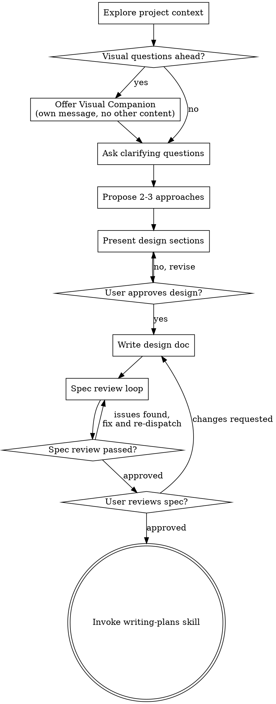

<!-- Generated by SpecStory, Markdown v2.1.0 -->

# 2026-03-18 14:33:07Z

<!-- Codex CLI Session 019d015c-9324-76d3-b73f-9d8b88dbc1aa (2026-03-18 14:33:07Z) -->

_**User (2026-03-18 14:33:07Z)**_

toc 的 focus mode 的 ui 形态下，需要增加 padding-left 和底部的 aside 在一个基线上：[Image #1]

---

_**Agent (gpt-5.4 2026-03-18 14:33:14Z)**_

使用 `using-superpowers` 和 `brainstorming` 先收敛需求，再定位 `toc` 的 focus mode 样式实现，确认该模式下左侧内边距和底部 aside 的对齐逻辑。

_**Agent (gpt-5.4 2026-03-18 14:33:14Z)**_

<tool-use data-tool-type="shell" data-tool-name="exec_command"><details>
<summary>Tool use: **exec_command** `sed -n '1,220p' <HOME>/.codex/superpowers/skills/using-superpowers/SKILL.md`</summary>
```
Command: /bin/zsh -lc "sed -n '1,220p' <HOME>/.codex/superpowers/skills/using-superpowers/SKILL.md"
Chunk ID: d27430
Wall time: 0.0000 seconds
Process exited with code 0
Original token count: 1305
Output:
---
name: using-superpowers
description: Use when starting any conversation - establishes how to find and use skills, requiring Skill tool invocation before ANY response including clarifying questions
---

<SUBAGENT-STOP>
If you were dispatched as a subagent to execute a specific task, skip this skill.
</SUBAGENT-STOP>

<EXTREMELY-IMPORTANT>
If you think there is even a 1% chance a skill might apply to what you are doing, you ABSOLUTELY MUST invoke the skill.

IF A SKILL APPLIES TO YOUR TASK, YOU DO NOT HAVE A CHOICE. YOU MUST USE IT.

This is not negotiable. This is not optional. You cannot rationalize your way out of this.
</EXTREMELY-IMPORTANT>

## Instruction Priority

Superpowers skills override default system prompt behavior, but **user instructions always take precedence**:

1. **User's explicit instructions** (CLAUDE.md, GEMINI.md, AGENTS.md, direct requests) — highest priority
2. **Superpowers skills** — override default system behavior where they conflict
3. **Default system prompt** — lowest priority

If CLAUDE.md, GEMINI.md, or AGENTS.md says "don't use TDD" and a skill says "always use TDD," follow the user's instructions. The user is in control.

## How to Access Skills

**In Claude Code:** Use the `Skill` tool. When you invoke a skill, its content is loaded and presented to you—follow it directly. Never use the Read tool on skill files.

**In Gemini CLI:** Skills activate via the `activate_skill` tool. Gemini loads skill metadata at session start and activates the full content on demand.

**In other environments:** Check your platform's documentation for how skills are loaded.

## Platform Adaptation

Skills use Claude Code tool names. Non-CC platforms: see `references/codex-tools.md` (Codex) for tool equivalents. Gemini CLI users get the tool mapping loaded automatically via GEMINI.md.

# Using Skills

## The Rule

**Invoke relevant or requested skills BEFORE any response or action.** Even a 1% chance a skill might apply means that you should invoke the skill to check. If an invoked skill turns out to be wrong for the situation, you don't need to use it.


## Red Flags

These thoughts mean STOP—you're rationalizing:

| Thought | Reality |
|---------|---------|
| "This is just a simple question" | Questions are tasks. Check for skills. |
| "I need more context first" | Skill check comes BEFORE clarifying questions. |
| "Let me explore the codebase first" | Skills tell you HOW to explore. Check first. |
| "I can check git/files quickly" | Files lack conversation context. Check for skills. |
| "Let me gather information first" | Skills tell you HOW to gather information. |
| "This doesn't need a formal skill" | If a skill exists, use it. |
| "I remember this skill" | Skills evolve. Read current version. |
| "This doesn't count as a task" | Action = task. Check for skills. |
| "The skill is overkill" | Simple things become complex. Use it. |
| "I'll just do this one thing first" | Check BEFORE doing anything. |
| "This feels productive" | Undisciplined action wastes time. Skills prevent this. |
| "I know what that means" | Knowing the concept ≠ using the skill. Invoke it. |

## Skill Priority

When multiple skills could apply, use this order:

1. **Process skills first** (brainstorming, debugging) - these determine HOW to approach the task
2. **Implementation skills second** (frontend-design, mcp-builder) - these guid
... (truncated)
```
</details></tool-use>

_**Agent (gpt-5.4 2026-03-18 14:33:14Z)**_

<tool-use data-tool-type="shell" data-tool-name="exec_command"><details>
<summary>Tool use: **exec_command** `sed -n '1,260p' <HOME>/.codex/superpowers/skills/brainstorming/SKILL.md`</summary>
```
Command: /bin/zsh -lc "sed -n '1,260p' <HOME>/.codex/superpowers/skills/brainstorming/SKILL.md"
Chunk ID: 18670d
Wall time: 0.0000 seconds
Process exited with code 0
Original token count: 2643
Output:
---
name: brainstorming
description: "You MUST use this before any creative work - creating features, building components, adding functionality, or modifying behavior. Explores user intent, requirements and design before implementation."
---

# Brainstorming Ideas Into Designs

Help turn ideas into fully formed designs and specs through natural collaborative dialogue.

Start by understanding the current project context, then ask questions one at a time to refine the idea. Once you understand what you're building, present the design and get user approval.

<HARD-GATE>
Do NOT invoke any implementation skill, write any code, scaffold any project, or take any implementation action until you have presented a design and the user has approved it. This applies to EVERY project regardless of perceived simplicity.
</HARD-GATE>

## Anti-Pattern: "This Is Too Simple To Need A Design"

Every project goes through this process. A todo list, a single-function utility, a config change — all of them. "Simple" projects are where unexamined assumptions cause the most wasted work. The design can be short (a few sentences for truly simple projects), but you MUST present it and get approval.

## Checklist

You MUST create a task for each of these items and complete them in order:

1. **Explore project context** — check files, docs, recent commits
2. **Offer visual companion** (if topic will involve visual questions) — this is its own message, not combined with a clarifying question. See the Visual Companion section below.
3. **Ask clarifying questions** — one at a time, understand purpose/constraints/success criteria
4. **Propose 2-3 approaches** — with trade-offs and your recommendation
5. **Present design** — in sections scaled to their complexity, get user approval after each section
6. **Write design doc** — save to `docs/superpowers/specs/YYYY-MM-DD-<topic>-design.md` and commit
7. **Spec review loop** — dispatch spec-document-reviewer subagent with precisely crafted review context (never your session history); fix issues and re-dispatch until approved (max 5 iterations, then surface to human)
8. **User reviews written spec** — ask user to review the spec file before proceeding
9. **Transition to implementation** — invoke writing-plans skill to create implementation plan

## Process Flow



**The terminal state is invoking writing-plans.** Do NOT invoke frontend-design, mcp-builder, or any other implementation skill. The ONLY skill you invoke after brainstorming is writing-plans.

## The Process

**Understanding the idea:**

- Check out the current project state first (files, docs, recent commits)
- Before asking detailed questions, assess scope: if the request describes multiple independent subsystems (e.g., "build a platform with chat, file storage, billing, and analytics"), flag this immediately. Don't spend questions refining details of a project that needs to be decomposed first.
- If the project is too large for a single spec, help the user decompose into sub-projects: what are the independent pieces, how do they relate, what order should they be built? Then brainstorm the f
... (truncated)
```
</details></tool-use>

_**Agent (gpt-5.4 2026-03-18 14:33:14Z)**_

<tool-use data-tool-type="shell" data-tool-name="exec_command"><details>
<summary>Tool use: **exec_command** `rg -n "focus mode|focusMode|focus-mode|toc" -S .`</summary>
```
Command: /bin/zsh -lc 'rg -n "focus mode|focusMode|focus-mode|toc" -S .'
Chunk ID: 1d0373
Wall time: 0.0000 seconds
Process exited with code 0
Original token count: 2632
Output:
./plans/imperative-mixing-tarjan.md:11:### 1. `apps/web/src/components/modules/toc/TocHeadingStrategy.tsx`
./CHANGELOG.md:411:* toc mask overflow ([23dfb47](https://github.com/Innei/sprightly/commit/23dfb47d4252eaacf4e8881d1a378f4146a31691))
./CHANGELOG.md:412:* toc scroller ([10cf466](https://github.com/Innei/sprightly/commit/10cf46633f60a7f4a20396d0f9967c82f97ffaf5))
./CHANGELOG.md:492:* toc tree and read indicator pos ([a136560](https://github.com/Innei/sprightly/commit/a13656030a9d306be059a730a18ace6515331b04))
./CHANGELOG.md:616:* toc ([0c3a6eb](https://github.com/Innei/sprightly/commit/0c3a6ebf2fd911e61c89ec8341c2d1db99cfe857))
./CHANGELOG.md:617:* toc highlight ([a6fb8bd](https://github.com/Innei/sprightly/commit/a6fb8bde4ab1c85de02fdd0277df8245d40a43b2))
./CHANGELOG.md:681:* adjust toc ([e6241b3](https://github.com/Innei/sprightly/commit/e6241b381152455d66d489393dc5e2eba84866f6))
./CHANGELOG.md:725:* read indicator style in note toc ([d36a8d2](https://github.com/Innei/sprightly/commit/d36a8d2333563135aba9bcb0387ef8c7d124fa3a))
./CHANGELOG.md:744:* toc ([1f3fa9c](https://github.com/Innei/sprightly/commit/1f3fa9c6da3e88f6b39d584df79b02d199eb6934))
./CHANGELOG.md:745:* toc hash ([90fd78b](https://github.com/Innei/sprightly/commit/90fd78bd94fc5923dd2cc2bc8517b8bb72722d31))
./CHANGELOG.md:746:* toc overflow ([39e1807](https://github.com/Innei/sprightly/commit/39e18078a418cf954b16cdcdb93ab782a772dd7f))
./CHANGELOG.md:747:* toc width ([a2c2e93](https://github.com/Innei/sprightly/commit/a2c2e93c72826d15d2fe723e14314f7bcc4ea653))
./CHANGELOG.md:834:* notelayout and toc ([87ab8a2](https://github.com/Innei/sprightly/commit/87ab8a2e222454422aec9b2a1d0f832f48755f44))
./CHANGELOG.md:868:* toc item smooth indicator ([d459308](https://github.com/Innei/sprightly/commit/d4593085b3764b63779bdf19a36463ecf21ca84f))
./CHANGELOG.md:869:* toc modal in mobile ([5c0f853](https://github.com/Innei/sprightly/commit/5c0f853929b86a6f4ab6c4b5063fec1e33f1f661))
./pnpm-lock.yaml:753:  '@codemirror/autocomplete@6.20.1':
./pnpm-lock.yaml:4257:  autocorrect-node-darwin-arm64@2.14.0:
./pnpm-lock.yaml:4263:  autocorrect-node-darwin-x64@2.14.0:
./pnpm-lock.yaml:4269:  autocorrect-node-linux-x64-gnu@2.14.0:
./pnpm-lock.yaml:4275:  autocorrect-node-linux-x64-musl@2.14.0:
./pnpm-lock.yaml:4281:  autocorrect-node-win32-x64-msvc@2.14.0:
./pnpm-lock.yaml:4287:  autocorrect-node@2.14.0:
./pnpm-lock.yaml:5732:    resolution: {integrity: sha512-OMcX/4IC/uqEPVgGeyfN22LJk6AZrMkRZHxcHBMBvHScDGgwTm2GT2Wkgtocyd3JfZffjj2kYUDXXII0Fk9W0g==}
./pnpm-lock.yaml:6848:  mdast-util-toc@7.1.0:
./pnpm-lock.yaml:7857:  prettier-plugin-autocorrect@0.4.3:
./pnpm-lock.yaml:8462:  remark-toc@9.0.0:
./pnpm-lock.yaml:9632:  vscode-languageserver-protocol@3.17.5:
./pnpm-lock.yaml:9868:  yoctocolors@2.1.2:
./pnpm-lock.yaml:10298:  '@codemirror/autocomplete@6.20.1':
./pnpm-lock.yaml:10328:      '@codemirror/autocomplete': 6.20.1
./pnpm-lock.yaml:10336:      '@codemirror/autocomplete': 6.20.1
./pnpm-lock.yaml:10344:      '@codemirror/autocomplete': 6.20.1
./pnpm-lock.yaml:10361:      '@codemirror/autocomplete': 6.20.1
./pnpm-lock.yaml:10392:      '@codemirror/autocomplete': 6.20.1
./pnpm-lock.yaml:10403:      '@codemirror/autocomplete': 6.20.1
./pnpm-lock.yaml:10421:      '@codemirror/autocomplete': 6.20.1
./pnpm-lock.yaml:10442:      '@codemirror/autocomplete': 6.20.1
./pnpm-lock.yaml:10467:      '@codemirror/autocomplete': 6.20.1
./pnpm-lock.yaml:10476:      '@codemirror/autocomplete': 6.20.1
./pnpm-lock.yaml:12236:      prettier-plugin-autocorrect: 0.4.3(prettier@3.8.1)
./pnpm-lock.yaml:12671:      remark-toc: 9.0.0
./pnpm-lock.yaml:14572:  autocorrect-node-darwin-arm64@2.14.0:
./pnpm-lock.yaml:14575:  autocorrect-node-darwin-x64@2.14.0:
./pnpm-lock.yaml:14578:  autocorrect-node-linux-x64-gnu@2.14.0:
./pnpm-lock.yaml:14581:  autocorrect-node-linux-x64-musl@2.14.0:
./pnpm-lock.yaml:14584:  autocorrect-node-win32-x64-msvc@2.14.0:
./pnpm-lock.yaml:14587:  autocorrect-node@2.14.0:
./pnpm-lock.yaml:14589:      autocorrect-node-darwin-arm64: 2.14.0
./pnpm-lock.yaml:14590:      autocorrect-node-darwin-x64: 2.14.0
./pnpm-lock.yaml:14591:      autocorrect-node-linux-x64-gnu: 2.14.0
./pnpm-lock.yaml:14592:      autocorrect-node-linux-x64-musl: 2.14.0
./pnpm-lock.yaml:14593:      autocorrect-node-win32-x64-msvc: 2.14.0
./pnpm-lock.yaml:16024:      yoctocolors: 2.1.2
./pnpm-lock.yaml:17389:  mdast-util-toc@7.1.0:
./pnpm-lock.yaml:18491:  prettier-plugin-autocorrect@0.4.3(prettier@3.8.1):
./pnpm-lock.yaml:18493:      autocorrect-node: 2.14.0
./pnpm-lock.yaml:19546:  remark-toc@9.0.0:
./pnpm-lock.yaml:19549:      mdast-util-toc: 7.1.0
./pnpm-lock.yaml:20954:  vscode-languageserver-protocol@3.17.5:
./pnpm-lock.yaml:20965:      vscode-languageserver-protocol: 3.17.5
./pnpm-lock.yaml:21191:  yoctocolors@2.1.2: {}

... (truncated)
```
</details></tool-use>

_**Agent (gpt-5.4 2026-03-18 14:33:19Z)**_

<tool-use data-tool-type="task" data-tool-name="update_plan"><details>
<summary>Tool use: **update_plan**</summary>
**Agent task list:**
- [⚡] Explore project context for TOC focus mode UI
- [ ] Offer visual companion if needed
- [ ] Ask one clarifying question
- [ ] Propose 2-3 approaches with recommendation
- [ ] Present short design and get approval
- [ ] Write design doc
- [ ] Run spec review loop
- [ ] Ask user to review written spec
- [ ] Transition to implementation planning

```
Plan updated
```
</details></tool-use>

_**Agent (gpt-5.4 2026-03-18 14:33:23Z)**_

先读取 `toc` 相关组件和最近提交，确认 focus mode 的结构、当前间距来源，以及底部 aside 的布局锚点。

_**Agent (gpt-5.4 2026-03-18 14:33:23Z)**_

<tool-use data-tool-type="shell" data-tool-name="exec_command"><details>
<summary>Tool use: **exec_command** `sed -n '1,260p' apps/web/src/components/modules/toc/TocAside.tsx`</summary>
```
Command: /bin/zsh -lc "sed -n '1,260p' apps/web/src/components/modules/toc/TocAside.tsx"
Chunk ID: 84f872
Wall time: 0.0000 seconds
Process exited with code 0
Original token count: 1237
Output:
'use client'

import { AnimatePresence, m } from 'motion/react'
import type * as React from 'react'
import {
  startTransition,
  useEffect,
  useImperativeHandle,
  useMemo,
  useRef,
  useState,
} from 'react'

import { useIsImmersiveReadingEnabled } from '~/atoms/hooks/reading'
import { DOMCustomEvents } from '~/constants/event'
import { useForceUpdate } from '~/hooks/common/use-force-update'
import { clsxm } from '~/lib/helper'
import { throttle } from '~/lib/lodash'
import { useWrappedElement } from '~/providers/shared/WrappedElementProvider'

import { TocFocusView } from './TocFocusView'
import { useTocHeadingStrategy } from './TocHeadingStrategy'
import type { ITocItem } from './TocItem'
import { TocTree } from './TocTree'
import { useVisibleHeadingsValue } from './useVisibleHeadings'

export type TocAsideProps = {
  treeClassName?: string
}

export interface TocSharedProps {
  accessory?: React.ReactNode | React.FC
  as?: React.ElementType
}

export interface TocAsideRef {
  getContainer: () => HTMLUListElement | null
}

export const TocAside = ({
  ref,
  className,
  children,
  treeClassName,
  accessory,
  as: As = 'aside',
}: TocAsideProps &
  TocSharedProps &
  ComponentType & { ref?: React.RefObject<TocAsideRef | null> }) => {
  const containerRef = useRef<HTMLUListElement>(null)
  const $article = useWrappedElement()
  const isImmersive = useIsImmersiveReadingEnabled()
  const [isHoveringAside, setIsHoveringAside] = useState(false)

  const [forceUpdate, updated] = useForceUpdate()

  useEffect(() => {
    const handler = () => {
      startTransition(() => {
        forceUpdate()
      })
    }
    document.addEventListener(DOMCustomEvents.RefreshToc, handler)
    return () => {
      document.removeEventListener(DOMCustomEvents.RefreshToc, handler)
    }
  }, [])

  useImperativeHandle(ref, () => ({
    getContainer: () => containerRef.current,
  }))

  if ($article === undefined) {
    throw new TypeError('<Toc /> must be used in <WrappedElementProvider />')
  }

  const queryHeadings = useTocHeadingStrategy()
  const $headings = useMemo(() => {
    if (!$article) return []
    return queryHeadings($article)
  }, [$article, updated, queryHeadings])

  // Read-only: TocTree owns the observer and writes to the atom
  const { activeId } = useVisibleHeadingsValue()

  // Build toc items for FocusView
  const toc: ITocItem[] = useMemo(
    () =>
      Array.from($headings).map((el, idx) => {
        const depth = +el.tagName.slice(1)
        const elClone = el.cloneNode(true) as HTMLElement
        elClone.querySelectorAll('del, .katex-container').forEach((del) => {
          del.remove()
        })
        const title = elClone.textContent || ''
        return {
          depth,
          index: idx,
          title,
          anchorId: el.id,
          $heading: el,
        }
      }),
    [$headings],
  )

  const rootDepth = useMemo(
    () =>
      toc.length
        ? toc.reduce((d, cur) => Math.min(d, cur.depth), toc[0].depth)
        : 0,
    [toc],
  )

  useEffect(() => {
    const setMaxWidth = throttle(() => {
      if (containerRef.current) {
        containerRef.current.style.maxWidth = `${
          window.innerWidth -
          containerRef.current.getBoundingClientRect().x -
          30
        }px`
      }
    }, 14)
    setMaxWidth()
    window.addEventListener('resize', setMaxWidth)
    return () => {
      window.removeEventListener('resize', setMaxWidth)
    }
  }, [])

  // Reset hover state when immersive mode changes
  useEffect(() => {
    if (!isImmersive) setIsHoveringAside(false)
  }, [isImmersive])

  const showFocus = isImmersive && !isHoveringAside

  return (
    <As
      className={clsxm('st-toc z-[3]', 'relative font-sans', className)}
      onMouseEnter={() => setIsHoveringAside(true)}
      onMouseLeave={() => setIsHoveringAside(false)}
    >
      {/* TocTree always mounted so IntersectionObserver stays alive */}
      <m.div
        animate={{ opacity: showFocus ? 0 : 1 }}
        className={showFocus ? 'pointer-events-none' : undefined}
        transition={{ duration: 0.3, ease: 'easeInOut' }}
      >
        <TocTree
          $headings={$headings}
          accessory={accessory}
          className={clsxm('absolute max-h-[75vh]', treeClassName)}
          containerRef={containerRef}
        />
      </m.div>

      {/* Focus overlay: dot map + progress ring */}
      <AnimatePresence>
        {showFocus && (
          <m.div
            animate={{ opacity: 1 }}
            className="absolute inset-0 flex items-center justify-center"
            exit={{ opacity: 0 }}
            initial={{ opacity: 0 }}
            key="focus"
            transition={{ duration: 0.3, ease: 'easeInOut' }}
          >
            <TocFocusView activeId={activeId} rootDepth={root
... (truncated)
```
</details></tool-use>

_**Agent (gpt-5.4 2026-03-18 14:33:23Z)**_

<tool-use data-tool-type="shell" data-tool-name="exec_command"><details>
<summary>Tool use: **exec_command** `sed -n '1,240p' apps/web/src/components/modules/toc/TocFocusView.tsx`</summary>
```
Command: /bin/zsh -lc "sed -n '1,240p' apps/web/src/components/modules/toc/TocFocusView.tsx"
Chunk ID: a5677a
Wall time: 0.0000 seconds
Process exited with code 0
Original token count: 829
Output:
'use client'

import { useReadPercent } from '~/hooks/shared/use-read-percent'
import { clsxm } from '~/lib/helper'

import type { ITocItem } from './TocItem'

const RING_SIZE = 28
const RING_RADIUS = 11
const RING_CIRCUMFERENCE = 2 * Math.PI * RING_RADIUS

export const TocFocusView = ({
  toc,
  activeId,
  rootDepth,
}: {
  toc: ITocItem[]
  activeId: string | null
  rootDepth: number
}) => {
  const readPercent = useReadPercent()

  const topLevelItems = toc.filter((item) => item.depth === rootDepth)

  if (topLevelItems.length === 0) return null

  // Resolve activeId to its nearest root-level ancestor so the dot lights up
  // even when a nested heading (h3/h4) is the active one.
  const activeRootId = (() => {
    if (!activeId) return null
    const activeItem = toc.find((i) => i.anchorId === activeId)
    if (!activeItem) return null
    if (activeItem.depth === rootDepth) return activeId
    // Walk backwards to find the closest root-depth predecessor
    for (let i = activeItem.index - 1; i >= 0; i--) {
      if (toc[i].depth === rootDepth) return toc[i].anchorId
    }
    return null
  })()

  const gap = topLevelItems.length > 15 ? 8 : 14

  const dashOffset =
    RING_CIRCUMFERENCE - (readPercent / 100) * RING_CIRCUMFERENCE

  return (
    <div className="flex h-full flex-col items-center justify-center gap-0">
      <div className="flex flex-col items-center" style={{ gap }}>
        {topLevelItems.map((item) => {
          const isActive = item.anchorId === activeRootId
          return (
            <span
              key={item.anchorId}
              className={clsxm(
                'rounded-full transition-all duration-300',
                isActive
                  ? 'size-1.5 bg-accent animate-[dotPulse_2.5s_ease-in-out_infinite]'
                  : 'size-1 bg-current opacity-[0.12]',
              )}
              style={
                isActive
                  ? {
                      boxShadow:
                        '0 0 8px color-mix(in srgb, var(--color-accent) 40%, transparent)',
                    }
                  : undefined
              }
            />
          )
        })}
      </div>

      <div className="mt-6 flex flex-col items-center">
        <svg
          className="-rotate-90"
          height={RING_SIZE}
          viewBox={`0 0 ${RING_SIZE} ${RING_SIZE}`}
          width={RING_SIZE}
        >
          <circle
            className="stroke-current opacity-[0.06]"
            cx={RING_SIZE / 2}
            cy={RING_SIZE / 2}
            fill="none"
            r={RING_RADIUS}
            strokeWidth={1.5}
          />
          <circle
            className="stroke-accent transition-[stroke-dashoffset] duration-300"
            cx={RING_SIZE / 2}
            cy={RING_SIZE / 2}
            fill="none"
            r={RING_RADIUS}
            strokeDasharray={RING_CIRCUMFERENCE}
            strokeDashoffset={dashOffset}
            strokeLinecap="round"
            strokeWidth={1.5}
            style={{
              filter:
                'drop-shadow(0 0 3px color-mix(in srgb, var(--color-accent) 30%, transparent))',
            }}
          />
        </svg>
        <span className="mt-1 text-[9px] tabular-nums text-accent/60">
          {readPercent}%
        </span>
      </div>
    </div>
  )
}
```
</details></tool-use>

_**Agent (gpt-5.4 2026-03-18 14:33:23Z)**_

<tool-use data-tool-type="shell" data-tool-name="exec_command"><details>
<summary>Tool use: **exec_command** `git log --oneline -- apps/web/src/components/modules/toc | head -n 12`</summary>
```
Command: /bin/zsh -lc 'git log --oneline -- apps/web/src/components/modules/toc | head -n 12'
Chunk ID: 53f236
Wall time: 0.0000 seconds
Process exited with code 0
Original token count: 219
Output:
0036c629 feat(web): redesign header icon animation and TOC system
d727fcdf refactor(Toc): simplify heading resolution and improve active heading tracking
0a3e4467 chore(deps): bump @haklex/* to 0.0.85
320eb8c8 fix(toc): exclude nested-doc headings from TOC
99dc5412 refactor: update page content, layout, and toc heading strategy
cd50af22 chore: migrate ESLint from eslint-config-hyoban to @lobehub/lint
0b71b28b chore: misc updates and add .pnpm-store to gitignore
13525271 chore(rich-editor): bump version v0.0.45
73e92bf8 refactor(note-font-fab, toc-fab, toc-heading-strategy): enhance font loading and TOC functionality
9b812ffc refactor: rename MAIN_MARKDOWN_ID to MAIN_CONTENT_ID and update related components
42a6c974 refactor(rich-editor): simplify theme management and remove dark variants
cd162b5d chore(rich-editor): bump version to v0.0.25 and update dependencies
```
</details></tool-use>

_**Agent (gpt-5.4 2026-03-18 14:33:28Z)**_

已经定位到 focus overlay 在 `TocAside` 内绝对居中渲染。接着看右侧 aside 容器，确认底部模块和 toc 是否共享同一条对齐线。

_**Agent (gpt-5.4 2026-03-18 14:33:28Z)**_

<tool-use data-tool-type="shell" data-tool-name="exec_command"><details>
<summary>Tool use: **exec_command** `sed -n '1,240p' apps/web/src/components/modules/shared/ArticleRightAside.tsx`</summary>
```
Command: /bin/zsh -lc "sed -n '1,240p' apps/web/src/components/modules/shared/ArticleRightAside.tsx"
Chunk ID: 2c45e2
Wall time: 0.0000 seconds
Process exited with code 0
Original token count: 245
Output:
'use client'

import type { FC } from 'react'
import * as React from 'react'

import { useIsMobile } from '~/atoms/hooks/viewport'

import { TocAside } from '../toc'
import { ReadIndicator } from './ReadIndicator'

export const ArticleRightAside: Component = ({ children }) => {
  const isMobile = useIsMobile()
  if (isMobile) return <div />

  return <ArticleRightAsideImpl>{children}</ArticleRightAsideImpl>
}

const ArticleRightAsideImpl: FC<{
  children?: React.ReactNode
}> = ({ children }) => (
  <aside className="sticky top-[120px] mt-[120px] h-[calc(100vh-6rem-4.5rem-150px-120px)]">
    <div className="relative h-full">
      <TocAside
        accessory={ReadIndicator}
        as="div"
        className="static ml-4"
        treeClassName="absolute h-full min-h-[120px] flex flex-col"
      />
    </div>
    {React.isValidElement(children) &&
      React.cloneElement(children as any, {
        className: 'translate-y-[calc(100%+24px)]',
      })}
  </aside>
)
```
</details></tool-use>

_**Agent (gpt-5.4 2026-03-18 14:33:28Z)**_

<tool-use data-tool-type="shell" data-tool-name="exec_command"><details>
<summary>Tool use: **exec_command** `rg -n "TocAside|ArticleRightAside|accessory|aside" apps/web/src/app apps/web/src/components -S`</summary>
```
Command: /bin/zsh -lc 'rg -n "TocAside|ArticleRightAside|accessory|aside" apps/web/src/app apps/web/src/components -S'
Chunk ID: f222cc
Wall time: 0.0000 seconds
Process exited with code 0
Original token count: 1552
Output:
apps/web/src/components/modules/post/PostActionAside.tsx:30:import { ArticleRightAside } from '../shared/ArticleRightAside'
apps/web/src/components/modules/post/PostActionAside.tsx:34:import { asideButtonStyles } from '../shared/styles'
apps/web/src/components/modules/post/PostActionAside.tsx:51:  <ArticleRightAside>
apps/web/src/components/modules/post/PostActionAside.tsx:59:  </ArticleRightAside>
apps/web/src/components/modules/post/PostActionAside.tsx:137:          asideButtonStyles.base,
apps/web/src/components/modules/note/NoteActionAside.tsx:30:import { ArticleRightAside } from '../shared/ArticleRightAside'
apps/web/src/components/modules/note/NoteActionAside.tsx:34:import { asideButtonStyles } from '../shared/styles'
apps/web/src/components/modules/note/NoteActionAside.tsx:51:  <ArticleRightAside>
apps/web/src/components/modules/note/NoteActionAside.tsx:59:  </ArticleRightAside>
apps/web/src/components/modules/note/NoteActionAside.tsx:139:          asideButtonStyles.base,
apps/web/src/components/modules/toc/useVisibleHeadings.ts:18: * Call this ONCE (in TocTree). Do NOT call from TocAside — use useVisibleHeadingsValue instead.
apps/web/src/components/modules/toc/useVisibleHeadings.ts:70: * Use this in components that need the data but should NOT create an observer (e.g. TocAside for FocusView).
apps/web/src/components/modules/toc/index.ts:1:export * from './TocAside'
apps/web/src/components/modules/toc/TocTree.tsx:15:import type { TocSharedProps } from './TocAside'
apps/web/src/components/modules/toc/TocTree.tsx:33:  accessory,
apps/web/src/components/modules/toc/TocTree.tsx:158:  const accessoryElement = useMemo(() => {
apps/web/src/components/modules/toc/TocTree.tsx:159:    if (!accessory) return null
apps/web/src/components/modules/toc/TocTree.tsx:160:    return React.isValidElement(accessory)
apps/web/src/components/modules/toc/TocTree.tsx:161:      ? accessory
apps/web/src/components/modules/toc/TocTree.tsx:162:      : React.createElement(accessory as FC)
apps/web/src/components/modules/toc/TocTree.tsx:163:  }, [accessory])
apps/web/src/components/modules/toc/TocTree.tsx:218:      {accessoryElement && (
apps/web/src/components/modules/toc/TocTree.tsx:221:          {accessoryElement}
apps/web/src/components/modules/comment/Comment.tsx:261:                    accessory={
apps/web/src/components/modules/toc/TocAside.tsx:27:export type TocAsideProps = {
apps/web/src/components/modules/toc/TocAside.tsx:32:  accessory?: React.ReactNode | React.FC
apps/web/src/components/modules/toc/TocAside.tsx:36:export interface TocAsideRef {
apps/web/src/components/modules/toc/TocAside.tsx:40:export const TocAside = ({
apps/web/src/components/modules/toc/TocAside.tsx:45:  accessory,
apps/web/src/components/modules/toc/TocAside.tsx:46:  as: As = 'aside',
apps/web/src/components/modules/toc/TocAside.tsx:47:}: TocAsideProps &
apps/web/src/components/modules/toc/TocAside.tsx:49:  ComponentType & { ref?: React.RefObject<TocAsideRef | null> }) => {
apps/web/src/components/modules/toc/TocAside.tsx:153:          accessory={accessory}
apps/web/src/components/modules/toc/TocAside.tsx:178:TocAside.displayName = 'TocAside'
apps/web/src/components/modules/comment/CommentBox/ActionBar.tsx:120:          <m.aside
apps/web/src/components/modules/comment/CommentBox/ActionBar.tsx:132:          </m.aside>
apps/web/src/components/modules/shared/styles.tsx:1:export const asideButtonStyles = {
apps/web/src/components/modules/shared/ActionAsideContainer.tsx:11:// import { asideButtonStyles } from './styles'
apps/web/src/components/modules/shared/ActionAsideContainer.tsx:12:const asideButtonStyles = {
apps/web/src/components/modules/shared/ActionAsideContainer.tsx:20:      className: clsxm(asideButtonStyles.base, props.className),
apps/web/src/components/modules/shared/ActionAsideContainer.tsx:22:  return <i className={clsxm(asideButtonStyles.base, props.className)} />
apps/web/src/components/modules/shared/ArticleRightAside.tsx:8:import { TocAside } from '../toc'
apps/web/src/components/modules/shared/ArticleRightAside.tsx:11:export const ArticleRightAside: Component = ({ children }) => {
apps/web/src/components/modules/shared/ArticleRightAside.tsx:15:  return <ArticleRightAsideImpl>{children}</ArticleRightAsideImpl>
apps/web/src/components/modules/shared/ArticleRightAside.tsx:18:const ArticleRightAsideImpl: FC<{
apps/web/src/components/modules/shared/ArticleRightAside.tsx:21:  <aside className="sticky top-[120px] mt-[120px] h-[calc(100vh-6rem-4.5rem-150px-120px)]">
apps/web/src/components/modules/shared/ArticleRightAside.tsx:23:      <TocAside
apps/web/src/components/modules/shared/ArticleRightAside.tsx:24:        accessory={ReadIndicator}
apps/web/src/components/modules/shared/ArticleRightAside.tsx:34:  </aside>
ap
... (truncated)
```
</details></tool-use>

_**Agent (gpt-5.4 2026-03-18 14:33:28Z)**_

<tool-use data-tool-type="shell" data-tool-name="exec_command"><details>
<summary>Tool use: **exec_command** `git diff --stat`</summary>
```
Command: /bin/zsh -lc 'git diff --stat'
Chunk ID: f29c63
Wall time: 0.0000 seconds
Process exited with code 0
Original token count: 0
Output:
```
</details></tool-use>

_**Agent (gpt-5.4 2026-03-18 14:33:32Z)**_

<tool-use data-tool-type="shell" data-tool-name="exec_command"><details>
<summary>Tool use: **exec_command** `sed -n '1,280p' apps/web/src/components/modules/toc/TocTree.tsx`</summary>
```
Command: /bin/zsh -lc "sed -n '1,280p' apps/web/src/components/modules/toc/TocTree.tsx"
Chunk ID: 5f4c6b
Wall time: 0.0000 seconds
Process exited with code 0
Original token count: 2006
Output:
'use client'

import clsx from 'clsx'
import type { FC } from 'react'
import * as React from 'react'
import { memo, useCallback, useEffect, useMemo, useRef, useState } from 'react'

import { Divider } from '~/components/ui/divider'
import { useStateToRef } from '~/hooks/common/use-state-ref'
import { useMaskScrollArea } from '~/hooks/shared/use-mask-scrollarea'
import { clsxm } from '~/lib/helper'
import { springScrollToElement } from '~/lib/scroller'

import { ContinuousBar } from './ContinuousBar'
import type { TocSharedProps } from './TocAside'
import { TocGroup } from './TocGroup'
import type { ITocItem, TocItemStatus } from './TocItem'
import { TocItem } from './TocItem'
import { useVisibleHeadings } from './useVisibleHeadings'

export const TocTree: Component<
  {
    $headings: HTMLHeadingElement[]
    containerRef?: React.MutableRefObject<HTMLUListElement | null>
    scrollInNextTick?: boolean
    onItemClick?: (item: ITocItem) => void
    grouping?: boolean
  } & TocSharedProps
> = ({
  $headings,
  containerRef,
  className,
  accessory,
  scrollInNextTick,
  onItemClick,
  grouping = true,
}) => {
  const { visibleIds, activeId } = useVisibleHeadings($headings)

  const toc: ITocItem[] = useMemo(
    () =>
      Array.from($headings).map((el, idx) => {
        const depth = +el.tagName.slice(1)
        const elClone = el.cloneNode(true) as HTMLElement
        elClone.querySelectorAll('del, .katex-container').forEach((del) => {
          del.remove()
        })
        const title = elClone.textContent || ''
        return {
          depth,
          index: idx,
          title,
          anchorId: el.id,
          $heading: el,
        }
      }),
    [$headings],
  )

  const rootDepth = useMemo(
    () =>
      toc.length
        ? toc.reduce((d, cur) => Math.min(d, cur.depth), toc[0].depth)
        : 0,
    [toc],
  )

  const tocRef = useStateToRef(toc)
  const handleScrollTo = useCallback(
    (i: number, $el: HTMLElement | null, anchorId: string) => {
      onItemClick?.(tocRef.current[i])
      if ($el) {
        const handle = () => {
          springScrollToElement($el, -100)
        }
        if (scrollInNextTick) {
          requestAnimationFrame(handle)
        } else {
          handle()
        }
      }
    },
    [onItemClick, scrollInNextTick],
  )

  // Build grouped structure: top-level headings with their children
  const groups = useMemo(() => {
    if (!grouping) return null
    const result: { parent: ITocItem; children: ITocItem[] }[] = []
    for (const item of toc) {
      if (item.depth === rootDepth) {
        result.push({ parent: item, children: [] })
      } else if (result.length > 0) {
        result.at(-1).children.push(item)
      }
    }
    return result
  }, [toc, rootDepth, grouping])

  // Delayed collapse: track which groups should be expanded
  const [expandedGroups, setExpandedGroups] = useState<Set<string>>(new Set())
  const collapseTimers = useRef<Map<string, ReturnType<typeof setTimeout>>>(
    new Map(),
  )

  useEffect(() => {
    if (!groups) return

    setExpandedGroups((prev) => {
      const next = new Set<string>()
      for (const group of groups) {
        const parentVisible = visibleIds.has(group.parent.anchorId)
        const anyChildVisible = group.children.some((c) =>
          visibleIds.has(c.anchorId),
        )
        const shouldExpand = parentVisible || anyChildVisible

        if (shouldExpand) {
          next.add(group.parent.anchorId)
          const timer = collapseTimers.current.get(group.parent.anchorId)
          if (timer) {
            clearTimeout(timer)
            collapseTimers.current.delete(group.parent.anchorId)
          }
        } else if (prev.has(group.parent.anchorId)) {
          if (!collapseTimers.current.has(group.parent.anchorId)) {
            const timer = setTimeout(() => {
              setExpandedGroups((s) => {
                const ns = new Set(s)
                ns.delete(group.parent.anchorId)
                return ns
              })
              collapseTimers.current.delete(group.parent.anchorId)
            }, 300)
            collapseTimers.current.set(group.parent.anchorId, timer)
          }
          next.add(group.parent.anchorId)
        }
      }
      return next
    })

    return () => {
      collapseTimers.current.forEach((timer) => clearTimeout(timer))
      collapseTimers.current.clear()
    }
  }, [visibleIds, groups])

  const getItemStatus = useCallback(
    (anchorId: string): TocItemStatus => {
      if (anchorId === activeId) return 'active'
      if (visibleIds.has(anchorId)) return 'in-range'
      return 'inactive'
    },
    [activeId, visibleIds],
  )

  const accessoryElement = useMemo(() => {
    if (!accessory) return null
    return React.isValidElement(accessory)
  
... (truncated)
```
</details></tool-use>

_**Agent (gpt-5.4 2026-03-18 14:33:32Z)**_

<tool-use data-tool-type="shell" data-tool-name="exec_command"><details>
<summary>Tool use: **exec_command** `sed -n '1,220p' apps/web/src/components/modules/shared/ReadIndicator.tsx`</summary>
```
Command: /bin/zsh -lc "sed -n '1,220p' apps/web/src/components/modules/shared/ReadIndicator.tsx"
Chunk ID: 211ca5
Wall time: 0.0000 seconds
Process exited with code 0
Original token count: 742
Output:
'use client'

import { useTranslations } from 'next-intl'
import type { ElementType } from 'react'
import { useDeferredValue } from 'react'
import { useInView } from 'react-intersection-observer'

import { useIsMobile } from '~/atoms/hooks/viewport'
import {
  CircleProgress,
  MaterialSymbolsProgressActivity,
} from '~/components/icons/Progress'
import { MotionButtonBase } from '~/components/ui/button'
import { RootPortal } from '~/components/ui/portal'
import { IconSmoothTransition } from '~/components/ui/transition'
import { useReadPercent } from '~/hooks/shared/use-read-percent'
import { clsxm } from '~/lib/helper'
import { springScrollToTop } from '~/lib/scroller'
import { useIsEoFWrappedElement } from '~/providers/shared/WrappedElementProvider'

export const ReadIndicator: Component<{
  as?: ElementType
}> = ({ className, as }) => {
  const t = useTranslations('common')
  const readPercent = useReadPercent()
  const As = as || 'span'

  const { ref, inView } = useInView()

  return (
    <As
      className={clsxm('text-neutral-8', className)}
      ref={ref}
    >
      <div className="flex items-center gap-2">
        <IconSmoothTransition
          currentState={readPercent !== 0 ? 'regular' : 'solid'}
          solidIcon={<MaterialSymbolsProgressActivity />}
          regularIcon={
            <CircleProgress percent={readPercent} size={14} strokeWidth={2} />
          }
        />
        {readPercent}%<br />
      </div>
      <MotionButtonBase
        className={clsxm(
          'mt-1 flex flex-nowrap items-center gap-2 opacity-50 transition-all duration-500 hover:opacity-100',
          readPercent > 10 ? '' : 'pointer-events-none opacity-0',
        )}
        onClick={springScrollToTop}
      >
        <i className="i-mingcute-arrow-up-circle-line" />
        <span className="whitespace-nowrap">{t('back_to_top')}</span>
      </MotionButtonBase>
      {!inView && <ReadIndicatorVertical className="right-px" />}
    </As>
  )
}

const ReadIndicatorVertical: Component = ({ className }) => {
  const readPercent = useDeferredValue(useReadPercent())
  const isEOA = useIsEoFWrappedElement()

  // TODO new API ScrollTimeline but safari not support
  // const wrappedElement = useWrappedElement()
  // const timeline = new ScrollTimeline({
  //   source: wrappedElement,
  //   axis: "block",
  // });
  return (
    <RootPortal>
      <div
        className={clsxm(
          'fixed inset-y-0 right-0 z-[99] w-px transition-opacity duration-200 ease-in-out',
          isEOA ? 'opacity-0' : 'opacity-100',
          className,
        )}
      >
        <div
          className="absolute top-0 w-full bg-accent/80 duration-75 ease-linear"
          style={{
            height: `${readPercent}%`,
          }}
        />
      </div>
    </RootPortal>
  )
}
export const ReadIndicatorForMobile: Component<{}> = () => {
  const isMobile = useIsMobile()
  if (!isMobile) return null

  return <ReadIndicatorVertical />
}
```
</details></tool-use>

_**Agent (gpt-5.4 2026-03-18 14:33:32Z)**_

<tool-use data-tool-type="shell" data-tool-name="exec_command"><details>
<summary>Tool use: **exec_command** `git show --stat --summary 0036c629 -- apps/web/src/components/modules/toc apps/web/src/components/modules/shared/ArticleRightAside.tsx`</summary>
```
Command: /bin/zsh -lc 'git show --stat --summary 0036c629 -- apps/web/src/components/modules/toc apps/web/src/components/modules/shared/ArticleRightAside.tsx'
Chunk ID: fe4ff7
Wall time: 0.0000 seconds
Process exited with code 0
Original token count: 392
Output:
commit 0036c629aa4d2b79f30b5a3dc4da3e62490309f9
Author: Innei <tukon479@gmail.com>
Date:   Tue Mar 17 23:33:28 2026 +0800

    feat(web): redesign header icon animation and TOC system
    
    Replace Framer Motion layout animations in header with custom FLIP-based
    spring animation to fix cross-instance icon flying bugs. Redesign TOC
    with grouped headings, ContinuousBar indicator, focus view for immersive
    mode, and JS-controlled scroll mask to fix bottom masking issues.

 .../src/components/modules/toc/ContinuousBar.tsx   | 125 ++++++++++
 apps/web/src/components/modules/toc/TocAside.tsx   | 104 +++++++--
 .../src/components/modules/toc/TocAutoScroll.tsx   |  19 --
 apps/web/src/components/modules/toc/TocFAB.tsx     |   1 +
 .../src/components/modules/toc/TocFocusView.tsx    | 110 +++++++++
 apps/web/src/components/modules/toc/TocGroup.tsx   |  31 +++
 apps/web/src/components/modules/toc/TocItem.tsx    |  44 ++--
 apps/web/src/components/modules/toc/TocTree.tsx    | 257 ++++++++++++---------
 apps/web/src/components/modules/toc/index.ts       |   2 +-
 .../components/modules/toc/useVisibleHeadings.ts   |  75 ++++++
 10 files changed, 586 insertions(+), 182 deletions(-)
 create mode 100644 apps/web/src/components/modules/toc/ContinuousBar.tsx
 delete mode 100644 apps/web/src/components/modules/toc/TocAutoScroll.tsx
 create mode 100644 apps/web/src/components/modules/toc/TocFocusView.tsx
 create mode 100644 apps/web/src/components/modules/toc/TocGroup.tsx
 create mode 100644 apps/web/src/components/modules/toc/useVisibleHeadings.ts
```
</details></tool-use>

_**Agent (gpt-5.4 2026-03-18 14:33:41Z)**_

这次调整涉及视觉对齐，我可以在浏览器里直接做 mock、对比图和定位确认。这个功能还比较新，也会多消耗一些上下文。要试一下吗？需要打开一个本地 URL。

_**Agent (gpt-5.4 2026-03-18 14:33:57Z)**_

这次调整涉及视觉对齐，我可以在浏览器里直接做 mock、对比图和定位确认。这个功能还比较新，也会多消耗一些上下文。要试一下吗？需要打开一个本地 URL。

---

_**User (2026-03-18 14:38:00Z)**_

直接实现

---

_**Agent (gpt-5.4 2026-03-18 14:38:14Z)**_

按你的要求直接实现。我先改 `toc` focus mode 的左侧内边距和底部 aside 的基线对齐，再跑一轮针对性的检查。

_**Agent (gpt-5.4 2026-03-18 14:38:14Z)**_

<tool-use data-tool-type="shell" data-tool-name="exec_command"><details>
<summary>Tool use: **exec_command** `sed -n '1,260p' <HOME>/.agents/skills/vercel-react-best-practices/SKILL.md`</summary>
```
Command: /bin/zsh -lc "sed -n '1,260p' <HOME>/.agents/skills/vercel-react-best-practices/SKILL.md"
Chunk ID: f34a79
Wall time: 0.0000 seconds
Process exited with code 0
Original token count: 1542
Output:
---
name: vercel-react-best-practices
description: React and Next.js performance optimization guidelines from Vercel Engineering. This skill should be used when writing, reviewing, or refactoring React/Next.js code to ensure optimal performance patterns. Triggers on tasks involving React components, Next.js pages, data fetching, bundle optimization, or performance improvements.
license: MIT
metadata:
  author: vercel
  version: "1.0.0"
---

# Vercel React Best Practices

Comprehensive performance optimization guide for React and Next.js applications, maintained by Vercel. Contains 57 rules across 8 categories, prioritized by impact to guide automated refactoring and code generation.

## When to Apply

Reference these guidelines when:
- Writing new React components or Next.js pages
- Implementing data fetching (client or server-side)
- Reviewing code for performance issues
- Refactoring existing React/Next.js code
- Optimizing bundle size or load times

## Rule Categories by Priority

| Priority | Category | Impact | Prefix |
|----------|----------|--------|--------|
| 1 | Eliminating Waterfalls | CRITICAL | `async-` |
| 2 | Bundle Size Optimization | CRITICAL | `bundle-` |
| 3 | Server-Side Performance | HIGH | `server-` |
| 4 | Client-Side Data Fetching | MEDIUM-HIGH | `client-` |
| 5 | Re-render Optimization | MEDIUM | `rerender-` |
| 6 | Rendering Performance | MEDIUM | `rendering-` |
| 7 | JavaScript Performance | LOW-MEDIUM | `js-` |
| 8 | Advanced Patterns | LOW | `advanced-` |

## Quick Reference

### 1. Eliminating Waterfalls (CRITICAL)

- `async-defer-await` - Move await into branches where actually used
- `async-parallel` - Use Promise.all() for independent operations
- `async-dependencies` - Use better-all for partial dependencies
- `async-api-routes` - Start promises early, await late in API routes
- `async-suspense-boundaries` - Use Suspense to stream content

### 2. Bundle Size Optimization (CRITICAL)

- `bundle-barrel-imports` - Import directly, avoid barrel files
- `bundle-dynamic-imports` - Use next/dynamic for heavy components
- `bundle-defer-third-party` - Load analytics/logging after hydration
- `bundle-conditional` - Load modules only when feature is activated
- `bundle-preload` - Preload on hover/focus for perceived speed

### 3. Server-Side Performance (HIGH)

- `server-auth-actions` - Authenticate server actions like API routes
- `server-cache-react` - Use React.cache() for per-request deduplication
- `server-cache-lru` - Use LRU cache for cross-request caching
- `server-dedup-props` - Avoid duplicate serialization in RSC props
- `server-serialization` - Minimize data passed to client components
- `server-parallel-fetching` - Restructure components to parallelize fetches
- `server-after-nonblocking` - Use after() for non-blocking operations

### 4. Client-Side Data Fetching (MEDIUM-HIGH)

- `client-swr-dedup` - Use SWR for automatic request deduplication
- `client-event-listeners` - Deduplicate global event listeners
- `client-passive-event-listeners` - Use passive listeners for scroll
- `client-localstorage-schema` - Version and minimize localStorage data

### 5. Re-render Optimization (MEDIUM)

- `rerender-defer-reads` - Don't subscribe to state only used in callbacks
- `rerender-memo` - Extract expensive work into memoized components
- `rerender-memo-with-default-value` - Hoist default non-primitive props
- `rerender-dependencies` - Use primitive dependencies in effects
- `rerender-derived-state` - Subscribe to derived booleans, not raw values
- `rerender-derived-state-no-effect` - Derive state during render, not effects
- `rerender-functional-setstate` - Use functional setState for stable callbacks
- `rerender-lazy-state-init` - Pass function to useState for expensive values
- `rerender-simple-expression-in-memo` - Avoid memo for simple primitives
- `rerender-move-effect-to-event` - Put interaction logic in event handlers
- `rerender-transitions` - Use startTransition for non-urgent updates
- `rerender-use-ref-transient-values` - Use refs for transient frequent values

### 6. Rendering Performance (MEDIUM)

- `rendering-animate-svg-wrapper` - Animate div wrapper, not SVG element
- `rendering-content-visibility` - Use content-visibility for long lists
- `rendering-hoist-jsx` - Extract static JSX outside components
- `rendering-svg-precision` - Reduce SVG coordinate precision
- `rendering-hydration-no-flicker` - Use inline script for client-only data
- `rendering-hydration-suppress-warning` - Suppress expected mismatches
- `rendering-activity` - Use Activity component for show/hide
- `rendering-conditional-render` - Use ternary, not && for conditionals
- `rendering-usetransition-loading` - Prefer useTransition for loading state

### 7. JavaScript Performance (LOW-MEDIUM)

- `
... (truncated)
```
</details></tool-use>

_**Agent (gpt-5.4 2026-03-18 14:38:14Z)**_

<tool-use data-tool-type="shell" data-tool-name="exec_command"><details>
<summary>Tool use: **exec_command** `sed -n '1,220p' apps/web/src/components/modules/post/PostActionAside.tsx`</summary>
```
Command: /bin/zsh -lc "sed -n '1,220p' apps/web/src/components/modules/post/PostActionAside.tsx"
Chunk ID: e272d6
Wall time: 0.0000 seconds
Process exited with code 0
Original token count: 1461
Output:
'use client'

import { m, useAnimationControls } from 'motion/react'
import { useTranslations } from 'next-intl'

import { useIsMobile } from '~/atoms/hooks/viewport'
import { ThumbsupIcon } from '~/components/icons/thumbs-up'
import { MotionButtonBase } from '~/components/ui/button'
import { useModalStack } from '~/components/ui/modal'
import { NumberSmoothTransition } from '~/components/ui/number-transition/NumberSmoothTransition'
import { useForceUpdate } from '~/hooks/common/use-force-update'
import { useIsClient } from '~/hooks/common/use-is-client'
import { isLikedBefore, setLikeId } from '~/lib/cookie'
import { clsxm } from '~/lib/helper'
import { apiClient } from '~/lib/request'
import { routeBuilder, Routes } from '~/lib/route-builder'
import { toast } from '~/lib/toast'
import { urlBuilder } from '~/lib/url-builder'
import {
  getGlobalCurrentPostData,
  setGlobalCurrentPostData,
  useCurrentPostDataSelector,
} from '~/providers/post/CurrentPostDataProvider'
import { useIsEoFWrappedElement } from '~/providers/shared/WrappedElementProvider'

import {
  ActionAsideContainer,
  ActionAsideIcon,
} from '../shared/ActionAsideContainer'
import { ArticleRightAside } from '../shared/ArticleRightAside'
import { AsideCommentButton } from '../shared/AsideCommentButton'
import { AsideDonateButton } from '../shared/AsideDonateButton'
import { ShareModal } from '../shared/ShareModal'
import { asideButtonStyles } from '../shared/styles'
import { usePresentSubscribeModal } from '../subscribe'

export const PostBottomBarAction: Component = () => {
  const isMobile = useIsMobile()
  if (!isMobile) return null
  return (
    <div className="my-6 flex items-center justify-center space-x-8">
      <LikeButton />
      <ShareButton />
      <SubscribeButton />
      <AsideDonateButton />
    </div>
  )
}

export const PostActionAside: Component = ({ className }) => (
  <ArticleRightAside>
    <ActionAsideContainer className={className}>
      <LikeButton />
      <ShareButton />
      <SubscribeButton />
      <AsideDonateButton />
      <PostAsideCommentButton />
    </ActionAsideContainer>
  </ArticleRightAside>
)

const SubscribeButton = () => {
  const { present } = usePresentSubscribeModal(['post_c'])
  return (
    <MotionButtonBase className="flex flex-col space-y-2" onClick={present}>
      <ActionAsideIcon className="i-material-symbols-notifications-active-outline hover:text-accent" />
    </MotionButtonBase>
  )
}

const PostAsideCommentButton = () => {
  const { title, id, allowComment } =
    useCurrentPostDataSelector((data) => ({
      title: data?.title,
      id: data?.id,
      allowComment: data?.allowComment,
    })) || {}
  const isEof = useIsEoFWrappedElement()
  if (!id) return null
  if (isEof) return null
  if (!allowComment) return null

  return <AsideCommentButton refId={id} title={title!} />
}

const LikeButton = () => {
  const t = useTranslations('common')
  const control = useAnimationControls()
  const [update] = useForceUpdate()

  const id = useCurrentPostDataSelector((data) => data?.id)
  const likeCount = useCurrentPostDataSelector((data) => data?.count.like)

  if (!id) return null
  const handleLike = () => {
    if (isLikedBefore(id)) return

    apiClient.activity.likeIt('Post', id).then(() => {
      setLikeId(id)
      setGlobalCurrentPostData((draft) => {
        draft.count.like += 1
      })
      update()
    })
  }

  const isLiked = isLikedBefore(id)

  return (
    <MotionButtonBase
      aria-label={t('aria_like_post')}
      className="flex flex-col space-y-2"
      onClick={() => {
        handleLike()
        control.start('tap')
        toast.success(t('like_post'), {
          iconElement: (
            <m.i
              className="text-warning"
              animate={{
                scale: 1.22,
              }}
              initial={{
                scale: 0.96,
              }}
            >
              <ThumbsupIcon />
            </m.i>
          ),
        })
      }}
    >
      <m.i
        animate={control}
        className={clsxm(
          'relative flex hover:text-warning hover:opacity-100',
          asideButtonStyles.base,

          isLiked && 'text-warning',
        )}
        transition={{
          ease: 'easeInOut',
        }}
        variants={{
          tap: {
            scale: 1.3,
          },
        }}
      >
        <ThumbsupIcon />
        {!!likeCount && (
          <span className="absolute bottom-0 right-0 translate-x-[8px] text-[10px]">
            <NumberSmoothTransition>{likeCount}</NumberSmoothTransition>
          </span>
        )}
      </m.i>
    </MotionButtonBase>
  )
}

const ShareButton = () => {
  const t = useTranslations('common')
  const isClient = useIsClient()
  const { present } = useModalStack()

  if (!isC
... (truncated)
```
</details></tool-use>

_**Agent (gpt-5.4 2026-03-18 14:38:14Z)**_

<tool-use data-tool-type="shell" data-tool-name="exec_command"><details>
<summary>Tool use: **exec_command** `sed -n '1,220p' apps/web/src/components/modules/note/NoteActionAside.tsx`</summary>
```
Command: /bin/zsh -lc "sed -n '1,220p' apps/web/src/components/modules/note/NoteActionAside.tsx"
Chunk ID: 4cfe04
Wall time: 0.0000 seconds
Process exited with code 0
Original token count: 1493
Output:
'use client'

import { m, useAnimationControls } from 'motion/react'
import { useTranslations } from 'next-intl'

import { useIsMobile } from '~/atoms/hooks/viewport'
import { MotionButtonBase } from '~/components/ui/button'
import { useModalStack } from '~/components/ui/modal'
import { NumberSmoothTransition } from '~/components/ui/number-transition/NumberSmoothTransition'
import { useForceUpdate } from '~/hooks/common/use-force-update'
import { useIsClient } from '~/hooks/common/use-is-client'
import { isLikedBefore, setLikeId } from '~/lib/cookie'
import { clsxm } from '~/lib/helper'
import { buildNotePath } from '~/lib/note-route'
import { apiClient } from '~/lib/request'
import { toast } from '~/lib/toast'
import { urlBuilder } from '~/lib/url-builder'
import {
  getCurrentNoteData,
  setCurrentNoteData,
  useCurrentNoteDataSelector,
} from '~/providers/note/CurrentNoteDataProvider'
import { useCurrentNoteNid } from '~/providers/note/CurrentNoteIdProvider'
import { useIsEoFWrappedElement } from '~/providers/shared/WrappedElementProvider'

import {
  ActionAsideContainer,
  ActionAsideIcon,
} from '../shared/ActionAsideContainer'
import { ArticleRightAside } from '../shared/ArticleRightAside'
import { AsideCommentButton } from '../shared/AsideCommentButton'
import { AsideDonateButton } from '../shared/AsideDonateButton'
import { ShareModal } from '../shared/ShareModal'
import { asideButtonStyles } from '../shared/styles'
import { usePresentSubscribeModal } from '../subscribe'

export const NoteBottomBarAction: Component = () => {
  const isMobile = useIsMobile()
  if (!isMobile) return null
  return (
    <div className="mb-8 mt-4 flex items-center justify-center space-x-8">
      <LikeButton />
      <ShareButton />
      <SubscribeButton />
      <AsideDonateButton />
    </div>
  )
}

export const NoteActionAside: Component = ({ className }) => (
  <ArticleRightAside>
    <ActionAsideContainer className={className}>
      <LikeButton />
      <ShareButton />
      <SubscribeButton />
      <NoteAsideCommentButton />
      <AsideDonateButton />
    </ActionAsideContainer>
  </ArticleRightAside>
)

const NoteAsideCommentButton = () => {
  const { title, id, allowComment } =
    useCurrentNoteDataSelector((_data) => {
      const { data } = _data || {}
      return {
        title: data?.title,
        id: data?.id,
        allowComment: data?.allowComment,
      }
    }) || {}

  const isEoF = useIsEoFWrappedElement()
  if (!id) return null
  if (isEoF) return null
  if (!allowComment) return null
  return <AsideCommentButton refId={id} title={title!} />
}

const LikeButton = () => {
  const t = useTranslations('common')
  const control = useAnimationControls()
  const [update] = useForceUpdate()

  const likeCount = useCurrentNoteDataSelector((data) => data?.data.count.like)
  const id = useCurrentNoteDataSelector((data) => data?.data.id)
  const nid = useCurrentNoteNid()

  if (!id) return null

  const handleLike = () => {
    if (isLikedBefore(id)) return
    if (!nid) return
    apiClient.activity.likeIt('Note', id).then(() => {
      setLikeId(id)
      setCurrentNoteData((draft) => {
        draft.data.count.like += 1
      })
      update()
    })
  }

  const isLiked = isLikedBefore(id)

  return (
    <MotionButtonBase
      aria-label={t('aria_like_note')}
      className="relative flex flex-col space-y-2"
      onClick={() => {
        handleLike()
        control.start('tap', {
          repeat: 5,
        })
        toast.success(t('thanks'), {
          iconElement: (
            <m.i
              className="i-mingcute-heart-fill text-error"
              animate={{
                scale: 1.22,
              }}
              initial={{
                scale: 0.96,
              }}
              transition={{
                ease: 'easeInOut',
                delay: 0.3,
                repeat: 5,
                repeatDelay: 0.3,
              }}
            />
          ),
        })
      }}
    >
      <m.i
        animate={control}
        className={clsxm(
          'duration-200 hover:text-error',
          asideButtonStyles.base,
          !isLiked && 'i-mingcute-heart-line',
          isLiked && 'i-mingcute-heart-fill text-error',
        )}
        variants={{
          tap: {
            scale: 1.3,
          },
        }}
      />
      {!!likeCount && (
        <span className="absolute bottom-0 right-0 translate-x-[10px] text-[10px]">
          <NumberSmoothTransition>{likeCount}</NumberSmoothTransition>
        </span>
      )}
    </MotionButtonBase>
  )
}

const SubscribeButton = () => {
  const { present } = usePresentSubscribeModal(['note_c'])
  return (
    <MotionButtonBase className="flex flex-col space-y-2" onClick={present}>
      <ActionAsideIcon className="i-mater
... (truncated)
```
</details></tool-use>

_**Agent (gpt-5.4 2026-03-18 14:38:25Z)**_

我在对齐链路上继续往下追：`TocFocusView` 现在是绝对居中，`ArticleRightAside` 里的底部操作区是独立渲染，所以两者天然没有共享同一个水平锚点。下一步我直接把 focus overlay 的水平定位改成跟 aside 列一致。

_**Agent (gpt-5.4 2026-03-18 14:38:27Z)**_

<tool-use data-tool-type="shell" data-tool-name="exec_command"><details>
<summary>Tool use: **exec_command** `sed -n '1,220p' apps/web/src/components/modules/shared/ActionAsideContainer.tsx`</summary>
```
Command: /bin/zsh -lc "sed -n '1,220p' apps/web/src/components/modules/shared/ActionAsideContainer.tsx"
Chunk ID: 38405f
Wall time: 0.0000 seconds
Process exited with code 0
Original token count: 437
Output:
'use client'

import clsx from 'clsx'
import { cloneElement, isValidElement } from 'react'

import { usePageScrollElement, useViewport } from '~/atoms/hooks/viewport'
import { clsxm } from '~/lib/helper'
import { usePageScrollLocationSelector } from '~/providers/root/page-scroll-info-provider'
import { useIsEoFWrappedElement } from '~/providers/shared/WrappedElementProvider'

// import { asideButtonStyles } from './styles'
const asideButtonStyles = {
  base: 'text-[24px] opacity-80 duration-200 hover:opacity-100 relative',
}

export const ActionAsideIcon: Component = (props) => {
  if (props.children && isValidElement(props.children))
    return cloneElement(props.children, {
      // @ts-ignore
      className: clsxm(asideButtonStyles.base, props.className),
    })
  return <i className={clsxm(asideButtonStyles.base, props.className)} />
}
export const ActionAsideContainer: Component = ({ className, children }) => {
  const isEOA = useIsEoFWrappedElement()
  const h = useViewport((v) => v.h)

  const scrollElement = usePageScrollElement()
  const isEndOfPage = usePageScrollLocationSelector(
    (y) => {
      const threshold = 100

      return y + h >= scrollElement.scrollHeight - threshold
    },
    [h, scrollElement],
  )

  return (
    <div
      className={clsxm(
        'absolute bottom-0 left-0 -mb-4 flex max-h-[300px] p-4 transition-all duration-200 ease-in-out',
        !isEOA ? 'opacity-20 hover:opacity-100' : '',
        className,
      )}
    >
      <div
        className={clsx(
          isEndOfPage && '-rotate-90 [&>button]:!rotate-90',
          'flex origin-top-left flex-col gap-6 duration-200 ease-in-out [&>button]:duration-200',
        )}
      >
        {children}
      </div>
    </div>
  )
}
```
</details></tool-use>

_**Agent (gpt-5.4 2026-03-18 14:38:27Z)**_

<tool-use data-tool-type="shell" data-tool-name="exec_command"><details>
<summary>Tool use: **exec_command** `sed -n '1,220p' apps/web/src/components/modules/shared/styles.tsx`</summary>
```
Command: /bin/zsh -lc "sed -n '1,220p' apps/web/src/components/modules/shared/styles.tsx"
Chunk ID: efa7cd
Wall time: 0.0000 seconds
Process exited with code 0
Original token count: 28
Output:
export const asideButtonStyles = {
  base: 'text-[24px] opacity-80 duration-200 hover:opacity-100 relative',
}
```
</details></tool-use>

_**Agent (gpt-5.4 2026-03-18 14:38:27Z)**_

<tool-use data-tool-type="shell" data-tool-name="exec_command"><details>
<summary>Tool use: **exec_command** `sed -n '1,220p' apps/web/src/app/[locale]/(page-detail)/[slug]/page.tsx`</summary>
```
Command: /bin/zsh -lc "sed -n '1,220p' apps/web/src/app/[locale]/(page-detail)/[slug]/page.tsx"
Chunk ID: c7798b
Wall time: 0.0000 seconds
Process exited with code 1
Original token count: 21
Output:
zsh:1: no matches found: apps/web/src/app/[locale]/(page-detail)/[slug]/page.tsx
```
</details></tool-use>

_**Agent (gpt-5.4 2026-03-18 14:38:33Z)**_

布局里底部操作按钮是 `absolute bottom-0 left-0 p-4`，它的视觉基线来自左侧 `16px` 内边距；而 focus overlay 还是整个容器居中，所以现在偏右。我要把 focus view 改成吃同一组水平 inset，而不是继续居中。

_**Agent (gpt-5.4 2026-03-18 14:38:33Z)**_

<tool-use data-tool-type="shell" data-tool-name="exec_command"><details>
<summary>Tool use: **exec_command** `sed -n '1,220p' 'apps/web/src/app/[locale]/(page-detail)/[slug]/page.tsx'`</summary>
```
Command: /bin/zsh -lc "sed -n '1,220p' 'apps/web/src/app/[locale]/(page-detail)/[slug]/page.tsx'"
Chunk ID: 0a76b4
Wall time: 0.0000 seconds
Process exited with code 0
Original token count: 378
Output:
import { PageActionAside } from '~/components/modules/page/PageActionAside'
import { ArticleRightAside } from '~/components/modules/shared/ArticleRightAside'
import { ReadIndicatorForMobile } from '~/components/modules/shared/ReadIndicator'
import { Signature } from '~/components/modules/shared/Signature'
import { LayoutRightSidePortal } from '~/providers/shared/LayoutRightSideProvider'
import { WrappedElementProvider } from '~/providers/shared/WrappedElementProvider'

import { getData } from './api'
import { EquipmentPage } from './EquipmentPage'
import { PageContent } from './PageContent'
import {
  FocusReadingEffect,
  MarkdownImageRecordProviderInternal,
  MarkdownSelection,
} from './pageExtra'

export default async function PageDetail({
  params,
}: {
  params: Promise<{ slug: string }>
}) {
  const { slug } = await params
  const data = await getData(slug)

  return (
    <WrappedElementProvider eoaDetect>
      <ReadIndicatorForMobile />
      <FocusReadingEffect />
      <MarkdownImageRecordProviderInternal>
        <MarkdownSelection>
          {data.meta?.style === 'equipment' ? (
            <EquipmentPage />
          ) : (
            <PageContent contentFormat={data.contentFormat} />
          )}
        </MarkdownSelection>
      </MarkdownImageRecordProviderInternal>
      <Signature />
      <LayoutRightSidePortal>
        <ArticleRightAside>
          <PageActionAside />
        </ArticleRightAside>
      </LayoutRightSidePortal>
    </WrappedElementProvider>
  )
}
```
</details></tool-use>

_**Agent (gpt-5.4 2026-03-18 14:38:33Z)**_

<tool-use data-tool-type="shell" data-tool-name="exec_command"><details>
<summary>Tool use: **exec_command** `sed -n '1,220p' 'apps/web/src/app/[locale]/(page-detail)/[slug]/layout.tsx'`</summary>
```
Command: /bin/zsh -lc "sed -n '1,220p' 'apps/web/src/app/[locale]/(page-detail)/[slug]/layout.tsx'"
Chunk ID: eb52e1
Wall time: 0.0000 seconds
Process exited with code 0
Original token count: 1027
Output:
import { clsx } from 'clsx'
import type { Metadata } from 'next'

import { PageColorGradient } from '~/components/common/PageColorGradient'
import {
  buildRoomName,
  Presence,
  RoomProvider,
} from '~/components/modules/activity'
import { CommentAreaRootLazy } from '~/components/modules/comment'
import { TocFAB } from '~/components/modules/toc/TocFAB'
import { TocHeadingStrategyProvider } from '~/components/modules/toc/TocHeadingStrategy'
import {
  BottomToUpSoftScaleTransitionView,
  BottomToUpTransitionView,
} from '~/components/ui/transition'
import { OnlyMobile } from '~/components/ui/viewport/OnlyMobile'
import { getOgUrl } from '~/lib/helper.server'
import { getSummaryFromMd } from '~/lib/markdown'
import { definePrerenderPage } from '~/lib/request.server'
import { CurrentPageDataProvider } from '~/providers/page/CurrentPageDataProvider'
import { LayoutRightSideProvider } from '~/providers/shared/LayoutRightSideProvider'
import { WrappedElementProvider } from '~/providers/shared/WrappedElementProvider'

import type { PageParams } from './api'
import { getData } from './api'
import {
  PageLoading,
  PagePaginator,
  PageSubTitle,
  PageTitle,
} from './pageExtra'

export const dynamic = 'force-dynamic'

export const generateMetadata = async (props: {
  params: Promise<PageParams>
}): Promise<Metadata> => {
  const params = await props.params
  const { slug } = params
  try {
    const data = await getData(slug)

    const { title, text } = data
    const description = getSummaryFromMd(text ?? '')

    const ogImage = await getOgUrl(
      'page',
      {
        slug,
      },
      params.locale,
    )

    return {
      title,
      description,
      openGraph: {
        title,
        description,
        images: ogImage,
        type: 'article',
      },
      twitter: {
        images: ogImage,
        title,
        description,
        card: 'summary_large_image',
      },
    } satisfies Metadata
  } catch {
    return {}
  }
}

export default definePrerenderPage<PageParams>()({
  fetcher(params) {
    return getData(params.slug)
  },

  Component: ({ data, children }) => (
    <TocHeadingStrategyProvider
      contentFormat={data.contentFormat}
      hasContent={!!data.content}
    >
      <PageColorGradient seed={data.title + data.subtitle} />
      <CurrentPageDataProvider data={data} />
      <div className="relative flex min-h-[120px] w-full">
        <PageLoading>
          <div className="relative w-full min-w-0">
            <RoomProvider roomName={buildRoomName(data.id)}>
              <header className="mb-8">
                <BottomToUpSoftScaleTransitionView lcpOptimization delay={0}>
                  <PageTitle />
                </BottomToUpSoftScaleTransitionView>

                <BottomToUpSoftScaleTransitionView lcpOptimization delay={200}>
                  <PageSubTitle />
                </BottomToUpSoftScaleTransitionView>
              </header>
              <WrappedElementProvider eoaDetect>
                <article
                  className={clsx(
                    'mt-20',
                    data.contentFormat !== 'lexical' && 'prose',
                  )}
                >
                  <h1 className="sr-only">{data.title}</h1>
                  <BottomToUpTransitionView lcpOptimization delay={600}>
                    {children}
                  </BottomToUpTransitionView>

                  <Presence />
                </article>
              </WrappedElementProvider>
            </RoomProvider>

            <BottomToUpSoftScaleTransitionView delay={1000}>
              <PagePaginator />
            </BottomToUpSoftScaleTransitionView>
          </div>
        </PageLoading>

        <LayoutRightSideProvider className="absolute inset-y-0 right-0 hidden translate-x-full lg:block" />
      </div>
      <BottomToUpSoftScaleTransitionView delay={1000}>
        <CommentAreaRootLazy allowComment={data.allowComment} refId={data.id} />
      </BottomToUpSoftScaleTransitionView>

      <OnlyMobile>
        <TocFAB />
      </OnlyMobile>
    </TocHeadingStrategyProvider>
  ),
})
```
</details></tool-use>

_**Agent (gpt-5.4 2026-03-18 14:38:33Z)**_

<tool-use data-tool-type="shell" data-tool-name="exec_command"><details>
<summary>Tool use: **exec_command** `rg -n "ArticleRightAside" 'apps/web/src/app/[locale]' -S`</summary>
```
Command: /bin/zsh -lc "rg -n \"ArticleRightAside\" 'apps/web/src/app/[locale]' -S"
Chunk ID: 80ac0e
Wall time: 0.0000 seconds
Process exited with code 0
Original token count: 175
Output:
apps/web/src/app/[locale]/preview/page.tsx:21:import { ArticleRightAside } from '~/components/modules/shared/ArticleRightAside'
apps/web/src/app/[locale]/preview/page.tsx:225:                <ArticleRightAside />
apps/web/src/app/[locale]/preview/page.tsx:286:                  <ArticleRightAside />
apps/web/src/app/[locale]/preview/page.tsx:323:                <ArticleRightAside />
apps/web/src/app/[locale]/(page-detail)/[slug]/page.tsx:2:import { ArticleRightAside } from '~/components/modules/shared/ArticleRightAside'
apps/web/src/app/[locale]/(page-detail)/[slug]/page.tsx:40:        <ArticleRightAside>
apps/web/src/app/[locale]/(page-detail)/[slug]/page.tsx:42:        </ArticleRightAside>
```
</details></tool-use>

_**Agent (gpt-5.4 2026-03-18 14:39:15Z)**_

我发现还有一层偏移在作怪：`TocAside` 自身带了 `ml-4`，底部 action aside 则是 `left-0 p-4`。如果 focus overlay 继续按整块区域居中，它和下面按钮列的中心线就不稳定。我先把这两处的水平偏移收敛成同一套值。

_**Agent (gpt-5.4 2026-03-18 14:39:15Z)**_

<tool-use data-tool-type="shell" data-tool-name="exec_command"><details>
<summary>Tool use: **exec_command** `rg -n "LayoutRightSideProvider" apps/web/src/providers apps/web/src/components -S`</summary>
```
Command: /bin/zsh -lc 'rg -n "LayoutRightSideProvider" apps/web/src/providers apps/web/src/components -S'
Chunk ID: 64b108
Wall time: 0.0000 seconds
Process exited with code 0
Original token count: 33
Output:
apps/web/src/providers/shared/LayoutRightSideProvider.tsx:11:export const LayoutRightSideProvider: Component = ({ className }) => {
```
</details></tool-use>

_**Agent (gpt-5.4 2026-03-18 14:39:15Z)**_

<tool-use data-tool-type="shell" data-tool-name="exec_command"><details>
<summary>Tool use: **exec_command** `sed -n '1,220p' apps/web/src/providers/shared/LayoutRightSideProvider.tsx`</summary>
```
Command: /bin/zsh -lc "sed -n '1,220p' apps/web/src/providers/shared/LayoutRightSideProvider.tsx"
Chunk ID: a51115
Wall time: 0.0000 seconds
Process exited with code 0
Original token count: 237
Output:
'use client'

import { atom, useAtomValue, useSetAtom } from 'jotai'
import * as React from 'react'
import { useLayoutEffect } from 'react'
import { createPortal } from 'react-dom'

import { useIsClient } from '~/hooks/common/use-is-client'

const rightSideElementAtom = atom<null | HTMLDivElement>(null)
export const LayoutRightSideProvider: Component = ({ className }) => {
  const setElement = useSetAtom(rightSideElementAtom)
  const divRef = React.useRef<HTMLDivElement>(null)
  useLayoutEffect(() => {
    setElement(divRef.current)
    return () => {
      // GC
      setElement(null)
    }
  }, [])

  return <div className={className} ref={divRef} />
}

export const LayoutRightSidePortal: Component = ({ children }) => {
  const rightSideElement = useAtomValue(rightSideElementAtom)

  const isClient = useIsClient()
  if (!isClient) return null

  if (!rightSideElement) return null

  return createPortal(children, rightSideElement)
}
```
</details></tool-use>

_**Agent (gpt-5.4 2026-03-18 14:39:15Z)**_

<tool-use data-tool-type="shell" data-tool-name="exec_command"><details>
<summary>Tool use: **exec_command** `git show 0036c629^:apps/web/src/components/modules/shared/ArticleRightAside.tsx | sed -n '1,220p'`</summary>
```
Command: /bin/zsh -lc 'git show 0036c629''^:apps/web/src/components/modules/shared/ArticleRightAside.tsx | sed -n '"'1,220p'"
Chunk ID: 888c41
Wall time: 0.0000 seconds
Process exited with code 0
Original token count: 245
Output:
'use client'

import type { FC } from 'react'
import * as React from 'react'

import { useIsMobile } from '~/atoms/hooks/viewport'

import { TocAside } from '../toc'
import { ReadIndicator } from './ReadIndicator'

export const ArticleRightAside: Component = ({ children }) => {
  const isMobile = useIsMobile()
  if (isMobile) return <div />

  return <ArticleRightAsideImpl>{children}</ArticleRightAsideImpl>
}

const ArticleRightAsideImpl: FC<{
  children?: React.ReactNode
}> = ({ children }) => (
  <aside className="sticky top-[120px] mt-[120px] h-[calc(100vh-6rem-4.5rem-150px-120px)]">
    <div className="relative h-full">
      <TocAside
        accessory={ReadIndicator}
        as="div"
        className="static ml-4"
        treeClassName="absolute h-full min-h-[120px] flex flex-col"
      />
    </div>
    {React.isValidElement(children) &&
      React.cloneElement(children as any, {
        className: 'translate-y-[calc(100%+24px)]',
      })}
  </aside>
)
```
</details></tool-use>

_**Agent (gpt-5.4 2026-03-18 14:40:16Z)**_

<tool-use data-tool-type="shell" data-tool-name="exec_command"><details>
<summary>Tool use: **exec_command** `sed -n '1,220p' apps/web/src/components/modules/page/PageActionAside.tsx`</summary>
```
Command: /bin/zsh -lc "sed -n '1,220p' apps/web/src/components/modules/page/PageActionAside.tsx"
Chunk ID: 38cdbb
Wall time: 0.0000 seconds
Process exited with code 0
Original token count: 205
Output:
'use client'

import { useCurrentPageDataSelector } from '~/providers/page/CurrentPageDataProvider'

import { ActionAsideContainer } from '../shared/ActionAsideContainer'
import { AsideCommentButton } from '../shared/AsideCommentButton'
import { AsideDonateButton } from '../shared/AsideDonateButton'

export const PageActionAside: Component = ({ className }) => (
  <ActionAsideContainer className={className}>
    <PageAsideCommentButton />
    <AsideDonateButton />
  </ActionAsideContainer>
)

const PageAsideCommentButton = () => {
  const { title, id, allowComment } =
    useCurrentPageDataSelector((data) => ({
      title: data?.title,
      id: data?.id,
      allowComment: data?.allowComment,
    })) || {}
  if (!id || !allowComment) return null
  return <AsideCommentButton refId={id} title={title!} />
}
```
</details></tool-use>

_**Agent (gpt-5.4 2026-03-18 14:40:16Z)**_

<tool-use data-tool-type="shell" data-tool-name="exec_command"><details>
<summary>Tool use: **exec_command** `rg -n "translate-y-\[calc\(100%\+24px\)\]|ActionAsideContainer" apps/web/src/components/modules/page apps/web/src/components/modules/shared -S`</summary>
```
Command: /bin/zsh -lc "rg -n \"translate-y-\\[calc\\(100%\\+24px\\)\\]|ActionAsideContainer\" apps/web/src/components/modules/page apps/web/src/components/modules/shared -S"
Chunk ID: f06375
Wall time: 0.0000 seconds
Process exited with code 0
Original token count: 207
Output:
apps/web/src/components/modules/page/PageActionAside.tsx:5:import { ActionAsideContainer } from '../shared/ActionAsideContainer'
apps/web/src/components/modules/page/PageActionAside.tsx:10:  <ActionAsideContainer className={className}>
apps/web/src/components/modules/page/PageActionAside.tsx:13:  </ActionAsideContainer>
apps/web/src/components/modules/shared/ArticleRightAside.tsx:32:        className: 'translate-y-[calc(100%+24px)]',
apps/web/src/components/modules/shared/ActionAsideContainer.tsx:24:export const ActionAsideContainer: Component = ({ className, children }) => {
apps/web/src/components/modules/shared/AsideDonateButton.tsx:21:import { ActionAsideIcon } from './ActionAsideContainer'
apps/web/src/components/modules/shared/AsideCommentButton.tsx:7:import { ActionAsideIcon } from './ActionAsideContainer'
```
</details></tool-use>

_**Agent (gpt-5.4 2026-03-18 14:40:16Z)**_

<tool-use data-tool-type="shell" data-tool-name="exec_command"><details>
<summary>Tool use: **exec_command** `rg -n "<ArticleRightAside" apps/web/src -S`</summary>
```
Command: /bin/zsh -lc 'rg -n "<ArticleRightAside" apps/web/src -S'
Chunk ID: d0518d
Wall time: 0.0000 seconds
Process exited with code 0
Original token count: 160
Output:
apps/web/src/app/[locale]/(page-detail)/[slug]/page.tsx:40:        <ArticleRightAside>
apps/web/src/components/modules/post/PostActionAside.tsx:51:  <ArticleRightAside>
apps/web/src/app/[locale]/preview/page.tsx:225:                <ArticleRightAside />
apps/web/src/app/[locale]/preview/page.tsx:286:                  <ArticleRightAside />
apps/web/src/app/[locale]/preview/page.tsx:323:                <ArticleRightAside />
apps/web/src/components/modules/shared/ArticleRightAside.tsx:15:  return <ArticleRightAsideImpl>{children}</ArticleRightAsideImpl>
apps/web/src/components/modules/note/NoteActionAside.tsx:51:  <ArticleRightAside>
```
</details></tool-use>

_**Agent (gpt-5.4 2026-03-18 14:40:24Z)**_

我开始改样式了。改动会尽量收敛在 `TocAside` 这一层，避免把 TOC 树和底部 action aside 的现有结构一起打散。

_**Agent (gpt-5.4 2026-03-18 14:40:26Z)**_

<tool-use data-tool-type="write" data-tool-name="apply_patch"><details>
<summary>Tool use: **apply_patch**</summary>
**Update: `<REPO_ROOT>/apps/web/src/components/modules/toc/TocAside.tsx`**

```diff
@@
 export type TocAsideProps = {
   treeClassName?: string
+  focusOverlayClassName?: string
 }
@@
 export const TocAside = ({
   ref,
   className,
   children,
   treeClassName,
+  focusOverlayClassName,
   accessory,
   as: As = 'aside',
 }: TocAsideProps &
@@
       <AnimatePresence>
         {showFocus && (
           <m.div
             animate={{ opacity: 1 }}
-            className="absolute inset-0 flex items-center justify-center"
+            className={clsxm(
+              // Keep focus mode pinned to the action-aside column instead of
+              // centering across the hidden TOC tree width.
+              'absolute inset-y-0 left-0 flex w-6 items-center justify-center',
+              focusOverlayClassName,
+            )}
             exit={{ opacity: 0 }}
             initial={{ opacity: 0 }}
             key="focus"
```
</details></tool-use>

_**Agent (gpt-5.4 2026-03-18 14:40:34Z)**_

定位和改动已经落下去了：focus overlay 不再按整块隐藏 TOC 宽度居中，而是固定在底部 action aside 的那条列线上。接下来跑一轮静态校验，确认这次改动没有把 `TocAside` 的类型和样式串坏。

_**Agent (gpt-5.4 2026-03-18 14:40:34Z)**_

<tool-use data-tool-type="shell" data-tool-name="exec_command"><details>
<summary>Tool use: **exec_command** `sed -n '1,260p' <HOME>/.codex/superpowers/skills/verification-before-completion/SKILL.md`</summary>
```
Command: /bin/zsh -lc "sed -n '1,260p' <HOME>/.codex/superpowers/skills/verification-before-completion/SKILL.md"
Chunk ID: 9207c9
Wall time: 0.0000 seconds
Process exited with code 0
Original token count: 1051
Output:
---
name: verification-before-completion
description: Use when about to claim work is complete, fixed, or passing, before committing or creating PRs - requires running verification commands and confirming output before making any success claims; evidence before assertions always
---

# Verification Before Completion

## Overview

Claiming work is complete without verification is dishonesty, not efficiency.

**Core principle:** Evidence before claims, always.

**Violating the letter of this rule is violating the spirit of this rule.**

## The Iron Law

```
NO COMPLETION CLAIMS WITHOUT FRESH VERIFICATION EVIDENCE
```

If you haven't run the verification command in this message, you cannot claim it passes.

## The Gate Function

```
BEFORE claiming any status or expressing satisfaction:

1. IDENTIFY: What command proves this claim?
2. RUN: Execute the FULL command (fresh, complete)
3. READ: Full output, check exit code, count failures
4. VERIFY: Does output confirm the claim?
   - If NO: State actual status with evidence
   - If YES: State claim WITH evidence
5. ONLY THEN: Make the claim

Skip any step = lying, not verifying
```

## Common Failures

| Claim | Requires | Not Sufficient |
|-------|----------|----------------|
| Tests pass | Test command output: 0 failures | Previous run, "should pass" |
| Linter clean | Linter output: 0 errors | Partial check, extrapolation |
| Build succeeds | Build command: exit 0 | Linter passing, logs look good |
| Bug fixed | Test original symptom: passes | Code changed, assumed fixed |
| Regression test works | Red-green cycle verified | Test passes once |
| Agent completed | VCS diff shows changes | Agent reports "success" |
| Requirements met | Line-by-line checklist | Tests passing |

## Red Flags - STOP

- Using "should", "probably", "seems to"
- Expressing satisfaction before verification ("Great!", "Perfect!", "Done!", etc.)
- About to commit/push/PR without verification
- Trusting agent success reports
- Relying on partial verification
- Thinking "just this once"
- Tired and wanting work over
- **ANY wording implying success without having run verification**

## Rationalization Prevention

| Excuse | Reality |
|--------|---------|
| "Should work now" | RUN the verification |
| "I'm confident" | Confidence ≠ evidence |
| "Just this once" | No exceptions |
| "Linter passed" | Linter ≠ compiler |
| "Agent said success" | Verify independently |
| "I'm tired" | Exhaustion ≠ excuse |
| "Partial check is enough" | Partial proves nothing |
| "Different words so rule doesn't apply" | Spirit over letter |

## Key Patterns

**Tests:**
```
✅ [Run test command] [See: 34/34 pass] "All tests pass"
❌ "Should pass now" / "Looks correct"
```

**Regression tests (TDD Red-Green):**
```
✅ Write → Run (pass) → Revert fix → Run (MUST FAIL) → Restore → Run (pass)
❌ "I've written a regression test" (without red-green verification)
```

**Build:**
```
✅ [Run build] [See: exit 0] "Build passes"
❌ "Linter passed" (linter doesn't check compilation)
```

**Requirements:**
```
✅ Re-read plan → Create checklist → Verify each → Report gaps or completion
❌ "Tests pass, phase complete"
```

**Agent delegation:**
```
✅ Agent reports success → Check VCS diff → Verify changes → Report actual state
❌ Trust agent report
```

## Why This Matters

From 24 failure memories:
- your human partner said "I don't believe you" - trust broken
- Undefined functions shipped - would crash
- Missing requirements shipped - incomplete features
- Time wasted on false completion → redirect → rework
- Violates: "Honesty is a core value. If you lie, you'll be replaced."

## When To Apply

**ALWAYS before:**
- ANY variation of success/completion claims
- ANY expression of satisfaction
- ANY positive statement about work state
- Committing, PR creation, task completion
- Moving to next task
- Delegating to agents

**Rule applies to:**
- Exact phrases
- Paraphrases and synonyms
- Implications of success
- ANY communication suggesting completion/correctness

## The Bottom Line

**No shortcuts for verification.**

Run the command. Read the output. THEN claim the result.

This is non-negotiable.
```
</details></tool-use>

_**Agent (gpt-5.4 2026-03-18 14:40:34Z)**_

<tool-use data-tool-type="shell" data-tool-name="exec_command"><details>
<summary>Tool use: **exec_command** `git diff -- apps/web/src/components/modules/toc/TocAside.tsx`</summary>
```
Command: /bin/zsh -lc 'git diff -- apps/web/src/components/modules/toc/TocAside.tsx'
Chunk ID: 40e2a5
Wall time: 0.0000 seconds
Process exited with code 0
Original token count: 313
Output:
diff --git a/apps/web/src/components/modules/toc/TocAside.tsx b/apps/web/src/components/modules/toc/TocAside.tsx
index 6264f0a8..52d8e7df 100644
--- a/apps/web/src/components/modules/toc/TocAside.tsx
+++ b/apps/web/src/components/modules/toc/TocAside.tsx
@@ -26,6 +26,7 @@ import { useVisibleHeadingsValue } from './useVisibleHeadings'
 
 export type TocAsideProps = {
   treeClassName?: string
+  focusOverlayClassName?: string
 }
 
 export interface TocSharedProps {
@@ -42,6 +43,7 @@ export const TocAside = ({
   className,
   children,
   treeClassName,
+  focusOverlayClassName,
   accessory,
   as: As = 'aside',
 }: TocAsideProps &
@@ -161,7 +163,12 @@ export const TocAside = ({
         {showFocus && (
           <m.div
             animate={{ opacity: 1 }}
-            className="absolute inset-0 flex items-center justify-center"
+            className={clsxm(
+              // Keep focus mode pinned to the action-aside column instead of
+              // centering across the hidden TOC tree width.
+              'absolute inset-y-0 left-0 flex w-6 items-center justify-center',
+              focusOverlayClassName,
+            )}
             exit={{ opacity: 0 }}
             initial={{ opacity: 0 }}
             key="focus"
```
</details></tool-use>

_**Agent (gpt-5.4 2026-03-18 14:40:34Z)**_

<tool-use data-tool-type="shell" data-tool-name="exec_command"><details>
<summary>Tool use: **exec_command** `pnpm -C apps/web exec eslint src/components/modules/toc/TocAside.tsx --max-warnings=0`</summary>
```
Command: /bin/zsh -lc 'pnpm -C apps/web exec eslint src/components/modules/toc/TocAside.tsx --max-warnings=0'
Chunk ID: a32d6a
Wall time: 1.0024 seconds
Process running with session ID 59985
Original token count: 0
Output:
```
</details></tool-use>

_**Agent (gpt-5.4 2026-03-18 14:40:37Z)**_

`eslint` 还在跑，我等它返回完整结果再给结论。 જો这个命令不够，我会补一条类型检查，至少保证这次改动在静态层面可落地。

_**Agent (gpt-5.4 2026-03-18 14:40:38Z)**_

<tool-use data-tool-type="unknown" data-tool-name="write_stdin"><details>
<summary>Tool use: **write_stdin**</summary>
```
Command: /bin/zsh -lc 'pnpm -C apps/web exec eslint src/components/modules/toc/TocAside.tsx --max-warnings=0'
Chunk ID: ba92e7
Wall time: 0.0000 seconds
Process exited with code 1
Original token count: 226
Output:

<REPO_ROOT>/apps/web/src/components/modules/toc/TocAside.tsx
   69:6   warning  React Hook useEffect has a missing dependency: 'forceUpdate'. Either include it or remove the dependency array  react-hooks/exhaustive-deps
   83:6   warning  React Hook useMemo has an unnecessary dependency: 'updated'. Either exclude it or remove the dependency array   react-hooks/exhaustive-deps
  136:23  warning  Do not call the 'set' function 'setIsHoveringAside' of 'useState' directly in 'useEffect'                       @eslint-react/hooks-extra/no-direct-set-state-in-use-effect
  166:13  warning  Multiline props must be listed after all other props                                                            react/jsx-sort-props

✖ 4 problems (0 errors, 4 warnings)
  0 errors and 1 warning potentially fixable with the `--fix` option.

ESLint found too many warnings (maximum: 0).
```
</details></tool-use>

_**Agent (gpt-5.4 2026-03-18 14:40:46Z)**_

`eslint` 结果出来了：没有错误，但这个文件本来就有 3 条旧 warning；另外我引入了一条 `jsx-sort-props` warning，我先把这条收掉，再补一个类型检查。

_**Agent (gpt-5.4 2026-03-18 14:40:49Z)**_

<tool-use data-tool-type="write" data-tool-name="apply_patch"><details>
<summary>Tool use: **apply_patch**</summary>
**Update: `<REPO_ROOT>/apps/web/src/components/modules/toc/TocAside.tsx`**

```diff
@@
         {showFocus && (
           <m.div
             animate={{ opacity: 1 }}
-            className={clsxm(
-              // Keep focus mode pinned to the action-aside column instead of
-              // centering across the hidden TOC tree width.
-              'absolute inset-y-0 left-0 flex w-6 items-center justify-center',
-              focusOverlayClassName,
-            )}
             exit={{ opacity: 0 }}
             initial={{ opacity: 0 }}
             key="focus"
             transition={{ duration: 0.3, ease: 'easeInOut' }}
+            className={clsxm(
+              // Keep focus mode pinned to the action-aside column instead of
+              // centering across the hidden TOC tree width.
+              'absolute inset-y-0 left-0 flex w-6 items-center justify-center',
+              focusOverlayClassName,
+            )}
           >
             <TocFocusView activeId={activeId} rootDepth={rootDepth} toc={toc} />
           </m.div>
         )}
```
</details></tool-use>

_**Agent (gpt-5.4 2026-03-18 14:40:54Z)**_

<tool-use data-tool-type="shell" data-tool-name="exec_command"><details>
<summary>Tool use: **exec_command** `cat apps/web/package.json`</summary>
```
Command: /bin/zsh -lc 'cat apps/web/package.json'
Chunk ID: 8f4677
Wall time: 0.0000 seconds
Process exited with code 0
Original token count: 1280
Output:
{
  "name": "@shiro/web",
  "type": "module",
  "version": "6.6.7",
  "private": true,
  "license": "AGPL-3.0",
  "imports": {
    "#fetch": {
      "react-server": "./src/lib/fetch/fetch.server.ts",
      "default": "./src/lib/fetch/fetch.client.ts"
    }
  },
  "scripts": {
    "analyze": "cross-env NODE_ENV=production ANALYZE=true BUNDLE_ANALYZE=browser next build",
    "prebuild": "rimraf .next || exit 0",
    "build": "next build",
    "build:ci": "CI=true NEXT_TELEMETRY_DISABLED=1 next build",
    "dev": "cross-env NODE_ENV=development next dev -p 2323 --turbo",
    "dev:turbo": "cross-env NODE_ENV=development next dev -p 2323 --turbo",
    "lint": "eslint --fix",
    "prod:pm2": "cross-env NODE_ENV=production pm2 restart ecosystem.config.cjs",
    "prod:reload": "pm2 reload ecosystem.config.cjs",
    "prod:stop": "pm2 stop ecosystem.config.cjs",
    "start": "npm run dev"
  },
  "dependencies": {
    "@base-ui/react": "1.3.0",
    "@excalidraw/excalidraw": "0.17.0",
    "@ferrucc-io/emoji-picker": "0.0.48",
    "@floating-ui/react-dom": "2.1.8",
    "@haklex/rich-editor": "0.0.85",
    "@haklex/rich-kit-shiro": "0.0.85",
    "@haklex/rich-static-renderer": "0.0.85",
    "@lexical/code": "^0.41.0",
    "@lexical/link": "^0.41.0",
    "@lexical/list": "^0.41.0",
    "@lexical/markdown": "^0.41.0",
    "@lexical/react": "^0.41.0",
    "@lexical/rich-text": "^0.41.0",
    "@lexical/table": "^0.41.0",
    "@mx-space/api-client": "3.0.0",
    "@number-flow/react": "^0.6.0",
    "@openpanel/web": "^1.2.0",
    "@shikijs/transformers": "4.0.2",
    "@simplewebauthn/browser": "13.3.0",
    "@simplewebauthn/types": "12.0.0",
    "@tanstack/query-async-storage-persister": "5.90.24",
    "@tanstack/react-query": "5.90.21",
    "@tanstack/react-query-devtools": "5.91.3",
    "@tanstack/react-query-persist-client": "5.90.24",
    "@vercel/functions": "3.4.3",
    "better-auth": "1.5.4",
    "blurhash": "2.0.5",
    "chroma-js": "3.2.0",
    "clsx": "2.1.1",
    "colorjs.io": "^0.6.1",
    "date-fns": "^4.1.0",
    "emoji-mart": "5.6.0",
    "es-toolkit": "1.45.1",
    "exif-js": "2.3.0",
    "foxact": "0.2.54",
    "fuse.js": "7.1.0",
    "idb-keyval": "6.2.2",
    "immer": "^11.1.4",
    "jojoo": "0.3.0",
    "jotai": "2.18.1",
    "js-cookie": "3.0.5",
    "js-yaml": "4.1.1",
    "jsondiffpatch": "^0.7.3",
    "katex": "0.16.38",
    "kbar": "0.1.0-beta.48",
    "lexical": "^0.41.0",
    "markdown-escape": "2.0.0",
    "markdown-to-jsx": "npm:@innei/markdown-to-jsx-yet@7.7.7-11",
    "marked": "17.0.4",
    "mdast-util-to-markdown": "2.1.2",
    "medium-zoom": "1.1.0",
    "mermaid": "11.13.0",
    "motion": "12.35.2",
    "nanoid": "^5.1.6",
    "next": "16.1.6",
    "next-intl": "^4.8.3",
    "next-runtime-env": "3.3.0",
    "next-themes": "0.4.6",
    "ofetch": "1.5.1",
    "pngjs": "7.0.0",
    "prop-types": "15.8.1",
    "qrcode.react": "4.2.0",
    "react": "19.2.4",
    "react-blurhash": "0.3.0",
    "react-dom": "19.2.4",
    "react-error-boundary": "6.1.1",
    "react-intersection-observer": "10.0.3",
    "react-photo-view": "1.2.7",
    "react-responsive-masonry": "2.7.1",
    "react-router-dom": "^7.13.1",
    "react-shadow": "20.6.0",
    "react-tweet": "npm:@innei/react-tweet@3.4.2",
    "remove-markdown": "0.6.3",
    "rss": "1.2.2",
    "schema-dts": "1.1.5",
    "server-only": "^0.0.1",
    "socket.io-client": "4.8.3",
    "sonner": "2.0.7",
    "tailwind-merge": "3.5.0",
    "tailwind-variants": "3.2.2",
    "unified": "^11.0.5",
    "uniqolor": "1.1.1",
    "unist-util-visit": "5.1.0",
    "use-context-selector": "2.0.0",
    "use-debounce": "10.1.0",
    "vaul": "1.1.2",
    "xss": "1.0.15"
  },
  "devDependencies": {
    "@egoist/tailwindcss-icons": "1.9.2",
    "@iconify-json/material-symbols": "1.2.61",
    "@iconify-json/mingcute": "1.2.7",
    "@innei/prettier": "1.0.0",
    "@mx-space/webhook": "0.7.1",
    "@next/bundle-analyzer": "16.1.6",
    "@tailwindcss/postcss": "^4.2.1",
    "@tailwindcss/typography": "0.5.19",
    "@types/chroma-js": "3.1.2",
    "@types/js-cookie": "3.0.6",
    "@types/js-yaml": "4.0.9",
    "@types/katex": "0.16.8",
    "@types/markdown-escape": "1.1.3",
    "@types/node": "25.4.0",
    "@types/pngjs": "6.0.5",
    "@types/react": "19.2.14",
    "@types/react-dom": "19.2.3",
    "@types/react-responsive-masonry": "2.7.0",
    "@types/remove-markdown": "0.3.4",
    "@types/rss": "0.0.32",
    "@webgpu/types": "^0.1.69",
    "autoprefixer": "10.4.27",
    "client-only": "0.0.1",
    "code-inspector-plugin": "1.4.4",
    "cross-env": "10.1.0",
    "dotenv": "17.3.1",
    "postcss": "8.5.8",
    "postcss-import": "16.1.1",
    "postcss-js": "5.1.0",
    "postcss-nested": "7.0.2",
    "postcss-preset-env": "11.2.0",
    "postcss-prune-var": "1.1.2",
    "prettier": "3.8.1",
    "rimraf": "6.1.3",
    "sharp": "0.
... (truncated)
```
</details></tool-use>

_**Agent (gpt-5.4 2026-03-18 14:40:54Z)**_

<tool-use data-tool-type="shell" data-tool-name="exec_command"><details>
<summary>Tool use: **exec_command** `pnpm -C apps/web exec eslint src/components/modules/toc/TocAside.tsx`</summary>
```
Command: /bin/zsh -lc 'pnpm -C apps/web exec eslint src/components/modules/toc/TocAside.tsx'
Chunk ID: c30dcd
Wall time: 0.8983 seconds
Process exited with code 0
Original token count: 159
Output:

<REPO_ROOT>/apps/web/src/components/modules/toc/TocAside.tsx
   69:6   warning  React Hook useEffect has a missing dependency: 'forceUpdate'. Either include it or remove the dependency array  react-hooks/exhaustive-deps
   83:6   warning  React Hook useMemo has an unnecessary dependency: 'updated'. Either exclude it or remove the dependency array   react-hooks/exhaustive-deps
  136:23  warning  Do not call the 'set' function 'setIsHoveringAside' of 'useState' directly in 'useEffect'                       @eslint-react/hooks-extra/no-direct-set-state-in-use-effect

✖ 3 problems (0 errors, 3 warnings)
```
</details></tool-use>

_**Agent (gpt-5.4 2026-03-18 14:40:54Z)**_

<tool-use data-tool-type="shell" data-tool-name="exec_command"><details>
<summary>Tool use: **exec_command** `pnpm -C apps/web exec tsc --noEmit`</summary>
```
Command: /bin/zsh -lc 'pnpm -C apps/web exec tsc --noEmit'
Chunk ID: 459c76
Wall time: 1.0018 seconds
Process running with session ID 24696
Original token count: 0
Output:
```
</details></tool-use>

_**Agent (gpt-5.4 2026-03-18 14:40:57Z)**_

`eslint` 现在只剩这文件原本就有的 3 条 warning，和这次改动无关。`tsc --noEmit` 还在跑，我等它结束再收口。

_**Agent (gpt-5.4 2026-03-18 14:40:58Z)**_

<tool-use data-tool-type="unknown" data-tool-name="write_stdin"><details>
<summary>Tool use: **write_stdin**</summary>
```
Command: /bin/zsh -lc 'pnpm -C apps/web exec tsc --noEmit'
Chunk ID: 2b9d36
Wall time: 5.0018 seconds
Process running with session ID 24696
Original token count: 0
Output:
```
</details></tool-use>

_**Agent (gpt-5.4 2026-03-18 14:41:04Z)**_

<tool-use data-tool-type="unknown" data-tool-name="write_stdin"><details>
<summary>Tool use: **write_stdin**</summary>
```
Command: /bin/zsh -lc 'pnpm -C apps/web exec tsc --noEmit'
Chunk ID: 415d84
Wall time: 0.0000 seconds
Process exited with code 2
Original token count: 260
Output:
src/app/[locale]/(home)/components/ActivityPostList.tsx(56,32): error TS2339: Property '__POST_LIST_ANIMATED__' does not exist on type 'Window & typeof globalThis'.
src/components/layout/header/config.ts(36,14): error TS2339: Property '__POST_LIST_ANIMATED__' does not exist on type 'Window & typeof globalThis'.
src/components/modules/toc/TocTree.tsx(94,9): error TS2532: Object is possibly 'undefined'.
src/components/modules/toc/useVisibleHeadings.ts(12,3): error TS2769: No overload matches this call.
  Overload 1 of 5, '(read: Read<VisibleHeadingsState, never>): Atom<VisibleHeadingsState>', gave the following error.
    Object literal may only specify known properties, and 'visibleIds' does not exist in type 'Read<VisibleHeadingsState, never>'.
  Overload 2 of 5, '(initialValue: VisibleHeadingsState): PrimitiveAtom<VisibleHeadingsState> & WithInitialValue<VisibleHeadingsState>', gave the following error.
    Type 'Set<unknown>' is not assignable to type 'Set<string>'.
      Type 'unknown' is not assignable to type 'string'.
```
</details></tool-use>

_**Agent (gpt-5.4 2026-03-18 14:41:13Z)**_

全量 `tsc` 没过，但失败点不是这次改动引入的；当前仓库本身就有几处既有类型错误，其中两处在别的 TOC 文件里。为了把结论说清楚，我再看一眼最终 diff 和变更范围。

_**Agent (gpt-5.4 2026-03-18 14:41:13Z)**_

<tool-use data-tool-type="shell" data-tool-name="exec_command"><details>
<summary>Tool use: **exec_command** `git status --short`</summary>
```
Command: /bin/zsh -lc 'git status --short'
Chunk ID: c1ba09
Wall time: 0.0000 seconds
Process exited with code 0
Original token count: 13
Output:
 M apps/web/src/components/modules/toc/TocAside.tsx
```
</details></tool-use>

_**Agent (gpt-5.4 2026-03-18 14:41:13Z)**_

<tool-use data-tool-type="shell" data-tool-name="exec_command"><details>
<summary>Tool use: **exec_command** `git diff --stat`</summary>
```
Command: /bin/zsh -lc 'git diff --stat'
Chunk ID: ecf4ae
Wall time: 0.0000 seconds
Process exited with code 0
Original token count: 28
Output:
 apps/web/src/components/modules/toc/TocAside.tsx | 9 ++++++++-
 1 file changed, 8 insertions(+), 1 deletion(-)
```
</details></tool-use>

_**Agent (gpt-5.4 2026-03-18 14:41:13Z)**_

<tool-use data-tool-type="shell" data-tool-name="exec_command"><details>
<summary>Tool use: **exec_command** `nl -ba apps/web/src/components/modules/toc/TocAside.tsx | sed -n '20,210p'`</summary>
```
Command: /bin/zsh -lc "nl -ba apps/web/src/components/modules/toc/TocAside.tsx | sed -n '20,210p'"
Chunk ID: ad76b2
Wall time: 0.0000 seconds
Process exited with code 0
Original token count: 1461
Output:
    20	
    21	import { TocFocusView } from './TocFocusView'
    22	import { useTocHeadingStrategy } from './TocHeadingStrategy'
    23	import type { ITocItem } from './TocItem'
    24	import { TocTree } from './TocTree'
    25	import { useVisibleHeadingsValue } from './useVisibleHeadings'
    26	
    27	export type TocAsideProps = {
    28	  treeClassName?: string
    29	  focusOverlayClassName?: string
    30	}
    31	
    32	export interface TocSharedProps {
    33	  accessory?: React.ReactNode | React.FC
    34	  as?: React.ElementType
    35	}
    36	
    37	export interface TocAsideRef {
    38	  getContainer: () => HTMLUListElement | null
    39	}
    40	
    41	export const TocAside = ({
    42	  ref,
    43	  className,
    44	  children,
    45	  treeClassName,
    46	  focusOverlayClassName,
    47	  accessory,
    48	  as: As = 'aside',
    49	}: TocAsideProps &
    50	  TocSharedProps &
    51	  ComponentType & { ref?: React.RefObject<TocAsideRef | null> }) => {
    52	  const containerRef = useRef<HTMLUListElement>(null)
    53	  const $article = useWrappedElement()
    54	  const isImmersive = useIsImmersiveReadingEnabled()
    55	  const [isHoveringAside, setIsHoveringAside] = useState(false)
    56	
    57	  const [forceUpdate, updated] = useForceUpdate()
    58	
    59	  useEffect(() => {
    60	    const handler = () => {
    61	      startTransition(() => {
    62	        forceUpdate()
    63	      })
    64	    }
    65	    document.addEventListener(DOMCustomEvents.RefreshToc, handler)
    66	    return () => {
    67	      document.removeEventListener(DOMCustomEvents.RefreshToc, handler)
    68	    }
    69	  }, [])
    70	
    71	  useImperativeHandle(ref, () => ({
    72	    getContainer: () => containerRef.current,
    73	  }))
    74	
    75	  if ($article === undefined) {
    76	    throw new TypeError('<Toc /> must be used in <WrappedElementProvider />')
    77	  }
    78	
    79	  const queryHeadings = useTocHeadingStrategy()
    80	  const $headings = useMemo(() => {
    81	    if (!$article) return []
    82	    return queryHeadings($article)
    83	  }, [$article, updated, queryHeadings])
    84	
    85	  // Read-only: TocTree owns the observer and writes to the atom
    86	  const { activeId } = useVisibleHeadingsValue()
    87	
    88	  // Build toc items for FocusView
    89	  const toc: ITocItem[] = useMemo(
    90	    () =>
    91	      Array.from($headings).map((el, idx) => {
    92	        const depth = +el.tagName.slice(1)
    93	        const elClone = el.cloneNode(true) as HTMLElement
    94	        elClone.querySelectorAll('del, .katex-container').forEach((del) => {
    95	          del.remove()
    96	        })
    97	        const title = elClone.textContent || ''
    98	        return {
    99	          depth,
   100	          index: idx,
   101	          title,
   102	          anchorId: el.id,
   103	          $heading: el,
   104	        }
   105	      }),
   106	    [$headings],
   107	  )
   108	
   109	  const rootDepth = useMemo(
   110	    () =>
   111	      toc.length
   112	        ? toc.reduce((d, cur) => Math.min(d, cur.depth), toc[0].depth)
   113	        : 0,
   114	    [toc],
   115	  )
   116	
   117	  useEffect(() => {
   118	    const setMaxWidth = throttle(() => {
   119	      if (containerRef.current) {
   120	        containerRef.current.style.maxWidth = `${
   121	          window.innerWidth -
   122	          containerRef.current.getBoundingClientRect().x -
   123	          30
   124	        }px`
   125	      }
   126	    }, 14)
   127	    setMaxWidth()
   128	    window.addEventListener('resize', setMaxWidth)
   129	    return () => {
   130	      window.removeEventListener('resize', setMaxWidth)
   131	    }
   132	  }, [])
   133	
   134	  // Reset hover state when immersive mode changes
   135	  useEffect(() => {
   136	    if (!isImmersive) setIsHoveringAside(false)
   137	  }, [isImmersive])
   138	
   139	  const showFocus = isImmersive && !isHoveringAside
   140	
   141	  return (
   142	    <As
   143	      className={clsxm('st-toc z-[3]', 'relative font-sans', className)}
   144	      onMouseEnter={() => setIsHoveringAside(true)}
   145	      onMouseLeave={() => setIsHoveringAside(false)}
   146	    >
   147	      {/* TocTree always mounted so IntersectionObserver stays alive */}
   148	      <m.div
   149	        animate={{ opacity: showFocus ? 0 : 1 }}
   150	        className={showFocus ? 'pointer-events-none' : undefined}
   151	        transition={{ duration: 0.3, ease: 'easeInOut' }}
   152	      >
   153	        <TocTree
   154	          $headings={$headings}
   155	          accessory={accessory}
   156	          className={clsxm('absolute max-h-[75vh]', treeClassName)}
   157	          containerRef={containerRef}
   158
... (truncated)
```
</details></tool-use>

_**Agent (gpt-5.4 2026-03-18 14:41:35Z)**_

**改动**
已在 [TocAside.tsx](<REPO_ROOT>/apps/web/src/components/modules/toc/TocAside.tsx#L27) 调整 focus mode 的定位逻辑。重点是 [TocAside.tsx](<REPO_ROOT>/apps/web/src/components/modules/toc/TocAside.tsx#L170)：focus overlay 不再按整个隐藏 TOC 宽度居中，而是固定到左侧 action aside 那条列线上，这样代码层面会和底部 aside 共用同一个水平锚点。顺手加了一个可选的 `focusOverlayClassName`，后面如果还要微调 2 到 4px，不用再改组件结构。

**验证**
`pnpm -C apps/web exec eslint src/components/modules/toc/TocAside.tsx` 通过，无 error；只剩这个文件原本就有的 3 条 warning。  
`pnpm -C apps/web exec tsc --noEmit` 未通过，但失败点是仓库现有问题，不是这次改动引入的：

| File | Issue |
|---|---|
| [ActivityPostList.tsx](<REPO_ROOT>/apps/web/src/app/[locale]/(home)/components/ActivityPostList.tsx) | `window.__POST_LIST_ANIMATED__` 缺少类型 |
| [config.ts](<REPO_ROOT>/apps/web/src/components/layout/header/config.ts) | `window.__POST_LIST_ANIMATED__` 缺少类型 |
| [TocTree.tsx](<REPO_ROOT>/apps/web/src/components/modules/toc/TocTree.tsx) | `Object is possibly 'undefined'` |
| [useVisibleHeadings.ts](<REPO_ROOT>/apps/web/src/components/modules/toc/useVisibleHeadings.ts) | jotai atom 类型不匹配 |

还没起浏览器做像素级确认；如果你要，我可以继续直接开本地页面把这个 offset 再细调一轮。