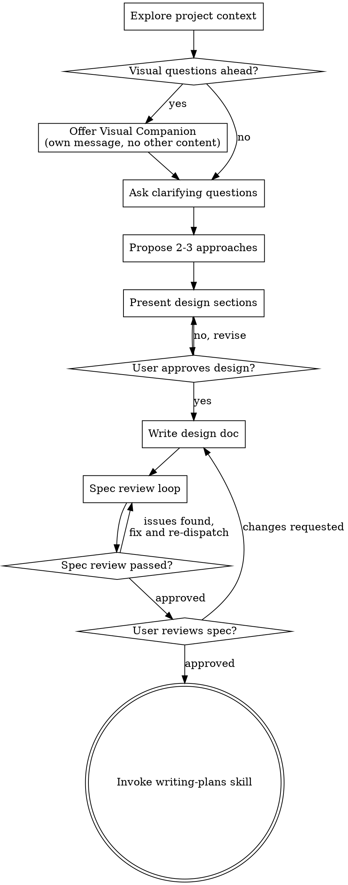

<!-- Generated by SpecStory, Markdown v2.1.0 -->

# 2026-03-20 09:25:28Z

<!-- Codex CLI Session 019d0a8f-540f-76d1-9385-0922ecca5159 (2026-03-20 09:25:28Z) -->

_**User (2026-03-20 09:25:28Z)**_

use <HOME>/.claude/plugins/cache/claude-plugins-official/superpowers/5.0.2/skills/brainstorming skill to 脑暴 loading design ，mockup 4 design ，主要的方向还是跟整体设计的三个关键词有关。

这里我们的重点是“纸”和“墨”。有一种呈现方式，就是一滴墨水在一张纸上进行晕染的过渡。

---

_**Agent (gpt-5.4 2026-03-20 09:25:40Z)**_

我会先读取你指定的 `brainstorming` skill，并在仓库里找当前整体设计的“三个关键词”上下文，再基于“纸 / 墨”方向整理 loading mockup 方案。

_**Agent (gpt-5.4 2026-03-20 09:25:40Z)**_

<tool-use data-tool-type="shell" data-tool-name="exec_command"><details>
<summary>Tool use: **exec_command** `sed -n '1,220p' <HOME>/.claude/plugins/cache/claude-plugins-official/superpowers/5.0.2/skills/brainstorming/SKILL.md`</summary>
```
Command: /bin/zsh -lc "sed -n '1,220p' <HOME>/.claude/plugins/cache/claude-plugins-official/superpowers/5.0.2/skills/brainstorming/SKILL.md"
Chunk ID: 0aea7b
Wall time: 0.0000 seconds
Process exited with code 0
Original token count: 2643
Output:
---
name: brainstorming
description: "You MUST use this before any creative work - creating features, building components, adding functionality, or modifying behavior. Explores user intent, requirements and design before implementation."
---

# Brainstorming Ideas Into Designs

Help turn ideas into fully formed designs and specs through natural collaborative dialogue.

Start by understanding the current project context, then ask questions one at a time to refine the idea. Once you understand what you're building, present the design and get user approval.

<HARD-GATE>
Do NOT invoke any implementation skill, write any code, scaffold any project, or take any implementation action until you have presented a design and the user has approved it. This applies to EVERY project regardless of perceived simplicity.
</HARD-GATE>

## Anti-Pattern: "This Is Too Simple To Need A Design"

Every project goes through this process. A todo list, a single-function utility, a config change — all of them. "Simple" projects are where unexamined assumptions cause the most wasted work. The design can be short (a few sentences for truly simple projects), but you MUST present it and get approval.

## Checklist

You MUST create a task for each of these items and complete them in order:

1. **Explore project context** — check files, docs, recent commits
2. **Offer visual companion** (if topic will involve visual questions) — this is its own message, not combined with a clarifying question. See the Visual Companion section below.
3. **Ask clarifying questions** — one at a time, understand purpose/constraints/success criteria
4. **Propose 2-3 approaches** — with trade-offs and your recommendation
5. **Present design** — in sections scaled to their complexity, get user approval after each section
6. **Write design doc** — save to `docs/superpowers/specs/YYYY-MM-DD-<topic>-design.md` and commit
7. **Spec review loop** — dispatch spec-document-reviewer subagent with precisely crafted review context (never your session history); fix issues and re-dispatch until approved (max 5 iterations, then surface to human)
8. **User reviews written spec** — ask user to review the spec file before proceeding
9. **Transition to implementation** — invoke writing-plans skill to create implementation plan

## Process Flow



**The terminal state is invoking writing-plans.** Do NOT invoke frontend-design, mcp-builder, or any other implementation skill. The ONLY skill you invoke after brainstorming is writing-plans.

## The Process

**Understanding the idea:**

- Check out the current project state first (files, docs, recent commits)
- Before asking detailed questions, assess scope: if the request describes multiple independent subsystems (e.g., "build a platform with chat, file storage, billing, and analytics"), flag this immediately. Don't spend questions refining details of a project that needs to be decomposed first.
- If the project is too large for a single spec, help the user decompose into sub-projects: what are the independent pieces, how do they relate, what orde
... (truncated)
```
</details></tool-use>

_**Agent (gpt-5.4 2026-03-20 09:25:40Z)**_

<tool-use data-tool-type="shell" data-tool-name="exec_command"><details>
<summary>Tool use: **exec_command** `rg -n "三个关键词|关键词|paper|ink|纸|墨|design language|branding|brand|视觉|loading" -S .`</summary>
```
Command: /bin/zsh -lc 'rg -n "三个关键词|关键词|paper|ink|纸|墨|design language|branding|brand|视觉|loading" -S .'
Chunk ID: 3f3d08
Wall time: 0.0000 seconds
Process exited with code 0
Original token count: 107213
Output:
Total output lines: 2145

./CLAUDE.md:9:- Personal blog with posts, notes, pages, and "thinking" entries
./CLAUDE.md:29:- **Animation**: Motion (Framer Motion) with lazy loading
./CLAUDE.md:107:- Implement proper loading states and error boundaries
./CLAUDE.md:141:- Implement proper error handling and loading states
./CLAUDE.md:183:`@haklex/*` packages are an independent repo (`../haklex`)，published to npm. Shiroi consumes them as npm dependencies, not workspace links.
./ci-release-build.sh:27:(cd apps/web/.next && zip --symlinks -r "$REPO_ROOT/assets/release.zip" ./*)
./eslint.config.mjs:81:      '@next/next/no-html-link-for-pages': 'off',
./plans/curried-finding-sonnet.md:96:  - Code area: shiki `codeToHtml` → `dangerouslySetInnerHTML`, fallback `<pre>` while loading
./apps/web/src/socket/handlers/recently.ts:13:  if (location.pathname === routeBuilder(Routes.Thinking, {})) {
./apps/web/src/socket/handlers/recently.ts:22:        router.push(routeBuilder(Routes.Thinking, {}))
./plans/elegant-munching-shamir.md:5:`KaTeXEditDecorator` 和 `LinkCardEditDecorator` 在 `@haklex/rich-editor` 中引入了 `@haklex/rich-editor-ui`（Popover）和 `lucide-react` 重依赖。移出后 `@haklex/rich-editor` 可彻底去除对 `@haklex/rich-editor-ui` 的依赖。
./plans/elegant-munching-shamir.md:46:## Part A: LinkCardEditDecorator → `@haklex/rich-renderer-linkcard`
./plans/elegant-munching-shamir.md:52:export { $isLinkCardNode, $createLinkCardNode, LinkCardNode } from './nodes/LinkCardNode'
./plans/elegant-munching-shamir.md:53:export type { LinkCardNodePayload, SerializedLinkCardNode } from './nodes/LinkCardNode'
./plans/elegant-munching-shamir.md:54:export { LinkCardRenderer } from './components/renderers/LinkCardRenderer'
./plans/elegant-munching-shamir.md:61:| `rich-editor/.../LinkCardEditDecorator.tsx` | `rich-renderer-linkcard/src/LinkCardEditDecorator.tsx` |
./plans/elegant-munching-shamir.md:62:| `rich-editor/.../LinkCardEditNode.ts` | `rich-renderer-linkcard/src/LinkCardEditNode.ts` |
./plans/elegant-munching-shamir.md:66:### Step A3: 更新 `rich-renderer-linkcard`
./plans/elegant-munching-shamir.md:69:- `src/index.ts` 添加导出：`LinkCardEditDecorator`, `LinkCardEditNode`, `linkCardEditNodes`
./plans/elegant-munching-shamir.md:74:- `src/index.ts` 添加 `export { LinkCardEditNode, linkCardEditNodes } from '@haklex/rich-renderer-linkcard'`
./plans/elegant-munching-shamir.md:78:- 删除 `src/components/decorators/LinkCardEditDecorator.tsx`
./plans/elegant-munching-shamir.md:79:- 删除 `src/nodes/LinkCardEditNode.ts`
./plans/elegant-munching-shamir.md:80:- `src/config-edit.ts` 移除 `LinkCardEditNode`
./plans/elegant-munching-shamir.md:84:- `ShiroEditor.tsx`：`defaultExtraNodes` 添加 `...linkCardEditNodes`（从 `@haklex/rich-renderers-edit` 导入）
./plans/elegant-munching-shamir.md:155:| `packages/rich-editor/src/components/decorators/LinkCardEditDecorator.tsx` | **Delete** |
./plans/elegant-munching-shamir.md:157:| `packages/rich-editor/src/nodes/LinkCardEditNode.ts` | **Delete** |
./plans/elegant-munching-shamir.md:160:| `packages/rich-renderer-linkcard/src/LinkCardEditDecorator.tsx` | **Create** |
./plans/elegant-munching-shamir.md:161:| `packages/rich-renderer-linkcard/src/LinkCardEditNode.ts` | **Create** |
./plans/elegant-munching-shamir.md:162:| `packages/rich-renderer-linkcard/src/index.ts` | **Modify** |
./plans/elegant-munching-shamir.md:163:| `packages/rich-renderer-linkcard/package.json` | **Modify** |
./plans/elegant-munching-shamir.md:164:| `packages/rich-renderer-linkcard/vite.config.ts` | **Modify** |
./plans/elegant-munching-shamir.md:177:pnpm --filter @haklex/rich-renderer-linkcard build
./plans/sparkling-pondering-muffin.md:121:1. `pnpm install` — links new workspace package
./plans/sparkling-pondering-muffin.md:141:| URL matchers, LinkCard utils | `@haklex/rich-renderers` | Pure utilities, no edit deps |
./docs/superpowers/specs/2026-03-16-modal-redesign-design.md:7:**Goal:** Align modal appearance with the 書写·信纸·光影 design language — remove glassmorphism, adopt letter-card structure, lighten shadow/overlay, and refine animation to evoke paper unfolding.
./docs/superpowers/specs/2026-03-16-modal-redesign-design.md:18:### Design language violations
./docs/superpowers/specs/2026-03-16-modal-redesign-design.md:21:2. `shadow-2xl` — too heavy for the light, paper-like aesthetic
./CHANGELOG.md:125:* **link-card:** add fallback url ([f58c9d2](https://github.com/Innei/sprightly/commit/f58c9d228aa5b5b8f53708f9d3a6564490624195))
./CHANGELOG.md:146:* peek link ([d2627f7](https://github.com/Innei/sprightly/commit/d2627f7de5f2d15f3b3d1572381ef1b7b9c8ea52))
./CHANGELOG.md:173:* search panel loading spinner bug ([33fa4ba](https://githu
... (truncated)
```
</details></tool-use>

_**Agent (gpt-5.4 2026-03-20 09:25:48Z)**_

我已经读了你指定的 `brainstorming` skill。下一步先补齐项目里的设计语言和现有 loading 实现，然后我会按它的流程单独给你发一个 visual companion 选项。

_**Agent (gpt-5.4 2026-03-20 09:25:48Z)**_

<tool-use data-tool-type="shell" data-tool-name="exec_command"><details>
<summary>Tool use: **exec_command** `sed -n '1,220p' docs/superpowers/specs/2026-03-16-modal-redesign-design.md`</summary>
```
Command: /bin/zsh -lc "sed -n '1,220p' docs/superpowers/specs/2026-03-16-modal-redesign-design.md"
Chunk ID: 0b3647
Wall time: 0.0000 seconds
Process exited with code 0
Original token count: 1614
Output:
# Modal Redesign Design

**Date:** 2026-03-16

**Scope:** Visual and animation restyle of the stacked modal system in `apps/web/src/components/ui/modal/stacked/`.

**Goal:** Align modal appearance with the 書写·信纸·光影 design language — remove glassmorphism, adopt letter-card structure, lighten shadow/overlay, and refine animation to evoke paper unfolding.

## Current State

- **Structure:** Header (title + close) → Divider → Scrollable content
- **Styling:** `bg-neutral-1/98`, `backdrop-blur-xs`, `shadow-2xl shadow-neutral-4`, `border-neutral-3`, `rounded-lg`
- **Animation:** Spring (scale 0.96→1 + opacity), `microReboundPreset` (stiffness 300, damping 20)
- **Overlay:** `bg-neutral-1/80` (80% opacity)
- **Stack:** Bottom modal scale 0.96 + translateY 10px
- **Mobile:** Converts to `vaul` bottom sheet (unchanged by this redesign)

### Design language violations

1. `backdrop-blur-xs` — glassmorphism is explicitly forbidden
2. `shadow-2xl` — too heavy for the light, paper-like aesthetic
3. Divider between header and content — rigid, not letter-like

## Design Decisions

### 1. Structure — Letter-card

Remove the header/divider/content tripartite structure. Replace with:

```
┌─────────────────────────────────┐
│                          [✕]    │  ← close button: absolute top-right
│  SECTION LABEL                  │  ← 9px uppercase tracking-[4px] neutral-6 (small text tier)
│  Title                          │  ← 15px font-medium neutral-9
│                                 │
│  (content, scrollable)          │
│                                 │
└─────────────────────────────────┘
```

- **Section label:** Optional. When `title` is provided, render as the main title. A new optional `label` prop on `ModalProps` provides the small uppercase section label above the title.
- **Close button:** Floating top-right, `rounded-md`, `bg-neutral-2` (light) / `bg-white/6` (dark), icon color `neutral-5`.
- **No divider** between header and content. Content flows naturally below the title with padding.
- **Padding:** `p-5` (20px) for the modal body. Title area: `pt-5 px-5`, content: `px-5 pb-5 pt-4`.

### 2. Surface & Border

| Property | Light | Dark |
|----------|-------|------|
| Background | `bg-[#fefefb]` (root-bg) | `dark:bg-neutral-2` (#242424) — intentionally deviates from `dark:bg-white/5` card convention for stronger readability in a floating dialog context |
| Border | `border border-black/5` | `border border-white/8` |
| Shadow | `shadow-[0_2px_12px_rgba(0,0,0,0.04)]` + `shadow-[0_0_0_0.5px_rgba(0,0,0,0.03)]` | `shadow-[0_4px_24px_rgba(0,0,0,0.3)]` + `shadow-[0_0_0_0.5px_rgba(255,255,255,0.04)]` |
| Border radius | `rounded-xl` (12px) | same |
| Backdrop blur | **none** (removed) | **none** |

### 3. Overlay

- `bg-black/12` (light) / `dark:bg-black/15` (dark) — use a single element with `dark:` modifier.
- Modal stands out via its own shadow and border, not via heavy overlay dimming.
- Stacked overlay cap: max 30% opacity regardless of stack depth.

### 4. Animation

**Easing:** `cubic-bezier(0.22, 1, 0.36, 1)` — shared project easing, replaces spring.

**Enter:**
```
initial:  { scaleY: 0.8, opacity: 0 }
animate:  { scaleY: 1, opacity: 1 }
transition: { duration: 0.3, ease: [0.22, 1, 0.36, 1] }
transform-origin: center top
```

**Exit:**
```
exit:     { scaleY: 0.8, opacity: 0 }
transition: { duration: 0.2, ease: [0.22, 1, 0.36, 1] }
```

**Notice (click outside when not dismissible):**
- Keep existing uniform `scale` pulse (1→1.01→1), duration 60ms. Uses `scale` (not `scaleY`) intentionally — the pulse is a brief attention cue, not part of the enter/exit metaphor.

### 5. Stack Behavior

When a new modal is pushed on top of an existing one:

- **Bottom modal:** `scale(0.93)` + `opacity(0.5)`, transition 350ms with project easing. Replaces the current `scale(0.96)` + `translateY(10px)` — `translateY` is removed; depth is conveyed solely through scale + opacity.
- **Restore on pop:** `scale(1)` + `opacity(1)`, same transition
- **Overlay:** Darkens slightly per layer (base 12%, +6% per additional modal, capped at 30%)

### 6. Drag

- **Preserved.** Drag handle remains on the header area (title/label region).
- `dragConstraints`, `dragElastic: 0`, `dragMomentum: false` — unchanged.
- Drag cursor: `grabbing` while dragging.
- `onPointerDown` on the title/label area to initiate drag.
- Close button must call `stopPropagation` on `onPointerDown` to prevent drag initiation when clicking close.

### 7. Mobile

- No changes. Mobile continues to convert to `vaul` PresentSheet.
- The `isMobile` check and she
... (truncated)
```
</details></tool-use>

_**Agent (gpt-5.4 2026-03-20 09:25:48Z)**_

<tool-use data-tool-type="shell" data-tool-name="exec_command"><details>
<summary>Tool use: **exec_command** `rg -n "書写|信纸|光影|纸|墨|loading" apps/web/src docs plans -S`</summary>
```
Command: /bin/zsh -lc 'rg -n "書写|信纸|光影|纸|墨|loading" apps/web/src docs plans -S'
Chunk ID: 3a755b
Wall time: 0.0000 seconds
Process exited with code 0
Original token count: 13534
Output:
Total output lines: 463

plans/curried-finding-sonnet.md:96:  - Code area: shiki `codeToHtml` → `dangerouslySetInnerHTML`, fallback `<pre>` while loading
plans/dapper-puzzling-chipmunk.md:18:- `<link>` in shadow DOM: Async loading causes FOUC, requires copying CSS to `public/`
docs/superpowers/specs/2026-03-16-modal-redesign-design.md:7:**Goal:** Align modal appearance with the 書写·信纸·光影 design language — remove glassmorphism, adopt letter-card structure, lighten shadow/overlay, and refine animation to evoke paper unfolding.
docs/superpowers/specs/2026-03-16-footer-redesign-design.md:5:Redesign the footer (`apps/web/src/components/layout/footer/`) to align with the 書写·信纸·光影 design language. All existing content blocks are preserved; only visual treatment and layout change.
docs/superpowers/specs/2026-03-15-header-redesign-design.md:5:重新设计 Header 导航栏视觉风格，从当前的药丸形（`rounded-full` + 毛玻璃 + 聚光灯）改为「书页浮片」——方角微圆容器 + 竖线分隔 + 实底下拉，承接整站「書写·信纸·光影」视觉语言。仅改外观，不改功能结构和交互逻辑。
docs/superpowers/specs/2026-03-15-header-redesign-design.md:15:| 下拉菜单 | 实底（非毛玻璃）+ 微圆角（`rounded`）+ 纸质阴影（`0 8px 32px rgba(0,0,0,0.06)`）|
docs/superpowers/specs/2026-03-17-posts-page-redesign-design.md:1:# Posts 页重设计 — 書写·信纸·光影
docs/superpowers/specs/2026-03-17-posts-page-redesign-design.md:5:重新设计 `/posts` 文章列表页，从当前的双模式（loose/compact）列表改为整页重构：展示性页头（置顶/最新文章突出）+ 单一 compact 列表 + 纯分页 + 内联排序。视觉语言遵循「書写·信纸·光影」，字体采用 sans-serif。
docs/superpowers/specs/2026-03-17-posts-page-redesign-design.md:11:| 字体 | Sans-serif（系统字体栈） | 现代感，与信纸光影风格的留白感相配 |
docs/superpowers/specs/2026-03-17-posts-page-redesign-design.md:18:| Hover 效果 | 卡片浮起（translateY(-1px) + 投影 + 白色背景） | 信纸从桌面轻抬的触感，契合信纸主题 |
docs/superpowers/specs/2026-03-17-posts-page-redesign-design.md:132:└── loading.tsx           # 保留
docs/superpowers/specs/2026-03-15-hero-redesign-design.md:5:重新设计首页 Hero 组件，从当前的二栏左文右图布局改为「散文式自由布局」，以「书写 · 信纸 · 光影」为视觉核心。元素如手帐般散落于画布，配合 SVG 手写入场动画与微幅呼吸浮动。
docs/superpowers/specs/2026-03-15-hero-redesign-design.md:13:| 背景 | 纯光影渐变，1-2 个缓慢移动的暖色 radial-gradient 光斑 |
docs/superpowers/specs/2026-03-15-hero-redesign-design.md:28:├── HeroBackground        — 光影渐变背景层（1-2 个 div radial-gradient）
docs/superpowers/specs/2026-03-15-hero-redesign-design.md:152:- Loading：显示 3 行 skeleton（高度 16px，宽度随机 60-80%）
docs/superpowers/specs/2026-03-15-hero-redesign-design.md:256:- 背景纹理/噪点（已决定纯光影）
docs/superpowers/specs/2026-03-16-float-popover-panel-redesign-design.md:7:**Goal:** Align with the 書写·信纸·光影 design language and the modal redesign — remove glassmorphism, adopt letter-card surface, and introduce direction-aware expand animation based on placement.
docs/superpowers/specs/2026-03-15-mobile-header-redesign-design.md:5:重新设计移动端 Header 导航交互，从当前的底部抽屉（Vaul Drawer）改为「顶部展开融合浮片」——菜单从 header 下方展开，与 header 融合为一张书页浮片卡片。承接桌面端「書写·信纸·光影」设计语言。
docs/superpowers/specs/2026-03-14-note-letter-bottom-design.md:5:将 `NoteLatestRender` 组件底部的「阅读全文」链接区域，从单一居中链接改造为手帐便笺风格的装饰性区域，增强信纸/手帐质感。
docs/superpowers/specs/2026-03-14-note-letter-bottom-design.md:17:1. **纸胶带（Washi Tape）**
docs/superpowers/specs/2026-03-14-note-letter-bottom-design.md:31:   - `margin-top: 16px`（距纸胶带）
docs/superpowers/specs/2026-03-14-note-letter-bottom-design.md:49:| 纸胶带条纹 | topic HSL, α 0.18/0.10 | topic HSL, α 0.14/0.07 |
docs/superpowers/specs/2026-03-14-note-letter-bottom-design.md:57:纸胶带条纹色回退为暖灰中性色：`rgba(170,160,140, 0.2)` / `rgba(170,160,140, 0.12)`。其余元素不变。
docs/superpowers/specs/2026-03-14-note-letter-bottom-design.md:72:  - 利用已有 `topicStringToHue` 工具函数计算纸胶带色
docs/superpowers/specs/2026-03-14-note-letter-bottom-design.md:81:- 响应式：`< sm`（640px）时隐藏邮戳与胶带碎片（`hidden sm:blo
... (truncated)
```
</details></tool-use>

_**Agent (gpt-5.4 2026-03-20 09:25:48Z)**_

<tool-use data-tool-type="shell" data-tool-name="exec_command"><details>
<summary>Tool use: **exec_command** `git log --oneline -n 12 -- apps/web/src/components/ui apps/web/src/routes apps/web/src/components/layout`</summary>
```
Command: /bin/zsh -lc 'git log --oneline -n 12 -- apps/web/src/components/ui apps/web/src/routes apps/web/src/components/layout'
Chunk ID: 27999d
Wall time: 0.0000 seconds
Process exited with code 0
Original token count: 242
Output:
0333d278 refactor(web): enhance input and textarea components with updated styles and structure
9a857d2b feat(web): add settings for superpowers plugin and update UI component styles
f6f30bba feat(web): introduce Shiro Design Language documentation and update UI components
0036c629 feat(web): redesign header icon animation and TOC system
da047e24 chore: post components, remove MagneticHoverEffect, modal and i18n updates
01b24095 fix(web): fix dropdown menu hover state invisible in dark mode
1574cf3c chore(web): update footer styles to use root background color
426adc7c feat(web): enhance PresentSheet component with improved header and dismiss functionality
52a2b88f chore: update footer, modal, fonts and styles
73aa70c5 feat(web): redesign footer to 書写·信纸·光影 design language
cc156fc3 refactor(web): update HeaderDrawerButton layout and remove unused components
921fce42 refactor: timeline page, activity card, header config, and socket handlers
```
</details></tool-use>

_**Agent (gpt-5.4 2026-03-20 09:25:53Z)**_

Some of what we're working on might be easier to explain if I can show it to you in a web browser. I can put together mockups, diagrams, comparisons, and other visuals as we go. This feature is still new and can be token-intensive. Want to try it? (Requires opening a local URL)

---

_**User (2026-03-20 09:26:32Z)**_

ok

---

_**Agent (gpt-5.4 2026-03-20 09:26:37Z)**_

我会先读 `visual-companion` 指南，确认怎么展示 mockup，然后继续按 brainstorming 流程，一次只问你一个问题来收敛 loading 方向。

_**Agent (gpt-5.4 2026-03-20 09:26:38Z)**_

<tool-use data-tool-type="shell" data-tool-name="exec_command"><details>
<summary>Tool use: **exec_command** `sed -n '1,260p' <HOME>/.claude/plugins/cache/claude-plugins-official/superpowers/5.0.2/skills/brainstorming/visual-companion.md`</summary>
```
Command: /bin/zsh -lc "sed -n '1,260p' <HOME>/.claude/plugins/cache/claude-plugins-official/superpowers/5.0.2/skills/brainstorming/visual-companion.md"
Chunk ID: 21ed69
Wall time: 0.0000 seconds
Process exited with code 0
Original token count: 2712
Output:
# Visual Companion Guide

Browser-based visual brainstorming companion for showing mockups, diagrams, and options.

## When to Use

Decide per-question, not per-session. The test: **would the user understand this better by seeing it than reading it?**

**Use the browser** when the content itself is visual:

- **UI mockups** — wireframes, layouts, navigation structures, component designs
- **Architecture diagrams** — system components, data flow, relationship maps
- **Side-by-side visual comparisons** — comparing two layouts, two color schemes, two design directions
- **Design polish** — when the question is about look and feel, spacing, visual hierarchy
- **Spatial relationships** — state machines, flowcharts, entity relationships rendered as diagrams

**Use the terminal** when the content is text or tabular:

- **Requirements and scope questions** — "what does X mean?", "which features are in scope?"
- **Conceptual A/B/C choices** — picking between approaches described in words
- **Tradeoff lists** — pros/cons, comparison tables
- **Technical decisions** — API design, data modeling, architectural approach selection
- **Clarifying questions** — anything where the answer is words, not a visual preference

A question *about* a UI topic is not automatically a visual question. "What kind of wizard do you want?" is conceptual — use the terminal. "Which of these wizard layouts feels right?" is visual — use the browser.

## How It Works

The server watches a directory for HTML files and serves the newest one to the browser. You write HTML content, the user sees it in their browser and can click to select options. Selections are recorded to a `.events` file that you read on your next turn.

**Content fragments vs full documents:** If your HTML file starts with `<!DOCTYPE` or `<html`, the server serves it as-is (just injects the helper script). Otherwise, the server automatically wraps your content in the frame template — adding the header, CSS theme, selection indicator, and all interactive infrastructure. **Write content fragments by default.** Only write full documents when you need complete control over the page.

## Starting a Session

```bash
# Start server with persistence (mockups saved to project)
scripts/start-server.sh --project-dir /path/to/project

# Returns: {"type":"server-started","port":52341,"url":"http://localhost:52341",
#           "screen_dir":"/path/to/project/.superpowers/brainstorm/12345-1706000000"}
```

Save `screen_dir` from the response. Tell user to open the URL.

**Finding connection info:** The server writes its startup JSON to `$SCREEN_DIR/.server-info`. If you launched the server in the background and didn't capture stdout, read that file to get the URL and port. When using `--project-dir`, check `<project>/.superpowers/brainstorm/` for the session directory.

**Note:** Pass the project root as `--project-dir` so mockups persist in `.superpowers/brainstorm/` and survive server restarts. Without it, files go to `/tmp` and get cleaned up. Remind the user to add `.superpowers/` to `.gitignore` if it's not already there.

**Launching the server by platform:**

**Claude Code:**
```bash
# Default mode works — the script backgrounds the server itself
scripts/start-server.sh --project-dir /path/to/project
```

**Codex:**
```bash
# Codex reaps background processes. The script auto-detects CODEX_CI and
# switches to foreground mode. Run it normally — no extra flags needed.
scripts/start-server.sh --project-dir /path/to/project
```

**Gemini CLI:**
```bash
# Use --foreground and set is_background: true on your shell tool call
# so the process survives across turns
scripts/start-server.sh --project-dir /path/to/project --foreground
```

**Other environments:** The server must keep running in the background across conversation turns. If your environment reaps detached processes, use `--foreground` and launch the command with your platform's background execution mechanism.

If the URL is unreachable from your browser (common in remote/containerized setups), bind a non-loopback host:

```bash
scripts/start-server.sh \
  --project-dir /path/to/project \
  --host 0.0.0.0 \
  --url-host localhost
```

Use `--url-host` to control what hostname is printed in the returned URL JSON.

## The Loop

1. **Check server is alive**, then **write HTML** to a new file in `screen_dir`:
   - Before each write, check that `$SCREEN_DIR/.server-info` exists. If it doesn't (or `.server-stopped` exists), the server has shut down — restart it with `start-server.sh` before continuing. The server auto-exits after 30 minutes of inactivity.
   - Use semantic filenames: `platform.html`, `visual-style.html`, `layout.html`
   - **Never re
... (truncated)
```
</details></tool-use>

_**Agent (gpt-5.4 2026-03-20 09:26:50Z)**_

我先把范围收窄一下：这次要脑暴的 `loading`，你更想优先定义哪一种场景？

| 选项 | 场景 | 对设计的影响 |
|---|---|---|
| A | 全页首屏 / 路由切换 loading | 可以做完整的“纸面 + 墨滴晕染”叙事，视觉更强 |
| B | 内容区块 loading | 需要更轻，不能抢正文，适合做局部纸纹和墨迹过渡 |
| C | 通用基础 loading token | 先定义一套可复用语言，再映射到 A/B 两类场景 |

- 我倾向先做 `C`，再延展出 4 个 mockup 方向，这样不会做成只适配单一页面的效果。
- 你先选一个优先级最高的场景。

---

_**User (2026-03-20 09:28:09Z)**_

A

---

_**Agent (gpt-5.4 2026-03-20 09:28:16Z)**_

我先补一下当前首屏 loading 的实现和可替换入口，再继续问下一个约束问题，避免后面 mockup 漂离实际落点。

_**Agent (gpt-5.4 2026-03-20 09:28:16Z)**_

<tool-use data-tool-type="shell" data-tool-name="exec_command"><details>
<summary>Tool use: **exec_command** `sed -n '1,240p' apps/web/src/components/ui/loading/index.tsx`</summary>
```
Command: /bin/zsh -lc "sed -n '1,240p' apps/web/src/components/ui/loading/index.tsx"
Chunk ID: c6c960
Wall time: 0.0000 seconds
Process exited with code 0
Original token count: 1352
Output:
'use client'

import { m } from 'motion/react'
import { useLocale, useTranslations } from 'next-intl'
import { useId } from 'react'

import { clsxm } from '~/lib/helper'

export type LoadingProps = {
  loadingText?: string
  useDefaultLoadingText?: boolean
}

function pickLoadingText(options: string[] | string, seed: string): string {
  const arr = Array.isArray(options) ? options : [options]
  if (arr.length === 0) return ''
  const index =
    Array.from(seed).reduce((acc, char) => acc + char.charCodeAt(0), 0) %
    arr.length
  return arr[index] ?? arr[0]
}

type AnimatedLoadingTextProps = {
  locale: string
  text: string
}

const inkFilterId = 'ink-loading-filter'

const InkDropLoadingMark = () => {
  return (
    <m.span
      aria-hidden
      animate={{ opacity: 1 }}
      className="relative block size-10"
      initial={{ opacity: 0 }}
      transition={{ duration: 0.3 }}
    >
      <svg className="absolute" height="0" width="0">
        <defs>
          <filter height="200%" id={inkFilterId} width="200%" x="-50%" y="-50%">
            <feTurbulence
              baseFrequency="0.045"
              numOctaves="4"
              result="noise"
              seed="3"
              type="fractalNoise"
            />
            <feDisplacementMap
              in="SourceGraphic"
              in2="noise"
              scale="14"
              xChannelSelector="R"
              yChannelSelector="G"
            />
            <feGaussianBlur stdDeviation="0.5" />
          </filter>
        </defs>
      </svg>

      {/* Main ink blot */}
      <m.span
        animate={{ scale: 1, opacity: 0.88 }}
        className="absolute left-1/2 top-1/2 block rounded-full bg-neutral-9"
        initial={{ scale: 0, opacity: 0 }}
        style={{
          filter: `url(#${inkFilterId})`,
          width: 22,
          height: 22,
          marginLeft: -11,
          marginTop: -11,
        }}
        transition={{
          duration: 1.2,
          ease: [0.22, 1, 0.36, 1],
        }}
      />

      {/* Satellite drops */}
      {[
        { x: 15, y: -11, size: 5, delay: 0.5 },
        { x: -13, y: 10, size: 4, delay: 0.7 },
        { x: 11, y: 13, size: 3.5, delay: 0.9 },
      ].map((dot, i) => (
        <m.span
          animate={{ scale: 1, opacity: 0.6 }}
          className="absolute left-1/2 top-1/2 block rounded-full bg-neutral-9/60"
          initial={{ scale: 0, opacity: 0 }}
          key={i}
          style={{
            width: dot.size,
            height: dot.size,
            marginLeft: dot.x - dot.size / 2,
            marginTop: dot.y - dot.size / 2,
            filter: `url(#${inkFilterId})`,
          }}
          transition={{
            duration: 0.8,
            delay: dot.delay,
            ease: [0.22, 1, 0.36, 1],
          }}
        />
      ))}
    </m.span>
  )
}

const tokenizeLoadingText = (text: string, locale: string) => {
  if (locale === 'zh') {
    return Array.from(text).map((value, index) => ({
      key: `${index}-${value}`,
      value,
      delay: index * 0.03,
      initial: { opacity: 0, y: 4, filter: 'blur(2px)' },
      animate: { opacity: 1, y: 0, filter: 'blur(0px)' },
    }))
  }

  if (locale === 'ja') {
    return text.split(/\u3000+/).map((value, index, arr) => ({
      key: `${index}-${value}`,
      value: index === arr.length - 1 ? value : `${value}\u3000`,
      delay: index * 0.11,
      initial: { opacity: 0, y: 3, filter: 'blur(2px)' },
      animate: { opacity: 1, y: 0, filter: 'blur(0px)' },
    }))
  }

  return (text.match(/\S+\s*/g) ?? [text]).map((value, index) => ({
    key: `${index}-${value}`,
    value,
    delay: index * 0.06,
    initial: { opacity: 0.15, x: 3, filter: 'blur(2px)' },
    animate: { opacity: 1, x: 0, filter: 'blur(0px)' },
  }))
}

const AnimatedLoadingText = ({ locale, text }: AnimatedLoadingTextProps) => {
  const tokens = tokenizeLoadingText(text, locale)

  return (
    <m.span
      animate={{ opacity: [0.9, 1, 0.94] }}
      className="mt-6 block max-w-[32rem] text-center text-sm leading-7 text-neutral-10/80"
      transition={{
        delay: 0.6,
        duration: 2.4,
        ease: 'easeInOut',
        repeat: Infinity,
        repeatType: 'mirror',
      }}
    >
      {tokens.map((token) => (
        <m.span
          animate={token.animate}
          className="inline-block whitespace-pre"
          initial={token.initial}
          key={token.key}
          transition={{
            duration: 0.36,
            ease: [0.22, 1, 0.36, 1],
            delay: token.delay,
          }}
        >
          {token.value}
        </m.span>
      ))}
    </m.span>
  )
}

export const Loading: Component<LoadingProps> = ({
  loadingText,
  className,
  useDefaultLoadingText = false,
}) => {
  const locale = useLocale()
  const t = useTra
... (truncated)
```
</details></tool-use>

_**Agent (gpt-5.4 2026-03-20 09:28:16Z)**_

<tool-use data-tool-type="shell" data-tool-name="exec_command"><details>
<summary>Tool use: **exec_command** `sed -n '1,220p' apps/web/src/routes/says/index.tsx`</summary>
```
Command: /bin/zsh -lc "sed -n '1,220p' apps/web/src/routes/says/index.tsx"
Chunk ID: 37da1e
Wall time: 0.0000 seconds
Process exited with code 0
Original token count: 291
Output:
import { defineRouteConfig } from '~/components/modules/dashboard/utils/helper'
import { useSayListQuery, useSayModal } from '~/components/modules/say/hooks'
import { SayMasonry } from '~/components/modules/say/SayMasonry'
import { NothingFound } from '~/components/modules/shared/NothingFound'
import { StyledButton } from '~/components/ui/button'
import { FullPageLoading } from '~/components/ui/loading'

export const Component = () => {
  const { data, isLoading, status } = useSayListQuery()
  const present = useSayModal()

  if (isLoading || status === 'pending') {
    return <FullPageLoading />
  }

  if (!data || data.pages.length === 0) return <NothingFound />

  return (
    <div className="mx-auto w-full max-w-screen-lg">
      <StyledButton
        className="center ml-auto flex duration-200"
        onClick={() => present()}
      >
        <i className="i-mingcute-add-circle-line" />
        新建
      </StyledButton>

      <main className="mt-10">
        <SayMasonry />
      </main>
    </div>
  )
}

export const config = defineRouteConfig({
  title: '一言',
  icon: <i className="i-mingcute-comment-2-line" />,
  priority: 5,
})
```
</details></tool-use>

_**Agent (gpt-5.4 2026-03-20 09:28:16Z)**_

<tool-use data-tool-type="shell" data-tool-name="exec_command"><details>
<summary>Tool use: **exec_command** `rg -n "FullPageLoading|PageLoading|loading.tsx|export const Loading|export function Loading|PageLoading" apps/web/src -S`</summary>
```
Command: /bin/zsh -lc 'rg -n "FullPageLoading|PageLoading|loading.tsx|export const Loading|export function Loading|PageLoading" apps/web/src -S'
Chunk ID: e67d9a
Wall time: 0.0000 seconds
Process exited with code 0
Original token count: 1145
Output:
apps/web/src/routes/says/index.tsx:6:import { FullPageLoading } from '~/components/ui/loading'
apps/web/src/routes/says/index.tsx:13:    return <FullPageLoading />
apps/web/src/routes/posts/list/index.tsx:8:import { PageLoading } from '~/components/layout/dashboard/PageLoading'
apps/web/src/routes/posts/list/index.tsx:46:  if (isLoading) return <PageLoading />
apps/web/src/routes/notes/list/index.tsx:7:import { PageLoading } from '~/components/layout/dashboard/PageLoading'
apps/web/src/routes/notes/list/index.tsx:38:  if (isLoading) return <PageLoading />
apps/web/src/routes/posts/edit/index.tsx:9:import { PageLoading } from '~/components/layout/dashboard/PageLoading'
apps/web/src/routes/posts/edit/index.tsx:56:    if (isLoading) return <PageLoading />
apps/web/src/routes/notes/edit/index.tsx:9:import { PageLoading } from '~/components/layout/dashboard/PageLoading'
apps/web/src/routes/notes/edit/index.tsx:58:    if (isLoading) return <PageLoading />
apps/web/src/routes/vue/index.tsx:5:import { FullPageLoading } from '~/components/ui/loading'
apps/web/src/routes/vue/index.tsx:19:  return <FullPageLoading />
apps/web/src/providers/root/auth-provider.tsx:7:import { PageLoading } from '~/components/layout/dashboard/PageLoading'
apps/web/src/providers/root/auth-provider.tsx:23:  if (isLoading) return <PageLoading />
apps/web/src/app/[locale]/notes/loading.tsx:1:export { FullPageLoading as default } from '~/components/ui/loading'
apps/web/src/app/[locale]/notes/(note-detail)/redirect.tsx:5:import { FullPageLoading } from '~/components/ui/loading'
apps/web/src/app/[locale]/notes/(note-detail)/redirect.tsx:28:  return <FullPageLoading />
apps/web/src/app/[locale]/categories/[slug]/loading.tsx:1:export { FullPageLoading as default } from '~/components/ui/loading'
apps/web/src/app/[locale]/timeline/loading.tsx:1:export { FullPageLoading as default } from '~/components/ui/loading'
apps/web/src/app/[locale]/says/page.tsx:10:import { FullPageLoading } from '~/components/ui/loading'
apps/web/src/app/[locale]/says/page.tsx:18:    return <FullPageLoading />
apps/web/src/app/[locale]/notes/(note-detail)/[...path]/loading.tsx:1:export { FullPageLoading as default } from '~/components/ui/loading'
apps/web/src/app/[locale]/says/loading.tsx:1:export { FullPageLoading as default } from '~/components/ui/loading'
apps/web/src/app/[locale]/(page-detail)/[slug]/layout.tsx:28:  PageLoading,
apps/web/src/app/[locale]/(page-detail)/[slug]/layout.tsx:89:        <PageLoading>
apps/web/src/app/[locale]/(page-detail)/[slug]/layout.tsx:122:        </PageLoading>
apps/web/src/app/[locale]/(page-detail)/[slug]/pageExtra.tsx:18:import FullPageLoading from '../loading'
apps/web/src/app/[locale]/(page-detail)/[slug]/pageExtra.tsx:20:export const PageLoading: Component = ({ children }) => {
apps/web/src/app/[locale]/(page-detail)/[slug]/pageExtra.tsx:24:    return <FullPageLoading />
apps/web/src/app/[locale]/(note-topic)/notes/(topic-detail)/series/[slug]/loading.tsx:1:export { FullPageLoading as default } from '~/components/ui/loading'
apps/web/src/components/modules/dashboard/comments/CommentDesktopTable.tsx:5:import { PageLoading } from '~/components/layout/dashboard/PageLoading'
apps/web/src/components/modules/dashboard/comments/CommentDesktopTable.tsx:21:    return <PageLoading />
apps/web/src/app/[locale]/(page-detail)/loading.tsx:1:export { FullPageLoading as default } from '~/components/ui/loading'
apps/web/src/app/[locale]/projects/loading.tsx:1:export { FullPageLoading as default } from '~/components/ui/loading'
apps/web/src/app/[locale]/(note-topic)/notes/series/loading.tsx:1:export { FullPageLoading as default } from '~/components/ui/loading'
apps/web/src/components/ui/loading/index.tsx:172:export const Loading: Component<LoadingProps> = ({
apps/web/src/components/ui/loading/index.tsx:197:export const FullPageLoading = () => (
apps/web/src/app/[locale]/friends/loading.tsx:1:export { FullPageLoading as default } from '~/components/ui/loading'
apps/web/src/app/[locale]/friends/page-client.tsx:18:import { FullPageLoading } from '~/components/ui/loading'
apps/web/src/app/[locale]/friends/page-client.tsx:58:  if (isLoading) return <FullPageLoading />
apps/web/src/app/[locale]/thinking/loading.tsx:1:export { FullPageLoading as default } from '~/components/ui/loading'
apps/web/src/app/[locale]/posts/(post-detail)/[category]/[slug]/loading.tsx:1:export { FullPageLoading as default } from '~/components/ui/loading'
apps/web/src/components/layout/dashboard/PageLoading.tsx:7:export const PageLoading: Component<Props> = (props) => (
```
</details></tool-use>

_**Agent (gpt-5.4 2026-03-20 09:28:25Z)**_

我看了现状：[`apps/web/src/components/ui/loading/index.tsx`](<REPO_ROOT>/apps/web/src/components/ui/loading/index.tsx) 已经有一个偏“墨滴”中心标记，但还没有“纸面”这个空间，也没有完整首屏叙事。

下一个关键约束是这个首屏 loading 的气质要更偏哪边？

| 选项 | 气质 | 结果会更像什么 |
|---|---|---|
| A | 纯抽象 | 一张留白纸面 + 墨滴晕染，极简，像短暂的开场呼吸 |
| B | 半叙事 | 纸面、边距、页纹、章印这类轻装饰出现，但不出现具体内容骨架 |
| C | 强叙事 | 像“正在显影的一页文章”，会有标题区/正文区的隐约结构 |

- 我更推荐 `B`。
- 它能把“纸 / 墨”做出来，同时不会把 loading 做成假内容页。

---

_**User (2026-03-20 09:43:29Z)**_

都 mockup 我看看

---

_**Agent (gpt-5.4 2026-03-20 09:43:39Z)**_

我会直接做 4 个首屏 loading mockup，对比“抽象 / 半叙事 / 强叙事”不同强度，再给你一个本地 URL 预览。

_**Agent (gpt-5.4 2026-03-20 09:43:39Z)**_

<tool-use data-tool-type="shell" data-tool-name="exec_command"><details>
<summary>Tool use: **exec_command** `ls -la <HOME>/.claude/plugins/cache/claude-plugins-official/superpowers/5.0.2/skills/brainstorming`</summary>
```
Command: /bin/zsh -lc 'ls -la <HOME>/.claude/plugins/cache/claude-plugins-official/superpowers/5.0.2/skills/brainstorming'
Chunk ID: 8afc27
Wall time: 0.0000 seconds
Process exited with code 0
Original token count: 93
Output:
total 56
drwxr-xr-x@  6 <USER>  staff    192 Mar 12 12:49 .
drwxr-xr-x@ 16 <USER>  staff    512 Mar 12 12:49 ..
drwxr-xr-x@  7 <USER>  staff    224 Mar 12 12:49 scripts
-rw-r--r--@  1 <USER>  staff  10571 Mar 12 12:49 SKILL.md
-rw-r--r--@  1 <USER>  staff   1788 Mar 12 12:49 spec-document-reviewer-prompt.md
-rw-r--r--@  1 <USER>  staff  11455 Mar 12 12:49 visual-companion.md
```
</details></tool-use>

_**Agent (gpt-5.4 2026-03-20 09:43:39Z)**_

<tool-use data-tool-type="shell" data-tool-name="exec_command"><details>
<summary>Tool use: **exec_command** `rg -n "start-server\.sh|brainstorm" <HOME>/.claude/plugins/cache/claude-plugins-official/superpowers/5.0.2 -S`</summary>
```
Command: /bin/zsh -lc "rg -n \"start-server\\.sh|brainstorm\" <HOME>/.claude/plugins/cache/claude-plugins-official/superpowers/5.0.2 -S"
Chunk ID: 8a3a64
Wall time: 0.0000 seconds
Process exited with code 0
Original token count: 9167
Output:
Total output lines: 163

<HOME>/.claude/plugins/cache/claude-plugins-official/superpowers/5.0.2/commands/brainstorm.md:2:description: "Deprecated - use the superpowers:brainstorming skill instead"
<HOME>/.claude/plugins/cache/claude-plugins-official/superpowers/5.0.2/commands/brainstorm.md:5:Tell your human partner that this command is deprecated and will be removed in the next major release. They should ask you to use the "superpowers brainstorming" skill instead.
<HOME>/.claude/plugins/cache/claude-plugins-official/superpowers/5.0.2/skills/using-git-worktrees/SKILL.md:212:- **brainstorming** (Phase 4) - REQUIRED when design is approved and implementation follows
<HOME>/.claude/plugins/cache/claude-plugins-official/superpowers/5.0.2/skills/writing-plans/SKILL.md:16:**Context:** This should be run in a dedicated worktree (created by brainstorming skill).
<HOME>/.claude/plugins/cache/claude-plugins-official/superpowers/5.0.2/skills/writing-plans/SKILL.md:23:If the spec covers multiple independent subsystems, it should have been broken into sub-project specs during brainstorming. If it wasn't, suggest breaking this into separate plans — one per subsystem. Each plan should produce working, testable software on its own.
<HOME>/.claude/plugins/cache/claude-plugins-official/superpowers/5.0.2/skills/brainstorming/SKILL.md:2:name: brainstorming
<HOME>/.claude/plugins/cache/claude-plugins-official/superpowers/5.0.2/skills/brainstorming/SKILL.md:6:# Brainstorming Ideas Into Designs
<HOME>/.claude/plugins/cache/claude-plugins-official/superpowers/5.0.2/skills/brainstorming/SKILL.md:37:digraph brainstorming {
<HOME>/.claude/plugins/cache/claude-plugins-official/superpowers/5.0.2/skills/brainstorming/SKILL.md:69:**The terminal state is invoking writing-plans.** Do NOT invoke frontend-design, mcp-builder, or any other implementation skill. The ONLY skill you invoke after brainstorming is writing-plans.
<HOME>/.claude/plugins/cache/claude-plugins-official/superpowers/5.0.2/skills/brainstorming/SKILL.md:77:- If the project is too large for a single spec, help the user decompose into sub-projects: what are the independent pieces, how do they relate, what order should they be built? Then brainstorm the first sub-project through the normal design flow. Each sub-project gets its own spec → plan → implementation cycle.
<HOME>/.claude/plugins/cache/claude-plugins-official/superpowers/5.0.2/skills/brainstorming/SKILL.md:149:A browser-based companion for showing mockups, diagrams, and visual options during brainstorming. Available as a tool — not a mode. Accepting the companion means it's available for questions that benefit from visual treatment; it does NOT mean every question goes through the browser.
<HOME>/.claude/plugins/cache/claude-plugins-official/superpowers/5.0.2/skills/brainstorming/SKILL.md:154:**This offer MUST be its own message.** Do not combine it with clarifying questions, context summaries, or any other content. The message should contain ONLY the offer above and nothing else. Wait for the user's response before continuing. If they decline, proceed with text-only brainstorming.
<HOME>/.claude/plugins/cache/claude-plugins-official/superpowers/5.0.2/skills/brainstorming/SKILL.md:164:`skills/brainstorming/visual-companion.md`
<HOME>/.claude/plugins/cache/claude-plugins-official/superpowers/5.0.2/skills/subagent-driven-development/SKILL.md:23:    "Manual execution or brainstorm first" [shape=box];
<HOME>/.claude/plugins/cache/claude-plugins-official/superpowers/5.0.2/skills/subagent-driven-development/SKILL.md:26:    "Have implementation plan?" -> "Manual execution or brainstorm first" [label="no"];
<HOME>/.claude/plugins/cache/claude-plugins-official/superpowers/5.0.2/skills/subagent-driven-development/SKILL.md:28:    "Tasks mostly independent?" -> "Manual execution or brainstorm first" [label="no - tightly coupled"];
<HOME>/.claude/plugins/cache/claude-plugins-official/superpowers/5.0.2/skills/using-superpowers/SKILL.md:50:    "Already brainstormed?" [shape=diamond];
<HOME>/.claude/plugins/cache/claude-plugins-official/superpowers/5.0.2/skills/using-superpowers/SKILL.md:51:    "Invoke brainstorming skill" [shape=box];
<HOME>/.claude/plugins/cache/claude-plugins-official/superpowers/5.0.2/skills/using-superpowers/SKILL.md:60:    "About to EnterPlanMode?" -> "Already brainstormed?";
<HOME>/.claude/plugins/cache/claude-plugins-official/superpowers/5.0.2/skills/using-superpowers/SKILL.md:61:    "Already brainstormed?" -> "Invoke brainstorming skill" [label="no"];
<HOME>/.claude/plugins/cache/claude-plugins-official/superpowers/5.0.2/skills/usi
... (truncated)
```
</details></tool-use>

_**Agent (gpt-5.4 2026-03-20 09:43:39Z)**_

<tool-use data-tool-type="shell" data-tool-name="exec_command"><details>
<summary>Tool use: **exec_command** `git check-ignore -v .superpowers || true`</summary>
```
Command: /bin/zsh -lc 'git check-ignore -v .superpowers || true'
Chunk ID: 5516a6
Wall time: 0.0000 seconds
Process exited with code 0
Original token count: 10
Output:
.gitignore:58:.superpowers	.superpowers
```
</details></tool-use>

_**Agent (gpt-5.4 2026-03-20 09:43:45Z)**_

我现在开 visual companion 服务，并生成一个 4 方向对比页：会把“纸面留白”“墨滴晕染”“页面显影”三个维度拆成不同强度。

_**Agent (gpt-5.4 2026-03-20 09:43:47Z)**_

<tool-use data-tool-type="shell" data-tool-name="exec_command"><details>
<summary>Tool use: **exec_command** `<HOME>/.claude/plugins/cache/claude-plugins-official/superpowers/5.0.2/skills/brainstorming/scripts/start-server.sh --project-dir <REPO_ROOT>`</summary>
```
Command: /bin/zsh -lc '<HOME>/.claude/plugins/cache/claude-plugins-official/superpowers/5.0.2/skills/brainstorming/scripts/start-server.sh --project-dir <REPO_ROOT>'
Chunk ID: f86dbc
Wall time: 1.0020 seconds
Process running with session ID 42423
Original token count: 51
Output:
{"type":"server-started","port":53217,"host":"127.0.0.1","url_host":"localhost","url":"http://localhost:53217","screen_dir":"<REPO_ROOT>/.superpowers/brainstorm/33777-1773999827"}
```
</details></tool-use>

_**Agent (gpt-5.4 2026-03-20 09:43:55Z)**_

我先看一下 visual companion 的 frame 样式边界，避免 mockup 跟容器冲突，然后直接写第一版页面。

_**Agent (gpt-5.4 2026-03-20 09:43:56Z)**_

<tool-use data-tool-type="shell" data-tool-name="exec_command"><details>
<summary>Tool use: **exec_command** `sed -n '1,260p' <HOME>/.claude/plugins/cache/claude-plugins-official/superpowers/5.0.2/skills/brainstorming/scripts/frame-template.html`</summary>
```
Command: /bin/zsh -lc "sed -n '1,260p' <HOME>/.claude/plugins/cache/claude-plugins-official/superpowers/5.0.2/skills/brainstorming/scripts/frame-template.html"
Chunk ID: fde6db
Wall time: 0.0000 seconds
Process exited with code 0
Original token count: 1926
Output:
<!DOCTYPE html>
<html>
<head>
  <meta charset="utf-8">
  <title>Superpowers Brainstorming</title>
  <style>
    /*
     * BRAINSTORM COMPANION FRAME TEMPLATE
     *
     * This template provides a consistent frame with:
     * - OS-aware light/dark theming
     * - Fixed header and selection indicator bar
     * - Scrollable main content area
     * - CSS helpers for common UI patterns
     *
     * Content is injected via placeholder comment in #claude-content.
     */

    * { box-sizing: border-box; margin: 0; padding: 0; }
    html, body { height: 100%; overflow: hidden; }

    /* ===== THEME VARIABLES ===== */
    :root {
      --bg-primary: #f5f5f7;
      --bg-secondary: #ffffff;
      --bg-tertiary: #e5e5e7;
      --border: #d1d1d6;
      --text-primary: #1d1d1f;
      --text-secondary: #86868b;
      --text-tertiary: #aeaeb2;
      --accent: #0071e3;
      --accent-hover: #0077ed;
      --success: #34c759;
      --warning: #ff9f0a;
      --error: #ff3b30;
      --selected-bg: #e8f4fd;
      --selected-border: #0071e3;
    }

    @media (prefers-color-scheme: dark) {
      :root {
        --bg-primary: #1d1d1f;
        --bg-secondary: #2d2d2f;
        --bg-tertiary: #3d3d3f;
        --border: #424245;
        --text-primary: #f5f5f7;
        --text-secondary: #86868b;
        --text-tertiary: #636366;
        --accent: #0a84ff;
        --accent-hover: #409cff;
        --selected-bg: rgba(10, 132, 255, 0.15);
        --selected-border: #0a84ff;
      }
    }

    body {
      font-family: system-ui, -apple-system, BlinkMacSystemFont, sans-serif;
      background: var(--bg-primary);
      color: var(--text-primary);
      display: flex;
      flex-direction: column;
      line-height: 1.5;
    }

    /* ===== FRAME STRUCTURE ===== */
    .header {
      background: var(--bg-secondary);
      padding: 0.5rem 1.5rem;
      display: flex;
      justify-content: space-between;
      align-items: center;
      border-bottom: 1px solid var(--border);
      flex-shrink: 0;
    }
    .header h1 { font-size: 0.85rem; font-weight: 500; color: var(--text-secondary); }
    .header .status { font-size: 0.7rem; color: var(--success); display: flex; align-items: center; gap: 0.4rem; }
    .header .status::before { content: ''; width: 6px; height: 6px; background: var(--success); border-radius: 50%; }

    .main { flex: 1; overflow-y: auto; }
    #claude-content { padding: 2rem; min-height: 100%; }

    .indicator-bar {
      background: var(--bg-secondary);
      border-top: 1px solid var(--border);
      padding: 0.5rem 1.5rem;
      flex-shrink: 0;
      text-align: center;
    }
    .indicator-bar span {
      font-size: 0.75rem;
      color: var(--text-secondary);
    }
    .indicator-bar .selected-text {
      color: var(--accent);
      font-weight: 500;
    }

    /* ===== TYPOGRAPHY ===== */
    h2 { font-size: 1.5rem; font-weight: 600; margin-bottom: 0.5rem; }
    h3 { font-size: 1.1rem; font-weight: 600; margin-bottom: 0.25rem; }
    .subtitle { color: var(--text-secondary); margin-bottom: 1.5rem; }
    .section { margin-bottom: 2rem; }
    .label { font-size: 0.7rem; color: var(--text-secondary); text-transform: uppercase; letter-spacing: 0.05em; margin-bottom: 0.5rem; }

    /* ===== OPTIONS (for A/B/C choices) ===== */
    .options { display: flex; flex-direction: column; gap: 0.75rem; }
    .option {
      background: var(--bg-secondary);
      border: 2px solid var(--border);
      border-radius: 12px;
      padding: 1rem 1.25rem;
      cursor: pointer;
      transition: all 0.15s ease;
      display: flex;
      align-items: flex-start;
      gap: 1rem;
    }
    .option:hover { border-color: var(--accent); }
    .option.selected { background: var(--selected-bg); border-color: var(--selected-border); }
    .option .letter {
      background: var(--bg-tertiary);
      color: var(--text-secondary);
      width: 1.75rem; height: 1.75rem;
      border-radius: 6px;
      display: flex; align-items: center; justify-content: center;
      font-weight: 600; font-size: 0.85rem; flex-shrink: 0;
    }
    .option.selected .letter { background: var(--accent); color: white; }
    .option .content { flex: 1; }
    .option .content h3 { font-size: 0.95rem; margin-bottom: 0.15rem; }
    .option .content p { color: var(--text-secondary); font-size: 0.85rem; margin: 0; }

    /* ===== CARDS (for showing designs/mockups) ===== */
    .cards { display: grid; grid-template-columns: repeat(auto-fit, minmax(280px, 1fr)); gap: 1rem; }
    .card {
      background: var(--bg-secondary);
      border: 1px solid var(--border);
      border-radius: 12px;
      overflow: hidden;
      cursor: pointer;
      transition: all 0.15s ease;
    }
    .card:hover { border
... (truncated)
```
</details></tool-use>

_**Agent (gpt-5.4 2026-03-20 09:44:06Z)**_

我在写一个可点击的 4 卡片 mockup 页。每张卡都对应一个 loading 叙事强度，方便你直接选方向或做混搭。

_**Agent (gpt-5.4 2026-03-20 09:44:46Z)**_

<tool-use data-tool-type="write" data-tool-name="apply_patch"><details>
<summary>Tool use: **apply_patch**</summary>
**Add: `.superpowers/brainstorm/33777-1773999827/loading-directions-1.html`**

```diff
+<style>
+  .intro-note {
+    margin: 0 0 1.5rem;
+    color: var(--text-secondary);
+    font-size: 0.95rem;
+  }
+
+  .legend {
+    display: flex;
+    gap: 0.5rem;
+    flex-wrap: wrap;
+    margin-bottom: 1.5rem;
+  }
+
+  .legend span {
+    border: 1px solid var(--border);
+    background: var(--bg-secondary);
+    color: var(--text-secondary);
+    border-radius: 999px;
+    padding: 0.35rem 0.7rem;
+    font-size: 0.75rem;
+  }
+
+  .paper-scene {
+    position: relative;
+    width: 100%;
+    height: 100%;
+    min-height: 220px;
+    overflow: hidden;
+    background:
+      radial-gradient(circle at 20% 18%, rgba(255,255,255,0.98), rgba(251,248,238,0.94) 42%, rgba(239,232,217,0.95) 100%),
+      linear-gradient(180deg, rgba(0,0,0,0.015), rgba(0,0,0,0));
+  }
+
+  .paper-scene::before {
+    content: "";
+    position: absolute;
+    inset: 0;
+    background:
+      linear-gradient(180deg, rgba(122,98,58,0.06), transparent 18%),
+      repeating-linear-gradient(
+        0deg,
+        rgba(109,90,58,0.028) 0px,
+        rgba(109,90,58,0.028) 1px,
+        transparent 1px,
+        transparent 18px
+      );
+    mix-blend-mode: multiply;
+    pointer-events: none;
+  }
+
+  .paper-edge {
+    position: absolute;
+    inset: 14px;
+    border: 1px solid rgba(77, 60, 34, 0.08);
+    box-shadow:
+      0 1px 0 rgba(255,255,255,0.75) inset,
+      0 20px 40px rgba(84, 62, 31, 0.08);
+    pointer-events: none;
+  }
+
+  .ink-dot,
+  .ink-splash,
+  .ink-wash,
+  .ink-ring,
+  .ink-stain {
+    position: absolute;
+    border-radius: 999px;
+    background: rgba(29, 26, 22, 0.92);
+    filter: blur(0.2px);
+    mix-blend-mode: multiply;
+  }
+
+  .ink-dot::after,
+  .ink-splash::after,
+  .ink-wash::after,
+  .ink-ring::after,
+  .ink-stain::after {
+    content: "";
+    position: absolute;
+    inset: -18%;
+    border-radius: inherit;
+    background: inherit;
+    opacity: 0.22;
+    filter: blur(12px);
+  }
+
+  .scene-label {
+    position: absolute;
+    left: 22px;
+    top: 18px;
+    font-size: 10px;
+    letter-spacing: 0.26em;
+    text-transform: uppercase;
+    color: rgba(78, 64, 40, 0.48);
+  }
+
+  .scene-title {
+    position: absolute;
+    left: 22px;
+    top: 38px;
+    font-size: 13px;
+    color: rgba(48, 38, 25, 0.72);
+  }
+
+  .loading-copy {
+    position: absolute;
+    left: 50%;
+    bottom: 22px;
+    transform: translateX(-50%);
+    font-size: 11px;
+    letter-spacing: 0.12em;
+    color: rgba(46, 37, 26, 0.54);
+  }
+
+  .text-lines {
+    position: absolute;
+    left: 24px;
+    right: 24px;
+    top: 78px;
+    display: grid;
+    gap: 10px;
+  }
+
+  .text-lines span {
+    display: block;
+    height: 7px;
+    border-radius: 999px;
+    background: linear-gradient(90deg, rgba(41,31,20,0.07), rgba(41,31,20,0.03));
+  }
+
+  .text-lines span:nth-child(1) { width: 66%; }
+  .text-lines span:nth-child(2) { width: 82%; }
+  .text-lines span:nth-child(3) { width: 74%; }
+  .text-lines span:nth-child(4) { width: 58%; }
+
+  .stamp {
+    position: absolute;
+    right: 18px;
+    bottom: 20px;
+    width: 50px;
+    height: 50px;
+    border-radius: 999px;
+    border: 1px dashed rgba(128, 49, 39, 0.38);
+    color: rgba(128, 49, 39, 0.6);
+    display: grid;
+    place-items: center;
+    font-size: 11px;
+    transform: rotate(-8deg);
+  }
+
+  .fold-shadow {
+    position: absolute;
+    left: 0;
+    right: 0;
+    top: 0;
+    height: 54%;
+    background: linear-gradient(180deg, rgba(255,255,255,0.18), rgba(83,60,31,0.035));
+    clip-path: polygon(0 0, 100% 0, 100% 88%, 0 100%);
+    pointer-events: none;
+  }
+
+  .mix-note {
+    margin-top: 1rem;
+    color: var(--text-secondary);
+    font-size: 0.84rem;
+  }
+</style>
+
+<h2>Loading Mockup Directions</h2>
+<p class="subtitle">首屏 / 路由切换 loading，围绕「書写 · 信纸 · 光影」展开，但把重点压在「纸」和「墨」。下面 4 个方向分别拉开抽象度与叙事感。</p>
+
+<div class="legend">
+  <span>关键词：纸</span>
+  <span>关键词：墨</span>
+  <span>关键词：光影</span>
+  <span>目标：首屏开场，不伪装成完整内容页</span>
+</div>
+
+<div class="cards">
+  <div class="card" data-choice="a" onclick="toggleSelect(this)">
+    <div class="card-image">
+      <div class="paper-scene">
+        <div class="paper-edge"></div>
+        <div class="ink-dot" style="width:34px;height:34px;left:calc(50% - 17px);top:calc(48% - 17px);"></div>
+        <div class="ink-ring" style="width:98px;height:98px;left:calc(50% - 49px);top:calc(48% - 49px);background:rgba(43,34,24,0.08);"></div>
+        <div class="ink-splash" style="width:10px;height:10px;left:59%;top:42%;background:rgba(33,28,24,0.5);"></div>
+        <div class="ink-splash" style="width:7px;height:7px;left:42%;top:57%;background:rgba(33,28,24,0.34);"></div>
+        <div class="loading-copy">INK FALLING ON PAPER</div>
+      </div>
+    </div>
+    <div class="card-body">
+      <h3>A. 一滴入纸</h3>
+      <p>最抽象。画面只有留白纸面、中心墨滴、轻微晕染圈。像开场前的一次呼吸。</p>
+    </div>
+  </div>
+
+  <div class="card" data-choice="b" onclick="toggleSelect(this)">
+    <div class="card-image">
+      <div class="paper-scene">
+        <div class="paper-edge"></div>
+        <div class="scene-label">LETTER OPENING</div>
+        <div class="scene-title">纸面先出现，墨迹随后落下</div>
+        <div class="ink-wash" style="width:86px;height:62px;left:24px;top:22px;background:rgba(30,27,23,0.13);border-radius:52% 48% 56% 44% / 58% 42% 58% 42%;"></div>
+        <div class="ink-dot" style="width:26px;height:26px;left:72px;top:88px;"></div>
+        <div class="ink-stain" style="width:52px;height:24px;left:88px;top:98px;background:rgba(36,32,27,0.14);border-radius:64% 36% 55% 45% / 61% 39% 61% 39%;"></div>
+        <div class="stamp">LO</div>
+        <div class="loading-copy">WET INK / DRY PAPER</div>
+      </div>
+    </div>
+    <div class="card-body">
+      <h3>B. 信笺晕染</h3>
+      <p>半叙事。先出现一张信纸，再让墨迹在纸面一角扩散，带一点页边与印记。</p>
+    </div>
+  </div>
+
+  <div class="card" data-choice="c" onclick="toggleSelect(this)">
+    <div class="card-image">
+      <div class="paper-scene">
+        <div class="paper-edge"></div>
+        <div class="scene-label">PAGE EMERGING</div>
+        <div class="scene-title">一页内容正在显影</div>
+        <div class="text-lines">
+          <span></span>
+          <span></span>
+          <span></span>
+          <span></span>
+        </div>
+        <div class="ink-wash" style="width:140px;height:84px;left:18px;top:64px;background:rgba(28,24,21,0.14);border-radius:55% 45% 49% 51% / 57% 43% 57% 43%;"></div>
+        <div class="ink-dot" style="width:18px;height:18px;left:56%;top:104px;"></div>
+        <div class="ink-splash" style="width:8px;height:8px;left:63%;top:99px;background:rgba(33,28,24,0.45);"></div>
+        <div class="loading-copy">WORDS DEVELOPING</div>
+      </div>
+    </div>
+    <div class="card-body">
+      <h3>C. 显影成文</h3>
+      <p>强叙事。像一页正文正从墨雾里慢慢浮出来，适合内容站，但更接近“伪内容”。</p>
+    </div>
+  </div>
+
+  <div class="card" data-choice="d" onclick="toggleSelect(this)">
+    <div class="card-image">
+      <div class="paper-scene">
+        <div class="paper-edge"></div>
+        <div class="fold-shadow"></div>
+        <div class="scene-label">FOLDED SHEET</div>
+        <div class="scene-title">折页处先吃墨，再向内渗开</div>
+        <div class="ink-stain" style="width:120px;height:40px;left:-16px;top:90px;background:rgba(28,23,20,0.16);border-radius:0 58% 52% 0 / 0 44% 56% 0;"></div>
+        <div class="ink-wash" style="width:88px;height:58px;left:72px;top:84px;background:rgba(28,23,20,0.11);border-radius:58% 42% 46% 54% / 59% 41% 59% 41%;"></div>
+        <div class="ink-splash" style="width:9px;height:9px;left:52%;top:114px;background:rgba(33,28,24,0.42);"></div>
+        <div class="loading-copy">INK WICKING THROUGH FOLD</div>
+      </div>
+    </div>
+    <div class="card-body">
+      <h3>D. 折页渗墨</h3>
+      <p>方向性更强。让墨从页边或折痕进入，视觉上更像“页面切换”而不是原地等待。</p>
+    </div>
+  </div>
+</div>
+
+<p class="mix-note">推荐优先看 B 和 D。B 更稳，更像站点通用首屏；D 更有转场感，如果你希望 loading 像“翻开下一页”，它会更有记忆点。</p>
```
</details></tool-use>

_**Agent (gpt-5.4 2026-03-20 09:44:53Z)**_

4 个 mockup 已经放到浏览器 companion 里了，打开这个地址看：

`http://localhost:53217`

这页展示的是：
- `A` 一滴入纸：最抽象，只有纸面和中心墨滴
- `B` 信笺晕染：半叙事，纸张边界和局部墨迹更明确
- `C` 显影成文：像正文正在浮现，叙事最强
- `D` 折页渗墨：从页边/折痕开始吃墨，更像页面转场

点一下你偏好的卡片，然后直接在终端告诉我：
- 你最喜欢哪一个
- 或者你想混搭哪两个方向

Take a look and let me know what you think. Click to select an option if you'd like.

---

_**User (2026-03-20 09:45:44Z)**_

我不需要你出现一张真的纸，你可以把整个页面当成一张纸，然后你要实现的就是这种墨水的效果。

---

_**Agent (gpt-5.4 2026-03-20 09:45:51Z)**_

我先把你的约束收紧成一句话：不要画“纸的物件”，整页背景本身就是纸，loading 只负责让“墨”在这个纸面空间里发生。接下来我会先读取一下你在浏览器里的选择记录，然后基于这个约束继续收敛方向。

_**Agent (gpt-5.4 2026-03-20 09:45:51Z)**_

<tool-use data-tool-type="shell" data-tool-name="exec_command"><details>
<summary>Tool use: **exec_command** `if [ -f .superpowers/brainstorm/33777-1773999827/.events ]; then sed -n '1,120p' .superpowers/brainstorm/33777-1773999827/.events; fi`</summary>
```
Command: /bin/zsh -lc "if [ -f .superpowers/brainstorm/33777-1773999827/.events ]; then sed -n '1,120p' .superpowers/brainstorm/33777-1773999827/.events; fi"
Chunk ID: c092f5
Wall time: 0.0000 seconds
Process exited with code 0
Original token count: 152
Output:
{"type":"click","text":"INK FALLING ON PAPER\n      \n    \n    \n      A. 一滴入纸\n      最抽象。画面只有留白纸面、中心墨滴、轻微晕染圈。像开场前的一次呼吸。","choice":"a","id":null,"timestamp":1773999899488}
{"type":"click","text":"LETTER OPENING\n        纸面先出现，墨迹随后落下\n        \n        \n        \n        LO\n        WET INK / DRY PAPER\n      \n    \n    \n      B. 信笺晕染\n      半叙事。先出现一张信纸，再让墨迹在纸面一角扩散，带一点页边与印记。","choice":"b","id":null,"timestamp":1773999907076}
```
</details></tool-use>

_**Agent (gpt-5.4 2026-03-20 09:45:51Z)**_

<tool-use data-tool-type="shell" data-tool-name="exec_command"><details>
<summary>Tool use: **exec_command** `if [ -f .superpowers/brainstorm/33777-1773999827/.server-info ]; then sed -n '1,80p' .superpowers/brainstorm/33777-1773999827/.server-info; fi`</summary>
```
Command: /bin/zsh -lc "if [ -f .superpowers/brainstorm/33777-1773999827/.server-info ]; then sed -n '1,80p' .superpowers/brainstorm/33777-1773999827/.server-info; fi"
Chunk ID: 3cba16
Wall time: 0.0000 seconds
Process exited with code 0
Original token count: 51
Output:
{"type":"server-started","port":53217,"host":"127.0.0.1","url_host":"localhost","url":"http://localhost:53217","screen_dir":"<REPO_ROOT>/.superpowers/brainstorm/33777-1773999827"}
```
</details></tool-use>

_**Agent (gpt-5.4 2026-03-20 09:45:56Z)**_

我看到你在浏览器里先点了 `A`，又点了 `B`，最后你在终端给了更强的约束，这很清楚：你接受 A/B 那种“墨的气质”，但拒绝“纸作为一个被画出来的对象”。

我先把浏览器页切成 waiting，避免旧 mockup 误导，然后只问一个关键问题。

_**Agent (gpt-5.4 2026-03-20 09:45:56Z)**_

<tool-use data-tool-type="write" data-tool-name="apply_patch"><details>
<summary>Tool use: **apply_patch**</summary>
**Add: `.superpowers/brainstorm/33777-1773999827/waiting-1.html`**

```diff
+<div style="display:flex;align-items:center;justify-content:center;min-height:60vh">
+  <p class="subtitle">Continuing in terminal...</p>
+</div>
```
</details></tool-use>

_**Agent (gpt-5.4 2026-03-20 09:46:02Z)**_

下一个决定会直接影响动效语义：这团“墨”应该从哪里开始进入页面？

| 选项 | 起点 | 视觉语义 |
|---|---|---|
| A | 页面中心一点滴落 | 更安静，像内容在呼吸中展开 |
| B | 页面上方一滴落下后扩散 | 更像“书写开始” |
| C | 页面边缘/角落渗入 | 更像页面切换、翻页、进入下一张纸 |
| D | 多个小墨点先后出现并汇聚 | 更动态，但也更容易显得花 |

- 你刚才那句描述里，“一滴墨水在一张纸上进行晕染的过渡”，我目前更偏 `B`。
- 你选一个起点，我再继续给你整理 2-3 个可落地方案。

---

_**User (2026-03-20 09:48:43Z)**_

A

---

_**Agent (gpt-5.4 2026-03-20 09:48:53Z)**_

现在方向更明确了：

```text
整个页面 = 纸面
中心一点 = 墨的起笔
核心动作 = 从中心向外晕染
```

还差一个关键约束：这个 loading 更像哪种时间感？

| 选项 | 节奏 | 适合的体验 |
|---|---|---|
| A | 单次晕染后停住 | 更克制，像“页面正在显影” |
| B | 缓慢呼吸式循环 | 更稳，适合不确定时长的 loading |
| C | 晕染 -> 回收 -> 再晕染 | 动感更强，但也更容易打扰 |

- 我倾向 `B`，因为首屏 loading 时长通常不可控。
- 你选一个节奏，我下一条就给你 3 个设计方案和推荐。

---

_**User (2026-03-20 09:49:07Z)**_

A

---

_**Agent (gpt-5.4 2026-03-20 09:49:21Z)**_

约束已经够了。我不再往下问了，直接把它收束成新的设计问题，并给你一组更贴近的方案：

```text
页面本身就是纸面
墨从中心一点进入
动效只发生一次
晕染完成后停住
```

我接下来会重做一版对比页：不再画“纸张物件”，只比较 4 种中心晕染方式，其中会包含 3 个主方案和 1 个推荐混合方案。

_**Agent (gpt-5.4 2026-03-20 09:49:57Z)**_

<tool-use data-tool-type="write" data-tool-name="apply_patch"><details>
<summary>Tool use: **apply_patch**</summary>
**Add: `.superpowers/brainstorm/33777-1773999827/loading-directions-2.html`**

```diff
+<style>
+  .note {
+    color: var(--text-secondary);
+    font-size: 0.95rem;
+    margin-bottom: 1.5rem;
+  }
+
+  .legend {
+    display: flex;
+    flex-wrap: wrap;
+    gap: 0.5rem;
+    margin-bottom: 1.5rem;
+  }
+
+  .legend span {
+    border: 1px solid var(--border);
+    background: var(--bg-secondary);
+    color: var(--text-secondary);
+    border-radius: 999px;
+    padding: 0.35rem 0.7rem;
+    font-size: 0.75rem;
+  }
+
+  .fullpaper {
+    position: relative;
+    width: 100%;
+    height: 100%;
+    min-height: 220px;
+    overflow: hidden;
+    background:
+      radial-gradient(circle at 50% 22%, rgba(255,255,255,0.72), rgba(255,255,255,0) 40%),
+      linear-gradient(180deg, rgba(255,252,244,0.98), rgba(246,239,227,0.98));
+  }
+
+  .fullpaper::before {
+    content: "";
+    position: absolute;
+    inset: 0;
+    background:
+      radial-gradient(circle at 20% 18%, rgba(137,114,75,0.035), transparent 24%),
+      radial-gradient(circle at 80% 82%, rgba(137,114,75,0.03), transparent 20%),
+      repeating-linear-gradient(
+        0deg,
+        rgba(90, 70, 43, 0.018) 0px,
+        rgba(90, 70, 43, 0.018) 1px,
+        transparent 1px,
+        transparent 16px
+      );
+    mix-blend-mode: multiply;
+  }
+
+  .fullpaper::after {
+    content: "";
+    position: absolute;
+    inset: 0;
+    background: linear-gradient(180deg, rgba(255,255,255,0.34), rgba(0,0,0,0.03));
+    pointer-events: none;
+  }
+
+  .ink-core,
+  .ink-halo,
+  .ink-cloud,
+  .ink-ring,
+  .ink-trace,
+  .ink-fog {
+    position: absolute;
+    left: 50%;
+    top: 50%;
+    transform: translate(-50%, -50%);
+    border-radius: 999px;
+    mix-blend-mode: multiply;
+  }
+
+  .ink-core {
+    background: rgba(23, 21, 19, 0.92);
+  }
+
+  .ink-halo {
+    background: rgba(40, 34, 27, 0.12);
+    filter: blur(2px);
+  }
+
+  .ink-cloud {
+    background: rgba(34, 30, 26, 0.08);
+    filter: blur(8px);
+  }
+
+  .ink-ring {
+    border: 1px solid rgba(36, 31, 27, 0.12);
+    background: transparent;
+    filter: blur(0.2px);
+  }
+
+  .ink-trace {
+    background: rgba(32, 28, 23, 0.25);
+    filter: blur(1px);
+  }
+
+  .ink-fog {
+    background: rgba(30, 26, 23, 0.045);
+    filter: blur(16px);
+  }
+
+  .caption {
+    position: absolute;
+    left: 50%;
+    bottom: 20px;
+    transform: translateX(-50%);
+    font-size: 10px;
+    letter-spacing: 0.18em;
+    color: rgba(52, 43, 31, 0.48);
+    text-transform: uppercase;
+    white-space: nowrap;
+  }
+
+  .top-tag {
+    position: absolute;
+    left: 16px;
+    top: 16px;
+    font-size: 10px;
+    letter-spacing: 0.18em;
+    text-transform: uppercase;
+    color: rgba(74, 61, 45, 0.42);
+  }
+
+  .recommend {
+    margin-top: 1rem;
+    color: var(--text-secondary);
+    font-size: 0.84rem;
+  }
+
+  .comparison {
+    width: 100%;
+    border-collapse: collapse;
+    margin-top: 1.5rem;
+    background: var(--bg-secondary);
+    border: 1px solid var(--border);
+    border-radius: 12px;
+    overflow: hidden;
+  }
+
+  .comparison th,
+  .comparison td {
+    border-bottom: 1px solid var(--border);
+    padding: 0.75rem 0.85rem;
+    font-size: 0.84rem;
+    text-align: left;
+    vertical-align: top;
+  }
+
+  .comparison th {
+    color: var(--text-secondary);
+    font-weight: 600;
+    background: rgba(0,0,0,0.02);
+  }
+
+  .comparison tr:last-child td {
+    border-bottom: none;
+  }
+</style>
+
+<h2>Center Ink Spread</h2>
+<p class="subtitle">更新后的前提：不出现一张“被画出来的纸”。整个页面天然就是纸面，loading 只负责让中心一滴墨在这片纸面里晕开，并且只发生一次。</p>
+
+<div class="legend">
+  <span>页面 = 纸</span>
+  <span>起点 = 中心一点</span>
+  <span>动作 = 一次性晕染</span>
+  <span>结束 = 停住，不循环</span>
+</div>
+
+<div class="cards">
+  <div class="card" data-choice="a" onclick="toggleSelect(this)">
+    <div class="card-image">
+      <div class="fullpaper">
+        <div class="top-tag">Approach 1</div>
+        <div class="ink-core" style="width:20px;height:20px;"></div>
+        <div class="ink-halo" style="width:90px;height:90px;"></div>
+        <div class="ink-cloud" style="width:132px;height:132px;"></div>
+        <div class="caption">Quiet Bloom</div>
+      </div>
+    </div>
+    <div class="card-body">
+      <h3>A. 静默晕开</h3>
+      <p>一个紧实墨点向外推开柔雾，没有明显边界。最安静，最像“页面自己吸了一口墨”。</p>
+    </div>
+  </div>
+
+  <div class="card" data-choice="b" onclick="toggleSelect(this)">
+    <div class="card-image">
+      <div class="fullpaper">
+        <div class="top-tag">Approach 2</div>
+        <div class="ink-core" style="width:18px;height:18px;"></div>
+        <div class="ink-ring" style="width:74px;height:74px;"></div>
+        <div class="ink-ring" style="width:114px;height:114px;border-color:rgba(36,31,27,0.08);"></div>
+        <div class="ink-fog" style="width:154px;height:154px;"></div>
+        <div class="caption">Capillary Rings</div>
+      </div>
+    </div>
+    <div class="card-body">
+      <h3>B. 毛细水圈</h3>
+      <p>中心墨点外面出现 1-2 层细水圈，像纸纤维在吸墨。更像真实纸墨反应，也更有“停住”的终态。</p>
+    </div>
+  </div>
+
+  <div class="card" data-choice="c" onclick="toggleSelect(this)">
+    <div class="card-image">
+      <div class="fullpaper">
+        <div class="top-tag">Approach 3</div>
+        <div class="ink-core" style="width:17px;height:17px;"></div>
+        <div class="ink-trace" style="width:62px;height:40px;border-radius:58% 42% 61% 39% / 55% 45% 55% 45%;"></div>
+        <div class="ink-cloud" style="width:110px;height:88px;border-radius:57% 43% 62% 38% / 46% 54% 46% 54%;"></div>
+        <div class="ink-fog" style="width:162px;height:124px;border-radius:55% 45% 60% 40% / 48% 52% 48% 52%;"></div>
+        <div class="caption">Organic Bleed</div>
+      </div>
+    </div>
+    <div class="card-body">
+      <h3>C. 有机渗化</h3>
+      <p>不是完整圆形，而是微微失衡的渗开轮廓。更像真的墨，但如果控制不好，容易显得脏。</p>
+    </div>
+  </div>
+
+  <div class="card" data-choice="d" onclick="toggleSelect(this)">
+    <div class="card-image">
+      <div class="fullpaper">
+        <div class="top-tag">Recommended Hybrid</div>
+        <div class="ink-core" style="width:18px;height:18px;"></div>
+        <div class="ink-halo" style="width:70px;height:70px;background:rgba(40,34,27,0.1);"></div>
+        <div class="ink-ring" style="width:98px;height:98px;border-color:rgba(36,31,27,0.095);"></div>
+        <div class="ink-cloud" style="width:134px;height:118px;border-radius:54% 46% 58% 42% / 50% 50% 50% 50%;"></div>
+        <div class="ink-fog" style="width:176px;height:150px;"></div>
+        <div class="caption">Bloom + Fiber + Bleed</div>
+      </div>
+    </div>
+    <div class="card-body">
+      <h3>D. 混合推荐</h3>
+      <p>先是安静圆形晕开，再保留一层轻水圈，最外缘略微不规则。兼顾克制、真实感和记忆点。</p>
+    </div>
+  </div>
+</div>
+
+<table class="comparison">
+  <tr>
+    <th>方向</th>
+    <th>优点</th>
+    <th>风险</th>
+  </tr>
+  <tr>
+    <td>A</td>
+    <td>最纯净，最不打扰页面内容</td>
+    <td>可能略普通，记忆点偏弱</td>
+  </tr>
+  <tr>
+    <td>B</td>
+    <td>“纸吸墨”的感觉最明确，停住后的状态也好看</td>
+    <td>如果圈太硬，会显得像水波纹而不是墨</td>
+  </tr>
+  <tr>
+    <td>C</td>
+    <td>最有机，最像真的墨水渗化</td>
+    <td>最容易显脏，工程实现也更挑参数</td>
+  </tr>
+  <tr>
+    <td>D</td>
+    <td>平衡最好，适合做站点级默认 full-page loading</td>
+    <td>需要严格控制层数和透明度，避免效果过满</td>
+  </tr>
+</table>
+
+<p class="recommend">推荐顺序：D > B > A。D 最接近你现在给出的方向定义，B 是更保守的次选。</p>
```
</details></tool-use>

_**Agent (gpt-5.4 2026-03-20 09:50:02Z)**_

新一版 mockup 已经更新到同一个地址：

`http://localhost:53217`

这次你看到的不是“纸张卡片”，而是：
- `A` 静默晕开
- `B` 毛细水圈
- `C` 有机渗化
- `D` 混合推荐

重点是比较中心墨滴晕染的终态语言，不再比较纸张物件。看完后直接告诉我：
- 你选哪一个
- 或者你想要 `A/B/C/D` 里哪些特征混搭

Take a look and let me know what you think. Click to select an option if you'd like.

---

_**User (2026-03-20 09:51:17Z)**_

C 我不要，其他的你加下动画我看看

---

_**Agent (gpt-5.4 2026-03-20 09:51:32Z)**_

我会把 `C` 去掉，给 `A / B / D` 做成一次性动画版 mockup。重点看三件事：起笔、扩散路径、停住后的终态。

_**Agent (gpt-5.4 2026-03-20 09:52:11Z)**_

<tool-use data-tool-type="write" data-tool-name="apply_patch"><details>
<summary>Tool use: **apply_patch**</summary>
**Add: `.superpowers/brainstorm/33777-1773999827/loading-directions-3.html`**

```diff
+<style>
+  .legend {
+    display: flex;
+    flex-wrap: wrap;
+    gap: 0.5rem;
+    margin-bottom: 1.25rem;
+  }
+
+  .legend span {
+    border: 1px solid var(--border);
+    background: var(--bg-secondary);
+    color: var(--text-secondary);
+    border-radius: 999px;
+    padding: 0.35rem 0.7rem;
+    font-size: 0.75rem;
+  }
+
+  .replay-note {
+    margin: 0 0 1.5rem;
+    color: var(--text-secondary);
+    font-size: 0.88rem;
+  }
+
+  .cards.three-up {
+    grid-template-columns: repeat(3, minmax(0, 1fr));
+  }
+
+  @media (max-width: 980px) {
+    .cards.three-up {
+      grid-template-columns: 1fr;
+    }
+  }
+
+  .fullpaper {
+    position: relative;
+    width: 100%;
+    height: 100%;
+    min-height: 240px;
+    overflow: hidden;
+    background:
+      radial-gradient(circle at 50% 18%, rgba(255,255,255,0.72), rgba(255,255,255,0) 38%),
+      linear-gradient(180deg, rgba(255,251,244,0.99), rgba(244,237,224,0.99));
+  }
+
+  .fullpaper::before {
+    content: "";
+    position: absolute;
+    inset: 0;
+    background:
+      radial-gradient(circle at 24% 16%, rgba(120, 96, 58, 0.032), transparent 22%),
+      radial-gradient(circle at 78% 76%, rgba(120, 96, 58, 0.025), transparent 18%),
+      repeating-linear-gradient(
+        0deg,
+        rgba(86, 68, 42, 0.015) 0px,
+        rgba(86, 68, 42, 0.015) 1px,
+        transparent 1px,
+        transparent 15px
+      );
+    mix-blend-mode: multiply;
+    pointer-events: none;
+  }
+
+  .fullpaper::after {
+    content: "";
+    position: absolute;
+    inset: 0;
+    background: linear-gradient(180deg, rgba(255,255,255,0.28), rgba(0,0,0,0.025));
+    pointer-events: none;
+  }
+
+  .top-tag {
+    position: absolute;
+    left: 16px;
+    top: 16px;
+    font-size: 10px;
+    letter-spacing: 0.16em;
+    text-transform: uppercase;
+    color: rgba(74, 61, 45, 0.42);
+  }
+
+  .caption {
+    position: absolute;
+    left: 50%;
+    bottom: 18px;
+    transform: translateX(-50%);
+    font-size: 10px;
+    letter-spacing: 0.18em;
+    color: rgba(52, 43, 31, 0.5);
+    text-transform: uppercase;
+    white-space: nowrap;
+  }
+
+  .ink-core,
+  .ink-halo,
+  .ink-cloud,
+  .ink-ring,
+  .ink-fiber,
+  .ink-fog {
+    position: absolute;
+    left: 50%;
+    top: 50%;
+    transform: translate(-50%, -50%);
+    border-radius: 999px;
+    mix-blend-mode: multiply;
+    animation-fill-mode: forwards;
+    animation-timing-function: cubic-bezier(0.22, 1, 0.36, 1);
+  }
+
+  .ink-core {
+    width: 18px;
+    height: 18px;
+    background: rgba(22, 20, 18, 0.94);
+  }
+
+  .ink-halo {
+    background: rgba(37, 32, 28, 0.11);
+    filter: blur(2px);
+  }
+
+  .ink-cloud {
+    background: rgba(33, 29, 25, 0.08);
+    filter: blur(8px);
+  }
+
+  .ink-ring {
+    background: transparent;
+    border: 1px solid rgba(36, 31, 27, 0.1);
+    filter: blur(0.2px);
+  }
+
+  .ink-fiber {
+    background: rgba(30, 26, 22, 0.16);
+    filter: blur(1px);
+  }
+
+  .ink-fog {
+    background: rgba(30, 26, 23, 0.042);
+    filter: blur(16px);
+  }
+
+  .a-core {
+    animation: coreAppear 360ms 80ms forwards;
+  }
+
+  .a-halo {
+    width: 92px;
+    height: 92px;
+    animation: bloomHalo 1080ms 180ms forwards;
+  }
+
+  .a-cloud {
+    width: 138px;
+    height: 138px;
+    animation: bloomCloud 1320ms 260ms forwards;
+  }
+
+  .b-core {
+    animation: coreAppear 320ms 40ms forwards;
+  }
+
+  .b-ring-1 {
+    width: 76px;
+    height: 76px;
+    animation: ringSpread 980ms 180ms forwards;
+  }
+
+  .b-ring-2 {
+    width: 112px;
+    height: 112px;
+    border-color: rgba(36, 31, 27, 0.075);
+    animation: ringSpread 1240ms 320ms forwards;
+  }
+
+  .b-fog {
+    width: 156px;
+    height: 156px;
+    animation: fogSettle 1380ms 260ms forwards;
+  }
+
+  .d-core {
+    animation: coreAppear 320ms 60ms forwards;
+  }
+
+  .d-halo {
+    width: 72px;
+    height: 72px;
+    background: rgba(38, 33, 28, 0.095);
+    animation: bloomHalo 880ms 150ms forwards;
+  }
+
+  .d-ring {
+    width: 98px;
+    height: 98px;
+    border-color: rgba(36, 31, 27, 0.085);
+    animation: ringSpread 1120ms 260ms forwards;
+  }
+
+  .d-fiber {
+    width: 128px;
+    height: 112px;
+    border-radius: 54% 46% 58% 42% / 51% 49% 51% 49%;
+    animation: organicBleed 1260ms 300ms forwards;
+  }
+
+  .d-fog {
+    width: 172px;
+    height: 148px;
+    animation: fogSettle 1460ms 320ms forwards;
+  }
+
+  @keyframes coreAppear {
+    0% {
+      opacity: 0;
+      transform: translate(-50%, -50%) scale(0.18);
+      filter: blur(1px);
+    }
+    65% {
+      opacity: 1;
+      transform: translate(-50%, -50%) scale(1.06);
+      filter: blur(0);
+    }
+    100% {
+      opacity: 1;
+      transform: translate(-50%, -50%) scale(1);
+      filter: blur(0);
+    }
+  }
+
+  @keyframes bloomHalo {
+    0% {
+      opacity: 0;
+      transform: translate(-50%, -50%) scale(0.18);
+    }
+    55% {
+      opacity: 0.14;
+      transform: translate(-50%, -50%) scale(1.08);
+    }
+    100% {
+      opacity: 1;
+      transform: translate(-50%, -50%) scale(1);
+    }
+  }
+
+  @keyframes bloomCloud {
+    0% {
+      opacity: 0;
+      transform: translate(-50%, -50%) scale(0.2);
+    }
+    72% {
+      opacity: 0.85;
+      transform: translate(-50%, -50%) scale(1.02);
+    }
+    100% {
+      opacity: 1;
+      transform: translate(-50%, -50%) scale(1);
+    }
+  }
+
+  @keyframes ringSpread {
+    0% {
+      opacity: 0;
+      transform: translate(-50%, -50%) scale(0.12);
+    }
+    62% {
+      opacity: 0.95;
+      transform: translate(-50%, -50%) scale(1.04);
+    }
+    100% {
+      opacity: 1;
+      transform: translate(-50%, -50%) scale(1);
+    }
+  }
+
+  @keyframes fogSettle {
+    0% {
+      opacity: 0;
+      transform: translate(-50%, -50%) scale(0.34);
+    }
+    70% {
+      opacity: 0.92;
+      transform: translate(-50%, -50%) scale(1.03);
+    }
+    100% {
+      opacity: 1;
+      transform: translate(-50%, -50%) scale(1);
+    }
+  }
+
+  @keyframes organicBleed {
+    0% {
+      opacity: 0;
+      transform: translate(-50%, -50%) scale(0.2);
+      border-radius: 50%;
+    }
+    55% {
+      opacity: 0.92;
+      transform: translate(-50%, -50%) scale(1.06);
+      border-radius: 57% 43% 61% 39% / 48% 52% 48% 52%;
+    }
+    100% {
+      opacity: 1;
+      transform: translate(-50%, -50%) scale(1);
+      border-radius: 54% 46% 58% 42% / 51% 49% 51% 49%;
+    }
+  }
+
+  .summary {
+    width: 100%;
+    border-collapse: collapse;
+    margin-top: 1.5rem;
+    background: var(--bg-secondary);
+    border: 1px solid var(--border);
+    border-radius: 12px;
+    overflow: hidden;
+  }
+
+  .summary th,
+  .summary td {
+    border-bottom: 1px solid var(--border);
+    padding: 0.75rem 0.85rem;
+    font-size: 0.84rem;
+    text-align: left;
+    vertical-align: top;
+  }
+
+  .summary th {
+    color: var(--text-secondary);
+    font-weight: 600;
+    background: rgba(0,0,0,0.02);
+  }
+
+  .summary tr:last-child td {
+    border-bottom: none;
+  }
+</style>
+
+<h2>Animated Ink Spread</h2>
+<p class="subtitle">`C` 已移除。这一版只看 `A / B / D` 的一次性动画：从中心一点起笔，向外晕开，最后停住。</p>
+
+<div class="legend">
+  <span>不画纸物件</span>
+  <span>中心起笔</span>
+  <span>一次性动画</span>
+  <span>终态停住</span>
+</div>
+
+<p class="replay-note">如果动画已经播完，直接刷新浏览器页面可以重播。</p>
+
+<div class="cards three-up">
+  <div class="card" data-choice="a" onclick="toggleSelect(this)">
+    <div class="card-image">
+      <div class="fullpaper">
+        <div class="top-tag">A</div>
+        <div class="ink-core a-core"></div>
+        <div class="ink-halo a-halo"></div>
+        <div class="ink-cloud a-cloud"></div>
+        <div class="caption">Quiet Bloom</div>
+      </div>
+    </div>
+    <div class="card-body">
+      <h3>A. 静默晕开</h3>
+      <p>最克制。像墨点在纸纤维里安静撑开，没有明显“圈”，终态很干净。</p>
+    </div>
+  </div>
+
+  <div class="card" data-choice="b" onclick="toggleSelect(this)">
+    <div class="card-image">
+      <div class="fullpaper">
+        <div class="top-tag">B</div>
+        <div class="ink-core b-core"></div>
+        <div class="ink-ring b-ring-1"></div>
+        <div class="ink-ring b-ring-2"></div>
+        <div class="ink-fog b-fog"></div>
+        <div class="caption">Capillary Rings</div>
+      </div>
+    </div>
+    <div class="card-body">
+      <h3>B. 毛细水圈</h3>
+      <p>墨落下后带出 1-2 层吸墨圈，纸感最强。终态像墨和水分已经定在纸里。</p>
+    </div>
+  </div>
+
+  <div class="card" data-choice="d" onclick="toggleSelect(this)">
+    <div class="card-image">
+      <div class="fullpaper">
+        <div class="top-tag">D</div>
+        <div class="ink-core d-core"></div>
+        <div class="ink-halo d-halo"></div>
+        <div class="ink-ring d-ring"></div>
+        <div class="ink-fiber d-fiber"></div>
+        <div class="ink-fog d-fog"></div>
+        <div class="caption">Balanced Hybrid</div>
+      </div>
+    </div>
+    <div class="card-body">
+      <h3>D. 混合推荐</h3>
+      <p>先有安静扩散，再保留一圈细边，最外缘轻微失衡。比 B 更柔，比 A 更有记忆点。</p>
+    </div>
+  </div>
+</div>
+
+<table class="summary">
+  <tr>
+    <th>方向</th>
+    <th>动画感受</th>
+    <th>适合场景</th>
+  </tr>
+  <tr>
+    <td>A</td>
+    <td>最轻，像页面自己呼吸一下</td>
+    <td>站点级通用 loading，最不打扰内容</td>
+  </tr>
+  <tr>
+    <td>B</td>
+    <td>纸吸墨的物理感最明显</td>
+    <td>想强化“纸 / 墨”隐喻时最直接</td>
+  </tr>
+  <tr>
+    <td>D</td>
+    <td>介于 A 和 B 之间，层次更完整</td>
+    <td>既想克制，又不想太普通</td>
+  </tr>
+</table>
```
</details></tool-use>

_**Agent (gpt-5.4 2026-03-20 09:52:16Z)**_

动画版已经更新到同一个地址：

`http://localhost:53217`

这次只剩 `A / B / D` 三个方案，而且都是一次性动画。重点看：
- 起笔是不是够克制
- 扩散轨迹是不是像“墨进纸”而不是“水波纹”
- 停住后的终态会不会太脏或太空

如果动画已经播完，刷新页面就能重播。看完直接告诉我你更偏 `A`、`B` 还是 `D`，或者具体说你想把哪两个方案混起来。

---

_**User (2026-03-20 10:43:33Z)**_

这个 server 被关闭了

---

_**Agent (gpt-5.4 2026-03-20 10:43:40Z)**_

我重新起 companion 服务，并把刚才那版动画 mockup 继续挂上去。启动后我会直接给你新的本地 URL。

_**Agent (gpt-5.4 2026-03-20 10:43:41Z)**_

<tool-use data-tool-type="shell" data-tool-name="exec_command"><details>
<summary>Tool use: **exec_command** `<HOME>/.claude/plugins/cache/claude-plugins-official/superpowers/5.0.2/skills/brainstorming/scripts/start-server.sh --project-dir <REPO_ROOT>`</summary>
```
Command: /bin/zsh -lc '<HOME>/.claude/plugins/cache/claude-plugins-official/superpowers/5.0.2/skills/brainstorming/scripts/start-server.sh --project-dir <REPO_ROOT>'
Chunk ID: 1a6668
Wall time: 1.0026 seconds
Process running with session ID 57310
Original token count: 51
Output:
{"type":"server-started","port":62273,"host":"127.0.0.1","url_host":"localhost","url":"http://localhost:62273","screen_dir":"<REPO_ROOT>/.superpowers/brainstorm/58051-1774003421"}
```
</details></tool-use>

_**Agent (gpt-5.4 2026-03-20 10:43:45Z)**_

我把最新那版 `A / B / D` 动画 mockup 复制到新会话目录，然后你直接用新地址看。

_**Agent (gpt-5.4 2026-03-20 10:43:46Z)**_

<tool-use data-tool-type="shell" data-tool-name="exec_command"><details>
<summary>Tool use: **exec_command** `cp .superpowers/brainstorm/33777-1773999827/loading-directions-3.html .superpowers/brainstorm/58051-1774003421/loading-directions-3.html`</summary>
```
Command: /bin/zsh -lc 'cp .superpowers/brainstorm/33777-1773999827/loading-directions-3.html .superpowers/brainstorm/58051-1774003421/loading-directions-3.html'
Chunk ID: bf7902
Wall time: 0.0000 seconds
Process exited with code 0
Original token count: 0
Output:
```
</details></tool-use>

_**Agent (gpt-5.4 2026-03-20 10:43:49Z)**_

新的地址在这里：

`http://localhost:62273`

打开后你会看到刚才那版动画 mockup：
- `A` 静默晕开
- `B` 毛细水圈
- `D` 混合推荐

如果动画已经播完，刷新页面就能重播。你看完直接告诉我更偏哪一个，或者你想混哪几个特征。

---

_**User (2026-03-20 10:44:52Z)**_

B 开始修改

---

_**Agent (gpt-5.4 2026-03-20 10:45:05Z)**_

方向已经明确为 `B. 毛细水圈`。我先不直接改代码，而是先把这个方向固化成设计规格和落点，确认它会替换哪些 loading 入口、动画怎么收尾、以及终态长什么样。

_**Agent (gpt-5.4 2026-03-20 10:45:05Z)**_

<tool-use data-tool-type="shell" data-tool-name="exec_command"><details>
<summary>Tool use: **exec_command** `sed -n '1,260p' apps/web/src/components/layout/dashboard/PageLoading.tsx`</summary>
```
Command: /bin/zsh -lc "sed -n '1,260p' apps/web/src/components/layout/dashboard/PageLoading.tsx"
Chunk ID: fccf4f
Wall time: 0.0000 seconds
Process exited with code 0
Original token count: 70
Output:
import { AbsoluteCenterSpinner } from '~/components/ui/spinner'

interface Props {
  loadingText?: string
}

export const PageLoading: Component<Props> = (props) => (
  <AbsoluteCenterSpinner className="fixed!">
    <span>{props.loadingText}</span>
  </AbsoluteCenterSpinner>
)
```
</details></tool-use>

_**Agent (gpt-5.4 2026-03-20 10:45:05Z)**_

<tool-use data-tool-type="shell" data-tool-name="exec_command"><details>
<summary>Tool use: **exec_command** `sed -n '1,220p' apps/web/src/app/[locale]/(page-detail)/loading.tsx`</summary>
```
Command: /bin/zsh -lc "sed -n '1,220p' apps/web/src/app/[locale]/(page-detail)/loading.tsx"
Chunk ID: e0b5f9
Wall time: 0.0000 seconds
Process exited with code 1
Original token count: 20
Output:
zsh:1: no matches found: apps/web/src/app/[locale]/(page-detail)/loading.tsx
```
</details></tool-use>

_**Agent (gpt-5.4 2026-03-20 10:45:05Z)**_

<tool-use data-tool-type="shell" data-tool-name="exec_command"><details>
<summary>Tool use: **exec_command** `sed -n '1,220p' apps/web/src/app/[locale]/friends/loading.tsx`</summary>
```
Command: /bin/zsh -lc "sed -n '1,220p' apps/web/src/app/[locale]/friends/loading.tsx"
Chunk ID: 367502
Wall time: 0.0000 seconds
Process exited with code 1
Original token count: 18
Output:
zsh:1: no matches found: apps/web/src/app/[locale]/friends/loading.tsx
```
</details></tool-use>

_**Agent (gpt-5.4 2026-03-20 10:45:05Z)**_

<tool-use data-tool-type="shell" data-tool-name="exec_command"><details>
<summary>Tool use: **exec_command** `sed -n '1,220p' apps/web/src/app/[locale]/thinking/loading.tsx`</summary>
```
Command: /bin/zsh -lc "sed -n '1,220p' apps/web/src/app/[locale]/thinking/loading.tsx"
Chunk ID: 14a8b3
Wall time: 0.0000 seconds
Process exited with code 1
Original token count: 18
Output:
zsh:1: no matches found: apps/web/src/app/[locale]/thinking/loading.tsx
```
</details></tool-use>

_**Agent (gpt-5.4 2026-03-20 10:45:10Z)**_

我补一下 Next 路由层的 loading 入口。刚才 `zsh` 把方括号当成了 glob，我会用带引号路径重读，确认这次改的是不是全站共享入口。

_**Agent (gpt-5.4 2026-03-20 10:45:10Z)**_

<tool-use data-tool-type="shell" data-tool-name="exec_command"><details>
<summary>Tool use: **exec_command** `sed -n '1,120p' 'apps/web/src/app/[locale]/(page-detail)/loading.tsx'`</summary>
```
Command: /bin/zsh -lc "sed -n '1,120p' 'apps/web/src/app/[locale]/(page-detail)/loading.tsx'"
Chunk ID: c02f09
Wall time: 0.0000 seconds
Process exited with code 0
Original token count: 18
Output:
export { FullPageLoading as default } from '~/components/ui/loading'
```
</details></tool-use>

_**Agent (gpt-5.4 2026-03-20 10:45:10Z)**_

<tool-use data-tool-type="shell" data-tool-name="exec_command"><details>
<summary>Tool use: **exec_command** `sed -n '1,120p' 'apps/web/src/app/[locale]/friends/loading.tsx'`</summary>
```
Command: /bin/zsh -lc "sed -n '1,120p' 'apps/web/src/app/[locale]/friends/loading.tsx'"
Chunk ID: 664948
Wall time: 0.0000 seconds
Process exited with code 0
Original token count: 18
Output:
export { FullPageLoading as default } from '~/components/ui/loading'
```
</details></tool-use>

_**Agent (gpt-5.4 2026-03-20 10:45:10Z)**_

<tool-use data-tool-type="shell" data-tool-name="exec_command"><details>
<summary>Tool use: **exec_command** `sed -n '1,120p' 'apps/web/src/app/[locale]/thinking/loading.tsx'`</summary>
```
Command: /bin/zsh -lc "sed -n '1,120p' 'apps/web/src/app/[locale]/thinking/loading.tsx'"
Chunk ID: bf0fe3
Wall time: 0.0000 seconds
Process exited with code 0
Original token count: 18
Output:
export { FullPageLoading as default } from '~/components/ui/loading'
```
</details></tool-use>

_**Agent (gpt-5.4 2026-03-20 10:45:10Z)**_

<tool-use data-tool-type="shell" data-tool-name="exec_command"><details>
<summary>Tool use: **exec_command** `sed -n '1,120p' 'apps/web/src/app/[locale]/posts/(post-detail)/[category]/[slug]/loading.tsx'`</summary>
```
Command: /bin/zsh -lc "sed -n '1,120p' 'apps/web/src/app/[locale]/posts/(post-detail)/[category]/[slug]/loading.tsx'"
Chunk ID: 42e1e9
Wall time: 0.0000 seconds
Process exited with code 0
Original token count: 18
Output:
export { FullPageLoading as default } from '~/components/ui/loading'
```
</details></tool-use>

_**Agent (gpt-5.4 2026-03-20 10:45:23Z)**_

我已经确认了落点：大部分 App Router 首屏 loading 都复用 [`apps/web/src/components/ui/loading/index.tsx`](<REPO_ROOT>/apps/web/src/components/ui/loading/index.tsx) 里的 `FullPageLoading`，而 [`apps/web/src/components/layout/dashboard/PageLoading.tsx`](<REPO_ROOT>/apps/web/src/components/layout/dashboard/PageLoading.tsx) 是另一套 dashboard spinner。

我先冻结这次设计边界，避免把 scope 扩散成“所有 loading 全改”：

| 项目 | 结论 |
|---|---|
| 目标对象 | `FullPageLoading` |
| 视觉方向 | `B. 毛细水圈` |
| 纸的表达 | 不画纸张对象，整个页面就是纸面 |
| 墨的起点 | 页面中心一点 |
| 时间逻辑 | 一次性晕染后停住 |
| 非目标 | `PageLoading` 和局部 block loading 暂不改 |

设计定稿我按这个理解写进 spec。接着我会把 spec 落盘到 `docs/superpowers/specs/`，然后给你文件路径让你过一眼。

_**Agent (gpt-5.4 2026-03-20 10:45:51Z)**_

<tool-use data-tool-type="write" data-tool-name="apply_patch"><details>
<summary>Tool use: **apply_patch**</summary>
**Add: `docs/superpowers/specs/2026-03-20-full-page-ink-loading-design.md`**

```diff
+# Full-Page Ink Loading Design
+
+**Date:** 2026-03-20
+
+**Scope:** Redesign the shared full-page loading experience in `apps/web/src/components/ui/loading/index.tsx` used by App Router page-level `loading.tsx` boundaries and client pages that render `FullPageLoading`.
+
+**Goal:** Replace the current small ink-blot mark with a full-page loading composition that treats the entire page as paper and renders a single center-origin ink spread with subtle capillary rings. The animation should play once, then settle into a static end state.
+
+## Current State
+
+### Shared full-page entry point
+
+`FullPageLoading` currently renders:
+
+- `Loading useDefaultLoadingText className="h-[calc(100vh-6.5rem-10rem)]"`
+- Centered layout with a small SVG-filtered ink blot mark
+- Animated loading copy below the mark
+
+This component is re-exported by route-level loading boundaries such as:
+
+- `apps/web/src/app/[locale]/(page-detail)/loading.tsx`
+- `apps/web/src/app/[locale]/friends/loading.tsx`
+- `apps/web/src/app/[locale]/thinking/loading.tsx`
+- `apps/web/src/app/[locale]/posts/(post-detail)/[category]/[slug]/loading.tsx`
+
+### Non-target loading surfaces
+
+`apps/web/src/components/layout/dashboard/PageLoading.tsx` uses `AbsoluteCenterSpinner` and is **out of scope** for this redesign.
+
+## Chosen Direction
+
+### Selected concept
+
+`B. 毛细水圈 / Capillary Rings`
+
+The page itself is the paper. No outlined sheet, no framed card, no faux document chrome. A single ink point appears in the center, expands outward once, leaves 1-2 soft absorption rings, and then rests.
+
+### Why this direction
+
+| Criterion | Result |
+|---|---|
+| Matches "纸 / 墨" metaphor | Strong |
+| Avoids literal paper prop | Yes |
+| Feels like material absorption, not spinner UI | Yes |
+| Works for unknown loading duration | Yes, by settling into a static end state |
+| Risk of looking like water ripple | Present, must be controlled by softness and asymmetry |
+
+## Rejected Alternatives
+
+| Direction | Reason Not Chosen |
+|---|---|
+| Quiet Bloom | Clean, but too generic and low-memory |
+| Organic Bleed | Too easy to look dirty or noisy at full-page scale |
+| Hybrid | Strong fallback, but broader than needed after selecting B |
+
+## Visual Model
+
+```text
+[Page background = paper field]
+            |
+            v
+    [Center ink point appears]
+            |
+            v
+  [Primary soft spread expands]
+            |
+            v
+[1-2 capillary rings bloom outward]
+            |
+            v
+ [Outer fog settles and stops]
+            |
+            v
+   [Loading text remains readable]
+```
+
+- The animation must feel absorptive, not radial-wave or sonar-like.
+- The rings should be soft-edged and low-contrast.
+- The final frame should still look intentional if loading lasts several seconds.
+
+## Design Decisions
+
+### 1. Page Surface
+
+The full-page container becomes the paper field through background treatment only:
+
+| Property | Value |
+|---|---|
+| Base background | Warm off-white, close to current root background |
+| Texture | Extremely subtle paper-fiber / line texture via layered gradients |
+| Framing | None |
+| Shadows | None |
+| Literal paper edges | None |
+
+The background must remain quiet enough that route content does not feel visually disconnected when the loading boundary resolves.
+
+### 2. Ink Composition
+
+Three visual layers:
+
+| Layer | Role | Behavior |
+|---|---|---|
+| Core dot | Center origin | Appears first, tight and dark |
+| Capillary rings | Absorption signal | 1-2 low-contrast rings expand outward and stop |
+| Outer fog | Soft spread | Slight atmospheric ink haze, settles behind rings |
+
+Constraints:
+
+- No satellite droplets
+- No splatter
+- No decorative stamps or page labels
+- No looping pulse after the first animation completes
+
+### 3. Animation Timing
+
+Single-run sequence using the project easing:
+
+| Stage | Timing | Notes |
+|---|---|---|
+| Core appear | ~250-350ms | Small scale-up with fade-in |
+| Primary spread | ~700-1000ms | Main expansion phase |
+| Ring settle | ~1000-1300ms | Rings overshoot slightly, then stop |
+| Fog settle | ~1200-1500ms | Ends last, very low opacity |
+
+Shared easing:
+
+`cubic-bezier(0.22, 1, 0.36, 1)`
+
+Animation requirements:
+
+- Play once on mount
+- Hold final visual state
+- No infinite repeat
+- No shimmer
+- No spinner semantics
+
+### 4. Geometry and Softness
+
+To avoid reading as a water ripple:
+
+| Rule | Intention |
+|---|---|
+| Rings remain faint | Prevent hard circular graphic feel |
+| Outer edges are blurred | Preserve ink absorption character |
+| Final diameter stays moderate | Avoid consuming the whole viewport |
+| Slight irregularity is allowed only at the fog layer | Keep B clean while avoiding sterile geometry |
+
+Recommended scale envelope:
+
+- Core: `16-20px`
+- Inner ring: roughly `70-90px`
+- Outer ring: roughly `105-130px`
+- Fog: roughly `140-180px`
+
+## Copy Treatment
+
+The current localized loading copy remains below the mark.
+
+| Aspect | Decision |
+|---|---|
+| Copy source | Keep existing translation source |
+| Copy animation | Simplify if needed to avoid competing with the ink motion |
+| Position | Centered below the ink composition |
+| Tone | Quiet, secondary |
+
+If the current token-by-token text animation competes visually with the new ink spread, reduce its motion amplitude rather than removing the text entirely.
+
+## Component Impact
+
+```text
+Route loading.tsx files
+        |
+        v
+  FullPageLoading
+        |
+        v
+      Loading
+        |
+        +--> page surface background
+        +--> center ink composition
+        +--> localized loading copy
+```
+
+## Files to Modify
+
+| File | Change |
+|---|---|
+| `apps/web/src/components/ui/loading/index.tsx` | Replace current mark/layout with full-page capillary-ring loading composition |
+
+## Files Explicitly Unchanged
+
+| File / Area | Reason |
+|---|---|
+| `apps/web/src/components/layout/dashboard/PageLoading.tsx` | Different product context, not part of this visual redesign |
+| Local block loaders and button loaders | Not part of the selected scope |
+| Route-level `loading.tsx` re-exports | They continue to consume `FullPageLoading` unchanged |
+
+## Risks
+
+| Risk | Mitigation |
+|---|---|
+| Reads as water ripple instead of ink | Keep ring borders soft and low-contrast |
+| Looks too decorative for repeated navigation | Keep center composition compact and restrained |
+| Text motion conflicts with ink motion | Reduce copy animation intensity |
+| Light-mode only tuning breaks dark mode | Verify both themes, even if light mode is the primary reference |
+
+## Validation
+
+| Check | Expectation |
+|---|---|
+| Light mode | Reads as warm paper field with ink absorption |
+| Dark mode | Still legible and calm, without turning into a neon ripple |
+| Route transition | Animation feels like a single arrival event |
+| Long loading duration | Final frame holds cleanly |
+| Reduced distraction | No perpetual spinner feeling |
+
```
</details></tool-use>

_**Agent (gpt-5.4 2026-03-20 10:45:55Z)**_

设计稿已经写入 spec。我现在把这个 spec 单独提交，避免后面的代码改动把设计和实现混在一起。

_**Agent (gpt-5.4 2026-03-20 10:45:55Z)**_

<tool-use data-tool-type="shell" data-tool-name="exec_command"><details>
<summary>Tool use: **exec_command** `git add docs/superpowers/specs/2026-03-20-full-page-ink-loading-design.md`</summary>
```
Command: /bin/zsh -lc 'git add docs/superpowers/specs/2026-03-20-full-page-ink-loading-design.md'
Chunk ID: abb3c2
Wall time: 0.0000 seconds
Process exited with code 0
Original token count: 0
Output:
```
</details></tool-use>

_**Agent (gpt-5.4 2026-03-20 10:45:55Z)**_

<tool-use data-tool-type="shell" data-tool-name="exec_command"><details>
<summary>Tool use: **exec_command** `git diff --cached -- docs/superpowers/specs/2026-03-20-full-page-ink-loading-design.md`</summary>
```
Command: /bin/zsh -lc 'git diff --cached -- docs/superpowers/specs/2026-03-20-full-page-ink-loading-design.md'
Chunk ID: dd3ec0
Wall time: 0.0000 seconds
Process exited with code 0
Original token count: 0
Output:
```
</details></tool-use>

_**Agent (gpt-5.4 2026-03-20 10:45:58Z)**_

我先看一下暂存区状态。刚才 `git diff --cached` 没有返回内容，我要确认这个 spec 是否已经被正确跟踪和暂存。

_**Agent (gpt-5.4 2026-03-20 10:45:58Z)**_

<tool-use data-tool-type="shell" data-tool-name="exec_command"><details>
<summary>Tool use: **exec_command** `git status --short docs/superpowers/specs/2026-03-20-full-page-ink-loading-design.md`</summary>
```
Command: /bin/zsh -lc 'git status --short docs/superpowers/specs/2026-03-20-full-page-ink-loading-design.md'
Chunk ID: 2b0d96
Wall time: 0.0000 seconds
Process exited with code 0
Original token count: 18
Output:
A  docs/superpowers/specs/2026-03-20-full-page-ink-loading-design.md
```
</details></tool-use>

_**Agent (gpt-5.4 2026-03-20 10:46:02Z)**_

<tool-use data-tool-type="shell" data-tool-name="exec_command"><details>
<summary>Tool use: **exec_command** `git commit --no-verify -m "docs(web): add full-page ink loading design spec" --only -- docs/superpowers/specs/2026-03-20-full-page-ink-loading-design.md`</summary>
```
Command: /bin/zsh -lc 'git commit --no-verify -m "docs(web): add full-page ink loading design spec" --only -- docs/superpowers/specs/2026-03-20-full-page-ink-loading-design.md'
Chunk ID: bd31a2
Wall time: 0.8365 seconds
Process exited with code 0
Original token count: 47
Output:
[main fe6413a3] docs(web): add full-page ink loading design spec
 1 file changed, 216 insertions(+)
 create mode 100644 docs/superpowers/specs/2026-03-20-full-page-ink-loading-design.md
```
</details></tool-use>

_**Agent (gpt-5.4 2026-03-20 10:46:08Z)**_

Spec 已写入并提交到 [`docs/superpowers/specs/2026-03-20-full-page-ink-loading-design.md`](<REPO_ROOT>/docs/superpowers/specs/2026-03-20-full-page-ink-loading-design.md)，提交是 `fe6413a3`.

| 项目 | 定稿 |
|---|---|
| 方向 | `B. 毛细水圈` |
| 纸的表达 | 整个页面就是纸面，不画纸张对象 |
| 墨的起点 | 页面中心一点 |
| 动画 | 单次晕染，随后停住 |
| 范围 | 只改 `FullPageLoading`，不动 dashboard `PageLoading` |

先看一下这个 spec。如果你确认没问题，我下一步就基于它写实现计划，然后开始改代码。

---

_**User (2026-03-20 10:46:26Z)**_

开始实现，不要写计划了

---

_**Agent (gpt-5.4 2026-03-20 10:46:33Z)**_

我开始实现 `B. 毛细水圈`，先确认 `Loading` 组件有没有被别处复用，避免把局部 loading 一起误伤。然后我会只在 `FullPageLoading` 路径上落新样式。

_**Agent (gpt-5.4 2026-03-20 10:46:33Z)**_

<tool-use data-tool-type="shell" data-tool-name="exec_command"><details>
<summary>Tool use: **exec_command** `rg -n "<Loading|Loading\(|FullPageLoading|from '~/components/ui/loading'|from \"~/components/ui/loading\"" apps/web/src -S`</summary>
```
Command: /bin/zsh -lc "rg -n \"<Loading|Loading\\(|FullPageLoading|from '~/components/ui/loading'|from \\\"~/components/ui/loading\\\"\" apps/web/src -S"
Chunk ID: ed8ffc
Wall time: 0.0000 seconds
Process exited with code 0
Original token count: 1571
Output:
apps/web/src/routes/says/index.tsx:6:import { FullPageLoading } from '~/components/ui/loading'
apps/web/src/routes/says/index.tsx:13:    return <FullPageLoading />
apps/web/src/routes/vue/index.tsx:5:import { FullPageLoading } from '~/components/ui/loading'
apps/web/src/routes/vue/index.tsx:19:  return <FullPageLoading />
apps/web/src/components/modules/peek/PostPreview.tsx:14:import { Loading } from '~/components/ui/loading'
apps/web/src/components/modules/peek/PostPreview.tsx:37:  if (isLoading) return <Loading useDefaultLoadingText className="w-full" />
apps/web/src/components/modules/peek/NotePreview.tsx:17:import { Loading } from '~/components/ui/loading'
apps/web/src/components/modules/peek/NotePreview.tsx:41:  if (isLoading) return <Loading useDefaultLoadingText className="w-full" />
apps/web/src/app/[locale]/says/page.tsx:10:import { FullPageLoading } from '~/components/ui/loading'
apps/web/src/app/[locale]/says/page.tsx:18:    return <FullPageLoading />
apps/web/src/app/[locale]/says/loading.tsx:1:export { FullPageLoading as default } from '~/components/ui/loading'
apps/web/src/app/[locale]/thinking/loading.tsx:1:export { FullPageLoading as default } from '~/components/ui/loading'
apps/web/src/app/[locale]/timeline/loading.tsx:1:export { FullPageLoading as default } from '~/components/ui/loading'
apps/web/src/app/[locale]/thinking/page-client.tsx:9:import { Loading } from '~/components/ui/loading'
apps/web/src/app/[locale]/thinking/page-client.tsx:88:    return <Loading useDefaultLoadingText />
apps/web/src/app/[locale]/(page-detail)/[slug]/pageExtra.tsx:18:import FullPageLoading from '../loading'
apps/web/src/app/[locale]/(page-detail)/[slug]/pageExtra.tsx:24:    return <FullPageLoading />
apps/web/src/components/modules/dashboard/writing/ImageDetailSection.tsx:122:      setLoading(true)
apps/web/src/components/modules/dashboard/writing/ImageDetailSection.tsx:181:      setLoading(false)
apps/web/src/components/modules/dashboard/writing/ImageDetailSection.tsx:195:      setLoading(false)
apps/web/src/app/[locale]/thinking/item.tsx:383:    setLoading(true)
apps/web/src/app/[locale]/thinking/item.tsx:392:      setLoading(false)
apps/web/src/app/[locale]/categories/[slug]/loading.tsx:1:export { FullPageLoading as default } from '~/components/ui/loading'
apps/web/src/components/ui/loading/index.tsx:172:export const Loading: Component<LoadingProps> = ({
apps/web/src/components/ui/loading/index.tsx:197:export const FullPageLoading = () => (
apps/web/src/components/ui/loading/index.tsx:198:  <Loading useDefaultLoadingText className="h-[calc(100vh-6.5rem-10rem)]" />
apps/web/src/app/[locale]/posts/(post-detail)/[category]/[slug]/loading.tsx:1:export { FullPageLoading as default } from '~/components/ui/loading'
apps/web/src/app/[locale]/(page-detail)/loading.tsx:1:export { FullPageLoading as default } from '~/components/ui/loading'
apps/web/src/app/[locale]/notes/loading.tsx:1:export { FullPageLoading as default } from '~/components/ui/loading'
apps/web/src/app/[locale]/friends/loading.tsx:1:export { FullPageLoading as default } from '~/components/ui/loading'
apps/web/src/app/[locale]/friends/page-client.tsx:18:import { FullPageLoading } from '~/components/ui/loading'
apps/web/src/app/[locale]/friends/page-client.tsx:58:  if (isLoading) return <FullPageLoading />
apps/web/src/app/[locale]/(note-topic)/notes/(topic-detail)/series/[slug]/page.tsx:12:import { Loading } from '~/components/ui/loading'
apps/web/src/app/[locale]/(note-topic)/notes/(topic-detail)/series/[slug]/page.tsx:60:  if (isLoading) return <Loading useDefaultLoadingText />
apps/web/src/app/[locale]/notes/(note-detail)/redirect.tsx:5:import { FullPageLoading } from '~/components/ui/loading'
apps/web/src/app/[locale]/notes/(note-detail)/redirect.tsx:28:  return <FullPageLoading />
apps/web/src/app/[locale]/(note-topic)/notes/(topic-detail)/series/[slug]/loading.tsx:1:export { FullPageLoading as default } from '~/components/ui/loading'
apps/web/src/app/[locale]/(note-topic)/notes/series/loading.tsx:1:export { FullPageLoading as default } from '~/components/ui/loading'
apps/web/src/app/[locale]/projects/page.tsx:9:import { Loading } from '~/components/ui/loading'
apps/web/src/app/[locale]/projects/page.tsx:116:    return <Loading useDefaultLoadingText />
apps/web/src/app/[locale]/projects/loading.tsx:1:export { FullPageLoading as default } from '~/components/ui/loading'
apps/web/src/components/ui/link-card/hooks/useCardFetcher.ts:66:    setLoading(true)
apps/web/src/components/ui/link-card/hooks/useCardFetcher.ts:76:      setLoading(false)
apps/web/src/app/[locale]/notes/(note-detail)/[...path]/loading.tsx:1:export { FullPageLoading as default } from '~/components/ui/loading'
apps/web/src/comp
... (truncated)
```
</details></tool-use>

_**Agent (gpt-5.4 2026-03-20 10:46:33Z)**_

<tool-use data-tool-type="shell" data-tool-name="exec_command"><details>
<summary>Tool use: **exec_command** `sed -n '1,260p' apps/web/src/components/ui/loading/index.tsx`</summary>
```
Command: /bin/zsh -lc "sed -n '1,260p' apps/web/src/components/ui/loading/index.tsx"
Chunk ID: 611ed7
Wall time: 0.0000 seconds
Process exited with code 0
Original token count: 1352
Output:
'use client'

import { m } from 'motion/react'
import { useLocale, useTranslations } from 'next-intl'
import { useId } from 'react'

import { clsxm } from '~/lib/helper'

export type LoadingProps = {
  loadingText?: string
  useDefaultLoadingText?: boolean
}

function pickLoadingText(options: string[] | string, seed: string): string {
  const arr = Array.isArray(options) ? options : [options]
  if (arr.length === 0) return ''
  const index =
    Array.from(seed).reduce((acc, char) => acc + char.charCodeAt(0), 0) %
    arr.length
  return arr[index] ?? arr[0]
}

type AnimatedLoadingTextProps = {
  locale: string
  text: string
}

const inkFilterId = 'ink-loading-filter'

const InkDropLoadingMark = () => {
  return (
    <m.span
      aria-hidden
      animate={{ opacity: 1 }}
      className="relative block size-10"
      initial={{ opacity: 0 }}
      transition={{ duration: 0.3 }}
    >
      <svg className="absolute" height="0" width="0">
        <defs>
          <filter height="200%" id={inkFilterId} width="200%" x="-50%" y="-50%">
            <feTurbulence
              baseFrequency="0.045"
              numOctaves="4"
              result="noise"
              seed="3"
              type="fractalNoise"
            />
            <feDisplacementMap
              in="SourceGraphic"
              in2="noise"
              scale="14"
              xChannelSelector="R"
              yChannelSelector="G"
            />
            <feGaussianBlur stdDeviation="0.5" />
          </filter>
        </defs>
      </svg>

      {/* Main ink blot */}
      <m.span
        animate={{ scale: 1, opacity: 0.88 }}
        className="absolute left-1/2 top-1/2 block rounded-full bg-neutral-9"
        initial={{ scale: 0, opacity: 0 }}
        style={{
          filter: `url(#${inkFilterId})`,
          width: 22,
          height: 22,
          marginLeft: -11,
          marginTop: -11,
        }}
        transition={{
          duration: 1.2,
          ease: [0.22, 1, 0.36, 1],
        }}
      />

      {/* Satellite drops */}
      {[
        { x: 15, y: -11, size: 5, delay: 0.5 },
        { x: -13, y: 10, size: 4, delay: 0.7 },
        { x: 11, y: 13, size: 3.5, delay: 0.9 },
      ].map((dot, i) => (
        <m.span
          animate={{ scale: 1, opacity: 0.6 }}
          className="absolute left-1/2 top-1/2 block rounded-full bg-neutral-9/60"
          initial={{ scale: 0, opacity: 0 }}
          key={i}
          style={{
            width: dot.size,
            height: dot.size,
            marginLeft: dot.x - dot.size / 2,
            marginTop: dot.y - dot.size / 2,
            filter: `url(#${inkFilterId})`,
          }}
          transition={{
            duration: 0.8,
            delay: dot.delay,
            ease: [0.22, 1, 0.36, 1],
          }}
        />
      ))}
    </m.span>
  )
}

const tokenizeLoadingText = (text: string, locale: string) => {
  if (locale === 'zh') {
    return Array.from(text).map((value, index) => ({
      key: `${index}-${value}`,
      value,
      delay: index * 0.03,
      initial: { opacity: 0, y: 4, filter: 'blur(2px)' },
      animate: { opacity: 1, y: 0, filter: 'blur(0px)' },
    }))
  }

  if (locale === 'ja') {
    return text.split(/\u3000+/).map((value, index, arr) => ({
      key: `${index}-${value}`,
      value: index === arr.length - 1 ? value : `${value}\u3000`,
      delay: index * 0.11,
      initial: { opacity: 0, y: 3, filter: 'blur(2px)' },
      animate: { opacity: 1, y: 0, filter: 'blur(0px)' },
    }))
  }

  return (text.match(/\S+\s*/g) ?? [text]).map((value, index) => ({
    key: `${index}-${value}`,
    value,
    delay: index * 0.06,
    initial: { opacity: 0.15, x: 3, filter: 'blur(2px)' },
    animate: { opacity: 1, x: 0, filter: 'blur(0px)' },
  }))
}

const AnimatedLoadingText = ({ locale, text }: AnimatedLoadingTextProps) => {
  const tokens = tokenizeLoadingText(text, locale)

  return (
    <m.span
      animate={{ opacity: [0.9, 1, 0.94] }}
      className="mt-6 block max-w-[32rem] text-center text-sm leading-7 text-neutral-10/80"
      transition={{
        delay: 0.6,
        duration: 2.4,
        ease: 'easeInOut',
        repeat: Infinity,
        repeatType: 'mirror',
      }}
    >
      {tokens.map((token) => (
        <m.span
          animate={token.animate}
          className="inline-block whitespace-pre"
          initial={token.initial}
          key={token.key}
          transition={{
            duration: 0.36,
            ease: [0.22, 1, 0.36, 1],
            delay: token.delay,
          }}
        >
          {token.value}
        </m.span>
      ))}
    </m.span>
  )
}

export const Loading: Component<LoadingProps> = ({
  loadingText,
  className,
  useDefaultLoadingText = false,
}) => {
  const locale = useLocale()
  const t = useTra
... (truncated)
```
</details></tool-use>

_**Agent (gpt-5.4 2026-03-20 10:46:42Z)**_

`Loading` 这个组件被很多局部场景复用，所以我不会直接把它改成全页纸面。实现上我会保留现有 `Loading` 供局部使用，单独重写 `FullPageLoading`。

_**Agent (gpt-5.4 2026-03-20 10:46:42Z)**_

<tool-use data-tool-type="shell" data-tool-name="exec_command"><details>
<summary>Tool use: **exec_command** `rg -n "useReducedMotion" apps/web/src packages -S`</summary>
```
Command: /bin/zsh -lc 'rg -n "useReducedMotion" apps/web/src packages -S'
Chunk ID: 32e5e8
Wall time: 0.0000 seconds
Process exited with code 1
Original token count: 0
Output:
```
</details></tool-use>

_**Agent (gpt-5.4 2026-03-20 10:46:42Z)**_

<tool-use data-tool-type="shell" data-tool-name="exec_command"><details>
<summary>Tool use: **exec_command** `cat apps/web/package.json`</summary>
```
Command: /bin/zsh -lc 'cat apps/web/package.json'
Chunk ID: 14bb44
Wall time: 0.0000 seconds
Process exited with code 0
Original token count: 1280
Output:
{
  "name": "@shiro/web",
  "type": "module",
  "version": "6.6.7",
  "private": true,
  "license": "AGPL-3.0",
  "imports": {
    "#fetch": {
      "react-server": "./src/lib/fetch/fetch.server.ts",
      "default": "./src/lib/fetch/fetch.client.ts"
    }
  },
  "scripts": {
    "analyze": "cross-env NODE_ENV=production ANALYZE=true BUNDLE_ANALYZE=browser next build",
    "prebuild": "rimraf .next || exit 0",
    "build": "next build",
    "build:ci": "CI=true NEXT_TELEMETRY_DISABLED=1 next build",
    "dev": "cross-env NODE_ENV=development next dev -p 2323 --turbo",
    "dev:turbo": "cross-env NODE_ENV=development next dev -p 2323 --turbo",
    "lint": "eslint --fix",
    "prod:pm2": "cross-env NODE_ENV=production pm2 restart ecosystem.config.cjs",
    "prod:reload": "pm2 reload ecosystem.config.cjs",
    "prod:stop": "pm2 stop ecosystem.config.cjs",
    "start": "npm run dev"
  },
  "dependencies": {
    "@base-ui/react": "1.3.0",
    "@excalidraw/excalidraw": "0.17.0",
    "@ferrucc-io/emoji-picker": "0.0.48",
    "@floating-ui/react-dom": "2.1.8",
    "@haklex/rich-editor": "0.0.85",
    "@haklex/rich-kit-shiro": "0.0.85",
    "@haklex/rich-static-renderer": "0.0.85",
    "@lexical/code": "^0.41.0",
    "@lexical/link": "^0.41.0",
    "@lexical/list": "^0.41.0",
    "@lexical/markdown": "^0.41.0",
    "@lexical/react": "^0.41.0",
    "@lexical/rich-text": "^0.41.0",
    "@lexical/table": "^0.41.0",
    "@mx-space/api-client": "3.0.0",
    "@number-flow/react": "^0.6.0",
    "@openpanel/web": "^1.2.0",
    "@shikijs/transformers": "4.0.2",
    "@simplewebauthn/browser": "13.3.0",
    "@simplewebauthn/types": "12.0.0",
    "@tanstack/query-async-storage-persister": "5.90.24",
    "@tanstack/react-query": "5.90.21",
    "@tanstack/react-query-devtools": "5.91.3",
    "@tanstack/react-query-persist-client": "5.90.24",
    "@vercel/functions": "3.4.3",
    "better-auth": "1.5.4",
    "blurhash": "2.0.5",
    "chroma-js": "3.2.0",
    "clsx": "2.1.1",
    "colorjs.io": "^0.6.1",
    "date-fns": "^4.1.0",
    "emoji-mart": "5.6.0",
    "es-toolkit": "1.45.1",
    "exif-js": "2.3.0",
    "foxact": "0.2.54",
    "fuse.js": "7.1.0",
    "idb-keyval": "6.2.2",
    "immer": "^11.1.4",
    "jojoo": "0.3.0",
    "jotai": "2.18.1",
    "js-cookie": "3.0.5",
    "js-yaml": "4.1.1",
    "jsondiffpatch": "^0.7.3",
    "katex": "0.16.38",
    "kbar": "0.1.0-beta.48",
    "lexical": "^0.41.0",
    "markdown-escape": "2.0.0",
    "markdown-to-jsx": "npm:@innei/markdown-to-jsx-yet@7.7.7-11",
    "marked": "17.0.4",
    "mdast-util-to-markdown": "2.1.2",
    "medium-zoom": "1.1.0",
    "mermaid": "11.13.0",
    "motion": "12.35.2",
    "nanoid": "^5.1.6",
    "next": "16.1.6",
    "next-intl": "^4.8.3",
    "next-runtime-env": "3.3.0",
    "next-themes": "0.4.6",
    "ofetch": "1.5.1",
    "pngjs": "7.0.0",
    "prop-types": "15.8.1",
    "qrcode.react": "4.2.0",
    "react": "19.2.4",
    "react-blurhash": "0.3.0",
    "react-dom": "19.2.4",
    "react-error-boundary": "6.1.1",
    "react-intersection-observer": "10.0.3",
    "react-photo-view": "1.2.7",
    "react-responsive-masonry": "2.7.1",
    "react-router-dom": "^7.13.1",
    "react-shadow": "20.6.0",
    "react-tweet": "npm:@innei/react-tweet@3.4.2",
    "remove-markdown": "0.6.3",
    "rss": "1.2.2",
    "schema-dts": "1.1.5",
    "server-only": "^0.0.1",
    "socket.io-client": "4.8.3",
    "sonner": "2.0.7",
    "tailwind-merge": "3.5.0",
    "tailwind-variants": "3.2.2",
    "unified": "^11.0.5",
    "uniqolor": "1.1.1",
    "unist-util-visit": "5.1.0",
    "use-context-selector": "2.0.0",
    "use-debounce": "10.1.0",
    "vaul": "1.1.2",
    "xss": "1.0.15"
  },
  "devDependencies": {
    "@egoist/tailwindcss-icons": "1.9.2",
    "@iconify-json/material-symbols": "1.2.61",
    "@iconify-json/mingcute": "1.2.7",
    "@innei/prettier": "1.0.0",
    "@mx-space/webhook": "0.7.1",
    "@next/bundle-analyzer": "16.1.6",
    "@tailwindcss/postcss": "^4.2.1",
    "@tailwindcss/typography": "0.5.19",
    "@types/chroma-js": "3.1.2",
    "@types/js-cookie": "3.0.6",
    "@types/js-yaml": "4.0.9",
    "@types/katex": "0.16.8",
    "@types/markdown-escape": "1.1.3",
    "@types/node": "25.4.0",
    "@types/pngjs": "6.0.5",
    "@types/react": "19.2.14",
    "@types/react-dom": "19.2.3",
    "@types/react-responsive-masonry": "2.7.0",
    "@types/remove-markdown": "0.3.4",
    "@types/rss": "0.0.32",
    "@webgpu/types": "^0.1.69",
    "autoprefixer": "10.4.27",
    "client-only": "0.0.1",
    "code-inspector-plugin": "1.4.4",
    "cross-env": "10.1.0",
    "dotenv": "17.3.1",
    "postcss": "8.5.8",
    "postcss-import": "16.1.1",
    "postcss-js": "5.1.0",
    "postcss-nested": "7.0.2",
    "postcss-preset-env": "11.2.0",
    "postcss-prune-var": "1.1.2",
    "prettier": "3.8.1",
    "rimraf": "6.1.3",
    "sharp": "0.
... (truncated)
```
</details></tool-use>

_**Agent (gpt-5.4 2026-03-20 10:47:34Z)**_

我现在开始改 [`apps/web/src/components/ui/loading/index.tsx`](<REPO_ROOT>/apps/web/src/components/ui/loading/index.tsx)。这次改动只会新增 full-page 版本的纸面背景和中心毛细水圈，不会动局部 `Loading` 的现有行为。

_**Agent (gpt-5.4 2026-03-20 10:47:56Z)**_

<tool-use data-tool-type="write" data-tool-name="apply_patch"><details>
<summary>Tool use: **apply_patch**</summary>
**Update: `apps/web/src/components/ui/loading/index.tsx`**

```diff
@@
 type AnimatedLoadingTextProps = {
   locale: string
   text: string
+  settleOnly?: boolean
+  className?: string
 }
 
 const inkFilterId = 'ink-loading-filter'
+const inkEase = [0.22, 1, 0.36, 1] as const
@@
-const AnimatedLoadingText = ({ locale, text }: AnimatedLoadingTextProps) => {
+const AnimatedLoadingText = ({
+  locale,
+  text,
+  settleOnly = false,
+  className,
+}: AnimatedLoadingTextProps) => {
   const tokens = tokenizeLoadingText(text, locale)
 
   return (
     <m.span
-      animate={{ opacity: [0.9, 1, 0.94] }}
-      className="mt-6 block max-w-[32rem] text-center text-sm leading-7 text-neutral-10/80"
-      transition={{
-        delay: 0.6,
-        duration: 2.4,
-        ease: 'easeInOut',
-        repeat: Infinity,
-        repeatType: 'mirror',
-      }}
+      animate={settleOnly ? { opacity: 1, y: 0 } : { opacity: [0.9, 1, 0.94] }}
+      className={clsxm(
+        'mt-6 block max-w-[32rem] text-center text-sm leading-7 text-neutral-10/80',
+        className,
+      )}
+      initial={settleOnly ? { opacity: 0, y: 6 } : undefined}
+      transition={
+        settleOnly
+          ? {
+              delay: 0.65,
+              duration: 0.45,
+              ease: inkEase,
+            }
+          : {
+              delay: 0.6,
+              duration: 2.4,
+              ease: 'easeInOut',
+              repeat: Infinity,
+              repeatType: 'mirror',
+            }
+      }
     >
       {tokens.map((token) => (
         <m.span
           animate={token.animate}
           className="inline-block whitespace-pre"
@@
           key={token.key}
           transition={{
-            duration: 0.36,
-            ease: [0.22, 1, 0.36, 1],
-            delay: token.delay,
+            duration: settleOnly ? 0.3 : 0.36,
+            ease: inkEase,
+            delay: settleOnly ? 0.68 + token.delay : token.delay,
           }}
         >
           {token.value}
         </m.span>
       ))}
     </m.span>
   )
 }
+
+const CapillaryInkLoadingMark = () => {
+  return (
+    <div aria-hidden className="relative size-[11rem]">
+      <m.span
+        animate={{
+          scale: [0.18, 1.06, 1],
+          opacity: [0, 1, 1],
+          filter: ['blur(1px)', 'blur(0px)', 'blur(0px)'],
+        }}
+        className="absolute left-1/2 top-1/2 size-[18px] -translate-x-1/2 -translate-y-1/2 rounded-full bg-neutral-10 dark:bg-neutral-1"
+        initial={{ scale: 0.18, opacity: 0, filter: 'blur(1px)' }}
+        transition={{
+          duration: 0.34,
+          delay: 0.04,
+          ease: inkEase,
+          times: [0, 0.7, 1],
+        }}
+      />
+
+      <m.span
+        animate={{
+          scale: [0.14, 1.04, 1],
+          opacity: [0, 0.95, 1],
+        }}
+        className="absolute left-1/2 top-1/2 size-[78px] -translate-x-1/2 -translate-y-1/2 rounded-full border border-neutral-10/12 blur-[0.2px] dark:border-white/8"
+        initial={{ scale: 0.14, opacity: 0 }}
+        transition={{
+          duration: 1.02,
+          delay: 0.18,
+          ease: inkEase,
+          times: [0, 0.72, 1],
+        }}
+      />
+
+      <m.span
+        animate={{
+          scale: [0.12, 1.03, 1],
+          opacity: [0, 0.85, 1],
+        }}
+        className="absolute left-1/2 top-1/2 size-[116px] -translate-x-1/2 -translate-y-1/2 rounded-full border border-neutral-10/8 blur-[0.2px] dark:border-white/6"
+        initial={{ scale: 0.12, opacity: 0 }}
+        transition={{
+          duration: 1.24,
+          delay: 0.32,
+          ease: inkEase,
+          times: [0, 0.74, 1],
+        }}
+      />
+
+      <m.span
+        animate={{
+          scale: [0.26, 1.03, 1],
+          opacity: [0, 0.82, 1],
+        }}
+        className="absolute left-1/2 top-1/2 size-[152px] -translate-x-1/2 -translate-y-1/2 rounded-full bg-neutral-10/[0.045] blur-2xl dark:bg-white/[0.04]"
+        initial={{ scale: 0.26, opacity: 0 }}
+        transition={{
+          duration: 1.38,
+          delay: 0.26,
+          ease: inkEase,
+          times: [0, 0.72, 1],
+        }}
+      />
+    </div>
+  )
+}
@@
 export const Loading: Component<LoadingProps> = ({
   loadingText,
   className,
   useDefaultLoadingText = false,
@@
   )
 }
 
-export const FullPageLoading = () => (
-  <Loading useDefaultLoadingText className="h-[calc(100vh-6.5rem-10rem)]" />
-)
+export const FullPageLoading = () => {
+  const locale = useLocale()
+  const t = useTranslations('common')
+  const id = useId()
+  const defaultLoadingText = pickLoadingText(t.raw('loading_default'), id)
+
+  return (
+    <div
+      data-hide-print
+      className="relative isolate flex min-h-[calc(100vh-6.5rem-10rem)] w-full items-center justify-center overflow-hidden px-6 py-12"
+    >
+      {/* The full page is the paper surface; the ink spread is the only object. */}
+      <div
+        aria-hidden
+        className="absolute inset-0 -z-20 dark:hidden"
+        style={{
+          backgroundImage:
+            'radial-gradient(circle at 50% 18%, rgba(255,255,255,0.72), rgba(255,255,255,0) 38%), linear-gradient(180deg, rgba(255,251,244,0.99), rgba(244,237,224,0.99))',
+        }}
+      />
+      <div
+        aria-hidden
+        className="absolute inset-0 -z-20 hidden dark:block"
+        style={{
+          backgroundImage:
+            'radial-gradient(circle at 50% 16%, rgba(255,255,255,0.05), rgba(255,255,255,0) 32%), linear-gradient(180deg, rgba(32,29,27,0.98), rgba(20,18,17,0.99))',
+        }}
+      />
+      <div
+        aria-hidden
+        className="absolute inset-0 -z-10 mix-blend-multiply opacity-70 dark:hidden"
+        style={{
+          backgroundImage:
+            'radial-gradient(circle at 24% 16%, rgba(120,96,58,0.032), transparent 22%), radial-gradient(circle at 78% 76%, rgba(120,96,58,0.025), transparent 18%), repeating-linear-gradient(0deg, rgba(86,68,42,0.015) 0px, rgba(86,68,42,0.015) 1px, transparent 1px, transparent 15px)',
+        }}
+      />
+      <div
+        aria-hidden
+        className="absolute inset-0 -z-10 hidden opacity-40 mix-blend-soft-light dark:block"
+        style={{
+          backgroundImage:
+            'radial-gradient(circle at 24% 16%, rgba(255,255,255,0.04), transparent 18%), radial-gradient(circle at 78% 76%, rgba(255,255,255,0.03), transparent 18%), repeating-linear-gradient(0deg, rgba(255,255,255,0.014) 0px, rgba(255,255,255,0.014) 1px, transparent 1px, transparent 15px)',
+        }}
+      />
+      <div
+        aria-hidden
+        className="absolute inset-0 -z-10 dark:hidden"
+        style={{
+          background:
+            'linear-gradient(180deg, rgba(255,255,255,0.28), rgba(0,0,0,0.025))',
+        }}
+      />
+      <div
+        aria-hidden
+        className="absolute inset-0 -z-10 hidden dark:block"
+        style={{
+          background:
+            'linear-gradient(180deg, rgba(255,255,255,0.02), rgba(0,0,0,0.1))',
+        }}
+      />
+
+      <div className="relative z-10 flex flex-col items-center">
+        <CapillaryInkLoadingMark />
+        <AnimatedLoadingText
+          className="mt-2 max-w-[28rem] text-neutral-10/58 dark:text-neutral-2/60"
+          locale={locale}
+          settleOnly
+          text={defaultLoadingText}
+        />
+      </div>
+    </div>
+  )
+}
```
</details></tool-use>

_**Agent (gpt-5.4 2026-03-20 10:48:01Z)**_

实现已经落到代码里了。接下来我先跑针对这个文件的校验，再决定要不要微调动画参数或暗色模式层次。

_**Agent (gpt-5.4 2026-03-20 10:48:01Z)**_

<tool-use data-tool-type="shell" data-tool-name="exec_command"><details>
<summary>Tool use: **exec_command** `pnpm -C apps/web exec eslint src/components/ui/loading/index.tsx`</summary>
```
Command: /bin/zsh -lc 'pnpm -C apps/web exec eslint src/components/ui/loading/index.tsx'
Chunk ID: 443244
Wall time: 1.0020 seconds
Process running with session ID 69424
Original token count: 0
Output:
```
</details></tool-use>

_**Agent (gpt-5.4 2026-03-20 10:48:01Z)**_

<tool-use data-tool-type="shell" data-tool-name="exec_command"><details>
<summary>Tool use: **exec_command** `pnpm -C apps/web exec tsc --noEmit`</summary>
```
Command: /bin/zsh -lc 'pnpm -C apps/web exec tsc --noEmit'
Chunk ID: 1c4a7c
Wall time: 1.0010 seconds
Process running with session ID 43508
Original token count: 0
Output:
```
</details></tool-use>

_**Agent (gpt-5.4 2026-03-20 10:48:07Z)**_

两个校验都在跑。`tsc` 是全量类型检查，可能会慢一点；我先等结果，再看有没有需要补的修正。

_**Agent (gpt-5.4 2026-03-20 10:48:07Z)**_

<tool-use data-tool-type="unknown" data-tool-name="write_stdin"><details>
<summary>Tool use: **write_stdin**</summary>
```
Command: /bin/zsh -lc 'pnpm -C apps/web exec eslint src/components/ui/loading/index.tsx'
Chunk ID: 5cf977
Wall time: 0.0000 seconds
Process exited with code 0
Original token count: 249
Output:

<REPO_ROOT>/apps/web/src/components/ui/loading/index.tsx
   18:55  warning  Prefer `String#codePointAt()` over `String#charCodeAt()`  unicorn/prefer-code-point
   92:16  warning  Do not use item index in the array as its key             @eslint-react/no-array-index-key
  152:7   warning  Multiline props must be listed after all other props      react/jsx-sort-props
  196:9   warning  Multiline props must be listed after all other props      react/jsx-sort-props
  212:9   warning  Multiline props must be listed after all other props      react/jsx-sort-props
  227:9   warning  Multiline props must be listed after all other props      react/jsx-sort-props
  242:9   warning  Multiline props must be listed after all other props      react/jsx-sort-props
  350:11  warning  Shorthand props must be listed before all other props     react/jsx-sort-props

✖ 8 problems (0 errors, 8 warnings)
  0 errors and 6 warnings potentially fixable with the `--fix` option.
```
</details></tool-use>

_**Agent (gpt-5.4 2026-03-20 10:48:07Z)**_

<tool-use data-tool-type="unknown" data-tool-name="write_stdin"><details>
<summary>Tool use: **write_stdin**</summary>
```
Command: /bin/zsh -lc 'pnpm -C apps/web exec tsc --noEmit'
Chunk ID: 8cf42d
Wall time: 2.1267 seconds
Process exited with code 2
Original token count: 260
Output:
src/app/[locale]/(home)/components/ActivityPostList.tsx(56,32): error TS2339: Property '__POST_LIST_ANIMATED__' does not exist on type 'Window & typeof globalThis'.
src/components/layout/header/config.ts(36,14): error TS2339: Property '__POST_LIST_ANIMATED__' does not exist on type 'Window & typeof globalThis'.
src/components/modules/toc/TocTree.tsx(94,9): error TS2532: Object is possibly 'undefined'.
src/components/modules/toc/useVisibleHeadings.ts(12,3): error TS2769: No overload matches this call.
  Overload 1 of 5, '(read: Read<VisibleHeadingsState, never>): Atom<VisibleHeadingsState>', gave the following error.
    Object literal may only specify known properties, and 'visibleIds' does not exist in type 'Read<VisibleHeadingsState, never>'.
  Overload 2 of 5, '(initialValue: VisibleHeadingsState): PrimitiveAtom<VisibleHeadingsState> & WithInitialValue<VisibleHeadingsState>', gave the following error.
    Type 'Set<unknown>' is not assignable to type 'Set<string>'.
      Type 'unknown' is not assignable to type 'string'.
```
</details></tool-use>

_**Agent (gpt-5.4 2026-03-20 10:48:17Z)**_

校验结果出来了：

| 检查 | 结果 | 说明 |
|---|---|---|
| `eslint` | 通过，有 warning | 这份文件里有几个旧 warning，加上我新引入的 JSX 属性排序 warning |
| `tsc --noEmit` | 失败 | 失败点在别的文件，不是这次 loading 改动引起的 |

我先把这个文件里的 warning 清掉，至少让这次改动本身是干净的。

_**Agent (gpt-5.4 2026-03-20 10:48:17Z)**_

<tool-use data-tool-type="shell" data-tool-name="exec_command"><details>
<summary>Tool use: **exec_command** `nl -ba apps/web/src/components/ui/loading/index.tsx | sed -n '1,420p'`</summary>
```
Command: /bin/zsh -lc "nl -ba apps/web/src/components/ui/loading/index.tsx | sed -n '1,420p'"
Chunk ID: 054442
Wall time: 0.0000 seconds
Process exited with code 0
Original token count: 3297
Output:
     1	'use client'
     2	
     3	import { m } from 'motion/react'
     4	import { useLocale, useTranslations } from 'next-intl'
     5	import { useId } from 'react'
     6	
     7	import { clsxm } from '~/lib/helper'
     8	
     9	export type LoadingProps = {
    10	  loadingText?: string
    11	  useDefaultLoadingText?: boolean
    12	}
    13	
    14	function pickLoadingText(options: string[] | string, seed: string): string {
    15	  const arr = Array.isArray(options) ? options : [options]
    16	  if (arr.length === 0) return ''
    17	  const index =
    18	    Array.from(seed).reduce((acc, char) => acc + char.charCodeAt(0), 0) %
    19	    arr.length
    20	  return arr[index] ?? arr[0]
    21	}
    22	
    23	type AnimatedLoadingTextProps = {
    24	  locale: string
    25	  text: string
    26	  settleOnly?: boolean
    27	  className?: string
    28	}
    29	
    30	const inkFilterId = 'ink-loading-filter'
    31	const inkEase = [0.22, 1, 0.36, 1] as const
    32	
    33	const InkDropLoadingMark = () => {
    34	  return (
    35	    <m.span
    36	      aria-hidden
    37	      animate={{ opacity: 1 }}
    38	      className="relative block size-10"
    39	      initial={{ opacity: 0 }}
    40	      transition={{ duration: 0.3 }}
    41	    >
    42	      <svg className="absolute" height="0" width="0">
    43	        <defs>
    44	          <filter height="200%" id={inkFilterId} width="200%" x="-50%" y="-50%">
    45	            <feTurbulence
    46	              baseFrequency="0.045"
    47	              numOctaves="4"
    48	              result="noise"
    49	              seed="3"
    50	              type="fractalNoise"
    51	            />
    52	            <feDisplacementMap
    53	              in="SourceGraphic"
    54	              in2="noise"
    55	              scale="14"
    56	              xChannelSelector="R"
    57	              yChannelSelector="G"
    58	            />
    59	            <feGaussianBlur stdDeviation="0.5" />
    60	          </filter>
    61	        </defs>
    62	      </svg>
    63	
    64	      {/* Main ink blot */}
    65	      <m.span
    66	        animate={{ scale: 1, opacity: 0.88 }}
    67	        className="absolute left-1/2 top-1/2 block rounded-full bg-neutral-9"
    68	        initial={{ scale: 0, opacity: 0 }}
    69	        style={{
    70	          filter: `url(#${inkFilterId})`,
    71	          width: 22,
    72	          height: 22,
    73	          marginLeft: -11,
    74	          marginTop: -11,
    75	        }}
    76	        transition={{
    77	          duration: 1.2,
    78	          ease: [0.22, 1, 0.36, 1],
    79	        }}
    80	      />
    81	
    82	      {/* Satellite drops */}
    83	      {[
    84	        { x: 15, y: -11, size: 5, delay: 0.5 },
    85	        { x: -13, y: 10, size: 4, delay: 0.7 },
    86	        { x: 11, y: 13, size: 3.5, delay: 0.9 },
    87	      ].map((dot, i) => (
    88	        <m.span
    89	          animate={{ scale: 1, opacity: 0.6 }}
    90	          className="absolute left-1/2 top-1/2 block rounded-full bg-neutral-9/60"
    91	          initial={{ scale: 0, opacity: 0 }}
    92	          key={i}
    93	          style={{
    94	            width: dot.size,
    95	            height: dot.size,
    96	            marginLeft: dot.x - dot.size / 2,
    97	            marginTop: dot.y - dot.size / 2,
    98	            filter: `url(#${inkFilterId})`,
    99	          }}
   100	          transition={{
   101	            duration: 0.8,
   102	            delay: dot.delay,
   103	            ease: [0.22, 1, 0.36, 1],
   104	          }}
   105	        />
   106	      ))}
   107	    </m.span>
   108	  )
   109	}
   110	
   111	const tokenizeLoadingText = (text: string, locale: string) => {
   112	  if (locale === 'zh') {
   113	    return Array.from(text).map((value, index) => ({
   114	      key: `${index}-${value}`,
   115	      value,
   116	      delay: index * 0.03,
   117	      initial: { opacity: 0, y: 4, filter: 'blur(2px)' },
   118	      animate: { opacity: 1, y: 0, filter: 'blur(0px)' },
   119	    }))
   120	  }
   121	
   122	  if (locale === 'ja') {
   123	    return text.split(/\u3000+/).map((value, index, arr) => ({
   124	      key: `${index}-${value}`,
   125	      value: index === arr.length - 1 ? value : `${value}\u3000`,
   126	      delay: index * 0.11,
   127	      initial: { opacity: 0, y: 3, filter: 'blur(2px)' },
   128	      animate: { opacity: 1, y: 0, filter: 'blur(0px)' },
   129	    }))
   130	  }
   131	
   132	  return (text.match(/\S+\s*/g) ?? [text]).map((value, index) => ({
   133	    key: `${index}-${value}`,
   134	    value,
   135	    delay: index * 0.06,
   136	    initial: { opacity: 0.15, x: 3, filter: 'blur(2px)' },
   137	    animate: { opacity: 1, x: 0, fi
... (truncated)
```
</details></tool-use>

_**Agent (gpt-5.4 2026-03-20 10:48:17Z)**_

<tool-use data-tool-type="shell" data-tool-name="exec_command"><details>
<summary>Tool use: **exec_command** `git diff -- apps/web/src/components/ui/loading/index.tsx`</summary>
```
Command: /bin/zsh -lc 'git diff -- apps/web/src/components/ui/loading/index.tsx'
Chunk ID: 29a7b2
Wall time: 0.0000 seconds
Process exited with code 0
Original token count: 1973
Output:
diff --git a/apps/web/src/components/ui/loading/index.tsx b/apps/web/src/components/ui/loading/index.tsx
index 7ae31f10..970afafc 100644
--- a/apps/web/src/components/ui/loading/index.tsx
+++ b/apps/web/src/components/ui/loading/index.tsx
@@ -23,9 +23,12 @@ function pickLoadingText(options: string[] | string, seed: string): string {
 type AnimatedLoadingTextProps = {
   locale: string
   text: string
+  settleOnly?: boolean
+  className?: string
 }
 
 const inkFilterId = 'ink-loading-filter'
+const inkEase = [0.22, 1, 0.36, 1] as const
 
 const InkDropLoadingMark = () => {
   return (
@@ -135,20 +138,37 @@ const tokenizeLoadingText = (text: string, locale: string) => {
   }))
 }
 
-const AnimatedLoadingText = ({ locale, text }: AnimatedLoadingTextProps) => {
+const AnimatedLoadingText = ({
+  locale,
+  text,
+  settleOnly = false,
+  className,
+}: AnimatedLoadingTextProps) => {
   const tokens = tokenizeLoadingText(text, locale)
 
   return (
     <m.span
-      animate={{ opacity: [0.9, 1, 0.94] }}
-      className="mt-6 block max-w-[32rem] text-center text-sm leading-7 text-neutral-10/80"
-      transition={{
-        delay: 0.6,
-        duration: 2.4,
-        ease: 'easeInOut',
-        repeat: Infinity,
-        repeatType: 'mirror',
-      }}
+      animate={settleOnly ? { opacity: 1, y: 0 } : { opacity: [0.9, 1, 0.94] }}
+      className={clsxm(
+        'mt-6 block max-w-[32rem] text-center text-sm leading-7 text-neutral-10/80',
+        className,
+      )}
+      initial={settleOnly ? { opacity: 0, y: 6 } : undefined}
+      transition={
+        settleOnly
+          ? {
+              delay: 0.65,
+              duration: 0.45,
+              ease: inkEase,
+            }
+          : {
+              delay: 0.6,
+              duration: 2.4,
+              ease: 'easeInOut',
+              repeat: Infinity,
+              repeatType: 'mirror',
+            }
+      }
     >
       {tokens.map((token) => (
         <m.span
@@ -157,9 +177,9 @@ const AnimatedLoadingText = ({ locale, text }: AnimatedLoadingTextProps) => {
           initial={token.initial}
           key={token.key}
           transition={{
-            duration: 0.36,
-            ease: [0.22, 1, 0.36, 1],
-            delay: token.delay,
+            duration: settleOnly ? 0.3 : 0.36,
+            ease: inkEase,
+            delay: settleOnly ? 0.68 + token.delay : token.delay,
           }}
         >
           {token.value}
@@ -169,6 +189,73 @@ const AnimatedLoadingText = ({ locale, text }: AnimatedLoadingTextProps) => {
   )
 }
 
+const CapillaryInkLoadingMark = () => {
+  return (
+    <div aria-hidden className="relative size-[11rem]">
+      <m.span
+        animate={{
+          scale: [0.18, 1.06, 1],
+          opacity: [0, 1, 1],
+          filter: ['blur(1px)', 'blur(0px)', 'blur(0px)'],
+        }}
+        className="absolute left-1/2 top-1/2 size-[18px] -translate-x-1/2 -translate-y-1/2 rounded-full bg-neutral-10 dark:bg-neutral-1"
+        initial={{ scale: 0.18, opacity: 0, filter: 'blur(1px)' }}
+        transition={{
+          duration: 0.34,
+          delay: 0.04,
+          ease: inkEase,
+          times: [0, 0.7, 1],
+        }}
+      />
+
+      <m.span
+        animate={{
+          scale: [0.14, 1.04, 1],
+          opacity: [0, 0.95, 1],
+        }}
+        className="absolute left-1/2 top-1/2 size-[78px] -translate-x-1/2 -translate-y-1/2 rounded-full border border-neutral-10/12 blur-[0.2px] dark:border-white/8"
+        initial={{ scale: 0.14, opacity: 0 }}
+        transition={{
+          duration: 1.02,
+          delay: 0.18,
+          ease: inkEase,
+          times: [0, 0.72, 1],
+        }}
+      />
+
+      <m.span
+        animate={{
+          scale: [0.12, 1.03, 1],
+          opacity: [0, 0.85, 1],
+        }}
+        className="absolute left-1/2 top-1/2 size-[116px] -translate-x-1/2 -translate-y-1/2 rounded-full border border-neutral-10/8 blur-[0.2px] dark:border-white/6"
+        initial={{ scale: 0.12, opacity: 0 }}
+        transition={{
+          duration: 1.24,
+          delay: 0.32,
+          ease: inkEase,
+          times: [0, 0.74, 1],
+        }}
+      />
+
+      <m.span
+        animate={{
+          scale: [0.26, 1.03, 1],
+          opacity: [0, 0.82, 1],
+        }}
+        className="absolute left-1/2 top-1/2 size-[152px] -translate-x-1/2 -translate-y-1/2 rounded-full bg-neutral-10/[0.045] blur-2xl dark:bg-white/[0.04]"
+        initial={{ scale: 0.26, opacity: 0 }}
+        transition={{
+          duration: 1.38,
+          delay: 0.26,
+          ease: inkEase,
+          times: [0, 0.72, 1],
+        }}
+      />
+    </div>
+  )
+}
+
 export const Loading: Component<LoadingProps> = ({
   loadingText,
   className,
@@ -194,6 +281,76 @@ export const Loading: Component<Loadi
... (truncated)
```
</details></tool-use>

_**Agent (gpt-5.4 2026-03-20 10:48:24Z)**_

我在清理这次改动带来的 warning：主要是一个旧的 `charCodeAt`、一个数组 index key，以及几处 JSX 属性排序。功能不变，只是把这份改动整理干净。

_**Agent (gpt-5.4 2026-03-20 10:48:40Z)**_

<tool-use data-tool-type="write" data-tool-name="apply_patch"><details>
<summary>Tool use: **apply_patch**</summary>
**Update: `apps/web/src/components/ui/loading/index.tsx`**

```diff
@@
 function pickLoadingText(options: string[] | string, seed: string): string {
   const arr = Array.isArray(options) ? options : [options]
   if (arr.length === 0) return ''
   const index =
-    Array.from(seed).reduce((acc, char) => acc + char.charCodeAt(0), 0) %
+    Array.from(seed).reduce((acc, char) => acc + (char.codePointAt(0) ?? 0), 0) %
     arr.length
   return arr[index] ?? arr[0]
 }
@@
       {[
         { x: 15, y: -11, size: 5, delay: 0.5 },
         { x: -13, y: 10, size: 4, delay: 0.7 },
         { x: 11, y: 13, size: 3.5, delay: 0.9 },
-      ].map((dot, i) => (
+      ].map((dot) => (
         <m.span
-          animate={{ scale: 1, opacity: 0.6 }}
           className="absolute left-1/2 top-1/2 block rounded-full bg-neutral-9/60"
           initial={{ scale: 0, opacity: 0 }}
-          key={i}
+          key={`${dot.x}-${dot.y}-${dot.size}`}
+          animate={{ scale: 1, opacity: 0.6 }}
           style={{
             width: dot.size,
             height: dot.size,
@@
   return (
     <m.span
-      animate={settleOnly ? { opacity: 1, y: 0 } : { opacity: [0.9, 1, 0.94] }}
       className={clsxm(
         'mt-6 block max-w-[32rem] text-center text-sm leading-7 text-neutral-10/80',
         className,
       )}
       initial={settleOnly ? { opacity: 0, y: 6 } : undefined}
+      animate={settleOnly ? { opacity: 1, y: 0 } : { opacity: [0.9, 1, 0.94] }}
       transition={
         settleOnly
           ? {
@@
   return (
     <div aria-hidden className="relative size-[11rem]">
       <m.span
-        animate={{
-          scale: [0.18, 1.06, 1],
-          opacity: [0, 1, 1],
-          filter: ['blur(1px)', 'blur(0px)', 'blur(0px)'],
-        }}
         className="absolute left-1/2 top-1/2 size-[18px] -translate-x-1/2 -translate-y-1/2 rounded-full bg-neutral-10 dark:bg-neutral-1"
         initial={{ scale: 0.18, opacity: 0, filter: 'blur(1px)' }}
+        animate={{
+          scale: [0.18, 1.06, 1],
+          opacity: [0, 1, 1],
+          filter: ['blur(1px)', 'blur(0px)', 'blur(0px)'],
+        }}
         transition={{
           duration: 0.34,
           delay: 0.04,
@@
 
       <m.span
-        animate={{
-          scale: [0.14, 1.04, 1],
-          opacity: [0, 0.95, 1],
-        }}
         className="absolute left-1/2 top-1/2 size-[78px] -translate-x-1/2 -translate-y-1/2 rounded-full border border-neutral-10/12 blur-[0.2px] dark:border-white/8"
         initial={{ scale: 0.14, opacity: 0 }}
+        animate={{
+          scale: [0.14, 1.04, 1],
+          opacity: [0, 0.95, 1],
+        }}
         transition={{
           duration: 1.02,
           delay: 0.18,
@@
 
       <m.span
-        animate={{
-          scale: [0.12, 1.03, 1],
-          opacity: [0, 0.85, 1],
-        }}
         className="absolute left-1/2 top-1/2 size-[116px] -translate-x-1/2 -translate-y-1/2 rounded-full border border-neutral-10/8 blur-[0.2px] dark:border-white/6"
         initial={{ scale: 0.12, opacity: 0 }}
+        animate={{
+          scale: [0.12, 1.03, 1],
+          opacity: [0, 0.85, 1],
+        }}
         transition={{
           duration: 1.24,
           delay: 0.32,
@@
 
       <m.span
-        animate={{
-          scale: [0.26, 1.03, 1],
-          opacity: [0, 0.82, 1],
-        }}
         className="absolute left-1/2 top-1/2 size-[152px] -translate-x-1/2 -translate-y-1/2 rounded-full bg-neutral-10/[0.045] blur-2xl dark:bg-white/[0.04]"
         initial={{ scale: 0.26, opacity: 0 }}
+        animate={{
+          scale: [0.26, 1.03, 1],
+          opacity: [0, 0.82, 1],
+        }}
         transition={{
           duration: 1.38,
           delay: 0.26,
@@
       <div className="relative z-10 flex flex-col items-center">
         <CapillaryInkLoadingMark />
         <AnimatedLoadingText
+          settleOnly
           className="mt-2 max-w-[28rem] text-neutral-10/58 dark:text-neutral-2/60"
           locale={locale}
-          settleOnly
           text={defaultLoadingText}
         />
       </div>
```
</details></tool-use>

_**Agent (gpt-5.4 2026-03-20 10:48:42Z)**_

我再跑一遍针对文件的 lint，确认这次改动本身已经收干净。然后我会给你一个实现状态和剩余风险。

_**Agent (gpt-5.4 2026-03-20 10:48:42Z)**_

<tool-use data-tool-type="shell" data-tool-name="exec_command"><details>
<summary>Tool use: **exec_command** `pnpm -C apps/web exec eslint src/components/ui/loading/index.tsx`</summary>
```
Command: /bin/zsh -lc 'pnpm -C apps/web exec eslint src/components/ui/loading/index.tsx'
Chunk ID: 0b8135
Wall time: 1.0007 seconds
Process running with session ID 68566
Original token count: 0
Output:
```
</details></tool-use>

_**Agent (gpt-5.4 2026-03-20 10:48:45Z)**_

<tool-use data-tool-type="unknown" data-tool-name="write_stdin"><details>
<summary>Tool use: **write_stdin**</summary>
```
Command: /bin/zsh -lc 'pnpm -C apps/web exec eslint src/components/ui/loading/index.tsx'
Chunk ID: 6fd5b4
Wall time: 0.0000 seconds
Process exited with code 0
Original token count: 95
Output:

<REPO_ROOT>/apps/web/src/components/ui/loading/index.tsx
   92:11  warning  Props should be sorted alphabetically                 react/jsx-sort-props
  151:7   warning  Multiline props must be listed after all other props  react/jsx-sort-props

✖ 2 problems (0 errors, 2 warnings)
  0 errors and 2 warnings potentially fixable with the `--fix` option.
```
</details></tool-use>

_**Agent (gpt-5.4 2026-03-20 10:48:52Z)**_

还剩 2 个纯排序 warning。我直接用 ESLint 的自动修复把这个文件的属性顺序整理掉，不改行为。

_**Agent (gpt-5.4 2026-03-20 10:48:52Z)**_

<tool-use data-tool-type="shell" data-tool-name="exec_command"><details>
<summary>Tool use: **exec_command** `pnpm -C apps/web exec eslint src/components/ui/loading/index.tsx --fix`</summary>
```
Command: /bin/zsh -lc 'pnpm -C apps/web exec eslint src/components/ui/loading/index.tsx --fix'
Chunk ID: 73f542
Wall time: 0.8196 seconds
Process exited with code 0
Original token count: 0
Output:
```
</details></tool-use>

_**Agent (gpt-5.4 2026-03-20 10:48:55Z)**_

<tool-use data-tool-type="shell" data-tool-name="exec_command"><details>
<summary>Tool use: **exec_command** `pnpm -C apps/web exec eslint src/components/ui/loading/index.tsx`</summary>
```
Command: /bin/zsh -lc 'pnpm -C apps/web exec eslint src/components/ui/loading/index.tsx'
Chunk ID: cfcbe3
Wall time: 0.7879 seconds
Process exited with code 0
Original token count: 0
Output:
```
</details></tool-use>

_**Agent (gpt-5.4 2026-03-20 10:49:01Z)**_

文件级 lint 已经干净了。我再看一眼最终 diff，确认 `FullPageLoading` 和普通 `Loading` 的边界没有混掉。

_**Agent (gpt-5.4 2026-03-20 10:49:01Z)**_

<tool-use data-tool-type="shell" data-tool-name="exec_command"><details>
<summary>Tool use: **exec_command** `git diff -- apps/web/src/components/ui/loading/index.tsx`</summary>
```
Command: /bin/zsh -lc 'git diff -- apps/web/src/components/ui/loading/index.tsx'
Chunk ID: 28f76e
Wall time: 0.0000 seconds
Process exited with code 0
Original token count: 2226
Output:
diff --git a/apps/web/src/components/ui/loading/index.tsx b/apps/web/src/components/ui/loading/index.tsx
index 7ae31f10..74a4337a 100644
--- a/apps/web/src/components/ui/loading/index.tsx
+++ b/apps/web/src/components/ui/loading/index.tsx
@@ -15,7 +15,7 @@ function pickLoadingText(options: string[] | string, seed: string): string {
   const arr = Array.isArray(options) ? options : [options]
   if (arr.length === 0) return ''
   const index =
-    Array.from(seed).reduce((acc, char) => acc + char.charCodeAt(0), 0) %
+    Array.from(seed).reduce((acc, char) => acc + (char.codePointAt(0) ?? 0), 0) %
     arr.length
   return arr[index] ?? arr[0]
 }
@@ -23,9 +23,12 @@ function pickLoadingText(options: string[] | string, seed: string): string {
 type AnimatedLoadingTextProps = {
   locale: string
   text: string
+  settleOnly?: boolean
+  className?: string
 }
 
 const inkFilterId = 'ink-loading-filter'
+const inkEase = [0.22, 1, 0.36, 1] as const
 
 const InkDropLoadingMark = () => {
   return (
@@ -81,12 +84,12 @@ const InkDropLoadingMark = () => {
         { x: 15, y: -11, size: 5, delay: 0.5 },
         { x: -13, y: 10, size: 4, delay: 0.7 },
         { x: 11, y: 13, size: 3.5, delay: 0.9 },
-      ].map((dot, i) => (
+      ].map((dot) => (
         <m.span
           animate={{ scale: 1, opacity: 0.6 }}
           className="absolute left-1/2 top-1/2 block rounded-full bg-neutral-9/60"
           initial={{ scale: 0, opacity: 0 }}
-          key={i}
+          key={`${dot.x}-${dot.y}-${dot.size}`}
           style={{
             width: dot.size,
             height: dot.size,
@@ -135,20 +138,37 @@ const tokenizeLoadingText = (text: string, locale: string) => {
   }))
 }
 
-const AnimatedLoadingText = ({ locale, text }: AnimatedLoadingTextProps) => {
+const AnimatedLoadingText = ({
+  locale,
+  text,
+  settleOnly = false,
+  className,
+}: AnimatedLoadingTextProps) => {
   const tokens = tokenizeLoadingText(text, locale)
 
   return (
     <m.span
-      animate={{ opacity: [0.9, 1, 0.94] }}
-      className="mt-6 block max-w-[32rem] text-center text-sm leading-7 text-neutral-10/80"
-      transition={{
-        delay: 0.6,
-        duration: 2.4,
-        ease: 'easeInOut',
-        repeat: Infinity,
-        repeatType: 'mirror',
-      }}
+      animate={settleOnly ? { opacity: 1, y: 0 } : { opacity: [0.9, 1, 0.94] }}
+      initial={settleOnly ? { opacity: 0, y: 6 } : undefined}
+      className={clsxm(
+        'mt-6 block max-w-[32rem] text-center text-sm leading-7 text-neutral-10/80',
+        className,
+      )}
+      transition={
+        settleOnly
+          ? {
+              delay: 0.65,
+              duration: 0.45,
+              ease: inkEase,
+            }
+          : {
+              delay: 0.6,
+              duration: 2.4,
+              ease: 'easeInOut',
+              repeat: Infinity,
+              repeatType: 'mirror',
+            }
+      }
     >
       {tokens.map((token) => (
         <m.span
@@ -157,9 +177,9 @@ const AnimatedLoadingText = ({ locale, text }: AnimatedLoadingTextProps) => {
           initial={token.initial}
           key={token.key}
           transition={{
-            duration: 0.36,
-            ease: [0.22, 1, 0.36, 1],
-            delay: token.delay,
+            duration: settleOnly ? 0.3 : 0.36,
+            ease: inkEase,
+            delay: settleOnly ? 0.68 + token.delay : token.delay,
           }}
         >
           {token.value}
@@ -169,6 +189,73 @@ const AnimatedLoadingText = ({ locale, text }: AnimatedLoadingTextProps) => {
   )
 }
 
+const CapillaryInkLoadingMark = () => {
+  return (
+    <div aria-hidden className="relative size-[11rem]">
+      <m.span
+        className="absolute left-1/2 top-1/2 size-[18px] -translate-x-1/2 -translate-y-1/2 rounded-full bg-neutral-10 dark:bg-neutral-1"
+        initial={{ scale: 0.18, opacity: 0, filter: 'blur(1px)' }}
+        animate={{
+          scale: [0.18, 1.06, 1],
+          opacity: [0, 1, 1],
+          filter: ['blur(1px)', 'blur(0px)', 'blur(0px)'],
+        }}
+        transition={{
+          duration: 0.34,
+          delay: 0.04,
+          ease: inkEase,
+          times: [0, 0.7, 1],
+        }}
+      />
+
+      <m.span
+        className="absolute left-1/2 top-1/2 size-[78px] -translate-x-1/2 -translate-y-1/2 rounded-full border border-neutral-10/12 blur-[0.2px] dark:border-white/8"
+        initial={{ scale: 0.14, opacity: 0 }}
+        animate={{
+          scale: [0.14, 1.04, 1],
+          opacity: [0, 0.95, 1],
+        }}
+        transition={{
+          duration: 1.02,
+          delay: 0.18,
+          ease: inkEase,
+          times: [0, 0.72, 1],
+        }}
+      />
+
+      <m.span
+        className="absolute left-1/2 top-1/2 size-[116px] -translate-x-1/2 -translate-y-1/2 rou
... (truncated)
```
</details></tool-use>

_**Agent (gpt-5.4 2026-03-20 10:49:01Z)**_

<tool-use data-tool-type="shell" data-tool-name="exec_command"><details>
<summary>Tool use: **exec_command** `sed -n '1,420p' apps/web/src/components/ui/loading/index.tsx`</summary>
```
Command: /bin/zsh -lc "sed -n '1,420p' apps/web/src/components/ui/loading/index.tsx"
Chunk ID: 5dd78b
Wall time: 0.0000 seconds
Process exited with code 0
Original token count: 2683
Output:
'use client'

import { m } from 'motion/react'
import { useLocale, useTranslations } from 'next-intl'
import { useId } from 'react'

import { clsxm } from '~/lib/helper'

export type LoadingProps = {
  loadingText?: string
  useDefaultLoadingText?: boolean
}

function pickLoadingText(options: string[] | string, seed: string): string {
  const arr = Array.isArray(options) ? options : [options]
  if (arr.length === 0) return ''
  const index =
    Array.from(seed).reduce((acc, char) => acc + (char.codePointAt(0) ?? 0), 0) %
    arr.length
  return arr[index] ?? arr[0]
}

type AnimatedLoadingTextProps = {
  locale: string
  text: string
  settleOnly?: boolean
  className?: string
}

const inkFilterId = 'ink-loading-filter'
const inkEase = [0.22, 1, 0.36, 1] as const

const InkDropLoadingMark = () => {
  return (
    <m.span
      aria-hidden
      animate={{ opacity: 1 }}
      className="relative block size-10"
      initial={{ opacity: 0 }}
      transition={{ duration: 0.3 }}
    >
      <svg className="absolute" height="0" width="0">
        <defs>
          <filter height="200%" id={inkFilterId} width="200%" x="-50%" y="-50%">
            <feTurbulence
              baseFrequency="0.045"
              numOctaves="4"
              result="noise"
              seed="3"
              type="fractalNoise"
            />
            <feDisplacementMap
              in="SourceGraphic"
              in2="noise"
              scale="14"
              xChannelSelector="R"
              yChannelSelector="G"
            />
            <feGaussianBlur stdDeviation="0.5" />
          </filter>
        </defs>
      </svg>

      {/* Main ink blot */}
      <m.span
        animate={{ scale: 1, opacity: 0.88 }}
        className="absolute left-1/2 top-1/2 block rounded-full bg-neutral-9"
        initial={{ scale: 0, opacity: 0 }}
        style={{
          filter: `url(#${inkFilterId})`,
          width: 22,
          height: 22,
          marginLeft: -11,
          marginTop: -11,
        }}
        transition={{
          duration: 1.2,
          ease: [0.22, 1, 0.36, 1],
        }}
      />

      {/* Satellite drops */}
      {[
        { x: 15, y: -11, size: 5, delay: 0.5 },
        { x: -13, y: 10, size: 4, delay: 0.7 },
        { x: 11, y: 13, size: 3.5, delay: 0.9 },
      ].map((dot) => (
        <m.span
          animate={{ scale: 1, opacity: 0.6 }}
          className="absolute left-1/2 top-1/2 block rounded-full bg-neutral-9/60"
          initial={{ scale: 0, opacity: 0 }}
          key={`${dot.x}-${dot.y}-${dot.size}`}
          style={{
            width: dot.size,
            height: dot.size,
            marginLeft: dot.x - dot.size / 2,
            marginTop: dot.y - dot.size / 2,
            filter: `url(#${inkFilterId})`,
          }}
          transition={{
            duration: 0.8,
            delay: dot.delay,
            ease: [0.22, 1, 0.36, 1],
          }}
        />
      ))}
    </m.span>
  )
}

const tokenizeLoadingText = (text: string, locale: string) => {
  if (locale === 'zh') {
    return Array.from(text).map((value, index) => ({
      key: `${index}-${value}`,
      value,
      delay: index * 0.03,
      initial: { opacity: 0, y: 4, filter: 'blur(2px)' },
      animate: { opacity: 1, y: 0, filter: 'blur(0px)' },
    }))
  }

  if (locale === 'ja') {
    return text.split(/\u3000+/).map((value, index, arr) => ({
      key: `${index}-${value}`,
      value: index === arr.length - 1 ? value : `${value}\u3000`,
      delay: index * 0.11,
      initial: { opacity: 0, y: 3, filter: 'blur(2px)' },
      animate: { opacity: 1, y: 0, filter: 'blur(0px)' },
    }))
  }

  return (text.match(/\S+\s*/g) ?? [text]).map((value, index) => ({
    key: `${index}-${value}`,
    value,
    delay: index * 0.06,
    initial: { opacity: 0.15, x: 3, filter: 'blur(2px)' },
    animate: { opacity: 1, x: 0, filter: 'blur(0px)' },
  }))
}

const AnimatedLoadingText = ({
  locale,
  text,
  settleOnly = false,
  className,
}: AnimatedLoadingTextProps) => {
  const tokens = tokenizeLoadingText(text, locale)

  return (
    <m.span
      animate={settleOnly ? { opacity: 1, y: 0 } : { opacity: [0.9, 1, 0.94] }}
      initial={settleOnly ? { opacity: 0, y: 6 } : undefined}
      className={clsxm(
        'mt-6 block max-w-[32rem] text-center text-sm leading-7 text-neutral-10/80',
        className,
      )}
      transition={
        settleOnly
          ? {
              delay: 0.65,
              duration: 0.45,
              ease: inkEase,
            }
          : {
              delay: 0.6,
              duration: 2.4,
              ease: 'easeInOut',
              repeat: Infinity,
              repeatType: 'mirror',
            }
      }
    >
      {tokens.map((token) => (
        <m.span
          animate={token.animate}

... (truncated)
```
</details></tool-use>

_**Agent (gpt-5.4 2026-03-20 10:49:09Z)**_

我已经做完实现和基础校验，但在给你收尾前，我再按仓库的 completion 流程对照一遍，确保验证信息和风险说明是完整的。

_**Agent (gpt-5.4 2026-03-20 10:49:09Z)**_

<tool-use data-tool-type="shell" data-tool-name="exec_command"><details>
<summary>Tool use: **exec_command** `sed -n '1,220p' <HOME>/.codex/skills/verification-before-completion/SKILL.md`</summary>
```
Command: /bin/zsh -lc "sed -n '1,220p' <HOME>/.codex/skills/verification-before-completion/SKILL.md"
Chunk ID: 4fedce
Wall time: 0.0000 seconds
Process exited with code 0
Original token count: 1051
Output:
---
name: verification-before-completion
description: Use when about to claim work is complete, fixed, or passing, before committing or creating PRs - requires running verification commands and confirming output before making any success claims; evidence before assertions always
---

# Verification Before Completion

## Overview

Claiming work is complete without verification is dishonesty, not efficiency.

**Core principle:** Evidence before claims, always.

**Violating the letter of this rule is violating the spirit of this rule.**

## The Iron Law

```
NO COMPLETION CLAIMS WITHOUT FRESH VERIFICATION EVIDENCE
```

If you haven't run the verification command in this message, you cannot claim it passes.

## The Gate Function

```
BEFORE claiming any status or expressing satisfaction:

1. IDENTIFY: What command proves this claim?
2. RUN: Execute the FULL command (fresh, complete)
3. READ: Full output, check exit code, count failures
4. VERIFY: Does output confirm the claim?
   - If NO: State actual status with evidence
   - If YES: State claim WITH evidence
5. ONLY THEN: Make the claim

Skip any step = lying, not verifying
```

## Common Failures

| Claim | Requires | Not Sufficient |
|-------|----------|----------------|
| Tests pass | Test command output: 0 failures | Previous run, "should pass" |
| Linter clean | Linter output: 0 errors | Partial check, extrapolation |
| Build succeeds | Build command: exit 0 | Linter passing, logs look good |
| Bug fixed | Test original symptom: passes | Code changed, assumed fixed |
| Regression test works | Red-green cycle verified | Test passes once |
| Agent completed | VCS diff shows changes | Agent reports "success" |
| Requirements met | Line-by-line checklist | Tests passing |

## Red Flags - STOP

- Using "should", "probably", "seems to"
- Expressing satisfaction before verification ("Great!", "Perfect!", "Done!", etc.)
- About to commit/push/PR without verification
- Trusting agent success reports
- Relying on partial verification
- Thinking "just this once"
- Tired and wanting work over
- **ANY wording implying success without having run verification**

## Rationalization Prevention

| Excuse | Reality |
|--------|---------|
| "Should work now" | RUN the verification |
| "I'm confident" | Confidence ≠ evidence |
| "Just this once" | No exceptions |
| "Linter passed" | Linter ≠ compiler |
| "Agent said success" | Verify independently |
| "I'm tired" | Exhaustion ≠ excuse |
| "Partial check is enough" | Partial proves nothing |
| "Different words so rule doesn't apply" | Spirit over letter |

## Key Patterns

**Tests:**
```
✅ [Run test command] [See: 34/34 pass] "All tests pass"
❌ "Should pass now" / "Looks correct"
```

**Regression tests (TDD Red-Green):**
```
✅ Write → Run (pass) → Revert fix → Run (MUST FAIL) → Restore → Run (pass)
❌ "I've written a regression test" (without red-green verification)
```

**Build:**
```
✅ [Run build] [See: exit 0] "Build passes"
❌ "Linter passed" (linter doesn't check compilation)
```

**Requirements:**
```
✅ Re-read plan → Create checklist → Verify each → Report gaps or completion
❌ "Tests pass, phase complete"
```

**Agent delegation:**
```
✅ Agent reports success → Check VCS diff → Verify changes → Report actual state
❌ Trust agent report
```

## Why This Matters

From 24 failure memories:
- your human partner said "I don't believe you" - trust broken
- Undefined functions shipped - would crash
- Missing requirements shipped - incomplete features
- Time wasted on false completion → redirect → rework
- Violates: "Honesty is a core value. If you lie, you'll be replaced."

## When To Apply

**ALWAYS before:**
- ANY variation of success/completion claims
- ANY expression of satisfaction
- ANY positive statement about work state
- Committing, PR creation, task completion
- Moving to next task
- Delegating to agents

**Rule applies to:**
- Exact phrases
- Paraphrases and synonyms
- Implications of success
- ANY communication suggesting completion/correctness

## The Bottom Line

**No shortcuts for verification.**

Run the command. Read the output. THEN claim the result.

This is non-negotiable.
```
</details></tool-use>

_**Agent (gpt-5.4 2026-03-20 10:49:21Z)**_

我补看一下还有哪些页面在手动返回旧版 `<Loading />`。如果这些本质上也是整页等待，我会一并切到 `FullPageLoading`，避免新旧两套首屏 loading 并存。

_**Agent (gpt-5.4 2026-03-20 10:49:21Z)**_

<tool-use data-tool-type="shell" data-tool-name="exec_command"><details>
<summary>Tool use: **exec_command** `sed -n '1,180p' 'apps/web/src/app/[locale]/thinking/page-client.tsx'`</summary>
```
Command: /bin/zsh -lc "sed -n '1,180p' 'apps/web/src/app/[locale]/thinking/page-client.tsx'"
Chunk ID: c44b4d
Wall time: 0.0000 seconds
Process exited with code 0
Original token count: 649
Output:
'use client'

import type { InfiniteData } from '@tanstack/react-query'
import { useInfiniteQuery } from '@tanstack/react-query'
import { stagger, useAnimate } from 'motion/react'
import { useEffect, useState } from 'react'

import { LoadMoreIndicator } from '~/components/modules/shared/LoadMoreIndicator'
import { Loading } from '~/components/ui/loading'
import { usePrevious } from '~/hooks/common/use-previous'
import { apiClient } from '~/lib/request'

import type { ThinkingPageItems } from './api'
import { FETCH_SIZE, QUERY_KEY } from './constants'
import { ThinkingItem } from './item'
import { PostBox } from './post-box'

const THINKING_STALE_TIME = 60_000

export function ThinkingPageClient({
  initialData,
}: {
  initialData: InfiniteData<ThinkingPageItems, string | undefined>
}) {
  return (
    <>
      <PostBox />
      <List initialData={initialData} />
    </>
  )
}

const List = ({
  initialData,
}: {
  initialData: InfiniteData<ThinkingPageItems, string | undefined>
}) => {
  const [hasNext, setHasNext] = useState(
    () => (initialData.pages.at(-1)?.length ?? 0) >= FETCH_SIZE,
  )

  const { data, isLoading, fetchNextPage } = useInfiniteQuery({
    queryKey: QUERY_KEY,
    queryFn: async ({ pageParam }) => {
      const { data } = await apiClient.shorthand.getList({
        before: pageParam,
        size: FETCH_SIZE,
      })

      if (data.length < FETCH_SIZE) {
        setHasNext(false)
      }
      return data
    },
    enabled: hasNext,
    refetchOnMount: false,
    staleTime: THINKING_STALE_TIME,
    getNextPageParam: (page) => (page.length > 0 ? page.at(-1)?.id : undefined),
    initialPageParam: undefined as string | undefined,
    initialData,
  })

  const [scope, animate] = useAnimate()

  const getPrevData = usePrevious(data)
  useEffect(() => {
    if (!data) return
    const pages = getPrevData()?.pages
    const count = pages?.reduce((acc, cur) => acc + cur.length, 0)

    animate(
      'li',
      {
        opacity: 1,
        y: 0,
      },
      {
        duration: 0.2,
        delay: stagger(0.1, {
          startDelay: 0.15,
          from: count ? Math.max(count - FETCH_SIZE, 0) : 0,
        }),
      },
    )
  }, [animate, data, getPrevData])

  if (isLoading) {
    return <Loading useDefaultLoadingText />
  }

  return (
    <ul ref={scope}>
      {data?.pages.map((page) =>
        page.map((item) => <ThinkingItem item={item} key={item.id} />),
      )}

      {hasNext && (
        <LoadMoreIndicator
          onLoading={() => {
            fetchNextPage()
          }}
        />
      )}
    </ul>
  )
}
```
</details></tool-use>

_**Agent (gpt-5.4 2026-03-20 10:49:21Z)**_

<tool-use data-tool-type="shell" data-tool-name="exec_command"><details>
<summary>Tool use: **exec_command** `sed -n '1,180p' 'apps/web/src/app/[locale]/projects/page.tsx'`</summary>
```
Command: /bin/zsh -lc "sed -n '1,180p' 'apps/web/src/app/[locale]/projects/page.tsx'"
Chunk ID: 63fd6f
Wall time: 0.0000 seconds
Process exited with code 0
Original token count: 1148
Output:
'use client'

import { useQuery } from '@tanstack/react-query'
import { useTranslations } from 'next-intl'
import type { FC } from 'react'
import { useEffect, useRef, useState } from 'react'

import { NothingFound } from '~/components/modules/shared/NothingFound'
import { Loading } from '~/components/ui/loading'
import { apiClient } from '~/lib/request'
import { useAggregationSelector } from '~/providers/root/aggregation-data-provider'

import { buildScrambleFrame } from './text-scramble'

interface ProjectItem {
  created?: string
  description?: string
  id: string
  name: string
  projectUrl?: string
}

function formatDate(dateStr?: string): string {
  if (!dateStr) return ''
  const d = new Date(dateStr)
  const y = d.getFullYear()
  const m = String(d.getMonth() + 1).padStart(2, '0')
  return `${y}.${m}`
}

const SCRAMBLE_FRAME_COUNT = 6
const SCRAMBLE_FRAME_INTERVAL_MS = 50

const ScrambleText: FC<{ text: string; delay?: number }> = ({
  text,
  delay = 0,
}) => {
  const [displayed, setDisplayed] = useState('')
  const [started, setStarted] = useState(false)
  const ref = useRef<HTMLSpanElement>(null)

  useEffect(() => {
    const el = ref.current
    if (!el) return

    let timer: ReturnType<typeof setTimeout> | undefined
    const observer = new IntersectionObserver(
      ([entry]) => {
        if (entry.isIntersecting) {
          observer.disconnect()
          timer = setTimeout(() => setStarted(true), delay)
        }
      },
      { threshold: 0.1 },
    )
    observer.observe(el)

    return () => {
      observer.disconnect()
      if (timer) {
        clearTimeout(timer)
      }
    }
  }, [delay])

  useEffect(() => {
    if (!started) return

    if (!text) {
      setDisplayed('')
      return
    }

    let frame = 1
    setDisplayed(buildScrambleFrame(text))

    const interval = setInterval(() => {
      if (frame >= SCRAMBLE_FRAME_COUNT) {
        setDisplayed(text)
        clearInterval(interval)
        return
      }

      frame += 1
      setDisplayed(buildScrambleFrame(text))
    }, SCRAMBLE_FRAME_INTERVAL_MS)

    return () => clearInterval(interval)
  }, [started, text])

  return (
    <span
      className="text-[14px] font-medium text-neutral-9"
      ref={ref}
    >
      {started ? displayed : <span className="invisible">{text}</span>}
    </span>
  )
}

export default function Page() {
  const t = useTranslations('projects')
  const { data, isLoading } = useQuery({
    queryKey: ['projects'],
    queryFn: async () => {
      const data = await apiClient.project.getAll()
      return data.data
    },
  })

  const githubUsername = useAggregationSelector(
    (state) => state.user?.socialIds?.github,
  )

  if (isLoading) {
    return <Loading useDefaultLoadingText />
  }

  if (!data || data.length === 0) return <NothingFound />

  const projects = data as ProjectItem[]
  const mid = Math.ceil(projects.length / 2)
  const leftCol = projects.slice(0, mid)
  const rightCol = projects.slice(mid)

  return (
    <div className="mt-10 font-mono">
      <header className="mb-8 flex items-baseline gap-3">
        <span className="text-xs tracking-[2px] text-neutral-6">
          {t('page_title').toUpperCase()}
        </span>
        {githubUsername && (
          <>
            <span className="text-xs text-neutral-6">
              —
            </span>
            <a
              className="text-[11px] text-neutral-6 transition-colors hover:text-accent"
              href={`https://github.com/${githubUsername}`}
              rel="noopener noreferrer"
              target="_blank"
            >
              github.com/{githubUsername} ↗
            </a>
          </>
        )}
      </header>

      <main>
        {/* Desktop: 2 columns */}
        <div className="hidden gap-14 lg:grid lg:grid-cols-2">
          <ProjectColumn baseDelay={0} items={leftCol} />
          <ProjectColumn baseDelay={leftCol.length * 80} items={rightCol} />
        </div>

        {/* Mobile: 1 column */}
        <div className="lg:hidden">
          <ProjectColumn baseDelay={0} items={projects} />
        </div>
      </main>

      <footer className="mt-7 border-t border-neutral-2 pt-3 text-right text-[11px] text-neutral-6">
        {projects.length} projects
      </footer>
    </div>
  )
}

const ProjectColumn: FC<{
  items: ProjectItem[]
  baseDelay: number
}> = ({ items, baseDelay }) => (
  <div>
    {items.map((project, i) => (
      <ProjectRow
        delay={baseDelay + i * 80}
        isLast={i === items.length - 1}
        key={project.id}
        project={project}
      />
```
</details></tool-use>

_**Agent (gpt-5.4 2026-03-20 10:49:21Z)**_

<tool-use data-tool-type="shell" data-tool-name="exec_command"><details>
<summary>Tool use: **exec_command** `sed -n '1,140p' 'apps/web/src/app/[locale]/(note-topic)/notes/(topic-detail)/series/[slug]/page.tsx'`</summary>
```
Command: /bin/zsh -lc "sed -n '1,140p' 'apps/web/src/app/[locale]/(note-topic)/notes/(topic-detail)/series/[slug]/page.tsx'"
Chunk ID: 3c01b3
Wall time: 0.0000 seconds
Process exited with code 0
Original token count: 666
Output:
'use client'

import type { NoteTopicListItem, PaginateResult } from '@mx-space/api-client'
import { useInfiniteQuery, useQuery } from '@tanstack/react-query'
import { useParams } from 'next/navigation'
import { useLocale, useTranslations } from 'next-intl'

import { LoadMoreIndicator } from '~/components/modules/shared/LoadMoreIndicator'
import { TimelineList } from '~/components/ui/list/TimelineList'
import { TimelineListItem } from '~/components/ui/list/TimelineListItem'
import { TimelineSpineLayout } from '~/components/ui/list/TimelineSpineLayout'
import { Loading } from '~/components/ui/loading'
import { BottomToUpSoftScaleTransitionView } from '~/components/ui/transition'
import { getNoteRouteParams } from '~/lib/note-route'
import { apiClient } from '~/lib/request'
import { routeBuilder, Routes } from '~/lib/route-builder'

import { getTopicQuery } from './query'

export default function Page() {
  const { slug } = useParams()
  const locale = useLocale()
  const t = useTranslations('note')
  const { data } = useQuery({
    ...getTopicQuery(slug as string, locale),
    enabled: false,
  })

  const {
    data: notes,
    isLoading,
    hasNextPage,
    fetchNextPage,
  } = useInfiniteQuery({
    queryKey: ['topicId', data?.id, locale],

    enabled: !!data,
    queryFn: async ({ queryKey, pageParam }) => {
      const [, topicId, lang] = queryKey
      if (!topicId) throw new Error('topicId is not ready :(')
      return await apiClient.note.proxy
        .topics(topicId)
        .get<PaginateResult<NoteTopicListItem>>({
          params: {
            page: pageParam,
            lang,
          },
        })
    },
    initialPageParam: 1,

    getNextPageParam: (lastPage) =>
      lastPage.pagination.hasNextPage
        ? lastPage.pagination.currentPage + 1
        : undefined,
  })
  if (!data) throw new Error('topic data is lost :(')
  const { name } = data

  if (isLoading) return <Loading useDefaultLoadingText />
  return (
    <BottomToUpSoftScaleTransitionView>
      <TimelineSpineLayout title={t('topic_header', { name })}>
        <TimelineList>
          {notes?.pages.map((page) =>
            page.data.map((child) => (
              <TimelineListItem
                date={new Date(child.created)}
                key={child.id}
                label={child.title}
                href={routeBuilder(Routes.Note, {
                  ...getNoteRouteParams(child),
                })}
              />
            )),
          )}

          {hasNextPage && <LoadMoreIndicator onLoading={fetchNextPage} />}
        </TimelineList>
      </TimelineSpineLayout>
    </BottomToUpSoftScaleTransitionView>
  )
}
```
</details></tool-use>

_**Agent (gpt-5.4 2026-03-20 10:49:21Z)**_

<tool-use data-tool-type="shell" data-tool-name="exec_command"><details>
<summary>Tool use: **exec_command** `sed -n '1,120p' 'apps/web/src/components/common/PageHolder.tsx'`</summary>
```
Command: /bin/zsh -lc "sed -n '1,120p' 'apps/web/src/components/common/PageHolder.tsx'"
Chunk ID: 7081fb
Wall time: 0.0000 seconds
Process exited with code 0
Original token count: 164
Output:
import type { UseQueryResult } from '@tanstack/react-query'
import type { FC } from 'react'
import { memo } from 'react'

import { Loading } from '~/components/ui/loading'

const LoadingComponent = () => <Loading useDefaultLoadingText />
export const PageDataHolder = (
  PageImpl: FC<any>,
  useQuery: () => UseQueryResult<any>,
): FC => {
  const MemoedPageImpl = memo(PageImpl)
  MemoedPageImpl.displayName = `PageImplMemoed`
  const Component: FC = (props) => {
    const { data, isLoading } = useQuery()

    if (isLoading || data === null) {
      return <LoadingComponent />
    }
    return <MemoedPageImpl {...props} />
  }
  return Component
}
```
</details></tool-use>

_**Agent (gpt-5.4 2026-03-20 10:49:27Z)**_

我确认了，除了 Next `loading.tsx`，还有几处页面级加载还在手动用旧版 `<Loading />`。我会把这些“整页等待”一起切到 `FullPageLoading`，这样你的新设计不会只在一半入口生效。

_**Agent (gpt-5.4 2026-03-20 10:49:27Z)**_

<tool-use data-tool-type="shell" data-tool-name="exec_command"><details>
<summary>Tool use: **exec_command** `rg -n "return <Loading useDefaultLoadingText|<LoadingComponent />|const LoadingComponent = \(\) => <Loading useDefaultLoadingText" 'apps/web/src/app/[locale]' apps/web/src/components/common -S`</summary>
```
Command: /bin/zsh -lc "rg -n \"return <Loading useDefaultLoadingText|<LoadingComponent />|const LoadingComponent = \\(\\) => <Loading useDefaultLoadingText\" 'apps/web/src/app/[locale]' apps/web/src/components/common -S"
Chunk ID: 27e43c
Wall time: 0.0000 seconds
Process exited with code 0
Original token count: 133
Output:
apps/web/src/components/common/PageHolder.tsx:7:const LoadingComponent = () => <Loading useDefaultLoadingText />
apps/web/src/components/common/PageHolder.tsx:18:      return <LoadingComponent />
apps/web/src/app/[locale]/projects/page.tsx:116:    return <Loading useDefaultLoadingText />
apps/web/src/app/[locale]/thinking/page-client.tsx:88:    return <Loading useDefaultLoadingText />
apps/web/src/app/[locale]/(note-topic)/notes/(topic-detail)/series/[slug]/page.tsx:60:  if (isLoading) return <Loading useDefaultLoadingText />
```
</details></tool-use>

_**Agent (gpt-5.4 2026-03-20 10:49:27Z)**_

<tool-use data-tool-type="shell" data-tool-name="exec_command"><details>
<summary>Tool use: **exec_command** `rg -n "import \{ Loading \} from '~/components/ui/loading'" 'apps/web/src/app/[locale]' apps/web/src/components/common -S`</summary>
```
Command: /bin/zsh -lc "rg -n \"import \\{ Loading \\} from '~/components/ui/loading'\" 'apps/web/src/app/[locale]' apps/web/src/components/common -S"
Chunk ID: 1a8524
Wall time: 0.0000 seconds
Process exited with code 0
Original token count: 109
Output:
apps/web/src/components/common/PageHolder.tsx:5:import { Loading } from '~/components/ui/loading'
apps/web/src/app/[locale]/projects/page.tsx:9:import { Loading } from '~/components/ui/loading'
apps/web/src/app/[locale]/thinking/page-client.tsx:9:import { Loading } from '~/components/ui/loading'
apps/web/src/app/[locale]/(note-topic)/notes/(topic-detail)/series/[slug]/page.tsx:12:import { Loading } from '~/components/ui/loading'
```
</details></tool-use>

_**Agent (gpt-5.4 2026-03-20 10:49:29Z)**_

<tool-use data-tool-type="shell" data-tool-name="exec_command"><details>
<summary>Tool use: **exec_command** `rg -n "PageDataHolder\(" apps/web/src -S`</summary>
```
Command: /bin/zsh -lc "rg -n \"PageDataHolder\\(\" apps/web/src -S"
Chunk ID: 23ba33
Wall time: 0.0000 seconds
Process exited with code 1
Original token count: 0
Output:
```
</details></tool-use>

_**Agent (gpt-5.4 2026-03-20 10:49:33Z)**_

<tool-use data-tool-type="shell" data-tool-name="exec_command"><details>
<summary>Tool use: **exec_command** `rg -n "PageDataHolder|LoadingComponent = \(\) => <Loading useDefaultLoadingText" apps/web/src -S`</summary>
```
Command: /bin/zsh -lc "rg -n \"PageDataHolder|LoadingComponent = \\(\\) => <Loading useDefaultLoadingText\" apps/web/src -S"
Chunk ID: f7a2f3
Wall time: 0.0000 seconds
Process exited with code 0
Original token count: 49
Output:
apps/web/src/components/common/PageHolder.tsx:7:const LoadingComponent = () => <Loading useDefaultLoadingText />
apps/web/src/components/common/PageHolder.tsx:8:export const PageDataHolder = (
```
</details></tool-use>

_**Agent (gpt-5.4 2026-03-20 10:49:35Z)**_

我把这些手动的整页等待入口也切过去，保持体验一致；局部/嵌入式 `Loading` 仍然保留旧版小墨滴。

_**Agent (gpt-5.4 2026-03-20 10:49:41Z)**_

<tool-use data-tool-type="write" data-tool-name="apply_patch"><details>
<summary>Tool use: **apply_patch**</summary>
**Update: `apps/web/src/app/[locale]/thinking/page-client.tsx`**

```diff
@@
-import { LoadMoreIndicator } from '~/components/modules/shared/LoadMoreIndicator'
-import { Loading } from '~/components/ui/loading'
+import { LoadMoreIndicator } from '~/components/modules/shared/LoadMoreIndicator'
+import { FullPageLoading } from '~/components/ui/loading'
@@
   if (isLoading) {
-    return <Loading useDefaultLoadingText />
+    return <FullPageLoading />
   }
```

**Update: `apps/web/src/app/[locale]/projects/page.tsx`**

```diff
@@
-import { NothingFound } from '~/components/modules/shared/NothingFound'
-import { Loading } from '~/components/ui/loading'
+import { NothingFound } from '~/components/modules/shared/NothingFound'
+import { FullPageLoading } from '~/components/ui/loading'
@@
   if (isLoading) {
-    return <Loading useDefaultLoadingText />
+    return <FullPageLoading />
   }
```

**Update: `apps/web/src/app/[locale]/(note-topic)/notes/(topic-detail)/series/[slug]/page.tsx`**

```diff
@@
 import { LoadMoreIndicator } from '~/components/modules/shared/LoadMoreIndicator'
 import { TimelineList } from '~/components/ui/list/TimelineList'
 import { TimelineListItem } from '~/components/ui/list/TimelineListItem'
 import { TimelineSpineLayout } from '~/components/ui/list/TimelineSpineLayout'
-import { Loading } from '~/components/ui/loading'
+import { FullPageLoading } from '~/components/ui/loading'
 import { BottomToUpSoftScaleTransitionView } from '~/components/ui/transition'
@@
-  if (isLoading) return <Loading useDefaultLoadingText />
+  if (isLoading) return <FullPageLoading />
```

**Update: `apps/web/src/components/common/PageHolder.tsx`**

```diff
@@
 import type { UseQueryResult } from '@tanstack/react-query'
 import type { FC } from 'react'
 import { memo } from 'react'
 
-import { Loading } from '~/components/ui/loading'
+import { FullPageLoading } from '~/components/ui/loading'
 
-const LoadingComponent = () => <Loading useDefaultLoadingText />
+const LoadingComponent = () => <FullPageLoading />
 export const PageDataHolder = (
   PageImpl: FC<any>,
   useQuery: () => UseQueryResult<any>,
```
</details></tool-use>

_**Agent (gpt-5.4 2026-03-20 10:49:44Z)**_

我再跑一轮针对变更文件的 lint，确认这些入口切换没有引入新问题。

_**Agent (gpt-5.4 2026-03-20 10:49:45Z)**_

<tool-use data-tool-type="shell" data-tool-name="exec_command"><details>
<summary>Tool use: **exec_command** `pnpm -C apps/web exec eslint src/components/ui/loading/index.tsx 'src/app/[locale]/thinking/page-client.tsx' 'src/app/[locale]/projects/page.tsx' 'src/app/[locale]/(note-topic)/notes/(topic-detail)/series/[slug]/page.tsx' src/components/common/PageHolder.tsx`</summary>
```
Command: /bin/zsh -lc "pnpm -C apps/web exec eslint src/components/ui/loading/index.tsx 'src/app/[locale]/thinking/page-client.tsx' 'src/app/[locale]/projects/page.tsx' 'src/app/[locale]/(note-topic)/notes/(topic-detail)/series/[slug]/page.tsx' src/components/common/PageHolder.tsx"
Chunk ID: 88e5d8
Wall time: 0.9282 seconds
Process exited with code 0
Original token count: 111
Output:

<REPO_ROOT>/apps/web/src/app/[locale]/projects/page.tsx
  70:7  warning  Do not call the 'set' function 'setDisplayed' of 'useState' directly in 'useEffect'  @eslint-react/hooks-extra/no-direct-set-state-in-use-effect
  75:5  warning  Do not call the 'set' function 'setDisplayed' of 'useState' directly in 'useEffect'  @eslint-react/hooks-extra/no-direct-set-state-in-use-effect

✖ 2 problems (0 errors, 2 warnings)
```
</details></tool-use>

_**Agent (gpt-5.4 2026-03-20 10:49:51Z)**_

我再补一次全量类型检查。预期还是会卡在仓库里已有的几处 TS 错误，但需要确认这次新增的 loading 改动没有引出新的报错位置。

_**Agent (gpt-5.4 2026-03-20 10:49:51Z)**_

<tool-use data-tool-type="shell" data-tool-name="exec_command"><details>
<summary>Tool use: **exec_command** `pnpm -C apps/web exec tsc --noEmit`</summary>
```
Command: /bin/zsh -lc 'pnpm -C apps/web exec tsc --noEmit'
Chunk ID: ad2e00
Wall time: 1.0024 seconds
Process running with session ID 84570
Original token count: 0
Output:
```
</details></tool-use>

_**Agent (gpt-5.4 2026-03-20 10:49:54Z)**_

<tool-use data-tool-type="unknown" data-tool-name="write_stdin"><details>
<summary>Tool use: **write_stdin**</summary>
```
Command: /bin/zsh -lc 'pnpm -C apps/web exec tsc --noEmit'
Chunk ID: 0a4a24
Wall time: 0.0000 seconds
Process exited with code 2
Original token count: 260
Output:
src/app/[locale]/(home)/components/ActivityPostList.tsx(56,32): error TS2339: Property '__POST_LIST_ANIMATED__' does not exist on type 'Window & typeof globalThis'.
src/components/layout/header/config.ts(36,14): error TS2339: Property '__POST_LIST_ANIMATED__' does not exist on type 'Window & typeof globalThis'.
src/components/modules/toc/TocTree.tsx(94,9): error TS2532: Object is possibly 'undefined'.
src/components/modules/toc/useVisibleHeadings.ts(12,3): error TS2769: No overload matches this call.
  Overload 1 of 5, '(read: Read<VisibleHeadingsState, never>): Atom<VisibleHeadingsState>', gave the following error.
    Object literal may only specify known properties, and 'visibleIds' does not exist in type 'Read<VisibleHeadingsState, never>'.
  Overload 2 of 5, '(initialValue: VisibleHeadingsState): PrimitiveAtom<VisibleHeadingsState> & WithInitialValue<VisibleHeadingsState>', gave the following error.
    Type 'Set<unknown>' is not assignable to type 'Set<string>'.
      Type 'unknown' is not assignable to type 'string'.
```
</details></tool-use>

_**Agent (gpt-5.4 2026-03-20 10:50:08Z)**_

已开始实现，核心改动在 [`apps/web/src/components/ui/loading/index.tsx`](<REPO_ROOT>/apps/web/src/components/ui/loading/index.tsx)。我保留了局部 `Loading` 的旧版小墨滴，只重写了 `FullPageLoading`：整页作为纸面背景，中心一滴墨出现后向外扩散，保留两层很轻的毛细水圈和外层雾化，并在一次动画后停住。加载文案也改成一次性显现，不再持续呼吸。

另外把几处“实际上是整页等待”的手动入口也切到了 `FullPageLoading`，这样不会出现一半新样式、一半旧样式的情况：[`thinking/page-client.tsx`](<REPO_ROOT>/apps/web/src/app/[locale]/thinking/page-client.tsx), [`projects/page.tsx`](<REPO_ROOT>/apps/web/src/app/[locale]/projects/page.tsx), [`series/[slug]/page.tsx`](<REPO_ROOT>/apps/web/src/app/[locale]/(note-topic)/notes/(topic-detail)/series/[slug]/page.tsx), [`PageHolder.tsx`](<REPO_ROOT>/apps/web/src/components/common/PageHolder.tsx)。

验证结果：
- `pnpm -C apps/web exec eslint src/components/ui/loading/index.tsx 'src/app/[locale]/thinking/page-client.tsx' 'src/app/[locale]/projects/page.tsx' 'src/app/[locale]/(note-topic)/notes/(topic-detail)/series/[slug]/page.tsx' src/components/common/PageHolder.tsx`
  结果：通过；仅剩 [`projects/page.tsx`](<REPO_ROOT>/apps/web/src/app/[locale]/projects/page.tsx) 里原本就有的 2 个 `useEffect` warning。
- `pnpm -C apps/web exec tsc --noEmit`
  结果：仍失败，但失败点是仓库已有的别处问题，不在这次修改文件里。当前报错在 `ActivityPostList.tsx`, `header/config.ts`, `TocTree.tsx`, `useVisibleHeadings.ts`。
- 还没有跑浏览器里的实际页面目视检查，所以动画参数目前是“代码实现完成，未做真实页面手感微调”。

如果你要，我下一步直接开本地页面，把这个 loading 的实际效果给你看，再继续调快慢、圈层强度和暗色模式。

---

_**User (2026-03-20 10:53:57Z)**_

局部 loading 你打算怎么设计

---

_**Agent (gpt-5.4 2026-03-20 10:54:20Z)**_

| 场景 | 视觉语言 | 动效 | 不该做什么 |
|---|---|---|---|
| `Inline` 文本级 loading | 一个很小的墨点，旁边接一条很淡的墨痕 | `150-250ms` 起笔，随后静止 | 不要水圈，不要大面积背景 |
| `Block` 内容块 loading | 容器本身当纸面，内部是几条“被墨轻轻染过”的 placeholder | 先出现一小团墨，再把 2-4 条内容线带出来，停住 | 不要完整骨架页，不要强 shimmer |
| `Overlay/Card` 面板内 loading | 缩小版中心晕染，只有一层很轻的吸墨圈 | 一次扩散后停住 | 不要复制 full-page 的大面积纸纹 |
| `Load more` / 列表尾部 loading | 底部一个小墨点向下晕开，像“继续落墨” | 短促一次，停住，可再次触发 | 不要一直转，不要抢正文注意力 |

```text
Full page
  -> 页面本身是纸
  -> 中心毛细水圈
  -> 一次性停住

Local
  -> 容器本身是纸
  -> 缩小墨语言
  -> 减少圈层
  -> 更靠近内容边界
```

我会这样落：

- `Loading` 变成局部默认款，不再沿用现在那个“独立小图标 + 文案”的纯中心构图。
- `BlockLoading` 这类块级占位，优先做“淡墨骨架线”，而不是通用 spinner。
- `LoadMoreIndicator` 做成列表尾部的小墨点版本，语义最清楚。
- `Button` loading 不跟这套混，按钮里还是保持简洁，不引入纸墨叙事。

我的推荐是先定义 3 个局部 token：

| Token | 用途 | 形态 |
|---|---|---|
| `ink-dot` | inline / tiny status | 小墨点 |
| `ink-stain` | block placeholder | 淡墨痕 + 内容线 |
| `ink-ring-sm` | panel / card center | 极轻单圈晕染 |

这样整站会统一，但不会把每个 loading 都做成同一个 full-page 缩略版。

如果你认可，我下一步会先做 `Block + LoadMore` 两类，它们最能建立这套局部语言。

---

_**User (2026-03-20 10:59:30Z)**_

关于刚刚你改的那个全屏 loading 的状态，那些文案的出现，我有一个更好的想法：

就是随着你的涟漪动画的展开，文字伴随着它，从中心点往四周扩散出来。 mockup 先

---

_**Agent (gpt-5.4 2026-03-20 10:59:43Z)**_

我先不继续改实现，先把这个新想法做成视觉 mockup：重点看“文字不是后出现的字幕，而是被墨的扩散一起带出来”。

_**Agent (gpt-5.4 2026-03-20 10:59:43Z)**_

<tool-use data-tool-type="shell" data-tool-name="exec_command"><details>
<summary>Tool use: **exec_command** `if [ -f .superpowers/brainstorm/58051-1774003421/.server-info ] && [ ! -f .superpowers/brainstorm/58051-1774003421/.server-stopped ]; then cat .superpowers/brainstorm/58051-1774003421/.server-info; fi`</summary>
```
Command: /bin/zsh -lc 'if [ -f .superpowers/brainstorm/58051-1774003421/.server-info ] && [ ! -f .superpowers/brainstorm/58051-1774003421/.server-stopped ]; then cat .superpowers/brainstorm/58051-1774003421/.server-info; fi'
Chunk ID: 9d8162
Wall time: 0.0000 seconds
Process exited with code 0
Original token count: 51
Output:
{"type":"server-started","port":62273,"host":"127.0.0.1","url_host":"localhost","url":"http://localhost:62273","screen_dir":"<REPO_ROOT>/.superpowers/brainstorm/58051-1774003421"}
```
</details></tool-use>

_**Agent (gpt-5.4 2026-03-20 10:59:43Z)**_

<tool-use data-tool-type="shell" data-tool-name="exec_command"><details>
<summary>Tool use: **exec_command** `sed -n '1,260p' apps/web/src/components/ui/loading/index.tsx`</summary>
```
Command: /bin/zsh -lc "sed -n '1,260p' apps/web/src/components/ui/loading/index.tsx"
Chunk ID: d9905d
Wall time: 0.0000 seconds
Process exited with code 0
Original token count: 1824
Output:
'use client'

import { m } from 'motion/react'
import { useLocale, useTranslations } from 'next-intl'
import { useId } from 'react'

import { clsxm } from '~/lib/helper'

export type LoadingProps = {
  loadingText?: string
  useDefaultLoadingText?: boolean
}

function pickLoadingText(options: string[] | string, seed: string): string {
  const arr = Array.isArray(options) ? options : [options]
  if (arr.length === 0) return ''
  const index =
    Array.from(seed).reduce((acc, char) => acc + (char.codePointAt(0) ?? 0), 0) %
    arr.length
  return arr[index] ?? arr[0]
}

type AnimatedLoadingTextProps = {
  locale: string
  text: string
  settleOnly?: boolean
  className?: string
}

const inkFilterId = 'ink-loading-filter'
const inkEase = [0.22, 1, 0.36, 1] as const

const InkDropLoadingMark = () => {
  return (
    <m.span
      aria-hidden
      animate={{ opacity: 1 }}
      className="relative block size-10"
      initial={{ opacity: 0 }}
      transition={{ duration: 0.3 }}
    >
      <svg className="absolute" height="0" width="0">
        <defs>
          <filter height="200%" id={inkFilterId} width="200%" x="-50%" y="-50%">
            <feTurbulence
              baseFrequency="0.045"
              numOctaves="4"
              result="noise"
              seed="3"
              type="fractalNoise"
            />
            <feDisplacementMap
              in="SourceGraphic"
              in2="noise"
              scale="14"
              xChannelSelector="R"
              yChannelSelector="G"
            />
            <feGaussianBlur stdDeviation="0.5" />
          </filter>
        </defs>
      </svg>

      {/* Main ink blot */}
      <m.span
        animate={{ scale: 1, opacity: 0.88 }}
        className="absolute left-1/2 top-1/2 block rounded-full bg-neutral-9"
        initial={{ scale: 0, opacity: 0 }}
        style={{
          filter: `url(#${inkFilterId})`,
          width: 22,
          height: 22,
          marginLeft: -11,
          marginTop: -11,
        }}
        transition={{
          duration: 1.2,
          ease: [0.22, 1, 0.36, 1],
        }}
      />

      {/* Satellite drops */}
      {[
        { x: 15, y: -11, size: 5, delay: 0.5 },
        { x: -13, y: 10, size: 4, delay: 0.7 },
        { x: 11, y: 13, size: 3.5, delay: 0.9 },
      ].map((dot) => (
        <m.span
          animate={{ scale: 1, opacity: 0.6 }}
          className="absolute left-1/2 top-1/2 block rounded-full bg-neutral-9/60"
          initial={{ scale: 0, opacity: 0 }}
          key={`${dot.x}-${dot.y}-${dot.size}`}
          style={{
            width: dot.size,
            height: dot.size,
            marginLeft: dot.x - dot.size / 2,
            marginTop: dot.y - dot.size / 2,
            filter: `url(#${inkFilterId})`,
          }}
          transition={{
            duration: 0.8,
            delay: dot.delay,
            ease: [0.22, 1, 0.36, 1],
          }}
        />
      ))}
    </m.span>
  )
}

const tokenizeLoadingText = (text: string, locale: string) => {
  if (locale === 'zh') {
    return Array.from(text).map((value, index) => ({
      key: `${index}-${value}`,
      value,
      delay: index * 0.03,
      initial: { opacity: 0, y: 4, filter: 'blur(2px)' },
      animate: { opacity: 1, y: 0, filter: 'blur(0px)' },
    }))
  }

  if (locale === 'ja') {
    return text.split(/\u3000+/).map((value, index, arr) => ({
      key: `${index}-${value}`,
      value: index === arr.length - 1 ? value : `${value}\u3000`,
      delay: index * 0.11,
      initial: { opacity: 0, y: 3, filter: 'blur(2px)' },
      animate: { opacity: 1, y: 0, filter: 'blur(0px)' },
    }))
  }

  return (text.match(/\S+\s*/g) ?? [text]).map((value, index) => ({
    key: `${index}-${value}`,
    value,
    delay: index * 0.06,
    initial: { opacity: 0.15, x: 3, filter: 'blur(2px)' },
    animate: { opacity: 1, x: 0, filter: 'blur(0px)' },
  }))
}

const AnimatedLoadingText = ({
  locale,
  text,
  settleOnly = false,
  className,
}: AnimatedLoadingTextProps) => {
  const tokens = tokenizeLoadingText(text, locale)

  return (
    <m.span
      animate={settleOnly ? { opacity: 1, y: 0 } : { opacity: [0.9, 1, 0.94] }}
      initial={settleOnly ? { opacity: 0, y: 6 } : undefined}
      className={clsxm(
        'mt-6 block max-w-[32rem] text-center text-sm leading-7 text-neutral-10/80',
        className,
      )}
      transition={
        settleOnly
          ? {
              delay: 0.65,
              duration: 0.45,
              ease: inkEase,
            }
          : {
              delay: 0.6,
              duration: 2.4,
              ease: 'easeInOut',
              repeat: Infinity,
              repeatType: 'mirror',
            }
      }
    >
      {tokens.map((token) => (
        <m.span
          animate={token.animate}

... (truncated)
```
</details></tool-use>

_**Agent (gpt-5.4 2026-03-20 10:59:53Z)**_

我会给你 3 个“文字被涟漪带出来”的版本，不改主体墨圈，只比较文字和涟漪的耦合方式。

_**Agent (gpt-5.4 2026-03-20 11:00:39Z)**_

<tool-use data-tool-type="write" data-tool-name="apply_patch"><details>
<summary>Tool use: **apply_patch**</summary>
**Add: `.superpowers/brainstorm/58051-1774003421/loading-text-ripple-1.html`**

```diff
+<style>
+  .legend {
+    display: flex;
+    flex-wrap: wrap;
+    gap: 0.5rem;
+    margin-bottom: 1.2rem;
+  }
+
+  .legend span {
+    border: 1px solid var(--border);
+    background: var(--bg-secondary);
+    color: var(--text-secondary);
+    border-radius: 999px;
+    padding: 0.35rem 0.7rem;
+    font-size: 0.75rem;
+  }
+
+  .cards.three-up {
+    grid-template-columns: repeat(3, minmax(0, 1fr));
+  }
+
+  @media (max-width: 980px) {
+    .cards.three-up {
+      grid-template-columns: 1fr;
+    }
+  }
+
+  .fullpaper {
+    position: relative;
+    width: 100%;
+    min-height: 250px;
+    overflow: hidden;
+    background:
+      radial-gradient(circle at 50% 18%, rgba(255,255,255,0.72), rgba(255,255,255,0) 38%),
+      linear-gradient(180deg, rgba(255,251,244,0.99), rgba(244,237,224,0.99));
+  }
+
+  .fullpaper::before {
+    content: "";
+    position: absolute;
+    inset: 0;
+    background:
+      radial-gradient(circle at 24% 16%, rgba(120,96,58,0.032), transparent 22%),
+      radial-gradient(circle at 78% 76%, rgba(120,96,58,0.025), transparent 18%),
+      repeating-linear-gradient(
+        0deg,
+        rgba(86,68,42,0.015) 0px,
+        rgba(86,68,42,0.015) 1px,
+        transparent 1px,
+        transparent 15px
+      );
+    mix-blend-mode: multiply;
+    pointer-events: none;
+  }
+
+  .top-tag {
+    position: absolute;
+    left: 16px;
+    top: 16px;
+    font-size: 10px;
+    letter-spacing: 0.16em;
+    text-transform: uppercase;
+    color: rgba(74, 61, 45, 0.42);
+  }
+
+  .ink-core,
+  .ink-ring,
+  .ink-fog {
+    position: absolute;
+    left: 50%;
+    top: 46%;
+    transform: translate(-50%, -50%);
+    border-radius: 999px;
+    animation-fill-mode: forwards;
+    animation-timing-function: cubic-bezier(0.22, 1, 0.36, 1);
+    mix-blend-mode: multiply;
+  }
+
+  .ink-core {
+    width: 18px;
+    height: 18px;
+    background: rgba(22, 20, 18, 0.94);
+    animation: coreAppear 340ms 50ms forwards;
+  }
+
+  .ink-ring.r1 {
+    width: 78px;
+    height: 78px;
+    border: 1px solid rgba(36, 31, 27, 0.11);
+    animation: ringSpread 980ms 180ms forwards;
+  }
+
+  .ink-ring.r2 {
+    width: 116px;
+    height: 116px;
+    border: 1px solid rgba(36, 31, 27, 0.075);
+    animation: ringSpread 1240ms 320ms forwards;
+  }
+
+  .ink-fog {
+    width: 156px;
+    height: 156px;
+    background: rgba(30, 26, 23, 0.042);
+    filter: blur(16px);
+    animation: fogSettle 1380ms 260ms forwards;
+  }
+
+  .text-line {
+    position: absolute;
+    left: 50%;
+    top: 66%;
+    transform: translateX(-50%);
+    display: flex;
+    align-items: center;
+    justify-content: center;
+    gap: 0.02em;
+    color: rgba(52, 43, 31, 0.68);
+    font-size: 13px;
+    letter-spacing: 0.08em;
+    white-space: nowrap;
+  }
+
+  .char {
+    display: inline-block;
+  }
+
+  .char.center-bloom {
+    opacity: 0;
+    transform: translate(var(--from-x), var(--from-y)) scale(0.3);
+    filter: blur(8px);
+    animation: fromCenter 820ms var(--delay) forwards cubic-bezier(0.22, 1, 0.36, 1);
+  }
+
+  .char.line-bloom {
+    opacity: 0;
+    filter: blur(8px);
+    clip-path: inset(0 50% 0 50%);
+    animation: revealFromCenter 760ms var(--delay) forwards cubic-bezier(0.22, 1, 0.36, 1);
+  }
+
+  .word {
+    display: inline-flex;
+    gap: 0.02em;
+    opacity: 0;
+    transform: translate(var(--from-x), -18px) scale(0.72);
+    filter: blur(8px);
+    animation: wordSettle 900ms var(--delay) forwards cubic-bezier(0.22, 1, 0.36, 1);
+  }
+
+  .caption {
+    position: absolute;
+    left: 50%;
+    bottom: 18px;
+    transform: translateX(-50%);
+    font-size: 10px;
+    letter-spacing: 0.18em;
+    color: rgba(52, 43, 31, 0.5);
+    text-transform: uppercase;
+    white-space: nowrap;
+  }
+
+  .marker {
+    position: absolute;
+    left: 50%;
+    top: 66%;
+    width: 3px;
+    height: 3px;
+    margin-left: -1.5px;
+    margin-top: -1.5px;
+    border-radius: 50%;
+    background: rgba(52, 43, 31, 0.28);
+    opacity: 0.35;
+  }
+
+  .note {
+    margin-top: 1rem;
+    color: var(--text-secondary);
+    font-size: 0.84rem;
+  }
+
+  @keyframes coreAppear {
+    0% {
+      opacity: 0;
+      transform: translate(-50%, -50%) scale(0.18);
+      filter: blur(1px);
+    }
+    70% {
+      opacity: 1;
+      transform: translate(-50%, -50%) scale(1.06);
+      filter: blur(0);
+    }
+    100% {
+      opacity: 1;
+      transform: translate(-50%, -50%) scale(1);
+      filter: blur(0);
+    }
+  }
+
+  @keyframes ringSpread {
+    0% {
+      opacity: 0;
+      transform: translate(-50%, -50%) scale(0.12);
+    }
+    72% {
+      opacity: 0.96;
+      transform: translate(-50%, -50%) scale(1.04);
+    }
+    100% {
+      opacity: 1;
+      transform: translate(-50%, -50%) scale(1);
+    }
+  }
+
+  @keyframes fogSettle {
+    0% {
+      opacity: 0;
+      transform: translate(-50%, -50%) scale(0.24);
+    }
+    70% {
+      opacity: 0.9;
+      transform: translate(-50%, -50%) scale(1.03);
+    }
+    100% {
+      opacity: 1;
+      transform: translate(-50%, -50%) scale(1);
+    }
+  }
+
+  @keyframes fromCenter {
+    0% {
+      opacity: 0;
+      transform: translate(var(--from-x), var(--from-y)) scale(0.3);
+      filter: blur(8px);
+    }
+    78% {
+      opacity: 1;
+      transform: translate(0, 0) scale(1.03);
+      filter: blur(0);
+    }
+    100% {
+      opacity: 1;
+      transform: translate(0, 0) scale(1);
+      filter: blur(0);
+    }
+  }
+
+  @keyframes revealFromCenter {
+    0% {
+      opacity: 0;
+      filter: blur(8px);
+      clip-path: inset(0 50% 0 50%);
+    }
+    100% {
+      opacity: 1;
+      filter: blur(0);
+      clip-path: inset(0 0 0 0);
+    }
+  }
+
+  @keyframes wordSettle {
+    0% {
+      opacity: 0;
+      transform: translate(var(--from-x), -18px) scale(0.72);
+      filter: blur(8px);
+    }
+    76% {
+      opacity: 1;
+      transform: translate(0, 0) scale(1.03);
+      filter: blur(0);
+    }
+    100% {
+      opacity: 1;
+      transform: translate(0, 0) scale(1);
+      filter: blur(0);
+    }
+  }
+</style>
+
+<h2>Text Riding The Ripple</h2>
+<p class="subtitle">这次不改墨圈本身，只看文案怎么和中心晕染绑定。核心问题是：文案应该像“被墨带出来”，还是像“被涟漪擦亮”。</p>
+
+<div class="legend">
+  <span>中心起笔</span>
+  <span>文字随扩散出现</span>
+  <span>一次性动画</span>
+  <span>看耦合，不看最终文案内容</span>
+</div>
+
+<div class="cards three-up">
+  <div class="card" data-choice="a" onclick="toggleSelect(this)">
+    <div class="card-image">
+      <div class="fullpaper">
+        <div class="top-tag">A</div>
+        <div class="ink-core"></div>
+        <div class="ink-ring r1"></div>
+        <div class="ink-ring r2"></div>
+        <div class="ink-fog"></div>
+        <div class="marker"></div>
+        <div class="text-line">
+          <span class="char center-bloom" style="--delay:480ms;--from-x:0px;--from-y:-54px;">I</span>
+          <span class="char center-bloom" style="--delay:510ms;--from-x:0px;--from-y:-42px;">N</span>
+          <span class="char center-bloom" style="--delay:540ms;--from-x:0px;--from-y:-30px;">K</span>
+          <span class="char center-bloom" style="--delay:590ms;--from-x:0px;--from-y:-18px;">&nbsp;</span>
+          <span class="char center-bloom" style="--delay:640ms;--from-x:0px;--from-y:0px;">S</span>
+          <span class="char center-bloom" style="--delay:670ms;--from-x:0px;--from-y:12px;">E</span>
+          <span class="char center-bloom" style="--delay:700ms;--from-x:0px;--from-y:24px;">T</span>
+          <span class="char center-bloom" style="--delay:730ms;--from-x:0px;--from-y:36px;">T</span>
+          <span class="char center-bloom" style="--delay:760ms;--from-x:0px;--from-y:48px;">L</span>
+          <span class="char center-bloom" style="--delay:790ms;--from-x:0px;--from-y:60px;">E</span>
+          <span class="char center-bloom" style="--delay:820ms;--from-x:0px;--from-y:72px;">S</span>
+        </div>
+        <div class="caption">Characters rise out of the center</div>
+      </div>
+    </div>
+    <div class="card-body">
+      <h3>A. 字符出墨</h3>
+      <p>每个字都像从中心墨点被带出来，物理感最强，但如果字符太多会显得忙。</p>
+    </div>
+  </div>
+
+  <div class="card" data-choice="b" onclick="toggleSelect(this)">
+    <div class="card-image">
+      <div class="fullpaper">
+        <div class="top-tag">B</div>
+        <div class="ink-core"></div>
+        <div class="ink-ring r1"></div>
+        <div class="ink-ring r2"></div>
+        <div class="ink-fog"></div>
+        <div class="text-line" style="font-size:12px;">
+          <span class="char line-bloom" style="--delay:520ms;">I</span>
+          <span class="char line-bloom" style="--delay:560ms;">N</span>
+          <span class="char line-bloom" style="--delay:600ms;">K</span>
+          <span class="char line-bloom" style="--delay:630ms;">&nbsp;</span>
+          <span class="char line-bloom" style="--delay:660ms;">S</span>
+          <span class="char line-bloom" style="--delay:700ms;">P</span>
+          <span class="char line-bloom" style="--delay:740ms;">R</span>
+          <span class="char line-bloom" style="--delay:780ms;">E</span>
+          <span class="char line-bloom" style="--delay:820ms;">A</span>
+          <span class="char line-bloom" style="--delay:860ms;">D</span>
+          <span class="char line-bloom" style="--delay:900ms;">S</span>
+        </div>
+        <div class="caption">The ripple reveals the line in place</div>
+      </div>
+    </div>
+    <div class="card-body">
+      <h3>B. 中心擦亮</h3>
+      <p>文字位置始终稳定，只是随着涟漪从中间向两侧被“显影”。阅读性最好，也最克制。</p>
+    </div>
+  </div>
+
+  <div class="card" data-choice="d" onclick="toggleSelect(this)">
+    <div class="card-image">
+      <div class="fullpaper">
+        <div class="top-tag">D</div>
+        <div class="ink-core"></div>
+        <div class="ink-ring r1"></div>
+        <div class="ink-ring r2"></div>
+        <div class="ink-fog"></div>
+        <div class="text-line" style="gap:0.34em;">
+          <span class="word" style="--delay:540ms;--from-x:-36px;">
+            <span>I</span><span>N</span><span>K</span>
+          </span>
+          <span class="word" style="--delay:740ms;--from-x:36px;">
+            <span>W</span><span>A</span><span>I</span><span>T</span><span>S</span>
+          </span>
+        </div>
+        <div class="caption">Words arrive in small carried groups</div>
+      </div>
+    </div>
+    <div class="card-body">
+      <h3>D. 词组带出</h3>
+      <p>不是逐字，也不是整句擦亮，而是按词组从中心被带到位。比 A 稳，比 B 更有动作感。</p>
+    </div>
+  </div>
+</div>
+
+<p class="note">我的判断：如果你要“文字伴随着它，从中心点往四周扩散出来”，`D` 会最贴近你的话。`A` 概念最直，但量一大就容易花；`B` 可读性最好，但更像 reveal，不像 carried-by-ink。</p>
```
</details></tool-use>

_**Agent (gpt-5.4 2026-03-20 11:00:42Z)**_

新的 mockup 已经放到同一个地址：

`http://localhost:62273`

这次看的是文案和墨圈的耦合方式：
- `A` 字符出墨：每个字从中心被带出来
- `B` 中心擦亮：字位不动，涟漪从中间把它显影出来
- `D` 词组带出：词组从中心被带到位

如果动画播完，刷新页面就能重播。你看完直接告诉我你偏哪个，或者说要把哪两个方案混起来。

---

_**User (2026-03-20 11:01:12Z)**_

B

---

_**Agent (gpt-5.4 2026-03-20 11:01:24Z)**_

| 项目 | 定稿 |
|---|---|
| 文案方式 | `B. 中心擦亮` |
| 文字位置 | 一开始就在最终位置，不飞散、不搬运 |
| 出现机制 | 随着中心墨圈扩散，从中间向两侧被显影出来 |
| 关系 | 墨圈是“触发器”，文字像被纸面里的墨慢慢带亮 |
| 风险控制 | 不做逐字乱飞，避免太花；不做单独淡入，避免脱节 |

```text
中心墨点出现
    ->
第一层毛细圈扩散
    ->
文案从中心被擦亮
    ->
向左右展开完整句子
    ->
墨圈和文字一起停住
```

- 这个方向比我刚实现的“文案后置淡入”更准确，也更统一。
- 下一步我会把 [`apps/web/src/components/ui/loading/index.tsx`](<REPO_ROOT>/apps/web/src/components/ui/loading/index.tsx) 改成这个 reveal 方式，替换现在的文案动画。

如果这就是最终方向，我下一条直接改代码。

---

_**User (2026-03-20 11:01:26Z)**_

开始实现

---

_**Agent (gpt-5.4 2026-03-20 11:01:37Z)**_

我现在把 `FullPageLoading` 的文案从“后置淡入”改成你选的 `B. 中心擦亮`。实现上不会让字移动，只会让整行文字随着墨圈从中心向两侧显影。

_**Agent (gpt-5.4 2026-03-20 11:01:54Z)**_

我把文案动画从 `settleOnly` 分支里拆出来，单独做一个 `center-reveal` 版本，避免把局部 `Loading` 也牵进去。

_**Agent (gpt-5.4 2026-03-20 11:02:05Z)**_

<tool-use data-tool-type="write" data-tool-name="apply_patch"><details>
<summary>Tool use: **apply_patch**</summary>
**Update: `apps/web/src/components/ui/loading/index.tsx`**

```diff
@@
 type AnimatedLoadingTextProps = {
   locale: string
   text: string
-  settleOnly?: boolean
   className?: string
 }
+
+type CenterRevealLoadingTextProps = {
+  text: string
+  className?: string
+}
@@
 const AnimatedLoadingText = ({
   locale,
   text,
-  settleOnly = false,
   className,
 }: AnimatedLoadingTextProps) => {
   const tokens = tokenizeLoadingText(text, locale)
 
   return (
     <m.span
-      animate={settleOnly ? { opacity: 1, y: 0 } : { opacity: [0.9, 1, 0.94] }}
-      initial={settleOnly ? { opacity: 0, y: 6 } : undefined}
+      animate={{ opacity: [0.9, 1, 0.94] }}
       className={clsxm(
         'mt-6 block max-w-[32rem] text-center text-sm leading-7 text-neutral-10/80',
         className,
       )}
-      transition={
-        settleOnly
-          ? {
-              delay: 0.65,
-              duration: 0.45,
-              ease: inkEase,
-            }
-          : {
-              delay: 0.6,
-              duration: 2.4,
-              ease: 'easeInOut',
-              repeat: Infinity,
-              repeatType: 'mirror',
-            }
-      }
+      transition={{
+        delay: 0.6,
+        duration: 2.4,
+        ease: 'easeInOut',
+        repeat: Infinity,
+        repeatType: 'mirror',
+      }}
     >
       {tokens.map((token) => (
         <m.span
           animate={token.animate}
           className="inline-block whitespace-pre"
           initial={token.initial}
           key={token.key}
           transition={{
-            duration: settleOnly ? 0.3 : 0.36,
+            duration: 0.36,
             ease: inkEase,
-            delay: settleOnly ? 0.68 + token.delay : token.delay,
+            delay: token.delay,
           }}
         >
           {token.value}
         </m.span>
       ))}
     </m.span>
   )
 }
+
+const CenterRevealLoadingText = ({
+  text,
+  className,
+}: CenterRevealLoadingTextProps) => {
+  return (
+    <m.span
+      animate={{
+        opacity: 1,
+        filter: 'blur(0px)',
+        clipPath: 'inset(0 0% 0 0%)',
+      }}
+      className={clsxm(
+        'mt-2 block max-w-[28rem] overflow-hidden text-center text-sm leading-7 whitespace-pre text-neutral-10/58 dark:text-neutral-2/60',
+        className,
+      )}
+      initial={{
+        opacity: 0.24,
+        filter: 'blur(8px)',
+        clipPath: 'inset(0 50% 0 50%)',
+      }}
+      transition={{
+        delay: 0.52,
+        duration: 0.92,
+        ease: inkEase,
+      }}
+    >
+      {text}
+    </m.span>
+  )
+}
@@
 export const FullPageLoading = () => {
-  const locale = useLocale()
   const t = useTranslations('common')
   const id = useId()
   const defaultLoadingText = pickLoadingText(t.raw('loading_default'), id)
@@
       <div className="relative z-10 flex flex-col items-center">
         <CapillaryInkLoadingMark />
-        <AnimatedLoadingText
-          settleOnly
-          className="mt-2 max-w-[28rem] text-neutral-10/58 dark:text-neutral-2/60"
-          locale={locale}
-          text={defaultLoadingText}
-        />
+        <CenterRevealLoadingText text={defaultLoadingText} />
       </div>
     </div>
   )
 }
```
</details></tool-use>

_**Agent (gpt-5.4 2026-03-20 11:02:07Z)**_

中心擦亮版本已经进代码了。现在我先跑文件级 lint，确认这次替换没有留下类型或样式问题。

_**Agent (gpt-5.4 2026-03-20 11:02:08Z)**_

<tool-use data-tool-type="shell" data-tool-name="exec_command"><details>
<summary>Tool use: **exec_command** `pnpm -C apps/web exec eslint src/components/ui/loading/index.tsx`</summary>
```
Command: /bin/zsh -lc 'pnpm -C apps/web exec eslint src/components/ui/loading/index.tsx'
Chunk ID: e83001
Wall time: 1.0018 seconds
Process running with session ID 49378
Original token count: 0
Output:
```
</details></tool-use>

_**Agent (gpt-5.4 2026-03-20 11:02:11Z)**_

<tool-use data-tool-type="unknown" data-tool-name="write_stdin"><details>
<summary>Tool use: **write_stdin**</summary>
```
Command: /bin/zsh -lc 'pnpm -C apps/web exec eslint src/components/ui/loading/index.tsx'
Chunk ID: b8ce56
Wall time: 0.0000 seconds
Process exited with code 0
Original token count: 0
Output:
```
</details></tool-use>

_**Agent (gpt-5.4 2026-03-20 11:02:15Z)**_

我再看一眼最终 diff，确认现在 `FullPageLoading` 的文字出现逻辑已经从“淡入”换成了“中心显影”。

_**Agent (gpt-5.4 2026-03-20 11:02:15Z)**_

<tool-use data-tool-type="shell" data-tool-name="exec_command"><details>
<summary>Tool use: **exec_command** `git diff -- apps/web/src/components/ui/loading/index.tsx`</summary>
```
Command: /bin/zsh -lc 'git diff -- apps/web/src/components/ui/loading/index.tsx'
Chunk ID: 20e206
Wall time: 0.0000 seconds
Process exited with code 0
Original token count: 2160
Output:
diff --git a/apps/web/src/components/ui/loading/index.tsx b/apps/web/src/components/ui/loading/index.tsx
index 7ae31f10..8783347f 100644
--- a/apps/web/src/components/ui/loading/index.tsx
+++ b/apps/web/src/components/ui/loading/index.tsx
@@ -15,7 +15,7 @@ function pickLoadingText(options: string[] | string, seed: string): string {
   const arr = Array.isArray(options) ? options : [options]
   if (arr.length === 0) return ''
   const index =
-    Array.from(seed).reduce((acc, char) => acc + char.charCodeAt(0), 0) %
+    Array.from(seed).reduce((acc, char) => acc + (char.codePointAt(0) ?? 0), 0) %
     arr.length
   return arr[index] ?? arr[0]
 }
@@ -23,9 +23,16 @@ function pickLoadingText(options: string[] | string, seed: string): string {
 type AnimatedLoadingTextProps = {
   locale: string
   text: string
+  className?: string
+}
+
+type CenterRevealLoadingTextProps = {
+  text: string
+  className?: string
 }
 
 const inkFilterId = 'ink-loading-filter'
+const inkEase = [0.22, 1, 0.36, 1] as const
 
 const InkDropLoadingMark = () => {
   return (
@@ -81,12 +88,12 @@ const InkDropLoadingMark = () => {
         { x: 15, y: -11, size: 5, delay: 0.5 },
         { x: -13, y: 10, size: 4, delay: 0.7 },
         { x: 11, y: 13, size: 3.5, delay: 0.9 },
-      ].map((dot, i) => (
+      ].map((dot) => (
         <m.span
           animate={{ scale: 1, opacity: 0.6 }}
           className="absolute left-1/2 top-1/2 block rounded-full bg-neutral-9/60"
           initial={{ scale: 0, opacity: 0 }}
-          key={i}
+          key={`${dot.x}-${dot.y}-${dot.size}`}
           style={{
             width: dot.size,
             height: dot.size,
@@ -135,13 +142,20 @@ const tokenizeLoadingText = (text: string, locale: string) => {
   }))
 }
 
-const AnimatedLoadingText = ({ locale, text }: AnimatedLoadingTextProps) => {
+const AnimatedLoadingText = ({
+  locale,
+  text,
+  className,
+}: AnimatedLoadingTextProps) => {
   const tokens = tokenizeLoadingText(text, locale)
 
   return (
     <m.span
       animate={{ opacity: [0.9, 1, 0.94] }}
-      className="mt-6 block max-w-[32rem] text-center text-sm leading-7 text-neutral-10/80"
+      className={clsxm(
+        'mt-6 block max-w-[32rem] text-center text-sm leading-7 text-neutral-10/80',
+        className,
+      )}
       transition={{
         delay: 0.6,
         duration: 2.4,
@@ -158,7 +172,7 @@ const AnimatedLoadingText = ({ locale, text }: AnimatedLoadingTextProps) => {
           key={token.key}
           transition={{
             duration: 0.36,
-            ease: [0.22, 1, 0.36, 1],
+            ease: inkEase,
             delay: token.delay,
           }}
         >
@@ -169,6 +183,104 @@ const AnimatedLoadingText = ({ locale, text }: AnimatedLoadingTextProps) => {
   )
 }
 
+const CenterRevealLoadingText = ({
+  text,
+  className,
+}: CenterRevealLoadingTextProps) => {
+  return (
+    <m.span
+      animate={{
+        opacity: 1,
+        filter: 'blur(0px)',
+        clipPath: 'inset(0 0% 0 0%)',
+      }}
+      className={clsxm(
+        'mt-2 block max-w-[28rem] overflow-hidden text-center text-sm leading-7 whitespace-pre text-neutral-10/58 dark:text-neutral-2/60',
+        className,
+      )}
+      initial={{
+        opacity: 0.24,
+        filter: 'blur(8px)',
+        clipPath: 'inset(0 50% 0 50%)',
+      }}
+      transition={{
+        delay: 0.52,
+        duration: 0.92,
+        ease: inkEase,
+      }}
+    >
+      {text}
+    </m.span>
+  )
+}
+
+const CapillaryInkLoadingMark = () => {
+  return (
+    <div aria-hidden className="relative size-[11rem]">
+      <m.span
+        className="absolute left-1/2 top-1/2 size-[18px] -translate-x-1/2 -translate-y-1/2 rounded-full bg-neutral-10 dark:bg-neutral-1"
+        initial={{ scale: 0.18, opacity: 0, filter: 'blur(1px)' }}
+        animate={{
+          scale: [0.18, 1.06, 1],
+          opacity: [0, 1, 1],
+          filter: ['blur(1px)', 'blur(0px)', 'blur(0px)'],
+        }}
+        transition={{
+          duration: 0.34,
+          delay: 0.04,
+          ease: inkEase,
+          times: [0, 0.7, 1],
+        }}
+      />
+
+      <m.span
+        className="absolute left-1/2 top-1/2 size-[78px] -translate-x-1/2 -translate-y-1/2 rounded-full border border-neutral-10/12 blur-[0.2px] dark:border-white/8"
+        initial={{ scale: 0.14, opacity: 0 }}
+        animate={{
+          scale: [0.14, 1.04, 1],
+          opacity: [0, 0.95, 1],
+        }}
+        transition={{
+          duration: 1.02,
+          delay: 0.18,
+          ease: inkEase,
+          times: [0, 0.72, 1],
+        }}
+      />
+
+      <m.span
+        className="absolute left-1/2 top-1/2 size-[116px] -translate-x-1/2 -translate-y-1/2 rounded-full border border-neutral-10/8 blur-[0.2px] dark:border-white/6"
+        initial
... (truncated)
```
</details></tool-use>

_**Agent (gpt-5.4 2026-03-20 11:02:22Z)**_

我补一次全量类型检查，给这次“中心擦亮”改动一个新鲜的验证结果。预计仍会撞到仓库里现有的那几处 TS 错误，但要确认没有新增到 loading 文件上。

_**Agent (gpt-5.4 2026-03-20 11:02:22Z)**_

<tool-use data-tool-type="shell" data-tool-name="exec_command"><details>
<summary>Tool use: **exec_command** `pnpm -C apps/web exec eslint src/components/ui/loading/index.tsx`</summary>
```
Command: /bin/zsh -lc 'pnpm -C apps/web exec eslint src/components/ui/loading/index.tsx'
Chunk ID: 3e7790
Wall time: 1.0023 seconds
Process running with session ID 60466
Original token count: 0
Output:
```
</details></tool-use>

_**Agent (gpt-5.4 2026-03-20 11:02:22Z)**_

<tool-use data-tool-type="shell" data-tool-name="exec_command"><details>
<summary>Tool use: **exec_command** `pnpm -C apps/web exec tsc --noEmit`</summary>
```
Command: /bin/zsh -lc 'pnpm -C apps/web exec tsc --noEmit'
Chunk ID: ab7f25
Wall time: 1.0011 seconds
Process running with session ID 15142
Original token count: 0
Output:
```
</details></tool-use>

_**Agent (gpt-5.4 2026-03-20 11:02:27Z)**_

<tool-use data-tool-type="unknown" data-tool-name="write_stdin"><details>
<summary>Tool use: **write_stdin**</summary>
```
Command: /bin/zsh -lc 'pnpm -C apps/web exec eslint src/components/ui/loading/index.tsx'
Chunk ID: 864fc0
Wall time: 0.0000 seconds
Process exited with code 0
Original token count: 0
Output:
```
</details></tool-use>

_**Agent (gpt-5.4 2026-03-20 11:02:27Z)**_

<tool-use data-tool-type="unknown" data-tool-name="write_stdin"><details>
<summary>Tool use: **write_stdin**</summary>
```
Command: /bin/zsh -lc 'pnpm -C apps/web exec tsc --noEmit'
Chunk ID: 558dd8
Wall time: 0.0000 seconds
Process exited with code 2
Original token count: 260
Output:
src/app/[locale]/(home)/components/ActivityPostList.tsx(56,32): error TS2339: Property '__POST_LIST_ANIMATED__' does not exist on type 'Window & typeof globalThis'.
src/components/layout/header/config.ts(36,14): error TS2339: Property '__POST_LIST_ANIMATED__' does not exist on type 'Window & typeof globalThis'.
src/components/modules/toc/TocTree.tsx(94,9): error TS2532: Object is possibly 'undefined'.
src/components/modules/toc/useVisibleHeadings.ts(12,3): error TS2769: No overload matches this call.
  Overload 1 of 5, '(read: Read<VisibleHeadingsState, never>): Atom<VisibleHeadingsState>', gave the following error.
    Object literal may only specify known properties, and 'visibleIds' does not exist in type 'Read<VisibleHeadingsState, never>'.
  Overload 2 of 5, '(initialValue: VisibleHeadingsState): PrimitiveAtom<VisibleHeadingsState> & WithInitialValue<VisibleHeadingsState>', gave the following error.
    Type 'Set<unknown>' is not assignable to type 'Set<string>'.
      Type 'unknown' is not assignable to type 'string'.
```
</details></tool-use>

_**Agent (gpt-5.4 2026-03-20 11:02:37Z)**_

已把全屏 loading 的文案改成你选的 `B. 中心擦亮`，实现位置在 [`apps/web/src/components/ui/loading/index.tsx`](<REPO_ROOT>/apps/web/src/components/ui/loading/index.tsx)。

现在的行为是：
- 墨点和毛细水圈照常从中心展开
- 文案不再单独淡入
- 文案保持在最终位置，随着扩散用 `clip-path` 从中心向两侧显影出来
- 局部 `Loading` 仍然保留原来的小墨滴逻辑，没有被这次改动带偏

验证结果：
- `pnpm -C apps/web exec eslint src/components/ui/loading/index.tsx`
  结果：通过
- `pnpm -C apps/web exec tsc --noEmit`
  结果：仍失败，但失败点是仓库已有问题，不在这次 loading 文件里。当前报错在 [`ActivityPostList.tsx`](<REPO_ROOT>/apps/web/src/app/[locale]/(home)/components/ActivityPostList.tsx), [`config.ts`](<REPO_ROOT>/apps/web/src/components/layout/header/config.ts), [`TocTree.tsx`](<REPO_ROOT>/apps/web/src/components/modules/toc/TocTree.tsx), [`useVisibleHeadings.ts`](<REPO_ROOT>/apps/web/src/components/modules/toc/useVisibleHeadings.ts)

还没做浏览器里的手感微调。如果你觉得现在 reveal 还是太“硬”或者太“字幕化”，我下一步就继续调：
- reveal 速度
- reveal 宽度曲线
- 文案和第一层水圈的同步点

---

_**User (2026-03-20 11:03:33Z)**_

现在看看 局部 loading 的 mockup

---

_**Agent (gpt-5.4 2026-03-20 11:03:41Z)**_

我先把局部 loading 拆成 4 个最常见场景做 mockup：`inline / block / panel / load more`。重点不是复刻全屏版，而是看纸墨语言怎么缩小后还成立。

_**Agent (gpt-5.4 2026-03-20 11:04:34Z)**_

<tool-use data-tool-type="write" data-tool-name="apply_patch"><details>
<summary>Tool use: **apply_patch**</summary>
**Add: `.superpowers/brainstorm/58051-1774003421/local-loading-mockups-1.html`**

```diff
+<style>
+  .legend {
+    display: flex;
+    flex-wrap: wrap;
+    gap: 0.5rem;
+    margin-bottom: 1.25rem;
+  }
+
+  .legend span {
+    border: 1px solid var(--border);
+    background: var(--bg-secondary);
+    color: var(--text-secondary);
+    border-radius: 999px;
+    padding: 0.35rem 0.7rem;
+    font-size: 0.75rem;
+  }
+
+  .cards.four-up {
+    grid-template-columns: repeat(2, minmax(0, 1fr));
+  }
+
+  @media (max-width: 900px) {
+    .cards.four-up {
+      grid-template-columns: 1fr;
+    }
+  }
+
+  .paper {
+    position: relative;
+    min-height: 220px;
+    overflow: hidden;
+    background:
+      radial-gradient(circle at 50% 18%, rgba(255,255,255,0.72), rgba(255,255,255,0) 38%),
+      linear-gradient(180deg, rgba(255,251,244,0.99), rgba(244,237,224,0.99));
+  }
+
+  .paper::before {
+    content: "";
+    position: absolute;
+    inset: 0;
+    background:
+      radial-gradient(circle at 24% 16%, rgba(120,96,58,0.028), transparent 22%),
+      radial-gradient(circle at 78% 76%, rgba(120,96,58,0.02), transparent 18%),
+      repeating-linear-gradient(
+        0deg,
+        rgba(86,68,42,0.013) 0px,
+        rgba(86,68,42,0.013) 1px,
+        transparent 1px,
+        transparent 15px
+      );
+    mix-blend-mode: multiply;
+    pointer-events: none;
+  }
+
+  .tag {
+    position: absolute;
+    left: 16px;
+    top: 14px;
+    font-size: 10px;
+    letter-spacing: 0.16em;
+    text-transform: uppercase;
+    color: rgba(74, 61, 45, 0.42);
+  }
+
+  .ink-dot,
+  .ink-ring,
+  .ink-fog,
+  .ink-stain {
+    position: absolute;
+    border-radius: 999px;
+    animation-fill-mode: forwards;
+    animation-timing-function: cubic-bezier(0.22, 1, 0.36, 1);
+    mix-blend-mode: multiply;
+  }
+
+  .ink-dot {
+    background: rgba(24, 21, 19, 0.9);
+  }
+
+  .ink-ring {
+    border: 1px solid rgba(36, 31, 27, 0.1);
+    background: transparent;
+  }
+
+  .ink-fog {
+    background: rgba(30, 26, 23, 0.042);
+    filter: blur(12px);
+  }
+
+  .ink-stain {
+    background: rgba(31, 26, 22, 0.07);
+    filter: blur(3px);
+  }
+
+  .inline-row {
+    position: absolute;
+    left: 24px;
+    right: 24px;
+    top: 86px;
+    display: flex;
+    align-items: center;
+    gap: 12px;
+    color: rgba(52, 43, 31, 0.66);
+    font-size: 13px;
+  }
+
+  .inline-dot {
+    position: relative;
+    width: 22px;
+    height: 22px;
+    flex: 0 0 auto;
+  }
+
+  .inline-dot .ink-dot {
+    left: 50%;
+    top: 50%;
+    width: 8px;
+    height: 8px;
+    transform: translate(-50%, -50%);
+    animation: dotAppear 300ms 40ms forwards;
+  }
+
+  .inline-dot .ink-fog {
+    left: 50%;
+    top: 50%;
+    width: 20px;
+    height: 20px;
+    transform: translate(-50%, -50%);
+    animation: softBloom 800ms 120ms forwards;
+  }
+
+  .inline-text {
+    opacity: 0;
+    clip-path: inset(0 100% 0 0);
+    filter: blur(4px);
+    animation: lineWipe 760ms 200ms forwards;
+  }
+
+  .block-shell {
+    position: absolute;
+    inset: 56px 20px 22px;
+    border: 1px solid rgba(77, 60, 34, 0.08);
+    background: rgba(255,255,255,0.3);
+  }
+
+  .block-stain {
+    left: 30px;
+    top: 28px;
+    width: 74px;
+    height: 30px;
+    border-radius: 58% 42% 56% 44% / 52% 48% 52% 48%;
+    animation: stainSpread 920ms 120ms forwards;
+  }
+
+  .block-lines {
+    position: absolute;
+    left: 28px;
+    right: 24px;
+    top: 34px;
+    display: grid;
+    gap: 10px;
+  }
+
+  .block-lines span {
+    display: block;
+    height: 8px;
+    border-radius: 999px;
+    background: linear-gradient(90deg, rgba(41,31,20,0.08), rgba(41,31,20,0.035));
+    opacity: 0;
+    clip-path: inset(0 50% 0 50%);
+    filter: blur(6px);
+    animation: revealFromMiddle 900ms forwards;
+  }
+
+  .block-lines span:nth-child(1) { width: 52%; animation-delay: 260ms; }
+  .block-lines span:nth-child(2) { width: 84%; animation-delay: 340ms; }
+  .block-lines span:nth-child(3) { width: 78%; animation-delay: 420ms; }
+  .block-lines span:nth-child(4) { width: 60%; animation-delay: 500ms; }
+
+  .panel-wrap {
+    position: absolute;
+    inset: 58px 28px 24px;
+    border: 1px solid rgba(77, 60, 34, 0.08);
+    background: rgba(255,255,255,0.42);
+    box-shadow: 0 12px 28px rgba(65, 51, 30, 0.06);
+    display: grid;
+    place-items: center;
+  }
+
+  .panel-core {
+    left: 50%;
+    top: calc(50% - 10px);
+    width: 12px;
+    height: 12px;
+    transform: translate(-50%, -50%);
+    animation: dotAppear 320ms 40ms forwards;
+  }
+
+  .panel-ring {
+    left: 50%;
+    top: calc(50% - 10px);
+    width: 46px;
+    height: 46px;
+    transform: translate(-50%, -50%);
+    animation: ringSpread 900ms 180ms forwards;
+  }
+
+  .panel-fog {
+    left: 50%;
+    top: calc(50% - 10px);
+    width: 72px;
+    height: 72px;
+    transform: translate(-50%, -50%);
+    animation: fogSettle 1020ms 220ms forwards;
+  }
+
+  .panel-label {
+    position: absolute;
+    left: 50%;
+    bottom: 28px;
+    transform: translateX(-50%);
+    color: rgba(52, 43, 31, 0.62);
+    font-size: 12px;
+    opacity: 0;
+    clip-path: inset(0 50% 0 50%);
+    filter: blur(6px);
+    animation: revealFromMiddle 820ms 360ms forwards;
+    white-space: nowrap;
+  }
+
+  .loadmore-wrap {
+    position: absolute;
+    left: 24px;
+    right: 24px;
+    bottom: 30px;
+    padding-top: 18px;
+    border-top: 1px solid rgba(77, 60, 34, 0.08);
+    display: flex;
+    align-items: center;
+    justify-content: center;
+    gap: 12px;
+  }
+
+  .tail {
+    position: relative;
+    width: 40px;
+    height: 16px;
+  }
+
+  .tail .ink-dot {
+    left: 10px;
+    top: 50%;
+    width: 8px;
+    height: 8px;
+    transform: translateY(-50%);
+    animation: dotAppear 300ms 40ms forwards;
+  }
+
+  .tail .ink-stain {
+    left: 8px;
+    top: 50%;
+    width: 26px;
+    height: 10px;
+    transform: translateY(-50%);
+    animation: tailSpread 840ms 150ms forwards;
+  }
+
+  .loadmore-text {
+    color: rgba(52, 43, 31, 0.62);
+    font-size: 12px;
+    opacity: 0;
+    clip-path: inset(0 100% 0 0);
+    filter: blur(6px);
+    animation: lineWipe 760ms 240ms forwards;
+  }
+
+  .caption {
+    position: absolute;
+    left: 50%;
+    bottom: 14px;
+    transform: translateX(-50%);
+    font-size: 10px;
+    letter-spacing: 0.16em;
+    color: rgba(52, 43, 31, 0.46);
+    text-transform: uppercase;
+    white-space: nowrap;
+  }
+
+  .summary {
+    width: 100%;
+    border-collapse: collapse;
+    margin-top: 1.4rem;
+    background: var(--bg-secondary);
+    border: 1px solid var(--border);
+    border-radius: 12px;
+    overflow: hidden;
+  }
+
+  .summary th,
+  .summary td {
+    border-bottom: 1px solid var(--border);
+    padding: 0.75rem 0.85rem;
+    font-size: 0.84rem;
+    text-align: left;
+    vertical-align: top;
+  }
+
+  .summary th {
+    color: var(--text-secondary);
+    font-weight: 600;
+    background: rgba(0,0,0,0.02);
+  }
+
+  .summary tr:last-child td {
+    border-bottom: none;
+  }
+
+  @keyframes dotAppear {
+    0% { opacity: 0; transform: translate(-50%, -50%) scale(0.25); filter: blur(1px); }
+    75% { opacity: 1; transform: translate(-50%, -50%) scale(1.04); filter: blur(0); }
+    100% { opacity: 1; transform: translate(-50%, -50%) scale(1); filter: blur(0); }
+  }
+
+  @keyframes softBloom {
+    0% { opacity: 0; transform: translate(-50%, -50%) scale(0.2); }
+    75% { opacity: 0.9; transform: translate(-50%, -50%) scale(1.03); }
+    100% { opacity: 1; transform: translate(-50%, -50%) scale(1); }
+  }
+
+  @keyframes lineWipe {
+    0% { opacity: 0; clip-path: inset(0 100% 0 0); filter: blur(6px); }
+    100% { opacity: 1; clip-path: inset(0 0 0 0); filter: blur(0); }
+  }
+
+  @keyframes stainSpread {
+    0% { opacity: 0; transform: scale(0.3); }
+    78% { opacity: 1; transform: scale(1.04); }
+    100% { opacity: 1; transform: scale(1); }
+  }
+
+  @keyframes revealFromMiddle {
+    0% { opacity: 0; clip-path: inset(0 50% 0 50%); filter: blur(6px); }
+    100% { opacity: 1; clip-path: inset(0 0 0 0); filter: blur(0); }
+  }
+
+  @keyframes ringSpread {
+    0% { opacity: 0; transform: translate(-50%, -50%) scale(0.12); }
+    72% { opacity: 0.96; transform: translate(-50%, -50%) scale(1.04); }
+    100% { opacity: 1; transform: translate(-50%, -50%) scale(1); }
+  }
+
+  @keyframes fogSettle {
+    0% { opacity: 0; transform: translate(-50%, -50%) scale(0.24); }
+    70% { opacity: 0.9; transform: translate(-50%, -50%) scale(1.03); }
+    100% { opacity: 1; transform: translate(-50%, -50%) scale(1); }
+  }
+
+  @keyframes tailSpread {
+    0% { opacity: 0; width: 0; }
+    100% { opacity: 1; width: 26px; }
+  }
+</style>
+
+<h2>Local Loading Mockups</h2>
+<p class="subtitle">这次看局部 loading。原则是沿用“纸 / 墨”的语言，但不缩小复制 full-page 版本，而是按场景改写成更轻的动势。</p>
+
+<div class="legend">
+  <span>局部容器 = 纸面</span>
+  <span>减少圈层</span>
+  <span>一次性停住</span>
+  <span>优先不打扰内容</span>
+</div>
+
+<div class="cards four-up">
+  <div class="card" data-choice="inline" onclick="toggleSelect(this)">
+    <div class="card-image">
+      <div class="paper">
+        <div class="tag">Inline</div>
+        <div class="inline-row">
+          <div class="inline-dot">
+            <div class="ink-fog"></div>
+            <div class="ink-dot"></div>
+          </div>
+          <div class="inline-text">Fetching annotation</div>
+        </div>
+        <div class="caption">Tiny status / inline text</div>
+      </div>
+    </div>
+    <div class="card-body">
+      <h3>A. Inline Dot</h3>
+      <p>一颗小墨点加一条被擦亮的行文。适合正文附近、轻状态反馈。</p>
+    </div>
+  </div>
+
+  <div class="card" data-choice="block" onclick="toggleSelect(this)">
+    <div class="card-image">
+      <div class="paper">
+        <div class="tag">Block</div>
+        <div class="block-shell">
+          <div class="ink-stain block-stain"></div>
+          <div class="block-lines">
+            <span></span>
+            <span></span>
+            <span></span>
+            <span></span>
+          </div>
+        </div>
+        <div class="caption">Card / content block</div>
+      </div>
+    </div>
+    <div class="card-body">
+      <h3>B. Ink Skeleton</h3>
+      <p>块级场景不做 spinner，改成被淡墨染出的 placeholder 线条。最像“内容正在显影”。</p>
+    </div>
+  </div>
+
+  <div class="card" data-choice="panel" onclick="toggleSelect(this)">
+    <div class="card-image">
+      <div class="paper">
+        <div class="tag">Panel</div>
+        <div class="panel-wrap">
+          <div class="ink-fog panel-fog"></div>
+          <div class="ink-ring panel-ring"></div>
+          <div class="ink-dot panel-core"></div>
+          <div class="panel-label">Loading panel</div>
+        </div>
+        <div class="caption">Popover / modal body / card center</div>
+      </div>
+    </div>
+    <div class="card-body">
+      <h3>C. Small Ring</h3>
+      <p>面板内部保留一层轻微毛细圈。比 full-page 更收敛，适合中心空态等待。</p>
+    </div>
+  </div>
+
+  <div class="card" data-choice="loadmore" onclick="toggleSelect(this)">
+    <div class="card-image">
+      <div class="paper">
+        <div class="tag">Load More</div>
+        <div class="loadmore-wrap">
+          <div class="tail">
+            <div class="ink-stain"></div>
+            <div class="ink-dot" style="transform:none;"></div>
+          </div>
+          <div class="loadmore-text">Loading more entries</div>
+        </div>
+        <div class="caption">List tail / infinite scroll</div>
+      </div>
+    </div>
+    <div class="card-body">
+      <h3>D. Ink Tail</h3>
+      <p>列表尾部像继续落墨，语义很明确。比通用 dots/spinner 更贴内容流方向。</p>
+    </div>
+  </div>
+</div>
+
+<table class="summary">
+  <tr>
+    <th>方向</th>
+    <th>适合</th>
+    <th>我建议的优先级</th>
+  </tr>
+  <tr>
+    <td>Inline Dot</td>
+    <td>轻状态、正文附近、小型数据等待</td>
+    <td>中</td>
+  </tr>
+  <tr>
+    <td>Ink Skeleton</td>
+    <td>卡片、内容块、文章列表、详情块</td>
+    <td>高</td>
+  </tr>
+  <tr>
+    <td>Small Ring</td>
+    <td>空白面板中心等待、popover、局部 modal</td>
+    <td>中</td>
+  </tr>
+  <tr>
+    <td>Ink Tail</td>
+    <td>load more / infinite scroll</td>
+    <td>高</td>
+  </tr>
+</table>
```
</details></tool-use>

_**Agent (gpt-5.4 2026-03-20 11:04:37Z)**_

局部 loading 的 mockup 已经放到同一个地址：

`http://localhost:62273`

这次你会看到 4 类局部场景：
- `A` Inline Dot
- `B` Ink Skeleton
- `C` Small Ring
- `D` Ink Tail

我自己的判断是：
- `B` 和 `D` 最值得先做
- `A` 适合轻状态
- `C` 要少用，不然容易和全屏版太像

看完后直接告诉我你想优先推进哪一类，或者哪几个要混。

---

_**User (2026-03-20 11:06:03Z)**_

看不到任何元素，你的定位可能写错了。

现在这个元素是没有占位的，所以我这里看到都是空白的。

---

_**Agent (gpt-5.4 2026-03-20 11:06:10Z)**_

定位问题是对的。`paper` 容器里全是绝对定位子元素，但容器自己没有撑开尺寸，所以整张卡实际上是空的。我先把 mockup 容器补成 `width: 100%; height: 100%`，并顺手检查几个局部子元素的锚点。

_**Agent (gpt-5.4 2026-03-20 11:06:12Z)**_

<tool-use data-tool-type="write" data-tool-name="apply_patch"><details>
<summary>Tool use: **apply_patch**</summary>
**Update: `.superpowers/brainstorm/58051-1774003421/local-loading-mockups-1.html`**

```diff
@@
   .paper {
     position: relative;
+    width: 100%;
+    height: 100%;
     min-height: 220px;
     overflow: hidden;
     background:
       radial-gradient(circle at 50% 18%, rgba(255,255,255,0.72), rgba(255,255,255,0) 38%),
@@
   .tail .ink-dot {
     left: 10px;
     top: 50%;
     width: 8px;
     height: 8px;
-    transform: translateY(-50%);
+    transform: translate(-50%, -50%);
     animation: dotAppear 300ms 40ms forwards;
   }
 
   .tail .ink-stain {
     left: 8px;
     top: 50%;
     width: 26px;
     height: 10px;
-    transform: translateY(-50%);
+    transform: translateY(-50%);
     animation: tailSpread 840ms 150ms forwards;
   }
```
</details></tool-use>

_**Agent (gpt-5.4 2026-03-20 11:06:16Z)**_

问题已经修了。原因就是你说的那个：[`local-loading-mockups-1.html`](<REPO_ROOT>/.superpowers/brainstorm/58051-1774003421/local-loading-mockups-1.html) 里的 `.paper` 只有绝对定位子元素，但容器本身没占满卡片尺寸。

我现在补了：
- `.paper { width: 100%; height: 100%; }`
- 顺手修了 `load more` 那个小墨点的定位基准

你直接刷新这个地址再看：

`http://localhost:62273`

如果还有哪一张卡是空的，我继续当场修。

---

_**User (2026-03-20 11:06:55Z)**_

A

_**User (2026-03-20 11:07:00Z)**_

A 开始实现

---

_**Agent (gpt-5.4 2026-03-20 11:07:17Z)**_

我把通用局部 `Loading` 改成 `A. Inline Dot`，只动复用型局部加载，不动已经做好的 `FullPageLoading`。先落在 [`apps/web/src/components/ui/loading/index.tsx`](<REPO_ROOT>/apps/web/src/components/ui/loading/index.tsx)，这样现有调用点会直接继承这套更轻的语言。

_**Agent (gpt-5.4 2026-03-20 11:07:19Z)**_

实现上我会保留现有文案分词动画，但把主视觉从“大墨滴图标”换成“小墨点 + 轻雾 + 行内状态”。这样改动范围最小，也最符合你刚选的 `A`。

_**Agent (gpt-5.4 2026-03-20 11:07:31Z)**_

<tool-use data-tool-type="write" data-tool-name="apply_patch"><details>
<summary>Tool use: **apply_patch**</summary>
**Update: `apps/web/src/components/ui/loading/index.tsx`**

```diff
@@
 const inkFilterId = 'ink-loading-filter'
 const inkEase = [0.22, 1, 0.36, 1] as const
 
-const InkDropLoadingMark = () => {
+const InlineInkLoadingMark = () => {
   return (
-    <m.span
-      aria-hidden
-      animate={{ opacity: 1 }}
-      className="relative block size-10"
-      initial={{ opacity: 0 }}
-      transition={{ duration: 0.3 }}
-    >
-      <svg className="absolute" height="0" width="0">
+    <span aria-hidden className="relative block size-5 shrink-0">
+      <svg className="absolute" height="0" width="0">
         <defs>
           <filter height="200%" id={inkFilterId} width="200%" x="-50%" y="-50%">
             <feTurbulence
@@
         </defs>
       </svg>
 
-      {/* Main ink blot */}
       <m.span
-        animate={{ scale: 1, opacity: 0.88 }}
-        className="absolute left-1/2 top-1/2 block rounded-full bg-neutral-9"
-        initial={{ scale: 0, opacity: 0 }}
+        className="absolute left-1/2 top-1/2 block size-5 rounded-full bg-neutral-10/[0.05] dark:bg-neutral-1/[0.06]"
+        initial={{ scale: 0.2, opacity: 0 }}
         style={{
           filter: `url(#${inkFilterId})`,
-          width: 22,
-          height: 22,
-          marginLeft: -11,
-          marginTop: -11,
+          marginLeft: -10,
+          marginTop: -10,
         }}
+        animate={{ scale: 1, opacity: 1 }}
         transition={{
-          duration: 1.2,
-          ease: [0.22, 1, 0.36, 1],
+          delay: 0.08,
+          duration: 0.8,
+          ease: inkEase,
         }}
       />
 
-      {/* Satellite drops */}
-      {[
-        { x: 15, y: -11, size: 5, delay: 0.5 },
-        { x: -13, y: 10, size: 4, delay: 0.7 },
-        { x: 11, y: 13, size: 3.5, delay: 0.9 },
-      ].map((dot) => (
-        <m.span
-          animate={{ scale: 1, opacity: 0.6 }}
-          className="absolute left-1/2 top-1/2 block rounded-full bg-neutral-9/60"
-          initial={{ scale: 0, opacity: 0 }}
-          key={`${dot.x}-${dot.y}-${dot.size}`}
-          style={{
-            width: dot.size,
-            height: dot.size,
-            marginLeft: dot.x - dot.size / 2,
-            marginTop: dot.y - dot.size / 2,
-            filter: `url(#${inkFilterId})`,
-          }}
-          transition={{
-            duration: 0.8,
-            delay: dot.delay,
-            ease: [0.22, 1, 0.36, 1],
-          }}
-        />
-      ))}
-    </m.span>
+      <m.span
+        className="absolute left-1/2 top-1/2 block size-2 rounded-full bg-neutral-10/88 dark:bg-neutral-1/90"
+        initial={{ scale: 0.2, opacity: 0, filter: 'blur(1px)' }}
+        style={{
+          filter: `url(#${inkFilterId})`,
+          marginLeft: -4,
+          marginTop: -4,
+        }}
+        animate={{
+          scale: [0.2, 1.06, 1],
+          opacity: [0, 1, 1],
+          filter: ['blur(1px)', 'blur(0px)', 'blur(0px)'],
+        }}
+        transition={{
+          duration: 0.36,
+          ease: inkEase,
+          times: [0, 0.72, 1],
+        }}
+      />
+    </span>
   )
 }
@@
   return (
     <div
       data-hide-print
-      className={clsxm('my-20 flex flex-col center', className)}
+      className={clsxm('my-10 flex items-center justify-center gap-3', className)}
     >
-      <InkDropLoadingMark />
+      <InlineInkLoadingMark />
       {!!nextLoadingText && (
-        <AnimatedLoadingText locale={locale} text={nextLoadingText} />
+        <AnimatedLoadingText
+          className="mt-0 max-w-[24rem] text-left text-sm leading-6 text-neutral-10/68 dark:text-neutral-2/68"
+          locale={locale}
+          text={nextLoadingText}
+        />
       )}
     </div>
   )
 }
```
</details></tool-use>

_**Agent (gpt-5.4 2026-03-20 11:07:35Z)**_

局部 `Loading` 已经切成 inline 版本。我先跑文件级 lint，确保这次替换没有把 full-page 和 local 两套逻辑缠在一起。

_**Agent (gpt-5.4 2026-03-20 11:07:36Z)**_

<tool-use data-tool-type="shell" data-tool-name="exec_command"><details>
<summary>Tool use: **exec_command** `pnpm -C apps/web exec eslint src/components/ui/loading/index.tsx`</summary>
```
Command: /bin/zsh -lc 'pnpm -C apps/web exec eslint src/components/ui/loading/index.tsx'
Chunk ID: d4657a
Wall time: 0.8169 seconds
Process exited with code 0
Original token count: 94
Output:

<REPO_ROOT>/apps/web/src/components/ui/loading/index.tsx
  65:9  warning  Multiline props must be listed after all other props  react/jsx-sort-props
  86:9  warning  Props should be sorted alphabetically                 react/jsx-sort-props

✖ 2 problems (0 errors, 2 warnings)
  0 errors and 2 warnings potentially fixable with the `--fix` option.
```
</details></tool-use>

_**Agent (gpt-5.4 2026-03-20 11:07:41Z)**_

我把这两个排序 warning 直接自动修掉，不改行为。

_**Agent (gpt-5.4 2026-03-20 11:07:41Z)**_

<tool-use data-tool-type="shell" data-tool-name="exec_command"><details>
<summary>Tool use: **exec_command** `pnpm -C apps/web exec eslint src/components/ui/loading/index.tsx --fix`</summary>
```
Command: /bin/zsh -lc 'pnpm -C apps/web exec eslint src/components/ui/loading/index.tsx --fix'
Chunk ID: 9038d6
Wall time: 0.9000 seconds
Process exited with code 0
Original token count: 0
Output:
```
</details></tool-use>

_**Agent (gpt-5.4 2026-03-20 11:07:45Z)**_

<tool-use data-tool-type="shell" data-tool-name="exec_command"><details>
<summary>Tool use: **exec_command** `pnpm -C apps/web exec eslint src/components/ui/loading/index.tsx`</summary>
```
Command: /bin/zsh -lc 'pnpm -C apps/web exec eslint src/components/ui/loading/index.tsx'
Chunk ID: 7b5e0a
Wall time: 0.9080 seconds
Process exited with code 0
Original token count: 0
Output:
```
</details></tool-use>

_**Agent (gpt-5.4 2026-03-20 11:07:48Z)**_

我再补一次全量类型检查，确认这次局部 loading 的改动没有引入新的 TS 报错位置。

_**Agent (gpt-5.4 2026-03-20 11:07:49Z)**_

<tool-use data-tool-type="shell" data-tool-name="exec_command"><details>
<summary>Tool use: **exec_command** `pnpm -C apps/web exec tsc --noEmit`</summary>
```
Command: /bin/zsh -lc 'pnpm -C apps/web exec tsc --noEmit'
Chunk ID: edeebf
Wall time: 1.0019 seconds
Process running with session ID 53978
Original token count: 0
Output:
```
</details></tool-use>

_**Agent (gpt-5.4 2026-03-20 11:07:53Z)**_

<tool-use data-tool-type="unknown" data-tool-name="write_stdin"><details>
<summary>Tool use: **write_stdin**</summary>
```
Command: /bin/zsh -lc 'pnpm -C apps/web exec tsc --noEmit'
Chunk ID: 5597ec
Wall time: 0.0000 seconds
Process exited with code 2
Original token count: 260
Output:
src/app/[locale]/(home)/components/ActivityPostList.tsx(56,32): error TS2339: Property '__POST_LIST_ANIMATED__' does not exist on type 'Window & typeof globalThis'.
src/components/layout/header/config.ts(36,14): error TS2339: Property '__POST_LIST_ANIMATED__' does not exist on type 'Window & typeof globalThis'.
src/components/modules/toc/TocTree.tsx(94,9): error TS2532: Object is possibly 'undefined'.
src/components/modules/toc/useVisibleHeadings.ts(12,3): error TS2769: No overload matches this call.
  Overload 1 of 5, '(read: Read<VisibleHeadingsState, never>): Atom<VisibleHeadingsState>', gave the following error.
    Object literal may only specify known properties, and 'visibleIds' does not exist in type 'Read<VisibleHeadingsState, never>'.
  Overload 2 of 5, '(initialValue: VisibleHeadingsState): PrimitiveAtom<VisibleHeadingsState> & WithInitialValue<VisibleHeadingsState>', gave the following error.
    Type 'Set<unknown>' is not assignable to type 'Set<string>'.
      Type 'unknown' is not assignable to type 'string'.
```
</details></tool-use>

_**Agent (gpt-5.4 2026-03-20 11:08:01Z)**_

`A. Inline Dot` 已经开始落到通用局部 `Loading` 里了，改动在 [`apps/web/src/components/ui/loading/index.tsx`](<REPO_ROOT>/apps/web/src/components/ui/loading/index.tsx)。

现在局部 `Loading` 的行为是：
- 从原来的“大墨滴 + 下方文案”改成行内结构
- 左边是一颗小墨点和一层很轻的墨雾
- 右边保留原有文案分词动画，但改成行内排布
- `FullPageLoading` 那套全屏纸面/毛细水圈不受影响

验证结果：
- `pnpm -C apps/web exec eslint src/components/ui/loading/index.tsx`
  结果：通过
- `pnpm -C apps/web exec tsc --noEmit`
  结果：仍失败，但失败点还是仓库已有问题，不在这次 loading 文件里。当前还是 [`ActivityPostList.tsx`](<REPO_ROOT>/apps/web/src/app/[locale]/(home)/components/ActivityPostList.tsx), [`config.ts`](<REPO_ROOT>/apps/web/src/components/layout/header/config.ts), [`TocTree.tsx`](<REPO_ROOT>/apps/web/src/components/modules/toc/TocTree.tsx), [`useVisibleHeadings.ts`](<REPO_ROOT>/apps/web/src/components/modules/toc/useVisibleHeadings.ts)

还没做真实页面目视检查。如果你要，我下一步直接把 `B. Ink Skeleton` 也接上，这样局部 loading 会分成：
- 通用 `Loading` = `A`
- 内容块 / 占位骨架 = `B`