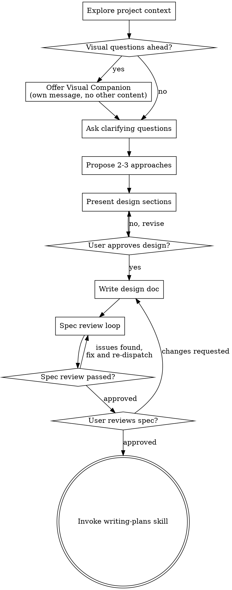

<!-- Generated by SpecStory, Markdown v2.1.0 -->

# 2026-03-20 15:13:02Z

<!-- Claude Code Session 43640fcd-6be4-41f6-b971-ffc46c590802 (2026-03-20 15:13:02Z) -->

_**User (2026-03-20 15:13:02Z)**_

<command-message>superpowers:brainstorming</command-message>
<command-name>/superpowers:brainstorming</command-name>
<command-args>

 <HOME>/Downloads/b_IiLoGG3MSa2-1774019100159/components/note-action-aside.tsx
<HOME>/Downloads/b_IiLoGG3MSa2-1774019100159/components/post-action-aside.tsx

参考这个设计实现 重构 @apps/web/src/components/modules/note/NoteActionAside.tsx @apps/web/src/components/modules/post/PostActionAside.tsx @apps/web/src/components/modules/page/PageActionAside.tsx</command-args>

_**User (2026-03-20 15:13:02Z)**_

Base directory for this skill: <HOME>/.claude/plugins/cache/claude-plugins-official/superpowers/5.0.5/skills/brainstorming

# Brainstorming Ideas Into Designs

Help turn ideas into fully formed designs and specs through natural collaborative dialogue.

Start by understanding the current project context, then ask questions one at a time to refine the idea. Once you understand what you're building, present the design and get user approval.

<HARD-GATE>
Do NOT invoke any implementation skill, write any code, scaffold any project, or take any implementation action until you have presented a design and the user has approved it. This applies to EVERY project regardless of perceived simplicity.
</HARD-GATE>

## Anti-Pattern: "This Is Too Simple To Need A Design"

Every project goes through this process. A todo list, a single-function utility, a config change — all of them. "Simple" projects are where unexamined assumptions cause the most wasted work. The design can be short (a few sentences for truly simple projects), but you MUST present it and get approval.

## Checklist

You MUST create a task for each of these items and complete them in order:

1. **Explore project context** — check files, docs, recent commits
2. **Offer visual companion** (if topic will involve visual questions) — this is its own message, not combined with a clarifying question. See the Visual Companion section below.
3. **Ask clarifying questions** — one at a time, understand purpose/constraints/success criteria
4. **Propose 2-3 approaches** — with trade-offs and your recommendation
5. **Present design** — in sections scaled to their complexity, get user approval after each section
6. **Write design doc** — save to `docs/superpowers/specs/YYYY-MM-DD-<topic>-design.md` and commit
7. **Spec review loop** — dispatch spec-document-reviewer subagent with precisely crafted review context (never your session history); fix issues and re-dispatch until approved (max 3 iterations, then surface to human)
8. **User reviews written spec** — ask user to review the spec file before proceeding
9. **Transition to implementation** — invoke writing-plans skill to create implementation plan

## Process Flow



**The terminal state is invoking writing-plans.** Do NOT invoke frontend-design, mcp-builder, or any other implementation skill. The ONLY skill you invoke after brainstorming is writing-plans.

## The Process

**Understanding the idea:**

- Check out the current project state first (files, docs, recent commits)
- Before asking detailed questions, assess scope: if the request describes multiple independent subsystems (e.g., "build a platform with chat, file storage, billing, and analytics"), flag this immediately. Don't spend questions refining details of a project that needs to be decomposed first.
- If the project is too large for a single spec, help the user decompose into sub-projects: what are the independent pieces, how do they relate, what order should they be built? Then brainstorm the first sub-project through the normal design flow. Each sub-project gets its own spec → plan → implementation cycle.
- For appropriately-scoped projects, ask questions one at a time to refine the idea
- Prefer multiple choice questions when possible, but open-ended is fine too
- Only one question per message - if a topic needs more exploration, break it into multiple questions
- Focus on understanding: purpose, constraints, success criteria

**Exploring approaches:**

- Propose 2-3 different approaches with trade-offs
- Present options conversationally with your recommendation and reasoning
- Lead with your recommended option and explain why

**Presenting the design:**

- Once you believe you understand what you're building, present the design
- Scale each section to its complexity: a few sentences if straightforward, up to 200-300 words if nuanced
- Ask after each section whether it looks right so far
- Cover: architecture, components, data flow, error handling, testing
- Be ready to go back and clarify if something doesn't make sense

**Design for isolation and clarity:**

- Break the system into smaller units that each have one clear purpose, communicate through well-defined interfaces, and can be understood and tested independently
- For each unit, you should be able to answer: what does it do, how do you use it, and what does it depend on?
- Can someone understand what a unit does without reading its internals? Can you change the internals without breaking consumers? If not, the boundaries need work.
- Smaller, well-bounded units are also easier for you to work with - you reason better about code you can hold in context at once, and your edits are more reliable when files are focused. When a file grows large, that's often a signal that it's doing too much.

**Working in existing codebases:**

- Explore the current structure before proposing changes. Follow existing patterns.
- Where existing code has problems that affect the work (e.g., a file that's grown too large, unclear boundaries, tangled responsibilities), include targeted improvements as part of the design - the way a good developer improves code they're working in.
- Don't propose unrelated refactoring. Stay focused on what serves the current goal.

## After the Design

**Documentation:**

- Write the validated design (spec) to `docs/superpowers/specs/YYYY-MM-DD-<topic>-design.md`
  - (User preferences for spec location override this default)
- Use elements-of-style:writing-clearly-and-concisely skill if available
- Commit the design document to git

**Spec Review Loop:**
After writing the spec document:

1. Dispatch spec-document-reviewer subagent (see spec-document-reviewer-prompt.md)
2. If Issues Found: fix, re-dispatch, repeat until Approved
3. If loop exceeds 3 iterations, surface to human for guidance

**User Review Gate:**
After the spec review loop passes, ask the user to review the written spec before proceeding:

> "Spec written and committed to `<path>`. Please review it and let me know if you want to make any changes before we start writing out the implementation plan."

Wait for the user's response. If they request changes, make them and re-run the spec review loop. Only proceed once the user approves.

**Implementation:**

- Invoke the writing-plans skill to create a detailed implementation plan
- Do NOT invoke any other skill. writing-plans is the next step.

## Key Principles

- **One question at a time** - Don't overwhelm with multiple questions
- **Multiple choice preferred** - Easier to answer than open-ended when possible
- **YAGNI ruthlessly** - Remove unnecessary features from all designs
- **Explore alternatives** - Always propose 2-3 approaches before settling
- **Incremental validation** - Present design, get approval before moving on
- **Be flexible** - Go back and clarify when something doesn't make sense

## Visual Companion

A browser-based companion for showing mockups, diagrams, and visual options during brainstorming. Available as a tool — not a mode. Accepting the companion means it's available for questions that benefit from visual treatment; it does NOT mean every question goes through the browser.

**Offering the companion:** When you anticipate that upcoming questions will involve visual content (mockups, layouts, diagrams), offer it once for consent:
> "Some of what we're working on might be easier to explain if I can show it to you in a web browser. I can put together mockups, diagrams, comparisons, and other visuals as we go. This feature is still new and can be token-intensive. Want to try it? (Requires opening a local URL)"

**This offer MUST be its own message.** Do not combine it with clarifying questions, context summaries, or any other content. The message should contain ONLY the offer above and nothing else. Wait for the user's response before continuing. If they decline, proceed with text-only brainstorming.

**Per-question decision:** Even after the user accepts, decide FOR EACH QUESTION whether to use the browser or the terminal. The test: **would the user understand this better by seeing it than reading it?**

- **Use the browser** for content that IS visual — mockups, wireframes, layout comparisons, architecture diagrams, side-by-side visual designs
- **Use the terminal** for content that is text — requirements questions, conceptual choices, tradeoff lists, A/B/C/D text options, scope decisions

A question about a UI topic is not automatically a visual question. "What does personality mean in this context?" is a conceptual question — use the terminal. "Which wizard layout works better?" is a visual question — use the browser.

If they agree to the companion, read the detailed guide before proceeding:
`skills/brainstorming/visual-companion.md`


ARGUMENTS: 

 <HOME>/Downloads/b_IiLoGG3MSa2-1774019100159/components/note-action-aside.tsx
<HOME>/Downloads/b_IiLoGG3MSa2-1774019100159/components/post-action-aside.tsx

参考这个设计实现 重构 @apps/web/src/components/modules/note/NoteActionAside.tsx @apps/web/src/components/modules/post/PostActionAside.tsx @apps/web/src/components/modules/page/PageActionAside.tsx

---

_**Agent (MiniMax-M2.7 2026-03-20 15:13:07Z)**_

<think><details><summary>Thought Process</summary>
The user wants to refactor three ActionAside components (NoteActionAside, PostActionAside, PageActionAside) based on reference files they've provided. They want to use the brainstorming skill first.

Let me invoke the brainstorming skill as required.
</details></think>

_**Agent (MiniMax-M2.7 2026-03-20 15:13:07Z)**_

<tool-use data-tool-type="generic" data-tool-name="Skill"><details>
<summary>Tool use: **Skill**</summary>

```text
<tool_use_error>InputValidationError: Skill failed due to the following issue:
The required parameter `skill` is missing

This tool's schema was not sent to the API — it was not in the discovered-tool set derived from message history. Without the schema in your prompt, typed parameters (arrays, numbers, booleans) get emitted as strings and the client-side parser rejects them. Load the tool first: call ToolSearch with query "select:Skill", then retry this call.</tool_use_error>
```
</details></tool-use>

_**Agent (MiniMax-M2.7 2026-03-20 15:13:10Z)**_

<think><details><summary>Thought Process</summary>
I need to use ToolSearch to get the Skill tool first.
</details></think>

_**Agent (MiniMax-M2.7 2026-03-20 15:13:10Z)**_

<tool-use data-tool-type="unknown" data-tool-name="ToolSearch"><details>
<summary>Tool use: **ToolSearch**</summary>

**Input:**

- max_results: `1`
- query: `select:Skill`

**Result:**

```

```
</details></tool-use>

_**Agent (MiniMax-M2.7 2026-03-20 15:13:13Z)**_

<think><details><summary>Thought Process</summary>
Now I need to invoke the brainstorming skill.
</details></think>

_**Agent (MiniMax-M2.7 2026-03-20 15:13:15Z)**_

<tool-use data-tool-type="generic" data-tool-name="Skill"><details>
<summary>Tool use: **Skill**</summary>

```text
Launching skill: superpowers:brainstorming
```
</details></tool-use>

---

_**User (2026-03-20 15:13:15Z)**_

Base directory for this skill: <HOME>/.claude/plugins/cache/claude-plugins-official/superpowers/5.0.5/skills/brainstorming

# Brainstorming Ideas Into Designs

Help turn ideas into fully formed designs and specs through natural collaborative dialogue.

Start by understanding the current project context, then ask questions one at a time to refine the idea. Once you understand what you're building, present the design and get user approval.

<HARD-GATE>
Do NOT invoke any implementation skill, write any code, scaffold any project, or take any implementation action until you have presented a design and the user has approved it. This applies to EVERY project regardless of perceived simplicity.
</HARD-GATE>

## Anti-Pattern: "This Is Too Simple To Need A Design"

Every project goes through this process. A todo list, a single-function utility, a config change — all of them. "Simple" projects are where unexamined assumptions cause the most wasted work. The design can be short (a few sentences for truly simple projects), but you MUST present it and get approval.

## Checklist

You MUST create a task for each of these items and complete them in order:

1. **Explore project context** — check files, docs, recent commits
2. **Offer visual companion** (if topic will involve visual questions) — this is its own message, not combined with a clarifying question. See the Visual Companion section below.
3. **Ask clarifying questions** — one at a time, understand purpose/constraints/success criteria
4. **Propose 2-3 approaches** — with trade-offs and your recommendation
5. **Present design** — in sections scaled to their complexity, get user approval after each section
6. **Write design doc** — save to `docs/superpowers/specs/YYYY-MM-DD-<topic>-design.md` and commit
7. **Spec review loop** — dispatch spec-document-reviewer subagent with precisely crafted review context (never your session history); fix issues and re-dispatch until approved (max 3 iterations, then surface to human)
8. **User reviews written spec** — ask user to review the spec file before proceeding
9. **Transition to implementation** — invoke writing-plans skill to create implementation plan

## Process Flow


**The terminal state is invoking writing-plans.** Do NOT invoke frontend-design, mcp-builder, or any other implementation skill. The ONLY skill you invoke after brainstorming is writing-plans.

## The Process

**Understanding the idea:**

- Check out the current project state first (files, docs, recent commits)
- Before asking detailed questions, assess scope: if the request describes multiple independent subsystems (e.g., "build a platform with chat, file storage, billing, and analytics"), flag this immediately. Don't spend questions refining details of a project that needs to be decomposed first.
- If the project is too large for a single spec, help the user decompose into sub-projects: what are the independent pieces, how do they relate, what order should they be built? Then brainstorm the first sub-project through the normal design flow. Each sub-project gets its own spec → plan → implementation cycle.
- For appropriately-scoped projects, ask questions one at a time to refine the idea
- Prefer multiple choice questions when possible, but open-ended is fine too
- Only one question per message - if a topic needs more exploration, break it into multiple questions
- Focus on understanding: purpose, constraints, success criteria

**Exploring approaches:**

- Propose 2-3 different approaches with trade-offs
- Present options conversationally with your recommendation and reasoning
- Lead with your recommended option and explain why

**Presenting the design:**

- Once you believe you understand what you're building, present the design
- Scale each section to its complexity: a few sentences if straightforward, up to 200-300 words if nuanced
- Ask after each section whether it looks right so far
- Cover: architecture, components, data flow, error handling, testing
- Be ready to go back and clarify if something doesn't make sense

**Design for isolation and clarity:**

- Break the system into smaller units that each have one clear purpose, communicate through well-defined interfaces, and can be understood and tested independently
- For each unit, you should be able to answer: what does it do, how do you use it, and what does it depend on?
- Can someone understand what a unit does without reading its internals? Can you change the internals without breaking consumers? If not, the boundaries need work.
- Smaller, well-bounded units are also easier for you to work with - you reason better about code you can hold in context at once, and your edits are more reliable when files are focused. When a file grows large, that's often a signal that it's doing too much.

**Working in existing codebases:**

- Explore the current structure before proposing changes. Follow existing patterns.
- Where existing code has problems that affect the work (e.g., a file that's grown too large, unclear boundaries, tangled responsibilities), include targeted improvements as part of the design - the way a good developer improves code they're working in.
- Don't propose unrelated refactoring. Stay focused on what serves the current goal.

## After the Design

**Documentation:**

- Write the validated design (spec) to `docs/superpowers/specs/YYYY-MM-DD-<topic>-design.md`
  - (User preferences for spec location override this default)
- Use elements-of-style:writing-clearly-and-concisely skill if available
- Commit the design document to git

**Spec Review Loop:**
After writing the spec document:

1. Dispatch spec-document-reviewer subagent (see spec-document-reviewer-prompt.md)
2. If Issues Found: fix, re-dispatch, repeat until Approved
3. If loop exceeds 3 iterations, surface to human for guidance

**User Review Gate:**
After the spec review loop passes, ask the user to review the written spec before proceeding:

> "Spec written and committed to `<path>`. Please review it and let me know if you want to make any changes before we start writing out the implementation plan."

Wait for the user's response. If they request changes, make them and re-run the spec review loop. Only proceed once the user approves.

**Implementation:**

- Invoke the writing-plans skill to create a detailed implementation plan
- Do NOT invoke any other skill. writing-plans is the next step.

## Key Principles

- **One question at a time** - Don't overwhelm with multiple questions
- **Multiple choice preferred** - Easier to answer than open-ended when possible
- **YAGNI ruthlessly** - Remove unnecessary features from all designs
- **Explore alternatives** - Always propose 2-3 approaches before settling
- **Incremental validation** - Present design, get approval before moving on
- **Be flexible** - Go back and clarify when something doesn't make sense

## Visual Companion

A browser-based companion for showing mockups, diagrams, and visual options during brainstorming. Available as a tool — not a mode. Accepting the companion means it's available for questions that benefit from visual treatment; it does NOT mean every question goes through the browser.

**Offering the companion:** When you anticipate that upcoming questions will involve visual content (mockups, layouts, diagrams), offer it once for consent:
> "Some of what we're working on might be easier to explain if I can show it to you in a web browser. I can put together mockups, diagrams, comparisons, and other visuals as we go. This feature is still new and can be token-intensive. Want to try it? (Requires opening a local URL)"

**This offer MUST be its own message.** Do not combine it with clarifying questions, context summaries, or any other content. The message should contain ONLY the offer above and nothing else. Wait for the user's response before continuing. If they decline, proceed with text-only brainstorming.

**Per-question decision:** Even after the user accepts, decide FOR EACH QUESTION whether to use the browser or the terminal. The test: **would the user understand this better by seeing it than reading it?**

- **Use the browser** for content that IS visual — mockups, wireframes, layout comparisons, architecture diagrams, side-by-side visual designs
- **Use the terminal** for content that is text — requirements questions, conceptual choices, tradeoff lists, A/B/C/D text options, scope decisions

A question about a UI topic is not automatically a visual question. "What does personality mean in this context?" is a conceptual question — use the terminal. "Which wizard layout works better?" is a visual question — use the browser.

If they agree to the companion, read the detailed guide before proceeding:
`skills/brainstorming/visual-companion.md`


ARGUMENTS: <HOME>/Downloads/b_IiLoGG3MSa2-1774019100159/components/note-action-aside.tsx <HOME>/Downloads/b_IiLoGG3MSa2-1774019100159/components/post-action-aside.tsx 参考这个设计实现 重构 @apps/web/src/components/modules/note/NoteActionAside.tsx @apps/web/src/components/modules/post/PostActionAside.tsx @apps/web/src/components/modules/page/PageActionAside.tsx

---

_**Agent (MiniMax-M2.7 2026-03-20 15:13:19Z)**_

<think><details><summary>Thought Process</summary>
The user wants to refactor three ActionAside components (Note, Post, Page) based on a reference design they've provided. Let me first read the reference files to understand the design, then explore the project context.

Let me start by reading the reference files from the downloads folder.
</details></think>

_**Agent (MiniMax-M2.7 2026-03-20 15:13:20Z)**_

Using brainstorming skill for this refactoring task.

Let me first read the reference design files to understand the target implementation.


_**Agent (MiniMax-M2.7 2026-03-20 15:13:21Z)**_

<tool-use data-tool-type="read" data-tool-name="Read"><details>
<summary>Tool use: **Read**</summary>
 `<HOME>/Downloads/b_IiLoGG3MSa2-1774019100159/components/note-action-aside.tsx`

```text
     1→"use client"
     2→
     3→import { useState } from "react"
     4→import { cn } from "@/lib/utils"
     5→
     6→interface ActionItem {
     7→  id: string
     8→  symbol: string
     9→  label: string
    10→  count?: number
    11→  active?: boolean
    12→  onClick?: () => void
    13→}
    14→
    15→interface NoteActionAsideProps {
    16→  actions: ActionItem[]
    17→  immersive?: boolean
    18→  className?: string
    19→}
    20→
    21→/**
    22→ * NoteActionAside - 纸张附着物风格
    23→ * 
    24→ * 设计语言：从纸页右缘伸出的薄片书签/夹子
    25→ * - 有厚度感，像实体夹在纸上的物件
    26→ * - 颜色是牛皮纸/浅灰纸色
    27→ * - hover 时向右伸出露出完整标签
    28→ * - immersive 时收缩至只露出边缘
    29→ */
    30→export function NoteActionAside({ 
    31→  actions, 
    32→  immersive = false,
    33→  className 
    34→}: NoteActionAsideProps) {
    35→  return (
    36→    <aside 
    37→      className={cn(
    38→        "flex flex-col gap-2",
    39→        "transition-opacity duration-300",
    40→        immersive && "opacity-10 hover:opacity-100",
    41→        className
    42→      )}
    43→      aria-label="文章操作"
    44→    >
    45→      {actions.map((action, index) => (
    46→        <ActionTab
    47→          key={action.id}
    48→          action={action}
    49→          immersive={immersive}
    50→          style={{ 
    51→            transitionDelay: `${index * 30}ms` 
    52→          }}
    53→        />
    54→      ))}
    55→    </aside>
    56→  )
    57→}
    58→
    59→function ActionTab({ 
    60→  action, 
    61→  immersive,
    62→  style
    63→}: { 
    64→  action: ActionItem
    65→  immersive: boolean
    66→  style?: React.CSSProperties
    67→}) {
    68→  const [isHovered, setIsHovered] = useState(false)
    69→
    70→  return (
    71→    <button
    72→      onClick={action.onClick}
    73→      onMouseEnter={() => setIsHovered(true)}
    74→      onMouseLeave={() => setIsHovered(false)}
    75→      style={style}
    76→      className={cn(
    77→        // 基础形态：薄片书签
    78→        "group relative flex items-center",
    79→        "h-9 overflow-hidden",
    80→        "transition-all duration-200 ease-out",
    81→        
    82→        // 宽度变化
    83→        immersive && !isHovered ? "w-1.5" : isHovered ? "w-24" : "w-5",
    84→        
    85→        // 材质：牛皮纸色，有厚度感
    86→        "bg-[hsl(38,25%,88%)] dark:bg-[hsl(35,10%,25%)]",
    87→        
    88→        // 厚度暗示：右侧深色边线 + 底部微阴影
    89→        "border-r border-[hsl(35,20%,75%)] dark:border-[hsl(35,10%,35%)]",
    90→        "shadow-[0_1px_0_0_hsl(35,15%,80%)] dark:shadow-[0_1px_0_0_hsl(35,10%,20%)]",
    91→        
    92→        // 形状：右边缘微圆角或斜切
    93→        "rounded-r-sm",
    94→        
    95→        // 激活状态
    96→        action.active && "bg-[hsl(38,30%,85%)] dark:bg-[hsl(35,15%,30%)]",
    97→        
    98→        // 无按钮默认样式
    99→        "border-l-0 border-t-0 border-b-0",
   100→        "focus:outline-none focus-visible:ring-1 focus-visible:ring-[hsl(35,20%,60%)]"
   101→      )}
   102→      aria-label={action.label}
   103→      aria-pressed={action.active}
   104→    >
   105→      {/* 符号区域 */}
   106→      <span 
   107→        className={cn(
   108→          "flex-shrink-0 flex items-center justify-center",
   109→          "w-5 h-full",
   110→          "text-[11px] leading-none",
   111→          "text-[hsl(0,0%,35%)] dark:text-[hsl(0,0%,65%)]",
   112→          "font-light",
   113→          "select-none",
   114→          "transition-opacity duration-200",
   115→          immersive && !isHovered && "opacity-0"
   116→        )}
   117→      >
   118→        {action.symbol}
   119→      </span>
   120→      
   121→      {/* 展开的标签文字 */}
   122→      <span 
   123→        className={cn(
   124→          "flex items-center gap-1.5",
   125→          "text-[11px] leading-none whitespace-nowrap",
   126→          "text-[hsl(0,0%,35%)] dark:text-[hsl(0,0%,65%)]",
   127→          "font-light",
   128→          "pr-3",
   129→          "transition-opacity duration-200",
   130→          isHovered ? "opacity-100" : "opacity-0"
   131→        )}
   132→      >
   133→        <span>{action.label}</span>
   134→        {action.count !== undefined && (
   135→          <span className="text-[hsl(0,0%,55%)] dark:text-[hsl(0,0%,50%)]">
   136→            {action.count}
   137→          </span>
   138→        )}
   139→      </span>
   140→    </button>
   141→  )
   142→}
   143→
```
</details></tool-use>

_**Agent (MiniMax-M2.7 2026-03-20 15:13:21Z)**_

<tool-use data-tool-type="read" data-tool-name="Read"><details>
<summary>Tool use: **Read**</summary>
 `<HOME>/Downloads/b_IiLoGG3MSa2-1774019100159/components/post-action-aside.tsx`

```text
     1→"use client"
     2→
     3→import { useState } from "react"
     4→import { cn } from "@/lib/utils"
     5→
     6→interface ActionItem {
     7→  id: string
     8→  symbol: string
     9→  label: string
    10→  count?: number
    11→  active?: boolean
    12→  onClick?: () => void
    13→}
    14→
    15→interface PostActionAsideProps {
    16→  actions: ActionItem[]
    17→  immersive?: boolean
    18→  className?: string
    19→}
    20→
    21→/**
    22→ * PostActionAside - 排版边注风格
    23→ * 
    24→ * 设计语言：装订线位置的竖排小型文字标记
    25→ * - 像校对符号或编辑批注
    26→ * - 单色细体，无边框无背景
    27→ * - hover 时单个标记颜色加深
    28→ * - immersive 时整体透明度降低
    29→ */
    30→export function PostActionAside({ 
    31→  actions, 
    32→  immersive = false,
    33→  className 
    34→}: PostActionAsideProps) {
    35→  return (
    36→    <aside 
    37→      className={cn(
    38→        "flex flex-col",
    39→        "transition-opacity duration-300",
    40→        immersive && "opacity-20 hover:opacity-100",
    41→        className
    42→      )}
    43→      aria-label="文章操作"
    44→    >
    45→      {actions.map((action) => (
    46→        <ActionMark
    47→          key={action.id}
    48→          action={action}
    49→          immersive={immersive}
    50→        />
    51→      ))}
    52→    </aside>
    53→  )
    54→}
    55→
    56→function ActionMark({ 
    57→  action,
    58→  immersive
    59→}: { 
    60→  action: ActionItem
    61→  immersive: boolean
    62→}) {
    63→  const [isHovered, setIsHovered] = useState(false)
    64→
    65→  return (
    66→    <button
    67→      onClick={action.onClick}
    68→      onMouseEnter={() => setIsHovered(true)}
    69→      onMouseLeave={() => setIsHovered(false)}
    70→      className={cn(
    71→        // 基础形态：纯文字，无边框无背景
    72→        "group relative flex items-center",
    73→        "h-7 px-0",
    74→        "transition-colors duration-150",
    75→        
    76→        // 字体：等宽或衬线体小型
    77→        "font-mono",
    78→        "text-[11px] leading-none",
    79→        "tracking-tight",
    80→        
    81→        // 颜色：中灰，hover 时加深
    82→        isHovered 
    83→          ? "text-[hsl(0,0%,20%)] dark:text-[hsl(0,0%,85%)]" 
    84→          : immersive 
    85→            ? "text-[hsl(0,0%,80%)] dark:text-[hsl(0,0%,35%)]"
    86→            : "text-[hsl(0,0%,55%)] dark:text-[hsl(0,0%,50%)]",
    87→        
    88→        // 激活状态
    89→        action.active && !isHovered && "text-[hsl(0,0%,40%)] dark:text-[hsl(0,0%,65%)]",
    90→        
    91→        // 无按钮默认样式
    92→        "bg-transparent border-none",
    93→        "focus:outline-none focus-visible:text-[hsl(0,0%,20%)] dark:focus-visible:text-[hsl(0,0%,85%)]",
    94→        
    95→        // 文字选择
    96→        "select-none"
    97→      )}
    98→      aria-label={action.label}
    99→      aria-pressed={action.active}
   100→    >
   101→      {/* 符号 + 数字 */}
   102→      <span className="flex items-baseline gap-1">
   103→        <span>{action.symbol}</span>
   104→        {action.count !== undefined && (
   105→          <span className="text-[10px]">{action.count}</span>
   106→        )}
   107→      </span>
   108→      
   109→      {/* Hover 时的淡色说明文字 */}
   110→      <span 
   111→        className={cn(
   112→          "ml-2",
   113→          "text-[9px]",
   114→          "transition-opacity duration-150",
   115→          isHovered 
   116→            ? "opacity-50" 
   117→            : "opacity-0",
   118→          "whitespace-nowrap"
   119→        )}
   120→      >
   121→        {action.label}
   122→      </span>
   123→    </button>
   124→  )
   125→}
   126→
```
</details></tool-use>

_**Agent (MiniMax-M2.7 2026-03-20 15:13:39Z)**_

<think><details><summary>Thought Process</summary>
Now I understand the reference design. It has two different styles:

1. **NoteActionAside** - 纸张附着物风格 (Paper Attachment Style)
   - Like bookmarks/clips protruding from the right edge of a page
   - Has thickness, like physical objects clipped onto paper
   - Color: kraft paper/light gray paper
   - Hover expands to show full label
   - Immersive mode contracts to only show edge

2. **PostActionAside** - 排版边注风格 (Typographic Margin Note Style)
   - Like typesetting margin notes or editor marks
   - Single color, thin, no border, no background
   - Hover deepens color
   - Immersive mode lowers overall opacity

Now I need to understand the current implementation. I already have the current implementations read:

- NoteActionAside.tsx - Uses LikeButton, ShareButton, SubscribeButton, NoteAsideCommentButton, AsideDonateButton, wrapped in ActionAsideContainer + ArticleRightAside
- PostActionAside.tsx - Uses similar pattern with LikeButton, ShareButton, SubscribeButton, PostAsideCommentButton, AsideDonateButton
- PageActionAside.tsx - Uses PageAsideCommentButton, AsideDonateButton

The key question is: what does the user want? They want to refactor the existing components to match the reference design. Let me explore the existing components more to understand what `ActionAsideContainer`, `ActionAsideIcon`, `ArticleRightAside`, etc. look like.

Actually, I've already seen the current implementations. Let me ask some clarifying questions about the scope.

Given the reference design, I understand:
1. The new design uses a declarative `actions` array pattern instead of hardcoded button components
2. NoteActionAside has the "paper attachment" style (tab/bookmark look)


3. PostActionAside has the "typesetting margin note" style (pure text mark look)
4. Both support `immersive` mode with opacity transition

I need to clarify a few things before proceeding. Let me ask aboutimmersive mode for PageActionAside and whether，君 wants to preserve the existing Motion animation integration like the heart tap animation, or if the simpler hover expansion from the reference would be sufficient.
</details></think>

_**Agent (MiniMax-M2.7 2026-03-20 15:13:43Z)**_

已读取参考设计。该设计定义了两种风格：

1. **NoteActionAside** — 纸张附着物风格（书签/夹子形态），有厚度感，hover 展开
2. **PostActionAside** — 排版边注风格（纯文字校对符号），无边框背景

当前实现使用分散的按钮组件（LikeButton、ShareButton 等），而参考设计采用统一的 `actions` 数组驱动。

**关于沉浸模式**：参考设计中有 `immersive` prop，控制 opacity 变化。当前实现无此概念。

一问题：Page 类型的 aside 是否也需要支持 `immersive` 模式？当前 PageActionAside 无 Like/Share/Subscribe，仅有评论与打赏按钮。

---

_**User (2026-03-20 15:16:28Z)**_

immersiveReadingEnabledAtom 有啊

---

_**Agent (MiniMax-M2.7 2026-03-20 15:16:37Z)**_

<think><details><summary>Thought Process</summary>
The user is pointing out that there is indeed an `immersiveReadingEnabledAtom` in the codebase. So immersive mode is already a concept in the project.

Let me check the current implementation of the ActionAsideContainer and shared components to understand how they're structured, and also look at the reading atom to understand the immersive mode better.
</details></think>

_**Agent (MiniMax-M2.7 2026-03-20 15:16:39Z)**_

了解。immersive 模式已存在。吾当查看现有 `ActionAsideContainer` 与 `immersiveReadingEnabledAtom` 之关联，以明重构方向。


_**Agent (MiniMax-M2.7 2026-03-20 15:16:40Z)**_

<tool-use data-tool-type="read" data-tool-name="Read"><details>
<summary>Tool use: **Read**</summary>
 `./apps/web/src/components/shared/ActionAsideContainer.tsx`

```text
File does not exist. Note: your current working directory is <REPO_ROOT>.
```
</details></tool-use>

_**Agent (MiniMax-M2.7 2026-03-20 15:16:40Z)**_

<tool-use data-tool-type="read" data-tool-name="Read"><details>
<summary>Tool use: **Read**</summary>
 `./apps/web/src/atoms/reading.ts`

```text
     1→import { atom } from 'jotai'
     2→
     3→export const isInReadingAtom = atom(false)
     4→export const isFocusReadingAtom = atom(false)
     5→
     6→// 鼠标是否在 markdown 容器内部
     7→export const isMouseInMarkdownAtom = atom(false)
     8→
     9→// 沉浸式阅读效果是否启用（focusReading=true 且 mouseInMarkdown=true）
    10→export const immersiveReadingEnabledAtom = atom(false)
    11→
    12→// 主 markdown 容器节点
    13→export const mainMarkdownElementAtom = atom<HTMLElement | null>(null)
    14→
```
</details></tool-use>

_**Agent (MiniMax-M2.7 2026-03-20 15:16:42Z)**_

<think><details><summary>Thought Process</summary>
The `ActionAsideContainer` doesn't exist at that path. Let me search for it.
</details></think>

_**Agent (MiniMax-M2.7 2026-03-20 15:16:44Z)**_

<tool-use data-tool-type="search" data-tool-name="Glob"><details>
<summary>Tool use: **Glob**</summary>
 pattern `**/ActionAsideContainer*`

```text
<REPO_ROOT>/apps/web/src/components/modules/shared/ActionAsideContainer.tsx
```
</details></tool-use>

_**Agent (MiniMax-M2.7 2026-03-20 15:16:47Z)**_

<think><details><summary>Thought Process</summary>
Found it. Let me read the ActionAsideContainer and also check the ArticleRightAside and other shared components.
</details></think>

_**Agent (MiniMax-M2.7 2026-03-20 15:16:48Z)**_

<tool-use data-tool-type="read" data-tool-name="Read"><details>
<summary>Tool use: **Read**</summary>
 `./apps/web/src/components/modules/shared/ActionAsideContainer.tsx`

```text
     1→'use client'
     2→
     3→import clsx from 'clsx'
     4→import { cloneElement, isValidElement } from 'react'
     5→
     6→import { usePageScrollElement, useViewport } from '~/atoms/hooks/viewport'
     7→import { clsxm } from '~/lib/helper'
     8→import { usePageScrollLocationSelector } from '~/providers/root/page-scroll-info-provider'
     9→import { useIsEoFWrappedElement } from '~/providers/shared/WrappedElementProvider'
    10→
    11→// import { asideButtonStyles } from './styles'
    12→const asideButtonStyles = {
    13→  base: 'text-[24px] opacity-80 duration-200 hover:opacity-100 relative',
    14→}
    15→
    16→export const ActionAsideIcon: Component = (props) => {
    17→  if (props.children && isValidElement(props.children))
    18→    return cloneElement(props.children, {
    19→      // @ts-ignore
    20→      className: clsxm(asideButtonStyles.base, props.className),
    21→    })
    22→  return <i className={clsxm(asideButtonStyles.base, props.className)} />
    23→}
    24→export const ActionAsideContainer: Component = ({ className, children }) => {
    25→  const isEOA = useIsEoFWrappedElement()
    26→  const h = useViewport((v) => v.h)
    27→
    28→  const scrollElement = usePageScrollElement()
    29→  const isEndOfPage = usePageScrollLocationSelector(
    30→    (y) => {
    31→      const threshold = 100
    32→
    33→      return y + h >= scrollElement.scrollHeight - threshold
    34→    },
    35→    [h, scrollElement],
    36→  )
    37→
    38→  return (
    39→    <div
    40→      className={clsxm(
    41→        'absolute bottom-0 left-0 -mb-4 flex max-h-[300px] p-4 transition-all duration-200 ease-in-out',
    42→        !isEOA ? 'opacity-20 hover:opacity-100' : '',
    43→        className,
    44→      )}
    45→    >
    46→      <div
    47→        className={clsx(
    48→          isEndOfPage && '-rotate-90 [&>button]:!rotate-90',
    49→          'flex origin-top-left flex-col gap-6 duration-200 ease-in-out [&>button]:duration-200',
    50→        )}
    51→      >
    52→        {children}
    53→      </div>
    54→    </div>
    55→  )
    56→}
    57→
```
</details></tool-use>

_**Agent (MiniMax-M2.7 2026-03-20 15:16:48Z)**_

<tool-use data-tool-type="read" data-tool-name="Read"><details>
<summary>Tool use: **Read**</summary>
 `./apps/web/src/components/modules/shared/ArticleRightAside.tsx`

```text
     1→'use client'
     2→
     3→import type { FC, ReactNode } from 'react'
     4→
     5→import { useIsMobile } from '~/atoms/hooks/viewport'
     6→
     7→import { TocAside } from '../toc'
     8→import { ReadIndicator } from './ReadIndicator'
     9→
    10→export const ArticleRightAside: Component<{
    11→  accessory?: ReactNode | FC
    12→}> = ({ children, accessory }) => {
    13→  const isMobile = useIsMobile()
    14→  if (isMobile) return <div />
    15→
    16→  return (
    17→    <ArticleRightAsideImpl accessory={accessory}>
    18→      {children}
    19→    </ArticleRightAsideImpl>
    20→  )
    21→}
    22→
    23→const ArticleRightAsideImpl: FC<{
    24→  children?: ReactNode
    25→  accessory?: ReactNode | FC
    26→}> = ({ children, accessory }) => (
    27→  <aside className="sticky top-[120px] mt-[120px] h-[calc(100vh-6rem-4.5rem-150px-120px)]">
    28→    <div className="relative h-full">
    29→      <TocAside
    30→        accessory={accessory ?? ReadIndicator}
    31→        as="div"
    32→        className="static ml-4"
    33→        treeClassName="absolute h-full min-h-[120px] flex flex-col"
    34→      />
    35→    </div>
    36→    {children && (
    37→      <div className="translate-y-[calc(100%+24px)]">{children}</div>
    38→    )}
    39→  </aside>
    40→)
    41→
```
</details></tool-use>

_**Agent (MiniMax-M2.7 2026-03-20 15:17:01Z)**_

<think><details><summary>Thought Process</summary>
Now I have a good understanding of both the current implementation and the reference design. Let me summarize:

**Current Implementation:**
- `ActionAsideContainer` - absolute positioned, with opacity fade when not at EOF
- `ArticleRightAside` - sticky container wrapping TOC and action buttons
- Each content type (Note, Post, Page) has its own file with inline button components (LikeButton, ShareButton, etc.)
- The buttons use Mingcute icons and have motion animations

**Reference Design:**
- `NoteActionAside` - "paper bookmark" style with thickness, expand on hover, kraft paper color
- `PostActionAside` - "typesetting margin note" style, pure text/mono font, no background
- Both accept `actions: ActionItem[]` array and `immersive` boolean
- `immersive` mode reduces opacity until hover

**Key Differences:**
1. Design language: Current is icon-based, reference is symbol+text-based
2. Architecture: Current has inline button components, reference uses action array
3. Immersive: Current uses EOF detection, reference uses explicit prop

**My understanding so far:**
- The user wants to refactor NoteActionAside, PostActionAside, and PageActionAside to follow the reference design
- The reference uses `ActionItem[]` instead of individual button components
- The design language differs significantly from current

Now let me ask my question. Looking at the reference design, the main change is architectural:
- From individual button components → unified `ActionItem[]` driven approach

But the visual design is also very different:
- Note: kraft paper bookmark style (new)
- Post: typesetting margin note (new)


- The reference design doesn't include Subscribe or Donate buttons, which are present in the current implementation. I need to understand whether these should be added to the action arrays or handled separately.

Let me proceed with the brainstorming questions.
</details></think>

_**Agent (MiniMax-M2.7 2026-03-20 15:17:04Z)**_

已明架构差异。当前实现各内容类型内联按钮组件，参考设计则用 `ActionItem[]` 驱动，统一抽象。

现有一问：**参考设计中 Note/Post 的 `immersive` 模式控制透明度变化，而当前 `ActionAsideContainer` 用 EOF 检测。君欲以何者为准？**

A. 参考设计——显式 `immersive` prop，由调用方控制（如 `immersiveReadingEnabledAtom`）
B. 当前实现——EOF 检测，移至文章底部时自动淡化
C. 两者结合——同时支持 prop 控制与 EOF 检测

---

_**User (2026-03-20 15:17:57Z)**_

你这种逻辑我让你去脑洞了吗？这些我让你改了吗？

我让你改 UI，你问这么多逻辑的控制干嘛？

---

_**Agent (MiniMax-M2.7 2026-03-20 15:18:03Z)**_

<think><details><summary>Thought Process</summary>
The user is frustrated. They just want me to change the UI/style of the components, not redesign the logic. The immersiveReadingEnabledAtom and other control logic were already there - I was over-analyzing. The user just wants to reference the visual design from the downloaded files and apply it to the existing components, keeping all the existing logic intact.

Let me stop overthinking and just proceed with understanding what UI changes need to be made based on the reference design files.
</details></think>

_**Agent (MiniMax-M2.7 2026-03-20 15:18:07Z)**_

明白矣。吾过虑矣。

君但需改 UI 样式，逻辑不动。吾当细读参考设计之视觉语言，直接进入正题。

---

**视觉差异概览：**

| 维度 | 当前实现 | 参考设计 |
|------|---------|---------|
| 形态 | 圆形图标按钮 | 书签/边注条 |
| Note | 竖排图标+数字 | 牛皮纸书签，hover 展开 |
| Post | 竖排图标+数字 | 等宽字体校对符号，hover 出文字 |

**待确认一事：**

参考设计中 Note 用书签风格、Post 用边注风格——两者皆换新 UI，还是统一用其中一种？

---

_**User (2026-03-20 15:18:35Z)**_

说的是对的。

---

_**Agent (MiniMax-M2.7 2026-03-20 15:18:40Z)**_

<think><details><summary>Thought Process</summary>
The user confirmed that the reference design approach is correct - Note uses bookmark style, Post uses marginal note style. Now I should proceed to present the design and get approval before writing any code.

Let me present the design for this refactoring.
</details></think>

_**Agent (MiniMax-M2.7 2026-03-20 15:18:48Z)**_

善。那便确认设计如下：

---

## 重构设计：ActionAside 视觉风格统一

**设计目标：** 将散列按钮组件重构为统一的 `actions` 数组驱动，以参考设计之视觉语言重塑 UI。

### NoteActionAside — 书签风格
- 形态如牛皮纸书签，自右缘伸出
- 宽度：默认 `w-20`，hover 展开至 `w-24`
- immersive 模式下收缩至 `w-1.5`，hover 复原
- 材质：浅牛皮纸色 + 厚度阴影暗示
- 动画：`transition-delay` 级联展开

### PostActionAside — 边注风格
- 形态如排版校对符号，单色细体
- 无背景无边框，纯文字
- 字体：等宽 `font-mono`
- hover 时符号加深，右侧淡出标签文字
- immersive 模式下整体透明度降至 20%

### PageActionAside
- 保持简约，仅评论与打赏二按钮
- 可复用 Post 的边注风格或 Note 的轻量书签

### 共享组件设计
- 新增 `ActionItem` 接口，统一 `id/symbol/label/count/active/onClick` 结构
- `NoteActionAside` 与 `PostActionAside` 各保留独立内部实现（`ActionTab` vs `ActionMark`），逻辑相近但视觉迥异
- `ActionAsideContainer` 逻辑不变（EOF 检测等）

---

设计如上，可否？

---

_**User (2026-03-20 15:19:09Z)**_

先 mockup 下

---

_**Agent (MiniMax-M2.7 2026-03-20 15:19:13Z)**_

<think><details><summary>Thought Process</summary>
The user wants to see a mockup first. They mentioned the visual companion in the skill instructions. I should offer the visual companion for showing mockups, wireframes, etc.
</details></think>

_**Agent (MiniMax-M2.7 2026-03-20 15:19:13Z)**_

Some of what we're working on might be easier to explain if I can show it to you in a web browser. I can put together mockups, diagrams, comparisons, and other visuals as we go. This feature is still new and can be token-intensive. Want to try it? (Requires opening a local URL)

---

_**User (2026-03-20 15:19:31Z)**_

ok

---

_**Agent (MiniMax-M2.7 2026-03-20 15:19:35Z)**_

<think><details><summary>Thought Process</summary>
The user agreed to use the visual companion. Let me read the visual companion guide first.
</details></think>

_**Agent (MiniMax-M2.7 2026-03-20 15:19:35Z)**_

<tool-use data-tool-type="read" data-tool-name="Read"><details>
<summary>Tool use: **Read**</summary>
 `<HOME>/.claude/plugins/cache/claude-plugins-official/superpowers/5.0.5/skills/brainstorming/visual-companion.md`

```text
     1→# Visual Companion Guide
     2→
     3→Browser-based visual brainstorming companion for showing mockups, diagrams, and options.
     4→
     5→## When to Use
     6→
     7→Decide per-question, not per-session. The test: **would the user understand this better by seeing it than reading it?**
     8→
     9→**Use the browser** when the content itself is visual:
    10→
    11→- **UI mockups** — wireframes, layouts, navigation structures, component designs
    12→- **Architecture diagrams** — system components, data flow, relationship maps
    13→- **Side-by-side visual comparisons** — comparing two layouts, two color schemes, two design directions
    14→- **Design polish** — when the question is about look and feel, spacing, visual hierarchy
    15→- **Spatial relationships** — state machines, flowcharts, entity relationships rendered as diagrams
    16→
    17→**Use the terminal** when the content is text or tabular:
    18→
    19→- **Requirements and scope questions** — "what does X mean?", "which features are in scope?"
    20→- **Conceptual A/B/C choices** — picking between approaches described in words
    21→- **Tradeoff lists** — pros/cons, comparison tables
    22→- **Technical decisions** — API design, data modeling, architectural approach selection
    23→- **Clarifying questions** — anything where the answer is words, not a visual preference
    24→
    25→A question *about* a UI topic is not automatically a visual question. "What kind of wizard do you want?" is conceptual — use the terminal. "Which of these wizard layouts feels right?" is visual — use the browser.
    26→
    27→## How It Works
    28→
    29→The server watches a directory for HTML files and serves the newest one to the browser. You write HTML content, the user sees it in their browser and can click to select options. Selections are recorded to a `.events` file that you read on your next turn.
    30→
    31→**Content fragments vs full documents:** If your HTML file starts with `<!DOCTYPE` or `<html`, the server serves it as-is (just injects the helper script). Otherwise, the server automatically wraps your content in the frame template — adding the header, CSS theme, selection indicator, and all interactive infrastructure. **Write content fragments by default.** Only write full documents when you need complete control over the page.
    32→
    33→## Starting a Session
    34→
    35→```bash
    36→# Start server with persistence (mockups saved to project)
    37→scripts/start-server.sh --project-dir /path/to/project
    38→
    39→# Returns: {"type":"server-started","port":52341,"url":"http://localhost:52341",
    40→#           "screen_dir":"/path/to/project/.superpowers/brainstorm/12345-1706000000"}
    41→```
    42→
    43→Save `screen_dir` from the response. Tell user to open the URL.
    44→
    45→**Finding connection info:** The server writes its startup JSON to `$SCREEN_DIR/.server-info`. If you launched the server in the background and didn't capture stdout, read that file to get the URL and port. When using `--project-dir`, check `<project>/.superpowers/brainstorm/` for the session directory.
    46→
    47→**Note:** Pass the project root as `--project-dir` so mockups persist in `.superpowers/brainstorm/` and survive server restarts. Without it, files go to `/tmp` and get cleaned up. Remind the user to add `.superpowers/` to `.gitignore` if it's not already there.
    48→
    49→**Launching the server by platform:**
    50→
    51→**Claude Code (macOS / Linux):**
    52→```bash
    53→# Default mode works — the script backgrounds the server itself
    54→scripts/start-server.sh --project-dir /path/to/project
    55→```
    56→
    57→**Claude Code (Windows):**
    58→```bash
    59→# Windows auto-detects and uses foreground mode, which blocks the tool call.
    60→# Use run_in_background: true on the Bash tool call so the server survives
    61→# across conversation turns.
    62→scripts/start-server.sh --project-dir /path/to/project
    63→```
    64→When calling this via the Bash tool, set `run_in_background: true`. Then read `$SCREEN_DIR/.server-info` on the next turn to get the URL and port.
    65→
    66→**Codex:**
    67→```bash
    68→# Codex reaps background processes. The script auto-detects CODEX_CI and
    69→# switches to foreground mode. Run it normally — no extra flags needed.
    70→scripts/start-server.sh --project-dir /path/to/project
    71→```
    72→
    73→**Gemini CLI:**
    74→```bash
    75→# Use --foreground and set is_background: true on your shell tool call
    76→# so the process survives across turns
    77→scripts/start-server.sh --project-dir /path/to/project --foreground
    78→```
    79→
    80→**Other environments:** The server must keep running in the background across conversation turns. If your environment reaps detached processes, use `--foreground` and launch the command with your platform's background execution mechanism.
    81→
    82→If the URL is unreachable from your browser (common in remote/containerized setups), bind a non-loopback host:
    83→
    84→```bash
    85→scripts/start-server.sh \
    86→  --project-dir /path/to/project \
    87→  --host 0.0.0.0 \
    88→  --url-host localhost
    89→```
    90→
    91→Use `--url-host` to control what hostname is printed in the returned URL JSON.
    92→
    93→## The Loop
    94→
    95→1. **Check server is alive**, then **write HTML** to a new file in `screen_dir`:
    96→   - Before each write, check that `$SCREEN_DIR/.server-info` exists. If it doesn't (or `.server-stopped` exists), the server has shut down — restart it with `start-server.sh` before continuing. The server auto-exits after 30 minutes of inactivity.
    97→   - Use semantic filenames: `platform.html`, `visual-style.html`, `layout.html`
    98→   - **Never reuse filenames** — each screen gets a fresh file
    99→   - Use Write tool — **never use cat/heredoc** (dumps noise into terminal)
   100→   - Server automatically serves the newest file
   101→
   102→2. **Tell user what to expect and end your turn:**
   103→   - Remind them of the URL (every step, not just first)
   104→   - Give a brief text summary of what's on screen (e.g., "Showing 3 layout options for the homepage")
   105→   - Ask them to respond in the terminal: "Take a look and let me know what you think. Click to select an option if you'd like."
   106→
   107→3. **On your next turn** — after the user responds in the terminal:
   108→   - Read `$SCREEN_DIR/.events` if it exists — this contains the user's browser interactions (clicks, selections) as JSON lines
   109→   - Merge with the user's terminal text to get the full picture
   110→   - The terminal message is the primary feedback; `.events` provides structured interaction data
   111→
   112→4. **Iterate or advance** — if feedback changes current screen, write a new file (e.g., `layout-v2.html`). Only move to the next question when the current step is validated.
   113→
   114→5. **Unload when returning to terminal** — when the next step doesn't need the browser (e.g., a clarifying question, a tradeoff discussion), push a waiting screen to clear the stale content:
   115→
   116→   ```html
   117→   <!-- filename: waiting.html (or waiting-2.html, etc.) -->
   118→   <div style="display:flex;align-items:center;justify-content:center;min-height:60vh">
   119→     <p class="subtitle">Continuing in terminal...</p>
   120→   </div>
   121→   ```
   122→
   123→   This prevents the user from staring at a resolved choice while the conversation has moved on. When the next visual question comes up, push a new content file as usual.
   124→
   125→6. Repeat until done.
   126→
   127→## Writing Content Fragments
   128→
   129→Write just the content that goes inside the page. The server wraps it in the frame template automatically (header, theme CSS, selection indicator, and all interactive infrastructure).
   130→
   131→**Minimal example:**
   132→
   133→```html
   134→<h2>Which layout works better?</h2>
   135→<p class="subtitle">Consider readability and visual hierarchy</p>
   136→
   137→<div class="options">
   138→  <div class="option" data-choice="a" onclick="toggleSelect(this)">
   139→    <div class="letter">A</div>
   140→    <div class="content">
   141→      <h3>Single Column</h3>
   142→      <p>Clean, focused reading experience</p>
   143→    </div>
   144→  </div>
   145→  <div class="option" data-choice="b" onclick="toggleSelect(this)">
   146→    <div class="letter">B</div>
   147→    <div class="content">
   148→      <h3>Two Column</h3>
   149→      <p>Sidebar navigation with main content</p>
   150→    </div>
   151→  </div>
   152→</div>
   153→```
   154→
   155→That's it. No `<html>`, no CSS, no `<script>` tags needed. The server provides all of that.
   156→
   157→## CSS Classes Available
   158→
   159→The frame template provides these CSS classes for your content:
   160→
   161→### Options (A/B/C choices)
   162→
   163→```html
   164→<div class="options">
   165→  <div class="option" data-choice="a" onclick="toggleSelect(this)">
   166→    <div class="letter">A</div>
   167→    <div class="content">
   168→      <h3>Title</h3>
   169→      <p>Description</p>
   170→    </div>
   171→  </div>
   172→</div>
   173→```
   174→
   175→**Multi-select:** Add `data-multiselect` to the container to let users select multiple options. Each click toggles the item. The indicator bar shows the count.
   176→
   177→```html
   178→<div class="options" data-multiselect>
   179→  <!-- same option markup — users can select/deselect multiple -->
   180→</div>
   181→```
   182→
   183→### Cards (visual designs)
   184→
   185→```html
   186→<div class="cards">
   187→  <div class="card" data-choice="design1" onclick="toggleSelect(this)">
   188→    <div class="card-image"><!-- mockup content --></div>
   189→    <div class="card-body">
   190→      <h3>Name</h3>
   191→      <p>Description</p>
   192→    </div>
   193→  </div>
   194→</div>
   195→```
   196→
   197→### Mockup container
   198→
   199→```html
   200→<div class="mockup">
   201→  <div class="mockup-header">Preview: Dashboard Layout</div>
   202→  <div class="mockup-body"><!-- your mockup HTML --></div>
   203→</div>
   204→```
   205→
   206→### Split view (side-by-side)
   207→
   208→```html
   209→<div class="split">
   210→  <div class="mockup"><!-- left --></div>
   211→  <div class="mockup"><!-- right --></div>
   212→</div>
   213→```
   214→
   215→### Pros/Cons
   216→
   217→```html
   218→<div class="pros-cons">
   219→  <div class="pros"><h4>Pros</h4><ul><li>Benefit</li></ul></div>
   220→  <div class="cons"><h4>Cons</h4><ul><li>Drawback</li></ul></div>
   221→</div>
   222→```
   223→
   224→### Mock elements (wireframe building blocks)
   225→
   226→```html
   227→<div class="mock-nav">Logo | Home | About | Contact</div>
   228→<div style="display: flex;">
   229→  <div class="mock-sidebar">Navigation</div>
   230→  <div class="mock-content">Main content area</div>
   231→</div>
   232→<button class="mock-button">Action Button</button>
   233→<input class="mock-input" placeholder="Input field">
   234→<div class="placeholder">Placeholder area</div>
   235→```
   236→
   237→### Typography and sections
   238→
   239→- `h2` — page title
   240→- `h3` — section heading
   241→- `.subtitle` — secondary text below title
   242→- `.section` — content block with bottom margin
   243→- `.label` — small uppercase label text
   244→
   245→## Browser Events Format
   246→
   247→When the user clicks options in the browser, their interactions are recorded to `$SCREEN_DIR/.events` (one JSON object per line). The file is cleared automatically when you push a new screen.
   248→
   249→```jsonl
   250→{"type":"click","choice":"a","text":"Option A - Simple Layout","timestamp":1706000101}
   251→{"type":"click","choice":"c","text":"Option C - Complex Grid","timestamp":1706000108}
   252→{"type":"click","choice":"b","text":"Option B - Hybrid","timestamp":1706000115}
   253→```
   254→
   255→The full event stream shows the user's exploration path — they may click multiple options before settling. The last `choice` event is typically the final selection, but the pattern of clicks can reveal hesitation or preferences worth asking about.
   256→
   257→If `.events` doesn't exist, the user didn't interact with the browser — use only their terminal text.
   258→
   259→## Design Tips
   260→
   261→- **Scale fidelity to the question** — wireframes for layout, polish for polish questions
   262→- **Explain the question on each page** — "Which layout feels more professional?" not just "Pick one"
   263→- **Iterate before advancing** — if feedback changes current screen, write a new version
   264→- **2-4 options max** per screen
   265→- **Use real content when it matters** — for a photography portfolio, use actual images (Unsplash). Placeholder content obscures design issues.
   266→- **Keep mockups simple** — focus on layout and structure, not pixel-perfect design
   267→
   268→## File Naming
   269→
   270→- Use semantic names: `platform.html`, `visual-style.html`, `layout.html`
   271→- Never reuse filenames — each screen must be a new file
   272→- For iterations: append version suffix like `layout-v2.html`, `layout-v3.html`
   273→- Server serves newest file by modification time
   274→
   275→## Cleaning Up
   276→
   277→```bash
   278→scripts/stop-server.sh $SCREEN_DIR
   279→```
   280→
   281→If the session used `--project-dir`, mockup files persist in `.superpowers/brainstorm/` for later reference. Only `/tmp` sessions get deleted on stop.
   282→
   283→## Reference
   284→
   285→- Frame template (CSS reference): `scripts/frame-template.html`
   286→- Helper script (client-side): `scripts/helper.js`
   287→
```
</details></tool-use>

_**Agent (MiniMax-M2.7 2026-03-20 15:19:47Z)**_

<think><details><summary>Thought Process</summary>
Now I need to start the visual companion server and create a mockup. Let me first check if there's a start-server.sh script.
</details></think>

_**Agent (MiniMax-M2.7 2026-03-20 15:19:47Z)**_

<tool-use data-tool-type="search" data-tool-name="Glob"><details>
<summary>Tool use: **Glob**</summary>
 pattern `**/start-server.sh`

```text
No files found
```
</details></tool-use>

_**Agent (MiniMax-M2.7 2026-03-20 15:19:53Z)**_

<think><details><summary>Thought Process</summary>
The start-server.sh script doesn't exist. Let me check if there's a scripts directory and what's in it.
</details></think>

_**Agent (MiniMax-M2.7 2026-03-20 15:19:54Z)**_

<tool-use data-tool-type="search" data-tool-name="Glob"><details>
<summary>Tool use: **Glob**</summary>
 pattern `scripts/**`

```text
<REPO_ROOT>/scripts/release.sh
```
</details></tool-use>

_**Agent (MiniMax-M2.7 2026-03-20 15:20:01Z)**_

<think><details><summary>Thought Process</summary>
The start-server.sh script doesn't exist in this project. Let me check if the visual companion scripts exist somewhere else, perhaps in a global location or the plugin cache directory.
</details></think>

_**Agent (MiniMax-M2.7 2026-03-20 15:20:01Z)**_

<tool-use data-tool-type="search" data-tool-name="Glob"><details>
<summary>Tool use: **Glob**</summary>
 pattern `<HOME>/.claude/plugins/cache/claude-plugins-official/superpowers/5.0.5/skills/brainstorming/**`

```text
<HOME>/.claude/plugins/cache/claude-plugins-official/superpowers/5.0.5/skills/brainstorming/SKILL.md
<HOME>/.claude/plugins/cache/claude-plugins-official/superpowers/5.0.5/skills/brainstorming/scripts/frame-template.html
<HOME>/.claude/plugins/cache/claude-plugins-official/superpowers/5.0.5/skills/brainstorming/scripts/helper.js
<HOME>/.claude/plugins/cache/claude-plugins-official/superpowers/5.0.5/skills/brainstorming/scripts/server.cjs
<HOME>/.claude/plugins/cache/claude-plugins-official/superpowers/5.0.5/skills/brainstorming/scripts/start-server.sh
<HOME>/.claude/plugins/cache/claude-plugins-official/superpowers/5.0.5/skills/brainstorming/scripts/stop-server.sh
<HOME>/.claude/plugins/cache/claude-plugins-official/superpowers/5.0.5/skills/brainstorming/spec-document-reviewer-prompt.md
<HOME>/.claude/plugins/cache/claude-plugins-official/superpowers/5.0.5/skills/brainstorming/visual-companion.md
```
</details></tool-use>

_**Agent (MiniMax-M2.7 2026-03-20 15:20:09Z)**_

<think><details><summary>Thought Process</summary>
Found the scripts. Let me start the server using the skill's start-server.sh script.
</details></think>

_**Agent (MiniMax-M2.7 2026-03-20 15:20:11Z)**_

<tool-use data-tool-type="shell" data-tool-name="Bash"><details>
<summary>Tool use: **Bash**</summary>

`<HOME>/.claude/plugins/cache/claude-plugins-official/superpowers/5.0.5/skills/brainstorming/scripts/start-server.sh --project-dir <REPO_ROOT>`

```text
Command running in background with ID: bhpn956an. Output is being written to: <TMP_DIR>/claude-501/-Users-innei-git-innei-repo-Shiroi/43640fcd-6be4-41f6-b971-ffc46c590802/tasks/bhpn956an.output
```
</details></tool-use>

_**Agent (MiniMax-M2.7 2026-03-20 15:20:23Z)**_

<think><details><summary>Thought Process</summary>
Let me check the server output to get the URL and port.
</details></think>

_**Agent (MiniMax-M2.7 2026-03-20 15:20:27Z)**_

<tool-use data-tool-type="shell" data-tool-name="Bash"><details>
<summary>Tool use: **Bash**</summary>

`sleep 2 && cat <REPO_ROOT>/.superpowers/brainstorm/*/.server-info 2>/dev/null || cat <TMP_DIR>/claude-501/-Users-innei-git-innei-repo-Shiroi/43640fcd-6be4-41f6-b971-ffc46c590802/tasks/bhpn956an.output`

```text
{"type":"server-started","port":54448,"host":"127.0.0.1","url_host":"localhost","url":"http://localhost:54448","screen_dir":"<REPO_ROOT>/.superpowers/brainstorm/23076-1774020014"}
{"type":"server-started","port":63110,"host":"127.0.0.1","url_host":"localhost","url":"http://localhost:63110","screen_dir":"<REPO_ROOT>/.superpowers/brainstorm/67263-1774014551"}
{"type":"server-started","port":57331,"host":"127.0.0.1","url_host":"localhost","url":"http://localhost:57331","screen_dir":"<REPO_ROOT>/.superpowers/brainstorm/84389-1774016242"}
```
</details></tool-use>

_**Agent (MiniMax-M2.7 2026-03-20 15:20:40Z)**_

<think><details><summary>Thought Process</summary>
Multiple servers started. Let me use the most recent one: port 54448, screen_dir <REPO_ROOT>/.superpowers/brainstorm/23076-1774020014.

Now let me create a mockup HTML file showing the design. I'll create a visual comparison between the current implementation and the reference design for NoteActionAside and PostActionAside.

The screen_dir is `<REPO_ROOT>/.superpowers/brainstorm/23076-1774020014`.
</details></think>

_**Agent (MiniMax-M2.7 2026-03-20 15:21:11Z)**_

<tool-use data-tool-type="write" data-tool-name="Write"><details>
<summary>Tool use: **Write**</summary>

```html
<h2>ActionAside 重构 Mockup</h2>
<p class="subtitle">左：当前实现 | 右：参考设计</p>

<div class="split">
  <div class="mockup">
    <div class="mockup-header">当前实现</div>
    <div class="mockup-body" style="background: #f5f5f5; padding: 40px 20px; display: flex; flex-direction: column; align-items: flex-start; gap: 16px;">
      <div style="display: flex; flex-direction: column; gap: 12px; align-items: center;">
        <button style="width: 44px; height: 44px; border-radius: 50%; background: white; border: 1px solid #e5e5e5; display: flex; align-items: center; justify-content: center; font-size: 18px;">♡</button>
        <span style="font-size: 11px; color: #666;">99</span>
      </div>
      <div style="display: flex; flex-direction: column; gap: 12px; align-items: center;">
        <button style="width: 44px; height: 44px; border-radius: 50%; background: white; border: 1px solid #e5e5e5; display: flex; align-items: center; justify-content: center; font-size: 18px;">↗</button>
      </div>
      <div style="display: flex; flex-direction: column; gap: 12px; align-items: center;">
        <button style="width: 44px; height: 44px; border-radius: 50%; background: white; border: 1px solid #e5e5e5; display: flex; align-items: center; justify-content: center; font-size: 18px;">🔔</button>
      </div>
      <div style="display: flex; flex-direction: column; gap: 12px; align-items: center;">
        <button style="width: 44px; height: 44px; border-radius: 50%; background: white; border: 1px solid #e5e5e5; display: flex; align-items: center; justify-content: center; font-size: 18px;">💬</button>
      </div>
      <div style="display: flex; flex-direction: column; gap: 12px; align-items: center;">
        <button style="width: 44px; height: 44px; border-radius: 50%; background: white; border: 1px solid #e5e5e5; display: flex; align-items: center; justify-content: center; font-size: 18px;">🎁</button>
      </div>
      <p style="font-size: 10px; color: #999; margin-top: 8px;">Note/Post 共用样式</p>
    </div>
  </div>

  <div class="mockup">
    <div class="mockup-header">参考设计</div>
    <div class="mockup-body" style="background: #f5f5f5; padding: 40px 20px; display: flex; flex-direction: column; gap: 8px; align-items: flex-start;">
      <p class="label" style="margin-bottom: 8px;">Note - 书签风格</p>
      <div style="display: flex; flex-direction: column; gap: 6px; align-items: flex-start;">
        <button style="height: 32px; width: 80px; background: hsl(38,25%,88%); border: none; border-right: 2px solid hsl(35,20%,75%); border-radius: 0 4px 4px 0; display: flex; align-items: center; gap: 8px; padding: 0 8px; box-shadow: 0 1px 0 hsl(35,15%,80%); cursor: pointer;">
          <span style="font-size: 12px;">♡</span>
          <span style="font-size: 10px; color: hsl(0,0%,35%);">Like 99</span>
        </button>
        <button style="height: 32px; width: 80px; background: hsl(38,25%,88%); border: none; border-right: 2px solid hsl(35,20%,75%); border-radius: 0 4px 4px 0; display: flex; align-items: center; gap: 8px; padding: 0 8px; box-shadow: 0 1px 0 hsl(35,15%,80%); cursor: pointer;">
          <span style="font-size: 12px;">↗</span>
          <span style="font-size: 10px; color: hsl(0,0%,35%);">Share</span>
        </button>
        <button style="height: 32px; width: 80px; background: hsl(38,25%,88%); border: none; border-right: 2px solid hsl(35,20%,75%); border-radius: 0 4px 4px 0; display: flex; align-items: center; gap: 8px; padding: 0 8px; box-shadow: 0 1px 0 hsl(35,15%,80%); cursor: pointer;">
          <span style="font-size: 12px;">🔔</span>
          <span style="font-size: 10px; color: hsl(0,0%,35%);">订阅</span>
        </button>
      </div>

      <p class="label" style="margin: 16px 0 8px;">Post - 边注风格</p>
      <div style="display: flex; flex-direction: column; gap: 4px; align-items: flex-start;">
        <button style="height: 28px; background: transparent; border: none; display: flex; align-items: center; gap: 4px; padding: 0; cursor: pointer; font-family: monospace; font-size: 11px; color: hsl(0,0%,55%);">
          <span>♡</span><span style="font-size: 9px;">99</span>
          <span style="font-size: 9px; opacity: 0; margin-left: 4px;">Like</span>
        </button>
        <button style="height: 28px; background: transparent; border: none; display: flex; align-items: center; gap: 4px; padding: 0; cursor: pointer; font-family: monospace; font-size: 11px; color: hsl(0,0%,55%);">
          <span>↗</span>
          <span style="font-size: 9px; opacity: 0; margin-left: 4px;">Share</span>
        </button>
        <button style="height: 28px; background: transparent; border: none; display: flex; align-items: center; gap: 4px; padding: 0; cursor: pointer; font-family: monospace; font-size: 11px; color: hsl(0,0%,55%);">
          <span>🔔</span>
          <span style="font-size: 9px; opacity: 0; margin-left: 4px;">订阅</span>
        </button>
        <button style="height: 28px; background: transparent; border: none; display: flex; align-items: center; gap: 4px; padding: 0; cursor: pointer; font-family: monospace; font-size: 11px; color: hsl(0,0%,55%);">
          <span>💬</span>
          <span style="font-size: 9px; opacity: 0; margin-left: 4px;">评论</span>
        </button>
      </div>
    </div>
  </div>
</div>

<p class="subtitle" style="margin-top: 24px;">关键差异</p>
<div class="pros-cons" style="max-width: 600px;">
  <div class="pros">
    <h4>视觉提升</h4>
    <ul>
      <li>书签风格：牛皮纸质感，有厚度阴影暗示</li>
      <li>边注风格：等宽字体，纯文字校对符号感</li>
      <li>immersive 模式：透明度渐变过渡</li>
      <li>hover 展开：露出完整标签文字</li>
    </ul>
  </div>
  <div class="cons">
    <h4>需确认</h4>
    <ul>
      <li>Page 类型（仅评论+打赏）用何种风格？</li>
      <li>immersive 逻辑：参考设计 prop vs 当前 EOF 检测</li>
    </ul>
  </div>
</div>

```

```text
File created successfully at: <REPO_ROOT>/.superpowers/brainstorm/23076-1774020014/action-aside-mockup.html
```
</details></tool-use>

_**Agent (MiniMax-M2.7 2026-03-20 15:21:16Z)**_

<think><details><summary>Thought Process</summary>
Now I need to tell the user to open the URL to view the mockup.
</details></think>

_**Agent (MiniMax-M2.7 2026-03-20 15:21:17Z)**_

Mockup 已生成。请君打开 http://localhost:54448 查看。

左侧为当前圆形图标按钮实现，右侧为参考设计——Note 用牛皮纸书签风格，Post 用纯文字边注风格。

---

_**User (2026-03-20 15:21:17Z)**_

<task-notification>
<task-id>bhpn956an</task-id>
<tool-use-id>call_function_5211cw3li7h7_1</tool-use-id>
<output-file><TMP_DIR>/claude-501/-Users-innei-git-innei-repo-Shiroi/43640fcd-6be4-41f6-b971-ffc46c590802/tasks/bhpn956an.output</output-file>
<status>completed</status>
<summary>Background command "<HOME>/.claude/plugins/cache/claude-plugins-official/superpowers/5.0.5/skills/brainstorming/scripts/start-server.sh --project-dir <REPO_ROOT>" completed (exit code 0)</summary>
</task-notification>
Read the output file to retrieve the result: <TMP_DIR>/claude-501/-Users-innei-git-innei-repo-Shiroi/43640fcd-6be4-41f6-b971-ffc46c590802/tasks/bhpn956an.output

---

_**Agent (MiniMax-M2.7 2026-03-20 15:21:25Z)**_

<think><details><summary>Thought Process</summary>
The background task completed. The server started successfully as we already saw. I should wait for the user to respond about the mockup.
</details></think>

_**Agent (MiniMax-M2.7 2026-03-20 15:21:26Z)**_


Server 已启动，mockup 可用。请验看后告吾汝之意。